# Parent Section Magnitude-Probability Distributions

Only fault sections with at least one triggered aftershock are plotted. Sections are sorted by total supraseismogenic trigger rate (decreasing)

## Table Of Contents

* [Garlock (Central)](#garlock-central)
* [Tank Canyon](#tank-canyon)
* [Little Lake](#little-lake)
* [Airport Lake](#airport-lake)
* [Owl Lake](#owl-lake)
* [Garlock (East)](#garlock-east)
* [Panamint Valley](#panamint-valley)
* [Blackwater](#blackwater)
* [Hunter Mountain-Saline Valley](#hunter-mountain-saline-valley)
* [Ash Hill](#ash-hill)
* [Garlock (West)](#garlock-west)
* [McLean Lake](#mclean-lake)
* [Gravel Hills-Harper Lk](#gravel-hills-harper-lk)
* [So Sierra Nevada](#so-sierra-nevada)
* [Goldstone Lake](#goldstone-lake)
* [Death Valley (So)](#death-valley-so)
* [Coyote Canyon](#coyote-canyon)
* [San Andreas (Mojave S)](#san-andreas-mojave-s)
* [San Andreas (Mojave N)](#san-andreas-mojave-n)
* [Nelson Lake](#nelson-lake)
* [Lenwood-Lockhart-Old Woman Springs](#lenwood-lockhart-old-woman-springs)
* [Towne Pass](#towne-pass)
* [Bicycle Lake](#bicycle-lake)
* [Garlic Springs](#garlic-springs)
* [San Andreas (San Bernardino N)](#san-andreas-san-bernardino-n)
* [Coyote Lake](#coyote-lake)
* [Paradise](#paradise)
* [Death Valley (Black Mtns Frontal)](#death-valley-black-mtns-frontal)
* [Death Valley (No)](#death-valley-no)
* [Helendale-So Lockhart](#helendale-so-lockhart)
* [Red Pass](#red-pass)
* [San Andreas (Parkfield)](#san-andreas-parkfield)
* [Death Valley (Fish Lake Valley)](#death-valley-fish-lake-valley)
* [San Andreas (Big Bend)](#san-andreas-big-bend)
* [Santa Ynez (West)](#santa-ynez-west)
* [San Andreas (San Bernardino S)](#san-andreas-san-bernardino-s)
* [White Wolf (Extension)](#white-wolf-extension)
* [Baker](#baker)
* [Scodie Lineament](#scodie-lineament)
* [San Gabriel](#san-gabriel)
* [San Andreas (Coachella) rev](#san-andreas-coachella-rev)
* [Owens Valley](#owens-valley)
* [San Jacinto (San Bernardino)](#san-jacinto-san-bernardino)
* [Oceanside alt1](#oceanside-alt1)
* [San Andreas (San Gorgonio Pass-Garnet HIll)](#san-andreas-san-gorgonio-pass-garnet-hill)
* [Brawley (Seismic Zone) alt 1](#brawley-seismic-zone-alt-1)
* [San Jacinto (Stepovers Combined)](#san-jacinto-stepovers-combined)
* [San Jacinto (San Jacinto Valley) rev](#san-jacinto-san-jacinto-valley-rev)
* [Elsinore (Glen Ivy) rev](#elsinore-glen-ivy-rev)
* [Santa Ynez (East)](#santa-ynez-east)
* [San Jacinto (Superstition Mtn)](#san-jacinto-superstition-mtn)
* [Sierra Nevada  (No Extension)](#sierra-nevada--no-extension)
* [Santa Susana alt 1](#santa-susana-alt-1)
* [Calico-Hidalgo](#calico-hidalgo)
* [San Jacinto (Anza) rev](#san-jacinto-anza-rev)
* [Deep Springs](#deep-springs)
* [Imperial](#imperial)
* [Big Pine (Central)](#big-pine-central)
* [Newport-Inglewood (Offshore)](#newport-inglewood-offshore)
* [San Andreas (Carrizo) rev](#san-andreas-carrizo-rev)
* [San Jacinto (Coyote Creek)](#san-jacinto-coyote-creek)
* [San Andreas (Cholame) rev](#san-andreas-cholame-rev)
* [Cleghorn Lake](#cleghorn-lake)
* [San Cayetano](#san-cayetano)
* [Great Valley 09 (Laguna Seca)](#great-valley-09-laguna-seca)
* [Lake Isabella (Seismicity)](#lake-isabella-seismicity)
* [Kern Canyon (Lake Isabella) 2011](#kern-canyon-lake-isabella-2011)
* [White Wolf](#white-wolf)
* [Earthquake Valley (So Extension)](#earthquake-valley-so-extension)
* [Pinto Mtn](#pinto-mtn)
* [Channel Islands Thrust](#channel-islands-thrust)
* [Palos Verdes](#palos-verdes)
* [Santa Cruz Island](#santa-cruz-island)
* [Ozena](#ozena)
* [Clamshell-Sawpit](#clamshell-sawpit)
* [Malibu Coast (Extension) alt 1](#malibu-coast-extension-alt-1)
* [Mission Hills 2011](#mission-hills-2011)
* [Los Alamos 2011 CFM](#los-alamos-2011-cfm)
* [Carlsbad](#carlsbad)
* [Northridge Hills](#northridge-hills)
* [Chino alt 1](#chino-alt-1)
* [Santa Ynez River](#santa-ynez-river)
* [Oceanic - West Huasna](#oceanic---west-huasna)
* [Cady](#cady)
* [Ortigalita (South)](#ortigalita-south)
* [Surprise Valley 2011 CFM](#surprise-valley-2011-cfm)
* [Del Valle](#del-valle)
* [Los Alamos extension](#los-alamos-extension)
* [Red Mountain](#red-mountain)
* [Mission Ridge-Arroyo Parida-Santa Ana](#mission-ridge-arroyo-parida-santa-ana)
* [Oak Ridge (Onshore)](#oak-ridge-onshore)
* [Pine Mtn](#pine-mtn)
* [Northridge](#northridge)
* [Cucamonga](#cucamonga)
* [Kern Canyon (North Kern) 2011](#kern-canyon-north-kern-2011)
* [Camp Rock 2011](#camp-rock-2011)
* [Independence rev 2011](#independence-rev-2011)
* [Kern Canyon (South Kern) 2011](#kern-canyon-south-kern-2011)
* [Big Pine (East)](#big-pine-east)
* [Dry Mountain](#dry-mountain)
* [Cedar Mtn-Mahogany Mtn](#cedar-mtn-mahogany-mtn)
* [White Mountains](#white-mountains)
* [Rose Canyon](#rose-canyon)
* [Ventura-Pitas Point](#ventura-pitas-point)
* [Santa Cruz Catalina Ridge alt1](#santa-cruz-catalina-ridge-alt1)
* [Earthquake Valley (No  Extension)](#earthquake-valley-no--extension)
* [San Andreas (North Branch Mill Creek)](#san-andreas-north-branch-mill-creek)
* [Point Reyes 2011 CFM](#point-reyes-2011-cfm)
* [Whittier alt 1](#whittier-alt-1)
* [Santa Rosa Island](#santa-rosa-island)
* [Pisgah-Bullion Mtn-Mesquite Lk](#pisgah-bullion-mtn-mesquite-lk)
* [San Jacinto (Borrego)](#san-jacinto-borrego)
* [Hayward (So) 2011 CFM](#hayward-so-2011-cfm)

## Garlock (Central)
*[(top)](#table-of-contents)*

| 1 Week | 1 Month | 1 Year | 10 Year |
|-----|-----|-----|-----|
|  |  |  |  |

| Magnitude | 1 wk TI Prob | 1 wk TD Prob | 1 wk ETAS Prob | 1 wk ETAS/TD Gain | 1 wk ETAS Triggered Only | 1 mo TI Prob | 1 mo TD Prob | 1 mo ETAS Prob | 1 mo ETAS/TD Gain | 1 mo ETAS Triggered Only | 1 yr TI Prob | 1 yr TD Prob | 1 yr ETAS Prob | 1 yr ETAS/TD Gain | 1 yr ETAS Triggered Only | 10 yr TI Prob | 10 yr TD Prob | 10 yr ETAS Prob | 10 yr ETAS/TD Gain | 10 yr ETAS Triggered Only |
|-----|-----|-----|-----|-----|-----|-----|-----|-----|-----|-----|-----|-----|-----|-----|-----|-----|-----|-----|-----|-----|
| 6.0 | 5.5131142E-5 | 7.024681E-5 | 0.09630847 | 1371.0013 | 0.09624499 | 2.3625491E-4 | 3.010234E-4 | 0.110123344 | 365.82986 | 0.10985539 | 0.0028726095 | 0.0036588663 | 0.12764153 | 34.88554 | 0.124437965 | 0.028357591 | 0.036079824 | 0.16680469 | 4.6232123 | 0.13561794 |
| 6.1 | 5.5131142E-5 | 7.024681E-5 | 0.09630847 | 1371.0013 | 0.09624499 | 2.3625491E-4 | 3.010234E-4 | 0.110123344 | 365.82986 | 0.10985539 | 0.0028726095 | 0.0036588663 | 0.12764153 | 34.88554 | 0.124437965 | 0.028357591 | 0.036079824 | 0.16680469 | 4.6232123 | 0.13561794 |
| 6.2 | 4.216245E-5 | 5.1661493E-5 | 0.05570561 | 1078.281 | 0.055656824 | 1.806837E-4 | 2.2138779E-4 | 0.0646135 | 291.85666 | 0.064406365 | 0.0021976046 | 0.0026920962 | 0.075408675 | 28.011137 | 0.07291287 | 0.021759989 | 0.026689773 | 0.10357052 | 3.8805318 | 0.07898894 |
| 6.3 | 4.216245E-5 | 5.1661493E-5 | 0.05570561 | 1078.281 | 0.055656824 | 1.806837E-4 | 2.2138779E-4 | 0.0646135 | 291.85666 | 0.064406365 | 0.0021976046 | 0.0026920962 | 0.075408675 | 28.011137 | 0.07291287 | 0.021759989 | 0.026689773 | 0.10357052 | 3.8805318 | 0.07898894 |
| 6.4 | 3.6858168E-5 | 4.411054E-5 | 0.043060806 | 976.20215 | 0.043018594 | 1.5795401E-4 | 1.8903162E-4 | 0.04976041 | 263.23856 | 0.049580753 | 0.0019213937 | 0.002299056 | 0.05879786 | 25.574783 | 0.056628995 | 0.019048655 | 0.02284894 | 0.08305256 | 3.634854 | 0.061611373 |
| 6.5 | 3.39199E-5 | 4.0018083E-5 | 0.038317744 | 957.5107 | 0.038279258 | 1.453629E-4 | 1.7149492E-4 | 0.044154715 | 257.4695 | 0.043990765 | 0.0017683565 | 0.002085973 | 0.05265471 | 25.24228 | 0.050674442 | 0.017543508 | 0.020759864 | 0.07502326 | 3.613861 | 0.05541378 |
| 6.6 | 3.3571985E-5 | 3.9472274E-5 | 0.03831722 | 970.73755 | 0.038279258 | 1.4387199E-4 | 1.6915603E-4 | 0.04415248 | 261.01627 | 0.043990765 | 0.0017502342 | 0.0020575512 | 0.05262773 | 25.577848 | 0.050674442 | 0.017365133 | 0.020481179 | 0.07476002 | 3.6501815 | 0.05541378 |
| 6.7 | 3.2580007E-5 | 3.8088703E-5 | 0.03734375 | 980.4417 | 0.037307084 | 1.3962112E-4 | 1.632272E-4 | 0.043053295 | 263.763 | 0.04289707 | 0.0016985617 | 0.0019855013 | 0.05146781 | 25.921822 | 0.049580753 | 0.016856372 | 0.019773813 | 0.07290067 | 3.6867278 | 0.054198567 |
| 6.8 | 3.2185937E-5 | 3.7515918E-5 | 0.03697865 | 985.6789 | 0.03694252 | 1.3793244E-4 | 1.6077272E-4 | 0.04268644 | 265.508 | 0.042532507 | 0.0016780337 | 0.001955672 | 0.051075608 | 26.116653 | 0.04921619 | 0.016654192 | 0.019480614 | 0.07226589 | 3.7096312 | 0.053834002 |
| 6.9 | 3.165394E-5 | 3.6720503E-5 | 0.036613334 | 997.0814 | 0.036577955 | 1.3565269E-4 | 1.5736422E-4 | 0.042318672 | 268.9218 | 0.042167943 | 0.0016503202 | 0.001914247 | 0.050429776 | 26.344444 | 0.04860858 | 0.01638118 | 0.019073246 | 0.071165234 | 3.731155 | 0.053104874 |
| 7.0 | 3.0903822E-5 | 3.5625766E-5 | 0.035154074 | 986.7598 | 0.035119697 | 1.3243823E-4 | 1.5267303E-4 | 0.04073464 | 266.80966 | 0.040588163 | 0.0016112428 | 0.0018572307 | 0.048677392 | 26.209663 | 0.04690728 | 0.015996104 | 0.018512413 | 0.068964384 | 3.7253048 | 0.05140357 |
| 7.1 | 3.0069863E-5 | 3.4392073E-5 | 0.033816192 | 983.2555 | 0.033782963 | 1.2886449E-4 | 1.4738638E-4 | 0.039271526 | 266.45288 | 0.039129905 | 0.0015677959 | 0.0017929734 | 0.046432685 | 25.89703 | 0.044719893 | 0.01556781 | 0.017880075 | 0.06573888 | 3.6766555 | 0.0487301 |
| 7.2 | 2.7957109E-5 | 3.128145E-5 | 0.027615787 | 882.81665 | 0.027585369 | 1.1981068E-4 | 1.340566E-4 | 0.03208991 | 239.37587 | 0.03196014 | 0.0014577188 | 0.0016309366 | 0.03827056 | 23.465387 | 0.036699478 | 0.014481937 | 0.016283695 | 0.055971846 | 3.4372942 | 0.04034512 |
| 7.3 | 2.4519275E-5 | 2.6714795E-5 | 0.018862037 | 706.05206 | 0.018835824 | 1.0507837E-4 | 1.1448703E-4 | 0.02162132 | 188.85388 | 0.021509297 | 0.0012785783 | 0.001393003 | 0.026391549 | 18.945795 | 0.025033418 | 0.012712469 | 0.013928054 | 0.040889554 | 2.9357696 | 0.027342325 |
| 7.4 | 2.3225532E-5 | 2.51994E-5 | 0.016794737 | 666.4737 | 0.01676996 | 9.95342E-5 | 1.0799304E-4 | 0.019306308 | 178.77364 | 0.019200388 | 0.0012111551 | 0.0013140367 | 0.023887325 | 18.178583 | 0.02260299 | 0.012045753 | 0.013145725 | 0.03773014 | 2.8701448 | 0.024911897 |
| 7.5 | 2.097765E-5 | 2.2483688E-5 | 0.012052837 | 536.07025 | 0.012030624 | 8.9901114E-5 | 9.635517E-5 | 0.014434504 | 149.80519 | 0.014339531 | 0.0010939965 | 0.0011725046 | 0.01816556 | 15.492953 | 0.017013002 | 0.010886264 | 0.011740365 | 0.030475145 | 2.595758 | 0.018957347 |
| 7.6 | 1.511254E-5 | 1.5991332E-5 | 0.006699564 | 418.9497 | 0.0066836798 | 6.476642E-5 | 6.853253E-5 | 0.007845372 | 114.47662 | 0.007777373 | 7.882459E-4 | 8.3407195E-4 | 0.010183419 | 12.209281 | 0.009357152 | 0.007854558 | 0.008383559 | 0.018626286 | 2.2217636 | 0.010329323 |
| 7.7 | 9.934069E-6 | 1.0678794E-5 | 0.001833481 | 171.69365 | 0.0018228217 | 4.2573887E-5 | 4.5765457E-5 | 0.0023545674 | 51.44857 | 0.0023089075 | 5.182138E-4 | 5.570524E-4 | 0.0033504888 | 6.0146747 | 0.0027949933 | 0.00517007 | 0.005627684 | 0.00876946 | 1.5582718 | 0.0031595577 |
| 7.8 | 6.7562896E-6 | 8.428449E-6 | 0.0013451531 | 159.59676 | 0.0013367359 | 2.8955206E-5 | 3.6121426E-5 | 0.0016158432 | 44.73365 | 0.0015797789 | 3.5247262E-4 | 4.3968976E-4 | 0.002140242 | 4.8676186 | 0.0017013003 | 0.0035191406 | 0.004446654 | 0.0063823517 | 1.4353155 | 0.0019443432 |
| 7.9 | 3.975453E-6 | 5.37103E-6 | 6.12975E-4 | 114.12615 | 6.0760725E-4 | 1.7037546E-5 | 2.3018498E-5 | 7.521304E-4 | 32.67504 | 7.291287E-4 | 2.0741238E-4 | 2.8021427E-4 | 0.0011306261 | 4.0348625 | 8.5065013E-4 | 0.002072189 | 0.0028336283 | 0.003924222 | 1.3848754 | 0.0010936931 |
| 8.0 | 1.6729537E-6 | 2.0775144E-6 | 1.2359871E-4 | 59.493553 | 1.2152145E-4 | 7.169782E-6 | 8.903603E-6 | 1.3042397E-4 | 14.648449 | 1.2152145E-4 | 8.7288594E-5 | 1.0839601E-4 | 3.5141257E-4 | 3.2419326 | 2.430429E-4 | 8.7254314E-4 | 0.0010969337 | 0.0013397101 | 1.2213227 | 2.430429E-4 |
| 8.1 | 3.6733252E-7 | 3.1489964E-7 | 3.1489964E-7 | 1.0 | 0.0 | 1.5742813E-6 | 1.3495693E-6 | 1.3495693E-6 | 1.0 | 0.0 | 1.9166706E-5 | 1.6430899E-5 | 1.6430899E-5 | 1.0 | 0.0 | 1.9165053E-4 | 1.6638759E-4 | 1.6638759E-4 | 1.0 | 0.0 |

## Tank Canyon
*[(top)](#table-of-contents)*

| 1 Week | 1 Month | 1 Year | 10 Year |
|-----|-----|-----|-----|
|  |  |  |  |

| Magnitude | 1 wk TI Prob | 1 wk TD Prob | 1 wk ETAS Prob | 1 wk ETAS/TD Gain | 1 wk ETAS Triggered Only | 1 mo TI Prob | 1 mo TD Prob | 1 mo ETAS Prob | 1 mo ETAS/TD Gain | 1 mo ETAS Triggered Only | 1 yr TI Prob | 1 yr TD Prob | 1 yr ETAS Prob | 1 yr ETAS/TD Gain | 1 yr ETAS Triggered Only | 10 yr TI Prob | 10 yr TD Prob | 10 yr ETAS Prob | 10 yr ETAS/TD Gain | 10 yr ETAS Triggered Only |
|-----|-----|-----|-----|-----|-----|-----|-----|-----|-----|-----|-----|-----|-----|-----|-----|-----|-----|-----|-----|-----|
| 6.0 | 4.8284557E-5 | 5.7964822E-5 | 0.06069365 | 1047.0773 | 0.060639203 | 2.0691741E-4 | 2.4840087E-4 | 0.07423658 | 298.85797 | 0.074006565 | 0.0025163088 | 0.0030207601 | 0.0944923 | 31.280968 | 0.09174869 | 0.02488006 | 0.029863637 | 0.12830377 | 4.296321 | 0.10147041 |
| 6.1 | 1.7796336E-5 | 2.0873314E-5 | 0.020800607 | 996.5167 | 0.020780168 | 7.626778E-5 | 8.945422E-5 | 0.026335739 | 294.40466 | 0.026248632 | 9.281647E-4 | 0.0010885983 | 0.034713395 | 31.88816 | 0.03366144 | 0.009242975 | 0.010836744 | 0.047859747 | 4.4164324 | 0.037428606 |
| 6.2 | 1.7796336E-5 | 2.0873314E-5 | 0.020800607 | 996.5167 | 0.020780168 | 7.626778E-5 | 8.945422E-5 | 0.026335739 | 294.40466 | 0.026248632 | 9.281647E-4 | 0.0010885983 | 0.034713395 | 31.88816 | 0.03366144 | 0.009242975 | 0.010836744 | 0.047859747 | 4.4164324 | 0.037428606 |
| 6.3 | 1.3515912E-5 | 1.5759564E-5 | 0.016056338 | 1018.8313 | 0.016040832 | 5.792405E-5 | 6.753938E-5 | 0.019631172 | 290.6626 | 0.019564953 | 7.049971E-4 | 8.2200574E-4 | 0.026684798 | 32.46303 | 0.025884068 | 0.007027647 | 0.0081922645 | 0.037118483 | 4.5309186 | 0.029165147 |
| 6.4 | 1.0870146E-5 | 1.2618021E-5 | 0.0109494105 | 867.7597 | 0.010936931 | 4.658551E-5 | 5.4076212E-5 | 0.013906772 | 257.16986 | 0.013853445 | 5.67031E-4 | 6.581969E-4 | 0.019603066 | 29.78298 | 0.018957347 | 0.005655863 | 0.0065644905 | 0.028053313 | 4.2734942 | 0.021630818 |
| 6.5 | 7.964826E-6 | 9.196094E-6 | 0.006692814 | 727.7888 | 0.0066836798 | 3.4134522E-5 | 3.9411298E-5 | 0.008302544 | 210.66406 | 0.0082634585 | 4.1550855E-4 | 4.7973756E-4 | 0.011532884 | 24.039986 | 0.011058452 | 0.0041473247 | 0.004788321 | 0.017245097 | 3.6014912 | 0.012516709 |
| 6.6 | 6.6317E-6 | 7.6122988E-6 | 0.0049899537 | 655.5121 | 0.0049823793 | 2.8421264E-5 | 3.2623782E-5 | 0.0059869806 | 183.51584 | 0.005954551 | 3.4597394E-4 | 3.9713128E-4 | 0.008171415 | 20.576107 | 0.007777373 | 0.0034543579 | 0.003965368 | 0.012438138 | 3.136692 | 0.008506501 |
| 6.7 | 4.793663E-6 | 5.4307857E-6 | 0.0025573673 | 470.90192 | 0.0025519505 | 2.0544108E-5 | 2.3274613E-5 | 0.0033042773 | 141.96916 | 0.003281079 | 2.500958E-4 | 2.8333595E-4 | 0.0047783554 | 16.86463 | 0.0044962936 | 0.0024981452 | 0.0028304397 | 0.008041072 | 2.8409266 | 0.0052254223 |
| 6.8 | 4.382823E-6 | 4.9692567E-6 | 0.0024353862 | 490.0906 | 0.002430429 | 1.8783392E-5 | 2.1296666E-5 | 0.003180787 | 149.35611 | 0.0031595577 | 2.286638E-4 | 2.5926033E-4 | 0.0043899184 | 16.932472 | 0.0041317292 | 0.0022842865 | 0.002590253 | 0.0070749 | 2.731355 | 0.0044962936 |
| 6.9 | 2.729601E-6 | 3.0735416E-6 | 8.5372105E-4 | 277.7646 | 8.5065013E-4 | 1.1698237E-5 | 1.3172262E-5 | 0.0011068509 | 84.028915 | 0.0010936931 | 1.4241673E-4 | 1.6036171E-4 | 0.0014968833 | 9.334418 | 0.0013367359 | 0.001423255 | 0.0016026258 | 0.0033011995 | 2.0598693 | 0.0017013003 |
| 7.0 | 1.8987357E-6 | 2.126939E-6 | 1.2364813E-4 | 58.134308 | 1.2152145E-4 | 8.137413E-6 | 9.115425E-6 | 3.7367645E-4 | 40.99386 | 3.6456436E-4 | 9.90685E-5 | 1.1097535E-4 | 7.1851513E-4 | 6.4745474 | 6.0760725E-4 | 9.902435E-4 | 0.0011092679 | 0.0018375878 | 1.6565771 | 7.291287E-4 |
| 7.1 | 1.4928986E-6 | 1.6641272E-6 | 1.2318537E-4 | 74.02401 | 1.2152145E-4 | 6.398121E-6 | 7.1319573E-6 | 2.5017312E-4 | 35.077763 | 2.430429E-4 | 7.789434E-5 | 8.682871E-5 | 4.513614E-4 | 5.1982965 | 3.6456436E-4 | 7.786704E-4 | 8.6800574E-4 | 0.0012322536 | 1.4196377 | 3.6456436E-4 |
| 7.2 | 1.069082E-6 | 1.1828573E-6 | 1.2270416E-4 | 103.73539 | 1.2152145E-4 | 4.581772E-6 | 5.0693816E-6 | 2.4811106E-4 | 48.94306 | 2.430429E-4 | 5.5781646E-5 | 6.171851E-5 | 4.2626035E-4 | 6.906524 | 3.6456436E-4 | 5.576765E-4 | 6.170659E-4 | 9.814053E-4 | 1.5904384 | 3.6456436E-4 |
| 7.3 | 8.776551E-7 | 9.770005E-7 | 1.2249833E-4 | 125.38206 | 1.2152145E-4 | 3.7613736E-6 | 4.1871413E-6 | 1.2570809E-4 | 30.022413 | 1.2152145E-4 | 4.579376E-5 | 5.097777E-5 | 2.940083E-4 | 5.767382 | 2.430429E-4 | 4.5784327E-4 | 5.097118E-4 | 7.526308E-4 | 1.4765811 | 2.430429E-4 |
| 7.4 | 7.55721E-7 | 8.510244E-7 | 1.2237237E-4 | 143.79419 | 1.2152145E-4 | 3.2388E-6 | 3.6472454E-6 | 1.2516826E-4 | 34.31857 | 1.2152145E-4 | 3.9431678E-5 | 4.4404827E-5 | 2.8743694E-4 | 6.473101 | 2.430429E-4 | 3.942468E-4 | 4.440104E-4 | 6.869454E-4 | 1.5471381 | 2.430429E-4 |
| 7.5 | 5.587665E-7 | 6.305619E-7 | 1.2215193E-4 | 193.71918 | 1.2152145E-4 | 2.3947114E-6 | 2.702408E-6 | 1.2422353E-4 | 45.967716 | 1.2152145E-4 | 2.915522E-5 | 3.290182E-5 | 2.759367E-4 | 8.386671 | 2.430429E-4 | 2.9151395E-4 | 3.290182E-4 | 5.7198113E-4 | 1.7384484 | 2.430429E-4 |

## Little Lake
*[(top)](#table-of-contents)*

| 1 Week | 1 Month | 1 Year | 10 Year |
|-----|-----|-----|-----|
|  |  |  |  |

| Magnitude | 1 wk TI Prob | 1 wk TD Prob | 1 wk ETAS Prob | 1 wk ETAS/TD Gain | 1 wk ETAS Triggered Only | 1 mo TI Prob | 1 mo TD Prob | 1 mo ETAS Prob | 1 mo ETAS/TD Gain | 1 mo ETAS Triggered Only | 1 yr TI Prob | 1 yr TD Prob | 1 yr ETAS Prob | 1 yr ETAS/TD Gain | 1 yr ETAS Triggered Only | 10 yr TI Prob | 10 yr TD Prob | 10 yr ETAS Prob | 10 yr ETAS/TD Gain | 10 yr ETAS Triggered Only |
|-----|-----|-----|-----|-----|-----|-----|-----|-----|-----|-----|-----|-----|-----|-----|-----|-----|-----|-----|-----|-----|
| 6.0 | 2.8424427E-5 | 3.120572E-5 | 0.044628184 | 1430.1283 | 0.04459837 | 1.2181328E-4 | 1.337327E-4 | 0.051165916 | 382.5984 | 0.051039007 | 0.0014820677 | 0.0016271127 | 0.05961985 | 36.6415 | 0.058087252 | 0.014722223 | 0.016165402 | 0.077498145 | 4.794075 | 0.0623405 |
| 6.1 | 2.8424427E-5 | 3.120572E-5 | 0.044628184 | 1430.1283 | 0.04459837 | 1.2181328E-4 | 1.337327E-4 | 0.051165916 | 382.5984 | 0.051039007 | 0.0014820677 | 0.0016271127 | 0.05961985 | 36.6415 | 0.058087252 | 0.014722223 | 0.016165402 | 0.077498145 | 4.794075 | 0.0623405 |
| 6.2 | 2.8424427E-5 | 3.120572E-5 | 0.044628184 | 1430.1283 | 0.04459837 | 1.2181328E-4 | 1.337327E-4 | 0.051165916 | 382.5984 | 0.051039007 | 0.0014820677 | 0.0016271127 | 0.05961985 | 36.6415 | 0.058087252 | 0.014722223 | 0.016165402 | 0.077498145 | 4.794075 | 0.0623405 |
| 6.3 | 1.48860645E-5 | 1.6081389E-5 | 0.0294238 | 1829.6802 | 0.02940819 | 6.379586E-5 | 6.8918576E-5 | 0.03372804 | 489.38965 | 0.03366144 | 7.7643775E-4 | 8.3878887E-4 | 0.038721677 | 46.163795 | 0.037914693 | 0.007737305 | 0.008359048 | 0.04848743 | 5.800592 | 0.040466644 |
| 6.4 | 1.48860645E-5 | 1.6081389E-5 | 0.0294238 | 1829.6802 | 0.02940819 | 6.379586E-5 | 6.8918576E-5 | 0.03372804 | 489.38965 | 0.03366144 | 7.7643775E-4 | 8.3878887E-4 | 0.038721677 | 46.163795 | 0.037914693 | 0.007737305 | 0.008359048 | 0.04848743 | 5.800592 | 0.040466644 |
| 6.5 | 1.2797581E-5 | 1.3765565E-5 | 0.026505077 | 1925.4623 | 0.026491676 | 5.4845623E-5 | 5.899409E-5 | 0.030437564 | 515.9426 | 0.030380363 | 6.675408E-4 | 7.18042E-4 | 0.03508392 | 48.860535 | 0.03439057 | 0.006655392 | 0.00715977 | 0.043475837 | 6.0722394 | 0.036577955 |
| 6.6 | 9.661896E-6 | 1.0289038E-5 | 0.023949768 | 2327.6975 | 0.023939725 | 4.1407468E-5 | 4.409522E-5 | 0.027020667 | 612.7799 | 0.02697776 | 5.040193E-4 | 5.367433E-4 | 0.030779343 | 57.34462 | 0.03025884 | 0.005028777 | 0.0053560743 | 0.037628517 | 7.025391 | 0.032446228 |
| 6.7 | 7.767871E-6 | 8.199687E-6 | 0.02163884 | 2638.984 | 0.021630818 | 3.329045E-5 | 3.5141118E-5 | 0.02421706 | 689.13745 | 0.024182769 | 4.0523586E-4 | 4.2777284E-4 | 0.027758403 | 64.89052 | 0.027342325 | 0.004044977 | 0.004270846 | 0.033311434 | 7.7997274 | 0.029165147 |
| 6.8 | 6.4235196E-6 | 6.7357446E-6 | 0.01653354 | 2454.5974 | 0.016526917 | 2.752908E-5 | 2.8867229E-5 | 0.01874263 | 649.27014 | 0.018714303 | 3.35115E-4 | 3.5141467E-4 | 0.021367237 | 60.803486 | 0.02102321 | 0.003346101 | 0.00350985 | 0.025791317 | 7.3482676 | 0.022359947 |
| 6.9 | 3.1283696E-6 | 3.1121804E-6 | 0.009603277 | 3085.707 | 0.009600194 | 1.3407229E-5 | 1.3337856E-5 | 0.010950122 | 820.98065 | 0.010936931 | 1.6322079E-4 | 1.6237781E-4 | 0.012555553 | 77.32308 | 0.012395188 | 0.0016310095 | 0.00162274 | 0.014725759 | 9.074626 | 0.013124316 |
| 7.0 | 2.290603E-6 | 2.2286815E-6 | 0.006442851 | 2890.8801 | 0.0064406367 | 9.816834E-6 | 9.551463E-6 | 0.0073007685 | 764.36127 | 0.0072912867 | 1.19513395E-4 | 1.162839E-4 | 0.007892752 | 67.87485 | 0.007777373 | 0.0011944914 | 0.0011623327 | 0.009294806 | 7.996683 | 0.008141937 |
| 7.1 | 1.293693E-6 | 1.1776827E-6 | 0.0036468168 | 3096.6038 | 0.0036456434 | 5.5443866E-6 | 5.0472063E-6 | 0.0041367556 | 819.613 | 0.0041317292 | 6.750081E-5 | 6.14487E-5 | 0.004435952 | 72.18952 | 0.0043747723 | 6.7480316E-4 | 6.143856E-4 | 0.0052293637 | 8.511534 | 0.004617815 |
| 7.2 | 4.715842E-7 | 3.0917857E-7 | 3.0917857E-7 | 1.0 | 0.0 | 2.0210737E-6 | 1.3250503E-6 | 1.2284634E-4 | 92.71069 | 1.2152145E-4 | 2.4606294E-5 | 1.6132375E-5 | 1.3765186E-4 | 8.532647 | 1.2152145E-4 | 2.460357E-4 | 1.6131258E-4 | 2.8281444E-4 | 1.7532076 | 1.2152145E-4 |
| 7.3 | 3.9430947E-7 | 2.3097488E-7 | 2.3097488E-7 | 1.0 | 0.0 | 1.6898966E-6 | 9.89892E-7 | 9.89892E-7 | 1.0 | 0.0 | 2.0574296E-5 | 1.2051869E-5 | 1.2051869E-5 | 1.0 | 0.0 | 2.0572392E-4 | 1.20512224E-4 | 1.20512224E-4 | 1.0 | 0.0 |
| 7.4 | 3.547123E-7 | 1.9679135E-7 | 1.9679135E-7 | 1.0 | 0.0 | 1.5201948E-6 | 8.4339126E-7 | 8.4339126E-7 | 1.0 | 0.0 | 1.8508214E-5 | 1.0268241E-5 | 1.0268241E-5 | 1.0 | 0.0 | 1.8506673E-4 | 1.02677724E-4 | 1.02677724E-4 | 1.0 | 0.0 |
| 7.5 | 2.6354266E-7 | 1.4423138E-7 | 1.4423138E-7 | 1.0 | 0.0 | 1.129468E-6 | 6.181344E-7 | 6.181344E-7 | 1.0 | 0.0 | 1.3751187E-5 | 7.5257603E-6 | 7.5257603E-6 | 1.0 | 0.0 | 1.3750336E-4 | 7.5255106E-5 | 7.5255106E-5 | 1.0 | 0.0 |
| 7.6 | 1.269913E-7 | 7.572556E-8 | 7.572556E-8 | 1.0 | 0.0 | 5.4424834E-7 | 3.245381E-7 | 3.245381E-7 | 1.0 | 0.0 | 6.6262032E-6 | 3.9512443E-6 | 3.9512443E-6 | 1.0 | 0.0 | 6.626006E-5 | 3.9511775E-5 | 3.9511775E-5 | 1.0 | 0.0 |

## Airport Lake
*[(top)](#table-of-contents)*

| 1 Week | 1 Month | 1 Year | 10 Year |
|-----|-----|-----|-----|
|  |  |  |  |

| Magnitude | 1 wk TI Prob | 1 wk TD Prob | 1 wk ETAS Prob | 1 wk ETAS/TD Gain | 1 wk ETAS Triggered Only | 1 mo TI Prob | 1 mo TD Prob | 1 mo ETAS Prob | 1 mo ETAS/TD Gain | 1 mo ETAS Triggered Only | 1 yr TI Prob | 1 yr TD Prob | 1 yr ETAS Prob | 1 yr ETAS/TD Gain | 1 yr ETAS Triggered Only | 10 yr TI Prob | 10 yr TD Prob | 10 yr ETAS Prob | 10 yr ETAS/TD Gain | 10 yr ETAS Triggered Only |
|-----|-----|-----|-----|-----|-----|-----|-----|-----|-----|-----|-----|-----|-----|-----|-----|-----|-----|-----|-----|-----|
| 6.0 | 1.2387061E-5 | 1.3103157E-5 | 0.039142497 | 2987.257 | 0.039129905 | 5.3086325E-5 | 5.615534E-5 | 0.044165965 | 786.4963 | 0.044112287 | 6.461343E-4 | 6.8350515E-4 | 0.04998749 | 73.13403 | 0.049337707 | 0.0064425888 | 0.0068168393 | 0.058352776 | 8.560092 | 0.051889658 |
| 6.1 | 1.2387061E-5 | 1.3103157E-5 | 0.039142497 | 2987.257 | 0.039129905 | 5.3086325E-5 | 5.615534E-5 | 0.044165965 | 786.4963 | 0.044112287 | 6.461343E-4 | 6.8350515E-4 | 0.04998749 | 73.13403 | 0.049337707 | 0.0064425888 | 0.0068168393 | 0.058352776 | 8.560092 | 0.051889658 |
| 6.2 | 1.2387061E-5 | 1.3103157E-5 | 0.039142497 | 2987.257 | 0.039129905 | 5.3086325E-5 | 5.615534E-5 | 0.044165965 | 786.4963 | 0.044112287 | 6.461343E-4 | 6.8350515E-4 | 0.04998749 | 73.13403 | 0.049337707 | 0.0064425888 | 0.0068168393 | 0.058352776 | 8.560092 | 0.051889658 |
| 6.3 | 1.2387061E-5 | 1.3103157E-5 | 0.039142497 | 2987.257 | 0.039129905 | 5.3086325E-5 | 5.615534E-5 | 0.044165965 | 786.4963 | 0.044112287 | 6.461343E-4 | 6.8350515E-4 | 0.04998749 | 73.13403 | 0.049337707 | 0.0064425888 | 0.0068168393 | 0.058352776 | 8.560092 | 0.051889658 |
| 6.4 | 1.2387061E-5 | 1.3103157E-5 | 0.039142497 | 2987.257 | 0.039129905 | 5.3086325E-5 | 5.615534E-5 | 0.044165965 | 786.4963 | 0.044112287 | 6.461343E-4 | 6.8350515E-4 | 0.04998749 | 73.13403 | 0.049337707 | 0.0064425888 | 0.0068168393 | 0.058352776 | 8.560092 | 0.051889658 |
| 6.5 | 6.9922594E-6 | 7.384925E-6 | 0.028929276 | 3917.3418 | 0.028922105 | 2.996648E-5 | 3.1649324E-5 | 0.033084437 | 1045.3441 | 0.033053834 | 3.6478083E-4 | 3.8526783E-4 | 0.037313554 | 96.850945 | 0.03694252 | 0.003641826 | 0.0038465366 | 0.04222066 | 10.976279 | 0.0385223 |
| 6.6 | 6.9922594E-6 | 7.384925E-6 | 0.028929276 | 3917.3418 | 0.028922105 | 2.996648E-5 | 3.1649324E-5 | 0.033084437 | 1045.3441 | 0.033053834 | 3.6478083E-4 | 3.8526783E-4 | 0.037313554 | 96.850945 | 0.03694252 | 0.003641826 | 0.0038465366 | 0.04222066 | 10.976279 | 0.0385223 |
| 6.7 | 5.477277E-6 | 5.7860684E-6 | 0.02503906 | 4327.4736 | 0.025033418 | 2.3473833E-5 | 2.4797222E-5 | 0.028581629 | 1152.6141 | 0.02855754 | 2.8575645E-4 | 3.0186825E-4 | 0.032009393 | 106.03763 | 0.0317171 | 0.0028538927 | 0.003014966 | 0.0360903 | 11.970384 | 0.033175357 |
| 6.8 | 3.9950432E-6 | 4.2190873E-6 | 0.018475402 | 4379.0044 | 0.01847126 | 1.7121502E-5 | 1.8081691E-5 | 0.02128395 | 1177.0995 | 0.021266254 | 2.0843433E-4 | 2.2012512E-4 | 0.023790097 | 108.07534 | 0.02357516 | 0.0020823893 | 0.0021993418 | 0.026692687 | 12.136671 | 0.024547333 |
| 6.9 | 2.95695E-6 | 3.1230243E-6 | 0.013127399 | 4203.425 | 0.013124316 | 1.2672582E-5 | 1.3384334E-5 | 0.015203362 | 1135.9072 | 0.015190181 | 1.5427776E-4 | 1.6294434E-4 | 0.01680867 | 103.1559 | 0.016648438 | 0.001541707 | 0.0016284712 | 0.019220386 | 11.802718 | 0.01762061 |
| 7.0 | 1.456072E-6 | 1.540812E-6 | 0.006199125 | 4023.2847 | 0.006197594 | 6.2402937E-6 | 6.603469E-6 | 0.0068117594 | 1031.5426 | 0.006805201 | 7.597293E-5 | 8.039528E-5 | 0.007371096 | 91.685684 | 0.0072912867 | 7.594696E-4 | 8.0376083E-4 | 0.008453459 | 10.517381 | 0.007655851 |
| 7.1 | 6.995192E-7 | 7.4089746E-7 | 0.0036463817 | 4921.574 | 0.0036456434 | 2.997936E-6 | 3.1752747E-6 | 0.0038918492 | 1225.6732 | 0.0038886864 | 3.649926E-5 | 3.865897E-5 | 0.0041702283 | 107.87221 | 0.0041317292 | 3.6493264E-4 | 3.865897E-4 | 0.0047596707 | 12.311944 | 0.0043747723 |

## Owl Lake
*[(top)](#table-of-contents)*

| 1 Week | 1 Month | 1 Year | 10 Year |
|-----|-----|-----|-----|
|  |  |  |  |

| Magnitude | 1 wk TI Prob | 1 wk TD Prob | 1 wk ETAS Prob | 1 wk ETAS/TD Gain | 1 wk ETAS Triggered Only | 1 mo TI Prob | 1 mo TD Prob | 1 mo ETAS Prob | 1 mo ETAS/TD Gain | 1 mo ETAS Triggered Only | 1 yr TI Prob | 1 yr TD Prob | 1 yr ETAS Prob | 1 yr ETAS/TD Gain | 1 yr ETAS Triggered Only | 10 yr TI Prob | 10 yr TD Prob | 10 yr ETAS Prob | 10 yr ETAS/TD Gain | 10 yr ETAS Triggered Only |
|-----|-----|-----|-----|-----|-----|-----|-----|-----|-----|-----|-----|-----|-----|-----|-----|-----|-----|-----|-----|-----|
| 6.0 | 5.0320643E-5 | 6.635816E-5 | 0.026313249 | 396.53375 | 0.026248632 | 2.1564208E-4 | 2.843674E-4 | 0.031992447 | 112.50393 | 0.0317171 | 0.0026222812 | 0.0034577388 | 0.041483533 | 11.997301 | 0.038157735 | 0.02591553 | 0.034140717 | 0.07439952 | 2.179202 | 0.041681856 |
| 6.1 | 5.0320643E-5 | 6.635816E-5 | 0.026313249 | 396.53375 | 0.026248632 | 2.1564208E-4 | 2.843674E-4 | 0.031992447 | 112.50393 | 0.0317171 | 0.0026222812 | 0.0034577388 | 0.041483533 | 11.997301 | 0.038157735 | 0.02591553 | 0.034140717 | 0.07439952 | 2.179202 | 0.041681856 |
| 6.2 | 2.4125871E-5 | 3.0981035E-5 | 0.021661129 | 699.1738 | 0.021630818 | 1.0339249E-4 | 1.3277028E-4 | 0.025648886 | 193.18243 | 0.025519503 | 0.0012580766 | 0.001615439 | 0.03146142 | 19.475464 | 0.029894276 | 0.012509781 | 0.016070465 | 0.048234403 | 3.0014317 | 0.03268927 |
| 6.3 | 1.7433485E-5 | 2.2355514E-5 | 0.018857758 | 843.5395 | 0.018835824 | 7.471279E-5 | 9.580672E-5 | 0.022332102 | 233.09535 | 0.022238426 | 9.0924866E-4 | 0.0011659743 | 0.027262622 | 23.381838 | 0.026127111 | 0.009055373 | 0.011628896 | 0.039373912 | 3.3858683 | 0.028071454 |
| 6.4 | 1.7433485E-5 | 2.2355514E-5 | 0.018857758 | 843.5395 | 0.018835824 | 7.471279E-5 | 9.580672E-5 | 0.022332102 | 233.09535 | 0.022238426 | 9.0924866E-4 | 0.0011659743 | 0.027262622 | 23.381838 | 0.026127111 | 0.009055373 | 0.011628896 | 0.039373912 | 3.3858683 | 0.028071454 |
| 6.5 | 1.5182742E-5 | 1.9429144E-5 | 0.018125772 | 932.9167 | 0.018106695 | 6.506727E-5 | 8.326596E-5 | 0.021347748 | 256.38028 | 0.021266254 | 7.919061E-4 | 0.0010134429 | 0.025535898 | 25.197176 | 0.024547333 | 0.0078909 | 0.010118429 | 0.036221758 | 3.579781 | 0.026370155 |
| 6.6 | 6.7271576E-6 | 8.547361E-6 | 0.014590996 | 1707.0762 | 0.014582573 | 2.8830356E-5 | 3.6631063E-5 | 0.016927494 | 462.1076 | 0.016891481 | 3.5095305E-4 | 4.458976E-4 | 0.01988066 | 44.585705 | 0.019443432 | 0.0035039932 | 0.004467813 | 0.02503416 | 5.603225 | 0.020658646 |
| 6.7 | 6.682835E-6 | 8.479807E-6 | 0.01459093 | 1720.6677 | 0.014582573 | 2.8640408E-5 | 3.6341557E-5 | 0.016927209 | 465.78107 | 0.016891481 | 3.4864116E-4 | 4.4237426E-4 | 0.019877205 | 44.933002 | 0.019443432 | 0.003480947 | 0.0044327388 | 0.02499981 | 5.639811 | 0.020658646 |
| 6.8 | 6.5774975E-6 | 8.32628E-6 | 0.014590778 | 1752.3766 | 0.014582573 | 2.8188972E-5 | 3.5683603E-5 | 0.016926562 | 474.35126 | 0.016891481 | 3.4314668E-4 | 4.343669E-4 | 0.019869354 | 45.743248 | 0.019443432 | 0.0034261728 | 0.004352885 | 0.024921607 | 5.725308 | 0.020658646 |
| 6.9 | 6.363419E-6 | 7.999454E-6 | 0.014590457 | 1823.9314 | 0.014582573 | 2.727151E-5 | 3.428296E-5 | 0.016925186 | 493.69092 | 0.016891481 | 3.3198006E-4 | 4.1732067E-4 | 0.019852638 | 47.571663 | 0.019443432 | 0.0033148455 | 0.0041828766 | 0.024634097 | 5.8892717 | 0.020537125 |
| 7.0 | 6.1342453E-6 | 7.6316555E-6 | 0.014468574 | 1895.863 | 0.014461053 | 2.6289357E-5 | 3.2706717E-5 | 0.016802117 | 513.7207 | 0.01676996 | 3.2002592E-4 | 3.9813702E-4 | 0.019712355 | 49.511486 | 0.019321911 | 0.0031956544 | 0.003991571 | 0.024325684 | 6.0942636 | 0.020415604 |
| 7.1 | 5.842926E-6 | 7.142211E-6 | 0.013495927 | 1889.6006 | 0.01348888 | 2.504087E-5 | 3.0609146E-5 | 0.015827915 | 517.0975 | 0.015797788 | 3.0482994E-4 | 3.7260808E-4 | 0.018229606 | 48.924343 | 0.017863654 | 0.0030441214 | 0.0037370329 | 0.022502467 | 6.0214796 | 0.018835824 |
| 7.2 | 4.77173E-6 | 5.358483E-6 | 0.008633335 | 1611.1527 | 0.008628023 | 2.045011E-5 | 2.2964748E-5 | 0.010109013 | 440.197 | 0.01008628 | 2.4895166E-4 | 2.79564E-4 | 0.011820874 | 42.28325 | 0.011544538 | 0.0024867293 | 0.002808645 | 0.015290199 | 5.4439774 | 0.012516709 |
| 7.3 | 3.0494948E-6 | 2.710463E-6 | 0.0020685694 | 763.1794 | 0.0020658646 | 1.3069198E-5 | 1.1616219E-5 | 0.002198977 | 189.30229 | 0.0021873862 | 1.5910587E-4 | 1.4141845E-4 | 0.002693008 | 19.042833 | 0.0025519505 | 0.0015899199 | 0.0014232415 | 0.00397156 | 2.7905033 | 0.0025519505 |
| 7.4 | 2.7263884E-6 | 2.3056762E-6 | 0.0010959962 | 475.34695 | 0.0010936931 | 1.1684469E-5 | 9.881433E-6 | 0.001225084 | 123.97837 | 0.0012152145 | 1.4224913E-4 | 1.20299905E-4 | 0.0016998887 | 14.1304245 | 0.0015797789 | 0.0014215811 | 0.0012112238 | 0.0027890892 | 2.3027034 | 0.0015797789 |
| 7.5 | 2.6090431E-6 | 2.1656133E-6 | 0.0010958563 | 506.02585 | 0.0010936931 | 1.1181565E-5 | 9.281167E-6 | 0.0012244844 | 131.93216 | 0.0012152145 | 1.3612706E-4 | 1.1299244E-4 | 0.0015710851 | 13.904337 | 0.0014582574 | 0.001360437 | 0.0011379806 | 0.0025945785 | 2.2799847 | 0.0014582574 |
| 7.6 | 2.3008756E-6 | 1.8727933E-6 | 8.5252133E-4 | 455.21378 | 8.5065013E-4 | 9.860858E-6 | 8.0262325E-6 | 8.586695E-4 | 106.98288 | 8.5065013E-4 | 1.20049335E-4 | 9.7715085E-5 | 0.0011913013 | 12.19158 | 0.0010936931 | 0.001199845 | 9.849932E-4 | 0.0020776088 | 2.1092622 | 0.0010936931 |
| 7.7 | 1.7184348E-6 | 1.3419171E-6 | 6.0894835E-4 | 453.78986 | 6.0760725E-4 | 7.3646997E-6 | 5.7510606E-6 | 6.133548E-4 | 106.65073 | 6.0760725E-4 | 8.966153E-5 | 7.0016955E-5 | 7.990946E-4 | 11.412872 | 7.291287E-4 | 8.962536E-4 | 7.078345E-4 | 0.001436447 | 2.0293546 | 7.291287E-4 |
| 7.8 | 8.4612907E-7 | 8.4058576E-7 | 2.4388327E-4 | 290.13492 | 2.430429E-4 | 3.6262625E-6 | 3.6025056E-6 | 2.4664451E-4 | 68.46472 | 2.430429E-4 | 4.4148852E-5 | 4.3859643E-5 | 2.8689188E-4 | 6.541136 | 2.430429E-4 | 4.414008E-4 | 4.4398365E-4 | 6.869186E-4 | 1.547171 | 2.430429E-4 |
| 7.9 | 2.716738E-7 | 3.768106E-7 | 3.768106E-7 | 1.0 | 0.0 | 1.1643157E-6 | 1.6149015E-6 | 1.6149015E-6 | 1.0 | 0.0 | 1.4175452E-5 | 1.966126E-5 | 1.966126E-5 | 1.0 | 0.0 | 1.4174548E-4 | 1.9836679E-4 | 1.9836679E-4 | 1.0 | 0.0 |
| 8.0 | 2.1995428E-8 | 3.384878E-8 | 3.384878E-8 | 1.0 | 0.0 | 9.426611E-8 | 1.4506621E-7 | 1.4506621E-7 | 1.0 | 0.0 | 1.1476893E-6 | 1.7661803E-6 | 1.7661803E-6 | 1.0 | 0.0 | 1.14768345E-5 | 1.7963059E-5 | 1.7963059E-5 | 1.0 | 0.0 |

## Garlock (East)
*[(top)](#table-of-contents)*

| 1 Week | 1 Month | 1 Year | 10 Year |
|-----|-----|-----|-----|
|  |  |  |  |

| Magnitude | 1 wk TI Prob | 1 wk TD Prob | 1 wk ETAS Prob | 1 wk ETAS/TD Gain | 1 wk ETAS Triggered Only | 1 mo TI Prob | 1 mo TD Prob | 1 mo ETAS Prob | 1 mo ETAS/TD Gain | 1 mo ETAS Triggered Only | 1 yr TI Prob | 1 yr TD Prob | 1 yr ETAS Prob | 1 yr ETAS/TD Gain | 1 yr ETAS Triggered Only | 10 yr TI Prob | 10 yr TD Prob | 10 yr ETAS Prob | 10 yr ETAS/TD Gain | 10 yr ETAS Triggered Only |
|-----|-----|-----|-----|-----|-----|-----|-----|-----|-----|-----|-----|-----|-----|-----|-----|-----|-----|-----|-----|-----|
| 6.0 | 4.5092507E-5 | 6.290325E-5 | 0.017439377 | 277.24127 | 0.017377567 | 1.9323928E-4 | 2.6956003E-4 | 0.021165615 | 78.51912 | 0.02090169 | 0.0023501497 | 0.0032774 | 0.028228775 | 8.613161 | 0.025033418 | 0.023254504 | 0.032351844 | 0.059750315 | 1.8468906 | 0.028314497 |
| 6.1 | 4.5092507E-5 | 6.290325E-5 | 0.017439377 | 277.24127 | 0.017377567 | 1.9323928E-4 | 2.6956003E-4 | 0.021165615 | 78.51912 | 0.02090169 | 0.0023501497 | 0.0032774 | 0.028228775 | 8.613161 | 0.025033418 | 0.023254504 | 0.032351844 | 0.059750315 | 1.8468906 | 0.028314497 |
| 6.2 | 2.6674514E-5 | 3.4509674E-5 | 0.0130368555 | 377.77393 | 0.013002795 | 1.1431433E-4 | 1.4789042E-4 | 0.015821839 | 106.983536 | 0.015676267 | 0.0013908884 | 0.0017991117 | 0.020358443 | 11.31583 | 0.018592782 | 0.01382215 | 0.017890299 | 0.038179357 | 2.1340816 | 0.020658646 |
| 6.3 | 2.6674514E-5 | 3.4509674E-5 | 0.0130368555 | 377.77393 | 0.013002795 | 1.1431433E-4 | 1.4789042E-4 | 0.015821839 | 106.983536 | 0.015676267 | 0.0013908884 | 0.0017991117 | 0.020358443 | 11.31583 | 0.018592782 | 0.01382215 | 0.017890299 | 0.038179357 | 2.1340816 | 0.020658646 |
| 6.4 | 2.5312667E-5 | 3.233893E-5 | 0.013034713 | 403.0657 | 0.013002795 | 1.0847834E-4 | 1.3858822E-4 | 0.015812682 | 114.09832 | 0.015676267 | 0.0013199237 | 0.0016860351 | 0.020126153 | 11.936972 | 0.01847126 | 0.013121112 | 0.016778335 | 0.03697088 | 2.2034893 | 0.020537125 |
| 6.5 | 2.5312667E-5 | 3.233893E-5 | 0.013034713 | 403.0657 | 0.013002795 | 1.0847834E-4 | 1.3858822E-4 | 0.015812682 | 114.09832 | 0.015676267 | 0.0013199237 | 0.0016860351 | 0.020126153 | 11.936972 | 0.01847126 | 0.013121112 | 0.016778335 | 0.03697088 | 2.2034893 | 0.020537125 |
| 6.6 | 2.246556E-5 | 2.8133776E-5 | 0.0127875265 | 454.5258 | 0.012759752 | 9.627742E-5 | 1.20567885E-4 | 0.015430424 | 127.98121 | 0.015311702 | 0.0011715472 | 0.0014669491 | 0.01942574 | 13.242272 | 0.017985174 | 0.011653901 | 0.01461866 | 0.03413709 | 2.3351722 | 0.019807996 |
| 6.7 | 2.2241198E-5 | 2.7803519E-5 | 0.0127872005 | 459.91302 | 0.012759752 | 9.531594E-5 | 1.1915263E-4 | 0.015429031 | 129.48964 | 0.015311702 | 0.0011598538 | 0.0014497414 | 0.019287497 | 13.304094 | 0.017863654 | 0.011538187 | 0.014448853 | 0.033850882 | 2.3428075 | 0.019686475 |
| 6.8 | 1.9528685E-5 | 2.389819E-5 | 0.011689679 | 489.1449 | 0.0116660595 | 8.369167E-5 | 1.0241691E-4 | 0.014197461 | 138.62419 | 0.014096488 | 0.0010184698 | 0.0012462323 | 0.017388443 | 13.95281 | 0.016162353 | 0.010138147 | 0.012436427 | 0.029957911 | 2.408884 | 0.01774213 |
| 6.9 | 1.3318621E-5 | 1.5198884E-5 | 0.0105874045 | 696.5909 | 0.010572366 | 5.7078556E-5 | 6.513648E-5 | 0.0124595165 | 191.28323 | 0.012395188 | 6.9470983E-4 | 7.927538E-4 | 0.014756641 | 18.614407 | 0.0139749665 | 0.0069254204 | 0.007939888 | 0.02300946 | 2.8979578 | 0.015190181 |
| 7.0 | 1.1760853E-5 | 1.31077895E-5 | 0.010463815 | 798.28986 | 0.010450845 | 5.0402683E-5 | 5.6175057E-5 | 0.012086122 | 215.15105 | 0.012030624 | 6.134799E-4 | 6.8372174E-4 | 0.01416338 | 20.715122 | 0.01348888 | 0.0061178906 | 0.00685652 | 0.021459797 | 3.1298378 | 0.014704095 |
| 7.1 | 1.0064758E-5 | 1.0902931E-5 | 0.0099755535 | 914.9424 | 0.0099647585 | 4.3133965E-5 | 4.672603E-5 | 0.011590724 | 248.05713 | 0.011544538 | 5.2502943E-4 | 5.687444E-4 | 0.013564144 | 23.84928 | 0.013002795 | 0.005237907 | 0.0057129986 | 0.019608127 | 3.4321952 | 0.0139749665 |
| 7.2 | 9.768808E-6 | 1.0498807E-5 | 0.009853633 | 938.54785 | 0.009843238 | 4.186565E-5 | 4.499413E-5 | 0.011467496 | 254.8665 | 0.011423016 | 5.095951E-4 | 5.4766936E-4 | 0.013421888 | 24.507284 | 0.012881273 | 0.0050842804 | 0.0055032647 | 0.01928047 | 3.5034606 | 0.013853445 |
| 7.3 | 9.344516E-6 | 9.944468E-6 | 0.008637882 | 868.61176 | 0.008628023 | 4.004731E-5 | 4.261847E-5 | 0.010128469 | 237.65445 | 0.01008628 | 4.8746695E-4 | 5.1875977E-4 | 0.012057308 | 23.242565 | 0.011544538 | 0.0048639905 | 0.0052149445 | 0.017545491 | 3.3644638 | 0.012395188 |
| 7.4 | 9.023491E-6 | 9.490661E-6 | 0.00790831 | 833.2728 | 0.007898894 | 3.867153E-5 | 4.0673647E-5 | 0.009275928 | 228.05745 | 0.00923563 | 4.7072413E-4 | 4.950925E-4 | 0.011062224 | 22.343754 | 0.010572366 | 0.004697283 | 0.0049783974 | 0.016344545 | 3.2830937 | 0.011423016 |
| 7.5 | 7.081253E-6 | 7.087672E-6 | 0.003166623 | 446.779 | 0.0031595577 | 3.0347876E-5 | 3.0375388E-5 | 0.0044050147 | 145.01921 | 0.0043747723 | 3.6942272E-4 | 3.6975832E-4 | 0.0055932486 | 15.126768 | 0.0052254223 | 0.003688092 | 0.0037243143 | 0.009414551 | 2.5278616 | 0.005711508 |
| 7.6 | 6.116396E-6 | 5.959245E-6 | 0.0017072494 | 286.48755 | 0.0017013003 | 2.6212863E-5 | 2.5539372E-5 | 0.0025774245 | 100.919655 | 0.0025519505 | 3.1909486E-4 | 3.1089774E-4 | 0.0033479894 | 10.768781 | 0.0030380362 | 0.0031863707 | 0.0031357552 | 0.0066488264 | 2.120327 | 0.003524122 |
| 7.7 | 4.797145E-6 | 4.757281E-6 | 7.338825E-4 | 154.26512 | 7.291287E-4 | 2.055903E-5 | 2.0388188E-5 | 0.0012355779 | 60.60263 | 0.0012152145 | 2.5027743E-4 | 2.4819805E-4 | 0.0018275848 | 7.3634133 | 0.0015797789 | 0.0024999576 | 0.0025093474 | 0.004327595 | 1.7245898 | 0.0018228217 |
| 7.8 | 3.4028885E-6 | 3.978462E-6 | 6.115833E-4 | 153.72356 | 6.0760725E-4 | 1.4583726E-5 | 1.7050439E-5 | 8.6768606E-4 | 50.88937 | 8.5065013E-4 | 1.775424E-4 | 2.0756939E-4 | 0.0011795392 | 5.682626 | 9.721716E-4 | 0.0017740062 | 0.0021012232 | 0.0033138841 | 1.5771215 | 0.0012152145 |
| 7.9 | 2.5928412E-6 | 3.3724489E-6 | 3.6793557E-4 | 109.10041 | 3.6456436E-4 | 1.1112129E-5 | 1.4453272E-5 | 5.0053204E-4 | 34.631054 | 4.860858E-4 | 1.3528178E-4 | 1.7595445E-4 | 7.834548E-4 | 4.4526 | 6.0760725E-4 | 0.0013519945 | 0.0017812408 | 0.0026303758 | 1.4767098 | 8.5065013E-4 |
| 8.0 | 1.3743648E-6 | 1.6734747E-6 | 1.2319472E-4 | 73.61613 | 1.2152145E-4 | 5.8901214E-6 | 7.1720146E-6 | 1.286926E-4 | 17.943716 | 1.2152145E-4 | 7.1709874E-5 | 8.731581E-5 | 3.303375E-4 | 3.7832494 | 2.430429E-4 | 7.1686733E-4 | 8.837234E-4 | 0.0011265515 | 1.2747784 | 2.430429E-4 |
| 8.1 | 3.6733252E-7 | 3.1489964E-7 | 3.1489964E-7 | 1.0 | 0.0 | 1.5742813E-6 | 1.3495693E-6 | 1.3495693E-6 | 1.0 | 0.0 | 1.9166706E-5 | 1.6430899E-5 | 1.6430899E-5 | 1.0 | 0.0 | 1.9165053E-4 | 1.6638759E-4 | 1.6638759E-4 | 1.0 | 0.0 |

## Panamint Valley
*[(top)](#table-of-contents)*

| 1 Week | 1 Month | 1 Year | 10 Year |
|-----|-----|-----|-----|
|  |  |  |  |

| Magnitude | 1 wk TI Prob | 1 wk TD Prob | 1 wk ETAS Prob | 1 wk ETAS/TD Gain | 1 wk ETAS Triggered Only | 1 mo TI Prob | 1 mo TD Prob | 1 mo ETAS Prob | 1 mo ETAS/TD Gain | 1 mo ETAS Triggered Only | 1 yr TI Prob | 1 yr TD Prob | 1 yr ETAS Prob | 1 yr ETAS/TD Gain | 1 yr ETAS Triggered Only | 10 yr TI Prob | 10 yr TD Prob | 10 yr ETAS Prob | 10 yr ETAS/TD Gain | 10 yr ETAS Triggered Only |
|-----|-----|-----|-----|-----|-----|-----|-----|-----|-----|-----|-----|-----|-----|-----|-----|-----|-----|-----|-----|-----|
| 6.0 | 3.0211835E-5 | 3.3984514E-5 | 0.01656034 | 487.2908 | 0.016526917 | 1.2947287E-4 | 1.4563995E-4 | 0.020922782 | 143.66101 | 0.020780168 | 0.0015751923 | 0.0017717537 | 0.027609963 | 15.583408 | 0.025884068 | 0.015640736 | 0.017583137 | 0.046116084 | 2.622745 | 0.029043626 |
| 6.1 | 3.0211835E-5 | 3.3984514E-5 | 0.01656034 | 487.2908 | 0.016526917 | 1.2947287E-4 | 1.4563995E-4 | 0.020922782 | 143.66101 | 0.020780168 | 0.0015751923 | 0.0017717537 | 0.027609963 | 15.583408 | 0.025884068 | 0.015640736 | 0.017583137 | 0.046116084 | 2.622745 | 0.029043626 |
| 6.2 | 3.0211835E-5 | 3.3984514E-5 | 0.01656034 | 487.2908 | 0.016526917 | 1.2947287E-4 | 1.4563995E-4 | 0.020922782 | 143.66101 | 0.020780168 | 0.0015751923 | 0.0017717537 | 0.027609963 | 15.583408 | 0.025884068 | 0.015640736 | 0.017583137 | 0.046116084 | 2.622745 | 0.029043626 |
| 6.3 | 2.8573924E-5 | 3.210268E-5 | 0.016072419 | 500.65662 | 0.016040832 | 1.2245393E-4 | 1.3757581E-4 | 0.02030736 | 147.6085 | 0.02017256 | 0.001489857 | 0.0016737265 | 0.026179973 | 15.641727 | 0.024547333 | 0.01479908 | 0.016617801 | 0.04374476 | 2.6324039 | 0.027585369 |
| 6.4 | 2.8573924E-5 | 3.210268E-5 | 0.016072419 | 500.65662 | 0.016040832 | 1.2245393E-4 | 1.3757581E-4 | 0.02030736 | 147.6085 | 0.02017256 | 0.001489857 | 0.0016737265 | 0.026179973 | 15.641727 | 0.024547333 | 0.01479908 | 0.016617801 | 0.04374476 | 2.6324039 | 0.027585369 |
| 6.5 | 2.7468774E-5 | 3.0828433E-5 | 0.015342059 | 497.65936 | 0.015311702 | 1.1771801E-4 | 1.3211532E-4 | 0.019451473 | 147.23102 | 0.019321911 | 0.0014322745 | 0.0016073446 | 0.024780633 | 15.417126 | 0.023210596 | 0.014230782 | 0.015963677 | 0.041673705 | 2.610533 | 0.026127111 |
| 6.6 | 2.6135967E-5 | 2.925248E-5 | 0.014854436 | 507.80087 | 0.014825617 | 1.1200648E-4 | 1.253619E-4 | 0.018715812 | 149.29427 | 0.018592782 | 0.0013628257 | 0.0015252391 | 0.023608409 | 15.4784975 | 0.022116903 | 0.013544982 | 0.015154043 | 0.039808106 | 2.6268966 | 0.025033418 |
| 6.7 | 2.4498746E-5 | 2.7341335E-5 | 0.0142449625 | 521.00464 | 0.014218009 | 1.04990395E-4 | 1.1717203E-4 | 0.017735718 | 151.36478 | 0.01762061 | 0.0012775084 | 0.0014256609 | 0.022297552 | 15.64015 | 0.02090169 | 0.012701893 | 0.014171274 | 0.037651945 | 2.65692 | 0.023818204 |
| 6.8 | 2.2244329E-5 | 2.4935423E-5 | 0.013391961 | 537.06573 | 0.0133673595 | 9.532935E-5 | 1.0686185E-4 | 0.016388996 | 153.3662 | 0.016283873 | 0.0011600169 | 0.0013002884 | 0.020597074 | 15.84039 | 0.019321911 | 0.011539802 | 0.0129325185 | 0.034403544 | 2.6602354 | 0.021752339 |
| 6.9 | 1.9902658E-5 | 2.2290267E-5 | 0.011566571 | 518.9068 | 0.011544538 | 8.529431E-5 | 9.552632E-5 | 0.014069158 | 147.28044 | 0.0139749665 | 0.0010379635 | 0.0011624309 | 0.017427376 | 14.992183 | 0.016283873 | 0.010331288 | 0.011568608 | 0.030066412 | 2.5989654 | 0.018714303 |
| 7.0 | 1.8353881E-5 | 2.0566185E-5 | 0.010349677 | 503.23755 | 0.010329323 | 7.865712E-5 | 8.813792E-5 | 0.0127252545 | 144.37889 | 0.012638231 | 9.5722964E-4 | 0.0010725686 | 0.016003676 | 14.920887 | 0.014947138 | 0.009531168 | 0.010678849 | 0.027630396 | 2.5873945 | 0.017134525 |
| 7.1 | 1.7667631E-5 | 1.9772613E-5 | 0.010227373 | 517.24945 | 0.010207802 | 7.571623E-5 | 8.473711E-5 | 0.0123573635 | 145.83177 | 0.012273666 | 9.2145515E-4 | 0.0010312037 | 0.015477343 | 15.009008 | 0.014461053 | 0.009176437 | 0.010269073 | 0.026626274 | 2.5928607 | 0.016526917 |
| 7.2 | 1.6381597E-5 | 1.8158249E-5 | 0.009010582 | 496.22525 | 0.008992587 | 7.020495E-5 | 7.781885E-5 | 0.010892387 | 139.97105 | 0.010815409 | 8.544101E-4 | 9.4704994E-4 | 0.013694718 | 14.460397 | 0.012759752 | 0.008511325 | 0.009434792 | 0.023759408 | 2.5182757 | 0.014461053 |
| 7.3 | 1.4520491E-5 | 1.5966476E-5 | 0.0076716957 | 480.48773 | 0.007655851 | 6.222919E-5 | 6.842605E-5 | 0.009060398 | 132.41153 | 0.008992587 | 7.57377E-4 | 8.327849E-4 | 0.011639187 | 13.976222 | 0.010815409 | 0.0075480095 | 0.00829975 | 0.020471549 | 2.4665258 | 0.012273666 |
| 7.4 | 1.2852287E-5 | 1.4145411E-5 | 0.007426849 | 525.03595 | 0.0074128085 | 5.5080065E-5 | 6.062187E-5 | 0.008688122 | 143.31662 | 0.008628023 | 6.7039346E-4 | 7.378371E-4 | 0.011180971 | 15.153711 | 0.010450845 | 0.0066837464 | 0.0073567946 | 0.019178284 | 2.6068804 | 0.011909102 |
| 7.5 | 1.1637851E-5 | 1.2836797E-5 | 0.00742555 | 578.4581 | 0.0074128085 | 4.987555E-5 | 5.5013777E-5 | 0.008682562 | 157.82523 | 0.008628023 | 6.070656E-4 | 6.6960254E-4 | 0.011113449 | 16.597082 | 0.010450845 | 0.006054099 | 0.0066787465 | 0.018508311 | 2.7712252 | 0.011909102 |
| 7.6 | 3.0068115E-6 | 3.3330316E-6 | 0.0035274434 | 1058.3289 | 0.003524122 | 1.2886271E-5 | 1.4284384E-5 | 0.0037813955 | 264.72235 | 0.003767165 | 1.5687906E-4 | 1.7390578E-4 | 0.004790918 | 27.54893 | 0.004617815 | 0.0015676835 | 0.0017391363 | 0.0067128506 | 3.8598762 | 0.0049823793 |

## Blackwater
*[(top)](#table-of-contents)*

| 1 Week | 1 Month | 1 Year | 10 Year |
|-----|-----|-----|-----|
|  |  |  |  |

| Magnitude | 1 wk TI Prob | 1 wk TD Prob | 1 wk ETAS Prob | 1 wk ETAS/TD Gain | 1 wk ETAS Triggered Only | 1 mo TI Prob | 1 mo TD Prob | 1 mo ETAS Prob | 1 mo ETAS/TD Gain | 1 mo ETAS Triggered Only | 1 yr TI Prob | 1 yr TD Prob | 1 yr ETAS Prob | 1 yr ETAS/TD Gain | 1 yr ETAS Triggered Only | 10 yr TI Prob | 10 yr TD Prob | 10 yr ETAS Prob | 10 yr ETAS/TD Gain | 10 yr ETAS Triggered Only |
|-----|-----|-----|-----|-----|-----|-----|-----|-----|-----|-----|-----|-----|-----|-----|-----|-----|-----|-----|-----|-----|
| 6.0 | 3.0708583E-5 | 3.3095846E-5 | 0.007445659 | 224.9726 | 0.0074128085 | 1.3160157E-4 | 1.4183241E-4 | 0.008768631 | 61.82389 | 0.008628023 | 0.0016010714 | 0.0017255784 | 0.012401013 | 7.186583 | 0.010693887 | 0.015895851 | 0.017135633 | 0.02967674 | 1.7318729 | 0.012759752 |
| 6.1 | 3.0708583E-5 | 3.3095846E-5 | 0.007445659 | 224.9726 | 0.0074128085 | 1.3160157E-4 | 1.4183241E-4 | 0.008768631 | 61.82389 | 0.008628023 | 0.0016010714 | 0.0017255784 | 0.012401013 | 7.186583 | 0.010693887 | 0.015895851 | 0.017135633 | 0.02967674 | 1.7318729 | 0.012759752 |
| 6.2 | 1.1707779E-5 | 1.2545122E-5 | 0.0026859834 | 214.1058 | 0.0026734718 | 5.017523E-5 | 5.3763757E-5 | 0.0032131516 | 59.764267 | 0.0031595577 | 6.107122E-4 | 6.5438676E-4 | 0.0044190865 | 6.7530193 | 0.003767165 | 0.006090366 | 0.0065255696 | 0.011113251 | 1.7030315 | 0.004617815 |
| 6.3 | 1.1707779E-5 | 1.2545122E-5 | 0.0026859834 | 214.1058 | 0.0026734718 | 5.017523E-5 | 5.3763757E-5 | 0.0032131516 | 59.764267 | 0.0031595577 | 6.107122E-4 | 6.5438676E-4 | 0.0044190865 | 6.7530193 | 0.003767165 | 0.006090366 | 0.0065255696 | 0.011113251 | 1.7030315 | 0.004617815 |
| 6.4 | 7.929244E-6 | 8.480098E-6 | 0.001709766 | 201.62102 | 0.0017013003 | 3.3982033E-5 | 3.6342793E-5 | 0.0021021324 | 57.841793 | 0.0020658646 | 4.136527E-4 | 4.423877E-4 | 0.0029932093 | 6.7660313 | 0.0025519505 | 0.0041288356 | 0.0044154758 | 0.0076820673 | 1.7398051 | 0.003281079 |
| 6.5 | 5.8832115E-6 | 6.285991E-6 | 0.0010999722 | 174.98787 | 0.0010936931 | 2.521352E-5 | 2.6939697E-5 | 0.0014851578 | 55.12897 | 0.0014582574 | 3.0693135E-4 | 3.27944E-4 | 0.0019072047 | 5.8156414 | 0.0015797789 | 0.0030650778 | 0.0032748538 | 0.0054550767 | 1.6657466 | 0.0021873862 |
| 6.6 | 5.8832115E-6 | 6.285991E-6 | 0.0010999722 | 174.98787 | 0.0010936931 | 2.521352E-5 | 2.6939697E-5 | 0.0014851578 | 55.12897 | 0.0014582574 | 3.0693135E-4 | 3.27944E-4 | 0.0019072047 | 5.8156414 | 0.0015797789 | 0.0030650778 | 0.0032748538 | 0.0054550767 | 1.6657466 | 0.0021873862 |
| 6.7 | 3.0715053E-6 | 3.2814662E-6 | 2.4632356E-4 | 75.065094 | 2.430429E-4 | 1.3163528E-5 | 1.4063357E-5 | 5.0014234E-4 | 35.563507 | 4.860858E-4 | 1.6025416E-4 | 1.7120909E-4 | 6.5721164E-4 | 3.8386495 | 4.860858E-4 | 0.0016013865 | 0.0017108864 | 0.0024387676 | 1.425441 | 7.291287E-4 |
| 6.8 | 2.2722281E-6 | 2.4287538E-6 | 2.4547105E-4 | 101.06873 | 2.430429E-4 | 9.738084E-6 | 1.0408908E-5 | 2.5344928E-4 | 24.349266 | 2.430429E-4 | 1.1855473E-4 | 1.26722E-4 | 3.697341E-4 | 2.9176788 | 2.430429E-4 | 0.001184915 | 0.0012665876 | 0.0017520577 | 1.3832898 | 4.860858E-4 |
| 6.9 | 9.952399E-7 | 1.0653489E-6 | 1.2258667E-4 | 115.06716 | 1.2152145E-4 | 4.265307E-6 | 4.5657757E-6 | 1.2608667E-4 | 27.615606 | 1.2152145E-4 | 5.1928873E-5 | 5.5587418E-5 | 1.771021E-4 | 3.1860108 | 1.2152145E-4 | 5.191674E-4 | 5.557858E-4 | 7.9869357E-4 | 1.437053 | 2.430429E-4 |
| 7.0 | 4.7385504E-7 | 5.0755597E-7 | 1.2202894E-4 | 240.42462 | 1.2152145E-4 | 2.0308057E-6 | 2.1752398E-6 | 1.2369643E-4 | 56.86565 | 1.2152145E-4 | 2.4724779E-5 | 2.6483543E-5 | 1.4800177E-4 | 5.588443 | 1.2152145E-4 | 2.4722028E-4 | 2.6483546E-4 | 3.863247E-4 | 1.4587349 | 1.2152145E-4 |

## Hunter Mountain-Saline Valley
*[(top)](#table-of-contents)*

| 1 Week | 1 Month | 1 Year | 10 Year |
|-----|-----|-----|-----|
|  |  |  |  |

| Magnitude | 1 wk TI Prob | 1 wk TD Prob | 1 wk ETAS Prob | 1 wk ETAS/TD Gain | 1 wk ETAS Triggered Only | 1 mo TI Prob | 1 mo TD Prob | 1 mo ETAS Prob | 1 mo ETAS/TD Gain | 1 mo ETAS Triggered Only | 1 yr TI Prob | 1 yr TD Prob | 1 yr ETAS Prob | 1 yr ETAS/TD Gain | 1 yr ETAS Triggered Only | 10 yr TI Prob | 10 yr TD Prob | 10 yr ETAS Prob | 10 yr ETAS/TD Gain | 10 yr ETAS Triggered Only |
|-----|-----|-----|-----|-----|-----|-----|-----|-----|-----|-----|-----|-----|-----|-----|-----|-----|-----|-----|-----|-----|
| 6.0 | 4.5103672E-5 | 5.4570177E-5 | 0.007953033 | 145.73956 | 0.007898894 | 1.9328714E-4 | 2.3385242E-4 | 0.009467322 | 40.484177 | 0.00923563 | 0.002350731 | 0.0028435152 | 0.01423405 | 5.0057936 | 0.011423016 | 0.023260195 | 0.028091887 | 0.0406113 | 1.4456594 | 0.012881273 |
| 6.1 | 4.5103672E-5 | 5.4570177E-5 | 0.007953033 | 145.73956 | 0.007898894 | 1.9328714E-4 | 2.3385242E-4 | 0.009467322 | 40.484177 | 0.00923563 | 0.002350731 | 0.0028435152 | 0.01423405 | 5.0057936 | 0.011423016 | 0.023260195 | 0.028091887 | 0.0406113 | 1.4456594 | 0.012881273 |
| 6.2 | 3.9363465E-5 | 4.706337E-5 | 0.00782407 | 166.24542 | 0.007777373 | 1.6868966E-4 | 2.0168544E-4 | 0.009313956 | 46.180607 | 0.009114109 | 0.002051862 | 0.0024528175 | 0.013726592 | 5.596255 | 0.011301495 | 0.020330196 | 0.024273481 | 0.03672351 | 1.5129066 | 0.012759752 |
| 6.3 | 3.9363465E-5 | 4.706337E-5 | 0.00782407 | 166.24542 | 0.007777373 | 1.6868966E-4 | 2.0168544E-4 | 0.009313956 | 46.180607 | 0.009114109 | 0.002051862 | 0.0024528175 | 0.013726592 | 5.596255 | 0.011301495 | 0.020330196 | 0.024273481 | 0.03672351 | 1.5129066 | 0.012759752 |
| 6.4 | 3.2311684E-5 | 3.795099E-5 | 0.007571995 | 199.52036 | 0.00753433 | 1.384713E-4 | 1.6263737E-4 | 0.009032261 | 55.536194 | 0.008871065 | 0.0016845843 | 0.0019783843 | 0.013014958 | 6.5785794 | 0.011058452 | 0.016718714 | 0.019616475 | 0.03188765 | 1.6255546 | 0.012516709 |
| 6.5 | 3.2311684E-5 | 3.795099E-5 | 0.007571995 | 199.52036 | 0.00753433 | 1.384713E-4 | 1.6263737E-4 | 0.009032261 | 55.536194 | 0.008871065 | 0.0016845843 | 0.0019783843 | 0.013014958 | 6.5785794 | 0.011058452 | 0.016718714 | 0.019616475 | 0.03188765 | 1.6255546 | 0.012516709 |
| 6.6 | 2.9305844E-5 | 3.418183E-5 | 0.007568254 | 221.4116 | 0.00753433 | 1.2559042E-4 | 1.4648569E-4 | 0.009016252 | 61.550392 | 0.008871065 | 0.0015279909 | 0.001782067 | 0.012699507 | 7.126279 | 0.010936931 | 0.015175272 | 0.01768569 | 0.029861663 | 1.6884645 | 0.012395188 |
| 6.7 | 2.7826512E-5 | 3.2344276E-5 | 0.0075664306 | 233.93414 | 0.00753433 | 1.19251024E-4 | 1.386113E-4 | 0.009008448 | 64.990715 | 0.008871065 | 0.0014509142 | 0.0016863465 | 0.012604834 | 7.4746404 | 0.010936931 | 0.014414776 | 0.016743187 | 0.02893084 | 1.7279172 | 0.012395188 |
| 6.8 | 2.3389874E-5 | 2.6866714E-5 | 0.007560994 | 281.4261 | 0.00753433 | 1.0023846E-4 | 1.15138246E-4 | 0.008985182 | 78.03821 | 0.008871065 | 0.00121972 | 0.001400954 | 0.012322562 | 8.795836 | 0.010936931 | 0.01213047 | 0.013927434 | 0.026149988 | 1.8775884 | 0.012395188 |
| 6.9 | 2.069209E-5 | 2.3570032E-5 | 0.0075577223 | 320.64966 | 0.00753433 | 8.867737E-5 | 1.01010715E-4 | 0.008849671 | 87.61121 | 0.008749545 | 0.0010791123 | 0.0012291478 | 0.011788519 | 9.590807 | 0.010572366 | 0.010738871 | 0.012228523 | 0.02411203 | 1.9717859 | 0.012030624 |
| 7.0 | 1.7462342E-5 | 1.9633546E-5 | 0.0075538154 | 384.74026 | 0.00753433 | 7.483646E-5 | 8.414118E-5 | 0.008832949 | 104.977715 | 0.008749545 | 9.1075303E-4 | 0.0010239601 | 0.0115855 | 11.314406 | 0.010572366 | 0.009070295 | 0.0101960525 | 0.022104012 | 2.167899 | 0.012030624 |
| 7.1 | 1.4807709E-5 | 1.6441749E-5 | 0.007429128 | 451.84537 | 0.0074128085 | 6.3460066E-5 | 7.046283E-5 | 0.008697878 | 123.43923 | 0.008628023 | 7.723524E-4 | 8.575638E-4 | 0.011299446 | 13.176216 | 0.010450845 | 0.007696735 | 0.008545532 | 0.020352865 | 2.3816967 | 0.011909102 |
| 7.2 | 1.4180048E-5 | 1.5698337E-5 | 0.0074283904 | 473.196 | 0.0074128085 | 6.077022E-5 | 6.727694E-5 | 0.0086947195 | 129.23773 | 0.008628023 | 7.396263E-4 | 8.188051E-4 | 0.0112610925 | 13.753079 | 0.010450845 | 0.0073716943 | 0.008160833 | 0.019972747 | 2.4473906 | 0.011909102 |
| 7.3 | 1.3730402E-5 | 1.5172075E-5 | 0.007427868 | 489.57495 | 0.0074128085 | 5.8843252E-5 | 6.502165E-5 | 0.008692483 | 133.68599 | 0.008628023 | 7.161811E-4 | 7.9136714E-4 | 0.011233942 | 14.195612 | 0.010450845 | 0.007138774 | 0.007888422 | 0.01970358 | 2.4977846 | 0.011909102 |
| 7.4 | 1.2810095E-5 | 1.4109277E-5 | 0.0074268132 | 526.378 | 0.0074128085 | 5.489925E-5 | 6.0467017E-5 | 0.008687968 | 143.6811 | 0.008628023 | 6.681934E-4 | 7.359531E-4 | 0.011179106 | 15.189971 | 0.010450845 | 0.006661878 | 0.007338053 | 0.019159766 | 2.6110148 | 0.011909102 |
| 7.5 | 1.1595659E-5 | 1.2800664E-5 | 0.007425514 | 580.0882 | 0.0074128085 | 4.9694736E-5 | 5.4858923E-5 | 0.008682408 | 158.26793 | 0.008628023 | 6.0486543E-4 | 6.6771836E-4 | 0.0111115845 | 16.641125 | 0.010450845 | 0.006032217 | 0.0066599925 | 0.01848978 | 2.7762463 | 0.011909102 |
| 7.6 | 2.997694E-6 | 3.3251579E-6 | 0.0035274355 | 1060.8324 | 0.003524122 | 1.28471975E-5 | 1.425064E-5 | 0.003781362 | 265.3468 | 0.003767165 | 1.564034E-4 | 1.73495E-4 | 0.0047905087 | 27.611797 | 0.004617815 | 0.0015629337 | 0.001735031 | 0.006708766 | 3.8666546 | 0.0049823793 |

## Ash Hill
*[(top)](#table-of-contents)*

| 1 Week | 1 Month | 1 Year | 10 Year |
|-----|-----|-----|-----|
|  |  |  |  |

| Magnitude | 1 wk TI Prob | 1 wk TD Prob | 1 wk ETAS Prob | 1 wk ETAS/TD Gain | 1 wk ETAS Triggered Only | 1 mo TI Prob | 1 mo TD Prob | 1 mo ETAS Prob | 1 mo ETAS/TD Gain | 1 mo ETAS Triggered Only | 1 yr TI Prob | 1 yr TD Prob | 1 yr ETAS Prob | 1 yr ETAS/TD Gain | 1 yr ETAS Triggered Only | 10 yr TI Prob | 10 yr TD Prob | 10 yr ETAS Prob | 10 yr ETAS/TD Gain | 10 yr ETAS Triggered Only |
|-----|-----|-----|-----|-----|-----|-----|-----|-----|-----|-----|-----|-----|-----|-----|-----|-----|-----|-----|-----|-----|
| 6.0 | 2.1545662E-5 | 2.3194447E-5 | 0.0052484954 | 226.28242 | 0.0052254223 | 9.2335285E-5 | 9.940143E-5 | 0.0071469448 | 71.89982 | 0.007048244 | 0.0011236023 | 0.0012096206 | 0.010434079 | 8.625911 | 0.00923563 | 0.011179381 | 0.012038348 | 0.022243325 | 1.8477056 | 0.010329323 |
| 6.1 | 2.1545662E-5 | 2.3194447E-5 | 0.0052484954 | 226.28242 | 0.0052254223 | 9.2335285E-5 | 9.940143E-5 | 0.0071469448 | 71.89982 | 0.007048244 | 0.0011236023 | 0.0012096206 | 0.010434079 | 8.625911 | 0.00923563 | 0.011179381 | 0.012038348 | 0.022243325 | 1.8477056 | 0.010329323 |
| 6.2 | 2.1545662E-5 | 2.3194447E-5 | 0.0052484954 | 226.28242 | 0.0052254223 | 9.2335285E-5 | 9.940143E-5 | 0.0071469448 | 71.89982 | 0.007048244 | 0.0011236023 | 0.0012096206 | 0.010434079 | 8.625911 | 0.00923563 | 0.011179381 | 0.012038348 | 0.022243325 | 1.8477056 | 0.010329323 |
| 6.3 | 1.0025529E-5 | 1.0746934E-5 | 0.0015905087 | 147.9965 | 0.0015797789 | 4.2965847E-5 | 4.605755E-5 | 0.002111827 | 45.851917 | 0.0020658646 | 5.229836E-4 | 5.6061964E-4 | 0.0035969527 | 6.4160304 | 0.0030380362 | 0.005217545 | 0.0055933665 | 0.0088560935 | 1.5833207 | 0.003281079 |
| 6.4 | 1.0025529E-5 | 1.0746934E-5 | 0.0015905087 | 147.9965 | 0.0015797789 | 4.2965847E-5 | 4.605755E-5 | 0.002111827 | 45.851917 | 0.0020658646 | 5.229836E-4 | 5.6061964E-4 | 0.0035969527 | 6.4160304 | 0.0030380362 | 0.005217545 | 0.0055933665 | 0.0088560935 | 1.5833207 | 0.003281079 |
| 6.5 | 6.9617327E-6 | 7.456634E-6 | 0.001222662 | 163.9697 | 0.0012152145 | 2.9835655E-5 | 3.195666E-5 | 0.001611685 | 50.43346 | 0.0015797789 | 3.6318856E-4 | 3.8901155E-4 | 0.0025755467 | 6.620746 | 0.0021873862 | 0.0036259557 | 0.0038841602 | 0.0063051493 | 1.6232978 | 0.002430429 |
| 6.6 | 4.9919777E-6 | 5.3466883E-6 | 0.0010990339 | 205.55414 | 0.0010936931 | 2.1394015E-5 | 2.2914215E-5 | 0.0013596195 | 59.3352 | 0.0013367359 | 2.60441E-4 | 2.7895154E-4 | 0.002101265 | 7.532723 | 0.0018228217 | 0.0026013597 | 0.0027866727 | 0.0047255973 | 1.6957849 | 0.0019443432 |
| 6.7 | 3.6630722E-6 | 3.924624E-6 | 0.0010976134 | 279.67352 | 0.0010936931 | 1.5698786E-5 | 1.681974E-5 | 0.0013535332 | 80.4729 | 0.0013367359 | 1.9111596E-4 | 2.0476682E-4 | 0.0020272152 | 9.900116 | 0.0018228217 | 0.0019095168 | 0.0020463446 | 0.003986709 | 1.94821 | 0.0019443432 |
| 6.8 | 2.5599613E-6 | 2.744925E-6 | 6.103505E-4 | 222.35597 | 6.0760725E-4 | 1.0971216E-5 | 1.1763939E-5 | 7.4088405E-4 | 62.979248 | 7.291287E-4 | 1.3356637E-4 | 1.4322149E-4 | 0.0013582619 | 9.483645 | 0.0012152145 | 0.0013348613 | 0.0014317769 | 0.002766599 | 1.9322835 | 0.0013367359 |
| 6.9 | 1.7684905E-6 | 1.8968707E-6 | 3.6646053E-4 | 193.19214 | 3.6456436E-4 | 7.579223E-6 | 8.129446E-6 | 4.942113E-4 | 60.79274 | 4.860858E-4 | 9.2273134E-5 | 9.8976E-5 | 0.0010710513 | 10.821323 | 9.721716E-4 | 9.223483E-4 | 9.8976E-4 | 0.0020823707 | 2.1039145 | 0.0010936931 |

## Garlock (West)
*[(top)](#table-of-contents)*

| 1 Week | 1 Month | 1 Year | 10 Year |
|-----|-----|-----|-----|
|  |  |  |  |

| Magnitude | 1 wk TI Prob | 1 wk TD Prob | 1 wk ETAS Prob | 1 wk ETAS/TD Gain | 1 wk ETAS Triggered Only | 1 mo TI Prob | 1 mo TD Prob | 1 mo ETAS Prob | 1 mo ETAS/TD Gain | 1 mo ETAS Triggered Only | 1 yr TI Prob | 1 yr TD Prob | 1 yr ETAS Prob | 1 yr ETAS/TD Gain | 1 yr ETAS Triggered Only | 10 yr TI Prob | 10 yr TD Prob | 10 yr ETAS Prob | 10 yr ETAS/TD Gain | 10 yr ETAS Triggered Only |
|-----|-----|-----|-----|-----|-----|-----|-----|-----|-----|-----|-----|-----|-----|-----|-----|-----|-----|-----|-----|-----|
| 6.0 | 2.5181727E-5 | 2.51973E-5 | 0.0061011165 | 242.13374 | 0.0060760723 | 1.0791722E-4 | 1.0798398E-4 | 0.007519992 | 69.639885 | 0.0074128085 | 0.0013131002 | 0.0013139155 | 0.010051964 | 7.6503882 | 0.008749545 | 0.013053683 | 0.013141977 | 0.022376157 | 1.7026477 | 0.009357152 |
| 6.1 | 2.5077732E-5 | 2.5098372E-5 | 0.0061010183 | 243.08423 | 0.0060760723 | 1.0747157E-4 | 1.0756004E-4 | 0.007519571 | 69.91045 | 0.0074128085 | 0.001307681 | 0.0013087603 | 0.010046854 | 7.676619 | 0.008749545 | 0.013000126 | 0.013091032 | 0.022325689 | 1.7054185 | 0.009357152 |
| 6.2 | 2.494612E-5 | 2.498005E-5 | 0.0061009005 | 244.23093 | 0.0060760723 | 1.0690756E-4 | 1.0705298E-4 | 0.0075190677 | 70.236885 | 0.0074128085 | 0.0013008224 | 0.0013025942 | 0.010040741 | 7.708265 | 0.008749545 | 0.012932341 | 0.013030097 | 0.022265324 | 1.7087612 | 0.009357152 |
| 6.3 | 2.4733758E-5 | 2.479942E-5 | 0.006100721 | 246.00258 | 0.0060760723 | 1.0599751E-4 | 1.06278916E-4 | 0.0075182994 | 70.74121 | 0.0074128085 | 0.0012897556 | 0.0012931811 | 0.0100314105 | 7.7571583 | 0.008749545 | 0.012822957 | 0.012937066 | 0.022173164 | 1.7139252 | 0.009357152 |
| 6.4 | 2.3237335E-5 | 2.317873E-5 | 0.0060991105 | 263.1339 | 0.0060760723 | 9.958477E-5 | 9.933365E-5 | 0.0075114057 | 75.617935 | 0.0074128085 | 0.0012117702 | 0.001208719 | 0.009947687 | 8.229942 | 0.008749545 | 0.012051838 | 0.012101916 | 0.021345828 | 1.7638388 | 0.009357152 |
| 6.5 | 2.2732203E-5 | 2.2993298E-5 | 0.006098926 | 265.248 | 0.0060760723 | 9.742009E-5 | 9.8539E-5 | 0.007510617 | 76.21974 | 0.0074128085 | 0.0011854442 | 0.0011990548 | 0.009938108 | 8.288285 | 0.008749545 | 0.011791403 | 0.012006322 | 0.021251129 | 1.7699949 | 0.009357152 |
| 6.6 | 2.1319436E-5 | 2.17735E-5 | 0.005976195 | 274.47104 | 0.005954551 | 9.136581E-5 | 9.331167E-5 | 0.0073839184 | 79.131775 | 0.0072912867 | 0.001111811 | 0.0011354799 | 0.009753706 | 8.589942 | 0.008628023 | 0.011062649 | 0.011377227 | 0.02050778 | 1.802529 | 0.00923563 |
| 6.7 | 1.970802E-5 | 2.0393396E-5 | 0.005974823 | 292.97833 | 0.005954551 | 8.446021E-5 | 8.739735E-5 | 0.007378047 | 84.41957 | 0.0072912867 | 0.001027818 | 0.001063545 | 0.009682392 | 9.103885 | 0.008628023 | 0.010230771 | 0.010664964 | 0.019802097 | 1.8567429 | 0.00923563 |
| 6.8 | 1.8744462E-5 | 1.9901045E-5 | 0.0059743337 | 300.202 | 0.005954551 | 8.033094E-5 | 8.5287415E-5 | 0.0073759523 | 86.48348 | 0.0072912867 | 9.775903E-4 | 0.0010378812 | 0.009656949 | 9.304483 | 0.008628023 | 0.009733009 | 0.01041075 | 0.01955023 | 1.8778887 | 0.00923563 |
| 6.9 | 1.7559682E-5 | 1.8953415E-5 | 0.0059733917 | 315.16177 | 0.005954551 | 7.5253614E-5 | 8.12264E-5 | 0.007371921 | 90.7577 | 0.0072912867 | 9.158276E-4 | 9.884841E-4 | 0.009607978 | 9.719912 | 0.008628023 | 0.0091206245 | 0.009921231 | 0.019065233 | 1.92166 | 0.00923563 |
| 7.0 | 1.6794445E-5 | 1.8216237E-5 | 0.0059726587 | 327.87555 | 0.005954551 | 7.197421E-5 | 7.8067256E-5 | 0.007368785 | 94.39021 | 0.0072912867 | 8.759337E-4 | 9.5005584E-4 | 0.0095698815 | 10.072968 | 0.008628023 | 0.008724891 | 0.009540141 | 0.018687662 | 1.9588455 | 0.00923563 |
| 7.1 | 1.6337795E-5 | 1.7717046E-5 | 0.0059721624 | 337.0857 | 0.005954551 | 7.0017246E-5 | 7.5927994E-5 | 0.0073666614 | 97.02168 | 0.0072912867 | 8.521265E-4 | 9.240326E-4 | 0.009544083 | 10.32873 | 0.008628023 | 0.008488664 | 0.009281996 | 0.018431902 | 1.9857692 | 0.00923563 |
| 7.2 | 1.5780008E-5 | 1.7165687E-5 | 0.0058500953 | 340.8017 | 0.0058330297 | 6.762685E-5 | 7.356516E-5 | 0.007242803 | 98.454254 | 0.0071697654 | 8.2304585E-4 | 8.9528906E-4 | 0.009394174 | 10.492895 | 0.008506501 | 0.008200042 | 0.008996838 | 0.018028948 | 2.0039206 | 0.009114109 |
| 7.3 | 1.5058865E-5 | 1.6618762E-5 | 0.0058495514 | 351.98477 | 0.0058330297 | 6.45364E-5 | 7.122133E-5 | 0.007240476 | 101.66163 | 0.0071697654 | 7.854473E-4 | 8.667759E-4 | 0.009365904 | 10.80545 | 0.008506501 | 0.00782677 | 0.008713539 | 0.017748231 | 2.036857 | 0.009114109 |
| 7.4 | 1.4887923E-5 | 1.6454731E-5 | 0.0058493884 | 355.48367 | 0.0058330297 | 6.380382E-5 | 7.051838E-5 | 0.007239778 | 102.66512 | 0.0071697654 | 7.7653467E-4 | 8.582243E-4 | 0.009357425 | 10.90324 | 0.008506501 | 0.0077382675 | 0.008628399 | 0.017663868 | 2.0471778 | 0.009114109 |
| 7.5 | 1.4509299E-5 | 1.6046748E-5 | 0.005484424 | 341.77792 | 0.0054684654 | 6.218123E-5 | 6.876997E-5 | 0.0068735033 | 99.94919 | 0.006805201 | 7.567935E-4 | 8.36954E-4 | 0.008729237 | 10.4297695 | 0.007898894 | 0.0075422134 | 0.008416704 | 0.01685161 | 2.0021625 | 0.008506501 |
| 7.6 | 1.2756717E-5 | 1.4050848E-5 | 0.003173564 | 225.86281 | 0.0031595577 | 5.4670498E-5 | 6.0216535E-5 | 0.004070183 | 67.592445 | 0.004010208 | 6.6541E-4 | 7.328904E-4 | 0.0054687536 | 7.4618983 | 0.0047393367 | 0.006634211 | 0.0073816874 | 0.012689162 | 1.7190056 | 0.0053469436 |
| 7.7 | 1.0328985E-5 | 1.1460557E-5 | 0.0018342613 | 160.04993 | 0.0018228217 | 4.4266326E-5 | 4.911575E-5 | 0.00235791 | 48.007206 | 0.0023089075 | 5.388092E-4 | 5.978206E-4 | 0.003391143 | 5.6725097 | 0.0027949933 | 0.0053750467 | 0.006038511 | 0.00917899 | 1.520075 | 0.0031595577 |
| 7.8 | 7.0306583E-6 | 8.899601E-6 | 0.0013456236 | 151.20044 | 0.0013367359 | 3.0131043E-5 | 3.814059E-5 | 0.0016178591 | 42.418304 | 0.0015797789 | 3.667837E-4 | 4.642629E-4 | 0.0021647734 | 4.662818 | 0.0017013003 | 0.003661789 | 0.0046952725 | 0.0066304863 | 1.4121622 | 0.0019443432 |
| 7.9 | 4.060633E-6 | 5.4653938E-6 | 6.1306934E-4 | 112.17294 | 6.0760725E-4 | 1.7402595E-5 | 2.3422906E-5 | 7.5253454E-4 | 32.128143 | 7.291287E-4 | 2.11856E-4 | 2.851367E-4 | 0.0011355443 | 3.982456 | 8.5065013E-4 | 0.0021165414 | 0.002884201 | 0.0039747395 | 1.3781077 | 0.0010936931 |
| 8.0 | 1.6729537E-6 | 2.0775144E-6 | 1.2359871E-4 | 59.493553 | 1.2152145E-4 | 7.169782E-6 | 8.903603E-6 | 1.3042397E-4 | 14.648449 | 1.2152145E-4 | 8.7288594E-5 | 1.0839601E-4 | 3.5141257E-4 | 3.2419326 | 2.430429E-4 | 8.7254314E-4 | 0.0010969337 | 0.0013397101 | 1.2213227 | 2.430429E-4 |
| 8.1 | 3.6733252E-7 | 3.1489964E-7 | 3.1489964E-7 | 1.0 | 0.0 | 1.5742813E-6 | 1.3495693E-6 | 1.3495693E-6 | 1.0 | 0.0 | 1.9166706E-5 | 1.6430899E-5 | 1.6430899E-5 | 1.0 | 0.0 | 1.9165053E-4 | 1.6638759E-4 | 1.6638759E-4 | 1.0 | 0.0 |

## McLean Lake
*[(top)](#table-of-contents)*

| 1 Week | 1 Month | 1 Year | 10 Year |
|-----|-----|-----|-----|
|  |  |  |  |

| Magnitude | 1 wk TI Prob | 1 wk TD Prob | 1 wk ETAS Prob | 1 wk ETAS/TD Gain | 1 wk ETAS Triggered Only | 1 mo TI Prob | 1 mo TD Prob | 1 mo ETAS Prob | 1 mo ETAS/TD Gain | 1 mo ETAS Triggered Only | 1 yr TI Prob | 1 yr TD Prob | 1 yr ETAS Prob | 1 yr ETAS/TD Gain | 1 yr ETAS Triggered Only | 10 yr TI Prob | 10 yr TD Prob | 10 yr ETAS Prob | 10 yr ETAS/TD Gain | 10 yr ETAS Triggered Only |
|-----|-----|-----|-----|-----|-----|-----|-----|-----|-----|-----|-----|-----|-----|-----|-----|-----|-----|-----|-----|-----|
| 6.0 | 1.7360222E-5 | 1.8501627E-5 | 0.003907116 | 211.17688 | 0.0038886864 | 7.439883E-5 | 7.9290556E-5 | 0.0048182514 | 60.76703 | 0.0047393367 | 9.0542925E-4 | 9.6498354E-4 | 0.0073994054 | 7.667908 | 0.0064406367 | 0.009017491 | 0.0096127745 | 0.017315386 | 1.801289 | 0.007777373 |
| 6.1 | 9.062689E-6 | 9.592193E-6 | 0.0019539166 | 203.69864 | 0.0019443432 | 3.8839516E-5 | 4.1108804E-5 | 0.0023499215 | 57.16346 | 0.0023089075 | 4.727685E-4 | 5.003936E-4 | 0.0036583703 | 7.310985 | 0.0031595577 | 0.0047176396 | 0.004993552 | 0.008741905 | 1.7506387 | 0.003767165 |
| 6.2 | 9.062689E-6 | 9.592193E-6 | 0.0019539166 | 203.69864 | 0.0019443432 | 3.8839516E-5 | 4.1108804E-5 | 0.0023499215 | 57.16346 | 0.0023089075 | 4.727685E-4 | 5.003936E-4 | 0.0036583703 | 7.310985 | 0.0031595577 | 0.0047176396 | 0.004993552 | 0.008741905 | 1.7506387 | 0.003767165 |
| 6.3 | 7.2575485E-6 | 7.66771E-6 | 0.0012228729 | 159.48347 | 0.0012152145 | 3.110341E-5 | 3.2861237E-5 | 0.0016125882 | 49.072655 | 0.0015797789 | 3.786182E-4 | 4.0001926E-4 | 0.0025865303 | 6.466015 | 0.0021873862 | 0.0037797375 | 0.0039936965 | 0.0067775277 | 1.6970562 | 0.0027949933 |
| 6.4 | 7.2575485E-6 | 7.66771E-6 | 0.0012228729 | 159.48347 | 0.0012152145 | 3.110341E-5 | 3.2861237E-5 | 0.0016125882 | 49.072655 | 0.0015797789 | 3.786182E-4 | 4.0001926E-4 | 0.0025865303 | 6.466015 | 0.0021873862 | 0.0037797375 | 0.0039936965 | 0.0067775277 | 1.6970562 | 0.0027949933 |
| 6.5 | 6.06582E-6 | 6.4038773E-6 | 0.0011000899 | 171.78499 | 0.0010936931 | 2.5996113E-5 | 2.7444936E-5 | 0.0014856623 | 54.132477 | 0.0014582574 | 3.164567E-4 | 3.3409733E-4 | 0.00215631 | 6.4541373 | 0.0018228217 | 0.0031600643 | 0.0033365893 | 0.005758909 | 1.7259867 | 0.002430429 |
| 6.6 | 5.598744E-6 | 5.910262E-6 | 8.5655536E-4 | 144.9268 | 8.5065013E-4 | 2.3994397E-5 | 2.5329486E-5 | 0.0012405132 | 48.975063 | 0.0012152145 | 2.9209262E-4 | 3.0834923E-4 | 0.0018876409 | 6.1217628 | 0.0015797789 | 0.0029170897 | 0.003079843 | 0.005260492 | 1.708039 | 0.0021873862 |
| 6.7 | 5.246996E-6 | 5.539162E-6 | 8.561846E-4 | 154.56934 | 8.5065013E-4 | 2.2486933E-5 | 2.3739085E-5 | 0.0012389247 | 52.189236 | 0.0012152145 | 2.73744E-4 | 2.8899137E-4 | 0.0017468274 | 6.0445657 | 0.0014582574 | 0.0027340704 | 0.0028867796 | 0.00482551 | 1.6715893 | 0.0019443432 |
| 6.8 | 4.02324E-6 | 4.2469046E-6 | 8.548934E-4 | 201.29802 | 8.5065013E-4 | 1.7242342E-5 | 1.8200926E-5 | 0.001111874 | 61.088875 | 0.0010936931 | 2.099053E-4 | 2.2157968E-4 | 0.0015580194 | 7.031418 | 0.0013367359 | 0.0020970714 | 0.002214172 | 0.004032958 | 1.8214293 | 0.0018228217 |
| 6.9 | 6.835972E-7 | 7.1399285E-7 | 1.2223536E-4 | 171.19969 | 1.2152145E-4 | 2.9296991E-6 | 3.0599674E-6 | 1.2458104E-4 | 40.713192 | 1.2152145E-4 | 3.56685E-5 | 3.7254784E-5 | 2.8028863E-4 | 7.5235605 | 2.430429E-4 | 3.5662777E-4 | 3.7251666E-4 | 6.15469E-4 | 1.6521919 | 2.430429E-4 |

## Gravel Hills-Harper Lk
*[(top)](#table-of-contents)*

| 1 Week | 1 Month | 1 Year | 10 Year |
|-----|-----|-----|-----|
|  |  |  |  |

| Magnitude | 1 wk TI Prob | 1 wk TD Prob | 1 wk ETAS Prob | 1 wk ETAS/TD Gain | 1 wk ETAS Triggered Only | 1 mo TI Prob | 1 mo TD Prob | 1 mo ETAS Prob | 1 mo ETAS/TD Gain | 1 mo ETAS Triggered Only | 1 yr TI Prob | 1 yr TD Prob | 1 yr ETAS Prob | 1 yr ETAS/TD Gain | 1 yr ETAS Triggered Only | 10 yr TI Prob | 10 yr TD Prob | 10 yr ETAS Prob | 10 yr ETAS/TD Gain | 10 yr ETAS Triggered Only |
|-----|-----|-----|-----|-----|-----|-----|-----|-----|-----|-----|-----|-----|-----|-----|-----|-----|-----|-----|-----|-----|
| 6.0 | 3.0679566E-5 | 3.1464646E-5 | 0.0039200285 | 124.58518 | 0.0038886864 | 1.3147724E-4 | 1.3484273E-4 | 0.0051165503 | 37.944572 | 0.0049823793 | 0.0015995599 | 0.0016406906 | 0.007949438 | 4.845178 | 0.0063191154 | 0.015880952 | 0.01630734 | 0.023360183 | 1.4324952 | 0.0071697654 |
| 6.1 | 3.0679566E-5 | 3.1464646E-5 | 0.0039200285 | 124.58518 | 0.0038886864 | 1.3147724E-4 | 1.3484273E-4 | 0.0051165503 | 37.944572 | 0.0049823793 | 0.0015995599 | 0.0016406906 | 0.007949438 | 4.845178 | 0.0063191154 | 0.015880952 | 0.01630734 | 0.023360183 | 1.4324952 | 0.0071697654 |
| 6.2 | 1.514536E-5 | 1.3635206E-5 | 0.0013503529 | 99.03428 | 0.0013367359 | 6.490707E-5 | 5.843536E-5 | 0.0016381219 | 28.03306 | 0.0015797789 | 7.8995706E-4 | 7.1123015E-4 | 0.0027756256 | 3.90257 | 0.0020658646 | 0.007871548 | 0.0070907404 | 0.009141956 | 1.2892809 | 0.0020658646 |
| 6.3 | 1.514536E-5 | 1.3635206E-5 | 0.0013503529 | 99.03428 | 0.0013367359 | 6.490707E-5 | 5.843536E-5 | 0.0016381219 | 28.03306 | 0.0015797789 | 7.8995706E-4 | 7.1123015E-4 | 0.0027756256 | 3.90257 | 0.0020658646 | 0.007871548 | 0.0070907404 | 0.009141956 | 1.2892809 | 0.0020658646 |
| 6.4 | 1.2532521E-5 | 1.06896905E-5 | 9.828509E-4 | 91.94381 | 9.721716E-4 | 5.37097E-5 | 4.581219E-5 | 0.0011394551 | 24.872314 | 0.0010936931 | 6.537194E-4 | 5.576265E-4 | 0.0021365243 | 3.8314614 | 0.0015797789 | 0.0065179965 | 0.005562863 | 0.0071338536 | 1.2824069 | 0.0015797789 |
| 6.5 | 1.1094058E-5 | 9.083664E-6 | 4.9516506E-4 | 54.5116 | 4.860858E-4 | 4.7545094E-5 | 3.892943E-5 | 6.46513E-4 | 16.60731 | 6.0760725E-4 | 5.787078E-4 | 4.7386673E-4 | 0.0013241138 | 2.7942746 | 8.5065013E-4 | 0.0057720304 | 0.0047289706 | 0.0055755978 | 1.17903 | 8.5065013E-4 |
| 6.6 | 9.688328E-6 | 7.5316952E-6 | 2.5057278E-4 | 33.269108 | 2.430429E-4 | 4.1520743E-5 | 3.227831E-5 | 3.9683087E-4 | 12.294043 | 3.6456436E-4 | 5.053978E-4 | 3.9292008E-4 | 0.0010002886 | 2.5457811 | 6.0760725E-4 | 0.0050424994 | 0.0039225104 | 0.0045277346 | 1.1542951 | 6.0760725E-4 |
| 6.7 | 8.974824E-6 | 6.749413E-6 | 1.2827004E-4 | 19.004622 | 1.2152145E-4 | 3.8462964E-5 | 2.8925748E-5 | 1.5044368E-4 | 5.2010303 | 1.2152145E-4 | 4.6818596E-4 | 3.5211627E-4 | 5.9507356E-4 | 1.6899917 | 2.430429E-4 | 0.004672008 | 0.0035158044 | 0.003757993 | 1.0688857 | 2.430429E-4 |
| 6.8 | 7.4780046E-6 | 5.1161933E-6 | 1.2663702E-4 | 24.752197 | 1.2152145E-4 | 3.20482E-5 | 2.1926366E-5 | 1.4344516E-4 | 6.5421305 | 1.2152145E-4 | 3.9011694E-4 | 2.669222E-4 | 3.884112E-4 | 1.4551476 | 1.2152145E-4 | 0.0038943281 | 0.0026661542 | 0.0027873516 | 1.0454578 | 1.2152145E-4 |
| 6.9 | 6.3409307E-6 | 3.9074966E-6 | 1.2542847E-4 | 32.09944 | 1.2152145E-4 | 2.7175134E-5 | 1.6746313E-5 | 1.3826572E-4 | 8.256488 | 1.2152145E-4 | 3.3080703E-4 | 2.0386827E-4 | 3.2536496E-4 | 1.5959568 | 1.2152145E-4 | 0.0033031502 | 0.0020369107 | 0.0021581845 | 1.0595381 | 1.2152145E-4 |
| 7.0 | 5.1239335E-6 | 2.6058565E-6 | 2.6058565E-6 | 1.0 | 0.0 | 2.195953E-5 | 1.116791E-5 | 1.116791E-5 | 1.0 | 0.0 | 2.6732447E-4 | 1.3596108E-4 | 1.3596108E-4 | 1.0 | 0.0 | 0.0026700313 | 0.0013588042 | 0.0013588042 | 1.0 | 0.0 |
| 7.1 | 4.438899E-6 | 2.0984728E-6 | 2.0984728E-6 | 1.0 | 0.0 | 1.9023713E-5 | 8.993425E-6 | 8.993425E-6 | 1.0 | 0.0 | 2.315891E-4 | 1.0948967E-4 | 1.0948967E-4 | 1.0 | 0.0 | 0.002313479 | 0.0010943791 | 0.0010943791 | 1.0 | 0.0 |
| 7.2 | 3.50367E-6 | 1.2615716E-6 | 1.2615716E-6 | 1.0 | 0.0 | 1.5015643E-5 | 5.4067245E-6 | 5.4067245E-6 | 1.0 | 0.0 | 1.8280011E-4 | 6.582497E-5 | 6.582497E-5 | 1.0 | 0.0 | 0.0018264982 | 6.580629E-4 | 6.580629E-4 | 1.0 | 0.0 |
| 7.3 | 2.561638E-6 | 7.1191585E-7 | 7.1191585E-7 | 1.0 | 0.0 | 1.0978401E-5 | 3.0510646E-6 | 3.0510646E-6 | 1.0 | 0.0 | 1.3365384E-4 | 3.71461E-5 | 3.71461E-5 | 1.0 | 0.0 | 0.0013357349 | 3.7140088E-4 | 3.7140088E-4 | 1.0 | 0.0 |
| 7.4 | 2.0368864E-6 | 5.304837E-7 | 5.304837E-7 | 1.0 | 0.0 | 8.729483E-6 | 2.2734996E-6 | 2.2734996E-6 | 1.0 | 0.0 | 1.06276275E-4 | 2.7679513E-5 | 2.7679513E-5 | 1.0 | 0.0 | 0.0010622547 | 2.767612E-4 | 2.767612E-4 | 1.0 | 0.0 |
| 7.5 | 1.1681728E-6 | 3.6030585E-7 | 3.6030585E-7 | 1.0 | 0.0 | 5.0064455E-6 | 1.544167E-6 | 1.544167E-6 | 1.0 | 0.0 | 6.0951766E-5 | 1.8800076E-5 | 1.8800076E-5 | 1.0 | 0.0 | 6.093505E-4 | 1.8798532E-4 | 1.8798532E-4 | 1.0 | 0.0 |
| 7.6 | 1.3154387E-7 | 7.1197384E-8 | 7.1197384E-8 | 1.0 | 0.0 | 5.6375933E-7 | 3.051316E-7 | 3.051316E-7 | 1.0 | 0.0 | 6.863748E-6 | 3.7149728E-6 | 3.7149728E-6 | 1.0 | 0.0 | 6.863536E-5 | 3.7149264E-5 | 3.7149264E-5 | 1.0 | 0.0 |

## So Sierra Nevada
*[(top)](#table-of-contents)*

| 1 Week | 1 Month | 1 Year | 10 Year |
|-----|-----|-----|-----|
|  |  |  |  |

| Magnitude | 1 wk TI Prob | 1 wk TD Prob | 1 wk ETAS Prob | 1 wk ETAS/TD Gain | 1 wk ETAS Triggered Only | 1 mo TI Prob | 1 mo TD Prob | 1 mo ETAS Prob | 1 mo ETAS/TD Gain | 1 mo ETAS Triggered Only | 1 yr TI Prob | 1 yr TD Prob | 1 yr ETAS Prob | 1 yr ETAS/TD Gain | 1 yr ETAS Triggered Only | 10 yr TI Prob | 10 yr TD Prob | 10 yr ETAS Prob | 10 yr ETAS/TD Gain | 10 yr ETAS Triggered Only |
|-----|-----|-----|-----|-----|-----|-----|-----|-----|-----|-----|-----|-----|-----|-----|-----|-----|-----|-----|-----|-----|
| 6.0 | 1.15488665E-5 | 1.1079643E-5 | 0.0032921224 | 297.13254 | 0.003281079 | 4.9494203E-5 | 4.748339E-5 | 0.004179016 | 88.01007 | 0.0041317292 | 6.024253E-4 | 5.7796965E-4 | 0.0056789205 | 9.825638 | 0.005103901 | 0.006007948 | 0.005765934 | 0.01156533 | 2.0058036 | 0.0058330297 |
| 6.1 | 1.15488665E-5 | 1.1079643E-5 | 0.0032921224 | 297.13254 | 0.003281079 | 4.9494203E-5 | 4.748339E-5 | 0.004179016 | 88.01007 | 0.0041317292 | 6.024253E-4 | 5.7796965E-4 | 0.0056789205 | 9.825638 | 0.005103901 | 0.006007948 | 0.005765934 | 0.01156533 | 2.0058036 | 0.0058330297 |
| 6.2 | 1.15488665E-5 | 1.1079643E-5 | 0.0032921224 | 297.13254 | 0.003281079 | 4.9494203E-5 | 4.748339E-5 | 0.004179016 | 88.01007 | 0.0041317292 | 6.024253E-4 | 5.7796965E-4 | 0.0056789205 | 9.825638 | 0.005103901 | 0.006007948 | 0.005765934 | 0.01156533 | 2.0058036 | 0.0058330297 |
| 6.3 | 1.15488665E-5 | 1.1079643E-5 | 0.0032921224 | 297.13254 | 0.003281079 | 4.9494203E-5 | 4.748339E-5 | 0.004179016 | 88.01007 | 0.0041317292 | 6.024253E-4 | 5.7796965E-4 | 0.0056789205 | 9.825638 | 0.005103901 | 0.006007948 | 0.005765934 | 0.01156533 | 2.0058036 | 0.0058330297 |
| 6.4 | 1.15488665E-5 | 1.1079643E-5 | 0.0032921224 | 297.13254 | 0.003281079 | 4.9494203E-5 | 4.748339E-5 | 0.004179016 | 88.01007 | 0.0041317292 | 6.024253E-4 | 5.7796965E-4 | 0.0056789205 | 9.825638 | 0.005103901 | 0.006007948 | 0.005765934 | 0.01156533 | 2.0058036 | 0.0058330297 |
| 6.5 | 1.15488665E-5 | 1.1079643E-5 | 0.0032921224 | 297.13254 | 0.003281079 | 4.9494203E-5 | 4.748339E-5 | 0.004179016 | 88.01007 | 0.0041317292 | 6.024253E-4 | 5.7796965E-4 | 0.0056789205 | 9.825638 | 0.005103901 | 0.006007948 | 0.005765934 | 0.01156533 | 2.0058036 | 0.0058330297 |
| 6.6 | 7.587044E-6 | 6.935635E-6 | 0.0015867035 | 228.77551 | 0.0015797789 | 3.2515498E-5 | 2.9723828E-5 | 0.0019740092 | 66.411674 | 0.0019443432 | 3.9580427E-4 | 3.6183043E-4 | 0.0026699025 | 7.3788776 | 0.0023089075 | 0.003951 | 0.0036127048 | 0.006155436 | 1.7038302 | 0.0025519505 |
| 6.7 | 7.587044E-6 | 6.935635E-6 | 0.0015867035 | 228.77551 | 0.0015797789 | 3.2515498E-5 | 2.9723828E-5 | 0.0019740092 | 66.411674 | 0.0019443432 | 3.9580427E-4 | 3.6183043E-4 | 0.0026699025 | 7.3788776 | 0.0023089075 | 0.003951 | 0.0036127048 | 0.006155436 | 1.7038302 | 0.0025519505 |
| 6.8 | 5.9026956E-6 | 5.1793927E-6 | 0.0014634292 | 282.54843 | 0.0014582574 | 2.5297022E-5 | 2.2197215E-5 | 0.0017234597 | 77.64306 | 0.0017013003 | 3.0794772E-4 | 2.7021873E-4 | 0.0022140364 | 8.193498 | 0.0019443432 | 0.0030752132 | 0.002699018 | 0.0048805 | 1.8082504 | 0.0021873862 |
| 6.9 | 5.0118915E-6 | 4.2524252E-6 | 0.0010979408 | 258.19168 | 0.0010936931 | 2.1479358E-5 | 1.8224557E-5 | 0.0013549362 | 74.346725 | 0.0013367359 | 2.614798E-4 | 2.2186211E-4 | 0.0018012904 | 8.118963 | 0.0015797789 | 0.0026117235 | 0.0022164788 | 0.003914008 | 1.7658677 | 0.0017013003 |
| 7.0 | 4.4924795E-6 | 3.7139177E-6 | 9.758819E-4 | 262.76346 | 9.721716E-4 | 1.925334E-5 | 1.5916696E-5 | 0.0012311118 | 77.3472 | 0.0012152145 | 2.3438422E-4 | 1.9376918E-4 | 0.0015302461 | 7.8972626 | 0.0013367359 | 0.0023413717 | 0.0019360651 | 0.0033914994 | 1.7517484 | 0.0014582574 |
| 7.1 | 3.9118436E-6 | 3.1119775E-6 | 3.6767518E-4 | 118.14841 | 3.6456436E-4 | 1.6764936E-5 | 1.3336982E-5 | 6.209361E-4 | 46.55747 | 6.0760725E-4 | 2.0409399E-4 | 1.6236622E-4 | 8.913765E-4 | 5.4899135 | 7.291287E-4 | 0.0020390663 | 0.001622532 | 0.002471802 | 1.5234226 | 8.5065013E-4 |
| 7.2 | 3.4200818E-6 | 2.6054543E-6 | 3.6716886E-4 | 140.92316 | 3.6456436E-4 | 1.4657411E-5 | 1.11661875E-5 | 4.9724657E-4 | 44.531452 | 4.860858E-4 | 1.7843937E-4 | 1.3594035E-4 | 7.4346503E-4 | 5.469053 | 6.0760725E-4 | 0.0017829615 | 0.0013586218 | 0.0020867598 | 1.5359387 | 7.291287E-4 |
| 7.3 | 2.6593618E-6 | 1.8284203E-6 | 2.4487087E-4 | 133.92484 | 2.430429E-4 | 1.13972155E-5 | 7.836065E-6 | 2.5087706E-4 | 32.015694 | 2.430429E-4 | 1.3875226E-4 | 9.540021E-5 | 3.3841992E-4 | 3.547371 | 2.430429E-4 | 0.0013866565 | 9.5362146E-4 | 0.0013178382 | 1.38193 | 3.6456436E-4 |
| 7.4 | 2.2577992E-6 | 1.436438E-6 | 2.44479E-4 | 170.19807 | 2.430429E-4 | 9.676246E-6 | 6.15615E-6 | 2.4919756E-4 | 40.47945 | 2.430429E-4 | 1.1780193E-4 | 7.49488E-5 | 3.179735E-4 | 4.2425427 | 2.430429E-4 | 0.001177395 | 7.492603E-4 | 9.921211E-4 | 1.3241341 | 2.430429E-4 |
| 7.5 | 1.489319E-6 | 7.353936E-7 | 1.2225675E-4 | 166.24669 | 1.2152145E-4 | 6.3827797E-6 | 3.1516831E-6 | 1.2467275E-4 | 39.557514 | 1.2152145E-4 | 7.770758E-5 | 3.8371072E-5 | 1.5988786E-4 | 4.1668854 | 1.2152145E-4 | 7.7680405E-4 | 3.836449E-4 | 5.0511974E-4 | 1.3166335 | 1.2152145E-4 |
| 7.6 | 1.0680322E-6 | 4.6596554E-7 | 1.2198736E-4 | 261.7948 | 1.2152145E-4 | 4.577273E-6 | 1.9969937E-6 | 1.235182E-4 | 61.852074 | 1.2152145E-4 | 5.5726876E-5 | 2.4313129E-5 | 1.4583163E-4 | 5.9980607 | 1.2152145E-4 | 5.5712904E-4 | 2.4310495E-4 | 3.6459687E-4 | 1.4997509 | 1.2152145E-4 |
| 7.7 | 5.509146E-7 | 1.5580486E-7 | 1.5580486E-7 | 1.0 | 0.0 | 2.3610605E-6 | 6.677349E-7 | 6.677349E-7 | 1.0 | 0.0 | 2.8745531E-5 | 8.129644E-6 | 8.129644E-6 | 1.0 | 0.0 | 2.8741814E-4 | 8.1293576E-5 | 8.1293576E-5 | 1.0 | 0.0 |

## Goldstone Lake
*[(top)](#table-of-contents)*

| 1 Week | 1 Month | 1 Year | 10 Year |
|-----|-----|-----|-----|
|  |  |  |  |

| Magnitude | 1 wk TI Prob | 1 wk TD Prob | 1 wk ETAS Prob | 1 wk ETAS/TD Gain | 1 wk ETAS Triggered Only | 1 mo TI Prob | 1 mo TD Prob | 1 mo ETAS Prob | 1 mo ETAS/TD Gain | 1 mo ETAS Triggered Only | 1 yr TI Prob | 1 yr TD Prob | 1 yr ETAS Prob | 1 yr ETAS/TD Gain | 1 yr ETAS Triggered Only | 10 yr TI Prob | 10 yr TD Prob | 10 yr ETAS Prob | 10 yr ETAS/TD Gain | 10 yr ETAS Triggered Only |
|-----|-----|-----|-----|-----|-----|-----|-----|-----|-----|-----|-----|-----|-----|-----|-----|-----|-----|-----|-----|-----|
| 6.0 | 2.671352E-5 | 3.037609E-5 | 0.002096178 | 69.0075 | 0.0020658646 | 1.1448149E-4 | 1.3017785E-4 | 0.0031678185 | 24.334543 | 0.0030380362 | 0.001392921 | 0.0015839594 | 0.006073131 | 3.8341455 | 0.0044962936 | 0.013842222 | 0.015746197 | 0.020889338 | 1.3266276 | 0.0052254223 |
| 6.1 | 2.671352E-5 | 3.037609E-5 | 0.002096178 | 69.0075 | 0.0020658646 | 1.1448149E-4 | 1.3017785E-4 | 0.0031678185 | 24.334543 | 0.0030380362 | 0.001392921 | 0.0015839594 | 0.006073131 | 3.8341455 | 0.0044962936 | 0.013842222 | 0.015746197 | 0.020889338 | 1.3266276 | 0.0052254223 |
| 6.2 | 1.4197047E-5 | 1.6096245E-5 | 6.236937E-4 | 38.74778 | 6.0760725E-4 | 6.0843064E-5 | 6.8982634E-5 | 0.0010410872 | 15.092017 | 9.721716E-4 | 7.4051257E-4 | 8.3963864E-4 | 0.0027823492 | 3.3137462 | 0.0019443432 | 0.007380498 | 0.0083743585 | 0.01066393 | 1.2734027 | 0.0023089075 |
| 6.3 | 1.4197047E-5 | 1.6096245E-5 | 6.236937E-4 | 38.74778 | 6.0760725E-4 | 6.0843064E-5 | 6.8982634E-5 | 0.0010410872 | 15.092017 | 9.721716E-4 | 7.4051257E-4 | 8.3963864E-4 | 0.0027823492 | 3.3137462 | 0.0019443432 | 0.007380498 | 0.0083743585 | 0.01066393 | 1.2734027 | 0.0023089075 |
| 6.4 | 1.3238931E-5 | 1.500846E-5 | 6.226066E-4 | 41.48371 | 6.0760725E-4 | 5.6737044E-5 | 6.4320935E-5 | 0.00103643 | 16.113417 | 9.721716E-4 | 6.9055456E-4 | 7.82924E-4 | 0.0026043185 | 3.3264003 | 0.0018228217 | 0.006884126 | 0.0078112837 | 0.009981583 | 1.2778417 | 0.0021873862 |
| 6.5 | 1.3238931E-5 | 1.500846E-5 | 6.226066E-4 | 41.48371 | 6.0760725E-4 | 5.6737044E-5 | 6.4320935E-5 | 0.00103643 | 16.113417 | 9.721716E-4 | 6.9055456E-4 | 7.82924E-4 | 0.0026043185 | 3.3264003 | 0.0018228217 | 0.006884126 | 0.0078112837 | 0.009981583 | 1.2778417 | 0.0021873862 |
| 6.6 | 1.1328278E-5 | 1.2855166E-5 | 4.989347E-4 | 38.812004 | 4.860858E-4 | 4.8548856E-5 | 5.5092944E-5 | 7.8418147E-4 | 14.233791 | 7.291287E-4 | 5.90922E-4 | 6.7064585E-4 | 0.0021279252 | 3.1729493 | 0.0014582574 | 0.0058935313 | 0.0066956086 | 0.008385518 | 1.2523906 | 0.0017013003 |
| 6.7 | 8.651175E-6 | 9.824565E-6 | 1.3134482E-4 | 13.369022 | 1.2152145E-4 | 3.707594E-5 | 4.2105108E-5 | 2.8513776E-4 | 6.772047 | 2.430429E-4 | 4.5130608E-4 | 5.1259965E-4 | 0.0013628138 | 2.6586318 | 8.5065013E-4 | 0.0045039062 | 0.005123051 | 0.006211141 | 1.212391 | 0.0010936931 |
| 6.8 | 1.0215377E-6 | 1.1754702E-6 | 1.1754702E-6 | 1.0 | 0.0 | 4.378012E-6 | 5.0377203E-6 | 5.0377203E-6 | 1.0 | 0.0 | 5.3300988E-5 | 6.1332634E-5 | 1.8284663E-4 | 2.981229 | 1.2152145E-4 | 5.3288206E-4 | 6.1316835E-4 | 8.560622E-4 | 1.3961291 | 2.430429E-4 |
| 6.9 | 7.9360774E-7 | 9.2833966E-7 | 9.2833966E-7 | 1.0 | 0.0 | 3.4011714E-6 | 3.9785928E-6 | 3.9785928E-6 | 1.0 | 0.0 | 4.1408475E-5 | 4.843836E-5 | 1.6995393E-4 | 3.5086637 | 1.2152145E-4 | 4.140076E-4 | 4.8428503E-4 | 6.057476E-4 | 1.2508081 | 1.2152145E-4 |
| 7.0 | 7.4382757E-7 | 8.7473285E-7 | 8.7473285E-7 | 1.0 | 0.0 | 3.1878285E-6 | 3.74885E-6 | 3.74885E-6 | 1.0 | 0.0 | 3.8811122E-5 | 4.564136E-5 | 4.564136E-5 | 1.0 | 0.0 | 3.8804344E-4 | 4.5632652E-4 | 4.5632652E-4 | 1.0 | 0.0 |
| 7.1 | 6.4709513E-7 | 7.7113E-7 | 7.7113E-7 | 1.0 | 0.0 | 2.773262E-6 | 3.3048389E-6 | 3.3048389E-6 | 1.0 | 0.0 | 3.376394E-5 | 4.0235733E-5 | 4.0235733E-5 | 1.0 | 0.0 | 3.375881E-4 | 4.0229043E-4 | 4.0229043E-4 | 1.0 | 0.0 |
| 7.2 | 6.356704E-7 | 7.5883594E-7 | 7.5883594E-7 | 1.0 | 0.0 | 2.7242988E-6 | 3.2521505E-6 | 3.2521505E-6 | 1.0 | 0.0 | 3.3167835E-5 | 3.959427E-5 | 3.959427E-5 | 1.0 | 0.0 | 3.3162883E-4 | 3.958781E-4 | 3.958781E-4 | 1.0 | 0.0 |
| 7.3 | 5.7695723E-7 | 6.8965653E-7 | 6.8965653E-7 | 1.0 | 0.0 | 2.4726714E-6 | 2.9556677E-6 | 2.9556677E-6 | 1.0 | 0.0 | 3.0104358E-5 | 3.5984718E-5 | 3.5984718E-5 | 1.0 | 0.0 | 3.0100282E-4 | 3.5979465E-4 | 3.5979465E-4 | 1.0 | 0.0 |
| 7.4 | 5.209647E-7 | 6.193514E-7 | 6.193514E-7 | 1.0 | 0.0 | 2.232704E-6 | 2.6543607E-6 | 2.6543607E-6 | 1.0 | 0.0 | 2.718283E-5 | 3.2316417E-5 | 3.2316417E-5 | 1.0 | 0.0 | 2.7179506E-4 | 3.2312275E-4 | 3.2312275E-4 | 1.0 | 0.0 |
| 7.5 | 4.512955E-7 | 5.348885E-7 | 5.348885E-7 | 1.0 | 0.0 | 1.934122E-6 | 2.2923775E-6 | 2.2923775E-6 | 1.0 | 0.0 | 2.3547682E-5 | 2.7909393E-5 | 2.7909393E-5 | 1.0 | 0.0 | 2.3545188E-4 | 2.7906417E-4 | 2.7906417E-4 | 1.0 | 0.0 |
| 7.6 | 2.21172E-7 | 2.603961E-7 | 2.603961E-7 | 1.0 | 0.0 | 9.478797E-7 | 1.1159829E-6 | 1.1159829E-6 | 1.0 | 0.0 | 1.1540374E-5 | 1.3587036E-5 | 1.3587036E-5 | 1.0 | 0.0 | 1.1539775E-4 | 1.3586486E-4 | 1.3586486E-4 | 1.0 | 0.0 |

## Death Valley (So)
*[(top)](#table-of-contents)*

| 1 Week | 1 Month | 1 Year | 10 Year |
|-----|-----|-----|-----|
|  |  |  |  |

| Magnitude | 1 wk TI Prob | 1 wk TD Prob | 1 wk ETAS Prob | 1 wk ETAS/TD Gain | 1 wk ETAS Triggered Only | 1 mo TI Prob | 1 mo TD Prob | 1 mo ETAS Prob | 1 mo ETAS/TD Gain | 1 mo ETAS Triggered Only | 1 yr TI Prob | 1 yr TD Prob | 1 yr ETAS Prob | 1 yr ETAS/TD Gain | 1 yr ETAS Triggered Only | 10 yr TI Prob | 10 yr TD Prob | 10 yr ETAS Prob | 10 yr ETAS/TD Gain | 10 yr ETAS Triggered Only |
|-----|-----|-----|-----|-----|-----|-----|-----|-----|-----|-----|-----|-----|-----|-----|-----|-----|-----|-----|-----|-----|
| 6.0 | 2.0684236E-5 | 2.5617775E-5 | 0.003063576 | 119.587906 | 0.0030380362 | 8.864371E-5 | 1.0978594E-4 | 0.0039980453 | 36.416733 | 0.0038886864 | 0.0010787029 | 0.0013358411 | 0.0060688467 | 4.54309 | 0.0047393367 | 0.010734817 | 0.013281397 | 0.018557325 | 1.3972421 | 0.0053469436 |
| 6.1 | 2.0684236E-5 | 2.5617775E-5 | 0.003063576 | 119.587906 | 0.0030380362 | 8.864371E-5 | 1.0978594E-4 | 0.0039980453 | 36.416733 | 0.0038886864 | 0.0010787029 | 0.0013358411 | 0.0060688467 | 4.54309 | 0.0047393367 | 0.010734817 | 0.013281397 | 0.018557325 | 1.3972421 | 0.0053469436 |
| 6.2 | 2.0684236E-5 | 2.5617775E-5 | 0.003063576 | 119.587906 | 0.0030380362 | 8.864371E-5 | 1.0978594E-4 | 0.0039980453 | 36.416733 | 0.0038886864 | 0.0010787029 | 0.0013358411 | 0.0060688467 | 4.54309 | 0.0047393367 | 0.010734817 | 0.013281397 | 0.018557325 | 1.3972421 | 0.0053469436 |
| 6.3 | 2.0240292E-5 | 2.511786E-5 | 0.0026985225 | 107.43441 | 0.0026734718 | 8.6741224E-5 | 1.07643624E-4 | 0.0036313862 | 33.735264 | 0.003524122 | 0.0010555626 | 0.00130979 | 0.00555747 | 4.2430234 | 0.0042532505 | 0.010505628 | 0.013023956 | 0.017701568 | 1.3591545 | 0.0047393367 |
| 6.4 | 2.0240292E-5 | 2.511786E-5 | 0.0026985225 | 107.43441 | 0.0026734718 | 8.6741224E-5 | 1.07643624E-4 | 0.0036313862 | 33.735264 | 0.003524122 | 0.0010555626 | 0.00130979 | 0.00555747 | 4.2430234 | 0.0042532505 | 0.010505628 | 0.013023956 | 0.017701568 | 1.3591545 | 0.0047393367 |
| 6.5 | 1.9962767E-5 | 2.4807114E-5 | 0.0024551759 | 98.970634 | 0.002430429 | 8.55519E-5 | 1.0631196E-4 | 0.0033870423 | 31.859465 | 0.003281079 | 0.0010410968 | 0.0012935963 | 0.0052986164 | 4.0960355 | 0.004010208 | 0.010362327 | 0.012863902 | 0.017302357 | 1.3450316 | 0.0044962936 |
| 6.6 | 1.8937297E-5 | 2.3310964E-5 | 0.002210646 | 94.832886 | 0.0021873862 | 8.115732E-5 | 9.990039E-5 | 0.0031376332 | 31.407616 | 0.0030380362 | 9.876423E-4 | 0.0012156231 | 0.0048568347 | 3.9953458 | 0.0036456434 | 0.009832645 | 0.012092789 | 0.016054502 | 1.3276095 | 0.004010208 |
| 6.7 | 1.8621096E-5 | 2.2911607E-5 | 0.0022102476 | 96.46847 | 0.0021873862 | 7.980225E-5 | 9.818898E-5 | 0.0031359268 | 31.937664 | 0.0030380362 | 9.711593E-4 | 0.0011948098 | 0.0048360974 | 4.047588 | 0.0036456434 | 0.009669261 | 0.011886904 | 0.015729366 | 1.3232517 | 0.0038886864 |
| 6.8 | 1.7830353E-5 | 2.1805688E-5 | 0.0019661065 | 90.16485 | 0.0019443432 | 7.641356E-5 | 9.344968E-5 | 0.0028881817 | 30.906279 | 0.0027949933 | 9.29938E-4 | 0.00113717 | 0.004414518 | 3.882021 | 0.003281079 | 0.009260561 | 0.011316354 | 0.014800596 | 1.3078943 | 0.003524122 |
| 6.9 | 1.3135183E-5 | 1.5303925E-5 | 0.0011089803 | 72.463776 | 0.0010936931 | 5.6292425E-5 | 6.558664E-5 | 0.0016452619 | 25.085321 | 0.0015797789 | 6.8514474E-4 | 7.982312E-4 | 0.0027410223 | 3.43387 | 0.0019443432 | 0.006830362 | 0.007954649 | 0.010124635 | 1.2727947 | 0.0021873862 |
| 7.0 | 1.1507512E-5 | 1.3154199E-5 | 9.85313E-4 | 74.90482 | 9.721716E-4 | 4.9316975E-5 | 5.6373956E-5 | 0.0011500054 | 20.399586 | 0.0010936931 | 6.002687E-4 | 6.8614254E-4 | 0.0020219614 | 2.9468532 | 0.0013367359 | 0.0059864987 | 0.0068409415 | 0.008409914 | 1.2293502 | 0.0015797789 |
| 7.1 | 9.715903E-6 | 1.0865278E-5 | 4.969458E-4 | 45.737053 | 4.860858E-4 | 4.1638916E-5 | 4.656467E-5 | 6.5414363E-4 | 14.048067 | 6.0760725E-4 | 5.068359E-4 | 5.667817E-4 | 0.0014169497 | 2.4999921 | 8.5065013E-4 | 0.0050568148 | 0.0056538144 | 0.0066204895 | 1.1709775 | 9.721716E-4 |
| 7.2 | 9.233269E-6 | 1.02863105E-5 | 3.7484692E-4 | 36.441338 | 3.6456436E-4 | 3.9570554E-5 | 4.4083466E-5 | 5.301478E-4 | 12.026002 | 4.860858E-4 | 4.81665E-4 | 5.3658825E-4 | 0.0012653257 | 2.3580942 | 7.291287E-4 | 0.0048062233 | 0.0053533576 | 0.006199454 | 1.1580497 | 8.5065013E-4 |
| 7.3 | 8.8041315E-6 | 9.808164E-6 | 2.5284867E-4 | 25.77941 | 2.430429E-4 | 3.7731446E-5 | 4.2034335E-5 | 4.0658336E-4 | 9.672648 | 3.6456436E-4 | 4.592835E-4 | 5.1165203E-4 | 0.0011189485 | 2.1869323 | 6.0760725E-4 | 0.0045833546 | 0.005105167 | 0.0058305734 | 1.1420926 | 7.291287E-4 |
| 7.4 | 8.708749E-6 | 9.707175E-6 | 2.527477E-4 | 26.037207 | 2.430429E-4 | 3.7322676E-5 | 4.160154E-5 | 4.061507E-4 | 9.762877 | 3.6456436E-4 | 4.5430884E-4 | 5.0638523E-4 | 0.0011136847 | 2.1992838 | 6.0760725E-4 | 0.004533812 | 0.0050527398 | 0.005778184 | 1.1435745 | 7.291287E-4 |
| 7.5 | 8.612678E-6 | 9.604817E-6 | 2.5264538E-4 | 26.304028 | 2.430429E-4 | 3.6910955E-5 | 4.1162875E-5 | 4.0571223E-4 | 9.856265 | 3.6456436E-4 | 4.492982E-4 | 5.01047E-4 | 9.868892E-4 | 1.9696541 | 4.860858E-4 | 0.004483909 | 0.0049995985 | 0.005604168 | 1.1209236 | 6.0760725E-4 |
| 7.6 | 8.319024E-6 | 9.283916E-6 | 1.3080424E-4 | 14.089338 | 1.2152145E-4 | 3.5652476E-5 | 3.978763E-5 | 2.8282087E-4 | 7.108261 | 2.430429E-4 | 4.3398244E-4 | 4.8431093E-4 | 7.272361E-4 | 1.5015893 | 2.430429E-4 | 0.0043313587 | 0.0048329784 | 0.0051957807 | 1.0750681 | 3.6456436E-4 |
| 7.7 | 7.4718328E-6 | 8.34517E-6 | 1.298656E-4 | 15.561769 | 1.2152145E-4 | 3.2021748E-5 | 3.5764548E-5 | 2.7879875E-4 | 7.7953944 | 2.430429E-4 | 3.8979502E-4 | 4.353504E-4 | 6.7828747E-4 | 1.5580266 | 2.430429E-4 | 0.00389112 | 0.0043453807 | 0.004708361 | 1.0835325 | 3.6456436E-4 |
| 7.8 | 3.4586725E-7 | 3.6482615E-7 | 3.6482615E-7 | 1.0 | 0.0 | 1.4822873E-6 | 1.5635396E-6 | 1.5635396E-6 | 1.0 | 0.0 | 1.80467E-5 | 1.9035933E-5 | 1.9035933E-5 | 1.0 | 0.0 | 1.8045233E-4 | 1.9034347E-4 | 1.9034347E-4 | 1.0 | 0.0 |
| 7.9 | 2.5591178E-9 | 2.6696718E-9 | 2.6696718E-9 | 1.0 | 0.0 | 1.0967647E-8 | 1.14414505E-8 | 1.14414505E-8 | 1.0 | 0.0 | 1.335311E-7 | 1.3929966E-7 | 1.3929966E-7 | 1.0 | 0.0 | 1.3353102E-6 | 1.3929966E-6 | 1.3929966E-6 | 1.0 | 0.0 |

## Coyote Canyon
*[(top)](#table-of-contents)*

| 1 Week | 1 Month | 1 Year | 10 Year |
|-----|-----|-----|-----|
|  |  |  |  |

| Magnitude | 1 wk TI Prob | 1 wk TD Prob | 1 wk ETAS Prob | 1 wk ETAS/TD Gain | 1 wk ETAS Triggered Only | 1 mo TI Prob | 1 mo TD Prob | 1 mo ETAS Prob | 1 mo ETAS/TD Gain | 1 mo ETAS Triggered Only | 1 yr TI Prob | 1 yr TD Prob | 1 yr ETAS Prob | 1 yr ETAS/TD Gain | 1 yr ETAS Triggered Only | 10 yr TI Prob | 10 yr TD Prob | 10 yr ETAS Prob | 10 yr ETAS/TD Gain | 10 yr ETAS Triggered Only |
|-----|-----|-----|-----|-----|-----|-----|-----|-----|-----|-----|-----|-----|-----|-----|-----|-----|-----|-----|-----|-----|
| 6.0 | 3.5090034E-5 | 4.0364324E-5 | 0.0014985629 | 37.125923 | 0.0014582574 | 1.503772E-4 | 1.7297994E-4 | 0.0022384871 | 12.940733 | 0.0020658646 | 0.0018293047 | 0.0021042528 | 0.005257162 | 2.498351 | 0.0031595577 | 0.018143194 | 0.020869201 | 0.024557749 | 1.176746 | 0.003767165 |
| 6.1 | 3.5090034E-5 | 4.0364324E-5 | 0.0014985629 | 37.125923 | 0.0014582574 | 1.503772E-4 | 1.7297994E-4 | 0.0022384871 | 12.940733 | 0.0020658646 | 0.0018293047 | 0.0021042528 | 0.005257162 | 2.498351 | 0.0031595577 | 0.018143194 | 0.020869201 | 0.024557749 | 1.176746 | 0.003767165 |
| 6.2 | 1.841879E-5 | 2.1059794E-5 | 9.932109E-4 | 47.161476 | 9.721716E-4 | 7.8935285E-5 | 9.0253714E-5 | 0.001426869 | 15.809533 | 0.0013367359 | 9.606133E-4 | 0.001098387 | 0.0030405945 | 2.7682362 | 0.0019443432 | 0.0095647145 | 0.010939667 | 0.013103124 | 1.1977626 | 0.0021873862 |
| 6.3 | 1.841879E-5 | 2.1059794E-5 | 9.932109E-4 | 47.161476 | 9.721716E-4 | 7.8935285E-5 | 9.0253714E-5 | 0.001426869 | 15.809533 | 0.0013367359 | 9.606133E-4 | 0.001098387 | 0.0030405945 | 2.7682362 | 0.0019443432 | 0.0095647145 | 0.010939667 | 0.013103124 | 1.1977626 | 0.0021873862 |
| 6.4 | 1.712201E-5 | 1.9565212E-5 | 8.701987E-4 | 44.476837 | 8.5065013E-4 | 7.337798E-5 | 8.3848776E-5 | 0.0012989613 | 15.4917145 | 0.0012152145 | 8.930107E-4 | 0.0010204813 | 0.0028414428 | 2.7844143 | 0.0018228217 | 0.008894307 | 0.010167871 | 0.01221273 | 1.2011099 | 0.0020658646 |
| 6.5 | 1.4744935E-5 | 1.6836972E-5 | 8.674728E-4 | 51.5219 | 8.5065013E-4 | 6.3191044E-5 | 7.215698E-5 | 0.0012872837 | 17.840044 | 0.0012152145 | 7.6907943E-4 | 8.7825063E-4 | 0.0026994715 | 3.0736914 | 0.0018228217 | 0.007664232 | 0.008756994 | 0.010804769 | 1.2338444 | 0.0020658646 |
| 6.6 | 1.2017839E-5 | 1.37240895E-5 | 7.428428E-4 | 54.126926 | 7.291287E-4 | 5.150401E-5 | 5.88167E-5 | 9.094168E-4 | 15.461882 | 8.5065013E-4 | 6.268809E-4 | 7.159466E-4 | 0.0020517255 | 2.8657522 | 0.0013367359 | 0.0062511545 | 0.0071450938 | 0.008472279 | 1.1857477 | 0.0013367359 |
| 6.7 | 1.00956095E-5 | 1.1533517E-5 | 7.406538E-4 | 64.217514 | 7.291287E-4 | 4.326618E-5 | 4.942891E-5 | 9.00037E-4 | 18.208715 | 8.5065013E-4 | 5.266384E-4 | 6.017178E-4 | 0.0019376493 | 3.2201962 | 0.0013367359 | 0.005253921 | 0.0060094125 | 0.0073381155 | 1.2211037 | 0.0013367359 |

## San Andreas (Mojave S)
*[(top)](#table-of-contents)*

| 1 Week | 1 Month | 1 Year | 10 Year |
|-----|-----|-----|-----|
|  |  |  |  |

| Magnitude | 1 wk TI Prob | 1 wk TD Prob | 1 wk ETAS Prob | 1 wk ETAS/TD Gain | 1 wk ETAS Triggered Only | 1 mo TI Prob | 1 mo TD Prob | 1 mo ETAS Prob | 1 mo ETAS/TD Gain | 1 mo ETAS Triggered Only | 1 yr TI Prob | 1 yr TD Prob | 1 yr ETAS Prob | 1 yr ETAS/TD Gain | 1 yr ETAS Triggered Only | 10 yr TI Prob | 10 yr TD Prob | 10 yr ETAS Prob | 10 yr ETAS/TD Gain | 10 yr ETAS Triggered Only |
|-----|-----|-----|-----|-----|-----|-----|-----|-----|-----|-----|-----|-----|-----|-----|-----|-----|-----|-----|-----|-----|
| 6.0 | 3.1064058E-4 | 6.7460834E-4 | 0.0029819582 | 4.420281 | 0.0023089075 | 0.0013306376 | 0.0028881032 | 0.0056750244 | 1.9649658 | 0.0027949933 | 0.016080605 | 0.03462235 | 0.0375552 | 1.0847098 | 0.0030380362 | 0.1496549 | 0.28660452 | 0.2892053 | 1.0090744 | 0.0036456434 |
| 6.1 | 3.1064058E-4 | 6.7460834E-4 | 0.0029819582 | 4.420281 | 0.0023089075 | 0.0013306376 | 0.0028881032 | 0.0056750244 | 1.9649658 | 0.0027949933 | 0.016080605 | 0.03462235 | 0.0375552 | 1.0847098 | 0.0030380362 | 0.1496549 | 0.28660452 | 0.2892053 | 1.0090744 | 0.0036456434 |
| 6.2 | 3.1064058E-4 | 6.7460834E-4 | 0.0029819582 | 4.420281 | 0.0023089075 | 0.0013306376 | 0.0028881032 | 0.0056750244 | 1.9649658 | 0.0027949933 | 0.016080605 | 0.03462235 | 0.0375552 | 1.0847098 | 0.0030380362 | 0.1496549 | 0.28660452 | 0.2892053 | 1.0090744 | 0.0036456434 |
| 6.3 | 3.1064058E-4 | 6.7460834E-4 | 0.0029819582 | 4.420281 | 0.0023089075 | 0.0013306376 | 0.0028881032 | 0.0056750244 | 1.9649658 | 0.0027949933 | 0.016080605 | 0.03462235 | 0.0375552 | 1.0847098 | 0.0030380362 | 0.1496549 | 0.28660452 | 0.2892053 | 1.0090744 | 0.0036456434 |
| 6.4 | 1.9872203E-4 | 4.3179357E-4 | 0.0027397042 | 6.3449397 | 0.0023089075 | 8.5138786E-4 | 0.0018492596 | 0.0045177876 | 2.443025 | 0.0026734718 | 0.010316478 | 0.02228844 | 0.02513995 | 1.1279367 | 0.0029165149 | 0.098504856 | 0.19699748 | 0.1996322 | 1.0133743 | 0.003281079 |
| 6.5 | 1.291105E-4 | 2.875267E-4 | 0.0023527974 | 8.182883 | 0.0020658646 | 5.5321335E-4 | 0.0012316781 | 0.0036591135 | 2.970836 | 0.002430429 | 0.006714592 | 0.0148934 | 0.017527055 | 1.1768336 | 0.0026734718 | 0.065152965 | 0.13803436 | 0.14065304 | 1.0189712 | 0.0030380362 |
| 6.6 | 1.291105E-4 | 2.875267E-4 | 0.0023527974 | 8.182883 | 0.0020658646 | 5.5321335E-4 | 0.0012316781 | 0.0036591135 | 2.970836 | 0.002430429 | 0.006714592 | 0.0148934 | 0.017527055 | 1.1768336 | 0.0026734718 | 0.065152965 | 0.13803436 | 0.14065304 | 1.0189712 | 0.0030380362 |
| 6.7 | 1.08001186E-4 | 2.4333889E-4 | 0.002187209 | 8.988325 | 0.0019443432 | 4.6278012E-4 | 0.0010424647 | 0.0033489652 | 3.2125454 | 0.0023089075 | 0.0056198016 | 0.012618446 | 0.015138195 | 1.1996877 | 0.0025519505 | 0.054797906 | 0.119176775 | 0.121745706 | 1.0215557 | 0.0029165149 |
| 6.8 | 1.0624356E-4 | 2.3851555E-4 | 0.002182395 | 9.149906 | 0.0019443432 | 4.5525006E-4 | 0.0010218095 | 0.0033283578 | 3.257317 | 0.0023089075 | 0.0055285925 | 0.012369843 | 0.014890227 | 1.2037523 | 0.0025519505 | 0.053930566 | 0.11712591 | 0.11970083 | 1.0219842 | 0.0029165149 |
| 6.9 | 1.0393785E-4 | 2.3221898E-4 | 0.0021761106 | 9.370942 | 0.0019443432 | 4.4537184E-4 | 9.948451E-4 | 0.0033014556 | 3.3185625 | 0.0023089075 | 0.0054089287 | 0.012045221 | 0.014566433 | 1.2093122 | 0.0025519505 | 0.05279156 | 0.11442335 | 0.11700615 | 1.0225723 | 0.0029165149 |
| 7.0 | 1.0155622E-4 | 2.2591476E-4 | 0.0021698186 | 9.60459 | 0.0019443432 | 4.3516833E-4 | 9.6784724E-4 | 0.0032745202 | 3.3833027 | 0.0023089075 | 0.005285311 | 0.0117200995 | 0.0142421415 | 1.2151895 | 0.0025519505 | 0.05161361 | 0.111683756 | 0.11427454 | 1.0231975 | 0.0029165149 |
| 7.1 | 9.885595E-5 | 2.1879886E-4 | 0.0021627166 | 9.884497 | 0.0019443432 | 4.2359953E-4 | 9.3737274E-4 | 0.003244116 | 3.4608603 | 0.0023089075 | 0.0051451353 | 0.011352993 | 0.013875971 | 1.2222302 | 0.0025519505 | 0.05027629 | 0.1085682 | 0.11116808 | 1.0239469 | 0.0029165149 |
| 7.2 | 9.6411415E-5 | 2.124288E-4 | 0.002156359 | 10.150972 | 0.0019443432 | 4.1312634E-4 | 9.1009185E-4 | 0.003216898 | 3.534696 | 0.0023089075 | 0.005018219 | 0.011024255 | 0.013548072 | 1.2289331 | 0.0025519505 | 0.049064007 | 0.105758004 | 0.10836607 | 1.0246607 | 0.0029165149 |
| 7.3 | 9.1180635E-5 | 1.9471257E-4 | 0.0018956816 | 9.735794 | 0.0017013003 | 3.907156E-4 | 8.342157E-4 | 0.0028983569 | 3.4743495 | 0.0020658646 | 0.004746591 | 0.01010939 | 0.012394955 | 1.2260835 | 0.0023089075 | 0.046464786 | 0.09795115 | 0.100362755 | 1.0246204 | 0.0026734718 |
| 7.4 | 8.887388E-5 | 1.8719878E-4 | 0.0018881806 | 10.0865 | 0.0017013003 | 3.8083247E-4 | 8.020339E-4 | 0.0028662416 | 3.5737164 | 0.0020658646 | 0.0046267817 | 0.00972114 | 0.0120076025 | 1.2352052 | 0.0023089075 | 0.045316286 | 0.09458615 | 0.097006746 | 1.0255915 | 0.0026734718 |
| 7.5 | 8.6750515E-5 | 1.8051457E-4 | 0.0018815077 | 10.423024 | 0.0017013003 | 3.7173493E-4 | 7.7340455E-4 | 0.0028376714 | 3.6690648 | 0.0020658646 | 0.004516484 | 0.009375632 | 0.011662892 | 1.243958 | 0.0023089075 | 0.04425787 | 0.091549896 | 0.09397861 | 1.0265288 | 0.0026734718 |
| 7.6 | 8.453092E-5 | 1.7439072E-4 | 0.0018753943 | 10.75398 | 0.0017013003 | 3.6222505E-4 | 7.471748E-4 | 0.002811496 | 3.7628355 | 0.0020658646 | 0.0044011753 | 0.009058985 | 0.011346975 | 1.252566 | 0.0023089075 | 0.04315024 | 0.08870898 | 0.09114529 | 1.027464 | 0.0026734718 |
| 7.7 | 8.259102E-5 | 1.6961215E-4 | 0.0018706239 | 11.0288315 | 0.0017013003 | 3.539135E-4 | 7.2670676E-4 | 0.0027910701 | 3.8407102 | 0.0020658646 | 0.004300386 | 0.008811831 | 0.011100392 | 1.2597147 | 0.0023089075 | 0.042181134 | 0.08645982 | 0.088902146 | 1.0282481 | 0.0026734718 |
| 7.8 | 7.444844E-5 | 1.5283503E-4 | 0.0014893666 | 9.74493 | 0.0013367359 | 3.1902574E-4 | 6.548429E-4 | 0.0022335872 | 3.410875 | 0.0015797789 | 0.0038772223 | 0.007943616 | 0.009631402 | 1.2124708 | 0.0017013003 | 0.03810269 | 0.078290746 | 0.08008286 | 1.0228906 | 0.0019443432 |
| 7.9 | 5.2586525E-5 | 1.00064186E-4 | 7.076106E-4 | 7.0715675 | 6.0760725E-4 | 2.2535135E-4 | 4.2877605E-4 | 0.001157592 | 2.6997592 | 7.291287E-4 | 0.0027402006 | 0.005207864 | 0.006054084 | 1.1624889 | 8.5065013E-4 | 0.027066574 | 0.052200034 | 0.053236637 | 1.0198582 | 0.0010936931 |
| 8.0 | 3.379877E-5 | 5.4074168E-5 | 1.7558904E-4 | 3.247189 | 1.2152145E-4 | 1.4484383E-4 | 2.3172585E-4 | 3.5321913E-4 | 1.5242975 | 1.2152145E-4 | 0.0017620471 | 0.002817614 | 0.003059972 | 1.0860153 | 2.430429E-4 | 0.017481409 | 0.028834904 | 0.029070938 | 1.0081857 | 2.430429E-4 |
| 8.1 | 1.8668277E-5 | 1.9309397E-5 | 1.9309397E-5 | 1.0 | 0.0 | 8.000444E-5 | 8.275194E-5 | 8.275194E-5 | 1.0 | 0.0 | 9.736188E-4 | 0.0010070398 | 0.0010070398 | 1.0 | 0.0 | 0.009693642 | 0.010798888 | 0.010798888 | 1.0 | 0.0 |
| 8.2 | 8.541571E-6 | 5.460819E-6 | 5.460819E-6 | 1.0 | 0.0 | 3.660622E-5 | 2.3403301E-5 | 2.3403301E-5 | 1.0 | 0.0 | 4.455896E-4 | 2.84898E-4 | 2.84898E-4 | 1.0 | 0.0 | 0.0044469717 | 0.0032408056 | 0.0032408056 | 1.0 | 0.0 |
| 8.3 | 1.983087E-6 | 7.6599065E-7 | 7.6599065E-7 | 1.0 | 0.0 | 8.498917E-6 | 3.282813E-6 | 3.282813E-6 | 1.0 | 0.0 | 1.034694E-4 | 3.9967534E-5 | 3.9967534E-5 | 1.0 | 0.0 | 0.0010342124 | 4.719687E-4 | 4.719687E-4 | 1.0 | 0.0 |

## San Andreas (Mojave N)
*[(top)](#table-of-contents)*

| 1 Week | 1 Month | 1 Year | 10 Year |
|-----|-----|-----|-----|
|  |  |  |  |

| Magnitude | 1 wk TI Prob | 1 wk TD Prob | 1 wk ETAS Prob | 1 wk ETAS/TD Gain | 1 wk ETAS Triggered Only | 1 mo TI Prob | 1 mo TD Prob | 1 mo ETAS Prob | 1 mo ETAS/TD Gain | 1 mo ETAS Triggered Only | 1 yr TI Prob | 1 yr TD Prob | 1 yr ETAS Prob | 1 yr ETAS/TD Gain | 1 yr ETAS Triggered Only | 10 yr TI Prob | 10 yr TD Prob | 10 yr ETAS Prob | 10 yr ETAS/TD Gain | 10 yr ETAS Triggered Only |
|-----|-----|-----|-----|-----|-----|-----|-----|-----|-----|-----|-----|-----|-----|-----|-----|-----|-----|-----|-----|-----|
| 6.0 | 9.877682E-5 | 1.9400702E-4 | 0.0023809688 | 12.272591 | 0.0021873862 | 4.2326056E-4 | 8.311939E-4 | 0.0035024437 | 4.2137504 | 0.0026734718 | 0.0051410277 | 0.010072956 | 0.013320985 | 1.3224504 | 0.003281079 | 0.05023708 | 0.09831428 | 0.1016015 | 1.033436 | 0.0036456434 |
| 6.1 | 9.877682E-5 | 1.9400702E-4 | 0.0023809688 | 12.272591 | 0.0021873862 | 4.2326056E-4 | 8.311939E-4 | 0.0035024437 | 4.2137504 | 0.0026734718 | 0.0051410277 | 0.010072956 | 0.013320985 | 1.3224504 | 0.003281079 | 0.05023708 | 0.09831428 | 0.1016015 | 1.033436 | 0.0036456434 |
| 6.2 | 9.877682E-5 | 1.9400702E-4 | 0.0023809688 | 12.272591 | 0.0021873862 | 4.2326056E-4 | 8.311939E-4 | 0.0035024437 | 4.2137504 | 0.0026734718 | 0.0051410277 | 0.010072956 | 0.013320985 | 1.3224504 | 0.003281079 | 0.05023708 | 0.09831428 | 0.1016015 | 1.033436 | 0.0036456434 |
| 6.3 | 9.877682E-5 | 1.9400702E-4 | 0.0023809688 | 12.272591 | 0.0021873862 | 4.2326056E-4 | 8.311939E-4 | 0.0035024437 | 4.2137504 | 0.0026734718 | 0.0051410277 | 0.010072956 | 0.013320985 | 1.3224504 | 0.003281079 | 0.05023708 | 0.09831428 | 0.1016015 | 1.033436 | 0.0036456434 |
| 6.4 | 9.877682E-5 | 1.9400702E-4 | 0.0023809688 | 12.272591 | 0.0021873862 | 4.2326056E-4 | 8.311939E-4 | 0.0035024437 | 4.2137504 | 0.0026734718 | 0.0051410277 | 0.010072956 | 0.013320985 | 1.3224504 | 0.003281079 | 0.05023708 | 0.09831428 | 0.1016015 | 1.033436 | 0.0036456434 |
| 6.5 | 9.861474E-5 | 1.9374468E-4 | 0.002380707 | 12.287857 | 0.0021873862 | 4.2256617E-4 | 8.300703E-4 | 0.003501323 | 4.2181044 | 0.0026734718 | 0.0051326132 | 0.010059402 | 0.013307476 | 1.3228893 | 0.003281079 | 0.050156746 | 0.098192066 | 0.10147974 | 1.0334821 | 0.0036456434 |
| 6.6 | 9.861474E-5 | 1.9374468E-4 | 0.002380707 | 12.287857 | 0.0021873862 | 4.2256617E-4 | 8.300703E-4 | 0.003501323 | 4.2181044 | 0.0026734718 | 0.0051326132 | 0.010059402 | 0.013307476 | 1.3228893 | 0.003281079 | 0.050156746 | 0.098192066 | 0.10147974 | 1.0334821 | 0.0036456434 |
| 6.7 | 9.8552715E-5 | 1.9364421E-4 | 0.0023806067 | 12.293715 | 0.0021873862 | 4.223004E-4 | 8.2964E-4 | 0.003500894 | 4.2197747 | 0.0026734718 | 0.0051293927 | 0.010054212 | 0.013302303 | 1.3230577 | 0.003281079 | 0.050125998 | 0.098145254 | 0.1014331 | 1.0334997 | 0.0036456434 |
| 6.8 | 9.8464974E-5 | 1.9349584E-4 | 0.0023804586 | 12.302376 | 0.0021873862 | 4.219245E-4 | 8.290045E-4 | 0.0035002602 | 4.2222447 | 0.0026734718 | 0.0051248376 | 0.010046546 | 0.013294662 | 1.3233067 | 0.003281079 | 0.05008251 | 0.09807528 | 0.101363376 | 1.0335263 | 0.0036456434 |
| 6.9 | 9.825824E-5 | 1.9317595E-4 | 0.0023801394 | 12.321096 | 0.0021873862 | 4.2103877E-4 | 8.276344E-4 | 0.0034988937 | 4.2275834 | 0.0026734718 | 0.0051141046 | 0.010030019 | 0.013278189 | 1.3238448 | 0.003281079 | 0.049980022 | 0.09792438 | 0.10121302 | 1.0335835 | 0.0036456434 |
| 7.0 | 9.781462E-5 | 1.924896E-4 | 0.0023794547 | 12.361471 | 0.0021873862 | 4.1913814E-4 | 8.246948E-4 | 0.003495962 | 4.2390976 | 0.0026734718 | 0.005091073 | 0.009994558 | 0.0132428445 | 1.3250055 | 0.003281079 | 0.04976007 | 0.09760077 | 0.1008906 | 1.033707 | 0.0036456434 |
| 7.1 | 9.7121134E-5 | 1.9150671E-4 | 0.002378474 | 12.419793 | 0.0021873862 | 4.1616702E-4 | 8.204851E-4 | 0.0034917635 | 4.2557306 | 0.0026734718 | 0.005055068 | 0.009943774 | 0.013192227 | 1.3266821 | 0.003281079 | 0.04941613 | 0.09713728 | 0.1004288 | 1.0338852 | 0.0036456434 |
| 7.2 | 9.663819E-5 | 1.9081456E-4 | 0.0023777832 | 12.461225 | 0.0021873862 | 4.1409794E-4 | 8.175206E-4 | 0.0034888068 | 4.267546 | 0.0026734718 | 0.0050299936 | 0.00990801 | 0.013156581 | 1.3278731 | 0.003281079 | 0.049176537 | 0.09681055 | 0.10010325 | 1.0340118 | 0.0036456434 |
| 7.3 | 9.6277574E-5 | 1.9033969E-4 | 0.0023773094 | 12.489824 | 0.0021873862 | 4.125529E-4 | 8.154867E-4 | 0.0034867784 | 4.2757025 | 0.0026734718 | 0.0050112694 | 0.009883473 | 0.013132123 | 1.3286953 | 0.003281079 | 0.04899759 | 0.09658401 | 0.09987754 | 1.0341002 | 0.0036456434 |
| 7.4 | 9.593308E-5 | 1.897375E-4 | 0.0023767084 | 12.5262985 | 0.0021873862 | 4.1107697E-4 | 8.129075E-4 | 0.003484206 | 4.286104 | 0.0026734718 | 0.0049933824 | 0.009852355 | 0.013101108 | 1.3297437 | 0.003281079 | 0.04882661 | 0.09630218 | 0.099596746 | 1.0342107 | 0.0036456434 |
| 7.5 | 9.561707E-5 | 1.8919831E-4 | 0.0023761706 | 12.559153 | 0.0021873862 | 4.0972308E-4 | 8.1059814E-4 | 0.0034819029 | 4.2954736 | 0.0026734718 | 0.0049769743 | 0.009824493 | 0.013073337 | 1.3306882 | 0.003281079 | 0.048669744 | 0.09604836 | 0.09934385 | 1.0343107 | 0.0036456434 |
| 7.6 | 9.418194E-5 | 1.8572104E-4 | 0.002372701 | 12.775617 | 0.0021873862 | 4.0357444E-4 | 7.957047E-4 | 0.0034670492 | 4.357206 | 0.0026734718 | 0.004902454 | 0.009644784 | 0.012894218 | 1.336911 | 0.003281079 | 0.047957025 | 0.094430685 | 0.09773207 | 1.0349609 | 0.0036456434 |
| 7.7 | 8.202141E-5 | 1.6021315E-4 | 0.002104245 | 13.134033 | 0.0019443432 | 3.51473E-4 | 6.8644714E-4 | 0.0031152077 | 4.5381613 | 0.002430429 | 0.00427079 | 0.008325525 | 0.011217758 | 1.3473935 | 0.0029165149 | 0.04189639 | 0.08223219 | 0.08524346 | 1.0366191 | 0.003281079 |
| 7.8 | 7.2859846E-5 | 1.4516473E-4 | 0.0014817066 | 10.207071 | 0.0013367359 | 3.1221908E-4 | 6.219862E-4 | 0.0022007825 | 3.5383139 | 0.0015797789 | 0.003794643 | 0.0075464295 | 0.009234891 | 1.2237431 | 0.0017013003 | 0.037304975 | 0.07472468 | 0.076523736 | 1.0240757 | 0.0019443432 |
| 7.9 | 5.3874453E-5 | 1.0045676E-4 | 7.0800295E-4 | 7.0478377 | 6.0760725E-4 | 2.3087008E-4 | 4.3045796E-4 | 0.0011592727 | 2.693115 | 7.291287E-4 | 0.0028072202 | 0.0052282433 | 0.006074446 | 1.1618522 | 8.5065013E-4 | 0.02772022 | 0.05242443 | 0.053460788 | 1.0197686 | 0.0010936931 |
| 8.0 | 3.468538E-5 | 5.4260272E-5 | 1.7577513E-4 | 3.2394812 | 1.2152145E-4 | 1.4864317E-4 | 2.325233E-4 | 3.540165E-4 | 1.522499 | 1.2152145E-4 | 0.0018082283 | 0.002827298 | 0.0030696536 | 1.08572 | 2.430429E-4 | 0.017935853 | 0.028947512 | 0.029183518 | 1.008153 | 2.430429E-4 |
| 8.1 | 1.9152367E-5 | 1.940263E-5 | 1.940263E-5 | 1.0 | 0.0 | 8.207899E-5 | 8.3151484E-5 | 8.3151484E-5 | 1.0 | 0.0 | 9.988535E-4 | 0.0010118998 | 0.0010118998 | 1.0 | 0.0 | 0.009943757 | 0.01085625 | 0.01085625 | 1.0 | 0.0 |
| 8.2 | 8.643924E-6 | 5.4748625E-6 | 5.4748625E-6 | 1.0 | 0.0 | 3.704486E-5 | 2.3463486E-5 | 2.3463486E-5 | 1.0 | 0.0 | 4.5092785E-4 | 2.8563058E-4 | 2.8563058E-4 | 1.0 | 0.0 | 0.0045001395 | 0.0032487072 | 0.0032487072 | 1.0 | 0.0 |
| 8.3 | 1.983087E-6 | 7.6599065E-7 | 7.6599065E-7 | 1.0 | 0.0 | 8.498917E-6 | 3.282813E-6 | 3.282813E-6 | 1.0 | 0.0 | 1.034694E-4 | 3.9967534E-5 | 3.9967534E-5 | 1.0 | 0.0 | 0.0010342124 | 4.719687E-4 | 4.719687E-4 | 1.0 | 0.0 |

## Nelson Lake
*[(top)](#table-of-contents)*

| 1 Week | 1 Month | 1 Year | 10 Year |
|-----|-----|-----|-----|
|  |  |  |  |

| Magnitude | 1 wk TI Prob | 1 wk TD Prob | 1 wk ETAS Prob | 1 wk ETAS/TD Gain | 1 wk ETAS Triggered Only | 1 mo TI Prob | 1 mo TD Prob | 1 mo ETAS Prob | 1 mo ETAS/TD Gain | 1 mo ETAS Triggered Only | 1 yr TI Prob | 1 yr TD Prob | 1 yr ETAS Prob | 1 yr ETAS/TD Gain | 1 yr ETAS Triggered Only | 10 yr TI Prob | 10 yr TD Prob | 10 yr ETAS Prob | 10 yr ETAS/TD Gain | 10 yr ETAS Triggered Only |
|-----|-----|-----|-----|-----|-----|-----|-----|-----|-----|-----|-----|-----|-----|-----|-----|-----|-----|-----|-----|-----|
| 6.0 | 9.913453E-6 | 1.0192255E-5 | 0.0012253943 | 120.22799 | 0.0012152145 | 4.2485535E-5 | 4.3680422E-5 | 0.0017449064 | 39.947105 | 0.0017013003 | 5.1713863E-4 | 5.316897E-4 | 0.003325197 | 6.254018 | 0.0027949933 | 0.0051593683 | 0.005305204 | 0.008568876 | 1.6151832 | 0.003281079 |
| 6.1 | 9.913453E-6 | 1.0192255E-5 | 0.0012253943 | 120.22799 | 0.0012152145 | 4.2485535E-5 | 4.3680422E-5 | 0.0017449064 | 39.947105 | 0.0017013003 | 5.1713863E-4 | 5.316897E-4 | 0.003325197 | 6.254018 | 0.0027949933 | 0.0051593683 | 0.005305204 | 0.008568876 | 1.6151832 | 0.003281079 |
| 6.2 | 4.5596407E-6 | 4.696313E-6 | 6.123007E-4 | 130.37903 | 6.0760725E-4 | 1.954117E-5 | 2.0126909E-5 | 8.7075995E-4 | 43.263474 | 8.5065013E-4 | 2.3788778E-4 | 2.4501883E-4 | 0.0017029189 | 6.9501557 | 0.0014582574 | 0.0023763329 | 0.0024476128 | 0.004144749 | 1.6933843 | 0.0017013003 |
| 6.3 | 4.5596407E-6 | 4.696313E-6 | 6.123007E-4 | 130.37903 | 6.0760725E-4 | 1.954117E-5 | 2.0126909E-5 | 8.7075995E-4 | 43.263474 | 8.5065013E-4 | 2.3788778E-4 | 2.4501883E-4 | 0.0017029189 | 6.9501557 | 0.0014582574 | 0.0023763329 | 0.0024476128 | 0.004144749 | 1.6933843 | 0.0017013003 |
| 6.4 | 3.4025713E-6 | 3.5098972E-6 | 6.11115E-4 | 174.11194 | 6.0760725E-4 | 1.4582367E-5 | 1.5042335E-5 | 8.656797E-4 | 57.549557 | 8.5065013E-4 | 1.7752586E-4 | 1.8312587E-4 | 0.0013981179 | 7.6347365 | 0.0012152145 | 0.001773841 | 0.0018298327 | 0.0032854218 | 1.7954766 | 0.0014582574 |
| 6.5 | 2.8352947E-6 | 2.927856E-6 | 3.6749113E-4 | 125.515434 | 3.6456436E-4 | 1.2151207E-5 | 1.2547898E-5 | 6.201475E-4 | 49.42242 | 6.0760725E-4 | 1.479309E-4 | 1.5276071E-4 | 0.0011247838 | 7.363044 | 9.721716E-4 | 0.0014783246 | 0.0015266308 | 0.0027399901 | 1.7947955 | 0.0012152145 |
| 6.6 | 2.251518E-6 | 2.3290677E-6 | 3.6689258E-4 | 157.52766 | 3.6456436E-4 | 9.649328E-6 | 9.981683E-6 | 4.960626E-4 | 49.697292 | 4.860858E-4 | 1.1747423E-4 | 1.2152085E-4 | 8.5056096E-4 | 6.9993005 | 7.291287E-4 | 0.0011741214 | 0.0012146058 | 0.0020642227 | 1.6995002 | 8.5065013E-4 |
| 6.7 | 1.8911853E-6 | 1.9591396E-6 | 1.2348035E-4 | 63.027843 | 1.2152145E-4 | 8.105055E-6 | 8.39629E-6 | 2.5143716E-4 | 29.946222 | 2.430429E-4 | 9.867457E-5 | 1.0222061E-4 | 5.882567E-4 | 5.754776 | 4.860858E-4 | 9.863076E-4 | 0.0010217935 | 0.0016287798 | 1.5940403 | 6.0760725E-4 |
| 6.8 | 1.4874814E-6 | 1.5438305E-6 | 1.230651E-4 | 79.71412 | 1.2152145E-4 | 6.374905E-6 | 6.6164025E-6 | 2.496577E-4 | 37.733147 | 2.430429E-4 | 7.76117E-5 | 8.055224E-5 | 4.4508724E-4 | 5.525448 | 3.6456436E-4 | 7.75846E-4 | 8.0528157E-4 | 0.001290976 | 1.6031361 | 4.860858E-4 |
| 6.9 | 6.835972E-7 | 7.1399285E-7 | 1.2223536E-4 | 171.19969 | 1.2152145E-4 | 2.9296991E-6 | 3.0599674E-6 | 1.2458104E-4 | 40.713192 | 1.2152145E-4 | 3.56685E-5 | 3.7254784E-5 | 2.8028863E-4 | 7.5235605 | 2.430429E-4 | 3.5662777E-4 | 3.7251666E-4 | 6.15469E-4 | 1.6521919 | 2.430429E-4 |

## Lenwood-Lockhart-Old Woman Springs
*[(top)](#table-of-contents)*

| 1 Week | 1 Month | 1 Year | 10 Year |
|-----|-----|-----|-----|
|  |  |  |  |

| Magnitude | 1 wk TI Prob | 1 wk TD Prob | 1 wk ETAS Prob | 1 wk ETAS/TD Gain | 1 wk ETAS Triggered Only | 1 mo TI Prob | 1 mo TD Prob | 1 mo ETAS Prob | 1 mo ETAS/TD Gain | 1 mo ETAS Triggered Only | 1 yr TI Prob | 1 yr TD Prob | 1 yr ETAS Prob | 1 yr ETAS/TD Gain | 1 yr ETAS Triggered Only | 10 yr TI Prob | 10 yr TD Prob | 10 yr ETAS Prob | 10 yr ETAS/TD Gain | 10 yr ETAS Triggered Only |
|-----|-----|-----|-----|-----|-----|-----|-----|-----|-----|-----|-----|-----|-----|-----|-----|-----|-----|-----|-----|-----|
| 6.0 | 3.744542E-5 | 4.396252E-5 | 0.0016236719 | 36.933094 | 0.0015797789 | 1.604705E-4 | 1.8839816E-4 | 0.002132375 | 11.318449 | 0.0019443432 | 0.0019519776 | 0.0022915069 | 0.004595123 | 2.0052848 | 0.0023089075 | 0.019349206 | 0.022696787 | 0.02566587 | 1.1308151 | 0.0030380362 |
| 6.1 | 3.744542E-5 | 4.396252E-5 | 0.0016236719 | 36.933094 | 0.0015797789 | 1.604705E-4 | 1.8839816E-4 | 0.002132375 | 11.318449 | 0.0019443432 | 0.0019519776 | 0.0022915069 | 0.004595123 | 2.0052848 | 0.0023089075 | 0.019349206 | 0.022696787 | 0.02566587 | 1.1308151 | 0.0030380362 |
| 6.2 | 3.744542E-5 | 4.396252E-5 | 0.0016236719 | 36.933094 | 0.0015797789 | 1.604705E-4 | 1.8839816E-4 | 0.002132375 | 11.318449 | 0.0019443432 | 0.0019519776 | 0.0022915069 | 0.004595123 | 2.0052848 | 0.0023089075 | 0.019349206 | 0.022696787 | 0.02566587 | 1.1308151 | 0.0030380362 |
| 6.3 | 2.1079984E-5 | 2.5353434E-5 | 8.75982E-4 | 34.550823 | 8.5065013E-4 | 9.0339665E-5 | 1.0865316E-4 | 0.0010807192 | 9.946505 | 9.721716E-4 | 0.0010993304 | 0.0013220694 | 0.0024143166 | 1.8261647 | 0.0010936931 | 0.010939079 | 0.0131442575 | 0.014583347 | 1.1094843 | 0.0014582574 |
| 6.4 | 2.1079984E-5 | 2.5353434E-5 | 8.75982E-4 | 34.550823 | 8.5065013E-4 | 9.0339665E-5 | 1.0865316E-4 | 0.0010807192 | 9.946505 | 9.721716E-4 | 0.0010993304 | 0.0013220694 | 0.0024143166 | 1.8261647 | 0.0010936931 | 0.010939079 | 0.0131442575 | 0.014583347 | 1.1094843 | 0.0014582574 |
| 6.5 | 1.7397282E-5 | 2.066241E-5 | 7.49776E-4 | 36.28696 | 7.291287E-4 | 7.455765E-5 | 8.8550245E-5 | 9.391251E-4 | 10.605561 | 8.5065013E-4 | 9.073613E-4 | 0.0010775778 | 0.0019273113 | 1.7885588 | 8.5065013E-4 | 0.009036654 | 0.010724821 | 0.011927002 | 1.1120933 | 0.0012152145 |
| 6.6 | 1.52050325E-5 | 1.7679693E-5 | 7.467955E-4 | 42.240295 | 7.291287E-4 | 6.51628E-5 | 7.576796E-5 | 9.263536E-4 | 12.226192 | 8.5065013E-4 | 7.9306826E-4 | 9.220924E-4 | 0.0017719582 | 1.9216709 | 8.5065013E-4 | 0.007902439 | 0.009183526 | 0.010387581 | 1.1311103 | 0.0012152145 |
| 6.7 | 1.332523E-5 | 1.5264002E-5 | 7.4438157E-4 | 48.767128 | 7.291287E-4 | 5.7106878E-5 | 6.5415545E-5 | 9.1601006E-4 | 14.002941 | 8.5065013E-4 | 6.950544E-4 | 7.961491E-4 | 0.001646122 | 2.0676053 | 8.5065013E-4 | 0.006928845 | 0.007933599 | 0.009018615 | 1.1367621 | 0.0010936931 |
| 6.8 | 1.1525329E-5 | 1.3030979E-5 | 7.421502E-4 | 56.952755 | 7.291287E-4 | 4.9393333E-5 | 5.584588E-5 | 7.8493386E-4 | 14.055358 | 7.291287E-4 | 6.011979E-4 | 6.797157E-4 | 0.0014083488 | 2.0719674 | 7.291287E-4 | 0.00599574 | 0.006776819 | 0.0077424026 | 1.1424832 | 9.721716E-4 |
| 6.9 | 1.0253909E-5 | 1.15144385E-5 | 7.4063474E-4 | 64.32226 | 7.291287E-4 | 4.3944583E-5 | 4.9346683E-5 | 7.784394E-4 | 15.774908 | 7.291287E-4 | 5.3489394E-4 | 6.0063385E-4 | 0.0013293246 | 2.213203 | 7.291287E-4 | 0.0053360825 | 0.0059904843 | 0.0068360385 | 1.1411495 | 8.5065013E-4 |
| 7.0 | 8.104563E-6 | 8.991279E-6 | 6.1659305E-4 | 68.57679 | 6.0760725E-4 | 3.4733377E-5 | 3.8533497E-5 | 6.461173E-4 | 16.76768 | 6.0760725E-4 | 4.2279682E-4 | 4.6904673E-4 | 0.001076369 | 2.294801 | 6.0760725E-4 | 0.0042199334 | 0.0046808156 | 0.0054065315 | 1.1550405 | 7.291287E-4 |
| 7.1 | 6.7986157E-6 | 7.515816E-6 | 2.5055688E-4 | 33.337284 | 2.430429E-4 | 2.91366E-5 | 3.2210253E-5 | 2.7524531E-4 | 8.54527 | 2.430429E-4 | 3.5468035E-4 | 3.920914E-4 | 6.35039E-4 | 1.6196198 | 2.430429E-4 | 0.003541148 | 0.003914213 | 0.00427735 | 1.092774 | 3.6456436E-4 |
| 7.2 | 5.6893327E-6 | 6.2800136E-6 | 2.493214E-4 | 39.70077 | 2.430429E-4 | 2.4382627E-5 | 2.6914078E-5 | 2.6995043E-4 | 10.030083 | 2.430429E-4 | 2.9681803E-4 | 3.2763163E-4 | 5.705949E-4 | 1.7415745 | 2.430429E-4 | 0.002964219 | 0.0032716845 | 0.0035139322 | 1.0740438 | 2.430429E-4 |
| 7.3 | 4.253348E-6 | 4.7069107E-6 | 4.7069107E-6 | 1.0 | 0.0 | 1.8228506E-5 | 2.0172329E-5 | 2.0172329E-5 | 1.0 | 0.0 | 2.2190946E-4 | 2.4557224E-4 | 2.4557224E-4 | 1.0 | 0.0 | 0.00221688 | 0.0024531898 | 0.0024531898 | 1.0 | 0.0 |
| 7.4 | 2.5448119E-6 | 2.852045E-6 | 2.852045E-6 | 1.0 | 0.0 | 1.0906291E-5 | 1.2223002E-5 | 1.2223002E-5 | 1.0 | 0.0 | 1.3277601E-4 | 1.4880655E-4 | 1.4880655E-4 | 1.0 | 0.0 | 0.001326967 | 0.0014872311 | 0.0014872311 | 1.0 | 0.0 |
| 7.5 | 4.3706837E-8 | 4.562909E-8 | 4.562909E-8 | 1.0 | 0.0 | 1.8731501E-7 | 1.9555324E-7 | 1.9555324E-7 | 1.0 | 0.0 | 2.2805577E-6 | 2.3808586E-6 | 2.3808586E-6 | 1.0 | 0.0 | 2.2805343E-5 | 2.3808387E-5 | 2.3808387E-5 | 1.0 | 0.0 |

## Towne Pass
*[(top)](#table-of-contents)*

| 1 Week | 1 Month | 1 Year | 10 Year |
|-----|-----|-----|-----|
|  |  |  |  |

| Magnitude | 1 wk TI Prob | 1 wk TD Prob | 1 wk ETAS Prob | 1 wk ETAS/TD Gain | 1 wk ETAS Triggered Only | 1 mo TI Prob | 1 mo TD Prob | 1 mo ETAS Prob | 1 mo ETAS/TD Gain | 1 mo ETAS Triggered Only | 1 yr TI Prob | 1 yr TD Prob | 1 yr ETAS Prob | 1 yr ETAS/TD Gain | 1 yr ETAS Triggered Only | 10 yr TI Prob | 10 yr TD Prob | 10 yr ETAS Prob | 10 yr ETAS/TD Gain | 10 yr ETAS Triggered Only |
|-----|-----|-----|-----|-----|-----|-----|-----|-----|-----|-----|-----|-----|-----|-----|-----|-----|-----|-----|-----|-----|
| 6.0 | 3.849728E-6 | 3.8945414E-6 | 0.0012191043 | 313.02896 | 0.0012152145 | 1.649873E-5 | 1.669081E-5 | 0.0014749238 | 88.367424 | 0.0014582574 | 2.0085352E-4 | 2.0319603E-4 | 0.0023901376 | 11.762718 | 0.0021873862 | 0.0020067208 | 0.0020305314 | 0.0045773 | 2.2542374 | 0.0025519505 |
| 6.1 | 3.849728E-6 | 3.8945414E-6 | 0.0012191043 | 313.02896 | 0.0012152145 | 1.649873E-5 | 1.669081E-5 | 0.0014749238 | 88.367424 | 0.0014582574 | 2.0085352E-4 | 2.0319603E-4 | 0.0023901376 | 11.762718 | 0.0021873862 | 0.0020067208 | 0.0020305314 | 0.0045773 | 2.2542374 | 0.0025519505 |
| 6.2 | 3.849728E-6 | 3.8945414E-6 | 0.0012191043 | 313.02896 | 0.0012152145 | 1.649873E-5 | 1.669081E-5 | 0.0014749238 | 88.367424 | 0.0014582574 | 2.0085352E-4 | 2.0319603E-4 | 0.0023901376 | 11.762718 | 0.0021873862 | 0.0020067208 | 0.0020305314 | 0.0045773 | 2.2542374 | 0.0025519505 |
| 6.3 | 3.849728E-6 | 3.8945414E-6 | 0.0012191043 | 313.02896 | 0.0012152145 | 1.649873E-5 | 1.669081E-5 | 0.0014749238 | 88.367424 | 0.0014582574 | 2.0085352E-4 | 2.0319603E-4 | 0.0023901376 | 11.762718 | 0.0021873862 | 0.0020067208 | 0.0020305314 | 0.0045773 | 2.2542374 | 0.0025519505 |
| 6.4 | 3.849728E-6 | 3.8945414E-6 | 0.0012191043 | 313.02896 | 0.0012152145 | 1.649873E-5 | 1.669081E-5 | 0.0014749238 | 88.367424 | 0.0014582574 | 2.0085352E-4 | 2.0319603E-4 | 0.0023901376 | 11.762718 | 0.0021873862 | 0.0020067208 | 0.0020305314 | 0.0045773 | 2.2542374 | 0.0025519505 |
| 6.5 | 1.1953545E-6 | 1.203052E-6 | 1.2272435E-4 | 102.01085 | 1.2152145E-4 | 5.1229376E-6 | 5.1559277E-6 | 1.2667675E-4 | 24.569147 | 1.2152145E-4 | 6.236998E-5 | 6.277173E-5 | 4.2731318E-4 | 6.8074145 | 3.6456436E-4 | 6.235248E-4 | 6.275517E-4 | 9.918873E-4 | 1.5805666 | 3.6456436E-4 |
| 6.6 | 1.1953545E-6 | 1.203052E-6 | 1.2272435E-4 | 102.01085 | 1.2152145E-4 | 5.1229376E-6 | 5.1559277E-6 | 1.2667675E-4 | 24.569147 | 1.2152145E-4 | 6.236998E-5 | 6.277173E-5 | 4.2731318E-4 | 6.8074145 | 3.6456436E-4 | 6.235248E-4 | 6.275517E-4 | 9.918873E-4 | 1.5805666 | 3.6456436E-4 |
| 6.7 | 8.375951E-7 | 8.4106705E-7 | 8.4106705E-7 | 1.0 | 0.0 | 3.5896885E-6 | 3.6045683E-6 | 3.6045683E-6 | 1.0 | 0.0 | 4.370358E-5 | 4.3884793E-5 | 2.8691703E-4 | 6.53796 | 2.430429E-4 | 4.3694986E-4 | 4.38767E-4 | 6.8170327E-4 | 1.5536795 | 2.430429E-4 |
| 6.8 | 6.38041E-7 | 6.392156E-7 | 6.392156E-7 | 1.0 | 0.0 | 2.7344586E-6 | 2.7394929E-6 | 2.7394929E-6 | 1.0 | 0.0 | 3.3291526E-5 | 3.3352855E-5 | 1.5487026E-4 | 4.6433883 | 1.2152145E-4 | 3.3286537E-4 | 3.334823E-4 | 4.549632E-4 | 1.36428 | 1.2152145E-4 |
| 6.9 | 5.3460053E-7 | 5.345333E-7 | 5.345333E-7 | 1.0 | 0.0 | 2.2911431E-6 | 2.2908553E-6 | 2.2908553E-6 | 1.0 | 0.0 | 2.789431E-5 | 2.789084E-5 | 2.789084E-5 | 1.0 | 0.0 | 2.789081E-4 | 2.7887672E-4 | 2.7887672E-4 | 1.0 | 0.0 |
| 7.0 | 3.557783E-7 | 3.5324226E-7 | 3.5324226E-7 | 1.0 | 0.0 | 1.5247632E-6 | 1.5138945E-6 | 1.5138945E-6 | 1.0 | 0.0 | 1.8563835E-5 | 1.843152E-5 | 1.843152E-5 | 1.0 | 0.0 | 1.8562283E-4 | 1.8430075E-4 | 1.8430075E-4 | 1.0 | 0.0 |
| 7.1 | 3.037942E-7 | 3.0002218E-7 | 3.0002218E-7 | 1.0 | 0.0 | 1.3019744E-6 | 1.2858087E-6 | 1.2858087E-6 | 1.0 | 0.0 | 1.5851423E-5 | 1.5654618E-5 | 1.5654618E-5 | 1.0 | 0.0 | 1.5850292E-4 | 1.5653588E-4 | 1.5653588E-4 | 1.0 | 0.0 |
| 7.2 | 2.0808248E-7 | 2.0217689E-7 | 2.0217689E-7 | 1.0 | 0.0 | 8.917818E-7 | 8.6647213E-7 | 8.6647213E-7 | 1.0 | 0.0 | 1.0857389E-5 | 1.0549252E-5 | 1.0549252E-5 | 1.0 | 0.0 | 1.0856859E-4 | 1.0548797E-4 | 1.0548797E-4 | 1.0 | 0.0 |
| 7.3 | 1.1162073E-7 | 1.0636894E-7 | 1.0636894E-7 | 1.0 | 0.0 | 4.7837443E-7 | 4.558668E-7 | 4.558668E-7 | 1.0 | 0.0 | 5.8241935E-6 | 5.550166E-6 | 5.550166E-6 | 1.0 | 0.0 | 5.8240406E-5 | 5.5500474E-5 | 5.5500474E-5 | 1.0 | 0.0 |

## Bicycle Lake
*[(top)](#table-of-contents)*

| 1 Week | 1 Month | 1 Year | 10 Year |
|-----|-----|-----|-----|
|  |  |  |  |

| Magnitude | 1 wk TI Prob | 1 wk TD Prob | 1 wk ETAS Prob | 1 wk ETAS/TD Gain | 1 wk ETAS Triggered Only | 1 mo TI Prob | 1 mo TD Prob | 1 mo ETAS Prob | 1 mo ETAS/TD Gain | 1 mo ETAS Triggered Only | 1 yr TI Prob | 1 yr TD Prob | 1 yr ETAS Prob | 1 yr ETAS/TD Gain | 1 yr ETAS Triggered Only | 10 yr TI Prob | 10 yr TD Prob | 10 yr ETAS Prob | 10 yr ETAS/TD Gain | 10 yr ETAS Triggered Only |
|-----|-----|-----|-----|-----|-----|-----|-----|-----|-----|-----|-----|-----|-----|-----|-----|-----|-----|-----|-----|-----|
| 6.0 | 1.9621975E-5 | 2.2097078E-5 | 0.0013588035 | 61.49245 | 0.0013367359 | 8.4091465E-5 | 9.4699084E-5 | 0.0017958382 | 18.963629 | 0.0017013003 | 0.0010233327 | 0.0011524865 | 0.0032159702 | 2.7904623 | 0.0020658646 | 0.01018633 | 0.011478408 | 0.013760813 | 1.1988434 | 0.0023089075 |
| 6.1 | 1.9621975E-5 | 2.2097078E-5 | 0.0013588035 | 61.49245 | 0.0013367359 | 8.4091465E-5 | 9.4699084E-5 | 0.0017958382 | 18.963629 | 0.0017013003 | 0.0010233327 | 0.0011524865 | 0.0032159702 | 2.7904623 | 0.0020658646 | 0.01018633 | 0.011478408 | 0.013760813 | 1.1988434 | 0.0023089075 |
| 6.2 | 9.9971285E-6 | 1.1255639E-5 | 6.1885605E-4 | 54.981865 | 6.0760725E-4 | 4.2844134E-5 | 4.8237856E-5 | 7.7733136E-4 | 16.114552 | 7.291287E-4 | 5.2150246E-4 | 5.871896E-4 | 0.0015587904 | 2.6546626 | 9.721716E-4 | 0.0052028033 | 0.005861487 | 0.006948769 | 1.185496 | 0.0010936931 |
| 6.3 | 9.589428E-6 | 1.0798346E-5 | 6.18399E-4 | 57.26794 | 6.0760725E-4 | 4.10969E-5 | 4.62781E-5 | 7.75373E-4 | 16.754644 | 7.291287E-4 | 5.002399E-4 | 5.6334207E-4 | 0.0015349659 | 2.7247496 | 9.721716E-4 | 0.0049911533 | 0.0056242296 | 0.0065909335 | 1.171882 | 9.721716E-4 |
| 6.4 | 9.589428E-6 | 1.0798346E-5 | 6.18399E-4 | 57.26794 | 6.0760725E-4 | 4.10969E-5 | 4.62781E-5 | 7.75373E-4 | 16.754644 | 7.291287E-4 | 5.002399E-4 | 5.6334207E-4 | 0.0015349659 | 2.7247496 | 9.721716E-4 | 0.0049911533 | 0.0056242296 | 0.0065909335 | 1.171882 | 9.721716E-4 |
| 6.5 | 5.557707E-6 | 6.2856016E-6 | 3.7084764E-4 | 58.99955 | 3.6456436E-4 | 2.3818526E-5 | 2.6938165E-5 | 3.9149268E-4 | 14.533012 | 3.6456436E-4 | 2.8995197E-4 | 3.2794967E-4 | 9.3535765E-4 | 2.8521378 | 6.0760725E-4 | 0.0028957394 | 0.0032772934 | 0.0038829094 | 1.1847914 | 6.0760725E-4 |
| 6.6 | 4.8742945E-6 | 5.5132896E-6 | 2.4855486E-4 | 45.082855 | 2.430429E-4 | 2.0889667E-5 | 2.3628318E-5 | 2.6666548E-4 | 11.285842 | 2.430429E-4 | 2.54302E-4 | 2.87663E-4 | 7.73609E-4 | 2.689289 | 4.860858E-4 | 0.002540112 | 0.0028754752 | 0.0033601632 | 1.1685593 | 4.860858E-4 |
| 6.7 | 3.991108E-6 | 4.5159104E-6 | 2.475577E-4 | 54.819004 | 2.430429E-4 | 1.7104636E-5 | 1.9353902E-5 | 2.623921E-4 | 13.557582 | 2.430429E-4 | 2.0822904E-4 | 2.3563375E-4 | 7.21605E-4 | 3.0624008 | 4.860858E-4 | 0.0020803404 | 0.0023563374 | 0.002841278 | 1.2058026 | 4.860858E-4 |

## Garlic Springs
*[(top)](#table-of-contents)*

| 1 Week | 1 Month | 1 Year | 10 Year |
|-----|-----|-----|-----|
|  |  |  |  |

| Magnitude | 1 wk TI Prob | 1 wk TD Prob | 1 wk ETAS Prob | 1 wk ETAS/TD Gain | 1 wk ETAS Triggered Only | 1 mo TI Prob | 1 mo TD Prob | 1 mo ETAS Prob | 1 mo ETAS/TD Gain | 1 mo ETAS Triggered Only | 1 yr TI Prob | 1 yr TD Prob | 1 yr ETAS Prob | 1 yr ETAS/TD Gain | 1 yr ETAS Triggered Only | 10 yr TI Prob | 10 yr TD Prob | 10 yr ETAS Prob | 10 yr ETAS/TD Gain | 10 yr ETAS Triggered Only |
|-----|-----|-----|-----|-----|-----|-----|-----|-----|-----|-----|-----|-----|-----|-----|-----|-----|-----|-----|-----|-----|
| 6.0 | 1.6760017E-5 | 1.8776833E-5 | 0.0012339685 | 65.717606 | 0.0012152145 | 7.182667E-5 | 8.0470316E-5 | 0.0016601221 | 20.630241 | 0.0015797789 | 8.7413884E-4 | 9.794032E-4 | 0.0028004397 | 2.8593328 | 0.0018228217 | 0.008707083 | 0.009762413 | 0.0118081095 | 1.2095482 | 0.0020658646 |
| 6.1 | 9.852767E-6 | 1.09735865E-5 | 8.616144E-4 | 78.51711 | 8.5065013E-4 | 4.222546E-5 | 4.702921E-5 | 0.0012621866 | 26.838352 | 0.0012152145 | 5.139737E-4 | 5.7250116E-4 | 0.0017870199 | 3.1214259 | 0.0012152145 | 0.005127866 | 0.005717221 | 0.0071671414 | 1.2536057 | 0.0014582574 |
| 6.2 | 9.852767E-6 | 1.09735865E-5 | 8.616144E-4 | 78.51711 | 8.5065013E-4 | 4.222546E-5 | 4.702921E-5 | 0.0012621866 | 26.838352 | 0.0012152145 | 5.139737E-4 | 5.7250116E-4 | 0.0017870199 | 3.1214259 | 0.0012152145 | 0.005127866 | 0.005717221 | 0.0071671414 | 1.2536057 | 0.0014582574 |
| 6.3 | 4.3167724E-6 | 4.7780286E-6 | 2.4781976E-4 | 51.86653 | 2.430429E-4 | 1.8500323E-5 | 2.0477235E-5 | 2.6351516E-4 | 12.868689 | 2.430429E-4 | 2.2521814E-4 | 2.4930484E-4 | 4.9228716E-4 | 1.9746393 | 2.430429E-4 | 0.0022499003 | 0.00249251 | 0.0028561656 | 1.1458994 | 3.6456436E-4 |
| 6.4 | 4.3167724E-6 | 4.7780286E-6 | 2.4781976E-4 | 51.86653 | 2.430429E-4 | 1.8500323E-5 | 2.0477235E-5 | 2.6351516E-4 | 12.868689 | 2.430429E-4 | 2.2521814E-4 | 2.4930484E-4 | 4.9228716E-4 | 1.9746393 | 2.430429E-4 | 0.0022499003 | 0.00249251 | 0.0028561656 | 1.1458994 | 3.6456436E-4 |
| 6.5 | 4.3167724E-6 | 4.7780286E-6 | 2.4781976E-4 | 51.86653 | 2.430429E-4 | 1.8500323E-5 | 2.0477235E-5 | 2.6351516E-4 | 12.868689 | 2.430429E-4 | 2.2521814E-4 | 2.4930484E-4 | 4.9228716E-4 | 1.9746393 | 2.430429E-4 | 0.0022499003 | 0.00249251 | 0.0028561656 | 1.1458994 | 3.6456436E-4 |
| 6.6 | 4.301311E-6 | 4.760897E-6 | 2.4780264E-4 | 52.04957 | 2.430429E-4 | 1.8434059E-5 | 2.0403815E-5 | 2.6344176E-4 | 12.911397 | 2.430429E-4 | 2.2441156E-4 | 2.4841115E-4 | 4.913937E-4 | 1.9781466 | 2.430429E-4 | 0.0022418506 | 0.002483593 | 0.002847252 | 1.1464245 | 3.6456436E-4 |
| 6.7 | 3.8599724E-6 | 4.27106E-6 | 1.25792E-4 | 29.452171 | 1.2152145E-4 | 1.6542634E-5 | 1.8304541E-5 | 1.3982377E-4 | 7.638747 | 1.2152145E-4 | 2.0138794E-4 | 2.228578E-4 | 3.4435216E-4 | 1.5451654 | 1.2152145E-4 | 0.0020120554 | 0.002228578 | 0.0023498286 | 1.0544071 | 1.2152145E-4 |

## San Andreas (San Bernardino N)
*[(top)](#table-of-contents)*

| 1 Week | 1 Month | 1 Year | 10 Year |
|-----|-----|-----|-----|
|  |  |  |  |

| Magnitude | 1 wk TI Prob | 1 wk TD Prob | 1 wk ETAS Prob | 1 wk ETAS/TD Gain | 1 wk ETAS Triggered Only | 1 mo TI Prob | 1 mo TD Prob | 1 mo ETAS Prob | 1 mo ETAS/TD Gain | 1 mo ETAS Triggered Only | 1 yr TI Prob | 1 yr TD Prob | 1 yr ETAS Prob | 1 yr ETAS/TD Gain | 1 yr ETAS Triggered Only | 10 yr TI Prob | 10 yr TD Prob | 10 yr ETAS Prob | 10 yr ETAS/TD Gain | 10 yr ETAS Triggered Only |
|-----|-----|-----|-----|-----|-----|-----|-----|-----|-----|-----|-----|-----|-----|-----|-----|-----|-----|-----|-----|-----|
| 6.0 | 1.4273766E-4 | 3.1606483E-4 | 0.0011664461 | 3.690528 | 8.5065013E-4 | 6.115894E-4 | 0.0013538664 | 0.0023247218 | 1.7170984 | 9.721716E-4 | 0.0074207084 | 0.016360244 | 0.017436042 | 1.0657569 | 0.0010936931 | 0.07177748 | 0.15026689 | 0.15140276 | 1.0075591 | 0.0013367359 |
| 6.1 | 1.4273766E-4 | 3.1606483E-4 | 0.0011664461 | 3.690528 | 8.5065013E-4 | 6.115894E-4 | 0.0013538664 | 0.0023247218 | 1.7170984 | 9.721716E-4 | 0.0074207084 | 0.016360244 | 0.017436042 | 1.0657569 | 0.0010936931 | 0.07177748 | 0.15026689 | 0.15140276 | 1.0075591 | 0.0013367359 |
| 6.2 | 1.4273766E-4 | 3.1606483E-4 | 0.0011664461 | 3.690528 | 8.5065013E-4 | 6.115894E-4 | 0.0013538664 | 0.0023247218 | 1.7170984 | 9.721716E-4 | 0.0074207084 | 0.016360244 | 0.017436042 | 1.0657569 | 0.0010936931 | 0.07177748 | 0.15026689 | 0.15140276 | 1.0075591 | 0.0013367359 |
| 6.3 | 1.3730655E-4 | 3.0511338E-4 | 0.001155504 | 3.7871299 | 8.5065013E-4 | 5.883239E-4 | 0.0013069791 | 0.0022778802 | 1.7428588 | 9.721716E-4 | 0.0071393442 | 0.015797773 | 0.016874187 | 1.0681372 | 0.0010936931 | 0.06914291 | 0.14556676 | 0.14670892 | 1.0078462 | 0.0013367359 |
| 6.4 | 1.3730655E-4 | 3.0511338E-4 | 0.001155504 | 3.7871299 | 8.5065013E-4 | 5.883239E-4 | 0.0013069791 | 0.0022778802 | 1.7428588 | 9.721716E-4 | 0.0071393442 | 0.015797773 | 0.016874187 | 1.0681372 | 0.0010936931 | 0.06914291 | 0.14556676 | 0.14670892 | 1.0078462 | 0.0013367359 |
| 6.5 | 1.2942807E-4 | 2.8925808E-4 | 0.0011396621 | 3.9399493 | 8.5065013E-4 | 5.545738E-4 | 0.0012390936 | 0.0022100606 | 1.7836107 | 9.721716E-4 | 0.0067310524 | 0.01498286 | 0.016060166 | 1.0719026 | 0.0010936931 | 0.06530788 | 0.13870941 | 0.13986073 | 1.0083002 | 0.0013367359 |
| 6.6 | 1.1125901E-4 | 2.536472E-4 | 0.0011040815 | 4.3528237 | 8.5065013E-4 | 4.767372E-4 | 0.0010866089 | 0.0020577242 | 1.8937118 | 9.721716E-4 | 0.005788839 | 0.013149847 | 0.014229158 | 1.0820779 | 0.0010936931 | 0.056403454 | 0.122999296 | 0.124171615 | 1.0095311 | 0.0013367359 |
| 6.7 | 1.02209575E-4 | 2.3499702E-4 | 0.0010854473 | 4.6189833 | 8.5065013E-4 | 4.3796748E-4 | 0.0010067427 | 0.0019779357 | 1.9646882 | 9.721716E-4 | 0.0053192247 | 0.012188629 | 0.013268992 | 1.0886369 | 0.0010936931 | 0.051936906 | 0.114790924 | 0.11597421 | 1.0103083 | 0.0013367359 |
| 6.8 | 9.610582E-5 | 2.2025521E-4 | 0.0010707179 | 4.861261 | 8.5065013E-4 | 4.1181705E-4 | 9.436101E-4 | 0.0019148643 | 2.0292962 | 9.721716E-4 | 0.0050023515 | 0.011428202 | 0.012509395 | 1.0946076 | 0.0010936931 | 0.048912346 | 0.1081929 | 0.10938501 | 1.0110184 | 0.0013367359 |
| 6.9 | 9.3877505E-5 | 2.1481077E-4 | 0.0010652782 | 4.959147 | 8.5065013E-4 | 4.0227012E-4 | 9.2029345E-4 | 0.0018915704 | 2.0553992 | 9.721716E-4 | 0.0048866454 | 0.011147255 | 0.012228757 | 1.0970196 | 0.0010936931 | 0.04780577 | 0.10578323 | 0.10697856 | 1.0112998 | 0.0013367359 |
| 7.0 | 9.1019785E-5 | 2.0808022E-4 | 0.0010585533 | 5.087237 | 8.5065013E-4 | 3.900265E-4 | 8.914682E-4 | 0.0018627732 | 2.0895565 | 9.721716E-4 | 0.0047382377 | 0.010799837 | 0.011881718 | 1.1001757 | 0.0010936931 | 0.046384744 | 0.102753714 | 0.10395309 | 1.0116724 | 0.0013367359 |
| 7.1 | 8.771155E-5 | 1.9982594E-4 | 0.0010503061 | 5.256105 | 8.5065013E-4 | 3.758525E-4 | 8.5611636E-4 | 0.0018274557 | 2.134588 | 9.721716E-4 | 0.0045664064 | 0.0103736 | 0.011455947 | 1.1043367 | 0.0010936931 | 0.044737056 | 0.09906527 | 0.10026958 | 1.0121567 | 0.0013367359 |
| 7.2 | 8.0830236E-5 | 1.8388197E-4 | 0.0010343757 | 5.625215 | 8.5065013E-4 | 3.4636928E-4 | 7.8782777E-4 | 0.0017592334 | 2.233018 | 9.721716E-4 | 0.0042088944 | 0.009549725 | 0.010632973 | 1.1134324 | 0.0010936931 | 0.041300658 | 0.09179615 | 0.09301018 | 1.0132253 | 0.0013367359 |
| 7.3 | 7.7668235E-5 | 1.7331762E-4 | 9.0231997E-4 | 5.206164 | 7.291287E-4 | 3.328214E-4 | 7.425784E-4 | 0.0015925969 | 2.144685 | 8.5065013E-4 | 0.0040445733 | 0.009003494 | 0.009966913 | 1.107005 | 9.721716E-4 | 0.03971748 | 0.08706327 | 0.08817268 | 1.0127426 | 0.0012152145 |
| 7.4 | 7.520177E-5 | 1.6551897E-4 | 8.94527E-4 | 5.404377 | 7.291287E-4 | 3.2225347E-4 | 7.0917426E-4 | 0.0015592212 | 2.1986432 | 8.5065013E-4 | 0.0039163795 | 0.008600081 | 0.009563892 | 1.11207 | 9.721716E-4 | 0.038480744 | 0.08351955 | 0.08463327 | 1.0133349 | 0.0012152145 |
| 7.5 | 7.274697E-5 | 1.5839566E-4 | 8.8740885E-4 | 5.6024823 | 7.291287E-4 | 3.1173544E-4 | 6.78662E-4 | 0.0015287348 | 2.2525718 | 8.5065013E-4 | 0.003788775 | 0.008231463 | 0.009195632 | 1.1171322 | 9.721716E-4 | 0.03724827 | 0.08023631 | 0.08135402 | 1.0139302 | 0.0012152145 |
| 7.6 | 7.1185845E-5 | 1.540943E-4 | 8.831106E-4 | 5.730975 | 7.291287E-4 | 3.0504653E-4 | 6.6023704E-4 | 0.0015103256 | 2.2875504 | 8.5065013E-4 | 0.0037076178 | 0.008008812 | 0.008973197 | 1.1204156 | 9.721716E-4 | 0.036463667 | 0.07822598 | 0.07934613 | 1.0143194 | 0.0012152145 |
| 7.7 | 6.709961E-5 | 1.4318313E-4 | 8.722074E-4 | 6.0915513 | 7.291287E-4 | 2.8753807E-4 | 6.1349774E-4 | 0.0014636259 | 2.3857074 | 8.5065013E-4 | 0.003495157 | 0.0074437927 | 0.008408727 | 1.1296295 | 9.721716E-4 | 0.034406938 | 0.07305469 | 0.07418113 | 1.0154191 | 0.0012152145 |
| 7.8 | 6.300812E-5 | 1.3202413E-4 | 8.6105656E-4 | 6.5219636 | 7.291287E-4 | 2.7000686E-4 | 5.65695E-4 | 0.001415864 | 2.502875 | 8.5065013E-4 | 0.0032823787 | 0.006865616 | 0.0078311125 | 1.1406279 | 9.721716E-4 | 0.032343175 | 0.06771354 | 0.068846464 | 1.0167311 | 0.0012152145 |
| 7.9 | 4.983037E-5 | 9.723488E-5 | 7.04783E-4 | 7.2482533 | 6.0760725E-4 | 2.1354125E-4 | 4.1665437E-4 | 0.0011454793 | 2.7492313 | 7.291287E-4 | 0.0025967648 | 0.0050609782 | 0.005907323 | 1.1672295 | 8.5065013E-4 | 0.025666296 | 0.05064886 | 0.05168716 | 1.0205 | 0.0010936931 |
| 8.0 | 3.2211527E-5 | 5.3304586E-5 | 1.7481956E-4 | 3.2796345 | 1.2152145E-4 | 1.380421E-4 | 2.2842824E-4 | 3.4992193E-4 | 1.5318681 | 1.2152145E-4 | 0.0016793669 | 0.0027775685 | 0.0030199364 | 1.0872589 | 2.430429E-4 | 0.016667323 | 0.028361378 | 0.028597528 | 1.0083264 | 2.430429E-4 |
| 8.1 | 1.743376E-5 | 1.8824427E-5 | 1.8824427E-5 | 1.0 | 0.0 | 7.471398E-5 | 8.067362E-5 | 8.067362E-5 | 1.0 | 0.0 | 9.0926304E-4 | 9.817594E-4 | 9.817594E-4 | 1.0 | 0.0 | 0.009055517 | 0.010484105 | 0.010484105 | 1.0 | 0.0 |
| 8.2 | 7.831616E-6 | 5.1551065E-6 | 5.1551065E-6 | 1.0 | 0.0 | 3.3563636E-5 | 2.2093127E-5 | 2.2093127E-5 | 1.0 | 0.0 | 4.0856065E-4 | 2.6895068E-4 | 2.6895068E-4 | 1.0 | 0.0 | 0.004078103 | 0.0030418145 | 0.0030418145 | 1.0 | 0.0 |
| 8.3 | 1.983087E-6 | 7.6599065E-7 | 7.6599065E-7 | 1.0 | 0.0 | 8.498917E-6 | 3.282813E-6 | 3.282813E-6 | 1.0 | 0.0 | 1.034694E-4 | 3.9967534E-5 | 3.9967534E-5 | 1.0 | 0.0 | 0.0010342124 | 4.719687E-4 | 4.719687E-4 | 1.0 | 0.0 |

## Coyote Lake
*[(top)](#table-of-contents)*

| 1 Week | 1 Month | 1 Year | 10 Year |
|-----|-----|-----|-----|
|  |  |  |  |

| Magnitude | 1 wk TI Prob | 1 wk TD Prob | 1 wk ETAS Prob | 1 wk ETAS/TD Gain | 1 wk ETAS Triggered Only | 1 mo TI Prob | 1 mo TD Prob | 1 mo ETAS Prob | 1 mo ETAS/TD Gain | 1 mo ETAS Triggered Only | 1 yr TI Prob | 1 yr TD Prob | 1 yr ETAS Prob | 1 yr ETAS/TD Gain | 1 yr ETAS Triggered Only | 10 yr TI Prob | 10 yr TD Prob | 10 yr ETAS Prob | 10 yr ETAS/TD Gain | 10 yr ETAS Triggered Only |
|-----|-----|-----|-----|-----|-----|-----|-----|-----|-----|-----|-----|-----|-----|-----|-----|-----|-----|-----|-----|-----|
| 6.0 | 1.980352E-5 | 2.1706745E-5 | 9.938573E-4 | 45.78564 | 9.721716E-4 | 8.486947E-5 | 9.302599E-5 | 0.0010651072 | 11.449565 | 9.721716E-4 | 0.0010327959 | 0.0011320751 | 0.0022245299 | 1.9650022 | 0.0010936931 | 0.010280091 | 0.011270258 | 0.012591928 | 1.1172707 | 0.0013367359 |
| 6.1 | 1.980352E-5 | 2.1706745E-5 | 9.938573E-4 | 45.78564 | 9.721716E-4 | 8.486947E-5 | 9.302599E-5 | 0.0010651072 | 11.449565 | 9.721716E-4 | 0.0010327959 | 0.0011320751 | 0.0022245299 | 1.9650022 | 0.0010936931 | 0.010280091 | 0.011270258 | 0.012591928 | 1.1172707 | 0.0013367359 |
| 6.2 | 1.980352E-5 | 2.1706745E-5 | 9.938573E-4 | 45.78564 | 9.721716E-4 | 8.486947E-5 | 9.302599E-5 | 0.0010651072 | 11.449565 | 9.721716E-4 | 0.0010327959 | 0.0011320751 | 0.0022245299 | 1.9650022 | 0.0010936931 | 0.010280091 | 0.011270258 | 0.012591928 | 1.1172707 | 0.0013367359 |
| 6.3 | 1.5344787E-5 | 1.682067E-5 | 8.674565E-4 | 51.570866 | 8.5065013E-4 | 6.576172E-5 | 7.2086936E-5 | 9.2267577E-4 | 12.799486 | 8.5065013E-4 | 8.003548E-4 | 8.773662E-4 | 0.0017272701 | 1.968699 | 8.5065013E-4 | 0.007974784 | 0.00874507 | 0.009829198 | 1.1239703 | 0.0010936931 |
| 6.4 | 1.5344787E-5 | 1.682067E-5 | 8.674565E-4 | 51.570866 | 8.5065013E-4 | 6.576172E-5 | 7.2086936E-5 | 9.2267577E-4 | 12.799486 | 8.5065013E-4 | 8.003548E-4 | 8.773662E-4 | 0.0017272701 | 1.968699 | 8.5065013E-4 | 0.007974784 | 0.00874507 | 0.009829198 | 1.1239703 | 0.0010936931 |
| 6.5 | 1.4189697E-5 | 1.5557987E-5 | 6.231558E-4 | 40.053753 | 6.0760725E-4 | 6.081157E-5 | 6.6675726E-5 | 6.7424244E-4 | 10.112263 | 6.0760725E-4 | 7.401293E-4 | 8.115349E-4 | 0.001418649 | 1.748106 | 6.0760725E-4 | 0.0073766913 | 0.008091656 | 0.008935423 | 1.1042762 | 8.5065013E-4 |
| 6.6 | 1.3469301E-5 | 1.4771577E-5 | 5.008502E-4 | 33.906345 | 4.860858E-4 | 5.7724297E-5 | 6.330556E-5 | 5.493606E-4 | 8.677919 | 4.860858E-4 | 7.025667E-4 | 7.7053264E-4 | 0.0012562439 | 1.6303577 | 4.860858E-4 | 0.0070034964 | 0.0076845144 | 0.00840804 | 1.0941538 | 7.291287E-4 |
| 6.7 | 1.3027966E-5 | 1.4281745E-5 | 3.788409E-4 | 26.526232 | 3.6456436E-4 | 5.5832945E-5 | 6.120638E-5 | 4.257484E-4 | 6.9559484 | 3.6456436E-4 | 6.7955407E-4 | 7.4499263E-4 | 0.0011092854 | 1.4889884 | 3.6456436E-4 | 0.006774798 | 0.0074308286 | 0.008033921 | 1.0811608 | 6.0760725E-4 |
| 6.8 | 5.695434E-6 | 6.2244176E-6 | 1.2774511E-4 | 20.523222 | 1.2152145E-4 | 2.4408775E-5 | 2.6675973E-5 | 1.4819417E-4 | 5.555343 | 1.2152145E-4 | 2.971363E-4 | 3.2476155E-4 | 4.4624353E-4 | 1.3740652 | 1.2152145E-4 | 0.0029673933 | 0.0032458105 | 0.0034880645 | 1.0746359 | 2.430429E-4 |
| 6.9 | 4.385688E-6 | 4.7930553E-6 | 1.2631393E-4 | 26.353529 | 1.2152145E-4 | 1.879567E-5 | 2.0541665E-5 | 1.4206061E-4 | 6.91573 | 1.2152145E-4 | 2.2881327E-4 | 2.5009477E-4 | 3.7158583E-4 | 1.48578 | 1.2152145E-4 | 0.002285778 | 0.0025009478 | 0.0026221653 | 1.0484686 | 1.2152145E-4 |

## Paradise
*[(top)](#table-of-contents)*

| 1 Week | 1 Month | 1 Year | 10 Year |
|-----|-----|-----|-----|
|  |  |  |  |

| Magnitude | 1 wk TI Prob | 1 wk TD Prob | 1 wk ETAS Prob | 1 wk ETAS/TD Gain | 1 wk ETAS Triggered Only | 1 mo TI Prob | 1 mo TD Prob | 1 mo ETAS Prob | 1 mo ETAS/TD Gain | 1 mo ETAS Triggered Only | 1 yr TI Prob | 1 yr TD Prob | 1 yr ETAS Prob | 1 yr ETAS/TD Gain | 1 yr ETAS Triggered Only | 10 yr TI Prob | 10 yr TD Prob | 10 yr ETAS Prob | 10 yr ETAS/TD Gain | 10 yr ETAS Triggered Only |
|-----|-----|-----|-----|-----|-----|-----|-----|-----|-----|-----|-----|-----|-----|-----|-----|-----|-----|-----|-----|-----|
| 6.0 | 1.4851273E-5 | 1.6694692E-5 | 6.242918E-4 | 37.39463 | 6.0760725E-4 | 6.364676E-5 | 7.154685E-5 | 8.006234E-4 | 11.190198 | 7.291287E-4 | 7.7462377E-4 | 8.707584E-4 | 0.0020849146 | 2.3943665 | 0.0012152145 | 0.0077192914 | 0.008675844 | 0.010000983 | 1.1527388 | 0.0013367359 |
| 6.1 | 1.4851273E-5 | 1.6694692E-5 | 6.242918E-4 | 37.39463 | 6.0760725E-4 | 6.364676E-5 | 7.154685E-5 | 8.006234E-4 | 11.190198 | 7.291287E-4 | 7.7462377E-4 | 8.707584E-4 | 0.0020849146 | 2.3943665 | 0.0012152145 | 0.0077192914 | 0.008675844 | 0.010000983 | 1.1527388 | 0.0013367359 |
| 6.2 | 1.4851273E-5 | 1.6694692E-5 | 6.242918E-4 | 37.39463 | 6.0760725E-4 | 6.364676E-5 | 7.154685E-5 | 8.006234E-4 | 11.190198 | 7.291287E-4 | 7.7462377E-4 | 8.707584E-4 | 0.0020849146 | 2.3943665 | 0.0012152145 | 0.0077192914 | 0.008675844 | 0.010000983 | 1.1527388 | 0.0013367359 |
| 6.3 | 1.0426831E-5 | 1.188862E-5 | 2.5492863E-4 | 21.443079 | 2.430429E-4 | 4.4685654E-5 | 5.0950268E-5 | 4.1549603E-4 | 8.154933 | 3.6456436E-4 | 5.43912E-4 | 6.201489E-4 | 0.0011059332 | 1.783335 | 4.860858E-4 | 0.0054258266 | 0.0061847917 | 0.0067886407 | 1.0976346 | 6.0760725E-4 |
| 6.4 | 1.0426831E-5 | 1.188862E-5 | 2.5492863E-4 | 21.443079 | 2.430429E-4 | 4.4685654E-5 | 5.0950268E-5 | 4.1549603E-4 | 8.154933 | 3.6456436E-4 | 5.43912E-4 | 6.201489E-4 | 0.0011059332 | 1.783335 | 4.860858E-4 | 0.0054258266 | 0.0061847917 | 0.0067886407 | 1.0976346 | 6.0760725E-4 |
| 6.5 | 9.25027E-6 | 1.06199595E-5 | 2.5366028E-4 | 23.885239 | 2.430429E-4 | 3.964341E-5 | 4.551335E-5 | 4.100611E-4 | 9.009689 | 3.6456436E-4 | 4.8255164E-4 | 5.53989E-4 | 0.0010398055 | 1.8769425 | 4.860858E-4 | 0.0048150513 | 0.0055265795 | 0.0061308285 | 1.1093352 | 6.0760725E-4 |
| 6.6 | 7.904275E-6 | 9.159525E-6 | 2.522002E-4 | 27.5342 | 2.430429E-4 | 3.3875025E-5 | 3.9254537E-5 | 2.822879E-4 | 7.191217 | 2.430429E-4 | 4.1235037E-4 | 4.7782314E-4 | 8.422133E-4 | 1.7626047 | 3.6456436E-4 | 0.0041158604 | 0.0047683544 | 0.0052521224 | 1.1014539 | 4.860858E-4 |
| 6.7 | 7.2061953E-6 | 8.407248E-6 | 1.2992768E-4 | 15.454245 | 1.2152145E-4 | 3.088333E-5 | 3.6030586E-5 | 1.5754766E-4 | 4.3726087 | 1.2152145E-4 | 3.7593965E-4 | 4.3858777E-4 | 6.815241E-4 | 1.5539057 | 2.430429E-4 | 0.003753043 | 0.004377591 | 0.0047405595 | 1.0829151 | 3.6456436E-4 |
| 6.8 | 6.6948724E-6 | 7.842166E-6 | 1.2936266E-4 | 16.495783 | 1.2152145E-4 | 2.8691995E-5 | 3.360887E-5 | 1.5512624E-4 | 4.615634 | 1.2152145E-4 | 3.4926904E-4 | 4.0911473E-4 | 6.5205817E-4 | 1.5938272 | 2.430429E-4 | 0.003487206 | 0.0040839734 | 0.0044470485 | 1.0889025 | 3.6456436E-4 |
| 6.9 | 6.0421025E-6 | 7.130621E-6 | 1.286512E-4 | 18.042076 | 1.2152145E-4 | 2.5894467E-5 | 3.0559466E-5 | 1.520772E-4 | 4.976435 | 1.2152145E-4 | 3.1521954E-4 | 3.7200135E-4 | 6.1495387E-4 | 1.6530957 | 2.430429E-4 | 0.0031477278 | 0.0037141247 | 0.003956265 | 1.0651944 | 2.430429E-4 |
| 7.0 | 4.134091E-6 | 5.0803087E-6 | 5.0803087E-6 | 1.0 | 0.0 | 1.7717413E-5 | 2.177258E-5 | 2.177258E-5 | 1.0 | 0.0 | 2.1568815E-4 | 2.6505045E-4 | 2.6505045E-4 | 1.0 | 0.0 | 0.0021547892 | 0.0026474963 | 0.0026474963 | 1.0 | 0.0 |
| 7.1 | 3.7674888E-6 | 4.6318696E-6 | 4.6318696E-6 | 1.0 | 0.0 | 1.6146281E-5 | 1.9850726E-5 | 1.9850726E-5 | 1.0 | 0.0 | 1.9656324E-4 | 2.4165731E-4 | 2.4165731E-4 | 1.0 | 0.0 | 0.0019638946 | 0.002414096 | 0.002414096 | 1.0 | 0.0 |
| 7.2 | 3.4065345E-6 | 4.156723E-6 | 4.156723E-6 | 1.0 | 0.0 | 1.4599351E-5 | 1.7814415E-5 | 1.7814415E-5 | 1.0 | 0.0 | 1.777326E-4 | 2.1687041E-4 | 2.1687041E-4 | 1.0 | 0.0 | 0.0017759053 | 0.002166736 | 0.002166736 | 1.0 | 0.0 |
| 7.3 | 2.9934936E-6 | 3.6293168E-6 | 3.6293168E-6 | 1.0 | 0.0 | 1.2829195E-5 | 1.555413E-5 | 1.555413E-5 | 1.0 | 0.0 | 1.5618425E-4 | 1.8935655E-4 | 1.8935655E-4 | 1.0 | 0.0 | 0.0015607453 | 0.0018920974 | 0.0018920974 | 1.0 | 0.0 |
| 7.4 | 2.4049796E-6 | 2.8889842E-6 | 2.8889842E-6 | 1.0 | 0.0 | 1.0307015E-5 | 1.238131E-5 | 1.238131E-5 | 1.0 | 0.0 | 1.2548068E-4 | 1.5073347E-4 | 1.5073347E-4 | 1.0 | 0.0 | 0.0012540985 | 0.0015064536 | 0.0015064536 | 1.0 | 0.0 |
| 7.5 | 1.2710091E-6 | 1.5134682E-6 | 1.5134682E-6 | 1.0 | 0.0 | 5.44717E-6 | 6.4862834E-6 | 6.4862834E-6 | 1.0 | 0.0 | 6.631728E-5 | 7.8968886E-5 | 7.8968886E-5 | 1.0 | 0.0 | 6.6297496E-4 | 7.8953087E-4 | 7.8953087E-4 | 1.0 | 0.0 |
| 7.6 | 2.21172E-7 | 2.603961E-7 | 2.603961E-7 | 1.0 | 0.0 | 9.478797E-7 | 1.1159829E-6 | 1.1159829E-6 | 1.0 | 0.0 | 1.1540374E-5 | 1.3587036E-5 | 1.3587036E-5 | 1.0 | 0.0 | 1.1539775E-4 | 1.3586486E-4 | 1.3586486E-4 | 1.0 | 0.0 |

## Death Valley (Black Mtns Frontal)
*[(top)](#table-of-contents)*

| 1 Week | 1 Month | 1 Year | 10 Year |
|-----|-----|-----|-----|
|  |  |  |  |

| Magnitude | 1 wk TI Prob | 1 wk TD Prob | 1 wk ETAS Prob | 1 wk ETAS/TD Gain | 1 wk ETAS Triggered Only | 1 mo TI Prob | 1 mo TD Prob | 1 mo ETAS Prob | 1 mo ETAS/TD Gain | 1 mo ETAS Triggered Only | 1 yr TI Prob | 1 yr TD Prob | 1 yr ETAS Prob | 1 yr ETAS/TD Gain | 1 yr ETAS Triggered Only | 10 yr TI Prob | 10 yr TD Prob | 10 yr ETAS Prob | 10 yr ETAS/TD Gain | 10 yr ETAS Triggered Only |
|-----|-----|-----|-----|-----|-----|-----|-----|-----|-----|-----|-----|-----|-----|-----|-----|-----|-----|-----|-----|-----|
| 6.0 | 1.6707214E-5 | 1.867027E-5 | 7.477853E-4 | 40.0522 | 7.291287E-4 | 7.160038E-5 | 8.001302E-5 | 9.305951E-4 | 11.630545 | 8.5065013E-4 | 8.71386E-4 | 9.737309E-4 | 0.002187762 | 2.246783 | 0.0012152145 | 0.00867977 | 0.009695496 | 0.011019273 | 1.136535 | 0.0013367359 |
| 6.1 | 1.6707214E-5 | 1.867027E-5 | 7.477853E-4 | 40.0522 | 7.291287E-4 | 7.160038E-5 | 8.001302E-5 | 9.305951E-4 | 11.630545 | 8.5065013E-4 | 8.71386E-4 | 9.737309E-4 | 0.002187762 | 2.246783 | 0.0012152145 | 0.00867977 | 0.009695496 | 0.011019273 | 1.136535 | 0.0013367359 |
| 6.2 | 1.6707214E-5 | 1.867027E-5 | 7.477853E-4 | 40.0522 | 7.291287E-4 | 7.160038E-5 | 8.001302E-5 | 9.305951E-4 | 11.630545 | 8.5065013E-4 | 8.71386E-4 | 9.737309E-4 | 0.002187762 | 2.246783 | 0.0012152145 | 0.00867977 | 0.009695496 | 0.011019273 | 1.136535 | 0.0013367359 |
| 6.3 | 1.6707214E-5 | 1.867027E-5 | 7.477853E-4 | 40.0522 | 7.291287E-4 | 7.160038E-5 | 8.001302E-5 | 9.305951E-4 | 11.630545 | 8.5065013E-4 | 8.71386E-4 | 9.737309E-4 | 0.002187762 | 2.246783 | 0.0012152145 | 0.00867977 | 0.009695496 | 0.011019273 | 1.136535 | 0.0013367359 |
| 6.4 | 1.5515609E-5 | 1.7338214E-5 | 7.464543E-4 | 43.052547 | 7.291287E-4 | 6.649377E-5 | 7.4304546E-5 | 9.248915E-4 | 12.447307 | 8.5065013E-4 | 8.0926094E-4 | 9.042885E-4 | 0.002118404 | 2.3426197 | 0.0012152145 | 0.008063202 | 0.009006773 | 0.010331469 | 1.1470778 | 0.0013367359 |
| 6.5 | 1.5515609E-5 | 1.7338214E-5 | 7.464543E-4 | 43.052547 | 7.291287E-4 | 6.649377E-5 | 7.4304546E-5 | 9.248915E-4 | 12.447307 | 8.5065013E-4 | 8.0926094E-4 | 9.042885E-4 | 0.002118404 | 2.3426197 | 0.0012152145 | 0.008063202 | 0.009006773 | 0.010331469 | 1.1470778 | 0.0013367359 |
| 6.6 | 1.5041828E-5 | 1.6809145E-5 | 7.459256E-4 | 44.37618 | 7.291287E-4 | 6.4463384E-5 | 7.203723E-5 | 9.226261E-4 | 12.807628 | 8.5065013E-4 | 7.8455906E-4 | 8.767063E-4 | 0.0020908555 | 2.3848982 | 0.0012152145 | 0.00781795 | 0.008733132 | 0.010058194 | 1.1517282 | 0.0013367359 |
| 6.7 | 1.4634985E-5 | 1.6356016E-5 | 6.239533E-4 | 38.148247 | 6.0760725E-4 | 6.271985E-5 | 7.009536E-5 | 7.9917297E-4 | 11.401224 | 7.291287E-4 | 7.6334673E-4 | 8.5308263E-4 | 0.0019458426 | 2.2809544 | 0.0010936931 | 0.007607299 | 0.008498715 | 0.009703603 | 1.1417727 | 0.0012152145 |
| 6.8 | 1.4209158E-5 | 1.5882048E-5 | 5.019601E-4 | 31.605505 | 4.860858E-4 | 6.089497E-5 | 6.8064175E-5 | 6.7563006E-4 | 9.926369 | 6.0760725E-4 | 7.4114406E-4 | 8.2837185E-4 | 0.0016783173 | 2.0260434 | 8.5065013E-4 | 0.007386771 | 0.008253456 | 0.009217604 | 1.1168175 | 9.721716E-4 |
| 6.9 | 1.3780098E-5 | 1.5404594E-5 | 5.014829E-4 | 32.554115 | 4.860858E-4 | 5.9056227E-5 | 6.6018045E-5 | 6.7358516E-4 | 10.203047 | 6.0760725E-4 | 7.1877235E-4 | 8.0347876E-4 | 0.0016534454 | 2.0578582 | 8.5065013E-4 | 0.0071645193 | 0.008006332 | 0.008970721 | 1.1204531 | 9.721716E-4 |
| 7.0 | 1.3585064E-5 | 1.5188155E-5 | 5.0126656E-4 | 33.00378 | 4.860858E-4 | 5.8220405E-5 | 6.50905E-5 | 6.726582E-4 | 10.334199 | 6.0760725E-4 | 7.086029E-4 | 7.9219416E-4 | 0.0016421705 | 2.0729394 | 8.5065013E-4 | 0.007063476 | 0.007894293 | 0.008858791 | 1.1221765 | 9.721716E-4 |
| 7.1 | 1.3398601E-5 | 1.49813395E-5 | 5.0105987E-4 | 33.4456 | 4.860858E-4 | 5.742131E-5 | 6.420419E-5 | 6.717724E-4 | 10.463062 | 6.0760725E-4 | 6.9888023E-4 | 7.8141113E-4 | 0.0016313966 | 2.087757 | 8.5065013E-4 | 0.0069668638 | 0.007787224 | 0.008751825 | 1.1238697 | 9.721716E-4 |
| 7.2 | 1.3126312E-5 | 1.4679561E-5 | 3.7923857E-4 | 25.834461 | 3.6456436E-4 | 5.6254412E-5 | 6.291092E-5 | 5.489661E-4 | 8.726087 | 4.860858E-4 | 6.846822E-4 | 7.6567667E-4 | 0.0014942471 | 1.951538 | 7.291287E-4 | 0.006825765 | 0.00763097 | 0.008475129 | 1.1106228 | 8.5065013E-4 |
| 7.3 | 1.2922429E-5 | 1.4453788E-5 | 3.7901287E-4 | 26.22239 | 3.6456436E-4 | 5.5380664E-5 | 6.194336E-5 | 5.4799905E-4 | 8.846775 | 4.860858E-4 | 6.74051E-4 | 7.53905E-4 | 0.0014824839 | 1.966407 | 7.291287E-4 | 0.006720101 | 0.007514055 | 0.008358313 | 1.1123573 | 8.5065013E-4 |
| 7.4 | 1.2768878E-5 | 1.4283772E-5 | 3.788429E-4 | 26.522612 | 3.6456436E-4 | 5.4722615E-5 | 6.1214756E-5 | 5.472708E-4 | 8.940178 | 4.860858E-4 | 6.660441E-4 | 7.4504025E-4 | 0.0014736257 | 1.9779142 | 7.291287E-4 | 0.0066405144 | 0.0074260035 | 0.008270336 | 1.1136996 | 8.5065013E-4 |
| 7.5 | 1.2521929E-5 | 1.40120155E-5 | 2.5705152E-4 | 18.345078 | 2.430429E-4 | 5.366431E-5 | 6.005014E-5 | 4.2459258E-4 | 7.0706344 | 3.6456436E-4 | 6.531671E-4 | 7.3087064E-4 | 0.0012166012 | 1.6645917 | 4.860858E-4 | 0.006512506 | 0.0072852457 | 0.007888426 | 1.0827948 | 6.0760725E-4 |
| 7.6 | 1.1301089E-5 | 1.2648149E-5 | 1.3416806E-4 | 10.607723 | 1.2152145E-4 | 4.8432343E-5 | 5.4205255E-5 | 2.9723498E-4 | 5.4835086 | 2.430429E-4 | 5.895042E-4 | 6.5975444E-4 | 9.02637E-4 | 1.3681408 | 2.430429E-4 | 0.0058794282 | 0.00657851 | 0.0069406764 | 1.0550529 | 3.6456436E-4 |
| 7.7 | 9.189108E-6 | 1.0283358E-5 | 1.3180355E-4 | 12.81717 | 1.2152145E-4 | 3.93813E-5 | 4.407082E-5 | 2.87103E-4 | 6.5145826 | 2.430429E-4 | 4.7936183E-4 | 5.3643517E-4 | 7.7934767E-4 | 1.4528273 | 2.430429E-4 | 0.004783291 | 0.005351914 | 0.0057145273 | 1.0677539 | 3.6456436E-4 |
| 7.8 | 3.4586725E-7 | 3.6482615E-7 | 3.6482615E-7 | 1.0 | 0.0 | 1.4822873E-6 | 1.5635396E-6 | 1.5635396E-6 | 1.0 | 0.0 | 1.80467E-5 | 1.9035933E-5 | 1.9035933E-5 | 1.0 | 0.0 | 1.8045233E-4 | 1.9034347E-4 | 1.9034347E-4 | 1.0 | 0.0 |
| 7.9 | 2.5591178E-9 | 2.6696718E-9 | 2.6696718E-9 | 1.0 | 0.0 | 1.0967647E-8 | 1.14414505E-8 | 1.14414505E-8 | 1.0 | 0.0 | 1.335311E-7 | 1.3929966E-7 | 1.3929966E-7 | 1.0 | 0.0 | 1.3353102E-6 | 1.3929966E-6 | 1.3929966E-6 | 1.0 | 0.0 |

## Death Valley (No)
*[(top)](#table-of-contents)*

| 1 Week | 1 Month | 1 Year | 10 Year |
|-----|-----|-----|-----|
|  |  |  |  |

| Magnitude | 1 wk TI Prob | 1 wk TD Prob | 1 wk ETAS Prob | 1 wk ETAS/TD Gain | 1 wk ETAS Triggered Only | 1 mo TI Prob | 1 mo TD Prob | 1 mo ETAS Prob | 1 mo ETAS/TD Gain | 1 mo ETAS Triggered Only | 1 yr TI Prob | 1 yr TD Prob | 1 yr ETAS Prob | 1 yr ETAS/TD Gain | 1 yr ETAS Triggered Only | 10 yr TI Prob | 10 yr TD Prob | 10 yr ETAS Prob | 10 yr ETAS/TD Gain | 10 yr ETAS Triggered Only |
|-----|-----|-----|-----|-----|-----|-----|-----|-----|-----|-----|-----|-----|-----|-----|-----|-----|-----|-----|-----|-----|
| 6.0 | 2.0074807E-5 | 2.2500084E-5 | 5.0857494E-4 | 22.603247 | 4.860858E-4 | 8.603206E-5 | 9.642541E-5 | 8.254838E-4 | 8.560854 | 7.291287E-4 | 0.001046937 | 0.0011733545 | 0.0022657642 | 1.9310143 | 0.0010936931 | 0.010420183 | 0.011672506 | 0.012873536 | 1.102894 | 0.0012152145 |
| 6.1 | 2.0074807E-5 | 2.2500084E-5 | 5.0857494E-4 | 22.603247 | 4.860858E-4 | 8.603206E-5 | 9.642541E-5 | 8.254838E-4 | 8.560854 | 7.291287E-4 | 0.001046937 | 0.0011733545 | 0.0022657642 | 1.9310143 | 0.0010936931 | 0.010420183 | 0.011672506 | 0.012873536 | 1.102894 | 0.0012152145 |
| 6.2 | 2.0074807E-5 | 2.2500084E-5 | 5.0857494E-4 | 22.603247 | 4.860858E-4 | 8.603206E-5 | 9.642541E-5 | 8.254838E-4 | 8.560854 | 7.291287E-4 | 0.001046937 | 0.0011733545 | 0.0022657642 | 1.9310143 | 0.0010936931 | 0.010420183 | 0.011672506 | 0.012873536 | 1.102894 | 0.0012152145 |
| 6.3 | 1.9050609E-5 | 2.1336948E-5 | 5.0741236E-4 | 23.780926 | 4.860858E-4 | 8.164292E-5 | 9.1440896E-5 | 8.2050293E-4 | 8.973042 | 7.291287E-4 | 9.935491E-4 | 0.001112731 | 0.002205207 | 1.9817971 | 0.0010936931 | 0.009891188 | 0.011072419 | 0.012274178 | 1.1085362 | 0.0012152145 |
| 6.4 | 1.9050609E-5 | 2.1336948E-5 | 5.0741236E-4 | 23.780926 | 4.860858E-4 | 8.164292E-5 | 9.1440896E-5 | 8.2050293E-4 | 8.973042 | 7.291287E-4 | 9.935491E-4 | 0.001112731 | 0.002205207 | 1.9817971 | 0.0010936931 | 0.009891188 | 0.011072419 | 0.012274178 | 1.1085362 | 0.0012152145 |
| 6.5 | 1.8367004E-5 | 2.0561009E-5 | 5.066368E-4 | 24.64066 | 4.860858E-4 | 7.8713354E-5 | 8.811567E-5 | 8.171801E-4 | 9.273948 | 7.291287E-4 | 9.5791375E-4 | 0.0010722869 | 0.0021648072 | 2.0188694 | 0.0010936931 | 0.009537951 | 0.0106719155 | 0.011874162 | 1.1126552 | 0.0012152145 |
| 6.6 | 1.779439E-5 | 1.9910927E-5 | 5.0598703E-4 | 25.412529 | 4.860858E-4 | 7.625944E-5 | 8.53298E-5 | 8.1439625E-4 | 9.544102 | 7.291287E-4 | 9.280632E-4 | 0.0010384015 | 0.002130959 | 2.052153 | 0.0010936931 | 0.009241969 | 0.010336253 | 0.011538906 | 1.1163529 | 0.0012152145 |
| 6.7 | 1.7025437E-5 | 1.9043426E-5 | 5.0511997E-4 | 26.524637 | 4.860858E-4 | 7.296412E-5 | 8.161216E-5 | 8.106813E-4 | 9.93334 | 7.291287E-4 | 8.87976E-4 | 9.931813E-4 | 0.0020857882 | 2.1001081 | 0.0010936931 | 0.008844362 | 0.009888145 | 0.011091343 | 1.1216809 | 0.0012152145 |
| 6.8 | 1.6545107E-5 | 1.8512545E-5 | 5.0458935E-4 | 27.256617 | 4.860858E-4 | 7.090568E-5 | 7.93371E-5 | 8.0840796E-4 | 10.189532 | 7.291287E-4 | 8.629347E-4 | 9.655073E-4 | 0.0020581444 | 2.1316714 | 0.0010936931 | 0.008595915 | 0.009613829 | 0.01081736 | 1.1251875 | 0.0012152145 |
| 6.9 | 1.615478E-5 | 1.8087594E-5 | 5.041646E-4 | 27.873503 | 4.860858E-4 | 6.9232934E-5 | 7.751599E-5 | 8.0658816E-4 | 10.405442 | 7.291287E-4 | 8.4258494E-4 | 9.433546E-4 | 0.002036016 | 2.158272 | 0.0010936931 | 0.008393973 | 0.009394196 | 0.010597994 | 1.1281428 | 0.0012152145 |
| 7.0 | 1.5894311E-5 | 1.780555E-5 | 5.038827E-4 | 28.299192 | 4.860858E-4 | 6.81167E-5 | 7.6307304E-5 | 8.0538035E-4 | 10.554434 | 7.291287E-4 | 8.2900526E-4 | 9.286515E-4 | 0.0020213288 | 2.176628 | 0.0010936931 | 0.008259195 | 0.009248397 | 0.010452373 | 1.1301821 | 0.0012152145 |
| 7.1 | 1.5602263E-5 | 1.7483504E-5 | 5.035608E-4 | 28.802053 | 4.860858E-4 | 6.6865134E-5 | 7.492718E-5 | 8.0400123E-4 | 10.730434 | 7.291287E-4 | 8.137789E-4 | 9.118627E-4 | 0.0020045585 | 2.1983116 | 0.0010936931 | 0.008108052 | 0.009081894 | 0.010286072 | 1.1325911 | 0.0012152145 |
| 7.2 | 1.5323829E-5 | 1.717063E-5 | 5.0324807E-4 | 29.308655 | 4.860858E-4 | 6.56719E-5 | 7.358637E-5 | 8.026614E-4 | 10.907745 | 7.291287E-4 | 7.99262E-4 | 8.9555193E-4 | 0.0019882654 | 2.2201567 | 0.0010936931 | 0.007963934 | 0.008920107 | 0.010124481 | 1.135018 | 0.0012152145 |
| 7.3 | 1.4556212E-5 | 1.6302456E-5 | 5.023803E-4 | 30.816236 | 4.860858E-4 | 6.238227E-5 | 6.9865826E-5 | 7.9894357E-4 | 11.435398 | 7.291287E-4 | 7.592395E-4 | 8.5029035E-4 | 0.0019430534 | 2.2851646 | 0.0010936931 | 0.0075665074 | 0.008471014 | 0.009675935 | 1.1422404 | 0.0012152145 |
| 7.4 | 1.411725E-5 | 1.580796E-5 | 3.8036655E-4 | 24.06171 | 3.6456436E-4 | 6.0501097E-5 | 6.7746674E-5 | 6.7531277E-4 | 9.968205 | 6.0760725E-4 | 7.363519E-4 | 8.245094E-4 | 0.0017958794 | 2.1781187 | 9.721716E-4 | 0.0073391674 | 0.008215138 | 0.009299846 | 1.1320378 | 0.0010936931 |
| 7.5 | 1.3503312E-5 | 1.5126289E-5 | 2.581655E-4 | 17.067339 | 2.430429E-4 | 5.7870053E-5 | 6.482538E-5 | 5.5087963E-4 | 8.497902 | 4.860858E-4 | 7.043401E-4 | 7.8896893E-4 | 0.0015175224 | 1.9234247 | 7.291287E-4 | 0.007021119 | 0.007862304 | 0.008706266 | 1.1073428 | 8.5065013E-4 |
| 7.6 | 1.1279839E-5 | 1.2626327E-5 | 1.3414623E-4 | 10.624329 | 1.2152145E-4 | 4.834127E-5 | 5.4111737E-5 | 2.971415E-4 | 5.4912577 | 2.430429E-4 | 5.88396E-4 | 6.5861654E-4 | 9.014994E-4 | 1.3687773 | 2.430429E-4 | 0.005868405 | 0.006567199 | 0.0069293687 | 1.0551484 | 3.6456436E-4 |
| 7.7 | 9.189108E-6 | 1.0283358E-5 | 1.3180355E-4 | 12.81717 | 1.2152145E-4 | 3.93813E-5 | 4.407082E-5 | 2.87103E-4 | 6.5145826 | 2.430429E-4 | 4.7936183E-4 | 5.3643517E-4 | 7.7934767E-4 | 1.4528273 | 2.430429E-4 | 0.004783291 | 0.005351914 | 0.0057145273 | 1.0677539 | 3.6456436E-4 |
| 7.8 | 3.4586725E-7 | 3.6482615E-7 | 3.6482615E-7 | 1.0 | 0.0 | 1.4822873E-6 | 1.5635396E-6 | 1.5635396E-6 | 1.0 | 0.0 | 1.80467E-5 | 1.9035933E-5 | 1.9035933E-5 | 1.0 | 0.0 | 1.8045233E-4 | 1.9034347E-4 | 1.9034347E-4 | 1.0 | 0.0 |
| 7.9 | 2.5591178E-9 | 2.6696718E-9 | 2.6696718E-9 | 1.0 | 0.0 | 1.0967647E-8 | 1.14414505E-8 | 1.14414505E-8 | 1.0 | 0.0 | 1.335311E-7 | 1.3929966E-7 | 1.3929966E-7 | 1.0 | 0.0 | 1.3353102E-6 | 1.3929966E-6 | 1.3929966E-6 | 1.0 | 0.0 |

## Helendale-So Lockhart
*[(top)](#table-of-contents)*

| 1 Week | 1 Month | 1 Year | 10 Year |
|-----|-----|-----|-----|
|  |  |  |  |

| Magnitude | 1 wk TI Prob | 1 wk TD Prob | 1 wk ETAS Prob | 1 wk ETAS/TD Gain | 1 wk ETAS Triggered Only | 1 mo TI Prob | 1 mo TD Prob | 1 mo ETAS Prob | 1 mo ETAS/TD Gain | 1 mo ETAS Triggered Only | 1 yr TI Prob | 1 yr TD Prob | 1 yr ETAS Prob | 1 yr ETAS/TD Gain | 1 yr ETAS Triggered Only | 10 yr TI Prob | 10 yr TD Prob | 10 yr ETAS Prob | 10 yr ETAS/TD Gain | 10 yr ETAS Triggered Only |
|-----|-----|-----|-----|-----|-----|-----|-----|-----|-----|-----|-----|-----|-----|-----|-----|-----|-----|-----|-----|-----|
| 6.0 | 1.7296055E-5 | 1.8103729E-5 | 5.0418073E-4 | 27.84955 | 4.860858E-4 | 7.412385E-5 | 7.7585224E-5 | 6.851453E-4 | 8.830874 | 6.0760725E-4 | 9.0208417E-4 | 9.4421144E-4 | 0.0016726517 | 1.77148 | 7.291287E-4 | 0.008984311 | 0.009404116 | 0.010246767 | 1.0896044 | 8.5065013E-4 |
| 6.1 | 1.7296055E-5 | 1.8103729E-5 | 5.0418073E-4 | 27.84955 | 4.860858E-4 | 7.412385E-5 | 7.7585224E-5 | 6.851453E-4 | 8.830874 | 6.0760725E-4 | 9.0208417E-4 | 9.4421144E-4 | 0.0016726517 | 1.77148 | 7.291287E-4 | 0.008984311 | 0.009404116 | 0.010246767 | 1.0896044 | 8.5065013E-4 |
| 6.2 | 1.7296055E-5 | 1.8103729E-5 | 5.0418073E-4 | 27.84955 | 4.860858E-4 | 7.412385E-5 | 7.7585224E-5 | 6.851453E-4 | 8.830874 | 6.0760725E-4 | 9.0208417E-4 | 9.4421144E-4 | 0.0016726517 | 1.77148 | 7.291287E-4 | 0.008984311 | 0.009404116 | 0.010246767 | 1.0896044 | 8.5065013E-4 |
| 6.3 | 1.0669118E-5 | 1.1135425E-5 | 2.5417563E-4 | 22.825857 | 2.430429E-4 | 4.5723988E-5 | 4.772239E-5 | 4.1226935E-4 | 8.638908 | 3.6456436E-4 | 5.5654737E-4 | 5.80868E-4 | 0.0010666715 | 1.8363405 | 4.860858E-4 | 0.0055515557 | 0.0057937936 | 0.006277063 | 1.0834116 | 4.860858E-4 |
| 6.4 | 1.0669118E-5 | 1.1135425E-5 | 2.5417563E-4 | 22.825857 | 2.430429E-4 | 4.5723988E-5 | 4.772239E-5 | 4.1226935E-4 | 8.638908 | 3.6456436E-4 | 5.5654737E-4 | 5.80868E-4 | 0.0010666715 | 1.8363405 | 4.860858E-4 | 0.0055515557 | 0.0057937936 | 0.006277063 | 1.0834116 | 4.860858E-4 |
| 6.5 | 8.790038E-6 | 9.170197E-6 | 2.5221086E-4 | 27.50332 | 2.430429E-4 | 3.767105E-5 | 3.930026E-5 | 4.0385028E-4 | 10.27602 | 3.6456436E-4 | 4.585485E-4 | 4.7837716E-4 | 8.427671E-4 | 1.761721 | 3.6456436E-4 | 0.0045760344 | 0.004773638 | 0.0051364624 | 1.0760058 | 3.6456436E-4 |
| 6.6 | 7.396949E-6 | 7.715537E-6 | 2.5075657E-4 | 32.50021 | 2.430429E-4 | 3.1700827E-5 | 3.3066175E-5 | 3.9761845E-4 | 12.024931 | 3.6456436E-4 | 3.858892E-4 | 4.025073E-4 | 7.6692493E-4 | 1.9053689 | 3.6456436E-4 | 0.003852198 | 0.00401789 | 0.0043809894 | 1.0903707 | 3.6456436E-4 |
| 6.7 | 6.4600285E-6 | 6.738031E-6 | 2.497793E-4 | 37.070072 | 2.430429E-4 | 2.7685543E-5 | 2.887696E-5 | 3.934308E-4 | 13.624383 | 3.6456436E-4 | 3.3701936E-4 | 3.5152107E-4 | 7.1595726E-4 | 2.0367408 | 3.6456436E-4 | 0.0033650869 | 0.003509732 | 0.0038730167 | 1.1035079 | 3.6456436E-4 |
| 6.8 | 5.600104E-6 | 5.836009E-6 | 2.4887748E-4 | 42.64515 | 2.430429E-4 | 2.4000226E-5 | 2.5011232E-5 | 2.6804805E-4 | 10.717107 | 2.430429E-4 | 2.9216358E-4 | 3.044698E-4 | 5.474387E-4 | 1.7980065 | 2.430429E-4 | 0.0029177975 | 0.003040588 | 0.003282892 | 1.0796899 | 2.430429E-4 |
| 6.9 | 4.839122E-6 | 5.0395092E-6 | 2.4808117E-4 | 49.22725 | 2.430429E-4 | 2.0738931E-5 | 2.159772E-5 | 2.6463537E-4 | 12.252931 | 2.430429E-4 | 2.5246723E-4 | 2.6292098E-4 | 5.0589995E-4 | 1.9241521 | 2.430429E-4 | 0.002521806 | 0.002626147 | 0.0028685515 | 1.0923043 | 2.430429E-4 |
| 7.0 | 3.6937633E-6 | 3.845208E-6 | 2.4688718E-4 | 64.20645 | 2.430429E-4 | 1.5830317E-5 | 1.647936E-5 | 2.5951825E-4 | 15.748077 | 2.430429E-4 | 1.9271708E-4 | 2.0061806E-4 | 4.436122E-4 | 2.2112277 | 2.430429E-4 | 0.0019255003 | 0.002004401 | 0.0022469566 | 1.1210116 | 2.430429E-4 |
| 7.1 | 2.7858857E-6 | 2.8978538E-6 | 2.8978538E-6 | 1.0 | 0.0 | 1.1939455E-5 | 1.2419316E-5 | 1.2419316E-5 | 1.0 | 0.0 | 1.4535317E-4 | 1.511949E-4 | 1.511949E-4 | 1.0 | 0.0 | 0.0014525814 | 0.0015109418 | 0.0015109418 | 1.0 | 0.0 |
| 7.2 | 2.1672065E-6 | 2.2540128E-6 | 2.2540128E-6 | 1.0 | 0.0 | 9.2879945E-6 | 9.66002E-6 | 9.66002E-6 | 1.0 | 0.0 | 1.1307546E-4 | 1.1760458E-4 | 1.1760458E-4 | 1.0 | 0.0 | 0.0011301794 | 0.0011754417 | 0.0011754417 | 1.0 | 0.0 |
| 7.3 | 1.4823496E-6 | 1.5422102E-6 | 1.5422102E-6 | 1.0 | 0.0 | 6.3529114E-6 | 6.6094562E-6 | 6.6094562E-6 | 1.0 | 0.0 | 7.734395E-5 | 8.046731E-5 | 8.046731E-5 | 1.0 | 0.0 | 7.731704E-4 | 8.0439687E-4 | 8.0439687E-4 | 1.0 | 0.0 |
| 7.4 | 4.2321457E-7 | 4.4108765E-7 | 4.4108765E-7 | 1.0 | 0.0 | 1.8137755E-6 | 1.8903745E-6 | 1.8903745E-6 | 1.0 | 0.0 | 2.2082493E-5 | 2.3015113E-5 | 2.3015113E-5 | 1.0 | 0.0 | 2.2080299E-4 | 2.3013182E-4 | 2.3013182E-4 | 1.0 | 0.0 |
| 7.5 | 5.6942316E-8 | 5.9415648E-8 | 5.9415648E-8 | 1.0 | 0.0 | 2.440385E-7 | 2.5463845E-7 | 2.5463845E-7 | 1.0 | 0.0 | 2.9711643E-6 | 3.1002196E-6 | 3.1002196E-6 | 1.0 | 0.0 | 2.9711247E-5 | 3.1001844E-5 | 3.1001844E-5 | 1.0 | 0.0 |

## Red Pass
*[(top)](#table-of-contents)*

| 1 Week | 1 Month | 1 Year | 10 Year |
|-----|-----|-----|-----|
|  |  |  |  |

| Magnitude | 1 wk TI Prob | 1 wk TD Prob | 1 wk ETAS Prob | 1 wk ETAS/TD Gain | 1 wk ETAS Triggered Only | 1 mo TI Prob | 1 mo TD Prob | 1 mo ETAS Prob | 1 mo ETAS/TD Gain | 1 mo ETAS Triggered Only | 1 yr TI Prob | 1 yr TD Prob | 1 yr ETAS Prob | 1 yr ETAS/TD Gain | 1 yr ETAS Triggered Only | 10 yr TI Prob | 10 yr TD Prob | 10 yr ETAS Prob | 10 yr ETAS/TD Gain | 10 yr ETAS Triggered Only |
|-----|-----|-----|-----|-----|-----|-----|-----|-----|-----|-----|-----|-----|-----|-----|-----|-----|-----|-----|-----|-----|
| 6.0 | 8.258278E-6 | 8.551265E-6 | 3.731125E-4 | 43.63243 | 3.6456436E-4 | 3.539214E-5 | 3.6647863E-5 | 5.2271585E-4 | 14.263201 | 4.860858E-4 | 4.308141E-4 | 4.4611428E-4 | 0.0010534504 | 2.3613915 | 6.0760725E-4 | 0.0042997985 | 0.004453945 | 0.005058846 | 1.1358124 | 6.0760725E-4 |
| 6.1 | 3.649988E-6 | 3.7753161E-6 | 2.468173E-4 | 65.376595 | 2.430429E-4 | 1.5642712E-5 | 1.6179853E-5 | 3.807383E-4 | 23.53163 | 3.6456436E-4 | 1.9043336E-4 | 1.9697666E-4 | 6.829667E-4 | 3.4672468 | 4.860858E-4 | 0.0019027026 | 0.001968488 | 0.002453617 | 1.2464474 | 4.860858E-4 |
| 6.2 | 3.649988E-6 | 3.7753161E-6 | 2.468173E-4 | 65.376595 | 2.430429E-4 | 1.5642712E-5 | 1.6179853E-5 | 3.807383E-4 | 23.53163 | 3.6456436E-4 | 1.9043336E-4 | 1.9697666E-4 | 6.829667E-4 | 3.4672468 | 4.860858E-4 | 0.0019027026 | 0.001968488 | 0.002453617 | 1.2464474 | 4.860858E-4 |
| 6.3 | 1.3924937E-6 | 1.4411166E-6 | 1.4411166E-6 | 1.0 | 0.0 | 5.9678164E-6 | 6.1762075E-6 | 1.2769691E-4 | 20.675617 | 1.2152145E-4 | 7.265574E-5 | 7.519415E-5 | 1.9670646E-4 | 2.615981 | 1.2152145E-4 | 7.263199E-4 | 7.518258E-4 | 8.732559E-4 | 1.1615136 | 1.2152145E-4 |
| 6.4 | 1.3924937E-6 | 1.4411166E-6 | 1.4411166E-6 | 1.0 | 0.0 | 5.9678164E-6 | 6.1762075E-6 | 1.2769691E-4 | 20.675617 | 1.2152145E-4 | 7.265574E-5 | 7.519415E-5 | 1.9670646E-4 | 2.615981 | 1.2152145E-4 | 7.263199E-4 | 7.518258E-4 | 8.732559E-4 | 1.1615136 | 1.2152145E-4 |
| 6.5 | 9.876812E-7 | 1.0221912E-6 | 1.0221912E-6 | 1.0 | 0.0 | 4.2329125E-6 | 4.3808195E-6 | 1.2590173E-4 | 28.739311 | 1.2152145E-4 | 5.153449E-5 | 5.3336476E-5 | 1.7485145E-4 | 3.2782714 | 1.2152145E-4 | 5.1522546E-4 | 5.333648E-4 | 6.548214E-4 | 1.2277178 | 1.2152145E-4 |

## San Andreas (Parkfield)
*[(top)](#table-of-contents)*

| 1 Week | 1 Month | 1 Year | 10 Year |
|-----|-----|-----|-----|
|  |  |  | 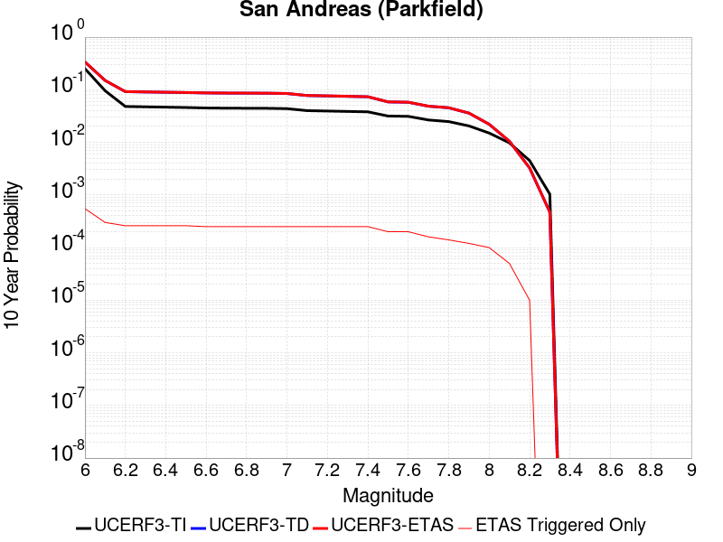 |

| Magnitude | 1 wk TI Prob | 1 wk TD Prob | 1 wk ETAS Prob | 1 wk ETAS/TD Gain | 1 wk ETAS Triggered Only | 1 mo TI Prob | 1 mo TD Prob | 1 mo ETAS Prob | 1 mo ETAS/TD Gain | 1 mo ETAS Triggered Only | 1 yr TI Prob | 1 yr TD Prob | 1 yr ETAS Prob | 1 yr ETAS/TD Gain | 1 yr ETAS Triggered Only | 10 yr TI Prob | 10 yr TD Prob | 10 yr ETAS Prob | 10 yr ETAS/TD Gain | 10 yr ETAS Triggered Only |
|-----|-----|-----|-----|-----|-----|-----|-----|-----|-----|-----|-----|-----|-----|-----|-----|-----|-----|-----|-----|-----|
| 6.0 | 5.556969E-4 | 7.7782426E-4 | 0.0010206781 | 1.312222 | 2.430429E-4 | 0.0023793848 | 0.0033298214 | 0.0036931718 | 1.1091201 | 3.6456436E-4 | 0.028586963 | 0.040191233 | 0.04077442 | 1.0145103 | 6.0760725E-4 | 0.25176284 | 0.33716413 | 0.33756688 | 1.0011945 | 6.0760725E-4 |
| 6.1 | 1.925858E-4 | 3.0276453E-4 | 4.2424919E-4 | 1.4012513 | 1.2152145E-4 | 8.2510663E-4 | 0.0012970108 | 0.0014183746 | 1.0935719 | 1.2152145E-4 | 0.0099994885 | 0.015778083 | 0.016017292 | 1.0151608 | 2.430429E-4 | 0.095613256 | 0.1497237 | 0.14993034 | 1.0013802 | 2.430429E-4 |
| 6.2 | 9.4306815E-5 | 1.8242796E-4 | 1.8242796E-4 | 1.0 | 0.0 | 4.0410945E-4 | 7.816011E-4 | 7.816011E-4 | 1.0 | 0.0 | 0.0049089384 | 0.009474681 | 0.0095950505 | 1.0127044 | 1.2152145E-4 | 0.048019063 | 0.09185409 | 0.091964446 | 1.0012015 | 1.2152145E-4 |
| 6.3 | 9.283051E-5 | 1.7939322E-4 | 1.7939322E-4 | 1.0 | 0.0 | 3.9778434E-4 | 7.686027E-4 | 7.686027E-4 | 1.0 | 0.0 | 0.0048322747 | 0.009317789 | 0.0094381785 | 1.0129204 | 1.2152145E-4 | 0.047285385 | 0.09050704 | 0.09061756 | 1.0012212 | 1.2152145E-4 |
| 6.4 | 9.138826E-5 | 1.770153E-4 | 1.770153E-4 | 1.0 | 0.0 | 3.916052E-4 | 7.5841765E-4 | 7.5841765E-4 | 1.0 | 0.0 | 0.0047573745 | 0.00919484 | 0.009315244 | 1.0130948 | 1.2152145E-4 | 0.046568092 | 0.08940927 | 0.08951993 | 1.0012376 | 1.2152145E-4 |
| 6.5 | 9.000255E-5 | 1.7459576E-4 | 1.7459576E-4 | 1.0 | 0.0 | 3.8566816E-4 | 7.480541E-4 | 7.480541E-4 | 1.0 | 0.0 | 0.0046854047 | 0.009069731 | 0.0091901515 | 1.013277 | 1.2152145E-4 | 0.045878403 | 0.088295065 | 0.088405855 | 1.0012548 | 1.2152145E-4 |
| 6.6 | 8.8109264E-5 | 1.7140752E-4 | 1.7140752E-4 | 1.0 | 0.0 | 3.7755648E-4 | 7.3439797E-4 | 7.3439797E-4 | 1.0 | 0.0 | 0.0045870654 | 0.008904854 | 0.009025293 | 1.0135251 | 1.2152145E-4 | 0.04493529 | 0.0868267 | 0.086937666 | 1.001278 | 1.2152145E-4 |
| 6.7 | 8.738073E-5 | 1.7007832E-4 | 1.7007832E-4 | 1.0 | 0.0 | 3.7443507E-4 | 7.287046E-4 | 7.287046E-4 | 1.0 | 0.0 | 0.0045492216 | 0.008836143 | 0.008956591 | 1.0136312 | 1.2152145E-4 | 0.04457213 | 0.08622707 | 0.08633811 | 1.0012878 | 1.2152145E-4 |
| 6.8 | 8.710195E-5 | 1.6953335E-4 | 1.6953335E-4 | 1.0 | 0.0 | 3.7324068E-4 | 7.263703E-4 | 7.263703E-4 | 1.0 | 0.0 | 0.0045347405 | 0.008807961 | 0.008928412 | 1.0136752 | 1.2152145E-4 | 0.04443313 | 0.08597467 | 0.086085744 | 1.001292 | 1.2152145E-4 |
| 6.9 | 8.6801556E-5 | 1.689429E-4 | 1.689429E-4 | 1.0 | 0.0 | 3.7195362E-4 | 7.2384125E-4 | 7.2384125E-4 | 1.0 | 0.0 | 0.0045191357 | 0.008777418 | 0.008897873 | 1.0137233 | 1.2152145E-4 | 0.044283327 | 0.085700735 | 0.08581184 | 1.0012964 | 1.2152145E-4 |
| 7.0 | 8.5571606E-5 | 1.6647128E-4 | 1.6647128E-4 | 1.0 | 0.0 | 3.6668387E-4 | 7.132544E-4 | 7.132544E-4 | 1.0 | 0.0 | 0.004455241 | 0.008649553 | 0.0087700235 | 1.0139279 | 1.2152145E-4 | 0.043669727 | 0.08454914 | 0.08466039 | 1.0013157 | 1.2152145E-4 |
| 7.1 | 7.82589E-5 | 1.5128135E-4 | 1.5128135E-4 | 1.0 | 0.0 | 3.3535215E-4 | 6.481883E-4 | 6.481883E-4 | 1.0 | 0.0 | 0.0040752706 | 0.007863307 | 0.007983873 | 1.0153327 | 1.2152145E-4 | 0.040013418 | 0.07746111 | 0.07757322 | 1.0014473 | 1.2152145E-4 |
| 7.2 | 7.690929E-5 | 1.4865391E-4 | 1.4865391E-4 | 1.0 | 0.0 | 3.2956956E-4 | 6.369334E-4 | 6.369334E-4 | 1.0 | 0.0 | 0.004005129 | 0.007727258 | 0.00784784 | 1.0156049 | 1.2152145E-4 | 0.0393371 | 0.07623427 | 0.07634653 | 1.0014725 | 1.2152145E-4 |
| 7.3 | 7.5543794E-5 | 1.4561978E-4 | 1.4561978E-4 | 1.0 | 0.0 | 3.2371894E-4 | 6.2393624E-4 | 6.2393624E-4 | 1.0 | 0.0 | 0.003934157 | 0.007570127 | 0.0076907286 | 1.0159312 | 1.2152145E-4 | 0.038652334 | 0.074797355 | 0.074909784 | 1.0015031 | 1.2152145E-4 |
| 7.4 | 7.4214564E-5 | 1.4262961E-4 | 1.4262961E-4 | 1.0 | 0.0 | 3.1802364E-4 | 6.111273E-4 | 6.111273E-4 | 1.0 | 0.0 | 0.003865065 | 0.00741525 | 0.00753587 | 1.0162665 | 1.2152145E-4 | 0.03798529 | 0.07337123 | 0.07348384 | 1.0015347 | 1.2152145E-4 |
| 7.5 | 6.149578E-5 | 1.11907226E-4 | 1.11907226E-4 | 1.0 | 0.0 | 2.6352672E-4 | 4.7951436E-4 | 4.7951436E-4 | 1.0 | 0.0 | 0.0032037178 | 0.0058224914 | 0.0059433053 | 1.0207496 | 1.2152145E-4 | 0.03157923 | 0.058557566 | 0.05867197 | 1.0019537 | 1.2152145E-4 |
| 7.6 | 6.0643448E-5 | 1.10193796E-4 | 1.10193796E-4 | 1.0 | 0.0 | 2.598746E-4 | 4.7217376E-4 | 4.7217376E-4 | 1.0 | 0.0 | 0.0031593828 | 0.0057335934 | 0.0058544185 | 1.0210731 | 1.2152145E-4 | 0.031148417 | 0.057718582 | 0.057833087 | 1.0019839 | 1.2152145E-4 |
| 7.7 | 5.1652263E-5 | 9.174698E-5 | 9.174698E-5 | 1.0 | 0.0 | 2.2134806E-4 | 3.931421E-4 | 3.931421E-4 | 1.0 | 0.0 | 0.002691582 | 0.0047760103 | 0.0047760103 | 1.0 | 0.0 | 0.026592141 | 0.04853623 | 0.04853623 | 1.0 | 0.0 |
| 7.8 | 4.8090482E-5 | 8.559635E-5 | 8.559635E-5 | 1.0 | 0.0 | 2.060858E-4 | 3.6678996E-4 | 3.6678996E-4 | 1.0 | 0.0 | 0.0025062072 | 0.0044565317 | 0.0044565317 | 1.0 | 0.0 | 0.024781305 | 0.04530245 | 0.04530245 | 1.0 | 0.0 |
| 7.9 | 3.970278E-5 | 6.750426E-5 | 6.750426E-5 | 1.0 | 0.0 | 1.7014367E-4 | 2.892719E-4 | 2.892719E-4 | 1.0 | 0.0 | 0.002069531 | 0.0035162016 | 0.0035162016 | 1.0 | 0.0 | 0.020503636 | 0.035881363 | 0.035881363 | 1.0 | 0.0 |
| 8.0 | 2.8982335E-5 | 4.069796E-5 | 4.069796E-5 | 1.0 | 0.0 | 1.2420409E-4 | 1.7440817E-4 | 1.7440817E-4 | 1.0 | 0.0 | 0.0015111357 | 0.0021213528 | 0.0021213528 | 1.0 | 0.0 | 0.015009012 | 0.022010697 | 0.022010697 | 1.0 | 0.0 |
| 8.1 | 1.8836186E-5 | 1.8681134E-5 | 1.8681134E-5 | 1.0 | 0.0 | 8.0724014E-5 | 8.005955E-5 | 8.005955E-5 | 1.0 | 0.0 | 9.823717E-4 | 9.742898E-4 | 9.742898E-4 | 1.0 | 0.0 | 0.009780403 | 0.010488115 | 0.010488115 | 1.0 | 0.0 |
| 8.2 | 8.643924E-6 | 5.4748625E-6 | 5.4748625E-6 | 1.0 | 0.0 | 3.704486E-5 | 2.3463486E-5 | 2.3463486E-5 | 1.0 | 0.0 | 4.5092785E-4 | 2.8563058E-4 | 2.8563058E-4 | 1.0 | 0.0 | 0.0045001395 | 0.0032487072 | 0.0032487072 | 1.0 | 0.0 |
| 8.3 | 1.983087E-6 | 7.6599065E-7 | 7.6599065E-7 | 1.0 | 0.0 | 8.498917E-6 | 3.282813E-6 | 3.282813E-6 | 1.0 | 0.0 | 1.034694E-4 | 3.9967534E-5 | 3.9967534E-5 | 1.0 | 0.0 | 0.0010342124 | 4.719687E-4 | 4.719687E-4 | 1.0 | 0.0 |

## Death Valley (Fish Lake Valley)
*[(top)](#table-of-contents)*

| 1 Week | 1 Month | 1 Year | 10 Year |
|-----|-----|-----|-----|
|  |  | 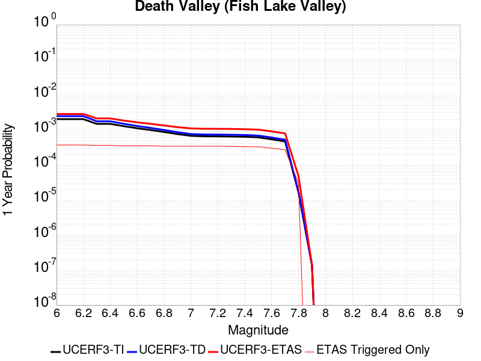 |  |

| Magnitude | 1 wk TI Prob | 1 wk TD Prob | 1 wk ETAS Prob | 1 wk ETAS/TD Gain | 1 wk ETAS Triggered Only | 1 mo TI Prob | 1 mo TD Prob | 1 mo ETAS Prob | 1 mo ETAS/TD Gain | 1 mo ETAS Triggered Only | 1 yr TI Prob | 1 yr TD Prob | 1 yr ETAS Prob | 1 yr ETAS/TD Gain | 1 yr ETAS Triggered Only | 10 yr TI Prob | 10 yr TD Prob | 10 yr ETAS Prob | 10 yr ETAS/TD Gain | 10 yr ETAS Triggered Only |
|-----|-----|-----|-----|-----|-----|-----|-----|-----|-----|-----|-----|-----|-----|-----|-----|-----|-----|-----|-----|-----|
| 6.0 | 3.872328E-5 | 4.7267473E-5 | 1.6878318E-4 | 3.5708103 | 1.2152145E-4 | 1.6594635E-4 | 2.0256084E-4 | 5.6705135E-4 | 2.7994125 | 3.6456436E-4 | 0.0020185246 | 0.002463534 | 0.0029484222 | 1.1968263 | 4.860858E-4 | 0.02000288 | 0.024388181 | 0.02498097 | 1.0243064 | 6.0760725E-4 |
| 6.1 | 3.872328E-5 | 4.7267473E-5 | 1.6878318E-4 | 3.5708103 | 1.2152145E-4 | 1.6594635E-4 | 2.0256084E-4 | 5.6705135E-4 | 2.7994125 | 3.6456436E-4 | 0.0020185246 | 0.002463534 | 0.0029484222 | 1.1968263 | 4.860858E-4 | 0.02000288 | 0.024388181 | 0.02498097 | 1.0243064 | 6.0760725E-4 |
| 6.2 | 3.872328E-5 | 4.7267473E-5 | 1.6878318E-4 | 3.5708103 | 1.2152145E-4 | 1.6594635E-4 | 2.0256084E-4 | 5.6705135E-4 | 2.7994125 | 3.6456436E-4 | 0.0020185246 | 0.002463534 | 0.0029484222 | 1.1968263 | 4.860858E-4 | 0.02000288 | 0.024388181 | 0.02498097 | 1.0243064 | 6.0760725E-4 |
| 6.3 | 2.8356371E-5 | 3.3609853E-5 | 1.5512721E-4 | 4.615528 | 1.2152145E-4 | 1.2152165E-4 | 1.4403471E-4 | 5.0854654E-4 | 3.5307221 | 3.6456436E-4 | 0.0014785219 | 0.0017522911 | 0.002237525 | 1.276914 | 4.860858E-4 | 0.014687235 | 0.017391782 | 0.017988821 | 1.0343288 | 6.0760725E-4 |
| 6.4 | 2.8356371E-5 | 3.3609853E-5 | 1.5512721E-4 | 4.615528 | 1.2152145E-4 | 1.2152165E-4 | 1.4403471E-4 | 5.0854654E-4 | 3.5307221 | 3.6456436E-4 | 0.0014785219 | 0.0017522911 | 0.002237525 | 1.276914 | 4.860858E-4 | 0.014687235 | 0.017391782 | 0.017988821 | 1.0343288 | 6.0760725E-4 |
| 6.5 | 2.4448687E-5 | 2.8607552E-5 | 1.5012552E-4 | 5.2477584 | 1.2152145E-4 | 1.0477588E-4 | 1.2259831E-4 | 4.8711797E-4 | 3.9732842 | 3.6456436E-4 | 0.0012748998 | 0.0014916632 | 0.001977024 | 1.3253822 | 4.860858E-4 | 0.012676105 | 0.014821377 | 0.015419979 | 1.0403877 | 6.0760725E-4 |
| 6.6 | 2.1298161E-5 | 2.4660083E-5 | 1.4617853E-4 | 5.9277387 | 1.2152145E-4 | 9.127464E-5 | 1.0568198E-4 | 4.702078E-4 | 4.449271 | 3.6456436E-4 | 0.0011107022 | 0.0012859525 | 0.0017714133 | 1.3775105 | 4.860858E-4 | 0.011051672 | 0.012788526 | 0.013388362 | 1.0469043 | 6.0760725E-4 |
| 6.7 | 1.8959729E-5 | 2.1781025E-5 | 1.4329983E-4 | 6.579113 | 1.2152145E-4 | 8.125345E-5 | 9.334405E-5 | 4.5787438E-4 | 4.9052334 | 3.6456436E-4 | 9.888117E-4 | 0.001135897 | 0.0016214306 | 1.4274452 | 4.860858E-4 | 0.009844234 | 0.01130357 | 0.011904309 | 1.053146 | 6.0760725E-4 |
| 6.8 | 1.6691629E-5 | 1.9018353E-5 | 1.405375E-4 | 7.3895726 | 1.2152145E-4 | 7.153359E-5 | 8.150477E-5 | 4.460394E-4 | 5.4725556 | 3.6456436E-4 | 8.7057345E-4 | 9.918857E-4 | 0.0014774894 | 1.4895762 | 4.860858E-4 | 0.008671708 | 0.009876343 | 0.01047795 | 1.0609139 | 6.0760725E-4 |
| 6.9 | 1.450505E-5 | 1.638954E-5 | 1.37909E-4 | 8.414452 | 1.2152145E-4 | 6.216302E-5 | 7.0239046E-5 | 4.347778E-4 | 6.189973 | 3.6456436E-4 | 7.5657194E-4 | 8.5483363E-4 | 0.0013405039 | 1.568146 | 4.860858E-4 | 0.007540013 | 0.008516385 | 0.009118819 | 1.0707381 | 6.0760725E-4 |
| 7.0 | 1.2940855E-5 | 1.4537972E-5 | 1.3605766E-4 | 9.358778 | 1.2152145E-4 | 5.545963E-5 | 6.230414E-5 | 4.2684577E-4 | 6.8510017 | 3.6456436E-4 | 6.750118E-4 | 7.5829466E-4 | 0.0012440119 | 1.6405388 | 4.860858E-4 | 0.006729651 | 0.0075576897 | 0.008160705 | 1.0797883 | 6.0760725E-4 |
| 7.1 | 1.2544658E-5 | 1.4078208E-5 | 1.3559795E-4 | 9.631762 | 1.2152145E-4 | 5.3761712E-5 | 6.0333812E-5 | 4.2487617E-4 | 7.0420904 | 3.6456436E-4 | 6.5435225E-4 | 7.343222E-4 | 0.0012200511 | 1.6614655 | 4.860858E-4 | 0.006524288 | 0.007319551 | 0.007922711 | 1.0824039 | 6.0760725E-4 |
| 7.2 | 1.2489416E-5 | 1.4015674E-5 | 1.3553542E-4 | 9.670275 | 1.2152145E-4 | 5.3524967E-5 | 6.0065824E-5 | 4.2460827E-4 | 7.0690494 | 3.6456436E-4 | 6.514716E-4 | 7.310616E-4 | 0.001216792 | 1.6644179 | 4.860858E-4 | 0.006495651 | 0.0072871596 | 0.007890339 | 1.082773 | 6.0760725E-4 |
| 7.3 | 1.2368307E-5 | 1.3879812E-5 | 1.3539958E-4 | 9.755144 | 1.2152145E-4 | 5.3005948E-5 | 5.9483587E-5 | 4.2402625E-4 | 7.128458 | 3.6456436E-4 | 6.451563E-4 | 7.2397763E-4 | 0.0012097115 | 1.670924 | 4.860858E-4 | 0.0064328653 | 0.007216782 | 0.007820004 | 1.0835861 | 6.0760725E-4 |
| 7.4 | 1.2161707E-5 | 1.36478675E-5 | 1.3516766E-4 | 9.903939 | 1.2152145E-4 | 5.212056E-5 | 5.8489582E-5 | 4.2303262E-4 | 7.2326145 | 3.6456436E-4 | 6.3438306E-4 | 7.118836E-4 | 0.0011976233 | 1.6823304 | 4.860858E-4 | 0.006325751 | 0.0070966207 | 0.0076999157 | 1.0850116 | 6.0760725E-4 |
| 7.5 | 1.1707948E-5 | 1.3145515E-5 | 1.3466536E-4 | 10.244206 | 1.2152145E-4 | 5.0175953E-5 | 5.6336736E-5 | 4.2088053E-4 | 7.470801 | 3.6456436E-4 | 6.10721E-4 | 6.856895E-4 | 0.001171442 | 1.7084147 | 4.860858E-4 | 0.0060904534 | 0.006836321 | 0.0074397745 | 1.0882716 | 6.0760725E-4 |
| 7.6 | 1.0319538E-5 | 1.1579622E-5 | 1.3309966E-4 | 11.494301 | 1.2152145E-4 | 4.4225842E-5 | 4.9626036E-5 | 2.9265688E-4 | 5.8972445 | 2.430429E-4 | 5.383166E-4 | 6.040347E-4 | 8.469308E-4 | 1.4021227 | 2.430429E-4 | 0.0053701443 | 0.0060244603 | 0.0063868286 | 1.0601494 | 3.6456436E-4 |
| 7.7 | 8.937764E-6 | 1.0022779E-5 | 1.3154301E-4 | 13.124405 | 1.2152145E-4 | 3.830414E-5 | 4.295409E-5 | 2.8598655E-4 | 6.6579585 | 2.430429E-4 | 4.6625308E-4 | 5.228456E-4 | 7.657614E-4 | 1.4646034 | 2.430429E-4 | 0.0046527605 | 0.005216664 | 0.005579327 | 1.06952 | 3.6456436E-4 |
| 7.8 | 3.108007E-7 | 3.284654E-7 | 3.284654E-7 | 1.0 | 0.0 | 1.3320023E-6 | 1.407708E-6 | 1.407708E-6 | 1.0 | 0.0 | 1.6217007E-5 | 1.7138715E-5 | 1.7138715E-5 | 1.0 | 0.0 | 1.6215823E-4 | 1.7137431E-4 | 1.7137431E-4 | 1.0 | 0.0 |
| 7.9 | 2.5591178E-9 | 2.6696718E-9 | 2.6696718E-9 | 1.0 | 0.0 | 1.0967647E-8 | 1.14414505E-8 | 1.14414505E-8 | 1.0 | 0.0 | 1.335311E-7 | 1.3929966E-7 | 1.3929966E-7 | 1.0 | 0.0 | 1.3353102E-6 | 1.3929966E-6 | 1.3929966E-6 | 1.0 | 0.0 |

## San Andreas (Big Bend)
*[(top)](#table-of-contents)*

| 1 Week | 1 Month | 1 Year | 10 Year |
|-----|-----|-----|-----|
|  |  |  |  |

| Magnitude | 1 wk TI Prob | 1 wk TD Prob | 1 wk ETAS Prob | 1 wk ETAS/TD Gain | 1 wk ETAS Triggered Only | 1 mo TI Prob | 1 mo TD Prob | 1 mo ETAS Prob | 1 mo ETAS/TD Gain | 1 mo ETAS Triggered Only | 1 yr TI Prob | 1 yr TD Prob | 1 yr ETAS Prob | 1 yr ETAS/TD Gain | 1 yr ETAS Triggered Only | 10 yr TI Prob | 10 yr TD Prob | 10 yr ETAS Prob | 10 yr ETAS/TD Gain | 10 yr ETAS Triggered Only |
|-----|-----|-----|-----|-----|-----|-----|-----|-----|-----|-----|-----|-----|-----|-----|-----|-----|-----|-----|-----|-----|
| 6.0 | 1.0179969E-4 | 2.0072258E-4 | 4.437167E-4 | 2.2105968 | 2.430429E-4 | 4.362114E-4 | 8.599571E-4 | 0.0013456249 | 1.5647582 | 4.860858E-4 | 0.0052979486 | 0.010419999 | 0.011021275 | 1.0577041 | 6.0760725E-4 | 0.051734097 | 0.10144902 | 0.10199499 | 1.0053817 | 6.0760725E-4 |
| 6.1 | 1.0179969E-4 | 2.0072258E-4 | 4.437167E-4 | 2.2105968 | 2.430429E-4 | 4.362114E-4 | 8.599571E-4 | 0.0013456249 | 1.5647582 | 4.860858E-4 | 0.0052979486 | 0.010419999 | 0.011021275 | 1.0577041 | 6.0760725E-4 | 0.051734097 | 0.10144902 | 0.10199499 | 1.0053817 | 6.0760725E-4 |
| 6.2 | 1.0179969E-4 | 2.0072258E-4 | 4.437167E-4 | 2.2105968 | 2.430429E-4 | 4.362114E-4 | 8.599571E-4 | 0.0013456249 | 1.5647582 | 4.860858E-4 | 0.0052979486 | 0.010419999 | 0.011021275 | 1.0577041 | 6.0760725E-4 | 0.051734097 | 0.10144902 | 0.10199499 | 1.0053817 | 6.0760725E-4 |
| 6.3 | 1.0179969E-4 | 2.0072258E-4 | 4.437167E-4 | 2.2105968 | 2.430429E-4 | 4.362114E-4 | 8.599571E-4 | 0.0013456249 | 1.5647582 | 4.860858E-4 | 0.0052979486 | 0.010419999 | 0.011021275 | 1.0577041 | 6.0760725E-4 | 0.051734097 | 0.10144902 | 0.10199499 | 1.0053817 | 6.0760725E-4 |
| 6.4 | 9.1639464E-5 | 1.8429532E-4 | 4.2729342E-4 | 2.3185256 | 2.430429E-4 | 3.9268145E-4 | 7.895982E-4 | 0.0012753002 | 1.6151254 | 4.860858E-4 | 0.0047704205 | 0.009571102 | 0.010172894 | 1.0628759 | 6.0760725E-4 | 0.046693064 | 0.09377527 | 0.0943259 | 1.0058718 | 6.0760725E-4 |
| 6.5 | 9.1639464E-5 | 1.8429532E-4 | 4.2729342E-4 | 2.3185256 | 2.430429E-4 | 3.9268145E-4 | 7.895982E-4 | 0.0012753002 | 1.6151254 | 4.860858E-4 | 0.0047704205 | 0.009571102 | 0.010172894 | 1.0628759 | 6.0760725E-4 | 0.046693064 | 0.09377527 | 0.0943259 | 1.0058718 | 6.0760725E-4 |
| 6.6 | 9.042622E-5 | 1.823659E-4 | 4.2536447E-4 | 2.332478 | 2.430429E-4 | 3.8748336E-4 | 7.8133424E-4 | 0.0011456137 | 1.4662275 | 3.6456436E-4 | 0.0047074095 | 0.009471365 | 0.009952847 | 1.0508355 | 4.860858E-4 | 0.046089325 | 0.092869274 | 0.09331022 | 1.004748 | 4.860858E-4 |
| 6.7 | 8.9836685E-5 | 1.8150927E-4 | 4.2450803E-4 | 2.338768 | 2.430429E-4 | 3.8495753E-4 | 7.776651E-4 | 0.001141946 | 1.468429 | 3.6456436E-4 | 0.00467679 | 0.00942708 | 0.009908584 | 1.0510767 | 4.860858E-4 | 0.045795817 | 0.09246355 | 0.09290469 | 1.004771 | 4.860858E-4 |
| 6.8 | 8.9471854E-5 | 1.8097709E-4 | 4.2397602E-4 | 2.3427055 | 2.430429E-4 | 3.8339442E-4 | 7.7538576E-4 | 0.0011396675 | 1.469807 | 3.6456436E-4 | 0.004657841 | 0.009399569 | 0.009881086 | 1.0512276 | 4.860858E-4 | 0.04561414 | 0.092210755 | 0.09265202 | 1.0047854 | 4.860858E-4 |
| 6.9 | 8.858234E-5 | 1.7979681E-4 | 3.0129642E-4 | 1.6757606 | 1.2152145E-4 | 3.7958333E-4 | 7.703304E-4 | 0.0010131861 | 1.3152617 | 2.430429E-4 | 0.004611638 | 0.009338548 | 0.009699709 | 1.0386741 | 3.6456436E-4 | 0.04517103 | 0.09165087 | 0.09198202 | 1.0036132 | 3.6456436E-4 |
| 7.0 | 8.7433385E-5 | 1.7818481E-4 | 2.9968462E-4 | 1.6818751 | 1.2152145E-4 | 3.746607E-4 | 7.634259E-4 | 0.0010062832 | 1.3181151 | 2.430429E-4 | 0.004551957 | 0.009255203 | 0.009616394 | 1.0390257 | 3.6456436E-4 | 0.044598386 | 0.09088532 | 0.09121675 | 1.0036467 | 3.6456436E-4 |
| 7.1 | 8.684964E-5 | 1.7730435E-4 | 2.9880425E-4 | 1.6852618 | 1.2152145E-4 | 3.7215967E-4 | 7.596547E-4 | 0.001002513 | 1.3196956 | 2.430429E-4 | 0.0045216335 | 0.009209678 | 0.0095708845 | 1.0392203 | 3.6456436E-4 | 0.04430731 | 0.09046686 | 0.090798445 | 1.0036652 | 3.6456436E-4 |
| 7.2 | 8.606521E-5 | 1.762105E-4 | 2.9771053E-4 | 1.6895164 | 1.2152145E-4 | 3.6879873E-4 | 7.549695E-4 | 8.763992E-4 | 1.1608405 | 1.2152145E-4 | 0.0044808835 | 0.0091531165 | 0.009393934 | 1.02631 | 2.430429E-4 | 0.043916024 | 0.089947365 | 0.09016855 | 1.002459 | 2.430429E-4 |
| 7.3 | 8.568266E-5 | 1.7563057E-4 | 2.9713067E-4 | 1.6917937 | 1.2152145E-4 | 3.6715972E-4 | 7.524855E-4 | 8.739155E-4 | 1.161372 | 1.2152145E-4 | 0.0044610105 | 0.009123127 | 0.009363953 | 1.0263972 | 2.430429E-4 | 0.043725148 | 0.08966853 | 0.08988978 | 1.0024674 | 2.430429E-4 |
| 7.4 | 8.5432206E-5 | 1.7525644E-4 | 2.967566E-4 | 1.6932707 | 1.2152145E-4 | 3.6608664E-4 | 7.50883E-4 | 8.723132E-4 | 1.1617166 | 1.2152145E-4 | 0.004447999 | 0.009103781 | 0.00934461 | 1.0264539 | 2.430429E-4 | 0.043600157 | 0.08948871 | 0.089710005 | 1.0024729 | 2.430429E-4 |
| 7.5 | 8.4791965E-5 | 1.7394972E-4 | 2.9545004E-4 | 1.6984794 | 1.2152145E-4 | 3.633435E-4 | 7.4528606E-4 | 8.667169E-4 | 1.1629319 | 1.2152145E-4 | 0.0044147377 | 0.009036204 | 0.009277051 | 1.0266535 | 2.430429E-4 | 0.043280575 | 0.088866346 | 0.08908779 | 1.0024918 | 2.430429E-4 |
| 7.6 | 8.241105E-5 | 1.6840403E-4 | 2.8990503E-4 | 1.721485 | 1.2152145E-4 | 3.531424E-4 | 7.215321E-4 | 8.429659E-4 | 1.1682999 | 1.2152145E-4 | 0.0042910352 | 0.008749358 | 0.008990275 | 1.0275353 | 2.430429E-4 | 0.042091176 | 0.086243294 | 0.08646537 | 1.002575 | 2.430429E-4 |
| 7.7 | 7.00432E-5 | 1.42045E-4 | 2.6354918E-4 | 1.8553922 | 1.2152145E-4 | 3.001506E-4 | 6.0862233E-4 | 7.300698E-4 | 1.1995449 | 1.2152145E-4 | 0.0036482112 | 0.0073848404 | 0.0075054644 | 1.016334 | 1.2152145E-4 | 0.035888977 | 0.07351733 | 0.073629916 | 1.0015315 | 1.2152145E-4 |
| 7.8 | 6.415362E-5 | 1.2968935E-4 | 1.2968935E-4 | 1.0 | 0.0 | 2.749151E-4 | 5.556931E-4 | 5.556931E-4 | 1.0 | 0.0 | 0.0033419547 | 0.0067446055 | 0.0067446055 | 1.0 | 0.0 | 0.03292141 | 0.06725231 | 0.06725231 | 1.0 | 0.0 |
| 7.9 | 4.939911E-5 | 9.3411545E-5 | 9.3411545E-5 | 1.0 | 0.0 | 2.116933E-4 | 4.0027377E-4 | 4.0027377E-4 | 1.0 | 0.0 | 0.0025743195 | 0.004862453 | 0.004862453 | 1.0 | 0.0 | 0.025447013 | 0.048914436 | 0.048914436 | 1.0 | 0.0 |
| 8.0 | 3.344983E-5 | 5.222685E-5 | 5.222685E-5 | 1.0 | 0.0 | 1.4334853E-4 | 2.2381016E-4 | 2.2381016E-4 | 1.0 | 0.0 | 0.0017438711 | 0.0027214854 | 0.0027214854 | 1.0 | 0.0 | 0.017302496 | 0.027922187 | 0.027922187 | 1.0 | 0.0 |
| 8.1 | 1.9104898E-5 | 1.9173063E-5 | 1.9173063E-5 | 1.0 | 0.0 | 8.1875565E-5 | 8.216769E-5 | 8.216769E-5 | 1.0 | 0.0 | 9.963791E-4 | 9.999331E-4 | 9.999331E-4 | 1.0 | 0.0 | 0.009919235 | 0.010749801 | 0.010749801 | 1.0 | 0.0 |
| 8.2 | 8.643924E-6 | 5.4748625E-6 | 5.4748625E-6 | 1.0 | 0.0 | 3.704486E-5 | 2.3463486E-5 | 2.3463486E-5 | 1.0 | 0.0 | 4.5092785E-4 | 2.8563058E-4 | 2.8563058E-4 | 1.0 | 0.0 | 0.0045001395 | 0.0032487072 | 0.0032487072 | 1.0 | 0.0 |
| 8.3 | 1.983087E-6 | 7.6599065E-7 | 7.6599065E-7 | 1.0 | 0.0 | 8.498917E-6 | 3.282813E-6 | 3.282813E-6 | 1.0 | 0.0 | 1.034694E-4 | 3.9967534E-5 | 3.9967534E-5 | 1.0 | 0.0 | 0.0010342124 | 4.719687E-4 | 4.719687E-4 | 1.0 | 0.0 |

## Santa Ynez (West)
*[(top)](#table-of-contents)*

| 1 Week | 1 Month | 1 Year | 10 Year |
|-----|-----|-----|-----|
|  |  |  |  |

| Magnitude | 1 wk TI Prob | 1 wk TD Prob | 1 wk ETAS Prob | 1 wk ETAS/TD Gain | 1 wk ETAS Triggered Only | 1 mo TI Prob | 1 mo TD Prob | 1 mo ETAS Prob | 1 mo ETAS/TD Gain | 1 mo ETAS Triggered Only | 1 yr TI Prob | 1 yr TD Prob | 1 yr ETAS Prob | 1 yr ETAS/TD Gain | 1 yr ETAS Triggered Only | 10 yr TI Prob | 10 yr TD Prob | 10 yr ETAS Prob | 10 yr ETAS/TD Gain | 10 yr ETAS Triggered Only |
|-----|-----|-----|-----|-----|-----|-----|-----|-----|-----|-----|-----|-----|-----|-----|-----|-----|-----|-----|-----|-----|
| 6.0 | 4.7352758E-5 | 5.4972126E-5 | 1.764869E-4 | 3.2104797 | 1.2152145E-4 | 2.0292461E-4 | 2.3557522E-4 | 4.7856086E-4 | 2.0314567 | 2.430429E-4 | 0.0024678076 | 0.0028645284 | 0.0032280483 | 1.126904 | 3.6456436E-4 | 0.024405818 | 0.028304417 | 0.028658662 | 1.0125155 | 3.6456436E-4 |
| 6.1 | 4.7352758E-5 | 5.4972126E-5 | 1.764869E-4 | 3.2104797 | 1.2152145E-4 | 2.0292461E-4 | 2.3557522E-4 | 4.7856086E-4 | 2.0314567 | 2.430429E-4 | 0.0024678076 | 0.0028645284 | 0.0032280483 | 1.126904 | 3.6456436E-4 | 0.024405818 | 0.028304417 | 0.028658662 | 1.0125155 | 3.6456436E-4 |
| 6.2 | 3.0415853E-5 | 3.392511E-5 | 1.5544244E-4 | 4.5819287 | 1.2152145E-4 | 1.3034715E-4 | 1.4538545E-4 | 3.88393E-4 | 2.671471 | 2.430429E-4 | 0.0015858212 | 0.0017686661 | 0.0021325857 | 1.2057593 | 3.6456436E-4 | 0.015745522 | 0.017549807 | 0.017907973 | 1.0204085 | 3.6456436E-4 |
| 6.3 | 3.0415853E-5 | 3.392511E-5 | 1.5544244E-4 | 4.5819287 | 1.2152145E-4 | 1.3034715E-4 | 1.4538545E-4 | 3.88393E-4 | 2.671471 | 2.430429E-4 | 0.0015858212 | 0.0017686661 | 0.0021325857 | 1.2057593 | 3.6456436E-4 | 0.015745522 | 0.017549807 | 0.017907973 | 1.0204085 | 3.6456436E-4 |
| 6.4 | 2.5452082E-5 | 2.7912422E-5 | 2.7912422E-5 | 1.0 | 0.0 | 1.09075794E-4 | 1.196193E-4 | 2.4112621E-4 | 2.0157802 | 1.2152145E-4 | 0.0013271887 | 0.0014554089 | 0.0018194426 | 1.2501247 | 3.6456436E-4 | 0.013192902 | 0.014460951 | 0.014820243 | 1.0248457 | 3.6456436E-4 |
| 6.5 | 2.3143784E-5 | 2.5128256E-5 | 2.5128256E-5 | 1.0 | 0.0 | 9.9183875E-5 | 1.0768817E-4 | 2.2919654E-4 | 2.1283352 | 1.2152145E-4 | 0.0012068948 | 0.0013103267 | 0.0016744134 | 1.2778594 | 3.6456436E-4 | 0.012003611 | 0.01302768 | 0.013387495 | 1.0276192 | 3.6456436E-4 |
| 6.6 | 1.9118515E-5 | 2.035434E-5 | 2.035434E-5 | 1.0 | 0.0 | 8.193392E-5 | 8.7230015E-5 | 2.0874086E-4 | 2.3929935 | 1.2152145E-4 | 9.97089E-4 | 0.001061516 | 0.0013043009 | 1.2287153 | 2.430429E-4 | 0.00992627 | 0.010565365 | 0.01080584 | 1.0227607 | 2.430429E-4 |
| 6.7 | 1.722807E-5 | 1.8146347E-5 | 1.8146347E-5 | 1.0 | 0.0 | 7.3832496E-5 | 7.776777E-5 | 7.776777E-5 | 1.0 | 0.0 | 8.985399E-4 | 9.464169E-4 | 0.0010678234 | 1.12828 | 1.2152145E-4 | 0.008949154 | 0.0094245095 | 0.009544886 | 1.0127727 | 1.2152145E-4 |
| 6.8 | 1.5317364E-5 | 1.5926486E-5 | 1.5926486E-5 | 1.0 | 0.0 | 6.56442E-5 | 6.82546E-5 | 6.82546E-5 | 1.0 | 0.0 | 7.98925E-4 | 8.306873E-4 | 9.521078E-4 | 1.1461687 | 1.2152145E-4 | 0.007960589 | 0.00827631 | 0.008396826 | 1.0145615 | 1.2152145E-4 |
| 6.9 | 1.3071226E-5 | 1.3329624E-5 | 1.3329624E-5 | 1.0 | 0.0 | 5.6018336E-5 | 5.7125722E-5 | 5.7125722E-5 | 1.0 | 0.0 | 6.8180985E-4 | 6.9528597E-4 | 8.167229E-4 | 1.1746576 | 1.2152145E-4 | 0.0067972173 | 0.006931367 | 0.0070520462 | 1.0174106 | 1.2152145E-4 |
| 7.0 | 1.1836986E-5 | 1.19327815E-5 | 1.19327815E-5 | 1.0 | 0.0 | 5.0728955E-5 | 5.11395E-5 | 5.11395E-5 | 1.0 | 0.0 | 6.1745E-4 | 6.2244723E-4 | 7.4389303E-4 | 1.1951102 | 1.2152145E-4 | 0.006157372 | 0.006207231 | 0.0063279984 | 1.0194559 | 1.2152145E-4 |
| 7.1 | 1.0597169E-5 | 1.0542201E-5 | 1.0542201E-5 | 1.0 | 0.0 | 4.541565E-5 | 4.5180084E-5 | 4.5180084E-5 | 1.0 | 0.0 | 5.5279525E-4 | 5.4992986E-4 | 6.7138445E-4 | 1.2208548 | 1.2152145E-4 | 0.0055142213 | 0.005485821 | 0.0056066755 | 1.0220304 | 1.2152145E-4 |
| 7.2 | 9.59113E-6 | 9.459144E-6 | 9.459144E-6 | 1.0 | 0.0 | 4.11042E-5 | 4.0538565E-5 | 4.0538565E-5 | 1.0 | 0.0 | 5.0032866E-4 | 4.934463E-4 | 6.149078E-4 | 1.2461493 | 1.2152145E-4 | 0.004992037 | 0.0049236254 | 0.0050445483 | 1.0245597 | 1.2152145E-4 |
| 7.3 | 8.586084E-6 | 8.379583E-6 | 8.379583E-6 | 1.0 | 0.0 | 3.679698E-5 | 3.5912013E-5 | 3.5912013E-5 | 1.0 | 0.0 | 4.4791115E-4 | 4.3714207E-4 | 5.5861037E-4 | 1.2778692 | 1.2152145E-4 | 0.004470094 | 0.004362933 | 0.0044839242 | 1.0277317 | 1.2152145E-4 |
| 7.4 | 7.2622997E-6 | 6.9515427E-6 | 6.9515427E-6 | 1.0 | 0.0 | 3.112377E-5 | 2.979199E-5 | 2.979199E-5 | 1.0 | 0.0 | 3.78866E-4 | 3.626581E-4 | 4.8413547E-4 | 1.3349639 | 1.2152145E-4 | 0.0037822074 | 0.0036207628 | 0.0037418443 | 1.0334408 | 1.2152145E-4 |
| 7.5 | 5.627296E-6 | 5.251588E-6 | 5.251588E-6 | 1.0 | 0.0 | 2.411676E-5 | 2.2506614E-5 | 2.2506614E-5 | 1.0 | 0.0 | 2.9358198E-4 | 2.739843E-4 | 3.9547245E-4 | 1.4434129 | 1.2152145E-4 | 0.0029319443 | 0.002736537 | 0.0028577258 | 1.0442855 | 1.2152145E-4 |
| 7.6 | 2.265244E-6 | 2.0608625E-6 | 2.0608625E-6 | 1.0 | 0.0 | 9.708152E-6 | 8.832238E-6 | 8.832238E-6 | 1.0 | 0.0 | 1.18190335E-4 | 1.0752728E-4 | 1.0752728E-4 | 1.0 | 0.0 | 0.001181275 | 0.0010747612 | 0.0010747612 | 1.0 | 0.0 |
| 7.7 | 1.3099874E-6 | 1.1016252E-6 | 1.1016252E-6 | 1.0 | 0.0 | 5.61422E-6 | 4.7212425E-6 | 4.7212425E-6 | 1.0 | 0.0 | 6.8350986E-5 | 5.7479636E-5 | 5.7479636E-5 | 1.0 | 0.0 | 6.832996E-4 | 5.7465007E-4 | 5.7465007E-4 | 1.0 | 0.0 |
| 7.8 | 7.903951E-7 | 6.0711415E-7 | 6.0711415E-7 | 1.0 | 0.0 | 3.3874032E-6 | 2.6019152E-6 | 2.6019152E-6 | 1.0 | 0.0 | 4.1240855E-5 | 3.167787E-5 | 3.167787E-5 | 1.0 | 0.0 | 4.12332E-4 | 3.167349E-4 | 3.167349E-4 | 1.0 | 0.0 |
| 7.9 | 7.0753297E-9 | 5.0899476E-9 | 5.0899476E-9 | 1.0 | 0.0 | 3.032284E-8 | 2.181406E-8 | 2.181406E-8 | 1.0 | 0.0 | 3.6918053E-7 | 2.6558615E-7 | 2.6558615E-7 | 1.0 | 0.0 | 3.691799E-6 | 2.6558594E-6 | 2.6558594E-6 | 1.0 | 0.0 |

## San Andreas (San Bernardino S)
*[(top)](#table-of-contents)*

| 1 Week | 1 Month | 1 Year | 10 Year |
|-----|-----|-----|-----|
|  |  |  |  |

| Magnitude | 1 wk TI Prob | 1 wk TD Prob | 1 wk ETAS Prob | 1 wk ETAS/TD Gain | 1 wk ETAS Triggered Only | 1 mo TI Prob | 1 mo TD Prob | 1 mo ETAS Prob | 1 mo ETAS/TD Gain | 1 mo ETAS Triggered Only | 1 yr TI Prob | 1 yr TD Prob | 1 yr ETAS Prob | 1 yr ETAS/TD Gain | 1 yr ETAS Triggered Only | 10 yr TI Prob | 10 yr TD Prob | 10 yr ETAS Prob | 10 yr ETAS/TD Gain | 10 yr ETAS Triggered Only |
|-----|-----|-----|-----|-----|-----|-----|-----|-----|-----|-----|-----|-----|-----|-----|-----|-----|-----|-----|-----|-----|
| 6.0 | 1.2336002E-4 | 3.0004102E-4 | 9.0746593E-4 | 3.024473 | 6.0760725E-4 | 5.2857865E-4 | 0.0012852824 | 0.0018921088 | 1.4721346 | 6.0760725E-4 | 0.006416472 | 0.015540994 | 0.016139159 | 1.0384895 | 6.0760725E-4 | 0.06234337 | 0.14283717 | 0.14335799 | 1.0036463 | 6.0760725E-4 |
| 6.1 | 1.2336002E-4 | 3.0004102E-4 | 9.0746593E-4 | 3.024473 | 6.0760725E-4 | 5.2857865E-4 | 0.0012852824 | 0.0018921088 | 1.4721346 | 6.0760725E-4 | 0.006416472 | 0.015540994 | 0.016139159 | 1.0384895 | 6.0760725E-4 | 0.06234337 | 0.14283717 | 0.14335799 | 1.0036463 | 6.0760725E-4 |
| 6.2 | 1.2336002E-4 | 3.0004102E-4 | 9.0746593E-4 | 3.024473 | 6.0760725E-4 | 5.2857865E-4 | 0.0012852824 | 0.0018921088 | 1.4721346 | 6.0760725E-4 | 0.006416472 | 0.015540994 | 0.016139159 | 1.0384895 | 6.0760725E-4 | 0.06234337 | 0.14283717 | 0.14335799 | 1.0036463 | 6.0760725E-4 |
| 6.3 | 1.1712257E-4 | 2.8792414E-4 | 8.953564E-4 | 3.1096957 | 6.0760725E-4 | 5.018573E-4 | 0.0012334028 | 0.0018402606 | 1.4920192 | 6.0760725E-4 | 0.006093008 | 0.014918125 | 0.015516668 | 1.0401219 | 6.0760725E-4 | 0.059286322 | 0.13754563 | 0.13806966 | 1.0038099 | 6.0760725E-4 |
| 6.4 | 1.1712257E-4 | 2.8792414E-4 | 8.953564E-4 | 3.1096957 | 6.0760725E-4 | 5.018573E-4 | 0.0012334028 | 0.0018402606 | 1.4920192 | 6.0760725E-4 | 0.006093008 | 0.014918125 | 0.015516668 | 1.0401219 | 6.0760725E-4 | 0.059286322 | 0.13754563 | 0.13806966 | 1.0038099 | 6.0760725E-4 |
| 6.5 | 1.0689076E-4 | 2.680528E-4 | 8.754972E-4 | 3.2661371 | 6.0760725E-4 | 4.5802278E-4 | 0.0011483167 | 0.0017552262 | 1.5285211 | 6.0760725E-4 | 0.0055621783 | 0.01389575 | 0.014494915 | 1.0431185 | 6.0760725E-4 | 0.05425003 | 0.12879294 | 0.1293223 | 1.0041101 | 6.0760725E-4 |
| 6.6 | 9.7648895E-5 | 2.50501E-4 | 8.5795607E-4 | 3.4249604 | 6.0760725E-4 | 4.1842813E-4 | 0.0010731576 | 0.0016801128 | 1.5655788 | 6.0760725E-4 | 0.005082469 | 0.012991785 | 0.013591498 | 1.0461609 | 6.0760725E-4 | 0.049677886 | 0.12095292 | 0.12148703 | 1.0044159 | 6.0760725E-4 |
| 6.7 | 8.757013E-5 | 2.3120902E-4 | 8.3867577E-4 | 3.627349 | 6.0760725E-4 | 3.7524657E-4 | 9.905418E-4 | 0.0015975472 | 1.6128014 | 6.0760725E-4 | 0.00455906 | 0.011997245 | 0.012597563 | 1.050038 | 6.0760725E-4 | 0.04466656 | 0.11226123 | 0.11280063 | 1.0048048 | 6.0760725E-4 |
| 6.8 | 8.562978E-5 | 2.2680782E-4 | 8.3427725E-4 | 3.6783442 | 6.0760725E-4 | 3.6693315E-4 | 9.7169366E-4 | 0.0015787105 | 1.6246998 | 6.0760725E-4 | 0.004458263 | 0.011770263 | 0.012370719 | 1.0510147 | 6.0760725E-4 | 0.043698758 | 0.11027153 | 0.110812135 | 1.0049025 | 6.0760725E-4 |
| 6.9 | 6.124075E-5 | 1.7065753E-4 | 7.7816105E-4 | 4.559782 | 6.0760725E-4 | 2.6243398E-4 | 7.311852E-4 | 0.0013383481 | 1.8303819 | 6.0760725E-4 | 0.0031904527 | 0.008866051 | 0.0094682705 | 1.0679243 | 6.0760725E-4 | 0.031450346 | 0.08418263 | 0.08473909 | 1.0066102 | 6.0760725E-4 |
| 7.0 | 5.8598747E-5 | 1.649477E-4 | 7.724547E-4 | 4.6830277 | 6.0760725E-4 | 2.5111332E-4 | 7.06728E-4 | 0.0013139058 | 1.8591393 | 6.0760725E-4 | 0.0030530186 | 0.008570663 | 0.009173063 | 1.0702863 | 6.0760725E-4 | 0.03011414 | 0.081500374 | 0.08205846 | 1.0068476 | 6.0760725E-4 |
| 7.1 | 5.613814E-5 | 1.5913323E-4 | 7.666438E-4 | 4.817622 | 6.0760725E-4 | 2.4056983E-4 | 6.818221E-4 | 0.001289015 | 1.8905447 | 6.0760725E-4 | 0.0029250039 | 0.008269769 | 0.008872352 | 1.0728657 | 6.0760725E-4 | 0.028868021 | 0.07879931 | 0.07935904 | 1.0071032 | 6.0760725E-4 |
| 7.2 | 4.991222E-5 | 1.4519796E-4 | 7.5271697E-4 | 5.1840744 | 6.0760725E-4 | 2.1389198E-4 | 6.2212895E-4 | 0.0012293581 | 1.9760505 | 6.0760725E-4 | 0.002601025 | 0.007548217 | 0.008151238 | 1.0798892 | 6.0760725E-4 | 0.025707912 | 0.07225321 | 0.072816916 | 1.0078018 | 6.0760725E-4 |
| 7.3 | 4.7410045E-5 | 1.3714004E-4 | 7.4466394E-4 | 5.429953 | 6.0760725E-4 | 2.0317009E-4 | 5.8761094E-4 | 0.0011948611 | 2.0334222 | 6.0760725E-4 | 0.0024707897 | 0.0071307817 | 0.007734056 | 1.0846014 | 6.0760725E-4 | 0.024434982 | 0.06853558 | 0.06910154 | 1.008258 | 6.0760725E-4 |
| 7.4 | 4.5556746E-5 | 1.3121912E-4 | 7.387466E-4 | 5.6298704 | 6.0760725E-4 | 1.952286E-4 | 5.622468E-4 | 0.0011695124 | 2.0800695 | 6.0760725E-4 | 0.002374317 | 0.0068239477 | 0.007427409 | 1.0884328 | 6.0760725E-4 | 0.023491086 | 0.065788016 | 0.066355646 | 1.0086282 | 6.0760725E-4 |
| 7.5 | 4.3084514E-5 | 1.2357246E-4 | 7.3110464E-4 | 5.916404 | 6.0760725E-4 | 1.8463485E-4 | 5.2948913E-4 | 0.0011367747 | 2.1469274 | 6.0760725E-4 | 0.0022456115 | 0.0064275465 | 0.0070312484 | 1.0939242 | 6.0760725E-4 | 0.022230545 | 0.062188786 | 0.06275861 | 1.0091628 | 6.0760725E-4 |
| 7.6 | 3.408608E-5 | 9.83552E-5 | 7.059027E-4 | 7.1770754 | 6.0760725E-4 | 1.4607502E-4 | 4.214543E-4 | 0.0010288054 | 2.4410844 | 6.0760725E-4 | 0.0017770125 | 0.0051191594 | 0.005723656 | 1.1180851 | 6.0760725E-4 | 0.017628696 | 0.050020292 | 0.050597508 | 1.0115396 | 6.0760725E-4 |
| 7.7 | 2.8315713E-5 | 8.248679E-5 | 5.685325E-4 | 6.8924065 | 4.860858E-4 | 1.2134742E-4 | 3.5346695E-4 | 8.3938095E-4 | 2.3747084 | 4.860858E-4 | 0.0014764034 | 0.0042949775 | 0.0047789756 | 1.1126893 | 4.860858E-4 | 0.01466633 | 0.0422714 | 0.04273694 | 1.011013 | 4.860858E-4 |
| 7.8 | 2.6222975E-5 | 7.463088E-5 | 5.606804E-4 | 7.5127134 | 4.860858E-4 | 1.1237934E-4 | 3.1980744E-4 | 8.057378E-4 | 2.5194466 | 4.860858E-4 | 0.0013673597 | 0.0038867102 | 0.004370907 | 1.1245775 | 4.860858E-4 | 0.013589768 | 0.03843674 | 0.038904145 | 1.0121603 | 4.860858E-4 |
| 7.9 | 2.1469694E-5 | 5.787864E-5 | 4.2242187E-4 | 7.298407 | 3.6456436E-4 | 9.200973E-5 | 2.4802773E-4 | 6.125017E-4 | 2.4694886 | 3.6456436E-4 | 0.0011196428 | 0.0030155594 | 0.0033790243 | 1.1205299 | 3.6456436E-4 | 0.011140184 | 0.030152109 | 0.030505681 | 1.0117263 | 3.6456436E-4 |
| 8.0 | 1.2420249E-5 | 3.131896E-5 | 1.528366E-4 | 4.8800025 | 1.2152145E-4 | 5.322855E-5 | 1.342172E-4 | 2.5572235E-4 | 1.9052873 | 1.2152145E-4 | 6.478649E-4 | 0.0016328706 | 0.0017541937 | 1.0743004 | 1.2152145E-4 | 0.0064597935 | 0.016522504 | 0.016642017 | 1.0072334 | 1.2152145E-4 |
| 8.1 | 4.9197724E-6 | 7.822348E-6 | 7.822348E-6 | 1.0 | 0.0 | 2.1084568E-5 | 3.352392E-5 | 3.352392E-5 | 1.0 | 0.0 | 2.566744E-4 | 4.0807744E-4 | 4.0807744E-4 | 1.0 | 0.0 | 0.002563781 | 0.0043843705 | 0.0043843705 | 1.0 | 0.0 |
| 8.2 | 2.5634774E-6 | 2.9067196E-6 | 2.9067196E-6 | 1.0 | 0.0 | 1.0986286E-5 | 1.2457311E-5 | 1.2457311E-5 | 1.0 | 0.0 | 1.3374983E-4 | 1.5165724E-4 | 1.5165724E-4 | 1.0 | 0.0 | 0.0013366934 | 0.0017049741 | 0.0017049741 | 1.0 | 0.0 |
| 8.3 | 5.2850464E-7 | 3.2088764E-7 | 3.2088764E-7 | 1.0 | 0.0 | 2.2650179E-6 | 1.375232E-6 | 1.375232E-6 | 1.0 | 0.0 | 2.7576245E-5 | 1.6743334E-5 | 1.6743334E-5 | 1.0 | 0.0 | 2.7572823E-4 | 1.9870348E-4 | 1.9870348E-4 | 1.0 | 0.0 |

## White Wolf (Extension)
*[(top)](#table-of-contents)*

| 1 Week | 1 Month | 1 Year | 10 Year |
|-----|-----|-----|-----|
|  |  |  |  |

| Magnitude | 1 wk TI Prob | 1 wk TD Prob | 1 wk ETAS Prob | 1 wk ETAS/TD Gain | 1 wk ETAS Triggered Only | 1 mo TI Prob | 1 mo TD Prob | 1 mo ETAS Prob | 1 mo ETAS/TD Gain | 1 mo ETAS Triggered Only | 1 yr TI Prob | 1 yr TD Prob | 1 yr ETAS Prob | 1 yr ETAS/TD Gain | 1 yr ETAS Triggered Only | 10 yr TI Prob | 10 yr TD Prob | 10 yr ETAS Prob | 10 yr ETAS/TD Gain | 10 yr ETAS Triggered Only |
|-----|-----|-----|-----|-----|-----|-----|-----|-----|-----|-----|-----|-----|-----|-----|-----|-----|-----|-----|-----|-----|
| 6.0 | 8.222555E-6 | 6.0666657E-6 | 3.706288E-4 | 61.09267 | 3.6456436E-4 | 3.5239045E-5 | 2.5999774E-5 | 3.9055463E-4 | 15.021463 | 3.6456436E-4 | 4.289509E-4 | 3.1650788E-4 | 8.024398E-4 | 2.5352917 | 4.860858E-4 | 0.0042812387 | 0.003161223 | 0.003645772 | 1.1532791 | 4.860858E-4 |
| 6.1 | 8.222555E-6 | 6.0666657E-6 | 3.706288E-4 | 61.09267 | 3.6456436E-4 | 3.5239045E-5 | 2.5999774E-5 | 3.9055463E-4 | 15.021463 | 3.6456436E-4 | 4.289509E-4 | 3.1650788E-4 | 8.024398E-4 | 2.5352917 | 4.860858E-4 | 0.0042812387 | 0.003161223 | 0.003645772 | 1.1532791 | 4.860858E-4 |
| 6.2 | 8.222555E-6 | 6.0666657E-6 | 3.706288E-4 | 61.09267 | 3.6456436E-4 | 3.5239045E-5 | 2.5999774E-5 | 3.9055463E-4 | 15.021463 | 3.6456436E-4 | 4.289509E-4 | 3.1650788E-4 | 8.024398E-4 | 2.5352917 | 4.860858E-4 | 0.0042812387 | 0.003161223 | 0.003645772 | 1.1532791 | 4.860858E-4 |
| 6.3 | 8.222555E-6 | 6.0666657E-6 | 3.706288E-4 | 61.09267 | 3.6456436E-4 | 3.5239045E-5 | 2.5999774E-5 | 3.9055463E-4 | 15.021463 | 3.6456436E-4 | 4.289509E-4 | 3.1650788E-4 | 8.024398E-4 | 2.5352917 | 4.860858E-4 | 0.0042812387 | 0.003161223 | 0.003645772 | 1.1532791 | 4.860858E-4 |
| 6.4 | 5.821773E-6 | 3.5571766E-6 | 3.6812024E-4 | 103.48663 | 3.6456436E-4 | 2.4950215E-5 | 1.5244959E-5 | 3.7980374E-4 | 24.913399 | 3.6456436E-4 | 3.0372653E-4 | 1.8559267E-4 | 5.5008935E-4 | 2.9639606 | 3.6456436E-4 | 0.0030331176 | 0.001854485 | 0.0022183734 | 1.1962206 | 3.6456436E-4 |
| 6.5 | 5.766023E-6 | 3.4991106E-6 | 3.6806217E-4 | 105.187355 | 3.6456436E-4 | 2.4711293E-5 | 1.4996108E-5 | 3.79555E-4 | 25.310232 | 3.6456436E-4 | 3.0081844E-4 | 1.8256342E-4 | 5.470612E-4 | 2.9965544 | 3.6456436E-4 | 0.0030041158 | 0.0018242426 | 0.002188142 | 1.1994797 | 3.6456436E-4 |
| 6.6 | 4.643576E-6 | 2.332624E-6 | 3.6689613E-4 | 157.289 | 3.6456436E-4 | 1.9900888E-5 | 9.996925E-6 | 3.7455763E-4 | 37.467285 | 3.6456436E-4 | 2.4226638E-4 | 1.2170619E-4 | 4.8622617E-4 | 3.9950817 | 3.6456436E-4 | 0.0024200242 | 0.0012164378 | 0.0015805586 | 1.2993337 | 3.6456436E-4 |
| 6.7 | 3.9529173E-6 | 1.6483477E-6 | 1.231696E-4 | 74.72306 | 1.2152145E-4 | 1.6940963E-5 | 7.0643296E-6 | 1.2858491E-4 | 18.202 | 1.2152145E-4 | 2.0623671E-4 | 8.6005006E-5 | 2.07516E-4 | 2.4128363 | 1.2152145E-4 | 0.002060454 | 8.597357E-4 | 9.811526E-4 | 1.1412259 | 1.2152145E-4 |
| 6.8 | 3.4377522E-6 | 1.2245237E-6 | 1.2274583E-4 | 100.23965 | 1.2152145E-4 | 1.473314E-5 | 5.2479486E-6 | 1.2676876E-4 | 24.155869 | 1.2152145E-4 | 1.7936122E-4 | 6.3891996E-5 | 1.8540568E-4 | 2.901861 | 1.2152145E-4 | 0.0017921652 | 6.387454E-4 | 7.601892E-4 | 1.1901287 | 1.2152145E-4 |
| 6.9 | 3.1367306E-6 | 1.0033783E-6 | 1.2252471E-4 | 122.11217 | 1.2152145E-4 | 1.3443062E-5 | 4.3001864E-6 | 1.2582111E-4 | 29.259457 | 1.2152145E-4 | 1.63657E-4 | 5.235359E-5 | 1.7386867E-4 | 3.321046 | 1.2152145E-4 | 0.0016353652 | 5.2342017E-4 | 6.44878E-4 | 1.2320465 | 1.2152145E-4 |
| 7.0 | 2.8298145E-6 | 7.4286646E-7 | 1.2226423E-4 | 164.5844 | 1.2152145E-4 | 1.2127721E-5 | 3.1837099E-6 | 1.2470478E-4 | 39.16964 | 1.2152145E-4 | 1.47645E-4 | 3.8761027E-5 | 1.6027776E-4 | 4.1350236 | 1.2152145E-4 | 0.0014754693 | 3.8754768E-4 | 5.0902204E-4 | 1.3134437 | 1.2152145E-4 |
| 7.1 | 2.4091064E-6 | 5.4227525E-7 | 1.22063655E-4 | 225.0954 | 1.2152145E-4 | 1.03247E-5 | 2.3240348E-6 | 1.238452E-4 | 53.288876 | 1.2152145E-4 | 1.2569598E-4 | 2.8294799E-5 | 1.4981281E-4 | 5.294712 | 1.2152145E-4 | 0.001256249 | 2.8291598E-4 | 4.0440305E-4 | 1.4294103 | 1.2152145E-4 |
| 7.2 | 1.3875518E-6 | 1.0743063E-7 | 1.0743063E-7 | 1.0 | 0.0 | 5.9466374E-6 | 4.6041689E-7 | 4.6041689E-7 | 1.0 | 0.0 | 7.23979E-5 | 5.6055624E-6 | 5.6055624E-6 | 1.0 | 0.0 | 7.2374323E-4 | 5.6054323E-5 | 5.6054323E-5 | 1.0 | 0.0 |
| 7.3 | 7.056077E-7 | 5.002034E-8 | 5.002034E-8 | 1.0 | 0.0 | 3.0240296E-6 | 2.1437286E-7 | 2.1437286E-7 | 1.0 | 0.0 | 3.681694E-5 | 2.609987E-6 | 2.609987E-6 | 1.0 | 0.0 | 3.681084E-4 | 2.609961E-5 | 2.609961E-5 | 1.0 | 0.0 |
| 7.4 | 5.9334678E-8 | 4.8683537E-9 | 4.8683537E-9 | 1.0 | 0.0 | 2.5429145E-7 | 2.0864372E-8 | 2.0864372E-8 | 1.0 | 0.0 | 3.095994E-6 | 2.5402372E-7 | 2.5402372E-7 | 1.0 | 0.0 | 3.095951E-5 | 2.5402353E-6 | 2.5402353E-6 | 1.0 | 0.0 |

## Baker
*[(top)](#table-of-contents)*

| 1 Week | 1 Month | 1 Year | 10 Year |
|-----|-----|-----|-----|
| 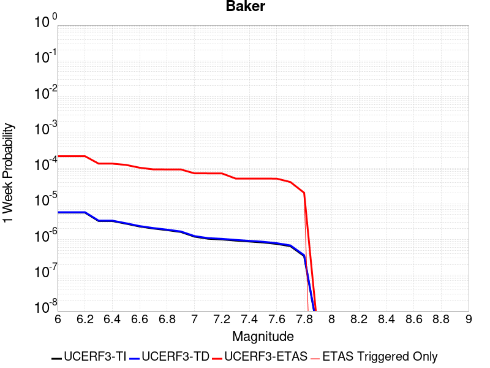 |  |  |  |

| Magnitude | 1 wk TI Prob | 1 wk TD Prob | 1 wk ETAS Prob | 1 wk ETAS/TD Gain | 1 wk ETAS Triggered Only | 1 mo TI Prob | 1 mo TD Prob | 1 mo ETAS Prob | 1 mo ETAS/TD Gain | 1 mo ETAS Triggered Only | 1 yr TI Prob | 1 yr TD Prob | 1 yr ETAS Prob | 1 yr ETAS/TD Gain | 1 yr ETAS Triggered Only | 10 yr TI Prob | 10 yr TD Prob | 10 yr ETAS Prob | 10 yr ETAS/TD Gain | 10 yr ETAS Triggered Only |
|-----|-----|-----|-----|-----|-----|-----|-----|-----|-----|-----|-----|-----|-----|-----|-----|-----|-----|-----|-----|-----|
| 6.0 | 5.695525E-6 | 5.8348373E-6 | 2.488763E-4 | 42.653515 | 2.430429E-4 | 2.4409164E-5 | 2.5006228E-5 | 3.8956146E-4 | 15.578577 | 3.6456436E-4 | 2.9714106E-4 | 3.044123E-4 | 7.9035014E-4 | 2.5963147 | 4.860858E-4 | 0.0029674405 | 0.0030403486 | 0.0035249565 | 1.1593922 | 4.860858E-4 |
| 6.1 | 5.695525E-6 | 5.8348373E-6 | 2.488763E-4 | 42.653515 | 2.430429E-4 | 2.4409164E-5 | 2.5006228E-5 | 3.8956146E-4 | 15.578577 | 3.6456436E-4 | 2.9714106E-4 | 3.044123E-4 | 7.9035014E-4 | 2.5963147 | 4.860858E-4 | 0.0029674405 | 0.0030403486 | 0.0035249565 | 1.1593922 | 4.860858E-4 |
| 6.2 | 5.695525E-6 | 5.8348373E-6 | 2.488763E-4 | 42.653515 | 2.430429E-4 | 2.4409164E-5 | 2.5006228E-5 | 3.8956146E-4 | 15.578577 | 3.6456436E-4 | 2.9714106E-4 | 3.044123E-4 | 7.9035014E-4 | 2.5963147 | 4.860858E-4 | 0.0029674405 | 0.0030403486 | 0.0035249565 | 1.1593922 | 4.860858E-4 |
| 6.3 | 3.2995713E-6 | 3.383667E-6 | 2.4642574E-4 | 72.82801 | 2.430429E-4 | 1.4140943E-5 | 1.4501353E-5 | 2.5754073E-4 | 17.759773 | 2.430429E-4 | 1.7215237E-4 | 1.7654014E-4 | 5.4104015E-4 | 3.0646863 | 3.6456436E-4 | 0.0017201907 | 0.001764046 | 0.0021279673 | 1.2062992 | 3.6456436E-4 |
| 6.4 | 3.2995713E-6 | 3.383667E-6 | 2.4642574E-4 | 72.82801 | 2.430429E-4 | 1.4140943E-5 | 1.4501353E-5 | 2.5754073E-4 | 17.759773 | 2.430429E-4 | 1.7215237E-4 | 1.7654014E-4 | 5.4104015E-4 | 3.0646863 | 3.6456436E-4 | 0.0017201907 | 0.001764046 | 0.0021279673 | 1.2062992 | 3.6456436E-4 |
| 6.5 | 2.782202E-6 | 2.8558404E-6 | 1.2437694E-4 | 43.551785 | 1.2152145E-4 | 1.1923668E-5 | 1.223926E-5 | 1.3375923E-4 | 10.928701 | 1.2152145E-4 | 1.4516099E-4 | 1.4900314E-4 | 3.9200982E-4 | 2.630883 | 2.430429E-4 | 0.001450662 | 0.0014890651 | 0.001731746 | 1.1629754 | 2.430429E-4 |
| 6.6 | 2.3163404E-6 | 2.38092E-6 | 2.38092E-6 | 1.0 | 0.0 | 9.927136E-6 | 1.0203904E-5 | 1.0203904E-5 | 1.0 | 0.0 | 1.20856166E-4 | 1.2422565E-4 | 1.2422565E-4 | 1.0 | 0.0 | 0.0012079047 | 0.0012415823 | 0.0012415823 | 1.0 | 0.0 |
| 6.7 | 2.037056E-6 | 2.0965003E-6 | 2.0965003E-6 | 1.0 | 0.0 | 8.7302105E-6 | 8.984972E-6 | 8.984972E-6 | 1.0 | 0.0 | 1.0628513E-4 | 1.093867E-4 | 1.093867E-4 | 1.0 | 0.0 | 0.0010623431 | 0.0010933448 | 0.0010933448 | 1.0 | 0.0 |
| 6.8 | 1.8356744E-6 | 1.8915287E-6 | 1.8915287E-6 | 1.0 | 0.0 | 7.867153E-6 | 8.106527E-6 | 8.106527E-6 | 1.0 | 0.0 | 9.577837E-5 | 9.869264E-5 | 9.869264E-5 | 1.0 | 0.0 | 9.57371E-4 | 9.86502E-4 | 9.86502E-4 | 1.0 | 0.0 |
| 6.9 | 1.6310546E-6 | 1.6832072E-6 | 1.6832072E-6 | 1.0 | 0.0 | 6.9902153E-6 | 7.213726E-6 | 7.213726E-6 | 1.0 | 0.0 | 8.510255E-5 | 8.782368E-5 | 8.782368E-5 | 1.0 | 0.0 | 8.5069967E-4 | 8.7790104E-4 | 8.7790104E-4 | 1.0 | 0.0 |
| 7.0 | 1.2058036E-6 | 1.2508665E-6 | 1.2508665E-6 | 1.0 | 0.0 | 5.1677193E-6 | 5.3608455E-6 | 5.3608455E-6 | 1.0 | 0.0 | 6.291517E-5 | 6.5266366E-5 | 6.5266366E-5 | 1.0 | 0.0 | 6.289736E-4 | 6.524743E-4 | 6.524743E-4 | 1.0 | 0.0 |
| 7.1 | 1.052382E-6 | 1.0951609E-6 | 1.0951609E-6 | 1.0 | 0.0 | 4.5102006E-6 | 4.693538E-6 | 4.693538E-6 | 1.0 | 0.0 | 5.491031E-5 | 5.7142337E-5 | 5.7142337E-5 | 1.0 | 0.0 | 5.4896745E-4 | 5.7127734E-4 | 5.7127734E-4 | 1.0 | 0.0 |
| 7.2 | 1.0067454E-6 | 1.0487711E-6 | 1.0487711E-6 | 1.0 | 0.0 | 4.3146156E-6 | 4.4947255E-6 | 4.4947255E-6 | 1.0 | 0.0 | 5.252918E-5 | 5.4721917E-5 | 5.4721917E-5 | 1.0 | 0.0 | 5.251676E-4 | 5.470853E-4 | 5.470853E-4 | 1.0 | 0.0 |
| 7.3 | 9.3596316E-7 | 9.767723E-7 | 9.767723E-7 | 1.0 | 0.0 | 4.0112645E-6 | 4.1861604E-6 | 4.1861604E-6 | 1.0 | 0.0 | 4.8836053E-5 | 5.096532E-5 | 5.096532E-5 | 1.0 | 0.0 | 4.8825322E-4 | 5.095371E-4 | 5.095371E-4 | 1.0 | 0.0 |
| 7.4 | 8.8117395E-7 | 9.2076635E-7 | 9.2076635E-7 | 1.0 | 0.0 | 3.7764542E-6 | 3.9461356E-6 | 3.9461356E-6 | 1.0 | 0.0 | 4.5977362E-5 | 4.8043148E-5 | 4.8043148E-5 | 1.0 | 0.0 | 4.596785E-4 | 4.8032837E-4 | 4.8032837E-4 | 1.0 | 0.0 |
| 7.5 | 8.292386E-7 | 8.6745956E-7 | 8.6745956E-7 | 1.0 | 0.0 | 3.5538749E-6 | 3.7176785E-6 | 3.7176785E-6 | 1.0 | 0.0 | 4.326757E-5 | 4.5261804E-5 | 4.5261804E-5 | 1.0 | 0.0 | 4.3259145E-4 | 4.5252658E-4 | 4.5252658E-4 | 1.0 | 0.0 |
| 7.6 | 7.553842E-7 | 7.9144706E-7 | 7.9144706E-7 | 1.0 | 0.0 | 3.2373566E-6 | 3.3919116E-6 | 3.3919116E-6 | 1.0 | 0.0 | 3.9414106E-5 | 4.129575E-5 | 4.129575E-5 | 1.0 | 0.0 | 3.9407116E-4 | 4.1288146E-4 | 4.1288146E-4 | 1.0 | 0.0 |
| 7.7 | 6.5285366E-7 | 6.852797E-7 | 6.852797E-7 | 1.0 | 0.0 | 2.797941E-6 | 2.9369096E-6 | 2.9369096E-6 | 1.0 | 0.0 | 3.40644E-5 | 3.5756293E-5 | 3.5756293E-5 | 1.0 | 0.0 | 3.405918E-4 | 3.5750607E-4 | 3.5750607E-4 | 1.0 | 0.0 |
| 7.8 | 3.4586725E-7 | 3.6482615E-7 | 3.6482615E-7 | 1.0 | 0.0 | 1.4822873E-6 | 1.5635396E-6 | 1.5635396E-6 | 1.0 | 0.0 | 1.80467E-5 | 1.9035933E-5 | 1.9035933E-5 | 1.0 | 0.0 | 1.8045233E-4 | 1.9034347E-4 | 1.9034347E-4 | 1.0 | 0.0 |
| 7.9 | 2.5591178E-9 | 2.6696718E-9 | 2.6696718E-9 | 1.0 | 0.0 | 1.0967647E-8 | 1.14414505E-8 | 1.14414505E-8 | 1.0 | 0.0 | 1.335311E-7 | 1.3929966E-7 | 1.3929966E-7 | 1.0 | 0.0 | 1.3353102E-6 | 1.3929966E-6 | 1.3929966E-6 | 1.0 | 0.0 |

## Scodie Lineament
*[(top)](#table-of-contents)*

| 1 Week | 1 Month | 1 Year | 10 Year |
|-----|-----|-----|-----|
|  |  |  |  |

| Magnitude | 1 wk TI Prob | 1 wk TD Prob | 1 wk ETAS Prob | 1 wk ETAS/TD Gain | 1 wk ETAS Triggered Only | 1 mo TI Prob | 1 mo TD Prob | 1 mo ETAS Prob | 1 mo ETAS/TD Gain | 1 mo ETAS Triggered Only | 1 yr TI Prob | 1 yr TD Prob | 1 yr ETAS Prob | 1 yr ETAS/TD Gain | 1 yr ETAS Triggered Only | 10 yr TI Prob | 10 yr TD Prob | 10 yr ETAS Prob | 10 yr ETAS/TD Gain | 10 yr ETAS Triggered Only |
|-----|-----|-----|-----|-----|-----|-----|-----|-----|-----|-----|-----|-----|-----|-----|-----|-----|-----|-----|-----|-----|
| 6.0 | 3.2919327E-6 | 3.0133422E-6 | 3.6757658E-4 | 121.983025 | 3.6456436E-4 | 1.4108206E-5 | 1.2914278E-5 | 3.7747392E-4 | 29.229193 | 3.6456436E-4 | 1.7175387E-4 | 1.5722317E-4 | 6.4323255E-4 | 4.091207 | 4.860858E-4 | 0.0017162118 | 0.0015714309 | 0.0020567528 | 1.3088408 | 4.860858E-4 |
| 6.1 | 1.8663811E-6 | 1.5490499E-6 | 2.4459156E-4 | 157.8978 | 2.430429E-4 | 7.998751E-6 | 6.6387715E-6 | 2.4968004E-4 | 37.60938 | 2.430429E-4 | 9.738045E-5 | 8.082454E-5 | 3.2384778E-4 | 4.0068 | 2.430429E-4 | 9.7337784E-4 | 8.080003E-4 | 0.0010508468 | 1.3005525 | 2.430429E-4 |
| 6.2 | 1.8663811E-6 | 1.5490499E-6 | 2.4459156E-4 | 157.8978 | 2.430429E-4 | 7.998751E-6 | 6.6387715E-6 | 2.4968004E-4 | 37.60938 | 2.430429E-4 | 9.738045E-5 | 8.082454E-5 | 3.2384778E-4 | 4.0068 | 2.430429E-4 | 9.7337784E-4 | 8.080003E-4 | 0.0010508468 | 1.3005525 | 2.430429E-4 |
| 6.3 | 1.8663811E-6 | 1.5490499E-6 | 2.4459156E-4 | 157.8978 | 2.430429E-4 | 7.998751E-6 | 6.6387715E-6 | 2.4968004E-4 | 37.60938 | 2.430429E-4 | 9.738045E-5 | 8.082454E-5 | 3.2384778E-4 | 4.0068 | 2.430429E-4 | 9.7337784E-4 | 8.080003E-4 | 0.0010508468 | 1.3005525 | 2.430429E-4 |
| 6.4 | 1.8663811E-6 | 1.5490499E-6 | 2.4459156E-4 | 157.8978 | 2.430429E-4 | 7.998751E-6 | 6.6387715E-6 | 2.4968004E-4 | 37.60938 | 2.430429E-4 | 9.738045E-5 | 8.082454E-5 | 3.2384778E-4 | 4.0068 | 2.430429E-4 | 9.7337784E-4 | 8.080003E-4 | 0.0010508468 | 1.3005525 | 2.430429E-4 |
| 6.5 | 1.8106311E-6 | 1.4909839E-6 | 2.4453353E-4 | 164.00815 | 2.430429E-4 | 7.759824E-6 | 6.3899183E-6 | 2.4943126E-4 | 39.035126 | 2.430429E-4 | 9.447177E-5 | 7.7794975E-5 | 3.2081897E-4 | 4.1239033 | 2.430429E-4 | 9.4431615E-4 | 7.7772606E-4 | 0.00102058 | 1.3122615 | 2.430429E-4 |
| 6.6 | 1.2414679E-6 | 8.997558E-7 | 2.4394243E-4 | 271.12073 | 2.430429E-4 | 5.320566E-6 | 3.856091E-6 | 2.4689804E-4 | 64.02807 | 2.430429E-4 | 6.477596E-5 | 4.6946985E-5 | 2.8997846E-4 | 6.176722 | 2.430429E-4 | 6.475708E-4 | 4.693793E-4 | 7.123081E-4 | 1.5175533 | 2.430429E-4 |
| 6.7 | 1.1062215E-6 | 7.594311E-7 | 7.594311E-7 | 1.0 | 0.0 | 4.7409408E-6 | 3.2547011E-6 | 3.2547011E-6 | 1.0 | 0.0 | 5.7719422E-5 | 3.9625334E-5 | 3.9625334E-5 | 1.0 | 0.0 | 5.770443E-4 | 3.961897E-4 | 3.961897E-4 | 1.0 | 0.0 |
| 6.8 | 1.0006736E-6 | 6.500397E-7 | 6.500397E-7 | 1.0 | 0.0 | 4.288594E-6 | 2.7858816E-6 | 2.7858816E-6 | 1.0 | 0.0 | 5.221238E-5 | 3.3917644E-5 | 3.3917644E-5 | 1.0 | 0.0 | 5.220012E-4 | 3.3913075E-4 | 3.3913075E-4 | 1.0 | 0.0 |
| 6.9 | 9.167364E-7 | 5.631625E-7 | 5.631625E-7 | 1.0 | 0.0 | 3.9288643E-6 | 2.4135516E-6 | 2.4135516E-6 | 1.0 | 0.0 | 4.7832873E-5 | 2.9384651E-5 | 2.9384651E-5 | 1.0 | 0.0 | 4.782258E-4 | 2.9381333E-4 | 2.9381333E-4 | 1.0 | 0.0 |
| 7.0 | 7.6987664E-7 | 4.113383E-7 | 4.113383E-7 | 1.0 | 0.0 | 3.2994672E-6 | 1.7628774E-6 | 1.7628774E-6 | 1.0 | 0.0 | 4.0170275E-5 | 2.1462862E-5 | 2.1462862E-5 | 1.0 | 0.0 | 4.0163012E-4 | 2.1461173E-4 | 2.1461173E-4 | 1.0 | 0.0 |
| 7.1 | 7.1038727E-7 | 3.5211494E-7 | 3.5211494E-7 | 1.0 | 0.0 | 3.0445133E-6 | 1.5090633E-6 | 1.5090633E-6 | 1.0 | 0.0 | 3.706632E-5 | 1.8372726E-5 | 1.8372726E-5 | 1.0 | 0.0 | 3.7060137E-4 | 1.8371557E-4 | 1.8371557E-4 | 1.0 | 0.0 |
| 7.2 | 2.0799602E-7 | 3.1186854E-8 | 3.1186854E-8 | 1.0 | 0.0 | 8.914113E-7 | 1.3365793E-7 | 1.3365793E-7 | 1.0 | 0.0 | 1.0852878E-5 | 1.6272843E-6 | 1.6272843E-6 | 1.0 | 0.0 | 1.08523476E-4 | 1.627273E-5 | 1.627273E-5 | 1.0 | 0.0 |
| 7.3 | 1.5048182E-7 | 1.5945696E-8 | 1.5945696E-8 | 1.0 | 0.0 | 6.449219E-7 | 6.83387E-8 | 6.83387E-8 | 1.0 | 0.0 | 7.851896E-6 | 8.320234E-7 | 8.320234E-7 | 1.0 | 0.0 | 7.851618E-5 | 8.320206E-6 | 8.320206E-6 | 1.0 | 0.0 |
| 7.4 | 5.9334678E-8 | 4.8683537E-9 | 4.8683537E-9 | 1.0 | 0.0 | 2.5429145E-7 | 2.0864372E-8 | 2.0864372E-8 | 1.0 | 0.0 | 3.095994E-6 | 2.5402372E-7 | 2.5402372E-7 | 1.0 | 0.0 | 3.095951E-5 | 2.5402353E-6 | 2.5402353E-6 | 1.0 | 0.0 |

## San Gabriel
*[(top)](#table-of-contents)*

| 1 Week | 1 Month | 1 Year | 10 Year |
|-----|-----|-----|-----|
|  |  | 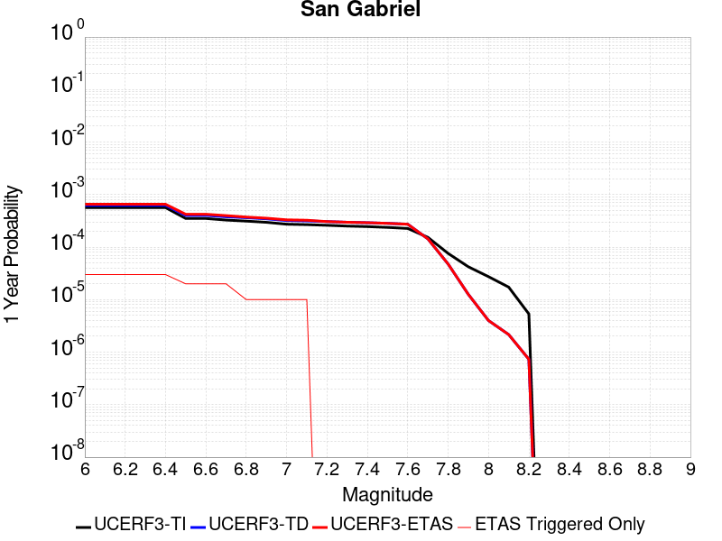 |  |

| Magnitude | 1 wk TI Prob | 1 wk TD Prob | 1 wk ETAS Prob | 1 wk ETAS/TD Gain | 1 wk ETAS Triggered Only | 1 mo TI Prob | 1 mo TD Prob | 1 mo ETAS Prob | 1 mo ETAS/TD Gain | 1 mo ETAS Triggered Only | 1 yr TI Prob | 1 yr TD Prob | 1 yr ETAS Prob | 1 yr ETAS/TD Gain | 1 yr ETAS Triggered Only | 10 yr TI Prob | 10 yr TD Prob | 10 yr ETAS Prob | 10 yr ETAS/TD Gain | 10 yr ETAS Triggered Only |
|-----|-----|-----|-----|-----|-----|-----|-----|-----|-----|-----|-----|-----|-----|-----|-----|-----|-----|-----|-----|-----|
| 6.0 | 1.083775E-5 | 1.19851875E-5 | 2.5502517E-4 | 21.278362 | 2.430429E-4 | 4.6446676E-5 | 5.1364143E-5 | 4.1590977E-4 | 8.097279 | 3.6456436E-4 | 5.653415E-4 | 6.251903E-4 | 9.895267E-4 | 1.5827608 | 3.6456436E-4 | 0.0056390543 | 0.006246409 | 0.006608696 | 1.0579993 | 3.6456436E-4 |
| 6.1 | 1.083775E-5 | 1.19851875E-5 | 2.5502517E-4 | 21.278362 | 2.430429E-4 | 4.6446676E-5 | 5.1364143E-5 | 4.1590977E-4 | 8.097279 | 3.6456436E-4 | 5.653415E-4 | 6.251903E-4 | 9.895267E-4 | 1.5827608 | 3.6456436E-4 | 0.0056390543 | 0.006246409 | 0.006608696 | 1.0579993 | 3.6456436E-4 |
| 6.2 | 1.083775E-5 | 1.19851875E-5 | 2.5502517E-4 | 21.278362 | 2.430429E-4 | 4.6446676E-5 | 5.1364143E-5 | 4.1590977E-4 | 8.097279 | 3.6456436E-4 | 5.653415E-4 | 6.251903E-4 | 9.895267E-4 | 1.5827608 | 3.6456436E-4 | 0.0056390543 | 0.006246409 | 0.006608696 | 1.0579993 | 3.6456436E-4 |
| 6.3 | 1.083775E-5 | 1.19851875E-5 | 2.5502517E-4 | 21.278362 | 2.430429E-4 | 4.6446676E-5 | 5.1364143E-5 | 4.1590977E-4 | 8.097279 | 3.6456436E-4 | 5.653415E-4 | 6.251903E-4 | 9.895267E-4 | 1.5827608 | 3.6456436E-4 | 0.0056390543 | 0.006246409 | 0.006608696 | 1.0579993 | 3.6456436E-4 |
| 6.4 | 1.083775E-5 | 1.19851875E-5 | 2.5502517E-4 | 21.278362 | 2.430429E-4 | 4.6446676E-5 | 5.1364143E-5 | 4.1590977E-4 | 8.097279 | 3.6456436E-4 | 5.653415E-4 | 6.251903E-4 | 9.895267E-4 | 1.5827608 | 3.6456436E-4 | 0.0056390543 | 0.006246409 | 0.006608696 | 1.0579993 | 3.6456436E-4 |
| 6.5 | 6.7317824E-6 | 7.716944E-6 | 1.2923745E-4 | 16.74723 | 1.2152145E-4 | 2.8850178E-5 | 3.3072207E-5 | 2.7610708E-4 | 8.348614 | 2.430429E-4 | 3.511943E-4 | 4.0258077E-4 | 6.455258E-4 | 1.6034691 | 2.430429E-4 | 0.003506398 | 0.0040296097 | 0.004271673 | 1.0600712 | 2.430429E-4 |
| 6.6 | 6.7317824E-6 | 7.716944E-6 | 1.2923745E-4 | 16.74723 | 1.2152145E-4 | 2.8850178E-5 | 3.3072207E-5 | 2.7610708E-4 | 8.348614 | 2.430429E-4 | 3.511943E-4 | 4.0258077E-4 | 6.455258E-4 | 1.6034691 | 2.430429E-4 | 0.003506398 | 0.0040296097 | 0.004271673 | 1.0600712 | 2.430429E-4 |
| 6.7 | 6.274881E-6 | 7.2458647E-6 | 1.2876643E-4 | 17.771023 | 1.2152145E-4 | 2.6892068E-5 | 3.1053343E-5 | 2.740887E-4 | 8.826383 | 2.430429E-4 | 3.2736175E-4 | 3.780098E-4 | 6.2096084E-4 | 1.6427109 | 2.430429E-4 | 0.0032687993 | 0.0037847564 | 0.0040268796 | 1.0639732 | 2.430429E-4 |
| 6.8 | 5.996209E-6 | 6.958585E-6 | 6.958585E-6 | 1.0 | 0.0 | 2.5697784E-5 | 2.9822171E-5 | 1.5133999E-4 | 5.0747476 | 1.2152145E-4 | 3.128256E-4 | 3.6302538E-4 | 4.845027E-4 | 1.3346249 | 1.2152145E-4 | 0.003123856 | 0.0036354093 | 0.003756489 | 1.0333056 | 1.2152145E-4 |
| 6.9 | 5.686331E-6 | 6.6236316E-6 | 6.6236316E-6 | 1.0 | 0.0 | 2.4369761E-5 | 2.8386688E-5 | 1.4990469E-4 | 5.2808094 | 1.2152145E-4 | 2.9666146E-4 | 3.4555403E-4 | 4.670335E-4 | 1.3515499 | 1.2152145E-4 | 0.0029626573 | 0.0034612515 | 0.0035823523 | 1.0349876 | 1.2152145E-4 |
| 7.0 | 5.2329838E-6 | 6.147514E-6 | 6.147514E-6 | 1.0 | 0.0 | 2.242688E-5 | 2.6346226E-5 | 1.4786447E-4 | 5.6123586 | 1.2152145E-4 | 2.7301308E-4 | 3.2071886E-4 | 4.4220133E-4 | 1.3787818 | 1.2152145E-4 | 0.002726779 | 0.0032136322 | 0.003334763 | 1.0376928 | 1.2152145E-4 |
| 7.1 | 5.135671E-6 | 6.03764E-6 | 6.03764E-6 | 1.0 | 0.0 | 2.2009834E-5 | 2.5875348E-5 | 1.4739366E-4 | 5.6962967 | 1.2152145E-4 | 2.6793676E-4 | 3.1498758E-4 | 4.3647076E-4 | 1.385676 | 1.2152145E-4 | 0.0026761394 | 0.0031564834 | 0.0032776212 | 1.0383775 | 1.2152145E-4 |
| 7.2 | 4.989062E-6 | 5.87102E-6 | 5.87102E-6 | 1.0 | 0.0 | 2.1381518E-5 | 2.5161276E-5 | 2.5161276E-5 | 1.0 | 0.0 | 2.6028889E-4 | 3.0629625E-4 | 3.0629625E-4 | 1.0 | 0.0 | 0.0025998424 | 0.003069813 | 0.003069813 | 1.0 | 0.0 |
| 7.3 | 4.8219395E-6 | 5.702574E-6 | 5.702574E-6 | 1.0 | 0.0 | 2.0665291E-5 | 2.443938E-5 | 2.443938E-5 | 1.0 | 0.0 | 2.5157086E-4 | 2.9750957E-4 | 2.9750957E-4 | 1.0 | 0.0 | 0.0025128627 | 0.0029821852 | 0.0029821852 | 1.0 | 0.0 |
| 7.4 | 4.7118383E-6 | 5.5911332E-6 | 5.5911332E-6 | 1.0 | 0.0 | 2.0193436E-5 | 2.3961782E-5 | 2.3961782E-5 | 1.0 | 0.0 | 2.4582737E-4 | 2.916964E-4 | 2.916964E-4 | 1.0 | 0.0 | 0.002455556 | 0.0029242067 | 0.0029242067 | 1.0 | 0.0 |
| 7.5 | 4.5506545E-6 | 5.4365014E-6 | 5.4365014E-6 | 1.0 | 0.0 | 1.9502659E-5 | 2.3299088E-5 | 2.3299088E-5 | 1.0 | 0.0 | 2.37419E-4 | 2.8363022E-4 | 2.8363022E-4 | 1.0 | 0.0 | 0.002371655 | 0.002843753 | 0.002843753 | 1.0 | 0.0 |
| 7.6 | 4.343636E-6 | 5.2293817E-6 | 5.2293817E-6 | 1.0 | 0.0 | 1.861545E-5 | 2.2411448E-5 | 2.2411448E-5 | 1.0 | 0.0 | 2.2661954E-4 | 2.7282597E-4 | 2.7282597E-4 | 1.0 | 0.0 | 0.0022638857 | 0.0027359722 | 0.0027359722 | 1.0 | 0.0 |
| 7.7 | 2.936235E-6 | 2.7440458E-6 | 2.7440458E-6 | 1.0 | 0.0 | 1.2583803E-5 | 1.1760143E-5 | 1.1760143E-5 | 1.0 | 0.0 | 1.5319703E-4 | 1.4317037E-4 | 1.4317037E-4 | 1.0 | 0.0 | 0.0015309147 | 0.0014380751 | 0.0014380751 | 1.0 | 0.0 |
| 7.8 | 1.4541639E-6 | 9.1237047E-7 | 9.1237047E-7 | 1.0 | 0.0 | 6.232116E-6 | 3.9101533E-6 | 3.9101533E-6 | 1.0 | 0.0 | 7.587337E-5 | 4.7605077E-5 | 4.7605077E-5 | 1.0 | 0.0 | 7.584747E-4 | 4.8085177E-4 | 4.8085177E-4 | 1.0 | 0.0 |
| 7.9 | 8.098958E-7 | 2.41753E-7 | 2.41753E-7 | 1.0 | 0.0 | 3.4709774E-6 | 1.0360839E-6 | 1.0360839E-6 | 1.0 | 0.0 | 4.225833E-5 | 1.2614248E-5 | 1.2614248E-5 | 1.0 | 0.0 | 4.2250296E-4 | 1.2921814E-4 | 1.2921814E-4 | 1.0 | 0.0 |
| 8.0 | 5.2473234E-7 | 7.6792055E-8 | 7.6792055E-8 | 1.0 | 0.0 | 2.248851E-6 | 3.2910876E-7 | 3.2910876E-7 | 1.0 | 0.0 | 2.7379416E-5 | 4.0068917E-6 | 4.0068917E-6 | 1.0 | 0.0 | 2.7376044E-4 | 4.21918E-5 | 4.21918E-5 | 1.0 | 0.0 |
| 8.1 | 3.3162388E-7 | 4.1496126E-8 | 4.1496126E-8 | 1.0 | 0.0 | 1.4212444E-6 | 1.7784053E-7 | 1.7784053E-7 | 1.0 | 0.0 | 1.7303513E-5 | 2.1652063E-6 | 2.1652063E-6 | 1.0 | 0.0 | 1.7302166E-4 | 2.2965523E-5 | 2.2965523E-5 | 1.0 | 0.0 |
| 8.2 | 1.0235345E-7 | 1.4043474E-8 | 1.4043474E-8 | 1.0 | 0.0 | 4.3865757E-7 | 6.0186316E-8 | 6.0186316E-8 | 1.0 | 0.0 | 5.340643E-6 | 7.327681E-7 | 7.327681E-7 | 1.0 | 0.0 | 5.3405143E-5 | 7.9273705E-6 | 7.9273705E-6 | 1.0 | 0.0 |

## San Andreas (Coachella) rev
*[(top)](#table-of-contents)*

| 1 Week | 1 Month | 1 Year | 10 Year |
|-----|-----|-----|-----|
|  |  |  |  |

| Magnitude | 1 wk TI Prob | 1 wk TD Prob | 1 wk ETAS Prob | 1 wk ETAS/TD Gain | 1 wk ETAS Triggered Only | 1 mo TI Prob | 1 mo TD Prob | 1 mo ETAS Prob | 1 mo ETAS/TD Gain | 1 mo ETAS Triggered Only | 1 yr TI Prob | 1 yr TD Prob | 1 yr ETAS Prob | 1 yr ETAS/TD Gain | 1 yr ETAS Triggered Only | 10 yr TI Prob | 10 yr TD Prob | 10 yr ETAS Prob | 10 yr ETAS/TD Gain | 10 yr ETAS Triggered Only |
|-----|-----|-----|-----|-----|-----|-----|-----|-----|-----|-----|-----|-----|-----|-----|-----|-----|-----|-----|-----|-----|
| 6.0 | 1.1925945E-4 | 3.2729402E-4 | 6.91739E-4 | 2.1135097 | 3.6456436E-4 | 5.110118E-4 | 0.0014019393 | 0.0017659925 | 1.2596784 | 3.6456436E-4 | 0.0062038354 | 0.016936364 | 0.017294753 | 1.021161 | 3.6456436E-4 | 0.060334753 | 0.15265316 | 0.15296207 | 1.0020236 | 3.6456436E-4 |
| 6.1 | 1.1925945E-4 | 3.2729402E-4 | 6.91739E-4 | 2.1135097 | 3.6456436E-4 | 5.110118E-4 | 0.0014019393 | 0.0017659925 | 1.2596784 | 3.6456436E-4 | 0.0062038354 | 0.016936364 | 0.017294753 | 1.021161 | 3.6456436E-4 | 0.060334753 | 0.15265316 | 0.15296207 | 1.0020236 | 3.6456436E-4 |
| 6.2 | 1.07432395E-4 | 3.0230157E-4 | 6.667557E-4 | 2.2055979 | 3.6456436E-4 | 4.603433E-4 | 0.0012949388 | 0.0016590311 | 1.2811656 | 3.6456436E-4 | 0.005590286 | 0.015653009 | 0.016011866 | 1.0229259 | 3.6456436E-4 | 0.05451731 | 0.14182423 | 0.1421371 | 1.002206 | 3.6456436E-4 |
| 6.3 | 1.0718766E-4 | 3.0175463E-4 | 6.66209E-4 | 2.2077837 | 3.6456436E-4 | 4.592948E-4 | 0.0012925972 | 0.0016566903 | 1.2816756 | 3.6456436E-4 | 0.005577586 | 0.015624908 | 0.015983775 | 1.0229677 | 3.6456436E-4 | 0.054396555 | 0.14159249 | 0.14190544 | 1.0022101 | 3.6456436E-4 |
| 6.4 | 1.0355944E-4 | 2.9383553E-4 | 6.5829273E-4 | 2.2403443 | 3.6456436E-4 | 4.4375064E-4 | 0.0012586913 | 0.0016227968 | 1.289273 | 3.6456436E-4 | 0.0053892885 | 0.015217941 | 0.015576958 | 1.0235916 | 3.6456436E-4 | 0.052604496 | 0.13815255 | 0.13846676 | 1.0022743 | 3.6456436E-4 |
| 6.5 | 1.0227914E-4 | 2.9102986E-4 | 6.554881E-4 | 2.2523053 | 3.6456436E-4 | 4.382655E-4 | 0.0012466786 | 0.0016107885 | 1.292064 | 3.6456436E-4 | 0.0053228354 | 0.01507372 | 0.015432789 | 1.0238209 | 3.6456436E-4 | 0.051971316 | 0.13693172 | 0.13724637 | 1.0022978 | 3.6456436E-4 |
| 6.6 | 1.0116757E-4 | 2.8868738E-4 | 6.531465E-4 | 2.2624698 | 3.6456436E-4 | 4.3350324E-4 | 0.0012366489 | 0.0016007625 | 1.2944356 | 3.6456436E-4 | 0.0052651367 | 0.01495329 | 0.015312403 | 1.0240157 | 3.6456436E-4 | 0.051421247 | 0.1359099 | 0.13622491 | 1.0023178 | 3.6456436E-4 |
| 6.7 | 1.0050676E-4 | 2.8727303E-4 | 6.517326E-4 | 2.2686872 | 3.6456436E-4 | 4.3067214E-4 | 0.0012305931 | 0.0015947088 | 1.2958864 | 3.6456436E-4 | 0.005230834 | 0.014880571 | 0.01523971 | 1.0241348 | 3.6456436E-4 | 0.051094085 | 0.13529462 | 0.13560987 | 1.0023301 | 3.6456436E-4 |
| 6.8 | 9.976819E-5 | 2.853096E-4 | 6.497699E-4 | 2.2774205 | 3.6456436E-4 | 4.2750788E-4 | 0.0012221863 | 0.0015863051 | 1.2979242 | 3.6456436E-4 | 0.0051924936 | 0.0147796115 | 0.015138787 | 1.0243021 | 3.6456436E-4 | 0.050728295 | 0.13444631 | 0.13476186 | 1.002347 | 3.6456436E-4 |
| 6.9 | 9.77719E-5 | 2.8027873E-4 | 6.447409E-4 | 2.3003561 | 3.6456436E-4 | 4.1895514E-4 | 0.0012006456 | 0.0015647722 | 1.3032757 | 3.6456436E-4 | 0.0050888555 | 0.014520878 | 0.014880149 | 1.0247416 | 3.6456436E-4 | 0.049738888 | 0.1322748 | 0.13259116 | 1.0023916 | 3.6456436E-4 |
| 7.0 | 8.500761E-5 | 2.4762485E-4 | 6.120989E-4 | 2.47188 | 3.6456436E-4 | 3.6426744E-4 | 0.001060821 | 0.0014249986 | 1.3432978 | 3.6456436E-4 | 0.0044259406 | 0.012839786 | 0.013199669 | 1.0280287 | 3.6456436E-4 | 0.04338823 | 0.11813272 | 0.11845422 | 1.0027215 | 3.6456436E-4 |
| 7.1 | 8.319876E-5 | 2.4365232E-4 | 6.0812786E-4 | 2.4958837 | 3.6456436E-4 | 3.5651738E-4 | 0.0010438096 | 0.0014079934 | 1.3488986 | 3.6456436E-4 | 0.004331963 | 0.012635092 | 0.01299505 | 1.0284888 | 3.6456436E-4 | 0.042484846 | 0.116353 | 0.116675146 | 1.0027688 | 3.6456436E-4 |
| 7.2 | 7.563917E-5 | 2.2413683E-4 | 5.8861944E-4 | 2.6261613 | 3.6456436E-4 | 3.2412758E-4 | 9.602359E-4 | 0.0013244501 | 1.3792967 | 3.6456436E-4 | 0.0039391145 | 0.011628893 | 0.011989218 | 1.0309854 | 3.6456436E-4 | 0.03870018 | 0.10775925 | 0.10808453 | 1.0030186 | 3.6456436E-4 |
| 7.3 | 7.082985E-5 | 2.0729867E-4 | 5.717874E-4 | 2.7582784 | 3.6456436E-4 | 3.0352117E-4 | 8.881233E-4 | 0.0012523638 | 1.410124 | 3.6456436E-4 | 0.0036891096 | 0.010759917 | 0.011120559 | 1.0335171 | 3.6456436E-4 | 0.03628465 | 0.100282 | 0.10061 | 1.0032709 | 3.6456436E-4 |
| 7.4 | 5.146215E-5 | 1.4273795E-4 | 3.8574616E-4 | 2.702478 | 2.430429E-4 | 2.2053342E-4 | 6.115915E-4 | 8.544858E-4 | 1.3971511 | 2.430429E-4 | 0.0026816884 | 0.0074208933 | 0.0076621324 | 1.0325081 | 2.430429E-4 | 0.02649557 | 0.070849575 | 0.0710754 | 1.0031874 | 2.430429E-4 |
| 7.5 | 4.0285166E-5 | 1.09416E-4 | 3.524323E-4 | 3.2210307 | 2.430429E-4 | 1.7263928E-4 | 4.6884175E-4 | 7.117707E-4 | 1.518147 | 2.430429E-4 | 0.002099857 | 0.0056932783 | 0.0059349374 | 1.0424464 | 2.430429E-4 | 0.020801254 | 0.055011146 | 0.05524082 | 1.0041751 | 2.430429E-4 |
| 7.6 | 3.1168736E-5 | 8.4389096E-5 | 3.274115E-4 | 3.8797843 | 2.430429E-4 | 1.3357346E-4 | 3.6161754E-4 | 6.0457253E-4 | 1.6718563 | 2.430429E-4 | 0.0016250437 | 0.0043938323 | 0.004635807 | 1.0550715 | 2.430429E-4 | 0.016132116 | 0.04281005 | 0.043042686 | 1.0054342 | 2.430429E-4 |
| 7.7 | 2.2100989E-5 | 6.238755E-5 | 1.8390141E-4 | 2.9477262 | 1.2152145E-4 | 9.4715084E-5 | 2.6734784E-4 | 3.888368E-4 | 1.4544228 | 1.2152145E-4 | 0.001152546 | 0.0032501083 | 0.0033712348 | 1.0372684 | 1.2152145E-4 | 0.011465867 | 0.0319002 | 0.032017846 | 1.0036879 | 1.2152145E-4 |
| 7.8 | 1.7484861E-5 | 5.179572E-5 | 1.7331087E-4 | 3.3460462 | 1.2152145E-4 | 7.493296E-5 | 2.2196278E-4 | 3.4345724E-4 | 1.5473642 | 1.2152145E-4 | 9.1192697E-4 | 0.0026990508 | 0.0028202443 | 1.0449022 | 1.2152145E-4 | 0.009081938 | 0.026640115 | 0.0267584 | 1.0044401 | 1.2152145E-4 |
| 7.9 | 1.3967285E-5 | 3.822255E-5 | 1.5973936E-4 | 4.179191 | 1.2152145E-4 | 5.985842E-5 | 1.6380067E-4 | 2.853022E-4 | 1.7417647 | 1.2152145E-4 | 7.2853256E-4 | 0.00199245 | 0.0021137295 | 1.0608695 | 1.2152145E-4 | 0.0072614877 | 0.019909438 | 0.020028539 | 1.0059822 | 1.2152145E-4 |
| 8.0 | 1.1887396E-5 | 3.106521E-5 | 1.5258288E-4 | 4.9116964 | 1.2152145E-4 | 5.094499E-5 | 1.3312983E-4 | 2.546351E-4 | 1.9126825 | 1.2152145E-4 | 6.200787E-4 | 0.0016196516 | 0.0017409762 | 1.0749079 | 1.2152145E-4 | 0.006183513 | 0.016279267 | 0.01639881 | 1.0073433 | 1.2152145E-4 |
| 8.1 | 5.100864E-6 | 8.973418E-6 | 8.973418E-6 | 1.0 | 0.0 | 2.1860664E-5 | 3.8456936E-5 | 3.8456936E-5 | 1.0 | 0.0 | 2.6612106E-4 | 4.6811273E-4 | 4.6811273E-4 | 1.0 | 0.0 | 0.002658026 | 0.004917731 | 0.004917731 | 1.0 | 0.0 |
| 8.2 | 2.3004484E-6 | 2.7864487E-6 | 2.7864487E-6 | 1.0 | 0.0 | 9.859027E-6 | 1.1941868E-5 | 1.1941868E-5 | 1.0 | 0.0 | 1.2002704E-4 | 1.4538258E-4 | 1.4538258E-4 | 1.0 | 0.0 | 0.0011996223 | 0.0015973912 | 0.0015973912 | 1.0 | 0.0 |
| 8.3 | 1.0424446E-7 | 5.8161504E-8 | 5.8161504E-8 | 1.0 | 0.0 | 4.4676187E-7 | 2.4926356E-7 | 2.4926356E-7 | 1.0 | 0.0 | 5.439312E-6 | 3.03478E-6 | 3.03478E-6 | 1.0 | 0.0 | 5.4391792E-5 | 3.190716E-5 | 3.190716E-5 | 1.0 | 0.0 |

## Owens Valley
*[(top)](#table-of-contents)*

| 1 Week | 1 Month | 1 Year | 10 Year |
|-----|-----|-----|-----|
|  |  |  |  |

| Magnitude | 1 wk TI Prob | 1 wk TD Prob | 1 wk ETAS Prob | 1 wk ETAS/TD Gain | 1 wk ETAS Triggered Only | 1 mo TI Prob | 1 mo TD Prob | 1 mo ETAS Prob | 1 mo ETAS/TD Gain | 1 mo ETAS Triggered Only | 1 yr TI Prob | 1 yr TD Prob | 1 yr ETAS Prob | 1 yr ETAS/TD Gain | 1 yr ETAS Triggered Only | 10 yr TI Prob | 10 yr TD Prob | 10 yr ETAS Prob | 10 yr ETAS/TD Gain | 10 yr ETAS Triggered Only |
|-----|-----|-----|-----|-----|-----|-----|-----|-----|-----|-----|-----|-----|-----|-----|-----|-----|-----|-----|-----|-----|
| 6.0 | 4.83821E-5 | 3.626567E-6 | 1.2514758E-4 | 34.508553 | 1.2152145E-4 | 2.0733538E-4 | 1.5542342E-5 | 2.5858145E-4 | 16.637226 | 2.430429E-4 | 0.002521386 | 1.8921259E-4 | 4.322095E-4 | 2.2842534 | 2.430429E-4 | 0.024929691 | 0.001925011 | 0.0022888735 | 1.1890185 | 3.6456436E-4 |
| 6.1 | 4.83821E-5 | 3.626567E-6 | 1.2514758E-4 | 34.508553 | 1.2152145E-4 | 2.0733538E-4 | 1.5542342E-5 | 2.5858145E-4 | 16.637226 | 2.430429E-4 | 0.002521386 | 1.8921259E-4 | 4.322095E-4 | 2.2842534 | 2.430429E-4 | 0.024929691 | 0.001925011 | 0.0022888735 | 1.1890185 | 3.6456436E-4 |
| 6.2 | 4.83821E-5 | 3.626567E-6 | 1.2514758E-4 | 34.508553 | 1.2152145E-4 | 2.0733538E-4 | 1.5542342E-5 | 2.5858145E-4 | 16.637226 | 2.430429E-4 | 0.002521386 | 1.8921259E-4 | 4.322095E-4 | 2.2842534 | 2.430429E-4 | 0.024929691 | 0.001925011 | 0.0022888735 | 1.1890185 | 3.6456436E-4 |
| 6.3 | 3.953008E-5 | 3.1553948E-6 | 1.2467646E-4 | 39.512157 | 1.2152145E-4 | 1.6940363E-4 | 1.3523055E-5 | 2.5656266E-4 | 18.972242 | 2.430429E-4 | 0.002060538 | 1.6463149E-4 | 4.0763436E-4 | 2.4760413 | 2.430429E-4 | 0.020415364 | 0.0016592 | 0.0020231593 | 1.2193584 | 3.6456436E-4 |
| 6.4 | 3.953008E-5 | 3.1553948E-6 | 1.2467646E-4 | 39.512157 | 1.2152145E-4 | 1.6940363E-4 | 1.3523055E-5 | 2.5656266E-4 | 18.972242 | 2.430429E-4 | 0.002060538 | 1.6463149E-4 | 4.0763436E-4 | 2.4760413 | 2.430429E-4 | 0.020415364 | 0.0016592 | 0.0020231593 | 1.2193584 | 3.6456436E-4 |
| 6.5 | 3.457342E-5 | 2.9715961E-6 | 1.2449268E-4 | 41.894215 | 1.2152145E-4 | 1.4816338E-4 | 1.2735354E-5 | 2.5577514E-4 | 20.083866 | 2.430429E-4 | 0.0018023965 | 1.550426E-4 | 3.9804782E-4 | 2.567345 | 2.430429E-4 | 0.017878477 | 0.001555719 | 0.0019197161 | 1.2339736 | 3.6456436E-4 |
| 6.6 | 3.1127765E-5 | 2.8744932E-6 | 1.2439559E-4 | 43.275658 | 1.2152145E-4 | 1.3339789E-4 | 1.2319203E-5 | 2.553591E-4 | 20.728542 | 2.430429E-4 | 0.0016229092 | 1.4997667E-4 | 3.9298311E-4 | 2.620295 | 2.430429E-4 | 0.016111081 | 0.0015012559 | 0.0017439339 | 1.1616501 | 2.430429E-4 |
| 6.7 | 2.806885E-5 | 2.8104134E-6 | 1.2433152E-4 | 44.239586 | 1.2152145E-4 | 1.2028952E-4 | 1.20445775E-5 | 2.5508454E-4 | 21.178373 | 2.430429E-4 | 0.001463541 | 1.4663354E-4 | 3.896408E-4 | 2.657242 | 2.430429E-4 | 0.014539397 | 0.0014657511 | 0.0017084377 | 1.1655716 | 2.430429E-4 |
| 6.8 | 2.524524E-5 | 2.2353688E-6 | 1.2375654E-4 | 55.362923 | 1.2152145E-4 | 1.0818939E-4 | 9.580118E-6 | 2.526207E-4 | 26.369267 | 2.430429E-4 | 0.0013164099 | 1.16632E-4 | 3.5964654E-4 | 3.083601 | 2.430429E-4 | 0.01308639 | 0.0011659812 | 0.0014087406 | 1.2082019 | 2.430429E-4 |
| 6.9 | 2.2704568E-5 | 1.6081682E-6 | 1.2312942E-4 | 76.56501 | 1.2152145E-4 | 9.730166E-5 | 6.8921313E-6 | 2.4993336E-4 | 36.26358 | 2.430429E-4 | 0.0011840039 | 8.390849E-5 | 3.2693098E-4 | 3.8962803 | 2.430429E-4 | 0.011777153 | 8.3897985E-4 | 0.0010818188 | 1.2894455 | 2.430429E-4 |
| 7.0 | 2.0871712E-5 | 1.5395453E-6 | 1.230608E-4 | 79.93321 | 1.2152145E-4 | 8.944713E-5 | 6.598035E-6 | 2.4963933E-4 | 37.835407 | 2.430429E-4 | 0.0010884746 | 8.032813E-5 | 3.233515E-4 | 4.0253835 | 2.430429E-4 | 0.010831586 | 8.0316263E-4 | 0.0010460103 | 1.3023643 | 2.430429E-4 |
| 7.1 | 1.944928E-5 | 1.3864178E-6 | 1.229077E-4 | 88.65127 | 1.2152145E-4 | 8.335139E-5 | 5.941777E-6 | 2.4898324E-4 | 41.90383 | 2.430429E-4 | 0.0010143308 | 7.233874E-5 | 3.1536407E-4 | 4.3595457 | 2.430429E-4 | 0.010097133 | 7.2330976E-4 | 9.6617686E-4 | 1.3357719 | 2.430429E-4 |
| 7.2 | 1.7876306E-5 | 1.2489141E-6 | 1.2277022E-4 | 98.30156 | 1.2152145E-4 | 7.6610486E-5 | 5.352478E-6 | 2.4839406E-4 | 46.407303 | 2.430429E-4 | 9.3233347E-4 | 6.516448E-5 | 3.0819155E-4 | 4.7294407 | 2.430429E-4 | 0.009284316 | 6.5159105E-4 | 8.9447555E-4 | 1.3727561 | 2.430429E-4 |
| 7.3 | 1.2618672E-5 | 1.1115209E-6 | 1.2263283E-4 | 110.328865 | 1.2152145E-4 | 5.40789E-5 | 4.763652E-6 | 1.2628452E-4 | 26.510021 | 1.2152145E-4 | 6.582117E-4 | 5.799593E-5 | 1.7951033E-4 | 3.095223 | 1.2152145E-4 | 0.0065626553 | 5.7994033E-4 | 7.013913E-4 | 1.2094197 | 1.2152145E-4 |
| 7.4 | 7.4874442E-6 | 8.5486437E-7 | 1.2237621E-4 | 143.15277 | 1.2152145E-4 | 3.208865E-5 | 3.6636993E-6 | 1.251847E-4 | 34.168934 | 1.2152145E-4 | 3.906093E-4 | 4.4604632E-5 | 1.6612066E-4 | 3.7242918 | 1.2152145E-4 | 0.003899234 | 4.4604883E-4 | 5.675161E-4 | 1.2723182 | 1.2152145E-4 |
| 7.5 | 2.4734156E-6 | 6.068616E-7 | 1.2212823E-4 | 201.24562 | 1.2152145E-4 | 1.060031E-5 | 2.6008327E-6 | 1.2412197E-4 | 47.72393 | 1.2152145E-4 | 1.2905113E-4 | 3.166468E-5 | 1.5318228E-4 | 4.8376384 | 1.2152145E-4 | 0.0012897621 | 3.1660203E-4 | 4.38085E-4 | 1.3837087 | 1.2152145E-4 |
| 7.6 | 1.1328841E-6 | 3.196531E-7 | 1.2184106E-4 | 381.16653 | 1.2152145E-4 | 4.8552088E-6 | 1.3699412E-6 | 1.2289123E-4 | 89.705475 | 1.2152145E-4 | 5.9110564E-5 | 1.6678909E-5 | 1.3819833E-4 | 8.285814 | 1.2152145E-4 | 5.9094845E-4 | 1.6677675E-4 | 2.8827792E-4 | 1.7285259 | 1.2152145E-4 |
| 7.7 | 4.8613185E-7 | 8.964689E-8 | 8.964689E-8 | 1.0 | 0.0 | 2.0834207E-6 | 3.8420092E-7 | 3.8420092E-7 | 1.0 | 0.0 | 2.536535E-5 | 4.6776368E-6 | 4.6776368E-6 | 1.0 | 0.0 | 2.5362454E-4 | 4.677545E-5 | 4.677545E-5 | 1.0 | 0.0 |

## San Jacinto (San Bernardino)
*[(top)](#table-of-contents)*

| 1 Week | 1 Month | 1 Year | 10 Year |
|-----|-----|-----|-----|
|  |  |  |  |

| Magnitude | 1 wk TI Prob | 1 wk TD Prob | 1 wk ETAS Prob | 1 wk ETAS/TD Gain | 1 wk ETAS Triggered Only | 1 mo TI Prob | 1 mo TD Prob | 1 mo ETAS Prob | 1 mo ETAS/TD Gain | 1 mo ETAS Triggered Only | 1 yr TI Prob | 1 yr TD Prob | 1 yr ETAS Prob | 1 yr ETAS/TD Gain | 1 yr ETAS Triggered Only | 10 yr TI Prob | 10 yr TD Prob | 10 yr ETAS Prob | 10 yr ETAS/TD Gain | 10 yr ETAS Triggered Only |
|-----|-----|-----|-----|-----|-----|-----|-----|-----|-----|-----|-----|-----|-----|-----|-----|-----|-----|-----|-----|-----|
| 6.0 | 3.409352E-5 | 3.5986508E-5 | 1.5750359E-4 | 4.3767395 | 1.2152145E-4 | 1.461069E-4 | 1.542188E-4 | 3.972242E-4 | 2.5757186 | 2.430429E-4 | 0.0017774 | 0.0018759987 | 0.0022398792 | 1.1939663 | 3.6456436E-4 | 0.01763251 | 0.019349935 | 0.019707445 | 1.018476 | 3.6456436E-4 |
| 6.1 | 3.409352E-5 | 3.5986508E-5 | 1.5750359E-4 | 4.3767395 | 1.2152145E-4 | 1.461069E-4 | 1.542188E-4 | 3.972242E-4 | 2.5757186 | 2.430429E-4 | 0.0017774 | 0.0018759987 | 0.0022398792 | 1.1939663 | 3.6456436E-4 | 0.01763251 | 0.019349935 | 0.019707445 | 1.018476 | 3.6456436E-4 |
| 6.2 | 3.409352E-5 | 3.5986508E-5 | 1.5750359E-4 | 4.3767395 | 1.2152145E-4 | 1.461069E-4 | 1.542188E-4 | 3.972242E-4 | 2.5757186 | 2.430429E-4 | 0.0017774 | 0.0018759987 | 0.0022398792 | 1.1939663 | 3.6456436E-4 | 0.01763251 | 0.019349935 | 0.019707445 | 1.018476 | 3.6456436E-4 |
| 6.3 | 3.409352E-5 | 3.5986508E-5 | 1.5750359E-4 | 4.3767395 | 1.2152145E-4 | 1.461069E-4 | 1.542188E-4 | 3.972242E-4 | 2.5757186 | 2.430429E-4 | 0.0017774 | 0.0018759987 | 0.0022398792 | 1.1939663 | 3.6456436E-4 | 0.01763251 | 0.019349935 | 0.019707445 | 1.018476 | 3.6456436E-4 |
| 6.4 | 3.400795E-5 | 3.5879173E-5 | 1.5739627E-4 | 4.3868423 | 1.2152145E-4 | 1.4574021E-4 | 1.5375883E-4 | 3.9676437E-4 | 2.580433 | 2.430429E-4 | 0.0017729428 | 0.0018704084 | 0.0022342908 | 1.194547 | 3.6456436E-4 | 0.017588645 | 0.019295016 | 0.019652547 | 1.0185297 | 3.6456436E-4 |
| 6.5 | 3.341482E-5 | 3.5139812E-5 | 1.5665698E-4 | 4.4581056 | 1.2152145E-4 | 1.4319851E-4 | 1.5059051E-4 | 3.935968E-4 | 2.6136894 | 2.430429E-4 | 0.0017420477 | 0.0018318989 | 0.0021957955 | 1.1986444 | 3.6456436E-4 | 0.017284546 | 0.018916558 | 0.019274227 | 1.0189077 | 3.6456436E-4 |
| 6.6 | 3.3364955E-5 | 3.5077028E-5 | 1.5659422E-4 | 4.4642954 | 1.2152145E-4 | 1.4298483E-4 | 1.5032147E-4 | 3.9332785E-4 | 2.6165779 | 2.430429E-4 | 0.0017394501 | 0.001828629 | 0.0021925268 | 1.1990002 | 3.6456436E-4 | 0.017258976 | 0.018884424 | 0.019242104 | 1.0189404 | 3.6456436E-4 |
| 6.7 | 3.335922E-5 | 3.5066805E-5 | 1.5658399E-4 | 4.4653053 | 1.2152145E-4 | 1.4296026E-4 | 1.5027766E-4 | 3.9328402E-4 | 2.6170492 | 2.430429E-4 | 0.0017391514 | 0.0018280965 | 0.0021919943 | 1.1990584 | 3.6456436E-4 | 0.017256035 | 0.018879214 | 0.019236896 | 1.0189458 | 3.6456436E-4 |
| 6.8 | 3.327683E-5 | 3.496087E-5 | 1.5647807E-4 | 4.4758058 | 1.2152145E-4 | 1.4260718E-4 | 1.498237E-4 | 3.9283017E-4 | 2.6219494 | 2.430429E-4 | 0.0017348597 | 0.0018225788 | 0.0021864788 | 1.1996621 | 3.6456436E-4 | 0.017213784 | 0.018824987 | 0.019182688 | 1.0190014 | 3.6456436E-4 |
| 6.9 | 3.3235785E-5 | 3.4901823E-5 | 1.5641903E-4 | 4.4816866 | 1.2152145E-4 | 1.4243131E-4 | 1.4957068E-4 | 3.9257723E-4 | 2.6246936 | 2.430429E-4 | 0.0017327217 | 0.0018195034 | 0.0021834045 | 1.2000002 | 3.6456436E-4 | 0.017192734 | 0.018794855 | 0.019152567 | 1.0190325 | 3.6456436E-4 |
| 7.0 | 3.3197095E-5 | 3.4841752E-5 | 1.5635898E-4 | 4.4876895 | 1.2152145E-4 | 1.422655E-4 | 1.4931326E-4 | 3.9231987E-4 | 2.627495 | 2.430429E-4 | 0.0017307063 | 0.0018163746 | 0.002180277 | 1.2003453 | 3.6456436E-4 | 0.017172894 | 0.018764233 | 0.019121956 | 1.0190641 | 3.6456436E-4 |
| 7.1 | 3.3129716E-5 | 3.4721965E-5 | 1.562392E-4 | 4.499722 | 1.2152145E-4 | 1.4197677E-4 | 1.4879994E-4 | 3.9180668E-4 | 2.6331103 | 2.430429E-4 | 0.0017271966 | 0.0018101353 | 0.0021740398 | 1.2010372 | 3.6456436E-4 | 0.017138338 | 0.018703312 | 0.019061059 | 1.0191274 | 3.6456436E-4 |
| 7.2 | 3.3034008E-5 | 3.458941E-5 | 1.5610666E-4 | 4.513134 | 1.2152145E-4 | 1.4156665E-4 | 1.4823192E-4 | 3.912388E-4 | 2.6393692 | 2.430429E-4 | 0.0017222111 | 0.0018032312 | 0.002167138 | 1.2018082 | 3.6456436E-4 | 0.017089253 | 0.018635705 | 0.018993475 | 1.0191981 | 3.6456436E-4 |
| 7.3 | 3.2956614E-5 | 3.445717E-5 | 1.5597443E-4 | 4.5266175 | 1.2152145E-4 | 1.4123498E-4 | 1.4766524E-4 | 3.9067224E-4 | 2.6456616 | 2.430429E-4 | 0.0017181796 | 0.0017963431 | 0.0021602525 | 1.2025834 | 3.6456436E-4 | 0.017049557 | 0.018568452 | 0.018926248 | 1.019269 | 3.6456436E-4 |
| 7.4 | 3.2915937E-5 | 3.4378863E-5 | 1.5589614E-4 | 4.5346503 | 1.2152145E-4 | 1.4106068E-4 | 1.4732967E-4 | 3.9033676E-4 | 2.6494102 | 2.430429E-4 | 0.0017160608 | 0.0017922645 | 0.0021561754 | 1.2030454 | 3.6456436E-4 | 0.017028693 | 0.018528719 | 0.018886527 | 1.0193111 | 3.6456436E-4 |
| 7.5 | 3.281791E-5 | 3.4243778E-5 | 1.5576107E-4 | 4.5485945 | 1.2152145E-4 | 1.406406E-4 | 1.4675081E-4 | 3.8975803E-4 | 2.6559174 | 2.430429E-4 | 0.0017109542 | 0.0017852283 | 0.0021491419 | 1.203847 | 3.6456436E-4 | 0.016978411 | 0.018459605 | 0.01881744 | 1.0193847 | 3.6456436E-4 |
| 7.6 | 3.2521442E-5 | 3.396873E-5 | 1.5548605E-4 | 4.577329 | 1.2152145E-4 | 1.3937015E-4 | 1.4557215E-4 | 3.8857968E-4 | 2.669327 | 2.430429E-4 | 0.0016955109 | 0.0017709016 | 0.0021348204 | 1.2054992 | 3.6456436E-4 | 0.016826328 | 0.018317232 | 0.018675119 | 1.0195383 | 3.6456436E-4 |
| 7.7 | 3.0287873E-5 | 3.245276E-5 | 1.5397026E-4 | 4.7444425 | 1.2152145E-4 | 1.297987E-4 | 1.3907586E-4 | 3.8208495E-4 | 2.7473133 | 2.430429E-4 | 0.0015791537 | 0.0016919347 | 0.0020558822 | 1.2151073 | 3.6456436E-4 | 0.01567979 | 0.01752809 | 0.017886264 | 1.0204343 | 3.6456436E-4 |
| 7.8 | 2.6316151E-5 | 2.9663592E-5 | 1.5118143E-4 | 5.096532 | 1.2152145E-4 | 1.1277862E-4 | 1.2712348E-4 | 3.701355E-4 | 2.9116216 | 2.430429E-4 | 0.0013722149 | 0.0015466306 | 0.0019106311 | 1.2353506 | 3.6456436E-4 | 0.013637724 | 0.016069634 | 0.01642834 | 1.0223219 | 3.6456436E-4 |
| 7.9 | 2.0761147E-5 | 2.34181E-5 | 2.34181E-5 | 1.0 | 0.0 | 8.897331E-5 | 1.0035944E-4 | 2.2186869E-4 | 2.2107408 | 1.2152145E-4 | 0.0010827117 | 0.0012211921 | 0.0014639382 | 1.198778 | 2.430429E-4 | 0.010774517 | 0.012793174 | 0.013033108 | 1.0187548 | 2.430429E-4 |
| 8.0 | 1.5738568E-5 | 1.6033575E-5 | 1.6033575E-5 | 1.0 | 0.0 | 6.744926E-5 | 6.871352E-5 | 6.871352E-5 | 1.0 | 0.0 | 8.2088535E-4 | 8.3626667E-4 | 9.5768645E-4 | 1.1451927 | 1.2152145E-4 | 0.008178596 | 0.008865921 | 0.008986364 | 1.0135851 | 1.2152145E-4 |
| 8.1 | 1.0105832E-5 | 8.3304985E-6 | 8.3304985E-6 | 1.0 | 0.0 | 4.3309992E-5 | 3.570165E-5 | 3.570165E-5 | 1.0 | 0.0 | 5.2717153E-4 | 4.345814E-4 | 4.345814E-4 | 1.0 | 0.0 | 0.005259227 | 0.004677232 | 0.004677232 | 1.0 | 0.0 |
| 8.2 | 4.189207E-6 | 1.5784357E-6 | 1.5784357E-6 | 1.0 | 0.0 | 1.7953622E-5 | 6.7647065E-6 | 6.7647065E-6 | 1.0 | 0.0 | 2.1856341E-4 | 8.235722E-5 | 8.235722E-5 | 1.0 | 0.0 | 0.0021834858 | 9.565867E-4 | 9.565867E-4 | 1.0 | 0.0 |
| 8.3 | 1.2758221E-6 | 3.6149942E-7 | 3.6149942E-7 | 1.0 | 0.0 | 5.4677976E-6 | 1.5492824E-6 | 1.5492824E-6 | 1.0 | 0.0 | 6.65684E-5 | 1.8862354E-5 | 1.8862354E-5 | 1.0 | 0.0 | 6.6548464E-4 | 2.2751294E-4 | 2.2751294E-4 | 1.0 | 0.0 |

## Oceanside alt1
*[(top)](#table-of-contents)*

| 1 Week | 1 Month | 1 Year | 10 Year |
|-----|-----|-----|-----|
|  |  |  |  |

| Magnitude | 1 wk TI Prob | 1 wk TD Prob | 1 wk ETAS Prob | 1 wk ETAS/TD Gain | 1 wk ETAS Triggered Only | 1 mo TI Prob | 1 mo TD Prob | 1 mo ETAS Prob | 1 mo ETAS/TD Gain | 1 mo ETAS Triggered Only | 1 yr TI Prob | 1 yr TD Prob | 1 yr ETAS Prob | 1 yr ETAS/TD Gain | 1 yr ETAS Triggered Only | 10 yr TI Prob | 10 yr TD Prob | 10 yr ETAS Prob | 10 yr ETAS/TD Gain | 10 yr ETAS Triggered Only |
|-----|-----|-----|-----|-----|-----|-----|-----|-----|-----|-----|-----|-----|-----|-----|-----|-----|-----|-----|-----|-----|
| 6.0 | 1.1617542E-5 | 1.1423493E-5 | 2.544636E-4 | 22.275467 | 2.430429E-4 | 4.9788516E-5 | 4.8956997E-5 | 2.91988E-4 | 5.964173 | 2.430429E-4 | 6.060066E-4 | 5.9590454E-4 | 9.602516E-4 | 1.6114186 | 3.6456436E-4 | 0.0060435664 | 0.005944664 | 0.0063070613 | 1.0609617 | 3.6456436E-4 |
| 6.1 | 1.1617542E-5 | 1.1423493E-5 | 2.544636E-4 | 22.275467 | 2.430429E-4 | 4.9788516E-5 | 4.8956997E-5 | 2.91988E-4 | 5.964173 | 2.430429E-4 | 6.060066E-4 | 5.9590454E-4 | 9.602516E-4 | 1.6114186 | 3.6456436E-4 | 0.0060435664 | 0.005944664 | 0.0063070613 | 1.0609617 | 3.6456436E-4 |
| 6.2 | 1.1617542E-5 | 1.1423493E-5 | 2.544636E-4 | 22.275467 | 2.430429E-4 | 4.9788516E-5 | 4.8956997E-5 | 2.91988E-4 | 5.964173 | 2.430429E-4 | 6.060066E-4 | 5.9590454E-4 | 9.602516E-4 | 1.6114186 | 3.6456436E-4 | 0.0060435664 | 0.005944664 | 0.0063070613 | 1.0609617 | 3.6456436E-4 |
| 6.3 | 1.1617542E-5 | 1.1423493E-5 | 2.544636E-4 | 22.275467 | 2.430429E-4 | 4.9788516E-5 | 4.8956997E-5 | 2.91988E-4 | 5.964173 | 2.430429E-4 | 6.060066E-4 | 5.9590454E-4 | 9.602516E-4 | 1.6114186 | 3.6456436E-4 | 0.0060435664 | 0.005944664 | 0.0063070613 | 1.0609617 | 3.6456436E-4 |
| 6.4 | 1.1617542E-5 | 1.1423493E-5 | 2.544636E-4 | 22.275467 | 2.430429E-4 | 4.9788516E-5 | 4.8956997E-5 | 2.91988E-4 | 5.964173 | 2.430429E-4 | 6.060066E-4 | 5.9590454E-4 | 9.602516E-4 | 1.6114186 | 3.6456436E-4 | 0.0060435664 | 0.005944664 | 0.0063070613 | 1.0609617 | 3.6456436E-4 |
| 6.5 | 1.1617542E-5 | 1.1423493E-5 | 2.544636E-4 | 22.275467 | 2.430429E-4 | 4.9788516E-5 | 4.8956997E-5 | 2.91988E-4 | 5.964173 | 2.430429E-4 | 6.060066E-4 | 5.9590454E-4 | 9.602516E-4 | 1.6114186 | 3.6456436E-4 | 0.0060435664 | 0.005944664 | 0.0063070613 | 1.0609617 | 3.6456436E-4 |
| 6.6 | 7.561768E-6 | 7.1336153E-6 | 1.286542E-4 | 18.034922 | 1.2152145E-4 | 3.2407173E-5 | 3.0572286E-5 | 1.5209001E-4 | 4.9747677 | 1.2152145E-4 | 3.9448592E-4 | 3.7215507E-4 | 6.1510754E-4 | 1.6528258 | 2.430429E-4 | 0.0039378637 | 0.00371543 | 0.00395757 | 1.0651715 | 2.430429E-4 |
| 6.7 | 7.1042605E-6 | 6.6556854E-6 | 1.2817633E-4 | 19.258171 | 1.2152145E-4 | 3.0446476E-5 | 2.8524059E-5 | 1.5004205E-4 | 5.2601924 | 1.2152145E-4 | 3.706228E-4 | 3.472259E-4 | 5.901844E-4 | 1.6997131 | 2.430429E-4 | 0.0037000529 | 0.003466917 | 0.0037091172 | 1.0698605 | 2.430429E-4 |
| 6.8 | 6.285554E-6 | 5.799706E-6 | 5.799706E-6 | 1.0 | 0.0 | 2.693781E-5 | 2.4855648E-5 | 2.4855648E-5 | 1.0 | 0.0 | 3.2791847E-4 | 3.0257605E-4 | 4.2406074E-4 | 1.4015013 | 1.2152145E-4 | 0.0032743502 | 0.0030216982 | 0.0031428523 | 1.0400947 | 1.2152145E-4 |
| 6.9 | 6.148883E-6 | 5.6565445E-6 | 5.6565445E-6 | 1.0 | 0.0 | 2.635209E-5 | 2.424211E-5 | 2.424211E-5 | 1.0 | 0.0 | 3.2078946E-4 | 2.9510827E-4 | 4.1659386E-4 | 1.4116645 | 1.2152145E-4 | 0.003203268 | 0.0029472208 | 0.003068384 | 1.041111 | 1.2152145E-4 |
| 7.0 | 5.253857E-6 | 4.722404E-6 | 4.722404E-6 | 1.0 | 0.0 | 2.2516335E-5 | 2.0238718E-5 | 2.0238718E-5 | 1.0 | 0.0 | 2.7410188E-4 | 2.4637886E-4 | 2.4637886E-4 | 1.0 | 0.0 | 0.0027376404 | 0.0024610884 | 0.0024610884 | 1.0 | 0.0 |
| 7.1 | 4.730754E-6 | 4.17851E-6 | 4.17851E-6 | 1.0 | 0.0 | 2.0274503E-5 | 1.7907778E-5 | 1.7907778E-5 | 1.0 | 0.0 | 2.468141E-4 | 2.1800565E-4 | 2.1800565E-4 | 1.0 | 0.0 | 0.0024654015 | 0.0021779444 | 0.0021779444 | 1.0 | 0.0 |
| 7.2 | 3.7998386E-6 | 3.214026E-6 | 3.214026E-6 | 1.0 | 0.0 | 1.6284921E-5 | 1.37743245E-5 | 1.37743245E-5 | 1.0 | 0.0 | 1.9825088E-4 | 1.6768962E-4 | 1.6768962E-4 | 1.0 | 0.0 | 0.001980741 | 0.001675643 | 0.001675643 | 1.0 | 0.0 |
| 7.3 | 3.2656465E-6 | 2.698376E-6 | 2.698376E-6 | 1.0 | 0.0 | 1.3995553E-5 | 1.1564418E-5 | 1.1564418E-5 | 1.0 | 0.0 | 1.7038253E-4 | 1.407878E-4 | 1.407878E-4 | 1.0 | 0.0 | 0.0017025196 | 0.0014069972 | 0.0014069972 | 1.0 | 0.0 |
| 7.4 | 2.593703E-6 | 2.0680277E-6 | 2.0680277E-6 | 1.0 | 0.0 | 1.1115822E-5 | 8.862946E-6 | 8.862946E-6 | 1.0 | 0.0 | 1.3532673E-4 | 1.0790111E-4 | 1.0790111E-4 | 1.0 | 0.0 | 0.0013524436 | 0.0010784961 | 0.0010784961 | 1.0 | 0.0 |
| 7.5 | 1.8715585E-6 | 1.4137177E-6 | 1.4137177E-6 | 1.0 | 0.0 | 8.020941E-6 | 6.0587763E-6 | 6.0587763E-6 | 1.0 | 0.0 | 9.7650576E-5 | 7.376316E-5 | 7.376316E-5 | 1.0 | 0.0 | 9.7607676E-4 | 7.3739287E-4 | 7.3739287E-4 | 1.0 | 0.0 |
| 7.6 | 1.2246786E-6 | 8.5268175E-7 | 8.5268175E-7 | 1.0 | 0.0 | 5.248612E-6 | 3.6543456E-6 | 3.6543456E-6 | 1.0 | 0.0 | 6.389998E-5 | 4.4490793E-5 | 4.4490793E-5 | 1.0 | 0.0 | 6.3881604E-4 | 4.4482335E-4 | 4.4482335E-4 | 1.0 | 0.0 |
| 7.7 | 5.140719E-7 | 2.734703E-7 | 2.734703E-7 | 1.0 | 0.0 | 2.2031636E-6 | 1.1720151E-6 | 1.1720151E-6 | 1.0 | 0.0 | 2.6823185E-5 | 1.4269205E-5 | 1.4269205E-5 | 1.0 | 0.0 | 2.6819948E-4 | 1.4268424E-4 | 1.4268424E-4 | 1.0 | 0.0 |
| 7.8 | 1.16056995E-8 | 9.782373E-9 | 9.782373E-9 | 1.0 | 0.0 | 4.9738713E-8 | 4.1924455E-8 | 4.1924455E-8 | 1.0 | 0.0 | 6.0556863E-7 | 5.1043025E-7 | 5.1043025E-7 | 1.0 | 0.0 | 6.05567E-6 | 5.1043025E-6 | 5.1043025E-6 | 1.0 | 0.0 |

## San Andreas (San Gorgonio Pass-Garnet HIll)
*[(top)](#table-of-contents)*

| 1 Week | 1 Month | 1 Year | 10 Year |
|-----|-----|-----|-----|
|  |  |  | 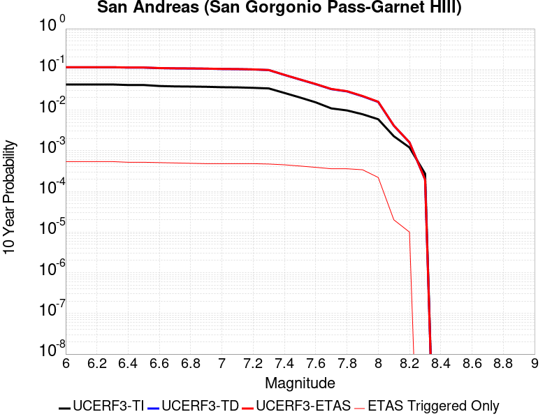 |

| Magnitude | 1 wk TI Prob | 1 wk TD Prob | 1 wk ETAS Prob | 1 wk ETAS/TD Gain | 1 wk ETAS Triggered Only | 1 mo TI Prob | 1 mo TD Prob | 1 mo ETAS Prob | 1 mo ETAS/TD Gain | 1 mo ETAS Triggered Only | 1 yr TI Prob | 1 yr TD Prob | 1 yr ETAS Prob | 1 yr ETAS/TD Gain | 1 yr ETAS Triggered Only | 10 yr TI Prob | 10 yr TD Prob | 10 yr ETAS Prob | 10 yr ETAS/TD Gain | 10 yr ETAS Triggered Only |
|-----|-----|-----|-----|-----|-----|-----|-----|-----|-----|-----|-----|-----|-----|-----|-----|-----|-----|-----|-----|-----|
| 6.0 | 8.31567E-5 | 2.3382473E-4 | 5.9830386E-4 | 2.5587704 | 3.6456436E-4 | 3.5633717E-4 | 0.0010017233 | 0.0013659225 | 1.3635726 | 3.6456436E-4 | 0.004329778 | 0.012127888 | 0.012488032 | 1.0296954 | 3.6456436E-4 | 0.042463828 | 0.11257892 | 0.11290244 | 1.0028738 | 3.6456436E-4 |
| 6.1 | 8.31567E-5 | 2.3382473E-4 | 5.9830386E-4 | 2.5587704 | 3.6456436E-4 | 3.5633717E-4 | 0.0010017233 | 0.0013659225 | 1.3635726 | 3.6456436E-4 | 0.004329778 | 0.012127888 | 0.012488032 | 1.0296954 | 3.6456436E-4 | 0.042463828 | 0.11257892 | 0.11290244 | 1.0028738 | 3.6456436E-4 |
| 6.2 | 8.31567E-5 | 2.3382473E-4 | 5.9830386E-4 | 2.5587704 | 3.6456436E-4 | 3.5633717E-4 | 0.0010017233 | 0.0013659225 | 1.3635726 | 3.6456436E-4 | 0.004329778 | 0.012127888 | 0.012488032 | 1.0296954 | 3.6456436E-4 | 0.042463828 | 0.11257892 | 0.11290244 | 1.0028738 | 3.6456436E-4 |
| 6.3 | 8.31567E-5 | 2.3382473E-4 | 5.9830386E-4 | 2.5587704 | 3.6456436E-4 | 3.5633717E-4 | 0.0010017233 | 0.0013659225 | 1.3635726 | 3.6456436E-4 | 0.004329778 | 0.012127888 | 0.012488032 | 1.0296954 | 3.6456436E-4 | 0.042463828 | 0.11257892 | 0.11290244 | 1.0028738 | 3.6456436E-4 |
| 6.4 | 8.059055E-5 | 2.2940808E-4 | 5.938888E-4 | 2.5887876 | 3.6456436E-4 | 3.4534236E-4 | 9.828096E-4 | 0.0013470156 | 1.3705764 | 3.6456436E-4 | 0.0041964394 | 0.011900152 | 0.012260377 | 1.0302707 | 3.6456436E-4 | 0.041180745 | 0.11056015 | 0.110884406 | 1.0029329 | 3.6456436E-4 |
| 6.5 | 8.059055E-5 | 2.2940808E-4 | 5.938888E-4 | 2.5887876 | 3.6456436E-4 | 3.4534236E-4 | 9.828096E-4 | 0.0013470156 | 1.3705764 | 3.6456436E-4 | 0.0041964394 | 0.011900152 | 0.012260377 | 1.0302707 | 3.6456436E-4 | 0.041180745 | 0.11056015 | 0.110884406 | 1.0029329 | 3.6456436E-4 |
| 6.6 | 7.619237E-5 | 2.218517E-4 | 5.863352E-4 | 2.6429148 | 3.6456436E-4 | 3.2649786E-4 | 9.5044886E-4 | 0.0013146667 | 1.3832061 | 3.6456436E-4 | 0.0039678677 | 0.01151087 | 0.011871238 | 1.0313067 | 3.6456436E-4 | 0.03897764 | 0.10709683 | 0.10742235 | 1.0030395 | 3.6456436E-4 |
| 6.7 | 7.440636E-5 | 2.1860997E-4 | 5.830946E-4 | 2.6672828 | 3.6456436E-4 | 3.188454E-4 | 9.3656575E-4 | 0.0013007886 | 1.3888919 | 3.6456436E-4 | 0.0038750346 | 0.011343609 | 0.011704037 | 1.0317737 | 3.6456436E-4 | 0.038081564 | 0.105605274 | 0.10593134 | 1.0030875 | 3.6456436E-4 |
| 6.8 | 7.3735864E-5 | 2.1708169E-4 | 5.815669E-4 | 2.6790233 | 3.6456436E-4 | 3.1597257E-4 | 9.3002064E-4 | 0.001294246 | 1.3916314 | 3.6456436E-4 | 0.0038401815 | 0.011264749 | 0.011625206 | 1.0319988 | 3.6456436E-4 | 0.03774495 | 0.10490683 | 0.10523315 | 1.0031105 | 3.6456436E-4 |
| 6.9 | 7.27575E-5 | 2.1477141E-4 | 5.7925744E-4 | 2.6970882 | 3.6456436E-4 | 3.117806E-4 | 9.201265E-4 | 0.0012843554 | 1.3958466 | 3.6456436E-4 | 0.003789323 | 0.011145527 | 0.011506028 | 1.0323449 | 3.6456436E-4 | 0.037253562 | 0.103854746 | 0.104181446 | 1.0031458 | 3.6456436E-4 |
| 7.0 | 7.102591E-5 | 2.1061185E-4 | 5.7509943E-4 | 2.7306128 | 3.6456436E-4 | 3.0436125E-4 | 9.023122E-4 | 0.0012665476 | 1.4036689 | 3.6456436E-4 | 0.003699303 | 0.010930831 | 0.011291411 | 1.0329874 | 3.6456436E-4 | 0.03638325 | 0.10195695 | 0.10228434 | 1.0032111 | 3.6456436E-4 |
| 7.1 | 7.028513E-5 | 2.0896831E-4 | 5.7345646E-4 | 2.744227 | 3.6456436E-4 | 3.0118722E-4 | 8.9527335E-4 | 0.0012595113 | 1.4068456 | 3.6456436E-4 | 0.0036607897 | 0.010845989 | 0.0112066 | 1.0332483 | 3.6456436E-4 | 0.036010686 | 0.101199985 | 0.10152765 | 1.0032378 | 3.6456436E-4 |
| 7.2 | 6.8498244E-5 | 2.0504706E-4 | 5.6953664E-4 | 2.7775898 | 3.6456436E-4 | 2.9353087E-4 | 8.784794E-4 | 0.0012427234 | 1.4146302 | 3.6456436E-4 | 0.003567883 | 0.010643536 | 0.01100422 | 1.0338876 | 3.6456436E-4 | 0.035111405 | 0.09939202 | 0.09972035 | 1.0033034 | 3.6456436E-4 |
| 7.3 | 6.622592E-5 | 1.9732013E-4 | 5.6181254E-4 | 2.8472135 | 3.6456436E-4 | 2.8379448E-4 | 8.453858E-4 | 0.0012096419 | 1.4308757 | 3.6456436E-4 | 0.0034497243 | 0.0102444785 | 0.010605308 | 1.0352218 | 3.6456436E-4 | 0.033966612 | 0.095888525 | 0.09621813 | 1.0034374 | 3.6456436E-4 |
| 7.4 | 5.1050705E-5 | 1.4689034E-4 | 3.8989753E-4 | 2.6543443 | 2.430429E-4 | 2.1877038E-4 | 6.29379E-4 | 8.722689E-4 | 1.3859199 | 2.430429E-4 | 0.002660276 | 0.0076359594 | 0.007877147 | 1.0315857 | 2.430429E-4 | 0.02628654 | 0.07286301 | 0.07308835 | 1.0030925 | 2.430429E-4 |
| 7.5 | 3.9302922E-5 | 1.1129847E-4 | 3.543143E-4 | 3.183461 | 2.430429E-4 | 1.6843023E-4 | 4.7690657E-4 | 7.1983354E-4 | 1.5093807 | 2.430429E-4 | 0.0020487092 | 0.005790949 | 0.0060325842 | 1.0417264 | 2.430429E-4 | 0.020299247 | 0.05600951 | 0.05623894 | 1.0040963 | 2.430429E-4 |
| 7.6 | 2.9851626E-5 | 8.4949745E-5 | 3.27972E-4 | 3.8607767 | 2.430429E-4 | 1.2792926E-4 | 3.6401965E-4 | 6.0697406E-4 | 1.6674212 | 2.430429E-4 | 0.0015564259 | 0.0044229585 | 0.0046649263 | 1.0547073 | 2.430429E-4 | 0.0154556995 | 0.04319374 | 0.043426283 | 1.0053837 | 2.430429E-4 |
| 7.7 | 2.1135214E-5 | 6.3529005E-5 | 1.8504274E-4 | 2.9127285 | 1.2152145E-4 | 9.0576345E-5 | 2.7223877E-4 | 3.9372712E-4 | 1.4462566 | 1.2152145E-4 | 0.0011022091 | 0.0033094748 | 0.003430594 | 1.0365977 | 1.2152145E-4 | 0.010967582 | 0.032582592 | 0.032700155 | 1.0036081 | 1.2152145E-4 |
| 7.8 | 1.883379E-5 | 5.564028E-5 | 1.7715497E-4 | 3.1839337 | 1.2152145E-4 | 8.0713755E-5 | 2.3843657E-4 | 3.5992905E-4 | 1.5095379 | 1.2152145E-4 | 9.822468E-4 | 0.0028991038 | 0.003020273 | 1.0417954 | 1.2152145E-4 | 0.0097791655 | 0.028695205 | 0.028813241 | 1.0041134 | 1.2152145E-4 |
| 7.9 | 1.5156185E-5 | 4.1658426E-5 | 1.6317482E-4 | 3.9169703 | 1.2152145E-4 | 6.495346E-5 | 1.785239E-4 | 3.0002365E-4 | 1.6805798 | 1.2152145E-4 | 7.9052144E-4 | 0.0021713632 | 0.0022926207 | 1.055844 | 1.2152145E-4 | 0.007877152 | 0.021759422 | 0.0218783 | 1.0054632 | 1.2152145E-4 |
| 8.0 | 1.1405907E-5 | 2.9974231E-5 | 1.5149204E-4 | 5.0540757 | 1.2152145E-4 | 4.8881542E-5 | 1.2845467E-4 | 2.4996052E-4 | 1.9459044 | 1.2152145E-4 | 5.9497025E-4 | 0.0015628147 | 0.0016841462 | 1.0776366 | 1.2152145E-4 | 0.005933798 | 0.015772851 | 0.015892455 | 1.0075829 | 1.2152145E-4 |
| 8.1 | 4.3511436E-6 | 7.369219E-6 | 7.369219E-6 | 1.0 | 0.0 | 1.8647626E-5 | 3.1581985E-5 | 3.1581985E-5 | 1.0 | 0.0 | 2.2701119E-4 | 3.8444297E-4 | 3.8444297E-4 | 1.0 | 0.0 | 0.0022677942 | 0.0041163345 | 0.0041163345 | 1.0 | 0.0 |
| 8.2 | 2.3042528E-6 | 2.7329415E-6 | 2.7329415E-6 | 1.0 | 0.0 | 9.875332E-6 | 1.1712554E-5 | 1.1712554E-5 | 1.0 | 0.0 | 1.2022553E-4 | 1.4259106E-4 | 1.4259106E-4 | 1.0 | 0.0 | 0.0012016051 | 0.0015979785 | 0.0015979785 | 1.0 | 0.0 |
| 8.3 | 5.202968E-7 | 3.1598344E-7 | 3.1598344E-7 | 1.0 | 0.0 | 2.2298414E-6 | 1.3542141E-6 | 1.3542141E-6 | 1.0 | 0.0 | 2.714798E-5 | 1.6487444E-5 | 1.6487444E-5 | 1.0 | 0.0 | 2.7144665E-4 | 1.9563142E-4 | 1.9563142E-4 | 1.0 | 0.0 |

## Brawley (Seismic Zone) alt 1
*[(top)](#table-of-contents)*

| 1 Week | 1 Month | 1 Year | 10 Year |
|-----|-----|-----|-----|
|  |  |  |  |

| Magnitude | 1 wk TI Prob | 1 wk TD Prob | 1 wk ETAS Prob | 1 wk ETAS/TD Gain | 1 wk ETAS Triggered Only | 1 mo TI Prob | 1 mo TD Prob | 1 mo ETAS Prob | 1 mo ETAS/TD Gain | 1 mo ETAS Triggered Only | 1 yr TI Prob | 1 yr TD Prob | 1 yr ETAS Prob | 1 yr ETAS/TD Gain | 1 yr ETAS Triggered Only | 10 yr TI Prob | 10 yr TD Prob | 10 yr ETAS Prob | 10 yr ETAS/TD Gain | 10 yr ETAS Triggered Only |
|-----|-----|-----|-----|-----|-----|-----|-----|-----|-----|-----|-----|-----|-----|-----|-----|-----|-----|-----|-----|-----|
| 6.0 | 2.2521618E-4 | 4.7632487E-4 | 5.977884E-4 | 1.2550015 | 1.2152145E-4 | 9.6485513E-4 | 0.0020398323 | 0.0021611059 | 1.0594528 | 1.2152145E-4 | 0.011683988 | 0.024546238 | 0.024783313 | 1.0096583 | 2.430429E-4 | 0.11088423 | 0.21350002 | 0.21378675 | 1.001343 | 3.6456436E-4 |
| 6.1 | 2.2521618E-4 | 4.7632487E-4 | 5.977884E-4 | 1.2550015 | 1.2152145E-4 | 9.6485513E-4 | 0.0020398323 | 0.0021611059 | 1.0594528 | 1.2152145E-4 | 0.011683988 | 0.024546238 | 0.024664775 | 1.0048292 | 1.2152145E-4 | 0.11088423 | 0.21350002 | 0.21369117 | 1.0008954 | 2.430429E-4 |
| 6.2 | 2.198148E-4 | 4.6717093E-4 | 5.886356E-4 | 1.2600005 | 1.2152145E-4 | 9.417233E-4 | 0.0020006616 | 0.0021219398 | 1.0606191 | 1.2152145E-4 | 0.011405343 | 0.024080504 | 0.024199098 | 1.0049249 | 1.2152145E-4 | 0.10837428 | 0.20993657 | 0.21012859 | 1.0009147 | 2.430429E-4 |
| 6.3 | 2.1704129E-4 | 4.615278E-4 | 5.8299315E-4 | 1.2631811 | 1.2152145E-4 | 9.298453E-4 | 0.0019765133 | 0.0020977946 | 1.0613612 | 1.2152145E-4 | 0.011262234 | 0.02379366 | 0.02391229 | 1.0049858 | 1.2152145E-4 | 0.107082725 | 0.20782755 | 0.20802008 | 1.0009264 | 2.430429E-4 |
| 6.4 | 1.876142E-4 | 4.00449E-4 | 5.219218E-4 | 1.3033415 | 1.2152145E-4 | 8.038131E-4 | 0.0017150956 | 0.0018364086 | 1.0707325 | 1.2152145E-4 | 0.00974259 | 0.020680401 | 0.02079941 | 1.0057546 | 1.2152145E-4 | 0.093263686 | 0.18457815 | 0.18477634 | 1.0010737 | 2.430429E-4 |
| 6.5 | 1.7390939E-4 | 3.7477075E-4 | 4.962467E-4 | 1.3241339 | 1.2152145E-4 | 7.45113E-4 | 0.0016051838 | 0.0017265102 | 1.075584 | 1.2152145E-4 | 0.009034078 | 0.019368723 | 0.019487891 | 1.0061526 | 1.2152145E-4 | 0.086755216 | 0.17440031 | 0.17450064 | 1.0005753 | 1.2152145E-4 |
| 6.6 | 1.591791E-4 | 3.4891962E-4 | 4.7039866E-4 | 1.3481576 | 1.2152145E-4 | 6.8201777E-4 | 0.0014945229 | 0.0016158627 | 1.0811896 | 1.2152145E-4 | 0.008271996 | 0.018045569 | 0.018164897 | 1.0066127 | 1.2152145E-4 | 0.07970774 | 0.16380852 | 0.16391014 | 1.0006204 | 1.2152145E-4 |
| 6.7 | 1.4268003E-4 | 3.20582E-4 | 4.420645E-4 | 1.3789436 | 1.2152145E-4 | 6.1134255E-4 | 0.0013732077 | 0.0014945623 | 1.0883731 | 1.2152145E-4 | 0.007417723 | 0.016592601 | 0.016712107 | 1.0072023 | 1.2152145E-4 | 0.07174956 | 0.15193306 | 0.15203613 | 1.0006783 | 1.2152145E-4 |
| 6.8 | 1.239713E-4 | 2.9053655E-4 | 4.120227E-4 | 1.4181441 | 1.2152145E-4 | 5.3119735E-4 | 0.0012445687 | 0.0013659389 | 1.0975199 | 1.2152145E-4 | 0.0064481674 | 0.015048777 | 0.01516847 | 1.0079536 | 1.2152145E-4 | 0.06264243 | 0.13837762 | 0.13848233 | 1.0007566 | 1.2152145E-4 |
| 6.9 | 1.0180238E-4 | 2.625439E-4 | 3.8403345E-4 | 1.46274 | 1.2152145E-4 | 4.3622297E-4 | 0.0011247073 | 0.001246092 | 1.1079257 | 1.2152145E-4 | 0.005298089 | 0.013608336 | 0.013728204 | 1.0088084 | 1.2152145E-4 | 0.05173543 | 0.124961674 | 0.12506801 | 1.0008509 | 1.2152145E-4 |
| 7.0 | 7.6619996E-5 | 2.23993E-4 | 3.4548723E-4 | 1.5424019 | 1.2152145E-4 | 3.283301E-4 | 9.5962E-4 | 0.0010810249 | 1.1265135 | 1.2152145E-4 | 0.0039900932 | 0.011621496 | 0.011741605 | 1.0103351 | 1.2152145E-4 | 0.039192066 | 0.107266866 | 0.10737535 | 1.0010114 | 1.2152145E-4 |
| 7.1 | 7.5127435E-5 | 2.2082464E-4 | 3.4231925E-4 | 1.5501859 | 1.2152145E-4 | 3.2193496E-4 | 9.4605127E-4 | 0.0010674577 | 1.1283298 | 1.2152145E-4 | 0.0039125155 | 0.011458045 | 0.011578173 | 1.0104842 | 1.2152145E-4 | 0.038443442 | 0.10583085 | 0.10593951 | 1.0010267 | 1.2152145E-4 |
| 7.2 | 6.788582E-5 | 2.0210193E-4 | 3.2359883E-4 | 1.6011664 | 1.2152145E-4 | 2.9090676E-4 | 8.6586666E-4 | 9.87283E-4 | 1.140225 | 1.2152145E-4 | 0.0035360386 | 0.0104916105 | 0.010611857 | 1.0114613 | 1.2152145E-4 | 0.034803 | 0.09750131 | 0.09761098 | 1.0011249 | 1.2152145E-4 |
| 7.3 | 6.399602E-5 | 1.8841137E-4 | 3.0990993E-4 | 1.6448579 | 1.2152145E-4 | 2.7423984E-4 | 8.072303E-4 | 9.2865364E-4 | 1.1504197 | 1.2152145E-4 | 0.0033337586 | 0.009784332 | 0.009904664 | 1.0122985 | 1.2152145E-4 | 0.03284188 | 0.09139617 | 0.09150658 | 1.0012081 | 1.2152145E-4 |
| 7.4 | 4.506759E-5 | 1.2529209E-4 | 2.467983E-4 | 1.9697837 | 1.2152145E-4 | 1.9313251E-4 | 5.368565E-4 | 6.583127E-4 | 1.2262359 | 1.2152145E-4 | 0.0023488526 | 0.0065168133 | 0.006637543 | 1.0185258 | 1.2152145E-4 | 0.023241805 | 0.062363707 | 0.06247765 | 1.0018271 | 1.2152145E-4 |
| 7.5 | 3.43289E-5 | 9.33541E-5 | 2.1486421E-4 | 2.3016043 | 1.2152145E-4 | 1.4711556E-4 | 4.00028E-4 | 5.215008E-4 | 1.3036609 | 1.2152145E-4 | 0.0017896603 | 0.0048595266 | 0.0049804575 | 1.0248853 | 1.2152145E-4 | 0.01775316 | 0.04705519 | 0.047170993 | 1.002461 | 1.2152145E-4 |
| 7.6 | 2.5980507E-5 | 7.053101E-5 | 1.920439E-4 | 2.722829 | 1.2152145E-4 | 1.1134028E-4 | 3.0224086E-4 | 4.2372558E-4 | 1.4019467 | 1.2152145E-4 | 0.001354725 | 0.003673598 | 0.003794673 | 1.0329581 | 1.2152145E-4 | 0.013464959 | 0.035840835 | 0.035958 | 1.0032691 | 1.2152145E-4 |
| 7.7 | 1.7292105E-5 | 4.9407296E-5 | 4.9407296E-5 | 1.0 | 0.0 | 7.4106916E-5 | 2.117284E-4 | 2.117284E-4 | 1.0 | 0.0 | 9.018782E-4 | 0.0025747516 | 0.0025747516 | 1.0 | 0.0 | 0.008982267 | 0.025290398 | 0.025290398 | 1.0 | 0.0 |
| 7.8 | 1.2927471E-5 | 3.9693266E-5 | 3.9693266E-5 | 1.0 | 0.0 | 5.5402274E-5 | 1.7010293E-4 | 1.7010293E-4 | 1.0 | 0.0 | 6.743139E-4 | 0.0020690386 | 0.0020690386 | 1.0 | 0.0 | 0.0067227143 | 0.020431727 | 0.020431727 | 1.0 | 0.0 |
| 7.9 | 1.0200774E-5 | 2.874569E-5 | 2.874569E-5 | 1.0 | 0.0 | 4.371687E-5 | 1.2319001E-4 | 1.2319001E-4 | 1.0 | 0.0 | 5.321229E-4 | 0.0014988075 | 0.0014988075 | 1.0 | 0.0 | 0.005308505 | 0.014991644 | 0.014991644 | 1.0 | 0.0 |
| 8.0 | 8.650396E-6 | 2.3277367E-5 | 2.3277367E-5 | 1.0 | 0.0 | 3.70726E-5 | 9.975634E-5 | 9.975634E-5 | 1.0 | 0.0 | 4.5126543E-4 | 0.0012138576 | 0.0012138576 | 1.0 | 0.0 | 0.0045035016 | 0.012211097 | 0.012211097 | 1.0 | 0.0 |
| 8.1 | 3.9368224E-6 | 7.3279825E-6 | 7.3279825E-6 | 1.0 | 0.0 | 1.6871985E-5 | 3.140526E-5 | 3.140526E-5 | 1.0 | 0.0 | 2.0539707E-4 | 3.8229208E-4 | 3.8229208E-4 | 1.0 | 0.0 | 0.0020520731 | 0.004001185 | 0.004001185 | 1.0 | 0.0 |
| 8.2 | 1.7101195E-6 | 2.217876E-6 | 2.217876E-6 | 1.0 | 0.0 | 7.329063E-6 | 9.505149E-6 | 9.505149E-6 | 1.0 | 0.0 | 8.922769E-5 | 1.1571907E-4 | 1.1571907E-4 | 1.0 | 0.0 | 8.9191867E-4 | 0.0012666774 | 0.0012666774 | 1.0 | 0.0 |
| 8.3 | 3.0346666E-8 | 1.721586E-8 | 1.721586E-8 | 1.0 | 0.0 | 1.3005713E-7 | 7.378226E-8 | 7.378226E-8 | 1.0 | 0.0 | 1.5834444E-6 | 8.9829894E-7 | 8.9829894E-7 | 1.0 | 0.0 | 1.5834332E-5 | 9.367729E-6 | 9.367729E-6 | 1.0 | 0.0 |

## San Jacinto (Stepovers Combined)
*[(top)](#table-of-contents)*

| 1 Week | 1 Month | 1 Year | 10 Year |
|-----|-----|-----|-----|
|  |  |  |  |

| Magnitude | 1 wk TI Prob | 1 wk TD Prob | 1 wk ETAS Prob | 1 wk ETAS/TD Gain | 1 wk ETAS Triggered Only | 1 mo TI Prob | 1 mo TD Prob | 1 mo ETAS Prob | 1 mo ETAS/TD Gain | 1 mo ETAS Triggered Only | 1 yr TI Prob | 1 yr TD Prob | 1 yr ETAS Prob | 1 yr ETAS/TD Gain | 1 yr ETAS Triggered Only | 10 yr TI Prob | 10 yr TD Prob | 10 yr ETAS Prob | 10 yr ETAS/TD Gain | 10 yr ETAS Triggered Only |
|-----|-----|-----|-----|-----|-----|-----|-----|-----|-----|-----|-----|-----|-----|-----|-----|-----|-----|-----|-----|-----|
| 6.0 | 4.0667746E-5 | 3.5272755E-5 | 1.5678992E-4 | 4.445071 | 1.2152145E-4 | 1.742787E-4 | 1.5116022E-4 | 3.9416636E-4 | 2.6076066 | 2.430429E-4 | 0.0021197782 | 0.0018388226 | 0.0022027167 | 1.197895 | 3.6456436E-4 | 0.020996714 | 0.018986892 | 0.019344535 | 1.0188363 | 3.6456436E-4 |
| 6.1 | 4.0667746E-5 | 3.5272755E-5 | 1.5678992E-4 | 4.445071 | 1.2152145E-4 | 1.742787E-4 | 1.5116022E-4 | 3.9416636E-4 | 2.6076066 | 2.430429E-4 | 0.0021197782 | 0.0018388226 | 0.0022027167 | 1.197895 | 3.6456436E-4 | 0.020996714 | 0.018986892 | 0.019344535 | 1.0188363 | 3.6456436E-4 |
| 6.2 | 4.0667746E-5 | 3.5272755E-5 | 1.5678992E-4 | 4.445071 | 1.2152145E-4 | 1.742787E-4 | 1.5116022E-4 | 3.9416636E-4 | 2.6076066 | 2.430429E-4 | 0.0021197782 | 0.0018388226 | 0.0022027167 | 1.197895 | 3.6456436E-4 | 0.020996714 | 0.018986892 | 0.019344535 | 1.0188363 | 3.6456436E-4 |
| 6.3 | 4.0667746E-5 | 3.5272755E-5 | 1.5678992E-4 | 4.445071 | 1.2152145E-4 | 1.742787E-4 | 1.5116022E-4 | 3.9416636E-4 | 2.6076066 | 2.430429E-4 | 0.0021197782 | 0.0018388226 | 0.0022027167 | 1.197895 | 3.6456436E-4 | 0.020996714 | 0.018986892 | 0.019344535 | 1.0188363 | 3.6456436E-4 |
| 6.4 | 4.0577226E-5 | 3.5144654E-5 | 1.5666183E-4 | 4.4576287 | 1.2152145E-4 | 1.738908E-4 | 1.5061127E-4 | 3.9361758E-4 | 2.6134667 | 2.430429E-4 | 0.0021150648 | 0.0018321523 | 0.0021960486 | 1.1986169 | 3.6456436E-4 | 0.020950472 | 0.018921461 | 0.019279126 | 1.0189027 | 3.6456436E-4 |
| 6.5 | 4.0577226E-5 | 3.5144654E-5 | 1.5666183E-4 | 4.4576287 | 1.2152145E-4 | 1.738908E-4 | 1.5061127E-4 | 3.9361758E-4 | 2.6134667 | 2.430429E-4 | 0.0021150648 | 0.0018321523 | 0.0021960486 | 1.1986169 | 3.6456436E-4 | 0.020950472 | 0.018921461 | 0.019279126 | 1.0189027 | 3.6456436E-4 |
| 6.6 | 4.053861E-5 | 3.509E-5 | 1.5660719E-4 | 4.4630146 | 1.2152145E-4 | 1.7372532E-4 | 1.5037706E-4 | 3.933834E-4 | 2.6159801 | 2.430429E-4 | 0.0021130538 | 0.0018293057 | 0.002193203 | 1.1989266 | 3.6456436E-4 | 0.020930743 | 0.018893538 | 0.019251214 | 1.0189312 | 3.6456436E-4 |
| 6.7 | 4.0516545E-5 | 3.5059067E-5 | 1.5657625E-4 | 4.46607 | 1.2152145E-4 | 1.7363077E-4 | 1.5024451E-4 | 3.932509E-4 | 2.617406 | 2.430429E-4 | 0.002111905 | 0.001827695 | 0.002191593 | 1.1991022 | 3.6456436E-4 | 0.020919468 | 0.018877735 | 0.019235417 | 1.0189474 | 3.6456436E-4 |
| 6.8 | 4.049434E-5 | 3.5030633E-5 | 1.5654782E-4 | 4.468884 | 1.2152145E-4 | 1.7353562E-4 | 1.5012265E-4 | 3.9312907E-4 | 2.618719 | 2.430429E-4 | 0.0021107488 | 0.0018262138 | 0.0021901124 | 1.1992639 | 3.6456436E-4 | 0.020908125 | 0.018863149 | 0.019220836 | 1.0189623 | 3.6456436E-4 |
| 6.9 | 4.046386E-5 | 3.499319E-5 | 1.5651039E-4 | 4.472595 | 1.2152145E-4 | 1.73405E-4 | 1.4996222E-4 | 3.9296868E-4 | 2.6204512 | 2.430429E-4 | 0.0021091616 | 0.0018242638 | 0.002188163 | 1.1994773 | 3.6456436E-4 | 0.020892553 | 0.01884392 | 0.019201616 | 1.0189819 | 3.6456436E-4 |
| 7.0 | 4.036382E-5 | 3.487376E-5 | 1.5639098E-4 | 4.4844885 | 1.2152145E-4 | 1.7297632E-4 | 1.4945042E-4 | 3.92457E-4 | 2.6260014 | 2.430429E-4 | 0.0021039525 | 0.0018180435 | 0.0021819451 | 1.2001611 | 3.6456436E-4 | 0.02084144 | 0.018782536 | 0.019140253 | 1.0190452 | 3.6456436E-4 |
| 7.1 | 4.0343282E-5 | 3.4852223E-5 | 1.5636944E-4 | 4.486642 | 1.2152145E-4 | 1.7288832E-4 | 1.4935812E-4 | 3.9236472E-4 | 2.627006 | 2.430429E-4 | 0.002102883 | 0.0018169218 | 0.0021808238 | 1.2002848 | 3.6456436E-4 | 0.020830948 | 0.018771412 | 0.019129133 | 1.0190567 | 3.6456436E-4 |
| 7.2 | 4.0257353E-5 | 3.4756722E-5 | 1.5627395E-4 | 4.496222 | 1.2152145E-4 | 1.725201E-4 | 1.489489E-4 | 3.919556E-4 | 2.631477 | 2.430429E-4 | 0.0020984085 | 0.0018119477 | 0.0021758515 | 1.2008357 | 3.6456436E-4 | 0.020787042 | 0.018722152 | 0.01907989 | 1.0191078 | 3.6456436E-4 |
| 7.3 | 3.9940667E-5 | 3.4584376E-5 | 1.5610163E-4 | 4.5136456 | 1.2152145E-4 | 1.7116306E-4 | 1.4821035E-4 | 3.9121724E-4 | 2.639608 | 2.430429E-4 | 0.0020819185 | 0.0018029709 | 0.002166878 | 1.2018374 | 3.6456436E-4 | 0.020625217 | 0.018630784 | 0.018988557 | 1.0192033 | 3.6456436E-4 |
| 7.4 | 3.9721202E-5 | 3.4469766E-5 | 1.5598703E-4 | 4.5253286 | 1.2152145E-4 | 1.7022261E-4 | 1.4771923E-4 | 3.9072623E-4 | 2.64506 | 2.430429E-4 | 0.0020704903 | 0.0017970012 | 0.0021609105 | 1.2025092 | 3.6456436E-4 | 0.020513052 | 0.018569905 | 0.0189277 | 1.0192674 | 3.6456436E-4 |
| 7.5 | 3.7036873E-5 | 3.3537188E-5 | 1.5505456E-4 | 4.623362 | 1.2152145E-4 | 1.5871979E-4 | 1.437229E-4 | 3.8673086E-4 | 2.690809 | 2.430429E-4 | 0.0019307006 | 0.0017484248 | 0.0021123518 | 1.2081456 | 3.6456436E-4 | 0.019140124 | 0.018071463 | 0.01842944 | 1.0198089 | 3.6456436E-4 |
| 7.6 | 3.2940967E-5 | 3.1317984E-5 | 1.5283562E-4 | 4.880123 | 1.2152145E-4 | 1.4116794E-4 | 1.3421304E-4 | 3.7722333E-4 | 2.8106308 | 2.430429E-4 | 0.0017173645 | 0.0016328214 | 0.0019967905 | 1.2229081 | 3.6456436E-4 | 0.01704153 | 0.016904354 | 0.017262755 | 1.0212017 | 3.6456436E-4 |
| 7.7 | 2.8236149E-5 | 2.7883889E-5 | 1.4940195E-4 | 5.3580027 | 1.2152145E-4 | 1.2100645E-4 | 1.19496915E-4 | 3.6251076E-4 | 3.0336413 | 2.430429E-4 | 0.0014722579 | 0.001453905 | 0.0018179393 | 1.2503839 | 3.6456436E-4 | 0.014625421 | 0.015115095 | 0.015474149 | 1.0237547 | 3.6456436E-4 |
| 7.8 | 2.4329287E-5 | 2.5207537E-5 | 1.4672593E-4 | 5.8207164 | 1.2152145E-4 | 1.042642E-4 | 1.0802783E-4 | 3.5104447E-4 | 3.2495744 | 2.430429E-4 | 0.0012686774 | 0.0013144462 | 0.0016785313 | 1.2769874 | 3.6456436E-4 | 0.012614589 | 0.013712396 | 0.014071961 | 1.0262219 | 3.6456436E-4 |
| 7.9 | 1.9370926E-5 | 2.0421452E-5 | 2.0421452E-5 | 1.0 | 0.0 | 8.301561E-5 | 8.7517576E-5 | 2.0902838E-4 | 2.388416 | 1.2152145E-4 | 0.0010102465 | 0.0010650064 | 0.0013077904 | 1.2279649 | 2.430429E-4 | 0.0100566605 | 0.011199483 | 0.011439803 | 1.0214583 | 2.430429E-4 |
| 8.0 | 1.5583017E-5 | 1.588647E-5 | 1.588647E-5 | 1.0 | 0.0 | 6.6782646E-5 | 6.808309E-5 | 6.808309E-5 | 1.0 | 0.0 | 8.127754E-4 | 8.285971E-4 | 9.500178E-4 | 1.1465378 | 1.2152145E-4 | 0.008098091 | 0.008781809 | 0.008902264 | 1.0137163 | 1.2152145E-4 |
| 8.1 | 1.0024873E-5 | 8.292404E-6 | 8.292404E-6 | 1.0 | 0.0 | 4.2963035E-5 | 3.5538393E-5 | 3.5538393E-5 | 1.0 | 0.0 | 5.229494E-4 | 4.3259456E-4 | 4.3259456E-4 | 1.0 | 0.0 | 0.0052172043 | 0.0046534105 | 0.0046534105 | 1.0 | 0.0 |
| 8.2 | 4.142796E-6 | 1.5610041E-6 | 1.5610041E-6 | 1.0 | 0.0 | 1.775472E-5 | 6.69E-6 | 6.69E-6 | 1.0 | 0.0 | 2.1614227E-4 | 8.144774E-5 | 8.144774E-5 | 1.0 | 0.0 | 0.0021593217 | 9.454649E-4 | 9.454649E-4 | 1.0 | 0.0 |
| 8.3 | 1.2750878E-6 | 3.612133E-7 | 3.612133E-7 | 1.0 | 0.0 | 5.4646503E-6 | 1.548056E-6 | 1.548056E-6 | 1.0 | 0.0 | 6.653009E-5 | 1.8847424E-5 | 1.8847424E-5 | 1.0 | 0.0 | 6.6510175E-4 | 2.2734253E-4 | 2.2734253E-4 | 1.0 | 0.0 |

## San Jacinto (San Jacinto Valley) rev
*[(top)](#table-of-contents)*

| 1 Week | 1 Month | 1 Year | 10 Year |
|-----|-----|-----|-----|
|  | 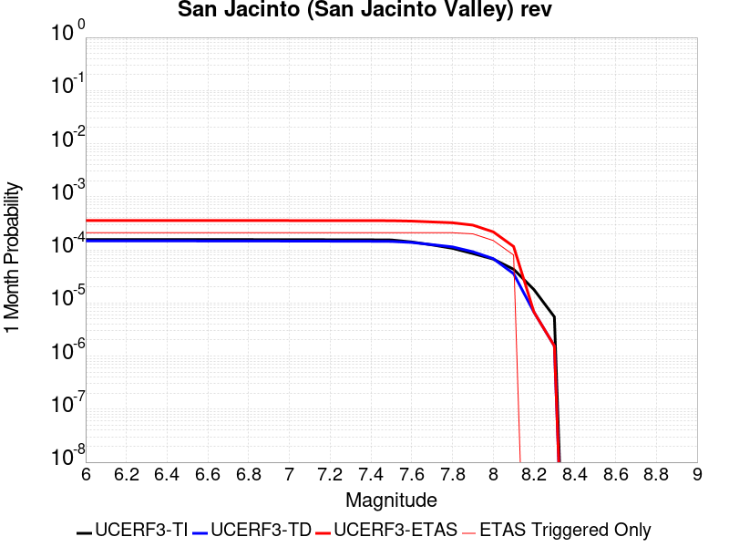 |  |  |

| Magnitude | 1 wk TI Prob | 1 wk TD Prob | 1 wk ETAS Prob | 1 wk ETAS/TD Gain | 1 wk ETAS Triggered Only | 1 mo TI Prob | 1 mo TD Prob | 1 mo ETAS Prob | 1 mo ETAS/TD Gain | 1 mo ETAS Triggered Only | 1 yr TI Prob | 1 yr TD Prob | 1 yr ETAS Prob | 1 yr ETAS/TD Gain | 1 yr ETAS Triggered Only | 10 yr TI Prob | 10 yr TD Prob | 10 yr ETAS Prob | 10 yr ETAS/TD Gain | 10 yr ETAS Triggered Only |
|-----|-----|-----|-----|-----|-----|-----|-----|-----|-----|-----|-----|-----|-----|-----|-----|-----|-----|-----|-----|-----|
| 6.0 | 3.652694E-5 | 3.4402394E-5 | 1.5591965E-4 | 4.532233 | 1.2152145E-4 | 1.5653463E-4 | 1.474305E-4 | 3.9043758E-4 | 2.648282 | 2.430429E-4 | 0.0019041431 | 0.00179349 | 0.0021574006 | 1.2029064 | 3.6456436E-4 | 0.018879099 | 0.018526595 | 0.018884405 | 1.0193133 | 3.6456436E-4 |
| 6.1 | 3.652694E-5 | 3.4402394E-5 | 1.5591965E-4 | 4.532233 | 1.2152145E-4 | 1.5653463E-4 | 1.474305E-4 | 3.9043758E-4 | 2.648282 | 2.430429E-4 | 0.0019041431 | 0.00179349 | 0.0021574006 | 1.2029064 | 3.6456436E-4 | 0.018879099 | 0.018526595 | 0.018884405 | 1.0193133 | 3.6456436E-4 |
| 6.2 | 3.652694E-5 | 3.4402394E-5 | 1.5591965E-4 | 4.532233 | 1.2152145E-4 | 1.5653463E-4 | 1.474305E-4 | 3.9043758E-4 | 2.648282 | 2.430429E-4 | 0.0019041431 | 0.00179349 | 0.0021574006 | 1.2029064 | 3.6456436E-4 | 0.018879099 | 0.018526595 | 0.018884405 | 1.0193133 | 3.6456436E-4 |
| 6.3 | 3.652694E-5 | 3.4402394E-5 | 1.5591965E-4 | 4.532233 | 1.2152145E-4 | 1.5653463E-4 | 1.474305E-4 | 3.9043758E-4 | 2.648282 | 2.430429E-4 | 0.0019041431 | 0.00179349 | 0.0021574006 | 1.2029064 | 3.6456436E-4 | 0.018879099 | 0.018526595 | 0.018884405 | 1.0193133 | 3.6456436E-4 |
| 6.4 | 3.646941E-5 | 3.432397E-5 | 1.5584125E-4 | 4.5403037 | 1.2152145E-4 | 1.5628811E-4 | 1.4709444E-4 | 3.901016E-4 | 2.6520483 | 2.430429E-4 | 0.0019011468 | 0.0017894056 | 0.0021533177 | 1.2033703 | 3.6456436E-4 | 0.018849645 | 0.018486476 | 0.0188443 | 1.019356 | 3.6456436E-4 |
| 6.5 | 3.646941E-5 | 3.432397E-5 | 1.5584125E-4 | 4.5403037 | 1.2152145E-4 | 1.5628811E-4 | 1.4709444E-4 | 3.901016E-4 | 2.6520483 | 2.430429E-4 | 0.0019011468 | 0.0017894056 | 0.0021533177 | 1.2033703 | 3.6456436E-4 | 0.018849645 | 0.018486476 | 0.0188443 | 1.019356 | 3.6456436E-4 |
| 6.6 | 3.6442503E-5 | 3.4287354E-5 | 1.5580464E-4 | 4.5440845 | 1.2152145E-4 | 1.561728E-4 | 1.4693754E-4 | 3.8994473E-4 | 2.653813 | 2.430429E-4 | 0.0018997455 | 0.0017874985 | 0.0021514113 | 1.2035877 | 3.6456436E-4 | 0.018835869 | 0.018467745 | 0.018825578 | 1.019376 | 3.6456436E-4 |
| 6.7 | 3.6432113E-5 | 3.4272925E-5 | 1.5579021E-4 | 4.5455766 | 1.2152145E-4 | 1.5612828E-4 | 1.4687571E-4 | 3.8988292E-4 | 2.654509 | 2.430429E-4 | 0.0018992044 | 0.0017867472 | 0.0021506601 | 1.2036735 | 3.6456436E-4 | 0.018830549 | 0.018460369 | 0.018818203 | 1.0193839 | 3.6456436E-4 |
| 6.8 | 3.6409598E-5 | 3.424198E-5 | 1.5575926E-4 | 4.548781 | 1.2152145E-4 | 1.560318E-4 | 1.4674311E-4 | 3.8975035E-4 | 2.6560044 | 2.430429E-4 | 0.0018980318 | 0.0017851355 | 0.002149049 | 1.2038577 | 3.6456436E-4 | 0.018819023 | 0.018444523 | 0.018802363 | 1.0194008 | 3.6456436E-4 |
| 6.9 | 3.638078E-5 | 3.4202407E-5 | 1.557197E-4 | 4.5528874 | 1.2152145E-4 | 1.5590832E-4 | 1.4657351E-4 | 3.895808E-4 | 2.6579208 | 2.430429E-4 | 0.0018965311 | 0.001783074 | 0.0021469884 | 1.2040938 | 3.6456436E-4 | 0.018804269 | 0.018424258 | 0.018782105 | 1.0194227 | 3.6456436E-4 |
| 7.0 | 3.6294874E-5 | 3.408442E-5 | 1.5560172E-4 | 4.5651865 | 1.2152145E-4 | 1.5554018E-4 | 1.4606792E-4 | 3.890753E-4 | 2.6636603 | 2.430429E-4 | 0.0018920569 | 0.001776929 | 0.0021408454 | 1.2048008 | 3.6456436E-4 | 0.018760284 | 0.018363839 | 0.018721709 | 1.0194877 | 3.6456436E-4 |
| 7.1 | 3.6260717E-5 | 3.4040702E-5 | 1.5555801E-4 | 4.569765 | 1.2152145E-4 | 1.5539382E-4 | 1.4588058E-4 | 3.8888803E-4 | 2.665797 | 2.430429E-4 | 0.001890278 | 0.0017746518 | 0.0021385693 | 1.205064 | 3.6456436E-4 | 0.018742796 | 0.018341439 | 0.018699318 | 1.0195119 | 3.6456436E-4 |
| 7.2 | 3.6210204E-5 | 3.397492E-5 | 1.5549223E-4 | 4.576677 | 1.2152145E-4 | 1.5517735E-4 | 1.455987E-4 | 3.8860622E-4 | 2.6690226 | 2.430429E-4 | 0.001887647 | 0.0017712255 | 0.002135144 | 1.2054615 | 3.6456436E-4 | 0.01871693 | 0.01830772 | 0.01866561 | 1.0195485 | 3.6456436E-4 |
| 7.3 | 3.6119454E-5 | 3.386321E-5 | 1.5538053E-4 | 4.5884767 | 1.2152145E-4 | 1.5478847E-4 | 1.4511998E-4 | 3.881276E-4 | 2.674529 | 2.430429E-4 | 0.0018829206 | 0.0017654065 | 0.0021293273 | 1.2061399 | 3.6456436E-4 | 0.018670462 | 0.018250274 | 0.018608185 | 1.0196112 | 3.6456436E-4 |
| 7.4 | 3.607848E-5 | 3.381071E-5 | 1.5532805E-4 | 4.594049 | 1.2152145E-4 | 1.5461289E-4 | 1.44895E-4 | 3.879027E-4 | 2.6771295 | 2.430429E-4 | 0.0018807866 | 0.0017626719 | 0.0021265936 | 1.2064602 | 3.6456436E-4 | 0.018649481 | 0.018223269 | 0.01858119 | 1.0196409 | 3.6456436E-4 |
| 7.5 | 3.5856774E-5 | 3.3620483E-5 | 1.5513784E-4 | 4.614385 | 1.2152145E-4 | 1.5366284E-4 | 1.4407984E-4 | 3.8708773E-4 | 2.6866198 | 2.430429E-4 | 0.0018692396 | 0.0017527633 | 0.0021166885 | 1.2076294 | 3.6456436E-4 | 0.018535944 | 0.018124366 | 0.018482324 | 1.01975 | 3.6456436E-4 |
| 7.6 | 3.286655E-5 | 3.2143445E-5 | 1.5366099E-4 | 4.7804766 | 1.2152145E-4 | 1.4084904E-4 | 1.3775036E-4 | 3.807598E-4 | 2.764129 | 2.430429E-4 | 0.001713488 | 0.0016758227 | 0.002039776 | 1.217179 | 3.6456436E-4 | 0.017003361 | 0.017344031 | 0.017702272 | 1.020655 | 3.6456436E-4 |
| 7.7 | 2.8882527E-5 | 2.9236293E-5 | 1.5075419E-4 | 5.1564054 | 1.2152145E-4 | 1.237764E-4 | 1.2529238E-4 | 3.6830484E-4 | 2.9395628 | 2.430429E-4 | 0.0015059357 | 0.0015243685 | 0.0018883771 | 1.238793 | 3.6456436E-4 | 0.014957713 | 0.015830461 | 0.016189253 | 1.0226648 | 3.6456436E-4 |
| 7.8 | 2.4950225E-5 | 2.6527203E-5 | 1.4804542E-4 | 5.580891 | 1.2152145E-4 | 1.0692515E-4 | 1.1368306E-4 | 3.5669832E-4 | 3.1376557 | 2.430429E-4 | 0.0013010362 | 0.0013832134 | 0.0017472735 | 1.2631987 | 3.6456436E-4 | 0.012934455 | 0.014411755 | 0.014771065 | 1.0249318 | 3.6456436E-4 |
| 7.9 | 1.9881603E-5 | 2.1507445E-5 | 2.1507445E-5 | 1.0 | 0.0 | 8.520408E-5 | 9.217151E-5 | 2.1368176E-4 | 2.318306 | 1.2152145E-4 | 0.001036866 | 0.0011216112 | 0.0013643815 | 1.2164478 | 2.430429E-4 | 0.010320415 | 0.011777027 | 0.012017207 | 1.020394 | 2.430429E-4 |
| 8.0 | 1.563292E-5 | 1.5937347E-5 | 1.5937347E-5 | 1.0 | 0.0 | 6.6996516E-5 | 6.8301124E-5 | 6.8301124E-5 | 1.0 | 0.0 | 8.153773E-4 | 8.3124964E-4 | 9.5267006E-4 | 1.1460698 | 1.2152145E-4 | 0.00812392 | 0.008810506 | 0.008930957 | 1.0136713 | 1.2152145E-4 |
| 8.1 | 1.0045313E-5 | 8.301802E-6 | 8.301802E-6 | 1.0 | 0.0 | 4.305063E-5 | 3.5578672E-5 | 3.5578672E-5 | 1.0 | 0.0 | 5.2401534E-4 | 4.3308473E-4 | 4.3308473E-4 | 1.0 | 0.0 | 0.0052278144 | 0.0046591135 | 0.0046591135 | 1.0 | 0.0 |
| 8.2 | 4.1554413E-6 | 1.5655598E-6 | 1.5655598E-6 | 1.0 | 0.0 | 1.7808914E-5 | 6.709525E-6 | 6.709525E-6 | 1.0 | 0.0 | 2.1680194E-4 | 8.168544E-5 | 8.168544E-5 | 1.0 | 0.0 | 0.0021659054 | 9.482903E-4 | 9.482903E-4 | 1.0 | 0.0 |
| 8.3 | 1.2758221E-6 | 3.6149942E-7 | 3.6149942E-7 | 1.0 | 0.0 | 5.4677976E-6 | 1.5492824E-6 | 1.5492824E-6 | 1.0 | 0.0 | 6.65684E-5 | 1.8862354E-5 | 1.8862354E-5 | 1.0 | 0.0 | 6.6548464E-4 | 2.2751294E-4 | 2.2751294E-4 | 1.0 | 0.0 |

## Elsinore (Glen Ivy) rev
*[(top)](#table-of-contents)*

| 1 Week | 1 Month | 1 Year | 10 Year |
|-----|-----|-----|-----|
|  |  |  |  |

| Magnitude | 1 wk TI Prob | 1 wk TD Prob | 1 wk ETAS Prob | 1 wk ETAS/TD Gain | 1 wk ETAS Triggered Only | 1 mo TI Prob | 1 mo TD Prob | 1 mo ETAS Prob | 1 mo ETAS/TD Gain | 1 mo ETAS Triggered Only | 1 yr TI Prob | 1 yr TD Prob | 1 yr ETAS Prob | 1 yr ETAS/TD Gain | 1 yr ETAS Triggered Only | 10 yr TI Prob | 10 yr TD Prob | 10 yr ETAS Prob | 10 yr ETAS/TD Gain | 10 yr ETAS Triggered Only |
|-----|-----|-----|-----|-----|-----|-----|-----|-----|-----|-----|-----|-----|-----|-----|-----|-----|-----|-----|-----|-----|
| 6.0 | 1.6204086E-4 | 2.9360707E-4 | 4.1509283E-4 | 1.41377 | 1.2152145E-4 | 6.94276E-4 | 0.0012578638 | 0.0013792325 | 1.0964879 | 1.2152145E-4 | 0.008420097 | 0.015234485 | 0.015473825 | 1.0157105 | 2.430429E-4 | 0.081081145 | 0.13969168 | 0.13990077 | 1.0014968 | 2.430429E-4 |
| 6.1 | 1.6204086E-4 | 2.9360707E-4 | 4.1509283E-4 | 1.41377 | 1.2152145E-4 | 6.94276E-4 | 0.0012578638 | 0.0013792325 | 1.0964879 | 1.2152145E-4 | 0.008420097 | 0.015234485 | 0.015473825 | 1.0157105 | 2.430429E-4 | 0.081081145 | 0.13969168 | 0.13990077 | 1.0014968 | 2.430429E-4 |
| 6.2 | 1.6204086E-4 | 2.9360707E-4 | 4.1509283E-4 | 1.41377 | 1.2152145E-4 | 6.94276E-4 | 0.0012578638 | 0.0013792325 | 1.0964879 | 1.2152145E-4 | 0.008420097 | 0.015234485 | 0.015473825 | 1.0157105 | 2.430429E-4 | 0.081081145 | 0.13969168 | 0.13990077 | 1.0014968 | 2.430429E-4 |
| 6.3 | 1.0111737E-4 | 1.7703383E-4 | 1.7703383E-4 | 1.0 | 0.0 | 4.332882E-4 | 7.5861247E-4 | 7.5861247E-4 | 1.0 | 0.0 | 0.005262531 | 0.009217682 | 0.009338084 | 1.013062 | 1.2152145E-4 | 0.0513964 | 0.0870191 | 0.08713005 | 1.001275 | 1.2152145E-4 |
| 6.4 | 1.0111737E-4 | 1.7703383E-4 | 1.7703383E-4 | 1.0 | 0.0 | 4.332882E-4 | 7.5861247E-4 | 7.5861247E-4 | 1.0 | 0.0 | 0.005262531 | 0.009217682 | 0.009338084 | 1.013062 | 1.2152145E-4 | 0.0513964 | 0.0870191 | 0.08713005 | 1.001275 | 1.2152145E-4 |
| 6.5 | 3.6624708E-5 | 4.6391084E-5 | 4.6391084E-5 | 1.0 | 0.0 | 1.569536E-4 | 1.9880582E-4 | 1.9880582E-4 | 1.0 | 0.0 | 0.001909235 | 0.0024181372 | 0.0024181372 | 1.0 | 0.0 | 0.01892915 | 0.023739954 | 0.023739954 | 1.0 | 0.0 |
| 6.6 | 2.5051324E-5 | 2.614772E-5 | 2.614772E-5 | 1.0 | 0.0 | 1.073584E-4 | 1.12057096E-4 | 1.12057096E-4 | 1.0 | 0.0 | 0.0013063047 | 0.0013634858 | 0.0013634858 | 1.0 | 0.0 | 0.012986525 | 0.013564618 | 0.013564618 | 1.0 | 0.0 |
| 6.7 | 2.2189772E-5 | 2.2072849E-5 | 2.2072849E-5 | 1.0 | 0.0 | 9.509556E-5 | 9.4594696E-5 | 9.4594696E-5 | 1.0 | 0.0 | 0.0011571734 | 0.0011511183 | 0.0011511183 | 1.0 | 0.0 | 0.011511663 | 0.011465415 | 0.011465415 | 1.0 | 0.0 |
| 6.8 | 1.6654378E-5 | 1.4437705E-5 | 1.4437705E-5 | 1.0 | 0.0 | 7.137396E-5 | 6.187444E-5 | 6.187444E-5 | 1.0 | 0.0 | 8.686314E-4 | 7.530661E-4 | 7.530661E-4 | 1.0 | 0.0 | 0.008652439 | 0.00751048 | 0.00751048 | 1.0 | 0.0 |
| 6.9 | 1.5042909E-5 | 1.2332022E-5 | 1.2332022E-5 | 1.0 | 0.0 | 6.446802E-5 | 5.285047E-5 | 5.285047E-5 | 1.0 | 0.0 | 7.8461546E-4 | 6.4326765E-4 | 6.4326765E-4 | 1.0 | 0.0 | 0.007818509 | 0.00641828 | 0.00641828 | 1.0 | 0.0 |
| 7.0 | 1.4361385E-5 | 1.1451324E-5 | 1.1451324E-5 | 1.0 | 0.0 | 6.154734E-5 | 4.9076196E-5 | 4.9076196E-5 | 1.0 | 0.0 | 7.490812E-4 | 5.973418E-4 | 5.973418E-4 | 1.0 | 0.0 | 0.007465612 | 0.0059613534 | 0.0059613534 | 1.0 | 0.0 |
| 7.1 | 1.3265571E-5 | 1.0244926E-5 | 1.0244926E-5 | 1.0 | 0.0 | 5.6851208E-5 | 4.39061E-5 | 4.39061E-5 | 1.0 | 0.0 | 6.919436E-4 | 5.344282E-4 | 5.344282E-4 | 1.0 | 0.0 | 0.006897931 | 0.0053347866 | 0.0053347866 | 1.0 | 0.0 |
| 7.2 | 1.1596403E-5 | 8.505067E-6 | 8.505067E-6 | 1.0 | 0.0 | 4.9697923E-5 | 3.6449786E-5 | 3.6449786E-5 | 1.0 | 0.0 | 6.049042E-4 | 4.436875E-4 | 4.436875E-4 | 1.0 | 0.0 | 0.006032603 | 0.0044294316 | 0.0044294316 | 1.0 | 0.0 |
| 7.3 | 1.0150827E-5 | 7.2387597E-6 | 7.2387597E-6 | 1.0 | 0.0 | 4.3502816E-5 | 3.1022897E-5 | 3.1022897E-5 | 1.0 | 0.0 | 5.2951806E-4 | 3.7763975E-4 | 3.7763975E-4 | 1.0 | 0.0 | 0.005282581 | 0.0037703665 | 0.0037703665 | 1.0 | 0.0 |
| 7.4 | 9.080705E-6 | 6.352519E-6 | 6.352519E-6 | 1.0 | 0.0 | 3.8916725E-5 | 2.7224805E-5 | 2.7224805E-5 | 1.0 | 0.0 | 4.7370812E-4 | 3.3141294E-4 | 3.3141294E-4 | 1.0 | 0.0 | 0.004726996 | 0.0033093381 | 0.0033093381 | 1.0 | 0.0 |
| 7.5 | 7.671649E-6 | 5.2256332E-6 | 5.2256332E-6 | 1.0 | 0.0 | 3.287808E-5 | 2.2395385E-5 | 2.2395385E-5 | 1.0 | 0.0 | 4.0021708E-4 | 2.7263095E-4 | 2.7263095E-4 | 1.0 | 0.0 | 0.0039949706 | 0.00272309 | 0.00272309 | 1.0 | 0.0 |
| 7.6 | 6.990086E-6 | 4.687545E-6 | 4.687545E-6 | 1.0 | 0.0 | 2.9957167E-5 | 2.008933E-5 | 2.008933E-5 | 1.0 | 0.0 | 3.6466747E-4 | 2.445613E-4 | 2.445613E-4 | 1.0 | 0.0 | 0.0036406964 | 0.002443038 | 0.002443038 | 1.0 | 0.0 |
| 7.7 | 4.163505E-6 | 2.3295343E-6 | 2.3295343E-6 | 1.0 | 0.0 | 1.7843471E-5 | 9.983683E-6 | 9.983683E-6 | 1.0 | 0.0 | 2.172226E-4 | 1.21545316E-4 | 1.21545316E-4 | 1.0 | 0.0 | 0.0021701038 | 0.0012148614 | 0.0012148614 | 1.0 | 0.0 |
| 7.8 | 2.2692414E-7 | 9.3854695E-8 | 9.3854695E-8 | 1.0 | 0.0 | 9.725317E-7 | 4.0223435E-7 | 4.0223435E-7 | 1.0 | 0.0 | 1.1840509E-5 | 4.8971956E-6 | 4.8971956E-6 | 1.0 | 0.0 | 1.1839878E-4 | 4.8971204E-5 | 4.8971204E-5 | 1.0 | 0.0 |
| 7.9 | 6.676829E-9 | 3.439853E-9 | 3.439853E-9 | 1.0 | 0.0 | 2.861498E-8 | 1.4742227E-8 | 1.4742227E-8 | 1.0 | 0.0 | 3.4838732E-7 | 1.7948659E-7 | 1.7948659E-7 | 1.0 | 0.0 | 3.4838679E-6 | 1.7948646E-6 | 1.7948646E-6 | 1.0 | 0.0 |

## Santa Ynez (East)
*[(top)](#table-of-contents)*

| 1 Week | 1 Month | 1 Year | 10 Year |
|-----|-----|-----|-----|
|  |  |  |  |

| Magnitude | 1 wk TI Prob | 1 wk TD Prob | 1 wk ETAS Prob | 1 wk ETAS/TD Gain | 1 wk ETAS Triggered Only | 1 mo TI Prob | 1 mo TD Prob | 1 mo ETAS Prob | 1 mo ETAS/TD Gain | 1 mo ETAS Triggered Only | 1 yr TI Prob | 1 yr TD Prob | 1 yr ETAS Prob | 1 yr ETAS/TD Gain | 1 yr ETAS Triggered Only | 10 yr TI Prob | 10 yr TD Prob | 10 yr ETAS Prob | 10 yr ETAS/TD Gain | 10 yr ETAS Triggered Only |
|-----|-----|-----|-----|-----|-----|-----|-----|-----|-----|-----|-----|-----|-----|-----|-----|-----|-----|-----|-----|-----|
| 6.0 | 3.2269712E-5 | 3.67505E-5 | 3.67505E-5 | 1.0 | 0.0 | 1.3829143E-4 | 1.5749598E-4 | 4.005006E-4 | 2.5429258 | 2.430429E-4 | 0.0016823979 | 0.0019164166 | 0.0021589936 | 1.1265785 | 2.430429E-4 | 0.016697178 | 0.019056441 | 0.019294852 | 1.0125108 | 2.430429E-4 |
| 6.1 | 3.2269712E-5 | 3.67505E-5 | 3.67505E-5 | 1.0 | 0.0 | 1.3829143E-4 | 1.5749598E-4 | 4.005006E-4 | 2.5429258 | 2.430429E-4 | 0.0016823979 | 0.0019164166 | 0.0021589936 | 1.1265785 | 2.430429E-4 | 0.016697178 | 0.019056441 | 0.019294852 | 1.0125108 | 2.430429E-4 |
| 6.2 | 3.2269712E-5 | 3.67505E-5 | 3.67505E-5 | 1.0 | 0.0 | 1.3829143E-4 | 1.5749598E-4 | 4.005006E-4 | 2.5429258 | 2.430429E-4 | 0.0016823979 | 0.0019164166 | 0.0021589936 | 1.1265785 | 2.430429E-4 | 0.016697178 | 0.019056441 | 0.019294852 | 1.0125108 | 2.430429E-4 |
| 6.3 | 3.2269712E-5 | 3.67505E-5 | 3.67505E-5 | 1.0 | 0.0 | 1.3829143E-4 | 1.5749598E-4 | 4.005006E-4 | 2.5429258 | 2.430429E-4 | 0.0016823979 | 0.0019164166 | 0.0021589936 | 1.1265785 | 2.430429E-4 | 0.016697178 | 0.019056441 | 0.019294852 | 1.0125108 | 2.430429E-4 |
| 6.4 | 1.4404779E-5 | 1.4849382E-5 | 1.4849382E-5 | 1.0 | 0.0 | 6.1733306E-5 | 6.363868E-5 | 6.363868E-5 | 1.0 | 0.0 | 7.513438E-4 | 7.745306E-4 | 8.959579E-4 | 1.1567754 | 1.2152145E-4 | 0.0074880854 | 0.007718862 | 0.007839445 | 1.0156219 | 1.2152145E-4 |
| 6.5 | 1.4404779E-5 | 1.4849382E-5 | 1.4849382E-5 | 1.0 | 0.0 | 6.1733306E-5 | 6.363868E-5 | 6.363868E-5 | 1.0 | 0.0 | 7.513438E-4 | 7.745306E-4 | 8.959579E-4 | 1.1567754 | 1.2152145E-4 | 0.0074880854 | 0.007718862 | 0.007839445 | 1.0156219 | 1.2152145E-4 |
| 6.6 | 1.280208E-5 | 1.3011947E-5 | 1.3011947E-5 | 1.0 | 0.0 | 5.4864904E-5 | 5.5764307E-5 | 5.5764307E-5 | 1.0 | 0.0 | 6.6777546E-4 | 6.787207E-4 | 8.0015964E-4 | 1.1789234 | 1.2152145E-4 | 0.006657724 | 0.0067666885 | 0.0068873875 | 1.0178373 | 1.2152145E-4 |
| 6.7 | 1.2457027E-5 | 1.2628468E-5 | 1.2628468E-5 | 1.0 | 0.0 | 5.3386164E-5 | 5.412089E-5 | 5.412089E-5 | 1.0 | 0.0 | 6.497827E-4 | 6.587243E-4 | 7.801657E-4 | 1.1843585 | 1.2152145E-4 | 0.00647886 | 0.006567915 | 0.006688638 | 1.0183808 | 1.2152145E-4 |
| 6.8 | 1.2095134E-5 | 1.2230915E-5 | 1.2230915E-5 | 1.0 | 0.0 | 5.1835254E-5 | 5.241716E-5 | 5.241716E-5 | 1.0 | 0.0 | 6.309115E-4 | 6.379937E-4 | 7.5943756E-4 | 1.1903529 | 1.2152145E-4 | 0.0062912325 | 0.006361809 | 0.0064825574 | 1.0189801 | 1.2152145E-4 |
| 6.9 | 1.1104036E-5 | 1.1157347E-5 | 1.1157347E-5 | 1.0 | 0.0 | 4.758786E-5 | 4.781633E-5 | 4.781633E-5 | 1.0 | 0.0 | 5.7922816E-4 | 5.820096E-4 | 7.034603E-4 | 1.2086748 | 1.2152145E-4 | 0.005777207 | 0.0058049993 | 0.005925815 | 1.0208124 | 1.2152145E-4 |
| 7.0 | 1.0577444E-5 | 1.058168E-5 | 1.058168E-5 | 1.0 | 0.0 | 4.5331115E-5 | 4.5349276E-5 | 4.5349276E-5 | 1.0 | 0.0 | 5.5176654E-4 | 5.519888E-4 | 6.7344314E-4 | 1.2200305 | 1.2152145E-4 | 0.0055039856 | 0.0055063153 | 0.005627168 | 1.021948 | 1.2152145E-4 |
| 7.1 | 1.0021775E-5 | 9.980988E-6 | 9.980988E-6 | 1.0 | 0.0 | 4.294976E-5 | 4.2774966E-5 | 4.2774966E-5 | 1.0 | 0.0 | 5.2278786E-4 | 5.2066194E-4 | 6.4212014E-4 | 1.2332765 | 1.2152145E-4 | 0.0052155964 | 0.0051945536 | 0.005315444 | 1.0232725 | 1.2152145E-4 |
| 7.2 | 8.874109E-6 | 8.748793E-6 | 8.748793E-6 | 1.0 | 0.0 | 3.8031343E-5 | 3.7494297E-5 | 3.7494297E-5 | 1.0 | 0.0 | 4.629332E-4 | 4.5639853E-4 | 5.778645E-4 | 1.2661402 | 1.2152145E-4 | 0.0046197 | 0.0045547304 | 0.004675698 | 1.0265588 | 1.2152145E-4 |
| 7.3 | 7.5504267E-6 | 7.5051175E-6 | 7.5051175E-6 | 1.0 | 0.0 | 3.235857E-5 | 3.21644E-5 | 3.21644E-5 | 1.0 | 0.0 | 3.9389438E-4 | 3.915322E-4 | 5.1300606E-4 | 1.3102525 | 1.2152145E-4 | 0.0039319694 | 0.003908531 | 0.0040295776 | 1.0309699 | 1.2152145E-4 |
| 7.4 | 6.309394E-6 | 6.1831556E-6 | 6.1831556E-6 | 1.0 | 0.0 | 2.703998E-5 | 2.6498974E-5 | 2.6498974E-5 | 1.0 | 0.0 | 3.2916202E-4 | 3.225782E-4 | 4.4406045E-4 | 1.3765978 | 1.2152145E-4 | 0.003286749 | 0.003221197 | 0.003342327 | 1.0376041 | 1.2152145E-4 |
| 7.5 | 4.6103073E-6 | 4.4408903E-6 | 4.4408903E-6 | 1.0 | 0.0 | 1.975831E-5 | 1.9032252E-5 | 1.9032252E-5 | 1.0 | 0.0 | 2.4053088E-4 | 2.3169373E-4 | 3.5318703E-4 | 1.5243702 | 1.2152145E-4 | 0.002402707 | 0.002314591 | 0.0024358314 | 1.0523808 | 1.2152145E-4 |
| 7.6 | 1.2858658E-6 | 1.3008173E-6 | 1.3008173E-6 | 1.0 | 0.0 | 5.5108417E-6 | 5.5749197E-6 | 5.5749197E-6 | 1.0 | 0.0 | 6.7092435E-5 | 6.78726E-5 | 6.78726E-5 | 1.0 | 0.0 | 6.707218E-4 | 6.785256E-4 | 6.785256E-4 | 1.0 | 0.0 |
| 7.7 | 5.3302307E-7 | 5.612138E-7 | 5.612138E-7 | 1.0 | 0.0 | 2.2843826E-6 | 2.4052001E-6 | 2.4052001E-6 | 1.0 | 0.0 | 2.7812002E-5 | 2.9282954E-5 | 2.9282954E-5 | 1.0 | 0.0 | 2.7808524E-4 | 2.9279452E-4 | 2.9279452E-4 | 1.0 | 0.0 |
| 7.8 | 4.613933E-8 | 4.80301E-8 | 4.80301E-8 | 1.0 | 0.0 | 1.9773998E-7 | 2.0584326E-7 | 2.0584326E-7 | 1.0 | 0.0 | 2.4074816E-6 | 2.5061388E-6 | 2.5061388E-6 | 1.0 | 0.0 | 2.4074554E-5 | 2.5061116E-5 | 2.5061116E-5 | 1.0 | 0.0 |

## San Jacinto (Superstition Mtn)
*[(top)](#table-of-contents)*

| 1 Week | 1 Month | 1 Year | 10 Year |
|-----|-----|-----|-----|
|  |  |  |  |

| Magnitude | 1 wk TI Prob | 1 wk TD Prob | 1 wk ETAS Prob | 1 wk ETAS/TD Gain | 1 wk ETAS Triggered Only | 1 mo TI Prob | 1 mo TD Prob | 1 mo ETAS Prob | 1 mo ETAS/TD Gain | 1 mo ETAS Triggered Only | 1 yr TI Prob | 1 yr TD Prob | 1 yr ETAS Prob | 1 yr ETAS/TD Gain | 1 yr ETAS Triggered Only | 10 yr TI Prob | 10 yr TD Prob | 10 yr ETAS Prob | 10 yr ETAS/TD Gain | 10 yr ETAS Triggered Only |
|-----|-----|-----|-----|-----|-----|-----|-----|-----|-----|-----|-----|-----|-----|-----|-----|-----|-----|-----|-----|-----|
| 6.0 | 6.4193904E-5 | 9.599367E-5 | 2.1750345E-4 | 2.2658105 | 1.2152145E-4 | 2.7508775E-4 | 4.1134638E-4 | 5.3281785E-4 | 1.2953022 | 1.2152145E-4 | 0.0033440501 | 0.0049980893 | 0.0051190034 | 1.0241921 | 1.2152145E-4 | 0.03294174 | 0.048823986 | 0.049055163 | 1.0047349 | 2.430429E-4 |
| 6.1 | 6.4193904E-5 | 9.599367E-5 | 2.1750345E-4 | 2.2658105 | 1.2152145E-4 | 2.7508775E-4 | 4.1134638E-4 | 5.3281785E-4 | 1.2953022 | 1.2152145E-4 | 0.0033440501 | 0.0049980893 | 0.0051190034 | 1.0241921 | 1.2152145E-4 | 0.03294174 | 0.048823986 | 0.049055163 | 1.0047349 | 2.430429E-4 |
| 6.2 | 5.7023593E-5 | 8.3144434E-5 | 2.0465578E-4 | 2.461449 | 1.2152145E-4 | 2.4436394E-4 | 3.5629404E-4 | 4.7777218E-4 | 1.3409492 | 1.2152145E-4 | 0.002971072 | 0.0043308944 | 0.0044518895 | 1.0279377 | 1.2152145E-4 | 0.029316625 | 0.04250403 | 0.042736743 | 1.005475 | 2.430429E-4 |
| 6.3 | 5.6940098E-5 | 8.298979E-5 | 2.0450115E-4 | 2.4641724 | 1.2152145E-4 | 2.4400617E-4 | 3.5563146E-4 | 4.7710972E-4 | 1.3415846 | 1.2152145E-4 | 0.002966728 | 0.00432286 | 0.004443856 | 1.0279899 | 1.2152145E-4 | 0.029274331 | 0.042427283 | 0.042660013 | 1.0054854 | 2.430429E-4 |
| 6.4 | 5.4171585E-5 | 7.7483564E-5 | 1.9899559E-4 | 2.56823 | 1.2152145E-4 | 2.3214328E-4 | 3.3203943E-4 | 4.5352054E-4 | 1.3658634 | 1.2152145E-4 | 0.0028226813 | 0.0040367353 | 0.004157766 | 1.0299823 | 1.2152145E-4 | 0.02787096 | 0.03971653 | 0.03994992 | 1.0058764 | 2.430429E-4 |
| 6.5 | 4.375144E-5 | 5.642133E-5 | 1.7793592E-4 | 3.1536996 | 1.2152145E-4 | 1.874927E-4 | 2.4178992E-4 | 3.63282E-4 | 1.5024695 | 1.2152145E-4 | 0.0022803338 | 0.002940994 | 0.003062158 | 1.0411984 | 1.2152145E-4 | 0.022570757 | 0.029236801 | 0.029472739 | 1.0080699 | 2.430429E-4 |
| 6.6 | 2.772192E-5 | 2.5488358E-5 | 1.470067E-4 | 5.7676024 | 1.2152145E-4 | 1.1880282E-4 | 1.09231354E-4 | 2.3073953E-4 | 2.112393 | 1.2152145E-4 | 0.0014454646 | 0.0013290998 | 0.0014504597 | 1.0913099 | 1.2152145E-4 | 0.014360986 | 0.01354049 | 0.013660366 | 1.0088532 | 1.2152145E-4 |
| 6.7 | 2.7124124E-5 | 2.4699386E-5 | 1.4621783E-4 | 5.9198976 | 1.2152145E-4 | 1.1624106E-4 | 1.05850326E-4 | 2.2735892E-4 | 2.1479282 | 1.2152145E-4 | 0.0014143161 | 0.001287985 | 0.00140935 | 1.0942285 | 1.2152145E-4 | 0.014053487 | 0.013133943 | 0.013253869 | 1.009131 | 1.2152145E-4 |
| 6.8 | 2.5475807E-5 | 2.216446E-5 | 1.4368321E-4 | 6.482595 | 1.2152145E-4 | 1.0917746E-4 | 9.4987154E-5 | 2.1649705E-4 | 2.2792246 | 1.2152145E-4 | 0.001328425 | 0.001155867 | 0.001277248 | 1.1050129 | 1.2152145E-4 | 0.0132051185 | 0.011822182 | 0.0119422665 | 1.0101576 | 1.2152145E-4 |
| 6.9 | 2.1162023E-5 | 1.7626244E-5 | 1.3914554E-4 | 7.894226 | 1.2152145E-4 | 9.069123E-5 | 7.5538876E-5 | 1.9705115E-4 | 2.6086056 | 1.2152145E-4 | 0.0011036064 | 9.193016E-4 | 0.0010407113 | 1.1320673 | 1.2152145E-4 | 0.010981417 | 0.00944688 | 0.009567253 | 1.0127422 | 1.2152145E-4 |
| 7.0 | 1.8754288E-5 | 1.6161559E-5 | 1.3768104E-4 | 8.519045 | 1.2152145E-4 | 8.037304E-5 | 6.9261994E-5 | 1.9077503E-4 | 2.754397 | 1.2152145E-4 | 9.781026E-4 | 8.4294105E-4 | 9.643601E-4 | 1.1440421 | 1.2152145E-4 | 0.009738087 | 0.008670042 | 0.00879051 | 1.0138947 | 1.2152145E-4 |
| 7.1 | 1.8678527E-5 | 1.6086702E-5 | 1.376062E-4 | 8.554034 | 1.2152145E-4 | 8.0048376E-5 | 6.89412E-5 | 1.9045427E-4 | 2.762561 | 1.2152145E-4 | 9.7415317E-4 | 8.3903834E-4 | 9.6045784E-4 | 1.1447127 | 1.2152145E-4 | 0.009698939 | 0.008630998 | 0.008751471 | 1.0139581 | 1.2152145E-4 |
| 7.2 | 1.7804578E-5 | 1.5381282E-5 | 1.3690085E-4 | 8.900485 | 1.2152145E-4 | 7.6303106E-5 | 6.5918124E-5 | 1.8743156E-4 | 2.8433995 | 1.2152145E-4 | 9.285943E-4 | 8.022599E-4 | 9.2368387E-4 | 1.1513524 | 1.2152145E-4 | 0.009247236 | 0.008262311 | 0.008382829 | 1.0145864 | 1.2152145E-4 |
| 7.3 | 1.6583685E-5 | 1.4530388E-5 | 1.3605008E-4 | 9.363141 | 1.2152145E-4 | 7.1070994E-5 | 6.227162E-5 | 1.837855E-4 | 2.9513526 | 1.2152145E-4 | 8.649459E-4 | 7.5789524E-4 | 8.7932457E-4 | 1.1602192 | 1.2152145E-4 | 0.00861587 | 0.007817623 | 0.007938195 | 1.015423 | 1.2152145E-4 |
| 7.4 | 1.6387552E-5 | 1.4395274E-5 | 1.3591498E-4 | 9.441639 | 1.2152145E-4 | 7.023047E-5 | 6.169258E-5 | 1.8320653E-4 | 2.9696686 | 1.2152145E-4 | 8.5472054E-4 | 7.5085036E-4 | 8.7228057E-4 | 1.1617236 | 1.2152145E-4 | 0.008514405 | 0.0077470057 | 0.007867586 | 1.0155647 | 1.2152145E-4 |
| 7.5 | 1.5790754E-5 | 1.4035962E-5 | 1.355557E-4 | 9.6577425 | 1.2152145E-4 | 6.767291E-5 | 6.0152746E-5 | 1.8166688E-4 | 3.020093 | 1.2152145E-4 | 8.236062E-4 | 7.321156E-4 | 8.5354806E-4 | 1.1658652 | 1.2152145E-4 | 0.008205604 | 0.007557569 | 0.007678172 | 1.015958 | 1.2152145E-4 |
| 7.6 | 1.4248672E-5 | 1.3054932E-5 | 1.3457479E-4 | 10.308349 | 1.2152145E-4 | 6.106431E-5 | 5.594852E-5 | 1.7746317E-4 | 3.171901 | 1.2152145E-4 | 7.432043E-4 | 6.8096205E-4 | 8.0240075E-4 | 1.178334 | 1.2152145E-4 | 0.007407237 | 0.0070401574 | 0.0071608233 | 1.0171397 | 1.2152145E-4 |
| 7.7 | 1.15449975E-5 | 1.090368E-5 | 1.324238E-4 | 12.144873 | 1.2152145E-4 | 4.947762E-5 | 4.6729223E-5 | 1.68245E-4 | 3.6004236 | 1.2152145E-4 | 6.022235E-4 | 5.687805E-4 | 6.902329E-4 | 1.2135311 | 1.2152145E-4 | 0.006005941 | 0.0059101824 | 0.0060309856 | 1.0204399 | 1.2152145E-4 |
| 7.8 | 9.1391985E-6 | 9.514299E-6 | 1.310346E-4 | 13.772386 | 1.2152145E-4 | 3.9167408E-5 | 4.0774932E-5 | 1.6229143E-4 | 3.9801764 | 1.2152145E-4 | 4.767588E-4 | 4.963223E-4 | 6.1778346E-4 | 1.2447222 | 1.2152145E-4 | 0.0047573727 | 0.0051766867 | 0.005297579 | 1.0233532 | 1.2152145E-4 |
| 7.9 | 6.973017E-6 | 7.3821784E-6 | 7.3821784E-6 | 1.0 | 0.0 | 2.9884017E-5 | 3.1637526E-5 | 3.1637526E-5 | 1.0 | 0.0 | 3.6377716E-4 | 3.8511935E-4 | 3.8511935E-4 | 1.0 | 0.0 | 0.0036318225 | 0.0040517948 | 0.0040517948 | 1.0 | 0.0 |
| 8.0 | 5.7638235E-6 | 6.259972E-6 | 6.259972E-6 | 1.0 | 0.0 | 2.4701867E-5 | 2.6828178E-5 | 2.6828178E-5 | 1.0 | 0.0 | 3.0070372E-4 | 3.2658462E-4 | 3.2658462E-4 | 1.0 | 0.0 | 0.0030029714 | 0.0034534496 | 0.0034534496 | 1.0 | 0.0 |
| 8.1 | 5.1124434E-6 | 5.4956718E-6 | 5.4956718E-6 | 1.0 | 0.0 | 2.1910288E-5 | 2.355267E-5 | 2.355267E-5 | 1.0 | 0.0 | 2.6672508E-4 | 2.867165E-4 | 2.867165E-4 | 1.0 | 0.0 | 0.0026640517 | 0.003040336 | 0.003040336 | 1.0 | 0.0 |
| 8.2 | 1.1075938E-6 | 5.336568E-7 | 5.336568E-7 | 1.0 | 0.0 | 4.7468216E-6 | 2.2870988E-6 | 2.2870988E-6 | 1.0 | 0.0 | 5.779102E-5 | 2.7845093E-5 | 2.7845093E-5 | 1.0 | 0.0 | 5.777599E-4 | 3.1346595E-4 | 3.1346595E-4 | 1.0 | 0.0 |
| 8.3 | 1.3584393E-8 | 4.473836E-9 | 4.473836E-9 | 1.0 | 0.0 | 5.8218827E-8 | 1.9173582E-8 | 1.9173582E-8 | 1.0 | 0.0 | 7.0881396E-7 | 2.3343837E-7 | 2.3343837E-7 | 1.0 | 0.0 | 7.0881174E-6 | 2.6163038E-6 | 2.6163038E-6 | 1.0 | 0.0 |

## Sierra Nevada  (No Extension)
*[(top)](#table-of-contents)*

| 1 Week | 1 Month | 1 Year | 10 Year |
|-----|-----|-----|-----|
|  |  |  |  |

| Magnitude | 1 wk TI Prob | 1 wk TD Prob | 1 wk ETAS Prob | 1 wk ETAS/TD Gain | 1 wk ETAS Triggered Only | 1 mo TI Prob | 1 mo TD Prob | 1 mo ETAS Prob | 1 mo ETAS/TD Gain | 1 mo ETAS Triggered Only | 1 yr TI Prob | 1 yr TD Prob | 1 yr ETAS Prob | 1 yr ETAS/TD Gain | 1 yr ETAS Triggered Only | 10 yr TI Prob | 10 yr TD Prob | 10 yr ETAS Prob | 10 yr ETAS/TD Gain | 10 yr ETAS Triggered Only |
|-----|-----|-----|-----|-----|-----|-----|-----|-----|-----|-----|-----|-----|-----|-----|-----|-----|-----|-----|-----|-----|
| 6.0 | 7.7690465E-6 | 6.976322E-6 | 1.2849692E-4 | 18.419008 | 1.2152145E-4 | 3.329549E-5 | 2.9898381E-5 | 2.72934E-4 | 9.128722 | 2.430429E-4 | 4.0529718E-4 | 3.6398784E-4 | 6.069423E-4 | 1.6674795 | 2.430429E-4 | 0.004045588 | 0.0036374326 | 0.0038795916 | 1.0665741 | 2.430429E-4 |
| 6.1 | 7.7690465E-6 | 6.976322E-6 | 1.2849692E-4 | 18.419008 | 1.2152145E-4 | 3.329549E-5 | 2.9898381E-5 | 2.72934E-4 | 9.128722 | 2.430429E-4 | 4.0529718E-4 | 3.6398784E-4 | 6.069423E-4 | 1.6674795 | 2.430429E-4 | 0.004045588 | 0.0036374326 | 0.0038795916 | 1.0665741 | 2.430429E-4 |
| 6.2 | 7.7690465E-6 | 6.976322E-6 | 1.2849692E-4 | 18.419008 | 1.2152145E-4 | 3.329549E-5 | 2.9898381E-5 | 2.72934E-4 | 9.128722 | 2.430429E-4 | 4.0529718E-4 | 3.6398784E-4 | 6.069423E-4 | 1.6674795 | 2.430429E-4 | 0.004045588 | 0.0036374326 | 0.0038795916 | 1.0665741 | 2.430429E-4 |
| 6.3 | 7.7690465E-6 | 6.976322E-6 | 1.2849692E-4 | 18.419008 | 1.2152145E-4 | 3.329549E-5 | 2.9898381E-5 | 2.72934E-4 | 9.128722 | 2.430429E-4 | 4.0529718E-4 | 3.6398784E-4 | 6.069423E-4 | 1.6674795 | 2.430429E-4 | 0.004045588 | 0.0036374326 | 0.0038795916 | 1.0665741 | 2.430429E-4 |
| 6.4 | 7.7690465E-6 | 6.976322E-6 | 1.2849692E-4 | 18.419008 | 1.2152145E-4 | 3.329549E-5 | 2.9898381E-5 | 2.72934E-4 | 9.128722 | 2.430429E-4 | 4.0529718E-4 | 3.6398784E-4 | 6.069423E-4 | 1.6674795 | 2.430429E-4 | 0.004045588 | 0.0036374326 | 0.0038795916 | 1.0665741 | 2.430429E-4 |
| 6.5 | 7.7690465E-6 | 6.976322E-6 | 1.2849692E-4 | 18.419008 | 1.2152145E-4 | 3.329549E-5 | 2.9898381E-5 | 2.72934E-4 | 9.128722 | 2.430429E-4 | 4.0529718E-4 | 3.6398784E-4 | 6.069423E-4 | 1.6674795 | 2.430429E-4 | 0.004045588 | 0.0036374326 | 0.0038795916 | 1.0665741 | 2.430429E-4 |
| 6.6 | 2.653E-6 | 1.614854E-6 | 1.2313611E-4 | 76.25216 | 1.2152145E-4 | 1.136995E-5 | 6.9207845E-6 | 2.49962E-4 | 36.11758 | 2.430429E-4 | 1.3842035E-4 | 8.425733E-5 | 3.2727976E-4 | 3.8842883 | 2.430429E-4 | 0.0013833415 | 8.422573E-4 | 0.0010850955 | 1.2883183 | 2.430429E-4 |
| 6.7 | 2.5902466E-6 | 1.5501876E-6 | 1.2307144E-4 | 79.39133 | 1.2152145E-4 | 1.11010095E-5 | 6.643644E-6 | 2.4968493E-4 | 37.582527 | 2.430429E-4 | 1.351464E-4 | 8.0883394E-5 | 3.2390663E-4 | 4.0046124 | 2.430429E-4 | 0.0013506424 | 8.0854254E-4 | 0.0010513889 | 1.3003508 | 2.430429E-4 |
| 6.8 | 2.5853892E-6 | 1.5469877E-6 | 1.2306825E-4 | 79.553474 | 1.2152145E-4 | 1.1080193E-5 | 6.629931E-6 | 2.4967123E-4 | 37.65819 | 2.430429E-4 | 1.34893E-4 | 8.071645E-5 | 3.2373972E-4 | 4.010827 | 2.430429E-4 | 0.0013481114 | 8.068743E-4 | 0.001049721 | 1.3009722 | 2.430429E-4 |
| 6.9 | 2.458257E-6 | 1.4220619E-6 | 1.2294334E-4 | 86.45428 | 1.2152145E-4 | 1.0535345E-5 | 6.094537E-6 | 2.4913595E-4 | 40.878567 | 2.430429E-4 | 1.2826028E-4 | 7.4198484E-5 | 3.1722334E-4 | 4.275335 | 2.430429E-4 | 0.0012818627 | 7.4173906E-4 | 9.846017E-4 | 1.3274232 | 2.430429E-4 |
| 7.0 | 2.4341468E-6 | 1.3990258E-6 | 1.229203E-4 | 87.86135 | 1.2152145E-4 | 1.0432016E-5 | 5.9958115E-6 | 2.4903726E-4 | 41.535206 | 2.430429E-4 | 1.270024E-4 | 7.2996576E-5 | 3.1602173E-4 | 4.329268 | 2.430429E-4 | 0.0012692984 | 7.297279E-4 | 9.7259344E-4 | 1.3328166 | 2.430429E-4 |
| 7.1 | 2.3652476E-6 | 1.3339754E-6 | 1.2285526E-4 | 92.09709 | 1.2152145E-4 | 1.0136736E-5 | 5.717025E-6 | 2.4875853E-4 | 43.511883 | 2.430429E-4 | 1.2340778E-4 | 6.9602575E-5 | 3.1262854E-4 | 4.4916234 | 2.430429E-4 | 0.0012333926 | 6.9580943E-4 | 9.386832E-4 | 1.3490522 | 2.430429E-4 |
| 7.2 | 2.272158E-6 | 1.2502821E-6 | 1.2277158E-4 | 98.1951 | 1.2152145E-4 | 9.737784E-6 | 5.3583412E-6 | 2.4839994E-4 | 46.35762 | 2.430429E-4 | 1.1855107E-4 | 6.5235865E-5 | 3.082629E-4 | 4.7253594 | 2.430429E-4 | 0.0011848784 | 6.5216864E-4 | 8.9505303E-4 | 1.3724258 | 2.430429E-4 |
| 7.3 | 2.1382127E-6 | 1.1419703E-6 | 1.2266327E-4 | 107.41373 | 1.2152145E-4 | 9.163737E-6 | 4.8941492E-6 | 1.26415E-4 | 25.829823 | 1.2152145E-4 | 1.1156279E-4 | 5.958465E-5 | 1.8109886E-4 | 3.0393543 | 1.2152145E-4 | 0.001115068 | 5.956879E-4 | 7.1713695E-4 | 1.2038803 | 1.2152145E-4 |
| 7.4 | 1.9048055E-6 | 9.575242E-7 | 1.2247886E-4 | 127.91202 | 1.2152145E-4 | 8.163426E-6 | 4.1036687E-6 | 1.2562462E-4 | 30.612757 | 1.2152145E-4 | 9.9385186E-5 | 4.996103E-5 | 1.7147641E-4 | 3.4322033 | 1.2152145E-4 | 9.934074E-4 | 4.994987E-4 | 6.2095944E-4 | 1.2431653 | 1.2152145E-4 |
| 7.5 | 1.5373403E-6 | 7.560042E-7 | 1.2227736E-4 | 161.74164 | 1.2152145E-4 | 6.5885843E-6 | 3.2400142E-6 | 1.2476106E-4 | 38.506336 | 1.2152145E-4 | 8.021306E-5 | 3.9446462E-5 | 1.6096311E-4 | 4.0805464 | 1.2152145E-4 | 8.0184115E-4 | 3.943951E-4 | 5.158686E-4 | 1.3079996 | 1.2152145E-4 |
| 7.6 | 1.0680322E-6 | 4.6596554E-7 | 1.2198736E-4 | 261.7948 | 1.2152145E-4 | 4.577273E-6 | 1.9969937E-6 | 1.235182E-4 | 61.852074 | 1.2152145E-4 | 5.5726876E-5 | 2.4313129E-5 | 1.4583163E-4 | 5.9980607 | 1.2152145E-4 | 5.5712904E-4 | 2.4310495E-4 | 3.6459687E-4 | 1.4997509 | 1.2152145E-4 |
| 7.7 | 5.509146E-7 | 1.5580486E-7 | 1.5580486E-7 | 1.0 | 0.0 | 2.3610605E-6 | 6.677349E-7 | 6.677349E-7 | 1.0 | 0.0 | 2.8745531E-5 | 8.129644E-6 | 8.129644E-6 | 1.0 | 0.0 | 2.8741814E-4 | 8.1293576E-5 | 8.1293576E-5 | 1.0 | 0.0 |

## Santa Susana alt 1
*[(top)](#table-of-contents)*

| 1 Week | 1 Month | 1 Year | 10 Year |
|-----|-----|-----|-----|
|  |  |  |  |

| Magnitude | 1 wk TI Prob | 1 wk TD Prob | 1 wk ETAS Prob | 1 wk ETAS/TD Gain | 1 wk ETAS Triggered Only | 1 mo TI Prob | 1 mo TD Prob | 1 mo ETAS Prob | 1 mo ETAS/TD Gain | 1 mo ETAS Triggered Only | 1 yr TI Prob | 1 yr TD Prob | 1 yr ETAS Prob | 1 yr ETAS/TD Gain | 1 yr ETAS Triggered Only | 10 yr TI Prob | 10 yr TD Prob | 10 yr ETAS Prob | 10 yr ETAS/TD Gain | 10 yr ETAS Triggered Only |
|-----|-----|-----|-----|-----|-----|-----|-----|-----|-----|-----|-----|-----|-----|-----|-----|-----|-----|-----|-----|-----|
| 6.0 | 2.674877E-5 | 2.7198023E-5 | 1.4871616E-4 | 5.4679036 | 1.2152145E-4 | 1.1463255E-4 | 1.1655839E-4 | 2.3806567E-4 | 2.0424585 | 1.2152145E-4 | 0.0013947578 | 0.0014182882 | 0.0015396373 | 1.0855602 | 1.2152145E-4 | 0.013860362 | 0.014104128 | 0.014223935 | 1.0084945 | 1.2152145E-4 |
| 6.1 | 2.674877E-5 | 2.7198023E-5 | 1.4871616E-4 | 5.4679036 | 1.2152145E-4 | 1.1463255E-4 | 1.1655839E-4 | 2.3806567E-4 | 2.0424585 | 1.2152145E-4 | 0.0013947578 | 0.0014182882 | 0.0015396373 | 1.0855602 | 1.2152145E-4 | 0.013860362 | 0.014104128 | 0.014223935 | 1.0084945 | 1.2152145E-4 |
| 6.2 | 2.674877E-5 | 2.7198023E-5 | 1.4871616E-4 | 5.4679036 | 1.2152145E-4 | 1.1463255E-4 | 1.1655839E-4 | 2.3806567E-4 | 2.0424585 | 1.2152145E-4 | 0.0013947578 | 0.0014182882 | 0.0015396373 | 1.0855602 | 1.2152145E-4 | 0.013860362 | 0.014104128 | 0.014223935 | 1.0084945 | 1.2152145E-4 |
| 6.3 | 2.674877E-5 | 2.7198023E-5 | 1.4871616E-4 | 5.4679036 | 1.2152145E-4 | 1.1463255E-4 | 1.1655839E-4 | 2.3806567E-4 | 2.0424585 | 1.2152145E-4 | 0.0013947578 | 0.0014182882 | 0.0015396373 | 1.0855602 | 1.2152145E-4 | 0.013860362 | 0.014104128 | 0.014223935 | 1.0084945 | 1.2152145E-4 |
| 6.4 | 2.674877E-5 | 2.7198023E-5 | 1.4871616E-4 | 5.4679036 | 1.2152145E-4 | 1.1463255E-4 | 1.1655839E-4 | 2.3806567E-4 | 2.0424585 | 1.2152145E-4 | 0.0013947578 | 0.0014182882 | 0.0015396373 | 1.0855602 | 1.2152145E-4 | 0.013860362 | 0.014104128 | 0.014223935 | 1.0084945 | 1.2152145E-4 |
| 6.5 | 2.674877E-5 | 2.7198023E-5 | 1.4871616E-4 | 5.4679036 | 1.2152145E-4 | 1.1463255E-4 | 1.1655839E-4 | 2.3806567E-4 | 2.0424585 | 1.2152145E-4 | 0.0013947578 | 0.0014182882 | 0.0015396373 | 1.0855602 | 1.2152145E-4 | 0.013860362 | 0.014104128 | 0.014223935 | 1.0084945 | 1.2152145E-4 |
| 6.6 | 2.6647976E-5 | 2.7074359E-5 | 1.4859252E-4 | 5.4883113 | 1.2152145E-4 | 1.14200615E-4 | 1.1602845E-4 | 2.375358E-4 | 2.0472202 | 1.2152145E-4 | 0.0013895056 | 0.0014118447 | 0.0015331947 | 1.0859513 | 1.2152145E-4 | 0.013808494 | 0.014040513 | 0.014160329 | 1.0085335 | 1.2152145E-4 |
| 6.7 | 2.6647976E-5 | 2.7074359E-5 | 1.4859252E-4 | 5.4883113 | 1.2152145E-4 | 1.14200615E-4 | 1.1602845E-4 | 2.375358E-4 | 2.0472202 | 1.2152145E-4 | 0.0013895056 | 0.0014118447 | 0.0015331947 | 1.0859513 | 1.2152145E-4 | 0.013808494 | 0.014040513 | 0.014160329 | 1.0085335 | 1.2152145E-4 |
| 6.8 | 1.9073179E-5 | 1.7637283E-5 | 1.3915659E-4 | 7.88991 | 1.2152145E-4 | 8.1739636E-5 | 7.558627E-5 | 1.9709853E-4 | 2.6075969 | 1.2152145E-4 | 9.947256E-4 | 9.198925E-4 | 0.0010413021 | 1.1319824 | 1.2152145E-4 | 0.009902848 | 0.009163101 | 0.009283509 | 1.0131406 | 1.2152145E-4 |
| 6.9 | 1.9041876E-5 | 1.7619415E-5 | 1.3913872E-4 | 7.896898 | 1.2152145E-4 | 8.160549E-5 | 7.55097E-5 | 1.9702197E-4 | 2.6092274 | 1.2152145E-4 | 9.930939E-4 | 9.1896096E-4 | 0.0010403708 | 1.1321163 | 1.2152145E-4 | 0.0098866755 | 0.0091538625 | 0.009274271 | 1.0131539 | 1.2152145E-4 |
| 7.0 | 1.5917482E-5 | 1.3863864E-5 | 1.3538363E-4 | 9.765216 | 1.2152145E-4 | 6.8215995E-5 | 5.9415237E-5 | 1.8092946E-4 | 3.0451696 | 1.2152145E-4 | 8.302132E-4 | 7.231451E-4 | 8.4457867E-4 | 1.1679242 | 1.2152145E-4 | 0.008271185 | 0.0072088144 | 0.00732946 | 1.0167358 | 1.2152145E-4 |
| 7.1 | 1.577788E-5 | 1.3743872E-5 | 1.3526365E-4 | 9.8417425 | 1.2152145E-4 | 6.761774E-5 | 5.8901005E-5 | 1.804153E-4 | 3.0630257 | 1.2152145E-4 | 8.2293496E-4 | 7.1688846E-4 | 8.3832274E-4 | 1.1693908 | 1.2152145E-4 | 0.008198941 | 0.007146652 | 0.007267305 | 1.0168824 | 1.2152145E-4 |
| 7.2 | 1.5416446E-5 | 1.3469944E-5 | 1.3498975E-4 | 10.021553 | 1.2152145E-4 | 6.606882E-5 | 5.772708E-5 | 1.7924151E-4 | 3.1049814 | 1.2152145E-4 | 8.0409093E-4 | 7.026052E-4 | 8.2404126E-4 | 1.1728369 | 1.2152145E-4 | 0.008011877 | 0.0070047234 | 0.0071253935 | 1.0172269 | 1.2152145E-4 |
| 7.3 | 1.4534083E-5 | 1.2717879E-5 | 1.3423778E-4 | 10.555045 | 1.2152145E-4 | 6.228744E-5 | 5.4504082E-5 | 1.760189E-4 | 3.2294629 | 1.2152145E-4 | 7.580857E-4 | 6.633896E-4 | 7.848304E-4 | 1.1830611 | 1.2152145E-4 | 0.007555048 | 0.0066149444 | 0.006735662 | 1.0182493 | 1.2152145E-4 |
| 7.4 | 1.2858995E-5 | 1.1229652E-5 | 1.3274973E-4 | 11.821358 | 1.2152145E-4 | 5.5108816E-5 | 4.8126214E-5 | 1.6964182E-4 | 3.5249357 | 1.2152145E-4 | 6.7074323E-4 | 5.857831E-4 | 7.072333E-4 | 1.2073298 | 1.2152145E-4 | 0.0066872234 | 0.005843165 | 0.0059639765 | 1.0206757 | 1.2152145E-4 |
| 7.5 | 8.827668E-6 | 7.805457E-6 | 1.2932596E-4 | 16.568659 | 1.2152145E-4 | 3.7832317E-5 | 3.3451546E-5 | 1.5496893E-4 | 4.632639 | 1.2152145E-4 | 4.605111E-4 | 4.071989E-4 | 5.2867085E-4 | 1.2983111 | 1.2152145E-4 | 0.0045955796 | 0.0040647765 | 0.004185804 | 1.0297747 | 1.2152145E-4 |
| 7.6 | 3.2533426E-6 | 2.871988E-6 | 2.871988E-6 | 1.0 | 0.0 | 1.3942822E-5 | 1.2308465E-5 | 1.2308465E-5 | 1.0 | 0.0 | 1.6974064E-4 | 1.4984563E-4 | 1.4984563E-4 | 1.0 | 0.0 | 0.0016961104 | 0.0014974826 | 0.0014974826 | 1.0 | 0.0 |
| 7.7 | 1.2751709E-6 | 1.1491089E-6 | 1.1491089E-6 | 1.0 | 0.0 | 5.4650063E-6 | 4.9247437E-6 | 4.9247437E-6 | 1.0 | 0.0 | 6.653442E-5 | 5.9957198E-5 | 5.9957198E-5 | 1.0 | 0.0 | 6.6514505E-4 | 5.994191E-4 | 5.994191E-4 | 1.0 | 0.0 |
| 7.8 | 3.067544E-7 | 3.2400436E-7 | 3.2400436E-7 | 1.0 | 0.0 | 1.3146611E-6 | 1.3885895E-6 | 1.3885895E-6 | 1.0 | 0.0 | 1.600588E-5 | 1.6905957E-5 | 1.6905957E-5 | 1.0 | 0.0 | 1.6004729E-4 | 1.6904772E-4 | 1.6904772E-4 | 1.0 | 0.0 |
| 7.9 | 7.622999E-8 | 8.087964E-8 | 8.087964E-8 | 1.0 | 0.0 | 3.2669993E-7 | 3.4662696E-7 | 3.4662696E-7 | 1.0 | 0.0 | 3.977564E-6 | 4.2201773E-6 | 4.2201773E-6 | 1.0 | 0.0 | 3.977493E-5 | 4.220118E-5 | 4.220118E-5 | 1.0 | 0.0 |

## Calico-Hidalgo
*[(top)](#table-of-contents)*

| 1 Week | 1 Month | 1 Year | 10 Year |
|-----|-----|-----|-----|
|  |  |  |  |

| Magnitude | 1 wk TI Prob | 1 wk TD Prob | 1 wk ETAS Prob | 1 wk ETAS/TD Gain | 1 wk ETAS Triggered Only | 1 mo TI Prob | 1 mo TD Prob | 1 mo ETAS Prob | 1 mo ETAS/TD Gain | 1 mo ETAS Triggered Only | 1 yr TI Prob | 1 yr TD Prob | 1 yr ETAS Prob | 1 yr ETAS/TD Gain | 1 yr ETAS Triggered Only | 10 yr TI Prob | 10 yr TD Prob | 10 yr ETAS Prob | 10 yr ETAS/TD Gain | 10 yr ETAS Triggered Only |
|-----|-----|-----|-----|-----|-----|-----|-----|-----|-----|-----|-----|-----|-----|-----|-----|-----|-----|-----|-----|-----|
| 6.0 | 4.0906612E-5 | 5.0703686E-5 | 1.7221898E-4 | 3.396577 | 1.2152145E-4 | 1.7530227E-4 | 2.172857E-4 | 4.602758E-4 | 2.1182976 | 2.430429E-4 | 0.0021322158 | 0.002642648 | 0.0028850487 | 1.0917264 | 2.430429E-4 | 0.02111873 | 0.026152607 | 0.026389293 | 1.0090503 | 2.430429E-4 |
| 6.1 | 4.0906612E-5 | 5.0703686E-5 | 1.7221898E-4 | 3.396577 | 1.2152145E-4 | 1.7530227E-4 | 2.172857E-4 | 4.602758E-4 | 2.1182976 | 2.430429E-4 | 0.0021322158 | 0.002642648 | 0.0028850487 | 1.0917264 | 2.430429E-4 | 0.02111873 | 0.026152607 | 0.026389293 | 1.0090503 | 2.430429E-4 |
| 6.2 | 4.0906612E-5 | 5.0703686E-5 | 1.7221898E-4 | 3.396577 | 1.2152145E-4 | 1.7530227E-4 | 2.172857E-4 | 4.602758E-4 | 2.1182976 | 2.430429E-4 | 0.0021322158 | 0.002642648 | 0.0028850487 | 1.0917264 | 2.430429E-4 | 0.02111873 | 0.026152607 | 0.026389293 | 1.0090503 | 2.430429E-4 |
| 6.3 | 2.4242801E-5 | 3.0090669E-5 | 3.0090669E-5 | 1.0 | 0.0 | 1.0389358E-4 | 1.2895382E-4 | 1.2895382E-4 | 1.0 | 0.0 | 0.0012641704 | 0.0015689151 | 0.0015689151 | 1.0 | 0.0 | 0.01257003 | 0.01558206 | 0.01558206 | 1.0 | 0.0 |
| 6.4 | 2.4242801E-5 | 3.0090669E-5 | 3.0090669E-5 | 1.0 | 0.0 | 1.0389358E-4 | 1.2895382E-4 | 1.2895382E-4 | 1.0 | 0.0 | 0.0012641704 | 0.0015689151 | 0.0015689151 | 1.0 | 0.0 | 0.01257003 | 0.01558206 | 0.01558206 | 1.0 | 0.0 |
| 6.5 | 2.0286952E-5 | 2.5315738E-5 | 2.5315738E-5 | 1.0 | 0.0 | 8.694118E-5 | 1.0849161E-4 | 1.0849161E-4 | 1.0 | 0.0 | 0.0010579949 | 0.001320102 | 0.001320102 | 1.0 | 0.0 | 0.010529719 | 0.013124538 | 0.013124538 | 1.0 | 0.0 |
| 6.6 | 2.0269223E-5 | 2.5296687E-5 | 2.5296687E-5 | 1.0 | 0.0 | 8.6865206E-5 | 1.08409964E-4 | 1.08409964E-4 | 1.0 | 0.0 | 0.0010570707 | 0.0013191093 | 0.0013191093 | 1.0 | 0.0 | 0.010520565 | 0.013114728 | 0.013114728 | 1.0 | 0.0 |
| 6.7 | 1.799852E-5 | 2.25406E-5 | 2.25406E-5 | 1.0 | 0.0 | 7.713423E-5 | 9.659908E-5 | 9.659908E-5 | 1.0 | 0.0 | 9.3870464E-4 | 0.0011754738 | 0.0011754738 | 1.0 | 0.0 | 0.009347493 | 0.011694173 | 0.011694173 | 1.0 | 0.0 |
| 6.8 | 1.7458793E-5 | 2.184212E-5 | 2.184212E-5 | 1.0 | 0.0 | 7.4821255E-5 | 9.3605806E-5 | 9.3605806E-5 | 1.0 | 0.0 | 9.10568E-4 | 0.0011390693 | 0.0011390693 | 1.0 | 0.0 | 0.009068459 | 0.011333893 | 0.011333893 | 1.0 | 0.0 |
| 6.9 | 1.542884E-5 | 1.9025927E-5 | 1.9025927E-5 | 1.0 | 0.0 | 6.612192E-5 | 8.153721E-5 | 8.153721E-5 | 1.0 | 0.0 | 8.04737E-4 | 9.922766E-4 | 9.922766E-4 | 1.0 | 0.0 | 0.008018291 | 0.009879857 | 0.009879857 | 1.0 | 0.0 |
| 7.0 | 1.468253E-5 | 1.8030598E-5 | 1.8030598E-5 | 1.0 | 0.0 | 6.292361E-5 | 7.7271776E-5 | 7.7271776E-5 | 1.0 | 0.0 | 7.658257E-4 | 9.4039086E-4 | 9.4039086E-4 | 1.0 | 0.0 | 0.0076319184 | 0.009365481 | 0.009365481 | 1.0 | 0.0 |
| 7.1 | 1.3139281E-5 | 1.6200942E-5 | 1.6200942E-5 | 1.0 | 0.0 | 5.6309986E-5 | 6.943083E-5 | 6.943083E-5 | 1.0 | 0.0 | 6.853584E-4 | 8.4500515E-4 | 8.4500515E-4 | 1.0 | 0.0 | 0.0068324856 | 0.0084192185 | 0.0084192185 | 1.0 | 0.0 |
| 7.2 | 1.1127404E-5 | 1.3866597E-5 | 1.3866597E-5 | 1.0 | 0.0 | 4.7688E-5 | 5.942698E-5 | 5.942698E-5 | 1.0 | 0.0 | 5.8044674E-4 | 7.232942E-4 | 7.232942E-4 | 1.0 | 0.0 | 0.0057893298 | 0.0072105085 | 0.0072105085 | 1.0 | 0.0 |
| 7.3 | 9.808154E-6 | 1.2176215E-5 | 1.2176215E-5 | 1.0 | 0.0 | 4.2034266E-5 | 5.2182797E-5 | 5.2182797E-5 | 1.0 | 0.0 | 5.11647E-4 | 6.3515105E-4 | 6.3515105E-4 | 1.0 | 0.0 | 0.0051047057 | 0.006334433 | 0.006334433 | 1.0 | 0.0 |
| 7.4 | 7.942452E-6 | 9.792144E-6 | 9.792144E-6 | 1.0 | 0.0 | 3.4038632E-5 | 4.1965708E-5 | 4.1965708E-5 | 1.0 | 0.0 | 4.1434157E-4 | 5.1082217E-4 | 5.1082217E-4 | 1.0 | 0.0 | 0.0041356985 | 0.005097421 | 0.005097421 | 1.0 | 0.0 |
| 7.5 | 4.7121216E-6 | 5.772836E-6 | 5.772836E-6 | 1.0 | 0.0 | 2.019465E-5 | 2.4740535E-5 | 2.4740535E-5 | 1.0 | 0.0 | 2.4584212E-4 | 3.0118204E-4 | 3.0118204E-4 | 1.0 | 0.0 | 0.0024557032 | 0.0030084911 | 0.0030084911 | 1.0 | 0.0 |
| 7.6 | 2.21172E-7 | 2.603961E-7 | 2.603961E-7 | 1.0 | 0.0 | 9.478797E-7 | 1.1159829E-6 | 1.1159829E-6 | 1.0 | 0.0 | 1.1540374E-5 | 1.3587036E-5 | 1.3587036E-5 | 1.0 | 0.0 | 1.1539775E-4 | 1.3586486E-4 | 1.3586486E-4 | 1.0 | 0.0 |

## San Jacinto (Anza) rev
*[(top)](#table-of-contents)*

| 1 Week | 1 Month | 1 Year | 10 Year |
|-----|-----|-----|-----|
|  | 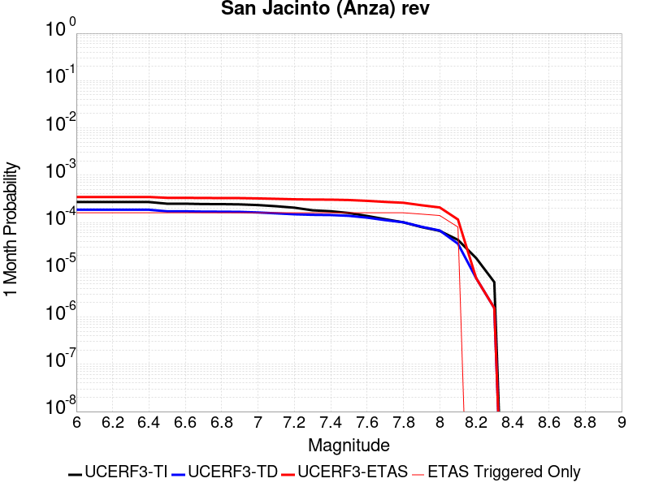 |  |  |

| Magnitude | 1 wk TI Prob | 1 wk TD Prob | 1 wk ETAS Prob | 1 wk ETAS/TD Gain | 1 wk ETAS Triggered Only | 1 mo TI Prob | 1 mo TD Prob | 1 mo ETAS Prob | 1 mo ETAS/TD Gain | 1 mo ETAS Triggered Only | 1 yr TI Prob | 1 yr TD Prob | 1 yr ETAS Prob | 1 yr ETAS/TD Gain | 1 yr ETAS Triggered Only | 10 yr TI Prob | 10 yr TD Prob | 10 yr ETAS Prob | 10 yr ETAS/TD Gain | 10 yr ETAS Triggered Only |
|-----|-----|-----|-----|-----|-----|-----|-----|-----|-----|-----|-----|-----|-----|-----|-----|-----|-----|-----|-----|-----|
| 6.0 | 6.3015636E-5 | 4.3302647E-5 | 1.6481883E-4 | 3.806207 | 1.2152145E-4 | 2.7003905E-4 | 1.8556965E-4 | 3.0706855E-4 | 1.6547347 | 1.2152145E-4 | 0.0032827691 | 0.0022569813 | 0.0024994756 | 1.1074419 | 2.430429E-4 | 0.032346968 | 0.023296192 | 0.023533573 | 1.0101897 | 2.430429E-4 |
| 6.1 | 6.3015636E-5 | 4.3302647E-5 | 1.6481883E-4 | 3.806207 | 1.2152145E-4 | 2.7003905E-4 | 1.8556965E-4 | 3.0706855E-4 | 1.6547347 | 1.2152145E-4 | 0.0032827691 | 0.0022569813 | 0.0024994756 | 1.1074419 | 2.430429E-4 | 0.032346968 | 0.023296192 | 0.023533573 | 1.0101897 | 2.430429E-4 |
| 6.2 | 6.3015636E-5 | 4.3302647E-5 | 1.6481883E-4 | 3.806207 | 1.2152145E-4 | 2.7003905E-4 | 1.8556965E-4 | 3.0706855E-4 | 1.6547347 | 1.2152145E-4 | 0.0032827691 | 0.0022569813 | 0.0024994756 | 1.1074419 | 2.430429E-4 | 0.032346968 | 0.023296192 | 0.023533573 | 1.0101897 | 2.430429E-4 |
| 6.3 | 6.3015636E-5 | 4.3302647E-5 | 1.6481883E-4 | 3.806207 | 1.2152145E-4 | 2.7003905E-4 | 1.8556965E-4 | 3.0706855E-4 | 1.6547347 | 1.2152145E-4 | 0.0032827691 | 0.0022569813 | 0.0024994756 | 1.1074419 | 2.430429E-4 | 0.032346968 | 0.023296192 | 0.023533573 | 1.0101897 | 2.430429E-4 |
| 6.4 | 6.3015636E-5 | 4.3302647E-5 | 1.6481883E-4 | 3.806207 | 1.2152145E-4 | 2.7003905E-4 | 1.8556965E-4 | 3.0706855E-4 | 1.6547347 | 1.2152145E-4 | 0.0032827691 | 0.0022569813 | 0.0024994756 | 1.1074419 | 2.430429E-4 | 0.032346968 | 0.023296192 | 0.023533573 | 1.0101897 | 2.430429E-4 |
| 6.5 | 5.811017E-5 | 4.0082516E-5 | 1.6159909E-4 | 4.0316606 | 1.2152145E-4 | 2.4901982E-4 | 1.7177092E-4 | 2.932715E-4 | 1.7073407 | 1.2152145E-4 | 0.0030276014 | 0.002089311 | 0.002331846 | 1.1160837 | 2.430429E-4 | 0.02986684 | 0.021593736 | 0.021831531 | 1.0110122 | 2.430429E-4 |
| 6.6 | 5.811017E-5 | 4.0082516E-5 | 1.6159909E-4 | 4.0316606 | 1.2152145E-4 | 2.4901982E-4 | 1.7177092E-4 | 2.932715E-4 | 1.7073407 | 1.2152145E-4 | 0.0030276014 | 0.002089311 | 0.002331846 | 1.1160837 | 2.430429E-4 | 0.02986684 | 0.021593736 | 0.021831531 | 1.0110122 | 2.430429E-4 |
| 6.7 | 5.712442E-5 | 3.9505223E-5 | 1.6102188E-4 | 4.075964 | 1.2152145E-4 | 2.4479596E-4 | 1.6929714E-4 | 2.9079802E-4 | 1.7176782 | 1.2152145E-4 | 0.0029763177 | 0.0020592497 | 0.0023017921 | 1.1177819 | 2.430429E-4 | 0.029367693 | 0.021285562 | 0.021523431 | 1.0111752 | 2.430429E-4 |
| 6.8 | 5.6967532E-5 | 3.9361643E-5 | 1.608783E-4 | 4.087185 | 1.2152145E-4 | 2.4412372E-4 | 1.6868189E-4 | 2.9018283E-4 | 1.7202964 | 1.2152145E-4 | 0.0029681553 | 0.002051773 | 0.0022943171 | 1.118212 | 2.430429E-4 | 0.029288229 | 0.021210281 | 0.021448169 | 1.0112157 | 2.430429E-4 |
| 6.9 | 5.6211324E-5 | 3.9066435E-5 | 1.6058313E-4 | 4.110514 | 1.2152145E-4 | 2.4088343E-4 | 1.6741687E-4 | 2.8891797E-4 | 1.72574 | 1.2152145E-4 | 0.0029288116 | 0.0020364004 | 0.0022789482 | 1.1191062 | 2.430429E-4 | 0.028905109 | 0.021049714 | 0.02128764 | 1.0113031 | 2.430429E-4 |
| 7.0 | 5.4383527E-5 | 3.792697E-5 | 1.594438E-4 | 4.203969 | 1.2152145E-4 | 2.3305144E-4 | 1.6253405E-4 | 2.8403575E-4 | 1.7475461 | 1.2152145E-4 | 0.0028337094 | 0.001977061 | 0.0022196234 | 1.1226884 | 2.430429E-4 | 0.027978465 | 0.020440677 | 0.020678751 | 1.0116471 | 2.430429E-4 |
| 7.1 | 5.1393665E-5 | 3.6389913E-5 | 1.5790694E-4 | 4.3393054 | 1.2152145E-4 | 2.2023996E-4 | 1.5594746E-4 | 2.7744996E-4 | 1.7791245 | 1.2152145E-4 | 0.0026781242 | 0.0018970112 | 0.002139593 | 1.1278758 | 2.430429E-4 | 0.026460782 | 0.019614287 | 0.019852562 | 1.012148 | 2.430429E-4 |
| 7.2 | 4.785222E-5 | 3.4741795E-5 | 1.5625902E-4 | 4.4977245 | 1.2152145E-4 | 2.0506482E-4 | 1.4888494E-4 | 2.703883E-4 | 1.816089 | 1.2152145E-4 | 0.0024938055 | 0.0018111705 | 0.0020537733 | 1.133948 | 2.430429E-4 | 0.024660049 | 0.018728992 | 0.018967483 | 1.0127338 | 2.430429E-4 |
| 7.3 | 4.2143256E-5 | 3.383628E-5 | 1.5535361E-4 | 4.591333 | 1.2152145E-4 | 1.8060145E-4 | 1.4500458E-4 | 2.665084E-4 | 1.8379309 | 1.2152145E-4 | 0.002196605 | 0.0017640047 | 0.0020066188 | 1.137536 | 2.430429E-4 | 0.02175019 | 0.01823724 | 0.018475851 | 1.0130837 | 2.430429E-4 |
| 7.4 | 4.0264713E-5 | 3.347446E-5 | 1.5499184E-4 | 4.6301517 | 1.2152145E-4 | 1.7255165E-4 | 1.4345412E-4 | 2.6495813E-4 | 1.8469887 | 1.2152145E-4 | 0.002098792 | 0.0017451581 | 0.0019877767 | 1.1390239 | 2.430429E-4 | 0.020790804 | 0.018041821 | 0.018280478 | 1.013228 | 2.430429E-4 |
| 7.5 | 3.694492E-5 | 3.218847E-5 | 1.53706E-4 | 4.7751884 | 1.2152145E-4 | 1.5832575E-4 | 1.379433E-4 | 2.59448E-4 | 1.8808306 | 1.2152145E-4 | 0.0019259118 | 0.001678169 | 0.001920804 | 1.1445832 | 2.430429E-4 | 0.01909306 | 0.01735827 | 0.017597094 | 1.0137585 | 2.430429E-4 |
| 7.6 | 3.200565E-5 | 2.9504106E-5 | 1.5102197E-4 | 5.118676 | 1.2152145E-4 | 1.3715986E-4 | 1.2644005E-4 | 2.4794613E-4 | 1.9609778 | 1.2152145E-4 | 0.001668642 | 0.0015383229 | 0.0017809919 | 1.157749 | 2.430429E-4 | 0.01656168 | 0.0159463 | 0.016185468 | 1.0149983 | 2.430429E-4 |
| 7.7 | 2.731642E-5 | 2.6092788E-5 | 1.4761106E-4 | 5.65716 | 1.2152145E-4 | 1.1706512E-4 | 1.1182144E-4 | 2.3332931E-4 | 2.086624 | 1.2152145E-4 | 0.001424336 | 0.0013605768 | 0.001603289 | 1.1783892 | 2.430429E-4 | 0.014152412 | 0.014167004 | 0.014406605 | 1.0169125 | 2.430429E-4 |
| 7.8 | 2.3466424E-5 | 2.3504817E-5 | 1.4502341E-4 | 6.169944 | 1.2152145E-4 | 1.0056651E-4 | 1.0073105E-4 | 2.2224025E-4 | 2.2062736 | 1.2152145E-4 | 0.0012237094 | 0.0012257113 | 0.0014684564 | 1.1980442 | 2.430429E-4 | 0.012169928 | 0.012808893 | 0.013048823 | 1.0187315 | 2.430429E-4 |
| 7.9 | 1.8611925E-5 | 1.8908117E-5 | 1.8908117E-5 | 1.0 | 0.0 | 7.9762955E-5 | 8.1032274E-5 | 8.1032274E-5 | 1.0 | 0.0 | 9.7068126E-4 | 9.861222E-4 | 0.0011075238 | 1.1231102 | 1.2152145E-4 | 0.0096645225 | 0.010393824 | 0.010514082 | 1.0115702 | 1.2152145E-4 |
| 8.0 | 1.5460775E-5 | 1.5740965E-5 | 1.5740965E-5 | 1.0 | 0.0 | 6.6258784E-5 | 6.7459536E-5 | 6.7459536E-5 | 1.0 | 0.0 | 8.0640207E-4 | 8.21011E-4 | 9.424327E-4 | 1.1478928 | 1.2152145E-4 | 0.008034821 | 0.0087028835 | 0.008823347 | 1.0138419 | 1.2152145E-4 |
| 8.1 | 9.983884E-6 | 8.269952E-6 | 8.269952E-6 | 1.0 | 0.0 | 4.2787375E-5 | 3.544217E-5 | 3.544217E-5 | 1.0 | 0.0 | 5.2081177E-4 | 4.314235E-4 | 4.314235E-4 | 1.0 | 0.0 | 0.0051959283 | 0.004640022 | 0.004640022 | 1.0 | 0.0 |
| 8.2 | 4.1226E-6 | 1.5529788E-6 | 1.5529788E-6 | 1.0 | 0.0 | 1.7668166E-5 | 6.6556063E-6 | 6.6556063E-6 | 1.0 | 0.0 | 2.1508869E-4 | 8.102902E-5 | 8.102902E-5 | 1.0 | 0.0 | 0.0021488064 | 9.4050163E-4 | 9.4050163E-4 | 1.0 | 0.0 |
| 8.3 | 1.2750878E-6 | 3.612133E-7 | 3.612133E-7 | 1.0 | 0.0 | 5.4646503E-6 | 1.548056E-6 | 1.548056E-6 | 1.0 | 0.0 | 6.653009E-5 | 1.8847424E-5 | 1.8847424E-5 | 1.0 | 0.0 | 6.6510175E-4 | 2.2734253E-4 | 2.2734253E-4 | 1.0 | 0.0 |

## Deep Springs
*[(top)](#table-of-contents)*

| 1 Week | 1 Month | 1 Year | 10 Year |
|-----|-----|-----|-----|
| 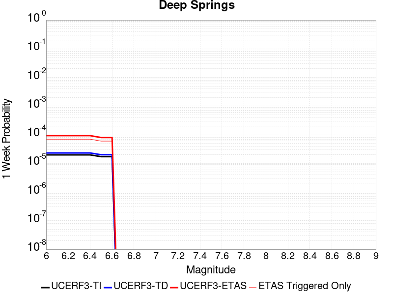 |  |  |  |

| Magnitude | 1 wk TI Prob | 1 wk TD Prob | 1 wk ETAS Prob | 1 wk ETAS/TD Gain | 1 wk ETAS Triggered Only | 1 mo TI Prob | 1 mo TD Prob | 1 mo ETAS Prob | 1 mo ETAS/TD Gain | 1 mo ETAS Triggered Only | 1 yr TI Prob | 1 yr TD Prob | 1 yr ETAS Prob | 1 yr ETAS/TD Gain | 1 yr ETAS Triggered Only | 10 yr TI Prob | 10 yr TD Prob | 10 yr ETAS Prob | 10 yr ETAS/TD Gain | 10 yr ETAS Triggered Only |
|-----|-----|-----|-----|-----|-----|-----|-----|-----|-----|-----|-----|-----|-----|-----|-----|-----|-----|-----|-----|-----|
| 6.0 | 1.9810619E-5 | 2.311252E-5 | 2.311252E-5 | 1.0 | 0.0 | 8.489989E-5 | 9.905276E-5 | 3.4207158E-4 | 3.453428 | 2.430429E-4 | 0.001033166 | 0.0012058079 | 0.0014485578 | 1.2013172 | 2.430429E-4 | 0.010283757 | 0.012042425 | 0.012282541 | 1.0199392 | 2.430429E-4 |
| 6.1 | 1.9810619E-5 | 2.311252E-5 | 2.311252E-5 | 1.0 | 0.0 | 8.489989E-5 | 9.905276E-5 | 3.4207158E-4 | 3.453428 | 2.430429E-4 | 0.001033166 | 0.0012058079 | 0.0014485578 | 1.2013172 | 2.430429E-4 | 0.010283757 | 0.012042425 | 0.012282541 | 1.0199392 | 2.430429E-4 |
| 6.2 | 1.9810619E-5 | 2.311252E-5 | 2.311252E-5 | 1.0 | 0.0 | 8.489989E-5 | 9.905276E-5 | 3.4207158E-4 | 3.453428 | 2.430429E-4 | 0.001033166 | 0.0012058079 | 0.0014485578 | 1.2013172 | 2.430429E-4 | 0.010283757 | 0.012042425 | 0.012282541 | 1.0199392 | 2.430429E-4 |
| 6.3 | 1.9810619E-5 | 2.311252E-5 | 2.311252E-5 | 1.0 | 0.0 | 8.489989E-5 | 9.905276E-5 | 3.4207158E-4 | 3.453428 | 2.430429E-4 | 0.001033166 | 0.0012058079 | 0.0014485578 | 1.2013172 | 2.430429E-4 | 0.010283757 | 0.012042425 | 0.012282541 | 1.0199392 | 2.430429E-4 |
| 6.4 | 1.9810619E-5 | 2.311252E-5 | 2.311252E-5 | 1.0 | 0.0 | 8.489989E-5 | 9.905276E-5 | 3.4207158E-4 | 3.453428 | 2.430429E-4 | 0.001033166 | 0.0012058079 | 0.0014485578 | 1.2013172 | 2.430429E-4 | 0.010283757 | 0.012042425 | 0.012282541 | 1.0199392 | 2.430429E-4 |
| 6.5 | 1.7190405E-5 | 2.0050555E-5 | 2.0050555E-5 | 1.0 | 0.0 | 7.367108E-5 | 8.593095E-5 | 3.2895297E-4 | 3.828108 | 2.430429E-4 | 8.9657627E-4 | 0.0010462094 | 0.0012889979 | 1.2320651 | 2.430429E-4 | 0.008929676 | 0.010462056 | 0.010702556 | 1.0229878 | 2.430429E-4 |
| 6.6 | 1.7190405E-5 | 2.0050555E-5 | 2.0050555E-5 | 1.0 | 0.0 | 7.367108E-5 | 8.593095E-5 | 3.2895297E-4 | 3.828108 | 2.430429E-4 | 8.9657627E-4 | 0.0010462094 | 0.0012889979 | 1.2320651 | 2.430429E-4 | 0.008929676 | 0.010462056 | 0.010702556 | 1.0229878 | 2.430429E-4 |

## Imperial
*[(top)](#table-of-contents)*

| 1 Week | 1 Month | 1 Year | 10 Year |
|-----|-----|-----|-----|
|  |  |  |  |

| Magnitude | 1 wk TI Prob | 1 wk TD Prob | 1 wk ETAS Prob | 1 wk ETAS/TD Gain | 1 wk ETAS Triggered Only | 1 mo TI Prob | 1 mo TD Prob | 1 mo ETAS Prob | 1 mo ETAS/TD Gain | 1 mo ETAS Triggered Only | 1 yr TI Prob | 1 yr TD Prob | 1 yr ETAS Prob | 1 yr ETAS/TD Gain | 1 yr ETAS Triggered Only | 10 yr TI Prob | 10 yr TD Prob | 10 yr ETAS Prob | 10 yr ETAS/TD Gain | 10 yr ETAS Triggered Only |
|-----|-----|-----|-----|-----|-----|-----|-----|-----|-----|-----|-----|-----|-----|-----|-----|-----|-----|-----|-----|-----|
| 6.0 | 2.7496446E-4 | 5.0552754E-4 | 6.2698754E-4 | 1.2402639 | 1.2152145E-4 | 0.0011778869 | 0.002164787 | 0.0022860453 | 1.056014 | 1.2152145E-4 | 0.0142467655 | 0.026038699 | 0.026157055 | 1.0045455 | 1.2152145E-4 | 0.13367249 | 0.2280438 | 0.2282314 | 1.0008228 | 2.430429E-4 |
| 6.1 | 2.5356023E-4 | 4.8656776E-4 | 6.0803007E-4 | 1.2496308 | 1.2152145E-4 | 0.001086234 | 0.0020836622 | 0.0022049304 | 1.0581995 | 1.2152145E-4 | 0.013144928 | 0.025071215 | 0.02518969 | 1.0047256 | 1.2152145E-4 | 0.123940155 | 0.21947981 | 0.2196695 | 1.0008643 | 2.430429E-4 |
| 6.2 | 2.4820742E-4 | 4.7752203E-4 | 5.9898547E-4 | 1.2543619 | 1.2152145E-4 | 0.0010633124 | 0.0020449557 | 0.0021662286 | 1.0593034 | 1.2152145E-4 | 0.01286919 | 0.024611235 | 0.024729766 | 1.0048162 | 1.2152145E-4 | 0.12148927 | 0.21598552 | 0.21617608 | 1.0008823 | 2.430429E-4 |
| 6.3 | 2.3205351E-4 | 4.5890483E-4 | 5.803705E-4 | 1.264686 | 1.2152145E-4 | 9.94136E-4 | 0.0019652895 | 0.002086572 | 1.0617124 | 1.2152145E-4 | 0.012036599 | 0.02366133 | 0.023779977 | 1.0050143 | 1.2152145E-4 | 0.11405133 | 0.20793462 | 0.20812713 | 1.0009258 | 2.430429E-4 |
| 6.4 | 2.0304754E-4 | 3.987652E-4 | 5.202382E-4 | 1.3046229 | 1.2152145E-4 | 8.6991355E-4 | 0.0017078889 | 0.0018292029 | 1.0710315 | 1.2152145E-4 | 0.010539869 | 0.020595672 | 0.020714689 | 1.0057788 | 1.2152145E-4 | 0.100537635 | 0.1850669 | 0.18526496 | 1.0010703 | 2.430429E-4 |
| 6.5 | 1.854992E-4 | 3.6988858E-4 | 4.913651E-4 | 1.3284137 | 1.2152145E-4 | 7.9475436E-4 | 0.0015842861 | 0.001705615 | 1.0765827 | 1.2152145E-4 | 0.009633281 | 0.01911948 | 0.019238679 | 1.0062344 | 1.2152145E-4 | 0.0922623 | 0.173298 | 0.17339846 | 1.0005797 | 1.2152145E-4 |
| 6.6 | 1.6586106E-4 | 3.403506E-4 | 4.618307E-4 | 1.3569263 | 1.2152145E-4 | 7.106394E-4 | 0.0014578402 | 0.0015791846 | 1.0832356 | 1.2152145E-4 | 0.008617763 | 0.01760642 | 0.017725801 | 1.0067806 | 1.2152145E-4 | 0.08291132 | 0.16077545 | 0.16087744 | 1.0006343 | 1.2152145E-4 |
| 6.7 | 1.4224656E-4 | 3.076692E-4 | 4.2915324E-4 | 1.3948529 | 1.2152145E-4 | 6.094856E-4 | 0.001317924 | 0.0014392853 | 1.0920852 | 1.2152145E-4 | 0.0073952693 | 0.015929576 | 0.016049162 | 1.0075072 | 1.2152145E-4 | 0.07153955 | 0.14648417 | 0.14658788 | 1.0007081 | 1.2152145E-4 |
| 6.8 | 1.2317259E-4 | 2.779122E-4 | 3.9939987E-4 | 1.4371442 | 1.2152145E-4 | 5.2777573E-4 | 0.0011905148 | 0.0013118915 | 1.1019531 | 1.2152145E-4 | 0.0064067547 | 0.0143995695 | 0.014519341 | 1.0083177 | 1.2152145E-4 | 0.06225166 | 0.13293684 | 0.1330422 | 1.0007926 | 1.2152145E-4 |
| 6.9 | 9.859898E-5 | 2.5014306E-4 | 3.7163412E-4 | 1.4856863 | 1.2152145E-4 | 4.2249862E-4 | 0.0010716055 | 0.0011929967 | 1.1132798 | 1.2152145E-4 | 0.0051317946 | 0.012969712 | 0.013089657 | 1.0092481 | 1.2152145E-4 | 0.05014893 | 0.11940631 | 0.119513325 | 1.0008962 | 1.2152145E-4 |
| 7.0 | 7.3191884E-5 | 2.1266776E-4 | 3.3416337E-4 | 1.571293 | 1.2152145E-4 | 3.136418E-4 | 9.1111806E-4 | 0.0010325288 | 1.1332546 | 1.2152145E-4 | 0.003811904 | 0.011037128 | 0.011157308 | 1.0108887 | 1.2152145E-4 | 0.037471764 | 0.10206493 | 0.10217404 | 1.0010691 | 1.2152145E-4 |
| 7.1 | 7.1760296E-5 | 2.0968143E-4 | 3.3117738E-4 | 1.5794313 | 1.2152145E-4 | 3.0750787E-4 | 8.983284E-4 | 0.0010197406 | 1.1351535 | 1.2152145E-4 | 0.003737482 | 0.010882978 | 0.011003177 | 1.0110446 | 1.2152145E-4 | 0.03675245 | 0.10070146 | 0.100810744 | 1.0010853 | 1.2152145E-4 |
| 7.2 | 6.46614E-5 | 1.9136685E-4 | 3.1286504E-4 | 1.6348968 | 1.2152145E-4 | 2.7709085E-4 | 8.1988896E-4 | 9.413107E-4 | 1.1480955 | 1.2152145E-4 | 0.0033683628 | 0.0099370815 | 0.010057395 | 1.0121076 | 1.2152145E-4 | 0.033177625 | 0.09250898 | 0.092619255 | 1.0011921 | 1.2152145E-4 |
| 7.3 | 6.088115E-5 | 1.78084E-4 | 2.995838E-4 | 1.6822612 | 1.2152145E-4 | 2.6089314E-4 | 7.6299673E-4 | 8.844255E-4 | 1.1591471 | 1.2152145E-4 | 0.0031717476 | 0.009250494 | 0.00937089 | 1.0130153 | 1.2152145E-4 | 0.031268585 | 0.08655989 | 0.0866709 | 1.0012823 | 1.2152145E-4 |
| 7.4 | 4.199346E-5 | 1.1510366E-4 | 2.3661113E-4 | 2.055635 | 1.2152145E-4 | 1.7995955E-4 | 4.9320905E-4 | 6.146706E-4 | 1.2462678 | 1.2152145E-4 | 0.0021888057 | 0.0059884563 | 0.00610925 | 1.020171 | 1.2152145E-4 | 0.02167372 | 0.057439793 | 0.057554334 | 1.0019941 | 1.2152145E-4 |
| 7.5 | 3.130448E-5 | 8.33328E-5 | 2.0484412E-4 | 2.4581451 | 1.2152145E-4 | 1.3415517E-4 | 3.57092E-4 | 4.7857006E-4 | 1.340187 | 1.2152145E-4 | 0.0016321153 | 0.004338988 | 0.0044599823 | 1.0278853 | 1.2152145E-4 | 0.016201803 | 0.04213201 | 0.04224841 | 1.0027628 | 1.2152145E-4 |
| 7.6 | 2.3074248E-5 | 6.0844646E-5 | 1.8235871E-4 | 2.99712 | 1.2152145E-4 | 9.888588E-5 | 2.6073685E-4 | 3.822266E-4 | 1.4659479 | 1.2152145E-4 | 0.0012032706 | 0.0031698733 | 0.0032910097 | 1.0382148 | 1.2152145E-4 | 0.011967761 | 0.031026395 | 0.031144146 | 1.0037951 | 1.2152145E-4 |
| 7.7 | 1.45864815E-5 | 4.0124698E-5 | 4.0124698E-5 | 1.0 | 0.0 | 6.2511994E-5 | 1.7195169E-4 | 1.7195169E-4 | 1.0 | 0.0 | 7.608177E-4 | 0.0020915072 | 0.0020915072 | 1.0 | 0.0 | 0.007582182 | 0.020627763 | 0.020627763 | 1.0 | 0.0 |
| 7.8 | 1.0352979E-5 | 3.0960902E-5 | 3.0960902E-5 | 1.0 | 0.0 | 4.4369157E-5 | 1.3268284E-4 | 1.3268284E-4 | 1.0 | 0.0 | 5.400606E-4 | 0.0016142189 | 0.0016142189 | 1.0 | 0.0 | 0.0053875 | 0.016016833 | 0.016016833 | 1.0 | 0.0 |
| 7.9 | 8.137906E-6 | 2.2149103E-5 | 2.2149103E-5 | 1.0 | 0.0 | 3.4876273E-5 | 9.492128E-5 | 9.492128E-5 | 1.0 | 0.0 | 4.2453592E-4 | 0.0011550548 | 0.0011550548 | 1.0 | 0.0 | 0.004237258 | 0.011617903 | 0.011617903 | 1.0 | 0.0 |
| 8.0 | 6.93792E-6 | 1.8008766E-5 | 1.8008766E-5 | 1.0 | 0.0 | 2.9733603E-5 | 7.717814E-5 | 7.717814E-5 | 1.0 | 0.0 | 3.6194647E-4 | 9.3923963E-4 | 9.3923963E-4 | 1.0 | 0.0 | 0.0036135751 | 0.00950155 | 0.00950155 | 1.0 | 0.0 |
| 8.1 | 3.4286315E-6 | 6.379872E-6 | 6.379872E-6 | 1.0 | 0.0 | 1.4694053E-5 | 2.7342023E-5 | 2.7342023E-5 | 1.0 | 0.0 | 1.7888541E-4 | 3.328384E-4 | 3.328384E-4 | 1.0 | 0.0 | 0.0017874148 | 0.003486031 | 0.003486031 | 1.0 | 0.0 |
| 8.2 | 1.4906886E-6 | 1.9366646E-6 | 1.9366646E-6 | 1.0 | 0.0 | 6.3886496E-6 | 8.299965E-6 | 8.299965E-6 | 1.0 | 0.0 | 7.7779034E-5 | 1.0104742E-4 | 1.0104742E-4 | 1.0 | 0.0 | 7.775182E-4 | 0.0011075331 | 0.0011075331 | 1.0 | 0.0 |
| 8.3 | 2.5758007E-8 | 1.4500102E-8 | 1.4500102E-8 | 1.0 | 0.0 | 1.10391454E-7 | 6.214329E-8 | 6.214329E-8 | 1.0 | 0.0 | 1.3440151E-6 | 7.565946E-7 | 7.565946E-7 | 1.0 | 0.0 | 1.344007E-5 | 7.887763E-6 | 7.887763E-6 | 1.0 | 0.0 |

## Big Pine (Central)
*[(top)](#table-of-contents)*

| 1 Week | 1 Month | 1 Year | 10 Year |
|-----|-----|-----|-----|
|  |  |  |  |

| Magnitude | 1 wk TI Prob | 1 wk TD Prob | 1 wk ETAS Prob | 1 wk ETAS/TD Gain | 1 wk ETAS Triggered Only | 1 mo TI Prob | 1 mo TD Prob | 1 mo ETAS Prob | 1 mo ETAS/TD Gain | 1 mo ETAS Triggered Only | 1 yr TI Prob | 1 yr TD Prob | 1 yr ETAS Prob | 1 yr ETAS/TD Gain | 1 yr ETAS Triggered Only | 10 yr TI Prob | 10 yr TD Prob | 10 yr ETAS Prob | 10 yr ETAS/TD Gain | 10 yr ETAS Triggered Only |
|-----|-----|-----|-----|-----|-----|-----|-----|-----|-----|-----|-----|-----|-----|-----|-----|-----|-----|-----|-----|-----|
| 6.0 | 1.2706755E-5 | 1.4250529E-5 | 1.3577024E-4 | 9.527383 | 1.2152145E-4 | 5.4456385E-5 | 6.107247E-5 | 1.8258649E-4 | 2.9896696 | 1.2152145E-4 | 6.628048E-4 | 7.433402E-4 | 9.862024E-4 | 1.3267175 | 2.430429E-4 | 0.006608314 | 0.0074135666 | 0.007654808 | 1.0325404 | 2.430429E-4 |
| 6.1 | 8.342579E-6 | 9.510762E-6 | 1.3103105E-4 | 13.777136 | 1.2152145E-4 | 3.5753423E-5 | 4.0759893E-5 | 1.6227638E-4 | 3.981276 | 1.2152145E-4 | 4.3521097E-4 | 4.961604E-4 | 6.176216E-4 | 1.2448022 | 1.2152145E-4 | 0.0043435963 | 0.0049540824 | 0.0050750016 | 1.024408 | 1.2152145E-4 |
| 6.2 | 6.923899E-6 | 7.967147E-6 | 7.967147E-6 | 1.0 | 0.0 | 2.9673516E-5 | 3.4144578E-5 | 3.4144578E-5 | 1.0 | 0.0 | 3.6121515E-4 | 4.156502E-4 | 4.156502E-4 | 1.0 | 0.0 | 0.003606286 | 0.0041520367 | 0.0041520367 | 1.0 | 0.0 |
| 6.3 | 2.728396E-6 | 3.4242908E-6 | 3.4242908E-6 | 1.0 | 0.0 | 1.1693074E-5 | 1.4675454E-5 | 1.4675454E-5 | 1.0 | 0.0 | 1.4235388E-4 | 1.7865987E-4 | 1.7865987E-4 | 1.0 | 0.0 | 0.0014226272 | 0.0017866704 | 0.0017866704 | 1.0 | 0.0 |
| 6.4 | 2.7136944E-6 | 3.408584E-6 | 3.408584E-6 | 1.0 | 0.0 | 1.1630066E-5 | 1.4608141E-5 | 1.4608141E-5 | 1.0 | 0.0 | 1.4158686E-4 | 1.7784047E-4 | 1.7784047E-4 | 1.0 | 0.0 | 0.0014149669 | 0.0017784894 | 0.0017784894 | 1.0 | 0.0 |
| 6.5 | 2.6971882E-6 | 3.3909291E-6 | 3.3909291E-6 | 1.0 | 0.0 | 1.1559327E-5 | 1.45324775E-5 | 1.45324775E-5 | 1.0 | 0.0 | 1.4072572E-4 | 1.7691942E-4 | 1.7691942E-4 | 1.0 | 0.0 | 0.0014063664 | 0.0017692937 | 0.0017692937 | 1.0 | 0.0 |
| 6.6 | 2.669092E-6 | 3.3609497E-6 | 3.3609497E-6 | 1.0 | 0.0 | 1.1438916E-5 | 1.4403995E-5 | 1.4403995E-5 | 1.0 | 0.0 | 1.3925991E-4 | 1.753554E-4 | 1.753554E-4 | 1.0 | 0.0 | 0.0013917267 | 0.0017536782 | 0.0017536782 | 1.0 | 0.0 |
| 6.7 | 2.6408059E-6 | 3.3309752E-6 | 3.3309752E-6 | 1.0 | 0.0 | 1.1317691E-5 | 1.4275535E-5 | 1.4275535E-5 | 1.0 | 0.0 | 1.3778417E-4 | 1.7379165E-4 | 1.7379165E-4 | 1.0 | 0.0 | 0.0013769877 | 0.0017380653 | 0.0017380653 | 1.0 | 0.0 |
| 6.8 | 2.1786943E-6 | 2.8544325E-6 | 2.8544325E-6 | 1.0 | 0.0 | 9.337228E-6 | 1.2233229E-5 | 1.2233229E-5 | 1.0 | 0.0 | 1.1367482E-4 | 1.4893012E-4 | 1.4893012E-4 | 1.0 | 0.0 | 0.0011361669 | 0.0014897975 | 0.0014897975 | 1.0 | 0.0 |
| 6.9 | 1.4411696E-6 | 2.068499E-6 | 2.068499E-6 | 1.0 | 0.0 | 6.1764263E-6 | 8.864968E-6 | 8.864968E-6 | 1.0 | 0.0 | 7.51954E-5 | 1.079259E-4 | 1.079259E-4 | 1.0 | 0.0 | 7.5169955E-4 | 0.0010801847 | 0.0010801847 | 1.0 | 0.0 |
| 7.0 | 1.0073411E-6 | 1.554261E-6 | 1.554261E-6 | 1.0 | 0.0 | 4.317169E-6 | 6.6611024E-6 | 6.6611024E-6 | 1.0 | 0.0 | 5.2560266E-5 | 8.1096056E-5 | 8.1096056E-5 | 1.0 | 0.0 | 5.2547833E-4 | 8.1210316E-4 | 8.1210316E-4 | 1.0 | 0.0 |
| 7.1 | 8.947104E-7 | 1.4302494E-6 | 1.4302494E-6 | 1.0 | 0.0 | 3.834468E-6 | 6.129627E-6 | 6.129627E-6 | 1.0 | 0.0 | 4.6683643E-5 | 7.46258E-5 | 7.46258E-5 | 1.0 | 0.0 | 4.6673836E-4 | 7.474457E-4 | 7.474457E-4 | 1.0 | 0.0 |
| 7.2 | 5.215166E-7 | 1.0111678E-6 | 1.0111678E-6 | 1.0 | 0.0 | 2.2350691E-6 | 4.3335694E-6 | 4.3335694E-6 | 1.0 | 0.0 | 2.7211627E-5 | 5.2759973E-5 | 5.2759973E-5 | 1.0 | 0.0 | 2.7208295E-4 | 5.2890263E-4 | 5.2890263E-4 | 1.0 | 0.0 |
| 7.3 | 4.4024807E-7 | 9.219589E-7 | 9.219589E-7 | 1.0 | 0.0 | 1.8867761E-6 | 3.9512465E-6 | 3.9512465E-6 | 1.0 | 0.0 | 2.2971257E-5 | 4.810541E-5 | 4.810541E-5 | 1.0 | 0.0 | 2.2968883E-4 | 4.8237795E-4 | 4.8237795E-4 | 1.0 | 0.0 |
| 7.4 | 3.6130905E-7 | 8.358523E-7 | 8.358523E-7 | 1.0 | 0.0 | 1.5484665E-6 | 3.5822195E-6 | 3.5822195E-6 | 1.0 | 0.0 | 1.8852415E-5 | 4.3612687E-5 | 4.3612687E-5 | 1.0 | 0.0 | 1.8850817E-4 | 4.374597E-4 | 4.374597E-4 | 1.0 | 0.0 |
| 7.5 | 3.408184E-7 | 8.108147E-7 | 8.108147E-7 | 1.0 | 0.0 | 1.4606494E-6 | 3.4749157E-6 | 3.4749157E-6 | 1.0 | 0.0 | 1.7783263E-5 | 4.2306317E-5 | 4.2306317E-5 | 1.0 | 0.0 | 1.778184E-4 | 4.2437963E-4 | 4.2437963E-4 | 1.0 | 0.0 |
| 7.6 | 3.1428627E-7 | 7.7316E-7 | 7.7316E-7 | 1.0 | 0.0 | 1.3469405E-6 | 3.3135389E-6 | 3.3135389E-6 | 1.0 | 0.0 | 1.6398877E-5 | 4.0341627E-5 | 4.0341627E-5 | 1.0 | 0.0 | 1.6397667E-4 | 4.0471106E-4 | 4.0471106E-4 | 1.0 | 0.0 |
| 7.7 | 1.7972785E-7 | 5.077752E-7 | 5.077752E-7 | 1.0 | 0.0 | 7.70262E-7 | 2.1761778E-6 | 2.1761778E-6 | 1.0 | 0.0 | 9.377899E-6 | 2.6494654E-5 | 2.6494654E-5 | 1.0 | 0.0 | 9.377503E-5 | 2.662899E-4 | 2.662899E-4 | 1.0 | 0.0 |
| 7.8 | 4.9230927E-8 | 1.198079E-7 | 1.198079E-7 | 1.0 | 0.0 | 2.1098968E-7 | 5.134623E-7 | 5.134623E-7 | 1.0 | 0.0 | 2.5687964E-6 | 6.2513873E-6 | 6.2513873E-6 | 1.0 | 0.0 | 2.5687666E-5 | 6.295415E-5 | 6.295415E-5 | 1.0 | 0.0 |
| 7.9 | 3.6805972E-9 | 4.105293E-9 | 4.105293E-9 | 1.0 | 0.0 | 1.5773987E-8 | 1.7594115E-8 | 1.7594115E-8 | 1.0 | 0.0 | 1.9204828E-7 | 2.1420831E-7 | 2.1420831E-7 | 1.0 | 0.0 | 1.920481E-6 | 2.1900614E-6 | 2.1900614E-6 | 1.0 | 0.0 |

## Newport-Inglewood (Offshore)
*[(top)](#table-of-contents)*

| 1 Week | 1 Month | 1 Year | 10 Year |
|-----|-----|-----|-----|
|  |  |  |  |

| Magnitude | 1 wk TI Prob | 1 wk TD Prob | 1 wk ETAS Prob | 1 wk ETAS/TD Gain | 1 wk ETAS Triggered Only | 1 mo TI Prob | 1 mo TD Prob | 1 mo ETAS Prob | 1 mo ETAS/TD Gain | 1 mo ETAS Triggered Only | 1 yr TI Prob | 1 yr TD Prob | 1 yr ETAS Prob | 1 yr ETAS/TD Gain | 1 yr ETAS Triggered Only | 10 yr TI Prob | 10 yr TD Prob | 10 yr ETAS Prob | 10 yr ETAS/TD Gain | 10 yr ETAS Triggered Only |
|-----|-----|-----|-----|-----|-----|-----|-----|-----|-----|-----|-----|-----|-----|-----|-----|-----|-----|-----|-----|-----|
| 6.0 | 1.9626508E-5 | 1.8965357E-5 | 1.404845E-4 | 7.4074273 | 1.2152145E-4 | 8.411089E-5 | 8.1277634E-5 | 3.2430078E-4 | 3.990037 | 2.430429E-4 | 0.001023569 | 9.891186E-4 | 0.001231921 | 1.2454736 | 2.430429E-4 | 0.010188672 | 0.009848503 | 0.0100891525 | 1.0244352 | 2.430429E-4 |
| 6.1 | 1.331886E-5 | 1.2218092E-5 | 1.3373805E-4 | 10.945904 | 1.2152145E-4 | 5.707958E-5 | 5.2362207E-5 | 2.9539238E-4 | 5.641328 | 2.430429E-4 | 6.947222E-4 | 6.3732493E-4 | 8.8021293E-4 | 1.3811054 | 2.430429E-4 | 0.006925544 | 0.006355149 | 0.006596647 | 1.0380005 | 2.430429E-4 |
| 6.2 | 1.2250852E-5 | 1.1076029E-5 | 1.3259613E-4 | 11.97145 | 1.2152145E-4 | 5.2502597E-5 | 4.7467838E-5 | 2.9049919E-4 | 6.1199164 | 2.430429E-4 | 6.3903164E-4 | 5.777687E-4 | 8.2067115E-4 | 1.4204147 | 2.430429E-4 | 0.006371971 | 0.0057627866 | 0.006004429 | 1.0419315 | 2.430429E-4 |
| 6.3 | 1.2106258E-5 | 1.0918891E-5 | 1.3243902E-4 | 12.129347 | 1.2152145E-4 | 5.1882926E-5 | 4.6794412E-5 | 2.8982593E-4 | 6.193601 | 2.430429E-4 | 6.3149154E-4 | 5.69574E-4 | 8.124785E-4 | 1.426467 | 2.430429E-4 | 0.0062970007 | 0.005681259 | 0.005922921 | 1.0425367 | 2.430429E-4 |
| 6.4 | 1.1348758E-5 | 1.0109362E-5 | 1.0109362E-5 | 1.0 | 0.0 | 4.8636626E-5 | 4.3325123E-5 | 1.648413E-4 | 3.8047512 | 1.2152145E-4 | 5.919901E-4 | 5.273565E-4 | 6.4881385E-4 | 1.2303135 | 1.2152145E-4 | 0.005904155 | 0.0052611465 | 0.0053820284 | 1.0229764 | 1.2152145E-4 |
| 6.5 | 1.100837E-5 | 9.7433895E-6 | 9.7433895E-6 | 1.0 | 0.0 | 4.7177873E-5 | 4.1756717E-5 | 1.6327309E-4 | 3.9101036 | 1.2152145E-4 | 5.7423924E-4 | 5.082702E-4 | 6.297299E-4 | 1.2389667 | 1.2152145E-4 | 0.005727576 | 0.0050711688 | 0.005192074 | 1.0238417 | 1.2152145E-4 |
| 6.6 | 1.0634696E-5 | 9.345544E-6 | 9.345544E-6 | 1.0 | 0.0 | 4.557647E-5 | 4.0051716E-5 | 1.615683E-4 | 4.033992 | 1.2152145E-4 | 5.5475225E-4 | 4.8752132E-4 | 6.089835E-4 | 1.2491424 | 1.2152145E-4 | 0.0055336943 | 0.0048646047 | 0.004985535 | 1.0248592 | 1.2152145E-4 |
| 6.7 | 9.9780855E-6 | 8.667911E-6 | 8.667911E-6 | 1.0 | 0.0 | 4.276252E-5 | 3.7147664E-5 | 1.586646E-4 | 4.2711864 | 1.2152145E-4 | 5.205093E-4 | 4.5217964E-4 | 5.7364616E-4 | 1.2686244 | 1.2152145E-4 | 0.0051929182 | 0.004512675 | 0.004633648 | 1.0268074 | 1.2152145E-4 |
| 6.8 | 9.59546E-6 | 8.27295E-6 | 8.27295E-6 | 1.0 | 0.0 | 4.1122752E-5 | 3.5455025E-5 | 1.5697216E-4 | 4.42736 | 1.2152145E-4 | 5.0055445E-4 | 4.315801E-4 | 5.530491E-4 | 1.2814518 | 1.2152145E-4 | 0.004994285 | 0.004307495 | 0.0044284933 | 1.0280901 | 1.2152145E-4 |
| 6.9 | 9.000614E-6 | 7.70684E-6 | 7.70684E-6 | 1.0 | 0.0 | 3.857349E-5 | 3.30289E-5 | 1.5454633E-4 | 4.6791244 | 1.2152145E-4 | 4.6953102E-4 | 4.0205332E-4 | 5.2352593E-4 | 1.3021306 | 1.2152145E-4 | 0.004685402 | 0.0040133307 | 0.0041343644 | 1.0301579 | 1.2152145E-4 |
| 7.0 | 7.4070194E-6 | 6.148904E-6 | 6.148904E-6 | 1.0 | 0.0 | 3.1743984E-5 | 2.635218E-5 | 2.635218E-5 | 1.0 | 0.0 | 3.8641447E-4 | 3.207907E-4 | 3.207907E-4 | 1.0 | 0.0 | 0.0038574322 | 0.0032032963 | 0.0032032963 | 1.0 | 0.0 |
| 7.1 | 6.299615E-6 | 5.0565927E-6 | 5.0565927E-6 | 1.0 | 0.0 | 2.699807E-5 | 2.1670932E-5 | 2.1670932E-5 | 1.0 | 0.0 | 3.2865192E-4 | 2.638118E-4 | 2.638118E-4 | 1.0 | 0.0 | 0.003281663 | 0.002635001 | 0.002635001 | 1.0 | 0.0 |
| 7.2 | 5.096653E-6 | 3.892769E-6 | 3.892769E-6 | 1.0 | 0.0 | 2.1842614E-5 | 1.668319E-5 | 1.668319E-5 | 1.0 | 0.0 | 2.6590136E-4 | 2.0309901E-4 | 2.0309901E-4 | 1.0 | 0.0 | 0.0026558342 | 0.0020291451 | 0.0020291451 | 1.0 | 0.0 |
| 7.3 | 3.9753018E-6 | 2.9099103E-6 | 2.9099103E-6 | 1.0 | 0.0 | 1.7036897E-5 | 1.2470985E-5 | 1.2470985E-5 | 1.0 | 0.0 | 2.0740448E-4 | 1.5182374E-4 | 1.5182374E-4 | 1.0 | 0.0 | 0.00207211 | 0.0015172083 | 0.0015172083 | 1.0 | 0.0 |
| 7.4 | 3.0568392E-6 | 2.1449955E-6 | 2.1449955E-6 | 1.0 | 0.0 | 1.3100675E-5 | 9.192806E-6 | 9.192806E-6 | 1.0 | 0.0 | 1.5948903E-4 | 1.1191672E-4 | 1.1191672E-4 | 1.0 | 0.0 | 0.0015937461 | 0.0011186098 | 0.0011186098 | 1.0 | 0.0 |
| 7.5 | 1.7279019E-6 | 1.1469883E-6 | 1.1469883E-6 | 1.0 | 0.0 | 7.405273E-6 | 4.915655E-6 | 4.915655E-6 | 1.0 | 0.0 | 9.015547E-5 | 5.9846494E-5 | 5.9846494E-5 | 1.0 | 0.0 | 9.01189E-4 | 5.9830764E-4 | 5.9830764E-4 | 1.0 | 0.0 |
| 7.6 | 1.1156416E-6 | 7.223012E-7 | 7.223012E-7 | 1.0 | 0.0 | 4.7813123E-6 | 3.095573E-6 | 3.095573E-6 | 1.0 | 0.0 | 5.821092E-5 | 3.7687976E-5 | 3.7687976E-5 | 1.0 | 0.0 | 5.8195676E-4 | 3.7681818E-4 | 3.7681818E-4 | 1.0 | 0.0 |
| 7.7 | 9.117973E-8 | 6.734145E-8 | 6.734145E-8 | 1.0 | 0.0 | 3.907702E-7 | 2.886062E-7 | 2.886062E-7 | 1.0 | 0.0 | 4.757617E-6 | 3.513775E-6 | 3.513775E-6 | 1.0 | 0.0 | 4.7575148E-5 | 3.5137225E-5 | 3.5137225E-5 | 1.0 | 0.0 |

## San Andreas (Carrizo) rev
*[(top)](#table-of-contents)*

| 1 Week | 1 Month | 1 Year | 10 Year |
|-----|-----|-----|-----|
|  |  |  |  |

| Magnitude | 1 wk TI Prob | 1 wk TD Prob | 1 wk ETAS Prob | 1 wk ETAS/TD Gain | 1 wk ETAS Triggered Only | 1 mo TI Prob | 1 mo TD Prob | 1 mo ETAS Prob | 1 mo ETAS/TD Gain | 1 mo ETAS Triggered Only | 1 yr TI Prob | 1 yr TD Prob | 1 yr ETAS Prob | 1 yr ETAS/TD Gain | 1 yr ETAS Triggered Only | 10 yr TI Prob | 10 yr TD Prob | 10 yr ETAS Prob | 10 yr ETAS/TD Gain | 10 yr ETAS Triggered Only |
|-----|-----|-----|-----|-----|-----|-----|-----|-----|-----|-----|-----|-----|-----|-----|-----|-----|-----|-----|-----|-----|
| 6.0 | 1.1674632E-4 | 2.432302E-4 | 3.647221E-4 | 1.4994935 | 1.2152145E-4 | 5.002454E-4 | 0.0010420004 | 0.0011633951 | 1.1165017 | 1.2152145E-4 | 0.006073493 | 0.012613042 | 0.01285302 | 1.0190262 | 2.430429E-4 | 0.0591016 | 0.12061418 | 0.120827906 | 1.001772 | 2.430429E-4 |
| 6.1 | 1.1674632E-4 | 2.432302E-4 | 3.647221E-4 | 1.4994935 | 1.2152145E-4 | 5.002454E-4 | 0.0010420004 | 0.0011633951 | 1.1165017 | 1.2152145E-4 | 0.006073493 | 0.012613042 | 0.01285302 | 1.0190262 | 2.430429E-4 | 0.0591016 | 0.12061418 | 0.120827906 | 1.001772 | 2.430429E-4 |
| 6.2 | 1.1674632E-4 | 2.432302E-4 | 3.647221E-4 | 1.4994935 | 1.2152145E-4 | 5.002454E-4 | 0.0010420004 | 0.0011633951 | 1.1165017 | 1.2152145E-4 | 0.006073493 | 0.012613042 | 0.01285302 | 1.0190262 | 2.430429E-4 | 0.0591016 | 0.12061418 | 0.120827906 | 1.001772 | 2.430429E-4 |
| 6.3 | 1.1674632E-4 | 2.432302E-4 | 3.647221E-4 | 1.4994935 | 1.2152145E-4 | 5.002454E-4 | 0.0010420004 | 0.0011633951 | 1.1165017 | 1.2152145E-4 | 0.006073493 | 0.012613042 | 0.01285302 | 1.0190262 | 2.430429E-4 | 0.0591016 | 0.12061418 | 0.120827906 | 1.001772 | 2.430429E-4 |
| 6.4 | 1.1674632E-4 | 2.432302E-4 | 3.647221E-4 | 1.4994935 | 1.2152145E-4 | 5.002454E-4 | 0.0010420004 | 0.0011633951 | 1.1165017 | 1.2152145E-4 | 0.006073493 | 0.012613042 | 0.01285302 | 1.0190262 | 2.430429E-4 | 0.0591016 | 0.12061418 | 0.120827906 | 1.001772 | 2.430429E-4 |
| 6.5 | 1.13136164E-4 | 2.3643032E-4 | 3.5792304E-4 | 1.5138627 | 1.2152145E-4 | 4.847792E-4 | 0.0010128808 | 0.0011342792 | 1.1198546 | 1.2152145E-4 | 0.0058862255 | 0.012262545 | 0.012502607 | 1.0195769 | 2.430429E-4 | 0.057327334 | 0.117585555 | 0.11780001 | 1.0018239 | 2.430429E-4 |
| 6.6 | 1.13136164E-4 | 2.3643032E-4 | 3.5792304E-4 | 1.5138627 | 1.2152145E-4 | 4.847792E-4 | 0.0010128808 | 0.0011342792 | 1.1198546 | 1.2152145E-4 | 0.0058862255 | 0.012262545 | 0.012502607 | 1.0195769 | 2.430429E-4 | 0.057327334 | 0.117585555 | 0.11780001 | 1.0018239 | 2.430429E-4 |
| 6.7 | 1.1149675E-4 | 2.3334254E-4 | 3.5483562E-4 | 1.5206641 | 1.2152145E-4 | 4.777557E-4 | 9.996577E-4 | 0.0011210577 | 1.1214415 | 1.2152145E-4 | 0.0058011734 | 0.012103349 | 0.01234345 | 1.0198376 | 2.430429E-4 | 0.05652051 | 0.1162071 | 0.1164219 | 1.0018485 | 2.430429E-4 |
| 6.8 | 1.1103589E-4 | 2.3236412E-4 | 3.5385735E-4 | 1.522857 | 1.2152145E-4 | 4.7578133E-4 | 9.954676E-4 | 0.0011168682 | 1.1219532 | 1.2152145E-4 | 0.005777263 | 0.012052901 | 0.012293015 | 1.0199217 | 2.430429E-4 | 0.056293584 | 0.1157674 | 0.1159823 | 1.0018563 | 2.430429E-4 |
| 6.9 | 1.1053259E-4 | 2.3128795E-4 | 3.527813E-4 | 1.5252904 | 1.2152145E-4 | 4.7362508E-4 | 9.90859E-4 | 0.00111226 | 1.122521 | 1.2152145E-4 | 0.0057511497 | 0.01199741 | 0.012237538 | 1.0200149 | 2.430429E-4 | 0.05604569 | 0.11528359 | 0.11549862 | 1.0018651 | 2.430429E-4 |
| 7.0 | 1.1005377E-4 | 2.3029637E-4 | 3.5178984E-4 | 1.5275526 | 1.2152145E-4 | 4.7157376E-4 | 9.866126E-4 | 0.0011080141 | 1.1230489 | 1.2152145E-4 | 0.0057263062 | 0.011946279 | 0.012186418 | 1.0201017 | 2.430429E-4 | 0.055809796 | 0.11483591 | 0.115051046 | 1.0018734 | 2.430429E-4 |
| 7.1 | 1.0308142E-4 | 2.1539345E-4 | 3.368887E-4 | 1.5640621 | 1.2152145E-4 | 4.417027E-4 | 9.227892E-4 | 0.0010441985 | 1.1315677 | 1.2152145E-4 | 0.0053644776 | 0.011177397 | 0.011417724 | 1.0215011 | 2.430429E-4 | 0.052368138 | 0.108092256 | 0.10830903 | 1.0020055 | 2.430429E-4 |
| 7.2 | 1.0027479E-4 | 2.094724E-4 | 3.309684E-4 | 1.5800096 | 1.2152145E-4 | 4.296783E-4 | 8.9743105E-4 | 0.0010188434 | 1.1352888 | 1.2152145E-4 | 0.0052187922 | 0.010871782 | 0.011112182 | 1.0221124 | 2.430429E-4 | 0.050979212 | 0.10539625 | 0.10561367 | 1.0020629 | 2.430429E-4 |
| 7.3 | 9.816942E-5 | 2.0422463E-4 | 3.2572128E-4 | 1.5949166 | 1.2152145E-4 | 4.2065824E-4 | 8.7495585E-4 | 9.96371E-4 | 1.1387671 | 1.2152145E-4 | 0.005109493 | 0.010600842 | 0.010841308 | 1.0226837 | 2.430429E-4 | 0.049935985 | 0.102979995 | 0.103198014 | 1.002117 | 2.430429E-4 |
| 7.4 | 9.5634205E-5 | 1.9791997E-4 | 3.1941736E-4 | 1.6138713 | 1.2152145E-4 | 4.0979648E-4 | 8.479536E-4 | 9.69372E-4 | 1.1431899 | 1.2152145E-4 | 0.0049778637 | 0.010275229 | 0.010515775 | 1.0234102 | 2.430429E-4 | 0.048678253 | 0.10006632 | 0.10028504 | 1.0021858 | 2.430429E-4 |
| 7.5 | 8.052417E-5 | 1.611261E-4 | 2.8262797E-4 | 1.7540793 | 1.2152145E-4 | 3.4505792E-4 | 6.903579E-4 | 8.117954E-4 | 1.1759052 | 1.2152145E-4 | 0.0041929903 | 0.008372796 | 0.008613803 | 1.0287846 | 2.430429E-4 | 0.04114753 | 0.08281049 | 0.083033405 | 1.0026919 | 2.430429E-4 |
| 7.6 | 7.897024E-5 | 1.5765853E-4 | 2.7916083E-4 | 1.7706674 | 1.2152145E-4 | 3.384E-4 | 6.755046E-4 | 7.96944E-4 | 1.1797757 | 1.2152145E-4 | 0.0041122385 | 0.008193332 | 0.008434383 | 1.0294205 | 2.430429E-4 | 0.040369697 | 0.08115171 | 0.081375025 | 1.0027518 | 2.430429E-4 |
| 7.7 | 6.707427E-5 | 1.3276102E-4 | 2.5426634E-4 | 1.9152182 | 1.2152145E-4 | 2.8742946E-4 | 5.688518E-4 | 6.9030415E-4 | 1.2135043 | 1.2152145E-4 | 0.003493839 | 0.00690381 | 0.0070244926 | 1.0174806 | 1.2152145E-4 | 0.034394164 | 0.069048055 | 0.069161184 | 1.0016384 | 1.2152145E-4 |
| 7.8 | 6.147705E-5 | 1.2197486E-4 | 1.2197486E-4 | 1.0 | 0.0 | 2.6344648E-4 | 5.226447E-4 | 5.226447E-4 | 1.0 | 0.0 | 0.0032027436 | 0.006344659 | 0.006344659 | 1.0 | 0.0 | 0.031569764 | 0.06351457 | 0.06351457 | 1.0 | 0.0 |
| 7.9 | 4.7636717E-5 | 8.87977E-5 | 8.87977E-5 | 1.0 | 0.0 | 2.0414138E-4 | 3.8050607E-4 | 3.8050607E-4 | 1.0 | 0.0 | 0.0024825884 | 0.0046228287 | 0.0046228287 | 1.0 | 0.0 | 0.024550365 | 0.046628095 | 0.046628095 | 1.0 | 0.0 |
| 8.0 | 3.3554235E-5 | 5.2136907E-5 | 5.2136907E-5 | 1.0 | 0.0 | 1.4379594E-4 | 2.2342477E-4 | 2.2342477E-4 | 1.0 | 0.0 | 0.0017493097 | 0.002716805 | 0.002716805 | 1.0 | 0.0 | 0.017356034 | 0.027880952 | 0.027880952 | 1.0 | 0.0 |
| 8.1 | 1.9175432E-5 | 1.9184976E-5 | 1.9184976E-5 | 1.0 | 0.0 | 8.217783E-5 | 8.2218736E-5 | 8.2218736E-5 | 1.0 | 0.0 | 0.0010000558 | 0.0010005541 | 0.0010005541 | 1.0 | 0.0 | 0.009955673 | 0.0107580265 | 0.0107580265 | 1.0 | 0.0 |
| 8.2 | 8.643924E-6 | 5.4748625E-6 | 5.4748625E-6 | 1.0 | 0.0 | 3.704486E-5 | 2.3463486E-5 | 2.3463486E-5 | 1.0 | 0.0 | 4.5092785E-4 | 2.8563058E-4 | 2.8563058E-4 | 1.0 | 0.0 | 0.0045001395 | 0.0032487072 | 0.0032487072 | 1.0 | 0.0 |
| 8.3 | 1.983087E-6 | 7.6599065E-7 | 7.6599065E-7 | 1.0 | 0.0 | 8.498917E-6 | 3.282813E-6 | 3.282813E-6 | 1.0 | 0.0 | 1.034694E-4 | 3.9967534E-5 | 3.9967534E-5 | 1.0 | 0.0 | 0.0010342124 | 4.719687E-4 | 4.719687E-4 | 1.0 | 0.0 |

## San Jacinto (Coyote Creek)
*[(top)](#table-of-contents)*

| 1 Week | 1 Month | 1 Year | 10 Year |
|-----|-----|-----|-----|
|  |  |  |  |

| Magnitude | 1 wk TI Prob | 1 wk TD Prob | 1 wk ETAS Prob | 1 wk ETAS/TD Gain | 1 wk ETAS Triggered Only | 1 mo TI Prob | 1 mo TD Prob | 1 mo ETAS Prob | 1 mo ETAS/TD Gain | 1 mo ETAS Triggered Only | 1 yr TI Prob | 1 yr TD Prob | 1 yr ETAS Prob | 1 yr ETAS/TD Gain | 1 yr ETAS Triggered Only | 10 yr TI Prob | 10 yr TD Prob | 10 yr ETAS Prob | 10 yr ETAS/TD Gain | 10 yr ETAS Triggered Only |
|-----|-----|-----|-----|-----|-----|-----|-----|-----|-----|-----|-----|-----|-----|-----|-----|-----|-----|-----|-----|-----|
| 6.0 | 2.7374346E-5 | 2.4145214E-5 | 1.4566373E-4 | 6.0328197 | 1.2152145E-4 | 1.1731335E-4 | 1.034754E-4 | 2.2498428E-4 | 2.1742778 | 1.2152145E-4 | 0.0014273542 | 0.0012590875 | 0.0015018244 | 1.1927879 | 2.430429E-4 | 0.01418221 | 0.012928318 | 0.013168219 | 1.0185562 | 2.430429E-4 |
| 6.1 | 2.7374346E-5 | 2.4145214E-5 | 1.4566373E-4 | 6.0328197 | 1.2152145E-4 | 1.1731335E-4 | 1.034754E-4 | 2.2498428E-4 | 2.1742778 | 1.2152145E-4 | 0.0014273542 | 0.0012590875 | 0.0015018244 | 1.1927879 | 2.430429E-4 | 0.01418221 | 0.012928318 | 0.013168219 | 1.0185562 | 2.430429E-4 |
| 6.2 | 2.7374346E-5 | 2.4145214E-5 | 1.4566373E-4 | 6.0328197 | 1.2152145E-4 | 1.1731335E-4 | 1.034754E-4 | 2.2498428E-4 | 2.1742778 | 1.2152145E-4 | 0.0014273542 | 0.0012590875 | 0.0015018244 | 1.1927879 | 2.430429E-4 | 0.01418221 | 0.012928318 | 0.013168219 | 1.0185562 | 2.430429E-4 |
| 6.3 | 2.7374346E-5 | 2.4145214E-5 | 1.4566373E-4 | 6.0328197 | 1.2152145E-4 | 1.1731335E-4 | 1.034754E-4 | 2.2498428E-4 | 2.1742778 | 1.2152145E-4 | 0.0014273542 | 0.0012590875 | 0.0015018244 | 1.1927879 | 2.430429E-4 | 0.01418221 | 0.012928318 | 0.013168219 | 1.0185562 | 2.430429E-4 |
| 6.4 | 2.7374346E-5 | 2.4145214E-5 | 1.4566373E-4 | 6.0328197 | 1.2152145E-4 | 1.1731335E-4 | 1.034754E-4 | 2.2498428E-4 | 2.1742778 | 1.2152145E-4 | 0.0014273542 | 0.0012590875 | 0.0015018244 | 1.1927879 | 2.430429E-4 | 0.01418221 | 0.012928318 | 0.013168219 | 1.0185562 | 2.430429E-4 |
| 6.5 | 2.7282445E-5 | 2.4031293E-5 | 1.4554983E-4 | 6.056679 | 1.2152145E-4 | 1.16919524E-4 | 1.029872E-4 | 2.2449614E-4 | 2.179845 | 1.2152145E-4 | 0.0014225657 | 0.0012531505 | 0.0014958889 | 1.1937025 | 2.430429E-4 | 0.014134934 | 0.012869646 | 0.013109561 | 1.018642 | 2.430429E-4 |
| 6.6 | 2.7282445E-5 | 2.4031293E-5 | 1.4554983E-4 | 6.056679 | 1.2152145E-4 | 1.16919524E-4 | 1.029872E-4 | 2.2449614E-4 | 2.179845 | 1.2152145E-4 | 0.0014225657 | 0.0012531505 | 0.0014958889 | 1.1937025 | 2.430429E-4 | 0.014134934 | 0.012869646 | 0.013109561 | 1.018642 | 2.430429E-4 |
| 6.7 | 2.7216198E-5 | 2.3956412E-5 | 1.4547494E-4 | 6.0724845 | 1.2152145E-4 | 1.1663563E-4 | 1.02666316E-4 | 2.241753E-4 | 2.183533 | 1.2152145E-4 | 0.0014191137 | 0.0012492483 | 0.0014919876 | 1.1943083 | 2.430429E-4 | 0.014100855 | 0.0128310565 | 0.013070981 | 1.0186987 | 2.430429E-4 |
| 6.8 | 2.7078617E-5 | 2.387363E-5 | 1.4539217E-4 | 6.090074 | 1.2152145E-4 | 1.1604605E-4 | 1.0231156E-4 | 2.2382058E-4 | 2.187637 | 1.2152145E-4 | 0.001411945 | 0.0012449342 | 0.0014876744 | 1.1949824 | 2.430429E-4 | 0.014030075 | 0.012788199 | 0.013028134 | 1.0187622 | 2.430429E-4 |
| 6.9 | 2.6982952E-5 | 2.3793142E-5 | 1.453117E-4 | 6.1072936 | 1.2152145E-4 | 1.15636096E-4 | 1.0196664E-4 | 2.234757E-4 | 2.1916552 | 1.2152145E-4 | 0.0014069602 | 0.0012407395 | 0.0014834808 | 1.1956425 | 2.430429E-4 | 0.013980856 | 0.012746515 | 0.01298646 | 1.0188243 | 2.430429E-4 |
| 7.0 | 2.6449972E-5 | 2.3370165E-5 | 1.4488878E-4 | 6.199733 | 1.2152145E-4 | 1.1335209E-4 | 1.00154015E-4 | 2.216633E-4 | 2.2132242 | 1.2152145E-4 | 0.001379188 | 0.0012186957 | 0.0014614423 | 1.1991856 | 2.430429E-4 | 0.0137065975 | 0.0125278765 | 0.012767875 | 1.0191572 | 2.430429E-4 |
| 7.1 | 2.6257849E-5 | 2.3196202E-5 | 1.4471482E-4 | 6.23873 | 1.2152145E-4 | 1.1252879E-4 | 9.940852E-5 | 2.209179E-4 | 2.2223234 | 1.2152145E-4 | 0.0013691769 | 0.0012096294 | 0.0014523782 | 1.2006804 | 2.430429E-4 | 0.013607717 | 0.012437741 | 0.012677762 | 1.0192977 | 2.430429E-4 |
| 7.2 | 2.5270041E-5 | 2.2390966E-5 | 1.439097E-4 | 6.427132 | 1.2152145E-4 | 1.0829568E-4 | 9.595777E-5 | 2.1746756E-4 | 2.266284 | 1.2152145E-4 | 0.0013177024 | 0.0011676621 | 0.0014104211 | 1.2079018 | 2.430429E-4 | 0.013099162 | 0.012018777 | 0.012258899 | 1.0199789 | 2.430429E-4 |
| 7.3 | 2.339701E-5 | 2.1122814E-5 | 1.426417E-4 | 6.7529683 | 1.2152145E-4 | 1.0026905E-4 | 9.0523215E-5 | 2.1203367E-4 | 2.3423126 | 1.2152145E-4 | 0.001220092 | 0.0011015651 | 0.0013443402 | 1.2203912 | 2.430429E-4 | 0.012134149 | 0.011357696 | 0.011597978 | 1.021156 | 2.430429E-4 |
| 7.4 | 2.296333E-5 | 2.0853171E-5 | 1.4237208E-4 | 6.827359 | 1.2152145E-4 | 9.841056E-5 | 8.936768E-5 | 2.1087826E-4 | 2.3596704 | 1.2152145E-4 | 0.0011974899 | 0.0010875105 | 0.0013302891 | 1.2232425 | 2.430429E-4 | 0.011910575 | 0.01121681 | 0.011457127 | 1.0214247 | 2.430429E-4 |
| 7.5 | 2.2188895E-5 | 2.0376096E-5 | 1.4189507E-4 | 6.963801 | 1.2152145E-4 | 9.50918E-5 | 8.732321E-5 | 2.0883406E-4 | 2.3915067 | 1.2152145E-4 | 0.0011571277 | 0.0010626436 | 0.0013054282 | 1.2284724 | 2.430429E-4 | 0.011511209 | 0.010966429 | 0.011206806 | 1.0219194 | 2.430429E-4 |
| 7.6 | 2.0013189E-5 | 1.8962366E-5 | 1.4048151E-4 | 7.408438 | 1.2152145E-4 | 8.5767984E-5 | 8.1264756E-5 | 2.0277633E-4 | 2.4952555 | 1.2152145E-4 | 0.001043725 | 9.889511E-4 | 0.0012317536 | 1.2455152 | 2.430429E-4 | 0.010388365 | 0.010224434 | 0.010464991 | 1.0235277 | 2.430429E-4 |
| 7.7 | 1.7230794E-5 | 1.674371E-5 | 1.3826313E-4 | 8.257616 | 1.2152145E-4 | 7.384417E-5 | 7.175679E-5 | 1.9326952E-4 | 2.693397 | 1.2152145E-4 | 8.986819E-4 | 8.7328954E-4 | 0.0011161201 | 1.2780643 | 2.430429E-4 | 0.008950562 | 0.009062956 | 0.009303796 | 1.0265741 | 2.430429E-4 |
| 7.8 | 1.4478809E-5 | 1.4990978E-5 | 1.365106E-4 | 9.106184 | 1.2152145E-4 | 6.205057E-5 | 6.424547E-5 | 1.8575911E-4 | 2.8913963 | 1.2152145E-4 | 7.552038E-4 | 7.819085E-4 | 0.0010247614 | 1.3105899 | 2.430429E-4 | 0.0075264242 | 0.008141387 | 0.008382452 | 1.0296097 | 2.430429E-4 |
| 7.9 | 1.1114467E-5 | 1.1645102E-5 | 1.1645102E-5 | 1.0 | 0.0 | 4.7632562E-5 | 4.990663E-5 | 4.990663E-5 | 1.0 | 0.0 | 5.797721E-4 | 6.074444E-4 | 7.28892E-4 | 1.1999321 | 1.2152145E-4 | 0.0057826187 | 0.0063803247 | 0.0065010707 | 1.0189247 | 1.2152145E-4 |
| 8.0 | 9.327402E-6 | 9.899186E-6 | 9.899186E-6 | 1.0 | 0.0 | 3.9973966E-5 | 4.2424395E-5 | 4.2424395E-5 | 1.0 | 0.0 | 4.8657437E-4 | 5.1639514E-4 | 6.3785387E-4 | 1.2352049 | 1.2152145E-4 | 0.0048551033 | 0.0054499684 | 0.0055708275 | 1.0221761 | 1.2152145E-4 |
| 8.1 | 7.0235833E-6 | 6.827495E-6 | 6.827495E-6 | 1.0 | 0.0 | 3.0100724E-5 | 2.9260367E-5 | 2.9260367E-5 | 1.0 | 0.0 | 3.664147E-4 | 3.5618723E-4 | 3.5618723E-4 | 1.0 | 0.0 | 0.003658111 | 0.0037876023 | 0.0037876023 | 1.0 | 0.0 |
| 8.2 | 2.0358202E-6 | 8.994527E-7 | 8.994527E-7 | 1.0 | 0.0 | 8.724915E-6 | 3.854792E-6 | 3.854792E-6 | 1.0 | 0.0 | 1.06220665E-4 | 4.69311E-5 | 4.69311E-5 | 1.0 | 0.0 | 0.001061699 | 5.3254166E-4 | 5.3254166E-4 | 1.0 | 0.0 |
| 8.3 | 2.0051264E-7 | 6.617272E-8 | 6.617272E-8 | 1.0 | 0.0 | 8.5933965E-7 | 2.8359733E-7 | 2.8359733E-7 | 1.0 | 0.0 | 1.046241E-5 | 3.4527925E-6 | 3.4527925E-6 | 1.0 | 0.0 | 1.0461917E-4 | 4.01389E-5 | 4.01389E-5 | 1.0 | 0.0 |

## San Andreas (Cholame) rev
*[(top)](#table-of-contents)*

| 1 Week | 1 Month | 1 Year | 10 Year |
|-----|-----|-----|-----|
| 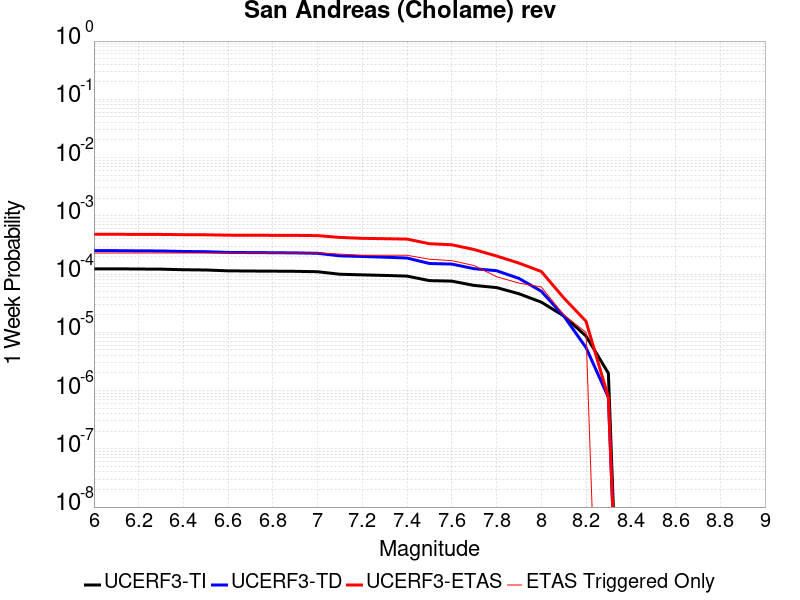 |  |  |  |

| Magnitude | 1 wk TI Prob | 1 wk TD Prob | 1 wk ETAS Prob | 1 wk ETAS/TD Gain | 1 wk ETAS Triggered Only | 1 mo TI Prob | 1 mo TD Prob | 1 mo ETAS Prob | 1 mo ETAS/TD Gain | 1 mo ETAS Triggered Only | 1 yr TI Prob | 1 yr TD Prob | 1 yr ETAS Prob | 1 yr ETAS/TD Gain | 1 yr ETAS Triggered Only | 10 yr TI Prob | 10 yr TD Prob | 10 yr ETAS Prob | 10 yr ETAS/TD Gain | 10 yr ETAS Triggered Only |
|-----|-----|-----|-----|-----|-----|-----|-----|-----|-----|-----|-----|-----|-----|-----|-----|-----|-----|-----|-----|-----|
| 6.0 | 1.2302514E-4 | 2.5204287E-4 | 3.735337E-4 | 1.4820244 | 1.2152145E-4 | 5.27144E-4 | 0.0010797381 | 0.0012011285 | 1.1124256 | 1.2152145E-4 | 0.0063991086 | 0.0130670825 | 0.013306949 | 1.0183566 | 2.430429E-4 | 0.06217949 | 0.12439073 | 0.12460354 | 1.0017108 | 2.430429E-4 |
| 6.1 | 1.2302514E-4 | 2.5204287E-4 | 3.735337E-4 | 1.4820244 | 1.2152145E-4 | 5.27144E-4 | 0.0010797381 | 0.0012011285 | 1.1124256 | 1.2152145E-4 | 0.0063991086 | 0.0130670825 | 0.013306949 | 1.0183566 | 2.430429E-4 | 0.06217949 | 0.12439073 | 0.12460354 | 1.0017108 | 2.430429E-4 |
| 6.2 | 1.2203569E-4 | 2.5021084E-4 | 3.7170187E-4 | 1.4855547 | 1.2152145E-4 | 5.2290526E-4 | 0.0010718931 | 0.0011932843 | 1.1132493 | 1.2152145E-4 | 0.006347804 | 0.01297271 | 0.0132126 | 1.0184919 | 2.430429E-4 | 0.061695136 | 0.12357691 | 0.123789914 | 1.0017236 | 2.430429E-4 |
| 6.3 | 1.2142645E-4 | 2.4907055E-4 | 3.7056176E-4 | 1.4877782 | 1.2152145E-4 | 5.202953E-4 | 0.0010670102 | 0.001188402 | 1.1137681 | 1.2152145E-4 | 0.006316212 | 0.012913967 | 0.0131538715 | 1.0185771 | 2.430429E-4 | 0.06139677 | 0.12307103 | 0.12328416 | 1.0017318 | 2.430429E-4 |
| 6.4 | 1.1865206E-4 | 2.44126E-4 | 3.656178E-4 | 1.4976602 | 1.2152145E-4 | 5.0840975E-4 | 0.0010458364 | 0.0011672308 | 1.116074 | 1.2152145E-4 | 0.006172335 | 0.012659196 | 0.012899162 | 1.0189558 | 2.430429E-4 | 0.060036868 | 0.1208638 | 0.12107747 | 1.0017679 | 2.430429E-4 |
| 6.5 | 1.17443946E-4 | 2.4205919E-4 | 3.6355123E-4 | 1.5019104 | 1.2152145E-4 | 5.032341E-4 | 0.0010369857 | 0.0011583811 | 1.1170657 | 1.2152145E-4 | 0.006109677 | 0.012552682 | 0.012792675 | 1.0191188 | 2.430429E-4 | 0.059444077 | 0.11993805 | 0.120151944 | 1.0017834 | 2.430429E-4 |
| 6.6 | 1.13579066E-4 | 2.3514954E-4 | 3.566424E-4 | 1.5166621 | 1.2152145E-4 | 4.866766E-4 | 0.001007396 | 0.0011287951 | 1.1205077 | 1.2152145E-4 | 0.0059092017 | 0.012196515 | 0.012436593 | 1.0196842 | 2.430429E-4 | 0.057545185 | 0.11685214 | 0.117066786 | 1.0018369 | 2.430429E-4 |
| 6.7 | 1.1271412E-4 | 2.3359268E-4 | 3.5508574E-4 | 1.5201064 | 1.2152145E-4 | 4.829711E-4 | 0.0010007289 | 0.0011221288 | 1.1213114 | 1.2152145E-4 | 0.005864331 | 0.012116249 | 0.0123563465 | 1.0198162 | 2.430429E-4 | 0.057119697 | 0.116155714 | 0.11637052 | 1.0018493 | 2.430429E-4 |
| 6.8 | 1.1217975E-4 | 2.3247694E-4 | 3.5397016E-4 | 1.5226032 | 1.2152145E-4 | 4.8068175E-4 | 9.959509E-4 | 0.0011173512 | 1.121894 | 1.2152145E-4 | 0.005836608 | 0.012058721 | 0.012298834 | 1.0199119 | 2.430429E-4 | 0.056856725 | 0.11565396 | 0.115868896 | 1.0018585 | 2.430429E-4 |
| 6.9 | 1.1146753E-4 | 2.3096445E-4 | 3.5245784E-4 | 1.5260264 | 1.2152145E-4 | 4.7763053E-4 | 9.894737E-4 | 0.0011108748 | 1.1226927 | 1.2152145E-4 | 0.0057996577 | 0.011980731 | 0.012220862 | 1.0200431 | 2.430429E-4 | 0.056506127 | 0.11497439 | 0.115189485 | 1.0018709 | 2.430429E-4 |
| 7.0 | 1.0965793E-4 | 2.2719789E-4 | 3.4869174E-4 | 1.534749 | 1.2152145E-4 | 4.698779E-4 | 9.733434E-4 | 0.0010947465 | 1.124728 | 1.2152145E-4 | 0.005705768 | 0.011786487 | 0.012026665 | 1.0203774 | 2.430429E-4 | 0.055614736 | 0.11327597 | 0.113491476 | 1.0019026 | 2.430429E-4 |
| 7.1 | 9.927982E-5 | 2.0538924E-4 | 3.2688573E-4 | 1.5915426 | 1.2152145E-4 | 4.2541555E-4 | 8.7994366E-4 | 0.0010013581 | 1.1379799 | 1.2152145E-4 | 0.0051671406 | 0.010660981 | 0.0109014325 | 1.0225544 | 2.430429E-4 | 0.05048634 | 0.1033706 | 0.10358852 | 1.0021081 | 2.430429E-4 |
| 7.2 | 9.696786E-5 | 2.0043184E-4 | 3.2192894E-4 | 1.6061766 | 1.2152145E-4 | 4.1551032E-4 | 8.5871184E-4 | 9.801289E-4 | 1.1413945 | 1.2152145E-4 | 0.00504711 | 0.010404981 | 0.010645495 | 1.0231153 | 2.430429E-4 | 0.04934009 | 0.1011086 | 0.10132707 | 1.0021608 | 2.430429E-4 |
| 7.3 | 9.4727984E-5 | 1.9472468E-4 | 3.1622246E-4 | 1.6239465 | 1.2152145E-4 | 4.0591392E-4 | 8.3426846E-4 | 9.5568853E-4 | 1.1455407 | 1.2152145E-4 | 0.0049308087 | 0.010110183 | 0.010350768 | 1.0237963 | 2.430429E-4 | 0.048228268 | 0.09847952 | 0.09869862 | 1.0022249 | 2.430429E-4 |
| 7.4 | 9.220358E-5 | 1.8843076E-4 | 3.099293E-4 | 1.6447915 | 1.2152145E-4 | 3.9509835E-4 | 8.073114E-4 | 9.287347E-4 | 1.1504046 | 1.2152145E-4 | 0.004799717 | 0.009784967 | 0.010025632 | 1.0245954 | 2.430429E-4 | 0.046973653 | 0.095557496 | 0.09577732 | 1.0023004 | 2.430429E-4 |
| 7.5 | 7.71631E-5 | 1.5177966E-4 | 2.7328267E-4 | 1.8005223 | 1.2152145E-4 | 3.306571E-4 | 6.503223E-4 | 7.717647E-4 | 1.186742 | 1.2152145E-4 | 0.0040183207 | 0.007889002 | 0.008130127 | 1.0305648 | 2.430429E-4 | 0.03946433 | 0.07828531 | 0.07850932 | 1.0028615 | 2.430429E-4 |
| 7.6 | 7.5634416E-5 | 1.483744E-4 | 2.698778E-4 | 1.8188975 | 1.2152145E-4 | 3.241072E-4 | 6.3573546E-4 | 7.571797E-4 | 1.1910294 | 1.2152145E-4 | 0.0039388672 | 0.0077126776 | 0.007953846 | 1.0312691 | 2.430429E-4 | 0.038697794 | 0.07664872 | 0.07687313 | 1.0029278 | 2.430429E-4 |
| 7.7 | 6.3783E-5 | 1.235872E-4 | 2.4509363E-4 | 1.9831635 | 1.2152145E-4 | 2.7332708E-4 | 5.29552E-4 | 6.510091E-4 | 1.2293582 | 1.2152145E-4 | 0.0033226798 | 0.0064282627 | 0.006549003 | 1.0187827 | 1.2152145E-4 | 0.032734364 | 0.06454029 | 0.06465397 | 1.0017613 | 1.2152145E-4 |
| 7.8 | 5.863422E-5 | 1.1416107E-4 | 1.1416107E-4 | 1.0 | 0.0 | 2.512653E-4 | 4.8917E-4 | 4.8917E-4 | 1.0 | 0.0 | 0.003054864 | 0.0059394026 | 0.0059394026 | 1.0 | 0.0 | 0.030132094 | 0.059659187 | 0.059659187 | 1.0 | 0.0 |
| 7.9 | 4.595283E-5 | 8.426331E-5 | 8.426331E-5 | 1.0 | 0.0 | 1.9692584E-4 | 3.610785E-4 | 3.610785E-4 | 1.0 | 0.0 | 0.0023949358 | 0.0043872762 | 0.0043872762 | 1.0 | 0.0 | 0.023692891 | 0.044362005 | 0.044362005 | 1.0 | 0.0 |
| 8.0 | 3.2950178E-5 | 5.0772942E-5 | 5.0772942E-5 | 1.0 | 0.0 | 1.412074E-4 | 2.1758018E-4 | 2.1758018E-4 | 1.0 | 0.0 | 0.0017178444 | 0.0026458222 | 0.0026458222 | 1.0 | 0.0 | 0.017046256 | 0.027180137 | 0.027180137 | 1.0 | 0.0 |
| 8.1 | 1.9177472E-5 | 1.9185145E-5 | 1.9185145E-5 | 1.0 | 0.0 | 8.218658E-5 | 8.221946E-5 | 8.221946E-5 | 1.0 | 0.0 | 0.0010001622 | 0.0010005629 | 0.0010005629 | 1.0 | 0.0 | 0.009956728 | 0.010758142 | 0.010758142 | 1.0 | 0.0 |
| 8.2 | 8.643924E-6 | 5.4748625E-6 | 5.4748625E-6 | 1.0 | 0.0 | 3.704486E-5 | 2.3463486E-5 | 2.3463486E-5 | 1.0 | 0.0 | 4.5092785E-4 | 2.8563058E-4 | 2.8563058E-4 | 1.0 | 0.0 | 0.0045001395 | 0.0032487072 | 0.0032487072 | 1.0 | 0.0 |
| 8.3 | 1.983087E-6 | 7.6599065E-7 | 7.6599065E-7 | 1.0 | 0.0 | 8.498917E-6 | 3.282813E-6 | 3.282813E-6 | 1.0 | 0.0 | 1.034694E-4 | 3.9967534E-5 | 3.9967534E-5 | 1.0 | 0.0 | 0.0010342124 | 4.719687E-4 | 4.719687E-4 | 1.0 | 0.0 |

## Cleghorn Lake
*[(top)](#table-of-contents)*

| 1 Week | 1 Month | 1 Year | 10 Year |
|-----|-----|-----|-----|
|  |  |  |  |

| Magnitude | 1 wk TI Prob | 1 wk TD Prob | 1 wk ETAS Prob | 1 wk ETAS/TD Gain | 1 wk ETAS Triggered Only | 1 mo TI Prob | 1 mo TD Prob | 1 mo ETAS Prob | 1 mo ETAS/TD Gain | 1 mo ETAS Triggered Only | 1 yr TI Prob | 1 yr TD Prob | 1 yr ETAS Prob | 1 yr ETAS/TD Gain | 1 yr ETAS Triggered Only | 10 yr TI Prob | 10 yr TD Prob | 10 yr ETAS Prob | 10 yr ETAS/TD Gain | 10 yr ETAS Triggered Only |
|-----|-----|-----|-----|-----|-----|-----|-----|-----|-----|-----|-----|-----|-----|-----|-----|-----|-----|-----|-----|-----|
| 6.0 | 1.5467183E-5 | 1.6794203E-5 | 1.3831361E-4 | 8.235794 | 1.2152145E-4 | 6.6286244E-5 | 7.197348E-5 | 1.9348618E-4 | 2.6882982 | 1.2152145E-4 | 8.067362E-4 | 8.759797E-4 | 0.0011188097 | 1.2772096 | 2.430429E-4 | 0.008038137 | 0.008730696 | 0.008971617 | 1.0275947 | 2.430429E-4 |
| 6.1 | 1.5467183E-5 | 1.6794203E-5 | 1.3831361E-4 | 8.235794 | 1.2152145E-4 | 6.6286244E-5 | 7.197348E-5 | 1.9348618E-4 | 2.6882982 | 1.2152145E-4 | 8.067362E-4 | 8.759797E-4 | 0.0011188097 | 1.2772096 | 2.430429E-4 | 0.008038137 | 0.008730696 | 0.008971617 | 1.0275947 | 2.430429E-4 |
| 6.2 | 1.2624631E-5 | 1.3681544E-5 | 1.3520134E-4 | 9.882023 | 1.2152145E-4 | 5.410444E-5 | 5.863415E-5 | 1.8014848E-4 | 3.0724156 | 1.2152145E-4 | 6.585225E-4 | 7.1368564E-4 | 8.351203E-4 | 1.1701516 | 1.2152145E-4 | 0.0065657445 | 0.0071187317 | 0.0072393883 | 1.0169492 | 1.2152145E-4 |
| 6.3 | 1.2624631E-5 | 1.3681544E-5 | 1.3520134E-4 | 9.882023 | 1.2152145E-4 | 5.410444E-5 | 5.863415E-5 | 1.8014848E-4 | 3.0724156 | 1.2152145E-4 | 6.585225E-4 | 7.1368564E-4 | 8.351203E-4 | 1.1701516 | 1.2152145E-4 | 0.0065657445 | 0.0071187317 | 0.0072393883 | 1.0169492 | 1.2152145E-4 |
| 6.4 | 9.417684E-6 | 1.0170118E-5 | 1.3169034E-4 | 12.948752 | 1.2152145E-4 | 4.036088E-5 | 4.3585722E-5 | 1.6510187E-4 | 3.7879808 | 1.2152145E-4 | 4.912829E-4 | 5.3056807E-4 | 6.5202505E-4 | 1.2289188 | 1.2152145E-4 | 0.004901982 | 0.005297049 | 0.0054179267 | 1.0228199 | 1.2152145E-4 |
| 6.5 | 9.368219E-6 | 1.0117545E-5 | 1.3163776E-4 | 13.010841 | 1.2152145E-4 | 4.014889E-5 | 4.3360415E-5 | 1.6487659E-4 | 3.802468 | 1.2152145E-4 | 4.8870314E-4 | 5.2782625E-4 | 6.492836E-4 | 1.2301085 | 1.2152145E-4 | 0.004876298 | 0.0052697617 | 0.0053906427 | 1.0229386 | 1.2152145E-4 |
| 6.6 | 7.803798E-6 | 8.441831E-6 | 1.2996225E-4 | 15.395031 | 1.2152145E-4 | 3.3444423E-5 | 3.6179E-5 | 1.5769605E-4 | 4.358773 | 1.2152145E-4 | 4.0710976E-4 | 4.4043022E-4 | 5.618981E-4 | 1.2757938 | 1.2152145E-4 | 0.0040636472 | 0.0043994905 | 0.0045204773 | 1.0275002 | 1.2152145E-4 |
| 6.7 | 2.3108669E-6 | 2.4438336E-6 | 2.4438336E-6 | 1.0 | 0.0 | 9.903678E-6 | 1.0473532E-5 | 1.0473532E-5 | 1.0 | 0.0 | 1.205706E-4 | 1.2750797E-4 | 1.2750797E-4 | 1.0 | 0.0 | 0.001205052 | 0.0012743667 | 0.0012743667 | 1.0 | 0.0 |
| 6.8 | 2.0882828E-6 | 2.2062823E-6 | 2.2062823E-6 | 1.0 | 0.0 | 8.949753E-6 | 9.455462E-6 | 9.455462E-6 | 1.0 | 0.0 | 1.08957785E-4 | 1.1511434E-4 | 1.1511434E-4 | 1.0 | 0.0 | 0.0010890438 | 0.0011505639 | 0.0011505639 | 1.0 | 0.0 |
| 6.9 | 1.876935E-6 | 1.981051E-6 | 1.981051E-6 | 1.0 | 0.0 | 8.043982E-6 | 8.490192E-6 | 8.490192E-6 | 1.0 | 0.0 | 9.7931086E-5 | 1.03363345E-4 | 1.03363345E-4 | 1.0 | 0.0 | 9.788794E-4 | 0.0010331686 | 0.0010331686 | 1.0 | 0.0 |
| 7.0 | 1.5357559E-6 | 1.6202807E-6 | 1.6202807E-6 | 1.0 | 0.0 | 6.5817944E-6 | 6.9440425E-6 | 6.9440425E-6 | 1.0 | 0.0 | 8.01304E-5 | 8.454057E-5 | 8.454057E-5 | 1.0 | 0.0 | 8.010151E-4 | 8.450965E-4 | 8.450965E-4 | 1.0 | 0.0 |
| 7.1 | 1.0905424E-6 | 1.1497619E-6 | 1.1497619E-6 | 1.0 | 0.0 | 4.6737446E-6 | 4.9275427E-6 | 4.9275427E-6 | 1.0 | 0.0 | 5.6901354E-5 | 5.999128E-5 | 5.999128E-5 | 1.0 | 0.0 | 5.6886784E-4 | 5.997606E-4 | 5.997606E-4 | 1.0 | 0.0 |
| 7.2 | 6.06668E-7 | 6.387277E-7 | 6.387277E-7 | 1.0 | 0.0 | 2.600003E-6 | 2.7374022E-6 | 2.7374022E-6 | 1.0 | 0.0 | 3.1654577E-5 | 3.3327433E-5 | 3.3327433E-5 | 1.0 | 0.0 | 3.1650066E-4 | 3.3323118E-4 | 3.3323118E-4 | 1.0 | 0.0 |

## San Cayetano
*[(top)](#table-of-contents)*

| 1 Week | 1 Month | 1 Year | 10 Year |
|-----|-----|-----|-----|
|  |  |  |  |

| Magnitude | 1 wk TI Prob | 1 wk TD Prob | 1 wk ETAS Prob | 1 wk ETAS/TD Gain | 1 wk ETAS Triggered Only | 1 mo TI Prob | 1 mo TD Prob | 1 mo ETAS Prob | 1 mo ETAS/TD Gain | 1 mo ETAS Triggered Only | 1 yr TI Prob | 1 yr TD Prob | 1 yr ETAS Prob | 1 yr ETAS/TD Gain | 1 yr ETAS Triggered Only | 10 yr TI Prob | 10 yr TD Prob | 10 yr ETAS Prob | 10 yr ETAS/TD Gain | 10 yr ETAS Triggered Only |
|-----|-----|-----|-----|-----|-----|-----|-----|-----|-----|-----|-----|-----|-----|-----|-----|-----|-----|-----|-----|-----|
| 6.0 | 2.3476267E-5 | 1.816928E-5 | 1.3968852E-4 | 7.688171 | 1.2152145E-4 | 1.0060869E-4 | 7.786603E-5 | 1.9937802E-4 | 2.5605261 | 1.2152145E-4 | 0.0012242225 | 9.476103E-4 | 0.0010690166 | 1.1281184 | 1.2152145E-4 | 0.012175002 | 0.009436584 | 0.009556958 | 1.0127562 | 1.2152145E-4 |
| 6.1 | 2.3476267E-5 | 1.816928E-5 | 1.3968852E-4 | 7.688171 | 1.2152145E-4 | 1.0060869E-4 | 7.786603E-5 | 1.9937802E-4 | 2.5605261 | 1.2152145E-4 | 0.0012242225 | 9.476103E-4 | 0.0010690166 | 1.1281184 | 1.2152145E-4 | 0.012175002 | 0.009436584 | 0.009556958 | 1.0127562 | 1.2152145E-4 |
| 6.2 | 2.3476267E-5 | 1.816928E-5 | 1.3968852E-4 | 7.688171 | 1.2152145E-4 | 1.0060869E-4 | 7.786603E-5 | 1.9937802E-4 | 2.5605261 | 1.2152145E-4 | 0.0012242225 | 9.476103E-4 | 0.0010690166 | 1.1281184 | 1.2152145E-4 | 0.012175002 | 0.009436584 | 0.009556958 | 1.0127562 | 1.2152145E-4 |
| 6.3 | 2.3476267E-5 | 1.816928E-5 | 1.3968852E-4 | 7.688171 | 1.2152145E-4 | 1.0060869E-4 | 7.786603E-5 | 1.9937802E-4 | 2.5605261 | 1.2152145E-4 | 0.0012242225 | 9.476103E-4 | 0.0010690166 | 1.1281184 | 1.2152145E-4 | 0.012175002 | 0.009436584 | 0.009556958 | 1.0127562 | 1.2152145E-4 |
| 6.4 | 2.3476267E-5 | 1.816928E-5 | 1.3968852E-4 | 7.688171 | 1.2152145E-4 | 1.0060869E-4 | 7.786603E-5 | 1.9937802E-4 | 2.5605261 | 1.2152145E-4 | 0.0012242225 | 9.476103E-4 | 0.0010690166 | 1.1281184 | 1.2152145E-4 | 0.012175002 | 0.009436584 | 0.009556958 | 1.0127562 | 1.2152145E-4 |
| 6.5 | 2.3476267E-5 | 1.816928E-5 | 1.3968852E-4 | 7.688171 | 1.2152145E-4 | 1.0060869E-4 | 7.786603E-5 | 1.9937802E-4 | 2.5605261 | 1.2152145E-4 | 0.0012242225 | 9.476103E-4 | 0.0010690166 | 1.1281184 | 1.2152145E-4 | 0.012175002 | 0.009436584 | 0.009556958 | 1.0127562 | 1.2152145E-4 |
| 6.6 | 2.3476267E-5 | 1.816928E-5 | 1.3968852E-4 | 7.688171 | 1.2152145E-4 | 1.0060869E-4 | 7.786603E-5 | 1.9937802E-4 | 2.5605261 | 1.2152145E-4 | 0.0012242225 | 9.476103E-4 | 0.0010690166 | 1.1281184 | 1.2152145E-4 | 0.012175002 | 0.009436584 | 0.009556958 | 1.0127562 | 1.2152145E-4 |
| 6.7 | 2.3476267E-5 | 1.816928E-5 | 1.3968852E-4 | 7.688171 | 1.2152145E-4 | 1.0060869E-4 | 7.786603E-5 | 1.9937802E-4 | 2.5605261 | 1.2152145E-4 | 0.0012242225 | 9.476103E-4 | 0.0010690166 | 1.1281184 | 1.2152145E-4 | 0.012175002 | 0.009436584 | 0.009556958 | 1.0127562 | 1.2152145E-4 |
| 6.8 | 2.3241924E-5 | 1.7936987E-5 | 1.3945626E-4 | 7.774787 | 1.2152145E-4 | 9.960445E-5 | 7.687056E-5 | 1.9838267E-4 | 2.5807366 | 1.2152145E-4 | 0.0012120095 | 9.3550084E-4 | 0.0010569086 | 1.1297784 | 1.2152145E-4 | 0.012054204 | 0.009316482 | 0.009436871 | 1.0129222 | 1.2152145E-4 |
| 6.9 | 2.2761007E-5 | 1.7432423E-5 | 1.3895176E-4 | 7.97088 | 1.2152145E-4 | 9.7543525E-5 | 7.470827E-5 | 1.9622063E-4 | 2.6264915 | 1.2152145E-4 | 0.0011869454 | 9.09197E-4 | 0.001030608 | 1.1335365 | 1.2152145E-4 | 0.011806256 | 0.009055603 | 0.009176024 | 1.0132979 | 1.2152145E-4 |
| 7.0 | 2.240283E-5 | 1.7066168E-5 | 1.3858554E-4 | 8.120483 | 1.2152145E-4 | 9.600859E-5 | 7.313869E-5 | 1.9465125E-4 | 2.6613991 | 1.2152145E-4 | 0.0011682777 | 8.9010317E-4 | 0.0010115164 | 1.1364036 | 1.2152145E-4 | 0.011621549 | 0.008866196 | 0.008986639 | 1.0135846 | 1.2152145E-4 |
| 7.1 | 2.1871154E-5 | 1.6586018E-5 | 1.3810545E-4 | 8.326619 | 1.2152145E-4 | 9.373015E-5 | 7.108101E-5 | 1.9259383E-4 | 2.7094975 | 1.2152145E-4 | 0.0011405671 | 8.6507114E-4 | 9.864875E-4 | 1.1403542 | 1.2152145E-4 | 0.011347309 | 0.008617838 | 0.008738313 | 1.0139797 | 1.2152145E-4 |
| 7.2 | 2.0714133E-5 | 1.5564561E-5 | 1.3708412E-4 | 8.807452 | 1.2152145E-4 | 8.8771834E-5 | 6.670357E-5 | 1.8821692E-4 | 2.8216918 | 1.2152145E-4 | 0.0010802611 | 8.1181666E-4 | 9.3323947E-4 | 1.1495693 | 1.2152145E-4 | 0.010750249 | 0.008089285 | 0.008209824 | 1.014901 | 1.2152145E-4 |
| 7.3 | 1.8408395E-5 | 1.3996864E-5 | 1.3551662E-4 | 9.681927 | 1.2152145E-4 | 7.8890735E-5 | 5.99852E-5 | 1.8149936E-4 | 3.0257356 | 1.2152145E-4 | 9.600714E-4 | 7.300781E-4 | 8.515108E-4 | 1.1663284 | 1.2152145E-4 | 0.009559342 | 0.0072775153 | 0.0073981523 | 1.0165766 | 1.2152145E-4 |
| 7.4 | 1.6856795E-5 | 1.28500815E-5 | 1.3436997E-4 | 10.456741 | 1.2152145E-4 | 7.2241404E-5 | 5.5070628E-5 | 1.7658538E-4 | 3.2065256 | 1.2152145E-4 | 8.7918417E-4 | 6.7028153E-4 | 7.917215E-4 | 1.1811776 | 1.2152145E-4 | 0.00875714 | 0.0066832784 | 0.0068039875 | 1.0180614 | 1.2152145E-4 |
| 7.5 | 1.2822778E-5 | 9.577542E-6 | 1.3109783E-4 | 13.6880455 | 1.2152145E-4 | 5.495361E-5 | 4.1045972E-5 | 1.6256243E-4 | 3.9604967 | 1.2152145E-4 | 6.688548E-4 | 4.996217E-4 | 6.2108244E-4 | 1.2431054 | 1.2152145E-4 | 0.006668452 | 0.0049851555 | 0.005106071 | 1.0242552 | 1.2152145E-4 |
| 7.6 | 5.6272684E-6 | 3.854903E-6 | 3.854903E-6 | 1.0 | 0.0 | 2.4116642E-5 | 1.652091E-5 | 1.652091E-5 | 1.0 | 0.0 | 2.9358055E-4 | 2.0112359E-4 | 2.0112359E-4 | 1.0 | 0.0 | 0.0029319301 | 0.0020094267 | 0.0020094267 | 1.0 | 0.0 |
| 7.7 | 3.5261346E-6 | 2.3407013E-6 | 2.3407013E-6 | 1.0 | 0.0 | 1.5111918E-5 | 1.0031539E-5 | 1.0031539E-5 | 1.0 | 0.0 | 1.8397206E-4 | 1.2212721E-4 | 1.2212721E-4 | 1.0 | 0.0 | 0.0018381984 | 0.0012206084 | 0.0012206084 | 1.0 | 0.0 |
| 7.8 | 1.4826929E-6 | 1.056428E-6 | 1.056428E-6 | 1.0 | 0.0 | 6.354383E-6 | 4.5275406E-6 | 4.5275406E-6 | 1.0 | 0.0 | 7.736187E-5 | 5.5121433E-5 | 5.5121433E-5 | 1.0 | 0.0 | 7.733494E-4 | 5.5107963E-4 | 5.5107963E-4 | 1.0 | 0.0 |
| 7.9 | 2.7568166E-7 | 1.6978244E-7 | 1.6978244E-7 | 1.0 | 0.0 | 1.1814923E-6 | 7.2763885E-7 | 7.2763885E-7 | 1.0 | 0.0 | 1.4384574E-5 | 8.858967E-6 | 8.858967E-6 | 1.0 | 0.0 | 1.4383643E-4 | 8.8586174E-5 | 8.8586174E-5 | 1.0 | 0.0 |
| 8.0 | 5.407832E-8 | 2.6887697E-8 | 2.6887697E-8 | 1.0 | 0.0 | 2.3176422E-7 | 1.15232986E-7 | 1.15232986E-7 | 1.0 | 0.0 | 2.8217257E-6 | 1.4029607E-6 | 1.4029607E-6 | 1.0 | 0.0 | 2.8216898E-5 | 1.4029522E-5 | 1.4029522E-5 | 1.0 | 0.0 |

## Great Valley 09 (Laguna Seca)
*[(top)](#table-of-contents)*

| 1 Week | 1 Month | 1 Year | 10 Year |
|-----|-----|-----|-----|
| 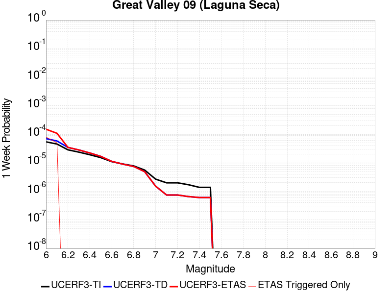 |  |  |  |

| Magnitude | 1 wk TI Prob | 1 wk TD Prob | 1 wk ETAS Prob | 1 wk ETAS/TD Gain | 1 wk ETAS Triggered Only | 1 mo TI Prob | 1 mo TD Prob | 1 mo ETAS Prob | 1 mo ETAS/TD Gain | 1 mo ETAS Triggered Only | 1 yr TI Prob | 1 yr TD Prob | 1 yr ETAS Prob | 1 yr ETAS/TD Gain | 1 yr ETAS Triggered Only | 10 yr TI Prob | 10 yr TD Prob | 10 yr ETAS Prob | 10 yr ETAS/TD Gain | 10 yr ETAS Triggered Only |
|-----|-----|-----|-----|-----|-----|-----|-----|-----|-----|-----|-----|-----|-----|-----|-----|-----|-----|-----|-----|-----|
| 6.0 | 5.4353277E-5 | 7.05022E-5 | 3.1352797E-4 | 4.4470663 | 2.430429E-4 | 2.3292181E-4 | 3.0211566E-4 | 5.450851E-4 | 1.8042266 | 2.430429E-4 | 0.0028321352 | 0.0036721937 | 0.003914344 | 1.0659416 | 2.430429E-4 | 0.02796312 | 0.03611547 | 0.036349736 | 1.0064865 | 2.430429E-4 |
| 6.1 | 4.5578287E-5 | 5.822118E-5 | 5.822118E-5 | 1.0 | 0.0 | 1.953209E-4 | 2.4949326E-4 | 2.4949326E-4 | 1.0 | 0.0 | 0.0023754383 | 0.003033432 | 0.003033432 | 1.0 | 0.0 | 0.023502063 | 0.029919548 | 0.029919548 | 1.0 | 0.0 |
| 6.2 | 2.8536782E-5 | 3.4737273E-5 | 3.4737273E-5 | 1.0 | 0.0 | 1.2229476E-4 | 1.4886224E-4 | 1.4886224E-4 | 1.0 | 0.0 | 0.0014879217 | 0.001810813 | 0.001810813 | 1.0 | 0.0 | 0.014779986 | 0.017958116 | 0.017958116 | 1.0 | 0.0 |
| 6.3 | 2.3698774E-5 | 2.8213295E-5 | 2.8213295E-5 | 1.0 | 0.0 | 1.01562226E-4 | 1.20905075E-4 | 1.20905075E-4 | 1.0 | 0.0 | 0.0012358186 | 0.0014710218 | 0.0014710218 | 1.0 | 0.0 | 0.012289686 | 0.014611342 | 0.014611342 | 1.0 | 0.0 |
| 6.4 | 1.9191197E-5 | 2.2123184E-5 | 2.2123184E-5 | 1.0 | 0.0 | 8.2245395E-5 | 9.4806666E-5 | 9.4806666E-5 | 1.0 | 0.0 | 0.0010008777 | 0.0011536429 | 0.0011536429 | 1.0 | 0.0 | 0.009963818 | 0.011476948 | 0.011476948 | 1.0 | 0.0 |
| 6.5 | 1.5203241E-5 | 1.6802203E-5 | 1.6802203E-5 | 1.0 | 0.0 | 6.5155116E-5 | 7.200386E-5 | 7.200386E-5 | 1.0 | 0.0 | 7.9297484E-4 | 8.7626575E-4 | 8.7626575E-4 | 1.0 | 0.0 | 0.007901512 | 0.0087295165 | 0.0087295165 | 1.0 | 0.0 |
| 6.6 | 1.0984925E-5 | 1.1242595E-5 | 1.1242595E-5 | 1.0 | 0.0 | 4.70774E-5 | 4.8181686E-5 | 4.8181686E-5 | 1.0 | 0.0 | 5.730166E-4 | 5.8645656E-4 | 5.8645656E-4 | 1.0 | 0.0 | 0.005715413 | 0.0058494853 | 0.0058494853 | 1.0 | 0.0 |
| 6.7 | 9.134616E-6 | 9.019894E-6 | 9.019894E-6 | 1.0 | 0.0 | 3.9147766E-5 | 3.865613E-5 | 3.865613E-5 | 1.0 | 0.0 | 4.7651984E-4 | 4.7053912E-4 | 4.7053912E-4 | 1.0 | 0.0 | 0.004754993 | 0.0046956735 | 0.0046956735 | 1.0 | 0.0 |
| 6.8 | 7.785589E-6 | 7.4519444E-6 | 7.4519444E-6 | 1.0 | 0.0 | 3.3366385E-5 | 3.1936524E-5 | 3.1936524E-5 | 1.0 | 0.0 | 4.0616E-4 | 3.8875983E-4 | 3.8875983E-4 | 1.0 | 0.0 | 0.0040541845 | 0.0038810016 | 0.0038810016 | 1.0 | 0.0 |
| 6.9 | 5.579095E-6 | 4.898492E-6 | 4.898492E-6 | 1.0 | 0.0 | 2.3910188E-5 | 2.0993377E-5 | 2.0993377E-5 | 1.0 | 0.0 | 2.9106764E-4 | 2.5556577E-4 | 2.5556577E-4 | 1.0 | 0.0 | 0.002906867 | 0.002552856 | 0.002552856 | 1.0 | 0.0 |
| 7.0 | 2.6816688E-6 | 1.5216126E-6 | 1.5216126E-6 | 1.0 | 0.0 | 1.1492816E-5 | 6.521181E-6 | 6.521181E-6 | 1.0 | 0.0 | 1.3991605E-4 | 7.939258E-5 | 7.939258E-5 | 1.0 | 0.0 | 0.0013982799 | 7.9365086E-4 | 7.9365086E-4 | 1.0 | 0.0 |
| 7.1 | 1.9951021E-6 | 7.453827E-7 | 7.453827E-7 | 1.0 | 0.0 | 8.55041E-6 | 3.1944935E-6 | 3.1944935E-6 | 1.0 | 0.0 | 1.0409627E-4 | 3.8892307E-5 | 3.8892307E-5 | 1.0 | 0.0 | 0.0010404752 | 3.8885913E-4 | 3.8885913E-4 | 1.0 | 0.0 |
| 7.2 | 1.9951021E-6 | 7.453827E-7 | 7.453827E-7 | 1.0 | 0.0 | 8.55041E-6 | 3.1944935E-6 | 3.1944935E-6 | 1.0 | 0.0 | 1.0409627E-4 | 3.8892307E-5 | 3.8892307E-5 | 1.0 | 0.0 | 0.0010404752 | 3.8885913E-4 | 3.8885913E-4 | 1.0 | 0.0 |
| 7.3 | 1.7087556E-6 | 6.578881E-7 | 6.578881E-7 | 1.0 | 0.0 | 7.3232177E-6 | 2.8195177E-6 | 2.8195177E-6 | 1.0 | 0.0 | 8.915652E-5 | 3.4327128E-5 | 3.4327128E-5 | 1.0 | 0.0 | 8.9120766E-4 | 3.432223E-4 | 3.432223E-4 | 1.0 | 0.0 |
| 7.4 | 1.3804846E-6 | 6.073852E-7 | 6.073852E-7 | 1.0 | 0.0 | 5.916349E-6 | 2.6030768E-6 | 2.6030768E-6 | 1.0 | 0.0 | 7.2029165E-5 | 3.169204E-5 | 3.169204E-5 | 1.0 | 0.0 | 7.200583E-4 | 3.1687922E-4 | 3.1687922E-4 | 1.0 | 0.0 |
| 7.5 | 1.3804846E-6 | 6.073852E-7 | 6.073852E-7 | 1.0 | 0.0 | 5.916349E-6 | 2.6030768E-6 | 2.6030768E-6 | 1.0 | 0.0 | 7.2029165E-5 | 3.169204E-5 | 3.169204E-5 | 1.0 | 0.0 | 7.200583E-4 | 3.1687922E-4 | 3.1687922E-4 | 1.0 | 0.0 |

## Lake Isabella (Seismicity)
*[(top)](#table-of-contents)*

| 1 Week | 1 Month | 1 Year | 10 Year |
|-----|-----|-----|-----|
|  |  |  |  |

| Magnitude | 1 wk TI Prob | 1 wk TD Prob | 1 wk ETAS Prob | 1 wk ETAS/TD Gain | 1 wk ETAS Triggered Only | 1 mo TI Prob | 1 mo TD Prob | 1 mo ETAS Prob | 1 mo ETAS/TD Gain | 1 mo ETAS Triggered Only | 1 yr TI Prob | 1 yr TD Prob | 1 yr ETAS Prob | 1 yr ETAS/TD Gain | 1 yr ETAS Triggered Only | 10 yr TI Prob | 10 yr TD Prob | 10 yr ETAS Prob | 10 yr ETAS/TD Gain | 10 yr ETAS Triggered Only |
|-----|-----|-----|-----|-----|-----|-----|-----|-----|-----|-----|-----|-----|-----|-----|-----|-----|-----|-----|-----|-----|
| 6.0 | 9.431637E-6 | 9.741651E-6 | 1.3126191E-4 | 13.474298 | 1.2152145E-4 | 4.0420677E-5 | 4.1749343E-5 | 1.6326572E-4 | 3.9106178 | 1.2152145E-4 | 4.920106E-4 | 5.0819275E-4 | 6.2965247E-4 | 1.2390032 | 1.2152145E-4 | 0.004909227 | 0.005071599 | 0.005313409 | 1.0476793 | 2.430429E-4 |
| 6.1 | 9.431637E-6 | 9.741651E-6 | 1.3126191E-4 | 13.474298 | 1.2152145E-4 | 4.0420677E-5 | 4.1749343E-5 | 1.6326572E-4 | 3.9106178 | 1.2152145E-4 | 4.920106E-4 | 5.0819275E-4 | 6.2965247E-4 | 1.2390032 | 1.2152145E-4 | 0.004909227 | 0.005071599 | 0.005313409 | 1.0476793 | 2.430429E-4 |
| 6.2 | 9.431637E-6 | 9.741651E-6 | 1.3126191E-4 | 13.474298 | 1.2152145E-4 | 4.0420677E-5 | 4.1749343E-5 | 1.6326572E-4 | 3.9106178 | 1.2152145E-4 | 4.920106E-4 | 5.0819275E-4 | 6.2965247E-4 | 1.2390032 | 1.2152145E-4 | 0.004909227 | 0.005071599 | 0.005313409 | 1.0476793 | 2.430429E-4 |
| 6.3 | 9.431637E-6 | 9.741651E-6 | 1.3126191E-4 | 13.474298 | 1.2152145E-4 | 4.0420677E-5 | 4.1749343E-5 | 1.6326572E-4 | 3.9106178 | 1.2152145E-4 | 4.920106E-4 | 5.0819275E-4 | 6.2965247E-4 | 1.2390032 | 1.2152145E-4 | 0.004909227 | 0.005071599 | 0.005313409 | 1.0476793 | 2.430429E-4 |
| 6.4 | 5.144063E-6 | 5.3000763E-6 | 5.3000763E-6 | 1.0 | 0.0 | 2.2045799E-5 | 2.2714434E-5 | 2.2714434E-5 | 1.0 | 0.0 | 2.6837454E-4 | 2.765166E-4 | 2.765166E-4 | 1.0 | 0.0 | 0.0026805066 | 0.0027620657 | 0.0028832515 | 1.0438751 | 1.2152145E-4 |
| 6.5 | 5.144063E-6 | 5.3000763E-6 | 5.3000763E-6 | 1.0 | 0.0 | 2.2045799E-5 | 2.2714434E-5 | 2.2714434E-5 | 1.0 | 0.0 | 2.6837454E-4 | 2.765166E-4 | 2.765166E-4 | 1.0 | 0.0 | 0.0026805066 | 0.0027620657 | 0.0028832515 | 1.0438751 | 1.2152145E-4 |
| 6.6 | 3.4009804E-6 | 3.498786E-6 | 3.498786E-6 | 1.0 | 0.0 | 1.4575549E-5 | 1.4994721E-5 | 1.4994721E-5 | 1.0 | 0.0 | 1.7744285E-4 | 1.8254704E-4 | 1.8254704E-4 | 1.0 | 0.0 | 0.0017730123 | 0.0018241286 | 0.0019454283 | 1.0664973 | 1.2152145E-4 |
| 6.7 | 3.3880428E-6 | 3.4856528E-6 | 3.4856528E-6 | 1.0 | 0.0 | 1.4520103E-5 | 1.4938435E-5 | 1.4938435E-5 | 1.0 | 0.0 | 1.767679E-4 | 1.8186188E-4 | 1.8186188E-4 | 1.0 | 0.0 | 0.0017662736 | 0.0018172882 | 0.0019385888 | 1.0667481 | 1.2152145E-4 |
| 6.8 | 2.6582E-6 | 2.7337003E-6 | 2.7337003E-6 | 1.0 | 0.0 | 1.1392236E-5 | 1.1715813E-5 | 1.1715813E-5 | 1.0 | 0.0 | 1.3869164E-4 | 1.4263204E-4 | 1.4263204E-4 | 1.0 | 0.0 | 0.0013860512 | 0.0014255369 | 0.0015468851 | 1.0851246 | 1.2152145E-4 |
| 6.9 | 2.406011E-6 | 2.4743288E-6 | 2.4743288E-6 | 1.0 | 0.0 | 1.0311434E-5 | 1.0604231E-5 | 1.0604231E-5 | 1.0 | 0.0 | 1.2553448E-4 | 1.2910018E-4 | 1.2910018E-4 | 1.0 | 0.0 | 0.0012546359 | 0.0012903814 | 0.001411746 | 1.0940533 | 1.2152145E-4 |
| 7.0 | 1.6953097E-6 | 1.7429371E-6 | 1.7429371E-6 | 1.0 | 0.0 | 7.265593E-6 | 7.469715E-6 | 7.469715E-6 | 1.0 | 0.0 | 8.8455E-5 | 9.094104E-5 | 9.094104E-5 | 1.0 | 0.0 | 8.84198E-4 | 9.09141E-4 | 0.001030552 | 1.1335447 | 1.2152145E-4 |
| 7.1 | 3.5013824E-7 | 3.5714822E-7 | 3.5714822E-7 | 1.0 | 0.0 | 1.5005916E-6 | 1.5306344E-6 | 1.5306344E-6 | 1.0 | 0.0 | 1.826955E-5 | 1.8635317E-5 | 1.8635317E-5 | 1.0 | 0.0 | 1.8268047E-4 | 1.863378E-4 | 1.863378E-4 | 1.0 | 0.0 |
| 7.2 | 2.2321095E-7 | 2.2750574E-7 | 2.2750574E-7 | 1.0 | 0.0 | 9.56618E-7 | 9.750242E-7 | 9.750242E-7 | 1.0 | 0.0 | 1.1646762E-5 | 1.1870856E-5 | 1.1870856E-5 | 1.0 | 0.0 | 1.1646151E-4 | 1.1870232E-4 | 1.1870232E-4 | 1.0 | 0.0 |
| 7.3 | 1.5760406E-7 | 1.6060922E-7 | 1.6060922E-7 | 1.0 | 0.0 | 6.7544585E-7 | 6.8832503E-7 | 6.8832503E-7 | 1.0 | 0.0 | 8.223522E-6 | 8.380326E-6 | 8.380326E-6 | 1.0 | 0.0 | 8.2232174E-5 | 8.3800165E-5 | 8.3800165E-5 | 1.0 | 0.0 |
| 7.4 | 1.1216497E-7 | 1.1431706E-7 | 1.1431706E-7 | 1.0 | 0.0 | 4.8070694E-7 | 4.899302E-7 | 4.899302E-7 | 1.0 | 0.0 | 5.852591E-6 | 5.964884E-6 | 5.964884E-6 | 1.0 | 0.0 | 5.8524372E-5 | 5.9647282E-5 | 5.9647282E-5 | 1.0 | 0.0 |
| 7.5 | 4.885185E-8 | 4.9787737E-8 | 4.9787737E-8 | 1.0 | 0.0 | 2.0936506E-7 | 2.13376E-7 | 2.13376E-7 | 1.0 | 0.0 | 2.5490165E-6 | 2.59785E-6 | 2.59785E-6 | 1.0 | 0.0 | 2.5489873E-5 | 2.5978214E-5 | 2.5978214E-5 | 1.0 | 0.0 |
| 7.6 | 1.504641E-9 | 1.5317903E-9 | 1.5317903E-9 | 1.0 | 0.0 | 6.4484613E-9 | 6.5648154E-9 | 6.5648154E-9 | 1.0 | 0.0 | 7.851001E-8 | 7.992663E-8 | 7.992663E-8 | 1.0 | 0.0 | 7.8509987E-7 | 7.992663E-7 | 7.992663E-7 | 1.0 | 0.0 |

## Kern Canyon (Lake Isabella) 2011
*[(top)](#table-of-contents)*

| 1 Week | 1 Month | 1 Year | 10 Year |
|-----|-----|-----|-----|
|  |  |  |  |

| Magnitude | 1 wk TI Prob | 1 wk TD Prob | 1 wk ETAS Prob | 1 wk ETAS/TD Gain | 1 wk ETAS Triggered Only | 1 mo TI Prob | 1 mo TD Prob | 1 mo ETAS Prob | 1 mo ETAS/TD Gain | 1 mo ETAS Triggered Only | 1 yr TI Prob | 1 yr TD Prob | 1 yr ETAS Prob | 1 yr ETAS/TD Gain | 1 yr ETAS Triggered Only | 10 yr TI Prob | 10 yr TD Prob | 10 yr ETAS Prob | 10 yr ETAS/TD Gain | 10 yr ETAS Triggered Only |
|-----|-----|-----|-----|-----|-----|-----|-----|-----|-----|-----|-----|-----|-----|-----|-----|-----|-----|-----|-----|-----|
| 6.0 | 4.2387383E-6 | 4.001639E-6 | 4.001639E-6 | 1.0 | 0.0 | 1.8165894E-5 | 1.7149778E-5 | 1.3866914E-4 | 8.085769 | 1.2152145E-4 | 2.2114732E-4 | 2.087804E-4 | 3.302765E-4 | 1.5819324 | 1.2152145E-4 | 0.0022092736 | 0.0020860266 | 0.0023285623 | 1.116267 | 2.430429E-4 |
| 6.1 | 4.2387383E-6 | 4.001639E-6 | 4.001639E-6 | 1.0 | 0.0 | 1.8165894E-5 | 1.7149778E-5 | 1.3866914E-4 | 8.085769 | 1.2152145E-4 | 2.2114732E-4 | 2.087804E-4 | 3.302765E-4 | 1.5819324 | 1.2152145E-4 | 0.0022092736 | 0.0020860266 | 0.0023285623 | 1.116267 | 2.430429E-4 |
| 6.2 | 4.2387383E-6 | 4.001639E-6 | 4.001639E-6 | 1.0 | 0.0 | 1.8165894E-5 | 1.7149778E-5 | 1.3866914E-4 | 8.085769 | 1.2152145E-4 | 2.2114732E-4 | 2.087804E-4 | 3.302765E-4 | 1.5819324 | 1.2152145E-4 | 0.0022092736 | 0.0020860266 | 0.0023285623 | 1.116267 | 2.430429E-4 |
| 6.3 | 4.2387383E-6 | 4.001639E-6 | 4.001639E-6 | 1.0 | 0.0 | 1.8165894E-5 | 1.7149778E-5 | 1.3866914E-4 | 8.085769 | 1.2152145E-4 | 2.2114732E-4 | 2.087804E-4 | 3.302765E-4 | 1.5819324 | 1.2152145E-4 | 0.0022092736 | 0.0020860266 | 0.0023285623 | 1.116267 | 2.430429E-4 |
| 6.4 | 4.2387383E-6 | 4.001639E-6 | 4.001639E-6 | 1.0 | 0.0 | 1.8165894E-5 | 1.7149778E-5 | 1.3866914E-4 | 8.085769 | 1.2152145E-4 | 2.2114732E-4 | 2.087804E-4 | 3.302765E-4 | 1.5819324 | 1.2152145E-4 | 0.0022092736 | 0.0020860266 | 0.0023285623 | 1.116267 | 2.430429E-4 |
| 6.5 | 2.7857532E-6 | 2.517867E-6 | 2.517867E-6 | 1.0 | 0.0 | 1.1938888E-5 | 1.0790815E-5 | 1.3231095E-4 | 12.261441 | 1.2152145E-4 | 1.4534626E-4 | 1.3137059E-4 | 2.5287608E-4 | 1.9249063 | 1.2152145E-4 | 0.0014525123 | 0.001312962 | 0.0015556858 | 1.1848674 | 2.430429E-4 |
| 6.6 | 2.2233348E-6 | 1.9441236E-6 | 1.9441236E-6 | 1.0 | 0.0 | 9.528543E-6 | 8.331932E-6 | 8.331932E-6 | 1.0 | 0.0 | 1.1600384E-4 | 1.01436635E-4 | 1.01436635E-4 | 1.0 | 0.0 | 0.001159433 | 0.001013912 | 0.0011353103 | 1.1197325 | 1.2152145E-4 |
| 6.7 | 2.1635126E-6 | 1.8835036E-6 | 1.8835036E-6 | 1.0 | 0.0 | 9.272164E-6 | 8.072134E-6 | 8.072134E-6 | 1.0 | 0.0 | 1.1288274E-4 | 9.827388E-5 | 9.827388E-5 | 1.0 | 0.0 | 0.0011282542 | 9.823124E-4 | 0.0011037145 | 1.1235881 | 1.2152145E-4 |
| 6.8 | 1.8685711E-6 | 1.5831425E-6 | 1.5831425E-6 | 1.0 | 0.0 | 8.008137E-6 | 6.784879E-6 | 6.784879E-6 | 1.0 | 0.0 | 9.74947E-5 | 8.260282E-5 | 8.260282E-5 | 1.0 | 0.0 | 9.745194E-4 | 8.2572614E-4 | 9.471472E-4 | 1.1470476 | 1.2152145E-4 |
| 6.9 | 1.5815071E-6 | 1.3064928E-6 | 1.3064928E-6 | 1.0 | 0.0 | 6.77787E-6 | 5.599243E-6 | 5.599243E-6 | 1.0 | 0.0 | 8.251744E-5 | 6.816868E-5 | 6.816868E-5 | 1.0 | 0.0 | 8.248681E-4 | 6.8148033E-4 | 8.02919E-4 | 1.1781983 | 1.2152145E-4 |
| 7.0 | 1.3772564E-6 | 1.1210718E-6 | 1.1210718E-6 | 1.0 | 0.0 | 5.9025137E-6 | 4.8045845E-6 | 4.8045845E-6 | 1.0 | 0.0 | 7.186073E-5 | 5.8494268E-5 | 5.8494268E-5 | 1.0 | 0.0 | 7.18375E-4 | 5.847908E-4 | 7.062412E-4 | 1.2076818 | 1.2152145E-4 |
| 7.1 | 1.0916998E-6 | 8.763777E-7 | 8.763777E-7 | 1.0 | 0.0 | 4.678705E-6 | 3.7558991E-6 | 3.7558991E-6 | 1.0 | 0.0 | 5.6961744E-5 | 4.5727127E-5 | 4.5727127E-5 | 1.0 | 0.0 | 5.6947145E-4 | 4.571785E-4 | 4.571785E-4 | 1.0 | 0.0 |
| 7.2 | 7.6277024E-7 | 5.901454E-7 | 5.901454E-7 | 1.0 | 0.0 | 3.2690114E-6 | 2.5291922E-6 | 2.5291922E-6 | 1.0 | 0.0 | 3.9799485E-5 | 3.0792486E-5 | 3.0792486E-5 | 1.0 | 0.0 | 3.9792358E-4 | 3.0788282E-4 | 3.0788282E-4 | 1.0 | 0.0 |
| 7.3 | 5.3265916E-7 | 4.3824414E-7 | 4.3824414E-7 | 1.0 | 0.0 | 2.282823E-6 | 1.878188E-6 | 1.878188E-6 | 1.0 | 0.0 | 2.7793016E-5 | 2.2866701E-5 | 2.2866701E-5 | 1.0 | 0.0 | 2.778954E-4 | 2.2864387E-4 | 2.2864387E-4 | 1.0 | 0.0 |
| 7.4 | 3.4946007E-7 | 3.006571E-7 | 3.006571E-7 | 1.0 | 0.0 | 1.497685E-6 | 1.2885298E-6 | 1.2885298E-6 | 1.0 | 0.0 | 1.8234163E-5 | 1.568774E-5 | 1.568774E-5 | 1.0 | 0.0 | 1.8232666E-4 | 1.5686655E-4 | 1.5686655E-4 | 1.0 | 0.0 |
| 7.5 | 1.8317026E-7 | 1.4244812E-7 | 1.4244812E-7 | 1.0 | 0.0 | 7.850152E-7 | 6.104918E-7 | 6.104918E-7 | 1.0 | 0.0 | 9.557518E-6 | 7.432713E-6 | 7.432713E-6 | 1.0 | 0.0 | 9.5571064E-5 | 7.432472E-5 | 7.432472E-5 | 1.0 | 0.0 |
| 7.6 | 2.572245E-8 | 1.7352555E-8 | 1.7352555E-8 | 1.0 | 0.0 | 1.10239064E-7 | 7.436809E-8 | 7.436809E-8 | 1.0 | 0.0 | 1.3421597E-6 | 9.054312E-7 | 9.054312E-7 | 1.0 | 0.0 | 1.3421517E-5 | 9.05428E-6 | 9.05428E-6 | 1.0 | 0.0 |

## White Wolf
*[(top)](#table-of-contents)*

| 1 Week | 1 Month | 1 Year | 10 Year |
|-----|-----|-----|-----|
| 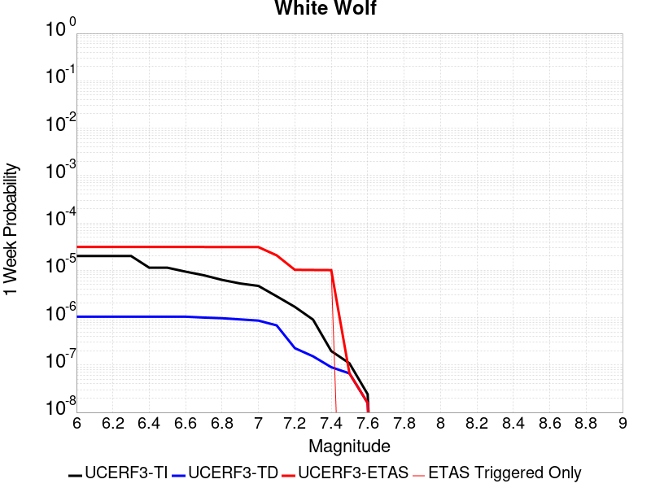 |  |  |  |

| Magnitude | 1 wk TI Prob | 1 wk TD Prob | 1 wk ETAS Prob | 1 wk ETAS/TD Gain | 1 wk ETAS Triggered Only | 1 mo TI Prob | 1 mo TD Prob | 1 mo ETAS Prob | 1 mo ETAS/TD Gain | 1 mo ETAS Triggered Only | 1 yr TI Prob | 1 yr TD Prob | 1 yr ETAS Prob | 1 yr ETAS/TD Gain | 1 yr ETAS Triggered Only | 10 yr TI Prob | 10 yr TD Prob | 10 yr ETAS Prob | 10 yr ETAS/TD Gain | 10 yr ETAS Triggered Only |
|-----|-----|-----|-----|-----|-----|-----|-----|-----|-----|-----|-----|-----|-----|-----|-----|-----|-----|-----|-----|-----|
| 6.0 | 2.0037822E-5 | 1.0469162E-6 | 1.2256824E-4 | 117.0755 | 1.2152145E-4 | 8.587355E-5 | 4.486776E-6 | 1.2600768E-4 | 28.084236 | 1.2152145E-4 | 0.001045009 | 5.4625183E-5 | 1.7613999E-4 | 3.22452 | 1.2152145E-4 | 0.010401085 | 5.461226E-4 | 6.6757767E-4 | 1.2223953 | 1.2152145E-4 |
| 6.1 | 2.0037822E-5 | 1.0469162E-6 | 1.2256824E-4 | 117.0755 | 1.2152145E-4 | 8.587355E-5 | 4.486776E-6 | 1.2600768E-4 | 28.084236 | 1.2152145E-4 | 0.001045009 | 5.4625183E-5 | 1.7613999E-4 | 3.22452 | 1.2152145E-4 | 0.010401085 | 5.461226E-4 | 6.6757767E-4 | 1.2223953 | 1.2152145E-4 |
| 6.2 | 2.0037822E-5 | 1.0469162E-6 | 1.2256824E-4 | 117.0755 | 1.2152145E-4 | 8.587355E-5 | 4.486776E-6 | 1.2600768E-4 | 28.084236 | 1.2152145E-4 | 0.001045009 | 5.4625183E-5 | 1.7613999E-4 | 3.22452 | 1.2152145E-4 | 0.010401085 | 5.461226E-4 | 6.6757767E-4 | 1.2223953 | 1.2152145E-4 |
| 6.3 | 2.0037822E-5 | 1.0469162E-6 | 1.2256824E-4 | 117.0755 | 1.2152145E-4 | 8.587355E-5 | 4.486776E-6 | 1.2600768E-4 | 28.084236 | 1.2152145E-4 | 0.001045009 | 5.4625183E-5 | 1.7613999E-4 | 3.22452 | 1.2152145E-4 | 0.010401085 | 5.461226E-4 | 6.6757767E-4 | 1.2223953 | 1.2152145E-4 |
| 6.4 | 1.132487E-5 | 1.0469162E-6 | 1.2256824E-4 | 117.0755 | 1.2152145E-4 | 4.8534253E-5 | 4.486776E-6 | 1.2600768E-4 | 28.084236 | 1.2152145E-4 | 5.907443E-4 | 5.4625183E-5 | 1.7613999E-4 | 3.22452 | 1.2152145E-4 | 0.005891764 | 5.461226E-4 | 6.6757767E-4 | 1.2223953 | 1.2152145E-4 |
| 6.5 | 1.132487E-5 | 1.0469162E-6 | 1.2256824E-4 | 117.0755 | 1.2152145E-4 | 4.8534253E-5 | 4.486776E-6 | 1.2600768E-4 | 28.084236 | 1.2152145E-4 | 5.907443E-4 | 5.4625183E-5 | 1.7613999E-4 | 3.22452 | 1.2152145E-4 | 0.005891764 | 5.461226E-4 | 6.6757767E-4 | 1.2223953 | 1.2152145E-4 |
| 6.6 | 9.347473E-6 | 1.0469162E-6 | 1.2256824E-4 | 117.0755 | 1.2152145E-4 | 4.0059982E-5 | 4.486776E-6 | 1.2600768E-4 | 28.084236 | 1.2152145E-4 | 4.8762115E-4 | 5.4625183E-5 | 1.7613999E-4 | 3.22452 | 1.2152145E-4 | 0.0048655253 | 5.461226E-4 | 6.6757767E-4 | 1.2223953 | 1.2152145E-4 |
| 6.7 | 7.842647E-6 | 1.0048342E-6 | 1.2252617E-4 | 121.9367 | 1.2152145E-4 | 3.361091E-5 | 4.3064256E-6 | 1.2582736E-4 | 29.218513 | 1.2152145E-4 | 4.0913603E-4 | 5.2429517E-5 | 1.739446E-4 | 3.3176844 | 1.2152145E-4 | 0.004083836 | 5.2417646E-4 | 6.456342E-4 | 1.2317116 | 1.2152145E-4 |
| 6.8 | 6.26597E-6 | 9.734822E-7 | 1.224948E-4 | 125.83159 | 1.2152145E-4 | 2.685388E-5 | 4.17206E-6 | 1.25693E-4 | 30.127323 | 1.2152145E-4 | 3.2689696E-4 | 5.0793697E-5 | 1.7230898E-4 | 3.3923297 | 1.2152145E-4 | 0.003264165 | 5.078258E-4 | 6.292855E-4 | 1.239176 | 1.2152145E-4 |
| 6.9 | 5.258436E-6 | 9.183254E-7 | 1.2243967E-4 | 133.32928 | 1.2152145E-4 | 2.2535958E-5 | 3.9356746E-6 | 1.2545665E-4 | 31.876783 | 1.2152145E-4 | 2.7434074E-4 | 4.7915833E-5 | 1.6943146E-4 | 3.5360224 | 1.2152145E-4 | 0.0027400232 | 4.790598E-4 | 6.00523E-4 | 1.253545 | 1.2152145E-4 |
| 7.0 | 4.675028E-6 | 8.6611794E-7 | 1.2238746E-4 | 141.30577 | 1.2152145E-4 | 2.003568E-5 | 3.7119291E-6 | 1.2523292E-4 | 33.737965 | 1.2152145E-4 | 2.4390711E-4 | 4.5191846E-5 | 1.667078E-4 | 3.6888912 | 1.2152145E-4 | 0.0024363957 | 4.518313E-4 | 5.7329785E-4 | 1.2688316 | 1.2152145E-4 |
| 7.1 | 2.8270078E-6 | 6.8741696E-7 | 1.2220879E-4 | 177.77971 | 1.2152145E-4 | 1.2115692E-5 | 2.9460696E-6 | 1.2446716E-4 | 42.248547 | 1.2152145E-4 | 1.4749856E-4 | 3.5867848E-5 | 1.5738494E-4 | 4.3879113 | 1.2152145E-4 | 0.001474007 | 3.586247E-4 | 4.8010255E-4 | 1.3387326 | 1.2152145E-4 |
| 7.2 | 1.6881406E-6 | 2.2706382E-7 | 2.2706382E-7 | 1.0 | 0.0 | 7.2348685E-6 | 9.731303E-7 | 9.731303E-7 | 1.0 | 0.0 | 8.808096E-5 | 1.1847799E-5 | 1.1847799E-5 | 1.0 | 0.0 | 8.8046055E-4 | 1.1847183E-4 | 1.1847183E-4 | 1.0 | 0.0 |
| 7.3 | 9.086107E-7 | 1.5266386E-7 | 1.5266386E-7 | 1.0 | 0.0 | 3.8940398E-6 | 6.5427355E-7 | 6.5427355E-7 | 1.0 | 0.0 | 4.7408903E-5 | 7.965752E-6 | 7.965752E-6 | 1.0 | 0.0 | 4.739879E-4 | 7.965475E-5 | 7.965475E-5 | 1.0 | 0.0 |
| 7.4 | 1.9717383E-7 | 9.003913E-8 | 9.003913E-8 | 1.0 | 0.0 | 8.450304E-7 | 3.8588192E-7 | 3.8588192E-7 | 1.0 | 0.0 | 1.0288197E-5 | 4.6981027E-6 | 4.6981027E-6 | 1.0 | 0.0 | 1.028772E-4 | 4.6980065E-5 | 4.6980065E-5 | 1.0 | 0.0 |
| 7.5 | 1.086975E-7 | 6.6597195E-8 | 6.6597195E-8 | 1.0 | 0.0 | 4.6584634E-7 | 2.8541652E-7 | 2.8541652E-7 | 1.0 | 0.0 | 5.6716644E-6 | 3.474941E-6 | 3.474941E-6 | 1.0 | 0.0 | 5.6715195E-5 | 3.474889E-5 | 3.474889E-5 | 1.0 | 0.0 |
| 7.6 | 2.4217808E-8 | 1.5820765E-8 | 1.5820765E-8 | 1.0 | 0.0 | 1.03790605E-7 | 6.780328E-8 | 6.780328E-8 | 1.0 | 0.0 | 1.2636499E-6 | 8.255046E-7 | 8.255046E-7 | 1.0 | 0.0 | 1.2636427E-5 | 8.2550205E-6 | 8.2550205E-6 | 1.0 | 0.0 |

## Earthquake Valley (So Extension)
*[(top)](#table-of-contents)*

| 1 Week | 1 Month | 1 Year | 10 Year |
|-----|-----|-----|-----|
|  |  |  |  |

| Magnitude | 1 wk TI Prob | 1 wk TD Prob | 1 wk ETAS Prob | 1 wk ETAS/TD Gain | 1 wk ETAS Triggered Only | 1 mo TI Prob | 1 mo TD Prob | 1 mo ETAS Prob | 1 mo ETAS/TD Gain | 1 mo ETAS Triggered Only | 1 yr TI Prob | 1 yr TD Prob | 1 yr ETAS Prob | 1 yr ETAS/TD Gain | 1 yr ETAS Triggered Only | 10 yr TI Prob | 10 yr TD Prob | 10 yr ETAS Prob | 10 yr ETAS/TD Gain | 10 yr ETAS Triggered Only |
|-----|-----|-----|-----|-----|-----|-----|-----|-----|-----|-----|-----|-----|-----|-----|-----|-----|-----|-----|-----|-----|
| 6.0 | 3.0194888E-5 | 3.7072114E-5 | 1.5858906E-4 | 4.2778535 | 1.2152145E-4 | 1.2940024E-4 | 1.5887388E-4 | 2.8037603E-4 | 1.7647711 | 1.2152145E-4 | 0.0015743093 | 0.0019331174 | 0.002054404 | 1.0627414 | 1.2152145E-4 | 0.01563203 | 0.019213019 | 0.019332204 | 1.0062034 | 1.2152145E-4 |
| 6.1 | 3.0194888E-5 | 3.7072114E-5 | 1.5858906E-4 | 4.2778535 | 1.2152145E-4 | 1.2940024E-4 | 1.5887388E-4 | 2.8037603E-4 | 1.7647711 | 1.2152145E-4 | 0.0015743093 | 0.0019331174 | 0.002054404 | 1.0627414 | 1.2152145E-4 | 0.01563203 | 0.019213019 | 0.019332204 | 1.0062034 | 1.2152145E-4 |
| 6.2 | 3.0194888E-5 | 3.7072114E-5 | 1.5858906E-4 | 4.2778535 | 1.2152145E-4 | 1.2940024E-4 | 1.5887388E-4 | 2.8037603E-4 | 1.7647711 | 1.2152145E-4 | 0.0015743093 | 0.0019331174 | 0.002054404 | 1.0627414 | 1.2152145E-4 | 0.01563203 | 0.019213019 | 0.019332204 | 1.0062034 | 1.2152145E-4 |
| 6.3 | 1.5795305E-5 | 1.844658E-5 | 1.844658E-5 | 1.0 | 0.0 | 6.769241E-5 | 7.9055004E-5 | 7.9055004E-5 | 1.0 | 0.0 | 8.238434E-4 | 9.6218096E-4 | 9.6218096E-4 | 1.0 | 0.0 | 0.008207959 | 0.009591061 | 0.009591061 | 1.0 | 0.0 |
| 6.4 | 1.5795305E-5 | 1.844658E-5 | 1.844658E-5 | 1.0 | 0.0 | 6.769241E-5 | 7.9055004E-5 | 7.9055004E-5 | 1.0 | 0.0 | 8.238434E-4 | 9.6218096E-4 | 9.6218096E-4 | 1.0 | 0.0 | 0.008207959 | 0.009591061 | 0.009591061 | 1.0 | 0.0 |
| 6.5 | 1.5795305E-5 | 1.844658E-5 | 1.844658E-5 | 1.0 | 0.0 | 6.769241E-5 | 7.9055004E-5 | 7.9055004E-5 | 1.0 | 0.0 | 8.238434E-4 | 9.6218096E-4 | 9.6218096E-4 | 1.0 | 0.0 | 0.008207959 | 0.009591061 | 0.009591061 | 1.0 | 0.0 |
| 6.6 | 1.5795305E-5 | 1.844658E-5 | 1.844658E-5 | 1.0 | 0.0 | 6.769241E-5 | 7.9055004E-5 | 7.9055004E-5 | 1.0 | 0.0 | 8.238434E-4 | 9.6218096E-4 | 9.6218096E-4 | 1.0 | 0.0 | 0.008207959 | 0.009591061 | 0.009591061 | 1.0 | 0.0 |
| 6.7 | 1.1363076E-5 | 1.3138294E-5 | 1.3138294E-5 | 1.0 | 0.0 | 4.8697988E-5 | 5.6306188E-5 | 5.6306188E-5 | 1.0 | 0.0 | 5.927367E-4 | 6.8538834E-4 | 6.8538834E-4 | 1.0 | 0.0 | 0.0059115817 | 0.0068402183 | 0.0068402183 | 1.0 | 0.0 |
| 6.8 | 1.0049611E-5 | 1.1594334E-5 | 1.1594334E-5 | 1.0 | 0.0 | 4.306905E-5 | 4.9689468E-5 | 4.9689468E-5 | 1.0 | 0.0 | 5.242395E-4 | 6.048745E-4 | 6.048745E-4 | 1.0 | 0.0 | 0.0052300454 | 0.006039458 | 0.006039458 | 1.0 | 0.0 |
| 6.9 | 1.0049611E-5 | 1.1594334E-5 | 1.1594334E-5 | 1.0 | 0.0 | 4.306905E-5 | 4.9689468E-5 | 4.9689468E-5 | 1.0 | 0.0 | 5.242395E-4 | 6.048745E-4 | 6.048745E-4 | 1.0 | 0.0 | 0.0052300454 | 0.006039458 | 0.006039458 | 1.0 | 0.0 |
| 7.0 | 1.0049611E-5 | 1.1594334E-5 | 1.1594334E-5 | 1.0 | 0.0 | 4.306905E-5 | 4.9689468E-5 | 4.9689468E-5 | 1.0 | 0.0 | 5.242395E-4 | 6.048745E-4 | 6.048745E-4 | 1.0 | 0.0 | 0.0052300454 | 0.006039458 | 0.006039458 | 1.0 | 0.0 |
| 7.1 | 8.140254E-6 | 9.383458E-6 | 9.383458E-6 | 1.0 | 0.0 | 3.4886336E-5 | 4.0214578E-5 | 4.0214578E-5 | 1.0 | 0.0 | 4.2465836E-4 | 4.8956956E-4 | 4.8956956E-4 | 1.0 | 0.0 | 0.0042384774 | 0.0048914864 | 0.0048914864 | 1.0 | 0.0 |
| 7.2 | 1.673835E-7 | 1.4154125E-7 | 1.4154125E-7 | 1.0 | 0.0 | 7.173577E-7 | 6.066052E-7 | 6.066052E-7 | 1.0 | 0.0 | 8.733795E-6 | 7.385397E-6 | 7.385397E-6 | 1.0 | 0.0 | 8.733451E-5 | 7.385187E-5 | 7.385187E-5 | 1.0 | 0.0 |
| 7.3 | 1.6632116E-7 | 1.4052354E-7 | 1.4052354E-7 | 1.0 | 0.0 | 7.1280476E-7 | 6.0224363E-7 | 6.0224363E-7 | 1.0 | 0.0 | 8.678364E-6 | 7.332295E-6 | 7.332295E-6 | 1.0 | 0.0 | 8.6780245E-5 | 7.332089E-5 | 7.332089E-5 | 1.0 | 0.0 |
| 7.4 | 1.6569169E-7 | 1.3996983E-7 | 1.3996983E-7 | 1.0 | 0.0 | 7.1010703E-7 | 5.9987053E-7 | 5.9987053E-7 | 1.0 | 0.0 | 8.645519E-6 | 7.303403E-6 | 7.303403E-6 | 1.0 | 0.0 | 8.645182E-5 | 7.303199E-5 | 7.303199E-5 | 1.0 | 0.0 |
| 7.5 | 1.1764555E-7 | 1.0095917E-7 | 1.0095917E-7 | 1.0 | 0.0 | 5.041951E-7 | 4.326821E-7 | 4.326821E-7 | 1.0 | 0.0 | 6.138558E-6 | 5.267894E-6 | 5.267894E-6 | 1.0 | 0.0 | 6.1383886E-5 | 5.2677904E-5 | 5.2677904E-5 | 1.0 | 0.0 |
| 7.6 | 1.07927605E-7 | 9.260736E-8 | 9.260736E-8 | 1.0 | 0.0 | 4.6254678E-7 | 3.9688865E-7 | 3.9688865E-7 | 1.0 | 0.0 | 5.6314925E-6 | 4.832111E-6 | 4.832111E-6 | 1.0 | 0.0 | 5.63135E-5 | 4.8320264E-5 | 4.8320264E-5 | 1.0 | 0.0 |
| 7.7 | 2.1826905E-8 | 1.1180516E-8 | 1.1180516E-8 | 1.0 | 0.0 | 9.3543875E-8 | 4.7916494E-8 | 4.7916494E-8 | 1.0 | 0.0 | 1.1388961E-6 | 5.833832E-7 | 5.833832E-7 | 1.0 | 0.0 | 1.1388902E-5 | 5.8338223E-6 | 5.8338223E-6 | 1.0 | 0.0 |
| 7.8 | 2.6169649E-9 | 1.1969472E-9 | 1.1969472E-9 | 1.0 | 0.0 | 1.1215564E-8 | 5.1297735E-9 | 5.1297735E-9 | 1.0 | 0.0 | 1.3654947E-7 | 6.2454994E-8 | 6.2454994E-8 | 1.0 | 0.0 | 1.365494E-6 | 6.245499E-7 | 6.245499E-7 | 1.0 | 0.0 |

## Pinto Mtn
*[(top)](#table-of-contents)*

| 1 Week | 1 Month | 1 Year | 10 Year |
|-----|-----|-----|-----|
|  |  |  |  |

| Magnitude | 1 wk TI Prob | 1 wk TD Prob | 1 wk ETAS Prob | 1 wk ETAS/TD Gain | 1 wk ETAS Triggered Only | 1 mo TI Prob | 1 mo TD Prob | 1 mo ETAS Prob | 1 mo ETAS/TD Gain | 1 mo ETAS Triggered Only | 1 yr TI Prob | 1 yr TD Prob | 1 yr ETAS Prob | 1 yr ETAS/TD Gain | 1 yr ETAS Triggered Only | 10 yr TI Prob | 10 yr TD Prob | 10 yr ETAS Prob | 10 yr ETAS/TD Gain | 10 yr ETAS Triggered Only |
|-----|-----|-----|-----|-----|-----|-----|-----|-----|-----|-----|-----|-----|-----|-----|-----|-----|-----|-----|-----|-----|
| 6.0 | 4.4194956E-5 | 4.785362E-5 | 1.6936925E-4 | 3.5393195 | 1.2152145E-4 | 1.893932E-4 | 2.0507174E-4 | 3.2656826E-4 | 1.5924586 | 1.2152145E-4 | 0.0023034236 | 0.0024940541 | 0.0026152725 | 1.0486029 | 1.2152145E-4 | 0.022796938 | 0.024678145 | 0.024796667 | 1.0048027 | 1.2152145E-4 |
| 6.1 | 4.4194956E-5 | 4.785362E-5 | 1.6936925E-4 | 3.5393195 | 1.2152145E-4 | 1.893932E-4 | 2.0507174E-4 | 3.2656826E-4 | 1.5924586 | 1.2152145E-4 | 0.0023034236 | 0.0024940541 | 0.0026152725 | 1.0486029 | 1.2152145E-4 | 0.022796938 | 0.024678145 | 0.024796667 | 1.0048027 | 1.2152145E-4 |
| 6.2 | 4.4194956E-5 | 4.785362E-5 | 1.6936925E-4 | 3.5393195 | 1.2152145E-4 | 1.893932E-4 | 2.0507174E-4 | 3.2656826E-4 | 1.5924586 | 1.2152145E-4 | 0.0023034236 | 0.0024940541 | 0.0026152725 | 1.0486029 | 1.2152145E-4 | 0.022796938 | 0.024678145 | 0.024796667 | 1.0048027 | 1.2152145E-4 |
| 6.3 | 4.4194956E-5 | 4.785362E-5 | 1.6936925E-4 | 3.5393195 | 1.2152145E-4 | 1.893932E-4 | 2.0507174E-4 | 3.2656826E-4 | 1.5924586 | 1.2152145E-4 | 0.0023034236 | 0.0024940541 | 0.0026152725 | 1.0486029 | 1.2152145E-4 | 0.022796938 | 0.024678145 | 0.024796667 | 1.0048027 | 1.2152145E-4 |
| 6.4 | 3.729929E-5 | 3.9603186E-5 | 1.6111982E-4 | 4.068355 | 1.2152145E-4 | 1.5984432E-4 | 1.6971743E-4 | 2.9121825E-4 | 1.7159007 | 1.2152145E-4 | 0.0019443673 | 0.002064445 | 0.0021857156 | 1.0587424 | 1.2152145E-4 | 0.019274427 | 0.02046269 | 0.020581724 | 1.0058172 | 1.2152145E-4 |
| 6.5 | 3.729929E-5 | 3.9603186E-5 | 1.6111982E-4 | 4.068355 | 1.2152145E-4 | 1.5984432E-4 | 1.6971743E-4 | 2.9121825E-4 | 1.7159007 | 1.2152145E-4 | 0.0019443673 | 0.002064445 | 0.0021857156 | 1.0587424 | 1.2152145E-4 | 0.019274427 | 0.02046269 | 0.020581724 | 1.0058172 | 1.2152145E-4 |
| 6.6 | 3.0204548E-5 | 3.1205298E-5 | 3.1205298E-5 | 1.0 | 0.0 | 1.2944164E-4 | 1.3373033E-4 | 1.3373033E-4 | 1.0 | 0.0 | 0.0015748127 | 0.0016269855 | 0.0016269855 | 1.0 | 0.0 | 0.015636992 | 0.01615461 | 0.01615461 | 1.0 | 0.0 |
| 6.7 | 2.9857754E-5 | 3.081468E-5 | 3.081468E-5 | 1.0 | 0.0 | 1.2795553E-4 | 1.3205643E-4 | 1.3205643E-4 | 1.0 | 0.0 | 0.0015567453 | 0.001606636 | 0.001606636 | 1.0 | 0.0 | 0.015458848 | 0.01595405 | 0.01595405 | 1.0 | 0.0 |
| 6.8 | 2.4819734E-5 | 2.5009364E-5 | 2.5009364E-5 | 1.0 | 0.0 | 1.0636595E-4 | 1.07178705E-4 | 1.07178705E-4 | 1.0 | 0.0 | 0.0012942362 | 0.0013041412 | 0.0013041412 | 1.0 | 0.0 | 0.012867244 | 0.0129672475 | 0.0129672475 | 1.0 | 0.0 |
| 6.9 | 2.331124E-5 | 2.3337643E-5 | 2.3337643E-5 | 1.0 | 0.0 | 9.990149E-5 | 1.00014746E-4 | 1.00014746E-4 | 1.0 | 0.0 | 0.001215622 | 0.0012170197 | 0.0012170197 | 1.0 | 0.0 | 0.012089936 | 0.012105742 | 0.012105742 | 1.0 | 0.0 |
| 7.0 | 2.1818534E-5 | 2.1760772E-5 | 2.1760772E-5 | 1.0 | 0.0 | 9.3504656E-5 | 9.325723E-5 | 9.325723E-5 | 1.0 | 0.0 | 0.0011378246 | 0.0011348352 | 0.0011348352 | 1.0 | 0.0 | 0.011320163 | 0.011292503 | 0.011292503 | 1.0 | 0.0 |
| 7.1 | 2.066081E-5 | 2.0540418E-5 | 2.0540418E-5 | 1.0 | 0.0 | 8.854332E-5 | 8.8027504E-5 | 8.8027504E-5 | 1.0 | 0.0 | 0.0010774818 | 0.0010712275 | 0.0010712275 | 1.0 | 0.0 | 0.010722724 | 0.010662688 | 0.010662688 | 1.0 | 0.0 |
| 7.2 | 1.8990233E-5 | 1.9053701E-5 | 1.9053701E-5 | 1.0 | 0.0 | 8.138417E-5 | 8.1656275E-5 | 8.1656275E-5 | 1.0 | 0.0 | 9.904018E-4 | 9.937311E-4 | 9.937311E-4 | 1.0 | 0.0 | 0.009859995 | 0.009894874 | 0.009894874 | 1.0 | 0.0 |
| 7.3 | 1.3335872E-5 | 1.4906372E-5 | 1.4906372E-5 | 1.0 | 0.0 | 5.7152483E-5 | 6.388296E-5 | 6.388296E-5 | 1.0 | 0.0 | 6.956093E-4 | 7.775102E-4 | 7.775102E-4 | 1.0 | 0.0 | 0.006934359 | 0.0077491994 | 0.0077491994 | 1.0 | 0.0 |
| 7.4 | 9.414066E-6 | 1.186061E-5 | 1.186061E-5 | 1.0 | 0.0 | 4.0345374E-5 | 5.0830247E-5 | 5.0830247E-5 | 1.0 | 0.0 | 4.910942E-4 | 6.1869196E-4 | 6.1869196E-4 | 1.0 | 0.0 | 0.0049001034 | 0.006170644 | 0.006170644 | 1.0 | 0.0 |
| 7.5 | 7.2101157E-6 | 9.157893E-6 | 9.157893E-6 | 1.0 | 0.0 | 3.090013E-5 | 3.924757E-5 | 3.924757E-5 | 1.0 | 0.0 | 3.7614413E-4 | 4.7774217E-4 | 4.7774217E-4 | 1.0 | 0.0 | 0.0037550807 | 0.004767927 | 0.004767927 | 1.0 | 0.0 |
| 7.6 | 3.296375E-6 | 4.5453176E-6 | 4.5453176E-6 | 1.0 | 0.0 | 1.4127245E-5 | 1.9479796E-5 | 1.9479796E-5 | 1.0 | 0.0 | 1.7198564E-4 | 2.3714209E-4 | 2.3714209E-4 | 1.0 | 0.0 | 0.0017185259 | 0.0023690276 | 0.0023690276 | 1.0 | 0.0 |
| 7.7 | 2.5741092E-6 | 3.584251E-6 | 3.584251E-6 | 1.0 | 0.0 | 1.103185E-5 | 1.5360993E-5 | 1.5360993E-5 | 1.0 | 0.0 | 1.3430449E-4 | 1.8700535E-4 | 1.8700535E-4 | 1.0 | 0.0 | 0.0013422335 | 0.0018686098 | 0.0018686098 | 1.0 | 0.0 |

## Channel Islands Thrust
*[(top)](#table-of-contents)*

| 1 Week | 1 Month | 1 Year | 10 Year |
|-----|-----|-----|-----|
|  |  |  |  |

| Magnitude | 1 wk TI Prob | 1 wk TD Prob | 1 wk ETAS Prob | 1 wk ETAS/TD Gain | 1 wk ETAS Triggered Only | 1 mo TI Prob | 1 mo TD Prob | 1 mo ETAS Prob | 1 mo ETAS/TD Gain | 1 mo ETAS Triggered Only | 1 yr TI Prob | 1 yr TD Prob | 1 yr ETAS Prob | 1 yr ETAS/TD Gain | 1 yr ETAS Triggered Only | 10 yr TI Prob | 10 yr TD Prob | 10 yr ETAS Prob | 10 yr ETAS/TD Gain | 10 yr ETAS Triggered Only |
|-----|-----|-----|-----|-----|-----|-----|-----|-----|-----|-----|-----|-----|-----|-----|-----|-----|-----|-----|-----|-----|
| 6.0 | 2.2156251E-5 | 2.4092022E-5 | 2.4092022E-5 | 1.0 | 0.0 | 9.495191E-5 | 1.03248036E-4 | 2.2475694E-4 | 2.1768641 | 1.2152145E-4 | 0.0011554264 | 0.0012564264 | 0.0013777952 | 1.0965984 | 1.2152145E-4 | 0.011494373 | 0.0125038205 | 0.012623822 | 1.0095972 | 1.2152145E-4 |
| 6.1 | 2.2156251E-5 | 2.4092022E-5 | 2.4092022E-5 | 1.0 | 0.0 | 9.495191E-5 | 1.03248036E-4 | 2.2475694E-4 | 2.1768641 | 1.2152145E-4 | 0.0011554264 | 0.0012564264 | 0.0013777952 | 1.0965984 | 1.2152145E-4 | 0.011494373 | 0.0125038205 | 0.012623822 | 1.0095972 | 1.2152145E-4 |
| 6.2 | 2.2156251E-5 | 2.4092022E-5 | 2.4092022E-5 | 1.0 | 0.0 | 9.495191E-5 | 1.03248036E-4 | 2.2475694E-4 | 2.1768641 | 1.2152145E-4 | 0.0011554264 | 0.0012564264 | 0.0013777952 | 1.0965984 | 1.2152145E-4 | 0.011494373 | 0.0125038205 | 0.012623822 | 1.0095972 | 1.2152145E-4 |
| 6.3 | 2.2156251E-5 | 2.4092022E-5 | 2.4092022E-5 | 1.0 | 0.0 | 9.495191E-5 | 1.03248036E-4 | 2.2475694E-4 | 2.1768641 | 1.2152145E-4 | 0.0011554264 | 0.0012564264 | 0.0013777952 | 1.0965984 | 1.2152145E-4 | 0.011494373 | 0.0125038205 | 0.012623822 | 1.0095972 | 1.2152145E-4 |
| 6.4 | 2.2156251E-5 | 2.4092022E-5 | 2.4092022E-5 | 1.0 | 0.0 | 9.495191E-5 | 1.03248036E-4 | 2.2475694E-4 | 2.1768641 | 1.2152145E-4 | 0.0011554264 | 0.0012564264 | 0.0013777952 | 1.0965984 | 1.2152145E-4 | 0.011494373 | 0.0125038205 | 0.012623822 | 1.0095972 | 1.2152145E-4 |
| 6.5 | 2.2156251E-5 | 2.4092022E-5 | 2.4092022E-5 | 1.0 | 0.0 | 9.495191E-5 | 1.03248036E-4 | 2.2475694E-4 | 2.1768641 | 1.2152145E-4 | 0.0011554264 | 0.0012564264 | 0.0013777952 | 1.0965984 | 1.2152145E-4 | 0.011494373 | 0.0125038205 | 0.012623822 | 1.0095972 | 1.2152145E-4 |
| 6.6 | 2.2156251E-5 | 2.4092022E-5 | 2.4092022E-5 | 1.0 | 0.0 | 9.495191E-5 | 1.03248036E-4 | 2.2475694E-4 | 2.1768641 | 1.2152145E-4 | 0.0011554264 | 0.0012564264 | 0.0013777952 | 1.0965984 | 1.2152145E-4 | 0.011494373 | 0.0125038205 | 0.012623822 | 1.0095972 | 1.2152145E-4 |
| 6.7 | 1.0601296E-5 | 1.1379544E-5 | 1.1379544E-5 | 1.0 | 0.0 | 4.5433335E-5 | 4.876859E-5 | 1.7028411E-4 | 3.491676 | 1.2152145E-4 | 5.5301044E-4 | 5.936007E-4 | 7.1505003E-4 | 1.2045977 | 1.2152145E-4 | 0.005516363 | 0.005920653 | 0.006041455 | 1.0204035 | 1.2152145E-4 |
| 6.8 | 1.0246747E-5 | 1.0996669E-5 | 1.0996669E-5 | 1.0 | 0.0 | 4.391389E-5 | 4.7127756E-5 | 1.6864348E-4 | 3.578432 | 1.2152145E-4 | 5.345204E-4 | 5.7363417E-4 | 6.950859E-4 | 1.2117233 | 1.2152145E-4 | 0.0053323656 | 0.005722025 | 0.005842851 | 1.021116 | 1.2152145E-4 |
| 6.9 | 9.049551E-6 | 9.699645E-6 | 9.699645E-6 | 1.0 | 0.0 | 3.878322E-5 | 4.1569267E-5 | 4.1569267E-5 | 1.0 | 0.0 | 4.7208337E-4 | 5.059924E-4 | 5.059924E-4 | 1.0 | 0.0 | 0.0047108172 | 0.0050488203 | 0.0050488203 | 1.0 | 0.0 |
| 7.0 | 8.6542195E-6 | 9.274603E-6 | 9.274603E-6 | 1.0 | 0.0 | 3.7088983E-5 | 3.9747716E-5 | 3.9747716E-5 | 1.0 | 0.0 | 4.5146482E-4 | 4.8382508E-4 | 4.8382508E-4 | 1.0 | 0.0 | 0.004505487 | 0.004828129 | 0.004828129 | 1.0 | 0.0 |
| 7.1 | 8.391028E-6 | 8.992924E-6 | 8.992924E-6 | 1.0 | 0.0 | 3.5961057E-5 | 3.854056E-5 | 3.854056E-5 | 1.0 | 0.0 | 4.3773788E-4 | 4.6913436E-4 | 4.6913436E-4 | 1.0 | 0.0 | 0.004368766 | 0.0046818503 | 0.0046818503 | 1.0 | 0.0 |
| 7.2 | 5.965188E-6 | 6.3716952E-6 | 6.3716952E-6 | 1.0 | 0.0 | 2.556484E-5 | 2.7306982E-5 | 2.7306982E-5 | 1.0 | 0.0 | 3.1120746E-4 | 3.3241234E-4 | 3.3241234E-4 | 1.0 | 0.0 | 0.00310772 | 0.0033192092 | 0.0033192092 | 1.0 | 0.0 |
| 7.3 | 4.877518E-6 | 5.2060063E-6 | 5.2060063E-6 | 1.0 | 0.0 | 2.0903482E-5 | 2.2311267E-5 | 2.2311267E-5 | 1.0 | 0.0 | 2.5447016E-4 | 2.716063E-4 | 2.716063E-4 | 1.0 | 0.0 | 0.0025417898 | 0.0027127895 | 0.0027127895 | 1.0 | 0.0 |
| 7.4 | 3.8829853E-6 | 4.141863E-6 | 4.141863E-6 | 1.0 | 0.0 | 1.664126E-5 | 1.7750723E-5 | 1.7750723E-5 | 1.0 | 0.0 | 2.0258849E-4 | 2.1609402E-4 | 2.1609402E-4 | 1.0 | 0.0 | 0.002024039 | 0.0021588807 | 0.0021588807 | 1.0 | 0.0 |
| 7.5 | 1.3489616E-6 | 1.4277903E-6 | 1.4277903E-6 | 1.0 | 0.0 | 5.7812517E-6 | 6.119087E-6 | 6.119087E-6 | 1.0 | 0.0 | 7.038446E-5 | 7.449738E-5 | 7.449738E-5 | 1.0 | 0.0 | 7.036218E-4 | 7.44728E-4 | 7.44728E-4 | 1.0 | 0.0 |
| 7.6 | 6.058192E-7 | 6.353778E-7 | 6.353778E-7 | 1.0 | 0.0 | 2.5963652E-6 | 2.7230449E-6 | 2.7230449E-6 | 1.0 | 0.0 | 3.161029E-5 | 3.3152584E-5 | 3.3152584E-5 | 1.0 | 0.0 | 3.1605794E-4 | 3.31478E-4 | 3.31478E-4 | 1.0 | 0.0 |
| 7.7 | 2.2170494E-7 | 2.2607902E-7 | 2.2607902E-7 | 1.0 | 0.0 | 9.5016367E-7 | 9.689098E-7 | 9.689098E-7 | 1.0 | 0.0 | 1.1568181E-5 | 1.1796425E-5 | 1.1796425E-5 | 1.0 | 0.0 | 1.1567579E-4 | 1.1795909E-4 | 1.1795909E-4 | 1.0 | 0.0 |
| 7.8 | 2.1613102E-8 | 1.5466682E-8 | 1.5466682E-8 | 1.0 | 0.0 | 9.262757E-8 | 6.628578E-8 | 6.628578E-8 | 1.0 | 0.0 | 1.1277401E-6 | 8.070291E-7 | 8.070291E-7 | 1.0 | 0.0 | 1.1277344E-5 | 8.070269E-6 | 8.070269E-6 | 1.0 | 0.0 |

## Palos Verdes
*[(top)](#table-of-contents)*

| 1 Week | 1 Month | 1 Year | 10 Year |
|-----|-----|-----|-----|
|  |  |  |  |

| Magnitude | 1 wk TI Prob | 1 wk TD Prob | 1 wk ETAS Prob | 1 wk ETAS/TD Gain | 1 wk ETAS Triggered Only | 1 mo TI Prob | 1 mo TD Prob | 1 mo ETAS Prob | 1 mo ETAS/TD Gain | 1 mo ETAS Triggered Only | 1 yr TI Prob | 1 yr TD Prob | 1 yr ETAS Prob | 1 yr ETAS/TD Gain | 1 yr ETAS Triggered Only | 10 yr TI Prob | 10 yr TD Prob | 10 yr ETAS Prob | 10 yr ETAS/TD Gain | 10 yr ETAS Triggered Only |
|-----|-----|-----|-----|-----|-----|-----|-----|-----|-----|-----|-----|-----|-----|-----|-----|-----|-----|-----|-----|-----|
| 6.0 | 6.126063E-5 | 7.622612E-5 | 7.622612E-5 | 1.0 | 0.0 | 2.6251914E-4 | 3.2664582E-4 | 4.4812757E-4 | 1.3719066 | 1.2152145E-4 | 0.0031914865 | 0.003970174 | 0.004091213 | 1.0304871 | 1.2152145E-4 | 0.031460393 | 0.039048895 | 0.039165672 | 1.0029905 | 1.2152145E-4 |
| 6.1 | 6.126063E-5 | 7.622612E-5 | 7.622612E-5 | 1.0 | 0.0 | 2.6251914E-4 | 3.2664582E-4 | 4.4812757E-4 | 1.3719066 | 1.2152145E-4 | 0.0031914865 | 0.003970174 | 0.004091213 | 1.0304871 | 1.2152145E-4 | 0.031460393 | 0.039048895 | 0.039165672 | 1.0029905 | 1.2152145E-4 |
| 6.2 | 6.126063E-5 | 7.622612E-5 | 7.622612E-5 | 1.0 | 0.0 | 2.6251914E-4 | 3.2664582E-4 | 4.4812757E-4 | 1.3719066 | 1.2152145E-4 | 0.0031914865 | 0.003970174 | 0.004091213 | 1.0304871 | 1.2152145E-4 | 0.031460393 | 0.039048895 | 0.039165672 | 1.0029905 | 1.2152145E-4 |
| 6.3 | 4.0838047E-5 | 4.9749437E-5 | 4.9749437E-5 | 1.0 | 0.0 | 1.7500846E-4 | 2.1319572E-4 | 3.3469126E-4 | 1.569878 | 1.2152145E-4 | 0.0021286458 | 0.0025927818 | 0.002713988 | 1.0467476 | 1.2152145E-4 | 0.021083709 | 0.025646681 | 0.025765086 | 1.0046167 | 1.2152145E-4 |
| 6.4 | 4.0838047E-5 | 4.9749437E-5 | 4.9749437E-5 | 1.0 | 0.0 | 1.7500846E-4 | 2.1319572E-4 | 3.3469126E-4 | 1.569878 | 1.2152145E-4 | 0.0021286458 | 0.0025927818 | 0.002713988 | 1.0467476 | 1.2152145E-4 | 0.021083709 | 0.025646681 | 0.025765086 | 1.0046167 | 1.2152145E-4 |
| 6.5 | 3.0512005E-5 | 3.656162E-5 | 3.656162E-5 | 1.0 | 0.0 | 1.3075917E-4 | 1.5668393E-4 | 2.7818634E-4 | 1.7754618 | 1.2152145E-4 | 0.0015908304 | 0.0019060767 | 0.0020273665 | 1.0636332 | 1.2152145E-4 | 0.015794903 | 0.018909154 | 0.019028377 | 1.0063051 | 1.2152145E-4 |
| 6.6 | 2.9255087E-5 | 3.515442E-5 | 3.515442E-5 | 1.0 | 0.0 | 1.2537291E-4 | 1.5065377E-4 | 2.721569E-4 | 1.8065059 | 1.2152145E-4 | 0.0015253464 | 0.0018327828 | 0.0019540815 | 1.0661829 | 1.2152145E-4 | 0.015149189 | 0.018188225 | 0.018307537 | 1.0065598 | 1.2152145E-4 |
| 6.7 | 2.287198E-5 | 2.7248278E-5 | 2.7248278E-5 | 1.0 | 0.0 | 9.801909E-5 | 1.16773626E-4 | 2.3828089E-4 | 2.0405369 | 1.2152145E-4 | 0.001192729 | 0.0014208833 | 0.0015422321 | 1.0854038 | 1.2152145E-4 | 0.011863477 | 0.014127217 | 0.014247022 | 1.0084804 | 1.2152145E-4 |
| 6.8 | 2.1325764E-5 | 2.5431877E-5 | 2.5431877E-5 | 1.0 | 0.0 | 9.139293E-5 | 1.0898971E-4 | 2.3049791E-4 | 2.1148593 | 1.2152145E-4 | 0.001112141 | 0.0013262323 | 0.0014475925 | 1.0915076 | 1.2152145E-4 | 0.011065915 | 0.013192211 | 0.013312129 | 1.0090901 | 1.2152145E-4 |
| 6.9 | 1.9009392E-5 | 2.2613547E-5 | 2.2613547E-5 | 1.0 | 0.0 | 8.1466285E-5 | 9.6912096E-5 | 2.1842177E-4 | 2.2538133 | 1.2152145E-4 | 9.914007E-4 | 0.0011793535 | 0.0013007316 | 1.1029192 | 1.2152145E-4 | 0.009869894 | 0.011739632 | 0.011859727 | 1.0102298 | 1.2152145E-4 |
| 7.0 | 1.7098473E-5 | 2.0319356E-5 | 2.0319356E-5 | 1.0 | 0.0 | 7.3277115E-5 | 8.708052E-5 | 2.0859139E-4 | 2.395385 | 1.2152145E-4 | 8.917837E-4 | 0.001059775 | 0.0011811677 | 1.1145457 | 1.2152145E-4 | 0.008882134 | 0.010555646 | 0.010675886 | 1.0113909 | 1.2152145E-4 |
| 7.1 | 1.5982785E-5 | 1.899476E-5 | 1.899476E-5 | 1.0 | 0.0 | 6.849585E-5 | 8.1404054E-5 | 2.029156E-4 | 2.4926968 | 1.2152145E-4 | 8.336179E-4 | 9.907284E-4 | 0.0011121294 | 1.1225371 | 1.2152145E-4 | 0.008304977 | 0.009871479 | 0.009991801 | 1.0121888 | 1.2152145E-4 |
| 7.2 | 1.4468002E-5 | 1.7197237E-5 | 1.7197237E-5 | 1.0 | 0.0 | 6.200425E-5 | 7.370083E-5 | 1.9521332E-4 | 2.6487262 | 1.2152145E-4 | 7.546402E-4 | 8.970222E-4 | 0.0010184346 | 1.1353506 | 1.2152145E-4 | 0.007520827 | 0.008942284 | 0.009062719 | 1.013468 | 1.2152145E-4 |
| 7.3 | 5.288233E-6 | 6.2036747E-6 | 6.2036747E-6 | 1.0 | 0.0 | 2.2663658E-5 | 2.6587102E-5 | 2.6587102E-5 | 1.0 | 0.0 | 2.7589512E-4 | 3.236848E-4 | 3.236848E-4 | 1.0 | 0.0 | 0.0027555283 | 0.0032355562 | 0.0032355562 | 1.0 | 0.0 |
| 7.4 | 8.279556E-7 | 8.408347E-7 | 8.408347E-7 | 1.0 | 0.0 | 3.5483763E-6 | 3.6035726E-6 | 3.6035726E-6 | 1.0 | 0.0 | 4.3200624E-5 | 4.3872686E-5 | 4.3872686E-5 | 1.0 | 0.0 | 4.3192226E-4 | 4.3864746E-4 | 4.3864746E-4 | 1.0 | 0.0 |
| 7.5 | 6.559831E-7 | 6.667229E-7 | 6.667229E-7 | 1.0 | 0.0 | 2.8113532E-6 | 2.857381E-6 | 2.857381E-6 | 1.0 | 0.0 | 3.4227687E-5 | 3.4788125E-5 | 3.4788125E-5 | 1.0 | 0.0 | 3.4222414E-4 | 3.4783344E-4 | 3.4783344E-4 | 1.0 | 0.0 |
| 7.6 | 3.5018968E-7 | 3.5620027E-7 | 3.5620027E-7 | 1.0 | 0.0 | 1.500812E-6 | 1.526572E-6 | 1.526572E-6 | 1.0 | 0.0 | 1.8272232E-5 | 1.8585903E-5 | 1.8585903E-5 | 1.0 | 0.0 | 1.8270731E-4 | 1.8584808E-4 | 1.8584808E-4 | 1.0 | 0.0 |
| 7.7 | 1.1986104E-7 | 1.2198376E-7 | 1.2198376E-7 | 1.0 | 0.0 | 5.1369005E-7 | 5.2278745E-7 | 5.2278745E-7 | 1.0 | 0.0 | 6.2541585E-6 | 6.364919E-6 | 6.364919E-6 | 1.0 | 0.0 | 6.2539824E-5 | 6.364741E-5 | 6.364741E-5 | 1.0 | 0.0 |
| 7.8 | 3.0445005E-8 | 3.1027582E-8 | 3.1027582E-8 | 1.0 | 0.0 | 1.3047858E-7 | 1.3297536E-7 | 1.3297536E-7 | 1.0 | 0.0 | 1.5885756E-6 | 1.6189739E-6 | 1.6189739E-6 | 1.0 | 0.0 | 1.5885644E-5 | 1.6189642E-5 | 1.6189642E-5 | 1.0 | 0.0 |

## Santa Cruz Island
*[(top)](#table-of-contents)*

| 1 Week | 1 Month | 1 Year | 10 Year |
|-----|-----|-----|-----|
|  |  |  |  |

| Magnitude | 1 wk TI Prob | 1 wk TD Prob | 1 wk ETAS Prob | 1 wk ETAS/TD Gain | 1 wk ETAS Triggered Only | 1 mo TI Prob | 1 mo TD Prob | 1 mo ETAS Prob | 1 mo ETAS/TD Gain | 1 mo ETAS Triggered Only | 1 yr TI Prob | 1 yr TD Prob | 1 yr ETAS Prob | 1 yr ETAS/TD Gain | 1 yr ETAS Triggered Only | 10 yr TI Prob | 10 yr TD Prob | 10 yr ETAS Prob | 10 yr ETAS/TD Gain | 10 yr ETAS Triggered Only |
|-----|-----|-----|-----|-----|-----|-----|-----|-----|-----|-----|-----|-----|-----|-----|-----|-----|-----|-----|-----|-----|
| 6.0 | 2.9164563E-5 | 3.1599742E-5 | 3.1599742E-5 | 1.0 | 0.0 | 1.2498499E-4 | 1.3542121E-4 | 2.569262E-4 | 1.8972375 | 1.2152145E-4 | 0.0015206301 | 0.0016476426 | 0.0017689638 | 1.0736332 | 1.2152145E-4 | 0.015102667 | 0.016368 | 0.016487531 | 1.0073028 | 1.2152145E-4 |
| 6.1 | 2.9164563E-5 | 3.1599742E-5 | 3.1599742E-5 | 1.0 | 0.0 | 1.2498499E-4 | 1.3542121E-4 | 2.569262E-4 | 1.8972375 | 1.2152145E-4 | 0.0015206301 | 0.0016476426 | 0.0017689638 | 1.0736332 | 1.2152145E-4 | 0.015102667 | 0.016368 | 0.016487531 | 1.0073028 | 1.2152145E-4 |
| 6.2 | 2.9164563E-5 | 3.1599742E-5 | 3.1599742E-5 | 1.0 | 0.0 | 1.2498499E-4 | 1.3542121E-4 | 2.569262E-4 | 1.8972375 | 1.2152145E-4 | 0.0015206301 | 0.0016476426 | 0.0017689638 | 1.0736332 | 1.2152145E-4 | 0.015102667 | 0.016368 | 0.016487531 | 1.0073028 | 1.2152145E-4 |
| 6.3 | 1.6635553E-5 | 1.780436E-5 | 1.780436E-5 | 1.0 | 0.0 | 7.1293274E-5 | 7.630226E-5 | 1.9781444E-4 | 2.5925107 | 1.2152145E-4 | 8.6765E-4 | 9.2860236E-4 | 0.001050011 | 1.1307434 | 1.2152145E-4 | 0.008642701 | 0.009249094 | 0.009369491 | 1.0130172 | 1.2152145E-4 |
| 6.4 | 1.6635553E-5 | 1.780436E-5 | 1.780436E-5 | 1.0 | 0.0 | 7.1293274E-5 | 7.630226E-5 | 1.9781444E-4 | 2.5925107 | 1.2152145E-4 | 8.6765E-4 | 9.2860236E-4 | 0.001050011 | 1.1307434 | 1.2152145E-4 | 0.008642701 | 0.009249094 | 0.009369491 | 1.0130172 | 1.2152145E-4 |
| 6.5 | 1.2238748E-5 | 1.3042995E-5 | 1.3042995E-5 | 1.0 | 0.0 | 5.2450723E-5 | 5.5897377E-5 | 5.5897377E-5 | 1.0 | 0.0 | 6.3840044E-4 | 6.8034173E-4 | 6.8034173E-4 | 1.0 | 0.0 | 0.0063656955 | 0.0067829876 | 0.0067829876 | 1.0 | 0.0 |
| 6.6 | 1.0489767E-5 | 1.1156636E-5 | 1.1156636E-5 | 1.0 | 0.0 | 4.495537E-5 | 4.781329E-5 | 4.781329E-5 | 1.0 | 0.0 | 5.4719415E-4 | 5.819735E-4 | 5.819735E-4 | 1.0 | 0.0 | 0.005458487 | 0.0058047357 | 0.0058047357 | 1.0 | 0.0 |
| 6.7 | 8.699222E-6 | 9.236782E-6 | 9.236782E-6 | 1.0 | 0.0 | 3.7281847E-5 | 3.958561E-5 | 3.958561E-5 | 1.0 | 0.0 | 4.5381195E-4 | 4.8184878E-4 | 4.8184878E-4 | 1.0 | 0.0 | 0.0045288634 | 0.004808108 | 0.004808108 | 1.0 | 0.0 |
| 6.8 | 8.307732E-6 | 8.8169045E-6 | 8.8169045E-6 | 1.0 | 0.0 | 3.560408E-5 | 3.7786187E-5 | 3.7786187E-5 | 1.0 | 0.0 | 4.3339343E-4 | 4.5995016E-4 | 4.5995016E-4 | 1.0 | 0.0 | 0.004325492 | 0.0045900354 | 0.0045900354 | 1.0 | 0.0 |
| 6.9 | 8.073121E-6 | 8.564939E-6 | 8.564939E-6 | 1.0 | 0.0 | 3.459863E-5 | 3.6706366E-5 | 3.6706366E-5 | 1.0 | 0.0 | 4.2115687E-4 | 4.468088E-4 | 4.468088E-4 | 1.0 | 0.0 | 0.004203596 | 0.004459156 | 0.004459156 | 1.0 | 0.0 |
| 7.0 | 7.617019E-6 | 8.074664E-6 | 8.074664E-6 | 1.0 | 0.0 | 3.264396E-5 | 3.4605247E-5 | 3.4605247E-5 | 1.0 | 0.0 | 3.9736772E-4 | 4.212378E-4 | 4.212378E-4 | 1.0 | 0.0 | 0.003966579 | 0.0042044413 | 0.0042044413 | 1.0 | 0.0 |
| 7.1 | 7.1224836E-6 | 7.545788E-6 | 7.545788E-6 | 1.0 | 0.0 | 3.052457E-5 | 3.2338692E-5 | 3.2338692E-5 | 1.0 | 0.0 | 3.715733E-4 | 3.936528E-4 | 3.936528E-4 | 1.0 | 0.0 | 0.003709526 | 0.003929598 | 0.003929598 | 1.0 | 0.0 |
| 7.2 | 6.441115E-6 | 6.8273835E-6 | 6.8273835E-6 | 1.0 | 0.0 | 2.7604487E-5 | 2.9259887E-5 | 2.9259887E-5 | 1.0 | 0.0 | 3.360328E-4 | 3.5618112E-4 | 3.5618112E-4 | 1.0 | 0.0 | 0.0033552512 | 0.003556131 | 0.003556131 | 1.0 | 0.0 |
| 7.3 | 5.494274E-6 | 5.8199944E-6 | 5.8199944E-6 | 1.0 | 0.0 | 2.3546674E-5 | 2.4942596E-5 | 2.4942596E-5 | 1.0 | 0.0 | 2.8664304E-4 | 3.0363398E-4 | 3.0363398E-4 | 1.0 | 0.0 | 0.002862736 | 0.0030322142 | 0.0030322142 | 1.0 | 0.0 |
| 7.4 | 4.0802624E-6 | 4.312256E-6 | 4.312256E-6 | 1.0 | 0.0 | 1.7486722E-5 | 1.8480967E-5 | 1.8480967E-5 | 1.0 | 0.0 | 2.1288003E-4 | 2.2498262E-4 | 2.2498262E-4 | 1.0 | 0.0 | 0.0021267622 | 0.0022475575 | 0.0022475575 | 1.0 | 0.0 |
| 7.5 | 2.3584746E-6 | 2.4753094E-6 | 2.4753094E-6 | 1.0 | 0.0 | 1.0107709E-5 | 1.0608426E-5 | 1.0608426E-5 | 1.0 | 0.0 | 1.2305441E-4 | 1.2915E-4 | 1.2915E-4 | 1.0 | 0.0 | 0.0012298629 | 0.0012907543 | 0.0012907543 | 1.0 | 0.0 |
| 7.6 | 9.4981914E-7 | 9.86093E-7 | 9.86093E-7 | 1.0 | 0.0 | 4.0706473E-6 | 4.2261063E-6 | 4.2261063E-6 | 1.0 | 0.0 | 4.9559E-5 | 5.145164E-5 | 5.145164E-5 | 1.0 | 0.0 | 4.954795E-4 | 5.1439856E-4 | 5.1439856E-4 | 1.0 | 0.0 |
| 7.7 | 2.6013532E-7 | 2.6416603E-7 | 2.6416603E-7 | 1.0 | 0.0 | 1.1148652E-6 | 1.1321397E-6 | 1.1321397E-6 | 1.0 | 0.0 | 1.3573399E-5 | 1.3783714E-5 | 1.3783714E-5 | 1.0 | 0.0 | 1.357257E-4 | 1.3782867E-4 | 1.3782867E-4 | 1.0 | 0.0 |
| 7.8 | 4.1522263E-8 | 3.965679E-8 | 3.965679E-8 | 1.0 | 0.0 | 1.7795254E-7 | 1.6995766E-7 | 1.6995766E-7 | 1.0 | 0.0 | 2.16657E-6 | 2.0692328E-6 | 2.0692328E-6 | 1.0 | 0.0 | 2.1665488E-5 | 2.0692156E-5 | 2.0692156E-5 | 1.0 | 0.0 |
| 7.9 | 7.7242046E-10 | 5.9468175E-10 | 5.9468175E-10 | 1.0 | 0.0 | 3.3103735E-9 | 2.5486364E-9 | 2.5486364E-9 | 1.0 | 0.0 | 4.0303796E-8 | 3.1029646E-8 | 3.1029646E-8 | 1.0 | 0.0 | 4.030379E-7 | 3.1029643E-7 | 3.1029643E-7 | 1.0 | 0.0 |

## Ozena
*[(top)](#table-of-contents)*

| 1 Week | 1 Month | 1 Year | 10 Year |
|-----|-----|-----|-----|
|  |  |  |  |

| Magnitude | 1 wk TI Prob | 1 wk TD Prob | 1 wk ETAS Prob | 1 wk ETAS/TD Gain | 1 wk ETAS Triggered Only | 1 mo TI Prob | 1 mo TD Prob | 1 mo ETAS Prob | 1 mo ETAS/TD Gain | 1 mo ETAS Triggered Only | 1 yr TI Prob | 1 yr TD Prob | 1 yr ETAS Prob | 1 yr ETAS/TD Gain | 1 yr ETAS Triggered Only | 10 yr TI Prob | 10 yr TD Prob | 10 yr ETAS Prob | 10 yr ETAS/TD Gain | 10 yr ETAS Triggered Only |
|-----|-----|-----|-----|-----|-----|-----|-----|-----|-----|-----|-----|-----|-----|-----|-----|-----|-----|-----|-----|-----|
| 6.0 | 1.4377547E-6 | 1.4513782E-6 | 1.4513782E-6 | 1.0 | 0.0 | 6.161791E-6 | 6.2201793E-6 | 1.2774087E-4 | 20.536526 | 1.2152145E-4 | 7.5017226E-5 | 7.572832E-5 | 1.9724057E-4 | 2.604581 | 1.2152145E-4 | 7.4991904E-4 | 7.570518E-4 | 8.7848125E-4 | 1.1603978 | 1.2152145E-4 |
| 6.1 | 1.4377547E-6 | 1.4513782E-6 | 1.4513782E-6 | 1.0 | 0.0 | 6.161791E-6 | 6.2201793E-6 | 1.2774087E-4 | 20.536526 | 1.2152145E-4 | 7.5017226E-5 | 7.572832E-5 | 1.9724057E-4 | 2.604581 | 1.2152145E-4 | 7.4991904E-4 | 7.570518E-4 | 8.7848125E-4 | 1.1603978 | 1.2152145E-4 |
| 6.2 | 1.4377547E-6 | 1.4513782E-6 | 1.4513782E-6 | 1.0 | 0.0 | 6.161791E-6 | 6.2201793E-6 | 1.2774087E-4 | 20.536526 | 1.2152145E-4 | 7.5017226E-5 | 7.572832E-5 | 1.9724057E-4 | 2.604581 | 1.2152145E-4 | 7.4991904E-4 | 7.570518E-4 | 8.7848125E-4 | 1.1603978 | 1.2152145E-4 |
| 6.3 | 1.4377547E-6 | 1.4513782E-6 | 1.4513782E-6 | 1.0 | 0.0 | 6.161791E-6 | 6.2201793E-6 | 1.2774087E-4 | 20.536526 | 1.2152145E-4 | 7.5017226E-5 | 7.572832E-5 | 1.9724057E-4 | 2.604581 | 1.2152145E-4 | 7.4991904E-4 | 7.570518E-4 | 8.7848125E-4 | 1.1603978 | 1.2152145E-4 |
| 6.4 | 1.4377547E-6 | 1.4513782E-6 | 1.4513782E-6 | 1.0 | 0.0 | 6.161791E-6 | 6.2201793E-6 | 1.2774087E-4 | 20.536526 | 1.2152145E-4 | 7.5017226E-5 | 7.572832E-5 | 1.9724057E-4 | 2.604581 | 1.2152145E-4 | 7.4991904E-4 | 7.570518E-4 | 8.7848125E-4 | 1.1603978 | 1.2152145E-4 |
| 6.5 | 1.4377547E-6 | 1.4513782E-6 | 1.4513782E-6 | 1.0 | 0.0 | 6.161791E-6 | 6.2201793E-6 | 1.2774087E-4 | 20.536526 | 1.2152145E-4 | 7.5017226E-5 | 7.572832E-5 | 1.9724057E-4 | 2.604581 | 1.2152145E-4 | 7.4991904E-4 | 7.570518E-4 | 8.7848125E-4 | 1.1603978 | 1.2152145E-4 |
| 6.6 | 1.4377547E-6 | 1.4513782E-6 | 1.4513782E-6 | 1.0 | 0.0 | 6.161791E-6 | 6.2201793E-6 | 1.2774087E-4 | 20.536526 | 1.2152145E-4 | 7.5017226E-5 | 7.572832E-5 | 1.9724057E-4 | 2.604581 | 1.2152145E-4 | 7.4991904E-4 | 7.570518E-4 | 8.7848125E-4 | 1.1603978 | 1.2152145E-4 |
| 6.7 | 1.4377547E-6 | 1.4513782E-6 | 1.4513782E-6 | 1.0 | 0.0 | 6.161791E-6 | 6.2201793E-6 | 1.2774087E-4 | 20.536526 | 1.2152145E-4 | 7.5017226E-5 | 7.572832E-5 | 1.9724057E-4 | 2.604581 | 1.2152145E-4 | 7.4991904E-4 | 7.570518E-4 | 8.7848125E-4 | 1.1603978 | 1.2152145E-4 |
| 6.8 | 9.223257E-7 | 9.317624E-7 | 9.317624E-7 | 1.0 | 0.0 | 3.9528186E-6 | 3.9932615E-6 | 1.2551423E-4 | 31.431507 | 1.2152145E-4 | 4.81245E-5 | 4.8616912E-5 | 1.7013245E-4 | 3.49945 | 1.2152145E-4 | 4.811408E-4 | 4.860668E-4 | 6.075292E-4 | 1.2498883 | 1.2152145E-4 |
| 6.9 | 9.141515E-7 | 9.235371E-7 | 9.235371E-7 | 1.0 | 0.0 | 3.917786E-6 | 3.9580104E-6 | 1.2547898E-4 | 31.70254 | 1.2152145E-4 | 4.7698002E-5 | 4.818775E-5 | 1.6970334E-4 | 3.5217113 | 1.2152145E-4 | 4.7687767E-4 | 4.8177704E-4 | 6.032399E-4 | 1.2521143 | 1.2152145E-4 |
| 7.0 | 8.767648E-7 | 8.8585773E-7 | 8.8585773E-7 | 1.0 | 0.0 | 3.757558E-6 | 3.7965276E-6 | 1.2531751E-4 | 33.008453 | 1.2152145E-4 | 4.5747307E-5 | 4.6221783E-5 | 1.6773761E-4 | 3.6289732 | 1.2152145E-4 | 4.5737892E-4 | 4.6212564E-4 | 5.8359094E-4 | 1.2628404 | 1.2152145E-4 |
| 7.1 | 8.199402E-7 | 8.2853984E-7 | 8.2853984E-7 | 1.0 | 0.0 | 3.5140247E-6 | 3.5508804E-6 | 1.2507189E-4 | 35.222786 | 1.2152145E-4 | 4.2782412E-5 | 4.323115E-5 | 1.6474734E-4 | 3.810848 | 1.2152145E-4 | 4.2774176E-4 | 4.322311E-4 | 5.537E-4 | 1.2810277 | 1.2152145E-4 |
| 7.2 | 7.38705E-7 | 7.464262E-7 | 7.464262E-7 | 1.0 | 0.0 | 3.1658747E-6 | 3.198966E-6 | 1.2472003E-4 | 38.987606 | 1.2152145E-4 | 3.8543843E-5 | 3.894675E-5 | 1.6046346E-4 | 4.1200733 | 1.2152145E-4 | 3.853716E-4 | 3.8940276E-4 | 5.108769E-4 | 1.3119498 | 1.2152145E-4 |
| 7.3 | 6.490017E-7 | 6.557802E-7 | 6.557802E-7 | 1.0 | 0.0 | 2.7814328E-6 | 2.8104837E-6 | 1.243316E-4 | 44.238503 | 1.2152145E-4 | 3.386342E-5 | 3.4217133E-5 | 1.5573442E-4 | 4.5513577 | 1.2152145E-4 | 3.3858258E-4 | 3.4212202E-4 | 4.636019E-4 | 1.3550776 | 1.2152145E-4 |
| 7.4 | 5.346736E-7 | 5.4022604E-7 | 5.4022604E-7 | 1.0 | 0.0 | 2.291456E-6 | 2.3152527E-6 | 1.2383642E-4 | 53.487217 | 1.2152145E-4 | 2.789812E-5 | 2.8187867E-5 | 1.4970588E-4 | 5.3110046 | 1.2152145E-4 | 2.789462E-4 | 2.8184598E-4 | 4.0333316E-4 | 1.4310411 | 1.2152145E-4 |
| 7.5 | 2.939325E-7 | 2.9666057E-7 | 2.9666057E-7 | 1.0 | 0.0 | 1.25971E-6 | 1.271402E-6 | 1.271402E-6 | 1.0 | 0.0 | 1.5336862E-5 | 1.5479225E-5 | 1.5479225E-5 | 1.0 | 0.0 | 1.5335804E-4 | 1.5478309E-4 | 1.5478309E-4 | 1.0 | 0.0 |
| 7.6 | 1.4151905E-7 | 1.4253266E-7 | 1.4253266E-7 | 1.0 | 0.0 | 6.065101E-7 | 6.108541E-7 | 6.108541E-7 | 1.0 | 0.0 | 7.3842357E-6 | 7.4371237E-6 | 7.4371237E-6 | 1.0 | 0.0 | 7.38399E-5 | 7.436883E-5 | 7.436883E-5 | 1.0 | 0.0 |
| 7.7 | 4.4957577E-8 | 4.5252243E-8 | 4.5252243E-8 | 1.0 | 0.0 | 1.9267533E-7 | 1.9393818E-7 | 1.9393818E-7 | 1.0 | 0.0 | 2.3458194E-6 | 2.3611947E-6 | 2.3611947E-6 | 1.0 | 0.0 | 2.3457947E-5 | 2.3611707E-5 | 2.3611707E-5 | 1.0 | 0.0 |
| 7.8 | 5.9993255E-9 | 6.0412972E-9 | 6.0412972E-9 | 1.0 | 0.0 | 2.5711394E-8 | 2.5891273E-8 | 2.5891273E-8 | 1.0 | 0.0 | 3.1303617E-7 | 3.1522623E-7 | 3.1522623E-7 | 1.0 | 0.0 | 3.1303573E-6 | 3.1522588E-6 | 3.1522588E-6 | 1.0 | 0.0 |

## Clamshell-Sawpit
*[(top)](#table-of-contents)*

| 1 Week | 1 Month | 1 Year | 10 Year |
|-----|-----|-----|-----|
|  |  |  |  |

| Magnitude | 1 wk TI Prob | 1 wk TD Prob | 1 wk ETAS Prob | 1 wk ETAS/TD Gain | 1 wk ETAS Triggered Only | 1 mo TI Prob | 1 mo TD Prob | 1 mo ETAS Prob | 1 mo ETAS/TD Gain | 1 mo ETAS Triggered Only | 1 yr TI Prob | 1 yr TD Prob | 1 yr ETAS Prob | 1 yr ETAS/TD Gain | 1 yr ETAS Triggered Only | 10 yr TI Prob | 10 yr TD Prob | 10 yr ETAS Prob | 10 yr ETAS/TD Gain | 10 yr ETAS Triggered Only |
|-----|-----|-----|-----|-----|-----|-----|-----|-----|-----|-----|-----|-----|-----|-----|-----|-----|-----|-----|-----|-----|
| 6.0 | 3.202998E-6 | 3.0127644E-6 | 3.0127644E-6 | 1.0 | 0.0 | 1.3727062E-5 | 1.2911788E-5 | 1.3443167E-4 | 10.411546 | 1.2152145E-4 | 1.6711417E-4 | 1.5719049E-4 | 2.7869284E-4 | 1.7729625 | 1.2152145E-4 | 0.0016698855 | 0.0015708724 | 0.0016922029 | 1.0772377 | 1.2152145E-4 |
| 6.1 | 3.202998E-6 | 3.0127644E-6 | 3.0127644E-6 | 1.0 | 0.0 | 1.3727062E-5 | 1.2911788E-5 | 1.3443167E-4 | 10.411546 | 1.2152145E-4 | 1.6711417E-4 | 1.5719049E-4 | 2.7869284E-4 | 1.7729625 | 1.2152145E-4 | 0.0016698855 | 0.0015708724 | 0.0016922029 | 1.0772377 | 1.2152145E-4 |
| 6.2 | 3.202998E-6 | 3.0127644E-6 | 3.0127644E-6 | 1.0 | 0.0 | 1.3727062E-5 | 1.2911788E-5 | 1.3443167E-4 | 10.411546 | 1.2152145E-4 | 1.6711417E-4 | 1.5719049E-4 | 2.7869284E-4 | 1.7729625 | 1.2152145E-4 | 0.0016698855 | 0.0015708724 | 0.0016922029 | 1.0772377 | 1.2152145E-4 |
| 6.3 | 3.202998E-6 | 3.0127644E-6 | 3.0127644E-6 | 1.0 | 0.0 | 1.3727062E-5 | 1.2911788E-5 | 1.3443167E-4 | 10.411546 | 1.2152145E-4 | 1.6711417E-4 | 1.5719049E-4 | 2.7869284E-4 | 1.7729625 | 1.2152145E-4 | 0.0016698855 | 0.0015708724 | 0.0016922029 | 1.0772377 | 1.2152145E-4 |
| 6.4 | 3.202998E-6 | 3.0127644E-6 | 3.0127644E-6 | 1.0 | 0.0 | 1.3727062E-5 | 1.2911788E-5 | 1.3443167E-4 | 10.411546 | 1.2152145E-4 | 1.6711417E-4 | 1.5719049E-4 | 2.7869284E-4 | 1.7729625 | 1.2152145E-4 | 0.0016698855 | 0.0015708724 | 0.0016922029 | 1.0772377 | 1.2152145E-4 |
| 6.5 | 2.5862723E-6 | 2.380775E-6 | 2.380775E-6 | 1.0 | 0.0 | 1.1083977E-5 | 1.0203283E-5 | 1.0203283E-5 | 1.0 | 0.0 | 1.3493907E-4 | 1.2421819E-4 | 1.2421819E-4 | 1.0 | 0.0 | 0.0013485716 | 0.0012415178 | 0.0012415178 | 1.0 | 0.0 |
| 6.6 | 2.5862723E-6 | 2.380775E-6 | 2.380775E-6 | 1.0 | 0.0 | 1.1083977E-5 | 1.0203283E-5 | 1.0203283E-5 | 1.0 | 0.0 | 1.3493907E-4 | 1.2421819E-4 | 1.2421819E-4 | 1.0 | 0.0 | 0.0013485716 | 0.0012415178 | 0.0012415178 | 1.0 | 0.0 |
| 6.7 | 2.5862723E-6 | 2.380775E-6 | 2.380775E-6 | 1.0 | 0.0 | 1.1083977E-5 | 1.0203283E-5 | 1.0203283E-5 | 1.0 | 0.0 | 1.3493907E-4 | 1.2421819E-4 | 1.2421819E-4 | 1.0 | 0.0 | 0.0013485716 | 0.0012415178 | 0.0012415178 | 1.0 | 0.0 |
| 6.8 | 2.4098806E-6 | 2.1977307E-6 | 2.1977307E-6 | 1.0 | 0.0 | 1.0328019E-5 | 9.4188135E-6 | 9.4188135E-6 | 1.0 | 0.0 | 1.2573638E-4 | 1.1466829E-4 | 1.1466829E-4 | 1.0 | 0.0 | 0.0012566525 | 0.0011461178 | 0.0011461178 | 1.0 | 0.0 |
| 6.9 | 2.0073985E-6 | 1.7784248E-6 | 1.7784248E-6 | 1.0 | 0.0 | 8.603109E-6 | 7.621799E-6 | 7.621799E-6 | 1.0 | 0.0 | 1.0473781E-4 | 9.279157E-5 | 9.279157E-5 | 1.0 | 0.0 | 0.0010468846 | 9.275401E-4 | 9.275401E-4 | 1.0 | 0.0 |
| 7.0 | 1.8166766E-6 | 1.5807095E-6 | 1.5807095E-6 | 1.0 | 0.0 | 7.785734E-6 | 6.7744522E-6 | 6.7744522E-6 | 1.0 | 0.0 | 9.478718E-5 | 8.247593E-5 | 8.247593E-5 | 1.0 | 0.0 | 9.4746763E-4 | 8.244633E-4 | 8.244633E-4 | 1.0 | 0.0 |
| 7.1 | 1.5471421E-6 | 1.3052961E-6 | 1.3052961E-6 | 1.0 | 0.0 | 6.6305925E-6 | 5.5941146E-6 | 5.5941146E-6 | 1.0 | 0.0 | 8.072447E-5 | 6.8106274E-5 | 6.8106274E-5 | 1.0 | 0.0 | 8.0695155E-4 | 6.808595E-4 | 6.808595E-4 | 1.0 | 0.0 |
| 7.2 | 1.3608037E-6 | 1.1153443E-6 | 1.1153443E-6 | 1.0 | 0.0 | 5.8320024E-6 | 4.7800386E-6 | 4.7800386E-6 | 1.0 | 0.0 | 7.1002316E-5 | 5.8195463E-5 | 5.8195463E-5 | 1.0 | 0.0 | 7.097964E-4 | 5.818069E-4 | 5.818069E-4 | 1.0 | 0.0 |
| 7.3 | 1.0749634E-6 | 8.384254E-7 | 8.384254E-7 | 1.0 | 0.0 | 4.6069777E-6 | 3.593247E-6 | 3.593247E-6 | 1.0 | 0.0 | 5.608851E-5 | 4.374693E-5 | 4.374693E-5 | 1.0 | 0.0 | 5.6074356E-4 | 4.37386E-4 | 4.37386E-4 | 1.0 | 0.0 |
| 7.4 | 8.416856E-7 | 6.200048E-7 | 6.200048E-7 | 1.0 | 0.0 | 3.607219E-6 | 2.6571608E-6 | 2.6571608E-6 | 1.0 | 0.0 | 4.3917007E-5 | 3.2350472E-5 | 3.2350472E-5 | 1.0 | 0.0 | 4.390833E-4 | 3.2345962E-4 | 3.2345962E-4 | 1.0 | 0.0 |
| 7.5 | 6.2779594E-7 | 4.496886E-7 | 4.496886E-7 | 1.0 | 0.0 | 2.6905511E-6 | 1.9272356E-6 | 1.9272356E-6 | 1.0 | 0.0 | 3.275697E-5 | 2.346386E-5 | 2.346386E-5 | 1.0 | 0.0 | 3.275214E-4 | 2.346157E-4 | 2.346157E-4 | 1.0 | 0.0 |
| 7.6 | 4.3822078E-7 | 3.0595405E-7 | 3.0595405E-7 | 1.0 | 0.0 | 1.8780877E-6 | 1.311231E-6 | 1.311231E-6 | 1.0 | 0.0 | 2.2865479E-5 | 1.5964137E-5 | 1.5964137E-5 | 1.0 | 0.0 | 2.2863125E-4 | 1.5963144E-4 | 1.5963144E-4 | 1.0 | 0.0 |
| 7.7 | 1.8704569E-7 | 1.12379205E-7 | 1.12379205E-7 | 1.0 | 0.0 | 8.0162414E-7 | 4.816251E-7 | 4.816251E-7 | 1.0 | 0.0 | 9.75973E-6 | 5.86377E-6 | 5.86377E-6 | 1.0 | 0.0 | 9.7593016E-5 | 5.863622E-5 | 5.863622E-5 | 1.0 | 0.0 |
| 7.8 | 3.5378733E-8 | 2.1838144E-8 | 2.1838144E-8 | 1.0 | 0.0 | 1.5162313E-7 | 9.359204E-8 | 9.359204E-8 | 1.0 | 0.0 | 1.84601E-6 | 1.1394826E-6 | 1.1394826E-6 | 1.0 | 0.0 | 1.8459947E-5 | 1.139477E-5 | 1.139477E-5 | 1.0 | 0.0 |
| 7.9 | 7.504945E-9 | 5.1920326E-9 | 5.1920326E-9 | 1.0 | 0.0 | 3.2164053E-8 | 2.225157E-8 | 2.225157E-8 | 1.0 | 0.0 | 3.9159727E-7 | 2.7091284E-7 | 2.7091284E-7 | 1.0 | 0.0 | 3.915966E-6 | 2.7091257E-6 | 2.7091257E-6 | 1.0 | 0.0 |
| 8.0 | 1.6554036E-10 | 1.4180768E-10 | 1.4180768E-10 | 1.0 | 0.0 | 7.0945894E-10 | 6.077475E-10 | 6.077475E-10 | 1.0 | 0.0 | 8.637662E-9 | 7.3993256E-9 | 7.3993256E-9 | 1.0 | 0.0 | 8.6376616E-8 | 7.3993256E-8 | 7.3993256E-8 | 1.0 | 0.0 |

## Malibu Coast (Extension) alt 1
*[(top)](#table-of-contents)*

| 1 Week | 1 Month | 1 Year | 10 Year |
|-----|-----|-----|-----|
|  |  |  |  |

| Magnitude | 1 wk TI Prob | 1 wk TD Prob | 1 wk ETAS Prob | 1 wk ETAS/TD Gain | 1 wk ETAS Triggered Only | 1 mo TI Prob | 1 mo TD Prob | 1 mo ETAS Prob | 1 mo ETAS/TD Gain | 1 mo ETAS Triggered Only | 1 yr TI Prob | 1 yr TD Prob | 1 yr ETAS Prob | 1 yr ETAS/TD Gain | 1 yr ETAS Triggered Only | 10 yr TI Prob | 10 yr TD Prob | 10 yr ETAS Prob | 10 yr ETAS/TD Gain | 10 yr ETAS Triggered Only |
|-----|-----|-----|-----|-----|-----|-----|-----|-----|-----|-----|-----|-----|-----|-----|-----|-----|-----|-----|-----|-----|
| 6.0 | 8.930738E-6 | 9.329276E-6 | 9.329276E-6 | 1.0 | 0.0 | 3.827403E-5 | 3.998201E-5 | 1.614986E-4 | 4.039282 | 1.2152145E-4 | 4.6588664E-4 | 4.8667393E-4 | 6.0813624E-4 | 1.2495763 | 1.2152145E-4 | 0.0046491115 | 0.004856264 | 0.0049771955 | 1.0249021 | 1.2152145E-4 |
| 6.1 | 7.199952E-6 | 7.5302964E-6 | 7.5302964E-6 | 1.0 | 0.0 | 3.0856572E-5 | 3.2272303E-5 | 1.5378984E-4 | 4.7653813 | 1.2152145E-4 | 3.75614E-4 | 3.9284505E-4 | 5.1431876E-4 | 1.3092153 | 1.2152145E-4 | 0.0037497976 | 0.003921572 | 0.004042617 | 1.0308664 | 1.2152145E-4 |
| 6.2 | 6.3721413E-6 | 6.6667917E-6 | 6.6667917E-6 | 1.0 | 0.0 | 2.7308892E-5 | 2.8571652E-5 | 1.5008963E-4 | 5.2530956 | 1.2152145E-4 | 3.3243504E-4 | 3.4780471E-4 | 4.692839E-4 | 1.3492742 | 1.2152145E-4 | 0.0033193815 | 0.0034726437 | 0.003593743 | 1.0348724 | 1.2152145E-4 |
| 6.3 | 6.016345E-6 | 6.295158E-6 | 6.295158E-6 | 1.0 | 0.0 | 2.578408E-5 | 2.6978973E-5 | 1.4849714E-4 | 5.504181 | 1.2152145E-4 | 3.1387596E-4 | 3.2841982E-4 | 4.4990133E-4 | 1.3698971 | 1.2152145E-4 | 0.00313433 | 0.0032793807 | 0.0034005037 | 1.0369347 | 1.2152145E-4 |
| 6.4 | 5.8104883E-6 | 6.0795446E-6 | 6.0795446E-6 | 1.0 | 0.0 | 2.4901856E-5 | 2.6054933E-5 | 1.4757321E-4 | 5.663926 | 1.2152145E-4 | 3.031379E-4 | 3.1717293E-4 | 4.3865584E-4 | 1.3830179 | 1.2152145E-4 | 0.0030272473 | 0.0031672374 | 0.0032883738 | 1.0382468 | 1.2152145E-4 |
| 6.5 | 5.476925E-6 | 5.7275133E-6 | 5.7275133E-6 | 1.0 | 0.0 | 2.3472323E-5 | 2.4546256E-5 | 1.4606472E-4 | 5.9505906 | 1.2152145E-4 | 2.8573806E-4 | 2.9880996E-4 | 4.202951E-4 | 1.4065632 | 1.2152145E-4 | 0.0028537093 | 0.002984114 | 0.0031052728 | 1.0406013 | 1.2152145E-4 |
| 6.6 | 5.222387E-6 | 5.45858E-6 | 5.45858E-6 | 1.0 | 0.0 | 2.2381464E-5 | 2.3393704E-5 | 1.4491231E-4 | 6.1945004 | 1.2152145E-4 | 2.7246025E-4 | 2.8478142E-4 | 4.0626826E-4 | 1.4265968 | 1.2152145E-4 | 0.0027212645 | 0.0028441956 | 0.0029653714 | 1.0426046 | 1.2152145E-4 |
| 6.7 | 5.0337076E-6 | 5.259103E-6 | 5.259103E-6 | 1.0 | 0.0 | 2.1572854E-5 | 2.253882E-5 | 1.4405753E-4 | 6.391529 | 1.2152145E-4 | 2.6261783E-4 | 2.7437587E-4 | 3.9586396E-4 | 1.4427799 | 1.2152145E-4 | 0.002623077 | 0.002740401 | 0.0028615897 | 1.0442228 | 1.2152145E-4 |
| 6.8 | 4.5675624E-6 | 4.7587164E-6 | 4.7587164E-6 | 1.0 | 0.0 | 1.9575122E-5 | 2.039434E-5 | 1.419133E-4 | 6.958465 | 1.2152145E-4 | 2.3830103E-4 | 2.48273E-4 | 3.6976425E-4 | 1.4893456 | 1.2152145E-4 | 0.0023804565 | 0.002479976 | 0.002601196 | 1.0488795 | 1.2152145E-4 |
| 6.9 | 4.2802412E-6 | 4.4520207E-6 | 4.4520207E-6 | 1.0 | 0.0 | 1.8343762E-5 | 1.907995E-5 | 1.907995E-5 | 1.0 | 0.0 | 2.2331243E-4 | 2.3227377E-4 | 2.3227377E-4 | 1.0 | 0.0 | 0.0022308815 | 0.0023203269 | 0.0023203269 | 1.0 | 0.0 |
| 7.0 | 3.9794063E-6 | 4.130099E-6 | 4.130099E-6 | 1.0 | 0.0 | 1.7054486E-5 | 1.7700306E-5 | 1.7700306E-5 | 1.0 | 0.0 | 2.0761859E-4 | 2.1548003E-4 | 2.1548003E-4 | 1.0 | 0.0 | 0.0020742472 | 0.0021527244 | 0.0021527244 | 1.0 | 0.0 |
| 7.1 | 3.7730424E-6 | 3.911217E-6 | 3.911217E-6 | 1.0 | 0.0 | 1.6170083E-5 | 1.6762251E-5 | 1.6762251E-5 | 1.0 | 0.0 | 1.9685295E-4 | 2.0406142E-4 | 2.0406142E-4 | 1.0 | 0.0 | 0.0019667868 | 0.0020387534 | 0.0020387534 | 1.0 | 0.0 |
| 7.2 | 3.424985E-6 | 3.541337E-6 | 3.541337E-6 | 1.0 | 0.0 | 1.4678424E-5 | 1.5177071E-5 | 1.5177071E-5 | 1.0 | 0.0 | 1.7869516E-4 | 1.8476529E-4 | 1.8476529E-4 | 1.0 | 0.0 | 0.0017855153 | 0.0018461287 | 0.0018461287 | 1.0 | 0.0 |
| 7.3 | 2.6966375E-6 | 2.7596534E-6 | 2.7596534E-6 | 1.0 | 0.0 | 1.15569665E-5 | 1.1827032E-5 | 1.1827032E-5 | 1.0 | 0.0 | 1.4069698E-4 | 1.4398464E-4 | 1.4398464E-4 | 1.0 | 0.0 | 0.0014060794 | 0.0014389176 | 0.0014389176 | 1.0 | 0.0 |
| 7.4 | 2.215957E-6 | 2.249378E-6 | 2.249378E-6 | 1.0 | 0.0 | 9.496924E-6 | 9.640156E-6 | 9.640156E-6 | 1.0 | 0.0 | 1.1561892E-4 | 1.17362615E-4 | 1.17362615E-4 | 1.0 | 0.0 | 0.0011555878 | 0.0011730101 | 0.0011730101 | 1.0 | 0.0 |
| 7.5 | 1.2040218E-6 | 1.2219067E-6 | 1.2219067E-6 | 1.0 | 0.0 | 5.160083E-6 | 5.2367322E-6 | 5.2367322E-6 | 1.0 | 0.0 | 6.2822204E-5 | 6.375537E-5 | 6.375537E-5 | 1.0 | 0.0 | 6.280445E-4 | 6.3737266E-4 | 6.3737266E-4 | 1.0 | 0.0 |
| 7.6 | 6.6157446E-7 | 6.678975E-7 | 6.678975E-7 | 1.0 | 0.0 | 2.835316E-6 | 2.8624147E-6 | 2.8624147E-6 | 1.0 | 0.0 | 3.4519428E-5 | 3.484936E-5 | 3.484936E-5 | 1.0 | 0.0 | 3.4514067E-4 | 3.4844046E-4 | 3.4844046E-4 | 1.0 | 0.0 |
| 7.7 | 2.6012302E-7 | 2.4357593E-7 | 2.4357593E-7 | 1.0 | 0.0 | 1.1148124E-6 | 1.0438964E-6 | 1.0438964E-6 | 1.0 | 0.0 | 1.3572758E-5 | 1.2709375E-5 | 1.2709375E-5 | 1.0 | 0.0 | 1.3571928E-4 | 1.2708755E-4 | 1.2708755E-4 | 1.0 | 0.0 |
| 7.8 | 2.8323132E-8 | 2.0266649E-8 | 2.0266649E-8 | 1.0 | 0.0 | 1.2138484E-7 | 8.685707E-8 | 8.685707E-8 | 1.0 | 0.0 | 1.4778595E-6 | 1.0574844E-6 | 1.0574844E-6 | 1.0 | 0.0 | 1.4778497E-5 | 1.0574801E-5 | 1.0574801E-5 | 1.0 | 0.0 |

## Mission Hills 2011
*[(top)](#table-of-contents)*

| 1 Week | 1 Month | 1 Year | 10 Year |
|-----|-----|-----|-----|
|  |  |  |  |

| Magnitude | 1 wk TI Prob | 1 wk TD Prob | 1 wk ETAS Prob | 1 wk ETAS/TD Gain | 1 wk ETAS Triggered Only | 1 mo TI Prob | 1 mo TD Prob | 1 mo ETAS Prob | 1 mo ETAS/TD Gain | 1 mo ETAS Triggered Only | 1 yr TI Prob | 1 yr TD Prob | 1 yr ETAS Prob | 1 yr ETAS/TD Gain | 1 yr ETAS Triggered Only | 10 yr TI Prob | 10 yr TD Prob | 10 yr ETAS Prob | 10 yr ETAS/TD Gain | 10 yr ETAS Triggered Only |
|-----|-----|-----|-----|-----|-----|-----|-----|-----|-----|-----|-----|-----|-----|-----|-----|-----|-----|-----|-----|-----|
| 6.0 | 1.8765717E-5 | 1.9054645E-5 | 1.9054645E-5 | 1.0 | 0.0 | 8.0422025E-5 | 8.166215E-5 | 2.0317367E-4 | 2.4879785 | 1.2152145E-4 | 9.786983E-4 | 9.941267E-4 | 0.0011155272 | 1.1221179 | 1.2152145E-4 | 0.009743992 | 0.009930461 | 0.0100507755 | 1.0121157 | 1.2152145E-4 |
| 6.1 | 1.8765717E-5 | 1.9054645E-5 | 1.9054645E-5 | 1.0 | 0.0 | 8.0422025E-5 | 8.166215E-5 | 2.0317367E-4 | 2.4879785 | 1.2152145E-4 | 9.786983E-4 | 9.941267E-4 | 0.0011155272 | 1.1221179 | 1.2152145E-4 | 0.009743992 | 0.009930461 | 0.0100507755 | 1.0121157 | 1.2152145E-4 |
| 6.2 | 1.8765717E-5 | 1.9054645E-5 | 1.9054645E-5 | 1.0 | 0.0 | 8.0422025E-5 | 8.166215E-5 | 2.0317367E-4 | 2.4879785 | 1.2152145E-4 | 9.786983E-4 | 9.941267E-4 | 0.0011155272 | 1.1221179 | 1.2152145E-4 | 0.009743992 | 0.009930461 | 0.0100507755 | 1.0121157 | 1.2152145E-4 |
| 6.3 | 1.8765717E-5 | 1.9054645E-5 | 1.9054645E-5 | 1.0 | 0.0 | 8.0422025E-5 | 8.166215E-5 | 2.0317367E-4 | 2.4879785 | 1.2152145E-4 | 9.786983E-4 | 9.941267E-4 | 0.0011155272 | 1.1221179 | 1.2152145E-4 | 0.009743992 | 0.009930461 | 0.0100507755 | 1.0121157 | 1.2152145E-4 |
| 6.4 | 4.566357E-6 | 2.5148488E-6 | 2.5148488E-6 | 1.0 | 0.0 | 1.9569954E-5 | 1.0777889E-5 | 1.3229802E-4 | 12.274948 | 1.2152145E-4 | 2.3823815E-4 | 1.3121472E-4 | 2.5272023E-4 | 1.9260051 | 1.2152145E-4 | 0.002379829 | 0.0013115506 | 0.0014329127 | 1.0925332 | 1.2152145E-4 |
| 6.5 | 4.566357E-6 | 2.5148488E-6 | 2.5148488E-6 | 1.0 | 0.0 | 1.9569954E-5 | 1.0777889E-5 | 1.3229802E-4 | 12.274948 | 1.2152145E-4 | 2.3823815E-4 | 1.3121472E-4 | 2.5272023E-4 | 1.9260051 | 1.2152145E-4 | 0.002379829 | 0.0013115506 | 0.0014329127 | 1.0925332 | 1.2152145E-4 |
| 6.6 | 4.566357E-6 | 2.5148488E-6 | 2.5148488E-6 | 1.0 | 0.0 | 1.9569954E-5 | 1.0777889E-5 | 1.3229802E-4 | 12.274948 | 1.2152145E-4 | 2.3823815E-4 | 1.3121472E-4 | 2.5272023E-4 | 1.9260051 | 1.2152145E-4 | 0.002379829 | 0.0013115506 | 0.0014329127 | 1.0925332 | 1.2152145E-4 |
| 6.7 | 2.3266773E-6 | 1.3296187E-6 | 1.3296187E-6 | 1.0 | 0.0 | 9.971435E-6 | 5.698354E-6 | 1.2721911E-4 | 22.32559 | 1.2152145E-4 | 1.2139547E-4 | 6.937531E-5 | 1.9088833E-4 | 2.7515311 | 1.2152145E-4 | 0.0012132917 | 6.9354265E-4 | 8.149798E-4 | 1.1750969 | 1.2152145E-4 |
| 6.8 | 2.032735E-6 | 1.1894115E-6 | 1.1894115E-6 | 1.0 | 0.0 | 8.711692E-6 | 5.097468E-6 | 1.266183E-4 | 24.839449 | 1.2152145E-4 | 1.06059684E-4 | 6.205996E-5 | 1.8357387E-4 | 2.9580083 | 1.2152145E-4 | 0.0010600908 | 6.2043115E-4 | 7.418772E-4 | 1.1957446 | 1.2152145E-4 |
| 6.9 | 1.3186259E-6 | 1.0561778E-6 | 1.0561778E-6 | 1.0 | 0.0 | 5.6512413E-6 | 4.5264687E-6 | 1.2604737E-4 | 27.846733 | 1.2152145E-4 | 6.8801695E-5 | 5.5108394E-5 | 1.7662314E-4 | 3.2050135 | 1.2152145E-4 | 6.8780396E-4 | 5.5095024E-4 | 6.724047E-4 | 1.2204455 | 1.2152145E-4 |
| 7.0 | 1.2726016E-6 | 1.0159088E-6 | 1.0159088E-6 | 1.0 | 0.0 | 5.4539955E-6 | 4.3538876E-6 | 1.2587481E-4 | 28.9109 | 1.2152145E-4 | 6.6400375E-5 | 5.300732E-5 | 1.7452233E-4 | 3.2924194 | 1.2152145E-4 | 6.6380535E-4 | 5.299496E-4 | 6.5140665E-4 | 1.229186 | 1.2152145E-4 |
| 7.1 | 1.2063913E-6 | 9.570072E-7 | 9.570072E-7 | 1.0 | 0.0 | 5.170238E-6 | 4.101453E-6 | 1.256224E-4 | 30.628756 | 1.2152145E-4 | 6.294583E-5 | 4.9934075E-5 | 1.7144946E-4 | 3.4335163 | 1.2152145E-4 | 6.2928005E-4 | 4.992311E-4 | 6.2069186E-4 | 1.2432957 | 1.2152145E-4 |
| 7.2 | 9.105806E-7 | 7.3765557E-7 | 7.3765557E-7 | 1.0 | 0.0 | 3.9024826E-6 | 3.1613772E-6 | 3.1613772E-6 | 1.0 | 0.0 | 4.7511687E-5 | 3.8489103E-5 | 3.8489103E-5 | 1.0 | 0.0 | 4.7501532E-4 | 3.8482592E-4 | 3.8482592E-4 | 1.0 | 0.0 |
| 7.3 | 7.020432E-7 | 5.710089E-7 | 5.710089E-7 | 1.0 | 0.0 | 3.0087533E-6 | 2.447179E-6 | 2.447179E-6 | 1.0 | 0.0 | 3.6630954E-5 | 2.979401E-5 | 2.979401E-5 | 1.0 | 0.0 | 3.6624918E-4 | 2.9790145E-4 | 2.9790145E-4 | 1.0 | 0.0 |
| 7.4 | 5.3900635E-7 | 4.4480825E-7 | 4.4480825E-7 | 1.0 | 0.0 | 2.3100251E-6 | 1.9063198E-6 | 1.9063198E-6 | 1.0 | 0.0 | 2.8124194E-5 | 2.3209208E-5 | 2.3209208E-5 | 1.0 | 0.0 | 2.8120633E-4 | 2.3206905E-4 | 2.3206905E-4 | 1.0 | 0.0 |
| 7.5 | 2.907075E-7 | 2.2875415E-7 | 2.2875415E-7 | 1.0 | 0.0 | 1.2458887E-6 | 9.803746E-7 | 9.803746E-7 | 1.0 | 0.0 | 1.5168589E-5 | 1.1935997E-5 | 1.1935997E-5 | 1.0 | 0.0 | 1.5167553E-4 | 1.1935373E-4 | 1.1935373E-4 | 1.0 | 0.0 |
| 7.6 | 1.6903675E-7 | 1.2353402E-7 | 1.2353402E-7 | 1.0 | 0.0 | 7.2444305E-7 | 5.294314E-7 | 5.294314E-7 | 1.0 | 0.0 | 8.820059E-6 | 6.4458095E-6 | 6.4458095E-6 | 1.0 | 0.0 | 8.8197085E-5 | 6.445635E-5 | 6.445635E-5 | 1.0 | 0.0 |
| 7.7 | 7.168073E-8 | 3.9135116E-8 | 3.9135116E-8 | 1.0 | 0.0 | 3.072031E-7 | 1.6772192E-7 | 1.6772192E-7 | 1.0 | 0.0 | 3.7401915E-6 | 2.0420127E-6 | 2.0420127E-6 | 1.0 | 0.0 | 3.7401285E-5 | 2.041995E-5 | 2.041995E-5 | 1.0 | 0.0 |
| 7.8 | 6.564101E-8 | 3.3835356E-8 | 3.3835356E-8 | 1.0 | 0.0 | 2.813186E-7 | 1.4500866E-7 | 1.4500866E-7 | 1.0 | 0.0 | 3.4250486E-6 | 1.7654792E-6 | 1.7654792E-6 | 1.0 | 0.0 | 3.424996E-5 | 1.7654662E-5 | 1.7654662E-5 | 1.0 | 0.0 |
| 7.9 | 1.0029074E-8 | 3.7292542E-9 | 3.7292542E-9 | 1.0 | 0.0 | 4.2981743E-8 | 1.5982518E-8 | 1.5982518E-8 | 1.0 | 0.0 | 5.2330256E-7 | 1.9458714E-7 | 1.9458714E-7 | 1.0 | 0.0 | 5.2330133E-6 | 1.945871E-6 | 1.945871E-6 | 1.0 | 0.0 |

## Los Alamos 2011 CFM
*[(top)](#table-of-contents)*

| 1 Week | 1 Month | 1 Year | 10 Year |
|-----|-----|-----|-----|
|  |  |  |  |

| Magnitude | 1 wk TI Prob | 1 wk TD Prob | 1 wk ETAS Prob | 1 wk ETAS/TD Gain | 1 wk ETAS Triggered Only | 1 mo TI Prob | 1 mo TD Prob | 1 mo ETAS Prob | 1 mo ETAS/TD Gain | 1 mo ETAS Triggered Only | 1 yr TI Prob | 1 yr TD Prob | 1 yr ETAS Prob | 1 yr ETAS/TD Gain | 1 yr ETAS Triggered Only | 10 yr TI Prob | 10 yr TD Prob | 10 yr ETAS Prob | 10 yr ETAS/TD Gain | 10 yr ETAS Triggered Only |
|-----|-----|-----|-----|-----|-----|-----|-----|-----|-----|-----|-----|-----|-----|-----|-----|-----|-----|-----|-----|-----|
| 6.0 | 4.6284417E-6 | 4.751731E-6 | 1.262726E-4 | 26.57402 | 1.2152145E-4 | 1.9836029E-5 | 2.0364414E-5 | 1.4188339E-4 | 6.9672217 | 1.2152145E-4 | 2.4147688E-4 | 2.4791027E-4 | 3.694016E-4 | 1.4900616 | 1.2152145E-4 | 0.0024121467 | 0.0024765113 | 0.002597732 | 1.048948 | 1.2152145E-4 |
| 6.1 | 4.6284417E-6 | 4.751731E-6 | 1.262726E-4 | 26.57402 | 1.2152145E-4 | 1.9836029E-5 | 2.0364414E-5 | 1.4188339E-4 | 6.9672217 | 1.2152145E-4 | 2.4147688E-4 | 2.4791027E-4 | 3.694016E-4 | 1.4900616 | 1.2152145E-4 | 0.0024121467 | 0.0024765113 | 0.002597732 | 1.048948 | 1.2152145E-4 |
| 6.2 | 4.6284417E-6 | 4.751731E-6 | 1.262726E-4 | 26.57402 | 1.2152145E-4 | 1.9836029E-5 | 2.0364414E-5 | 1.4188339E-4 | 6.9672217 | 1.2152145E-4 | 2.4147688E-4 | 2.4791027E-4 | 3.694016E-4 | 1.4900616 | 1.2152145E-4 | 0.0024121467 | 0.0024765113 | 0.002597732 | 1.048948 | 1.2152145E-4 |
| 6.3 | 4.6284417E-6 | 4.751731E-6 | 1.262726E-4 | 26.57402 | 1.2152145E-4 | 1.9836029E-5 | 2.0364414E-5 | 1.4188339E-4 | 6.9672217 | 1.2152145E-4 | 2.4147688E-4 | 2.4791027E-4 | 3.694016E-4 | 1.4900616 | 1.2152145E-4 | 0.0024121467 | 0.0024765113 | 0.002597732 | 1.048948 | 1.2152145E-4 |
| 6.4 | 4.6284417E-6 | 4.751731E-6 | 1.262726E-4 | 26.57402 | 1.2152145E-4 | 1.9836029E-5 | 2.0364414E-5 | 1.4188339E-4 | 6.9672217 | 1.2152145E-4 | 2.4147688E-4 | 2.4791027E-4 | 3.694016E-4 | 1.4900616 | 1.2152145E-4 | 0.0024121467 | 0.0024765113 | 0.002597732 | 1.048948 | 1.2152145E-4 |
| 6.5 | 4.6284417E-6 | 4.751731E-6 | 1.262726E-4 | 26.57402 | 1.2152145E-4 | 1.9836029E-5 | 2.0364414E-5 | 1.4188339E-4 | 6.9672217 | 1.2152145E-4 | 2.4147688E-4 | 2.4791027E-4 | 3.694016E-4 | 1.4900616 | 1.2152145E-4 | 0.0024121467 | 0.0024765113 | 0.002597732 | 1.048948 | 1.2152145E-4 |
| 6.6 | 4.6284417E-6 | 4.751731E-6 | 1.262726E-4 | 26.57402 | 1.2152145E-4 | 1.9836029E-5 | 2.0364414E-5 | 1.4188339E-4 | 6.9672217 | 1.2152145E-4 | 2.4147688E-4 | 2.4791027E-4 | 3.694016E-4 | 1.4900616 | 1.2152145E-4 | 0.0024121467 | 0.0024765113 | 0.002597732 | 1.048948 | 1.2152145E-4 |
| 6.7 | 4.062321E-6 | 4.166349E-6 | 1.256873E-4 | 30.167252 | 1.2152145E-4 | 1.7409831E-5 | 1.7855667E-5 | 1.3937494E-4 | 7.805642 | 1.2152145E-4 | 2.1194408E-4 | 2.1737257E-4 | 3.388676E-4 | 1.5589253 | 1.2152145E-4 | 0.0021174205 | 0.0021717492 | 0.0022930067 | 1.055834 | 1.2152145E-4 |
| 6.8 | 4.062321E-6 | 4.166349E-6 | 1.256873E-4 | 30.167252 | 1.2152145E-4 | 1.7409831E-5 | 1.7855667E-5 | 1.3937494E-4 | 7.805642 | 1.2152145E-4 | 2.1194408E-4 | 2.1737257E-4 | 3.388676E-4 | 1.5589253 | 1.2152145E-4 | 0.0021174205 | 0.0021717492 | 0.0022930067 | 1.055834 | 1.2152145E-4 |
| 6.9 | 3.2936077E-6 | 3.372958E-6 | 1.24894E-4 | 37.028034 | 1.2152145E-4 | 1.4115385E-5 | 1.4455459E-5 | 1.3597515E-4 | 9.406491 | 1.2152145E-4 | 1.7184127E-4 | 1.7598194E-4 | 2.97482E-4 | 1.6904122 | 1.2152145E-4 | 0.0017170844 | 0.0017585184 | 0.0018798262 | 1.068983 | 1.2152145E-4 |
| 7.0 | 3.1687898E-6 | 3.2448156E-6 | 1.2476587E-4 | 38.450836 | 1.2152145E-4 | 1.3580457E-5 | 1.3906283E-5 | 1.3542605E-4 | 9.738479 | 1.2152145E-4 | 1.6532952E-4 | 1.6929678E-4 | 2.9079764E-4 | 1.7176797 | 1.2152145E-4 | 0.0016520657 | 0.0016917696 | 0.0018130855 | 1.0717094 | 1.2152145E-4 |
| 7.1 | 2.9379228E-6 | 3.0073259E-6 | 3.0073259E-6 | 1.0 | 0.0 | 1.25910365E-5 | 1.288848E-5 | 1.288848E-5 | 1.0 | 0.0 | 1.5328509E-4 | 1.5690686E-4 | 1.5690686E-4 | 1.0 | 0.0 | 0.001531794 | 0.0015680499 | 0.0015680499 | 1.0 | 0.0 |
| 7.2 | 2.0020686E-6 | 2.0416298E-6 | 2.0416298E-6 | 1.0 | 0.0 | 8.580266E-6 | 8.749813E-6 | 8.749813E-6 | 1.0 | 0.0 | 1.0445973E-4 | 1.0652381E-4 | 1.0652381E-4 | 1.0 | 0.0 | 0.0010441064 | 0.001064732 | 0.001064732 | 1.0 | 0.0 |
| 7.3 | 1.7364243E-6 | 1.7678802E-6 | 1.7678802E-6 | 1.0 | 0.0 | 7.441797E-6 | 7.576608E-6 | 7.576608E-6 | 1.0 | 0.0 | 9.0600115E-5 | 9.2241324E-5 | 9.2241324E-5 | 1.0 | 0.0 | 9.0563187E-4 | 9.2203356E-4 | 9.2203356E-4 | 1.0 | 0.0 |
| 7.4 | 1.5718434E-6 | 1.5983177E-6 | 1.5983177E-6 | 1.0 | 0.0 | 6.7364545E-6 | 6.849915E-6 | 6.849915E-6 | 1.0 | 0.0 | 8.201325E-5 | 8.339455E-5 | 8.339455E-5 | 1.0 | 0.0 | 8.198299E-4 | 8.3363557E-4 | 8.3363557E-4 | 1.0 | 0.0 |
| 7.5 | 1.3841119E-6 | 1.4042793E-6 | 1.4042793E-6 | 1.0 | 0.0 | 5.9318945E-6 | 6.0183256E-6 | 6.0183256E-6 | 1.0 | 0.0 | 7.221842E-5 | 7.327068E-5 | 7.327068E-5 | 1.0 | 0.0 | 7.2194956E-4 | 7.324681E-4 | 7.324681E-4 | 1.0 | 0.0 |
| 7.6 | 1.0843726E-6 | 1.093442E-6 | 1.093442E-6 | 1.0 | 0.0 | 4.647303E-6 | 4.6861724E-6 | 4.6861724E-6 | 1.0 | 0.0 | 5.6579443E-5 | 5.705268E-5 | 5.705268E-5 | 1.0 | 0.0 | 5.656504E-4 | 5.703829E-4 | 5.703829E-4 | 1.0 | 0.0 |
| 7.7 | 5.544814E-7 | 5.5018705E-7 | 5.5018705E-7 | 1.0 | 0.0 | 2.3763469E-6 | 2.3579425E-6 | 2.3579425E-6 | 1.0 | 0.0 | 2.8931638E-5 | 2.8707573E-5 | 2.8707573E-5 | 1.0 | 0.0 | 2.8927872E-4 | 2.870388E-4 | 2.870388E-4 | 1.0 | 0.0 |
| 7.8 | 2.0707465E-7 | 1.977846E-7 | 1.977846E-7 | 1.0 | 0.0 | 8.874625E-7 | 8.4764804E-7 | 8.4764804E-7 | 1.0 | 0.0 | 1.08048025E-5 | 1.0320066E-5 | 1.0320066E-5 | 1.0 | 0.0 | 1.0804277E-4 | 1.0319592E-4 | 1.0319592E-4 | 1.0 | 0.0 |
| 7.9 | 3.9821284E-8 | 3.433109E-8 | 3.433109E-8 | 1.0 | 0.0 | 1.7066264E-7 | 1.4713324E-7 | 1.4713324E-7 | 1.0 | 0.0 | 2.0778157E-6 | 1.7913457E-6 | 1.7913457E-6 | 1.0 | 0.0 | 2.0777963E-5 | 1.7913319E-5 | 1.7913319E-5 | 1.0 | 0.0 |
| 8.0 | 7.880441E-11 | 8.2353124E-11 | 8.2353124E-11 | 1.0 | 0.0 | 3.3773329E-10 | 3.52942E-10 | 3.52942E-10 | 1.0 | 0.0 | 4.1119033E-9 | 4.2970694E-9 | 4.2970694E-9 | 1.0 | 0.0 | 4.1119034E-8 | 4.2970694E-8 | 4.2970694E-8 | 1.0 | 0.0 |

## Carlsbad
*[(top)](#table-of-contents)*

| 1 Week | 1 Month | 1 Year | 10 Year |
|-----|-----|-----|-----|
|  |  |  |  |

| Magnitude | 1 wk TI Prob | 1 wk TD Prob | 1 wk ETAS Prob | 1 wk ETAS/TD Gain | 1 wk ETAS Triggered Only | 1 mo TI Prob | 1 mo TD Prob | 1 mo ETAS Prob | 1 mo ETAS/TD Gain | 1 mo ETAS Triggered Only | 1 yr TI Prob | 1 yr TD Prob | 1 yr ETAS Prob | 1 yr ETAS/TD Gain | 1 yr ETAS Triggered Only | 10 yr TI Prob | 10 yr TD Prob | 10 yr ETAS Prob | 10 yr ETAS/TD Gain | 10 yr ETAS Triggered Only |
|-----|-----|-----|-----|-----|-----|-----|-----|-----|-----|-----|-----|-----|-----|-----|-----|-----|-----|-----|-----|-----|
| 6.0 | 4.9038536E-6 | 4.9872565E-6 | 4.9872565E-6 | 1.0 | 0.0 | 2.1016345E-5 | 2.1373784E-5 | 2.1373784E-5 | 1.0 | 0.0 | 2.5584397E-4 | 2.601952E-4 | 3.8168504E-4 | 1.466918 | 1.2152145E-4 | 0.002555496 | 0.0025989525 | 0.002720158 | 1.0466363 | 1.2152145E-4 |
| 6.1 | 4.9038536E-6 | 4.9872565E-6 | 4.9872565E-6 | 1.0 | 0.0 | 2.1016345E-5 | 2.1373784E-5 | 2.1373784E-5 | 1.0 | 0.0 | 2.5584397E-4 | 2.601952E-4 | 3.8168504E-4 | 1.466918 | 1.2152145E-4 | 0.002555496 | 0.0025989525 | 0.002720158 | 1.0466363 | 1.2152145E-4 |
| 6.2 | 4.3820614E-6 | 4.4547687E-6 | 4.4547687E-6 | 1.0 | 0.0 | 1.8780129E-5 | 1.9091729E-5 | 1.9091729E-5 | 1.0 | 0.0 | 2.2862408E-4 | 2.3241735E-4 | 3.5391055E-4 | 1.5227373 | 1.2152145E-4 | 0.00228389 | 0.0023217786 | 0.002443018 | 1.0522183 | 1.2152145E-4 |
| 6.3 | 4.302872E-6 | 4.373006E-6 | 4.373006E-6 | 1.0 | 0.0 | 1.8440749E-5 | 1.8741322E-5 | 1.8741322E-5 | 1.0 | 0.0 | 2.24493E-4 | 2.2815206E-4 | 3.496458E-4 | 1.5325121 | 1.2152145E-4 | 0.0022426634 | 0.0022792136 | 0.002400458 | 1.0531957 | 1.2152145E-4 |
| 6.4 | 4.0835243E-6 | 4.1476546E-6 | 4.1476546E-6 | 1.0 | 0.0 | 1.75007E-5 | 1.7775543E-5 | 1.7775543E-5 | 1.0 | 0.0 | 2.1305021E-4 | 2.1639607E-4 | 3.3789122E-4 | 1.561448 | 1.2152145E-4 | 0.0021284607 | 0.0021618877 | 0.0022831464 | 1.0560893 | 1.2152145E-4 |
| 6.5 | 3.987806E-6 | 4.0488867E-6 | 4.0488867E-6 | 1.0 | 0.0 | 1.7090486E-5 | 1.7352257E-5 | 1.7352257E-5 | 1.0 | 0.0 | 2.080568E-4 | 2.1124359E-4 | 3.3273938E-4 | 1.5751454 | 1.2152145E-4 | 0.002078621 | 0.0021104617 | 0.0022317267 | 1.057459 | 1.2152145E-4 |
| 6.6 | 3.8707576E-6 | 3.927488E-6 | 3.927488E-6 | 1.0 | 0.0 | 1.6588854E-5 | 1.6831984E-5 | 1.6831984E-5 | 1.0 | 0.0 | 2.0195059E-4 | 2.0491047E-4 | 3.2640703E-4 | 1.5929251 | 1.2152145E-4 | 0.0020176715 | 0.0020472489 | 0.0021685215 | 1.0592369 | 1.2152145E-4 |
| 6.7 | 3.3093434E-6 | 3.3423917E-6 | 3.3423917E-6 | 1.0 | 0.0 | 1.4182823E-5 | 1.4324457E-5 | 1.4324457E-5 | 1.0 | 0.0 | 1.7266218E-4 | 1.7438637E-4 | 2.9588662E-4 | 1.6967303 | 1.2152145E-4 | 0.001725281 | 0.0017425013 | 0.0018638109 | 1.0696181 | 1.2152145E-4 |
| 6.8 | 3.136983E-6 | 3.1664536E-6 | 3.1664536E-6 | 1.0 | 0.0 | 1.3444143E-5 | 1.3570445E-5 | 1.3570445E-5 | 1.0 | 0.0 | 1.6367015E-4 | 1.6520769E-4 | 2.8670905E-4 | 1.7354462 | 1.2152145E-4 | 0.0016354966 | 0.0016508545 | 0.0017721753 | 1.0734897 | 1.2152145E-4 |
| 6.9 | 2.9056644E-6 | 2.9267585E-6 | 2.9267585E-6 | 1.0 | 0.0 | 1.2452788E-5 | 1.2543191E-5 | 1.2543191E-5 | 1.0 | 0.0 | 1.5160214E-4 | 1.5270269E-4 | 2.7420558E-4 | 1.7956827 | 1.2152145E-4 | 0.0015149876 | 0.001525983 | 0.001647319 | 1.0795133 | 1.2152145E-4 |
| 7.0 | 2.5071035E-6 | 2.5113977E-6 | 2.5113977E-6 | 1.0 | 0.0 | 1.0744685E-5 | 1.07630885E-5 | 1.07630885E-5 | 1.0 | 0.0 | 1.308087E-4 | 1.3103275E-4 | 1.3103275E-4 | 1.0 | 0.0 | 0.0013073172 | 0.0013095582 | 0.0013095582 | 1.0 | 0.0 |
| 7.1 | 2.1786877E-6 | 2.1678832E-6 | 2.1678832E-6 | 1.0 | 0.0 | 9.3372E-6 | 9.290896E-6 | 9.290896E-6 | 1.0 | 0.0 | 1.13674476E-4 | 1.1311081E-4 | 1.1311081E-4 | 1.0 | 0.0 | 0.0011361635 | 0.0011305353 | 0.0011305353 | 1.0 | 0.0 |
| 7.2 | 1.6628418E-6 | 1.6213872E-6 | 1.6213872E-6 | 1.0 | 0.0 | 7.1264453E-6 | 6.948784E-6 | 6.948784E-6 | 1.0 | 0.0 | 8.676102E-5 | 8.4598185E-5 | 8.4598185E-5 | 1.0 | 0.0 | 8.672715E-4 | 8.45662E-4 | 8.45662E-4 | 1.0 | 0.0 |
| 7.3 | 1.0595926E-6 | 9.816804E-7 | 9.816804E-7 | 1.0 | 0.0 | 4.541103E-6 | 4.2071947E-6 | 4.2071947E-6 | 1.0 | 0.0 | 5.5286528E-5 | 5.1221403E-5 | 5.1221403E-5 | 1.0 | 0.0 | 5.527277E-4 | 5.1209686E-4 | 5.1209686E-4 | 1.0 | 0.0 |
| 7.4 | 7.956623E-7 | 7.1737975E-7 | 7.1737975E-7 | 1.0 | 0.0 | 3.4099767E-6 | 3.074481E-6 | 3.074481E-6 | 1.0 | 0.0 | 4.1515676E-5 | 3.743117E-5 | 3.743117E-5 | 1.0 | 0.0 | 4.150792E-4 | 3.7424936E-4 | 3.7424936E-4 | 1.0 | 0.0 |
| 7.5 | 5.1043804E-7 | 4.4483627E-7 | 4.4483627E-7 | 1.0 | 0.0 | 2.1875896E-6 | 1.9064398E-6 | 1.9064398E-6 | 1.0 | 0.0 | 2.663358E-5 | 2.3210663E-5 | 2.3210663E-5 | 1.0 | 0.0 | 2.6630386E-4 | 2.3208297E-4 | 2.3208297E-4 | 1.0 | 0.0 |
| 7.6 | 2.3723294E-7 | 1.989569E-7 | 1.989569E-7 | 1.0 | 0.0 | 1.0167122E-6 | 8.5267214E-7 | 8.5267214E-7 | 1.0 | 0.0 | 1.2378401E-5 | 1.0381237E-5 | 1.0381237E-5 | 1.0 | 0.0 | 1.237771E-4 | 1.038078E-4 | 1.038078E-4 | 1.0 | 0.0 |
| 7.7 | 1.9992152E-8 | 9.8601785E-9 | 9.8601785E-9 | 1.0 | 0.0 | 8.568065E-8 | 4.225791E-8 | 4.225791E-8 | 1.0 | 0.0 | 1.0431614E-6 | 5.1449E-7 | 5.1449E-7 | 1.0 | 0.0 | 1.0431565E-5 | 5.1449E-6 | 5.1449E-6 | 1.0 | 0.0 |

## Northridge Hills
*[(top)](#table-of-contents)*

| 1 Week | 1 Month | 1 Year | 10 Year |
|-----|-----|-----|-----|
|  |  |  |  |

| Magnitude | 1 wk TI Prob | 1 wk TD Prob | 1 wk ETAS Prob | 1 wk ETAS/TD Gain | 1 wk ETAS Triggered Only | 1 mo TI Prob | 1 mo TD Prob | 1 mo ETAS Prob | 1 mo ETAS/TD Gain | 1 mo ETAS Triggered Only | 1 yr TI Prob | 1 yr TD Prob | 1 yr ETAS Prob | 1 yr ETAS/TD Gain | 1 yr ETAS Triggered Only | 10 yr TI Prob | 10 yr TD Prob | 10 yr ETAS Prob | 10 yr ETAS/TD Gain | 10 yr ETAS Triggered Only |
|-----|-----|-----|-----|-----|-----|-----|-----|-----|-----|-----|-----|-----|-----|-----|-----|-----|-----|-----|-----|-----|
| 6.0 | 5.095982E-6 | 3.6152098E-6 | 3.6152098E-6 | 1.0 | 0.0 | 2.183974E-5 | 1.5493664E-5 | 1.3701324E-4 | 8.843178 | 1.2152145E-4 | 2.658664E-4 | 1.8861916E-4 | 3.101177E-4 | 1.6441473 | 1.2152145E-4 | 0.0026554854 | 0.001884603 | 0.0020058956 | 1.0643597 | 1.2152145E-4 |
| 6.1 | 5.095982E-6 | 3.6152098E-6 | 3.6152098E-6 | 1.0 | 0.0 | 2.183974E-5 | 1.5493664E-5 | 1.3701324E-4 | 8.843178 | 1.2152145E-4 | 2.658664E-4 | 1.8861916E-4 | 3.101177E-4 | 1.6441473 | 1.2152145E-4 | 0.0026554854 | 0.001884603 | 0.0020058956 | 1.0643597 | 1.2152145E-4 |
| 6.2 | 5.095982E-6 | 3.6152098E-6 | 3.6152098E-6 | 1.0 | 0.0 | 2.183974E-5 | 1.5493664E-5 | 1.3701324E-4 | 8.843178 | 1.2152145E-4 | 2.658664E-4 | 1.8861916E-4 | 3.101177E-4 | 1.6441473 | 1.2152145E-4 | 0.0026554854 | 0.001884603 | 0.0020058956 | 1.0643597 | 1.2152145E-4 |
| 6.3 | 5.095982E-6 | 3.6152098E-6 | 3.6152098E-6 | 1.0 | 0.0 | 2.183974E-5 | 1.5493664E-5 | 1.3701324E-4 | 8.843178 | 1.2152145E-4 | 2.658664E-4 | 1.8861916E-4 | 3.101177E-4 | 1.6441473 | 1.2152145E-4 | 0.0026554854 | 0.001884603 | 0.0020058956 | 1.0643597 | 1.2152145E-4 |
| 6.4 | 5.095982E-6 | 3.6152098E-6 | 3.6152098E-6 | 1.0 | 0.0 | 2.183974E-5 | 1.5493664E-5 | 1.3701324E-4 | 8.843178 | 1.2152145E-4 | 2.658664E-4 | 1.8861916E-4 | 3.101177E-4 | 1.6441473 | 1.2152145E-4 | 0.0026554854 | 0.001884603 | 0.0020058956 | 1.0643597 | 1.2152145E-4 |
| 6.5 | 5.095982E-6 | 3.6152098E-6 | 3.6152098E-6 | 1.0 | 0.0 | 2.183974E-5 | 1.5493664E-5 | 1.3701324E-4 | 8.843178 | 1.2152145E-4 | 2.658664E-4 | 1.8861916E-4 | 3.101177E-4 | 1.6441473 | 1.2152145E-4 | 0.0026554854 | 0.001884603 | 0.0020058956 | 1.0643597 | 1.2152145E-4 |
| 6.6 | 5.095982E-6 | 3.6152098E-6 | 3.6152098E-6 | 1.0 | 0.0 | 2.183974E-5 | 1.5493664E-5 | 1.3701324E-4 | 8.843178 | 1.2152145E-4 | 2.658664E-4 | 1.8861916E-4 | 3.101177E-4 | 1.6441473 | 1.2152145E-4 | 0.0026554854 | 0.001884603 | 0.0020058956 | 1.0643597 | 1.2152145E-4 |
| 6.7 | 5.095982E-6 | 3.6152098E-6 | 3.6152098E-6 | 1.0 | 0.0 | 2.183974E-5 | 1.5493664E-5 | 1.3701324E-4 | 8.843178 | 1.2152145E-4 | 2.658664E-4 | 1.8861916E-4 | 3.101177E-4 | 1.6441473 | 1.2152145E-4 | 0.0026554854 | 0.001884603 | 0.0020058956 | 1.0643597 | 1.2152145E-4 |
| 6.8 | 5.095982E-6 | 3.6152098E-6 | 3.6152098E-6 | 1.0 | 0.0 | 2.183974E-5 | 1.5493664E-5 | 1.3701324E-4 | 8.843178 | 1.2152145E-4 | 2.658664E-4 | 1.8861916E-4 | 3.101177E-4 | 1.6441473 | 1.2152145E-4 | 0.0026554854 | 0.001884603 | 0.0020058956 | 1.0643597 | 1.2152145E-4 |
| 6.9 | 5.0942654E-6 | 3.6134247E-6 | 3.6134247E-6 | 1.0 | 0.0 | 2.1832384E-5 | 1.5486015E-5 | 1.3700558E-4 | 8.847053 | 1.2152145E-4 | 2.6577685E-4 | 1.8852603E-4 | 3.1002457E-4 | 1.6444656 | 1.2152145E-4 | 0.002654592 | 0.0018836735 | 0.002004966 | 1.0643915 | 1.2152145E-4 |
| 7.0 | 4.851143E-6 | 3.3587396E-6 | 3.3587396E-6 | 1.0 | 0.0 | 2.0790447E-5 | 1.4394519E-5 | 1.3591422E-4 | 9.442081 | 1.2152145E-4 | 2.5309427E-4 | 1.7523921E-4 | 2.9673937E-4 | 1.6933389 | 1.2152145E-4 | 0.0025280623 | 0.0017510147 | 0.0018723235 | 1.0692791 | 1.2152145E-4 |
| 7.1 | 4.7910607E-6 | 3.2970208E-6 | 3.2970208E-6 | 1.0 | 0.0 | 2.0532956E-5 | 1.4130013E-5 | 1.3564974E-4 | 9.600115 | 1.2152145E-4 | 2.4996005E-4 | 1.7201937E-4 | 2.935199E-4 | 1.706319 | 1.2152145E-4 | 0.0024967908 | 0.0017188663 | 0.0018401789 | 1.0705771 | 1.2152145E-4 |
| 7.2 | 4.580079E-6 | 3.1067987E-6 | 3.1067987E-6 | 1.0 | 0.0 | 1.9628762E-5 | 1.3314784E-5 | 1.3314784E-5 | 1.0 | 0.0 | 2.3895396E-4 | 1.6209547E-4 | 1.6209547E-4 | 1.0 | 0.0 | 0.0023869718 | 0.0016197758 | 0.0016197758 | 1.0 | 0.0 |
| 7.3 | 4.290062E-6 | 2.8682275E-6 | 2.8682275E-6 | 1.0 | 0.0 | 1.838585E-5 | 1.2292346E-5 | 1.2292346E-5 | 1.0 | 0.0 | 2.2382473E-4 | 1.4964906E-4 | 1.4964906E-4 | 1.0 | 0.0 | 0.0022359942 | 0.0014954859 | 0.0014954859 | 1.0 | 0.0 |
| 7.4 | 4.0259683E-6 | 2.673904E-6 | 2.673904E-6 | 1.0 | 0.0 | 1.7254037E-5 | 1.1459538E-5 | 1.1459538E-5 | 1.0 | 0.0 | 2.1004764E-4 | 1.3951097E-4 | 1.3951097E-4 | 1.0 | 0.0 | 0.002098492 | 0.0013942367 | 0.0013942367 | 1.0 | 0.0 |
| 7.5 | 3.5477108E-6 | 2.285216E-6 | 2.285216E-6 | 1.0 | 0.0 | 1.5204386E-5 | 9.793746E-6 | 9.793746E-6 | 1.0 | 0.0 | 1.8509767E-4 | 1.1923235E-4 | 1.1923235E-4 | 1.0 | 0.0 | 0.0018494357 | 0.0011916853 | 0.0011916853 | 1.0 | 0.0 |
| 7.6 | 2.9990608E-6 | 1.8528339E-6 | 1.8528339E-6 | 1.0 | 0.0 | 1.2853055E-5 | 7.940693E-6 | 7.940693E-6 | 1.0 | 0.0 | 1.564747E-4 | 9.667365E-5 | 9.667365E-5 | 1.0 | 0.0 | 0.0015636457 | 9.663168E-4 | 9.663168E-4 | 1.0 | 0.0 |
| 7.7 | 2.4542855E-6 | 1.4461344E-6 | 1.4461344E-6 | 1.0 | 0.0 | 1.05183235E-5 | 6.197704E-6 | 6.197704E-6 | 1.0 | 0.0 | 1.2805307E-4 | 7.545444E-5 | 7.545444E-5 | 1.0 | 0.0 | 0.001279793 | 7.5428875E-4 | 7.5428875E-4 | 1.0 | 0.0 |
| 7.8 | 1.3623128E-6 | 8.016168E-7 | 8.016168E-7 | 1.0 | 0.0 | 5.8384703E-6 | 3.4354962E-6 | 3.4354962E-6 | 1.0 | 0.0 | 7.108106E-5 | 4.1826366E-5 | 4.1826366E-5 | 1.0 | 0.0 | 7.1058323E-4 | 4.1818514E-4 | 4.1818514E-4 | 1.0 | 0.0 |
| 7.9 | 7.716622E-7 | 4.218757E-7 | 4.218757E-7 | 1.0 | 0.0 | 3.3071194E-6 | 1.8080375E-6 | 1.8080375E-6 | 1.0 | 0.0 | 4.0263436E-5 | 2.2012635E-5 | 2.2012635E-5 | 1.0 | 0.0 | 4.0256142E-4 | 2.2010466E-4 | 2.2010466E-4 | 1.0 | 0.0 |
| 8.0 | 1.2117711E-7 | 6.6220565E-8 | 6.6220565E-8 | 1.0 | 0.0 | 5.1933034E-7 | 2.838024E-7 | 2.838024E-7 | 1.0 | 0.0 | 6.3228285E-6 | 3.4552888E-6 | 3.4552888E-6 | 1.0 | 0.0 | 6.3226486E-5 | 3.455237E-5 | 3.455237E-5 | 1.0 | 0.0 |

## Chino alt 1
*[(top)](#table-of-contents)*

| 1 Week | 1 Month | 1 Year | 10 Year |
|-----|-----|-----|-----|
| 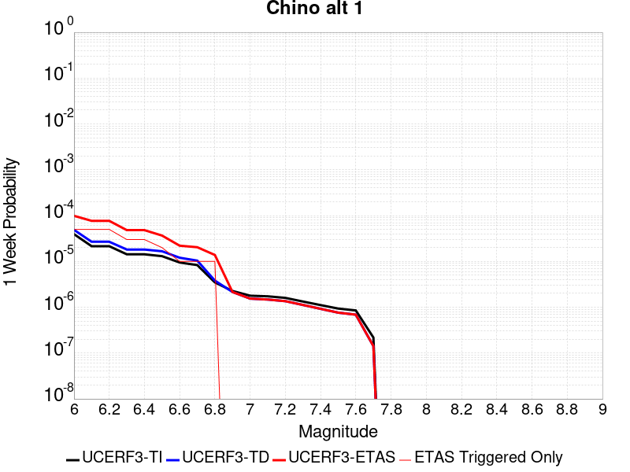 |  |  |  |

| Magnitude | 1 wk TI Prob | 1 wk TD Prob | 1 wk ETAS Prob | 1 wk ETAS/TD Gain | 1 wk ETAS Triggered Only | 1 mo TI Prob | 1 mo TD Prob | 1 mo ETAS Prob | 1 mo ETAS/TD Gain | 1 mo ETAS Triggered Only | 1 yr TI Prob | 1 yr TD Prob | 1 yr ETAS Prob | 1 yr ETAS/TD Gain | 1 yr ETAS Triggered Only | 10 yr TI Prob | 10 yr TD Prob | 10 yr ETAS Prob | 10 yr ETAS/TD Gain | 10 yr ETAS Triggered Only |
|-----|-----|-----|-----|-----|-----|-----|-----|-----|-----|-----|-----|-----|-----|-----|-----|-----|-----|-----|-----|-----|
| 6.0 | 3.939946E-5 | 4.8948554E-5 | 1.7046406E-4 | 3.4825146 | 1.2152145E-4 | 1.6884391E-4 | 2.097656E-4 | 3.3126154E-4 | 1.5791987 | 1.2152145E-4 | 0.0020537362 | 0.0025513945 | 0.002672606 | 1.0475079 | 1.2152145E-4 | 0.020348595 | 0.025277847 | 0.025396297 | 1.0046859 | 1.2152145E-4 |
| 6.1 | 2.1505624E-5 | 2.6879026E-5 | 1.483972E-4 | 5.52093 | 1.2152145E-4 | 9.2163704E-5 | 1.1519137E-4 | 2.3669882E-4 | 2.0548313 | 1.2152145E-4 | 0.0011215154 | 0.001401664 | 0.0015230151 | 1.0865765 | 1.2152145E-4 | 0.011158722 | 0.013945141 | 0.014064968 | 1.0085927 | 1.2152145E-4 |
| 6.2 | 2.1505624E-5 | 2.6879026E-5 | 1.483972E-4 | 5.52093 | 1.2152145E-4 | 9.2163704E-5 | 1.1519137E-4 | 2.3669882E-4 | 2.0548313 | 1.2152145E-4 | 0.0011215154 | 0.001401664 | 0.0015230151 | 1.0865765 | 1.2152145E-4 | 0.011158722 | 0.013945141 | 0.014064968 | 1.0085927 | 1.2152145E-4 |
| 6.3 | 1.4290785E-5 | 1.8165128E-5 | 1.8165128E-5 | 1.0 | 0.0 | 6.1244784E-5 | 7.784848E-5 | 7.784848E-5 | 1.0 | 0.0 | 7.454001E-4 | 9.4743853E-4 | 9.4743853E-4 | 1.0 | 0.0 | 0.007429048 | 0.0094444575 | 0.0094444575 | 1.0 | 0.0 |
| 6.4 | 1.4290785E-5 | 1.8165128E-5 | 1.8165128E-5 | 1.0 | 0.0 | 6.1244784E-5 | 7.784848E-5 | 7.784848E-5 | 1.0 | 0.0 | 7.454001E-4 | 9.4743853E-4 | 9.4743853E-4 | 1.0 | 0.0 | 0.007429048 | 0.0094444575 | 0.0094444575 | 1.0 | 0.0 |
| 6.5 | 1.3017944E-5 | 1.6652088E-5 | 1.6652088E-5 | 1.0 | 0.0 | 5.5789995E-5 | 7.136439E-5 | 7.136439E-5 | 1.0 | 0.0 | 6.790315E-4 | 8.685589E-4 | 8.685589E-4 | 1.0 | 0.0 | 0.0067696036 | 0.008661949 | 0.008661949 | 1.0 | 0.0 |
| 6.6 | 9.470016E-6 | 1.2039424E-5 | 1.2039424E-5 | 1.0 | 0.0 | 4.058515E-5 | 5.1596704E-5 | 5.1596704E-5 | 1.0 | 0.0 | 4.940122E-4 | 6.280428E-4 | 6.280428E-4 | 1.0 | 0.0 | 0.004929154 | 0.0062718987 | 0.0062718987 | 1.0 | 0.0 |
| 6.7 | 8.314155E-6 | 1.0407736E-5 | 1.0407736E-5 | 1.0 | 0.0 | 3.5631605E-5 | 4.4604003E-5 | 4.4604003E-5 | 1.0 | 0.0 | 4.3372845E-4 | 5.429507E-4 | 5.429507E-4 | 1.0 | 0.0 | 0.004328829 | 0.005425775 | 0.005425775 | 1.0 | 0.0 |
| 6.8 | 3.4856364E-6 | 3.8133708E-6 | 3.8133708E-6 | 1.0 | 0.0 | 1.4938357E-5 | 1.6342927E-5 | 1.6342927E-5 | 1.0 | 0.0 | 1.8185932E-4 | 1.9895904E-4 | 1.9895904E-4 | 1.0 | 0.0 | 0.0018171056 | 0.0019894864 | 0.0019894864 | 1.0 | 0.0 |
| 6.9 | 2.2645952E-6 | 2.1529022E-6 | 2.1529022E-6 | 1.0 | 0.0 | 9.705372E-6 | 9.226692E-6 | 9.226692E-6 | 1.0 | 0.0 | 1.18156495E-4 | 1.123294E-4 | 1.123294E-4 | 1.0 | 0.0 | 0.0011809369 | 0.0011233423 | 0.0011233423 | 1.0 | 0.0 |
| 7.0 | 1.7864003E-6 | 1.5430785E-6 | 1.5430785E-6 | 1.0 | 0.0 | 7.655979E-6 | 6.613177E-6 | 6.613177E-6 | 1.0 | 0.0 | 9.3207556E-5 | 8.051251E-5 | 8.051251E-5 | 1.0 | 0.0 | 9.316847E-4 | 8.0528046E-4 | 8.0528046E-4 | 1.0 | 0.0 |
| 7.1 | 1.7315456E-6 | 1.4733511E-6 | 1.4733511E-6 | 1.0 | 0.0 | 7.420889E-6 | 6.3143466E-6 | 6.3143466E-6 | 1.0 | 0.0 | 9.034557E-5 | 7.6874516E-5 | 7.6874516E-5 | 1.0 | 0.0 | 9.0308854E-4 | 7.6891703E-4 | 7.6891703E-4 | 1.0 | 0.0 |
| 7.2 | 1.6008337E-6 | 1.3574215E-6 | 1.3574215E-6 | 1.0 | 0.0 | 6.860698E-6 | 5.817508E-6 | 5.817508E-6 | 1.0 | 0.0 | 8.352579E-5 | 7.082591E-5 | 7.082591E-5 | 1.0 | 0.0 | 8.34944E-4 | 7.0845755E-4 | 7.0845755E-4 | 1.0 | 0.0 |
| 7.3 | 1.3320939E-6 | 1.121782E-6 | 1.121782E-6 | 1.0 | 0.0 | 5.7089615E-6 | 4.807629E-6 | 4.807629E-6 | 1.0 | 0.0 | 6.9504385E-5 | 5.8531357E-5 | 5.8531357E-5 | 1.0 | 0.0 | 6.9482654E-4 | 5.8530393E-4 | 5.8530393E-4 | 1.0 | 0.0 |
| 7.4 | 1.114294E-6 | 9.237111E-7 | 9.237111E-7 | 1.0 | 0.0 | 4.775537E-6 | 3.958756E-6 | 3.958756E-6 | 1.0 | 0.0 | 5.8140613E-5 | 4.8196827E-5 | 4.8196827E-5 | 1.0 | 0.0 | 5.81254E-4 | 4.8188053E-4 | 4.8188053E-4 | 1.0 | 0.0 |
| 7.5 | 9.354081E-7 | 7.6234323E-7 | 7.6234323E-7 | 1.0 | 0.0 | 4.0088858E-6 | 3.2671815E-6 | 3.2671815E-6 | 1.0 | 0.0 | 4.8807087E-5 | 3.9777242E-5 | 3.9777242E-5 | 1.0 | 0.0 | 4.879637E-4 | 3.977046E-4 | 3.977046E-4 | 1.0 | 0.0 |
| 7.6 | 8.521771E-7 | 6.88071E-7 | 6.88071E-7 | 1.0 | 0.0 | 3.6521824E-6 | 2.9488726E-6 | 2.9488726E-6 | 1.0 | 0.0 | 4.4464414E-5 | 3.5901965E-5 | 3.5901965E-5 | 1.0 | 0.0 | 4.4455516E-4 | 3.589648E-4 | 3.589648E-4 | 1.0 | 0.0 |
| 7.7 | 2.1803626E-7 | 1.418649E-7 | 1.418649E-7 | 1.0 | 0.0 | 9.344408E-7 | 6.079923E-7 | 6.079923E-7 | 1.0 | 0.0 | 1.1376757E-5 | 7.4022914E-6 | 7.4022914E-6 | 1.0 | 0.0 | 1.13761744E-4 | 7.402141E-5 | 7.402141E-5 | 1.0 | 0.0 |

## Santa Ynez River
*[(top)](#table-of-contents)*

| 1 Week | 1 Month | 1 Year | 10 Year |
|-----|-----|-----|-----|
|  |  |  |  |

| Magnitude | 1 wk TI Prob | 1 wk TD Prob | 1 wk ETAS Prob | 1 wk ETAS/TD Gain | 1 wk ETAS Triggered Only | 1 mo TI Prob | 1 mo TD Prob | 1 mo ETAS Prob | 1 mo ETAS/TD Gain | 1 mo ETAS Triggered Only | 1 yr TI Prob | 1 yr TD Prob | 1 yr ETAS Prob | 1 yr ETAS/TD Gain | 1 yr ETAS Triggered Only | 10 yr TI Prob | 10 yr TD Prob | 10 yr ETAS Prob | 10 yr ETAS/TD Gain | 10 yr ETAS Triggered Only |
|-----|-----|-----|-----|-----|-----|-----|-----|-----|-----|-----|-----|-----|-----|-----|-----|-----|-----|-----|-----|-----|
| 6.0 | 1.6396456E-5 | 1.7209435E-5 | 1.7209435E-5 | 1.0 | 0.0 | 7.026863E-5 | 7.375284E-5 | 7.375284E-5 | 1.0 | 0.0 | 8.551848E-4 | 8.976064E-4 | 0.0010190188 | 1.1352624 | 1.2152145E-4 | 0.0085190125 | 0.008943358 | 0.009063792 | 1.0134664 | 1.2152145E-4 |
| 6.1 | 1.6396456E-5 | 1.7209435E-5 | 1.7209435E-5 | 1.0 | 0.0 | 7.026863E-5 | 7.375284E-5 | 7.375284E-5 | 1.0 | 0.0 | 8.551848E-4 | 8.976064E-4 | 0.0010190188 | 1.1352624 | 1.2152145E-4 | 0.0085190125 | 0.008943358 | 0.009063792 | 1.0134664 | 1.2152145E-4 |
| 6.2 | 1.6396456E-5 | 1.7209435E-5 | 1.7209435E-5 | 1.0 | 0.0 | 7.026863E-5 | 7.375284E-5 | 7.375284E-5 | 1.0 | 0.0 | 8.551848E-4 | 8.976064E-4 | 0.0010190188 | 1.1352624 | 1.2152145E-4 | 0.0085190125 | 0.008943358 | 0.009063792 | 1.0134664 | 1.2152145E-4 |
| 6.3 | 9.736976E-6 | 1.012233E-5 | 1.012233E-5 | 1.0 | 0.0 | 4.172923E-5 | 4.338072E-5 | 4.338072E-5 | 1.0 | 0.0 | 5.0793495E-4 | 5.280373E-4 | 6.494946E-4 | 1.2300165 | 1.2152145E-4 | 0.005067755 | 0.005268332 | 0.005389213 | 1.0229449 | 1.2152145E-4 |
| 6.4 | 9.736976E-6 | 1.012233E-5 | 1.012233E-5 | 1.0 | 0.0 | 4.172923E-5 | 4.338072E-5 | 4.338072E-5 | 1.0 | 0.0 | 5.0793495E-4 | 5.280373E-4 | 6.494946E-4 | 1.2300165 | 1.2152145E-4 | 0.005067755 | 0.005268332 | 0.005389213 | 1.0229449 | 1.2152145E-4 |
| 6.5 | 7.081964E-6 | 7.3298966E-6 | 7.3298966E-6 | 1.0 | 0.0 | 3.035092E-5 | 3.1413474E-5 | 3.1413474E-5 | 1.0 | 0.0 | 3.694598E-4 | 3.8239348E-4 | 3.8239348E-4 | 1.0 | 0.0 | 0.0036884616 | 0.0038175168 | 0.0038175168 | 1.0 | 0.0 |
| 6.6 | 5.873247E-6 | 6.059743E-6 | 6.059743E-6 | 1.0 | 0.0 | 2.5170815E-5 | 2.5970074E-5 | 2.5970074E-5 | 1.0 | 0.0 | 3.064116E-4 | 3.1614062E-4 | 3.1614062E-4 | 1.0 | 0.0 | 0.0030598943 | 0.0031569963 | 0.0031569963 | 1.0 | 0.0 |
| 6.7 | 4.973277E-6 | 5.115901E-6 | 5.115901E-6 | 1.0 | 0.0 | 2.1313872E-5 | 2.1925109E-5 | 2.1925109E-5 | 1.0 | 0.0 | 2.5946548E-4 | 2.66906E-4 | 2.66906E-4 | 1.0 | 0.0 | 0.0025916274 | 0.0026659032 | 0.0026659032 | 1.0 | 0.0 |
| 6.8 | 4.396492E-6 | 4.5109778E-6 | 4.5109778E-6 | 1.0 | 0.0 | 1.884197E-5 | 1.9332621E-5 | 1.9332621E-5 | 1.0 | 0.0 | 2.2937685E-4 | 2.3534958E-4 | 2.3534958E-4 | 1.0 | 0.0 | 0.0022914023 | 0.0023510386 | 0.0023510386 | 1.0 | 0.0 |
| 6.9 | 3.5255632E-6 | 3.6013332E-6 | 3.6013332E-6 | 1.0 | 0.0 | 1.5109469E-5 | 1.5434196E-5 | 1.5434196E-5 | 1.0 | 0.0 | 1.8394225E-4 | 1.8789528E-4 | 1.8789528E-4 | 1.0 | 0.0 | 0.0018379007 | 0.0018773803 | 0.0018773803 | 1.0 | 0.0 |
| 7.0 | 3.211603E-6 | 3.273654E-6 | 3.273654E-6 | 1.0 | 0.0 | 1.376394E-5 | 1.4029872E-5 | 1.4029872E-5 | 1.0 | 0.0 | 1.6756308E-4 | 1.7080043E-4 | 1.7080043E-4 | 1.0 | 0.0 | 0.0016743679 | 0.0017067058 | 0.0017067058 | 1.0 | 0.0 |
| 7.1 | 2.5094619E-6 | 2.5409204E-6 | 2.5409204E-6 | 1.0 | 0.0 | 1.0754793E-5 | 1.0889614E-5 | 1.0889614E-5 | 1.0 | 0.0 | 1.3093173E-4 | 1.3257304E-4 | 1.3257304E-4 | 1.0 | 0.0 | 0.0013085462 | 0.0013249456 | 0.0013249456 | 1.0 | 0.0 |
| 7.2 | 2.0515774E-6 | 2.0619375E-6 | 2.0619375E-6 | 1.0 | 0.0 | 8.792445E-6 | 8.836846E-6 | 8.836846E-6 | 1.0 | 0.0 | 1.0704277E-4 | 1.0758333E-4 | 1.0758333E-4 | 1.0 | 0.0 | 0.0010699122 | 0.0010753168 | 0.0010753168 | 1.0 | 0.0 |
| 7.3 | 1.6845745E-6 | 1.6773907E-6 | 1.6773907E-6 | 1.0 | 0.0 | 7.219585E-6 | 7.1887976E-6 | 7.1887976E-6 | 1.0 | 0.0 | 8.78949E-5 | 8.752012E-5 | 8.752012E-5 | 1.0 | 0.0 | 8.7860145E-4 | 8.7485946E-4 | 8.7485946E-4 | 1.0 | 0.0 |
| 7.4 | 1.3600285E-6 | 1.3333357E-6 | 1.3333357E-6 | 1.0 | 0.0 | 5.82868E-6 | 5.714284E-6 | 5.714284E-6 | 1.0 | 0.0 | 7.096187E-5 | 6.956921E-5 | 6.956921E-5 | 1.0 | 0.0 | 7.0939213E-4 | 6.954765E-4 | 6.954765E-4 | 1.0 | 0.0 |
| 7.5 | 9.735342E-7 | 9.290103E-7 | 9.290103E-7 | 1.0 | 0.0 | 4.172283E-6 | 3.9814668E-6 | 3.9814668E-6 | 1.0 | 0.0 | 5.079636E-5 | 4.8473295E-5 | 4.8473295E-5 | 1.0 | 0.0 | 5.0784746E-4 | 4.8462892E-4 | 4.8462892E-4 | 1.0 | 0.0 |
| 7.6 | 5.067187E-7 | 4.77857E-7 | 4.77857E-7 | 1.0 | 0.0 | 2.1716498E-6 | 2.047957E-6 | 2.047957E-6 | 1.0 | 0.0 | 2.6439517E-5 | 2.4933597E-5 | 2.4933597E-5 | 1.0 | 0.0 | 2.643637E-4 | 2.4930874E-4 | 2.4930874E-4 | 1.0 | 0.0 |
| 7.7 | 2.769089E-7 | 2.5759124E-7 | 2.5759124E-7 | 1.0 | 0.0 | 1.1867519E-6 | 1.1039621E-6 | 1.1039621E-6 | 1.0 | 0.0 | 1.4448608E-5 | 1.34406555E-5 | 1.34406555E-5 | 1.0 | 0.0 | 1.444767E-4 | 1.3439846E-4 | 1.3439846E-4 | 1.0 | 0.0 |
| 7.8 | 1.7044663E-7 | 1.5449015E-7 | 1.5449015E-7 | 1.0 | 0.0 | 7.3048534E-7 | 6.621005E-7 | 6.621005E-7 | 1.0 | 0.0 | 8.893623E-6 | 8.061043E-6 | 8.061043E-6 | 1.0 | 0.0 | 8.893267E-5 | 8.060753E-5 | 8.060753E-5 | 1.0 | 0.0 |
| 7.9 | 4.8344287E-8 | 4.0910923E-8 | 4.0910923E-8 | 1.0 | 0.0 | 2.0718979E-7 | 1.7533252E-7 | 1.7533252E-7 | 1.0 | 0.0 | 2.5225327E-6 | 2.1346711E-6 | 2.1346711E-6 | 1.0 | 0.0 | 2.5225041E-5 | 2.1346512E-5 | 2.1346512E-5 | 1.0 | 0.0 |

## Oceanic - West Huasna
*[(top)](#table-of-contents)*

| 1 Week | 1 Month | 1 Year | 10 Year |
|-----|-----|-----|-----|
|  |  |  |  |

| Magnitude | 1 wk TI Prob | 1 wk TD Prob | 1 wk ETAS Prob | 1 wk ETAS/TD Gain | 1 wk ETAS Triggered Only | 1 mo TI Prob | 1 mo TD Prob | 1 mo ETAS Prob | 1 mo ETAS/TD Gain | 1 mo ETAS Triggered Only | 1 yr TI Prob | 1 yr TD Prob | 1 yr ETAS Prob | 1 yr ETAS/TD Gain | 1 yr ETAS Triggered Only | 10 yr TI Prob | 10 yr TD Prob | 10 yr ETAS Prob | 10 yr ETAS/TD Gain | 10 yr ETAS Triggered Only |
|-----|-----|-----|-----|-----|-----|-----|-----|-----|-----|-----|-----|-----|-----|-----|-----|-----|-----|-----|-----|-----|
| 6.0 | 3.195567E-5 | 2.7926868E-5 | 1.4944492E-4 | 5.3512955 | 1.2152145E-4 | 1.3694567E-4 | 1.1968133E-4 | 2.4118823E-4 | 2.0152535 | 1.2152145E-4 | 0.0016660384 | 0.0014561893 | 0.0015775339 | 1.0833302 | 1.2152145E-4 | 0.016536033 | 0.014471028 | 0.0145907905 | 1.0082761 | 1.2152145E-4 |
| 6.1 | 2.1156782E-5 | 1.7573486E-5 | 1.390928E-4 | 7.9149237 | 1.2152145E-4 | 9.066878E-5 | 7.531282E-5 | 1.9682512E-4 | 2.6134346 | 1.2152145E-4 | 0.0011033333 | 9.165572E-4 | 0.0010379673 | 1.1324632 | 1.2152145E-4 | 0.010978713 | 0.009128777 | 0.00924919 | 1.0131904 | 1.2152145E-4 |
| 6.2 | 1.6195117E-5 | 1.3327152E-5 | 1.3327152E-5 | 1.0 | 0.0 | 6.9405796E-5 | 5.7115132E-5 | 5.7115132E-5 | 1.0 | 0.0 | 8.44688E-4 | 6.9515745E-4 | 6.9515745E-4 | 1.0 | 0.0 | 0.008414844 | 0.006930123 | 0.006930123 | 1.0 | 0.0 |
| 6.3 | 1.3559345E-5 | 1.1179142E-5 | 1.1179142E-5 | 1.0 | 0.0 | 5.811018E-5 | 4.7909736E-5 | 4.7909736E-5 | 1.0 | 0.0 | 7.072618E-4 | 5.831459E-4 | 5.831459E-4 | 1.0 | 0.0 | 0.0070501505 | 0.0058162753 | 0.0058162753 | 1.0 | 0.0 |
| 6.4 | 1.2120619E-5 | 1.0000977E-5 | 1.0000977E-5 | 1.0 | 0.0 | 5.1944477E-5 | 4.2860633E-5 | 4.2860633E-5 | 1.0 | 0.0 | 6.322405E-4 | 5.2170374E-4 | 5.2170374E-4 | 1.0 | 0.0 | 0.006304447 | 0.0052048573 | 0.0052048573 | 1.0 | 0.0 |
| 6.5 | 1.13511915E-5 | 9.3674735E-6 | 9.3674735E-6 | 1.0 | 0.0 | 4.8647056E-5 | 4.01457E-5 | 4.01457E-5 | 1.0 | 0.0 | 5.9211696E-4 | 4.886647E-4 | 4.886647E-4 | 1.0 | 0.0 | 0.0059054173 | 0.0048759608 | 0.0048759608 | 1.0 | 0.0 |
| 6.6 | 9.850605E-6 | 8.135418E-6 | 8.135418E-6 | 1.0 | 0.0 | 4.2216197E-5 | 3.4865614E-5 | 3.4865614E-5 | 1.0 | 0.0 | 5.1386096E-4 | 4.2440637E-4 | 4.2440637E-4 | 1.0 | 0.0 | 0.0051267436 | 0.004235991 | 0.004235991 | 1.0 | 0.0 |
| 6.7 | 8.8558645E-6 | 7.318433E-6 | 7.318433E-6 | 1.0 | 0.0 | 3.7953152E-5 | 3.1364336E-5 | 3.1364336E-5 | 1.0 | 0.0 | 4.6198163E-4 | 3.8179406E-4 | 3.8179406E-4 | 1.0 | 0.0 | 0.004610224 | 0.0038114067 | 0.0038114067 | 1.0 | 0.0 |
| 6.8 | 7.67136E-6 | 6.391756E-6 | 6.391756E-6 | 1.0 | 0.0 | 3.2876844E-5 | 2.7392953E-5 | 2.7392953E-5 | 1.0 | 0.0 | 4.0020206E-4 | 3.3345833E-4 | 3.3345833E-4 | 1.0 | 0.0 | 0.003994821 | 0.0033296007 | 0.0033296007 | 1.0 | 0.0 |
| 6.9 | 6.534529E-6 | 5.4583297E-6 | 5.4583297E-6 | 1.0 | 0.0 | 2.8004823E-5 | 2.3392633E-5 | 2.3392633E-5 | 1.0 | 0.0 | 3.4090536E-4 | 2.847682E-4 | 2.847682E-4 | 1.0 | 0.0 | 0.0034038287 | 0.0028440498 | 0.0028440498 | 1.0 | 0.0 |
| 7.0 | 5.460525E-6 | 4.5699517E-6 | 4.5699517E-6 | 1.0 | 0.0 | 2.3402039E-5 | 1.958536E-5 | 1.958536E-5 | 1.0 | 0.0 | 2.8488258E-4 | 2.3842578E-4 | 2.3842578E-4 | 1.0 | 0.0 | 0.0028451765 | 0.0023817138 | 0.0023817138 | 1.0 | 0.0 |
| 7.1 | 4.4825083E-6 | 3.7524428E-6 | 3.7524428E-6 | 1.0 | 0.0 | 1.9210609E-5 | 1.60818E-5 | 1.60818E-5 | 1.0 | 0.0 | 2.3386406E-4 | 1.9577841E-4 | 1.9577841E-4 | 1.0 | 0.0 | 0.002336181 | 0.0019560715 | 0.0019560715 | 1.0 | 0.0 |
| 7.2 | 2.821708E-6 | 2.4249334E-6 | 2.4249334E-6 | 1.0 | 0.0 | 1.2092979E-5 | 1.039253E-5 | 1.039253E-5 | 1.0 | 0.0 | 1.4722206E-4 | 1.2652173E-4 | 1.2652173E-4 | 1.0 | 0.0 | 0.0014712457 | 0.0012644994 | 0.0012644994 | 1.0 | 0.0 |
| 7.3 | 2.0644757E-6 | 1.7687412E-6 | 1.7687412E-6 | 1.0 | 0.0 | 8.847723E-6 | 7.5802973E-6 | 7.5802973E-6 | 1.0 | 0.0 | 1.0771569E-4 | 9.228622E-5 | 9.228622E-5 | 1.0 | 0.0 | 0.001076635 | 9.2248066E-4 | 9.2248066E-4 | 1.0 | 0.0 |
| 7.4 | 1.6980367E-6 | 1.4379892E-6 | 1.4379892E-6 | 1.0 | 0.0 | 7.27728E-6 | 6.162796E-6 | 6.162796E-6 | 1.0 | 0.0 | 8.8597284E-5 | 7.5029464E-5 | 7.5029464E-5 | 1.0 | 0.0 | 8.8561967E-4 | 7.500429E-4 | 7.500429E-4 | 1.0 | 0.0 |
| 7.5 | 1.3637683E-6 | 1.1302635E-6 | 1.1302635E-6 | 1.0 | 0.0 | 5.844708E-6 | 4.8439774E-6 | 4.8439774E-6 | 1.0 | 0.0 | 7.1156996E-5 | 5.897383E-5 | 5.897383E-5 | 1.0 | 0.0 | 7.1134215E-4 | 5.895833E-4 | 5.895833E-4 | 1.0 | 0.0 |
| 7.6 | 9.802994E-7 | 7.677247E-7 | 7.677247E-7 | 1.0 | 0.0 | 4.2012766E-6 | 3.2902446E-6 | 3.2902446E-6 | 1.0 | 0.0 | 5.1149345E-5 | 4.0057992E-5 | 4.0057992E-5 | 1.0 | 0.0 | 5.113757E-4 | 4.0050913E-4 | 4.0050913E-4 | 1.0 | 0.0 |
| 7.7 | 5.986191E-7 | 4.0050548E-7 | 4.0050548E-7 | 1.0 | 0.0 | 2.5655079E-6 | 1.7164509E-6 | 1.7164509E-6 | 1.0 | 0.0 | 3.1234613E-5 | 2.089759E-5 | 2.089759E-5 | 1.0 | 0.0 | 3.123022E-4 | 2.089576E-4 | 2.089576E-4 | 1.0 | 0.0 |
| 7.8 | 2.9189815E-7 | 1.5285792E-7 | 1.5285792E-7 | 1.0 | 0.0 | 1.2509914E-6 | 6.5510517E-7 | 6.5510517E-7 | 1.0 | 0.0 | 1.5230714E-5 | 7.9758765E-6 | 7.9758765E-6 | 1.0 | 0.0 | 1.522967E-4 | 7.9757214E-5 | 7.9757214E-5 | 1.0 | 0.0 |
| 7.9 | 1.2057845E-7 | 4.621248E-8 | 4.621248E-8 | 1.0 | 0.0 | 5.1676466E-7 | 1.9805347E-7 | 1.9805347E-7 | 1.0 | 0.0 | 6.2915915E-6 | 2.4112983E-6 | 2.4112983E-6 | 1.0 | 0.0 | 6.2914136E-5 | 2.4114026E-5 | 2.4114026E-5 | 1.0 | 0.0 |
| 8.0 | 3.3806387E-9 | 9.011393E-10 | 9.011393E-10 | 1.0 | 0.0 | 1.4488451E-8 | 3.8620254E-9 | 3.8620254E-9 | 1.0 | 0.0 | 1.7639688E-7 | 4.702016E-8 | 4.702016E-8 | 1.0 | 0.0 | 1.7639674E-6 | 4.7129527E-7 | 4.7129527E-7 | 1.0 | 0.0 |

## Cady
*[(top)](#table-of-contents)*

| 1 Week | 1 Month | 1 Year | 10 Year |
|-----|-----|-----|-----|
|  |  |  |  |

| Magnitude | 1 wk TI Prob | 1 wk TD Prob | 1 wk ETAS Prob | 1 wk ETAS/TD Gain | 1 wk ETAS Triggered Only | 1 mo TI Prob | 1 mo TD Prob | 1 mo ETAS Prob | 1 mo ETAS/TD Gain | 1 mo ETAS Triggered Only | 1 yr TI Prob | 1 yr TD Prob | 1 yr ETAS Prob | 1 yr ETAS/TD Gain | 1 yr ETAS Triggered Only | 10 yr TI Prob | 10 yr TD Prob | 10 yr ETAS Prob | 10 yr ETAS/TD Gain | 10 yr ETAS Triggered Only |
|-----|-----|-----|-----|-----|-----|-----|-----|-----|-----|-----|-----|-----|-----|-----|-----|-----|-----|-----|-----|-----|
| 6.0 | 1.9892565E-5 | 2.1858728E-5 | 2.1858728E-5 | 1.0 | 0.0 | 8.525106E-5 | 9.3677416E-5 | 9.3677416E-5 | 1.0 | 0.0 | 0.0010374374 | 0.0011400167 | 0.0011400167 | 1.0 | 0.0 | 0.010326075 | 0.011350701 | 0.011470842 | 1.0105846 | 1.2152145E-4 |
| 6.1 | 1.9892565E-5 | 2.1858728E-5 | 2.1858728E-5 | 1.0 | 0.0 | 8.525106E-5 | 9.3677416E-5 | 9.3677416E-5 | 1.0 | 0.0 | 0.0010374374 | 0.0011400167 | 0.0011400167 | 1.0 | 0.0 | 0.010326075 | 0.011350701 | 0.011470842 | 1.0105846 | 1.2152145E-4 |
| 6.2 | 1.9892565E-5 | 2.1858728E-5 | 2.1858728E-5 | 1.0 | 0.0 | 8.525106E-5 | 9.3677416E-5 | 9.3677416E-5 | 1.0 | 0.0 | 0.0010374374 | 0.0011400167 | 0.0011400167 | 1.0 | 0.0 | 0.010326075 | 0.011350701 | 0.011470842 | 1.0105846 | 1.2152145E-4 |
| 6.3 | 1.1117327E-5 | 1.2176583E-5 | 1.2176583E-5 | 1.0 | 0.0 | 4.764482E-5 | 5.2184492E-5 | 5.2184492E-5 | 1.0 | 0.0 | 5.7992124E-4 | 6.351925E-4 | 6.351925E-4 | 1.0 | 0.0 | 0.0057841022 | 0.0063368753 | 0.006457627 | 1.0190554 | 1.2152145E-4 |
| 6.4 | 1.1117327E-5 | 1.2176583E-5 | 1.2176583E-5 | 1.0 | 0.0 | 4.764482E-5 | 5.2184492E-5 | 5.2184492E-5 | 1.0 | 0.0 | 5.7992124E-4 | 6.351925E-4 | 6.351925E-4 | 1.0 | 0.0 | 0.0057841022 | 0.0063368753 | 0.006457627 | 1.0190554 | 1.2152145E-4 |
| 6.5 | 6.103093E-6 | 6.672021E-6 | 6.672021E-6 | 1.0 | 0.0 | 2.615585E-5 | 2.8594131E-5 | 2.8594131E-5 | 1.0 | 0.0 | 3.1840094E-4 | 3.480905E-4 | 3.480905E-4 | 1.0 | 0.0 | 0.0031794512 | 0.0034766865 | 0.0035977857 | 1.0348318 | 1.2152145E-4 |
| 6.6 | 5.817237E-6 | 6.3656585E-6 | 6.3656585E-6 | 1.0 | 0.0 | 2.4930776E-5 | 2.728118E-5 | 2.728118E-5 | 1.0 | 0.0 | 3.034899E-4 | 3.3211018E-4 | 3.3211018E-4 | 1.0 | 0.0 | 0.0030307577 | 0.0033173605 | 0.0034384788 | 1.0365105 | 1.2152145E-4 |
| 6.7 | 4.8846314E-6 | 5.3405684E-6 | 5.3405684E-6 | 1.0 | 0.0 | 2.0933967E-5 | 2.2888014E-5 | 2.2888014E-5 | 1.0 | 0.0 | 2.5484123E-4 | 2.7863772E-4 | 2.7863772E-4 | 1.0 | 0.0 | 0.0025454918 | 0.0027840391 | 0.0029052224 | 1.0435278 | 1.2152145E-4 |
| 6.8 | 1.7788773E-6 | 1.9399079E-6 | 1.9399079E-6 | 1.0 | 0.0 | 7.6237375E-6 | 8.313874E-6 | 8.313874E-6 | 1.0 | 0.0 | 9.281505E-5 | 1.01218284E-4 | 1.01218284E-4 | 1.0 | 0.0 | 9.2776294E-4 | 0.0010118765 | 0.0010118765 | 1.0 | 0.0 |
| 6.9 | 7.5455404E-7 | 8.297092E-7 | 8.297092E-7 | 1.0 | 0.0 | 3.233799E-6 | 3.5558937E-6 | 3.5558937E-6 | 1.0 | 0.0 | 3.937079E-5 | 4.3292483E-5 | 4.3292483E-5 | 1.0 | 0.0 | 3.9363815E-4 | 4.3287344E-4 | 4.3287344E-4 | 1.0 | 0.0 |
| 7.0 | 6.8578805E-7 | 7.541816E-7 | 7.541816E-7 | 1.0 | 0.0 | 2.9390883E-6 | 3.2322048E-6 | 3.2322048E-6 | 1.0 | 0.0 | 3.578281E-5 | 3.9351715E-5 | 3.9351715E-5 | 1.0 | 0.0 | 3.577705E-4 | 3.9347992E-4 | 3.9347992E-4 | 1.0 | 0.0 |

## Ortigalita (South)
*[(top)](#table-of-contents)*

| 1 Week | 1 Month | 1 Year | 10 Year |
|-----|-----|-----|-----|
|  |  |  |  |

| Magnitude | 1 wk TI Prob | 1 wk TD Prob | 1 wk ETAS Prob | 1 wk ETAS/TD Gain | 1 wk ETAS Triggered Only | 1 mo TI Prob | 1 mo TD Prob | 1 mo ETAS Prob | 1 mo ETAS/TD Gain | 1 mo ETAS Triggered Only | 1 yr TI Prob | 1 yr TD Prob | 1 yr ETAS Prob | 1 yr ETAS/TD Gain | 1 yr ETAS Triggered Only | 10 yr TI Prob | 10 yr TD Prob | 10 yr ETAS Prob | 10 yr ETAS/TD Gain | 10 yr ETAS Triggered Only |
|-----|-----|-----|-----|-----|-----|-----|-----|-----|-----|-----|-----|-----|-----|-----|-----|-----|-----|-----|-----|-----|
| 6.0 | 3.72394E-5 | 4.325562E-5 | 1.6477182E-4 | 3.809258 | 1.2152145E-4 | 1.5958765E-4 | 1.8536893E-4 | 3.0686785E-4 | 1.6554438 | 1.2152145E-4 | 0.0019412481 | 0.0022546875 | 0.002375935 | 1.0537757 | 1.2152145E-4 | 0.019243775 | 0.022334497 | 0.022453304 | 1.0053195 | 1.2152145E-4 |
| 6.1 | 2.7299884E-5 | 3.149204E-5 | 3.149204E-5 | 1.0 | 0.0 | 1.16994255E-4 | 1.3495922E-4 | 1.3495922E-4 | 1.0 | 0.0 | 0.0014234743 | 0.0016419457 | 0.0016419457 | 1.0 | 0.0 | 0.014143906 | 0.01630407 | 0.01630407 | 1.0 | 0.0 |
| 6.2 | 2.7299884E-5 | 3.149204E-5 | 3.149204E-5 | 1.0 | 0.0 | 1.16994255E-4 | 1.3495922E-4 | 1.3495922E-4 | 1.0 | 0.0 | 0.0014234743 | 0.0016419457 | 0.0016419457 | 1.0 | 0.0 | 0.014143906 | 0.01630407 | 0.01630407 | 1.0 | 0.0 |
| 6.3 | 2.0546433E-5 | 2.363145E-5 | 2.363145E-5 | 1.0 | 0.0 | 8.805317E-5 | 1.0127382E-4 | 1.0127382E-4 | 1.0 | 0.0 | 0.00107152 | 0.0012323303 | 0.0012323303 | 1.0 | 0.0 | 0.010663681 | 0.01225703 | 0.01225703 | 1.0 | 0.0 |
| 6.4 | 2.0546433E-5 | 2.363145E-5 | 2.363145E-5 | 1.0 | 0.0 | 8.805317E-5 | 1.0127382E-4 | 1.0127382E-4 | 1.0 | 0.0 | 0.00107152 | 0.0012323303 | 0.0012323303 | 1.0 | 0.0 | 0.010663681 | 0.01225703 | 0.01225703 | 1.0 | 0.0 |
| 6.5 | 1.7779594E-5 | 2.0446974E-5 | 2.0446974E-5 | 1.0 | 0.0 | 7.619603E-5 | 8.762702E-5 | 8.762702E-5 | 1.0 | 0.0 | 9.272918E-4 | 0.0010663504 | 0.0010663504 | 1.0 | 0.0 | 0.009234319 | 0.010613803 | 0.010613803 | 1.0 | 0.0 |
| 6.6 | 1.6272212E-5 | 1.8714967E-5 | 1.8714967E-5 | 1.0 | 0.0 | 6.973618E-5 | 8.0204605E-5 | 8.0204605E-5 | 1.0 | 0.0 | 8.487073E-4 | 9.760658E-4 | 9.760658E-4 | 1.0 | 0.0 | 0.008454733 | 0.009719091 | 0.009719091 | 1.0 | 0.0 |
| 6.7 | 1.3051484E-5 | 1.5038758E-5 | 1.5038758E-5 | 1.0 | 0.0 | 5.593373E-5 | 6.445028E-5 | 6.445028E-5 | 1.0 | 0.0 | 6.807804E-4 | 7.844092E-4 | 7.844092E-4 | 1.0 | 0.0 | 0.006786986 | 0.007817388 | 0.007817388 | 1.0 | 0.0 |
| 6.8 | 1.04277415E-5 | 1.1987235E-5 | 1.1987235E-5 | 1.0 | 0.0 | 4.4689557E-5 | 5.1372896E-5 | 5.1372896E-5 | 1.0 | 0.0 | 5.439595E-4 | 6.2529295E-4 | 6.2529295E-4 | 1.0 | 0.0 | 0.0054262993 | 0.00623609 | 0.00623609 | 1.0 | 0.0 |
| 6.9 | 7.639968E-6 | 8.791503E-6 | 8.791503E-6 | 1.0 | 0.0 | 3.274231E-5 | 3.767736E-5 | 3.767736E-5 | 1.0 | 0.0 | 3.9856473E-4 | 4.586312E-4 | 4.586312E-4 | 1.0 | 0.0 | 0.003978506 | 0.004577433 | 0.004577433 | 1.0 | 0.0 |
| 7.0 | 3.919831E-6 | 4.5334014E-6 | 4.5334014E-6 | 1.0 | 0.0 | 1.679917E-5 | 1.942873E-5 | 1.942873E-5 | 1.0 | 0.0 | 2.045107E-4 | 2.3652123E-4 | 2.3652123E-4 | 1.0 | 0.0 | 0.0020432258 | 0.0023629034 | 0.0023629034 | 1.0 | 0.0 |
| 7.1 | 1.6017933E-6 | 1.8570418E-6 | 1.8570418E-6 | 1.0 | 0.0 | 6.8648105E-6 | 7.958732E-6 | 7.958732E-6 | 1.0 | 0.0 | 8.357586E-5 | 9.689432E-5 | 9.689432E-5 | 1.0 | 0.0 | 8.3544437E-4 | 9.686254E-4 | 9.686254E-4 | 1.0 | 0.0 |

## Surprise Valley 2011 CFM
*[(top)](#table-of-contents)*

| 1 Week | 1 Month | 1 Year | 10 Year |
|-----|-----|-----|-----|
|  |  |  |  |

| Magnitude | 1 wk TI Prob | 1 wk TD Prob | 1 wk ETAS Prob | 1 wk ETAS/TD Gain | 1 wk ETAS Triggered Only | 1 mo TI Prob | 1 mo TD Prob | 1 mo ETAS Prob | 1 mo ETAS/TD Gain | 1 mo ETAS Triggered Only | 1 yr TI Prob | 1 yr TD Prob | 1 yr ETAS Prob | 1 yr ETAS/TD Gain | 1 yr ETAS Triggered Only | 10 yr TI Prob | 10 yr TD Prob | 10 yr ETAS Prob | 10 yr ETAS/TD Gain | 10 yr ETAS Triggered Only |
|-----|-----|-----|-----|-----|-----|-----|-----|-----|-----|-----|-----|-----|-----|-----|-----|-----|-----|-----|-----|-----|
| 6.0 | 4.0396248E-5 | 4.485131E-5 | 4.485131E-5 | 1.0 | 0.0 | 1.7311527E-4 | 1.9220692E-4 | 3.13705E-4 | 1.6321213 | 1.2152145E-4 | 0.002105641 | 0.0023378176 | 0.002459055 | 1.0518593 | 1.2152145E-4 | 0.020858008 | 0.023153966 | 0.023272673 | 1.0051268 | 1.2152145E-4 |
| 6.1 | 4.0396248E-5 | 4.485131E-5 | 4.485131E-5 | 1.0 | 0.0 | 1.7311527E-4 | 1.9220692E-4 | 3.13705E-4 | 1.6321213 | 1.2152145E-4 | 0.002105641 | 0.0023378176 | 0.002459055 | 1.0518593 | 1.2152145E-4 | 0.020858008 | 0.023153966 | 0.023272673 | 1.0051268 | 1.2152145E-4 |
| 6.2 | 2.2295266E-5 | 2.440125E-5 | 2.440125E-5 | 1.0 | 0.0 | 9.554764E-5 | 1.0457276E-4 | 1.0457276E-4 | 1.0 | 0.0 | 0.0011626717 | 0.0012724606 | 0.0012724606 | 1.0 | 0.0 | 0.011566074 | 0.012654981 | 0.012654981 | 1.0 | 0.0 |
| 6.3 | 1.572643E-5 | 1.7096807E-5 | 1.7096807E-5 | 1.0 | 0.0 | 6.7397246E-5 | 7.327003E-5 | 7.327003E-5 | 1.0 | 0.0 | 8.202525E-4 | 8.91708E-4 | 8.91708E-4 | 1.0 | 0.0 | 0.008172315 | 0.008882407 | 0.008882407 | 1.0 | 0.0 |
| 6.4 | 1.5714395E-5 | 1.7084629E-5 | 1.7084629E-5 | 1.0 | 0.0 | 6.734567E-5 | 7.3217845E-5 | 7.3217845E-5 | 1.0 | 0.0 | 8.1962504E-4 | 8.9107314E-4 | 8.9107314E-4 | 1.0 | 0.0 | 0.008166086 | 0.008876109 | 0.008876109 | 1.0 | 0.0 |
| 6.5 | 1.2733495E-5 | 1.38016E-5 | 1.38016E-5 | 1.0 | 0.0 | 5.457098E-5 | 5.9148413E-5 | 5.9148413E-5 | 1.0 | 0.0 | 6.641992E-4 | 7.1990065E-4 | 7.1990065E-4 | 1.0 | 0.0 | 0.0066221743 | 0.0071763797 | 0.0071763797 | 1.0 | 0.0 |
| 6.6 | 1.0983784E-5 | 1.1886554E-5 | 1.1886554E-5 | 1.0 | 0.0 | 4.7072506E-5 | 5.094141E-5 | 5.094141E-5 | 1.0 | 0.0 | 5.7295704E-4 | 6.200405E-4 | 6.200405E-4 | 1.0 | 0.0 | 0.0057148207 | 0.0061836545 | 0.0061836545 | 1.0 | 0.0 |
| 6.7 | 9.104806E-6 | 9.839491E-6 | 9.839491E-6 | 1.0 | 0.0 | 3.902001E-5 | 4.2168587E-5 | 4.2168587E-5 | 1.0 | 0.0 | 4.7496508E-4 | 5.132855E-4 | 5.132855E-4 | 1.0 | 0.0 | 0.004739512 | 0.005121397 | 0.005121397 | 1.0 | 0.0 |
| 6.8 | 6.2162403E-6 | 6.7041337E-6 | 6.7041337E-6 | 1.0 | 0.0 | 2.6640759E-5 | 2.8731698E-5 | 2.8731698E-5 | 1.0 | 0.0 | 3.2430296E-4 | 3.497545E-4 | 3.497545E-4 | 1.0 | 0.0 | 0.003238301 | 0.0034922638 | 0.0034922638 | 1.0 | 0.0 |
| 6.9 | 4.1792696E-6 | 4.50323E-6 | 4.50323E-6 | 1.0 | 0.0 | 1.7911032E-5 | 1.9299423E-5 | 1.9299423E-5 | 1.0 | 0.0 | 2.1804498E-4 | 2.3494668E-4 | 2.3494668E-4 | 1.0 | 0.0 | 0.0021783116 | 0.0023471361 | 0.0023471361 | 1.0 | 0.0 |
| 7.0 | 2.7478413E-6 | 2.9622424E-6 | 2.9622424E-6 | 1.0 | 0.0 | 1.177641E-5 | 1.269527E-5 | 1.269527E-5 | 1.0 | 0.0 | 1.4336836E-4 | 1.545552E-4 | 1.545552E-4 | 1.0 | 0.0 | 0.001432759 | 0.0015445995 | 0.0015445995 | 1.0 | 0.0 |
| 7.1 | 8.128648E-7 | 8.724922E-7 | 8.724922E-7 | 1.0 | 0.0 | 3.4837017E-6 | 3.7392501E-6 | 3.7392501E-6 | 1.0 | 0.0 | 4.2413245E-5 | 4.552502E-5 | 4.552502E-5 | 1.0 | 0.0 | 4.2405148E-4 | 4.5521575E-4 | 4.5521575E-4 | 1.0 | 0.0 |
| 7.2 | 4.8641045E-8 | 4.9402068E-8 | 4.9402068E-8 | 1.0 | 0.0 | 2.084616E-7 | 2.1172312E-7 | 2.1172312E-7 | 1.0 | 0.0 | 2.538017E-6 | 2.577726E-6 | 2.577726E-6 | 1.0 | 0.0 | 2.537988E-5 | 2.5776973E-5 | 2.5776973E-5 | 1.0 | 0.0 |
| 7.3 | 5.3911844E-9 | 5.4758145E-9 | 5.4758145E-9 | 1.0 | 0.0 | 2.3105075E-8 | 2.3467775E-8 | 2.3467775E-8 | 1.0 | 0.0 | 2.8130427E-7 | 2.8572015E-7 | 2.8572015E-7 | 1.0 | 0.0 | 2.8130391E-6 | 2.8571992E-6 | 2.8571992E-6 | 1.0 | 0.0 |

## Del Valle
*[(top)](#table-of-contents)*

| 1 Week | 1 Month | 1 Year | 10 Year |
|-----|-----|-----|-----|
|  |  |  |  |

| Magnitude | 1 wk TI Prob | 1 wk TD Prob | 1 wk ETAS Prob | 1 wk ETAS/TD Gain | 1 wk ETAS Triggered Only | 1 mo TI Prob | 1 mo TD Prob | 1 mo ETAS Prob | 1 mo ETAS/TD Gain | 1 mo ETAS Triggered Only | 1 yr TI Prob | 1 yr TD Prob | 1 yr ETAS Prob | 1 yr ETAS/TD Gain | 1 yr ETAS Triggered Only | 10 yr TI Prob | 10 yr TD Prob | 10 yr ETAS Prob | 10 yr ETAS/TD Gain | 10 yr ETAS Triggered Only |
|-----|-----|-----|-----|-----|-----|-----|-----|-----|-----|-----|-----|-----|-----|-----|-----|-----|-----|-----|-----|-----|
| 6.0 | 1.0716125E-5 | 8.767882E-6 | 1.3028826E-4 | 14.859719 | 1.2152145E-4 | 4.592544E-5 | 3.7576207E-5 | 1.5909309E-4 | 4.233878 | 1.2152145E-4 | 5.589988E-4 | 4.5741405E-4 | 5.788799E-4 | 1.2655491 | 1.2152145E-4 | 0.0055759475 | 0.00456668 | 0.004687647 | 1.0264889 | 1.2152145E-4 |
| 6.1 | 1.0716125E-5 | 8.767882E-6 | 1.3028826E-4 | 14.859719 | 1.2152145E-4 | 4.592544E-5 | 3.7576207E-5 | 1.5909309E-4 | 4.233878 | 1.2152145E-4 | 5.589988E-4 | 4.5741405E-4 | 5.788799E-4 | 1.2655491 | 1.2152145E-4 | 0.0055759475 | 0.00456668 | 0.004687647 | 1.0264889 | 1.2152145E-4 |
| 6.2 | 1.0716125E-5 | 8.767882E-6 | 1.3028826E-4 | 14.859719 | 1.2152145E-4 | 4.592544E-5 | 3.7576207E-5 | 1.5909309E-4 | 4.233878 | 1.2152145E-4 | 5.589988E-4 | 4.5741405E-4 | 5.788799E-4 | 1.2655491 | 1.2152145E-4 | 0.0055759475 | 0.00456668 | 0.004687647 | 1.0264889 | 1.2152145E-4 |
| 6.3 | 7.1293784E-6 | 4.865823E-6 | 1.2638669E-4 | 25.97437 | 1.2152145E-4 | 3.055412E-5 | 2.0853364E-5 | 1.4237229E-4 | 6.827305 | 1.2152145E-4 | 3.7193293E-4 | 2.5386087E-4 | 3.7535146E-4 | 1.4785715 | 1.2152145E-4 | 0.0037131102 | 0.0025357946 | 0.0026570081 | 1.0478009 | 1.2152145E-4 |
| 6.4 | 7.1293784E-6 | 4.865823E-6 | 1.2638669E-4 | 25.97437 | 1.2152145E-4 | 3.055412E-5 | 2.0853364E-5 | 1.4237229E-4 | 6.827305 | 1.2152145E-4 | 3.7193293E-4 | 2.5386087E-4 | 3.7535146E-4 | 1.4785715 | 1.2152145E-4 | 0.0037131102 | 0.0025357946 | 0.0026570081 | 1.0478009 | 1.2152145E-4 |
| 6.5 | 7.1293784E-6 | 4.865823E-6 | 1.2638669E-4 | 25.97437 | 1.2152145E-4 | 3.055412E-5 | 2.0853364E-5 | 1.4237229E-4 | 6.827305 | 1.2152145E-4 | 3.7193293E-4 | 2.5386087E-4 | 3.7535146E-4 | 1.4785715 | 1.2152145E-4 | 0.0037131102 | 0.0025357946 | 0.0026570081 | 1.0478009 | 1.2152145E-4 |
| 6.6 | 7.1293784E-6 | 4.865823E-6 | 1.2638669E-4 | 25.97437 | 1.2152145E-4 | 3.055412E-5 | 2.0853364E-5 | 1.4237229E-4 | 6.827305 | 1.2152145E-4 | 3.7193293E-4 | 2.5386087E-4 | 3.7535146E-4 | 1.4785715 | 1.2152145E-4 | 0.0037131102 | 0.0025357946 | 0.0026570081 | 1.0478009 | 1.2152145E-4 |
| 6.7 | 7.12272E-6 | 4.8631987E-6 | 1.2638405E-4 | 25.987846 | 1.2152145E-4 | 3.0525585E-5 | 2.0842117E-5 | 1.4236104E-4 | 6.8304496 | 1.2152145E-4 | 3.7158563E-4 | 2.5372396E-4 | 3.752146E-4 | 1.4788299 | 1.2152145E-4 | 0.003709649 | 0.0025344288 | 0.0026556423 | 1.0478268 | 1.2152145E-4 |
| 6.8 | 6.7558703E-6 | 4.5594015E-6 | 4.5594015E-6 | 1.0 | 0.0 | 2.895341E-5 | 1.9540148E-5 | 1.9540148E-5 | 1.0 | 0.0 | 3.5245073E-4 | 2.3787597E-4 | 2.3787597E-4 | 1.0 | 0.0 | 0.0035189227 | 0.0023762889 | 0.0023762889 | 1.0 | 0.0 |
| 6.9 | 6.6700386E-6 | 4.502539E-6 | 4.502539E-6 | 1.0 | 0.0 | 2.8585566E-5 | 1.9296456E-5 | 1.9296456E-5 | 1.0 | 0.0 | 3.479737E-4 | 2.3490966E-4 | 2.3490966E-4 | 1.0 | 0.0 | 0.003474293 | 0.0023466884 | 0.0023466884 | 1.0 | 0.0 |
| 7.0 | 6.3181424E-6 | 4.0987034E-6 | 4.0987034E-6 | 1.0 | 0.0 | 2.7077473E-5 | 1.7565755E-5 | 1.7565755E-5 | 1.0 | 0.0 | 3.2961834E-4 | 2.1384252E-4 | 2.1384252E-4 | 1.0 | 0.0 | 0.0032912986 | 0.002136422 | 0.002136422 | 1.0 | 0.0 |
| 7.1 | 6.248759E-6 | 4.033895E-6 | 4.033895E-6 | 1.0 | 0.0 | 2.678012E-5 | 1.7288008E-5 | 1.7288008E-5 | 1.0 | 0.0 | 3.2599916E-4 | 2.104616E-4 | 2.104616E-4 | 1.0 | 0.0 | 0.0032552136 | 0.0021026772 | 0.0021026772 | 1.0 | 0.0 |
| 7.2 | 6.0411944E-6 | 3.869888E-6 | 3.869888E-6 | 1.0 | 0.0 | 2.5890577E-5 | 1.658513E-5 | 1.658513E-5 | 1.0 | 0.0 | 3.1517216E-4 | 2.0190567E-4 | 2.0190567E-4 | 1.0 | 0.0 | 0.0031472554 | 0.0020172757 | 0.0020172757 | 1.0 | 0.0 |
| 7.3 | 4.7691183E-6 | 3.0781202E-6 | 3.0781202E-6 | 1.0 | 0.0 | 2.0438918E-5 | 1.3191879E-5 | 1.3191879E-5 | 1.0 | 0.0 | 2.488154E-4 | 1.605995E-4 | 1.605995E-4 | 1.0 | 0.0 | 0.00248537 | 0.0016048603 | 0.0016048603 | 1.0 | 0.0 |
| 7.4 | 3.5524722E-6 | 2.1893363E-6 | 2.1893363E-6 | 1.0 | 0.0 | 1.5224792E-5 | 9.382837E-6 | 9.382837E-6 | 1.0 | 0.0 | 1.8534607E-4 | 1.1423013E-4 | 1.1423013E-4 | 1.0 | 0.0 | 0.0018519156 | 0.0011417224 | 0.0011417224 | 1.0 | 0.0 |
| 7.5 | 2.7133442E-6 | 1.5916097E-6 | 1.5916097E-6 | 1.0 | 0.0 | 1.1628566E-5 | 6.821167E-6 | 6.821167E-6 | 1.0 | 0.0 | 1.415686E-4 | 8.304456E-5 | 8.304456E-5 | 1.0 | 0.0 | 0.0014147845 | 8.301372E-4 | 8.301372E-4 | 1.0 | 0.0 |
| 7.6 | 1.915338E-6 | 1.173914E-6 | 1.173914E-6 | 1.0 | 0.0 | 8.208566E-6 | 5.0310505E-6 | 5.0310505E-6 | 1.0 | 0.0 | 9.993471E-5 | 6.125133E-5 | 6.125133E-5 | 1.0 | 0.0 | 9.988978E-4 | 6.123454E-4 | 6.123454E-4 | 1.0 | 0.0 |
| 7.7 | 1.2120448E-6 | 7.180313E-7 | 7.180313E-7 | 1.0 | 0.0 | 5.194467E-6 | 3.0772733E-6 | 3.0772733E-6 | 1.0 | 0.0 | 6.3240805E-5 | 3.746516E-5 | 3.746516E-5 | 1.0 | 0.0 | 6.322281E-4 | 3.7458882E-4 | 3.7458882E-4 | 1.0 | 0.0 |
| 7.8 | 6.272381E-7 | 3.932549E-7 | 3.932549E-7 | 1.0 | 0.0 | 2.6881603E-6 | 1.6853771E-6 | 1.6853771E-6 | 1.0 | 0.0 | 3.272786E-5 | 2.0519275E-5 | 2.0519275E-5 | 1.0 | 0.0 | 3.272304E-4 | 2.0517396E-4 | 2.0517396E-4 | 1.0 | 0.0 |
| 7.9 | 2.0292627E-7 | 1.2004622E-7 | 1.2004622E-7 | 1.0 | 0.0 | 8.6968373E-7 | 5.1448376E-7 | 5.1448376E-7 | 1.0 | 0.0 | 1.0588348E-5 | 6.263822E-6 | 6.263822E-6 | 1.0 | 0.0 | 1.0587843E-4 | 6.263647E-5 | 6.263647E-5 | 1.0 | 0.0 |
| 8.0 | 4.374492E-8 | 2.189964E-8 | 2.189964E-8 | 1.0 | 0.0 | 1.8747821E-7 | 9.385559E-8 | 9.385559E-8 | 1.0 | 0.0 | 2.2825448E-6 | 1.1426913E-6 | 1.1426913E-6 | 1.0 | 0.0 | 2.2825214E-5 | 1.1426858E-5 | 1.1426858E-5 | 1.0 | 0.0 |

## Los Alamos extension
*[(top)](#table-of-contents)*

| 1 Week | 1 Month | 1 Year | 10 Year |
|-----|-----|-----|-----|
|  |  | 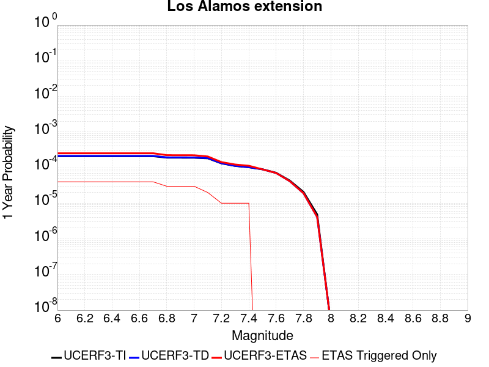 |  |

| Magnitude | 1 wk TI Prob | 1 wk TD Prob | 1 wk ETAS Prob | 1 wk ETAS/TD Gain | 1 wk ETAS Triggered Only | 1 mo TI Prob | 1 mo TD Prob | 1 mo ETAS Prob | 1 mo ETAS/TD Gain | 1 mo ETAS Triggered Only | 1 yr TI Prob | 1 yr TD Prob | 1 yr ETAS Prob | 1 yr ETAS/TD Gain | 1 yr ETAS Triggered Only | 10 yr TI Prob | 10 yr TD Prob | 10 yr ETAS Prob | 10 yr ETAS/TD Gain | 10 yr ETAS Triggered Only |
|-----|-----|-----|-----|-----|-----|-----|-----|-----|-----|-----|-----|-----|-----|-----|-----|-----|-----|-----|-----|-----|
| 6.0 | 4.0146506E-6 | 4.0861596E-6 | 1.2560711E-4 | 30.739649 | 1.2152145E-4 | 1.7205533E-5 | 1.7512002E-5 | 1.3903133E-4 | 7.9392023 | 1.2152145E-4 | 2.0945723E-4 | 2.1318886E-4 | 3.3468442E-4 | 1.5698963 | 1.2152145E-4 | 0.0020925992 | 0.0021299527 | 0.0022512153 | 1.0569321 | 1.2152145E-4 |
| 6.1 | 4.0146506E-6 | 4.0861596E-6 | 1.2560711E-4 | 30.739649 | 1.2152145E-4 | 1.7205533E-5 | 1.7512002E-5 | 1.3903133E-4 | 7.9392023 | 1.2152145E-4 | 2.0945723E-4 | 2.1318886E-4 | 3.3468442E-4 | 1.5698963 | 1.2152145E-4 | 0.0020925992 | 0.0021299527 | 0.0022512153 | 1.0569321 | 1.2152145E-4 |
| 6.2 | 4.0146506E-6 | 4.0861596E-6 | 1.2560711E-4 | 30.739649 | 1.2152145E-4 | 1.7205533E-5 | 1.7512002E-5 | 1.3903133E-4 | 7.9392023 | 1.2152145E-4 | 2.0945723E-4 | 2.1318886E-4 | 3.3468442E-4 | 1.5698963 | 1.2152145E-4 | 0.0020925992 | 0.0021299527 | 0.0022512153 | 1.0569321 | 1.2152145E-4 |
| 6.3 | 4.0146506E-6 | 4.0861596E-6 | 1.2560711E-4 | 30.739649 | 1.2152145E-4 | 1.7205533E-5 | 1.7512002E-5 | 1.3903133E-4 | 7.9392023 | 1.2152145E-4 | 2.0945723E-4 | 2.1318886E-4 | 3.3468442E-4 | 1.5698963 | 1.2152145E-4 | 0.0020925992 | 0.0021299527 | 0.0022512153 | 1.0569321 | 1.2152145E-4 |
| 6.4 | 4.0146506E-6 | 4.0861596E-6 | 1.2560711E-4 | 30.739649 | 1.2152145E-4 | 1.7205533E-5 | 1.7512002E-5 | 1.3903133E-4 | 7.9392023 | 1.2152145E-4 | 2.0945723E-4 | 2.1318886E-4 | 3.3468442E-4 | 1.5698963 | 1.2152145E-4 | 0.0020925992 | 0.0021299527 | 0.0022512153 | 1.0569321 | 1.2152145E-4 |
| 6.5 | 4.0146506E-6 | 4.0861596E-6 | 1.2560711E-4 | 30.739649 | 1.2152145E-4 | 1.7205533E-5 | 1.7512002E-5 | 1.3903133E-4 | 7.9392023 | 1.2152145E-4 | 2.0945723E-4 | 2.1318886E-4 | 3.3468442E-4 | 1.5698963 | 1.2152145E-4 | 0.0020925992 | 0.0021299527 | 0.0022512153 | 1.0569321 | 1.2152145E-4 |
| 6.6 | 4.0146506E-6 | 4.0861596E-6 | 1.2560711E-4 | 30.739649 | 1.2152145E-4 | 1.7205533E-5 | 1.7512002E-5 | 1.3903133E-4 | 7.9392023 | 1.2152145E-4 | 2.0945723E-4 | 2.1318886E-4 | 3.3468442E-4 | 1.5698963 | 1.2152145E-4 | 0.0020925992 | 0.0021299527 | 0.0022512153 | 1.0569321 | 1.2152145E-4 |
| 6.7 | 4.0146506E-6 | 4.0861596E-6 | 1.2560711E-4 | 30.739649 | 1.2152145E-4 | 1.7205533E-5 | 1.7512002E-5 | 1.3903133E-4 | 7.9392023 | 1.2152145E-4 | 2.0945723E-4 | 2.1318886E-4 | 3.3468442E-4 | 1.5698963 | 1.2152145E-4 | 0.0020925992 | 0.0021299527 | 0.0022512153 | 1.0569321 | 1.2152145E-4 |
| 6.8 | 3.6584688E-6 | 3.7188588E-6 | 1.2523985E-4 | 33.676956 | 1.2152145E-4 | 1.5679057E-5 | 1.5937874E-5 | 1.3745739E-4 | 8.624575 | 1.2152145E-4 | 1.9087581E-4 | 1.9402728E-4 | 3.1552516E-4 | 1.6261896 | 1.2152145E-4 | 0.0019071194 | 0.0019386712 | 0.002059957 | 1.0625614 | 1.2152145E-4 |
| 6.9 | 3.644631E-6 | 3.7045688E-6 | 1.2522556E-4 | 33.803005 | 1.2152145E-4 | 1.5619753E-5 | 1.5876632E-5 | 1.3739616E-4 | 8.653986 | 1.2152145E-4 | 1.901539E-4 | 1.9328178E-4 | 3.1477975E-4 | 1.6286054 | 1.2152145E-4 | 0.0018999127 | 0.0019312293 | 0.002052516 | 1.0628029 | 1.2152145E-4 |
| 7.0 | 3.6318522E-6 | 3.6913295E-6 | 1.2521233E-4 | 33.92066 | 1.2152145E-4 | 1.5564989E-5 | 1.5819893E-5 | 1.3733942E-4 | 8.681438 | 1.2152145E-4 | 1.8948725E-4 | 1.925911E-4 | 3.1408915E-4 | 1.6308601 | 1.2152145E-4 | 0.0018932576 | 0.0019243343 | 0.0020456219 | 1.0630283 | 1.2152145E-4 |
| 7.1 | 3.5001724E-6 | 3.5554E-6 | 3.5554E-6 | 1.0 | 0.0 | 1.5000653E-5 | 1.5237345E-5 | 1.5237345E-5 | 1.0 | 0.0 | 1.8261763E-4 | 1.854998E-4 | 1.854998E-4 | 1.0 | 0.0 | 0.0018246764 | 0.0018535402 | 0.0018535402 | 1.0 | 0.0 |
| 7.2 | 2.5204702E-6 | 2.5436943E-6 | 2.5436943E-6 | 1.0 | 0.0 | 1.080197E-5 | 1.0901502E-5 | 1.0901502E-5 | 1.0 | 0.0 | 1.3150605E-4 | 1.3271775E-4 | 1.3271775E-4 | 1.0 | 0.0 | 0.0013142825 | 0.0013263905 | 0.0013263905 | 1.0 | 0.0 |
| 7.3 | 2.1399692E-6 | 2.1501316E-6 | 2.1501316E-6 | 1.0 | 0.0 | 9.1712645E-6 | 9.2148175E-6 | 9.2148175E-6 | 1.0 | 0.0 | 1.1165442E-4 | 1.1218466E-4 | 1.1218466E-4 | 1.0 | 0.0 | 0.0011159834 | 0.0011212835 | 0.0011212835 | 1.0 | 0.0 |
| 7.4 | 1.9660122E-6 | 1.9702363E-6 | 1.9702363E-6 | 1.0 | 0.0 | 8.42574E-6 | 8.4438425E-6 | 8.4438425E-6 | 1.0 | 0.0 | 1.0257855E-4 | 1.0279897E-4 | 1.0279897E-4 | 1.0 | 0.0 | 0.0010253121 | 0.0010275173 | 0.0010275173 | 1.0 | 0.0 |
| 7.5 | 1.7204633E-6 | 1.7150983E-6 | 1.7150983E-6 | 1.0 | 0.0 | 7.373393E-6 | 7.3504007E-6 | 7.3504007E-6 | 1.0 | 0.0 | 8.976737E-5 | 8.948748E-5 | 8.948748E-5 | 1.0 | 0.0 | 8.9731114E-4 | 8.9451746E-4 | 8.9451746E-4 | 1.0 | 0.0 |
| 7.6 | 1.3717638E-6 | 1.3535827E-6 | 1.3535827E-6 | 1.0 | 0.0 | 5.878974E-6 | 5.8010555E-6 | 5.8010555E-6 | 1.0 | 0.0 | 7.157416E-5 | 7.062559E-5 | 7.062559E-5 | 1.0 | 0.0 | 7.1551115E-4 | 7.060341E-4 | 7.060341E-4 | 1.0 | 0.0 |
| 7.7 | 8.272564E-7 | 7.957636E-7 | 7.957636E-7 | 1.0 | 0.0 | 3.5453797E-6 | 3.410411E-6 | 3.410411E-6 | 1.0 | 0.0 | 4.3164142E-5 | 4.1520965E-5 | 4.1520965E-5 | 1.0 | 0.0 | 4.315576E-4 | 4.1513226E-4 | 4.1513226E-4 | 1.0 | 0.0 |
| 7.8 | 3.9708277E-7 | 3.6719027E-7 | 3.6719027E-7 | 1.0 | 0.0 | 1.7017821E-6 | 1.5736716E-6 | 1.5736716E-6 | 1.0 | 0.0 | 2.0719E-5 | 1.9159284E-5 | 1.9159284E-5 | 1.0 | 0.0 | 2.071707E-4 | 1.9157639E-4 | 1.9157639E-4 | 1.0 | 0.0 |
| 7.9 | 9.292528E-8 | 7.889087E-8 | 7.889087E-8 | 1.0 | 0.0 | 3.9825116E-7 | 3.381037E-7 | 3.381037E-7 | 1.0 | 0.0 | 4.848697E-6 | 4.116405E-6 | 4.116405E-6 | 1.0 | 0.0 | 4.8485912E-5 | 4.1163294E-5 | 4.1163294E-5 | 1.0 | 0.0 |
| 8.0 | 7.880441E-11 | 8.2353124E-11 | 8.2353124E-11 | 1.0 | 0.0 | 3.3773329E-10 | 3.52942E-10 | 3.52942E-10 | 1.0 | 0.0 | 4.1119033E-9 | 4.2970694E-9 | 4.2970694E-9 | 1.0 | 0.0 | 4.1119034E-8 | 4.2970694E-8 | 4.2970694E-8 | 1.0 | 0.0 |

## Red Mountain
*[(top)](#table-of-contents)*

| 1 Week | 1 Month | 1 Year | 10 Year |
|-----|-----|-----|-----|
|  |  |  |  |

| Magnitude | 1 wk TI Prob | 1 wk TD Prob | 1 wk ETAS Prob | 1 wk ETAS/TD Gain | 1 wk ETAS Triggered Only | 1 mo TI Prob | 1 mo TD Prob | 1 mo ETAS Prob | 1 mo ETAS/TD Gain | 1 mo ETAS Triggered Only | 1 yr TI Prob | 1 yr TD Prob | 1 yr ETAS Prob | 1 yr ETAS/TD Gain | 1 yr ETAS Triggered Only | 10 yr TI Prob | 10 yr TD Prob | 10 yr ETAS Prob | 10 yr ETAS/TD Gain | 10 yr ETAS Triggered Only |
|-----|-----|-----|-----|-----|-----|-----|-----|-----|-----|-----|-----|-----|-----|-----|-----|-----|-----|-----|-----|-----|
| 6.0 | 4.1810763E-5 | 4.7589947E-5 | 4.7589947E-5 | 1.0 | 0.0 | 1.7917668E-4 | 2.039419E-4 | 2.039419E-4 | 1.0 | 0.0 | 0.0021792934 | 0.0024803306 | 0.0026015507 | 1.0488726 | 1.2152145E-4 | 0.021580452 | 0.024544092 | 0.02466263 | 1.0048296 | 1.2152145E-4 |
| 6.1 | 4.1810763E-5 | 4.7589947E-5 | 4.7589947E-5 | 1.0 | 0.0 | 1.7917668E-4 | 2.039419E-4 | 2.039419E-4 | 1.0 | 0.0 | 0.0021792934 | 0.0024803306 | 0.0026015507 | 1.0488726 | 1.2152145E-4 | 0.021580452 | 0.024544092 | 0.02466263 | 1.0048296 | 1.2152145E-4 |
| 6.2 | 4.1810763E-5 | 4.7589947E-5 | 4.7589947E-5 | 1.0 | 0.0 | 1.7917668E-4 | 2.039419E-4 | 2.039419E-4 | 1.0 | 0.0 | 0.0021792934 | 0.0024803306 | 0.0026015507 | 1.0488726 | 1.2152145E-4 | 0.021580452 | 0.024544092 | 0.02466263 | 1.0048296 | 1.2152145E-4 |
| 6.3 | 4.1810763E-5 | 4.7589947E-5 | 4.7589947E-5 | 1.0 | 0.0 | 1.7917668E-4 | 2.039419E-4 | 2.039419E-4 | 1.0 | 0.0 | 0.0021792934 | 0.0024803306 | 0.0026015507 | 1.0488726 | 1.2152145E-4 | 0.021580452 | 0.024544092 | 0.02466263 | 1.0048296 | 1.2152145E-4 |
| 6.4 | 4.1810763E-5 | 4.7589947E-5 | 4.7589947E-5 | 1.0 | 0.0 | 1.7917668E-4 | 2.039419E-4 | 2.039419E-4 | 1.0 | 0.0 | 0.0021792934 | 0.0024803306 | 0.0026015507 | 1.0488726 | 1.2152145E-4 | 0.021580452 | 0.024544092 | 0.02466263 | 1.0048296 | 1.2152145E-4 |
| 6.5 | 3.154503E-5 | 3.5359728E-5 | 3.5359728E-5 | 1.0 | 0.0 | 1.3518598E-4 | 1.5153342E-4 | 1.5153342E-4 | 1.0 | 0.0 | 0.0016446467 | 0.0018434501 | 0.0019647477 | 1.0657991 | 1.2152145E-4 | 0.01632528 | 0.018291233 | 0.018410532 | 1.0065222 | 1.2152145E-4 |
| 6.6 | 3.1535834E-5 | 3.534911E-5 | 3.534911E-5 | 1.0 | 0.0 | 1.3514658E-4 | 1.5148791E-4 | 1.5148791E-4 | 1.0 | 0.0 | 0.0016441676 | 0.001842897 | 0.0019641947 | 1.0658189 | 1.2152145E-4 | 0.01632056 | 0.018285794 | 0.018405095 | 1.0065242 | 1.2152145E-4 |
| 6.7 | 2.8267326E-5 | 3.146934E-5 | 3.146934E-5 | 1.0 | 0.0 | 1.2114006E-4 | 1.348621E-4 | 1.348621E-4 | 1.0 | 0.0 | 0.0014738824 | 0.0016407946 | 0.0017621166 | 1.073941 | 1.2152145E-4 | 0.014641452 | 0.016295563 | 0.016415104 | 1.0073358 | 1.2152145E-4 |
| 6.8 | 2.8212884E-5 | 3.1407224E-5 | 3.1407224E-5 | 1.0 | 0.0 | 1.20906756E-4 | 1.3459593E-4 | 1.3459593E-4 | 1.0 | 0.0 | 0.0014710457 | 0.0016375587 | 0.0017588811 | 1.0740874 | 1.2152145E-4 | 0.014613459 | 0.01626368 | 0.016383225 | 1.0073504 | 1.2152145E-4 |
| 6.9 | 2.4227871E-5 | 2.6706979E-5 | 2.6706979E-5 | 1.0 | 0.0 | 1.03829596E-4 | 1.14453884E-4 | 1.14453884E-4 | 1.0 | 0.0 | 0.0012633923 | 0.0013926612 | 0.0015140134 | 1.0871369 | 1.2152145E-4 | 0.012562336 | 0.013847026 | 0.013966865 | 1.0086545 | 1.2152145E-4 |
| 7.0 | 2.348524E-5 | 2.5835763E-5 | 2.5835763E-5 | 1.0 | 0.0 | 1.0064714E-4 | 1.1072042E-4 | 1.1072042E-4 | 1.0 | 0.0 | 0.0012246901 | 0.0013472632 | 0.001468621 | 1.0900772 | 1.2152145E-4 | 0.012179627 | 0.01339859 | 0.013518482 | 1.0089482 | 1.2152145E-4 |
| 7.1 | 2.2311642E-5 | 2.4462828E-5 | 2.4462828E-5 | 1.0 | 0.0 | 9.561782E-5 | 1.048369E-4 | 1.048369E-4 | 1.0 | 0.0 | 0.0011635252 | 0.0012757168 | 0.0013970832 | 1.0951358 | 1.2152145E-4 | 0.01157452 | 0.012691451 | 0.012811431 | 1.0094535 | 1.2152145E-4 |
| 7.2 | 1.6533986E-5 | 1.7670347E-5 | 1.7670347E-5 | 1.0 | 0.0 | 7.085802E-5 | 7.572822E-5 | 7.572822E-5 | 1.0 | 0.0 | 8.623549E-4 | 9.216645E-4 | 0.001043074 | 1.1317284 | 1.2152145E-4 | 0.008590161 | 0.009184699 | 0.009305104 | 1.0131093 | 1.2152145E-4 |
| 7.3 | 1.4703092E-5 | 1.555952E-5 | 1.555952E-5 | 1.0 | 0.0 | 6.301173E-5 | 6.66823E-5 | 6.66823E-5 | 1.0 | 0.0 | 7.668978E-4 | 8.1161625E-4 | 8.1161625E-4 | 1.0 | 0.0 | 0.0076425658 | 0.008092596 | 0.008092596 | 1.0 | 0.0 |
| 7.4 | 6.1331984E-6 | 5.528872E-6 | 5.528872E-6 | 1.0 | 0.0 | 2.6284872E-5 | 2.3694953E-5 | 2.3694953E-5 | 1.0 | 0.0 | 3.199713E-4 | 2.8844838E-4 | 2.8844838E-4 | 1.0 | 0.0 | 0.0031951098 | 0.0028807942 | 0.0028807942 | 1.0 | 0.0 |
| 7.5 | 5.954766E-6 | 5.3385015E-6 | 5.3385015E-6 | 1.0 | 0.0 | 2.5520176E-5 | 2.2879094E-5 | 2.2879094E-5 | 1.0 | 0.0 | 3.1066386E-4 | 2.785179E-4 | 2.785179E-4 | 1.0 | 0.0 | 0.003102299 | 0.0027817423 | 0.0027817423 | 1.0 | 0.0 |
| 7.6 | 4.9726646E-6 | 4.315295E-6 | 4.315295E-6 | 1.0 | 0.0 | 2.1311245E-5 | 1.8493993E-5 | 1.8493993E-5 | 1.0 | 0.0 | 2.5943352E-4 | 2.2514143E-4 | 2.2514143E-4 | 1.0 | 0.0 | 0.0025913084 | 0.002249168 | 0.002249168 | 1.0 | 0.0 |
| 7.7 | 3.3613894E-6 | 2.8526642E-6 | 2.8526642E-6 | 1.0 | 0.0 | 1.4405875E-5 | 1.2225649E-5 | 1.2225649E-5 | 1.0 | 0.0 | 1.7537741E-4 | 1.4883737E-4 | 1.4883737E-4 | 1.0 | 0.0 | 0.0017523908 | 0.0014874031 | 0.0014874031 | 1.0 | 0.0 |
| 7.8 | 1.1828961E-6 | 1.0122756E-6 | 1.0122756E-6 | 1.0 | 0.0 | 5.069545E-6 | 4.338317E-6 | 4.338317E-6 | 1.0 | 0.0 | 6.171996E-5 | 5.281776E-5 | 5.281776E-5 | 1.0 | 0.0 | 6.170282E-4 | 5.2805495E-4 | 5.2805495E-4 | 1.0 | 0.0 |
| 7.9 | 2.2967266E-7 | 1.8618952E-7 | 1.8618952E-7 | 1.0 | 0.0 | 9.843111E-7 | 7.9795484E-7 | 7.9795484E-7 | 1.0 | 0.0 | 1.19839215E-5 | 9.7150605E-6 | 9.7150605E-6 | 1.0 | 0.0 | 1.1983275E-4 | 9.714664E-5 | 9.714664E-5 | 1.0 | 0.0 |

## Mission Ridge-Arroyo Parida-Santa Ana
*[(top)](#table-of-contents)*

| 1 Week | 1 Month | 1 Year | 10 Year |
|-----|-----|-----|-----|
|  |  |  |  |

| Magnitude | 1 wk TI Prob | 1 wk TD Prob | 1 wk ETAS Prob | 1 wk ETAS/TD Gain | 1 wk ETAS Triggered Only | 1 mo TI Prob | 1 mo TD Prob | 1 mo ETAS Prob | 1 mo ETAS/TD Gain | 1 mo ETAS Triggered Only | 1 yr TI Prob | 1 yr TD Prob | 1 yr ETAS Prob | 1 yr ETAS/TD Gain | 1 yr ETAS Triggered Only | 10 yr TI Prob | 10 yr TD Prob | 10 yr ETAS Prob | 10 yr ETAS/TD Gain | 10 yr ETAS Triggered Only |
|-----|-----|-----|-----|-----|-----|-----|-----|-----|-----|-----|-----|-----|-----|-----|-----|-----|-----|-----|-----|-----|
| 6.0 | 4.169034E-5 | 4.7138263E-5 | 4.7138263E-5 | 1.0 | 0.0 | 1.7866064E-4 | 2.0201034E-4 | 2.0201034E-4 | 1.0 | 0.0 | 0.0021730233 | 0.00245745 | 0.0025786727 | 1.0493287 | 1.2152145E-4 | 0.021518968 | 0.024384614 | 0.024503173 | 1.004862 | 1.2152145E-4 |
| 6.1 | 1.73813E-5 | 1.6854226E-5 | 1.6854226E-5 | 1.0 | 0.0 | 7.4489166E-5 | 7.223046E-5 | 7.223046E-5 | 1.0 | 0.0 | 9.065282E-4 | 8.790618E-4 | 8.790618E-4 | 1.0 | 0.0 | 0.009028391 | 0.008756988 | 0.008756988 | 1.0 | 0.0 |
| 6.2 | 1.4622182E-5 | 1.367329E-5 | 1.367329E-5 | 1.0 | 0.0 | 6.2664985E-5 | 5.8598518E-5 | 5.8598518E-5 | 1.0 | 0.0 | 7.6267915E-4 | 7.132073E-4 | 7.132073E-4 | 1.0 | 0.0 | 0.007600669 | 0.007109627 | 0.007109627 | 1.0 | 0.0 |
| 6.3 | 1.3552434E-5 | 1.2482201E-5 | 1.2482201E-5 | 1.0 | 0.0 | 5.8080568E-5 | 5.3494066E-5 | 5.3494066E-5 | 1.0 | 0.0 | 7.069015E-4 | 6.510988E-4 | 6.510988E-4 | 1.0 | 0.0 | 0.00704657 | 0.006492275 | 0.006492275 | 1.0 | 0.0 |
| 6.4 | 1.30977305E-5 | 1.1979156E-5 | 1.1979156E-5 | 1.0 | 0.0 | 5.613192E-5 | 5.1338247E-5 | 5.1338247E-5 | 1.0 | 0.0 | 6.831918E-4 | 6.248669E-4 | 6.248669E-4 | 1.0 | 0.0 | 0.006810953 | 0.0062314444 | 0.0062314444 | 1.0 | 0.0 |
| 6.5 | 1.225205E-5 | 1.1048803E-5 | 1.1048803E-5 | 1.0 | 0.0 | 5.2507727E-5 | 4.7351168E-5 | 4.7351168E-5 | 1.0 | 0.0 | 6.3909404E-4 | 5.7635066E-4 | 5.7635066E-4 | 1.0 | 0.0 | 0.006372592 | 0.005748869 | 0.005748869 | 1.0 | 0.0 |
| 6.6 | 1.1352241E-5 | 1.0063535E-5 | 1.0063535E-5 | 1.0 | 0.0 | 4.8651553E-5 | 4.3128734E-5 | 4.3128734E-5 | 1.0 | 0.0 | 5.921717E-4 | 5.2496797E-4 | 5.2496797E-4 | 1.0 | 0.0 | 0.0059059616 | 0.0052375244 | 0.0052375244 | 1.0 | 0.0 |
| 6.7 | 1.0864116E-5 | 9.517027E-6 | 9.517027E-6 | 1.0 | 0.0 | 4.6559664E-5 | 4.0786632E-5 | 4.0786632E-5 | 1.0 | 0.0 | 5.667165E-4 | 4.964661E-4 | 4.964661E-4 | 1.0 | 0.0 | 0.005652734 | 0.004953804 | 0.004953804 | 1.0 | 0.0 |
| 6.8 | 1.0666365E-5 | 9.299779E-6 | 9.299779E-6 | 1.0 | 0.0 | 4.571219E-5 | 3.9855597E-5 | 3.9855597E-5 | 1.0 | 0.0 | 5.564038E-4 | 4.8513585E-4 | 4.8513585E-4 | 1.0 | 0.0 | 0.005550127 | 0.0048410003 | 0.0048410003 | 1.0 | 0.0 |
| 6.9 | 1.0038665E-5 | 8.592046E-6 | 8.592046E-6 | 1.0 | 0.0 | 4.302214E-5 | 3.682254E-5 | 3.682254E-5 | 1.0 | 0.0 | 5.236687E-4 | 4.4822405E-4 | 4.4822405E-4 | 1.0 | 0.0 | 0.005224364 | 0.004473411 | 0.004473411 | 1.0 | 0.0 |
| 7.0 | 9.5379955E-6 | 8.025073E-6 | 8.025073E-6 | 1.0 | 0.0 | 4.0876483E-5 | 3.4392728E-5 | 3.4392728E-5 | 1.0 | 0.0 | 4.975576E-4 | 4.1865272E-4 | 4.1865272E-4 | 1.0 | 0.0 | 0.00496445 | 0.0041788397 | 0.0041788397 | 1.0 | 0.0 |
| 7.1 | 9.207389E-6 | 7.652375E-6 | 7.652375E-6 | 1.0 | 0.0 | 3.945964E-5 | 3.279549E-5 | 3.279549E-5 | 1.0 | 0.0 | 4.803152E-4 | 3.9921363E-4 | 3.9921363E-4 | 1.0 | 0.0 | 0.004792784 | 0.003985161 | 0.003985161 | 1.0 | 0.0 |
| 7.2 | 7.638091E-6 | 5.9311183E-6 | 5.9311183E-6 | 1.0 | 0.0 | 3.2734264E-5 | 2.541883E-5 | 2.541883E-5 | 1.0 | 0.0 | 3.984668E-4 | 3.0943064E-4 | 3.0943064E-4 | 1.0 | 0.0 | 0.0039775306 | 0.0030900547 | 0.0030900547 | 1.0 | 0.0 |
| 7.3 | 7.2500147E-6 | 5.5961527E-6 | 5.5961527E-6 | 1.0 | 0.0 | 3.1071122E-5 | 2.3983293E-5 | 2.3983293E-5 | 1.0 | 0.0 | 3.7822526E-4 | 2.9195778E-4 | 2.9195778E-4 | 1.0 | 0.0 | 0.0037758215 | 0.0029157975 | 0.0029157975 | 1.0 | 0.0 |
| 7.4 | 6.3899715E-6 | 4.9184964E-6 | 4.9184964E-6 | 1.0 | 0.0 | 2.7385306E-5 | 2.10791E-5 | 2.10791E-5 | 1.0 | 0.0 | 3.3336508E-4 | 2.5660804E-4 | 2.5660804E-4 | 1.0 | 0.0 | 0.0033286542 | 0.0025631618 | 0.0025631618 | 1.0 | 0.0 |
| 7.5 | 5.379025E-6 | 4.0838527E-6 | 4.0838527E-6 | 1.0 | 0.0 | 2.305276E-5 | 1.7502109E-5 | 1.7502109E-5 | 1.0 | 0.0 | 2.806312E-4 | 2.1306744E-4 | 2.1306744E-4 | 1.0 | 0.0 | 0.0028027708 | 0.002128643 | 0.002128643 | 1.0 | 0.0 |
| 7.6 | 4.1270696E-6 | 3.0883439E-6 | 3.0883439E-6 | 1.0 | 0.0 | 1.768732E-5 | 1.3235693E-5 | 1.3235693E-5 | 1.0 | 0.0 | 2.1532185E-4 | 1.6113273E-4 | 1.6113273E-4 | 1.0 | 0.0 | 0.0021511333 | 0.001610167 | 0.001610167 | 1.0 | 0.0 |
| 7.7 | 2.5406805E-6 | 1.8282013E-6 | 1.8282013E-6 | 1.0 | 0.0 | 1.0888585E-5 | 7.835125E-6 | 7.835125E-6 | 1.0 | 0.0 | 1.3256045E-4 | 9.538854E-5 | 9.538854E-5 | 1.0 | 0.0 | 0.0013248142 | 9.534821E-4 | 9.534821E-4 | 1.0 | 0.0 |
| 7.8 | 4.8608285E-7 | 3.5098864E-7 | 3.5098864E-7 | 1.0 | 0.0 | 2.0832106E-6 | 1.5042363E-6 | 1.5042363E-6 | 1.0 | 0.0 | 2.5362791E-5 | 1.8313924E-5 | 1.8313924E-5 | 1.0 | 0.0 | 2.5359896E-4 | 1.8312426E-4 | 1.8312426E-4 | 1.0 | 0.0 |
| 7.9 | 2.0472514E-8 | 1.2688783E-8 | 1.2688783E-8 | 1.0 | 0.0 | 8.7739345E-8 | 5.43805E-8 | 5.43805E-8 | 1.0 | 0.0 | 1.068226E-6 | 6.6208236E-7 | 6.6208236E-7 | 1.0 | 0.0 | 1.0682209E-5 | 6.620805E-6 | 6.620805E-6 | 1.0 | 0.0 |
| 8.0 | 4.443582E-9 | 2.0321211E-9 | 2.0321211E-9 | 1.0 | 0.0 | 1.9043922E-8 | 8.70909E-9 | 8.70909E-9 | 1.0 | 0.0 | 2.3185973E-7 | 1.0603316E-7 | 1.0603316E-7 | 1.0 | 0.0 | 2.3185949E-6 | 1.0603312E-6 | 1.0603312E-6 | 1.0 | 0.0 |

## Oak Ridge (Onshore)
*[(top)](#table-of-contents)*

| 1 Week | 1 Month | 1 Year | 10 Year |
|-----|-----|-----|-----|
|  |  |  |  |

| Magnitude | 1 wk TI Prob | 1 wk TD Prob | 1 wk ETAS Prob | 1 wk ETAS/TD Gain | 1 wk ETAS Triggered Only | 1 mo TI Prob | 1 mo TD Prob | 1 mo ETAS Prob | 1 mo ETAS/TD Gain | 1 mo ETAS Triggered Only | 1 yr TI Prob | 1 yr TD Prob | 1 yr ETAS Prob | 1 yr ETAS/TD Gain | 1 yr ETAS Triggered Only | 10 yr TI Prob | 10 yr TD Prob | 10 yr ETAS Prob | 10 yr ETAS/TD Gain | 10 yr ETAS Triggered Only |
|-----|-----|-----|-----|-----|-----|-----|-----|-----|-----|-----|-----|-----|-----|-----|-----|-----|-----|-----|-----|-----|
| 6.0 | 3.155064E-5 | 2.9525974E-5 | 1.5104383E-4 | 5.115626 | 1.2152145E-4 | 1.3521002E-4 | 1.2653397E-4 | 2.4804004E-4 | 1.9602644 | 1.2152145E-4 | 0.001644939 | 0.0015395004 | 0.0016608348 | 1.0788141 | 1.2152145E-4 | 0.01632816 | 0.015292859 | 0.015412522 | 1.0078248 | 1.2152145E-4 |
| 6.1 | 3.155064E-5 | 2.9525974E-5 | 1.5104383E-4 | 5.115626 | 1.2152145E-4 | 1.3521002E-4 | 1.2653397E-4 | 2.4804004E-4 | 1.9602644 | 1.2152145E-4 | 0.001644939 | 0.0015395004 | 0.0016608348 | 1.0788141 | 1.2152145E-4 | 0.01632816 | 0.015292859 | 0.015412522 | 1.0078248 | 1.2152145E-4 |
| 6.2 | 3.155064E-5 | 2.9525974E-5 | 1.5104383E-4 | 5.115626 | 1.2152145E-4 | 1.3521002E-4 | 1.2653397E-4 | 2.4804004E-4 | 1.9602644 | 1.2152145E-4 | 0.001644939 | 0.0015395004 | 0.0016608348 | 1.0788141 | 1.2152145E-4 | 0.01632816 | 0.015292859 | 0.015412522 | 1.0078248 | 1.2152145E-4 |
| 6.3 | 3.155064E-5 | 2.9525974E-5 | 1.5104383E-4 | 5.115626 | 1.2152145E-4 | 1.3521002E-4 | 1.2653397E-4 | 2.4804004E-4 | 1.9602644 | 1.2152145E-4 | 0.001644939 | 0.0015395004 | 0.0016608348 | 1.0788141 | 1.2152145E-4 | 0.01632816 | 0.015292859 | 0.015412522 | 1.0078248 | 1.2152145E-4 |
| 6.4 | 3.155064E-5 | 2.9525974E-5 | 1.5104383E-4 | 5.115626 | 1.2152145E-4 | 1.3521002E-4 | 1.2653397E-4 | 2.4804004E-4 | 1.9602644 | 1.2152145E-4 | 0.001644939 | 0.0015395004 | 0.0016608348 | 1.0788141 | 1.2152145E-4 | 0.01632816 | 0.015292859 | 0.015412522 | 1.0078248 | 1.2152145E-4 |
| 6.5 | 3.155064E-5 | 2.9525974E-5 | 1.5104383E-4 | 5.115626 | 1.2152145E-4 | 1.3521002E-4 | 1.2653397E-4 | 2.4804004E-4 | 1.9602644 | 1.2152145E-4 | 0.001644939 | 0.0015395004 | 0.0016608348 | 1.0788141 | 1.2152145E-4 | 0.01632816 | 0.015292859 | 0.015412522 | 1.0078248 | 1.2152145E-4 |
| 6.6 | 3.155064E-5 | 2.9525974E-5 | 1.5104383E-4 | 5.115626 | 1.2152145E-4 | 1.3521002E-4 | 1.2653397E-4 | 2.4804004E-4 | 1.9602644 | 1.2152145E-4 | 0.001644939 | 0.0015395004 | 0.0016608348 | 1.0788141 | 1.2152145E-4 | 0.01632816 | 0.015292859 | 0.015412522 | 1.0078248 | 1.2152145E-4 |
| 6.7 | 3.098897E-5 | 2.8864175E-5 | 1.5038211E-4 | 5.209992 | 1.2152145E-4 | 1.328031E-4 | 1.2369796E-4 | 2.4520437E-4 | 1.9822831 | 1.2152145E-4 | 0.0016156785 | 0.0015050198 | 0.0016263584 | 1.0806226 | 1.2152145E-4 | 0.016039822 | 0.014952714 | 0.015072418 | 1.0080055 | 1.2152145E-4 |
| 6.8 | 3.0449872E-5 | 2.8239372E-5 | 1.4975738E-4 | 5.3031416 | 1.2152145E-4 | 1.3049292E-4 | 1.2102048E-4 | 2.4252723E-4 | 2.004018 | 1.2152145E-4 | 0.0015875935 | 0.0014724657 | 0.0015938082 | 1.0824077 | 1.2152145E-4 | 0.015762992 | 0.014631462 | 0.014751205 | 1.008184 | 1.2152145E-4 |
| 6.9 | 2.697928E-5 | 2.4219773E-5 | 1.4573828E-4 | 6.0173264 | 1.2152145E-4 | 1.15620365E-4 | 1.0379502E-4 | 2.2530385E-4 | 2.1706614 | 1.2152145E-4 | 0.0014067689 | 0.0012629933 | 0.0013843613 | 1.0960954 | 1.2152145E-4 | 0.0139789665 | 0.01256087 | 0.012680865 | 1.0095531 | 1.2152145E-4 |
| 7.0 | 2.4893961E-5 | 2.1862043E-5 | 1.4338084E-4 | 6.5584373 | 1.2152145E-4 | 1.0668404E-4 | 9.3691204E-5 | 2.1520126E-4 | 2.2969208 | 1.2152145E-4 | 0.0012981043 | 0.0011401111 | 0.0012614941 | 1.1064658 | 1.2152145E-4 | 0.012905477 | 0.011344905 | 0.011465048 | 1.0105901 | 1.2152145E-4 |
| 7.1 | 2.0945363E-5 | 1.7354487E-5 | 1.3887383E-4 | 8.002186 | 1.2152145E-4 | 8.976275E-5 | 7.437428E-5 | 1.9588669E-4 | 2.6337962 | 1.2152145E-4 | 0.0010923136 | 9.051354E-4 | 0.0010265468 | 1.1341362 | 1.2152145E-4 | 0.0108696 | 0.009015423 | 0.009135849 | 1.0133578 | 1.2152145E-4 |
| 7.2 | 2.0439404E-5 | 1.6809423E-5 | 1.3832883E-4 | 8.229243 | 1.2152145E-4 | 8.7594504E-5 | 7.203843E-5 | 1.9355112E-4 | 2.6867762 | 1.2152145E-4 | 0.0010659413 | 8.767196E-4 | 9.981345E-4 | 1.1384877 | 1.2152145E-4 | 0.010608427 | 0.008733526 | 0.008853986 | 1.0137929 | 1.2152145E-4 |
| 7.3 | 1.8463334E-5 | 1.5381811E-5 | 1.3690139E-4 | 8.900213 | 1.2152145E-4 | 7.912617E-5 | 6.59204E-5 | 1.8743385E-4 | 2.8433359 | 1.2152145E-4 | 9.6293533E-4 | 8.0228975E-4 | 9.2371367E-4 | 1.1513468 | 1.2152145E-4 | 0.009587734 | 0.007994797 | 0.008115347 | 1.0150785 | 1.2152145E-4 |
| 7.4 | 1.763139E-5 | 1.451684E-5 | 1.3603653E-4 | 9.370946 | 1.2152145E-4 | 7.556091E-5 | 6.221356E-5 | 1.8372746E-4 | 2.9531734 | 1.2152145E-4 | 9.1956573E-4 | 7.571909E-4 | 8.786203E-4 | 1.1603683 | 1.2152145E-4 | 0.009157699 | 0.007546914 | 0.0076675178 | 1.0159806 | 1.2152145E-4 |
| 7.5 | 1.3594944E-5 | 1.1163356E-5 | 1.3268345E-4 | 11.885624 | 1.2152145E-4 | 5.8262744E-5 | 4.784209E-5 | 1.6935772E-4 | 3.5399315 | 1.2152145E-4 | 7.0911803E-4 | 5.8232434E-4 | 7.0377503E-4 | 1.2085619 | 1.2152145E-4 | 0.007068595 | 0.0058082556 | 0.0059290715 | 1.0208007 | 1.2152145E-4 |
| 7.6 | 6.9889534E-6 | 5.6367144E-6 | 5.6367144E-6 | 1.0 | 0.0 | 2.9952313E-5 | 2.4157125E-5 | 2.4157125E-5 | 1.0 | 0.0 | 3.646084E-4 | 2.9407372E-4 | 2.9407372E-4 | 1.0 | 0.0 | 0.0036401073 | 0.0029368899 | 0.0029368899 | 1.0 | 0.0 |
| 7.7 | 4.0824193E-6 | 3.2832586E-6 | 3.2832586E-6 | 1.0 | 0.0 | 1.7495966E-5 | 1.4071033E-5 | 1.4071033E-5 | 1.0 | 0.0 | 2.1299256E-4 | 1.713015E-4 | 1.713015E-4 | 1.0 | 0.0 | 0.0021278851 | 0.0017117079 | 0.0017117079 | 1.0 | 0.0 |
| 7.8 | 1.7023609E-6 | 1.4370495E-6 | 1.4370495E-6 | 1.0 | 0.0 | 7.295812E-6 | 6.1587693E-6 | 6.1587693E-6 | 1.0 | 0.0 | 8.882289E-5 | 7.498047E-5 | 7.498047E-5 | 1.0 | 0.0 | 8.8787393E-4 | 7.495545E-4 | 7.495545E-4 | 1.0 | 0.0 |
| 7.9 | 2.721225E-7 | 2.2616497E-7 | 2.2616497E-7 | 1.0 | 0.0 | 1.1662388E-6 | 9.692781E-7 | 9.692781E-7 | 1.0 | 0.0 | 1.4198865E-5 | 1.1800899E-5 | 1.1800899E-5 | 1.0 | 0.0 | 1.4197957E-4 | 1.1800301E-4 | 1.1800301E-4 | 1.0 | 0.0 |
| 8.0 | 9.364255E-9 | 5.1206666E-9 | 5.1206666E-9 | 1.0 | 0.0 | 4.0132523E-8 | 2.1945715E-8 | 2.1945715E-8 | 1.0 | 0.0 | 4.8861335E-7 | 2.6718905E-7 | 2.6718905E-7 | 1.0 | 0.0 | 4.8861225E-6 | 2.6718876E-6 | 2.6718876E-6 | 1.0 | 0.0 |

## Pine Mtn
*[(top)](#table-of-contents)*

| 1 Week | 1 Month | 1 Year | 10 Year |
|-----|-----|-----|-----|
|  |  |  |  |

| Magnitude | 1 wk TI Prob | 1 wk TD Prob | 1 wk ETAS Prob | 1 wk ETAS/TD Gain | 1 wk ETAS Triggered Only | 1 mo TI Prob | 1 mo TD Prob | 1 mo ETAS Prob | 1 mo ETAS/TD Gain | 1 mo ETAS Triggered Only | 1 yr TI Prob | 1 yr TD Prob | 1 yr ETAS Prob | 1 yr ETAS/TD Gain | 1 yr ETAS Triggered Only | 10 yr TI Prob | 10 yr TD Prob | 10 yr ETAS Prob | 10 yr ETAS/TD Gain | 10 yr ETAS Triggered Only |
|-----|-----|-----|-----|-----|-----|-----|-----|-----|-----|-----|-----|-----|-----|-----|-----|-----|-----|-----|-----|-----|
| 6.0 | 6.894797E-6 | 7.225461E-6 | 7.225461E-6 | 1.0 | 0.0 | 2.9548795E-5 | 3.096591E-5 | 1.524836E-4 | 4.9242406 | 1.2152145E-4 | 3.596972E-4 | 3.7694772E-4 | 4.9842335E-4 | 1.3222612 | 1.2152145E-4 | 0.0035911554 | 0.003763381 | 0.0038844452 | 1.032169 | 1.2152145E-4 |
| 6.1 | 6.894797E-6 | 7.225461E-6 | 7.225461E-6 | 1.0 | 0.0 | 2.9548795E-5 | 3.096591E-5 | 1.524836E-4 | 4.9242406 | 1.2152145E-4 | 3.596972E-4 | 3.7694772E-4 | 4.9842335E-4 | 1.3222612 | 1.2152145E-4 | 0.0035911554 | 0.003763381 | 0.0038844452 | 1.032169 | 1.2152145E-4 |
| 6.2 | 6.894797E-6 | 7.225461E-6 | 7.225461E-6 | 1.0 | 0.0 | 2.9548795E-5 | 3.096591E-5 | 1.524836E-4 | 4.9242406 | 1.2152145E-4 | 3.596972E-4 | 3.7694772E-4 | 4.9842335E-4 | 1.3222612 | 1.2152145E-4 | 0.0035911554 | 0.003763381 | 0.0038844452 | 1.032169 | 1.2152145E-4 |
| 6.3 | 6.894797E-6 | 7.225461E-6 | 7.225461E-6 | 1.0 | 0.0 | 2.9548795E-5 | 3.096591E-5 | 1.524836E-4 | 4.9242406 | 1.2152145E-4 | 3.596972E-4 | 3.7694772E-4 | 4.9842335E-4 | 1.3222612 | 1.2152145E-4 | 0.0035911554 | 0.003763381 | 0.0038844452 | 1.032169 | 1.2152145E-4 |
| 6.4 | 6.894797E-6 | 7.225461E-6 | 7.225461E-6 | 1.0 | 0.0 | 2.9548795E-5 | 3.096591E-5 | 1.524836E-4 | 4.9242406 | 1.2152145E-4 | 3.596972E-4 | 3.7694772E-4 | 4.9842335E-4 | 1.3222612 | 1.2152145E-4 | 0.0035911554 | 0.003763381 | 0.0038844452 | 1.032169 | 1.2152145E-4 |
| 6.5 | 6.894797E-6 | 7.225461E-6 | 7.225461E-6 | 1.0 | 0.0 | 2.9548795E-5 | 3.096591E-5 | 1.524836E-4 | 4.9242406 | 1.2152145E-4 | 3.596972E-4 | 3.7694772E-4 | 4.9842335E-4 | 1.3222612 | 1.2152145E-4 | 0.0035911554 | 0.003763381 | 0.0038844452 | 1.032169 | 1.2152145E-4 |
| 6.6 | 6.894797E-6 | 7.225461E-6 | 7.225461E-6 | 1.0 | 0.0 | 2.9548795E-5 | 3.096591E-5 | 1.524836E-4 | 4.9242406 | 1.2152145E-4 | 3.596972E-4 | 3.7694772E-4 | 4.9842335E-4 | 1.3222612 | 1.2152145E-4 | 0.0035911554 | 0.003763381 | 0.0038844452 | 1.032169 | 1.2152145E-4 |
| 6.7 | 6.0867933E-6 | 6.3971133E-6 | 6.3971133E-6 | 1.0 | 0.0 | 2.6085996E-5 | 2.7415923E-5 | 1.4893404E-4 | 5.4323916 | 1.2152145E-4 | 3.1755073E-4 | 3.3373994E-4 | 4.5522084E-4 | 1.3639987 | 1.2152145E-4 | 0.0031709734 | 0.0033326065 | 0.003453723 | 1.0363429 | 1.2152145E-4 |
| 6.8 | 5.6530425E-6 | 5.9505956E-6 | 5.9505956E-6 | 1.0 | 0.0 | 2.42271E-5 | 2.5502315E-5 | 1.4702066E-4 | 5.7649927 | 1.2152145E-4 | 2.94925E-4 | 3.104485E-4 | 4.3193222E-4 | 1.3913168 | 1.2152145E-4 | 0.002945339 | 0.0031003528 | 0.0032214974 | 1.0390745 | 1.2152145E-4 |
| 6.9 | 4.6015225E-6 | 4.863834E-6 | 4.863834E-6 | 1.0 | 0.0 | 1.9720663E-5 | 2.0844845E-5 | 1.4236376E-4 | 6.8296866 | 1.2152145E-4 | 2.4007261E-4 | 2.5375787E-4 | 3.752485E-4 | 1.4787658 | 1.2152145E-4 | 0.0023981342 | 0.0025348254 | 0.0026560389 | 1.0478193 | 1.2152145E-4 |
| 7.0 | 4.4875965E-6 | 4.747473E-6 | 4.747473E-6 | 1.0 | 0.0 | 1.9232413E-5 | 2.0346162E-5 | 1.4186514E-4 | 6.9725747 | 1.2152145E-4 | 2.3412947E-4 | 2.4768783E-4 | 3.6917918E-4 | 1.4905019 | 1.2152145E-4 | 0.0023388295 | 0.0024742614 | 0.0025954822 | 1.0489928 | 1.2152145E-4 |
| 7.1 | 3.203907E-6 | 3.4294096E-6 | 3.4294096E-6 | 1.0 | 0.0 | 1.3730958E-5 | 1.4697391E-5 | 1.3621706E-4 | 9.268111 | 1.2152145E-4 | 1.6716159E-4 | 1.789267E-4 | 3.004264E-4 | 1.6790473 | 1.2152145E-4 | 0.0016703589 | 0.0017878925 | 0.0019091967 | 1.0678476 | 1.2152145E-4 |
| 7.2 | 2.2060601E-6 | 2.3784817E-6 | 2.3784817E-6 | 1.0 | 0.0 | 9.4545085E-6 | 1.0193455E-5 | 1.3171366E-4 | 12.921395 | 1.2152145E-4 | 1.15102564E-4 | 1.240987E-4 | 2.4560507E-4 | 1.9791107 | 1.2152145E-4 | 0.0011504296 | 0.0012403389 | 0.0013617096 | 1.0978528 | 1.2152145E-4 |
| 7.3 | 1.3765207E-6 | 1.5216481E-6 | 1.5216481E-6 | 1.0 | 0.0 | 5.899361E-6 | 6.521333E-6 | 1.2804198E-4 | 19.634327 | 1.2152145E-4 | 7.182235E-5 | 7.939443E-5 | 2.0090623E-4 | 2.5304828 | 1.2152145E-4 | 7.1799144E-4 | 7.936697E-4 | 9.1509474E-4 | 1.1529919 | 1.2152145E-4 |
| 7.4 | 1.1245983E-6 | 1.2587075E-6 | 1.2587075E-6 | 1.0 | 0.0 | 4.819698E-6 | 5.39445E-6 | 1.2691524E-4 | 23.527002 | 1.2152145E-4 | 5.8678244E-5 | 6.567554E-5 | 1.87189E-4 | 2.850209 | 1.2152145E-4 | 5.866275E-4 | 6.5656955E-4 | 7.780112E-4 | 1.184964 | 1.2152145E-4 |
| 7.5 | 8.031682E-7 | 9.276951E-7 | 9.276951E-7 | 1.0 | 0.0 | 3.4421448E-6 | 3.9758306E-6 | 3.9758306E-6 | 1.0 | 0.0 | 4.1907308E-5 | 4.840473E-5 | 4.840473E-5 | 1.0 | 0.0 | 4.1899405E-4 | 4.8394862E-4 | 4.8394862E-4 | 1.0 | 0.0 |
| 7.6 | 4.8953444E-7 | 6.003009E-7 | 6.003009E-7 | 1.0 | 0.0 | 2.098003E-6 | 2.5727159E-6 | 2.5727159E-6 | 1.0 | 0.0 | 2.5542888E-5 | 3.1322415E-5 | 3.1322415E-5 | 1.0 | 0.0 | 2.5539953E-4 | 3.1318486E-4 | 3.1318486E-4 | 1.0 | 0.0 |
| 7.7 | 6.634529E-8 | 6.788826E-8 | 6.788826E-8 | 1.0 | 0.0 | 2.843369E-7 | 2.9094966E-7 | 2.9094966E-7 | 1.0 | 0.0 | 3.4617963E-6 | 3.5423066E-6 | 3.5423066E-6 | 1.0 | 0.0 | 3.4617424E-5 | 3.542255E-5 | 3.542255E-5 | 1.0 | 0.0 |
| 7.8 | 9.235578E-9 | 9.488566E-9 | 9.488566E-9 | 1.0 | 0.0 | 3.9581046E-8 | 4.0665284E-8 | 4.0665284E-8 | 1.0 | 0.0 | 4.818991E-7 | 4.950997E-7 | 4.950997E-7 | 1.0 | 0.0 | 4.8189804E-6 | 4.950988E-6 | 4.950988E-6 | 1.0 | 0.0 |

## Northridge
*[(top)](#table-of-contents)*

| 1 Week | 1 Month | 1 Year | 10 Year |
|-----|-----|-----|-----|
|  |  |  |  |

| Magnitude | 1 wk TI Prob | 1 wk TD Prob | 1 wk ETAS Prob | 1 wk ETAS/TD Gain | 1 wk ETAS Triggered Only | 1 mo TI Prob | 1 mo TD Prob | 1 mo ETAS Prob | 1 mo ETAS/TD Gain | 1 mo ETAS Triggered Only | 1 yr TI Prob | 1 yr TD Prob | 1 yr ETAS Prob | 1 yr ETAS/TD Gain | 1 yr ETAS Triggered Only | 10 yr TI Prob | 10 yr TD Prob | 10 yr ETAS Prob | 10 yr ETAS/TD Gain | 10 yr ETAS Triggered Only |
|-----|-----|-----|-----|-----|-----|-----|-----|-----|-----|-----|-----|-----|-----|-----|-----|-----|-----|-----|-----|-----|
| 6.0 | 1.8340852E-5 | 7.5880193E-6 | 7.5880193E-6 | 1.0 | 0.0 | 7.860128E-5 | 3.251969E-5 | 1.5403719E-4 | 4.736736 | 1.2152145E-4 | 9.565505E-4 | 3.958575E-4 | 5.1733083E-4 | 1.3068613 | 1.2152145E-4 | 0.009524435 | 0.003951746 | 0.0040727872 | 1.0306298 | 1.2152145E-4 |
| 6.1 | 1.8340852E-5 | 7.5880193E-6 | 7.5880193E-6 | 1.0 | 0.0 | 7.860128E-5 | 3.251969E-5 | 1.5403719E-4 | 4.736736 | 1.2152145E-4 | 9.565505E-4 | 3.958575E-4 | 5.1733083E-4 | 1.3068613 | 1.2152145E-4 | 0.009524435 | 0.003951746 | 0.0040727872 | 1.0306298 | 1.2152145E-4 |
| 6.2 | 1.8340852E-5 | 7.5880193E-6 | 7.5880193E-6 | 1.0 | 0.0 | 7.860128E-5 | 3.251969E-5 | 1.5403719E-4 | 4.736736 | 1.2152145E-4 | 9.565505E-4 | 3.958575E-4 | 5.1733083E-4 | 1.3068613 | 1.2152145E-4 | 0.009524435 | 0.003951746 | 0.0040727872 | 1.0306298 | 1.2152145E-4 |
| 6.3 | 1.8340852E-5 | 7.5880193E-6 | 7.5880193E-6 | 1.0 | 0.0 | 7.860128E-5 | 3.251969E-5 | 1.5403719E-4 | 4.736736 | 1.2152145E-4 | 9.565505E-4 | 3.958575E-4 | 5.1733083E-4 | 1.3068613 | 1.2152145E-4 | 0.009524435 | 0.003951746 | 0.0040727872 | 1.0306298 | 1.2152145E-4 |
| 6.4 | 1.7361892E-5 | 7.5880193E-6 | 7.5880193E-6 | 1.0 | 0.0 | 7.440598E-5 | 3.251969E-5 | 1.5403719E-4 | 4.736736 | 1.2152145E-4 | 9.055163E-4 | 3.958575E-4 | 5.1733083E-4 | 1.3068613 | 1.2152145E-4 | 0.009018354 | 0.003951746 | 0.0040727872 | 1.0306298 | 1.2152145E-4 |
| 6.5 | 1.7361892E-5 | 7.5880193E-6 | 7.5880193E-6 | 1.0 | 0.0 | 7.440598E-5 | 3.251969E-5 | 1.5403719E-4 | 4.736736 | 1.2152145E-4 | 9.055163E-4 | 3.958575E-4 | 5.1733083E-4 | 1.3068613 | 1.2152145E-4 | 0.009018354 | 0.003951746 | 0.0040727872 | 1.0306298 | 1.2152145E-4 |
| 6.6 | 1.5458201E-5 | 7.5880193E-6 | 7.5880193E-6 | 1.0 | 0.0 | 6.624775E-5 | 3.251969E-5 | 1.5403719E-4 | 4.736736 | 1.2152145E-4 | 8.0626784E-4 | 3.958575E-4 | 5.1733083E-4 | 1.3068613 | 1.2152145E-4 | 0.008033488 | 0.003951746 | 0.0040727872 | 1.0306298 | 1.2152145E-4 |
| 6.7 | 1.2538368E-5 | 6.381603E-6 | 6.381603E-6 | 1.0 | 0.0 | 5.3734755E-5 | 2.7349442E-5 | 1.4886756E-4 | 5.4431663 | 1.2152145E-4 | 6.5402425E-4 | 3.3292902E-4 | 4.5441E-4 | 1.3648856 | 1.2152145E-4 | 0.0065210275 | 0.0033243506 | 0.003445468 | 1.0364335 | 1.2152145E-4 |
| 6.8 | 1.1438097E-5 | 6.3502566E-6 | 6.3502566E-6 | 1.0 | 0.0 | 4.9019498E-5 | 2.7215105E-5 | 1.4873325E-4 | 5.4650993 | 1.2152145E-4 | 5.9664896E-4 | 3.3129397E-4 | 4.5277516E-4 | 1.366687 | 1.2152145E-4 | 0.005950495 | 0.0033080487 | 0.0034291681 | 1.0366136 | 1.2152145E-4 |
| 6.9 | 1.1204891E-5 | 6.2867084E-6 | 6.2867084E-6 | 1.0 | 0.0 | 4.8020076E-5 | 2.694276E-5 | 1.4846094E-4 | 5.510235 | 1.2152145E-4 | 5.8448757E-4 | 3.2797916E-4 | 4.4946076E-4 | 1.3703942 | 1.2152145E-4 | 0.0058295266 | 0.0032749989 | 0.0033961223 | 1.0369843 | 1.2152145E-4 |
| 7.0 | 1.061046E-5 | 6.115359E-6 | 6.115359E-6 | 1.0 | 0.0 | 4.5472607E-5 | 2.6208421E-5 | 1.4772668E-4 | 5.6366115 | 1.2152145E-4 | 5.534883E-4 | 3.1904122E-4 | 4.405239E-4 | 1.3807743 | 1.2152145E-4 | 0.0055211177 | 0.0031858785 | 0.0033070128 | 1.0380223 | 1.2152145E-4 |
| 7.1 | 1.0266979E-5 | 6.004274E-6 | 6.004274E-6 | 1.0 | 0.0 | 4.40006E-5 | 2.5732352E-5 | 1.4725067E-4 | 5.722395 | 1.2152145E-4 | 5.355756E-4 | 3.1324677E-4 | 4.3473014E-4 | 1.3878201 | 1.2152145E-4 | 0.0053428668 | 0.003128098 | 0.0032492394 | 1.0387268 | 1.2152145E-4 |
| 7.2 | 9.91273E-6 | 5.819984E-6 | 5.819984E-6 | 1.0 | 0.0 | 4.248244E-5 | 2.4942554E-5 | 2.4942554E-5 | 1.0 | 0.0 | 5.171009E-4 | 3.036337E-4 | 3.036337E-4 | 1.0 | 0.0 | 0.0051589934 | 0.0030322333 | 0.0030322333 | 1.0 | 0.0 |
| 7.3 | 8.4959265E-6 | 5.193062E-6 | 5.193062E-6 | 1.0 | 0.0 | 3.6410605E-5 | 2.225579E-5 | 2.225579E-5 | 1.0 | 0.0 | 4.4320893E-4 | 2.709308E-4 | 2.709308E-4 | 1.0 | 0.0 | 0.00442326 | 0.0027060313 | 0.0027060313 | 1.0 | 0.0 |
| 7.4 | 8.0847185E-6 | 4.9819355E-6 | 4.9819355E-6 | 1.0 | 0.0 | 3.4648332E-5 | 2.135098E-5 | 2.135098E-5 | 1.0 | 0.0 | 4.2176177E-4 | 2.599174E-4 | 2.599174E-4 | 1.0 | 0.0 | 0.0042096223 | 0.00259616 | 0.00259616 | 1.0 | 0.0 |
| 7.5 | 6.8220684E-6 | 4.2533075E-6 | 4.2533075E-6 | 1.0 | 0.0 | 2.9237108E-5 | 1.8228335E-5 | 1.8228335E-5 | 1.0 | 0.0 | 3.5590364E-4 | 2.2190758E-4 | 2.2190758E-4 | 1.0 | 0.0 | 0.0035533418 | 0.002216881 | 0.002216881 | 1.0 | 0.0 |
| 7.6 | 4.4224143E-6 | 2.8999582E-6 | 2.8999582E-6 | 1.0 | 0.0 | 1.8953066E-5 | 1.2428334E-5 | 1.2428334E-5 | 1.0 | 0.0 | 2.3072914E-4 | 1.5130457E-4 | 1.5130457E-4 | 1.0 | 0.0 | 0.0023048974 | 0.0015120271 | 0.0015120271 | 1.0 | 0.0 |
| 7.7 | 2.5297056E-6 | 1.6045905E-6 | 1.6045905E-6 | 1.0 | 0.0 | 1.0841551E-5 | 6.8767986E-6 | 6.8767986E-6 | 1.0 | 0.0 | 1.319879E-4 | 8.3721854E-5 | 8.3721854E-5 | 1.0 | 0.0 | 0.0013190953 | 8.369078E-4 | 8.369078E-4 | 1.0 | 0.0 |
| 7.8 | 1.2508156E-6 | 8.780076E-7 | 8.780076E-7 | 1.0 | 0.0 | 5.3606273E-6 | 3.7628845E-6 | 3.7628845E-6 | 1.0 | 0.0 | 6.526368E-5 | 4.581217E-5 | 4.581217E-5 | 1.0 | 0.0 | 6.524452E-4 | 4.5802852E-4 | 4.5802852E-4 | 1.0 | 0.0 |
| 7.9 | 2.262199E-7 | 1.4664671E-7 | 1.4664671E-7 | 1.0 | 0.0 | 9.695135E-7 | 6.284858E-7 | 6.284858E-7 | 1.0 | 0.0 | 1.1803763E-5 | 7.651788E-6 | 7.651788E-6 | 1.0 | 0.0 | 1.1803136E-4 | 7.651533E-5 | 7.651533E-5 | 1.0 | 0.0 |
| 8.0 | 2.865362E-9 | 1.2753101E-9 | 1.2753101E-9 | 1.0 | 0.0 | 1.2280123E-8 | 5.4656146E-9 | 5.4656146E-9 | 1.0 | 0.0 | 1.4951048E-7 | 6.654386E-8 | 6.654386E-8 | 1.0 | 0.0 | 1.4951038E-6 | 6.654386E-7 | 6.654386E-7 | 1.0 | 0.0 |

## Cucamonga
*[(top)](#table-of-contents)*

| 1 Week | 1 Month | 1 Year | 10 Year |
|-----|-----|-----|-----|
|  |  |  |  |

| Magnitude | 1 wk TI Prob | 1 wk TD Prob | 1 wk ETAS Prob | 1 wk ETAS/TD Gain | 1 wk ETAS Triggered Only | 1 mo TI Prob | 1 mo TD Prob | 1 mo ETAS Prob | 1 mo ETAS/TD Gain | 1 mo ETAS Triggered Only | 1 yr TI Prob | 1 yr TD Prob | 1 yr ETAS Prob | 1 yr ETAS/TD Gain | 1 yr ETAS Triggered Only | 10 yr TI Prob | 10 yr TD Prob | 10 yr ETAS Prob | 10 yr ETAS/TD Gain | 10 yr ETAS Triggered Only |
|-----|-----|-----|-----|-----|-----|-----|-----|-----|-----|-----|-----|-----|-----|-----|-----|-----|-----|-----|-----|-----|
| 6.0 | 1.1848348E-5 | 1.1737008E-5 | 1.3325702E-4 | 11.353578 | 1.2152145E-4 | 5.0777642E-5 | 5.030051E-5 | 1.7181585E-4 | 3.4157875 | 1.2152145E-4 | 6.180424E-4 | 6.1223935E-4 | 7.336864E-4 | 1.1983653 | 1.2152145E-4 | 0.0061632637 | 0.0061067017 | 0.006227481 | 1.0197781 | 1.2152145E-4 |
| 6.1 | 1.1848348E-5 | 1.1737008E-5 | 1.3325702E-4 | 11.353578 | 1.2152145E-4 | 5.0777642E-5 | 5.030051E-5 | 1.7181585E-4 | 3.4157875 | 1.2152145E-4 | 6.180424E-4 | 6.1223935E-4 | 7.336864E-4 | 1.1983653 | 1.2152145E-4 | 0.0061632637 | 0.0061067017 | 0.006227481 | 1.0197781 | 1.2152145E-4 |
| 6.2 | 1.1848348E-5 | 1.1737008E-5 | 1.3325702E-4 | 11.353578 | 1.2152145E-4 | 5.0777642E-5 | 5.030051E-5 | 1.7181585E-4 | 3.4157875 | 1.2152145E-4 | 6.180424E-4 | 6.1223935E-4 | 7.336864E-4 | 1.1983653 | 1.2152145E-4 | 0.0061632637 | 0.0061067017 | 0.006227481 | 1.0197781 | 1.2152145E-4 |
| 6.3 | 1.1848348E-5 | 1.1737008E-5 | 1.3325702E-4 | 11.353578 | 1.2152145E-4 | 5.0777642E-5 | 5.030051E-5 | 1.7181585E-4 | 3.4157875 | 1.2152145E-4 | 6.180424E-4 | 6.1223935E-4 | 7.336864E-4 | 1.1983653 | 1.2152145E-4 | 0.0061632637 | 0.0061067017 | 0.006227481 | 1.0197781 | 1.2152145E-4 |
| 6.4 | 1.1848348E-5 | 1.1737008E-5 | 1.3325702E-4 | 11.353578 | 1.2152145E-4 | 5.0777642E-5 | 5.030051E-5 | 1.7181585E-4 | 3.4157875 | 1.2152145E-4 | 6.180424E-4 | 6.1223935E-4 | 7.336864E-4 | 1.1983653 | 1.2152145E-4 | 0.0061632637 | 0.0061067017 | 0.006227481 | 1.0197781 | 1.2152145E-4 |
| 6.5 | 1.16988695E-5 | 1.15760395E-5 | 1.3309608E-4 | 11.497549 | 1.2152145E-4 | 5.013705E-5 | 4.9610666E-5 | 1.7112608E-4 | 3.4493809 | 1.2152145E-4 | 6.102476E-4 | 6.0384517E-4 | 7.2529324E-4 | 1.2011245 | 1.2152145E-4 | 0.006085745 | 0.006023216 | 0.006144006 | 1.020054 | 1.2152145E-4 |
| 6.6 | 1.16988695E-5 | 1.15760395E-5 | 1.3309608E-4 | 11.497549 | 1.2152145E-4 | 5.013705E-5 | 4.9610666E-5 | 1.7112608E-4 | 3.4493809 | 1.2152145E-4 | 6.102476E-4 | 6.0384517E-4 | 7.2529324E-4 | 1.2011245 | 1.2152145E-4 | 0.006085745 | 0.006023216 | 0.006144006 | 1.020054 | 1.2152145E-4 |
| 6.7 | 1.1397107E-5 | 1.11149475E-5 | 1.3263505E-4 | 11.933034 | 1.2152145E-4 | 4.884383E-5 | 4.7634636E-5 | 1.691503E-4 | 3.550994 | 1.2152145E-4 | 5.9451134E-4 | 5.797998E-4 | 7.0125086E-4 | 1.2094705 | 1.2152145E-4 | 0.005929234 | 0.0057840226 | 0.0059048412 | 1.0208883 | 1.2152145E-4 |
| 6.8 | 1.058387E-5 | 9.784992E-6 | 9.784992E-6 | 1.0 | 0.0 | 4.5358654E-5 | 4.193501E-5 | 4.193501E-5 | 1.0 | 0.0 | 5.521017E-4 | 5.1044027E-4 | 5.1044027E-4 | 1.0 | 0.0 | 0.00550732 | 0.0050936877 | 0.0050936877 | 1.0 | 0.0 |
| 6.9 | 9.690046E-6 | 8.57948E-6 | 8.57948E-6 | 1.0 | 0.0 | 4.1528107E-5 | 3.6768684E-5 | 3.6768684E-5 | 1.0 | 0.0 | 5.054874E-4 | 4.475672E-4 | 4.475672E-4 | 1.0 | 0.0 | 0.005043391 | 0.004467594 | 0.004467594 | 1.0 | 0.0 |
| 7.0 | 9.381461E-6 | 8.187101E-6 | 8.187101E-6 | 1.0 | 0.0 | 4.020564E-5 | 3.5087105E-5 | 3.5087105E-5 | 1.0 | 0.0 | 4.893937E-4 | 4.2710215E-4 | 4.2710215E-4 | 1.0 | 0.0 | 0.0048831734 | 0.0042637475 | 0.0042637475 | 1.0 | 0.0 |
| 7.1 | 8.946492E-6 | 7.781886E-6 | 7.781886E-6 | 1.0 | 0.0 | 3.8341543E-5 | 3.3350516E-5 | 3.3350516E-5 | 1.0 | 0.0 | 4.667083E-4 | 4.0596718E-4 | 4.0596718E-4 | 1.0 | 0.0 | 0.0046572937 | 0.004053192 | 0.004053192 | 1.0 | 0.0 |
| 7.2 | 8.251016E-6 | 6.9752796E-6 | 6.9752796E-6 | 1.0 | 0.0 | 3.5361016E-5 | 2.9893714E-5 | 2.9893714E-5 | 1.0 | 0.0 | 4.3043532E-4 | 3.6389544E-4 | 3.6389544E-4 | 1.0 | 0.0 | 0.0042960253 | 0.0036339292 | 0.0036339292 | 1.0 | 0.0 |
| 7.3 | 7.717881E-6 | 6.4863502E-6 | 6.4863502E-6 | 1.0 | 0.0 | 3.3076216E-5 | 2.7798349E-5 | 2.7798349E-5 | 1.0 | 0.0 | 4.026285E-4 | 3.3839257E-4 | 3.3839257E-4 | 1.0 | 0.0 | 0.004018998 | 0.00337971 | 0.00337971 | 1.0 | 0.0 |
| 7.4 | 7.275623E-6 | 6.031997E-6 | 6.031997E-6 | 1.0 | 0.0 | 3.118087E-5 | 2.585116E-5 | 2.585116E-5 | 1.0 | 0.0 | 3.7956095E-4 | 3.1469265E-4 | 3.1469265E-4 | 1.0 | 0.0 | 0.0037891332 | 0.0031434062 | 0.0031434062 | 1.0 | 0.0 |
| 7.5 | 6.5109502E-6 | 5.1006014E-6 | 5.1006014E-6 | 1.0 | 0.0 | 2.7903774E-5 | 2.1859538E-5 | 2.1859538E-5 | 1.0 | 0.0 | 3.3967546E-4 | 2.661075E-4 | 2.661075E-4 | 1.0 | 0.0 | 0.0033915674 | 0.002658813 | 0.002658813 | 1.0 | 0.0 |
| 7.6 | 5.4495326E-6 | 3.90857E-6 | 3.90857E-6 | 1.0 | 0.0 | 2.335493E-5 | 1.6750908E-5 | 1.6750908E-5 | 1.0 | 0.0 | 2.8430918E-4 | 2.0392328E-4 | 2.0392328E-4 | 1.0 | 0.0 | 0.0028394572 | 0.002038282 | 0.002038282 | 1.0 | 0.0 |
| 7.7 | 4.7997164E-6 | 3.2002547E-6 | 3.2002547E-6 | 1.0 | 0.0 | 2.057005E-5 | 1.3715306E-5 | 1.3715306E-5 | 1.0 | 0.0 | 2.504116E-4 | 1.6697108E-4 | 1.6697108E-4 | 1.0 | 0.0 | 0.002501296 | 0.0016693877 | 0.0016693877 | 1.0 | 0.0 |
| 7.8 | 3.3941733E-6 | 2.0641899E-6 | 2.0641899E-6 | 1.0 | 0.0 | 1.4546376E-5 | 8.846498E-6 | 8.846498E-6 | 1.0 | 0.0 | 1.7708774E-4 | 1.07700806E-4 | 1.07700806E-4 | 1.0 | 0.0 | 0.0017694668 | 0.001076723 | 0.001076723 | 1.0 | 0.0 |
| 7.9 | 9.750552E-7 | 5.155946E-7 | 5.155946E-7 | 1.0 | 0.0 | 4.178801E-6 | 2.2096892E-6 | 2.2096892E-6 | 1.0 | 0.0 | 5.0875715E-5 | 2.690264E-5 | 2.690264E-5 | 1.0 | 0.0 | 5.086407E-4 | 2.6899425E-4 | 2.6899425E-4 | 1.0 | 0.0 |
| 8.0 | 1.133857E-7 | 6.053707E-8 | 6.053707E-8 | 1.0 | 0.0 | 4.8593864E-7 | 2.5944456E-7 | 2.5944456E-7 | 1.0 | 0.0 | 5.9162867E-6 | 3.158733E-6 | 3.158733E-6 | 1.0 | 0.0 | 5.916129E-5 | 3.1586897E-5 | 3.1586897E-5 | 1.0 | 0.0 |

## Kern Canyon (North Kern) 2011
*[(top)](#table-of-contents)*

| 1 Week | 1 Month | 1 Year | 10 Year |
|-----|-----|-----|-----|
|  |  |  |  |

| Magnitude | 1 wk TI Prob | 1 wk TD Prob | 1 wk ETAS Prob | 1 wk ETAS/TD Gain | 1 wk ETAS Triggered Only | 1 mo TI Prob | 1 mo TD Prob | 1 mo ETAS Prob | 1 mo ETAS/TD Gain | 1 mo ETAS Triggered Only | 1 yr TI Prob | 1 yr TD Prob | 1 yr ETAS Prob | 1 yr ETAS/TD Gain | 1 yr ETAS Triggered Only | 10 yr TI Prob | 10 yr TD Prob | 10 yr ETAS Prob | 10 yr ETAS/TD Gain | 10 yr ETAS Triggered Only |
|-----|-----|-----|-----|-----|-----|-----|-----|-----|-----|-----|-----|-----|-----|-----|-----|-----|-----|-----|-----|-----|
| 6.0 | 6.6264497E-6 | 6.75733E-6 | 6.75733E-6 | 1.0 | 0.0 | 2.8398761E-5 | 2.895971E-5 | 2.895971E-5 | 1.0 | 0.0 | 3.4570007E-4 | 3.5253543E-4 | 4.7401403E-4 | 1.3445855 | 1.2152145E-4 | 0.0034516277 | 0.0035205502 | 0.0036416438 | 1.0343962 | 1.2152145E-4 |
| 6.1 | 6.6264497E-6 | 6.75733E-6 | 6.75733E-6 | 1.0 | 0.0 | 2.8398761E-5 | 2.895971E-5 | 2.895971E-5 | 1.0 | 0.0 | 3.4570007E-4 | 3.5253543E-4 | 4.7401403E-4 | 1.3445855 | 1.2152145E-4 | 0.0034516277 | 0.0035205502 | 0.0036416438 | 1.0343962 | 1.2152145E-4 |
| 6.2 | 6.6264497E-6 | 6.75733E-6 | 6.75733E-6 | 1.0 | 0.0 | 2.8398761E-5 | 2.895971E-5 | 2.895971E-5 | 1.0 | 0.0 | 3.4570007E-4 | 3.5253543E-4 | 4.7401403E-4 | 1.3445855 | 1.2152145E-4 | 0.0034516277 | 0.0035205502 | 0.0036416438 | 1.0343962 | 1.2152145E-4 |
| 6.3 | 6.6264497E-6 | 6.75733E-6 | 6.75733E-6 | 1.0 | 0.0 | 2.8398761E-5 | 2.895971E-5 | 2.895971E-5 | 1.0 | 0.0 | 3.4570007E-4 | 3.5253543E-4 | 4.7401403E-4 | 1.3445855 | 1.2152145E-4 | 0.0034516277 | 0.0035205502 | 0.0036416438 | 1.0343962 | 1.2152145E-4 |
| 6.4 | 6.6264497E-6 | 6.75733E-6 | 6.75733E-6 | 1.0 | 0.0 | 2.8398761E-5 | 2.895971E-5 | 2.895971E-5 | 1.0 | 0.0 | 3.4570007E-4 | 3.5253543E-4 | 4.7401403E-4 | 1.3445855 | 1.2152145E-4 | 0.0034516277 | 0.0035205502 | 0.0036416438 | 1.0343962 | 1.2152145E-4 |
| 6.5 | 3.2162225E-6 | 3.2570915E-6 | 3.2570915E-6 | 1.0 | 0.0 | 1.3783738E-5 | 1.3958893E-5 | 1.3958893E-5 | 1.0 | 0.0 | 1.6780409E-4 | 1.6993708E-4 | 1.6993708E-4 | 1.0 | 0.0 | 0.0016767744 | 0.001698151 | 0.001698151 | 1.0 | 0.0 |
| 6.6 | 3.2162225E-6 | 3.2570915E-6 | 3.2570915E-6 | 1.0 | 0.0 | 1.3783738E-5 | 1.3958893E-5 | 1.3958893E-5 | 1.0 | 0.0 | 1.6780409E-4 | 1.6993708E-4 | 1.6993708E-4 | 1.0 | 0.0 | 0.0016767744 | 0.001698151 | 0.001698151 | 1.0 | 0.0 |
| 6.7 | 2.1908265E-6 | 2.2071222E-6 | 2.2071222E-6 | 1.0 | 0.0 | 9.389223E-6 | 9.459061E-6 | 9.459061E-6 | 1.0 | 0.0 | 1.1430779E-4 | 1.1515819E-4 | 1.1515819E-4 | 1.0 | 0.0 | 0.0011424901 | 0.0011510046 | 0.0011510046 | 1.0 | 0.0 |
| 6.8 | 1.7303895E-6 | 1.7365529E-6 | 1.7365529E-6 | 1.0 | 0.0 | 7.415934E-6 | 7.4423488E-6 | 7.4423488E-6 | 1.0 | 0.0 | 9.028525E-5 | 9.0606925E-5 | 9.0606925E-5 | 1.0 | 0.0 | 9.024858E-4 | 9.057096E-4 | 9.057096E-4 | 1.0 | 0.0 |
| 6.9 | 1.3700314E-6 | 1.3688622E-6 | 1.3688622E-6 | 1.0 | 0.0 | 5.87155E-6 | 5.8665396E-6 | 5.8665396E-6 | 1.0 | 0.0 | 7.148377E-5 | 7.142282E-5 | 7.142282E-5 | 1.0 | 0.0 | 7.146078E-4 | 7.140032E-4 | 7.140032E-4 | 1.0 | 0.0 |
| 7.0 | 1.1467797E-6 | 1.1413804E-6 | 1.1413804E-6 | 1.0 | 0.0 | 4.9147607E-6 | 4.8916213E-6 | 4.8916213E-6 | 1.0 | 0.0 | 5.983557E-5 | 5.9553895E-5 | 5.9553895E-5 | 1.0 | 0.0 | 5.981946E-4 | 5.953825E-4 | 5.953825E-4 | 1.0 | 0.0 |
| 7.1 | 9.3952065E-7 | 9.3026904E-7 | 9.3026904E-7 | 1.0 | 0.0 | 4.026511E-6 | 3.9868614E-6 | 3.9868614E-6 | 1.0 | 0.0 | 4.9021666E-5 | 4.8538972E-5 | 4.8538972E-5 | 1.0 | 0.0 | 4.901085E-4 | 4.8528548E-4 | 4.8528548E-4 | 1.0 | 0.0 |
| 7.2 | 6.858055E-7 | 6.7193E-7 | 6.7193E-7 | 1.0 | 0.0 | 2.939163E-6 | 2.879697E-6 | 2.879697E-6 | 1.0 | 0.0 | 3.5783723E-5 | 3.5059755E-5 | 3.5059755E-5 | 1.0 | 0.0 | 3.5777962E-4 | 3.5054312E-4 | 3.5054312E-4 | 1.0 | 0.0 |
| 7.3 | 5.1101983E-7 | 4.9393E-7 | 4.9393E-7 | 1.0 | 0.0 | 2.1900833E-6 | 2.116841E-6 | 2.116841E-6 | 1.0 | 0.0 | 2.6663936E-5 | 2.5772239E-5 | 2.5772239E-5 | 1.0 | 0.0 | 2.6660739E-4 | 2.57693E-4 | 2.57693E-4 | 1.0 | 0.0 |
| 7.4 | 3.4999414E-7 | 3.2995905E-7 | 3.2995905E-7 | 1.0 | 0.0 | 1.499974E-6 | 1.4141094E-6 | 1.4141094E-6 | 1.0 | 0.0 | 1.8262032E-5 | 1.721665E-5 | 1.721665E-5 | 1.0 | 0.0 | 1.826053E-4 | 1.7215339E-4 | 1.7215339E-4 | 1.0 | 0.0 |
| 7.5 | 1.7021522E-7 | 1.4750044E-7 | 1.4750044E-7 | 1.0 | 0.0 | 7.2949354E-7 | 6.321446E-7 | 6.321446E-7 | 1.0 | 0.0 | 8.881548E-6 | 7.696334E-6 | 7.696334E-6 | 1.0 | 0.0 | 8.8811925E-5 | 7.696076E-5 | 7.696076E-5 | 1.0 | 0.0 |
| 7.6 | 2.572245E-8 | 1.7352555E-8 | 1.7352555E-8 | 1.0 | 0.0 | 1.10239064E-7 | 7.436809E-8 | 7.436809E-8 | 1.0 | 0.0 | 1.3421597E-6 | 9.054312E-7 | 9.054312E-7 | 1.0 | 0.0 | 1.3421517E-5 | 9.05428E-6 | 9.05428E-6 | 1.0 | 0.0 |

## Camp Rock 2011
*[(top)](#table-of-contents)*

| 1 Week | 1 Month | 1 Year | 10 Year |
|-----|-----|-----|-----|
|  |  |  |  |

| Magnitude | 1 wk TI Prob | 1 wk TD Prob | 1 wk ETAS Prob | 1 wk ETAS/TD Gain | 1 wk ETAS Triggered Only | 1 mo TI Prob | 1 mo TD Prob | 1 mo ETAS Prob | 1 mo ETAS/TD Gain | 1 mo ETAS Triggered Only | 1 yr TI Prob | 1 yr TD Prob | 1 yr ETAS Prob | 1 yr ETAS/TD Gain | 1 yr ETAS Triggered Only | 10 yr TI Prob | 10 yr TD Prob | 10 yr ETAS Prob | 10 yr ETAS/TD Gain | 10 yr ETAS Triggered Only |
|-----|-----|-----|-----|-----|-----|-----|-----|-----|-----|-----|-----|-----|-----|-----|-----|-----|-----|-----|-----|-----|
| 6.0 | 1.6710783E-5 | 4.25026E-6 | 1.257712E-4 | 29.59141 | 1.2152145E-4 | 7.161568E-5 | 1.8215276E-5 | 1.3973452E-4 | 7.6712813 | 1.2152145E-4 | 8.7157206E-4 | 2.2174895E-4 | 3.4324345E-4 | 1.5478921 | 1.2152145E-4 | 0.008681616 | 0.0022153298 | 0.002336582 | 1.0547333 | 1.2152145E-4 |
| 6.1 | 1.6710783E-5 | 4.25026E-6 | 1.257712E-4 | 29.59141 | 1.2152145E-4 | 7.161568E-5 | 1.8215276E-5 | 1.3973452E-4 | 7.6712813 | 1.2152145E-4 | 8.7157206E-4 | 2.2174895E-4 | 3.4324345E-4 | 1.5478921 | 1.2152145E-4 | 0.008681616 | 0.0022153298 | 0.002336582 | 1.0547333 | 1.2152145E-4 |
| 6.2 | 1.6710783E-5 | 4.25026E-6 | 1.257712E-4 | 29.59141 | 1.2152145E-4 | 7.161568E-5 | 1.8215276E-5 | 1.3973452E-4 | 7.6712813 | 1.2152145E-4 | 8.7157206E-4 | 2.2174895E-4 | 3.4324345E-4 | 1.5478921 | 1.2152145E-4 | 0.008681616 | 0.0022153298 | 0.002336582 | 1.0547333 | 1.2152145E-4 |
| 6.3 | 1.6710783E-5 | 4.25026E-6 | 1.257712E-4 | 29.59141 | 1.2152145E-4 | 7.161568E-5 | 1.8215276E-5 | 1.3973452E-4 | 7.6712813 | 1.2152145E-4 | 8.7157206E-4 | 2.2174895E-4 | 3.4324345E-4 | 1.5478921 | 1.2152145E-4 | 0.008681616 | 0.0022153298 | 0.002336582 | 1.0547333 | 1.2152145E-4 |
| 6.4 | 7.982846E-6 | 3.6820884E-6 | 3.6820884E-6 | 1.0 | 0.0 | 3.421175E-5 | 1.5780286E-5 | 1.5780286E-5 | 1.0 | 0.0 | 4.1644843E-4 | 1.9210839E-4 | 1.9210839E-4 | 1.0 | 0.0 | 0.0041566887 | 0.001919458 | 0.001919458 | 1.0 | 0.0 |
| 6.5 | 7.982846E-6 | 3.6820884E-6 | 3.6820884E-6 | 1.0 | 0.0 | 3.421175E-5 | 1.5780286E-5 | 1.5780286E-5 | 1.0 | 0.0 | 4.1644843E-4 | 1.9210839E-4 | 1.9210839E-4 | 1.0 | 0.0 | 0.0041566887 | 0.001919458 | 0.001919458 | 1.0 | 0.0 |
| 6.6 | 7.048869E-6 | 3.4243571E-6 | 3.4243571E-6 | 1.0 | 0.0 | 3.0209088E-5 | 1.4675736E-5 | 1.4675736E-5 | 1.0 | 0.0 | 3.677336E-4 | 1.7866275E-4 | 1.7866275E-4 | 1.0 | 0.0 | 0.0036712566 | 0.0017852228 | 0.0017852228 | 1.0 | 0.0 |
| 6.7 | 6.987307E-6 | 3.3623348E-6 | 3.3623348E-6 | 1.0 | 0.0 | 2.9945259E-5 | 1.4409929E-5 | 1.4409929E-5 | 1.0 | 0.0 | 3.6452254E-4 | 1.7542706E-4 | 1.7542706E-4 | 1.0 | 0.0 | 0.0036392517 | 0.001752917 | 0.001752917 | 1.0 | 0.0 |
| 6.8 | 6.3737602E-6 | 3.1179077E-6 | 3.1179077E-6 | 1.0 | 0.0 | 2.731583E-5 | 1.3362394E-5 | 1.3362394E-5 | 1.0 | 0.0 | 3.3251947E-4 | 1.626753E-4 | 1.626753E-4 | 1.0 | 0.0 | 0.0033202237 | 0.0016255907 | 0.0016255907 | 1.0 | 0.0 |
| 6.9 | 6.112211E-6 | 2.9331156E-6 | 2.9331156E-6 | 1.0 | 0.0 | 2.6194928E-5 | 1.2570436E-5 | 1.2570436E-5 | 1.0 | 0.0 | 3.1887658E-4 | 1.5303459E-4 | 1.5303459E-4 | 1.0 | 0.0 | 0.003184194 | 0.0015293199 | 0.0015293199 | 1.0 | 0.0 |
| 7.0 | 5.5140117E-6 | 2.641923E-6 | 2.641923E-6 | 1.0 | 0.0 | 2.3631264E-5 | 1.132248E-5 | 1.132248E-5 | 1.0 | 0.0 | 2.8767265E-4 | 1.3784273E-4 | 1.3784273E-4 | 1.0 | 0.0 | 0.0028730053 | 0.0013775975 | 0.0013775975 | 1.0 | 0.0 |
| 7.1 | 4.8151105E-6 | 2.1342705E-6 | 2.1342705E-6 | 1.0 | 0.0 | 2.0636026E-5 | 9.146843E-6 | 9.146843E-6 | 1.0 | 0.0 | 2.5121463E-4 | 1.1135734E-4 | 1.1135734E-4 | 1.0 | 0.0 | 0.0025093083 | 0.0011130372 | 0.0011130372 | 1.0 | 0.0 |
| 7.2 | 3.818335E-6 | 1.2937425E-6 | 1.2937425E-6 | 1.0 | 0.0 | 1.6364189E-5 | 5.5445994E-6 | 5.5445994E-6 | 1.0 | 0.0 | 1.9921579E-4 | 6.750349E-5 | 6.750349E-5 | 1.0 | 0.0 | 0.0019903728 | 6.748381E-4 | 6.748381E-4 | 1.0 | 0.0 |
| 7.3 | 2.7166698E-6 | 7.3835776E-7 | 7.3835776E-7 | 1.0 | 0.0 | 1.1642818E-5 | 3.1643867E-6 | 3.1643867E-6 | 1.0 | 0.0 | 1.4174209E-4 | 3.8525748E-5 | 3.8525748E-5 | 1.0 | 0.0 | 0.0014165172 | 3.851927E-4 | 3.851927E-4 | 1.0 | 0.0 |
| 7.4 | 2.0893426E-6 | 5.4618386E-7 | 5.4618386E-7 | 1.0 | 0.0 | 8.954295E-6 | 2.3407858E-6 | 2.3407858E-6 | 1.0 | 0.0 | 1.0901308E-4 | 2.84987E-5 | 2.84987E-5 | 1.0 | 0.0 | 0.0010895962 | 2.84951E-4 | 2.84951E-4 | 1.0 | 0.0 |
| 7.5 | 1.1681728E-6 | 3.6030585E-7 | 3.6030585E-7 | 1.0 | 0.0 | 5.0064455E-6 | 1.544167E-6 | 1.544167E-6 | 1.0 | 0.0 | 6.0951766E-5 | 1.8800076E-5 | 1.8800076E-5 | 1.0 | 0.0 | 6.093505E-4 | 1.8798532E-4 | 1.8798532E-4 | 1.0 | 0.0 |
| 7.6 | 1.3154387E-7 | 7.1197384E-8 | 7.1197384E-8 | 1.0 | 0.0 | 5.6375933E-7 | 3.051316E-7 | 3.051316E-7 | 1.0 | 0.0 | 6.863748E-6 | 3.7149728E-6 | 3.7149728E-6 | 1.0 | 0.0 | 6.863536E-5 | 3.7149264E-5 | 3.7149264E-5 | 1.0 | 0.0 |

## Independence rev 2011
*[(top)](#table-of-contents)*

| 1 Week | 1 Month | 1 Year | 10 Year |
|-----|-----|-----|-----|
|  |  |  |  |

| Magnitude | 1 wk TI Prob | 1 wk TD Prob | 1 wk ETAS Prob | 1 wk ETAS/TD Gain | 1 wk ETAS Triggered Only | 1 mo TI Prob | 1 mo TD Prob | 1 mo ETAS Prob | 1 mo ETAS/TD Gain | 1 mo ETAS Triggered Only | 1 yr TI Prob | 1 yr TD Prob | 1 yr ETAS Prob | 1 yr ETAS/TD Gain | 1 yr ETAS Triggered Only | 10 yr TI Prob | 10 yr TD Prob | 10 yr ETAS Prob | 10 yr ETAS/TD Gain | 10 yr ETAS Triggered Only |
|-----|-----|-----|-----|-----|-----|-----|-----|-----|-----|-----|-----|-----|-----|-----|-----|-----|-----|-----|-----|-----|
| 6.0 | 4.422171E-6 | 4.326227E-6 | 1.2584715E-4 | 29.089354 | 1.2152145E-4 | 1.8952025E-5 | 1.8540857E-5 | 1.4006006E-4 | 7.55413 | 1.2152145E-4 | 2.3071647E-4 | 2.2571455E-4 | 3.4720855E-4 | 1.538264 | 1.2152145E-4 | 0.0023047708 | 0.0022551466 | 0.0023763939 | 1.0537647 | 1.2152145E-4 |
| 6.1 | 4.422171E-6 | 4.326227E-6 | 1.2584715E-4 | 29.089354 | 1.2152145E-4 | 1.8952025E-5 | 1.8540857E-5 | 1.4006006E-4 | 7.55413 | 1.2152145E-4 | 2.3071647E-4 | 2.2571455E-4 | 3.4720855E-4 | 1.538264 | 1.2152145E-4 | 0.0023047708 | 0.0022551466 | 0.0023763939 | 1.0537647 | 1.2152145E-4 |
| 6.2 | 4.422171E-6 | 4.326227E-6 | 1.2584715E-4 | 29.089354 | 1.2152145E-4 | 1.8952025E-5 | 1.8540857E-5 | 1.4006006E-4 | 7.55413 | 1.2152145E-4 | 2.3071647E-4 | 2.2571455E-4 | 3.4720855E-4 | 1.538264 | 1.2152145E-4 | 0.0023047708 | 0.0022551466 | 0.0023763939 | 1.0537647 | 1.2152145E-4 |
| 6.3 | 4.422171E-6 | 4.326227E-6 | 1.2584715E-4 | 29.089354 | 1.2152145E-4 | 1.8952025E-5 | 1.8540857E-5 | 1.4006006E-4 | 7.55413 | 1.2152145E-4 | 2.3071647E-4 | 2.2571455E-4 | 3.4720855E-4 | 1.538264 | 1.2152145E-4 | 0.0023047708 | 0.0022551466 | 0.0023763939 | 1.0537647 | 1.2152145E-4 |
| 6.4 | 4.422171E-6 | 4.326227E-6 | 1.2584715E-4 | 29.089354 | 1.2152145E-4 | 1.8952025E-5 | 1.8540857E-5 | 1.4006006E-4 | 7.55413 | 1.2152145E-4 | 2.3071647E-4 | 2.2571455E-4 | 3.4720855E-4 | 1.538264 | 1.2152145E-4 | 0.0023047708 | 0.0022551466 | 0.0023763939 | 1.0537647 | 1.2152145E-4 |
| 6.5 | 4.422171E-6 | 4.326227E-6 | 1.2584715E-4 | 29.089354 | 1.2152145E-4 | 1.8952025E-5 | 1.8540857E-5 | 1.4006006E-4 | 7.55413 | 1.2152145E-4 | 2.3071647E-4 | 2.2571455E-4 | 3.4720855E-4 | 1.538264 | 1.2152145E-4 | 0.0023047708 | 0.0022551466 | 0.0023763939 | 1.0537647 | 1.2152145E-4 |
| 6.6 | 2.663744E-6 | 2.5319862E-6 | 1.2405313E-4 | 48.994392 | 1.2152145E-4 | 1.1415996E-5 | 1.0851327E-5 | 1.3237145E-4 | 12.198643 | 1.2152145E-4 | 1.3898089E-4 | 1.3210738E-4 | 2.536128E-4 | 1.9197471 | 1.2152145E-4 | 0.0013889399 | 0.0013203367 | 0.0014416978 | 1.0919167 | 1.2152145E-4 |
| 6.7 | 2.663744E-6 | 2.5319862E-6 | 1.2405313E-4 | 48.994392 | 1.2152145E-4 | 1.1415996E-5 | 1.0851327E-5 | 1.3237145E-4 | 12.198643 | 1.2152145E-4 | 1.3898089E-4 | 1.3210738E-4 | 2.536128E-4 | 1.9197471 | 1.2152145E-4 | 0.0013889399 | 0.0013203367 | 0.0014416978 | 1.0919167 | 1.2152145E-4 |
| 6.8 | 1.9716529E-6 | 1.8322585E-6 | 1.2335349E-4 | 67.32319 | 1.2152145E-4 | 8.449913E-6 | 7.852514E-6 | 1.29373E-4 | 16.475363 | 1.2152145E-4 | 1.0287284E-4 | 9.5600284E-5 | 2.1711012E-4 | 2.2710195 | 1.2152145E-4 | 0.0010282523 | 9.556045E-4 | 0.0010770098 | 1.1270456 | 1.2152145E-4 |
| 6.9 | 1.8788617E-6 | 1.7429993E-6 | 1.2326424E-4 | 70.71961 | 1.2152145E-4 | 8.0522395E-6 | 7.4699765E-6 | 1.2899052E-4 | 17.267862 | 1.2152145E-4 | 9.80316E-5 | 9.0943286E-5 | 2.1245368E-4 | 2.3361118 | 1.2152145E-4 | 9.798837E-4 | 9.0907275E-4 | 0.0010304837 | 1.1335547 | 1.2152145E-4 |
| 7.0 | 1.5045488E-6 | 1.3849503E-6 | 1.2290623E-4 | 88.74414 | 1.2152145E-4 | 6.44805E-6 | 5.9354884E-6 | 1.2745621E-4 | 21.473585 | 1.2152145E-4 | 7.8502184E-5 | 7.226223E-5 | 1.9377489E-4 | 2.6815517 | 1.2152145E-4 | 7.8474457E-4 | 7.2239246E-4 | 8.438261E-4 | 1.1680993 | 1.2152145E-4 |
| 7.1 | 1.272341E-6 | 1.1625096E-6 | 1.2268382E-4 | 105.533585 | 1.2152145E-4 | 5.4528787E-6 | 4.982175E-6 | 1.2650302E-4 | 25.391123 | 1.2152145E-4 | 6.6386776E-5 | 6.0656326E-5 | 1.821704E-4 | 3.0033207 | 1.2152145E-4 | 6.636695E-4 | 6.064009E-4 | 7.278487E-4 | 1.2002764 | 1.2152145E-4 |
| 7.2 | 1.0416892E-6 | 9.4098806E-7 | 9.4098806E-7 | 1.0 | 0.0 | 4.464375E-6 | 4.0328E-6 | 4.0328E-6 | 1.0 | 0.0 | 5.4352407E-5 | 4.909825E-5 | 4.909825E-5 | 1.0 | 0.0 | 5.4339116E-4 | 4.9087586E-4 | 4.9087586E-4 | 1.0 | 0.0 |
| 7.3 | 7.9450155E-7 | 7.235002E-7 | 7.235002E-7 | 1.0 | 0.0 | 3.4050022E-6 | 3.1007114E-6 | 3.1007114E-6 | 1.0 | 0.0 | 4.1455114E-5 | 3.775052E-5 | 3.775052E-5 | 1.0 | 0.0 | 4.144738E-4 | 3.7744216E-4 | 3.7744216E-4 | 1.0 | 0.0 |
| 7.4 | 5.3893444E-7 | 5.019512E-7 | 5.019512E-7 | 1.0 | 0.0 | 2.309717E-6 | 2.1512178E-6 | 2.1512178E-6 | 1.0 | 0.0 | 2.8120441E-5 | 2.6190766E-5 | 2.6190766E-5 | 1.0 | 0.0 | 2.8116882E-4 | 2.6187726E-4 | 2.6187726E-4 | 1.0 | 0.0 |
| 7.5 | 3.8852085E-7 | 3.682554E-7 | 3.682554E-7 | 1.0 | 0.0 | 1.6650882E-6 | 1.5782365E-6 | 1.5782365E-6 | 1.0 | 0.0 | 2.027226E-5 | 1.9214862E-5 | 1.9214862E-5 | 1.0 | 0.0 | 2.0270412E-4 | 1.9213221E-4 | 1.9213221E-4 | 1.0 | 0.0 |
| 7.6 | 2.414929E-7 | 2.345755E-7 | 2.345755E-7 | 1.0 | 0.0 | 1.0349692E-6 | 1.0053232E-6 | 1.0053232E-6 | 1.0 | 0.0 | 1.2600677E-5 | 1.2239742E-5 | 1.2239742E-5 | 1.0 | 0.0 | 1.2599962E-4 | 1.223908E-4 | 1.223908E-4 | 1.0 | 0.0 |
| 7.7 | 6.8298014E-8 | 6.85897E-8 | 6.85897E-8 | 1.0 | 0.0 | 2.9270575E-7 | 2.9395582E-7 | 2.9395582E-7 | 1.0 | 0.0 | 3.5636867E-6 | 3.5789067E-6 | 3.5789067E-6 | 1.0 | 0.0 | 3.5636294E-5 | 3.5788536E-5 | 3.5788536E-5 | 1.0 | 0.0 |

## Kern Canyon (South Kern) 2011
*[(top)](#table-of-contents)*

| 1 Week | 1 Month | 1 Year | 10 Year |
|-----|-----|-----|-----|
|  |  |  |  |

| Magnitude | 1 wk TI Prob | 1 wk TD Prob | 1 wk ETAS Prob | 1 wk ETAS/TD Gain | 1 wk ETAS Triggered Only | 1 mo TI Prob | 1 mo TD Prob | 1 mo ETAS Prob | 1 mo ETAS/TD Gain | 1 mo ETAS Triggered Only | 1 yr TI Prob | 1 yr TD Prob | 1 yr ETAS Prob | 1 yr ETAS/TD Gain | 1 yr ETAS Triggered Only | 10 yr TI Prob | 10 yr TD Prob | 10 yr ETAS Prob | 10 yr ETAS/TD Gain | 10 yr ETAS Triggered Only |
|-----|-----|-----|-----|-----|-----|-----|-----|-----|-----|-----|-----|-----|-----|-----|-----|-----|-----|-----|-----|-----|
| 6.0 | 4.105075E-6 | 4.1137264E-6 | 1.2563467E-4 | 30.540358 | 1.2152145E-4 | 1.7593058E-5 | 1.763014E-5 | 1.3914944E-4 | 7.892702 | 1.2152145E-4 | 2.1417443E-4 | 2.1462646E-4 | 3.3612183E-4 | 1.5660782 | 1.2152145E-4 | 0.0021396813 | 0.0021442557 | 0.0022655167 | 1.0565515 | 1.2152145E-4 |
| 6.1 | 4.105075E-6 | 4.1137264E-6 | 1.2563467E-4 | 30.540358 | 1.2152145E-4 | 1.7593058E-5 | 1.763014E-5 | 1.3914944E-4 | 7.892702 | 1.2152145E-4 | 2.1417443E-4 | 2.1462646E-4 | 3.3612183E-4 | 1.5660782 | 1.2152145E-4 | 0.0021396813 | 0.0021442557 | 0.0022655167 | 1.0565515 | 1.2152145E-4 |
| 6.2 | 4.105075E-6 | 4.1137264E-6 | 1.2563467E-4 | 30.540358 | 1.2152145E-4 | 1.7593058E-5 | 1.763014E-5 | 1.3914944E-4 | 7.892702 | 1.2152145E-4 | 2.1417443E-4 | 2.1462646E-4 | 3.3612183E-4 | 1.5660782 | 1.2152145E-4 | 0.0021396813 | 0.0021442557 | 0.0022655167 | 1.0565515 | 1.2152145E-4 |
| 6.3 | 4.105075E-6 | 4.1137264E-6 | 1.2563467E-4 | 30.540358 | 1.2152145E-4 | 1.7593058E-5 | 1.763014E-5 | 1.3914944E-4 | 7.892702 | 1.2152145E-4 | 2.1417443E-4 | 2.1462646E-4 | 3.3612183E-4 | 1.5660782 | 1.2152145E-4 | 0.0021396813 | 0.0021442557 | 0.0022655167 | 1.0565515 | 1.2152145E-4 |
| 6.4 | 4.105075E-6 | 4.1137264E-6 | 1.2563467E-4 | 30.540358 | 1.2152145E-4 | 1.7593058E-5 | 1.763014E-5 | 1.3914944E-4 | 7.892702 | 1.2152145E-4 | 2.1417443E-4 | 2.1462646E-4 | 3.3612183E-4 | 1.5660782 | 1.2152145E-4 | 0.0021396813 | 0.0021442557 | 0.0022655167 | 1.0565515 | 1.2152145E-4 |
| 6.5 | 2.9849807E-6 | 2.9731548E-6 | 2.9731548E-6 | 1.0 | 0.0 | 1.2792712E-5 | 1.274203E-5 | 1.274203E-5 | 1.0 | 0.0 | 1.5574014E-4 | 1.5512333E-4 | 1.5512333E-4 | 1.0 | 0.0 | 0.0015563103 | 0.0015501656 | 0.0015501656 | 1.0 | 0.0 |
| 6.6 | 2.9849807E-6 | 2.9731548E-6 | 2.9731548E-6 | 1.0 | 0.0 | 1.2792712E-5 | 1.274203E-5 | 1.274203E-5 | 1.0 | 0.0 | 1.5574014E-4 | 1.5512333E-4 | 1.5512333E-4 | 1.0 | 0.0 | 0.0015563103 | 0.0015501656 | 0.0015501656 | 1.0 | 0.0 |
| 6.7 | 2.6756725E-6 | 2.6582206E-6 | 2.6582206E-6 | 1.0 | 0.0 | 1.1467117E-5 | 1.1392325E-5 | 1.1392325E-5 | 1.0 | 0.0 | 1.396032E-4 | 1.3869285E-4 | 1.3869285E-4 | 1.0 | 0.0 | 0.0013951553 | 0.0013860738 | 0.0013860738 | 1.0 | 0.0 |
| 6.8 | 2.3283721E-6 | 2.3047787E-6 | 2.3047787E-6 | 1.0 | 0.0 | 9.9787E-6 | 9.877586E-6 | 9.877586E-6 | 1.0 | 0.0 | 1.214839E-4 | 1.20253055E-4 | 1.20253055E-4 | 1.0 | 0.0 | 0.001214175 | 0.0012018873 | 0.0012018873 | 1.0 | 0.0 |
| 6.9 | 2.0972677E-6 | 2.0696411E-6 | 2.0696411E-6 | 1.0 | 0.0 | 8.988259E-6 | 8.869861E-6 | 8.869861E-6 | 1.0 | 0.0 | 1.0942656E-4 | 1.0798526E-4 | 1.0798526E-4 | 1.0 | 0.0 | 0.0010937268 | 0.0010793337 | 0.0010793337 | 1.0 | 0.0 |
| 7.0 | 1.7132242E-6 | 1.6787036E-6 | 1.6787036E-6 | 1.0 | 0.0 | 7.3423685E-6 | 7.194424E-6 | 7.194424E-6 | 1.0 | 0.0 | 8.938967E-5 | 8.758863E-5 | 8.758863E-5 | 1.0 | 0.0 | 8.935372E-4 | 8.7554497E-4 | 8.7554497E-4 | 1.0 | 0.0 |
| 7.1 | 1.4215541E-6 | 1.3815752E-6 | 1.3815752E-6 | 1.0 | 0.0 | 6.0923603E-6 | 5.9210233E-6 | 5.9210233E-6 | 1.0 | 0.0 | 7.417196E-5 | 7.20861E-5 | 7.20861E-5 | 1.0 | 0.0 | 7.414721E-4 | 7.206299E-4 | 7.206299E-4 | 1.0 | 0.0 |
| 7.2 | 9.097853E-7 | 8.6037755E-7 | 8.6037755E-7 | 1.0 | 0.0 | 3.899074E-6 | 3.6873273E-6 | 3.6873273E-6 | 1.0 | 0.0 | 4.7470192E-5 | 4.4892295E-5 | 4.4892295E-5 | 1.0 | 0.0 | 4.7460053E-4 | 4.4883334E-4 | 4.4883334E-4 | 1.0 | 0.0 |
| 7.3 | 6.144169E-7 | 5.628206E-7 | 5.628206E-7 | 1.0 | 0.0 | 2.6332125E-6 | 2.4120861E-6 | 2.4120861E-6 | 1.0 | 0.0 | 3.205889E-5 | 2.9366758E-5 | 2.9366758E-5 | 1.0 | 0.0 | 3.2054266E-4 | 2.936293E-4 | 2.936293E-4 | 1.0 | 0.0 |
| 7.4 | 4.049844E-7 | 3.5728314E-7 | 3.5728314E-7 | 1.0 | 0.0 | 1.7356463E-6 | 1.5312125E-6 | 1.5312125E-6 | 1.0 | 0.0 | 2.1131287E-5 | 1.8642357E-5 | 1.8642357E-5 | 1.0 | 0.0 | 2.1129279E-4 | 1.8640817E-4 | 1.8640817E-4 | 1.0 | 0.0 |
| 7.5 | 1.9871162E-7 | 1.583044E-7 | 1.583044E-7 | 1.0 | 0.0 | 8.5162094E-7 | 6.7844724E-7 | 6.7844724E-7 | 1.0 | 0.0 | 1.0368436E-5 | 8.260065E-6 | 8.260065E-6 | 1.0 | 0.0 | 1.0367952E-4 | 8.259767E-5 | 8.259767E-5 | 1.0 | 0.0 |
| 7.6 | 2.572245E-8 | 1.7352555E-8 | 1.7352555E-8 | 1.0 | 0.0 | 1.10239064E-7 | 7.436809E-8 | 7.436809E-8 | 1.0 | 0.0 | 1.3421597E-6 | 9.054312E-7 | 9.054312E-7 | 1.0 | 0.0 | 1.3421517E-5 | 9.05428E-6 | 9.05428E-6 | 1.0 | 0.0 |

## Big Pine (East)
*[(top)](#table-of-contents)*

| 1 Week | 1 Month | 1 Year | 10 Year |
|-----|-----|-----|-----|
|  | 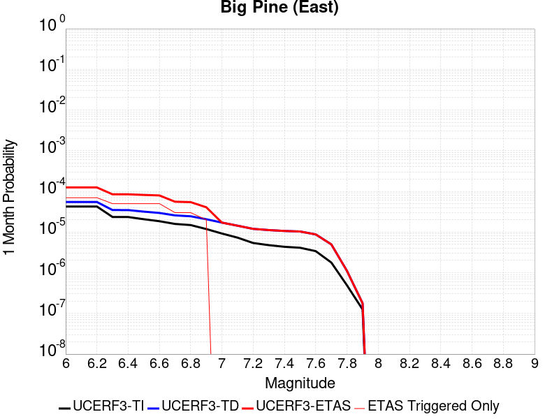 | 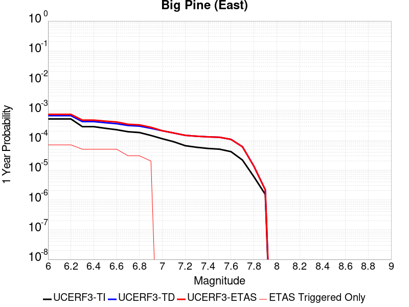 |  |

| Magnitude | 1 wk TI Prob | 1 wk TD Prob | 1 wk ETAS Prob | 1 wk ETAS/TD Gain | 1 wk ETAS Triggered Only | 1 mo TI Prob | 1 mo TD Prob | 1 mo ETAS Prob | 1 mo ETAS/TD Gain | 1 mo ETAS Triggered Only | 1 yr TI Prob | 1 yr TD Prob | 1 yr ETAS Prob | 1 yr ETAS/TD Gain | 1 yr ETAS Triggered Only | 10 yr TI Prob | 10 yr TD Prob | 10 yr ETAS Prob | 10 yr ETAS/TD Gain | 10 yr ETAS Triggered Only |
|-----|-----|-----|-----|-----|-----|-----|-----|-----|-----|-----|-----|-----|-----|-----|-----|-----|-----|-----|-----|-----|
| 6.0 | 9.916913E-6 | 1.2816984E-5 | 1.3433688E-4 | 10.481161 | 1.2152145E-4 | 4.250036E-5 | 5.49289E-5 | 1.7644367E-4 | 3.2122192 | 1.2152145E-4 | 5.173191E-4 | 6.685763E-4 | 7.900165E-4 | 1.18164 | 1.2152145E-4 | 0.0051611643 | 0.006670441 | 0.006791152 | 1.0180963 | 1.2152145E-4 |
| 6.1 | 9.916913E-6 | 1.2816984E-5 | 1.3433688E-4 | 10.481161 | 1.2152145E-4 | 4.250036E-5 | 5.49289E-5 | 1.7644367E-4 | 3.2122192 | 1.2152145E-4 | 5.173191E-4 | 6.685763E-4 | 7.900165E-4 | 1.18164 | 1.2152145E-4 | 0.0051611643 | 0.006670441 | 0.006791152 | 1.0180963 | 1.2152145E-4 |
| 6.2 | 9.916913E-6 | 1.2816984E-5 | 1.3433688E-4 | 10.481161 | 1.2152145E-4 | 4.250036E-5 | 5.49289E-5 | 1.7644367E-4 | 3.2122192 | 1.2152145E-4 | 5.173191E-4 | 6.685763E-4 | 7.900165E-4 | 1.18164 | 1.2152145E-4 | 0.0051611643 | 0.006670441 | 0.006791152 | 1.0180963 | 1.2152145E-4 |
| 6.3 | 5.479711E-6 | 8.112951E-6 | 1.2963341E-4 | 15.978577 | 1.2152145E-4 | 2.3484265E-5 | 3.4769346E-5 | 1.5628657E-4 | 4.4949527 | 1.2152145E-4 | 2.858834E-4 | 4.2323777E-4 | 5.4470776E-4 | 1.2870018 | 1.2152145E-4 | 0.0028551589 | 0.004227244 | 0.0043482515 | 1.0286257 | 1.2152145E-4 |
| 6.4 | 5.465009E-6 | 8.097245E-6 | 1.296177E-4 | 16.007631 | 1.2152145E-4 | 2.3421257E-5 | 3.4702036E-5 | 1.5621926E-4 | 4.5017323 | 1.2152145E-4 | 2.851165E-4 | 4.2241855E-4 | 5.4388866E-4 | 1.2875587 | 1.2152145E-4 | 0.0028475097 | 0.0042190826 | 0.0043400913 | 1.0286813 | 1.2152145E-4 |
| 6.5 | 4.826767E-6 | 7.422301E-6 | 1.2894285E-4 | 17.372355 | 1.2152145E-4 | 2.068598E-5 | 3.180949E-5 | 1.5332707E-4 | 4.8201675 | 1.2152145E-4 | 2.518227E-4 | 3.872145E-4 | 5.086889E-4 | 1.3137134 | 1.2152145E-4 | 0.0025153751 | 0.003868283 | 0.003989334 | 1.0312933 | 1.2152145E-4 |
| 6.6 | 4.3146847E-6 | 6.8822374E-6 | 1.2840285E-4 | 18.657139 | 1.2152145E-4 | 1.8491375E-5 | 2.9494982E-5 | 1.5101285E-4 | 5.1199503 | 1.2152145E-4 | 2.2510924E-4 | 3.590447E-4 | 4.8052252E-4 | 1.3383362 | 1.2152145E-4 | 0.0022488134 | 0.0035874986 | 0.003708584 | 1.0337521 | 1.2152145E-4 |
| 6.7 | 3.6968106E-6 | 5.9954727E-6 | 1.2751619E-4 | 21.268747 | 1.2152145E-4 | 1.5843378E-5 | 2.5694639E-5 | 1.4721297E-4 | 5.7293262 | 1.2152145E-4 | 1.9287605E-4 | 3.1278885E-4 | 4.3427228E-4 | 1.388388 | 1.2152145E-4 | 0.0019270873 | 0.0031262483 | 0.0032473898 | 1.0387498 | 1.2152145E-4 |
| 6.8 | 3.4671132E-6 | 5.702177E-6 | 1.2722293E-4 | 22.31129 | 1.2152145E-4 | 1.4858972E-5 | 2.4437682E-5 | 1.4595616E-4 | 5.972586 | 1.2152145E-4 | 1.8089297E-4 | 2.974896E-4 | 4.189749E-4 | 1.4083682 | 1.2152145E-4 | 0.0018074579 | 0.002973667 | 0.0030948273 | 1.0407443 | 1.2152145E-4 |
| 6.9 | 2.7686972E-6 | 4.825223E-6 | 4.825223E-6 | 1.0 | 0.0 | 1.1865792E-5 | 2.0679368E-5 | 2.0679368E-5 | 1.0 | 0.0 | 1.4445644E-4 | 2.5174298E-4 | 2.5174298E-4 | 1.0 | 0.0 | 0.0014436257 | 0.0025172636 | 0.0025172636 | 1.0 | 0.0 |
| 7.0 | 2.1472624E-6 | 3.9850406E-6 | 3.9850406E-6 | 1.0 | 0.0 | 9.20252E-6 | 1.7078637E-5 | 1.7078637E-5 | 1.0 | 0.0 | 1.12034926E-4 | 2.079131E-4 | 2.079131E-4 | 1.0 | 0.0 | 0.0011197845 | 0.0020798394 | 0.0020798394 | 1.0 | 0.0 |
| 7.1 | 1.7018335E-6 | 3.344876E-6 | 3.344876E-6 | 1.0 | 0.0 | 7.293552E-6 | 1.4335106E-5 | 1.4335106E-5 | 1.0 | 0.0 | 8.879537E-5 | 1.7451629E-4 | 1.7451629E-4 | 1.0 | 0.0 | 8.87599E-4 | 0.0017464145 | 0.0017464145 | 1.0 | 0.0 |
| 7.2 | 1.25603E-6 | 2.794484E-6 | 2.794484E-6 | 1.0 | 0.0 | 5.3829745E-6 | 1.1976307E-5 | 1.1976307E-5 | 1.0 | 0.0 | 6.553574E-5 | 1.4580201E-4 | 1.4580201E-4 | 1.0 | 0.0 | 6.551642E-4 | 0.001459661 | 0.001459661 | 1.0 | 0.0 |
| 7.3 | 1.112297E-6 | 2.610332E-6 | 2.610332E-6 | 1.0 | 0.0 | 4.7669787E-6 | 1.118709E-5 | 1.118709E-5 | 1.0 | 0.0 | 5.803642E-5 | 1.3619453E-4 | 1.3619453E-4 | 1.0 | 0.0 | 5.802127E-4 | 0.0013635408 | 0.0013635408 | 1.0 | 0.0 |
| 7.4 | 1.0137181E-6 | 2.4834917E-6 | 2.4834917E-6 | 1.0 | 0.0 | 4.3444993E-6 | 1.0643494E-5 | 1.0643494E-5 | 1.0 | 0.0 | 5.2892992E-5 | 1.2957705E-4 | 1.2957705E-4 | 1.0 | 0.0 | 5.288041E-4 | 0.0012972289 | 0.0012972289 | 1.0 | 0.0 |
| 7.5 | 9.598608E-7 | 2.4071483E-6 | 2.4071483E-6 | 1.0 | 0.0 | 4.1136827E-6 | 1.031631E-5 | 1.031631E-5 | 1.0 | 0.0 | 5.0082934E-5 | 1.2559404E-4 | 1.2559404E-4 | 1.0 | 0.0 | 5.007165E-4 | 0.0012572526 | 0.0012572526 | 1.0 | 0.0 |
| 7.6 | 7.929459E-7 | 2.0448588E-6 | 2.0448588E-6 | 1.0 | 0.0 | 3.3983351E-6 | 8.763653E-6 | 8.763653E-6 | 1.0 | 0.0 | 4.1373947E-5 | 1.06692416E-4 | 1.06692416E-4 | 1.0 | 0.0 | 4.1366243E-4 | 0.0010685222 | 0.0010685222 | 1.0 | 0.0 |
| 7.7 | 4.155788E-7 | 1.1605589E-6 | 1.1605589E-6 | 1.0 | 0.0 | 1.7810507E-6 | 4.9738146E-6 | 4.9738146E-6 | 1.0 | 0.0 | 2.1684076E-5 | 6.0554554E-5 | 6.0554554E-5 | 1.0 | 0.0 | 2.1681961E-4 | 6.0857297E-4 | 6.0857297E-4 | 1.0 | 0.0 |
| 7.8 | 1.14666925E-7 | 2.592015E-7 | 2.592015E-7 | 1.0 | 0.0 | 4.914296E-7 | 1.1108631E-6 | 1.1108631E-6 | 1.0 | 0.0 | 5.9831386E-6 | 1.3524678E-5 | 1.3524678E-5 | 1.0 | 0.0 | 5.9829777E-5 | 1.3634123E-4 | 1.3634123E-4 | 1.0 | 0.0 |
| 7.9 | 2.9231824E-8 | 4.1463963E-8 | 4.1463963E-8 | 1.0 | 0.0 | 1.2527924E-7 | 1.7770269E-7 | 1.7770269E-7 | 1.0 | 0.0 | 1.5252737E-6 | 2.1635283E-6 | 2.1635283E-6 | 1.0 | 0.0 | 1.5252632E-5 | 2.1967755E-5 | 2.1967755E-5 | 1.0 | 0.0 |

## Dry Mountain
*[(top)](#table-of-contents)*

| 1 Week | 1 Month | 1 Year | 10 Year |
|-----|-----|-----|-----|
|  |  |  |  |

| Magnitude | 1 wk TI Prob | 1 wk TD Prob | 1 wk ETAS Prob | 1 wk ETAS/TD Gain | 1 wk ETAS Triggered Only | 1 mo TI Prob | 1 mo TD Prob | 1 mo ETAS Prob | 1 mo ETAS/TD Gain | 1 mo ETAS Triggered Only | 1 yr TI Prob | 1 yr TD Prob | 1 yr ETAS Prob | 1 yr ETAS/TD Gain | 1 yr ETAS Triggered Only | 10 yr TI Prob | 10 yr TD Prob | 10 yr ETAS Prob | 10 yr ETAS/TD Gain | 10 yr ETAS Triggered Only |
|-----|-----|-----|-----|-----|-----|-----|-----|-----|-----|-----|-----|-----|-----|-----|-----|-----|-----|-----|-----|-----|
| 6.0 | 6.222801E-6 | 6.439381E-6 | 6.439381E-6 | 1.0 | 0.0 | 2.6668875E-5 | 2.7597147E-5 | 2.7597147E-5 | 1.0 | 0.0 | 3.2464517E-4 | 3.3595937E-4 | 4.5743998E-4 | 1.3615932 | 1.2152145E-4 | 0.0032417132 | 0.0033560768 | 0.0034771904 | 1.0360879 | 1.2152145E-4 |
| 6.1 | 6.222801E-6 | 6.439381E-6 | 6.439381E-6 | 1.0 | 0.0 | 2.6668875E-5 | 2.7597147E-5 | 2.7597147E-5 | 1.0 | 0.0 | 3.2464517E-4 | 3.3595937E-4 | 4.5743998E-4 | 1.3615932 | 1.2152145E-4 | 0.0032417132 | 0.0033560768 | 0.0034771904 | 1.0360879 | 1.2152145E-4 |
| 6.2 | 6.222801E-6 | 6.439381E-6 | 6.439381E-6 | 1.0 | 0.0 | 2.6668875E-5 | 2.7597147E-5 | 2.7597147E-5 | 1.0 | 0.0 | 3.2464517E-4 | 3.3595937E-4 | 4.5743998E-4 | 1.3615932 | 1.2152145E-4 | 0.0032417132 | 0.0033560768 | 0.0034771904 | 1.0360879 | 1.2152145E-4 |
| 6.3 | 6.222801E-6 | 6.439381E-6 | 6.439381E-6 | 1.0 | 0.0 | 2.6668875E-5 | 2.7597147E-5 | 2.7597147E-5 | 1.0 | 0.0 | 3.2464517E-4 | 3.3595937E-4 | 4.5743998E-4 | 1.3615932 | 1.2152145E-4 | 0.0032417132 | 0.0033560768 | 0.0034771904 | 1.0360879 | 1.2152145E-4 |
| 6.4 | 6.222801E-6 | 6.439381E-6 | 6.439381E-6 | 1.0 | 0.0 | 2.6668875E-5 | 2.7597147E-5 | 2.7597147E-5 | 1.0 | 0.0 | 3.2464517E-4 | 3.3595937E-4 | 4.5743998E-4 | 1.3615932 | 1.2152145E-4 | 0.0032417132 | 0.0033560768 | 0.0034771904 | 1.0360879 | 1.2152145E-4 |
| 6.5 | 2.8528623E-6 | 2.9521684E-6 | 2.9521684E-6 | 1.0 | 0.0 | 1.22264955E-5 | 1.2652138E-5 | 1.2652138E-5 | 1.0 | 0.0 | 1.4884741E-4 | 1.540376E-4 | 1.540376E-4 | 1.0 | 0.0 | 0.0014874774 | 0.0015401616 | 0.0015401616 | 1.0 | 0.0 |
| 6.6 | 2.8528623E-6 | 2.9521684E-6 | 2.9521684E-6 | 1.0 | 0.0 | 1.22264955E-5 | 1.2652138E-5 | 1.2652138E-5 | 1.0 | 0.0 | 1.4884741E-4 | 1.540376E-4 | 1.540376E-4 | 1.0 | 0.0 | 0.0014874774 | 0.0015401616 | 0.0015401616 | 1.0 | 0.0 |
| 6.7 | 2.541E-6 | 2.6293578E-6 | 2.6293578E-6 | 1.0 | 0.0 | 1.0889954E-5 | 1.1268677E-5 | 1.1268677E-5 | 1.0 | 0.0 | 1.3257713E-4 | 1.3719614E-4 | 1.3719614E-4 | 1.0 | 0.0 | 0.0013249806 | 0.0013719613 | 0.0013719613 | 1.0 | 0.0 |

## Cedar Mtn-Mahogany Mtn
*[(top)](#table-of-contents)*

| 1 Week | 1 Month | 1 Year | 10 Year |
|-----|-----|-----|-----|
|  |  |  |  |

| Magnitude | 1 wk TI Prob | 1 wk TD Prob | 1 wk ETAS Prob | 1 wk ETAS/TD Gain | 1 wk ETAS Triggered Only | 1 mo TI Prob | 1 mo TD Prob | 1 mo ETAS Prob | 1 mo ETAS/TD Gain | 1 mo ETAS Triggered Only | 1 yr TI Prob | 1 yr TD Prob | 1 yr ETAS Prob | 1 yr ETAS/TD Gain | 1 yr ETAS Triggered Only | 10 yr TI Prob | 10 yr TD Prob | 10 yr ETAS Prob | 10 yr ETAS/TD Gain | 10 yr ETAS Triggered Only |
|-----|-----|-----|-----|-----|-----|-----|-----|-----|-----|-----|-----|-----|-----|-----|-----|-----|-----|-----|-----|-----|
| 6.0 | 2.7763876E-5 | 2.9588866E-5 | 1.5110672E-4 | 5.106878 | 1.2152145E-4 | 1.1898261E-4 | 1.2680366E-4 | 2.483097E-4 | 1.9582219 | 1.2152145E-4 | 0.0014476506 | 0.0015428112 | 0.0016641452 | 1.0786448 | 1.2152145E-4 | 0.0143825635 | 0.015328225 | 0.015447884 | 1.0078064 | 1.2152145E-4 |
| 6.1 | 1.6162443E-5 | 1.7142966E-5 | 1.3866233E-4 | 8.088585 | 1.2152145E-4 | 6.926578E-5 | 7.346788E-5 | 1.949804E-4 | 2.6539543 | 1.2152145E-4 | 8.4298453E-4 | 8.941221E-4 | 0.001015535 | 1.13579 | 1.2152145E-4 | 0.008397939 | 0.008907059 | 0.009027498 | 1.0135218 | 1.2152145E-4 |
| 6.2 | 1.6162443E-5 | 1.7142966E-5 | 1.3866233E-4 | 8.088585 | 1.2152145E-4 | 6.926578E-5 | 7.346788E-5 | 1.949804E-4 | 2.6539543 | 1.2152145E-4 | 8.4298453E-4 | 8.941221E-4 | 0.001015535 | 1.13579 | 1.2152145E-4 | 0.008397939 | 0.008907059 | 0.009027498 | 1.0135218 | 1.2152145E-4 |
| 6.3 | 9.746053E-6 | 1.0303152E-5 | 1.3182336E-4 | 12.794468 | 1.2152145E-4 | 4.1768133E-5 | 4.415564E-5 | 1.6567172E-4 | 3.7519946 | 1.2152145E-4 | 5.0840835E-4 | 5.3746643E-4 | 6.5892254E-4 | 1.225979 | 1.2152145E-4 | 0.0050724675 | 0.005362084 | 0.005482954 | 1.0225415 | 1.2152145E-4 |
| 6.4 | 9.746053E-6 | 1.0303152E-5 | 1.3182336E-4 | 12.794468 | 1.2152145E-4 | 4.1768133E-5 | 4.415564E-5 | 1.6567172E-4 | 3.7519946 | 1.2152145E-4 | 5.0840835E-4 | 5.3746643E-4 | 6.5892254E-4 | 1.225979 | 1.2152145E-4 | 0.0050724675 | 0.005362084 | 0.005482954 | 1.0225415 | 1.2152145E-4 |
| 6.5 | 7.290083E-6 | 7.695325E-6 | 7.695325E-6 | 1.0 | 0.0 | 3.124284E-5 | 3.297956E-5 | 3.297956E-5 | 1.0 | 0.0 | 3.8031515E-4 | 4.014543E-4 | 4.014543E-4 | 1.0 | 0.0 | 0.0037966494 | 0.004007511 | 0.004007511 | 1.0 | 0.0 |
| 6.6 | 5.67907E-6 | 5.9891527E-6 | 5.9891527E-6 | 1.0 | 0.0 | 2.4338644E-5 | 2.5667552E-5 | 2.5667552E-5 | 1.0 | 0.0 | 2.962827E-4 | 3.12459E-4 | 3.12459E-4 | 1.0 | 0.0 | 0.0029588798 | 0.003120333 | 0.003120333 | 1.0 | 0.0 |
| 6.7 | 3.4853963E-6 | 3.672631E-6 | 3.672631E-6 | 1.0 | 0.0 | 1.4937327E-5 | 1.5739755E-5 | 1.5739755E-5 | 1.0 | 0.0 | 1.8184677E-4 | 1.916153E-4 | 1.916153E-4 | 1.0 | 0.0 | 0.0018169804 | 0.0019145629 | 0.0019145629 | 1.0 | 0.0 |
| 6.8 | 2.7535168E-6 | 2.9015764E-6 | 2.9015764E-6 | 1.0 | 0.0 | 1.1800733E-5 | 1.2435271E-5 | 1.2435271E-5 | 1.0 | 0.0 | 1.4366445E-4 | 1.5138938E-4 | 1.5138938E-4 | 1.0 | 0.0 | 0.0014357162 | 0.0015129098 | 0.0015129098 | 1.0 | 0.0 |
| 6.9 | 1.6594106E-6 | 1.7496985E-6 | 1.7496985E-6 | 1.0 | 0.0 | 7.1117406E-6 | 7.4986883E-6 | 7.4986883E-6 | 1.0 | 0.0 | 8.6582E-5 | 9.129302E-5 | 9.129302E-5 | 1.0 | 0.0 | 8.654827E-4 | 9.125856E-4 | 9.125856E-4 | 1.0 | 0.0 |
| 7.0 | 5.10215E-7 | 5.389254E-7 | 5.389254E-7 | 1.0 | 0.0 | 2.186634E-6 | 2.3096788E-6 | 2.3096788E-6 | 1.0 | 0.0 | 2.6621943E-5 | 2.8120105E-5 | 2.8120105E-5 | 1.0 | 0.0 | 2.6618753E-4 | 2.81178E-4 | 2.81178E-4 | 1.0 | 0.0 |

## White Mountains
*[(top)](#table-of-contents)*

| 1 Week | 1 Month | 1 Year | 10 Year |
|-----|-----|-----|-----|
|  |  |  |  |

| Magnitude | 1 wk TI Prob | 1 wk TD Prob | 1 wk ETAS Prob | 1 wk ETAS/TD Gain | 1 wk ETAS Triggered Only | 1 mo TI Prob | 1 mo TD Prob | 1 mo ETAS Prob | 1 mo ETAS/TD Gain | 1 mo ETAS Triggered Only | 1 yr TI Prob | 1 yr TD Prob | 1 yr ETAS Prob | 1 yr ETAS/TD Gain | 1 yr ETAS Triggered Only | 10 yr TI Prob | 10 yr TD Prob | 10 yr ETAS Prob | 10 yr ETAS/TD Gain | 10 yr ETAS Triggered Only |
|-----|-----|-----|-----|-----|-----|-----|-----|-----|-----|-----|-----|-----|-----|-----|-----|-----|-----|-----|-----|-----|
| 6.0 | 3.503579E-5 | 3.378405E-5 | 1.553014E-4 | 4.5968847 | 1.2152145E-4 | 1.5014476E-4 | 1.4478143E-4 | 2.662853E-4 | 1.8392227 | 1.2152145E-4 | 0.0018264796 | 0.0017614096 | 0.0018827169 | 1.0688695 | 1.2152145E-4 | 0.018115403 | 0.017486818 | 0.017606216 | 1.0068278 | 1.2152145E-4 |
| 6.1 | 3.503579E-5 | 3.378405E-5 | 1.553014E-4 | 4.5968847 | 1.2152145E-4 | 1.5014476E-4 | 1.4478143E-4 | 2.662853E-4 | 1.8392227 | 1.2152145E-4 | 0.0018264796 | 0.0017614096 | 0.0018827169 | 1.0688695 | 1.2152145E-4 | 0.018115403 | 0.017486818 | 0.017606216 | 1.0068278 | 1.2152145E-4 |
| 6.2 | 3.503579E-5 | 3.378405E-5 | 1.553014E-4 | 4.5968847 | 1.2152145E-4 | 1.5014476E-4 | 1.4478143E-4 | 2.662853E-4 | 1.8392227 | 1.2152145E-4 | 0.0018264796 | 0.0017614096 | 0.0018827169 | 1.0688695 | 1.2152145E-4 | 0.018115403 | 0.017486818 | 0.017606216 | 1.0068278 | 1.2152145E-4 |
| 6.3 | 1.7818425E-5 | 1.5916074E-5 | 1.3743559E-4 | 8.635018 | 1.2152145E-4 | 7.636245E-5 | 6.821004E-5 | 1.897232E-4 | 2.7814555 | 1.2152145E-4 | 9.293162E-4 | 8.301551E-4 | 9.515757E-4 | 1.1462625 | 1.2152145E-4 | 0.009254395 | 0.008271999 | 0.008392515 | 1.0145692 | 1.2152145E-4 |
| 6.4 | 1.7818425E-5 | 1.5916074E-5 | 1.3743559E-4 | 8.635018 | 1.2152145E-4 | 7.636245E-5 | 6.821004E-5 | 1.897232E-4 | 2.7814555 | 1.2152145E-4 | 9.293162E-4 | 8.301551E-4 | 9.515757E-4 | 1.1462625 | 1.2152145E-4 | 0.009254395 | 0.008271999 | 0.008392515 | 1.0145692 | 1.2152145E-4 |
| 6.5 | 1.3397557E-5 | 1.13362685E-5 | 1.3285634E-4 | 11.719583 | 1.2152145E-4 | 5.741684E-5 | 4.858314E-5 | 1.7009869E-4 | 3.5011873 | 1.2152145E-4 | 6.988258E-4 | 5.913462E-4 | 7.1279577E-4 | 1.2053782 | 1.2152145E-4 | 0.006966323 | 0.005898432 | 0.0060192365 | 1.0204808 | 1.2152145E-4 |
| 6.6 | 1.0818695E-5 | 8.625366E-6 | 1.3014577E-4 | 15.088724 | 1.2152145E-4 | 4.6365014E-5 | 3.6965357E-5 | 1.5848232E-4 | 4.28732 | 1.2152145E-4 | 5.6434784E-4 | 4.4996463E-4 | 5.714314E-4 | 1.2699474 | 1.2152145E-4 | 0.005629168 | 0.004490972 | 0.0046119476 | 1.0269375 | 1.2152145E-4 |
| 6.7 | 9.067908E-6 | 6.802442E-6 | 1.2832307E-4 | 18.864264 | 1.2152145E-4 | 3.8861883E-5 | 2.9153016E-5 | 1.5067092E-4 | 5.168279 | 1.2152145E-4 | 4.7304068E-4 | 3.5488335E-4 | 4.7636166E-4 | 1.342305 | 1.2152145E-4 | 0.00472035 | 0.0035434833 | 0.0036645741 | 1.0341728 | 1.2152145E-4 |
| 6.8 | 7.295947E-6 | 4.936391E-6 | 4.936391E-6 | 1.0 | 0.0 | 3.126797E-5 | 2.1155796E-5 | 2.1155796E-5 | 1.0 | 0.0 | 3.8062103E-4 | 2.575425E-4 | 2.575425E-4 | 1.0 | 0.0 | 0.0037996976 | 0.0025725532 | 0.0025725532 | 1.0 | 0.0 |
| 6.9 | 6.2243444E-6 | 3.832213E-6 | 3.832213E-6 | 1.0 | 0.0 | 2.6675489E-5 | 1.642367E-5 | 1.642367E-5 | 1.0 | 0.0 | 3.2472567E-4 | 1.9994036E-4 | 1.9994036E-4 | 1.0 | 0.0 | 0.0032425157 | 0.0019976576 | 0.0019976576 | 1.0 | 0.0 |
| 7.0 | 4.9878413E-6 | 2.6795342E-6 | 2.6795342E-6 | 1.0 | 0.0 | 2.1376287E-5 | 1.14836685E-5 | 1.14836685E-5 | 1.0 | 0.0 | 2.602252E-4 | 1.3980496E-4 | 1.3980496E-4 | 1.0 | 0.0 | 0.002599207 | 0.0013971963 | 0.0013971963 | 1.0 | 0.0 |
| 7.1 | 4.0252844E-6 | 1.8857575E-6 | 1.8857575E-6 | 1.0 | 0.0 | 1.7251105E-5 | 8.081794E-6 | 8.081794E-6 | 1.0 | 0.0 | 2.1001195E-4 | 9.8391516E-5 | 9.8391516E-5 | 1.0 | 0.0 | 0.0020981359 | 9.834924E-4 | 9.834924E-4 | 1.0 | 0.0 |
| 7.2 | 3.3284066E-6 | 1.281964E-6 | 1.281964E-6 | 1.0 | 0.0 | 1.4264522E-5 | 5.494121E-6 | 5.494121E-6 | 1.0 | 0.0 | 1.736567E-4 | 6.688897E-5 | 6.688897E-5 | 1.0 | 0.0 | 0.0017352107 | 6.6869846E-4 | 6.6869846E-4 | 1.0 | 0.0 |
| 7.3 | 2.458226E-6 | 6.05722E-7 | 6.05722E-7 | 1.0 | 0.0 | 1.0535211E-5 | 2.5959491E-6 | 2.5959491E-6 | 1.0 | 0.0 | 1.2825865E-4 | 3.1605257E-5 | 3.1605257E-5 | 1.0 | 0.0 | 0.0012818464 | 3.160114E-4 | 3.160114E-4 | 1.0 | 0.0 |
| 7.4 | 1.965953E-6 | 3.1089303E-7 | 3.1089303E-7 | 1.0 | 0.0 | 8.425486E-6 | 1.332398E-6 | 1.332398E-6 | 1.0 | 0.0 | 1.0257547E-4 | 1.6221828E-5 | 1.6221828E-5 | 1.0 | 0.0 | 0.0010252813 | 1.6220656E-4 | 1.6220656E-4 | 1.0 | 0.0 |
| 7.5 | 1.2014192E-6 | 1.8244253E-7 | 1.8244253E-7 | 1.0 | 0.0 | 5.148929E-6 | 7.8189635E-7 | 7.8189635E-7 | 1.0 | 0.0 | 6.2686406E-5 | 9.519547E-6 | 9.519547E-6 | 1.0 | 0.0 | 6.266873E-4 | 9.519148E-5 | 9.519148E-5 | 1.0 | 0.0 |
| 7.6 | 2.5612175E-7 | 4.8946475E-8 | 4.8946475E-8 | 1.0 | 0.0 | 1.0976642E-6 | 2.0977059E-7 | 2.0977059E-7 | 1.0 | 0.0 | 1.3363979E-5 | 2.5539543E-6 | 2.5539543E-6 | 1.0 | 0.0 | 1.3363175E-4 | 2.5539286E-5 | 2.5539286E-5 | 1.0 | 0.0 |

## Rose Canyon
*[(top)](#table-of-contents)*

| 1 Week | 1 Month | 1 Year | 10 Year |
|-----|-----|-----|-----|
|  |  |  |  |

| Magnitude | 1 wk TI Prob | 1 wk TD Prob | 1 wk ETAS Prob | 1 wk ETAS/TD Gain | 1 wk ETAS Triggered Only | 1 mo TI Prob | 1 mo TD Prob | 1 mo ETAS Prob | 1 mo ETAS/TD Gain | 1 mo ETAS Triggered Only | 1 yr TI Prob | 1 yr TD Prob | 1 yr ETAS Prob | 1 yr ETAS/TD Gain | 1 yr ETAS Triggered Only | 10 yr TI Prob | 10 yr TD Prob | 10 yr ETAS Prob | 10 yr ETAS/TD Gain | 10 yr ETAS Triggered Only |
|-----|-----|-----|-----|-----|-----|-----|-----|-----|-----|-----|-----|-----|-----|-----|-----|-----|-----|-----|-----|-----|
| 6.0 | 4.5923203E-5 | 4.9714225E-5 | 4.9714225E-5 | 1.0 | 0.0 | 1.9679888E-4 | 2.1304491E-4 | 3.3454047E-4 | 1.5702814 | 1.2152145E-4 | 0.0023933933 | 0.0025909345 | 0.002712141 | 1.0467811 | 1.2152145E-4 | 0.023677798 | 0.02563999 | 0.025758397 | 1.004618 | 1.2152145E-4 |
| 6.1 | 4.5923203E-5 | 4.9714225E-5 | 4.9714225E-5 | 1.0 | 0.0 | 1.9679888E-4 | 2.1304491E-4 | 3.3454047E-4 | 1.5702814 | 1.2152145E-4 | 0.0023933933 | 0.0025909345 | 0.002712141 | 1.0467811 | 1.2152145E-4 | 0.023677798 | 0.02563999 | 0.025758397 | 1.004618 | 1.2152145E-4 |
| 6.2 | 2.8844734E-5 | 2.9668723E-5 | 2.9668723E-5 | 1.0 | 0.0 | 1.2361443E-4 | 1.2714567E-4 | 2.4865166E-4 | 1.955644 | 1.2152145E-4 | 0.0015039665 | 0.0015468939 | 0.0016682274 | 1.0784369 | 1.2152145E-4 | 0.0149382865 | 0.015374276 | 0.015493929 | 1.0077827 | 1.2152145E-4 |
| 6.3 | 2.3171577E-5 | 2.3161238E-5 | 2.3161238E-5 | 1.0 | 0.0 | 9.9302975E-5 | 9.9258745E-5 | 2.2076814E-4 | 2.224168 | 1.2152145E-4 | 0.0012083431 | 0.0012078186 | 0.0013291932 | 1.1004908 | 1.2152145E-4 | 0.012017938 | 0.012022437 | 0.012142497 | 1.0099864 | 1.2152145E-4 |
| 6.4 | 2.0066604E-5 | 1.9667024E-5 | 1.9667024E-5 | 1.0 | 0.0 | 8.599689E-5 | 8.4284584E-5 | 2.0579579E-4 | 2.4416778 | 1.2152145E-4 | 0.0010465092 | 0.0010256917 | 0.0011470885 | 1.118356 | 1.2152145E-4 | 0.010415946 | 0.010217559 | 0.010337838 | 1.0117719 | 1.2152145E-4 |
| 6.5 | 1.776989E-5 | 1.7113807E-5 | 1.7113807E-5 | 1.0 | 0.0 | 7.615444E-5 | 7.334287E-5 | 1.948554E-4 | 2.6567738 | 1.2152145E-4 | 9.267859E-4 | 8.925905E-4 | 0.0010140035 | 1.1360232 | 1.2152145E-4 | 0.009229303 | 0.008896211 | 0.009016652 | 1.0135384 | 1.2152145E-4 |
| 6.6 | 1.5227364E-5 | 1.433926E-5 | 1.433926E-5 | 1.0 | 0.0 | 6.52585E-5 | 6.1452556E-5 | 1.8296654E-4 | 2.9773626 | 1.2152145E-4 | 7.942326E-4 | 7.479332E-4 | 8.693638E-4 | 1.1623548 | 1.2152145E-4 | 0.007914 | 0.007458359 | 0.007578974 | 1.0161718 | 1.2152145E-4 |
| 6.7 | 1.2703898E-5 | 1.1673274E-5 | 1.1673274E-5 | 1.0 | 0.0 | 5.4444143E-5 | 5.0027378E-5 | 1.7154275E-4 | 3.4289773 | 1.2152145E-4 | 6.626558E-4 | 6.089174E-4 | 7.303648E-4 | 1.1994481 | 1.2152145E-4 | 0.006606833 | 0.0060750856 | 0.006195869 | 1.0198817 | 1.2152145E-4 |
| 6.8 | 1.1554917E-5 | 1.0609337E-5 | 1.0609337E-5 | 1.0 | 0.0 | 4.9520135E-5 | 4.546782E-5 | 1.6698374E-4 | 3.67257 | 1.2152145E-4 | 6.0274085E-4 | 5.5343413E-4 | 6.748883E-4 | 1.2194556 | 1.2152145E-4 | 0.0060110865 | 0.0055225673 | 0.0056434176 | 1.021883 | 1.2152145E-4 |
| 6.9 | 8.732078E-6 | 7.881357E-6 | 7.881357E-6 | 1.0 | 0.0 | 3.7422655E-5 | 3.3776825E-5 | 1.5529417E-4 | 4.5976543 | 1.2152145E-4 | 4.5552556E-4 | 4.111582E-4 | 5.3262967E-4 | 1.2954373 | 1.2152145E-4 | 0.0045459294 | 0.0041048084 | 0.004225831 | 1.0294831 | 1.2152145E-4 |
| 7.0 | 5.9337494E-6 | 5.1074853E-6 | 5.1074853E-6 | 1.0 | 0.0 | 2.5430107E-5 | 2.188904E-5 | 2.188904E-5 | 1.0 | 0.0 | 3.0956755E-4 | 2.664666E-4 | 2.664666E-4 | 1.0 | 0.0 | 0.0030913667 | 0.0026614866 | 0.0026614866 | 1.0 | 0.0 |
| 7.1 | 5.013409E-6 | 4.1773833E-6 | 4.1773833E-6 | 1.0 | 0.0 | 2.1485863E-5 | 1.7902948E-5 | 1.7902948E-5 | 1.0 | 0.0 | 2.6155898E-4 | 2.179467E-4 | 2.179467E-4 | 1.0 | 0.0 | 0.0026125133 | 0.0021773411 | 0.0021773411 | 1.0 | 0.0 |
| 7.2 | 4.120763E-6 | 3.2821383E-6 | 3.2821383E-6 | 1.0 | 0.0 | 1.7660293E-5 | 1.4066231E-5 | 1.4066231E-5 | 1.0 | 0.0 | 2.1499286E-4 | 1.7124301E-4 | 1.7124301E-4 | 1.0 | 0.0 | 0.0021478499 | 0.00171112 | 0.00171112 | 1.0 | 0.0 |
| 7.3 | 3.2081239E-6 | 2.4405372E-6 | 2.4405372E-6 | 1.0 | 0.0 | 1.374903E-5 | 1.0459404E-5 | 1.0459404E-5 | 1.0 | 0.0 | 1.6738157E-4 | 1.2733586E-4 | 1.2733586E-4 | 1.0 | 0.0 | 0.0016725556 | 0.001272636 | 0.001272636 | 1.0 | 0.0 |
| 7.4 | 2.4194755E-6 | 1.7680634E-6 | 1.7680634E-6 | 1.0 | 0.0 | 1.0369139E-5 | 7.577393E-6 | 7.577393E-6 | 1.0 | 0.0 | 1.2623696E-4 | 9.2250906E-5 | 9.2250906E-5 | 1.0 | 0.0 | 0.0012616527 | 9.2213147E-4 | 9.2213147E-4 | 1.0 | 0.0 |
| 7.5 | 1.3842889E-6 | 9.3786275E-7 | 9.3786275E-7 | 1.0 | 0.0 | 5.9326535E-6 | 4.019406E-6 | 4.019406E-6 | 1.0 | 0.0 | 7.222766E-5 | 4.8935202E-5 | 4.8935202E-5 | 1.0 | 0.0 | 7.220419E-4 | 4.892478E-4 | 4.892478E-4 | 1.0 | 0.0 |
| 7.6 | 1.0021575E-6 | 6.411463E-7 | 6.411463E-7 | 1.0 | 0.0 | 4.2949537E-6 | 2.7477672E-6 | 2.7477672E-6 | 1.0 | 0.0 | 5.2289808E-5 | 3.3453573E-5 | 3.3453573E-5 | 1.0 | 0.0 | 5.2277505E-4 | 3.344875E-4 | 3.344875E-4 | 1.0 | 0.0 |
| 7.7 | 8.7620116E-8 | 6.4492404E-8 | 6.4492404E-8 | 1.0 | 0.0 | 3.7551473E-7 | 2.76396E-7 | 2.76396E-7 | 1.0 | 0.0 | 4.5718825E-6 | 3.3651165E-6 | 3.3651165E-6 | 1.0 | 0.0 | 4.5717883E-5 | 3.3650686E-5 | 3.3650686E-5 | 1.0 | 0.0 |

## Ventura-Pitas Point
*[(top)](#table-of-contents)*

| 1 Week | 1 Month | 1 Year | 10 Year |
|-----|-----|-----|-----|
|  |  |  |  |

| Magnitude | 1 wk TI Prob | 1 wk TD Prob | 1 wk ETAS Prob | 1 wk ETAS/TD Gain | 1 wk ETAS Triggered Only | 1 mo TI Prob | 1 mo TD Prob | 1 mo ETAS Prob | 1 mo ETAS/TD Gain | 1 mo ETAS Triggered Only | 1 yr TI Prob | 1 yr TD Prob | 1 yr ETAS Prob | 1 yr ETAS/TD Gain | 1 yr ETAS Triggered Only | 10 yr TI Prob | 10 yr TD Prob | 10 yr ETAS Prob | 10 yr ETAS/TD Gain | 10 yr ETAS Triggered Only |
|-----|-----|-----|-----|-----|-----|-----|-----|-----|-----|-----|-----|-----|-----|-----|-----|-----|-----|-----|-----|-----|
| 6.0 | 3.3179622E-5 | 3.3735185E-5 | 1.5525254E-4 | 4.602095 | 1.2152145E-4 | 1.4219063E-4 | 1.445728E-4 | 2.6607668E-4 | 1.840434 | 1.2152145E-4 | 0.0017297962 | 0.0017590096 | 0.0018803173 | 1.0689636 | 1.2152145E-4 | 0.017163932 | 0.0174764 | 0.017595798 | 1.0068319 | 1.2152145E-4 |
| 6.1 | 3.3179622E-5 | 3.3735185E-5 | 1.5525254E-4 | 4.602095 | 1.2152145E-4 | 1.4219063E-4 | 1.445728E-4 | 2.6607668E-4 | 1.840434 | 1.2152145E-4 | 0.0017297962 | 0.0017590096 | 0.0018803173 | 1.0689636 | 1.2152145E-4 | 0.017163932 | 0.0174764 | 0.017595798 | 1.0068319 | 1.2152145E-4 |
| 6.2 | 3.3179622E-5 | 3.3735185E-5 | 1.5525254E-4 | 4.602095 | 1.2152145E-4 | 1.4219063E-4 | 1.445728E-4 | 2.6607668E-4 | 1.840434 | 1.2152145E-4 | 0.0017297962 | 0.0017590096 | 0.0018803173 | 1.0689636 | 1.2152145E-4 | 0.017163932 | 0.0174764 | 0.017595798 | 1.0068319 | 1.2152145E-4 |
| 6.3 | 3.3179622E-5 | 3.3735185E-5 | 1.5525254E-4 | 4.602095 | 1.2152145E-4 | 1.4219063E-4 | 1.445728E-4 | 2.6607668E-4 | 1.840434 | 1.2152145E-4 | 0.0017297962 | 0.0017590096 | 0.0018803173 | 1.0689636 | 1.2152145E-4 | 0.017163932 | 0.0174764 | 0.017595798 | 1.0068319 | 1.2152145E-4 |
| 6.4 | 1.8754668E-5 | 1.701961E-5 | 1.3853899E-4 | 8.139962 | 1.2152145E-4 | 8.037467E-5 | 7.293928E-5 | 1.9445186E-4 | 2.6659417 | 1.2152145E-4 | 9.781223E-4 | 8.8769704E-4 | 0.0010091106 | 1.1367737 | 1.2152145E-4 | 0.009738282 | 0.008843848 | 0.008964295 | 1.0136193 | 1.2152145E-4 |
| 6.5 | 1.8754668E-5 | 1.701961E-5 | 1.3853899E-4 | 8.139962 | 1.2152145E-4 | 8.037467E-5 | 7.293928E-5 | 1.9445186E-4 | 2.6659417 | 1.2152145E-4 | 9.781223E-4 | 8.8769704E-4 | 0.0010091106 | 1.1367737 | 1.2152145E-4 | 0.009738282 | 0.008843848 | 0.008964295 | 1.0136193 | 1.2152145E-4 |
| 6.6 | 1.4361558E-5 | 1.2122275E-5 | 1.3364226E-4 | 11.024519 | 1.2152145E-4 | 6.154808E-5 | 5.1951585E-5 | 1.7346672E-4 | 3.3390074 | 1.2152145E-4 | 7.490902E-4 | 6.3232926E-4 | 7.537739E-4 | 1.1920592 | 1.2152145E-4 | 0.0074657016 | 0.0063055577 | 0.0064263125 | 1.0191506 | 1.2152145E-4 |
| 6.7 | 1.4361558E-5 | 1.2122275E-5 | 1.3364226E-4 | 11.024519 | 1.2152145E-4 | 6.154808E-5 | 5.1951585E-5 | 1.7346672E-4 | 3.3390074 | 1.2152145E-4 | 7.490902E-4 | 6.3232926E-4 | 7.537739E-4 | 1.1920592 | 1.2152145E-4 | 0.0074657016 | 0.0063055577 | 0.0064263125 | 1.0191506 | 1.2152145E-4 |
| 6.8 | 1.3663846E-5 | 1.13444175E-5 | 1.3286449E-4 | 11.711883 | 1.2152145E-4 | 5.8558027E-5 | 4.861804E-5 | 1.7013359E-4 | 3.499392 | 1.2152145E-4 | 7.127108E-4 | 5.917658E-4 | 7.132153E-4 | 1.2052324 | 1.2152145E-4 | 0.007104293 | 0.005902116 | 0.0060229204 | 1.020468 | 1.2152145E-4 |
| 6.9 | 1.3644157E-5 | 1.1322519E-5 | 1.3284259E-4 | 11.732601 | 1.2152145E-4 | 5.8473648E-5 | 4.8524187E-5 | 1.7003974E-4 | 3.5042264 | 1.2152145E-4 | 7.116841E-4 | 5.9062376E-4 | 7.1207347E-4 | 1.2056295 | 1.2152145E-4 | 0.007094092 | 0.0058907564 | 0.006011562 | 1.0205077 | 1.2152145E-4 |
| 7.0 | 1.3568845E-5 | 1.1242086E-5 | 1.3276217E-4 | 11.80939 | 1.2152145E-4 | 5.8150898E-5 | 4.817949E-5 | 1.6969508E-4 | 3.5221438 | 1.2152145E-4 | 7.077572E-4 | 5.864293E-4 | 7.078795E-4 | 1.2071011 | 1.2152145E-4 | 0.007055073 | 0.0058490336 | 0.005969844 | 1.0206548 | 1.2152145E-4 |
| 7.1 | 1.306572E-5 | 1.072054E-5 | 1.3224069E-4 | 12.335264 | 1.2152145E-4 | 5.599474E-5 | 4.5944373E-5 | 1.6746024E-4 | 3.6448476 | 1.2152145E-4 | 6.815227E-4 | 5.5923103E-4 | 6.806845E-4 | 1.2171794 | 1.2152145E-4 | 0.0067943637 | 0.0055784425 | 0.005699286 | 1.0216626 | 1.2152145E-4 |
| 7.2 | 1.232604E-5 | 9.995143E-6 | 1.3151538E-4 | 13.157928 | 1.2152145E-4 | 5.2824813E-5 | 4.2835632E-5 | 1.6435188E-4 | 3.8368027 | 1.2152145E-4 | 6.429523E-4 | 5.214008E-4 | 6.428589E-4 | 1.2329457 | 1.2152145E-4 | 0.0064109527 | 0.005201967 | 0.0053228564 | 1.0232391 | 1.2152145E-4 |
| 7.3 | 1.0917261E-5 | 8.84384E-6 | 1.3036422E-4 | 14.740679 | 1.2152145E-4 | 4.678742E-5 | 3.790163E-5 | 1.5941847E-4 | 4.206111 | 1.2152145E-4 | 5.69488E-4 | 4.6135622E-4 | 5.828216E-4 | 1.263279 | 1.2152145E-4 | 0.0056803077 | 0.00460415 | 0.004725112 | 1.0262724 | 1.2152145E-4 |
| 7.4 | 1.039959E-5 | 8.423562E-6 | 1.2994399E-4 | 15.426251 | 1.2152145E-4 | 4.456891E-5 | 3.610049E-5 | 1.5761756E-4 | 4.366078 | 1.2152145E-4 | 5.424914E-4 | 4.3943635E-4 | 5.609044E-4 | 1.2764179 | 1.2152145E-4 | 0.0054116896 | 0.004385836 | 0.0045068245 | 1.0275862 | 1.2152145E-4 |
| 7.5 | 9.015877E-6 | 7.2975445E-6 | 1.2881811E-4 | 17.652254 | 1.2152145E-4 | 3.86389E-5 | 3.1274823E-5 | 1.5279248E-4 | 4.885478 | 1.2152145E-4 | 4.7032707E-4 | 3.8070587E-4 | 5.0218106E-4 | 1.3190788 | 1.2152145E-4 | 0.004693329 | 0.0038006818 | 0.003921741 | 1.0318521 | 1.2152145E-4 |
| 7.6 | 4.900162E-6 | 3.8741155E-6 | 3.8741155E-6 | 1.0 | 0.0 | 2.1000526E-5 | 1.6603248E-5 | 1.6603248E-5 | 1.0 | 0.0 | 2.556514E-4 | 2.0212591E-4 | 2.0212591E-4 | 1.0 | 0.0 | 0.0025535747 | 0.0020194345 | 0.0020194345 | 1.0 | 0.0 |
| 7.7 | 3.8850626E-6 | 3.1267302E-6 | 3.1267302E-6 | 1.0 | 0.0 | 1.6650163E-5 | 1.3400205E-5 | 1.3400205E-5 | 1.0 | 0.0 | 2.0269687E-4 | 1.6313537E-4 | 1.6313537E-4 | 1.0 | 0.0 | 0.002025121 | 0.0016301654 | 0.0016301654 | 1.0 | 0.0 |
| 7.8 | 2.4654719E-6 | 2.029875E-6 | 2.029875E-6 | 1.0 | 0.0 | 1.0566265E-5 | 8.699436E-6 | 8.699436E-6 | 1.0 | 0.0 | 1.2863669E-4 | 1.0591053E-4 | 1.0591053E-4 | 1.0 | 0.0 | 0.0012856225 | 0.0010586053 | 0.0010586053 | 1.0 | 0.0 |
| 7.9 | 4.095894E-7 | 3.2764765E-7 | 3.2764765E-7 | 1.0 | 0.0 | 1.7553821E-6 | 1.4042034E-6 | 1.4042034E-6 | 1.0 | 0.0 | 2.1371567E-5 | 1.7096047E-5 | 1.7096047E-5 | 1.0 | 0.0 | 2.1369511E-4 | 1.7094762E-4 | 1.7094762E-4 | 1.0 | 0.0 |
| 8.0 | 7.791402E-9 | 5.683497E-9 | 5.683497E-9 | 1.0 | 0.0 | 3.3391725E-8 | 2.4357844E-8 | 2.4357844E-8 | 1.0 | 0.0 | 4.0654416E-7 | 2.9655675E-7 | 2.9655675E-7 | 1.0 | 0.0 | 4.065434E-6 | 2.9655655E-6 | 2.9655655E-6 | 1.0 | 0.0 |

## Santa Cruz Catalina Ridge alt1
*[(top)](#table-of-contents)*

| 1 Week | 1 Month | 1 Year | 10 Year |
|-----|-----|-----|-----|
|  | 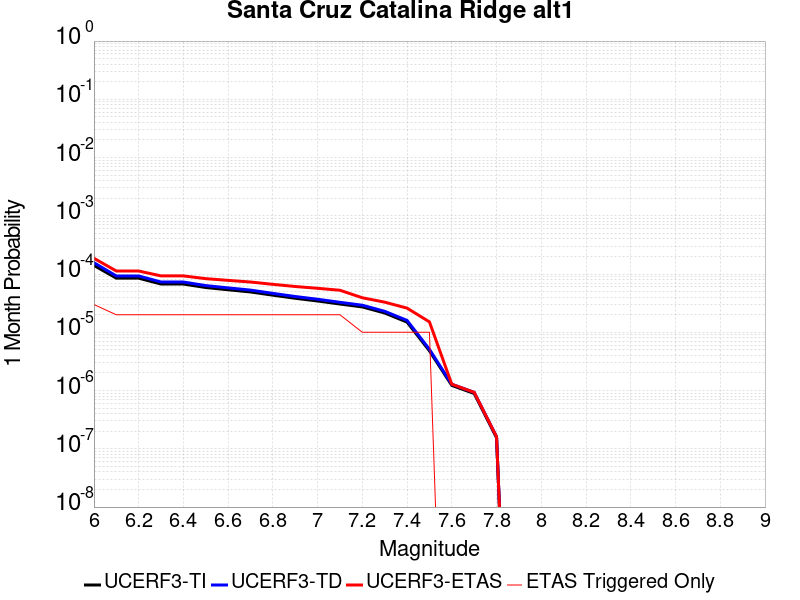 |  |  |

| Magnitude | 1 wk TI Prob | 1 wk TD Prob | 1 wk ETAS Prob | 1 wk ETAS/TD Gain | 1 wk ETAS Triggered Only | 1 mo TI Prob | 1 mo TD Prob | 1 mo ETAS Prob | 1 mo ETAS/TD Gain | 1 mo ETAS Triggered Only | 1 yr TI Prob | 1 yr TD Prob | 1 yr ETAS Prob | 1 yr ETAS/TD Gain | 1 yr ETAS Triggered Only | 10 yr TI Prob | 10 yr TD Prob | 10 yr ETAS Prob | 10 yr ETAS/TD Gain | 10 yr ETAS Triggered Only |
|-----|-----|-----|-----|-----|-----|-----|-----|-----|-----|-----|-----|-----|-----|-----|-----|-----|-----|-----|-----|-----|
| 6.0 | 3.2833184E-5 | 3.65584E-5 | 3.65584E-5 | 1.0 | 0.0 | 1.4070606E-4 | 1.5667039E-4 | 1.5667039E-4 | 1.0 | 0.0 | 0.00171175 | 0.0019059596 | 0.0019059596 | 1.0 | 0.0 | 0.016986247 | 0.018913029 | 0.019032253 | 1.0063038 | 1.2152145E-4 |
| 6.1 | 1.9835548E-5 | 2.1659505E-5 | 2.1659505E-5 | 1.0 | 0.0 | 8.500672E-5 | 9.282326E-5 | 9.282326E-5 | 1.0 | 0.0 | 0.0010344655 | 0.0011295575 | 0.0011295575 | 1.0 | 0.0 | 0.010296632 | 0.011240295 | 0.011360451 | 1.0106897 | 1.2152145E-4 |
| 6.2 | 1.9835548E-5 | 2.1659505E-5 | 2.1659505E-5 | 1.0 | 0.0 | 8.500672E-5 | 9.282326E-5 | 9.282326E-5 | 1.0 | 0.0 | 0.0010344655 | 0.0011295575 | 0.0011295575 | 1.0 | 0.0 | 0.010296632 | 0.011240295 | 0.011360451 | 1.0106897 | 1.2152145E-4 |
| 6.3 | 1.5728183E-5 | 1.703395E-5 | 1.703395E-5 | 1.0 | 0.0 | 6.7404755E-5 | 7.300063E-5 | 7.300063E-5 | 1.0 | 0.0 | 8.2034385E-4 | 8.884264E-4 | 8.884264E-4 | 1.0 | 0.0 | 0.008173222 | 0.008849427 | 0.008969873 | 1.0136106 | 1.2152145E-4 |
| 6.4 | 1.5728183E-5 | 1.703395E-5 | 1.703395E-5 | 1.0 | 0.0 | 6.7404755E-5 | 7.300063E-5 | 7.300063E-5 | 1.0 | 0.0 | 8.2034385E-4 | 8.884264E-4 | 8.884264E-4 | 1.0 | 0.0 | 0.008173222 | 0.008849427 | 0.008969873 | 1.0136106 | 1.2152145E-4 |
| 6.5 | 1.3707734E-5 | 1.4794522E-5 | 1.4794522E-5 | 1.0 | 0.0 | 5.8746107E-5 | 6.3403575E-5 | 6.3403575E-5 | 1.0 | 0.0 | 7.1499916E-4 | 7.716686E-4 | 7.716686E-4 | 1.0 | 0.0 | 0.0071270303 | 0.0076902895 | 0.0078108767 | 1.0156804 | 1.2152145E-4 |
| 6.6 | 1.2539813E-5 | 1.3510219E-5 | 1.3510219E-5 | 1.0 | 0.0 | 5.3740947E-5 | 5.789967E-5 | 5.789967E-5 | 1.0 | 0.0 | 6.540996E-4 | 7.0470315E-4 | 7.0470315E-4 | 1.0 | 0.0 | 0.0065217763 | 0.0070249885 | 0.0071456563 | 1.017177 | 1.2152145E-4 |
| 6.7 | 1.1504083E-5 | 1.2377375E-5 | 1.2377375E-5 | 1.0 | 0.0 | 4.930228E-5 | 5.3044827E-5 | 5.3044827E-5 | 1.0 | 0.0 | 6.0008996E-4 | 6.456314E-4 | 6.456314E-4 | 1.0 | 0.0 | 0.005984721 | 0.006437786 | 0.006558525 | 1.0187547 | 1.2152145E-4 |
| 6.8 | 1.012739E-5 | 1.0877071E-5 | 1.0877071E-5 | 1.0 | 0.0 | 4.340238E-5 | 4.6615194E-5 | 4.6615194E-5 | 1.0 | 0.0 | 5.282958E-4 | 5.673937E-4 | 5.673937E-4 | 1.0 | 0.0 | 0.0052704164 | 0.0056596193 | 0.0057804533 | 1.0213501 | 1.2152145E-4 |
| 6.9 | 8.9607865E-6 | 9.609117E-6 | 9.609117E-6 | 1.0 | 0.0 | 3.8402806E-5 | 4.1181287E-5 | 4.1181287E-5 | 1.0 | 0.0 | 4.6745385E-4 | 5.012679E-4 | 5.012679E-4 | 1.0 | 0.0 | 0.0046647177 | 0.005001492 | 0.005001492 | 1.0 | 0.0 |
| 7.0 | 8.046829E-6 | 8.619746E-6 | 8.619746E-6 | 1.0 | 0.0 | 3.4485955E-5 | 3.694125E-5 | 3.694125E-5 | 1.0 | 0.0 | 4.1978562E-4 | 4.496677E-4 | 4.496677E-4 | 1.0 | 0.0 | 0.004189935 | 0.0044876686 | 0.0044876686 | 1.0 | 0.0 |
| 7.1 | 7.136131E-6 | 7.637656E-6 | 7.637656E-6 | 1.0 | 0.0 | 3.0583058E-5 | 3.2732405E-5 | 3.2732405E-5 | 1.0 | 0.0 | 3.7228514E-4 | 3.9844486E-4 | 3.9844486E-4 | 1.0 | 0.0 | 0.0037166206 | 0.003977381 | 0.003977381 | 1.0 | 0.0 |
| 7.2 | 6.362014E-6 | 6.8049585E-6 | 6.8049585E-6 | 1.0 | 0.0 | 2.726549E-5 | 2.9163786E-5 | 2.9163786E-5 | 1.0 | 0.0 | 3.3190678E-4 | 3.550119E-4 | 3.550119E-4 | 1.0 | 0.0 | 0.0033141149 | 0.003544516 | 0.003544516 | 1.0 | 0.0 |
| 7.3 | 5.004101E-6 | 5.351715E-6 | 5.351715E-6 | 1.0 | 0.0 | 2.1445969E-5 | 2.2935723E-5 | 2.2935723E-5 | 1.0 | 0.0 | 2.6107338E-4 | 2.792072E-4 | 2.792072E-4 | 1.0 | 0.0 | 0.002607669 | 0.0027886187 | 0.0027886187 | 1.0 | 0.0 |
| 7.4 | 3.4901443E-6 | 3.7320526E-6 | 3.7320526E-6 | 1.0 | 0.0 | 1.4957676E-5 | 1.5994416E-5 | 1.5994416E-5 | 1.0 | 0.0 | 1.8209449E-4 | 1.9471499E-4 | 1.9471499E-4 | 1.0 | 0.0 | 0.0018194534 | 0.0019454823 | 0.0019454823 | 1.0 | 0.0 |
| 7.5 | 1.1215045E-6 | 1.189387E-6 | 1.189387E-6 | 1.0 | 0.0 | 4.806439E-6 | 5.097363E-6 | 5.097363E-6 | 1.0 | 0.0 | 5.851682E-5 | 6.205866E-5 | 6.205866E-5 | 1.0 | 0.0 | 5.850142E-4 | 6.2041637E-4 | 6.2041637E-4 | 1.0 | 0.0 |
| 7.6 | 2.8599047E-7 | 2.9951994E-7 | 2.9951994E-7 | 1.0 | 0.0 | 1.2256729E-6 | 1.2836562E-6 | 1.2836562E-6 | 1.0 | 0.0 | 1.4922465E-5 | 1.5628404E-5 | 1.5628404E-5 | 1.0 | 0.0 | 1.4921463E-4 | 1.5627318E-4 | 1.5627318E-4 | 1.0 | 0.0 |
| 7.7 | 2.0781519E-7 | 2.1744323E-7 | 2.1744323E-7 | 1.0 | 0.0 | 8.906362E-7 | 9.3189925E-7 | 9.3189925E-7 | 1.0 | 0.0 | 1.08434415E-5 | 1.13458145E-5 | 1.13458145E-5 | 1.0 | 0.0 | 1.0842913E-4 | 1.1345245E-4 | 1.1345245E-4 | 1.0 | 0.0 |
| 7.8 | 3.614776E-8 | 3.764102E-8 | 3.764102E-8 | 1.0 | 0.0 | 1.5491896E-7 | 1.6131864E-7 | 1.6131864E-7 | 1.0 | 0.0 | 1.8861368E-6 | 1.9640527E-6 | 1.9640527E-6 | 1.0 | 0.0 | 1.8861208E-5 | 1.9640367E-5 | 1.9640367E-5 | 1.0 | 0.0 |

## Earthquake Valley (No  Extension)
*[(top)](#table-of-contents)*

| 1 Week | 1 Month | 1 Year | 10 Year |
|-----|-----|-----|-----|
|  |  |  |  |

| Magnitude | 1 wk TI Prob | 1 wk TD Prob | 1 wk ETAS Prob | 1 wk ETAS/TD Gain | 1 wk ETAS Triggered Only | 1 mo TI Prob | 1 mo TD Prob | 1 mo ETAS Prob | 1 mo ETAS/TD Gain | 1 mo ETAS Triggered Only | 1 yr TI Prob | 1 yr TD Prob | 1 yr ETAS Prob | 1 yr ETAS/TD Gain | 1 yr ETAS Triggered Only | 10 yr TI Prob | 10 yr TD Prob | 10 yr ETAS Prob | 10 yr ETAS/TD Gain | 10 yr ETAS Triggered Only |
|-----|-----|-----|-----|-----|-----|-----|-----|-----|-----|-----|-----|-----|-----|-----|-----|-----|-----|-----|-----|-----|
| 6.0 | 2.1859703E-5 | 2.5198362E-5 | 1.4671675E-4 | 5.8224716 | 1.2152145E-4 | 9.3681076E-5 | 1.07989326E-4 | 2.2949764E-4 | 2.1251884 | 1.2152145E-4 | 0.0011399703 | 0.001314122 | 0.0014354838 | 1.0923519 | 1.2152145E-4 | 0.011341401 | 0.013077871 | 0.013197804 | 1.0091707 | 1.2152145E-4 |
| 6.1 | 2.1859703E-5 | 2.5198362E-5 | 1.4671675E-4 | 5.8224716 | 1.2152145E-4 | 9.3681076E-5 | 1.07989326E-4 | 2.2949764E-4 | 2.1251884 | 1.2152145E-4 | 0.0011399703 | 0.001314122 | 0.0014354838 | 1.0923519 | 1.2152145E-4 | 0.011341401 | 0.013077871 | 0.013197804 | 1.0091707 | 1.2152145E-4 |
| 6.2 | 2.1859703E-5 | 2.5198362E-5 | 1.4671675E-4 | 5.8224716 | 1.2152145E-4 | 9.3681076E-5 | 1.07989326E-4 | 2.2949764E-4 | 2.1251884 | 1.2152145E-4 | 0.0011399703 | 0.001314122 | 0.0014354838 | 1.0923519 | 1.2152145E-4 | 0.011341401 | 0.013077871 | 0.013197804 | 1.0091707 | 1.2152145E-4 |
| 6.3 | 2.1859703E-5 | 2.5198362E-5 | 1.4671675E-4 | 5.8224716 | 1.2152145E-4 | 9.3681076E-5 | 1.07989326E-4 | 2.2949764E-4 | 2.1251884 | 1.2152145E-4 | 0.0011399703 | 0.001314122 | 0.0014354838 | 1.0923519 | 1.2152145E-4 | 0.011341401 | 0.013077871 | 0.013197804 | 1.0091707 | 1.2152145E-4 |
| 6.4 | 2.1859703E-5 | 2.5198362E-5 | 1.4671675E-4 | 5.8224716 | 1.2152145E-4 | 9.3681076E-5 | 1.07989326E-4 | 2.2949764E-4 | 2.1251884 | 1.2152145E-4 | 0.0011399703 | 0.001314122 | 0.0014354838 | 1.0923519 | 1.2152145E-4 | 0.011341401 | 0.013077871 | 0.013197804 | 1.0091707 | 1.2152145E-4 |
| 6.5 | 2.1859703E-5 | 2.5198362E-5 | 1.4671675E-4 | 5.8224716 | 1.2152145E-4 | 9.3681076E-5 | 1.07989326E-4 | 2.2949764E-4 | 2.1251884 | 1.2152145E-4 | 0.0011399703 | 0.001314122 | 0.0014354838 | 1.0923519 | 1.2152145E-4 | 0.011341401 | 0.013077871 | 0.013197804 | 1.0091707 | 1.2152145E-4 |
| 6.6 | 1.597E-5 | 1.8356275E-5 | 1.398755E-4 | 7.6200366 | 1.2152145E-4 | 6.8441055E-5 | 7.866787E-5 | 2.0017977E-4 | 2.5446188 | 1.2152145E-4 | 8.329513E-4 | 9.574478E-4 | 0.0010788529 | 1.1268008 | 1.2152145E-4 | 0.008298361 | 0.009541836 | 0.009662198 | 1.0126141 | 1.2152145E-4 |
| 6.7 | 1.597E-5 | 1.8356275E-5 | 1.398755E-4 | 7.6200366 | 1.2152145E-4 | 6.8441055E-5 | 7.866787E-5 | 2.0017977E-4 | 2.5446188 | 1.2152145E-4 | 8.329513E-4 | 9.574478E-4 | 0.0010788529 | 1.1268008 | 1.2152145E-4 | 0.008298361 | 0.009541836 | 0.009662198 | 1.0126141 | 1.2152145E-4 |
| 6.8 | 1.5315149E-5 | 1.7602091E-5 | 1.391214E-4 | 7.9036856 | 1.2152145E-4 | 6.5634704E-5 | 7.543584E-5 | 1.9694812E-4 | 2.610803 | 1.2152145E-4 | 7.988095E-4 | 9.181311E-4 | 0.001039541 | 1.1322359 | 1.2152145E-4 | 0.007959441 | 0.009151919 | 0.009272329 | 1.0131568 | 1.2152145E-4 |
| 6.9 | 1.3634728E-5 | 1.5675821E-5 | 1.5675821E-5 | 1.0 | 0.0 | 5.8433237E-5 | 6.718082E-5 | 6.718082E-5 | 1.0 | 0.0 | 7.1119244E-4 | 8.177017E-4 | 8.177017E-4 | 1.0 | 0.0 | 0.007089207 | 0.008155 | 0.008155 | 1.0 | 0.0 |
| 7.0 | 1.3496271E-5 | 1.5517853E-5 | 1.5517853E-5 | 1.0 | 0.0 | 5.783988E-5 | 6.650385E-5 | 6.650385E-5 | 1.0 | 0.0 | 7.03973E-4 | 8.094657E-4 | 8.094657E-4 | 1.0 | 0.0 | 0.007017471 | 0.0080732405 | 0.0080732405 | 1.0 | 0.0 |
| 7.1 | 8.242798E-6 | 9.4726E-6 | 9.4726E-6 | 1.0 | 0.0 | 3.53258E-5 | 4.0596606E-5 | 4.0596606E-5 | 1.0 | 0.0 | 4.300067E-4 | 4.9421866E-4 | 4.9421866E-4 | 1.0 | 0.0 | 0.004291756 | 0.0049377717 | 0.0049377717 | 1.0 | 0.0 |
| 7.2 | 2.6506527E-7 | 2.2560312E-7 | 2.2560312E-7 | 1.0 | 0.0 | 1.1359936E-6 | 9.668702E-7 | 9.668702E-7 | 1.0 | 0.0 | 1.3830633E-5 | 1.17715845E-5 | 1.17715845E-5 | 1.0 | 0.0 | 1.3829772E-4 | 1.1771003E-4 | 1.1771003E-4 | 1.0 | 0.0 |
| 7.3 | 2.5810488E-7 | 2.1955442E-7 | 2.1955442E-7 | 1.0 | 0.0 | 1.1061633E-6 | 9.409472E-7 | 9.409472E-7 | 1.0 | 0.0 | 1.3467455E-5 | 1.1455976E-5 | 1.1455976E-5 | 1.0 | 0.0 | 1.3466639E-4 | 1.1455427E-4 | 1.1455427E-4 | 1.0 | 0.0 |
| 7.4 | 2.2676066E-7 | 1.9110601E-7 | 1.9110601E-7 | 1.0 | 0.0 | 9.71831E-7 | 8.190255E-7 | 8.190255E-7 | 1.0 | 0.0 | 1.1831979E-5 | 9.9715935E-6 | 9.9715935E-6 | 1.0 | 0.0 | 1.1831349E-4 | 9.9711855E-5 | 9.9711855E-5 | 1.0 | 0.0 |
| 7.5 | 1.5553917E-7 | 1.3112096E-7 | 1.3112096E-7 | 1.0 | 0.0 | 6.6659624E-7 | 5.619469E-7 | 5.619469E-7 | 1.0 | 0.0 | 8.115779E-6 | 6.8416834E-6 | 6.8416834E-6 | 1.0 | 0.0 | 8.115482E-5 | 6.841495E-5 | 6.841495E-5 | 1.0 | 0.0 |
| 7.6 | 1.3448629E-7 | 1.1288419E-7 | 1.1288419E-7 | 1.0 | 0.0 | 5.7636964E-7 | 4.837893E-7 | 4.837893E-7 | 1.0 | 0.0 | 7.017278E-6 | 5.890121E-6 | 5.890121E-6 | 1.0 | 0.0 | 7.0170565E-5 | 5.889986E-5 | 5.889986E-5 | 1.0 | 0.0 |
| 7.7 | 2.9719402E-8 | 1.458206E-8 | 1.458206E-8 | 1.0 | 0.0 | 1.2736886E-7 | 6.249454E-8 | 6.249454E-8 | 1.0 | 0.0 | 1.5507147E-6 | 7.608708E-7 | 7.608708E-7 | 1.0 | 0.0 | 1.550704E-5 | 7.6086876E-6 | 7.6086876E-6 | 1.0 | 0.0 |
| 7.8 | 7.4390196E-9 | 3.2502152E-9 | 3.2502152E-9 | 1.0 | 0.0 | 3.1881513E-8 | 1.3929493E-8 | 1.3929493E-8 | 1.0 | 0.0 | 3.8815733E-7 | 1.6959156E-7 | 1.6959156E-7 | 1.0 | 0.0 | 3.8815665E-6 | 1.6959145E-6 | 1.6959145E-6 | 1.0 | 0.0 |
| 7.9 | 1.5373532E-9 | 8.440161E-10 | 8.440161E-10 | 1.0 | 0.0 | 6.5886567E-9 | 3.6172119E-9 | 3.6172119E-9 | 1.0 | 0.0 | 8.021689E-8 | 4.4039556E-8 | 4.4039556E-8 | 1.0 | 0.0 | 8.0216864E-7 | 4.4039552E-7 | 4.4039552E-7 | 1.0 | 0.0 |

## San Andreas (North Branch Mill Creek)
*[(top)](#table-of-contents)*

| 1 Week | 1 Month | 1 Year | 10 Year |
|-----|-----|-----|-----|
|  | 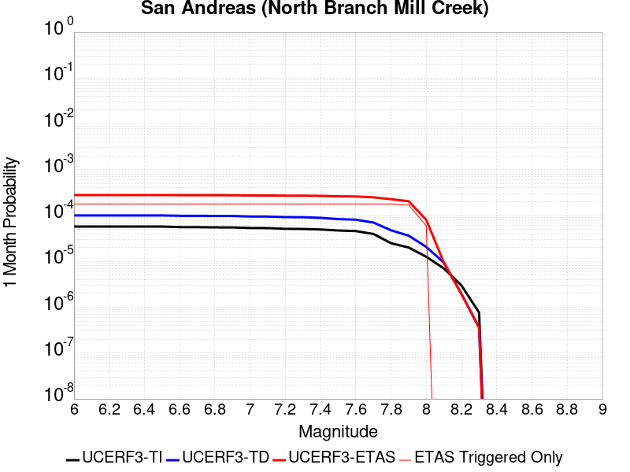 |  |  |

| Magnitude | 1 wk TI Prob | 1 wk TD Prob | 1 wk ETAS Prob | 1 wk ETAS/TD Gain | 1 wk ETAS Triggered Only | 1 mo TI Prob | 1 mo TD Prob | 1 mo ETAS Prob | 1 mo ETAS/TD Gain | 1 mo ETAS Triggered Only | 1 yr TI Prob | 1 yr TD Prob | 1 yr ETAS Prob | 1 yr ETAS/TD Gain | 1 yr ETAS Triggered Only | 10 yr TI Prob | 10 yr TD Prob | 10 yr ETAS Prob | 10 yr ETAS/TD Gain | 10 yr ETAS Triggered Only |
|-----|-----|-----|-----|-----|-----|-----|-----|-----|-----|-----|-----|-----|-----|-----|-----|-----|-----|-----|-----|-----|
| 6.0 | 1.3461156E-5 | 2.3499893E-5 | 1.4501848E-4 | 6.1710277 | 1.2152145E-4 | 5.7689394E-5 | 1.00709956E-4 | 2.2221917E-4 | 2.2065263 | 1.2152145E-4 | 7.02142E-4 | 0.0012254574 | 0.0013468299 | 1.0990427 | 1.2152145E-4 | 0.0069992766 | 0.01222957 | 0.012349606 | 1.0098152 | 1.2152145E-4 |
| 6.1 | 1.3461156E-5 | 2.3499893E-5 | 1.4501848E-4 | 6.1710277 | 1.2152145E-4 | 5.7689394E-5 | 1.00709956E-4 | 2.2221917E-4 | 2.2065263 | 1.2152145E-4 | 7.02142E-4 | 0.0012254574 | 0.0013468299 | 1.0990427 | 1.2152145E-4 | 0.0069992766 | 0.01222957 | 0.012349606 | 1.0098152 | 1.2152145E-4 |
| 6.2 | 1.3461156E-5 | 2.3499893E-5 | 1.4501848E-4 | 6.1710277 | 1.2152145E-4 | 5.7689394E-5 | 1.00709956E-4 | 2.2221917E-4 | 2.2065263 | 1.2152145E-4 | 7.02142E-4 | 0.0012254574 | 0.0013468299 | 1.0990427 | 1.2152145E-4 | 0.0069992766 | 0.01222957 | 0.012349606 | 1.0098152 | 1.2152145E-4 |
| 6.3 | 1.3461156E-5 | 2.3499893E-5 | 1.4501848E-4 | 6.1710277 | 1.2152145E-4 | 5.7689394E-5 | 1.00709956E-4 | 2.2221917E-4 | 2.2065263 | 1.2152145E-4 | 7.02142E-4 | 0.0012254574 | 0.0013468299 | 1.0990427 | 1.2152145E-4 | 0.0069992766 | 0.01222957 | 0.012349606 | 1.0098152 | 1.2152145E-4 |
| 6.4 | 1.3461156E-5 | 2.3499893E-5 | 1.4501848E-4 | 6.1710277 | 1.2152145E-4 | 5.7689394E-5 | 1.00709956E-4 | 2.2221917E-4 | 2.2065263 | 1.2152145E-4 | 7.02142E-4 | 0.0012254574 | 0.0013468299 | 1.0990427 | 1.2152145E-4 | 0.0069992766 | 0.01222957 | 0.012349606 | 1.0098152 | 1.2152145E-4 |
| 6.5 | 1.3450706E-5 | 2.3488852E-5 | 1.4500745E-4 | 6.173458 | 1.2152145E-4 | 5.764461E-5 | 1.0066265E-4 | 2.2217186E-4 | 2.2070935 | 1.2152145E-4 | 7.0159714E-4 | 0.001224882 | 0.0013462546 | 1.0990893 | 1.2152145E-4 | 0.006993862 | 0.01222388 | 0.012343915 | 1.0098197 | 1.2152145E-4 |
| 6.6 | 1.3074523E-5 | 2.3103135E-5 | 1.4462178E-4 | 6.2598333 | 1.2152145E-4 | 5.6032466E-5 | 9.9009696E-5 | 2.2051911E-4 | 2.2272477 | 1.2152145E-4 | 6.8198174E-4 | 0.0012047797 | 0.0013261548 | 1.1007446 | 1.2152145E-4 | 0.006798926 | 0.012025044 | 0.012145105 | 1.0099841 | 1.2152145E-4 |
| 6.7 | 1.3050216E-5 | 2.3078432E-5 | 1.4459707E-4 | 6.2654634 | 1.2152145E-4 | 5.59283E-5 | 9.890384E-5 | 2.2041326E-4 | 2.2285614 | 1.2152145E-4 | 6.8071426E-4 | 0.0012034923 | 0.0013248675 | 1.1008525 | 1.2152145E-4 | 0.0067863287 | 0.012012309 | 0.012132371 | 1.0099949 | 1.2152145E-4 |
| 6.8 | 1.29049395E-5 | 2.292684E-5 | 1.444455E-4 | 6.300279 | 1.2152145E-4 | 5.530571E-5 | 9.825421E-5 | 2.1976372E-4 | 2.236685 | 1.2152145E-4 | 6.73139E-4 | 0.0011955918 | 0.0013169679 | 1.1015197 | 1.2152145E-4 | 0.0067110364 | 0.011934154 | 0.012054225 | 1.0100611 | 1.2152145E-4 |
| 6.9 | 1.2867369E-5 | 2.2886245E-5 | 1.4440491E-4 | 6.3096814 | 1.2152145E-4 | 5.51447E-5 | 9.8080236E-5 | 2.1958977E-4 | 2.2388787 | 1.2152145E-4 | 6.711799E-4 | 0.0011934759 | 0.0013148524 | 1.1017 | 1.2152145E-4 | 0.006691564 | 0.011913223 | 0.012033298 | 1.010079 | 1.2152145E-4 |
| 7.0 | 1.2495996E-5 | 2.2286325E-5 | 1.4380507E-4 | 6.4526143 | 1.2152145E-4 | 5.3553173E-5 | 9.550934E-5 | 2.1701919E-4 | 2.27223 | 1.2152145E-4 | 6.518148E-4 | 0.0011622087 | 0.001283589 | 1.1044393 | 1.2152145E-4 | 0.0064990623 | 0.0116038285 | 0.01172394 | 1.0103511 | 1.2152145E-4 |
| 7.1 | 1.2452067E-5 | 2.2231397E-5 | 1.4375015E-4 | 6.4660864 | 1.2152145E-4 | 5.3364907E-5 | 9.527396E-5 | 2.1678382E-4 | 2.2753735 | 1.2152145E-4 | 6.4952404E-4 | 0.0011593461 | 0.0012807266 | 1.1046975 | 1.2152145E-4 | 0.0064762887 | 0.0115755 | 0.011695615 | 1.0103767 | 1.2152145E-4 |
| 7.2 | 1.2002777E-5 | 2.1609963E-5 | 1.4312878E-4 | 6.6232777 | 1.2152145E-4 | 5.143946E-5 | 9.2610855E-5 | 2.1412106E-4 | 2.3120513 | 1.2152145E-4 | 6.2609545E-4 | 0.0011269567 | 0.001248341 | 1.10771 | 1.2152145E-4 | 0.006243344 | 0.011254923 | 0.011375077 | 1.0106757 | 1.2152145E-4 |
| 7.3 | 1.1923425E-5 | 2.1479793E-5 | 1.4299863E-4 | 6.6573563 | 1.2152145E-4 | 5.109939E-5 | 9.205302E-5 | 2.1356328E-4 | 2.320003 | 1.2152145E-4 | 6.219575E-4 | 0.001120172 | 0.0012415573 | 1.1083632 | 1.2152145E-4 | 0.0062021962 | 0.011187789 | 0.011307951 | 1.0107404 | 1.2152145E-4 |
| 7.4 | 1.16105175E-5 | 2.0853771E-5 | 1.423727E-4 | 6.827191 | 1.2152145E-4 | 4.975841E-5 | 8.937026E-5 | 2.1088085E-4 | 2.359631 | 1.2152145E-4 | 6.0564023E-4 | 0.0010875424 | 0.0012089317 | 1.111618 | 1.2152145E-4 | 0.006039923 | 0.010865397 | 0.010985598 | 1.0110627 | 1.2152145E-4 |
| 7.5 | 1.1037265E-5 | 1.9553907E-5 | 1.4107297E-4 | 7.214567 | 1.2152145E-4 | 4.7301706E-5 | 8.379978E-5 | 2.0531105E-4 | 2.450019 | 1.2152145E-4 | 5.757461E-4 | 0.0010197869 | 0.0011411845 | 1.119042 | 1.2152145E-4 | 0.005742567 | 0.010194898 | 0.01031518 | 1.0117983 | 1.2152145E-4 |
| 7.6 | 1.0720915E-5 | 1.899582E-5 | 1.4051495E-4 | 7.397152 | 1.2152145E-4 | 4.5945973E-5 | 8.140812E-5 | 2.0291968E-4 | 2.492622 | 1.2152145E-4 | 5.592486E-4 | 9.906954E-4 | 0.0011120965 | 1.1225413 | 1.2152145E-4 | 0.005578433 | 0.009906623 | 0.01002694 | 1.0121452 | 1.2152145E-4 |
| 7.7 | 9.276279E-6 | 1.6441649E-5 | 1.379611E-4 | 8.390953 | 1.2152145E-4 | 3.9754876E-5 | 7.0462316E-5 | 1.919752E-4 | 2.7245088 | 1.2152145E-4 | 4.839081E-4 | 8.575427E-4 | 9.7896E-4 | 1.1415874 | 1.2152145E-4 | 0.0048285574 | 0.008586041 | 0.008706519 | 1.0140319 | 1.2152145E-4 |
| 7.8 | 5.8346777E-6 | 1.1155013E-5 | 1.3267511E-4 | 11.8937645 | 1.2152145E-4 | 2.5005522E-5 | 4.7806327E-5 | 1.6932197E-4 | 3.5418317 | 1.2152145E-4 | 3.043997E-4 | 5.818867E-4 | 7.033374E-4 | 1.2087189 | 1.2152145E-4 | 0.0030398308 | 0.0058469265 | 0.005967737 | 1.0206623 | 1.2152145E-4 |
| 7.9 | 4.690204E-6 | 8.509093E-6 | 1.3002951E-4 | 15.281241 | 1.2152145E-4 | 2.0100719E-5 | 3.6467034E-5 | 1.5798405E-4 | 4.332243 | 1.2152145E-4 | 2.4469878E-4 | 4.4389578E-4 | 5.6536327E-4 | 1.2736397 | 1.2152145E-4 | 0.002444295 | 0.0044707474 | 0.0045917253 | 1.0270599 | 1.2152145E-4 |
| 8.0 | 2.9570454E-6 | 4.846947E-6 | 4.846947E-6 | 1.0 | 0.0 | 1.267299E-5 | 2.0772464E-5 | 2.0772464E-5 | 1.0 | 0.0 | 1.5428272E-4 | 2.5287544E-4 | 2.5287544E-4 | 1.0 | 0.0 | 0.0015417566 | 0.002549644 | 0.002549644 | 1.0 | 0.0 |
| 8.1 | 1.6376824E-6 | 2.1968929E-6 | 2.1968929E-6 | 1.0 | 0.0 | 7.01862E-6 | 9.41522E-6 | 9.41522E-6 | 1.0 | 0.0 | 8.544835E-5 | 1.14624294E-4 | 1.14624294E-4 | 1.0 | 0.0 | 8.54155E-4 | 0.0011606582 | 0.0011606582 | 1.0 | 0.0 |
| 8.2 | 6.9631557E-7 | 4.5360213E-7 | 4.5360213E-7 | 1.0 | 0.0 | 2.984206E-6 | 1.9440076E-6 | 1.9440076E-6 | 1.0 | 0.0 | 3.63321E-5 | 2.3668037E-5 | 2.3668037E-5 | 1.0 | 0.0 | 3.6326164E-4 | 2.451564E-4 | 2.451564E-4 | 1.0 | 0.0 |
| 8.3 | 1.7876137E-7 | 8.360375E-8 | 8.360375E-8 | 1.0 | 0.0 | 7.661199E-7 | 3.5830175E-7 | 3.5830175E-7 | 1.0 | 0.0 | 9.32747E-6 | 4.3623154E-6 | 4.3623154E-6 | 1.0 | 0.0 | 9.3270784E-5 | 4.5817014E-5 | 4.5817014E-5 | 1.0 | 0.0 |

## Point Reyes 2011 CFM
*[(top)](#table-of-contents)*

| 1 Week | 1 Month | 1 Year | 10 Year |
|-----|-----|-----|-----|
|  |  |  |  |

| Magnitude | 1 wk TI Prob | 1 wk TD Prob | 1 wk ETAS Prob | 1 wk ETAS/TD Gain | 1 wk ETAS Triggered Only | 1 mo TI Prob | 1 mo TD Prob | 1 mo ETAS Prob | 1 mo ETAS/TD Gain | 1 mo ETAS Triggered Only | 1 yr TI Prob | 1 yr TD Prob | 1 yr ETAS Prob | 1 yr ETAS/TD Gain | 1 yr ETAS Triggered Only | 10 yr TI Prob | 10 yr TD Prob | 10 yr ETAS Prob | 10 yr ETAS/TD Gain | 10 yr ETAS Triggered Only |
|-----|-----|-----|-----|-----|-----|-----|-----|-----|-----|-----|-----|-----|-----|-----|-----|-----|-----|-----|-----|-----|
| 6.0 | 8.8644965E-6 | 8.967163E-6 | 1.3048752E-4 | 14.551705 | 1.2152145E-4 | 3.7990147E-5 | 3.843017E-5 | 1.5994695E-4 | 4.162015 | 1.2152145E-4 | 4.624319E-4 | 4.6779314E-4 | 5.8925775E-4 | 1.2596545 | 1.2152145E-4 | 0.0046147075 | 0.004668713 | 0.0047896667 | 1.0259074 | 1.2152145E-4 |
| 6.1 | 4.526405E-6 | 4.5392185E-6 | 1.2606011E-4 | 27.771326 | 1.2152145E-4 | 1.9398734E-5 | 1.9453653E-5 | 1.4097274E-4 | 7.2465944 | 1.2152145E-4 | 2.36154E-4 | 2.3682354E-4 | 3.583162E-4 | 1.5130093 | 1.2152145E-4 | 0.002359032 | 0.0023658178 | 0.0024870518 | 1.051244 | 1.2152145E-4 |
| 6.2 | 4.526405E-6 | 4.5392185E-6 | 1.2606011E-4 | 27.771326 | 1.2152145E-4 | 1.9398734E-5 | 1.9453653E-5 | 1.4097274E-4 | 7.2465944 | 1.2152145E-4 | 2.36154E-4 | 2.3682354E-4 | 3.583162E-4 | 1.5130093 | 1.2152145E-4 | 0.002359032 | 0.0023658178 | 0.0024870518 | 1.051244 | 1.2152145E-4 |
| 6.3 | 2.6842322E-6 | 2.660676E-6 | 1.241818E-4 | 46.673027 | 1.2152145E-4 | 1.1503801E-5 | 1.1402849E-5 | 1.3292291E-4 | 11.656992 | 1.2152145E-4 | 1.4004979E-4 | 1.3882104E-4 | 2.603256E-4 | 1.8752606 | 1.2152145E-4 | 0.0013996155 | 0.0013873649 | 0.0015087178 | 1.08747 | 1.2152145E-4 |
| 6.4 | 2.6842322E-6 | 2.660676E-6 | 1.241818E-4 | 46.673027 | 1.2152145E-4 | 1.1503801E-5 | 1.1402849E-5 | 1.3292291E-4 | 11.656992 | 1.2152145E-4 | 1.4004979E-4 | 1.3882104E-4 | 2.603256E-4 | 1.8752606 | 1.2152145E-4 | 0.0013996155 | 0.0013873649 | 0.0015087178 | 1.08747 | 1.2152145E-4 |
| 6.5 | 1.9281833E-6 | 1.8906262E-6 | 1.8906262E-6 | 1.0 | 0.0 | 8.263617E-6 | 8.102659E-6 | 8.102659E-6 | 1.0 | 0.0 | 1.0060489E-4 | 9.86455E-5 | 9.86455E-5 | 1.0 | 0.0 | 0.0010055936 | 9.860279E-4 | 9.860279E-4 | 1.0 | 0.0 |
| 6.6 | 1.4726726E-6 | 1.4269577E-6 | 1.4269577E-6 | 1.0 | 0.0 | 6.3114385E-6 | 6.1155188E-6 | 6.1155188E-6 | 1.0 | 0.0 | 7.683905E-5 | 7.445395E-5 | 7.445395E-5 | 1.0 | 0.0 | 7.6812494E-4 | 7.4429717E-4 | 7.4429717E-4 | 1.0 | 0.0 |
| 6.7 | 8.572307E-7 | 8.007212E-7 | 8.007212E-7 | 1.0 | 0.0 | 3.6738406E-6 | 3.431658E-6 | 3.431658E-6 | 1.0 | 0.0 | 4.472809E-5 | 4.1779647E-5 | 4.1779647E-5 | 1.0 | 0.0 | 4.471909E-4 | 4.1772184E-4 | 4.1772184E-4 | 1.0 | 0.0 |
| 6.8 | 6.6745434E-7 | 6.0773E-7 | 6.0773E-7 | 1.0 | 0.0 | 2.8605155E-6 | 2.6045543E-6 | 2.6045543E-6 | 1.0 | 0.0 | 3.482622E-5 | 3.171E-5 | 3.171E-5 | 1.0 | 0.0 | 3.4820763E-4 | 3.1705803E-4 | 3.1705803E-4 | 1.0 | 0.0 |
| 6.9 | 4.291521E-7 | 3.6535937E-7 | 3.6535937E-7 | 1.0 | 0.0 | 1.839222E-6 | 1.565825E-6 | 1.565825E-6 | 1.0 | 0.0 | 2.2392298E-5 | 1.9063755E-5 | 1.9063755E-5 | 1.0 | 0.0 | 2.2390042E-4 | 1.9062385E-4 | 1.9062385E-4 | 1.0 | 0.0 |
| 7.0 | 2.6812808E-7 | 2.0187414E-7 | 2.0187414E-7 | 1.0 | 0.0 | 1.1491198E-6 | 8.651746E-7 | 8.651746E-7 | 1.0 | 0.0 | 1.3990444E-5 | 1.0533451E-5 | 1.0533451E-5 | 1.0 | 0.0 | 1.3989564E-4 | 1.0533186E-4 | 1.0533186E-4 | 1.0 | 0.0 |
| 7.1 | 1.9451231E-7 | 1.2725499E-7 | 1.2725499E-7 | 1.0 | 0.0 | 8.336239E-7 | 5.453784E-7 | 5.453784E-7 | 1.0 | 0.0 | 1.0149324E-5 | 6.6399616E-6 | 6.6399616E-6 | 1.0 | 0.0 | 1.014886E-4 | 6.639991E-5 | 6.639991E-5 | 1.0 | 0.0 |
| 7.2 | 1.6715143E-7 | 1.00428394E-7 | 1.00428394E-7 | 1.0 | 0.0 | 7.1636305E-7 | 4.3040734E-7 | 4.3040734E-7 | 1.0 | 0.0 | 8.721685E-6 | 5.2401965E-6 | 5.2401965E-6 | 1.0 | 0.0 | 8.721343E-5 | 5.2402997E-5 | 5.2402997E-5 | 1.0 | 0.0 |
| 7.3 | 1.5503173E-7 | 9.0131024E-8 | 9.0131024E-8 | 1.0 | 0.0 | 6.644215E-7 | 3.8627576E-7 | 3.8627576E-7 | 1.0 | 0.0 | 8.089301E-6 | 4.702897E-6 | 4.702897E-6 | 1.0 | 0.0 | 8.089007E-5 | 4.7030244E-5 | 4.7030244E-5 | 1.0 | 0.0 |
| 7.4 | 1.4251614E-7 | 8.097624E-8 | 8.097624E-8 | 1.0 | 0.0 | 6.1078333E-7 | 3.47041E-7 | 3.47041E-7 | 1.0 | 0.0 | 7.4362615E-6 | 4.225216E-6 | 4.225216E-6 | 1.0 | 0.0 | 7.436013E-5 | 4.2253625E-5 | 4.2253625E-5 | 1.0 | 0.0 |
| 7.5 | 1.2710186E-7 | 7.0296394E-8 | 7.0296394E-8 | 1.0 | 0.0 | 5.447221E-7 | 3.0127023E-7 | 3.0127023E-7 | 1.0 | 0.0 | 6.6319717E-6 | 3.667959E-6 | 3.667959E-6 | 1.0 | 0.0 | 6.6317734E-5 | 3.6681253E-5 | 3.6681253E-5 | 1.0 | 0.0 |
| 7.6 | 1.0144708E-7 | 5.4952274E-8 | 5.4952274E-8 | 1.0 | 0.0 | 4.347731E-7 | 2.3550973E-7 | 2.3550973E-7 | 1.0 | 0.0 | 5.2933497E-6 | 2.8673273E-6 | 2.8673273E-6 | 1.0 | 0.0 | 5.293224E-5 | 2.8675171E-5 | 2.8675171E-5 | 1.0 | 0.0 |
| 7.7 | 7.090527E-8 | 3.98231E-8 | 3.98231E-8 | 1.0 | 0.0 | 3.038797E-7 | 1.7067042E-7 | 1.7067042E-7 | 1.0 | 0.0 | 3.699729E-6 | 2.0779103E-6 | 2.0779103E-6 | 1.0 | 0.0 | 3.6996673E-5 | 2.0781177E-5 | 2.0781177E-5 | 1.0 | 0.0 |
| 7.8 | 3.8712045E-8 | 2.7440025E-8 | 2.7440025E-8 | 1.0 | 0.0 | 1.6590876E-7 | 1.176001E-7 | 1.176001E-7 | 1.0 | 0.0 | 2.0199373E-6 | 1.4317802E-6 | 1.4317802E-6 | 1.0 | 0.0 | 2.0199188E-5 | 1.4319979E-5 | 1.4319979E-5 | 1.0 | 0.0 |
| 7.9 | 1.7068782E-8 | 1.1833354E-8 | 1.1833354E-8 | 1.0 | 0.0 | 7.315192E-8 | 5.0714362E-8 | 5.0714362E-8 | 1.0 | 0.0 | 8.906242E-7 | 6.174472E-7 | 6.174472E-7 | 1.0 | 0.0 | 8.906207E-6 | 6.1767228E-6 | 6.1767228E-6 | 1.0 | 0.0 |
| 8.0 | 1.0172592E-8 | 7.0280843E-9 | 7.0280843E-9 | 1.0 | 0.0 | 4.359682E-8 | 3.0120354E-8 | 3.0120354E-8 | 1.0 | 0.0 | 5.3079117E-7 | 3.6671526E-7 | 3.6671526E-7 | 1.0 | 0.0 | 5.307899E-6 | 3.6694146E-6 | 3.6694146E-6 | 1.0 | 0.0 |
| 8.1 | 3.7861243E-9 | 3.5452439E-9 | 3.5452439E-9 | 1.0 | 0.0 | 1.6226247E-8 | 1.5193901E-8 | 1.5193901E-8 | 1.0 | 0.0 | 1.9755454E-7 | 1.8498575E-7 | 1.8498575E-7 | 1.0 | 0.0 | 1.9755437E-6 | 1.8518531E-6 | 1.8518531E-6 | 1.0 | 0.0 |

## Whittier alt 1
*[(top)](#table-of-contents)*

| 1 Week | 1 Month | 1 Year | 10 Year |
|-----|-----|-----|-----|
|  |  |  |  |

| Magnitude | 1 wk TI Prob | 1 wk TD Prob | 1 wk ETAS Prob | 1 wk ETAS/TD Gain | 1 wk ETAS Triggered Only | 1 mo TI Prob | 1 mo TD Prob | 1 mo ETAS Prob | 1 mo ETAS/TD Gain | 1 mo ETAS Triggered Only | 1 yr TI Prob | 1 yr TD Prob | 1 yr ETAS Prob | 1 yr ETAS/TD Gain | 1 yr ETAS Triggered Only | 10 yr TI Prob | 10 yr TD Prob | 10 yr ETAS Prob | 10 yr ETAS/TD Gain | 10 yr ETAS Triggered Only |
|-----|-----|-----|-----|-----|-----|-----|-----|-----|-----|-----|-----|-----|-----|-----|-----|-----|-----|-----|-----|-----|
| 6.0 | 4.2554693E-5 | 4.725218E-5 | 4.725218E-5 | 1.0 | 0.0 | 1.8236451E-4 | 2.0249544E-4 | 2.0249544E-4 | 1.0 | 0.0 | 0.002218027 | 0.0024629154 | 0.0025841375 | 1.049219 | 1.2152145E-4 | 0.02196019 | 0.024390234 | 0.024508793 | 1.0048609 | 1.2152145E-4 |
| 6.1 | 4.2554693E-5 | 4.725218E-5 | 4.725218E-5 | 1.0 | 0.0 | 1.8236451E-4 | 2.0249544E-4 | 2.0249544E-4 | 1.0 | 0.0 | 0.002218027 | 0.0024629154 | 0.0025841375 | 1.049219 | 1.2152145E-4 | 0.02196019 | 0.024390234 | 0.024508793 | 1.0048609 | 1.2152145E-4 |
| 6.2 | 4.2554693E-5 | 4.725218E-5 | 4.725218E-5 | 1.0 | 0.0 | 1.8236451E-4 | 2.0249544E-4 | 2.0249544E-4 | 1.0 | 0.0 | 0.002218027 | 0.0024629154 | 0.0025841375 | 1.049219 | 1.2152145E-4 | 0.02196019 | 0.024390234 | 0.024508793 | 1.0048609 | 1.2152145E-4 |
| 6.3 | 1.9617712E-5 | 1.8268593E-5 | 1.8268593E-5 | 1.0 | 0.0 | 8.40732E-5 | 7.829172E-5 | 7.829172E-5 | 1.0 | 0.0 | 0.0010231105 | 9.52804E-4 | 9.52804E-4 | 1.0 | 0.0 | 0.01018413 | 0.009490474 | 0.009490474 | 1.0 | 0.0 |
| 6.4 | 1.5611336E-5 | 1.3604271E-5 | 1.3604271E-5 | 1.0 | 0.0 | 6.690401E-5 | 5.8302747E-5 | 5.8302747E-5 | 1.0 | 0.0 | 8.142519E-4 | 7.0961076E-4 | 7.0961076E-4 | 1.0 | 0.0 | 0.008112748 | 0.0070754145 | 0.0070754145 | 1.0 | 0.0 |
| 6.5 | 1.5150166E-5 | 1.3100925E-5 | 1.3100925E-5 | 1.0 | 0.0 | 6.492767E-5 | 5.6145647E-5 | 5.6145647E-5 | 1.0 | 0.0 | 7.9020765E-4 | 6.8336475E-4 | 6.8336475E-4 | 1.0 | 0.0 | 0.007874036 | 0.0068145846 | 0.0068145846 | 1.0 | 0.0 |
| 6.6 | 1.295588E-5 | 1.0380725E-5 | 1.0380725E-5 | 1.0 | 0.0 | 5.552402E-5 | 4.4488075E-5 | 4.4488075E-5 | 1.0 | 0.0 | 6.7579525E-4 | 5.4150965E-4 | 5.4150965E-4 | 1.0 | 0.0 | 0.006737438 | 0.0054033357 | 0.0054033357 | 1.0 | 0.0 |
| 6.7 | 1.2542085E-5 | 9.899369E-6 | 9.899369E-6 | 1.0 | 0.0 | 5.3750682E-5 | 4.242519E-5 | 4.242519E-5 | 1.0 | 0.0 | 6.542181E-4 | 5.164061E-4 | 5.164061E-4 | 1.0 | 0.0 | 0.006522954 | 0.0051534795 | 0.0051534795 | 1.0 | 0.0 |
| 6.8 | 1.2195878E-5 | 9.495415E-6 | 9.495415E-6 | 1.0 | 0.0 | 5.2267E-5 | 4.069401E-5 | 4.069401E-5 | 1.0 | 0.0 | 6.36165E-4 | 4.9533875E-4 | 4.9533875E-4 | 1.0 | 0.0 | 0.0063434686 | 0.004943688 | 0.004943688 | 1.0 | 0.0 |
| 6.9 | 1.1580298E-5 | 8.772933E-6 | 8.772933E-6 | 1.0 | 0.0 | 4.9628903E-5 | 3.7597754E-5 | 3.7597754E-5 | 1.0 | 0.0 | 6.040644E-4 | 4.5765814E-4 | 4.5765814E-4 | 1.0 | 0.0 | 0.00602425 | 0.0045684157 | 0.0045684157 | 1.0 | 0.0 |
| 7.0 | 1.0964795E-5 | 8.083994E-6 | 8.083994E-6 | 1.0 | 0.0 | 4.6991136E-5 | 3.4645236E-5 | 3.4645236E-5 | 1.0 | 0.0 | 5.7196687E-4 | 4.2172565E-4 | 4.2172565E-4 | 1.0 | 0.0 | 0.0057049696 | 0.004210462 | 0.004210462 | 1.0 | 0.0 |
| 7.1 | 1.0230601E-5 | 7.3266697E-6 | 7.3266697E-6 | 1.0 | 0.0 | 4.3844695E-5 | 3.1399642E-5 | 3.1399642E-5 | 1.0 | 0.0 | 5.336784E-4 | 3.8222488E-4 | 3.8222488E-4 | 1.0 | 0.0 | 0.005323986 | 0.0038168381 | 0.0038168381 | 1.0 | 0.0 |
| 7.2 | 9.40865E-6 | 6.543289E-6 | 6.543289E-6 | 1.0 | 0.0 | 4.032216E-5 | 2.8042374E-5 | 2.8042374E-5 | 1.0 | 0.0 | 4.908117E-4 | 3.4136363E-4 | 3.4136363E-4 | 1.0 | 0.0 | 0.0048972913 | 0.003409485 | 0.003409485 | 1.0 | 0.0 |
| 7.3 | 8.237384E-6 | 5.5977525E-6 | 5.5977525E-6 | 1.0 | 0.0 | 3.5302593E-5 | 2.3990153E-5 | 2.3990153E-5 | 1.0 | 0.0 | 4.2972428E-4 | 2.92042E-4 | 2.92042E-4 | 1.0 | 0.0 | 0.0042889426 | 0.002916903 | 0.002916903 | 1.0 | 0.0 |
| 7.4 | 7.5316966E-6 | 5.027819E-6 | 5.027819E-6 | 1.0 | 0.0 | 3.2278298E-5 | 2.1547625E-5 | 2.1547625E-5 | 1.0 | 0.0 | 3.9291743E-4 | 2.6231175E-4 | 2.6231175E-4 | 1.0 | 0.0 | 0.0039222343 | 0.0026201333 | 0.0026201333 | 1.0 | 0.0 |
| 7.5 | 6.149649E-6 | 3.933841E-6 | 3.933841E-6 | 1.0 | 0.0 | 2.6355372E-5 | 1.6859214E-5 | 1.6859214E-5 | 1.0 | 0.0 | 3.208294E-4 | 2.052425E-4 | 2.052425E-4 | 1.0 | 0.0 | 0.003203666 | 0.0020506186 | 0.0020506186 | 1.0 | 0.0 |
| 7.6 | 5.457711E-6 | 3.3953788E-6 | 3.3953788E-6 | 1.0 | 0.0 | 2.338998E-5 | 1.4551547E-5 | 1.4551547E-5 | 1.0 | 0.0 | 2.8473578E-4 | 1.771515E-4 | 1.771515E-4 | 1.0 | 0.0 | 0.0028437122 | 0.0017701836 | 0.0017701836 | 1.0 | 0.0 |
| 7.7 | 4.1676276E-6 | 2.3331952E-6 | 2.3331952E-6 | 1.0 | 0.0 | 1.7861139E-5 | 9.999374E-6 | 9.999374E-6 | 1.0 | 0.0 | 2.1743766E-4 | 1.2173632E-4 | 1.2173632E-4 | 1.0 | 0.0 | 0.0021722503 | 0.0012167693 | 0.0012167693 | 1.0 | 0.0 |
| 7.8 | 2.2692414E-7 | 9.3854695E-8 | 9.3854695E-8 | 1.0 | 0.0 | 9.725317E-7 | 4.0223435E-7 | 4.0223435E-7 | 1.0 | 0.0 | 1.1840509E-5 | 4.8971956E-6 | 4.8971956E-6 | 1.0 | 0.0 | 1.1839878E-4 | 4.8971204E-5 | 4.8971204E-5 | 1.0 | 0.0 |
| 7.9 | 6.676829E-9 | 3.439853E-9 | 3.439853E-9 | 1.0 | 0.0 | 2.861498E-8 | 1.4742227E-8 | 1.4742227E-8 | 1.0 | 0.0 | 3.4838732E-7 | 1.7948659E-7 | 1.7948659E-7 | 1.0 | 0.0 | 3.4838679E-6 | 1.7948646E-6 | 1.7948646E-6 | 1.0 | 0.0 |

## Santa Rosa Island
*[(top)](#table-of-contents)*

| 1 Week | 1 Month | 1 Year | 10 Year |
|-----|-----|-----|-----|
|  |  |  |  |

| Magnitude | 1 wk TI Prob | 1 wk TD Prob | 1 wk ETAS Prob | 1 wk ETAS/TD Gain | 1 wk ETAS Triggered Only | 1 mo TI Prob | 1 mo TD Prob | 1 mo ETAS Prob | 1 mo ETAS/TD Gain | 1 mo ETAS Triggered Only | 1 yr TI Prob | 1 yr TD Prob | 1 yr ETAS Prob | 1 yr ETAS/TD Gain | 1 yr ETAS Triggered Only | 10 yr TI Prob | 10 yr TD Prob | 10 yr ETAS Prob | 10 yr ETAS/TD Gain | 10 yr ETAS Triggered Only |
|-----|-----|-----|-----|-----|-----|-----|-----|-----|-----|-----|-----|-----|-----|-----|-----|-----|-----|-----|-----|-----|
| 6.0 | 4.1143165E-5 | 4.7091133E-5 | 1.6860686E-4 | 3.5804374 | 1.2152145E-4 | 1.7631594E-4 | 2.0180465E-4 | 3.2330156E-4 | 1.6020522 | 1.2152145E-4 | 0.002144533 | 0.0024544 | 0.002575623 | 1.0493902 | 1.2152145E-4 | 0.021239553 | 0.024293551 | 0.02441212 | 1.0048807 | 1.2152145E-4 |
| 6.1 | 2.1061249E-5 | 2.3864959E-5 | 2.3864959E-5 | 1.0 | 0.0 | 9.0259375E-5 | 1.0227455E-4 | 1.0227455E-4 | 1.0 | 0.0 | 0.0010983539 | 0.0012445104 | 0.0012445104 | 1.0 | 0.0 | 0.01092941 | 0.012378449 | 0.012378449 | 1.0 | 0.0 |
| 6.2 | 2.1061249E-5 | 2.3864959E-5 | 2.3864959E-5 | 1.0 | 0.0 | 9.0259375E-5 | 1.0227455E-4 | 1.0227455E-4 | 1.0 | 0.0 | 0.0010983539 | 0.0012445104 | 0.0012445104 | 1.0 | 0.0 | 0.01092941 | 0.012378449 | 0.012378449 | 1.0 | 0.0 |
| 6.3 | 1.5158236E-5 | 1.7074419E-5 | 1.7074419E-5 | 1.0 | 0.0 | 6.496225E-5 | 7.3174095E-5 | 7.3174095E-5 | 1.0 | 0.0 | 7.906284E-4 | 8.905424E-4 | 8.905424E-4 | 1.0 | 0.0 | 0.007878214 | 0.008870989 | 0.008870989 | 1.0 | 0.0 |
| 6.4 | 1.2341918E-5 | 1.3852917E-5 | 1.3852917E-5 | 1.0 | 0.0 | 5.2892858E-5 | 5.9368336E-5 | 5.9368336E-5 | 1.0 | 0.0 | 6.437803E-4 | 7.225779E-4 | 7.225779E-4 | 1.0 | 0.0 | 0.006419184 | 0.007203121 | 0.007203121 | 1.0 | 0.0 |
| 6.5 | 9.061158E-6 | 1.0117031E-5 | 1.0117031E-5 | 1.0 | 0.0 | 3.883296E-5 | 4.3358013E-5 | 4.3358013E-5 | 1.0 | 0.0 | 4.726887E-4 | 5.277613E-4 | 5.277613E-4 | 1.0 | 0.0 | 0.004716845 | 0.0052656173 | 0.0052656173 | 1.0 | 0.0 |
| 6.6 | 7.5461685E-6 | 8.400733E-6 | 8.400733E-6 | 1.0 | 0.0 | 3.2340322E-5 | 3.600267E-5 | 3.600267E-5 | 1.0 | 0.0 | 3.936723E-4 | 4.3824865E-4 | 4.3824865E-4 | 1.0 | 0.0 | 0.003929756 | 0.0043742736 | 0.0043742736 | 1.0 | 0.0 |
| 6.7 | 5.5023775E-6 | 6.087381E-6 | 6.087381E-6 | 1.0 | 0.0 | 2.3581404E-5 | 2.6088532E-5 | 2.6088532E-5 | 1.0 | 0.0 | 2.8706578E-4 | 3.1758484E-4 | 3.1758484E-4 | 1.0 | 0.0 | 0.0028669522 | 0.0031716314 | 0.0031716314 | 1.0 | 0.0 |
| 6.8 | 3.7351679E-6 | 4.0831405E-6 | 4.0831405E-6 | 1.0 | 0.0 | 1.6007763E-5 | 1.749907E-5 | 1.749907E-5 | 1.0 | 0.0 | 1.948771E-4 | 2.1303284E-4 | 2.1303284E-4 | 1.0 | 0.0 | 0.0019470629 | 0.0021285315 | 0.0021285315 | 1.0 | 0.0 |
| 6.9 | 2.456366E-6 | 2.6292705E-6 | 2.6292705E-6 | 1.0 | 0.0 | 1.0527241E-5 | 1.1268254E-5 | 1.1268254E-5 | 1.0 | 0.0 | 1.2816161E-4 | 1.3718237E-4 | 1.3718237E-4 | 1.0 | 0.0 | 0.0012808773 | 0.0013709799 | 0.0013709799 | 1.0 | 0.0 |
| 7.0 | 2.3245157E-6 | 2.4827782E-6 | 2.4827782E-6 | 1.0 | 0.0 | 9.962172E-6 | 1.0640435E-5 | 1.0640435E-5 | 1.0 | 0.0 | 1.2128269E-4 | 1.2953962E-4 | 1.2953962E-4 | 1.0 | 0.0 | 0.0012121652 | 0.0012946434 | 0.0012946434 | 1.0 | 0.0 |
| 7.1 | 2.2248344E-6 | 2.37325E-6 | 2.37325E-6 | 1.0 | 0.0 | 9.53497E-6 | 1.0171032E-5 | 1.0171032E-5 | 1.0 | 0.0 | 1.1608207E-4 | 1.2382529E-4 | 1.2382529E-4 | 1.0 | 0.0 | 0.0011602144 | 0.001237565 | 0.001237565 | 1.0 | 0.0 |
| 7.2 | 2.1350402E-6 | 2.276154E-6 | 2.276154E-6 | 1.0 | 0.0 | 9.150141E-6 | 9.754909E-6 | 9.754909E-6 | 1.0 | 0.0 | 1.1139726E-4 | 1.1875956E-4 | 1.1875956E-4 | 1.0 | 0.0 | 0.0011134144 | 0.0011869629 | 0.0011869629 | 1.0 | 0.0 |
| 7.3 | 1.9793572E-6 | 2.108719E-6 | 2.108719E-6 | 1.0 | 0.0 | 8.482932E-6 | 9.037336E-6 | 9.037336E-6 | 1.0 | 0.0 | 1.032748E-4 | 1.10024026E-4 | 1.10024026E-4 | 1.0 | 0.0 | 0.0010322682 | 0.0010996973 | 0.0010996973 | 1.0 | 0.0 |
| 7.4 | 1.6951194E-6 | 1.8045733E-6 | 1.8045733E-6 | 1.0 | 0.0 | 7.264777E-6 | 7.733863E-6 | 7.733863E-6 | 1.0 | 0.0 | 8.844508E-5 | 9.415573E-5 | 9.415573E-5 | 1.0 | 0.0 | 8.840988E-4 | 9.4116E-4 | 9.4116E-4 | 1.0 | 0.0 |
| 7.5 | 8.987207E-7 | 9.5122147E-7 | 9.5122147E-7 | 1.0 | 0.0 | 3.8516546E-6 | 4.076657E-6 | 4.076657E-6 | 1.0 | 0.0 | 4.6892885E-5 | 4.963218E-5 | 4.963218E-5 | 1.0 | 0.0 | 4.688299E-4 | 4.9621216E-4 | 4.9621216E-4 | 1.0 | 0.0 |
| 7.6 | 3.8783037E-7 | 4.052932E-7 | 4.052932E-7 | 1.0 | 0.0 | 1.6621291E-6 | 1.7369698E-6 | 1.7369698E-6 | 1.0 | 0.0 | 2.0236233E-5 | 2.1147409E-5 | 2.1147409E-5 | 1.0 | 0.0 | 2.023439E-4 | 2.1145462E-4 | 2.1145462E-4 | 1.0 | 0.0 |
| 7.7 | 6.181804E-8 | 6.339035E-8 | 6.339035E-8 | 1.0 | 0.0 | 2.6493444E-7 | 2.7167292E-7 | 2.7167292E-7 | 1.0 | 0.0 | 3.225572E-6 | 3.3076128E-6 | 3.3076128E-6 | 1.0 | 0.0 | 3.225525E-5 | 3.307564E-5 | 3.307564E-5 | 1.0 | 0.0 |
| 7.8 | 1.3704449E-9 | 1.3964153E-9 | 1.3964153E-9 | 1.0 | 0.0 | 5.873335E-9 | 5.984637E-9 | 5.984637E-9 | 1.0 | 0.0 | 7.1507856E-8 | 7.286295E-8 | 7.286295E-8 | 1.0 | 0.0 | 7.1507833E-7 | 7.286294E-7 | 7.286294E-7 | 1.0 | 0.0 |

## Pisgah-Bullion Mtn-Mesquite Lk
*[(top)](#table-of-contents)*

| 1 Week | 1 Month | 1 Year | 10 Year |
|-----|-----|-----|-----|
|  |  |  |  |

| Magnitude | 1 wk TI Prob | 1 wk TD Prob | 1 wk ETAS Prob | 1 wk ETAS/TD Gain | 1 wk ETAS Triggered Only | 1 mo TI Prob | 1 mo TD Prob | 1 mo ETAS Prob | 1 mo ETAS/TD Gain | 1 mo ETAS Triggered Only | 1 yr TI Prob | 1 yr TD Prob | 1 yr ETAS Prob | 1 yr ETAS/TD Gain | 1 yr ETAS Triggered Only | 10 yr TI Prob | 10 yr TD Prob | 10 yr ETAS Prob | 10 yr ETAS/TD Gain | 10 yr ETAS Triggered Only |
|-----|-----|-----|-----|-----|-----|-----|-----|-----|-----|-----|-----|-----|-----|-----|-----|-----|-----|-----|-----|-----|
| 6.0 | 3.0240792E-5 | 2.4091114E-5 | 2.4091114E-5 | 1.0 | 0.0 | 1.2959696E-4 | 1.03244114E-4 | 1.03244114E-4 | 1.0 | 0.0 | 0.0015767008 | 0.0012563728 | 0.0012563728 | 1.0 | 0.0 | 0.015655609 | 0.012502721 | 0.012622723 | 1.0095981 | 1.2152145E-4 |
| 6.1 | 3.0240792E-5 | 2.4091114E-5 | 2.4091114E-5 | 1.0 | 0.0 | 1.2959696E-4 | 1.03244114E-4 | 1.03244114E-4 | 1.0 | 0.0 | 0.0015767008 | 0.0012563728 | 0.0012563728 | 1.0 | 0.0 | 0.015655609 | 0.012502721 | 0.012622723 | 1.0095981 | 1.2152145E-4 |
| 6.2 | 3.0240792E-5 | 2.4091114E-5 | 2.4091114E-5 | 1.0 | 0.0 | 1.2959696E-4 | 1.03244114E-4 | 1.03244114E-4 | 1.0 | 0.0 | 0.0015767008 | 0.0012563728 | 0.0012563728 | 1.0 | 0.0 | 0.015655609 | 0.012502721 | 0.012622723 | 1.0095981 | 1.2152145E-4 |
| 6.3 | 2.0498217E-5 | 1.36380695E-5 | 1.36380695E-5 | 1.0 | 0.0 | 8.784654E-5 | 5.844765E-5 | 5.844765E-5 | 1.0 | 0.0 | 0.0010690069 | 7.1138405E-4 | 7.1138405E-4 | 1.0 | 0.0 | 0.01063879 | 0.0070926943 | 0.007213354 | 1.0170118 | 1.2152145E-4 |
| 6.4 | 2.0498217E-5 | 1.36380695E-5 | 1.36380695E-5 | 1.0 | 0.0 | 8.784654E-5 | 5.844765E-5 | 5.844765E-5 | 1.0 | 0.0 | 0.0010690069 | 7.1138405E-4 | 7.1138405E-4 | 1.0 | 0.0 | 0.01063879 | 0.0070926943 | 0.007213354 | 1.0170118 | 1.2152145E-4 |
| 6.5 | 1.7316182E-5 | 1.0477042E-5 | 1.0477042E-5 | 1.0 | 0.0 | 7.42101E-5 | 4.4900895E-5 | 4.4900895E-5 | 1.0 | 0.0 | 9.0313336E-4 | 5.465413E-4 | 5.465413E-4 | 1.0 | 0.0 | 0.008994718 | 0.0054529672 | 0.005573826 | 1.0221639 | 1.2152145E-4 |
| 6.6 | 1.5251077E-5 | 8.414273E-6 | 8.414273E-6 | 1.0 | 0.0 | 6.536012E-5 | 3.6060712E-5 | 3.6060712E-5 | 1.0 | 0.0 | 7.9546886E-4 | 4.3895794E-4 | 4.3895794E-4 | 1.0 | 0.0 | 0.007926274 | 0.0043816264 | 0.0045026154 | 1.0276128 | 1.2152145E-4 |
| 6.7 | 1.2997425E-5 | 6.4114965E-6 | 6.4114965E-6 | 1.0 | 0.0 | 5.570206E-5 | 2.7477578E-5 | 2.7477578E-5 | 1.0 | 0.0 | 6.7796157E-4 | 3.3449283E-4 | 3.3449283E-4 | 1.0 | 0.0 | 0.0067589693 | 0.0033403537 | 0.0034614692 | 1.0362583 | 1.2152145E-4 |
| 6.8 | 1.035386E-5 | 4.3332193E-6 | 4.3332193E-6 | 1.0 | 0.0 | 4.437293E-5 | 1.8570812E-5 | 1.8570812E-5 | 1.0 | 0.0 | 5.401065E-4 | 2.2607706E-4 | 2.2607706E-4 | 1.0 | 0.0 | 0.0053879567 | 0.0022585576 | 0.0023798044 | 1.0536834 | 1.2152145E-4 |
| 6.9 | 8.816252E-6 | 3.580638E-6 | 3.580638E-6 | 1.0 | 0.0 | 3.778339E-5 | 1.5345504E-5 | 1.5345504E-5 | 1.0 | 0.0 | 4.5991567E-4 | 1.8681608E-4 | 1.8681608E-4 | 1.0 | 0.0 | 0.00458965 | 0.0018666488 | 0.0018666488 | 1.0 | 0.0 |
| 7.0 | 6.8232207E-6 | 2.5675843E-6 | 2.5675843E-6 | 1.0 | 0.0 | 2.9242048E-5 | 1.1003888E-5 | 1.1003888E-5 | 1.0 | 0.0 | 3.5596377E-4 | 1.3396442E-4 | 1.3396442E-4 | 1.0 | 0.0 | 0.0035539411 | 0.0013388677 | 0.0013388677 | 1.0 | 0.0 |
| 7.1 | 5.837013E-6 | 2.22738E-6 | 2.22738E-6 | 1.0 | 0.0 | 2.501553E-5 | 9.545881E-6 | 9.545881E-6 | 1.0 | 0.0 | 3.045215E-4 | 1.16215204E-4 | 1.16215204E-4 | 1.0 | 0.0 | 0.0030410455 | 0.0011615733 | 0.0011615733 | 1.0 | 0.0 |
| 7.2 | 4.278052E-6 | 1.6275711E-6 | 1.6275711E-6 | 1.0 | 0.0 | 1.833438E-5 | 6.9752873E-6 | 6.9752873E-6 | 1.0 | 0.0 | 2.231982E-4 | 8.492105E-5 | 8.492105E-5 | 1.0 | 0.0 | 0.0022297418 | 8.489092E-4 | 8.489092E-4 | 1.0 | 0.0 |
| 7.3 | 1.8803692E-6 | 8.344926E-7 | 8.344926E-7 | 1.0 | 0.0 | 8.0587E-6 | 3.5763926E-6 | 3.5763926E-6 | 1.0 | 0.0 | 9.811026E-5 | 4.354186E-5 | 4.354186E-5 | 1.0 | 0.0 | 9.806695E-4 | 4.3534773E-4 | 4.3534773E-4 | 1.0 | 0.0 |

## San Jacinto (Borrego)
*[(top)](#table-of-contents)*

| 1 Week | 1 Month | 1 Year | 10 Year |
|-----|-----|-----|-----|
|  |  |  |  |

| Magnitude | 1 wk TI Prob | 1 wk TD Prob | 1 wk ETAS Prob | 1 wk ETAS/TD Gain | 1 wk ETAS Triggered Only | 1 mo TI Prob | 1 mo TD Prob | 1 mo ETAS Prob | 1 mo ETAS/TD Gain | 1 mo ETAS Triggered Only | 1 yr TI Prob | 1 yr TD Prob | 1 yr ETAS Prob | 1 yr ETAS/TD Gain | 1 yr ETAS Triggered Only | 10 yr TI Prob | 10 yr TD Prob | 10 yr ETAS Prob | 10 yr ETAS/TD Gain | 10 yr ETAS Triggered Only |
|-----|-----|-----|-----|-----|-----|-----|-----|-----|-----|-----|-----|-----|-----|-----|-----|-----|-----|-----|-----|-----|
| 6.0 | 3.543992E-5 | 2.7926513E-5 | 1.4944456E-4 | 5.351351 | 1.2152145E-4 | 1.5187653E-4 | 1.1967963E-4 | 2.4118654E-4 | 2.015268 | 1.2152145E-4 | 0.0018475284 | 0.0014561379 | 0.0015774823 | 1.0833331 | 1.2152145E-4 | 0.018322436 | 0.014869647 | 0.014989362 | 1.0080509 | 1.2152145E-4 |
| 6.1 | 3.542281E-5 | 2.7926513E-5 | 1.4944456E-4 | 5.351351 | 1.2152145E-4 | 1.5180321E-4 | 1.1967963E-4 | 2.4118654E-4 | 2.015268 | 1.2152145E-4 | 0.0018466372 | 0.0014561379 | 0.0015774823 | 1.0833331 | 1.2152145E-4 | 0.018313672 | 0.014869647 | 0.014989362 | 1.0080509 | 1.2152145E-4 |
| 6.2 | 3.4688688E-5 | 2.7926511E-5 | 1.4944456E-4 | 5.351351 | 1.2152145E-4 | 1.4865733E-4 | 1.1967963E-4 | 2.4118653E-4 | 2.015268 | 1.2152145E-4 | 0.0018084005 | 0.0014561379 | 0.0015774823 | 1.0833331 | 1.2152145E-4 | 0.017937548 | 0.014869647 | 0.014989361 | 1.0080509 | 1.2152145E-4 |
| 6.3 | 3.2087122E-5 | 2.7771865E-5 | 1.4928993E-4 | 5.375582 | 1.2152145E-4 | 1.3750899E-4 | 1.1901691E-4 | 2.4052389E-4 | 2.020922 | 1.2152145E-4 | 0.0016728862 | 0.00144808 | 0.0015694255 | 1.0837975 | 1.2152145E-4 | 0.016603488 | 0.014790683 | 0.014910407 | 1.0080945 | 1.2152145E-4 |
| 6.4 | 3.1828724E-5 | 2.7738852E-5 | 1.4925693E-4 | 5.3807898 | 1.2152145E-4 | 1.364017E-4 | 1.1887544E-4 | 2.4038245E-4 | 2.0221372 | 1.2152145E-4 | 0.0016594254 | 0.0014463598 | 0.0015677055 | 1.0838974 | 1.2152145E-4 | 0.016470885 | 0.014773762 | 0.014893488 | 1.008104 | 1.2152145E-4 |
| 6.5 | 3.1563577E-5 | 2.747857E-5 | 1.4899668E-4 | 5.4222865 | 1.2152145E-4 | 1.3526545E-4 | 1.1776006E-4 | 2.3926719E-4 | 2.0318196 | 1.2152145E-4 | 0.0016456128 | 0.0014327979 | 0.0015541452 | 1.0846926 | 1.2152145E-4 | 0.0163348 | 0.014640348 | 0.01476009 | 1.008179 | 1.2152145E-4 |
| 6.6 | 3.1467625E-5 | 2.7322796E-5 | 1.4884092E-4 | 5.4474998 | 1.2152145E-4 | 1.3485427E-4 | 1.1709251E-4 | 2.3859972E-4 | 2.0377028 | 1.2152145E-4 | 0.0016406142 | 0.0014246812 | 0.0015460295 | 1.0851758 | 1.2152145E-4 | 0.016285548 | 0.014560594 | 0.0146803465 | 1.0082244 | 1.2152145E-4 |
| 6.7 | 3.1223695E-5 | 2.6940816E-5 | 1.4845899E-4 | 5.5105605 | 1.2152145E-4 | 1.3380898E-4 | 1.15455594E-4 | 2.3696301E-4 | 2.0524168 | 1.2152145E-4 | 0.0016279068 | 0.0014047775 | 0.0015261283 | 1.0863843 | 1.2152145E-4 | 0.01616033 | 0.014364966 | 0.014484742 | 1.0083381 | 1.2152145E-4 |
| 6.8 | 3.1015585E-5 | 2.6761822E-5 | 1.4828001E-4 | 5.5407295 | 1.2152145E-4 | 1.3291716E-4 | 1.1468855E-4 | 2.3619607E-4 | 2.0594563 | 1.2152145E-4 | 0.001617065 | 0.0013954508 | 0.0015168027 | 1.0869625 | 1.2152145E-4 | 0.016053487 | 0.014272246 | 0.014392033 | 1.008393 | 1.2152145E-4 |
| 6.9 | 2.6641965E-5 | 2.2184247E-5 | 1.43703E-4 | 6.4777045 | 1.2152145E-4 | 1.1417485E-4 | 9.50719E-5 | 2.165818E-4 | 2.2780843 | 1.2152145E-4 | 0.0013891924 | 0.0011568897 | 0.0012782705 | 1.10492 | 1.2152145E-4 | 0.0138054015 | 0.011882438 | 0.012002517 | 1.0101055 | 1.2152145E-4 |
| 7.0 | 2.3854353E-5 | 2.0479023E-5 | 1.4199798E-4 | 6.933826 | 1.2152145E-4 | 1.02228936E-4 | 8.77643E-5 | 2.092751E-4 | 2.3845127 | 1.2152145E-4 | 0.0012439266 | 0.0010680092 | 0.0011894008 | 1.1136616 | 1.2152145E-4 | 0.012369866 | 0.0109828 | 0.011102987 | 1.0109432 | 1.2152145E-4 |
| 7.1 | 2.3672901E-5 | 2.031551E-5 | 1.4183449E-4 | 6.981586 | 1.2152145E-4 | 1.0145135E-4 | 8.7063585E-5 | 2.0857445E-4 | 2.3956566 | 1.2152145E-4 | 0.0012344702 | 0.0010594862 | 0.001180879 | 1.1145769 | 1.2152145E-4 | 0.0122763505 | 0.010897976 | 0.011018173 | 1.0110294 | 1.2152145E-4 |
| 7.2 | 2.2717244E-5 | 1.9542893E-5 | 1.4106196E-4 | 7.21807 | 1.2152145E-4 | 9.735599E-5 | 8.375258E-5 | 2.0526384E-4 | 2.4508362 | 1.2152145E-4 | 0.0011846646 | 0.001019213 | 0.0011406105 | 1.1191092 | 1.2152145E-4 | 0.01178369 | 0.010495341 | 0.010615587 | 1.0114571 | 1.2152145E-4 |
| 7.3 | 2.1016205E-5 | 1.8384526E-5 | 1.3990374E-4 | 7.609864 | 1.2152145E-4 | 9.006634E-5 | 7.878846E-5 | 2.0030033E-4 | 2.542255 | 1.2152145E-4 | 0.001096006 | 9.5882936E-4 | 0.0010802343 | 1.1266179 | 1.2152145E-4 | 0.010906163 | 0.009890967 | 0.0100112865 | 1.0121646 | 1.2152145E-4 |
| 7.4 | 2.0683625E-5 | 1.8187047E-5 | 1.3970629E-4 | 7.681637 | 1.2152145E-4 | 8.86411E-5 | 7.794217E-5 | 1.9945415E-4 | 2.5590017 | 1.2152145E-4 | 0.001078671 | 9.485349E-4 | 0.001069941 | 1.1279933 | 1.2152145E-4 | 0.010734501 | 0.009787692 | 0.009908024 | 1.0122942 | 1.2152145E-4 |
| 7.5 | 1.9993966E-5 | 1.7782075E-5 | 1.3930137E-4 | 7.8338084 | 1.2152145E-4 | 8.568561E-5 | 7.620667E-5 | 1.9771887E-4 | 2.5945084 | 1.2152145E-4 | 0.001042723 | 9.2742336E-4 | 0.0010488321 | 1.1309097 | 1.2152145E-4 | 0.010378438 | 0.009574614 | 0.009694972 | 1.0125705 | 1.2152145E-4 |
| 7.6 | 1.788966E-5 | 1.6435291E-5 | 1.3795475E-4 | 8.393812 | 1.2152145E-4 | 7.666772E-5 | 7.043507E-5 | 1.9194795E-4 | 2.725176 | 1.2152145E-4 | 9.3302975E-4 | 8.572113E-4 | 9.786286E-4 | 1.1416422 | 1.2152145E-4 | 0.00929122 | 0.008866487 | 0.00898693 | 1.0135841 | 1.2152145E-4 |
| 7.7 | 1.5125781E-5 | 1.4237377E-5 | 1.357571E-4 | 9.53526 | 1.2152145E-4 | 6.4823165E-5 | 6.1015908E-5 | 1.8252994E-4 | 2.991514 | 1.2152145E-4 | 7.889362E-4 | 7.426163E-4 | 8.640475E-4 | 1.1635181 | 1.2152145E-4 | 0.007861412 | 0.0077142045 | 0.007834788 | 1.0156314 | 1.2152145E-4 |
| 7.8 | 1.250089E-5 | 1.26304985E-5 | 1.3415041E-4 | 10.621149 | 1.2152145E-4 | 5.3574146E-5 | 5.412959E-5 | 1.7564445E-4 | 3.244888 | 1.2152145E-4 | 6.5207E-4 | 6.588291E-4 | 7.802705E-4 | 1.1843292 | 1.2152145E-4 | 0.006501599 | 0.0068677636 | 0.0069884504 | 1.017573 | 1.2152145E-4 |
| 7.9 | 9.561E-6 | 9.754616E-6 | 9.754616E-6 | 1.0 | 0.0 | 4.0975072E-5 | 4.1804833E-5 | 4.1804833E-5 | 1.0 | 0.0 | 4.987573E-4 | 5.088555E-4 | 5.088555E-4 | 1.0 | 0.0 | 0.0049763937 | 0.0053523467 | 0.0053523467 | 1.0 | 0.0 |
| 8.0 | 8.01699E-6 | 8.293488E-6 | 8.293488E-6 | 1.0 | 0.0 | 3.4358076E-5 | 3.554304E-5 | 3.554304E-5 | 1.0 | 0.0 | 4.1822926E-4 | 4.3265108E-4 | 4.3265108E-4 | 1.0 | 0.0 | 0.0041744304 | 0.004573375 | 0.004573375 | 1.0 | 0.0 |
| 8.1 | 6.541947E-6 | 6.4622354E-6 | 6.4622354E-6 | 1.0 | 0.0 | 2.8036617E-5 | 2.7695003E-5 | 2.7695003E-5 | 1.0 | 0.0 | 3.4129233E-4 | 3.37135E-4 | 3.37135E-4 | 1.0 | 0.0 | 0.0034076865 | 0.0035806994 | 0.0035806994 | 1.0 | 0.0 |
| 8.2 | 1.7968189E-6 | 7.9713476E-7 | 7.9713476E-7 | 1.0 | 0.0 | 7.70063E-6 | 3.4162877E-6 | 3.4162877E-6 | 1.0 | 0.0 | 9.3751136E-5 | 4.159253E-5 | 4.159253E-5 | 1.0 | 0.0 | 9.371159E-4 | 4.712058E-4 | 4.712058E-4 | 1.0 | 0.0 |
| 8.3 | 1.5167889E-7 | 4.897714E-8 | 4.897714E-8 | 1.0 | 0.0 | 6.500522E-7 | 2.09902E-7 | 2.09902E-7 | 1.0 | 0.0 | 7.9143565E-6 | 2.5555544E-6 | 2.5555544E-6 | 1.0 | 0.0 | 7.914075E-5 | 2.969505E-5 | 2.969505E-5 | 1.0 | 0.0 |

## Hayward (So) 2011 CFM
*[(top)](#table-of-contents)*

| 1 Week | 1 Month | 1 Year | 10 Year |
|-----|-----|-----|-----|
|  | 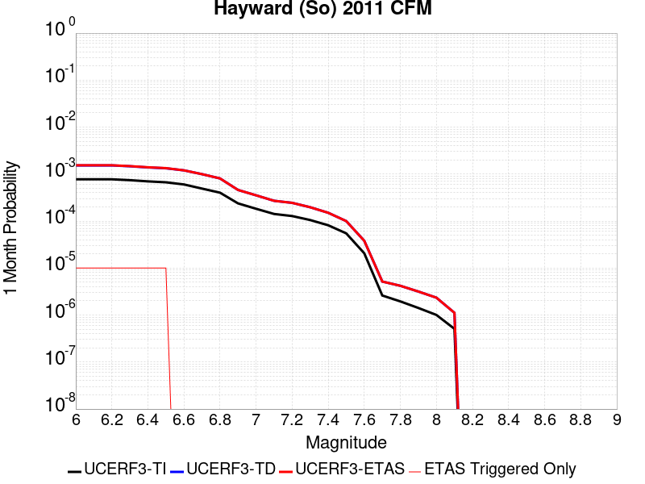 |  |  |

| Magnitude | 1 wk TI Prob | 1 wk TD Prob | 1 wk ETAS Prob | 1 wk ETAS/TD Gain | 1 wk ETAS Triggered Only | 1 mo TI Prob | 1 mo TD Prob | 1 mo ETAS Prob | 1 mo ETAS/TD Gain | 1 mo ETAS Triggered Only | 1 yr TI Prob | 1 yr TD Prob | 1 yr ETAS Prob | 1 yr ETAS/TD Gain | 1 yr ETAS Triggered Only | 10 yr TI Prob | 10 yr TD Prob | 10 yr ETAS Prob | 10 yr ETAS/TD Gain | 10 yr ETAS Triggered Only |
|-----|-----|-----|-----|-----|-----|-----|-----|-----|-----|-----|-----|-----|-----|-----|-----|-----|-----|-----|-----|-----|
| 6.0 | 1.8091932E-4 | 3.570541E-4 | 3.570541E-4 | 1.0 | 0.0 | 7.751381E-4 | 0.0015293444 | 0.00165068 | 1.0793383 | 1.2152145E-4 | 0.00939654 | 0.018463207 | 0.018582486 | 1.0064603 | 1.2152145E-4 | 0.090090066 | 0.16673161 | 0.16683286 | 1.0006074 | 1.2152145E-4 |
| 6.1 | 1.8091932E-4 | 3.570541E-4 | 3.570541E-4 | 1.0 | 0.0 | 7.751381E-4 | 0.0015293444 | 0.00165068 | 1.0793383 | 1.2152145E-4 | 0.00939654 | 0.018463207 | 0.018582486 | 1.0064603 | 1.2152145E-4 | 0.090090066 | 0.16673161 | 0.16683286 | 1.0006074 | 1.2152145E-4 |
| 6.2 | 1.8091932E-4 | 3.570541E-4 | 3.570541E-4 | 1.0 | 0.0 | 7.751381E-4 | 0.0015293444 | 0.00165068 | 1.0793383 | 1.2152145E-4 | 0.00939654 | 0.018463207 | 0.018582486 | 1.0064603 | 1.2152145E-4 | 0.090090066 | 0.16673161 | 0.16683286 | 1.0006074 | 1.2152145E-4 |
| 6.3 | 1.7322872E-4 | 3.426234E-4 | 3.426234E-4 | 1.0 | 0.0 | 7.4219756E-4 | 0.0014675693 | 0.0015889123 | 1.0826831 | 1.2152145E-4 | 0.0089988755 | 0.017723544 | 0.017842911 | 1.006735 | 1.2152145E-4 | 0.08643075 | 0.16066726 | 0.16076925 | 1.0006348 | 1.2152145E-4 |
| 6.4 | 1.6334097E-4 | 3.234411E-4 | 3.234411E-4 | 1.0 | 0.0 | 6.998449E-4 | 0.0013854484 | 0.0015068015 | 1.0875912 | 1.2152145E-4 | 0.008487372 | 0.016739385 | 0.016858872 | 1.0071381 | 1.2152145E-4 | 0.081704415 | 0.15255594 | 0.15265892 | 1.0006751 | 1.2152145E-4 |
| 6.5 | 1.5600289E-4 | 3.1018828E-4 | 3.1018828E-4 | 1.0 | 0.0 | 6.684125E-4 | 0.0013287093 | 0.0014500694 | 1.0913367 | 1.2152145E-4 | 0.008107598 | 0.016058935 | 0.016178504 | 1.0074457 | 1.2152145E-4 | 0.078181036 | 0.14683272 | 0.14693639 | 1.0007061 | 1.2152145E-4 |
| 6.6 | 1.4046066E-4 | 2.8032906E-4 | 2.8032906E-4 | 1.0 | 0.0 | 6.018354E-4 | 0.0012008639 | 0.0012008639 | 1.0 | 0.0 | 0.0073027555 | 0.014524006 | 0.014524006 | 1.0 | 0.0 | 0.07067384 | 0.13391982 | 0.13391982 | 1.0 | 0.0 |
| 6.7 | 1.14696966E-4 | 2.3271477E-4 | 2.3271477E-4 | 1.0 | 0.0 | 4.914658E-4 | 9.969729E-4 | 9.969729E-4 | 1.0 | 0.0 | 0.0059671924 | 0.012071652 | 0.012071652 | 1.0 | 0.0 | 0.058094822 | 0.11274672 | 0.11274672 | 1.0 | 0.0 |
| 6.8 | 9.3874296E-5 | 1.8861453E-4 | 1.8861453E-4 | 1.0 | 0.0 | 4.0225635E-4 | 8.0810126E-4 | 8.0810126E-4 | 1.0 | 0.0 | 0.0048864787 | 0.009794984 | 0.009794984 | 1.0 | 0.0 | 0.047804173 | 0.09259856 | 0.09259856 | 1.0 | 0.0 |
| 6.9 | 5.551852E-5 | 1.072948E-4 | 1.072948E-4 | 1.0 | 0.0 | 2.3791482E-4 | 4.5975443E-4 | 4.5975443E-4 | 1.0 | 0.0 | 0.0028927654 | 0.0055832625 | 0.0055832625 | 1.0 | 0.0 | 0.028553981 | 0.054245494 | 0.054245494 | 1.0 | 0.0 |
| 7.0 | 4.2662363E-5 | 8.2464416E-5 | 8.2464416E-5 | 1.0 | 0.0 | 1.8282588E-4 | 3.5337146E-4 | 3.5337146E-4 | 1.0 | 0.0 | 0.0022236328 | 0.0042938837 | 0.0042938837 | 1.0 | 0.0 | 0.022015138 | 0.042064495 | 0.042064495 | 1.0 | 0.0 |
| 7.1 | 3.305886E-5 | 6.3019055E-5 | 6.3019055E-5 | 1.0 | 0.0 | 1.4167312E-4 | 2.700538E-4 | 2.700538E-4 | 1.0 | 0.0 | 0.0017235056 | 0.0032829668 | 0.0032829668 | 1.0 | 0.0 | 0.017101998 | 0.032452874 | 0.032452874 | 1.0 | 0.0 |
| 7.2 | 2.9856887E-5 | 5.7013647E-5 | 5.7013647E-5 | 1.0 | 0.0 | 1.2795182E-4 | 2.4432142E-4 | 2.4432142E-4 | 1.0 | 0.0 | 0.0015567001 | 0.0029705726 | 0.0029705726 | 1.0 | 0.0 | 0.015458403 | 0.029453589 | 0.029453589 | 1.0 | 0.0 |
| 7.3 | 2.4559737E-5 | 4.599088E-5 | 4.599088E-5 | 1.0 | 0.0 | 1.0525176E-4 | 1.9708896E-4 | 1.9708896E-4 | 1.0 | 0.0 | 0.0012806869 | 0.0023969305 | 0.0023969305 | 1.0 | 0.0 | 0.012733313 | 0.023857482 | 0.023857482 | 1.0 | 0.0 |
| 7.4 | 1.9002231E-5 | 3.5049303E-5 | 3.5049303E-5 | 1.0 | 0.0 | 8.143559E-5 | 1.502027E-4 | 1.502027E-4 | 1.0 | 0.0 | 9.910273E-4 | 0.0018271938 | 0.0018271938 | 1.0 | 0.0 | 0.009866194 | 0.018258283 | 0.018258283 | 1.0 | 0.0 |
| 7.5 | 1.2783333E-5 | 2.3330069E-5 | 2.3330069E-5 | 1.0 | 0.0 | 5.4784563E-5 | 9.998221E-5 | 9.998221E-5 | 1.0 | 0.0 | 6.667979E-4 | 0.0012166094 | 0.0012166094 | 1.0 | 0.0 | 0.006648007 | 0.012209582 | 0.012209582 | 1.0 | 0.0 |
| 7.6 | 4.8149627E-6 | 8.887544E-6 | 8.887544E-6 | 1.0 | 0.0 | 2.063539E-5 | 3.8088925E-5 | 3.8088925E-5 | 1.0 | 0.0 | 2.5120692E-4 | 4.636352E-4 | 4.636352E-4 | 1.0 | 0.0 | 0.0025092314 | 0.0046812436 | 0.0046812436 | 1.0 | 0.0 |
| 7.7 | 6.0838227E-7 | 1.2056693E-6 | 1.2056693E-6 | 1.0 | 0.0 | 2.6073499E-6 | 5.1671436E-6 | 5.1671436E-6 | 1.0 | 0.0 | 3.174402E-5 | 6.290816E-5 | 6.290816E-5 | 1.0 | 0.0 | 3.1739488E-4 | 6.5293367E-4 | 6.5293367E-4 | 1.0 | 0.0 |
| 7.8 | 4.5542808E-7 | 9.792182E-7 | 9.792182E-7 | 1.0 | 0.0 | 1.9518332E-6 | 4.1966427E-6 | 4.1966427E-6 | 1.0 | 0.0 | 2.376331E-5 | 5.1092928E-5 | 5.1092928E-5 | 1.0 | 0.0 | 2.3760769E-4 | 5.321372E-4 | 5.321372E-4 | 1.0 | 0.0 |
| 7.9 | 3.3016747E-7 | 7.386335E-7 | 7.386335E-7 | 1.0 | 0.0 | 1.4150027E-6 | 3.1655684E-6 | 3.1655684E-6 | 1.0 | 0.0 | 1.7227521E-5 | 3.8540114E-5 | 3.8540114E-5 | 1.0 | 0.0 | 1.7226185E-4 | 3.9930744E-4 | 3.9930744E-4 | 1.0 | 0.0 |
| 8.0 | 2.347038E-7 | 5.4714894E-7 | 5.4714894E-7 | 1.0 | 0.0 | 1.0058731E-6 | 2.344922E-6 | 2.344922E-6 | 1.0 | 0.0 | 1.2246436E-5 | 2.8549053E-5 | 2.8549053E-5 | 1.0 | 0.0 | 1.2245761E-4 | 2.9355253E-4 | 2.9355253E-4 | 1.0 | 0.0 |
| 8.1 | 1.18822804E-7 | 2.6058973E-7 | 2.6058973E-7 | 1.0 | 0.0 | 5.092405E-7 | 1.1168127E-6 | 1.1168127E-6 | 1.0 | 0.0 | 6.1999854E-6 | 1.359711E-5 | 1.359711E-5 | 1.0 | 0.0 | 6.199812E-5 | 1.3917852E-4 | 1.3917852E-4 | 1.0 | 0.0 |

