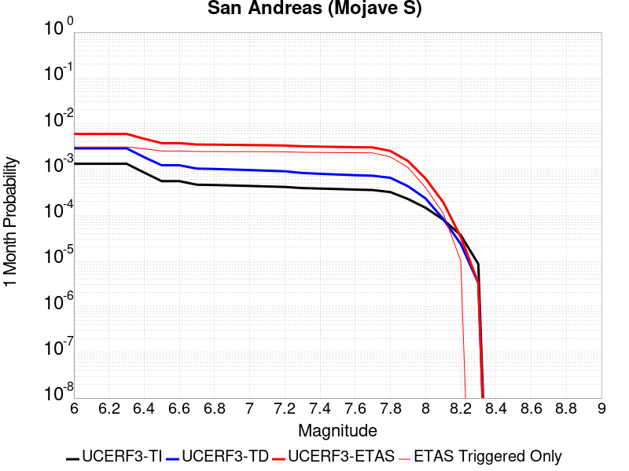
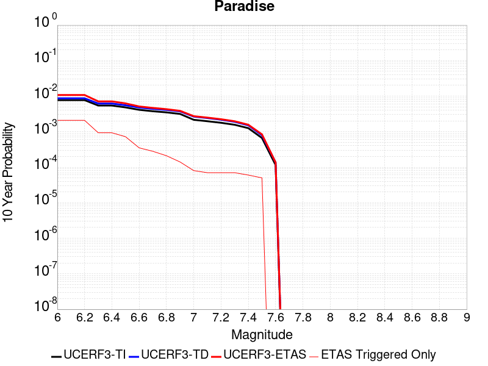
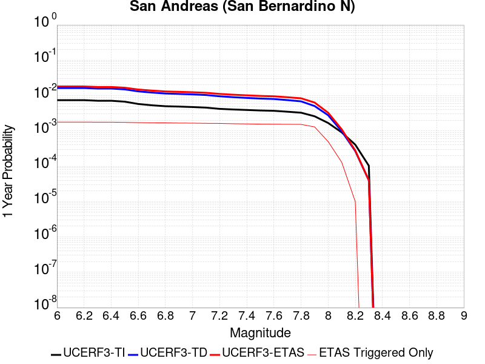
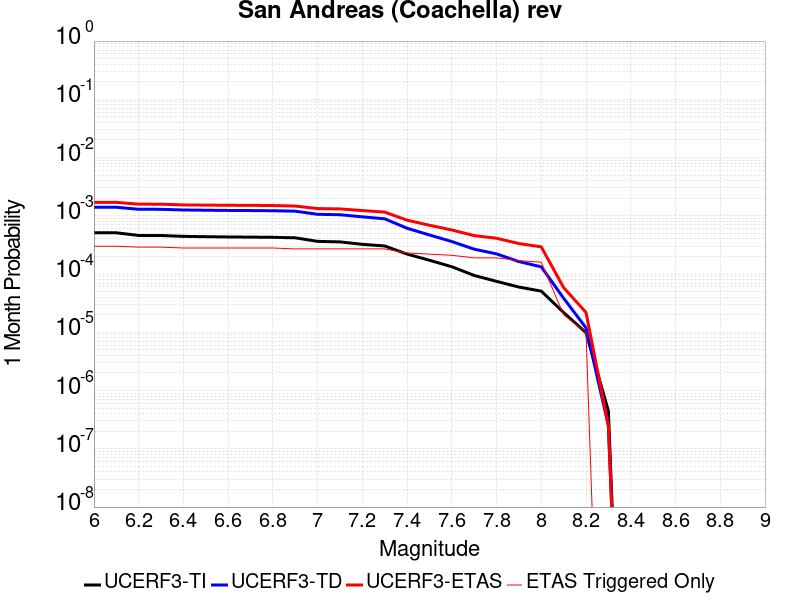
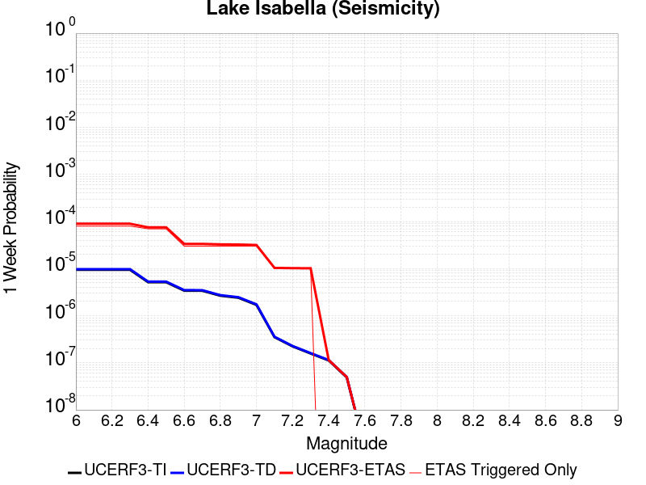
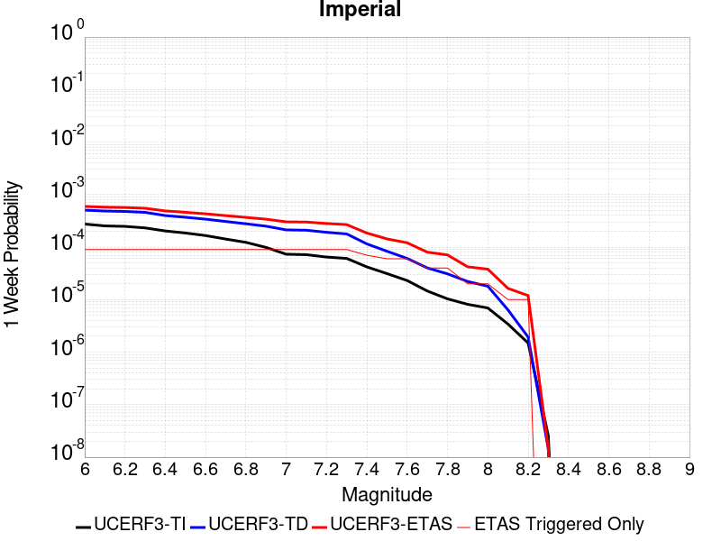

# Parent Section Magnitude-Probability Distributions

Only fault sections with at least one triggered aftershock are plotted. Sections are sorted by total supraseismogenic trigger rate (decreasing)

## Table Of Contents

* [Garlock (Central)](#garlock-central)
* [Tank Canyon](#tank-canyon)
* [Little Lake](#little-lake)
* [Airport Lake](#airport-lake)
* [Owl Lake](#owl-lake)
* [Garlock (East)](#garlock-east)
* [Panamint Valley](#panamint-valley)
* [Hunter Mountain-Saline Valley](#hunter-mountain-saline-valley)
* [Ash Hill](#ash-hill)
* [Blackwater](#blackwater)
* [McLean Lake](#mclean-lake)
* [Garlock (West)](#garlock-west)
* [Death Valley (So)](#death-valley-so)
* [Gravel Hills-Harper Lk](#gravel-hills-harper-lk)
* [Goldstone Lake](#goldstone-lake)
* [So Sierra Nevada](#so-sierra-nevada)
* [Coyote Canyon](#coyote-canyon)
* [Lenwood-Lockhart-Old Woman Springs](#lenwood-lockhart-old-woman-springs)
* [Towne Pass](#towne-pass)
* [Bicycle Lake](#bicycle-lake)
* [Garlic Springs](#garlic-springs)
* [San Andreas (Mojave N)](#san-andreas-mojave-n)
* [Nelson Lake](#nelson-lake)
* [Death Valley (Black Mtns Frontal)](#death-valley-black-mtns-frontal)
* [San Andreas (Mojave S)](#san-andreas-mojave-s)
* [Coyote Lake](#coyote-lake)
* [Paradise](#paradise)
* [Helendale-So Lockhart](#helendale-so-lockhart)
* [White Wolf (Extension)](#white-wolf-extension)
* [Death Valley (No)](#death-valley-no)
* [Scodie Lineament](#scodie-lineament)
* [San Andreas (San Bernardino N)](#san-andreas-san-bernardino-n)
* [San Andreas (San Gorgonio Pass-Garnet HIll)](#san-andreas-san-gorgonio-pass-garnet-hill)
* [San Jacinto (San Bernardino)](#san-jacinto-san-bernardino)
* [Brawley (Seismic Zone) alt 1](#brawley-seismic-zone-alt-1)
* [San Jacinto (Stepovers Combined)](#san-jacinto-stepovers-combined)
* [San Andreas (Coachella) rev](#san-andreas-coachella-rev)
* [San Jacinto (San Jacinto Valley) rev](#san-jacinto-san-jacinto-valley-rev)
* [Baker](#baker)
* [Clamshell-Sawpit](#clamshell-sawpit)
* [Owens Valley](#owens-valley)
* [Santa Rosa Island](#santa-rosa-island)
* [San Gabriel](#san-gabriel)
* [Surprise Valley 2011 CFM](#surprise-valley-2011-cfm)
* [Pine Mtn](#pine-mtn)
* [San Jacinto (Coyote Creek)](#san-jacinto-coyote-creek)
* [Ozena](#ozena)
* [San Jacinto (Anza) rev](#san-jacinto-anza-rev)
* [Lake Isabella (Seismicity)](#lake-isabella-seismicity)
* [White Wolf](#white-wolf)
* [Calico-Hidalgo](#calico-hidalgo)
* [Kern Canyon (North Kern) 2011](#kern-canyon-north-kern-2011)
* [Earthquake Valley (No  Extension)](#earthquake-valley-no--extension)
* [Oceanic - West Huasna](#oceanic---west-huasna)
* [Sierra Nevada  (No Extension)](#sierra-nevada--no-extension)
* [Santa Ynez (East)](#santa-ynez-east)
* [Imperial](#imperial)
* [Pinto Mtn](#pinto-mtn)
* [Kern Canyon (Lake Isabella) 2011](#kern-canyon-lake-isabella-2011)
* [Dry Mountain](#dry-mountain)
* [Oceanside alt1](#oceanside-alt1)
* [San Andreas (San Bernardino S)](#san-andreas-san-bernardino-s)

## Garlock (Central)
*[(top)](#table-of-contents)*

| 1 Week | 1 Month | 1 Year | 10 Year |
|-----|-----|-----|-----|
|  |  |  |  |

| Magnitude | 1 wk TI Prob | 1 wk TD Prob | 1 wk ETAS Prob | 1 wk ETAS/TD Gain | 1 wk ETAS Triggered Only | 1 mo TI Prob | 1 mo TD Prob | 1 mo ETAS Prob | 1 mo ETAS/TD Gain | 1 mo ETAS Triggered Only | 1 yr TI Prob | 1 yr TD Prob | 1 yr ETAS Prob | 1 yr ETAS/TD Gain | 1 yr ETAS Triggered Only | 10 yr TI Prob | 10 yr TD Prob | 10 yr ETAS Prob | 10 yr ETAS/TD Gain | 10 yr ETAS Triggered Only |
|-----|-----|-----|-----|-----|-----|-----|-----|-----|-----|-----|-----|-----|-----|-----|-----|-----|-----|-----|-----|-----|
| 6.0 | 5.5131142E-5 | 7.024681E-5 | 0.09700441 | 1380.9084 | 0.09694097 | 2.3625491E-4 | 3.010234E-4 | 0.11314942 | 375.8825 | 0.112882376 | 0.0028726095 | 0.0036588663 | 0.1320113 | 36.079838 | 0.12882379 | 0.028357591 | 0.036079824 | 0.16773114 | 4.64889 | 0.13657907 |
| 6.1 | 5.5131142E-5 | 7.024681E-5 | 0.09700441 | 1380.9084 | 0.09694097 | 2.3625491E-4 | 3.010234E-4 | 0.11314942 | 375.8825 | 0.112882376 | 0.0028726095 | 0.0036588663 | 0.1320113 | 36.079838 | 0.12882379 | 0.028357591 | 0.036079824 | 0.16773114 | 4.64889 | 0.13657907 |
| 6.2 | 4.216245E-5 | 5.1661493E-5 | 0.05476663 | 1060.1055 | 0.054717794 | 1.806837E-4 | 2.2138779E-4 | 0.06483439 | 292.85443 | 0.06462731 | 0.0021976046 | 0.0026920962 | 0.076168895 | 28.293526 | 0.07367514 | 0.021759989 | 0.026689773 | 0.103011385 | 3.8595824 | 0.07841448 |
| 6.3 | 4.216245E-5 | 5.1661493E-5 | 0.05476663 | 1060.1055 | 0.054717794 | 1.806837E-4 | 2.2138779E-4 | 0.06483439 | 292.85443 | 0.06462731 | 0.0021976046 | 0.0026920962 | 0.076168895 | 28.293526 | 0.07367514 | 0.021759989 | 0.026689773 | 0.103011385 | 3.8595824 | 0.07841448 |
| 6.4 | 3.6858168E-5 | 4.411054E-5 | 0.043127086 | 977.7048 | 0.04308488 | 1.5795401E-4 | 1.8903162E-4 | 0.050158042 | 265.34207 | 0.049978457 | 0.0019213937 | 0.002299056 | 0.05904034 | 25.680254 | 0.056872036 | 0.019048655 | 0.02284894 | 0.08221055 | 3.598003 | 0.060749676 |
| 6.5 | 3.39199E-5 | 4.0018083E-5 | 0.038384024 | 959.167 | 0.03834554 | 1.453629E-4 | 1.7149492E-4 | 0.044110533 | 257.21188 | 0.043946575 | 0.0017683565 | 0.002085973 | 0.052820075 | 25.321554 | 0.050840154 | 0.017543508 | 0.020759864 | 0.07434172 | 3.5810313 | 0.054717794 |
| 6.6 | 3.3571985E-5 | 3.9472274E-5 | 0.0383835 | 972.41675 | 0.03834554 | 1.4387199E-4 | 1.6915603E-4 | 0.044108298 | 260.7551 | 0.043946575 | 0.0017502342 | 0.0020575512 | 0.0527931 | 25.65822 | 0.050840154 | 0.017365133 | 0.020481179 | 0.074078284 | 3.6168957 | 0.054717794 |
| 6.7 | 3.2580007E-5 | 3.8088703E-5 | 0.037089672 | 973.771 | 0.037052993 | 1.3962112E-4 | 1.632272E-4 | 0.042810295 | 262.27426 | 0.04265403 | 0.0016985617 | 0.0019855013 | 0.051434733 | 25.905163 | 0.04954761 | 0.016856372 | 0.019773813 | 0.07214264 | 3.648393 | 0.05342525 |
| 6.8 | 3.2185937E-5 | 3.7515918E-5 | 0.03708912 | 988.62354 | 0.037052993 | 1.3793244E-4 | 1.6077272E-4 | 0.042807944 | 266.26373 | 0.04265403 | 0.0016780337 | 0.001955672 | 0.051406384 | 26.28579 | 0.04954761 | 0.016654192 | 0.019480614 | 0.071865104 | 3.6890574 | 0.05342525 |
| 6.9 | 3.165394E-5 | 3.6720503E-5 | 0.037088353 | 1010.0176 | 0.037052993 | 1.3565269E-4 | 1.5736422E-4 | 0.04280468 | 272.01025 | 0.04265403 | 0.0016503202 | 0.001914247 | 0.05050696 | 26.384766 | 0.048685912 | 0.01638118 | 0.019073246 | 0.07021161 | 3.6811566 | 0.0521327 |
| 7.0 | 3.0903822E-5 | 3.5625766E-5 | 0.036656465 | 1028.9314 | 0.036622144 | 1.3243823E-4 | 1.5267303E-4 | 0.042369407 | 277.51727 | 0.042223178 | 0.0016112428 | 0.0018572307 | 0.050022673 | 26.934011 | 0.048255064 | 0.015996104 | 0.018512413 | 0.06925714 | 3.741119 | 0.05170185 |
| 7.1 | 3.0069863E-5 | 3.4392073E-5 | 0.03579361 | 1040.7518 | 0.035760447 | 1.2886449E-4 | 1.4738638E-4 | 0.04107199 | 278.6688 | 0.040930633 | 0.0015677959 | 0.0017929734 | 0.047811136 | 26.665836 | 0.046100818 | 0.01556781 | 0.017880075 | 0.06611862 | 3.697894 | 0.04911676 |
| 7.2 | 2.7957109E-5 | 3.128145E-5 | 0.029328082 | 937.55493 | 0.029297717 | 1.1981068E-4 | 1.340566E-4 | 0.03416655 | 254.8666 | 0.034037054 | 0.0014577188 | 0.0016309366 | 0.039483793 | 24.209274 | 0.037914693 | 0.014481937 | 0.016283695 | 0.056123994 | 3.4466376 | 0.040499784 |
| 7.3 | 2.4519275E-5 | 2.6714795E-5 | 0.021568578 | 807.36456 | 0.02154244 | 1.0507837E-4 | 1.1448703E-4 | 0.023808457 | 207.95766 | 0.023696683 | 0.0012785783 | 0.001393003 | 0.027638167 | 19.840708 | 0.026281776 | 0.012712469 | 0.013928054 | 0.041543167 | 2.9826972 | 0.02800517 |
| 7.4 | 2.3225532E-5 | 2.51994E-5 | 0.019412905 | 770.37177 | 0.019388195 | 9.95342E-5 | 1.0799304E-4 | 0.021648105 | 200.45834 | 0.02154244 | 0.0012111551 | 0.0013140367 | 0.025409864 | 19.337255 | 0.024127532 | 0.012045753 | 0.013145725 | 0.038656823 | 2.9406383 | 0.025850926 |
| 7.5 | 2.097765E-5 | 2.2483688E-5 | 0.012516817 | 556.7066 | 0.012494614 | 8.9901114E-5 | 9.635517E-5 | 0.014743802 | 153.01517 | 0.014648858 | 0.0010939965 | 0.0011725046 | 0.017955905 | 15.314144 | 0.016803103 | 0.010886264 | 0.011740365 | 0.029197773 | 2.4869561 | 0.0176648 |
| 7.6 | 1.511254E-5 | 1.5991332E-5 | 0.006047778 | 378.19098 | 0.006031883 | 6.476642E-5 | 6.853253E-5 | 0.0073924595 | 107.8679 | 0.007324429 | 7.882459E-4 | 8.3407195E-4 | 0.009013371 | 10.806467 | 0.008186127 | 0.007854558 | 0.008383559 | 0.016501056 | 1.968264 | 0.008186127 |
| 7.7 | 9.934069E-6 | 1.0678794E-5 | 4.4152298E-4 | 41.34577 | 4.3084877E-4 | 4.2573887E-5 | 4.5765457E-5 | 9.0742356E-4 | 19.827696 | 8.6169754E-4 | 5.182138E-4 | 5.570524E-4 | 0.0018488787 | 3.3190393 | 0.0012925463 | 0.00517007 | 0.005627684 | 0.006912956 | 1.2283839 | 0.0012925463 |
| 7.8 | 6.7562896E-6 | 8.428449E-6 | 8.428449E-6 | 1.0 | 0.0 | 2.8955206E-5 | 3.6121426E-5 | 4.6695463E-4 | 12.92736 | 4.3084877E-4 | 3.5247262E-4 | 4.3968976E-4 | 0.0013010084 | 2.9589236 | 8.6169754E-4 | 0.0035191406 | 0.004446654 | 0.00530452 | 1.1929239 | 8.6169754E-4 |
| 7.9 | 3.975453E-6 | 5.37103E-6 | 5.37103E-6 | 1.0 | 0.0 | 1.7037546E-5 | 2.3018498E-5 | 4.5385736E-4 | 19.71707 | 4.3084877E-4 | 2.0741238E-4 | 2.8021427E-4 | 0.0011416704 | 4.074276 | 8.6169754E-4 | 0.002072189 | 0.0028336283 | 0.003692884 | 1.3032352 | 8.6169754E-4 |
| 8.0 | 1.6729537E-6 | 2.0775144E-6 | 2.0775144E-6 | 1.0 | 0.0 | 7.169782E-6 | 8.903603E-6 | 8.903603E-6 | 1.0 | 0.0 | 8.7288594E-5 | 1.0839601E-4 | 5.3919805E-4 | 4.974335 | 4.3084877E-4 | 8.7254314E-4 | 0.0010969337 | 0.00152731 | 1.3923447 | 4.3084877E-4 |
| 8.1 | 3.6733252E-7 | 3.1489964E-7 | 3.1489964E-7 | 1.0 | 0.0 | 1.5742813E-6 | 1.3495693E-6 | 1.3495693E-6 | 1.0 | 0.0 | 1.9166706E-5 | 1.6430899E-5 | 1.6430899E-5 | 1.0 | 0.0 | 1.9165053E-4 | 1.6638759E-4 | 1.6638759E-4 | 1.0 | 0.0 |

## Tank Canyon
*[(top)](#table-of-contents)*

| 1 Week | 1 Month | 1 Year | 10 Year |
|-----|-----|-----|-----|
|  |  |  |  |

| Magnitude | 1 wk TI Prob | 1 wk TD Prob | 1 wk ETAS Prob | 1 wk ETAS/TD Gain | 1 wk ETAS Triggered Only | 1 mo TI Prob | 1 mo TD Prob | 1 mo ETAS Prob | 1 mo ETAS/TD Gain | 1 mo ETAS Triggered Only | 1 yr TI Prob | 1 yr TD Prob | 1 yr ETAS Prob | 1 yr ETAS/TD Gain | 1 yr ETAS Triggered Only | 10 yr TI Prob | 10 yr TD Prob | 10 yr ETAS Prob | 10 yr ETAS/TD Gain | 10 yr ETAS Triggered Only |
|-----|-----|-----|-----|-----|-----|-----|-----|-----|-----|-----|-----|-----|-----|-----|-----|-----|-----|-----|-----|-----|
| 6.0 | 4.8284557E-5 | 5.7964822E-5 | 0.06338906 | 1093.5781 | 0.06333477 | 2.0691741E-4 | 2.4840087E-4 | 0.0786434 | 316.59872 | 0.07841448 | 0.0025163088 | 0.0030207601 | 0.09923935 | 32.852444 | 0.09651013 | 0.02488006 | 0.029863637 | 0.13352318 | 4.471096 | 0.1068505 |
| 6.1 | 1.7796336E-5 | 2.0873314E-5 | 0.021132022 | 1012.39417 | 0.021111589 | 7.626778E-5 | 8.945422E-5 | 0.02852293 | 318.85504 | 0.028436018 | 9.281647E-4 | 0.0010885983 | 0.03681012 | 33.814236 | 0.035760447 | 0.009242975 | 0.010836744 | 0.05004528 | 4.6181107 | 0.039638087 |
| 6.2 | 1.7796336E-5 | 2.0873314E-5 | 0.021132022 | 1012.39417 | 0.021111589 | 7.626778E-5 | 8.945422E-5 | 0.02852293 | 318.85504 | 0.028436018 | 9.281647E-4 | 0.0010885983 | 0.03681012 | 33.814236 | 0.035760447 | 0.009242975 | 0.010836744 | 0.05004528 | 4.6181107 | 0.039638087 |
| 6.3 | 1.3515912E-5 | 1.5759564E-5 | 0.017249439 | 1094.5377 | 0.017233951 | 5.792405E-5 | 6.753938E-5 | 0.022039343 | 326.31842 | 0.021973288 | 7.049971E-4 | 8.2200574E-4 | 0.02837366 | 34.517593 | 0.027574321 | 0.007027647 | 0.0081922645 | 0.038531926 | 4.703452 | 0.030590262 |
| 6.4 | 1.0870146E-5 | 1.2618021E-5 | 0.011214545 | 888.7721 | 0.011202068 | 4.658551E-5 | 5.4076212E-5 | 0.014271317 | 263.91116 | 0.014218009 | 5.67031E-4 | 6.581969E-4 | 0.018741935 | 28.474663 | 0.018095648 | 0.005655863 | 0.0065644905 | 0.027537493 | 4.194917 | 0.021111589 |
| 6.5 | 7.964826E-6 | 9.196094E-6 | 0.007333558 | 797.4644 | 0.007324429 | 3.4134522E-5 | 3.9411298E-5 | 0.009086879 | 230.56534 | 0.009047824 | 4.1550855E-4 | 4.7973756E-4 | 0.01124579 | 23.441545 | 0.01077122 | 0.0041473247 | 0.004788321 | 0.017651893 | 3.6864471 | 0.012925463 |
| 6.6 | 6.6317E-6 | 7.6122988E-6 | 0.005608604 | 736.78186 | 0.005601034 | 2.8421264E-5 | 3.2623782E-5 | 0.006925979 | 212.29848 | 0.0068935803 | 3.4597394E-4 | 3.9713128E-4 | 0.00814933 | 20.520493 | 0.0077552777 | 0.0034543579 | 0.003965368 | 0.012548174 | 3.1644413 | 0.0086169755 |
| 6.7 | 4.793663E-6 | 5.4307857E-6 | 0.0034522023 | 635.6727 | 0.0034467902 | 2.0544108E-5 | 2.3274613E-5 | 0.004762501 | 204.62213 | 0.0047393367 | 2.500958E-4 | 2.8333595E-4 | 0.0054520564 | 19.242374 | 0.005170185 | 0.0024981452 | 0.0028304397 | 0.008845249 | 3.1250443 | 0.006031883 |
| 6.8 | 4.382823E-6 | 4.9692567E-6 | 0.0030208956 | 607.917 | 0.0030159415 | 1.8783392E-5 | 2.1296666E-5 | 0.0043296926 | 203.30379 | 0.0043084878 | 2.286638E-4 | 2.5926033E-4 | 0.004997368 | 19.275484 | 0.0047393367 | 0.0022842865 | 0.002590253 | 0.008176778 | 3.1567492 | 0.005601034 |
| 6.9 | 2.729601E-6 | 3.0735416E-6 | 8.6476846E-4 | 281.35895 | 8.6169754E-4 | 1.1698237E-5 | 1.3172262E-5 | 0.0013057016 | 99.125084 | 0.0012925463 | 1.4241673E-4 | 1.6036171E-4 | 0.0018834805 | 11.7452 | 0.0017233951 | 0.001423255 | 0.0016026258 | 0.0041835755 | 2.6104505 | 0.0025850926 |
| 7.0 | 1.8987357E-6 | 2.126939E-6 | 2.126939E-6 | 1.0 | 0.0 | 8.137413E-6 | 9.115425E-6 | 4.3996028E-4 | 48.26547 | 4.3084877E-4 | 9.90685E-5 | 1.1097535E-4 | 9.7257725E-4 | 8.763904 | 8.6169754E-4 | 9.902435E-4 | 0.0011092679 | 0.0024003806 | 2.163932 | 0.0012925463 |
| 7.1 | 1.4928986E-6 | 1.6641272E-6 | 1.6641272E-6 | 1.0 | 0.0 | 6.398121E-6 | 7.1319573E-6 | 4.3797767E-4 | 61.41058 | 4.3084877E-4 | 7.789434E-5 | 8.682871E-5 | 9.4845146E-4 | 10.923246 | 8.6169754E-4 | 7.786704E-4 | 8.6800574E-4 | 0.0017289553 | 1.9918709 | 8.6169754E-4 |
| 7.2 | 1.069082E-6 | 1.1828573E-6 | 1.1828573E-6 | 1.0 | 0.0 | 4.581772E-6 | 5.0693816E-6 | 4.3591598E-4 | 85.989975 | 4.3084877E-4 | 5.5781646E-5 | 6.171851E-5 | 9.2336285E-4 | 14.9608755 | 8.6169754E-4 | 5.576765E-4 | 6.170659E-4 | 0.0014782317 | 2.3955817 | 8.6169754E-4 |
| 7.3 | 8.776551E-7 | 9.770005E-7 | 9.770005E-7 | 1.0 | 0.0 | 3.7613736E-6 | 4.1871413E-6 | 4.1871413E-6 | 1.0 | 0.0 | 4.579376E-5 | 5.097777E-5 | 4.8180457E-4 | 9.451268 | 4.3084877E-4 | 4.5784327E-4 | 5.097118E-4 | 9.403409E-4 | 1.8448484 | 4.3084877E-4 |
| 7.4 | 7.55721E-7 | 8.510244E-7 | 8.510244E-7 | 1.0 | 0.0 | 3.2388E-6 | 3.6472454E-6 | 3.6472454E-6 | 1.0 | 0.0 | 3.9431678E-5 | 4.4404827E-5 | 4.7523447E-4 | 10.702315 | 4.3084877E-4 | 3.942468E-4 | 4.440104E-4 | 8.7466784E-4 | 1.9699266 | 4.3084877E-4 |
| 7.5 | 5.587665E-7 | 6.305619E-7 | 6.305619E-7 | 1.0 | 0.0 | 2.3947114E-6 | 2.702408E-6 | 2.702408E-6 | 1.0 | 0.0 | 2.915522E-5 | 3.290182E-5 | 4.6373642E-4 | 14.094553 | 4.3084877E-4 | 2.9151395E-4 | 3.290182E-4 | 7.597252E-4 | 2.3090675 | 4.3084877E-4 |

## Little Lake
*[(top)](#table-of-contents)*

| 1 Week | 1 Month | 1 Year | 10 Year |
|-----|-----|-----|-----|
|  |  |  |  |

| Magnitude | 1 wk TI Prob | 1 wk TD Prob | 1 wk ETAS Prob | 1 wk ETAS/TD Gain | 1 wk ETAS Triggered Only | 1 mo TI Prob | 1 mo TD Prob | 1 mo ETAS Prob | 1 mo ETAS/TD Gain | 1 mo ETAS Triggered Only | 1 yr TI Prob | 1 yr TD Prob | 1 yr ETAS Prob | 1 yr ETAS/TD Gain | 1 yr ETAS Triggered Only | 10 yr TI Prob | 10 yr TD Prob | 10 yr ETAS Prob | 10 yr ETAS/TD Gain | 10 yr ETAS Triggered Only |
|-----|-----|-----|-----|-----|-----|-----|-----|-----|-----|-----|-----|-----|-----|-----|-----|-----|-----|-----|-----|-----|
| 6.0 | 2.8424427E-5 | 3.120572E-5 | 0.050869774 | 1630.1426 | 0.050840154 | 1.2181328E-4 | 1.337327E-4 | 0.056136582 | 419.76706 | 0.05601034 | 0.0014820677 | 0.0016271127 | 0.06313824 | 38.80385 | 0.061611373 | 0.014722223 | 0.016165402 | 0.08229129 | 5.090582 | 0.06721241 |
| 6.1 | 2.8424427E-5 | 3.120572E-5 | 0.050869774 | 1630.1426 | 0.050840154 | 1.2181328E-4 | 1.337327E-4 | 0.056136582 | 419.76706 | 0.05601034 | 0.0014820677 | 0.0016271127 | 0.06313824 | 38.80385 | 0.061611373 | 0.014722223 | 0.016165402 | 0.08229129 | 5.090582 | 0.06721241 |
| 6.2 | 2.8424427E-5 | 3.120572E-5 | 0.050869774 | 1630.1426 | 0.050840154 | 1.2181328E-4 | 1.337327E-4 | 0.056136582 | 419.76706 | 0.05601034 | 0.0014820677 | 0.0016271127 | 0.06313824 | 38.80385 | 0.061611373 | 0.014722223 | 0.016165402 | 0.08229129 | 5.090582 | 0.06721241 |
| 6.3 | 1.48860645E-5 | 1.6081389E-5 | 0.03491427 | 2171.098 | 0.03489875 | 6.379586E-5 | 6.8918576E-5 | 0.038411815 | 557.35065 | 0.03834554 | 7.7643775E-4 | 8.3878887E-4 | 0.04173509 | 49.75637 | 0.040930633 | 0.007737305 | 0.008359048 | 0.05236552 | 6.2645316 | 0.044377424 |
| 6.4 | 1.48860645E-5 | 1.6081389E-5 | 0.03491427 | 2171.098 | 0.03489875 | 6.379586E-5 | 6.8918576E-5 | 0.038411815 | 557.35065 | 0.03834554 | 7.7643775E-4 | 8.3878887E-4 | 0.04173509 | 49.75637 | 0.040930633 | 0.007737305 | 0.008359048 | 0.05236552 | 6.2645316 | 0.044377424 |
| 6.5 | 1.2797581E-5 | 1.3765565E-5 | 0.031465292 | 2285.7974 | 0.03145196 | 5.4845623E-5 | 5.899409E-5 | 0.034955684 | 592.5286 | 0.03489875 | 6.675408E-4 | 7.18042E-4 | 0.03774443 | 52.56577 | 0.037052993 | 0.006655392 | 0.00715977 | 0.04694182 | 6.5563307 | 0.040068936 |
| 6.6 | 9.661896E-6 | 1.0289038E-5 | 0.029307704 | 2848.4397 | 0.029297717 | 4.1407468E-5 | 4.409522E-5 | 0.03235633 | 733.7831 | 0.032313656 | 5.040193E-4 | 5.367433E-4 | 0.03455553 | 64.37998 | 0.034037054 | 0.005028777 | 0.0053560743 | 0.04221061 | 7.8808856 | 0.037052993 |
| 6.7 | 7.767871E-6 | 8.199687E-6 | 0.02715145 | 3311.279 | 0.027143473 | 3.329045E-5 | 3.5141118E-5 | 0.029331828 | 834.6868 | 0.029297717 | 4.0523586E-4 | 4.2777284E-4 | 0.03186628 | 74.49346 | 0.03145196 | 0.004044977 | 0.004270846 | 0.038162533 | 8.935591 | 0.034037054 |
| 6.8 | 6.4235196E-6 | 6.7357446E-6 | 0.020256491 | 3007.313 | 0.020249892 | 2.752908E-5 | 2.8867229E-5 | 0.022432357 | 777.0873 | 0.022404136 | 3.35115E-4 | 3.5141467E-4 | 0.024470467 | 69.63416 | 0.024127532 | 0.003346101 | 0.00350985 | 0.02969938 | 8.461723 | 0.026281776 |
| 6.9 | 3.1283696E-6 | 3.1121804E-6 | 0.011635993 | 3738.8555 | 0.0116329165 | 1.3407229E-5 | 1.3337856E-5 | 0.013369472 | 1002.3703 | 0.013356312 | 1.6322079E-4 | 1.6237781E-4 | 0.014378078 | 88.547066 | 0.014218009 | 0.0016310095 | 0.00162274 | 0.016247828 | 10.0125885 | 0.014648858 |
| 7.0 | 2.290603E-6 | 2.2286815E-6 | 0.007757489 | 3480.7527 | 0.0077552777 | 9.816834E-6 | 9.551463E-6 | 0.009057289 | 948.26196 | 0.009047824 | 1.19513395E-4 | 1.162839E-4 | 0.009163056 | 78.79901 | 0.009047824 | 0.0011944914 | 0.0011623327 | 0.010629988 | 9.145392 | 0.009478673 |
| 7.1 | 1.293693E-6 | 1.1776827E-6 | 0.003878812 | 3293.5967 | 0.0038776388 | 5.5443866E-6 | 5.0472063E-6 | 0.004313513 | 854.63385 | 0.0043084878 | 6.750081E-5 | 6.14487E-5 | 0.0043696715 | 71.110886 | 0.0043084878 | 6.7480316E-4 | 6.143856E-4 | 0.0053508105 | 8.709206 | 0.0047393367 |
| 7.2 | 4.715842E-7 | 3.0917857E-7 | 3.0917857E-7 | 1.0 | 0.0 | 2.0210737E-6 | 1.3250503E-6 | 4.3217326E-4 | 326.1561 | 4.3084877E-4 | 2.4606294E-5 | 1.6132375E-5 | 4.4697418E-4 | 27.70666 | 4.3084877E-4 | 2.460357E-4 | 1.6131258E-4 | 5.920918E-4 | 3.670463 | 4.3084877E-4 |
| 7.3 | 3.9430947E-7 | 2.3097488E-7 | 2.3097488E-7 | 1.0 | 0.0 | 1.6898966E-6 | 9.89892E-7 | 9.89892E-7 | 1.0 | 0.0 | 2.0574296E-5 | 1.2051869E-5 | 1.2051869E-5 | 1.0 | 0.0 | 2.0572392E-4 | 1.20512224E-4 | 1.20512224E-4 | 1.0 | 0.0 |
| 7.4 | 3.547123E-7 | 1.9679135E-7 | 1.9679135E-7 | 1.0 | 0.0 | 1.5201948E-6 | 8.4339126E-7 | 8.4339126E-7 | 1.0 | 0.0 | 1.8508214E-5 | 1.0268241E-5 | 1.0268241E-5 | 1.0 | 0.0 | 1.8506673E-4 | 1.02677724E-4 | 1.02677724E-4 | 1.0 | 0.0 |
| 7.5 | 2.6354266E-7 | 1.4423138E-7 | 1.4423138E-7 | 1.0 | 0.0 | 1.129468E-6 | 6.181344E-7 | 6.181344E-7 | 1.0 | 0.0 | 1.3751187E-5 | 7.5257603E-6 | 7.5257603E-6 | 1.0 | 0.0 | 1.3750336E-4 | 7.5255106E-5 | 7.5255106E-5 | 1.0 | 0.0 |
| 7.6 | 1.269913E-7 | 7.572556E-8 | 7.572556E-8 | 1.0 | 0.0 | 5.4424834E-7 | 3.245381E-7 | 3.245381E-7 | 1.0 | 0.0 | 6.6262032E-6 | 3.9512443E-6 | 3.9512443E-6 | 1.0 | 0.0 | 6.626006E-5 | 3.9511775E-5 | 3.9511775E-5 | 1.0 | 0.0 |

## Airport Lake
*[(top)](#table-of-contents)*

| 1 Week | 1 Month | 1 Year | 10 Year |
|-----|-----|-----|-----|
|  |  |  |  |

| Magnitude | 1 wk TI Prob | 1 wk TD Prob | 1 wk ETAS Prob | 1 wk ETAS/TD Gain | 1 wk ETAS Triggered Only | 1 mo TI Prob | 1 mo TD Prob | 1 mo ETAS Prob | 1 mo ETAS/TD Gain | 1 mo ETAS Triggered Only | 1 yr TI Prob | 1 yr TD Prob | 1 yr ETAS Prob | 1 yr ETAS/TD Gain | 1 yr ETAS Triggered Only | 10 yr TI Prob | 10 yr TD Prob | 10 yr ETAS Prob | 10 yr ETAS/TD Gain | 10 yr ETAS Triggered Only |
|-----|-----|-----|-----|-----|-----|-----|-----|-----|-----|-----|-----|-----|-----|-----|-----|-----|-----|-----|-----|-----|
| 6.0 | 1.2387061E-5 | 1.3103157E-5 | 0.042666573 | 3256.2056 | 0.04265403 | 5.3086325E-5 | 5.615534E-5 | 0.048308507 | 860.2656 | 0.048255064 | 6.461343E-4 | 6.8350515E-4 | 0.054072235 | 79.11021 | 0.05342525 | 0.0064425888 | 0.0068168393 | 0.061589543 | 9.034912 | 0.055148643 |
| 6.1 | 1.2387061E-5 | 1.3103157E-5 | 0.042666573 | 3256.2056 | 0.04265403 | 5.3086325E-5 | 5.615534E-5 | 0.048308507 | 860.2656 | 0.048255064 | 6.461343E-4 | 6.8350515E-4 | 0.054072235 | 79.11021 | 0.05342525 | 0.0064425888 | 0.0068168393 | 0.061589543 | 9.034912 | 0.055148643 |
| 6.2 | 1.2387061E-5 | 1.3103157E-5 | 0.042666573 | 3256.2056 | 0.04265403 | 5.3086325E-5 | 5.615534E-5 | 0.048308507 | 860.2656 | 0.048255064 | 6.461343E-4 | 6.8350515E-4 | 0.054072235 | 79.11021 | 0.05342525 | 0.0064425888 | 0.0068168393 | 0.061589543 | 9.034912 | 0.055148643 |
| 6.3 | 1.2387061E-5 | 1.3103157E-5 | 0.042666573 | 3256.2056 | 0.04265403 | 5.3086325E-5 | 5.615534E-5 | 0.048308507 | 860.2656 | 0.048255064 | 6.461343E-4 | 6.8350515E-4 | 0.054072235 | 79.11021 | 0.05342525 | 0.0064425888 | 0.0068168393 | 0.061589543 | 9.034912 | 0.055148643 |
| 6.4 | 1.2387061E-5 | 1.3103157E-5 | 0.042666573 | 3256.2056 | 0.04265403 | 5.3086325E-5 | 5.615534E-5 | 0.048308507 | 860.2656 | 0.048255064 | 6.461343E-4 | 6.8350515E-4 | 0.054072235 | 79.11021 | 0.05342525 | 0.0064425888 | 0.0068168393 | 0.061589543 | 9.034912 | 0.055148643 |
| 6.5 | 6.9922594E-6 | 7.384925E-6 | 0.033182494 | 4493.2744 | 0.033175357 | 2.996648E-5 | 3.1649324E-5 | 0.03794514 | 1198.9242 | 0.037914693 | 3.6478083E-4 | 3.8526783E-4 | 0.0421615 | 109.43425 | 0.04179233 | 0.003641826 | 0.0038465366 | 0.046336494 | 12.046289 | 0.04265403 |
| 6.6 | 6.9922594E-6 | 7.384925E-6 | 0.033182494 | 4493.2744 | 0.033175357 | 2.996648E-5 | 3.1649324E-5 | 0.03794514 | 1198.9242 | 0.037914693 | 3.6478083E-4 | 3.8526783E-4 | 0.0421615 | 109.43425 | 0.04179233 | 0.003641826 | 0.0038465366 | 0.046336494 | 12.046289 | 0.04265403 |
| 6.7 | 5.477277E-6 | 5.7860684E-6 | 0.029303333 | 5064.4634 | 0.029297717 | 2.3473833E-5 | 2.4797222E-5 | 0.03276849 | 1321.4581 | 0.03274451 | 2.8575645E-4 | 3.0186825E-4 | 0.0356208 | 118.00116 | 0.0353296 | 0.0028538927 | 0.003014966 | 0.03909715 | 12.967691 | 0.036191296 |
| 6.8 | 3.9950432E-6 | 4.2190873E-6 | 0.021546567 | 5106.9263 | 0.02154244 | 1.7121502E-5 | 1.8081691E-5 | 0.024576018 | 1359.1658 | 0.02455838 | 2.0843433E-4 | 2.2012512E-4 | 0.026496114 | 120.36843 | 0.026281776 | 0.0020823893 | 0.0021993418 | 0.028853215 | 13.119023 | 0.026712624 |
| 6.9 | 2.95695E-6 | 3.1230243E-6 | 0.015082783 | 4829.544 | 0.015079707 | 1.2672582E-5 | 1.3384334E-5 | 0.017247105 | 1288.6039 | 0.017233951 | 1.5427776E-4 | 1.6294434E-4 | 0.018255644 | 112.03607 | 0.018095648 | 0.001541707 | 0.0016284712 | 0.020124799 | 12.358093 | 0.018526496 |
| 7.0 | 1.456072E-6 | 1.540812E-6 | 0.007756807 | 5034.233 | 0.0077552777 | 6.2402937E-6 | 6.603469E-6 | 0.008623522 | 1305.9078 | 0.0086169755 | 7.597293E-5 | 8.039528E-5 | 0.008696678 | 108.17399 | 0.0086169755 | 7.594696E-4 | 8.0376083E-4 | 0.009844312 | 12.247813 | 0.009047824 |
| 7.1 | 6.995192E-7 | 7.4089746E-7 | 0.003878377 | 5234.7017 | 0.0038776388 | 2.997936E-6 | 3.1752747E-6 | 0.0038808018 | 1222.1941 | 0.0038776388 | 3.649926E-5 | 3.865897E-5 | 0.003916148 | 101.29985 | 0.0038776388 | 3.6493264E-4 | 3.865897E-4 | 0.0046934118 | 12.140551 | 0.0043084878 |

## Owl Lake
*[(top)](#table-of-contents)*

| 1 Week | 1 Month | 1 Year | 10 Year |
|-----|-----|-----|-----|
|  |  |  |  |

| Magnitude | 1 wk TI Prob | 1 wk TD Prob | 1 wk ETAS Prob | 1 wk ETAS/TD Gain | 1 wk ETAS Triggered Only | 1 mo TI Prob | 1 mo TD Prob | 1 mo ETAS Prob | 1 mo ETAS/TD Gain | 1 mo ETAS Triggered Only | 1 yr TI Prob | 1 yr TD Prob | 1 yr ETAS Prob | 1 yr ETAS/TD Gain | 1 yr ETAS Triggered Only | 10 yr TI Prob | 10 yr TD Prob | 10 yr ETAS Prob | 10 yr ETAS/TD Gain | 10 yr ETAS Triggered Only |
|-----|-----|-----|-----|-----|-----|-----|-----|-----|-----|-----|-----|-----|-----|-----|-----|-----|-----|-----|-----|-----|
| 6.0 | 5.0320643E-5 | 6.635816E-5 | 0.029792951 | 448.97195 | 0.029728565 | 2.1564208E-4 | 2.843674E-4 | 0.033881016 | 119.145226 | 0.033606205 | 0.0026222812 | 0.0034577388 | 0.04338813 | 12.548121 | 0.040068936 | 0.02591553 | 0.034140717 | 0.07575464 | 2.2188945 | 0.04308488 |
| 6.1 | 5.0320643E-5 | 6.635816E-5 | 0.029792951 | 448.97195 | 0.029728565 | 2.1564208E-4 | 2.843674E-4 | 0.033881016 | 119.145226 | 0.033606205 | 0.0026222812 | 0.0034577388 | 0.04338813 | 12.548121 | 0.040068936 | 0.02591553 | 0.034140717 | 0.07575464 | 2.2188945 | 0.04308488 |
| 6.2 | 2.4125871E-5 | 3.0981035E-5 | 0.024157764 | 779.75977 | 0.024127532 | 1.0339249E-4 | 1.3277028E-4 | 0.026841847 | 202.16759 | 0.026712624 | 0.0012580766 | 0.001615439 | 0.032586437 | 20.171879 | 0.03102111 | 0.012509781 | 0.016070465 | 0.048712675 | 3.0311928 | 0.033175357 |
| 6.3 | 1.7433485E-5 | 2.2355514E-5 | 0.019840956 | 887.5196 | 0.019819044 | 7.471279E-5 | 9.580672E-5 | 0.022497796 | 234.82483 | 0.022404136 | 9.0924866E-4 | 0.0011659743 | 0.02698676 | 23.145243 | 0.025850926 | 0.009055373 | 0.011628896 | 0.03845672 | 3.3069966 | 0.027143473 |
| 6.4 | 1.7433485E-5 | 2.2355514E-5 | 0.019840956 | 887.5196 | 0.019819044 | 7.471279E-5 | 9.580672E-5 | 0.022497796 | 234.82483 | 0.022404136 | 9.0924866E-4 | 0.0011659743 | 0.02698676 | 23.145243 | 0.025850926 | 0.009055373 | 0.011628896 | 0.03845672 | 3.3069966 | 0.027143473 |
| 6.5 | 1.5182742E-5 | 1.9429144E-5 | 0.019407246 | 998.8729 | 0.019388195 | 6.506727E-5 | 8.326596E-5 | 0.022054724 | 264.87082 | 0.021973288 | 7.919061E-4 | 0.0010134429 | 0.025977347 | 25.632769 | 0.024989229 | 0.0078909 | 0.010118429 | 0.036134273 | 3.5711348 | 0.026281776 |
| 6.6 | 6.7271576E-6 | 8.547361E-6 | 0.01465728 | 1714.831 | 0.014648858 | 2.8830356E-5 | 3.6631063E-5 | 0.016839117 | 459.695 | 0.016803103 | 3.5095305E-4 | 4.458976E-4 | 0.020256104 | 45.427704 | 0.019819044 | 0.0035039932 | 0.004467813 | 0.025056155 | 5.608148 | 0.02068074 |
| 6.7 | 6.682835E-6 | 8.479807E-6 | 0.014657214 | 1728.4844 | 0.014648858 | 2.8640408E-5 | 3.6341557E-5 | 0.016838834 | 463.34927 | 0.016803103 | 3.4864116E-4 | 4.4237426E-4 | 0.02025265 | 45.781708 | 0.019819044 | 0.003480947 | 0.0044327388 | 0.025021808 | 5.6447735 | 0.02068074 |
| 6.8 | 6.5774975E-6 | 8.32628E-6 | 0.0146570625 | 1760.3374 | 0.014648858 | 2.8188972E-5 | 3.5683603E-5 | 0.016838185 | 471.8746 | 0.016803103 | 3.4314668E-4 | 4.343669E-4 | 0.020244801 | 46.607605 | 0.019819044 | 0.0034261728 | 0.004352885 | 0.024943605 | 5.730362 | 0.02068074 |
| 6.9 | 6.363419E-6 | 7.999454E-6 | 0.01465674 | 1832.2175 | 0.014648858 | 2.727151E-5 | 3.428296E-5 | 0.016836809 | 491.11307 | 0.016803103 | 3.3198006E-4 | 4.1732067E-4 | 0.020228093 | 48.471344 | 0.019819044 | 0.0033148455 | 0.0041828766 | 0.024348065 | 5.8208904 | 0.020249892 |
| 7.0 | 6.1342453E-6 | 7.6316555E-6 | 0.014656378 | 1920.4717 | 0.014648858 | 2.6289357E-5 | 3.2706717E-5 | 0.01683526 | 514.734 | 0.016803103 | 3.2002592E-4 | 3.9813702E-4 | 0.02020929 | 50.759636 | 0.019819044 | 0.0031956544 | 0.003991571 | 0.024160635 | 6.052914 | 0.020249892 |
| 7.1 | 5.842926E-6 | 7.142211E-6 | 0.013794204 | 1931.3633 | 0.013787161 | 2.504087E-5 | 3.0609146E-5 | 0.015971527 | 521.7893 | 0.015941404 | 3.0482994E-4 | 3.7260808E-4 | 0.018461514 | 49.546738 | 0.018095648 | 0.0030441214 | 0.0037370329 | 0.022194296 | 5.9390154 | 0.018526496 |
| 7.2 | 4.77173E-6 | 5.358483E-6 | 0.0077605946 | 1448.282 | 0.0077552777 | 2.045011E-5 | 2.2964748E-5 | 0.00950142 | 413.73935 | 0.009478673 | 2.4895166E-4 | 2.79564E-4 | 0.011047772 | 39.517864 | 0.01077122 | 0.0024867293 | 0.002808645 | 0.013979251 | 4.9772224 | 0.011202068 |
| 7.3 | 3.0494948E-6 | 2.710463E-6 | 0.0021569484 | 795.786 | 0.0021542439 | 1.3069198E-5 | 1.1616219E-5 | 0.0021658351 | 186.44923 | 0.0021542439 | 1.5910587E-4 | 1.4141845E-4 | 0.0022953576 | 16.230963 | 0.0021542439 | 0.0015899199 | 0.0014232415 | 0.0035744193 | 2.5114639 | 0.0021542439 |
| 7.4 | 2.7263884E-6 | 2.3056762E-6 | 0.001294849 | 561.59186 | 0.0012925463 | 1.1684469E-5 | 9.881433E-6 | 0.0013024149 | 131.80426 | 0.0012925463 | 1.4224913E-4 | 1.20299905E-4 | 0.0014126907 | 11.743074 | 0.0012925463 | 0.0014215811 | 0.0012112238 | 0.0025022046 | 2.0658484 | 0.0012925463 |
| 7.5 | 2.6090431E-6 | 2.1656133E-6 | 0.0012947092 | 597.84875 | 0.0012925463 | 1.1181565E-5 | 9.281167E-6 | 0.0013018155 | 140.2642 | 0.0012925463 | 1.3612706E-4 | 1.1299244E-4 | 0.0014053927 | 12.437935 | 0.0012925463 | 0.001360437 | 0.0011379806 | 0.002429056 | 2.134532 | 0.0012925463 |
| 7.6 | 2.3008756E-6 | 1.8727933E-6 | 8.6356874E-4 | 461.11267 | 8.6169754E-4 | 9.860858E-6 | 8.0262325E-6 | 8.6971687E-4 | 108.35928 | 8.6169754E-4 | 1.20049335E-4 | 9.7715085E-5 | 9.5932843E-4 | 9.817608 | 8.6169754E-4 | 0.001199845 | 9.849932E-4 | 0.001845842 | 1.8739642 | 8.6169754E-4 |
| 7.7 | 1.7184348E-6 | 1.3419171E-6 | 4.321901E-4 | 322.06915 | 4.3084877E-4 | 7.3646997E-6 | 5.7510606E-6 | 4.3659736E-4 | 75.91597 | 4.3084877E-4 | 8.966153E-5 | 7.0016955E-5 | 5.0083554E-4 | 7.153061 | 4.3084877E-4 | 8.962536E-4 | 7.078345E-4 | 0.0011383783 | 1.6082549 | 4.3084877E-4 |
| 7.8 | 8.4612907E-7 | 8.4058576E-7 | 8.4058576E-7 | 1.0 | 0.0 | 3.6262625E-6 | 3.6025056E-6 | 3.6025056E-6 | 1.0 | 0.0 | 4.4148852E-5 | 4.3859643E-5 | 4.3859643E-5 | 1.0 | 0.0 | 4.414008E-4 | 4.4398365E-4 | 4.4398365E-4 | 1.0 | 0.0 |
| 7.9 | 2.716738E-7 | 3.768106E-7 | 3.768106E-7 | 1.0 | 0.0 | 1.1643157E-6 | 1.6149015E-6 | 1.6149015E-6 | 1.0 | 0.0 | 1.4175452E-5 | 1.966126E-5 | 1.966126E-5 | 1.0 | 0.0 | 1.4174548E-4 | 1.9836679E-4 | 1.9836679E-4 | 1.0 | 0.0 |
| 8.0 | 2.1995428E-8 | 3.384878E-8 | 3.384878E-8 | 1.0 | 0.0 | 9.426611E-8 | 1.4506621E-7 | 1.4506621E-7 | 1.0 | 0.0 | 1.1476893E-6 | 1.7661803E-6 | 1.7661803E-6 | 1.0 | 0.0 | 1.14768345E-5 | 1.7963059E-5 | 1.7963059E-5 | 1.0 | 0.0 |

## Garlock (East)
*[(top)](#table-of-contents)*

| 1 Week | 1 Month | 1 Year | 10 Year |
|-----|-----|-----|-----|
|  |  |  |  |

| Magnitude | 1 wk TI Prob | 1 wk TD Prob | 1 wk ETAS Prob | 1 wk ETAS/TD Gain | 1 wk ETAS Triggered Only | 1 mo TI Prob | 1 mo TD Prob | 1 mo ETAS Prob | 1 mo ETAS/TD Gain | 1 mo ETAS Triggered Only | 1 yr TI Prob | 1 yr TD Prob | 1 yr ETAS Prob | 1 yr ETAS/TD Gain | 1 yr ETAS Triggered Only | 10 yr TI Prob | 10 yr TD Prob | 10 yr ETAS Prob | 10 yr ETAS/TD Gain | 10 yr ETAS Triggered Only |
|-----|-----|-----|-----|-----|-----|-----|-----|-----|-----|-----|-----|-----|-----|-----|-----|-----|-----|-----|-----|-----|
| 6.0 | 4.5092507E-5 | 6.290325E-5 | 0.020311521 | 322.901 | 0.020249892 | 1.9323928E-4 | 2.6956003E-4 | 0.022667658 | 84.09132 | 0.022404136 | 0.0023501497 | 0.0032774 | 0.029473038 | 8.992811 | 0.026281776 | 0.023254504 | 0.032351844 | 0.06153555 | 1.9020722 | 0.030159414 |
| 6.1 | 4.5092507E-5 | 6.290325E-5 | 0.020311521 | 322.901 | 0.020249892 | 1.9323928E-4 | 2.6956003E-4 | 0.022667658 | 84.09132 | 0.022404136 | 0.0023501497 | 0.0032774 | 0.029473038 | 8.992811 | 0.026281776 | 0.023254504 | 0.032351844 | 0.06153555 | 1.9020722 | 0.030159414 |
| 6.2 | 2.6674514E-5 | 3.4509674E-5 | 0.014682862 | 425.4709 | 0.014648858 | 1.1431433E-4 | 1.4789042E-4 | 0.016948508 | 114.6018 | 0.016803103 | 0.0013908884 | 0.0017991117 | 0.020722352 | 11.518102 | 0.018957347 | 0.01382215 | 0.017890299 | 0.038624197 | 2.1589463 | 0.021111589 |
| 6.3 | 2.6674514E-5 | 3.4509674E-5 | 0.014682862 | 425.4709 | 0.014648858 | 1.1431433E-4 | 1.4789042E-4 | 0.016948508 | 114.6018 | 0.016803103 | 0.0013908884 | 0.0017991117 | 0.020722352 | 11.518102 | 0.018957347 | 0.01382215 | 0.017890299 | 0.038624197 | 2.1589463 | 0.021111589 |
| 6.4 | 2.5312667E-5 | 3.233893E-5 | 0.014680724 | 453.96442 | 0.014648858 | 1.0847834E-4 | 1.3858822E-4 | 0.016939363 | 122.228004 | 0.016803103 | 0.0013199237 | 0.0016860351 | 0.020611418 | 12.224787 | 0.018957347 | 0.013121112 | 0.016778335 | 0.03753571 | 2.2371533 | 0.021111589 |
| 6.5 | 2.5312667E-5 | 3.233893E-5 | 0.014680724 | 453.96442 | 0.014648858 | 1.0847834E-4 | 1.3858822E-4 | 0.016939363 | 122.228004 | 0.016803103 | 0.0013199237 | 0.0016860351 | 0.020611418 | 12.224787 | 0.018957347 | 0.013121112 | 0.016778335 | 0.03753571 | 2.2371533 | 0.021111589 |
| 6.6 | 2.246556E-5 | 2.8133776E-5 | 0.014245743 | 506.3573 | 0.014218009 | 9.627742E-5 | 1.20567885E-4 | 0.016490847 | 136.77644 | 0.016372254 | 0.0011715472 | 0.0014669491 | 0.019966269 | 13.6107435 | 0.018526496 | 0.011653901 | 0.01461866 | 0.034572527 | 2.3649585 | 0.020249892 |
| 6.7 | 2.2241198E-5 | 2.7803519E-5 | 0.014245418 | 512.3602 | 0.014218009 | 9.531594E-5 | 1.1915263E-4 | 0.016489455 | 138.38936 | 0.016372254 | 0.0011598538 | 0.0014497414 | 0.01994938 | 13.760647 | 0.018526496 | 0.011538187 | 0.014448853 | 0.03440616 | 2.381238 | 0.020249892 |
| 6.8 | 1.9528685E-5 | 2.389819E-5 | 0.0133798905 | 559.8704 | 0.013356312 | 8.369167E-5 | 1.0241691E-4 | 0.015611384 | 152.42975 | 0.015510555 | 0.0010184698 | 0.0012462323 | 0.018028393 | 14.466319 | 0.016803103 | 0.010138147 | 0.012436427 | 0.030732522 | 2.4711695 | 0.018526496 |
| 6.9 | 1.3318621E-5 | 1.5198884E-5 | 0.012078782 | 794.71497 | 0.012063766 | 5.7078556E-5 | 6.513648E-5 | 0.0138513995 | 212.65193 | 0.013787161 | 6.9470983E-4 | 7.927538E-4 | 0.015860507 | 20.00685 | 0.015079707 | 0.0069254204 | 0.007939888 | 0.024182146 | 3.0456536 | 0.016372254 |
| 7.0 | 1.1760853E-5 | 1.31077895E-5 | 0.011645872 | 888.4696 | 0.0116329165 | 5.0402683E-5 | 5.6175057E-5 | 0.012980912 | 231.07964 | 0.012925463 | 6.134799E-4 | 6.8372174E-4 | 0.01489201 | 21.780806 | 0.014218009 | 0.0061178906 | 0.00685652 | 0.022260727 | 3.246651 | 0.015510555 |
| 7.1 | 1.0064758E-5 | 1.0902931E-5 | 0.011212849 | 1028.4253 | 0.011202068 | 4.3133965E-5 | 4.672603E-5 | 0.012540757 | 268.3891 | 0.012494614 | 5.2502943E-4 | 5.687444E-4 | 0.014348064 | 25.227613 | 0.013787161 | 0.005237907 | 0.0057129986 | 0.020278169 | 3.5494788 | 0.014648858 |
| 7.2 | 9.768808E-6 | 1.0498807E-5 | 0.0112124495 | 1067.9736 | 0.011202068 | 4.186565E-5 | 4.499413E-5 | 0.012539046 | 278.68182 | 0.012494614 | 5.095951E-4 | 5.4766936E-4 | 0.014327279 | 26.160456 | 0.013787161 | 0.0050842804 | 0.0055032647 | 0.020071507 | 3.6471999 | 0.014648858 |
| 7.3 | 9.344516E-6 | 9.944468E-6 | 0.009919368 | 997.476 | 0.009909522 | 4.004731E-5 | 4.261847E-5 | 0.0112442095 | 263.8342 | 0.011202068 | 4.8746695E-4 | 5.1875977E-4 | 0.013006892 | 25.073055 | 0.012494614 | 0.0048639905 | 0.0052149445 | 0.018501604 | 3.5478046 | 0.013356312 |
| 7.4 | 9.023491E-6 | 9.490661E-6 | 0.009488074 | 999.72736 | 0.009478673 | 3.867153E-5 | 4.0673647E-5 | 0.010811455 | 265.8098 | 0.01077122 | 4.7072413E-4 | 4.950925E-4 | 0.012552885 | 25.354628 | 0.012063766 | 0.004697283 | 0.0049783974 | 0.017839512 | 3.5833845 | 0.012925463 |
| 7.5 | 7.081253E-6 | 7.087672E-6 | 0.002592162 | 365.72827 | 0.0025850926 | 3.0347876E-5 | 3.0375388E-5 | 0.0039078966 | 128.65338 | 0.0038776388 | 3.6942272E-4 | 3.6975832E-4 | 0.0051073423 | 13.81265 | 0.0047393367 | 0.003688092 | 0.0037243143 | 0.008446 | 2.2678 | 0.0047393367 |
| 7.6 | 6.116396E-6 | 5.959245E-6 | 8.6765166E-4 | 145.5976 | 8.6169754E-4 | 2.6212863E-5 | 2.5539372E-5 | 0.0017488905 | 68.47821 | 0.0017233951 | 3.1909486E-4 | 3.1089774E-4 | 0.0024644719 | 7.9269533 | 0.0021542439 | 0.0031863707 | 0.0031357552 | 0.005283244 | 1.6848394 | 0.0021542439 |
| 7.7 | 4.797145E-6 | 4.757281E-6 | 4.757281E-6 | 1.0 | 0.0 | 2.055903E-5 | 2.0388188E-5 | 4.5122817E-4 | 22.131842 | 4.3084877E-4 | 2.5027743E-4 | 2.4819805E-4 | 0.0011096817 | 4.4709525 | 8.6169754E-4 | 0.0024999576 | 0.0025093474 | 0.0033688825 | 1.3425333 | 8.6169754E-4 |
| 7.8 | 3.4028885E-6 | 3.978462E-6 | 3.978462E-6 | 1.0 | 0.0 | 1.4583726E-5 | 1.7050439E-5 | 4.4789186E-4 | 26.26864 | 4.3084877E-4 | 1.775424E-4 | 2.0756939E-4 | 0.0010690881 | 5.1505094 | 8.6169754E-4 | 0.0017740062 | 0.0021012232 | 0.00296111 | 1.4092317 | 8.6169754E-4 |
| 7.9 | 2.5928412E-6 | 3.3724489E-6 | 3.3724489E-6 | 1.0 | 0.0 | 1.1112129E-5 | 1.4453272E-5 | 4.4529582E-4 | 30.809341 | 4.3084877E-4 | 1.3528178E-4 | 1.7595445E-4 | 0.0010375003 | 5.8964148 | 8.6169754E-4 | 0.0013519945 | 0.0017812408 | 0.0026414036 | 1.4829009 | 8.6169754E-4 |
| 8.0 | 1.3743648E-6 | 1.6734747E-6 | 1.6734747E-6 | 1.0 | 0.0 | 5.8901214E-6 | 7.1720146E-6 | 7.1720146E-6 | 1.0 | 0.0 | 7.1709874E-5 | 8.731581E-5 | 5.1812694E-4 | 5.9339423 | 4.3084877E-4 | 7.1686733E-4 | 8.837234E-4 | 0.0013141914 | 1.4871072 | 4.3084877E-4 |
| 8.1 | 3.6733252E-7 | 3.1489964E-7 | 3.1489964E-7 | 1.0 | 0.0 | 1.5742813E-6 | 1.3495693E-6 | 1.3495693E-6 | 1.0 | 0.0 | 1.9166706E-5 | 1.6430899E-5 | 1.6430899E-5 | 1.0 | 0.0 | 1.9165053E-4 | 1.6638759E-4 | 1.6638759E-4 | 1.0 | 0.0 |

## Panamint Valley
*[(top)](#table-of-contents)*

| 1 Week | 1 Month | 1 Year | 10 Year |
|-----|-----|-----|-----|
|  |  |  |  |

| Magnitude | 1 wk TI Prob | 1 wk TD Prob | 1 wk ETAS Prob | 1 wk ETAS/TD Gain | 1 wk ETAS Triggered Only | 1 mo TI Prob | 1 mo TD Prob | 1 mo ETAS Prob | 1 mo ETAS/TD Gain | 1 mo ETAS Triggered Only | 1 yr TI Prob | 1 yr TD Prob | 1 yr ETAS Prob | 1 yr ETAS/TD Gain | 1 yr ETAS Triggered Only | 10 yr TI Prob | 10 yr TD Prob | 10 yr ETAS Prob | 10 yr ETAS/TD Gain | 10 yr ETAS Triggered Only |
|-----|-----|-----|-----|-----|-----|-----|-----|-----|-----|-----|-----|-----|-----|-----|-----|-----|-----|-----|-----|-----|
| 6.0 | 3.0211835E-5 | 3.3984514E-5 | 0.021144858 | 622.191 | 0.021111589 | 1.2947287E-4 | 1.4563995E-4 | 0.025562014 | 175.51514 | 0.025420077 | 0.0015751923 | 0.0017717537 | 0.03144765 | 17.749447 | 0.029728565 | 0.015640736 | 0.017583137 | 0.050175168 | 2.8535957 | 0.033175357 |
| 6.1 | 3.0211835E-5 | 3.3984514E-5 | 0.021144858 | 622.191 | 0.021111589 | 1.2947287E-4 | 1.4563995E-4 | 0.025562014 | 175.51514 | 0.025420077 | 0.0015751923 | 0.0017717537 | 0.03144765 | 17.749447 | 0.029728565 | 0.015640736 | 0.017583137 | 0.050175168 | 2.8535957 | 0.033175357 |
| 6.2 | 3.0211835E-5 | 3.3984514E-5 | 0.021144858 | 622.191 | 0.021111589 | 1.2947287E-4 | 1.4563995E-4 | 0.025562014 | 175.51514 | 0.025420077 | 0.0015751923 | 0.0017717537 | 0.03144765 | 17.749447 | 0.029728565 | 0.015640736 | 0.017583137 | 0.050175168 | 2.8535957 | 0.033175357 |
| 6.3 | 2.8573924E-5 | 3.210268E-5 | 0.02071218 | 645.18536 | 0.02068074 | 1.2245393E-4 | 1.3757581E-4 | 0.025123367 | 182.6147 | 0.024989229 | 0.001489857 | 0.0016737265 | 0.030922407 | 18.475185 | 0.029297717 | 0.01479908 | 0.016617801 | 0.048394475 | 2.9122071 | 0.032313656 |
| 6.4 | 2.8573924E-5 | 3.210268E-5 | 0.02071218 | 645.18536 | 0.02068074 | 1.2245393E-4 | 1.3757581E-4 | 0.025123367 | 182.6147 | 0.024989229 | 0.001489857 | 0.0016737265 | 0.030922407 | 18.475185 | 0.029297717 | 0.01479908 | 0.016617801 | 0.048394475 | 2.9122071 | 0.032313656 |
| 6.5 | 2.7468774E-5 | 3.0828433E-5 | 0.019849261 | 643.8621 | 0.019819044 | 1.1771801E-4 | 1.3211532E-4 | 0.024256459 | 183.60065 | 0.024127532 | 0.0014322745 | 0.0016073446 | 0.028707188 | 17.860008 | 0.027143473 | 0.014230782 | 0.015963677 | 0.045641635 | 2.859093 | 0.030159414 |
| 6.6 | 2.6135967E-5 | 2.925248E-5 | 0.018555207 | 634.31226 | 0.018526496 | 1.1200648E-4 | 1.253619E-4 | 0.022957483 | 183.12968 | 0.022834985 | 0.0013628257 | 0.0015252391 | 0.027336737 | 17.92292 | 0.025850926 | 0.013544982 | 0.015154043 | 0.04358346 | 2.8760285 | 0.028866868 |
| 6.7 | 2.4498746E-5 | 2.7341335E-5 | 0.018122494 | 662.8241 | 0.018095648 | 1.04990395E-4 | 1.1717203E-4 | 0.022518683 | 192.1848 | 0.022404136 | 0.0012775084 | 0.0014256609 | 0.026379263 | 18.503181 | 0.024989229 | 0.012701893 | 0.014171274 | 0.041779578 | 2.9481876 | 0.02800517 |
| 6.8 | 2.2244329E-5 | 2.4935423E-5 | 0.015965942 | 640.29156 | 0.015941404 | 9.532935E-5 | 1.0686185E-4 | 0.019492984 | 182.41295 | 0.019388195 | 0.0011600169 | 0.0013002884 | 0.023245005 | 17.876808 | 0.021973288 | 0.011539802 | 0.0129325185 | 0.037598573 | 2.9072893 | 0.024989229 |
| 6.9 | 1.9902658E-5 | 2.2290267E-5 | 0.013378304 | 600.1859 | 0.013356312 | 8.529431E-5 | 9.552632E-5 | 0.016035408 | 167.86377 | 0.015941404 | 0.0010379635 | 0.0011624309 | 0.019237045 | 16.548979 | 0.018095648 | 0.010331288 | 0.011568608 | 0.032435965 | 2.8037918 | 0.021111589 |
| 7.0 | 1.8353881E-5 | 2.0566185E-5 | 0.012084084 | 587.5705 | 0.012063766 | 7.865712E-5 | 8.813792E-5 | 0.014735705 | 167.18916 | 0.014648858 | 9.5722964E-4 | 0.0010725686 | 0.017857648 | 16.649424 | 0.016803103 | 0.009531168 | 0.010678849 | 0.029860001 | 2.7961814 | 0.019388195 |
| 7.1 | 1.7667631E-5 | 1.9772613E-5 | 0.012083299 | 611.113 | 0.012063766 | 7.571623E-5 | 8.473711E-5 | 0.014301542 | 168.77542 | 0.014218009 | 9.2145515E-4 | 0.0010312037 | 0.017386574 | 16.860466 | 0.016372254 | 0.009176437 | 0.010269073 | 0.02860532 | 2.7855797 | 0.018526496 |
| 7.2 | 1.6381597E-5 | 1.8158249E-5 | 0.011220023 | 617.9022 | 0.011202068 | 7.020495E-5 | 7.781885E-5 | 0.013433091 | 172.62003 | 0.013356312 | 8.544101E-4 | 9.4704994E-4 | 0.016012475 | 16.907742 | 0.015079707 | 0.008511325 | 0.009434792 | 0.02607936 | 2.764169 | 0.016803103 |
| 7.3 | 1.4520491E-5 | 1.5966476E-5 | 0.009494488 | 594.6515 | 0.009478673 | 6.222919E-5 | 6.842605E-5 | 0.010408089 | 152.10712 | 0.01034037 | 7.57377E-4 | 8.327849E-4 | 0.012886504 | 15.473988 | 0.012063766 | 0.0075480095 | 0.00829975 | 0.021545209 | 2.5958862 | 0.013356312 |
| 7.4 | 1.2852287E-5 | 1.4145411E-5 | 0.009061841 | 640.6206 | 0.009047824 | 5.5080065E-5 | 6.062187E-5 | 0.009969543 | 164.45456 | 0.009909522 | 6.7039346E-4 | 7.378371E-4 | 0.012362171 | 16.754606 | 0.0116329165 | 0.0066837464 | 0.0073567946 | 0.020187167 | 2.744017 | 0.012925463 |
| 7.5 | 1.1637851E-5 | 1.2836797E-5 | 0.009060545 | 705.8259 | 0.009047824 | 4.987555E-5 | 5.5013777E-5 | 0.00996399 | 181.1181 | 0.009909522 | 6.070656E-4 | 6.6960254E-4 | 0.01229473 | 18.361235 | 0.0116329165 | 0.006054099 | 0.0066787465 | 0.019517884 | 2.9223874 | 0.012925463 |
| 7.6 | 3.0068115E-6 | 3.3330316E-6 | 0.003880959 | 1164.3932 | 0.0038776388 | 1.2886271E-5 | 1.4284384E-5 | 0.0043227104 | 302.61792 | 0.0043084878 | 1.5687906E-4 | 1.7390578E-4 | 0.004912418 | 28.247585 | 0.0047393367 | 0.0015676835 | 0.0017391363 | 0.0064702304 | 3.72037 | 0.0047393367 |

## Hunter Mountain-Saline Valley
*[(top)](#table-of-contents)*

| 1 Week | 1 Month | 1 Year | 10 Year |
|-----|-----|-----|-----|
|  |  |  |  |

| Magnitude | 1 wk TI Prob | 1 wk TD Prob | 1 wk ETAS Prob | 1 wk ETAS/TD Gain | 1 wk ETAS Triggered Only | 1 mo TI Prob | 1 mo TD Prob | 1 mo ETAS Prob | 1 mo ETAS/TD Gain | 1 mo ETAS Triggered Only | 1 yr TI Prob | 1 yr TD Prob | 1 yr ETAS Prob | 1 yr ETAS/TD Gain | 1 yr ETAS Triggered Only | 10 yr TI Prob | 10 yr TD Prob | 10 yr ETAS Prob | 10 yr ETAS/TD Gain | 10 yr ETAS Triggered Only |
|-----|-----|-----|-----|-----|-----|-----|-----|-----|-----|-----|-----|-----|-----|-----|-----|-----|-----|-----|-----|-----|
| 6.0 | 4.5103672E-5 | 5.4570177E-5 | 0.009532726 | 174.68747 | 0.009478673 | 1.9328714E-4 | 2.3385242E-4 | 0.010571805 | 45.207165 | 0.01034037 | 0.002350731 | 0.0028435152 | 0.015302601 | 5.3815784 | 0.012494614 | 0.023260195 | 0.028091887 | 0.04149174 | 1.4770008 | 0.013787161 |
| 6.1 | 4.5103672E-5 | 5.4570177E-5 | 0.009532726 | 174.68747 | 0.009478673 | 1.9328714E-4 | 2.3385242E-4 | 0.010571805 | 45.207165 | 0.01034037 | 0.002350731 | 0.0028435152 | 0.015302601 | 5.3815784 | 0.012494614 | 0.023260195 | 0.028091887 | 0.04149174 | 1.4770008 | 0.013787161 |
| 6.2 | 3.9363465E-5 | 4.706337E-5 | 0.009525291 | 202.39287 | 0.009478673 | 1.6868966E-4 | 2.0168544E-4 | 0.01053997 | 52.259453 | 0.01034037 | 0.002051862 | 0.0024528175 | 0.014916785 | 6.08149 | 0.012494614 | 0.020330196 | 0.024273481 | 0.03772598 | 1.5542055 | 0.013787161 |
| 6.3 | 3.9363465E-5 | 4.706337E-5 | 0.009525291 | 202.39287 | 0.009478673 | 1.6868966E-4 | 2.0168544E-4 | 0.01053997 | 52.259453 | 0.01034037 | 0.002051862 | 0.0024528175 | 0.014916785 | 6.08149 | 0.012494614 | 0.020330196 | 0.024273481 | 0.03772598 | 1.5542055 | 0.013787161 |
| 6.4 | 3.2311684E-5 | 3.795099E-5 | 0.009516264 | 250.75142 | 0.009478673 | 1.384713E-4 | 1.6263737E-4 | 0.010501326 | 64.56896 | 0.01034037 | 0.0016845843 | 0.0019783843 | 0.0144482795 | 7.30307 | 0.012494614 | 0.016718714 | 0.019616475 | 0.03313318 | 1.6890486 | 0.013787161 |
| 6.5 | 3.2311684E-5 | 3.795099E-5 | 0.009516264 | 250.75142 | 0.009478673 | 1.384713E-4 | 1.6263737E-4 | 0.010501326 | 64.56896 | 0.01034037 | 0.0016845843 | 0.0019783843 | 0.0144482795 | 7.30307 | 0.012494614 | 0.016718714 | 0.019616475 | 0.03313318 | 1.6890486 | 0.013787161 |
| 6.6 | 2.9305844E-5 | 3.418183E-5 | 0.009512531 | 278.29202 | 0.009478673 | 1.2559042E-4 | 1.4648569E-4 | 0.010485342 | 71.579285 | 0.01034037 | 0.0015279909 | 0.001782067 | 0.014254415 | 7.99881 | 0.012494614 | 0.015175272 | 0.01768569 | 0.031229017 | 1.7657787 | 0.013787161 |
| 6.7 | 2.7826512E-5 | 3.2344276E-5 | 0.009510711 | 294.04617 | 0.009478673 | 1.19251024E-4 | 1.386113E-4 | 0.010477548 | 75.589424 | 0.01034037 | 0.0014509142 | 0.0016863465 | 0.014159891 | 8.396787 | 0.012494614 | 0.014414776 | 0.016743187 | 0.030299505 | 1.8096619 | 0.013787161 |
| 6.8 | 2.3389874E-5 | 2.6866714E-5 | 0.009505285 | 353.7941 | 0.009478673 | 1.0023846E-4 | 1.15138246E-4 | 0.0104543185 | 90.797966 | 0.01034037 | 0.00121972 | 0.001400954 | 0.013878064 | 9.906153 | 0.012494614 | 0.01213047 | 0.013927434 | 0.027522575 | 1.9761411 | 0.013787161 |
| 6.9 | 2.069209E-5 | 2.3570032E-5 | 0.00950202 | 403.13986 | 0.009478673 | 8.867737E-5 | 1.01010715E-4 | 0.010440337 | 103.3587 | 0.01034037 | 0.0010791123 | 0.0012291478 | 0.013278085 | 10.802676 | 0.012063766 | 0.010738871 | 0.012228523 | 0.025421508 | 2.0788698 | 0.013356312 |
| 7.0 | 1.7462342E-5 | 1.9633546E-5 | 0.00949812 | 483.77 | 0.009478673 | 7.483646E-5 | 8.414118E-5 | 0.010423642 | 123.88276 | 0.01034037 | 9.1075303E-4 | 0.0010239601 | 0.013075373 | 12.769417 | 0.012063766 | 0.009070295 | 0.0101960525 | 0.023416182 | 2.296593 | 0.013356312 |
| 7.1 | 1.4807709E-5 | 1.6441749E-5 | 0.009064117 | 551.2867 | 0.009047824 | 6.3460066E-5 | 7.046283E-5 | 0.009979286 | 141.62483 | 0.009909522 | 7.723524E-4 | 8.575638E-4 | 0.012480505 | 14.553442 | 0.0116329165 | 0.007696735 | 0.008545532 | 0.02136054 | 2.499615 | 0.012925463 |
| 7.2 | 1.4180048E-5 | 1.5698337E-5 | 0.009063381 | 577.34656 | 0.009047824 | 6.077022E-5 | 6.727694E-5 | 0.009976132 | 148.28456 | 0.009909522 | 7.396263E-4 | 8.188051E-4 | 0.012442197 | 15.195553 | 0.0116329165 | 0.0073716943 | 0.008160833 | 0.020980814 | 2.5709157 | 0.012925463 |
| 7.3 | 1.3730402E-5 | 1.5172075E-5 | 0.009062859 | 597.33813 | 0.009047824 | 5.8843252E-5 | 6.502165E-5 | 0.009973899 | 153.39351 | 0.009909522 | 7.161811E-4 | 7.9136714E-4 | 0.0124150785 | 15.688139 | 0.0116329165 | 0.007138774 | 0.007888422 | 0.020711925 | 2.6256104 | 0.012925463 |
| 7.4 | 1.2810095E-5 | 1.4109277E-5 | 0.009061806 | 642.25867 | 0.009047824 | 5.489925E-5 | 6.0467017E-5 | 0.00996939 | 164.87318 | 0.009909522 | 6.681934E-4 | 7.359531E-4 | 0.012360308 | 16.794968 | 0.0116329165 | 0.006661878 | 0.007338053 | 0.02016867 | 2.748504 | 0.012925463 |
| 7.5 | 1.1595659E-5 | 1.2800664E-5 | 0.0090605095 | 707.81555 | 0.009047824 | 4.9694736E-5 | 5.4858923E-5 | 0.009963837 | 181.62656 | 0.009909522 | 6.0486543E-4 | 6.6771836E-4 | 0.0122928675 | 18.410257 | 0.0116329165 | 0.006032217 | 0.0066599925 | 0.019499373 | 2.927837 | 0.012925463 |
| 7.6 | 2.997694E-6 | 3.3251579E-6 | 0.0038809513 | 1167.148 | 0.0038776388 | 1.28471975E-5 | 1.425064E-5 | 0.004322677 | 303.33212 | 0.0043084878 | 1.564034E-4 | 1.73495E-4 | 0.0049120095 | 28.312107 | 0.0047393367 | 0.0015629337 | 0.001735031 | 0.0064661447 | 3.7268178 | 0.0047393367 |

## Ash Hill
*[(top)](#table-of-contents)*

| 1 Week | 1 Month | 1 Year | 10 Year |
|-----|-----|-----|-----|
|  |  |  |  |

| Magnitude | 1 wk TI Prob | 1 wk TD Prob | 1 wk ETAS Prob | 1 wk ETAS/TD Gain | 1 wk ETAS Triggered Only | 1 mo TI Prob | 1 mo TD Prob | 1 mo ETAS Prob | 1 mo ETAS/TD Gain | 1 mo ETAS Triggered Only | 1 yr TI Prob | 1 yr TD Prob | 1 yr ETAS Prob | 1 yr ETAS/TD Gain | 1 yr ETAS Triggered Only | 10 yr TI Prob | 10 yr TD Prob | 10 yr ETAS Prob | 10 yr ETAS/TD Gain | 10 yr ETAS Triggered Only |
|-----|-----|-----|-----|-----|-----|-----|-----|-----|-----|-----|-----|-----|-----|-----|-----|-----|-----|-----|-----|-----|
| 6.0 | 2.1545662E-5 | 2.3194447E-5 | 0.0060549374 | 261.05118 | 0.006031883 | 9.2335285E-5 | 9.940143E-5 | 0.006992297 | 70.34402 | 0.0068935803 | 0.0011236023 | 0.0012096206 | 0.010676828 | 8.826592 | 0.009478673 | 0.011179381 | 0.012038348 | 0.022254238 | 1.8486122 | 0.01034037 |
| 6.1 | 2.1545662E-5 | 2.3194447E-5 | 0.0060549374 | 261.05118 | 0.006031883 | 9.2335285E-5 | 9.940143E-5 | 0.006992297 | 70.34402 | 0.0068935803 | 0.0011236023 | 0.0012096206 | 0.010676828 | 8.826592 | 0.009478673 | 0.011179381 | 0.012038348 | 0.022254238 | 1.8486122 | 0.01034037 |
| 6.2 | 2.1545662E-5 | 2.3194447E-5 | 0.0060549374 | 261.05118 | 0.006031883 | 9.2335285E-5 | 9.940143E-5 | 0.006992297 | 70.34402 | 0.0068935803 | 0.0011236023 | 0.0012096206 | 0.010676828 | 8.826592 | 0.009478673 | 0.011179381 | 0.012038348 | 0.022254238 | 1.8486122 | 0.01034037 |
| 6.3 | 1.0025529E-5 | 1.0746934E-5 | 0.0021649676 | 201.44978 | 0.0021542439 | 4.2965847E-5 | 4.605755E-5 | 0.0026310312 | 57.12486 | 0.0025850926 | 5.229836E-4 | 5.6061964E-4 | 0.0044360845 | 7.912824 | 0.0038776388 | 0.005217545 | 0.0055933665 | 0.009449316 | 1.6893791 | 0.0038776388 |
| 6.4 | 1.0025529E-5 | 1.0746934E-5 | 0.0021649676 | 201.44978 | 0.0021542439 | 4.2965847E-5 | 4.605755E-5 | 0.0026310312 | 57.12486 | 0.0025850926 | 5.229836E-4 | 5.6061964E-4 | 0.0044360845 | 7.912824 | 0.0038776388 | 0.005217545 | 0.0055933665 | 0.009449316 | 1.6893791 | 0.0038776388 |
| 6.5 | 6.9617327E-6 | 7.456634E-6 | 0.0012999934 | 174.3405 | 0.0012925463 | 2.9835655E-5 | 3.195666E-5 | 0.0017552967 | 54.927414 | 0.0017233951 | 3.6318856E-4 | 3.8901155E-4 | 0.0029730985 | 7.6426997 | 0.0025850926 | 0.0036259557 | 0.0038841602 | 0.006459212 | 1.6629623 | 0.0025850926 |
| 6.6 | 4.9919777E-6 | 5.3466883E-6 | 0.0012978861 | 242.74579 | 0.0012925463 | 2.1394015E-5 | 2.2914215E-5 | 0.0017462698 | 76.209015 | 0.0017233951 | 2.60441E-4 | 2.7895154E-4 | 0.0024325945 | 8.72049 | 0.0021542439 | 0.0026013597 | 0.0027866727 | 0.0049349135 | 1.7708981 | 0.0021542439 |
| 6.7 | 3.6630722E-6 | 3.924624E-6 | 0.0012964659 | 330.34146 | 0.0012925463 | 1.5698786E-5 | 1.681974E-5 | 0.0017401859 | 103.46092 | 0.0017233951 | 1.9111596E-4 | 2.0476682E-4 | 0.0023585695 | 11.518319 | 0.0021542439 | 0.0019095168 | 0.0020463446 | 0.00419618 | 2.0505736 | 0.0021542439 |
| 6.8 | 2.5599613E-6 | 2.744925E-6 | 4.335925E-4 | 157.96152 | 4.3084877E-4 | 1.0971216E-5 | 1.1763939E-5 | 8.7345135E-4 | 74.2482 | 8.6169754E-4 | 1.3356637E-4 | 1.4322149E-4 | 0.0014355826 | 10.023514 | 0.0012925463 | 0.0013348613 | 0.0014317769 | 0.0027224727 | 1.9014642 | 0.0012925463 |
| 6.9 | 1.7684905E-6 | 1.8968707E-6 | 1.8968707E-6 | 1.0 | 0.0 | 7.579223E-6 | 8.129446E-6 | 4.389747E-4 | 53.99811 | 4.3084877E-4 | 9.2273134E-5 | 9.8976E-5 | 9.605883E-4 | 9.705264 | 8.6169754E-4 | 9.223483E-4 | 9.8976E-4 | 0.0018506047 | 1.8697509 | 8.6169754E-4 |

## Blackwater
*[(top)](#table-of-contents)*

| 1 Week | 1 Month | 1 Year | 10 Year |
|-----|-----|-----|-----|
|  |  |  |  |

| Magnitude | 1 wk TI Prob | 1 wk TD Prob | 1 wk ETAS Prob | 1 wk ETAS/TD Gain | 1 wk ETAS Triggered Only | 1 mo TI Prob | 1 mo TD Prob | 1 mo ETAS Prob | 1 mo ETAS/TD Gain | 1 mo ETAS Triggered Only | 1 yr TI Prob | 1 yr TD Prob | 1 yr ETAS Prob | 1 yr ETAS/TD Gain | 1 yr ETAS Triggered Only | 10 yr TI Prob | 10 yr TD Prob | 10 yr ETAS Prob | 10 yr ETAS/TD Gain | 10 yr ETAS Triggered Only |
|-----|-----|-----|-----|-----|-----|-----|-----|-----|-----|-----|-----|-----|-----|-----|-----|-----|-----|-----|-----|-----|
| 6.0 | 3.0708583E-5 | 3.3095846E-5 | 0.0064956136 | 196.26672 | 0.0064627314 | 1.3160157E-4 | 1.4183241E-4 | 0.007465223 | 52.63411 | 0.007324429 | 0.0016010714 | 0.0017255784 | 0.009467474 | 5.486551 | 0.0077552777 | 0.015895851 | 0.017135633 | 0.026875349 | 1.5683897 | 0.009909522 |
| 6.1 | 3.0708583E-5 | 3.3095846E-5 | 0.0064956136 | 196.26672 | 0.0064627314 | 1.3160157E-4 | 1.4183241E-4 | 0.007465223 | 52.63411 | 0.007324429 | 0.0016010714 | 0.0017255784 | 0.009467474 | 5.486551 | 0.0077552777 | 0.015895851 | 0.017135633 | 0.026875349 | 1.5683897 | 0.009909522 |
| 6.2 | 1.1707779E-5 | 1.2545122E-5 | 0.0030284487 | 241.40448 | 0.0030159415 | 5.017523E-5 | 5.3763757E-5 | 0.003069543 | 57.093166 | 0.0030159415 | 6.107122E-4 | 6.5438676E-4 | 0.0036683546 | 5.6057897 | 0.0030159415 | 0.006090366 | 0.0065255696 | 0.009949868 | 1.5247508 | 0.0034467902 |
| 6.3 | 1.1707779E-5 | 1.2545122E-5 | 0.0030284487 | 241.40448 | 0.0030159415 | 5.017523E-5 | 5.3763757E-5 | 0.003069543 | 57.093166 | 0.0030159415 | 6.107122E-4 | 6.5438676E-4 | 0.0036683546 | 5.6057897 | 0.0030159415 | 0.006090366 | 0.0065255696 | 0.009949868 | 1.5247508 | 0.0034467902 |
| 6.4 | 7.929244E-6 | 8.480098E-6 | 0.0017318606 | 204.22649 | 0.0017233951 | 3.3982033E-5 | 3.6342793E-5 | 0.0017596752 | 48.418823 | 0.0017233951 | 4.136527E-4 | 4.423877E-4 | 0.0021650204 | 4.8939433 | 0.0017233951 | 0.0041288356 | 0.0044154758 | 0.0061312616 | 1.3885845 | 0.0017233951 |
| 6.5 | 5.8832115E-6 | 6.285991E-6 | 8.6797815E-4 | 138.08134 | 8.6169754E-4 | 2.521352E-5 | 2.6939697E-5 | 8.8861404E-4 | 32.985302 | 8.6169754E-4 | 3.0693135E-4 | 3.27944E-4 | 0.001189359 | 3.6267135 | 8.6169754E-4 | 0.0030650778 | 0.0032748538 | 0.0041337293 | 1.2622638 | 8.6169754E-4 |
| 6.6 | 5.8832115E-6 | 6.285991E-6 | 8.6797815E-4 | 138.08134 | 8.6169754E-4 | 2.521352E-5 | 2.6939697E-5 | 8.8861404E-4 | 32.985302 | 8.6169754E-4 | 3.0693135E-4 | 3.27944E-4 | 0.001189359 | 3.6267135 | 8.6169754E-4 | 0.0030650778 | 0.0032748538 | 0.0041337293 | 1.2622638 | 8.6169754E-4 |
| 6.7 | 3.0715053E-6 | 3.2814662E-6 | 3.2814662E-6 | 1.0 | 0.0 | 1.3163528E-5 | 1.4063357E-5 | 1.4063357E-5 | 1.0 | 0.0 | 1.6025416E-4 | 1.7120909E-4 | 1.7120909E-4 | 1.0 | 0.0 | 0.0016013865 | 0.0017108864 | 0.0017108864 | 1.0 | 0.0 |
| 6.8 | 2.2722281E-6 | 2.4287538E-6 | 2.4287538E-6 | 1.0 | 0.0 | 9.738084E-6 | 1.0408908E-5 | 1.0408908E-5 | 1.0 | 0.0 | 1.1855473E-4 | 1.26722E-4 | 1.26722E-4 | 1.0 | 0.0 | 0.001184915 | 0.0012665876 | 0.0012665876 | 1.0 | 0.0 |
| 6.9 | 9.952399E-7 | 1.0653489E-6 | 1.0653489E-6 | 1.0 | 0.0 | 4.265307E-6 | 4.5657757E-6 | 4.5657757E-6 | 1.0 | 0.0 | 5.1928873E-5 | 5.5587418E-5 | 5.5587418E-5 | 1.0 | 0.0 | 5.191674E-4 | 5.557858E-4 | 5.557858E-4 | 1.0 | 0.0 |
| 7.0 | 4.7385504E-7 | 5.0755597E-7 | 5.0755597E-7 | 1.0 | 0.0 | 2.0308057E-6 | 2.1752398E-6 | 2.1752398E-6 | 1.0 | 0.0 | 2.4724779E-5 | 2.6483543E-5 | 2.6483543E-5 | 1.0 | 0.0 | 2.4722028E-4 | 2.6483546E-4 | 2.6483546E-4 | 1.0 | 0.0 |

## McLean Lake
*[(top)](#table-of-contents)*

| 1 Week | 1 Month | 1 Year | 10 Year |
|-----|-----|-----|-----|
|  |  |  |  |

| Magnitude | 1 wk TI Prob | 1 wk TD Prob | 1 wk ETAS Prob | 1 wk ETAS/TD Gain | 1 wk ETAS Triggered Only | 1 mo TI Prob | 1 mo TD Prob | 1 mo ETAS Prob | 1 mo ETAS/TD Gain | 1 mo ETAS Triggered Only | 1 yr TI Prob | 1 yr TD Prob | 1 yr ETAS Prob | 1 yr ETAS/TD Gain | 1 yr ETAS Triggered Only | 10 yr TI Prob | 10 yr TD Prob | 10 yr ETAS Prob | 10 yr ETAS/TD Gain | 10 yr ETAS Triggered Only |
|-----|-----|-----|-----|-----|-----|-----|-----|-----|-----|-----|-----|-----|-----|-----|-----|-----|-----|-----|-----|-----|
| 6.0 | 1.7360222E-5 | 1.8501627E-5 | 0.003465228 | 187.29315 | 0.0034467902 | 7.439883E-5 | 7.9290556E-5 | 0.003956622 | 49.900295 | 0.0038776388 | 9.0542925E-4 | 9.6498354E-4 | 0.00613018 | 6.352626 | 0.005170185 | 0.009017491 | 0.0096127745 | 0.016866796 | 1.754623 | 0.007324429 |
| 6.1 | 9.062689E-6 | 9.592193E-6 | 0.0017329707 | 180.6647 | 0.0017233951 | 3.8839516E-5 | 4.1108804E-5 | 0.001764433 | 42.92105 | 0.0017233951 | 4.727685E-4 | 5.003936E-4 | 0.0022229264 | 4.4423556 | 0.0017233951 | 0.0047176396 | 0.004993552 | 0.007994433 | 1.6009513 | 0.0030159415 |
| 6.2 | 9.062689E-6 | 9.592193E-6 | 0.0017329707 | 180.6647 | 0.0017233951 | 3.8839516E-5 | 4.1108804E-5 | 0.001764433 | 42.92105 | 0.0017233951 | 4.727685E-4 | 5.003936E-4 | 0.0022229264 | 4.4423556 | 0.0017233951 | 0.0047176396 | 0.004993552 | 0.007994433 | 1.6009513 | 0.0030159415 |
| 6.3 | 7.2575485E-6 | 7.66771E-6 | 8.6935866E-4 | 113.37919 | 8.6169754E-4 | 3.110341E-5 | 3.2861237E-5 | 8.9453044E-4 | 27.221447 | 8.6169754E-4 | 3.786182E-4 | 4.0001926E-4 | 0.0012613721 | 3.1532786 | 8.6169754E-4 | 0.0037797375 | 0.0039936965 | 0.0065684654 | 1.644708 | 0.0025850926 |
| 6.4 | 7.2575485E-6 | 7.66771E-6 | 8.6935866E-4 | 113.37919 | 8.6169754E-4 | 3.110341E-5 | 3.2861237E-5 | 8.9453044E-4 | 27.221447 | 8.6169754E-4 | 3.786182E-4 | 4.0001926E-4 | 0.0012613721 | 3.1532786 | 8.6169754E-4 | 0.0037797375 | 0.0039936965 | 0.0065684654 | 1.644708 | 0.0025850926 |
| 6.5 | 6.06582E-6 | 6.4038773E-6 | 8.680959E-4 | 135.55786 | 8.6169754E-4 | 2.5996113E-5 | 2.7444936E-5 | 8.891188E-4 | 32.39646 | 8.6169754E-4 | 3.164567E-4 | 3.3409733E-4 | 0.001195507 | 3.5783193 | 8.6169754E-4 | 0.0031600643 | 0.0033365893 | 0.0059130564 | 1.7721859 | 0.0025850926 |
| 6.6 | 5.598744E-6 | 5.910262E-6 | 8.676027E-4 | 146.79597 | 8.6169754E-4 | 2.3994397E-5 | 2.5329486E-5 | 8.870052E-4 | 35.01868 | 8.6169754E-4 | 2.9209262E-4 | 3.0834923E-4 | 0.0011697811 | 3.7936888 | 8.6169754E-4 | 0.0029170897 | 0.003079843 | 0.005656974 | 1.8367735 | 0.0025850926 |
| 6.7 | 5.246996E-6 | 5.539162E-6 | 8.672319E-4 | 156.56374 | 8.6169754E-4 | 2.2486933E-5 | 2.3739085E-5 | 8.854162E-4 | 37.29782 | 8.6169754E-4 | 2.73744E-4 | 2.8899137E-4 | 0.00115044 | 3.9808795 | 8.6169754E-4 | 0.0027340704 | 0.0028867796 | 0.005034805 | 1.7440904 | 0.0021542439 |
| 6.8 | 4.02324E-6 | 4.2469046E-6 | 8.6594076E-4 | 203.89929 | 8.6169754E-4 | 1.7242342E-5 | 1.8200926E-5 | 8.798828E-4 | 48.34275 | 8.6169754E-4 | 2.099053E-4 | 2.2157968E-4 | 0.0010830862 | 4.8880215 | 8.6169754E-4 | 0.0020970714 | 0.002214172 | 0.004363646 | 1.97078 | 0.0021542439 |
| 6.9 | 6.835972E-7 | 7.1399285E-7 | 4.3156245E-4 | 604.4353 | 4.3084877E-4 | 2.9296991E-6 | 3.0599674E-6 | 4.339074E-4 | 141.80132 | 4.3084877E-4 | 3.56685E-5 | 3.7254784E-5 | 4.680875E-4 | 12.564493 | 4.3084877E-4 | 3.5662777E-4 | 3.7251666E-4 | 8.0320495E-4 | 2.1561584 | 4.3084877E-4 |

## Garlock (West)
*[(top)](#table-of-contents)*

| 1 Week | 1 Month | 1 Year | 10 Year |
|-----|-----|-----|-----|
|  |  |  |  |

| Magnitude | 1 wk TI Prob | 1 wk TD Prob | 1 wk ETAS Prob | 1 wk ETAS/TD Gain | 1 wk ETAS Triggered Only | 1 mo TI Prob | 1 mo TD Prob | 1 mo ETAS Prob | 1 mo ETAS/TD Gain | 1 mo ETAS Triggered Only | 1 yr TI Prob | 1 yr TD Prob | 1 yr ETAS Prob | 1 yr ETAS/TD Gain | 1 yr ETAS Triggered Only | 10 yr TI Prob | 10 yr TD Prob | 10 yr ETAS Prob | 10 yr ETAS/TD Gain | 10 yr ETAS Triggered Only |
|-----|-----|-----|-----|-----|-----|-----|-----|-----|-----|-----|-----|-----|-----|-----|-----|-----|-----|-----|-----|-----|
| 6.0 | 2.5181727E-5 | 2.51973E-5 | 0.0056260903 | 223.28148 | 0.005601034 | 1.0791722E-4 | 1.0798398E-4 | 0.00700082 | 64.83202 | 0.0068935803 | 0.0013131002 | 0.0013139155 | 0.009059004 | 6.8946624 | 0.0077552777 | 0.013053683 | 0.013141977 | 0.020795334 | 1.5823598 | 0.0077552777 |
| 6.1 | 2.5077732E-5 | 2.5098372E-5 | 0.0056259916 | 224.15764 | 0.005601034 | 1.0747157E-4 | 1.0756004E-4 | 0.007000399 | 65.08364 | 0.0068935803 | 0.001307681 | 0.0013087603 | 0.009053889 | 6.9179125 | 0.0077552777 | 0.013000126 | 0.013091032 | 0.020744786 | 1.5846562 | 0.0077552777 |
| 6.2 | 2.494612E-5 | 2.498005E-5 | 0.0056258743 | 225.21469 | 0.005601034 | 1.0690756E-4 | 1.0705298E-4 | 0.0069998954 | 65.38721 | 0.0068935803 | 0.0013008224 | 0.0013025942 | 0.00904777 | 6.945962 | 0.0077552777 | 0.012932341 | 0.013030097 | 0.020684322 | 1.5874267 | 0.0077552777 |
| 6.3 | 2.4733758E-5 | 2.479942E-5 | 0.0056256945 | 226.84784 | 0.005601034 | 1.0599751E-4 | 1.06278916E-4 | 0.0069991266 | 65.85621 | 0.0068935803 | 0.0012897556 | 0.0012931811 | 0.00903843 | 6.9892993 | 0.0077552777 | 0.012822957 | 0.012937066 | 0.020592013 | 1.5917066 | 0.0077552777 |
| 6.4 | 2.3237335E-5 | 2.317873E-5 | 0.005624083 | 242.63982 | 0.005601034 | 9.958477E-5 | 9.933365E-5 | 0.0069922293 | 70.39134 | 0.0068935803 | 0.0012117702 | 0.001208719 | 0.008954623 | 7.4083576 | 0.0077552777 | 0.012051838 | 0.012101916 | 0.01976334 | 1.6330754 | 0.0077552777 |
| 6.5 | 2.2732203E-5 | 2.2993298E-5 | 0.0056238985 | 244.58861 | 0.005601034 | 9.742009E-5 | 9.8539E-5 | 0.00699144 | 70.951 | 0.0068935803 | 0.0011854442 | 0.0011990548 | 0.008945034 | 7.4600706 | 0.0077552777 | 0.011791403 | 0.012006322 | 0.019668488 | 1.6381775 | 0.0077552777 |
| 6.6 | 2.1319436E-5 | 2.17735E-5 | 0.0056226854 | 258.2353 | 0.005601034 | 9.136581E-5 | 9.331167E-5 | 0.006986249 | 74.87004 | 0.0068935803 | 0.001111811 | 0.0011354799 | 0.008881952 | 7.8222013 | 0.0077552777 | 0.011062649 | 0.011377227 | 0.01904427 | 1.673894 | 0.0077552777 |
| 6.7 | 1.970802E-5 | 2.0393396E-5 | 0.005621313 | 275.6438 | 0.005601034 | 8.446021E-5 | 8.739735E-5 | 0.0069803754 | 79.869415 | 0.0068935803 | 0.001027818 | 0.001063545 | 0.008810575 | 8.284158 | 0.0077552777 | 0.010230771 | 0.010664964 | 0.018337533 | 1.719418 | 0.0077552777 |
| 6.8 | 1.8744462E-5 | 1.9901045E-5 | 0.0056208237 | 282.43863 | 0.005601034 | 8.033094E-5 | 8.5287415E-5 | 0.00697828 | 81.82075 | 0.0068935803 | 9.775903E-4 | 0.0010378812 | 0.00878511 | 8.464465 | 0.0077552777 | 0.009733009 | 0.01041075 | 0.01808529 | 1.7371745 | 0.0077552777 |
| 6.9 | 1.7559682E-5 | 1.8953415E-5 | 0.005619881 | 296.51022 | 0.005601034 | 7.5253614E-5 | 8.12264E-5 | 0.006974247 | 85.861824 | 0.0068935803 | 9.158276E-4 | 9.884841E-4 | 0.008736096 | 8.837872 | 0.0077552777 | 0.0091206245 | 0.009921231 | 0.017599568 | 1.7739297 | 0.0077552777 |
| 7.0 | 1.6794445E-5 | 1.8216237E-5 | 0.0056191483 | 308.4692 | 0.005601034 | 7.197421E-5 | 7.8067256E-5 | 0.0069711097 | 89.296196 | 0.0068935803 | 8.759337E-4 | 9.5005584E-4 | 0.008697966 | 9.155215 | 0.0077552777 | 0.008724891 | 0.009540141 | 0.017221432 | 1.8051549 | 0.0077552777 |
| 7.1 | 1.6337795E-5 | 1.7717046E-5 | 0.005618652 | 317.13257 | 0.005601034 | 7.0017246E-5 | 7.5927994E-5 | 0.006968985 | 91.784134 | 0.0068935803 | 8.521265E-4 | 9.240326E-4 | 0.008672144 | 9.385107 | 0.0077552777 | 0.008488664 | 0.009281996 | 0.016965289 | 1.8277631 | 0.0077552777 |
| 7.2 | 1.5780008E-5 | 1.7165687E-5 | 0.005618104 | 327.28687 | 0.005601034 | 6.762685E-5 | 7.356516E-5 | 0.0069666384 | 94.70024 | 0.0068935803 | 8.2304585E-4 | 8.9528906E-4 | 0.008643623 | 9.654562 | 0.0077552777 | 0.008200042 | 0.008996838 | 0.016682344 | 1.8542451 | 0.0077552777 |
| 7.3 | 1.5058865E-5 | 1.6618762E-5 | 0.00561756 | 338.02518 | 0.005601034 | 6.45364E-5 | 7.122133E-5 | 0.0069643105 | 97.784065 | 0.0068935803 | 7.854473E-4 | 8.667759E-4 | 0.008615332 | 9.939514 | 0.0077552777 | 0.00782677 | 0.008713539 | 0.01640124 | 1.8822709 | 0.0077552777 |
| 7.4 | 1.4887923E-5 | 1.6454731E-5 | 0.0056173964 | 341.3849 | 0.005601034 | 6.380382E-5 | 7.051838E-5 | 0.0069636125 | 98.7489 | 0.0068935803 | 7.7653467E-4 | 8.582243E-4 | 0.008606846 | 10.028668 | 0.0077552777 | 0.0077382675 | 0.008628399 | 0.01631676 | 1.8910532 | 0.0077552777 |
| 7.5 | 1.4509299E-5 | 1.6046748E-5 | 0.004755307 | 296.34085 | 0.0047393367 | 6.218123E-5 | 6.876997E-5 | 0.006100238 | 88.70496 | 0.006031883 | 7.567935E-4 | 8.36954E-4 | 0.0077247648 | 9.229617 | 0.0068935803 | 0.0075422134 | 0.008416704 | 0.015252263 | 1.812142 | 0.0068935803 |
| 7.6 | 1.2756717E-5 | 1.4050848E-5 | 0.0021682645 | 154.31555 | 0.0021542439 | 5.4670498E-5 | 6.0216535E-5 | 0.0030759764 | 51.08192 | 0.0030159415 | 6.6541E-4 | 7.328904E-4 | 0.0041771545 | 5.6995625 | 0.0034467902 | 0.006634211 | 0.0073816874 | 0.0108030345 | 1.4634912 | 0.0034467902 |
| 7.7 | 1.0328985E-5 | 1.1460557E-5 | 4.423044E-4 | 38.59362 | 4.3084877E-4 | 4.4266326E-5 | 4.911575E-5 | 9.1077096E-4 | 18.543358 | 8.6169754E-4 | 5.388092E-4 | 5.978206E-4 | 0.0018895942 | 3.1608047 | 0.0012925463 | 0.0053750467 | 0.006038511 | 0.0073232525 | 1.212758 | 0.0012925463 |
| 7.8 | 7.0306583E-6 | 8.899601E-6 | 8.899601E-6 | 1.0 | 0.0 | 3.0131043E-5 | 3.814059E-5 | 4.6897292E-4 | 12.295901 | 4.3084877E-4 | 3.667837E-4 | 4.642629E-4 | 0.0013255604 | 2.8551934 | 8.6169754E-4 | 0.003661789 | 0.0046952725 | 0.0055529242 | 1.1826628 | 8.6169754E-4 |
| 7.9 | 4.060633E-6 | 5.4653938E-6 | 5.4653938E-6 | 1.0 | 0.0 | 1.7402595E-5 | 2.3422906E-5 | 4.5426158E-4 | 19.393904 | 4.3084877E-4 | 2.11856E-4 | 2.851367E-4 | 0.0011465885 | 4.021189 | 8.6169754E-4 | 0.0021165414 | 0.002884201 | 0.0037434134 | 1.2979031 | 8.6169754E-4 |
| 8.0 | 1.6729537E-6 | 2.0775144E-6 | 2.0775144E-6 | 1.0 | 0.0 | 7.169782E-6 | 8.903603E-6 | 8.903603E-6 | 1.0 | 0.0 | 8.7288594E-5 | 1.0839601E-4 | 5.3919805E-4 | 4.974335 | 4.3084877E-4 | 8.7254314E-4 | 0.0010969337 | 0.00152731 | 1.3923447 | 4.3084877E-4 |
| 8.1 | 3.6733252E-7 | 3.1489964E-7 | 3.1489964E-7 | 1.0 | 0.0 | 1.5742813E-6 | 1.3495693E-6 | 1.3495693E-6 | 1.0 | 0.0 | 1.9166706E-5 | 1.6430899E-5 | 1.6430899E-5 | 1.0 | 0.0 | 1.9165053E-4 | 1.6638759E-4 | 1.6638759E-4 | 1.0 | 0.0 |

## Death Valley (So)
*[(top)](#table-of-contents)*

| 1 Week | 1 Month | 1 Year | 10 Year |
|-----|-----|-----|-----|
|  |  |  |  |

| Magnitude | 1 wk TI Prob | 1 wk TD Prob | 1 wk ETAS Prob | 1 wk ETAS/TD Gain | 1 wk ETAS Triggered Only | 1 mo TI Prob | 1 mo TD Prob | 1 mo ETAS Prob | 1 mo ETAS/TD Gain | 1 mo ETAS Triggered Only | 1 yr TI Prob | 1 yr TD Prob | 1 yr ETAS Prob | 1 yr ETAS/TD Gain | 1 yr ETAS Triggered Only | 10 yr TI Prob | 10 yr TD Prob | 10 yr ETAS Prob | 10 yr ETAS/TD Gain | 10 yr ETAS Triggered Only |
|-----|-----|-----|-----|-----|-----|-----|-----|-----|-----|-----|-----|-----|-----|-----|-----|-----|-----|-----|-----|-----|
| 6.0 | 2.0684236E-5 | 2.5617775E-5 | 0.0034723196 | 135.54337 | 0.0034467902 | 8.864371E-5 | 1.0978594E-4 | 0.004417801 | 40.24013 | 0.0043084878 | 0.0010787029 | 0.0013358411 | 0.00649912 | 4.865189 | 0.005170185 | 0.010734817 | 0.013281397 | 0.019233167 | 1.4481283 | 0.006031883 |
| 6.1 | 2.0684236E-5 | 2.5617775E-5 | 0.0034723196 | 135.54337 | 0.0034467902 | 8.864371E-5 | 1.0978594E-4 | 0.004417801 | 40.24013 | 0.0043084878 | 0.0010787029 | 0.0013358411 | 0.00649912 | 4.865189 | 0.005170185 | 0.010734817 | 0.013281397 | 0.019233167 | 1.4481283 | 0.006031883 |
| 6.2 | 2.0684236E-5 | 2.5617775E-5 | 0.0034723196 | 135.54337 | 0.0034467902 | 8.864371E-5 | 1.0978594E-4 | 0.004417801 | 40.24013 | 0.0043084878 | 0.0010787029 | 0.0013358411 | 0.00649912 | 4.865189 | 0.005170185 | 0.010734817 | 0.013281397 | 0.019233167 | 1.4481283 | 0.006031883 |
| 6.3 | 2.0240292E-5 | 2.511786E-5 | 0.0026101456 | 103.91592 | 0.0025850926 | 8.6741224E-5 | 1.07643624E-4 | 0.0035540627 | 33.016937 | 0.0034467902 | 0.0010555626 | 0.00130979 | 0.0056126346 | 4.285141 | 0.0043084878 | 0.010505628 | 0.013023956 | 0.018126804 | 1.3918048 | 0.005170185 |
| 6.4 | 2.0240292E-5 | 2.511786E-5 | 0.0026101456 | 103.91592 | 0.0025850926 | 8.6741224E-5 | 1.07643624E-4 | 0.0035540627 | 33.016937 | 0.0034467902 | 0.0010555626 | 0.00130979 | 0.0056126346 | 4.285141 | 0.0043084878 | 0.010505628 | 0.013023956 | 0.018126804 | 1.3918048 | 0.005170185 |
| 6.5 | 1.9962767E-5 | 2.4807114E-5 | 0.0026098357 | 105.20513 | 0.0025850926 | 8.55519E-5 | 1.0631196E-4 | 0.0035527358 | 33.418022 | 0.0034467902 | 0.0010410968 | 0.0012935963 | 0.0055965106 | 4.326319 | 0.0043084878 | 0.010362327 | 0.012863902 | 0.01796758 | 1.396744 | 0.005170185 |
| 6.6 | 1.8937297E-5 | 2.3310964E-5 | 0.0026083433 | 111.89341 | 0.0025850926 | 8.115732E-5 | 9.990039E-5 | 0.0035463462 | 35.49882 | 0.0034467902 | 9.876423E-4 | 0.0012156231 | 0.005518873 | 4.539954 | 0.0043084878 | 0.009832645 | 0.012092789 | 0.016774813 | 1.387175 | 0.0047393367 |
| 6.7 | 1.8621096E-5 | 2.2911607E-5 | 0.0026079451 | 113.82637 | 0.0025850926 | 7.980225E-5 | 9.818898E-5 | 0.0035446407 | 36.100185 | 0.0034467902 | 9.711593E-4 | 0.0011948098 | 0.00549815 | 4.6016946 | 0.0043084878 | 0.009669261 | 0.011886904 | 0.016144177 | 1.3581482 | 0.0043084878 |
| 6.8 | 1.7830353E-5 | 2.1805688E-5 | 0.0021760026 | 99.790596 | 0.0021542439 | 7.641356E-5 | 9.344968E-5 | 0.0031091094 | 33.270412 | 0.0030159415 | 9.29938E-4 | 0.00113717 | 0.0050103995 | 4.406025 | 0.0038776388 | 0.009260561 | 0.011316354 | 0.015150113 | 1.3387803 | 0.0038776388 |
| 6.9 | 1.3135183E-5 | 1.5303925E-5 | 0.0013078304 | 85.45719 | 0.0012925463 | 5.6292425E-5 | 6.558664E-5 | 0.0022196893 | 33.84362 | 0.0021542439 | 6.8514474E-4 | 7.982312E-4 | 0.0038117652 | 4.7752643 | 0.0030159415 | 0.006830362 | 0.007954649 | 0.010946599 | 1.376126 | 0.0030159415 |
| 7.0 | 1.1507512E-5 | 1.3154199E-5 | 8.748404E-4 | 66.506546 | 8.6169754E-4 | 4.9316975E-5 | 5.6373956E-5 | 9.1802294E-4 | 16.284523 | 8.6169754E-4 | 6.002687E-4 | 6.8614254E-4 | 0.0024083552 | 3.5099924 | 0.0017233951 | 0.0059864987 | 0.0068409415 | 0.008552547 | 1.2502003 | 0.0017233951 |
| 7.1 | 9.715903E-6 | 1.0865278E-5 | 4.4170936E-4 | 40.653297 | 4.3084877E-4 | 4.1638916E-5 | 4.656467E-5 | 4.773934E-4 | 10.252266 | 4.3084877E-4 | 5.068359E-4 | 5.667817E-4 | 0.0018585954 | 3.279209 | 0.0012925463 | 0.0050568148 | 0.0056538144 | 0.006939053 | 1.2273223 | 0.0012925463 |
| 7.2 | 9.233269E-6 | 1.02863105E-5 | 1.02863105E-5 | 1.0 | 0.0 | 3.9570554E-5 | 4.4083466E-5 | 4.4083466E-5 | 1.0 | 0.0 | 4.81665E-4 | 5.3658825E-4 | 0.0013978234 | 2.6050205 | 8.6169754E-4 | 0.0048062233 | 0.0053533576 | 0.006210442 | 1.1601022 | 8.6169754E-4 |
| 7.3 | 8.8041315E-6 | 9.808164E-6 | 9.808164E-6 | 1.0 | 0.0 | 3.7731446E-5 | 4.2034335E-5 | 4.2034335E-5 | 1.0 | 0.0 | 4.592835E-4 | 5.1165203E-4 | 0.0013729087 | 2.683286 | 8.6169754E-4 | 0.0045833546 | 0.005105167 | 0.0059624654 | 1.1679276 | 8.6169754E-4 |
| 7.4 | 8.708749E-6 | 9.707175E-6 | 9.707175E-6 | 1.0 | 0.0 | 3.7322676E-5 | 4.160154E-5 | 4.160154E-5 | 1.0 | 0.0 | 4.5430884E-4 | 5.0638523E-4 | 0.0013676464 | 2.7008023 | 8.6169754E-4 | 0.004533812 | 0.0050527398 | 0.005910083 | 1.1696789 | 8.6169754E-4 |
| 7.5 | 8.612678E-6 | 9.604817E-6 | 9.604817E-6 | 1.0 | 0.0 | 3.6910955E-5 | 4.1162875E-5 | 4.1162875E-5 | 1.0 | 0.0 | 4.492982E-4 | 5.01047E-4 | 9.3167985E-4 | 1.8594661 | 4.3084877E-4 | 0.004483909 | 0.0049995985 | 0.0054282933 | 1.0857458 | 4.3084877E-4 |
| 7.6 | 8.319024E-6 | 9.283916E-6 | 9.283916E-6 | 1.0 | 0.0 | 3.5652476E-5 | 3.978763E-5 | 3.978763E-5 | 1.0 | 0.0 | 4.3398244E-4 | 4.8431093E-4 | 4.8431093E-4 | 1.0 | 0.0 | 0.0043313587 | 0.0048329784 | 0.0048329784 | 1.0 | 0.0 |
| 7.7 | 7.4718328E-6 | 8.34517E-6 | 8.34517E-6 | 1.0 | 0.0 | 3.2021748E-5 | 3.5764548E-5 | 3.5764548E-5 | 1.0 | 0.0 | 3.8979502E-4 | 4.353504E-4 | 4.353504E-4 | 1.0 | 0.0 | 0.00389112 | 0.0043453807 | 0.0043453807 | 1.0 | 0.0 |
| 7.8 | 3.4586725E-7 | 3.6482615E-7 | 3.6482615E-7 | 1.0 | 0.0 | 1.4822873E-6 | 1.5635396E-6 | 1.5635396E-6 | 1.0 | 0.0 | 1.80467E-5 | 1.9035933E-5 | 1.9035933E-5 | 1.0 | 0.0 | 1.8045233E-4 | 1.9034347E-4 | 1.9034347E-4 | 1.0 | 0.0 |
| 7.9 | 2.5591178E-9 | 2.6696718E-9 | 2.6696718E-9 | 1.0 | 0.0 | 1.0967647E-8 | 1.14414505E-8 | 1.14414505E-8 | 1.0 | 0.0 | 1.335311E-7 | 1.3929966E-7 | 1.3929966E-7 | 1.0 | 0.0 | 1.3353102E-6 | 1.3929966E-6 | 1.3929966E-6 | 1.0 | 0.0 |

## Gravel Hills-Harper Lk
*[(top)](#table-of-contents)*

| 1 Week | 1 Month | 1 Year | 10 Year |
|-----|-----|-----|-----|
|  |  |  |  |

| Magnitude | 1 wk TI Prob | 1 wk TD Prob | 1 wk ETAS Prob | 1 wk ETAS/TD Gain | 1 wk ETAS Triggered Only | 1 mo TI Prob | 1 mo TD Prob | 1 mo ETAS Prob | 1 mo ETAS/TD Gain | 1 mo ETAS Triggered Only | 1 yr TI Prob | 1 yr TD Prob | 1 yr ETAS Prob | 1 yr ETAS/TD Gain | 1 yr ETAS Triggered Only | 10 yr TI Prob | 10 yr TD Prob | 10 yr ETAS Prob | 10 yr ETAS/TD Gain | 10 yr ETAS Triggered Only |
|-----|-----|-----|-----|-----|-----|-----|-----|-----|-----|-----|-----|-----|-----|-----|-----|-----|-----|-----|-----|-----|
| 6.0 | 3.0679566E-5 | 3.1464646E-5 | 0.0017548056 | 55.770706 | 0.0017233951 | 1.3147724E-4 | 1.3484273E-4 | 0.0035811681 | 26.55811 | 0.0034467902 | 0.0015995599 | 0.0016406906 | 0.006802393 | 4.1460547 | 0.005170185 | 0.015880952 | 0.01630734 | 0.022240857 | 1.3638557 | 0.006031883 |
| 6.1 | 3.0679566E-5 | 3.1464646E-5 | 0.0017548056 | 55.770706 | 0.0017233951 | 1.3147724E-4 | 1.3484273E-4 | 0.0035811681 | 26.55811 | 0.0034467902 | 0.0015995599 | 0.0016406906 | 0.006802393 | 4.1460547 | 0.005170185 | 0.015880952 | 0.01630734 | 0.022240857 | 1.3638557 | 0.006031883 |
| 6.2 | 1.514536E-5 | 1.3635206E-5 | 8.75321E-4 | 64.195656 | 8.6169754E-4 | 6.490707E-5 | 5.843536E-5 | 0.0013509061 | 23.117958 | 0.0012925463 | 7.8995706E-4 | 7.1123015E-4 | 0.0032944842 | 4.632093 | 0.0025850926 | 0.007871548 | 0.0070907404 | 0.009657503 | 1.361988 | 0.0025850926 |
| 6.3 | 1.514536E-5 | 1.3635206E-5 | 8.75321E-4 | 64.195656 | 8.6169754E-4 | 6.490707E-5 | 5.843536E-5 | 0.0013509061 | 23.117958 | 0.0012925463 | 7.8995706E-4 | 7.1123015E-4 | 0.0032944842 | 4.632093 | 0.0025850926 | 0.007871548 | 0.0070907404 | 0.009657503 | 1.361988 | 0.0025850926 |
| 6.4 | 1.2532521E-5 | 1.06896905E-5 | 4.4153386E-4 | 41.30464 | 4.3084877E-4 | 5.37097E-5 | 4.581219E-5 | 4.7664123E-4 | 10.404244 | 4.3084877E-4 | 6.537194E-4 | 5.576265E-4 | 0.0022800607 | 4.088867 | 0.0017233951 | 0.0065179965 | 0.005562863 | 0.007276671 | 1.3080802 | 0.0017233951 |
| 6.5 | 1.1094058E-5 | 9.083664E-6 | 4.3992852E-4 | 48.430737 | 4.3084877E-4 | 4.7545094E-5 | 3.892943E-5 | 4.6976143E-4 | 12.067 | 4.3084877E-4 | 5.787078E-4 | 4.7386673E-4 | 0.0017658005 | 3.7263653 | 0.0012925463 | 0.0057720304 | 0.0047289706 | 0.0060154046 | 1.2720325 | 0.0012925463 |
| 6.6 | 9.688328E-6 | 7.5316952E-6 | 7.5316952E-6 | 1.0 | 0.0 | 4.1520743E-5 | 3.227831E-5 | 3.227831E-5 | 1.0 | 0.0 | 5.053978E-4 | 3.9292008E-4 | 0.001254279 | 3.1921988 | 8.6169754E-4 | 0.0050424994 | 0.0039225104 | 0.004780828 | 1.2188184 | 8.6169754E-4 |
| 6.7 | 8.974824E-6 | 6.749413E-6 | 6.749413E-6 | 1.0 | 0.0 | 3.8462964E-5 | 2.8925748E-5 | 2.8925748E-5 | 1.0 | 0.0 | 4.6818596E-4 | 3.5211627E-4 | 7.8281335E-4 | 2.2231672 | 4.3084877E-4 | 0.004672008 | 0.0035158044 | 0.0039451383 | 1.1221155 | 4.3084877E-4 |
| 6.8 | 7.4780046E-6 | 5.1161933E-6 | 5.1161933E-6 | 1.0 | 0.0 | 3.20482E-5 | 2.1926366E-5 | 2.1926366E-5 | 1.0 | 0.0 | 3.9011694E-4 | 2.669222E-4 | 2.669222E-4 | 1.0 | 0.0 | 0.0038943281 | 0.0026661542 | 0.0026661542 | 1.0 | 0.0 |
| 6.9 | 6.3409307E-6 | 3.9074966E-6 | 3.9074966E-6 | 1.0 | 0.0 | 2.7175134E-5 | 1.6746313E-5 | 1.6746313E-5 | 1.0 | 0.0 | 3.3080703E-4 | 2.0386827E-4 | 2.0386827E-4 | 1.0 | 0.0 | 0.0033031502 | 0.0020369107 | 0.0020369107 | 1.0 | 0.0 |
| 7.0 | 5.1239335E-6 | 2.6058565E-6 | 2.6058565E-6 | 1.0 | 0.0 | 2.195953E-5 | 1.116791E-5 | 1.116791E-5 | 1.0 | 0.0 | 2.6732447E-4 | 1.3596108E-4 | 1.3596108E-4 | 1.0 | 0.0 | 0.0026700313 | 0.0013588042 | 0.0013588042 | 1.0 | 0.0 |
| 7.1 | 4.438899E-6 | 2.0984728E-6 | 2.0984728E-6 | 1.0 | 0.0 | 1.9023713E-5 | 8.993425E-6 | 8.993425E-6 | 1.0 | 0.0 | 2.315891E-4 | 1.0948967E-4 | 1.0948967E-4 | 1.0 | 0.0 | 0.002313479 | 0.0010943791 | 0.0010943791 | 1.0 | 0.0 |
| 7.2 | 3.50367E-6 | 1.2615716E-6 | 1.2615716E-6 | 1.0 | 0.0 | 1.5015643E-5 | 5.4067245E-6 | 5.4067245E-6 | 1.0 | 0.0 | 1.8280011E-4 | 6.582497E-5 | 6.582497E-5 | 1.0 | 0.0 | 0.0018264982 | 6.580629E-4 | 6.580629E-4 | 1.0 | 0.0 |
| 7.3 | 2.561638E-6 | 7.1191585E-7 | 7.1191585E-7 | 1.0 | 0.0 | 1.0978401E-5 | 3.0510646E-6 | 3.0510646E-6 | 1.0 | 0.0 | 1.3365384E-4 | 3.71461E-5 | 3.71461E-5 | 1.0 | 0.0 | 0.0013357349 | 3.7140088E-4 | 3.7140088E-4 | 1.0 | 0.0 |
| 7.4 | 2.0368864E-6 | 5.304837E-7 | 5.304837E-7 | 1.0 | 0.0 | 8.729483E-6 | 2.2734996E-6 | 2.2734996E-6 | 1.0 | 0.0 | 1.06276275E-4 | 2.7679513E-5 | 2.7679513E-5 | 1.0 | 0.0 | 0.0010622547 | 2.767612E-4 | 2.767612E-4 | 1.0 | 0.0 |
| 7.5 | 1.1681728E-6 | 3.6030585E-7 | 3.6030585E-7 | 1.0 | 0.0 | 5.0064455E-6 | 1.544167E-6 | 1.544167E-6 | 1.0 | 0.0 | 6.0951766E-5 | 1.8800076E-5 | 1.8800076E-5 | 1.0 | 0.0 | 6.093505E-4 | 1.8798532E-4 | 1.8798532E-4 | 1.0 | 0.0 |
| 7.6 | 1.3154387E-7 | 7.1197384E-8 | 7.1197384E-8 | 1.0 | 0.0 | 5.6375933E-7 | 3.051316E-7 | 3.051316E-7 | 1.0 | 0.0 | 6.863748E-6 | 3.7149728E-6 | 3.7149728E-6 | 1.0 | 0.0 | 6.863536E-5 | 3.7149264E-5 | 3.7149264E-5 | 1.0 | 0.0 |

## Goldstone Lake
*[(top)](#table-of-contents)*

| 1 Week | 1 Month | 1 Year | 10 Year |
|-----|-----|-----|-----|
|  |  |  |  |

| Magnitude | 1 wk TI Prob | 1 wk TD Prob | 1 wk ETAS Prob | 1 wk ETAS/TD Gain | 1 wk ETAS Triggered Only | 1 mo TI Prob | 1 mo TD Prob | 1 mo ETAS Prob | 1 mo ETAS/TD Gain | 1 mo ETAS Triggered Only | 1 yr TI Prob | 1 yr TD Prob | 1 yr ETAS Prob | 1 yr ETAS/TD Gain | 1 yr ETAS Triggered Only | 10 yr TI Prob | 10 yr TD Prob | 10 yr ETAS Prob | 10 yr ETAS/TD Gain | 10 yr ETAS Triggered Only |
|-----|-----|-----|-----|-----|-----|-----|-----|-----|-----|-----|-----|-----|-----|-----|-----|-----|-----|-----|-----|-----|
| 6.0 | 2.671352E-5 | 3.037609E-5 | 0.00261539 | 86.100296 | 0.0025850926 | 1.1448149E-4 | 1.3017785E-4 | 0.0031457266 | 24.164837 | 0.0030159415 | 0.001392921 | 0.0015839594 | 0.005885623 | 3.715766 | 0.0043084878 | 0.013842222 | 0.015746197 | 0.021683099 | 1.3770373 | 0.006031883 |
| 6.1 | 2.671352E-5 | 3.037609E-5 | 0.00261539 | 86.100296 | 0.0025850926 | 1.1448149E-4 | 1.3017785E-4 | 0.0031457266 | 24.164837 | 0.0030159415 | 0.001392921 | 0.0015839594 | 0.005885623 | 3.715766 | 0.0043084878 | 0.013842222 | 0.015746197 | 0.021683099 | 1.3770373 | 0.006031883 |
| 6.2 | 1.4197047E-5 | 1.6096245E-5 | 1.6096245E-5 | 1.0 | 0.0 | 6.0843064E-5 | 6.8982634E-5 | 4.998017E-4 | 7.245326 | 4.3084877E-4 | 7.4051257E-4 | 8.3963864E-4 | 0.0025615867 | 3.0508204 | 0.0017233951 | 0.007380498 | 0.0083743585 | 0.0109378025 | 1.3061063 | 0.0025850926 |
| 6.3 | 1.4197047E-5 | 1.6096245E-5 | 1.6096245E-5 | 1.0 | 0.0 | 6.0843064E-5 | 6.8982634E-5 | 4.998017E-4 | 7.245326 | 4.3084877E-4 | 7.4051257E-4 | 8.3963864E-4 | 0.0025615867 | 3.0508204 | 0.0017233951 | 0.007380498 | 0.0083743585 | 0.0109378025 | 1.3061063 | 0.0025850926 |
| 6.4 | 1.3238931E-5 | 1.500846E-5 | 1.500846E-5 | 1.0 | 0.0 | 5.6737044E-5 | 6.4320935E-5 | 4.95142E-4 | 7.6979914 | 4.3084877E-4 | 6.9055456E-4 | 7.82924E-4 | 0.0025049697 | 3.1995056 | 0.0017233951 | 0.006884126 | 0.0078112837 | 0.010376183 | 1.3283583 | 0.0025850926 |
| 6.5 | 1.3238931E-5 | 1.500846E-5 | 1.500846E-5 | 1.0 | 0.0 | 5.6737044E-5 | 6.4320935E-5 | 4.95142E-4 | 7.6979914 | 4.3084877E-4 | 6.9055456E-4 | 7.82924E-4 | 0.0025049697 | 3.1995056 | 0.0017233951 | 0.006884126 | 0.0078112837 | 0.010376183 | 1.3283583 | 0.0025850926 |
| 6.6 | 1.1328278E-5 | 1.2855166E-5 | 1.2855166E-5 | 1.0 | 0.0 | 4.8548856E-5 | 5.5092944E-5 | 4.85918E-4 | 8.819968 | 4.3084877E-4 | 5.90922E-4 | 6.7064585E-4 | 0.0019623253 | 2.9260232 | 0.0012925463 | 0.0058935313 | 0.0066956086 | 0.008407464 | 1.2556684 | 0.0017233951 |
| 6.7 | 8.651175E-6 | 9.824565E-6 | 9.824565E-6 | 1.0 | 0.0 | 3.707594E-5 | 4.2105108E-5 | 4.2105108E-5 | 1.0 | 0.0 | 4.5130608E-4 | 5.1259965E-4 | 0.0013738555 | 2.6801727 | 8.6169754E-4 | 0.0045039062 | 0.005123051 | 0.0064089755 | 1.2510076 | 0.0012925463 |
| 6.8 | 1.0215377E-6 | 1.1754702E-6 | 1.1754702E-6 | 1.0 | 0.0 | 4.378012E-6 | 5.0377203E-6 | 5.0377203E-6 | 1.0 | 0.0 | 5.3300988E-5 | 6.1332634E-5 | 4.9215497E-4 | 8.024358 | 4.3084877E-4 | 5.3288206E-4 | 6.1316835E-4 | 0.0010437529 | 1.702229 | 4.3084877E-4 |
| 6.9 | 7.9360774E-7 | 9.2833966E-7 | 9.2833966E-7 | 1.0 | 0.0 | 3.4011714E-6 | 3.9785928E-6 | 3.9785928E-6 | 1.0 | 0.0 | 4.1408475E-5 | 4.843836E-5 | 4.7926625E-4 | 9.894353 | 4.3084877E-4 | 4.140076E-4 | 4.8428503E-4 | 9.149251E-4 | 1.8892286 | 4.3084877E-4 |
| 7.0 | 7.4382757E-7 | 8.7473285E-7 | 8.7473285E-7 | 1.0 | 0.0 | 3.1878285E-6 | 3.74885E-6 | 3.74885E-6 | 1.0 | 0.0 | 3.8811122E-5 | 4.564136E-5 | 4.564136E-5 | 1.0 | 0.0 | 3.8804344E-4 | 4.5632652E-4 | 4.5632652E-4 | 1.0 | 0.0 |
| 7.1 | 6.4709513E-7 | 7.7113E-7 | 7.7113E-7 | 1.0 | 0.0 | 2.773262E-6 | 3.3048389E-6 | 3.3048389E-6 | 1.0 | 0.0 | 3.376394E-5 | 4.0235733E-5 | 4.0235733E-5 | 1.0 | 0.0 | 3.375881E-4 | 4.0229043E-4 | 4.0229043E-4 | 1.0 | 0.0 |
| 7.2 | 6.356704E-7 | 7.5883594E-7 | 7.5883594E-7 | 1.0 | 0.0 | 2.7242988E-6 | 3.2521505E-6 | 3.2521505E-6 | 1.0 | 0.0 | 3.3167835E-5 | 3.959427E-5 | 3.959427E-5 | 1.0 | 0.0 | 3.3162883E-4 | 3.958781E-4 | 3.958781E-4 | 1.0 | 0.0 |
| 7.3 | 5.7695723E-7 | 6.8965653E-7 | 6.8965653E-7 | 1.0 | 0.0 | 2.4726714E-6 | 2.9556677E-6 | 2.9556677E-6 | 1.0 | 0.0 | 3.0104358E-5 | 3.5984718E-5 | 3.5984718E-5 | 1.0 | 0.0 | 3.0100282E-4 | 3.5979465E-4 | 3.5979465E-4 | 1.0 | 0.0 |
| 7.4 | 5.209647E-7 | 6.193514E-7 | 6.193514E-7 | 1.0 | 0.0 | 2.232704E-6 | 2.6543607E-6 | 2.6543607E-6 | 1.0 | 0.0 | 2.718283E-5 | 3.2316417E-5 | 3.2316417E-5 | 1.0 | 0.0 | 2.7179506E-4 | 3.2312275E-4 | 3.2312275E-4 | 1.0 | 0.0 |
| 7.5 | 4.512955E-7 | 5.348885E-7 | 5.348885E-7 | 1.0 | 0.0 | 1.934122E-6 | 2.2923775E-6 | 2.2923775E-6 | 1.0 | 0.0 | 2.3547682E-5 | 2.7909393E-5 | 2.7909393E-5 | 1.0 | 0.0 | 2.3545188E-4 | 2.7906417E-4 | 2.7906417E-4 | 1.0 | 0.0 |
| 7.6 | 2.21172E-7 | 2.603961E-7 | 2.603961E-7 | 1.0 | 0.0 | 9.478797E-7 | 1.1159829E-6 | 1.1159829E-6 | 1.0 | 0.0 | 1.1540374E-5 | 1.3587036E-5 | 1.3587036E-5 | 1.0 | 0.0 | 1.1539775E-4 | 1.3586486E-4 | 1.3586486E-4 | 1.0 | 0.0 |

## So Sierra Nevada
*[(top)](#table-of-contents)*

| 1 Week | 1 Month | 1 Year | 10 Year |
|-----|-----|-----|-----|
|  |  |  |  |

| Magnitude | 1 wk TI Prob | 1 wk TD Prob | 1 wk ETAS Prob | 1 wk ETAS/TD Gain | 1 wk ETAS Triggered Only | 1 mo TI Prob | 1 mo TD Prob | 1 mo ETAS Prob | 1 mo ETAS/TD Gain | 1 mo ETAS Triggered Only | 1 yr TI Prob | 1 yr TD Prob | 1 yr ETAS Prob | 1 yr ETAS/TD Gain | 1 yr ETAS Triggered Only | 10 yr TI Prob | 10 yr TD Prob | 10 yr ETAS Prob | 10 yr ETAS/TD Gain | 10 yr ETAS Triggered Only |
|-----|-----|-----|-----|-----|-----|-----|-----|-----|-----|-----|-----|-----|-----|-----|-----|-----|-----|-----|-----|-----|
| 6.0 | 1.15488665E-5 | 1.1079643E-5 | 0.0030269877 | 273.20264 | 0.0030159415 | 4.9494203E-5 | 4.748339E-5 | 0.00349411 | 73.585945 | 0.0034467902 | 6.024253E-4 | 5.7796965E-4 | 0.0048839673 | 8.450213 | 0.0043084878 | 0.006007948 | 0.005765934 | 0.011334673 | 1.9657999 | 0.005601034 |
| 6.1 | 1.15488665E-5 | 1.1079643E-5 | 0.0030269877 | 273.20264 | 0.0030159415 | 4.9494203E-5 | 4.748339E-5 | 0.00349411 | 73.585945 | 0.0034467902 | 6.024253E-4 | 5.7796965E-4 | 0.0048839673 | 8.450213 | 0.0043084878 | 0.006007948 | 0.005765934 | 0.011334673 | 1.9657999 | 0.005601034 |
| 6.2 | 1.15488665E-5 | 1.1079643E-5 | 0.0030269877 | 273.20264 | 0.0030159415 | 4.9494203E-5 | 4.748339E-5 | 0.00349411 | 73.585945 | 0.0034467902 | 6.024253E-4 | 5.7796965E-4 | 0.0048839673 | 8.450213 | 0.0043084878 | 0.006007948 | 0.005765934 | 0.011334673 | 1.9657999 | 0.005601034 |
| 6.3 | 1.15488665E-5 | 1.1079643E-5 | 0.0030269877 | 273.20264 | 0.0030159415 | 4.9494203E-5 | 4.748339E-5 | 0.00349411 | 73.585945 | 0.0034467902 | 6.024253E-4 | 5.7796965E-4 | 0.0048839673 | 8.450213 | 0.0043084878 | 0.006007948 | 0.005765934 | 0.011334673 | 1.9657999 | 0.005601034 |
| 6.4 | 1.15488665E-5 | 1.1079643E-5 | 0.0030269877 | 273.20264 | 0.0030159415 | 4.9494203E-5 | 4.748339E-5 | 0.00349411 | 73.585945 | 0.0034467902 | 6.024253E-4 | 5.7796965E-4 | 0.0048839673 | 8.450213 | 0.0043084878 | 0.006007948 | 0.005765934 | 0.011334673 | 1.9657999 | 0.005601034 |
| 6.5 | 1.15488665E-5 | 1.1079643E-5 | 0.0030269877 | 273.20264 | 0.0030159415 | 4.9494203E-5 | 4.748339E-5 | 0.00349411 | 73.585945 | 0.0034467902 | 6.024253E-4 | 5.7796965E-4 | 0.0048839673 | 8.450213 | 0.0043084878 | 0.006007948 | 0.005765934 | 0.011334673 | 1.9657999 | 0.005601034 |
| 6.6 | 7.587044E-6 | 6.935635E-6 | 4.3778142E-4 | 63.120594 | 4.3084877E-4 | 3.2515498E-5 | 2.9723828E-5 | 8.913958E-4 | 29.989265 | 8.6169754E-4 | 3.9580427E-4 | 3.6183043E-4 | 0.0016539091 | 4.5709505 | 0.0012925463 | 0.003951 | 0.0036127048 | 0.005329874 | 1.4753139 | 0.0017233951 |
| 6.7 | 7.587044E-6 | 6.935635E-6 | 4.3778142E-4 | 63.120594 | 4.3084877E-4 | 3.2515498E-5 | 2.9723828E-5 | 8.913958E-4 | 29.989265 | 8.6169754E-4 | 3.9580427E-4 | 3.6183043E-4 | 0.0016539091 | 4.5709505 | 0.0012925463 | 0.003951 | 0.0036127048 | 0.005329874 | 1.4753139 | 0.0017233951 |
| 6.8 | 5.9026956E-6 | 5.1793927E-6 | 4.3602593E-4 | 84.18476 | 4.3084877E-4 | 2.5297022E-5 | 2.2197215E-5 | 8.8387565E-4 | 39.819214 | 8.6169754E-4 | 3.0794772E-4 | 2.7021873E-4 | 0.0015624157 | 5.7820406 | 0.0012925463 | 0.0030752132 | 0.002699018 | 0.0044177617 | 1.6368033 | 0.0017233951 |
| 6.9 | 5.0118915E-6 | 4.2524252E-6 | 4.3509935E-4 | 102.31793 | 4.3084877E-4 | 2.1479358E-5 | 1.8224557E-5 | 8.799064E-4 | 48.28136 | 8.6169754E-4 | 2.614798E-4 | 2.2186211E-4 | 0.0015141217 | 6.8246064 | 0.0012925463 | 0.0026117235 | 0.0022164788 | 0.00350616 | 1.5818605 | 0.0012925463 |
| 7.0 | 4.4924795E-6 | 3.7139177E-6 | 4.3456108E-4 | 117.00881 | 4.3084877E-4 | 1.925334E-5 | 1.5916696E-5 | 8.776005E-4 | 55.137104 | 8.6169754E-4 | 2.3438422E-4 | 1.9376918E-4 | 0.0010552998 | 5.4461694 | 8.6169754E-4 | 0.0023413717 | 0.0019360651 | 0.0027960944 | 1.444215 | 8.6169754E-4 |
| 7.1 | 3.9118436E-6 | 3.1119775E-6 | 3.1119775E-6 | 1.0 | 0.0 | 1.6764936E-5 | 1.3336982E-5 | 4.4418E-4 | 33.304386 | 4.3084877E-4 | 2.0409399E-4 | 1.6236622E-4 | 5.93145E-4 | 3.6531308 | 4.3084877E-4 | 0.0020390663 | 0.001622532 | 0.0020526818 | 1.2651101 | 4.3084877E-4 |
| 7.2 | 3.4200818E-6 | 2.6054543E-6 | 2.6054543E-6 | 1.0 | 0.0 | 1.4657411E-5 | 1.11661875E-5 | 4.4201015E-4 | 39.584698 | 4.3084877E-4 | 1.7843937E-4 | 1.3594035E-4 | 5.6673057E-4 | 4.168965 | 4.3084877E-4 | 0.0017829615 | 0.0013586218 | 0.0017888852 | 1.316691 | 4.3084877E-4 |
| 7.3 | 2.6593618E-6 | 1.8284203E-6 | 1.8284203E-6 | 1.0 | 0.0 | 1.13972155E-5 | 7.836065E-6 | 7.836065E-6 | 1.0 | 0.0 | 1.3875226E-4 | 9.540021E-5 | 9.540021E-5 | 1.0 | 0.0 | 0.0013866565 | 9.5362146E-4 | 9.5362146E-4 | 1.0 | 0.0 |
| 7.4 | 2.2577992E-6 | 1.436438E-6 | 1.436438E-6 | 1.0 | 0.0 | 9.676246E-6 | 6.15615E-6 | 6.15615E-6 | 1.0 | 0.0 | 1.1780193E-4 | 7.49488E-5 | 7.49488E-5 | 1.0 | 0.0 | 0.001177395 | 7.492603E-4 | 7.492603E-4 | 1.0 | 0.0 |
| 7.5 | 1.489319E-6 | 7.353936E-7 | 7.353936E-7 | 1.0 | 0.0 | 6.3827797E-6 | 3.1516831E-6 | 3.1516831E-6 | 1.0 | 0.0 | 7.770758E-5 | 3.8371072E-5 | 3.8371072E-5 | 1.0 | 0.0 | 7.7680405E-4 | 3.836449E-4 | 3.836449E-4 | 1.0 | 0.0 |
| 7.6 | 1.0680322E-6 | 4.6596554E-7 | 4.6596554E-7 | 1.0 | 0.0 | 4.577273E-6 | 1.9969937E-6 | 1.9969937E-6 | 1.0 | 0.0 | 5.5726876E-5 | 2.4313129E-5 | 2.4313129E-5 | 1.0 | 0.0 | 5.5712904E-4 | 2.4310495E-4 | 2.4310495E-4 | 1.0 | 0.0 |
| 7.7 | 5.509146E-7 | 1.5580486E-7 | 1.5580486E-7 | 1.0 | 0.0 | 2.3610605E-6 | 6.677349E-7 | 6.677349E-7 | 1.0 | 0.0 | 2.8745531E-5 | 8.129644E-6 | 8.129644E-6 | 1.0 | 0.0 | 2.8741814E-4 | 8.1293576E-5 | 8.1293576E-5 | 1.0 | 0.0 |

## Coyote Canyon
*[(top)](#table-of-contents)*

| 1 Week | 1 Month | 1 Year | 10 Year |
|-----|-----|-----|-----|
|  |  |  |  |

| Magnitude | 1 wk TI Prob | 1 wk TD Prob | 1 wk ETAS Prob | 1 wk ETAS/TD Gain | 1 wk ETAS Triggered Only | 1 mo TI Prob | 1 mo TD Prob | 1 mo ETAS Prob | 1 mo ETAS/TD Gain | 1 mo ETAS Triggered Only | 1 yr TI Prob | 1 yr TD Prob | 1 yr ETAS Prob | 1 yr ETAS/TD Gain | 1 yr ETAS Triggered Only | 10 yr TI Prob | 10 yr TD Prob | 10 yr ETAS Prob | 10 yr ETAS/TD Gain | 10 yr ETAS Triggered Only |
|-----|-----|-----|-----|-----|-----|-----|-----|-----|-----|-----|-----|-----|-----|-----|-----|-----|-----|-----|-----|-----|
| 6.0 | 3.5090034E-5 | 4.0364324E-5 | 0.0017636898 | 43.694275 | 0.0017233951 | 1.503772E-4 | 1.7297994E-4 | 0.0031883996 | 18.432194 | 0.0030159415 | 0.0018293047 | 0.0021042528 | 0.005973732 | 2.8388853 | 0.0038776388 | 0.018143194 | 0.020869201 | 0.025087774 | 1.2021434 | 0.0043084878 |
| 6.1 | 3.5090034E-5 | 4.0364324E-5 | 0.0017636898 | 43.694275 | 0.0017233951 | 1.503772E-4 | 1.7297994E-4 | 0.0031883996 | 18.432194 | 0.0030159415 | 0.0018293047 | 0.0021042528 | 0.005973732 | 2.8388853 | 0.0038776388 | 0.018143194 | 0.020869201 | 0.025087774 | 1.2021434 | 0.0043084878 |
| 6.2 | 1.841879E-5 | 2.1059794E-5 | 0.0017444186 | 82.8317 | 0.0017233951 | 7.8935285E-5 | 9.0253714E-5 | 0.002675113 | 29.639923 | 0.0025850926 | 9.606133E-4 | 0.001098387 | 0.004541391 | 4.1346006 | 0.0034467902 | 0.0095647145 | 0.010939667 | 0.014774886 | 1.3505791 | 0.0038776388 |
| 6.3 | 1.841879E-5 | 2.1059794E-5 | 0.0017444186 | 82.8317 | 0.0017233951 | 7.8935285E-5 | 9.0253714E-5 | 0.002675113 | 29.639923 | 0.0025850926 | 9.606133E-4 | 0.001098387 | 0.004541391 | 4.1346006 | 0.0034467902 | 0.0095647145 | 0.010939667 | 0.014774886 | 1.3505791 | 0.0038776388 |
| 6.4 | 1.712201E-5 | 1.9565212E-5 | 0.0013120862 | 67.0622 | 0.0012925463 | 7.337798E-5 | 8.3848776E-5 | 0.002237912 | 26.689857 | 0.0021542439 | 8.930107E-4 | 0.0010204813 | 0.004033345 | 3.9523947 | 0.0030159415 | 0.008894307 | 0.010167871 | 0.013579614 | 1.3355416 | 0.0034467902 |
| 6.5 | 1.4744935E-5 | 1.6836972E-5 | 0.0013093615 | 77.767044 | 0.0012925463 | 6.3191044E-5 | 7.215698E-5 | 0.0022262454 | 30.852806 | 0.0021542439 | 7.6907943E-4 | 8.7825063E-4 | 0.0038915433 | 4.431017 | 0.0030159415 | 0.007664232 | 0.008756994 | 0.012173601 | 1.3901575 | 0.0034467902 |
| 6.6 | 1.2017839E-5 | 1.37240895E-5 | 8.754098E-4 | 63.78637 | 8.6169754E-4 | 5.150401E-5 | 5.88167E-5 | 9.204636E-4 | 15.649698 | 8.6169754E-4 | 6.268809E-4 | 7.159466E-4 | 0.0024381077 | 3.4054325 | 0.0017233951 | 0.0062511545 | 0.0071450938 | 0.008856175 | 1.2394764 | 0.0017233951 |
| 6.7 | 1.00956095E-5 | 1.1533517E-5 | 8.7322114E-4 | 75.71161 | 8.6169754E-4 | 4.326618E-5 | 4.942891E-5 | 9.110839E-4 | 18.432205 | 8.6169754E-4 | 5.266384E-4 | 6.017178E-4 | 0.002324076 | 3.8624017 | 0.0017233951 | 0.005253921 | 0.0060094125 | 0.007722451 | 1.2850592 | 0.0017233951 |

## Lenwood-Lockhart-Old Woman Springs
*[(top)](#table-of-contents)*

| 1 Week | 1 Month | 1 Year | 10 Year |
|-----|-----|-----|-----|
|  |  |  |  |

| Magnitude | 1 wk TI Prob | 1 wk TD Prob | 1 wk ETAS Prob | 1 wk ETAS/TD Gain | 1 wk ETAS Triggered Only | 1 mo TI Prob | 1 mo TD Prob | 1 mo ETAS Prob | 1 mo ETAS/TD Gain | 1 mo ETAS Triggered Only | 1 yr TI Prob | 1 yr TD Prob | 1 yr ETAS Prob | 1 yr ETAS/TD Gain | 1 yr ETAS Triggered Only | 10 yr TI Prob | 10 yr TD Prob | 10 yr ETAS Prob | 10 yr ETAS/TD Gain | 10 yr ETAS Triggered Only |
|-----|-----|-----|-----|-----|-----|-----|-----|-----|-----|-----|-----|-----|-----|-----|-----|-----|-----|-----|-----|-----|
| 6.0 | 3.744542E-5 | 4.396252E-5 | 0.0026289416 | 59.79961 | 0.0025850926 | 1.604705E-4 | 1.8839816E-4 | 0.0032037713 | 17.005322 | 0.0030159415 | 0.0019519776 | 0.0022915069 | 0.0057303985 | 2.5007122 | 0.0034467902 | 0.019349206 | 0.022696787 | 0.026907487 | 1.1855196 | 0.0043084878 |
| 6.1 | 3.744542E-5 | 4.396252E-5 | 0.0026289416 | 59.79961 | 0.0025850926 | 1.604705E-4 | 1.8839816E-4 | 0.0032037713 | 17.005322 | 0.0030159415 | 0.0019519776 | 0.0022915069 | 0.0057303985 | 2.5007122 | 0.0034467902 | 0.019349206 | 0.022696787 | 0.026907487 | 1.1855196 | 0.0043084878 |
| 6.2 | 3.744542E-5 | 4.396252E-5 | 0.0026289416 | 59.79961 | 0.0025850926 | 1.604705E-4 | 1.8839816E-4 | 0.0032037713 | 17.005322 | 0.0030159415 | 0.0019519776 | 0.0022915069 | 0.0057303985 | 2.5007122 | 0.0034467902 | 0.019349206 | 0.022696787 | 0.026907487 | 1.1855196 | 0.0043084878 |
| 6.3 | 2.1079984E-5 | 2.5353434E-5 | 0.001317867 | 51.97982 | 0.0012925463 | 9.0339665E-5 | 1.0865316E-4 | 0.001831861 | 16.859713 | 0.0017233951 | 0.0010993304 | 0.0013220694 | 0.0034734653 | 2.627294 | 0.0021542439 | 0.010939079 | 0.0131442575 | 0.015270186 | 1.1617382 | 0.0021542439 |
| 6.4 | 2.1079984E-5 | 2.5353434E-5 | 0.001317867 | 51.97982 | 0.0012925463 | 9.0339665E-5 | 1.0865316E-4 | 0.001831861 | 16.859713 | 0.0017233951 | 0.0010993304 | 0.0013220694 | 0.0034734653 | 2.627294 | 0.0021542439 | 0.010939079 | 0.0131442575 | 0.015270186 | 1.1617382 | 0.0021542439 |
| 6.5 | 1.7397282E-5 | 2.066241E-5 | 8.8234217E-4 | 42.70277 | 8.6169754E-4 | 7.455765E-5 | 8.8550245E-5 | 0.0013809821 | 15.595463 | 0.0012925463 | 9.073613E-4 | 0.0010775778 | 0.0023687312 | 2.1981997 | 0.0012925463 | 0.009036654 | 0.010724821 | 0.012003505 | 1.1192266 | 0.0012925463 |
| 6.6 | 1.52050325E-5 | 1.7679693E-5 | 8.79362E-4 | 49.73853 | 8.6169754E-4 | 6.51628E-5 | 7.576796E-5 | 0.0013682164 | 18.05798 | 0.0012925463 | 7.9306826E-4 | 9.220924E-4 | 0.002213447 | 2.400461 | 0.0012925463 | 0.007902439 | 0.009183526 | 0.010464203 | 1.1394536 | 0.0012925463 |
| 6.7 | 1.332523E-5 | 1.5264002E-5 | 8.769484E-4 | 57.45206 | 8.6169754E-4 | 5.7106878E-5 | 6.5415545E-5 | 0.0013578773 | 20.757715 | 0.0012925463 | 6.950544E-4 | 7.961491E-4 | 0.0020876664 | 2.6222053 | 0.0012925463 | 0.006928845 | 0.007933599 | 0.00921589 | 1.161628 | 0.0012925463 |
| 6.8 | 1.1525329E-5 | 1.3030979E-5 | 8.747173E-4 | 67.125984 | 8.6169754E-4 | 4.9393333E-5 | 5.584588E-5 | 9.174953E-4 | 16.42906 | 8.6169754E-4 | 6.011979E-4 | 6.797157E-4 | 0.0015408276 | 2.2668705 | 8.6169754E-4 | 0.00599574 | 0.006776819 | 0.007632677 | 1.126292 | 8.6169754E-4 |
| 6.9 | 1.0253909E-5 | 1.15144385E-5 | 8.7320205E-4 | 75.835396 | 8.6169754E-4 | 4.3944583E-5 | 4.9346683E-5 | 9.110017E-4 | 18.461256 | 8.6169754E-4 | 5.3489394E-4 | 6.0063385E-4 | 0.0014618138 | 2.4337852 | 8.6169754E-4 | 0.0053360825 | 0.0059904843 | 0.00684702 | 1.1429827 | 8.6169754E-4 |
| 7.0 | 8.104563E-6 | 8.991279E-6 | 8.706811E-4 | 96.836174 | 8.6169754E-4 | 3.4733377E-5 | 3.8533497E-5 | 9.0019783E-4 | 23.361437 | 8.6169754E-4 | 4.2279682E-4 | 4.6904673E-4 | 0.0013303402 | 2.8362634 | 8.6169754E-4 | 0.0042199334 | 0.0046808156 | 0.00553848 | 1.1832297 | 8.6169754E-4 |
| 7.1 | 6.7986157E-6 | 7.515816E-6 | 4.3836134E-4 | 58.325184 | 4.3084877E-4 | 2.91366E-5 | 3.2210253E-5 | 4.6304514E-4 | 14.375707 | 4.3084877E-4 | 3.5468035E-4 | 3.920914E-4 | 8.227712E-4 | 2.0984168 | 4.3084877E-4 | 0.003541148 | 0.003914213 | 0.004343375 | 1.109642 | 4.3084877E-4 |
| 7.2 | 5.6893327E-6 | 6.2800136E-6 | 4.371261E-4 | 69.60591 | 4.3084877E-4 | 2.4382627E-5 | 2.6914078E-5 | 4.5775124E-4 | 17.007874 | 4.3084877E-4 | 2.9681803E-4 | 3.2763163E-4 | 7.5833924E-4 | 2.3146095 | 4.3084877E-4 | 0.002964219 | 0.0032716845 | 0.0037011236 | 1.1312593 | 4.3084877E-4 |
| 7.3 | 4.253348E-6 | 4.7069107E-6 | 4.7069107E-6 | 1.0 | 0.0 | 1.8228506E-5 | 2.0172329E-5 | 2.0172329E-5 | 1.0 | 0.0 | 2.2190946E-4 | 2.4557224E-4 | 2.4557224E-4 | 1.0 | 0.0 | 0.00221688 | 0.0024531898 | 0.0024531898 | 1.0 | 0.0 |
| 7.4 | 2.5448119E-6 | 2.852045E-6 | 2.852045E-6 | 1.0 | 0.0 | 1.0906291E-5 | 1.2223002E-5 | 1.2223002E-5 | 1.0 | 0.0 | 1.3277601E-4 | 1.4880655E-4 | 1.4880655E-4 | 1.0 | 0.0 | 0.001326967 | 0.0014872311 | 0.0014872311 | 1.0 | 0.0 |
| 7.5 | 4.3706837E-8 | 4.562909E-8 | 4.562909E-8 | 1.0 | 0.0 | 1.8731501E-7 | 1.9555324E-7 | 1.9555324E-7 | 1.0 | 0.0 | 2.2805577E-6 | 2.3808586E-6 | 2.3808586E-6 | 1.0 | 0.0 | 2.2805343E-5 | 2.3808387E-5 | 2.3808387E-5 | 1.0 | 0.0 |

## Towne Pass
*[(top)](#table-of-contents)*

| 1 Week | 1 Month | 1 Year | 10 Year |
|-----|-----|-----|-----|
|  |  |  |  |

| Magnitude | 1 wk TI Prob | 1 wk TD Prob | 1 wk ETAS Prob | 1 wk ETAS/TD Gain | 1 wk ETAS Triggered Only | 1 mo TI Prob | 1 mo TD Prob | 1 mo ETAS Prob | 1 mo ETAS/TD Gain | 1 mo ETAS Triggered Only | 1 yr TI Prob | 1 yr TD Prob | 1 yr ETAS Prob | 1 yr ETAS/TD Gain | 1 yr ETAS Triggered Only | 10 yr TI Prob | 10 yr TD Prob | 10 yr ETAS Prob | 10 yr ETAS/TD Gain | 10 yr ETAS Triggered Only |
|-----|-----|-----|-----|-----|-----|-----|-----|-----|-----|-----|-----|-----|-----|-----|-----|-----|-----|-----|-----|-----|
| 6.0 | 3.849728E-6 | 3.8945414E-6 | 0.0017272829 | 443.51382 | 0.0017233951 | 1.649873E-5 | 1.669081E-5 | 0.0017400571 | 104.25241 | 0.0017233951 | 2.0085352E-4 | 2.0319603E-4 | 0.0032185246 | 15.839505 | 0.0030159415 | 0.0020067208 | 0.0020305314 | 0.005040349 | 2.4822807 | 0.0030159415 |
| 6.1 | 3.849728E-6 | 3.8945414E-6 | 0.0017272829 | 443.51382 | 0.0017233951 | 1.649873E-5 | 1.669081E-5 | 0.0017400571 | 104.25241 | 0.0017233951 | 2.0085352E-4 | 2.0319603E-4 | 0.0032185246 | 15.839505 | 0.0030159415 | 0.0020067208 | 0.0020305314 | 0.005040349 | 2.4822807 | 0.0030159415 |
| 6.2 | 3.849728E-6 | 3.8945414E-6 | 0.0017272829 | 443.51382 | 0.0017233951 | 1.649873E-5 | 1.669081E-5 | 0.0017400571 | 104.25241 | 0.0017233951 | 2.0085352E-4 | 2.0319603E-4 | 0.0032185246 | 15.839505 | 0.0030159415 | 0.0020067208 | 0.0020305314 | 0.005040349 | 2.4822807 | 0.0030159415 |
| 6.3 | 3.849728E-6 | 3.8945414E-6 | 0.0017272829 | 443.51382 | 0.0017233951 | 1.649873E-5 | 1.669081E-5 | 0.0017400571 | 104.25241 | 0.0017233951 | 2.0085352E-4 | 2.0319603E-4 | 0.0032185246 | 15.839505 | 0.0030159415 | 0.0020067208 | 0.0020305314 | 0.005040349 | 2.4822807 | 0.0030159415 |
| 6.4 | 3.849728E-6 | 3.8945414E-6 | 0.0017272829 | 443.51382 | 0.0017233951 | 1.649873E-5 | 1.669081E-5 | 0.0017400571 | 104.25241 | 0.0017233951 | 2.0085352E-4 | 2.0319603E-4 | 0.0032185246 | 15.839505 | 0.0030159415 | 0.0020067208 | 0.0020305314 | 0.005040349 | 2.4822807 | 0.0030159415 |
| 6.5 | 1.1953545E-6 | 1.203052E-6 | 1.203052E-6 | 1.0 | 0.0 | 5.1229376E-6 | 5.1559277E-6 | 5.1559277E-6 | 1.0 | 0.0 | 6.236998E-5 | 6.277173E-5 | 6.277173E-5 | 1.0 | 0.0 | 6.235248E-4 | 6.275517E-4 | 6.275517E-4 | 1.0 | 0.0 |
| 6.6 | 1.1953545E-6 | 1.203052E-6 | 1.203052E-6 | 1.0 | 0.0 | 5.1229376E-6 | 5.1559277E-6 | 5.1559277E-6 | 1.0 | 0.0 | 6.236998E-5 | 6.277173E-5 | 6.277173E-5 | 1.0 | 0.0 | 6.235248E-4 | 6.275517E-4 | 6.275517E-4 | 1.0 | 0.0 |
| 6.7 | 8.375951E-7 | 8.4106705E-7 | 8.4106705E-7 | 1.0 | 0.0 | 3.5896885E-6 | 3.6045683E-6 | 3.6045683E-6 | 1.0 | 0.0 | 4.370358E-5 | 4.3884793E-5 | 4.3884793E-5 | 1.0 | 0.0 | 4.3694986E-4 | 4.38767E-4 | 4.38767E-4 | 1.0 | 0.0 |
| 6.8 | 6.38041E-7 | 6.392156E-7 | 6.392156E-7 | 1.0 | 0.0 | 2.7344586E-6 | 2.7394929E-6 | 2.7394929E-6 | 1.0 | 0.0 | 3.3291526E-5 | 3.3352855E-5 | 3.3352855E-5 | 1.0 | 0.0 | 3.3286537E-4 | 3.334823E-4 | 3.334823E-4 | 1.0 | 0.0 |
| 6.9 | 5.3460053E-7 | 5.345333E-7 | 5.345333E-7 | 1.0 | 0.0 | 2.2911431E-6 | 2.2908553E-6 | 2.2908553E-6 | 1.0 | 0.0 | 2.789431E-5 | 2.789084E-5 | 2.789084E-5 | 1.0 | 0.0 | 2.789081E-4 | 2.7887672E-4 | 2.7887672E-4 | 1.0 | 0.0 |
| 7.0 | 3.557783E-7 | 3.5324226E-7 | 3.5324226E-7 | 1.0 | 0.0 | 1.5247632E-6 | 1.5138945E-6 | 1.5138945E-6 | 1.0 | 0.0 | 1.8563835E-5 | 1.843152E-5 | 1.843152E-5 | 1.0 | 0.0 | 1.8562283E-4 | 1.8430075E-4 | 1.8430075E-4 | 1.0 | 0.0 |
| 7.1 | 3.037942E-7 | 3.0002218E-7 | 3.0002218E-7 | 1.0 | 0.0 | 1.3019744E-6 | 1.2858087E-6 | 1.2858087E-6 | 1.0 | 0.0 | 1.5851423E-5 | 1.5654618E-5 | 1.5654618E-5 | 1.0 | 0.0 | 1.5850292E-4 | 1.5653588E-4 | 1.5653588E-4 | 1.0 | 0.0 |
| 7.2 | 2.0808248E-7 | 2.0217689E-7 | 2.0217689E-7 | 1.0 | 0.0 | 8.917818E-7 | 8.6647213E-7 | 8.6647213E-7 | 1.0 | 0.0 | 1.0857389E-5 | 1.0549252E-5 | 1.0549252E-5 | 1.0 | 0.0 | 1.0856859E-4 | 1.0548797E-4 | 1.0548797E-4 | 1.0 | 0.0 |
| 7.3 | 1.1162073E-7 | 1.0636894E-7 | 1.0636894E-7 | 1.0 | 0.0 | 4.7837443E-7 | 4.558668E-7 | 4.558668E-7 | 1.0 | 0.0 | 5.8241935E-6 | 5.550166E-6 | 5.550166E-6 | 1.0 | 0.0 | 5.8240406E-5 | 5.5500474E-5 | 5.5500474E-5 | 1.0 | 0.0 |

## Bicycle Lake
*[(top)](#table-of-contents)*

| 1 Week | 1 Month | 1 Year | 10 Year |
|-----|-----|-----|-----|
|  |  |  |  |

| Magnitude | 1 wk TI Prob | 1 wk TD Prob | 1 wk ETAS Prob | 1 wk ETAS/TD Gain | 1 wk ETAS Triggered Only | 1 mo TI Prob | 1 mo TD Prob | 1 mo ETAS Prob | 1 mo ETAS/TD Gain | 1 mo ETAS Triggered Only | 1 yr TI Prob | 1 yr TD Prob | 1 yr ETAS Prob | 1 yr ETAS/TD Gain | 1 yr ETAS Triggered Only | 10 yr TI Prob | 10 yr TD Prob | 10 yr ETAS Prob | 10 yr ETAS/TD Gain | 10 yr ETAS Triggered Only |
|-----|-----|-----|-----|-----|-----|-----|-----|-----|-----|-----|-----|-----|-----|-----|-----|-----|-----|-----|-----|-----|
| 6.0 | 1.9621975E-5 | 2.2097078E-5 | 0.0021762934 | 98.48783 | 0.0021542439 | 8.4091465E-5 | 9.4699084E-5 | 0.0026795468 | 28.295383 | 0.0025850926 | 0.0010233327 | 0.0011524865 | 0.0041649523 | 3.6138835 | 0.0030159415 | 0.01018633 | 0.011478408 | 0.014459731 | 1.2597332 | 0.0030159415 |
| 6.1 | 1.9621975E-5 | 2.2097078E-5 | 0.0021762934 | 98.48783 | 0.0021542439 | 8.4091465E-5 | 9.4699084E-5 | 0.0026795468 | 28.295383 | 0.0025850926 | 0.0010233327 | 0.0011524865 | 0.0041649523 | 3.6138835 | 0.0030159415 | 0.01018633 | 0.011478408 | 0.014459731 | 1.2597332 | 0.0030159415 |
| 6.2 | 9.9971285E-6 | 1.1255639E-5 | 8.729435E-4 | 77.5561 | 8.6169754E-4 | 4.2844134E-5 | 4.8237856E-5 | 9.0989383E-4 | 18.86265 | 8.6169754E-4 | 5.2150246E-4 | 5.871896E-4 | 0.001878977 | 3.199949 | 0.0012925463 | 0.0052028033 | 0.005861487 | 0.0071464567 | 1.2192225 | 0.0012925463 |
| 6.3 | 9.589428E-6 | 1.0798346E-5 | 8.7248656E-4 | 80.79817 | 8.6169754E-4 | 4.10969E-5 | 4.62781E-5 | 9.079358E-4 | 19.619125 | 8.6169754E-4 | 5.002399E-4 | 5.6334207E-4 | 0.0018551602 | 3.2931328 | 0.0012925463 | 0.0049911533 | 0.0056242296 | 0.0069095064 | 1.2285249 | 0.0012925463 |
| 6.4 | 9.589428E-6 | 1.0798346E-5 | 8.7248656E-4 | 80.79817 | 8.6169754E-4 | 4.10969E-5 | 4.62781E-5 | 9.079358E-4 | 19.619125 | 8.6169754E-4 | 5.002399E-4 | 5.6334207E-4 | 0.0018551602 | 3.2931328 | 0.0012925463 | 0.0049911533 | 0.0056242296 | 0.0069095064 | 1.2285249 | 0.0012925463 |
| 6.5 | 5.557707E-6 | 6.2856016E-6 | 4.3713168E-4 | 69.54492 | 4.3084877E-4 | 2.3818526E-5 | 2.6938165E-5 | 4.5777534E-4 | 16.99356 | 4.3084877E-4 | 2.8995197E-4 | 3.2794967E-4 | 0.0011893646 | 3.626668 | 8.6169754E-4 | 0.0028957394 | 0.0032772934 | 0.004136167 | 1.2620679 | 8.6169754E-4 |
| 6.6 | 4.8742945E-6 | 5.5132896E-6 | 4.363597E-4 | 79.14688 | 4.3084877E-4 | 2.0889667E-5 | 2.3628318E-5 | 4.544669E-4 | 19.233994 | 4.3084877E-4 | 2.54302E-4 | 2.87663E-4 | 0.0011491127 | 3.994649 | 8.6169754E-4 | 0.002540112 | 0.0028754752 | 0.003734695 | 1.2988096 | 8.6169754E-4 |
| 6.7 | 3.991108E-6 | 4.5159104E-6 | 4.3536274E-4 | 96.40642 | 4.3084877E-4 | 1.7104636E-5 | 1.9353902E-5 | 4.5019435E-4 | 23.261168 | 4.3084877E-4 | 2.0822904E-4 | 2.3563375E-4 | 0.0010971283 | 4.6560745 | 8.6169754E-4 | 0.0020803404 | 0.0023563374 | 0.0032160047 | 1.3648319 | 8.6169754E-4 |

## Garlic Springs
*[(top)](#table-of-contents)*

| 1 Week | 1 Month | 1 Year | 10 Year |
|-----|-----|-----|-----|
|  |  |  |  |

| Magnitude | 1 wk TI Prob | 1 wk TD Prob | 1 wk ETAS Prob | 1 wk ETAS/TD Gain | 1 wk ETAS Triggered Only | 1 mo TI Prob | 1 mo TD Prob | 1 mo ETAS Prob | 1 mo ETAS/TD Gain | 1 mo ETAS Triggered Only | 1 yr TI Prob | 1 yr TD Prob | 1 yr ETAS Prob | 1 yr ETAS/TD Gain | 1 yr ETAS Triggered Only | 10 yr TI Prob | 10 yr TD Prob | 10 yr ETAS Prob | 10 yr ETAS/TD Gain | 10 yr ETAS Triggered Only |
|-----|-----|-----|-----|-----|-----|-----|-----|-----|-----|-----|-----|-----|-----|-----|-----|-----|-----|-----|-----|-----|
| 6.0 | 1.6760017E-5 | 1.8776833E-5 | 0.0021729802 | 115.72667 | 0.0021542439 | 7.182667E-5 | 8.0470316E-5 | 0.0026653549 | 33.12221 | 0.0025850926 | 8.7413884E-4 | 9.794032E-4 | 0.003992391 | 4.0763507 | 0.0030159415 | 0.008707083 | 0.009762413 | 0.012748911 | 1.3059181 | 0.0030159415 |
| 6.1 | 9.852767E-6 | 1.09735865E-5 | 0.0013035057 | 118.78574 | 0.0012925463 | 4.222546E-5 | 4.702921E-5 | 0.0017703433 | 37.643482 | 0.0017233951 | 5.139737E-4 | 5.7250116E-4 | 0.0022949097 | 4.0085673 | 0.0017233951 | 0.005127866 | 0.005717221 | 0.0074307634 | 1.2997159 | 0.0017233951 |
| 6.2 | 9.852767E-6 | 1.09735865E-5 | 0.0013035057 | 118.78574 | 0.0012925463 | 4.222546E-5 | 4.702921E-5 | 0.0017703433 | 37.643482 | 0.0017233951 | 5.139737E-4 | 5.7250116E-4 | 0.0022949097 | 4.0085673 | 0.0017233951 | 0.005127866 | 0.005717221 | 0.0074307634 | 1.2997159 | 0.0017233951 |
| 6.3 | 4.3167724E-6 | 4.7780286E-6 | 4.7780286E-6 | 1.0 | 0.0 | 1.8500323E-5 | 2.0477235E-5 | 2.0477235E-5 | 1.0 | 0.0 | 2.2521814E-4 | 2.4930484E-4 | 2.4930484E-4 | 1.0 | 0.0 | 0.0022499003 | 0.00249251 | 0.00249251 | 1.0 | 0.0 |
| 6.4 | 4.3167724E-6 | 4.7780286E-6 | 4.7780286E-6 | 1.0 | 0.0 | 1.8500323E-5 | 2.0477235E-5 | 2.0477235E-5 | 1.0 | 0.0 | 2.2521814E-4 | 2.4930484E-4 | 2.4930484E-4 | 1.0 | 0.0 | 0.0022499003 | 0.00249251 | 0.00249251 | 1.0 | 0.0 |
| 6.5 | 4.3167724E-6 | 4.7780286E-6 | 4.7780286E-6 | 1.0 | 0.0 | 1.8500323E-5 | 2.0477235E-5 | 2.0477235E-5 | 1.0 | 0.0 | 2.2521814E-4 | 2.4930484E-4 | 2.4930484E-4 | 1.0 | 0.0 | 0.0022499003 | 0.00249251 | 0.00249251 | 1.0 | 0.0 |
| 6.6 | 4.301311E-6 | 4.760897E-6 | 4.760897E-6 | 1.0 | 0.0 | 1.8434059E-5 | 2.0403815E-5 | 2.0403815E-5 | 1.0 | 0.0 | 2.2441156E-4 | 2.4841115E-4 | 2.4841115E-4 | 1.0 | 0.0 | 0.0022418506 | 0.002483593 | 0.002483593 | 1.0 | 0.0 |
| 6.7 | 3.8599724E-6 | 4.27106E-6 | 4.27106E-6 | 1.0 | 0.0 | 1.6542634E-5 | 1.8304541E-5 | 1.8304541E-5 | 1.0 | 0.0 | 2.0138794E-4 | 2.228578E-4 | 2.228578E-4 | 1.0 | 0.0 | 0.0020120554 | 0.002228578 | 0.002228578 | 1.0 | 0.0 |

## San Andreas (Mojave N)
*[(top)](#table-of-contents)*

| 1 Week | 1 Month | 1 Year | 10 Year |
|-----|-----|-----|-----|
|  |  |  |  |

| Magnitude | 1 wk TI Prob | 1 wk TD Prob | 1 wk ETAS Prob | 1 wk ETAS/TD Gain | 1 wk ETAS Triggered Only | 1 mo TI Prob | 1 mo TD Prob | 1 mo ETAS Prob | 1 mo ETAS/TD Gain | 1 mo ETAS Triggered Only | 1 yr TI Prob | 1 yr TD Prob | 1 yr ETAS Prob | 1 yr ETAS/TD Gain | 1 yr ETAS Triggered Only | 10 yr TI Prob | 10 yr TD Prob | 10 yr ETAS Prob | 10 yr ETAS/TD Gain | 10 yr ETAS Triggered Only |
|-----|-----|-----|-----|-----|-----|-----|-----|-----|-----|-----|-----|-----|-----|-----|-----|-----|-----|-----|-----|-----|
| 6.0 | 9.877682E-5 | 1.9400702E-4 | 0.0014863026 | 7.661076 | 0.0012925463 | 4.2326056E-4 | 8.311939E-4 | 0.0025531566 | 3.0716739 | 0.0017233951 | 0.0051410277 | 0.010072956 | 0.0122055 | 1.2117099 | 0.0021542439 | 0.05023708 | 0.09831428 | 0.100256726 | 1.0197575 | 0.0021542439 |
| 6.1 | 9.877682E-5 | 1.9400702E-4 | 0.0014863026 | 7.661076 | 0.0012925463 | 4.2326056E-4 | 8.311939E-4 | 0.0025531566 | 3.0716739 | 0.0017233951 | 0.0051410277 | 0.010072956 | 0.0122055 | 1.2117099 | 0.0021542439 | 0.05023708 | 0.09831428 | 0.100256726 | 1.0197575 | 0.0021542439 |
| 6.2 | 9.877682E-5 | 1.9400702E-4 | 0.0014863026 | 7.661076 | 0.0012925463 | 4.2326056E-4 | 8.311939E-4 | 0.0025531566 | 3.0716739 | 0.0017233951 | 0.0051410277 | 0.010072956 | 0.0122055 | 1.2117099 | 0.0021542439 | 0.05023708 | 0.09831428 | 0.100256726 | 1.0197575 | 0.0021542439 |
| 6.3 | 9.877682E-5 | 1.9400702E-4 | 0.0014863026 | 7.661076 | 0.0012925463 | 4.2326056E-4 | 8.311939E-4 | 0.0025531566 | 3.0716739 | 0.0017233951 | 0.0051410277 | 0.010072956 | 0.0122055 | 1.2117099 | 0.0021542439 | 0.05023708 | 0.09831428 | 0.100256726 | 1.0197575 | 0.0021542439 |
| 6.4 | 9.877682E-5 | 1.9400702E-4 | 0.0014863026 | 7.661076 | 0.0012925463 | 4.2326056E-4 | 8.311939E-4 | 0.0025531566 | 3.0716739 | 0.0017233951 | 0.0051410277 | 0.010072956 | 0.0122055 | 1.2117099 | 0.0021542439 | 0.05023708 | 0.09831428 | 0.100256726 | 1.0197575 | 0.0021542439 |
| 6.5 | 9.861474E-5 | 1.9374468E-4 | 0.0014860405 | 7.6700974 | 0.0012925463 | 4.2256617E-4 | 8.300703E-4 | 0.0025520348 | 3.0744803 | 0.0017233951 | 0.0051326132 | 0.010059402 | 0.012191976 | 1.211998 | 0.0021542439 | 0.050156746 | 0.098192066 | 0.10013478 | 1.0197848 | 0.0021542439 |
| 6.6 | 9.861474E-5 | 1.9374468E-4 | 0.0014860405 | 7.6700974 | 0.0012925463 | 4.2256617E-4 | 8.300703E-4 | 0.0025520348 | 3.0744803 | 0.0017233951 | 0.0051326132 | 0.010059402 | 0.012191976 | 1.211998 | 0.0021542439 | 0.050156746 | 0.098192066 | 0.10013478 | 1.0197848 | 0.0021542439 |
| 6.7 | 9.8552715E-5 | 1.9364421E-4 | 0.0014859402 | 7.6735587 | 0.0012925463 | 4.223004E-4 | 8.2964E-4 | 0.0025516052 | 3.0755572 | 0.0017233951 | 0.0051293927 | 0.010054212 | 0.012186796 | 1.2121086 | 0.0021542439 | 0.050125998 | 0.098145254 | 0.10008807 | 1.0197953 | 0.0021542439 |
| 6.8 | 9.8464974E-5 | 1.9349584E-4 | 0.0014857921 | 7.678677 | 0.0012925463 | 4.219245E-4 | 8.290045E-4 | 0.002550971 | 3.0771496 | 0.0017233951 | 0.0051248376 | 0.010046546 | 0.012179147 | 1.212272 | 0.0021542439 | 0.05008251 | 0.09807528 | 0.10001825 | 1.0198109 | 0.0021542439 |
| 6.9 | 9.825824E-5 | 1.9317595E-4 | 0.0014854725 | 7.689739 | 0.0012925463 | 4.2103877E-4 | 8.276344E-4 | 0.002549603 | 3.080591 | 0.0017233951 | 0.0051141046 | 0.010030019 | 0.012162656 | 1.2126254 | 0.0021542439 | 0.049980022 | 0.09792438 | 0.09986767 | 1.0198448 | 0.0021542439 |
| 7.0 | 9.781462E-5 | 1.924896E-4 | 0.0014847871 | 7.7135963 | 0.0012925463 | 4.1913814E-4 | 8.246948E-4 | 0.0025466685 | 3.0880134 | 0.0017233951 | 0.005091073 | 0.009994558 | 0.012127272 | 1.2133875 | 0.0021542439 | 0.04976007 | 0.09760077 | 0.09954476 | 1.0199177 | 0.0021542439 |
| 7.1 | 9.7121134E-5 | 1.9150671E-4 | 0.0014838055 | 7.7480597 | 0.0012925463 | 4.1616702E-4 | 8.204851E-4 | 0.0025424662 | 3.0987353 | 0.0017233951 | 0.005055068 | 0.009943774 | 0.012076597 | 1.2144883 | 0.0021542439 | 0.04941613 | 0.09713728 | 0.09908227 | 1.0200231 | 0.0021542439 |
| 7.2 | 9.663819E-5 | 1.9081456E-4 | 0.0014831142 | 7.772542 | 0.0012925463 | 4.1409794E-4 | 8.175206E-4 | 0.0025395069 | 3.106352 | 0.0017233951 | 0.0050299936 | 0.00990801 | 0.01204091 | 1.2152702 | 0.0021542439 | 0.049176537 | 0.09681055 | 0.09875624 | 1.020098 | 0.0021542439 |
| 7.3 | 9.6277574E-5 | 1.9033969E-4 | 0.00148264 | 7.7894416 | 0.0012925463 | 4.125529E-4 | 8.154867E-4 | 0.0025374764 | 3.1116097 | 0.0017233951 | 0.0050112694 | 0.009883473 | 0.012016425 | 1.2158101 | 0.0021542439 | 0.04899759 | 0.09658401 | 0.09853019 | 1.0201501 | 0.0021542439 |
| 7.4 | 9.593308E-5 | 1.897375E-4 | 0.0014820385 | 7.810994 | 0.0012925463 | 4.1107697E-4 | 8.129075E-4 | 0.0025349017 | 3.118315 | 0.0017233951 | 0.0049933824 | 0.009852355 | 0.011985375 | 1.2164984 | 0.0021542439 | 0.04882661 | 0.09630218 | 0.09824897 | 1.0202154 | 0.0021542439 |
| 7.5 | 9.561707E-5 | 1.8919831E-4 | 0.0014815001 | 7.8304086 | 0.0012925463 | 4.0972308E-4 | 8.1059814E-4 | 0.0025325962 | 3.1243548 | 0.0017233951 | 0.0049769743 | 0.009824493 | 0.011957572 | 1.2171185 | 0.0021542439 | 0.048669744 | 0.09604836 | 0.0979957 | 1.0202745 | 0.0021542439 |
| 7.6 | 9.418194E-5 | 1.8572104E-4 | 0.0014780273 | 7.9583187 | 0.0012925463 | 4.0357444E-4 | 7.957047E-4 | 0.0025177286 | 3.1641493 | 0.0017233951 | 0.004902454 | 0.009644784 | 0.011778251 | 1.2212042 | 0.0021542439 | 0.047957025 | 0.094430685 | 0.0963815 | 1.0206587 | 0.0021542439 |
| 7.7 | 8.202141E-5 | 1.6021315E-4 | 5.909929E-4 | 3.6887913 | 4.3084877E-4 | 3.51473E-4 | 6.8644714E-4 | 0.0015475532 | 2.2544389 | 8.6169754E-4 | 0.00427079 | 0.008325525 | 0.0096073095 | 1.1539584 | 0.0012925463 | 0.04189639 | 0.08223219 | 0.08341845 | 1.0144258 | 0.0012925463 |
| 7.8 | 7.2859846E-5 | 1.4516473E-4 | 1.4516473E-4 | 1.0 | 0.0 | 3.1221908E-4 | 6.219862E-4 | 0.001052567 | 1.6922674 | 4.3084877E-4 | 0.003794643 | 0.0075464295 | 0.008401625 | 1.1133244 | 8.6169754E-4 | 0.037304975 | 0.07472468 | 0.07552199 | 1.01067 | 8.6169754E-4 |
| 7.9 | 5.3874453E-5 | 1.0045676E-4 | 1.0045676E-4 | 1.0 | 0.0 | 2.3087008E-4 | 4.3045796E-4 | 8.611213E-4 | 2.000477 | 4.3084877E-4 | 0.0028072202 | 0.0052282433 | 0.0060854354 | 1.1639541 | 8.6169754E-4 | 0.02772022 | 0.05242443 | 0.05324095 | 1.0155753 | 8.6169754E-4 |
| 8.0 | 3.468538E-5 | 5.4260272E-5 | 5.4260272E-5 | 1.0 | 0.0 | 1.4864317E-4 | 2.325233E-4 | 2.325233E-4 | 1.0 | 0.0 | 0.0018082283 | 0.002827298 | 0.0032569284 | 1.151958 | 4.3084877E-4 | 0.017935853 | 0.028947512 | 0.029365888 | 1.0144529 | 4.3084877E-4 |
| 8.1 | 1.9152367E-5 | 1.940263E-5 | 1.940263E-5 | 1.0 | 0.0 | 8.207899E-5 | 8.3151484E-5 | 8.3151484E-5 | 1.0 | 0.0 | 9.988535E-4 | 0.0010118998 | 0.0010118998 | 1.0 | 0.0 | 0.009943757 | 0.01085625 | 0.01085625 | 1.0 | 0.0 |
| 8.2 | 8.643924E-6 | 5.4748625E-6 | 5.4748625E-6 | 1.0 | 0.0 | 3.704486E-5 | 2.3463486E-5 | 2.3463486E-5 | 1.0 | 0.0 | 4.5092785E-4 | 2.8563058E-4 | 2.8563058E-4 | 1.0 | 0.0 | 0.0045001395 | 0.0032487072 | 0.0032487072 | 1.0 | 0.0 |
| 8.3 | 1.983087E-6 | 7.6599065E-7 | 7.6599065E-7 | 1.0 | 0.0 | 8.498917E-6 | 3.282813E-6 | 3.282813E-6 | 1.0 | 0.0 | 1.034694E-4 | 3.9967534E-5 | 3.9967534E-5 | 1.0 | 0.0 | 0.0010342124 | 4.719687E-4 | 4.719687E-4 | 1.0 | 0.0 |

## Nelson Lake
*[(top)](#table-of-contents)*

| 1 Week | 1 Month | 1 Year | 10 Year |
|-----|-----|-----|-----|
|  |  |  |  |

| Magnitude | 1 wk TI Prob | 1 wk TD Prob | 1 wk ETAS Prob | 1 wk ETAS/TD Gain | 1 wk ETAS Triggered Only | 1 mo TI Prob | 1 mo TD Prob | 1 mo ETAS Prob | 1 mo ETAS/TD Gain | 1 mo ETAS Triggered Only | 1 yr TI Prob | 1 yr TD Prob | 1 yr ETAS Prob | 1 yr ETAS/TD Gain | 1 yr ETAS Triggered Only | 10 yr TI Prob | 10 yr TD Prob | 10 yr ETAS Prob | 10 yr ETAS/TD Gain | 10 yr ETAS Triggered Only |
|-----|-----|-----|-----|-----|-----|-----|-----|-----|-----|-----|-----|-----|-----|-----|-----|-----|-----|-----|-----|-----|
| 6.0 | 9.913453E-6 | 1.0192255E-5 | 4.4103662E-4 | 43.27174 | 4.3084877E-4 | 4.2485535E-5 | 4.3680422E-5 | 9.053403E-4 | 20.726456 | 8.6169754E-4 | 5.1713863E-4 | 5.316897E-4 | 0.0022541685 | 4.2396317 | 0.0017233951 | 0.0051593683 | 0.005305204 | 0.007019456 | 1.3231266 | 0.0017233951 |
| 6.1 | 9.913453E-6 | 1.0192255E-5 | 4.4103662E-4 | 43.27174 | 4.3084877E-4 | 4.2485535E-5 | 4.3680422E-5 | 9.053403E-4 | 20.726456 | 8.6169754E-4 | 5.1713863E-4 | 5.316897E-4 | 0.0022541685 | 4.2396317 | 0.0017233951 | 0.0051593683 | 0.005305204 | 0.007019456 | 1.3231266 | 0.0017233951 |
| 6.2 | 4.5596407E-6 | 4.696313E-6 | 4.3554307E-4 | 92.741486 | 4.3084877E-4 | 1.954117E-5 | 2.0126909E-5 | 4.50967E-4 | 22.406174 | 4.3084877E-4 | 2.3788778E-4 | 2.4501883E-4 | 0.0011065053 | 4.516001 | 8.6169754E-4 | 0.0023763329 | 0.0024476128 | 0.0033072012 | 1.3511946 | 8.6169754E-4 |
| 6.3 | 4.5596407E-6 | 4.696313E-6 | 4.3554307E-4 | 92.741486 | 4.3084877E-4 | 1.954117E-5 | 2.0126909E-5 | 4.50967E-4 | 22.406174 | 4.3084877E-4 | 2.3788778E-4 | 2.4501883E-4 | 0.0011065053 | 4.516001 | 8.6169754E-4 | 0.0023763329 | 0.0024476128 | 0.0033072012 | 1.3511946 | 8.6169754E-4 |
| 6.4 | 3.4025713E-6 | 3.5098972E-6 | 4.3435715E-4 | 123.7521 | 4.3084877E-4 | 1.4582367E-5 | 1.5042335E-5 | 4.4588462E-4 | 29.641983 | 4.3084877E-4 | 1.7752586E-4 | 1.8312587E-4 | 6.1389577E-4 | 3.3523157 | 4.3084877E-4 | 0.001773841 | 0.0018298327 | 0.002259893 | 1.2350272 | 4.3084877E-4 |
| 6.5 | 2.8352947E-6 | 2.927856E-6 | 4.3377536E-4 | 148.1546 | 4.3084877E-4 | 1.2151207E-5 | 1.2547898E-5 | 4.4339127E-4 | 35.3359 | 4.3084877E-4 | 1.479309E-4 | 1.5276071E-4 | 5.835437E-4 | 3.8199854 | 4.3084877E-4 | 0.0014783246 | 0.0015266308 | 0.001956822 | 1.2817911 | 4.3084877E-4 |
| 6.6 | 2.251518E-6 | 2.3290677E-6 | 4.3317684E-4 | 185.98723 | 4.3084877E-4 | 9.649328E-6 | 9.981683E-6 | 4.4082614E-4 | 44.16351 | 4.3084877E-4 | 1.1747423E-4 | 1.2152085E-4 | 5.5231724E-4 | 4.545041 | 4.3084877E-4 | 0.0011741214 | 0.0012146058 | 0.0016449312 | 1.3542923 | 4.3084877E-4 |
| 6.7 | 1.8911853E-6 | 1.9591396E-6 | 4.3280708E-4 | 220.9169 | 4.3084877E-4 | 8.105055E-6 | 8.39629E-6 | 4.3924144E-4 | 52.31376 | 4.3084877E-4 | 9.867457E-5 | 1.0222061E-4 | 5.3302536E-4 | 5.2144604 | 4.3084877E-4 | 9.863076E-4 | 0.0010217935 | 0.001452202 | 1.4212285 | 4.3084877E-4 |
| 6.8 | 1.4874814E-6 | 1.5438305E-6 | 4.3239194E-4 | 280.07733 | 4.3084877E-4 | 6.374905E-6 | 6.6164025E-6 | 4.3746232E-4 | 66.11785 | 4.3084877E-4 | 7.76117E-5 | 8.055224E-5 | 5.113663E-4 | 6.3482566 | 4.3084877E-4 | 7.75846E-4 | 8.0528157E-4 | 0.0012357833 | 1.5345979 | 4.3084877E-4 |
| 6.9 | 6.835972E-7 | 7.1399285E-7 | 4.3156245E-4 | 604.4353 | 4.3084877E-4 | 2.9296991E-6 | 3.0599674E-6 | 4.339074E-4 | 141.80132 | 4.3084877E-4 | 3.56685E-5 | 3.7254784E-5 | 4.680875E-4 | 12.564493 | 4.3084877E-4 | 3.5662777E-4 | 3.7251666E-4 | 8.0320495E-4 | 2.1561584 | 4.3084877E-4 |

## Death Valley (Black Mtns Frontal)
*[(top)](#table-of-contents)*

| 1 Week | 1 Month | 1 Year | 10 Year |
|-----|-----|-----|-----|
|  |  |  |  |

| Magnitude | 1 wk TI Prob | 1 wk TD Prob | 1 wk ETAS Prob | 1 wk ETAS/TD Gain | 1 wk ETAS Triggered Only | 1 mo TI Prob | 1 mo TD Prob | 1 mo ETAS Prob | 1 mo ETAS/TD Gain | 1 mo ETAS Triggered Only | 1 yr TI Prob | 1 yr TD Prob | 1 yr ETAS Prob | 1 yr ETAS/TD Gain | 1 yr ETAS Triggered Only | 10 yr TI Prob | 10 yr TD Prob | 10 yr ETAS Prob | 10 yr ETAS/TD Gain | 10 yr ETAS Triggered Only |
|-----|-----|-----|-----|-----|-----|-----|-----|-----|-----|-----|-----|-----|-----|-----|-----|-----|-----|-----|-----|-----|
| 6.0 | 1.6707214E-5 | 1.867027E-5 | 0.0013111924 | 70.228905 | 0.0012925463 | 7.160038E-5 | 8.001302E-5 | 0.001372456 | 17.152906 | 0.0012925463 | 8.71386E-4 | 9.737309E-4 | 0.0031258771 | 3.2102065 | 0.0021542439 | 0.00867977 | 0.009695496 | 0.011828854 | 1.2200359 | 0.0021542439 |
| 6.1 | 1.6707214E-5 | 1.867027E-5 | 0.0013111924 | 70.228905 | 0.0012925463 | 7.160038E-5 | 8.001302E-5 | 0.001372456 | 17.152906 | 0.0012925463 | 8.71386E-4 | 9.737309E-4 | 0.0031258771 | 3.2102065 | 0.0021542439 | 0.00867977 | 0.009695496 | 0.011828854 | 1.2200359 | 0.0021542439 |
| 6.2 | 1.6707214E-5 | 1.867027E-5 | 0.0013111924 | 70.228905 | 0.0012925463 | 7.160038E-5 | 8.001302E-5 | 0.001372456 | 17.152906 | 0.0012925463 | 8.71386E-4 | 9.737309E-4 | 0.0031258771 | 3.2102065 | 0.0021542439 | 0.00867977 | 0.009695496 | 0.011828854 | 1.2200359 | 0.0021542439 |
| 6.3 | 1.6707214E-5 | 1.867027E-5 | 0.0013111924 | 70.228905 | 0.0012925463 | 7.160038E-5 | 8.001302E-5 | 0.001372456 | 17.152906 | 0.0012925463 | 8.71386E-4 | 9.737309E-4 | 0.0031258771 | 3.2102065 | 0.0021542439 | 0.00867977 | 0.009695496 | 0.011828854 | 1.2200359 | 0.0021542439 |
| 6.4 | 1.5515609E-5 | 1.7338214E-5 | 0.0013098621 | 75.5477 | 0.0012925463 | 6.649377E-5 | 7.4304546E-5 | 0.0013667549 | 18.393959 | 0.0012925463 | 8.0926094E-4 | 9.042885E-4 | 0.0030565844 | 3.3800986 | 0.0021542439 | 0.008063202 | 0.009006773 | 0.011141614 | 1.2370262 | 0.0021542439 |
| 6.5 | 1.5515609E-5 | 1.7338214E-5 | 0.0013098621 | 75.5477 | 0.0012925463 | 6.649377E-5 | 7.4304546E-5 | 0.0013667549 | 18.393959 | 0.0012925463 | 8.0926094E-4 | 9.042885E-4 | 0.0030565844 | 3.3800986 | 0.0021542439 | 0.008063202 | 0.009006773 | 0.011141614 | 1.2370262 | 0.0021542439 |
| 6.6 | 1.5041828E-5 | 1.6809145E-5 | 0.0013093337 | 77.894135 | 0.0012925463 | 6.4463384E-5 | 7.203723E-5 | 0.0013644905 | 18.94146 | 0.0012925463 | 7.8455906E-4 | 8.767063E-4 | 0.0030290615 | 3.455047 | 0.0021542439 | 0.00781795 | 0.008733132 | 0.010868563 | 1.2445205 | 0.0021542439 |
| 6.7 | 1.4634985E-5 | 1.6356016E-5 | 0.0013088812 | 80.02445 | 0.0012925463 | 6.271985E-5 | 7.009536E-5 | 0.0013625511 | 19.438534 | 0.0012925463 | 7.6334673E-4 | 8.5308263E-4 | 0.0030054888 | 3.523092 | 0.0021542439 | 0.007607299 | 0.008498715 | 0.010634651 | 1.2513245 | 0.0021542439 |
| 6.8 | 1.4209158E-5 | 1.5882048E-5 | 8.775659E-4 | 55.25521 | 8.6169754E-4 | 6.089497E-5 | 6.8064175E-5 | 9.2970306E-4 | 13.659213 | 8.6169754E-4 | 7.4114406E-4 | 8.2837185E-4 | 0.0025503393 | 3.0787373 | 0.0017233951 | 0.007386771 | 0.008253456 | 0.009962628 | 1.2070855 | 0.0017233951 |
| 6.9 | 1.3780098E-5 | 1.5404594E-5 | 8.7708887E-4 | 56.93684 | 8.6169754E-4 | 5.9056227E-5 | 6.6018045E-5 | 9.276587E-4 | 14.051593 | 8.6169754E-4 | 7.1877235E-4 | 8.0347876E-4 | 0.002525489 | 3.1431935 | 0.0017233951 | 0.0071645193 | 0.008006332 | 0.00971593 | 1.2135305 | 0.0017233951 |
| 7.0 | 1.3585064E-5 | 1.5188155E-5 | 8.768726E-4 | 57.73398 | 8.6169754E-4 | 5.8220405E-5 | 6.50905E-5 | 9.2673197E-4 | 14.237592 | 8.6169754E-4 | 7.086029E-4 | 7.9219416E-4 | 0.002514224 | 3.173747 | 0.0017233951 | 0.007063476 | 0.007894293 | 0.009604084 | 1.2165855 | 0.0017233951 |
| 7.1 | 1.3398601E-5 | 1.49813395E-5 | 8.76666E-4 | 58.517197 | 8.6169754E-4 | 5.742131E-5 | 6.420419E-5 | 9.258464E-4 | 14.420342 | 8.6169754E-4 | 6.9888023E-4 | 7.8141113E-4 | 0.0025034596 | 3.2037675 | 0.0017233951 | 0.0069668638 | 0.007787224 | 0.009497198 | 1.2195872 | 0.0017233951 |
| 7.2 | 1.3126312E-5 | 1.4679561E-5 | 4.4552202E-4 | 30.34982 | 4.3084877E-4 | 5.6254412E-5 | 6.291092E-5 | 4.937326E-4 | 7.8481226 | 4.3084877E-4 | 6.846822E-4 | 7.6567667E-4 | 0.0020572334 | 2.6868172 | 0.0012925463 | 0.006825765 | 0.00763097 | 0.008913653 | 1.1680892 | 0.0012925463 |
| 7.3 | 1.2922429E-5 | 1.4453788E-5 | 4.4529632E-4 | 30.808279 | 4.3084877E-4 | 5.5380664E-5 | 6.194336E-5 | 4.9276545E-4 | 7.9550967 | 4.3084877E-4 | 6.74051E-4 | 7.53905E-4 | 0.0020454768 | 2.713176 | 0.0012925463 | 0.006720101 | 0.007514055 | 0.008796888 | 1.1707246 | 0.0012925463 |
| 7.4 | 1.2768878E-5 | 1.4283772E-5 | 4.4512638E-4 | 31.163086 | 4.3084877E-4 | 5.4722615E-5 | 6.1214756E-5 | 4.9203716E-4 | 8.037885 | 4.3084877E-4 | 6.660441E-4 | 7.4504025E-4 | 0.0020366237 | 2.7335753 | 0.0012925463 | 0.0066405144 | 0.0074260035 | 0.008708951 | 1.1727642 | 0.0012925463 |
| 7.5 | 1.2521929E-5 | 1.40120155E-5 | 1.40120155E-5 | 1.0 | 0.0 | 5.366431E-5 | 6.005014E-5 | 6.005014E-5 | 1.0 | 0.0 | 6.531671E-4 | 7.3087064E-4 | 0.0011614045 | 1.5890698 | 4.3084877E-4 | 0.006512506 | 0.0072852457 | 0.0077129556 | 1.058709 | 4.3084877E-4 |
| 7.6 | 1.1301089E-5 | 1.2648149E-5 | 1.2648149E-5 | 1.0 | 0.0 | 4.8432343E-5 | 5.4205255E-5 | 5.4205255E-5 | 1.0 | 0.0 | 5.895042E-4 | 6.5975444E-4 | 6.5975444E-4 | 1.0 | 0.0 | 0.0058794282 | 0.00657851 | 0.00657851 | 1.0 | 0.0 |
| 7.7 | 9.189108E-6 | 1.0283358E-5 | 1.0283358E-5 | 1.0 | 0.0 | 3.93813E-5 | 4.407082E-5 | 4.407082E-5 | 1.0 | 0.0 | 4.7936183E-4 | 5.3643517E-4 | 5.3643517E-4 | 1.0 | 0.0 | 0.004783291 | 0.005351914 | 0.005351914 | 1.0 | 0.0 |
| 7.8 | 3.4586725E-7 | 3.6482615E-7 | 3.6482615E-7 | 1.0 | 0.0 | 1.4822873E-6 | 1.5635396E-6 | 1.5635396E-6 | 1.0 | 0.0 | 1.80467E-5 | 1.9035933E-5 | 1.9035933E-5 | 1.0 | 0.0 | 1.8045233E-4 | 1.9034347E-4 | 1.9034347E-4 | 1.0 | 0.0 |
| 7.9 | 2.5591178E-9 | 2.6696718E-9 | 2.6696718E-9 | 1.0 | 0.0 | 1.0967647E-8 | 1.14414505E-8 | 1.14414505E-8 | 1.0 | 0.0 | 1.335311E-7 | 1.3929966E-7 | 1.3929966E-7 | 1.0 | 0.0 | 1.3353102E-6 | 1.3929966E-6 | 1.3929966E-6 | 1.0 | 0.0 |

## San Andreas (Mojave S)
*[(top)](#table-of-contents)*

| 1 Week | 1 Month | 1 Year | 10 Year |
|-----|-----|-----|-----|
|  |  |  |  |

| Magnitude | 1 wk TI Prob | 1 wk TD Prob | 1 wk ETAS Prob | 1 wk ETAS/TD Gain | 1 wk ETAS Triggered Only | 1 mo TI Prob | 1 mo TD Prob | 1 mo ETAS Prob | 1 mo ETAS/TD Gain | 1 mo ETAS Triggered Only | 1 yr TI Prob | 1 yr TD Prob | 1 yr ETAS Prob | 1 yr ETAS/TD Gain | 1 yr ETAS Triggered Only | 10 yr TI Prob | 10 yr TD Prob | 10 yr ETAS Prob | 10 yr ETAS/TD Gain | 10 yr ETAS Triggered Only |
|-----|-----|-----|-----|-----|-----|-----|-----|-----|-----|-----|-----|-----|-----|-----|-----|-----|-----|-----|-----|-----|
| 6.0 | 3.1064058E-4 | 6.7460834E-4 | 0.0019662827 | 2.9147027 | 0.0012925463 | 0.0013306376 | 0.0028881032 | 0.004606521 | 1.5949987 | 0.0017233951 | 0.016080605 | 0.03462235 | 0.036702007 | 1.0600669 | 0.0021542439 | 0.1496549 | 0.28660452 | 0.28814134 | 1.0053622 | 0.0021542439 |
| 6.1 | 3.1064058E-4 | 6.7460834E-4 | 0.0019662827 | 2.9147027 | 0.0012925463 | 0.0013306376 | 0.0028881032 | 0.004606521 | 1.5949987 | 0.0017233951 | 0.016080605 | 0.03462235 | 0.036702007 | 1.0600669 | 0.0021542439 | 0.1496549 | 0.28660452 | 0.28814134 | 1.0053622 | 0.0021542439 |
| 6.2 | 3.1064058E-4 | 6.7460834E-4 | 0.0019662827 | 2.9147027 | 0.0012925463 | 0.0013306376 | 0.0028881032 | 0.004606521 | 1.5949987 | 0.0017233951 | 0.016080605 | 0.03462235 | 0.036702007 | 1.0600669 | 0.0021542439 | 0.1496549 | 0.28660452 | 0.28814134 | 1.0053622 | 0.0021542439 |
| 6.3 | 3.1064058E-4 | 6.7460834E-4 | 0.0019662827 | 2.9147027 | 0.0012925463 | 0.0013306376 | 0.0028881032 | 0.004606521 | 1.5949987 | 0.0017233951 | 0.016080605 | 0.03462235 | 0.036702007 | 1.0600669 | 0.0021542439 | 0.1496549 | 0.28660452 | 0.28814134 | 1.0053622 | 0.0021542439 |
| 6.4 | 1.9872203E-4 | 4.3179357E-4 | 0.0017237818 | 3.9921434 | 0.0012925463 | 8.5138786E-4 | 0.0018492596 | 0.0035694677 | 1.9302145 | 0.0017233951 | 0.010316478 | 0.02228844 | 0.024394669 | 1.0944988 | 0.0021542439 | 0.098504856 | 0.19699748 | 0.19872734 | 1.0087812 | 0.0021542439 |
| 6.5 | 1.291105E-4 | 2.875267E-4 | 7.1825157E-4 | 2.4980345 | 4.3084877E-4 | 5.5321335E-4 | 0.0012316781 | 0.0020923144 | 1.698751 | 8.6169754E-4 | 0.006714592 | 0.0148934 | 0.016166696 | 1.0854939 | 0.0012925463 | 0.065152965 | 0.13803436 | 0.13914849 | 1.0080714 | 0.0012925463 |
| 6.6 | 1.291105E-4 | 2.875267E-4 | 7.1825157E-4 | 2.4980345 | 4.3084877E-4 | 5.5321335E-4 | 0.0012316781 | 0.0020923144 | 1.698751 | 8.6169754E-4 | 0.006714592 | 0.0148934 | 0.016166696 | 1.0854939 | 0.0012925463 | 0.065152965 | 0.13803436 | 0.13914849 | 1.0080714 | 0.0012925463 |
| 6.7 | 1.08001186E-4 | 2.4333889E-4 | 6.7408284E-4 | 2.7701402 | 4.3084877E-4 | 4.6278012E-4 | 0.0010424647 | 0.001903264 | 1.8257347 | 8.6169754E-4 | 0.0056198016 | 0.012618446 | 0.013894683 | 1.1011405 | 0.0012925463 | 0.054797906 | 0.119176775 | 0.120315276 | 1.0095531 | 0.0012925463 |
| 6.8 | 1.0624356E-4 | 2.3851555E-4 | 6.6926156E-4 | 2.8059452 | 4.3084877E-4 | 4.5525006E-4 | 0.0010218095 | 0.0018826267 | 1.8424437 | 8.6169754E-4 | 0.0055285925 | 0.012369843 | 0.013646401 | 1.1031991 | 0.0012925463 | 0.053930566 | 0.11712591 | 0.11826707 | 1.009743 | 0.0012925463 |
| 6.9 | 1.0393785E-4 | 2.3221898E-4 | 6.629677E-4 | 2.8549247 | 4.3084877E-4 | 4.4537184E-4 | 9.948451E-4 | 0.0018556854 | 1.8653008 | 8.6169754E-4 | 0.0054089287 | 0.012045221 | 0.013322199 | 1.1060152 | 0.0012925463 | 0.05279156 | 0.11442335 | 0.115568005 | 1.0100037 | 0.0012925463 |
| 7.0 | 1.0155622E-4 | 2.2591476E-4 | 6.566662E-4 | 2.906699 | 4.3084877E-4 | 4.3516833E-4 | 9.6784724E-4 | 0.0018287108 | 1.8894622 | 8.6169754E-4 | 0.005285311 | 0.0117200995 | 0.012997497 | 1.108992 | 0.0012925463 | 0.05161361 | 0.111683756 | 0.11283194 | 1.0102807 | 0.0012925463 |
| 7.1 | 9.885595E-5 | 2.1879886E-4 | 6.495534E-4 | 2.9687238 | 4.3084877E-4 | 4.2359953E-4 | 9.3737274E-4 | 0.0017982626 | 1.9184071 | 8.6169754E-4 | 0.0051451353 | 0.011352993 | 0.012630865 | 1.1125581 | 0.0012925463 | 0.05027629 | 0.1085682 | 0.10972042 | 1.0106128 | 0.0012925463 |
| 7.2 | 9.6411415E-5 | 2.124288E-4 | 6.4318604E-4 | 3.0277724 | 4.3084877E-4 | 4.1312634E-4 | 9.1009185E-4 | 0.0017710051 | 1.9459631 | 8.6169754E-4 | 0.005018219 | 0.011024255 | 0.012302552 | 1.1159531 | 0.0012925463 | 0.049064007 | 0.105758004 | 0.10691385 | 1.0109292 | 0.0012925463 |
| 7.3 | 9.1180635E-5 | 1.9471257E-4 | 1.9471257E-4 | 1.0 | 0.0 | 3.907156E-4 | 8.342157E-4 | 0.0012647051 | 1.5160408 | 4.3084877E-4 | 0.004746591 | 0.01010939 | 0.010962376 | 1.0843756 | 8.6169754E-4 | 0.046464786 | 0.09795115 | 0.09872845 | 1.0079355 | 8.6169754E-4 |
| 7.4 | 8.887388E-5 | 1.8719878E-4 | 1.8719878E-4 | 1.0 | 0.0 | 3.8083247E-4 | 8.020339E-4 | 0.0012325371 | 1.5367644 | 4.3084877E-4 | 0.0046267817 | 0.00972114 | 0.010574461 | 1.0877799 | 8.6169754E-4 | 0.045316286 | 0.09458615 | 0.09536634 | 1.0082484 | 8.6169754E-4 |
| 7.5 | 8.6750515E-5 | 1.8051457E-4 | 1.8051457E-4 | 1.0 | 0.0 | 3.7173493E-4 | 7.7340455E-4 | 0.0012039201 | 1.5566499 | 4.3084877E-4 | 0.004516484 | 0.009375632 | 0.01022925 | 1.0910465 | 8.6169754E-4 | 0.04425787 | 0.091549896 | 0.092332706 | 1.0085506 | 8.6169754E-4 |
| 7.6 | 8.453092E-5 | 1.7439072E-4 | 1.7439072E-4 | 1.0 | 0.0 | 3.6222505E-4 | 7.471748E-4 | 0.0011777016 | 1.5762063 | 4.3084877E-4 | 0.0044011753 | 0.009058985 | 0.0099128755 | 1.094259 | 8.6169754E-4 | 0.04315024 | 0.08870898 | 0.089494236 | 1.008852 | 8.6169754E-4 |
| 7.7 | 8.259102E-5 | 1.6961215E-4 | 1.6961215E-4 | 1.0 | 0.0 | 3.539135E-4 | 7.2670676E-4 | 0.0011572425 | 1.5924476 | 4.3084877E-4 | 0.004300386 | 0.008811831 | 0.009665934 | 1.096927 | 8.6169754E-4 | 0.042181134 | 0.08645982 | 0.08724702 | 1.0091047 | 8.6169754E-4 |
| 7.8 | 7.444844E-5 | 1.5283503E-4 | 1.5283503E-4 | 1.0 | 0.0 | 3.1902574E-4 | 6.548429E-4 | 0.0010854095 | 1.6575114 | 4.3084877E-4 | 0.0038772223 | 0.007943616 | 0.008798469 | 1.107615 | 8.6169754E-4 | 0.03810269 | 0.078290746 | 0.07908498 | 1.0101447 | 8.6169754E-4 |
| 7.9 | 5.2586525E-5 | 1.00064186E-4 | 1.00064186E-4 | 1.0 | 0.0 | 2.2535135E-4 | 4.2877605E-4 | 8.594401E-4 | 2.004403 | 4.3084877E-4 | 0.0027402006 | 0.005207864 | 0.006065074 | 1.1645992 | 8.6169754E-4 | 0.027066574 | 0.052200034 | 0.053016752 | 1.0156459 | 8.6169754E-4 |
| 8.0 | 3.379877E-5 | 5.4074168E-5 | 5.4074168E-5 | 1.0 | 0.0 | 1.4484383E-4 | 2.3172585E-4 | 2.3172585E-4 | 1.0 | 0.0 | 0.0017620471 | 0.002817614 | 0.003247249 | 1.1524818 | 4.3084877E-4 | 0.017481409 | 0.028834904 | 0.029253328 | 1.0145111 | 4.3084877E-4 |
| 8.1 | 1.8668277E-5 | 1.9309397E-5 | 1.9309397E-5 | 1.0 | 0.0 | 8.000444E-5 | 8.275194E-5 | 8.275194E-5 | 1.0 | 0.0 | 9.736188E-4 | 0.0010070398 | 0.0010070398 | 1.0 | 0.0 | 0.009693642 | 0.010798888 | 0.010798888 | 1.0 | 0.0 |
| 8.2 | 8.541571E-6 | 5.460819E-6 | 5.460819E-6 | 1.0 | 0.0 | 3.660622E-5 | 2.3403301E-5 | 2.3403301E-5 | 1.0 | 0.0 | 4.455896E-4 | 2.84898E-4 | 2.84898E-4 | 1.0 | 0.0 | 0.0044469717 | 0.0032408056 | 0.0032408056 | 1.0 | 0.0 |
| 8.3 | 1.983087E-6 | 7.6599065E-7 | 7.6599065E-7 | 1.0 | 0.0 | 8.498917E-6 | 3.282813E-6 | 3.282813E-6 | 1.0 | 0.0 | 1.034694E-4 | 3.9967534E-5 | 3.9967534E-5 | 1.0 | 0.0 | 0.0010342124 | 4.719687E-4 | 4.719687E-4 | 1.0 | 0.0 |

## Coyote Lake
*[(top)](#table-of-contents)*

| 1 Week | 1 Month | 1 Year | 10 Year |
|-----|-----|-----|-----|
|  |  |  |  |

| Magnitude | 1 wk TI Prob | 1 wk TD Prob | 1 wk ETAS Prob | 1 wk ETAS/TD Gain | 1 wk ETAS Triggered Only | 1 mo TI Prob | 1 mo TD Prob | 1 mo ETAS Prob | 1 mo ETAS/TD Gain | 1 mo ETAS Triggered Only | 1 yr TI Prob | 1 yr TD Prob | 1 yr ETAS Prob | 1 yr ETAS/TD Gain | 1 yr ETAS Triggered Only | 10 yr TI Prob | 10 yr TD Prob | 10 yr ETAS Prob | 10 yr ETAS/TD Gain | 10 yr ETAS Triggered Only |
|-----|-----|-----|-----|-----|-----|-----|-----|-----|-----|-----|-----|-----|-----|-----|-----|-----|-----|-----|-----|-----|
| 6.0 | 1.980352E-5 | 2.1706745E-5 | 0.001314225 | 60.544544 | 0.0012925463 | 8.486947E-5 | 9.302599E-5 | 0.0013854521 | 14.893171 | 0.0012925463 | 0.0010327959 | 0.0011320751 | 0.002853519 | 2.5206094 | 0.0017233951 | 0.010280091 | 0.011270258 | 0.01297423 | 1.151192 | 0.0017233951 |
| 6.1 | 1.980352E-5 | 2.1706745E-5 | 0.001314225 | 60.544544 | 0.0012925463 | 8.486947E-5 | 9.302599E-5 | 0.0013854521 | 14.893171 | 0.0012925463 | 0.0010327959 | 0.0011320751 | 0.002853519 | 2.5206094 | 0.0017233951 | 0.010280091 | 0.011270258 | 0.01297423 | 1.151192 | 0.0017233951 |
| 6.2 | 1.980352E-5 | 2.1706745E-5 | 0.001314225 | 60.544544 | 0.0012925463 | 8.486947E-5 | 9.302599E-5 | 0.0013854521 | 14.893171 | 0.0012925463 | 0.0010327959 | 0.0011320751 | 0.002853519 | 2.5206094 | 0.0017233951 | 0.010280091 | 0.011270258 | 0.01297423 | 1.151192 | 0.0017233951 |
| 6.3 | 1.5344787E-5 | 1.682067E-5 | 8.785037E-4 | 52.22763 | 8.6169754E-4 | 6.576172E-5 | 7.2086936E-5 | 9.3372236E-4 | 12.952726 | 8.6169754E-4 | 8.003548E-4 | 8.773662E-4 | 0.0017383078 | 1.9812795 | 8.6169754E-4 | 0.007974784 | 0.00874507 | 0.009599231 | 1.0976735 | 8.6169754E-4 |
| 6.4 | 1.5344787E-5 | 1.682067E-5 | 8.785037E-4 | 52.22763 | 8.6169754E-4 | 6.576172E-5 | 7.2086936E-5 | 9.3372236E-4 | 12.952726 | 8.6169754E-4 | 8.003548E-4 | 8.773662E-4 | 0.0017383078 | 1.9812795 | 8.6169754E-4 | 0.007974784 | 0.00874507 | 0.009599231 | 1.0976735 | 8.6169754E-4 |
| 6.5 | 1.4189697E-5 | 1.5557987E-5 | 4.4640005E-4 | 28.692661 | 4.3084877E-4 | 6.081157E-5 | 6.6675726E-5 | 4.9749576E-4 | 7.461423 | 4.3084877E-4 | 7.401293E-4 | 8.115349E-4 | 0.001242034 | 1.5304751 | 4.3084877E-4 | 0.0073766913 | 0.008091656 | 0.008519018 | 1.0528152 | 4.3084877E-4 |
| 6.6 | 1.3469301E-5 | 1.4771577E-5 | 4.45614E-4 | 30.166986 | 4.3084877E-4 | 5.7724297E-5 | 6.330556E-5 | 4.9412705E-4 | 7.805429 | 4.3084877E-4 | 7.025667E-4 | 7.7053264E-4 | 0.0012010494 | 1.5587262 | 4.3084877E-4 | 0.0070034964 | 0.0076845144 | 0.008112052 | 1.0556363 | 4.3084877E-4 |
| 6.7 | 1.3027966E-5 | 1.4281745E-5 | 4.4512437E-4 | 31.167366 | 4.3084877E-4 | 5.5832945E-5 | 6.120638E-5 | 4.920288E-4 | 8.038848 | 4.3084877E-4 | 6.7955407E-4 | 7.4499263E-4 | 0.0011755205 | 1.5778954 | 4.3084877E-4 | 0.006774798 | 0.0074308286 | 0.007858476 | 1.0575504 | 4.3084877E-4 |
| 6.8 | 5.695434E-6 | 6.2244176E-6 | 4.370705E-4 | 70.2187 | 4.3084877E-4 | 2.4408775E-5 | 2.6675973E-5 | 4.5751326E-4 | 17.150763 | 4.3084877E-4 | 2.971363E-4 | 3.2476155E-4 | 7.554704E-4 | 2.326231 | 4.3084877E-4 | 0.0029673933 | 0.0032458105 | 0.0036752608 | 1.1323091 | 4.3084877E-4 |
| 6.9 | 4.385688E-6 | 4.7930553E-6 | 4.3563975E-4 | 90.889786 | 4.3084877E-4 | 1.879567E-5 | 2.0541665E-5 | 4.5138158E-4 | 21.973953 | 4.3084877E-4 | 2.2881327E-4 | 2.5009477E-4 | 6.808358E-4 | 2.722311 | 4.3084877E-4 | 0.002285778 | 0.0025009478 | 0.0029307192 | 1.1718433 | 4.3084877E-4 |

## Paradise
*[(top)](#table-of-contents)*

| 1 Week | 1 Month | 1 Year | 10 Year |
|-----|-----|-----|-----|
|  |  |  |  |

| Magnitude | 1 wk TI Prob | 1 wk TD Prob | 1 wk ETAS Prob | 1 wk ETAS/TD Gain | 1 wk ETAS Triggered Only | 1 mo TI Prob | 1 mo TD Prob | 1 mo ETAS Prob | 1 mo ETAS/TD Gain | 1 mo ETAS Triggered Only | 1 yr TI Prob | 1 yr TD Prob | 1 yr ETAS Prob | 1 yr ETAS/TD Gain | 1 yr ETAS Triggered Only | 10 yr TI Prob | 10 yr TD Prob | 10 yr ETAS Prob | 10 yr ETAS/TD Gain | 10 yr ETAS Triggered Only |
|-----|-----|-----|-----|-----|-----|-----|-----|-----|-----|-----|-----|-----|-----|-----|-----|-----|-----|-----|-----|-----|
| 6.0 | 1.4851273E-5 | 1.6694692E-5 | 8.783779E-4 | 52.6142 | 8.6169754E-4 | 6.364676E-5 | 7.154685E-5 | 9.331827E-4 | 13.042961 | 8.6169754E-4 | 7.7462377E-4 | 8.707584E-4 | 0.0021621792 | 2.483099 | 0.0012925463 | 0.0077192914 | 0.008675844 | 0.009957177 | 1.1476897 | 0.0012925463 |
| 6.1 | 1.4851273E-5 | 1.6694692E-5 | 8.783779E-4 | 52.6142 | 8.6169754E-4 | 6.364676E-5 | 7.154685E-5 | 9.331827E-4 | 13.042961 | 8.6169754E-4 | 7.7462377E-4 | 8.707584E-4 | 0.0021621792 | 2.483099 | 0.0012925463 | 0.0077192914 | 0.008675844 | 0.009957177 | 1.1476897 | 0.0012925463 |
| 6.2 | 1.4851273E-5 | 1.6694692E-5 | 8.783779E-4 | 52.6142 | 8.6169754E-4 | 6.364676E-5 | 7.154685E-5 | 9.331827E-4 | 13.042961 | 8.6169754E-4 | 7.7462377E-4 | 8.707584E-4 | 0.0021621792 | 2.483099 | 0.0012925463 | 0.0077192914 | 0.008675844 | 0.009957177 | 1.1476897 | 0.0012925463 |
| 6.3 | 1.0426831E-5 | 1.188862E-5 | 8.735759E-4 | 73.48001 | 8.6169754E-4 | 4.4685654E-5 | 5.0950268E-5 | 9.126039E-4 | 17.911661 | 8.6169754E-4 | 5.43912E-4 | 6.201489E-4 | 0.0019118936 | 3.082959 | 0.0012925463 | 0.0054258266 | 0.0061847917 | 0.007469344 | 1.2076954 | 0.0012925463 |
| 6.4 | 1.0426831E-5 | 1.188862E-5 | 8.735759E-4 | 73.48001 | 8.6169754E-4 | 4.4685654E-5 | 5.0950268E-5 | 9.126039E-4 | 17.911661 | 8.6169754E-4 | 5.43912E-4 | 6.201489E-4 | 0.0019118936 | 3.082959 | 0.0012925463 | 0.0054258266 | 0.0061847917 | 0.007469344 | 1.2076954 | 0.0012925463 |
| 6.5 | 9.25027E-6 | 1.06199595E-5 | 8.7230833E-4 | 82.13857 | 8.6169754E-4 | 3.964341E-5 | 4.551335E-5 | 9.071717E-4 | 19.931992 | 8.6169754E-4 | 4.8255164E-4 | 5.53989E-4 | 0.0018458193 | 3.3318698 | 0.0012925463 | 0.0048150513 | 0.0055265795 | 0.0068119825 | 1.2325857 | 0.0012925463 |
| 6.6 | 7.904275E-6 | 9.159525E-6 | 8.708492E-4 | 95.0758 | 8.6169754E-4 | 3.3875025E-5 | 3.9254537E-5 | 9.0091827E-4 | 22.950678 | 8.6169754E-4 | 4.1235037E-4 | 4.7782314E-4 | 0.0017697519 | 3.7037802 | 0.0012925463 | 0.0041158604 | 0.0047683544 | 0.0060547376 | 1.269775 | 0.0012925463 |
| 6.7 | 7.2061953E-6 | 8.407248E-6 | 4.3925238E-4 | 52.24687 | 4.3084877E-4 | 3.088333E-5 | 3.6030586E-5 | 4.6686383E-4 | 12.957431 | 4.3084877E-4 | 3.7593965E-4 | 4.3858777E-4 | 0.0012999073 | 2.9638476 | 8.6169754E-4 | 0.003753043 | 0.004377591 | 0.0052355165 | 1.1959811 | 8.6169754E-4 |
| 6.8 | 6.6948724E-6 | 7.842166E-6 | 4.3868757E-4 | 55.93959 | 4.3084877E-4 | 2.8691995E-5 | 3.360887E-5 | 4.6444318E-4 | 13.819065 | 4.3084877E-4 | 3.4926904E-4 | 4.0911473E-4 | 0.0012704597 | 3.1053874 | 8.6169754E-4 | 0.003487206 | 0.0040839734 | 0.0049421517 | 1.2101332 | 8.6169754E-4 |
| 6.9 | 6.0421025E-6 | 7.130621E-6 | 4.3797633E-4 | 61.421906 | 4.3084877E-4 | 2.5894467E-5 | 3.0559466E-5 | 4.6139507E-4 | 15.09827 | 4.3084877E-4 | 3.1521954E-4 | 3.7200135E-4 | 0.0012333783 | 3.315521 | 8.6169754E-4 | 0.0031477278 | 0.0037141247 | 0.004572622 | 1.2311438 | 8.6169754E-4 |
| 7.0 | 4.134091E-6 | 5.0803087E-6 | 5.0803087E-6 | 1.0 | 0.0 | 1.7717413E-5 | 2.177258E-5 | 2.177258E-5 | 1.0 | 0.0 | 2.1568815E-4 | 2.6505045E-4 | 2.6505045E-4 | 1.0 | 0.0 | 0.0021547892 | 0.0026474963 | 0.0026474963 | 1.0 | 0.0 |
| 7.1 | 3.7674888E-6 | 4.6318696E-6 | 4.6318696E-6 | 1.0 | 0.0 | 1.6146281E-5 | 1.9850726E-5 | 1.9850726E-5 | 1.0 | 0.0 | 1.9656324E-4 | 2.4165731E-4 | 2.4165731E-4 | 1.0 | 0.0 | 0.0019638946 | 0.002414096 | 0.002414096 | 1.0 | 0.0 |
| 7.2 | 3.4065345E-6 | 4.156723E-6 | 4.156723E-6 | 1.0 | 0.0 | 1.4599351E-5 | 1.7814415E-5 | 1.7814415E-5 | 1.0 | 0.0 | 1.777326E-4 | 2.1687041E-4 | 2.1687041E-4 | 1.0 | 0.0 | 0.0017759053 | 0.002166736 | 0.002166736 | 1.0 | 0.0 |
| 7.3 | 2.9934936E-6 | 3.6293168E-6 | 3.6293168E-6 | 1.0 | 0.0 | 1.2829195E-5 | 1.555413E-5 | 1.555413E-5 | 1.0 | 0.0 | 1.5618425E-4 | 1.8935655E-4 | 1.8935655E-4 | 1.0 | 0.0 | 0.0015607453 | 0.0018920974 | 0.0018920974 | 1.0 | 0.0 |
| 7.4 | 2.4049796E-6 | 2.8889842E-6 | 2.8889842E-6 | 1.0 | 0.0 | 1.0307015E-5 | 1.238131E-5 | 1.238131E-5 | 1.0 | 0.0 | 1.2548068E-4 | 1.5073347E-4 | 1.5073347E-4 | 1.0 | 0.0 | 0.0012540985 | 0.0015064536 | 0.0015064536 | 1.0 | 0.0 |
| 7.5 | 1.2710091E-6 | 1.5134682E-6 | 1.5134682E-6 | 1.0 | 0.0 | 5.44717E-6 | 6.4862834E-6 | 6.4862834E-6 | 1.0 | 0.0 | 6.631728E-5 | 7.8968886E-5 | 7.8968886E-5 | 1.0 | 0.0 | 6.6297496E-4 | 7.8953087E-4 | 7.8953087E-4 | 1.0 | 0.0 |
| 7.6 | 2.21172E-7 | 2.603961E-7 | 2.603961E-7 | 1.0 | 0.0 | 9.478797E-7 | 1.1159829E-6 | 1.1159829E-6 | 1.0 | 0.0 | 1.1540374E-5 | 1.3587036E-5 | 1.3587036E-5 | 1.0 | 0.0 | 1.1539775E-4 | 1.3586486E-4 | 1.3586486E-4 | 1.0 | 0.0 |

## Helendale-So Lockhart
*[(top)](#table-of-contents)*

| 1 Week | 1 Month | 1 Year | 10 Year |
|-----|-----|-----|-----|
|  |  |  |  |

| Magnitude | 1 wk TI Prob | 1 wk TD Prob | 1 wk ETAS Prob | 1 wk ETAS/TD Gain | 1 wk ETAS Triggered Only | 1 mo TI Prob | 1 mo TD Prob | 1 mo ETAS Prob | 1 mo ETAS/TD Gain | 1 mo ETAS Triggered Only | 1 yr TI Prob | 1 yr TD Prob | 1 yr ETAS Prob | 1 yr ETAS/TD Gain | 1 yr ETAS Triggered Only | 10 yr TI Prob | 10 yr TD Prob | 10 yr ETAS Prob | 10 yr ETAS/TD Gain | 10 yr ETAS Triggered Only |
|-----|-----|-----|-----|-----|-----|-----|-----|-----|-----|-----|-----|-----|-----|-----|-----|-----|-----|-----|-----|-----|
| 6.0 | 1.7296055E-5 | 1.8103729E-5 | 8.797857E-4 | 48.59693 | 8.6169754E-4 | 7.412385E-5 | 7.7585224E-5 | 0.0013700313 | 17.658405 | 0.0012925463 | 9.0208417E-4 | 9.4421144E-4 | 0.0022355374 | 2.3676236 | 0.0012925463 | 0.008984311 | 0.009404116 | 0.010684507 | 1.1361521 | 0.0012925463 |
| 6.1 | 1.7296055E-5 | 1.8103729E-5 | 8.797857E-4 | 48.59693 | 8.6169754E-4 | 7.412385E-5 | 7.7585224E-5 | 0.0013700313 | 17.658405 | 0.0012925463 | 9.0208417E-4 | 9.4421144E-4 | 0.0022355374 | 2.3676236 | 0.0012925463 | 0.008984311 | 0.009404116 | 0.010684507 | 1.1361521 | 0.0012925463 |
| 6.2 | 1.7296055E-5 | 1.8103729E-5 | 8.797857E-4 | 48.59693 | 8.6169754E-4 | 7.412385E-5 | 7.7585224E-5 | 0.0013700313 | 17.658405 | 0.0012925463 | 9.0208417E-4 | 9.4421144E-4 | 0.0022355374 | 2.3676236 | 0.0012925463 | 0.008984311 | 0.009404116 | 0.010684507 | 1.1361521 | 0.0012925463 |
| 6.3 | 1.0669118E-5 | 1.1135425E-5 | 4.419794E-4 | 39.69129 | 4.3084877E-4 | 4.5723988E-5 | 4.772239E-5 | 9.093788E-4 | 19.055601 | 8.6169754E-4 | 5.5654737E-4 | 5.80868E-4 | 0.001442065 | 2.4826035 | 8.6169754E-4 | 0.0055515557 | 0.0057937936 | 0.0066504986 | 1.147866 | 8.6169754E-4 |
| 6.4 | 1.0669118E-5 | 1.1135425E-5 | 4.419794E-4 | 39.69129 | 4.3084877E-4 | 4.5723988E-5 | 4.772239E-5 | 9.093788E-4 | 19.055601 | 8.6169754E-4 | 5.5654737E-4 | 5.80868E-4 | 0.001442065 | 2.4826035 | 8.6169754E-4 | 0.0055515557 | 0.0057937936 | 0.0066504986 | 1.147866 | 8.6169754E-4 |
| 6.5 | 8.790038E-6 | 9.170197E-6 | 4.4001502E-4 | 47.98316 | 4.3084877E-4 | 3.767105E-5 | 3.930026E-5 | 9.0096396E-4 | 22.925138 | 8.6169754E-4 | 4.585485E-4 | 4.7837716E-4 | 0.0013396625 | 2.8004315 | 8.6169754E-4 | 0.0045760344 | 0.004773638 | 0.0056312224 | 1.17965 | 8.6169754E-4 |
| 6.6 | 7.396949E-6 | 7.715537E-6 | 4.38561E-4 | 56.841278 | 4.3084877E-4 | 3.1700827E-5 | 3.3066175E-5 | 8.947352E-4 | 27.058928 | 8.6169754E-4 | 3.858892E-4 | 4.025073E-4 | 0.001263858 | 3.139963 | 8.6169754E-4 | 0.003852198 | 0.00401789 | 0.004876125 | 1.2136035 | 8.6169754E-4 |
| 6.7 | 6.4600285E-6 | 6.738031E-6 | 4.375839E-4 | 64.9424 | 4.3084877E-4 | 2.7685543E-5 | 2.887696E-5 | 8.905496E-4 | 30.83945 | 8.6169754E-4 | 3.3701936E-4 | 3.5152107E-4 | 0.0012129158 | 3.450478 | 8.6169754E-4 | 0.0033650869 | 0.003509732 | 0.0043684053 | 1.2446549 | 8.6169754E-4 |
| 6.8 | 5.600104E-6 | 5.836009E-6 | 4.3668225E-4 | 74.82549 | 4.3084877E-4 | 2.4000226E-5 | 2.5011232E-5 | 4.5584922E-4 | 18.22578 | 4.3084877E-4 | 2.9216358E-4 | 3.044698E-4 | 7.351874E-4 | 2.414648 | 4.3084877E-4 | 0.0029177975 | 0.003040588 | 0.0034701268 | 1.1412683 | 4.3084877E-4 |
| 6.9 | 4.839122E-6 | 5.0395092E-6 | 4.3588612E-4 | 86.49376 | 4.3084877E-4 | 2.0738931E-5 | 2.159772E-5 | 4.5243718E-4 | 20.948378 | 4.3084877E-4 | 2.5246723E-4 | 2.6292098E-4 | 6.936565E-4 | 2.6382697 | 4.3084877E-4 | 0.002521806 | 0.002626147 | 0.003055864 | 1.1636304 | 4.3084877E-4 |
| 7.0 | 3.6937633E-6 | 3.845208E-6 | 4.3469234E-4 | 113.047806 | 4.3084877E-4 | 1.5830317E-5 | 1.647936E-5 | 4.4732104E-4 | 27.14432 | 4.3084877E-4 | 1.9271708E-4 | 2.0061806E-4 | 6.313804E-4 | 3.1471763 | 4.3084877E-4 | 0.0019255003 | 0.002004401 | 0.0024343862 | 1.2145206 | 4.3084877E-4 |
| 7.1 | 2.7858857E-6 | 2.8978538E-6 | 2.8978538E-6 | 1.0 | 0.0 | 1.1939455E-5 | 1.2419316E-5 | 1.2419316E-5 | 1.0 | 0.0 | 1.4535317E-4 | 1.511949E-4 | 1.511949E-4 | 1.0 | 0.0 | 0.0014525814 | 0.0015109418 | 0.0015109418 | 1.0 | 0.0 |
| 7.2 | 2.1672065E-6 | 2.2540128E-6 | 2.2540128E-6 | 1.0 | 0.0 | 9.2879945E-6 | 9.66002E-6 | 9.66002E-6 | 1.0 | 0.0 | 1.1307546E-4 | 1.1760458E-4 | 1.1760458E-4 | 1.0 | 0.0 | 0.0011301794 | 0.0011754417 | 0.0011754417 | 1.0 | 0.0 |
| 7.3 | 1.4823496E-6 | 1.5422102E-6 | 1.5422102E-6 | 1.0 | 0.0 | 6.3529114E-6 | 6.6094562E-6 | 6.6094562E-6 | 1.0 | 0.0 | 7.734395E-5 | 8.046731E-5 | 8.046731E-5 | 1.0 | 0.0 | 7.731704E-4 | 8.0439687E-4 | 8.0439687E-4 | 1.0 | 0.0 |
| 7.4 | 4.2321457E-7 | 4.4108765E-7 | 4.4108765E-7 | 1.0 | 0.0 | 1.8137755E-6 | 1.8903745E-6 | 1.8903745E-6 | 1.0 | 0.0 | 2.2082493E-5 | 2.3015113E-5 | 2.3015113E-5 | 1.0 | 0.0 | 2.2080299E-4 | 2.3013182E-4 | 2.3013182E-4 | 1.0 | 0.0 |
| 7.5 | 5.6942316E-8 | 5.9415648E-8 | 5.9415648E-8 | 1.0 | 0.0 | 2.440385E-7 | 2.5463845E-7 | 2.5463845E-7 | 1.0 | 0.0 | 2.9711643E-6 | 3.1002196E-6 | 3.1002196E-6 | 1.0 | 0.0 | 2.9711247E-5 | 3.1001844E-5 | 3.1001844E-5 | 1.0 | 0.0 |

## White Wolf (Extension)
*[(top)](#table-of-contents)*

| 1 Week | 1 Month | 1 Year | 10 Year |
|-----|-----|-----|-----|
|  |  |  |  |

| Magnitude | 1 wk TI Prob | 1 wk TD Prob | 1 wk ETAS Prob | 1 wk ETAS/TD Gain | 1 wk ETAS Triggered Only | 1 mo TI Prob | 1 mo TD Prob | 1 mo ETAS Prob | 1 mo ETAS/TD Gain | 1 mo ETAS Triggered Only | 1 yr TI Prob | 1 yr TD Prob | 1 yr ETAS Prob | 1 yr ETAS/TD Gain | 1 yr ETAS Triggered Only | 10 yr TI Prob | 10 yr TD Prob | 10 yr ETAS Prob | 10 yr ETAS/TD Gain | 10 yr ETAS Triggered Only |
|-----|-----|-----|-----|-----|-----|-----|-----|-----|-----|-----|-----|-----|-----|-----|-----|-----|-----|-----|-----|-----|
| 6.0 | 8.222555E-6 | 6.0666657E-6 | 0.0012986051 | 214.05583 | 0.0012925463 | 3.5239045E-5 | 2.5999774E-5 | 0.0013185125 | 50.71246 | 0.0012925463 | 4.289509E-4 | 3.1650788E-4 | 0.0016086451 | 5.0824804 | 0.0012925463 | 0.0042812387 | 0.003161223 | 0.0044496832 | 1.4075829 | 0.0012925463 |
| 6.1 | 8.222555E-6 | 6.0666657E-6 | 0.0012986051 | 214.05583 | 0.0012925463 | 3.5239045E-5 | 2.5999774E-5 | 0.0013185125 | 50.71246 | 0.0012925463 | 4.289509E-4 | 3.1650788E-4 | 0.0016086451 | 5.0824804 | 0.0012925463 | 0.0042812387 | 0.003161223 | 0.0044496832 | 1.4075829 | 0.0012925463 |
| 6.2 | 8.222555E-6 | 6.0666657E-6 | 0.0012986051 | 214.05583 | 0.0012925463 | 3.5239045E-5 | 2.5999774E-5 | 0.0013185125 | 50.71246 | 0.0012925463 | 4.289509E-4 | 3.1650788E-4 | 0.0016086451 | 5.0824804 | 0.0012925463 | 0.0042812387 | 0.003161223 | 0.0044496832 | 1.4075829 | 0.0012925463 |
| 6.3 | 8.222555E-6 | 6.0666657E-6 | 0.0012986051 | 214.05583 | 0.0012925463 | 3.5239045E-5 | 2.5999774E-5 | 0.0013185125 | 50.71246 | 0.0012925463 | 4.289509E-4 | 3.1650788E-4 | 0.0016086451 | 5.0824804 | 0.0012925463 | 0.0042812387 | 0.003161223 | 0.0044496832 | 1.4075829 | 0.0012925463 |
| 6.4 | 5.821773E-6 | 3.5571766E-6 | 0.0012960989 | 364.3617 | 0.0012925463 | 2.4950215E-5 | 1.5244959E-5 | 0.0013077715 | 85.78387 | 0.0012925463 | 3.0372653E-4 | 1.8559267E-4 | 0.0014778991 | 7.963133 | 0.0012925463 | 0.0030331176 | 0.001854485 | 0.0031446344 | 1.6956913 | 0.0012925463 |
| 6.5 | 5.766023E-6 | 3.4991106E-6 | 0.001296041 | 370.3915 | 0.0012925463 | 2.4711293E-5 | 1.4996108E-5 | 0.001307523 | 87.19083 | 0.0012925463 | 3.0081844E-4 | 1.8256342E-4 | 0.0014748737 | 8.078692 | 0.0012925463 | 0.0030041158 | 0.0018242426 | 0.003114431 | 1.7072461 | 0.0012925463 |
| 6.6 | 4.643576E-6 | 2.332624E-6 | 0.001294876 | 555.11554 | 0.0012925463 | 1.9900888E-5 | 9.996925E-6 | 0.0013025303 | 130.2931 | 0.0012925463 | 2.4226638E-4 | 1.2170619E-4 | 0.0014140952 | 11.618926 | 0.0012925463 | 0.0024200242 | 0.0012164378 | 0.0025074119 | 2.0612743 | 0.0012925463 |
| 6.7 | 3.9529173E-6 | 1.6483477E-6 | 4.324964E-4 | 262.38177 | 4.3084877E-4 | 1.6940963E-5 | 7.0643296E-6 | 4.3791006E-4 | 61.988907 | 4.3084877E-4 | 2.0623671E-4 | 8.6005006E-5 | 5.1681674E-4 | 6.009147 | 4.3084877E-4 | 0.002060454 | 8.597357E-4 | 0.0012902141 | 1.5007101 | 4.3084877E-4 |
| 6.8 | 3.4377522E-6 | 1.2245237E-6 | 4.3207276E-4 | 352.84967 | 4.3084877E-4 | 1.473314E-5 | 5.2479486E-6 | 4.3609447E-4 | 83.09808 | 4.3084877E-4 | 1.7936122E-4 | 6.3891996E-5 | 4.9471325E-4 | 7.7429614 | 4.3084877E-4 | 0.0017921652 | 6.387454E-4 | 0.001069319 | 1.6740927 | 4.3084877E-4 |
| 6.9 | 3.1367306E-6 | 1.0033783E-6 | 4.3185172E-4 | 430.39767 | 4.3084877E-4 | 1.3443062E-5 | 4.3001864E-6 | 4.351471E-4 | 101.19262 | 4.3084877E-4 | 1.63657E-4 | 5.235359E-5 | 4.831798E-4 | 9.229163 | 4.3084877E-4 | 0.0016353652 | 5.2342017E-4 | 9.540434E-4 | 1.8227105 | 4.3084877E-4 |
| 7.0 | 2.8298145E-6 | 7.4286646E-7 | 4.3159132E-4 | 580.981 | 4.3084877E-4 | 1.2127721E-5 | 3.1837099E-6 | 4.340311E-4 | 136.32872 | 4.3084877E-4 | 1.47645E-4 | 3.8761027E-5 | 4.695931E-4 | 12.115084 | 4.3084877E-4 | 0.0014754693 | 3.8754768E-4 | 8.1822946E-4 | 2.1113002 | 4.3084877E-4 |
| 7.1 | 2.4091064E-6 | 5.4227525E-7 | 4.313908E-4 | 795.52 | 4.3084877E-4 | 1.03247E-5 | 2.3240348E-6 | 4.331718E-4 | 186.38783 | 4.3084877E-4 | 1.2569598E-4 | 2.8294799E-5 | 4.5913138E-4 | 16.226706 | 4.3084877E-4 | 0.001256249 | 2.8291598E-4 | 7.1364286E-4 | 2.522455 | 4.3084877E-4 |
| 7.2 | 1.3875518E-6 | 1.0743063E-7 | 1.0743063E-7 | 1.0 | 0.0 | 5.9466374E-6 | 4.6041689E-7 | 4.6041689E-7 | 1.0 | 0.0 | 7.23979E-5 | 5.6055624E-6 | 5.6055624E-6 | 1.0 | 0.0 | 7.2374323E-4 | 5.6054323E-5 | 5.6054323E-5 | 1.0 | 0.0 |
| 7.3 | 7.056077E-7 | 5.002034E-8 | 5.002034E-8 | 1.0 | 0.0 | 3.0240296E-6 | 2.1437286E-7 | 2.1437286E-7 | 1.0 | 0.0 | 3.681694E-5 | 2.609987E-6 | 2.609987E-6 | 1.0 | 0.0 | 3.681084E-4 | 2.609961E-5 | 2.609961E-5 | 1.0 | 0.0 |
| 7.4 | 5.9334678E-8 | 4.8683537E-9 | 4.8683537E-9 | 1.0 | 0.0 | 2.5429145E-7 | 2.0864372E-8 | 2.0864372E-8 | 1.0 | 0.0 | 3.095994E-6 | 2.5402372E-7 | 2.5402372E-7 | 1.0 | 0.0 | 3.095951E-5 | 2.5402353E-6 | 2.5402353E-6 | 1.0 | 0.0 |

## Death Valley (No)
*[(top)](#table-of-contents)*

| 1 Week | 1 Month | 1 Year | 10 Year |
|-----|-----|-----|-----|
|  |  |  |  |

| Magnitude | 1 wk TI Prob | 1 wk TD Prob | 1 wk ETAS Prob | 1 wk ETAS/TD Gain | 1 wk ETAS Triggered Only | 1 mo TI Prob | 1 mo TD Prob | 1 mo ETAS Prob | 1 mo ETAS/TD Gain | 1 mo ETAS Triggered Only | 1 yr TI Prob | 1 yr TD Prob | 1 yr ETAS Prob | 1 yr ETAS/TD Gain | 1 yr ETAS Triggered Only | 10 yr TI Prob | 10 yr TD Prob | 10 yr ETAS Prob | 10 yr ETAS/TD Gain | 10 yr ETAS Triggered Only |
|-----|-----|-----|-----|-----|-----|-----|-----|-----|-----|-----|-----|-----|-----|-----|-----|-----|-----|-----|-----|-----|
| 6.0 | 2.0074807E-5 | 2.2500084E-5 | 4.5333916E-4 | 20.148333 | 4.3084877E-4 | 8.603206E-5 | 9.642541E-5 | 5.2723265E-4 | 5.4677773 | 4.3084877E-4 | 0.001046937 | 0.0011733545 | 0.002464384 | 2.1002896 | 0.0012925463 | 0.010420183 | 0.011672506 | 0.012949966 | 1.1094418 | 0.0012925463 |
| 6.1 | 2.0074807E-5 | 2.2500084E-5 | 4.5333916E-4 | 20.148333 | 4.3084877E-4 | 8.603206E-5 | 9.642541E-5 | 5.2723265E-4 | 5.4677773 | 4.3084877E-4 | 0.001046937 | 0.0011733545 | 0.002464384 | 2.1002896 | 0.0012925463 | 0.010420183 | 0.011672506 | 0.012949966 | 1.1094418 | 0.0012925463 |
| 6.2 | 2.0074807E-5 | 2.2500084E-5 | 4.5333916E-4 | 20.148333 | 4.3084877E-4 | 8.603206E-5 | 9.642541E-5 | 5.2723265E-4 | 5.4677773 | 4.3084877E-4 | 0.001046937 | 0.0011733545 | 0.002464384 | 2.1002896 | 0.0012925463 | 0.010420183 | 0.011672506 | 0.012949966 | 1.1094418 | 0.0012925463 |
| 6.3 | 1.9050609E-5 | 2.1336948E-5 | 4.5217652E-4 | 21.192184 | 4.3084877E-4 | 8.164292E-5 | 9.1440896E-5 | 5.2225025E-4 | 5.711343 | 4.3084877E-4 | 9.935491E-4 | 0.001112731 | 0.002403839 | 2.1603055 | 0.0012925463 | 0.009891188 | 0.011072419 | 0.012350653 | 1.1154431 | 0.0012925463 |
| 6.4 | 1.9050609E-5 | 2.1336948E-5 | 4.5217652E-4 | 21.192184 | 4.3084877E-4 | 8.164292E-5 | 9.1440896E-5 | 5.2225025E-4 | 5.711343 | 4.3084877E-4 | 9.935491E-4 | 0.001112731 | 0.002403839 | 2.1603055 | 0.0012925463 | 0.009891188 | 0.011072419 | 0.012350653 | 1.1154431 | 0.0012925463 |
| 6.5 | 1.8367004E-5 | 2.0561009E-5 | 4.5140093E-4 | 21.954222 | 4.3084877E-4 | 7.8713354E-5 | 8.811567E-5 | 5.189265E-4 | 5.889151 | 4.3084877E-4 | 9.5791375E-4 | 0.0010722869 | 0.002363447 | 2.2041185 | 0.0012925463 | 0.009537951 | 0.0106719155 | 0.011950668 | 1.119824 | 0.0012925463 |
| 6.6 | 1.779439E-5 | 1.9910927E-5 | 4.5075113E-4 | 22.638378 | 4.3084877E-4 | 7.625944E-5 | 8.53298E-5 | 5.161418E-4 | 6.0487876 | 4.3084877E-4 | 9.280632E-4 | 0.0010384015 | 0.0023296056 | 2.2434537 | 0.0012925463 | 0.009241969 | 0.010336253 | 0.011615439 | 1.1237572 | 0.0012925463 |
| 6.7 | 1.7025437E-5 | 1.9043426E-5 | 4.4988398E-4 | 23.624111 | 4.3084877E-4 | 7.296412E-5 | 8.161216E-5 | 5.124258E-4 | 6.278792 | 4.3084877E-4 | 8.87976E-4 | 9.931813E-4 | 0.002284444 | 2.3001277 | 0.0012925463 | 0.008844362 | 0.009888145 | 0.011167911 | 1.1294242 | 0.0012925463 |
| 6.8 | 1.6545107E-5 | 1.8512545E-5 | 4.4935333E-4 | 24.27291 | 4.3084877E-4 | 7.090568E-5 | 7.93371E-5 | 5.101517E-4 | 6.430178 | 4.3084877E-4 | 8.629347E-4 | 9.655073E-4 | 0.0022568055 | 2.33743 | 0.0012925463 | 0.008595915 | 0.009613829 | 0.010893948 | 1.133154 | 0.0012925463 |
| 6.9 | 1.615478E-5 | 1.8087594E-5 | 4.4892856E-4 | 24.819695 | 4.3084877E-4 | 6.9232934E-5 | 7.751599E-5 | 5.0833134E-4 | 6.557761 | 4.3084877E-4 | 8.4258494E-4 | 9.433546E-4 | 0.0022346817 | 2.368867 | 0.0012925463 | 0.008393973 | 0.009394196 | 0.0106746 | 1.1362973 | 0.0012925463 |
| 7.0 | 1.5894311E-5 | 1.780555E-5 | 4.4864666E-4 | 25.197012 | 4.3084877E-4 | 6.81167E-5 | 7.6307304E-5 | 5.071232E-4 | 6.6458015 | 4.3084877E-4 | 8.2900526E-4 | 9.286515E-4 | 0.0022199976 | 2.3905604 | 0.0012925463 | 0.008259195 | 0.009248397 | 0.01052899 | 1.1384664 | 0.0012925463 |
| 7.1 | 1.5602263E-5 | 1.7483504E-5 | 4.4832475E-4 | 25.642729 | 4.3084877E-4 | 6.6865134E-5 | 7.492718E-5 | 5.0574366E-4 | 6.7498026 | 4.3084877E-4 | 8.137789E-4 | 9.118627E-4 | 0.0022032305 | 2.4161866 | 0.0012925463 | 0.008108052 | 0.009081894 | 0.0103627015 | 1.1410286 | 0.0012925463 |
| 7.2 | 1.5323829E-5 | 1.717063E-5 | 4.48012E-4 | 26.091763 | 4.3084877E-4 | 6.56719E-5 | 7.358637E-5 | 5.0440343E-4 | 6.8545766 | 4.3084877E-4 | 7.99262E-4 | 8.9555193E-4 | 0.0021869408 | 2.4420033 | 0.0012925463 | 0.007963934 | 0.008920107 | 0.010201124 | 1.14361 | 0.0012925463 |
| 7.3 | 1.4556212E-5 | 1.6302456E-5 | 4.471442E-4 | 27.428028 | 4.3084877E-4 | 6.238227E-5 | 6.9865826E-5 | 5.006845E-4 | 7.166372 | 4.3084877E-4 | 7.592395E-4 | 8.5029035E-4 | 0.0021417376 | 2.518831 | 0.0012925463 | 0.0075665074 | 0.008471014 | 0.009752612 | 1.1512921 | 0.0012925463 |
| 7.4 | 1.411725E-5 | 1.580796E-5 | 4.466499E-4 | 28.254747 | 4.3084877E-4 | 6.0501097E-5 | 6.7746674E-5 | 4.9856625E-4 | 7.359273 | 4.3084877E-4 | 7.363519E-4 | 8.245094E-4 | 0.00211599 | 2.5663624 | 0.0012925463 | 0.0073391674 | 0.008215138 | 0.009497066 | 1.1560446 | 0.0012925463 |
| 7.5 | 1.3503312E-5 | 1.5126289E-5 | 1.5126289E-5 | 1.0 | 0.0 | 5.7870053E-5 | 6.482538E-5 | 6.482538E-5 | 1.0 | 0.0 | 7.043401E-4 | 7.8896893E-4 | 0.0012194779 | 1.54566 | 4.3084877E-4 | 0.007021119 | 0.007862304 | 0.008289766 | 1.0543685 | 4.3084877E-4 |
| 7.6 | 1.1279839E-5 | 1.2626327E-5 | 1.2626327E-5 | 1.0 | 0.0 | 4.834127E-5 | 5.4111737E-5 | 5.4111737E-5 | 1.0 | 0.0 | 5.88396E-4 | 6.5861654E-4 | 6.5861654E-4 | 1.0 | 0.0 | 0.005868405 | 0.006567199 | 0.006567199 | 1.0 | 0.0 |
| 7.7 | 9.189108E-6 | 1.0283358E-5 | 1.0283358E-5 | 1.0 | 0.0 | 3.93813E-5 | 4.407082E-5 | 4.407082E-5 | 1.0 | 0.0 | 4.7936183E-4 | 5.3643517E-4 | 5.3643517E-4 | 1.0 | 0.0 | 0.004783291 | 0.005351914 | 0.005351914 | 1.0 | 0.0 |
| 7.8 | 3.4586725E-7 | 3.6482615E-7 | 3.6482615E-7 | 1.0 | 0.0 | 1.4822873E-6 | 1.5635396E-6 | 1.5635396E-6 | 1.0 | 0.0 | 1.80467E-5 | 1.9035933E-5 | 1.9035933E-5 | 1.0 | 0.0 | 1.8045233E-4 | 1.9034347E-4 | 1.9034347E-4 | 1.0 | 0.0 |
| 7.9 | 2.5591178E-9 | 2.6696718E-9 | 2.6696718E-9 | 1.0 | 0.0 | 1.0967647E-8 | 1.14414505E-8 | 1.14414505E-8 | 1.0 | 0.0 | 1.335311E-7 | 1.3929966E-7 | 1.3929966E-7 | 1.0 | 0.0 | 1.3353102E-6 | 1.3929966E-6 | 1.3929966E-6 | 1.0 | 0.0 |

## Scodie Lineament
*[(top)](#table-of-contents)*

| 1 Week | 1 Month | 1 Year | 10 Year |
|-----|-----|-----|-----|
|  |  |  |  |

| Magnitude | 1 wk TI Prob | 1 wk TD Prob | 1 wk ETAS Prob | 1 wk ETAS/TD Gain | 1 wk ETAS Triggered Only | 1 mo TI Prob | 1 mo TD Prob | 1 mo ETAS Prob | 1 mo ETAS/TD Gain | 1 mo ETAS Triggered Only | 1 yr TI Prob | 1 yr TD Prob | 1 yr ETAS Prob | 1 yr ETAS/TD Gain | 1 yr ETAS Triggered Only | 10 yr TI Prob | 10 yr TD Prob | 10 yr ETAS Prob | 10 yr ETAS/TD Gain | 10 yr ETAS Triggered Only |
|-----|-----|-----|-----|-----|-----|-----|-----|-----|-----|-----|-----|-----|-----|-----|-----|-----|-----|-----|-----|-----|
| 6.0 | 3.2919327E-6 | 3.0133422E-6 | 0.0012955557 | 429.9398 | 0.0012925463 | 1.4108206E-5 | 1.2914278E-5 | 0.0013054439 | 101.08532 | 0.0012925463 | 1.7175387E-4 | 1.5722317E-4 | 0.0014495662 | 9.219801 | 0.0012925463 | 0.0017162118 | 0.0015714309 | 0.0028619461 | 1.8212357 | 0.0012925463 |
| 6.1 | 1.8663811E-6 | 1.5490499E-6 | 8.632453E-4 | 557.274 | 8.6169754E-4 | 7.998751E-6 | 6.6387715E-6 | 8.683306E-4 | 130.79688 | 8.6169754E-4 | 9.738045E-5 | 8.082454E-5 | 9.4245246E-4 | 11.660474 | 8.6169754E-4 | 9.7337784E-4 | 8.080003E-4 | 0.0016690015 | 2.0655954 | 8.6169754E-4 |
| 6.2 | 1.8663811E-6 | 1.5490499E-6 | 8.632453E-4 | 557.274 | 8.6169754E-4 | 7.998751E-6 | 6.6387715E-6 | 8.683306E-4 | 130.79688 | 8.6169754E-4 | 9.738045E-5 | 8.082454E-5 | 9.4245246E-4 | 11.660474 | 8.6169754E-4 | 9.7337784E-4 | 8.080003E-4 | 0.0016690015 | 2.0655954 | 8.6169754E-4 |
| 6.3 | 1.8663811E-6 | 1.5490499E-6 | 8.632453E-4 | 557.274 | 8.6169754E-4 | 7.998751E-6 | 6.6387715E-6 | 8.683306E-4 | 130.79688 | 8.6169754E-4 | 9.738045E-5 | 8.082454E-5 | 9.4245246E-4 | 11.660474 | 8.6169754E-4 | 9.7337784E-4 | 8.080003E-4 | 0.0016690015 | 2.0655954 | 8.6169754E-4 |
| 6.4 | 1.8663811E-6 | 1.5490499E-6 | 8.632453E-4 | 557.274 | 8.6169754E-4 | 7.998751E-6 | 6.6387715E-6 | 8.683306E-4 | 130.79688 | 8.6169754E-4 | 9.738045E-5 | 8.082454E-5 | 9.4245246E-4 | 11.660474 | 8.6169754E-4 | 9.7337784E-4 | 8.080003E-4 | 0.0016690015 | 2.0655954 | 8.6169754E-4 |
| 6.5 | 1.8106311E-6 | 1.4909839E-6 | 8.6318725E-4 | 578.938 | 8.6169754E-4 | 7.759824E-6 | 6.3899183E-6 | 8.6808193E-4 | 135.8518 | 8.6169754E-4 | 9.447177E-5 | 7.7794975E-5 | 9.394255E-4 | 12.075658 | 8.6169754E-4 | 9.4431615E-4 | 7.7772606E-4 | 0.0016387535 | 2.1071088 | 8.6169754E-4 |
| 6.6 | 1.2414679E-6 | 8.997558E-7 | 8.625965E-4 | 958.70074 | 8.6169754E-4 | 5.320566E-6 | 3.856091E-6 | 8.655503E-4 | 224.46315 | 8.6169754E-4 | 6.477596E-5 | 4.6946985E-5 | 9.0860407E-4 | 19.353832 | 8.6169754E-4 | 6.475708E-4 | 4.693793E-4 | 0.0013306724 | 2.8349617 | 8.6169754E-4 |
| 6.7 | 1.1062215E-6 | 7.594311E-7 | 7.594311E-7 | 1.0 | 0.0 | 4.7409408E-6 | 3.2547011E-6 | 3.2547011E-6 | 1.0 | 0.0 | 5.7719422E-5 | 3.9625334E-5 | 3.9625334E-5 | 1.0 | 0.0 | 5.770443E-4 | 3.961897E-4 | 3.961897E-4 | 1.0 | 0.0 |
| 6.8 | 1.0006736E-6 | 6.500397E-7 | 6.500397E-7 | 1.0 | 0.0 | 4.288594E-6 | 2.7858816E-6 | 2.7858816E-6 | 1.0 | 0.0 | 5.221238E-5 | 3.3917644E-5 | 3.3917644E-5 | 1.0 | 0.0 | 5.220012E-4 | 3.3913075E-4 | 3.3913075E-4 | 1.0 | 0.0 |
| 6.9 | 9.167364E-7 | 5.631625E-7 | 5.631625E-7 | 1.0 | 0.0 | 3.9288643E-6 | 2.4135516E-6 | 2.4135516E-6 | 1.0 | 0.0 | 4.7832873E-5 | 2.9384651E-5 | 2.9384651E-5 | 1.0 | 0.0 | 4.782258E-4 | 2.9381333E-4 | 2.9381333E-4 | 1.0 | 0.0 |
| 7.0 | 7.6987664E-7 | 4.113383E-7 | 4.113383E-7 | 1.0 | 0.0 | 3.2994672E-6 | 1.7628774E-6 | 1.7628774E-6 | 1.0 | 0.0 | 4.0170275E-5 | 2.1462862E-5 | 2.1462862E-5 | 1.0 | 0.0 | 4.0163012E-4 | 2.1461173E-4 | 2.1461173E-4 | 1.0 | 0.0 |
| 7.1 | 7.1038727E-7 | 3.5211494E-7 | 3.5211494E-7 | 1.0 | 0.0 | 3.0445133E-6 | 1.5090633E-6 | 1.5090633E-6 | 1.0 | 0.0 | 3.706632E-5 | 1.8372726E-5 | 1.8372726E-5 | 1.0 | 0.0 | 3.7060137E-4 | 1.8371557E-4 | 1.8371557E-4 | 1.0 | 0.0 |
| 7.2 | 2.0799602E-7 | 3.1186854E-8 | 3.1186854E-8 | 1.0 | 0.0 | 8.914113E-7 | 1.3365793E-7 | 1.3365793E-7 | 1.0 | 0.0 | 1.0852878E-5 | 1.6272843E-6 | 1.6272843E-6 | 1.0 | 0.0 | 1.08523476E-4 | 1.627273E-5 | 1.627273E-5 | 1.0 | 0.0 |
| 7.3 | 1.5048182E-7 | 1.5945696E-8 | 1.5945696E-8 | 1.0 | 0.0 | 6.449219E-7 | 6.83387E-8 | 6.83387E-8 | 1.0 | 0.0 | 7.851896E-6 | 8.320234E-7 | 8.320234E-7 | 1.0 | 0.0 | 7.851618E-5 | 8.320206E-6 | 8.320206E-6 | 1.0 | 0.0 |
| 7.4 | 5.9334678E-8 | 4.8683537E-9 | 4.8683537E-9 | 1.0 | 0.0 | 2.5429145E-7 | 2.0864372E-8 | 2.0864372E-8 | 1.0 | 0.0 | 3.095994E-6 | 2.5402372E-7 | 2.5402372E-7 | 1.0 | 0.0 | 3.095951E-5 | 2.5402353E-6 | 2.5402353E-6 | 1.0 | 0.0 |

## San Andreas (San Bernardino N)
*[(top)](#table-of-contents)*

| 1 Week | 1 Month | 1 Year | 10 Year |
|-----|-----|-----|-----|
|  |  |  |  |

| Magnitude | 1 wk TI Prob | 1 wk TD Prob | 1 wk ETAS Prob | 1 wk ETAS/TD Gain | 1 wk ETAS Triggered Only | 1 mo TI Prob | 1 mo TD Prob | 1 mo ETAS Prob | 1 mo ETAS/TD Gain | 1 mo ETAS Triggered Only | 1 yr TI Prob | 1 yr TD Prob | 1 yr ETAS Prob | 1 yr ETAS/TD Gain | 1 yr ETAS Triggered Only | 10 yr TI Prob | 10 yr TD Prob | 10 yr ETAS Prob | 10 yr ETAS/TD Gain | 10 yr ETAS Triggered Only |
|-----|-----|-----|-----|-----|-----|-----|-----|-----|-----|-----|-----|-----|-----|-----|-----|-----|-----|-----|-----|-----|
| 6.0 | 1.4273766E-4 | 3.1606483E-4 | 3.1606483E-4 | 1.0 | 0.0 | 6.115894E-4 | 0.0013538664 | 0.0017841319 | 1.3178049 | 4.3084877E-4 | 0.0074207084 | 0.016360244 | 0.017207842 | 1.0518085 | 8.6169754E-4 | 0.07177748 | 0.15026689 | 0.1509991 | 1.0048728 | 8.6169754E-4 |
| 6.1 | 1.4273766E-4 | 3.1606483E-4 | 3.1606483E-4 | 1.0 | 0.0 | 6.115894E-4 | 0.0013538664 | 0.0017841319 | 1.3178049 | 4.3084877E-4 | 0.0074207084 | 0.016360244 | 0.017207842 | 1.0518085 | 8.6169754E-4 | 0.07177748 | 0.15026689 | 0.1509991 | 1.0048728 | 8.6169754E-4 |
| 6.2 | 1.4273766E-4 | 3.1606483E-4 | 3.1606483E-4 | 1.0 | 0.0 | 6.115894E-4 | 0.0013538664 | 0.0017841319 | 1.3178049 | 4.3084877E-4 | 0.0074207084 | 0.016360244 | 0.017207842 | 1.0518085 | 8.6169754E-4 | 0.07177748 | 0.15026689 | 0.1509991 | 1.0048728 | 8.6169754E-4 |
| 6.3 | 1.3730655E-4 | 3.0511338E-4 | 3.0511338E-4 | 1.0 | 0.0 | 5.883239E-4 | 0.0013069791 | 0.0017372648 | 1.3292215 | 4.3084877E-4 | 0.0071393442 | 0.015797773 | 0.016645856 | 1.0536838 | 8.6169754E-4 | 0.06914291 | 0.14556676 | 0.14630303 | 1.0050579 | 8.6169754E-4 |
| 6.4 | 1.3730655E-4 | 3.0511338E-4 | 3.0511338E-4 | 1.0 | 0.0 | 5.883239E-4 | 0.0013069791 | 0.0017372648 | 1.3292215 | 4.3084877E-4 | 0.0071393442 | 0.015797773 | 0.016645856 | 1.0536838 | 8.6169754E-4 | 0.06914291 | 0.14556676 | 0.14630303 | 1.0050579 | 8.6169754E-4 |
| 6.5 | 1.2942807E-4 | 2.8925808E-4 | 2.8925808E-4 | 1.0 | 0.0 | 5.545738E-4 | 0.0012390936 | 0.0016694085 | 1.3472819 | 4.3084877E-4 | 0.0067310524 | 0.01498286 | 0.015831647 | 1.0566505 | 8.6169754E-4 | 0.06530788 | 0.13870941 | 0.1394516 | 1.0053506 | 8.6169754E-4 |
| 6.6 | 1.1125901E-4 | 2.536472E-4 | 2.536472E-4 | 1.0 | 0.0 | 4.767372E-4 | 0.0010866089 | 0.0015169894 | 1.3960768 | 4.3084877E-4 | 0.005788839 | 0.013149847 | 0.014000214 | 1.0646673 | 8.6169754E-4 | 0.056403454 | 0.122999296 | 0.123755 | 1.006144 | 8.6169754E-4 |
| 6.7 | 1.02209575E-4 | 2.3499702E-4 | 2.3499702E-4 | 1.0 | 0.0 | 4.3796748E-4 | 0.0010067427 | 0.0014371577 | 1.4275323 | 4.3084877E-4 | 0.0053192247 | 0.012188629 | 0.013039825 | 1.0698352 | 8.6169754E-4 | 0.051936906 | 0.114790924 | 0.11555371 | 1.006645 | 8.6169754E-4 |
| 6.8 | 9.610582E-5 | 2.2025521E-4 | 2.2025521E-4 | 1.0 | 0.0 | 4.1181705E-4 | 9.436101E-4 | 0.0013740524 | 1.4561653 | 4.3084877E-4 | 0.0050023515 | 0.011428202 | 0.012280052 | 1.0745393 | 8.6169754E-4 | 0.048912346 | 0.1081929 | 0.108961366 | 1.0071027 | 8.6169754E-4 |
| 6.9 | 9.3877505E-5 | 2.1481077E-4 | 2.1481077E-4 | 1.0 | 0.0 | 4.0227012E-4 | 9.2029345E-4 | 0.0013507457 | 1.4677337 | 4.3084877E-4 | 0.0048866454 | 0.011147255 | 0.011999347 | 1.0764396 | 8.6169754E-4 | 0.04780577 | 0.10578323 | 0.10655377 | 1.0072842 | 8.6169754E-4 |
| 7.0 | 9.1019785E-5 | 2.0808022E-4 | 2.0808022E-4 | 1.0 | 0.0 | 3.900265E-4 | 8.914682E-4 | 0.0013219329 | 1.4828717 | 4.3084877E-4 | 0.0047382377 | 0.010799837 | 0.011652228 | 1.0789263 | 8.6169754E-4 | 0.046384744 | 0.102753714 | 0.10352687 | 1.0075244 | 8.6169754E-4 |
| 7.1 | 8.771155E-5 | 1.9982594E-4 | 1.9982594E-4 | 1.0 | 0.0 | 3.758525E-4 | 8.5611636E-4 | 0.0012865963 | 1.5028287 | 4.3084877E-4 | 0.0045664064 | 0.0103736 | 0.011226358 | 1.0822047 | 8.6169754E-4 | 0.044737056 | 0.09906527 | 0.099841595 | 1.0078366 | 8.6169754E-4 |
| 7.2 | 8.0830236E-5 | 1.8388197E-4 | 1.8388197E-4 | 1.0 | 0.0 | 3.4636928E-4 | 7.8782777E-4 | 0.0012183371 | 1.5464511 | 4.3084877E-4 | 0.0042088944 | 0.009549725 | 0.0104031935 | 1.089371 | 8.6169754E-4 | 0.041300658 | 0.09179615 | 0.09257875 | 1.0085254 | 8.6169754E-4 |
| 7.3 | 7.7668235E-5 | 1.7331762E-4 | 1.7331762E-4 | 1.0 | 0.0 | 3.328214E-4 | 7.425784E-4 | 0.0011731073 | 1.5797756 | 4.3084877E-4 | 0.0040445733 | 0.009003494 | 0.009857433 | 1.0948453 | 8.6169754E-4 | 0.03971748 | 0.08706327 | 0.08784994 | 1.0090357 | 8.6169754E-4 |
| 7.4 | 7.520177E-5 | 1.6551897E-4 | 1.6551897E-4 | 1.0 | 0.0 | 3.2225347E-4 | 7.0917426E-4 | 0.0011397175 | 1.607105 | 4.3084877E-4 | 0.0039163795 | 0.008600081 | 0.009454369 | 1.0993347 | 8.6169754E-4 | 0.038480744 | 0.08351955 | 0.08430928 | 1.0094556 | 8.6169754E-4 |
| 7.5 | 7.274697E-5 | 1.5839566E-4 | 1.5839566E-4 | 1.0 | 0.0 | 3.1173544E-4 | 6.78662E-4 | 0.0011092183 | 1.6344194 | 4.3084877E-4 | 0.003788775 | 0.008231463 | 0.009086067 | 1.1038218 | 8.6169754E-4 | 0.03724827 | 0.08023631 | 0.081028864 | 1.0098778 | 8.6169754E-4 |
| 7.6 | 7.1185845E-5 | 1.540943E-4 | 1.540943E-4 | 1.0 | 0.0 | 3.0504653E-4 | 6.6023704E-4 | 0.0010908013 | 1.652136 | 4.3084877E-4 | 0.0037076178 | 0.008008812 | 0.008863607 | 1.106732 | 8.6169754E-4 | 0.036463667 | 0.07822598 | 0.07902027 | 1.0101538 | 8.6169754E-4 |
| 7.7 | 6.709961E-5 | 1.4318313E-4 | 1.4318313E-4 | 1.0 | 0.0 | 2.8753807E-4 | 6.1349774E-4 | 0.0010440822 | 1.7018517 | 4.3084877E-4 | 0.003495157 | 0.0074437927 | 0.008299076 | 1.1148988 | 8.6169754E-4 | 0.034406938 | 0.07305469 | 0.07385344 | 1.0109335 | 8.6169754E-4 |
| 7.8 | 6.300812E-5 | 1.3202413E-4 | 1.3202413E-4 | 1.0 | 0.0 | 2.7000686E-4 | 5.65695E-4 | 9.963E-4 | 1.7611965 | 4.3084877E-4 | 0.0032823787 | 0.006865616 | 0.007721397 | 1.1246475 | 8.6169754E-4 | 0.032343175 | 0.06771354 | 0.06851689 | 1.011864 | 8.6169754E-4 |
| 7.9 | 4.983037E-5 | 9.723488E-5 | 9.723488E-5 | 1.0 | 0.0 | 2.1354125E-4 | 4.1665437E-4 | 8.473236E-4 | 2.0336368 | 4.3084877E-4 | 0.0025967648 | 0.0050609782 | 0.0059183147 | 1.1694013 | 8.6169754E-4 | 0.025666296 | 0.05064886 | 0.051466912 | 1.0161514 | 8.6169754E-4 |
| 8.0 | 3.2211527E-5 | 5.3304586E-5 | 5.3304586E-5 | 1.0 | 0.0 | 1.380421E-4 | 2.2842824E-4 | 2.2842824E-4 | 1.0 | 0.0 | 0.0016793669 | 0.0027775685 | 0.0032072207 | 1.1546863 | 4.3084877E-4 | 0.016667323 | 0.028361378 | 0.028780008 | 1.0147605 | 4.3084877E-4 |
| 8.1 | 1.743376E-5 | 1.8824427E-5 | 1.8824427E-5 | 1.0 | 0.0 | 7.471398E-5 | 8.067362E-5 | 8.067362E-5 | 1.0 | 0.0 | 9.0926304E-4 | 9.817594E-4 | 9.817594E-4 | 1.0 | 0.0 | 0.009055517 | 0.010484105 | 0.010484105 | 1.0 | 0.0 |
| 8.2 | 7.831616E-6 | 5.1551065E-6 | 5.1551065E-6 | 1.0 | 0.0 | 3.3563636E-5 | 2.2093127E-5 | 2.2093127E-5 | 1.0 | 0.0 | 4.0856065E-4 | 2.6895068E-4 | 2.6895068E-4 | 1.0 | 0.0 | 0.004078103 | 0.0030418145 | 0.0030418145 | 1.0 | 0.0 |
| 8.3 | 1.983087E-6 | 7.6599065E-7 | 7.6599065E-7 | 1.0 | 0.0 | 8.498917E-6 | 3.282813E-6 | 3.282813E-6 | 1.0 | 0.0 | 1.034694E-4 | 3.9967534E-5 | 3.9967534E-5 | 1.0 | 0.0 | 0.0010342124 | 4.719687E-4 | 4.719687E-4 | 1.0 | 0.0 |

## San Andreas (San Gorgonio Pass-Garnet HIll)
*[(top)](#table-of-contents)*

| 1 Week | 1 Month | 1 Year | 10 Year |
|-----|-----|-----|-----|
|  |  |  |  |

| Magnitude | 1 wk TI Prob | 1 wk TD Prob | 1 wk ETAS Prob | 1 wk ETAS/TD Gain | 1 wk ETAS Triggered Only | 1 mo TI Prob | 1 mo TD Prob | 1 mo ETAS Prob | 1 mo ETAS/TD Gain | 1 mo ETAS Triggered Only | 1 yr TI Prob | 1 yr TD Prob | 1 yr ETAS Prob | 1 yr ETAS/TD Gain | 1 yr ETAS Triggered Only | 10 yr TI Prob | 10 yr TD Prob | 10 yr ETAS Prob | 10 yr ETAS/TD Gain | 10 yr ETAS Triggered Only |
|-----|-----|-----|-----|-----|-----|-----|-----|-----|-----|-----|-----|-----|-----|-----|-----|-----|-----|-----|-----|-----|
| 6.0 | 8.31567E-5 | 2.3382473E-4 | 0.0010953208 | 4.6843667 | 8.6169754E-4 | 3.5633717E-4 | 0.0010017233 | 0.0018625577 | 1.8593534 | 8.6169754E-4 | 0.004329778 | 0.012127888 | 0.012979136 | 1.0701892 | 8.6169754E-4 | 0.042463828 | 0.11257892 | 0.113343604 | 1.0067924 | 8.6169754E-4 |
| 6.1 | 8.31567E-5 | 2.3382473E-4 | 0.0010953208 | 4.6843667 | 8.6169754E-4 | 3.5633717E-4 | 0.0010017233 | 0.0018625577 | 1.8593534 | 8.6169754E-4 | 0.004329778 | 0.012127888 | 0.012979136 | 1.0701892 | 8.6169754E-4 | 0.042463828 | 0.11257892 | 0.113343604 | 1.0067924 | 8.6169754E-4 |
| 6.2 | 8.31567E-5 | 2.3382473E-4 | 0.0010953208 | 4.6843667 | 8.6169754E-4 | 3.5633717E-4 | 0.0010017233 | 0.0018625577 | 1.8593534 | 8.6169754E-4 | 0.004329778 | 0.012127888 | 0.012979136 | 1.0701892 | 8.6169754E-4 | 0.042463828 | 0.11257892 | 0.113343604 | 1.0067924 | 8.6169754E-4 |
| 6.3 | 8.31567E-5 | 2.3382473E-4 | 0.0010953208 | 4.6843667 | 8.6169754E-4 | 3.5633717E-4 | 0.0010017233 | 0.0018625577 | 1.8593534 | 8.6169754E-4 | 0.004329778 | 0.012127888 | 0.012979136 | 1.0701892 | 8.6169754E-4 | 0.042463828 | 0.11257892 | 0.113343604 | 1.0067924 | 8.6169754E-4 |
| 6.4 | 8.059055E-5 | 2.2940808E-4 | 0.001090908 | 4.7553163 | 8.6169754E-4 | 3.4534236E-4 | 9.828096E-4 | 0.0018436601 | 1.8759079 | 8.6169754E-4 | 0.0041964394 | 0.011900152 | 0.012751595 | 1.0715489 | 8.6169754E-4 | 0.041180745 | 0.11056015 | 0.111326575 | 1.0069323 | 8.6169754E-4 |
| 6.5 | 8.059055E-5 | 2.2940808E-4 | 0.001090908 | 4.7553163 | 8.6169754E-4 | 3.4534236E-4 | 9.828096E-4 | 0.0018436601 | 1.8759079 | 8.6169754E-4 | 0.0041964394 | 0.011900152 | 0.012751595 | 1.0715489 | 8.6169754E-4 | 0.041180745 | 0.11056015 | 0.111326575 | 1.0069323 | 8.6169754E-4 |
| 6.6 | 7.619237E-5 | 2.218517E-4 | 0.0010833581 | 4.8832536 | 8.6169754E-4 | 3.2649786E-4 | 9.5044886E-4 | 0.0018113274 | 1.9057599 | 8.6169754E-4 | 0.0039678677 | 0.01151087 | 0.012362649 | 1.0739977 | 8.6169754E-4 | 0.03897764 | 0.10709683 | 0.10786624 | 1.0071843 | 8.6169754E-4 |
| 6.7 | 7.440636E-5 | 2.1860997E-4 | 0.0010801192 | 4.9408503 | 8.6169754E-4 | 3.188454E-4 | 9.3656575E-4 | 0.0017974562 | 1.9191992 | 8.6169754E-4 | 0.0038750346 | 0.011343609 | 0.012195531 | 1.0751016 | 8.6169754E-4 | 0.038081564 | 0.105605274 | 0.10637597 | 1.0072979 | 8.6169754E-4 |
| 6.8 | 7.3735864E-5 | 2.1708169E-4 | 0.0010785921 | 4.9686003 | 8.6169754E-4 | 3.1597257E-4 | 9.3002064E-4 | 0.0017909168 | 1.9256742 | 8.6169754E-4 | 0.0038401815 | 0.011264749 | 0.0121167395 | 1.0756334 | 8.6169754E-4 | 0.03774495 | 0.10490683 | 0.105678126 | 1.0073522 | 8.6169754E-4 |
| 6.9 | 7.27575E-5 | 2.1477141E-4 | 0.0010762839 | 5.0112996 | 8.6169754E-4 | 3.117806E-4 | 9.201265E-4 | 0.0017810311 | 1.9356374 | 8.6169754E-4 | 0.003789323 | 0.011145527 | 0.01199762 | 1.0764517 | 8.6169754E-4 | 0.037253562 | 0.103854746 | 0.104626946 | 1.0074354 | 8.6169754E-4 |
| 7.0 | 7.102591E-5 | 2.1061185E-4 | 0.001072128 | 5.0905395 | 8.6169754E-4 | 3.0436125E-4 | 9.023122E-4 | 0.0017632322 | 1.9541266 | 8.6169754E-4 | 0.003699303 | 0.010930831 | 0.011783109 | 1.0779701 | 8.6169754E-4 | 0.03638325 | 0.10195695 | 0.10273079 | 1.0075899 | 8.6169754E-4 |
| 7.1 | 7.028513E-5 | 2.0896831E-4 | 0.0010704858 | 5.1227183 | 8.6169754E-4 | 3.0118722E-4 | 8.9527335E-4 | 0.0017561994 | 1.9616349 | 8.6169754E-4 | 0.0036607897 | 0.010845989 | 0.011698341 | 1.0785868 | 8.6169754E-4 | 0.036010686 | 0.101199985 | 0.10197448 | 1.0076531 | 8.6169754E-4 |
| 7.2 | 6.8498244E-5 | 2.0504706E-4 | 0.001066568 | 5.201576 | 8.6169754E-4 | 2.9353087E-4 | 8.784794E-4 | 0.00173942 | 1.9800351 | 8.6169754E-4 | 0.003567883 | 0.010643536 | 0.011496062 | 1.080098 | 8.6169754E-4 | 0.035111405 | 0.09939202 | 0.10016807 | 1.007808 | 8.6169754E-4 |
| 7.3 | 6.622592E-5 | 1.9732013E-4 | 0.0010588476 | 5.3661413 | 8.6169754E-4 | 2.8379448E-4 | 8.453858E-4 | 0.0017063549 | 2.0184333 | 8.6169754E-4 | 0.0034497243 | 0.0102444785 | 0.011097349 | 1.0832517 | 8.6169754E-4 | 0.033966612 | 0.095888525 | 0.096667595 | 1.0081247 | 8.6169754E-4 |
| 7.4 | 5.1050705E-5 | 1.4689034E-4 | 5.776758E-4 | 3.9327013 | 4.3084877E-4 | 2.1877038E-4 | 6.29379E-4 | 0.0010599566 | 1.6841309 | 4.3084877E-4 | 0.002660276 | 0.0076359594 | 0.008063518 | 1.0559928 | 4.3084877E-4 | 0.02628654 | 0.07286301 | 0.07326247 | 1.0054823 | 4.3084877E-4 |
| 7.5 | 3.9302922E-5 | 1.1129847E-4 | 5.420993E-4 | 4.870681 | 4.3084877E-4 | 1.6843023E-4 | 4.7690657E-4 | 9.0754987E-4 | 1.9029931 | 4.3084877E-4 | 0.0020487092 | 0.005790949 | 0.0062193023 | 1.0739695 | 4.3084877E-4 | 0.020299247 | 0.05600951 | 0.05641623 | 1.0072615 | 4.3084877E-4 |
| 7.6 | 2.9851626E-5 | 8.4949745E-5 | 5.157619E-4 | 6.071377 | 4.3084877E-4 | 1.2792926E-4 | 3.6401965E-4 | 7.947116E-4 | 2.1831558 | 4.3084877E-4 | 0.0015564259 | 0.0044229585 | 0.0048519014 | 1.096981 | 4.3084877E-4 | 0.0154556995 | 0.04319374 | 0.043605976 | 1.0095439 | 4.3084877E-4 |
| 7.7 | 2.1135214E-5 | 6.3529005E-5 | 6.3529005E-5 | 1.0 | 0.0 | 9.0576345E-5 | 2.7223877E-4 | 2.7223877E-4 | 1.0 | 0.0 | 0.0011022091 | 0.0033094748 | 0.0033094748 | 1.0 | 0.0 | 0.010967582 | 0.032582592 | 0.032582592 | 1.0 | 0.0 |
| 7.8 | 1.883379E-5 | 5.564028E-5 | 5.564028E-5 | 1.0 | 0.0 | 8.0713755E-5 | 2.3843657E-4 | 2.3843657E-4 | 1.0 | 0.0 | 9.822468E-4 | 0.0028991038 | 0.0028991038 | 1.0 | 0.0 | 0.0097791655 | 0.028695205 | 0.028695205 | 1.0 | 0.0 |
| 7.9 | 1.5156185E-5 | 4.1658426E-5 | 4.1658426E-5 | 1.0 | 0.0 | 6.495346E-5 | 1.785239E-4 | 1.785239E-4 | 1.0 | 0.0 | 7.9052144E-4 | 0.0021713632 | 0.0021713632 | 1.0 | 0.0 | 0.007877152 | 0.021759422 | 0.021759422 | 1.0 | 0.0 |
| 8.0 | 1.1405907E-5 | 2.9974231E-5 | 2.9974231E-5 | 1.0 | 0.0 | 4.8881542E-5 | 1.2845467E-4 | 1.2845467E-4 | 1.0 | 0.0 | 5.9497025E-4 | 0.0015628147 | 0.0015628147 | 1.0 | 0.0 | 0.005933798 | 0.015772851 | 0.015772851 | 1.0 | 0.0 |
| 8.1 | 4.3511436E-6 | 7.369219E-6 | 7.369219E-6 | 1.0 | 0.0 | 1.8647626E-5 | 3.1581985E-5 | 3.1581985E-5 | 1.0 | 0.0 | 2.2701119E-4 | 3.8444297E-4 | 3.8444297E-4 | 1.0 | 0.0 | 0.0022677942 | 0.0041163345 | 0.0041163345 | 1.0 | 0.0 |
| 8.2 | 2.3042528E-6 | 2.7329415E-6 | 2.7329415E-6 | 1.0 | 0.0 | 9.875332E-6 | 1.1712554E-5 | 1.1712554E-5 | 1.0 | 0.0 | 1.2022553E-4 | 1.4259106E-4 | 1.4259106E-4 | 1.0 | 0.0 | 0.0012016051 | 0.0015979785 | 0.0015979785 | 1.0 | 0.0 |
| 8.3 | 5.202968E-7 | 3.1598344E-7 | 3.1598344E-7 | 1.0 | 0.0 | 2.2298414E-6 | 1.3542141E-6 | 1.3542141E-6 | 1.0 | 0.0 | 2.714798E-5 | 1.6487444E-5 | 1.6487444E-5 | 1.0 | 0.0 | 2.7144665E-4 | 1.9563142E-4 | 1.9563142E-4 | 1.0 | 0.0 |

## San Jacinto (San Bernardino)
*[(top)](#table-of-contents)*

| 1 Week | 1 Month | 1 Year | 10 Year |
|-----|-----|-----|-----|
|  |  |  |  |

| Magnitude | 1 wk TI Prob | 1 wk TD Prob | 1 wk ETAS Prob | 1 wk ETAS/TD Gain | 1 wk ETAS Triggered Only | 1 mo TI Prob | 1 mo TD Prob | 1 mo ETAS Prob | 1 mo ETAS/TD Gain | 1 mo ETAS Triggered Only | 1 yr TI Prob | 1 yr TD Prob | 1 yr ETAS Prob | 1 yr ETAS/TD Gain | 1 yr ETAS Triggered Only | 10 yr TI Prob | 10 yr TD Prob | 10 yr ETAS Prob | 10 yr ETAS/TD Gain | 10 yr ETAS Triggered Only |
|-----|-----|-----|-----|-----|-----|-----|-----|-----|-----|-----|-----|-----|-----|-----|-----|-----|-----|-----|-----|-----|
| 6.0 | 3.409352E-5 | 3.5986508E-5 | 3.5986508E-5 | 1.0 | 0.0 | 1.461069E-4 | 1.542188E-4 | 5.8500114E-4 | 3.7933192 | 4.3084877E-4 | 0.0017774 | 0.0018759987 | 0.0027360797 | 1.4584657 | 8.6169754E-4 | 0.01763251 | 0.019349935 | 0.020194959 | 1.0436707 | 8.6169754E-4 |
| 6.1 | 3.409352E-5 | 3.5986508E-5 | 3.5986508E-5 | 1.0 | 0.0 | 1.461069E-4 | 1.542188E-4 | 5.8500114E-4 | 3.7933192 | 4.3084877E-4 | 0.0017774 | 0.0018759987 | 0.0027360797 | 1.4584657 | 8.6169754E-4 | 0.01763251 | 0.019349935 | 0.020194959 | 1.0436707 | 8.6169754E-4 |
| 6.2 | 3.409352E-5 | 3.5986508E-5 | 3.5986508E-5 | 1.0 | 0.0 | 1.461069E-4 | 1.542188E-4 | 5.8500114E-4 | 3.7933192 | 4.3084877E-4 | 0.0017774 | 0.0018759987 | 0.0027360797 | 1.4584657 | 8.6169754E-4 | 0.01763251 | 0.019349935 | 0.020194959 | 1.0436707 | 8.6169754E-4 |
| 6.3 | 3.409352E-5 | 3.5986508E-5 | 3.5986508E-5 | 1.0 | 0.0 | 1.461069E-4 | 1.542188E-4 | 5.8500114E-4 | 3.7933192 | 4.3084877E-4 | 0.0017774 | 0.0018759987 | 0.0027360797 | 1.4584657 | 8.6169754E-4 | 0.01763251 | 0.019349935 | 0.020194959 | 1.0436707 | 8.6169754E-4 |
| 6.4 | 3.400795E-5 | 3.5879173E-5 | 3.5879173E-5 | 1.0 | 0.0 | 1.4574021E-4 | 1.5375883E-4 | 5.8454135E-4 | 3.8016768 | 4.3084877E-4 | 0.0017729428 | 0.0018704084 | 0.0027304941 | 1.4598385 | 8.6169754E-4 | 0.017588645 | 0.019295016 | 0.020140087 | 1.0437974 | 8.6169754E-4 |
| 6.5 | 3.341482E-5 | 3.5139812E-5 | 3.5139812E-5 | 1.0 | 0.0 | 1.4319851E-4 | 1.5059051E-4 | 5.813744E-4 | 3.8606312 | 4.3084877E-4 | 0.0017420477 | 0.0018318989 | 0.002692018 | 1.4695232 | 8.6169754E-4 | 0.017284546 | 0.018916558 | 0.019761955 | 1.0446908 | 8.6169754E-4 |
| 6.6 | 3.3364955E-5 | 3.5077028E-5 | 3.5077028E-5 | 1.0 | 0.0 | 1.4298483E-4 | 1.5032147E-4 | 5.811055E-4 | 3.8657517 | 4.3084877E-4 | 0.0017394501 | 0.001828629 | 0.0026887509 | 1.4703643 | 8.6169754E-4 | 0.017258976 | 0.018884424 | 0.019729849 | 1.0447683 | 8.6169754E-4 |
| 6.7 | 3.335922E-5 | 3.5066805E-5 | 3.5066805E-5 | 1.0 | 0.0 | 1.4296026E-4 | 1.5027766E-4 | 5.810617E-4 | 3.8665874 | 4.3084877E-4 | 0.0017391514 | 0.0018280965 | 0.0026882186 | 1.4705015 | 8.6169754E-4 | 0.017256035 | 0.018879214 | 0.019724645 | 1.044781 | 8.6169754E-4 |
| 6.8 | 3.327683E-5 | 3.496087E-5 | 3.496087E-5 | 1.0 | 0.0 | 1.4260718E-4 | 1.498237E-4 | 5.806079E-4 | 3.8752742 | 4.3084877E-4 | 0.0017348597 | 0.0018225788 | 0.0026827059 | 1.4719286 | 8.6169754E-4 | 0.017213784 | 0.018824987 | 0.019670462 | 1.0449125 | 8.6169754E-4 |
| 6.9 | 3.3235785E-5 | 3.4901823E-5 | 3.4901823E-5 | 1.0 | 0.0 | 1.4243131E-4 | 1.4957068E-4 | 5.80355E-4 | 3.8801389 | 4.3084877E-4 | 0.0017327217 | 0.0018195034 | 0.002679633 | 1.4727277 | 8.6169754E-4 | 0.017192734 | 0.018794855 | 0.019640358 | 1.0449858 | 8.6169754E-4 |
| 7.0 | 3.3197095E-5 | 3.4841752E-5 | 3.4841752E-5 | 1.0 | 0.0 | 1.422655E-4 | 1.4931326E-4 | 5.800977E-4 | 3.885105 | 4.3084877E-4 | 0.0017307063 | 0.0018163746 | 0.002676507 | 1.4735435 | 8.6169754E-4 | 0.017172894 | 0.018764233 | 0.01960976 | 1.0450606 | 8.6169754E-4 |
| 7.1 | 3.3129716E-5 | 3.4721965E-5 | 3.4721965E-5 | 1.0 | 0.0 | 1.4197677E-4 | 1.4879994E-4 | 5.795846E-4 | 3.8950593 | 4.3084877E-4 | 0.0017271966 | 0.0018101353 | 0.0026702732 | 1.4751787 | 8.6169754E-4 | 0.017138338 | 0.018703312 | 0.019548893 | 1.0452102 | 8.6169754E-4 |
| 7.2 | 3.3034008E-5 | 3.458941E-5 | 3.458941E-5 | 1.0 | 0.0 | 1.4156665E-4 | 1.4823192E-4 | 5.790168E-4 | 3.9061549 | 4.3084877E-4 | 0.0017222111 | 0.0018032312 | 0.0026633749 | 1.4770013 | 8.6169754E-4 | 0.017089253 | 0.018635705 | 0.019481344 | 1.0453774 | 8.6169754E-4 |
| 7.3 | 3.2956614E-5 | 3.445717E-5 | 3.445717E-5 | 1.0 | 0.0 | 1.4123498E-4 | 1.4766524E-4 | 5.784504E-4 | 3.9173093 | 4.3084877E-4 | 0.0017181796 | 0.0017963431 | 0.0026564929 | 1.4788337 | 8.6169754E-4 | 0.017049557 | 0.018568452 | 0.01941415 | 1.0455449 | 8.6169754E-4 |
| 7.4 | 3.2915937E-5 | 3.4378863E-5 | 3.4378863E-5 | 1.0 | 0.0 | 1.4106068E-4 | 1.4732967E-4 | 5.78115E-4 | 3.9239547 | 4.3084877E-4 | 0.0017160608 | 0.0017922645 | 0.0026524176 | 1.4799254 | 8.6169754E-4 | 0.017028693 | 0.018528719 | 0.01937445 | 1.0456444 | 8.6169754E-4 |
| 7.5 | 3.281791E-5 | 3.4243778E-5 | 3.4243778E-5 | 1.0 | 0.0 | 1.406406E-4 | 1.4675081E-4 | 5.7753635E-4 | 3.9354901 | 4.3084877E-4 | 0.0017109542 | 0.0017852283 | 0.0026453875 | 1.4818203 | 8.6169754E-4 | 0.016978411 | 0.018459605 | 0.019305397 | 1.0458184 | 8.6169754E-4 |
| 7.6 | 3.2521442E-5 | 3.396873E-5 | 3.396873E-5 | 1.0 | 0.0 | 1.3937015E-4 | 1.4557215E-4 | 5.7635823E-4 | 3.9592614 | 4.3084877E-4 | 0.0016955109 | 0.0017709016 | 0.0026310731 | 1.4857252 | 8.6169754E-4 | 0.016826328 | 0.018317232 | 0.019163147 | 1.0461813 | 8.6169754E-4 |
| 7.7 | 3.0287873E-5 | 3.245276E-5 | 3.245276E-5 | 1.0 | 0.0 | 1.297987E-4 | 1.3907586E-4 | 5.698647E-4 | 4.09751 | 4.3084877E-4 | 0.0015791537 | 0.0016919347 | 0.0025521743 | 1.5084355 | 8.6169754E-4 | 0.01567979 | 0.01752809 | 0.018374683 | 1.0482992 | 8.6169754E-4 |
| 7.8 | 2.6316151E-5 | 2.9663592E-5 | 2.9663592E-5 | 1.0 | 0.0 | 1.1277862E-4 | 1.2712348E-4 | 5.5791746E-4 | 4.388784 | 4.3084877E-4 | 0.0013722149 | 0.0015466306 | 0.0024069955 | 1.5562834 | 8.6169754E-4 | 0.013637724 | 0.016069634 | 0.016917484 | 1.0527611 | 8.6169754E-4 |
| 7.9 | 2.0761147E-5 | 2.34181E-5 | 2.34181E-5 | 1.0 | 0.0 | 8.897331E-5 | 1.0035944E-4 | 5.31165E-4 | 5.292626 | 4.3084877E-4 | 0.0010827117 | 0.0012211921 | 0.0020818373 | 1.7047583 | 8.6169754E-4 | 0.010774517 | 0.012793174 | 0.013643848 | 1.0664943 | 8.6169754E-4 |
| 8.0 | 1.5738568E-5 | 1.6033575E-5 | 1.6033575E-5 | 1.0 | 0.0 | 6.744926E-5 | 6.871352E-5 | 6.871352E-5 | 1.0 | 0.0 | 8.2088535E-4 | 8.3626667E-4 | 0.0012667552 | 1.5147742 | 4.3084877E-4 | 0.008178596 | 0.008865921 | 0.009292949 | 1.0481652 | 4.3084877E-4 |
| 8.1 | 1.0105832E-5 | 8.3304985E-6 | 8.3304985E-6 | 1.0 | 0.0 | 4.3309992E-5 | 3.570165E-5 | 3.570165E-5 | 1.0 | 0.0 | 5.2717153E-4 | 4.345814E-4 | 4.345814E-4 | 1.0 | 0.0 | 0.005259227 | 0.004677232 | 0.004677232 | 1.0 | 0.0 |
| 8.2 | 4.189207E-6 | 1.5784357E-6 | 1.5784357E-6 | 1.0 | 0.0 | 1.7953622E-5 | 6.7647065E-6 | 6.7647065E-6 | 1.0 | 0.0 | 2.1856341E-4 | 8.235722E-5 | 8.235722E-5 | 1.0 | 0.0 | 0.0021834858 | 9.565867E-4 | 9.565867E-4 | 1.0 | 0.0 |
| 8.3 | 1.2758221E-6 | 3.6149942E-7 | 3.6149942E-7 | 1.0 | 0.0 | 5.4677976E-6 | 1.5492824E-6 | 1.5492824E-6 | 1.0 | 0.0 | 6.65684E-5 | 1.8862354E-5 | 1.8862354E-5 | 1.0 | 0.0 | 6.6548464E-4 | 2.2751294E-4 | 2.2751294E-4 | 1.0 | 0.0 |

## Brawley (Seismic Zone) alt 1
*[(top)](#table-of-contents)*

| 1 Week | 1 Month | 1 Year | 10 Year |
|-----|-----|-----|-----|
|  |  |  |  |

| Magnitude | 1 wk TI Prob | 1 wk TD Prob | 1 wk ETAS Prob | 1 wk ETAS/TD Gain | 1 wk ETAS Triggered Only | 1 mo TI Prob | 1 mo TD Prob | 1 mo ETAS Prob | 1 mo ETAS/TD Gain | 1 mo ETAS Triggered Only | 1 yr TI Prob | 1 yr TD Prob | 1 yr ETAS Prob | 1 yr ETAS/TD Gain | 1 yr ETAS Triggered Only | 10 yr TI Prob | 10 yr TD Prob | 10 yr ETAS Prob | 10 yr ETAS/TD Gain | 10 yr ETAS Triggered Only |
|-----|-----|-----|-----|-----|-----|-----|-----|-----|-----|-----|-----|-----|-----|-----|-----|-----|-----|-----|-----|-----|
| 6.0 | 2.2521618E-4 | 4.7632487E-4 | 9.0696843E-4 | 1.9040962 | 4.3084877E-4 | 9.6485513E-4 | 0.0020398323 | 0.0024698023 | 1.2107869 | 4.3084877E-4 | 0.011683988 | 0.024546238 | 0.025386782 | 1.0342433 | 8.6169754E-4 | 0.11088423 | 0.21350002 | 0.21417774 | 1.0031743 | 8.6169754E-4 |
| 6.1 | 2.2521618E-4 | 4.7632487E-4 | 9.0696843E-4 | 1.9040962 | 4.3084877E-4 | 9.6485513E-4 | 0.0020398323 | 0.0024698023 | 1.2107869 | 4.3084877E-4 | 0.011683988 | 0.024546238 | 0.02496651 | 1.0171217 | 4.3084877E-4 | 0.11088423 | 0.21350002 | 0.21383889 | 1.0015872 | 4.3084877E-4 |
| 6.2 | 2.198148E-4 | 4.6717093E-4 | 8.978184E-4 | 1.9218199 | 4.3084877E-4 | 9.417233E-4 | 0.0020006616 | 0.0024306483 | 1.2149223 | 4.3084877E-4 | 0.011405343 | 0.024080504 | 0.024500977 | 1.0174612 | 4.3084877E-4 | 0.10837428 | 0.20993657 | 0.21027698 | 1.0016215 | 4.3084877E-4 |
| 6.3 | 2.1704129E-4 | 4.615278E-4 | 8.921777E-4 | 1.9330964 | 4.3084877E-4 | 9.298453E-4 | 0.0019765133 | 0.0024065105 | 1.2175534 | 4.3084877E-4 | 0.011262234 | 0.02379366 | 0.024214258 | 1.0176768 | 4.3084877E-4 | 0.107082725 | 0.20782755 | 0.20816885 | 1.0016422 | 4.3084877E-4 |
| 6.4 | 1.876142E-4 | 4.00449E-4 | 8.3112525E-4 | 2.0754833 | 4.3084877E-4 | 8.038131E-4 | 0.0017150956 | 0.0021452054 | 1.2507789 | 4.3084877E-4 | 0.00974259 | 0.020680401 | 0.021102339 | 1.0204028 | 4.3084877E-4 | 0.093263686 | 0.18457815 | 0.18492948 | 1.0019034 | 4.3084877E-4 |
| 6.5 | 1.7390939E-4 | 3.7477075E-4 | 8.0545805E-4 | 2.149202 | 4.3084877E-4 | 7.45113E-4 | 0.0016051838 | 0.002035341 | 1.26798 | 4.3084877E-4 | 0.009034078 | 0.019368723 | 0.019791227 | 1.0218138 | 4.3084877E-4 | 0.086755216 | 0.17440031 | 0.17475602 | 1.0020396 | 4.3084877E-4 |
| 6.6 | 1.591791E-4 | 3.4891962E-4 | 7.7961804E-4 | 2.2343771 | 4.3084877E-4 | 6.8201777E-4 | 0.0014945229 | 0.0019247277 | 1.2878543 | 4.3084877E-4 | 0.008271996 | 0.018045569 | 0.018468643 | 1.0234448 | 4.3084877E-4 | 0.07970774 | 0.16380852 | 0.1641688 | 1.0021993 | 4.3084877E-4 |
| 6.7 | 1.4268003E-4 | 3.20582E-4 | 7.512927E-4 | 2.3435273 | 4.3084877E-4 | 6.1134255E-4 | 0.0013732077 | 0.0018034648 | 1.3133227 | 4.3084877E-4 | 0.007417723 | 0.016592601 | 0.017016303 | 1.0255355 | 4.3084877E-4 | 0.07174956 | 0.15193306 | 0.15229845 | 1.0024049 | 4.3084877E-4 |
| 6.8 | 1.239713E-4 | 2.9053655E-4 | 7.2126015E-4 | 2.4825108 | 4.3084877E-4 | 5.3119735E-4 | 0.0012445687 | 0.0016748812 | 1.3457524 | 4.3084877E-4 | 0.0064481674 | 0.015048777 | 0.015473142 | 1.0281993 | 4.3084877E-4 | 0.06264243 | 0.13837762 | 0.13874885 | 1.0026827 | 4.3084877E-4 |
| 6.9 | 1.0180238E-4 | 2.625439E-4 | 6.9327955E-4 | 2.6406233 | 4.3084877E-4 | 4.3622297E-4 | 0.0011247073 | 0.0015550714 | 1.3826455 | 4.3084877E-4 | 0.005298089 | 0.013608336 | 0.014033321 | 1.0312299 | 4.3084877E-4 | 0.05173543 | 0.124961674 | 0.12533869 | 1.003017 | 4.3084877E-4 |
| 7.0 | 7.6619996E-5 | 2.23993E-4 | 6.5474526E-4 | 2.9230614 | 4.3084877E-4 | 3.283301E-4 | 9.5962E-4 | 0.0013900553 | 1.4485477 | 4.3084877E-4 | 0.0039900932 | 0.011621496 | 0.012047337 | 1.0366426 | 4.3084877E-4 | 0.039192066 | 0.107266866 | 0.107651494 | 1.0035858 | 4.3084877E-4 |
| 7.1 | 7.5127435E-5 | 2.2082464E-4 | 6.5157824E-4 | 2.9506593 | 4.3084877E-4 | 3.2193496E-4 | 9.4605127E-4 | 0.0013764924 | 1.4549872 | 4.3084877E-4 | 0.0039125155 | 0.011458045 | 0.011883956 | 1.0371715 | 4.3084877E-4 | 0.038443442 | 0.10583085 | 0.1062161 | 1.0036403 | 4.3084877E-4 |
| 7.2 | 6.788582E-5 | 2.0210193E-4 | 6.328636E-4 | 3.131408 | 4.3084877E-4 | 2.9090676E-4 | 8.6586666E-4 | 0.0012963424 | 1.4971616 | 4.3084877E-4 | 0.0035360386 | 0.0104916105 | 0.010917939 | 1.0406352 | 4.3084877E-4 | 0.034803 | 0.09750131 | 0.09789015 | 1.003988 | 4.3084877E-4 |
| 7.3 | 6.399602E-5 | 1.8841137E-4 | 6.19179E-4 | 3.2863142 | 4.3084877E-4 | 2.7423984E-4 | 8.072303E-4 | 0.0012377313 | 1.5333062 | 4.3084877E-4 | 0.0033337586 | 0.009784332 | 0.010210964 | 1.0436037 | 4.3084877E-4 | 0.03284188 | 0.09139617 | 0.09178764 | 1.0042832 | 4.3084877E-4 |
| 7.4 | 4.506759E-5 | 1.2529209E-4 | 5.560869E-4 | 4.438324 | 4.3084877E-4 | 1.9313251E-4 | 5.368565E-4 | 9.6747396E-4 | 1.8021091 | 4.3084877E-4 | 0.0023488526 | 0.0065168133 | 0.0069448543 | 1.0656825 | 4.3084877E-4 | 0.023241805 | 0.062363707 | 0.062767684 | 1.0064778 | 4.3084877E-4 |
| 7.5 | 3.43289E-5 | 9.33541E-5 | 5.2416266E-4 | 5.614779 | 4.3084877E-4 | 1.4711556E-4 | 4.00028E-4 | 8.307044E-4 | 2.0766158 | 4.3084877E-4 | 0.0017896603 | 0.0048595266 | 0.0052882815 | 1.0882298 | 4.3084877E-4 | 0.01775316 | 0.04705519 | 0.047465764 | 1.0087254 | 4.3084877E-4 |
| 7.6 | 2.5980507E-5 | 7.053101E-5 | 5.013494E-4 | 7.1082125 | 4.3084877E-4 | 1.1134028E-4 | 3.0224086E-4 | 7.329594E-4 | 2.4250839 | 4.3084877E-4 | 0.001354725 | 0.003673598 | 0.004102864 | 1.1168517 | 4.3084877E-4 | 0.013464959 | 0.035840835 | 0.036256243 | 1.0115904 | 4.3084877E-4 |
| 7.7 | 1.7292105E-5 | 4.9407296E-5 | 4.9407296E-5 | 1.0 | 0.0 | 7.4106916E-5 | 2.117284E-4 | 2.117284E-4 | 1.0 | 0.0 | 9.018782E-4 | 0.0025747516 | 0.0025747516 | 1.0 | 0.0 | 0.008982267 | 0.025290398 | 0.025290398 | 1.0 | 0.0 |
| 7.8 | 1.2927471E-5 | 3.9693266E-5 | 3.9693266E-5 | 1.0 | 0.0 | 5.5402274E-5 | 1.7010293E-4 | 1.7010293E-4 | 1.0 | 0.0 | 6.743139E-4 | 0.0020690386 | 0.0020690386 | 1.0 | 0.0 | 0.0067227143 | 0.020431727 | 0.020431727 | 1.0 | 0.0 |
| 7.9 | 1.0200774E-5 | 2.874569E-5 | 2.874569E-5 | 1.0 | 0.0 | 4.371687E-5 | 1.2319001E-4 | 1.2319001E-4 | 1.0 | 0.0 | 5.321229E-4 | 0.0014988075 | 0.0014988075 | 1.0 | 0.0 | 0.005308505 | 0.014991644 | 0.014991644 | 1.0 | 0.0 |
| 8.0 | 8.650396E-6 | 2.3277367E-5 | 2.3277367E-5 | 1.0 | 0.0 | 3.70726E-5 | 9.975634E-5 | 9.975634E-5 | 1.0 | 0.0 | 4.5126543E-4 | 0.0012138576 | 0.0012138576 | 1.0 | 0.0 | 0.0045035016 | 0.012211097 | 0.012211097 | 1.0 | 0.0 |
| 8.1 | 3.9368224E-6 | 7.3279825E-6 | 7.3279825E-6 | 1.0 | 0.0 | 1.6871985E-5 | 3.140526E-5 | 3.140526E-5 | 1.0 | 0.0 | 2.0539707E-4 | 3.8229208E-4 | 3.8229208E-4 | 1.0 | 0.0 | 0.0020520731 | 0.004001185 | 0.004001185 | 1.0 | 0.0 |
| 8.2 | 1.7101195E-6 | 2.217876E-6 | 2.217876E-6 | 1.0 | 0.0 | 7.329063E-6 | 9.505149E-6 | 9.505149E-6 | 1.0 | 0.0 | 8.922769E-5 | 1.1571907E-4 | 1.1571907E-4 | 1.0 | 0.0 | 8.9191867E-4 | 0.0012666774 | 0.0012666774 | 1.0 | 0.0 |
| 8.3 | 3.0346666E-8 | 1.721586E-8 | 1.721586E-8 | 1.0 | 0.0 | 1.3005713E-7 | 7.378226E-8 | 7.378226E-8 | 1.0 | 0.0 | 1.5834444E-6 | 8.9829894E-7 | 8.9829894E-7 | 1.0 | 0.0 | 1.5834332E-5 | 9.367729E-6 | 9.367729E-6 | 1.0 | 0.0 |

## San Jacinto (Stepovers Combined)
*[(top)](#table-of-contents)*

| 1 Week | 1 Month | 1 Year | 10 Year |
|-----|-----|-----|-----|
|  |  |  |  |

| Magnitude | 1 wk TI Prob | 1 wk TD Prob | 1 wk ETAS Prob | 1 wk ETAS/TD Gain | 1 wk ETAS Triggered Only | 1 mo TI Prob | 1 mo TD Prob | 1 mo ETAS Prob | 1 mo ETAS/TD Gain | 1 mo ETAS Triggered Only | 1 yr TI Prob | 1 yr TD Prob | 1 yr ETAS Prob | 1 yr ETAS/TD Gain | 1 yr ETAS Triggered Only | 10 yr TI Prob | 10 yr TD Prob | 10 yr ETAS Prob | 10 yr ETAS/TD Gain | 10 yr ETAS Triggered Only |
|-----|-----|-----|-----|-----|-----|-----|-----|-----|-----|-----|-----|-----|-----|-----|-----|-----|-----|-----|-----|-----|
| 6.0 | 4.0667746E-5 | 3.5272755E-5 | 3.5272755E-5 | 1.0 | 0.0 | 1.742787E-4 | 1.5116022E-4 | 5.8194384E-4 | 3.849848 | 4.3084877E-4 | 0.0021197782 | 0.0018388226 | 0.0026989356 | 1.4677521 | 8.6169754E-4 | 0.020996714 | 0.018986892 | 0.019832227 | 1.0445222 | 8.6169754E-4 |
| 6.1 | 4.0667746E-5 | 3.5272755E-5 | 3.5272755E-5 | 1.0 | 0.0 | 1.742787E-4 | 1.5116022E-4 | 5.8194384E-4 | 3.849848 | 4.3084877E-4 | 0.0021197782 | 0.0018388226 | 0.0026989356 | 1.4677521 | 8.6169754E-4 | 0.020996714 | 0.018986892 | 0.019832227 | 1.0445222 | 8.6169754E-4 |
| 6.2 | 4.0667746E-5 | 3.5272755E-5 | 3.5272755E-5 | 1.0 | 0.0 | 1.742787E-4 | 1.5116022E-4 | 5.8194384E-4 | 3.849848 | 4.3084877E-4 | 0.0021197782 | 0.0018388226 | 0.0026989356 | 1.4677521 | 8.6169754E-4 | 0.020996714 | 0.018986892 | 0.019832227 | 1.0445222 | 8.6169754E-4 |
| 6.3 | 4.0667746E-5 | 3.5272755E-5 | 3.5272755E-5 | 1.0 | 0.0 | 1.742787E-4 | 1.5116022E-4 | 5.8194384E-4 | 3.849848 | 4.3084877E-4 | 0.0021197782 | 0.0018388226 | 0.0026989356 | 1.4677521 | 8.6169754E-4 | 0.020996714 | 0.018986892 | 0.019832227 | 1.0445222 | 8.6169754E-4 |
| 6.4 | 4.0577226E-5 | 3.5144654E-5 | 3.5144654E-5 | 1.0 | 0.0 | 1.738908E-4 | 1.5061127E-4 | 5.813952E-4 | 3.8602366 | 4.3084877E-4 | 0.0021150648 | 0.0018321523 | 0.002692271 | 1.4694581 | 8.6169754E-4 | 0.020950472 | 0.018921461 | 0.019766854 | 1.044679 | 8.6169754E-4 |
| 6.5 | 4.0577226E-5 | 3.5144654E-5 | 3.5144654E-5 | 1.0 | 0.0 | 1.738908E-4 | 1.5061127E-4 | 5.813952E-4 | 3.8602366 | 4.3084877E-4 | 0.0021150648 | 0.0018321523 | 0.002692271 | 1.4694581 | 8.6169754E-4 | 0.020950472 | 0.018921461 | 0.019766854 | 1.044679 | 8.6169754E-4 |
| 6.6 | 4.053861E-5 | 3.509E-5 | 3.509E-5 | 1.0 | 0.0 | 1.7372532E-4 | 1.5037706E-4 | 5.8116106E-4 | 3.864692 | 4.3084877E-4 | 0.0021130538 | 0.0018293057 | 0.0026894268 | 1.47019 | 8.6169754E-4 | 0.020930743 | 0.018893538 | 0.019738955 | 1.0447464 | 8.6169754E-4 |
| 6.7 | 4.0516545E-5 | 3.5059067E-5 | 3.5059067E-5 | 1.0 | 0.0 | 1.7363077E-4 | 1.5024451E-4 | 5.810286E-4 | 3.8672197 | 4.3084877E-4 | 0.002111905 | 0.001827695 | 0.0026878177 | 1.4706051 | 8.6169754E-4 | 0.020919468 | 0.018877735 | 0.019723166 | 1.0447845 | 8.6169754E-4 |
| 6.8 | 4.049434E-5 | 3.5030633E-5 | 3.5030633E-5 | 1.0 | 0.0 | 1.7353562E-4 | 1.5012265E-4 | 5.8090675E-4 | 3.8695476 | 4.3084877E-4 | 0.0021107488 | 0.0018262138 | 0.0026863378 | 1.4709876 | 8.6169754E-4 | 0.020908125 | 0.018863149 | 0.01970859 | 1.0448198 | 8.6169754E-4 |
| 6.9 | 4.046386E-5 | 3.499319E-5 | 3.499319E-5 | 1.0 | 0.0 | 1.73405E-4 | 1.4996222E-4 | 5.807464E-4 | 3.872618 | 4.3084877E-4 | 0.0021091616 | 0.0018242638 | 0.0026843895 | 1.4714919 | 8.6169754E-4 | 0.020892553 | 0.01884392 | 0.019689381 | 1.0448664 | 8.6169754E-4 |
| 7.0 | 4.036382E-5 | 3.487376E-5 | 3.487376E-5 | 1.0 | 0.0 | 1.7297632E-4 | 1.4945042E-4 | 5.802348E-4 | 3.8824568 | 4.3084877E-4 | 0.0021039525 | 0.0018180435 | 0.0026781745 | 1.4731079 | 8.6169754E-4 | 0.02084144 | 0.018782536 | 0.019628048 | 1.0450159 | 8.6169754E-4 |
| 7.1 | 4.0343282E-5 | 3.4852223E-5 | 3.4852223E-5 | 1.0 | 0.0 | 1.7288832E-4 | 1.4935812E-4 | 5.8014254E-4 | 3.8842382 | 4.3084877E-4 | 0.002102883 | 0.0018169218 | 0.0026770537 | 1.4734006 | 8.6169754E-4 | 0.020830948 | 0.018771412 | 0.019616935 | 1.0450431 | 8.6169754E-4 |
| 7.2 | 4.0257353E-5 | 3.4756722E-5 | 3.4756722E-5 | 1.0 | 0.0 | 1.725201E-4 | 1.489489E-4 | 5.797335E-4 | 3.8921638 | 4.3084877E-4 | 0.0020984085 | 0.0018119477 | 0.002672084 | 1.4747026 | 8.6169754E-4 | 0.020787042 | 0.018722152 | 0.019567717 | 1.0451639 | 8.6169754E-4 |
| 7.3 | 3.9940667E-5 | 3.4584376E-5 | 3.4584376E-5 | 1.0 | 0.0 | 1.7116306E-4 | 1.4821035E-4 | 5.7899527E-4 | 3.9065776 | 4.3084877E-4 | 0.0020819185 | 0.0018029709 | 0.0026631148 | 1.4770703 | 8.6169754E-4 | 0.020625217 | 0.018630784 | 0.019476427 | 1.0453895 | 8.6169754E-4 |
| 7.4 | 3.9721202E-5 | 3.4469766E-5 | 3.4469766E-5 | 1.0 | 0.0 | 1.7022261E-4 | 1.4771923E-4 | 5.7850435E-4 | 3.9162428 | 4.3084877E-4 | 0.0020704903 | 0.0017970012 | 0.0026571504 | 1.4786581 | 8.6169754E-4 | 0.020513052 | 0.018569905 | 0.019415602 | 1.0455412 | 8.6169754E-4 |
| 7.5 | 3.7036873E-5 | 3.3537188E-5 | 3.3537188E-5 | 1.0 | 0.0 | 1.5871979E-4 | 1.437229E-4 | 5.7450973E-4 | 3.9973433 | 4.3084877E-4 | 0.0019307006 | 0.0017484248 | 0.0026086157 | 1.4919806 | 8.6169754E-4 | 0.019140124 | 0.018071463 | 0.018917589 | 1.0468211 | 8.6169754E-4 |
| 7.6 | 3.2940967E-5 | 3.1317984E-5 | 3.1317984E-5 | 1.0 | 0.0 | 1.4116794E-4 | 1.3421304E-4 | 5.65004E-4 | 4.2097545 | 4.3084877E-4 | 0.0017173645 | 0.0016328214 | 0.0024931119 | 1.5268737 | 8.6169754E-4 | 0.01704153 | 0.016904354 | 0.017751485 | 1.0501132 | 8.6169754E-4 |
| 7.7 | 2.8236149E-5 | 2.7883889E-5 | 2.7883889E-5 | 1.0 | 0.0 | 1.2100645E-4 | 1.19496915E-4 | 5.502942E-4 | 4.605091 | 4.3084877E-4 | 0.0014722579 | 0.001453905 | 0.0023143499 | 1.5918163 | 8.6169754E-4 | 0.014625421 | 0.015115095 | 0.015963769 | 1.0561473 | 8.6169754E-4 |
| 7.8 | 2.4329287E-5 | 2.5207537E-5 | 2.5207537E-5 | 1.0 | 0.0 | 1.042642E-4 | 1.0802783E-4 | 5.3883006E-4 | 4.9878817 | 4.3084877E-4 | 0.0012686774 | 0.0013144462 | 0.002175011 | 1.6546977 | 8.6169754E-4 | 0.012614589 | 0.013712396 | 0.014562277 | 1.061979 | 8.6169754E-4 |
| 7.9 | 1.9370926E-5 | 2.0421452E-5 | 2.0421452E-5 | 1.0 | 0.0 | 8.301561E-5 | 8.7517576E-5 | 5.183286E-4 | 5.9225664 | 4.3084877E-4 | 0.0010102465 | 0.0010650064 | 0.0019257863 | 1.8082391 | 8.6169754E-4 | 0.0100566605 | 0.011199483 | 0.012051529 | 1.0760791 | 8.6169754E-4 |
| 8.0 | 1.5583017E-5 | 1.588647E-5 | 1.588647E-5 | 1.0 | 0.0 | 6.6782646E-5 | 6.808309E-5 | 6.808309E-5 | 1.0 | 0.0 | 8.127754E-4 | 8.285971E-4 | 0.0012590889 | 1.5195429 | 4.3084877E-4 | 0.008098091 | 0.008781809 | 0.009208875 | 1.0486306 | 4.3084877E-4 |
| 8.1 | 1.0024873E-5 | 8.292404E-6 | 8.292404E-6 | 1.0 | 0.0 | 4.2963035E-5 | 3.5538393E-5 | 3.5538393E-5 | 1.0 | 0.0 | 5.229494E-4 | 4.3259456E-4 | 4.3259456E-4 | 1.0 | 0.0 | 0.0052172043 | 0.0046534105 | 0.0046534105 | 1.0 | 0.0 |
| 8.2 | 4.142796E-6 | 1.5610041E-6 | 1.5610041E-6 | 1.0 | 0.0 | 1.775472E-5 | 6.69E-6 | 6.69E-6 | 1.0 | 0.0 | 2.1614227E-4 | 8.144774E-5 | 8.144774E-5 | 1.0 | 0.0 | 0.0021593217 | 9.454649E-4 | 9.454649E-4 | 1.0 | 0.0 |
| 8.3 | 1.2750878E-6 | 3.612133E-7 | 3.612133E-7 | 1.0 | 0.0 | 5.4646503E-6 | 1.548056E-6 | 1.548056E-6 | 1.0 | 0.0 | 6.653009E-5 | 1.8847424E-5 | 1.8847424E-5 | 1.0 | 0.0 | 6.6510175E-4 | 2.2734253E-4 | 2.2734253E-4 | 1.0 | 0.0 |

## San Andreas (Coachella) rev
*[(top)](#table-of-contents)*

| 1 Week | 1 Month | 1 Year | 10 Year |
|-----|-----|-----|-----|
|  |  |  |  |

| Magnitude | 1 wk TI Prob | 1 wk TD Prob | 1 wk ETAS Prob | 1 wk ETAS/TD Gain | 1 wk ETAS Triggered Only | 1 mo TI Prob | 1 mo TD Prob | 1 mo ETAS Prob | 1 mo ETAS/TD Gain | 1 mo ETAS Triggered Only | 1 yr TI Prob | 1 yr TD Prob | 1 yr ETAS Prob | 1 yr ETAS/TD Gain | 1 yr ETAS Triggered Only | 10 yr TI Prob | 10 yr TD Prob | 10 yr ETAS Prob | 10 yr ETAS/TD Gain | 10 yr ETAS Triggered Only |
|-----|-----|-----|-----|-----|-----|-----|-----|-----|-----|-----|-----|-----|-----|-----|-----|-----|-----|-----|-----|-----|
| 6.0 | 1.1925945E-4 | 3.2729402E-4 | 0.0011887095 | 3.6319318 | 8.6169754E-4 | 5.110118E-4 | 0.0014019393 | 0.0022624289 | 1.6137851 | 8.6169754E-4 | 0.0062038354 | 0.016936364 | 0.017783467 | 1.0500169 | 8.6169754E-4 | 0.060334753 | 0.15265316 | 0.15338331 | 1.0047832 | 8.6169754E-4 |
| 6.1 | 1.1925945E-4 | 3.2729402E-4 | 0.0011887095 | 3.6319318 | 8.6169754E-4 | 5.110118E-4 | 0.0014019393 | 0.0022624289 | 1.6137851 | 8.6169754E-4 | 0.0062038354 | 0.016936364 | 0.017783467 | 1.0500169 | 8.6169754E-4 | 0.060334753 | 0.15265316 | 0.15338331 | 1.0047832 | 8.6169754E-4 |
| 6.2 | 1.07432395E-4 | 3.0230157E-4 | 0.0011637387 | 3.849595 | 8.6169754E-4 | 4.603433E-4 | 0.0012949388 | 0.0021555205 | 1.6645732 | 8.6169754E-4 | 0.005590286 | 0.015653009 | 0.016501218 | 1.0541883 | 8.6169754E-4 | 0.05451731 | 0.14182423 | 0.14256373 | 1.0052141 | 8.6169754E-4 |
| 6.3 | 1.0718766E-4 | 3.0175463E-4 | 0.0011631921 | 3.8547616 | 8.6169754E-4 | 4.592948E-4 | 0.0012925972 | 0.0021531808 | 1.6657788 | 8.6169754E-4 | 0.005577586 | 0.015624908 | 0.01647314 | 1.0542873 | 8.6169754E-4 | 0.054396555 | 0.14159249 | 0.14233218 | 1.0052241 | 8.6169754E-4 |
| 6.4 | 1.0355944E-4 | 2.9383553E-4 | 0.0011552799 | 3.9317229 | 8.6169754E-4 | 4.4375064E-4 | 0.0012586913 | 0.0021193041 | 1.6837363 | 8.6169754E-4 | 0.0053892885 | 0.015217941 | 0.016066525 | 1.055762 | 8.6169754E-4 | 0.052604496 | 0.13815255 | 0.13889521 | 1.0053756 | 8.6169754E-4 |
| 6.5 | 1.0227914E-4 | 2.9102986E-4 | 0.0011524766 | 3.9599943 | 8.6169754E-4 | 4.382655E-4 | 0.0012466786 | 0.002107302 | 1.6903329 | 8.6169754E-4 | 0.0053228354 | 0.01507372 | 0.015922429 | 1.0563039 | 8.6169754E-4 | 0.051971316 | 0.13693172 | 0.13767542 | 1.0054312 | 8.6169754E-4 |
| 6.6 | 1.0116757E-4 | 2.8868738E-4 | 0.0011501361 | 3.9840195 | 8.6169754E-4 | 4.3350324E-4 | 0.0012366489 | 0.002097281 | 1.6959388 | 8.6169754E-4 | 0.0052651367 | 0.01495329 | 0.015802102 | 1.0567642 | 8.6169754E-4 | 0.051421247 | 0.1359099 | 0.13665448 | 1.0054785 | 8.6169754E-4 |
| 6.7 | 1.0050676E-4 | 2.8727303E-4 | 0.0011487231 | 3.9987154 | 8.6169754E-4 | 4.3067214E-4 | 0.0012305931 | 0.0020912301 | 1.6993678 | 8.6169754E-4 | 0.005230834 | 0.014880571 | 0.015729446 | 1.0570458 | 8.6169754E-4 | 0.051094085 | 0.13529462 | 0.13603973 | 1.0055073 | 8.6169754E-4 |
| 6.8 | 9.976819E-5 | 2.853096E-4 | 0.0011467612 | 4.0193577 | 8.6169754E-4 | 4.2750788E-4 | 0.0012221863 | 0.0020828308 | 1.7041843 | 8.6169754E-4 | 0.0051924936 | 0.0147796115 | 0.015628573 | 1.0574415 | 8.6169754E-4 | 0.050728295 | 0.13444631 | 0.13519216 | 1.0055475 | 8.6169754E-4 |
| 6.9 | 9.77719E-5 | 2.8027873E-4 | 0.0011417348 | 4.073569 | 8.6169754E-4 | 4.1895514E-4 | 0.0012006456 | 0.0020613086 | 1.7168335 | 8.6169754E-4 | 0.0050888555 | 0.014520878 | 0.015370063 | 1.0584803 | 8.6169754E-4 | 0.049738888 | 0.1322748 | 0.13302253 | 1.0056528 | 8.6169754E-4 |
| 7.0 | 8.500761E-5 | 2.4762485E-4 | 0.001109109 | 4.478989 | 8.6169754E-4 | 3.6426744E-4 | 0.001060821 | 0.0019216044 | 1.8114314 | 8.6169754E-4 | 0.0044259406 | 0.012839786 | 0.0136904195 | 1.0662498 | 8.6169754E-4 | 0.04338823 | 0.11813272 | 0.118892625 | 1.0064327 | 8.6169754E-4 |
| 7.1 | 8.319876E-5 | 2.4365232E-4 | 0.00110514 | 4.535725 | 8.6169754E-4 | 3.5651738E-4 | 0.0010438096 | 0.0019046076 | 1.8246697 | 8.6169754E-4 | 0.004331963 | 0.012635092 | 0.013485903 | 1.067337 | 8.6169754E-4 | 0.042484846 | 0.116353 | 0.11711444 | 1.0065442 | 8.6169754E-4 |
| 7.2 | 7.563917E-5 | 2.2413683E-4 | 0.0010856412 | 4.8436537 | 8.6169754E-4 | 3.2412758E-4 | 9.602359E-4 | 0.001821106 | 1.8965194 | 8.6169754E-4 | 0.0039391145 | 0.011628893 | 0.01248057 | 1.073238 | 8.6169754E-4 | 0.03870018 | 0.10775925 | 0.10852809 | 1.0071348 | 8.6169754E-4 |
| 7.3 | 7.082985E-5 | 2.0729867E-4 | 0.0010688176 | 5.155931 | 8.6169754E-4 | 3.0352117E-4 | 8.881233E-4 | 0.0017490556 | 1.9693837 | 8.6169754E-4 | 0.0036891096 | 0.010759917 | 0.011612343 | 1.0792223 | 8.6169754E-4 | 0.03628465 | 0.100282 | 0.10105728 | 1.0077311 | 8.6169754E-4 |
| 7.4 | 5.146215E-5 | 1.4273795E-4 | 5.735252E-4 | 4.018029 | 4.3084877E-4 | 2.2053342E-4 | 6.115915E-4 | 0.0010421767 | 1.7040406 | 4.3084877E-4 | 0.0026816884 | 0.0074208933 | 0.007848545 | 1.057628 | 4.3084877E-4 | 0.02649557 | 0.070849575 | 0.0712499 | 1.0056503 | 4.3084877E-4 |
| 7.5 | 4.0285166E-5 | 1.09416E-4 | 5.402176E-4 | 4.937282 | 4.3084877E-4 | 1.7263928E-4 | 4.6884175E-4 | 8.994885E-4 | 1.9185333 | 4.3084877E-4 | 0.002099857 | 0.0056932783 | 0.006121674 | 1.0752459 | 4.3084877E-4 | 0.020801254 | 0.055011146 | 0.055418294 | 1.0074012 | 4.3084877E-4 |
| 7.6 | 3.1168736E-5 | 8.4389096E-5 | 5.1520154E-4 | 6.105072 | 4.3084877E-4 | 1.3357346E-4 | 3.6161754E-4 | 7.923105E-4 | 2.1910179 | 4.3084877E-4 | 0.0016250437 | 0.0043938323 | 0.004822788 | 1.0976268 | 4.3084877E-4 | 0.016132116 | 0.04281005 | 0.043222453 | 1.0096333 | 4.3084877E-4 |
| 7.7 | 2.2100989E-5 | 6.238755E-5 | 6.238755E-5 | 1.0 | 0.0 | 9.4715084E-5 | 2.6734784E-4 | 2.6734784E-4 | 1.0 | 0.0 | 0.001152546 | 0.0032501083 | 0.0032501083 | 1.0 | 0.0 | 0.011465867 | 0.0319002 | 0.0319002 | 1.0 | 0.0 |
| 7.8 | 1.7484861E-5 | 5.179572E-5 | 5.179572E-5 | 1.0 | 0.0 | 7.493296E-5 | 2.2196278E-4 | 2.2196278E-4 | 1.0 | 0.0 | 9.1192697E-4 | 0.0026990508 | 0.0026990508 | 1.0 | 0.0 | 0.009081938 | 0.026640115 | 0.026640115 | 1.0 | 0.0 |
| 7.9 | 1.3967285E-5 | 3.822255E-5 | 3.822255E-5 | 1.0 | 0.0 | 5.985842E-5 | 1.6380067E-4 | 1.6380067E-4 | 1.0 | 0.0 | 7.2853256E-4 | 0.00199245 | 0.00199245 | 1.0 | 0.0 | 0.0072614877 | 0.019909438 | 0.019909438 | 1.0 | 0.0 |
| 8.0 | 1.1887396E-5 | 3.106521E-5 | 3.106521E-5 | 1.0 | 0.0 | 5.094499E-5 | 1.3312983E-4 | 1.3312983E-4 | 1.0 | 0.0 | 6.200787E-4 | 0.0016196516 | 0.0016196516 | 1.0 | 0.0 | 0.006183513 | 0.016279267 | 0.016279267 | 1.0 | 0.0 |
| 8.1 | 5.100864E-6 | 8.973418E-6 | 8.973418E-6 | 1.0 | 0.0 | 2.1860664E-5 | 3.8456936E-5 | 3.8456936E-5 | 1.0 | 0.0 | 2.6612106E-4 | 4.6811273E-4 | 4.6811273E-4 | 1.0 | 0.0 | 0.002658026 | 0.004917731 | 0.004917731 | 1.0 | 0.0 |
| 8.2 | 2.3004484E-6 | 2.7864487E-6 | 2.7864487E-6 | 1.0 | 0.0 | 9.859027E-6 | 1.1941868E-5 | 1.1941868E-5 | 1.0 | 0.0 | 1.2002704E-4 | 1.4538258E-4 | 1.4538258E-4 | 1.0 | 0.0 | 0.0011996223 | 0.0015973912 | 0.0015973912 | 1.0 | 0.0 |
| 8.3 | 1.0424446E-7 | 5.8161504E-8 | 5.8161504E-8 | 1.0 | 0.0 | 4.4676187E-7 | 2.4926356E-7 | 2.4926356E-7 | 1.0 | 0.0 | 5.439312E-6 | 3.03478E-6 | 3.03478E-6 | 1.0 | 0.0 | 5.4391792E-5 | 3.190716E-5 | 3.190716E-5 | 1.0 | 0.0 |

## San Jacinto (San Jacinto Valley) rev
*[(top)](#table-of-contents)*

| 1 Week | 1 Month | 1 Year | 10 Year |
|-----|-----|-----|-----|
|  |  |  |  |

| Magnitude | 1 wk TI Prob | 1 wk TD Prob | 1 wk ETAS Prob | 1 wk ETAS/TD Gain | 1 wk ETAS Triggered Only | 1 mo TI Prob | 1 mo TD Prob | 1 mo ETAS Prob | 1 mo ETAS/TD Gain | 1 mo ETAS Triggered Only | 1 yr TI Prob | 1 yr TD Prob | 1 yr ETAS Prob | 1 yr ETAS/TD Gain | 1 yr ETAS Triggered Only | 10 yr TI Prob | 10 yr TD Prob | 10 yr ETAS Prob | 10 yr ETAS/TD Gain | 10 yr ETAS Triggered Only |
|-----|-----|-----|-----|-----|-----|-----|-----|-----|-----|-----|-----|-----|-----|-----|-----|-----|-----|-----|-----|-----|
| 6.0 | 3.652694E-5 | 3.4402394E-5 | 3.4402394E-5 | 1.0 | 0.0 | 1.5653463E-4 | 1.474305E-4 | 5.7821575E-4 | 3.9219546 | 4.3084877E-4 | 0.0019041431 | 0.00179349 | 0.002653642 | 1.4795969 | 8.6169754E-4 | 0.018879099 | 0.018526595 | 0.019372327 | 1.0456496 | 8.6169754E-4 |
| 6.1 | 3.652694E-5 | 3.4402394E-5 | 3.4402394E-5 | 1.0 | 0.0 | 1.5653463E-4 | 1.474305E-4 | 5.7821575E-4 | 3.9219546 | 4.3084877E-4 | 0.0019041431 | 0.00179349 | 0.002653642 | 1.4795969 | 8.6169754E-4 | 0.018879099 | 0.018526595 | 0.019372327 | 1.0456496 | 8.6169754E-4 |
| 6.2 | 3.652694E-5 | 3.4402394E-5 | 3.4402394E-5 | 1.0 | 0.0 | 1.5653463E-4 | 1.474305E-4 | 5.7821575E-4 | 3.9219546 | 4.3084877E-4 | 0.0019041431 | 0.00179349 | 0.002653642 | 1.4795969 | 8.6169754E-4 | 0.018879099 | 0.018526595 | 0.019372327 | 1.0456496 | 8.6169754E-4 |
| 6.3 | 3.652694E-5 | 3.4402394E-5 | 3.4402394E-5 | 1.0 | 0.0 | 1.5653463E-4 | 1.474305E-4 | 5.7821575E-4 | 3.9219546 | 4.3084877E-4 | 0.0019041431 | 0.00179349 | 0.002653642 | 1.4795969 | 8.6169754E-4 | 0.018879099 | 0.018526595 | 0.019372327 | 1.0456496 | 8.6169754E-4 |
| 6.4 | 3.646941E-5 | 3.432397E-5 | 3.432397E-5 | 1.0 | 0.0 | 1.5628811E-4 | 1.4709444E-4 | 5.7787984E-4 | 3.9286313 | 4.3084877E-4 | 0.0019011468 | 0.0017894056 | 0.0026495613 | 1.4806935 | 8.6169754E-4 | 0.018849645 | 0.018486476 | 0.019332243 | 1.0457506 | 8.6169754E-4 |
| 6.5 | 3.646941E-5 | 3.432397E-5 | 3.432397E-5 | 1.0 | 0.0 | 1.5628811E-4 | 1.4709444E-4 | 5.7787984E-4 | 3.9286313 | 4.3084877E-4 | 0.0019011468 | 0.0017894056 | 0.0026495613 | 1.4806935 | 8.6169754E-4 | 0.018849645 | 0.018486476 | 0.019332243 | 1.0457506 | 8.6169754E-4 |
| 6.6 | 3.6442503E-5 | 3.4287354E-5 | 3.4287354E-5 | 1.0 | 0.0 | 1.561728E-4 | 1.4693754E-4 | 5.77723E-4 | 3.931759 | 4.3084877E-4 | 0.0018997455 | 0.0017874985 | 0.0026476558 | 1.4812073 | 8.6169754E-4 | 0.018835869 | 0.018467745 | 0.01931353 | 1.045798 | 8.6169754E-4 |
| 6.7 | 3.6432113E-5 | 3.4272925E-5 | 3.4272925E-5 | 1.0 | 0.0 | 1.5612828E-4 | 1.4687571E-4 | 5.776612E-4 | 3.9329934 | 4.3084877E-4 | 0.0018992044 | 0.0017867472 | 0.0026469051 | 1.4814099 | 8.6169754E-4 | 0.018830549 | 0.018460369 | 0.019306159 | 1.0458165 | 8.6169754E-4 |
| 6.8 | 3.6409598E-5 | 3.424198E-5 | 3.424198E-5 | 1.0 | 0.0 | 1.560318E-4 | 1.4674311E-4 | 5.7752867E-4 | 3.9356441 | 4.3084877E-4 | 0.0018980318 | 0.0017851355 | 0.0026452946 | 1.4818454 | 8.6169754E-4 | 0.018819023 | 0.018444523 | 0.019290328 | 1.0458566 | 8.6169754E-4 |
| 6.9 | 3.638078E-5 | 3.4202407E-5 | 3.4202407E-5 | 1.0 | 0.0 | 1.5590832E-4 | 1.4657351E-4 | 5.773591E-4 | 3.9390414 | 4.3084877E-4 | 0.0018965311 | 0.001783074 | 0.002643235 | 1.4824034 | 8.6169754E-4 | 0.018804269 | 0.018424258 | 0.01927008 | 1.045908 | 8.6169754E-4 |
| 7.0 | 3.6294874E-5 | 3.408442E-5 | 3.408442E-5 | 1.0 | 0.0 | 1.5554018E-4 | 1.4606792E-4 | 5.7685375E-4 | 3.949216 | 4.3084877E-4 | 0.0018920569 | 0.001776929 | 0.0026370953 | 1.4840747 | 8.6169754E-4 | 0.018760284 | 0.018363839 | 0.019209713 | 1.0460619 | 8.6169754E-4 |
| 7.1 | 3.6260717E-5 | 3.4040702E-5 | 3.4040702E-5 | 1.0 | 0.0 | 1.5539382E-4 | 1.4588058E-4 | 5.766665E-4 | 3.953004 | 4.3084877E-4 | 0.001890278 | 0.0017746518 | 0.00263482 | 1.484697 | 8.6169754E-4 | 0.018742796 | 0.018341439 | 0.019187333 | 1.0461192 | 8.6169754E-4 |
| 7.2 | 3.6210204E-5 | 3.397492E-5 | 3.397492E-5 | 1.0 | 0.0 | 1.5517735E-4 | 1.455987E-4 | 5.763847E-4 | 3.9587219 | 4.3084877E-4 | 0.001887647 | 0.0017712255 | 0.0026313968 | 1.4856362 | 8.6169754E-4 | 0.01871693 | 0.01830772 | 0.019153642 | 1.0462058 | 8.6169754E-4 |
| 7.3 | 3.6119454E-5 | 3.386321E-5 | 3.386321E-5 | 1.0 | 0.0 | 1.5478847E-4 | 1.4511998E-4 | 5.7590625E-4 | 3.9684834 | 4.3084877E-4 | 0.0018829206 | 0.0017654065 | 0.0026255827 | 1.4872398 | 8.6169754E-4 | 0.018670462 | 0.018250274 | 0.019096244 | 1.0463539 | 8.6169754E-4 |
| 7.4 | 3.607848E-5 | 3.381071E-5 | 3.381071E-5 | 1.0 | 0.0 | 1.5461289E-4 | 1.44895E-4 | 5.7568133E-4 | 3.9730933 | 4.3084877E-4 | 0.0018807866 | 0.0017626719 | 0.0026228505 | 1.487997 | 8.6169754E-4 | 0.018649481 | 0.018223269 | 0.019069264 | 1.0464239 | 8.6169754E-4 |
| 7.5 | 3.5856774E-5 | 3.3620483E-5 | 3.3620483E-5 | 1.0 | 0.0 | 1.5366284E-4 | 1.4407984E-4 | 5.7486654E-4 | 3.9899166 | 4.3084877E-4 | 0.0018692396 | 0.0017527633 | 0.0026129505 | 1.4907607 | 8.6169754E-4 | 0.018535944 | 0.018124366 | 0.018970447 | 1.0466819 | 8.6169754E-4 |
| 7.6 | 3.286655E-5 | 3.2143445E-5 | 3.2143445E-5 | 1.0 | 0.0 | 1.4084904E-4 | 1.3775036E-4 | 5.685398E-4 | 4.12732 | 4.3084877E-4 | 0.001713488 | 0.0016758227 | 0.0025360761 | 1.5133321 | 8.6169754E-4 | 0.017003361 | 0.017344031 | 0.018190783 | 1.048821 | 8.6169754E-4 |
| 7.7 | 2.8882527E-5 | 2.9236293E-5 | 2.9236293E-5 | 1.0 | 0.0 | 1.237764E-4 | 1.2529238E-4 | 5.560872E-4 | 4.438316 | 4.3084877E-4 | 0.0015059357 | 0.0015243685 | 0.0023847525 | 1.56442 | 8.6169754E-4 | 0.014957713 | 0.015830461 | 0.016678518 | 1.0535712 | 8.6169754E-4 |
| 7.8 | 2.4950225E-5 | 2.6527203E-5 | 2.6527203E-5 | 1.0 | 0.0 | 1.0692515E-4 | 1.1368306E-4 | 5.4448284E-4 | 4.7894807 | 4.3084877E-4 | 0.0013010362 | 0.0013832134 | 0.002243719 | 1.6221062 | 8.6169754E-4 | 0.012934455 | 0.014411755 | 0.015261034 | 1.0589296 | 8.6169754E-4 |
| 7.9 | 1.9881603E-5 | 2.1507445E-5 | 2.1507445E-5 | 1.0 | 0.0 | 8.520408E-5 | 9.217151E-5 | 5.229806E-4 | 5.6739936 | 4.3084877E-4 | 0.001036866 | 0.0011216112 | 0.0019823422 | 1.7674059 | 8.6169754E-4 | 0.010320415 | 0.011777027 | 0.012628576 | 1.0723059 | 8.6169754E-4 |
| 8.0 | 1.563292E-5 | 1.5937347E-5 | 1.5937347E-5 | 1.0 | 0.0 | 6.6996516E-5 | 6.8301124E-5 | 6.8301124E-5 | 1.0 | 0.0 | 8.153773E-4 | 8.3124964E-4 | 0.0012617402 | 1.5178837 | 4.3084877E-4 | 0.00812392 | 0.008810506 | 0.009237559 | 1.0484709 | 4.3084877E-4 |
| 8.1 | 1.0045313E-5 | 8.301802E-6 | 8.301802E-6 | 1.0 | 0.0 | 4.305063E-5 | 3.5578672E-5 | 3.5578672E-5 | 1.0 | 0.0 | 5.2401534E-4 | 4.3308473E-4 | 4.3308473E-4 | 1.0 | 0.0 | 0.0052278144 | 0.0046591135 | 0.0046591135 | 1.0 | 0.0 |
| 8.2 | 4.1554413E-6 | 1.5655598E-6 | 1.5655598E-6 | 1.0 | 0.0 | 1.7808914E-5 | 6.709525E-6 | 6.709525E-6 | 1.0 | 0.0 | 2.1680194E-4 | 8.168544E-5 | 8.168544E-5 | 1.0 | 0.0 | 0.0021659054 | 9.482903E-4 | 9.482903E-4 | 1.0 | 0.0 |
| 8.3 | 1.2758221E-6 | 3.6149942E-7 | 3.6149942E-7 | 1.0 | 0.0 | 5.4677976E-6 | 1.5492824E-6 | 1.5492824E-6 | 1.0 | 0.0 | 6.65684E-5 | 1.8862354E-5 | 1.8862354E-5 | 1.0 | 0.0 | 6.6548464E-4 | 2.2751294E-4 | 2.2751294E-4 | 1.0 | 0.0 |

## Baker
*[(top)](#table-of-contents)*

| 1 Week | 1 Month | 1 Year | 10 Year |
|-----|-----|-----|-----|
|  |  |  |  |

| Magnitude | 1 wk TI Prob | 1 wk TD Prob | 1 wk ETAS Prob | 1 wk ETAS/TD Gain | 1 wk ETAS Triggered Only | 1 mo TI Prob | 1 mo TD Prob | 1 mo ETAS Prob | 1 mo ETAS/TD Gain | 1 mo ETAS Triggered Only | 1 yr TI Prob | 1 yr TD Prob | 1 yr ETAS Prob | 1 yr ETAS/TD Gain | 1 yr ETAS Triggered Only | 10 yr TI Prob | 10 yr TD Prob | 10 yr ETAS Prob | 10 yr ETAS/TD Gain | 10 yr ETAS Triggered Only |
|-----|-----|-----|-----|-----|-----|-----|-----|-----|-----|-----|-----|-----|-----|-----|-----|-----|-----|-----|-----|-----|
| 6.0 | 5.695525E-6 | 5.8348373E-6 | 4.366811E-4 | 74.840324 | 4.3084877E-4 | 2.4409164E-5 | 2.5006228E-5 | 4.5584422E-4 | 18.229227 | 4.3084877E-4 | 2.9714106E-4 | 3.044123E-4 | 0.0011658475 | 3.8298306 | 8.6169754E-4 | 0.0029674405 | 0.0030403486 | 0.0038994264 | 1.2825589 | 8.6169754E-4 |
| 6.1 | 5.695525E-6 | 5.8348373E-6 | 4.366811E-4 | 74.840324 | 4.3084877E-4 | 2.4409164E-5 | 2.5006228E-5 | 4.5584422E-4 | 18.229227 | 4.3084877E-4 | 2.9714106E-4 | 3.044123E-4 | 0.0011658475 | 3.8298306 | 8.6169754E-4 | 0.0029674405 | 0.0030403486 | 0.0038994264 | 1.2825589 | 8.6169754E-4 |
| 6.2 | 5.695525E-6 | 5.8348373E-6 | 4.366811E-4 | 74.840324 | 4.3084877E-4 | 2.4409164E-5 | 2.5006228E-5 | 4.5584422E-4 | 18.229227 | 4.3084877E-4 | 2.9714106E-4 | 3.044123E-4 | 0.0011658475 | 3.8298306 | 8.6169754E-4 | 0.0029674405 | 0.0030403486 | 0.0038994264 | 1.2825589 | 8.6169754E-4 |
| 6.3 | 3.2995713E-6 | 3.383667E-6 | 4.3423098E-4 | 128.33147 | 4.3084877E-4 | 1.4140943E-5 | 1.4501353E-5 | 4.4534387E-4 | 30.710506 | 4.3084877E-4 | 1.7215237E-4 | 1.7654014E-4 | 0.0010380856 | 5.8801675 | 8.6169754E-4 | 0.0017201907 | 0.001764046 | 0.0026242235 | 1.4876162 | 8.6169754E-4 |
| 6.4 | 3.2995713E-6 | 3.383667E-6 | 4.3423098E-4 | 128.33147 | 4.3084877E-4 | 1.4140943E-5 | 1.4501353E-5 | 4.4534387E-4 | 30.710506 | 4.3084877E-4 | 1.7215237E-4 | 1.7654014E-4 | 0.0010380856 | 5.8801675 | 8.6169754E-4 | 0.0017201907 | 0.001764046 | 0.0026242235 | 1.4876162 | 8.6169754E-4 |
| 6.5 | 2.782202E-6 | 2.8558404E-6 | 2.8558404E-6 | 1.0 | 0.0 | 1.1923668E-5 | 1.223926E-5 | 1.223926E-5 | 1.0 | 0.0 | 1.4516099E-4 | 1.4900314E-4 | 5.797877E-4 | 3.8911107 | 4.3084877E-4 | 0.001450662 | 0.0014890651 | 0.0019192722 | 1.288911 | 4.3084877E-4 |
| 6.6 | 2.3163404E-6 | 2.38092E-6 | 2.38092E-6 | 1.0 | 0.0 | 9.927136E-6 | 1.0203904E-5 | 1.0203904E-5 | 1.0 | 0.0 | 1.20856166E-4 | 1.2422565E-4 | 1.2422565E-4 | 1.0 | 0.0 | 0.0012079047 | 0.0012415823 | 0.0012415823 | 1.0 | 0.0 |
| 6.7 | 2.037056E-6 | 2.0965003E-6 | 2.0965003E-6 | 1.0 | 0.0 | 8.7302105E-6 | 8.984972E-6 | 8.984972E-6 | 1.0 | 0.0 | 1.0628513E-4 | 1.093867E-4 | 1.093867E-4 | 1.0 | 0.0 | 0.0010623431 | 0.0010933448 | 0.0010933448 | 1.0 | 0.0 |
| 6.8 | 1.8356744E-6 | 1.8915287E-6 | 1.8915287E-6 | 1.0 | 0.0 | 7.867153E-6 | 8.106527E-6 | 8.106527E-6 | 1.0 | 0.0 | 9.577837E-5 | 9.869264E-5 | 9.869264E-5 | 1.0 | 0.0 | 9.57371E-4 | 9.86502E-4 | 9.86502E-4 | 1.0 | 0.0 |
| 6.9 | 1.6310546E-6 | 1.6832072E-6 | 1.6832072E-6 | 1.0 | 0.0 | 6.9902153E-6 | 7.213726E-6 | 7.213726E-6 | 1.0 | 0.0 | 8.510255E-5 | 8.782368E-5 | 8.782368E-5 | 1.0 | 0.0 | 8.5069967E-4 | 8.7790104E-4 | 8.7790104E-4 | 1.0 | 0.0 |
| 7.0 | 1.2058036E-6 | 1.2508665E-6 | 1.2508665E-6 | 1.0 | 0.0 | 5.1677193E-6 | 5.3608455E-6 | 5.3608455E-6 | 1.0 | 0.0 | 6.291517E-5 | 6.5266366E-5 | 6.5266366E-5 | 1.0 | 0.0 | 6.289736E-4 | 6.524743E-4 | 6.524743E-4 | 1.0 | 0.0 |
| 7.1 | 1.052382E-6 | 1.0951609E-6 | 1.0951609E-6 | 1.0 | 0.0 | 4.5102006E-6 | 4.693538E-6 | 4.693538E-6 | 1.0 | 0.0 | 5.491031E-5 | 5.7142337E-5 | 5.7142337E-5 | 1.0 | 0.0 | 5.4896745E-4 | 5.7127734E-4 | 5.7127734E-4 | 1.0 | 0.0 |
| 7.2 | 1.0067454E-6 | 1.0487711E-6 | 1.0487711E-6 | 1.0 | 0.0 | 4.3146156E-6 | 4.4947255E-6 | 4.4947255E-6 | 1.0 | 0.0 | 5.252918E-5 | 5.4721917E-5 | 5.4721917E-5 | 1.0 | 0.0 | 5.251676E-4 | 5.470853E-4 | 5.470853E-4 | 1.0 | 0.0 |
| 7.3 | 9.3596316E-7 | 9.767723E-7 | 9.767723E-7 | 1.0 | 0.0 | 4.0112645E-6 | 4.1861604E-6 | 4.1861604E-6 | 1.0 | 0.0 | 4.8836053E-5 | 5.096532E-5 | 5.096532E-5 | 1.0 | 0.0 | 4.8825322E-4 | 5.095371E-4 | 5.095371E-4 | 1.0 | 0.0 |
| 7.4 | 8.8117395E-7 | 9.2076635E-7 | 9.2076635E-7 | 1.0 | 0.0 | 3.7764542E-6 | 3.9461356E-6 | 3.9461356E-6 | 1.0 | 0.0 | 4.5977362E-5 | 4.8043148E-5 | 4.8043148E-5 | 1.0 | 0.0 | 4.596785E-4 | 4.8032837E-4 | 4.8032837E-4 | 1.0 | 0.0 |
| 7.5 | 8.292386E-7 | 8.6745956E-7 | 8.6745956E-7 | 1.0 | 0.0 | 3.5538749E-6 | 3.7176785E-6 | 3.7176785E-6 | 1.0 | 0.0 | 4.326757E-5 | 4.5261804E-5 | 4.5261804E-5 | 1.0 | 0.0 | 4.3259145E-4 | 4.5252658E-4 | 4.5252658E-4 | 1.0 | 0.0 |
| 7.6 | 7.553842E-7 | 7.9144706E-7 | 7.9144706E-7 | 1.0 | 0.0 | 3.2373566E-6 | 3.3919116E-6 | 3.3919116E-6 | 1.0 | 0.0 | 3.9414106E-5 | 4.129575E-5 | 4.129575E-5 | 1.0 | 0.0 | 3.9407116E-4 | 4.1288146E-4 | 4.1288146E-4 | 1.0 | 0.0 |
| 7.7 | 6.5285366E-7 | 6.852797E-7 | 6.852797E-7 | 1.0 | 0.0 | 2.797941E-6 | 2.9369096E-6 | 2.9369096E-6 | 1.0 | 0.0 | 3.40644E-5 | 3.5756293E-5 | 3.5756293E-5 | 1.0 | 0.0 | 3.405918E-4 | 3.5750607E-4 | 3.5750607E-4 | 1.0 | 0.0 |
| 7.8 | 3.4586725E-7 | 3.6482615E-7 | 3.6482615E-7 | 1.0 | 0.0 | 1.4822873E-6 | 1.5635396E-6 | 1.5635396E-6 | 1.0 | 0.0 | 1.80467E-5 | 1.9035933E-5 | 1.9035933E-5 | 1.0 | 0.0 | 1.8045233E-4 | 1.9034347E-4 | 1.9034347E-4 | 1.0 | 0.0 |
| 7.9 | 2.5591178E-9 | 2.6696718E-9 | 2.6696718E-9 | 1.0 | 0.0 | 1.0967647E-8 | 1.14414505E-8 | 1.14414505E-8 | 1.0 | 0.0 | 1.335311E-7 | 1.3929966E-7 | 1.3929966E-7 | 1.0 | 0.0 | 1.3353102E-6 | 1.3929966E-6 | 1.3929966E-6 | 1.0 | 0.0 |

## Clamshell-Sawpit
*[(top)](#table-of-contents)*

| 1 Week | 1 Month | 1 Year | 10 Year |
|-----|-----|-----|-----|
|  |  |  |  |

| Magnitude | 1 wk TI Prob | 1 wk TD Prob | 1 wk ETAS Prob | 1 wk ETAS/TD Gain | 1 wk ETAS Triggered Only | 1 mo TI Prob | 1 mo TD Prob | 1 mo ETAS Prob | 1 mo ETAS/TD Gain | 1 mo ETAS Triggered Only | 1 yr TI Prob | 1 yr TD Prob | 1 yr ETAS Prob | 1 yr ETAS/TD Gain | 1 yr ETAS Triggered Only | 10 yr TI Prob | 10 yr TD Prob | 10 yr ETAS Prob | 10 yr ETAS/TD Gain | 10 yr ETAS Triggered Only |
|-----|-----|-----|-----|-----|-----|-----|-----|-----|-----|-----|-----|-----|-----|-----|-----|-----|-----|-----|-----|-----|
| 6.0 | 3.202998E-6 | 3.0127644E-6 | 3.0127644E-6 | 1.0 | 0.0 | 1.3727062E-5 | 1.2911788E-5 | 4.43755E-4 | 34.368206 | 4.3084877E-4 | 1.6711417E-4 | 1.5719049E-4 | 5.8797153E-4 | 3.7405033 | 4.3084877E-4 | 0.0016698855 | 0.0015708724 | 0.0020010443 | 1.2738427 | 4.3084877E-4 |
| 6.1 | 3.202998E-6 | 3.0127644E-6 | 3.0127644E-6 | 1.0 | 0.0 | 1.3727062E-5 | 1.2911788E-5 | 4.43755E-4 | 34.368206 | 4.3084877E-4 | 1.6711417E-4 | 1.5719049E-4 | 5.8797153E-4 | 3.7405033 | 4.3084877E-4 | 0.0016698855 | 0.0015708724 | 0.0020010443 | 1.2738427 | 4.3084877E-4 |
| 6.2 | 3.202998E-6 | 3.0127644E-6 | 3.0127644E-6 | 1.0 | 0.0 | 1.3727062E-5 | 1.2911788E-5 | 4.43755E-4 | 34.368206 | 4.3084877E-4 | 1.6711417E-4 | 1.5719049E-4 | 5.8797153E-4 | 3.7405033 | 4.3084877E-4 | 0.0016698855 | 0.0015708724 | 0.0020010443 | 1.2738427 | 4.3084877E-4 |
| 6.3 | 3.202998E-6 | 3.0127644E-6 | 3.0127644E-6 | 1.0 | 0.0 | 1.3727062E-5 | 1.2911788E-5 | 4.43755E-4 | 34.368206 | 4.3084877E-4 | 1.6711417E-4 | 1.5719049E-4 | 5.8797153E-4 | 3.7405033 | 4.3084877E-4 | 0.0016698855 | 0.0015708724 | 0.0020010443 | 1.2738427 | 4.3084877E-4 |
| 6.4 | 3.202998E-6 | 3.0127644E-6 | 3.0127644E-6 | 1.0 | 0.0 | 1.3727062E-5 | 1.2911788E-5 | 4.43755E-4 | 34.368206 | 4.3084877E-4 | 1.6711417E-4 | 1.5719049E-4 | 5.8797153E-4 | 3.7405033 | 4.3084877E-4 | 0.0016698855 | 0.0015708724 | 0.0020010443 | 1.2738427 | 4.3084877E-4 |
| 6.5 | 2.5862723E-6 | 2.380775E-6 | 2.380775E-6 | 1.0 | 0.0 | 1.1083977E-5 | 1.0203283E-5 | 1.0203283E-5 | 1.0 | 0.0 | 1.3493907E-4 | 1.2421819E-4 | 1.2421819E-4 | 1.0 | 0.0 | 0.0013485716 | 0.0012415178 | 0.0012415178 | 1.0 | 0.0 |
| 6.6 | 2.5862723E-6 | 2.380775E-6 | 2.380775E-6 | 1.0 | 0.0 | 1.1083977E-5 | 1.0203283E-5 | 1.0203283E-5 | 1.0 | 0.0 | 1.3493907E-4 | 1.2421819E-4 | 1.2421819E-4 | 1.0 | 0.0 | 0.0013485716 | 0.0012415178 | 0.0012415178 | 1.0 | 0.0 |
| 6.7 | 2.5862723E-6 | 2.380775E-6 | 2.380775E-6 | 1.0 | 0.0 | 1.1083977E-5 | 1.0203283E-5 | 1.0203283E-5 | 1.0 | 0.0 | 1.3493907E-4 | 1.2421819E-4 | 1.2421819E-4 | 1.0 | 0.0 | 0.0013485716 | 0.0012415178 | 0.0012415178 | 1.0 | 0.0 |
| 6.8 | 2.4098806E-6 | 2.1977307E-6 | 2.1977307E-6 | 1.0 | 0.0 | 1.0328019E-5 | 9.4188135E-6 | 9.4188135E-6 | 1.0 | 0.0 | 1.2573638E-4 | 1.1466829E-4 | 1.1466829E-4 | 1.0 | 0.0 | 0.0012566525 | 0.0011461178 | 0.0011461178 | 1.0 | 0.0 |
| 6.9 | 2.0073985E-6 | 1.7784248E-6 | 1.7784248E-6 | 1.0 | 0.0 | 8.603109E-6 | 7.621799E-6 | 7.621799E-6 | 1.0 | 0.0 | 1.0473781E-4 | 9.279157E-5 | 9.279157E-5 | 1.0 | 0.0 | 0.0010468846 | 9.275401E-4 | 9.275401E-4 | 1.0 | 0.0 |
| 7.0 | 1.8166766E-6 | 1.5807095E-6 | 1.5807095E-6 | 1.0 | 0.0 | 7.785734E-6 | 6.7744522E-6 | 6.7744522E-6 | 1.0 | 0.0 | 9.478718E-5 | 8.247593E-5 | 8.247593E-5 | 1.0 | 0.0 | 9.4746763E-4 | 8.244633E-4 | 8.244633E-4 | 1.0 | 0.0 |
| 7.1 | 1.5471421E-6 | 1.3052961E-6 | 1.3052961E-6 | 1.0 | 0.0 | 6.6305925E-6 | 5.5941146E-6 | 5.5941146E-6 | 1.0 | 0.0 | 8.072447E-5 | 6.8106274E-5 | 6.8106274E-5 | 1.0 | 0.0 | 8.0695155E-4 | 6.808595E-4 | 6.808595E-4 | 1.0 | 0.0 |
| 7.2 | 1.3608037E-6 | 1.1153443E-6 | 1.1153443E-6 | 1.0 | 0.0 | 5.8320024E-6 | 4.7800386E-6 | 4.7800386E-6 | 1.0 | 0.0 | 7.1002316E-5 | 5.8195463E-5 | 5.8195463E-5 | 1.0 | 0.0 | 7.097964E-4 | 5.818069E-4 | 5.818069E-4 | 1.0 | 0.0 |
| 7.3 | 1.0749634E-6 | 8.384254E-7 | 8.384254E-7 | 1.0 | 0.0 | 4.6069777E-6 | 3.593247E-6 | 3.593247E-6 | 1.0 | 0.0 | 5.608851E-5 | 4.374693E-5 | 4.374693E-5 | 1.0 | 0.0 | 5.6074356E-4 | 4.37386E-4 | 4.37386E-4 | 1.0 | 0.0 |
| 7.4 | 8.416856E-7 | 6.200048E-7 | 6.200048E-7 | 1.0 | 0.0 | 3.607219E-6 | 2.6571608E-6 | 2.6571608E-6 | 1.0 | 0.0 | 4.3917007E-5 | 3.2350472E-5 | 3.2350472E-5 | 1.0 | 0.0 | 4.390833E-4 | 3.2345962E-4 | 3.2345962E-4 | 1.0 | 0.0 |
| 7.5 | 6.2779594E-7 | 4.496886E-7 | 4.496886E-7 | 1.0 | 0.0 | 2.6905511E-6 | 1.9272356E-6 | 1.9272356E-6 | 1.0 | 0.0 | 3.275697E-5 | 2.346386E-5 | 2.346386E-5 | 1.0 | 0.0 | 3.275214E-4 | 2.346157E-4 | 2.346157E-4 | 1.0 | 0.0 |
| 7.6 | 4.3822078E-7 | 3.0595405E-7 | 3.0595405E-7 | 1.0 | 0.0 | 1.8780877E-6 | 1.311231E-6 | 1.311231E-6 | 1.0 | 0.0 | 2.2865479E-5 | 1.5964137E-5 | 1.5964137E-5 | 1.0 | 0.0 | 2.2863125E-4 | 1.5963144E-4 | 1.5963144E-4 | 1.0 | 0.0 |
| 7.7 | 1.8704569E-7 | 1.12379205E-7 | 1.12379205E-7 | 1.0 | 0.0 | 8.0162414E-7 | 4.816251E-7 | 4.816251E-7 | 1.0 | 0.0 | 9.75973E-6 | 5.86377E-6 | 5.86377E-6 | 1.0 | 0.0 | 9.7593016E-5 | 5.863622E-5 | 5.863622E-5 | 1.0 | 0.0 |
| 7.8 | 3.5378733E-8 | 2.1838144E-8 | 2.1838144E-8 | 1.0 | 0.0 | 1.5162313E-7 | 9.359204E-8 | 9.359204E-8 | 1.0 | 0.0 | 1.84601E-6 | 1.1394826E-6 | 1.1394826E-6 | 1.0 | 0.0 | 1.8459947E-5 | 1.139477E-5 | 1.139477E-5 | 1.0 | 0.0 |
| 7.9 | 7.504945E-9 | 5.1920326E-9 | 5.1920326E-9 | 1.0 | 0.0 | 3.2164053E-8 | 2.225157E-8 | 2.225157E-8 | 1.0 | 0.0 | 3.9159727E-7 | 2.7091284E-7 | 2.7091284E-7 | 1.0 | 0.0 | 3.915966E-6 | 2.7091257E-6 | 2.7091257E-6 | 1.0 | 0.0 |
| 8.0 | 1.6554036E-10 | 1.4180768E-10 | 1.4180768E-10 | 1.0 | 0.0 | 7.0945894E-10 | 6.077475E-10 | 6.077475E-10 | 1.0 | 0.0 | 8.637662E-9 | 7.3993256E-9 | 7.3993256E-9 | 1.0 | 0.0 | 8.6376616E-8 | 7.3993256E-8 | 7.3993256E-8 | 1.0 | 0.0 |

## Owens Valley
*[(top)](#table-of-contents)*

| 1 Week | 1 Month | 1 Year | 10 Year |
|-----|-----|-----|-----|
|  |  |  |  |

| Magnitude | 1 wk TI Prob | 1 wk TD Prob | 1 wk ETAS Prob | 1 wk ETAS/TD Gain | 1 wk ETAS Triggered Only | 1 mo TI Prob | 1 mo TD Prob | 1 mo ETAS Prob | 1 mo ETAS/TD Gain | 1 mo ETAS Triggered Only | 1 yr TI Prob | 1 yr TD Prob | 1 yr ETAS Prob | 1 yr ETAS/TD Gain | 1 yr ETAS Triggered Only | 10 yr TI Prob | 10 yr TD Prob | 10 yr ETAS Prob | 10 yr ETAS/TD Gain | 10 yr ETAS Triggered Only |
|-----|-----|-----|-----|-----|-----|-----|-----|-----|-----|-----|-----|-----|-----|-----|-----|-----|-----|-----|-----|-----|
| 6.0 | 4.83821E-5 | 3.626567E-6 | 3.626567E-6 | 1.0 | 0.0 | 2.0733538E-4 | 1.5542342E-5 | 4.4638442E-4 | 28.720537 | 4.3084877E-4 | 0.002521386 | 1.8921259E-4 | 6.199798E-4 | 3.276631 | 4.3084877E-4 | 0.024929691 | 0.001925011 | 0.0023550303 | 1.2233855 | 4.3084877E-4 |
| 6.1 | 4.83821E-5 | 3.626567E-6 | 3.626567E-6 | 1.0 | 0.0 | 2.0733538E-4 | 1.5542342E-5 | 4.4638442E-4 | 28.720537 | 4.3084877E-4 | 0.002521386 | 1.8921259E-4 | 6.199798E-4 | 3.276631 | 4.3084877E-4 | 0.024929691 | 0.001925011 | 0.0023550303 | 1.2233855 | 4.3084877E-4 |
| 6.2 | 4.83821E-5 | 3.626567E-6 | 3.626567E-6 | 1.0 | 0.0 | 2.0733538E-4 | 1.5542342E-5 | 4.4638442E-4 | 28.720537 | 4.3084877E-4 | 0.002521386 | 1.8921259E-4 | 6.199798E-4 | 3.276631 | 4.3084877E-4 | 0.024929691 | 0.001925011 | 0.0023550303 | 1.2233855 | 4.3084877E-4 |
| 6.3 | 3.953008E-5 | 3.1553948E-6 | 3.1553948E-6 | 1.0 | 0.0 | 1.6940363E-4 | 1.3523055E-5 | 4.4436601E-4 | 32.859882 | 4.3084877E-4 | 0.002060538 | 1.6463149E-4 | 5.954093E-4 | 3.6166189 | 4.3084877E-4 | 0.020415364 | 0.0016592 | 0.0020893337 | 1.2592418 | 4.3084877E-4 |
| 6.4 | 3.953008E-5 | 3.1553948E-6 | 3.1553948E-6 | 1.0 | 0.0 | 1.6940363E-4 | 1.3523055E-5 | 4.4436601E-4 | 32.859882 | 4.3084877E-4 | 0.002060538 | 1.6463149E-4 | 5.954093E-4 | 3.6166189 | 4.3084877E-4 | 0.020415364 | 0.0016592 | 0.0020893337 | 1.2592418 | 4.3084877E-4 |
| 6.5 | 3.457342E-5 | 2.9715961E-6 | 2.9715961E-6 | 1.0 | 0.0 | 1.4816338E-4 | 1.2735354E-5 | 4.4357864E-4 | 34.83049 | 4.3084877E-4 | 0.0018023965 | 1.550426E-4 | 5.858246E-4 | 3.7784748 | 4.3084877E-4 | 0.017878477 | 0.001555719 | 0.0019858975 | 1.2765143 | 4.3084877E-4 |
| 6.6 | 3.1127765E-5 | 2.8744932E-6 | 2.8744932E-6 | 1.0 | 0.0 | 1.3339789E-4 | 1.2319203E-5 | 4.4316266E-4 | 35.973324 | 4.3084877E-4 | 0.0016229092 | 1.4997667E-4 | 5.807608E-4 | 3.8723414 | 4.3084877E-4 | 0.016111081 | 0.0015012559 | 0.0019314578 | 1.2865614 | 4.3084877E-4 |
| 6.7 | 2.806885E-5 | 2.8104134E-6 | 2.8104134E-6 | 1.0 | 0.0 | 1.2028952E-4 | 1.20445775E-5 | 4.4288815E-4 | 36.770752 | 4.3084877E-4 | 0.001463541 | 1.4663354E-4 | 5.774191E-4 | 3.937838 | 4.3084877E-4 | 0.014539397 | 0.0014657511 | 0.0018959683 | 1.2935132 | 4.3084877E-4 |
| 6.8 | 2.524524E-5 | 2.2353688E-6 | 2.2353688E-6 | 1.0 | 0.0 | 1.0818939E-4 | 9.580118E-6 | 4.4042477E-4 | 45.97279 | 4.3084877E-4 | 0.0013164099 | 1.16632E-4 | 5.4743054E-4 | 4.6936564 | 4.3084877E-4 | 0.01308639 | 0.0011659812 | 0.0015963275 | 1.3690852 | 4.3084877E-4 |
| 6.9 | 2.2704568E-5 | 1.6081682E-6 | 1.6081682E-6 | 1.0 | 0.0 | 9.730166E-5 | 6.8921313E-6 | 4.3773794E-4 | 63.512707 | 4.3084877E-4 | 0.0011840039 | 8.390849E-5 | 5.147211E-4 | 6.134315 | 4.3084877E-4 | 0.011777153 | 8.3897985E-4 | 0.0012694672 | 1.513108 | 4.3084877E-4 |
| 7.0 | 2.0871712E-5 | 1.5395453E-6 | 1.5395453E-6 | 1.0 | 0.0 | 8.944713E-5 | 6.598035E-6 | 4.3744396E-4 | 66.29913 | 4.3084877E-4 | 0.0010884746 | 8.032813E-5 | 5.111423E-4 | 6.363179 | 4.3084877E-4 | 0.010831586 | 8.0316263E-4 | 0.0012336654 | 1.5360094 | 4.3084877E-4 |
| 7.1 | 1.944928E-5 | 1.3864178E-6 | 1.3864178E-6 | 1.0 | 0.0 | 8.335139E-5 | 5.941777E-6 | 4.36788E-4 | 73.51134 | 4.3084877E-4 | 0.0010143308 | 7.233874E-5 | 5.0315633E-4 | 6.9555583 | 4.3084877E-4 | 0.010097133 | 7.2330976E-4 | 0.0011538469 | 1.595232 | 4.3084877E-4 |
| 7.2 | 1.7876306E-5 | 1.2489141E-6 | 1.2489141E-6 | 1.0 | 0.0 | 7.6610486E-5 | 5.352478E-6 | 4.3619896E-4 | 81.49477 | 4.3084877E-4 | 9.3233347E-4 | 6.516448E-5 | 4.9598515E-4 | 7.611281 | 4.3084877E-4 | 0.009284316 | 6.5159105E-4 | 0.0010821591 | 1.6607949 | 4.3084877E-4 |
| 7.3 | 1.2618672E-5 | 1.1115209E-6 | 1.1115209E-6 | 1.0 | 0.0 | 5.40789E-5 | 4.763652E-6 | 4.763652E-6 | 1.0 | 0.0 | 6.582117E-4 | 5.799593E-5 | 5.799593E-5 | 1.0 | 0.0 | 0.0065626553 | 5.7994033E-4 | 5.7994033E-4 | 1.0 | 0.0 |
| 7.4 | 7.4874442E-6 | 8.5486437E-7 | 8.5486437E-7 | 1.0 | 0.0 | 3.208865E-5 | 3.6636993E-6 | 3.6636993E-6 | 1.0 | 0.0 | 3.906093E-4 | 4.4604632E-5 | 4.4604632E-5 | 1.0 | 0.0 | 0.003899234 | 4.4604883E-4 | 4.4604883E-4 | 1.0 | 0.0 |
| 7.5 | 2.4734156E-6 | 6.068616E-7 | 6.068616E-7 | 1.0 | 0.0 | 1.060031E-5 | 2.6008327E-6 | 2.6008327E-6 | 1.0 | 0.0 | 1.2905113E-4 | 3.166468E-5 | 3.166468E-5 | 1.0 | 0.0 | 0.0012897621 | 3.1660203E-4 | 3.1660203E-4 | 1.0 | 0.0 |
| 7.6 | 1.1328841E-6 | 3.196531E-7 | 3.196531E-7 | 1.0 | 0.0 | 4.8552088E-6 | 1.3699412E-6 | 1.3699412E-6 | 1.0 | 0.0 | 5.9110564E-5 | 1.6678909E-5 | 1.6678909E-5 | 1.0 | 0.0 | 5.9094845E-4 | 1.6677675E-4 | 1.6677675E-4 | 1.0 | 0.0 |
| 7.7 | 4.8613185E-7 | 8.964689E-8 | 8.964689E-8 | 1.0 | 0.0 | 2.0834207E-6 | 3.8420092E-7 | 3.8420092E-7 | 1.0 | 0.0 | 2.536535E-5 | 4.6776368E-6 | 4.6776368E-6 | 1.0 | 0.0 | 2.5362454E-4 | 4.677545E-5 | 4.677545E-5 | 1.0 | 0.0 |

## Santa Rosa Island
*[(top)](#table-of-contents)*

| 1 Week | 1 Month | 1 Year | 10 Year |
|-----|-----|-----|-----|
|  |  |  |  |

| Magnitude | 1 wk TI Prob | 1 wk TD Prob | 1 wk ETAS Prob | 1 wk ETAS/TD Gain | 1 wk ETAS Triggered Only | 1 mo TI Prob | 1 mo TD Prob | 1 mo ETAS Prob | 1 mo ETAS/TD Gain | 1 mo ETAS Triggered Only | 1 yr TI Prob | 1 yr TD Prob | 1 yr ETAS Prob | 1 yr ETAS/TD Gain | 1 yr ETAS Triggered Only | 10 yr TI Prob | 10 yr TD Prob | 10 yr ETAS Prob | 10 yr ETAS/TD Gain | 10 yr ETAS Triggered Only |
|-----|-----|-----|-----|-----|-----|-----|-----|-----|-----|-----|-----|-----|-----|-----|-----|-----|-----|-----|-----|-----|
| 6.0 | 4.1143165E-5 | 4.7091133E-5 | 4.7791962E-4 | 10.148824 | 4.3084877E-4 | 1.7631594E-4 | 2.0180465E-4 | 6.3256646E-4 | 3.1345487 | 4.3084877E-4 | 0.002144533 | 0.0024544 | 0.0028841912 | 1.1751106 | 4.3084877E-4 | 0.021239553 | 0.024293551 | 0.024713933 | 1.0173043 | 4.3084877E-4 |
| 6.1 | 2.1061249E-5 | 2.3864959E-5 | 2.3864959E-5 | 1.0 | 0.0 | 9.0259375E-5 | 1.0227455E-4 | 1.0227455E-4 | 1.0 | 0.0 | 0.0010983539 | 0.0012445104 | 0.0012445104 | 1.0 | 0.0 | 0.01092941 | 0.012378449 | 0.012378449 | 1.0 | 0.0 |
| 6.2 | 2.1061249E-5 | 2.3864959E-5 | 2.3864959E-5 | 1.0 | 0.0 | 9.0259375E-5 | 1.0227455E-4 | 1.0227455E-4 | 1.0 | 0.0 | 0.0010983539 | 0.0012445104 | 0.0012445104 | 1.0 | 0.0 | 0.01092941 | 0.012378449 | 0.012378449 | 1.0 | 0.0 |
| 6.3 | 1.5158236E-5 | 1.7074419E-5 | 1.7074419E-5 | 1.0 | 0.0 | 6.496225E-5 | 7.3174095E-5 | 7.3174095E-5 | 1.0 | 0.0 | 7.906284E-4 | 8.905424E-4 | 8.905424E-4 | 1.0 | 0.0 | 0.007878214 | 0.008870989 | 0.008870989 | 1.0 | 0.0 |
| 6.4 | 1.2341918E-5 | 1.3852917E-5 | 1.3852917E-5 | 1.0 | 0.0 | 5.2892858E-5 | 5.9368336E-5 | 5.9368336E-5 | 1.0 | 0.0 | 6.437803E-4 | 7.225779E-4 | 7.225779E-4 | 1.0 | 0.0 | 0.006419184 | 0.007203121 | 0.007203121 | 1.0 | 0.0 |
| 6.5 | 9.061158E-6 | 1.0117031E-5 | 1.0117031E-5 | 1.0 | 0.0 | 3.883296E-5 | 4.3358013E-5 | 4.3358013E-5 | 1.0 | 0.0 | 4.726887E-4 | 5.277613E-4 | 5.277613E-4 | 1.0 | 0.0 | 0.004716845 | 0.0052656173 | 0.0052656173 | 1.0 | 0.0 |
| 6.6 | 7.5461685E-6 | 8.400733E-6 | 8.400733E-6 | 1.0 | 0.0 | 3.2340322E-5 | 3.600267E-5 | 3.600267E-5 | 1.0 | 0.0 | 3.936723E-4 | 4.3824865E-4 | 4.3824865E-4 | 1.0 | 0.0 | 0.003929756 | 0.0043742736 | 0.0043742736 | 1.0 | 0.0 |
| 6.7 | 5.5023775E-6 | 6.087381E-6 | 6.087381E-6 | 1.0 | 0.0 | 2.3581404E-5 | 2.6088532E-5 | 2.6088532E-5 | 1.0 | 0.0 | 2.8706578E-4 | 3.1758484E-4 | 3.1758484E-4 | 1.0 | 0.0 | 0.0028669522 | 0.0031716314 | 0.0031716314 | 1.0 | 0.0 |
| 6.8 | 3.7351679E-6 | 4.0831405E-6 | 4.0831405E-6 | 1.0 | 0.0 | 1.6007763E-5 | 1.749907E-5 | 1.749907E-5 | 1.0 | 0.0 | 1.948771E-4 | 2.1303284E-4 | 2.1303284E-4 | 1.0 | 0.0 | 0.0019470629 | 0.0021285315 | 0.0021285315 | 1.0 | 0.0 |
| 6.9 | 2.456366E-6 | 2.6292705E-6 | 2.6292705E-6 | 1.0 | 0.0 | 1.0527241E-5 | 1.1268254E-5 | 1.1268254E-5 | 1.0 | 0.0 | 1.2816161E-4 | 1.3718237E-4 | 1.3718237E-4 | 1.0 | 0.0 | 0.0012808773 | 0.0013709799 | 0.0013709799 | 1.0 | 0.0 |
| 7.0 | 2.3245157E-6 | 2.4827782E-6 | 2.4827782E-6 | 1.0 | 0.0 | 9.962172E-6 | 1.0640435E-5 | 1.0640435E-5 | 1.0 | 0.0 | 1.2128269E-4 | 1.2953962E-4 | 1.2953962E-4 | 1.0 | 0.0 | 0.0012121652 | 0.0012946434 | 0.0012946434 | 1.0 | 0.0 |
| 7.1 | 2.2248344E-6 | 2.37325E-6 | 2.37325E-6 | 1.0 | 0.0 | 9.53497E-6 | 1.0171032E-5 | 1.0171032E-5 | 1.0 | 0.0 | 1.1608207E-4 | 1.2382529E-4 | 1.2382529E-4 | 1.0 | 0.0 | 0.0011602144 | 0.001237565 | 0.001237565 | 1.0 | 0.0 |
| 7.2 | 2.1350402E-6 | 2.276154E-6 | 2.276154E-6 | 1.0 | 0.0 | 9.150141E-6 | 9.754909E-6 | 9.754909E-6 | 1.0 | 0.0 | 1.1139726E-4 | 1.1875956E-4 | 1.1875956E-4 | 1.0 | 0.0 | 0.0011134144 | 0.0011869629 | 0.0011869629 | 1.0 | 0.0 |
| 7.3 | 1.9793572E-6 | 2.108719E-6 | 2.108719E-6 | 1.0 | 0.0 | 8.482932E-6 | 9.037336E-6 | 9.037336E-6 | 1.0 | 0.0 | 1.032748E-4 | 1.10024026E-4 | 1.10024026E-4 | 1.0 | 0.0 | 0.0010322682 | 0.0010996973 | 0.0010996973 | 1.0 | 0.0 |
| 7.4 | 1.6951194E-6 | 1.8045733E-6 | 1.8045733E-6 | 1.0 | 0.0 | 7.264777E-6 | 7.733863E-6 | 7.733863E-6 | 1.0 | 0.0 | 8.844508E-5 | 9.415573E-5 | 9.415573E-5 | 1.0 | 0.0 | 8.840988E-4 | 9.4116E-4 | 9.4116E-4 | 1.0 | 0.0 |
| 7.5 | 8.987207E-7 | 9.5122147E-7 | 9.5122147E-7 | 1.0 | 0.0 | 3.8516546E-6 | 4.076657E-6 | 4.076657E-6 | 1.0 | 0.0 | 4.6892885E-5 | 4.963218E-5 | 4.963218E-5 | 1.0 | 0.0 | 4.688299E-4 | 4.9621216E-4 | 4.9621216E-4 | 1.0 | 0.0 |
| 7.6 | 3.8783037E-7 | 4.052932E-7 | 4.052932E-7 | 1.0 | 0.0 | 1.6621291E-6 | 1.7369698E-6 | 1.7369698E-6 | 1.0 | 0.0 | 2.0236233E-5 | 2.1147409E-5 | 2.1147409E-5 | 1.0 | 0.0 | 2.023439E-4 | 2.1145462E-4 | 2.1145462E-4 | 1.0 | 0.0 |
| 7.7 | 6.181804E-8 | 6.339035E-8 | 6.339035E-8 | 1.0 | 0.0 | 2.6493444E-7 | 2.7167292E-7 | 2.7167292E-7 | 1.0 | 0.0 | 3.225572E-6 | 3.3076128E-6 | 3.3076128E-6 | 1.0 | 0.0 | 3.225525E-5 | 3.307564E-5 | 3.307564E-5 | 1.0 | 0.0 |
| 7.8 | 1.3704449E-9 | 1.3964153E-9 | 1.3964153E-9 | 1.0 | 0.0 | 5.873335E-9 | 5.984637E-9 | 5.984637E-9 | 1.0 | 0.0 | 7.1507856E-8 | 7.286295E-8 | 7.286295E-8 | 1.0 | 0.0 | 7.1507833E-7 | 7.286294E-7 | 7.286294E-7 | 1.0 | 0.0 |

## San Gabriel
*[(top)](#table-of-contents)*

| 1 Week | 1 Month | 1 Year | 10 Year |
|-----|-----|-----|-----|
|  |  |  |  |

| Magnitude | 1 wk TI Prob | 1 wk TD Prob | 1 wk ETAS Prob | 1 wk ETAS/TD Gain | 1 wk ETAS Triggered Only | 1 mo TI Prob | 1 mo TD Prob | 1 mo ETAS Prob | 1 mo ETAS/TD Gain | 1 mo ETAS Triggered Only | 1 yr TI Prob | 1 yr TD Prob | 1 yr ETAS Prob | 1 yr ETAS/TD Gain | 1 yr ETAS Triggered Only | 10 yr TI Prob | 10 yr TD Prob | 10 yr ETAS Prob | 10 yr ETAS/TD Gain | 10 yr ETAS Triggered Only |
|-----|-----|-----|-----|-----|-----|-----|-----|-----|-----|-----|-----|-----|-----|-----|-----|-----|-----|-----|-----|-----|
| 6.0 | 1.083775E-5 | 1.19851875E-5 | 4.428288E-4 | 36.948006 | 4.3084877E-4 | 4.6446676E-5 | 5.1364143E-5 | 4.8219078E-4 | 9.387692 | 4.3084877E-4 | 5.653415E-4 | 6.251903E-4 | 0.0010557697 | 1.6887174 | 4.3084877E-4 | 0.0056390543 | 0.006246409 | 0.006674567 | 1.0685446 | 4.3084877E-4 |
| 6.1 | 1.083775E-5 | 1.19851875E-5 | 4.428288E-4 | 36.948006 | 4.3084877E-4 | 4.6446676E-5 | 5.1364143E-5 | 4.8219078E-4 | 9.387692 | 4.3084877E-4 | 5.653415E-4 | 6.251903E-4 | 0.0010557697 | 1.6887174 | 4.3084877E-4 | 0.0056390543 | 0.006246409 | 0.006674567 | 1.0685446 | 4.3084877E-4 |
| 6.2 | 1.083775E-5 | 1.19851875E-5 | 4.428288E-4 | 36.948006 | 4.3084877E-4 | 4.6446676E-5 | 5.1364143E-5 | 4.8219078E-4 | 9.387692 | 4.3084877E-4 | 5.653415E-4 | 6.251903E-4 | 0.0010557697 | 1.6887174 | 4.3084877E-4 | 0.0056390543 | 0.006246409 | 0.006674567 | 1.0685446 | 4.3084877E-4 |
| 6.3 | 1.083775E-5 | 1.19851875E-5 | 4.428288E-4 | 36.948006 | 4.3084877E-4 | 4.6446676E-5 | 5.1364143E-5 | 4.8219078E-4 | 9.387692 | 4.3084877E-4 | 5.653415E-4 | 6.251903E-4 | 0.0010557697 | 1.6887174 | 4.3084877E-4 | 0.0056390543 | 0.006246409 | 0.006674567 | 1.0685446 | 4.3084877E-4 |
| 6.4 | 1.083775E-5 | 1.19851875E-5 | 4.428288E-4 | 36.948006 | 4.3084877E-4 | 4.6446676E-5 | 5.1364143E-5 | 4.8219078E-4 | 9.387692 | 4.3084877E-4 | 5.653415E-4 | 6.251903E-4 | 0.0010557697 | 1.6887174 | 4.3084877E-4 | 0.0056390543 | 0.006246409 | 0.006674567 | 1.0685446 | 4.3084877E-4 |
| 6.5 | 6.7317824E-6 | 7.716944E-6 | 4.385624E-4 | 56.831093 | 4.3084877E-4 | 2.8850178E-5 | 3.3072207E-5 | 4.6390673E-4 | 14.027087 | 4.3084877E-4 | 3.511943E-4 | 4.0258077E-4 | 8.332561E-4 | 2.069786 | 4.3084877E-4 | 0.003506398 | 0.0040296097 | 0.004458722 | 1.1064899 | 4.3084877E-4 |
| 6.6 | 6.7317824E-6 | 7.716944E-6 | 4.385624E-4 | 56.831093 | 4.3084877E-4 | 2.8850178E-5 | 3.3072207E-5 | 4.6390673E-4 | 14.027087 | 4.3084877E-4 | 3.511943E-4 | 4.0258077E-4 | 8.332561E-4 | 2.069786 | 4.3084877E-4 | 0.003506398 | 0.0040296097 | 0.004458722 | 1.1064899 | 4.3084877E-4 |
| 6.7 | 6.274881E-6 | 7.2458647E-6 | 4.3809152E-4 | 60.4609 | 4.3084877E-4 | 2.6892068E-5 | 3.1053343E-5 | 4.6188873E-4 | 14.8740425 | 4.3084877E-4 | 3.2736175E-4 | 3.780098E-4 | 8.0869574E-4 | 2.1393511 | 4.3084877E-4 | 0.0032687993 | 0.0037847564 | 0.0042139743 | 1.113407 | 4.3084877E-4 |
| 6.8 | 5.996209E-6 | 6.958585E-6 | 6.958585E-6 | 1.0 | 0.0 | 2.5697784E-5 | 2.9822171E-5 | 2.9822171E-5 | 1.0 | 0.0 | 3.128256E-4 | 3.6302538E-4 | 3.6302538E-4 | 1.0 | 0.0 | 0.003123856 | 0.0036354093 | 0.0036354093 | 1.0 | 0.0 |
| 6.9 | 5.686331E-6 | 6.6236316E-6 | 6.6236316E-6 | 1.0 | 0.0 | 2.4369761E-5 | 2.8386688E-5 | 2.8386688E-5 | 1.0 | 0.0 | 2.9666146E-4 | 3.4555403E-4 | 3.4555403E-4 | 1.0 | 0.0 | 0.0029626573 | 0.0034612515 | 0.0034612515 | 1.0 | 0.0 |
| 7.0 | 5.2329838E-6 | 6.147514E-6 | 6.147514E-6 | 1.0 | 0.0 | 2.242688E-5 | 2.6346226E-5 | 2.6346226E-5 | 1.0 | 0.0 | 2.7301308E-4 | 3.2071886E-4 | 3.2071886E-4 | 1.0 | 0.0 | 0.002726779 | 0.0032136322 | 0.0032136322 | 1.0 | 0.0 |
| 7.1 | 5.135671E-6 | 6.03764E-6 | 6.03764E-6 | 1.0 | 0.0 | 2.2009834E-5 | 2.5875348E-5 | 2.5875348E-5 | 1.0 | 0.0 | 2.6793676E-4 | 3.1498758E-4 | 3.1498758E-4 | 1.0 | 0.0 | 0.0026761394 | 0.0031564834 | 0.0031564834 | 1.0 | 0.0 |
| 7.2 | 4.989062E-6 | 5.87102E-6 | 5.87102E-6 | 1.0 | 0.0 | 2.1381518E-5 | 2.5161276E-5 | 2.5161276E-5 | 1.0 | 0.0 | 2.6028889E-4 | 3.0629625E-4 | 3.0629625E-4 | 1.0 | 0.0 | 0.0025998424 | 0.003069813 | 0.003069813 | 1.0 | 0.0 |
| 7.3 | 4.8219395E-6 | 5.702574E-6 | 5.702574E-6 | 1.0 | 0.0 | 2.0665291E-5 | 2.443938E-5 | 2.443938E-5 | 1.0 | 0.0 | 2.5157086E-4 | 2.9750957E-4 | 2.9750957E-4 | 1.0 | 0.0 | 0.0025128627 | 0.0029821852 | 0.0029821852 | 1.0 | 0.0 |
| 7.4 | 4.7118383E-6 | 5.5911332E-6 | 5.5911332E-6 | 1.0 | 0.0 | 2.0193436E-5 | 2.3961782E-5 | 2.3961782E-5 | 1.0 | 0.0 | 2.4582737E-4 | 2.916964E-4 | 2.916964E-4 | 1.0 | 0.0 | 0.002455556 | 0.0029242067 | 0.0029242067 | 1.0 | 0.0 |
| 7.5 | 4.5506545E-6 | 5.4365014E-6 | 5.4365014E-6 | 1.0 | 0.0 | 1.9502659E-5 | 2.3299088E-5 | 2.3299088E-5 | 1.0 | 0.0 | 2.37419E-4 | 2.8363022E-4 | 2.8363022E-4 | 1.0 | 0.0 | 0.002371655 | 0.002843753 | 0.002843753 | 1.0 | 0.0 |
| 7.6 | 4.343636E-6 | 5.2293817E-6 | 5.2293817E-6 | 1.0 | 0.0 | 1.861545E-5 | 2.2411448E-5 | 2.2411448E-5 | 1.0 | 0.0 | 2.2661954E-4 | 2.7282597E-4 | 2.7282597E-4 | 1.0 | 0.0 | 0.0022638857 | 0.0027359722 | 0.0027359722 | 1.0 | 0.0 |
| 7.7 | 2.936235E-6 | 2.7440458E-6 | 2.7440458E-6 | 1.0 | 0.0 | 1.2583803E-5 | 1.1760143E-5 | 1.1760143E-5 | 1.0 | 0.0 | 1.5319703E-4 | 1.4317037E-4 | 1.4317037E-4 | 1.0 | 0.0 | 0.0015309147 | 0.0014380751 | 0.0014380751 | 1.0 | 0.0 |
| 7.8 | 1.4541639E-6 | 9.1237047E-7 | 9.1237047E-7 | 1.0 | 0.0 | 6.232116E-6 | 3.9101533E-6 | 3.9101533E-6 | 1.0 | 0.0 | 7.587337E-5 | 4.7605077E-5 | 4.7605077E-5 | 1.0 | 0.0 | 7.584747E-4 | 4.8085177E-4 | 4.8085177E-4 | 1.0 | 0.0 |
| 7.9 | 8.098958E-7 | 2.41753E-7 | 2.41753E-7 | 1.0 | 0.0 | 3.4709774E-6 | 1.0360839E-6 | 1.0360839E-6 | 1.0 | 0.0 | 4.225833E-5 | 1.2614248E-5 | 1.2614248E-5 | 1.0 | 0.0 | 4.2250296E-4 | 1.2921814E-4 | 1.2921814E-4 | 1.0 | 0.0 |
| 8.0 | 5.2473234E-7 | 7.6792055E-8 | 7.6792055E-8 | 1.0 | 0.0 | 2.248851E-6 | 3.2910876E-7 | 3.2910876E-7 | 1.0 | 0.0 | 2.7379416E-5 | 4.0068917E-6 | 4.0068917E-6 | 1.0 | 0.0 | 2.7376044E-4 | 4.21918E-5 | 4.21918E-5 | 1.0 | 0.0 |
| 8.1 | 3.3162388E-7 | 4.1496126E-8 | 4.1496126E-8 | 1.0 | 0.0 | 1.4212444E-6 | 1.7784053E-7 | 1.7784053E-7 | 1.0 | 0.0 | 1.7303513E-5 | 2.1652063E-6 | 2.1652063E-6 | 1.0 | 0.0 | 1.7302166E-4 | 2.2965523E-5 | 2.2965523E-5 | 1.0 | 0.0 |
| 8.2 | 1.0235345E-7 | 1.4043474E-8 | 1.4043474E-8 | 1.0 | 0.0 | 4.3865757E-7 | 6.0186316E-8 | 6.0186316E-8 | 1.0 | 0.0 | 5.340643E-6 | 7.327681E-7 | 7.327681E-7 | 1.0 | 0.0 | 5.3405143E-5 | 7.9273705E-6 | 7.9273705E-6 | 1.0 | 0.0 |

## Surprise Valley 2011 CFM
*[(top)](#table-of-contents)*

| 1 Week | 1 Month | 1 Year | 10 Year |
|-----|-----|-----|-----|
|  |  |  |  |

| Magnitude | 1 wk TI Prob | 1 wk TD Prob | 1 wk ETAS Prob | 1 wk ETAS/TD Gain | 1 wk ETAS Triggered Only | 1 mo TI Prob | 1 mo TD Prob | 1 mo ETAS Prob | 1 mo ETAS/TD Gain | 1 mo ETAS Triggered Only | 1 yr TI Prob | 1 yr TD Prob | 1 yr ETAS Prob | 1 yr ETAS/TD Gain | 1 yr ETAS Triggered Only | 10 yr TI Prob | 10 yr TD Prob | 10 yr ETAS Prob | 10 yr ETAS/TD Gain | 10 yr ETAS Triggered Only |
|-----|-----|-----|-----|-----|-----|-----|-----|-----|-----|-----|-----|-----|-----|-----|-----|-----|-----|-----|-----|-----|
| 6.0 | 4.0396248E-5 | 4.485131E-5 | 4.485131E-5 | 1.0 | 0.0 | 1.7311527E-4 | 1.9220692E-4 | 6.229729E-4 | 3.2411573 | 4.3084877E-4 | 0.002105641 | 0.0023378176 | 0.0027676593 | 1.1838645 | 4.3084877E-4 | 0.020858008 | 0.023153966 | 0.023574838 | 1.0181772 | 4.3084877E-4 |
| 6.1 | 4.0396248E-5 | 4.485131E-5 | 4.485131E-5 | 1.0 | 0.0 | 1.7311527E-4 | 1.9220692E-4 | 6.229729E-4 | 3.2411573 | 4.3084877E-4 | 0.002105641 | 0.0023378176 | 0.0027676593 | 1.1838645 | 4.3084877E-4 | 0.020858008 | 0.023153966 | 0.023574838 | 1.0181772 | 4.3084877E-4 |
| 6.2 | 2.2295266E-5 | 2.440125E-5 | 2.440125E-5 | 1.0 | 0.0 | 9.554764E-5 | 1.0457276E-4 | 1.0457276E-4 | 1.0 | 0.0 | 0.0011626717 | 0.0012724606 | 0.0012724606 | 1.0 | 0.0 | 0.011566074 | 0.012654981 | 0.012654981 | 1.0 | 0.0 |
| 6.3 | 1.572643E-5 | 1.7096807E-5 | 1.7096807E-5 | 1.0 | 0.0 | 6.7397246E-5 | 7.327003E-5 | 7.327003E-5 | 1.0 | 0.0 | 8.202525E-4 | 8.91708E-4 | 8.91708E-4 | 1.0 | 0.0 | 0.008172315 | 0.008882407 | 0.008882407 | 1.0 | 0.0 |
| 6.4 | 1.5714395E-5 | 1.7084629E-5 | 1.7084629E-5 | 1.0 | 0.0 | 6.734567E-5 | 7.3217845E-5 | 7.3217845E-5 | 1.0 | 0.0 | 8.1962504E-4 | 8.9107314E-4 | 8.9107314E-4 | 1.0 | 0.0 | 0.008166086 | 0.008876109 | 0.008876109 | 1.0 | 0.0 |
| 6.5 | 1.2733495E-5 | 1.38016E-5 | 1.38016E-5 | 1.0 | 0.0 | 5.457098E-5 | 5.9148413E-5 | 5.9148413E-5 | 1.0 | 0.0 | 6.641992E-4 | 7.1990065E-4 | 7.1990065E-4 | 1.0 | 0.0 | 0.0066221743 | 0.0071763797 | 0.0071763797 | 1.0 | 0.0 |
| 6.6 | 1.0983784E-5 | 1.1886554E-5 | 1.1886554E-5 | 1.0 | 0.0 | 4.7072506E-5 | 5.094141E-5 | 5.094141E-5 | 1.0 | 0.0 | 5.7295704E-4 | 6.200405E-4 | 6.200405E-4 | 1.0 | 0.0 | 0.0057148207 | 0.0061836545 | 0.0061836545 | 1.0 | 0.0 |
| 6.7 | 9.104806E-6 | 9.839491E-6 | 9.839491E-6 | 1.0 | 0.0 | 3.902001E-5 | 4.2168587E-5 | 4.2168587E-5 | 1.0 | 0.0 | 4.7496508E-4 | 5.132855E-4 | 5.132855E-4 | 1.0 | 0.0 | 0.004739512 | 0.005121397 | 0.005121397 | 1.0 | 0.0 |
| 6.8 | 6.2162403E-6 | 6.7041337E-6 | 6.7041337E-6 | 1.0 | 0.0 | 2.6640759E-5 | 2.8731698E-5 | 2.8731698E-5 | 1.0 | 0.0 | 3.2430296E-4 | 3.497545E-4 | 3.497545E-4 | 1.0 | 0.0 | 0.003238301 | 0.0034922638 | 0.0034922638 | 1.0 | 0.0 |
| 6.9 | 4.1792696E-6 | 4.50323E-6 | 4.50323E-6 | 1.0 | 0.0 | 1.7911032E-5 | 1.9299423E-5 | 1.9299423E-5 | 1.0 | 0.0 | 2.1804498E-4 | 2.3494668E-4 | 2.3494668E-4 | 1.0 | 0.0 | 0.0021783116 | 0.0023471361 | 0.0023471361 | 1.0 | 0.0 |
| 7.0 | 2.7478413E-6 | 2.9622424E-6 | 2.9622424E-6 | 1.0 | 0.0 | 1.177641E-5 | 1.269527E-5 | 1.269527E-5 | 1.0 | 0.0 | 1.4336836E-4 | 1.545552E-4 | 1.545552E-4 | 1.0 | 0.0 | 0.001432759 | 0.0015445995 | 0.0015445995 | 1.0 | 0.0 |
| 7.1 | 8.128648E-7 | 8.724922E-7 | 8.724922E-7 | 1.0 | 0.0 | 3.4837017E-6 | 3.7392501E-6 | 3.7392501E-6 | 1.0 | 0.0 | 4.2413245E-5 | 4.552502E-5 | 4.552502E-5 | 1.0 | 0.0 | 4.2405148E-4 | 4.5521575E-4 | 4.5521575E-4 | 1.0 | 0.0 |
| 7.2 | 4.8641045E-8 | 4.9402068E-8 | 4.9402068E-8 | 1.0 | 0.0 | 2.084616E-7 | 2.1172312E-7 | 2.1172312E-7 | 1.0 | 0.0 | 2.538017E-6 | 2.577726E-6 | 2.577726E-6 | 1.0 | 0.0 | 2.537988E-5 | 2.5776973E-5 | 2.5776973E-5 | 1.0 | 0.0 |
| 7.3 | 5.3911844E-9 | 5.4758145E-9 | 5.4758145E-9 | 1.0 | 0.0 | 2.3105075E-8 | 2.3467775E-8 | 2.3467775E-8 | 1.0 | 0.0 | 2.8130427E-7 | 2.8572015E-7 | 2.8572015E-7 | 1.0 | 0.0 | 2.8130391E-6 | 2.8571992E-6 | 2.8571992E-6 | 1.0 | 0.0 |

## Pine Mtn
*[(top)](#table-of-contents)*

| 1 Week | 1 Month | 1 Year | 10 Year |
|-----|-----|-----|-----|
|  |  |  |  |

| Magnitude | 1 wk TI Prob | 1 wk TD Prob | 1 wk ETAS Prob | 1 wk ETAS/TD Gain | 1 wk ETAS Triggered Only | 1 mo TI Prob | 1 mo TD Prob | 1 mo ETAS Prob | 1 mo ETAS/TD Gain | 1 mo ETAS Triggered Only | 1 yr TI Prob | 1 yr TD Prob | 1 yr ETAS Prob | 1 yr ETAS/TD Gain | 1 yr ETAS Triggered Only | 10 yr TI Prob | 10 yr TD Prob | 10 yr ETAS Prob | 10 yr ETAS/TD Gain | 10 yr ETAS Triggered Only |
|-----|-----|-----|-----|-----|-----|-----|-----|-----|-----|-----|-----|-----|-----|-----|-----|-----|-----|-----|-----|-----|
| 6.0 | 6.894797E-6 | 7.225461E-6 | 7.225461E-6 | 1.0 | 0.0 | 2.9548795E-5 | 3.096591E-5 | 4.6180133E-4 | 14.913217 | 4.3084877E-4 | 3.596972E-4 | 3.7694772E-4 | 8.076341E-4 | 2.1425626 | 4.3084877E-4 | 0.0035911554 | 0.003763381 | 0.0041926084 | 1.1140536 | 4.3084877E-4 |
| 6.1 | 6.894797E-6 | 7.225461E-6 | 7.225461E-6 | 1.0 | 0.0 | 2.9548795E-5 | 3.096591E-5 | 4.6180133E-4 | 14.913217 | 4.3084877E-4 | 3.596972E-4 | 3.7694772E-4 | 8.076341E-4 | 2.1425626 | 4.3084877E-4 | 0.0035911554 | 0.003763381 | 0.0041926084 | 1.1140536 | 4.3084877E-4 |
| 6.2 | 6.894797E-6 | 7.225461E-6 | 7.225461E-6 | 1.0 | 0.0 | 2.9548795E-5 | 3.096591E-5 | 4.6180133E-4 | 14.913217 | 4.3084877E-4 | 3.596972E-4 | 3.7694772E-4 | 8.076341E-4 | 2.1425626 | 4.3084877E-4 | 0.0035911554 | 0.003763381 | 0.0041926084 | 1.1140536 | 4.3084877E-4 |
| 6.3 | 6.894797E-6 | 7.225461E-6 | 7.225461E-6 | 1.0 | 0.0 | 2.9548795E-5 | 3.096591E-5 | 4.6180133E-4 | 14.913217 | 4.3084877E-4 | 3.596972E-4 | 3.7694772E-4 | 8.076341E-4 | 2.1425626 | 4.3084877E-4 | 0.0035911554 | 0.003763381 | 0.0041926084 | 1.1140536 | 4.3084877E-4 |
| 6.4 | 6.894797E-6 | 7.225461E-6 | 7.225461E-6 | 1.0 | 0.0 | 2.9548795E-5 | 3.096591E-5 | 4.6180133E-4 | 14.913217 | 4.3084877E-4 | 3.596972E-4 | 3.7694772E-4 | 8.076341E-4 | 2.1425626 | 4.3084877E-4 | 0.0035911554 | 0.003763381 | 0.0041926084 | 1.1140536 | 4.3084877E-4 |
| 6.5 | 6.894797E-6 | 7.225461E-6 | 7.225461E-6 | 1.0 | 0.0 | 2.9548795E-5 | 3.096591E-5 | 4.6180133E-4 | 14.913217 | 4.3084877E-4 | 3.596972E-4 | 3.7694772E-4 | 8.076341E-4 | 2.1425626 | 4.3084877E-4 | 0.0035911554 | 0.003763381 | 0.0041926084 | 1.1140536 | 4.3084877E-4 |
| 6.6 | 6.894797E-6 | 7.225461E-6 | 7.225461E-6 | 1.0 | 0.0 | 2.9548795E-5 | 3.096591E-5 | 4.6180133E-4 | 14.913217 | 4.3084877E-4 | 3.596972E-4 | 3.7694772E-4 | 8.076341E-4 | 2.1425626 | 4.3084877E-4 | 0.0035911554 | 0.003763381 | 0.0041926084 | 1.1140536 | 4.3084877E-4 |
| 6.7 | 6.0867933E-6 | 6.3971133E-6 | 6.3971133E-6 | 1.0 | 0.0 | 2.6085996E-5 | 2.7415923E-5 | 4.5825288E-4 | 16.714844 | 4.3084877E-4 | 3.1755073E-4 | 3.3373994E-4 | 7.6444494E-4 | 2.2905407 | 4.3084877E-4 | 0.0031709734 | 0.0033326065 | 0.0037620193 | 1.128852 | 4.3084877E-4 |
| 6.8 | 5.6530425E-6 | 5.9505956E-6 | 5.9505956E-6 | 1.0 | 0.0 | 2.42271E-5 | 2.5502315E-5 | 4.563401E-4 | 17.894066 | 4.3084877E-4 | 2.94925E-4 | 3.104485E-4 | 7.411635E-4 | 2.387396 | 4.3084877E-4 | 0.002945339 | 0.0031003528 | 0.0035298658 | 1.1385368 | 4.3084877E-4 |
| 6.9 | 4.6015225E-6 | 4.863834E-6 | 4.863834E-6 | 1.0 | 0.0 | 1.9720663E-5 | 2.0844845E-5 | 4.5168464E-4 | 21.66889 | 4.3084877E-4 | 2.4007261E-4 | 2.5375787E-4 | 6.844973E-4 | 2.6974425 | 4.3084877E-4 | 0.0023981342 | 0.0025348254 | 0.002964582 | 1.1695409 | 4.3084877E-4 |
| 7.0 | 4.4875965E-6 | 4.747473E-6 | 4.747473E-6 | 1.0 | 0.0 | 1.9232413E-5 | 2.0346162E-5 | 4.5118618E-4 | 22.175491 | 4.3084877E-4 | 2.3412947E-4 | 2.4768783E-4 | 6.784299E-4 | 2.7390523 | 4.3084877E-4 | 0.0023388295 | 0.0024742614 | 0.0029040442 | 1.1737014 | 4.3084877E-4 |
| 7.1 | 3.203907E-6 | 3.4294096E-6 | 3.4294096E-6 | 1.0 | 0.0 | 1.3730958E-5 | 1.4697391E-5 | 4.4553983E-4 | 30.314213 | 4.3084877E-4 | 1.6716159E-4 | 1.789267E-4 | 6.0969836E-4 | 3.4075315 | 4.3084877E-4 | 0.0016703589 | 0.0017878925 | 0.002217971 | 1.2405505 | 4.3084877E-4 |
| 7.2 | 2.2060601E-6 | 2.3784817E-6 | 2.3784817E-6 | 1.0 | 0.0 | 9.4545085E-6 | 1.0193455E-5 | 4.4103785E-4 | 43.266766 | 4.3084877E-4 | 1.15102564E-4 | 1.240987E-4 | 5.54894E-4 | 4.4713926 | 4.3084877E-4 | 0.0011504296 | 0.0012403389 | 0.0016706532 | 1.3469329 | 4.3084877E-4 |
| 7.3 | 1.3765207E-6 | 1.5216481E-6 | 1.5216481E-6 | 1.0 | 0.0 | 5.899361E-6 | 6.521333E-6 | 4.373673E-4 | 67.06716 | 4.3084877E-4 | 7.182235E-5 | 7.939443E-5 | 5.10209E-4 | 6.4262567 | 4.3084877E-4 | 7.1799144E-4 | 7.936697E-4 | 0.0012241766 | 1.5424256 | 4.3084877E-4 |
| 7.4 | 1.1245983E-6 | 1.2587075E-6 | 1.2587075E-6 | 1.0 | 0.0 | 4.819698E-6 | 5.39445E-6 | 4.362409E-4 | 80.86846 | 4.3084877E-4 | 5.8678244E-5 | 6.567554E-5 | 4.9649604E-4 | 7.559832 | 4.3084877E-4 | 5.866275E-4 | 6.5656955E-4 | 0.0010871354 | 1.655781 | 4.3084877E-4 |
| 7.5 | 8.031682E-7 | 9.276951E-7 | 9.276951E-7 | 1.0 | 0.0 | 3.4421448E-6 | 3.9758306E-6 | 3.9758306E-6 | 1.0 | 0.0 | 4.1907308E-5 | 4.840473E-5 | 4.840473E-5 | 1.0 | 0.0 | 4.1899405E-4 | 4.8394862E-4 | 4.8394862E-4 | 1.0 | 0.0 |
| 7.6 | 4.8953444E-7 | 6.003009E-7 | 6.003009E-7 | 1.0 | 0.0 | 2.098003E-6 | 2.5727159E-6 | 2.5727159E-6 | 1.0 | 0.0 | 2.5542888E-5 | 3.1322415E-5 | 3.1322415E-5 | 1.0 | 0.0 | 2.5539953E-4 | 3.1318486E-4 | 3.1318486E-4 | 1.0 | 0.0 |
| 7.7 | 6.634529E-8 | 6.788826E-8 | 6.788826E-8 | 1.0 | 0.0 | 2.843369E-7 | 2.9094966E-7 | 2.9094966E-7 | 1.0 | 0.0 | 3.4617963E-6 | 3.5423066E-6 | 3.5423066E-6 | 1.0 | 0.0 | 3.4617424E-5 | 3.542255E-5 | 3.542255E-5 | 1.0 | 0.0 |
| 7.8 | 9.235578E-9 | 9.488566E-9 | 9.488566E-9 | 1.0 | 0.0 | 3.9581046E-8 | 4.0665284E-8 | 4.0665284E-8 | 1.0 | 0.0 | 4.818991E-7 | 4.950997E-7 | 4.950997E-7 | 1.0 | 0.0 | 4.8189804E-6 | 4.950988E-6 | 4.950988E-6 | 1.0 | 0.0 |

## San Jacinto (Coyote Creek)
*[(top)](#table-of-contents)*

| 1 Week | 1 Month | 1 Year | 10 Year |
|-----|-----|-----|-----|
|  |  |  |  |

| Magnitude | 1 wk TI Prob | 1 wk TD Prob | 1 wk ETAS Prob | 1 wk ETAS/TD Gain | 1 wk ETAS Triggered Only | 1 mo TI Prob | 1 mo TD Prob | 1 mo ETAS Prob | 1 mo ETAS/TD Gain | 1 mo ETAS Triggered Only | 1 yr TI Prob | 1 yr TD Prob | 1 yr ETAS Prob | 1 yr ETAS/TD Gain | 1 yr ETAS Triggered Only | 10 yr TI Prob | 10 yr TD Prob | 10 yr ETAS Prob | 10 yr ETAS/TD Gain | 10 yr ETAS Triggered Only |
|-----|-----|-----|-----|-----|-----|-----|-----|-----|-----|-----|-----|-----|-----|-----|-----|-----|-----|-----|-----|-----|
| 6.0 | 2.7374346E-5 | 2.4145214E-5 | 2.4145214E-5 | 1.0 | 0.0 | 1.1731335E-4 | 1.034754E-4 | 1.034754E-4 | 1.0 | 0.0 | 0.0014273542 | 0.0012590875 | 0.0016893938 | 1.3417604 | 4.3084877E-4 | 0.01418221 | 0.012928318 | 0.013353596 | 1.0328951 | 4.3084877E-4 |
| 6.1 | 2.7374346E-5 | 2.4145214E-5 | 2.4145214E-5 | 1.0 | 0.0 | 1.1731335E-4 | 1.034754E-4 | 1.034754E-4 | 1.0 | 0.0 | 0.0014273542 | 0.0012590875 | 0.0016893938 | 1.3417604 | 4.3084877E-4 | 0.01418221 | 0.012928318 | 0.013353596 | 1.0328951 | 4.3084877E-4 |
| 6.2 | 2.7374346E-5 | 2.4145214E-5 | 2.4145214E-5 | 1.0 | 0.0 | 1.1731335E-4 | 1.034754E-4 | 1.034754E-4 | 1.0 | 0.0 | 0.0014273542 | 0.0012590875 | 0.0016893938 | 1.3417604 | 4.3084877E-4 | 0.01418221 | 0.012928318 | 0.013353596 | 1.0328951 | 4.3084877E-4 |
| 6.3 | 2.7374346E-5 | 2.4145214E-5 | 2.4145214E-5 | 1.0 | 0.0 | 1.1731335E-4 | 1.034754E-4 | 1.034754E-4 | 1.0 | 0.0 | 0.0014273542 | 0.0012590875 | 0.0016893938 | 1.3417604 | 4.3084877E-4 | 0.01418221 | 0.012928318 | 0.013353596 | 1.0328951 | 4.3084877E-4 |
| 6.4 | 2.7374346E-5 | 2.4145214E-5 | 2.4145214E-5 | 1.0 | 0.0 | 1.1731335E-4 | 1.034754E-4 | 1.034754E-4 | 1.0 | 0.0 | 0.0014273542 | 0.0012590875 | 0.0016893938 | 1.3417604 | 4.3084877E-4 | 0.01418221 | 0.012928318 | 0.013353596 | 1.0328951 | 4.3084877E-4 |
| 6.5 | 2.7282445E-5 | 2.4031293E-5 | 2.4031293E-5 | 1.0 | 0.0 | 1.16919524E-4 | 1.029872E-4 | 1.029872E-4 | 1.0 | 0.0 | 0.0014225657 | 0.0012531505 | 0.0016834594 | 1.3433816 | 4.3084877E-4 | 0.014134934 | 0.012869646 | 0.013294949 | 1.0330471 | 4.3084877E-4 |
| 6.6 | 2.7282445E-5 | 2.4031293E-5 | 2.4031293E-5 | 1.0 | 0.0 | 1.16919524E-4 | 1.029872E-4 | 1.029872E-4 | 1.0 | 0.0 | 0.0014225657 | 0.0012531505 | 0.0016834594 | 1.3433816 | 4.3084877E-4 | 0.014134934 | 0.012869646 | 0.013294949 | 1.0330471 | 4.3084877E-4 |
| 6.7 | 2.7216198E-5 | 2.3956412E-5 | 2.3956412E-5 | 1.0 | 0.0 | 1.1663563E-4 | 1.02666316E-4 | 1.02666316E-4 | 1.0 | 0.0 | 0.0014191137 | 0.0012492483 | 0.0016795589 | 1.3444556 | 4.3084877E-4 | 0.014100855 | 0.0128310565 | 0.013256378 | 1.0331477 | 4.3084877E-4 |
| 6.8 | 2.7078617E-5 | 2.387363E-5 | 2.387363E-5 | 1.0 | 0.0 | 1.1604605E-4 | 1.0231156E-4 | 1.0231156E-4 | 1.0 | 0.0 | 0.001411945 | 0.0012449342 | 0.0016752465 | 1.3456508 | 4.3084877E-4 | 0.014030075 | 0.012788199 | 0.013213538 | 1.0332602 | 4.3084877E-4 |
| 6.9 | 2.6982952E-5 | 2.3793142E-5 | 2.3793142E-5 | 1.0 | 0.0 | 1.15636096E-4 | 1.0196664E-4 | 1.0196664E-4 | 1.0 | 0.0 | 0.0014069602 | 0.0012407395 | 0.0016710537 | 1.3468207 | 4.3084877E-4 | 0.013980856 | 0.012746515 | 0.013171871 | 1.0333705 | 4.3084877E-4 |
| 7.0 | 2.6449972E-5 | 2.3370165E-5 | 2.3370165E-5 | 1.0 | 0.0 | 1.1335209E-4 | 1.00154015E-4 | 1.00154015E-4 | 1.0 | 0.0 | 0.001379188 | 0.0012186957 | 0.0016490193 | 1.3531018 | 4.3084877E-4 | 0.0137065975 | 0.0125278765 | 0.012953328 | 1.0339603 | 4.3084877E-4 |
| 7.1 | 2.6257849E-5 | 2.3196202E-5 | 2.3196202E-5 | 1.0 | 0.0 | 1.1252879E-4 | 9.940852E-5 | 9.940852E-5 | 1.0 | 0.0 | 0.0013691769 | 0.0012096294 | 0.001639957 | 1.3557516 | 4.3084877E-4 | 0.013607717 | 0.012437741 | 0.012863232 | 1.0342096 | 4.3084877E-4 |
| 7.2 | 2.5270041E-5 | 2.2390966E-5 | 2.2390966E-5 | 1.0 | 0.0 | 1.0829568E-4 | 9.595777E-5 | 9.595777E-5 | 1.0 | 0.0 | 0.0013177024 | 0.0011676621 | 0.0015980077 | 1.3685533 | 4.3084877E-4 | 0.013099162 | 0.012018777 | 0.012444448 | 1.0354171 | 4.3084877E-4 |
| 7.3 | 2.339701E-5 | 2.1122814E-5 | 2.1122814E-5 | 1.0 | 0.0 | 1.0026905E-4 | 9.0523215E-5 | 9.0523215E-5 | 1.0 | 0.0 | 0.001220092 | 0.0011015651 | 0.0015319391 | 1.3906934 | 4.3084877E-4 | 0.012134149 | 0.011357696 | 0.011783651 | 1.0375037 | 4.3084877E-4 |
| 7.4 | 2.296333E-5 | 2.0853171E-5 | 2.0853171E-5 | 1.0 | 0.0 | 9.841056E-5 | 8.936768E-5 | 8.936768E-5 | 1.0 | 0.0 | 0.0011974899 | 0.0010875105 | 0.0015178907 | 1.3957481 | 4.3084877E-4 | 0.011910575 | 0.01121681 | 0.011642826 | 1.0379802 | 4.3084877E-4 |
| 7.5 | 2.2188895E-5 | 2.0376096E-5 | 2.0376096E-5 | 1.0 | 0.0 | 9.50918E-5 | 8.732321E-5 | 8.732321E-5 | 1.0 | 0.0 | 0.0011571277 | 0.0010626436 | 0.0014930345 | 1.405019 | 4.3084877E-4 | 0.011511209 | 0.010966429 | 0.011392552 | 1.0388571 | 4.3084877E-4 |
| 7.6 | 2.0013189E-5 | 1.8962366E-5 | 1.8962366E-5 | 1.0 | 0.0 | 8.5767984E-5 | 8.1264756E-5 | 8.1264756E-5 | 1.0 | 0.0 | 0.001043725 | 9.889511E-4 | 0.0014193738 | 1.4352314 | 4.3084877E-4 | 0.010388365 | 0.010224434 | 0.010650877 | 1.0417082 | 4.3084877E-4 |
| 7.7 | 1.7230794E-5 | 1.674371E-5 | 1.674371E-5 | 1.0 | 0.0 | 7.384417E-5 | 7.175679E-5 | 7.175679E-5 | 1.0 | 0.0 | 8.986819E-4 | 8.7328954E-4 | 0.0013037621 | 1.4929322 | 4.3084877E-4 | 0.008950562 | 0.009062956 | 0.0094899 | 1.0471087 | 4.3084877E-4 |
| 7.8 | 1.4478809E-5 | 1.4990978E-5 | 1.4990978E-5 | 1.0 | 0.0 | 6.205057E-5 | 6.424547E-5 | 6.424547E-5 | 1.0 | 0.0 | 7.552038E-4 | 7.819085E-4 | 0.0012124204 | 1.5505911 | 4.3084877E-4 | 0.0075264242 | 0.008141387 | 0.008568728 | 1.05249 | 4.3084877E-4 |
| 7.9 | 1.1114467E-5 | 1.1645102E-5 | 1.1645102E-5 | 1.0 | 0.0 | 4.7632562E-5 | 4.990663E-5 | 4.990663E-5 | 1.0 | 0.0 | 5.797721E-4 | 6.074444E-4 | 0.0010380314 | 1.7088501 | 4.3084877E-4 | 0.0057826187 | 0.0063803247 | 0.0068084244 | 1.0670968 | 4.3084877E-4 |
| 8.0 | 9.327402E-6 | 9.899186E-6 | 9.899186E-6 | 1.0 | 0.0 | 3.9973966E-5 | 4.2424395E-5 | 4.2424395E-5 | 1.0 | 0.0 | 4.8657437E-4 | 5.1639514E-4 | 9.470214E-4 | 1.8339084 | 4.3084877E-4 | 0.0048551033 | 0.0054499684 | 0.005878469 | 1.0786245 | 4.3084877E-4 |
| 8.1 | 7.0235833E-6 | 6.827495E-6 | 6.827495E-6 | 1.0 | 0.0 | 3.0100724E-5 | 2.9260367E-5 | 2.9260367E-5 | 1.0 | 0.0 | 3.664147E-4 | 3.5618723E-4 | 3.5618723E-4 | 1.0 | 0.0 | 0.003658111 | 0.0037876023 | 0.0037876023 | 1.0 | 0.0 |
| 8.2 | 2.0358202E-6 | 8.994527E-7 | 8.994527E-7 | 1.0 | 0.0 | 8.724915E-6 | 3.854792E-6 | 3.854792E-6 | 1.0 | 0.0 | 1.06220665E-4 | 4.69311E-5 | 4.69311E-5 | 1.0 | 0.0 | 0.001061699 | 5.3254166E-4 | 5.3254166E-4 | 1.0 | 0.0 |
| 8.3 | 2.0051264E-7 | 6.617272E-8 | 6.617272E-8 | 1.0 | 0.0 | 8.5933965E-7 | 2.8359733E-7 | 2.8359733E-7 | 1.0 | 0.0 | 1.046241E-5 | 3.4527925E-6 | 3.4527925E-6 | 1.0 | 0.0 | 1.0461917E-4 | 4.01389E-5 | 4.01389E-5 | 1.0 | 0.0 |

## Ozena
*[(top)](#table-of-contents)*

| 1 Week | 1 Month | 1 Year | 10 Year |
|-----|-----|-----|-----|
|  |  |  |  |

| Magnitude | 1 wk TI Prob | 1 wk TD Prob | 1 wk ETAS Prob | 1 wk ETAS/TD Gain | 1 wk ETAS Triggered Only | 1 mo TI Prob | 1 mo TD Prob | 1 mo ETAS Prob | 1 mo ETAS/TD Gain | 1 mo ETAS Triggered Only | 1 yr TI Prob | 1 yr TD Prob | 1 yr ETAS Prob | 1 yr ETAS/TD Gain | 1 yr ETAS Triggered Only | 10 yr TI Prob | 10 yr TD Prob | 10 yr ETAS Prob | 10 yr ETAS/TD Gain | 10 yr ETAS Triggered Only |
|-----|-----|-----|-----|-----|-----|-----|-----|-----|-----|-----|-----|-----|-----|-----|-----|-----|-----|-----|-----|-----|
| 6.0 | 1.4377547E-6 | 1.4513782E-6 | 1.4513782E-6 | 1.0 | 0.0 | 6.161791E-6 | 6.2201793E-6 | 4.3706628E-4 | 70.26586 | 4.3084877E-4 | 7.5017226E-5 | 7.572832E-5 | 5.065445E-4 | 6.6889696 | 4.3084877E-4 | 7.4991904E-4 | 7.570518E-4 | 0.0011875744 | 1.5686831 | 4.3084877E-4 |
| 6.1 | 1.4377547E-6 | 1.4513782E-6 | 1.4513782E-6 | 1.0 | 0.0 | 6.161791E-6 | 6.2201793E-6 | 4.3706628E-4 | 70.26586 | 4.3084877E-4 | 7.5017226E-5 | 7.572832E-5 | 5.065445E-4 | 6.6889696 | 4.3084877E-4 | 7.4991904E-4 | 7.570518E-4 | 0.0011875744 | 1.5686831 | 4.3084877E-4 |
| 6.2 | 1.4377547E-6 | 1.4513782E-6 | 1.4513782E-6 | 1.0 | 0.0 | 6.161791E-6 | 6.2201793E-6 | 4.3706628E-4 | 70.26586 | 4.3084877E-4 | 7.5017226E-5 | 7.572832E-5 | 5.065445E-4 | 6.6889696 | 4.3084877E-4 | 7.4991904E-4 | 7.570518E-4 | 0.0011875744 | 1.5686831 | 4.3084877E-4 |
| 6.3 | 1.4377547E-6 | 1.4513782E-6 | 1.4513782E-6 | 1.0 | 0.0 | 6.161791E-6 | 6.2201793E-6 | 4.3706628E-4 | 70.26586 | 4.3084877E-4 | 7.5017226E-5 | 7.572832E-5 | 5.065445E-4 | 6.6889696 | 4.3084877E-4 | 7.4991904E-4 | 7.570518E-4 | 0.0011875744 | 1.5686831 | 4.3084877E-4 |
| 6.4 | 1.4377547E-6 | 1.4513782E-6 | 1.4513782E-6 | 1.0 | 0.0 | 6.161791E-6 | 6.2201793E-6 | 4.3706628E-4 | 70.26586 | 4.3084877E-4 | 7.5017226E-5 | 7.572832E-5 | 5.065445E-4 | 6.6889696 | 4.3084877E-4 | 7.4991904E-4 | 7.570518E-4 | 0.0011875744 | 1.5686831 | 4.3084877E-4 |
| 6.5 | 1.4377547E-6 | 1.4513782E-6 | 1.4513782E-6 | 1.0 | 0.0 | 6.161791E-6 | 6.2201793E-6 | 4.3706628E-4 | 70.26586 | 4.3084877E-4 | 7.5017226E-5 | 7.572832E-5 | 5.065445E-4 | 6.6889696 | 4.3084877E-4 | 7.4991904E-4 | 7.570518E-4 | 0.0011875744 | 1.5686831 | 4.3084877E-4 |
| 6.6 | 1.4377547E-6 | 1.4513782E-6 | 1.4513782E-6 | 1.0 | 0.0 | 6.161791E-6 | 6.2201793E-6 | 4.3706628E-4 | 70.26586 | 4.3084877E-4 | 7.5017226E-5 | 7.572832E-5 | 5.065445E-4 | 6.6889696 | 4.3084877E-4 | 7.4991904E-4 | 7.570518E-4 | 0.0011875744 | 1.5686831 | 4.3084877E-4 |
| 6.7 | 1.4377547E-6 | 1.4513782E-6 | 1.4513782E-6 | 1.0 | 0.0 | 6.161791E-6 | 6.2201793E-6 | 4.3706628E-4 | 70.26586 | 4.3084877E-4 | 7.5017226E-5 | 7.572832E-5 | 5.065445E-4 | 6.6889696 | 4.3084877E-4 | 7.4991904E-4 | 7.570518E-4 | 0.0011875744 | 1.5686831 | 4.3084877E-4 |
| 6.8 | 9.223257E-7 | 9.317624E-7 | 9.317624E-7 | 1.0 | 0.0 | 3.9528186E-6 | 3.9932615E-6 | 4.348403E-4 | 108.893524 | 4.3084877E-4 | 4.81245E-5 | 4.8616912E-5 | 4.7944474E-4 | 9.861686 | 4.3084877E-4 | 4.811408E-4 | 4.860668E-4 | 9.1670617E-4 | 1.8859674 | 4.3084877E-4 |
| 6.9 | 9.141515E-7 | 9.235371E-7 | 9.235371E-7 | 1.0 | 0.0 | 3.917786E-6 | 3.9580104E-6 | 4.348051E-4 | 109.85446 | 4.3084877E-4 | 4.7698002E-5 | 4.818775E-5 | 4.7901575E-4 | 9.940613 | 4.3084877E-4 | 4.7687767E-4 | 4.8177704E-4 | 9.1241824E-4 | 1.89386 | 4.3084877E-4 |
| 7.0 | 8.767648E-7 | 8.8585773E-7 | 8.8585773E-7 | 1.0 | 0.0 | 3.757558E-6 | 3.7965276E-6 | 4.3464368E-4 | 114.48452 | 4.3084877E-4 | 4.5747307E-5 | 4.6221783E-5 | 4.7705063E-4 | 10.320905 | 4.3084877E-4 | 4.5737892E-4 | 4.6212564E-4 | 8.927753E-4 | 1.9318887 | 4.3084877E-4 |
| 7.1 | 8.199402E-7 | 8.2853984E-7 | 8.2853984E-7 | 1.0 | 0.0 | 3.5140247E-6 | 3.5508804E-6 | 4.3439813E-4 | 122.33533 | 4.3084877E-4 | 4.2782412E-5 | 4.323115E-5 | 4.740613E-4 | 10.9657345 | 4.3084877E-4 | 4.2774176E-4 | 4.322311E-4 | 8.6289365E-4 | 1.996371 | 4.3084877E-4 |
| 7.2 | 7.38705E-7 | 7.464262E-7 | 7.464262E-7 | 1.0 | 0.0 | 3.1658747E-6 | 3.198966E-6 | 4.3404635E-4 | 135.68333 | 4.3084877E-4 | 3.8543843E-5 | 3.894675E-5 | 4.6977875E-4 | 12.062078 | 4.3084877E-4 | 3.853716E-4 | 3.8940276E-4 | 8.200837E-4 | 2.106004 | 4.3084877E-4 |
| 7.3 | 6.490017E-7 | 6.557802E-7 | 6.557802E-7 | 1.0 | 0.0 | 2.7814328E-6 | 2.8104837E-6 | 4.3365805E-4 | 154.30016 | 4.3084877E-4 | 3.386342E-5 | 3.4217133E-5 | 4.6505115E-4 | 13.591178 | 4.3084877E-4 | 3.3858258E-4 | 3.4212202E-4 | 7.728234E-4 | 2.2589116 | 4.3084877E-4 |
| 7.4 | 5.346736E-7 | 5.4022604E-7 | 5.4022604E-7 | 1.0 | 0.0 | 2.291456E-6 | 2.3152527E-6 | 4.3316302E-4 | 187.09103 | 4.3084877E-4 | 2.789812E-5 | 2.8187867E-5 | 4.590245E-4 | 16.28447 | 4.3084877E-4 | 2.789462E-4 | 2.8184598E-4 | 7.125733E-4 | 2.5282366 | 4.3084877E-4 |
| 7.5 | 2.939325E-7 | 2.9666057E-7 | 2.9666057E-7 | 1.0 | 0.0 | 1.25971E-6 | 1.271402E-6 | 1.271402E-6 | 1.0 | 0.0 | 1.5336862E-5 | 1.5479225E-5 | 1.5479225E-5 | 1.0 | 0.0 | 1.5335804E-4 | 1.5478309E-4 | 1.5478309E-4 | 1.0 | 0.0 |
| 7.6 | 1.4151905E-7 | 1.4253266E-7 | 1.4253266E-7 | 1.0 | 0.0 | 6.065101E-7 | 6.108541E-7 | 6.108541E-7 | 1.0 | 0.0 | 7.3842357E-6 | 7.4371237E-6 | 7.4371237E-6 | 1.0 | 0.0 | 7.38399E-5 | 7.436883E-5 | 7.436883E-5 | 1.0 | 0.0 |
| 7.7 | 4.4957577E-8 | 4.5252243E-8 | 4.5252243E-8 | 1.0 | 0.0 | 1.9267533E-7 | 1.9393818E-7 | 1.9393818E-7 | 1.0 | 0.0 | 2.3458194E-6 | 2.3611947E-6 | 2.3611947E-6 | 1.0 | 0.0 | 2.3457947E-5 | 2.3611707E-5 | 2.3611707E-5 | 1.0 | 0.0 |
| 7.8 | 5.9993255E-9 | 6.0412972E-9 | 6.0412972E-9 | 1.0 | 0.0 | 2.5711394E-8 | 2.5891273E-8 | 2.5891273E-8 | 1.0 | 0.0 | 3.1303617E-7 | 3.1522623E-7 | 3.1522623E-7 | 1.0 | 0.0 | 3.1303573E-6 | 3.1522588E-6 | 3.1522588E-6 | 1.0 | 0.0 |

## San Jacinto (Anza) rev
*[(top)](#table-of-contents)*

| 1 Week | 1 Month | 1 Year | 10 Year |
|-----|-----|-----|-----|
|  |  |  |  |

| Magnitude | 1 wk TI Prob | 1 wk TD Prob | 1 wk ETAS Prob | 1 wk ETAS/TD Gain | 1 wk ETAS Triggered Only | 1 mo TI Prob | 1 mo TD Prob | 1 mo ETAS Prob | 1 mo ETAS/TD Gain | 1 mo ETAS Triggered Only | 1 yr TI Prob | 1 yr TD Prob | 1 yr ETAS Prob | 1 yr ETAS/TD Gain | 1 yr ETAS Triggered Only | 10 yr TI Prob | 10 yr TD Prob | 10 yr ETAS Prob | 10 yr ETAS/TD Gain | 10 yr ETAS Triggered Only |
|-----|-----|-----|-----|-----|-----|-----|-----|-----|-----|-----|-----|-----|-----|-----|-----|-----|-----|-----|-----|-----|
| 6.0 | 6.3015636E-5 | 4.3302647E-5 | 4.3302647E-5 | 1.0 | 0.0 | 2.7003905E-4 | 1.8556965E-4 | 1.8556965E-4 | 1.0 | 0.0 | 0.0032827691 | 0.0022569813 | 0.0026868577 | 1.1904652 | 4.3084877E-4 | 0.032346968 | 0.023296192 | 0.023717003 | 1.0180635 | 4.3084877E-4 |
| 6.1 | 6.3015636E-5 | 4.3302647E-5 | 4.3302647E-5 | 1.0 | 0.0 | 2.7003905E-4 | 1.8556965E-4 | 1.8556965E-4 | 1.0 | 0.0 | 0.0032827691 | 0.0022569813 | 0.0026868577 | 1.1904652 | 4.3084877E-4 | 0.032346968 | 0.023296192 | 0.023717003 | 1.0180635 | 4.3084877E-4 |
| 6.2 | 6.3015636E-5 | 4.3302647E-5 | 4.3302647E-5 | 1.0 | 0.0 | 2.7003905E-4 | 1.8556965E-4 | 1.8556965E-4 | 1.0 | 0.0 | 0.0032827691 | 0.0022569813 | 0.0026868577 | 1.1904652 | 4.3084877E-4 | 0.032346968 | 0.023296192 | 0.023717003 | 1.0180635 | 4.3084877E-4 |
| 6.3 | 6.3015636E-5 | 4.3302647E-5 | 4.3302647E-5 | 1.0 | 0.0 | 2.7003905E-4 | 1.8556965E-4 | 1.8556965E-4 | 1.0 | 0.0 | 0.0032827691 | 0.0022569813 | 0.0026868577 | 1.1904652 | 4.3084877E-4 | 0.032346968 | 0.023296192 | 0.023717003 | 1.0180635 | 4.3084877E-4 |
| 6.4 | 6.3015636E-5 | 4.3302647E-5 | 4.3302647E-5 | 1.0 | 0.0 | 2.7003905E-4 | 1.8556965E-4 | 1.8556965E-4 | 1.0 | 0.0 | 0.0032827691 | 0.0022569813 | 0.0026868577 | 1.1904652 | 4.3084877E-4 | 0.032346968 | 0.023296192 | 0.023717003 | 1.0180635 | 4.3084877E-4 |
| 6.5 | 5.811017E-5 | 4.0082516E-5 | 4.0082516E-5 | 1.0 | 0.0 | 2.4901982E-4 | 1.7177092E-4 | 1.7177092E-4 | 1.0 | 0.0 | 0.0030276014 | 0.002089311 | 0.0025192595 | 1.2057849 | 4.3084877E-4 | 0.02986684 | 0.021593736 | 0.022015283 | 1.0195216 | 4.3084877E-4 |
| 6.6 | 5.811017E-5 | 4.0082516E-5 | 4.0082516E-5 | 1.0 | 0.0 | 2.4901982E-4 | 1.7177092E-4 | 1.7177092E-4 | 1.0 | 0.0 | 0.0030276014 | 0.002089311 | 0.0025192595 | 1.2057849 | 4.3084877E-4 | 0.02986684 | 0.021593736 | 0.022015283 | 1.0195216 | 4.3084877E-4 |
| 6.7 | 5.712442E-5 | 3.9505223E-5 | 3.9505223E-5 | 1.0 | 0.0 | 2.4479596E-4 | 1.6929714E-4 | 1.6929714E-4 | 1.0 | 0.0 | 0.0029763177 | 0.0020592497 | 0.0024892113 | 1.2087952 | 4.3084877E-4 | 0.029367693 | 0.021285562 | 0.02170724 | 1.0198106 | 4.3084877E-4 |
| 6.8 | 5.6967532E-5 | 3.9361643E-5 | 3.9361643E-5 | 1.0 | 0.0 | 2.4412372E-4 | 1.6868189E-4 | 1.6868189E-4 | 1.0 | 0.0 | 0.0029681553 | 0.002051773 | 0.0024817376 | 1.2095577 | 4.3084877E-4 | 0.029288229 | 0.021210281 | 0.021631991 | 1.0198823 | 4.3084877E-4 |
| 6.9 | 5.6211324E-5 | 3.9066435E-5 | 3.9066435E-5 | 1.0 | 0.0 | 2.4088343E-4 | 1.6741687E-4 | 1.6741687E-4 | 1.0 | 0.0 | 0.0029288116 | 0.0020364004 | 0.0024663717 | 1.2111429 | 4.3084877E-4 | 0.028905109 | 0.021049714 | 0.021471493 | 1.0200373 | 4.3084877E-4 |
| 7.0 | 5.4383527E-5 | 3.792697E-5 | 3.792697E-5 | 1.0 | 0.0 | 2.3305144E-4 | 1.6253405E-4 | 1.6253405E-4 | 1.0 | 0.0 | 0.0028337094 | 0.001977061 | 0.002407058 | 1.217493 | 4.3084877E-4 | 0.027978465 | 0.020440677 | 0.020862719 | 1.0206472 | 4.3084877E-4 |
| 7.1 | 5.1393665E-5 | 3.6389913E-5 | 3.6389913E-5 | 1.0 | 0.0 | 2.2023996E-4 | 1.5594746E-4 | 1.5594746E-4 | 1.0 | 0.0 | 0.0026781242 | 0.0018970112 | 0.0023270426 | 1.226689 | 4.3084877E-4 | 0.026460782 | 0.019614287 | 0.020036684 | 1.0215353 | 4.3084877E-4 |
| 7.2 | 4.785222E-5 | 3.4741795E-5 | 3.4741795E-5 | 1.0 | 0.0 | 2.0506482E-4 | 1.4888494E-4 | 1.4888494E-4 | 1.0 | 0.0 | 0.0024938055 | 0.0018111705 | 0.002241239 | 1.2374533 | 4.3084877E-4 | 0.024660049 | 0.018728992 | 0.019151771 | 1.0225735 | 4.3084877E-4 |
| 7.3 | 4.2143256E-5 | 3.383628E-5 | 3.383628E-5 | 1.0 | 0.0 | 1.8060145E-4 | 1.4500458E-4 | 1.4500458E-4 | 1.0 | 0.0 | 0.002196605 | 0.0017640047 | 0.0021940933 | 1.2438139 | 4.3084877E-4 | 0.02175019 | 0.01823724 | 0.018660232 | 1.0231938 | 4.3084877E-4 |
| 7.4 | 4.0264713E-5 | 3.347446E-5 | 3.347446E-5 | 1.0 | 0.0 | 1.7255165E-4 | 1.4345412E-4 | 1.4345412E-4 | 1.0 | 0.0 | 0.002098792 | 0.0017451581 | 0.002175255 | 1.2464515 | 4.3084877E-4 | 0.020790804 | 0.018041821 | 0.018464897 | 1.0234497 | 4.3084877E-4 |
| 7.5 | 3.694492E-5 | 3.218847E-5 | 3.218847E-5 | 1.0 | 0.0 | 1.5832575E-4 | 1.379433E-4 | 1.379433E-4 | 1.0 | 0.0 | 0.0019259118 | 0.001678169 | 0.0021082947 | 1.2563065 | 4.3084877E-4 | 0.01909306 | 0.01735827 | 0.017781641 | 1.0243901 | 4.3084877E-4 |
| 7.6 | 3.200565E-5 | 2.9504106E-5 | 2.9504106E-5 | 1.0 | 0.0 | 1.3715986E-4 | 1.2644005E-4 | 1.2644005E-4 | 1.0 | 0.0 | 0.001668642 | 0.0015383229 | 0.0019685088 | 1.279646 | 4.3084877E-4 | 0.01656168 | 0.0159463 | 0.016370278 | 1.0265878 | 4.3084877E-4 |
| 7.7 | 2.731642E-5 | 2.6092788E-5 | 2.6092788E-5 | 1.0 | 0.0 | 1.1706512E-4 | 1.1182144E-4 | 1.1182144E-4 | 1.0 | 0.0 | 0.001424336 | 0.0013605768 | 0.0017908395 | 1.3162354 | 4.3084877E-4 | 0.014152412 | 0.014167004 | 0.01459175 | 1.0299813 | 4.3084877E-4 |
| 7.8 | 2.3466424E-5 | 2.3504817E-5 | 2.3504817E-5 | 1.0 | 0.0 | 1.0056651E-4 | 1.0073105E-4 | 1.0073105E-4 | 1.0 | 0.0 | 0.0012237094 | 0.0012257113 | 0.001656032 | 1.3510783 | 4.3084877E-4 | 0.012169928 | 0.012808893 | 0.013234223 | 1.0332059 | 4.3084877E-4 |
| 7.9 | 1.8611925E-5 | 1.8908117E-5 | 1.8908117E-5 | 1.0 | 0.0 | 7.9762955E-5 | 8.1032274E-5 | 8.1032274E-5 | 1.0 | 0.0 | 9.7068126E-4 | 9.861222E-4 | 0.0014165461 | 1.4364814 | 4.3084877E-4 | 0.0096645225 | 0.010393824 | 0.010820195 | 1.0410216 | 4.3084877E-4 |
| 8.0 | 1.5460775E-5 | 1.5740965E-5 | 1.5740965E-5 | 1.0 | 0.0 | 6.6258784E-5 | 6.7459536E-5 | 6.7459536E-5 | 1.0 | 0.0 | 8.0640207E-4 | 8.21011E-4 | 0.001251506 | 1.5243474 | 4.3084877E-4 | 0.008034821 | 0.0087028835 | 0.009129982 | 1.0490756 | 4.3084877E-4 |
| 8.1 | 9.983884E-6 | 8.269952E-6 | 8.269952E-6 | 1.0 | 0.0 | 4.2787375E-5 | 3.544217E-5 | 3.544217E-5 | 1.0 | 0.0 | 5.2081177E-4 | 4.314235E-4 | 4.314235E-4 | 1.0 | 0.0 | 0.0051959283 | 0.004640022 | 0.004640022 | 1.0 | 0.0 |
| 8.2 | 4.1226E-6 | 1.5529788E-6 | 1.5529788E-6 | 1.0 | 0.0 | 1.7668166E-5 | 6.6556063E-6 | 6.6556063E-6 | 1.0 | 0.0 | 2.1508869E-4 | 8.102902E-5 | 8.102902E-5 | 1.0 | 0.0 | 0.0021488064 | 9.4050163E-4 | 9.4050163E-4 | 1.0 | 0.0 |
| 8.3 | 1.2750878E-6 | 3.612133E-7 | 3.612133E-7 | 1.0 | 0.0 | 5.4646503E-6 | 1.548056E-6 | 1.548056E-6 | 1.0 | 0.0 | 6.653009E-5 | 1.8847424E-5 | 1.8847424E-5 | 1.0 | 0.0 | 6.6510175E-4 | 2.2734253E-4 | 2.2734253E-4 | 1.0 | 0.0 |

## Lake Isabella (Seismicity)
*[(top)](#table-of-contents)*

| 1 Week | 1 Month | 1 Year | 10 Year |
|-----|-----|-----|-----|
|  |  |  |  |

| Magnitude | 1 wk TI Prob | 1 wk TD Prob | 1 wk ETAS Prob | 1 wk ETAS/TD Gain | 1 wk ETAS Triggered Only | 1 mo TI Prob | 1 mo TD Prob | 1 mo ETAS Prob | 1 mo ETAS/TD Gain | 1 mo ETAS Triggered Only | 1 yr TI Prob | 1 yr TD Prob | 1 yr ETAS Prob | 1 yr ETAS/TD Gain | 1 yr ETAS Triggered Only | 10 yr TI Prob | 10 yr TD Prob | 10 yr ETAS Prob | 10 yr ETAS/TD Gain | 10 yr ETAS Triggered Only |
|-----|-----|-----|-----|-----|-----|-----|-----|-----|-----|-----|-----|-----|-----|-----|-----|-----|-----|-----|-----|-----|
| 6.0 | 9.431637E-6 | 9.741651E-6 | 9.741651E-6 | 1.0 | 0.0 | 4.0420677E-5 | 4.1749343E-5 | 4.1749343E-5 | 1.0 | 0.0 | 4.920106E-4 | 5.0819275E-4 | 5.0819275E-4 | 1.0 | 0.0 | 0.004909227 | 0.005071599 | 0.0055002626 | 1.0845224 | 4.3084877E-4 |
| 6.1 | 9.431637E-6 | 9.741651E-6 | 9.741651E-6 | 1.0 | 0.0 | 4.0420677E-5 | 4.1749343E-5 | 4.1749343E-5 | 1.0 | 0.0 | 4.920106E-4 | 5.0819275E-4 | 5.0819275E-4 | 1.0 | 0.0 | 0.004909227 | 0.005071599 | 0.0055002626 | 1.0845224 | 4.3084877E-4 |
| 6.2 | 9.431637E-6 | 9.741651E-6 | 9.741651E-6 | 1.0 | 0.0 | 4.0420677E-5 | 4.1749343E-5 | 4.1749343E-5 | 1.0 | 0.0 | 4.920106E-4 | 5.0819275E-4 | 5.0819275E-4 | 1.0 | 0.0 | 0.004909227 | 0.005071599 | 0.0055002626 | 1.0845224 | 4.3084877E-4 |
| 6.3 | 9.431637E-6 | 9.741651E-6 | 9.741651E-6 | 1.0 | 0.0 | 4.0420677E-5 | 4.1749343E-5 | 4.1749343E-5 | 1.0 | 0.0 | 4.920106E-4 | 5.0819275E-4 | 5.0819275E-4 | 1.0 | 0.0 | 0.004909227 | 0.005071599 | 0.0055002626 | 1.0845224 | 4.3084877E-4 |
| 6.4 | 5.144063E-6 | 5.3000763E-6 | 5.3000763E-6 | 1.0 | 0.0 | 2.2045799E-5 | 2.2714434E-5 | 2.2714434E-5 | 1.0 | 0.0 | 2.6837454E-4 | 2.765166E-4 | 2.765166E-4 | 1.0 | 0.0 | 0.0026805066 | 0.0027620657 | 0.0031917244 | 1.155557 | 4.3084877E-4 |
| 6.5 | 5.144063E-6 | 5.3000763E-6 | 5.3000763E-6 | 1.0 | 0.0 | 2.2045799E-5 | 2.2714434E-5 | 2.2714434E-5 | 1.0 | 0.0 | 2.6837454E-4 | 2.765166E-4 | 2.765166E-4 | 1.0 | 0.0 | 0.0026805066 | 0.0027620657 | 0.0031917244 | 1.155557 | 4.3084877E-4 |
| 6.6 | 3.4009804E-6 | 3.498786E-6 | 3.498786E-6 | 1.0 | 0.0 | 1.4575549E-5 | 1.4994721E-5 | 1.4994721E-5 | 1.0 | 0.0 | 1.7744285E-4 | 1.8254704E-4 | 1.8254704E-4 | 1.0 | 0.0 | 0.0017730123 | 0.0018241286 | 0.0022541913 | 1.2357634 | 4.3084877E-4 |
| 6.7 | 3.3880428E-6 | 3.4856528E-6 | 3.4856528E-6 | 1.0 | 0.0 | 1.4520103E-5 | 1.4938435E-5 | 1.4938435E-5 | 1.0 | 0.0 | 1.767679E-4 | 1.8186188E-4 | 1.8186188E-4 | 1.0 | 0.0 | 0.0017662736 | 0.0018172882 | 0.002247354 | 1.2366525 | 4.3084877E-4 |
| 6.8 | 2.6582E-6 | 2.7337003E-6 | 2.7337003E-6 | 1.0 | 0.0 | 1.1392236E-5 | 1.1715813E-5 | 1.1715813E-5 | 1.0 | 0.0 | 1.3869164E-4 | 1.4263204E-4 | 1.4263204E-4 | 1.0 | 0.0 | 0.0013860512 | 0.0014255369 | 0.0018557715 | 1.3018053 | 4.3084877E-4 |
| 6.9 | 2.406011E-6 | 2.4743288E-6 | 2.4743288E-6 | 1.0 | 0.0 | 1.0311434E-5 | 1.0604231E-5 | 1.0604231E-5 | 1.0 | 0.0 | 1.2553448E-4 | 1.2910018E-4 | 1.2910018E-4 | 1.0 | 0.0 | 0.0012546359 | 0.0012903814 | 0.0017206742 | 1.3334618 | 4.3084877E-4 |
| 7.0 | 1.6953097E-6 | 1.7429371E-6 | 1.7429371E-6 | 1.0 | 0.0 | 7.265593E-6 | 7.469715E-6 | 7.469715E-6 | 1.0 | 0.0 | 8.8455E-5 | 9.094104E-5 | 9.094104E-5 | 1.0 | 0.0 | 8.84198E-4 | 9.09141E-4 | 0.001339598 | 1.4734768 | 4.3084877E-4 |
| 7.1 | 3.5013824E-7 | 3.5714822E-7 | 3.5714822E-7 | 1.0 | 0.0 | 1.5005916E-6 | 1.5306344E-6 | 1.5306344E-6 | 1.0 | 0.0 | 1.826955E-5 | 1.8635317E-5 | 1.8635317E-5 | 1.0 | 0.0 | 1.8268047E-4 | 1.863378E-4 | 1.863378E-4 | 1.0 | 0.0 |
| 7.2 | 2.2321095E-7 | 2.2750574E-7 | 2.2750574E-7 | 1.0 | 0.0 | 9.56618E-7 | 9.750242E-7 | 9.750242E-7 | 1.0 | 0.0 | 1.1646762E-5 | 1.1870856E-5 | 1.1870856E-5 | 1.0 | 0.0 | 1.1646151E-4 | 1.1870232E-4 | 1.1870232E-4 | 1.0 | 0.0 |
| 7.3 | 1.5760406E-7 | 1.6060922E-7 | 1.6060922E-7 | 1.0 | 0.0 | 6.7544585E-7 | 6.8832503E-7 | 6.8832503E-7 | 1.0 | 0.0 | 8.223522E-6 | 8.380326E-6 | 8.380326E-6 | 1.0 | 0.0 | 8.2232174E-5 | 8.3800165E-5 | 8.3800165E-5 | 1.0 | 0.0 |
| 7.4 | 1.1216497E-7 | 1.1431706E-7 | 1.1431706E-7 | 1.0 | 0.0 | 4.8070694E-7 | 4.899302E-7 | 4.899302E-7 | 1.0 | 0.0 | 5.852591E-6 | 5.964884E-6 | 5.964884E-6 | 1.0 | 0.0 | 5.8524372E-5 | 5.9647282E-5 | 5.9647282E-5 | 1.0 | 0.0 |
| 7.5 | 4.885185E-8 | 4.9787737E-8 | 4.9787737E-8 | 1.0 | 0.0 | 2.0936506E-7 | 2.13376E-7 | 2.13376E-7 | 1.0 | 0.0 | 2.5490165E-6 | 2.59785E-6 | 2.59785E-6 | 1.0 | 0.0 | 2.5489873E-5 | 2.5978214E-5 | 2.5978214E-5 | 1.0 | 0.0 |
| 7.6 | 1.504641E-9 | 1.5317903E-9 | 1.5317903E-9 | 1.0 | 0.0 | 6.4484613E-9 | 6.5648154E-9 | 6.5648154E-9 | 1.0 | 0.0 | 7.851001E-8 | 7.992663E-8 | 7.992663E-8 | 1.0 | 0.0 | 7.8509987E-7 | 7.992663E-7 | 7.992663E-7 | 1.0 | 0.0 |

## White Wolf
*[(top)](#table-of-contents)*

| 1 Week | 1 Month | 1 Year | 10 Year |
|-----|-----|-----|-----|
|  |  |  |  |

| Magnitude | 1 wk TI Prob | 1 wk TD Prob | 1 wk ETAS Prob | 1 wk ETAS/TD Gain | 1 wk ETAS Triggered Only | 1 mo TI Prob | 1 mo TD Prob | 1 mo ETAS Prob | 1 mo ETAS/TD Gain | 1 mo ETAS Triggered Only | 1 yr TI Prob | 1 yr TD Prob | 1 yr ETAS Prob | 1 yr ETAS/TD Gain | 1 yr ETAS Triggered Only | 10 yr TI Prob | 10 yr TD Prob | 10 yr ETAS Prob | 10 yr ETAS/TD Gain | 10 yr ETAS Triggered Only |
|-----|-----|-----|-----|-----|-----|-----|-----|-----|-----|-----|-----|-----|-----|-----|-----|-----|-----|-----|-----|-----|
| 6.0 | 2.0037822E-5 | 1.0469162E-6 | 4.3189523E-4 | 412.54044 | 4.3084877E-4 | 8.587355E-5 | 4.486776E-6 | 4.353336E-4 | 97.025925 | 4.3084877E-4 | 0.001045009 | 5.4625183E-5 | 4.854504E-4 | 8.886934 | 4.3084877E-4 | 0.010401085 | 5.461226E-4 | 9.767361E-4 | 1.7884923 | 4.3084877E-4 |
| 6.1 | 2.0037822E-5 | 1.0469162E-6 | 4.3189523E-4 | 412.54044 | 4.3084877E-4 | 8.587355E-5 | 4.486776E-6 | 4.353336E-4 | 97.025925 | 4.3084877E-4 | 0.001045009 | 5.4625183E-5 | 4.854504E-4 | 8.886934 | 4.3084877E-4 | 0.010401085 | 5.461226E-4 | 9.767361E-4 | 1.7884923 | 4.3084877E-4 |
| 6.2 | 2.0037822E-5 | 1.0469162E-6 | 4.3189523E-4 | 412.54044 | 4.3084877E-4 | 8.587355E-5 | 4.486776E-6 | 4.353336E-4 | 97.025925 | 4.3084877E-4 | 0.001045009 | 5.4625183E-5 | 4.854504E-4 | 8.886934 | 4.3084877E-4 | 0.010401085 | 5.461226E-4 | 9.767361E-4 | 1.7884923 | 4.3084877E-4 |
| 6.3 | 2.0037822E-5 | 1.0469162E-6 | 4.3189523E-4 | 412.54044 | 4.3084877E-4 | 8.587355E-5 | 4.486776E-6 | 4.353336E-4 | 97.025925 | 4.3084877E-4 | 0.001045009 | 5.4625183E-5 | 4.854504E-4 | 8.886934 | 4.3084877E-4 | 0.010401085 | 5.461226E-4 | 9.767361E-4 | 1.7884923 | 4.3084877E-4 |
| 6.4 | 1.132487E-5 | 1.0469162E-6 | 4.3189523E-4 | 412.54044 | 4.3084877E-4 | 4.8534253E-5 | 4.486776E-6 | 4.353336E-4 | 97.025925 | 4.3084877E-4 | 5.907443E-4 | 5.4625183E-5 | 4.854504E-4 | 8.886934 | 4.3084877E-4 | 0.005891764 | 5.461226E-4 | 9.767361E-4 | 1.7884923 | 4.3084877E-4 |
| 6.5 | 1.132487E-5 | 1.0469162E-6 | 4.3189523E-4 | 412.54044 | 4.3084877E-4 | 4.8534253E-5 | 4.486776E-6 | 4.353336E-4 | 97.025925 | 4.3084877E-4 | 5.907443E-4 | 5.4625183E-5 | 4.854504E-4 | 8.886934 | 4.3084877E-4 | 0.005891764 | 5.461226E-4 | 9.767361E-4 | 1.7884923 | 4.3084877E-4 |
| 6.6 | 9.347473E-6 | 1.0469162E-6 | 4.3189523E-4 | 412.54044 | 4.3084877E-4 | 4.0059982E-5 | 4.486776E-6 | 4.353336E-4 | 97.025925 | 4.3084877E-4 | 4.8762115E-4 | 5.4625183E-5 | 4.854504E-4 | 8.886934 | 4.3084877E-4 | 0.0048655253 | 5.461226E-4 | 9.767361E-4 | 1.7884923 | 4.3084877E-4 |
| 6.7 | 7.842647E-6 | 1.0048342E-6 | 4.3185317E-4 | 429.77554 | 4.3084877E-4 | 3.361091E-5 | 4.3064256E-6 | 4.3515334E-4 | 101.047455 | 4.3084877E-4 | 4.0913603E-4 | 5.2429517E-5 | 4.832557E-4 | 9.217245 | 4.3084877E-4 | 0.004083836 | 5.2417646E-4 | 9.5479935E-4 | 1.8215228 | 4.3084877E-4 |
| 6.8 | 6.26597E-6 | 9.734822E-7 | 4.3182183E-4 | 443.58472 | 4.3084877E-4 | 2.685388E-5 | 4.17206E-6 | 4.3501903E-4 | 104.2696 | 4.3084877E-4 | 3.2689696E-4 | 5.0793697E-5 | 4.8162058E-4 | 9.481896 | 4.3084877E-4 | 0.003264165 | 5.078258E-4 | 9.3845575E-4 | 1.8479877 | 4.3084877E-4 |
| 6.9 | 5.258436E-6 | 9.183254E-7 | 4.317667E-4 | 470.16745 | 4.3084877E-4 | 2.2535958E-5 | 3.9356746E-6 | 4.3478276E-4 | 110.47224 | 4.3084877E-4 | 2.7434074E-4 | 4.7915833E-5 | 4.7874395E-4 | 9.991352 | 4.3084877E-4 | 0.0027400232 | 4.790598E-4 | 9.0970215E-4 | 1.8989323 | 4.3084877E-4 |
| 7.0 | 4.675028E-6 | 8.6611794E-7 | 4.3171452E-4 | 498.44772 | 4.3084877E-4 | 2.003568E-5 | 3.7119291E-6 | 4.345591E-4 | 117.07096 | 4.3084877E-4 | 2.4390711E-4 | 4.5191846E-5 | 4.7602115E-4 | 10.533341 | 4.3084877E-4 | 0.0024363957 | 4.518313E-4 | 8.8248536E-4 | 1.9531304 | 4.3084877E-4 |
| 7.1 | 2.8270078E-6 | 6.8741696E-7 | 4.3153588E-4 | 627.7644 | 4.3084877E-4 | 1.2115692E-5 | 2.9460696E-6 | 4.3379358E-4 | 147.24484 | 4.3084877E-4 | 1.4749856E-4 | 3.5867848E-5 | 4.6670117E-4 | 13.011685 | 4.3084877E-4 | 0.001474007 | 3.586247E-4 | 7.8931893E-4 | 2.2009609 | 4.3084877E-4 |
| 7.2 | 1.6881406E-6 | 2.2706382E-7 | 2.2706382E-7 | 1.0 | 0.0 | 7.2348685E-6 | 9.731303E-7 | 9.731303E-7 | 1.0 | 0.0 | 8.808096E-5 | 1.1847799E-5 | 1.1847799E-5 | 1.0 | 0.0 | 8.8046055E-4 | 1.1847183E-4 | 1.1847183E-4 | 1.0 | 0.0 |
| 7.3 | 9.086107E-7 | 1.5266386E-7 | 1.5266386E-7 | 1.0 | 0.0 | 3.8940398E-6 | 6.5427355E-7 | 6.5427355E-7 | 1.0 | 0.0 | 4.7408903E-5 | 7.965752E-6 | 7.965752E-6 | 1.0 | 0.0 | 4.739879E-4 | 7.965475E-5 | 7.965475E-5 | 1.0 | 0.0 |
| 7.4 | 1.9717383E-7 | 9.003913E-8 | 9.003913E-8 | 1.0 | 0.0 | 8.450304E-7 | 3.8588192E-7 | 3.8588192E-7 | 1.0 | 0.0 | 1.0288197E-5 | 4.6981027E-6 | 4.6981027E-6 | 1.0 | 0.0 | 1.028772E-4 | 4.6980065E-5 | 4.6980065E-5 | 1.0 | 0.0 |
| 7.5 | 1.086975E-7 | 6.6597195E-8 | 6.6597195E-8 | 1.0 | 0.0 | 4.6584634E-7 | 2.8541652E-7 | 2.8541652E-7 | 1.0 | 0.0 | 5.6716644E-6 | 3.474941E-6 | 3.474941E-6 | 1.0 | 0.0 | 5.6715195E-5 | 3.474889E-5 | 3.474889E-5 | 1.0 | 0.0 |
| 7.6 | 2.4217808E-8 | 1.5820765E-8 | 1.5820765E-8 | 1.0 | 0.0 | 1.03790605E-7 | 6.780328E-8 | 6.780328E-8 | 1.0 | 0.0 | 1.2636499E-6 | 8.255046E-7 | 8.255046E-7 | 1.0 | 0.0 | 1.2636427E-5 | 8.2550205E-6 | 8.2550205E-6 | 1.0 | 0.0 |

## Calico-Hidalgo
*[(top)](#table-of-contents)*

| 1 Week | 1 Month | 1 Year | 10 Year |
|-----|-----|-----|-----|
|  |  |  |  |

| Magnitude | 1 wk TI Prob | 1 wk TD Prob | 1 wk ETAS Prob | 1 wk ETAS/TD Gain | 1 wk ETAS Triggered Only | 1 mo TI Prob | 1 mo TD Prob | 1 mo ETAS Prob | 1 mo ETAS/TD Gain | 1 mo ETAS Triggered Only | 1 yr TI Prob | 1 yr TD Prob | 1 yr ETAS Prob | 1 yr ETAS/TD Gain | 1 yr ETAS Triggered Only | 10 yr TI Prob | 10 yr TD Prob | 10 yr ETAS Prob | 10 yr ETAS/TD Gain | 10 yr ETAS Triggered Only |
|-----|-----|-----|-----|-----|-----|-----|-----|-----|-----|-----|-----|-----|-----|-----|-----|-----|-----|-----|-----|-----|
| 6.0 | 4.0906612E-5 | 5.0703686E-5 | 4.8153062E-4 | 9.496955 | 4.3084877E-4 | 1.7530227E-4 | 2.172857E-4 | 6.4804085E-4 | 2.9824367 | 4.3084877E-4 | 0.0021322158 | 0.002642648 | 0.0030723582 | 1.1626059 | 4.3084877E-4 | 0.02111873 | 0.026152607 | 0.026572188 | 1.0160435 | 4.3084877E-4 |
| 6.1 | 4.0906612E-5 | 5.0703686E-5 | 4.8153062E-4 | 9.496955 | 4.3084877E-4 | 1.7530227E-4 | 2.172857E-4 | 6.4804085E-4 | 2.9824367 | 4.3084877E-4 | 0.0021322158 | 0.002642648 | 0.0030723582 | 1.1626059 | 4.3084877E-4 | 0.02111873 | 0.026152607 | 0.026572188 | 1.0160435 | 4.3084877E-4 |
| 6.2 | 4.0906612E-5 | 5.0703686E-5 | 4.8153062E-4 | 9.496955 | 4.3084877E-4 | 1.7530227E-4 | 2.172857E-4 | 6.4804085E-4 | 2.9824367 | 4.3084877E-4 | 0.0021322158 | 0.002642648 | 0.0030723582 | 1.1626059 | 4.3084877E-4 | 0.02111873 | 0.026152607 | 0.026572188 | 1.0160435 | 4.3084877E-4 |
| 6.3 | 2.4242801E-5 | 3.0090669E-5 | 3.0090669E-5 | 1.0 | 0.0 | 1.0389358E-4 | 1.2895382E-4 | 1.2895382E-4 | 1.0 | 0.0 | 0.0012641704 | 0.0015689151 | 0.0015689151 | 1.0 | 0.0 | 0.01257003 | 0.01558206 | 0.01558206 | 1.0 | 0.0 |
| 6.4 | 2.4242801E-5 | 3.0090669E-5 | 3.0090669E-5 | 1.0 | 0.0 | 1.0389358E-4 | 1.2895382E-4 | 1.2895382E-4 | 1.0 | 0.0 | 0.0012641704 | 0.0015689151 | 0.0015689151 | 1.0 | 0.0 | 0.01257003 | 0.01558206 | 0.01558206 | 1.0 | 0.0 |
| 6.5 | 2.0286952E-5 | 2.5315738E-5 | 2.5315738E-5 | 1.0 | 0.0 | 8.694118E-5 | 1.0849161E-4 | 1.0849161E-4 | 1.0 | 0.0 | 0.0010579949 | 0.001320102 | 0.001320102 | 1.0 | 0.0 | 0.010529719 | 0.013124538 | 0.013124538 | 1.0 | 0.0 |
| 6.6 | 2.0269223E-5 | 2.5296687E-5 | 2.5296687E-5 | 1.0 | 0.0 | 8.6865206E-5 | 1.08409964E-4 | 1.08409964E-4 | 1.0 | 0.0 | 0.0010570707 | 0.0013191093 | 0.0013191093 | 1.0 | 0.0 | 0.010520565 | 0.013114728 | 0.013114728 | 1.0 | 0.0 |
| 6.7 | 1.799852E-5 | 2.25406E-5 | 2.25406E-5 | 1.0 | 0.0 | 7.713423E-5 | 9.659908E-5 | 9.659908E-5 | 1.0 | 0.0 | 9.3870464E-4 | 0.0011754738 | 0.0011754738 | 1.0 | 0.0 | 0.009347493 | 0.011694173 | 0.011694173 | 1.0 | 0.0 |
| 6.8 | 1.7458793E-5 | 2.184212E-5 | 2.184212E-5 | 1.0 | 0.0 | 7.4821255E-5 | 9.3605806E-5 | 9.3605806E-5 | 1.0 | 0.0 | 9.10568E-4 | 0.0011390693 | 0.0011390693 | 1.0 | 0.0 | 0.009068459 | 0.011333893 | 0.011333893 | 1.0 | 0.0 |
| 6.9 | 1.542884E-5 | 1.9025927E-5 | 1.9025927E-5 | 1.0 | 0.0 | 6.612192E-5 | 8.153721E-5 | 8.153721E-5 | 1.0 | 0.0 | 8.04737E-4 | 9.922766E-4 | 9.922766E-4 | 1.0 | 0.0 | 0.008018291 | 0.009879857 | 0.009879857 | 1.0 | 0.0 |
| 7.0 | 1.468253E-5 | 1.8030598E-5 | 1.8030598E-5 | 1.0 | 0.0 | 6.292361E-5 | 7.7271776E-5 | 7.7271776E-5 | 1.0 | 0.0 | 7.658257E-4 | 9.4039086E-4 | 9.4039086E-4 | 1.0 | 0.0 | 0.0076319184 | 0.009365481 | 0.009365481 | 1.0 | 0.0 |
| 7.1 | 1.3139281E-5 | 1.6200942E-5 | 1.6200942E-5 | 1.0 | 0.0 | 5.6309986E-5 | 6.943083E-5 | 6.943083E-5 | 1.0 | 0.0 | 6.853584E-4 | 8.4500515E-4 | 8.4500515E-4 | 1.0 | 0.0 | 0.0068324856 | 0.0084192185 | 0.0084192185 | 1.0 | 0.0 |
| 7.2 | 1.1127404E-5 | 1.3866597E-5 | 1.3866597E-5 | 1.0 | 0.0 | 4.7688E-5 | 5.942698E-5 | 5.942698E-5 | 1.0 | 0.0 | 5.8044674E-4 | 7.232942E-4 | 7.232942E-4 | 1.0 | 0.0 | 0.0057893298 | 0.0072105085 | 0.0072105085 | 1.0 | 0.0 |
| 7.3 | 9.808154E-6 | 1.2176215E-5 | 1.2176215E-5 | 1.0 | 0.0 | 4.2034266E-5 | 5.2182797E-5 | 5.2182797E-5 | 1.0 | 0.0 | 5.11647E-4 | 6.3515105E-4 | 6.3515105E-4 | 1.0 | 0.0 | 0.0051047057 | 0.006334433 | 0.006334433 | 1.0 | 0.0 |
| 7.4 | 7.942452E-6 | 9.792144E-6 | 9.792144E-6 | 1.0 | 0.0 | 3.4038632E-5 | 4.1965708E-5 | 4.1965708E-5 | 1.0 | 0.0 | 4.1434157E-4 | 5.1082217E-4 | 5.1082217E-4 | 1.0 | 0.0 | 0.0041356985 | 0.005097421 | 0.005097421 | 1.0 | 0.0 |
| 7.5 | 4.7121216E-6 | 5.772836E-6 | 5.772836E-6 | 1.0 | 0.0 | 2.019465E-5 | 2.4740535E-5 | 2.4740535E-5 | 1.0 | 0.0 | 2.4584212E-4 | 3.0118204E-4 | 3.0118204E-4 | 1.0 | 0.0 | 0.0024557032 | 0.0030084911 | 0.0030084911 | 1.0 | 0.0 |
| 7.6 | 2.21172E-7 | 2.603961E-7 | 2.603961E-7 | 1.0 | 0.0 | 9.478797E-7 | 1.1159829E-6 | 1.1159829E-6 | 1.0 | 0.0 | 1.1540374E-5 | 1.3587036E-5 | 1.3587036E-5 | 1.0 | 0.0 | 1.1539775E-4 | 1.3586486E-4 | 1.3586486E-4 | 1.0 | 0.0 |

## Kern Canyon (North Kern) 2011
*[(top)](#table-of-contents)*

| 1 Week | 1 Month | 1 Year | 10 Year |
|-----|-----|-----|-----|
|  |  |  |  |

| Magnitude | 1 wk TI Prob | 1 wk TD Prob | 1 wk ETAS Prob | 1 wk ETAS/TD Gain | 1 wk ETAS Triggered Only | 1 mo TI Prob | 1 mo TD Prob | 1 mo ETAS Prob | 1 mo ETAS/TD Gain | 1 mo ETAS Triggered Only | 1 yr TI Prob | 1 yr TD Prob | 1 yr ETAS Prob | 1 yr ETAS/TD Gain | 1 yr ETAS Triggered Only | 10 yr TI Prob | 10 yr TD Prob | 10 yr ETAS Prob | 10 yr ETAS/TD Gain | 10 yr ETAS Triggered Only |
|-----|-----|-----|-----|-----|-----|-----|-----|-----|-----|-----|-----|-----|-----|-----|-----|-----|-----|-----|-----|-----|
| 6.0 | 6.6264497E-6 | 6.75733E-6 | 6.75733E-6 | 1.0 | 0.0 | 2.8398761E-5 | 2.895971E-5 | 2.895971E-5 | 1.0 | 0.0 | 3.4570007E-4 | 3.5253543E-4 | 7.8323233E-4 | 2.2217124 | 4.3084877E-4 | 0.0034516277 | 0.0035205502 | 0.003949882 | 1.1219503 | 4.3084877E-4 |
| 6.1 | 6.6264497E-6 | 6.75733E-6 | 6.75733E-6 | 1.0 | 0.0 | 2.8398761E-5 | 2.895971E-5 | 2.895971E-5 | 1.0 | 0.0 | 3.4570007E-4 | 3.5253543E-4 | 7.8323233E-4 | 2.2217124 | 4.3084877E-4 | 0.0034516277 | 0.0035205502 | 0.003949882 | 1.1219503 | 4.3084877E-4 |
| 6.2 | 6.6264497E-6 | 6.75733E-6 | 6.75733E-6 | 1.0 | 0.0 | 2.8398761E-5 | 2.895971E-5 | 2.895971E-5 | 1.0 | 0.0 | 3.4570007E-4 | 3.5253543E-4 | 7.8323233E-4 | 2.2217124 | 4.3084877E-4 | 0.0034516277 | 0.0035205502 | 0.003949882 | 1.1219503 | 4.3084877E-4 |
| 6.3 | 6.6264497E-6 | 6.75733E-6 | 6.75733E-6 | 1.0 | 0.0 | 2.8398761E-5 | 2.895971E-5 | 2.895971E-5 | 1.0 | 0.0 | 3.4570007E-4 | 3.5253543E-4 | 7.8323233E-4 | 2.2217124 | 4.3084877E-4 | 0.0034516277 | 0.0035205502 | 0.003949882 | 1.1219503 | 4.3084877E-4 |
| 6.4 | 6.6264497E-6 | 6.75733E-6 | 6.75733E-6 | 1.0 | 0.0 | 2.8398761E-5 | 2.895971E-5 | 2.895971E-5 | 1.0 | 0.0 | 3.4570007E-4 | 3.5253543E-4 | 7.8323233E-4 | 2.2217124 | 4.3084877E-4 | 0.0034516277 | 0.0035205502 | 0.003949882 | 1.1219503 | 4.3084877E-4 |
| 6.5 | 3.2162225E-6 | 3.2570915E-6 | 3.2570915E-6 | 1.0 | 0.0 | 1.3783738E-5 | 1.3958893E-5 | 1.3958893E-5 | 1.0 | 0.0 | 1.6780409E-4 | 1.6993708E-4 | 1.6993708E-4 | 1.0 | 0.0 | 0.0016767744 | 0.001698151 | 0.001698151 | 1.0 | 0.0 |
| 6.6 | 3.2162225E-6 | 3.2570915E-6 | 3.2570915E-6 | 1.0 | 0.0 | 1.3783738E-5 | 1.3958893E-5 | 1.3958893E-5 | 1.0 | 0.0 | 1.6780409E-4 | 1.6993708E-4 | 1.6993708E-4 | 1.0 | 0.0 | 0.0016767744 | 0.001698151 | 0.001698151 | 1.0 | 0.0 |
| 6.7 | 2.1908265E-6 | 2.2071222E-6 | 2.2071222E-6 | 1.0 | 0.0 | 9.389223E-6 | 9.459061E-6 | 9.459061E-6 | 1.0 | 0.0 | 1.1430779E-4 | 1.1515819E-4 | 1.1515819E-4 | 1.0 | 0.0 | 0.0011424901 | 0.0011510046 | 0.0011510046 | 1.0 | 0.0 |
| 6.8 | 1.7303895E-6 | 1.7365529E-6 | 1.7365529E-6 | 1.0 | 0.0 | 7.415934E-6 | 7.4423488E-6 | 7.4423488E-6 | 1.0 | 0.0 | 9.028525E-5 | 9.0606925E-5 | 9.0606925E-5 | 1.0 | 0.0 | 9.024858E-4 | 9.057096E-4 | 9.057096E-4 | 1.0 | 0.0 |
| 6.9 | 1.3700314E-6 | 1.3688622E-6 | 1.3688622E-6 | 1.0 | 0.0 | 5.87155E-6 | 5.8665396E-6 | 5.8665396E-6 | 1.0 | 0.0 | 7.148377E-5 | 7.142282E-5 | 7.142282E-5 | 1.0 | 0.0 | 7.146078E-4 | 7.140032E-4 | 7.140032E-4 | 1.0 | 0.0 |
| 7.0 | 1.1467797E-6 | 1.1413804E-6 | 1.1413804E-6 | 1.0 | 0.0 | 4.9147607E-6 | 4.8916213E-6 | 4.8916213E-6 | 1.0 | 0.0 | 5.983557E-5 | 5.9553895E-5 | 5.9553895E-5 | 1.0 | 0.0 | 5.981946E-4 | 5.953825E-4 | 5.953825E-4 | 1.0 | 0.0 |
| 7.1 | 9.3952065E-7 | 9.3026904E-7 | 9.3026904E-7 | 1.0 | 0.0 | 4.026511E-6 | 3.9868614E-6 | 3.9868614E-6 | 1.0 | 0.0 | 4.9021666E-5 | 4.8538972E-5 | 4.8538972E-5 | 1.0 | 0.0 | 4.901085E-4 | 4.8528548E-4 | 4.8528548E-4 | 1.0 | 0.0 |
| 7.2 | 6.858055E-7 | 6.7193E-7 | 6.7193E-7 | 1.0 | 0.0 | 2.939163E-6 | 2.879697E-6 | 2.879697E-6 | 1.0 | 0.0 | 3.5783723E-5 | 3.5059755E-5 | 3.5059755E-5 | 1.0 | 0.0 | 3.5777962E-4 | 3.5054312E-4 | 3.5054312E-4 | 1.0 | 0.0 |
| 7.3 | 5.1101983E-7 | 4.9393E-7 | 4.9393E-7 | 1.0 | 0.0 | 2.1900833E-6 | 2.116841E-6 | 2.116841E-6 | 1.0 | 0.0 | 2.6663936E-5 | 2.5772239E-5 | 2.5772239E-5 | 1.0 | 0.0 | 2.6660739E-4 | 2.57693E-4 | 2.57693E-4 | 1.0 | 0.0 |
| 7.4 | 3.4999414E-7 | 3.2995905E-7 | 3.2995905E-7 | 1.0 | 0.0 | 1.499974E-6 | 1.4141094E-6 | 1.4141094E-6 | 1.0 | 0.0 | 1.8262032E-5 | 1.721665E-5 | 1.721665E-5 | 1.0 | 0.0 | 1.826053E-4 | 1.7215339E-4 | 1.7215339E-4 | 1.0 | 0.0 |
| 7.5 | 1.7021522E-7 | 1.4750044E-7 | 1.4750044E-7 | 1.0 | 0.0 | 7.2949354E-7 | 6.321446E-7 | 6.321446E-7 | 1.0 | 0.0 | 8.881548E-6 | 7.696334E-6 | 7.696334E-6 | 1.0 | 0.0 | 8.8811925E-5 | 7.696076E-5 | 7.696076E-5 | 1.0 | 0.0 |
| 7.6 | 2.572245E-8 | 1.7352555E-8 | 1.7352555E-8 | 1.0 | 0.0 | 1.10239064E-7 | 7.436809E-8 | 7.436809E-8 | 1.0 | 0.0 | 1.3421597E-6 | 9.054312E-7 | 9.054312E-7 | 1.0 | 0.0 | 1.3421517E-5 | 9.05428E-6 | 9.05428E-6 | 1.0 | 0.0 |

## Earthquake Valley (No  Extension)
*[(top)](#table-of-contents)*

| 1 Week | 1 Month | 1 Year | 10 Year |
|-----|-----|-----|-----|
|  |  |  |  |

| Magnitude | 1 wk TI Prob | 1 wk TD Prob | 1 wk ETAS Prob | 1 wk ETAS/TD Gain | 1 wk ETAS Triggered Only | 1 mo TI Prob | 1 mo TD Prob | 1 mo ETAS Prob | 1 mo ETAS/TD Gain | 1 mo ETAS Triggered Only | 1 yr TI Prob | 1 yr TD Prob | 1 yr ETAS Prob | 1 yr ETAS/TD Gain | 1 yr ETAS Triggered Only | 10 yr TI Prob | 10 yr TD Prob | 10 yr ETAS Prob | 10 yr ETAS/TD Gain | 10 yr ETAS Triggered Only |
|-----|-----|-----|-----|-----|-----|-----|-----|-----|-----|-----|-----|-----|-----|-----|-----|-----|-----|-----|-----|-----|
| 6.0 | 2.1859703E-5 | 2.5198362E-5 | 4.5603627E-4 | 18.097855 | 4.3084877E-4 | 9.3681076E-5 | 1.07989326E-4 | 5.387916E-4 | 4.989304 | 4.3084877E-4 | 0.0011399703 | 0.001314122 | 0.0017444047 | 1.3274297 | 4.3084877E-4 | 0.011341401 | 0.013077871 | 0.013503086 | 1.032514 | 4.3084877E-4 |
| 6.1 | 2.1859703E-5 | 2.5198362E-5 | 4.5603627E-4 | 18.097855 | 4.3084877E-4 | 9.3681076E-5 | 1.07989326E-4 | 5.387916E-4 | 4.989304 | 4.3084877E-4 | 0.0011399703 | 0.001314122 | 0.0017444047 | 1.3274297 | 4.3084877E-4 | 0.011341401 | 0.013077871 | 0.013503086 | 1.032514 | 4.3084877E-4 |
| 6.2 | 2.1859703E-5 | 2.5198362E-5 | 4.5603627E-4 | 18.097855 | 4.3084877E-4 | 9.3681076E-5 | 1.07989326E-4 | 5.387916E-4 | 4.989304 | 4.3084877E-4 | 0.0011399703 | 0.001314122 | 0.0017444047 | 1.3274297 | 4.3084877E-4 | 0.011341401 | 0.013077871 | 0.013503086 | 1.032514 | 4.3084877E-4 |
| 6.3 | 2.1859703E-5 | 2.5198362E-5 | 4.5603627E-4 | 18.097855 | 4.3084877E-4 | 9.3681076E-5 | 1.07989326E-4 | 5.387916E-4 | 4.989304 | 4.3084877E-4 | 0.0011399703 | 0.001314122 | 0.0017444047 | 1.3274297 | 4.3084877E-4 | 0.011341401 | 0.013077871 | 0.013503086 | 1.032514 | 4.3084877E-4 |
| 6.4 | 2.1859703E-5 | 2.5198362E-5 | 4.5603627E-4 | 18.097855 | 4.3084877E-4 | 9.3681076E-5 | 1.07989326E-4 | 5.387916E-4 | 4.989304 | 4.3084877E-4 | 0.0011399703 | 0.001314122 | 0.0017444047 | 1.3274297 | 4.3084877E-4 | 0.011341401 | 0.013077871 | 0.013503086 | 1.032514 | 4.3084877E-4 |
| 6.5 | 2.1859703E-5 | 2.5198362E-5 | 4.5603627E-4 | 18.097855 | 4.3084877E-4 | 9.3681076E-5 | 1.07989326E-4 | 5.387916E-4 | 4.989304 | 4.3084877E-4 | 0.0011399703 | 0.001314122 | 0.0017444047 | 1.3274297 | 4.3084877E-4 | 0.011341401 | 0.013077871 | 0.013503086 | 1.032514 | 4.3084877E-4 |
| 6.6 | 1.597E-5 | 1.8356275E-5 | 4.4919713E-4 | 24.471039 | 4.3084877E-4 | 6.8441055E-5 | 7.866787E-5 | 5.0948275E-4 | 6.4763765 | 4.3084877E-4 | 8.329513E-4 | 9.574478E-4 | 0.001387884 | 1.4495662 | 4.3084877E-4 | 0.008298361 | 0.009541836 | 0.009968573 | 1.0447228 | 4.3084877E-4 |
| 6.7 | 1.597E-5 | 1.8356275E-5 | 4.4919713E-4 | 24.471039 | 4.3084877E-4 | 6.8441055E-5 | 7.866787E-5 | 5.0948275E-4 | 6.4763765 | 4.3084877E-4 | 8.329513E-4 | 9.574478E-4 | 0.001387884 | 1.4495662 | 4.3084877E-4 | 0.008298361 | 0.009541836 | 0.009968573 | 1.0447228 | 4.3084877E-4 |
| 6.8 | 1.5315149E-5 | 1.7602091E-5 | 4.484433E-4 | 25.476704 | 4.3084877E-4 | 6.5634704E-5 | 7.543584E-5 | 5.062521E-4 | 6.7110286 | 4.3084877E-4 | 7.988095E-4 | 9.181311E-4 | 0.0013485843 | 1.4688363 | 4.3084877E-4 | 0.007959441 | 0.009151919 | 0.009578825 | 1.0466466 | 4.3084877E-4 |
| 6.9 | 1.3634728E-5 | 1.5675821E-5 | 1.5675821E-5 | 1.0 | 0.0 | 5.8433237E-5 | 6.718082E-5 | 6.718082E-5 | 1.0 | 0.0 | 7.1119244E-4 | 8.177017E-4 | 8.177017E-4 | 1.0 | 0.0 | 0.007089207 | 0.008155 | 0.008155 | 1.0 | 0.0 |
| 7.0 | 1.3496271E-5 | 1.5517853E-5 | 1.5517853E-5 | 1.0 | 0.0 | 5.783988E-5 | 6.650385E-5 | 6.650385E-5 | 1.0 | 0.0 | 7.03973E-4 | 8.094657E-4 | 8.094657E-4 | 1.0 | 0.0 | 0.007017471 | 0.0080732405 | 0.0080732405 | 1.0 | 0.0 |
| 7.1 | 8.242798E-6 | 9.4726E-6 | 9.4726E-6 | 1.0 | 0.0 | 3.53258E-5 | 4.0596606E-5 | 4.0596606E-5 | 1.0 | 0.0 | 4.300067E-4 | 4.9421866E-4 | 4.9421866E-4 | 1.0 | 0.0 | 0.004291756 | 0.0049377717 | 0.0049377717 | 1.0 | 0.0 |
| 7.2 | 2.6506527E-7 | 2.2560312E-7 | 2.2560312E-7 | 1.0 | 0.0 | 1.1359936E-6 | 9.668702E-7 | 9.668702E-7 | 1.0 | 0.0 | 1.3830633E-5 | 1.17715845E-5 | 1.17715845E-5 | 1.0 | 0.0 | 1.3829772E-4 | 1.1771003E-4 | 1.1771003E-4 | 1.0 | 0.0 |
| 7.3 | 2.5810488E-7 | 2.1955442E-7 | 2.1955442E-7 | 1.0 | 0.0 | 1.1061633E-6 | 9.409472E-7 | 9.409472E-7 | 1.0 | 0.0 | 1.3467455E-5 | 1.1455976E-5 | 1.1455976E-5 | 1.0 | 0.0 | 1.3466639E-4 | 1.1455427E-4 | 1.1455427E-4 | 1.0 | 0.0 |
| 7.4 | 2.2676066E-7 | 1.9110601E-7 | 1.9110601E-7 | 1.0 | 0.0 | 9.71831E-7 | 8.190255E-7 | 8.190255E-7 | 1.0 | 0.0 | 1.1831979E-5 | 9.9715935E-6 | 9.9715935E-6 | 1.0 | 0.0 | 1.1831349E-4 | 9.9711855E-5 | 9.9711855E-5 | 1.0 | 0.0 |
| 7.5 | 1.5553917E-7 | 1.3112096E-7 | 1.3112096E-7 | 1.0 | 0.0 | 6.6659624E-7 | 5.619469E-7 | 5.619469E-7 | 1.0 | 0.0 | 8.115779E-6 | 6.8416834E-6 | 6.8416834E-6 | 1.0 | 0.0 | 8.115482E-5 | 6.841495E-5 | 6.841495E-5 | 1.0 | 0.0 |
| 7.6 | 1.3448629E-7 | 1.1288419E-7 | 1.1288419E-7 | 1.0 | 0.0 | 5.7636964E-7 | 4.837893E-7 | 4.837893E-7 | 1.0 | 0.0 | 7.017278E-6 | 5.890121E-6 | 5.890121E-6 | 1.0 | 0.0 | 7.0170565E-5 | 5.889986E-5 | 5.889986E-5 | 1.0 | 0.0 |
| 7.7 | 2.9719402E-8 | 1.458206E-8 | 1.458206E-8 | 1.0 | 0.0 | 1.2736886E-7 | 6.249454E-8 | 6.249454E-8 | 1.0 | 0.0 | 1.5507147E-6 | 7.608708E-7 | 7.608708E-7 | 1.0 | 0.0 | 1.550704E-5 | 7.6086876E-6 | 7.6086876E-6 | 1.0 | 0.0 |
| 7.8 | 7.4390196E-9 | 3.2502152E-9 | 3.2502152E-9 | 1.0 | 0.0 | 3.1881513E-8 | 1.3929493E-8 | 1.3929493E-8 | 1.0 | 0.0 | 3.8815733E-7 | 1.6959156E-7 | 1.6959156E-7 | 1.0 | 0.0 | 3.8815665E-6 | 1.6959145E-6 | 1.6959145E-6 | 1.0 | 0.0 |
| 7.9 | 1.5373532E-9 | 8.440161E-10 | 8.440161E-10 | 1.0 | 0.0 | 6.5886567E-9 | 3.6172119E-9 | 3.6172119E-9 | 1.0 | 0.0 | 8.021689E-8 | 4.4039556E-8 | 4.4039556E-8 | 1.0 | 0.0 | 8.0216864E-7 | 4.4039552E-7 | 4.4039552E-7 | 1.0 | 0.0 |

## Oceanic - West Huasna
*[(top)](#table-of-contents)*

| 1 Week | 1 Month | 1 Year | 10 Year |
|-----|-----|-----|-----|
|  |  |  |  |

| Magnitude | 1 wk TI Prob | 1 wk TD Prob | 1 wk ETAS Prob | 1 wk ETAS/TD Gain | 1 wk ETAS Triggered Only | 1 mo TI Prob | 1 mo TD Prob | 1 mo ETAS Prob | 1 mo ETAS/TD Gain | 1 mo ETAS Triggered Only | 1 yr TI Prob | 1 yr TD Prob | 1 yr ETAS Prob | 1 yr ETAS/TD Gain | 1 yr ETAS Triggered Only | 10 yr TI Prob | 10 yr TD Prob | 10 yr ETAS Prob | 10 yr ETAS/TD Gain | 10 yr ETAS Triggered Only |
|-----|-----|-----|-----|-----|-----|-----|-----|-----|-----|-----|-----|-----|-----|-----|-----|-----|-----|-----|-----|-----|
| 6.0 | 3.195567E-5 | 2.7926868E-5 | 4.5876362E-4 | 16.42732 | 4.3084877E-4 | 1.3694567E-4 | 1.1968133E-4 | 5.504785E-4 | 4.5995355 | 4.3084877E-4 | 0.0016660384 | 0.0014561893 | 0.0018864108 | 1.2954433 | 4.3084877E-4 | 0.016536033 | 0.014471028 | 0.014895641 | 1.0293423 | 4.3084877E-4 |
| 6.1 | 2.1156782E-5 | 1.7573486E-5 | 4.4841468E-4 | 25.516548 | 4.3084877E-4 | 9.066878E-5 | 7.531282E-5 | 5.061291E-4 | 6.7203584 | 4.3084877E-4 | 0.0011033333 | 9.165572E-4 | 0.0013470111 | 1.4696422 | 4.3084877E-4 | 0.010978713 | 0.009128777 | 0.009555694 | 1.0467659 | 4.3084877E-4 |
| 6.2 | 1.6195117E-5 | 1.3327152E-5 | 1.3327152E-5 | 1.0 | 0.0 | 6.9405796E-5 | 5.7115132E-5 | 5.7115132E-5 | 1.0 | 0.0 | 8.44688E-4 | 6.9515745E-4 | 6.9515745E-4 | 1.0 | 0.0 | 0.008414844 | 0.006930123 | 0.006930123 | 1.0 | 0.0 |
| 6.3 | 1.3559345E-5 | 1.1179142E-5 | 1.1179142E-5 | 1.0 | 0.0 | 5.811018E-5 | 4.7909736E-5 | 4.7909736E-5 | 1.0 | 0.0 | 7.072618E-4 | 5.831459E-4 | 5.831459E-4 | 1.0 | 0.0 | 0.0070501505 | 0.0058162753 | 0.0058162753 | 1.0 | 0.0 |
| 6.4 | 1.2120619E-5 | 1.0000977E-5 | 1.0000977E-5 | 1.0 | 0.0 | 5.1944477E-5 | 4.2860633E-5 | 4.2860633E-5 | 1.0 | 0.0 | 6.322405E-4 | 5.2170374E-4 | 5.2170374E-4 | 1.0 | 0.0 | 0.006304447 | 0.0052048573 | 0.0052048573 | 1.0 | 0.0 |
| 6.5 | 1.13511915E-5 | 9.3674735E-6 | 9.3674735E-6 | 1.0 | 0.0 | 4.8647056E-5 | 4.01457E-5 | 4.01457E-5 | 1.0 | 0.0 | 5.9211696E-4 | 4.886647E-4 | 4.886647E-4 | 1.0 | 0.0 | 0.0059054173 | 0.0048759608 | 0.0048759608 | 1.0 | 0.0 |
| 6.6 | 9.850605E-6 | 8.135418E-6 | 8.135418E-6 | 1.0 | 0.0 | 4.2216197E-5 | 3.4865614E-5 | 3.4865614E-5 | 1.0 | 0.0 | 5.1386096E-4 | 4.2440637E-4 | 4.2440637E-4 | 1.0 | 0.0 | 0.0051267436 | 0.004235991 | 0.004235991 | 1.0 | 0.0 |
| 6.7 | 8.8558645E-6 | 7.318433E-6 | 7.318433E-6 | 1.0 | 0.0 | 3.7953152E-5 | 3.1364336E-5 | 3.1364336E-5 | 1.0 | 0.0 | 4.6198163E-4 | 3.8179406E-4 | 3.8179406E-4 | 1.0 | 0.0 | 0.004610224 | 0.0038114067 | 0.0038114067 | 1.0 | 0.0 |
| 6.8 | 7.67136E-6 | 6.391756E-6 | 6.391756E-6 | 1.0 | 0.0 | 3.2876844E-5 | 2.7392953E-5 | 2.7392953E-5 | 1.0 | 0.0 | 4.0020206E-4 | 3.3345833E-4 | 3.3345833E-4 | 1.0 | 0.0 | 0.003994821 | 0.0033296007 | 0.0033296007 | 1.0 | 0.0 |
| 6.9 | 6.534529E-6 | 5.4583297E-6 | 5.4583297E-6 | 1.0 | 0.0 | 2.8004823E-5 | 2.3392633E-5 | 2.3392633E-5 | 1.0 | 0.0 | 3.4090536E-4 | 2.847682E-4 | 2.847682E-4 | 1.0 | 0.0 | 0.0034038287 | 0.0028440498 | 0.0028440498 | 1.0 | 0.0 |
| 7.0 | 5.460525E-6 | 4.5699517E-6 | 4.5699517E-6 | 1.0 | 0.0 | 2.3402039E-5 | 1.958536E-5 | 1.958536E-5 | 1.0 | 0.0 | 2.8488258E-4 | 2.3842578E-4 | 2.3842578E-4 | 1.0 | 0.0 | 0.0028451765 | 0.0023817138 | 0.0023817138 | 1.0 | 0.0 |
| 7.1 | 4.4825083E-6 | 3.7524428E-6 | 3.7524428E-6 | 1.0 | 0.0 | 1.9210609E-5 | 1.60818E-5 | 1.60818E-5 | 1.0 | 0.0 | 2.3386406E-4 | 1.9577841E-4 | 1.9577841E-4 | 1.0 | 0.0 | 0.002336181 | 0.0019560715 | 0.0019560715 | 1.0 | 0.0 |
| 7.2 | 2.821708E-6 | 2.4249334E-6 | 2.4249334E-6 | 1.0 | 0.0 | 1.2092979E-5 | 1.039253E-5 | 1.039253E-5 | 1.0 | 0.0 | 1.4722206E-4 | 1.2652173E-4 | 1.2652173E-4 | 1.0 | 0.0 | 0.0014712457 | 0.0012644994 | 0.0012644994 | 1.0 | 0.0 |
| 7.3 | 2.0644757E-6 | 1.7687412E-6 | 1.7687412E-6 | 1.0 | 0.0 | 8.847723E-6 | 7.5802973E-6 | 7.5802973E-6 | 1.0 | 0.0 | 1.0771569E-4 | 9.228622E-5 | 9.228622E-5 | 1.0 | 0.0 | 0.001076635 | 9.2248066E-4 | 9.2248066E-4 | 1.0 | 0.0 |
| 7.4 | 1.6980367E-6 | 1.4379892E-6 | 1.4379892E-6 | 1.0 | 0.0 | 7.27728E-6 | 6.162796E-6 | 6.162796E-6 | 1.0 | 0.0 | 8.8597284E-5 | 7.5029464E-5 | 7.5029464E-5 | 1.0 | 0.0 | 8.8561967E-4 | 7.500429E-4 | 7.500429E-4 | 1.0 | 0.0 |
| 7.5 | 1.3637683E-6 | 1.1302635E-6 | 1.1302635E-6 | 1.0 | 0.0 | 5.844708E-6 | 4.8439774E-6 | 4.8439774E-6 | 1.0 | 0.0 | 7.1156996E-5 | 5.897383E-5 | 5.897383E-5 | 1.0 | 0.0 | 7.1134215E-4 | 5.895833E-4 | 5.895833E-4 | 1.0 | 0.0 |
| 7.6 | 9.802994E-7 | 7.677247E-7 | 7.677247E-7 | 1.0 | 0.0 | 4.2012766E-6 | 3.2902446E-6 | 3.2902446E-6 | 1.0 | 0.0 | 5.1149345E-5 | 4.0057992E-5 | 4.0057992E-5 | 1.0 | 0.0 | 5.113757E-4 | 4.0050913E-4 | 4.0050913E-4 | 1.0 | 0.0 |
| 7.7 | 5.986191E-7 | 4.0050548E-7 | 4.0050548E-7 | 1.0 | 0.0 | 2.5655079E-6 | 1.7164509E-6 | 1.7164509E-6 | 1.0 | 0.0 | 3.1234613E-5 | 2.089759E-5 | 2.089759E-5 | 1.0 | 0.0 | 3.123022E-4 | 2.089576E-4 | 2.089576E-4 | 1.0 | 0.0 |
| 7.8 | 2.9189815E-7 | 1.5285792E-7 | 1.5285792E-7 | 1.0 | 0.0 | 1.2509914E-6 | 6.5510517E-7 | 6.5510517E-7 | 1.0 | 0.0 | 1.5230714E-5 | 7.9758765E-6 | 7.9758765E-6 | 1.0 | 0.0 | 1.522967E-4 | 7.9757214E-5 | 7.9757214E-5 | 1.0 | 0.0 |
| 7.9 | 1.2057845E-7 | 4.621248E-8 | 4.621248E-8 | 1.0 | 0.0 | 5.1676466E-7 | 1.9805347E-7 | 1.9805347E-7 | 1.0 | 0.0 | 6.2915915E-6 | 2.4112983E-6 | 2.4112983E-6 | 1.0 | 0.0 | 6.2914136E-5 | 2.4114026E-5 | 2.4114026E-5 | 1.0 | 0.0 |
| 8.0 | 3.3806387E-9 | 9.011393E-10 | 9.011393E-10 | 1.0 | 0.0 | 1.4488451E-8 | 3.8620254E-9 | 3.8620254E-9 | 1.0 | 0.0 | 1.7639688E-7 | 4.702016E-8 | 4.702016E-8 | 1.0 | 0.0 | 1.7639674E-6 | 4.7129527E-7 | 4.7129527E-7 | 1.0 | 0.0 |

## Sierra Nevada  (No Extension)
*[(top)](#table-of-contents)*

| 1 Week | 1 Month | 1 Year | 10 Year |
|-----|-----|-----|-----|
|  |  |  |  |

| Magnitude | 1 wk TI Prob | 1 wk TD Prob | 1 wk ETAS Prob | 1 wk ETAS/TD Gain | 1 wk ETAS Triggered Only | 1 mo TI Prob | 1 mo TD Prob | 1 mo ETAS Prob | 1 mo ETAS/TD Gain | 1 mo ETAS Triggered Only | 1 yr TI Prob | 1 yr TD Prob | 1 yr ETAS Prob | 1 yr ETAS/TD Gain | 1 yr ETAS Triggered Only | 10 yr TI Prob | 10 yr TD Prob | 10 yr ETAS Prob | 10 yr ETAS/TD Gain | 10 yr ETAS Triggered Only |
|-----|-----|-----|-----|-----|-----|-----|-----|-----|-----|-----|-----|-----|-----|-----|-----|-----|-----|-----|-----|-----|
| 6.0 | 7.7690465E-6 | 6.976322E-6 | 6.976322E-6 | 1.0 | 0.0 | 3.329549E-5 | 2.9898381E-5 | 4.6073427E-4 | 15.410007 | 4.3084877E-4 | 4.0529718E-4 | 3.6398784E-4 | 7.946798E-4 | 2.1832592 | 4.3084877E-4 | 0.004045588 | 0.0036374326 | 0.004066714 | 1.1180178 | 4.3084877E-4 |
| 6.1 | 7.7690465E-6 | 6.976322E-6 | 6.976322E-6 | 1.0 | 0.0 | 3.329549E-5 | 2.9898381E-5 | 4.6073427E-4 | 15.410007 | 4.3084877E-4 | 4.0529718E-4 | 3.6398784E-4 | 7.946798E-4 | 2.1832592 | 4.3084877E-4 | 0.004045588 | 0.0036374326 | 0.004066714 | 1.1180178 | 4.3084877E-4 |
| 6.2 | 7.7690465E-6 | 6.976322E-6 | 6.976322E-6 | 1.0 | 0.0 | 3.329549E-5 | 2.9898381E-5 | 4.6073427E-4 | 15.410007 | 4.3084877E-4 | 4.0529718E-4 | 3.6398784E-4 | 7.946798E-4 | 2.1832592 | 4.3084877E-4 | 0.004045588 | 0.0036374326 | 0.004066714 | 1.1180178 | 4.3084877E-4 |
| 6.3 | 7.7690465E-6 | 6.976322E-6 | 6.976322E-6 | 1.0 | 0.0 | 3.329549E-5 | 2.9898381E-5 | 4.6073427E-4 | 15.410007 | 4.3084877E-4 | 4.0529718E-4 | 3.6398784E-4 | 7.946798E-4 | 2.1832592 | 4.3084877E-4 | 0.004045588 | 0.0036374326 | 0.004066714 | 1.1180178 | 4.3084877E-4 |
| 6.4 | 7.7690465E-6 | 6.976322E-6 | 6.976322E-6 | 1.0 | 0.0 | 3.329549E-5 | 2.9898381E-5 | 4.6073427E-4 | 15.410007 | 4.3084877E-4 | 4.0529718E-4 | 3.6398784E-4 | 7.946798E-4 | 2.1832592 | 4.3084877E-4 | 0.004045588 | 0.0036374326 | 0.004066714 | 1.1180178 | 4.3084877E-4 |
| 6.5 | 7.7690465E-6 | 6.976322E-6 | 6.976322E-6 | 1.0 | 0.0 | 3.329549E-5 | 2.9898381E-5 | 4.6073427E-4 | 15.410007 | 4.3084877E-4 | 4.0529718E-4 | 3.6398784E-4 | 7.946798E-4 | 2.1832592 | 4.3084877E-4 | 0.004045588 | 0.0036374326 | 0.004066714 | 1.1180178 | 4.3084877E-4 |
| 6.6 | 2.653E-6 | 1.614854E-6 | 1.614854E-6 | 1.0 | 0.0 | 1.136995E-5 | 6.9207845E-6 | 4.3776658E-4 | 63.253895 | 4.3084877E-4 | 1.3842035E-4 | 8.425733E-5 | 5.150698E-4 | 6.113056 | 4.3084877E-4 | 0.0013833415 | 8.422573E-4 | 0.0012727431 | 1.5111097 | 4.3084877E-4 |
| 6.7 | 2.5902466E-6 | 1.5501876E-6 | 1.5501876E-6 | 1.0 | 0.0 | 1.11010095E-5 | 6.643644E-6 | 4.3748957E-4 | 65.850845 | 4.3084877E-4 | 1.351464E-4 | 8.0883394E-5 | 5.116973E-4 | 6.3263583 | 4.3084877E-4 | 0.0013506424 | 8.0854254E-4 | 0.001239043 | 1.5324401 | 4.3084877E-4 |
| 6.8 | 2.5853892E-6 | 1.5469877E-6 | 1.5469877E-6 | 1.0 | 0.0 | 1.1080193E-5 | 6.629931E-6 | 4.3747586E-4 | 65.98498 | 4.3084877E-4 | 1.34893E-4 | 8.071645E-5 | 5.1153044E-4 | 6.3373756 | 4.3084877E-4 | 0.0013481114 | 8.068743E-4 | 0.0012373754 | 1.5335418 | 4.3084877E-4 |
| 6.9 | 2.458257E-6 | 1.4220619E-6 | 1.4220619E-6 | 1.0 | 0.0 | 1.0535345E-5 | 6.094537E-6 | 4.369407E-4 | 71.693825 | 4.3084877E-4 | 1.2826028E-4 | 7.4198484E-5 | 5.050153E-4 | 6.806275 | 4.3084877E-4 | 0.0012818627 | 7.4173906E-4 | 0.0011722683 | 1.5804322 | 4.3084877E-4 |
| 7.0 | 2.4341468E-6 | 1.3990258E-6 | 1.3990258E-6 | 1.0 | 0.0 | 1.0432016E-5 | 5.9958115E-6 | 4.36842E-4 | 72.857864 | 4.3084877E-4 | 1.270024E-4 | 7.2996576E-5 | 5.038139E-4 | 6.901884 | 4.3084877E-4 | 0.0012692984 | 7.297279E-4 | 0.0011602623 | 1.589993 | 4.3084877E-4 |
| 7.1 | 2.3652476E-6 | 1.3339754E-6 | 1.3339754E-6 | 1.0 | 0.0 | 1.0136736E-5 | 5.717025E-6 | 4.3656334E-4 | 76.36198 | 4.3084877E-4 | 1.2340778E-4 | 6.9602575E-5 | 5.0042133E-4 | 7.189696 | 4.3084877E-4 | 0.0012333926 | 6.9580943E-4 | 0.0011263584 | 1.6187743 | 4.3084877E-4 |
| 7.2 | 2.272158E-6 | 1.2502821E-6 | 1.2502821E-6 | 1.0 | 0.0 | 9.737784E-6 | 5.3583412E-6 | 4.362048E-4 | 81.406685 | 4.3084877E-4 | 1.1855107E-4 | 6.5235865E-5 | 4.960565E-4 | 7.6040463 | 4.3084877E-4 | 0.0011848784 | 6.5216864E-4 | 0.0010827364 | 1.6602093 | 4.3084877E-4 |
| 7.3 | 2.1382127E-6 | 1.1419703E-6 | 1.1419703E-6 | 1.0 | 0.0 | 9.163737E-6 | 4.8941492E-6 | 4.8941492E-6 | 1.0 | 0.0 | 1.1156279E-4 | 5.958465E-5 | 5.958465E-5 | 1.0 | 0.0 | 0.001115068 | 5.956879E-4 | 5.956879E-4 | 1.0 | 0.0 |
| 7.4 | 1.9048055E-6 | 9.575242E-7 | 9.575242E-7 | 1.0 | 0.0 | 8.163426E-6 | 4.1036687E-6 | 4.1036687E-6 | 1.0 | 0.0 | 9.9385186E-5 | 4.996103E-5 | 4.996103E-5 | 1.0 | 0.0 | 9.934074E-4 | 4.994987E-4 | 4.994987E-4 | 1.0 | 0.0 |
| 7.5 | 1.5373403E-6 | 7.560042E-7 | 7.560042E-7 | 1.0 | 0.0 | 6.5885843E-6 | 3.2400142E-6 | 3.2400142E-6 | 1.0 | 0.0 | 8.021306E-5 | 3.9446462E-5 | 3.9446462E-5 | 1.0 | 0.0 | 8.0184115E-4 | 3.943951E-4 | 3.943951E-4 | 1.0 | 0.0 |
| 7.6 | 1.0680322E-6 | 4.6596554E-7 | 4.6596554E-7 | 1.0 | 0.0 | 4.577273E-6 | 1.9969937E-6 | 1.9969937E-6 | 1.0 | 0.0 | 5.5726876E-5 | 2.4313129E-5 | 2.4313129E-5 | 1.0 | 0.0 | 5.5712904E-4 | 2.4310495E-4 | 2.4310495E-4 | 1.0 | 0.0 |
| 7.7 | 5.509146E-7 | 1.5580486E-7 | 1.5580486E-7 | 1.0 | 0.0 | 2.3610605E-6 | 6.677349E-7 | 6.677349E-7 | 1.0 | 0.0 | 2.8745531E-5 | 8.129644E-6 | 8.129644E-6 | 1.0 | 0.0 | 2.8741814E-4 | 8.1293576E-5 | 8.1293576E-5 | 1.0 | 0.0 |

## Santa Ynez (East)
*[(top)](#table-of-contents)*

| 1 Week | 1 Month | 1 Year | 10 Year |
|-----|-----|-----|-----|
|  |  |  |  |

| Magnitude | 1 wk TI Prob | 1 wk TD Prob | 1 wk ETAS Prob | 1 wk ETAS/TD Gain | 1 wk ETAS Triggered Only | 1 mo TI Prob | 1 mo TD Prob | 1 mo ETAS Prob | 1 mo ETAS/TD Gain | 1 mo ETAS Triggered Only | 1 yr TI Prob | 1 yr TD Prob | 1 yr ETAS Prob | 1 yr ETAS/TD Gain | 1 yr ETAS Triggered Only | 10 yr TI Prob | 10 yr TD Prob | 10 yr ETAS Prob | 10 yr ETAS/TD Gain | 10 yr ETAS Triggered Only |
|-----|-----|-----|-----|-----|-----|-----|-----|-----|-----|-----|-----|-----|-----|-----|-----|-----|-----|-----|-----|-----|
| 6.0 | 3.2269712E-5 | 3.67505E-5 | 3.67505E-5 | 1.0 | 0.0 | 1.3829143E-4 | 1.5749598E-4 | 5.882769E-4 | 3.7351868 | 4.3084877E-4 | 0.0016823979 | 0.0019164166 | 0.0023464398 | 1.2243892 | 4.3084877E-4 | 0.016697178 | 0.019056441 | 0.01947908 | 1.0221783 | 4.3084877E-4 |
| 6.1 | 3.2269712E-5 | 3.67505E-5 | 3.67505E-5 | 1.0 | 0.0 | 1.3829143E-4 | 1.5749598E-4 | 5.882769E-4 | 3.7351868 | 4.3084877E-4 | 0.0016823979 | 0.0019164166 | 0.0023464398 | 1.2243892 | 4.3084877E-4 | 0.016697178 | 0.019056441 | 0.01947908 | 1.0221783 | 4.3084877E-4 |
| 6.2 | 3.2269712E-5 | 3.67505E-5 | 3.67505E-5 | 1.0 | 0.0 | 1.3829143E-4 | 1.5749598E-4 | 5.882769E-4 | 3.7351868 | 4.3084877E-4 | 0.0016823979 | 0.0019164166 | 0.0023464398 | 1.2243892 | 4.3084877E-4 | 0.016697178 | 0.019056441 | 0.01947908 | 1.0221783 | 4.3084877E-4 |
| 6.3 | 3.2269712E-5 | 3.67505E-5 | 3.67505E-5 | 1.0 | 0.0 | 1.3829143E-4 | 1.5749598E-4 | 5.882769E-4 | 3.7351868 | 4.3084877E-4 | 0.0016823979 | 0.0019164166 | 0.0023464398 | 1.2243892 | 4.3084877E-4 | 0.016697178 | 0.019056441 | 0.01947908 | 1.0221783 | 4.3084877E-4 |
| 6.4 | 1.4404779E-5 | 1.4849382E-5 | 1.4849382E-5 | 1.0 | 0.0 | 6.1733306E-5 | 6.363868E-5 | 6.363868E-5 | 1.0 | 0.0 | 7.513438E-4 | 7.745306E-4 | 7.745306E-4 | 1.0 | 0.0 | 0.0074880854 | 0.007718862 | 0.007718862 | 1.0 | 0.0 |
| 6.5 | 1.4404779E-5 | 1.4849382E-5 | 1.4849382E-5 | 1.0 | 0.0 | 6.1733306E-5 | 6.363868E-5 | 6.363868E-5 | 1.0 | 0.0 | 7.513438E-4 | 7.745306E-4 | 7.745306E-4 | 1.0 | 0.0 | 0.0074880854 | 0.007718862 | 0.007718862 | 1.0 | 0.0 |
| 6.6 | 1.280208E-5 | 1.3011947E-5 | 1.3011947E-5 | 1.0 | 0.0 | 5.4864904E-5 | 5.5764307E-5 | 5.5764307E-5 | 1.0 | 0.0 | 6.6777546E-4 | 6.787207E-4 | 6.787207E-4 | 1.0 | 0.0 | 0.006657724 | 0.0067666885 | 0.0067666885 | 1.0 | 0.0 |
| 6.7 | 1.2457027E-5 | 1.2628468E-5 | 1.2628468E-5 | 1.0 | 0.0 | 5.3386164E-5 | 5.412089E-5 | 5.412089E-5 | 1.0 | 0.0 | 6.497827E-4 | 6.587243E-4 | 6.587243E-4 | 1.0 | 0.0 | 0.00647886 | 0.006567915 | 0.006567915 | 1.0 | 0.0 |
| 6.8 | 1.2095134E-5 | 1.2230915E-5 | 1.2230915E-5 | 1.0 | 0.0 | 5.1835254E-5 | 5.241716E-5 | 5.241716E-5 | 1.0 | 0.0 | 6.309115E-4 | 6.379937E-4 | 6.379937E-4 | 1.0 | 0.0 | 0.0062912325 | 0.006361809 | 0.006361809 | 1.0 | 0.0 |
| 6.9 | 1.1104036E-5 | 1.1157347E-5 | 1.1157347E-5 | 1.0 | 0.0 | 4.758786E-5 | 4.781633E-5 | 4.781633E-5 | 1.0 | 0.0 | 5.7922816E-4 | 5.820096E-4 | 5.820096E-4 | 1.0 | 0.0 | 0.005777207 | 0.0058049993 | 0.0058049993 | 1.0 | 0.0 |
| 7.0 | 1.0577444E-5 | 1.058168E-5 | 1.058168E-5 | 1.0 | 0.0 | 4.5331115E-5 | 4.5349276E-5 | 4.5349276E-5 | 1.0 | 0.0 | 5.5176654E-4 | 5.519888E-4 | 5.519888E-4 | 1.0 | 0.0 | 0.0055039856 | 0.0055063153 | 0.0055063153 | 1.0 | 0.0 |
| 7.1 | 1.0021775E-5 | 9.980988E-6 | 9.980988E-6 | 1.0 | 0.0 | 4.294976E-5 | 4.2774966E-5 | 4.2774966E-5 | 1.0 | 0.0 | 5.2278786E-4 | 5.2066194E-4 | 5.2066194E-4 | 1.0 | 0.0 | 0.0052155964 | 0.0051945536 | 0.0051945536 | 1.0 | 0.0 |
| 7.2 | 8.874109E-6 | 8.748793E-6 | 8.748793E-6 | 1.0 | 0.0 | 3.8031343E-5 | 3.7494297E-5 | 3.7494297E-5 | 1.0 | 0.0 | 4.629332E-4 | 4.5639853E-4 | 4.5639853E-4 | 1.0 | 0.0 | 0.0046197 | 0.0045547304 | 0.0045547304 | 1.0 | 0.0 |
| 7.3 | 7.5504267E-6 | 7.5051175E-6 | 7.5051175E-6 | 1.0 | 0.0 | 3.235857E-5 | 3.21644E-5 | 3.21644E-5 | 1.0 | 0.0 | 3.9389438E-4 | 3.915322E-4 | 3.915322E-4 | 1.0 | 0.0 | 0.0039319694 | 0.003908531 | 0.003908531 | 1.0 | 0.0 |
| 7.4 | 6.309394E-6 | 6.1831556E-6 | 6.1831556E-6 | 1.0 | 0.0 | 2.703998E-5 | 2.6498974E-5 | 2.6498974E-5 | 1.0 | 0.0 | 3.2916202E-4 | 3.225782E-4 | 3.225782E-4 | 1.0 | 0.0 | 0.003286749 | 0.003221197 | 0.003221197 | 1.0 | 0.0 |
| 7.5 | 4.6103073E-6 | 4.4408903E-6 | 4.4408903E-6 | 1.0 | 0.0 | 1.975831E-5 | 1.9032252E-5 | 1.9032252E-5 | 1.0 | 0.0 | 2.4053088E-4 | 2.3169373E-4 | 2.3169373E-4 | 1.0 | 0.0 | 0.002402707 | 0.002314591 | 0.002314591 | 1.0 | 0.0 |
| 7.6 | 1.2858658E-6 | 1.3008173E-6 | 1.3008173E-6 | 1.0 | 0.0 | 5.5108417E-6 | 5.5749197E-6 | 5.5749197E-6 | 1.0 | 0.0 | 6.7092435E-5 | 6.78726E-5 | 6.78726E-5 | 1.0 | 0.0 | 6.707218E-4 | 6.785256E-4 | 6.785256E-4 | 1.0 | 0.0 |
| 7.7 | 5.3302307E-7 | 5.612138E-7 | 5.612138E-7 | 1.0 | 0.0 | 2.2843826E-6 | 2.4052001E-6 | 2.4052001E-6 | 1.0 | 0.0 | 2.7812002E-5 | 2.9282954E-5 | 2.9282954E-5 | 1.0 | 0.0 | 2.7808524E-4 | 2.9279452E-4 | 2.9279452E-4 | 1.0 | 0.0 |
| 7.8 | 4.613933E-8 | 4.80301E-8 | 4.80301E-8 | 1.0 | 0.0 | 1.9773998E-7 | 2.0584326E-7 | 2.0584326E-7 | 1.0 | 0.0 | 2.4074816E-6 | 2.5061388E-6 | 2.5061388E-6 | 1.0 | 0.0 | 2.4074554E-5 | 2.5061116E-5 | 2.5061116E-5 | 1.0 | 0.0 |

## Imperial
*[(top)](#table-of-contents)*

| 1 Week | 1 Month | 1 Year | 10 Year |
|-----|-----|-----|-----|
|  |  |  |  |

| Magnitude | 1 wk TI Prob | 1 wk TD Prob | 1 wk ETAS Prob | 1 wk ETAS/TD Gain | 1 wk ETAS Triggered Only | 1 mo TI Prob | 1 mo TD Prob | 1 mo ETAS Prob | 1 mo ETAS/TD Gain | 1 mo ETAS Triggered Only | 1 yr TI Prob | 1 yr TD Prob | 1 yr ETAS Prob | 1 yr ETAS/TD Gain | 1 yr ETAS Triggered Only | 10 yr TI Prob | 10 yr TD Prob | 10 yr ETAS Prob | 10 yr ETAS/TD Gain | 10 yr ETAS Triggered Only |
|-----|-----|-----|-----|-----|-----|-----|-----|-----|-----|-----|-----|-----|-----|-----|-----|-----|-----|-----|-----|-----|
| 6.0 | 2.7496446E-4 | 5.0552754E-4 | 9.3615847E-4 | 1.8518448 | 4.3084877E-4 | 0.0011778869 | 0.002164787 | 0.002594703 | 1.198595 | 4.3084877E-4 | 0.0142467655 | 0.026038699 | 0.026458329 | 1.0161157 | 4.3084877E-4 | 0.13367249 | 0.2280438 | 0.22837639 | 1.0014585 | 4.3084877E-4 |
| 6.1 | 2.5356023E-4 | 4.8656776E-4 | 9.172069E-4 | 1.8850548 | 4.3084877E-4 | 0.001086234 | 0.0020836622 | 0.0025136133 | 1.2063439 | 4.3084877E-4 | 0.013144928 | 0.025071215 | 0.025491262 | 1.0167542 | 4.3084877E-4 | 0.123940155 | 0.21947981 | 0.2198161 | 1.0015322 | 4.3084877E-4 |
| 6.2 | 2.4820742E-4 | 4.7752203E-4 | 9.0816506E-4 | 1.9018286 | 4.3084877E-4 | 0.0010633124 | 0.0020449557 | 0.0024749234 | 1.2102576 | 4.3084877E-4 | 0.01286919 | 0.024611235 | 0.025031481 | 1.0170753 | 4.3084877E-4 | 0.12148927 | 0.21598552 | 0.21632332 | 1.0015639 | 4.3084877E-4 |
| 6.3 | 2.3205351E-4 | 4.5890483E-4 | 8.895559E-4 | 1.9384322 | 4.3084877E-4 | 9.94136E-4 | 0.0019652895 | 0.0023952913 | 1.2187983 | 4.3084877E-4 | 0.012036599 | 0.02366133 | 0.024081985 | 1.0177782 | 4.3084877E-4 | 0.11405133 | 0.20793462 | 0.20827587 | 1.0016412 | 4.3084877E-4 |
| 6.4 | 2.0304754E-4 | 3.987652E-4 | 8.294422E-4 | 2.0800264 | 4.3084877E-4 | 8.6991355E-4 | 0.0017078889 | 0.0021380018 | 1.2518389 | 4.3084877E-4 | 0.010539869 | 0.020595672 | 0.021017646 | 1.0204885 | 4.3084877E-4 | 0.100537635 | 0.1850669 | 0.18541801 | 1.0018972 | 4.3084877E-4 |
| 6.5 | 1.854992E-4 | 3.6988858E-4 | 8.00578E-4 | 2.164376 | 4.3084877E-4 | 7.9475436E-4 | 0.0015842861 | 0.0020144524 | 1.2715205 | 4.3084877E-4 | 0.009633281 | 0.01911948 | 0.019542092 | 1.0221037 | 4.3084877E-4 | 0.0922623 | 0.173298 | 0.17365418 | 1.0020553 | 4.3084877E-4 |
| 6.6 | 1.6586106E-4 | 3.403506E-4 | 7.710527E-4 | 2.265466 | 4.3084877E-4 | 7.106394E-4 | 0.0014578402 | 0.001888061 | 1.2951082 | 4.3084877E-4 | 0.008617763 | 0.01760642 | 0.018029682 | 1.0240402 | 4.3084877E-4 | 0.08291132 | 0.16077545 | 0.16113703 | 1.002249 | 4.3084877E-4 |
| 6.7 | 1.4224656E-4 | 3.076692E-4 | 7.3838537E-4 | 2.3999329 | 4.3084877E-4 | 6.094856E-4 | 0.001317924 | 0.001748205 | 1.3264838 | 4.3084877E-4 | 0.0073952693 | 0.015929576 | 0.016353562 | 1.0266162 | 4.3084877E-4 | 0.07153955 | 0.14648417 | 0.1468519 | 1.0025104 | 4.3084877E-4 |
| 6.8 | 1.2317259E-4 | 2.779122E-4 | 7.086412E-4 | 2.5498745 | 4.3084877E-4 | 5.2777573E-4 | 0.0011905148 | 0.0016208505 | 1.3614705 | 4.3084877E-4 | 0.0064067547 | 0.0143995695 | 0.014824214 | 1.0294901 | 4.3084877E-4 | 0.06225166 | 0.13293684 | 0.1333104 | 1.0028101 | 4.3084877E-4 |
| 6.9 | 9.859898E-5 | 2.5014306E-4 | 6.8088406E-4 | 2.7219787 | 4.3084877E-4 | 4.2249862E-4 | 0.0010716055 | 0.0015019926 | 1.4016283 | 4.3084877E-4 | 0.0051317946 | 0.012969712 | 0.013394972 | 1.0327888 | 4.3084877E-4 | 0.05014893 | 0.11940631 | 0.11978572 | 1.0031774 | 4.3084877E-4 |
| 7.0 | 7.3191884E-5 | 2.1266776E-4 | 6.434249E-4 | 3.0254934 | 4.3084877E-4 | 3.136418E-4 | 9.1111806E-4 | 0.0013415742 | 1.4724483 | 4.3084877E-4 | 0.003811904 | 0.011037128 | 0.011463221 | 1.0386055 | 4.3084877E-4 | 0.037471764 | 0.10206493 | 0.1024518 | 1.0037905 | 4.3084877E-4 |
| 7.1 | 7.1760296E-5 | 2.0968143E-4 | 6.4043986E-4 | 3.054347 | 4.3084877E-4 | 3.0750787E-4 | 8.983284E-4 | 0.0013287901 | 1.4791808 | 4.3084877E-4 | 0.003737482 | 0.010882978 | 0.0113091385 | 1.0391583 | 4.3084877E-4 | 0.03675245 | 0.10070146 | 0.10108892 | 1.0038476 | 4.3084877E-4 |
| 7.2 | 6.46614E-5 | 1.9136685E-4 | 6.221332E-4 | 3.2509975 | 4.3084877E-4 | 2.7709085E-4 | 8.1988896E-4 | 0.0012503845 | 1.5250657 | 4.3084877E-4 | 0.0033683628 | 0.0099370815 | 0.010363649 | 1.0429268 | 4.3084877E-4 | 0.033177625 | 0.09250898 | 0.09289997 | 1.0042266 | 4.3084877E-4 |
| 7.3 | 6.088115E-5 | 1.78084E-4 | 6.0885603E-4 | 3.4189262 | 4.3084877E-4 | 2.6089314E-4 | 7.6299673E-4 | 0.0011935168 | 1.5642489 | 4.3084877E-4 | 0.0031717476 | 0.009250494 | 0.009677357 | 1.046145 | 4.3084877E-4 | 0.031268585 | 0.08655989 | 0.086953446 | 1.0045466 | 4.3084877E-4 |
| 7.4 | 4.199346E-5 | 1.1510366E-4 | 5.459028E-4 | 4.742706 | 4.3084877E-4 | 1.7995955E-4 | 4.9320905E-4 | 9.2384533E-4 | 1.8731314 | 4.3084877E-4 | 0.0021888057 | 0.0059884563 | 0.006416725 | 1.0715157 | 4.3084877E-4 | 0.02167372 | 0.057439793 | 0.057845894 | 1.0070701 | 4.3084877E-4 |
| 7.5 | 3.130448E-5 | 8.33328E-5 | 5.1414565E-4 | 6.1697874 | 4.3084877E-4 | 1.3415517E-4 | 3.57092E-4 | 7.877869E-4 | 2.2061176 | 4.3084877E-4 | 0.0016321153 | 0.004338988 | 0.0047679674 | 1.0988662 | 4.3084877E-4 | 0.016201803 | 0.04213201 | 0.042544704 | 1.0097953 | 4.3084877E-4 |
| 7.6 | 2.3074248E-5 | 6.0844646E-5 | 4.916672E-4 | 8.080698 | 4.3084877E-4 | 9.888588E-5 | 2.6073685E-4 | 6.9147325E-4 | 2.6519969 | 4.3084877E-4 | 0.0012032706 | 0.0031698733 | 0.0035993564 | 1.135489 | 4.3084877E-4 | 0.011967761 | 0.031026395 | 0.031443875 | 1.0134556 | 4.3084877E-4 |
| 7.7 | 1.45864815E-5 | 4.0124698E-5 | 4.0124698E-5 | 1.0 | 0.0 | 6.2511994E-5 | 1.7195169E-4 | 1.7195169E-4 | 1.0 | 0.0 | 7.608177E-4 | 0.0020915072 | 0.0020915072 | 1.0 | 0.0 | 0.007582182 | 0.020627763 | 0.020627763 | 1.0 | 0.0 |
| 7.8 | 1.0352979E-5 | 3.0960902E-5 | 3.0960902E-5 | 1.0 | 0.0 | 4.4369157E-5 | 1.3268284E-4 | 1.3268284E-4 | 1.0 | 0.0 | 5.400606E-4 | 0.0016142189 | 0.0016142189 | 1.0 | 0.0 | 0.0053875 | 0.016016833 | 0.016016833 | 1.0 | 0.0 |
| 7.9 | 8.137906E-6 | 2.2149103E-5 | 2.2149103E-5 | 1.0 | 0.0 | 3.4876273E-5 | 9.492128E-5 | 9.492128E-5 | 1.0 | 0.0 | 4.2453592E-4 | 0.0011550548 | 0.0011550548 | 1.0 | 0.0 | 0.004237258 | 0.011617903 | 0.011617903 | 1.0 | 0.0 |
| 8.0 | 6.93792E-6 | 1.8008766E-5 | 1.8008766E-5 | 1.0 | 0.0 | 2.9733603E-5 | 7.717814E-5 | 7.717814E-5 | 1.0 | 0.0 | 3.6194647E-4 | 9.3923963E-4 | 9.3923963E-4 | 1.0 | 0.0 | 0.0036135751 | 0.00950155 | 0.00950155 | 1.0 | 0.0 |
| 8.1 | 3.4286315E-6 | 6.379872E-6 | 6.379872E-6 | 1.0 | 0.0 | 1.4694053E-5 | 2.7342023E-5 | 2.7342023E-5 | 1.0 | 0.0 | 1.7888541E-4 | 3.328384E-4 | 3.328384E-4 | 1.0 | 0.0 | 0.0017874148 | 0.003486031 | 0.003486031 | 1.0 | 0.0 |
| 8.2 | 1.4906886E-6 | 1.9366646E-6 | 1.9366646E-6 | 1.0 | 0.0 | 6.3886496E-6 | 8.299965E-6 | 8.299965E-6 | 1.0 | 0.0 | 7.7779034E-5 | 1.0104742E-4 | 1.0104742E-4 | 1.0 | 0.0 | 7.775182E-4 | 0.0011075331 | 0.0011075331 | 1.0 | 0.0 |
| 8.3 | 2.5758007E-8 | 1.4500102E-8 | 1.4500102E-8 | 1.0 | 0.0 | 1.10391454E-7 | 6.214329E-8 | 6.214329E-8 | 1.0 | 0.0 | 1.3440151E-6 | 7.565946E-7 | 7.565946E-7 | 1.0 | 0.0 | 1.344007E-5 | 7.887763E-6 | 7.887763E-6 | 1.0 | 0.0 |

## Pinto Mtn
*[(top)](#table-of-contents)*

| 1 Week | 1 Month | 1 Year | 10 Year |
|-----|-----|-----|-----|
|  |  |  |  |

| Magnitude | 1 wk TI Prob | 1 wk TD Prob | 1 wk ETAS Prob | 1 wk ETAS/TD Gain | 1 wk ETAS Triggered Only | 1 mo TI Prob | 1 mo TD Prob | 1 mo ETAS Prob | 1 mo ETAS/TD Gain | 1 mo ETAS Triggered Only | 1 yr TI Prob | 1 yr TD Prob | 1 yr ETAS Prob | 1 yr ETAS/TD Gain | 1 yr ETAS Triggered Only | 10 yr TI Prob | 10 yr TD Prob | 10 yr ETAS Prob | 10 yr ETAS/TD Gain | 10 yr ETAS Triggered Only |
|-----|-----|-----|-----|-----|-----|-----|-----|-----|-----|-----|-----|-----|-----|-----|-----|-----|-----|-----|-----|-----|
| 6.0 | 4.4194956E-5 | 4.785362E-5 | 4.7868176E-4 | 10.003042 | 4.3084877E-4 | 1.893932E-4 | 2.0507174E-4 | 6.3583214E-4 | 3.1005352 | 4.3084877E-4 | 0.0023034236 | 0.0024940541 | 0.0029238283 | 1.1723195 | 4.3084877E-4 | 0.022796938 | 0.024678145 | 0.025098361 | 1.0170279 | 4.3084877E-4 |
| 6.1 | 4.4194956E-5 | 4.785362E-5 | 4.7868176E-4 | 10.003042 | 4.3084877E-4 | 1.893932E-4 | 2.0507174E-4 | 6.3583214E-4 | 3.1005352 | 4.3084877E-4 | 0.0023034236 | 0.0024940541 | 0.0029238283 | 1.1723195 | 4.3084877E-4 | 0.022796938 | 0.024678145 | 0.025098361 | 1.0170279 | 4.3084877E-4 |
| 6.2 | 4.4194956E-5 | 4.785362E-5 | 4.7868176E-4 | 10.003042 | 4.3084877E-4 | 1.893932E-4 | 2.0507174E-4 | 6.3583214E-4 | 3.1005352 | 4.3084877E-4 | 0.0023034236 | 0.0024940541 | 0.0029238283 | 1.1723195 | 4.3084877E-4 | 0.022796938 | 0.024678145 | 0.025098361 | 1.0170279 | 4.3084877E-4 |
| 6.3 | 4.4194956E-5 | 4.785362E-5 | 4.7868176E-4 | 10.003042 | 4.3084877E-4 | 1.893932E-4 | 2.0507174E-4 | 6.3583214E-4 | 3.1005352 | 4.3084877E-4 | 0.0023034236 | 0.0024940541 | 0.0029238283 | 1.1723195 | 4.3084877E-4 | 0.022796938 | 0.024678145 | 0.025098361 | 1.0170279 | 4.3084877E-4 |
| 6.4 | 3.729929E-5 | 3.9603186E-5 | 4.704349E-4 | 11.878714 | 4.3084877E-4 | 1.5984432E-4 | 1.6971743E-4 | 6.0049305E-4 | 3.5381935 | 4.3084877E-4 | 0.0019443673 | 0.002064445 | 0.0024944043 | 1.2082688 | 4.3084877E-4 | 0.019274427 | 0.02046269 | 0.020884722 | 1.0206245 | 4.3084877E-4 |
| 6.5 | 3.729929E-5 | 3.9603186E-5 | 4.704349E-4 | 11.878714 | 4.3084877E-4 | 1.5984432E-4 | 1.6971743E-4 | 6.0049305E-4 | 3.5381935 | 4.3084877E-4 | 0.0019443673 | 0.002064445 | 0.0024944043 | 1.2082688 | 4.3084877E-4 | 0.019274427 | 0.02046269 | 0.020884722 | 1.0206245 | 4.3084877E-4 |
| 6.6 | 3.0204548E-5 | 3.1205298E-5 | 3.1205298E-5 | 1.0 | 0.0 | 1.2944164E-4 | 1.3373033E-4 | 1.3373033E-4 | 1.0 | 0.0 | 0.0015748127 | 0.0016269855 | 0.0016269855 | 1.0 | 0.0 | 0.015636992 | 0.01615461 | 0.01615461 | 1.0 | 0.0 |
| 6.7 | 2.9857754E-5 | 3.081468E-5 | 3.081468E-5 | 1.0 | 0.0 | 1.2795553E-4 | 1.3205643E-4 | 1.3205643E-4 | 1.0 | 0.0 | 0.0015567453 | 0.001606636 | 0.001606636 | 1.0 | 0.0 | 0.015458848 | 0.01595405 | 0.01595405 | 1.0 | 0.0 |
| 6.8 | 2.4819734E-5 | 2.5009364E-5 | 2.5009364E-5 | 1.0 | 0.0 | 1.0636595E-4 | 1.07178705E-4 | 1.07178705E-4 | 1.0 | 0.0 | 0.0012942362 | 0.0013041412 | 0.0013041412 | 1.0 | 0.0 | 0.012867244 | 0.0129672475 | 0.0129672475 | 1.0 | 0.0 |
| 6.9 | 2.331124E-5 | 2.3337643E-5 | 2.3337643E-5 | 1.0 | 0.0 | 9.990149E-5 | 1.00014746E-4 | 1.00014746E-4 | 1.0 | 0.0 | 0.001215622 | 0.0012170197 | 0.0012170197 | 1.0 | 0.0 | 0.012089936 | 0.012105742 | 0.012105742 | 1.0 | 0.0 |
| 7.0 | 2.1818534E-5 | 2.1760772E-5 | 2.1760772E-5 | 1.0 | 0.0 | 9.3504656E-5 | 9.325723E-5 | 9.325723E-5 | 1.0 | 0.0 | 0.0011378246 | 0.0011348352 | 0.0011348352 | 1.0 | 0.0 | 0.011320163 | 0.011292503 | 0.011292503 | 1.0 | 0.0 |
| 7.1 | 2.066081E-5 | 2.0540418E-5 | 2.0540418E-5 | 1.0 | 0.0 | 8.854332E-5 | 8.8027504E-5 | 8.8027504E-5 | 1.0 | 0.0 | 0.0010774818 | 0.0010712275 | 0.0010712275 | 1.0 | 0.0 | 0.010722724 | 0.010662688 | 0.010662688 | 1.0 | 0.0 |
| 7.2 | 1.8990233E-5 | 1.9053701E-5 | 1.9053701E-5 | 1.0 | 0.0 | 8.138417E-5 | 8.1656275E-5 | 8.1656275E-5 | 1.0 | 0.0 | 9.904018E-4 | 9.937311E-4 | 9.937311E-4 | 1.0 | 0.0 | 0.009859995 | 0.009894874 | 0.009894874 | 1.0 | 0.0 |
| 7.3 | 1.3335872E-5 | 1.4906372E-5 | 1.4906372E-5 | 1.0 | 0.0 | 5.7152483E-5 | 6.388296E-5 | 6.388296E-5 | 1.0 | 0.0 | 6.956093E-4 | 7.775102E-4 | 7.775102E-4 | 1.0 | 0.0 | 0.006934359 | 0.0077491994 | 0.0077491994 | 1.0 | 0.0 |
| 7.4 | 9.414066E-6 | 1.186061E-5 | 1.186061E-5 | 1.0 | 0.0 | 4.0345374E-5 | 5.0830247E-5 | 5.0830247E-5 | 1.0 | 0.0 | 4.910942E-4 | 6.1869196E-4 | 6.1869196E-4 | 1.0 | 0.0 | 0.0049001034 | 0.006170644 | 0.006170644 | 1.0 | 0.0 |
| 7.5 | 7.2101157E-6 | 9.157893E-6 | 9.157893E-6 | 1.0 | 0.0 | 3.090013E-5 | 3.924757E-5 | 3.924757E-5 | 1.0 | 0.0 | 3.7614413E-4 | 4.7774217E-4 | 4.7774217E-4 | 1.0 | 0.0 | 0.0037550807 | 0.004767927 | 0.004767927 | 1.0 | 0.0 |
| 7.6 | 3.296375E-6 | 4.5453176E-6 | 4.5453176E-6 | 1.0 | 0.0 | 1.4127245E-5 | 1.9479796E-5 | 1.9479796E-5 | 1.0 | 0.0 | 1.7198564E-4 | 2.3714209E-4 | 2.3714209E-4 | 1.0 | 0.0 | 0.0017185259 | 0.0023690276 | 0.0023690276 | 1.0 | 0.0 |
| 7.7 | 2.5741092E-6 | 3.584251E-6 | 3.584251E-6 | 1.0 | 0.0 | 1.103185E-5 | 1.5360993E-5 | 1.5360993E-5 | 1.0 | 0.0 | 1.3430449E-4 | 1.8700535E-4 | 1.8700535E-4 | 1.0 | 0.0 | 0.0013422335 | 0.0018686098 | 0.0018686098 | 1.0 | 0.0 |

## Kern Canyon (Lake Isabella) 2011
*[(top)](#table-of-contents)*

| 1 Week | 1 Month | 1 Year | 10 Year |
|-----|-----|-----|-----|
|  |  |  |  |

| Magnitude | 1 wk TI Prob | 1 wk TD Prob | 1 wk ETAS Prob | 1 wk ETAS/TD Gain | 1 wk ETAS Triggered Only | 1 mo TI Prob | 1 mo TD Prob | 1 mo ETAS Prob | 1 mo ETAS/TD Gain | 1 mo ETAS Triggered Only | 1 yr TI Prob | 1 yr TD Prob | 1 yr ETAS Prob | 1 yr ETAS/TD Gain | 1 yr ETAS Triggered Only | 10 yr TI Prob | 10 yr TD Prob | 10 yr ETAS Prob | 10 yr ETAS/TD Gain | 10 yr ETAS Triggered Only |
|-----|-----|-----|-----|-----|-----|-----|-----|-----|-----|-----|-----|-----|-----|-----|-----|-----|-----|-----|-----|-----|
| 6.0 | 4.2387383E-6 | 4.001639E-6 | 4.001639E-6 | 1.0 | 0.0 | 1.8165894E-5 | 1.7149778E-5 | 1.7149778E-5 | 1.0 | 0.0 | 2.2114732E-4 | 2.087804E-4 | 2.087804E-4 | 1.0 | 0.0 | 0.0022092736 | 0.0020860266 | 0.0025159766 | 1.2061095 | 4.3084877E-4 |
| 6.1 | 4.2387383E-6 | 4.001639E-6 | 4.001639E-6 | 1.0 | 0.0 | 1.8165894E-5 | 1.7149778E-5 | 1.7149778E-5 | 1.0 | 0.0 | 2.2114732E-4 | 2.087804E-4 | 2.087804E-4 | 1.0 | 0.0 | 0.0022092736 | 0.0020860266 | 0.0025159766 | 1.2061095 | 4.3084877E-4 |
| 6.2 | 4.2387383E-6 | 4.001639E-6 | 4.001639E-6 | 1.0 | 0.0 | 1.8165894E-5 | 1.7149778E-5 | 1.7149778E-5 | 1.0 | 0.0 | 2.2114732E-4 | 2.087804E-4 | 2.087804E-4 | 1.0 | 0.0 | 0.0022092736 | 0.0020860266 | 0.0025159766 | 1.2061095 | 4.3084877E-4 |
| 6.3 | 4.2387383E-6 | 4.001639E-6 | 4.001639E-6 | 1.0 | 0.0 | 1.8165894E-5 | 1.7149778E-5 | 1.7149778E-5 | 1.0 | 0.0 | 2.2114732E-4 | 2.087804E-4 | 2.087804E-4 | 1.0 | 0.0 | 0.0022092736 | 0.0020860266 | 0.0025159766 | 1.2061095 | 4.3084877E-4 |
| 6.4 | 4.2387383E-6 | 4.001639E-6 | 4.001639E-6 | 1.0 | 0.0 | 1.8165894E-5 | 1.7149778E-5 | 1.7149778E-5 | 1.0 | 0.0 | 2.2114732E-4 | 2.087804E-4 | 2.087804E-4 | 1.0 | 0.0 | 0.0022092736 | 0.0020860266 | 0.0025159766 | 1.2061095 | 4.3084877E-4 |
| 6.5 | 2.7857532E-6 | 2.517867E-6 | 2.517867E-6 | 1.0 | 0.0 | 1.1938888E-5 | 1.0790815E-5 | 1.0790815E-5 | 1.0 | 0.0 | 1.4534626E-4 | 1.3137059E-4 | 1.3137059E-4 | 1.0 | 0.0 | 0.0014525123 | 0.001312962 | 0.001743245 | 1.3277193 | 4.3084877E-4 |
| 6.6 | 2.2233348E-6 | 1.9441236E-6 | 1.9441236E-6 | 1.0 | 0.0 | 9.528543E-6 | 8.331932E-6 | 8.331932E-6 | 1.0 | 0.0 | 1.1600384E-4 | 1.01436635E-4 | 1.01436635E-4 | 1.0 | 0.0 | 0.001159433 | 0.001013912 | 0.0014443239 | 1.4245062 | 4.3084877E-4 |
| 6.7 | 2.1635126E-6 | 1.8835036E-6 | 1.8835036E-6 | 1.0 | 0.0 | 9.272164E-6 | 8.072134E-6 | 8.072134E-6 | 1.0 | 0.0 | 1.1288274E-4 | 9.827388E-5 | 9.827388E-5 | 1.0 | 0.0 | 0.0011282542 | 9.823124E-4 | 0.0014127379 | 1.4381758 | 4.3084877E-4 |
| 6.8 | 1.8685711E-6 | 1.5831425E-6 | 1.5831425E-6 | 1.0 | 0.0 | 8.008137E-6 | 6.784879E-6 | 6.784879E-6 | 1.0 | 0.0 | 9.74947E-5 | 8.260282E-5 | 8.260282E-5 | 1.0 | 0.0 | 9.745194E-4 | 8.2572614E-4 | 0.0012562191 | 1.5213509 | 4.3084877E-4 |
| 6.9 | 1.5815071E-6 | 1.3064928E-6 | 1.3064928E-6 | 1.0 | 0.0 | 6.77787E-6 | 5.599243E-6 | 5.599243E-6 | 1.0 | 0.0 | 8.251744E-5 | 6.816868E-5 | 6.816868E-5 | 1.0 | 0.0 | 8.248681E-4 | 6.8148033E-4 | 0.0011120355 | 1.631794 | 4.3084877E-4 |
| 7.0 | 1.3772564E-6 | 1.1210718E-6 | 1.1210718E-6 | 1.0 | 0.0 | 5.9025137E-6 | 4.8045845E-6 | 4.8045845E-6 | 1.0 | 0.0 | 7.186073E-5 | 5.8494268E-5 | 5.8494268E-5 | 1.0 | 0.0 | 7.18375E-4 | 5.847908E-4 | 0.0010153876 | 1.7363263 | 4.3084877E-4 |
| 7.1 | 1.0916998E-6 | 8.763777E-7 | 8.763777E-7 | 1.0 | 0.0 | 4.678705E-6 | 3.7558991E-6 | 3.7558991E-6 | 1.0 | 0.0 | 5.6961744E-5 | 4.5727127E-5 | 4.5727127E-5 | 1.0 | 0.0 | 5.6947145E-4 | 4.571785E-4 | 4.571785E-4 | 1.0 | 0.0 |
| 7.2 | 7.6277024E-7 | 5.901454E-7 | 5.901454E-7 | 1.0 | 0.0 | 3.2690114E-6 | 2.5291922E-6 | 2.5291922E-6 | 1.0 | 0.0 | 3.9799485E-5 | 3.0792486E-5 | 3.0792486E-5 | 1.0 | 0.0 | 3.9792358E-4 | 3.0788282E-4 | 3.0788282E-4 | 1.0 | 0.0 |
| 7.3 | 5.3265916E-7 | 4.3824414E-7 | 4.3824414E-7 | 1.0 | 0.0 | 2.282823E-6 | 1.878188E-6 | 1.878188E-6 | 1.0 | 0.0 | 2.7793016E-5 | 2.2866701E-5 | 2.2866701E-5 | 1.0 | 0.0 | 2.778954E-4 | 2.2864387E-4 | 2.2864387E-4 | 1.0 | 0.0 |
| 7.4 | 3.4946007E-7 | 3.006571E-7 | 3.006571E-7 | 1.0 | 0.0 | 1.497685E-6 | 1.2885298E-6 | 1.2885298E-6 | 1.0 | 0.0 | 1.8234163E-5 | 1.568774E-5 | 1.568774E-5 | 1.0 | 0.0 | 1.8232666E-4 | 1.5686655E-4 | 1.5686655E-4 | 1.0 | 0.0 |
| 7.5 | 1.8317026E-7 | 1.4244812E-7 | 1.4244812E-7 | 1.0 | 0.0 | 7.850152E-7 | 6.104918E-7 | 6.104918E-7 | 1.0 | 0.0 | 9.557518E-6 | 7.432713E-6 | 7.432713E-6 | 1.0 | 0.0 | 9.5571064E-5 | 7.432472E-5 | 7.432472E-5 | 1.0 | 0.0 |
| 7.6 | 2.572245E-8 | 1.7352555E-8 | 1.7352555E-8 | 1.0 | 0.0 | 1.10239064E-7 | 7.436809E-8 | 7.436809E-8 | 1.0 | 0.0 | 1.3421597E-6 | 9.054312E-7 | 9.054312E-7 | 1.0 | 0.0 | 1.3421517E-5 | 9.05428E-6 | 9.05428E-6 | 1.0 | 0.0 |

## Dry Mountain
*[(top)](#table-of-contents)*

| 1 Week | 1 Month | 1 Year | 10 Year |
|-----|-----|-----|-----|
|  |  |  |  |

| Magnitude | 1 wk TI Prob | 1 wk TD Prob | 1 wk ETAS Prob | 1 wk ETAS/TD Gain | 1 wk ETAS Triggered Only | 1 mo TI Prob | 1 mo TD Prob | 1 mo ETAS Prob | 1 mo ETAS/TD Gain | 1 mo ETAS Triggered Only | 1 yr TI Prob | 1 yr TD Prob | 1 yr ETAS Prob | 1 yr ETAS/TD Gain | 1 yr ETAS Triggered Only | 10 yr TI Prob | 10 yr TD Prob | 10 yr ETAS Prob | 10 yr ETAS/TD Gain | 10 yr ETAS Triggered Only |
|-----|-----|-----|-----|-----|-----|-----|-----|-----|-----|-----|-----|-----|-----|-----|-----|-----|-----|-----|-----|-----|
| 6.0 | 6.222801E-6 | 6.439381E-6 | 6.439381E-6 | 1.0 | 0.0 | 2.6668875E-5 | 2.7597147E-5 | 2.7597147E-5 | 1.0 | 0.0 | 3.2464517E-4 | 3.3595937E-4 | 7.666634E-4 | 2.2820122 | 4.3084877E-4 | 0.0032417132 | 0.0033560768 | 0.0037854796 | 1.1279478 | 4.3084877E-4 |
| 6.1 | 6.222801E-6 | 6.439381E-6 | 6.439381E-6 | 1.0 | 0.0 | 2.6668875E-5 | 2.7597147E-5 | 2.7597147E-5 | 1.0 | 0.0 | 3.2464517E-4 | 3.3595937E-4 | 7.666634E-4 | 2.2820122 | 4.3084877E-4 | 0.0032417132 | 0.0033560768 | 0.0037854796 | 1.1279478 | 4.3084877E-4 |
| 6.2 | 6.222801E-6 | 6.439381E-6 | 6.439381E-6 | 1.0 | 0.0 | 2.6668875E-5 | 2.7597147E-5 | 2.7597147E-5 | 1.0 | 0.0 | 3.2464517E-4 | 3.3595937E-4 | 7.666634E-4 | 2.2820122 | 4.3084877E-4 | 0.0032417132 | 0.0033560768 | 0.0037854796 | 1.1279478 | 4.3084877E-4 |
| 6.3 | 6.222801E-6 | 6.439381E-6 | 6.439381E-6 | 1.0 | 0.0 | 2.6668875E-5 | 2.7597147E-5 | 2.7597147E-5 | 1.0 | 0.0 | 3.2464517E-4 | 3.3595937E-4 | 7.666634E-4 | 2.2820122 | 4.3084877E-4 | 0.0032417132 | 0.0033560768 | 0.0037854796 | 1.1279478 | 4.3084877E-4 |
| 6.4 | 6.222801E-6 | 6.439381E-6 | 6.439381E-6 | 1.0 | 0.0 | 2.6668875E-5 | 2.7597147E-5 | 2.7597147E-5 | 1.0 | 0.0 | 3.2464517E-4 | 3.3595937E-4 | 7.666634E-4 | 2.2820122 | 4.3084877E-4 | 0.0032417132 | 0.0033560768 | 0.0037854796 | 1.1279478 | 4.3084877E-4 |
| 6.5 | 2.8528623E-6 | 2.9521684E-6 | 2.9521684E-6 | 1.0 | 0.0 | 1.22264955E-5 | 1.2652138E-5 | 1.2652138E-5 | 1.0 | 0.0 | 1.4884741E-4 | 1.540376E-4 | 1.540376E-4 | 1.0 | 0.0 | 0.0014874774 | 0.0015401616 | 0.0015401616 | 1.0 | 0.0 |
| 6.6 | 2.8528623E-6 | 2.9521684E-6 | 2.9521684E-6 | 1.0 | 0.0 | 1.22264955E-5 | 1.2652138E-5 | 1.2652138E-5 | 1.0 | 0.0 | 1.4884741E-4 | 1.540376E-4 | 1.540376E-4 | 1.0 | 0.0 | 0.0014874774 | 0.0015401616 | 0.0015401616 | 1.0 | 0.0 |
| 6.7 | 2.541E-6 | 2.6293578E-6 | 2.6293578E-6 | 1.0 | 0.0 | 1.0889954E-5 | 1.1268677E-5 | 1.1268677E-5 | 1.0 | 0.0 | 1.3257713E-4 | 1.3719614E-4 | 1.3719614E-4 | 1.0 | 0.0 | 0.0013249806 | 0.0013719613 | 0.0013719613 | 1.0 | 0.0 |

## Oceanside alt1
*[(top)](#table-of-contents)*

| 1 Week | 1 Month | 1 Year | 10 Year |
|-----|-----|-----|-----|
|  |  |  |  |

| Magnitude | 1 wk TI Prob | 1 wk TD Prob | 1 wk ETAS Prob | 1 wk ETAS/TD Gain | 1 wk ETAS Triggered Only | 1 mo TI Prob | 1 mo TD Prob | 1 mo ETAS Prob | 1 mo ETAS/TD Gain | 1 mo ETAS Triggered Only | 1 yr TI Prob | 1 yr TD Prob | 1 yr ETAS Prob | 1 yr ETAS/TD Gain | 1 yr ETAS Triggered Only | 10 yr TI Prob | 10 yr TD Prob | 10 yr ETAS Prob | 10 yr ETAS/TD Gain | 10 yr ETAS Triggered Only |
|-----|-----|-----|-----|-----|-----|-----|-----|-----|-----|-----|-----|-----|-----|-----|-----|-----|-----|-----|-----|-----|
| 6.0 | 1.1617542E-5 | 1.1423493E-5 | 4.4226734E-4 | 38.7156 | 4.3084877E-4 | 4.9788516E-5 | 4.8956997E-5 | 4.7978468E-4 | 9.800125 | 4.3084877E-4 | 6.060066E-4 | 5.9590454E-4 | 0.0010264965 | 1.7225856 | 4.3084877E-4 | 0.0060435664 | 0.005944664 | 0.006372952 | 1.0720457 | 4.3084877E-4 |
| 6.1 | 1.1617542E-5 | 1.1423493E-5 | 4.4226734E-4 | 38.7156 | 4.3084877E-4 | 4.9788516E-5 | 4.8956997E-5 | 4.7978468E-4 | 9.800125 | 4.3084877E-4 | 6.060066E-4 | 5.9590454E-4 | 0.0010264965 | 1.7225856 | 4.3084877E-4 | 0.0060435664 | 0.005944664 | 0.006372952 | 1.0720457 | 4.3084877E-4 |
| 6.2 | 1.1617542E-5 | 1.1423493E-5 | 4.4226734E-4 | 38.7156 | 4.3084877E-4 | 4.9788516E-5 | 4.8956997E-5 | 4.7978468E-4 | 9.800125 | 4.3084877E-4 | 6.060066E-4 | 5.9590454E-4 | 0.0010264965 | 1.7225856 | 4.3084877E-4 | 0.0060435664 | 0.005944664 | 0.006372952 | 1.0720457 | 4.3084877E-4 |
| 6.3 | 1.1617542E-5 | 1.1423493E-5 | 4.4226734E-4 | 38.7156 | 4.3084877E-4 | 4.9788516E-5 | 4.8956997E-5 | 4.7978468E-4 | 9.800125 | 4.3084877E-4 | 6.060066E-4 | 5.9590454E-4 | 0.0010264965 | 1.7225856 | 4.3084877E-4 | 0.0060435664 | 0.005944664 | 0.006372952 | 1.0720457 | 4.3084877E-4 |
| 6.4 | 1.1617542E-5 | 1.1423493E-5 | 4.4226734E-4 | 38.7156 | 4.3084877E-4 | 4.9788516E-5 | 4.8956997E-5 | 4.7978468E-4 | 9.800125 | 4.3084877E-4 | 6.060066E-4 | 5.9590454E-4 | 0.0010264965 | 1.7225856 | 4.3084877E-4 | 0.0060435664 | 0.005944664 | 0.006372952 | 1.0720457 | 4.3084877E-4 |
| 6.5 | 1.1617542E-5 | 1.1423493E-5 | 4.4226734E-4 | 38.7156 | 4.3084877E-4 | 4.9788516E-5 | 4.8956997E-5 | 4.7978468E-4 | 9.800125 | 4.3084877E-4 | 6.060066E-4 | 5.9590454E-4 | 0.0010264965 | 1.7225856 | 4.3084877E-4 | 0.0060435664 | 0.005944664 | 0.006372952 | 1.0720457 | 4.3084877E-4 |
| 6.6 | 7.561768E-6 | 7.1336153E-6 | 7.1336153E-6 | 1.0 | 0.0 | 3.2407173E-5 | 3.0572286E-5 | 3.0572286E-5 | 1.0 | 0.0 | 3.9448592E-4 | 3.7215507E-4 | 3.7215507E-4 | 1.0 | 0.0 | 0.0039378637 | 0.00371543 | 0.00371543 | 1.0 | 0.0 |
| 6.7 | 7.1042605E-6 | 6.6556854E-6 | 6.6556854E-6 | 1.0 | 0.0 | 3.0446476E-5 | 2.8524059E-5 | 2.8524059E-5 | 1.0 | 0.0 | 3.706228E-4 | 3.472259E-4 | 3.472259E-4 | 1.0 | 0.0 | 0.0037000529 | 0.003466917 | 0.003466917 | 1.0 | 0.0 |
| 6.8 | 6.285554E-6 | 5.799706E-6 | 5.799706E-6 | 1.0 | 0.0 | 2.693781E-5 | 2.4855648E-5 | 2.4855648E-5 | 1.0 | 0.0 | 3.2791847E-4 | 3.0257605E-4 | 3.0257605E-4 | 1.0 | 0.0 | 0.0032743502 | 0.0030216982 | 0.0030216982 | 1.0 | 0.0 |
| 6.9 | 6.148883E-6 | 5.6565445E-6 | 5.6565445E-6 | 1.0 | 0.0 | 2.635209E-5 | 2.424211E-5 | 2.424211E-5 | 1.0 | 0.0 | 3.2078946E-4 | 2.9510827E-4 | 2.9510827E-4 | 1.0 | 0.0 | 0.003203268 | 0.0029472208 | 0.0029472208 | 1.0 | 0.0 |
| 7.0 | 5.253857E-6 | 4.722404E-6 | 4.722404E-6 | 1.0 | 0.0 | 2.2516335E-5 | 2.0238718E-5 | 2.0238718E-5 | 1.0 | 0.0 | 2.7410188E-4 | 2.4637886E-4 | 2.4637886E-4 | 1.0 | 0.0 | 0.0027376404 | 0.0024610884 | 0.0024610884 | 1.0 | 0.0 |
| 7.1 | 4.730754E-6 | 4.17851E-6 | 4.17851E-6 | 1.0 | 0.0 | 2.0274503E-5 | 1.7907778E-5 | 1.7907778E-5 | 1.0 | 0.0 | 2.468141E-4 | 2.1800565E-4 | 2.1800565E-4 | 1.0 | 0.0 | 0.0024654015 | 0.0021779444 | 0.0021779444 | 1.0 | 0.0 |
| 7.2 | 3.7998386E-6 | 3.214026E-6 | 3.214026E-6 | 1.0 | 0.0 | 1.6284921E-5 | 1.37743245E-5 | 1.37743245E-5 | 1.0 | 0.0 | 1.9825088E-4 | 1.6768962E-4 | 1.6768962E-4 | 1.0 | 0.0 | 0.001980741 | 0.001675643 | 0.001675643 | 1.0 | 0.0 |
| 7.3 | 3.2656465E-6 | 2.698376E-6 | 2.698376E-6 | 1.0 | 0.0 | 1.3995553E-5 | 1.1564418E-5 | 1.1564418E-5 | 1.0 | 0.0 | 1.7038253E-4 | 1.407878E-4 | 1.407878E-4 | 1.0 | 0.0 | 0.0017025196 | 0.0014069972 | 0.0014069972 | 1.0 | 0.0 |
| 7.4 | 2.593703E-6 | 2.0680277E-6 | 2.0680277E-6 | 1.0 | 0.0 | 1.1115822E-5 | 8.862946E-6 | 8.862946E-6 | 1.0 | 0.0 | 1.3532673E-4 | 1.0790111E-4 | 1.0790111E-4 | 1.0 | 0.0 | 0.0013524436 | 0.0010784961 | 0.0010784961 | 1.0 | 0.0 |
| 7.5 | 1.8715585E-6 | 1.4137177E-6 | 1.4137177E-6 | 1.0 | 0.0 | 8.020941E-6 | 6.0587763E-6 | 6.0587763E-6 | 1.0 | 0.0 | 9.7650576E-5 | 7.376316E-5 | 7.376316E-5 | 1.0 | 0.0 | 9.7607676E-4 | 7.3739287E-4 | 7.3739287E-4 | 1.0 | 0.0 |
| 7.6 | 1.2246786E-6 | 8.5268175E-7 | 8.5268175E-7 | 1.0 | 0.0 | 5.248612E-6 | 3.6543456E-6 | 3.6543456E-6 | 1.0 | 0.0 | 6.389998E-5 | 4.4490793E-5 | 4.4490793E-5 | 1.0 | 0.0 | 6.3881604E-4 | 4.4482335E-4 | 4.4482335E-4 | 1.0 | 0.0 |
| 7.7 | 5.140719E-7 | 2.734703E-7 | 2.734703E-7 | 1.0 | 0.0 | 2.2031636E-6 | 1.1720151E-6 | 1.1720151E-6 | 1.0 | 0.0 | 2.6823185E-5 | 1.4269205E-5 | 1.4269205E-5 | 1.0 | 0.0 | 2.6819948E-4 | 1.4268424E-4 | 1.4268424E-4 | 1.0 | 0.0 |
| 7.8 | 1.16056995E-8 | 9.782373E-9 | 9.782373E-9 | 1.0 | 0.0 | 4.9738713E-8 | 4.1924455E-8 | 4.1924455E-8 | 1.0 | 0.0 | 6.0556863E-7 | 5.1043025E-7 | 5.1043025E-7 | 1.0 | 0.0 | 6.05567E-6 | 5.1043025E-6 | 5.1043025E-6 | 1.0 | 0.0 |

## San Andreas (San Bernardino S)
*[(top)](#table-of-contents)*

| 1 Week | 1 Month | 1 Year | 10 Year |
|-----|-----|-----|-----|
|  |  |  |  |

| Magnitude | 1 wk TI Prob | 1 wk TD Prob | 1 wk ETAS Prob | 1 wk ETAS/TD Gain | 1 wk ETAS Triggered Only | 1 mo TI Prob | 1 mo TD Prob | 1 mo ETAS Prob | 1 mo ETAS/TD Gain | 1 mo ETAS Triggered Only | 1 yr TI Prob | 1 yr TD Prob | 1 yr ETAS Prob | 1 yr ETAS/TD Gain | 1 yr ETAS Triggered Only | 10 yr TI Prob | 10 yr TD Prob | 10 yr ETAS Prob | 10 yr ETAS/TD Gain | 10 yr ETAS Triggered Only |
|-----|-----|-----|-----|-----|-----|-----|-----|-----|-----|-----|-----|-----|-----|-----|-----|-----|-----|-----|-----|-----|
| 6.0 | 1.2336002E-4 | 3.0004102E-4 | 7.307605E-4 | 2.4355354 | 4.3084877E-4 | 5.2857865E-4 | 0.0012852824 | 0.0017155774 | 1.3347863 | 4.3084877E-4 | 0.006416472 | 0.015540994 | 0.015965147 | 1.0272925 | 4.3084877E-4 | 0.06234337 | 0.14283717 | 0.14320648 | 1.0025855 | 4.3084877E-4 |
| 6.1 | 1.2336002E-4 | 3.0004102E-4 | 7.307605E-4 | 2.4355354 | 4.3084877E-4 | 5.2857865E-4 | 0.0012852824 | 0.0017155774 | 1.3347863 | 4.3084877E-4 | 0.006416472 | 0.015540994 | 0.015965147 | 1.0272925 | 4.3084877E-4 | 0.06234337 | 0.14283717 | 0.14320648 | 1.0025855 | 4.3084877E-4 |
| 6.2 | 1.2336002E-4 | 3.0004102E-4 | 7.307605E-4 | 2.4355354 | 4.3084877E-4 | 5.2857865E-4 | 0.0012852824 | 0.0017155774 | 1.3347863 | 4.3084877E-4 | 0.006416472 | 0.015540994 | 0.015965147 | 1.0272925 | 4.3084877E-4 | 0.06234337 | 0.14283717 | 0.14320648 | 1.0025855 | 4.3084877E-4 |
| 6.3 | 1.1712257E-4 | 2.8792414E-4 | 7.1864884E-4 | 2.495966 | 4.3084877E-4 | 5.018573E-4 | 0.0012334028 | 0.0016637201 | 1.3488864 | 4.3084877E-4 | 0.006093008 | 0.014918125 | 0.015342547 | 1.02845 | 4.3084877E-4 | 0.059286322 | 0.13754563 | 0.13791722 | 1.0027015 | 4.3084877E-4 |
| 6.4 | 1.1712257E-4 | 2.8792414E-4 | 7.1864884E-4 | 2.495966 | 4.3084877E-4 | 5.018573E-4 | 0.0012334028 | 0.0016637201 | 1.3488864 | 4.3084877E-4 | 0.006093008 | 0.014918125 | 0.015342547 | 1.02845 | 4.3084877E-4 | 0.059286322 | 0.13754563 | 0.13791722 | 1.0027015 | 4.3084877E-4 |
| 6.5 | 1.0689076E-4 | 2.680528E-4 | 6.9878605E-4 | 2.606897 | 4.3084877E-4 | 4.5802278E-4 | 0.0011483167 | 0.0015786707 | 1.3747694 | 4.3084877E-4 | 0.0055621783 | 0.01389575 | 0.014320612 | 1.0305749 | 4.3084877E-4 | 0.05425003 | 0.12879294 | 0.1291683 | 1.0029144 | 4.3084877E-4 |
| 6.6 | 9.7648895E-5 | 2.50501E-4 | 6.8124186E-4 | 2.7195175 | 4.3084877E-4 | 4.1842813E-4 | 0.0010731576 | 0.001503544 | 1.4010468 | 4.3084877E-4 | 0.005082469 | 0.012991785 | 0.013417036 | 1.0327324 | 4.3084877E-4 | 0.049677886 | 0.12095292 | 0.121331654 | 1.0031313 | 4.3084877E-4 |
| 6.7 | 8.757013E-5 | 2.3120902E-4 | 6.619582E-4 | 2.8630292 | 4.3084877E-4 | 3.7524657E-4 | 9.905418E-4 | 0.0014209638 | 1.4345319 | 4.3084877E-4 | 0.00455906 | 0.011997245 | 0.012422925 | 1.0354815 | 4.3084877E-4 | 0.04466656 | 0.11226123 | 0.11264371 | 1.0034071 | 4.3084877E-4 |
| 6.8 | 8.562978E-5 | 2.2680782E-4 | 6.5755885E-4 | 2.8991895 | 4.3084877E-4 | 3.6693315E-4 | 9.7169366E-4 | 0.0014021238 | 1.442969 | 4.3084877E-4 | 0.004458263 | 0.011770263 | 0.012196041 | 1.036174 | 4.3084877E-4 | 0.043698758 | 0.11027153 | 0.11065487 | 1.0034763 | 4.3084877E-4 |
| 6.9 | 6.124075E-5 | 1.7065753E-4 | 6.0143275E-4 | 3.524209 | 4.3084877E-4 | 2.6243398E-4 | 7.311852E-4 | 0.001161719 | 1.5888163 | 4.3084877E-4 | 0.0031904527 | 0.008866051 | 0.009293079 | 1.0481645 | 4.3084877E-4 | 0.031450346 | 0.08418263 | 0.08457721 | 1.0046872 | 4.3084877E-4 |
| 7.0 | 5.8598747E-5 | 1.649477E-4 | 5.9572543E-4 | 3.6116016 | 4.3084877E-4 | 2.5111332E-4 | 7.06728E-4 | 0.0011372723 | 1.6092079 | 4.3084877E-4 | 0.0030530186 | 0.008570663 | 0.008997819 | 1.0498394 | 4.3084877E-4 | 0.03011414 | 0.081500374 | 0.081896104 | 1.0048556 | 4.3084877E-4 |
| 7.1 | 5.613814E-5 | 1.5913323E-4 | 5.8991346E-4 | 3.7070413 | 4.3084877E-4 | 2.4056983E-4 | 6.818221E-4 | 0.001112377 | 1.6314771 | 4.3084877E-4 | 0.0029250039 | 0.008269769 | 0.008697054 | 1.0516684 | 4.3084877E-4 | 0.028868021 | 0.07879931 | 0.07919621 | 1.0050368 | 4.3084877E-4 |
| 7.2 | 4.991222E-5 | 1.4519796E-4 | 5.759842E-4 | 3.966889 | 4.3084877E-4 | 2.1389198E-4 | 6.2212895E-4 | 0.0010527096 | 1.6921085 | 4.3084877E-4 | 0.002601025 | 0.007548217 | 0.007975814 | 1.0566487 | 4.3084877E-4 | 0.025707912 | 0.07225321 | 0.07265293 | 1.0055321 | 4.3084877E-4 |
| 7.3 | 4.7410045E-5 | 1.3714004E-4 | 5.679297E-4 | 4.141239 | 4.3084877E-4 | 2.0317009E-4 | 5.8761094E-4 | 0.0010182066 | 1.7327902 | 4.3084877E-4 | 0.0024707897 | 0.0071307817 | 0.007558558 | 1.0599902 | 4.3084877E-4 | 0.024434982 | 0.06853558 | 0.0689369 | 1.0058557 | 4.3084877E-4 |
| 7.4 | 4.5556746E-5 | 1.3121912E-4 | 5.620114E-4 | 4.282999 | 4.3084877E-4 | 1.952286E-4 | 5.622468E-4 | 9.928533E-4 | 1.7658675 | 4.3084877E-4 | 0.002374317 | 0.0068239477 | 0.0072518564 | 1.062707 | 4.3084877E-4 | 0.023491086 | 0.065788016 | 0.06619052 | 1.0061182 | 4.3084877E-4 |
| 7.5 | 4.3084514E-5 | 1.2357246E-4 | 5.54368E-4 | 4.4861774 | 4.3084877E-4 | 1.8463485E-4 | 5.2948913E-4 | 9.6010976E-4 | 1.8132757 | 4.3084877E-4 | 0.0022456115 | 0.0064275465 | 0.006855626 | 1.0666008 | 4.3084877E-4 | 0.022230545 | 0.062188786 | 0.06259284 | 1.0064973 | 4.3084877E-4 |
| 7.6 | 3.408608E-5 | 9.83552E-5 | 5.291616E-4 | 5.380108 | 4.3084877E-4 | 1.4607502E-4 | 4.214543E-4 | 8.5212145E-4 | 2.02186 | 4.3084877E-4 | 0.0017770125 | 0.0051191594 | 0.0055478024 | 1.0837331 | 4.3084877E-4 | 0.017628696 | 0.050020292 | 0.05042959 | 1.0081826 | 4.3084877E-4 |
| 7.7 | 2.8315713E-5 | 8.248679E-5 | 8.248679E-5 | 1.0 | 0.0 | 1.2134742E-4 | 3.5346695E-4 | 3.5346695E-4 | 1.0 | 0.0 | 0.0014764034 | 0.0042949775 | 0.0042949775 | 1.0 | 0.0 | 0.01466633 | 0.0422714 | 0.0422714 | 1.0 | 0.0 |
| 7.8 | 2.6222975E-5 | 7.463088E-5 | 7.463088E-5 | 1.0 | 0.0 | 1.1237934E-4 | 3.1980744E-4 | 3.1980744E-4 | 1.0 | 0.0 | 0.0013673597 | 0.0038867102 | 0.0038867102 | 1.0 | 0.0 | 0.013589768 | 0.03843674 | 0.03843674 | 1.0 | 0.0 |
| 7.9 | 2.1469694E-5 | 5.787864E-5 | 5.787864E-5 | 1.0 | 0.0 | 9.200973E-5 | 2.4802773E-4 | 2.4802773E-4 | 1.0 | 0.0 | 0.0011196428 | 0.0030155594 | 0.0030155594 | 1.0 | 0.0 | 0.011140184 | 0.030152109 | 0.030152109 | 1.0 | 0.0 |
| 8.0 | 1.2420249E-5 | 3.131896E-5 | 3.131896E-5 | 1.0 | 0.0 | 5.322855E-5 | 1.342172E-4 | 1.342172E-4 | 1.0 | 0.0 | 6.478649E-4 | 0.0016328706 | 0.0016328706 | 1.0 | 0.0 | 0.0064597935 | 0.016522504 | 0.016522504 | 1.0 | 0.0 |
| 8.1 | 4.9197724E-6 | 7.822348E-6 | 7.822348E-6 | 1.0 | 0.0 | 2.1084568E-5 | 3.352392E-5 | 3.352392E-5 | 1.0 | 0.0 | 2.566744E-4 | 4.0807744E-4 | 4.0807744E-4 | 1.0 | 0.0 | 0.002563781 | 0.0043843705 | 0.0043843705 | 1.0 | 0.0 |
| 8.2 | 2.5634774E-6 | 2.9067196E-6 | 2.9067196E-6 | 1.0 | 0.0 | 1.0986286E-5 | 1.2457311E-5 | 1.2457311E-5 | 1.0 | 0.0 | 1.3374983E-4 | 1.5165724E-4 | 1.5165724E-4 | 1.0 | 0.0 | 0.0013366934 | 0.0017049741 | 0.0017049741 | 1.0 | 0.0 |
| 8.3 | 5.2850464E-7 | 3.2088764E-7 | 3.2088764E-7 | 1.0 | 0.0 | 2.2650179E-6 | 1.375232E-6 | 1.375232E-6 | 1.0 | 0.0 | 2.7576245E-5 | 1.6743334E-5 | 1.6743334E-5 | 1.0 | 0.0 | 2.7572823E-4 | 1.9870348E-4 | 1.9870348E-4 | 1.0 | 0.0 |

