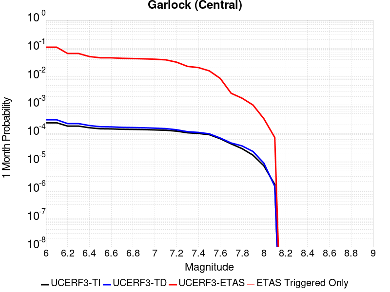
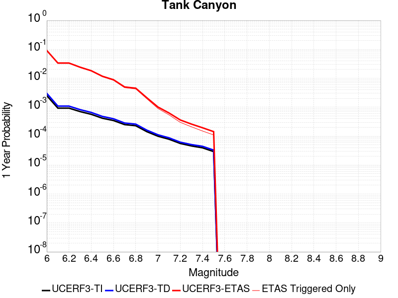
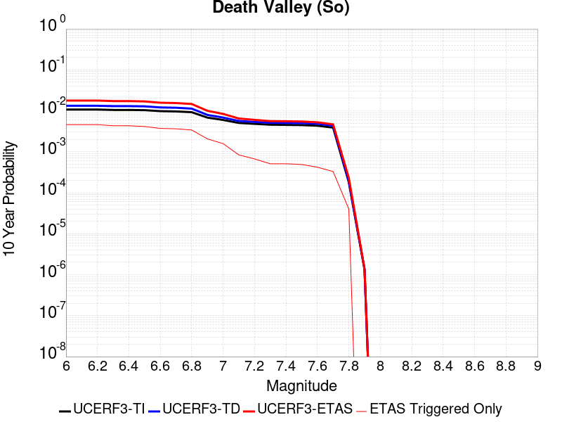
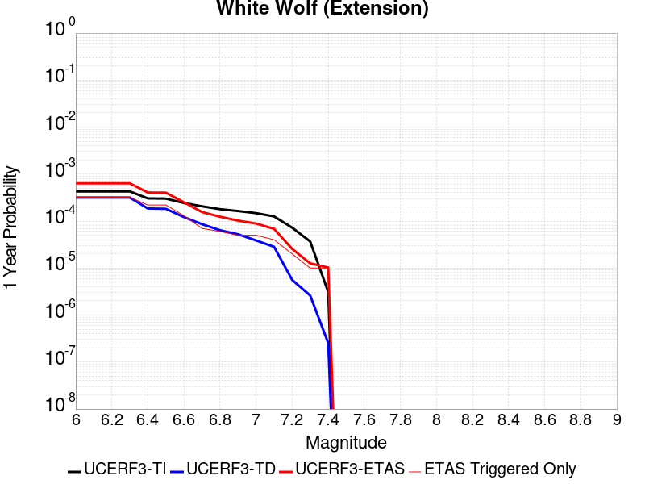
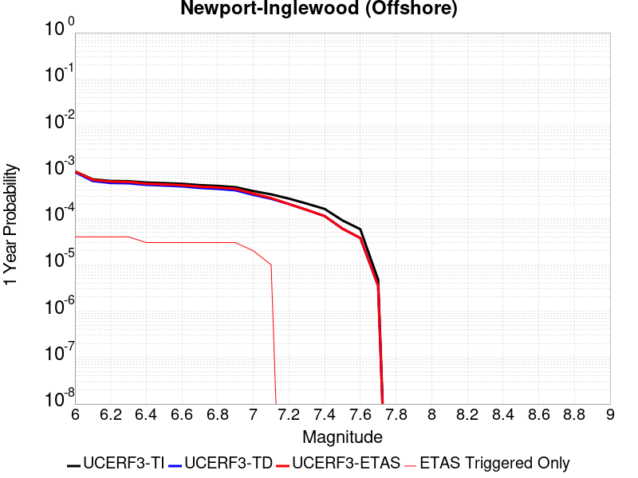
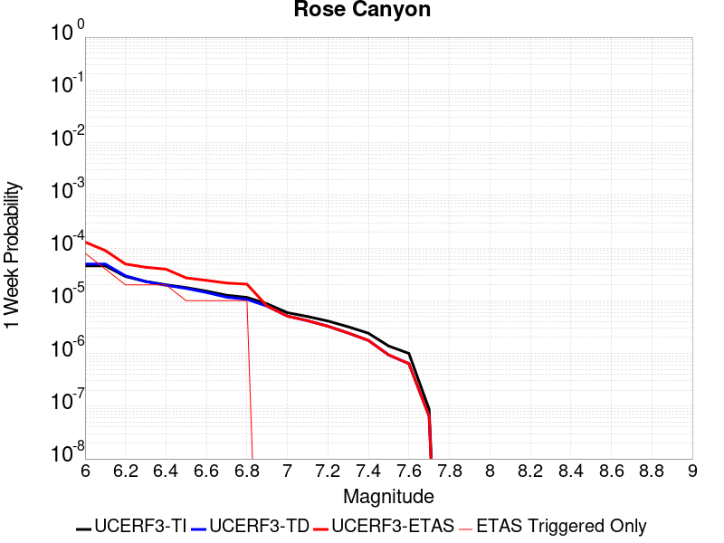

# Parent Section Magnitude-Probability Distributions

Only fault sections with at least one triggered aftershock are plotted. Sections are sorted by total supraseismogenic trigger rate (decreasing)

## Table Of Contents

* [Garlock (Central)](#garlock-central)
* [Tank Canyon](#tank-canyon)
* [Little Lake](#little-lake)
* [Airport Lake](#airport-lake)
* [Owl Lake](#owl-lake)
* [Garlock (East)](#garlock-east)
* [Panamint Valley](#panamint-valley)
* [Blackwater](#blackwater)
* [Hunter Mountain-Saline Valley](#hunter-mountain-saline-valley)
* [Ash Hill](#ash-hill)
* [Garlock (West)](#garlock-west)
* [McLean Lake](#mclean-lake)
* [Gravel Hills-Harper Lk](#gravel-hills-harper-lk)
* [Coyote Canyon](#coyote-canyon)
* [Goldstone Lake](#goldstone-lake)
* [So Sierra Nevada](#so-sierra-nevada)
* [Death Valley (So)](#death-valley-so)
* [San Andreas (Mojave S)](#san-andreas-mojave-s)
* [San Andreas (Mojave N)](#san-andreas-mojave-n)
* [Lenwood-Lockhart-Old Woman Springs](#lenwood-lockhart-old-woman-springs)
* [Bicycle Lake](#bicycle-lake)
* [Towne Pass](#towne-pass)
* [San Andreas (San Bernardino N)](#san-andreas-san-bernardino-n)
* [Garlic Springs](#garlic-springs)
* [Nelson Lake](#nelson-lake)
* [Death Valley (Black Mtns Frontal)](#death-valley-black-mtns-frontal)
* [Paradise](#paradise)
* [Coyote Lake](#coyote-lake)
* [Helendale-So Lockhart](#helendale-so-lockhart)
* [Death Valley (No)](#death-valley-no)
* [White Wolf (Extension)](#white-wolf-extension)
* [San Andreas (San Bernardino S)](#san-andreas-san-bernardino-s)
* [Elsinore (Glen Ivy) rev](#elsinore-glen-ivy-rev)
* [San Andreas (San Gorgonio Pass-Garnet HIll)](#san-andreas-san-gorgonio-pass-garnet-hill)
* [Brawley (Seismic Zone) alt 1](#brawley-seismic-zone-alt-1)
* [Owens Valley](#owens-valley)
* [San Andreas (Coachella) rev](#san-andreas-coachella-rev)
* [Scodie Lineament](#scodie-lineament)
* [San Jacinto (Coyote Creek)](#san-jacinto-coyote-creek)
* [Independence rev 2011](#independence-rev-2011)
* [Baker](#baker)
* [San Gabriel](#san-gabriel)
* [Newport-Inglewood (Offshore)](#newport-inglewood-offshore)
* [Sierra Nevada  (No Extension)](#sierra-nevada--no-extension)
* [Pine Mtn](#pine-mtn)
* [Cleghorn Lake](#cleghorn-lake)
* [Earthquake Valley (No  Extension)](#earthquake-valley-no--extension)
* [San Jacinto (San Bernardino)](#san-jacinto-san-bernardino)
* [Death Valley (Fish Lake Valley)](#death-valley-fish-lake-valley)
* [Clamshell-Sawpit](#clamshell-sawpit)
* [Kern Canyon (Lake Isabella) 2011](#kern-canyon-lake-isabella-2011)
* [Kern Canyon (North Kern) 2011](#kern-canyon-north-kern-2011)
* [Lake Isabella (Seismicity)](#lake-isabella-seismicity)
* [Santa Rosa Island](#santa-rosa-island)
* [Santa Ynez (East)](#santa-ynez-east)
* [Ozena](#ozena)
* [Oceanside alt1](#oceanside-alt1)
* [Oceanic - West Huasna](#oceanic---west-huasna)
* [Pinto Mtn](#pinto-mtn)
* [Deep Springs](#deep-springs)
* [San Jacinto (Anza) rev](#san-jacinto-anza-rev)
* [San Jacinto (San Jacinto Valley) rev](#san-jacinto-san-jacinto-valley-rev)
* [White Wolf](#white-wolf)
* [Surprise Valley 2011 CFM](#surprise-valley-2011-cfm)
* [Imperial](#imperial)
* [Calico-Hidalgo](#calico-hidalgo)
* [San Jacinto (Stepovers Combined)](#san-jacinto-stepovers-combined)
* [Cady](#cady)
* [Earthquake Valley (So Extension)](#earthquake-valley-so-extension)
* [Rose Canyon](#rose-canyon)

## Garlock (Central)
*[(top)](#table-of-contents)*

| 1 Week | 1 Month | 1 Year | 10 Year |
|-----|-----|-----|-----|
|  |  |  |  |

| Magnitude | 1 wk TI Prob | 1 wk TD Prob | 1 wk ETAS Prob | 1 wk ETAS/TD Gain | 1 wk ETAS Triggered Only | 1 mo TI Prob | 1 mo TD Prob | 1 mo ETAS Prob | 1 mo ETAS/TD Gain | 1 mo ETAS Triggered Only | 1 yr TI Prob | 1 yr TD Prob | 1 yr ETAS Prob | 1 yr ETAS/TD Gain | 1 yr ETAS Triggered Only | 10 yr TI Prob | 10 yr TD Prob | 10 yr ETAS Prob | 10 yr ETAS/TD Gain | 10 yr ETAS Triggered Only |
|-----|-----|-----|-----|-----|-----|-----|-----|-----|-----|-----|-----|-----|-----|-----|-----|-----|-----|-----|-----|-----|
| 6.0 | 5.5131142E-5 | 7.024681E-5 | 0.104643054 | 1489.6484 | 0.10458015 | 2.3625491E-4 | 3.010234E-4 | 0.119349144 | 396.478 | 0.11908397 | 0.0028726095 | 0.0036588663 | 0.13523674 | 36.96138 | 0.13206106 | 0.028357591 | 0.036079824 | 0.1736776 | 4.8137035 | 0.14274809 |
| 6.1 | 5.5131142E-5 | 7.024681E-5 | 0.104643054 | 1489.6484 | 0.10458015 | 2.3625491E-4 | 3.010234E-4 | 0.119349144 | 396.478 | 0.11908397 | 0.0028726095 | 0.0036588663 | 0.13523674 | 36.96138 | 0.13206106 | 0.028357591 | 0.036079824 | 0.1736776 | 4.8137035 | 0.14274809 |
| 6.2 | 4.216245E-5 | 5.1661493E-5 | 0.05959057 | 1153.4813 | 0.059541985 | 1.806837E-4 | 2.2138779E-4 | 0.069290064 | 312.9805 | 0.06908397 | 0.0021976046 | 0.0026920962 | 0.07920312 | 29.420612 | 0.076717556 | 0.021759989 | 0.026689773 | 0.10693214 | 4.0064836 | 0.082442746 |
| 6.3 | 4.216245E-5 | 5.1661493E-5 | 0.05959057 | 1153.4813 | 0.059541985 | 1.806837E-4 | 2.2138779E-4 | 0.069290064 | 312.9805 | 0.06908397 | 0.0021976046 | 0.0026920962 | 0.07920312 | 29.420612 | 0.076717556 | 0.021759989 | 0.026689773 | 0.10693214 | 4.0064836 | 0.082442746 |
| 6.4 | 3.6858168E-5 | 4.411054E-5 | 0.045843616 | 1039.2894 | 0.045801528 | 1.5795401E-4 | 1.8903162E-4 | 0.052087616 | 275.54974 | 0.051908396 | 0.0019213937 | 0.002299056 | 0.060180943 | 26.17637 | 0.05801527 | 0.019048655 | 0.02284894 | 0.08438708 | 3.6932602 | 0.0629771 |
| 6.5 | 3.39199E-5 | 4.0018083E-5 | 0.039351422 | 983.341 | 0.039312977 | 1.453629E-4 | 1.7149492E-4 | 0.044438712 | 259.12552 | 0.04427481 | 0.0017683565 | 0.002085973 | 0.052362558 | 25.102222 | 0.05038168 | 0.017543508 | 0.020759864 | 0.0745807 | 3.5925426 | 0.05496183 |
| 6.6 | 3.3571985E-5 | 3.9472274E-5 | 0.039350897 | 996.92505 | 0.039312977 | 1.4387199E-4 | 1.6915603E-4 | 0.044436477 | 262.6952 | 0.04427481 | 0.0017502342 | 0.0020575512 | 0.052335568 | 25.435852 | 0.05038168 | 0.017365133 | 0.020481179 | 0.07431733 | 3.628567 | 0.05496183 |
| 6.7 | 3.2580007E-5 | 3.8088703E-5 | 0.038204573 | 1003.0422 | 0.03816794 | 1.3962112E-4 | 1.632272E-4 | 0.04328596 | 265.1884 | 0.043129772 | 0.0016985617 | 0.0019855013 | 0.051124383 | 25.748854 | 0.04923664 | 0.016856372 | 0.019773813 | 0.07252645 | 3.6678026 | 0.053816795 |
| 6.8 | 3.2185937E-5 | 3.7515918E-5 | 0.03782236 | 1008.1682 | 0.03778626 | 1.3793244E-4 | 1.6077272E-4 | 0.042901993 | 266.8487 | 0.04274809 | 0.0016780337 | 0.001955672 | 0.05071509 | 25.932308 | 0.048854962 | 0.016654192 | 0.019480614 | 0.07187478 | 3.689554 | 0.053435113 |
| 6.9 | 3.165394E-5 | 3.6720503E-5 | 0.03782159 | 1029.9856 | 0.03778626 | 1.3565269E-4 | 1.5736422E-4 | 0.04289873 | 272.6079 | 0.04274809 | 0.0016503202 | 0.001914247 | 0.05029474 | 26.273901 | 0.048473284 | 0.01638118 | 0.019073246 | 0.07074038 | 3.70888 | 0.052671757 |
| 7.0 | 3.0903822E-5 | 3.5625766E-5 | 0.036675543 | 1029.4668 | 0.03664122 | 1.3243823E-4 | 1.5267303E-4 | 0.041749373 | 273.45612 | 0.041603055 | 0.0016112428 | 0.0018572307 | 0.049097575 | 26.435905 | 0.047328245 | 0.015996104 | 0.018512413 | 0.06908525 | 3.7318337 | 0.051526718 |
| 7.1 | 3.0069863E-5 | 3.4392073E-5 | 0.036292687 | 1055.2632 | 0.036259543 | 1.2886449E-4 | 1.4738638E-4 | 0.041362684 | 280.64114 | 0.041221373 | 0.0015677959 | 0.0017929734 | 0.048274368 | 26.924198 | 0.046564884 | 0.01556781 | 0.017880075 | 0.06736092 | 3.7673738 | 0.05038168 |
| 7.2 | 2.7957109E-5 | 3.128145E-5 | 0.029801343 | 952.6841 | 0.029770993 | 1.1981068E-4 | 1.340566E-4 | 0.034480598 | 257.20926 | 0.034351144 | 0.0014577188 | 0.0016309366 | 0.040117685 | 24.59794 | 0.038549617 | 0.014481937 | 0.016283695 | 0.057584763 | 3.536345 | 0.041984733 |
| 7.3 | 2.4519275E-5 | 2.6714795E-5 | 0.02101852 | 786.77454 | 0.020992367 | 1.0507837E-4 | 1.1448703E-4 | 0.0237759 | 207.6733 | 0.023664122 | 0.0012785783 | 0.001393003 | 0.027311048 | 19.605877 | 0.025954198 | 0.012712469 | 0.013928054 | 0.04177894 | 2.9996252 | 0.028244276 |
| 7.4 | 2.3225532E-5 | 2.51994E-5 | 0.019108688 | 758.2993 | 0.01908397 | 9.95342E-5 | 1.0799304E-4 | 0.021861369 | 202.43312 | 0.021755725 | 0.0012111551 | 0.0013140367 | 0.025328241 | 19.27514 | 0.0240458 | 0.012045753 | 0.013145725 | 0.0391354 | 2.9770436 | 0.026335878 |
| 7.5 | 2.097765E-5 | 2.2483688E-5 | 0.011854279 | 527.2391 | 0.011832061 | 8.9901114E-5 | 9.635517E-5 | 0.014598775 | 151.51003 | 0.014503817 | 0.0010939965 | 0.0011725046 | 0.017184243 | 14.656013 | 0.016030535 | 0.010886264 | 0.011740365 | 0.02871429 | 2.4457748 | 0.017175572 |
| 7.6 | 1.511254E-5 | 1.5991332E-5 | 0.0068861106 | 430.61517 | 0.006870229 | 6.476642E-5 | 6.853253E-5 | 0.007701597 | 112.378716 | 0.007633588 | 7.882459E-4 | 8.3407195E-4 | 0.009986737 | 11.973472 | 0.009160305 | 0.007854558 | 0.008383559 | 0.017845547 | 2.1286364 | 0.009541985 |
| 7.7 | 9.934069E-6 | 1.0678794E-5 | 0.0023007307 | 215.44856 | 0.0022900763 | 4.2573887E-5 | 4.5765457E-5 | 0.002335737 | 51.037117 | 0.0022900763 | 5.182138E-4 | 5.570524E-4 | 0.0036087865 | 6.4783616 | 0.0030534351 | 0.00517007 | 0.005627684 | 0.009043466 | 1.6069607 | 0.0034351144 |
| 7.8 | 6.7562896E-6 | 8.428449E-6 | 0.0015351331 | 182.13708 | 0.0015267176 | 2.8955206E-5 | 3.6121426E-5 | 0.0015627838 | 43.264732 | 0.0015267176 | 3.5247262E-4 | 4.3968976E-4 | 0.0023472477 | 5.3384175 | 0.001908397 | 0.0035191406 | 0.004446654 | 0.0067265476 | 1.5127211 | 0.0022900763 |
| 7.9 | 3.975453E-6 | 5.37103E-6 | 3.8704838E-4 | 72.06222 | 3.816794E-4 | 1.7037546E-5 | 2.3018498E-5 | 4.046891E-4 | 17.581038 | 3.816794E-4 | 2.0741238E-4 | 2.8021427E-4 | 0.0010433592 | 3.7234333 | 7.633588E-4 | 0.002072189 | 0.0028336283 | 0.0039754217 | 1.402944 | 0.0011450382 |
| 8.0 | 1.6729537E-6 | 2.0775144E-6 | 2.0775144E-6 | 1.0 | 0.0 | 7.169782E-6 | 8.903603E-6 | 8.903603E-6 | 1.0 | 0.0 | 8.7288594E-5 | 1.0839601E-4 | 4.90034E-4 | 4.520776 | 3.816794E-4 | 8.7254314E-4 | 0.0010969337 | 0.0014781945 | 1.3475695 | 3.816794E-4 |
| 8.1 | 3.6733252E-7 | 3.1489964E-7 | 3.1489964E-7 | 1.0 | 0.0 | 1.5742813E-6 | 1.3495693E-6 | 1.3495693E-6 | 1.0 | 0.0 | 1.9166706E-5 | 1.6430899E-5 | 1.6430899E-5 | 1.0 | 0.0 | 1.9165053E-4 | 1.6638759E-4 | 1.6638759E-4 | 1.0 | 0.0 |

## Tank Canyon
*[(top)](#table-of-contents)*

| 1 Week | 1 Month | 1 Year | 10 Year |
|-----|-----|-----|-----|
|  |  |  |  |

| Magnitude | 1 wk TI Prob | 1 wk TD Prob | 1 wk ETAS Prob | 1 wk ETAS/TD Gain | 1 wk ETAS Triggered Only | 1 mo TI Prob | 1 mo TD Prob | 1 mo ETAS Prob | 1 mo ETAS/TD Gain | 1 mo ETAS Triggered Only | 1 yr TI Prob | 1 yr TD Prob | 1 yr ETAS Prob | 1 yr ETAS/TD Gain | 1 yr ETAS Triggered Only | 10 yr TI Prob | 10 yr TD Prob | 10 yr ETAS Prob | 10 yr ETAS/TD Gain | 10 yr ETAS Triggered Only |
|-----|-----|-----|-----|-----|-----|-----|-----|-----|-----|-----|-----|-----|-----|-----|-----|-----|-----|-----|-----|-----|
| 6.0 | 4.8284557E-5 | 5.7964822E-5 | 0.05883318 | 1014.98083 | 0.058778625 | 2.0691741E-4 | 2.4840087E-4 | 0.073131055 | 294.4074 | 0.072900765 | 0.0025163088 | 0.0030207601 | 0.09548868 | 31.610811 | 0.09274809 | 0.02488006 | 0.029863637 | 0.12946925 | 4.3353477 | 0.10267176 |
| 6.1 | 1.7796336E-5 | 2.0873314E-5 | 0.017577758 | 842.1163 | 0.017557252 | 7.626778E-5 | 8.945422E-5 | 0.024896394 | 278.3144 | 0.024809161 | 9.281647E-4 | 0.0010885983 | 0.033877295 | 31.120108 | 0.032824427 | 0.009242975 | 0.010836744 | 0.04783598 | 4.4142394 | 0.037404582 |
| 6.2 | 1.7796336E-5 | 2.0873314E-5 | 0.017577758 | 842.1163 | 0.017557252 | 7.626778E-5 | 8.945422E-5 | 0.024896394 | 278.3144 | 0.024809161 | 9.281647E-4 | 0.0010885983 | 0.033877295 | 31.120108 | 0.032824427 | 0.009242975 | 0.010836744 | 0.04783598 | 4.4142394 | 0.037404582 |
| 6.3 | 1.3515912E-5 | 1.5759564E-5 | 0.013756001 | 872.8668 | 0.013740458 | 5.792405E-5 | 6.753938E-5 | 0.018386913 | 272.23987 | 0.01832061 | 7.049971E-4 | 8.2200574E-4 | 0.025992138 | 31.620384 | 0.02519084 | 0.007027647 | 0.0081922645 | 0.037340812 | 4.5580573 | 0.029389312 |
| 6.4 | 1.0870146E-5 | 1.2618021E-5 | 0.009554482 | 757.2093 | 0.009541985 | 4.658551E-5 | 5.4076212E-5 | 0.012648815 | 233.9072 | 0.01259542 | 5.67031E-4 | 6.581969E-4 | 0.01858532 | 28.23672 | 0.01793893 | 0.005655863 | 0.0065644905 | 0.028556574 | 4.3501587 | 0.022137405 |
| 6.5 | 7.964826E-6 | 9.196094E-6 | 0.0064976863 | 706.5702 | 0.0064885495 | 3.4134522E-5 | 3.9411298E-5 | 0.0076726982 | 194.68271 | 0.007633588 | 4.1550855E-4 | 4.7973756E-4 | 0.011161634 | 23.266125 | 0.0106870225 | 0.0041473247 | 0.004788321 | 0.017703282 | 3.6971793 | 0.012977099 |
| 6.6 | 6.6317E-6 | 7.6122988E-6 | 0.00458773 | 602.6734 | 0.0045801527 | 2.8421264E-5 | 3.2623782E-5 | 0.005375961 | 164.78656 | 0.0053435112 | 3.4597394E-4 | 3.9713128E-4 | 0.006883104 | 17.332062 | 0.0064885495 | 0.0034543579 | 0.003965368 | 0.011568686 | 2.9174306 | 0.007633588 |
| 6.7 | 4.793663E-6 | 5.4307857E-6 | 0.002677172 | 492.9622 | 0.0026717556 | 2.0544108E-5 | 2.3274613E-5 | 0.0034583092 | 148.58719 | 0.0034351144 | 2.500958E-4 | 2.8333595E-4 | 0.004099048 | 14.467096 | 0.003816794 | 0.0024981452 | 0.0028304397 | 0.007778228 | 2.7480633 | 0.004961832 |
| 6.8 | 4.382823E-6 | 4.9692567E-6 | 0.0022950342 | 461.84656 | 0.0022900763 | 1.8783392E-5 | 2.1296666E-5 | 0.0030746667 | 144.37315 | 0.0030534351 | 2.286638E-4 | 2.5926033E-4 | 0.0036934842 | 14.246238 | 0.0034351144 | 0.0022842865 | 0.002590253 | 0.006777851 | 2.6166754 | 0.0041984734 |
| 6.9 | 2.729601E-6 | 3.0735416E-6 | 7.6643E-4 | 249.36378 | 7.633588E-4 | 1.1698237E-5 | 1.3172262E-5 | 0.0011581953 | 87.926834 | 0.0011450382 | 1.4241673E-4 | 1.6036171E-4 | 0.0013052162 | 8.139201 | 0.0011450382 | 0.001423255 | 0.0016026258 | 0.0035079643 | 2.1888855 | 0.001908397 |
| 7.0 | 1.8987357E-6 | 2.126939E-6 | 2.126939E-6 | 1.0 | 0.0 | 8.137413E-6 | 9.115425E-6 | 3.9079133E-4 | 42.871433 | 3.816794E-4 | 9.90685E-5 | 1.1097535E-4 | 4.9261237E-4 | 4.4389353 | 3.816794E-4 | 9.902435E-4 | 0.0011092679 | 0.00187178 | 1.687401 | 7.633588E-4 |
| 7.1 | 1.4928986E-6 | 1.6641272E-6 | 1.6641272E-6 | 1.0 | 0.0 | 6.398121E-6 | 7.1319573E-6 | 3.8880864E-4 | 54.516396 | 3.816794E-4 | 7.789434E-5 | 8.682871E-5 | 4.6847496E-4 | 5.3953924 | 3.816794E-4 | 7.786704E-4 | 8.6800574E-4 | 0.0012493539 | 1.4393382 | 3.816794E-4 |
| 7.2 | 1.069082E-6 | 1.1828573E-6 | 1.1828573E-6 | 1.0 | 0.0 | 4.581772E-6 | 5.0693816E-6 | 3.8674683E-4 | 76.29073 | 3.816794E-4 | 5.5781646E-5 | 6.171851E-5 | 4.4337433E-4 | 7.1838155 | 3.816794E-4 | 5.576765E-4 | 6.170659E-4 | 9.985098E-4 | 1.6181574 | 3.816794E-4 |
| 7.3 | 8.776551E-7 | 9.770005E-7 | 9.770005E-7 | 1.0 | 0.0 | 3.7613736E-6 | 4.1871413E-6 | 4.1871413E-6 | 1.0 | 0.0 | 4.579376E-5 | 5.097777E-5 | 5.097777E-5 | 1.0 | 0.0 | 4.5784327E-4 | 5.097118E-4 | 5.097118E-4 | 1.0 | 0.0 |
| 7.4 | 7.55721E-7 | 8.510244E-7 | 8.510244E-7 | 1.0 | 0.0 | 3.2388E-6 | 3.6472454E-6 | 3.6472454E-6 | 1.0 | 0.0 | 3.9431678E-5 | 4.4404827E-5 | 4.4404827E-5 | 1.0 | 0.0 | 3.942468E-4 | 4.440104E-4 | 4.440104E-4 | 1.0 | 0.0 |
| 7.5 | 5.587665E-7 | 6.305619E-7 | 6.305619E-7 | 1.0 | 0.0 | 2.3947114E-6 | 2.702408E-6 | 2.702408E-6 | 1.0 | 0.0 | 2.915522E-5 | 3.290182E-5 | 3.290182E-5 | 1.0 | 0.0 | 2.9151395E-4 | 3.290182E-4 | 3.290182E-4 | 1.0 | 0.0 |

## Little Lake
*[(top)](#table-of-contents)*

| 1 Week | 1 Month | 1 Year | 10 Year |
|-----|-----|-----|-----|
|  |  |  |  |

| Magnitude | 1 wk TI Prob | 1 wk TD Prob | 1 wk ETAS Prob | 1 wk ETAS/TD Gain | 1 wk ETAS Triggered Only | 1 mo TI Prob | 1 mo TD Prob | 1 mo ETAS Prob | 1 mo ETAS/TD Gain | 1 mo ETAS Triggered Only | 1 yr TI Prob | 1 yr TD Prob | 1 yr ETAS Prob | 1 yr ETAS/TD Gain | 1 yr ETAS Triggered Only | 10 yr TI Prob | 10 yr TD Prob | 10 yr ETAS Prob | 10 yr ETAS/TD Gain | 10 yr ETAS Triggered Only |
|-----|-----|-----|-----|-----|-----|-----|-----|-----|-----|-----|-----|-----|-----|-----|-----|-----|-----|-----|-----|-----|
| 6.0 | 2.8424427E-5 | 3.120572E-5 | 0.045449637 | 1456.452 | 0.045419846 | 1.2181328E-4 | 1.337327E-4 | 0.05127193 | 383.39114 | 0.05114504 | 0.0014820677 | 0.0016271127 | 0.059166923 | 36.363136 | 0.057633586 | 0.014722223 | 0.016165402 | 0.07774894 | 4.8095894 | 0.06259542 |
| 6.1 | 2.8424427E-5 | 3.120572E-5 | 0.045449637 | 1456.452 | 0.045419846 | 1.2181328E-4 | 1.337327E-4 | 0.05127193 | 383.39114 | 0.05114504 | 0.0014820677 | 0.0016271127 | 0.059166923 | 36.363136 | 0.057633586 | 0.014722223 | 0.016165402 | 0.07774894 | 4.8095894 | 0.06259542 |
| 6.2 | 2.8424427E-5 | 3.120572E-5 | 0.045449637 | 1456.452 | 0.045419846 | 1.2181328E-4 | 1.337327E-4 | 0.05127193 | 383.39114 | 0.05114504 | 0.0014820677 | 0.0016271127 | 0.059166923 | 36.363136 | 0.057633586 | 0.014722223 | 0.016165402 | 0.07774894 | 4.8095894 | 0.06259542 |
| 6.3 | 1.48860645E-5 | 1.6081389E-5 | 0.030168269 | 1875.974 | 0.030152671 | 6.379586E-5 | 6.8918576E-5 | 0.034036044 | 493.85873 | 0.033969466 | 7.7643775E-4 | 8.3878887E-4 | 0.038593356 | 46.010807 | 0.03778626 | 0.007737305 | 0.008359048 | 0.04847887 | 5.7995687 | 0.040458016 |
| 6.4 | 1.48860645E-5 | 1.6081389E-5 | 0.030168269 | 1875.974 | 0.030152671 | 6.379586E-5 | 6.8918576E-5 | 0.034036044 | 493.85873 | 0.033969466 | 7.7643775E-4 | 8.3878887E-4 | 0.038593356 | 46.010807 | 0.03778626 | 0.007737305 | 0.008359048 | 0.04847887 | 5.7995687 | 0.040458016 |
| 6.5 | 1.2797581E-5 | 1.3765565E-5 | 0.025967607 | 1886.4178 | 0.025954198 | 5.4845623E-5 | 5.899409E-5 | 0.02982823 | 505.6139 | 0.029770993 | 6.675408E-4 | 7.18042E-4 | 0.033900306 | 47.212147 | 0.033206105 | 0.006655392 | 0.00715977 | 0.042780757 | 5.9751577 | 0.03587786 |
| 6.6 | 9.661896E-6 | 1.0289038E-5 | 0.024055842 | 2338.007 | 0.0240458 | 4.1407468E-5 | 4.409522E-5 | 0.026760474 | 606.8792 | 0.026717557 | 5.040193E-4 | 5.367433E-4 | 0.029910281 | 55.725483 | 0.029389312 | 0.005028777 | 0.0053560743 | 0.037245423 | 6.9538655 | 0.03206107 |
| 6.7 | 7.767871E-6 | 8.199687E-6 | 0.022145422 | 2700.7646 | 0.022137405 | 3.329045E-5 | 3.5141118E-5 | 0.024080098 | 685.2399 | 0.0240458 | 4.0523586E-4 | 4.2777284E-4 | 0.026752384 | 62.538765 | 0.026335878 | 0.004044977 | 0.004270846 | 0.032394495 | 7.5850296 | 0.028244276 |
| 6.8 | 6.4235196E-6 | 6.7357446E-6 | 0.016800515 | 2494.233 | 0.016793894 | 2.752908E-5 | 2.8867229E-5 | 0.01796728 | 622.411 | 0.01793893 | 3.35115E-4 | 3.5141467E-4 | 0.020191768 | 57.458523 | 0.019847328 | 0.003346101 | 0.00350985 | 0.024808876 | 7.068358 | 0.021374045 |
| 6.9 | 3.1283696E-6 | 3.1121804E-6 | 0.009163389 | 2944.363 | 0.009160305 | 1.3407229E-5 | 1.3337856E-5 | 0.00993687 | 745.0125 | 0.009923664 | 1.6322079E-4 | 1.6237781E-4 | 0.0116109 | 71.50546 | 0.011450382 | 0.0016310095 | 0.00162274 | 0.0134356 | 8.279577 | 0.011832061 |
| 7.0 | 2.290603E-6 | 2.2286815E-6 | 0.0064907637 | 2912.3784 | 0.0064885495 | 9.816834E-6 | 9.551463E-6 | 0.006879715 | 720.2786 | 0.006870229 | 1.19513395E-4 | 1.162839E-4 | 0.007367349 | 63.356567 | 0.0072519085 | 0.0011944914 | 0.0011623327 | 0.008787048 | 7.559839 | 0.007633588 |
| 7.1 | 1.293693E-6 | 1.1776827E-6 | 0.0038179671 | 3241.9316 | 0.003816794 | 5.5443866E-6 | 5.0472063E-6 | 0.0038218219 | 757.21533 | 0.003816794 | 6.750081E-5 | 6.14487E-5 | 0.004259664 | 69.320656 | 0.0041984734 | 6.7480316E-4 | 6.143856E-4 | 0.0051917243 | 8.450271 | 0.0045801527 |
| 7.2 | 4.715842E-7 | 3.0917857E-7 | 3.0917857E-7 | 1.0 | 0.0 | 2.0210737E-6 | 1.3250503E-6 | 1.3250503E-6 | 1.0 | 0.0 | 2.4606294E-5 | 1.6132375E-5 | 1.6132375E-5 | 1.0 | 0.0 | 2.460357E-4 | 1.6131258E-4 | 1.6131258E-4 | 1.0 | 0.0 |
| 7.3 | 3.9430947E-7 | 2.3097488E-7 | 2.3097488E-7 | 1.0 | 0.0 | 1.6898966E-6 | 9.89892E-7 | 9.89892E-7 | 1.0 | 0.0 | 2.0574296E-5 | 1.2051869E-5 | 1.2051869E-5 | 1.0 | 0.0 | 2.0572392E-4 | 1.20512224E-4 | 1.20512224E-4 | 1.0 | 0.0 |
| 7.4 | 3.547123E-7 | 1.9679135E-7 | 1.9679135E-7 | 1.0 | 0.0 | 1.5201948E-6 | 8.4339126E-7 | 8.4339126E-7 | 1.0 | 0.0 | 1.8508214E-5 | 1.0268241E-5 | 1.0268241E-5 | 1.0 | 0.0 | 1.8506673E-4 | 1.02677724E-4 | 1.02677724E-4 | 1.0 | 0.0 |
| 7.5 | 2.6354266E-7 | 1.4423138E-7 | 1.4423138E-7 | 1.0 | 0.0 | 1.129468E-6 | 6.181344E-7 | 6.181344E-7 | 1.0 | 0.0 | 1.3751187E-5 | 7.5257603E-6 | 7.5257603E-6 | 1.0 | 0.0 | 1.3750336E-4 | 7.5255106E-5 | 7.5255106E-5 | 1.0 | 0.0 |
| 7.6 | 1.269913E-7 | 7.572556E-8 | 7.572556E-8 | 1.0 | 0.0 | 5.4424834E-7 | 3.245381E-7 | 3.245381E-7 | 1.0 | 0.0 | 6.6262032E-6 | 3.9512443E-6 | 3.9512443E-6 | 1.0 | 0.0 | 6.626006E-5 | 3.9511775E-5 | 3.9511775E-5 | 1.0 | 0.0 |

## Airport Lake
*[(top)](#table-of-contents)*

| 1 Week | 1 Month | 1 Year | 10 Year |
|-----|-----|-----|-----|
|  |  |  |  |

| Magnitude | 1 wk TI Prob | 1 wk TD Prob | 1 wk ETAS Prob | 1 wk ETAS/TD Gain | 1 wk ETAS Triggered Only | 1 mo TI Prob | 1 mo TD Prob | 1 mo ETAS Prob | 1 mo ETAS/TD Gain | 1 mo ETAS Triggered Only | 1 yr TI Prob | 1 yr TD Prob | 1 yr ETAS Prob | 1 yr ETAS/TD Gain | 1 yr ETAS Triggered Only | 10 yr TI Prob | 10 yr TD Prob | 10 yr ETAS Prob | 10 yr ETAS/TD Gain | 10 yr ETAS Triggered Only |
|-----|-----|-----|-----|-----|-----|-----|-----|-----|-----|-----|-----|-----|-----|-----|-----|-----|-----|-----|-----|-----|
| 6.0 | 1.2387061E-5 | 1.3103157E-5 | 0.039325565 | 3001.2283 | 0.039312977 | 5.3086325E-5 | 5.615534E-5 | 0.044710137 | 796.18677 | 0.04465649 | 6.461343E-4 | 6.8350515E-4 | 0.050267912 | 73.544304 | 0.049618322 | 0.0064425888 | 0.0068168393 | 0.05761323 | 8.451605 | 0.05114504 |
| 6.1 | 1.2387061E-5 | 1.3103157E-5 | 0.039325565 | 3001.2283 | 0.039312977 | 5.3086325E-5 | 5.615534E-5 | 0.044710137 | 796.18677 | 0.04465649 | 6.461343E-4 | 6.8350515E-4 | 0.050267912 | 73.544304 | 0.049618322 | 0.0064425888 | 0.0068168393 | 0.05761323 | 8.451605 | 0.05114504 |
| 6.2 | 1.2387061E-5 | 1.3103157E-5 | 0.039325565 | 3001.2283 | 0.039312977 | 5.3086325E-5 | 5.615534E-5 | 0.044710137 | 796.18677 | 0.04465649 | 6.461343E-4 | 6.8350515E-4 | 0.050267912 | 73.544304 | 0.049618322 | 0.0064425888 | 0.0068168393 | 0.05761323 | 8.451605 | 0.05114504 |
| 6.3 | 1.2387061E-5 | 1.3103157E-5 | 0.039325565 | 3001.2283 | 0.039312977 | 5.3086325E-5 | 5.615534E-5 | 0.044710137 | 796.18677 | 0.04465649 | 6.461343E-4 | 6.8350515E-4 | 0.050267912 | 73.544304 | 0.049618322 | 0.0064425888 | 0.0068168393 | 0.05761323 | 8.451605 | 0.05114504 |
| 6.4 | 1.2387061E-5 | 1.3103157E-5 | 0.039325565 | 3001.2283 | 0.039312977 | 5.3086325E-5 | 5.615534E-5 | 0.044710137 | 796.18677 | 0.04465649 | 6.461343E-4 | 6.8350515E-4 | 0.050267912 | 73.544304 | 0.049618322 | 0.0064425888 | 0.0068168393 | 0.05761323 | 8.451605 | 0.05114504 |
| 6.5 | 6.9922594E-6 | 7.384925E-6 | 0.02825145 | 3825.557 | 0.028244276 | 2.996648E-5 | 3.1649324E-5 | 0.032855038 | 1038.096 | 0.032824427 | 3.6478083E-4 | 3.8526783E-4 | 0.037012372 | 96.0692 | 0.03664122 | 0.003641826 | 0.0038465366 | 0.041107237 | 10.686818 | 0.037404582 |
| 6.6 | 6.9922594E-6 | 7.384925E-6 | 0.02825145 | 3825.557 | 0.028244276 | 2.996648E-5 | 3.1649324E-5 | 0.032855038 | 1038.096 | 0.032824427 | 3.6478083E-4 | 3.8526783E-4 | 0.037012372 | 96.0692 | 0.03664122 | 0.003641826 | 0.0038465366 | 0.041107237 | 10.686818 | 0.037404582 |
| 6.7 | 5.477277E-6 | 5.7860684E-6 | 0.024051448 | 4156.786 | 0.0240458 | 2.3473833E-5 | 2.4797222E-5 | 0.027505033 | 1109.1981 | 0.027480915 | 2.8575645E-4 | 3.0186825E-4 | 0.030445438 | 100.856705 | 0.030152671 | 0.0028538927 | 0.003014966 | 0.033837784 | 11.223273 | 0.030916031 |
| 6.8 | 3.9950432E-6 | 4.2190873E-6 | 0.017943075 | 4252.8335 | 0.01793893 | 1.7121502E-5 | 1.8081691E-5 | 0.01986505 | 1098.6279 | 0.019847328 | 2.0843433E-4 | 2.2012512E-4 | 0.021971062 | 99.8117 | 0.021755725 | 0.0020823893 | 0.0021993418 | 0.024288058 | 11.043331 | 0.022137405 |
| 6.9 | 2.95695E-6 | 3.1230243E-6 | 0.012216825 | 3911.8572 | 0.0122137405 | 1.2672582E-5 | 1.3384334E-5 | 0.013753658 | 1027.5938 | 0.013740458 | 1.5427776E-4 | 1.6294434E-4 | 0.015427632 | 94.680374 | 0.015267176 | 0.001541707 | 0.0016284712 | 0.017251842 | 10.593889 | 0.015648855 |
| 7.0 | 1.456072E-6 | 1.540812E-6 | 0.0064900806 | 4212.117 | 0.0064885495 | 6.2402937E-6 | 6.603469E-6 | 0.006876787 | 1041.3901 | 0.006870229 | 7.597293E-5 | 8.039528E-5 | 0.0073317206 | 91.195915 | 0.0072519085 | 7.594696E-4 | 8.0376083E-4 | 0.008431213 | 10.489704 | 0.007633588 |
| 7.1 | 6.995192E-7 | 7.4089746E-7 | 0.003817532 | 5152.578 | 0.003816794 | 2.997936E-6 | 3.1752747E-6 | 0.0038199571 | 1203.032 | 0.003816794 | 3.649926E-5 | 3.865897E-5 | 0.00423697 | 109.598625 | 0.0041984734 | 3.6493264E-4 | 3.865897E-4 | 0.004964972 | 12.843 | 0.0045801527 |

## Owl Lake
*[(top)](#table-of-contents)*

| 1 Week | 1 Month | 1 Year | 10 Year |
|-----|-----|-----|-----|
|  |  |  |  |

| Magnitude | 1 wk TI Prob | 1 wk TD Prob | 1 wk ETAS Prob | 1 wk ETAS/TD Gain | 1 wk ETAS Triggered Only | 1 mo TI Prob | 1 mo TD Prob | 1 mo ETAS Prob | 1 mo ETAS/TD Gain | 1 mo ETAS Triggered Only | 1 yr TI Prob | 1 yr TD Prob | 1 yr ETAS Prob | 1 yr ETAS/TD Gain | 1 yr ETAS Triggered Only | 10 yr TI Prob | 10 yr TD Prob | 10 yr ETAS Prob | 10 yr ETAS/TD Gain | 10 yr ETAS Triggered Only |
|-----|-----|-----|-----|-----|-----|-----|-----|-----|-----|-----|-----|-----|-----|-----|-----|-----|-----|-----|-----|-----|
| 6.0 | 5.0320643E-5 | 6.635816E-5 | 0.027927104 | 420.85413 | 0.027862595 | 2.1564208E-4 | 2.843674E-4 | 0.031954747 | 112.37136 | 0.031679388 | 0.0026222812 | 0.0034577388 | 0.041493703 | 12.000242 | 0.03816794 | 0.02591553 | 0.034140717 | 0.074323416 | 2.1769729 | 0.041603055 |
| 6.1 | 5.0320643E-5 | 6.635816E-5 | 0.027927104 | 420.85413 | 0.027862595 | 2.1564208E-4 | 2.843674E-4 | 0.031954747 | 112.37136 | 0.031679388 | 0.0026222812 | 0.0034577388 | 0.041493703 | 12.000242 | 0.03816794 | 0.02591553 | 0.034140717 | 0.074323416 | 2.1769729 | 0.041603055 |
| 6.2 | 2.4125871E-5 | 3.0981035E-5 | 0.02369437 | 764.80237 | 0.023664122 | 1.0339249E-4 | 1.3277028E-4 | 0.026083523 | 196.45604 | 0.025954198 | 0.0012580766 | 0.001615439 | 0.032100465 | 19.871048 | 0.030534351 | 0.012509781 | 0.016070465 | 0.048742935 | 3.0330756 | 0.033206105 |
| 6.3 | 1.7433485E-5 | 2.2355514E-5 | 0.01948757 | 871.712 | 0.01946565 | 7.471279E-5 | 9.580672E-5 | 0.021849448 | 228.05757 | 0.021755725 | 9.0924866E-4 | 0.0011659743 | 0.026327442 | 22.579779 | 0.02519084 | 0.009055373 | 0.011628896 | 0.038035758 | 3.270797 | 0.026717557 |
| 6.4 | 1.7433485E-5 | 2.2355514E-5 | 0.01948757 | 871.712 | 0.01946565 | 7.471279E-5 | 9.580672E-5 | 0.021849448 | 228.05757 | 0.021755725 | 9.0924866E-4 | 0.0011659743 | 0.026327442 | 22.579779 | 0.02519084 | 0.009055373 | 0.011628896 | 0.038035758 | 3.270797 | 0.026717557 |
| 6.5 | 1.5182742E-5 | 1.9429144E-5 | 0.019103028 | 983.2151 | 0.01908397 | 6.506727E-5 | 8.326596E-5 | 0.021455532 | 257.6747 | 0.021374045 | 7.919061E-4 | 0.0010134429 | 0.025416167 | 25.079033 | 0.024427481 | 0.0078909 | 0.010118429 | 0.035810012 | 3.5390882 | 0.025954198 |
| 6.6 | 6.7271576E-6 | 8.547361E-6 | 0.015275592 | 1787.1707 | 0.015267176 | 2.8830356E-5 | 3.6631063E-5 | 0.01682991 | 459.44363 | 0.016793894 | 3.5095305E-4 | 4.458976E-4 | 0.020284375 | 45.491108 | 0.019847328 | 0.0035039932 | 0.004467813 | 0.024986414 | 5.592539 | 0.020610686 |
| 6.7 | 6.682835E-6 | 8.479807E-6 | 0.015275526 | 1801.4001 | 0.015267176 | 2.8640408E-5 | 3.6341557E-5 | 0.016829625 | 463.09586 | 0.016793894 | 3.4864116E-4 | 4.4237426E-4 | 0.020280922 | 45.84562 | 0.019847328 | 0.003480947 | 0.0044327388 | 0.024952063 | 5.62904 | 0.020610686 |
| 6.8 | 6.5774975E-6 | 8.32628E-6 | 0.015275375 | 1834.5977 | 0.015267176 | 2.8188972E-5 | 3.5683603E-5 | 0.016828977 | 471.61655 | 0.016793894 | 3.4314668E-4 | 4.343669E-4 | 0.020273075 | 46.672695 | 0.019847328 | 0.0034261728 | 0.004352885 | 0.024873856 | 5.7143383 | 0.020610686 |
| 6.9 | 6.363419E-6 | 7.999454E-6 | 0.015275053 | 1909.5118 | 0.015267176 | 2.727151E-5 | 3.428296E-5 | 0.0168276 | 490.84448 | 0.016793894 | 3.3198006E-4 | 4.1732067E-4 | 0.020256367 | 48.539093 | 0.019847328 | 0.0033148455 | 0.0041828766 | 0.024327269 | 5.8159184 | 0.020229008 |
| 7.0 | 6.1342453E-6 | 7.6316555E-6 | 0.01527469 | 2001.4911 | 0.015267176 | 2.6289357E-5 | 3.2706717E-5 | 0.01682605 | 514.45245 | 0.016793894 | 3.2002592E-4 | 3.9813702E-4 | 0.020237563 | 50.83065 | 0.019847328 | 0.0031956544 | 0.003991571 | 0.024139833 | 6.047703 | 0.020229008 |
| 7.1 | 5.842926E-6 | 7.142211E-6 | 0.0148925325 | 2085.143 | 0.014885496 | 2.504087E-5 | 3.0609146E-5 | 0.016442321 | 537.17017 | 0.016412213 | 3.0482994E-4 | 3.7260808E-4 | 0.019449467 | 52.19819 | 0.01908397 | 0.0030441214 | 0.0037370329 | 0.023129938 | 6.1893854 | 0.01946565 |
| 7.2 | 4.77173E-6 | 5.358483E-6 | 0.009165615 | 1710.4868 | 0.009160305 | 2.045011E-5 | 2.2964748E-5 | 0.010328071 | 449.73587 | 0.010305343 | 2.4895166E-4 | 2.79564E-4 | 0.01248989 | 44.676315 | 0.0122137405 | 0.0024867293 | 0.002808645 | 0.015368689 | 5.471923 | 0.01259542 |
| 7.3 | 3.0494948E-6 | 2.710463E-6 | 0.002674459 | 986.7167 | 0.0026717556 | 1.3069198E-5 | 1.1616219E-5 | 0.0026833408 | 230.99951 | 0.0026717556 | 1.5910587E-4 | 1.4141845E-4 | 0.0031944218 | 22.588436 | 0.0030534351 | 0.0015899199 | 0.0014232415 | 0.0044723307 | 3.1423557 | 0.0030534351 |
| 7.4 | 2.7263884E-6 | 2.3056762E-6 | 0.0019106983 | 828.6932 | 0.001908397 | 1.1684469E-5 | 9.881433E-6 | 0.0019182595 | 194.12767 | 0.001908397 | 1.4224913E-4 | 1.20299905E-4 | 0.0024101008 | 20.034103 | 0.0022900763 | 0.0014215811 | 0.0012112238 | 0.0034985263 | 2.8884227 | 0.0022900763 |
| 7.5 | 2.6090431E-6 | 2.1656133E-6 | 0.0019105584 | 882.22516 | 0.001908397 | 1.1181565E-5 | 9.281167E-6 | 0.0019176604 | 206.61845 | 0.001908397 | 1.3612706E-4 | 1.1299244E-4 | 0.0020211737 | 17.88769 | 0.001908397 | 0.001360437 | 0.0011379806 | 0.003044206 | 2.6750946 | 0.001908397 |
| 7.6 | 2.3008756E-6 | 1.8727933E-6 | 0.0015285875 | 816.2072 | 0.0015267176 | 9.860858E-6 | 8.0262325E-6 | 0.0015347316 | 191.21443 | 0.0015267176 | 1.20049335E-4 | 9.7715085E-5 | 0.0016242835 | 16.622648 | 0.0015267176 | 0.001199845 | 9.849932E-4 | 0.002510207 | 2.5484512 | 0.0015267176 |
| 7.7 | 1.7184348E-6 | 1.3419171E-6 | 0.0011463786 | 854.2842 | 0.0011450382 | 7.3646997E-6 | 5.7510606E-6 | 0.0011507827 | 200.0992 | 0.0011450382 | 8.966153E-5 | 7.0016955E-5 | 0.0012149749 | 17.352581 | 0.0011450382 | 8.962536E-4 | 7.078345E-4 | 0.0018520622 | 2.6165187 | 0.0011450382 |
| 7.8 | 8.4612907E-7 | 8.4058576E-7 | 3.8251965E-4 | 455.0632 | 3.816794E-4 | 3.6262625E-6 | 3.6025056E-6 | 3.8528052E-4 | 106.94793 | 3.816794E-4 | 4.4148852E-5 | 4.3859643E-5 | 4.255223E-4 | 9.701909 | 3.816794E-4 | 4.414008E-4 | 4.4398365E-4 | 8.2549354E-4 | 1.8592882 | 3.816794E-4 |
| 7.9 | 2.716738E-7 | 3.768106E-7 | 3.768106E-7 | 1.0 | 0.0 | 1.1643157E-6 | 1.6149015E-6 | 1.6149015E-6 | 1.0 | 0.0 | 1.4175452E-5 | 1.966126E-5 | 1.966126E-5 | 1.0 | 0.0 | 1.4174548E-4 | 1.9836679E-4 | 1.9836679E-4 | 1.0 | 0.0 |
| 8.0 | 2.1995428E-8 | 3.384878E-8 | 3.384878E-8 | 1.0 | 0.0 | 9.426611E-8 | 1.4506621E-7 | 1.4506621E-7 | 1.0 | 0.0 | 1.1476893E-6 | 1.7661803E-6 | 1.7661803E-6 | 1.0 | 0.0 | 1.14768345E-5 | 1.7963059E-5 | 1.7963059E-5 | 1.0 | 0.0 |

## Garlock (East)
*[(top)](#table-of-contents)*

| 1 Week | 1 Month | 1 Year | 10 Year |
|-----|-----|-----|-----|
|  |  |  |  |

| Magnitude | 1 wk TI Prob | 1 wk TD Prob | 1 wk ETAS Prob | 1 wk ETAS/TD Gain | 1 wk ETAS Triggered Only | 1 mo TI Prob | 1 mo TD Prob | 1 mo ETAS Prob | 1 mo ETAS/TD Gain | 1 mo ETAS Triggered Only | 1 yr TI Prob | 1 yr TD Prob | 1 yr ETAS Prob | 1 yr ETAS/TD Gain | 1 yr ETAS Triggered Only | 10 yr TI Prob | 10 yr TD Prob | 10 yr ETAS Prob | 10 yr ETAS/TD Gain | 10 yr ETAS Triggered Only |
|-----|-----|-----|-----|-----|-----|-----|-----|-----|-----|-----|-----|-----|-----|-----|-----|-----|-----|-----|-----|-----|
| 6.0 | 4.5092507E-5 | 6.290325E-5 | 0.019145673 | 304.36697 | 0.01908397 | 1.9323928E-4 | 2.6956003E-4 | 0.021637844 | 80.27097 | 0.021374045 | 0.0023501497 | 0.0032774 | 0.028766107 | 8.777112 | 0.02557252 | 0.023254504 | 0.032351844 | 0.06152902 | 1.9018706 | 0.030152671 |
| 6.1 | 4.5092507E-5 | 6.290325E-5 | 0.019145673 | 304.36697 | 0.01908397 | 1.9323928E-4 | 2.6956003E-4 | 0.021637844 | 80.27097 | 0.021374045 | 0.0023501497 | 0.0032774 | 0.028766107 | 8.777112 | 0.02557252 | 0.023254504 | 0.032351844 | 0.06152902 | 1.9018706 | 0.030152671 |
| 6.2 | 2.6674514E-5 | 3.4509674E-5 | 0.014537826 | 421.26813 | 0.014503817 | 1.1431433E-4 | 1.4789042E-4 | 0.0169393 | 114.53954 | 0.016793894 | 0.0013908884 | 0.0017991117 | 0.020467754 | 11.376589 | 0.018702291 | 0.01382215 | 0.017890299 | 0.038881958 | 2.1733541 | 0.021374045 |
| 6.3 | 2.6674514E-5 | 3.4509674E-5 | 0.014537826 | 421.26813 | 0.014503817 | 1.1431433E-4 | 1.4789042E-4 | 0.0169393 | 114.53954 | 0.016793894 | 0.0013908884 | 0.0017991117 | 0.020467754 | 11.376589 | 0.018702291 | 0.01382215 | 0.017890299 | 0.038881958 | 2.1733541 | 0.021374045 |
| 6.4 | 2.5312667E-5 | 3.233893E-5 | 0.014535687 | 449.47952 | 0.014503817 | 1.0847834E-4 | 1.3858822E-4 | 0.016930154 | 122.16157 | 0.016793894 | 0.0013199237 | 0.0016860351 | 0.020356793 | 12.073766 | 0.018702291 | 0.013121112 | 0.016778335 | 0.03779376 | 2.2525334 | 0.021374045 |
| 6.5 | 2.5312667E-5 | 3.233893E-5 | 0.014535687 | 449.47952 | 0.014503817 | 1.0847834E-4 | 1.3858822E-4 | 0.016930154 | 122.16157 | 0.016793894 | 0.0013199237 | 0.0016860351 | 0.020356793 | 12.073766 | 0.018702291 | 0.013121112 | 0.016778335 | 0.03779376 | 2.2525334 | 0.021374045 |
| 6.6 | 2.246556E-5 | 2.8133776E-5 | 0.0141498735 | 502.94968 | 0.014122138 | 9.627742E-5 | 1.20567885E-4 | 0.016530802 | 137.10783 | 0.016412213 | 0.0011715472 | 0.0014669491 | 0.019760685 | 13.470599 | 0.01832061 | 0.011653901 | 0.01461866 | 0.034928046 | 2.3892782 | 0.020610686 |
| 6.7 | 2.2241198E-5 | 2.7803519E-5 | 0.0141495485 | 508.91214 | 0.014122138 | 9.531594E-5 | 1.1915263E-4 | 0.016529411 | 138.72469 | 0.016412213 | 0.0011598538 | 0.0014497414 | 0.019743793 | 13.618837 | 0.01832061 | 0.011538187 | 0.014448853 | 0.034761738 | 2.4058475 | 0.020610686 |
| 6.8 | 1.9528685E-5 | 2.389819E-5 | 0.013000688 | 544.003 | 0.012977099 | 8.369167E-5 | 1.0241691E-4 | 0.015368029 | 150.05363 | 0.015267176 | 0.0010184698 | 0.0012462323 | 0.017256789 | 13.847169 | 0.016030535 | 0.010138147 | 0.012436427 | 0.030529195 | 2.4548204 | 0.01832061 |
| 6.9 | 1.3318621E-5 | 1.5198884E-5 | 0.01184708 | 779.47034 | 0.011832061 | 5.7078556E-5 | 6.513648E-5 | 0.013423045 | 206.07568 | 0.013358778 | 6.9470983E-4 | 7.927538E-4 | 0.014903696 | 18.799904 | 0.014122138 | 0.0069254204 | 0.007939888 | 0.023843141 | 3.0029569 | 0.016030535 |
| 7.0 | 1.1760853E-5 | 1.31077895E-5 | 0.011463339 | 874.54407 | 0.011450382 | 5.0402683E-5 | 5.6175057E-5 | 0.0126508875 | 225.2047 | 0.01259542 | 6.134799E-4 | 6.8372174E-4 | 0.014414785 | 21.082825 | 0.013740458 | 0.0061178906 | 0.00685652 | 0.022398079 | 3.266683 | 0.015648855 |
| 7.1 | 1.0064758E-5 | 1.0902931E-5 | 0.011079485 | 1016.1933 | 0.011068703 | 4.3133965E-5 | 4.672603E-5 | 0.012259896 | 262.3783 | 0.0122137405 | 5.2502943E-4 | 5.687444E-4 | 0.013919925 | 24.474834 | 0.013358778 | 0.005237907 | 0.0057129986 | 0.020892954 | 3.6570904 | 0.015267176 |
| 7.2 | 9.768808E-6 | 1.0498807E-5 | 0.011079085 | 1055.2709 | 0.011068703 | 4.186565E-5 | 4.499413E-5 | 0.012258185 | 272.43964 | 0.0122137405 | 5.095951E-4 | 5.4766936E-4 | 0.013899132 | 25.378693 | 0.013358778 | 0.0050842804 | 0.0055032647 | 0.020686422 | 3.7589362 | 0.015267176 |
| 7.3 | 9.344516E-6 | 9.944468E-6 | 0.009551834 | 960.51746 | 0.009541985 | 4.004731E-5 | 4.261847E-5 | 0.010729186 | 251.74968 | 0.0106870225 | 4.8746695E-4 | 5.1875977E-4 | 0.012344683 | 23.79653 | 0.011832061 | 0.0048639905 | 0.0052149445 | 0.018504057 | 3.548275 | 0.013358778 |
| 7.4 | 9.023491E-6 | 9.490661E-6 | 0.009169709 | 966.1823 | 0.009160305 | 3.867153E-5 | 4.0673647E-5 | 0.010345598 | 254.3563 | 0.010305343 | 4.7072413E-4 | 4.950925E-4 | 0.011939805 | 24.116312 | 0.011450382 | 0.004697283 | 0.0049783974 | 0.017890891 | 3.593705 | 0.012977099 |
| 7.5 | 7.081253E-6 | 7.087672E-6 | 0.001915471 | 270.2539 | 0.001908397 | 3.0347876E-5 | 3.0375388E-5 | 0.0030837178 | 101.52028 | 0.0030534351 | 3.6942272E-4 | 3.6975832E-4 | 0.004185141 | 11.318584 | 0.003816794 | 0.003688092 | 0.0037243143 | 0.007907151 | 2.123116 | 0.0041984734 |
| 7.6 | 6.116396E-6 | 5.959245E-6 | 0.0011509906 | 193.1437 | 0.0011450382 | 2.6212863E-5 | 2.5539372E-5 | 0.001552218 | 60.777454 | 0.0015267176 | 3.1909486E-4 | 3.1089774E-4 | 0.0026002622 | 8.363722 | 0.0022900763 | 0.0031863707 | 0.0031357552 | 0.005799133 | 1.8493577 | 0.0026717556 |
| 7.7 | 4.797145E-6 | 4.757281E-6 | 3.8643487E-4 | 81.230194 | 3.816794E-4 | 2.055903E-5 | 2.0388188E-5 | 4.0205978E-4 | 19.720232 | 3.816794E-4 | 2.5027743E-4 | 2.4819805E-4 | 0.001392952 | 5.6122603 | 0.0011450382 | 0.0024999576 | 0.0025093474 | 0.0040322337 | 1.6068856 | 0.0015267176 |
| 7.8 | 3.4028885E-6 | 3.978462E-6 | 3.8565634E-4 | 96.93604 | 3.816794E-4 | 1.4583726E-5 | 1.7050439E-5 | 3.9872332E-4 | 23.38493 | 3.816794E-4 | 1.775424E-4 | 2.0756939E-4 | 9.7076973E-4 | 4.676844 | 7.633588E-4 | 0.0017740062 | 0.0021012232 | 0.0032438554 | 1.5437938 | 0.0011450382 |
| 7.9 | 2.5928412E-6 | 3.3724489E-6 | 3.3724489E-6 | 1.0 | 0.0 | 1.1112129E-5 | 1.4453272E-5 | 1.4453272E-5 | 1.0 | 0.0 | 1.3528178E-4 | 1.7595445E-4 | 5.575667E-4 | 3.1688128 | 3.816794E-4 | 0.0013519945 | 0.0017812408 | 0.0025432399 | 1.4277911 | 7.633588E-4 |
| 8.0 | 1.3743648E-6 | 1.6734747E-6 | 1.6734747E-6 | 1.0 | 0.0 | 5.8901214E-6 | 7.1720146E-6 | 7.1720146E-6 | 1.0 | 0.0 | 7.1709874E-5 | 8.731581E-5 | 4.6896187E-4 | 5.37087 | 3.816794E-4 | 7.1686733E-4 | 8.837234E-4 | 0.0012650655 | 1.4315175 | 3.816794E-4 |
| 8.1 | 3.6733252E-7 | 3.1489964E-7 | 3.1489964E-7 | 1.0 | 0.0 | 1.5742813E-6 | 1.3495693E-6 | 1.3495693E-6 | 1.0 | 0.0 | 1.9166706E-5 | 1.6430899E-5 | 1.6430899E-5 | 1.0 | 0.0 | 1.9165053E-4 | 1.6638759E-4 | 1.6638759E-4 | 1.0 | 0.0 |

## Panamint Valley
*[(top)](#table-of-contents)*

| 1 Week | 1 Month | 1 Year | 10 Year |
|-----|-----|-----|-----|
|  |  |  |  |

| Magnitude | 1 wk TI Prob | 1 wk TD Prob | 1 wk ETAS Prob | 1 wk ETAS/TD Gain | 1 wk ETAS Triggered Only | 1 mo TI Prob | 1 mo TD Prob | 1 mo ETAS Prob | 1 mo ETAS/TD Gain | 1 mo ETAS Triggered Only | 1 yr TI Prob | 1 yr TD Prob | 1 yr ETAS Prob | 1 yr ETAS/TD Gain | 1 yr ETAS Triggered Only | 10 yr TI Prob | 10 yr TD Prob | 10 yr ETAS Prob | 10 yr ETAS/TD Gain | 10 yr ETAS Triggered Only |
|-----|-----|-----|-----|-----|-----|-----|-----|-----|-----|-----|-----|-----|-----|-----|-----|-----|-----|-----|-----|-----|
| 6.0 | 3.0211835E-5 | 3.3984514E-5 | 0.017208973 | 506.37692 | 0.017175572 | 1.2947287E-4 | 1.4563995E-4 | 0.021516573 | 147.73813 | 0.021374045 | 0.0015751923 | 0.0017717537 | 0.026155954 | 14.762749 | 0.024427481 | 0.015640736 | 0.017583137 | 0.04533079 | 2.578083 | 0.028244276 |
| 6.1 | 3.0211835E-5 | 3.3984514E-5 | 0.017208973 | 506.37692 | 0.017175572 | 1.2947287E-4 | 1.4563995E-4 | 0.021516573 | 147.73813 | 0.021374045 | 0.0015751923 | 0.0017717537 | 0.026155954 | 14.762749 | 0.024427481 | 0.015640736 | 0.017583137 | 0.04533079 | 2.578083 | 0.028244276 |
| 6.2 | 3.0211835E-5 | 3.3984514E-5 | 0.017208973 | 506.37692 | 0.017175572 | 1.2947287E-4 | 1.4563995E-4 | 0.021516573 | 147.73813 | 0.021374045 | 0.0015751923 | 0.0017717537 | 0.026155954 | 14.762749 | 0.024427481 | 0.015640736 | 0.017583137 | 0.04533079 | 2.578083 | 0.028244276 |
| 6.3 | 2.8573924E-5 | 3.210268E-5 | 0.016825456 | 524.1138 | 0.016793894 | 1.2245393E-4 | 1.3757581E-4 | 0.021127054 | 153.56664 | 0.020992367 | 0.001489857 | 0.0016737265 | 0.025679281 | 15.34258 | 0.0240458 | 0.01479908 | 0.016617801 | 0.043642044 | 2.6262226 | 0.027480915 |
| 6.4 | 2.8573924E-5 | 3.210268E-5 | 0.016825456 | 524.1138 | 0.016793894 | 1.2245393E-4 | 1.3757581E-4 | 0.021127054 | 153.56664 | 0.020992367 | 0.001489857 | 0.0016737265 | 0.025679281 | 15.34258 | 0.0240458 | 0.01479908 | 0.016617801 | 0.043642044 | 2.6262226 | 0.027480915 |
| 6.5 | 2.7468774E-5 | 3.0828433E-5 | 0.016442535 | 533.3562 | 0.016412213 | 1.1771801E-4 | 1.3211532E-4 | 0.020740079 | 156.98466 | 0.020610686 | 0.0014322745 | 0.0016073446 | 0.024090232 | 14.9875965 | 0.022519084 | 0.014230782 | 0.015963677 | 0.041503552 | 2.5998743 | 0.025954198 |
| 6.6 | 2.6135967E-5 | 2.925248E-5 | 0.015295981 | 522.8952 | 0.015267176 | 1.1200648E-4 | 1.253619E-4 | 0.01920694 | 153.21193 | 0.01908397 | 0.0013628257 | 0.0015252391 | 0.022485588 | 14.742336 | 0.020992367 | 0.013544982 | 0.015154043 | 0.039211348 | 2.5875173 | 0.024427481 |
| 6.7 | 2.4498746E-5 | 2.7341335E-5 | 0.01491243 | 545.41705 | 0.014885496 | 1.04990395E-4 | 1.1717203E-4 | 0.018435637 | 157.3382 | 0.01832061 | 0.0012775084 | 0.0014256609 | 0.021625828 | 15.168984 | 0.020229008 | 0.012701893 | 0.014171274 | 0.037500046 | 2.6462014 | 0.023664122 |
| 6.8 | 2.2244329E-5 | 2.4935423E-5 | 0.013001711 | 521.4153 | 0.012977099 | 9.532935E-5 | 1.0686185E-4 | 0.016135683 | 150.99573 | 0.016030535 | 0.0011600169 | 0.0013002884 | 0.01883471 | 14.485026 | 0.017557252 | 0.011539802 | 0.0129325185 | 0.032899916 | 2.543968 | 0.020229008 |
| 6.9 | 1.9902658E-5 | 2.2290267E-5 | 0.011090746 | 497.56003 | 0.011068703 | 8.529431E-5 | 9.552632E-5 | 0.013834672 | 144.82576 | 0.013740458 | 0.0010379635 | 0.0011624309 | 0.01641186 | 14.118567 | 0.015267176 | 0.010331288 | 0.011568608 | 0.02930001 | 2.5327172 | 0.01793893 |
| 7.0 | 1.8353881E-5 | 2.0566185E-5 | 0.009562355 | 464.95517 | 0.009541985 | 7.865712E-5 | 8.813792E-5 | 0.012300801 | 139.56311 | 0.0122137405 | 9.5722964E-4 | 0.0010725686 | 0.014798289 | 13.797056 | 0.013740458 | 0.009531168 | 0.010678849 | 0.026538195 | 2.4851177 | 0.016030535 |
| 7.1 | 1.7667631E-5 | 1.9772613E-5 | 0.0095615685 | 483.57642 | 0.009541985 | 7.571623E-5 | 8.473711E-5 | 0.012297442 | 145.12463 | 0.0122137405 | 9.2145515E-4 | 0.0010312037 | 0.014757493 | 14.310939 | 0.013740458 | 0.009176437 | 0.010269073 | 0.025757229 | 2.508233 | 0.015648855 |
| 7.2 | 1.6381597E-5 | 1.8158249E-5 | 0.008414952 | 463.4231 | 0.008396947 | 7.020495E-5 | 7.781885E-5 | 0.01114566 | 143.22571 | 0.011068703 | 8.544101E-4 | 9.4704994E-4 | 0.013149223 | 13.884403 | 0.0122137405 | 0.008511325 | 0.009434792 | 0.023045612 | 2.44262 | 0.013740458 |
| 7.3 | 1.4520491E-5 | 1.5966476E-5 | 0.0076494324 | 479.09335 | 0.007633588 | 6.222919E-5 | 6.842605E-5 | 0.009228105 | 134.86244 | 0.009160305 | 7.57377E-4 | 8.327849E-4 | 0.010748185 | 12.906315 | 0.009923664 | 0.0075480095 | 0.00829975 | 0.019276585 | 2.32255 | 0.011068703 |
| 7.4 | 1.2852287E-5 | 1.4145411E-5 | 0.007265951 | 513.6614 | 0.0072519085 | 5.5080065E-5 | 6.062187E-5 | 0.008838716 | 145.80078 | 0.008778626 | 6.7039346E-4 | 7.378371E-4 | 0.010272781 | 13.922831 | 0.009541985 | 0.0066837464 | 0.0073567946 | 0.017965196 | 2.4419868 | 0.0106870225 |
| 7.5 | 1.1637851E-5 | 1.2836797E-5 | 0.0072646523 | 565.924 | 0.0072519085 | 4.987555E-5 | 5.5013777E-5 | 0.008833157 | 160.56264 | 0.008778626 | 6.070656E-4 | 6.6960254E-4 | 0.010205198 | 15.24068 | 0.009541985 | 0.006054099 | 0.0066787465 | 0.017294394 | 2.589467 | 0.0106870225 |
| 7.6 | 3.0068115E-6 | 3.3330316E-6 | 0.003056758 | 917.1104 | 0.0030534351 | 1.2886271E-5 | 1.4284384E-5 | 0.00344935 | 241.47697 | 0.0034351144 | 1.5687906E-4 | 1.7390578E-4 | 0.004371649 | 25.138033 | 0.0041984734 | 0.0015676835 | 0.0017391363 | 0.005930308 | 3.4099154 | 0.0041984734 |

## Blackwater
*[(top)](#table-of-contents)*

| 1 Week | 1 Month | 1 Year | 10 Year |
|-----|-----|-----|-----|
|  |  |  |  |

| Magnitude | 1 wk TI Prob | 1 wk TD Prob | 1 wk ETAS Prob | 1 wk ETAS/TD Gain | 1 wk ETAS Triggered Only | 1 mo TI Prob | 1 mo TD Prob | 1 mo ETAS Prob | 1 mo ETAS/TD Gain | 1 mo ETAS Triggered Only | 1 yr TI Prob | 1 yr TD Prob | 1 yr ETAS Prob | 1 yr ETAS/TD Gain | 1 yr ETAS Triggered Only | 10 yr TI Prob | 10 yr TD Prob | 10 yr ETAS Prob | 10 yr ETAS/TD Gain | 10 yr ETAS Triggered Only |
|-----|-----|-----|-----|-----|-----|-----|-----|-----|-----|-----|-----|-----|-----|-----|-----|-----|-----|-----|-----|-----|
| 6.0 | 3.0708583E-5 | 3.3095846E-5 | 0.008048098 | 243.17545 | 0.008015268 | 1.3160157E-4 | 1.4183241E-4 | 0.008919213 | 62.885582 | 0.008778626 | 0.0016010714 | 0.0017255784 | 0.012013139 | 6.961804 | 0.010305343 | 0.015895851 | 0.017135633 | 0.028389806 | 1.6567701 | 0.011450382 |
| 6.1 | 3.0708583E-5 | 3.3095846E-5 | 0.008048098 | 243.17545 | 0.008015268 | 1.3160157E-4 | 1.4183241E-4 | 0.008919213 | 62.885582 | 0.008778626 | 0.0016010714 | 0.0017255784 | 0.012013139 | 6.961804 | 0.010305343 | 0.015895851 | 0.017135633 | 0.028389806 | 1.6567701 | 0.011450382 |
| 6.2 | 1.1707779E-5 | 1.2545122E-5 | 0.0026842672 | 213.96901 | 0.0026717556 | 5.017523E-5 | 5.3763757E-5 | 0.0027253758 | 50.691692 | 0.0026717556 | 6.107122E-4 | 6.5438676E-4 | 0.0040872535 | 6.2459292 | 0.0034351144 | 0.006090366 | 0.0065255696 | 0.010696646 | 1.6391896 | 0.0041984734 |
| 6.3 | 1.1707779E-5 | 1.2545122E-5 | 0.0026842672 | 213.96901 | 0.0026717556 | 5.017523E-5 | 5.3763757E-5 | 0.0027253758 | 50.691692 | 0.0026717556 | 6.107122E-4 | 6.5438676E-4 | 0.0040872535 | 6.2459292 | 0.0034351144 | 0.006090366 | 0.0065255696 | 0.010696646 | 1.6391896 | 0.0041984734 |
| 6.4 | 7.929244E-6 | 8.480098E-6 | 0.002298537 | 271.05075 | 0.0022900763 | 3.3982033E-5 | 3.6342793E-5 | 0.002326336 | 64.010925 | 0.0022900763 | 4.136527E-4 | 4.423877E-4 | 0.0031129615 | 7.036727 | 0.0026717556 | 0.0041288356 | 0.0044154758 | 0.007835423 | 1.7745364 | 0.0034351144 |
| 6.5 | 5.8832115E-6 | 6.285991E-6 | 0.001532994 | 243.87466 | 0.0015267176 | 2.521352E-5 | 2.6939697E-5 | 0.0015536161 | 57.67014 | 0.0015267176 | 3.0693135E-4 | 3.27944E-4 | 0.0018541609 | 5.653895 | 0.0015267176 | 0.0030650778 | 0.0032748538 | 0.0055574304 | 1.6970011 | 0.0022900763 |
| 6.6 | 5.8832115E-6 | 6.285991E-6 | 0.001532994 | 243.87466 | 0.0015267176 | 2.521352E-5 | 2.6939697E-5 | 0.0015536161 | 57.67014 | 0.0015267176 | 3.0693135E-4 | 3.27944E-4 | 0.0018541609 | 5.653895 | 0.0015267176 | 0.0030650778 | 0.0032748538 | 0.0055574304 | 1.6970011 | 0.0022900763 |
| 6.7 | 3.0715053E-6 | 3.2814662E-6 | 3.849596E-4 | 117.31329 | 3.816794E-4 | 1.3163528E-5 | 1.4063357E-5 | 3.9573738E-4 | 28.13961 | 3.816794E-4 | 1.6025416E-4 | 1.7120909E-4 | 5.528231E-4 | 3.2289357 | 3.816794E-4 | 0.0016013865 | 0.0017108864 | 0.0024729392 | 1.445414 | 7.633588E-4 |
| 6.8 | 2.2722281E-6 | 2.4287538E-6 | 3.841072E-4 | 158.14993 | 3.816794E-4 | 9.738084E-6 | 1.0408908E-5 | 3.9208433E-4 | 37.66815 | 3.816794E-4 | 1.1855473E-4 | 1.26722E-4 | 5.08353E-4 | 4.011561 | 3.816794E-4 | 0.001184915 | 0.0012665876 | 0.0020289796 | 1.601926 | 7.633588E-4 |
| 6.9 | 9.952399E-7 | 1.0653489E-6 | 3.8274433E-4 | 359.26666 | 3.816794E-4 | 4.265307E-6 | 4.5657757E-6 | 3.8624342E-4 | 84.59535 | 3.816794E-4 | 5.1928873E-5 | 5.5587418E-5 | 4.372456E-4 | 7.8659096 | 3.816794E-4 | 5.191674E-4 | 5.557858E-4 | 0.0013187203 | 2.3727133 | 7.633588E-4 |
| 7.0 | 4.7385504E-7 | 5.0755597E-7 | 3.8218676E-4 | 752.9943 | 3.816794E-4 | 2.0308057E-6 | 2.1752398E-6 | 3.838538E-4 | 176.46506 | 3.816794E-4 | 2.4724779E-5 | 2.6483543E-5 | 4.0815282E-4 | 15.411564 | 3.816794E-4 | 2.4722028E-4 | 2.6483546E-4 | 6.4641377E-4 | 2.4408128 | 3.816794E-4 |

## Hunter Mountain-Saline Valley
*[(top)](#table-of-contents)*

| 1 Week | 1 Month | 1 Year | 10 Year |
|-----|-----|-----|-----|
|  |  |  |  |

| Magnitude | 1 wk TI Prob | 1 wk TD Prob | 1 wk ETAS Prob | 1 wk ETAS/TD Gain | 1 wk ETAS Triggered Only | 1 mo TI Prob | 1 mo TD Prob | 1 mo ETAS Prob | 1 mo ETAS/TD Gain | 1 mo ETAS Triggered Only | 1 yr TI Prob | 1 yr TD Prob | 1 yr ETAS Prob | 1 yr ETAS/TD Gain | 1 yr ETAS Triggered Only | 10 yr TI Prob | 10 yr TD Prob | 10 yr ETAS Prob | 10 yr ETAS/TD Gain | 10 yr ETAS Triggered Only |
|-----|-----|-----|-----|-----|-----|-----|-----|-----|-----|-----|-----|-----|-----|-----|-----|-----|-----|-----|-----|-----|
| 6.0 | 4.5103672E-5 | 5.4570177E-5 | 0.0073060826 | 133.88417 | 0.0072519085 | 1.9328714E-4 | 2.3385242E-4 | 0.009010426 | 38.53039 | 0.008778626 | 0.002350731 | 0.0028435152 | 0.012738962 | 4.4800043 | 0.009923664 | 0.023260195 | 0.028091887 | 0.038849648 | 1.3829491 | 0.011068703 |
| 6.1 | 4.5103672E-5 | 5.4570177E-5 | 0.0073060826 | 133.88417 | 0.0072519085 | 1.9328714E-4 | 2.3385242E-4 | 0.009010426 | 38.53039 | 0.008778626 | 0.002350731 | 0.0028435152 | 0.012738962 | 4.4800043 | 0.009923664 | 0.023260195 | 0.028091887 | 0.038849648 | 1.3829491 | 0.011068703 |
| 6.2 | 3.9363465E-5 | 4.706337E-5 | 0.0072986307 | 155.08092 | 0.0072519085 | 1.6868966E-4 | 2.0168544E-4 | 0.008978541 | 44.517548 | 0.008778626 | 0.002051862 | 0.0024528175 | 0.012352141 | 5.0358987 | 0.009923664 | 0.020330196 | 0.024273481 | 0.035073508 | 1.444931 | 0.011068703 |
| 6.3 | 3.9363465E-5 | 4.706337E-5 | 0.0072986307 | 155.08092 | 0.0072519085 | 1.6868966E-4 | 2.0168544E-4 | 0.008978541 | 44.517548 | 0.008778626 | 0.002051862 | 0.0024528175 | 0.012352141 | 5.0358987 | 0.009923664 | 0.020330196 | 0.024273481 | 0.035073508 | 1.444931 | 0.011068703 |
| 6.4 | 3.2311684E-5 | 3.795099E-5 | 0.0072895843 | 192.0789 | 0.0072519085 | 1.384713E-4 | 1.6263737E-4 | 0.008939835 | 54.967907 | 0.008778626 | 0.0016845843 | 0.0019783843 | 0.011882416 | 6.0061207 | 0.009923664 | 0.016718714 | 0.019616475 | 0.030468049 | 1.5531868 | 0.011068703 |
| 6.5 | 3.2311684E-5 | 3.795099E-5 | 0.0072895843 | 192.0789 | 0.0072519085 | 1.384713E-4 | 1.6263737E-4 | 0.008939835 | 54.967907 | 0.008778626 | 0.0016845843 | 0.0019783843 | 0.011882416 | 6.0061207 | 0.009923664 | 0.016718714 | 0.019616475 | 0.030468049 | 1.5531868 | 0.011068703 |
| 6.6 | 2.9305844E-5 | 3.418183E-5 | 0.007285842 | 213.14955 | 0.0072519085 | 1.2559042E-4 | 1.4648569E-4 | 0.008923826 | 60.919434 | 0.008778626 | 0.0015279909 | 0.001782067 | 0.011688046 | 6.558702 | 0.009923664 | 0.015175272 | 0.01768569 | 0.028558636 | 1.6147877 | 0.011068703 |
| 6.7 | 2.7826512E-5 | 3.2344276E-5 | 0.007284018 | 225.2027 | 0.0072519085 | 1.19251024E-4 | 1.386113E-4 | 0.00891602 | 64.323906 | 0.008778626 | 0.0014509142 | 0.0016863465 | 0.011593276 | 6.8747888 | 0.009923664 | 0.014414776 | 0.016743187 | 0.027626563 | 1.6500182 | 0.011068703 |
| 6.8 | 2.3389874E-5 | 2.6866714E-5 | 0.00727858 | 270.91443 | 0.0072519085 | 1.0023846E-4 | 1.15138246E-4 | 0.008892753 | 77.23544 | 0.008778626 | 0.00121972 | 0.001400954 | 0.011310715 | 8.073581 | 0.009923664 | 0.01213047 | 0.013927434 | 0.024841977 | 1.7836722 | 0.011068703 |
| 6.9 | 2.069209E-5 | 2.3570032E-5 | 0.0072753076 | 308.6677 | 0.0072519085 | 8.867737E-5 | 1.01010715E-4 | 0.00887875 | 87.89909 | 0.008778626 | 0.0010791123 | 0.0012291478 | 0.010759404 | 8.753548 | 0.009541985 | 0.010738871 | 0.012228523 | 0.022784859 | 1.8632551 | 0.0106870225 |
| 7.0 | 1.7462342E-5 | 1.9633546E-5 | 0.0072713997 | 370.3559 | 0.0072519085 | 7.483646E-5 | 8.414118E-5 | 0.008862029 | 105.32332 | 0.008778626 | 9.1075303E-4 | 0.0010239601 | 0.010556174 | 10.309166 | 0.009541985 | 0.009070295 | 0.0101960525 | 0.02077411 | 2.037466 | 0.0106870225 |
| 7.1 | 1.4807709E-5 | 1.6441749E-5 | 0.007268231 | 442.05945 | 0.0072519085 | 6.3460066E-5 | 7.046283E-5 | 0.008848471 | 125.57642 | 0.008778626 | 7.723524E-4 | 8.575638E-4 | 0.010391366 | 12.11731 | 0.009541985 | 0.007696735 | 0.008545532 | 0.019141229 | 2.2399108 | 0.0106870225 |
| 7.2 | 1.4180048E-5 | 1.5698337E-5 | 0.007267493 | 462.9467 | 0.0072519085 | 6.077022E-5 | 6.727694E-5 | 0.0088453125 | 131.47614 | 0.008778626 | 7.396263E-4 | 8.188051E-4 | 0.010352977 | 12.644006 | 0.009541985 | 0.0073716943 | 0.008160833 | 0.018760642 | 2.2988634 | 0.0106870225 |
| 7.3 | 1.3730402E-5 | 1.5172075E-5 | 0.0072669704 | 478.9701 | 0.0072519085 | 5.8843252E-5 | 6.502165E-5 | 0.008843076 | 136.00203 | 0.008778626 | 7.161811E-4 | 7.9136714E-4 | 0.010325801 | 13.048053 | 0.009541985 | 0.007138774 | 0.007888422 | 0.018491141 | 2.3440862 | 0.0106870225 |
| 7.4 | 1.2810095E-5 | 1.4109277E-5 | 0.007265915 | 514.9743 | 0.0072519085 | 5.489925E-5 | 6.0467017E-5 | 0.008838562 | 146.17163 | 0.008778626 | 6.681934E-4 | 7.359531E-4 | 0.010270915 | 13.955937 | 0.009541985 | 0.006661878 | 0.007338053 | 0.017946655 | 2.4456968 | 0.0106870225 |
| 7.5 | 1.1595659E-5 | 1.2800664E-5 | 0.0072646164 | 567.51874 | 0.0072519085 | 4.9694736E-5 | 5.4858923E-5 | 0.008833003 | 161.01306 | 0.008778626 | 6.0486543E-4 | 6.6771836E-4 | 0.010203332 | 15.280891 | 0.009541985 | 0.006032217 | 0.0066599925 | 0.01727584 | 2.593973 | 0.0106870225 |
| 7.6 | 2.997694E-6 | 3.3251579E-6 | 0.0030567502 | 919.27966 | 0.0030534351 | 1.28471975E-5 | 1.425064E-5 | 0.0034493161 | 242.0464 | 0.0034351144 | 1.564034E-4 | 1.73495E-4 | 0.00437124 | 25.19519 | 0.0041984734 | 0.0015629337 | 0.001735031 | 0.0059262197 | 3.4156275 | 0.0041984734 |

## Ash Hill
*[(top)](#table-of-contents)*

| 1 Week | 1 Month | 1 Year | 10 Year |
|-----|-----|-----|-----|
|  |  |  |  |

| Magnitude | 1 wk TI Prob | 1 wk TD Prob | 1 wk ETAS Prob | 1 wk ETAS/TD Gain | 1 wk ETAS Triggered Only | 1 mo TI Prob | 1 mo TD Prob | 1 mo ETAS Prob | 1 mo ETAS/TD Gain | 1 mo ETAS Triggered Only | 1 yr TI Prob | 1 yr TD Prob | 1 yr ETAS Prob | 1 yr ETAS/TD Gain | 1 yr ETAS Triggered Only | 10 yr TI Prob | 10 yr TD Prob | 10 yr ETAS Prob | 10 yr ETAS/TD Gain | 10 yr ETAS Triggered Only |
|-----|-----|-----|-----|-----|-----|-----|-----|-----|-----|-----|-----|-----|-----|-----|-----|-----|-----|-----|-----|-----|
| 6.0 | 2.1545662E-5 | 2.3194447E-5 | 0.0038398998 | 165.55255 | 0.003816794 | 9.2335285E-5 | 9.940143E-5 | 0.0058240234 | 58.590935 | 0.005725191 | 0.0011236023 | 0.0012096206 | 0.009977628 | 8.24856 | 0.008778626 | 0.011179381 | 0.012038348 | 0.021465464 | 1.7830904 | 0.009541985 |
| 6.1 | 2.1545662E-5 | 2.3194447E-5 | 0.0038398998 | 165.55255 | 0.003816794 | 9.2335285E-5 | 9.940143E-5 | 0.0058240234 | 58.590935 | 0.005725191 | 0.0011236023 | 0.0012096206 | 0.009977628 | 8.24856 | 0.008778626 | 0.011179381 | 0.012038348 | 0.021465464 | 1.7830904 | 0.009541985 |
| 6.2 | 2.1545662E-5 | 2.3194447E-5 | 0.0038398998 | 165.55255 | 0.003816794 | 9.2335285E-5 | 9.940143E-5 | 0.0058240234 | 58.590935 | 0.005725191 | 0.0011236023 | 0.0012096206 | 0.009977628 | 8.24856 | 0.008778626 | 0.011179381 | 0.012038348 | 0.021465464 | 1.7830904 | 0.009541985 |
| 6.3 | 1.0025529E-5 | 1.0746934E-5 | 7.740975E-4 | 72.02961 | 7.633588E-4 | 4.2965847E-5 | 4.605755E-5 | 0.001191043 | 25.859884 | 0.0011450382 | 5.229836E-4 | 5.6061964E-4 | 0.0024679466 | 4.402177 | 0.001908397 | 0.005217545 | 0.0055933665 | 0.007491089 | 1.339281 | 0.001908397 |
| 6.4 | 1.0025529E-5 | 1.0746934E-5 | 7.740975E-4 | 72.02961 | 7.633588E-4 | 4.2965847E-5 | 4.605755E-5 | 0.001191043 | 25.859884 | 0.0011450382 | 5.229836E-4 | 5.6061964E-4 | 0.0024679466 | 4.402177 | 0.001908397 | 0.005217545 | 0.0055933665 | 0.007491089 | 1.339281 | 0.001908397 |
| 6.5 | 6.9617327E-6 | 7.456634E-6 | 7.708097E-4 | 103.37234 | 7.633588E-4 | 2.9835655E-5 | 3.195666E-5 | 0.0011769582 | 36.829826 | 0.0011450382 | 3.6318856E-4 | 3.8901155E-4 | 0.0022966661 | 5.9038506 | 0.001908397 | 0.0036259557 | 0.0038841602 | 0.005785145 | 1.4894197 | 0.001908397 |
| 6.6 | 4.9919777E-6 | 5.3466883E-6 | 7.687014E-4 | 143.7715 | 7.633588E-4 | 2.1394015E-5 | 2.2914215E-5 | 0.0011679261 | 50.9695 | 0.0011450382 | 2.60441E-4 | 2.7895154E-4 | 0.0018052432 | 6.4715295 | 0.0015267176 | 0.0026013597 | 0.0027866727 | 0.0043091355 | 1.5463372 | 0.0015267176 |
| 6.7 | 3.6630722E-6 | 3.924624E-6 | 7.672804E-4 | 195.5042 | 7.633588E-4 | 1.5698786E-5 | 1.681974E-5 | 0.0011618386 | 69.0759 | 0.0011450382 | 1.9111596E-4 | 2.0476682E-4 | 0.0017311717 | 8.454356 | 0.0015267176 | 0.0019095168 | 0.0020463446 | 0.003569938 | 1.7445439 | 0.0015267176 |
| 6.8 | 2.5599613E-6 | 2.744925E-6 | 3.8442327E-4 | 140.04872 | 3.816794E-4 | 1.0971216E-5 | 1.1763939E-5 | 7.7511376E-4 | 65.88896 | 7.633588E-4 | 1.3356637E-4 | 1.4322149E-4 | 0.0012880957 | 8.9937315 | 0.0011450382 | 0.0013348613 | 0.0014317769 | 0.0025751756 | 1.7985872 | 0.0011450382 |
| 6.9 | 1.7684905E-6 | 1.8968707E-6 | 1.8968707E-6 | 1.0 | 0.0 | 7.579223E-6 | 8.129446E-6 | 3.8980573E-4 | 47.949852 | 3.816794E-4 | 9.2273134E-5 | 9.8976E-5 | 8.6225924E-4 | 8.711801 | 7.633588E-4 | 9.223483E-4 | 9.8976E-4 | 0.0017523633 | 1.770493 | 7.633588E-4 |

## Garlock (West)
*[(top)](#table-of-contents)*

| 1 Week | 1 Month | 1 Year | 10 Year |
|-----|-----|-----|-----|
|  |  |  |  |

| Magnitude | 1 wk TI Prob | 1 wk TD Prob | 1 wk ETAS Prob | 1 wk ETAS/TD Gain | 1 wk ETAS Triggered Only | 1 mo TI Prob | 1 mo TD Prob | 1 mo ETAS Prob | 1 mo ETAS/TD Gain | 1 mo ETAS Triggered Only | 1 yr TI Prob | 1 yr TD Prob | 1 yr ETAS Prob | 1 yr ETAS/TD Gain | 1 yr ETAS Triggered Only | 10 yr TI Prob | 10 yr TD Prob | 10 yr ETAS Prob | 10 yr ETAS/TD Gain | 10 yr ETAS Triggered Only |
|-----|-----|-----|-----|-----|-----|-----|-----|-----|-----|-----|-----|-----|-----|-----|-----|-----|-----|-----|-----|-----|
| 6.0 | 2.5181727E-5 | 2.51973E-5 | 0.0065135835 | 258.50323 | 0.0064885495 | 1.0791722E-4 | 1.0798398E-4 | 0.0077407476 | 71.68422 | 0.007633588 | 0.0013131002 | 0.0013139155 | 0.010081007 | 7.672493 | 0.008778626 | 0.013053683 | 0.013141977 | 0.022181896 | 1.6878662 | 0.009160305 |
| 6.1 | 2.5077732E-5 | 2.5098372E-5 | 0.006513485 | 259.51822 | 0.0064885495 | 1.0747157E-4 | 1.0756004E-4 | 0.0077403267 | 71.96285 | 0.007633588 | 0.001307681 | 0.0013087603 | 0.010075897 | 7.6988106 | 0.008778626 | 0.013000126 | 0.013091032 | 0.02213142 | 1.6905787 | 0.009160305 |
| 6.2 | 2.494612E-5 | 2.498005E-5 | 0.0065133674 | 260.74277 | 0.0064885495 | 1.0690756E-4 | 1.0705298E-4 | 0.007739824 | 72.298996 | 0.007633588 | 0.0013008224 | 0.0013025942 | 0.010069786 | 7.7305617 | 0.008778626 | 0.012932341 | 0.013030097 | 0.022071043 | 1.693851 | 0.009160305 |
| 6.3 | 2.4733758E-5 | 2.479942E-5 | 0.006513188 | 262.6347 | 0.0064885495 | 1.0599751E-4 | 1.06278916E-4 | 0.0077390554 | 72.81835 | 0.007633588 | 0.0012897556 | 0.0012931811 | 0.010060455 | 7.779618 | 0.008778626 | 0.012822957 | 0.012937066 | 0.021978864 | 1.6989063 | 0.009160305 |
| 6.4 | 2.3237335E-5 | 2.317873E-5 | 0.006511578 | 280.92902 | 0.0064885495 | 9.958477E-5 | 9.933365E-5 | 0.007732163 | 77.840324 | 0.007633588 | 0.0012117702 | 0.001208719 | 0.009976734 | 8.253973 | 0.008778626 | 0.012051838 | 0.012101916 | 0.021151364 | 1.7477698 | 0.009160305 |
| 6.5 | 2.2732203E-5 | 2.2993298E-5 | 0.006511394 | 283.18658 | 0.0064885495 | 9.742009E-5 | 9.8539E-5 | 0.0077313744 | 78.460045 | 0.007633588 | 0.0011854442 | 0.0011990548 | 0.009967155 | 8.31251 | 0.008778626 | 0.011791403 | 0.012006322 | 0.021056646 | 1.7537965 | 0.009160305 |
| 6.6 | 2.1319436E-5 | 2.17735E-5 | 0.006510182 | 298.99567 | 0.0064885495 | 9.136581E-5 | 9.331167E-5 | 0.0077261874 | 82.7998 | 0.007633588 | 0.001111811 | 0.0011354799 | 0.009904138 | 8.722425 | 0.008778626 | 0.011062649 | 0.011377227 | 0.020433312 | 1.7959837 | 0.009160305 |
| 6.7 | 1.970802E-5 | 2.0393396E-5 | 0.006508811 | 319.16266 | 0.0064885495 | 8.446021E-5 | 8.739735E-5 | 0.007720318 | 88.33584 | 0.007633588 | 0.001027818 | 0.001063545 | 0.009832835 | 9.245339 | 0.008778626 | 0.010230771 | 0.010664964 | 0.019727575 | 1.8497554 | 0.009160305 |
| 6.8 | 1.8744462E-5 | 1.9901045E-5 | 0.0065083215 | 327.03418 | 0.0064885495 | 8.033094E-5 | 8.5287415E-5 | 0.007718224 | 90.496635 | 0.007633588 | 9.775903E-4 | 0.0010378812 | 0.009807396 | 9.449439 | 0.008778626 | 0.009733009 | 0.01041075 | 0.019475691 | 1.8707287 | 0.009160305 |
| 6.9 | 1.7559682E-5 | 1.8953415E-5 | 0.00650738 | 343.3355 | 0.0064885495 | 7.5253614E-5 | 8.12264E-5 | 0.0077141942 | 94.97151 | 0.007633588 | 9.158276E-4 | 9.884841E-4 | 0.009758432 | 9.872118 | 0.008778626 | 0.0091206245 | 0.009921231 | 0.018990654 | 1.914143 | 0.009160305 |
| 7.0 | 1.6794445E-5 | 1.8216237E-5 | 0.0065066474 | 357.18945 | 0.0064885495 | 7.197421E-5 | 7.8067256E-5 | 0.007711059 | 98.77456 | 0.007633588 | 8.759337E-4 | 9.5005584E-4 | 0.009720341 | 10.231338 | 0.008778626 | 0.008724891 | 0.009540141 | 0.018613055 | 1.9510252 | 0.009160305 |
| 7.1 | 1.6337795E-5 | 1.7717046E-5 | 0.0065061515 | 367.22556 | 0.0064885495 | 7.0017246E-5 | 7.5927994E-5 | 0.007708936 | 101.52957 | 0.007633588 | 8.521265E-4 | 9.240326E-4 | 0.009694546 | 10.491564 | 0.008778626 | 0.008488664 | 0.009281996 | 0.018357275 | 1.9777293 | 0.009160305 |
| 7.2 | 1.5780008E-5 | 1.7165687E-5 | 0.006505604 | 378.98886 | 0.0064885495 | 6.762685E-5 | 7.356516E-5 | 0.0077065914 | 104.75871 | 0.007633588 | 8.2304585E-4 | 8.9528906E-4 | 0.009666055 | 10.796575 | 0.008778626 | 0.008200042 | 0.008996838 | 0.01807473 | 2.0090091 | 0.009160305 |
| 7.3 | 1.5058865E-5 | 1.6618762E-5 | 0.0065050605 | 391.4287 | 0.0064885495 | 6.45364E-5 | 7.122133E-5 | 0.0077042654 | 108.17357 | 0.007633588 | 7.854473E-4 | 8.667759E-4 | 0.009637793 | 11.119128 | 0.008778626 | 0.00782677 | 0.008713539 | 0.017794024 | 2.0421124 | 0.009160305 |
| 7.4 | 1.4887923E-5 | 1.6454731E-5 | 0.0065048975 | 395.3208 | 0.0064885495 | 6.380382E-5 | 7.051838E-5 | 0.007703568 | 109.24199 | 0.007633588 | 7.7653467E-4 | 8.582243E-4 | 0.009629317 | 11.220046 | 0.008778626 | 0.0077382675 | 0.008628399 | 0.017709665 | 2.0524857 | 0.009160305 |
| 7.5 | 1.4509299E-5 | 1.6046748E-5 | 0.005741146 | 357.77628 | 0.005725191 | 6.218123E-5 | 6.876997E-5 | 0.0069385264 | 100.894714 | 0.006870229 | 7.567935E-4 | 8.36954E-4 | 0.008464153 | 10.113045 | 0.007633588 | 0.0075422134 | 0.008416704 | 0.01636451 | 1.9442894 | 0.008015268 |
| 7.6 | 1.2756717E-5 | 1.4050848E-5 | 0.0038307912 | 272.6377 | 0.003816794 | 5.4670498E-5 | 6.0216535E-5 | 0.004258437 | 70.718735 | 0.0041984734 | 6.6541E-4 | 7.328904E-4 | 0.005691086 | 7.765262 | 0.004961832 | 0.006634211 | 0.0073816874 | 0.012685755 | 1.718544 | 0.0053435112 |
| 7.7 | 1.0328985E-5 | 1.1460557E-5 | 0.0023015107 | 200.82014 | 0.0022900763 | 4.4266326E-5 | 4.911575E-5 | 0.0023390795 | 47.623817 | 0.0022900763 | 5.388092E-4 | 5.978206E-4 | 0.0036494303 | 6.1045575 | 0.0030534351 | 0.0053750467 | 0.006038511 | 0.009452883 | 1.5654327 | 0.0034351144 |
| 7.8 | 7.0306583E-6 | 8.899601E-6 | 0.0015356035 | 172.54745 | 0.0015267176 | 3.0131043E-5 | 3.814059E-5 | 0.0015647999 | 41.027153 | 0.0015267176 | 3.667837E-4 | 4.642629E-4 | 0.0023717738 | 5.108687 | 0.001908397 | 0.003661789 | 0.0046952725 | 0.006974596 | 1.4854509 | 0.0022900763 |
| 7.9 | 4.060633E-6 | 5.4653938E-6 | 3.871427E-4 | 70.83528 | 3.816794E-4 | 1.7402595E-5 | 2.3422906E-5 | 4.0509336E-4 | 17.294752 | 3.816794E-4 | 2.11856E-4 | 2.851367E-4 | 0.0010482778 | 3.6764047 | 7.633588E-4 | 0.0021165414 | 0.002884201 | 0.0040259366 | 1.3958585 | 0.0011450382 |
| 8.0 | 1.6729537E-6 | 2.0775144E-6 | 2.0775144E-6 | 1.0 | 0.0 | 7.169782E-6 | 8.903603E-6 | 8.903603E-6 | 1.0 | 0.0 | 8.7288594E-5 | 1.0839601E-4 | 4.90034E-4 | 4.520776 | 3.816794E-4 | 8.7254314E-4 | 0.0010969337 | 0.0014781945 | 1.3475695 | 3.816794E-4 |
| 8.1 | 3.6733252E-7 | 3.1489964E-7 | 3.1489964E-7 | 1.0 | 0.0 | 1.5742813E-6 | 1.3495693E-6 | 1.3495693E-6 | 1.0 | 0.0 | 1.9166706E-5 | 1.6430899E-5 | 1.6430899E-5 | 1.0 | 0.0 | 1.9165053E-4 | 1.6638759E-4 | 1.6638759E-4 | 1.0 | 0.0 |

## McLean Lake
*[(top)](#table-of-contents)*

| 1 Week | 1 Month | 1 Year | 10 Year |
|-----|-----|-----|-----|
|  |  |  |  |

| Magnitude | 1 wk TI Prob | 1 wk TD Prob | 1 wk ETAS Prob | 1 wk ETAS/TD Gain | 1 wk ETAS Triggered Only | 1 mo TI Prob | 1 mo TD Prob | 1 mo ETAS Prob | 1 mo ETAS/TD Gain | 1 mo ETAS Triggered Only | 1 yr TI Prob | 1 yr TD Prob | 1 yr ETAS Prob | 1 yr ETAS/TD Gain | 1 yr ETAS Triggered Only | 10 yr TI Prob | 10 yr TD Prob | 10 yr ETAS Prob | 10 yr ETAS/TD Gain | 10 yr ETAS Triggered Only |
|-----|-----|-----|-----|-----|-----|-----|-----|-----|-----|-----|-----|-----|-----|-----|-----|-----|-----|-----|-----|-----|
| 6.0 | 1.7360222E-5 | 1.8501627E-5 | 0.0042168973 | 227.92033 | 0.0041984734 | 7.439883E-5 | 7.9290556E-5 | 0.0050407294 | 63.572884 | 0.004961832 | 9.0542925E-4 | 9.6498354E-4 | 0.0074472716 | 7.7175117 | 0.0064885495 | 0.009017491 | 0.0096127745 | 0.017550992 | 1.8257989 | 0.008015268 |
| 6.1 | 9.062689E-6 | 9.592193E-6 | 0.001536295 | 160.16098 | 0.0015267176 | 3.8839516E-5 | 4.1108804E-5 | 0.0019494273 | 47.421165 | 0.001908397 | 4.727685E-4 | 5.003936E-4 | 0.0024078356 | 4.811883 | 0.001908397 | 0.0047176396 | 0.004993552 | 0.007651966 | 1.5323694 | 0.0026717556 |
| 6.2 | 9.062689E-6 | 9.592193E-6 | 0.001536295 | 160.16098 | 0.0015267176 | 3.8839516E-5 | 4.1108804E-5 | 0.0019494273 | 47.421165 | 0.001908397 | 4.727685E-4 | 5.003936E-4 | 0.0024078356 | 4.811883 | 0.001908397 | 0.0047176396 | 0.004993552 | 0.007651966 | 1.5323694 | 0.0026717556 |
| 6.3 | 7.2575485E-6 | 7.66771E-6 | 7.7102066E-4 | 100.55424 | 7.633588E-4 | 3.110341E-5 | 3.2861237E-5 | 0.0011778618 | 35.843502 | 0.0011450382 | 3.786182E-4 | 4.0001926E-4 | 0.0015445994 | 3.8613126 | 0.0011450382 | 0.0037797375 | 0.0039936965 | 0.006274627 | 1.5711327 | 0.0022900763 |
| 6.4 | 7.2575485E-6 | 7.66771E-6 | 7.7102066E-4 | 100.55424 | 7.633588E-4 | 3.110341E-5 | 3.2861237E-5 | 0.0011778618 | 35.843502 | 0.0011450382 | 3.786182E-4 | 4.0001926E-4 | 0.0015445994 | 3.8613126 | 0.0011450382 | 0.0037797375 | 0.0039936965 | 0.006274627 | 1.5711327 | 0.0022900763 |
| 6.5 | 6.06582E-6 | 6.4038773E-6 | 3.8808084E-4 | 60.600918 | 3.816794E-4 | 2.5996113E-5 | 2.7444936E-5 | 7.9078274E-4 | 28.81343 | 7.633588E-4 | 3.164567E-4 | 3.3409733E-4 | 0.0010972011 | 3.284076 | 7.633588E-4 | 0.0031600643 | 0.0033365893 | 0.0052386187 | 1.570052 | 0.001908397 |
| 6.6 | 5.598744E-6 | 5.910262E-6 | 3.875874E-4 | 65.57871 | 3.816794E-4 | 2.3994397E-5 | 2.5329486E-5 | 7.886689E-4 | 31.136398 | 7.633588E-4 | 2.9209262E-4 | 3.0834923E-4 | 0.0010714727 | 3.474867 | 7.633588E-4 | 0.0029170897 | 0.003079843 | 0.0049823625 | 1.6177325 | 0.001908397 |
| 6.7 | 5.246996E-6 | 5.539162E-6 | 3.8721642E-4 | 69.905235 | 3.816794E-4 | 2.2486933E-5 | 2.3739085E-5 | 7.8707974E-4 | 33.155437 | 7.633588E-4 | 2.73744E-4 | 2.8899137E-4 | 0.0010521295 | 3.6406953 | 7.633588E-4 | 0.0027340704 | 0.0028867796 | 0.0047896677 | 1.6591733 | 0.001908397 |
| 6.8 | 4.02324E-6 | 4.2469046E-6 | 3.8592468E-4 | 90.871994 | 3.816794E-4 | 1.7242342E-5 | 1.8200926E-5 | 7.815458E-4 | 42.93989 | 7.633588E-4 | 2.099053E-4 | 2.2157968E-4 | 9.847693E-4 | 4.444312 | 7.633588E-4 | 0.0020970714 | 0.002214172 | 0.0041183433 | 1.8599926 | 0.001908397 |
| 6.9 | 6.835972E-7 | 7.1399285E-7 | 7.1399285E-7 | 1.0 | 0.0 | 2.9296991E-6 | 3.0599674E-6 | 3.0599674E-6 | 1.0 | 0.0 | 3.56685E-5 | 3.7254784E-5 | 3.7254784E-5 | 1.0 | 0.0 | 3.5662777E-4 | 3.7251666E-4 | 3.7251666E-4 | 1.0 | 0.0 |

## Gravel Hills-Harper Lk
*[(top)](#table-of-contents)*

| 1 Week | 1 Month | 1 Year | 10 Year |
|-----|-----|-----|-----|
|  |  |  |  |

| Magnitude | 1 wk TI Prob | 1 wk TD Prob | 1 wk ETAS Prob | 1 wk ETAS/TD Gain | 1 wk ETAS Triggered Only | 1 mo TI Prob | 1 mo TD Prob | 1 mo ETAS Prob | 1 mo ETAS/TD Gain | 1 mo ETAS Triggered Only | 1 yr TI Prob | 1 yr TD Prob | 1 yr ETAS Prob | 1 yr ETAS/TD Gain | 1 yr ETAS Triggered Only | 10 yr TI Prob | 10 yr TD Prob | 10 yr ETAS Prob | 10 yr ETAS/TD Gain | 10 yr ETAS Triggered Only |
|-----|-----|-----|-----|-----|-----|-----|-----|-----|-----|-----|-----|-----|-----|-----|-----|-----|-----|-----|-----|-----|
| 6.0 | 3.0679566E-5 | 3.1464646E-5 | 0.002321469 | 73.780235 | 0.0022900763 | 1.3147724E-4 | 1.3484273E-4 | 0.003569494 | 26.471533 | 0.0034351144 | 0.0015995599 | 0.0016406906 | 0.006213329 | 3.7870202 | 0.0045801527 | 0.015880952 | 0.01630734 | 0.022314621 | 1.3683791 | 0.0061068702 |
| 6.1 | 3.0679566E-5 | 3.1464646E-5 | 0.002321469 | 73.780235 | 0.0022900763 | 1.3147724E-4 | 1.3484273E-4 | 0.003569494 | 26.471533 | 0.0034351144 | 0.0015995599 | 0.0016406906 | 0.006213329 | 3.7870202 | 0.0045801527 | 0.015880952 | 0.01630734 | 0.022314621 | 1.3683791 | 0.0061068702 |
| 6.2 | 1.514536E-5 | 1.3635206E-5 | 0.001540332 | 112.96726 | 0.0015267176 | 6.490707E-5 | 5.843536E-5 | 0.0019667207 | 33.65635 | 0.001908397 | 7.8995706E-4 | 7.1123015E-4 | 0.0033810856 | 4.753856 | 0.0026717556 | 0.007871548 | 0.0070907404 | 0.009743552 | 1.3741232 | 0.0026717556 |
| 6.3 | 1.514536E-5 | 1.3635206E-5 | 0.001540332 | 112.96726 | 0.0015267176 | 6.490707E-5 | 5.843536E-5 | 0.0019667207 | 33.65635 | 0.001908397 | 7.8995706E-4 | 7.1123015E-4 | 0.0033810856 | 4.753856 | 0.0026717556 | 0.007871548 | 0.0070907404 | 0.009743552 | 1.3741232 | 0.0026717556 |
| 6.4 | 1.2532521E-5 | 1.06896905E-5 | 0.0011557157 | 108.114975 | 0.0011450382 | 5.37097E-5 | 4.581219E-5 | 0.0011907979 | 25.993036 | 0.0011450382 | 6.537194E-4 | 5.576265E-4 | 0.0024649592 | 4.420449 | 0.001908397 | 0.0065179965 | 0.005562863 | 0.0074606435 | 1.3411518 | 0.001908397 |
| 6.5 | 1.1094058E-5 | 9.083664E-6 | 7.724355E-4 | 85.03568 | 7.633588E-4 | 4.7545094E-5 | 3.892943E-5 | 8.022585E-4 | 20.60802 | 7.633588E-4 | 5.787078E-4 | 4.7386673E-4 | 0.0019998609 | 4.220302 | 0.0015267176 | 0.0057720304 | 0.0047289706 | 0.006248468 | 1.3213168 | 0.0015267176 |
| 6.6 | 9.688328E-6 | 7.5316952E-6 | 7.5316952E-6 | 1.0 | 0.0 | 4.1520743E-5 | 3.227831E-5 | 3.227831E-5 | 1.0 | 0.0 | 5.053978E-4 | 3.9292008E-4 | 0.0011559789 | 2.9420204 | 7.633588E-4 | 0.0050424994 | 0.0039225104 | 0.004682875 | 1.1938463 | 7.633588E-4 |
| 6.7 | 8.974824E-6 | 6.749413E-6 | 6.749413E-6 | 1.0 | 0.0 | 3.8462964E-5 | 2.8925748E-5 | 2.8925748E-5 | 1.0 | 0.0 | 4.6818596E-4 | 3.5211627E-4 | 7.336613E-4 | 2.0835767 | 3.816794E-4 | 0.004672008 | 0.0035158044 | 0.003896142 | 1.1081793 | 3.816794E-4 |
| 6.8 | 7.4780046E-6 | 5.1161933E-6 | 5.1161933E-6 | 1.0 | 0.0 | 3.20482E-5 | 2.1926366E-5 | 2.1926366E-5 | 1.0 | 0.0 | 3.9011694E-4 | 2.669222E-4 | 2.669222E-4 | 1.0 | 0.0 | 0.0038943281 | 0.0026661542 | 0.0026661542 | 1.0 | 0.0 |
| 6.9 | 6.3409307E-6 | 3.9074966E-6 | 3.9074966E-6 | 1.0 | 0.0 | 2.7175134E-5 | 1.6746313E-5 | 1.6746313E-5 | 1.0 | 0.0 | 3.3080703E-4 | 2.0386827E-4 | 2.0386827E-4 | 1.0 | 0.0 | 0.0033031502 | 0.0020369107 | 0.0020369107 | 1.0 | 0.0 |
| 7.0 | 5.1239335E-6 | 2.6058565E-6 | 2.6058565E-6 | 1.0 | 0.0 | 2.195953E-5 | 1.116791E-5 | 1.116791E-5 | 1.0 | 0.0 | 2.6732447E-4 | 1.3596108E-4 | 1.3596108E-4 | 1.0 | 0.0 | 0.0026700313 | 0.0013588042 | 0.0013588042 | 1.0 | 0.0 |
| 7.1 | 4.438899E-6 | 2.0984728E-6 | 2.0984728E-6 | 1.0 | 0.0 | 1.9023713E-5 | 8.993425E-6 | 8.993425E-6 | 1.0 | 0.0 | 2.315891E-4 | 1.0948967E-4 | 1.0948967E-4 | 1.0 | 0.0 | 0.002313479 | 0.0010943791 | 0.0010943791 | 1.0 | 0.0 |
| 7.2 | 3.50367E-6 | 1.2615716E-6 | 1.2615716E-6 | 1.0 | 0.0 | 1.5015643E-5 | 5.4067245E-6 | 5.4067245E-6 | 1.0 | 0.0 | 1.8280011E-4 | 6.582497E-5 | 6.582497E-5 | 1.0 | 0.0 | 0.0018264982 | 6.580629E-4 | 6.580629E-4 | 1.0 | 0.0 |
| 7.3 | 2.561638E-6 | 7.1191585E-7 | 7.1191585E-7 | 1.0 | 0.0 | 1.0978401E-5 | 3.0510646E-6 | 3.0510646E-6 | 1.0 | 0.0 | 1.3365384E-4 | 3.71461E-5 | 3.71461E-5 | 1.0 | 0.0 | 0.0013357349 | 3.7140088E-4 | 3.7140088E-4 | 1.0 | 0.0 |
| 7.4 | 2.0368864E-6 | 5.304837E-7 | 5.304837E-7 | 1.0 | 0.0 | 8.729483E-6 | 2.2734996E-6 | 2.2734996E-6 | 1.0 | 0.0 | 1.06276275E-4 | 2.7679513E-5 | 2.7679513E-5 | 1.0 | 0.0 | 0.0010622547 | 2.767612E-4 | 2.767612E-4 | 1.0 | 0.0 |
| 7.5 | 1.1681728E-6 | 3.6030585E-7 | 3.6030585E-7 | 1.0 | 0.0 | 5.0064455E-6 | 1.544167E-6 | 1.544167E-6 | 1.0 | 0.0 | 6.0951766E-5 | 1.8800076E-5 | 1.8800076E-5 | 1.0 | 0.0 | 6.093505E-4 | 1.8798532E-4 | 1.8798532E-4 | 1.0 | 0.0 |
| 7.6 | 1.3154387E-7 | 7.1197384E-8 | 7.1197384E-8 | 1.0 | 0.0 | 5.6375933E-7 | 3.051316E-7 | 3.051316E-7 | 1.0 | 0.0 | 6.863748E-6 | 3.7149728E-6 | 3.7149728E-6 | 1.0 | 0.0 | 6.863536E-5 | 3.7149264E-5 | 3.7149264E-5 | 1.0 | 0.0 |

## Coyote Canyon
*[(top)](#table-of-contents)*

| 1 Week | 1 Month | 1 Year | 10 Year |
|-----|-----|-----|-----|
|  |  |  |  |

| Magnitude | 1 wk TI Prob | 1 wk TD Prob | 1 wk ETAS Prob | 1 wk ETAS/TD Gain | 1 wk ETAS Triggered Only | 1 mo TI Prob | 1 mo TD Prob | 1 mo ETAS Prob | 1 mo ETAS/TD Gain | 1 mo ETAS Triggered Only | 1 yr TI Prob | 1 yr TD Prob | 1 yr ETAS Prob | 1 yr ETAS/TD Gain | 1 yr ETAS Triggered Only | 10 yr TI Prob | 10 yr TD Prob | 10 yr ETAS Prob | 10 yr ETAS/TD Gain | 10 yr ETAS Triggered Only |
|-----|-----|-----|-----|-----|-----|-----|-----|-----|-----|-----|-----|-----|-----|-----|-----|-----|-----|-----|-----|-----|
| 6.0 | 3.5090034E-5 | 4.0364324E-5 | 0.0015670203 | 38.821915 | 0.0015267176 | 1.503772E-4 | 1.7297994E-4 | 0.0024626602 | 14.23668 | 0.0022900763 | 0.0018293047 | 0.0021042528 | 0.005532139 | 2.6290278 | 0.0034351144 | 0.018143194 | 0.020869201 | 0.02535377 | 1.2148893 | 0.0045801527 |
| 6.1 | 3.5090034E-5 | 4.0364324E-5 | 0.0015670203 | 38.821915 | 0.0015267176 | 1.503772E-4 | 1.7297994E-4 | 0.0024626602 | 14.23668 | 0.0022900763 | 0.0018293047 | 0.0021042528 | 0.005532139 | 2.6290278 | 0.0034351144 | 0.018143194 | 0.020869201 | 0.02535377 | 1.2148893 | 0.0045801527 |
| 6.2 | 1.841879E-5 | 2.1059794E-5 | 0.0011660738 | 55.36967 | 0.0011450382 | 7.8935285E-5 | 9.0253714E-5 | 0.0016168335 | 17.914316 | 0.0015267176 | 9.606133E-4 | 0.001098387 | 0.003385948 | 3.082655 | 0.0022900763 | 0.0095647145 | 0.010939667 | 0.013959698 | 1.2760625 | 0.0030534351 |
| 6.3 | 1.841879E-5 | 2.1059794E-5 | 0.0011660738 | 55.36967 | 0.0011450382 | 7.8935285E-5 | 9.0253714E-5 | 0.0016168335 | 17.914316 | 0.0015267176 | 9.606133E-4 | 0.001098387 | 0.003385948 | 3.082655 | 0.0022900763 | 0.0095647145 | 0.010939667 | 0.013959698 | 1.2760625 | 0.0030534351 |
| 6.4 | 1.712201E-5 | 1.9565212E-5 | 0.0011645809 | 59.523045 | 0.0011450382 | 7.337798E-5 | 8.3848776E-5 | 0.0016104383 | 19.20646 | 0.0015267176 | 8.930107E-4 | 0.0010204813 | 0.0033082208 | 3.241824 | 0.0022900763 | 0.008894307 | 0.010167871 | 0.013190258 | 1.2972488 | 0.0030534351 |
| 6.5 | 1.4744935E-5 | 1.6836972E-5 | 0.0011618559 | 69.006226 | 0.0011450382 | 6.3191044E-5 | 7.215698E-5 | 0.0015987643 | 22.156754 | 0.0015267176 | 7.6907943E-4 | 8.7825063E-4 | 0.0031663156 | 3.605253 | 0.0022900763 | 0.007664232 | 0.008756994 | 0.01178369 | 1.3456318 | 0.0030534351 |
| 6.6 | 1.2017839E-5 | 1.37240895E-5 | 7.770724E-4 | 56.62105 | 7.633588E-4 | 5.150401E-5 | 5.88167E-5 | 8.221306E-4 | 13.977843 | 7.633588E-4 | 6.268809E-4 | 7.159466E-4 | 0.0022415712 | 3.1309195 | 0.0015267176 | 0.0062511545 | 0.0071450938 | 0.008660902 | 1.2121469 | 0.0015267176 |
| 6.7 | 1.00956095E-5 | 1.1533517E-5 | 7.748835E-4 | 67.18536 | 7.633588E-4 | 4.326618E-5 | 4.942891E-5 | 8.1274996E-4 | 16.442806 | 7.633588E-4 | 5.266384E-4 | 6.017178E-4 | 0.0021275168 | 3.5357385 | 0.0015267176 | 0.005253921 | 0.0060094125 | 0.0075269556 | 1.2525277 | 0.0015267176 |

## Goldstone Lake
*[(top)](#table-of-contents)*

| 1 Week | 1 Month | 1 Year | 10 Year |
|-----|-----|-----|-----|
|  |  |  |  |

| Magnitude | 1 wk TI Prob | 1 wk TD Prob | 1 wk ETAS Prob | 1 wk ETAS/TD Gain | 1 wk ETAS Triggered Only | 1 mo TI Prob | 1 mo TD Prob | 1 mo ETAS Prob | 1 mo ETAS/TD Gain | 1 mo ETAS Triggered Only | 1 yr TI Prob | 1 yr TD Prob | 1 yr ETAS Prob | 1 yr ETAS/TD Gain | 1 yr ETAS Triggered Only | 10 yr TI Prob | 10 yr TD Prob | 10 yr ETAS Prob | 10 yr ETAS/TD Gain | 10 yr ETAS Triggered Only |
|-----|-----|-----|-----|-----|-----|-----|-----|-----|-----|-----|-----|-----|-----|-----|-----|-----|-----|-----|-----|-----|
| 6.0 | 2.671352E-5 | 3.037609E-5 | 0.002320383 | 76.388466 | 0.0022900763 | 1.1448149E-4 | 1.3017785E-4 | 0.0028015857 | 21.521217 | 0.0026717556 | 0.001392921 | 0.0015839594 | 0.005394708 | 3.405837 | 0.003816794 | 0.013842222 | 0.015746197 | 0.020629898 | 1.3101512 | 0.004961832 |
| 6.1 | 2.671352E-5 | 3.037609E-5 | 0.002320383 | 76.388466 | 0.0022900763 | 1.1448149E-4 | 1.3017785E-4 | 0.0028015857 | 21.521217 | 0.0026717556 | 0.001392921 | 0.0015839594 | 0.005394708 | 3.405837 | 0.003816794 | 0.013842222 | 0.015746197 | 0.020629898 | 1.3101512 | 0.004961832 |
| 6.2 | 1.4197047E-5 | 1.6096245E-5 | 3.977695E-4 | 24.711945 | 3.816794E-4 | 6.0843064E-5 | 6.8982634E-5 | 8.3228876E-4 | 12.065192 | 7.633588E-4 | 7.4051257E-4 | 8.3963864E-4 | 0.0023650744 | 2.8167765 | 0.0015267176 | 0.007380498 | 0.0083743585 | 0.010645257 | 1.2711728 | 0.0022900763 |
| 6.3 | 1.4197047E-5 | 1.6096245E-5 | 3.977695E-4 | 24.711945 | 3.816794E-4 | 6.0843064E-5 | 6.8982634E-5 | 8.3228876E-4 | 12.065192 | 7.633588E-4 | 7.4051257E-4 | 8.3963864E-4 | 0.0023650744 | 2.8167765 | 0.0015267176 | 0.007380498 | 0.0083743585 | 0.010645257 | 1.2711728 | 0.0022900763 |
| 6.4 | 1.3238931E-5 | 1.500846E-5 | 3.9668212E-4 | 26.430569 | 3.816794E-4 | 5.6737044E-5 | 6.4320935E-5 | 8.2763063E-4 | 12.867205 | 7.633588E-4 | 6.9055456E-4 | 7.82924E-4 | 0.0023084462 | 2.9484932 | 0.0015267176 | 0.006884126 | 0.0078112837 | 0.010083471 | 1.2908853 | 0.0022900763 |
| 6.5 | 1.3238931E-5 | 1.500846E-5 | 3.9668212E-4 | 26.430569 | 3.816794E-4 | 5.6737044E-5 | 6.4320935E-5 | 8.2763063E-4 | 12.867205 | 7.633588E-4 | 6.9055456E-4 | 7.82924E-4 | 0.0023084462 | 2.9484932 | 0.0015267176 | 0.006884126 | 0.0078112837 | 0.010083471 | 1.2908853 | 0.0022900763 |
| 6.6 | 1.1328278E-5 | 1.2855166E-5 | 3.9452963E-4 | 30.69036 | 3.816794E-4 | 4.8548856E-5 | 5.5092944E-5 | 8.1840967E-4 | 14.855073 | 7.633588E-4 | 5.90922E-4 | 6.7064585E-4 | 0.001814916 | 2.7062213 | 0.0011450382 | 0.0058935313 | 0.0066956086 | 0.0082121035 | 1.226491 | 0.0015267176 |
| 6.7 | 8.651175E-6 | 9.824565E-6 | 9.824565E-6 | 1.0 | 0.0 | 3.707594E-5 | 4.2105108E-5 | 4.2105108E-5 | 1.0 | 0.0 | 4.5130608E-4 | 5.1259965E-4 | 8.9408335E-4 | 1.7442138 | 3.816794E-4 | 0.0045039062 | 0.005123051 | 0.0058824993 | 1.1482414 | 7.633588E-4 |
| 6.8 | 1.0215377E-6 | 1.1754702E-6 | 1.1754702E-6 | 1.0 | 0.0 | 4.378012E-6 | 5.0377203E-6 | 5.0377203E-6 | 1.0 | 0.0 | 5.3300988E-5 | 6.1332634E-5 | 4.4298862E-4 | 7.2227225 | 3.816794E-4 | 5.3288206E-4 | 6.1316835E-4 | 9.946137E-4 | 1.6220891 | 3.816794E-4 |
| 6.9 | 7.9360774E-7 | 9.2833966E-7 | 9.2833966E-7 | 1.0 | 0.0 | 3.4011714E-6 | 3.9785928E-6 | 3.9785928E-6 | 1.0 | 0.0 | 4.1408475E-5 | 4.843836E-5 | 4.3009926E-4 | 8.879311 | 3.816794E-4 | 4.140076E-4 | 4.8428503E-4 | 8.657796E-4 | 1.787748 | 3.816794E-4 |
| 7.0 | 7.4382757E-7 | 8.7473285E-7 | 8.7473285E-7 | 1.0 | 0.0 | 3.1878285E-6 | 3.74885E-6 | 3.74885E-6 | 1.0 | 0.0 | 3.8811122E-5 | 4.564136E-5 | 4.564136E-5 | 1.0 | 0.0 | 3.8804344E-4 | 4.5632652E-4 | 4.5632652E-4 | 1.0 | 0.0 |
| 7.1 | 6.4709513E-7 | 7.7113E-7 | 7.7113E-7 | 1.0 | 0.0 | 2.773262E-6 | 3.3048389E-6 | 3.3048389E-6 | 1.0 | 0.0 | 3.376394E-5 | 4.0235733E-5 | 4.0235733E-5 | 1.0 | 0.0 | 3.375881E-4 | 4.0229043E-4 | 4.0229043E-4 | 1.0 | 0.0 |
| 7.2 | 6.356704E-7 | 7.5883594E-7 | 7.5883594E-7 | 1.0 | 0.0 | 2.7242988E-6 | 3.2521505E-6 | 3.2521505E-6 | 1.0 | 0.0 | 3.3167835E-5 | 3.959427E-5 | 3.959427E-5 | 1.0 | 0.0 | 3.3162883E-4 | 3.958781E-4 | 3.958781E-4 | 1.0 | 0.0 |
| 7.3 | 5.7695723E-7 | 6.8965653E-7 | 6.8965653E-7 | 1.0 | 0.0 | 2.4726714E-6 | 2.9556677E-6 | 2.9556677E-6 | 1.0 | 0.0 | 3.0104358E-5 | 3.5984718E-5 | 3.5984718E-5 | 1.0 | 0.0 | 3.0100282E-4 | 3.5979465E-4 | 3.5979465E-4 | 1.0 | 0.0 |
| 7.4 | 5.209647E-7 | 6.193514E-7 | 6.193514E-7 | 1.0 | 0.0 | 2.232704E-6 | 2.6543607E-6 | 2.6543607E-6 | 1.0 | 0.0 | 2.718283E-5 | 3.2316417E-5 | 3.2316417E-5 | 1.0 | 0.0 | 2.7179506E-4 | 3.2312275E-4 | 3.2312275E-4 | 1.0 | 0.0 |
| 7.5 | 4.512955E-7 | 5.348885E-7 | 5.348885E-7 | 1.0 | 0.0 | 1.934122E-6 | 2.2923775E-6 | 2.2923775E-6 | 1.0 | 0.0 | 2.3547682E-5 | 2.7909393E-5 | 2.7909393E-5 | 1.0 | 0.0 | 2.3545188E-4 | 2.7906417E-4 | 2.7906417E-4 | 1.0 | 0.0 |
| 7.6 | 2.21172E-7 | 2.603961E-7 | 2.603961E-7 | 1.0 | 0.0 | 9.478797E-7 | 1.1159829E-6 | 1.1159829E-6 | 1.0 | 0.0 | 1.1540374E-5 | 1.3587036E-5 | 1.3587036E-5 | 1.0 | 0.0 | 1.1539775E-4 | 1.3586486E-4 | 1.3586486E-4 | 1.0 | 0.0 |

## So Sierra Nevada
*[(top)](#table-of-contents)*

| 1 Week | 1 Month | 1 Year | 10 Year |
|-----|-----|-----|-----|
|  |  |  |  |

| Magnitude | 1 wk TI Prob | 1 wk TD Prob | 1 wk ETAS Prob | 1 wk ETAS/TD Gain | 1 wk ETAS Triggered Only | 1 mo TI Prob | 1 mo TD Prob | 1 mo ETAS Prob | 1 mo ETAS/TD Gain | 1 mo ETAS Triggered Only | 1 yr TI Prob | 1 yr TD Prob | 1 yr ETAS Prob | 1 yr ETAS/TD Gain | 1 yr ETAS Triggered Only | 10 yr TI Prob | 10 yr TD Prob | 10 yr ETAS Prob | 10 yr ETAS/TD Gain | 10 yr ETAS Triggered Only |
|-----|-----|-----|-----|-----|-----|-----|-----|-----|-----|-----|-----|-----|-----|-----|-----|-----|-----|-----|-----|-----|
| 6.0 | 1.15488665E-5 | 1.1079643E-5 | 0.0026828058 | 242.1383 | 0.0026717556 | 4.9494203E-5 | 4.748339E-5 | 0.0031007736 | 65.30228 | 0.0030534351 | 6.024253E-4 | 5.7796965E-4 | 0.0047740163 | 8.259977 | 0.0041984734 | 0.006007948 | 0.005765934 | 0.011078635 | 1.9213947 | 0.0053435112 |
| 6.1 | 1.15488665E-5 | 1.1079643E-5 | 0.0026828058 | 242.1383 | 0.0026717556 | 4.9494203E-5 | 4.748339E-5 | 0.0031007736 | 65.30228 | 0.0030534351 | 6.024253E-4 | 5.7796965E-4 | 0.0047740163 | 8.259977 | 0.0041984734 | 0.006007948 | 0.005765934 | 0.011078635 | 1.9213947 | 0.0053435112 |
| 6.2 | 1.15488665E-5 | 1.1079643E-5 | 0.0026828058 | 242.1383 | 0.0026717556 | 4.9494203E-5 | 4.748339E-5 | 0.0031007736 | 65.30228 | 0.0030534351 | 6.024253E-4 | 5.7796965E-4 | 0.0047740163 | 8.259977 | 0.0041984734 | 0.006007948 | 0.005765934 | 0.011078635 | 1.9213947 | 0.0053435112 |
| 6.3 | 1.15488665E-5 | 1.1079643E-5 | 0.0026828058 | 242.1383 | 0.0026717556 | 4.9494203E-5 | 4.748339E-5 | 0.0031007736 | 65.30228 | 0.0030534351 | 6.024253E-4 | 5.7796965E-4 | 0.0047740163 | 8.259977 | 0.0041984734 | 0.006007948 | 0.005765934 | 0.011078635 | 1.9213947 | 0.0053435112 |
| 6.4 | 1.15488665E-5 | 1.1079643E-5 | 0.0026828058 | 242.1383 | 0.0026717556 | 4.9494203E-5 | 4.748339E-5 | 0.0031007736 | 65.30228 | 0.0030534351 | 6.024253E-4 | 5.7796965E-4 | 0.0047740163 | 8.259977 | 0.0041984734 | 0.006007948 | 0.005765934 | 0.011078635 | 1.9213947 | 0.0053435112 |
| 6.5 | 1.15488665E-5 | 1.1079643E-5 | 0.0026828058 | 242.1383 | 0.0026717556 | 4.9494203E-5 | 4.748339E-5 | 0.0031007736 | 65.30228 | 0.0030534351 | 6.024253E-4 | 5.7796965E-4 | 0.0047740163 | 8.259977 | 0.0041984734 | 0.006007948 | 0.005765934 | 0.011078635 | 1.9213947 | 0.0053435112 |
| 6.6 | 7.587044E-6 | 6.935635E-6 | 7.702891E-4 | 111.06252 | 7.633588E-4 | 3.2515498E-5 | 2.9723828E-5 | 7.9305994E-4 | 26.680948 | 7.633588E-4 | 3.9580427E-4 | 3.6183043E-4 | 0.0018879956 | 5.217901 | 0.0015267176 | 0.003951 | 0.0036127048 | 0.0055142073 | 1.5263376 | 0.001908397 |
| 6.7 | 7.587044E-6 | 6.935635E-6 | 7.702891E-4 | 111.06252 | 7.633588E-4 | 3.2515498E-5 | 2.9723828E-5 | 7.9305994E-4 | 26.680948 | 7.633588E-4 | 3.9580427E-4 | 3.6183043E-4 | 0.0018879956 | 5.217901 | 0.0015267176 | 0.003951 | 0.0036127048 | 0.0055142073 | 1.5263376 | 0.001908397 |
| 6.8 | 5.9026956E-6 | 5.1793927E-6 | 7.685342E-4 | 148.38307 | 7.633588E-4 | 2.5297022E-5 | 2.2197215E-5 | 7.8553904E-4 | 35.38908 | 7.633588E-4 | 3.0794772E-4 | 2.7021873E-4 | 0.0017965238 | 6.6484056 | 0.0015267176 | 0.0030752132 | 0.002699018 | 0.004602264 | 1.7051624 | 0.001908397 |
| 6.9 | 5.0118915E-6 | 4.2524252E-6 | 7.6760794E-4 | 180.51062 | 7.633588E-4 | 2.1479358E-5 | 1.8224557E-5 | 7.815694E-4 | 42.88551 | 7.633588E-4 | 2.614798E-4 | 2.2186211E-4 | 0.0017482409 | 7.8798532 | 0.0015267176 | 0.0026117235 | 0.0022164788 | 0.0037398124 | 1.6872765 | 0.0015267176 |
| 7.0 | 4.4924795E-6 | 3.7139177E-6 | 7.6706987E-4 | 206.53928 | 7.633588E-4 | 1.925334E-5 | 1.5916696E-5 | 7.792633E-4 | 48.958862 | 7.633588E-4 | 2.3438422E-4 | 1.9376918E-4 | 0.0013385855 | 6.9081445 | 0.0011450382 | 0.0023413717 | 0.0019360651 | 0.0030788865 | 1.5902804 | 0.0011450382 |
| 7.1 | 3.9118436E-6 | 3.1119775E-6 | 3.8479018E-4 | 123.64812 | 3.816794E-4 | 1.6764936E-5 | 1.3336982E-5 | 3.9501127E-4 | 29.61774 | 3.816794E-4 | 2.0409399E-4 | 1.6236622E-4 | 9.2560105E-4 | 5.7007 | 7.633588E-4 | 0.0020390663 | 0.001622532 | 0.0023846522 | 1.4697105 | 7.633588E-4 |
| 7.2 | 3.4200818E-6 | 2.6054543E-6 | 3.8428386E-4 | 147.49207 | 3.816794E-4 | 1.4657411E-5 | 1.11661875E-5 | 3.9284132E-4 | 35.181328 | 3.816794E-4 | 1.7843937E-4 | 1.3594035E-4 | 8.991954E-4 | 6.614631 | 7.633588E-4 | 0.0017829615 | 0.0013586218 | 0.0021209435 | 1.5610993 | 7.633588E-4 |
| 7.3 | 2.6593618E-6 | 1.8284203E-6 | 3.835071E-4 | 209.74779 | 3.816794E-4 | 1.13972155E-5 | 7.836065E-6 | 3.8951245E-4 | 49.70766 | 3.816794E-4 | 1.3875226E-4 | 9.540021E-5 | 4.7704318E-4 | 5.0004416 | 3.816794E-4 | 0.0013866565 | 9.5362146E-4 | 0.0013349368 | 1.3998604 | 3.816794E-4 |
| 7.4 | 2.2577992E-6 | 1.436438E-6 | 3.831153E-4 | 266.712 | 3.816794E-4 | 9.676246E-6 | 6.15615E-6 | 3.878332E-4 | 62.99931 | 3.816794E-4 | 1.1780193E-4 | 7.49488E-5 | 4.5659958E-4 | 6.092153 | 3.816794E-4 | 0.001177395 | 7.492603E-4 | 0.0011306537 | 1.5090266 | 3.816794E-4 |
| 7.5 | 1.489319E-6 | 7.353936E-7 | 3.824145E-4 | 520.01337 | 3.816794E-4 | 6.3827797E-6 | 3.1516831E-6 | 3.8482988E-4 | 122.10297 | 3.816794E-4 | 7.770758E-5 | 3.8371072E-5 | 4.2003582E-4 | 10.946679 | 3.816794E-4 | 7.7680405E-4 | 3.836449E-4 | 7.651778E-4 | 1.9944952 | 3.816794E-4 |
| 7.6 | 1.0680322E-6 | 4.6596554E-7 | 3.8214517E-4 | 820.1147 | 3.816794E-4 | 4.577273E-6 | 1.9969937E-6 | 3.8367562E-4 | 192.1266 | 3.816794E-4 | 5.5726876E-5 | 2.4313129E-5 | 4.0598324E-4 | 16.698107 | 3.816794E-4 | 5.5712904E-4 | 2.4310495E-4 | 6.2469154E-4 | 2.5696373 | 3.816794E-4 |
| 7.7 | 5.509146E-7 | 1.5580486E-7 | 1.5580486E-7 | 1.0 | 0.0 | 2.3610605E-6 | 6.677349E-7 | 6.677349E-7 | 1.0 | 0.0 | 2.8745531E-5 | 8.129644E-6 | 8.129644E-6 | 1.0 | 0.0 | 2.8741814E-4 | 8.1293576E-5 | 8.1293576E-5 | 1.0 | 0.0 |

## Death Valley (So)
*[(top)](#table-of-contents)*

| 1 Week | 1 Month | 1 Year | 10 Year |
|-----|-----|-----|-----|
|  |  |  |  |

| Magnitude | 1 wk TI Prob | 1 wk TD Prob | 1 wk ETAS Prob | 1 wk ETAS/TD Gain | 1 wk ETAS Triggered Only | 1 mo TI Prob | 1 mo TD Prob | 1 mo ETAS Prob | 1 mo ETAS/TD Gain | 1 mo ETAS Triggered Only | 1 yr TI Prob | 1 yr TD Prob | 1 yr ETAS Prob | 1 yr ETAS/TD Gain | 1 yr ETAS Triggered Only | 10 yr TI Prob | 10 yr TD Prob | 10 yr ETAS Prob | 10 yr ETAS/TD Gain | 10 yr ETAS Triggered Only |
|-----|-----|-----|-----|-----|-----|-----|-----|-----|-----|-----|-----|-----|-----|-----|-----|-----|-----|-----|-----|-----|
| 6.0 | 2.0684236E-5 | 2.5617775E-5 | 0.0034606443 | 135.08762 | 0.0034351144 | 8.864371E-5 | 1.0978594E-4 | 0.004307798 | 39.23816 | 0.0041984734 | 0.0010787029 | 0.0013358411 | 0.0059098755 | 4.4240856 | 0.0045801527 | 0.010734817 | 0.013281397 | 0.018553939 | 1.3969871 | 0.0053435112 |
| 6.1 | 2.0684236E-5 | 2.5617775E-5 | 0.0034606443 | 135.08762 | 0.0034351144 | 8.864371E-5 | 1.0978594E-4 | 0.004307798 | 39.23816 | 0.0041984734 | 0.0010787029 | 0.0013358411 | 0.0059098755 | 4.4240856 | 0.0045801527 | 0.010734817 | 0.013281397 | 0.018553939 | 1.3969871 | 0.0053435112 |
| 6.2 | 2.0684236E-5 | 2.5617775E-5 | 0.0034606443 | 135.08762 | 0.0034351144 | 8.864371E-5 | 1.0978594E-4 | 0.004307798 | 39.23816 | 0.0041984734 | 0.0010787029 | 0.0013358411 | 0.0059098755 | 4.4240856 | 0.0045801527 | 0.010734817 | 0.013281397 | 0.018553939 | 1.3969871 | 0.0053435112 |
| 6.3 | 2.0240292E-5 | 2.511786E-5 | 0.0026968066 | 107.36609 | 0.0026717556 | 8.6741224E-5 | 1.07643624E-4 | 0.0035423883 | 32.90848 | 0.0034351144 | 0.0010555626 | 0.00130979 | 0.0051215845 | 3.9102335 | 0.003816794 | 0.010505628 | 0.013023956 | 0.017544458 | 1.3470912 | 0.0045801527 |
| 6.4 | 2.0240292E-5 | 2.511786E-5 | 0.0026968066 | 107.36609 | 0.0026717556 | 8.6741224E-5 | 1.07643624E-4 | 0.0035423883 | 32.90848 | 0.0034351144 | 0.0010555626 | 0.00130979 | 0.0051215845 | 3.9102335 | 0.003816794 | 0.010505628 | 0.013023956 | 0.017544458 | 1.3470912 | 0.0045801527 |
| 6.5 | 1.9962767E-5 | 2.4807114E-5 | 0.0026964967 | 108.698524 | 0.0026717556 | 8.55519E-5 | 1.0631196E-4 | 0.0035410612 | 33.308212 | 0.0034351144 | 0.0010410968 | 0.0012935963 | 0.0051054526 | 3.9467125 | 0.003816794 | 0.010362327 | 0.012863902 | 0.017385136 | 1.3514668 | 0.0045801527 |
| 6.6 | 1.8937297E-5 | 2.3310964E-5 | 0.0026950045 | 115.61102 | 0.0026717556 | 8.115732E-5 | 9.990039E-5 | 0.0035346716 | 35.38196 | 0.0034351144 | 9.876423E-4 | 0.0012156231 | 0.005027777 | 4.135967 | 0.003816794 | 0.009832645 | 0.012092789 | 0.01624049 | 1.3429897 | 0.0041984734 |
| 6.7 | 1.8621096E-5 | 2.2911607E-5 | 0.002694606 | 117.60878 | 0.0026717556 | 7.980225E-5 | 9.818898E-5 | 0.0035329661 | 35.98129 | 0.0034351144 | 9.711593E-4 | 0.0011948098 | 0.0050070435 | 4.1906614 | 0.003816794 | 0.009669261 | 0.011886904 | 0.015658328 | 1.3172755 | 0.003816794 |
| 6.8 | 1.7830353E-5 | 2.1805688E-5 | 0.002311832 | 106.019684 | 0.0022900763 | 7.641356E-5 | 9.344968E-5 | 0.0031465995 | 33.671593 | 0.0030534351 | 9.29938E-4 | 0.00113717 | 0.0045683784 | 4.017322 | 0.0034351144 | 0.009260561 | 0.011316354 | 0.014712596 | 1.300118 | 0.0034351144 |
| 6.9 | 1.3135183E-5 | 1.5303925E-5 | 0.0011603246 | 75.818756 | 0.0011450382 | 5.6292425E-5 | 6.558664E-5 | 0.0019738583 | 30.095436 | 0.001908397 | 6.8514474E-4 | 7.982312E-4 | 0.0030864796 | 3.8666484 | 0.0022900763 | 0.006830362 | 0.007954649 | 0.010226509 | 1.2856015 | 0.0022900763 |
| 7.0 | 1.1507512E-5 | 1.3154199E-5 | 7.7650294E-4 | 59.0308 | 7.633588E-4 | 4.9316975E-5 | 5.6373956E-5 | 8.196897E-4 | 14.54022 | 7.633588E-4 | 6.002687E-4 | 6.8614254E-4 | 0.0018303951 | 2.66766 | 0.0011450382 | 0.0059864987 | 0.0068409415 | 0.007978147 | 1.1662352 | 0.0011450382 |
| 7.1 | 9.715903E-6 | 1.0865278E-5 | 3.9254053E-4 | 36.127975 | 3.816794E-4 | 4.1638916E-5 | 4.656467E-5 | 4.2822628E-4 | 9.196378 | 3.816794E-4 | 5.068359E-4 | 5.667817E-4 | 0.0013297078 | 2.3460672 | 7.633588E-4 | 0.0050568148 | 0.0056538144 | 0.0064128577 | 1.1342533 | 7.633588E-4 |
| 7.2 | 9.233269E-6 | 1.02863105E-5 | 1.02863105E-5 | 1.0 | 0.0 | 3.9570554E-5 | 4.4083466E-5 | 4.4083466E-5 | 1.0 | 0.0 | 4.81665E-4 | 5.3658825E-4 | 9.180628E-4 | 1.710926 | 3.816794E-4 | 0.0048062233 | 0.0053533576 | 0.0057329936 | 1.0709155 | 3.816794E-4 |
| 7.3 | 8.8041315E-6 | 9.808164E-6 | 9.808164E-6 | 1.0 | 0.0 | 3.7731446E-5 | 4.2034335E-5 | 4.2034335E-5 | 1.0 | 0.0 | 4.592835E-4 | 5.1165203E-4 | 8.9313614E-4 | 1.7455928 | 3.816794E-4 | 0.0045833546 | 0.005105167 | 0.005484898 | 1.0743817 | 3.816794E-4 |
| 7.4 | 8.708749E-6 | 9.707175E-6 | 9.707175E-6 | 1.0 | 0.0 | 3.7322676E-5 | 4.160154E-5 | 4.160154E-5 | 1.0 | 0.0 | 4.5430884E-4 | 5.0638523E-4 | 8.878713E-4 | 1.7533516 | 3.816794E-4 | 0.004533812 | 0.0050527398 | 0.0054324907 | 1.0751574 | 3.816794E-4 |
| 7.5 | 8.612678E-6 | 9.604817E-6 | 9.604817E-6 | 1.0 | 0.0 | 3.6910955E-5 | 4.1162875E-5 | 4.1162875E-5 | 1.0 | 0.0 | 4.492982E-4 | 5.01047E-4 | 5.01047E-4 | 1.0 | 0.0 | 0.004483909 | 0.0049995985 | 0.0049995985 | 1.0 | 0.0 |
| 7.6 | 8.319024E-6 | 9.283916E-6 | 9.283916E-6 | 1.0 | 0.0 | 3.5652476E-5 | 3.978763E-5 | 3.978763E-5 | 1.0 | 0.0 | 4.3398244E-4 | 4.8431093E-4 | 4.8431093E-4 | 1.0 | 0.0 | 0.0043313587 | 0.0048329784 | 0.0048329784 | 1.0 | 0.0 |
| 7.7 | 7.4718328E-6 | 8.34517E-6 | 8.34517E-6 | 1.0 | 0.0 | 3.2021748E-5 | 3.5764548E-5 | 3.5764548E-5 | 1.0 | 0.0 | 3.8979502E-4 | 4.353504E-4 | 4.353504E-4 | 1.0 | 0.0 | 0.00389112 | 0.0043453807 | 0.0043453807 | 1.0 | 0.0 |
| 7.8 | 3.4586725E-7 | 3.6482615E-7 | 3.6482615E-7 | 1.0 | 0.0 | 1.4822873E-6 | 1.5635396E-6 | 1.5635396E-6 | 1.0 | 0.0 | 1.80467E-5 | 1.9035933E-5 | 1.9035933E-5 | 1.0 | 0.0 | 1.8045233E-4 | 1.9034347E-4 | 1.9034347E-4 | 1.0 | 0.0 |
| 7.9 | 2.5591178E-9 | 2.6696718E-9 | 2.6696718E-9 | 1.0 | 0.0 | 1.0967647E-8 | 1.14414505E-8 | 1.14414505E-8 | 1.0 | 0.0 | 1.335311E-7 | 1.3929966E-7 | 1.3929966E-7 | 1.0 | 0.0 | 1.3353102E-6 | 1.3929966E-6 | 1.3929966E-6 | 1.0 | 0.0 |

## San Andreas (Mojave S)
*[(top)](#table-of-contents)*

| 1 Week | 1 Month | 1 Year | 10 Year |
|-----|-----|-----|-----|
|  |  |  |  |

| Magnitude | 1 wk TI Prob | 1 wk TD Prob | 1 wk ETAS Prob | 1 wk ETAS/TD Gain | 1 wk ETAS Triggered Only | 1 mo TI Prob | 1 mo TD Prob | 1 mo ETAS Prob | 1 mo ETAS/TD Gain | 1 mo ETAS Triggered Only | 1 yr TI Prob | 1 yr TD Prob | 1 yr ETAS Prob | 1 yr ETAS/TD Gain | 1 yr ETAS Triggered Only | 10 yr TI Prob | 10 yr TD Prob | 10 yr ETAS Prob | 10 yr ETAS/TD Gain | 10 yr ETAS Triggered Only |
|-----|-----|-----|-----|-----|-----|-----|-----|-----|-----|-----|-----|-----|-----|-----|-----|-----|-----|-----|-----|-----|
| 6.0 | 3.1064058E-4 | 6.7460834E-4 | 0.0041074054 | 6.088578 | 0.0034351144 | 0.0013306376 | 0.0028881032 | 0.006693874 | 2.3177404 | 0.003816794 | 0.016080605 | 0.03462235 | 0.03867546 | 1.1170664 | 0.0041984734 | 0.1496549 | 0.28660452 | 0.289872 | 1.0114006 | 0.0045801527 |
| 6.1 | 3.1064058E-4 | 6.7460834E-4 | 0.0041074054 | 6.088578 | 0.0034351144 | 0.0013306376 | 0.0028881032 | 0.006693874 | 2.3177404 | 0.003816794 | 0.016080605 | 0.03462235 | 0.03867546 | 1.1170664 | 0.0041984734 | 0.1496549 | 0.28660452 | 0.289872 | 1.0114006 | 0.0045801527 |
| 6.2 | 3.1064058E-4 | 6.7460834E-4 | 0.0041074054 | 6.088578 | 0.0034351144 | 0.0013306376 | 0.0028881032 | 0.006693874 | 2.3177404 | 0.003816794 | 0.016080605 | 0.03462235 | 0.03867546 | 1.1170664 | 0.0041984734 | 0.1496549 | 0.28660452 | 0.289872 | 1.0114006 | 0.0045801527 |
| 6.3 | 3.1064058E-4 | 6.7460834E-4 | 0.0041074054 | 6.088578 | 0.0034351144 | 0.0013306376 | 0.0028881032 | 0.006693874 | 2.3177404 | 0.003816794 | 0.016080605 | 0.03462235 | 0.03867546 | 1.1170664 | 0.0041984734 | 0.1496549 | 0.28660452 | 0.289872 | 1.0114006 | 0.0045801527 |
| 6.4 | 1.9872203E-4 | 4.3179357E-4 | 0.0038654248 | 8.952021 | 0.0034351144 | 8.5138786E-4 | 0.0018492596 | 0.0052780216 | 2.854127 | 0.0034351144 | 0.010316478 | 0.02228844 | 0.026020164 | 1.1674286 | 0.003816794 | 0.098504856 | 0.19699748 | 0.20036887 | 1.0171138 | 0.0041984734 |
| 6.5 | 1.291105E-4 | 2.875267E-4 | 0.0029585143 | 10.289529 | 0.0026717556 | 5.5321335E-4 | 0.0012316781 | 0.003900143 | 3.166528 | 0.0026717556 | 0.006714592 | 0.0148934 | 0.01790136 | 1.2019659 | 0.0030534351 | 0.065152965 | 0.13803436 | 0.14099531 | 1.0214509 | 0.0034351144 |
| 6.6 | 1.291105E-4 | 2.875267E-4 | 0.0029585143 | 10.289529 | 0.0026717556 | 5.5321335E-4 | 0.0012316781 | 0.003900143 | 3.166528 | 0.0026717556 | 0.006714592 | 0.0148934 | 0.01790136 | 1.2019659 | 0.0030534351 | 0.065152965 | 0.13803436 | 0.14099531 | 1.0214509 | 0.0034351144 |
| 6.7 | 1.08001186E-4 | 2.4333889E-4 | 0.0029144445 | 11.976896 | 0.0026717556 | 4.6278012E-4 | 0.0010424647 | 0.0037114352 | 3.5602503 | 0.0026717556 | 0.0056198016 | 0.012618446 | 0.015633352 | 1.2389284 | 0.0030534351 | 0.054797906 | 0.119176775 | 0.1222025 | 1.0253886 | 0.0034351144 |
| 6.8 | 1.0624356E-4 | 2.3851555E-4 | 0.002909634 | 12.198928 | 0.0026717556 | 4.5525006E-4 | 0.0010218095 | 0.0036908353 | 3.612058 | 0.0026717556 | 0.0055285925 | 0.012369843 | 0.015385508 | 1.2437917 | 0.0030534351 | 0.053930566 | 0.11712591 | 0.12015869 | 1.0258933 | 0.0034351144 |
| 6.9 | 1.0393785E-4 | 2.3221898E-4 | 0.0029033544 | 12.502657 | 0.0026717556 | 4.4537184E-4 | 9.948451E-4 | 0.003663943 | 3.682928 | 0.0026717556 | 0.0054089287 | 0.012045221 | 0.015061877 | 1.2504442 | 0.0030534351 | 0.05279156 | 0.11442335 | 0.11746541 | 1.0265859 | 0.0034351144 |
| 7.0 | 1.0155622E-4 | 2.2591476E-4 | 0.002897067 | 12.823717 | 0.0026717556 | 4.3516833E-4 | 9.6784724E-4 | 0.0036370172 | 3.757842 | 0.0026717556 | 0.005285311 | 0.0117200995 | 0.014737749 | 1.2574763 | 0.0030534351 | 0.05161361 | 0.111683756 | 0.11473522 | 1.0273224 | 0.0034351144 |
| 7.1 | 9.885595E-5 | 2.1879886E-4 | 0.00288997 | 13.208342 | 0.0026717556 | 4.2359953E-4 | 9.3737274E-4 | 0.003606624 | 3.8475878 | 0.0026717556 | 0.0051451353 | 0.011352993 | 0.014371762 | 1.2659007 | 0.0030534351 | 0.05027629 | 0.1085682 | 0.11163037 | 1.028205 | 0.0034351144 |
| 7.2 | 9.6411415E-5 | 2.124288E-4 | 0.002883617 | 13.574511 | 0.0026717556 | 4.1312634E-4 | 9.1009185E-4 | 0.003579416 | 3.9330273 | 0.0026717556 | 0.005018219 | 0.011024255 | 0.014044029 | 1.2739208 | 0.0030534351 | 0.049064007 | 0.105758004 | 0.108829826 | 1.0290458 | 0.0034351144 |
| 7.3 | 9.1180635E-5 | 1.9471257E-4 | 0.002102738 | 10.799189 | 0.001908397 | 3.907156E-4 | 8.342157E-4 | 0.0027410206 | 3.2857456 | 0.001908397 | 0.004746591 | 0.01010939 | 0.012376315 | 1.2242396 | 0.0022900763 | 0.046464786 | 0.09795115 | 0.100361206 | 1.0246047 | 0.0026717556 |
| 7.4 | 8.887388E-5 | 1.8719878E-4 | 0.0020952385 | 11.192586 | 0.001908397 | 3.8083247E-4 | 8.020339E-4 | 0.0027089003 | 3.3775384 | 0.001908397 | 0.0046267817 | 0.00972114 | 0.011988955 | 1.2332869 | 0.0022900763 | 0.045316286 | 0.09458615 | 0.09700519 | 1.025575 | 0.0026717556 |
| 7.5 | 8.6750515E-5 | 1.8051457E-4 | 0.002088567 | 11.570074 | 0.001908397 | 3.7173493E-4 | 7.7340455E-4 | 0.0026803256 | 3.465619 | 0.001908397 | 0.004516484 | 0.009375632 | 0.011644238 | 1.2419683 | 0.0022900763 | 0.04425787 | 0.091549896 | 0.09397705 | 1.0265118 | 0.0026717556 |
| 7.6 | 8.453092E-5 | 1.7439072E-4 | 0.002082455 | 11.941317 | 0.001908397 | 3.6222505E-4 | 7.471748E-4 | 0.002654146 | 3.5522423 | 0.001908397 | 0.0044011753 | 0.009058985 | 0.011328315 | 1.250506 | 0.0022900763 | 0.04315024 | 0.08870898 | 0.09114373 | 1.0274465 | 0.0026717556 |
| 7.7 | 8.259102E-5 | 1.6961215E-4 | 0.0020776854 | 12.249626 | 0.001908397 | 3.539135E-4 | 7.2670676E-4 | 0.002633717 | 3.624181 | 0.001908397 | 0.004300386 | 0.008811831 | 0.011081727 | 1.2575965 | 0.0022900763 | 0.042181134 | 0.08645982 | 0.08890058 | 1.02823 | 0.0026717556 |
| 7.8 | 7.444844E-5 | 1.5283503E-4 | 0.0016793192 | 10.98779 | 0.0015267176 | 3.1902574E-4 | 6.548429E-4 | 0.0021805607 | 3.329899 | 0.0015267176 | 0.0038772223 | 0.007943616 | 0.0098368535 | 1.2383344 | 0.001908397 | 0.03810269 | 0.078290746 | 0.08040153 | 1.0269608 | 0.0022900763 |
| 7.9 | 5.2586525E-5 | 1.00064186E-4 | 4.8170539E-4 | 4.813964 | 3.816794E-4 | 2.2535135E-4 | 4.2877605E-4 | 8.102918E-4 | 1.8897786 | 3.816794E-4 | 0.0027402006 | 0.005207864 | 0.0059672473 | 1.1458148 | 7.633588E-4 | 0.027066574 | 0.052200034 | 0.0532853 | 1.0207906 | 0.0011450382 |
| 8.0 | 3.379877E-5 | 5.4074168E-5 | 5.4074168E-5 | 1.0 | 0.0 | 1.4484383E-4 | 2.3172585E-4 | 2.3172585E-4 | 1.0 | 0.0 | 0.0017620471 | 0.002817614 | 0.003198218 | 1.1350802 | 3.816794E-4 | 0.017481409 | 0.028834904 | 0.029205576 | 1.012855 | 3.816794E-4 |
| 8.1 | 1.8668277E-5 | 1.9309397E-5 | 1.9309397E-5 | 1.0 | 0.0 | 8.000444E-5 | 8.275194E-5 | 8.275194E-5 | 1.0 | 0.0 | 9.736188E-4 | 0.0010070398 | 0.0010070398 | 1.0 | 0.0 | 0.009693642 | 0.010798888 | 0.010798888 | 1.0 | 0.0 |
| 8.2 | 8.541571E-6 | 5.460819E-6 | 5.460819E-6 | 1.0 | 0.0 | 3.660622E-5 | 2.3403301E-5 | 2.3403301E-5 | 1.0 | 0.0 | 4.455896E-4 | 2.84898E-4 | 2.84898E-4 | 1.0 | 0.0 | 0.0044469717 | 0.0032408056 | 0.0032408056 | 1.0 | 0.0 |
| 8.3 | 1.983087E-6 | 7.6599065E-7 | 7.6599065E-7 | 1.0 | 0.0 | 8.498917E-6 | 3.282813E-6 | 3.282813E-6 | 1.0 | 0.0 | 1.034694E-4 | 3.9967534E-5 | 3.9967534E-5 | 1.0 | 0.0 | 0.0010342124 | 4.719687E-4 | 4.719687E-4 | 1.0 | 0.0 |

## San Andreas (Mojave N)
*[(top)](#table-of-contents)*

| 1 Week | 1 Month | 1 Year | 10 Year |
|-----|-----|-----|-----|
|  |  |  |  |

| Magnitude | 1 wk TI Prob | 1 wk TD Prob | 1 wk ETAS Prob | 1 wk ETAS/TD Gain | 1 wk ETAS Triggered Only | 1 mo TI Prob | 1 mo TD Prob | 1 mo ETAS Prob | 1 mo ETAS/TD Gain | 1 mo ETAS Triggered Only | 1 yr TI Prob | 1 yr TD Prob | 1 yr ETAS Prob | 1 yr ETAS/TD Gain | 1 yr ETAS Triggered Only | 10 yr TI Prob | 10 yr TD Prob | 10 yr ETAS Prob | 10 yr ETAS/TD Gain | 10 yr ETAS Triggered Only |
|-----|-----|-----|-----|-----|-----|-----|-----|-----|-----|-----|-----|-----|-----|-----|-----|-----|-----|-----|-----|-----|
| 6.0 | 9.877682E-5 | 1.9400702E-4 | 0.0032468496 | 16.735733 | 0.0030534351 | 4.2326056E-4 | 8.311939E-4 | 0.003882091 | 4.6705 | 0.0030534351 | 0.0051410277 | 0.010072956 | 0.013851304 | 1.3750982 | 0.003816794 | 0.05023708 | 0.09831428 | 0.10209998 | 1.0385062 | 0.0041984734 |
| 6.1 | 9.877682E-5 | 1.9400702E-4 | 0.0032468496 | 16.735733 | 0.0030534351 | 4.2326056E-4 | 8.311939E-4 | 0.003882091 | 4.6705 | 0.0030534351 | 0.0051410277 | 0.010072956 | 0.013851304 | 1.3750982 | 0.003816794 | 0.05023708 | 0.09831428 | 0.10209998 | 1.0385062 | 0.0041984734 |
| 6.2 | 9.877682E-5 | 1.9400702E-4 | 0.0032468496 | 16.735733 | 0.0030534351 | 4.2326056E-4 | 8.311939E-4 | 0.003882091 | 4.6705 | 0.0030534351 | 0.0051410277 | 0.010072956 | 0.013851304 | 1.3750982 | 0.003816794 | 0.05023708 | 0.09831428 | 0.10209998 | 1.0385062 | 0.0041984734 |
| 6.3 | 9.877682E-5 | 1.9400702E-4 | 0.0032468496 | 16.735733 | 0.0030534351 | 4.2326056E-4 | 8.311939E-4 | 0.003882091 | 4.6705 | 0.0030534351 | 0.0051410277 | 0.010072956 | 0.013851304 | 1.3750982 | 0.003816794 | 0.05023708 | 0.09831428 | 0.10209998 | 1.0385062 | 0.0041984734 |
| 6.4 | 9.877682E-5 | 1.9400702E-4 | 0.0032468496 | 16.735733 | 0.0030534351 | 4.2326056E-4 | 8.311939E-4 | 0.003882091 | 4.6705 | 0.0030534351 | 0.0051410277 | 0.010072956 | 0.013851304 | 1.3750982 | 0.003816794 | 0.05023708 | 0.09831428 | 0.10209998 | 1.0385062 | 0.0041984734 |
| 6.5 | 9.861474E-5 | 1.9374468E-4 | 0.0032465882 | 16.757044 | 0.0030534351 | 4.2256617E-4 | 8.300703E-4 | 0.0038809709 | 4.6754723 | 0.0030534351 | 0.0051326132 | 0.010059402 | 0.013837802 | 1.3756087 | 0.003816794 | 0.050156746 | 0.098192066 | 0.10197829 | 1.0385593 | 0.0041984734 |
| 6.6 | 9.861474E-5 | 1.9374468E-4 | 0.0032465882 | 16.757044 | 0.0030534351 | 4.2256617E-4 | 8.300703E-4 | 0.0038809709 | 4.6754723 | 0.0030534351 | 0.0051326132 | 0.010059402 | 0.013837802 | 1.3756087 | 0.003816794 | 0.050156746 | 0.098192066 | 0.10197829 | 1.0385593 | 0.0041984734 |
| 6.7 | 9.8552715E-5 | 1.9364421E-4 | 0.003246488 | 16.76522 | 0.0030534351 | 4.223004E-4 | 8.2964E-4 | 0.0038805418 | 4.6773806 | 0.0030534351 | 0.0051293927 | 0.010054212 | 0.0138326315 | 1.3758045 | 0.003816794 | 0.050125998 | 0.098145254 | 0.10193167 | 1.0385797 | 0.0041984734 |
| 6.8 | 9.8464974E-5 | 1.9349584E-4 | 0.0032463402 | 16.777311 | 0.0030534351 | 4.219245E-4 | 8.290045E-4 | 0.0038799082 | 4.6802015 | 0.0030534351 | 0.0051248376 | 0.010046546 | 0.013824995 | 1.3760942 | 0.003816794 | 0.05008251 | 0.09807528 | 0.10186199 | 1.0386102 | 0.0041984734 |
| 6.9 | 9.825824E-5 | 1.9317595E-4 | 0.0032460212 | 16.803444 | 0.0030534351 | 4.2103877E-4 | 8.276344E-4 | 0.0038785425 | 4.6862993 | 0.0030534351 | 0.0051141046 | 0.010030019 | 0.013808531 | 1.3767203 | 0.003816794 | 0.049980022 | 0.09792438 | 0.10171172 | 1.0386761 | 0.0041984734 |
| 7.0 | 9.781462E-5 | 1.924896E-4 | 0.003245337 | 16.859804 | 0.0030534351 | 4.1913814E-4 | 8.246948E-4 | 0.0038756118 | 4.6994495 | 0.0030534351 | 0.005091073 | 0.009994558 | 0.013773205 | 1.3780704 | 0.003816794 | 0.04976007 | 0.09760077 | 0.101389475 | 1.0388184 | 0.0041984734 |
| 7.1 | 9.7121134E-5 | 1.9150671E-4 | 0.0032443572 | 16.941217 | 0.0030534351 | 4.1616702E-4 | 8.204851E-4 | 0.0038714148 | 4.7184463 | 0.0030534351 | 0.005055068 | 0.009943774 | 0.013722614 | 1.3800207 | 0.003816794 | 0.04941613 | 0.09713728 | 0.10092793 | 1.0390236 | 0.0041984734 |
| 7.2 | 9.663819E-5 | 1.9081456E-4 | 0.003243667 | 16.999054 | 0.0030534351 | 4.1409794E-4 | 8.175206E-4 | 0.0038684595 | 4.731941 | 0.0030534351 | 0.0050299936 | 0.00990801 | 0.013686988 | 1.3814062 | 0.003816794 | 0.049176537 | 0.09681055 | 0.10060257 | 1.0391694 | 0.0041984734 |
| 7.3 | 9.6277574E-5 | 1.9033969E-4 | 0.0032431937 | 17.038977 | 0.0030534351 | 4.125529E-4 | 8.154867E-4 | 0.0038664318 | 4.7412567 | 0.0030534351 | 0.0050112694 | 0.009883473 | 0.013662543 | 1.3823626 | 0.003816794 | 0.04899759 | 0.09658401 | 0.10037697 | 1.0392712 | 0.0041984734 |
| 7.4 | 9.593308E-5 | 1.897375E-4 | 0.0032425933 | 17.089891 | 0.0030534351 | 4.1107697E-4 | 8.129075E-4 | 0.0038638604 | 4.7531366 | 0.0030534351 | 0.0049933824 | 0.009852355 | 0.013631545 | 1.3835824 | 0.003816794 | 0.04882661 | 0.09630218 | 0.10009634 | 1.0393984 | 0.0041984734 |
| 7.5 | 9.561707E-5 | 1.8919831E-4 | 0.0032420557 | 17.135754 | 0.0030534351 | 4.0972308E-4 | 8.1059814E-4 | 0.0038615582 | 4.763838 | 0.0030534351 | 0.0049769743 | 0.009824493 | 0.013603789 | 1.384681 | 0.003816794 | 0.048669744 | 0.09604836 | 0.09984358 | 1.0395136 | 0.0041984734 |
| 7.6 | 9.418194E-5 | 1.8572104E-4 | 0.003238589 | 17.437922 | 0.0030534351 | 4.0357444E-4 | 7.957047E-4 | 0.0038467103 | 4.834344 | 0.0030534351 | 0.004902454 | 0.009644784 | 0.013424766 | 1.3919197 | 0.003816794 | 0.047957025 | 0.094430685 | 0.098232694 | 1.0402625 | 0.0041984734 |
| 7.7 | 8.202141E-5 | 1.6021315E-4 | 0.0024499225 | 15.291645 | 0.0022900763 | 3.51473E-4 | 6.8644714E-4 | 0.0029749514 | 4.333839 | 0.0022900763 | 0.00427079 | 0.008325525 | 0.011353538 | 1.3637024 | 0.0030534351 | 0.04189639 | 0.08223219 | 0.08538483 | 1.0383382 | 0.0034351144 |
| 7.8 | 7.2859846E-5 | 1.4516473E-4 | 0.0016716607 | 11.515613 | 0.0015267176 | 3.1221908E-4 | 6.219862E-4 | 0.0021477542 | 3.4530575 | 0.0015267176 | 0.003794643 | 0.0075464295 | 0.009440425 | 1.250979 | 0.001908397 | 0.037304975 | 0.07472468 | 0.076843634 | 1.0283568 | 0.0022900763 |
| 7.9 | 5.3874453E-5 | 1.0045676E-4 | 4.8209782E-4 | 4.799058 | 3.816794E-4 | 2.3087008E-4 | 4.3045796E-4 | 8.1197306E-4 | 1.8863004 | 3.816794E-4 | 0.0028072202 | 0.0052282433 | 0.0059876107 | 1.1452434 | 7.633588E-4 | 0.02772022 | 0.05242443 | 0.05350944 | 1.0206966 | 0.0011450382 |
| 8.0 | 3.468538E-5 | 5.4260272E-5 | 5.4260272E-5 | 1.0 | 0.0 | 1.4864317E-4 | 2.325233E-4 | 2.325233E-4 | 1.0 | 0.0 | 0.0018082283 | 0.002827298 | 0.003207898 | 1.1346163 | 3.816794E-4 | 0.017935853 | 0.028947512 | 0.029318143 | 1.0128036 | 3.816794E-4 |
| 8.1 | 1.9152367E-5 | 1.940263E-5 | 1.940263E-5 | 1.0 | 0.0 | 8.207899E-5 | 8.3151484E-5 | 8.3151484E-5 | 1.0 | 0.0 | 9.988535E-4 | 0.0010118998 | 0.0010118998 | 1.0 | 0.0 | 0.009943757 | 0.01085625 | 0.01085625 | 1.0 | 0.0 |
| 8.2 | 8.643924E-6 | 5.4748625E-6 | 5.4748625E-6 | 1.0 | 0.0 | 3.704486E-5 | 2.3463486E-5 | 2.3463486E-5 | 1.0 | 0.0 | 4.5092785E-4 | 2.8563058E-4 | 2.8563058E-4 | 1.0 | 0.0 | 0.0045001395 | 0.0032487072 | 0.0032487072 | 1.0 | 0.0 |
| 8.3 | 1.983087E-6 | 7.6599065E-7 | 7.6599065E-7 | 1.0 | 0.0 | 8.498917E-6 | 3.282813E-6 | 3.282813E-6 | 1.0 | 0.0 | 1.034694E-4 | 3.9967534E-5 | 3.9967534E-5 | 1.0 | 0.0 | 0.0010342124 | 4.719687E-4 | 4.719687E-4 | 1.0 | 0.0 |

## Lenwood-Lockhart-Old Woman Springs
*[(top)](#table-of-contents)*

| 1 Week | 1 Month | 1 Year | 10 Year |
|-----|-----|-----|-----|
|  |  |  |  |

| Magnitude | 1 wk TI Prob | 1 wk TD Prob | 1 wk ETAS Prob | 1 wk ETAS/TD Gain | 1 wk ETAS Triggered Only | 1 mo TI Prob | 1 mo TD Prob | 1 mo ETAS Prob | 1 mo ETAS/TD Gain | 1 mo ETAS Triggered Only | 1 yr TI Prob | 1 yr TD Prob | 1 yr ETAS Prob | 1 yr ETAS/TD Gain | 1 yr ETAS Triggered Only | 10 yr TI Prob | 10 yr TD Prob | 10 yr ETAS Prob | 10 yr ETAS/TD Gain | 10 yr ETAS Triggered Only |
|-----|-----|-----|-----|-----|-----|-----|-----|-----|-----|-----|-----|-----|-----|-----|-----|-----|-----|-----|-----|-----|
| 6.0 | 3.744542E-5 | 4.396252E-5 | 0.001570613 | 35.72618 | 0.0015267176 | 1.604705E-4 | 1.8839816E-4 | 0.002478043 | 13.153223 | 0.0022900763 | 0.0019519776 | 0.0022915069 | 0.00495714 | 2.1632667 | 0.0026717556 | 0.019349206 | 0.022696787 | 0.026053935 | 1.147913 | 0.0034351144 |
| 6.1 | 3.744542E-5 | 4.396252E-5 | 0.001570613 | 35.72618 | 0.0015267176 | 1.604705E-4 | 1.8839816E-4 | 0.002478043 | 13.153223 | 0.0022900763 | 0.0019519776 | 0.0022915069 | 0.00495714 | 2.1632667 | 0.0026717556 | 0.019349206 | 0.022696787 | 0.026053935 | 1.147913 | 0.0034351144 |
| 6.2 | 3.744542E-5 | 4.396252E-5 | 0.001570613 | 35.72618 | 0.0015267176 | 1.604705E-4 | 1.8839816E-4 | 0.002478043 | 13.153223 | 0.0022900763 | 0.0019519776 | 0.0022915069 | 0.00495714 | 2.1632667 | 0.0026717556 | 0.019349206 | 0.022696787 | 0.026053935 | 1.147913 | 0.0034351144 |
| 6.3 | 2.1079984E-5 | 2.5353434E-5 | 0.0011703626 | 46.161896 | 0.0011450382 | 9.0339665E-5 | 1.0865316E-4 | 0.0016352049 | 15.0497675 | 0.0015267176 | 0.0010993304 | 0.0013220694 | 0.0028467686 | 2.1532671 | 0.0015267176 | 0.010939079 | 0.0131442575 | 0.01502757 | 1.1432803 | 0.001908397 |
| 6.4 | 2.1079984E-5 | 2.5353434E-5 | 0.0011703626 | 46.161896 | 0.0011450382 | 9.0339665E-5 | 1.0865316E-4 | 0.0016352049 | 15.0497675 | 0.0015267176 | 0.0010993304 | 0.0013220694 | 0.0028467686 | 2.1532671 | 0.0015267176 | 0.010939079 | 0.0131442575 | 0.01502757 | 1.1432803 | 0.001908397 |
| 6.5 | 1.7397282E-5 | 2.066241E-5 | 0.0011656769 | 56.41534 | 0.0011450382 | 7.455765E-5 | 8.8550245E-5 | 0.0016151326 | 18.23973 | 0.0015267176 | 9.073613E-4 | 0.0010775778 | 0.00260265 | 2.4152782 | 0.0015267176 | 0.009036654 | 0.010724821 | 0.012612751 | 1.1760337 | 0.001908397 |
| 6.6 | 1.52050325E-5 | 1.7679693E-5 | 0.0011626976 | 65.76458 | 0.0011450382 | 6.51628E-5 | 7.576796E-5 | 0.0016023698 | 21.148382 | 0.0015267176 | 7.9306826E-4 | 9.220924E-4 | 0.002447402 | 2.6541831 | 0.0015267176 | 0.007902439 | 0.009183526 | 0.011074398 | 1.2058982 | 0.001908397 |
| 6.7 | 1.332523E-5 | 1.5264002E-5 | 0.0011602847 | 76.01444 | 0.0011450382 | 5.7106878E-5 | 6.5415545E-5 | 0.0015920332 | 24.33723 | 0.0015267176 | 6.950544E-4 | 7.961491E-4 | 0.0023216512 | 2.916101 | 0.0015267176 | 0.006928845 | 0.007933599 | 0.009448204 | 1.1909102 | 0.0015267176 |
| 6.8 | 1.1525329E-5 | 1.3030979E-5 | 0.0011580542 | 88.869316 | 0.0011450382 | 4.9393333E-5 | 5.584588E-5 | 0.0012008201 | 21.502394 | 0.0011450382 | 6.011979E-4 | 6.797157E-4 | 0.0018239756 | 2.6834388 | 0.0011450382 | 0.00599574 | 0.006776819 | 0.007914098 | 1.1678189 | 0.0011450382 |
| 6.9 | 1.0253909E-5 | 1.15144385E-5 | 0.0011565394 | 100.442535 | 0.0011450382 | 4.3944583E-5 | 4.9346683E-5 | 0.0011943283 | 24.20281 | 0.0011450382 | 5.3489394E-4 | 6.0063385E-4 | 0.0017449843 | 2.905238 | 0.0011450382 | 0.0053360825 | 0.0059904843 | 0.0071286634 | 1.1899978 | 0.0011450382 |
| 7.0 | 8.104563E-6 | 8.991279E-6 | 7.723432E-4 | 85.89915 | 7.633588E-4 | 3.4733377E-5 | 3.8533497E-5 | 8.0186286E-4 | 20.809502 | 7.633588E-4 | 4.2279682E-4 | 4.6904673E-4 | 0.0012320474 | 2.6267052 | 7.633588E-4 | 0.0042199334 | 0.0046808156 | 0.005440601 | 1.1623191 | 7.633588E-4 |
| 7.1 | 6.7986157E-6 | 7.515816E-6 | 3.8919234E-4 | 51.78311 | 3.816794E-4 | 2.91366E-5 | 3.2210253E-5 | 4.1387734E-4 | 12.849242 | 3.816794E-4 | 3.5468035E-4 | 3.920914E-4 | 7.7362114E-4 | 1.9730632 | 3.816794E-4 | 0.003541148 | 0.003914213 | 0.0042943982 | 1.0971295 | 3.816794E-4 |
| 7.2 | 5.6893327E-6 | 6.2800136E-6 | 3.87957E-4 | 61.77646 | 3.816794E-4 | 2.4382627E-5 | 2.6914078E-5 | 4.085832E-4 | 15.181022 | 3.816794E-4 | 2.9681803E-4 | 3.2763163E-4 | 7.0918596E-4 | 2.1645834 | 3.816794E-4 | 0.002964219 | 0.0032716845 | 0.0036521151 | 1.1162797 | 3.816794E-4 |
| 7.3 | 4.253348E-6 | 4.7069107E-6 | 4.7069107E-6 | 1.0 | 0.0 | 1.8228506E-5 | 2.0172329E-5 | 2.0172329E-5 | 1.0 | 0.0 | 2.2190946E-4 | 2.4557224E-4 | 2.4557224E-4 | 1.0 | 0.0 | 0.00221688 | 0.0024531898 | 0.0024531898 | 1.0 | 0.0 |
| 7.4 | 2.5448119E-6 | 2.852045E-6 | 2.852045E-6 | 1.0 | 0.0 | 1.0906291E-5 | 1.2223002E-5 | 1.2223002E-5 | 1.0 | 0.0 | 1.3277601E-4 | 1.4880655E-4 | 1.4880655E-4 | 1.0 | 0.0 | 0.001326967 | 0.0014872311 | 0.0014872311 | 1.0 | 0.0 |
| 7.5 | 4.3706837E-8 | 4.562909E-8 | 4.562909E-8 | 1.0 | 0.0 | 1.8731501E-7 | 1.9555324E-7 | 1.9555324E-7 | 1.0 | 0.0 | 2.2805577E-6 | 2.3808586E-6 | 2.3808586E-6 | 1.0 | 0.0 | 2.2805343E-5 | 2.3808387E-5 | 2.3808387E-5 | 1.0 | 0.0 |

## Bicycle Lake
*[(top)](#table-of-contents)*

| 1 Week | 1 Month | 1 Year | 10 Year |
|-----|-----|-----|-----|
|  |  |  |  |

| Magnitude | 1 wk TI Prob | 1 wk TD Prob | 1 wk ETAS Prob | 1 wk ETAS/TD Gain | 1 wk ETAS Triggered Only | 1 mo TI Prob | 1 mo TD Prob | 1 mo ETAS Prob | 1 mo ETAS/TD Gain | 1 mo ETAS Triggered Only | 1 yr TI Prob | 1 yr TD Prob | 1 yr ETAS Prob | 1 yr ETAS/TD Gain | 1 yr ETAS Triggered Only | 10 yr TI Prob | 10 yr TD Prob | 10 yr ETAS Prob | 10 yr ETAS/TD Gain | 10 yr ETAS Triggered Only |
|-----|-----|-----|-----|-----|-----|-----|-----|-----|-----|-----|-----|-----|-----|-----|-----|-----|-----|-----|-----|-----|
| 6.0 | 1.9621975E-5 | 2.2097078E-5 | 0.001548781 | 70.08985 | 0.0015267176 | 8.4091465E-5 | 9.4699084E-5 | 0.0016212721 | 17.12025 | 0.0015267176 | 0.0010233327 | 0.0011524865 | 0.003058684 | 2.653987 | 0.001908397 | 0.01018633 | 0.011478408 | 0.013742198 | 1.1972216 | 0.0022900763 |
| 6.1 | 1.9621975E-5 | 2.2097078E-5 | 0.001548781 | 70.08985 | 0.0015267176 | 8.4091465E-5 | 9.4699084E-5 | 0.0016212721 | 17.12025 | 0.0015267176 | 0.0010233327 | 0.0011524865 | 0.003058684 | 2.653987 | 0.001908397 | 0.01018633 | 0.011478408 | 0.013742198 | 1.1972216 | 0.0022900763 |
| 6.2 | 9.9971285E-6 | 1.1255639E-5 | 7.7460584E-4 | 68.81935 | 7.633588E-4 | 4.2844134E-5 | 4.8237856E-5 | 8.115598E-4 | 16.824127 | 7.633588E-4 | 5.2150246E-4 | 5.871896E-4 | 0.0017315554 | 2.9488862 | 0.0011450382 | 0.0052028033 | 0.005861487 | 0.0073792553 | 1.2589393 | 0.0015267176 |
| 6.3 | 9.589428E-6 | 1.0798346E-5 | 7.741489E-4 | 71.69143 | 7.633588E-4 | 4.10969E-5 | 4.62781E-5 | 8.0960157E-4 | 17.49427 | 7.633588E-4 | 5.002399E-4 | 5.6334207E-4 | 0.0017077351 | 3.0314357 | 0.0011450382 | 0.0049911533 | 0.0056242296 | 0.0067628277 | 1.2024451 | 0.0011450382 |
| 6.4 | 9.589428E-6 | 1.0798346E-5 | 7.741489E-4 | 71.69143 | 7.633588E-4 | 4.10969E-5 | 4.62781E-5 | 8.0960157E-4 | 17.49427 | 7.633588E-4 | 5.002399E-4 | 5.6334207E-4 | 0.0017077351 | 3.0314357 | 0.0011450382 | 0.0049911533 | 0.0056242296 | 0.0067628277 | 1.2024451 | 0.0011450382 |
| 6.5 | 5.557707E-6 | 6.2856016E-6 | 3.879626E-4 | 61.722427 | 3.816794E-4 | 2.3818526E-5 | 2.6938165E-5 | 4.0860727E-4 | 15.168341 | 3.816794E-4 | 2.8995197E-4 | 3.2794967E-4 | 0.0010910581 | 3.3269072 | 7.633588E-4 | 0.0028957394 | 0.0032772934 | 0.0040381504 | 1.2321602 | 7.633588E-4 |
| 6.6 | 4.8742945E-6 | 5.5132896E-6 | 3.8719058E-4 | 70.22859 | 3.816794E-4 | 2.0889667E-5 | 2.3628318E-5 | 4.052987E-4 | 17.153091 | 3.816794E-4 | 2.54302E-4 | 2.87663E-4 | 0.0010508022 | 3.652893 | 7.633588E-4 | 0.002540112 | 0.0028754752 | 0.0036366389 | 1.2647089 | 7.633588E-4 |
| 6.7 | 3.991108E-6 | 4.5159104E-6 | 3.8619357E-4 | 85.51843 | 3.816794E-4 | 1.7104636E-5 | 1.9353902E-5 | 4.010259E-4 | 20.720675 | 3.816794E-4 | 2.0822904E-4 | 2.3563375E-4 | 9.988126E-4 | 4.2388353 | 7.633588E-4 | 0.0020803404 | 0.0023563374 | 0.0031178975 | 1.3231965 | 7.633588E-4 |

## Towne Pass
*[(top)](#table-of-contents)*

| 1 Week | 1 Month | 1 Year | 10 Year |
|-----|-----|-----|-----|
|  |  |  |  |

| Magnitude | 1 wk TI Prob | 1 wk TD Prob | 1 wk ETAS Prob | 1 wk ETAS/TD Gain | 1 wk ETAS Triggered Only | 1 mo TI Prob | 1 mo TD Prob | 1 mo ETAS Prob | 1 mo ETAS/TD Gain | 1 mo ETAS Triggered Only | 1 yr TI Prob | 1 yr TD Prob | 1 yr ETAS Prob | 1 yr ETAS/TD Gain | 1 yr ETAS Triggered Only | 10 yr TI Prob | 10 yr TD Prob | 10 yr ETAS Prob | 10 yr ETAS/TD Gain | 10 yr ETAS Triggered Only |
|-----|-----|-----|-----|-----|-----|-----|-----|-----|-----|-----|-----|-----|-----|-----|-----|-----|-----|-----|-----|-----|
| 6.0 | 3.849728E-6 | 3.8945414E-6 | 0.0011489283 | 295.0099 | 0.0011450382 | 1.649873E-5 | 1.669081E-5 | 0.0015433829 | 92.469025 | 0.0015267176 | 2.0085352E-4 | 2.0319603E-4 | 0.002492807 | 12.267991 | 0.0022900763 | 0.0020067208 | 0.0020305314 | 0.004315958 | 2.125531 | 0.0022900763 |
| 6.1 | 3.849728E-6 | 3.8945414E-6 | 0.0011489283 | 295.0099 | 0.0011450382 | 1.649873E-5 | 1.669081E-5 | 0.0015433829 | 92.469025 | 0.0015267176 | 2.0085352E-4 | 2.0319603E-4 | 0.002492807 | 12.267991 | 0.0022900763 | 0.0020067208 | 0.0020305314 | 0.004315958 | 2.125531 | 0.0022900763 |
| 6.2 | 3.849728E-6 | 3.8945414E-6 | 0.0011489283 | 295.0099 | 0.0011450382 | 1.649873E-5 | 1.669081E-5 | 0.0015433829 | 92.469025 | 0.0015267176 | 2.0085352E-4 | 2.0319603E-4 | 0.002492807 | 12.267991 | 0.0022900763 | 0.0020067208 | 0.0020305314 | 0.004315958 | 2.125531 | 0.0022900763 |
| 6.3 | 3.849728E-6 | 3.8945414E-6 | 0.0011489283 | 295.0099 | 0.0011450382 | 1.649873E-5 | 1.669081E-5 | 0.0015433829 | 92.469025 | 0.0015267176 | 2.0085352E-4 | 2.0319603E-4 | 0.002492807 | 12.267991 | 0.0022900763 | 0.0020067208 | 0.0020305314 | 0.004315958 | 2.125531 | 0.0022900763 |
| 6.4 | 3.849728E-6 | 3.8945414E-6 | 0.0011489283 | 295.0099 | 0.0011450382 | 1.649873E-5 | 1.669081E-5 | 0.0015433829 | 92.469025 | 0.0015267176 | 2.0085352E-4 | 2.0319603E-4 | 0.002492807 | 12.267991 | 0.0022900763 | 0.0020067208 | 0.0020305314 | 0.004315958 | 2.125531 | 0.0022900763 |
| 6.5 | 1.1953545E-6 | 1.203052E-6 | 1.203052E-6 | 1.0 | 0.0 | 5.1229376E-6 | 5.1559277E-6 | 5.1559277E-6 | 1.0 | 0.0 | 6.236998E-5 | 6.277173E-5 | 6.277173E-5 | 1.0 | 0.0 | 6.235248E-4 | 6.275517E-4 | 6.275517E-4 | 1.0 | 0.0 |
| 6.6 | 1.1953545E-6 | 1.203052E-6 | 1.203052E-6 | 1.0 | 0.0 | 5.1229376E-6 | 5.1559277E-6 | 5.1559277E-6 | 1.0 | 0.0 | 6.236998E-5 | 6.277173E-5 | 6.277173E-5 | 1.0 | 0.0 | 6.235248E-4 | 6.275517E-4 | 6.275517E-4 | 1.0 | 0.0 |
| 6.7 | 8.375951E-7 | 8.4106705E-7 | 8.4106705E-7 | 1.0 | 0.0 | 3.5896885E-6 | 3.6045683E-6 | 3.6045683E-6 | 1.0 | 0.0 | 4.370358E-5 | 4.3884793E-5 | 4.3884793E-5 | 1.0 | 0.0 | 4.3694986E-4 | 4.38767E-4 | 4.38767E-4 | 1.0 | 0.0 |
| 6.8 | 6.38041E-7 | 6.392156E-7 | 6.392156E-7 | 1.0 | 0.0 | 2.7344586E-6 | 2.7394929E-6 | 2.7394929E-6 | 1.0 | 0.0 | 3.3291526E-5 | 3.3352855E-5 | 3.3352855E-5 | 1.0 | 0.0 | 3.3286537E-4 | 3.334823E-4 | 3.334823E-4 | 1.0 | 0.0 |
| 6.9 | 5.3460053E-7 | 5.345333E-7 | 5.345333E-7 | 1.0 | 0.0 | 2.2911431E-6 | 2.2908553E-6 | 2.2908553E-6 | 1.0 | 0.0 | 2.789431E-5 | 2.789084E-5 | 2.789084E-5 | 1.0 | 0.0 | 2.789081E-4 | 2.7887672E-4 | 2.7887672E-4 | 1.0 | 0.0 |
| 7.0 | 3.557783E-7 | 3.5324226E-7 | 3.5324226E-7 | 1.0 | 0.0 | 1.5247632E-6 | 1.5138945E-6 | 1.5138945E-6 | 1.0 | 0.0 | 1.8563835E-5 | 1.843152E-5 | 1.843152E-5 | 1.0 | 0.0 | 1.8562283E-4 | 1.8430075E-4 | 1.8430075E-4 | 1.0 | 0.0 |
| 7.1 | 3.037942E-7 | 3.0002218E-7 | 3.0002218E-7 | 1.0 | 0.0 | 1.3019744E-6 | 1.2858087E-6 | 1.2858087E-6 | 1.0 | 0.0 | 1.5851423E-5 | 1.5654618E-5 | 1.5654618E-5 | 1.0 | 0.0 | 1.5850292E-4 | 1.5653588E-4 | 1.5653588E-4 | 1.0 | 0.0 |
| 7.2 | 2.0808248E-7 | 2.0217689E-7 | 2.0217689E-7 | 1.0 | 0.0 | 8.917818E-7 | 8.6647213E-7 | 8.6647213E-7 | 1.0 | 0.0 | 1.0857389E-5 | 1.0549252E-5 | 1.0549252E-5 | 1.0 | 0.0 | 1.0856859E-4 | 1.0548797E-4 | 1.0548797E-4 | 1.0 | 0.0 |
| 7.3 | 1.1162073E-7 | 1.0636894E-7 | 1.0636894E-7 | 1.0 | 0.0 | 4.7837443E-7 | 4.558668E-7 | 4.558668E-7 | 1.0 | 0.0 | 5.8241935E-6 | 5.550166E-6 | 5.550166E-6 | 1.0 | 0.0 | 5.8240406E-5 | 5.5500474E-5 | 5.5500474E-5 | 1.0 | 0.0 |

## San Andreas (San Bernardino N)
*[(top)](#table-of-contents)*

| 1 Week | 1 Month | 1 Year | 10 Year |
|-----|-----|-----|-----|
|  |  |  |  |

| Magnitude | 1 wk TI Prob | 1 wk TD Prob | 1 wk ETAS Prob | 1 wk ETAS/TD Gain | 1 wk ETAS Triggered Only | 1 mo TI Prob | 1 mo TD Prob | 1 mo ETAS Prob | 1 mo ETAS/TD Gain | 1 mo ETAS Triggered Only | 1 yr TI Prob | 1 yr TD Prob | 1 yr ETAS Prob | 1 yr ETAS/TD Gain | 1 yr ETAS Triggered Only | 10 yr TI Prob | 10 yr TD Prob | 10 yr ETAS Prob | 10 yr ETAS/TD Gain | 10 yr ETAS Triggered Only |
|-----|-----|-----|-----|-----|-----|-----|-----|-----|-----|-----|-----|-----|-----|-----|-----|-----|-----|-----|-----|-----|
| 6.0 | 1.4273766E-4 | 3.1606483E-4 | 0.0010791824 | 3.4144335 | 7.633588E-4 | 6.115894E-4 | 0.0013538664 | 0.0021161917 | 1.5630728 | 7.633588E-4 | 0.0074207084 | 0.016360244 | 0.017486548 | 1.0688441 | 0.0011450382 | 0.07177748 | 0.15026689 | 0.15156418 | 1.0086334 | 0.0015267176 |
| 6.1 | 1.4273766E-4 | 3.1606483E-4 | 0.0010791824 | 3.4144335 | 7.633588E-4 | 6.115894E-4 | 0.0013538664 | 0.0021161917 | 1.5630728 | 7.633588E-4 | 0.0074207084 | 0.016360244 | 0.017486548 | 1.0688441 | 0.0011450382 | 0.07177748 | 0.15026689 | 0.15156418 | 1.0086334 | 0.0015267176 |
| 6.2 | 1.4273766E-4 | 3.1606483E-4 | 0.0010791824 | 3.4144335 | 7.633588E-4 | 6.115894E-4 | 0.0013538664 | 0.0021161917 | 1.5630728 | 7.633588E-4 | 0.0074207084 | 0.016360244 | 0.017486548 | 1.0688441 | 0.0011450382 | 0.07177748 | 0.15026689 | 0.15156418 | 1.0086334 | 0.0015267176 |
| 6.3 | 1.3730655E-4 | 3.0511338E-4 | 0.0010682392 | 3.5011222 | 7.633588E-4 | 5.883239E-4 | 0.0013069791 | 0.0020693403 | 1.5833001 | 7.633588E-4 | 0.0071393442 | 0.015797773 | 0.016924722 | 1.0713359 | 0.0011450382 | 0.06914291 | 0.14556676 | 0.14687124 | 1.0089613 | 0.0015267176 |
| 6.4 | 1.3730655E-4 | 3.0511338E-4 | 0.0010682392 | 3.5011222 | 7.633588E-4 | 5.883239E-4 | 0.0013069791 | 0.0020693403 | 1.5833001 | 7.633588E-4 | 0.0071393442 | 0.015797773 | 0.016924722 | 1.0713359 | 0.0011450382 | 0.06914291 | 0.14556676 | 0.14687124 | 1.0089613 | 0.0015267176 |
| 6.5 | 1.2942807E-4 | 2.8925808E-4 | 0.001052396 | 3.63826 | 7.633588E-4 | 5.545738E-4 | 0.0012390936 | 0.0020015065 | 1.6152989 | 7.633588E-4 | 0.0067310524 | 0.01498286 | 0.016110742 | 1.0752782 | 0.0011450382 | 0.06530788 | 0.13870941 | 0.14002436 | 1.0094799 | 0.0015267176 |
| 6.6 | 1.1125901E-4 | 2.536472E-4 | 0.0010168124 | 4.008766 | 7.633588E-4 | 4.767372E-4 | 0.0010866089 | 0.0018491382 | 1.7017515 | 7.633588E-4 | 0.005788839 | 0.013149847 | 0.014279828 | 1.0859311 | 0.0011450382 | 0.056403454 | 0.122999296 | 0.124338225 | 1.0108857 | 0.0015267176 |
| 6.7 | 1.02209575E-4 | 2.3499702E-4 | 9.981764E-4 | 4.247613 | 7.633588E-4 | 4.3796748E-4 | 0.0010067427 | 0.001769333 | 1.7574828 | 7.633588E-4 | 0.0053192247 | 0.012188629 | 0.013319711 | 1.0927981 | 0.0011450382 | 0.051936906 | 0.114790924 | 0.116142385 | 1.0117732 | 0.0015267176 |
| 6.8 | 9.610582E-5 | 2.2025521E-4 | 9.834459E-4 | 4.465029 | 7.633588E-4 | 4.1181705E-4 | 9.436101E-4 | 0.0017062486 | 1.8082136 | 7.633588E-4 | 0.0050023515 | 0.011428202 | 0.012560153 | 1.0990491 | 0.0011450382 | 0.048912346 | 0.1081929 | 0.10955444 | 1.0125843 | 0.0015267176 |
| 6.9 | 9.3877505E-5 | 2.1481077E-4 | 9.780056E-4 | 4.5528703 | 7.633588E-4 | 4.0227012E-4 | 9.2029345E-4 | 0.0016829497 | 1.8287098 | 7.633588E-4 | 0.0048866454 | 0.011147255 | 0.01227953 | 1.1015743 | 0.0011450382 | 0.04780577 | 0.10578323 | 0.107148446 | 1.0129058 | 0.0015267176 |
| 7.0 | 9.1019785E-5 | 2.0808022E-4 | 9.7128015E-4 | 4.6678157 | 7.633588E-4 | 3.900265E-4 | 8.914682E-4 | 0.0016541465 | 1.8555305 | 7.633588E-4 | 0.0047382377 | 0.010799837 | 0.011932509 | 1.1048787 | 0.0011450382 | 0.046384744 | 0.102753714 | 0.104123555 | 1.0133313 | 0.0015267176 |
| 7.1 | 8.771155E-5 | 1.9982594E-4 | 9.630322E-4 | 4.819355 | 7.633588E-4 | 3.758525E-4 | 8.5611636E-4 | 0.0016188216 | 1.8908896 | 7.633588E-4 | 0.0045664064 | 0.0103736 | 0.01150676 | 1.1092349 | 0.0011450382 | 0.044737056 | 0.09906527 | 0.10044074 | 1.0138845 | 0.0015267176 |
| 7.2 | 8.0830236E-5 | 1.8388197E-4 | 9.471004E-4 | 5.1505885 | 7.633588E-4 | 3.4636928E-4 | 7.8782777E-4 | 0.0015505851 | 1.9681778 | 7.633588E-4 | 0.0042088944 | 0.009549725 | 0.010683828 | 1.1187577 | 0.0011450382 | 0.041300658 | 0.09179615 | 0.09318272 | 1.0151049 | 0.0015267176 |
| 7.3 | 7.7668235E-5 | 1.7331762E-4 | 5.549309E-4 | 3.2018144 | 3.816794E-4 | 3.328214E-4 | 7.425784E-4 | 0.0011239744 | 1.5136104 | 3.816794E-4 | 0.0040445733 | 0.009003494 | 0.00975998 | 1.0840213 | 7.633588E-4 | 0.03971748 | 0.08706327 | 0.088108614 | 1.0120068 | 0.0011450382 |
| 7.4 | 7.520177E-5 | 1.6551897E-4 | 5.471352E-4 | 3.3055737 | 3.816794E-4 | 3.2225347E-4 | 7.0917426E-4 | 0.0010905829 | 1.5378208 | 3.816794E-4 | 0.0039163795 | 0.008600081 | 0.009356875 | 1.0879984 | 7.633588E-4 | 0.038480744 | 0.08351955 | 0.084568955 | 1.0125648 | 0.0011450382 |
| 7.5 | 7.274697E-5 | 1.5839566E-4 | 5.400146E-4 | 3.4092765 | 3.816794E-4 | 3.1173544E-4 | 6.78662E-4 | 0.0010600823 | 1.5620182 | 3.816794E-4 | 0.003788775 | 0.008231463 | 0.008988538 | 1.0919733 | 7.633588E-4 | 0.03724827 | 0.08023631 | 0.08128947 | 1.0131258 | 0.0011450382 |
| 7.6 | 7.1185845E-5 | 1.540943E-4 | 5.357149E-4 | 3.4765391 | 3.816794E-4 | 3.0504653E-4 | 6.6023704E-4 | 0.0010416645 | 1.5777128 | 3.816794E-4 | 0.0037076178 | 0.008008812 | 0.008766056 | 1.0945516 | 7.633588E-4 | 0.036463667 | 0.07822598 | 0.07928144 | 1.0134926 | 0.0011450382 |
| 7.7 | 6.709961E-5 | 1.4318313E-4 | 5.248079E-4 | 3.665291 | 3.816794E-4 | 2.8753807E-4 | 6.1349774E-4 | 9.94943E-4 | 1.6217549 | 3.816794E-4 | 0.003495157 | 0.0074437927 | 0.008201469 | 1.1017864 | 7.633588E-4 | 0.034406938 | 0.07305469 | 0.07411608 | 1.0145286 | 0.0011450382 |
| 7.8 | 6.300812E-5 | 1.3202413E-4 | 5.1365315E-4 | 3.8906004 | 3.816794E-4 | 2.7000686E-4 | 5.65695E-4 | 9.471585E-4 | 1.6743271 | 3.816794E-4 | 0.0032823787 | 0.006865616 | 0.0076237335 | 1.1104224 | 7.633588E-4 | 0.032343175 | 0.06771354 | 0.06878104 | 1.015765 | 0.0011450382 |
| 7.9 | 4.983037E-5 | 9.723488E-5 | 4.7887716E-4 | 4.9249525 | 3.816794E-4 | 2.1354125E-4 | 4.1665437E-4 | 7.9817476E-4 | 1.9156759 | 3.816794E-4 | 0.0025967648 | 0.0050609782 | 0.0058204737 | 1.1500689 | 7.633588E-4 | 0.025666296 | 0.05064886 | 0.051735904 | 1.0214623 | 0.0011450382 |
| 8.0 | 3.2211527E-5 | 5.3304586E-5 | 5.3304586E-5 | 1.0 | 0.0 | 1.380421E-4 | 2.2842824E-4 | 2.2842824E-4 | 1.0 | 0.0 | 0.0016793669 | 0.0027775685 | 0.003158188 | 1.1370332 | 3.816794E-4 | 0.016667323 | 0.028361378 | 0.028732233 | 1.0130761 | 3.816794E-4 |
| 8.1 | 1.743376E-5 | 1.8824427E-5 | 1.8824427E-5 | 1.0 | 0.0 | 7.471398E-5 | 8.067362E-5 | 8.067362E-5 | 1.0 | 0.0 | 9.0926304E-4 | 9.817594E-4 | 9.817594E-4 | 1.0 | 0.0 | 0.009055517 | 0.010484105 | 0.010484105 | 1.0 | 0.0 |
| 8.2 | 7.831616E-6 | 5.1551065E-6 | 5.1551065E-6 | 1.0 | 0.0 | 3.3563636E-5 | 2.2093127E-5 | 2.2093127E-5 | 1.0 | 0.0 | 4.0856065E-4 | 2.6895068E-4 | 2.6895068E-4 | 1.0 | 0.0 | 0.004078103 | 0.0030418145 | 0.0030418145 | 1.0 | 0.0 |
| 8.3 | 1.983087E-6 | 7.6599065E-7 | 7.6599065E-7 | 1.0 | 0.0 | 8.498917E-6 | 3.282813E-6 | 3.282813E-6 | 1.0 | 0.0 | 1.034694E-4 | 3.9967534E-5 | 3.9967534E-5 | 1.0 | 0.0 | 0.0010342124 | 4.719687E-4 | 4.719687E-4 | 1.0 | 0.0 |

## Garlic Springs
*[(top)](#table-of-contents)*

| 1 Week | 1 Month | 1 Year | 10 Year |
|-----|-----|-----|-----|
|  |  |  |  |

| Magnitude | 1 wk TI Prob | 1 wk TD Prob | 1 wk ETAS Prob | 1 wk ETAS/TD Gain | 1 wk ETAS Triggered Only | 1 mo TI Prob | 1 mo TD Prob | 1 mo ETAS Prob | 1 mo ETAS/TD Gain | 1 mo ETAS Triggered Only | 1 yr TI Prob | 1 yr TD Prob | 1 yr ETAS Prob | 1 yr ETAS/TD Gain | 1 yr ETAS Triggered Only | 10 yr TI Prob | 10 yr TD Prob | 10 yr ETAS Prob | 10 yr ETAS/TD Gain | 10 yr ETAS Triggered Only |
|-----|-----|-----|-----|-----|-----|-----|-----|-----|-----|-----|-----|-----|-----|-----|-----|-----|-----|-----|-----|-----|
| 6.0 | 1.6760017E-5 | 1.8776833E-5 | 0.0015454657 | 82.30705 | 0.0015267176 | 7.182667E-5 | 8.0470316E-5 | 0.001607065 | 19.970903 | 0.0015267176 | 8.7413884E-4 | 9.794032E-4 | 0.002885931 | 2.9466221 | 0.001908397 | 0.008707083 | 0.009762413 | 0.011652179 | 1.1935757 | 0.001908397 |
| 6.1 | 9.852767E-6 | 1.09735865E-5 | 0.0011559991 | 105.34379 | 0.0011450382 | 4.222546E-5 | 4.702921E-5 | 0.0011920135 | 25.346237 | 0.0011450382 | 5.139737E-4 | 5.7250116E-4 | 0.0017168839 | 2.9989176 | 0.0011450382 | 0.005127866 | 0.005717221 | 0.006855713 | 1.1991338 | 0.0011450382 |
| 6.2 | 9.852767E-6 | 1.09735865E-5 | 0.0011559991 | 105.34379 | 0.0011450382 | 4.222546E-5 | 4.702921E-5 | 0.0011920135 | 25.346237 | 0.0011450382 | 5.139737E-4 | 5.7250116E-4 | 0.0017168839 | 2.9989176 | 0.0011450382 | 0.005127866 | 0.005717221 | 0.006855713 | 1.1991338 | 0.0011450382 |
| 6.3 | 4.3167724E-6 | 4.7780286E-6 | 4.7780286E-6 | 1.0 | 0.0 | 1.8500323E-5 | 2.0477235E-5 | 2.0477235E-5 | 1.0 | 0.0 | 2.2521814E-4 | 2.4930484E-4 | 2.4930484E-4 | 1.0 | 0.0 | 0.0022499003 | 0.00249251 | 0.00249251 | 1.0 | 0.0 |
| 6.4 | 4.3167724E-6 | 4.7780286E-6 | 4.7780286E-6 | 1.0 | 0.0 | 1.8500323E-5 | 2.0477235E-5 | 2.0477235E-5 | 1.0 | 0.0 | 2.2521814E-4 | 2.4930484E-4 | 2.4930484E-4 | 1.0 | 0.0 | 0.0022499003 | 0.00249251 | 0.00249251 | 1.0 | 0.0 |
| 6.5 | 4.3167724E-6 | 4.7780286E-6 | 4.7780286E-6 | 1.0 | 0.0 | 1.8500323E-5 | 2.0477235E-5 | 2.0477235E-5 | 1.0 | 0.0 | 2.2521814E-4 | 2.4930484E-4 | 2.4930484E-4 | 1.0 | 0.0 | 0.0022499003 | 0.00249251 | 0.00249251 | 1.0 | 0.0 |
| 6.6 | 4.301311E-6 | 4.760897E-6 | 4.760897E-6 | 1.0 | 0.0 | 1.8434059E-5 | 2.0403815E-5 | 2.0403815E-5 | 1.0 | 0.0 | 2.2441156E-4 | 2.4841115E-4 | 2.4841115E-4 | 1.0 | 0.0 | 0.0022418506 | 0.002483593 | 0.002483593 | 1.0 | 0.0 |
| 6.7 | 3.8599724E-6 | 4.27106E-6 | 4.27106E-6 | 1.0 | 0.0 | 1.6542634E-5 | 1.8304541E-5 | 1.8304541E-5 | 1.0 | 0.0 | 2.0138794E-4 | 2.228578E-4 | 2.228578E-4 | 1.0 | 0.0 | 0.0020120554 | 0.002228578 | 0.002228578 | 1.0 | 0.0 |

## Nelson Lake
*[(top)](#table-of-contents)*

| 1 Week | 1 Month | 1 Year | 10 Year |
|-----|-----|-----|-----|
|  |  |  |  |

| Magnitude | 1 wk TI Prob | 1 wk TD Prob | 1 wk ETAS Prob | 1 wk ETAS/TD Gain | 1 wk ETAS Triggered Only | 1 mo TI Prob | 1 mo TD Prob | 1 mo ETAS Prob | 1 mo ETAS/TD Gain | 1 mo ETAS Triggered Only | 1 yr TI Prob | 1 yr TD Prob | 1 yr ETAS Prob | 1 yr ETAS/TD Gain | 1 yr ETAS Triggered Only | 10 yr TI Prob | 10 yr TD Prob | 10 yr ETAS Prob | 10 yr ETAS/TD Gain | 10 yr ETAS Triggered Only |
|-----|-----|-----|-----|-----|-----|-----|-----|-----|-----|-----|-----|-----|-----|-----|-----|-----|-----|-----|-----|-----|
| 6.0 | 9.913453E-6 | 1.0192255E-5 | 1.0192255E-5 | 1.0 | 0.0 | 4.2485535E-5 | 4.3680422E-5 | 8.0700585E-4 | 18.475231 | 7.633588E-4 | 5.1713863E-4 | 5.316897E-4 | 0.0020575954 | 3.8699179 | 0.0015267176 | 0.0051593683 | 0.005305204 | 0.006823822 | 1.2862506 | 0.0015267176 |
| 6.1 | 9.913453E-6 | 1.0192255E-5 | 1.0192255E-5 | 1.0 | 0.0 | 4.2485535E-5 | 4.3680422E-5 | 8.0700585E-4 | 18.475231 | 7.633588E-4 | 5.1713863E-4 | 5.316897E-4 | 0.0020575954 | 3.8699179 | 0.0015267176 | 0.0051593683 | 0.005305204 | 0.006823822 | 1.2862506 | 0.0015267176 |
| 6.2 | 4.5596407E-6 | 4.696313E-6 | 4.696313E-6 | 1.0 | 0.0 | 1.954117E-5 | 2.0126909E-5 | 2.0126909E-5 | 1.0 | 0.0 | 2.3788778E-4 | 2.4501883E-4 | 6.266047E-4 | 2.5573738 | 3.816794E-4 | 0.0023763329 | 0.0024476128 | 0.002828358 | 1.1555578 | 3.816794E-4 |
| 6.3 | 4.5596407E-6 | 4.696313E-6 | 4.696313E-6 | 1.0 | 0.0 | 1.954117E-5 | 2.0126909E-5 | 2.0126909E-5 | 1.0 | 0.0 | 2.3788778E-4 | 2.4501883E-4 | 6.266047E-4 | 2.5573738 | 3.816794E-4 | 0.0023763329 | 0.0024476128 | 0.002828358 | 1.1555578 | 3.816794E-4 |
| 6.4 | 3.4025713E-6 | 3.5098972E-6 | 3.5098972E-6 | 1.0 | 0.0 | 1.4582367E-5 | 1.5042335E-5 | 1.5042335E-5 | 1.0 | 0.0 | 1.7752586E-4 | 1.8312587E-4 | 1.8312587E-4 | 1.0 | 0.0 | 0.001773841 | 0.0018298327 | 0.0018298327 | 1.0 | 0.0 |
| 6.5 | 2.8352947E-6 | 2.927856E-6 | 2.927856E-6 | 1.0 | 0.0 | 1.2151207E-5 | 1.2547898E-5 | 1.2547898E-5 | 1.0 | 0.0 | 1.479309E-4 | 1.5276071E-4 | 1.5276071E-4 | 1.0 | 0.0 | 0.0014783246 | 0.0015266308 | 0.0015266308 | 1.0 | 0.0 |
| 6.6 | 2.251518E-6 | 2.3290677E-6 | 2.3290677E-6 | 1.0 | 0.0 | 9.649328E-6 | 9.981683E-6 | 9.981683E-6 | 1.0 | 0.0 | 1.1747423E-4 | 1.2152085E-4 | 1.2152085E-4 | 1.0 | 0.0 | 0.0011741214 | 0.0012146058 | 0.0012146058 | 1.0 | 0.0 |
| 6.7 | 1.8911853E-6 | 1.9591396E-6 | 1.9591396E-6 | 1.0 | 0.0 | 8.105055E-6 | 8.39629E-6 | 8.39629E-6 | 1.0 | 0.0 | 9.867457E-5 | 1.0222061E-4 | 1.0222061E-4 | 1.0 | 0.0 | 9.863076E-4 | 0.0010217935 | 0.0010217935 | 1.0 | 0.0 |
| 6.8 | 1.4874814E-6 | 1.5438305E-6 | 1.5438305E-6 | 1.0 | 0.0 | 6.374905E-6 | 6.6164025E-6 | 6.6164025E-6 | 1.0 | 0.0 | 7.76117E-5 | 8.055224E-5 | 8.055224E-5 | 1.0 | 0.0 | 7.75846E-4 | 8.0528157E-4 | 8.0528157E-4 | 1.0 | 0.0 |
| 6.9 | 6.835972E-7 | 7.1399285E-7 | 7.1399285E-7 | 1.0 | 0.0 | 2.9296991E-6 | 3.0599674E-6 | 3.0599674E-6 | 1.0 | 0.0 | 3.56685E-5 | 3.7254784E-5 | 3.7254784E-5 | 1.0 | 0.0 | 3.5662777E-4 | 3.7251666E-4 | 3.7251666E-4 | 1.0 | 0.0 |

## Death Valley (Black Mtns Frontal)
*[(top)](#table-of-contents)*

| 1 Week | 1 Month | 1 Year | 10 Year |
|-----|-----|-----|-----|
|  |  |  |  |

| Magnitude | 1 wk TI Prob | 1 wk TD Prob | 1 wk ETAS Prob | 1 wk ETAS/TD Gain | 1 wk ETAS Triggered Only | 1 mo TI Prob | 1 mo TD Prob | 1 mo ETAS Prob | 1 mo ETAS/TD Gain | 1 mo ETAS Triggered Only | 1 yr TI Prob | 1 yr TD Prob | 1 yr ETAS Prob | 1 yr ETAS/TD Gain | 1 yr ETAS Triggered Only | 10 yr TI Prob | 10 yr TD Prob | 10 yr ETAS Prob | 10 yr ETAS/TD Gain | 10 yr ETAS Triggered Only |
|-----|-----|-----|-----|-----|-----|-----|-----|-----|-----|-----|-----|-----|-----|-----|-----|-----|-----|-----|-----|-----|
| 6.0 | 1.6707214E-5 | 1.867027E-5 | 0.0011636871 | 62.32835 | 0.0011450382 | 7.160038E-5 | 8.001302E-5 | 0.0012249596 | 15.309502 | 0.0011450382 | 8.71386E-4 | 9.737309E-4 | 0.0024989618 | 2.5663784 | 0.0015267176 | 0.00867977 | 0.009695496 | 0.011207412 | 1.1559399 | 0.0015267176 |
| 6.1 | 1.6707214E-5 | 1.867027E-5 | 0.0011636871 | 62.32835 | 0.0011450382 | 7.160038E-5 | 8.001302E-5 | 0.0012249596 | 15.309502 | 0.0011450382 | 8.71386E-4 | 9.737309E-4 | 0.0024989618 | 2.5663784 | 0.0015267176 | 0.00867977 | 0.009695496 | 0.011207412 | 1.1559399 | 0.0015267176 |
| 6.2 | 1.6707214E-5 | 1.867027E-5 | 0.0011636871 | 62.32835 | 0.0011450382 | 7.160038E-5 | 8.001302E-5 | 0.0012249596 | 15.309502 | 0.0011450382 | 8.71386E-4 | 9.737309E-4 | 0.0024989618 | 2.5663784 | 0.0015267176 | 0.00867977 | 0.009695496 | 0.011207412 | 1.1559399 | 0.0015267176 |
| 6.3 | 1.6707214E-5 | 1.867027E-5 | 0.0011636871 | 62.32835 | 0.0011450382 | 7.160038E-5 | 8.001302E-5 | 0.0012249596 | 15.309502 | 0.0011450382 | 8.71386E-4 | 9.737309E-4 | 0.0024989618 | 2.5663784 | 0.0015267176 | 0.00867977 | 0.009695496 | 0.011207412 | 1.1559399 | 0.0015267176 |
| 6.4 | 1.5515609E-5 | 1.7338214E-5 | 0.0011623566 | 67.04015 | 0.0011450382 | 6.649377E-5 | 7.4304546E-5 | 0.0012192576 | 16.408924 | 0.0011450382 | 8.0926094E-4 | 9.042885E-4 | 0.0024296255 | 2.6867814 | 0.0015267176 | 0.008063202 | 0.009006773 | 0.010519739 | 1.167981 | 0.0015267176 |
| 6.5 | 1.5515609E-5 | 1.7338214E-5 | 0.0011623566 | 67.04015 | 0.0011450382 | 6.649377E-5 | 7.4304546E-5 | 0.0012192576 | 16.408924 | 0.0011450382 | 8.0926094E-4 | 9.042885E-4 | 0.0024296255 | 2.6867814 | 0.0015267176 | 0.008063202 | 0.009006773 | 0.010519739 | 1.167981 | 0.0015267176 |
| 6.6 | 1.5041828E-5 | 1.6809145E-5 | 0.001161828 | 69.11881 | 0.0011450382 | 6.4463384E-5 | 7.203723E-5 | 0.001216993 | 16.893942 | 0.0011450382 | 7.8455906E-4 | 8.767063E-4 | 0.0024020853 | 2.7398975 | 0.0015267176 | 0.00781795 | 0.008733132 | 0.010246517 | 1.1732923 | 0.0015267176 |
| 6.7 | 1.4634985E-5 | 1.6356016E-5 | 0.0011613754 | 71.00601 | 0.0011450382 | 6.271985E-5 | 7.009536E-5 | 0.0012150533 | 17.33429 | 0.0011450382 | 7.6334673E-4 | 8.5308263E-4 | 0.0023784977 | 2.7881212 | 0.0015267176 | 0.007607299 | 0.008498715 | 0.010012458 | 1.1781143 | 0.0015267176 |
| 6.8 | 1.4209158E-5 | 1.5882048E-5 | 7.792287E-4 | 49.06349 | 7.633588E-4 | 6.089497E-5 | 6.8064175E-5 | 8.31371E-4 | 12.214517 | 7.633588E-4 | 7.4114406E-4 | 8.2837185E-4 | 0.0019724616 | 2.3811305 | 0.0011450382 | 0.007386771 | 0.008253456 | 0.009389044 | 1.1375893 | 0.0011450382 |
| 6.9 | 1.3780098E-5 | 1.5404594E-5 | 7.787516E-4 | 50.55321 | 7.633588E-4 | 5.9056227E-5 | 6.6018045E-5 | 8.2932645E-4 | 12.562118 | 7.633588E-4 | 7.1877235E-4 | 8.0347876E-4 | 0.0019475969 | 2.4239557 | 0.0011450382 | 0.0071645193 | 0.008006332 | 0.009142203 | 1.1418716 | 0.0011450382 |
| 7.0 | 1.3585064E-5 | 1.5188155E-5 | 7.785353E-4 | 51.259373 | 7.633588E-4 | 5.8220405E-5 | 6.50905E-5 | 8.283996E-4 | 12.72689 | 7.633588E-4 | 7.086029E-4 | 7.9219416E-4 | 0.0019363252 | 2.4442558 | 0.0011450382 | 0.007063476 | 0.007894293 | 0.009030293 | 1.1439012 | 0.0011450382 |
| 7.1 | 1.3398601E-5 | 1.49813395E-5 | 7.783287E-4 | 51.95321 | 7.633588E-4 | 5.742131E-5 | 6.420419E-5 | 8.27514E-4 | 12.888784 | 7.633588E-4 | 6.9888023E-4 | 7.8141113E-4 | 0.0019255546 | 2.4642017 | 0.0011450382 | 0.0069668638 | 0.007787224 | 0.008923345 | 1.1458956 | 0.0011450382 |
| 7.2 | 1.3126312E-5 | 1.4679561E-5 | 3.9635334E-4 | 27.000355 | 3.816794E-4 | 5.6254412E-5 | 6.291092E-5 | 4.445663E-4 | 7.0666003 | 3.816794E-4 | 6.846822E-4 | 7.6567667E-4 | 0.001528451 | 1.9962094 | 7.633588E-4 | 0.006825765 | 0.00763097 | 0.008388503 | 1.0992709 | 7.633588E-4 |
| 7.3 | 1.2922429E-5 | 1.4453788E-5 | 3.9612767E-4 | 27.406494 | 3.816794E-4 | 5.5380664E-5 | 6.194336E-5 | 4.435991E-4 | 7.161366 | 3.816794E-4 | 6.74051E-4 | 7.53905E-4 | 0.0015166883 | 2.0117764 | 7.633588E-4 | 0.006720101 | 0.007514055 | 0.008271677 | 1.1008275 | 7.633588E-4 |
| 7.4 | 1.2768878E-5 | 1.4283772E-5 | 3.959577E-4 | 27.72081 | 3.816794E-4 | 5.4722615E-5 | 6.1214756E-5 | 4.4287078E-4 | 7.2347064 | 3.816794E-4 | 6.660441E-4 | 7.4504025E-4 | 0.0015078303 | 2.023824 | 7.633588E-4 | 0.0066405144 | 0.0074260035 | 0.0081836935 | 1.1020321 | 7.633588E-4 |
| 7.5 | 1.2521929E-5 | 1.40120155E-5 | 1.40120155E-5 | 1.0 | 0.0 | 5.366431E-5 | 6.005014E-5 | 6.005014E-5 | 1.0 | 0.0 | 6.531671E-4 | 7.3087064E-4 | 7.3087064E-4 | 1.0 | 0.0 | 0.006512506 | 0.0072852457 | 0.0072852457 | 1.0 | 0.0 |
| 7.6 | 1.1301089E-5 | 1.2648149E-5 | 1.2648149E-5 | 1.0 | 0.0 | 4.8432343E-5 | 5.4205255E-5 | 5.4205255E-5 | 1.0 | 0.0 | 5.895042E-4 | 6.5975444E-4 | 6.5975444E-4 | 1.0 | 0.0 | 0.0058794282 | 0.00657851 | 0.00657851 | 1.0 | 0.0 |
| 7.7 | 9.189108E-6 | 1.0283358E-5 | 1.0283358E-5 | 1.0 | 0.0 | 3.93813E-5 | 4.407082E-5 | 4.407082E-5 | 1.0 | 0.0 | 4.7936183E-4 | 5.3643517E-4 | 5.3643517E-4 | 1.0 | 0.0 | 0.004783291 | 0.005351914 | 0.005351914 | 1.0 | 0.0 |
| 7.8 | 3.4586725E-7 | 3.6482615E-7 | 3.6482615E-7 | 1.0 | 0.0 | 1.4822873E-6 | 1.5635396E-6 | 1.5635396E-6 | 1.0 | 0.0 | 1.80467E-5 | 1.9035933E-5 | 1.9035933E-5 | 1.0 | 0.0 | 1.8045233E-4 | 1.9034347E-4 | 1.9034347E-4 | 1.0 | 0.0 |
| 7.9 | 2.5591178E-9 | 2.6696718E-9 | 2.6696718E-9 | 1.0 | 0.0 | 1.0967647E-8 | 1.14414505E-8 | 1.14414505E-8 | 1.0 | 0.0 | 1.335311E-7 | 1.3929966E-7 | 1.3929966E-7 | 1.0 | 0.0 | 1.3353102E-6 | 1.3929966E-6 | 1.3929966E-6 | 1.0 | 0.0 |

## Paradise
*[(top)](#table-of-contents)*

| 1 Week | 1 Month | 1 Year | 10 Year |
|-----|-----|-----|-----|
|  |  |  |  |

| Magnitude | 1 wk TI Prob | 1 wk TD Prob | 1 wk ETAS Prob | 1 wk ETAS/TD Gain | 1 wk ETAS Triggered Only | 1 mo TI Prob | 1 mo TD Prob | 1 mo ETAS Prob | 1 mo ETAS/TD Gain | 1 mo ETAS Triggered Only | 1 yr TI Prob | 1 yr TD Prob | 1 yr ETAS Prob | 1 yr ETAS/TD Gain | 1 yr ETAS Triggered Only | 10 yr TI Prob | 10 yr TD Prob | 10 yr ETAS Prob | 10 yr ETAS/TD Gain | 10 yr ETAS Triggered Only |
|-----|-----|-----|-----|-----|-----|-----|-----|-----|-----|-----|-----|-----|-----|-----|-----|-----|-----|-----|-----|-----|
| 6.0 | 1.4851273E-5 | 1.6694692E-5 | 7.8004075E-4 | 46.723877 | 7.633588E-4 | 6.364676E-5 | 7.154685E-5 | 8.34851E-4 | 11.668592 | 7.633588E-4 | 7.7462377E-4 | 8.707584E-4 | 0.0023961465 | 2.7517927 | 0.0015267176 | 0.0077192914 | 0.008675844 | 0.010189316 | 1.1744467 | 0.0015267176 |
| 6.1 | 1.4851273E-5 | 1.6694692E-5 | 7.8004075E-4 | 46.723877 | 7.633588E-4 | 6.364676E-5 | 7.154685E-5 | 8.34851E-4 | 11.668592 | 7.633588E-4 | 7.7462377E-4 | 8.707584E-4 | 0.0023961465 | 2.7517927 | 0.0015267176 | 0.0077192914 | 0.008675844 | 0.010189316 | 1.1744467 | 0.0015267176 |
| 6.2 | 1.4851273E-5 | 1.6694692E-5 | 7.8004075E-4 | 46.723877 | 7.633588E-4 | 6.364676E-5 | 7.154685E-5 | 8.34851E-4 | 11.668592 | 7.633588E-4 | 7.7462377E-4 | 8.707584E-4 | 0.0023961465 | 2.7517927 | 0.0015267176 | 0.0077192914 | 0.008675844 | 0.010189316 | 1.1744467 | 0.0015267176 |
| 6.3 | 1.0426831E-5 | 1.188862E-5 | 7.752383E-4 | 65.208435 | 7.633588E-4 | 4.4685654E-5 | 5.0950268E-5 | 8.1427017E-4 | 15.981666 | 7.633588E-4 | 5.43912E-4 | 6.201489E-4 | 0.001764477 | 2.8452473 | 0.0011450382 | 0.0054258266 | 0.0061847917 | 0.0073227477 | 1.1839926 | 0.0011450382 |
| 6.4 | 1.0426831E-5 | 1.188862E-5 | 7.752383E-4 | 65.208435 | 7.633588E-4 | 4.4685654E-5 | 5.0950268E-5 | 8.1427017E-4 | 15.981666 | 7.633588E-4 | 5.43912E-4 | 6.201489E-4 | 0.001764477 | 2.8452473 | 0.0011450382 | 0.0054258266 | 0.0061847917 | 0.0073227477 | 1.1839926 | 0.0011450382 |
| 6.5 | 9.25027E-6 | 1.06199595E-5 | 7.739706E-4 | 72.87887 | 7.633588E-4 | 3.964341E-5 | 4.551335E-5 | 8.0883736E-4 | 17.771433 | 7.633588E-4 | 4.8255164E-4 | 5.53989E-4 | 0.0016983928 | 3.0657518 | 0.0011450382 | 0.0048150513 | 0.0055265795 | 0.0066652894 | 1.2060424 | 0.0011450382 |
| 6.6 | 7.904275E-6 | 9.159525E-6 | 7.725113E-4 | 84.33967 | 7.633588E-4 | 3.3875025E-5 | 3.9254537E-5 | 8.0258335E-4 | 20.44562 | 7.633588E-4 | 4.1235037E-4 | 4.7782314E-4 | 0.0016223142 | 3.395219 | 0.0011450382 | 0.0041158604 | 0.0047683544 | 0.0059079328 | 1.2389877 | 0.0011450382 |
| 6.7 | 7.2061953E-6 | 8.407248E-6 | 3.9008344E-4 | 46.398464 | 3.816794E-4 | 3.088333E-5 | 3.6030586E-5 | 4.1769622E-4 | 11.592823 | 3.816794E-4 | 3.7593965E-4 | 4.3858777E-4 | 0.0012016117 | 2.7397292 | 7.633588E-4 | 0.003753043 | 0.004377591 | 0.005137608 | 1.1736153 | 7.633588E-4 |
| 6.8 | 6.6948724E-6 | 7.842166E-6 | 3.8951857E-4 | 49.66977 | 3.816794E-4 | 2.8691995E-5 | 3.360887E-5 | 4.1527543E-4 | 12.356126 | 3.816794E-4 | 3.4926904E-4 | 4.0911473E-4 | 0.0011721612 | 2.8651161 | 7.633588E-4 | 0.003487206 | 0.0040839734 | 0.0048442143 | 1.1861523 | 7.633588E-4 |
| 6.9 | 6.0421025E-6 | 7.130621E-6 | 3.888073E-4 | 54.52643 | 3.816794E-4 | 2.5894467E-5 | 3.0559466E-5 | 4.1222718E-4 | 13.489346 | 3.816794E-4 | 3.1521954E-4 | 3.7200135E-4 | 0.0011350762 | 3.0512688 | 7.633588E-4 | 0.0031477278 | 0.0037141247 | 0.0044746483 | 1.2047652 | 7.633588E-4 |
| 7.0 | 4.134091E-6 | 5.0803087E-6 | 5.0803087E-6 | 1.0 | 0.0 | 1.7717413E-5 | 2.177258E-5 | 2.177258E-5 | 1.0 | 0.0 | 2.1568815E-4 | 2.6505045E-4 | 2.6505045E-4 | 1.0 | 0.0 | 0.0021547892 | 0.0026474963 | 0.0026474963 | 1.0 | 0.0 |
| 7.1 | 3.7674888E-6 | 4.6318696E-6 | 4.6318696E-6 | 1.0 | 0.0 | 1.6146281E-5 | 1.9850726E-5 | 1.9850726E-5 | 1.0 | 0.0 | 1.9656324E-4 | 2.4165731E-4 | 2.4165731E-4 | 1.0 | 0.0 | 0.0019638946 | 0.002414096 | 0.002414096 | 1.0 | 0.0 |
| 7.2 | 3.4065345E-6 | 4.156723E-6 | 4.156723E-6 | 1.0 | 0.0 | 1.4599351E-5 | 1.7814415E-5 | 1.7814415E-5 | 1.0 | 0.0 | 1.777326E-4 | 2.1687041E-4 | 2.1687041E-4 | 1.0 | 0.0 | 0.0017759053 | 0.002166736 | 0.002166736 | 1.0 | 0.0 |
| 7.3 | 2.9934936E-6 | 3.6293168E-6 | 3.6293168E-6 | 1.0 | 0.0 | 1.2829195E-5 | 1.555413E-5 | 1.555413E-5 | 1.0 | 0.0 | 1.5618425E-4 | 1.8935655E-4 | 1.8935655E-4 | 1.0 | 0.0 | 0.0015607453 | 0.0018920974 | 0.0018920974 | 1.0 | 0.0 |
| 7.4 | 2.4049796E-6 | 2.8889842E-6 | 2.8889842E-6 | 1.0 | 0.0 | 1.0307015E-5 | 1.238131E-5 | 1.238131E-5 | 1.0 | 0.0 | 1.2548068E-4 | 1.5073347E-4 | 1.5073347E-4 | 1.0 | 0.0 | 0.0012540985 | 0.0015064536 | 0.0015064536 | 1.0 | 0.0 |
| 7.5 | 1.2710091E-6 | 1.5134682E-6 | 1.5134682E-6 | 1.0 | 0.0 | 5.44717E-6 | 6.4862834E-6 | 6.4862834E-6 | 1.0 | 0.0 | 6.631728E-5 | 7.8968886E-5 | 7.8968886E-5 | 1.0 | 0.0 | 6.6297496E-4 | 7.8953087E-4 | 7.8953087E-4 | 1.0 | 0.0 |
| 7.6 | 2.21172E-7 | 2.603961E-7 | 2.603961E-7 | 1.0 | 0.0 | 9.478797E-7 | 1.1159829E-6 | 1.1159829E-6 | 1.0 | 0.0 | 1.1540374E-5 | 1.3587036E-5 | 1.3587036E-5 | 1.0 | 0.0 | 1.1539775E-4 | 1.3586486E-4 | 1.3586486E-4 | 1.0 | 0.0 |

## Coyote Lake
*[(top)](#table-of-contents)*

| 1 Week | 1 Month | 1 Year | 10 Year |
|-----|-----|-----|-----|
|  |  |  |  |

| Magnitude | 1 wk TI Prob | 1 wk TD Prob | 1 wk ETAS Prob | 1 wk ETAS/TD Gain | 1 wk ETAS Triggered Only | 1 mo TI Prob | 1 mo TD Prob | 1 mo ETAS Prob | 1 mo ETAS/TD Gain | 1 mo ETAS Triggered Only | 1 yr TI Prob | 1 yr TD Prob | 1 yr ETAS Prob | 1 yr ETAS/TD Gain | 1 yr ETAS Triggered Only | 10 yr TI Prob | 10 yr TD Prob | 10 yr ETAS Prob | 10 yr ETAS/TD Gain | 10 yr ETAS Triggered Only |
|-----|-----|-----|-----|-----|-----|-----|-----|-----|-----|-----|-----|-----|-----|-----|-----|-----|-----|-----|-----|-----|
| 6.0 | 1.980352E-5 | 2.1706745E-5 | 7.8504893E-4 | 36.16613 | 7.633588E-4 | 8.486947E-5 | 9.302599E-5 | 8.5631374E-4 | 9.205102 | 7.633588E-4 | 0.0010327959 | 0.0011320751 | 0.0022758169 | 2.0103056 | 0.0011450382 | 0.010280091 | 0.011270258 | 0.012402391 | 1.1004531 | 0.0011450382 |
| 6.1 | 1.980352E-5 | 2.1706745E-5 | 7.8504893E-4 | 36.16613 | 7.633588E-4 | 8.486947E-5 | 9.302599E-5 | 8.5631374E-4 | 9.205102 | 7.633588E-4 | 0.0010327959 | 0.0011320751 | 0.0022758169 | 2.0103056 | 0.0011450382 | 0.010280091 | 0.011270258 | 0.012402391 | 1.1004531 | 0.0011450382 |
| 6.2 | 1.980352E-5 | 2.1706745E-5 | 7.8504893E-4 | 36.16613 | 7.633588E-4 | 8.486947E-5 | 9.302599E-5 | 8.5631374E-4 | 9.205102 | 7.633588E-4 | 0.0010327959 | 0.0011320751 | 0.0022758169 | 2.0103056 | 0.0011450382 | 0.010280091 | 0.011270258 | 0.012402391 | 1.1004531 | 0.0011450382 |
| 6.3 | 1.5344787E-5 | 1.682067E-5 | 3.9849363E-4 | 23.690712 | 3.816794E-4 | 6.576172E-5 | 7.2086936E-5 | 4.5373882E-4 | 6.2943277 | 3.816794E-4 | 8.003548E-4 | 8.773662E-4 | 0.0012587107 | 1.4346468 | 3.816794E-4 | 0.007974784 | 0.00874507 | 0.009123411 | 1.0432634 | 3.816794E-4 |
| 6.4 | 1.5344787E-5 | 1.682067E-5 | 3.9849363E-4 | 23.690712 | 3.816794E-4 | 6.576172E-5 | 7.2086936E-5 | 4.5373882E-4 | 6.2943277 | 3.816794E-4 | 8.003548E-4 | 8.773662E-4 | 0.0012587107 | 1.4346468 | 3.816794E-4 | 0.007974784 | 0.00874507 | 0.009123411 | 1.0432634 | 3.816794E-4 |
| 6.5 | 1.4189697E-5 | 1.5557987E-5 | 1.5557987E-5 | 1.0 | 0.0 | 6.081157E-5 | 6.6675726E-5 | 6.6675726E-5 | 1.0 | 0.0 | 7.401293E-4 | 8.115349E-4 | 8.115349E-4 | 1.0 | 0.0 | 0.0073766913 | 0.008091656 | 0.008091656 | 1.0 | 0.0 |
| 6.6 | 1.3469301E-5 | 1.4771577E-5 | 1.4771577E-5 | 1.0 | 0.0 | 5.7724297E-5 | 6.330556E-5 | 6.330556E-5 | 1.0 | 0.0 | 7.025667E-4 | 7.7053264E-4 | 7.7053264E-4 | 1.0 | 0.0 | 0.0070034964 | 0.0076845144 | 0.0076845144 | 1.0 | 0.0 |
| 6.7 | 1.3027966E-5 | 1.4281745E-5 | 1.4281745E-5 | 1.0 | 0.0 | 5.5832945E-5 | 6.120638E-5 | 6.120638E-5 | 1.0 | 0.0 | 6.7955407E-4 | 7.4499263E-4 | 7.4499263E-4 | 1.0 | 0.0 | 0.006774798 | 0.0074308286 | 0.0074308286 | 1.0 | 0.0 |
| 6.8 | 5.695434E-6 | 6.2244176E-6 | 6.2244176E-6 | 1.0 | 0.0 | 2.4408775E-5 | 2.6675973E-5 | 2.6675973E-5 | 1.0 | 0.0 | 2.971363E-4 | 3.2476155E-4 | 3.2476155E-4 | 1.0 | 0.0 | 0.0029673933 | 0.0032458105 | 0.0032458105 | 1.0 | 0.0 |
| 6.9 | 4.385688E-6 | 4.7930553E-6 | 4.7930553E-6 | 1.0 | 0.0 | 1.879567E-5 | 2.0541665E-5 | 2.0541665E-5 | 1.0 | 0.0 | 2.2881327E-4 | 2.5009477E-4 | 2.5009477E-4 | 1.0 | 0.0 | 0.002285778 | 0.0025009478 | 0.0025009478 | 1.0 | 0.0 |

## Helendale-So Lockhart
*[(top)](#table-of-contents)*

| 1 Week | 1 Month | 1 Year | 10 Year |
|-----|-----|-----|-----|
|  |  |  |  |

| Magnitude | 1 wk TI Prob | 1 wk TD Prob | 1 wk ETAS Prob | 1 wk ETAS/TD Gain | 1 wk ETAS Triggered Only | 1 mo TI Prob | 1 mo TD Prob | 1 mo ETAS Prob | 1 mo ETAS/TD Gain | 1 mo ETAS Triggered Only | 1 yr TI Prob | 1 yr TD Prob | 1 yr ETAS Prob | 1 yr ETAS/TD Gain | 1 yr ETAS Triggered Only | 10 yr TI Prob | 10 yr TD Prob | 10 yr ETAS Prob | 10 yr ETAS/TD Gain | 10 yr ETAS Triggered Only |
|-----|-----|-----|-----|-----|-----|-----|-----|-----|-----|-----|-----|-----|-----|-----|-----|-----|-----|-----|-----|-----|
| 6.0 | 1.7296055E-5 | 1.8103729E-5 | 7.814487E-4 | 43.165066 | 7.633588E-4 | 7.412385E-5 | 7.7585224E-5 | 0.0012225346 | 15.757312 | 0.0011450382 | 9.0208417E-4 | 9.4421144E-4 | 0.0020881684 | 2.2115476 | 0.0011450382 | 0.008984311 | 0.009404116 | 0.010538386 | 1.1206142 | 0.0011450382 |
| 6.1 | 1.7296055E-5 | 1.8103729E-5 | 7.814487E-4 | 43.165066 | 7.633588E-4 | 7.412385E-5 | 7.7585224E-5 | 0.0012225346 | 15.757312 | 0.0011450382 | 9.0208417E-4 | 9.4421144E-4 | 0.0020881684 | 2.2115476 | 0.0011450382 | 0.008984311 | 0.009404116 | 0.010538386 | 1.1206142 | 0.0011450382 |
| 6.2 | 1.7296055E-5 | 1.8103729E-5 | 7.814487E-4 | 43.165066 | 7.633588E-4 | 7.412385E-5 | 7.7585224E-5 | 0.0012225346 | 15.757312 | 0.0011450382 | 9.0208417E-4 | 9.4421144E-4 | 0.0020881684 | 2.2115476 | 0.0011450382 | 0.008984311 | 0.009404116 | 0.010538386 | 1.1206142 | 0.0011450382 |
| 6.3 | 1.0669118E-5 | 1.1135425E-5 | 3.9281056E-4 | 35.27576 | 3.816794E-4 | 4.5723988E-5 | 4.772239E-5 | 8.1104477E-4 | 16.995056 | 7.633588E-4 | 5.5654737E-4 | 5.80868E-4 | 0.0013437833 | 2.3134058 | 7.633588E-4 | 0.0055515557 | 0.0057937936 | 0.0065527298 | 1.1309912 | 7.633588E-4 |
| 6.4 | 1.0669118E-5 | 1.1135425E-5 | 3.9281056E-4 | 35.27576 | 3.816794E-4 | 4.5723988E-5 | 4.772239E-5 | 8.1104477E-4 | 16.995056 | 7.633588E-4 | 5.5654737E-4 | 5.80868E-4 | 0.0013437833 | 2.3134058 | 7.633588E-4 | 0.0055515557 | 0.0057937936 | 0.0065527298 | 1.1309912 | 7.633588E-4 |
| 6.5 | 8.790038E-6 | 9.170197E-6 | 3.9084608E-4 | 42.62134 | 3.816794E-4 | 3.767105E-5 | 3.930026E-5 | 8.0262905E-4 | 20.422995 | 7.633588E-4 | 4.585485E-4 | 4.7837716E-4 | 0.0012413708 | 2.5949624 | 7.633588E-4 | 0.0045760344 | 0.004773638 | 0.005533353 | 1.159148 | 7.633588E-4 |
| 6.6 | 7.396949E-6 | 7.715537E-6 | 3.89392E-4 | 50.46855 | 3.816794E-4 | 3.1700827E-5 | 3.3066175E-5 | 7.963997E-4 | 24.085028 | 7.633588E-4 | 3.858892E-4 | 4.025073E-4 | 0.0011655588 | 2.8957458 | 7.633588E-4 | 0.003852198 | 0.00401789 | 0.0047781817 | 1.1892266 | 7.633588E-4 |
| 6.7 | 6.4600285E-6 | 6.738031E-6 | 3.8841486E-4 | 57.645157 | 3.816794E-4 | 2.7685543E-5 | 2.887696E-5 | 7.922137E-4 | 27.434109 | 7.633588E-4 | 3.3701936E-4 | 3.5152107E-4 | 0.0011146115 | 3.1708243 | 7.633588E-4 | 0.0033650869 | 0.003509732 | 0.0042704116 | 1.2167344 | 7.633588E-4 |
| 6.8 | 5.600104E-6 | 5.836009E-6 | 3.8751317E-4 | 66.40037 | 3.816794E-4 | 2.4000226E-5 | 2.5011232E-5 | 4.0668107E-4 | 16.259937 | 3.816794E-4 | 2.9216358E-4 | 3.044698E-4 | 6.86033E-4 | 2.2532053 | 3.816794E-4 | 0.0029177975 | 0.003040588 | 0.0034211068 | 1.1251465 | 3.816794E-4 |
| 6.9 | 4.839122E-6 | 5.0395092E-6 | 3.8671697E-4 | 76.73703 | 3.816794E-4 | 2.0738931E-5 | 2.159772E-5 | 4.0326887E-4 | 18.671825 | 3.816794E-4 | 2.5246723E-4 | 2.6292098E-4 | 6.445E-4 | 2.4513068 | 3.816794E-4 | 0.002521806 | 0.002626147 | 0.0030068238 | 1.1449565 | 3.816794E-4 |
| 7.0 | 3.6937633E-6 | 3.845208E-6 | 3.8552313E-4 | 100.260666 | 3.816794E-4 | 1.5830317E-5 | 1.647936E-5 | 3.9815245E-4 | 24.160675 | 3.816794E-4 | 1.9271708E-4 | 2.0061806E-4 | 5.8222085E-4 | 2.902136 | 3.816794E-4 | 0.0019255003 | 0.002004401 | 0.0023853153 | 1.190039 | 3.816794E-4 |
| 7.1 | 2.7858857E-6 | 2.8978538E-6 | 2.8978538E-6 | 1.0 | 0.0 | 1.1939455E-5 | 1.2419316E-5 | 1.2419316E-5 | 1.0 | 0.0 | 1.4535317E-4 | 1.511949E-4 | 1.511949E-4 | 1.0 | 0.0 | 0.0014525814 | 0.0015109418 | 0.0015109418 | 1.0 | 0.0 |
| 7.2 | 2.1672065E-6 | 2.2540128E-6 | 2.2540128E-6 | 1.0 | 0.0 | 9.2879945E-6 | 9.66002E-6 | 9.66002E-6 | 1.0 | 0.0 | 1.1307546E-4 | 1.1760458E-4 | 1.1760458E-4 | 1.0 | 0.0 | 0.0011301794 | 0.0011754417 | 0.0011754417 | 1.0 | 0.0 |
| 7.3 | 1.4823496E-6 | 1.5422102E-6 | 1.5422102E-6 | 1.0 | 0.0 | 6.3529114E-6 | 6.6094562E-6 | 6.6094562E-6 | 1.0 | 0.0 | 7.734395E-5 | 8.046731E-5 | 8.046731E-5 | 1.0 | 0.0 | 7.731704E-4 | 8.0439687E-4 | 8.0439687E-4 | 1.0 | 0.0 |
| 7.4 | 4.2321457E-7 | 4.4108765E-7 | 4.4108765E-7 | 1.0 | 0.0 | 1.8137755E-6 | 1.8903745E-6 | 1.8903745E-6 | 1.0 | 0.0 | 2.2082493E-5 | 2.3015113E-5 | 2.3015113E-5 | 1.0 | 0.0 | 2.2080299E-4 | 2.3013182E-4 | 2.3013182E-4 | 1.0 | 0.0 |
| 7.5 | 5.6942316E-8 | 5.9415648E-8 | 5.9415648E-8 | 1.0 | 0.0 | 2.440385E-7 | 2.5463845E-7 | 2.5463845E-7 | 1.0 | 0.0 | 2.9711643E-6 | 3.1002196E-6 | 3.1002196E-6 | 1.0 | 0.0 | 2.9711247E-5 | 3.1001844E-5 | 3.1001844E-5 | 1.0 | 0.0 |

## Death Valley (No)
*[(top)](#table-of-contents)*

| 1 Week | 1 Month | 1 Year | 10 Year |
|-----|-----|-----|-----|
|  |  |  |  |

| Magnitude | 1 wk TI Prob | 1 wk TD Prob | 1 wk ETAS Prob | 1 wk ETAS/TD Gain | 1 wk ETAS Triggered Only | 1 mo TI Prob | 1 mo TD Prob | 1 mo ETAS Prob | 1 mo ETAS/TD Gain | 1 mo ETAS Triggered Only | 1 yr TI Prob | 1 yr TD Prob | 1 yr ETAS Prob | 1 yr ETAS/TD Gain | 1 yr ETAS Triggered Only | 10 yr TI Prob | 10 yr TD Prob | 10 yr ETAS Prob | 10 yr ETAS/TD Gain | 10 yr ETAS Triggered Only |
|-----|-----|-----|-----|-----|-----|-----|-----|-----|-----|-----|-----|-----|-----|-----|-----|-----|-----|-----|-----|-----|
| 6.0 | 2.0074807E-5 | 2.2500084E-5 | 4.041709E-4 | 17.963083 | 3.816794E-4 | 8.603206E-5 | 9.642541E-5 | 4.78068E-4 | 4.957905 | 3.816794E-4 | 0.001046937 | 0.0011733545 | 0.002317049 | 1.9747221 | 0.0011450382 | 0.010420183 | 0.011672506 | 0.012804179 | 1.096952 | 0.0011450382 |
| 6.1 | 2.0074807E-5 | 2.2500084E-5 | 4.041709E-4 | 17.963083 | 3.816794E-4 | 8.603206E-5 | 9.642541E-5 | 4.78068E-4 | 4.957905 | 3.816794E-4 | 0.001046937 | 0.0011733545 | 0.002317049 | 1.9747221 | 0.0011450382 | 0.010420183 | 0.011672506 | 0.012804179 | 1.096952 | 0.0011450382 |
| 6.2 | 2.0074807E-5 | 2.2500084E-5 | 4.041709E-4 | 17.963083 | 3.816794E-4 | 8.603206E-5 | 9.642541E-5 | 4.78068E-4 | 4.957905 | 3.816794E-4 | 0.001046937 | 0.0011733545 | 0.002317049 | 1.9747221 | 0.0011450382 | 0.010420183 | 0.011672506 | 0.012804179 | 1.096952 | 0.0011450382 |
| 6.3 | 1.9050609E-5 | 2.1336948E-5 | 4.030082E-4 | 18.88781 | 3.816794E-4 | 8.164292E-5 | 9.1440896E-5 | 4.7308538E-4 | 5.173674 | 3.816794E-4 | 9.935491E-4 | 0.001112731 | 0.0022564952 | 2.027889 | 0.0011450382 | 0.009891188 | 0.011072419 | 0.012204778 | 1.1022685 | 0.0011450382 |
| 6.4 | 1.9050609E-5 | 2.1336948E-5 | 4.030082E-4 | 18.88781 | 3.816794E-4 | 8.164292E-5 | 9.1440896E-5 | 4.7308538E-4 | 5.173674 | 3.816794E-4 | 9.935491E-4 | 0.001112731 | 0.0022564952 | 2.027889 | 0.0011450382 | 0.009891188 | 0.011072419 | 0.012204778 | 1.1022685 | 0.0011450382 |
| 6.5 | 1.8367004E-5 | 2.0561009E-5 | 4.0223254E-4 | 19.562881 | 3.816794E-4 | 7.8713354E-5 | 8.811567E-5 | 4.6976143E-4 | 5.3311906 | 3.816794E-4 | 9.5791375E-4 | 0.0010722869 | 0.0022160972 | 2.066702 | 0.0011450382 | 0.009537951 | 0.0106719155 | 0.011804733 | 1.1061494 | 0.0011450382 |
| 6.6 | 1.779439E-5 | 1.9910927E-5 | 4.015827E-4 | 20.16896 | 3.816794E-4 | 7.625944E-5 | 8.53298E-5 | 4.669766E-4 | 5.472609 | 3.816794E-4 | 9.280632E-4 | 0.0010384015 | 0.0021822506 | 2.101548 | 0.0011450382 | 0.009241969 | 0.010336253 | 0.011469455 | 1.1096338 | 0.0011450382 |
| 6.7 | 1.7025437E-5 | 1.9043426E-5 | 4.0071554E-4 | 21.042198 | 3.816794E-4 | 7.296412E-5 | 8.161216E-5 | 4.632604E-4 | 5.676365 | 3.816794E-4 | 8.87976E-4 | 9.931813E-4 | 0.0021370822 | 2.1517544 | 0.0011450382 | 0.008844362 | 0.009888145 | 0.011021861 | 1.1146541 | 0.0011450382 |
| 6.8 | 1.6545107E-5 | 1.8512545E-5 | 4.0018486E-4 | 21.616955 | 3.816794E-4 | 7.090568E-5 | 7.93371E-5 | 4.6098622E-4 | 5.8104744 | 3.816794E-4 | 8.629347E-4 | 9.655073E-4 | 0.0021094398 | 2.1847997 | 0.0011450382 | 0.008595915 | 0.009613829 | 0.010747858 | 1.1179582 | 0.0011450382 |
| 6.9 | 1.615478E-5 | 1.8087594E-5 | 3.997601E-4 | 22.101341 | 3.816794E-4 | 6.9232934E-5 | 7.751599E-5 | 4.591658E-4 | 5.9234977 | 3.816794E-4 | 8.4258494E-4 | 9.433546E-4 | 0.0020873128 | 2.2126489 | 0.0011450382 | 0.008393973 | 0.009394196 | 0.010528477 | 1.1207428 | 0.0011450382 |
| 7.0 | 1.5894311E-5 | 1.780555E-5 | 3.9947813E-4 | 22.435596 | 3.816794E-4 | 6.81167E-5 | 7.6307304E-5 | 4.5795756E-4 | 6.0014906 | 3.816794E-4 | 8.2900526E-4 | 9.286515E-4 | 0.0020726263 | 2.2318666 | 0.0011450382 | 0.008259195 | 0.009248397 | 0.010382846 | 1.1226643 | 0.0011450382 |
| 7.1 | 1.5602263E-5 | 1.7483504E-5 | 3.991562E-4 | 22.830448 | 3.816794E-4 | 6.6865134E-5 | 7.492718E-5 | 4.5657798E-4 | 6.0936227 | 3.816794E-4 | 8.137789E-4 | 9.118627E-4 | 0.0020558569 | 2.2545683 | 0.0011450382 | 0.008108052 | 0.009081894 | 0.010216533 | 1.1249342 | 0.0011450382 |
| 7.2 | 1.5323829E-5 | 1.717063E-5 | 3.9884346E-4 | 23.228237 | 3.816794E-4 | 6.56719E-5 | 7.358637E-5 | 4.5523766E-4 | 6.18644 | 3.816794E-4 | 7.99262E-4 | 8.9555193E-4 | 0.0020395645 | 2.2774389 | 0.0011450382 | 0.007963934 | 0.008920107 | 0.010054931 | 1.127221 | 0.0011450382 |
| 7.3 | 1.4556212E-5 | 1.6302456E-5 | 3.9797561E-4 | 24.412004 | 3.816794E-4 | 6.238227E-5 | 6.9865826E-5 | 4.5151854E-4 | 6.462652 | 3.816794E-4 | 7.592395E-4 | 8.5029035E-4 | 0.0019943549 | 2.3454988 | 0.0011450382 | 0.0075665074 | 0.008471014 | 0.009606353 | 1.1340263 | 0.0011450382 |
| 7.4 | 1.411725E-5 | 1.580796E-5 | 3.9748132E-4 | 25.144377 | 3.816794E-4 | 6.0501097E-5 | 6.7746674E-5 | 4.494002E-4 | 6.633539 | 3.816794E-4 | 7.363519E-4 | 8.245094E-4 | 0.0019686036 | 2.387606 | 0.0011450382 | 0.0073391674 | 0.008215138 | 0.00935077 | 1.1382364 | 0.0011450382 |
| 7.5 | 1.3503312E-5 | 1.5126289E-5 | 1.5126289E-5 | 1.0 | 0.0 | 5.7870053E-5 | 6.482538E-5 | 6.482538E-5 | 1.0 | 0.0 | 7.043401E-4 | 7.8896893E-4 | 0.0011703472 | 1.4833882 | 3.816794E-4 | 0.007021119 | 0.007862304 | 0.008240983 | 1.0481638 | 3.816794E-4 |
| 7.6 | 1.1279839E-5 | 1.2626327E-5 | 1.2626327E-5 | 1.0 | 0.0 | 4.834127E-5 | 5.4111737E-5 | 5.4111737E-5 | 1.0 | 0.0 | 5.88396E-4 | 6.5861654E-4 | 6.5861654E-4 | 1.0 | 0.0 | 0.005868405 | 0.006567199 | 0.006567199 | 1.0 | 0.0 |
| 7.7 | 9.189108E-6 | 1.0283358E-5 | 1.0283358E-5 | 1.0 | 0.0 | 3.93813E-5 | 4.407082E-5 | 4.407082E-5 | 1.0 | 0.0 | 4.7936183E-4 | 5.3643517E-4 | 5.3643517E-4 | 1.0 | 0.0 | 0.004783291 | 0.005351914 | 0.005351914 | 1.0 | 0.0 |
| 7.8 | 3.4586725E-7 | 3.6482615E-7 | 3.6482615E-7 | 1.0 | 0.0 | 1.4822873E-6 | 1.5635396E-6 | 1.5635396E-6 | 1.0 | 0.0 | 1.80467E-5 | 1.9035933E-5 | 1.9035933E-5 | 1.0 | 0.0 | 1.8045233E-4 | 1.9034347E-4 | 1.9034347E-4 | 1.0 | 0.0 |
| 7.9 | 2.5591178E-9 | 2.6696718E-9 | 2.6696718E-9 | 1.0 | 0.0 | 1.0967647E-8 | 1.14414505E-8 | 1.14414505E-8 | 1.0 | 0.0 | 1.335311E-7 | 1.3929966E-7 | 1.3929966E-7 | 1.0 | 0.0 | 1.3353102E-6 | 1.3929966E-6 | 1.3929966E-6 | 1.0 | 0.0 |

## White Wolf (Extension)
*[(top)](#table-of-contents)*

| 1 Week | 1 Month | 1 Year | 10 Year |
|-----|-----|-----|-----|
|  |  |  |  |

| Magnitude | 1 wk TI Prob | 1 wk TD Prob | 1 wk ETAS Prob | 1 wk ETAS/TD Gain | 1 wk ETAS Triggered Only | 1 mo TI Prob | 1 mo TD Prob | 1 mo ETAS Prob | 1 mo ETAS/TD Gain | 1 mo ETAS Triggered Only | 1 yr TI Prob | 1 yr TD Prob | 1 yr ETAS Prob | 1 yr ETAS/TD Gain | 1 yr ETAS Triggered Only | 10 yr TI Prob | 10 yr TD Prob | 10 yr ETAS Prob | 10 yr ETAS/TD Gain | 10 yr ETAS Triggered Only |
|-----|-----|-----|-----|-----|-----|-----|-----|-----|-----|-----|-----|-----|-----|-----|-----|-----|-----|-----|-----|-----|
| 6.0 | 8.222555E-6 | 6.0666657E-6 | 7.694208E-4 | 126.82763 | 7.633588E-4 | 3.5239045E-5 | 2.5999774E-5 | 7.893387E-4 | 30.359446 | 7.633588E-4 | 4.289509E-4 | 3.1650788E-4 | 0.0010796251 | 3.4110525 | 7.633588E-4 | 0.0042812387 | 0.003161223 | 0.0039221686 | 1.2407124 | 7.633588E-4 |
| 6.1 | 8.222555E-6 | 6.0666657E-6 | 7.694208E-4 | 126.82763 | 7.633588E-4 | 3.5239045E-5 | 2.5999774E-5 | 7.893387E-4 | 30.359446 | 7.633588E-4 | 4.289509E-4 | 3.1650788E-4 | 0.0010796251 | 3.4110525 | 7.633588E-4 | 0.0042812387 | 0.003161223 | 0.0039221686 | 1.2407124 | 7.633588E-4 |
| 6.2 | 8.222555E-6 | 6.0666657E-6 | 7.694208E-4 | 126.82763 | 7.633588E-4 | 3.5239045E-5 | 2.5999774E-5 | 7.893387E-4 | 30.359446 | 7.633588E-4 | 4.289509E-4 | 3.1650788E-4 | 0.0010796251 | 3.4110525 | 7.633588E-4 | 0.0042812387 | 0.003161223 | 0.0039221686 | 1.2407124 | 7.633588E-4 |
| 6.3 | 8.222555E-6 | 6.0666657E-6 | 7.694208E-4 | 126.82763 | 7.633588E-4 | 3.5239045E-5 | 2.5999774E-5 | 7.893387E-4 | 30.359446 | 7.633588E-4 | 4.289509E-4 | 3.1650788E-4 | 0.0010796251 | 3.4110525 | 7.633588E-4 | 0.0042812387 | 0.003161223 | 0.0039221686 | 1.2407124 | 7.633588E-4 |
| 6.4 | 5.821773E-6 | 3.5571766E-6 | 7.6691323E-4 | 215.59605 | 7.633588E-4 | 2.4950215E-5 | 1.5244959E-5 | 7.785921E-4 | 51.0721 | 7.633588E-4 | 3.0372653E-4 | 1.8559267E-4 | 9.488098E-4 | 5.1123238 | 7.633588E-4 | 0.0030331176 | 0.001854485 | 0.0026164283 | 1.4108651 | 7.633588E-4 |
| 6.5 | 5.766023E-6 | 3.4991106E-6 | 7.668552E-4 | 219.15718 | 7.633588E-4 | 2.4711293E-5 | 1.4996108E-5 | 7.783434E-4 | 51.90303 | 7.633588E-4 | 3.0081844E-4 | 1.8256342E-4 | 9.457828E-4 | 5.1805716 | 7.633588E-4 | 0.0030041158 | 0.0018242426 | 0.0025862087 | 1.4176891 | 7.633588E-4 |
| 6.6 | 4.643576E-6 | 2.332624E-6 | 7.6568965E-4 | 328.25247 | 7.633588E-4 | 1.9900888E-5 | 9.996925E-6 | 7.733481E-4 | 77.3586 | 7.633588E-4 | 2.4226638E-4 | 1.2170619E-4 | 8.8497205E-4 | 7.271381 | 7.633588E-4 | 0.0024200242 | 0.0012164378 | 0.001978868 | 1.6267729 | 7.633588E-4 |
| 6.7 | 3.9529173E-6 | 1.6483477E-6 | 3.833271E-4 | 232.55232 | 3.816794E-4 | 1.6940963E-5 | 7.0643296E-6 | 3.8874103E-4 | 55.02872 | 3.816794E-4 | 2.0623671E-4 | 8.6005006E-5 | 4.6765158E-4 | 5.4374924 | 3.816794E-4 | 0.002060454 | 8.597357E-4 | 0.001241087 | 1.443568 | 3.816794E-4 |
| 6.8 | 3.4377522E-6 | 1.2245237E-6 | 3.8290344E-4 | 312.69583 | 3.816794E-4 | 1.473314E-5 | 5.2479486E-6 | 3.8692533E-4 | 73.728874 | 3.816794E-4 | 1.7936122E-4 | 6.3891996E-5 | 4.45547E-4 | 6.97344 | 3.816794E-4 | 0.0017921652 | 6.387454E-4 | 0.001020181 | 1.5971638 | 3.816794E-4 |
| 6.9 | 3.1367306E-6 | 1.0033783E-6 | 3.826824E-4 | 381.3939 | 3.816794E-4 | 1.3443062E-5 | 4.3001864E-6 | 3.8597794E-4 | 89.75842 | 3.816794E-4 | 1.63657E-4 | 5.235359E-5 | 4.34013E-4 | 8.290033 | 3.816794E-4 | 0.0016353652 | 5.2342017E-4 | 9.048998E-4 | 1.728821 | 3.816794E-4 |
| 7.0 | 2.8298145E-6 | 7.4286646E-7 | 3.8242197E-4 | 514.79236 | 3.816794E-4 | 1.2127721E-5 | 3.1837099E-6 | 3.848619E-4 | 120.88473 | 3.816794E-4 | 1.47645E-4 | 3.8761027E-5 | 4.204256E-4 | 10.846606 | 3.816794E-4 | 0.0014754693 | 3.8754768E-4 | 7.6907914E-4 | 1.9844762 | 3.816794E-4 |
| 7.1 | 2.4091064E-6 | 5.4227525E-7 | 3.8222145E-4 | 704.8477 | 3.816794E-4 | 1.03247E-5 | 2.3240348E-6 | 3.8400255E-4 | 165.23097 | 3.816794E-4 | 1.2569598E-4 | 2.8294799E-5 | 4.099634E-4 | 14.489002 | 3.816794E-4 | 0.001256249 | 2.8291598E-4 | 6.644874E-4 | 2.348709 | 3.816794E-4 |
| 7.2 | 1.3875518E-6 | 1.0743063E-7 | 1.0743063E-7 | 1.0 | 0.0 | 5.9466374E-6 | 4.6041689E-7 | 4.6041689E-7 | 1.0 | 0.0 | 7.23979E-5 | 5.6055624E-6 | 5.6055624E-6 | 1.0 | 0.0 | 7.2374323E-4 | 5.6054323E-5 | 5.6054323E-5 | 1.0 | 0.0 |
| 7.3 | 7.056077E-7 | 5.002034E-8 | 5.002034E-8 | 1.0 | 0.0 | 3.0240296E-6 | 2.1437286E-7 | 2.1437286E-7 | 1.0 | 0.0 | 3.681694E-5 | 2.609987E-6 | 2.609987E-6 | 1.0 | 0.0 | 3.681084E-4 | 2.609961E-5 | 2.609961E-5 | 1.0 | 0.0 |
| 7.4 | 5.9334678E-8 | 4.8683537E-9 | 4.8683537E-9 | 1.0 | 0.0 | 2.5429145E-7 | 2.0864372E-8 | 2.0864372E-8 | 1.0 | 0.0 | 3.095994E-6 | 2.5402372E-7 | 2.5402372E-7 | 1.0 | 0.0 | 3.095951E-5 | 2.5402353E-6 | 2.5402353E-6 | 1.0 | 0.0 |

## San Andreas (San Bernardino S)
*[(top)](#table-of-contents)*

| 1 Week | 1 Month | 1 Year | 10 Year |
|-----|-----|-----|-----|
|  |  |  |  |

| Magnitude | 1 wk TI Prob | 1 wk TD Prob | 1 wk ETAS Prob | 1 wk ETAS/TD Gain | 1 wk ETAS Triggered Only | 1 mo TI Prob | 1 mo TD Prob | 1 mo ETAS Prob | 1 mo ETAS/TD Gain | 1 mo ETAS Triggered Only | 1 yr TI Prob | 1 yr TD Prob | 1 yr ETAS Prob | 1 yr ETAS/TD Gain | 1 yr ETAS Triggered Only | 10 yr TI Prob | 10 yr TD Prob | 10 yr ETAS Prob | 10 yr ETAS/TD Gain | 10 yr ETAS Triggered Only |
|-----|-----|-----|-----|-----|-----|-----|-----|-----|-----|-----|-----|-----|-----|-----|-----|-----|-----|-----|-----|-----|
| 6.0 | 1.2336002E-4 | 3.0004102E-4 | 0.0010631707 | 3.543418 | 7.633588E-4 | 5.2857865E-4 | 0.0012852824 | 0.00204766 | 1.5931596 | 7.633588E-4 | 0.006416472 | 0.015540994 | 0.01629249 | 1.0483557 | 7.633588E-4 | 0.06234337 | 0.14283717 | 0.14349149 | 1.0045809 | 7.633588E-4 |
| 6.1 | 1.2336002E-4 | 3.0004102E-4 | 0.0010631707 | 3.543418 | 7.633588E-4 | 5.2857865E-4 | 0.0012852824 | 0.00204766 | 1.5931596 | 7.633588E-4 | 0.006416472 | 0.015540994 | 0.01629249 | 1.0483557 | 7.633588E-4 | 0.06234337 | 0.14283717 | 0.14349149 | 1.0045809 | 7.633588E-4 |
| 6.2 | 1.2336002E-4 | 3.0004102E-4 | 0.0010631707 | 3.543418 | 7.633588E-4 | 5.2857865E-4 | 0.0012852824 | 0.00204766 | 1.5931596 | 7.633588E-4 | 0.006416472 | 0.015540994 | 0.01629249 | 1.0483557 | 7.633588E-4 | 0.06234337 | 0.14283717 | 0.14349149 | 1.0045809 | 7.633588E-4 |
| 6.3 | 1.1712257E-4 | 2.8792414E-4 | 0.0010510632 | 3.6504862 | 7.633588E-4 | 5.018573E-4 | 0.0012334028 | 0.00199582 | 1.6181414 | 7.633588E-4 | 0.006093008 | 0.014918125 | 0.015670097 | 1.0504066 | 7.633588E-4 | 0.059286322 | 0.13754563 | 0.138204 | 1.0047865 | 7.633588E-4 |
| 6.4 | 1.1712257E-4 | 2.8792414E-4 | 0.0010510632 | 3.6504862 | 7.633588E-4 | 5.018573E-4 | 0.0012334028 | 0.00199582 | 1.6181414 | 7.633588E-4 | 0.006093008 | 0.014918125 | 0.015670097 | 1.0504066 | 7.633588E-4 | 0.059286322 | 0.13754563 | 0.138204 | 1.0047865 | 7.633588E-4 |
| 6.5 | 1.0689076E-4 | 2.680528E-4 | 0.0010312069 | 3.8470292 | 7.633588E-4 | 4.5802278E-4 | 0.0011483167 | 0.0019107988 | 1.6639999 | 7.633588E-4 | 0.0055621783 | 0.01389575 | 0.014648502 | 1.0541713 | 7.633588E-4 | 0.05425003 | 0.12879294 | 0.129458 | 1.0051637 | 7.633588E-4 |
| 6.6 | 9.7648895E-5 | 2.50501E-4 | 0.0010136686 | 4.0465646 | 7.633588E-4 | 4.1842813E-4 | 0.0010731576 | 0.0018356972 | 1.7105569 | 7.633588E-4 | 0.005082469 | 0.012991785 | 0.013745227 | 1.0579937 | 7.633588E-4 | 0.049677886 | 0.12095292 | 0.12162394 | 1.0055479 | 7.633588E-4 |
| 6.7 | 8.757013E-5 | 2.3120902E-4 | 9.943913E-4 | 4.3008327 | 7.633588E-4 | 3.7524657E-4 | 9.905418E-4 | 0.0017531444 | 1.7698843 | 7.633588E-4 | 0.00455906 | 0.011997245 | 0.012751446 | 1.0628644 | 7.633588E-4 | 0.04466656 | 0.11226123 | 0.11293889 | 1.0060365 | 7.633588E-4 |
| 6.8 | 8.562978E-5 | 2.2680782E-4 | 9.899935E-4 | 4.3649 | 7.633588E-4 | 3.6693315E-4 | 9.7169366E-4 | 0.0017343106 | 1.7848327 | 7.633588E-4 | 0.004458263 | 0.011770263 | 0.012524637 | 1.0640914 | 7.633588E-4 | 0.043698758 | 0.11027153 | 0.110950716 | 1.0061592 | 7.633588E-4 |
| 6.9 | 6.124075E-5 | 1.7065753E-4 | 9.3388604E-4 | 5.4722815 | 7.633588E-4 | 2.6243398E-4 | 7.311852E-4 | 0.0014939859 | 2.0432386 | 7.633588E-4 | 0.0031904527 | 0.008866051 | 0.009622642 | 1.0853357 | 7.633588E-4 | 0.031450346 | 0.08418263 | 0.08488172 | 1.0083045 | 7.633588E-4 |
| 7.0 | 5.8598747E-5 | 1.649477E-4 | 9.281806E-4 | 5.62712 | 7.633588E-4 | 2.5111332E-4 | 7.06728E-4 | 0.0014695473 | 2.0793674 | 7.633588E-4 | 0.0030530186 | 0.008570663 | 0.00932748 | 1.0883031 | 7.633588E-4 | 0.03011414 | 0.081500374 | 0.08220152 | 1.008603 | 7.633588E-4 |
| 7.1 | 5.613814E-5 | 1.5913323E-4 | 9.223705E-4 | 5.7962155 | 7.633588E-4 | 2.4056983E-4 | 6.818221E-4 | 0.0014446604 | 2.118823 | 7.633588E-4 | 0.0029250039 | 0.008269769 | 0.009026814 | 1.0915438 | 7.633588E-4 | 0.028868021 | 0.07879931 | 0.079502515 | 1.008924 | 7.633588E-4 |
| 7.2 | 4.991222E-5 | 1.4519796E-4 | 9.084459E-4 | 6.256603 | 7.633588E-4 | 2.1389198E-4 | 6.2212895E-4 | 0.0013850128 | 2.2262473 | 7.633588E-4 | 0.002601025 | 0.007548217 | 0.008305814 | 1.1003677 | 7.633588E-4 | 0.025707912 | 0.07225321 | 0.07296141 | 1.0098017 | 7.633588E-4 |
| 7.3 | 4.7410045E-5 | 1.3714004E-4 | 9.003941E-4 | 6.565509 | 7.633588E-4 | 2.0317009E-4 | 5.8761094E-4 | 0.0013505212 | 2.2983253 | 7.633588E-4 | 0.0024707897 | 0.0071307817 | 0.007888697 | 1.1062878 | 7.633588E-4 | 0.024434982 | 0.06853558 | 0.06924662 | 1.0103748 | 7.633588E-4 |
| 7.4 | 4.5556746E-5 | 1.3121912E-4 | 8.944777E-4 | 6.8166723 | 7.633588E-4 | 1.952286E-4 | 5.622468E-4 | 0.0013251763 | 2.3569303 | 7.633588E-4 | 0.002374317 | 0.0068239477 | 0.0075820973 | 1.1111014 | 7.633588E-4 | 0.023491086 | 0.065788016 | 0.066501155 | 1.0108399 | 7.633588E-4 |
| 7.5 | 4.3084514E-5 | 1.2357246E-4 | 8.868369E-4 | 7.1766543 | 7.633588E-4 | 1.8463485E-4 | 5.2948913E-4 | 0.0012924437 | 2.4409258 | 7.633588E-4 | 0.0022456115 | 0.0064275465 | 0.007185999 | 1.1180003 | 7.633588E-4 | 0.022230545 | 0.062188786 | 0.06290467 | 1.0115114 | 7.633588E-4 |
| 7.6 | 3.408608E-5 | 9.83552E-5 | 8.616389E-4 | 8.760482 | 7.633588E-4 | 1.4607502E-4 | 4.214543E-4 | 0.0011844913 | 2.8104858 | 7.633588E-4 | 0.0017770125 | 0.0051191594 | 0.00587861 | 1.1483546 | 7.633588E-4 | 0.017628696 | 0.050020292 | 0.05074547 | 1.0144976 | 7.633588E-4 |
| 7.7 | 2.8315713E-5 | 8.248679E-5 | 4.641347E-4 | 5.6267757 | 3.816794E-4 | 1.2134742E-4 | 3.5346695E-4 | 7.350114E-4 | 2.0794346 | 3.816794E-4 | 0.0014764034 | 0.0042949775 | 0.0046750177 | 1.0884848 | 3.816794E-4 | 0.01466633 | 0.0422714 | 0.04263695 | 1.0086476 | 3.816794E-4 |
| 7.8 | 2.6222975E-5 | 7.463088E-5 | 4.562818E-4 | 6.1138473 | 3.816794E-4 | 1.1237934E-4 | 3.1980744E-4 | 7.0136477E-4 | 2.1930845 | 3.816794E-4 | 0.0013673597 | 0.0038867102 | 0.004266906 | 1.0978194 | 3.816794E-4 | 0.013589768 | 0.03843674 | 0.03880375 | 1.0095484 | 3.816794E-4 |
| 7.9 | 2.1469694E-5 | 5.787864E-5 | 4.3953594E-4 | 7.5940957 | 3.816794E-4 | 9.200973E-5 | 2.4802773E-4 | 6.296125E-4 | 2.538476 | 3.816794E-4 | 0.0011196428 | 0.0030155594 | 0.0033960878 | 1.1261883 | 3.816794E-4 | 0.011140184 | 0.030152109 | 0.03052228 | 1.0122768 | 3.816794E-4 |
| 8.0 | 1.2420249E-5 | 3.131896E-5 | 3.131896E-5 | 1.0 | 0.0 | 5.322855E-5 | 1.342172E-4 | 1.342172E-4 | 1.0 | 0.0 | 6.478649E-4 | 0.0016328706 | 0.0016328706 | 1.0 | 0.0 | 0.0064597935 | 0.016522504 | 0.016522504 | 1.0 | 0.0 |
| 8.1 | 4.9197724E-6 | 7.822348E-6 | 7.822348E-6 | 1.0 | 0.0 | 2.1084568E-5 | 3.352392E-5 | 3.352392E-5 | 1.0 | 0.0 | 2.566744E-4 | 4.0807744E-4 | 4.0807744E-4 | 1.0 | 0.0 | 0.002563781 | 0.0043843705 | 0.0043843705 | 1.0 | 0.0 |
| 8.2 | 2.5634774E-6 | 2.9067196E-6 | 2.9067196E-6 | 1.0 | 0.0 | 1.0986286E-5 | 1.2457311E-5 | 1.2457311E-5 | 1.0 | 0.0 | 1.3374983E-4 | 1.5165724E-4 | 1.5165724E-4 | 1.0 | 0.0 | 0.0013366934 | 0.0017049741 | 0.0017049741 | 1.0 | 0.0 |
| 8.3 | 5.2850464E-7 | 3.2088764E-7 | 3.2088764E-7 | 1.0 | 0.0 | 2.2650179E-6 | 1.375232E-6 | 1.375232E-6 | 1.0 | 0.0 | 2.7576245E-5 | 1.6743334E-5 | 1.6743334E-5 | 1.0 | 0.0 | 2.7572823E-4 | 1.9870348E-4 | 1.9870348E-4 | 1.0 | 0.0 |

## Elsinore (Glen Ivy) rev
*[(top)](#table-of-contents)*

| 1 Week | 1 Month | 1 Year | 10 Year |
|-----|-----|-----|-----|
|  |  |  |  |

| Magnitude | 1 wk TI Prob | 1 wk TD Prob | 1 wk ETAS Prob | 1 wk ETAS/TD Gain | 1 wk ETAS Triggered Only | 1 mo TI Prob | 1 mo TD Prob | 1 mo ETAS Prob | 1 mo ETAS/TD Gain | 1 mo ETAS Triggered Only | 1 yr TI Prob | 1 yr TD Prob | 1 yr ETAS Prob | 1 yr ETAS/TD Gain | 1 yr ETAS Triggered Only | 10 yr TI Prob | 10 yr TD Prob | 10 yr ETAS Prob | 10 yr ETAS/TD Gain | 10 yr ETAS Triggered Only |
|-----|-----|-----|-----|-----|-----|-----|-----|-----|-----|-----|-----|-----|-----|-----|-----|-----|-----|-----|-----|-----|
| 6.0 | 1.6204086E-4 | 2.9360707E-4 | 6.751744E-4 | 2.2995849 | 3.816794E-4 | 6.94276E-4 | 0.0012578638 | 0.0016390631 | 1.3030529 | 3.816794E-4 | 0.008420097 | 0.015234485 | 0.015610349 | 1.0246719 | 3.816794E-4 | 0.081081145 | 0.13969168 | 0.14002004 | 1.0023506 | 3.816794E-4 |
| 6.1 | 1.6204086E-4 | 2.9360707E-4 | 6.751744E-4 | 2.2995849 | 3.816794E-4 | 6.94276E-4 | 0.0012578638 | 0.0016390631 | 1.3030529 | 3.816794E-4 | 0.008420097 | 0.015234485 | 0.015610349 | 1.0246719 | 3.816794E-4 | 0.081081145 | 0.13969168 | 0.14002004 | 1.0023506 | 3.816794E-4 |
| 6.2 | 1.6204086E-4 | 2.9360707E-4 | 6.751744E-4 | 2.2995849 | 3.816794E-4 | 6.94276E-4 | 0.0012578638 | 0.0016390631 | 1.3030529 | 3.816794E-4 | 0.008420097 | 0.015234485 | 0.015610349 | 1.0246719 | 3.816794E-4 | 0.081081145 | 0.13969168 | 0.14002004 | 1.0023506 | 3.816794E-4 |
| 6.3 | 1.0111737E-4 | 1.7703383E-4 | 1.7703383E-4 | 1.0 | 0.0 | 4.332882E-4 | 7.5861247E-4 | 7.5861247E-4 | 1.0 | 0.0 | 0.005262531 | 0.009217682 | 0.009217682 | 1.0 | 0.0 | 0.0513964 | 0.0870191 | 0.0870191 | 1.0 | 0.0 |
| 6.4 | 1.0111737E-4 | 1.7703383E-4 | 1.7703383E-4 | 1.0 | 0.0 | 4.332882E-4 | 7.5861247E-4 | 7.5861247E-4 | 1.0 | 0.0 | 0.005262531 | 0.009217682 | 0.009217682 | 1.0 | 0.0 | 0.0513964 | 0.0870191 | 0.0870191 | 1.0 | 0.0 |
| 6.5 | 3.6624708E-5 | 4.6391084E-5 | 4.6391084E-5 | 1.0 | 0.0 | 1.569536E-4 | 1.9880582E-4 | 1.9880582E-4 | 1.0 | 0.0 | 0.001909235 | 0.0024181372 | 0.0024181372 | 1.0 | 0.0 | 0.01892915 | 0.023739954 | 0.023739954 | 1.0 | 0.0 |
| 6.6 | 2.5051324E-5 | 2.614772E-5 | 2.614772E-5 | 1.0 | 0.0 | 1.073584E-4 | 1.12057096E-4 | 1.12057096E-4 | 1.0 | 0.0 | 0.0013063047 | 0.0013634858 | 0.0013634858 | 1.0 | 0.0 | 0.012986525 | 0.013564618 | 0.013564618 | 1.0 | 0.0 |
| 6.7 | 2.2189772E-5 | 2.2072849E-5 | 2.2072849E-5 | 1.0 | 0.0 | 9.509556E-5 | 9.4594696E-5 | 9.4594696E-5 | 1.0 | 0.0 | 0.0011571734 | 0.0011511183 | 0.0011511183 | 1.0 | 0.0 | 0.011511663 | 0.011465415 | 0.011465415 | 1.0 | 0.0 |
| 6.8 | 1.6654378E-5 | 1.4437705E-5 | 1.4437705E-5 | 1.0 | 0.0 | 7.137396E-5 | 6.187444E-5 | 6.187444E-5 | 1.0 | 0.0 | 8.686314E-4 | 7.530661E-4 | 7.530661E-4 | 1.0 | 0.0 | 0.008652439 | 0.00751048 | 0.00751048 | 1.0 | 0.0 |
| 6.9 | 1.5042909E-5 | 1.2332022E-5 | 1.2332022E-5 | 1.0 | 0.0 | 6.446802E-5 | 5.285047E-5 | 5.285047E-5 | 1.0 | 0.0 | 7.8461546E-4 | 6.4326765E-4 | 6.4326765E-4 | 1.0 | 0.0 | 0.007818509 | 0.00641828 | 0.00641828 | 1.0 | 0.0 |
| 7.0 | 1.4361385E-5 | 1.1451324E-5 | 1.1451324E-5 | 1.0 | 0.0 | 6.154734E-5 | 4.9076196E-5 | 4.9076196E-5 | 1.0 | 0.0 | 7.490812E-4 | 5.973418E-4 | 5.973418E-4 | 1.0 | 0.0 | 0.007465612 | 0.0059613534 | 0.0059613534 | 1.0 | 0.0 |
| 7.1 | 1.3265571E-5 | 1.0244926E-5 | 1.0244926E-5 | 1.0 | 0.0 | 5.6851208E-5 | 4.39061E-5 | 4.39061E-5 | 1.0 | 0.0 | 6.919436E-4 | 5.344282E-4 | 5.344282E-4 | 1.0 | 0.0 | 0.006897931 | 0.0053347866 | 0.0053347866 | 1.0 | 0.0 |
| 7.2 | 1.1596403E-5 | 8.505067E-6 | 8.505067E-6 | 1.0 | 0.0 | 4.9697923E-5 | 3.6449786E-5 | 3.6449786E-5 | 1.0 | 0.0 | 6.049042E-4 | 4.436875E-4 | 4.436875E-4 | 1.0 | 0.0 | 0.006032603 | 0.0044294316 | 0.0044294316 | 1.0 | 0.0 |
| 7.3 | 1.0150827E-5 | 7.2387597E-6 | 7.2387597E-6 | 1.0 | 0.0 | 4.3502816E-5 | 3.1022897E-5 | 3.1022897E-5 | 1.0 | 0.0 | 5.2951806E-4 | 3.7763975E-4 | 3.7763975E-4 | 1.0 | 0.0 | 0.005282581 | 0.0037703665 | 0.0037703665 | 1.0 | 0.0 |
| 7.4 | 9.080705E-6 | 6.352519E-6 | 6.352519E-6 | 1.0 | 0.0 | 3.8916725E-5 | 2.7224805E-5 | 2.7224805E-5 | 1.0 | 0.0 | 4.7370812E-4 | 3.3141294E-4 | 3.3141294E-4 | 1.0 | 0.0 | 0.004726996 | 0.0033093381 | 0.0033093381 | 1.0 | 0.0 |
| 7.5 | 7.671649E-6 | 5.2256332E-6 | 5.2256332E-6 | 1.0 | 0.0 | 3.287808E-5 | 2.2395385E-5 | 2.2395385E-5 | 1.0 | 0.0 | 4.0021708E-4 | 2.7263095E-4 | 2.7263095E-4 | 1.0 | 0.0 | 0.0039949706 | 0.00272309 | 0.00272309 | 1.0 | 0.0 |
| 7.6 | 6.990086E-6 | 4.687545E-6 | 4.687545E-6 | 1.0 | 0.0 | 2.9957167E-5 | 2.008933E-5 | 2.008933E-5 | 1.0 | 0.0 | 3.6466747E-4 | 2.445613E-4 | 2.445613E-4 | 1.0 | 0.0 | 0.0036406964 | 0.002443038 | 0.002443038 | 1.0 | 0.0 |
| 7.7 | 4.163505E-6 | 2.3295343E-6 | 2.3295343E-6 | 1.0 | 0.0 | 1.7843471E-5 | 9.983683E-6 | 9.983683E-6 | 1.0 | 0.0 | 2.172226E-4 | 1.21545316E-4 | 1.21545316E-4 | 1.0 | 0.0 | 0.0021701038 | 0.0012148614 | 0.0012148614 | 1.0 | 0.0 |
| 7.8 | 2.2692414E-7 | 9.3854695E-8 | 9.3854695E-8 | 1.0 | 0.0 | 9.725317E-7 | 4.0223435E-7 | 4.0223435E-7 | 1.0 | 0.0 | 1.1840509E-5 | 4.8971956E-6 | 4.8971956E-6 | 1.0 | 0.0 | 1.1839878E-4 | 4.8971204E-5 | 4.8971204E-5 | 1.0 | 0.0 |
| 7.9 | 6.676829E-9 | 3.439853E-9 | 3.439853E-9 | 1.0 | 0.0 | 2.861498E-8 | 1.4742227E-8 | 1.4742227E-8 | 1.0 | 0.0 | 3.4838732E-7 | 1.7948659E-7 | 1.7948659E-7 | 1.0 | 0.0 | 3.4838679E-6 | 1.7948646E-6 | 1.7948646E-6 | 1.0 | 0.0 |

## San Andreas (San Gorgonio Pass-Garnet HIll)
*[(top)](#table-of-contents)*

| 1 Week | 1 Month | 1 Year | 10 Year |
|-----|-----|-----|-----|
|  |  |  |  |

| Magnitude | 1 wk TI Prob | 1 wk TD Prob | 1 wk ETAS Prob | 1 wk ETAS/TD Gain | 1 wk ETAS Triggered Only | 1 mo TI Prob | 1 mo TD Prob | 1 mo ETAS Prob | 1 mo ETAS/TD Gain | 1 mo ETAS Triggered Only | 1 yr TI Prob | 1 yr TD Prob | 1 yr ETAS Prob | 1 yr ETAS/TD Gain | 1 yr ETAS Triggered Only | 10 yr TI Prob | 10 yr TD Prob | 10 yr ETAS Prob | 10 yr ETAS/TD Gain | 10 yr ETAS Triggered Only |
|-----|-----|-----|-----|-----|-----|-----|-----|-----|-----|-----|-----|-----|-----|-----|-----|-----|-----|-----|-----|-----|
| 6.0 | 8.31567E-5 | 2.3382473E-4 | 9.97005E-4 | 4.263899 | 7.633588E-4 | 3.5633717E-4 | 0.0010017233 | 0.0017643175 | 1.7612821 | 7.633588E-4 | 0.004329778 | 0.012127888 | 0.01288199 | 1.0621791 | 7.633588E-4 | 0.042463828 | 0.11257892 | 0.113256335 | 1.0060173 | 7.633588E-4 |
| 6.1 | 8.31567E-5 | 2.3382473E-4 | 9.97005E-4 | 4.263899 | 7.633588E-4 | 3.5633717E-4 | 0.0010017233 | 0.0017643175 | 1.7612821 | 7.633588E-4 | 0.004329778 | 0.012127888 | 0.01288199 | 1.0621791 | 7.633588E-4 | 0.042463828 | 0.11257892 | 0.113256335 | 1.0060173 | 7.633588E-4 |
| 6.2 | 8.31567E-5 | 2.3382473E-4 | 9.97005E-4 | 4.263899 | 7.633588E-4 | 3.5633717E-4 | 0.0010017233 | 0.0017643175 | 1.7612821 | 7.633588E-4 | 0.004329778 | 0.012127888 | 0.01288199 | 1.0621791 | 7.633588E-4 | 0.042463828 | 0.11257892 | 0.113256335 | 1.0060173 | 7.633588E-4 |
| 6.3 | 8.31567E-5 | 2.3382473E-4 | 9.97005E-4 | 4.263899 | 7.633588E-4 | 3.5633717E-4 | 0.0010017233 | 0.0017643175 | 1.7612821 | 7.633588E-4 | 0.004329778 | 0.012127888 | 0.01288199 | 1.0621791 | 7.633588E-4 | 0.042463828 | 0.11257892 | 0.113256335 | 1.0060173 | 7.633588E-4 |
| 6.4 | 8.059055E-5 | 2.2940808E-4 | 9.925917E-4 | 4.326751 | 7.633588E-4 | 3.4534236E-4 | 9.828096E-4 | 0.0017454181 | 1.7759475 | 7.633588E-4 | 0.0041964394 | 0.011900152 | 0.0126544265 | 1.0633836 | 7.633588E-4 | 0.041180745 | 0.11056015 | 0.111239105 | 1.0061411 | 7.633588E-4 |
| 6.5 | 8.059055E-5 | 2.2940808E-4 | 9.925917E-4 | 4.326751 | 7.633588E-4 | 3.4534236E-4 | 9.828096E-4 | 0.0017454181 | 1.7759475 | 7.633588E-4 | 0.0041964394 | 0.011900152 | 0.0126544265 | 1.0633836 | 7.633588E-4 | 0.041180745 | 0.11056015 | 0.111239105 | 1.0061411 | 7.633588E-4 |
| 6.6 | 7.619237E-5 | 2.218517E-4 | 9.850411E-4 | 4.4400883 | 7.633588E-4 | 3.2649786E-4 | 9.5044886E-4 | 0.0017130821 | 1.8023927 | 7.633588E-4 | 0.0039678677 | 0.01151087 | 0.012265442 | 1.065553 | 7.633588E-4 | 0.03897764 | 0.10709683 | 0.10777844 | 1.0063643 | 7.633588E-4 |
| 6.7 | 7.440636E-5 | 2.1860997E-4 | 9.818019E-4 | 4.491112 | 7.633588E-4 | 3.188454E-4 | 9.3656575E-4 | 0.0016992096 | 1.8142983 | 7.633588E-4 | 0.0038750346 | 0.011343609 | 0.012098308 | 1.0665308 | 7.633588E-4 | 0.038081564 | 0.105605274 | 0.106288016 | 1.0064651 | 7.633588E-4 |
| 6.8 | 7.3735864E-5 | 2.1708169E-4 | 9.802748E-4 | 4.515695 | 7.633588E-4 | 3.1597257E-4 | 9.3002064E-4 | 0.0016926695 | 1.8200343 | 7.633588E-4 | 0.0038401815 | 0.011264749 | 0.0120195085 | 1.0670019 | 7.633588E-4 | 0.03774495 | 0.10490683 | 0.105590105 | 1.0065132 | 7.633588E-4 |
| 6.9 | 7.27575E-5 | 2.1477141E-4 | 9.779662E-4 | 4.5535216 | 7.633588E-4 | 3.117806E-4 | 9.201265E-4 | 0.0016827829 | 1.8288604 | 7.633588E-4 | 0.003789323 | 0.011145527 | 0.0119003765 | 1.0677269 | 7.633588E-4 | 0.037253562 | 0.103854746 | 0.10453882 | 1.0065869 | 7.633588E-4 |
| 7.0 | 7.102591E-5 | 2.1061185E-4 | 9.7380986E-4 | 4.6237183 | 7.633588E-4 | 3.0436125E-4 | 9.023122E-4 | 0.0016649822 | 1.8452396 | 7.633588E-4 | 0.003699303 | 0.010930831 | 0.011685845 | 1.069072 | 7.633588E-4 | 0.03638325 | 0.10195695 | 0.10264248 | 1.0067238 | 7.633588E-4 |
| 7.1 | 7.028513E-5 | 2.0896831E-4 | 9.721676E-4 | 4.652225 | 7.633588E-4 | 3.0118722E-4 | 8.9527335E-4 | 0.0016579487 | 1.851891 | 7.633588E-4 | 0.0036607897 | 0.010845989 | 0.011601069 | 1.0696183 | 7.633588E-4 | 0.036010686 | 0.101199985 | 0.10188609 | 1.0067797 | 7.633588E-4 |
| 7.2 | 6.8498244E-5 | 2.0504706E-4 | 9.6824934E-4 | 4.722083 | 7.633588E-4 | 2.9353087E-4 | 8.784794E-4 | 0.0016411676 | 1.8681914 | 7.633588E-4 | 0.003567883 | 0.010643536 | 0.01139877 | 1.0709571 | 7.633588E-4 | 0.035111405 | 0.09939202 | 0.10007951 | 1.0069169 | 7.633588E-4 |
| 7.3 | 6.622592E-5 | 1.9732013E-4 | 9.6052827E-4 | 4.867868 | 7.633588E-4 | 2.8379448E-4 | 8.453858E-4 | 0.0016080992 | 1.9022076 | 7.633588E-4 | 0.0034497243 | 0.0102444785 | 0.011000018 | 1.0737509 | 7.633588E-4 | 0.033966612 | 0.095888525 | 0.09657869 | 1.0071975 | 7.633588E-4 |
| 7.4 | 5.1050705E-5 | 1.4689034E-4 | 5.285136E-4 | 3.5980153 | 3.816794E-4 | 2.1877038E-4 | 6.29379E-4 | 0.0010108182 | 1.6060565 | 3.816794E-4 | 0.002660276 | 0.0076359594 | 0.008014725 | 1.0496027 | 3.816794E-4 | 0.02628654 | 0.07286301 | 0.073216885 | 1.0048566 | 3.816794E-4 |
| 7.5 | 3.9302922E-5 | 1.1129847E-4 | 4.9293536E-4 | 4.4289503 | 3.816794E-4 | 1.6843023E-4 | 4.7690657E-4 | 8.584039E-4 | 1.7999415 | 3.816794E-4 | 0.0020487092 | 0.005790949 | 0.0061704176 | 1.0655279 | 3.816794E-4 | 0.020299247 | 0.05600951 | 0.05636981 | 1.0064329 | 3.816794E-4 |
| 7.6 | 2.9851626E-5 | 8.4949745E-5 | 4.665967E-4 | 5.4926205 | 3.816794E-4 | 1.2792926E-4 | 3.6401965E-4 | 7.455601E-4 | 2.0481315 | 3.816794E-4 | 0.0015564259 | 0.0044229585 | 0.0048029497 | 1.0859134 | 3.816794E-4 | 0.0154556995 | 0.04319374 | 0.04355893 | 1.0084548 | 3.816794E-4 |
| 7.7 | 2.1135214E-5 | 6.3529005E-5 | 6.3529005E-5 | 1.0 | 0.0 | 9.0576345E-5 | 2.7223877E-4 | 2.7223877E-4 | 1.0 | 0.0 | 0.0011022091 | 0.0033094748 | 0.0033094748 | 1.0 | 0.0 | 0.010967582 | 0.032582592 | 0.032582592 | 1.0 | 0.0 |
| 7.8 | 1.883379E-5 | 5.564028E-5 | 5.564028E-5 | 1.0 | 0.0 | 8.0713755E-5 | 2.3843657E-4 | 2.3843657E-4 | 1.0 | 0.0 | 9.822468E-4 | 0.0028991038 | 0.0028991038 | 1.0 | 0.0 | 0.0097791655 | 0.028695205 | 0.028695205 | 1.0 | 0.0 |
| 7.9 | 1.5156185E-5 | 4.1658426E-5 | 4.1658426E-5 | 1.0 | 0.0 | 6.495346E-5 | 1.785239E-4 | 1.785239E-4 | 1.0 | 0.0 | 7.9052144E-4 | 0.0021713632 | 0.0021713632 | 1.0 | 0.0 | 0.007877152 | 0.021759422 | 0.021759422 | 1.0 | 0.0 |
| 8.0 | 1.1405907E-5 | 2.9974231E-5 | 2.9974231E-5 | 1.0 | 0.0 | 4.8881542E-5 | 1.2845467E-4 | 1.2845467E-4 | 1.0 | 0.0 | 5.9497025E-4 | 0.0015628147 | 0.0015628147 | 1.0 | 0.0 | 0.005933798 | 0.015772851 | 0.015772851 | 1.0 | 0.0 |
| 8.1 | 4.3511436E-6 | 7.369219E-6 | 7.369219E-6 | 1.0 | 0.0 | 1.8647626E-5 | 3.1581985E-5 | 3.1581985E-5 | 1.0 | 0.0 | 2.2701119E-4 | 3.8444297E-4 | 3.8444297E-4 | 1.0 | 0.0 | 0.0022677942 | 0.0041163345 | 0.0041163345 | 1.0 | 0.0 |
| 8.2 | 2.3042528E-6 | 2.7329415E-6 | 2.7329415E-6 | 1.0 | 0.0 | 9.875332E-6 | 1.1712554E-5 | 1.1712554E-5 | 1.0 | 0.0 | 1.2022553E-4 | 1.4259106E-4 | 1.4259106E-4 | 1.0 | 0.0 | 0.0012016051 | 0.0015979785 | 0.0015979785 | 1.0 | 0.0 |
| 8.3 | 5.202968E-7 | 3.1598344E-7 | 3.1598344E-7 | 1.0 | 0.0 | 2.2298414E-6 | 1.3542141E-6 | 1.3542141E-6 | 1.0 | 0.0 | 2.714798E-5 | 1.6487444E-5 | 1.6487444E-5 | 1.0 | 0.0 | 2.7144665E-4 | 1.9563142E-4 | 1.9563142E-4 | 1.0 | 0.0 |

## Brawley (Seismic Zone) alt 1
*[(top)](#table-of-contents)*

| 1 Week | 1 Month | 1 Year | 10 Year |
|-----|-----|-----|-----|
|  |  |  |  |

| Magnitude | 1 wk TI Prob | 1 wk TD Prob | 1 wk ETAS Prob | 1 wk ETAS/TD Gain | 1 wk ETAS Triggered Only | 1 mo TI Prob | 1 mo TD Prob | 1 mo ETAS Prob | 1 mo ETAS/TD Gain | 1 mo ETAS Triggered Only | 1 yr TI Prob | 1 yr TD Prob | 1 yr ETAS Prob | 1 yr ETAS/TD Gain | 1 yr ETAS Triggered Only | 10 yr TI Prob | 10 yr TD Prob | 10 yr ETAS Prob | 10 yr ETAS/TD Gain | 10 yr ETAS Triggered Only |
|-----|-----|-----|-----|-----|-----|-----|-----|-----|-----|-----|-----|-----|-----|-----|-----|-----|-----|-----|-----|-----|
| 6.0 | 2.2521618E-4 | 4.7632487E-4 | 8.578224E-4 | 1.8009189 | 3.816794E-4 | 9.6485513E-4 | 0.0020398323 | 0.0024207332 | 1.1867315 | 3.816794E-4 | 0.011683988 | 0.024546238 | 0.025290858 | 1.0303354 | 7.633588E-4 | 0.11088423 | 0.21350002 | 0.2141004 | 1.0028121 | 7.633588E-4 |
| 6.1 | 2.2521618E-4 | 4.7632487E-4 | 8.578224E-4 | 1.8009189 | 3.816794E-4 | 9.6485513E-4 | 0.0020398323 | 0.0024207332 | 1.1867315 | 3.816794E-4 | 0.011683988 | 0.024546238 | 0.024918547 | 1.0151677 | 3.816794E-4 | 0.11088423 | 0.21350002 | 0.2138002 | 1.0014061 | 3.816794E-4 |
| 6.2 | 2.198148E-4 | 4.6717093E-4 | 8.48672E-4 | 1.8166199 | 3.816794E-4 | 9.417233E-4 | 0.0020006616 | 0.0023815774 | 1.1903949 | 3.816794E-4 | 0.011405343 | 0.024080504 | 0.024452992 | 1.0154685 | 3.816794E-4 | 0.10837428 | 0.20993657 | 0.21023813 | 1.0014364 | 3.816794E-4 |
| 6.3 | 2.1704129E-4 | 4.615278E-4 | 8.43031E-4 | 1.8266095 | 3.816794E-4 | 9.298453E-4 | 0.0019765133 | 0.0023574384 | 1.1927258 | 3.816794E-4 | 0.011262234 | 0.02379366 | 0.024166258 | 1.0156596 | 3.816794E-4 | 0.107082725 | 0.20782755 | 0.2081299 | 1.0014548 | 3.816794E-4 |
| 6.4 | 1.876142E-4 | 4.00449E-4 | 7.8197557E-4 | 1.9527469 | 3.816794E-4 | 8.038131E-4 | 0.0017150956 | 0.0020961203 | 1.2221595 | 3.816794E-4 | 0.00974259 | 0.020680401 | 0.021054188 | 1.0180744 | 3.816794E-4 | 0.093263686 | 0.18457815 | 0.18488938 | 1.0016862 | 3.816794E-4 |
| 6.5 | 1.7390939E-4 | 3.7477075E-4 | 7.563071E-4 | 2.0180526 | 3.816794E-4 | 7.45113E-4 | 0.0016051838 | 0.0019862505 | 1.2373976 | 3.816794E-4 | 0.009034078 | 0.019368723 | 0.01974301 | 1.0193243 | 3.816794E-4 | 0.086755216 | 0.17440031 | 0.17471543 | 1.0018069 | 3.816794E-4 |
| 6.6 | 1.591791E-4 | 3.4891962E-4 | 7.304658E-4 | 2.0935075 | 3.816794E-4 | 6.8201777E-4 | 0.0014945229 | 0.0018756319 | 1.2550038 | 3.816794E-4 | 0.008271996 | 0.018045569 | 0.018420361 | 1.0207692 | 3.816794E-4 | 0.07970774 | 0.16380852 | 0.16412768 | 1.0019484 | 3.816794E-4 |
| 6.7 | 1.4268003E-4 | 3.20582E-4 | 7.0213905E-4 | 2.190201 | 3.816794E-4 | 6.1134255E-4 | 0.0013732077 | 0.001754363 | 1.2775656 | 3.816794E-4 | 0.007417723 | 0.016592601 | 0.016967949 | 1.0226213 | 3.816794E-4 | 0.07174956 | 0.15193306 | 0.15225676 | 1.0021305 | 3.816794E-4 |
| 6.8 | 1.239713E-4 | 2.9053655E-4 | 6.7210506E-4 | 2.3133235 | 3.816794E-4 | 5.3119735E-4 | 0.0012445687 | 0.001625773 | 1.3062943 | 3.816794E-4 | 0.0064481674 | 0.015048777 | 0.015424713 | 1.0249811 | 3.816794E-4 | 0.06264243 | 0.13837762 | 0.13870649 | 1.0023766 | 3.816794E-4 |
| 6.9 | 1.0180238E-4 | 2.625439E-4 | 6.4412307E-4 | 2.4533918 | 3.816794E-4 | 4.3622297E-4 | 0.0011247073 | 0.0015059573 | 1.3389772 | 3.816794E-4 | 0.005298089 | 0.013608336 | 0.013984822 | 1.0276657 | 3.816794E-4 | 0.05173543 | 0.124961674 | 0.12529565 | 1.0026727 | 3.816794E-4 |
| 7.0 | 7.6619996E-5 | 2.23993E-4 | 6.055869E-4 | 2.7035973 | 3.816794E-4 | 3.283301E-4 | 9.5962E-4 | 0.0013409331 | 1.3973584 | 3.816794E-4 | 0.0039900932 | 0.011621496 | 0.011998739 | 1.0324608 | 3.816794E-4 | 0.039192066 | 0.107266866 | 0.1076076 | 1.0031766 | 3.816794E-4 |
| 7.1 | 7.5127435E-5 | 2.2082464E-4 | 6.024197E-4 | 2.728046 | 3.816794E-4 | 3.2193496E-4 | 9.4605127E-4 | 0.0013273696 | 1.403063 | 3.816794E-4 | 0.0039125155 | 0.011458045 | 0.011835351 | 1.0329294 | 3.816794E-4 | 0.038443442 | 0.10583085 | 0.10617214 | 1.0032248 | 3.816794E-4 |
| 7.2 | 6.788582E-5 | 2.0210193E-4 | 5.837042E-4 | 2.8881671 | 3.816794E-4 | 2.9090676E-4 | 8.6586666E-4 | 0.0012472156 | 1.4404246 | 3.816794E-4 | 0.0035360386 | 0.0104916105 | 0.010869285 | 1.0359977 | 3.816794E-4 | 0.034803 | 0.09750131 | 0.09784578 | 1.0035329 | 3.816794E-4 |
| 7.3 | 6.399602E-5 | 1.8841137E-4 | 5.7001883E-4 | 3.0253952 | 3.816794E-4 | 2.7423984E-4 | 8.072303E-4 | 0.0011886016 | 1.4724442 | 3.816794E-4 | 0.0033337586 | 0.009784332 | 0.010162276 | 1.0386276 | 3.816794E-4 | 0.03284188 | 0.09139617 | 0.09174296 | 1.0037944 | 3.816794E-4 |
| 7.4 | 4.506759E-5 | 1.2529209E-4 | 5.0692365E-4 | 4.045935 | 3.816794E-4 | 1.9313251E-4 | 5.368565E-4 | 9.18331E-4 | 1.7105707 | 3.816794E-4 | 0.0023488526 | 0.0065168133 | 0.0068960055 | 1.0581868 | 3.816794E-4 | 0.023241805 | 0.062363707 | 0.06272158 | 1.0057385 | 3.816794E-4 |
| 7.5 | 3.43289E-5 | 9.33541E-5 | 4.7499785E-4 | 5.0881305 | 3.816794E-4 | 1.4711556E-4 | 4.00028E-4 | 7.8155467E-4 | 1.95375 | 3.816794E-4 | 0.0017896603 | 0.0048595266 | 0.005239351 | 1.0781609 | 3.816794E-4 | 0.01775316 | 0.04705519 | 0.047418907 | 1.0077296 | 3.816794E-4 |
| 7.6 | 2.5980507E-5 | 7.053101E-5 | 4.5218348E-4 | 6.41113 | 3.816794E-4 | 1.1134028E-4 | 3.0224086E-4 | 6.838049E-4 | 2.2624502 | 3.816794E-4 | 0.001354725 | 0.003673598 | 0.0040538753 | 1.1035163 | 3.816794E-4 | 0.013464959 | 0.035840835 | 0.036208834 | 1.0102676 | 3.816794E-4 |
| 7.7 | 1.7292105E-5 | 4.9407296E-5 | 4.9407296E-5 | 1.0 | 0.0 | 7.4106916E-5 | 2.117284E-4 | 2.117284E-4 | 1.0 | 0.0 | 9.018782E-4 | 0.0025747516 | 0.0025747516 | 1.0 | 0.0 | 0.008982267 | 0.025290398 | 0.025290398 | 1.0 | 0.0 |
| 7.8 | 1.2927471E-5 | 3.9693266E-5 | 3.9693266E-5 | 1.0 | 0.0 | 5.5402274E-5 | 1.7010293E-4 | 1.7010293E-4 | 1.0 | 0.0 | 6.743139E-4 | 0.0020690386 | 0.0020690386 | 1.0 | 0.0 | 0.0067227143 | 0.020431727 | 0.020431727 | 1.0 | 0.0 |
| 7.9 | 1.0200774E-5 | 2.874569E-5 | 2.874569E-5 | 1.0 | 0.0 | 4.371687E-5 | 1.2319001E-4 | 1.2319001E-4 | 1.0 | 0.0 | 5.321229E-4 | 0.0014988075 | 0.0014988075 | 1.0 | 0.0 | 0.005308505 | 0.014991644 | 0.014991644 | 1.0 | 0.0 |
| 8.0 | 8.650396E-6 | 2.3277367E-5 | 2.3277367E-5 | 1.0 | 0.0 | 3.70726E-5 | 9.975634E-5 | 9.975634E-5 | 1.0 | 0.0 | 4.5126543E-4 | 0.0012138576 | 0.0012138576 | 1.0 | 0.0 | 0.0045035016 | 0.012211097 | 0.012211097 | 1.0 | 0.0 |
| 8.1 | 3.9368224E-6 | 7.3279825E-6 | 7.3279825E-6 | 1.0 | 0.0 | 1.6871985E-5 | 3.140526E-5 | 3.140526E-5 | 1.0 | 0.0 | 2.0539707E-4 | 3.8229208E-4 | 3.8229208E-4 | 1.0 | 0.0 | 0.0020520731 | 0.004001185 | 0.004001185 | 1.0 | 0.0 |
| 8.2 | 1.7101195E-6 | 2.217876E-6 | 2.217876E-6 | 1.0 | 0.0 | 7.329063E-6 | 9.505149E-6 | 9.505149E-6 | 1.0 | 0.0 | 8.922769E-5 | 1.1571907E-4 | 1.1571907E-4 | 1.0 | 0.0 | 8.9191867E-4 | 0.0012666774 | 0.0012666774 | 1.0 | 0.0 |
| 8.3 | 3.0346666E-8 | 1.721586E-8 | 1.721586E-8 | 1.0 | 0.0 | 1.3005713E-7 | 7.378226E-8 | 7.378226E-8 | 1.0 | 0.0 | 1.5834444E-6 | 8.9829894E-7 | 8.9829894E-7 | 1.0 | 0.0 | 1.5834332E-5 | 9.367729E-6 | 9.367729E-6 | 1.0 | 0.0 |

## Owens Valley
*[(top)](#table-of-contents)*

| 1 Week | 1 Month | 1 Year | 10 Year |
|-----|-----|-----|-----|
|  |  |  |  |

| Magnitude | 1 wk TI Prob | 1 wk TD Prob | 1 wk ETAS Prob | 1 wk ETAS/TD Gain | 1 wk ETAS Triggered Only | 1 mo TI Prob | 1 mo TD Prob | 1 mo ETAS Prob | 1 mo ETAS/TD Gain | 1 mo ETAS Triggered Only | 1 yr TI Prob | 1 yr TD Prob | 1 yr ETAS Prob | 1 yr ETAS/TD Gain | 1 yr ETAS Triggered Only | 10 yr TI Prob | 10 yr TD Prob | 10 yr ETAS Prob | 10 yr ETAS/TD Gain | 10 yr ETAS Triggered Only |
|-----|-----|-----|-----|-----|-----|-----|-----|-----|-----|-----|-----|-----|-----|-----|-----|-----|-----|-----|-----|-----|
| 6.0 | 4.83821E-5 | 3.626567E-6 | 3.8530456E-4 | 106.244995 | 3.816794E-4 | 2.0733538E-4 | 1.5542342E-5 | 3.972158E-4 | 25.557009 | 3.816794E-4 | 0.002521386 | 1.8921259E-4 | 5.708198E-4 | 3.016817 | 3.816794E-4 | 0.024929691 | 0.001925011 | 0.0026869003 | 1.3957844 | 7.633588E-4 |
| 6.1 | 4.83821E-5 | 3.626567E-6 | 3.8530456E-4 | 106.244995 | 3.816794E-4 | 2.0733538E-4 | 1.5542342E-5 | 3.972158E-4 | 25.557009 | 3.816794E-4 | 0.002521386 | 1.8921259E-4 | 5.708198E-4 | 3.016817 | 3.816794E-4 | 0.024929691 | 0.001925011 | 0.0026869003 | 1.3957844 | 7.633588E-4 |
| 6.2 | 4.83821E-5 | 3.626567E-6 | 3.8530456E-4 | 106.244995 | 3.816794E-4 | 2.0733538E-4 | 1.5542342E-5 | 3.972158E-4 | 25.557009 | 3.816794E-4 | 0.002521386 | 1.8921259E-4 | 5.708198E-4 | 3.016817 | 3.816794E-4 | 0.024929691 | 0.001925011 | 0.0026869003 | 1.3957844 | 7.633588E-4 |
| 6.3 | 3.953008E-5 | 3.1553948E-6 | 3.8483358E-4 | 121.96052 | 3.816794E-4 | 1.6940363E-4 | 1.3523055E-5 | 3.9519728E-4 | 29.223965 | 3.816794E-4 | 0.002060538 | 1.6463149E-4 | 5.4624805E-4 | 3.3180046 | 3.816794E-4 | 0.020415364 | 0.0016592 | 0.002421292 | 1.459313 | 7.633588E-4 |
| 6.4 | 3.953008E-5 | 3.1553948E-6 | 3.8483358E-4 | 121.96052 | 3.816794E-4 | 1.6940363E-4 | 1.3523055E-5 | 3.9519728E-4 | 29.223965 | 3.816794E-4 | 0.002060538 | 1.6463149E-4 | 5.4624805E-4 | 3.3180046 | 3.816794E-4 | 0.020415364 | 0.0016592 | 0.002421292 | 1.459313 | 7.633588E-4 |
| 6.5 | 3.457342E-5 | 2.9715961E-6 | 3.8464984E-4 | 129.44217 | 3.816794E-4 | 1.4816338E-4 | 1.2735354E-5 | 3.9440987E-4 | 30.969683 | 3.816794E-4 | 0.0018023965 | 1.550426E-4 | 5.366628E-4 | 3.4613893 | 3.816794E-4 | 0.017878477 | 0.001555719 | 0.00231789 | 1.4899157 | 7.633588E-4 |
| 6.6 | 3.1127765E-5 | 2.8744932E-6 | 3.8455278E-4 | 133.78107 | 3.816794E-4 | 1.3339789E-4 | 1.2319203E-5 | 3.939939E-4 | 31.982094 | 3.816794E-4 | 0.0016229092 | 1.4997667E-4 | 5.315988E-4 | 3.5445435 | 3.816794E-4 | 0.016111081 | 0.0015012559 | 0.0018823623 | 1.2538583 | 3.816794E-4 |
| 6.7 | 2.806885E-5 | 2.8104134E-6 | 3.8448873E-4 | 136.80861 | 3.816794E-4 | 1.2028952E-4 | 1.20445775E-5 | 3.9371938E-4 | 32.68852 | 3.816794E-4 | 0.001463541 | 1.4663354E-4 | 5.28257E-4 | 3.6025655 | 3.816794E-4 | 0.014539397 | 0.0014657511 | 0.001846871 | 1.2600168 | 3.816794E-4 |
| 6.8 | 2.524524E-5 | 2.2353688E-6 | 3.839139E-4 | 171.74522 | 3.816794E-4 | 1.0818939E-4 | 9.580118E-6 | 3.9125586E-4 | 40.8404 | 3.816794E-4 | 0.0013164099 | 1.16632E-4 | 4.982669E-4 | 4.2721286 | 3.816794E-4 | 0.01308639 | 0.0011659812 | 0.0015472155 | 1.3269644 | 3.816794E-4 |
| 6.9 | 2.2704568E-5 | 1.6081682E-6 | 3.8328694E-4 | 238.33759 | 3.816794E-4 | 9.730166E-5 | 6.8921313E-6 | 3.8856888E-4 | 56.378624 | 3.816794E-4 | 0.0011840039 | 8.390849E-5 | 4.6555584E-4 | 5.548376 | 3.816794E-4 | 0.011777153 | 8.3897985E-4 | 0.001220339 | 1.4545511 | 3.816794E-4 |
| 7.0 | 2.0871712E-5 | 1.5395453E-6 | 3.8321834E-4 | 248.91658 | 3.816794E-4 | 8.944713E-5 | 6.598035E-6 | 3.882749E-4 | 58.847054 | 3.816794E-4 | 0.0010884746 | 8.032813E-5 | 4.6197686E-4 | 5.751122 | 3.816794E-4 | 0.010831586 | 8.0316263E-4 | 0.0011845354 | 1.4748389 | 3.816794E-4 |
| 7.1 | 1.944928E-5 | 1.3864178E-6 | 3.830653E-4 | 276.29858 | 3.816794E-4 | 8.335139E-5 | 5.941777E-6 | 3.876189E-4 | 65.23619 | 3.816794E-4 | 0.0010143308 | 7.233874E-5 | 4.5399053E-4 | 6.2758975 | 3.816794E-4 | 0.010097133 | 7.2330976E-4 | 0.0011047131 | 1.5273029 | 3.816794E-4 |
| 7.2 | 1.7876306E-5 | 1.2489141E-6 | 3.8292783E-4 | 306.6086 | 3.816794E-4 | 7.6610486E-5 | 5.352478E-6 | 3.8702984E-4 | 72.30853 | 3.816794E-4 | 9.3233347E-4 | 6.516448E-5 | 4.46819E-4 | 6.8567877 | 3.816794E-4 | 0.009284316 | 6.5159105E-4 | 0.0010330217 | 1.5853835 | 3.816794E-4 |
| 7.3 | 1.2618672E-5 | 1.1115209E-6 | 3.827905E-4 | 344.38443 | 3.816794E-4 | 5.40789E-5 | 4.763652E-6 | 3.864412E-4 | 81.12289 | 3.816794E-4 | 6.582117E-4 | 5.799593E-5 | 4.3965317E-4 | 7.5807595 | 3.816794E-4 | 0.0065626553 | 5.7994033E-4 | 9.6139836E-4 | 1.657754 | 3.816794E-4 |
| 7.4 | 7.4874442E-6 | 8.5486437E-7 | 3.8253394E-4 | 447.47906 | 3.816794E-4 | 3.208865E-5 | 3.6636993E-6 | 3.853417E-4 | 105.17831 | 3.816794E-4 | 3.906093E-4 | 4.4604632E-5 | 4.2626698E-4 | 9.556563 | 3.816794E-4 | 0.003899234 | 4.4604883E-4 | 8.27558E-4 | 1.855308 | 3.816794E-4 |
| 7.5 | 2.4734156E-6 | 6.068616E-7 | 3.8228603E-4 | 629.9394 | 3.816794E-4 | 1.060031E-5 | 2.6008327E-6 | 3.8427924E-4 | 147.75238 | 3.816794E-4 | 1.2905113E-4 | 3.166468E-5 | 4.13332E-4 | 13.053408 | 3.816794E-4 | 0.0012897621 | 3.1660203E-4 | 6.9816055E-4 | 2.2051678 | 3.816794E-4 |
| 7.6 | 1.1328841E-6 | 3.196531E-7 | 3.8199892E-4 | 1195.0421 | 3.816794E-4 | 4.8552088E-6 | 1.3699412E-6 | 3.830488E-4 | 279.60968 | 3.816794E-4 | 5.9110564E-5 | 1.6678909E-5 | 3.9835193E-4 | 23.883574 | 3.816794E-4 | 5.9094845E-4 | 1.6677675E-4 | 5.483925E-4 | 3.288183 | 3.816794E-4 |
| 7.7 | 4.8613185E-7 | 8.964689E-8 | 8.964689E-8 | 1.0 | 0.0 | 2.0834207E-6 | 3.8420092E-7 | 3.8420092E-7 | 1.0 | 0.0 | 2.536535E-5 | 4.6776368E-6 | 4.6776368E-6 | 1.0 | 0.0 | 2.5362454E-4 | 4.677545E-5 | 4.677545E-5 | 1.0 | 0.0 |

## San Andreas (Coachella) rev
*[(top)](#table-of-contents)*

| 1 Week | 1 Month | 1 Year | 10 Year |
|-----|-----|-----|-----|
|  |  |  |  |

| Magnitude | 1 wk TI Prob | 1 wk TD Prob | 1 wk ETAS Prob | 1 wk ETAS/TD Gain | 1 wk ETAS Triggered Only | 1 mo TI Prob | 1 mo TD Prob | 1 mo ETAS Prob | 1 mo ETAS/TD Gain | 1 mo ETAS Triggered Only | 1 yr TI Prob | 1 yr TD Prob | 1 yr ETAS Prob | 1 yr ETAS/TD Gain | 1 yr ETAS Triggered Only | 10 yr TI Prob | 10 yr TD Prob | 10 yr ETAS Prob | 10 yr ETAS/TD Gain | 10 yr ETAS Triggered Only |
|-----|-----|-----|-----|-----|-----|-----|-----|-----|-----|-----|-----|-----|-----|-----|-----|-----|-----|-----|-----|-----|
| 6.0 | 1.1925945E-4 | 3.2729402E-4 | 0.001090403 | 3.3315701 | 7.633588E-4 | 5.110118E-4 | 0.0014019393 | 0.002164228 | 1.5437386 | 7.633588E-4 | 0.0062038354 | 0.016936364 | 0.017686794 | 1.0443088 | 7.633588E-4 | 0.060334753 | 0.15265316 | 0.15329999 | 1.0042373 | 7.633588E-4 |
| 6.1 | 1.1925945E-4 | 3.2729402E-4 | 0.001090403 | 3.3315701 | 7.633588E-4 | 5.110118E-4 | 0.0014019393 | 0.002164228 | 1.5437386 | 7.633588E-4 | 0.0062038354 | 0.016936364 | 0.017686794 | 1.0443088 | 7.633588E-4 | 0.060334753 | 0.15265316 | 0.15329999 | 1.0042373 | 7.633588E-4 |
| 6.2 | 1.07432395E-4 | 3.0230157E-4 | 0.0010654295 | 3.5243933 | 7.633588E-4 | 4.603433E-4 | 0.0012949388 | 0.002057309 | 1.5887307 | 7.633588E-4 | 0.005590286 | 0.015653009 | 0.016404418 | 1.0480042 | 7.633588E-4 | 0.05451731 | 0.14182423 | 0.14247933 | 1.0046191 | 7.633588E-4 |
| 6.3 | 1.0718766E-4 | 3.0175463E-4 | 0.0010648831 | 3.5289702 | 7.633588E-4 | 4.592948E-4 | 0.0012925972 | 0.002054969 | 1.5897987 | 7.633588E-4 | 0.005577586 | 0.015624908 | 0.016376339 | 1.0480919 | 7.633588E-4 | 0.054396555 | 0.14159249 | 0.14224777 | 1.0046278 | 7.633588E-4 |
| 6.4 | 1.0355944E-4 | 2.9383553E-4 | 0.00105697 | 3.5971484 | 7.633588E-4 | 4.4375064E-4 | 0.0012586913 | 0.0020210892 | 1.6057068 | 7.633588E-4 | 0.0053892885 | 0.015217941 | 0.015969684 | 1.0493984 | 7.633588E-4 | 0.052604496 | 0.13815255 | 0.13881046 | 1.0047622 | 7.633588E-4 |
| 6.5 | 1.0227914E-4 | 2.9102986E-4 | 0.0010541665 | 3.6221933 | 7.633588E-4 | 4.382655E-4 | 0.0012466786 | 0.0020090856 | 1.6115507 | 7.633588E-4 | 0.0053228354 | 0.01507372 | 0.015825573 | 1.0498784 | 7.633588E-4 | 0.051971316 | 0.13693172 | 0.13759056 | 1.0048114 | 7.633588E-4 |
| 6.6 | 1.0116757E-4 | 2.8868738E-4 | 0.0010518258 | 3.6434767 | 7.633588E-4 | 4.3350324E-4 | 0.0012366489 | 0.0019990637 | 1.6165167 | 7.633588E-4 | 0.0052651367 | 0.01495329 | 0.015705235 | 1.0502862 | 7.633588E-4 | 0.051421247 | 0.1359099 | 0.13656951 | 1.0048532 | 7.633588E-4 |
| 6.7 | 1.0050676E-4 | 2.8727303E-4 | 0.0010504125 | 3.6564956 | 7.633588E-4 | 4.3067214E-4 | 0.0012305931 | 0.0019930124 | 1.6195544 | 7.633588E-4 | 0.005230834 | 0.014880571 | 0.01563257 | 1.0505357 | 7.633588E-4 | 0.051094085 | 0.13529462 | 0.1359547 | 1.0048789 | 7.633588E-4 |
| 6.8 | 9.976819E-5 | 2.853096E-4 | 0.0010484506 | 3.674782 | 7.633588E-4 | 4.2750788E-4 | 0.0012221863 | 0.001984612 | 1.6238213 | 7.633588E-4 | 0.0051924936 | 0.0147796115 | 0.015531688 | 1.050886 | 7.633588E-4 | 0.050728295 | 0.13444631 | 0.13510704 | 1.0049144 | 7.633588E-4 |
| 6.9 | 9.77719E-5 | 2.8027873E-4 | 0.0010434235 | 3.7228067 | 7.633588E-4 | 4.1895514E-4 | 0.0012006456 | 0.0019630878 | 1.6350269 | 7.633588E-4 | 0.0050888555 | 0.014520878 | 0.015273152 | 1.0518063 | 7.633588E-4 | 0.049738888 | 0.1322748 | 0.1329372 | 1.0050076 | 7.633588E-4 |
| 7.0 | 8.500761E-5 | 2.4762485E-4 | 0.0010107947 | 4.0819592 | 7.633588E-4 | 3.6426744E-4 | 0.001060821 | 0.00182337 | 1.7188292 | 7.633588E-4 | 0.0044259406 | 0.012839786 | 0.013593343 | 1.0586892 | 7.633588E-4 | 0.04338823 | 0.11813272 | 0.1188059 | 1.0056986 | 7.633588E-4 |
| 7.1 | 8.319876E-5 | 2.4365232E-4 | 0.0010068251 | 4.1322203 | 7.633588E-4 | 3.5651738E-4 | 0.0010438096 | 0.0018063715 | 1.7305566 | 7.633588E-4 | 0.004331963 | 0.012635092 | 0.013388806 | 1.0596524 | 7.633588E-4 | 0.042484846 | 0.116353 | 0.11702754 | 1.0057974 | 7.633588E-4 |
| 7.2 | 7.563917E-5 | 2.2413683E-4 | 9.873245E-4 | 4.405008 | 7.633588E-4 | 3.2412758E-4 | 9.602359E-4 | 0.0017228617 | 1.7942067 | 7.633588E-4 | 0.0039391145 | 0.011628893 | 0.012383375 | 1.0648799 | 7.633588E-4 | 0.03870018 | 0.10775925 | 0.10844035 | 1.0063206 | 7.633588E-4 |
| 7.3 | 7.082985E-5 | 2.0729867E-4 | 9.704992E-4 | 4.681647 | 7.633588E-4 | 3.0352117E-4 | 8.881233E-4 | 0.0016508041 | 1.8587556 | 7.633588E-4 | 0.0036891096 | 0.010759917 | 0.011515062 | 1.0701814 | 7.633588E-4 | 0.03628465 | 0.100282 | 0.10096881 | 1.0068488 | 7.633588E-4 |
| 7.4 | 5.146215E-5 | 1.4273795E-4 | 5.2436284E-4 | 3.6736052 | 3.816794E-4 | 2.2053342E-4 | 6.115915E-4 | 9.930375E-4 | 1.6236941 | 3.816794E-4 | 0.0026816884 | 0.0074208933 | 0.0077997404 | 1.0510514 | 3.816794E-4 | 0.02649557 | 0.070849575 | 0.071204215 | 1.0050055 | 3.816794E-4 |
| 7.5 | 4.0285166E-5 | 1.09416E-4 | 4.910536E-4 | 4.487951 | 3.816794E-4 | 1.7263928E-4 | 4.6884175E-4 | 8.503422E-4 | 1.8137083 | 3.816794E-4 | 0.002099857 | 0.0056932783 | 0.0060727843 | 1.0666587 | 3.816794E-4 | 0.020801254 | 0.055011146 | 0.05537183 | 1.0065565 | 3.816794E-4 |
| 7.6 | 3.1168736E-5 | 8.4389096E-5 | 4.6603626E-4 | 5.5224705 | 3.816794E-4 | 1.3357346E-4 | 3.6161754E-4 | 7.431589E-4 | 2.0550964 | 3.816794E-4 | 0.0016250437 | 0.0043938323 | 0.0047738347 | 1.0864854 | 3.816794E-4 | 0.016132116 | 0.04281005 | 0.043175388 | 1.008534 | 3.816794E-4 |
| 7.7 | 2.2100989E-5 | 6.238755E-5 | 6.238755E-5 | 1.0 | 0.0 | 9.4715084E-5 | 2.6734784E-4 | 2.6734784E-4 | 1.0 | 0.0 | 0.001152546 | 0.0032501083 | 0.0032501083 | 1.0 | 0.0 | 0.011465867 | 0.0319002 | 0.0319002 | 1.0 | 0.0 |
| 7.8 | 1.7484861E-5 | 5.179572E-5 | 5.179572E-5 | 1.0 | 0.0 | 7.493296E-5 | 2.2196278E-4 | 2.2196278E-4 | 1.0 | 0.0 | 9.1192697E-4 | 0.0026990508 | 0.0026990508 | 1.0 | 0.0 | 0.009081938 | 0.026640115 | 0.026640115 | 1.0 | 0.0 |
| 7.9 | 1.3967285E-5 | 3.822255E-5 | 3.822255E-5 | 1.0 | 0.0 | 5.985842E-5 | 1.6380067E-4 | 1.6380067E-4 | 1.0 | 0.0 | 7.2853256E-4 | 0.00199245 | 0.00199245 | 1.0 | 0.0 | 0.0072614877 | 0.019909438 | 0.019909438 | 1.0 | 0.0 |
| 8.0 | 1.1887396E-5 | 3.106521E-5 | 3.106521E-5 | 1.0 | 0.0 | 5.094499E-5 | 1.3312983E-4 | 1.3312983E-4 | 1.0 | 0.0 | 6.200787E-4 | 0.0016196516 | 0.0016196516 | 1.0 | 0.0 | 0.006183513 | 0.016279267 | 0.016279267 | 1.0 | 0.0 |
| 8.1 | 5.100864E-6 | 8.973418E-6 | 8.973418E-6 | 1.0 | 0.0 | 2.1860664E-5 | 3.8456936E-5 | 3.8456936E-5 | 1.0 | 0.0 | 2.6612106E-4 | 4.6811273E-4 | 4.6811273E-4 | 1.0 | 0.0 | 0.002658026 | 0.004917731 | 0.004917731 | 1.0 | 0.0 |
| 8.2 | 2.3004484E-6 | 2.7864487E-6 | 2.7864487E-6 | 1.0 | 0.0 | 9.859027E-6 | 1.1941868E-5 | 1.1941868E-5 | 1.0 | 0.0 | 1.2002704E-4 | 1.4538258E-4 | 1.4538258E-4 | 1.0 | 0.0 | 0.0011996223 | 0.0015973912 | 0.0015973912 | 1.0 | 0.0 |
| 8.3 | 1.0424446E-7 | 5.8161504E-8 | 5.8161504E-8 | 1.0 | 0.0 | 4.4676187E-7 | 2.4926356E-7 | 2.4926356E-7 | 1.0 | 0.0 | 5.439312E-6 | 3.03478E-6 | 3.03478E-6 | 1.0 | 0.0 | 5.4391792E-5 | 3.190716E-5 | 3.190716E-5 | 1.0 | 0.0 |

## Scodie Lineament
*[(top)](#table-of-contents)*

| 1 Week | 1 Month | 1 Year | 10 Year |
|-----|-----|-----|-----|
|  |  |  |  |

| Magnitude | 1 wk TI Prob | 1 wk TD Prob | 1 wk ETAS Prob | 1 wk ETAS/TD Gain | 1 wk ETAS Triggered Only | 1 mo TI Prob | 1 mo TD Prob | 1 mo ETAS Prob | 1 mo ETAS/TD Gain | 1 mo ETAS Triggered Only | 1 yr TI Prob | 1 yr TD Prob | 1 yr ETAS Prob | 1 yr ETAS/TD Gain | 1 yr ETAS Triggered Only | 10 yr TI Prob | 10 yr TD Prob | 10 yr ETAS Prob | 10 yr ETAS/TD Gain | 10 yr ETAS Triggered Only |
|-----|-----|-----|-----|-----|-----|-----|-----|-----|-----|-----|-----|-----|-----|-----|-----|-----|-----|-----|-----|-----|
| 6.0 | 3.2919327E-6 | 3.0133422E-6 | 7.663698E-4 | 254.32552 | 7.633588E-4 | 1.4108206E-5 | 1.2914278E-5 | 7.762632E-4 | 60.108913 | 7.633588E-4 | 1.7175387E-4 | 1.5722317E-4 | 9.204619E-4 | 5.854493 | 7.633588E-4 | 0.0017162118 | 0.0015714309 | 0.00233359 | 1.4850097 | 7.633588E-4 |
| 6.1 | 1.8663811E-6 | 1.5490499E-6 | 3.8322786E-4 | 247.39542 | 3.816794E-4 | 7.998751E-6 | 6.6387715E-6 | 3.8831562E-4 | 58.492092 | 3.816794E-4 | 9.738045E-5 | 8.082454E-5 | 4.6247308E-4 | 5.721939 | 3.816794E-4 | 9.7337784E-4 | 8.080003E-4 | 0.0011893712 | 1.4719937 | 3.816794E-4 |
| 6.2 | 1.8663811E-6 | 1.5490499E-6 | 3.8322786E-4 | 247.39542 | 3.816794E-4 | 7.998751E-6 | 6.6387715E-6 | 3.8831562E-4 | 58.492092 | 3.816794E-4 | 9.738045E-5 | 8.082454E-5 | 4.6247308E-4 | 5.721939 | 3.816794E-4 | 9.7337784E-4 | 8.080003E-4 | 0.0011893712 | 1.4719937 | 3.816794E-4 |
| 6.3 | 1.8663811E-6 | 1.5490499E-6 | 3.8322786E-4 | 247.39542 | 3.816794E-4 | 7.998751E-6 | 6.6387715E-6 | 3.8831562E-4 | 58.492092 | 3.816794E-4 | 9.738045E-5 | 8.082454E-5 | 4.6247308E-4 | 5.721939 | 3.816794E-4 | 9.7337784E-4 | 8.080003E-4 | 0.0011893712 | 1.4719937 | 3.816794E-4 |
| 6.4 | 1.8663811E-6 | 1.5490499E-6 | 3.8322786E-4 | 247.39542 | 3.816794E-4 | 7.998751E-6 | 6.6387715E-6 | 3.8831562E-4 | 58.492092 | 3.816794E-4 | 9.738045E-5 | 8.082454E-5 | 4.6247308E-4 | 5.721939 | 3.816794E-4 | 9.7337784E-4 | 8.080003E-4 | 0.0011893712 | 1.4719937 | 3.816794E-4 |
| 6.5 | 1.8106311E-6 | 1.4909839E-6 | 3.831698E-4 | 256.99124 | 3.816794E-4 | 7.759824E-6 | 6.3899183E-6 | 3.8806687E-4 | 60.731117 | 3.816794E-4 | 9.447177E-5 | 7.7794975E-5 | 4.5944468E-4 | 5.90584 | 3.816794E-4 | 9.4431615E-4 | 7.7772606E-4 | 0.0011591086 | 1.4903816 | 3.816794E-4 |
| 6.6 | 1.2414679E-6 | 8.997558E-7 | 3.8257882E-4 | 425.20294 | 3.816794E-4 | 5.320566E-6 | 3.856091E-6 | 3.8553402E-4 | 99.98053 | 3.816794E-4 | 6.477596E-5 | 4.6946985E-5 | 4.2860844E-4 | 9.129627 | 3.816794E-4 | 6.475708E-4 | 4.693793E-4 | 8.508795E-4 | 1.812776 | 3.816794E-4 |
| 6.7 | 1.1062215E-6 | 7.594311E-7 | 7.594311E-7 | 1.0 | 0.0 | 4.7409408E-6 | 3.2547011E-6 | 3.2547011E-6 | 1.0 | 0.0 | 5.7719422E-5 | 3.9625334E-5 | 3.9625334E-5 | 1.0 | 0.0 | 5.770443E-4 | 3.961897E-4 | 3.961897E-4 | 1.0 | 0.0 |
| 6.8 | 1.0006736E-6 | 6.500397E-7 | 6.500397E-7 | 1.0 | 0.0 | 4.288594E-6 | 2.7858816E-6 | 2.7858816E-6 | 1.0 | 0.0 | 5.221238E-5 | 3.3917644E-5 | 3.3917644E-5 | 1.0 | 0.0 | 5.220012E-4 | 3.3913075E-4 | 3.3913075E-4 | 1.0 | 0.0 |
| 6.9 | 9.167364E-7 | 5.631625E-7 | 5.631625E-7 | 1.0 | 0.0 | 3.9288643E-6 | 2.4135516E-6 | 2.4135516E-6 | 1.0 | 0.0 | 4.7832873E-5 | 2.9384651E-5 | 2.9384651E-5 | 1.0 | 0.0 | 4.782258E-4 | 2.9381333E-4 | 2.9381333E-4 | 1.0 | 0.0 |
| 7.0 | 7.6987664E-7 | 4.113383E-7 | 4.113383E-7 | 1.0 | 0.0 | 3.2994672E-6 | 1.7628774E-6 | 1.7628774E-6 | 1.0 | 0.0 | 4.0170275E-5 | 2.1462862E-5 | 2.1462862E-5 | 1.0 | 0.0 | 4.0163012E-4 | 2.1461173E-4 | 2.1461173E-4 | 1.0 | 0.0 |
| 7.1 | 7.1038727E-7 | 3.5211494E-7 | 3.5211494E-7 | 1.0 | 0.0 | 3.0445133E-6 | 1.5090633E-6 | 1.5090633E-6 | 1.0 | 0.0 | 3.706632E-5 | 1.8372726E-5 | 1.8372726E-5 | 1.0 | 0.0 | 3.7060137E-4 | 1.8371557E-4 | 1.8371557E-4 | 1.0 | 0.0 |
| 7.2 | 2.0799602E-7 | 3.1186854E-8 | 3.1186854E-8 | 1.0 | 0.0 | 8.914113E-7 | 1.3365793E-7 | 1.3365793E-7 | 1.0 | 0.0 | 1.0852878E-5 | 1.6272843E-6 | 1.6272843E-6 | 1.0 | 0.0 | 1.08523476E-4 | 1.627273E-5 | 1.627273E-5 | 1.0 | 0.0 |
| 7.3 | 1.5048182E-7 | 1.5945696E-8 | 1.5945696E-8 | 1.0 | 0.0 | 6.449219E-7 | 6.83387E-8 | 6.83387E-8 | 1.0 | 0.0 | 7.851896E-6 | 8.320234E-7 | 8.320234E-7 | 1.0 | 0.0 | 7.851618E-5 | 8.320206E-6 | 8.320206E-6 | 1.0 | 0.0 |
| 7.4 | 5.9334678E-8 | 4.8683537E-9 | 4.8683537E-9 | 1.0 | 0.0 | 2.5429145E-7 | 2.0864372E-8 | 2.0864372E-8 | 1.0 | 0.0 | 3.095994E-6 | 2.5402372E-7 | 2.5402372E-7 | 1.0 | 0.0 | 3.095951E-5 | 2.5402353E-6 | 2.5402353E-6 | 1.0 | 0.0 |

## San Jacinto (Coyote Creek)
*[(top)](#table-of-contents)*

| 1 Week | 1 Month | 1 Year | 10 Year |
|-----|-----|-----|-----|
|  |  |  |  |

| Magnitude | 1 wk TI Prob | 1 wk TD Prob | 1 wk ETAS Prob | 1 wk ETAS/TD Gain | 1 wk ETAS Triggered Only | 1 mo TI Prob | 1 mo TD Prob | 1 mo ETAS Prob | 1 mo ETAS/TD Gain | 1 mo ETAS Triggered Only | 1 yr TI Prob | 1 yr TD Prob | 1 yr ETAS Prob | 1 yr ETAS/TD Gain | 1 yr ETAS Triggered Only | 10 yr TI Prob | 10 yr TD Prob | 10 yr ETAS Prob | 10 yr ETAS/TD Gain | 10 yr ETAS Triggered Only |
|-----|-----|-----|-----|-----|-----|-----|-----|-----|-----|-----|-----|-----|-----|-----|-----|-----|-----|-----|-----|-----|
| 6.0 | 2.7374346E-5 | 2.4145214E-5 | 2.4145214E-5 | 1.0 | 0.0 | 1.1731335E-4 | 1.034754E-4 | 1.034754E-4 | 1.0 | 0.0 | 0.0014273542 | 0.0012590875 | 0.0016402863 | 1.302758 | 3.816794E-4 | 0.01418221 | 0.012928318 | 0.013305063 | 1.0291411 | 3.816794E-4 |
| 6.1 | 2.7374346E-5 | 2.4145214E-5 | 2.4145214E-5 | 1.0 | 0.0 | 1.1731335E-4 | 1.034754E-4 | 1.034754E-4 | 1.0 | 0.0 | 0.0014273542 | 0.0012590875 | 0.0016402863 | 1.302758 | 3.816794E-4 | 0.01418221 | 0.012928318 | 0.013305063 | 1.0291411 | 3.816794E-4 |
| 6.2 | 2.7374346E-5 | 2.4145214E-5 | 2.4145214E-5 | 1.0 | 0.0 | 1.1731335E-4 | 1.034754E-4 | 1.034754E-4 | 1.0 | 0.0 | 0.0014273542 | 0.0012590875 | 0.0016402863 | 1.302758 | 3.816794E-4 | 0.01418221 | 0.012928318 | 0.013305063 | 1.0291411 | 3.816794E-4 |
| 6.3 | 2.7374346E-5 | 2.4145214E-5 | 2.4145214E-5 | 1.0 | 0.0 | 1.1731335E-4 | 1.034754E-4 | 1.034754E-4 | 1.0 | 0.0 | 0.0014273542 | 0.0012590875 | 0.0016402863 | 1.302758 | 3.816794E-4 | 0.01418221 | 0.012928318 | 0.013305063 | 1.0291411 | 3.816794E-4 |
| 6.4 | 2.7374346E-5 | 2.4145214E-5 | 2.4145214E-5 | 1.0 | 0.0 | 1.1731335E-4 | 1.034754E-4 | 1.034754E-4 | 1.0 | 0.0 | 0.0014273542 | 0.0012590875 | 0.0016402863 | 1.302758 | 3.816794E-4 | 0.01418221 | 0.012928318 | 0.013305063 | 1.0291411 | 3.816794E-4 |
| 6.5 | 2.7282445E-5 | 2.4031293E-5 | 2.4031293E-5 | 1.0 | 0.0 | 1.16919524E-4 | 1.029872E-4 | 1.029872E-4 | 1.0 | 0.0 | 0.0014225657 | 0.0012531505 | 0.0016343517 | 1.3041942 | 3.816794E-4 | 0.014134934 | 0.012869646 | 0.013246413 | 1.0292757 | 3.816794E-4 |
| 6.6 | 2.7282445E-5 | 2.4031293E-5 | 2.4031293E-5 | 1.0 | 0.0 | 1.16919524E-4 | 1.029872E-4 | 1.029872E-4 | 1.0 | 0.0 | 0.0014225657 | 0.0012531505 | 0.0016343517 | 1.3041942 | 3.816794E-4 | 0.014134934 | 0.012869646 | 0.013246413 | 1.0292757 | 3.816794E-4 |
| 6.7 | 2.7216198E-5 | 2.3956412E-5 | 2.3956412E-5 | 1.0 | 0.0 | 1.1663563E-4 | 1.02666316E-4 | 1.02666316E-4 | 1.0 | 0.0 | 0.0014191137 | 0.0012492483 | 0.001630451 | 1.3051455 | 3.816794E-4 | 0.014100855 | 0.0128310565 | 0.013207839 | 1.0293648 | 3.816794E-4 |
| 6.8 | 2.7078617E-5 | 2.387363E-5 | 2.387363E-5 | 1.0 | 0.0 | 1.1604605E-4 | 1.0231156E-4 | 1.0231156E-4 | 1.0 | 0.0 | 0.001411945 | 0.0012449342 | 0.0016261383 | 1.3062043 | 3.816794E-4 | 0.014030075 | 0.012788199 | 0.013164997 | 1.0294645 | 3.816794E-4 |
| 6.9 | 2.6982952E-5 | 2.3793142E-5 | 2.3793142E-5 | 1.0 | 0.0 | 1.15636096E-4 | 1.0196664E-4 | 1.0196664E-4 | 1.0 | 0.0 | 0.0014069602 | 0.0012407395 | 0.0016219453 | 1.3072408 | 3.816794E-4 | 0.013980856 | 0.012746515 | 0.013123329 | 1.0295621 | 3.816794E-4 |
| 7.0 | 2.6449972E-5 | 2.3370165E-5 | 2.3370165E-5 | 1.0 | 0.0 | 1.1335209E-4 | 1.00154015E-4 | 1.00154015E-4 | 1.0 | 0.0 | 0.001379188 | 0.0012186957 | 0.0015999099 | 1.3128052 | 3.816794E-4 | 0.0137065975 | 0.0125278765 | 0.012904774 | 1.0300847 | 3.816794E-4 |
| 7.1 | 2.6257849E-5 | 2.3196202E-5 | 2.3196202E-5 | 1.0 | 0.0 | 1.1252879E-4 | 9.940852E-5 | 9.940852E-5 | 1.0 | 0.0 | 0.0013691769 | 0.0012096294 | 0.001590847 | 1.3151525 | 3.816794E-4 | 0.013607717 | 0.012437741 | 0.012814674 | 1.0303055 | 3.816794E-4 |
| 7.2 | 2.5270041E-5 | 2.2390966E-5 | 2.2390966E-5 | 1.0 | 0.0 | 1.0829568E-4 | 9.595777E-5 | 9.595777E-5 | 1.0 | 0.0 | 0.0013177024 | 0.0011676621 | 0.0015488957 | 1.3264931 | 3.816794E-4 | 0.013099162 | 0.012018777 | 0.01239587 | 1.0313753 | 3.816794E-4 |
| 7.3 | 2.339701E-5 | 2.1122814E-5 | 2.1122814E-5 | 1.0 | 0.0 | 1.0026905E-4 | 9.0523215E-5 | 9.0523215E-5 | 1.0 | 0.0 | 0.001220092 | 0.0011015651 | 0.001482824 | 1.3461066 | 3.816794E-4 | 0.012134149 | 0.011357696 | 0.011735041 | 1.0332236 | 3.816794E-4 |
| 7.4 | 2.296333E-5 | 2.0853171E-5 | 2.0853171E-5 | 1.0 | 0.0 | 9.841056E-5 | 8.936768E-5 | 8.936768E-5 | 1.0 | 0.0 | 0.0011974899 | 0.0010875105 | 0.0014687747 | 1.3505845 | 3.816794E-4 | 0.011910575 | 0.01121681 | 0.011594208 | 1.0336457 | 3.816794E-4 |
| 7.5 | 2.2188895E-5 | 2.0376096E-5 | 2.0376096E-5 | 1.0 | 0.0 | 9.50918E-5 | 8.732321E-5 | 8.732321E-5 | 1.0 | 0.0 | 0.0011571277 | 0.0010626436 | 0.0014439174 | 1.3587974 | 3.816794E-4 | 0.011511209 | 0.010966429 | 0.0113439225 | 1.0344226 | 3.816794E-4 |
| 7.6 | 2.0013189E-5 | 1.8962366E-5 | 1.8962366E-5 | 1.0 | 0.0 | 8.5767984E-5 | 8.1264756E-5 | 8.1264756E-5 | 1.0 | 0.0 | 0.001043725 | 9.889511E-4 | 0.001370253 | 1.385562 | 3.816794E-4 | 0.010388365 | 0.010224434 | 0.010602211 | 1.0369484 | 3.816794E-4 |
| 7.7 | 1.7230794E-5 | 1.674371E-5 | 1.674371E-5 | 1.0 | 0.0 | 7.384417E-5 | 7.175679E-5 | 7.175679E-5 | 1.0 | 0.0 | 8.986819E-4 | 8.7328954E-4 | 0.0012546356 | 1.4366777 | 3.816794E-4 | 0.008950562 | 0.009062956 | 0.009441176 | 1.0417325 | 3.816794E-4 |
| 7.8 | 1.4478809E-5 | 1.4990978E-5 | 1.4990978E-5 | 1.0 | 0.0 | 6.205057E-5 | 6.424547E-5 | 6.424547E-5 | 1.0 | 0.0 | 7.552038E-4 | 7.819085E-4 | 0.0011632895 | 1.4877565 | 3.816794E-4 | 0.0075264242 | 0.008141387 | 0.00851996 | 1.0464997 | 3.816794E-4 |
| 7.9 | 1.1114467E-5 | 1.1645102E-5 | 1.1645102E-5 | 1.0 | 0.0 | 4.7632562E-5 | 4.990663E-5 | 4.990663E-5 | 1.0 | 0.0 | 5.797721E-4 | 6.074444E-4 | 9.888919E-4 | 1.6279547 | 3.816794E-4 | 0.0057826187 | 0.0063803247 | 0.006759569 | 1.0594397 | 3.816794E-4 |
| 8.0 | 9.327402E-6 | 9.899186E-6 | 9.899186E-6 | 1.0 | 0.0 | 3.9973966E-5 | 4.2424395E-5 | 4.2424395E-5 | 1.0 | 0.0 | 4.8657437E-4 | 5.1639514E-4 | 8.9787744E-4 | 1.738741 | 3.816794E-4 | 0.0048551033 | 0.0054499684 | 0.005829568 | 1.0696516 | 3.816794E-4 |
| 8.1 | 7.0235833E-6 | 6.827495E-6 | 6.827495E-6 | 1.0 | 0.0 | 3.0100724E-5 | 2.9260367E-5 | 2.9260367E-5 | 1.0 | 0.0 | 3.664147E-4 | 3.5618723E-4 | 3.5618723E-4 | 1.0 | 0.0 | 0.003658111 | 0.0037876023 | 0.0037876023 | 1.0 | 0.0 |
| 8.2 | 2.0358202E-6 | 8.994527E-7 | 8.994527E-7 | 1.0 | 0.0 | 8.724915E-6 | 3.854792E-6 | 3.854792E-6 | 1.0 | 0.0 | 1.06220665E-4 | 4.69311E-5 | 4.69311E-5 | 1.0 | 0.0 | 0.001061699 | 5.3254166E-4 | 5.3254166E-4 | 1.0 | 0.0 |
| 8.3 | 2.0051264E-7 | 6.617272E-8 | 6.617272E-8 | 1.0 | 0.0 | 8.5933965E-7 | 2.8359733E-7 | 2.8359733E-7 | 1.0 | 0.0 | 1.046241E-5 | 3.4527925E-6 | 3.4527925E-6 | 1.0 | 0.0 | 1.0461917E-4 | 4.01389E-5 | 4.01389E-5 | 1.0 | 0.0 |

## Independence rev 2011
*[(top)](#table-of-contents)*

| 1 Week | 1 Month | 1 Year | 10 Year |
|-----|-----|-----|-----|
|  |  |  |  |

| Magnitude | 1 wk TI Prob | 1 wk TD Prob | 1 wk ETAS Prob | 1 wk ETAS/TD Gain | 1 wk ETAS Triggered Only | 1 mo TI Prob | 1 mo TD Prob | 1 mo ETAS Prob | 1 mo ETAS/TD Gain | 1 mo ETAS Triggered Only | 1 yr TI Prob | 1 yr TD Prob | 1 yr ETAS Prob | 1 yr ETAS/TD Gain | 1 yr ETAS Triggered Only | 10 yr TI Prob | 10 yr TD Prob | 10 yr ETAS Prob | 10 yr ETAS/TD Gain | 10 yr ETAS Triggered Only |
|-----|-----|-----|-----|-----|-----|-----|-----|-----|-----|-----|-----|-----|-----|-----|-----|-----|-----|-----|-----|-----|
| 6.0 | 4.422171E-6 | 4.326227E-6 | 3.8600396E-4 | 89.22416 | 3.816794E-4 | 1.8952025E-5 | 1.8540857E-5 | 4.0021318E-4 | 21.585472 | 3.816794E-4 | 2.3071647E-4 | 2.2571455E-4 | 6.0730777E-4 | 2.690601 | 3.816794E-4 | 0.0023047708 | 0.0022551466 | 0.0026359651 | 1.1688665 | 3.816794E-4 |
| 6.1 | 4.422171E-6 | 4.326227E-6 | 3.8600396E-4 | 89.22416 | 3.816794E-4 | 1.8952025E-5 | 1.8540857E-5 | 4.0021318E-4 | 21.585472 | 3.816794E-4 | 2.3071647E-4 | 2.2571455E-4 | 6.0730777E-4 | 2.690601 | 3.816794E-4 | 0.0023047708 | 0.0022551466 | 0.0026359651 | 1.1688665 | 3.816794E-4 |
| 6.2 | 4.422171E-6 | 4.326227E-6 | 3.8600396E-4 | 89.22416 | 3.816794E-4 | 1.8952025E-5 | 1.8540857E-5 | 4.0021318E-4 | 21.585472 | 3.816794E-4 | 2.3071647E-4 | 2.2571455E-4 | 6.0730777E-4 | 2.690601 | 3.816794E-4 | 0.0023047708 | 0.0022551466 | 0.0026359651 | 1.1688665 | 3.816794E-4 |
| 6.3 | 4.422171E-6 | 4.326227E-6 | 3.8600396E-4 | 89.22416 | 3.816794E-4 | 1.8952025E-5 | 1.8540857E-5 | 4.0021318E-4 | 21.585472 | 3.816794E-4 | 2.3071647E-4 | 2.2571455E-4 | 6.0730777E-4 | 2.690601 | 3.816794E-4 | 0.0023047708 | 0.0022551466 | 0.0026359651 | 1.1688665 | 3.816794E-4 |
| 6.4 | 4.422171E-6 | 4.326227E-6 | 3.8600396E-4 | 89.22416 | 3.816794E-4 | 1.8952025E-5 | 1.8540857E-5 | 4.0021318E-4 | 21.585472 | 3.816794E-4 | 2.3071647E-4 | 2.2571455E-4 | 6.0730777E-4 | 2.690601 | 3.816794E-4 | 0.0023047708 | 0.0022551466 | 0.0026359651 | 1.1688665 | 3.816794E-4 |
| 6.5 | 4.422171E-6 | 4.326227E-6 | 3.8600396E-4 | 89.22416 | 3.816794E-4 | 1.8952025E-5 | 1.8540857E-5 | 4.0021318E-4 | 21.585472 | 3.816794E-4 | 2.3071647E-4 | 2.2571455E-4 | 6.0730777E-4 | 2.690601 | 3.816794E-4 | 0.0023047708 | 0.0022551466 | 0.0026359651 | 1.1688665 | 3.816794E-4 |
| 6.6 | 2.663744E-6 | 2.5319862E-6 | 3.842104E-4 | 151.74269 | 3.816794E-4 | 1.1415996E-5 | 1.0851327E-5 | 3.9252656E-4 | 36.17314 | 3.816794E-4 | 1.3898089E-4 | 1.3210738E-4 | 5.1373633E-4 | 3.8887784 | 3.816794E-4 | 0.0013889399 | 0.0013203367 | 0.0017015123 | 1.2886956 | 3.816794E-4 |
| 6.7 | 2.663744E-6 | 2.5319862E-6 | 3.842104E-4 | 151.74269 | 3.816794E-4 | 1.1415996E-5 | 1.0851327E-5 | 3.9252656E-4 | 36.17314 | 3.816794E-4 | 1.3898089E-4 | 1.3210738E-4 | 5.1373633E-4 | 3.8887784 | 3.816794E-4 | 0.0013889399 | 0.0013203367 | 0.0017015123 | 1.2886956 | 3.816794E-4 |
| 6.8 | 1.9716529E-6 | 1.8322585E-6 | 3.8351095E-4 | 209.31052 | 3.816794E-4 | 8.449913E-6 | 7.852514E-6 | 3.895289E-4 | 49.605637 | 3.816794E-4 | 1.0287284E-4 | 9.5600284E-5 | 4.772432E-4 | 4.992069 | 3.816794E-4 | 0.0010282523 | 9.556045E-4 | 0.0013369191 | 1.3990297 | 3.816794E-4 |
| 6.9 | 1.8788617E-6 | 1.7429993E-6 | 3.8342172E-4 | 219.97813 | 3.816794E-4 | 8.0522395E-6 | 7.4699765E-6 | 3.891465E-4 | 52.094746 | 3.816794E-4 | 9.80316E-5 | 9.0943286E-5 | 4.7258797E-4 | 5.1965127 | 3.816794E-4 | 9.798837E-4 | 9.0907275E-4 | 0.0012904052 | 1.419474 | 3.816794E-4 |
| 7.0 | 1.5045488E-6 | 1.3849503E-6 | 3.830638E-4 | 276.59027 | 3.816794E-4 | 6.44805E-6 | 5.9354884E-6 | 3.876126E-4 | 65.304245 | 3.816794E-4 | 7.8502184E-5 | 7.226223E-5 | 4.5391405E-4 | 6.281484 | 3.816794E-4 | 7.8474457E-4 | 7.2239246E-4 | 0.0011037961 | 1.5279729 | 3.816794E-4 |
| 7.1 | 1.272341E-6 | 1.1625096E-6 | 3.8284145E-4 | 329.32324 | 3.816794E-4 | 5.4528787E-6 | 4.982175E-6 | 3.8665967E-4 | 77.608604 | 3.816794E-4 | 6.6386776E-5 | 6.0656326E-5 | 4.4231256E-4 | 7.2921095 | 3.816794E-4 | 6.636695E-4 | 6.064009E-4 | 9.878488E-4 | 1.629036 | 3.816794E-4 |
| 7.2 | 1.0416892E-6 | 9.4098806E-7 | 9.4098806E-7 | 1.0 | 0.0 | 4.464375E-6 | 4.0328E-6 | 4.0328E-6 | 1.0 | 0.0 | 5.4352407E-5 | 4.909825E-5 | 4.909825E-5 | 1.0 | 0.0 | 5.4339116E-4 | 4.9087586E-4 | 4.9087586E-4 | 1.0 | 0.0 |
| 7.3 | 7.9450155E-7 | 7.235002E-7 | 7.235002E-7 | 1.0 | 0.0 | 3.4050022E-6 | 3.1007114E-6 | 3.1007114E-6 | 1.0 | 0.0 | 4.1455114E-5 | 3.775052E-5 | 3.775052E-5 | 1.0 | 0.0 | 4.144738E-4 | 3.7744216E-4 | 3.7744216E-4 | 1.0 | 0.0 |
| 7.4 | 5.3893444E-7 | 5.019512E-7 | 5.019512E-7 | 1.0 | 0.0 | 2.309717E-6 | 2.1512178E-6 | 2.1512178E-6 | 1.0 | 0.0 | 2.8120441E-5 | 2.6190766E-5 | 2.6190766E-5 | 1.0 | 0.0 | 2.8116882E-4 | 2.6187726E-4 | 2.6187726E-4 | 1.0 | 0.0 |
| 7.5 | 3.8852085E-7 | 3.682554E-7 | 3.682554E-7 | 1.0 | 0.0 | 1.6650882E-6 | 1.5782365E-6 | 1.5782365E-6 | 1.0 | 0.0 | 2.027226E-5 | 1.9214862E-5 | 1.9214862E-5 | 1.0 | 0.0 | 2.0270412E-4 | 1.9213221E-4 | 1.9213221E-4 | 1.0 | 0.0 |
| 7.6 | 2.414929E-7 | 2.345755E-7 | 2.345755E-7 | 1.0 | 0.0 | 1.0349692E-6 | 1.0053232E-6 | 1.0053232E-6 | 1.0 | 0.0 | 1.2600677E-5 | 1.2239742E-5 | 1.2239742E-5 | 1.0 | 0.0 | 1.2599962E-4 | 1.223908E-4 | 1.223908E-4 | 1.0 | 0.0 |
| 7.7 | 6.8298014E-8 | 6.85897E-8 | 6.85897E-8 | 1.0 | 0.0 | 2.9270575E-7 | 2.9395582E-7 | 2.9395582E-7 | 1.0 | 0.0 | 3.5636867E-6 | 3.5789067E-6 | 3.5789067E-6 | 1.0 | 0.0 | 3.5636294E-5 | 3.5788536E-5 | 3.5788536E-5 | 1.0 | 0.0 |

## Baker
*[(top)](#table-of-contents)*

| 1 Week | 1 Month | 1 Year | 10 Year |
|-----|-----|-----|-----|
|  |  |  |  |

| Magnitude | 1 wk TI Prob | 1 wk TD Prob | 1 wk ETAS Prob | 1 wk ETAS/TD Gain | 1 wk ETAS Triggered Only | 1 mo TI Prob | 1 mo TD Prob | 1 mo ETAS Prob | 1 mo ETAS/TD Gain | 1 mo ETAS Triggered Only | 1 yr TI Prob | 1 yr TD Prob | 1 yr ETAS Prob | 1 yr ETAS/TD Gain | 1 yr ETAS Triggered Only | 10 yr TI Prob | 10 yr TD Prob | 10 yr ETAS Prob | 10 yr ETAS/TD Gain | 10 yr ETAS Triggered Only |
|-----|-----|-----|-----|-----|-----|-----|-----|-----|-----|-----|-----|-----|-----|-----|-----|-----|-----|-----|-----|-----|
| 6.0 | 5.695525E-6 | 5.8348373E-6 | 3.87512E-4 | 66.413506 | 3.816794E-4 | 2.4409164E-5 | 2.5006228E-5 | 4.0667606E-4 | 16.26299 | 3.816794E-4 | 2.9714106E-4 | 3.044123E-4 | 6.859755E-4 | 2.253442 | 3.816794E-4 | 0.0029674405 | 0.0030403486 | 0.0034208677 | 1.1251564 | 3.816794E-4 |
| 6.1 | 5.695525E-6 | 5.8348373E-6 | 3.87512E-4 | 66.413506 | 3.816794E-4 | 2.4409164E-5 | 2.5006228E-5 | 4.0667606E-4 | 16.26299 | 3.816794E-4 | 2.9714106E-4 | 3.044123E-4 | 6.859755E-4 | 2.253442 | 3.816794E-4 | 0.0029674405 | 0.0030403486 | 0.0034208677 | 1.1251564 | 3.816794E-4 |
| 6.2 | 5.695525E-6 | 5.8348373E-6 | 3.87512E-4 | 66.413506 | 3.816794E-4 | 2.4409164E-5 | 2.5006228E-5 | 4.0667606E-4 | 16.26299 | 3.816794E-4 | 2.9714106E-4 | 3.044123E-4 | 6.859755E-4 | 2.253442 | 3.816794E-4 | 0.0029674405 | 0.0030403486 | 0.0034208677 | 1.1251564 | 3.816794E-4 |
| 6.3 | 3.2995713E-6 | 3.383667E-6 | 3.8506175E-4 | 113.80013 | 3.816794E-4 | 1.4140943E-5 | 1.4501353E-5 | 3.961752E-4 | 27.31988 | 3.816794E-4 | 1.7215237E-4 | 1.7654014E-4 | 5.5815215E-4 | 3.161616 | 3.816794E-4 | 0.0017201907 | 0.001764046 | 0.0021450522 | 1.2159842 | 3.816794E-4 |
| 6.4 | 3.2995713E-6 | 3.383667E-6 | 3.8506175E-4 | 113.80013 | 3.816794E-4 | 1.4140943E-5 | 1.4501353E-5 | 3.961752E-4 | 27.31988 | 3.816794E-4 | 1.7215237E-4 | 1.7654014E-4 | 5.5815215E-4 | 3.161616 | 3.816794E-4 | 0.0017201907 | 0.001764046 | 0.0021450522 | 1.2159842 | 3.816794E-4 |
| 6.5 | 2.782202E-6 | 2.8558404E-6 | 2.8558404E-6 | 1.0 | 0.0 | 1.1923668E-5 | 1.223926E-5 | 1.223926E-5 | 1.0 | 0.0 | 1.4516099E-4 | 1.4900314E-4 | 1.4900314E-4 | 1.0 | 0.0 | 0.001450662 | 0.0014890651 | 0.0014890651 | 1.0 | 0.0 |
| 6.6 | 2.3163404E-6 | 2.38092E-6 | 2.38092E-6 | 1.0 | 0.0 | 9.927136E-6 | 1.0203904E-5 | 1.0203904E-5 | 1.0 | 0.0 | 1.20856166E-4 | 1.2422565E-4 | 1.2422565E-4 | 1.0 | 0.0 | 0.0012079047 | 0.0012415823 | 0.0012415823 | 1.0 | 0.0 |
| 6.7 | 2.037056E-6 | 2.0965003E-6 | 2.0965003E-6 | 1.0 | 0.0 | 8.7302105E-6 | 8.984972E-6 | 8.984972E-6 | 1.0 | 0.0 | 1.0628513E-4 | 1.093867E-4 | 1.093867E-4 | 1.0 | 0.0 | 0.0010623431 | 0.0010933448 | 0.0010933448 | 1.0 | 0.0 |
| 6.8 | 1.8356744E-6 | 1.8915287E-6 | 1.8915287E-6 | 1.0 | 0.0 | 7.867153E-6 | 8.106527E-6 | 8.106527E-6 | 1.0 | 0.0 | 9.577837E-5 | 9.869264E-5 | 9.869264E-5 | 1.0 | 0.0 | 9.57371E-4 | 9.86502E-4 | 9.86502E-4 | 1.0 | 0.0 |
| 6.9 | 1.6310546E-6 | 1.6832072E-6 | 1.6832072E-6 | 1.0 | 0.0 | 6.9902153E-6 | 7.213726E-6 | 7.213726E-6 | 1.0 | 0.0 | 8.510255E-5 | 8.782368E-5 | 8.782368E-5 | 1.0 | 0.0 | 8.5069967E-4 | 8.7790104E-4 | 8.7790104E-4 | 1.0 | 0.0 |
| 7.0 | 1.2058036E-6 | 1.2508665E-6 | 1.2508665E-6 | 1.0 | 0.0 | 5.1677193E-6 | 5.3608455E-6 | 5.3608455E-6 | 1.0 | 0.0 | 6.291517E-5 | 6.5266366E-5 | 6.5266366E-5 | 1.0 | 0.0 | 6.289736E-4 | 6.524743E-4 | 6.524743E-4 | 1.0 | 0.0 |
| 7.1 | 1.052382E-6 | 1.0951609E-6 | 1.0951609E-6 | 1.0 | 0.0 | 4.5102006E-6 | 4.693538E-6 | 4.693538E-6 | 1.0 | 0.0 | 5.491031E-5 | 5.7142337E-5 | 5.7142337E-5 | 1.0 | 0.0 | 5.4896745E-4 | 5.7127734E-4 | 5.7127734E-4 | 1.0 | 0.0 |
| 7.2 | 1.0067454E-6 | 1.0487711E-6 | 1.0487711E-6 | 1.0 | 0.0 | 4.3146156E-6 | 4.4947255E-6 | 4.4947255E-6 | 1.0 | 0.0 | 5.252918E-5 | 5.4721917E-5 | 5.4721917E-5 | 1.0 | 0.0 | 5.251676E-4 | 5.470853E-4 | 5.470853E-4 | 1.0 | 0.0 |
| 7.3 | 9.3596316E-7 | 9.767723E-7 | 9.767723E-7 | 1.0 | 0.0 | 4.0112645E-6 | 4.1861604E-6 | 4.1861604E-6 | 1.0 | 0.0 | 4.8836053E-5 | 5.096532E-5 | 5.096532E-5 | 1.0 | 0.0 | 4.8825322E-4 | 5.095371E-4 | 5.095371E-4 | 1.0 | 0.0 |
| 7.4 | 8.8117395E-7 | 9.2076635E-7 | 9.2076635E-7 | 1.0 | 0.0 | 3.7764542E-6 | 3.9461356E-6 | 3.9461356E-6 | 1.0 | 0.0 | 4.5977362E-5 | 4.8043148E-5 | 4.8043148E-5 | 1.0 | 0.0 | 4.596785E-4 | 4.8032837E-4 | 4.8032837E-4 | 1.0 | 0.0 |
| 7.5 | 8.292386E-7 | 8.6745956E-7 | 8.6745956E-7 | 1.0 | 0.0 | 3.5538749E-6 | 3.7176785E-6 | 3.7176785E-6 | 1.0 | 0.0 | 4.326757E-5 | 4.5261804E-5 | 4.5261804E-5 | 1.0 | 0.0 | 4.3259145E-4 | 4.5252658E-4 | 4.5252658E-4 | 1.0 | 0.0 |
| 7.6 | 7.553842E-7 | 7.9144706E-7 | 7.9144706E-7 | 1.0 | 0.0 | 3.2373566E-6 | 3.3919116E-6 | 3.3919116E-6 | 1.0 | 0.0 | 3.9414106E-5 | 4.129575E-5 | 4.129575E-5 | 1.0 | 0.0 | 3.9407116E-4 | 4.1288146E-4 | 4.1288146E-4 | 1.0 | 0.0 |
| 7.7 | 6.5285366E-7 | 6.852797E-7 | 6.852797E-7 | 1.0 | 0.0 | 2.797941E-6 | 2.9369096E-6 | 2.9369096E-6 | 1.0 | 0.0 | 3.40644E-5 | 3.5756293E-5 | 3.5756293E-5 | 1.0 | 0.0 | 3.405918E-4 | 3.5750607E-4 | 3.5750607E-4 | 1.0 | 0.0 |
| 7.8 | 3.4586725E-7 | 3.6482615E-7 | 3.6482615E-7 | 1.0 | 0.0 | 1.4822873E-6 | 1.5635396E-6 | 1.5635396E-6 | 1.0 | 0.0 | 1.80467E-5 | 1.9035933E-5 | 1.9035933E-5 | 1.0 | 0.0 | 1.8045233E-4 | 1.9034347E-4 | 1.9034347E-4 | 1.0 | 0.0 |
| 7.9 | 2.5591178E-9 | 2.6696718E-9 | 2.6696718E-9 | 1.0 | 0.0 | 1.0967647E-8 | 1.14414505E-8 | 1.14414505E-8 | 1.0 | 0.0 | 1.335311E-7 | 1.3929966E-7 | 1.3929966E-7 | 1.0 | 0.0 | 1.3353102E-6 | 1.3929966E-6 | 1.3929966E-6 | 1.0 | 0.0 |

## San Gabriel
*[(top)](#table-of-contents)*

| 1 Week | 1 Month | 1 Year | 10 Year |
|-----|-----|-----|-----|
|  |  |  |  |

| Magnitude | 1 wk TI Prob | 1 wk TD Prob | 1 wk ETAS Prob | 1 wk ETAS/TD Gain | 1 wk ETAS Triggered Only | 1 mo TI Prob | 1 mo TD Prob | 1 mo ETAS Prob | 1 mo ETAS/TD Gain | 1 mo ETAS Triggered Only | 1 yr TI Prob | 1 yr TD Prob | 1 yr ETAS Prob | 1 yr ETAS/TD Gain | 1 yr ETAS Triggered Only | 10 yr TI Prob | 10 yr TD Prob | 10 yr ETAS Prob | 10 yr ETAS/TD Gain | 10 yr ETAS Triggered Only |
|-----|-----|-----|-----|-----|-----|-----|-----|-----|-----|-----|-----|-----|-----|-----|-----|-----|-----|-----|-----|-----|
| 6.0 | 1.083775E-5 | 1.19851875E-5 | 3.9366E-4 | 32.845543 | 3.816794E-4 | 4.6446676E-5 | 5.1364143E-5 | 4.3302393E-4 | 8.430471 | 3.816794E-4 | 5.653415E-4 | 6.251903E-4 | 0.0010066311 | 1.6101195 | 3.816794E-4 | 0.0056390543 | 0.006246409 | 0.0066257045 | 1.0607221 | 3.816794E-4 |
| 6.1 | 1.083775E-5 | 1.19851875E-5 | 3.9366E-4 | 32.845543 | 3.816794E-4 | 4.6446676E-5 | 5.1364143E-5 | 4.3302393E-4 | 8.430471 | 3.816794E-4 | 5.653415E-4 | 6.251903E-4 | 0.0010066311 | 1.6101195 | 3.816794E-4 | 0.0056390543 | 0.006246409 | 0.0066257045 | 1.0607221 | 3.816794E-4 |
| 6.2 | 1.083775E-5 | 1.19851875E-5 | 3.9366E-4 | 32.845543 | 3.816794E-4 | 4.6446676E-5 | 5.1364143E-5 | 4.3302393E-4 | 8.430471 | 3.816794E-4 | 5.653415E-4 | 6.251903E-4 | 0.0010066311 | 1.6101195 | 3.816794E-4 | 0.0056390543 | 0.006246409 | 0.0066257045 | 1.0607221 | 3.816794E-4 |
| 6.3 | 1.083775E-5 | 1.19851875E-5 | 3.9366E-4 | 32.845543 | 3.816794E-4 | 4.6446676E-5 | 5.1364143E-5 | 4.3302393E-4 | 8.430471 | 3.816794E-4 | 5.653415E-4 | 6.251903E-4 | 0.0010066311 | 1.6101195 | 3.816794E-4 | 0.0056390543 | 0.006246409 | 0.0066257045 | 1.0607221 | 3.816794E-4 |
| 6.4 | 1.083775E-5 | 1.19851875E-5 | 3.9366E-4 | 32.845543 | 3.816794E-4 | 4.6446676E-5 | 5.1364143E-5 | 4.3302393E-4 | 8.430471 | 3.816794E-4 | 5.653415E-4 | 6.251903E-4 | 0.0010066311 | 1.6101195 | 3.816794E-4 | 0.0056390543 | 0.006246409 | 0.0066257045 | 1.0607221 | 3.816794E-4 |
| 6.5 | 6.7317824E-6 | 7.716944E-6 | 3.893934E-4 | 50.45953 | 3.816794E-4 | 2.8850178E-5 | 3.3072207E-5 | 4.1473898E-4 | 12.540408 | 3.816794E-4 | 3.511943E-4 | 4.0258077E-4 | 7.841065E-4 | 1.9476998 | 3.816794E-4 | 0.003506398 | 0.0040296097 | 0.004409751 | 1.094337 | 3.816794E-4 |
| 6.6 | 6.7317824E-6 | 7.716944E-6 | 3.893934E-4 | 50.45953 | 3.816794E-4 | 2.8850178E-5 | 3.3072207E-5 | 4.1473898E-4 | 12.540408 | 3.816794E-4 | 3.511943E-4 | 4.0258077E-4 | 7.841065E-4 | 1.9476998 | 3.816794E-4 | 0.003506398 | 0.0040296097 | 0.004409751 | 1.094337 | 3.816794E-4 |
| 6.7 | 6.274881E-6 | 7.2458647E-6 | 3.889225E-4 | 53.675095 | 3.816794E-4 | 2.6892068E-5 | 3.1053343E-5 | 4.1272087E-4 | 13.290708 | 3.816794E-4 | 3.2736175E-4 | 3.780098E-4 | 7.5954496E-4 | 2.009326 | 3.816794E-4 | 0.0032687993 | 0.0037847564 | 0.0041649914 | 1.1004648 | 3.816794E-4 |
| 6.8 | 5.996209E-6 | 6.958585E-6 | 6.958585E-6 | 1.0 | 0.0 | 2.5697784E-5 | 2.9822171E-5 | 2.9822171E-5 | 1.0 | 0.0 | 3.128256E-4 | 3.6302538E-4 | 3.6302538E-4 | 1.0 | 0.0 | 0.003123856 | 0.0036354093 | 0.0036354093 | 1.0 | 0.0 |
| 6.9 | 5.686331E-6 | 6.6236316E-6 | 6.6236316E-6 | 1.0 | 0.0 | 2.4369761E-5 | 2.8386688E-5 | 2.8386688E-5 | 1.0 | 0.0 | 2.9666146E-4 | 3.4555403E-4 | 3.4555403E-4 | 1.0 | 0.0 | 0.0029626573 | 0.0034612515 | 0.0034612515 | 1.0 | 0.0 |
| 7.0 | 5.2329838E-6 | 6.147514E-6 | 6.147514E-6 | 1.0 | 0.0 | 2.242688E-5 | 2.6346226E-5 | 2.6346226E-5 | 1.0 | 0.0 | 2.7301308E-4 | 3.2071886E-4 | 3.2071886E-4 | 1.0 | 0.0 | 0.002726779 | 0.0032136322 | 0.0032136322 | 1.0 | 0.0 |
| 7.1 | 5.135671E-6 | 6.03764E-6 | 6.03764E-6 | 1.0 | 0.0 | 2.2009834E-5 | 2.5875348E-5 | 2.5875348E-5 | 1.0 | 0.0 | 2.6793676E-4 | 3.1498758E-4 | 3.1498758E-4 | 1.0 | 0.0 | 0.0026761394 | 0.0031564834 | 0.0031564834 | 1.0 | 0.0 |
| 7.2 | 4.989062E-6 | 5.87102E-6 | 5.87102E-6 | 1.0 | 0.0 | 2.1381518E-5 | 2.5161276E-5 | 2.5161276E-5 | 1.0 | 0.0 | 2.6028889E-4 | 3.0629625E-4 | 3.0629625E-4 | 1.0 | 0.0 | 0.0025998424 | 0.003069813 | 0.003069813 | 1.0 | 0.0 |
| 7.3 | 4.8219395E-6 | 5.702574E-6 | 5.702574E-6 | 1.0 | 0.0 | 2.0665291E-5 | 2.443938E-5 | 2.443938E-5 | 1.0 | 0.0 | 2.5157086E-4 | 2.9750957E-4 | 2.9750957E-4 | 1.0 | 0.0 | 0.0025128627 | 0.0029821852 | 0.0029821852 | 1.0 | 0.0 |
| 7.4 | 4.7118383E-6 | 5.5911332E-6 | 5.5911332E-6 | 1.0 | 0.0 | 2.0193436E-5 | 2.3961782E-5 | 2.3961782E-5 | 1.0 | 0.0 | 2.4582737E-4 | 2.916964E-4 | 2.916964E-4 | 1.0 | 0.0 | 0.002455556 | 0.0029242067 | 0.0029242067 | 1.0 | 0.0 |
| 7.5 | 4.5506545E-6 | 5.4365014E-6 | 5.4365014E-6 | 1.0 | 0.0 | 1.9502659E-5 | 2.3299088E-5 | 2.3299088E-5 | 1.0 | 0.0 | 2.37419E-4 | 2.8363022E-4 | 2.8363022E-4 | 1.0 | 0.0 | 0.002371655 | 0.002843753 | 0.002843753 | 1.0 | 0.0 |
| 7.6 | 4.343636E-6 | 5.2293817E-6 | 5.2293817E-6 | 1.0 | 0.0 | 1.861545E-5 | 2.2411448E-5 | 2.2411448E-5 | 1.0 | 0.0 | 2.2661954E-4 | 2.7282597E-4 | 2.7282597E-4 | 1.0 | 0.0 | 0.0022638857 | 0.0027359722 | 0.0027359722 | 1.0 | 0.0 |
| 7.7 | 2.936235E-6 | 2.7440458E-6 | 2.7440458E-6 | 1.0 | 0.0 | 1.2583803E-5 | 1.1760143E-5 | 1.1760143E-5 | 1.0 | 0.0 | 1.5319703E-4 | 1.4317037E-4 | 1.4317037E-4 | 1.0 | 0.0 | 0.0015309147 | 0.0014380751 | 0.0014380751 | 1.0 | 0.0 |
| 7.8 | 1.4541639E-6 | 9.1237047E-7 | 9.1237047E-7 | 1.0 | 0.0 | 6.232116E-6 | 3.9101533E-6 | 3.9101533E-6 | 1.0 | 0.0 | 7.587337E-5 | 4.7605077E-5 | 4.7605077E-5 | 1.0 | 0.0 | 7.584747E-4 | 4.8085177E-4 | 4.8085177E-4 | 1.0 | 0.0 |
| 7.9 | 8.098958E-7 | 2.41753E-7 | 2.41753E-7 | 1.0 | 0.0 | 3.4709774E-6 | 1.0360839E-6 | 1.0360839E-6 | 1.0 | 0.0 | 4.225833E-5 | 1.2614248E-5 | 1.2614248E-5 | 1.0 | 0.0 | 4.2250296E-4 | 1.2921814E-4 | 1.2921814E-4 | 1.0 | 0.0 |
| 8.0 | 5.2473234E-7 | 7.6792055E-8 | 7.6792055E-8 | 1.0 | 0.0 | 2.248851E-6 | 3.2910876E-7 | 3.2910876E-7 | 1.0 | 0.0 | 2.7379416E-5 | 4.0068917E-6 | 4.0068917E-6 | 1.0 | 0.0 | 2.7376044E-4 | 4.21918E-5 | 4.21918E-5 | 1.0 | 0.0 |
| 8.1 | 3.3162388E-7 | 4.1496126E-8 | 4.1496126E-8 | 1.0 | 0.0 | 1.4212444E-6 | 1.7784053E-7 | 1.7784053E-7 | 1.0 | 0.0 | 1.7303513E-5 | 2.1652063E-6 | 2.1652063E-6 | 1.0 | 0.0 | 1.7302166E-4 | 2.2965523E-5 | 2.2965523E-5 | 1.0 | 0.0 |
| 8.2 | 1.0235345E-7 | 1.4043474E-8 | 1.4043474E-8 | 1.0 | 0.0 | 4.3865757E-7 | 6.0186316E-8 | 6.0186316E-8 | 1.0 | 0.0 | 5.340643E-6 | 7.327681E-7 | 7.327681E-7 | 1.0 | 0.0 | 5.3405143E-5 | 7.9273705E-6 | 7.9273705E-6 | 1.0 | 0.0 |

## Newport-Inglewood (Offshore)
*[(top)](#table-of-contents)*

| 1 Week | 1 Month | 1 Year | 10 Year |
|-----|-----|-----|-----|
|  |  |  |  |

| Magnitude | 1 wk TI Prob | 1 wk TD Prob | 1 wk ETAS Prob | 1 wk ETAS/TD Gain | 1 wk ETAS Triggered Only | 1 mo TI Prob | 1 mo TD Prob | 1 mo ETAS Prob | 1 mo ETAS/TD Gain | 1 mo ETAS Triggered Only | 1 yr TI Prob | 1 yr TD Prob | 1 yr ETAS Prob | 1 yr ETAS/TD Gain | 1 yr ETAS Triggered Only | 10 yr TI Prob | 10 yr TD Prob | 10 yr ETAS Prob | 10 yr ETAS/TD Gain | 10 yr ETAS Triggered Only |
|-----|-----|-----|-----|-----|-----|-----|-----|-----|-----|-----|-----|-----|-----|-----|-----|-----|-----|-----|-----|-----|
| 6.0 | 1.9626508E-5 | 1.8965357E-5 | 1.8965357E-5 | 1.0 | 0.0 | 8.411089E-5 | 8.1277634E-5 | 4.62926E-4 | 5.6956134 | 3.816794E-4 | 0.001023569 | 9.891186E-4 | 0.0013704204 | 1.3854966 | 3.816794E-4 | 0.010188672 | 0.009848503 | 0.010226424 | 1.0383734 | 3.816794E-4 |
| 6.1 | 1.331886E-5 | 1.2218092E-5 | 1.2218092E-5 | 1.0 | 0.0 | 5.707958E-5 | 5.2362207E-5 | 4.340216E-4 | 8.288833 | 3.816794E-4 | 6.947222E-4 | 6.3732493E-4 | 0.0010187611 | 1.5984956 | 3.816794E-4 | 0.006925544 | 0.006355149 | 0.006734403 | 1.0596766 | 3.816794E-4 |
| 6.2 | 1.2250852E-5 | 1.1076029E-5 | 1.1076029E-5 | 1.0 | 0.0 | 5.2502597E-5 | 4.7467838E-5 | 4.291291E-4 | 9.040418 | 3.816794E-4 | 6.3903164E-4 | 5.777687E-4 | 9.5922756E-4 | 1.6602277 | 3.816794E-4 | 0.006371971 | 0.0057627866 | 0.0061422666 | 1.06585 | 3.816794E-4 |
| 6.3 | 1.2106258E-5 | 1.0918891E-5 | 1.0918891E-5 | 1.0 | 0.0 | 5.1882926E-5 | 4.6794412E-5 | 4.2845594E-4 | 9.156135 | 3.816794E-4 | 6.3149154E-4 | 5.69574E-4 | 9.51036E-4 | 1.6697321 | 3.816794E-4 | 0.0062970007 | 0.005681259 | 0.0060607702 | 1.0668005 | 3.816794E-4 |
| 6.4 | 1.1348758E-5 | 1.0109362E-5 | 1.0109362E-5 | 1.0 | 0.0 | 4.8636626E-5 | 4.3325123E-5 | 4.24988E-4 | 9.809274 | 3.816794E-4 | 5.919901E-4 | 5.273565E-4 | 9.088346E-4 | 1.7233781 | 3.816794E-4 | 0.005904155 | 0.0052611465 | 0.005640818 | 1.0721651 | 3.816794E-4 |
| 6.5 | 1.100837E-5 | 9.7433895E-6 | 9.7433895E-6 | 1.0 | 0.0 | 4.7177873E-5 | 4.1756717E-5 | 4.2342016E-4 | 10.140169 | 3.816794E-4 | 5.7423924E-4 | 5.082702E-4 | 8.897556E-4 | 1.7505562 | 3.816794E-4 | 0.005727576 | 0.0050711688 | 0.0054509128 | 1.0748829 | 3.816794E-4 |
| 6.6 | 1.0634696E-5 | 9.345544E-6 | 9.345544E-6 | 1.0 | 0.0 | 4.557647E-5 | 4.0051716E-5 | 4.217158E-4 | 10.529282 | 3.816794E-4 | 5.5475225E-4 | 4.8752132E-4 | 8.690146E-4 | 1.7825162 | 3.816794E-4 | 0.0055336943 | 0.0048646047 | 0.0052444274 | 1.0780789 | 3.816794E-4 |
| 6.7 | 9.9780855E-6 | 8.667911E-6 | 8.667911E-6 | 1.0 | 0.0 | 4.276252E-5 | 3.7147664E-5 | 4.1881288E-4 | 11.274272 | 3.816794E-4 | 5.205093E-4 | 4.5217964E-4 | 8.3368644E-4 | 1.8437063 | 3.816794E-4 | 0.0051929182 | 0.004512675 | 0.004892632 | 1.0841978 | 3.816794E-4 |
| 6.8 | 9.59546E-6 | 8.27295E-6 | 8.27295E-6 | 1.0 | 0.0 | 4.1122752E-5 | 3.5455025E-5 | 4.1712087E-4 | 11.764789 | 3.816794E-4 | 5.0055445E-4 | 4.315801E-4 | 8.130948E-4 | 1.883995 | 3.816794E-4 | 0.004994285 | 0.004307495 | 0.0046875305 | 1.0882266 | 3.816794E-4 |
| 6.9 | 9.000614E-6 | 7.70684E-6 | 7.70684E-6 | 1.0 | 0.0 | 3.857349E-5 | 3.30289E-5 | 4.1469568E-4 | 12.55554 | 3.816794E-4 | 4.6953102E-4 | 4.0205332E-4 | 7.8357925E-4 | 1.9489436 | 3.816794E-4 | 0.004685402 | 0.0040133307 | 0.0043934784 | 1.0947212 | 3.816794E-4 |
| 7.0 | 7.4070194E-6 | 6.148904E-6 | 6.148904E-6 | 1.0 | 0.0 | 3.1743984E-5 | 2.635218E-5 | 2.635218E-5 | 1.0 | 0.0 | 3.8641447E-4 | 3.207907E-4 | 3.207907E-4 | 1.0 | 0.0 | 0.0038574322 | 0.0032032963 | 0.0032032963 | 1.0 | 0.0 |
| 7.1 | 6.299615E-6 | 5.0565927E-6 | 5.0565927E-6 | 1.0 | 0.0 | 2.699807E-5 | 2.1670932E-5 | 2.1670932E-5 | 1.0 | 0.0 | 3.2865192E-4 | 2.638118E-4 | 2.638118E-4 | 1.0 | 0.0 | 0.003281663 | 0.002635001 | 0.002635001 | 1.0 | 0.0 |
| 7.2 | 5.096653E-6 | 3.892769E-6 | 3.892769E-6 | 1.0 | 0.0 | 2.1842614E-5 | 1.668319E-5 | 1.668319E-5 | 1.0 | 0.0 | 2.6590136E-4 | 2.0309901E-4 | 2.0309901E-4 | 1.0 | 0.0 | 0.0026558342 | 0.0020291451 | 0.0020291451 | 1.0 | 0.0 |
| 7.3 | 3.9753018E-6 | 2.9099103E-6 | 2.9099103E-6 | 1.0 | 0.0 | 1.7036897E-5 | 1.2470985E-5 | 1.2470985E-5 | 1.0 | 0.0 | 2.0740448E-4 | 1.5182374E-4 | 1.5182374E-4 | 1.0 | 0.0 | 0.00207211 | 0.0015172083 | 0.0015172083 | 1.0 | 0.0 |
| 7.4 | 3.0568392E-6 | 2.1449955E-6 | 2.1449955E-6 | 1.0 | 0.0 | 1.3100675E-5 | 9.192806E-6 | 9.192806E-6 | 1.0 | 0.0 | 1.5948903E-4 | 1.1191672E-4 | 1.1191672E-4 | 1.0 | 0.0 | 0.0015937461 | 0.0011186098 | 0.0011186098 | 1.0 | 0.0 |
| 7.5 | 1.7279019E-6 | 1.1469883E-6 | 1.1469883E-6 | 1.0 | 0.0 | 7.405273E-6 | 4.915655E-6 | 4.915655E-6 | 1.0 | 0.0 | 9.015547E-5 | 5.9846494E-5 | 5.9846494E-5 | 1.0 | 0.0 | 9.01189E-4 | 5.9830764E-4 | 5.9830764E-4 | 1.0 | 0.0 |
| 7.6 | 1.1156416E-6 | 7.223012E-7 | 7.223012E-7 | 1.0 | 0.0 | 4.7813123E-6 | 3.095573E-6 | 3.095573E-6 | 1.0 | 0.0 | 5.821092E-5 | 3.7687976E-5 | 3.7687976E-5 | 1.0 | 0.0 | 5.8195676E-4 | 3.7681818E-4 | 3.7681818E-4 | 1.0 | 0.0 |
| 7.7 | 9.117973E-8 | 6.734145E-8 | 6.734145E-8 | 1.0 | 0.0 | 3.907702E-7 | 2.886062E-7 | 2.886062E-7 | 1.0 | 0.0 | 4.757617E-6 | 3.513775E-6 | 3.513775E-6 | 1.0 | 0.0 | 4.7575148E-5 | 3.5137225E-5 | 3.5137225E-5 | 1.0 | 0.0 |

## Sierra Nevada  (No Extension)
*[(top)](#table-of-contents)*

| 1 Week | 1 Month | 1 Year | 10 Year |
|-----|-----|-----|-----|
|  |  |  |  |

| Magnitude | 1 wk TI Prob | 1 wk TD Prob | 1 wk ETAS Prob | 1 wk ETAS/TD Gain | 1 wk ETAS Triggered Only | 1 mo TI Prob | 1 mo TD Prob | 1 mo ETAS Prob | 1 mo ETAS/TD Gain | 1 mo ETAS Triggered Only | 1 yr TI Prob | 1 yr TD Prob | 1 yr ETAS Prob | 1 yr ETAS/TD Gain | 1 yr ETAS Triggered Only | 10 yr TI Prob | 10 yr TD Prob | 10 yr ETAS Prob | 10 yr ETAS/TD Gain | 10 yr ETAS Triggered Only |
|-----|-----|-----|-----|-----|-----|-----|-----|-----|-----|-----|-----|-----|-----|-----|-----|-----|-----|-----|-----|-----|
| 6.0 | 7.7690465E-6 | 6.976322E-6 | 3.8865305E-4 | 55.71031 | 3.816794E-4 | 3.329549E-5 | 2.9898381E-5 | 4.1156635E-4 | 13.765507 | 3.816794E-4 | 4.0529718E-4 | 3.6398784E-4 | 7.455283E-4 | 2.048223 | 3.816794E-4 | 0.004045588 | 0.0036374326 | 0.0040177237 | 1.1045493 | 3.816794E-4 |
| 6.1 | 7.7690465E-6 | 6.976322E-6 | 3.8865305E-4 | 55.71031 | 3.816794E-4 | 3.329549E-5 | 2.9898381E-5 | 4.1156635E-4 | 13.765507 | 3.816794E-4 | 4.0529718E-4 | 3.6398784E-4 | 7.455283E-4 | 2.048223 | 3.816794E-4 | 0.004045588 | 0.0036374326 | 0.0040177237 | 1.1045493 | 3.816794E-4 |
| 6.2 | 7.7690465E-6 | 6.976322E-6 | 3.8865305E-4 | 55.71031 | 3.816794E-4 | 3.329549E-5 | 2.9898381E-5 | 4.1156635E-4 | 13.765507 | 3.816794E-4 | 4.0529718E-4 | 3.6398784E-4 | 7.455283E-4 | 2.048223 | 3.816794E-4 | 0.004045588 | 0.0036374326 | 0.0040177237 | 1.1045493 | 3.816794E-4 |
| 6.3 | 7.7690465E-6 | 6.976322E-6 | 3.8865305E-4 | 55.71031 | 3.816794E-4 | 3.329549E-5 | 2.9898381E-5 | 4.1156635E-4 | 13.765507 | 3.816794E-4 | 4.0529718E-4 | 3.6398784E-4 | 7.455283E-4 | 2.048223 | 3.816794E-4 | 0.004045588 | 0.0036374326 | 0.0040177237 | 1.1045493 | 3.816794E-4 |
| 6.4 | 7.7690465E-6 | 6.976322E-6 | 3.8865305E-4 | 55.71031 | 3.816794E-4 | 3.329549E-5 | 2.9898381E-5 | 4.1156635E-4 | 13.765507 | 3.816794E-4 | 4.0529718E-4 | 3.6398784E-4 | 7.455283E-4 | 2.048223 | 3.816794E-4 | 0.004045588 | 0.0036374326 | 0.0040177237 | 1.1045493 | 3.816794E-4 |
| 6.5 | 7.7690465E-6 | 6.976322E-6 | 3.8865305E-4 | 55.71031 | 3.816794E-4 | 3.329549E-5 | 2.9898381E-5 | 4.1156635E-4 | 13.765507 | 3.816794E-4 | 4.0529718E-4 | 3.6398784E-4 | 7.455283E-4 | 2.048223 | 3.816794E-4 | 0.004045588 | 0.0036374326 | 0.0040177237 | 1.1045493 | 3.816794E-4 |
| 6.6 | 2.653E-6 | 1.614854E-6 | 3.8329363E-4 | 237.35498 | 3.816794E-4 | 1.136995E-5 | 6.9207845E-6 | 3.8859755E-4 | 56.149345 | 3.816794E-4 | 1.3842035E-4 | 8.425733E-5 | 4.6590457E-4 | 5.5295434 | 3.816794E-4 | 0.0013833415 | 8.422573E-4 | 0.0012236151 | 1.4527808 | 3.816794E-4 |
| 6.7 | 2.5902466E-6 | 1.5501876E-6 | 3.83229E-4 | 247.2146 | 3.816794E-4 | 1.11010095E-5 | 6.643644E-6 | 3.883205E-4 | 58.449924 | 3.816794E-4 | 1.351464E-4 | 8.0883394E-5 | 4.625319E-4 | 5.718503 | 3.816794E-4 | 0.0013506424 | 8.0854254E-4 | 0.0011899134 | 1.4716768 | 3.816794E-4 |
| 6.8 | 2.5853892E-6 | 1.5469877E-6 | 3.832258E-4 | 247.72386 | 3.816794E-4 | 1.1080193E-5 | 6.629931E-6 | 3.883068E-4 | 58.568752 | 3.816794E-4 | 1.34893E-4 | 8.071645E-5 | 4.6236502E-4 | 5.728263 | 3.816794E-4 | 0.0013481114 | 8.068743E-4 | 0.0011882457 | 1.4726528 | 3.816794E-4 |
| 6.9 | 2.458257E-6 | 1.4220619E-6 | 3.831009E-4 | 269.3982 | 3.816794E-4 | 1.0535345E-5 | 6.094537E-6 | 3.877716E-4 | 63.626095 | 3.816794E-4 | 1.2826028E-4 | 7.4198484E-5 | 4.5584954E-4 | 6.1436505 | 3.816794E-4 | 0.0012818627 | 7.4173906E-4 | 0.0011231353 | 1.514192 | 3.816794E-4 |
| 7.0 | 2.4341468E-6 | 1.3990258E-6 | 3.830779E-4 | 273.8176 | 3.816794E-4 | 1.0432016E-5 | 5.9958115E-6 | 3.8767292E-4 | 64.65729 | 3.816794E-4 | 1.270024E-4 | 7.2996576E-5 | 4.546481E-4 | 6.2283483 | 3.816794E-4 | 0.0012692984 | 7.297279E-4 | 0.0011111287 | 1.5226618 | 3.816794E-4 |
| 7.1 | 2.3652476E-6 | 1.3339754E-6 | 3.8301287E-4 | 287.12137 | 3.816794E-4 | 1.0136736E-5 | 5.717025E-6 | 3.8739422E-4 | 67.761505 | 3.816794E-4 | 1.2340778E-4 | 6.9602575E-5 | 4.512554E-4 | 6.4833145 | 3.816794E-4 | 0.0012333926 | 6.9580943E-4 | 0.0010772232 | 1.5481584 | 3.816794E-4 |
| 7.2 | 2.272158E-6 | 1.2502821E-6 | 3.829292E-4 | 306.27423 | 3.816794E-4 | 9.737784E-6 | 5.3583412E-6 | 3.870357E-4 | 72.23051 | 3.816794E-4 | 1.1855107E-4 | 6.5235865E-5 | 4.4689036E-4 | 6.8503785 | 3.816794E-4 | 0.0011848784 | 6.5216864E-4 | 0.0010335991 | 1.5848647 | 3.816794E-4 |
| 7.3 | 2.1382127E-6 | 1.1419703E-6 | 3.8282093E-4 | 335.22845 | 3.816794E-4 | 9.163737E-6 | 4.8941492E-6 | 3.8657166E-4 | 78.98649 | 3.816794E-4 | 1.1156279E-4 | 5.958465E-5 | 4.4124128E-4 | 7.405285 | 3.816794E-4 | 0.001115068 | 5.956879E-4 | 9.771399E-4 | 1.6403555 | 3.816794E-4 |
| 7.4 | 1.9048055E-6 | 9.575242E-7 | 3.8263656E-4 | 399.6103 | 3.816794E-4 | 8.163426E-6 | 4.1036687E-6 | 3.857815E-4 | 94.00892 | 3.816794E-4 | 9.9385186E-5 | 4.996103E-5 | 4.3162136E-4 | 8.63916 | 3.816794E-4 | 9.934074E-4 | 4.994987E-4 | 8.8098744E-4 | 1.7637433 | 3.816794E-4 |
| 7.5 | 1.5373403E-6 | 7.560042E-7 | 3.824351E-4 | 505.8637 | 3.816794E-4 | 6.5885843E-6 | 3.2400142E-6 | 3.8491818E-4 | 118.801384 | 3.816794E-4 | 8.021306E-5 | 3.9446462E-5 | 4.211108E-4 | 10.675502 | 3.816794E-4 | 8.0184115E-4 | 3.943951E-4 | 7.7592395E-4 | 1.9673773 | 3.816794E-4 |
| 7.6 | 1.0680322E-6 | 4.6596554E-7 | 3.8214517E-4 | 820.1147 | 3.816794E-4 | 4.577273E-6 | 1.9969937E-6 | 3.8367562E-4 | 192.1266 | 3.816794E-4 | 5.5726876E-5 | 2.4313129E-5 | 4.0598324E-4 | 16.698107 | 3.816794E-4 | 5.5712904E-4 | 2.4310495E-4 | 6.2469154E-4 | 2.5696373 | 3.816794E-4 |
| 7.7 | 5.509146E-7 | 1.5580486E-7 | 1.5580486E-7 | 1.0 | 0.0 | 2.3610605E-6 | 6.677349E-7 | 6.677349E-7 | 1.0 | 0.0 | 2.8745531E-5 | 8.129644E-6 | 8.129644E-6 | 1.0 | 0.0 | 2.8741814E-4 | 8.1293576E-5 | 8.1293576E-5 | 1.0 | 0.0 |

## Pine Mtn
*[(top)](#table-of-contents)*

| 1 Week | 1 Month | 1 Year | 10 Year |
|-----|-----|-----|-----|
|  |  |  |  |

| Magnitude | 1 wk TI Prob | 1 wk TD Prob | 1 wk ETAS Prob | 1 wk ETAS/TD Gain | 1 wk ETAS Triggered Only | 1 mo TI Prob | 1 mo TD Prob | 1 mo ETAS Prob | 1 mo ETAS/TD Gain | 1 mo ETAS Triggered Only | 1 yr TI Prob | 1 yr TD Prob | 1 yr ETAS Prob | 1 yr ETAS/TD Gain | 1 yr ETAS Triggered Only | 10 yr TI Prob | 10 yr TD Prob | 10 yr ETAS Prob | 10 yr ETAS/TD Gain | 10 yr ETAS Triggered Only |
|-----|-----|-----|-----|-----|-----|-----|-----|-----|-----|-----|-----|-----|-----|-----|-----|-----|-----|-----|-----|-----|
| 6.0 | 6.894797E-6 | 7.225461E-6 | 7.225461E-6 | 1.0 | 0.0 | 2.9548795E-5 | 3.096591E-5 | 4.1263347E-4 | 13.32541 | 3.816794E-4 | 3.596972E-4 | 3.7694772E-4 | 7.5848325E-4 | 2.0121708 | 3.816794E-4 | 0.0035911554 | 0.003763381 | 0.004143624 | 1.1010376 | 3.816794E-4 |
| 6.1 | 6.894797E-6 | 7.225461E-6 | 7.225461E-6 | 1.0 | 0.0 | 2.9548795E-5 | 3.096591E-5 | 4.1263347E-4 | 13.32541 | 3.816794E-4 | 3.596972E-4 | 3.7694772E-4 | 7.5848325E-4 | 2.0121708 | 3.816794E-4 | 0.0035911554 | 0.003763381 | 0.004143624 | 1.1010376 | 3.816794E-4 |
| 6.2 | 6.894797E-6 | 7.225461E-6 | 7.225461E-6 | 1.0 | 0.0 | 2.9548795E-5 | 3.096591E-5 | 4.1263347E-4 | 13.32541 | 3.816794E-4 | 3.596972E-4 | 3.7694772E-4 | 7.5848325E-4 | 2.0121708 | 3.816794E-4 | 0.0035911554 | 0.003763381 | 0.004143624 | 1.1010376 | 3.816794E-4 |
| 6.3 | 6.894797E-6 | 7.225461E-6 | 7.225461E-6 | 1.0 | 0.0 | 2.9548795E-5 | 3.096591E-5 | 4.1263347E-4 | 13.32541 | 3.816794E-4 | 3.596972E-4 | 3.7694772E-4 | 7.5848325E-4 | 2.0121708 | 3.816794E-4 | 0.0035911554 | 0.003763381 | 0.004143624 | 1.1010376 | 3.816794E-4 |
| 6.4 | 6.894797E-6 | 7.225461E-6 | 7.225461E-6 | 1.0 | 0.0 | 2.9548795E-5 | 3.096591E-5 | 4.1263347E-4 | 13.32541 | 3.816794E-4 | 3.596972E-4 | 3.7694772E-4 | 7.5848325E-4 | 2.0121708 | 3.816794E-4 | 0.0035911554 | 0.003763381 | 0.004143624 | 1.1010376 | 3.816794E-4 |
| 6.5 | 6.894797E-6 | 7.225461E-6 | 7.225461E-6 | 1.0 | 0.0 | 2.9548795E-5 | 3.096591E-5 | 4.1263347E-4 | 13.32541 | 3.816794E-4 | 3.596972E-4 | 3.7694772E-4 | 7.5848325E-4 | 2.0121708 | 3.816794E-4 | 0.0035911554 | 0.003763381 | 0.004143624 | 1.1010376 | 3.816794E-4 |
| 6.6 | 6.894797E-6 | 7.225461E-6 | 7.225461E-6 | 1.0 | 0.0 | 2.9548795E-5 | 3.096591E-5 | 4.1263347E-4 | 13.32541 | 3.816794E-4 | 3.596972E-4 | 3.7694772E-4 | 7.5848325E-4 | 2.0121708 | 3.816794E-4 | 0.0035911554 | 0.003763381 | 0.004143624 | 1.1010376 | 3.816794E-4 |
| 6.7 | 6.0867933E-6 | 6.3971133E-6 | 6.3971133E-6 | 1.0 | 0.0 | 2.6085996E-5 | 2.7415923E-5 | 4.0908484E-4 | 14.9214325 | 3.816794E-4 | 3.1755073E-4 | 3.3373994E-4 | 7.1529194E-4 | 2.1432614 | 3.816794E-4 | 0.0031709734 | 0.0033326065 | 0.0037130138 | 1.1141471 | 3.816794E-4 |
| 6.8 | 5.6530425E-6 | 5.9505956E-6 | 5.9505956E-6 | 1.0 | 0.0 | 2.42271E-5 | 2.5502315E-5 | 4.0717196E-4 | 15.966079 | 3.816794E-4 | 2.94925E-4 | 3.104485E-4 | 6.920094E-4 | 2.2290635 | 3.816794E-4 | 0.002945339 | 0.0031003528 | 0.0034808489 | 1.1227267 | 3.816794E-4 |
| 6.9 | 4.6015225E-6 | 4.863834E-6 | 4.863834E-6 | 1.0 | 0.0 | 1.9720663E-5 | 2.0844845E-5 | 4.0251628E-4 | 19.310112 | 3.816794E-4 | 2.4007261E-4 | 2.5375787E-4 | 6.353404E-4 | 2.5037267 | 3.816794E-4 | 0.0023981342 | 0.0025348254 | 0.0029155372 | 1.1501925 | 3.816794E-4 |
| 7.0 | 4.4875965E-6 | 4.747473E-6 | 4.747473E-6 | 1.0 | 0.0 | 1.9232413E-5 | 2.0346162E-5 | 4.020178E-4 | 19.7589 | 3.816794E-4 | 2.3412947E-4 | 2.4768783E-4 | 6.2927266E-4 | 2.540588 | 3.816794E-4 | 0.0023388295 | 0.0024742614 | 0.0028549964 | 1.1538782 | 3.816794E-4 |
| 7.1 | 3.203907E-6 | 3.4294096E-6 | 3.4294096E-6 | 1.0 | 0.0 | 1.3730958E-5 | 1.4697391E-5 | 3.9637118E-4 | 26.968813 | 3.816794E-4 | 1.6716159E-4 | 1.789267E-4 | 5.605378E-4 | 3.132779 | 3.816794E-4 | 0.0016703589 | 0.0017878925 | 0.0021688896 | 1.2130984 | 3.816794E-4 |
| 7.2 | 2.2060601E-6 | 2.3784817E-6 | 2.3784817E-6 | 1.0 | 0.0 | 9.4545085E-6 | 1.0193455E-5 | 3.9186896E-4 | 38.44319 | 3.816794E-4 | 1.15102564E-4 | 1.240987E-4 | 5.0573074E-4 | 4.0752296 | 3.816794E-4 | 0.0011504296 | 0.0012403389 | 0.0016215448 | 1.3073401 | 3.816794E-4 |
| 7.3 | 1.3765207E-6 | 1.5216481E-6 | 1.5216481E-6 | 1.0 | 0.0 | 5.899361E-6 | 6.521333E-6 | 3.8819824E-4 | 59.527435 | 3.816794E-4 | 7.182235E-5 | 7.939443E-5 | 4.6104353E-4 | 5.8070006 | 3.816794E-4 | 7.1799144E-4 | 7.936697E-4 | 0.0011750462 | 1.4805229 | 3.816794E-4 |
| 7.4 | 1.1245983E-6 | 1.2587075E-6 | 1.2587075E-6 | 1.0 | 0.0 | 4.819698E-6 | 5.39445E-6 | 3.8707178E-4 | 71.75371 | 3.816794E-4 | 5.8678244E-5 | 6.567554E-5 | 4.4732986E-4 | 6.81121 | 3.816794E-4 | 5.866275E-4 | 6.5656955E-4 | 0.0010379984 | 1.5809419 | 3.816794E-4 |
| 7.5 | 8.031682E-7 | 9.276951E-7 | 9.276951E-7 | 1.0 | 0.0 | 3.4421448E-6 | 3.9758306E-6 | 3.9758306E-6 | 1.0 | 0.0 | 4.1907308E-5 | 4.840473E-5 | 4.840473E-5 | 1.0 | 0.0 | 4.1899405E-4 | 4.8394862E-4 | 4.8394862E-4 | 1.0 | 0.0 |
| 7.6 | 4.8953444E-7 | 6.003009E-7 | 6.003009E-7 | 1.0 | 0.0 | 2.098003E-6 | 2.5727159E-6 | 2.5727159E-6 | 1.0 | 0.0 | 2.5542888E-5 | 3.1322415E-5 | 3.1322415E-5 | 1.0 | 0.0 | 2.5539953E-4 | 3.1318486E-4 | 3.1318486E-4 | 1.0 | 0.0 |
| 7.7 | 6.634529E-8 | 6.788826E-8 | 6.788826E-8 | 1.0 | 0.0 | 2.843369E-7 | 2.9094966E-7 | 2.9094966E-7 | 1.0 | 0.0 | 3.4617963E-6 | 3.5423066E-6 | 3.5423066E-6 | 1.0 | 0.0 | 3.4617424E-5 | 3.542255E-5 | 3.542255E-5 | 1.0 | 0.0 |
| 7.8 | 9.235578E-9 | 9.488566E-9 | 9.488566E-9 | 1.0 | 0.0 | 3.9581046E-8 | 4.0665284E-8 | 4.0665284E-8 | 1.0 | 0.0 | 4.818991E-7 | 4.950997E-7 | 4.950997E-7 | 1.0 | 0.0 | 4.8189804E-6 | 4.950988E-6 | 4.950988E-6 | 1.0 | 0.0 |

## Cleghorn Lake
*[(top)](#table-of-contents)*

| 1 Week | 1 Month | 1 Year | 10 Year |
|-----|-----|-----|-----|
|  |  |  |  |

| Magnitude | 1 wk TI Prob | 1 wk TD Prob | 1 wk ETAS Prob | 1 wk ETAS/TD Gain | 1 wk ETAS Triggered Only | 1 mo TI Prob | 1 mo TD Prob | 1 mo ETAS Prob | 1 mo ETAS/TD Gain | 1 mo ETAS Triggered Only | 1 yr TI Prob | 1 yr TD Prob | 1 yr ETAS Prob | 1 yr ETAS/TD Gain | 1 yr ETAS Triggered Only | 10 yr TI Prob | 10 yr TD Prob | 10 yr ETAS Prob | 10 yr ETAS/TD Gain | 10 yr ETAS Triggered Only |
|-----|-----|-----|-----|-----|-----|-----|-----|-----|-----|-----|-----|-----|-----|-----|-----|-----|-----|-----|-----|-----|
| 6.0 | 1.5467183E-5 | 1.6794203E-5 | 3.9846718E-4 | 23.72647 | 3.816794E-4 | 6.6286244E-5 | 7.197348E-5 | 4.536254E-4 | 6.302674 | 3.816794E-4 | 8.067362E-4 | 8.759797E-4 | 0.0012573248 | 1.4353355 | 3.816794E-4 | 0.008038137 | 0.008730696 | 0.009109043 | 1.0433353 | 3.816794E-4 |
| 6.1 | 1.5467183E-5 | 1.6794203E-5 | 3.9846718E-4 | 23.72647 | 3.816794E-4 | 6.6286244E-5 | 7.197348E-5 | 4.536254E-4 | 6.302674 | 3.816794E-4 | 8.067362E-4 | 8.759797E-4 | 0.0012573248 | 1.4353355 | 3.816794E-4 | 0.008038137 | 0.008730696 | 0.009109043 | 1.0433353 | 3.816794E-4 |
| 6.2 | 1.2624631E-5 | 1.3681544E-5 | 3.9535572E-4 | 28.897009 | 3.816794E-4 | 5.410444E-5 | 5.863415E-5 | 4.4029116E-4 | 7.509125 | 3.816794E-4 | 6.585225E-4 | 7.1368564E-4 | 0.0010950926 | 1.5344188 | 3.816794E-4 | 0.0065657445 | 0.0071187317 | 0.007497694 | 1.0532346 | 3.816794E-4 |
| 6.3 | 1.2624631E-5 | 1.3681544E-5 | 3.9535572E-4 | 28.897009 | 3.816794E-4 | 5.410444E-5 | 5.863415E-5 | 4.4029116E-4 | 7.509125 | 3.816794E-4 | 6.585225E-4 | 7.1368564E-4 | 0.0010950926 | 1.5344188 | 3.816794E-4 | 0.0065657445 | 0.0071187317 | 0.007497694 | 1.0532346 | 3.816794E-4 |
| 6.4 | 9.417684E-6 | 1.0170118E-5 | 3.9184562E-4 | 38.529114 | 3.816794E-4 | 4.036088E-5 | 4.3585722E-5 | 4.2524847E-4 | 9.7566 | 3.816794E-4 | 4.912829E-4 | 5.3056807E-4 | 9.1204495E-4 | 1.7189971 | 3.816794E-4 | 0.004901982 | 0.005297049 | 0.005676707 | 1.0716734 | 3.816794E-4 |
| 6.5 | 9.368219E-6 | 1.0117545E-5 | 3.9179306E-4 | 38.72413 | 3.816794E-4 | 4.014889E-5 | 4.3360415E-5 | 4.2502326E-4 | 9.802103 | 3.816794E-4 | 4.8870314E-4 | 5.2782625E-4 | 9.093042E-4 | 1.7227339 | 3.816794E-4 | 0.004876298 | 0.0052697617 | 0.0056494297 | 1.0720465 | 3.816794E-4 |
| 6.6 | 7.803798E-6 | 8.441831E-6 | 3.90118E-4 | 46.212486 | 3.816794E-4 | 3.3444423E-5 | 3.6179E-5 | 4.1784457E-4 | 11.549368 | 3.816794E-4 | 4.0710976E-4 | 4.4043022E-4 | 8.219415E-4 | 1.8662242 | 3.816794E-4 | 0.0040636472 | 0.0043994905 | 0.0047794906 | 1.0863737 | 3.816794E-4 |
| 6.7 | 2.3108669E-6 | 2.4438336E-6 | 2.4438336E-6 | 1.0 | 0.0 | 9.903678E-6 | 1.0473532E-5 | 1.0473532E-5 | 1.0 | 0.0 | 1.205706E-4 | 1.2750797E-4 | 1.2750797E-4 | 1.0 | 0.0 | 0.001205052 | 0.0012743667 | 0.0012743667 | 1.0 | 0.0 |
| 6.8 | 2.0882828E-6 | 2.2062823E-6 | 2.2062823E-6 | 1.0 | 0.0 | 8.949753E-6 | 9.455462E-6 | 9.455462E-6 | 1.0 | 0.0 | 1.08957785E-4 | 1.1511434E-4 | 1.1511434E-4 | 1.0 | 0.0 | 0.0010890438 | 0.0011505639 | 0.0011505639 | 1.0 | 0.0 |
| 6.9 | 1.876935E-6 | 1.981051E-6 | 1.981051E-6 | 1.0 | 0.0 | 8.043982E-6 | 8.490192E-6 | 8.490192E-6 | 1.0 | 0.0 | 9.7931086E-5 | 1.03363345E-4 | 1.03363345E-4 | 1.0 | 0.0 | 9.788794E-4 | 0.0010331686 | 0.0010331686 | 1.0 | 0.0 |
| 7.0 | 1.5357559E-6 | 1.6202807E-6 | 1.6202807E-6 | 1.0 | 0.0 | 6.5817944E-6 | 6.9440425E-6 | 6.9440425E-6 | 1.0 | 0.0 | 8.01304E-5 | 8.454057E-5 | 8.454057E-5 | 1.0 | 0.0 | 8.010151E-4 | 8.450965E-4 | 8.450965E-4 | 1.0 | 0.0 |
| 7.1 | 1.0905424E-6 | 1.1497619E-6 | 1.1497619E-6 | 1.0 | 0.0 | 4.6737446E-6 | 4.9275427E-6 | 4.9275427E-6 | 1.0 | 0.0 | 5.6901354E-5 | 5.999128E-5 | 5.999128E-5 | 1.0 | 0.0 | 5.6886784E-4 | 5.997606E-4 | 5.997606E-4 | 1.0 | 0.0 |
| 7.2 | 6.06668E-7 | 6.387277E-7 | 6.387277E-7 | 1.0 | 0.0 | 2.600003E-6 | 2.7374022E-6 | 2.7374022E-6 | 1.0 | 0.0 | 3.1654577E-5 | 3.3327433E-5 | 3.3327433E-5 | 1.0 | 0.0 | 3.1650066E-4 | 3.3323118E-4 | 3.3323118E-4 | 1.0 | 0.0 |

## Earthquake Valley (No  Extension)
*[(top)](#table-of-contents)*

| 1 Week | 1 Month | 1 Year | 10 Year |
|-----|-----|-----|-----|
|  |  |  |  |

| Magnitude | 1 wk TI Prob | 1 wk TD Prob | 1 wk ETAS Prob | 1 wk ETAS/TD Gain | 1 wk ETAS Triggered Only | 1 mo TI Prob | 1 mo TD Prob | 1 mo ETAS Prob | 1 mo ETAS/TD Gain | 1 mo ETAS Triggered Only | 1 yr TI Prob | 1 yr TD Prob | 1 yr ETAS Prob | 1 yr ETAS/TD Gain | 1 yr ETAS Triggered Only | 10 yr TI Prob | 10 yr TD Prob | 10 yr ETAS Prob | 10 yr ETAS/TD Gain | 10 yr ETAS Triggered Only |
|-----|-----|-----|-----|-----|-----|-----|-----|-----|-----|-----|-----|-----|-----|-----|-----|-----|-----|-----|-----|-----|
| 6.0 | 2.1859703E-5 | 2.5198362E-5 | 4.0686814E-4 | 16.14661 | 3.816794E-4 | 9.3681076E-5 | 1.07989326E-4 | 4.896275E-4 | 4.534036 | 3.816794E-4 | 0.0011399703 | 0.001314122 | 0.0016952999 | 1.2900627 | 3.816794E-4 | 0.011341401 | 0.013077871 | 0.013454559 | 1.0288035 | 3.816794E-4 |
| 6.1 | 2.1859703E-5 | 2.5198362E-5 | 4.0686814E-4 | 16.14661 | 3.816794E-4 | 9.3681076E-5 | 1.07989326E-4 | 4.896275E-4 | 4.534036 | 3.816794E-4 | 0.0011399703 | 0.001314122 | 0.0016952999 | 1.2900627 | 3.816794E-4 | 0.011341401 | 0.013077871 | 0.013454559 | 1.0288035 | 3.816794E-4 |
| 6.2 | 2.1859703E-5 | 2.5198362E-5 | 4.0686814E-4 | 16.14661 | 3.816794E-4 | 9.3681076E-5 | 1.07989326E-4 | 4.896275E-4 | 4.534036 | 3.816794E-4 | 0.0011399703 | 0.001314122 | 0.0016952999 | 1.2900627 | 3.816794E-4 | 0.011341401 | 0.013077871 | 0.013454559 | 1.0288035 | 3.816794E-4 |
| 6.3 | 2.1859703E-5 | 2.5198362E-5 | 4.0686814E-4 | 16.14661 | 3.816794E-4 | 9.3681076E-5 | 1.07989326E-4 | 4.896275E-4 | 4.534036 | 3.816794E-4 | 0.0011399703 | 0.001314122 | 0.0016952999 | 1.2900627 | 3.816794E-4 | 0.011341401 | 0.013077871 | 0.013454559 | 1.0288035 | 3.816794E-4 |
| 6.4 | 2.1859703E-5 | 2.5198362E-5 | 4.0686814E-4 | 16.14661 | 3.816794E-4 | 9.3681076E-5 | 1.07989326E-4 | 4.896275E-4 | 4.534036 | 3.816794E-4 | 0.0011399703 | 0.001314122 | 0.0016952999 | 1.2900627 | 3.816794E-4 | 0.011341401 | 0.013077871 | 0.013454559 | 1.0288035 | 3.816794E-4 |
| 6.5 | 2.1859703E-5 | 2.5198362E-5 | 4.0686814E-4 | 16.14661 | 3.816794E-4 | 9.3681076E-5 | 1.07989326E-4 | 4.896275E-4 | 4.534036 | 3.816794E-4 | 0.0011399703 | 0.001314122 | 0.0016952999 | 1.2900627 | 3.816794E-4 | 0.011341401 | 0.013077871 | 0.013454559 | 1.0288035 | 3.816794E-4 |
| 6.6 | 1.597E-5 | 1.8356275E-5 | 4.0002866E-4 | 21.792473 | 3.816794E-4 | 6.8441055E-5 | 7.866787E-5 | 4.6031724E-4 | 5.8514004 | 3.816794E-4 | 8.329513E-4 | 9.574478E-4 | 0.0013387618 | 1.3982608 | 3.816794E-4 | 0.008298361 | 0.009541836 | 0.009919873 | 1.039619 | 3.816794E-4 |
| 6.7 | 1.597E-5 | 1.8356275E-5 | 4.0002866E-4 | 21.792473 | 3.816794E-4 | 6.8441055E-5 | 7.866787E-5 | 4.6031724E-4 | 5.8514004 | 3.816794E-4 | 8.329513E-4 | 9.574478E-4 | 0.0013387618 | 1.3982608 | 3.816794E-4 | 0.008298361 | 0.009541836 | 0.009919873 | 1.039619 | 3.816794E-4 |
| 6.8 | 1.5315149E-5 | 1.7602091E-5 | 3.9927475E-4 | 22.68337 | 3.816794E-4 | 6.5634704E-5 | 7.543584E-5 | 4.5708645E-4 | 6.0592737 | 3.816794E-4 | 7.988095E-4 | 9.181311E-4 | 0.0012994601 | 1.4153317 | 3.816794E-4 | 0.007959441 | 0.009151919 | 0.009530106 | 1.0413232 | 3.816794E-4 |
| 6.9 | 1.3634728E-5 | 1.5675821E-5 | 1.5675821E-5 | 1.0 | 0.0 | 5.8433237E-5 | 6.718082E-5 | 6.718082E-5 | 1.0 | 0.0 | 7.1119244E-4 | 8.177017E-4 | 8.177017E-4 | 1.0 | 0.0 | 0.007089207 | 0.008155 | 0.008155 | 1.0 | 0.0 |
| 7.0 | 1.3496271E-5 | 1.5517853E-5 | 1.5517853E-5 | 1.0 | 0.0 | 5.783988E-5 | 6.650385E-5 | 6.650385E-5 | 1.0 | 0.0 | 7.03973E-4 | 8.094657E-4 | 8.094657E-4 | 1.0 | 0.0 | 0.007017471 | 0.0080732405 | 0.0080732405 | 1.0 | 0.0 |
| 7.1 | 8.242798E-6 | 9.4726E-6 | 9.4726E-6 | 1.0 | 0.0 | 3.53258E-5 | 4.0596606E-5 | 4.0596606E-5 | 1.0 | 0.0 | 4.300067E-4 | 4.9421866E-4 | 4.9421866E-4 | 1.0 | 0.0 | 0.004291756 | 0.0049377717 | 0.0049377717 | 1.0 | 0.0 |
| 7.2 | 2.6506527E-7 | 2.2560312E-7 | 2.2560312E-7 | 1.0 | 0.0 | 1.1359936E-6 | 9.668702E-7 | 9.668702E-7 | 1.0 | 0.0 | 1.3830633E-5 | 1.17715845E-5 | 1.17715845E-5 | 1.0 | 0.0 | 1.3829772E-4 | 1.1771003E-4 | 1.1771003E-4 | 1.0 | 0.0 |
| 7.3 | 2.5810488E-7 | 2.1955442E-7 | 2.1955442E-7 | 1.0 | 0.0 | 1.1061633E-6 | 9.409472E-7 | 9.409472E-7 | 1.0 | 0.0 | 1.3467455E-5 | 1.1455976E-5 | 1.1455976E-5 | 1.0 | 0.0 | 1.3466639E-4 | 1.1455427E-4 | 1.1455427E-4 | 1.0 | 0.0 |
| 7.4 | 2.2676066E-7 | 1.9110601E-7 | 1.9110601E-7 | 1.0 | 0.0 | 9.71831E-7 | 8.190255E-7 | 8.190255E-7 | 1.0 | 0.0 | 1.1831979E-5 | 9.9715935E-6 | 9.9715935E-6 | 1.0 | 0.0 | 1.1831349E-4 | 9.9711855E-5 | 9.9711855E-5 | 1.0 | 0.0 |
| 7.5 | 1.5553917E-7 | 1.3112096E-7 | 1.3112096E-7 | 1.0 | 0.0 | 6.6659624E-7 | 5.619469E-7 | 5.619469E-7 | 1.0 | 0.0 | 8.115779E-6 | 6.8416834E-6 | 6.8416834E-6 | 1.0 | 0.0 | 8.115482E-5 | 6.841495E-5 | 6.841495E-5 | 1.0 | 0.0 |
| 7.6 | 1.3448629E-7 | 1.1288419E-7 | 1.1288419E-7 | 1.0 | 0.0 | 5.7636964E-7 | 4.837893E-7 | 4.837893E-7 | 1.0 | 0.0 | 7.017278E-6 | 5.890121E-6 | 5.890121E-6 | 1.0 | 0.0 | 7.0170565E-5 | 5.889986E-5 | 5.889986E-5 | 1.0 | 0.0 |
| 7.7 | 2.9719402E-8 | 1.458206E-8 | 1.458206E-8 | 1.0 | 0.0 | 1.2736886E-7 | 6.249454E-8 | 6.249454E-8 | 1.0 | 0.0 | 1.5507147E-6 | 7.608708E-7 | 7.608708E-7 | 1.0 | 0.0 | 1.550704E-5 | 7.6086876E-6 | 7.6086876E-6 | 1.0 | 0.0 |
| 7.8 | 7.4390196E-9 | 3.2502152E-9 | 3.2502152E-9 | 1.0 | 0.0 | 3.1881513E-8 | 1.3929493E-8 | 1.3929493E-8 | 1.0 | 0.0 | 3.8815733E-7 | 1.6959156E-7 | 1.6959156E-7 | 1.0 | 0.0 | 3.8815665E-6 | 1.6959145E-6 | 1.6959145E-6 | 1.0 | 0.0 |
| 7.9 | 1.5373532E-9 | 8.440161E-10 | 8.440161E-10 | 1.0 | 0.0 | 6.5886567E-9 | 3.6172119E-9 | 3.6172119E-9 | 1.0 | 0.0 | 8.021689E-8 | 4.4039556E-8 | 4.4039556E-8 | 1.0 | 0.0 | 8.0216864E-7 | 4.4039552E-7 | 4.4039552E-7 | 1.0 | 0.0 |

## San Jacinto (San Bernardino)
*[(top)](#table-of-contents)*

| 1 Week | 1 Month | 1 Year | 10 Year |
|-----|-----|-----|-----|
|  |  |  |  |

| Magnitude | 1 wk TI Prob | 1 wk TD Prob | 1 wk ETAS Prob | 1 wk ETAS/TD Gain | 1 wk ETAS Triggered Only | 1 mo TI Prob | 1 mo TD Prob | 1 mo ETAS Prob | 1 mo ETAS/TD Gain | 1 mo ETAS Triggered Only | 1 yr TI Prob | 1 yr TD Prob | 1 yr ETAS Prob | 1 yr ETAS/TD Gain | 1 yr ETAS Triggered Only | 10 yr TI Prob | 10 yr TD Prob | 10 yr ETAS Prob | 10 yr ETAS/TD Gain | 10 yr ETAS Triggered Only |
|-----|-----|-----|-----|-----|-----|-----|-----|-----|-----|-----|-----|-----|-----|-----|-----|-----|-----|-----|-----|-----|
| 6.0 | 3.409352E-5 | 3.5986508E-5 | 3.5986508E-5 | 1.0 | 0.0 | 1.461069E-4 | 1.542188E-4 | 1.542188E-4 | 1.0 | 0.0 | 0.0017774 | 0.0018759987 | 0.002256962 | 1.2030723 | 3.816794E-4 | 0.01763251 | 0.019349935 | 0.01972423 | 1.0193434 | 3.816794E-4 |
| 6.1 | 3.409352E-5 | 3.5986508E-5 | 3.5986508E-5 | 1.0 | 0.0 | 1.461069E-4 | 1.542188E-4 | 1.542188E-4 | 1.0 | 0.0 | 0.0017774 | 0.0018759987 | 0.002256962 | 1.2030723 | 3.816794E-4 | 0.01763251 | 0.019349935 | 0.01972423 | 1.0193434 | 3.816794E-4 |
| 6.2 | 3.409352E-5 | 3.5986508E-5 | 3.5986508E-5 | 1.0 | 0.0 | 1.461069E-4 | 1.542188E-4 | 1.542188E-4 | 1.0 | 0.0 | 0.0017774 | 0.0018759987 | 0.002256962 | 1.2030723 | 3.816794E-4 | 0.01763251 | 0.019349935 | 0.01972423 | 1.0193434 | 3.816794E-4 |
| 6.3 | 3.409352E-5 | 3.5986508E-5 | 3.5986508E-5 | 1.0 | 0.0 | 1.461069E-4 | 1.542188E-4 | 1.542188E-4 | 1.0 | 0.0 | 0.0017774 | 0.0018759987 | 0.002256962 | 1.2030723 | 3.816794E-4 | 0.01763251 | 0.019349935 | 0.01972423 | 1.0193434 | 3.816794E-4 |
| 6.4 | 3.400795E-5 | 3.5879173E-5 | 3.5879173E-5 | 1.0 | 0.0 | 1.4574021E-4 | 1.5375883E-4 | 1.5375883E-4 | 1.0 | 0.0 | 0.0017729428 | 0.0018704084 | 0.0022513738 | 1.2036804 | 3.816794E-4 | 0.017588645 | 0.019295016 | 0.019669332 | 1.0193995 | 3.816794E-4 |
| 6.5 | 3.341482E-5 | 3.5139812E-5 | 3.5139812E-5 | 1.0 | 0.0 | 1.4319851E-4 | 1.5059051E-4 | 1.5059051E-4 | 1.0 | 0.0 | 0.0017420477 | 0.0018318989 | 0.0022128792 | 1.2079701 | 3.816794E-4 | 0.017284546 | 0.018916558 | 0.019291017 | 1.0197953 | 3.816794E-4 |
| 6.6 | 3.3364955E-5 | 3.5077028E-5 | 3.5077028E-5 | 1.0 | 0.0 | 1.4298483E-4 | 1.5032147E-4 | 1.5032147E-4 | 1.0 | 0.0 | 0.0017394501 | 0.001828629 | 0.0022096105 | 1.2083427 | 3.816794E-4 | 0.017258976 | 0.018884424 | 0.019258896 | 1.0198296 | 3.816794E-4 |
| 6.7 | 3.335922E-5 | 3.5066805E-5 | 3.5066805E-5 | 1.0 | 0.0 | 1.4296026E-4 | 1.5027766E-4 | 1.5027766E-4 | 1.0 | 0.0 | 0.0017391514 | 0.0018280965 | 0.002209078 | 1.2084035 | 3.816794E-4 | 0.017256035 | 0.018879214 | 0.019253688 | 1.0198352 | 3.816794E-4 |
| 6.8 | 3.327683E-5 | 3.496087E-5 | 3.496087E-5 | 1.0 | 0.0 | 1.4260718E-4 | 1.498237E-4 | 1.498237E-4 | 1.0 | 0.0 | 0.0017348597 | 0.0018225788 | 0.0022035625 | 1.2090355 | 3.816794E-4 | 0.017213784 | 0.018824987 | 0.019199481 | 1.0198935 | 3.816794E-4 |
| 6.9 | 3.3235785E-5 | 3.4901823E-5 | 3.4901823E-5 | 1.0 | 0.0 | 1.4243131E-4 | 1.4957068E-4 | 1.4957068E-4 | 1.0 | 0.0 | 0.0017327217 | 0.0018195034 | 0.0022004882 | 1.2093894 | 3.816794E-4 | 0.017192734 | 0.018794855 | 0.01916936 | 1.019926 | 3.816794E-4 |
| 7.0 | 3.3197095E-5 | 3.4841752E-5 | 3.4841752E-5 | 1.0 | 0.0 | 1.422655E-4 | 1.4931326E-4 | 1.4931326E-4 | 1.0 | 0.0 | 0.0017307063 | 0.0018163746 | 0.0021973609 | 1.2097509 | 3.816794E-4 | 0.017172894 | 0.018764233 | 0.01913875 | 1.0199591 | 3.816794E-4 |
| 7.1 | 3.3129716E-5 | 3.4721965E-5 | 3.4721965E-5 | 1.0 | 0.0 | 1.4197677E-4 | 1.4879994E-4 | 1.4879994E-4 | 1.0 | 0.0 | 0.0017271966 | 0.0018101353 | 0.0021911238 | 1.2104751 | 3.816794E-4 | 0.017138338 | 0.018703312 | 0.019077852 | 1.0200254 | 3.816794E-4 |
| 7.2 | 3.3034008E-5 | 3.458941E-5 | 3.458941E-5 | 1.0 | 0.0 | 1.4156665E-4 | 1.4823192E-4 | 1.4823192E-4 | 1.0 | 0.0 | 0.0017222111 | 0.0018032312 | 0.0021842222 | 1.2112825 | 3.816794E-4 | 0.017089253 | 0.018635705 | 0.019010272 | 1.0200994 | 3.816794E-4 |
| 7.3 | 3.2956614E-5 | 3.445717E-5 | 3.445717E-5 | 1.0 | 0.0 | 1.4123498E-4 | 1.4766524E-4 | 1.4766524E-4 | 1.0 | 0.0 | 0.0017181796 | 0.0017963431 | 0.002177337 | 1.2120941 | 3.816794E-4 | 0.017049557 | 0.018568452 | 0.018943045 | 1.0201735 | 3.816794E-4 |
| 7.4 | 3.2915937E-5 | 3.4378863E-5 | 3.4378863E-5 | 1.0 | 0.0 | 1.4106068E-4 | 1.4732967E-4 | 1.4732967E-4 | 1.0 | 0.0 | 0.0017160608 | 0.0017922645 | 0.0021732599 | 1.2125776 | 3.816794E-4 | 0.017028693 | 0.018528719 | 0.018903326 | 1.0202177 | 3.816794E-4 |
| 7.5 | 3.281791E-5 | 3.4243778E-5 | 3.4243778E-5 | 1.0 | 0.0 | 1.406406E-4 | 1.4675081E-4 | 1.4675081E-4 | 1.0 | 0.0 | 0.0017109542 | 0.0017852283 | 0.0021662263 | 1.2134169 | 3.816794E-4 | 0.016978411 | 0.018459605 | 0.018834239 | 1.0202948 | 3.816794E-4 |
| 7.6 | 3.2521442E-5 | 3.396873E-5 | 3.396873E-5 | 1.0 | 0.0 | 1.3937015E-4 | 1.4557215E-4 | 1.4557215E-4 | 1.0 | 0.0 | 0.0016955109 | 0.0017709016 | 0.002151905 | 1.2151467 | 3.816794E-4 | 0.016826328 | 0.018317232 | 0.018691922 | 1.0204555 | 3.816794E-4 |
| 7.7 | 3.0287873E-5 | 3.245276E-5 | 3.245276E-5 | 1.0 | 0.0 | 1.297987E-4 | 1.3907586E-4 | 1.3907586E-4 | 1.0 | 0.0 | 0.0015791537 | 0.0016919347 | 0.0020729683 | 1.2252059 | 3.816794E-4 | 0.01567979 | 0.01752809 | 0.01790308 | 1.0213937 | 3.816794E-4 |
| 7.8 | 2.6316151E-5 | 2.9663592E-5 | 2.9663592E-5 | 1.0 | 0.0 | 1.1277862E-4 | 1.2712348E-4 | 1.2712348E-4 | 1.0 | 0.0 | 0.0013722149 | 0.0015466306 | 0.0019277197 | 1.2463995 | 3.816794E-4 | 0.013637724 | 0.016069634 | 0.01644518 | 1.0233699 | 3.816794E-4 |
| 7.9 | 2.0761147E-5 | 2.34181E-5 | 2.34181E-5 | 1.0 | 0.0 | 8.897331E-5 | 1.0035944E-4 | 1.0035944E-4 | 1.0 | 0.0 | 0.0010827117 | 0.0012211921 | 0.0016024053 | 1.3121649 | 3.816794E-4 | 0.010774517 | 0.012793174 | 0.01316997 | 1.0294529 | 3.816794E-4 |
| 8.0 | 1.5738568E-5 | 1.6033575E-5 | 1.6033575E-5 | 1.0 | 0.0 | 6.744926E-5 | 6.871352E-5 | 6.871352E-5 | 1.0 | 0.0 | 8.2088535E-4 | 8.3626667E-4 | 0.0012176269 | 1.456027 | 3.816794E-4 | 0.008178596 | 0.008865921 | 0.009244216 | 1.0426685 | 3.816794E-4 |
| 8.1 | 1.0105832E-5 | 8.3304985E-6 | 8.3304985E-6 | 1.0 | 0.0 | 4.3309992E-5 | 3.570165E-5 | 3.570165E-5 | 1.0 | 0.0 | 5.2717153E-4 | 4.345814E-4 | 4.345814E-4 | 1.0 | 0.0 | 0.005259227 | 0.004677232 | 0.004677232 | 1.0 | 0.0 |
| 8.2 | 4.189207E-6 | 1.5784357E-6 | 1.5784357E-6 | 1.0 | 0.0 | 1.7953622E-5 | 6.7647065E-6 | 6.7647065E-6 | 1.0 | 0.0 | 2.1856341E-4 | 8.235722E-5 | 8.235722E-5 | 1.0 | 0.0 | 0.0021834858 | 9.565867E-4 | 9.565867E-4 | 1.0 | 0.0 |
| 8.3 | 1.2758221E-6 | 3.6149942E-7 | 3.6149942E-7 | 1.0 | 0.0 | 5.4677976E-6 | 1.5492824E-6 | 1.5492824E-6 | 1.0 | 0.0 | 6.65684E-5 | 1.8862354E-5 | 1.8862354E-5 | 1.0 | 0.0 | 6.6548464E-4 | 2.2751294E-4 | 2.2751294E-4 | 1.0 | 0.0 |

## Death Valley (Fish Lake Valley)
*[(top)](#table-of-contents)*

| 1 Week | 1 Month | 1 Year | 10 Year |
|-----|-----|-----|-----|
|  |  |  |  |

| Magnitude | 1 wk TI Prob | 1 wk TD Prob | 1 wk ETAS Prob | 1 wk ETAS/TD Gain | 1 wk ETAS Triggered Only | 1 mo TI Prob | 1 mo TD Prob | 1 mo ETAS Prob | 1 mo ETAS/TD Gain | 1 mo ETAS Triggered Only | 1 yr TI Prob | 1 yr TD Prob | 1 yr ETAS Prob | 1 yr ETAS/TD Gain | 1 yr ETAS Triggered Only | 10 yr TI Prob | 10 yr TD Prob | 10 yr ETAS Prob | 10 yr ETAS/TD Gain | 10 yr ETAS Triggered Only |
|-----|-----|-----|-----|-----|-----|-----|-----|-----|-----|-----|-----|-----|-----|-----|-----|-----|-----|-----|-----|-----|
| 6.0 | 3.872328E-5 | 4.7267473E-5 | 4.7267473E-5 | 1.0 | 0.0 | 1.6594635E-4 | 2.0256084E-4 | 2.0256084E-4 | 1.0 | 0.0 | 0.0020185246 | 0.002463534 | 0.002844273 | 1.15455 | 3.816794E-4 | 0.02000288 | 0.024388181 | 0.024760552 | 1.0152684 | 3.816794E-4 |
| 6.1 | 3.872328E-5 | 4.7267473E-5 | 4.7267473E-5 | 1.0 | 0.0 | 1.6594635E-4 | 2.0256084E-4 | 2.0256084E-4 | 1.0 | 0.0 | 0.0020185246 | 0.002463534 | 0.002844273 | 1.15455 | 3.816794E-4 | 0.02000288 | 0.024388181 | 0.024760552 | 1.0152684 | 3.816794E-4 |
| 6.2 | 3.872328E-5 | 4.7267473E-5 | 4.7267473E-5 | 1.0 | 0.0 | 1.6594635E-4 | 2.0256084E-4 | 2.0256084E-4 | 1.0 | 0.0 | 0.0020185246 | 0.002463534 | 0.002844273 | 1.15455 | 3.816794E-4 | 0.02000288 | 0.024388181 | 0.024760552 | 1.0152684 | 3.816794E-4 |
| 6.3 | 2.8356371E-5 | 3.3609853E-5 | 3.3609853E-5 | 1.0 | 0.0 | 1.2152165E-4 | 1.4403471E-4 | 1.4403471E-4 | 1.0 | 0.0 | 0.0014785219 | 0.0017522911 | 0.0021333017 | 1.2174357 | 3.816794E-4 | 0.014687235 | 0.017391782 | 0.017766824 | 1.0215642 | 3.816794E-4 |
| 6.4 | 2.8356371E-5 | 3.3609853E-5 | 3.3609853E-5 | 1.0 | 0.0 | 1.2152165E-4 | 1.4403471E-4 | 1.4403471E-4 | 1.0 | 0.0 | 0.0014785219 | 0.0017522911 | 0.0021333017 | 1.2174357 | 3.816794E-4 | 0.014687235 | 0.017391782 | 0.017766824 | 1.0215642 | 3.816794E-4 |
| 6.5 | 2.4448687E-5 | 2.8607552E-5 | 2.8607552E-5 | 1.0 | 0.0 | 1.0477588E-4 | 1.2259831E-4 | 1.2259831E-4 | 1.0 | 0.0 | 0.0012748998 | 0.0014916632 | 0.0018727732 | 1.2554934 | 3.816794E-4 | 0.012676105 | 0.014821377 | 0.015197399 | 1.0253702 | 3.816794E-4 |
| 6.6 | 2.1298161E-5 | 2.4660083E-5 | 2.4660083E-5 | 1.0 | 0.0 | 9.127464E-5 | 1.0568198E-4 | 1.0568198E-4 | 1.0 | 0.0 | 0.0011107022 | 0.0012859525 | 0.0016671411 | 1.2964251 | 3.816794E-4 | 0.011051672 | 0.012788526 | 0.013165324 | 1.0294638 | 3.816794E-4 |
| 6.7 | 1.8959729E-5 | 2.1781025E-5 | 2.1781025E-5 | 1.0 | 0.0 | 8.125345E-5 | 9.334405E-5 | 9.334405E-5 | 1.0 | 0.0 | 9.888117E-4 | 0.001135897 | 0.0015171428 | 1.3356342 | 3.816794E-4 | 0.009844234 | 0.01130357 | 0.011680935 | 1.0333846 | 3.816794E-4 |
| 6.8 | 1.6691629E-5 | 1.9018353E-5 | 1.9018353E-5 | 1.0 | 0.0 | 7.153359E-5 | 8.150477E-5 | 8.150477E-5 | 1.0 | 0.0 | 8.7057345E-4 | 9.918857E-4 | 0.0013731865 | 1.3844202 | 3.816794E-4 | 0.008671708 | 0.009876343 | 0.010254254 | 1.0382642 | 3.816794E-4 |
| 6.9 | 1.450505E-5 | 1.638954E-5 | 1.638954E-5 | 1.0 | 0.0 | 6.216302E-5 | 7.0239046E-5 | 7.0239046E-5 | 1.0 | 0.0 | 7.5657194E-4 | 8.5483363E-4 | 0.0012361867 | 1.4461138 | 3.816794E-4 | 0.007540013 | 0.008516385 | 0.008894814 | 1.0444354 | 3.816794E-4 |
| 7.0 | 1.2940855E-5 | 1.4537972E-5 | 1.4537972E-5 | 1.0 | 0.0 | 5.545963E-5 | 6.230414E-5 | 6.230414E-5 | 1.0 | 0.0 | 6.750118E-4 | 7.5829466E-4 | 0.0011396847 | 1.5029575 | 3.816794E-4 | 0.006729651 | 0.0075576897 | 0.007936485 | 1.0501205 | 3.816794E-4 |
| 7.1 | 1.2544658E-5 | 1.4078208E-5 | 1.4078208E-5 | 1.0 | 0.0 | 5.3761712E-5 | 6.0333812E-5 | 6.0333812E-5 | 1.0 | 0.0 | 6.5435225E-4 | 7.343222E-4 | 0.0011157213 | 1.5193894 | 3.816794E-4 | 0.006524288 | 0.007319551 | 0.0076984367 | 1.0517635 | 3.816794E-4 |
| 7.2 | 1.2489416E-5 | 1.4015674E-5 | 1.4015674E-5 | 1.0 | 0.0 | 5.3524967E-5 | 6.0065824E-5 | 6.0065824E-5 | 1.0 | 0.0 | 6.514716E-4 | 7.310616E-4 | 0.001112462 | 1.5217075 | 3.816794E-4 | 0.006495651 | 0.0072871596 | 0.007666058 | 1.0519953 | 3.816794E-4 |
| 7.3 | 1.2368307E-5 | 1.3879812E-5 | 1.3879812E-5 | 1.0 | 0.0 | 5.3005948E-5 | 5.9483587E-5 | 5.9483587E-5 | 1.0 | 0.0 | 6.451563E-4 | 7.2397763E-4 | 0.0011053807 | 1.5268161 | 3.816794E-4 | 0.0064328653 | 0.007216782 | 0.0075957067 | 1.0525061 | 3.816794E-4 |
| 7.4 | 1.2161707E-5 | 1.36478675E-5 | 1.36478675E-5 | 1.0 | 0.0 | 5.212056E-5 | 5.8489582E-5 | 5.8489582E-5 | 1.0 | 0.0 | 6.3438306E-4 | 7.118836E-4 | 0.0010932913 | 1.5357726 | 3.816794E-4 | 0.006325751 | 0.0070966207 | 0.0074755913 | 1.0534016 | 3.816794E-4 |
| 7.5 | 1.1707948E-5 | 1.3145515E-5 | 1.3145515E-5 | 1.0 | 0.0 | 5.0175953E-5 | 5.6336736E-5 | 5.6336736E-5 | 1.0 | 0.0 | 6.10721E-4 | 6.856895E-4 | 0.0010671072 | 1.5562543 | 3.816794E-4 | 0.0060904534 | 0.006836321 | 0.0072153914 | 1.0554495 | 3.816794E-4 |
| 7.6 | 1.0319538E-5 | 1.1579622E-5 | 1.1579622E-5 | 1.0 | 0.0 | 4.4225842E-5 | 4.9626036E-5 | 4.9626036E-5 | 1.0 | 0.0 | 5.383166E-4 | 6.040347E-4 | 6.040347E-4 | 1.0 | 0.0 | 0.0053701443 | 0.0060244603 | 0.0060244603 | 1.0 | 0.0 |
| 7.7 | 8.937764E-6 | 1.0022779E-5 | 1.0022779E-5 | 1.0 | 0.0 | 3.830414E-5 | 4.295409E-5 | 4.295409E-5 | 1.0 | 0.0 | 4.6625308E-4 | 5.228456E-4 | 5.228456E-4 | 1.0 | 0.0 | 0.0046527605 | 0.005216664 | 0.005216664 | 1.0 | 0.0 |
| 7.8 | 3.108007E-7 | 3.284654E-7 | 3.284654E-7 | 1.0 | 0.0 | 1.3320023E-6 | 1.407708E-6 | 1.407708E-6 | 1.0 | 0.0 | 1.6217007E-5 | 1.7138715E-5 | 1.7138715E-5 | 1.0 | 0.0 | 1.6215823E-4 | 1.7137431E-4 | 1.7137431E-4 | 1.0 | 0.0 |
| 7.9 | 2.5591178E-9 | 2.6696718E-9 | 2.6696718E-9 | 1.0 | 0.0 | 1.0967647E-8 | 1.14414505E-8 | 1.14414505E-8 | 1.0 | 0.0 | 1.335311E-7 | 1.3929966E-7 | 1.3929966E-7 | 1.0 | 0.0 | 1.3353102E-6 | 1.3929966E-6 | 1.3929966E-6 | 1.0 | 0.0 |

## Clamshell-Sawpit
*[(top)](#table-of-contents)*

| 1 Week | 1 Month | 1 Year | 10 Year |
|-----|-----|-----|-----|
|  |  |  |  |

| Magnitude | 1 wk TI Prob | 1 wk TD Prob | 1 wk ETAS Prob | 1 wk ETAS/TD Gain | 1 wk ETAS Triggered Only | 1 mo TI Prob | 1 mo TD Prob | 1 mo ETAS Prob | 1 mo ETAS/TD Gain | 1 mo ETAS Triggered Only | 1 yr TI Prob | 1 yr TD Prob | 1 yr ETAS Prob | 1 yr ETAS/TD Gain | 1 yr ETAS Triggered Only | 10 yr TI Prob | 10 yr TD Prob | 10 yr ETAS Prob | 10 yr ETAS/TD Gain | 10 yr ETAS Triggered Only |
|-----|-----|-----|-----|-----|-----|-----|-----|-----|-----|-----|-----|-----|-----|-----|-----|-----|-----|-----|-----|-----|
| 6.0 | 3.202998E-6 | 3.0127644E-6 | 3.0127644E-6 | 1.0 | 0.0 | 1.3727062E-5 | 1.2911788E-5 | 3.9458624E-4 | 30.560156 | 3.816794E-4 | 1.6711417E-4 | 1.5719049E-4 | 5.3880987E-4 | 3.4277513 | 3.816794E-4 | 0.0016698855 | 0.0015708724 | 0.0019519521 | 1.2425913 | 3.816794E-4 |
| 6.1 | 3.202998E-6 | 3.0127644E-6 | 3.0127644E-6 | 1.0 | 0.0 | 1.3727062E-5 | 1.2911788E-5 | 3.9458624E-4 | 30.560156 | 3.816794E-4 | 1.6711417E-4 | 1.5719049E-4 | 5.3880987E-4 | 3.4277513 | 3.816794E-4 | 0.0016698855 | 0.0015708724 | 0.0019519521 | 1.2425913 | 3.816794E-4 |
| 6.2 | 3.202998E-6 | 3.0127644E-6 | 3.0127644E-6 | 1.0 | 0.0 | 1.3727062E-5 | 1.2911788E-5 | 3.9458624E-4 | 30.560156 | 3.816794E-4 | 1.6711417E-4 | 1.5719049E-4 | 5.3880987E-4 | 3.4277513 | 3.816794E-4 | 0.0016698855 | 0.0015708724 | 0.0019519521 | 1.2425913 | 3.816794E-4 |
| 6.3 | 3.202998E-6 | 3.0127644E-6 | 3.0127644E-6 | 1.0 | 0.0 | 1.3727062E-5 | 1.2911788E-5 | 3.9458624E-4 | 30.560156 | 3.816794E-4 | 1.6711417E-4 | 1.5719049E-4 | 5.3880987E-4 | 3.4277513 | 3.816794E-4 | 0.0016698855 | 0.0015708724 | 0.0019519521 | 1.2425913 | 3.816794E-4 |
| 6.4 | 3.202998E-6 | 3.0127644E-6 | 3.0127644E-6 | 1.0 | 0.0 | 1.3727062E-5 | 1.2911788E-5 | 3.9458624E-4 | 30.560156 | 3.816794E-4 | 1.6711417E-4 | 1.5719049E-4 | 5.3880987E-4 | 3.4277513 | 3.816794E-4 | 0.0016698855 | 0.0015708724 | 0.0019519521 | 1.2425913 | 3.816794E-4 |
| 6.5 | 2.5862723E-6 | 2.380775E-6 | 2.380775E-6 | 1.0 | 0.0 | 1.1083977E-5 | 1.0203283E-5 | 1.0203283E-5 | 1.0 | 0.0 | 1.3493907E-4 | 1.2421819E-4 | 1.2421819E-4 | 1.0 | 0.0 | 0.0013485716 | 0.0012415178 | 0.0012415178 | 1.0 | 0.0 |
| 6.6 | 2.5862723E-6 | 2.380775E-6 | 2.380775E-6 | 1.0 | 0.0 | 1.1083977E-5 | 1.0203283E-5 | 1.0203283E-5 | 1.0 | 0.0 | 1.3493907E-4 | 1.2421819E-4 | 1.2421819E-4 | 1.0 | 0.0 | 0.0013485716 | 0.0012415178 | 0.0012415178 | 1.0 | 0.0 |
| 6.7 | 2.5862723E-6 | 2.380775E-6 | 2.380775E-6 | 1.0 | 0.0 | 1.1083977E-5 | 1.0203283E-5 | 1.0203283E-5 | 1.0 | 0.0 | 1.3493907E-4 | 1.2421819E-4 | 1.2421819E-4 | 1.0 | 0.0 | 0.0013485716 | 0.0012415178 | 0.0012415178 | 1.0 | 0.0 |
| 6.8 | 2.4098806E-6 | 2.1977307E-6 | 2.1977307E-6 | 1.0 | 0.0 | 1.0328019E-5 | 9.4188135E-6 | 9.4188135E-6 | 1.0 | 0.0 | 1.2573638E-4 | 1.1466829E-4 | 1.1466829E-4 | 1.0 | 0.0 | 0.0012566525 | 0.0011461178 | 0.0011461178 | 1.0 | 0.0 |
| 6.9 | 2.0073985E-6 | 1.7784248E-6 | 1.7784248E-6 | 1.0 | 0.0 | 8.603109E-6 | 7.621799E-6 | 7.621799E-6 | 1.0 | 0.0 | 1.0473781E-4 | 9.279157E-5 | 9.279157E-5 | 1.0 | 0.0 | 0.0010468846 | 9.275401E-4 | 9.275401E-4 | 1.0 | 0.0 |
| 7.0 | 1.8166766E-6 | 1.5807095E-6 | 1.5807095E-6 | 1.0 | 0.0 | 7.785734E-6 | 6.7744522E-6 | 6.7744522E-6 | 1.0 | 0.0 | 9.478718E-5 | 8.247593E-5 | 8.247593E-5 | 1.0 | 0.0 | 9.4746763E-4 | 8.244633E-4 | 8.244633E-4 | 1.0 | 0.0 |
| 7.1 | 1.5471421E-6 | 1.3052961E-6 | 1.3052961E-6 | 1.0 | 0.0 | 6.6305925E-6 | 5.5941146E-6 | 5.5941146E-6 | 1.0 | 0.0 | 8.072447E-5 | 6.8106274E-5 | 6.8106274E-5 | 1.0 | 0.0 | 8.0695155E-4 | 6.808595E-4 | 6.808595E-4 | 1.0 | 0.0 |
| 7.2 | 1.3608037E-6 | 1.1153443E-6 | 1.1153443E-6 | 1.0 | 0.0 | 5.8320024E-6 | 4.7800386E-6 | 4.7800386E-6 | 1.0 | 0.0 | 7.1002316E-5 | 5.8195463E-5 | 5.8195463E-5 | 1.0 | 0.0 | 7.097964E-4 | 5.818069E-4 | 5.818069E-4 | 1.0 | 0.0 |
| 7.3 | 1.0749634E-6 | 8.384254E-7 | 8.384254E-7 | 1.0 | 0.0 | 4.6069777E-6 | 3.593247E-6 | 3.593247E-6 | 1.0 | 0.0 | 5.608851E-5 | 4.374693E-5 | 4.374693E-5 | 1.0 | 0.0 | 5.6074356E-4 | 4.37386E-4 | 4.37386E-4 | 1.0 | 0.0 |
| 7.4 | 8.416856E-7 | 6.200048E-7 | 6.200048E-7 | 1.0 | 0.0 | 3.607219E-6 | 2.6571608E-6 | 2.6571608E-6 | 1.0 | 0.0 | 4.3917007E-5 | 3.2350472E-5 | 3.2350472E-5 | 1.0 | 0.0 | 4.390833E-4 | 3.2345962E-4 | 3.2345962E-4 | 1.0 | 0.0 |
| 7.5 | 6.2779594E-7 | 4.496886E-7 | 4.496886E-7 | 1.0 | 0.0 | 2.6905511E-6 | 1.9272356E-6 | 1.9272356E-6 | 1.0 | 0.0 | 3.275697E-5 | 2.346386E-5 | 2.346386E-5 | 1.0 | 0.0 | 3.275214E-4 | 2.346157E-4 | 2.346157E-4 | 1.0 | 0.0 |
| 7.6 | 4.3822078E-7 | 3.0595405E-7 | 3.0595405E-7 | 1.0 | 0.0 | 1.8780877E-6 | 1.311231E-6 | 1.311231E-6 | 1.0 | 0.0 | 2.2865479E-5 | 1.5964137E-5 | 1.5964137E-5 | 1.0 | 0.0 | 2.2863125E-4 | 1.5963144E-4 | 1.5963144E-4 | 1.0 | 0.0 |
| 7.7 | 1.8704569E-7 | 1.12379205E-7 | 1.12379205E-7 | 1.0 | 0.0 | 8.0162414E-7 | 4.816251E-7 | 4.816251E-7 | 1.0 | 0.0 | 9.75973E-6 | 5.86377E-6 | 5.86377E-6 | 1.0 | 0.0 | 9.7593016E-5 | 5.863622E-5 | 5.863622E-5 | 1.0 | 0.0 |
| 7.8 | 3.5378733E-8 | 2.1838144E-8 | 2.1838144E-8 | 1.0 | 0.0 | 1.5162313E-7 | 9.359204E-8 | 9.359204E-8 | 1.0 | 0.0 | 1.84601E-6 | 1.1394826E-6 | 1.1394826E-6 | 1.0 | 0.0 | 1.8459947E-5 | 1.139477E-5 | 1.139477E-5 | 1.0 | 0.0 |
| 7.9 | 7.504945E-9 | 5.1920326E-9 | 5.1920326E-9 | 1.0 | 0.0 | 3.2164053E-8 | 2.225157E-8 | 2.225157E-8 | 1.0 | 0.0 | 3.9159727E-7 | 2.7091284E-7 | 2.7091284E-7 | 1.0 | 0.0 | 3.915966E-6 | 2.7091257E-6 | 2.7091257E-6 | 1.0 | 0.0 |
| 8.0 | 1.6554036E-10 | 1.4180768E-10 | 1.4180768E-10 | 1.0 | 0.0 | 7.0945894E-10 | 6.077475E-10 | 6.077475E-10 | 1.0 | 0.0 | 8.637662E-9 | 7.3993256E-9 | 7.3993256E-9 | 1.0 | 0.0 | 8.6376616E-8 | 7.3993256E-8 | 7.3993256E-8 | 1.0 | 0.0 |

## Kern Canyon (Lake Isabella) 2011
*[(top)](#table-of-contents)*

| 1 Week | 1 Month | 1 Year | 10 Year |
|-----|-----|-----|-----|
|  |  |  |  |

| Magnitude | 1 wk TI Prob | 1 wk TD Prob | 1 wk ETAS Prob | 1 wk ETAS/TD Gain | 1 wk ETAS Triggered Only | 1 mo TI Prob | 1 mo TD Prob | 1 mo ETAS Prob | 1 mo ETAS/TD Gain | 1 mo ETAS Triggered Only | 1 yr TI Prob | 1 yr TD Prob | 1 yr ETAS Prob | 1 yr ETAS/TD Gain | 1 yr ETAS Triggered Only | 10 yr TI Prob | 10 yr TD Prob | 10 yr ETAS Prob | 10 yr ETAS/TD Gain | 10 yr ETAS Triggered Only |
|-----|-----|-----|-----|-----|-----|-----|-----|-----|-----|-----|-----|-----|-----|-----|-----|-----|-----|-----|-----|-----|
| 6.0 | 4.2387383E-6 | 4.001639E-6 | 4.001639E-6 | 1.0 | 0.0 | 1.8165894E-5 | 1.7149778E-5 | 1.7149778E-5 | 1.0 | 0.0 | 2.2114732E-4 | 2.087804E-4 | 2.087804E-4 | 1.0 | 0.0 | 0.0022092736 | 0.0020860266 | 0.0024669096 | 1.1825879 | 3.816794E-4 |
| 6.1 | 4.2387383E-6 | 4.001639E-6 | 4.001639E-6 | 1.0 | 0.0 | 1.8165894E-5 | 1.7149778E-5 | 1.7149778E-5 | 1.0 | 0.0 | 2.2114732E-4 | 2.087804E-4 | 2.087804E-4 | 1.0 | 0.0 | 0.0022092736 | 0.0020860266 | 0.0024669096 | 1.1825879 | 3.816794E-4 |
| 6.2 | 4.2387383E-6 | 4.001639E-6 | 4.001639E-6 | 1.0 | 0.0 | 1.8165894E-5 | 1.7149778E-5 | 1.7149778E-5 | 1.0 | 0.0 | 2.2114732E-4 | 2.087804E-4 | 2.087804E-4 | 1.0 | 0.0 | 0.0022092736 | 0.0020860266 | 0.0024669096 | 1.1825879 | 3.816794E-4 |
| 6.3 | 4.2387383E-6 | 4.001639E-6 | 4.001639E-6 | 1.0 | 0.0 | 1.8165894E-5 | 1.7149778E-5 | 1.7149778E-5 | 1.0 | 0.0 | 2.2114732E-4 | 2.087804E-4 | 2.087804E-4 | 1.0 | 0.0 | 0.0022092736 | 0.0020860266 | 0.0024669096 | 1.1825879 | 3.816794E-4 |
| 6.4 | 4.2387383E-6 | 4.001639E-6 | 4.001639E-6 | 1.0 | 0.0 | 1.8165894E-5 | 1.7149778E-5 | 1.7149778E-5 | 1.0 | 0.0 | 2.2114732E-4 | 2.087804E-4 | 2.087804E-4 | 1.0 | 0.0 | 0.0022092736 | 0.0020860266 | 0.0024669096 | 1.1825879 | 3.816794E-4 |
| 6.5 | 2.7857532E-6 | 2.517867E-6 | 2.517867E-6 | 1.0 | 0.0 | 1.1938888E-5 | 1.0790815E-5 | 1.0790815E-5 | 1.0 | 0.0 | 1.4534626E-4 | 1.3137059E-4 | 1.3137059E-4 | 1.0 | 0.0 | 0.0014525123 | 0.001312962 | 0.0016941403 | 1.2903193 | 3.816794E-4 |
| 6.6 | 2.2233348E-6 | 1.9441236E-6 | 1.9441236E-6 | 1.0 | 0.0 | 9.528543E-6 | 8.331932E-6 | 8.331932E-6 | 1.0 | 0.0 | 1.1600384E-4 | 1.01436635E-4 | 1.01436635E-4 | 1.0 | 0.0 | 0.001159433 | 0.001013912 | 0.0013952045 | 1.3760606 | 3.816794E-4 |
| 6.7 | 2.1635126E-6 | 1.8835036E-6 | 1.8835036E-6 | 1.0 | 0.0 | 9.272164E-6 | 8.072134E-6 | 8.072134E-6 | 1.0 | 0.0 | 1.1288274E-4 | 9.827388E-5 | 9.827388E-5 | 1.0 | 0.0 | 0.0011282542 | 9.823124E-4 | 0.0013636168 | 1.3881702 | 3.816794E-4 |
| 6.8 | 1.8685711E-6 | 1.5831425E-6 | 1.5831425E-6 | 1.0 | 0.0 | 8.008137E-6 | 6.784879E-6 | 6.784879E-6 | 1.0 | 0.0 | 9.74947E-5 | 8.260282E-5 | 8.260282E-5 | 1.0 | 0.0 | 9.745194E-4 | 8.2572614E-4 | 0.0012070903 | 1.4618531 | 3.816794E-4 |
| 6.9 | 1.5815071E-6 | 1.3064928E-6 | 1.3064928E-6 | 1.0 | 0.0 | 6.77787E-6 | 5.599243E-6 | 5.599243E-6 | 1.0 | 0.0 | 8.251744E-5 | 6.816868E-5 | 6.816868E-5 | 1.0 | 0.0 | 8.248681E-4 | 6.8148033E-4 | 0.0010628996 | 1.5596923 | 3.816794E-4 |
| 7.0 | 1.3772564E-6 | 1.1210718E-6 | 1.1210718E-6 | 1.0 | 0.0 | 5.9025137E-6 | 4.8045845E-6 | 4.8045845E-6 | 1.0 | 0.0 | 7.186073E-5 | 5.8494268E-5 | 5.8494268E-5 | 1.0 | 0.0 | 7.18375E-4 | 5.847908E-4 | 9.6624694E-4 | 1.6522951 | 3.816794E-4 |
| 7.1 | 1.0916998E-6 | 8.763777E-7 | 8.763777E-7 | 1.0 | 0.0 | 4.678705E-6 | 3.7558991E-6 | 3.7558991E-6 | 1.0 | 0.0 | 5.6961744E-5 | 4.5727127E-5 | 4.5727127E-5 | 1.0 | 0.0 | 5.6947145E-4 | 4.571785E-4 | 4.571785E-4 | 1.0 | 0.0 |
| 7.2 | 7.6277024E-7 | 5.901454E-7 | 5.901454E-7 | 1.0 | 0.0 | 3.2690114E-6 | 2.5291922E-6 | 2.5291922E-6 | 1.0 | 0.0 | 3.9799485E-5 | 3.0792486E-5 | 3.0792486E-5 | 1.0 | 0.0 | 3.9792358E-4 | 3.0788282E-4 | 3.0788282E-4 | 1.0 | 0.0 |
| 7.3 | 5.3265916E-7 | 4.3824414E-7 | 4.3824414E-7 | 1.0 | 0.0 | 2.282823E-6 | 1.878188E-6 | 1.878188E-6 | 1.0 | 0.0 | 2.7793016E-5 | 2.2866701E-5 | 2.2866701E-5 | 1.0 | 0.0 | 2.778954E-4 | 2.2864387E-4 | 2.2864387E-4 | 1.0 | 0.0 |
| 7.4 | 3.4946007E-7 | 3.006571E-7 | 3.006571E-7 | 1.0 | 0.0 | 1.497685E-6 | 1.2885298E-6 | 1.2885298E-6 | 1.0 | 0.0 | 1.8234163E-5 | 1.568774E-5 | 1.568774E-5 | 1.0 | 0.0 | 1.8232666E-4 | 1.5686655E-4 | 1.5686655E-4 | 1.0 | 0.0 |
| 7.5 | 1.8317026E-7 | 1.4244812E-7 | 1.4244812E-7 | 1.0 | 0.0 | 7.850152E-7 | 6.104918E-7 | 6.104918E-7 | 1.0 | 0.0 | 9.557518E-6 | 7.432713E-6 | 7.432713E-6 | 1.0 | 0.0 | 9.5571064E-5 | 7.432472E-5 | 7.432472E-5 | 1.0 | 0.0 |
| 7.6 | 2.572245E-8 | 1.7352555E-8 | 1.7352555E-8 | 1.0 | 0.0 | 1.10239064E-7 | 7.436809E-8 | 7.436809E-8 | 1.0 | 0.0 | 1.3421597E-6 | 9.054312E-7 | 9.054312E-7 | 1.0 | 0.0 | 1.3421517E-5 | 9.05428E-6 | 9.05428E-6 | 1.0 | 0.0 |

## Kern Canyon (North Kern) 2011
*[(top)](#table-of-contents)*

| 1 Week | 1 Month | 1 Year | 10 Year |
|-----|-----|-----|-----|
|  |  |  |  |

| Magnitude | 1 wk TI Prob | 1 wk TD Prob | 1 wk ETAS Prob | 1 wk ETAS/TD Gain | 1 wk ETAS Triggered Only | 1 mo TI Prob | 1 mo TD Prob | 1 mo ETAS Prob | 1 mo ETAS/TD Gain | 1 mo ETAS Triggered Only | 1 yr TI Prob | 1 yr TD Prob | 1 yr ETAS Prob | 1 yr ETAS/TD Gain | 1 yr ETAS Triggered Only | 10 yr TI Prob | 10 yr TD Prob | 10 yr ETAS Prob | 10 yr ETAS/TD Gain | 10 yr ETAS Triggered Only |
|-----|-----|-----|-----|-----|-----|-----|-----|-----|-----|-----|-----|-----|-----|-----|-----|-----|-----|-----|-----|-----|
| 6.0 | 6.6264497E-6 | 6.75733E-6 | 6.75733E-6 | 1.0 | 0.0 | 2.8398761E-5 | 2.895971E-5 | 2.895971E-5 | 1.0 | 0.0 | 3.4570007E-4 | 3.5253543E-4 | 7.3408027E-4 | 2.082288 | 3.816794E-4 | 0.0034516277 | 0.0035205502 | 0.0039008858 | 1.1080331 | 3.816794E-4 |
| 6.1 | 6.6264497E-6 | 6.75733E-6 | 6.75733E-6 | 1.0 | 0.0 | 2.8398761E-5 | 2.895971E-5 | 2.895971E-5 | 1.0 | 0.0 | 3.4570007E-4 | 3.5253543E-4 | 7.3408027E-4 | 2.082288 | 3.816794E-4 | 0.0034516277 | 0.0035205502 | 0.0039008858 | 1.1080331 | 3.816794E-4 |
| 6.2 | 6.6264497E-6 | 6.75733E-6 | 6.75733E-6 | 1.0 | 0.0 | 2.8398761E-5 | 2.895971E-5 | 2.895971E-5 | 1.0 | 0.0 | 3.4570007E-4 | 3.5253543E-4 | 7.3408027E-4 | 2.082288 | 3.816794E-4 | 0.0034516277 | 0.0035205502 | 0.0039008858 | 1.1080331 | 3.816794E-4 |
| 6.3 | 6.6264497E-6 | 6.75733E-6 | 6.75733E-6 | 1.0 | 0.0 | 2.8398761E-5 | 2.895971E-5 | 2.895971E-5 | 1.0 | 0.0 | 3.4570007E-4 | 3.5253543E-4 | 7.3408027E-4 | 2.082288 | 3.816794E-4 | 0.0034516277 | 0.0035205502 | 0.0039008858 | 1.1080331 | 3.816794E-4 |
| 6.4 | 6.6264497E-6 | 6.75733E-6 | 6.75733E-6 | 1.0 | 0.0 | 2.8398761E-5 | 2.895971E-5 | 2.895971E-5 | 1.0 | 0.0 | 3.4570007E-4 | 3.5253543E-4 | 7.3408027E-4 | 2.082288 | 3.816794E-4 | 0.0034516277 | 0.0035205502 | 0.0039008858 | 1.1080331 | 3.816794E-4 |
| 6.5 | 3.2162225E-6 | 3.2570915E-6 | 3.2570915E-6 | 1.0 | 0.0 | 1.3783738E-5 | 1.3958893E-5 | 1.3958893E-5 | 1.0 | 0.0 | 1.6780409E-4 | 1.6993708E-4 | 1.6993708E-4 | 1.0 | 0.0 | 0.0016767744 | 0.001698151 | 0.001698151 | 1.0 | 0.0 |
| 6.6 | 3.2162225E-6 | 3.2570915E-6 | 3.2570915E-6 | 1.0 | 0.0 | 1.3783738E-5 | 1.3958893E-5 | 1.3958893E-5 | 1.0 | 0.0 | 1.6780409E-4 | 1.6993708E-4 | 1.6993708E-4 | 1.0 | 0.0 | 0.0016767744 | 0.001698151 | 0.001698151 | 1.0 | 0.0 |
| 6.7 | 2.1908265E-6 | 2.2071222E-6 | 2.2071222E-6 | 1.0 | 0.0 | 9.389223E-6 | 9.459061E-6 | 9.459061E-6 | 1.0 | 0.0 | 1.1430779E-4 | 1.1515819E-4 | 1.1515819E-4 | 1.0 | 0.0 | 0.0011424901 | 0.0011510046 | 0.0011510046 | 1.0 | 0.0 |
| 6.8 | 1.7303895E-6 | 1.7365529E-6 | 1.7365529E-6 | 1.0 | 0.0 | 7.415934E-6 | 7.4423488E-6 | 7.4423488E-6 | 1.0 | 0.0 | 9.028525E-5 | 9.0606925E-5 | 9.0606925E-5 | 1.0 | 0.0 | 9.024858E-4 | 9.057096E-4 | 9.057096E-4 | 1.0 | 0.0 |
| 6.9 | 1.3700314E-6 | 1.3688622E-6 | 1.3688622E-6 | 1.0 | 0.0 | 5.87155E-6 | 5.8665396E-6 | 5.8665396E-6 | 1.0 | 0.0 | 7.148377E-5 | 7.142282E-5 | 7.142282E-5 | 1.0 | 0.0 | 7.146078E-4 | 7.140032E-4 | 7.140032E-4 | 1.0 | 0.0 |
| 7.0 | 1.1467797E-6 | 1.1413804E-6 | 1.1413804E-6 | 1.0 | 0.0 | 4.9147607E-6 | 4.8916213E-6 | 4.8916213E-6 | 1.0 | 0.0 | 5.983557E-5 | 5.9553895E-5 | 5.9553895E-5 | 1.0 | 0.0 | 5.981946E-4 | 5.953825E-4 | 5.953825E-4 | 1.0 | 0.0 |
| 7.1 | 9.3952065E-7 | 9.3026904E-7 | 9.3026904E-7 | 1.0 | 0.0 | 4.026511E-6 | 3.9868614E-6 | 3.9868614E-6 | 1.0 | 0.0 | 4.9021666E-5 | 4.8538972E-5 | 4.8538972E-5 | 1.0 | 0.0 | 4.901085E-4 | 4.8528548E-4 | 4.8528548E-4 | 1.0 | 0.0 |
| 7.2 | 6.858055E-7 | 6.7193E-7 | 6.7193E-7 | 1.0 | 0.0 | 2.939163E-6 | 2.879697E-6 | 2.879697E-6 | 1.0 | 0.0 | 3.5783723E-5 | 3.5059755E-5 | 3.5059755E-5 | 1.0 | 0.0 | 3.5777962E-4 | 3.5054312E-4 | 3.5054312E-4 | 1.0 | 0.0 |
| 7.3 | 5.1101983E-7 | 4.9393E-7 | 4.9393E-7 | 1.0 | 0.0 | 2.1900833E-6 | 2.116841E-6 | 2.116841E-6 | 1.0 | 0.0 | 2.6663936E-5 | 2.5772239E-5 | 2.5772239E-5 | 1.0 | 0.0 | 2.6660739E-4 | 2.57693E-4 | 2.57693E-4 | 1.0 | 0.0 |
| 7.4 | 3.4999414E-7 | 3.2995905E-7 | 3.2995905E-7 | 1.0 | 0.0 | 1.499974E-6 | 1.4141094E-6 | 1.4141094E-6 | 1.0 | 0.0 | 1.8262032E-5 | 1.721665E-5 | 1.721665E-5 | 1.0 | 0.0 | 1.826053E-4 | 1.7215339E-4 | 1.7215339E-4 | 1.0 | 0.0 |
| 7.5 | 1.7021522E-7 | 1.4750044E-7 | 1.4750044E-7 | 1.0 | 0.0 | 7.2949354E-7 | 6.321446E-7 | 6.321446E-7 | 1.0 | 0.0 | 8.881548E-6 | 7.696334E-6 | 7.696334E-6 | 1.0 | 0.0 | 8.8811925E-5 | 7.696076E-5 | 7.696076E-5 | 1.0 | 0.0 |
| 7.6 | 2.572245E-8 | 1.7352555E-8 | 1.7352555E-8 | 1.0 | 0.0 | 1.10239064E-7 | 7.436809E-8 | 7.436809E-8 | 1.0 | 0.0 | 1.3421597E-6 | 9.054312E-7 | 9.054312E-7 | 1.0 | 0.0 | 1.3421517E-5 | 9.05428E-6 | 9.05428E-6 | 1.0 | 0.0 |

## Lake Isabella (Seismicity)
*[(top)](#table-of-contents)*

| 1 Week | 1 Month | 1 Year | 10 Year |
|-----|-----|-----|-----|
|  |  |  |  |

| Magnitude | 1 wk TI Prob | 1 wk TD Prob | 1 wk ETAS Prob | 1 wk ETAS/TD Gain | 1 wk ETAS Triggered Only | 1 mo TI Prob | 1 mo TD Prob | 1 mo ETAS Prob | 1 mo ETAS/TD Gain | 1 mo ETAS Triggered Only | 1 yr TI Prob | 1 yr TD Prob | 1 yr ETAS Prob | 1 yr ETAS/TD Gain | 1 yr ETAS Triggered Only | 10 yr TI Prob | 10 yr TD Prob | 10 yr ETAS Prob | 10 yr ETAS/TD Gain | 10 yr ETAS Triggered Only |
|-----|-----|-----|-----|-----|-----|-----|-----|-----|-----|-----|-----|-----|-----|-----|-----|-----|-----|-----|-----|-----|
| 6.0 | 9.431637E-6 | 9.741651E-6 | 9.741651E-6 | 1.0 | 0.0 | 4.0420677E-5 | 4.1749343E-5 | 4.1749343E-5 | 1.0 | 0.0 | 4.920106E-4 | 5.0819275E-4 | 5.0819275E-4 | 1.0 | 0.0 | 0.004909227 | 0.005071599 | 0.0054513426 | 1.0748765 | 3.816794E-4 |
| 6.1 | 9.431637E-6 | 9.741651E-6 | 9.741651E-6 | 1.0 | 0.0 | 4.0420677E-5 | 4.1749343E-5 | 4.1749343E-5 | 1.0 | 0.0 | 4.920106E-4 | 5.0819275E-4 | 5.0819275E-4 | 1.0 | 0.0 | 0.004909227 | 0.005071599 | 0.0054513426 | 1.0748765 | 3.816794E-4 |
| 6.2 | 9.431637E-6 | 9.741651E-6 | 9.741651E-6 | 1.0 | 0.0 | 4.0420677E-5 | 4.1749343E-5 | 4.1749343E-5 | 1.0 | 0.0 | 4.920106E-4 | 5.0819275E-4 | 5.0819275E-4 | 1.0 | 0.0 | 0.004909227 | 0.005071599 | 0.0054513426 | 1.0748765 | 3.816794E-4 |
| 6.3 | 9.431637E-6 | 9.741651E-6 | 9.741651E-6 | 1.0 | 0.0 | 4.0420677E-5 | 4.1749343E-5 | 4.1749343E-5 | 1.0 | 0.0 | 4.920106E-4 | 5.0819275E-4 | 5.0819275E-4 | 1.0 | 0.0 | 0.004909227 | 0.005071599 | 0.0054513426 | 1.0748765 | 3.816794E-4 |
| 6.4 | 5.144063E-6 | 5.3000763E-6 | 5.3000763E-6 | 1.0 | 0.0 | 2.2045799E-5 | 2.2714434E-5 | 2.2714434E-5 | 1.0 | 0.0 | 2.6837454E-4 | 2.765166E-4 | 2.765166E-4 | 1.0 | 0.0 | 0.0026805066 | 0.0027620657 | 0.0031426908 | 1.1378045 | 3.816794E-4 |
| 6.5 | 5.144063E-6 | 5.3000763E-6 | 5.3000763E-6 | 1.0 | 0.0 | 2.2045799E-5 | 2.2714434E-5 | 2.2714434E-5 | 1.0 | 0.0 | 2.6837454E-4 | 2.765166E-4 | 2.765166E-4 | 1.0 | 0.0 | 0.0026805066 | 0.0027620657 | 0.0031426908 | 1.1378045 | 3.816794E-4 |
| 6.6 | 3.4009804E-6 | 3.498786E-6 | 3.498786E-6 | 1.0 | 0.0 | 1.4575549E-5 | 1.4994721E-5 | 1.4994721E-5 | 1.0 | 0.0 | 1.7744285E-4 | 1.8254704E-4 | 1.8254704E-4 | 1.0 | 0.0 | 0.0017730123 | 0.0018241286 | 0.0022051118 | 1.2088577 | 3.816794E-4 |
| 6.7 | 3.3880428E-6 | 3.4856528E-6 | 3.4856528E-6 | 1.0 | 0.0 | 1.4520103E-5 | 1.4938435E-5 | 1.4938435E-5 | 1.0 | 0.0 | 1.767679E-4 | 1.8186188E-4 | 1.8186188E-4 | 1.0 | 0.0 | 0.0017662736 | 0.0018172882 | 0.002198274 | 1.2096452 | 3.816794E-4 |
| 6.8 | 2.6582E-6 | 2.7337003E-6 | 2.7337003E-6 | 1.0 | 0.0 | 1.1392236E-5 | 1.1715813E-5 | 1.1715813E-5 | 1.0 | 0.0 | 1.3869164E-4 | 1.4263204E-4 | 1.4263204E-4 | 1.0 | 0.0 | 0.0013860512 | 0.0014255369 | 0.0018066722 | 1.2673626 | 3.816794E-4 |
| 6.9 | 2.406011E-6 | 2.4743288E-6 | 2.4743288E-6 | 1.0 | 0.0 | 1.0311434E-5 | 1.0604231E-5 | 1.0604231E-5 | 1.0 | 0.0 | 1.2553448E-4 | 1.2910018E-4 | 1.2910018E-4 | 1.0 | 0.0 | 0.0012546359 | 0.0012903814 | 0.0016715683 | 1.2954063 | 3.816794E-4 |
| 7.0 | 1.6953097E-6 | 1.7429371E-6 | 1.7429371E-6 | 1.0 | 0.0 | 7.265593E-6 | 7.469715E-6 | 7.469715E-6 | 1.0 | 0.0 | 8.8455E-5 | 9.094104E-5 | 9.094104E-5 | 1.0 | 0.0 | 8.84198E-4 | 9.09141E-4 | 0.0012904734 | 1.4194425 | 3.816794E-4 |
| 7.1 | 3.5013824E-7 | 3.5714822E-7 | 3.5714822E-7 | 1.0 | 0.0 | 1.5005916E-6 | 1.5306344E-6 | 1.5306344E-6 | 1.0 | 0.0 | 1.826955E-5 | 1.8635317E-5 | 1.8635317E-5 | 1.0 | 0.0 | 1.8268047E-4 | 1.863378E-4 | 1.863378E-4 | 1.0 | 0.0 |
| 7.2 | 2.2321095E-7 | 2.2750574E-7 | 2.2750574E-7 | 1.0 | 0.0 | 9.56618E-7 | 9.750242E-7 | 9.750242E-7 | 1.0 | 0.0 | 1.1646762E-5 | 1.1870856E-5 | 1.1870856E-5 | 1.0 | 0.0 | 1.1646151E-4 | 1.1870232E-4 | 1.1870232E-4 | 1.0 | 0.0 |
| 7.3 | 1.5760406E-7 | 1.6060922E-7 | 1.6060922E-7 | 1.0 | 0.0 | 6.7544585E-7 | 6.8832503E-7 | 6.8832503E-7 | 1.0 | 0.0 | 8.223522E-6 | 8.380326E-6 | 8.380326E-6 | 1.0 | 0.0 | 8.2232174E-5 | 8.3800165E-5 | 8.3800165E-5 | 1.0 | 0.0 |
| 7.4 | 1.1216497E-7 | 1.1431706E-7 | 1.1431706E-7 | 1.0 | 0.0 | 4.8070694E-7 | 4.899302E-7 | 4.899302E-7 | 1.0 | 0.0 | 5.852591E-6 | 5.964884E-6 | 5.964884E-6 | 1.0 | 0.0 | 5.8524372E-5 | 5.9647282E-5 | 5.9647282E-5 | 1.0 | 0.0 |
| 7.5 | 4.885185E-8 | 4.9787737E-8 | 4.9787737E-8 | 1.0 | 0.0 | 2.0936506E-7 | 2.13376E-7 | 2.13376E-7 | 1.0 | 0.0 | 2.5490165E-6 | 2.59785E-6 | 2.59785E-6 | 1.0 | 0.0 | 2.5489873E-5 | 2.5978214E-5 | 2.5978214E-5 | 1.0 | 0.0 |
| 7.6 | 1.504641E-9 | 1.5317903E-9 | 1.5317903E-9 | 1.0 | 0.0 | 6.4484613E-9 | 6.5648154E-9 | 6.5648154E-9 | 1.0 | 0.0 | 7.851001E-8 | 7.992663E-8 | 7.992663E-8 | 1.0 | 0.0 | 7.8509987E-7 | 7.992663E-7 | 7.992663E-7 | 1.0 | 0.0 |

## Santa Rosa Island
*[(top)](#table-of-contents)*

| 1 Week | 1 Month | 1 Year | 10 Year |
|-----|-----|-----|-----|
|  |  |  |  |

| Magnitude | 1 wk TI Prob | 1 wk TD Prob | 1 wk ETAS Prob | 1 wk ETAS/TD Gain | 1 wk ETAS Triggered Only | 1 mo TI Prob | 1 mo TD Prob | 1 mo ETAS Prob | 1 mo ETAS/TD Gain | 1 mo ETAS Triggered Only | 1 yr TI Prob | 1 yr TD Prob | 1 yr ETAS Prob | 1 yr ETAS/TD Gain | 1 yr ETAS Triggered Only | 10 yr TI Prob | 10 yr TD Prob | 10 yr ETAS Prob | 10 yr ETAS/TD Gain | 10 yr ETAS Triggered Only |
|-----|-----|-----|-----|-----|-----|-----|-----|-----|-----|-----|-----|-----|-----|-----|-----|-----|-----|-----|-----|-----|
| 6.0 | 4.1143165E-5 | 4.7091133E-5 | 4.2875254E-4 | 9.10474 | 3.816794E-4 | 1.7631594E-4 | 2.0180465E-4 | 5.83407E-4 | 2.8909495 | 3.816794E-4 | 0.002144533 | 0.0024544 | 0.0028351427 | 1.1551266 | 3.816794E-4 | 0.021239553 | 0.024293551 | 0.024665957 | 1.0153295 | 3.816794E-4 |
| 6.1 | 2.1061249E-5 | 2.3864959E-5 | 2.3864959E-5 | 1.0 | 0.0 | 9.0259375E-5 | 1.0227455E-4 | 1.0227455E-4 | 1.0 | 0.0 | 0.0010983539 | 0.0012445104 | 0.0012445104 | 1.0 | 0.0 | 0.01092941 | 0.012378449 | 0.012378449 | 1.0 | 0.0 |
| 6.2 | 2.1061249E-5 | 2.3864959E-5 | 2.3864959E-5 | 1.0 | 0.0 | 9.0259375E-5 | 1.0227455E-4 | 1.0227455E-4 | 1.0 | 0.0 | 0.0010983539 | 0.0012445104 | 0.0012445104 | 1.0 | 0.0 | 0.01092941 | 0.012378449 | 0.012378449 | 1.0 | 0.0 |
| 6.3 | 1.5158236E-5 | 1.7074419E-5 | 1.7074419E-5 | 1.0 | 0.0 | 6.496225E-5 | 7.3174095E-5 | 7.3174095E-5 | 1.0 | 0.0 | 7.906284E-4 | 8.905424E-4 | 8.905424E-4 | 1.0 | 0.0 | 0.007878214 | 0.008870989 | 0.008870989 | 1.0 | 0.0 |
| 6.4 | 1.2341918E-5 | 1.3852917E-5 | 1.3852917E-5 | 1.0 | 0.0 | 5.2892858E-5 | 5.9368336E-5 | 5.9368336E-5 | 1.0 | 0.0 | 6.437803E-4 | 7.225779E-4 | 7.225779E-4 | 1.0 | 0.0 | 0.006419184 | 0.007203121 | 0.007203121 | 1.0 | 0.0 |
| 6.5 | 9.061158E-6 | 1.0117031E-5 | 1.0117031E-5 | 1.0 | 0.0 | 3.883296E-5 | 4.3358013E-5 | 4.3358013E-5 | 1.0 | 0.0 | 4.726887E-4 | 5.277613E-4 | 5.277613E-4 | 1.0 | 0.0 | 0.004716845 | 0.0052656173 | 0.0052656173 | 1.0 | 0.0 |
| 6.6 | 7.5461685E-6 | 8.400733E-6 | 8.400733E-6 | 1.0 | 0.0 | 3.2340322E-5 | 3.600267E-5 | 3.600267E-5 | 1.0 | 0.0 | 3.936723E-4 | 4.3824865E-4 | 4.3824865E-4 | 1.0 | 0.0 | 0.003929756 | 0.0043742736 | 0.0043742736 | 1.0 | 0.0 |
| 6.7 | 5.5023775E-6 | 6.087381E-6 | 6.087381E-6 | 1.0 | 0.0 | 2.3581404E-5 | 2.6088532E-5 | 2.6088532E-5 | 1.0 | 0.0 | 2.8706578E-4 | 3.1758484E-4 | 3.1758484E-4 | 1.0 | 0.0 | 0.0028669522 | 0.0031716314 | 0.0031716314 | 1.0 | 0.0 |
| 6.8 | 3.7351679E-6 | 4.0831405E-6 | 4.0831405E-6 | 1.0 | 0.0 | 1.6007763E-5 | 1.749907E-5 | 1.749907E-5 | 1.0 | 0.0 | 1.948771E-4 | 2.1303284E-4 | 2.1303284E-4 | 1.0 | 0.0 | 0.0019470629 | 0.0021285315 | 0.0021285315 | 1.0 | 0.0 |
| 6.9 | 2.456366E-6 | 2.6292705E-6 | 2.6292705E-6 | 1.0 | 0.0 | 1.0527241E-5 | 1.1268254E-5 | 1.1268254E-5 | 1.0 | 0.0 | 1.2816161E-4 | 1.3718237E-4 | 1.3718237E-4 | 1.0 | 0.0 | 0.0012808773 | 0.0013709799 | 0.0013709799 | 1.0 | 0.0 |
| 7.0 | 2.3245157E-6 | 2.4827782E-6 | 2.4827782E-6 | 1.0 | 0.0 | 9.962172E-6 | 1.0640435E-5 | 1.0640435E-5 | 1.0 | 0.0 | 1.2128269E-4 | 1.2953962E-4 | 1.2953962E-4 | 1.0 | 0.0 | 0.0012121652 | 0.0012946434 | 0.0012946434 | 1.0 | 0.0 |
| 7.1 | 2.2248344E-6 | 2.37325E-6 | 2.37325E-6 | 1.0 | 0.0 | 9.53497E-6 | 1.0171032E-5 | 1.0171032E-5 | 1.0 | 0.0 | 1.1608207E-4 | 1.2382529E-4 | 1.2382529E-4 | 1.0 | 0.0 | 0.0011602144 | 0.001237565 | 0.001237565 | 1.0 | 0.0 |
| 7.2 | 2.1350402E-6 | 2.276154E-6 | 2.276154E-6 | 1.0 | 0.0 | 9.150141E-6 | 9.754909E-6 | 9.754909E-6 | 1.0 | 0.0 | 1.1139726E-4 | 1.1875956E-4 | 1.1875956E-4 | 1.0 | 0.0 | 0.0011134144 | 0.0011869629 | 0.0011869629 | 1.0 | 0.0 |
| 7.3 | 1.9793572E-6 | 2.108719E-6 | 2.108719E-6 | 1.0 | 0.0 | 8.482932E-6 | 9.037336E-6 | 9.037336E-6 | 1.0 | 0.0 | 1.032748E-4 | 1.10024026E-4 | 1.10024026E-4 | 1.0 | 0.0 | 0.0010322682 | 0.0010996973 | 0.0010996973 | 1.0 | 0.0 |
| 7.4 | 1.6951194E-6 | 1.8045733E-6 | 1.8045733E-6 | 1.0 | 0.0 | 7.264777E-6 | 7.733863E-6 | 7.733863E-6 | 1.0 | 0.0 | 8.844508E-5 | 9.415573E-5 | 9.415573E-5 | 1.0 | 0.0 | 8.840988E-4 | 9.4116E-4 | 9.4116E-4 | 1.0 | 0.0 |
| 7.5 | 8.987207E-7 | 9.5122147E-7 | 9.5122147E-7 | 1.0 | 0.0 | 3.8516546E-6 | 4.076657E-6 | 4.076657E-6 | 1.0 | 0.0 | 4.6892885E-5 | 4.963218E-5 | 4.963218E-5 | 1.0 | 0.0 | 4.688299E-4 | 4.9621216E-4 | 4.9621216E-4 | 1.0 | 0.0 |
| 7.6 | 3.8783037E-7 | 4.052932E-7 | 4.052932E-7 | 1.0 | 0.0 | 1.6621291E-6 | 1.7369698E-6 | 1.7369698E-6 | 1.0 | 0.0 | 2.0236233E-5 | 2.1147409E-5 | 2.1147409E-5 | 1.0 | 0.0 | 2.023439E-4 | 2.1145462E-4 | 2.1145462E-4 | 1.0 | 0.0 |
| 7.7 | 6.181804E-8 | 6.339035E-8 | 6.339035E-8 | 1.0 | 0.0 | 2.6493444E-7 | 2.7167292E-7 | 2.7167292E-7 | 1.0 | 0.0 | 3.225572E-6 | 3.3076128E-6 | 3.3076128E-6 | 1.0 | 0.0 | 3.225525E-5 | 3.307564E-5 | 3.307564E-5 | 1.0 | 0.0 |
| 7.8 | 1.3704449E-9 | 1.3964153E-9 | 1.3964153E-9 | 1.0 | 0.0 | 5.873335E-9 | 5.984637E-9 | 5.984637E-9 | 1.0 | 0.0 | 7.1507856E-8 | 7.286295E-8 | 7.286295E-8 | 1.0 | 0.0 | 7.1507833E-7 | 7.286294E-7 | 7.286294E-7 | 1.0 | 0.0 |

## Santa Ynez (East)
*[(top)](#table-of-contents)*

| 1 Week | 1 Month | 1 Year | 10 Year |
|-----|-----|-----|-----|
|  |  |  |  |

| Magnitude | 1 wk TI Prob | 1 wk TD Prob | 1 wk ETAS Prob | 1 wk ETAS/TD Gain | 1 wk ETAS Triggered Only | 1 mo TI Prob | 1 mo TD Prob | 1 mo ETAS Prob | 1 mo ETAS/TD Gain | 1 mo ETAS Triggered Only | 1 yr TI Prob | 1 yr TD Prob | 1 yr ETAS Prob | 1 yr ETAS/TD Gain | 1 yr ETAS Triggered Only | 10 yr TI Prob | 10 yr TD Prob | 10 yr ETAS Prob | 10 yr ETAS/TD Gain | 10 yr ETAS Triggered Only |
|-----|-----|-----|-----|-----|-----|-----|-----|-----|-----|-----|-----|-----|-----|-----|-----|-----|-----|-----|-----|-----|
| 6.0 | 3.2269712E-5 | 3.67505E-5 | 3.67505E-5 | 1.0 | 0.0 | 1.3829143E-4 | 1.5749598E-4 | 5.391152E-4 | 3.4230416 | 3.816794E-4 | 0.0016823979 | 0.0019164166 | 0.0022973646 | 1.1987814 | 3.816794E-4 | 0.016697178 | 0.019056441 | 0.019430848 | 1.0196472 | 3.816794E-4 |
| 6.1 | 3.2269712E-5 | 3.67505E-5 | 3.67505E-5 | 1.0 | 0.0 | 1.3829143E-4 | 1.5749598E-4 | 5.391152E-4 | 3.4230416 | 3.816794E-4 | 0.0016823979 | 0.0019164166 | 0.0022973646 | 1.1987814 | 3.816794E-4 | 0.016697178 | 0.019056441 | 0.019430848 | 1.0196472 | 3.816794E-4 |
| 6.2 | 3.2269712E-5 | 3.67505E-5 | 3.67505E-5 | 1.0 | 0.0 | 1.3829143E-4 | 1.5749598E-4 | 5.391152E-4 | 3.4230416 | 3.816794E-4 | 0.0016823979 | 0.0019164166 | 0.0022973646 | 1.1987814 | 3.816794E-4 | 0.016697178 | 0.019056441 | 0.019430848 | 1.0196472 | 3.816794E-4 |
| 6.3 | 3.2269712E-5 | 3.67505E-5 | 3.67505E-5 | 1.0 | 0.0 | 1.3829143E-4 | 1.5749598E-4 | 5.391152E-4 | 3.4230416 | 3.816794E-4 | 0.0016823979 | 0.0019164166 | 0.0022973646 | 1.1987814 | 3.816794E-4 | 0.016697178 | 0.019056441 | 0.019430848 | 1.0196472 | 3.816794E-4 |
| 6.4 | 1.4404779E-5 | 1.4849382E-5 | 1.4849382E-5 | 1.0 | 0.0 | 6.1733306E-5 | 6.363868E-5 | 6.363868E-5 | 1.0 | 0.0 | 7.513438E-4 | 7.745306E-4 | 7.745306E-4 | 1.0 | 0.0 | 0.0074880854 | 0.007718862 | 0.007718862 | 1.0 | 0.0 |
| 6.5 | 1.4404779E-5 | 1.4849382E-5 | 1.4849382E-5 | 1.0 | 0.0 | 6.1733306E-5 | 6.363868E-5 | 6.363868E-5 | 1.0 | 0.0 | 7.513438E-4 | 7.745306E-4 | 7.745306E-4 | 1.0 | 0.0 | 0.0074880854 | 0.007718862 | 0.007718862 | 1.0 | 0.0 |
| 6.6 | 1.280208E-5 | 1.3011947E-5 | 1.3011947E-5 | 1.0 | 0.0 | 5.4864904E-5 | 5.5764307E-5 | 5.5764307E-5 | 1.0 | 0.0 | 6.6777546E-4 | 6.787207E-4 | 6.787207E-4 | 1.0 | 0.0 | 0.006657724 | 0.0067666885 | 0.0067666885 | 1.0 | 0.0 |
| 6.7 | 1.2457027E-5 | 1.2628468E-5 | 1.2628468E-5 | 1.0 | 0.0 | 5.3386164E-5 | 5.412089E-5 | 5.412089E-5 | 1.0 | 0.0 | 6.497827E-4 | 6.587243E-4 | 6.587243E-4 | 1.0 | 0.0 | 0.00647886 | 0.006567915 | 0.006567915 | 1.0 | 0.0 |
| 6.8 | 1.2095134E-5 | 1.2230915E-5 | 1.2230915E-5 | 1.0 | 0.0 | 5.1835254E-5 | 5.241716E-5 | 5.241716E-5 | 1.0 | 0.0 | 6.309115E-4 | 6.379937E-4 | 6.379937E-4 | 1.0 | 0.0 | 0.0062912325 | 0.006361809 | 0.006361809 | 1.0 | 0.0 |
| 6.9 | 1.1104036E-5 | 1.1157347E-5 | 1.1157347E-5 | 1.0 | 0.0 | 4.758786E-5 | 4.781633E-5 | 4.781633E-5 | 1.0 | 0.0 | 5.7922816E-4 | 5.820096E-4 | 5.820096E-4 | 1.0 | 0.0 | 0.005777207 | 0.0058049993 | 0.0058049993 | 1.0 | 0.0 |
| 7.0 | 1.0577444E-5 | 1.058168E-5 | 1.058168E-5 | 1.0 | 0.0 | 4.5331115E-5 | 4.5349276E-5 | 4.5349276E-5 | 1.0 | 0.0 | 5.5176654E-4 | 5.519888E-4 | 5.519888E-4 | 1.0 | 0.0 | 0.0055039856 | 0.0055063153 | 0.0055063153 | 1.0 | 0.0 |
| 7.1 | 1.0021775E-5 | 9.980988E-6 | 9.980988E-6 | 1.0 | 0.0 | 4.294976E-5 | 4.2774966E-5 | 4.2774966E-5 | 1.0 | 0.0 | 5.2278786E-4 | 5.2066194E-4 | 5.2066194E-4 | 1.0 | 0.0 | 0.0052155964 | 0.0051945536 | 0.0051945536 | 1.0 | 0.0 |
| 7.2 | 8.874109E-6 | 8.748793E-6 | 8.748793E-6 | 1.0 | 0.0 | 3.8031343E-5 | 3.7494297E-5 | 3.7494297E-5 | 1.0 | 0.0 | 4.629332E-4 | 4.5639853E-4 | 4.5639853E-4 | 1.0 | 0.0 | 0.0046197 | 0.0045547304 | 0.0045547304 | 1.0 | 0.0 |
| 7.3 | 7.5504267E-6 | 7.5051175E-6 | 7.5051175E-6 | 1.0 | 0.0 | 3.235857E-5 | 3.21644E-5 | 3.21644E-5 | 1.0 | 0.0 | 3.9389438E-4 | 3.915322E-4 | 3.915322E-4 | 1.0 | 0.0 | 0.0039319694 | 0.003908531 | 0.003908531 | 1.0 | 0.0 |
| 7.4 | 6.309394E-6 | 6.1831556E-6 | 6.1831556E-6 | 1.0 | 0.0 | 2.703998E-5 | 2.6498974E-5 | 2.6498974E-5 | 1.0 | 0.0 | 3.2916202E-4 | 3.225782E-4 | 3.225782E-4 | 1.0 | 0.0 | 0.003286749 | 0.003221197 | 0.003221197 | 1.0 | 0.0 |
| 7.5 | 4.6103073E-6 | 4.4408903E-6 | 4.4408903E-6 | 1.0 | 0.0 | 1.975831E-5 | 1.9032252E-5 | 1.9032252E-5 | 1.0 | 0.0 | 2.4053088E-4 | 2.3169373E-4 | 2.3169373E-4 | 1.0 | 0.0 | 0.002402707 | 0.002314591 | 0.002314591 | 1.0 | 0.0 |
| 7.6 | 1.2858658E-6 | 1.3008173E-6 | 1.3008173E-6 | 1.0 | 0.0 | 5.5108417E-6 | 5.5749197E-6 | 5.5749197E-6 | 1.0 | 0.0 | 6.7092435E-5 | 6.78726E-5 | 6.78726E-5 | 1.0 | 0.0 | 6.707218E-4 | 6.785256E-4 | 6.785256E-4 | 1.0 | 0.0 |
| 7.7 | 5.3302307E-7 | 5.612138E-7 | 5.612138E-7 | 1.0 | 0.0 | 2.2843826E-6 | 2.4052001E-6 | 2.4052001E-6 | 1.0 | 0.0 | 2.7812002E-5 | 2.9282954E-5 | 2.9282954E-5 | 1.0 | 0.0 | 2.7808524E-4 | 2.9279452E-4 | 2.9279452E-4 | 1.0 | 0.0 |
| 7.8 | 4.613933E-8 | 4.80301E-8 | 4.80301E-8 | 1.0 | 0.0 | 1.9773998E-7 | 2.0584326E-7 | 2.0584326E-7 | 1.0 | 0.0 | 2.4074816E-6 | 2.5061388E-6 | 2.5061388E-6 | 1.0 | 0.0 | 2.4074554E-5 | 2.5061116E-5 | 2.5061116E-5 | 1.0 | 0.0 |

## Ozena
*[(top)](#table-of-contents)*

| 1 Week | 1 Month | 1 Year | 10 Year |
|-----|-----|-----|-----|
|  |  |  |  |

| Magnitude | 1 wk TI Prob | 1 wk TD Prob | 1 wk ETAS Prob | 1 wk ETAS/TD Gain | 1 wk ETAS Triggered Only | 1 mo TI Prob | 1 mo TD Prob | 1 mo ETAS Prob | 1 mo ETAS/TD Gain | 1 mo ETAS Triggered Only | 1 yr TI Prob | 1 yr TD Prob | 1 yr ETAS Prob | 1 yr ETAS/TD Gain | 1 yr ETAS Triggered Only | 10 yr TI Prob | 10 yr TD Prob | 10 yr ETAS Prob | 10 yr ETAS/TD Gain | 10 yr ETAS Triggered Only |
|-----|-----|-----|-----|-----|-----|-----|-----|-----|-----|-----|-----|-----|-----|-----|-----|-----|-----|-----|-----|-----|
| 6.0 | 1.4377547E-6 | 1.4513782E-6 | 1.4513782E-6 | 1.0 | 0.0 | 6.161791E-6 | 6.2201793E-6 | 3.878972E-4 | 62.361095 | 3.816794E-4 | 7.5017226E-5 | 7.572832E-5 | 4.573788E-4 | 6.0397325 | 3.816794E-4 | 7.4991904E-4 | 7.570518E-4 | 0.0011384422 | 1.5037838 | 3.816794E-4 |
| 6.1 | 1.4377547E-6 | 1.4513782E-6 | 1.4513782E-6 | 1.0 | 0.0 | 6.161791E-6 | 6.2201793E-6 | 3.878972E-4 | 62.361095 | 3.816794E-4 | 7.5017226E-5 | 7.572832E-5 | 4.573788E-4 | 6.0397325 | 3.816794E-4 | 7.4991904E-4 | 7.570518E-4 | 0.0011384422 | 1.5037838 | 3.816794E-4 |
| 6.2 | 1.4377547E-6 | 1.4513782E-6 | 1.4513782E-6 | 1.0 | 0.0 | 6.161791E-6 | 6.2201793E-6 | 3.878972E-4 | 62.361095 | 3.816794E-4 | 7.5017226E-5 | 7.572832E-5 | 4.573788E-4 | 6.0397325 | 3.816794E-4 | 7.4991904E-4 | 7.570518E-4 | 0.0011384422 | 1.5037838 | 3.816794E-4 |
| 6.3 | 1.4377547E-6 | 1.4513782E-6 | 1.4513782E-6 | 1.0 | 0.0 | 6.161791E-6 | 6.2201793E-6 | 3.878972E-4 | 62.361095 | 3.816794E-4 | 7.5017226E-5 | 7.572832E-5 | 4.573788E-4 | 6.0397325 | 3.816794E-4 | 7.4991904E-4 | 7.570518E-4 | 0.0011384422 | 1.5037838 | 3.816794E-4 |
| 6.4 | 1.4377547E-6 | 1.4513782E-6 | 1.4513782E-6 | 1.0 | 0.0 | 6.161791E-6 | 6.2201793E-6 | 3.878972E-4 | 62.361095 | 3.816794E-4 | 7.5017226E-5 | 7.572832E-5 | 4.573788E-4 | 6.0397325 | 3.816794E-4 | 7.4991904E-4 | 7.570518E-4 | 0.0011384422 | 1.5037838 | 3.816794E-4 |
| 6.5 | 1.4377547E-6 | 1.4513782E-6 | 1.4513782E-6 | 1.0 | 0.0 | 6.161791E-6 | 6.2201793E-6 | 3.878972E-4 | 62.361095 | 3.816794E-4 | 7.5017226E-5 | 7.572832E-5 | 4.573788E-4 | 6.0397325 | 3.816794E-4 | 7.4991904E-4 | 7.570518E-4 | 0.0011384422 | 1.5037838 | 3.816794E-4 |
| 6.6 | 1.4377547E-6 | 1.4513782E-6 | 1.4513782E-6 | 1.0 | 0.0 | 6.161791E-6 | 6.2201793E-6 | 3.878972E-4 | 62.361095 | 3.816794E-4 | 7.5017226E-5 | 7.572832E-5 | 4.573788E-4 | 6.0397325 | 3.816794E-4 | 7.4991904E-4 | 7.570518E-4 | 0.0011384422 | 1.5037838 | 3.816794E-4 |
| 6.7 | 1.4377547E-6 | 1.4513782E-6 | 1.4513782E-6 | 1.0 | 0.0 | 6.161791E-6 | 6.2201793E-6 | 3.878972E-4 | 62.361095 | 3.816794E-4 | 7.5017226E-5 | 7.572832E-5 | 4.573788E-4 | 6.0397325 | 3.816794E-4 | 7.4991904E-4 | 7.570518E-4 | 0.0011384422 | 1.5037838 | 3.816794E-4 |
| 6.8 | 9.223257E-7 | 9.317624E-7 | 9.317624E-7 | 1.0 | 0.0 | 3.9528186E-6 | 3.9932615E-6 | 3.8567113E-4 | 96.58049 | 3.816794E-4 | 4.81245E-5 | 4.8616912E-5 | 4.3027775E-4 | 8.850371 | 3.816794E-4 | 4.811408E-4 | 4.860668E-4 | 8.675607E-4 | 1.784859 | 3.816794E-4 |
| 6.9 | 9.141515E-7 | 9.235371E-7 | 9.235371E-7 | 1.0 | 0.0 | 3.917786E-6 | 3.9580104E-6 | 3.8563588E-4 | 97.431755 | 3.816794E-4 | 4.7698002E-5 | 4.818775E-5 | 4.2984876E-4 | 8.920291 | 3.816794E-4 | 4.7687767E-4 | 4.8177704E-4 | 8.632725E-4 | 1.7918507 | 3.816794E-4 |
| 7.0 | 8.767648E-7 | 8.8585773E-7 | 8.8585773E-7 | 1.0 | 0.0 | 3.757558E-6 | 3.7965276E-6 | 3.8547447E-4 | 101.533424 | 3.816794E-4 | 4.5747307E-5 | 4.6221783E-5 | 4.2788353E-4 | 9.257183 | 3.816794E-4 | 4.5737892E-4 | 4.6212564E-4 | 8.4362866E-4 | 1.8255396 | 3.816794E-4 |
| 7.1 | 8.199402E-7 | 8.2853984E-7 | 8.2853984E-7 | 1.0 | 0.0 | 3.5140247E-6 | 3.5508804E-6 | 3.8522892E-4 | 108.48828 | 3.816794E-4 | 4.2782412E-5 | 4.323115E-5 | 4.2489404E-4 | 9.8284235 | 3.816794E-4 | 4.2774176E-4 | 4.322311E-4 | 8.1374554E-4 | 1.882663 | 3.816794E-4 |
| 7.2 | 7.38705E-7 | 7.464262E-7 | 7.464262E-7 | 1.0 | 0.0 | 3.1658747E-6 | 3.198966E-6 | 3.8487714E-4 | 120.31299 | 3.816794E-4 | 3.8543843E-5 | 3.894675E-5 | 4.2061126E-4 | 10.79965 | 3.816794E-4 | 3.853716E-4 | 3.8940276E-4 | 7.709335E-4 | 1.9797845 | 3.816794E-4 |
| 7.3 | 6.490017E-7 | 6.557802E-7 | 6.557802E-7 | 1.0 | 0.0 | 2.7814328E-6 | 2.8104837E-6 | 3.844888E-4 | 136.8052 | 3.816794E-4 | 3.386342E-5 | 3.4217133E-5 | 4.1588346E-4 | 12.154245 | 3.816794E-4 | 3.3858258E-4 | 3.4212202E-4 | 7.236708E-4 | 2.1152418 | 3.816794E-4 |
| 7.4 | 5.346736E-7 | 5.4022604E-7 | 5.4022604E-7 | 1.0 | 0.0 | 2.291456E-6 | 2.3152527E-6 | 3.8399376E-4 | 165.85393 | 3.816794E-4 | 2.789812E-5 | 2.8187867E-5 | 4.098565E-4 | 14.540174 | 3.816794E-4 | 2.789462E-4 | 2.8184598E-4 | 6.634178E-4 | 2.353831 | 3.816794E-4 |
| 7.5 | 2.939325E-7 | 2.9666057E-7 | 2.9666057E-7 | 1.0 | 0.0 | 1.25971E-6 | 1.271402E-6 | 1.271402E-6 | 1.0 | 0.0 | 1.5336862E-5 | 1.5479225E-5 | 1.5479225E-5 | 1.0 | 0.0 | 1.5335804E-4 | 1.5478309E-4 | 1.5478309E-4 | 1.0 | 0.0 |
| 7.6 | 1.4151905E-7 | 1.4253266E-7 | 1.4253266E-7 | 1.0 | 0.0 | 6.065101E-7 | 6.108541E-7 | 6.108541E-7 | 1.0 | 0.0 | 7.3842357E-6 | 7.4371237E-6 | 7.4371237E-6 | 1.0 | 0.0 | 7.38399E-5 | 7.436883E-5 | 7.436883E-5 | 1.0 | 0.0 |
| 7.7 | 4.4957577E-8 | 4.5252243E-8 | 4.5252243E-8 | 1.0 | 0.0 | 1.9267533E-7 | 1.9393818E-7 | 1.9393818E-7 | 1.0 | 0.0 | 2.3458194E-6 | 2.3611947E-6 | 2.3611947E-6 | 1.0 | 0.0 | 2.3457947E-5 | 2.3611707E-5 | 2.3611707E-5 | 1.0 | 0.0 |
| 7.8 | 5.9993255E-9 | 6.0412972E-9 | 6.0412972E-9 | 1.0 | 0.0 | 2.5711394E-8 | 2.5891273E-8 | 2.5891273E-8 | 1.0 | 0.0 | 3.1303617E-7 | 3.1522623E-7 | 3.1522623E-7 | 1.0 | 0.0 | 3.1303573E-6 | 3.1522588E-6 | 3.1522588E-6 | 1.0 | 0.0 |

## Oceanside alt1
*[(top)](#table-of-contents)*

| 1 Week | 1 Month | 1 Year | 10 Year |
|-----|-----|-----|-----|
|  |  |  |  |

| Magnitude | 1 wk TI Prob | 1 wk TD Prob | 1 wk ETAS Prob | 1 wk ETAS/TD Gain | 1 wk ETAS Triggered Only | 1 mo TI Prob | 1 mo TD Prob | 1 mo ETAS Prob | 1 mo ETAS/TD Gain | 1 mo ETAS Triggered Only | 1 yr TI Prob | 1 yr TD Prob | 1 yr ETAS Prob | 1 yr ETAS/TD Gain | 1 yr ETAS Triggered Only | 10 yr TI Prob | 10 yr TD Prob | 10 yr ETAS Prob | 10 yr ETAS/TD Gain | 10 yr ETAS Triggered Only |
|-----|-----|-----|-----|-----|-----|-----|-----|-----|-----|-----|-----|-----|-----|-----|-----|-----|-----|-----|-----|-----|
| 6.0 | 1.1617542E-5 | 1.1423493E-5 | 3.930985E-4 | 34.411415 | 3.816794E-4 | 4.9788516E-5 | 4.8956997E-5 | 4.3061769E-4 | 8.7958355 | 3.816794E-4 | 6.060066E-4 | 5.9590454E-4 | 9.773565E-4 | 1.6401225 | 3.816794E-4 | 0.0060435664 | 0.005944664 | 0.0063240747 | 1.0638237 | 3.816794E-4 |
| 6.1 | 1.1617542E-5 | 1.1423493E-5 | 3.930985E-4 | 34.411415 | 3.816794E-4 | 4.9788516E-5 | 4.8956997E-5 | 4.3061769E-4 | 8.7958355 | 3.816794E-4 | 6.060066E-4 | 5.9590454E-4 | 9.773565E-4 | 1.6401225 | 3.816794E-4 | 0.0060435664 | 0.005944664 | 0.0063240747 | 1.0638237 | 3.816794E-4 |
| 6.2 | 1.1617542E-5 | 1.1423493E-5 | 3.930985E-4 | 34.411415 | 3.816794E-4 | 4.9788516E-5 | 4.8956997E-5 | 4.3061769E-4 | 8.7958355 | 3.816794E-4 | 6.060066E-4 | 5.9590454E-4 | 9.773565E-4 | 1.6401225 | 3.816794E-4 | 0.0060435664 | 0.005944664 | 0.0063240747 | 1.0638237 | 3.816794E-4 |
| 6.3 | 1.1617542E-5 | 1.1423493E-5 | 3.930985E-4 | 34.411415 | 3.816794E-4 | 4.9788516E-5 | 4.8956997E-5 | 4.3061769E-4 | 8.7958355 | 3.816794E-4 | 6.060066E-4 | 5.9590454E-4 | 9.773565E-4 | 1.6401225 | 3.816794E-4 | 0.0060435664 | 0.005944664 | 0.0063240747 | 1.0638237 | 3.816794E-4 |
| 6.4 | 1.1617542E-5 | 1.1423493E-5 | 3.930985E-4 | 34.411415 | 3.816794E-4 | 4.9788516E-5 | 4.8956997E-5 | 4.3061769E-4 | 8.7958355 | 3.816794E-4 | 6.060066E-4 | 5.9590454E-4 | 9.773565E-4 | 1.6401225 | 3.816794E-4 | 0.0060435664 | 0.005944664 | 0.0063240747 | 1.0638237 | 3.816794E-4 |
| 6.5 | 1.1617542E-5 | 1.1423493E-5 | 3.930985E-4 | 34.411415 | 3.816794E-4 | 4.9788516E-5 | 4.8956997E-5 | 4.3061769E-4 | 8.7958355 | 3.816794E-4 | 6.060066E-4 | 5.9590454E-4 | 9.773565E-4 | 1.6401225 | 3.816794E-4 | 0.0060435664 | 0.005944664 | 0.0063240747 | 1.0638237 | 3.816794E-4 |
| 6.6 | 7.561768E-6 | 7.1336153E-6 | 7.1336153E-6 | 1.0 | 0.0 | 3.2407173E-5 | 3.0572286E-5 | 3.0572286E-5 | 1.0 | 0.0 | 3.9448592E-4 | 3.7215507E-4 | 3.7215507E-4 | 1.0 | 0.0 | 0.0039378637 | 0.00371543 | 0.00371543 | 1.0 | 0.0 |
| 6.7 | 7.1042605E-6 | 6.6556854E-6 | 6.6556854E-6 | 1.0 | 0.0 | 3.0446476E-5 | 2.8524059E-5 | 2.8524059E-5 | 1.0 | 0.0 | 3.706228E-4 | 3.472259E-4 | 3.472259E-4 | 1.0 | 0.0 | 0.0037000529 | 0.003466917 | 0.003466917 | 1.0 | 0.0 |
| 6.8 | 6.285554E-6 | 5.799706E-6 | 5.799706E-6 | 1.0 | 0.0 | 2.693781E-5 | 2.4855648E-5 | 2.4855648E-5 | 1.0 | 0.0 | 3.2791847E-4 | 3.0257605E-4 | 3.0257605E-4 | 1.0 | 0.0 | 0.0032743502 | 0.0030216982 | 0.0030216982 | 1.0 | 0.0 |
| 6.9 | 6.148883E-6 | 5.6565445E-6 | 5.6565445E-6 | 1.0 | 0.0 | 2.635209E-5 | 2.424211E-5 | 2.424211E-5 | 1.0 | 0.0 | 3.2078946E-4 | 2.9510827E-4 | 2.9510827E-4 | 1.0 | 0.0 | 0.003203268 | 0.0029472208 | 0.0029472208 | 1.0 | 0.0 |
| 7.0 | 5.253857E-6 | 4.722404E-6 | 4.722404E-6 | 1.0 | 0.0 | 2.2516335E-5 | 2.0238718E-5 | 2.0238718E-5 | 1.0 | 0.0 | 2.7410188E-4 | 2.4637886E-4 | 2.4637886E-4 | 1.0 | 0.0 | 0.0027376404 | 0.0024610884 | 0.0024610884 | 1.0 | 0.0 |
| 7.1 | 4.730754E-6 | 4.17851E-6 | 4.17851E-6 | 1.0 | 0.0 | 2.0274503E-5 | 1.7907778E-5 | 1.7907778E-5 | 1.0 | 0.0 | 2.468141E-4 | 2.1800565E-4 | 2.1800565E-4 | 1.0 | 0.0 | 0.0024654015 | 0.0021779444 | 0.0021779444 | 1.0 | 0.0 |
| 7.2 | 3.7998386E-6 | 3.214026E-6 | 3.214026E-6 | 1.0 | 0.0 | 1.6284921E-5 | 1.37743245E-5 | 1.37743245E-5 | 1.0 | 0.0 | 1.9825088E-4 | 1.6768962E-4 | 1.6768962E-4 | 1.0 | 0.0 | 0.001980741 | 0.001675643 | 0.001675643 | 1.0 | 0.0 |
| 7.3 | 3.2656465E-6 | 2.698376E-6 | 2.698376E-6 | 1.0 | 0.0 | 1.3995553E-5 | 1.1564418E-5 | 1.1564418E-5 | 1.0 | 0.0 | 1.7038253E-4 | 1.407878E-4 | 1.407878E-4 | 1.0 | 0.0 | 0.0017025196 | 0.0014069972 | 0.0014069972 | 1.0 | 0.0 |
| 7.4 | 2.593703E-6 | 2.0680277E-6 | 2.0680277E-6 | 1.0 | 0.0 | 1.1115822E-5 | 8.862946E-6 | 8.862946E-6 | 1.0 | 0.0 | 1.3532673E-4 | 1.0790111E-4 | 1.0790111E-4 | 1.0 | 0.0 | 0.0013524436 | 0.0010784961 | 0.0010784961 | 1.0 | 0.0 |
| 7.5 | 1.8715585E-6 | 1.4137177E-6 | 1.4137177E-6 | 1.0 | 0.0 | 8.020941E-6 | 6.0587763E-6 | 6.0587763E-6 | 1.0 | 0.0 | 9.7650576E-5 | 7.376316E-5 | 7.376316E-5 | 1.0 | 0.0 | 9.7607676E-4 | 7.3739287E-4 | 7.3739287E-4 | 1.0 | 0.0 |
| 7.6 | 1.2246786E-6 | 8.5268175E-7 | 8.5268175E-7 | 1.0 | 0.0 | 5.248612E-6 | 3.6543456E-6 | 3.6543456E-6 | 1.0 | 0.0 | 6.389998E-5 | 4.4490793E-5 | 4.4490793E-5 | 1.0 | 0.0 | 6.3881604E-4 | 4.4482335E-4 | 4.4482335E-4 | 1.0 | 0.0 |
| 7.7 | 5.140719E-7 | 2.734703E-7 | 2.734703E-7 | 1.0 | 0.0 | 2.2031636E-6 | 1.1720151E-6 | 1.1720151E-6 | 1.0 | 0.0 | 2.6823185E-5 | 1.4269205E-5 | 1.4269205E-5 | 1.0 | 0.0 | 2.6819948E-4 | 1.4268424E-4 | 1.4268424E-4 | 1.0 | 0.0 |
| 7.8 | 1.16056995E-8 | 9.782373E-9 | 9.782373E-9 | 1.0 | 0.0 | 4.9738713E-8 | 4.1924455E-8 | 4.1924455E-8 | 1.0 | 0.0 | 6.0556863E-7 | 5.1043025E-7 | 5.1043025E-7 | 1.0 | 0.0 | 6.05567E-6 | 5.1043025E-6 | 5.1043025E-6 | 1.0 | 0.0 |

## Oceanic - West Huasna
*[(top)](#table-of-contents)*

| 1 Week | 1 Month | 1 Year | 10 Year |
|-----|-----|-----|-----|
|  |  |  |  |

| Magnitude | 1 wk TI Prob | 1 wk TD Prob | 1 wk ETAS Prob | 1 wk ETAS/TD Gain | 1 wk ETAS Triggered Only | 1 mo TI Prob | 1 mo TD Prob | 1 mo ETAS Prob | 1 mo ETAS/TD Gain | 1 mo ETAS Triggered Only | 1 yr TI Prob | 1 yr TD Prob | 1 yr ETAS Prob | 1 yr ETAS/TD Gain | 1 yr ETAS Triggered Only | 10 yr TI Prob | 10 yr TD Prob | 10 yr ETAS Prob | 10 yr ETAS/TD Gain | 10 yr ETAS Triggered Only |
|-----|-----|-----|-----|-----|-----|-----|-----|-----|-----|-----|-----|-----|-----|-----|-----|-----|-----|-----|-----|-----|
| 6.0 | 3.195567E-5 | 2.7926868E-5 | 4.095956E-4 | 14.666721 | 3.816794E-4 | 1.3694567E-4 | 1.1968133E-4 | 5.0131505E-4 | 4.188749 | 3.816794E-4 | 0.0016660384 | 0.0014561893 | 0.001837313 | 1.2617266 | 3.816794E-4 | 0.016536033 | 0.014471028 | 0.014847184 | 1.0259937 | 3.816794E-4 |
| 6.1 | 2.1156782E-5 | 1.7573486E-5 | 3.9924617E-4 | 22.718666 | 3.816794E-4 | 9.066878E-5 | 7.531282E-5 | 4.5696346E-4 | 6.067539 | 3.816794E-4 | 0.0011033333 | 9.165572E-4 | 0.0012978867 | 1.4160455 | 3.816794E-4 | 0.010978713 | 0.009128777 | 0.0095069725 | 1.0414289 | 3.816794E-4 |
| 6.2 | 1.6195117E-5 | 1.3327152E-5 | 1.3327152E-5 | 1.0 | 0.0 | 6.9405796E-5 | 5.7115132E-5 | 5.7115132E-5 | 1.0 | 0.0 | 8.44688E-4 | 6.9515745E-4 | 6.9515745E-4 | 1.0 | 0.0 | 0.008414844 | 0.006930123 | 0.006930123 | 1.0 | 0.0 |
| 6.3 | 1.3559345E-5 | 1.1179142E-5 | 1.1179142E-5 | 1.0 | 0.0 | 5.811018E-5 | 4.7909736E-5 | 4.7909736E-5 | 1.0 | 0.0 | 7.072618E-4 | 5.831459E-4 | 5.831459E-4 | 1.0 | 0.0 | 0.0070501505 | 0.0058162753 | 0.0058162753 | 1.0 | 0.0 |
| 6.4 | 1.2120619E-5 | 1.0000977E-5 | 1.0000977E-5 | 1.0 | 0.0 | 5.1944477E-5 | 4.2860633E-5 | 4.2860633E-5 | 1.0 | 0.0 | 6.322405E-4 | 5.2170374E-4 | 5.2170374E-4 | 1.0 | 0.0 | 0.006304447 | 0.0052048573 | 0.0052048573 | 1.0 | 0.0 |
| 6.5 | 1.13511915E-5 | 9.3674735E-6 | 9.3674735E-6 | 1.0 | 0.0 | 4.8647056E-5 | 4.01457E-5 | 4.01457E-5 | 1.0 | 0.0 | 5.9211696E-4 | 4.886647E-4 | 4.886647E-4 | 1.0 | 0.0 | 0.0059054173 | 0.0048759608 | 0.0048759608 | 1.0 | 0.0 |
| 6.6 | 9.850605E-6 | 8.135418E-6 | 8.135418E-6 | 1.0 | 0.0 | 4.2216197E-5 | 3.4865614E-5 | 3.4865614E-5 | 1.0 | 0.0 | 5.1386096E-4 | 4.2440637E-4 | 4.2440637E-4 | 1.0 | 0.0 | 0.0051267436 | 0.004235991 | 0.004235991 | 1.0 | 0.0 |
| 6.7 | 8.8558645E-6 | 7.318433E-6 | 7.318433E-6 | 1.0 | 0.0 | 3.7953152E-5 | 3.1364336E-5 | 3.1364336E-5 | 1.0 | 0.0 | 4.6198163E-4 | 3.8179406E-4 | 3.8179406E-4 | 1.0 | 0.0 | 0.004610224 | 0.0038114067 | 0.0038114067 | 1.0 | 0.0 |
| 6.8 | 7.67136E-6 | 6.391756E-6 | 6.391756E-6 | 1.0 | 0.0 | 3.2876844E-5 | 2.7392953E-5 | 2.7392953E-5 | 1.0 | 0.0 | 4.0020206E-4 | 3.3345833E-4 | 3.3345833E-4 | 1.0 | 0.0 | 0.003994821 | 0.0033296007 | 0.0033296007 | 1.0 | 0.0 |
| 6.9 | 6.534529E-6 | 5.4583297E-6 | 5.4583297E-6 | 1.0 | 0.0 | 2.8004823E-5 | 2.3392633E-5 | 2.3392633E-5 | 1.0 | 0.0 | 3.4090536E-4 | 2.847682E-4 | 2.847682E-4 | 1.0 | 0.0 | 0.0034038287 | 0.0028440498 | 0.0028440498 | 1.0 | 0.0 |
| 7.0 | 5.460525E-6 | 4.5699517E-6 | 4.5699517E-6 | 1.0 | 0.0 | 2.3402039E-5 | 1.958536E-5 | 1.958536E-5 | 1.0 | 0.0 | 2.8488258E-4 | 2.3842578E-4 | 2.3842578E-4 | 1.0 | 0.0 | 0.0028451765 | 0.0023817138 | 0.0023817138 | 1.0 | 0.0 |
| 7.1 | 4.4825083E-6 | 3.7524428E-6 | 3.7524428E-6 | 1.0 | 0.0 | 1.9210609E-5 | 1.60818E-5 | 1.60818E-5 | 1.0 | 0.0 | 2.3386406E-4 | 1.9577841E-4 | 1.9577841E-4 | 1.0 | 0.0 | 0.002336181 | 0.0019560715 | 0.0019560715 | 1.0 | 0.0 |
| 7.2 | 2.821708E-6 | 2.4249334E-6 | 2.4249334E-6 | 1.0 | 0.0 | 1.2092979E-5 | 1.039253E-5 | 1.039253E-5 | 1.0 | 0.0 | 1.4722206E-4 | 1.2652173E-4 | 1.2652173E-4 | 1.0 | 0.0 | 0.0014712457 | 0.0012644994 | 0.0012644994 | 1.0 | 0.0 |
| 7.3 | 2.0644757E-6 | 1.7687412E-6 | 1.7687412E-6 | 1.0 | 0.0 | 8.847723E-6 | 7.5802973E-6 | 7.5802973E-6 | 1.0 | 0.0 | 1.0771569E-4 | 9.228622E-5 | 9.228622E-5 | 1.0 | 0.0 | 0.001076635 | 9.2248066E-4 | 9.2248066E-4 | 1.0 | 0.0 |
| 7.4 | 1.6980367E-6 | 1.4379892E-6 | 1.4379892E-6 | 1.0 | 0.0 | 7.27728E-6 | 6.162796E-6 | 6.162796E-6 | 1.0 | 0.0 | 8.8597284E-5 | 7.5029464E-5 | 7.5029464E-5 | 1.0 | 0.0 | 8.8561967E-4 | 7.500429E-4 | 7.500429E-4 | 1.0 | 0.0 |
| 7.5 | 1.3637683E-6 | 1.1302635E-6 | 1.1302635E-6 | 1.0 | 0.0 | 5.844708E-6 | 4.8439774E-6 | 4.8439774E-6 | 1.0 | 0.0 | 7.1156996E-5 | 5.897383E-5 | 5.897383E-5 | 1.0 | 0.0 | 7.1134215E-4 | 5.895833E-4 | 5.895833E-4 | 1.0 | 0.0 |
| 7.6 | 9.802994E-7 | 7.677247E-7 | 7.677247E-7 | 1.0 | 0.0 | 4.2012766E-6 | 3.2902446E-6 | 3.2902446E-6 | 1.0 | 0.0 | 5.1149345E-5 | 4.0057992E-5 | 4.0057992E-5 | 1.0 | 0.0 | 5.113757E-4 | 4.0050913E-4 | 4.0050913E-4 | 1.0 | 0.0 |
| 7.7 | 5.986191E-7 | 4.0050548E-7 | 4.0050548E-7 | 1.0 | 0.0 | 2.5655079E-6 | 1.7164509E-6 | 1.7164509E-6 | 1.0 | 0.0 | 3.1234613E-5 | 2.089759E-5 | 2.089759E-5 | 1.0 | 0.0 | 3.123022E-4 | 2.089576E-4 | 2.089576E-4 | 1.0 | 0.0 |
| 7.8 | 2.9189815E-7 | 1.5285792E-7 | 1.5285792E-7 | 1.0 | 0.0 | 1.2509914E-6 | 6.5510517E-7 | 6.5510517E-7 | 1.0 | 0.0 | 1.5230714E-5 | 7.9758765E-6 | 7.9758765E-6 | 1.0 | 0.0 | 1.522967E-4 | 7.9757214E-5 | 7.9757214E-5 | 1.0 | 0.0 |
| 7.9 | 1.2057845E-7 | 4.621248E-8 | 4.621248E-8 | 1.0 | 0.0 | 5.1676466E-7 | 1.9805347E-7 | 1.9805347E-7 | 1.0 | 0.0 | 6.2915915E-6 | 2.4112983E-6 | 2.4112983E-6 | 1.0 | 0.0 | 6.2914136E-5 | 2.4114026E-5 | 2.4114026E-5 | 1.0 | 0.0 |
| 8.0 | 3.3806387E-9 | 9.011393E-10 | 9.011393E-10 | 1.0 | 0.0 | 1.4488451E-8 | 3.8620254E-9 | 3.8620254E-9 | 1.0 | 0.0 | 1.7639688E-7 | 4.702016E-8 | 4.702016E-8 | 1.0 | 0.0 | 1.7639674E-6 | 4.7129527E-7 | 4.7129527E-7 | 1.0 | 0.0 |

## Pinto Mtn
*[(top)](#table-of-contents)*

| 1 Week | 1 Month | 1 Year | 10 Year |
|-----|-----|-----|-----|
|  |  |  |  |

| Magnitude | 1 wk TI Prob | 1 wk TD Prob | 1 wk ETAS Prob | 1 wk ETAS/TD Gain | 1 wk ETAS Triggered Only | 1 mo TI Prob | 1 mo TD Prob | 1 mo ETAS Prob | 1 mo ETAS/TD Gain | 1 mo ETAS Triggered Only | 1 yr TI Prob | 1 yr TD Prob | 1 yr ETAS Prob | 1 yr ETAS/TD Gain | 1 yr ETAS Triggered Only | 10 yr TI Prob | 10 yr TD Prob | 10 yr ETAS Prob | 10 yr ETAS/TD Gain | 10 yr ETAS Triggered Only |
|-----|-----|-----|-----|-----|-----|-----|-----|-----|-----|-----|-----|-----|-----|-----|-----|-----|-----|-----|-----|-----|
| 6.0 | 4.4194956E-5 | 4.785362E-5 | 4.2951474E-4 | 8.975595 | 3.816794E-4 | 1.893932E-4 | 2.0507174E-4 | 5.8667286E-4 | 2.8608177 | 3.816794E-4 | 0.0023034236 | 0.0024940541 | 0.0028747816 | 1.152654 | 3.816794E-4 | 0.022796938 | 0.024678145 | 0.025050405 | 1.0150846 | 3.816794E-4 |
| 6.1 | 4.4194956E-5 | 4.785362E-5 | 4.2951474E-4 | 8.975595 | 3.816794E-4 | 1.893932E-4 | 2.0507174E-4 | 5.8667286E-4 | 2.8608177 | 3.816794E-4 | 0.0023034236 | 0.0024940541 | 0.0028747816 | 1.152654 | 3.816794E-4 | 0.022796938 | 0.024678145 | 0.025050405 | 1.0150846 | 3.816794E-4 |
| 6.2 | 4.4194956E-5 | 4.785362E-5 | 4.2951474E-4 | 8.975595 | 3.816794E-4 | 1.893932E-4 | 2.0507174E-4 | 5.8667286E-4 | 2.8608177 | 3.816794E-4 | 0.0023034236 | 0.0024940541 | 0.0028747816 | 1.152654 | 3.816794E-4 | 0.022796938 | 0.024678145 | 0.025050405 | 1.0150846 | 3.816794E-4 |
| 6.3 | 4.4194956E-5 | 4.785362E-5 | 4.2951474E-4 | 8.975595 | 3.816794E-4 | 1.893932E-4 | 2.0507174E-4 | 5.8667286E-4 | 2.8608177 | 3.816794E-4 | 0.0023034236 | 0.0024940541 | 0.0028747816 | 1.152654 | 3.816794E-4 | 0.022796938 | 0.024678145 | 0.025050405 | 1.0150846 | 3.816794E-4 |
| 6.4 | 3.729929E-5 | 3.9603186E-5 | 4.2126747E-4 | 10.637212 | 3.816794E-4 | 1.5984432E-4 | 1.6971743E-4 | 5.51332E-4 | 3.2485294 | 3.816794E-4 | 0.0019443673 | 0.002064445 | 0.0024453364 | 1.1845007 | 3.816794E-4 | 0.019274427 | 0.02046269 | 0.02083656 | 1.0182707 | 3.816794E-4 |
| 6.5 | 3.729929E-5 | 3.9603186E-5 | 4.2126747E-4 | 10.637212 | 3.816794E-4 | 1.5984432E-4 | 1.6971743E-4 | 5.51332E-4 | 3.2485294 | 3.816794E-4 | 0.0019443673 | 0.002064445 | 0.0024453364 | 1.1845007 | 3.816794E-4 | 0.019274427 | 0.02046269 | 0.02083656 | 1.0182707 | 3.816794E-4 |
| 6.6 | 3.0204548E-5 | 3.1205298E-5 | 3.1205298E-5 | 1.0 | 0.0 | 1.2944164E-4 | 1.3373033E-4 | 1.3373033E-4 | 1.0 | 0.0 | 0.0015748127 | 0.0016269855 | 0.0016269855 | 1.0 | 0.0 | 0.015636992 | 0.01615461 | 0.01615461 | 1.0 | 0.0 |
| 6.7 | 2.9857754E-5 | 3.081468E-5 | 3.081468E-5 | 1.0 | 0.0 | 1.2795553E-4 | 1.3205643E-4 | 1.3205643E-4 | 1.0 | 0.0 | 0.0015567453 | 0.001606636 | 0.001606636 | 1.0 | 0.0 | 0.015458848 | 0.01595405 | 0.01595405 | 1.0 | 0.0 |
| 6.8 | 2.4819734E-5 | 2.5009364E-5 | 2.5009364E-5 | 1.0 | 0.0 | 1.0636595E-4 | 1.07178705E-4 | 1.07178705E-4 | 1.0 | 0.0 | 0.0012942362 | 0.0013041412 | 0.0013041412 | 1.0 | 0.0 | 0.012867244 | 0.0129672475 | 0.0129672475 | 1.0 | 0.0 |
| 6.9 | 2.331124E-5 | 2.3337643E-5 | 2.3337643E-5 | 1.0 | 0.0 | 9.990149E-5 | 1.00014746E-4 | 1.00014746E-4 | 1.0 | 0.0 | 0.001215622 | 0.0012170197 | 0.0012170197 | 1.0 | 0.0 | 0.012089936 | 0.012105742 | 0.012105742 | 1.0 | 0.0 |
| 7.0 | 2.1818534E-5 | 2.1760772E-5 | 2.1760772E-5 | 1.0 | 0.0 | 9.3504656E-5 | 9.325723E-5 | 9.325723E-5 | 1.0 | 0.0 | 0.0011378246 | 0.0011348352 | 0.0011348352 | 1.0 | 0.0 | 0.011320163 | 0.011292503 | 0.011292503 | 1.0 | 0.0 |
| 7.1 | 2.066081E-5 | 2.0540418E-5 | 2.0540418E-5 | 1.0 | 0.0 | 8.854332E-5 | 8.8027504E-5 | 8.8027504E-5 | 1.0 | 0.0 | 0.0010774818 | 0.0010712275 | 0.0010712275 | 1.0 | 0.0 | 0.010722724 | 0.010662688 | 0.010662688 | 1.0 | 0.0 |
| 7.2 | 1.8990233E-5 | 1.9053701E-5 | 1.9053701E-5 | 1.0 | 0.0 | 8.138417E-5 | 8.1656275E-5 | 8.1656275E-5 | 1.0 | 0.0 | 9.904018E-4 | 9.937311E-4 | 9.937311E-4 | 1.0 | 0.0 | 0.009859995 | 0.009894874 | 0.009894874 | 1.0 | 0.0 |
| 7.3 | 1.3335872E-5 | 1.4906372E-5 | 1.4906372E-5 | 1.0 | 0.0 | 5.7152483E-5 | 6.388296E-5 | 6.388296E-5 | 1.0 | 0.0 | 6.956093E-4 | 7.775102E-4 | 7.775102E-4 | 1.0 | 0.0 | 0.006934359 | 0.0077491994 | 0.0077491994 | 1.0 | 0.0 |
| 7.4 | 9.414066E-6 | 1.186061E-5 | 1.186061E-5 | 1.0 | 0.0 | 4.0345374E-5 | 5.0830247E-5 | 5.0830247E-5 | 1.0 | 0.0 | 4.910942E-4 | 6.1869196E-4 | 6.1869196E-4 | 1.0 | 0.0 | 0.0049001034 | 0.006170644 | 0.006170644 | 1.0 | 0.0 |
| 7.5 | 7.2101157E-6 | 9.157893E-6 | 9.157893E-6 | 1.0 | 0.0 | 3.090013E-5 | 3.924757E-5 | 3.924757E-5 | 1.0 | 0.0 | 3.7614413E-4 | 4.7774217E-4 | 4.7774217E-4 | 1.0 | 0.0 | 0.0037550807 | 0.004767927 | 0.004767927 | 1.0 | 0.0 |
| 7.6 | 3.296375E-6 | 4.5453176E-6 | 4.5453176E-6 | 1.0 | 0.0 | 1.4127245E-5 | 1.9479796E-5 | 1.9479796E-5 | 1.0 | 0.0 | 1.7198564E-4 | 2.3714209E-4 | 2.3714209E-4 | 1.0 | 0.0 | 0.0017185259 | 0.0023690276 | 0.0023690276 | 1.0 | 0.0 |
| 7.7 | 2.5741092E-6 | 3.584251E-6 | 3.584251E-6 | 1.0 | 0.0 | 1.103185E-5 | 1.5360993E-5 | 1.5360993E-5 | 1.0 | 0.0 | 1.3430449E-4 | 1.8700535E-4 | 1.8700535E-4 | 1.0 | 0.0 | 0.0013422335 | 0.0018686098 | 0.0018686098 | 1.0 | 0.0 |

## Deep Springs
*[(top)](#table-of-contents)*

| 1 Week | 1 Month | 1 Year | 10 Year |
|-----|-----|-----|-----|
|  |  |  |  |

| Magnitude | 1 wk TI Prob | 1 wk TD Prob | 1 wk ETAS Prob | 1 wk ETAS/TD Gain | 1 wk ETAS Triggered Only | 1 mo TI Prob | 1 mo TD Prob | 1 mo ETAS Prob | 1 mo ETAS/TD Gain | 1 mo ETAS Triggered Only | 1 yr TI Prob | 1 yr TD Prob | 1 yr ETAS Prob | 1 yr ETAS/TD Gain | 1 yr ETAS Triggered Only | 10 yr TI Prob | 10 yr TD Prob | 10 yr ETAS Prob | 10 yr ETAS/TD Gain | 10 yr ETAS Triggered Only |
|-----|-----|-----|-----|-----|-----|-----|-----|-----|-----|-----|-----|-----|-----|-----|-----|-----|-----|-----|-----|-----|
| 6.0 | 1.9810619E-5 | 2.311252E-5 | 2.311252E-5 | 1.0 | 0.0 | 8.489989E-5 | 9.905276E-5 | 4.8069435E-4 | 4.852912 | 3.816794E-4 | 0.001033166 | 0.0012058079 | 0.0015870271 | 1.3161525 | 3.816794E-4 | 0.010283757 | 0.012042425 | 0.012419508 | 1.031313 | 3.816794E-4 |
| 6.1 | 1.9810619E-5 | 2.311252E-5 | 2.311252E-5 | 1.0 | 0.0 | 8.489989E-5 | 9.905276E-5 | 4.8069435E-4 | 4.852912 | 3.816794E-4 | 0.001033166 | 0.0012058079 | 0.0015870271 | 1.3161525 | 3.816794E-4 | 0.010283757 | 0.012042425 | 0.012419508 | 1.031313 | 3.816794E-4 |
| 6.2 | 1.9810619E-5 | 2.311252E-5 | 2.311252E-5 | 1.0 | 0.0 | 8.489989E-5 | 9.905276E-5 | 4.8069435E-4 | 4.852912 | 3.816794E-4 | 0.001033166 | 0.0012058079 | 0.0015870271 | 1.3161525 | 3.816794E-4 | 0.010283757 | 0.012042425 | 0.012419508 | 1.031313 | 3.816794E-4 |
| 6.3 | 1.9810619E-5 | 2.311252E-5 | 2.311252E-5 | 1.0 | 0.0 | 8.489989E-5 | 9.905276E-5 | 4.8069435E-4 | 4.852912 | 3.816794E-4 | 0.001033166 | 0.0012058079 | 0.0015870271 | 1.3161525 | 3.816794E-4 | 0.010283757 | 0.012042425 | 0.012419508 | 1.031313 | 3.816794E-4 |
| 6.4 | 1.9810619E-5 | 2.311252E-5 | 2.311252E-5 | 1.0 | 0.0 | 8.489989E-5 | 9.905276E-5 | 4.8069435E-4 | 4.852912 | 3.816794E-4 | 0.001033166 | 0.0012058079 | 0.0015870271 | 1.3161525 | 3.816794E-4 | 0.010283757 | 0.012042425 | 0.012419508 | 1.031313 | 3.816794E-4 |
| 6.5 | 1.7190405E-5 | 2.0050555E-5 | 2.0050555E-5 | 1.0 | 0.0 | 7.367108E-5 | 8.593095E-5 | 4.6757754E-4 | 5.441317 | 3.816794E-4 | 8.9657627E-4 | 0.0010462094 | 0.0014274894 | 1.3644396 | 3.816794E-4 | 0.008929676 | 0.010462056 | 0.010839743 | 1.0361006 | 3.816794E-4 |
| 6.6 | 1.7190405E-5 | 2.0050555E-5 | 2.0050555E-5 | 1.0 | 0.0 | 7.367108E-5 | 8.593095E-5 | 4.6757754E-4 | 5.441317 | 3.816794E-4 | 8.9657627E-4 | 0.0010462094 | 0.0014274894 | 1.3644396 | 3.816794E-4 | 0.008929676 | 0.010462056 | 0.010839743 | 1.0361006 | 3.816794E-4 |

## San Jacinto (Anza) rev
*[(top)](#table-of-contents)*

| 1 Week | 1 Month | 1 Year | 10 Year |
|-----|-----|-----|-----|
|  |  |  |  |

| Magnitude | 1 wk TI Prob | 1 wk TD Prob | 1 wk ETAS Prob | 1 wk ETAS/TD Gain | 1 wk ETAS Triggered Only | 1 mo TI Prob | 1 mo TD Prob | 1 mo ETAS Prob | 1 mo ETAS/TD Gain | 1 mo ETAS Triggered Only | 1 yr TI Prob | 1 yr TD Prob | 1 yr ETAS Prob | 1 yr ETAS/TD Gain | 1 yr ETAS Triggered Only | 10 yr TI Prob | 10 yr TD Prob | 10 yr ETAS Prob | 10 yr ETAS/TD Gain | 10 yr ETAS Triggered Only |
|-----|-----|-----|-----|-----|-----|-----|-----|-----|-----|-----|-----|-----|-----|-----|-----|-----|-----|-----|-----|-----|
| 6.0 | 6.3015636E-5 | 4.3302647E-5 | 4.3302647E-5 | 1.0 | 0.0 | 2.7003905E-4 | 1.8556965E-4 | 1.8556965E-4 | 1.0 | 0.0 | 0.0032827691 | 0.0022569813 | 0.0026377991 | 1.168729 | 3.816794E-4 | 0.032346968 | 0.023296192 | 0.02366898 | 1.016002 | 3.816794E-4 |
| 6.1 | 6.3015636E-5 | 4.3302647E-5 | 4.3302647E-5 | 1.0 | 0.0 | 2.7003905E-4 | 1.8556965E-4 | 1.8556965E-4 | 1.0 | 0.0 | 0.0032827691 | 0.0022569813 | 0.0026377991 | 1.168729 | 3.816794E-4 | 0.032346968 | 0.023296192 | 0.02366898 | 1.016002 | 3.816794E-4 |
| 6.2 | 6.3015636E-5 | 4.3302647E-5 | 4.3302647E-5 | 1.0 | 0.0 | 2.7003905E-4 | 1.8556965E-4 | 1.8556965E-4 | 1.0 | 0.0 | 0.0032827691 | 0.0022569813 | 0.0026377991 | 1.168729 | 3.816794E-4 | 0.032346968 | 0.023296192 | 0.02366898 | 1.016002 | 3.816794E-4 |
| 6.3 | 6.3015636E-5 | 4.3302647E-5 | 4.3302647E-5 | 1.0 | 0.0 | 2.7003905E-4 | 1.8556965E-4 | 1.8556965E-4 | 1.0 | 0.0 | 0.0032827691 | 0.0022569813 | 0.0026377991 | 1.168729 | 3.816794E-4 | 0.032346968 | 0.023296192 | 0.02366898 | 1.016002 | 3.816794E-4 |
| 6.4 | 6.3015636E-5 | 4.3302647E-5 | 4.3302647E-5 | 1.0 | 0.0 | 2.7003905E-4 | 1.8556965E-4 | 1.8556965E-4 | 1.0 | 0.0 | 0.0032827691 | 0.0022569813 | 0.0026377991 | 1.168729 | 3.816794E-4 | 0.032346968 | 0.023296192 | 0.02366898 | 1.016002 | 3.816794E-4 |
| 6.5 | 5.811017E-5 | 4.0082516E-5 | 4.0082516E-5 | 1.0 | 0.0 | 2.4901982E-4 | 1.7177092E-4 | 1.7177092E-4 | 1.0 | 0.0 | 0.0030276014 | 0.002089311 | 0.0024701927 | 1.1823003 | 3.816794E-4 | 0.02986684 | 0.021593736 | 0.021967174 | 1.0172938 | 3.816794E-4 |
| 6.6 | 5.811017E-5 | 4.0082516E-5 | 4.0082516E-5 | 1.0 | 0.0 | 2.4901982E-4 | 1.7177092E-4 | 1.7177092E-4 | 1.0 | 0.0 | 0.0030276014 | 0.002089311 | 0.0024701927 | 1.1823003 | 3.816794E-4 | 0.02986684 | 0.021593736 | 0.021967174 | 1.0172938 | 3.816794E-4 |
| 6.7 | 5.712442E-5 | 3.9505223E-5 | 3.9505223E-5 | 1.0 | 0.0 | 2.4479596E-4 | 1.6929714E-4 | 1.6929714E-4 | 1.0 | 0.0 | 0.0029763177 | 0.0020592497 | 0.0024401431 | 1.184967 | 3.816794E-4 | 0.029367693 | 0.021285562 | 0.021659117 | 1.0175498 | 3.816794E-4 |
| 6.8 | 5.6967532E-5 | 3.9361643E-5 | 3.9361643E-5 | 1.0 | 0.0 | 2.4412372E-4 | 1.6868189E-4 | 1.6868189E-4 | 1.0 | 0.0 | 0.0029681553 | 0.002051773 | 0.0024326693 | 1.1856425 | 3.816794E-4 | 0.029288229 | 0.021210281 | 0.021583864 | 1.0176133 | 3.816794E-4 |
| 6.9 | 5.6211324E-5 | 3.9066435E-5 | 3.9066435E-5 | 1.0 | 0.0 | 2.4088343E-4 | 1.6741687E-4 | 1.6741687E-4 | 1.0 | 0.0 | 0.0029288116 | 0.0020364004 | 0.0024173025 | 1.1870468 | 3.816794E-4 | 0.028905109 | 0.021049714 | 0.021423358 | 1.0177506 | 3.816794E-4 |
| 7.0 | 5.4383527E-5 | 3.792697E-5 | 3.792697E-5 | 1.0 | 0.0 | 2.3305144E-4 | 1.6253405E-4 | 1.6253405E-4 | 1.0 | 0.0 | 0.0028337094 | 0.001977061 | 0.0023579858 | 1.1926723 | 3.816794E-4 | 0.027978465 | 0.020440677 | 0.020814555 | 1.0182909 | 3.816794E-4 |
| 7.1 | 5.1393665E-5 | 3.6389913E-5 | 3.6389913E-5 | 1.0 | 0.0 | 2.2023996E-4 | 1.5594746E-4 | 1.5594746E-4 | 1.0 | 0.0 | 0.0026781242 | 0.0018970112 | 0.0022779666 | 1.2008187 | 3.816794E-4 | 0.026460782 | 0.019614287 | 0.01998848 | 1.0190775 | 3.816794E-4 |
| 7.2 | 4.785222E-5 | 3.4741795E-5 | 3.4741795E-5 | 1.0 | 0.0 | 2.0506482E-4 | 1.4888494E-4 | 1.4888494E-4 | 1.0 | 0.0 | 0.0024938055 | 0.0018111705 | 0.0021921587 | 1.2103547 | 3.816794E-4 | 0.024660049 | 0.018728992 | 0.019103523 | 1.0199974 | 3.816794E-4 |
| 7.3 | 4.2143256E-5 | 3.383628E-5 | 3.383628E-5 | 1.0 | 0.0 | 1.8060145E-4 | 1.4500458E-4 | 1.4500458E-4 | 1.0 | 0.0 | 0.002196605 | 0.0017640047 | 0.0021450107 | 1.2159892 | 3.816794E-4 | 0.02175019 | 0.01823724 | 0.01861196 | 1.0205469 | 3.816794E-4 |
| 7.4 | 4.0264713E-5 | 3.347446E-5 | 3.347446E-5 | 1.0 | 0.0 | 1.7255165E-4 | 1.4345412E-4 | 1.4345412E-4 | 1.0 | 0.0 | 0.002098792 | 0.0017451581 | 0.0021261715 | 1.218326 | 3.816794E-4 | 0.020790804 | 0.018041821 | 0.018416613 | 1.0207735 | 3.816794E-4 |
| 7.5 | 3.694492E-5 | 3.218847E-5 | 3.218847E-5 | 1.0 | 0.0 | 1.5832575E-4 | 1.379433E-4 | 1.379433E-4 | 1.0 | 0.0 | 0.0019259118 | 0.001678169 | 0.0020592078 | 1.2270563 | 3.816794E-4 | 0.01909306 | 0.01735827 | 0.017733324 | 1.0216067 | 3.816794E-4 |
| 7.6 | 3.200565E-5 | 2.9504106E-5 | 2.9504106E-5 | 1.0 | 0.0 | 1.3715986E-4 | 1.2644005E-4 | 1.2644005E-4 | 1.0 | 0.0 | 0.001668642 | 0.0015383229 | 0.0019194151 | 1.2477323 | 3.816794E-4 | 0.01656168 | 0.0159463 | 0.016321894 | 1.0235536 | 3.816794E-4 |
| 7.7 | 2.731642E-5 | 2.6092788E-5 | 2.6092788E-5 | 1.0 | 0.0 | 1.1706512E-4 | 1.1182144E-4 | 1.1182144E-4 | 1.0 | 0.0 | 0.001424336 | 0.0013605768 | 0.0017417369 | 1.2801459 | 3.816794E-4 | 0.014152412 | 0.014167004 | 0.014543277 | 1.0265597 | 3.816794E-4 |
| 7.8 | 2.3466424E-5 | 2.3504817E-5 | 2.3504817E-5 | 1.0 | 0.0 | 1.0056651E-4 | 1.0073105E-4 | 1.0073105E-4 | 1.0 | 0.0 | 0.0012237094 | 0.0012257113 | 0.001606923 | 1.3110125 | 3.816794E-4 | 0.012169928 | 0.012808893 | 0.013185684 | 1.0294163 | 3.816794E-4 |
| 7.9 | 1.8611925E-5 | 1.8908117E-5 | 1.8908117E-5 | 1.0 | 0.0 | 7.9762955E-5 | 8.1032274E-5 | 8.1032274E-5 | 1.0 | 0.0 | 9.7068126E-4 | 9.861222E-4 | 0.0013674251 | 1.3866692 | 3.816794E-4 | 0.0096645225 | 0.010393824 | 0.010771536 | 1.0363401 | 3.816794E-4 |
| 8.0 | 1.5460775E-5 | 1.5740965E-5 | 1.5740965E-5 | 1.0 | 0.0 | 6.6258784E-5 | 6.7459536E-5 | 6.7459536E-5 | 1.0 | 0.0 | 8.0640207E-4 | 8.21011E-4 | 0.001202377 | 1.4645078 | 3.816794E-4 | 0.008034821 | 0.0087028835 | 0.009081241 | 1.043475 | 3.816794E-4 |
| 8.1 | 9.983884E-6 | 8.269952E-6 | 8.269952E-6 | 1.0 | 0.0 | 4.2787375E-5 | 3.544217E-5 | 3.544217E-5 | 1.0 | 0.0 | 5.2081177E-4 | 4.314235E-4 | 4.314235E-4 | 1.0 | 0.0 | 0.0051959283 | 0.004640022 | 0.004640022 | 1.0 | 0.0 |
| 8.2 | 4.1226E-6 | 1.5529788E-6 | 1.5529788E-6 | 1.0 | 0.0 | 1.7668166E-5 | 6.6556063E-6 | 6.6556063E-6 | 1.0 | 0.0 | 2.1508869E-4 | 8.102902E-5 | 8.102902E-5 | 1.0 | 0.0 | 0.0021488064 | 9.4050163E-4 | 9.4050163E-4 | 1.0 | 0.0 |
| 8.3 | 1.2750878E-6 | 3.612133E-7 | 3.612133E-7 | 1.0 | 0.0 | 5.4646503E-6 | 1.548056E-6 | 1.548056E-6 | 1.0 | 0.0 | 6.653009E-5 | 1.8847424E-5 | 1.8847424E-5 | 1.0 | 0.0 | 6.6510175E-4 | 2.2734253E-4 | 2.2734253E-4 | 1.0 | 0.0 |

## San Jacinto (San Jacinto Valley) rev
*[(top)](#table-of-contents)*

| 1 Week | 1 Month | 1 Year | 10 Year |
|-----|-----|-----|-----|
|  |  |  |  |

| Magnitude | 1 wk TI Prob | 1 wk TD Prob | 1 wk ETAS Prob | 1 wk ETAS/TD Gain | 1 wk ETAS Triggered Only | 1 mo TI Prob | 1 mo TD Prob | 1 mo ETAS Prob | 1 mo ETAS/TD Gain | 1 mo ETAS Triggered Only | 1 yr TI Prob | 1 yr TD Prob | 1 yr ETAS Prob | 1 yr ETAS/TD Gain | 1 yr ETAS Triggered Only | 10 yr TI Prob | 10 yr TD Prob | 10 yr ETAS Prob | 10 yr ETAS/TD Gain | 10 yr ETAS Triggered Only |
|-----|-----|-----|-----|-----|-----|-----|-----|-----|-----|-----|-----|-----|-----|-----|-----|-----|-----|-----|-----|-----|
| 6.0 | 3.652694E-5 | 3.4402394E-5 | 3.4402394E-5 | 1.0 | 0.0 | 1.5653463E-4 | 1.474305E-4 | 1.474305E-4 | 1.0 | 0.0 | 0.0019041431 | 0.00179349 | 0.0021744848 | 1.2124321 | 3.816794E-4 | 0.018879099 | 0.018526595 | 0.018901203 | 1.02022 | 3.816794E-4 |
| 6.1 | 3.652694E-5 | 3.4402394E-5 | 3.4402394E-5 | 1.0 | 0.0 | 1.5653463E-4 | 1.474305E-4 | 1.474305E-4 | 1.0 | 0.0 | 0.0019041431 | 0.00179349 | 0.0021744848 | 1.2124321 | 3.816794E-4 | 0.018879099 | 0.018526595 | 0.018901203 | 1.02022 | 3.816794E-4 |
| 6.2 | 3.652694E-5 | 3.4402394E-5 | 3.4402394E-5 | 1.0 | 0.0 | 1.5653463E-4 | 1.474305E-4 | 1.474305E-4 | 1.0 | 0.0 | 0.0019041431 | 0.00179349 | 0.0021744848 | 1.2124321 | 3.816794E-4 | 0.018879099 | 0.018526595 | 0.018901203 | 1.02022 | 3.816794E-4 |
| 6.3 | 3.652694E-5 | 3.4402394E-5 | 3.4402394E-5 | 1.0 | 0.0 | 1.5653463E-4 | 1.474305E-4 | 1.474305E-4 | 1.0 | 0.0 | 0.0019041431 | 0.00179349 | 0.0021744848 | 1.2124321 | 3.816794E-4 | 0.018879099 | 0.018526595 | 0.018901203 | 1.02022 | 3.816794E-4 |
| 6.4 | 3.646941E-5 | 3.432397E-5 | 3.432397E-5 | 1.0 | 0.0 | 1.5628811E-4 | 1.4709444E-4 | 1.4709444E-4 | 1.0 | 0.0 | 0.0019011468 | 0.0017894056 | 0.002170402 | 1.2129178 | 3.816794E-4 | 0.018849645 | 0.018486476 | 0.0188611 | 1.0202647 | 3.816794E-4 |
| 6.5 | 3.646941E-5 | 3.432397E-5 | 3.432397E-5 | 1.0 | 0.0 | 1.5628811E-4 | 1.4709444E-4 | 1.4709444E-4 | 1.0 | 0.0 | 0.0019011468 | 0.0017894056 | 0.002170402 | 1.2129178 | 3.816794E-4 | 0.018849645 | 0.018486476 | 0.0188611 | 1.0202647 | 3.816794E-4 |
| 6.6 | 3.6442503E-5 | 3.4287354E-5 | 3.4287354E-5 | 1.0 | 0.0 | 1.561728E-4 | 1.4693754E-4 | 1.4693754E-4 | 1.0 | 0.0 | 0.0018997455 | 0.0017874985 | 0.0021684957 | 1.2131454 | 3.816794E-4 | 0.018835869 | 0.018467745 | 0.018842375 | 1.0202857 | 3.816794E-4 |
| 6.7 | 3.6432113E-5 | 3.4272925E-5 | 3.4272925E-5 | 1.0 | 0.0 | 1.5612828E-4 | 1.4687571E-4 | 1.4687571E-4 | 1.0 | 0.0 | 0.0018992044 | 0.0017867472 | 0.0021677446 | 1.2132353 | 3.816794E-4 | 0.018830549 | 0.018460369 | 0.018835003 | 1.020294 | 3.816794E-4 |
| 6.8 | 3.6409598E-5 | 3.424198E-5 | 3.424198E-5 | 1.0 | 0.0 | 1.560318E-4 | 1.4674311E-4 | 1.4674311E-4 | 1.0 | 0.0 | 0.0018980318 | 0.0017851355 | 0.0021661334 | 1.2134281 | 3.816794E-4 | 0.018819023 | 0.018444523 | 0.018819163 | 1.0203117 | 3.816794E-4 |
| 6.9 | 3.638078E-5 | 3.4202407E-5 | 3.4202407E-5 | 1.0 | 0.0 | 1.5590832E-4 | 1.4657351E-4 | 1.4657351E-4 | 1.0 | 0.0 | 0.0018965311 | 0.001783074 | 0.0021640728 | 1.2136753 | 3.816794E-4 | 0.018804269 | 0.018424258 | 0.018798904 | 1.0203345 | 3.816794E-4 |
| 7.0 | 3.6294874E-5 | 3.408442E-5 | 3.408442E-5 | 1.0 | 0.0 | 1.5554018E-4 | 1.4606792E-4 | 1.4606792E-4 | 1.0 | 0.0 | 0.0018920569 | 0.001776929 | 0.00215793 | 1.2144156 | 3.816794E-4 | 0.018760284 | 0.018363839 | 0.01873851 | 1.0204027 | 3.816794E-4 |
| 7.1 | 3.6260717E-5 | 3.4040702E-5 | 3.4040702E-5 | 1.0 | 0.0 | 1.5539382E-4 | 1.4588058E-4 | 1.4588058E-4 | 1.0 | 0.0 | 0.001890278 | 0.0017746518 | 0.002155654 | 1.2146912 | 3.816794E-4 | 0.018742796 | 0.018341439 | 0.01871612 | 1.020428 | 3.816794E-4 |
| 7.2 | 3.6210204E-5 | 3.397492E-5 | 3.397492E-5 | 1.0 | 0.0 | 1.5517735E-4 | 1.455987E-4 | 1.455987E-4 | 1.0 | 0.0 | 0.001887647 | 0.0017712255 | 0.0021522287 | 1.2151072 | 3.816794E-4 | 0.01871693 | 0.01830772 | 0.018682411 | 1.0204663 | 3.816794E-4 |
| 7.3 | 3.6119454E-5 | 3.386321E-5 | 3.386321E-5 | 1.0 | 0.0 | 1.5478847E-4 | 1.4511998E-4 | 1.4511998E-4 | 1.0 | 0.0 | 0.0018829206 | 0.0017654065 | 0.0021464122 | 1.2158175 | 3.816794E-4 | 0.018670462 | 0.018250274 | 0.018624986 | 1.0205319 | 3.816794E-4 |
| 7.4 | 3.607848E-5 | 3.381071E-5 | 3.381071E-5 | 1.0 | 0.0 | 1.5461289E-4 | 1.44895E-4 | 1.44895E-4 | 1.0 | 0.0 | 0.0018807866 | 0.0017626719 | 0.0021436785 | 1.2161529 | 3.816794E-4 | 0.018649481 | 0.018223269 | 0.018597992 | 1.0205629 | 3.816794E-4 |
| 7.5 | 3.5856774E-5 | 3.3620483E-5 | 3.3620483E-5 | 1.0 | 0.0 | 1.5366284E-4 | 1.4407984E-4 | 1.4407984E-4 | 1.0 | 0.0 | 0.0018692396 | 0.0017527633 | 0.0021337736 | 1.217377 | 3.816794E-4 | 0.018535944 | 0.018124366 | 0.018499129 | 1.0206772 | 3.816794E-4 |
| 7.6 | 3.286655E-5 | 3.2143445E-5 | 3.2143445E-5 | 1.0 | 0.0 | 1.4084904E-4 | 1.3775036E-4 | 1.3775036E-4 | 1.0 | 0.0 | 0.001713488 | 0.0016758227 | 0.0020568625 | 1.2273748 | 3.816794E-4 | 0.017003361 | 0.017344031 | 0.01771909 | 1.0216247 | 3.816794E-4 |
| 7.7 | 2.8882527E-5 | 2.9236293E-5 | 2.9236293E-5 | 1.0 | 0.0 | 1.237764E-4 | 1.2529238E-4 | 1.2529238E-4 | 1.0 | 0.0 | 0.0015059357 | 0.0015243685 | 0.0019054661 | 1.2500036 | 3.816794E-4 | 0.014957713 | 0.015830461 | 0.016206097 | 1.0237287 | 3.816794E-4 |
| 7.8 | 2.4950225E-5 | 2.6527203E-5 | 2.6527203E-5 | 1.0 | 0.0 | 1.0692515E-4 | 1.1368306E-4 | 1.1368306E-4 | 1.0 | 0.0 | 0.0013010362 | 0.0013832134 | 0.0017643649 | 1.275555 | 3.816794E-4 | 0.012934455 | 0.014411755 | 0.014787934 | 1.0261022 | 3.816794E-4 |
| 7.9 | 1.9881603E-5 | 2.1507445E-5 | 2.1507445E-5 | 1.0 | 0.0 | 8.520408E-5 | 9.217151E-5 | 9.217151E-5 | 1.0 | 0.0 | 0.001036866 | 0.0011216112 | 0.0015028625 | 1.339914 | 3.816794E-4 | 0.010320415 | 0.011777027 | 0.012154211 | 1.0320271 | 3.816794E-4 |
| 8.0 | 1.563292E-5 | 1.5937347E-5 | 1.5937347E-5 | 1.0 | 0.0 | 6.6996516E-5 | 6.8301124E-5 | 6.8301124E-5 | 1.0 | 0.0 | 8.153773E-4 | 8.3124964E-4 | 0.0012126118 | 1.4587817 | 3.816794E-4 | 0.00812392 | 0.008810506 | 0.0091888225 | 1.0429393 | 3.816794E-4 |
| 8.1 | 1.0045313E-5 | 8.301802E-6 | 8.301802E-6 | 1.0 | 0.0 | 4.305063E-5 | 3.5578672E-5 | 3.5578672E-5 | 1.0 | 0.0 | 5.2401534E-4 | 4.3308473E-4 | 4.3308473E-4 | 1.0 | 0.0 | 0.0052278144 | 0.0046591135 | 0.0046591135 | 1.0 | 0.0 |
| 8.2 | 4.1554413E-6 | 1.5655598E-6 | 1.5655598E-6 | 1.0 | 0.0 | 1.7808914E-5 | 6.709525E-6 | 6.709525E-6 | 1.0 | 0.0 | 2.1680194E-4 | 8.168544E-5 | 8.168544E-5 | 1.0 | 0.0 | 0.0021659054 | 9.482903E-4 | 9.482903E-4 | 1.0 | 0.0 |
| 8.3 | 1.2758221E-6 | 3.6149942E-7 | 3.6149942E-7 | 1.0 | 0.0 | 5.4677976E-6 | 1.5492824E-6 | 1.5492824E-6 | 1.0 | 0.0 | 6.65684E-5 | 1.8862354E-5 | 1.8862354E-5 | 1.0 | 0.0 | 6.6548464E-4 | 2.2751294E-4 | 2.2751294E-4 | 1.0 | 0.0 |

## White Wolf
*[(top)](#table-of-contents)*

| 1 Week | 1 Month | 1 Year | 10 Year |
|-----|-----|-----|-----|
|  |  |  |  |

| Magnitude | 1 wk TI Prob | 1 wk TD Prob | 1 wk ETAS Prob | 1 wk ETAS/TD Gain | 1 wk ETAS Triggered Only | 1 mo TI Prob | 1 mo TD Prob | 1 mo ETAS Prob | 1 mo ETAS/TD Gain | 1 mo ETAS Triggered Only | 1 yr TI Prob | 1 yr TD Prob | 1 yr ETAS Prob | 1 yr ETAS/TD Gain | 1 yr ETAS Triggered Only | 10 yr TI Prob | 10 yr TD Prob | 10 yr ETAS Prob | 10 yr ETAS/TD Gain | 10 yr ETAS Triggered Only |
|-----|-----|-----|-----|-----|-----|-----|-----|-----|-----|-----|-----|-----|-----|-----|-----|-----|-----|-----|-----|-----|
| 6.0 | 2.0037822E-5 | 1.0469162E-6 | 3.827259E-4 | 365.57455 | 3.816794E-4 | 8.587355E-5 | 4.486776E-6 | 3.8616447E-4 | 86.067245 | 3.816794E-4 | 0.001045009 | 5.4625183E-5 | 4.3628374E-4 | 7.9868608 | 3.816794E-4 | 0.010401085 | 5.461226E-4 | 9.2759356E-4 | 1.6985079 | 3.816794E-4 |
| 6.1 | 2.0037822E-5 | 1.0469162E-6 | 3.827259E-4 | 365.57455 | 3.816794E-4 | 8.587355E-5 | 4.486776E-6 | 3.8616447E-4 | 86.067245 | 3.816794E-4 | 0.001045009 | 5.4625183E-5 | 4.3628374E-4 | 7.9868608 | 3.816794E-4 | 0.010401085 | 5.461226E-4 | 9.2759356E-4 | 1.6985079 | 3.816794E-4 |
| 6.2 | 2.0037822E-5 | 1.0469162E-6 | 3.827259E-4 | 365.57455 | 3.816794E-4 | 8.587355E-5 | 4.486776E-6 | 3.8616447E-4 | 86.067245 | 3.816794E-4 | 0.001045009 | 5.4625183E-5 | 4.3628374E-4 | 7.9868608 | 3.816794E-4 | 0.010401085 | 5.461226E-4 | 9.2759356E-4 | 1.6985079 | 3.816794E-4 |
| 6.3 | 2.0037822E-5 | 1.0469162E-6 | 3.827259E-4 | 365.57455 | 3.816794E-4 | 8.587355E-5 | 4.486776E-6 | 3.8616447E-4 | 86.067245 | 3.816794E-4 | 0.001045009 | 5.4625183E-5 | 4.3628374E-4 | 7.9868608 | 3.816794E-4 | 0.010401085 | 5.461226E-4 | 9.2759356E-4 | 1.6985079 | 3.816794E-4 |
| 6.4 | 1.132487E-5 | 1.0469162E-6 | 3.827259E-4 | 365.57455 | 3.816794E-4 | 4.8534253E-5 | 4.486776E-6 | 3.8616447E-4 | 86.067245 | 3.816794E-4 | 5.907443E-4 | 5.4625183E-5 | 4.3628374E-4 | 7.9868608 | 3.816794E-4 | 0.005891764 | 5.461226E-4 | 9.2759356E-4 | 1.6985079 | 3.816794E-4 |
| 6.5 | 1.132487E-5 | 1.0469162E-6 | 3.827259E-4 | 365.57455 | 3.816794E-4 | 4.8534253E-5 | 4.486776E-6 | 3.8616447E-4 | 86.067245 | 3.816794E-4 | 5.907443E-4 | 5.4625183E-5 | 4.3628374E-4 | 7.9868608 | 3.816794E-4 | 0.005891764 | 5.461226E-4 | 9.2759356E-4 | 1.6985079 | 3.816794E-4 |
| 6.6 | 9.347473E-6 | 1.0469162E-6 | 3.827259E-4 | 365.57455 | 3.816794E-4 | 4.0059982E-5 | 4.486776E-6 | 3.8616447E-4 | 86.067245 | 3.816794E-4 | 4.8762115E-4 | 5.4625183E-5 | 4.3628374E-4 | 7.9868608 | 3.816794E-4 | 0.0048655253 | 5.461226E-4 | 9.2759356E-4 | 1.6985079 | 3.816794E-4 |
| 6.7 | 7.842647E-6 | 1.0048342E-6 | 3.8268385E-4 | 380.84277 | 3.816794E-4 | 3.361091E-5 | 4.3064256E-6 | 3.8598417E-4 | 89.62983 | 3.816794E-4 | 4.0913603E-4 | 5.2429517E-5 | 4.340889E-4 | 8.279475 | 3.816794E-4 | 0.004083836 | 5.2417646E-4 | 9.056558E-4 | 1.7277689 | 3.816794E-4 |
| 6.8 | 6.26597E-6 | 9.734822E-7 | 3.826525E-4 | 393.07602 | 3.816794E-4 | 2.685388E-5 | 4.17206E-6 | 3.8584985E-4 | 92.48425 | 3.816794E-4 | 3.2689696E-4 | 5.0793697E-5 | 4.324537E-4 | 8.513925 | 3.816794E-4 | 0.003264165 | 5.078258E-4 | 8.8931137E-4 | 1.7512134 | 3.816794E-4 |
| 6.9 | 5.258436E-6 | 9.183254E-7 | 3.8259735E-4 | 416.62506 | 3.816794E-4 | 2.2535958E-5 | 3.9356746E-6 | 3.8561356E-4 | 97.97903 | 3.816794E-4 | 2.7434074E-4 | 4.7915833E-5 | 4.2957693E-4 | 8.96524 | 3.816794E-4 | 0.0027400232 | 4.790598E-4 | 8.605563E-4 | 1.7963443 | 3.816794E-4 |
| 7.0 | 4.675028E-6 | 8.6611794E-7 | 3.8254517E-4 | 441.67792 | 3.816794E-4 | 2.003568E-5 | 3.7119291E-6 | 3.853899E-4 | 103.82469 | 3.816794E-4 | 2.4390711E-4 | 4.5191846E-5 | 4.2685398E-4 | 9.445376 | 3.816794E-4 | 0.0024363957 | 4.518313E-4 | 8.3333824E-4 | 1.844357 | 3.816794E-4 |
| 7.1 | 2.8270078E-6 | 6.8741696E-7 | 3.8236653E-4 | 556.2367 | 3.816794E-4 | 1.2115692E-5 | 2.9460696E-6 | 3.8462435E-4 | 130.55507 | 3.816794E-4 | 1.4749856E-4 | 3.5867848E-5 | 4.1753353E-4 | 11.640886 | 3.816794E-4 | 0.001474007 | 3.586247E-4 | 7.401672E-4 | 2.0639048 | 3.816794E-4 |
| 7.2 | 1.6881406E-6 | 2.2706382E-7 | 2.2706382E-7 | 1.0 | 0.0 | 7.2348685E-6 | 9.731303E-7 | 9.731303E-7 | 1.0 | 0.0 | 8.808096E-5 | 1.1847799E-5 | 1.1847799E-5 | 1.0 | 0.0 | 8.8046055E-4 | 1.1847183E-4 | 1.1847183E-4 | 1.0 | 0.0 |
| 7.3 | 9.086107E-7 | 1.5266386E-7 | 1.5266386E-7 | 1.0 | 0.0 | 3.8940398E-6 | 6.5427355E-7 | 6.5427355E-7 | 1.0 | 0.0 | 4.7408903E-5 | 7.965752E-6 | 7.965752E-6 | 1.0 | 0.0 | 4.739879E-4 | 7.965475E-5 | 7.965475E-5 | 1.0 | 0.0 |
| 7.4 | 1.9717383E-7 | 9.003913E-8 | 9.003913E-8 | 1.0 | 0.0 | 8.450304E-7 | 3.8588192E-7 | 3.8588192E-7 | 1.0 | 0.0 | 1.0288197E-5 | 4.6981027E-6 | 4.6981027E-6 | 1.0 | 0.0 | 1.028772E-4 | 4.6980065E-5 | 4.6980065E-5 | 1.0 | 0.0 |
| 7.5 | 1.086975E-7 | 6.6597195E-8 | 6.6597195E-8 | 1.0 | 0.0 | 4.6584634E-7 | 2.8541652E-7 | 2.8541652E-7 | 1.0 | 0.0 | 5.6716644E-6 | 3.474941E-6 | 3.474941E-6 | 1.0 | 0.0 | 5.6715195E-5 | 3.474889E-5 | 3.474889E-5 | 1.0 | 0.0 |
| 7.6 | 2.4217808E-8 | 1.5820765E-8 | 1.5820765E-8 | 1.0 | 0.0 | 1.03790605E-7 | 6.780328E-8 | 6.780328E-8 | 1.0 | 0.0 | 1.2636499E-6 | 8.255046E-7 | 8.255046E-7 | 1.0 | 0.0 | 1.2636427E-5 | 8.2550205E-6 | 8.2550205E-6 | 1.0 | 0.0 |

## Surprise Valley 2011 CFM
*[(top)](#table-of-contents)*

| 1 Week | 1 Month | 1 Year | 10 Year |
|-----|-----|-----|-----|
|  |  |  |  |

| Magnitude | 1 wk TI Prob | 1 wk TD Prob | 1 wk ETAS Prob | 1 wk ETAS/TD Gain | 1 wk ETAS Triggered Only | 1 mo TI Prob | 1 mo TD Prob | 1 mo ETAS Prob | 1 mo ETAS/TD Gain | 1 mo ETAS Triggered Only | 1 yr TI Prob | 1 yr TD Prob | 1 yr ETAS Prob | 1 yr ETAS/TD Gain | 1 yr ETAS Triggered Only | 10 yr TI Prob | 10 yr TD Prob | 10 yr ETAS Prob | 10 yr ETAS/TD Gain | 10 yr ETAS Triggered Only |
|-----|-----|-----|-----|-----|-----|-----|-----|-----|-----|-----|-----|-----|-----|-----|-----|-----|-----|-----|-----|-----|
| 6.0 | 4.0396248E-5 | 4.485131E-5 | 4.485131E-5 | 1.0 | 0.0 | 1.7311527E-4 | 1.9220692E-4 | 5.738129E-4 | 2.9853916 | 3.816794E-4 | 0.002105641 | 0.0023378176 | 0.0027186046 | 1.1628815 | 3.816794E-4 | 0.020858008 | 0.023153966 | 0.023526808 | 1.0161027 | 3.816794E-4 |
| 6.1 | 4.0396248E-5 | 4.485131E-5 | 4.485131E-5 | 1.0 | 0.0 | 1.7311527E-4 | 1.9220692E-4 | 5.738129E-4 | 2.9853916 | 3.816794E-4 | 0.002105641 | 0.0023378176 | 0.0027186046 | 1.1628815 | 3.816794E-4 | 0.020858008 | 0.023153966 | 0.023526808 | 1.0161027 | 3.816794E-4 |
| 6.2 | 2.2295266E-5 | 2.440125E-5 | 2.440125E-5 | 1.0 | 0.0 | 9.554764E-5 | 1.0457276E-4 | 1.0457276E-4 | 1.0 | 0.0 | 0.0011626717 | 0.0012724606 | 0.0012724606 | 1.0 | 0.0 | 0.011566074 | 0.012654981 | 0.012654981 | 1.0 | 0.0 |
| 6.3 | 1.572643E-5 | 1.7096807E-5 | 1.7096807E-5 | 1.0 | 0.0 | 6.7397246E-5 | 7.327003E-5 | 7.327003E-5 | 1.0 | 0.0 | 8.202525E-4 | 8.91708E-4 | 8.91708E-4 | 1.0 | 0.0 | 0.008172315 | 0.008882407 | 0.008882407 | 1.0 | 0.0 |
| 6.4 | 1.5714395E-5 | 1.7084629E-5 | 1.7084629E-5 | 1.0 | 0.0 | 6.734567E-5 | 7.3217845E-5 | 7.3217845E-5 | 1.0 | 0.0 | 8.1962504E-4 | 8.9107314E-4 | 8.9107314E-4 | 1.0 | 0.0 | 0.008166086 | 0.008876109 | 0.008876109 | 1.0 | 0.0 |
| 6.5 | 1.2733495E-5 | 1.38016E-5 | 1.38016E-5 | 1.0 | 0.0 | 5.457098E-5 | 5.9148413E-5 | 5.9148413E-5 | 1.0 | 0.0 | 6.641992E-4 | 7.1990065E-4 | 7.1990065E-4 | 1.0 | 0.0 | 0.0066221743 | 0.0071763797 | 0.0071763797 | 1.0 | 0.0 |
| 6.6 | 1.0983784E-5 | 1.1886554E-5 | 1.1886554E-5 | 1.0 | 0.0 | 4.7072506E-5 | 5.094141E-5 | 5.094141E-5 | 1.0 | 0.0 | 5.7295704E-4 | 6.200405E-4 | 6.200405E-4 | 1.0 | 0.0 | 0.0057148207 | 0.0061836545 | 0.0061836545 | 1.0 | 0.0 |
| 6.7 | 9.104806E-6 | 9.839491E-6 | 9.839491E-6 | 1.0 | 0.0 | 3.902001E-5 | 4.2168587E-5 | 4.2168587E-5 | 1.0 | 0.0 | 4.7496508E-4 | 5.132855E-4 | 5.132855E-4 | 1.0 | 0.0 | 0.004739512 | 0.005121397 | 0.005121397 | 1.0 | 0.0 |
| 6.8 | 6.2162403E-6 | 6.7041337E-6 | 6.7041337E-6 | 1.0 | 0.0 | 2.6640759E-5 | 2.8731698E-5 | 2.8731698E-5 | 1.0 | 0.0 | 3.2430296E-4 | 3.497545E-4 | 3.497545E-4 | 1.0 | 0.0 | 0.003238301 | 0.0034922638 | 0.0034922638 | 1.0 | 0.0 |
| 6.9 | 4.1792696E-6 | 4.50323E-6 | 4.50323E-6 | 1.0 | 0.0 | 1.7911032E-5 | 1.9299423E-5 | 1.9299423E-5 | 1.0 | 0.0 | 2.1804498E-4 | 2.3494668E-4 | 2.3494668E-4 | 1.0 | 0.0 | 0.0021783116 | 0.0023471361 | 0.0023471361 | 1.0 | 0.0 |
| 7.0 | 2.7478413E-6 | 2.9622424E-6 | 2.9622424E-6 | 1.0 | 0.0 | 1.177641E-5 | 1.269527E-5 | 1.269527E-5 | 1.0 | 0.0 | 1.4336836E-4 | 1.545552E-4 | 1.545552E-4 | 1.0 | 0.0 | 0.001432759 | 0.0015445995 | 0.0015445995 | 1.0 | 0.0 |
| 7.1 | 8.128648E-7 | 8.724922E-7 | 8.724922E-7 | 1.0 | 0.0 | 3.4837017E-6 | 3.7392501E-6 | 3.7392501E-6 | 1.0 | 0.0 | 4.2413245E-5 | 4.552502E-5 | 4.552502E-5 | 1.0 | 0.0 | 4.2405148E-4 | 4.5521575E-4 | 4.5521575E-4 | 1.0 | 0.0 |
| 7.2 | 4.8641045E-8 | 4.9402068E-8 | 4.9402068E-8 | 1.0 | 0.0 | 2.084616E-7 | 2.1172312E-7 | 2.1172312E-7 | 1.0 | 0.0 | 2.538017E-6 | 2.577726E-6 | 2.577726E-6 | 1.0 | 0.0 | 2.537988E-5 | 2.5776973E-5 | 2.5776973E-5 | 1.0 | 0.0 |
| 7.3 | 5.3911844E-9 | 5.4758145E-9 | 5.4758145E-9 | 1.0 | 0.0 | 2.3105075E-8 | 2.3467775E-8 | 2.3467775E-8 | 1.0 | 0.0 | 2.8130427E-7 | 2.8572015E-7 | 2.8572015E-7 | 1.0 | 0.0 | 2.8130391E-6 | 2.8571992E-6 | 2.8571992E-6 | 1.0 | 0.0 |

## Imperial
*[(top)](#table-of-contents)*

| 1 Week | 1 Month | 1 Year | 10 Year |
|-----|-----|-----|-----|
|  |  |  |  |

| Magnitude | 1 wk TI Prob | 1 wk TD Prob | 1 wk ETAS Prob | 1 wk ETAS/TD Gain | 1 wk ETAS Triggered Only | 1 mo TI Prob | 1 mo TD Prob | 1 mo ETAS Prob | 1 mo ETAS/TD Gain | 1 mo ETAS Triggered Only | 1 yr TI Prob | 1 yr TD Prob | 1 yr ETAS Prob | 1 yr ETAS/TD Gain | 1 yr ETAS Triggered Only | 10 yr TI Prob | 10 yr TD Prob | 10 yr ETAS Prob | 10 yr ETAS/TD Gain | 10 yr ETAS Triggered Only |
|-----|-----|-----|-----|-----|-----|-----|-----|-----|-----|-----|-----|-----|-----|-----|-----|-----|-----|-----|-----|-----|
| 6.0 | 2.7496446E-4 | 5.0552754E-4 | 8.87014E-4 | 1.7546304 | 3.816794E-4 | 0.0011778869 | 0.002164787 | 0.00254564 | 1.175931 | 3.816794E-4 | 0.0142467655 | 0.026038699 | 0.02641044 | 1.0142765 | 3.816794E-4 | 0.13367249 | 0.2280438 | 0.22833842 | 1.001292 | 3.816794E-4 |
| 6.1 | 2.5356023E-4 | 4.8656776E-4 | 8.6806144E-4 | 1.7840505 | 3.816794E-4 | 0.001086234 | 0.0020836622 | 0.0024645464 | 1.1827955 | 3.816794E-4 | 0.013144928 | 0.025071215 | 0.025443325 | 1.0148422 | 3.816794E-4 | 0.123940155 | 0.21947981 | 0.21977772 | 1.0013573 | 3.816794E-4 |
| 6.2 | 2.4820742E-4 | 4.7752203E-4 | 8.590192E-4 | 1.79891 | 3.816794E-4 | 0.0010633124 | 0.0020449557 | 0.0024258546 | 1.1862626 | 3.816794E-4 | 0.01286919 | 0.024611235 | 0.024983522 | 1.0151267 | 3.816794E-4 | 0.12148927 | 0.21598552 | 0.21628477 | 1.0013855 | 3.816794E-4 |
| 6.3 | 2.3205351E-4 | 4.5890483E-4 | 8.404091E-4 | 1.8313363 | 3.816794E-4 | 9.94136E-4 | 0.0019652895 | 0.0023462188 | 1.1938286 | 3.816794E-4 | 0.012036599 | 0.02366133 | 0.024033979 | 1.0157492 | 3.816794E-4 | 0.11405133 | 0.20793462 | 0.20823693 | 1.0014539 | 3.816794E-4 |
| 6.4 | 2.0304754E-4 | 3.987652E-4 | 7.802924E-4 | 1.9567715 | 3.816794E-4 | 8.6991355E-4 | 0.0017078889 | 0.0020889165 | 1.2230985 | 3.816794E-4 | 0.010539869 | 0.020595672 | 0.02096949 | 1.0181503 | 3.816794E-4 | 0.100537635 | 0.1850669 | 0.18537794 | 1.0016807 | 3.816794E-4 |
| 6.5 | 1.854992E-4 | 3.6988858E-4 | 7.514268E-4 | 2.0314949 | 3.816794E-4 | 7.9475436E-4 | 0.0015842861 | 0.0019653607 | 1.2405341 | 3.816794E-4 | 0.009633281 | 0.01911948 | 0.019493863 | 1.0195812 | 3.816794E-4 | 0.0922623 | 0.173298 | 0.17361353 | 1.0018208 | 3.816794E-4 |
| 6.6 | 1.6586106E-4 | 3.403506E-4 | 7.219001E-4 | 2.1210482 | 3.816794E-4 | 7.106394E-4 | 0.0014578402 | 0.0018389632 | 1.2614299 | 3.816794E-4 | 0.008617763 | 0.01760642 | 0.01798138 | 1.0212967 | 3.816794E-4 | 0.08291132 | 0.16077545 | 0.16109577 | 1.0019923 | 3.816794E-4 |
| 6.7 | 1.4224656E-4 | 3.076692E-4 | 6.8923115E-4 | 2.2401695 | 3.816794E-4 | 6.094856E-4 | 0.001317924 | 0.0016991005 | 1.2892249 | 3.816794E-4 | 0.0073952693 | 0.015929576 | 0.016305177 | 1.0235788 | 3.816794E-4 | 0.07153955 | 0.14648417 | 0.14680994 | 1.002224 | 3.816794E-4 |
| 6.8 | 1.2317259E-4 | 2.779122E-4 | 6.594855E-4 | 2.3729997 | 3.816794E-4 | 5.2777573E-4 | 0.0011905148 | 0.0015717397 | 1.3202187 | 3.816794E-4 | 0.0064067547 | 0.0143995695 | 0.014775753 | 1.0261246 | 3.816794E-4 | 0.06225166 | 0.13293684 | 0.13326778 | 1.0024894 | 3.816794E-4 |
| 6.9 | 9.859898E-5 | 2.5014306E-4 | 6.31727E-4 | 2.5254629 | 3.816794E-4 | 4.2249862E-4 | 0.0010716055 | 0.0014528758 | 1.3557936 | 3.816794E-4 | 0.0051317946 | 0.012969712 | 0.013346441 | 1.0290469 | 3.816794E-4 | 0.05014893 | 0.11940631 | 0.119742416 | 1.0028148 | 3.816794E-4 |
| 7.0 | 7.3191884E-5 | 2.1266776E-4 | 5.94266E-4 | 2.7943397 | 3.816794E-4 | 3.136418E-4 | 9.1111806E-4 | 0.0012924498 | 1.4185315 | 3.816794E-4 | 0.003811904 | 0.011037128 | 0.011414594 | 1.0341997 | 3.816794E-4 | 0.037471764 | 0.10206493 | 0.10240765 | 1.0033579 | 3.816794E-4 |
| 7.1 | 7.1760296E-5 | 2.0968143E-4 | 5.9128075E-4 | 2.8199008 | 3.816794E-4 | 3.0750787E-4 | 8.983284E-4 | 0.0012796649 | 1.4244957 | 3.816794E-4 | 0.003737482 | 0.010882978 | 0.011260504 | 1.0346895 | 3.816794E-4 | 0.03675245 | 0.10070146 | 0.1010447 | 1.0034086 | 3.816794E-4 |
| 7.2 | 6.46614E-5 | 1.9136685E-4 | 5.729732E-4 | 2.994109 | 3.816794E-4 | 2.7709085E-4 | 8.1988896E-4 | 0.0012012554 | 1.465144 | 3.816794E-4 | 0.0033683628 | 0.0099370815 | 0.010314968 | 1.0380279 | 3.816794E-4 | 0.033177625 | 0.09250898 | 0.09285535 | 1.0037441 | 3.816794E-4 |
| 7.3 | 6.088115E-5 | 1.78084E-4 | 5.596954E-4 | 3.1428733 | 3.816794E-4 | 2.6089314E-4 | 7.6299673E-4 | 0.0011443848 | 1.4998555 | 3.816794E-4 | 0.0031717476 | 0.009250494 | 0.009628642 | 1.0408788 | 3.816794E-4 | 0.031268585 | 0.08655989 | 0.086908534 | 1.0040277 | 3.816794E-4 |
| 7.4 | 4.199346E-5 | 1.1510366E-4 | 4.967391E-4 | 4.3155804 | 3.816794E-4 | 1.7995955E-4 | 4.9320905E-4 | 8.747002E-4 | 1.7734877 | 3.816794E-4 | 0.0021888057 | 0.0059884563 | 0.00636785 | 1.0633541 | 3.816794E-4 | 0.02167372 | 0.057439793 | 0.05779955 | 1.0062631 | 3.816794E-4 |
| 7.5 | 3.130448E-5 | 8.33328E-5 | 4.6498037E-4 | 5.5798 | 3.816794E-4 | 1.3415517E-4 | 3.57092E-4 | 7.386351E-4 | 2.0684729 | 3.816794E-4 | 0.0016321153 | 0.004338988 | 0.0047190115 | 1.0875834 | 3.816794E-4 | 0.016201803 | 0.04213201 | 0.042497605 | 1.0086775 | 3.816794E-4 |
| 7.6 | 2.3074248E-5 | 6.0844646E-5 | 4.425008E-4 | 7.2726336 | 3.816794E-4 | 9.888588E-5 | 2.6073685E-4 | 6.423167E-4 | 2.4634674 | 3.816794E-4 | 0.0012032706 | 0.0031698733 | 0.003550343 | 1.1200267 | 3.816794E-4 | 0.011967761 | 0.031026395 | 0.031396233 | 1.0119201 | 3.816794E-4 |
| 7.7 | 1.45864815E-5 | 4.0124698E-5 | 4.0124698E-5 | 1.0 | 0.0 | 6.2511994E-5 | 1.7195169E-4 | 1.7195169E-4 | 1.0 | 0.0 | 7.608177E-4 | 0.0020915072 | 0.0020915072 | 1.0 | 0.0 | 0.007582182 | 0.020627763 | 0.020627763 | 1.0 | 0.0 |
| 7.8 | 1.0352979E-5 | 3.0960902E-5 | 3.0960902E-5 | 1.0 | 0.0 | 4.4369157E-5 | 1.3268284E-4 | 1.3268284E-4 | 1.0 | 0.0 | 5.400606E-4 | 0.0016142189 | 0.0016142189 | 1.0 | 0.0 | 0.0053875 | 0.016016833 | 0.016016833 | 1.0 | 0.0 |
| 7.9 | 8.137906E-6 | 2.2149103E-5 | 2.2149103E-5 | 1.0 | 0.0 | 3.4876273E-5 | 9.492128E-5 | 9.492128E-5 | 1.0 | 0.0 | 4.2453592E-4 | 0.0011550548 | 0.0011550548 | 1.0 | 0.0 | 0.004237258 | 0.011617903 | 0.011617903 | 1.0 | 0.0 |
| 8.0 | 6.93792E-6 | 1.8008766E-5 | 1.8008766E-5 | 1.0 | 0.0 | 2.9733603E-5 | 7.717814E-5 | 7.717814E-5 | 1.0 | 0.0 | 3.6194647E-4 | 9.3923963E-4 | 9.3923963E-4 | 1.0 | 0.0 | 0.0036135751 | 0.00950155 | 0.00950155 | 1.0 | 0.0 |
| 8.1 | 3.4286315E-6 | 6.379872E-6 | 6.379872E-6 | 1.0 | 0.0 | 1.4694053E-5 | 2.7342023E-5 | 2.7342023E-5 | 1.0 | 0.0 | 1.7888541E-4 | 3.328384E-4 | 3.328384E-4 | 1.0 | 0.0 | 0.0017874148 | 0.003486031 | 0.003486031 | 1.0 | 0.0 |
| 8.2 | 1.4906886E-6 | 1.9366646E-6 | 1.9366646E-6 | 1.0 | 0.0 | 6.3886496E-6 | 8.299965E-6 | 8.299965E-6 | 1.0 | 0.0 | 7.7779034E-5 | 1.0104742E-4 | 1.0104742E-4 | 1.0 | 0.0 | 7.775182E-4 | 0.0011075331 | 0.0011075331 | 1.0 | 0.0 |
| 8.3 | 2.5758007E-8 | 1.4500102E-8 | 1.4500102E-8 | 1.0 | 0.0 | 1.10391454E-7 | 6.214329E-8 | 6.214329E-8 | 1.0 | 0.0 | 1.3440151E-6 | 7.565946E-7 | 7.565946E-7 | 1.0 | 0.0 | 1.344007E-5 | 7.887763E-6 | 7.887763E-6 | 1.0 | 0.0 |

## Calico-Hidalgo
*[(top)](#table-of-contents)*

| 1 Week | 1 Month | 1 Year | 10 Year |
|-----|-----|-----|-----|
|  |  |  |  |

| Magnitude | 1 wk TI Prob | 1 wk TD Prob | 1 wk ETAS Prob | 1 wk ETAS/TD Gain | 1 wk ETAS Triggered Only | 1 mo TI Prob | 1 mo TD Prob | 1 mo ETAS Prob | 1 mo ETAS/TD Gain | 1 mo ETAS Triggered Only | 1 yr TI Prob | 1 yr TD Prob | 1 yr ETAS Prob | 1 yr ETAS/TD Gain | 1 yr ETAS Triggered Only | 10 yr TI Prob | 10 yr TD Prob | 10 yr ETAS Prob | 10 yr ETAS/TD Gain | 10 yr ETAS Triggered Only |
|-----|-----|-----|-----|-----|-----|-----|-----|-----|-----|-----|-----|-----|-----|-----|-----|-----|-----|-----|-----|-----|
| 6.0 | 4.0906612E-5 | 5.0703686E-5 | 5.0703686E-5 | 1.0 | 0.0 | 1.7530227E-4 | 2.172857E-4 | 5.9888215E-4 | 2.7561967 | 3.816794E-4 | 0.0021322158 | 0.002642648 | 0.0030233187 | 1.1440489 | 3.816794E-4 | 0.02111873 | 0.026152607 | 0.026524305 | 1.0142126 | 3.816794E-4 |
| 6.1 | 4.0906612E-5 | 5.0703686E-5 | 5.0703686E-5 | 1.0 | 0.0 | 1.7530227E-4 | 2.172857E-4 | 5.9888215E-4 | 2.7561967 | 3.816794E-4 | 0.0021322158 | 0.002642648 | 0.0030233187 | 1.1440489 | 3.816794E-4 | 0.02111873 | 0.026152607 | 0.026524305 | 1.0142126 | 3.816794E-4 |
| 6.2 | 4.0906612E-5 | 5.0703686E-5 | 5.0703686E-5 | 1.0 | 0.0 | 1.7530227E-4 | 2.172857E-4 | 5.9888215E-4 | 2.7561967 | 3.816794E-4 | 0.0021322158 | 0.002642648 | 0.0030233187 | 1.1440489 | 3.816794E-4 | 0.02111873 | 0.026152607 | 0.026524305 | 1.0142126 | 3.816794E-4 |
| 6.3 | 2.4242801E-5 | 3.0090669E-5 | 3.0090669E-5 | 1.0 | 0.0 | 1.0389358E-4 | 1.2895382E-4 | 1.2895382E-4 | 1.0 | 0.0 | 0.0012641704 | 0.0015689151 | 0.0015689151 | 1.0 | 0.0 | 0.01257003 | 0.01558206 | 0.01558206 | 1.0 | 0.0 |
| 6.4 | 2.4242801E-5 | 3.0090669E-5 | 3.0090669E-5 | 1.0 | 0.0 | 1.0389358E-4 | 1.2895382E-4 | 1.2895382E-4 | 1.0 | 0.0 | 0.0012641704 | 0.0015689151 | 0.0015689151 | 1.0 | 0.0 | 0.01257003 | 0.01558206 | 0.01558206 | 1.0 | 0.0 |
| 6.5 | 2.0286952E-5 | 2.5315738E-5 | 2.5315738E-5 | 1.0 | 0.0 | 8.694118E-5 | 1.0849161E-4 | 1.0849161E-4 | 1.0 | 0.0 | 0.0010579949 | 0.001320102 | 0.001320102 | 1.0 | 0.0 | 0.010529719 | 0.013124538 | 0.013124538 | 1.0 | 0.0 |
| 6.6 | 2.0269223E-5 | 2.5296687E-5 | 2.5296687E-5 | 1.0 | 0.0 | 8.6865206E-5 | 1.08409964E-4 | 1.08409964E-4 | 1.0 | 0.0 | 0.0010570707 | 0.0013191093 | 0.0013191093 | 1.0 | 0.0 | 0.010520565 | 0.013114728 | 0.013114728 | 1.0 | 0.0 |
| 6.7 | 1.799852E-5 | 2.25406E-5 | 2.25406E-5 | 1.0 | 0.0 | 7.713423E-5 | 9.659908E-5 | 9.659908E-5 | 1.0 | 0.0 | 9.3870464E-4 | 0.0011754738 | 0.0011754738 | 1.0 | 0.0 | 0.009347493 | 0.011694173 | 0.011694173 | 1.0 | 0.0 |
| 6.8 | 1.7458793E-5 | 2.184212E-5 | 2.184212E-5 | 1.0 | 0.0 | 7.4821255E-5 | 9.3605806E-5 | 9.3605806E-5 | 1.0 | 0.0 | 9.10568E-4 | 0.0011390693 | 0.0011390693 | 1.0 | 0.0 | 0.009068459 | 0.011333893 | 0.011333893 | 1.0 | 0.0 |
| 6.9 | 1.542884E-5 | 1.9025927E-5 | 1.9025927E-5 | 1.0 | 0.0 | 6.612192E-5 | 8.153721E-5 | 8.153721E-5 | 1.0 | 0.0 | 8.04737E-4 | 9.922766E-4 | 9.922766E-4 | 1.0 | 0.0 | 0.008018291 | 0.009879857 | 0.009879857 | 1.0 | 0.0 |
| 7.0 | 1.468253E-5 | 1.8030598E-5 | 1.8030598E-5 | 1.0 | 0.0 | 6.292361E-5 | 7.7271776E-5 | 7.7271776E-5 | 1.0 | 0.0 | 7.658257E-4 | 9.4039086E-4 | 9.4039086E-4 | 1.0 | 0.0 | 0.0076319184 | 0.009365481 | 0.009365481 | 1.0 | 0.0 |
| 7.1 | 1.3139281E-5 | 1.6200942E-5 | 1.6200942E-5 | 1.0 | 0.0 | 5.6309986E-5 | 6.943083E-5 | 6.943083E-5 | 1.0 | 0.0 | 6.853584E-4 | 8.4500515E-4 | 8.4500515E-4 | 1.0 | 0.0 | 0.0068324856 | 0.0084192185 | 0.0084192185 | 1.0 | 0.0 |
| 7.2 | 1.1127404E-5 | 1.3866597E-5 | 1.3866597E-5 | 1.0 | 0.0 | 4.7688E-5 | 5.942698E-5 | 5.942698E-5 | 1.0 | 0.0 | 5.8044674E-4 | 7.232942E-4 | 7.232942E-4 | 1.0 | 0.0 | 0.0057893298 | 0.0072105085 | 0.0072105085 | 1.0 | 0.0 |
| 7.3 | 9.808154E-6 | 1.2176215E-5 | 1.2176215E-5 | 1.0 | 0.0 | 4.2034266E-5 | 5.2182797E-5 | 5.2182797E-5 | 1.0 | 0.0 | 5.11647E-4 | 6.3515105E-4 | 6.3515105E-4 | 1.0 | 0.0 | 0.0051047057 | 0.006334433 | 0.006334433 | 1.0 | 0.0 |
| 7.4 | 7.942452E-6 | 9.792144E-6 | 9.792144E-6 | 1.0 | 0.0 | 3.4038632E-5 | 4.1965708E-5 | 4.1965708E-5 | 1.0 | 0.0 | 4.1434157E-4 | 5.1082217E-4 | 5.1082217E-4 | 1.0 | 0.0 | 0.0041356985 | 0.005097421 | 0.005097421 | 1.0 | 0.0 |
| 7.5 | 4.7121216E-6 | 5.772836E-6 | 5.772836E-6 | 1.0 | 0.0 | 2.019465E-5 | 2.4740535E-5 | 2.4740535E-5 | 1.0 | 0.0 | 2.4584212E-4 | 3.0118204E-4 | 3.0118204E-4 | 1.0 | 0.0 | 0.0024557032 | 0.0030084911 | 0.0030084911 | 1.0 | 0.0 |
| 7.6 | 2.21172E-7 | 2.603961E-7 | 2.603961E-7 | 1.0 | 0.0 | 9.478797E-7 | 1.1159829E-6 | 1.1159829E-6 | 1.0 | 0.0 | 1.1540374E-5 | 1.3587036E-5 | 1.3587036E-5 | 1.0 | 0.0 | 1.1539775E-4 | 1.3586486E-4 | 1.3586486E-4 | 1.0 | 0.0 |

## San Jacinto (Stepovers Combined)
*[(top)](#table-of-contents)*

| 1 Week | 1 Month | 1 Year | 10 Year |
|-----|-----|-----|-----|
|  |  |  |  |

| Magnitude | 1 wk TI Prob | 1 wk TD Prob | 1 wk ETAS Prob | 1 wk ETAS/TD Gain | 1 wk ETAS Triggered Only | 1 mo TI Prob | 1 mo TD Prob | 1 mo ETAS Prob | 1 mo ETAS/TD Gain | 1 mo ETAS Triggered Only | 1 yr TI Prob | 1 yr TD Prob | 1 yr ETAS Prob | 1 yr ETAS/TD Gain | 1 yr ETAS Triggered Only | 10 yr TI Prob | 10 yr TD Prob | 10 yr ETAS Prob | 10 yr ETAS/TD Gain | 10 yr ETAS Triggered Only |
|-----|-----|-----|-----|-----|-----|-----|-----|-----|-----|-----|-----|-----|-----|-----|-----|-----|-----|-----|-----|-----|
| 6.0 | 4.0667746E-5 | 3.5272755E-5 | 3.5272755E-5 | 1.0 | 0.0 | 1.742787E-4 | 1.5116022E-4 | 1.5116022E-4 | 1.0 | 0.0 | 0.0021197782 | 0.0018388226 | 0.0022198001 | 1.2071856 | 3.816794E-4 | 0.020996714 | 0.018986892 | 0.019361325 | 1.0197206 | 3.816794E-4 |
| 6.1 | 4.0667746E-5 | 3.5272755E-5 | 3.5272755E-5 | 1.0 | 0.0 | 1.742787E-4 | 1.5116022E-4 | 1.5116022E-4 | 1.0 | 0.0 | 0.0021197782 | 0.0018388226 | 0.0022198001 | 1.2071856 | 3.816794E-4 | 0.020996714 | 0.018986892 | 0.019361325 | 1.0197206 | 3.816794E-4 |
| 6.2 | 4.0667746E-5 | 3.5272755E-5 | 3.5272755E-5 | 1.0 | 0.0 | 1.742787E-4 | 1.5116022E-4 | 1.5116022E-4 | 1.0 | 0.0 | 0.0021197782 | 0.0018388226 | 0.0022198001 | 1.2071856 | 3.816794E-4 | 0.020996714 | 0.018986892 | 0.019361325 | 1.0197206 | 3.816794E-4 |
| 6.3 | 4.0667746E-5 | 3.5272755E-5 | 3.5272755E-5 | 1.0 | 0.0 | 1.742787E-4 | 1.5116022E-4 | 1.5116022E-4 | 1.0 | 0.0 | 0.0021197782 | 0.0018388226 | 0.0022198001 | 1.2071856 | 3.816794E-4 | 0.020996714 | 0.018986892 | 0.019361325 | 1.0197206 | 3.816794E-4 |
| 6.4 | 4.0577226E-5 | 3.5144654E-5 | 3.5144654E-5 | 1.0 | 0.0 | 1.738908E-4 | 1.5061127E-4 | 1.5061127E-4 | 1.0 | 0.0 | 0.0021150648 | 0.0018321523 | 0.0022131323 | 1.2079413 | 3.816794E-4 | 0.020950472 | 0.018921461 | 0.019295918 | 1.01979 | 3.816794E-4 |
| 6.5 | 4.0577226E-5 | 3.5144654E-5 | 3.5144654E-5 | 1.0 | 0.0 | 1.738908E-4 | 1.5061127E-4 | 1.5061127E-4 | 1.0 | 0.0 | 0.0021150648 | 0.0018321523 | 0.0022131323 | 1.2079413 | 3.816794E-4 | 0.020950472 | 0.018921461 | 0.019295918 | 1.01979 | 3.816794E-4 |
| 6.6 | 4.053861E-5 | 3.509E-5 | 3.509E-5 | 1.0 | 0.0 | 1.7372532E-4 | 1.5037706E-4 | 1.5037706E-4 | 1.0 | 0.0 | 0.0021130538 | 0.0018293057 | 0.002210287 | 1.2082654 | 3.816794E-4 | 0.020930743 | 0.018893538 | 0.019268006 | 1.0198199 | 3.816794E-4 |
| 6.7 | 4.0516545E-5 | 3.5059067E-5 | 3.5059067E-5 | 1.0 | 0.0 | 1.7363077E-4 | 1.5024451E-4 | 1.5024451E-4 | 1.0 | 0.0 | 0.002111905 | 0.001827695 | 0.002208677 | 1.2084494 | 3.816794E-4 | 0.020919468 | 0.018877735 | 0.019252209 | 1.0198368 | 3.816794E-4 |
| 6.8 | 4.049434E-5 | 3.5030633E-5 | 3.5030633E-5 | 1.0 | 0.0 | 1.7353562E-4 | 1.5012265E-4 | 1.5012265E-4 | 1.0 | 0.0 | 0.0021107488 | 0.0018262138 | 0.002207196 | 1.2086188 | 3.816794E-4 | 0.020908125 | 0.018863149 | 0.019237628 | 1.0198524 | 3.816794E-4 |
| 6.9 | 4.046386E-5 | 3.499319E-5 | 3.499319E-5 | 1.0 | 0.0 | 1.73405E-4 | 1.4996222E-4 | 1.4996222E-4 | 1.0 | 0.0 | 0.0021091616 | 0.0018242638 | 0.0022052468 | 1.2088422 | 3.816794E-4 | 0.020892553 | 0.01884392 | 0.019218408 | 1.0198731 | 3.816794E-4 |
| 7.0 | 4.036382E-5 | 3.487376E-5 | 3.487376E-5 | 1.0 | 0.0 | 1.7297632E-4 | 1.4945042E-4 | 1.4945042E-4 | 1.0 | 0.0 | 0.0021039525 | 0.0018180435 | 0.002199029 | 1.2095579 | 3.816794E-4 | 0.02084144 | 0.018782536 | 0.019157046 | 1.0199393 | 3.816794E-4 |
| 7.1 | 4.0343282E-5 | 3.4852223E-5 | 3.4852223E-5 | 1.0 | 0.0 | 1.7288832E-4 | 1.4935812E-4 | 1.4935812E-4 | 1.0 | 0.0 | 0.002102883 | 0.0018169218 | 0.0021979078 | 1.2096876 | 3.816794E-4 | 0.020830948 | 0.018771412 | 0.019145928 | 1.0199513 | 3.816794E-4 |
| 7.2 | 4.0257353E-5 | 3.4756722E-5 | 3.4756722E-5 | 1.0 | 0.0 | 1.725201E-4 | 1.489489E-4 | 1.489489E-4 | 1.0 | 0.0 | 0.0020984085 | 0.0018119477 | 0.0021929354 | 1.2102642 | 3.816794E-4 | 0.020787042 | 0.018722152 | 0.019096686 | 1.0200049 | 3.816794E-4 |
| 7.3 | 3.9940667E-5 | 3.4584376E-5 | 3.4584376E-5 | 1.0 | 0.0 | 1.7116306E-4 | 1.4821035E-4 | 1.4821035E-4 | 1.0 | 0.0 | 0.0020819185 | 0.0018029709 | 0.0021839621 | 1.211313 | 3.816794E-4 | 0.020625217 | 0.018630784 | 0.019005353 | 1.0201048 | 3.816794E-4 |
| 7.4 | 3.9721202E-5 | 3.4469766E-5 | 3.4469766E-5 | 1.0 | 0.0 | 1.7022261E-4 | 1.4771923E-4 | 1.4771923E-4 | 1.0 | 0.0 | 0.0020704903 | 0.0017970012 | 0.0021779947 | 1.2120162 | 3.816794E-4 | 0.020513052 | 0.018569905 | 0.018944498 | 1.020172 | 3.816794E-4 |
| 7.5 | 3.7036873E-5 | 3.3537188E-5 | 3.3537188E-5 | 1.0 | 0.0 | 1.5871979E-4 | 1.437229E-4 | 1.437229E-4 | 1.0 | 0.0 | 0.0019307006 | 0.0017484248 | 0.002129437 | 1.2179173 | 3.816794E-4 | 0.019140124 | 0.018071463 | 0.018446246 | 1.0207388 | 3.816794E-4 |
| 7.6 | 3.2940967E-5 | 3.1317984E-5 | 3.1317984E-5 | 1.0 | 0.0 | 1.4116794E-4 | 1.3421304E-4 | 1.3421304E-4 | 1.0 | 0.0 | 0.0017173645 | 0.0016328214 | 0.0020138775 | 1.2333728 | 3.816794E-4 | 0.01704153 | 0.016904354 | 0.01727958 | 1.0221971 | 3.816794E-4 |
| 7.7 | 2.8236149E-5 | 2.7883889E-5 | 2.7883889E-5 | 1.0 | 0.0 | 1.2100645E-4 | 1.19496915E-4 | 1.19496915E-4 | 1.0 | 0.0 | 0.0014722579 | 0.001453905 | 0.0018350295 | 1.2621385 | 3.816794E-4 | 0.014625421 | 0.015115095 | 0.015491006 | 1.0248698 | 3.816794E-4 |
| 7.8 | 2.4329287E-5 | 2.5207537E-5 | 2.5207537E-5 | 1.0 | 0.0 | 1.042642E-4 | 1.0802783E-4 | 1.0802783E-4 | 1.0 | 0.0 | 0.0012686774 | 0.0013144462 | 0.0016956239 | 1.2899911 | 3.816794E-4 | 0.012614589 | 0.013712396 | 0.014088841 | 1.027453 | 3.816794E-4 |
| 7.9 | 1.9370926E-5 | 2.0421452E-5 | 2.0421452E-5 | 1.0 | 0.0 | 8.301561E-5 | 8.7517576E-5 | 8.7517576E-5 | 1.0 | 0.0 | 0.0010102465 | 0.0010650064 | 0.0014462793 | 1.3580005 | 3.816794E-4 | 0.0100566605 | 0.011199483 | 0.011576887 | 1.0336984 | 3.816794E-4 |
| 8.0 | 1.5583017E-5 | 1.588647E-5 | 1.588647E-5 | 1.0 | 0.0 | 6.6782646E-5 | 6.808309E-5 | 6.808309E-5 | 1.0 | 0.0 | 8.127754E-4 | 8.285971E-4 | 0.0012099602 | 1.4602516 | 3.816794E-4 | 0.008098091 | 0.008781809 | 0.009160137 | 1.0430808 | 3.816794E-4 |
| 8.1 | 1.0024873E-5 | 8.292404E-6 | 8.292404E-6 | 1.0 | 0.0 | 4.2963035E-5 | 3.5538393E-5 | 3.5538393E-5 | 1.0 | 0.0 | 5.229494E-4 | 4.3259456E-4 | 4.3259456E-4 | 1.0 | 0.0 | 0.0052172043 | 0.0046534105 | 0.0046534105 | 1.0 | 0.0 |
| 8.2 | 4.142796E-6 | 1.5610041E-6 | 1.5610041E-6 | 1.0 | 0.0 | 1.775472E-5 | 6.69E-6 | 6.69E-6 | 1.0 | 0.0 | 2.1614227E-4 | 8.144774E-5 | 8.144774E-5 | 1.0 | 0.0 | 0.0021593217 | 9.454649E-4 | 9.454649E-4 | 1.0 | 0.0 |
| 8.3 | 1.2750878E-6 | 3.612133E-7 | 3.612133E-7 | 1.0 | 0.0 | 5.4646503E-6 | 1.548056E-6 | 1.548056E-6 | 1.0 | 0.0 | 6.653009E-5 | 1.8847424E-5 | 1.8847424E-5 | 1.0 | 0.0 | 6.6510175E-4 | 2.2734253E-4 | 2.2734253E-4 | 1.0 | 0.0 |

## Cady
*[(top)](#table-of-contents)*

| 1 Week | 1 Month | 1 Year | 10 Year |
|-----|-----|-----|-----|
|  |  |  |  |

| Magnitude | 1 wk TI Prob | 1 wk TD Prob | 1 wk ETAS Prob | 1 wk ETAS/TD Gain | 1 wk ETAS Triggered Only | 1 mo TI Prob | 1 mo TD Prob | 1 mo ETAS Prob | 1 mo ETAS/TD Gain | 1 mo ETAS Triggered Only | 1 yr TI Prob | 1 yr TD Prob | 1 yr ETAS Prob | 1 yr ETAS/TD Gain | 1 yr ETAS Triggered Only | 10 yr TI Prob | 10 yr TD Prob | 10 yr ETAS Prob | 10 yr ETAS/TD Gain | 10 yr ETAS Triggered Only |
|-----|-----|-----|-----|-----|-----|-----|-----|-----|-----|-----|-----|-----|-----|-----|-----|-----|-----|-----|-----|-----|
| 6.0 | 1.9892565E-5 | 2.1858728E-5 | 2.1858728E-5 | 1.0 | 0.0 | 8.525106E-5 | 9.3677416E-5 | 9.3677416E-5 | 1.0 | 0.0 | 0.0010374374 | 0.0011400167 | 0.0011400167 | 1.0 | 0.0 | 0.010326075 | 0.011350701 | 0.011728047 | 1.0332444 | 3.816794E-4 |
| 6.1 | 1.9892565E-5 | 2.1858728E-5 | 2.1858728E-5 | 1.0 | 0.0 | 8.525106E-5 | 9.3677416E-5 | 9.3677416E-5 | 1.0 | 0.0 | 0.0010374374 | 0.0011400167 | 0.0011400167 | 1.0 | 0.0 | 0.010326075 | 0.011350701 | 0.011728047 | 1.0332444 | 3.816794E-4 |
| 6.2 | 1.9892565E-5 | 2.1858728E-5 | 2.1858728E-5 | 1.0 | 0.0 | 8.525106E-5 | 9.3677416E-5 | 9.3677416E-5 | 1.0 | 0.0 | 0.0010374374 | 0.0011400167 | 0.0011400167 | 1.0 | 0.0 | 0.010326075 | 0.011350701 | 0.011728047 | 1.0332444 | 3.816794E-4 |
| 6.3 | 1.1117327E-5 | 1.2176583E-5 | 1.2176583E-5 | 1.0 | 0.0 | 4.764482E-5 | 5.2184492E-5 | 5.2184492E-5 | 1.0 | 0.0 | 5.7992124E-4 | 6.351925E-4 | 6.351925E-4 | 1.0 | 0.0 | 0.0057841022 | 0.0063368753 | 0.0067161364 | 1.0598499 | 3.816794E-4 |
| 6.4 | 1.1117327E-5 | 1.2176583E-5 | 1.2176583E-5 | 1.0 | 0.0 | 4.764482E-5 | 5.2184492E-5 | 5.2184492E-5 | 1.0 | 0.0 | 5.7992124E-4 | 6.351925E-4 | 6.351925E-4 | 1.0 | 0.0 | 0.0057841022 | 0.0063368753 | 0.0067161364 | 1.0598499 | 3.816794E-4 |
| 6.5 | 6.103093E-6 | 6.672021E-6 | 6.672021E-6 | 1.0 | 0.0 | 2.615585E-5 | 2.8594131E-5 | 2.8594131E-5 | 1.0 | 0.0 | 3.1840094E-4 | 3.480905E-4 | 3.480905E-4 | 1.0 | 0.0 | 0.0031794512 | 0.0034766865 | 0.0038570391 | 1.1094009 | 3.816794E-4 |
| 6.6 | 5.817237E-6 | 6.3656585E-6 | 6.3656585E-6 | 1.0 | 0.0 | 2.4930776E-5 | 2.728118E-5 | 2.728118E-5 | 1.0 | 0.0 | 3.034899E-4 | 3.3211018E-4 | 3.3211018E-4 | 1.0 | 0.0 | 0.0030307577 | 0.0033173605 | 0.0036977737 | 1.1146735 | 3.816794E-4 |
| 6.7 | 4.8846314E-6 | 5.3405684E-6 | 5.3405684E-6 | 1.0 | 0.0 | 2.0933967E-5 | 2.2888014E-5 | 2.2888014E-5 | 1.0 | 0.0 | 2.5484123E-4 | 2.7863772E-4 | 2.7863772E-4 | 1.0 | 0.0 | 0.0025454918 | 0.0027840391 | 0.003164656 | 1.1367139 | 3.816794E-4 |
| 6.8 | 1.7788773E-6 | 1.9399079E-6 | 1.9399079E-6 | 1.0 | 0.0 | 7.6237375E-6 | 8.313874E-6 | 8.313874E-6 | 1.0 | 0.0 | 9.281505E-5 | 1.01218284E-4 | 1.01218284E-4 | 1.0 | 0.0 | 9.2776294E-4 | 0.0010118765 | 0.0010118765 | 1.0 | 0.0 |
| 6.9 | 7.5455404E-7 | 8.297092E-7 | 8.297092E-7 | 1.0 | 0.0 | 3.233799E-6 | 3.5558937E-6 | 3.5558937E-6 | 1.0 | 0.0 | 3.937079E-5 | 4.3292483E-5 | 4.3292483E-5 | 1.0 | 0.0 | 3.9363815E-4 | 4.3287344E-4 | 4.3287344E-4 | 1.0 | 0.0 |
| 7.0 | 6.8578805E-7 | 7.541816E-7 | 7.541816E-7 | 1.0 | 0.0 | 2.9390883E-6 | 3.2322048E-6 | 3.2322048E-6 | 1.0 | 0.0 | 3.578281E-5 | 3.9351715E-5 | 3.9351715E-5 | 1.0 | 0.0 | 3.577705E-4 | 3.9347992E-4 | 3.9347992E-4 | 1.0 | 0.0 |

## Earthquake Valley (So Extension)
*[(top)](#table-of-contents)*

| 1 Week | 1 Month | 1 Year | 10 Year |
|-----|-----|-----|-----|
|  |  |  |  |

| Magnitude | 1 wk TI Prob | 1 wk TD Prob | 1 wk ETAS Prob | 1 wk ETAS/TD Gain | 1 wk ETAS Triggered Only | 1 mo TI Prob | 1 mo TD Prob | 1 mo ETAS Prob | 1 mo ETAS/TD Gain | 1 mo ETAS Triggered Only | 1 yr TI Prob | 1 yr TD Prob | 1 yr ETAS Prob | 1 yr ETAS/TD Gain | 1 yr ETAS Triggered Only | 10 yr TI Prob | 10 yr TD Prob | 10 yr ETAS Prob | 10 yr ETAS/TD Gain | 10 yr ETAS Triggered Only |
|-----|-----|-----|-----|-----|-----|-----|-----|-----|-----|-----|-----|-----|-----|-----|-----|-----|-----|-----|-----|-----|
| 6.0 | 3.0194888E-5 | 3.7072114E-5 | 4.1873736E-4 | 11.295212 | 3.816794E-4 | 1.2940024E-4 | 1.5887388E-4 | 5.4049265E-4 | 3.4020233 | 3.816794E-4 | 0.0015743093 | 0.0019331174 | 0.002314059 | 1.1970607 | 3.816794E-4 | 0.01563203 | 0.019213019 | 0.019587364 | 1.019484 | 3.816794E-4 |
| 6.1 | 3.0194888E-5 | 3.7072114E-5 | 4.1873736E-4 | 11.295212 | 3.816794E-4 | 1.2940024E-4 | 1.5887388E-4 | 5.4049265E-4 | 3.4020233 | 3.816794E-4 | 0.0015743093 | 0.0019331174 | 0.002314059 | 1.1970607 | 3.816794E-4 | 0.01563203 | 0.019213019 | 0.019587364 | 1.019484 | 3.816794E-4 |
| 6.2 | 3.0194888E-5 | 3.7072114E-5 | 4.1873736E-4 | 11.295212 | 3.816794E-4 | 1.2940024E-4 | 1.5887388E-4 | 5.4049265E-4 | 3.4020233 | 3.816794E-4 | 0.0015743093 | 0.0019331174 | 0.002314059 | 1.1970607 | 3.816794E-4 | 0.01563203 | 0.019213019 | 0.019587364 | 1.019484 | 3.816794E-4 |
| 6.3 | 1.5795305E-5 | 1.844658E-5 | 1.844658E-5 | 1.0 | 0.0 | 6.769241E-5 | 7.9055004E-5 | 7.9055004E-5 | 1.0 | 0.0 | 8.238434E-4 | 9.6218096E-4 | 9.6218096E-4 | 1.0 | 0.0 | 0.008207959 | 0.009591061 | 0.009591061 | 1.0 | 0.0 |
| 6.4 | 1.5795305E-5 | 1.844658E-5 | 1.844658E-5 | 1.0 | 0.0 | 6.769241E-5 | 7.9055004E-5 | 7.9055004E-5 | 1.0 | 0.0 | 8.238434E-4 | 9.6218096E-4 | 9.6218096E-4 | 1.0 | 0.0 | 0.008207959 | 0.009591061 | 0.009591061 | 1.0 | 0.0 |
| 6.5 | 1.5795305E-5 | 1.844658E-5 | 1.844658E-5 | 1.0 | 0.0 | 6.769241E-5 | 7.9055004E-5 | 7.9055004E-5 | 1.0 | 0.0 | 8.238434E-4 | 9.6218096E-4 | 9.6218096E-4 | 1.0 | 0.0 | 0.008207959 | 0.009591061 | 0.009591061 | 1.0 | 0.0 |
| 6.6 | 1.5795305E-5 | 1.844658E-5 | 1.844658E-5 | 1.0 | 0.0 | 6.769241E-5 | 7.9055004E-5 | 7.9055004E-5 | 1.0 | 0.0 | 8.238434E-4 | 9.6218096E-4 | 9.6218096E-4 | 1.0 | 0.0 | 0.008207959 | 0.009591061 | 0.009591061 | 1.0 | 0.0 |
| 6.7 | 1.1363076E-5 | 1.3138294E-5 | 1.3138294E-5 | 1.0 | 0.0 | 4.8697988E-5 | 5.6306188E-5 | 5.6306188E-5 | 1.0 | 0.0 | 5.927367E-4 | 6.8538834E-4 | 6.8538834E-4 | 1.0 | 0.0 | 0.0059115817 | 0.0068402183 | 0.0068402183 | 1.0 | 0.0 |
| 6.8 | 1.0049611E-5 | 1.1594334E-5 | 1.1594334E-5 | 1.0 | 0.0 | 4.306905E-5 | 4.9689468E-5 | 4.9689468E-5 | 1.0 | 0.0 | 5.242395E-4 | 6.048745E-4 | 6.048745E-4 | 1.0 | 0.0 | 0.0052300454 | 0.006039458 | 0.006039458 | 1.0 | 0.0 |
| 6.9 | 1.0049611E-5 | 1.1594334E-5 | 1.1594334E-5 | 1.0 | 0.0 | 4.306905E-5 | 4.9689468E-5 | 4.9689468E-5 | 1.0 | 0.0 | 5.242395E-4 | 6.048745E-4 | 6.048745E-4 | 1.0 | 0.0 | 0.0052300454 | 0.006039458 | 0.006039458 | 1.0 | 0.0 |
| 7.0 | 1.0049611E-5 | 1.1594334E-5 | 1.1594334E-5 | 1.0 | 0.0 | 4.306905E-5 | 4.9689468E-5 | 4.9689468E-5 | 1.0 | 0.0 | 5.242395E-4 | 6.048745E-4 | 6.048745E-4 | 1.0 | 0.0 | 0.0052300454 | 0.006039458 | 0.006039458 | 1.0 | 0.0 |
| 7.1 | 8.140254E-6 | 9.383458E-6 | 9.383458E-6 | 1.0 | 0.0 | 3.4886336E-5 | 4.0214578E-5 | 4.0214578E-5 | 1.0 | 0.0 | 4.2465836E-4 | 4.8956956E-4 | 4.8956956E-4 | 1.0 | 0.0 | 0.0042384774 | 0.0048914864 | 0.0048914864 | 1.0 | 0.0 |
| 7.2 | 1.673835E-7 | 1.4154125E-7 | 1.4154125E-7 | 1.0 | 0.0 | 7.173577E-7 | 6.066052E-7 | 6.066052E-7 | 1.0 | 0.0 | 8.733795E-6 | 7.385397E-6 | 7.385397E-6 | 1.0 | 0.0 | 8.733451E-5 | 7.385187E-5 | 7.385187E-5 | 1.0 | 0.0 |
| 7.3 | 1.6632116E-7 | 1.4052354E-7 | 1.4052354E-7 | 1.0 | 0.0 | 7.1280476E-7 | 6.0224363E-7 | 6.0224363E-7 | 1.0 | 0.0 | 8.678364E-6 | 7.332295E-6 | 7.332295E-6 | 1.0 | 0.0 | 8.6780245E-5 | 7.332089E-5 | 7.332089E-5 | 1.0 | 0.0 |
| 7.4 | 1.6569169E-7 | 1.3996983E-7 | 1.3996983E-7 | 1.0 | 0.0 | 7.1010703E-7 | 5.9987053E-7 | 5.9987053E-7 | 1.0 | 0.0 | 8.645519E-6 | 7.303403E-6 | 7.303403E-6 | 1.0 | 0.0 | 8.645182E-5 | 7.303199E-5 | 7.303199E-5 | 1.0 | 0.0 |
| 7.5 | 1.1764555E-7 | 1.0095917E-7 | 1.0095917E-7 | 1.0 | 0.0 | 5.041951E-7 | 4.326821E-7 | 4.326821E-7 | 1.0 | 0.0 | 6.138558E-6 | 5.267894E-6 | 5.267894E-6 | 1.0 | 0.0 | 6.1383886E-5 | 5.2677904E-5 | 5.2677904E-5 | 1.0 | 0.0 |
| 7.6 | 1.07927605E-7 | 9.260736E-8 | 9.260736E-8 | 1.0 | 0.0 | 4.6254678E-7 | 3.9688865E-7 | 3.9688865E-7 | 1.0 | 0.0 | 5.6314925E-6 | 4.832111E-6 | 4.832111E-6 | 1.0 | 0.0 | 5.63135E-5 | 4.8320264E-5 | 4.8320264E-5 | 1.0 | 0.0 |
| 7.7 | 2.1826905E-8 | 1.1180516E-8 | 1.1180516E-8 | 1.0 | 0.0 | 9.3543875E-8 | 4.7916494E-8 | 4.7916494E-8 | 1.0 | 0.0 | 1.1388961E-6 | 5.833832E-7 | 5.833832E-7 | 1.0 | 0.0 | 1.1388902E-5 | 5.8338223E-6 | 5.8338223E-6 | 1.0 | 0.0 |
| 7.8 | 2.6169649E-9 | 1.1969472E-9 | 1.1969472E-9 | 1.0 | 0.0 | 1.1215564E-8 | 5.1297735E-9 | 5.1297735E-9 | 1.0 | 0.0 | 1.3654947E-7 | 6.2454994E-8 | 6.2454994E-8 | 1.0 | 0.0 | 1.365494E-6 | 6.245499E-7 | 6.245499E-7 | 1.0 | 0.0 |

## Rose Canyon
*[(top)](#table-of-contents)*

| 1 Week | 1 Month | 1 Year | 10 Year |
|-----|-----|-----|-----|
|  |  |  |  |

| Magnitude | 1 wk TI Prob | 1 wk TD Prob | 1 wk ETAS Prob | 1 wk ETAS/TD Gain | 1 wk ETAS Triggered Only | 1 mo TI Prob | 1 mo TD Prob | 1 mo ETAS Prob | 1 mo ETAS/TD Gain | 1 mo ETAS Triggered Only | 1 yr TI Prob | 1 yr TD Prob | 1 yr ETAS Prob | 1 yr ETAS/TD Gain | 1 yr ETAS Triggered Only | 10 yr TI Prob | 10 yr TD Prob | 10 yr ETAS Prob | 10 yr ETAS/TD Gain | 10 yr ETAS Triggered Only |
|-----|-----|-----|-----|-----|-----|-----|-----|-----|-----|-----|-----|-----|-----|-----|-----|-----|-----|-----|-----|-----|
| 6.0 | 4.5923203E-5 | 4.9714225E-5 | 4.9714225E-5 | 1.0 | 0.0 | 1.9679888E-4 | 2.1304491E-4 | 5.94643E-4 | 2.7911625 | 3.816794E-4 | 0.0023933933 | 0.0025909345 | 0.002971625 | 1.1469318 | 3.816794E-4 | 0.023677798 | 0.02563999 | 0.026011884 | 1.0145044 | 3.816794E-4 |
| 6.1 | 4.5923203E-5 | 4.9714225E-5 | 4.9714225E-5 | 1.0 | 0.0 | 1.9679888E-4 | 2.1304491E-4 | 5.94643E-4 | 2.7911625 | 3.816794E-4 | 0.0023933933 | 0.0025909345 | 0.002971625 | 1.1469318 | 3.816794E-4 | 0.023677798 | 0.02563999 | 0.026011884 | 1.0145044 | 3.816794E-4 |
| 6.2 | 2.8844734E-5 | 2.9668723E-5 | 2.9668723E-5 | 1.0 | 0.0 | 1.2361443E-4 | 1.2714567E-4 | 5.087765E-4 | 4.001525 | 3.816794E-4 | 0.0015039665 | 0.0015468939 | 0.0019279829 | 1.2463576 | 3.816794E-4 | 0.0149382865 | 0.015374276 | 0.015750088 | 1.0244442 | 3.816794E-4 |
| 6.3 | 2.3171577E-5 | 2.3161238E-5 | 2.3161238E-5 | 1.0 | 0.0 | 9.9302975E-5 | 9.9258745E-5 | 4.8090026E-4 | 4.8449154 | 3.816794E-4 | 0.0012083431 | 0.0012078186 | 0.001589037 | 1.3156255 | 3.816794E-4 | 0.012017938 | 0.012022437 | 0.012399527 | 1.0313656 | 3.816794E-4 |
| 6.4 | 2.0066604E-5 | 1.9667024E-5 | 1.9667024E-5 | 1.0 | 0.0 | 8.599689E-5 | 8.4284584E-5 | 4.659318E-4 | 5.5280786 | 3.816794E-4 | 0.0010465092 | 0.0010256917 | 0.0014069796 | 1.3717374 | 3.816794E-4 | 0.010415946 | 0.010217559 | 0.010595338 | 1.0369736 | 3.816794E-4 |
| 6.5 | 1.776989E-5 | 1.7113807E-5 | 1.7113807E-5 | 1.0 | 0.0 | 7.615444E-5 | 7.334287E-5 | 4.5499427E-4 | 6.203661 | 3.816794E-4 | 9.267859E-4 | 8.925905E-4 | 0.0012739293 | 1.4272269 | 3.816794E-4 | 0.009229303 | 0.008896211 | 0.009274495 | 1.042522 | 3.816794E-4 |
| 6.6 | 1.5227364E-5 | 1.433926E-5 | 1.433926E-5 | 1.0 | 0.0 | 6.52585E-5 | 6.1452556E-5 | 4.431085E-4 | 7.210579 | 3.816794E-4 | 7.942326E-4 | 7.479332E-4 | 0.0011293271 | 1.5099305 | 3.816794E-4 | 0.007914 | 0.007458359 | 0.007837192 | 1.050793 | 3.816794E-4 |
| 6.7 | 1.2703898E-5 | 1.1673274E-5 | 1.1673274E-5 | 1.0 | 0.0 | 5.4444143E-5 | 5.0027378E-5 | 4.316877E-4 | 8.629028 | 3.816794E-4 | 6.626558E-4 | 6.089174E-4 | 9.903644E-4 | 1.6264347 | 3.816794E-4 | 0.006606833 | 0.0060750856 | 0.0064544464 | 1.0624453 | 3.816794E-4 |
| 6.8 | 1.1554917E-5 | 1.0609337E-5 | 1.0609337E-5 | 1.0 | 0.0 | 4.9520135E-5 | 4.546782E-5 | 4.2712985E-4 | 9.394114 | 3.816794E-4 | 6.0274085E-4 | 5.5343413E-4 | 9.349023E-4 | 1.6892748 | 3.816794E-4 | 0.0060110865 | 0.0055225673 | 0.005902139 | 1.068731 | 3.816794E-4 |
| 6.9 | 8.732078E-6 | 7.881357E-6 | 7.881357E-6 | 1.0 | 0.0 | 3.7422655E-5 | 3.3776825E-5 | 4.1544333E-4 | 12.299656 | 3.816794E-4 | 4.5552556E-4 | 4.111582E-4 | 7.9268066E-4 | 1.9279213 | 3.816794E-4 | 0.0045459294 | 0.0041048084 | 0.004484921 | 1.0926018 | 3.816794E-4 |
| 7.0 | 5.9337494E-6 | 5.1074853E-6 | 5.1074853E-6 | 1.0 | 0.0 | 2.5430107E-5 | 2.188904E-5 | 2.188904E-5 | 1.0 | 0.0 | 3.0956755E-4 | 2.664666E-4 | 2.664666E-4 | 1.0 | 0.0 | 0.0030913667 | 0.0026614866 | 0.0026614866 | 1.0 | 0.0 |
| 7.1 | 5.013409E-6 | 4.1773833E-6 | 4.1773833E-6 | 1.0 | 0.0 | 2.1485863E-5 | 1.7902948E-5 | 1.7902948E-5 | 1.0 | 0.0 | 2.6155898E-4 | 2.179467E-4 | 2.179467E-4 | 1.0 | 0.0 | 0.0026125133 | 0.0021773411 | 0.0021773411 | 1.0 | 0.0 |
| 7.2 | 4.120763E-6 | 3.2821383E-6 | 3.2821383E-6 | 1.0 | 0.0 | 1.7660293E-5 | 1.4066231E-5 | 1.4066231E-5 | 1.0 | 0.0 | 2.1499286E-4 | 1.7124301E-4 | 1.7124301E-4 | 1.0 | 0.0 | 0.0021478499 | 0.00171112 | 0.00171112 | 1.0 | 0.0 |
| 7.3 | 3.2081239E-6 | 2.4405372E-6 | 2.4405372E-6 | 1.0 | 0.0 | 1.374903E-5 | 1.0459404E-5 | 1.0459404E-5 | 1.0 | 0.0 | 1.6738157E-4 | 1.2733586E-4 | 1.2733586E-4 | 1.0 | 0.0 | 0.0016725556 | 0.001272636 | 0.001272636 | 1.0 | 0.0 |
| 7.4 | 2.4194755E-6 | 1.7680634E-6 | 1.7680634E-6 | 1.0 | 0.0 | 1.0369139E-5 | 7.577393E-6 | 7.577393E-6 | 1.0 | 0.0 | 1.2623696E-4 | 9.2250906E-5 | 9.2250906E-5 | 1.0 | 0.0 | 0.0012616527 | 9.2213147E-4 | 9.2213147E-4 | 1.0 | 0.0 |
| 7.5 | 1.3842889E-6 | 9.3786275E-7 | 9.3786275E-7 | 1.0 | 0.0 | 5.9326535E-6 | 4.019406E-6 | 4.019406E-6 | 1.0 | 0.0 | 7.222766E-5 | 4.8935202E-5 | 4.8935202E-5 | 1.0 | 0.0 | 7.220419E-4 | 4.892478E-4 | 4.892478E-4 | 1.0 | 0.0 |
| 7.6 | 1.0021575E-6 | 6.411463E-7 | 6.411463E-7 | 1.0 | 0.0 | 4.2949537E-6 | 2.7477672E-6 | 2.7477672E-6 | 1.0 | 0.0 | 5.2289808E-5 | 3.3453573E-5 | 3.3453573E-5 | 1.0 | 0.0 | 5.2277505E-4 | 3.344875E-4 | 3.344875E-4 | 1.0 | 0.0 |
| 7.7 | 8.7620116E-8 | 6.4492404E-8 | 6.4492404E-8 | 1.0 | 0.0 | 3.7551473E-7 | 2.76396E-7 | 2.76396E-7 | 1.0 | 0.0 | 4.5718825E-6 | 3.3651165E-6 | 3.3651165E-6 | 1.0 | 0.0 | 4.5717883E-5 | 3.3650686E-5 | 3.3650686E-5 | 1.0 | 0.0 |

