# Parent Section Magnitude-Probability Distributions

Only fault sections with at least one triggered aftershock are plotted. Sections are sorted by total supraseismogenic trigger rate (decreasing)

## Table Of Contents

* [Garlock (Central)](#garlock-central)
* [Tank Canyon](#tank-canyon)
* [Little Lake](#little-lake)
* [Airport Lake](#airport-lake)
* [Owl Lake](#owl-lake)
* [Garlock (East)](#garlock-east)
* [Panamint Valley](#panamint-valley)
* [Hunter Mountain-Saline Valley](#hunter-mountain-saline-valley)
* [Blackwater](#blackwater)
* [Ash Hill](#ash-hill)
* [Garlock (West)](#garlock-west)
* [McLean Lake](#mclean-lake)
* [Gravel Hills-Harper Lk](#gravel-hills-harper-lk)
* [So Sierra Nevada](#so-sierra-nevada)
* [Death Valley (So)](#death-valley-so)
* [Goldstone Lake](#goldstone-lake)
* [San Andreas (Mojave S)](#san-andreas-mojave-s)
* [San Andreas (Mojave N)](#san-andreas-mojave-n)
* [Coyote Canyon](#coyote-canyon)
* [Nelson Lake](#nelson-lake)
* [Lenwood-Lockhart-Old Woman Springs](#lenwood-lockhart-old-woman-springs)
* [Towne Pass](#towne-pass)
* [San Andreas (San Bernardino N)](#san-andreas-san-bernardino-n)
* [Bicycle Lake](#bicycle-lake)
* [Garlic Springs](#garlic-springs)
* [Death Valley (Black Mtns Frontal)](#death-valley-black-mtns-frontal)
* [Death Valley (No)](#death-valley-no)
* [Coyote Lake](#coyote-lake)
* [Paradise](#paradise)
* [San Andreas (San Bernardino S)](#san-andreas-san-bernardino-s)
* [Helendale-So Lockhart](#helendale-so-lockhart)
* [Red Pass](#red-pass)
* [San Andreas (Parkfield)](#san-andreas-parkfield)
* [San Andreas (Big Bend)](#san-andreas-big-bend)
* [Death Valley (Fish Lake Valley)](#death-valley-fish-lake-valley)
* [Scodie Lineament](#scodie-lineament)
* [Elsinore (Glen Ivy) rev](#elsinore-glen-ivy-rev)
* [White Wolf (Extension)](#white-wolf-extension)
* [Santa Ynez (West)](#santa-ynez-west)
* [San Jacinto (Stepovers Combined)](#san-jacinto-stepovers-combined)
* [San Jacinto (San Jacinto Valley) rev](#san-jacinto-san-jacinto-valley-rev)
* [San Jacinto (San Bernardino)](#san-jacinto-san-bernardino)
* [San Andreas (San Gorgonio Pass-Garnet HIll)](#san-andreas-san-gorgonio-pass-garnet-hill)
* [Baker](#baker)
* [Owens Valley](#owens-valley)
* [San Gabriel](#san-gabriel)
* [Santa Ynez (East)](#santa-ynez-east)
* [Sierra Nevada  (No Extension)](#sierra-nevada--no-extension)
* [San Andreas (Cholame) rev](#san-andreas-cholame-rev)
* [San Andreas (Coachella) rev](#san-andreas-coachella-rev)
* [Oceanside alt1](#oceanside-alt1)
* [Brawley (Seismic Zone) alt 1](#brawley-seismic-zone-alt-1)
* [San Jacinto (Anza) rev](#san-jacinto-anza-rev)
* [Newport-Inglewood (Offshore)](#newport-inglewood-offshore)
* [Santa Susana alt 1](#santa-susana-alt-1)
* [San Cayetano](#san-cayetano)
* [Pisgah-Bullion Mtn-Mesquite Lk](#pisgah-bullion-mtn-mesquite-lk)
* [Calico-Hidalgo](#calico-hidalgo)
* [Santa Cruz Island](#santa-cruz-island)
* [San Jacinto (Superstition Mtn)](#san-jacinto-superstition-mtn)
* [Palos Verdes](#palos-verdes)
* [Kern Canyon (Lake Isabella) 2011](#kern-canyon-lake-isabella-2011)
* [Channel Islands Thrust](#channel-islands-thrust)
* [Malibu Coast (Extension) alt 1](#malibu-coast-extension-alt-1)
* [San Jacinto (Coyote Creek)](#san-jacinto-coyote-creek)
* [Deep Springs](#deep-springs)
* [Oceanic - West Huasna](#oceanic---west-huasna)
* [Cleghorn Lake](#cleghorn-lake)
* [San Andreas (Carrizo) rev](#san-andreas-carrizo-rev)
* [San Andreas (North Branch Mill Creek)](#san-andreas-north-branch-mill-creek)
* [Imperial](#imperial)
* [Lake Isabella (Seismicity)](#lake-isabella-seismicity)
* [Great Valley 09 (Laguna Seca)](#great-valley-09-laguna-seca)
* [Big Pine (Central)](#big-pine-central)
* [Northridge Hills](#northridge-hills)
* [Lost Hills](#lost-hills)
* [Cucamonga](#cucamonga)
* [Cady](#cady)
* [Earthquake Valley (So Extension)](#earthquake-valley-so-extension)
* [Mission Ridge-Arroyo Parida-Santa Ana](#mission-ridge-arroyo-parida-santa-ana)
* [Camp Rock 2011](#camp-rock-2011)
* [San Andreas (Creeping Section) 2011 CFM](#san-andreas-creeping-section-2011-cfm)
* [White Wolf](#white-wolf)
* [Ventura-Pitas Point](#ventura-pitas-point)
* [Hayward (So) 2011 CFM](#hayward-so-2011-cfm)
* [Red Mountain](#red-mountain)
* [Dry Mountain](#dry-mountain)
* [Los Alamos 2011 CFM](#los-alamos-2011-cfm)
* [Ortigalita (South)](#ortigalita-south)
* [Point Reyes 2011 CFM](#point-reyes-2011-cfm)
* [Pinto Mtn](#pinto-mtn)
* [Rose Canyon](#rose-canyon)
* [Oak Ridge (Onshore)](#oak-ridge-onshore)
* [San Jacinto (Borrego)](#san-jacinto-borrego)
* [Santa Ynez River](#santa-ynez-river)
* [San Pedro Basin](#san-pedro-basin)
* [Kern Canyon (North Kern) 2011](#kern-canyon-north-kern-2011)
* [Del Valle](#del-valle)
* [Tin Mountain](#tin-mountain)
* [San Jacinto (Clark) rev](#san-jacinto-clark-rev)
* [Carlsbad](#carlsbad)
* [Kern Canyon (South Kern) 2011](#kern-canyon-south-kern-2011)
* [Big Pine (East)](#big-pine-east)
* [Independence rev 2011](#independence-rev-2011)
* [Cedar Mtn-Mahogany Mtn](#cedar-mtn-mahogany-mtn)
* [Santa Cruz Catalina Ridge alt1](#santa-cruz-catalina-ridge-alt1)
* [Los Alamos extension](#los-alamos-extension)
* [Santa Rosa Island](#santa-rosa-island)
* [Pine Mtn](#pine-mtn)
* [White Mountains](#white-mountains)
* [Surprise Valley 2011 CFM](#surprise-valley-2011-cfm)
* [Whittier alt 1](#whittier-alt-1)
* [Chino alt 1](#chino-alt-1)
* [Manix-Afton Hills](#manix-afton-hills)
* [Northridge](#northridge)
* [Anacapa-Dume alt 1](#anacapa-dume-alt-1)
* [Mission Hills 2011](#mission-hills-2011)
* [Ozena](#ozena)
* [Earthquake Valley (No  Extension)](#earthquake-valley-no--extension)
* [Blue Cut](#blue-cut)
* [Clamshell-Sawpit](#clamshell-sawpit)

## Garlock (Central)
*[(top)](#table-of-contents)*

| 1 Week | 1 Month | 1 Year | 10 Year |
|-----|-----|-----|-----|
|  |  |  |  |

| Magnitude | 1 wk TI Prob | 1 wk TD Prob | 1 wk ETAS Prob | 1 wk ETAS/TD Gain | 1 wk ETAS Triggered Only | 1 mo TI Prob | 1 mo TD Prob | 1 mo ETAS Prob | 1 mo ETAS/TD Gain | 1 mo ETAS Triggered Only | 1 yr TI Prob | 1 yr TD Prob | 1 yr ETAS Prob | 1 yr ETAS/TD Gain | 1 yr ETAS Triggered Only | 10 yr TI Prob | 10 yr TD Prob | 10 yr ETAS Prob | 10 yr ETAS/TD Gain | 10 yr ETAS Triggered Only |
|-----|-----|-----|-----|-----|-----|-----|-----|-----|-----|-----|-----|-----|-----|-----|-----|-----|-----|-----|-----|-----|
| 6.0 | 5.5131142E-5 | 7.024681E-5 | 0.096825704 | 1378.3645 | 0.096762255 | 2.3625491E-4 | 3.010234E-4 | 0.11044362 | 366.89383 | 0.110175766 | 0.0028726095 | 0.0036588663 | 0.12910014 | 35.284195 | 0.12590194 | 0.028357591 | 0.036079824 | 0.16796122 | 4.6552672 | 0.13681777 |
| 6.1 | 5.5131142E-5 | 7.024681E-5 | 0.096825704 | 1378.3645 | 0.096762255 | 2.3625491E-4 | 3.010234E-4 | 0.11044362 | 366.89383 | 0.110175766 | 0.0028726095 | 0.0036588663 | 0.12910014 | 35.284195 | 0.12590194 | 0.028357591 | 0.036079824 | 0.16796122 | 4.6552672 | 0.13681777 |
| 6.2 | 4.216245E-5 | 5.1661493E-5 | 0.056662984 | 1096.8127 | 0.056614246 | 1.806837E-4 | 2.2138779E-4 | 0.06579429 | 297.19022 | 0.06558742 | 0.0021976046 | 0.0026920962 | 0.07695971 | 28.587278 | 0.07446808 | 0.021759989 | 0.026689773 | 0.10502279 | 3.9349449 | 0.08048104 |
| 6.3 | 4.216245E-5 | 5.1661493E-5 | 0.056662984 | 1096.8127 | 0.056614246 | 1.806837E-4 | 2.2138779E-4 | 0.06579429 | 297.19022 | 0.06558742 | 0.0021976046 | 0.0026920962 | 0.07695971 | 28.587278 | 0.07446808 | 0.021759989 | 0.026689773 | 0.10502279 | 3.9349449 | 0.08048104 |
| 6.4 | 3.6858168E-5 | 4.411054E-5 | 0.043890465 | 995.0108 | 0.043848287 | 1.5795401E-4 | 1.8903162E-4 | 0.05087325 | 269.1256 | 0.050693803 | 0.0019213937 | 0.002299056 | 0.060167555 | 26.17055 | 0.05800185 | 0.019048655 | 0.02284894 | 0.08422596 | 3.6862085 | 0.06281221 |
| 6.5 | 3.39199E-5 | 4.0018083E-5 | 0.03926139 | 981.0912 | 0.03922294 | 1.453629E-4 | 1.7149492E-4 | 0.04549212 | 265.26804 | 0.0453284 | 0.0017683565 | 0.002085973 | 0.054151054 | 25.959614 | 0.052173913 | 0.017543508 | 0.020759864 | 0.07601763 | 3.6617596 | 0.056429233 |
| 6.6 | 3.3571985E-5 | 3.9472274E-5 | 0.03907586 | 989.95715 | 0.039037928 | 1.4387199E-4 | 1.6915603E-4 | 0.045304906 | 267.82907 | 0.045143384 | 0.0017502342 | 0.0020575512 | 0.05393948 | 26.215378 | 0.0519889 | 0.017365133 | 0.020481179 | 0.07557345 | 3.6898975 | 0.056244217 |
| 6.7 | 3.2580007E-5 | 3.8088703E-5 | 0.038056992 | 999.1675 | 0.03802035 | 1.3962112E-4 | 1.632272E-4 | 0.04409685 | 270.15625 | 0.043940794 | 0.0016985617 | 0.0019855013 | 0.05257865 | 26.481298 | 0.050693803 | 0.016856372 | 0.019773813 | 0.0735457 | 3.7193484 | 0.054856613 |
| 6.8 | 3.2185937E-5 | 3.7515918E-5 | 0.037686426 | 1004.5449 | 0.037650324 | 1.3793244E-4 | 1.6077272E-4 | 0.043724537 | 271.96487 | 0.043570768 | 0.0016780337 | 0.001955672 | 0.052181028 | 26.681892 | 0.050323773 | 0.016654192 | 0.019480614 | 0.07281506 | 3.7378218 | 0.05439408 |
| 6.9 | 3.165394E-5 | 3.6720503E-5 | 0.036945634 | 1006.13086 | 0.03691027 | 1.3565269E-4 | 1.5736422E-4 | 0.042981338 | 273.13284 | 0.042830713 | 0.0016503202 | 0.001914247 | 0.05121839 | 26.756416 | 0.049398705 | 0.01638118 | 0.019073246 | 0.07143169 | 3.7451246 | 0.053376503 |
| 7.0 | 3.0903822E-5 | 3.5625766E-5 | 0.03546452 | 995.47394 | 0.035430156 | 1.3243823E-4 | 1.5267303E-4 | 0.041404467 | 271.197 | 0.041258093 | 0.0016112428 | 0.0018572307 | 0.04940982 | 26.60403 | 0.047641072 | 0.015996104 | 0.018512413 | 0.0691757 | 3.7367194 | 0.05161887 |
| 7.1 | 3.0069863E-5 | 3.4392073E-5 | 0.03398327 | 988.1135 | 0.033950046 | 1.2886449E-4 | 1.4738638E-4 | 0.039827015 | 270.2218 | 0.039685477 | 0.0015677959 | 0.0017929734 | 0.0470401 | 26.235806 | 0.0453284 | 0.01556781 | 0.017880075 | 0.06594127 | 3.6879747 | 0.04893617 |
| 7.2 | 2.7957109E-5 | 3.128145E-5 | 0.027689992 | 885.1888 | 0.027659575 | 1.1981068E-4 | 1.340566E-4 | 0.032322157 | 241.10829 | 0.032192413 | 0.0014577188 | 0.0016309366 | 0.038573362 | 23.651049 | 0.037002776 | 0.014481937 | 0.016283695 | 0.055959947 | 3.4365635 | 0.040333025 |
| 7.3 | 2.4519275E-5 | 2.6714795E-5 | 0.01917514 | 717.7723 | 0.019148936 | 1.0507837E-4 | 1.1448703E-4 | 0.02231361 | 194.90076 | 0.022201665 | 0.0012785783 | 0.001393003 | 0.027351242 | 19.634731 | 0.02599445 | 0.012712469 | 0.013928054 | 0.041658476 | 2.990976 | 0.028122108 |
| 7.4 | 2.3225532E-5 | 2.51994E-5 | 0.017231056 | 683.7883 | 0.01720629 | 9.95342E-5 | 1.0799304E-4 | 0.019809842 | 183.4363 | 0.019703979 | 0.0012111551 | 0.0013140367 | 0.024595153 | 18.71725 | 0.02331175 | 0.012045753 | 0.013145725 | 0.038250715 | 2.9097455 | 0.025439408 |
| 7.5 | 2.097765E-5 | 2.2483688E-5 | 0.012880659 | 572.88904 | 0.012858464 | 8.9901114E-5 | 9.635517E-5 | 0.015266031 | 158.435 | 0.015171138 | 0.0010939965 | 0.0011725046 | 0.019282605 | 16.445654 | 0.01813136 | 0.010886264 | 0.011740365 | 0.031487275 | 2.6819673 | 0.019981498 |
| 7.6 | 1.511254E-5 | 1.5991332E-5 | 0.007416428 | 463.77798 | 0.007400555 | 6.476642E-5 | 6.853253E-5 | 0.008486087 | 123.82568 | 0.008418132 | 7.882459E-4 | 8.3407195E-4 | 0.010724058 | 12.857474 | 0.009898243 | 0.007854558 | 0.008383559 | 0.019116133 | 2.280193 | 0.010823311 |
| 7.7 | 9.934069E-6 | 1.0678794E-5 | 0.0024158335 | 226.2272 | 0.0024051804 | 4.2573887E-5 | 4.5765457E-5 | 0.0028208466 | 61.637024 | 0.002775208 | 5.182138E-4 | 5.570524E-4 | 0.0037929916 | 6.8090396 | 0.003237743 | 0.00517007 | 0.005627684 | 0.009215151 | 1.6374677 | 0.0036077707 |
| 7.8 | 6.7562896E-6 | 8.428449E-6 | 0.0016735393 | 198.5584 | 0.0016651249 | 2.8955206E-5 | 3.6121426E-5 | 0.0018861934 | 52.218132 | 0.0018501388 | 3.5247262E-4 | 4.3968976E-4 | 0.0024739476 | 5.6265755 | 0.0020351526 | 0.0035191406 | 0.004446654 | 0.006749044 | 1.5177803 | 0.0023126735 |
| 7.9 | 3.975453E-6 | 5.37103E-6 | 9.3043543E-4 | 173.23221 | 9.250694E-4 | 1.7037546E-5 | 2.3018498E-5 | 0.0010405714 | 45.205875 | 0.0010175763 | 2.0741238E-4 | 2.8021427E-4 | 0.0014824675 | 5.290478 | 0.0012025902 | 0.002072189 | 0.0028336283 | 0.0042173006 | 1.488304 | 0.001387604 |
| 8.0 | 1.6729537E-6 | 2.0775144E-6 | 1.87091E-4 | 90.055214 | 1.8501388E-4 | 7.169782E-6 | 8.903603E-6 | 1.9391582E-4 | 21.77948 | 1.8501388E-4 | 8.7288594E-5 | 1.0839601E-4 | 3.8588673E-4 | 3.5599718 | 2.7752083E-4 | 8.7254314E-4 | 0.0010969337 | 0.0013741502 | 1.2527194 | 2.7752083E-4 |
| 8.1 | 3.6733252E-7 | 3.1489964E-7 | 3.1489964E-7 | 1.0 | 0.0 | 1.5742813E-6 | 1.3495693E-6 | 1.3495693E-6 | 1.0 | 0.0 | 1.9166706E-5 | 1.6430899E-5 | 1.6430899E-5 | 1.0 | 0.0 | 1.9165053E-4 | 1.6638759E-4 | 1.6638759E-4 | 1.0 | 0.0 |

## Tank Canyon
*[(top)](#table-of-contents)*

| 1 Week | 1 Month | 1 Year | 10 Year |
|-----|-----|-----|-----|
|  |  |  |  |

| Magnitude | 1 wk TI Prob | 1 wk TD Prob | 1 wk ETAS Prob | 1 wk ETAS/TD Gain | 1 wk ETAS Triggered Only | 1 mo TI Prob | 1 mo TD Prob | 1 mo ETAS Prob | 1 mo ETAS/TD Gain | 1 mo ETAS Triggered Only | 1 yr TI Prob | 1 yr TD Prob | 1 yr ETAS Prob | 1 yr ETAS/TD Gain | 1 yr ETAS Triggered Only | 10 yr TI Prob | 10 yr TD Prob | 10 yr ETAS Prob | 10 yr ETAS/TD Gain | 10 yr ETAS Triggered Only |
|-----|-----|-----|-----|-----|-----|-----|-----|-----|-----|-----|-----|-----|-----|-----|-----|-----|-----|-----|-----|-----|
| 6.0 | 4.8284557E-5 | 5.7964822E-5 | 0.062404025 | 1076.5845 | 0.062349677 | 2.0691741E-4 | 2.4840087E-4 | 0.07562283 | 304.43866 | 0.075393155 | 0.0025163088 | 0.0030207601 | 0.096354984 | 31.897596 | 0.09361702 | 0.02488006 | 0.029863637 | 0.13037731 | 4.3657546 | 0.103607774 |
| 6.1 | 1.7796336E-5 | 2.0873314E-5 | 0.020556984 | 984.8452 | 0.02053654 | 7.626778E-5 | 8.945422E-5 | 0.026174078 | 292.59747 | 0.026086956 | 9.281647E-4 | 0.0010885983 | 0.03463206 | 31.813446 | 0.03358002 | 0.009242975 | 0.010836744 | 0.04771304 | 4.402895 | 0.037280295 |
| 6.2 | 1.7796336E-5 | 2.0873314E-5 | 0.020556984 | 984.8452 | 0.02053654 | 7.626778E-5 | 8.945422E-5 | 0.026174078 | 292.59747 | 0.026086956 | 9.281647E-4 | 0.0010885983 | 0.03463206 | 31.813446 | 0.03358002 | 0.009242975 | 0.010836744 | 0.04771304 | 4.402895 | 0.037280295 |
| 6.3 | 1.3515912E-5 | 1.5759564E-5 | 0.015649186 | 992.99603 | 0.015633672 | 5.792405E-5 | 6.753938E-5 | 0.019400183 | 287.24255 | 0.01933395 | 7.049971E-4 | 8.2200574E-4 | 0.02596321 | 31.585192 | 0.025161887 | 0.007027647 | 0.0081922645 | 0.036450986 | 4.4494395 | 0.028492138 |
| 6.4 | 1.0870146E-5 | 1.2618021E-5 | 0.01111331 | 880.7491 | 0.011100832 | 4.658551E-5 | 5.4076212E-5 | 0.014206872 | 262.71945 | 0.014153562 | 5.67031E-4 | 6.581969E-4 | 0.019239852 | 29.23115 | 0.018593894 | 0.005655863 | 0.0065644905 | 0.027609516 | 4.2058887 | 0.021184089 |
| 6.5 | 7.964826E-6 | 9.196094E-6 | 0.0066696345 | 725.2682 | 0.0066604996 | 3.4134522E-5 | 3.9411298E-5 | 0.008179701 | 207.54712 | 0.0081406105 | 4.1550855E-4 | 4.7973756E-4 | 0.011112932 | 23.164606 | 0.010638298 | 0.0041473247 | 0.004788321 | 0.016756639 | 3.4994812 | 0.012025902 |
| 6.6 | 6.6317E-6 | 7.6122988E-6 | 0.0048179366 | 632.9148 | 0.0048103607 | 2.8421264E-5 | 3.2623782E-5 | 0.005767867 | 176.79945 | 0.00573543 | 3.4597394E-4 | 3.9713128E-4 | 0.007794747 | 19.627634 | 0.007400555 | 0.0034543579 | 0.003965368 | 0.012073698 | 3.0447862 | 0.0081406105 |
| 6.7 | 4.793663E-6 | 5.4307857E-6 | 0.0025031045 | 460.91022 | 0.0024976872 | 2.0544108E-5 | 2.3274613E-5 | 0.0031684374 | 136.13277 | 0.0031452358 | 2.500958E-4 | 2.8333595E-4 | 0.004537449 | 16.01438 | 0.004255319 | 0.0024981452 | 0.0028304397 | 0.00771943 | 2.7272902 | 0.0049028676 |
| 6.8 | 4.382823E-6 | 4.9692567E-6 | 0.0023176312 | 466.39392 | 0.0023126735 | 1.8783392E-5 | 2.1296666E-5 | 0.0029814555 | 139.99635 | 0.002960222 | 2.286638E-4 | 2.5926033E-4 | 0.0041435445 | 15.982178 | 0.0038852913 | 0.0022842865 | 0.002590253 | 0.00683455 | 2.6385646 | 0.004255319 |
| 6.9 | 2.729601E-6 | 3.0735416E-6 | 6.5062015E-4 | 211.68417 | 6.475486E-4 | 1.1698237E-5 | 1.3172262E-5 | 9.3822944E-4 | 71.22766 | 9.250694E-4 | 1.4241673E-4 | 1.6036171E-4 | 0.0014552511 | 9.074804 | 0.0012950972 | 0.001423255 | 0.0016026258 | 0.0031727236 | 1.9797032 | 0.0015726179 |
| 7.0 | 1.8987357E-6 | 2.126939E-6 | 9.463368E-5 | 44.492897 | 9.250694E-5 | 8.137413E-6 | 9.115425E-6 | 2.866337E-4 | 31.444908 | 2.7752083E-4 | 9.90685E-5 | 1.1097535E-4 | 6.6595536E-4 | 6.000931 | 5.5504165E-4 | 9.902435E-4 | 0.0011092679 | 0.0017560982 | 1.5831145 | 6.475486E-4 |
| 7.1 | 1.4928986E-6 | 1.6641272E-6 | 9.417091E-5 | 56.58877 | 9.250694E-5 | 6.398121E-6 | 7.1319573E-6 | 1.9214451E-4 | 26.941343 | 1.8501388E-4 | 7.789434E-5 | 8.682871E-5 | 3.6432542E-4 | 4.1959095 | 2.7752083E-4 | 7.786704E-4 | 8.6800574E-4 | 0.0011452857 | 1.3194448 | 2.7752083E-4 |
| 7.2 | 1.069082E-6 | 1.1828573E-6 | 9.368968E-5 | 79.206245 | 9.250694E-5 | 4.581772E-6 | 5.0693816E-6 | 1.9008233E-4 | 37.496155 | 1.8501388E-4 | 5.5781646E-5 | 6.171851E-5 | 3.392222E-4 | 5.49628 | 2.7752083E-4 | 5.576765E-4 | 6.170659E-4 | 8.944155E-4 | 1.449465 | 2.7752083E-4 |
| 7.3 | 8.776551E-7 | 9.770005E-7 | 9.3483846E-5 | 95.68455 | 9.250694E-5 | 3.7613736E-6 | 4.1871413E-6 | 9.669369E-5 | 23.09301 | 9.250694E-5 | 4.579376E-5 | 5.097777E-5 | 2.3598221E-4 | 4.62912 | 1.8501388E-4 | 4.5784327E-4 | 5.097118E-4 | 6.9463137E-4 | 1.3627924 | 1.8501388E-4 |
| 7.4 | 7.55721E-7 | 8.510244E-7 | 9.3357885E-5 | 109.70059 | 9.250694E-5 | 3.2388E-6 | 3.6472454E-6 | 9.6153846E-5 | 26.363415 | 9.250694E-5 | 3.9431678E-5 | 4.4404827E-5 | 2.2941049E-4 | 5.1663413 | 1.8501388E-4 | 3.942468E-4 | 4.440104E-4 | 6.289421E-4 | 1.4165032 | 1.8501388E-4 |
| 7.5 | 5.587665E-7 | 6.305619E-7 | 9.313744E-5 | 147.70547 | 9.250694E-5 | 2.3947114E-6 | 2.702408E-6 | 9.52091E-5 | 35.231205 | 9.250694E-5 | 2.915522E-5 | 3.290182E-5 | 2.179096E-4 | 6.6230264 | 1.8501388E-4 | 2.9151395E-4 | 3.290182E-4 | 5.139712E-4 | 1.562136 | 1.8501388E-4 |

## Little Lake
*[(top)](#table-of-contents)*

| 1 Week | 1 Month | 1 Year | 10 Year |
|-----|-----|-----|-----|
|  |  |  |  |

| Magnitude | 1 wk TI Prob | 1 wk TD Prob | 1 wk ETAS Prob | 1 wk ETAS/TD Gain | 1 wk ETAS Triggered Only | 1 mo TI Prob | 1 mo TD Prob | 1 mo ETAS Prob | 1 mo ETAS/TD Gain | 1 mo ETAS Triggered Only | 1 yr TI Prob | 1 yr TD Prob | 1 yr ETAS Prob | 1 yr ETAS/TD Gain | 1 yr ETAS Triggered Only | 10 yr TI Prob | 10 yr TD Prob | 10 yr ETAS Prob | 10 yr ETAS/TD Gain | 10 yr ETAS Triggered Only |
|-----|-----|-----|-----|-----|-----|-----|-----|-----|-----|-----|-----|-----|-----|-----|-----|-----|-----|-----|-----|-----|
| 6.0 | 2.8424427E-5 | 3.120572E-5 | 0.045543198 | 1459.4503 | 0.045513414 | 1.2181328E-4 | 1.337327E-4 | 0.05128323 | 383.47562 | 0.05115634 | 0.0014820677 | 0.0016271127 | 0.059904013 | 36.816143 | 0.05837188 | 0.014722223 | 0.016165402 | 0.077598184 | 4.8002634 | 0.062442183 |
| 6.1 | 2.8424427E-5 | 3.120572E-5 | 0.045543198 | 1459.4503 | 0.045513414 | 1.2181328E-4 | 1.337327E-4 | 0.05128323 | 383.47562 | 0.05115634 | 0.0014820677 | 0.0016271127 | 0.059904013 | 36.816143 | 0.05837188 | 0.014722223 | 0.016165402 | 0.077598184 | 4.8002634 | 0.062442183 |
| 6.2 | 2.8424427E-5 | 3.120572E-5 | 0.045543198 | 1459.4503 | 0.045513414 | 1.2181328E-4 | 1.337327E-4 | 0.05128323 | 383.47562 | 0.05115634 | 0.0014820677 | 0.0016271127 | 0.059904013 | 36.816143 | 0.05837188 | 0.014722223 | 0.016165402 | 0.077598184 | 4.8002634 | 0.062442183 |
| 6.3 | 1.48860645E-5 | 1.6081389E-5 | 0.030727891 | 1910.7734 | 0.030712303 | 6.379586E-5 | 6.8918576E-5 | 0.03475663 | 504.31436 | 0.0346901 | 7.7643775E-4 | 8.3878887E-4 | 0.039751545 | 47.391594 | 0.03894542 | 0.007737305 | 0.008359048 | 0.049455732 | 5.916431 | 0.04144311 |
| 6.4 | 1.48860645E-5 | 1.6081389E-5 | 0.030727891 | 1910.7734 | 0.030712303 | 6.379586E-5 | 6.8918576E-5 | 0.03475663 | 504.31436 | 0.0346901 | 7.7643775E-4 | 8.3878887E-4 | 0.039751545 | 47.391594 | 0.03894542 | 0.007737305 | 0.008359048 | 0.049455732 | 5.916431 | 0.04144311 |
| 6.5 | 1.2797581E-5 | 1.3765565E-5 | 0.028227992 | 2050.6238 | 0.028214617 | 5.4845623E-5 | 5.899409E-5 | 0.031972006 | 541.9527 | 0.031914894 | 6.675408E-4 | 7.18042E-4 | 0.0366774 | 51.079742 | 0.035985198 | 0.006655392 | 0.00715977 | 0.045091596 | 6.2979107 | 0.038205367 |
| 6.6 | 9.661896E-6 | 1.0289038E-5 | 0.02507941 | 2437.4885 | 0.02506938 | 4.1407468E-5 | 4.409522E-5 | 0.028164964 | 638.7305 | 0.028122108 | 5.040193E-4 | 5.367433E-4 | 0.032064676 | 59.739315 | 0.031544864 | 0.005028777 | 0.0053560743 | 0.038664225 | 7.2187614 | 0.03348751 |
| 6.7 | 7.767871E-6 | 8.199687E-6 | 0.022117177 | 2697.3198 | 0.022109158 | 3.329045E-5 | 3.5141118E-5 | 0.024733625 | 703.83716 | 0.024699353 | 4.0523586E-4 | 4.2777284E-4 | 0.028167984 | 65.84799 | 0.027752081 | 0.004044977 | 0.004270846 | 0.033470303 | 7.836926 | 0.0293247 |
| 6.8 | 6.4235196E-6 | 6.7357446E-6 | 0.017305417 | 2569.1914 | 0.017298797 | 2.752908E-5 | 2.8867229E-5 | 0.019454764 | 673.9394 | 0.019426458 | 3.35115E-4 | 3.5141467E-4 | 0.021897957 | 62.313725 | 0.021554116 | 0.003346101 | 0.00350985 | 0.026094502 | 7.4346485 | 0.0226642 |
| 6.9 | 3.1283696E-6 | 3.1121804E-6 | 0.009623804 | 3092.3027 | 0.009620721 | 1.3407229E-5 | 1.3337856E-5 | 0.011021516 | 826.33344 | 0.011008326 | 1.6322079E-4 | 1.6237781E-4 | 0.0124638025 | 76.75804 | 0.012303423 | 0.0016310095 | 0.00162274 | 0.014552696 | 8.967978 | 0.012950972 |
| 7.0 | 2.290603E-6 | 2.2286815E-6 | 0.0059226593 | 2657.4724 | 0.005920444 | 9.816834E-6 | 9.551463E-6 | 0.0066699875 | 698.321 | 0.0066604996 | 1.19513395E-4 | 1.162839E-4 | 0.00723849 | 62.248425 | 0.0071230344 | 0.0011944914 | 0.0011623327 | 0.008646686 | 7.4390793 | 0.007493062 |
| 7.1 | 1.293693E-6 | 1.1776827E-6 | 0.0031464098 | 2671.6956 | 0.0031452358 | 5.5443866E-6 | 5.0472063E-6 | 0.0036127996 | 715.8019 | 0.0036077707 | 6.750081E-5 | 6.14487E-5 | 0.0039465013 | 64.22433 | 0.0038852913 | 6.7480316E-4 | 6.143856E-4 | 0.0047746403 | 7.771407 | 0.004162812 |
| 7.2 | 4.715842E-7 | 3.0917857E-7 | 3.0917857E-7 | 1.0 | 0.0 | 2.0210737E-6 | 1.3250503E-6 | 9.383186E-5 | 70.81381 | 9.250694E-5 | 2.4606294E-5 | 1.6132375E-5 | 1.0863782E-4 | 6.7341495 | 9.250694E-5 | 2.460357E-4 | 1.6131258E-4 | 2.5380458E-4 | 1.5733714 | 9.250694E-5 |
| 7.3 | 3.9430947E-7 | 2.3097488E-7 | 2.3097488E-7 | 1.0 | 0.0 | 1.6898966E-6 | 9.89892E-7 | 9.89892E-7 | 1.0 | 0.0 | 2.0574296E-5 | 1.2051869E-5 | 1.2051869E-5 | 1.0 | 0.0 | 2.0572392E-4 | 1.20512224E-4 | 1.20512224E-4 | 1.0 | 0.0 |
| 7.4 | 3.547123E-7 | 1.9679135E-7 | 1.9679135E-7 | 1.0 | 0.0 | 1.5201948E-6 | 8.4339126E-7 | 8.4339126E-7 | 1.0 | 0.0 | 1.8508214E-5 | 1.0268241E-5 | 1.0268241E-5 | 1.0 | 0.0 | 1.8506673E-4 | 1.02677724E-4 | 1.02677724E-4 | 1.0 | 0.0 |
| 7.5 | 2.6354266E-7 | 1.4423138E-7 | 1.4423138E-7 | 1.0 | 0.0 | 1.129468E-6 | 6.181344E-7 | 6.181344E-7 | 1.0 | 0.0 | 1.3751187E-5 | 7.5257603E-6 | 7.5257603E-6 | 1.0 | 0.0 | 1.3750336E-4 | 7.5255106E-5 | 7.5255106E-5 | 1.0 | 0.0 |
| 7.6 | 1.269913E-7 | 7.572556E-8 | 7.572556E-8 | 1.0 | 0.0 | 5.4424834E-7 | 3.245381E-7 | 3.245381E-7 | 1.0 | 0.0 | 6.6262032E-6 | 3.9512443E-6 | 3.9512443E-6 | 1.0 | 0.0 | 6.626006E-5 | 3.9511775E-5 | 3.9511775E-5 | 1.0 | 0.0 |

## Airport Lake
*[(top)](#table-of-contents)*

| 1 Week | 1 Month | 1 Year | 10 Year |
|-----|-----|-----|-----|
|  |  |  |  |

| Magnitude | 1 wk TI Prob | 1 wk TD Prob | 1 wk ETAS Prob | 1 wk ETAS/TD Gain | 1 wk ETAS Triggered Only | 1 mo TI Prob | 1 mo TD Prob | 1 mo ETAS Prob | 1 mo ETAS/TD Gain | 1 mo ETAS Triggered Only | 1 yr TI Prob | 1 yr TD Prob | 1 yr ETAS Prob | 1 yr ETAS/TD Gain | 1 yr ETAS Triggered Only | 10 yr TI Prob | 10 yr TD Prob | 10 yr ETAS Prob | 10 yr ETAS/TD Gain | 10 yr ETAS Triggered Only |
|-----|-----|-----|-----|-----|-----|-----|-----|-----|-----|-----|-----|-----|-----|-----|-----|-----|-----|-----|-----|-----|
| 6.0 | 1.2387061E-5 | 1.3103157E-5 | 0.03858799 | 2944.9385 | 0.038575392 | 5.3086325E-5 | 5.615534E-5 | 0.043531973 | 775.20636 | 0.04347826 | 6.461343E-4 | 6.8350515E-4 | 0.04958623 | 72.54697 | 0.04893617 | 0.0064425888 | 0.0068168393 | 0.057900082 | 8.493684 | 0.051433858 |
| 6.1 | 1.2387061E-5 | 1.3103157E-5 | 0.03858799 | 2944.9385 | 0.038575392 | 5.3086325E-5 | 5.615534E-5 | 0.043531973 | 775.20636 | 0.04347826 | 6.461343E-4 | 6.8350515E-4 | 0.04958623 | 72.54697 | 0.04893617 | 0.0064425888 | 0.0068168393 | 0.057900082 | 8.493684 | 0.051433858 |
| 6.2 | 1.2387061E-5 | 1.3103157E-5 | 0.03858799 | 2944.9385 | 0.038575392 | 5.3086325E-5 | 5.615534E-5 | 0.043531973 | 775.20636 | 0.04347826 | 6.461343E-4 | 6.8350515E-4 | 0.04958623 | 72.54697 | 0.04893617 | 0.0064425888 | 0.0068168393 | 0.057900082 | 8.493684 | 0.051433858 |
| 6.3 | 1.2387061E-5 | 1.3103157E-5 | 0.03858799 | 2944.9385 | 0.038575392 | 5.3086325E-5 | 5.615534E-5 | 0.043531973 | 775.20636 | 0.04347826 | 6.461343E-4 | 6.8350515E-4 | 0.04958623 | 72.54697 | 0.04893617 | 0.0064425888 | 0.0068168393 | 0.057900082 | 8.493684 | 0.051433858 |
| 6.4 | 1.2387061E-5 | 1.3103157E-5 | 0.03858799 | 2944.9385 | 0.038575392 | 5.3086325E-5 | 5.615534E-5 | 0.043531973 | 775.20636 | 0.04347826 | 6.461343E-4 | 6.8350515E-4 | 0.04958623 | 72.54697 | 0.04893617 | 0.0064425888 | 0.0068168393 | 0.057900082 | 8.493684 | 0.051433858 |
| 6.5 | 6.9922594E-6 | 7.384925E-6 | 0.028221793 | 3821.5408 | 0.028214617 | 2.996648E-5 | 3.1649324E-5 | 0.03213054 | 1015.2046 | 0.032099906 | 3.6478083E-4 | 3.8526783E-4 | 0.036634017 | 95.08714 | 0.03626272 | 0.003641826 | 0.0038465366 | 0.04162849 | 10.82233 | 0.037927844 |
| 6.6 | 6.9922594E-6 | 7.384925E-6 | 0.028221793 | 3821.5408 | 0.028214617 | 2.996648E-5 | 3.1649324E-5 | 0.03213054 | 1015.2046 | 0.032099906 | 3.6478083E-4 | 3.8526783E-4 | 0.036634017 | 95.08714 | 0.03626272 | 0.003641826 | 0.0038465366 | 0.04162849 | 10.82233 | 0.037927844 |
| 6.7 | 5.477277E-6 | 5.7860684E-6 | 0.02461249 | 4253.75 | 0.024606846 | 2.3473833E-5 | 2.4797222E-5 | 0.0279612 | 1127.594 | 0.027937096 | 2.8575645E-4 | 3.0186825E-4 | 0.031652253 | 104.85453 | 0.03135985 | 0.0028538927 | 0.003014966 | 0.03557146 | 11.798297 | 0.03265495 |
| 6.8 | 3.9950432E-6 | 4.2190873E-6 | 0.018783048 | 4451.9224 | 0.018778909 | 1.7121502E-5 | 1.8081691E-5 | 0.021479303 | 1187.9034 | 0.02146161 | 2.0843433E-4 | 2.2012512E-4 | 0.023989175 | 108.97973 | 0.023774283 | 0.0020823893 | 0.0021993418 | 0.026844371 | 12.205639 | 0.024699353 |
| 6.9 | 2.95695E-6 | 3.1230243E-6 | 0.013509094 | 4325.6445 | 0.013506013 | 1.2672582E-5 | 1.3384334E-5 | 0.015461836 | 1155.219 | 0.015448659 | 1.5427776E-4 | 1.6294434E-4 | 0.01727394 | 106.011284 | 0.017113784 | 0.001541707 | 0.0016284712 | 0.019637948 | 12.059132 | 0.018038852 |
| 7.0 | 1.456072E-6 | 1.540812E-6 | 0.005736962 | 3723.337 | 0.00573543 | 6.2402937E-6 | 6.603469E-6 | 0.0062970337 | 953.5948 | 0.0062904716 | 7.597293E-5 | 8.039528E-5 | 0.006832859 | 84.9908 | 0.0067530065 | 7.594696E-4 | 8.0376083E-4 | 0.00792107 | 9.855009 | 0.0071230344 |
| 7.1 | 6.995192E-7 | 7.4089746E-7 | 0.0031459744 | 4246.1675 | 0.0031452358 | 2.997936E-6 | 3.1752747E-6 | 0.003425921 | 1078.9369 | 0.0034227567 | 3.649926E-5 | 3.865897E-5 | 0.0037387935 | 96.71218 | 0.0037002775 | 3.6493264E-4 | 3.865897E-4 | 0.0043628504 | 11.28548 | 0.0039777984 |

## Owl Lake
*[(top)](#table-of-contents)*

| 1 Week | 1 Month | 1 Year | 10 Year |
|-----|-----|-----|-----|
|  |  |  |  |

| Magnitude | 1 wk TI Prob | 1 wk TD Prob | 1 wk ETAS Prob | 1 wk ETAS/TD Gain | 1 wk ETAS Triggered Only | 1 mo TI Prob | 1 mo TD Prob | 1 mo ETAS Prob | 1 mo ETAS/TD Gain | 1 mo ETAS Triggered Only | 1 yr TI Prob | 1 yr TD Prob | 1 yr ETAS Prob | 1 yr ETAS/TD Gain | 1 yr ETAS Triggered Only | 10 yr TI Prob | 10 yr TD Prob | 10 yr ETAS Prob | 10 yr ETAS/TD Gain | 10 yr ETAS Triggered Only |
|-----|-----|-----|-----|-----|-----|-----|-----|-----|-----|-----|-----|-----|-----|-----|-----|-----|-----|-----|-----|-----|
| 6.0 | 5.0320643E-5 | 6.635816E-5 | 0.026059084 | 392.70355 | 0.02599445 | 2.1564208E-4 | 2.843674E-4 | 0.03145034 | 110.597565 | 0.031174839 | 0.0026222812 | 0.0034577388 | 0.040793505 | 11.79774 | 0.03746531 | 0.02591553 | 0.034140717 | 0.07354349 | 2.1541283 | 0.04079556 |
| 6.1 | 5.0320643E-5 | 6.635816E-5 | 0.026059084 | 392.70355 | 0.02599445 | 2.1564208E-4 | 2.843674E-4 | 0.03145034 | 110.597565 | 0.031174839 | 0.0026222812 | 0.0034577388 | 0.040793505 | 11.79774 | 0.03746531 | 0.02591553 | 0.034140717 | 0.07354349 | 2.1541283 | 0.04079556 |
| 6.2 | 2.4125871E-5 | 3.0981035E-5 | 0.02112191 | 681.769 | 0.021091582 | 1.0339249E-4 | 1.3277028E-4 | 0.024828844 | 187.00604 | 0.024699353 | 0.0012580766 | 0.001615439 | 0.03033862 | 18.780418 | 0.028769657 | 0.012509781 | 0.016070465 | 0.04692635 | 2.920037 | 0.03135985 |
| 6.3 | 1.7433485E-5 | 2.2355514E-5 | 0.018708339 | 836.8557 | 0.0186864 | 7.471279E-5 | 9.580672E-5 | 0.022017851 | 229.8153 | 0.021924144 | 9.0924866E-4 | 0.0011659743 | 0.02666812 | 22.871962 | 0.025531914 | 0.009055373 | 0.011628896 | 0.038692527 | 3.3272743 | 0.027382053 |
| 6.4 | 1.7433485E-5 | 2.2355514E-5 | 0.018708339 | 836.8557 | 0.0186864 | 7.471279E-5 | 9.580672E-5 | 0.022017851 | 229.8153 | 0.021924144 | 9.0924866E-4 | 0.0011659743 | 0.02666812 | 22.871962 | 0.025531914 | 0.009055373 | 0.011628896 | 0.038692527 | 3.3272743 | 0.027382053 |
| 6.5 | 1.5182742E-5 | 1.9429144E-5 | 0.017872922 | 919.90265 | 0.01785384 | 6.506727E-5 | 8.326596E-5 | 0.020988094 | 252.06091 | 0.020906568 | 7.919061E-4 | 0.0010134429 | 0.025040872 | 24.708715 | 0.024051804 | 0.0078909 | 0.010118429 | 0.03566671 | 3.5249262 | 0.025809435 |
| 6.6 | 6.7271576E-6 | 8.547361E-6 | 0.014439506 | 1689.3525 | 0.014431083 | 2.8830356E-5 | 3.6631063E-5 | 0.016594766 | 453.0244 | 0.016558742 | 3.5095305E-4 | 4.458976E-4 | 0.019401364 | 43.510807 | 0.018963922 | 0.0035039932 | 0.004467813 | 0.024544224 | 5.4935665 | 0.020166513 |
| 6.7 | 6.682835E-6 | 8.479807E-6 | 0.014439439 | 1702.8029 | 0.014431083 | 2.8640408E-5 | 3.6341557E-5 | 0.016594483 | 456.62552 | 0.016558742 | 3.4864116E-4 | 4.4237426E-4 | 0.019397907 | 43.849537 | 0.018963922 | 0.003480947 | 0.0044327388 | 0.024509858 | 5.5292807 | 0.020166513 |
| 6.8 | 6.5774975E-6 | 8.32628E-6 | 0.0144392885 | 1734.1824 | 0.014431083 | 2.8188972E-5 | 3.5683603E-5 | 0.016593834 | 465.0269 | 0.016558742 | 3.4314668E-4 | 4.343669E-4 | 0.019390052 | 44.6398 | 0.018963922 | 0.0034261728 | 0.004352885 | 0.024431614 | 5.612741 | 0.020166513 |
| 6.9 | 6.363419E-6 | 7.999454E-6 | 0.014438966 | 1804.9939 | 0.014431083 | 2.727151E-5 | 3.428296E-5 | 0.016592458 | 483.98557 | 0.016558742 | 3.3198006E-4 | 4.1732067E-4 | 0.01937333 | 46.423122 | 0.018963922 | 0.0033148455 | 0.0041828766 | 0.024172915 | 5.779017 | 0.020074006 |
| 7.0 | 6.1342453E-6 | 7.6316555E-6 | 0.014161085 | 1855.5719 | 0.014153562 | 2.6289357E-5 | 3.2706717E-5 | 0.016313395 | 498.77814 | 0.016281221 | 3.2002592E-4 | 3.9813702E-4 | 0.019077098 | 47.915913 | 0.0186864 | 0.0031956544 | 0.003991571 | 0.023709036 | 5.939776 | 0.019796485 |
| 7.1 | 5.842926E-6 | 7.142211E-6 | 0.013143034 | 1840.1912 | 0.0131359855 | 2.504087E-5 | 3.0609146E-5 | 0.015293786 | 499.64758 | 0.015263645 | 3.0482994E-4 | 3.7260808E-4 | 0.01766496 | 47.40896 | 0.017298797 | 0.0030441214 | 0.0037370329 | 0.021984957 | 5.882998 | 0.018316373 |
| 7.2 | 4.77173E-6 | 5.358483E-6 | 0.008330938 | 1554.7195 | 0.008325624 | 2.045011E-5 | 2.2964748E-5 | 0.009643465 | 419.9247 | 0.009620721 | 2.4895166E-4 | 2.79564E-4 | 0.011377294 | 40.69656 | 0.011100832 | 0.0024867293 | 0.002808645 | 0.014893018 | 5.302563 | 0.012118408 |
| 7.3 | 3.0494948E-6 | 2.710463E-6 | 0.0021303643 | 785.978 | 0.0021276595 | 1.3069198E-5 | 1.1616219E-5 | 0.0023242629 | 200.08772 | 0.0023126735 | 1.5910587E-4 | 1.4141845E-4 | 0.003008728 | 21.275356 | 0.002867715 | 0.0015899199 | 0.0014232415 | 0.00437925 | 3.0769553 | 0.002960222 |
| 7.4 | 2.7263884E-6 | 2.3056762E-6 | 0.0012048931 | 522.5769 | 0.0012025902 | 1.1684469E-5 | 9.881433E-6 | 0.0013049658 | 132.06241 | 0.0012950972 | 1.4224913E-4 | 1.20299905E-4 | 0.0018777202 | 15.60866 | 0.0017576318 | 0.0014215811 | 0.0012112238 | 0.0030591215 | 2.5256453 | 0.0018501388 |
| 7.5 | 2.6090431E-6 | 2.1656133E-6 | 0.0012047532 | 556.3104 | 0.0012025902 | 1.1181565E-5 | 9.281167E-6 | 0.0013043663 | 140.53903 | 0.0012950972 | 1.3612706E-4 | 1.1299244E-4 | 0.0017779291 | 15.734939 | 0.0016651249 | 0.001360437 | 0.0011379806 | 0.0028936123 | 2.5427606 | 0.0017576318 |
| 7.6 | 2.3008756E-6 | 1.8727933E-6 | 9.2694047E-4 | 494.95074 | 9.250694E-4 | 9.860858E-6 | 8.0262325E-6 | 9.330882E-4 | 116.25481 | 9.250694E-4 | 1.20049335E-4 | 9.7715085E-5 | 0.0012076899 | 12.359298 | 0.0011100833 | 0.001199845 | 9.849932E-4 | 0.0021863987 | 2.2197096 | 0.0012025902 |
| 7.7 | 1.7184348E-6 | 1.3419171E-6 | 6.4888963E-4 | 483.55417 | 6.475486E-4 | 7.3646997E-6 | 5.7510606E-6 | 6.532959E-4 | 113.59572 | 6.475486E-4 | 8.966153E-5 | 7.0016955E-5 | 8.1002066E-4 | 11.568921 | 7.400555E-4 | 8.962536E-4 | 7.078345E-4 | 0.0015398077 | 2.175378 | 8.3256245E-4 |
| 7.8 | 8.4612907E-7 | 8.4058576E-7 | 2.7836117E-4 | 331.15143 | 2.7752083E-4 | 3.6262625E-6 | 3.6025056E-6 | 2.811223E-4 | 78.035225 | 2.7752083E-4 | 4.4148852E-5 | 4.3859643E-5 | 3.2136828E-4 | 7.327198 | 2.7752083E-4 | 4.414008E-4 | 4.4398365E-4 | 8.138471E-4 | 1.8330566 | 3.7002776E-4 |
| 7.9 | 2.716738E-7 | 3.768106E-7 | 3.768106E-7 | 1.0 | 0.0 | 1.1643157E-6 | 1.6149015E-6 | 1.6149015E-6 | 1.0 | 0.0 | 1.4175452E-5 | 1.966126E-5 | 1.966126E-5 | 1.0 | 0.0 | 1.4174548E-4 | 1.9836679E-4 | 1.9836679E-4 | 1.0 | 0.0 |
| 8.0 | 2.1995428E-8 | 3.384878E-8 | 3.384878E-8 | 1.0 | 0.0 | 9.426611E-8 | 1.4506621E-7 | 1.4506621E-7 | 1.0 | 0.0 | 1.1476893E-6 | 1.7661803E-6 | 1.7661803E-6 | 1.0 | 0.0 | 1.14768345E-5 | 1.7963059E-5 | 1.7963059E-5 | 1.0 | 0.0 |

## Garlock (East)
*[(top)](#table-of-contents)*

| 1 Week | 1 Month | 1 Year | 10 Year |
|-----|-----|-----|-----|
|  |  |  |  |

| Magnitude | 1 wk TI Prob | 1 wk TD Prob | 1 wk ETAS Prob | 1 wk ETAS/TD Gain | 1 wk ETAS Triggered Only | 1 mo TI Prob | 1 mo TD Prob | 1 mo ETAS Prob | 1 mo ETAS/TD Gain | 1 mo ETAS Triggered Only | 1 yr TI Prob | 1 yr TD Prob | 1 yr ETAS Prob | 1 yr ETAS/TD Gain | 1 yr ETAS Triggered Only | 10 yr TI Prob | 10 yr TD Prob | 10 yr ETAS Prob | 10 yr ETAS/TD Gain | 10 yr ETAS Triggered Only |
|-----|-----|-----|-----|-----|-----|-----|-----|-----|-----|-----|-----|-----|-----|-----|-----|-----|-----|-----|-----|-----|
| 6.0 | 4.5092507E-5 | 6.290325E-5 | 0.017175611 | 273.04807 | 0.017113784 | 1.9323928E-4 | 2.6956003E-4 | 0.021262974 | 78.880295 | 0.020999076 | 0.0023501497 | 0.0032774 | 0.028449025 | 8.680364 | 0.025254395 | 0.023254504 | 0.032351844 | 0.059653666 | 1.8439031 | 0.028214617 |
| 6.1 | 4.5092507E-5 | 6.290325E-5 | 0.017175611 | 273.04807 | 0.017113784 | 1.9323928E-4 | 2.6956003E-4 | 0.021262974 | 78.880295 | 0.020999076 | 0.0023501497 | 0.0032774 | 0.028449025 | 8.680364 | 0.025254395 | 0.023254504 | 0.032351844 | 0.059653666 | 1.8439031 | 0.028214617 |
| 6.2 | 2.6674514E-5 | 3.4509674E-5 | 0.01289253 | 373.59177 | 0.012858464 | 1.1431433E-4 | 1.4789042E-4 | 0.015871745 | 107.320984 | 0.015726179 | 0.0013908884 | 0.0017991117 | 0.020267213 | 11.265122 | 0.018501388 | 0.01382215 | 0.017890299 | 0.037696026 | 2.1070652 | 0.020166513 |
| 6.3 | 2.6674514E-5 | 3.4509674E-5 | 0.01289253 | 373.59177 | 0.012858464 | 1.1431433E-4 | 1.4789042E-4 | 0.015871745 | 107.320984 | 0.015726179 | 0.0013908884 | 0.0017991117 | 0.020267213 | 11.265122 | 0.018501388 | 0.01382215 | 0.017890299 | 0.037696026 | 2.1070652 | 0.020166513 |
| 6.4 | 2.5312667E-5 | 3.233893E-5 | 0.012797884 | 395.74234 | 0.012765957 | 1.0847834E-4 | 1.3858822E-4 | 0.015770094 | 113.791016 | 0.015633672 | 0.0013199237 | 0.0016860351 | 0.019971527 | 11.845262 | 0.018316373 | 0.013121112 | 0.016778335 | 0.036333624 | 2.1655083 | 0.019888991 |
| 6.5 | 2.5312667E-5 | 3.233893E-5 | 0.012797884 | 395.74234 | 0.012765957 | 1.0847834E-4 | 1.3858822E-4 | 0.015770094 | 113.791016 | 0.015633672 | 0.0013199237 | 0.0016860351 | 0.019971527 | 11.845262 | 0.018316373 | 0.013121112 | 0.016778335 | 0.036333624 | 2.1655083 | 0.019888991 |
| 6.6 | 2.246556E-5 | 2.8133776E-5 | 0.012423715 | 441.59427 | 0.01239593 | 9.627742E-5 | 1.20567885E-4 | 0.01519738 | 126.048325 | 0.015078631 | 0.0011715472 | 0.0014669491 | 0.019017484 | 12.963969 | 0.017576318 | 0.011653901 | 0.01461866 | 0.033305354 | 2.278277 | 0.018963922 |
| 6.7 | 2.2241198E-5 | 2.7803519E-5 | 0.012423389 | 446.8279 | 0.01239593 | 9.531594E-5 | 1.1915263E-4 | 0.015103491 | 126.757515 | 0.014986124 | 0.0011598538 | 0.0014497414 | 0.018815832 | 12.978751 | 0.017391304 | 0.011538187 | 0.014448853 | 0.03295643 | 2.2809026 | 0.018778909 |
| 6.8 | 1.9528685E-5 | 2.389819E-5 | 0.011309475 | 473.2356 | 0.011285846 | 8.369167E-5 | 1.0241691E-4 | 0.013792042 | 134.66566 | 0.013691027 | 0.0010184698 | 0.0012462323 | 0.016952813 | 13.603253 | 0.015726179 | 0.010138147 | 0.012436427 | 0.029154664 | 2.3442957 | 0.01692877 |
| 6.9 | 1.3318621E-5 | 1.5198884E-5 | 0.010190807 | 670.4971 | 0.010175764 | 5.7078556E-5 | 6.513648E-5 | 0.011997754 | 184.19408 | 0.011933395 | 6.9470983E-4 | 7.927538E-4 | 0.014288059 | 18.023325 | 0.013506013 | 0.0069254204 | 0.007939888 | 0.02225639 | 2.8031113 | 0.014431083 |
| 7.0 | 1.1760853E-5 | 1.31077895E-5 | 0.010003726 | 763.18945 | 0.009990749 | 5.0402683E-5 | 5.6175057E-5 | 0.011618893 | 206.83366 | 0.011563367 | 6.134799E-4 | 6.8372174E-4 | 0.013718282 | 20.06413 | 0.013043478 | 0.0061178906 | 0.00685652 | 0.020729292 | 3.0232964 | 0.013968548 |
| 7.1 | 1.0064758E-5 | 1.0902931E-5 | 0.009539014 | 874.9037 | 0.009528215 | 4.3133965E-5 | 4.672603E-5 | 0.011054537 | 236.582 | 0.011008326 | 5.2502943E-4 | 5.687444E-4 | 0.013050078 | 22.94542 | 0.012488437 | 0.005237907 | 0.0057129986 | 0.018865917 | 3.3022792 | 0.013228492 |
| 7.2 | 9.768808E-6 | 1.0498807E-5 | 0.009353601 | 890.9204 | 0.0093432 | 4.186565E-5 | 4.499413E-5 | 0.010867819 | 241.53859 | 0.010823311 | 5.095951E-4 | 5.4766936E-4 | 0.012844354 | 23.452753 | 0.012303423 | 0.0050842804 | 0.0055032647 | 0.01847496 | 3.3570912 | 0.013043478 |
| 7.3 | 9.344516E-6 | 9.944468E-6 | 0.00824298 | 828.9011 | 0.008233118 | 4.004731E-5 | 4.261847E-5 | 0.00966293 | 226.73105 | 0.009620721 | 4.8746695E-4 | 5.1875977E-4 | 0.011613834 | 22.387691 | 0.011100832 | 0.0048639905 | 0.0052149445 | 0.01690206 | 3.2410812 | 0.011748381 |
| 7.4 | 9.023491E-6 | 9.490661E-6 | 0.0075949878 | 800.2591 | 0.007585569 | 3.867153E-5 | 4.0673647E-5 | 0.008735972 | 214.78212 | 0.008695652 | 4.7072413E-4 | 4.950925E-4 | 0.010573356 | 21.356327 | 0.010083256 | 0.004697283 | 0.0049783974 | 0.01565578 | 3.144743 | 0.010730805 |
| 7.5 | 7.081253E-6 | 7.087672E-6 | 0.0031523013 | 444.75833 | 0.0031452358 | 3.0347876E-5 | 3.0375388E-5 | 0.004100557 | 134.99603 | 0.0040703053 | 3.6942272E-4 | 3.6975832E-4 | 0.005363286 | 14.504842 | 0.0049953745 | 0.003688092 | 0.0037243143 | 0.009069734 | 2.4352763 | 0.0053654024 |
| 7.6 | 6.116396E-6 | 5.959245E-6 | 0.0019485934 | 326.98663 | 0.0019426456 | 2.6212863E-5 | 2.5539372E-5 | 0.0026156674 | 102.41707 | 0.0025901943 | 3.1909486E-4 | 3.1089774E-4 | 0.0033626775 | 10.816025 | 0.003052729 | 0.0031863707 | 0.0031357552 | 0.006547779 | 2.0881028 | 0.0034227567 |
| 7.7 | 4.797145E-6 | 4.757281E-6 | 0.0010223287 | 214.8977 | 0.0010175763 | 2.055903E-5 | 2.0388188E-5 | 0.0014079639 | 69.05782 | 0.001387604 | 2.5027743E-4 | 2.4819805E-4 | 0.0019129097 | 7.7071905 | 0.0016651249 | 0.0024999576 | 0.0025093474 | 0.0043548434 | 1.7354486 | 0.0018501388 |
| 7.8 | 3.4028885E-6 | 3.978462E-6 | 6.5152446E-4 | 163.76291 | 6.475486E-4 | 1.4583726E-5 | 1.7050439E-5 | 8.4959867E-4 | 49.828552 | 8.3256245E-4 | 1.775424E-4 | 2.0756939E-4 | 0.0011324468 | 5.45575 | 9.250694E-4 | 0.0017740062 | 0.0021012232 | 0.003208974 | 1.5271933 | 0.0011100833 |
| 7.9 | 2.5928412E-6 | 3.3724489E-6 | 4.6590558E-4 | 138.15053 | 4.625347E-4 | 1.1112129E-5 | 1.4453272E-5 | 5.694869E-4 | 39.40193 | 5.5504165E-4 | 1.3528178E-4 | 1.7595445E-4 | 8.233891E-4 | 4.6795583 | 6.475486E-4 | 0.0013519945 | 0.0017812408 | 0.0026123202 | 1.4665734 | 8.3256245E-4 |
| 8.0 | 1.3743648E-6 | 1.6734747E-6 | 1.8668704E-4 | 111.55654 | 1.8501388E-4 | 5.8901214E-6 | 7.1720146E-6 | 1.9218457E-4 | 26.796453 | 1.8501388E-4 | 7.1709874E-5 | 8.731581E-5 | 3.6481238E-4 | 4.1780796 | 2.7752083E-4 | 7.1686733E-4 | 8.837234E-4 | 0.001160999 | 1.3137584 | 2.7752083E-4 |
| 8.1 | 3.6733252E-7 | 3.1489964E-7 | 3.1489964E-7 | 1.0 | 0.0 | 1.5742813E-6 | 1.3495693E-6 | 1.3495693E-6 | 1.0 | 0.0 | 1.9166706E-5 | 1.6430899E-5 | 1.6430899E-5 | 1.0 | 0.0 | 1.9165053E-4 | 1.6638759E-4 | 1.6638759E-4 | 1.0 | 0.0 |

## Panamint Valley
*[(top)](#table-of-contents)*

| 1 Week | 1 Month | 1 Year | 10 Year |
|-----|-----|-----|-----|
|  |  |  |  |

| Magnitude | 1 wk TI Prob | 1 wk TD Prob | 1 wk ETAS Prob | 1 wk ETAS/TD Gain | 1 wk ETAS Triggered Only | 1 mo TI Prob | 1 mo TD Prob | 1 mo ETAS Prob | 1 mo ETAS/TD Gain | 1 mo ETAS Triggered Only | 1 yr TI Prob | 1 yr TD Prob | 1 yr ETAS Prob | 1 yr ETAS/TD Gain | 1 yr ETAS Triggered Only | 10 yr TI Prob | 10 yr TD Prob | 10 yr ETAS Prob | 10 yr ETAS/TD Gain | 10 yr ETAS Triggered Only |
|-----|-----|-----|-----|-----|-----|-----|-----|-----|-----|-----|-----|-----|-----|-----|-----|-----|-----|-----|-----|-----|
| 6.0 | 3.0211835E-5 | 3.3984514E-5 | 0.017054683 | 501.8369 | 0.017021276 | 1.2947287E-4 | 1.4563995E-4 | 0.022159085 | 152.14978 | 0.022016652 | 0.0015751923 | 0.0017717537 | 0.028643578 | 16.166794 | 0.02691952 | 0.015640736 | 0.017583137 | 0.047028378 | 2.6746297 | 0.029972248 |
| 6.1 | 3.0211835E-5 | 3.3984514E-5 | 0.017054683 | 501.8369 | 0.017021276 | 1.2947287E-4 | 1.4563995E-4 | 0.022159085 | 152.14978 | 0.022016652 | 0.0015751923 | 0.0017717537 | 0.028643578 | 16.166794 | 0.02691952 | 0.015640736 | 0.017583137 | 0.047028378 | 2.6746297 | 0.029972248 |
| 6.2 | 3.0211835E-5 | 3.3984514E-5 | 0.017054683 | 501.8369 | 0.017021276 | 1.2947287E-4 | 1.4563995E-4 | 0.022159085 | 152.14978 | 0.022016652 | 0.0015751923 | 0.0017717537 | 0.028643578 | 16.166794 | 0.02691952 | 0.015640736 | 0.017583137 | 0.047028378 | 2.6746297 | 0.029972248 |
| 6.3 | 2.8573924E-5 | 3.210268E-5 | 0.016405305 | 511.02603 | 0.016373727 | 1.2245393E-4 | 1.3757581E-4 | 0.02131875 | 154.96002 | 0.021184089 | 0.001489857 | 0.0016737265 | 0.027070556 | 16.173822 | 0.025439408 | 0.01479908 | 0.016617801 | 0.044454522 | 2.6751146 | 0.028307123 |
| 6.4 | 2.8573924E-5 | 3.210268E-5 | 0.016405305 | 511.02603 | 0.016373727 | 1.2245393E-4 | 1.3757581E-4 | 0.02131875 | 154.96002 | 0.021184089 | 0.001489857 | 0.0016737265 | 0.027070556 | 16.173822 | 0.025439408 | 0.01479908 | 0.016617801 | 0.044454522 | 2.6751146 | 0.028307123 |
| 6.5 | 2.7468774E-5 | 3.0828433E-5 | 0.015849028 | 514.1042 | 0.015818687 | 1.1771801E-4 | 1.3211532E-4 | 0.020388458 | 154.3232 | 0.020259019 | 0.0014322745 | 0.0016073446 | 0.025712848 | 15.997097 | 0.02414431 | 0.014230782 | 0.015963677 | 0.04245346 | 2.6593788 | 0.02691952 |
| 6.6 | 2.6135967E-5 | 2.925248E-5 | 0.015199946 | 519.61224 | 0.015171138 | 1.1200648E-4 | 1.253619E-4 | 0.019549383 | 155.94359 | 0.019426458 | 0.0013628257 | 0.0015252391 | 0.024431968 | 16.018452 | 0.02294172 | 0.013544982 | 0.015154043 | 0.04048126 | 2.671317 | 0.025716929 |
| 6.7 | 2.4498746E-5 | 2.7341335E-5 | 0.014735542 | 538.94745 | 0.014708603 | 1.04990395E-4 | 1.1717203E-4 | 0.018708888 | 159.67026 | 0.018593894 | 0.0012775084 | 0.0014256609 | 0.02331855 | 16.356308 | 0.021924144 | 0.012701893 | 0.014171274 | 0.03842941 | 2.7117822 | 0.024606846 |
| 6.8 | 2.2244329E-5 | 2.4935423E-5 | 0.013808126 | 553.7554 | 0.013783534 | 9.532935E-5 | 1.0686185E-4 | 0.017218817 | 161.13156 | 0.017113784 | 0.0011600169 | 0.0013002884 | 0.021440579 | 16.489096 | 0.020166513 | 0.011539802 | 0.0129325185 | 0.035120994 | 2.7157116 | 0.022479186 |
| 6.9 | 1.9902658E-5 | 2.2290267E-5 | 0.01195542 | 536.35156 | 0.011933395 | 8.529431E-5 | 9.552632E-5 | 0.01498772 | 156.89624 | 0.0148936175 | 0.0010379635 | 0.0011624309 | 0.01844112 | 15.864271 | 0.017298797 | 0.010331288 | 0.011568608 | 0.030861765 | 2.6677165 | 0.019518964 |
| 7.0 | 1.8353881E-5 | 2.0566185E-5 | 0.011028665 | 536.2523 | 0.011008326 | 7.865712E-5 | 8.813792E-5 | 0.013870457 | 157.37218 | 0.013783534 | 9.5722964E-4 | 0.0010725686 | 0.01724392 | 16.077217 | 0.016188715 | 0.009531168 | 0.010678849 | 0.028616587 | 2.6797445 | 0.01813136 |
| 7.1 | 1.7667631E-5 | 1.9772613E-5 | 0.01084287 | 548.37823 | 0.010823311 | 7.571623E-5 | 8.473711E-5 | 0.013404608 | 158.1905 | 0.013320999 | 9.2145515E-4 | 0.0010312037 | 0.016556343 | 16.055357 | 0.015541165 | 0.009176437 | 0.010269073 | 0.027481785 | 2.67617 | 0.017391304 |
| 7.2 | 1.6381597E-5 | 1.8158249E-5 | 0.0095462 | 525.7225 | 0.009528215 | 7.020495E-5 | 7.781885E-5 | 0.011732786 | 150.7705 | 0.011655875 | 8.544101E-4 | 9.4704994E-4 | 0.014532692 | 15.3452215 | 0.01359852 | 0.008511325 | 0.009434792 | 0.024462793 | 2.592828 | 0.015171138 |
| 7.3 | 1.4520491E-5 | 1.5966476E-5 | 0.008156447 | 510.8483 | 0.0081406105 | 6.222919E-5 | 6.842605E-5 | 0.009873491 | 144.29433 | 0.009805735 | 7.57377E-4 | 8.327849E-4 | 0.012478952 | 14.984604 | 0.011655875 | 0.0075480095 | 0.00829975 | 0.02123497 | 2.5585072 | 0.013043478 |
| 7.4 | 1.2852287E-5 | 1.4145411E-5 | 0.007877124 | 556.8678 | 0.007863089 | 5.5080065E-5 | 6.062187E-5 | 0.009403256 | 155.11327 | 0.0093432 | 6.7039346E-4 | 7.378371E-4 | 0.011830479 | 16.033998 | 0.011100832 | 0.0066837464 | 0.0073567946 | 0.019753356 | 2.6850493 | 0.012488437 |
| 7.5 | 1.1637851E-5 | 1.2836797E-5 | 0.007875825 | 613.5351 | 0.007863089 | 4.987555E-5 | 5.5013777E-5 | 0.0093977 | 170.8245 | 0.0093432 | 6.070656E-4 | 6.6960254E-4 | 0.011763002 | 17.56714 | 0.011100832 | 0.006054099 | 0.0066787465 | 0.019083776 | 2.857389 | 0.012488437 |
| 7.6 | 3.0068115E-6 | 3.3330316E-6 | 0.0036110915 | 1083.4255 | 0.0036077707 | 1.2886271E-5 | 1.4284384E-5 | 0.0039920257 | 279.46783 | 0.0039777984 | 1.5687906E-4 | 1.7390578E-4 | 0.004890939 | 28.124075 | 0.004717854 | 0.0015676835 | 0.0017391363 | 0.0068181693 | 3.9204342 | 0.005087882 |

## Hunter Mountain-Saline Valley
*[(top)](#table-of-contents)*

| 1 Week | 1 Month | 1 Year | 10 Year |
|-----|-----|-----|-----|
|  |  |  |  |

| Magnitude | 1 wk TI Prob | 1 wk TD Prob | 1 wk ETAS Prob | 1 wk ETAS/TD Gain | 1 wk ETAS Triggered Only | 1 mo TI Prob | 1 mo TD Prob | 1 mo ETAS Prob | 1 mo ETAS/TD Gain | 1 mo ETAS Triggered Only | 1 yr TI Prob | 1 yr TD Prob | 1 yr ETAS Prob | 1 yr ETAS/TD Gain | 1 yr ETAS Triggered Only | 10 yr TI Prob | 10 yr TD Prob | 10 yr ETAS Prob | 10 yr ETAS/TD Gain | 10 yr ETAS Triggered Only |
|-----|-----|-----|-----|-----|-----|-----|-----|-----|-----|-----|-----|-----|-----|-----|-----|-----|-----|-----|-----|-----|
| 6.0 | 4.5103672E-5 | 5.4570177E-5 | 0.008379741 | 153.55898 | 0.008325624 | 1.9328714E-4 | 2.3385242E-4 | 0.0101297805 | 43.316975 | 0.009898243 | 0.002350731 | 0.0028435152 | 0.014835222 | 5.2172117 | 0.012025902 | 0.023260195 | 0.028091887 | 0.041128583 | 1.4640733 | 0.013413506 |
| 6.1 | 4.5103672E-5 | 5.4570177E-5 | 0.008379741 | 153.55898 | 0.008325624 | 1.9328714E-4 | 2.3385242E-4 | 0.0101297805 | 43.316975 | 0.009898243 | 0.002350731 | 0.0028435152 | 0.014835222 | 5.2172117 | 0.012025902 | 0.023260195 | 0.028091887 | 0.041128583 | 1.4640733 | 0.013413506 |
| 6.2 | 3.9363465E-5 | 4.706337E-5 | 0.008279793 | 175.92862 | 0.008233118 | 1.6868966E-4 | 2.0168544E-4 | 0.010005443 | 49.60915 | 0.009805735 | 0.002051862 | 0.0024528175 | 0.014356942 | 5.8532453 | 0.011933395 | 0.020330196 | 0.024273481 | 0.037271135 | 1.5354671 | 0.013320999 |
| 6.3 | 3.9363465E-5 | 4.706337E-5 | 0.008279793 | 175.92862 | 0.008233118 | 1.6868966E-4 | 2.0168544E-4 | 0.010005443 | 49.60915 | 0.009805735 | 0.002051862 | 0.0024528175 | 0.014356942 | 5.8532453 | 0.011933395 | 0.020330196 | 0.024273481 | 0.037271135 | 1.5354671 | 0.013320999 |
| 6.4 | 3.2311684E-5 | 3.795099E-5 | 0.008085749 | 213.05766 | 0.008048103 | 1.384713E-4 | 1.6263737E-4 | 0.009781795 | 60.144814 | 0.009620721 | 0.0016845843 | 0.0019783843 | 0.013703522 | 6.926623 | 0.011748381 | 0.016718714 | 0.019616475 | 0.03249478 | 1.6565045 | 0.0131359855 |
| 6.5 | 3.2311684E-5 | 3.795099E-5 | 0.008085749 | 213.05766 | 0.008048103 | 1.384713E-4 | 1.6263737E-4 | 0.009781795 | 60.144814 | 0.009620721 | 0.0016845843 | 0.0019783843 | 0.013703522 | 6.926623 | 0.011748381 | 0.016718714 | 0.019616475 | 0.03249478 | 1.6565045 | 0.0131359855 |
| 6.6 | 2.9305844E-5 | 3.418183E-5 | 0.008082011 | 236.4417 | 0.008048103 | 1.2559042E-4 | 1.4648569E-4 | 0.009765798 | 66.667244 | 0.009620721 | 0.0015279909 | 0.001782067 | 0.013417169 | 7.5289927 | 0.011655875 | 0.015175272 | 0.01768569 | 0.030498486 | 1.7244724 | 0.013043478 |
| 6.7 | 2.7826512E-5 | 3.2344276E-5 | 0.008080187 | 249.81816 | 0.008048103 | 1.19251024E-4 | 1.386113E-4 | 0.009757999 | 70.3983 | 0.009620721 | 0.0014509142 | 0.0016863465 | 0.013322565 | 7.900254 | 0.011655875 | 0.014414776 | 0.016743187 | 0.029568275 | 1.7659886 | 0.013043478 |
| 6.8 | 2.3389874E-5 | 2.6866714E-5 | 0.008074754 | 300.5486 | 0.008048103 | 1.0023846E-4 | 1.15138246E-4 | 0.009734752 | 84.54838 | 0.009620721 | 0.00121972 | 0.001400954 | 0.013040499 | 9.308299 | 0.011655875 | 0.01213047 | 0.013927434 | 0.02678925 | 1.9234879 | 0.013043478 |
| 6.9 | 2.069209E-5 | 2.3570032E-5 | 0.008071484 | 342.4469 | 0.008048103 | 8.867737E-5 | 1.01010715E-4 | 0.009628263 | 95.31922 | 0.009528215 | 0.0010791123 | 0.0012291478 | 0.012593515 | 10.245729 | 0.011378353 | 0.010738871 | 0.012228523 | 0.024838371 | 2.0311832 | 0.012765957 |
| 7.0 | 1.7462342E-5 | 1.9633546E-5 | 0.008067579 | 410.9079 | 0.008048103 | 7.483646E-5 | 8.414118E-5 | 0.009611554 | 114.23127 | 0.009528215 | 9.1075303E-4 | 0.0010239601 | 0.012390663 | 12.100728 | 0.011378353 | 0.009070295 | 0.0101960525 | 0.022831848 | 2.239283 | 0.012765957 |
| 7.1 | 1.4807709E-5 | 1.6441749E-5 | 0.0078794025 | 479.23138 | 0.007863089 | 6.3460066E-5 | 7.046283E-5 | 0.009413005 | 133.58824 | 0.0093432 | 7.723524E-4 | 8.575638E-4 | 0.012041304 | 14.041293 | 0.01119334 | 0.007696735 | 0.008545532 | 0.021018965 | 2.4596438 | 0.012580943 |
| 7.2 | 1.4180048E-5 | 1.5698337E-5 | 0.007878665 | 501.87897 | 0.007863089 | 6.077022E-5 | 6.727694E-5 | 0.0094098495 | 139.86737 | 0.0093432 | 7.396263E-4 | 8.188051E-4 | 0.012002979 | 14.659141 | 0.01119334 | 0.0073716943 | 0.008160833 | 0.020639107 | 2.529044 | 0.012580943 |
| 7.3 | 1.3730402E-5 | 1.5172075E-5 | 0.007878142 | 519.2528 | 0.007863089 | 5.8843252E-5 | 6.502165E-5 | 0.009407615 | 144.68434 | 0.0093432 | 7.161811E-4 | 7.9136714E-4 | 0.011975849 | 15.133113 | 0.01119334 | 0.007138774 | 0.007888422 | 0.020370122 | 2.5822809 | 0.012580943 |
| 7.4 | 1.2810095E-5 | 1.4109277E-5 | 0.007877088 | 558.2914 | 0.007863089 | 5.489925E-5 | 6.0467017E-5 | 0.009403103 | 155.50797 | 0.0093432 | 6.681934E-4 | 7.359531E-4 | 0.011828616 | 16.072514 | 0.011100832 | 0.006661878 | 0.007338053 | 0.019734848 | 2.689385 | 0.012488437 |
| 7.5 | 1.1595659E-5 | 1.2800664E-5 | 0.00787579 | 615.26416 | 0.007863089 | 4.9694736E-5 | 5.4858923E-5 | 0.009397547 | 171.3039 | 0.0093432 | 6.0486543E-4 | 6.6771836E-4 | 0.011761139 | 17.61392 | 0.011100832 | 0.006032217 | 0.0066599925 | 0.019065255 | 2.8626544 | 0.012488437 |
| 7.6 | 2.997694E-6 | 3.3251579E-6 | 0.0036110838 | 1085.9886 | 0.0036077707 | 1.28471975E-5 | 1.425064E-5 | 0.003991992 | 280.12723 | 0.0039777984 | 1.564034E-4 | 1.73495E-4 | 0.0048905304 | 28.188305 | 0.004717854 | 0.0015629337 | 0.001735031 | 0.006814085 | 3.9273562 | 0.005087882 |

## Blackwater
*[(top)](#table-of-contents)*

| 1 Week | 1 Month | 1 Year | 10 Year |
|-----|-----|-----|-----|
|  |  |  |  |

| Magnitude | 1 wk TI Prob | 1 wk TD Prob | 1 wk ETAS Prob | 1 wk ETAS/TD Gain | 1 wk ETAS Triggered Only | 1 mo TI Prob | 1 mo TD Prob | 1 mo ETAS Prob | 1 mo ETAS/TD Gain | 1 mo ETAS Triggered Only | 1 yr TI Prob | 1 yr TD Prob | 1 yr ETAS Prob | 1 yr ETAS/TD Gain | 1 yr ETAS Triggered Only | 10 yr TI Prob | 10 yr TD Prob | 10 yr ETAS Prob | 10 yr ETAS/TD Gain | 10 yr ETAS Triggered Only |
|-----|-----|-----|-----|-----|-----|-----|-----|-----|-----|-----|-----|-----|-----|-----|-----|-----|-----|-----|-----|-----|
| 6.0 | 3.0708583E-5 | 3.3095846E-5 | 0.006600871 | 199.4471 | 0.0065679927 | 1.3160157E-4 | 1.4183241E-4 | 0.008003807 | 56.43144 | 0.007863089 | 0.0016010714 | 0.0017255784 | 0.011514394 | 6.672773 | 0.009805735 | 0.015895851 | 0.017135633 | 0.02877362 | 1.6791688 | 0.011840888 |
| 6.1 | 3.0708583E-5 | 3.3095846E-5 | 0.006600871 | 199.4471 | 0.0065679927 | 1.3160157E-4 | 1.4183241E-4 | 0.008003807 | 56.43144 | 0.007863089 | 0.0016010714 | 0.0017255784 | 0.011514394 | 6.672773 | 0.009805735 | 0.015895851 | 0.017135633 | 0.02877362 | 1.6791688 | 0.011840888 |
| 6.2 | 1.1707779E-5 | 1.2545122E-5 | 0.002140178 | 170.59842 | 0.0021276595 | 5.017523E-5 | 5.3763757E-5 | 0.0027363207 | 50.895267 | 0.0026827012 | 6.107122E-4 | 6.5438676E-4 | 0.0038900108 | 5.9445133 | 0.003237743 | 0.006090366 | 0.0065255696 | 0.010569314 | 1.6196768 | 0.0040703053 |
| 6.3 | 1.1707779E-5 | 1.2545122E-5 | 0.002140178 | 170.59842 | 0.0021276595 | 5.017523E-5 | 5.3763757E-5 | 0.0027363207 | 50.895267 | 0.0026827012 | 6.107122E-4 | 6.5438676E-4 | 0.0038900108 | 5.9445133 | 0.003237743 | 0.006090366 | 0.0065255696 | 0.010569314 | 1.6196768 | 0.0040703053 |
| 6.4 | 7.929244E-6 | 8.480098E-6 | 0.0013960724 | 164.62927 | 0.001387604 | 3.3982033E-5 | 3.6342793E-5 | 0.0017939107 | 49.360836 | 0.0017576318 | 4.136527E-4 | 4.423877E-4 | 0.002569106 | 5.807363 | 0.0021276595 | 0.0041288356 | 0.0044154758 | 0.0071784304 | 1.6257433 | 0.002775208 |
| 6.5 | 5.8832115E-6 | 6.285991E-6 | 9.313496E-4 | 148.16273 | 9.250694E-4 | 2.521352E-5 | 2.6939697E-5 | 0.0012294975 | 45.638874 | 0.0012025902 | 3.0693135E-4 | 3.27944E-4 | 0.0016226164 | 4.947846 | 0.0012950972 | 0.0030650778 | 0.0032748538 | 0.00502673 | 1.5349478 | 0.0017576318 |
| 6.6 | 5.8832115E-6 | 6.285991E-6 | 9.313496E-4 | 148.16273 | 9.250694E-4 | 2.521352E-5 | 2.6939697E-5 | 0.0012294975 | 45.638874 | 0.0012025902 | 3.0693135E-4 | 3.27944E-4 | 0.0016226164 | 4.947846 | 0.0012950972 | 0.0030650778 | 0.0032748538 | 0.00502673 | 1.5349478 | 0.0017576318 |
| 6.7 | 3.0715053E-6 | 3.2814662E-6 | 1.8829474E-4 | 57.381283 | 1.8501388E-4 | 1.3163528E-5 | 1.4063357E-5 | 3.840859E-4 | 27.311111 | 3.7002776E-4 | 1.6025416E-4 | 1.7120909E-4 | 5.411735E-4 | 3.1608922 | 3.7002776E-4 | 0.0016013865 | 0.0017108864 | 0.0022649784 | 1.3238626 | 5.5504165E-4 |
| 6.8 | 2.2722281E-6 | 2.4287538E-6 | 1.8744219E-4 | 77.176285 | 1.8501388E-4 | 9.738084E-6 | 1.0408908E-5 | 1.9542086E-4 | 18.774385 | 1.8501388E-4 | 1.1855473E-4 | 1.26722E-4 | 3.1171244E-4 | 2.459813 | 1.8501388E-4 | 0.001184915 | 0.0012665876 | 0.0016361467 | 1.2917753 | 3.7002776E-4 |
| 6.9 | 9.952399E-7 | 1.0653489E-6 | 9.357219E-5 | 87.832436 | 9.250694E-5 | 4.265307E-6 | 4.5657757E-6 | 9.707229E-5 | 21.260855 | 9.250694E-5 | 5.1928873E-5 | 5.5587418E-5 | 1.4808921E-4 | 2.664078 | 9.250694E-5 | 5.191674E-4 | 5.557858E-4 | 7.406968E-4 | 1.332702 | 1.8501388E-4 |
| 7.0 | 4.7385504E-7 | 5.0755597E-7 | 9.3014445E-5 | 183.25949 | 9.250694E-5 | 2.0308057E-6 | 2.1752398E-6 | 9.468198E-5 | 43.527145 | 9.250694E-5 | 2.4724779E-5 | 2.6483543E-5 | 1.18988035E-4 | 4.492904 | 9.250694E-5 | 2.4722028E-4 | 2.6483546E-4 | 3.5731788E-4 | 1.3492072 | 9.250694E-5 |

## Ash Hill
*[(top)](#table-of-contents)*

| 1 Week | 1 Month | 1 Year | 10 Year |
|-----|-----|-----|-----|
|  |  |  |  |

| Magnitude | 1 wk TI Prob | 1 wk TD Prob | 1 wk ETAS Prob | 1 wk ETAS/TD Gain | 1 wk ETAS Triggered Only | 1 mo TI Prob | 1 mo TD Prob | 1 mo ETAS Prob | 1 mo ETAS/TD Gain | 1 mo ETAS Triggered Only | 1 yr TI Prob | 1 yr TD Prob | 1 yr ETAS Prob | 1 yr ETAS/TD Gain | 1 yr ETAS Triggered Only | 10 yr TI Prob | 10 yr TD Prob | 10 yr ETAS Prob | 10 yr ETAS/TD Gain | 10 yr ETAS Triggered Only |
|-----|-----|-----|-----|-----|-----|-----|-----|-----|-----|-----|-----|-----|-----|-----|-----|-----|-----|-----|-----|-----|
| 6.0 | 2.1545662E-5 | 2.3194447E-5 | 0.005665987 | 244.28204 | 0.005642923 | 9.2335285E-5 | 9.940143E-5 | 0.007314225 | 73.582695 | 0.0072155413 | 0.0011236023 | 0.0012096206 | 0.010541519 | 8.714732 | 0.0093432 | 0.011179381 | 0.012038348 | 0.022365792 | 1.8578788 | 0.010453284 |
| 6.1 | 2.1545662E-5 | 2.3194447E-5 | 0.005665987 | 244.28204 | 0.005642923 | 9.2335285E-5 | 9.940143E-5 | 0.007314225 | 73.582695 | 0.0072155413 | 0.0011236023 | 0.0012096206 | 0.010541519 | 8.714732 | 0.0093432 | 0.011179381 | 0.012038348 | 0.022365792 | 1.8578788 | 0.010453284 |
| 6.2 | 2.1545662E-5 | 2.3194447E-5 | 0.005665987 | 244.28204 | 0.005642923 | 9.2335285E-5 | 9.940143E-5 | 0.007314225 | 73.582695 | 0.0072155413 | 0.0011236023 | 0.0012096206 | 0.010541519 | 8.714732 | 0.0093432 | 0.011179381 | 0.012038348 | 0.022365792 | 1.8578788 | 0.010453284 |
| 6.3 | 1.0025529E-5 | 1.0746934E-5 | 0.0020458777 | 190.3685 | 0.0020351526 | 4.2965847E-5 | 4.605755E-5 | 0.0025436298 | 55.227203 | 0.0024976872 | 5.229836E-4 | 5.6061964E-4 | 0.0039814576 | 7.101887 | 0.0034227567 | 0.005217545 | 0.0055933665 | 0.0093649365 | 1.6742934 | 0.0037927844 |
| 6.4 | 1.0025529E-5 | 1.0746934E-5 | 0.0020458777 | 190.3685 | 0.0020351526 | 4.2965847E-5 | 4.605755E-5 | 0.0025436298 | 55.227203 | 0.0024976872 | 5.229836E-4 | 5.6061964E-4 | 0.0039814576 | 7.101887 | 0.0034227567 | 0.005217545 | 0.0055933665 | 0.0093649365 | 1.6742934 | 0.0037927844 |
| 6.5 | 6.9617327E-6 | 7.456634E-6 | 0.0014875566 | 199.49438 | 0.001480111 | 2.9835655E-5 | 3.195666E-5 | 0.0018820363 | 58.8934 | 0.0018501388 | 3.6318856E-4 | 3.8901155E-4 | 0.0028857272 | 7.418102 | 0.0024976872 | 0.0036259557 | 0.0038841602 | 0.006648589 | 1.7117186 | 0.002775208 |
| 6.6 | 4.9919777E-6 | 5.3466883E-6 | 0.0012079305 | 225.92125 | 0.0012025902 | 2.1394015E-5 | 2.2914215E-5 | 0.0014104865 | 61.555088 | 0.001387604 | 2.60441E-4 | 2.7895154E-4 | 0.0022210553 | 7.9621544 | 0.0019426456 | 0.0026013597 | 0.0027866727 | 0.004816154 | 1.7282813 | 0.0020351526 |
| 6.7 | 3.6630722E-6 | 3.924624E-6 | 0.0011140035 | 283.84976 | 0.0011100833 | 1.5698786E-5 | 1.681974E-5 | 0.0013118951 | 77.997345 | 0.0012950972 | 1.9111596E-4 | 2.0476682E-4 | 0.0020545267 | 10.033494 | 0.0018501388 | 0.0019095168 | 0.0020463446 | 0.0039850147 | 1.9473822 | 0.0019426456 |
| 6.8 | 2.5599613E-6 | 2.744925E-6 | 6.5029174E-4 | 236.9069 | 6.475486E-4 | 1.0971216E-5 | 1.1763939E-5 | 7.5181073E-4 | 63.908077 | 7.400555E-4 | 1.3356637E-4 | 1.4322149E-4 | 0.0012531457 | 8.749704 | 0.0011100833 | 0.0013348613 | 0.0014317769 | 0.0026326452 | 1.8387259 | 0.0012025902 |
| 6.9 | 1.7684905E-6 | 1.8968707E-6 | 4.644307E-4 | 244.84045 | 4.625347E-4 | 7.579223E-6 | 8.129446E-6 | 5.6316657E-4 | 69.2749 | 5.5504165E-4 | 9.2273134E-5 | 9.8976E-5 | 0.0010239538 | 10.345475 | 9.250694E-4 | 9.223483E-4 | 9.8976E-4 | 0.0020063291 | 2.0270865 | 0.0010175763 |

## Garlock (West)
*[(top)](#table-of-contents)*

| 1 Week | 1 Month | 1 Year | 10 Year |
|-----|-----|-----|-----|
|  |  |  |  |

| Magnitude | 1 wk TI Prob | 1 wk TD Prob | 1 wk ETAS Prob | 1 wk ETAS/TD Gain | 1 wk ETAS Triggered Only | 1 mo TI Prob | 1 mo TD Prob | 1 mo ETAS Prob | 1 mo ETAS/TD Gain | 1 mo ETAS Triggered Only | 1 yr TI Prob | 1 yr TD Prob | 1 yr ETAS Prob | 1 yr ETAS/TD Gain | 1 yr ETAS Triggered Only | 10 yr TI Prob | 10 yr TD Prob | 10 yr ETAS Prob | 10 yr ETAS/TD Gain | 10 yr ETAS Triggered Only |
|-----|-----|-----|-----|-----|-----|-----|-----|-----|-----|-----|-----|-----|-----|-----|-----|-----|-----|-----|-----|-----|
| 6.0 | 2.5181727E-5 | 2.51973E-5 | 0.0063155107 | 250.64235 | 0.0062904716 | 1.0791722E-4 | 1.0798398E-4 | 0.00750774 | 69.52642 | 0.007400555 | 0.0013131002 | 0.0013139155 | 0.010367684 | 7.890678 | 0.00906568 | 0.013053683 | 0.013141977 | 0.022636263 | 1.7224398 | 0.009620721 |
| 6.1 | 2.5077732E-5 | 2.5098372E-5 | 0.0063154125 | 251.62637 | 0.0062904716 | 1.0747157E-4 | 1.0756004E-4 | 0.007507319 | 69.79655 | 0.007400555 | 0.001307681 | 0.0013087603 | 0.010362576 | 7.917856 | 0.00906568 | 0.013000126 | 0.013091032 | 0.02258581 | 1.7252886 | 0.009620721 |
| 6.2 | 2.494612E-5 | 2.498005E-5 | 0.0063152947 | 252.81354 | 0.0062904716 | 1.0690756E-4 | 1.0705298E-4 | 0.0075068157 | 70.12244 | 0.007400555 | 0.0013008224 | 0.0013025942 | 0.010356465 | 7.950646 | 0.00906568 | 0.012932341 | 0.013030097 | 0.02252546 | 1.7287254 | 0.009620721 |
| 6.3 | 2.4733758E-5 | 2.479942E-5 | 0.0063151154 | 254.6477 | 0.0062904716 | 1.0599751E-4 | 1.06278916E-4 | 0.0075060474 | 70.62593 | 0.007400555 | 0.0012897556 | 0.0012931811 | 0.010347137 | 8.001306 | 0.00906568 | 0.012822957 | 0.012937066 | 0.022433324 | 1.7340349 | 0.009620721 |
| 6.4 | 2.3237335E-5 | 2.317873E-5 | 0.0063135047 | 272.38354 | 0.0062904716 | 9.958477E-5 | 9.933365E-5 | 0.0074991537 | 75.49459 | 0.007400555 | 0.0012117702 | 0.001208719 | 0.010263441 | 8.491172 | 0.00906568 | 0.012051838 | 0.012101916 | 0.021606209 | 1.7853544 | 0.009620721 |
| 6.5 | 2.2732203E-5 | 2.2993298E-5 | 0.0063133202 | 274.5722 | 0.0062904716 | 9.742009E-5 | 9.8539E-5 | 0.007498365 | 76.095406 | 0.007400555 | 0.0011854442 | 0.0011990548 | 0.010253864 | 8.551622 | 0.00906568 | 0.011791403 | 0.012006322 | 0.021511534 | 1.7916839 | 0.009620721 |
| 6.6 | 2.1319436E-5 | 2.17735E-5 | 0.0062196036 | 285.65015 | 0.006197965 | 9.136581E-5 | 9.331167E-5 | 0.007400678 | 79.311386 | 0.007308048 | 0.001111811 | 0.0011354799 | 0.010098464 | 8.893565 | 0.008973173 | 0.011062649 | 0.011377227 | 0.020797037 | 1.8279531 | 0.009528215 |
| 6.7 | 1.970802E-5 | 2.0393396E-5 | 0.0062182317 | 304.914 | 0.006197965 | 8.446021E-5 | 8.739735E-5 | 0.007394807 | 84.611336 | 0.007308048 | 0.001027818 | 0.001063545 | 0.010027175 | 9.428068 | 0.008973173 | 0.010230771 | 0.010664964 | 0.020091562 | 1.8838844 | 0.009528215 |
| 6.8 | 1.8744462E-5 | 1.9901045E-5 | 0.0062177423 | 312.43298 | 0.006197965 | 8.033094E-5 | 8.5287415E-5 | 0.0073927124 | 86.67999 | 0.007308048 | 9.775903E-4 | 0.0010378812 | 0.010001741 | 9.636691 | 0.008973173 | 0.009733009 | 0.01041075 | 0.01983977 | 1.9057002 | 0.009528215 |
| 6.9 | 1.7559682E-5 | 1.8953415E-5 | 0.006216801 | 328.00427 | 0.006197965 | 7.5253614E-5 | 8.12264E-5 | 0.0073886807 | 90.964035 | 0.007308048 | 9.158276E-4 | 9.884841E-4 | 0.009952787 | 10.068737 | 0.008973173 | 0.0091206245 | 0.009921231 | 0.019354915 | 1.9508581 | 0.009528215 |
| 7.0 | 1.6794445E-5 | 1.8216237E-5 | 0.006123563 | 336.1596 | 0.006105458 | 7.197421E-5 | 7.8067256E-5 | 0.007293045 | 93.42002 | 0.0072155413 | 8.759337E-4 | 9.5005584E-4 | 0.009822285 | 10.338639 | 0.008880666 | 0.008724891 | 0.009540141 | 0.01888583 | 1.9796176 | 0.009435708 |
| 7.1 | 1.6337795E-5 | 1.7717046E-5 | 0.006123067 | 345.60315 | 0.006105458 | 7.0017246E-5 | 7.5927994E-5 | 0.007290921 | 96.024155 | 0.0072155413 | 8.521265E-4 | 9.240326E-4 | 0.009796493 | 10.601891 | 0.008880666 | 0.008488664 | 0.009281996 | 0.01863012 | 2.0071244 | 0.009435708 |
| 7.2 | 1.5780008E-5 | 1.7165687E-5 | 0.0060300133 | 351.283 | 0.006012951 | 6.762685E-5 | 7.356516E-5 | 0.0071035754 | 96.561676 | 0.007030527 | 8.2304585E-4 | 8.9528906E-4 | 0.009583157 | 10.7039795 | 0.008695652 | 0.008200042 | 0.008996838 | 0.018164305 | 2.0189655 | 0.009250694 |
| 7.3 | 1.5058865E-5 | 1.6618762E-5 | 0.00602947 | 362.811 | 0.006012951 | 6.45364E-5 | 7.122133E-5 | 0.007101248 | 99.706764 | 0.007030527 | 7.854473E-4 | 8.667759E-4 | 0.009554891 | 11.023484 | 0.008695652 | 0.00782677 | 0.008713539 | 0.017883627 | 2.0523953 | 0.009250694 |
| 7.4 | 1.4887923E-5 | 1.6454731E-5 | 0.006029307 | 366.41782 | 0.006012951 | 6.380382E-5 | 7.051838E-5 | 0.00710055 | 100.690765 | 0.007030527 | 7.7653467E-4 | 8.582243E-4 | 0.009546414 | 11.123448 | 0.008695652 | 0.0077382675 | 0.008628399 | 0.017799275 | 2.062871 | 0.009250694 |
| 7.5 | 1.4509299E-5 | 1.6046748E-5 | 0.005751385 | 358.41434 | 0.00573543 | 6.218123E-5 | 6.876997E-5 | 0.006821312 | 99.19027 | 0.0067530065 | 7.567935E-4 | 8.36954E-4 | 0.008970751 | 10.718333 | 0.0081406105 | 0.0075422134 | 0.008416704 | 0.017039167 | 2.0244465 | 0.008695652 |
| 7.6 | 1.2756717E-5 | 1.4050848E-5 | 0.003806782 | 270.929 | 0.0037927844 | 5.4670498E-5 | 6.0216535E-5 | 0.004500282 | 74.73499 | 0.004440333 | 6.6541E-4 | 7.328904E-4 | 0.005909482 | 8.063255 | 0.0051803887 | 0.006634211 | 0.0073816874 | 0.013074781 | 1.7712455 | 0.00573543 |
| 7.7 | 1.0328985E-5 | 1.1460557E-5 | 0.0024166133 | 210.86353 | 0.0024051804 | 4.4266326E-5 | 4.911575E-5 | 0.0028241875 | 57.50065 | 0.002775208 | 5.388092E-4 | 5.978206E-4 | 0.0038336278 | 6.412673 | 0.003237743 | 0.0053750467 | 0.006038511 | 0.009624496 | 1.5938525 | 0.0036077707 |
| 7.8 | 7.0306583E-6 | 8.899601E-6 | 0.0016740097 | 188.09941 | 0.0016651249 | 3.0131043E-5 | 3.814059E-5 | 0.0018882088 | 49.506542 | 0.0018501388 | 3.667837E-4 | 4.642629E-4 | 0.0024984707 | 5.3815856 | 0.0020351526 | 0.003661789 | 0.0046952725 | 0.006997087 | 1.4902409 | 0.0023126735 |
| 7.9 | 4.060633E-6 | 5.4653938E-6 | 9.305297E-4 | 170.25848 | 9.250694E-4 | 1.7402595E-5 | 2.3422906E-5 | 0.0010409754 | 44.442623 | 0.0010175763 | 2.11856E-4 | 2.851367E-4 | 0.001487384 | 5.2163897 | 0.0012025902 | 0.0021165414 | 0.002884201 | 0.004267803 | 1.4797176 | 0.001387604 |
| 8.0 | 1.6729537E-6 | 2.0775144E-6 | 1.87091E-4 | 90.055214 | 1.8501388E-4 | 7.169782E-6 | 8.903603E-6 | 1.9391582E-4 | 21.77948 | 1.8501388E-4 | 8.7288594E-5 | 1.0839601E-4 | 3.8588673E-4 | 3.5599718 | 2.7752083E-4 | 8.7254314E-4 | 0.0010969337 | 0.0013741502 | 1.2527194 | 2.7752083E-4 |
| 8.1 | 3.6733252E-7 | 3.1489964E-7 | 3.1489964E-7 | 1.0 | 0.0 | 1.5742813E-6 | 1.3495693E-6 | 1.3495693E-6 | 1.0 | 0.0 | 1.9166706E-5 | 1.6430899E-5 | 1.6430899E-5 | 1.0 | 0.0 | 1.9165053E-4 | 1.6638759E-4 | 1.6638759E-4 | 1.0 | 0.0 |

## McLean Lake
*[(top)](#table-of-contents)*

| 1 Week | 1 Month | 1 Year | 10 Year |
|-----|-----|-----|-----|
|  |  |  |  |

| Magnitude | 1 wk TI Prob | 1 wk TD Prob | 1 wk ETAS Prob | 1 wk ETAS/TD Gain | 1 wk ETAS Triggered Only | 1 mo TI Prob | 1 mo TD Prob | 1 mo ETAS Prob | 1 mo ETAS/TD Gain | 1 mo ETAS Triggered Only | 1 yr TI Prob | 1 yr TD Prob | 1 yr ETAS Prob | 1 yr ETAS/TD Gain | 1 yr ETAS Triggered Only | 10 yr TI Prob | 10 yr TD Prob | 10 yr ETAS Prob | 10 yr ETAS/TD Gain | 10 yr ETAS Triggered Only |
|-----|-----|-----|-----|-----|-----|-----|-----|-----|-----|-----|-----|-----|-----|-----|-----|-----|-----|-----|-----|-----|
| 6.0 | 1.7360222E-5 | 1.8501627E-5 | 0.003441195 | 185.99419 | 0.0034227567 | 7.439883E-5 | 7.9290556E-5 | 0.004426772 | 55.82975 | 0.004347826 | 9.0542925E-4 | 9.6498354E-4 | 0.0071569677 | 7.4166727 | 0.006197965 | 0.009017491 | 0.0096127745 | 0.01694219 | 1.7624662 | 0.007400555 |
| 6.1 | 9.062689E-6 | 9.592193E-6 | 0.0017672072 | 184.23389 | 0.0017576318 | 3.8839516E-5 | 4.1108804E-5 | 0.002353687 | 57.255066 | 0.0023126735 | 4.727685E-4 | 5.003936E-4 | 0.0036440557 | 7.282378 | 0.0031452358 | 0.0047176396 | 0.004993552 | 0.008583306 | 1.7188781 | 0.0036077707 |
| 6.2 | 9.062689E-6 | 9.592193E-6 | 0.0017672072 | 184.23389 | 0.0017576318 | 3.8839516E-5 | 4.1108804E-5 | 0.002353687 | 57.255066 | 0.0023126735 | 4.727685E-4 | 5.003936E-4 | 0.0036440557 | 7.282378 | 0.0031452358 | 0.0047176396 | 0.004993552 | 0.008583306 | 1.7188781 | 0.0036077707 |
| 6.3 | 7.2575485E-6 | 7.66771E-6 | 0.0011177425 | 145.77267 | 0.0011100833 | 3.110341E-5 | 3.2861237E-5 | 0.0016979314 | 51.669735 | 0.0016651249 | 3.786182E-4 | 4.0001926E-4 | 0.0027117676 | 6.779093 | 0.0023126735 | 0.0037797375 | 0.0039936965 | 0.0067578214 | 1.6921219 | 0.002775208 |
| 6.4 | 7.2575485E-6 | 7.66771E-6 | 0.0011177425 | 145.77267 | 0.0011100833 | 3.110341E-5 | 3.2861237E-5 | 0.0016979314 | 51.669735 | 0.0016651249 | 3.786182E-4 | 4.0001926E-4 | 0.0027117676 | 6.779093 | 0.0023126735 | 0.0037797375 | 0.0039936965 | 0.0067578214 | 1.6921219 | 0.002775208 |
| 6.5 | 6.06582E-6 | 6.4038773E-6 | 9.3146734E-4 | 145.45366 | 9.250694E-4 | 2.5996113E-5 | 2.7444936E-5 | 0.0015075153 | 54.928726 | 0.001480111 | 3.164567E-4 | 3.3409733E-4 | 0.002276094 | 6.8126674 | 0.0019426456 | 0.0031600643 | 0.0033365893 | 0.0057337447 | 1.7184448 | 0.0024051804 |
| 6.6 | 5.598744E-6 | 5.910262E-6 | 7.459614E-4 | 126.2146 | 7.400555E-4 | 2.3994397E-5 | 2.5329486E-5 | 0.0013203938 | 52.128727 | 0.0012950972 | 2.9209262E-4 | 3.0834923E-4 | 0.002065439 | 6.6983757 | 0.0017576318 | 0.0029170897 | 0.003079843 | 0.005293172 | 1.7186499 | 0.0022201666 |
| 6.7 | 5.246996E-6 | 5.539162E-6 | 7.4559054E-4 | 134.6035 | 7.400555E-4 | 2.2486933E-5 | 2.3739085E-5 | 0.0012263007 | 51.657455 | 0.0012025902 | 2.73744E-4 | 2.8899137E-4 | 0.0018611548 | 6.440174 | 0.0015726179 | 0.0027340704 | 0.0028867796 | 0.0048238174 | 1.671003 | 0.0019426456 |
| 6.8 | 4.02324E-6 | 4.2469046E-6 | 7.4429926E-4 | 175.2569 | 7.400555E-4 | 1.7242342E-5 | 1.8200926E-5 | 0.001128264 | 61.989372 | 0.0011100833 | 2.099053E-4 | 2.2157968E-4 | 0.0017013628 | 7.6783333 | 0.001480111 | 0.0020970714 | 0.002214172 | 0.0040602144 | 1.8337393 | 0.0018501388 |
| 6.9 | 6.835972E-7 | 7.1399285E-7 | 1.8572774E-4 | 260.1255 | 1.8501388E-4 | 2.9296991E-6 | 3.0599674E-6 | 2.8057993E-4 | 91.69376 | 2.7752083E-4 | 3.56685E-5 | 3.7254784E-5 | 4.0726876E-4 | 10.931985 | 3.7002776E-4 | 3.5662777E-4 | 3.7251666E-4 | 7.424066E-4 | 1.9929487 | 3.7002776E-4 |

## Gravel Hills-Harper Lk
*[(top)](#table-of-contents)*

| 1 Week | 1 Month | 1 Year | 10 Year |
|-----|-----|-----|-----|
|  | 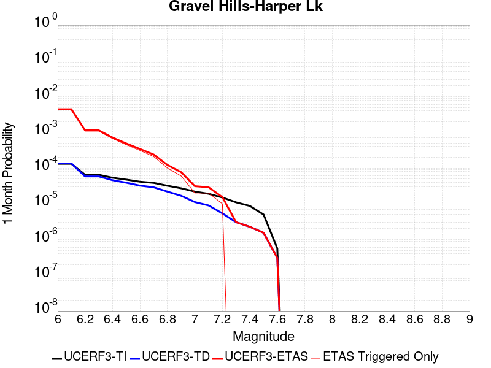 |  |  |

| Magnitude | 1 wk TI Prob | 1 wk TD Prob | 1 wk ETAS Prob | 1 wk ETAS/TD Gain | 1 wk ETAS Triggered Only | 1 mo TI Prob | 1 mo TD Prob | 1 mo ETAS Prob | 1 mo ETAS/TD Gain | 1 mo ETAS Triggered Only | 1 yr TI Prob | 1 yr TD Prob | 1 yr ETAS Prob | 1 yr ETAS/TD Gain | 1 yr ETAS Triggered Only | 10 yr TI Prob | 10 yr TD Prob | 10 yr ETAS Prob | 10 yr ETAS/TD Gain | 10 yr ETAS Triggered Only |
|-----|-----|-----|-----|-----|-----|-----|-----|-----|-----|-----|-----|-----|-----|-----|-----|-----|-----|-----|-----|-----|
| 6.0 | 3.0679566E-5 | 3.1464646E-5 | 0.0035466177 | 112.717545 | 0.0035152636 | 1.3147724E-4 | 1.3484273E-4 | 0.004759566 | 35.29716 | 0.004625347 | 0.0015995599 | 0.0016406906 | 0.007366711 | 4.490006 | 0.00573543 | 0.015880952 | 0.01630734 | 0.022677226 | 1.3906147 | 0.006475486 |
| 6.1 | 3.0679566E-5 | 3.1464646E-5 | 0.0035466177 | 112.717545 | 0.0035152636 | 1.3147724E-4 | 1.3484273E-4 | 0.004759566 | 35.29716 | 0.004625347 | 0.0015995599 | 0.0016406906 | 0.007366711 | 4.490006 | 0.00573543 | 0.015880952 | 0.01630734 | 0.022677226 | 1.3906147 | 0.006475486 |
| 6.2 | 1.514536E-5 | 1.3635206E-5 | 0.0011237033 | 82.4119 | 0.0011100833 | 6.490707E-5 | 5.843536E-5 | 0.0014459584 | 24.74458 | 0.001387604 | 7.8995706E-4 | 7.1123015E-4 | 0.0024676118 | 3.4694984 | 0.0017576318 | 0.007871548 | 0.0070907404 | 0.008927761 | 1.259073 | 0.0018501388 |
| 6.3 | 1.514536E-5 | 1.3635206E-5 | 0.0011237033 | 82.4119 | 0.0011100833 | 6.490707E-5 | 5.843536E-5 | 0.0014459584 | 24.74458 | 0.001387604 | 7.8995706E-4 | 7.1123015E-4 | 0.0024676118 | 3.4694984 | 0.0017576318 | 0.007871548 | 0.0070907404 | 0.008927761 | 1.259073 | 0.0018501388 |
| 6.4 | 1.2532521E-5 | 1.06896905E-5 | 7.5073726E-4 | 70.23003 | 7.400555E-4 | 5.37097E-5 | 4.581219E-5 | 9.708392E-4 | 21.191723 | 9.250694E-4 | 6.537194E-4 | 5.576265E-4 | 0.0018520014 | 3.321222 | 0.0012950972 | 0.0065179965 | 0.005562863 | 0.0068507553 | 1.2315161 | 0.0012950972 |
| 6.5 | 1.1094058E-5 | 9.083664E-6 | 3.7910807E-4 | 41.73515 | 3.7002776E-4 | 4.7545094E-5 | 3.892943E-5 | 5.0144613E-4 | 12.880901 | 4.625347E-4 | 5.787078E-4 | 4.7386673E-4 | 0.0011211084 | 2.3658729 | 6.475486E-4 | 0.0057720304 | 0.0047289706 | 0.005373457 | 1.1362847 | 6.475486E-4 |
| 6.6 | 9.688328E-6 | 7.5316952E-6 | 1.9254418E-4 | 25.564522 | 1.8501388E-4 | 4.1520743E-5 | 3.227831E-5 | 3.0979016E-4 | 9.597472 | 2.7752083E-4 | 5.053978E-4 | 3.9292008E-4 | 8.5527304E-4 | 2.17671 | 4.625347E-4 | 0.0050424994 | 0.0039225104 | 0.004383231 | 1.1174555 | 4.625347E-4 |
| 6.7 | 8.974824E-6 | 6.749413E-6 | 9.9255725E-5 | 14.705831 | 9.250694E-5 | 3.8462964E-5 | 2.8925748E-5 | 1.2143001E-4 | 4.1979904 | 9.250694E-5 | 4.6818596E-4 | 3.5211627E-4 | 5.37065E-4 | 1.525249 | 1.8501388E-4 | 0.004672008 | 0.0035158044 | 0.0037001679 | 1.0524385 | 1.8501388E-4 |
| 6.8 | 7.4780046E-6 | 5.1161933E-6 | 9.762266E-5 | 19.081112 | 9.250694E-5 | 3.20482E-5 | 2.1926366E-5 | 1.1443128E-4 | 5.218889 | 9.250694E-5 | 3.9011694E-4 | 2.669222E-4 | 3.5940445E-4 | 1.3464764 | 9.250694E-5 | 0.0038943281 | 0.0026661542 | 0.0027584145 | 1.0346043 | 9.250694E-5 |
| 6.9 | 6.3409307E-6 | 3.9074966E-6 | 9.641407E-5 | 24.674128 | 9.250694E-5 | 2.7175134E-5 | 1.6746313E-5 | 1.09251705E-4 | 6.523926 | 9.250694E-5 | 3.3080703E-4 | 2.0386827E-4 | 2.9635636E-4 | 1.4536659 | 9.250694E-5 | 0.0033031502 | 0.0020369107 | 0.0021292293 | 1.0453228 | 9.250694E-5 |
| 7.0 | 5.1239335E-6 | 2.6058565E-6 | 2.6058565E-6 | 1.0 | 0.0 | 2.195953E-5 | 1.116791E-5 | 1.116791E-5 | 1.0 | 0.0 | 2.6732447E-4 | 1.3596108E-4 | 1.3596108E-4 | 1.0 | 0.0 | 0.0026700313 | 0.0013588042 | 0.0013588042 | 1.0 | 0.0 |
| 7.1 | 4.438899E-6 | 2.0984728E-6 | 2.0984728E-6 | 1.0 | 0.0 | 1.9023713E-5 | 8.993425E-6 | 8.993425E-6 | 1.0 | 0.0 | 2.315891E-4 | 1.0948967E-4 | 1.0948967E-4 | 1.0 | 0.0 | 0.002313479 | 0.0010943791 | 0.0010943791 | 1.0 | 0.0 |
| 7.2 | 3.50367E-6 | 1.2615716E-6 | 1.2615716E-6 | 1.0 | 0.0 | 1.5015643E-5 | 5.4067245E-6 | 5.4067245E-6 | 1.0 | 0.0 | 1.8280011E-4 | 6.582497E-5 | 6.582497E-5 | 1.0 | 0.0 | 0.0018264982 | 6.580629E-4 | 6.580629E-4 | 1.0 | 0.0 |
| 7.3 | 2.561638E-6 | 7.1191585E-7 | 7.1191585E-7 | 1.0 | 0.0 | 1.0978401E-5 | 3.0510646E-6 | 3.0510646E-6 | 1.0 | 0.0 | 1.3365384E-4 | 3.71461E-5 | 3.71461E-5 | 1.0 | 0.0 | 0.0013357349 | 3.7140088E-4 | 3.7140088E-4 | 1.0 | 0.0 |
| 7.4 | 2.0368864E-6 | 5.304837E-7 | 5.304837E-7 | 1.0 | 0.0 | 8.729483E-6 | 2.2734996E-6 | 2.2734996E-6 | 1.0 | 0.0 | 1.06276275E-4 | 2.7679513E-5 | 2.7679513E-5 | 1.0 | 0.0 | 0.0010622547 | 2.767612E-4 | 2.767612E-4 | 1.0 | 0.0 |
| 7.5 | 1.1681728E-6 | 3.6030585E-7 | 3.6030585E-7 | 1.0 | 0.0 | 5.0064455E-6 | 1.544167E-6 | 1.544167E-6 | 1.0 | 0.0 | 6.0951766E-5 | 1.8800076E-5 | 1.8800076E-5 | 1.0 | 0.0 | 6.093505E-4 | 1.8798532E-4 | 1.8798532E-4 | 1.0 | 0.0 |
| 7.6 | 1.3154387E-7 | 7.1197384E-8 | 7.1197384E-8 | 1.0 | 0.0 | 5.6375933E-7 | 3.051316E-7 | 3.051316E-7 | 1.0 | 0.0 | 6.863748E-6 | 3.7149728E-6 | 3.7149728E-6 | 1.0 | 0.0 | 6.863536E-5 | 3.7149264E-5 | 3.7149264E-5 | 1.0 | 0.0 |

## So Sierra Nevada
*[(top)](#table-of-contents)*

| 1 Week | 1 Month | 1 Year | 10 Year |
|-----|-----|-----|-----|
|  |  |  |  |

| Magnitude | 1 wk TI Prob | 1 wk TD Prob | 1 wk ETAS Prob | 1 wk ETAS/TD Gain | 1 wk ETAS Triggered Only | 1 mo TI Prob | 1 mo TD Prob | 1 mo ETAS Prob | 1 mo ETAS/TD Gain | 1 mo ETAS Triggered Only | 1 yr TI Prob | 1 yr TD Prob | 1 yr ETAS Prob | 1 yr ETAS/TD Gain | 1 yr ETAS Triggered Only | 10 yr TI Prob | 10 yr TD Prob | 10 yr ETAS Prob | 10 yr ETAS/TD Gain | 10 yr ETAS Triggered Only |
|-----|-----|-----|-----|-----|-----|-----|-----|-----|-----|-----|-----|-----|-----|-----|-----|-----|-----|-----|-----|-----|
| 6.0 | 1.15488665E-5 | 1.1079643E-5 | 0.0031562806 | 284.87207 | 0.0031452358 | 4.9494203E-5 | 4.748339E-5 | 0.004025093 | 84.76844 | 0.0039777984 | 6.024253E-4 | 5.7796965E-4 | 0.0056629106 | 9.797937 | 0.005087882 | 0.006007948 | 0.005765934 | 0.011468294 | 1.9889742 | 0.00573543 |
| 6.1 | 1.15488665E-5 | 1.1079643E-5 | 0.0031562806 | 284.87207 | 0.0031452358 | 4.9494203E-5 | 4.748339E-5 | 0.004025093 | 84.76844 | 0.0039777984 | 6.024253E-4 | 5.7796965E-4 | 0.0056629106 | 9.797937 | 0.005087882 | 0.006007948 | 0.005765934 | 0.011468294 | 1.9889742 | 0.00573543 |
| 6.2 | 1.15488665E-5 | 1.1079643E-5 | 0.0031562806 | 284.87207 | 0.0031452358 | 4.9494203E-5 | 4.748339E-5 | 0.004025093 | 84.76844 | 0.0039777984 | 6.024253E-4 | 5.7796965E-4 | 0.0056629106 | 9.797937 | 0.005087882 | 0.006007948 | 0.005765934 | 0.011468294 | 1.9889742 | 0.00573543 |
| 6.3 | 1.15488665E-5 | 1.1079643E-5 | 0.0031562806 | 284.87207 | 0.0031452358 | 4.9494203E-5 | 4.748339E-5 | 0.004025093 | 84.76844 | 0.0039777984 | 6.024253E-4 | 5.7796965E-4 | 0.0056629106 | 9.797937 | 0.005087882 | 0.006007948 | 0.005765934 | 0.011468294 | 1.9889742 | 0.00573543 |
| 6.4 | 1.15488665E-5 | 1.1079643E-5 | 0.0031562806 | 284.87207 | 0.0031452358 | 4.9494203E-5 | 4.748339E-5 | 0.004025093 | 84.76844 | 0.0039777984 | 6.024253E-4 | 5.7796965E-4 | 0.0056629106 | 9.797937 | 0.005087882 | 0.006007948 | 0.005765934 | 0.011468294 | 1.9889742 | 0.00573543 |
| 6.5 | 1.15488665E-5 | 1.1079643E-5 | 0.0031562806 | 284.87207 | 0.0031452358 | 4.9494203E-5 | 4.748339E-5 | 0.004025093 | 84.76844 | 0.0039777984 | 6.024253E-4 | 5.7796965E-4 | 0.0056629106 | 9.797937 | 0.005087882 | 0.006007948 | 0.005765934 | 0.011468294 | 1.9889742 | 0.00573543 |
| 6.6 | 7.587044E-6 | 6.935635E-6 | 0.0016720489 | 241.08087 | 0.0016651249 | 3.2515498E-5 | 2.9723828E-5 | 0.002064816 | 69.46669 | 0.0020351526 | 3.9580427E-4 | 3.6183043E-4 | 0.0026736672 | 7.3892817 | 0.0023126735 | 0.003951 | 0.0036127048 | 0.0061935415 | 1.714378 | 0.0025901943 |
| 6.7 | 7.587044E-6 | 6.935635E-6 | 0.0016720489 | 241.08087 | 0.0016651249 | 3.2515498E-5 | 2.9723828E-5 | 0.002064816 | 69.46669 | 0.0020351526 | 3.9580427E-4 | 3.6183043E-4 | 0.0026736672 | 7.3892817 | 0.0023126735 | 0.003951 | 0.0036127048 | 0.0061935415 | 1.714378 | 0.0025901943 |
| 6.8 | 5.9026956E-6 | 5.1793927E-6 | 0.0015777892 | 304.62823 | 0.0015726179 | 2.5297022E-5 | 2.2197215E-5 | 0.0018722949 | 84.34819 | 0.0018501388 | 3.0794772E-4 | 2.7021873E-4 | 0.0023048215 | 8.529466 | 0.0020351526 | 0.0030752132 | 0.002699018 | 0.0050054495 | 1.8545448 | 0.0023126735 |
| 6.9 | 5.0118915E-6 | 4.2524252E-6 | 0.001299344 | 305.55365 | 0.0012950972 | 2.1479358E-5 | 1.8224557E-5 | 0.0014983086 | 82.21372 | 0.001480111 | 2.614798E-4 | 2.2186211E-4 | 0.0018866176 | 8.503559 | 0.0016651249 | 0.0026117235 | 0.0022164788 | 0.0040625166 | 1.8328696 | 0.0018501388 |
| 7.0 | 4.4924795E-6 | 3.7139177E-6 | 0.0012062996 | 324.80518 | 0.0012025902 | 1.925334E-5 | 1.5916696E-5 | 0.0014034987 | 88.177765 | 0.001387604 | 2.3438422E-4 | 1.9376918E-4 | 0.0016735934 | 8.637047 | 0.001480111 | 0.0023413717 | 0.0019360651 | 0.0035979664 | 1.858391 | 0.0016651249 |
| 7.1 | 3.9118436E-6 | 3.1119775E-6 | 5.5815186E-4 | 179.356 | 5.5504165E-4 | 1.6764936E-5 | 1.3336982E-5 | 7.533826E-4 | 56.48824 | 7.400555E-4 | 2.0409399E-4 | 1.6236622E-4 | 9.947935E-4 | 6.12685 | 8.3256245E-4 | 0.0020390663 | 0.001622532 | 0.0026384573 | 1.6261357 | 0.0010175763 |
| 7.2 | 3.4200818E-6 | 2.6054543E-6 | 5.5764563E-4 | 214.03009 | 5.5504165E-4 | 1.4657411E-5 | 1.11661875E-5 | 6.587075E-4 | 58.991264 | 6.475486E-4 | 1.7843937E-4 | 1.3594035E-4 | 8.7589526E-4 | 6.443232 | 7.400555E-4 | 0.0017829615 | 0.0013586218 | 0.0022824344 | 1.679963 | 9.250694E-4 |
| 7.3 | 2.6593618E-6 | 1.8284203E-6 | 3.718555E-4 | 203.37529 | 3.7002776E-4 | 1.13972155E-5 | 7.836065E-6 | 3.778609E-4 | 48.22075 | 3.7002776E-4 | 1.3875226E-4 | 9.540021E-5 | 4.6539266E-4 | 4.8783193 | 3.7002776E-4 | 0.0013866565 | 9.5362146E-4 | 0.0014157151 | 1.4845672 | 4.625347E-4 |
| 7.4 | 2.2577992E-6 | 1.436438E-6 | 2.7895684E-4 | 194.20041 | 2.7752083E-4 | 9.676246E-6 | 6.15615E-6 | 2.8367527E-4 | 46.07998 | 2.7752083E-4 | 1.1780193E-4 | 7.49488E-5 | 3.524488E-4 | 4.7025275 | 2.7752083E-4 | 0.001177395 | 7.492603E-4 | 0.0010265731 | 1.3701155 | 2.7752083E-4 |
| 7.5 | 1.489319E-6 | 7.353936E-7 | 9.324226E-5 | 126.79232 | 9.250694E-5 | 6.3827797E-6 | 3.1516831E-6 | 9.565833E-5 | 30.351505 | 9.250694E-5 | 7.770758E-5 | 3.8371072E-5 | 1.3087445E-4 | 3.4107585 | 9.250694E-5 | 7.7680405E-4 | 3.836449E-4 | 4.7611634E-4 | 1.2410339 | 9.250694E-5 |
| 7.6 | 1.0680322E-6 | 4.6596554E-7 | 9.297286E-5 | 199.52733 | 9.250694E-5 | 4.577273E-6 | 1.9969937E-6 | 9.450375E-5 | 47.32301 | 9.250694E-5 | 5.5726876E-5 | 2.4313129E-5 | 1.1681782E-4 | 4.804722 | 9.250694E-5 | 5.5712904E-4 | 2.4310495E-4 | 3.355894E-4 | 1.3804301 | 9.250694E-5 |
| 7.7 | 5.509146E-7 | 1.5580486E-7 | 1.5580486E-7 | 1.0 | 0.0 | 2.3610605E-6 | 6.677349E-7 | 6.677349E-7 | 1.0 | 0.0 | 2.8745531E-5 | 8.129644E-6 | 8.129644E-6 | 1.0 | 0.0 | 2.8741814E-4 | 8.1293576E-5 | 8.1293576E-5 | 1.0 | 0.0 |

## Death Valley (So)
*[(top)](#table-of-contents)*

| 1 Week | 1 Month | 1 Year | 10 Year |
|-----|-----|-----|-----|
|  |  |  |  |

| Magnitude | 1 wk TI Prob | 1 wk TD Prob | 1 wk ETAS Prob | 1 wk ETAS/TD Gain | 1 wk ETAS Triggered Only | 1 mo TI Prob | 1 mo TD Prob | 1 mo ETAS Prob | 1 mo ETAS/TD Gain | 1 mo ETAS Triggered Only | 1 yr TI Prob | 1 yr TD Prob | 1 yr ETAS Prob | 1 yr ETAS/TD Gain | 1 yr ETAS Triggered Only | 10 yr TI Prob | 10 yr TD Prob | 10 yr ETAS Prob | 10 yr ETAS/TD Gain | 10 yr ETAS Triggered Only |
|-----|-----|-----|-----|-----|-----|-----|-----|-----|-----|-----|-----|-----|-----|-----|-----|-----|-----|-----|-----|-----|
| 6.0 | 2.0684236E-5 | 2.5617775E-5 | 0.0028932593 | 112.93952 | 0.002867715 | 8.864371E-5 | 1.0978594E-4 | 0.0039946507 | 36.38581 | 0.0038852913 | 0.0010787029 | 0.0013358411 | 0.005862626 | 4.388715 | 0.00453284 | 0.010734817 | 0.013281397 | 0.018210426 | 1.3711228 | 0.0049953745 |
| 6.1 | 2.0684236E-5 | 2.5617775E-5 | 0.0028932593 | 112.93952 | 0.002867715 | 8.864371E-5 | 1.0978594E-4 | 0.0039946507 | 36.38581 | 0.0038852913 | 0.0010787029 | 0.0013358411 | 0.005862626 | 4.388715 | 0.00453284 | 0.010734817 | 0.013281397 | 0.018210426 | 1.3711228 | 0.0049953745 |
| 6.2 | 2.0684236E-5 | 2.5617775E-5 | 0.0028932593 | 112.93952 | 0.002867715 | 8.864371E-5 | 1.0978594E-4 | 0.0039946507 | 36.38581 | 0.0038852913 | 0.0010787029 | 0.0013358411 | 0.005862626 | 4.388715 | 0.00453284 | 0.010734817 | 0.013281397 | 0.018210426 | 1.3711228 | 0.0049953745 |
| 6.3 | 2.0240292E-5 | 2.511786E-5 | 0.0026152472 | 104.11902 | 0.0025901943 | 8.6741224E-5 | 1.07643624E-4 | 0.003715026 | 34.512268 | 0.0036077707 | 0.0010555626 | 0.00130979 | 0.00546715 | 4.174066 | 0.004162812 | 0.010505628 | 0.013023956 | 0.017497761 | 1.3435057 | 0.00453284 |
| 6.4 | 2.0240292E-5 | 2.511786E-5 | 0.0026152472 | 104.11902 | 0.0025901943 | 8.6741224E-5 | 1.07643624E-4 | 0.003715026 | 34.512268 | 0.0036077707 | 0.0010555626 | 0.00130979 | 0.00546715 | 4.174066 | 0.004162812 | 0.010505628 | 0.013023956 | 0.017497761 | 1.3435057 | 0.00453284 |
| 6.5 | 1.9962767E-5 | 2.4807114E-5 | 0.002429928 | 97.952866 | 0.0024051804 | 8.55519E-5 | 1.0631196E-4 | 0.0035287049 | 33.191982 | 0.0034227567 | 0.0010410968 | 0.0012935963 | 0.005266249 | 4.0710144 | 0.0039777984 | 0.010362327 | 0.012863902 | 0.017155798 | 1.3336387 | 0.004347826 |
| 6.6 | 1.8937297E-5 | 2.3310964E-5 | 0.0022434257 | 96.239075 | 0.0022201666 | 8.115732E-5 | 9.990039E-5 | 0.0033373197 | 33.406475 | 0.003237743 | 9.876423E-4 | 0.0012156231 | 0.0049114027 | 4.0402346 | 0.0037002775 | 0.009832645 | 0.012092789 | 0.016022485 | 1.3249619 | 0.0039777984 |
| 6.7 | 1.8621096E-5 | 2.2911607E-5 | 0.0022430273 | 97.89917 | 0.0022201666 | 7.980225E-5 | 9.818898E-5 | 0.003243116 | 33.029327 | 0.0031452358 | 9.711593E-4 | 0.0011948098 | 0.00479827 | 4.015928 | 0.0036077707 | 0.009669261 | 0.011886904 | 0.015634604 | 1.3152797 | 0.0037927844 |
| 6.8 | 1.7830353E-5 | 2.1805688E-5 | 0.002056914 | 94.32924 | 0.0020351526 | 7.641356E-5 | 9.344968E-5 | 0.003053395 | 32.674217 | 0.002960222 | 9.29938E-4 | 0.00113717 | 0.0044636326 | 3.9252114 | 0.0033302498 | 0.009260561 | 0.011316354 | 0.014791838 | 1.3071204 | 0.0035152636 |
| 6.9 | 1.3135183E-5 | 1.5303925E-5 | 0.0013103812 | 85.62387 | 0.0012950972 | 5.6292425E-5 | 6.558664E-5 | 0.0019156041 | 29.207232 | 0.0018501388 | 6.8514474E-4 | 7.982312E-4 | 0.0029241925 | 3.66334 | 0.0021276595 | 0.006830362 | 0.007954649 | 0.010248926 | 1.2884196 | 0.0023126735 |
| 7.0 | 1.1507512E-5 | 1.3154199E-5 | 0.0011232229 | 85.388916 | 0.0011100833 | 4.9316975E-5 | 5.6373956E-5 | 0.0014438998 | 25.612888 | 0.001387604 | 6.002687E-4 | 6.8614254E-4 | 0.0022576815 | 3.2903972 | 0.0015726179 | 0.0059864987 | 0.0068409415 | 0.008586549 | 1.2551707 | 0.0017576318 |
| 7.1 | 9.715903E-6 | 1.0865278E-5 | 5.659009E-4 | 52.083424 | 5.5504165E-4 | 4.1638916E-5 | 4.656467E-5 | 7.8658573E-4 | 16.892328 | 7.400555E-4 | 5.068359E-4 | 5.667817E-4 | 0.0014913267 | 2.6312191 | 9.250694E-4 | 0.0050568148 | 0.0056538144 | 0.0066656377 | 1.178963 | 0.0010175763 |
| 7.2 | 9.233269E-6 | 1.02863105E-5 | 4.7281623E-4 | 45.965584 | 4.625347E-4 | 3.9570554E-5 | 4.4083466E-5 | 6.9160346E-4 | 15.6885 | 6.475486E-4 | 4.81665E-4 | 5.3658825E-4 | 0.0013687039 | 2.5507526 | 8.3256245E-4 | 0.0048062233 | 0.0053533576 | 0.006273475 | 1.1718767 | 9.250694E-4 |
| 7.3 | 8.8041315E-6 | 9.808164E-6 | 3.798323E-4 | 38.726135 | 3.7002776E-4 | 3.7731446E-5 | 4.2034335E-5 | 5.045496E-4 | 12.003273 | 4.625347E-4 | 4.592835E-4 | 5.1165203E-4 | 0.0011588692 | 2.2649558 | 6.475486E-4 | 0.0045833546 | 0.005105167 | 0.0058414447 | 1.144222 | 7.400555E-4 |
| 7.4 | 8.708749E-6 | 9.707175E-6 | 3.7973133E-4 | 39.118626 | 3.7002776E-4 | 3.7322676E-5 | 4.160154E-5 | 5.04117E-4 | 12.117748 | 4.625347E-4 | 4.5430884E-4 | 5.0638523E-4 | 0.0011536059 | 2.278119 | 6.475486E-4 | 0.004533812 | 0.0050527398 | 0.005789056 | 1.1457261 | 7.400555E-4 |
| 7.5 | 8.612678E-6 | 9.604817E-6 | 3.7962903E-4 | 39.524857 | 3.7002776E-4 | 3.6910955E-5 | 4.1162875E-5 | 5.036785E-4 | 12.236233 | 4.625347E-4 | 4.492982E-4 | 5.01047E-4 | 0.0010558105 | 2.1072085 | 5.5504165E-4 | 0.004483909 | 0.0049995985 | 0.00564391 | 1.1288725 | 6.475486E-4 |
| 7.6 | 8.319024E-6 | 9.283916E-6 | 2.8680215E-4 | 30.892366 | 2.7752083E-4 | 3.5652476E-5 | 3.978763E-5 | 4.0980065E-4 | 10.2997 | 3.7002776E-4 | 4.3398244E-4 | 4.8431093E-4 | 8.541595E-4 | 1.7636594 | 3.7002776E-4 | 0.0043313587 | 0.0048329784 | 0.0052932776 | 1.0952413 | 4.625347E-4 |
| 7.7 | 7.4718328E-6 | 8.34517E-6 | 2.8586367E-4 | 34.254986 | 2.7752083E-4 | 3.2021748E-5 | 3.5764548E-5 | 4.0577905E-4 | 11.345847 | 3.7002776E-4 | 3.8979502E-4 | 4.353504E-4 | 8.052171E-4 | 1.8495839 | 3.7002776E-4 | 0.00389112 | 0.0043453807 | 0.0048059053 | 1.1059803 | 4.625347E-4 |
| 7.8 | 3.4586725E-7 | 3.6482615E-7 | 3.6482615E-7 | 1.0 | 0.0 | 1.4822873E-6 | 1.5635396E-6 | 1.5635396E-6 | 1.0 | 0.0 | 1.80467E-5 | 1.9035933E-5 | 1.9035933E-5 | 1.0 | 0.0 | 1.8045233E-4 | 1.9034347E-4 | 1.9034347E-4 | 1.0 | 0.0 |
| 7.9 | 2.5591178E-9 | 2.6696718E-9 | 2.6696718E-9 | 1.0 | 0.0 | 1.0967647E-8 | 1.14414505E-8 | 1.14414505E-8 | 1.0 | 0.0 | 1.335311E-7 | 1.3929966E-7 | 1.3929966E-7 | 1.0 | 0.0 | 1.3353102E-6 | 1.3929966E-6 | 1.3929966E-6 | 1.0 | 0.0 |

## Goldstone Lake
*[(top)](#table-of-contents)*

| 1 Week | 1 Month | 1 Year | 10 Year |
|-----|-----|-----|-----|
|  |  |  |  |

| Magnitude | 1 wk TI Prob | 1 wk TD Prob | 1 wk ETAS Prob | 1 wk ETAS/TD Gain | 1 wk ETAS Triggered Only | 1 mo TI Prob | 1 mo TD Prob | 1 mo ETAS Prob | 1 mo ETAS/TD Gain | 1 mo ETAS Triggered Only | 1 yr TI Prob | 1 yr TD Prob | 1 yr ETAS Prob | 1 yr ETAS/TD Gain | 1 yr ETAS Triggered Only | 10 yr TI Prob | 10 yr TD Prob | 10 yr ETAS Prob | 10 yr ETAS/TD Gain | 10 yr ETAS Triggered Only |
|-----|-----|-----|-----|-----|-----|-----|-----|-----|-----|-----|-----|-----|-----|-----|-----|-----|-----|-----|-----|-----|
| 6.0 | 2.671352E-5 | 3.037609E-5 | 0.0017879545 | 58.860588 | 0.0017576318 | 1.1448149E-4 | 1.3017785E-4 | 0.00281253 | 21.605288 | 0.0026827012 | 0.001392921 | 0.0015839594 | 0.005555457 | 3.5073228 | 0.0039777984 | 0.013842222 | 0.015746197 | 0.02020766 | 1.283336 | 0.00453284 |
| 6.1 | 2.671352E-5 | 3.037609E-5 | 0.0017879545 | 58.860588 | 0.0017576318 | 1.1448149E-4 | 1.3017785E-4 | 0.00281253 | 21.605288 | 0.0026827012 | 0.001392921 | 0.0015839594 | 0.005555457 | 3.5073228 | 0.0039777984 | 0.013842222 | 0.015746197 | 0.02020766 | 1.283336 | 0.00453284 |
| 6.2 | 1.4197047E-5 | 1.6096245E-5 | 5.711289E-4 | 35.482124 | 5.5504165E-4 | 6.0843064E-5 | 6.8982634E-5 | 9.0148766E-4 | 13.068327 | 8.3256245E-4 | 7.4051257E-4 | 8.3963864E-4 | 0.0025957946 | 3.0915618 | 0.0017576318 | 0.007380498 | 0.0083743585 | 0.010392468 | 1.2409867 | 0.0020351526 |
| 6.3 | 1.4197047E-5 | 1.6096245E-5 | 5.711289E-4 | 35.482124 | 5.5504165E-4 | 6.0843064E-5 | 6.8982634E-5 | 9.0148766E-4 | 13.068327 | 8.3256245E-4 | 7.4051257E-4 | 8.3963864E-4 | 0.0025957946 | 3.0915618 | 0.0017576318 | 0.007380498 | 0.0083743585 | 0.010392468 | 1.2409867 | 0.0020351526 |
| 6.4 | 1.3238931E-5 | 1.500846E-5 | 5.7004177E-4 | 37.981365 | 5.5504165E-4 | 5.6737044E-5 | 6.4320935E-5 | 8.968298E-4 | 13.943047 | 8.3256245E-4 | 6.9055456E-4 | 7.82924E-4 | 0.0024467453 | 3.1251376 | 0.0016651249 | 0.006884126 | 0.0078112837 | 0.0097387545 | 1.2467548 | 0.0019426456 |
| 6.5 | 1.3238931E-5 | 1.500846E-5 | 5.7004177E-4 | 37.981365 | 5.5504165E-4 | 5.6737044E-5 | 6.4320935E-5 | 8.968298E-4 | 13.943047 | 8.3256245E-4 | 6.9055456E-4 | 7.82924E-4 | 0.0024467453 | 3.1251376 | 0.0016651249 | 0.006884126 | 0.0078112837 | 0.0097387545 | 1.2467548 | 0.0019426456 |
| 6.6 | 1.1328278E-5 | 1.2855166E-5 | 4.7538392E-4 | 36.979992 | 4.625347E-4 | 4.8548856E-5 | 5.5092944E-5 | 7.026058E-4 | 12.7531 | 6.475486E-4 | 5.90922E-4 | 6.7064585E-4 | 0.0020573193 | 3.067669 | 0.001387604 | 0.0058935313 | 0.0066956086 | 0.008257696 | 1.2333004 | 0.0015726179 |
| 6.7 | 8.651175E-6 | 9.824565E-6 | 1.9483663E-4 | 19.83158 | 1.8501388E-4 | 3.707594E-5 | 4.2105108E-5 | 3.1961425E-4 | 7.590866 | 2.7752083E-4 | 4.5130608E-4 | 5.1259965E-4 | 0.0014371949 | 2.8037376 | 9.250694E-4 | 0.0045039062 | 0.005123051 | 0.006227447 | 1.2155739 | 0.0011100833 |
| 6.8 | 1.0215377E-6 | 1.1754702E-6 | 1.1754702E-6 | 1.0 | 0.0 | 4.378012E-6 | 5.0377203E-6 | 5.0377203E-6 | 1.0 | 0.0 | 5.3300988E-5 | 6.1332634E-5 | 1.538339E-4 | 2.50819 | 9.250694E-5 | 5.3288206E-4 | 6.1316835E-4 | 7.9806877E-4 | 1.3015492 | 1.8501388E-4 |
| 6.9 | 7.9360774E-7 | 9.2833966E-7 | 9.2833966E-7 | 1.0 | 0.0 | 3.4011714E-6 | 3.9785928E-6 | 3.9785928E-6 | 1.0 | 0.0 | 4.1408475E-5 | 4.843836E-5 | 1.4094081E-4 | 2.9096942 | 9.250694E-5 | 4.140076E-4 | 4.8428503E-4 | 5.767472E-4 | 1.190925 | 9.250694E-5 |
| 7.0 | 7.4382757E-7 | 8.7473285E-7 | 8.7473285E-7 | 1.0 | 0.0 | 3.1878285E-6 | 3.74885E-6 | 3.74885E-6 | 1.0 | 0.0 | 3.8811122E-5 | 4.564136E-5 | 4.564136E-5 | 1.0 | 0.0 | 3.8804344E-4 | 4.5632652E-4 | 4.5632652E-4 | 1.0 | 0.0 |
| 7.1 | 6.4709513E-7 | 7.7113E-7 | 7.7113E-7 | 1.0 | 0.0 | 2.773262E-6 | 3.3048389E-6 | 3.3048389E-6 | 1.0 | 0.0 | 3.376394E-5 | 4.0235733E-5 | 4.0235733E-5 | 1.0 | 0.0 | 3.375881E-4 | 4.0229043E-4 | 4.0229043E-4 | 1.0 | 0.0 |
| 7.2 | 6.356704E-7 | 7.5883594E-7 | 7.5883594E-7 | 1.0 | 0.0 | 2.7242988E-6 | 3.2521505E-6 | 3.2521505E-6 | 1.0 | 0.0 | 3.3167835E-5 | 3.959427E-5 | 3.959427E-5 | 1.0 | 0.0 | 3.3162883E-4 | 3.958781E-4 | 3.958781E-4 | 1.0 | 0.0 |
| 7.3 | 5.7695723E-7 | 6.8965653E-7 | 6.8965653E-7 | 1.0 | 0.0 | 2.4726714E-6 | 2.9556677E-6 | 2.9556677E-6 | 1.0 | 0.0 | 3.0104358E-5 | 3.5984718E-5 | 3.5984718E-5 | 1.0 | 0.0 | 3.0100282E-4 | 3.5979465E-4 | 3.5979465E-4 | 1.0 | 0.0 |
| 7.4 | 5.209647E-7 | 6.193514E-7 | 6.193514E-7 | 1.0 | 0.0 | 2.232704E-6 | 2.6543607E-6 | 2.6543607E-6 | 1.0 | 0.0 | 2.718283E-5 | 3.2316417E-5 | 3.2316417E-5 | 1.0 | 0.0 | 2.7179506E-4 | 3.2312275E-4 | 3.2312275E-4 | 1.0 | 0.0 |
| 7.5 | 4.512955E-7 | 5.348885E-7 | 5.348885E-7 | 1.0 | 0.0 | 1.934122E-6 | 2.2923775E-6 | 2.2923775E-6 | 1.0 | 0.0 | 2.3547682E-5 | 2.7909393E-5 | 2.7909393E-5 | 1.0 | 0.0 | 2.3545188E-4 | 2.7906417E-4 | 2.7906417E-4 | 1.0 | 0.0 |
| 7.6 | 2.21172E-7 | 2.603961E-7 | 2.603961E-7 | 1.0 | 0.0 | 9.478797E-7 | 1.1159829E-6 | 1.1159829E-6 | 1.0 | 0.0 | 1.1540374E-5 | 1.3587036E-5 | 1.3587036E-5 | 1.0 | 0.0 | 1.1539775E-4 | 1.3586486E-4 | 1.3586486E-4 | 1.0 | 0.0 |

## San Andreas (Mojave S)
*[(top)](#table-of-contents)*

| 1 Week | 1 Month | 1 Year | 10 Year |
|-----|-----|-----|-----|
|  |  |  |  |

| Magnitude | 1 wk TI Prob | 1 wk TD Prob | 1 wk ETAS Prob | 1 wk ETAS/TD Gain | 1 wk ETAS Triggered Only | 1 mo TI Prob | 1 mo TD Prob | 1 mo ETAS Prob | 1 mo ETAS/TD Gain | 1 mo ETAS Triggered Only | 1 yr TI Prob | 1 yr TD Prob | 1 yr ETAS Prob | 1 yr ETAS/TD Gain | 1 yr ETAS Triggered Only | 10 yr TI Prob | 10 yr TD Prob | 10 yr ETAS Prob | 10 yr ETAS/TD Gain | 10 yr ETAS Triggered Only |
|-----|-----|-----|-----|-----|-----|-----|-----|-----|-----|-----|-----|-----|-----|-----|-----|-----|-----|-----|-----|-----|
| 6.0 | 3.1064058E-4 | 6.7460834E-4 | 0.003263055 | 4.8369627 | 0.0025901943 | 0.0013306376 | 0.0028881032 | 0.005839776 | 2.0220108 | 0.002960222 | 0.016080605 | 0.03462235 | 0.037926603 | 1.095437 | 0.0034227567 | 0.1496549 | 0.28660452 | 0.28944227 | 1.0099013 | 0.0039777984 |
| 6.1 | 3.1064058E-4 | 6.7460834E-4 | 0.003263055 | 4.8369627 | 0.0025901943 | 0.0013306376 | 0.0028881032 | 0.005839776 | 2.0220108 | 0.002960222 | 0.016080605 | 0.03462235 | 0.037926603 | 1.095437 | 0.0034227567 | 0.1496549 | 0.28660452 | 0.28944227 | 1.0099013 | 0.0039777984 |
| 6.2 | 3.1064058E-4 | 6.7460834E-4 | 0.003263055 | 4.8369627 | 0.0025901943 | 0.0013306376 | 0.0028881032 | 0.005839776 | 2.0220108 | 0.002960222 | 0.016080605 | 0.03462235 | 0.037926603 | 1.095437 | 0.0034227567 | 0.1496549 | 0.28660452 | 0.28944227 | 1.0099013 | 0.0039777984 |
| 6.3 | 3.1064058E-4 | 6.7460834E-4 | 0.003263055 | 4.8369627 | 0.0025901943 | 0.0013306376 | 0.0028881032 | 0.005839776 | 2.0220108 | 0.002960222 | 0.016080605 | 0.03462235 | 0.037926603 | 1.095437 | 0.0034227567 | 0.1496549 | 0.28660452 | 0.28944227 | 1.0099013 | 0.0039777984 |
| 6.4 | 1.9872203E-4 | 4.3179357E-4 | 0.0030208693 | 6.9960966 | 0.0025901943 | 8.5138786E-4 | 0.0018492596 | 0.0047116717 | 2.5478692 | 0.002867715 | 0.010316478 | 0.02228844 | 0.025454018 | 1.1420279 | 0.003237743 | 0.098504856 | 0.19699748 | 0.19989453 | 1.014706 | 0.0036077707 |
| 6.5 | 1.291105E-4 | 2.875267E-4 | 0.0025995353 | 9.041022 | 0.0023126735 | 5.5321335E-4 | 0.0012316781 | 0.0038186822 | 3.1003897 | 0.0025901943 | 0.006714592 | 0.0148934 | 0.017809534 | 1.1958004 | 0.002960222 | 0.065152965 | 0.13803436 | 0.14090492 | 1.020796 | 0.0033302498 |
| 6.6 | 1.291105E-4 | 2.875267E-4 | 0.0025995353 | 9.041022 | 0.0023126735 | 5.5321335E-4 | 0.0012316781 | 0.0038186822 | 3.1003897 | 0.0025901943 | 0.006714592 | 0.0148934 | 0.017809534 | 1.1958004 | 0.002960222 | 0.065152965 | 0.13803436 | 0.14090492 | 1.020796 | 0.0033302498 |
| 6.7 | 1.08001186E-4 | 2.4333889E-4 | 0.0024629652 | 10.121544 | 0.0022201666 | 4.6278012E-4 | 0.0010424647 | 0.0035375482 | 3.3934467 | 0.0024976872 | 0.0056198016 | 0.012618446 | 0.015449975 | 1.224396 | 0.002867715 | 0.054797906 | 0.119176775 | 0.12202866 | 1.0239298 | 0.003237743 |
| 6.8 | 1.0624356E-4 | 2.3851555E-4 | 0.0024581526 | 10.306047 | 0.0022201666 | 4.5525006E-4 | 0.0010218095 | 0.0035169448 | 3.4418788 | 0.0024976872 | 0.0055285925 | 0.012369843 | 0.0152020855 | 1.2289635 | 0.002867715 | 0.053930566 | 0.11712591 | 0.11998443 | 1.0244055 | 0.003237743 |
| 6.9 | 1.0393785E-4 | 2.3221898E-4 | 0.00245187 | 10.558438 | 0.0022201666 | 4.4537184E-4 | 9.948451E-4 | 0.0034900475 | 3.5081317 | 0.0024976872 | 0.0054089287 | 0.012045221 | 0.014878394 | 1.2352114 | 0.002867715 | 0.05279156 | 0.11442335 | 0.11729062 | 1.0250584 | 0.003237743 |
| 7.0 | 1.0155622E-4 | 2.2591476E-4 | 0.0024455797 | 10.8252325 | 0.0022201666 | 4.3516833E-4 | 9.6784724E-4 | 0.0034631172 | 3.578165 | 0.0024976872 | 0.005285311 | 0.0117200995 | 0.014462782 | 1.2340152 | 0.002775208 | 0.05161361 | 0.111683756 | 0.11447772 | 1.0250168 | 0.0031452358 |
| 7.1 | 9.885595E-5 | 2.1879886E-4 | 0.0024384796 | 11.144846 | 0.0022201666 | 4.2359953E-4 | 9.3737274E-4 | 0.0034327188 | 3.6620638 | 0.0024976872 | 0.0051451353 | 0.011352993 | 0.014096694 | 1.241672 | 0.002775208 | 0.05027629 | 0.1085682 | 0.111371964 | 1.0258249 | 0.0031452358 |
| 7.2 | 9.6411415E-5 | 2.124288E-4 | 0.0024321238 | 11.449123 | 0.0022201666 | 4.1312634E-4 | 9.1009185E-4 | 0.003405506 | 3.7419367 | 0.0024976872 | 0.005018219 | 0.011024255 | 0.013768869 | 1.2489613 | 0.002775208 | 0.049064007 | 0.105758004 | 0.108570606 | 1.0265946 | 0.0031452358 |
| 7.3 | 9.1180635E-5 | 1.9471257E-4 | 0.002229469 | 11.450051 | 0.0020351526 | 3.907156E-4 | 8.342157E-4 | 0.00314496 | 3.7699602 | 0.0023126735 | 0.004746591 | 0.01010939 | 0.0126733985 | 1.2536265 | 0.0025901943 | 0.046464786 | 0.09795115 | 0.10062142 | 1.0272611 | 0.002960222 |
| 7.4 | 8.887388E-5 | 1.8719878E-4 | 0.0022219704 | 11.869577 | 0.0020351526 | 3.8083247E-4 | 8.020339E-4 | 0.0031128526 | 3.8811982 | 0.0023126735 | 0.0046267817 | 0.00972114 | 0.012286155 | 1.2638594 | 0.0025901943 | 0.045316286 | 0.09458615 | 0.097266376 | 1.0283364 | 0.002960222 |
| 7.5 | 8.6750515E-5 | 1.8051457E-4 | 0.0022152998 | 12.272139 | 0.0020351526 | 3.7173493E-4 | 7.7340455E-4 | 0.0030842894 | 3.987938 | 0.0023126735 | 0.004516484 | 0.009375632 | 0.011941542 | 1.2736785 | 0.0025901943 | 0.04425787 | 0.091549896 | 0.09423911 | 1.0293742 | 0.002960222 |
| 7.6 | 8.453092E-5 | 1.7439072E-4 | 0.0022091884 | 12.668039 | 0.0020351526 | 3.6222505E-4 | 7.471748E-4 | 0.0030581204 | 4.0929117 | 0.0023126735 | 0.0044011753 | 0.009058985 | 0.011625715 | 1.2833352 | 0.0025901943 | 0.04315024 | 0.08870898 | 0.091406606 | 1.0304098 | 0.002960222 |
| 7.7 | 8.259102E-5 | 1.6961215E-4 | 0.0022044196 | 12.996826 | 0.0020351526 | 3.539135E-4 | 7.2670676E-4 | 0.0030376995 | 4.18009 | 0.0023126735 | 0.004300386 | 0.008811831 | 0.0113792 | 1.2913549 | 0.0025901943 | 0.042181134 | 0.08645982 | 0.08916411 | 1.0312779 | 0.002960222 |
| 7.8 | 7.444844E-5 | 1.5283503E-4 | 0.0018177055 | 11.893251 | 0.0016651249 | 3.1902574E-4 | 6.548429E-4 | 0.0025037702 | 3.823467 | 0.0018501388 | 0.0038772223 | 0.007943616 | 0.0099626025 | 1.2541646 | 0.0020351526 | 0.03810269 | 0.078290746 | 0.08042236 | 1.0272269 | 0.0023126735 |
| 7.9 | 5.2586525E-5 | 1.00064186E-4 | 0.001025041 | 10.2438345 | 9.250694E-4 | 2.2535135E-4 | 4.2877605E-4 | 0.001445916 | 3.372194 | 0.0010175763 | 0.0027402006 | 0.005207864 | 0.0064041913 | 1.2297156 | 0.0012025902 | 0.027066574 | 0.052200034 | 0.053515207 | 1.0251949 | 0.001387604 |
| 8.0 | 3.379877E-5 | 5.4074168E-5 | 2.3907804E-4 | 4.4212985 | 1.8501388E-4 | 1.4484383E-4 | 2.3172585E-4 | 4.1669686E-4 | 1.7982321 | 1.8501388E-4 | 0.0017620471 | 0.002817614 | 0.003094353 | 1.0982175 | 2.7752083E-4 | 0.017481409 | 0.028834904 | 0.02910442 | 1.009347 | 2.7752083E-4 |
| 8.1 | 1.8668277E-5 | 1.9309397E-5 | 1.9309397E-5 | 1.0 | 0.0 | 8.000444E-5 | 8.275194E-5 | 8.275194E-5 | 1.0 | 0.0 | 9.736188E-4 | 0.0010070398 | 0.0010070398 | 1.0 | 0.0 | 0.009693642 | 0.010798888 | 0.010798888 | 1.0 | 0.0 |
| 8.2 | 8.541571E-6 | 5.460819E-6 | 5.460819E-6 | 1.0 | 0.0 | 3.660622E-5 | 2.3403301E-5 | 2.3403301E-5 | 1.0 | 0.0 | 4.455896E-4 | 2.84898E-4 | 2.84898E-4 | 1.0 | 0.0 | 0.0044469717 | 0.0032408056 | 0.0032408056 | 1.0 | 0.0 |
| 8.3 | 1.983087E-6 | 7.6599065E-7 | 7.6599065E-7 | 1.0 | 0.0 | 8.498917E-6 | 3.282813E-6 | 3.282813E-6 | 1.0 | 0.0 | 1.034694E-4 | 3.9967534E-5 | 3.9967534E-5 | 1.0 | 0.0 | 0.0010342124 | 4.719687E-4 | 4.719687E-4 | 1.0 | 0.0 |

## San Andreas (Mojave N)
*[(top)](#table-of-contents)*

| 1 Week | 1 Month | 1 Year | 10 Year |
|-----|-----|-----|-----|
|  |  |  |  |

| Magnitude | 1 wk TI Prob | 1 wk TD Prob | 1 wk ETAS Prob | 1 wk ETAS/TD Gain | 1 wk ETAS Triggered Only | 1 mo TI Prob | 1 mo TD Prob | 1 mo ETAS Prob | 1 mo ETAS/TD Gain | 1 mo ETAS Triggered Only | 1 yr TI Prob | 1 yr TD Prob | 1 yr ETAS Prob | 1 yr ETAS/TD Gain | 1 yr ETAS Triggered Only | 10 yr TI Prob | 10 yr TD Prob | 10 yr ETAS Prob | 10 yr ETAS/TD Gain | 10 yr ETAS Triggered Only |
|-----|-----|-----|-----|-----|-----|-----|-----|-----|-----|-----|-----|-----|-----|-----|-----|-----|-----|-----|-----|-----|
| 6.0 | 9.877682E-5 | 1.9400702E-4 | 0.0029686769 | 15.301904 | 0.002775208 | 4.2326056E-4 | 8.311939E-4 | 0.0039738156 | 4.780853 | 0.0031452358 | 0.0051410277 | 0.010072956 | 0.013735961 | 1.3636475 | 0.0037002775 | 0.05023708 | 0.09831428 | 0.10198441 | 1.0373306 | 0.0040703053 |
| 6.1 | 9.877682E-5 | 1.9400702E-4 | 0.0029686769 | 15.301904 | 0.002775208 | 4.2326056E-4 | 8.311939E-4 | 0.0039738156 | 4.780853 | 0.0031452358 | 0.0051410277 | 0.010072956 | 0.013735961 | 1.3636475 | 0.0037002775 | 0.05023708 | 0.09831428 | 0.10198441 | 1.0373306 | 0.0040703053 |
| 6.2 | 9.877682E-5 | 1.9400702E-4 | 0.0029686769 | 15.301904 | 0.002775208 | 4.2326056E-4 | 8.311939E-4 | 0.0039738156 | 4.780853 | 0.0031452358 | 0.0051410277 | 0.010072956 | 0.013735961 | 1.3636475 | 0.0037002775 | 0.05023708 | 0.09831428 | 0.10198441 | 1.0373306 | 0.0040703053 |
| 6.3 | 9.877682E-5 | 1.9400702E-4 | 0.0029686769 | 15.301904 | 0.002775208 | 4.2326056E-4 | 8.311939E-4 | 0.0039738156 | 4.780853 | 0.0031452358 | 0.0051410277 | 0.010072956 | 0.013735961 | 1.3636475 | 0.0037002775 | 0.05023708 | 0.09831428 | 0.10198441 | 1.0373306 | 0.0040703053 |
| 6.4 | 9.877682E-5 | 1.9400702E-4 | 0.0029686769 | 15.301904 | 0.002775208 | 4.2326056E-4 | 8.311939E-4 | 0.0039738156 | 4.780853 | 0.0031452358 | 0.0051410277 | 0.010072956 | 0.013735961 | 1.3636475 | 0.0037002775 | 0.05023708 | 0.09831428 | 0.10198441 | 1.0373306 | 0.0040703053 |
| 6.5 | 9.861474E-5 | 1.9374468E-4 | 0.0029684152 | 15.321273 | 0.002775208 | 4.2256617E-4 | 8.300703E-4 | 0.003972695 | 4.7859745 | 0.0031452358 | 0.0051326132 | 0.010059402 | 0.013722458 | 1.3641424 | 0.0037002775 | 0.050156746 | 0.098192066 | 0.101862706 | 1.0373821 | 0.0040703053 |
| 6.6 | 9.861474E-5 | 1.9374468E-4 | 0.0029684152 | 15.321273 | 0.002775208 | 4.2256617E-4 | 8.300703E-4 | 0.003972695 | 4.7859745 | 0.0031452358 | 0.0051326132 | 0.010059402 | 0.013722458 | 1.3641424 | 0.0037002775 | 0.050156746 | 0.098192066 | 0.101862706 | 1.0373821 | 0.0040703053 |
| 6.7 | 9.8552715E-5 | 1.9364421E-4 | 0.002968315 | 15.328705 | 0.002775208 | 4.223004E-4 | 8.2964E-4 | 0.0039722663 | 4.78794 | 0.0031452358 | 0.0051293927 | 0.010054212 | 0.013717286 | 1.3643323 | 0.0037002775 | 0.050125998 | 0.098145254 | 0.10181608 | 1.0374019 | 0.0040703053 |
| 6.8 | 9.8464974E-5 | 1.9349584E-4 | 0.002968167 | 15.339694 | 0.002775208 | 4.219245E-4 | 8.290045E-4 | 0.003971633 | 4.790846 | 0.0031452358 | 0.0051248376 | 0.010046546 | 0.013709649 | 1.364613 | 0.0037002775 | 0.05008251 | 0.09807528 | 0.10174639 | 1.0374316 | 0.0040703053 |
| 6.9 | 9.825824E-5 | 1.9317595E-4 | 0.002967848 | 15.363445 | 0.002775208 | 4.2103877E-4 | 8.276344E-4 | 0.0039702673 | 4.797127 | 0.0031452358 | 0.0051141046 | 0.010030019 | 0.013693183 | 1.3652201 | 0.0037002775 | 0.049980022 | 0.09792438 | 0.1015961 | 1.0374955 | 0.0040703053 |
| 7.0 | 9.781462E-5 | 1.924896E-4 | 0.0029671635 | 15.414669 | 0.002775208 | 4.1913814E-4 | 8.246948E-4 | 0.003967337 | 4.8106728 | 0.0031452358 | 0.005091073 | 0.009994558 | 0.013657853 | 1.366529 | 0.0037002775 | 0.04976007 | 0.09760077 | 0.10127381 | 1.0376333 | 0.0040703053 |
| 7.1 | 9.7121134E-5 | 1.9150671E-4 | 0.0029661835 | 15.488665 | 0.002775208 | 4.1616702E-4 | 8.204851E-4 | 0.0039631403 | 4.8302407 | 0.0031452358 | 0.005055068 | 0.009943774 | 0.013607257 | 1.3684198 | 0.0037002775 | 0.04941613 | 0.09713728 | 0.10081221 | 1.0378323 | 0.0040703053 |
| 7.2 | 9.663819E-5 | 1.9081456E-4 | 0.0029654931 | 15.54123 | 0.002775208 | 4.1409794E-4 | 8.175206E-4 | 0.003960185 | 4.844141 | 0.0031452358 | 0.0050299936 | 0.00990801 | 0.013571626 | 1.3697629 | 0.0037002775 | 0.049176537 | 0.09681055 | 0.1004868 | 1.0379738 | 0.0040703053 |
| 7.3 | 9.6277574E-5 | 1.9033969E-4 | 0.0029650196 | 15.577516 | 0.002775208 | 4.125529E-4 | 8.154867E-4 | 0.0039581577 | 4.8537364 | 0.0031452358 | 0.0050112694 | 0.009883473 | 0.013547178 | 1.3706901 | 0.0037002775 | 0.04899759 | 0.09658401 | 0.10026119 | 1.0380723 | 0.0040703053 |
| 7.4 | 9.593308E-5 | 1.897375E-4 | 0.002964419 | 15.623791 | 0.002775208 | 4.1107697E-4 | 8.129075E-4 | 0.003955587 | 4.865974 | 0.0031452358 | 0.0049933824 | 0.009852355 | 0.0135161765 | 1.3718727 | 0.0037002775 | 0.04882661 | 0.09630218 | 0.09998051 | 1.0381956 | 0.0040703053 |
| 7.5 | 9.561707E-5 | 1.8919831E-4 | 0.0029638815 | 15.665475 | 0.002775208 | 4.0972308E-4 | 8.1059814E-4 | 0.0039532846 | 4.876997 | 0.0031452358 | 0.0049769743 | 0.009824493 | 0.013488417 | 1.3729378 | 0.0037002775 | 0.048669744 | 0.09604836 | 0.09972772 | 1.0383073 | 0.0040703053 |
| 7.6 | 9.418194E-5 | 1.8572104E-4 | 0.0029604137 | 15.940109 | 0.002775208 | 4.0357444E-4 | 7.957047E-4 | 0.003938438 | 4.9496226 | 0.0031452358 | 0.004902454 | 0.009644784 | 0.0133093735 | 1.3799555 | 0.0037002775 | 0.047957025 | 0.094430685 | 0.09811663 | 1.0390333 | 0.0040703053 |
| 7.7 | 8.202141E-5 | 1.6021315E-4 | 0.0026575003 | 16.58728 | 0.0024976872 | 3.51473E-4 | 6.8644714E-4 | 0.0035521938 | 5.1747518 | 0.002867715 | 0.00427079 | 0.008325525 | 0.0116280485 | 1.3966745 | 0.0033302498 | 0.04189639 | 0.08223219 | 0.08562819 | 1.0412977 | 0.0037002775 |
| 7.8 | 7.2859846E-5 | 1.4516473E-4 | 0.0018100479 | 12.4689245 | 0.0016651249 | 3.1221908E-4 | 6.219862E-4 | 0.002470974 | 3.9727154 | 0.0018501388 | 0.003794643 | 0.0075464295 | 0.009566224 | 1.267649 | 0.0020351526 | 0.037304975 | 0.07472468 | 0.07686454 | 1.0286366 | 0.0023126735 |
| 7.9 | 5.3874453E-5 | 1.0045676E-4 | 0.0010254332 | 10.207707 | 9.250694E-4 | 2.3087008E-4 | 4.3045796E-4 | 0.0014475962 | 3.3629212 | 0.0010175763 | 0.0028072202 | 0.0052282433 | 0.006424546 | 1.2288154 | 0.0012025902 | 0.02772022 | 0.05242443 | 0.05373929 | 1.025081 | 0.001387604 |
| 8.0 | 3.468538E-5 | 5.4260272E-5 | 2.392641E-4 | 4.4095635 | 1.8501388E-4 | 1.4864317E-4 | 2.325233E-4 | 4.1749416E-4 | 1.7954938 | 1.8501388E-4 | 0.0018082283 | 0.002827298 | 0.003104034 | 1.0978801 | 2.7752083E-4 | 0.017935853 | 0.028947512 | 0.029217 | 1.0093095 | 2.7752083E-4 |
| 8.1 | 1.9152367E-5 | 1.940263E-5 | 1.940263E-5 | 1.0 | 0.0 | 8.207899E-5 | 8.3151484E-5 | 8.3151484E-5 | 1.0 | 0.0 | 9.988535E-4 | 0.0010118998 | 0.0010118998 | 1.0 | 0.0 | 0.009943757 | 0.01085625 | 0.01085625 | 1.0 | 0.0 |
| 8.2 | 8.643924E-6 | 5.4748625E-6 | 5.4748625E-6 | 1.0 | 0.0 | 3.704486E-5 | 2.3463486E-5 | 2.3463486E-5 | 1.0 | 0.0 | 4.5092785E-4 | 2.8563058E-4 | 2.8563058E-4 | 1.0 | 0.0 | 0.0045001395 | 0.0032487072 | 0.0032487072 | 1.0 | 0.0 |
| 8.3 | 1.983087E-6 | 7.6599065E-7 | 7.6599065E-7 | 1.0 | 0.0 | 8.498917E-6 | 3.282813E-6 | 3.282813E-6 | 1.0 | 0.0 | 1.034694E-4 | 3.9967534E-5 | 3.9967534E-5 | 1.0 | 0.0 | 0.0010342124 | 4.719687E-4 | 4.719687E-4 | 1.0 | 0.0 |

## Coyote Canyon
*[(top)](#table-of-contents)*

| 1 Week | 1 Month | 1 Year | 10 Year |
|-----|-----|-----|-----|
|  |  |  |  |

| Magnitude | 1 wk TI Prob | 1 wk TD Prob | 1 wk ETAS Prob | 1 wk ETAS/TD Gain | 1 wk ETAS Triggered Only | 1 mo TI Prob | 1 mo TD Prob | 1 mo ETAS Prob | 1 mo ETAS/TD Gain | 1 mo ETAS Triggered Only | 1 yr TI Prob | 1 yr TD Prob | 1 yr ETAS Prob | 1 yr ETAS/TD Gain | 1 yr ETAS Triggered Only | 10 yr TI Prob | 10 yr TD Prob | 10 yr ETAS Prob | 10 yr ETAS/TD Gain | 10 yr ETAS Triggered Only |
|-----|-----|-----|-----|-----|-----|-----|-----|-----|-----|-----|-----|-----|-----|-----|-----|-----|-----|-----|-----|-----|
| 6.0 | 3.5090034E-5 | 4.0364324E-5 | 0.0014279124 | 35.375607 | 0.001387604 | 1.503772E-4 | 1.7297994E-4 | 0.0022077805 | 12.763217 | 0.0020351526 | 0.0018293047 | 0.0021042528 | 0.005150558 | 2.4476898 | 0.003052729 | 0.018143194 | 0.020869201 | 0.024311105 | 1.1649274 | 0.0035152636 |
| 6.1 | 3.5090034E-5 | 4.0364324E-5 | 0.0014279124 | 35.375607 | 0.001387604 | 1.503772E-4 | 1.7297994E-4 | 0.0022077805 | 12.763217 | 0.0020351526 | 0.0018293047 | 0.0021042528 | 0.005150558 | 2.4476898 | 0.003052729 | 0.018143194 | 0.020869201 | 0.024311105 | 1.1649274 | 0.0035152636 |
| 6.2 | 1.841879E-5 | 2.1059794E-5 | 8.536047E-4 | 40.532436 | 8.3256245E-4 | 7.8935285E-5 | 9.0253714E-5 | 0.0012927353 | 14.323349 | 0.0012025902 | 9.606133E-4 | 0.001098387 | 0.0029464934 | 2.6825643 | 0.0018501388 | 0.0095647145 | 0.010939667 | 0.012952556 | 1.1839991 | 0.0020351526 |
| 6.3 | 1.841879E-5 | 2.1059794E-5 | 8.536047E-4 | 40.532436 | 8.3256245E-4 | 7.8935285E-5 | 9.0253714E-5 | 0.0012927353 | 14.323349 | 0.0012025902 | 9.606133E-4 | 0.001098387 | 0.0029464934 | 2.6825643 | 0.0018501388 | 0.0095647145 | 0.010939667 | 0.012952556 | 1.1839991 | 0.0020351526 |
| 6.4 | 1.712201E-5 | 1.9565212E-5 | 7.5960625E-4 | 38.82433 | 7.400555E-4 | 7.337798E-5 | 8.3848776E-5 | 0.0011013398 | 13.134833 | 0.0010175763 | 8.930107E-4 | 0.0010204813 | 0.002683907 | 2.6300402 | 0.0016651249 | 0.008894307 | 0.010167871 | 0.011999197 | 1.1801091 | 0.0018501388 |
| 6.5 | 1.4744935E-5 | 1.6836972E-5 | 7.5688004E-4 | 44.953453 | 7.400555E-4 | 6.3191044E-5 | 7.215698E-5 | 0.0010896599 | 15.10124 | 0.0010175763 | 7.6907943E-4 | 8.7825063E-4 | 0.0025419132 | 2.8942912 | 0.0016651249 | 0.007664232 | 0.008756994 | 0.010590931 | 1.2094254 | 0.0018501388 |
| 6.6 | 1.2017839E-5 | 1.37240895E-5 | 6.6126377E-4 | 48.18271 | 6.475486E-4 | 5.150401E-5 | 5.88167E-5 | 7.9882867E-4 | 13.581665 | 7.400555E-4 | 6.268809E-4 | 7.159466E-4 | 0.0020101166 | 2.8076346 | 0.0012950972 | 0.0062511545 | 0.0071450938 | 0.008430937 | 1.1799618 | 0.0012950972 |
| 6.7 | 1.00956095E-5 | 1.1533517E-5 | 6.5907463E-4 | 57.14429 | 6.475486E-4 | 4.326618E-5 | 4.942891E-5 | 7.8944786E-4 | 15.971378 | 7.400555E-4 | 5.266384E-4 | 6.017178E-4 | 0.0018960356 | 3.151038 | 0.0012950972 | 0.005253921 | 0.0060094125 | 0.007296727 | 1.2142164 | 0.0012950972 |

## Nelson Lake
*[(top)](#table-of-contents)*

| 1 Week | 1 Month | 1 Year | 10 Year |
|-----|-----|-----|-----|
|  |  |  |  |

| Magnitude | 1 wk TI Prob | 1 wk TD Prob | 1 wk ETAS Prob | 1 wk ETAS/TD Gain | 1 wk ETAS Triggered Only | 1 mo TI Prob | 1 mo TD Prob | 1 mo ETAS Prob | 1 mo ETAS/TD Gain | 1 mo ETAS Triggered Only | 1 yr TI Prob | 1 yr TD Prob | 1 yr ETAS Prob | 1 yr ETAS/TD Gain | 1 yr ETAS Triggered Only | 10 yr TI Prob | 10 yr TD Prob | 10 yr ETAS Prob | 10 yr ETAS/TD Gain | 10 yr ETAS Triggered Only |
|-----|-----|-----|-----|-----|-----|-----|-----|-----|-----|-----|-----|-----|-----|-----|-----|-----|-----|-----|-----|-----|
| 6.0 | 9.913453E-6 | 1.0192255E-5 | 0.0012127702 | 118.98939 | 0.0012025902 | 4.2485535E-5 | 4.3680422E-5 | 0.0018012355 | 41.23668 | 0.0017576318 | 5.1713863E-4 | 5.316897E-4 | 0.0033054224 | 6.216826 | 0.002775208 | 0.0051593683 | 0.005305204 | 0.00852577 | 1.6070579 | 0.003237743 |
| 6.1 | 9.913453E-6 | 1.0192255E-5 | 0.0012127702 | 118.98939 | 0.0012025902 | 4.2485535E-5 | 4.3680422E-5 | 0.0018012355 | 41.23668 | 0.0017576318 | 5.1713863E-4 | 5.316897E-4 | 0.0033054224 | 6.216826 | 0.002775208 | 0.0051593683 | 0.005305204 | 0.00852577 | 1.6070579 | 0.003237743 |
| 6.2 | 4.5596407E-6 | 4.696313E-6 | 5.5973534E-4 | 119.18612 | 5.5504165E-4 | 1.954117E-5 | 2.0126909E-5 | 9.451777E-4 | 46.9609 | 9.250694E-4 | 2.3788778E-4 | 2.4501883E-4 | 0.0016322829 | 6.6618676 | 0.001387604 | 0.0023763329 | 0.0024476128 | 0.0041086623 | 1.6786406 | 0.0016651249 |
| 6.3 | 4.5596407E-6 | 4.696313E-6 | 5.5973534E-4 | 119.18612 | 5.5504165E-4 | 1.954117E-5 | 2.0126909E-5 | 9.451777E-4 | 46.9609 | 9.250694E-4 | 2.3788778E-4 | 2.4501883E-4 | 0.0016322829 | 6.6618676 | 0.001387604 | 0.0023763329 | 0.0024476128 | 0.0041086623 | 1.6786406 | 0.0016651249 |
| 6.4 | 3.4025713E-6 | 3.5098972E-6 | 5.585496E-4 | 159.13559 | 5.5504165E-4 | 1.4582367E-5 | 1.5042335E-5 | 9.400978E-4 | 62.4968 | 9.250694E-4 | 1.7752586E-4 | 1.8312587E-4 | 0.0013854959 | 7.5658116 | 0.0012025902 | 0.001773841 | 0.0018298327 | 0.0032148976 | 1.7569354 | 0.001387604 |
| 6.5 | 2.8352947E-6 | 2.927856E-6 | 3.7295453E-4 | 127.38144 | 3.7002776E-4 | 1.2151207E-5 | 1.2547898E-5 | 6.600883E-4 | 52.605488 | 6.475486E-4 | 1.479309E-4 | 1.5276071E-4 | 0.0010776888 | 7.0547514 | 9.250694E-4 | 0.0014783246 | 0.0015266308 | 0.0026350194 | 1.7260357 | 0.0011100833 |
| 6.6 | 2.251518E-6 | 2.3290677E-6 | 3.7235595E-4 | 159.8734 | 3.7002776E-4 | 9.649328E-6 | 9.981683E-6 | 5.6501775E-4 | 56.605457 | 5.5504165E-4 | 1.1747423E-4 | 1.2152085E-4 | 8.614864E-4 | 7.0892067 | 7.400555E-4 | 0.0011741214 | 0.0012146058 | 0.002046157 | 1.6846265 | 8.3256245E-4 |
| 6.7 | 1.8911853E-6 | 1.9591396E-6 | 1.8697265E-4 | 95.436104 | 1.8501388E-4 | 8.105055E-6 | 8.39629E-6 | 3.7842093E-4 | 45.070023 | 3.7002776E-4 | 9.867457E-5 | 1.0222061E-4 | 6.572055E-4 | 6.4292855 | 5.5504165E-4 | 9.863076E-4 | 0.0010217935 | 0.0016686803 | 1.6330897 | 6.475486E-4 |
| 6.8 | 1.4874814E-6 | 1.5438305E-6 | 1.8655742E-4 | 120.840614 | 1.8501388E-4 | 6.374905E-6 | 6.6164025E-6 | 3.766417E-4 | 56.925453 | 3.7002776E-4 | 7.76117E-5 | 8.055224E-5 | 5.4304965E-4 | 6.7415833 | 4.625347E-4 | 7.75846E-4 | 8.0528157E-4 | 0.0013598762 | 1.6886966 | 5.5504165E-4 |
| 6.9 | 6.835972E-7 | 7.1399285E-7 | 1.8572774E-4 | 260.1255 | 1.8501388E-4 | 2.9296991E-6 | 3.0599674E-6 | 2.8057993E-4 | 91.69376 | 2.7752083E-4 | 3.56685E-5 | 3.7254784E-5 | 4.0726876E-4 | 10.931985 | 3.7002776E-4 | 3.5662777E-4 | 3.7251666E-4 | 7.424066E-4 | 1.9929487 | 3.7002776E-4 |

## Lenwood-Lockhart-Old Woman Springs
*[(top)](#table-of-contents)*

| 1 Week | 1 Month | 1 Year | 10 Year |
|-----|-----|-----|-----|
|  |  |  |  |

| Magnitude | 1 wk TI Prob | 1 wk TD Prob | 1 wk ETAS Prob | 1 wk ETAS/TD Gain | 1 wk ETAS Triggered Only | 1 mo TI Prob | 1 mo TD Prob | 1 mo ETAS Prob | 1 mo ETAS/TD Gain | 1 mo ETAS Triggered Only | 1 yr TI Prob | 1 yr TD Prob | 1 yr ETAS Prob | 1 yr ETAS/TD Gain | 1 yr ETAS Triggered Only | 10 yr TI Prob | 10 yr TD Prob | 10 yr ETAS Prob | 10 yr ETAS/TD Gain | 10 yr ETAS Triggered Only |
|-----|-----|-----|-----|-----|-----|-----|-----|-----|-----|-----|-----|-----|-----|-----|-----|-----|-----|-----|-----|-----|
| 6.0 | 3.744542E-5 | 4.396252E-5 | 0.0017090142 | 38.874348 | 0.0016651249 | 1.604705E-4 | 1.8839816E-4 | 0.0022231673 | 11.800366 | 0.0020351526 | 0.0019519776 | 0.0022915069 | 0.0047834706 | 2.0874782 | 0.0024976872 | 0.019349206 | 0.022696787 | 0.025861043 | 1.1394143 | 0.003237743 |
| 6.1 | 3.744542E-5 | 4.396252E-5 | 0.0017090142 | 38.874348 | 0.0016651249 | 1.604705E-4 | 1.8839816E-4 | 0.0022231673 | 11.800366 | 0.0020351526 | 0.0019519776 | 0.0022915069 | 0.0047834706 | 2.0874782 | 0.0024976872 | 0.019349206 | 0.022696787 | 0.025861043 | 1.1394143 | 0.003237743 |
| 6.2 | 3.744542E-5 | 4.396252E-5 | 0.0017090142 | 38.874348 | 0.0016651249 | 1.604705E-4 | 1.8839816E-4 | 0.0022231673 | 11.800366 | 0.0020351526 | 0.0019519776 | 0.0022915069 | 0.0047834706 | 2.0874782 | 0.0024976872 | 0.019349206 | 0.022696787 | 0.025861043 | 1.1394143 | 0.003237743 |
| 6.3 | 2.1079984E-5 | 2.5353434E-5 | 8.578948E-4 | 33.837418 | 8.3256245E-4 | 9.0339665E-5 | 1.0865316E-4 | 0.0011261189 | 10.364346 | 0.0010175763 | 0.0010993304 | 0.0013220694 | 0.002430685 | 1.8385457 | 0.0011100833 | 0.010939079 | 0.0131442575 | 0.014604914 | 1.111125 | 0.001480111 |
| 6.4 | 2.1079984E-5 | 2.5353434E-5 | 8.578948E-4 | 33.837418 | 8.3256245E-4 | 9.0339665E-5 | 1.0865316E-4 | 0.0011261189 | 10.364346 | 0.0010175763 | 0.0010993304 | 0.0013220694 | 0.002430685 | 1.8385457 | 0.0011100833 | 0.010939079 | 0.0131442575 | 0.014604914 | 1.111125 | 0.001480111 |
| 6.5 | 1.7397282E-5 | 2.066241E-5 | 7.6070265E-4 | 36.815773 | 7.400555E-4 | 7.455765E-5 | 8.8550245E-5 | 9.2103897E-4 | 10.401315 | 8.3256245E-4 | 9.073613E-4 | 0.0010775778 | 0.0019092431 | 1.7717915 | 8.3256245E-4 | 0.009036654 | 0.010724821 | 0.011914514 | 1.1109289 | 0.0012025902 |
| 6.6 | 1.52050325E-5 | 1.7679693E-5 | 7.577221E-4 | 42.858326 | 7.400555E-4 | 6.51628E-5 | 7.576796E-5 | 9.0826734E-4 | 11.987485 | 8.3256245E-4 | 7.9306826E-4 | 9.220924E-4 | 0.0017538872 | 1.9020731 | 8.3256245E-4 | 0.007902439 | 0.009183526 | 0.010375072 | 1.1297482 | 0.0012025902 |
| 6.7 | 1.332523E-5 | 1.5264002E-5 | 7.553082E-4 | 49.48297 | 7.400555E-4 | 5.7106878E-5 | 6.5415545E-5 | 8.9792354E-4 | 13.726455 | 8.3256245E-4 | 6.950544E-4 | 7.961491E-4 | 0.0016280487 | 2.0449042 | 8.3256245E-4 | 0.006928845 | 0.007933599 | 0.009034875 | 1.1388117 | 0.0011100833 |
| 6.8 | 1.1525329E-5 | 1.3030979E-5 | 7.5307686E-4 | 57.79127 | 7.400555E-4 | 4.9393333E-5 | 5.584588E-5 | 7.958601E-4 | 14.251007 | 7.400555E-4 | 6.011979E-4 | 6.797157E-4 | 0.0014192682 | 2.088032 | 7.400555E-4 | 0.00599574 | 0.006776819 | 0.0077874996 | 1.1491379 | 0.0010175763 |
| 6.9 | 1.0253909E-5 | 1.15144385E-5 | 7.515614E-4 | 65.27122 | 7.400555E-4 | 4.3944583E-5 | 4.9346683E-5 | 7.893657E-4 | 15.996327 | 7.400555E-4 | 5.3489394E-4 | 6.0063385E-4 | 0.0013402449 | 2.231384 | 7.400555E-4 | 0.0053360825 | 0.0059904843 | 0.006910012 | 1.153498 | 9.250694E-4 |
| 7.0 | 8.104563E-6 | 8.991279E-6 | 6.5653404E-4 | 73.01898 | 6.475486E-4 | 3.4733377E-5 | 3.8533497E-5 | 6.860571E-4 | 17.804174 | 6.475486E-4 | 4.2279682E-4 | 4.6904673E-4 | 0.0011162916 | 2.3799155 | 6.475486E-4 | 0.0042199334 | 0.0046808156 | 0.005509481 | 1.1770344 | 8.3256245E-4 |
| 7.1 | 6.7986157E-6 | 7.515816E-6 | 3.775408E-4 | 50.23284 | 3.7002776E-4 | 2.91366E-5 | 3.2210253E-5 | 4.0222608E-4 | 12.487517 | 3.7002776E-4 | 3.5468035E-4 | 3.920914E-4 | 7.619741E-4 | 1.9433583 | 3.7002776E-4 | 0.003541148 | 0.003914213 | 0.0043749367 | 1.1177055 | 4.625347E-4 |
| 7.2 | 5.6893327E-6 | 6.2800136E-6 | 3.7630546E-4 | 59.921116 | 3.7002776E-4 | 2.4382627E-5 | 2.6914078E-5 | 3.9693186E-4 | 14.748114 | 3.7002776E-4 | 2.9681803E-4 | 3.2763163E-4 | 6.9753814E-4 | 2.129032 | 3.7002776E-4 | 0.002964219 | 0.0032716845 | 0.0036405018 | 1.11273 | 3.7002776E-4 |
| 7.3 | 4.253348E-6 | 4.7069107E-6 | 9.7213415E-5 | 20.653337 | 9.250694E-5 | 1.8228506E-5 | 2.0172329E-5 | 1.126774E-4 | 5.585741 | 9.250694E-5 | 2.2190946E-4 | 2.4557224E-4 | 3.3805647E-4 | 1.376607 | 9.250694E-5 | 0.00221688 | 0.0024531898 | 0.0025454697 | 1.0376164 | 9.250694E-5 |
| 7.4 | 2.5448119E-6 | 2.852045E-6 | 9.535872E-5 | 33.435207 | 9.250694E-5 | 1.0906291E-5 | 1.2223002E-5 | 1.0472881E-4 | 8.568174 | 9.250694E-5 | 1.3277601E-4 | 1.4880655E-4 | 2.4129971E-4 | 1.6215665 | 9.250694E-5 | 0.001326967 | 0.0014872311 | 0.0015796005 | 1.0621083 | 9.250694E-5 |
| 7.5 | 4.3706837E-8 | 4.562909E-8 | 4.562909E-8 | 1.0 | 0.0 | 1.8731501E-7 | 1.9555324E-7 | 1.9555324E-7 | 1.0 | 0.0 | 2.2805577E-6 | 2.3808586E-6 | 2.3808586E-6 | 1.0 | 0.0 | 2.2805343E-5 | 2.3808387E-5 | 2.3808387E-5 | 1.0 | 0.0 |

## Towne Pass
*[(top)](#table-of-contents)*

| 1 Week | 1 Month | 1 Year | 10 Year |
|-----|-----|-----|-----|
|  |  |  |  |

| Magnitude | 1 wk TI Prob | 1 wk TD Prob | 1 wk ETAS Prob | 1 wk ETAS/TD Gain | 1 wk ETAS Triggered Only | 1 mo TI Prob | 1 mo TD Prob | 1 mo ETAS Prob | 1 mo ETAS/TD Gain | 1 mo ETAS Triggered Only | 1 yr TI Prob | 1 yr TD Prob | 1 yr ETAS Prob | 1 yr ETAS/TD Gain | 1 yr ETAS Triggered Only | 10 yr TI Prob | 10 yr TD Prob | 10 yr ETAS Prob | 10 yr ETAS/TD Gain | 10 yr ETAS Triggered Only |
|-----|-----|-----|-----|-----|-----|-----|-----|-----|-----|-----|-----|-----|-----|-----|-----|-----|-----|-----|-----|-----|
| 6.0 | 3.849728E-6 | 3.8945414E-6 | 0.0012989866 | 333.54034 | 0.0012950972 | 1.649873E-5 | 1.669081E-5 | 0.0016817879 | 100.761314 | 0.0016651249 | 2.0085352E-4 | 2.0319603E-4 | 0.0024229113 | 11.924009 | 0.0022201666 | 0.0020067208 | 0.0020305314 | 0.0047077853 | 2.318499 | 0.0026827012 |
| 6.1 | 3.849728E-6 | 3.8945414E-6 | 0.0012989866 | 333.54034 | 0.0012950972 | 1.649873E-5 | 1.669081E-5 | 0.0016817879 | 100.761314 | 0.0016651249 | 2.0085352E-4 | 2.0319603E-4 | 0.0024229113 | 11.924009 | 0.0022201666 | 0.0020067208 | 0.0020305314 | 0.0047077853 | 2.318499 | 0.0026827012 |
| 6.2 | 3.849728E-6 | 3.8945414E-6 | 0.0012989866 | 333.54034 | 0.0012950972 | 1.649873E-5 | 1.669081E-5 | 0.0016817879 | 100.761314 | 0.0016651249 | 2.0085352E-4 | 2.0319603E-4 | 0.0024229113 | 11.924009 | 0.0022201666 | 0.0020067208 | 0.0020305314 | 0.0047077853 | 2.318499 | 0.0026827012 |
| 6.3 | 3.849728E-6 | 3.8945414E-6 | 0.0012989866 | 333.54034 | 0.0012950972 | 1.649873E-5 | 1.669081E-5 | 0.0016817879 | 100.761314 | 0.0016651249 | 2.0085352E-4 | 2.0319603E-4 | 0.0024229113 | 11.924009 | 0.0022201666 | 0.0020067208 | 0.0020305314 | 0.0047077853 | 2.318499 | 0.0026827012 |
| 6.4 | 3.849728E-6 | 3.8945414E-6 | 0.0012989866 | 333.54034 | 0.0012950972 | 1.649873E-5 | 1.669081E-5 | 0.0016817879 | 100.761314 | 0.0016651249 | 2.0085352E-4 | 2.0319603E-4 | 0.0024229113 | 11.924009 | 0.0022201666 | 0.0020067208 | 0.0020305314 | 0.0047077853 | 2.318499 | 0.0026827012 |
| 6.5 | 1.1953545E-6 | 1.203052E-6 | 1.8621671E-4 | 154.78691 | 1.8501388E-4 | 5.1229376E-6 | 5.1559277E-6 | 1.9016885E-4 | 36.883537 | 1.8501388E-4 | 6.236998E-5 | 6.277173E-5 | 4.3277626E-4 | 6.894445 | 3.7002776E-4 | 6.235248E-4 | 6.275517E-4 | 0.0010897962 | 1.7365838 | 4.625347E-4 |
| 6.6 | 1.1953545E-6 | 1.203052E-6 | 1.8621671E-4 | 154.78691 | 1.8501388E-4 | 5.1229376E-6 | 5.1559277E-6 | 1.9016885E-4 | 36.883537 | 1.8501388E-4 | 6.236998E-5 | 6.277173E-5 | 4.3277626E-4 | 6.894445 | 3.7002776E-4 | 6.235248E-4 | 6.275517E-4 | 0.0010897962 | 1.7365838 | 4.625347E-4 |
| 6.7 | 8.375951E-7 | 8.4106705E-7 | 9.3347924E-5 | 110.987495 | 9.250694E-5 | 3.5896885E-6 | 3.6045683E-6 | 9.611117E-5 | 26.663712 | 9.250694E-5 | 4.370358E-5 | 4.3884793E-5 | 3.2139343E-4 | 7.3235717 | 2.7752083E-4 | 4.3694986E-4 | 4.38767E-4 | 7.1616605E-4 | 1.6322241 | 2.7752083E-4 |
| 6.8 | 6.38041E-7 | 6.392156E-7 | 9.3146096E-5 | 145.71936 | 9.250694E-5 | 2.7344586E-6 | 2.7394929E-6 | 9.524618E-5 | 34.76781 | 9.250694E-5 | 3.3291526E-5 | 3.3352855E-5 | 2.1836055E-4 | 6.546983 | 1.8501388E-4 | 3.3286537E-4 | 3.334823E-4 | 5.184345E-4 | 1.5546087 | 1.8501388E-4 |
| 6.9 | 5.3460053E-7 | 5.345333E-7 | 5.345333E-7 | 1.0 | 0.0 | 2.2911431E-6 | 2.2908553E-6 | 2.2908553E-6 | 1.0 | 0.0 | 2.789431E-5 | 2.789084E-5 | 2.789084E-5 | 1.0 | 0.0 | 2.789081E-4 | 2.7887672E-4 | 2.7887672E-4 | 1.0 | 0.0 |
| 7.0 | 3.557783E-7 | 3.5324226E-7 | 3.5324226E-7 | 1.0 | 0.0 | 1.5247632E-6 | 1.5138945E-6 | 1.5138945E-6 | 1.0 | 0.0 | 1.8563835E-5 | 1.843152E-5 | 1.843152E-5 | 1.0 | 0.0 | 1.8562283E-4 | 1.8430075E-4 | 1.8430075E-4 | 1.0 | 0.0 |
| 7.1 | 3.037942E-7 | 3.0002218E-7 | 3.0002218E-7 | 1.0 | 0.0 | 1.3019744E-6 | 1.2858087E-6 | 1.2858087E-6 | 1.0 | 0.0 | 1.5851423E-5 | 1.5654618E-5 | 1.5654618E-5 | 1.0 | 0.0 | 1.5850292E-4 | 1.5653588E-4 | 1.5653588E-4 | 1.0 | 0.0 |
| 7.2 | 2.0808248E-7 | 2.0217689E-7 | 2.0217689E-7 | 1.0 | 0.0 | 8.917818E-7 | 8.6647213E-7 | 8.6647213E-7 | 1.0 | 0.0 | 1.0857389E-5 | 1.0549252E-5 | 1.0549252E-5 | 1.0 | 0.0 | 1.0856859E-4 | 1.0548797E-4 | 1.0548797E-4 | 1.0 | 0.0 |
| 7.3 | 1.1162073E-7 | 1.0636894E-7 | 1.0636894E-7 | 1.0 | 0.0 | 4.7837443E-7 | 4.558668E-7 | 4.558668E-7 | 1.0 | 0.0 | 5.8241935E-6 | 5.550166E-6 | 5.550166E-6 | 1.0 | 0.0 | 5.8240406E-5 | 5.5500474E-5 | 5.5500474E-5 | 1.0 | 0.0 |

## San Andreas (San Bernardino N)
*[(top)](#table-of-contents)*

| 1 Week | 1 Month | 1 Year | 10 Year |
|-----|-----|-----|-----|
|  |  |  |  |

| Magnitude | 1 wk TI Prob | 1 wk TD Prob | 1 wk ETAS Prob | 1 wk ETAS/TD Gain | 1 wk ETAS Triggered Only | 1 mo TI Prob | 1 mo TD Prob | 1 mo ETAS Prob | 1 mo ETAS/TD Gain | 1 mo ETAS Triggered Only | 1 yr TI Prob | 1 yr TD Prob | 1 yr ETAS Prob | 1 yr ETAS/TD Gain | 1 yr ETAS Triggered Only | 10 yr TI Prob | 10 yr TD Prob | 10 yr ETAS Prob | 10 yr ETAS/TD Gain | 10 yr ETAS Triggered Only |
|-----|-----|-----|-----|-----|-----|-----|-----|-----|-----|-----|-----|-----|-----|-----|-----|-----|-----|-----|-----|-----|
| 6.0 | 1.4273766E-4 | 3.1606483E-4 | 0.0015182749 | 4.803682 | 0.0012025902 | 6.115894E-4 | 0.0013538664 | 0.0026472101 | 1.9552964 | 0.0012950972 | 0.0074207084 | 0.016360244 | 0.017907133 | 1.0945518 | 0.0015726179 | 0.07177748 | 0.15026689 | 0.1517604 | 1.0099391 | 0.0017576318 |
| 6.1 | 1.4273766E-4 | 3.1606483E-4 | 0.0015182749 | 4.803682 | 0.0012025902 | 6.115894E-4 | 0.0013538664 | 0.0026472101 | 1.9552964 | 0.0012950972 | 0.0074207084 | 0.016360244 | 0.017907133 | 1.0945518 | 0.0015726179 | 0.07177748 | 0.15026689 | 0.1517604 | 1.0099391 | 0.0017576318 |
| 6.2 | 1.4273766E-4 | 3.1606483E-4 | 0.0015182749 | 4.803682 | 0.0012025902 | 6.115894E-4 | 0.0013538664 | 0.0026472101 | 1.9552964 | 0.0012950972 | 0.0074207084 | 0.016360244 | 0.017907133 | 1.0945518 | 0.0015726179 | 0.07177748 | 0.15026689 | 0.1517604 | 1.0099391 | 0.0017576318 |
| 6.3 | 1.3730655E-4 | 3.0511338E-4 | 0.0015073366 | 4.940251 | 0.0012025902 | 5.883239E-4 | 0.0013069791 | 0.0026003837 | 1.9896137 | 0.0012950972 | 0.0071393442 | 0.015797773 | 0.017345546 | 1.0979742 | 0.0015726179 | 0.06914291 | 0.14556676 | 0.14706855 | 1.0103167 | 0.0017576318 |
| 6.4 | 1.3730655E-4 | 3.0511338E-4 | 0.0015073366 | 4.940251 | 0.0012025902 | 5.883239E-4 | 0.0013069791 | 0.0026003837 | 1.9896137 | 0.0012950972 | 0.0071393442 | 0.015797773 | 0.017345546 | 1.0979742 | 0.0015726179 | 0.06914291 | 0.14556676 | 0.14706855 | 1.0103167 | 0.0017576318 |
| 6.5 | 1.2942807E-4 | 2.8925808E-4 | 0.0014915004 | 5.1562967 | 0.0012025902 | 5.545738E-4 | 0.0012390936 | 0.002532586 | 2.043902 | 0.0012950972 | 0.0067310524 | 0.01498286 | 0.016531916 | 1.1033885 | 0.0015726179 | 0.06530788 | 0.13870941 | 0.14022325 | 1.0109137 | 0.0017576318 |
| 6.6 | 1.1125901E-4 | 2.536472E-4 | 0.0014559324 | 5.7399898 | 0.0012025902 | 4.767372E-4 | 0.0010866089 | 0.0023802987 | 2.1905756 | 0.0012950972 | 0.005788839 | 0.013149847 | 0.0147017855 | 1.1180195 | 0.0015726179 | 0.056403454 | 0.122999296 | 0.12454074 | 1.0125321 | 0.0017576318 |
| 6.7 | 1.02209575E-4 | 2.3499702E-4 | 0.0014373047 | 6.1162677 | 0.0012025902 | 4.3796748E-4 | 0.0010067427 | 0.002300536 | 2.285128 | 0.0012950972 | 0.0053192247 | 0.012188629 | 0.013742079 | 1.1274507 | 0.0015726179 | 0.051936906 | 0.114790924 | 0.11634679 | 1.013554 | 0.0017576318 |
| 6.8 | 9.610582E-5 | 2.2025521E-4 | 0.0014225806 | 6.4587827 | 0.0012025902 | 4.1181705E-4 | 9.436101E-4 | 0.0022374853 | 2.3711967 | 0.0012950972 | 0.0050023515 | 0.011428202 | 0.012982847 | 1.1360359 | 0.0015726179 | 0.048912346 | 0.1081929 | 0.10976037 | 1.0144877 | 0.0017576318 |
| 6.9 | 9.3877505E-5 | 2.1481077E-4 | 0.0014171427 | 6.5971675 | 0.0012025902 | 4.0227012E-4 | 9.2029345E-4 | 0.0022141987 | 2.4059703 | 0.0012950972 | 0.0048866454 | 0.011147255 | 0.012702343 | 1.1395041 | 0.0015726179 | 0.04780577 | 0.10578323 | 0.10735493 | 1.0148578 | 0.0017576318 |
| 7.0 | 9.1019785E-5 | 2.0808022E-4 | 0.0014104202 | 6.778252 | 0.0012025902 | 3.900265E-4 | 8.914682E-4 | 0.0021854108 | 2.4514737 | 0.0012950972 | 0.0047382377 | 0.010799837 | 0.012263963 | 1.1355692 | 0.001480111 | 0.046384744 | 0.102753714 | 0.10424774 | 1.0145398 | 0.0016651249 |
| 7.1 | 8.771155E-5 | 1.9982594E-4 | 0.0014021759 | 7.016986 | 0.0012025902 | 3.758525E-4 | 8.5611636E-4 | 0.0021501048 | 2.5114632 | 0.0012950972 | 0.0045664064 | 0.0103736 | 0.011838356 | 1.1412004 | 0.001480111 | 0.044737056 | 0.09906527 | 0.10056543 | 1.0151433 | 0.0016651249 |
| 7.2 | 8.0830236E-5 | 1.8388197E-4 | 0.0013862511 | 7.538809 | 0.0012025902 | 3.4636928E-4 | 7.8782777E-4 | 0.0020819046 | 2.6425884 | 0.0012950972 | 0.0042088944 | 0.009549725 | 0.011015701 | 1.1535099 | 0.001480111 | 0.041300658 | 0.09179615 | 0.09330843 | 1.0164742 | 0.0016651249 |
| 7.3 | 7.7668235E-5 | 1.7331762E-4 | 0.0012832085 | 7.403797 | 0.0011100833 | 3.328214E-4 | 7.425784E-4 | 0.0019442756 | 2.6182764 | 0.0012025902 | 0.0040445733 | 0.009003494 | 0.010378605 | 1.1527308 | 0.001387604 | 0.03971748 | 0.08706327 | 0.088498965 | 1.0164903 | 0.0015726179 |
| 7.4 | 7.520177E-5 | 1.6551897E-4 | 0.0012754184 | 7.7055726 | 0.0011100833 | 3.2225347E-4 | 7.0917426E-4 | 0.0019109116 | 2.6945586 | 0.0012025902 | 0.0039163795 | 0.008600081 | 0.009975752 | 1.1599602 | 0.001387604 | 0.038480744 | 0.08351955 | 0.084960826 | 1.0172567 | 0.0015726179 |
| 7.5 | 7.274697E-5 | 1.5839566E-4 | 0.0012683031 | 8.007183 | 0.0011100833 | 3.1173544E-4 | 6.78662E-4 | 0.001880436 | 2.7707992 | 0.0012025902 | 0.003788775 | 0.008231463 | 0.009607645 | 1.1671855 | 0.001387604 | 0.03724827 | 0.08023631 | 0.08168275 | 1.0180272 | 0.0015726179 |
| 7.6 | 7.1185845E-5 | 1.540943E-4 | 0.0012640065 | 8.202811 | 0.0011100833 | 3.0504653E-4 | 6.6023704E-4 | 0.0018620333 | 2.8202496 | 0.0012025902 | 0.0037076178 | 0.008008812 | 0.009385303 | 1.171872 | 0.001387604 | 0.036463667 | 0.07822598 | 0.07967558 | 1.018531 | 0.0015726179 |
| 7.7 | 6.709961E-5 | 1.4318313E-4 | 0.0012531074 | 8.751781 | 0.0011100833 | 2.8753807E-4 | 6.1349774E-4 | 0.0018153501 | 2.9590168 | 0.0012025902 | 0.003495157 | 0.0074437927 | 0.008821067 | 1.1850233 | 0.001387604 | 0.034406938 | 0.07305469 | 0.07451243 | 1.019954 | 0.0015726179 |
| 7.8 | 6.300812E-5 | 1.3202413E-4 | 0.0012419608 | 9.407075 | 0.0011100833 | 2.7000686E-4 | 5.65695E-4 | 0.001767605 | 3.1246605 | 0.0012025902 | 0.0032823787 | 0.006865616 | 0.008243693 | 1.2007216 | 0.001387604 | 0.032343175 | 0.06771354 | 0.06917967 | 1.021652 | 0.0015726179 |
| 7.9 | 4.983037E-5 | 9.723488E-5 | 0.0010222143 | 10.5128355 | 9.250694E-4 | 2.1354125E-4 | 4.1665437E-4 | 0.0014338067 | 3.4412377 | 0.0010175763 | 0.0025967648 | 0.0050609782 | 0.006257482 | 1.2364175 | 0.0012025902 | 0.025666296 | 0.05064886 | 0.051966183 | 1.026009 | 0.001387604 |
| 8.0 | 3.2211527E-5 | 5.3304586E-5 | 2.383086E-4 | 4.470696 | 1.8501388E-4 | 1.380421E-4 | 2.2842824E-4 | 4.1339986E-4 | 1.8097581 | 1.8501388E-4 | 0.0016793669 | 0.0027775685 | 0.0030543187 | 1.0996375 | 2.7752083E-4 | 0.016667323 | 0.028361378 | 0.028631028 | 1.0095077 | 2.7752083E-4 |
| 8.1 | 1.743376E-5 | 1.8824427E-5 | 1.8824427E-5 | 1.0 | 0.0 | 7.471398E-5 | 8.067362E-5 | 8.067362E-5 | 1.0 | 0.0 | 9.0926304E-4 | 9.817594E-4 | 9.817594E-4 | 1.0 | 0.0 | 0.009055517 | 0.010484105 | 0.010484105 | 1.0 | 0.0 |
| 8.2 | 7.831616E-6 | 5.1551065E-6 | 5.1551065E-6 | 1.0 | 0.0 | 3.3563636E-5 | 2.2093127E-5 | 2.2093127E-5 | 1.0 | 0.0 | 4.0856065E-4 | 2.6895068E-4 | 2.6895068E-4 | 1.0 | 0.0 | 0.004078103 | 0.0030418145 | 0.0030418145 | 1.0 | 0.0 |
| 8.3 | 1.983087E-6 | 7.6599065E-7 | 7.6599065E-7 | 1.0 | 0.0 | 8.498917E-6 | 3.282813E-6 | 3.282813E-6 | 1.0 | 0.0 | 1.034694E-4 | 3.9967534E-5 | 3.9967534E-5 | 1.0 | 0.0 | 0.0010342124 | 4.719687E-4 | 4.719687E-4 | 1.0 | 0.0 |

## Bicycle Lake
*[(top)](#table-of-contents)*

| 1 Week | 1 Month | 1 Year | 10 Year |
|-----|-----|-----|-----|
|  |  |  |  |

| Magnitude | 1 wk TI Prob | 1 wk TD Prob | 1 wk ETAS Prob | 1 wk ETAS/TD Gain | 1 wk ETAS Triggered Only | 1 mo TI Prob | 1 mo TD Prob | 1 mo ETAS Prob | 1 mo ETAS/TD Gain | 1 mo ETAS Triggered Only | 1 yr TI Prob | 1 yr TD Prob | 1 yr ETAS Prob | 1 yr ETAS/TD Gain | 1 yr ETAS Triggered Only | 10 yr TI Prob | 10 yr TD Prob | 10 yr ETAS Prob | 10 yr ETAS/TD Gain | 10 yr ETAS Triggered Only |
|-----|-----|-----|-----|-----|-----|-----|-----|-----|-----|-----|-----|-----|-----|-----|-----|-----|-----|-----|-----|-----|
| 6.0 | 1.9621975E-5 | 2.2097078E-5 | 0.0013171656 | 59.608135 | 0.0012950972 | 8.4091465E-5 | 9.4699084E-5 | 0.0016671681 | 17.604902 | 0.0015726179 | 0.0010233327 | 0.0011524865 | 0.0031852936 | 2.7638445 | 0.0020351526 | 0.01018633 | 0.011478408 | 0.01367309 | 1.191201 | 0.0022201666 |
| 6.1 | 1.9621975E-5 | 2.2097078E-5 | 0.0013171656 | 59.608135 | 0.0012950972 | 8.4091465E-5 | 9.4699084E-5 | 0.0016671681 | 17.604902 | 0.0015726179 | 0.0010233327 | 0.0011524865 | 0.0031852936 | 2.7638445 | 0.0020351526 | 0.01018633 | 0.011478408 | 0.01367309 | 1.191201 | 0.0022201666 |
| 6.2 | 9.9971285E-6 | 1.1255639E-5 | 6.587969E-4 | 58.530384 | 6.475486E-4 | 4.2844134E-5 | 4.8237856E-5 | 7.882577E-4 | 16.341059 | 7.400555E-4 | 5.2150246E-4 | 5.871896E-4 | 0.0016041684 | 2.7319427 | 0.0010175763 | 0.0052028033 | 0.005861487 | 0.006965063 | 1.1882759 | 0.0011100833 |
| 6.3 | 9.589428E-6 | 1.0798346E-5 | 6.5833994E-4 | 60.966736 | 6.475486E-4 | 4.10969E-5 | 4.62781E-5 | 7.8629935E-4 | 16.990746 | 7.400555E-4 | 5.002399E-4 | 5.6334207E-4 | 0.0015803451 | 2.805303 | 0.0010175763 | 0.0049911533 | 0.0056242296 | 0.0066360827 | 1.1799097 | 0.0010175763 |
| 6.4 | 9.589428E-6 | 1.0798346E-5 | 6.5833994E-4 | 60.966736 | 6.475486E-4 | 4.10969E-5 | 4.62781E-5 | 7.8629935E-4 | 16.990746 | 7.400555E-4 | 5.002399E-4 | 5.6334207E-4 | 0.0015803451 | 2.805303 | 0.0010175763 | 0.0049911533 | 0.0056242296 | 0.0066360827 | 1.1799097 | 0.0010175763 |
| 6.5 | 5.557707E-6 | 6.2856016E-6 | 3.76311E-4 | 59.868736 | 3.7002776E-4 | 2.3818526E-5 | 2.6938165E-5 | 3.9695596E-4 | 14.73582 | 3.7002776E-4 | 2.8995197E-4 | 3.2794967E-4 | 9.752859E-4 | 2.9738889 | 6.475486E-4 | 0.0028957394 | 0.0032772934 | 0.00392272 | 1.1969389 | 6.475486E-4 |
| 6.6 | 4.8742945E-6 | 5.5132896E-6 | 2.8303257E-4 | 51.336422 | 2.7752083E-4 | 2.0889667E-5 | 2.3628318E-5 | 3.0114257E-4 | 12.744986 | 2.7752083E-4 | 2.54302E-4 | 2.87663E-4 | 8.4254495E-4 | 2.9289305 | 5.5504165E-4 | 0.002540112 | 0.0028754752 | 0.0034289209 | 1.192471 | 5.5504165E-4 |
| 6.7 | 3.991108E-6 | 4.5159104E-6 | 2.8203547E-4 | 62.453735 | 2.7752083E-4 | 1.7104636E-5 | 1.9353902E-5 | 2.9686934E-4 | 15.338992 | 2.7752083E-4 | 2.0822904E-4 | 2.3563375E-4 | 7.905446E-4 | 3.354972 | 5.5504165E-4 | 0.0020803404 | 0.0023563374 | 0.0029100713 | 1.2349976 | 5.5504165E-4 |

## Garlic Springs
*[(top)](#table-of-contents)*

| 1 Week | 1 Month | 1 Year | 10 Year |
|-----|-----|-----|-----|
|  |  |  |  |

| Magnitude | 1 wk TI Prob | 1 wk TD Prob | 1 wk ETAS Prob | 1 wk ETAS/TD Gain | 1 wk ETAS Triggered Only | 1 mo TI Prob | 1 mo TD Prob | 1 mo ETAS Prob | 1 mo ETAS/TD Gain | 1 mo ETAS Triggered Only | 1 yr TI Prob | 1 yr TD Prob | 1 yr ETAS Prob | 1 yr ETAS/TD Gain | 1 yr ETAS Triggered Only | 10 yr TI Prob | 10 yr TD Prob | 10 yr ETAS Prob | 10 yr ETAS/TD Gain | 10 yr ETAS Triggered Only |
|-----|-----|-----|-----|-----|-----|-----|-----|-----|-----|-----|-----|-----|-----|-----|-----|-----|-----|-----|-----|-----|
| 6.0 | 1.6760017E-5 | 1.8776833E-5 | 0.0010363341 | 55.192165 | 0.0010175763 | 7.182667E-5 | 8.0470316E-5 | 0.0013754632 | 17.092802 | 0.0012950972 | 8.7413884E-4 | 9.794032E-4 | 0.002550481 | 2.6041174 | 0.0015726179 | 0.008707083 | 0.009762413 | 0.011502886 | 1.1782831 | 0.0017576318 |
| 6.1 | 9.852767E-6 | 1.09735865E-5 | 6.58515E-4 | 60.009098 | 6.475486E-4 | 4.222546E-5 | 4.702921E-5 | 9.720551E-4 | 20.669178 | 9.250694E-4 | 5.139737E-4 | 5.7250116E-4 | 0.001497041 | 2.6149132 | 9.250694E-4 | 0.005127866 | 0.005717221 | 0.006820958 | 1.1930548 | 0.0011100833 |
| 6.2 | 9.852767E-6 | 1.09735865E-5 | 6.58515E-4 | 60.009098 | 6.475486E-4 | 4.222546E-5 | 4.702921E-5 | 9.720551E-4 | 20.669178 | 9.250694E-4 | 5.139737E-4 | 5.7250116E-4 | 0.001497041 | 2.6149132 | 9.250694E-4 | 0.005127866 | 0.005717221 | 0.006820958 | 1.1930548 | 0.0011100833 |
| 6.3 | 4.3167724E-6 | 4.7780286E-6 | 1.8979103E-4 | 39.721615 | 1.8501388E-4 | 1.8500323E-5 | 2.0477235E-5 | 2.0548732E-4 | 10.034916 | 1.8501388E-4 | 2.2521814E-4 | 2.4930484E-4 | 4.342726E-4 | 1.7419341 | 1.8501388E-4 | 0.0022499003 | 0.00249251 | 0.0027693391 | 1.1110644 | 2.7752083E-4 |
| 6.4 | 4.3167724E-6 | 4.7780286E-6 | 1.8979103E-4 | 39.721615 | 1.8501388E-4 | 1.8500323E-5 | 2.0477235E-5 | 2.0548732E-4 | 10.034916 | 1.8501388E-4 | 2.2521814E-4 | 2.4930484E-4 | 4.342726E-4 | 1.7419341 | 1.8501388E-4 | 0.0022499003 | 0.00249251 | 0.0027693391 | 1.1110644 | 2.7752083E-4 |
| 6.5 | 4.3167724E-6 | 4.7780286E-6 | 1.8979103E-4 | 39.721615 | 1.8501388E-4 | 1.8500323E-5 | 2.0477235E-5 | 2.0548732E-4 | 10.034916 | 1.8501388E-4 | 2.2521814E-4 | 2.4930484E-4 | 4.342726E-4 | 1.7419341 | 1.8501388E-4 | 0.0022499003 | 0.00249251 | 0.0027693391 | 1.1110644 | 2.7752083E-4 |
| 6.6 | 4.301311E-6 | 4.760897E-6 | 1.897739E-4 | 39.860954 | 1.8501388E-4 | 1.8434059E-5 | 2.0403815E-5 | 2.0541392E-4 | 10.067427 | 1.8501388E-4 | 2.2441156E-4 | 2.4841115E-4 | 4.333791E-4 | 1.7446039 | 1.8501388E-4 | 0.0022418506 | 0.002483593 | 0.0027604247 | 1.1114641 | 2.7752083E-4 |
| 6.7 | 3.8599724E-6 | 4.27106E-6 | 9.67776E-5 | 22.65892 | 9.250694E-5 | 1.6542634E-5 | 1.8304541E-5 | 1.10809786E-4 | 6.053677 | 9.250694E-5 | 2.0138794E-4 | 2.228578E-4 | 3.1534414E-4 | 1.4150015 | 9.250694E-5 | 0.0020120554 | 0.002228578 | 0.0023208787 | 1.0414169 | 9.250694E-5 |

## Death Valley (Black Mtns Frontal)
*[(top)](#table-of-contents)*

| 1 Week | 1 Month | 1 Year | 10 Year |
|-----|-----|-----|-----|
|  |  |  |  |

| Magnitude | 1 wk TI Prob | 1 wk TD Prob | 1 wk ETAS Prob | 1 wk ETAS/TD Gain | 1 wk ETAS Triggered Only | 1 mo TI Prob | 1 mo TD Prob | 1 mo ETAS Prob | 1 mo ETAS/TD Gain | 1 mo ETAS Triggered Only | 1 yr TI Prob | 1 yr TD Prob | 1 yr ETAS Prob | 1 yr ETAS/TD Gain | 1 yr ETAS Triggered Only | 10 yr TI Prob | 10 yr TD Prob | 10 yr ETAS Prob | 10 yr ETAS/TD Gain | 10 yr ETAS Triggered Only |
|-----|-----|-----|-----|-----|-----|-----|-----|-----|-----|-----|-----|-----|-----|-----|-----|-----|-----|-----|-----|-----|
| 6.0 | 1.6707214E-5 | 1.867027E-5 | 0.0010362276 | 55.501484 | 0.0010175763 | 7.160038E-5 | 8.001302E-5 | 0.001282507 | 16.028728 | 0.0012025902 | 8.71386E-4 | 9.737309E-4 | 0.0024524005 | 2.5185611 | 0.001480111 | 0.00867977 | 0.009695496 | 0.011252867 | 1.1606282 | 0.0015726179 |
| 6.1 | 1.6707214E-5 | 1.867027E-5 | 0.0010362276 | 55.501484 | 0.0010175763 | 7.160038E-5 | 8.001302E-5 | 0.001282507 | 16.028728 | 0.0012025902 | 8.71386E-4 | 9.737309E-4 | 0.0024524005 | 2.5185611 | 0.001480111 | 0.00867977 | 0.009695496 | 0.011252867 | 1.1606282 | 0.0015726179 |
| 6.2 | 1.6707214E-5 | 1.867027E-5 | 0.0010362276 | 55.501484 | 0.0010175763 | 7.160038E-5 | 8.001302E-5 | 0.001282507 | 16.028728 | 0.0012025902 | 8.71386E-4 | 9.737309E-4 | 0.0024524005 | 2.5185611 | 0.001480111 | 0.00867977 | 0.009695496 | 0.011252867 | 1.1606282 | 0.0015726179 |
| 6.3 | 1.6707214E-5 | 1.867027E-5 | 0.0010362276 | 55.501484 | 0.0010175763 | 7.160038E-5 | 8.001302E-5 | 0.001282507 | 16.028728 | 0.0012025902 | 8.71386E-4 | 9.737309E-4 | 0.0024524005 | 2.5185611 | 0.001480111 | 0.00867977 | 0.009695496 | 0.011252867 | 1.1606282 | 0.0015726179 |
| 6.4 | 1.5515609E-5 | 1.7338214E-5 | 0.0010348969 | 59.688786 | 0.0010175763 | 6.649377E-5 | 7.4304546E-5 | 0.0012768054 | 17.183409 | 0.0012025902 | 8.0926094E-4 | 9.042885E-4 | 0.002383061 | 2.6352885 | 0.001480111 | 0.008063202 | 0.009006773 | 0.010565227 | 1.1730313 | 0.0015726179 |
| 6.5 | 1.5515609E-5 | 1.7338214E-5 | 0.0010348969 | 59.688786 | 0.0010175763 | 6.649377E-5 | 7.4304546E-5 | 0.0012768054 | 17.183409 | 0.0012025902 | 8.0926094E-4 | 9.042885E-4 | 0.002383061 | 2.6352885 | 0.001480111 | 0.008063202 | 0.009006773 | 0.010565227 | 1.1730313 | 0.0015726179 |
| 6.6 | 1.5041828E-5 | 1.6809145E-5 | 0.0010343684 | 61.53605 | 0.0010175763 | 6.4463384E-5 | 7.203723E-5 | 0.0012745408 | 17.692806 | 0.0012025902 | 7.8455906E-4 | 8.767063E-4 | 0.0023555197 | 2.686783 | 0.001480111 | 0.00781795 | 0.008733132 | 0.010292017 | 1.1785023 | 0.0015726179 |
| 6.7 | 1.4634985E-5 | 1.6356016E-5 | 9.4141025E-4 | 57.55743 | 9.250694E-4 | 6.271985E-5 | 7.009536E-5 | 0.0011801008 | 16.835648 | 0.0011100833 | 7.6334673E-4 | 8.5308263E-4 | 0.002239503 | 2.6251888 | 0.001387604 | 0.007607299 | 0.008498715 | 0.009966248 | 1.1726769 | 0.001480111 |
| 6.8 | 1.4209158E-5 | 1.5882048E-5 | 6.634203E-4 | 41.771713 | 6.475486E-4 | 6.089497E-5 | 6.8064175E-5 | 9.0056995E-4 | 13.231189 | 8.3256245E-4 | 7.4114406E-4 | 8.2837185E-4 | 0.0018451052 | 2.2273877 | 0.0010175763 | 0.007386771 | 0.008253456 | 0.009354377 | 1.1333891 | 0.0011100833 |
| 6.9 | 1.3780098E-5 | 1.5404594E-5 | 6.629432E-4 | 43.035423 | 6.475486E-4 | 5.9056227E-5 | 6.6018045E-5 | 8.985255E-4 | 13.610302 | 8.3256245E-4 | 7.1877235E-4 | 8.0347876E-4 | 0.0018202375 | 2.2654457 | 0.0010175763 | 0.0071645193 | 0.008006332 | 0.009107528 | 1.1375406 | 0.0011100833 |
| 7.0 | 1.3585064E-5 | 1.5188155E-5 | 6.627269E-4 | 43.634457 | 6.475486E-4 | 5.8220405E-5 | 6.50905E-5 | 8.9759874E-4 | 13.790011 | 8.3256245E-4 | 7.086029E-4 | 7.9219416E-4 | 0.0018089644 | 2.2834861 | 0.0010175763 | 0.007063476 | 0.007894293 | 0.008995614 | 1.1395084 | 0.0011100833 |
| 7.1 | 1.3398601E-5 | 1.49813395E-5 | 6.625202E-4 | 44.22303 | 6.475486E-4 | 5.742131E-5 | 6.420419E-5 | 8.967132E-4 | 13.966583 | 8.3256245E-4 | 6.9888023E-4 | 7.8141113E-4 | 0.0017981923 | 2.3012116 | 0.0010175763 | 0.0069668638 | 0.007787224 | 0.008888663 | 1.1414418 | 0.0011100833 |
| 7.2 | 1.3126312E-5 | 1.4679561E-5 | 5.6971307E-4 | 38.80995 | 5.5504165E-4 | 5.6254412E-5 | 6.291092E-5 | 8.0291985E-4 | 12.762807 | 7.400555E-4 | 6.846822E-4 | 7.6567667E-4 | 0.0016900378 | 2.2072473 | 9.250694E-4 | 0.006825765 | 0.00763097 | 0.008640781 | 1.1323307 | 0.0010175763 |
| 7.3 | 1.2922429E-5 | 1.4453788E-5 | 5.694874E-4 | 39.400562 | 5.5504165E-4 | 5.5380664E-5 | 6.194336E-5 | 7.094518E-4 | 11.453234 | 6.475486E-4 | 6.74051E-4 | 7.53905E-4 | 0.0015858398 | 2.1035008 | 8.3256245E-4 | 0.006720101 | 0.007514055 | 0.008432173 | 1.1221868 | 9.250694E-4 |
| 7.4 | 1.2768878E-5 | 1.4283772E-5 | 5.693175E-4 | 39.857643 | 5.5504165E-4 | 5.4722615E-5 | 6.1214756E-5 | 7.087237E-4 | 11.577661 | 6.475486E-4 | 6.660441E-4 | 7.4504025E-4 | 0.0015769824 | 2.1166406 | 8.3256245E-4 | 0.0066405144 | 0.0074260035 | 0.008344203 | 1.1236466 | 9.250694E-4 |
| 7.5 | 1.2521929E-5 | 1.40120155E-5 | 4.765402E-4 | 34.0094 | 4.625347E-4 | 5.366431E-5 | 6.005014E-5 | 6.1505847E-4 | 10.242414 | 5.5504165E-4 | 6.531671E-4 | 7.3087064E-4 | 0.001377946 | 1.8853486 | 6.475486E-4 | 0.006512506 | 0.0072852457 | 0.00801991 | 1.1008427 | 7.400555E-4 |
| 7.6 | 1.1301089E-5 | 1.2648149E-5 | 2.9016545E-4 | 22.941338 | 2.7752083E-4 | 4.8432343E-5 | 5.4205255E-5 | 4.2421295E-4 | 7.8260484 | 3.7002776E-4 | 5.895042E-4 | 6.5975444E-4 | 0.0010295381 | 1.5604867 | 3.7002776E-4 | 0.0058794282 | 0.00657851 | 0.0070380024 | 1.0698475 | 4.625347E-4 |
| 7.7 | 9.189108E-6 | 1.0283358E-5 | 2.8780132E-4 | 27.987095 | 2.7752083E-4 | 3.93813E-5 | 4.407082E-5 | 4.1408226E-4 | 9.395838 | 3.7002776E-4 | 4.7936183E-4 | 5.3643517E-4 | 9.062644E-4 | 1.6894202 | 3.7002776E-4 | 0.004783291 | 0.005351914 | 0.005811973 | 1.0859616 | 4.625347E-4 |
| 7.8 | 3.4586725E-7 | 3.6482615E-7 | 3.6482615E-7 | 1.0 | 0.0 | 1.4822873E-6 | 1.5635396E-6 | 1.5635396E-6 | 1.0 | 0.0 | 1.80467E-5 | 1.9035933E-5 | 1.9035933E-5 | 1.0 | 0.0 | 1.8045233E-4 | 1.9034347E-4 | 1.9034347E-4 | 1.0 | 0.0 |
| 7.9 | 2.5591178E-9 | 2.6696718E-9 | 2.6696718E-9 | 1.0 | 0.0 | 1.0967647E-8 | 1.14414505E-8 | 1.14414505E-8 | 1.0 | 0.0 | 1.335311E-7 | 1.3929966E-7 | 1.3929966E-7 | 1.0 | 0.0 | 1.3353102E-6 | 1.3929966E-6 | 1.3929966E-6 | 1.0 | 0.0 |

## Death Valley (No)
*[(top)](#table-of-contents)*

| 1 Week | 1 Month | 1 Year | 10 Year |
|-----|-----|-----|-----|
|  |  |  |  |

| Magnitude | 1 wk TI Prob | 1 wk TD Prob | 1 wk ETAS Prob | 1 wk ETAS/TD Gain | 1 wk ETAS Triggered Only | 1 mo TI Prob | 1 mo TD Prob | 1 mo ETAS Prob | 1 mo ETAS/TD Gain | 1 mo ETAS Triggered Only | 1 yr TI Prob | 1 yr TD Prob | 1 yr ETAS Prob | 1 yr ETAS/TD Gain | 1 yr ETAS Triggered Only | 10 yr TI Prob | 10 yr TD Prob | 10 yr ETAS Prob | 10 yr ETAS/TD Gain | 10 yr ETAS Triggered Only |
|-----|-----|-----|-----|-----|-----|-----|-----|-----|-----|-----|-----|-----|-----|-----|-----|-----|-----|-----|-----|-----|
| 6.0 | 2.0074807E-5 | 2.2500084E-5 | 7.625389E-4 | 33.890495 | 7.400555E-4 | 8.603206E-5 | 9.642541E-5 | 0.0010214056 | 10.592702 | 9.250694E-4 | 0.001046937 | 0.0011733545 | 0.0023745336 | 2.0237138 | 0.0012025902 | 0.010420183 | 0.011672506 | 0.012952487 | 1.1096576 | 0.0012950972 |
| 6.1 | 2.0074807E-5 | 2.2500084E-5 | 7.625389E-4 | 33.890495 | 7.400555E-4 | 8.603206E-5 | 9.642541E-5 | 0.0010214056 | 10.592702 | 9.250694E-4 | 0.001046937 | 0.0011733545 | 0.0023745336 | 2.0237138 | 0.0012025902 | 0.010420183 | 0.011672506 | 0.012952487 | 1.1096576 | 0.0012950972 |
| 6.2 | 2.0074807E-5 | 2.2500084E-5 | 7.625389E-4 | 33.890495 | 7.400555E-4 | 8.603206E-5 | 9.642541E-5 | 0.0010214056 | 10.592702 | 9.250694E-4 | 0.001046937 | 0.0011733545 | 0.0023745336 | 2.0237138 | 0.0012025902 | 0.010420183 | 0.011672506 | 0.012952487 | 1.1096576 | 0.0012950972 |
| 6.3 | 1.9050609E-5 | 2.1336948E-5 | 7.6137664E-4 | 35.683487 | 7.400555E-4 | 8.164292E-5 | 9.1440896E-5 | 0.0010164257 | 11.115658 | 9.250694E-4 | 9.935491E-4 | 0.001112731 | 0.0023139832 | 2.079553 | 0.0012025902 | 0.009891188 | 0.011072419 | 0.012353176 | 1.1156709 | 0.0012950972 |
| 6.4 | 1.9050609E-5 | 2.1336948E-5 | 7.6137664E-4 | 35.683487 | 7.400555E-4 | 8.164292E-5 | 9.1440896E-5 | 0.0010164257 | 11.115658 | 9.250694E-4 | 9.935491E-4 | 0.001112731 | 0.0023139832 | 2.079553 | 0.0012025902 | 0.009891188 | 0.011072419 | 0.012353176 | 1.1156709 | 0.0012950972 |
| 6.5 | 1.8367004E-5 | 2.0561009E-5 | 7.606013E-4 | 36.992413 | 7.400555E-4 | 7.8713354E-5 | 8.811567E-5 | 0.0010131035 | 11.497428 | 9.250694E-4 | 9.5791375E-4 | 0.0010722869 | 0.0022735875 | 2.1203165 | 0.0012025902 | 0.009537951 | 0.0106719155 | 0.011953192 | 1.1200606 | 0.0012950972 |
| 6.6 | 1.779439E-5 | 1.9910927E-5 | 7.599517E-4 | 38.16757 | 7.400555E-4 | 7.625944E-5 | 8.53298E-5 | 0.0010103203 | 11.840181 | 9.250694E-4 | 9.280632E-4 | 0.0010384015 | 0.002239743 | 2.1569142 | 0.0012025902 | 0.009241969 | 0.010336253 | 0.011617963 | 1.1240015 | 0.0012950972 |
| 6.7 | 1.7025437E-5 | 1.9043426E-5 | 7.590848E-4 | 39.86073 | 7.400555E-4 | 7.296412E-5 | 8.161216E-5 | 0.001006606 | 12.33402 | 9.250694E-4 | 8.87976E-4 | 9.931813E-4 | 0.0021945771 | 2.209644 | 0.0012025902 | 0.008844362 | 0.009888145 | 0.011170437 | 1.1296797 | 0.0012950972 |
| 6.8 | 1.6545107E-5 | 1.8512545E-5 | 7.585543E-4 | 40.97515 | 7.400555E-4 | 7.090568E-5 | 7.93371E-5 | 0.0010043331 | 12.65906 | 9.250694E-4 | 8.629347E-4 | 9.655073E-4 | 0.0021669364 | 2.2443502 | 0.0012025902 | 0.008595915 | 0.009613829 | 0.010896475 | 1.1334168 | 0.0012950972 |
| 6.9 | 1.615478E-5 | 1.8087594E-5 | 6.6562445E-4 | 36.800056 | 6.475486E-4 | 6.9232934E-5 | 7.751599E-5 | 9.100139E-4 | 11.739693 | 8.3256245E-4 | 8.4258494E-4 | 9.433546E-4 | 0.0020523907 | 2.17563 | 0.0011100833 | 0.008393973 | 0.009394196 | 0.010585489 | 1.1268116 | 0.0012025902 |
| 7.0 | 1.5894311E-5 | 1.780555E-5 | 6.653426E-4 | 37.367146 | 6.475486E-4 | 6.81167E-5 | 7.6307304E-5 | 9.088062E-4 | 11.90982 | 8.3256245E-4 | 8.2900526E-4 | 9.286515E-4 | 0.0020377038 | 2.194261 | 0.0011100833 | 0.008259195 | 0.009248397 | 0.010439865 | 1.1288297 | 0.0012025902 |
| 7.1 | 1.5602263E-5 | 1.7483504E-5 | 6.650207E-4 | 38.03704 | 6.475486E-4 | 6.6865134E-5 | 7.492718E-5 | 9.074272E-4 | 12.110788 | 8.3256245E-4 | 8.137789E-4 | 9.118627E-4 | 0.0020209337 | 2.2162697 | 0.0011100833 | 0.008108052 | 0.009081894 | 0.010273563 | 1.1312137 | 0.0012025902 |
| 7.2 | 1.5323829E-5 | 1.717063E-5 | 6.647081E-4 | 38.71192 | 6.475486E-4 | 6.56719E-5 | 7.358637E-5 | 9.060876E-4 | 12.3132515 | 8.3256245E-4 | 7.99262E-4 | 8.9555193E-4 | 0.002004641 | 2.238442 | 0.0011100833 | 0.007963934 | 0.008920107 | 0.01011197 | 1.1336154 | 0.0012025902 |
| 7.3 | 1.4556212E-5 | 1.6302456E-5 | 6.6384044E-4 | 40.720276 | 6.475486E-4 | 6.238227E-5 | 6.9865826E-5 | 9.023701E-4 | 12.915758 | 8.3256245E-4 | 7.592395E-4 | 8.5029035E-4 | 0.0019594298 | 2.3044243 | 0.0011100833 | 0.0075665074 | 0.008471014 | 0.009663417 | 1.1407627 | 0.0012025902 |
| 7.4 | 1.411725E-5 | 1.580796E-5 | 5.7084084E-4 | 36.110973 | 5.5504165E-4 | 6.0501097E-5 | 6.7746674E-5 | 8.07752E-4 | 11.923124 | 7.400555E-4 | 7.363519E-4 | 8.245094E-4 | 0.0018412467 | 2.2331421 | 0.0010175763 | 0.0073391674 | 0.008215138 | 0.009316102 | 1.1340165 | 0.0011100833 |
| 7.5 | 1.3503312E-5 | 1.5126289E-5 | 4.77654E-4 | 31.577738 | 4.625347E-4 | 5.7870053E-5 | 6.482538E-5 | 7.1233197E-4 | 10.988474 | 6.475486E-4 | 7.043401E-4 | 7.8896893E-4 | 0.0016208745 | 2.0544212 | 8.3256245E-4 | 0.007021119 | 0.007862304 | 0.0087801 | 1.1167338 | 9.250694E-4 |
| 7.6 | 1.1279839E-5 | 1.2626327E-5 | 2.9014362E-4 | 22.97926 | 2.7752083E-4 | 4.834127E-5 | 5.4111737E-5 | 4.2411947E-4 | 7.8378463 | 3.7002776E-4 | 5.88396E-4 | 6.5861654E-4 | 0.0010284006 | 1.5614557 | 3.7002776E-4 | 0.005868405 | 0.006567199 | 0.0070266956 | 1.0699685 | 4.625347E-4 |
| 7.7 | 9.189108E-6 | 1.0283358E-5 | 2.8780132E-4 | 27.987095 | 2.7752083E-4 | 3.93813E-5 | 4.407082E-5 | 4.1408226E-4 | 9.395838 | 3.7002776E-4 | 4.7936183E-4 | 5.3643517E-4 | 9.062644E-4 | 1.6894202 | 3.7002776E-4 | 0.004783291 | 0.005351914 | 0.005811973 | 1.0859616 | 4.625347E-4 |
| 7.8 | 3.4586725E-7 | 3.6482615E-7 | 3.6482615E-7 | 1.0 | 0.0 | 1.4822873E-6 | 1.5635396E-6 | 1.5635396E-6 | 1.0 | 0.0 | 1.80467E-5 | 1.9035933E-5 | 1.9035933E-5 | 1.0 | 0.0 | 1.8045233E-4 | 1.9034347E-4 | 1.9034347E-4 | 1.0 | 0.0 |
| 7.9 | 2.5591178E-9 | 2.6696718E-9 | 2.6696718E-9 | 1.0 | 0.0 | 1.0967647E-8 | 1.14414505E-8 | 1.14414505E-8 | 1.0 | 0.0 | 1.335311E-7 | 1.3929966E-7 | 1.3929966E-7 | 1.0 | 0.0 | 1.3353102E-6 | 1.3929966E-6 | 1.3929966E-6 | 1.0 | 0.0 |

## Coyote Lake
*[(top)](#table-of-contents)*

| 1 Week | 1 Month | 1 Year | 10 Year |
|-----|-----|-----|-----|
|  |  |  |  |

| Magnitude | 1 wk TI Prob | 1 wk TD Prob | 1 wk ETAS Prob | 1 wk ETAS/TD Gain | 1 wk ETAS Triggered Only | 1 mo TI Prob | 1 mo TD Prob | 1 mo ETAS Prob | 1 mo ETAS/TD Gain | 1 mo ETAS Triggered Only | 1 yr TI Prob | 1 yr TD Prob | 1 yr ETAS Prob | 1 yr ETAS/TD Gain | 1 yr ETAS Triggered Only | 10 yr TI Prob | 10 yr TD Prob | 10 yr ETAS Prob | 10 yr ETAS/TD Gain | 10 yr ETAS Triggered Only |
|-----|-----|-----|-----|-----|-----|-----|-----|-----|-----|-----|-----|-----|-----|-----|-----|-----|-----|-----|-----|-----|
| 6.0 | 1.980352E-5 | 2.1706745E-5 | 8.542511E-4 | 39.35418 | 8.3256245E-4 | 8.486947E-5 | 9.302599E-5 | 9.25511E-4 | 9.94895 | 8.3256245E-4 | 0.0010327959 | 0.0011320751 | 0.0020560971 | 1.8162198 | 9.250694E-4 | 0.010280091 | 0.011270258 | 0.012367831 | 1.0973866 | 0.0011100833 |
| 6.1 | 1.980352E-5 | 2.1706745E-5 | 8.542511E-4 | 39.35418 | 8.3256245E-4 | 8.486947E-5 | 9.302599E-5 | 9.25511E-4 | 9.94895 | 8.3256245E-4 | 0.0010327959 | 0.0011320751 | 0.0020560971 | 1.8162198 | 9.250694E-4 | 0.010280091 | 0.011270258 | 0.012367831 | 1.0973866 | 0.0011100833 |
| 6.2 | 1.980352E-5 | 2.1706745E-5 | 8.542511E-4 | 39.35418 | 8.3256245E-4 | 8.486947E-5 | 9.302599E-5 | 9.25511E-4 | 9.94895 | 8.3256245E-4 | 0.0010327959 | 0.0011320751 | 0.0020560971 | 1.8162198 | 9.250694E-4 | 0.010280091 | 0.011270258 | 0.012367831 | 1.0973866 | 0.0011100833 |
| 6.3 | 1.5344787E-5 | 1.682067E-5 | 7.5686374E-4 | 44.99605 | 7.400555E-4 | 6.576172E-5 | 7.2086936E-5 | 8.1208907E-4 | 11.265413 | 7.400555E-4 | 8.003548E-4 | 8.773662E-4 | 0.0016167725 | 1.8427566 | 7.400555E-4 | 0.007974784 | 0.00874507 | 0.009662049 | 1.1048567 | 9.250694E-4 |
| 6.4 | 1.5344787E-5 | 1.682067E-5 | 7.5686374E-4 | 44.99605 | 7.400555E-4 | 6.576172E-5 | 7.2086936E-5 | 8.1208907E-4 | 11.265413 | 7.400555E-4 | 8.003548E-4 | 8.773662E-4 | 0.0016167725 | 1.8427566 | 7.400555E-4 | 0.007974784 | 0.00874507 | 0.009662049 | 1.1048567 | 9.250694E-4 |
| 6.5 | 1.4189697E-5 | 1.5557987E-5 | 5.7059096E-4 | 36.675117 | 5.5504165E-4 | 6.081157E-5 | 6.6675726E-5 | 6.2168034E-4 | 9.323938 | 5.5504165E-4 | 7.401293E-4 | 8.115349E-4 | 0.0013661261 | 1.6833855 | 5.5504165E-4 | 0.0073766913 | 0.008091656 | 0.008825723 | 1.090719 | 7.400555E-4 |
| 6.6 | 1.3469301E-5 | 1.4771577E-5 | 4.7729944E-4 | 32.312016 | 4.625347E-4 | 5.7724297E-5 | 6.330556E-5 | 5.25811E-4 | 8.305921 | 4.625347E-4 | 7.025667E-4 | 7.7053264E-4 | 0.0012327109 | 1.5998167 | 4.625347E-4 | 0.0070034964 | 0.0076845144 | 0.008327086 | 1.0836191 | 6.475486E-4 |
| 6.7 | 1.3027966E-5 | 1.4281745E-5 | 3.843042E-4 | 26.908772 | 3.7002776E-4 | 5.5832945E-5 | 6.120638E-5 | 4.312115E-4 | 7.045205 | 3.7002776E-4 | 6.7955407E-4 | 7.4499263E-4 | 0.0011147447 | 1.4963164 | 3.7002776E-4 | 0.006774798 | 0.0074308286 | 0.0079817455 | 1.0741394 | 5.5504165E-4 |
| 6.8 | 5.695434E-6 | 6.2244176E-6 | 9.873078E-5 | 15.86185 | 9.250694E-5 | 2.4408775E-5 | 2.6675973E-5 | 1.1918044E-4 | 4.4677076 | 9.250694E-5 | 2.971363E-4 | 3.2476155E-4 | 4.1723845E-4 | 1.2847532 | 9.250694E-5 | 0.0029673933 | 0.0032458105 | 0.0034302238 | 1.0568159 | 1.8501388E-4 |
| 6.9 | 4.385688E-6 | 4.7930553E-6 | 9.729955E-5 | 20.30011 | 9.250694E-5 | 1.879567E-5 | 2.0541665E-5 | 1.13046706E-4 | 5.503288 | 9.250694E-5 | 2.2881327E-4 | 2.5009477E-4 | 3.425786E-4 | 1.369795 | 9.250694E-5 | 0.002285778 | 0.0025009478 | 0.0025932235 | 1.0368962 | 9.250694E-5 |

## Paradise
*[(top)](#table-of-contents)*

| 1 Week | 1 Month | 1 Year | 10 Year |
|-----|-----|-----|-----|
|  |  | 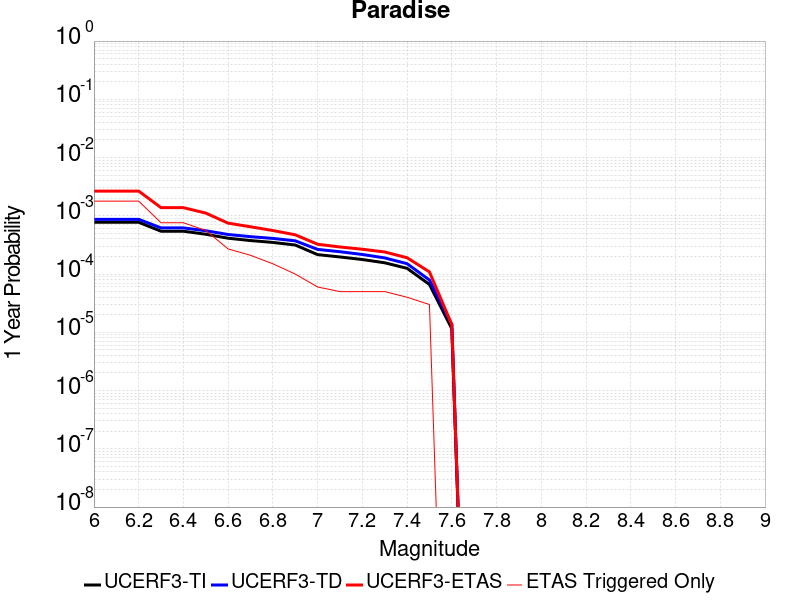 |  |

| Magnitude | 1 wk TI Prob | 1 wk TD Prob | 1 wk ETAS Prob | 1 wk ETAS/TD Gain | 1 wk ETAS Triggered Only | 1 mo TI Prob | 1 mo TD Prob | 1 mo ETAS Prob | 1 mo ETAS/TD Gain | 1 mo ETAS Triggered Only | 1 yr TI Prob | 1 yr TD Prob | 1 yr ETAS Prob | 1 yr ETAS/TD Gain | 1 yr ETAS Triggered Only | 10 yr TI Prob | 10 yr TD Prob | 10 yr ETAS Prob | 10 yr ETAS/TD Gain | 10 yr ETAS Triggered Only |
|-----|-----|-----|-----|-----|-----|-----|-----|-----|-----|-----|-----|-----|-----|-----|-----|-----|-----|-----|-----|-----|
| 6.0 | 1.4851273E-5 | 1.6694692E-5 | 4.7922166E-4 | 28.705032 | 4.625347E-4 | 6.364676E-5 | 7.154685E-5 | 6.265488E-4 | 8.757182 | 5.5504165E-4 | 7.7462377E-4 | 8.707584E-4 | 0.0018874486 | 2.1675918 | 0.0010175763 | 0.0077192914 | 0.008675844 | 0.009776297 | 1.126841 | 0.0011100833 |
| 6.1 | 1.4851273E-5 | 1.6694692E-5 | 4.7922166E-4 | 28.705032 | 4.625347E-4 | 6.364676E-5 | 7.154685E-5 | 6.265488E-4 | 8.757182 | 5.5504165E-4 | 7.7462377E-4 | 8.707584E-4 | 0.0018874486 | 2.1675918 | 0.0010175763 | 0.0077192914 | 0.008675844 | 0.009776297 | 1.126841 | 0.0011100833 |
| 6.2 | 1.4851273E-5 | 1.6694692E-5 | 4.7922166E-4 | 28.705032 | 4.625347E-4 | 6.364676E-5 | 7.154685E-5 | 6.265488E-4 | 8.757182 | 5.5504165E-4 | 7.7462377E-4 | 8.707584E-4 | 0.0018874486 | 2.1675918 | 0.0010175763 | 0.0077192914 | 0.008675844 | 0.009776297 | 1.126841 | 0.0011100833 |
| 6.3 | 1.0426831E-5 | 1.188862E-5 | 1.9690029E-4 | 16.562082 | 1.8501388E-4 | 4.4685654E-5 | 5.0950268E-5 | 3.2845695E-4 | 6.4466186 | 2.7752083E-4 | 5.43912E-4 | 6.201489E-4 | 9.899472E-4 | 1.5963056 | 3.7002776E-4 | 0.0054258266 | 0.0061847917 | 0.0066444655 | 1.0743233 | 4.625347E-4 |
| 6.4 | 1.0426831E-5 | 1.188862E-5 | 1.9690029E-4 | 16.562082 | 1.8501388E-4 | 4.4685654E-5 | 5.0950268E-5 | 3.2845695E-4 | 6.4466186 | 2.7752083E-4 | 5.43912E-4 | 6.201489E-4 | 9.899472E-4 | 1.5963056 | 3.7002776E-4 | 0.0054258266 | 0.0061847917 | 0.0066444655 | 1.0743233 | 4.625347E-4 |
| 6.5 | 9.25027E-6 | 1.06199595E-5 | 1.9563187E-4 | 18.42115 | 1.8501388E-4 | 3.964341E-5 | 4.551335E-5 | 3.2302152E-4 | 7.0972924 | 2.7752083E-4 | 4.8255164E-4 | 5.53989E-4 | 9.2381175E-4 | 1.6675633 | 3.7002776E-4 | 0.0048150513 | 0.0055265795 | 0.005986558 | 1.0832303 | 4.625347E-4 |
| 6.6 | 7.904275E-6 | 9.159525E-6 | 1.941717E-4 | 21.198883 | 1.8501388E-4 | 3.3875025E-5 | 3.9254537E-5 | 2.2426115E-4 | 5.7129993 | 1.8501388E-4 | 4.1235037E-4 | 4.7782314E-4 | 7.5521134E-4 | 1.5805249 | 2.7752083E-4 | 0.0041158604 | 0.0047683544 | 0.005136618 | 1.0772307 | 3.7002776E-4 |
| 6.7 | 7.2061953E-6 | 8.407248E-6 | 1.0091341E-4 | 12.003143 | 9.250694E-5 | 3.088333E-5 | 3.6030586E-5 | 1.2853419E-4 | 3.5673633 | 9.250694E-5 | 3.7593965E-4 | 4.3858777E-4 | 6.235205E-4 | 1.421655 | 1.8501388E-4 | 0.003753043 | 0.004377591 | 0.0046538967 | 1.0631182 | 2.7752083E-4 |
| 6.8 | 6.6948724E-6 | 7.842166E-6 | 1.0034838E-4 | 12.796003 | 9.250694E-5 | 2.8691995E-5 | 3.360887E-5 | 1.261127E-4 | 3.7523637 | 9.250694E-5 | 3.4926904E-4 | 4.0911473E-4 | 5.940529E-4 | 1.4520448 | 1.8501388E-4 | 0.003487206 | 0.0040839734 | 0.0043603606 | 1.0676761 | 2.7752083E-4 |
| 6.9 | 6.0421025E-6 | 7.130621E-6 | 9.96369E-5 | 13.973103 | 9.250694E-5 | 2.5894467E-5 | 3.0559466E-5 | 1.2306358E-4 | 4.02702 | 9.250694E-5 | 3.1521954E-4 | 3.7200135E-4 | 5.569464E-4 | 1.4971623 | 1.8501388E-4 | 0.0031477278 | 0.0037141247 | 0.0038984513 | 1.0496286 | 1.8501388E-4 |
| 7.0 | 4.134091E-6 | 5.0803087E-6 | 5.0803087E-6 | 1.0 | 0.0 | 1.7717413E-5 | 2.177258E-5 | 2.177258E-5 | 1.0 | 0.0 | 2.1568815E-4 | 2.6505045E-4 | 2.6505045E-4 | 1.0 | 0.0 | 0.0021547892 | 0.0026474963 | 0.0026474963 | 1.0 | 0.0 |
| 7.1 | 3.7674888E-6 | 4.6318696E-6 | 4.6318696E-6 | 1.0 | 0.0 | 1.6146281E-5 | 1.9850726E-5 | 1.9850726E-5 | 1.0 | 0.0 | 1.9656324E-4 | 2.4165731E-4 | 2.4165731E-4 | 1.0 | 0.0 | 0.0019638946 | 0.002414096 | 0.002414096 | 1.0 | 0.0 |
| 7.2 | 3.4065345E-6 | 4.156723E-6 | 4.156723E-6 | 1.0 | 0.0 | 1.4599351E-5 | 1.7814415E-5 | 1.7814415E-5 | 1.0 | 0.0 | 1.777326E-4 | 2.1687041E-4 | 2.1687041E-4 | 1.0 | 0.0 | 0.0017759053 | 0.002166736 | 0.002166736 | 1.0 | 0.0 |
| 7.3 | 2.9934936E-6 | 3.6293168E-6 | 3.6293168E-6 | 1.0 | 0.0 | 1.2829195E-5 | 1.555413E-5 | 1.555413E-5 | 1.0 | 0.0 | 1.5618425E-4 | 1.8935655E-4 | 1.8935655E-4 | 1.0 | 0.0 | 0.0015607453 | 0.0018920974 | 0.0018920974 | 1.0 | 0.0 |
| 7.4 | 2.4049796E-6 | 2.8889842E-6 | 2.8889842E-6 | 1.0 | 0.0 | 1.0307015E-5 | 1.238131E-5 | 1.238131E-5 | 1.0 | 0.0 | 1.2548068E-4 | 1.5073347E-4 | 1.5073347E-4 | 1.0 | 0.0 | 0.0012540985 | 0.0015064536 | 0.0015064536 | 1.0 | 0.0 |
| 7.5 | 1.2710091E-6 | 1.5134682E-6 | 1.5134682E-6 | 1.0 | 0.0 | 5.44717E-6 | 6.4862834E-6 | 6.4862834E-6 | 1.0 | 0.0 | 6.631728E-5 | 7.8968886E-5 | 7.8968886E-5 | 1.0 | 0.0 | 6.6297496E-4 | 7.8953087E-4 | 7.8953087E-4 | 1.0 | 0.0 |
| 7.6 | 2.21172E-7 | 2.603961E-7 | 2.603961E-7 | 1.0 | 0.0 | 9.478797E-7 | 1.1159829E-6 | 1.1159829E-6 | 1.0 | 0.0 | 1.1540374E-5 | 1.3587036E-5 | 1.3587036E-5 | 1.0 | 0.0 | 1.1539775E-4 | 1.3586486E-4 | 1.3586486E-4 | 1.0 | 0.0 |

## San Andreas (San Bernardino S)
*[(top)](#table-of-contents)*

| 1 Week | 1 Month | 1 Year | 10 Year |
|-----|-----|-----|-----|
|  |  |  |  |

| Magnitude | 1 wk TI Prob | 1 wk TD Prob | 1 wk ETAS Prob | 1 wk ETAS/TD Gain | 1 wk ETAS Triggered Only | 1 mo TI Prob | 1 mo TD Prob | 1 mo ETAS Prob | 1 mo ETAS/TD Gain | 1 mo ETAS Triggered Only | 1 yr TI Prob | 1 yr TD Prob | 1 yr ETAS Prob | 1 yr ETAS/TD Gain | 1 yr ETAS Triggered Only | 10 yr TI Prob | 10 yr TD Prob | 10 yr ETAS Prob | 10 yr ETAS/TD Gain | 10 yr ETAS Triggered Only |
|-----|-----|-----|-----|-----|-----|-----|-----|-----|-----|-----|-----|-----|-----|-----|-----|-----|-----|-----|-----|-----|
| 6.0 | 1.2336002E-4 | 3.0004102E-4 | 0.0011323537 | 3.773996 | 8.3256245E-4 | 5.2857865E-4 | 0.0012852824 | 0.002116775 | 1.6469336 | 8.3256245E-4 | 0.006416472 | 0.015540994 | 0.016451687 | 1.0585994 | 9.250694E-4 | 0.06234337 | 0.14283717 | 0.1436301 | 1.0055513 | 9.250694E-4 |
| 6.1 | 1.2336002E-4 | 3.0004102E-4 | 0.0011323537 | 3.773996 | 8.3256245E-4 | 5.2857865E-4 | 0.0012852824 | 0.002116775 | 1.6469336 | 8.3256245E-4 | 0.006416472 | 0.015540994 | 0.016451687 | 1.0585994 | 9.250694E-4 | 0.06234337 | 0.14283717 | 0.1436301 | 1.0055513 | 9.250694E-4 |
| 6.2 | 1.2336002E-4 | 3.0004102E-4 | 0.0011323537 | 3.773996 | 8.3256245E-4 | 5.2857865E-4 | 0.0012852824 | 0.002116775 | 1.6469336 | 8.3256245E-4 | 0.006416472 | 0.015540994 | 0.016451687 | 1.0585994 | 9.250694E-4 | 0.06234337 | 0.14283717 | 0.1436301 | 1.0055513 | 9.250694E-4 |
| 6.3 | 1.1712257E-4 | 2.8792414E-4 | 0.0010277666 | 3.569574 | 7.400555E-4 | 5.018573E-4 | 0.0012334028 | 0.0019725454 | 1.5992712 | 7.400555E-4 | 0.006093008 | 0.014918125 | 0.015738267 | 1.0549762 | 8.3256245E-4 | 0.059286322 | 0.13754563 | 0.13826367 | 1.0052204 | 8.3256245E-4 |
| 6.4 | 1.1712257E-4 | 2.8792414E-4 | 0.0010277666 | 3.569574 | 7.400555E-4 | 5.018573E-4 | 0.0012334028 | 0.0019725454 | 1.5992712 | 7.400555E-4 | 0.006093008 | 0.014918125 | 0.015738267 | 1.0549762 | 8.3256245E-4 | 0.059286322 | 0.13754563 | 0.13826367 | 1.0052204 | 8.3256245E-4 |
| 6.5 | 1.0689076E-4 | 2.680528E-4 | 0.0010079099 | 3.7601173 | 7.400555E-4 | 4.5802278E-4 | 0.0011483167 | 0.0018875224 | 1.6437298 | 7.400555E-4 | 0.0055621783 | 0.01389575 | 0.0147167435 | 1.0590824 | 8.3256245E-4 | 0.05425003 | 0.12879294 | 0.12951829 | 1.0056318 | 8.3256245E-4 |
| 6.6 | 9.7648895E-5 | 2.50501E-4 | 8.9788734E-4 | 3.5843663 | 6.475486E-4 | 4.1842813E-4 | 0.0010731576 | 0.0017200114 | 1.6027573 | 6.475486E-4 | 0.005082469 | 0.012991785 | 0.013722226 | 1.0562233 | 7.400555E-4 | 0.049677886 | 0.12095292 | 0.12160346 | 1.0053785 | 7.400555E-4 |
| 6.7 | 8.757013E-5 | 2.3120902E-4 | 8.7860785E-4 | 3.8000588 | 6.475486E-4 | 3.7524657E-4 | 9.905418E-4 | 0.0016374489 | 1.6530842 | 6.475486E-4 | 0.00455906 | 0.011997245 | 0.012728422 | 1.0609454 | 7.400555E-4 | 0.04466656 | 0.11226123 | 0.112918206 | 1.0058522 | 7.400555E-4 |
| 6.8 | 8.562978E-5 | 2.2680782E-4 | 8.742095E-4 | 3.8544064 | 6.475486E-4 | 3.6693315E-4 | 9.7169366E-4 | 0.001618613 | 1.6657647 | 6.475486E-4 | 0.004458263 | 0.011770263 | 0.012501609 | 1.062135 | 7.400555E-4 | 0.043698758 | 0.11027153 | 0.11092998 | 1.0059712 | 7.400555E-4 |
| 6.9 | 6.124075E-5 | 1.7065753E-4 | 8.180956E-4 | 4.7937856 | 6.475486E-4 | 2.6243398E-4 | 7.311852E-4 | 0.0013782603 | 1.8849674 | 6.475486E-4 | 0.0031904527 | 0.008866051 | 0.009599545 | 1.0827307 | 7.400555E-4 | 0.031450346 | 0.08418263 | 0.084860384 | 1.008051 | 7.400555E-4 |
| 7.0 | 5.8598747E-5 | 1.649477E-4 | 8.123895E-4 | 4.925133 | 6.475486E-4 | 2.5111332E-4 | 7.06728E-4 | 0.0013538189 | 1.9156152 | 6.475486E-4 | 0.0030530186 | 0.008570663 | 0.009304375 | 1.0856074 | 7.400555E-4 | 0.03011414 | 0.081500374 | 0.08218011 | 1.0083404 | 7.400555E-4 |
| 7.1 | 5.613814E-5 | 1.5913323E-4 | 8.065787E-4 | 5.0685754 | 6.475486E-4 | 2.4056983E-4 | 6.818221E-4 | 0.0013289291 | 1.949085 | 6.475486E-4 | 0.0029250039 | 0.008269769 | 0.009003704 | 1.0887492 | 7.400555E-4 | 0.028868021 | 0.07879931 | 0.07948105 | 1.0086516 | 7.400555E-4 |
| 7.2 | 4.991222E-5 | 1.4519796E-4 | 7.926525E-4 | 5.459116 | 6.475486E-4 | 2.1389198E-4 | 6.2212895E-4 | 0.0012692746 | 2.0402114 | 6.475486E-4 | 0.002601025 | 0.007548217 | 0.008282687 | 1.0973037 | 7.400555E-4 | 0.025707912 | 0.07225321 | 0.07293979 | 1.0095025 | 7.400555E-4 |
| 7.3 | 4.7410045E-5 | 1.3714004E-4 | 7.845998E-4 | 5.721158 | 6.475486E-4 | 2.0317009E-4 | 5.8761094E-4 | 0.001234779 | 2.1013546 | 6.475486E-4 | 0.0024707897 | 0.0071307817 | 0.007865559 | 1.1030432 | 7.400555E-4 | 0.024434982 | 0.06853558 | 0.06922492 | 1.010058 | 7.400555E-4 |
| 7.4 | 4.5556746E-5 | 1.3121912E-4 | 7.786827E-4 | 5.934217 | 6.475486E-4 | 1.952286E-4 | 5.622468E-4 | 0.0012094312 | 2.1510684 | 6.475486E-4 | 0.002374317 | 0.0068239477 | 0.007558953 | 1.1077098 | 7.400555E-4 | 0.023491086 | 0.065788016 | 0.066479385 | 1.010509 | 7.400555E-4 |
| 7.5 | 4.3084514E-5 | 1.2357246E-4 | 7.71041E-4 | 6.239586 | 6.475486E-4 | 1.8463485E-4 | 5.2948913E-4 | 0.0011766948 | 2.222321 | 6.475486E-4 | 0.0022456115 | 0.0064275465 | 0.007162845 | 1.114398 | 7.400555E-4 | 0.022230545 | 0.062188786 | 0.06288282 | 1.0111601 | 7.400555E-4 |
| 7.6 | 3.408608E-5 | 9.83552E-5 | 7.458401E-4 | 7.583128 | 6.475486E-4 | 1.4607502E-4 | 4.214543E-4 | 0.0010687299 | 2.5358145 | 6.475486E-4 | 0.0017770125 | 0.0051191594 | 0.005855426 | 1.1438258 | 7.400555E-4 | 0.017628696 | 0.050020292 | 0.05072333 | 1.014055 | 7.400555E-4 |
| 7.7 | 2.8315713E-5 | 8.248679E-5 | 6.374826E-4 | 7.7282996 | 5.5504165E-4 | 1.2134742E-4 | 3.5346695E-4 | 9.083124E-4 | 2.5697236 | 5.5504165E-4 | 0.0014764034 | 0.0042949775 | 0.0049397447 | 1.1501212 | 6.475486E-4 | 0.01466633 | 0.0422714 | 0.042891577 | 1.0146713 | 6.475486E-4 |
| 7.8 | 2.6222975E-5 | 7.463088E-5 | 6.296311E-4 | 8.436603 | 5.5504165E-4 | 1.1237934E-4 | 3.1980744E-4 | 8.7467156E-4 | 2.7349944 | 5.5504165E-4 | 0.0013673597 | 0.0038867102 | 0.004531742 | 1.1659583 | 6.475486E-4 | 0.013589768 | 0.03843674 | 0.0390594 | 1.0161996 | 6.475486E-4 |
| 7.9 | 2.1469694E-5 | 5.787864E-5 | 5.2038656E-4 | 8.990995 | 4.625347E-4 | 9.200973E-5 | 2.4802773E-4 | 7.104477E-4 | 2.864388 | 4.625347E-4 | 0.0011196428 | 0.0030155594 | 0.0035689273 | 1.1835042 | 5.5504165E-4 | 0.011140184 | 0.030152109 | 0.030690415 | 1.017853 | 5.5504165E-4 |
| 8.0 | 1.2420249E-5 | 3.131896E-5 | 1.23823E-4 | 3.9536116 | 9.250694E-5 | 5.322855E-5 | 1.342172E-4 | 2.2671174E-4 | 1.6891406 | 9.250694E-5 | 6.478649E-4 | 0.0016328706 | 0.0017252265 | 1.0565604 | 9.250694E-5 | 0.0064597935 | 0.016522504 | 0.016613482 | 1.0055064 | 9.250694E-5 |
| 8.1 | 4.9197724E-6 | 7.822348E-6 | 7.822348E-6 | 1.0 | 0.0 | 2.1084568E-5 | 3.352392E-5 | 3.352392E-5 | 1.0 | 0.0 | 2.566744E-4 | 4.0807744E-4 | 4.0807744E-4 | 1.0 | 0.0 | 0.002563781 | 0.0043843705 | 0.0043843705 | 1.0 | 0.0 |
| 8.2 | 2.5634774E-6 | 2.9067196E-6 | 2.9067196E-6 | 1.0 | 0.0 | 1.0986286E-5 | 1.2457311E-5 | 1.2457311E-5 | 1.0 | 0.0 | 1.3374983E-4 | 1.5165724E-4 | 1.5165724E-4 | 1.0 | 0.0 | 0.0013366934 | 0.0017049741 | 0.0017049741 | 1.0 | 0.0 |
| 8.3 | 5.2850464E-7 | 3.2088764E-7 | 3.2088764E-7 | 1.0 | 0.0 | 2.2650179E-6 | 1.375232E-6 | 1.375232E-6 | 1.0 | 0.0 | 2.7576245E-5 | 1.6743334E-5 | 1.6743334E-5 | 1.0 | 0.0 | 2.7572823E-4 | 1.9870348E-4 | 1.9870348E-4 | 1.0 | 0.0 |

## Helendale-So Lockhart
*[(top)](#table-of-contents)*

| 1 Week | 1 Month | 1 Year | 10 Year |
|-----|-----|-----|-----|
|  |  |  |  |

| Magnitude | 1 wk TI Prob | 1 wk TD Prob | 1 wk ETAS Prob | 1 wk ETAS/TD Gain | 1 wk ETAS Triggered Only | 1 mo TI Prob | 1 mo TD Prob | 1 mo ETAS Prob | 1 mo ETAS/TD Gain | 1 mo ETAS Triggered Only | 1 yr TI Prob | 1 yr TD Prob | 1 yr ETAS Prob | 1 yr ETAS/TD Gain | 1 yr ETAS Triggered Only | 10 yr TI Prob | 10 yr TD Prob | 10 yr ETAS Prob | 10 yr ETAS/TD Gain | 10 yr ETAS Triggered Only |
|-----|-----|-----|-----|-----|-----|-----|-----|-----|-----|-----|-----|-----|-----|-----|-----|-----|-----|-----|-----|-----|
| 6.0 | 1.7296055E-5 | 1.8103729E-5 | 4.8063006E-4 | 26.548676 | 4.625347E-4 | 7.412385E-5 | 7.7585224E-5 | 7.250835E-4 | 9.34564 | 6.475486E-4 | 9.0208417E-4 | 9.4421144E-4 | 0.0016835682 | 1.7830415 | 7.400555E-4 | 0.008984311 | 0.009404116 | 0.010228849 | 1.0876992 | 8.3256245E-4 |
| 6.1 | 1.7296055E-5 | 1.8103729E-5 | 4.8063006E-4 | 26.548676 | 4.625347E-4 | 7.412385E-5 | 7.7585224E-5 | 7.250835E-4 | 9.34564 | 6.475486E-4 | 9.0208417E-4 | 9.4421144E-4 | 0.0016835682 | 1.7830415 | 7.400555E-4 | 0.008984311 | 0.009404116 | 0.010228849 | 1.0876992 | 8.3256245E-4 |
| 6.2 | 1.7296055E-5 | 1.8103729E-5 | 4.8063006E-4 | 26.548676 | 4.625347E-4 | 7.412385E-5 | 7.7585224E-5 | 7.250835E-4 | 9.34564 | 6.475486E-4 | 9.0208417E-4 | 9.4421144E-4 | 0.0016835682 | 1.7830415 | 7.400555E-4 | 0.008984311 | 0.009404116 | 0.010228849 | 1.0876992 | 8.3256245E-4 |
| 6.3 | 1.0669118E-5 | 1.1135425E-5 | 2.8865316E-4 | 25.92206 | 2.7752083E-4 | 4.5723988E-5 | 4.772239E-5 | 5.10235E-4 | 10.691732 | 4.625347E-4 | 5.5654737E-4 | 5.80868E-4 | 0.0011355872 | 1.9549832 | 5.5504165E-4 | 0.0055515557 | 0.0057937936 | 0.0063456194 | 1.0952443 | 5.5504165E-4 |
| 6.4 | 1.0669118E-5 | 1.1135425E-5 | 2.8865316E-4 | 25.92206 | 2.7752083E-4 | 4.5723988E-5 | 4.772239E-5 | 5.10235E-4 | 10.691732 | 4.625347E-4 | 5.5654737E-4 | 5.80868E-4 | 0.0011355872 | 1.9549832 | 5.5504165E-4 | 0.0055515557 | 0.0057937936 | 0.0063456194 | 1.0952443 | 5.5504165E-4 |
| 6.5 | 8.790038E-6 | 9.170197E-6 | 2.8668848E-4 | 31.263065 | 2.7752083E-4 | 3.767105E-5 | 3.930026E-5 | 4.0931348E-4 | 10.415032 | 3.7002776E-4 | 4.585485E-4 | 4.7837716E-4 | 8.482279E-4 | 1.7731363 | 3.7002776E-4 | 0.0045760344 | 0.004773638 | 0.0051419 | 1.0771447 | 3.7002776E-4 |
| 6.6 | 7.396949E-6 | 7.715537E-6 | 2.8523421E-4 | 36.968807 | 2.7752083E-4 | 3.1700827E-5 | 3.3066175E-5 | 4.0308168E-4 | 12.190152 | 3.7002776E-4 | 3.858892E-4 | 4.025073E-4 | 7.7238615E-4 | 1.9189368 | 3.7002776E-4 | 0.003852198 | 0.00401789 | 0.0043864306 | 1.091725 | 3.7002776E-4 |
| 6.7 | 6.4600285E-6 | 6.738031E-6 | 2.8425697E-4 | 42.18695 | 2.7752083E-4 | 2.7685543E-5 | 2.887696E-5 | 3.9889402E-4 | 13.813574 | 3.7002776E-4 | 3.3701936E-4 | 3.5152107E-4 | 7.2141876E-4 | 2.0522773 | 3.7002776E-4 | 0.0033650869 | 0.003509732 | 0.003878461 | 1.105059 | 3.7002776E-4 |
| 6.8 | 5.600104E-6 | 5.836009E-6 | 2.833552E-4 | 48.552902 | 2.7752083E-4 | 2.4000226E-5 | 2.5011232E-5 | 3.025251E-4 | 12.09557 | 2.7752083E-4 | 2.9216358E-4 | 3.044698E-4 | 5.819061E-4 | 1.9112113 | 2.7752083E-4 | 0.0029177975 | 0.003040588 | 0.003317265 | 1.0909946 | 2.7752083E-4 |
| 6.9 | 4.839122E-6 | 5.0395092E-6 | 2.8255893E-4 | 56.068737 | 2.7752083E-4 | 2.0738931E-5 | 2.159772E-5 | 2.9911255E-4 | 13.849264 | 2.7752083E-4 | 2.5246723E-4 | 2.6292098E-4 | 5.4036884E-4 | 2.0552518 | 2.7752083E-4 | 0.002521806 | 0.002626147 | 0.0029029388 | 1.1053985 | 2.7752083E-4 |
| 7.0 | 3.6937633E-6 | 3.845208E-6 | 2.8136495E-4 | 73.17288 | 2.7752083E-4 | 1.5830317E-5 | 1.647936E-5 | 2.939956E-4 | 17.84023 | 2.7752083E-4 | 1.9271708E-4 | 2.0061806E-4 | 4.7808318E-4 | 2.3830516 | 2.7752083E-4 | 0.0019255003 | 0.002004401 | 0.0022813655 | 1.1381782 | 2.7752083E-4 |
| 7.1 | 2.7858857E-6 | 2.8978538E-6 | 9.5404524E-5 | 32.922478 | 9.250694E-5 | 1.1939455E-5 | 1.2419316E-5 | 1.0492511E-4 | 8.448542 | 9.250694E-5 | 1.4535317E-4 | 1.511949E-4 | 2.4368784E-4 | 1.6117465 | 9.250694E-5 | 0.0014525814 | 0.0015109418 | 0.001603309 | 1.0611322 | 9.250694E-5 |
| 7.2 | 2.1672065E-6 | 2.2540128E-6 | 9.476074E-5 | 42.04091 | 9.250694E-5 | 9.2879945E-6 | 9.66002E-6 | 1.02166065E-4 | 10.576175 | 9.250694E-5 | 1.1307546E-4 | 1.1760458E-4 | 2.1010064E-4 | 1.7865005 | 9.250694E-5 | 0.0011301794 | 0.0011754417 | 0.0012678398 | 1.0786072 | 9.250694E-5 |
| 7.3 | 1.4823496E-6 | 1.5422102E-6 | 9.4049006E-5 | 60.98326 | 9.250694E-5 | 6.3529114E-6 | 6.6094562E-6 | 9.911578E-5 | 14.996057 | 9.250694E-5 | 7.734395E-5 | 8.046731E-5 | 1.7296681E-4 | 2.1495287 | 9.250694E-5 | 7.731704E-4 | 8.0439687E-4 | 8.968294E-4 | 1.114909 | 9.250694E-5 |
| 7.4 | 4.2321457E-7 | 4.4108765E-7 | 9.294799E-5 | 210.72452 | 9.250694E-5 | 1.8137755E-6 | 1.8903745E-6 | 9.439714E-5 | 49.93568 | 9.250694E-5 | 2.2082493E-5 | 2.3015113E-5 | 1.1551992E-4 | 5.019307 | 9.250694E-5 | 2.2080299E-4 | 2.3013182E-4 | 3.2261747E-4 | 1.4018812 | 9.250694E-5 |
| 7.5 | 5.6942316E-8 | 5.9415648E-8 | 5.9415648E-8 | 1.0 | 0.0 | 2.440385E-7 | 2.5463845E-7 | 2.5463845E-7 | 1.0 | 0.0 | 2.9711643E-6 | 3.1002196E-6 | 3.1002196E-6 | 1.0 | 0.0 | 2.9711247E-5 | 3.1001844E-5 | 3.1001844E-5 | 1.0 | 0.0 |

## Red Pass
*[(top)](#table-of-contents)*

| 1 Week | 1 Month | 1 Year | 10 Year |
|-----|-----|-----|-----|
|  |  |  |  |

| Magnitude | 1 wk TI Prob | 1 wk TD Prob | 1 wk ETAS Prob | 1 wk ETAS/TD Gain | 1 wk ETAS Triggered Only | 1 mo TI Prob | 1 mo TD Prob | 1 mo ETAS Prob | 1 mo ETAS/TD Gain | 1 mo ETAS Triggered Only | 1 yr TI Prob | 1 yr TD Prob | 1 yr ETAS Prob | 1 yr ETAS/TD Gain | 1 yr ETAS Triggered Only | 10 yr TI Prob | 10 yr TD Prob | 10 yr ETAS Prob | 10 yr ETAS/TD Gain | 10 yr ETAS Triggered Only |
|-----|-----|-----|-----|-----|-----|-----|-----|-----|-----|-----|-----|-----|-----|-----|-----|-----|-----|-----|-----|-----|
| 6.0 | 8.258278E-6 | 8.551265E-6 | 4.71082E-4 | 55.08916 | 4.625347E-4 | 3.539214E-5 | 3.6647863E-5 | 5.916692E-4 | 16.14471 | 5.5504165E-4 | 4.308141E-4 | 4.4611428E-4 | 0.0011858396 | 2.658152 | 7.400555E-4 | 0.0042997985 | 0.004453945 | 0.005190704 | 1.1654173 | 7.400555E-4 |
| 6.1 | 3.649988E-6 | 3.7753161E-6 | 2.8129507E-4 | 74.50902 | 2.7752083E-4 | 1.5642712E-5 | 1.6179853E-5 | 3.8620163E-4 | 23.869291 | 3.7002776E-4 | 1.9043336E-4 | 1.9697666E-4 | 7.51909E-4 | 3.817249 | 5.5504165E-4 | 0.0019027026 | 0.001968488 | 0.0025224371 | 1.2814084 | 5.5504165E-4 |
| 6.2 | 3.649988E-6 | 3.7753161E-6 | 2.8129507E-4 | 74.50902 | 2.7752083E-4 | 1.5642712E-5 | 1.6179853E-5 | 3.8620163E-4 | 23.869291 | 3.7002776E-4 | 1.9043336E-4 | 1.9697666E-4 | 7.51909E-4 | 3.817249 | 5.5504165E-4 | 0.0019027026 | 0.001968488 | 0.0025224371 | 1.2814084 | 5.5504165E-4 |
| 6.3 | 1.3924937E-6 | 1.4411166E-6 | 1.4411166E-6 | 1.0 | 0.0 | 5.9678164E-6 | 6.1762075E-6 | 9.8682576E-5 | 15.9778595 | 9.250694E-5 | 7.265574E-5 | 7.519415E-5 | 1.6769413E-4 | 2.2301488 | 9.250694E-5 | 7.263199E-4 | 7.518258E-4 | 8.442632E-4 | 1.1229506 | 9.250694E-5 |
| 6.4 | 1.3924937E-6 | 1.4411166E-6 | 1.4411166E-6 | 1.0 | 0.0 | 5.9678164E-6 | 6.1762075E-6 | 9.8682576E-5 | 15.9778595 | 9.250694E-5 | 7.265574E-5 | 7.519415E-5 | 1.6769413E-4 | 2.2301488 | 9.250694E-5 | 7.263199E-4 | 7.518258E-4 | 8.442632E-4 | 1.1229506 | 9.250694E-5 |
| 6.5 | 9.876812E-7 | 1.0221912E-6 | 1.0221912E-6 | 1.0 | 0.0 | 4.2329125E-6 | 4.3808195E-6 | 9.688735E-5 | 22.116262 | 9.250694E-5 | 5.153449E-5 | 5.3336476E-5 | 1.4583848E-4 | 2.7343104 | 9.250694E-5 | 5.1522546E-4 | 5.333648E-4 | 6.2582234E-4 | 1.1733478 | 9.250694E-5 |

## San Andreas (Parkfield)
*[(top)](#table-of-contents)*

| 1 Week | 1 Month | 1 Year | 10 Year |
|-----|-----|-----|-----|
|  |  |  |  |

| Magnitude | 1 wk TI Prob | 1 wk TD Prob | 1 wk ETAS Prob | 1 wk ETAS/TD Gain | 1 wk ETAS Triggered Only | 1 mo TI Prob | 1 mo TD Prob | 1 mo ETAS Prob | 1 mo ETAS/TD Gain | 1 mo ETAS Triggered Only | 1 yr TI Prob | 1 yr TD Prob | 1 yr ETAS Prob | 1 yr ETAS/TD Gain | 1 yr ETAS Triggered Only | 10 yr TI Prob | 10 yr TD Prob | 10 yr ETAS Prob | 10 yr ETAS/TD Gain | 10 yr ETAS Triggered Only |
|-----|-----|-----|-----|-----|-----|-----|-----|-----|-----|-----|-----|-----|-----|-----|-----|-----|-----|-----|-----|-----|
| 6.0 | 5.556969E-4 | 7.7782426E-4 | 0.0010551292 | 1.3565136 | 2.7752083E-4 | 0.0023793848 | 0.0033298214 | 0.003698617 | 1.1107553 | 3.7002776E-4 | 0.028586963 | 0.040191233 | 0.040812757 | 1.0154642 | 6.475486E-4 | 0.25176284 | 0.33716413 | 0.33759338 | 1.001273 | 6.475486E-4 |
| 6.1 | 1.925858E-4 | 3.0276453E-4 | 3.9524346E-4 | 1.3054484 | 9.250694E-5 | 8.2510663E-4 | 0.0012970108 | 0.0013893978 | 1.0712306 | 9.250694E-5 | 0.0099994885 | 0.015778083 | 0.016051225 | 1.0173115 | 2.7752083E-4 | 0.095613256 | 0.1497237 | 0.14995965 | 1.0015761 | 2.7752083E-4 |
| 6.2 | 9.4306815E-5 | 1.8242796E-4 | 1.8242796E-4 | 1.0 | 0.0 | 4.0410945E-4 | 7.816011E-4 | 7.816011E-4 | 1.0 | 0.0 | 0.0049089384 | 0.009474681 | 0.009657942 | 1.0193422 | 1.8501388E-4 | 0.048019063 | 0.09185409 | 0.092022106 | 1.0018291 | 1.8501388E-4 |
| 6.3 | 9.283051E-5 | 1.7939322E-4 | 1.7939322E-4 | 1.0 | 0.0 | 3.9778434E-4 | 7.686027E-4 | 7.686027E-4 | 1.0 | 0.0 | 0.0048322747 | 0.009317789 | 0.009501079 | 1.019671 | 1.8501388E-4 | 0.047285385 | 0.09050704 | 0.0906753 | 1.0018592 | 1.8501388E-4 |
| 6.4 | 9.138826E-5 | 1.770153E-4 | 1.770153E-4 | 1.0 | 0.0 | 3.916052E-4 | 7.5841765E-4 | 7.5841765E-4 | 1.0 | 0.0 | 0.0047573745 | 0.00919484 | 0.009378153 | 1.0199364 | 1.8501388E-4 | 0.046568092 | 0.08940927 | 0.08957774 | 1.0018842 | 1.8501388E-4 |
| 6.5 | 9.000255E-5 | 1.7459576E-4 | 1.7459576E-4 | 1.0 | 0.0 | 3.8566816E-4 | 7.480541E-4 | 7.480541E-4 | 1.0 | 0.0 | 0.0046854047 | 0.009069731 | 0.009253068 | 1.0202141 | 1.8501388E-4 | 0.045878403 | 0.088295065 | 0.088463746 | 1.0019104 | 1.8501388E-4 |
| 6.6 | 8.8109264E-5 | 1.7140752E-4 | 1.7140752E-4 | 1.0 | 0.0 | 3.7755648E-4 | 7.3439797E-4 | 7.3439797E-4 | 1.0 | 0.0 | 0.0045870654 | 0.008904854 | 0.008996537 | 1.0102959 | 9.250694E-5 | 0.04493529 | 0.0868267 | 0.08691117 | 1.0009729 | 9.250694E-5 |
| 6.7 | 8.738073E-5 | 1.7007832E-4 | 1.7007832E-4 | 1.0 | 0.0 | 3.7443507E-4 | 7.287046E-4 | 7.287046E-4 | 1.0 | 0.0 | 0.0045492216 | 0.008836143 | 0.008927832 | 1.0103767 | 9.250694E-5 | 0.04457213 | 0.08622707 | 0.08631159 | 1.0009804 | 9.250694E-5 |
| 6.8 | 8.710195E-5 | 1.6953335E-4 | 1.6953335E-4 | 1.0 | 0.0 | 3.7324068E-4 | 7.263703E-4 | 7.263703E-4 | 1.0 | 0.0 | 0.0045347405 | 0.008807961 | 0.008899653 | 1.0104102 | 9.250694E-5 | 0.04443313 | 0.08597467 | 0.08605922 | 1.0009835 | 9.250694E-5 |
| 6.9 | 8.6801556E-5 | 1.689429E-4 | 1.689429E-4 | 1.0 | 0.0 | 3.7195362E-4 | 7.2384125E-4 | 7.2384125E-4 | 1.0 | 0.0 | 0.0045191357 | 0.008777418 | 0.008869113 | 1.0104467 | 9.250694E-5 | 0.044283327 | 0.085700735 | 0.085785314 | 1.0009869 | 9.250694E-5 |
| 7.0 | 8.5571606E-5 | 1.6647128E-4 | 1.6647128E-4 | 1.0 | 0.0 | 3.6668387E-4 | 7.132544E-4 | 7.132544E-4 | 1.0 | 0.0 | 0.004455241 | 0.008649553 | 0.0087412605 | 1.0106025 | 9.250694E-5 | 0.043669727 | 0.08454914 | 0.08463383 | 1.0010016 | 9.250694E-5 |
| 7.1 | 7.82589E-5 | 1.5128135E-4 | 1.5128135E-4 | 1.0 | 0.0 | 3.3535215E-4 | 6.481883E-4 | 6.481883E-4 | 1.0 | 0.0 | 0.0040752706 | 0.007863307 | 0.007955086 | 1.0116719 | 9.250694E-5 | 0.040013418 | 0.07746111 | 0.07754645 | 1.0011017 | 9.250694E-5 |
| 7.2 | 7.690929E-5 | 1.4865391E-4 | 1.4865391E-4 | 1.0 | 0.0 | 3.2956956E-4 | 6.369334E-4 | 6.369334E-4 | 1.0 | 0.0 | 0.004005129 | 0.007727258 | 0.00781905 | 1.011879 | 9.250694E-5 | 0.0393371 | 0.07623427 | 0.076319724 | 1.0011209 | 9.250694E-5 |
| 7.3 | 7.5543794E-5 | 1.4561978E-4 | 1.4561978E-4 | 1.0 | 0.0 | 3.2371894E-4 | 6.2393624E-4 | 6.2393624E-4 | 1.0 | 0.0 | 0.003934157 | 0.007570127 | 0.007661934 | 1.0121275 | 9.250694E-5 | 0.038652334 | 0.074797355 | 0.07488294 | 1.0011443 | 9.250694E-5 |
| 7.4 | 7.4214564E-5 | 1.4262961E-4 | 1.4262961E-4 | 1.0 | 0.0 | 3.1802364E-4 | 6.111273E-4 | 6.111273E-4 | 1.0 | 0.0 | 0.003865065 | 0.00741525 | 0.007507071 | 1.0123827 | 9.250694E-5 | 0.03798529 | 0.07337123 | 0.07345695 | 1.0011683 | 9.250694E-5 |
| 7.5 | 6.149578E-5 | 1.11907226E-4 | 1.11907226E-4 | 1.0 | 0.0 | 2.6352672E-4 | 4.7951436E-4 | 4.7951436E-4 | 1.0 | 0.0 | 0.0032037178 | 0.0058224914 | 0.0059144595 | 1.0157954 | 9.250694E-5 | 0.03157923 | 0.058557566 | 0.058644656 | 1.0014873 | 9.250694E-5 |
| 7.6 | 6.0643448E-5 | 1.10193796E-4 | 1.10193796E-4 | 1.0 | 0.0 | 2.598746E-4 | 4.7217376E-4 | 4.7217376E-4 | 1.0 | 0.0 | 0.0031593828 | 0.0057335934 | 0.0058255703 | 1.0160416 | 9.250694E-5 | 0.031148417 | 0.057718582 | 0.057805747 | 1.0015103 | 9.250694E-5 |
| 7.7 | 5.1652263E-5 | 9.174698E-5 | 9.174698E-5 | 1.0 | 0.0 | 2.2134806E-4 | 3.931421E-4 | 3.931421E-4 | 1.0 | 0.0 | 0.002691582 | 0.0047760103 | 0.0047760103 | 1.0 | 0.0 | 0.026592141 | 0.04853623 | 0.04853623 | 1.0 | 0.0 |
| 7.8 | 4.8090482E-5 | 8.559635E-5 | 8.559635E-5 | 1.0 | 0.0 | 2.060858E-4 | 3.6678996E-4 | 3.6678996E-4 | 1.0 | 0.0 | 0.0025062072 | 0.0044565317 | 0.0044565317 | 1.0 | 0.0 | 0.024781305 | 0.04530245 | 0.04530245 | 1.0 | 0.0 |
| 7.9 | 3.970278E-5 | 6.750426E-5 | 6.750426E-5 | 1.0 | 0.0 | 1.7014367E-4 | 2.892719E-4 | 2.892719E-4 | 1.0 | 0.0 | 0.002069531 | 0.0035162016 | 0.0035162016 | 1.0 | 0.0 | 0.020503636 | 0.035881363 | 0.035881363 | 1.0 | 0.0 |
| 8.0 | 2.8982335E-5 | 4.069796E-5 | 4.069796E-5 | 1.0 | 0.0 | 1.2420409E-4 | 1.7440817E-4 | 1.7440817E-4 | 1.0 | 0.0 | 0.0015111357 | 0.0021213528 | 0.0021213528 | 1.0 | 0.0 | 0.015009012 | 0.022010697 | 0.022010697 | 1.0 | 0.0 |
| 8.1 | 1.8836186E-5 | 1.8681134E-5 | 1.8681134E-5 | 1.0 | 0.0 | 8.0724014E-5 | 8.005955E-5 | 8.005955E-5 | 1.0 | 0.0 | 9.823717E-4 | 9.742898E-4 | 9.742898E-4 | 1.0 | 0.0 | 0.009780403 | 0.010488115 | 0.010488115 | 1.0 | 0.0 |
| 8.2 | 8.643924E-6 | 5.4748625E-6 | 5.4748625E-6 | 1.0 | 0.0 | 3.704486E-5 | 2.3463486E-5 | 2.3463486E-5 | 1.0 | 0.0 | 4.5092785E-4 | 2.8563058E-4 | 2.8563058E-4 | 1.0 | 0.0 | 0.0045001395 | 0.0032487072 | 0.0032487072 | 1.0 | 0.0 |
| 8.3 | 1.983087E-6 | 7.6599065E-7 | 7.6599065E-7 | 1.0 | 0.0 | 8.498917E-6 | 3.282813E-6 | 3.282813E-6 | 1.0 | 0.0 | 1.034694E-4 | 3.9967534E-5 | 3.9967534E-5 | 1.0 | 0.0 | 0.0010342124 | 4.719687E-4 | 4.719687E-4 | 1.0 | 0.0 |

## San Andreas (Big Bend)
*[(top)](#table-of-contents)*

| 1 Week | 1 Month | 1 Year | 10 Year |
|-----|-----|-----|-----|
|  |  |  |  |

| Magnitude | 1 wk TI Prob | 1 wk TD Prob | 1 wk ETAS Prob | 1 wk ETAS/TD Gain | 1 wk ETAS Triggered Only | 1 mo TI Prob | 1 mo TD Prob | 1 mo ETAS Prob | 1 mo ETAS/TD Gain | 1 mo ETAS Triggered Only | 1 yr TI Prob | 1 yr TD Prob | 1 yr ETAS Prob | 1 yr ETAS/TD Gain | 1 yr ETAS Triggered Only | 10 yr TI Prob | 10 yr TD Prob | 10 yr ETAS Prob | 10 yr ETAS/TD Gain | 10 yr ETAS Triggered Only |
|-----|-----|-----|-----|-----|-----|-----|-----|-----|-----|-----|-----|-----|-----|-----|-----|-----|-----|-----|-----|-----|
| 6.0 | 1.0179969E-4 | 2.0072258E-4 | 3.8569933E-4 | 1.9215542 | 1.8501388E-4 | 4.362114E-4 | 8.599571E-4 | 0.0012296666 | 1.4299163 | 3.7002776E-4 | 0.0052979486 | 0.010419999 | 0.010969257 | 1.052712 | 5.5504165E-4 | 0.051734097 | 0.10144902 | 0.10203088 | 1.0057354 | 6.475486E-4 |
| 6.1 | 1.0179969E-4 | 2.0072258E-4 | 3.8569933E-4 | 1.9215542 | 1.8501388E-4 | 4.362114E-4 | 8.599571E-4 | 0.0012296666 | 1.4299163 | 3.7002776E-4 | 0.0052979486 | 0.010419999 | 0.010969257 | 1.052712 | 5.5504165E-4 | 0.051734097 | 0.10144902 | 0.10203088 | 1.0057354 | 6.475486E-4 |
| 6.2 | 1.0179969E-4 | 2.0072258E-4 | 3.8569933E-4 | 1.9215542 | 1.8501388E-4 | 4.362114E-4 | 8.599571E-4 | 0.0012296666 | 1.4299163 | 3.7002776E-4 | 0.0052979486 | 0.010419999 | 0.010969257 | 1.052712 | 5.5504165E-4 | 0.051734097 | 0.10144902 | 0.10203088 | 1.0057354 | 6.475486E-4 |
| 6.3 | 1.0179969E-4 | 2.0072258E-4 | 3.8569933E-4 | 1.9215542 | 1.8501388E-4 | 4.362114E-4 | 8.599571E-4 | 0.0012296666 | 1.4299163 | 3.7002776E-4 | 0.0052979486 | 0.010419999 | 0.010969257 | 1.052712 | 5.5504165E-4 | 0.051734097 | 0.10144902 | 0.10203088 | 1.0057354 | 6.475486E-4 |
| 6.4 | 9.1639464E-5 | 1.8429532E-4 | 3.692751E-4 | 2.0037138 | 1.8501388E-4 | 3.9268145E-4 | 7.895982E-4 | 0.0011593339 | 1.4682579 | 3.7002776E-4 | 0.0047704205 | 0.009571102 | 0.01002921 | 1.0478636 | 4.625347E-4 | 0.046693064 | 0.09377527 | 0.094194435 | 1.0044699 | 4.625347E-4 |
| 6.5 | 9.1639464E-5 | 1.8429532E-4 | 3.692751E-4 | 2.0037138 | 1.8501388E-4 | 3.9268145E-4 | 7.895982E-4 | 0.0011593339 | 1.4682579 | 3.7002776E-4 | 0.0047704205 | 0.009571102 | 0.01002921 | 1.0478636 | 4.625347E-4 | 0.046693064 | 0.09377527 | 0.094194435 | 1.0044699 | 4.625347E-4 |
| 6.6 | 9.042622E-5 | 1.823659E-4 | 3.6734605E-4 | 2.0143352 | 1.8501388E-4 | 3.8748336E-4 | 7.8133424E-4 | 0.0010586382 | 1.3549109 | 2.7752083E-4 | 0.0047074095 | 0.009471365 | 0.009837888 | 1.0386981 | 3.7002776E-4 | 0.046089325 | 0.092869274 | 0.09320494 | 1.0036143 | 3.7002776E-4 |
| 6.7 | 8.9836685E-5 | 1.8150927E-4 | 3.6648955E-4 | 2.019123 | 1.8501388E-4 | 3.8495753E-4 | 7.776651E-4 | 0.0010549701 | 1.3565867 | 2.7752083E-4 | 0.00467679 | 0.00942708 | 0.00979362 | 1.0388815 | 3.7002776E-4 | 0.045795817 | 0.09246355 | 0.092799366 | 1.0036318 | 3.7002776E-4 |
| 6.8 | 8.9471854E-5 | 1.8097709E-4 | 3.6595747E-4 | 2.0221205 | 1.8501388E-4 | 3.8339442E-4 | 7.7538576E-4 | 0.0010526914 | 1.3576357 | 2.7752083E-4 | 0.004657841 | 0.009399569 | 0.009766119 | 1.0389965 | 3.7002776E-4 | 0.04561414 | 0.092210755 | 0.092546664 | 1.0036428 | 3.7002776E-4 |
| 6.9 | 8.858234E-5 | 1.7979681E-4 | 2.722871E-4 | 1.5144157 | 9.250694E-5 | 3.7958333E-4 | 7.703304E-4 | 9.552018E-4 | 1.2399896 | 1.8501388E-4 | 0.004611638 | 0.009338548 | 0.009613478 | 1.0294403 | 2.7752083E-4 | 0.04517103 | 0.09165087 | 0.09190296 | 1.0027505 | 2.7752083E-4 |
| 7.0 | 8.7433385E-5 | 1.7818481E-4 | 2.7067526E-4 | 1.5190704 | 9.250694E-5 | 3.746607E-4 | 7.634259E-4 | 9.4829855E-4 | 1.2421619 | 1.8501388E-4 | 0.004551957 | 0.009255203 | 0.009530156 | 1.0297079 | 2.7752083E-4 | 0.044598386 | 0.09088532 | 0.09113762 | 1.002776 | 2.7752083E-4 |
| 7.1 | 8.684964E-5 | 1.7730435E-4 | 2.697949E-4 | 1.5216484 | 9.250694E-5 | 3.7215967E-4 | 7.596547E-4 | 9.4452803E-4 | 1.2433649 | 1.8501388E-4 | 0.0045216335 | 0.009209678 | 0.009484642 | 1.0298561 | 2.7752083E-4 | 0.04430731 | 0.09046686 | 0.090719275 | 1.0027901 | 2.7752083E-4 |
| 7.2 | 8.606521E-5 | 1.762105E-4 | 2.6870114E-4 | 1.5248872 | 9.250694E-5 | 3.6879873E-4 | 7.549695E-4 | 8.4740657E-4 | 1.1224382 | 9.250694E-5 | 0.0044808835 | 0.0091531165 | 0.009336436 | 1.0200282 | 1.8501388E-4 | 0.043916024 | 0.089947365 | 0.09011574 | 1.001872 | 1.8501388E-4 |
| 7.3 | 8.568266E-5 | 1.7563057E-4 | 2.6812125E-4 | 1.5266207 | 9.250694E-5 | 3.6715972E-4 | 7.524855E-4 | 8.449228E-4 | 1.1228427 | 9.250694E-5 | 0.0044610105 | 0.009123127 | 0.009306453 | 1.0200946 | 1.8501388E-4 | 0.043725148 | 0.08966853 | 0.08983695 | 1.0018783 | 1.8501388E-4 |
| 7.4 | 8.5432206E-5 | 1.7525644E-4 | 2.6774718E-4 | 1.5277451 | 9.250694E-5 | 3.6608664E-4 | 7.50883E-4 | 8.433205E-4 | 1.123105 | 9.250694E-5 | 0.004447999 | 0.009103781 | 0.00928711 | 1.0201378 | 1.8501388E-4 | 0.043600157 | 0.08948871 | 0.089657165 | 1.0018824 | 1.8501388E-4 |
| 7.5 | 8.4791965E-5 | 1.7394972E-4 | 2.6644056E-4 | 1.5317101 | 9.250694E-5 | 3.633435E-4 | 7.4528606E-4 | 8.37724E-4 | 1.1240302 | 9.250694E-5 | 0.0044147377 | 0.009036204 | 0.009219546 | 1.0202898 | 1.8501388E-4 | 0.043280575 | 0.088866346 | 0.089034915 | 1.001897 | 1.8501388E-4 |
| 7.6 | 8.241105E-5 | 1.6840403E-4 | 2.6089538E-4 | 1.549223 | 9.250694E-5 | 3.531424E-4 | 7.215321E-4 | 8.139723E-4 | 1.1281165 | 9.250694E-5 | 0.0042910352 | 0.008749358 | 0.0089327535 | 1.0209609 | 1.8501388E-4 | 0.042091176 | 0.086243294 | 0.08641235 | 1.0019603 | 1.8501388E-4 |
| 7.7 | 7.00432E-5 | 1.42045E-4 | 2.345388E-4 | 1.6511585 | 9.250694E-5 | 3.001506E-4 | 6.0862233E-4 | 7.01073E-4 | 1.1519015 | 9.250694E-5 | 0.0036482112 | 0.0073848404 | 0.007476664 | 1.0124341 | 9.250694E-5 | 0.035888977 | 0.07351733 | 0.073603034 | 1.0011657 | 9.250694E-5 |
| 7.8 | 6.415362E-5 | 1.2968935E-4 | 1.2968935E-4 | 1.0 | 0.0 | 2.749151E-4 | 5.556931E-4 | 5.556931E-4 | 1.0 | 0.0 | 0.0033419547 | 0.0067446055 | 0.0067446055 | 1.0 | 0.0 | 0.03292141 | 0.06725231 | 0.06725231 | 1.0 | 0.0 |
| 7.9 | 4.939911E-5 | 9.3411545E-5 | 9.3411545E-5 | 1.0 | 0.0 | 2.116933E-4 | 4.0027377E-4 | 4.0027377E-4 | 1.0 | 0.0 | 0.0025743195 | 0.004862453 | 0.004862453 | 1.0 | 0.0 | 0.025447013 | 0.048914436 | 0.048914436 | 1.0 | 0.0 |
| 8.0 | 3.344983E-5 | 5.222685E-5 | 5.222685E-5 | 1.0 | 0.0 | 1.4334853E-4 | 2.2381016E-4 | 2.2381016E-4 | 1.0 | 0.0 | 0.0017438711 | 0.0027214854 | 0.0027214854 | 1.0 | 0.0 | 0.017302496 | 0.027922187 | 0.027922187 | 1.0 | 0.0 |
| 8.1 | 1.9104898E-5 | 1.9173063E-5 | 1.9173063E-5 | 1.0 | 0.0 | 8.1875565E-5 | 8.216769E-5 | 8.216769E-5 | 1.0 | 0.0 | 9.963791E-4 | 9.999331E-4 | 9.999331E-4 | 1.0 | 0.0 | 0.009919235 | 0.010749801 | 0.010749801 | 1.0 | 0.0 |
| 8.2 | 8.643924E-6 | 5.4748625E-6 | 5.4748625E-6 | 1.0 | 0.0 | 3.704486E-5 | 2.3463486E-5 | 2.3463486E-5 | 1.0 | 0.0 | 4.5092785E-4 | 2.8563058E-4 | 2.8563058E-4 | 1.0 | 0.0 | 0.0045001395 | 0.0032487072 | 0.0032487072 | 1.0 | 0.0 |
| 8.3 | 1.983087E-6 | 7.6599065E-7 | 7.6599065E-7 | 1.0 | 0.0 | 8.498917E-6 | 3.282813E-6 | 3.282813E-6 | 1.0 | 0.0 | 1.034694E-4 | 3.9967534E-5 | 3.9967534E-5 | 1.0 | 0.0 | 0.0010342124 | 4.719687E-4 | 4.719687E-4 | 1.0 | 0.0 |

## Death Valley (Fish Lake Valley)
*[(top)](#table-of-contents)*

| 1 Week | 1 Month | 1 Year | 10 Year |
|-----|-----|-----|-----|
|  |  |  |  |

| Magnitude | 1 wk TI Prob | 1 wk TD Prob | 1 wk ETAS Prob | 1 wk ETAS/TD Gain | 1 wk ETAS Triggered Only | 1 mo TI Prob | 1 mo TD Prob | 1 mo ETAS Prob | 1 mo ETAS/TD Gain | 1 mo ETAS Triggered Only | 1 yr TI Prob | 1 yr TD Prob | 1 yr ETAS Prob | 1 yr ETAS/TD Gain | 1 yr ETAS Triggered Only | 10 yr TI Prob | 10 yr TD Prob | 10 yr ETAS Prob | 10 yr ETAS/TD Gain | 10 yr ETAS Triggered Only |
|-----|-----|-----|-----|-----|-----|-----|-----|-----|-----|-----|-----|-----|-----|-----|-----|-----|-----|-----|-----|-----|
| 6.0 | 3.872328E-5 | 4.7267473E-5 | 3.2477517E-4 | 6.871008 | 2.7752083E-4 | 1.6594635E-4 | 2.0256084E-4 | 6.6500186E-4 | 3.2829733 | 4.625347E-4 | 0.0020185246 | 0.002463534 | 0.0030172083 | 1.224748 | 5.5504165E-4 | 0.02000288 | 0.024388181 | 0.025019936 | 1.0259042 | 6.475486E-4 |
| 6.1 | 3.872328E-5 | 4.7267473E-5 | 3.2477517E-4 | 6.871008 | 2.7752083E-4 | 1.6594635E-4 | 2.0256084E-4 | 6.6500186E-4 | 3.2829733 | 4.625347E-4 | 0.0020185246 | 0.002463534 | 0.0030172083 | 1.224748 | 5.5504165E-4 | 0.02000288 | 0.024388181 | 0.025019936 | 1.0259042 | 6.475486E-4 |
| 6.2 | 3.872328E-5 | 4.7267473E-5 | 3.2477517E-4 | 6.871008 | 2.7752083E-4 | 1.6594635E-4 | 2.0256084E-4 | 6.6500186E-4 | 3.2829733 | 4.625347E-4 | 0.0020185246 | 0.002463534 | 0.0030172083 | 1.224748 | 5.5504165E-4 | 0.02000288 | 0.024388181 | 0.025019936 | 1.0259042 | 6.475486E-4 |
| 6.3 | 2.8356371E-5 | 3.3609853E-5 | 3.1112134E-4 | 9.256849 | 2.7752083E-4 | 1.2152165E-4 | 1.4403471E-4 | 6.0650276E-4 | 4.2108097 | 4.625347E-4 | 0.0014785219 | 0.0017522911 | 0.00230636 | 1.3161969 | 5.5504165E-4 | 0.014687235 | 0.017391782 | 0.01802807 | 1.0365855 | 6.475486E-4 |
| 6.4 | 2.8356371E-5 | 3.3609853E-5 | 3.1112134E-4 | 9.256849 | 2.7752083E-4 | 1.2152165E-4 | 1.4403471E-4 | 6.0650276E-4 | 4.2108097 | 4.625347E-4 | 0.0014785219 | 0.0017522911 | 0.00230636 | 1.3161969 | 5.5504165E-4 | 0.014687235 | 0.017391782 | 0.01802807 | 1.0365855 | 6.475486E-4 |
| 6.5 | 2.4448687E-5 | 2.8607552E-5 | 3.0612043E-4 | 10.7006855 | 2.7752083E-4 | 1.0477588E-4 | 1.2259831E-4 | 5.850763E-4 | 4.7723026 | 4.625347E-4 | 0.0012748998 | 0.0014916632 | 0.0020458768 | 1.3715408 | 5.5504165E-4 | 0.012676105 | 0.014821377 | 0.015459328 | 1.0430427 | 6.475486E-4 |
| 6.6 | 2.1298161E-5 | 2.4660083E-5 | 3.0217404E-4 | 12.25357 | 2.7752083E-4 | 9.127464E-5 | 1.0568198E-4 | 5.681678E-4 | 5.376203 | 4.625347E-4 | 0.0011107022 | 0.0012859525 | 0.0018402804 | 1.431064 | 5.5504165E-4 | 0.011051672 | 0.012788526 | 0.013427793 | 1.0499876 | 6.475486E-4 |
| 6.7 | 1.8959729E-5 | 2.1781025E-5 | 2.992958E-4 | 13.741125 | 2.7752083E-4 | 8.125345E-5 | 9.334405E-5 | 5.5583555E-4 | 5.954697 | 4.625347E-4 | 9.888117E-4 | 0.001135897 | 0.0016903081 | 1.4880823 | 5.5504165E-4 | 0.009844234 | 0.01130357 | 0.0119437985 | 1.0566396 | 6.475486E-4 |
| 6.8 | 1.6691629E-5 | 1.9018353E-5 | 2.965339E-4 | 15.591987 | 2.7752083E-4 | 7.153359E-5 | 8.150477E-5 | 5.4400176E-4 | 6.6744776 | 4.625347E-4 | 8.7057345E-4 | 9.918857E-4 | 0.0015463767 | 1.5590272 | 5.5504165E-4 | 0.008671708 | 0.009876343 | 0.010517497 | 1.064918 | 6.475486E-4 |
| 6.9 | 1.450505E-5 | 1.638954E-5 | 2.9390582E-4 | 17.932524 | 2.7752083E-4 | 6.216302E-5 | 7.0239046E-5 | 5.3274125E-4 | 7.584688 | 4.625347E-4 | 7.5657194E-4 | 8.5483363E-4 | 0.0014094008 | 1.6487428 | 5.5504165E-4 | 0.007540013 | 0.008516385 | 0.009158419 | 1.0753881 | 6.475486E-4 |
| 7.0 | 1.2940855E-5 | 1.4537972E-5 | 2.9205476E-4 | 20.089098 | 2.7752083E-4 | 5.545963E-5 | 6.230414E-5 | 5.2481E-4 | 8.423357 | 4.625347E-4 | 6.750118E-4 | 7.5829466E-4 | 0.0013129155 | 1.7314053 | 5.5504165E-4 | 0.006729651 | 0.0075576897 | 0.008200345 | 1.0850332 | 6.475486E-4 |
| 7.1 | 1.2544658E-5 | 1.4078208E-5 | 2.9159512E-4 | 20.712517 | 2.7752083E-4 | 5.3761712E-5 | 6.0333812E-5 | 5.228406E-4 | 8.665797 | 4.625347E-4 | 6.5435225E-4 | 7.343222E-4 | 0.0012889563 | 1.7553006 | 5.5504165E-4 | 0.006524288 | 0.007319551 | 0.00796236 | 1.0878208 | 6.475486E-4 |
| 7.2 | 1.2489416E-5 | 1.4015674E-5 | 2.915326E-4 | 20.800468 | 2.7752083E-4 | 5.3524967E-5 | 6.0065824E-5 | 5.225727E-4 | 8.700001 | 4.625347E-4 | 6.514716E-4 | 7.310616E-4 | 0.0012856974 | 1.7586718 | 5.5504165E-4 | 0.006495651 | 0.0072871596 | 0.007929989 | 1.088214 | 6.475486E-4 |
| 7.3 | 1.2368307E-5 | 1.3879812E-5 | 2.9139678E-4 | 20.994287 | 2.7752083E-4 | 5.3005948E-5 | 5.9483587E-5 | 5.2199076E-4 | 8.775374 | 4.625347E-4 | 6.451563E-4 | 7.2397763E-4 | 0.0012786174 | 1.7661008 | 5.5504165E-4 | 0.0064328653 | 0.007216782 | 0.0078596575 | 1.0890806 | 6.475486E-4 |
| 7.4 | 1.2161707E-5 | 1.36478675E-5 | 2.911649E-4 | 21.334093 | 2.7752083E-4 | 5.212056E-5 | 5.8489582E-5 | 5.209972E-4 | 8.907521 | 4.625347E-4 | 6.3438306E-4 | 7.118836E-4 | 0.0012665301 | 1.7791253 | 5.5504165E-4 | 0.006325751 | 0.0070966207 | 0.0077395737 | 1.0905999 | 6.475486E-4 |
| 7.5 | 1.1707948E-5 | 1.3145515E-5 | 2.906627E-4 | 22.111168 | 2.7752083E-4 | 5.0175953E-5 | 5.6336736E-5 | 5.188454E-4 | 9.209717 | 4.625347E-4 | 6.10721E-4 | 6.856895E-4 | 0.0012403505 | 1.8089099 | 5.5504165E-4 | 0.0060904534 | 0.006836321 | 0.0074794427 | 1.0940742 | 6.475486E-4 |
| 7.6 | 1.0319538E-5 | 1.1579622E-5 | 2.8909722E-4 | 24.966032 | 2.7752083E-4 | 4.4225842E-5 | 4.9626036E-5 | 4.196354E-4 | 8.455953 | 3.7002776E-4 | 5.383166E-4 | 6.040347E-4 | 9.738389E-4 | 1.6122235 | 3.7002776E-4 | 0.0053701443 | 0.0060244603 | 0.0064842086 | 1.0763136 | 4.625347E-4 |
| 7.7 | 8.937764E-6 | 1.0022779E-5 | 2.875408E-4 | 28.68873 | 2.7752083E-4 | 3.830414E-5 | 4.295409E-5 | 4.1296595E-4 | 9.614124 | 3.7002776E-4 | 4.6625308E-4 | 5.228456E-4 | 8.9267985E-4 | 1.707349 | 3.7002776E-4 | 0.0046527605 | 0.005216664 | 0.005676786 | 1.0882024 | 4.625347E-4 |
| 7.8 | 3.108007E-7 | 3.284654E-7 | 3.284654E-7 | 1.0 | 0.0 | 1.3320023E-6 | 1.407708E-6 | 1.407708E-6 | 1.0 | 0.0 | 1.6217007E-5 | 1.7138715E-5 | 1.7138715E-5 | 1.0 | 0.0 | 1.6215823E-4 | 1.7137431E-4 | 1.7137431E-4 | 1.0 | 0.0 |
| 7.9 | 2.5591178E-9 | 2.6696718E-9 | 2.6696718E-9 | 1.0 | 0.0 | 1.0967647E-8 | 1.14414505E-8 | 1.14414505E-8 | 1.0 | 0.0 | 1.335311E-7 | 1.3929966E-7 | 1.3929966E-7 | 1.0 | 0.0 | 1.3353102E-6 | 1.3929966E-6 | 1.3929966E-6 | 1.0 | 0.0 |

## Scodie Lineament
*[(top)](#table-of-contents)*

| 1 Week | 1 Month | 1 Year | 10 Year |
|-----|-----|-----|-----|
|  |  |  |  |

| Magnitude | 1 wk TI Prob | 1 wk TD Prob | 1 wk ETAS Prob | 1 wk ETAS/TD Gain | 1 wk ETAS Triggered Only | 1 mo TI Prob | 1 mo TD Prob | 1 mo ETAS Prob | 1 mo ETAS/TD Gain | 1 mo ETAS Triggered Only | 1 yr TI Prob | 1 yr TD Prob | 1 yr ETAS Prob | 1 yr ETAS/TD Gain | 1 yr ETAS Triggered Only | 10 yr TI Prob | 10 yr TD Prob | 10 yr ETAS Prob | 10 yr ETAS/TD Gain | 10 yr ETAS Triggered Only |
|-----|-----|-----|-----|-----|-----|-----|-----|-----|-----|-----|-----|-----|-----|-----|-----|-----|-----|-----|-----|-----|
| 6.0 | 3.2919327E-6 | 3.0133422E-6 | 4.6554665E-4 | 154.4951 | 4.625347E-4 | 1.4108206E-5 | 1.2914278E-5 | 4.75443E-4 | 36.8153 | 4.625347E-4 | 1.7175387E-4 | 1.5722317E-4 | 7.1217754E-4 | 4.529724 | 5.5504165E-4 | 0.0017162118 | 0.0015714309 | 0.0021256004 | 1.3526528 | 5.5504165E-4 |
| 6.1 | 1.8663811E-6 | 1.5490499E-6 | 2.7906944E-4 | 180.15523 | 2.7752083E-4 | 7.998751E-6 | 6.6387715E-6 | 2.8415775E-4 | 42.80276 | 2.7752083E-4 | 9.738045E-5 | 8.082454E-5 | 3.5832293E-4 | 4.433343 | 2.7752083E-4 | 9.7337784E-4 | 8.080003E-4 | 0.0010852969 | 1.3431888 | 2.7752083E-4 |
| 6.2 | 1.8663811E-6 | 1.5490499E-6 | 2.7906944E-4 | 180.15523 | 2.7752083E-4 | 7.998751E-6 | 6.6387715E-6 | 2.8415775E-4 | 42.80276 | 2.7752083E-4 | 9.738045E-5 | 8.082454E-5 | 3.5832293E-4 | 4.433343 | 2.7752083E-4 | 9.7337784E-4 | 8.080003E-4 | 0.0010852969 | 1.3431888 | 2.7752083E-4 |
| 6.3 | 1.8663811E-6 | 1.5490499E-6 | 2.7906944E-4 | 180.15523 | 2.7752083E-4 | 7.998751E-6 | 6.6387715E-6 | 2.8415775E-4 | 42.80276 | 2.7752083E-4 | 9.738045E-5 | 8.082454E-5 | 3.5832293E-4 | 4.433343 | 2.7752083E-4 | 9.7337784E-4 | 8.080003E-4 | 0.0010852969 | 1.3431888 | 2.7752083E-4 |
| 6.4 | 1.8663811E-6 | 1.5490499E-6 | 2.7906944E-4 | 180.15523 | 2.7752083E-4 | 7.998751E-6 | 6.6387715E-6 | 2.8415775E-4 | 42.80276 | 2.7752083E-4 | 9.738045E-5 | 8.082454E-5 | 3.5832293E-4 | 4.433343 | 2.7752083E-4 | 9.7337784E-4 | 8.080003E-4 | 0.0010852969 | 1.3431888 | 2.7752083E-4 |
| 6.5 | 1.8106311E-6 | 1.4909839E-6 | 2.7901138E-4 | 187.13239 | 2.7752083E-4 | 7.759824E-6 | 6.3899183E-6 | 2.8390897E-4 | 44.430763 | 2.7752083E-4 | 9.447177E-5 | 7.7794975E-5 | 3.552942E-4 | 4.5670586 | 2.7752083E-4 | 9.4431615E-4 | 7.7772606E-4 | 0.0010550311 | 1.3565587 | 2.7752083E-4 |
| 6.6 | 1.2414679E-6 | 8.997558E-7 | 1.8591346E-4 | 206.62659 | 1.8501388E-4 | 5.320566E-6 | 3.856091E-6 | 1.8886925E-4 | 48.97946 | 1.8501388E-4 | 6.477596E-5 | 4.6946985E-5 | 2.3195217E-4 | 4.940726 | 1.8501388E-4 | 6.475708E-4 | 4.693793E-4 | 6.543063E-4 | 1.393982 | 1.8501388E-4 |
| 6.7 | 1.1062215E-6 | 7.594311E-7 | 7.594311E-7 | 1.0 | 0.0 | 4.7409408E-6 | 3.2547011E-6 | 3.2547011E-6 | 1.0 | 0.0 | 5.7719422E-5 | 3.9625334E-5 | 3.9625334E-5 | 1.0 | 0.0 | 5.770443E-4 | 3.961897E-4 | 3.961897E-4 | 1.0 | 0.0 |
| 6.8 | 1.0006736E-6 | 6.500397E-7 | 6.500397E-7 | 1.0 | 0.0 | 4.288594E-6 | 2.7858816E-6 | 2.7858816E-6 | 1.0 | 0.0 | 5.221238E-5 | 3.3917644E-5 | 3.3917644E-5 | 1.0 | 0.0 | 5.220012E-4 | 3.3913075E-4 | 3.3913075E-4 | 1.0 | 0.0 |
| 6.9 | 9.167364E-7 | 5.631625E-7 | 5.631625E-7 | 1.0 | 0.0 | 3.9288643E-6 | 2.4135516E-6 | 2.4135516E-6 | 1.0 | 0.0 | 4.7832873E-5 | 2.9384651E-5 | 2.9384651E-5 | 1.0 | 0.0 | 4.782258E-4 | 2.9381333E-4 | 2.9381333E-4 | 1.0 | 0.0 |
| 7.0 | 7.6987664E-7 | 4.113383E-7 | 4.113383E-7 | 1.0 | 0.0 | 3.2994672E-6 | 1.7628774E-6 | 1.7628774E-6 | 1.0 | 0.0 | 4.0170275E-5 | 2.1462862E-5 | 2.1462862E-5 | 1.0 | 0.0 | 4.0163012E-4 | 2.1461173E-4 | 2.1461173E-4 | 1.0 | 0.0 |
| 7.1 | 7.1038727E-7 | 3.5211494E-7 | 3.5211494E-7 | 1.0 | 0.0 | 3.0445133E-6 | 1.5090633E-6 | 1.5090633E-6 | 1.0 | 0.0 | 3.706632E-5 | 1.8372726E-5 | 1.8372726E-5 | 1.0 | 0.0 | 3.7060137E-4 | 1.8371557E-4 | 1.8371557E-4 | 1.0 | 0.0 |
| 7.2 | 2.0799602E-7 | 3.1186854E-8 | 3.1186854E-8 | 1.0 | 0.0 | 8.914113E-7 | 1.3365793E-7 | 1.3365793E-7 | 1.0 | 0.0 | 1.0852878E-5 | 1.6272843E-6 | 1.6272843E-6 | 1.0 | 0.0 | 1.08523476E-4 | 1.627273E-5 | 1.627273E-5 | 1.0 | 0.0 |
| 7.3 | 1.5048182E-7 | 1.5945696E-8 | 1.5945696E-8 | 1.0 | 0.0 | 6.449219E-7 | 6.83387E-8 | 6.83387E-8 | 1.0 | 0.0 | 7.851896E-6 | 8.320234E-7 | 8.320234E-7 | 1.0 | 0.0 | 7.851618E-5 | 8.320206E-6 | 8.320206E-6 | 1.0 | 0.0 |
| 7.4 | 5.9334678E-8 | 4.8683537E-9 | 4.8683537E-9 | 1.0 | 0.0 | 2.5429145E-7 | 2.0864372E-8 | 2.0864372E-8 | 1.0 | 0.0 | 3.095994E-6 | 2.5402372E-7 | 2.5402372E-7 | 1.0 | 0.0 | 3.095951E-5 | 2.5402353E-6 | 2.5402353E-6 | 1.0 | 0.0 |

## Elsinore (Glen Ivy) rev
*[(top)](#table-of-contents)*

| 1 Week | 1 Month | 1 Year | 10 Year |
|-----|-----|-----|-----|
|  |  |  |  |

| Magnitude | 1 wk TI Prob | 1 wk TD Prob | 1 wk ETAS Prob | 1 wk ETAS/TD Gain | 1 wk ETAS Triggered Only | 1 mo TI Prob | 1 mo TD Prob | 1 mo ETAS Prob | 1 mo ETAS/TD Gain | 1 mo ETAS Triggered Only | 1 yr TI Prob | 1 yr TD Prob | 1 yr ETAS Prob | 1 yr ETAS/TD Gain | 1 yr ETAS Triggered Only | 10 yr TI Prob | 10 yr TD Prob | 10 yr ETAS Prob | 10 yr ETAS/TD Gain | 10 yr ETAS Triggered Only |
|-----|-----|-----|-----|-----|-----|-----|-----|-----|-----|-----|-----|-----|-----|-----|-----|-----|-----|-----|-----|-----|
| 6.0 | 1.6204086E-4 | 2.9360707E-4 | 5.710464E-4 | 1.9449341 | 2.7752083E-4 | 6.94276E-4 | 0.0012578638 | 0.0015350356 | 1.2203511 | 2.7752083E-4 | 0.008420097 | 0.015234485 | 0.0155988755 | 1.0239187 | 3.7002776E-4 | 0.081081145 | 0.13969168 | 0.14001001 | 1.0022788 | 3.7002776E-4 |
| 6.1 | 1.6204086E-4 | 2.9360707E-4 | 5.710464E-4 | 1.9449341 | 2.7752083E-4 | 6.94276E-4 | 0.0012578638 | 0.0015350356 | 1.2203511 | 2.7752083E-4 | 0.008420097 | 0.015234485 | 0.0155988755 | 1.0239187 | 3.7002776E-4 | 0.081081145 | 0.13969168 | 0.14001001 | 1.0022788 | 3.7002776E-4 |
| 6.2 | 1.6204086E-4 | 2.9360707E-4 | 5.710464E-4 | 1.9449341 | 2.7752083E-4 | 6.94276E-4 | 0.0012578638 | 0.0015350356 | 1.2203511 | 2.7752083E-4 | 0.008420097 | 0.015234485 | 0.0155988755 | 1.0239187 | 3.7002776E-4 | 0.081081145 | 0.13969168 | 0.14001001 | 1.0022788 | 3.7002776E-4 |
| 6.3 | 1.0111737E-4 | 1.7703383E-4 | 1.7703383E-4 | 1.0 | 0.0 | 4.332882E-4 | 7.5861247E-4 | 7.5861247E-4 | 1.0 | 0.0 | 0.005262531 | 0.009217682 | 0.009309337 | 1.0099432 | 9.250694E-5 | 0.0513964 | 0.0870191 | 0.08710355 | 1.0009706 | 9.250694E-5 |
| 6.4 | 1.0111737E-4 | 1.7703383E-4 | 1.7703383E-4 | 1.0 | 0.0 | 4.332882E-4 | 7.5861247E-4 | 7.5861247E-4 | 1.0 | 0.0 | 0.005262531 | 0.009217682 | 0.009309337 | 1.0099432 | 9.250694E-5 | 0.0513964 | 0.0870191 | 0.08710355 | 1.0009706 | 9.250694E-5 |
| 6.5 | 3.6624708E-5 | 4.6391084E-5 | 4.6391084E-5 | 1.0 | 0.0 | 1.569536E-4 | 1.9880582E-4 | 1.9880582E-4 | 1.0 | 0.0 | 0.001909235 | 0.0024181372 | 0.0024181372 | 1.0 | 0.0 | 0.01892915 | 0.023739954 | 0.023739954 | 1.0 | 0.0 |
| 6.6 | 2.5051324E-5 | 2.614772E-5 | 2.614772E-5 | 1.0 | 0.0 | 1.073584E-4 | 1.12057096E-4 | 1.12057096E-4 | 1.0 | 0.0 | 0.0013063047 | 0.0013634858 | 0.0013634858 | 1.0 | 0.0 | 0.012986525 | 0.013564618 | 0.013564618 | 1.0 | 0.0 |
| 6.7 | 2.2189772E-5 | 2.2072849E-5 | 2.2072849E-5 | 1.0 | 0.0 | 9.509556E-5 | 9.4594696E-5 | 9.4594696E-5 | 1.0 | 0.0 | 0.0011571734 | 0.0011511183 | 0.0011511183 | 1.0 | 0.0 | 0.011511663 | 0.011465415 | 0.011465415 | 1.0 | 0.0 |
| 6.8 | 1.6654378E-5 | 1.4437705E-5 | 1.4437705E-5 | 1.0 | 0.0 | 7.137396E-5 | 6.187444E-5 | 6.187444E-5 | 1.0 | 0.0 | 8.686314E-4 | 7.530661E-4 | 7.530661E-4 | 1.0 | 0.0 | 0.008652439 | 0.00751048 | 0.00751048 | 1.0 | 0.0 |
| 6.9 | 1.5042909E-5 | 1.2332022E-5 | 1.2332022E-5 | 1.0 | 0.0 | 6.446802E-5 | 5.285047E-5 | 5.285047E-5 | 1.0 | 0.0 | 7.8461546E-4 | 6.4326765E-4 | 6.4326765E-4 | 1.0 | 0.0 | 0.007818509 | 0.00641828 | 0.00641828 | 1.0 | 0.0 |
| 7.0 | 1.4361385E-5 | 1.1451324E-5 | 1.1451324E-5 | 1.0 | 0.0 | 6.154734E-5 | 4.9076196E-5 | 4.9076196E-5 | 1.0 | 0.0 | 7.490812E-4 | 5.973418E-4 | 5.973418E-4 | 1.0 | 0.0 | 0.007465612 | 0.0059613534 | 0.0059613534 | 1.0 | 0.0 |
| 7.1 | 1.3265571E-5 | 1.0244926E-5 | 1.0244926E-5 | 1.0 | 0.0 | 5.6851208E-5 | 4.39061E-5 | 4.39061E-5 | 1.0 | 0.0 | 6.919436E-4 | 5.344282E-4 | 5.344282E-4 | 1.0 | 0.0 | 0.006897931 | 0.0053347866 | 0.0053347866 | 1.0 | 0.0 |
| 7.2 | 1.1596403E-5 | 8.505067E-6 | 8.505067E-6 | 1.0 | 0.0 | 4.9697923E-5 | 3.6449786E-5 | 3.6449786E-5 | 1.0 | 0.0 | 6.049042E-4 | 4.436875E-4 | 4.436875E-4 | 1.0 | 0.0 | 0.006032603 | 0.0044294316 | 0.0044294316 | 1.0 | 0.0 |
| 7.3 | 1.0150827E-5 | 7.2387597E-6 | 7.2387597E-6 | 1.0 | 0.0 | 4.3502816E-5 | 3.1022897E-5 | 3.1022897E-5 | 1.0 | 0.0 | 5.2951806E-4 | 3.7763975E-4 | 3.7763975E-4 | 1.0 | 0.0 | 0.005282581 | 0.0037703665 | 0.0037703665 | 1.0 | 0.0 |
| 7.4 | 9.080705E-6 | 6.352519E-6 | 6.352519E-6 | 1.0 | 0.0 | 3.8916725E-5 | 2.7224805E-5 | 2.7224805E-5 | 1.0 | 0.0 | 4.7370812E-4 | 3.3141294E-4 | 3.3141294E-4 | 1.0 | 0.0 | 0.004726996 | 0.0033093381 | 0.0033093381 | 1.0 | 0.0 |
| 7.5 | 7.671649E-6 | 5.2256332E-6 | 5.2256332E-6 | 1.0 | 0.0 | 3.287808E-5 | 2.2395385E-5 | 2.2395385E-5 | 1.0 | 0.0 | 4.0021708E-4 | 2.7263095E-4 | 2.7263095E-4 | 1.0 | 0.0 | 0.0039949706 | 0.00272309 | 0.00272309 | 1.0 | 0.0 |
| 7.6 | 6.990086E-6 | 4.687545E-6 | 4.687545E-6 | 1.0 | 0.0 | 2.9957167E-5 | 2.008933E-5 | 2.008933E-5 | 1.0 | 0.0 | 3.6466747E-4 | 2.445613E-4 | 2.445613E-4 | 1.0 | 0.0 | 0.0036406964 | 0.002443038 | 0.002443038 | 1.0 | 0.0 |
| 7.7 | 4.163505E-6 | 2.3295343E-6 | 2.3295343E-6 | 1.0 | 0.0 | 1.7843471E-5 | 9.983683E-6 | 9.983683E-6 | 1.0 | 0.0 | 2.172226E-4 | 1.21545316E-4 | 1.21545316E-4 | 1.0 | 0.0 | 0.0021701038 | 0.0012148614 | 0.0012148614 | 1.0 | 0.0 |
| 7.8 | 2.2692414E-7 | 9.3854695E-8 | 9.3854695E-8 | 1.0 | 0.0 | 9.725317E-7 | 4.0223435E-7 | 4.0223435E-7 | 1.0 | 0.0 | 1.1840509E-5 | 4.8971956E-6 | 4.8971956E-6 | 1.0 | 0.0 | 1.1839878E-4 | 4.8971204E-5 | 4.8971204E-5 | 1.0 | 0.0 |
| 7.9 | 6.676829E-9 | 3.439853E-9 | 3.439853E-9 | 1.0 | 0.0 | 2.861498E-8 | 1.4742227E-8 | 1.4742227E-8 | 1.0 | 0.0 | 3.4838732E-7 | 1.7948659E-7 | 1.7948659E-7 | 1.0 | 0.0 | 3.4838679E-6 | 1.7948646E-6 | 1.7948646E-6 | 1.0 | 0.0 |

## White Wolf (Extension)
*[(top)](#table-of-contents)*

| 1 Week | 1 Month | 1 Year | 10 Year |
|-----|-----|-----|-----|
|  |  |  |  |

| Magnitude | 1 wk TI Prob | 1 wk TD Prob | 1 wk ETAS Prob | 1 wk ETAS/TD Gain | 1 wk ETAS Triggered Only | 1 mo TI Prob | 1 mo TD Prob | 1 mo ETAS Prob | 1 mo ETAS/TD Gain | 1 mo ETAS Triggered Only | 1 yr TI Prob | 1 yr TD Prob | 1 yr ETAS Prob | 1 yr ETAS/TD Gain | 1 yr ETAS Triggered Only | 10 yr TI Prob | 10 yr TD Prob | 10 yr ETAS Prob | 10 yr ETAS/TD Gain | 10 yr ETAS Triggered Only |
|-----|-----|-----|-----|-----|-----|-----|-----|-----|-----|-----|-----|-----|-----|-----|-----|-----|-----|-----|-----|-----|
| 6.0 | 8.222555E-6 | 6.0666657E-6 | 3.7609218E-4 | 61.993225 | 3.7002776E-4 | 3.5239045E-5 | 2.5999774E-5 | 3.9601792E-4 | 15.23159 | 3.7002776E-4 | 4.289509E-4 | 3.1650788E-4 | 7.788962E-4 | 2.460906 | 4.625347E-4 | 0.0042812387 | 0.003161223 | 0.0036222956 | 1.1458526 | 4.625347E-4 |
| 6.1 | 8.222555E-6 | 6.0666657E-6 | 3.7609218E-4 | 61.993225 | 3.7002776E-4 | 3.5239045E-5 | 2.5999774E-5 | 3.9601792E-4 | 15.23159 | 3.7002776E-4 | 4.289509E-4 | 3.1650788E-4 | 7.788962E-4 | 2.460906 | 4.625347E-4 | 0.0042812387 | 0.003161223 | 0.0036222956 | 1.1458526 | 4.625347E-4 |
| 6.2 | 8.222555E-6 | 6.0666657E-6 | 3.7609218E-4 | 61.993225 | 3.7002776E-4 | 3.5239045E-5 | 2.5999774E-5 | 3.9601792E-4 | 15.23159 | 3.7002776E-4 | 4.289509E-4 | 3.1650788E-4 | 7.788962E-4 | 2.460906 | 4.625347E-4 | 0.0042812387 | 0.003161223 | 0.0036222956 | 1.1458526 | 4.625347E-4 |
| 6.3 | 8.222555E-6 | 6.0666657E-6 | 3.7609218E-4 | 61.993225 | 3.7002776E-4 | 3.5239045E-5 | 2.5999774E-5 | 3.9601792E-4 | 15.23159 | 3.7002776E-4 | 4.289509E-4 | 3.1650788E-4 | 7.788962E-4 | 2.460906 | 4.625347E-4 | 0.0042812387 | 0.003161223 | 0.0036222956 | 1.1458526 | 4.625347E-4 |
| 6.4 | 5.821773E-6 | 3.5571766E-6 | 3.735836E-4 | 105.022514 | 3.7002776E-4 | 2.4950215E-5 | 1.5244959E-5 | 3.8526708E-4 | 25.271769 | 3.7002776E-4 | 3.0372653E-4 | 1.8559267E-4 | 5.555517E-4 | 2.9933927 | 3.7002776E-4 | 0.0030331176 | 0.001854485 | 0.0022238267 | 1.1991613 | 3.7002776E-4 |
| 6.5 | 5.766023E-6 | 3.4991106E-6 | 3.7352557E-4 | 106.74872 | 3.7002776E-4 | 2.4711293E-5 | 1.4996108E-5 | 3.850183E-4 | 25.67455 | 3.7002776E-4 | 3.0081844E-4 | 1.8256342E-4 | 5.525236E-4 | 3.026475 | 3.7002776E-4 | 0.0030041158 | 0.0018242426 | 0.0021935953 | 1.2024691 | 3.7002776E-4 |
| 6.6 | 4.643576E-6 | 2.332624E-6 | 2.798528E-4 | 119.97338 | 2.7752083E-4 | 1.9900888E-5 | 9.996925E-6 | 2.8751497E-4 | 28.760342 | 2.7752083E-4 | 2.4226638E-4 | 1.2170619E-4 | 3.9919323E-4 | 3.2799747 | 2.7752083E-4 | 0.0024200242 | 0.0012164378 | 0.001493621 | 1.2278647 | 2.7752083E-4 |
| 6.7 | 3.9529173E-6 | 1.6483477E-6 | 9.415513E-5 | 57.120914 | 9.250694E-5 | 1.6940963E-5 | 7.0643296E-6 | 9.9570614E-5 | 14.094843 | 9.250694E-5 | 2.0623671E-4 | 8.6005006E-5 | 1.78504E-4 | 2.075507 | 9.250694E-5 | 0.002060454 | 8.597357E-4 | 9.5216313E-4 | 1.1075068 | 9.250694E-5 |
| 6.8 | 3.4377522E-6 | 1.2245237E-6 | 9.3731345E-5 | 76.54515 | 9.250694E-5 | 1.473314E-5 | 5.2479486E-6 | 9.7754404E-5 | 18.627165 | 9.250694E-5 | 1.7936122E-4 | 6.3891996E-5 | 1.5639303E-4 | 2.4477718 | 9.250694E-5 | 0.0017921652 | 6.387454E-4 | 7.311932E-4 | 1.1447335 | 9.250694E-5 |
| 6.9 | 3.1367306E-6 | 1.0033783E-6 | 9.351022E-5 | 93.19537 | 9.250694E-5 | 1.3443062E-5 | 4.3001864E-6 | 9.6806725E-5 | 22.512217 | 9.250694E-5 | 1.63657E-4 | 5.235359E-5 | 1.4485569E-4 | 2.7668722 | 9.250694E-5 | 0.0016353652 | 5.2342017E-4 | 6.158787E-4 | 1.176643 | 9.250694E-5 |
| 7.0 | 2.8298145E-6 | 7.4286646E-7 | 9.3249735E-5 | 125.52692 | 9.250694E-5 | 1.2127721E-5 | 3.1837099E-6 | 9.569035E-5 | 30.056242 | 9.250694E-5 | 1.47645E-4 | 3.8761027E-5 | 1.3126439E-4 | 3.3865042 | 9.250694E-5 | 0.0014754693 | 3.8754768E-4 | 4.8001876E-4 | 1.2386057 | 9.250694E-5 |
| 7.1 | 2.4091064E-6 | 5.4227525E-7 | 9.3049166E-5 | 171.59029 | 9.250694E-5 | 1.03247E-5 | 2.3240348E-6 | 9.483076E-5 | 40.80436 | 9.250694E-5 | 1.2569598E-4 | 2.8294799E-5 | 1.20799115E-4 | 4.2693048 | 9.250694E-5 | 0.001256249 | 2.8291598E-4 | 3.7539675E-4 | 1.3268842 | 9.250694E-5 |
| 7.2 | 1.3875518E-6 | 1.0743063E-7 | 1.0743063E-7 | 1.0 | 0.0 | 5.9466374E-6 | 4.6041689E-7 | 4.6041689E-7 | 1.0 | 0.0 | 7.23979E-5 | 5.6055624E-6 | 5.6055624E-6 | 1.0 | 0.0 | 7.2374323E-4 | 5.6054323E-5 | 5.6054323E-5 | 1.0 | 0.0 |
| 7.3 | 7.056077E-7 | 5.002034E-8 | 5.002034E-8 | 1.0 | 0.0 | 3.0240296E-6 | 2.1437286E-7 | 2.1437286E-7 | 1.0 | 0.0 | 3.681694E-5 | 2.609987E-6 | 2.609987E-6 | 1.0 | 0.0 | 3.681084E-4 | 2.609961E-5 | 2.609961E-5 | 1.0 | 0.0 |
| 7.4 | 5.9334678E-8 | 4.8683537E-9 | 4.8683537E-9 | 1.0 | 0.0 | 2.5429145E-7 | 2.0864372E-8 | 2.0864372E-8 | 1.0 | 0.0 | 3.095994E-6 | 2.5402372E-7 | 2.5402372E-7 | 1.0 | 0.0 | 3.095951E-5 | 2.5402353E-6 | 2.5402353E-6 | 1.0 | 0.0 |

## Santa Ynez (West)
*[(top)](#table-of-contents)*

| 1 Week | 1 Month | 1 Year | 10 Year |
|-----|-----|-----|-----|
|  |  | 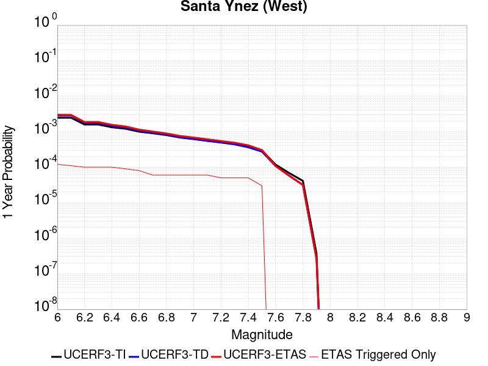 |  |

| Magnitude | 1 wk TI Prob | 1 wk TD Prob | 1 wk ETAS Prob | 1 wk ETAS/TD Gain | 1 wk ETAS Triggered Only | 1 mo TI Prob | 1 mo TD Prob | 1 mo ETAS Prob | 1 mo ETAS/TD Gain | 1 mo ETAS Triggered Only | 1 yr TI Prob | 1 yr TD Prob | 1 yr ETAS Prob | 1 yr ETAS/TD Gain | 1 yr ETAS Triggered Only | 10 yr TI Prob | 10 yr TD Prob | 10 yr ETAS Prob | 10 yr ETAS/TD Gain | 10 yr ETAS Triggered Only |
|-----|-----|-----|-----|-----|-----|-----|-----|-----|-----|-----|-----|-----|-----|-----|-----|-----|-----|-----|-----|-----|
| 6.0 | 4.7352758E-5 | 5.4972126E-5 | 1.4747398E-4 | 2.6827047 | 9.250694E-5 | 2.0292461E-4 | 2.3557522E-4 | 4.2054552E-4 | 1.7851857 | 1.8501388E-4 | 0.0024678076 | 0.0028645284 | 0.0031412542 | 1.0966043 | 2.7752083E-4 | 0.024405818 | 0.028304417 | 0.028574083 | 1.0095273 | 2.7752083E-4 |
| 6.1 | 4.7352758E-5 | 5.4972126E-5 | 1.4747398E-4 | 2.6827047 | 9.250694E-5 | 2.0292461E-4 | 2.3557522E-4 | 4.2054552E-4 | 1.7851857 | 1.8501388E-4 | 0.0024678076 | 0.0028645284 | 0.0031412542 | 1.0966043 | 2.7752083E-4 | 0.024405818 | 0.028304417 | 0.028574083 | 1.0095273 | 2.7752083E-4 |
| 6.2 | 3.0415853E-5 | 3.392511E-5 | 1.2642892E-4 | 3.726706 | 9.250694E-5 | 1.3034715E-4 | 1.4538545E-4 | 3.3037242E-4 | 2.27239 | 1.8501388E-4 | 0.0015858212 | 0.0017686661 | 0.0020456961 | 1.1566322 | 2.7752083E-4 | 0.015745522 | 0.017549807 | 0.017822457 | 1.0155358 | 2.7752083E-4 |
| 6.3 | 3.0415853E-5 | 3.392511E-5 | 1.2642892E-4 | 3.726706 | 9.250694E-5 | 1.3034715E-4 | 1.4538545E-4 | 3.3037242E-4 | 2.27239 | 1.8501388E-4 | 0.0015858212 | 0.0017686661 | 0.0020456961 | 1.1566322 | 2.7752083E-4 | 0.015745522 | 0.017549807 | 0.017822457 | 1.0155358 | 2.7752083E-4 |
| 6.4 | 2.5452082E-5 | 2.7912422E-5 | 2.7912422E-5 | 1.0 | 0.0 | 1.09075794E-4 | 1.196193E-4 | 2.1211516E-4 | 1.7732521 | 9.250694E-5 | 0.0013271887 | 0.0014554089 | 0.0017325258 | 1.1904049 | 2.7752083E-4 | 0.013192902 | 0.014460951 | 0.014734459 | 1.0189135 | 2.7752083E-4 |
| 6.5 | 2.3143784E-5 | 2.5128256E-5 | 2.5128256E-5 | 1.0 | 0.0 | 9.9183875E-5 | 1.0768817E-4 | 2.0018514E-4 | 1.8589334 | 9.250694E-5 | 0.0012068948 | 0.0013103267 | 0.0015874839 | 1.2115176 | 2.7752083E-4 | 0.012003611 | 0.01302768 | 0.013301586 | 1.0210248 | 2.7752083E-4 |
| 6.6 | 1.9118515E-5 | 2.035434E-5 | 2.035434E-5 | 1.0 | 0.0 | 8.193392E-5 | 8.7230015E-5 | 1.7972889E-4 | 2.060402 | 9.250694E-5 | 9.97089E-4 | 0.001061516 | 0.0012463335 | 1.1741071 | 1.8501388E-4 | 0.00992627 | 0.010565365 | 0.010748424 | 1.0173264 | 1.8501388E-4 |
| 6.7 | 1.722807E-5 | 1.8146347E-5 | 1.8146347E-5 | 1.0 | 0.0 | 7.3832496E-5 | 7.776777E-5 | 7.776777E-5 | 1.0 | 0.0 | 8.985399E-4 | 9.464169E-4 | 0.0010388363 | 1.0976518 | 9.250694E-5 | 0.008949154 | 0.0094245095 | 0.009516145 | 1.0097231 | 9.250694E-5 |
| 6.8 | 1.5317364E-5 | 1.5926486E-5 | 1.5926486E-5 | 1.0 | 0.0 | 6.56442E-5 | 6.82546E-5 | 6.82546E-5 | 1.0 | 0.0 | 7.98925E-4 | 8.306873E-4 | 9.2311733E-4 | 1.1112695 | 9.250694E-5 | 0.007960589 | 0.00827631 | 0.008368051 | 1.0110848 | 9.250694E-5 |
| 6.9 | 1.3071226E-5 | 1.3329624E-5 | 1.3329624E-5 | 1.0 | 0.0 | 5.6018336E-5 | 5.7125722E-5 | 5.7125722E-5 | 1.0 | 0.0 | 6.8180985E-4 | 6.9528597E-4 | 7.877286E-4 | 1.1329563 | 9.250694E-5 | 0.0067972173 | 0.006931367 | 0.007023233 | 1.0132536 | 9.250694E-5 |
| 7.0 | 1.1836986E-5 | 1.19327815E-5 | 1.19327815E-5 | 1.0 | 0.0 | 5.0728955E-5 | 5.11395E-5 | 5.11395E-5 | 1.0 | 0.0 | 6.1745E-4 | 6.2244723E-4 | 7.148966E-4 | 1.1485256 | 9.250694E-5 | 0.006157372 | 0.006207231 | 0.0062991637 | 1.0148106 | 9.250694E-5 |
| 7.1 | 1.0597169E-5 | 1.0542201E-5 | 1.0542201E-5 | 1.0 | 0.0 | 4.541565E-5 | 4.5180084E-5 | 4.5180084E-5 | 1.0 | 0.0 | 5.5279525E-4 | 5.4992986E-4 | 6.423859E-4 | 1.1681234 | 9.250694E-5 | 0.0055142213 | 0.005485821 | 0.0055778204 | 1.0167704 | 9.250694E-5 |
| 7.2 | 9.59113E-6 | 9.459144E-6 | 9.459144E-6 | 1.0 | 0.0 | 4.11042E-5 | 4.0538565E-5 | 4.0538565E-5 | 1.0 | 0.0 | 5.0032866E-4 | 4.934463E-4 | 5.859076E-4 | 1.1873786 | 9.250694E-5 | 0.004992037 | 0.0049236254 | 0.005015677 | 1.0186958 | 9.250694E-5 |
| 7.3 | 8.586084E-6 | 8.379583E-6 | 8.379583E-6 | 1.0 | 0.0 | 3.679698E-5 | 3.5912013E-5 | 3.5912013E-5 | 1.0 | 0.0 | 4.4791115E-4 | 4.3714207E-4 | 5.296086E-4 | 1.2115251 | 9.250694E-5 | 0.004470094 | 0.004362933 | 0.0044550365 | 1.0211104 | 9.250694E-5 |
| 7.4 | 7.2622997E-6 | 6.9515427E-6 | 6.9515427E-6 | 1.0 | 0.0 | 3.112377E-5 | 2.979199E-5 | 2.979199E-5 | 1.0 | 0.0 | 3.78866E-4 | 3.626581E-4 | 4.551315E-4 | 1.2549878 | 9.250694E-5 | 0.0037822074 | 0.0036207628 | 0.003712935 | 1.0254565 | 9.250694E-5 |
| 7.5 | 5.627296E-6 | 5.251588E-6 | 5.251588E-6 | 1.0 | 0.0 | 2.411676E-5 | 2.2506614E-5 | 2.2506614E-5 | 1.0 | 0.0 | 2.9358198E-4 | 2.739843E-4 | 3.664659E-4 | 1.3375434 | 9.250694E-5 | 0.0029319443 | 0.002736537 | 0.0028287908 | 1.0337119 | 9.250694E-5 |
| 7.6 | 2.265244E-6 | 2.0608625E-6 | 2.0608625E-6 | 1.0 | 0.0 | 9.708152E-6 | 8.832238E-6 | 8.832238E-6 | 1.0 | 0.0 | 1.18190335E-4 | 1.0752728E-4 | 1.0752728E-4 | 1.0 | 0.0 | 0.001181275 | 0.0010747612 | 0.0010747612 | 1.0 | 0.0 |
| 7.7 | 1.3099874E-6 | 1.1016252E-6 | 1.1016252E-6 | 1.0 | 0.0 | 5.61422E-6 | 4.7212425E-6 | 4.7212425E-6 | 1.0 | 0.0 | 6.8350986E-5 | 5.7479636E-5 | 5.7479636E-5 | 1.0 | 0.0 | 6.832996E-4 | 5.7465007E-4 | 5.7465007E-4 | 1.0 | 0.0 |
| 7.8 | 7.903951E-7 | 6.0711415E-7 | 6.0711415E-7 | 1.0 | 0.0 | 3.3874032E-6 | 2.6019152E-6 | 2.6019152E-6 | 1.0 | 0.0 | 4.1240855E-5 | 3.167787E-5 | 3.167787E-5 | 1.0 | 0.0 | 4.12332E-4 | 3.167349E-4 | 3.167349E-4 | 1.0 | 0.0 |
| 7.9 | 7.0753297E-9 | 5.0899476E-9 | 5.0899476E-9 | 1.0 | 0.0 | 3.032284E-8 | 2.181406E-8 | 2.181406E-8 | 1.0 | 0.0 | 3.6918053E-7 | 2.6558615E-7 | 2.6558615E-7 | 1.0 | 0.0 | 3.691799E-6 | 2.6558594E-6 | 2.6558594E-6 | 1.0 | 0.0 |

## San Jacinto (Stepovers Combined)
*[(top)](#table-of-contents)*

| 1 Week | 1 Month | 1 Year | 10 Year |
|-----|-----|-----|-----|
|  |  |  |  |

| Magnitude | 1 wk TI Prob | 1 wk TD Prob | 1 wk ETAS Prob | 1 wk ETAS/TD Gain | 1 wk ETAS Triggered Only | 1 mo TI Prob | 1 mo TD Prob | 1 mo ETAS Prob | 1 mo ETAS/TD Gain | 1 mo ETAS Triggered Only | 1 yr TI Prob | 1 yr TD Prob | 1 yr ETAS Prob | 1 yr ETAS/TD Gain | 1 yr ETAS Triggered Only | 10 yr TI Prob | 10 yr TD Prob | 10 yr ETAS Prob | 10 yr ETAS/TD Gain | 10 yr ETAS Triggered Only |
|-----|-----|-----|-----|-----|-----|-----|-----|-----|-----|-----|-----|-----|-----|-----|-----|-----|-----|-----|-----|-----|
| 6.0 | 4.0667746E-5 | 3.5272755E-5 | 2.2028011E-4 | 6.2450495 | 1.8501388E-4 | 1.742787E-4 | 1.5116022E-4 | 4.2863906E-4 | 2.8356607 | 2.7752083E-4 | 0.0021197782 | 0.0018388226 | 0.00220817 | 1.2008607 | 3.7002776E-4 | 0.020996714 | 0.018986892 | 0.019349894 | 1.0191185 | 3.7002776E-4 |
| 6.1 | 4.0667746E-5 | 3.5272755E-5 | 2.2028011E-4 | 6.2450495 | 1.8501388E-4 | 1.742787E-4 | 1.5116022E-4 | 4.2863906E-4 | 2.8356607 | 2.7752083E-4 | 0.0021197782 | 0.0018388226 | 0.00220817 | 1.2008607 | 3.7002776E-4 | 0.020996714 | 0.018986892 | 0.019349894 | 1.0191185 | 3.7002776E-4 |
| 6.2 | 4.0667746E-5 | 3.5272755E-5 | 2.2028011E-4 | 6.2450495 | 1.8501388E-4 | 1.742787E-4 | 1.5116022E-4 | 4.2863906E-4 | 2.8356607 | 2.7752083E-4 | 0.0021197782 | 0.0018388226 | 0.00220817 | 1.2008607 | 3.7002776E-4 | 0.020996714 | 0.018986892 | 0.019349894 | 1.0191185 | 3.7002776E-4 |
| 6.3 | 4.0667746E-5 | 3.5272755E-5 | 2.2028011E-4 | 6.2450495 | 1.8501388E-4 | 1.742787E-4 | 1.5116022E-4 | 4.2863906E-4 | 2.8356607 | 2.7752083E-4 | 0.0021197782 | 0.0018388226 | 0.00220817 | 1.2008607 | 3.7002776E-4 | 0.020996714 | 0.018986892 | 0.019349894 | 1.0191185 | 3.7002776E-4 |
| 6.4 | 4.0577226E-5 | 3.5144654E-5 | 2.2015203E-4 | 6.2641683 | 1.8501388E-4 | 1.738908E-4 | 1.5061127E-4 | 4.2809028E-4 | 2.8423522 | 2.7752083E-4 | 0.0021150648 | 0.0018321523 | 0.002201502 | 1.2015934 | 3.7002776E-4 | 0.020950472 | 0.018921461 | 0.019284487 | 1.0191859 | 3.7002776E-4 |
| 6.5 | 4.0577226E-5 | 3.5144654E-5 | 2.2015203E-4 | 6.2641683 | 1.8501388E-4 | 1.738908E-4 | 1.5061127E-4 | 4.2809028E-4 | 2.8423522 | 2.7752083E-4 | 0.0021150648 | 0.0018321523 | 0.002201502 | 1.2015934 | 3.7002776E-4 | 0.020950472 | 0.018921461 | 0.019284487 | 1.0191859 | 3.7002776E-4 |
| 6.6 | 4.053861E-5 | 3.509E-5 | 2.2009738E-4 | 6.2723675 | 1.8501388E-4 | 1.7372532E-4 | 1.5037706E-4 | 4.2785614E-4 | 2.845222 | 2.7752083E-4 | 0.0021130538 | 0.0018293057 | 0.0021986566 | 1.2019076 | 3.7002776E-4 | 0.020930743 | 0.018893538 | 0.019256575 | 1.0192149 | 3.7002776E-4 |
| 6.7 | 4.0516545E-5 | 3.5059067E-5 | 2.2006646E-4 | 6.2770195 | 1.8501388E-4 | 1.7363077E-4 | 1.5024451E-4 | 4.2772363E-4 | 2.8468502 | 2.7752083E-4 | 0.002111905 | 0.001827695 | 0.0021970465 | 1.202086 | 3.7002776E-4 | 0.020919468 | 0.018877735 | 0.019240778 | 1.0192312 | 3.7002776E-4 |
| 6.8 | 4.049434E-5 | 3.5030633E-5 | 2.2003803E-4 | 6.2813034 | 1.8501388E-4 | 1.7353562E-4 | 1.5012265E-4 | 4.276018E-4 | 2.8483496 | 2.7752083E-4 | 0.0021107488 | 0.0018262138 | 0.0021955657 | 1.2022501 | 3.7002776E-4 | 0.020908125 | 0.018863149 | 0.019226195 | 1.0192465 | 3.7002776E-4 |
| 6.9 | 4.046386E-5 | 3.499319E-5 | 2.200006E-4 | 6.2869544 | 1.8501388E-4 | 1.73405E-4 | 1.4996222E-4 | 4.274414E-4 | 2.8503275 | 2.7752083E-4 | 0.0021091616 | 0.0018242638 | 0.0021936165 | 1.2024667 | 3.7002776E-4 | 0.020892553 | 0.01884392 | 0.019206977 | 1.0192664 | 3.7002776E-4 |
| 7.0 | 4.036382E-5 | 3.487376E-5 | 2.1988119E-4 | 6.3050613 | 1.8501388E-4 | 1.7297632E-4 | 1.4945042E-4 | 4.2692976E-4 | 2.856665 | 2.7752083E-4 | 0.0021039525 | 0.0018180435 | 0.0021873985 | 1.2031608 | 3.7002776E-4 | 0.02084144 | 0.018782536 | 0.019145614 | 1.0193306 | 3.7002776E-4 |
| 7.1 | 4.0343282E-5 | 3.4852223E-5 | 2.1985965E-4 | 6.3083396 | 1.8501388E-4 | 1.7288832E-4 | 1.4935812E-4 | 4.268375E-4 | 2.8578122 | 2.7752083E-4 | 0.002102883 | 0.0018169218 | 0.0021862772 | 1.2032864 | 3.7002776E-4 | 0.020830948 | 0.018771412 | 0.019134495 | 1.0193423 | 3.7002776E-4 |
| 7.2 | 4.0257353E-5 | 3.4756722E-5 | 2.1976417E-4 | 6.3229256 | 1.8501388E-4 | 1.725201E-4 | 1.489489E-4 | 4.2642836E-4 | 2.8629174 | 2.7752083E-4 | 0.0020984085 | 0.0018119477 | 0.0021813049 | 1.2038455 | 3.7002776E-4 | 0.020787042 | 0.018722152 | 0.019085253 | 1.0193942 | 3.7002776E-4 |
| 7.3 | 3.9940667E-5 | 3.4584376E-5 | 2.1959185E-4 | 6.3494525 | 1.8501388E-4 | 1.7116306E-4 | 1.4821035E-4 | 4.2569003E-4 | 2.8722017 | 2.7752083E-4 | 0.0020819185 | 0.0018029709 | 0.0021723316 | 1.2048622 | 3.7002776E-4 | 0.020625217 | 0.018630784 | 0.018993918 | 1.0194911 | 3.7002776E-4 |
| 7.4 | 3.9721202E-5 | 3.4469766E-5 | 2.1947727E-4 | 6.3672395 | 1.8501388E-4 | 1.7022261E-4 | 1.4771923E-4 | 4.2519905E-4 | 2.8784273 | 2.7752083E-4 | 0.0020704903 | 0.0017970012 | 0.002166364 | 1.205544 | 3.7002776E-4 | 0.020513052 | 0.018569905 | 0.018933063 | 1.0195562 | 3.7002776E-4 |
| 7.5 | 3.7036873E-5 | 3.3537188E-5 | 2.1854485E-4 | 6.516494 | 1.8501388E-4 | 1.5871979E-4 | 1.437229E-4 | 4.2120382E-4 | 2.9306662 | 2.7752083E-4 | 0.0019307006 | 0.0017484248 | 0.0021178056 | 1.2112648 | 3.7002776E-4 | 0.019140124 | 0.018071463 | 0.018434804 | 1.0201057 | 3.7002776E-4 |
| 7.6 | 3.2940967E-5 | 3.1317984E-5 | 2.1632607E-4 | 6.907407 | 1.8501388E-4 | 1.4116794E-4 | 1.3421304E-4 | 4.1169662E-4 | 3.0674858 | 2.7752083E-4 | 0.0017173645 | 0.0016328214 | 0.0020022448 | 1.2262486 | 3.7002776E-4 | 0.01704153 | 0.016904354 | 0.017268127 | 1.0215194 | 3.7002776E-4 |
| 7.7 | 2.8236149E-5 | 2.7883889E-5 | 2.1289261E-4 | 7.6349683 | 1.8501388E-4 | 1.2100645E-4 | 1.19496915E-4 | 3.9698457E-4 | 3.3221323 | 2.7752083E-4 | 0.0014722579 | 0.001453905 | 0.0018233948 | 1.2541361 | 3.7002776E-4 | 0.014625421 | 0.015115095 | 0.01547953 | 1.0241107 | 3.7002776E-4 |
| 7.8 | 2.4329287E-5 | 2.5207537E-5 | 2.1021675E-4 | 8.33944 | 1.8501388E-4 | 1.042642E-4 | 1.0802783E-4 | 3.8551865E-4 | 3.5686977 | 2.7752083E-4 | 0.0012686774 | 0.0013144462 | 0.0016839876 | 1.2811384 | 3.7002776E-4 | 0.012614589 | 0.013712396 | 0.01407735 | 1.0266149 | 3.7002776E-4 |
| 7.9 | 1.9370926E-5 | 2.0421452E-5 | 1.129265E-4 | 5.529798 | 9.250694E-5 | 8.301561E-5 | 8.7517576E-5 | 2.7251526E-4 | 3.1138346 | 1.8501388E-4 | 0.0010102465 | 0.0010650064 | 0.0013422316 | 1.2603039 | 2.7752083E-4 | 0.0100566605 | 0.011199483 | 0.011473895 | 1.0245023 | 2.7752083E-4 |
| 8.0 | 1.5583017E-5 | 1.588647E-5 | 1.08391934E-4 | 6.8229094 | 9.250694E-5 | 6.6782646E-5 | 6.808309E-5 | 1.6058373E-4 | 2.3586433 | 9.250694E-5 | 8.127754E-4 | 8.285971E-4 | 0.0010134577 | 1.2231007 | 1.8501388E-4 | 0.008098091 | 0.008781809 | 0.008965199 | 1.0208828 | 1.8501388E-4 |
| 8.1 | 1.0024873E-5 | 8.292404E-6 | 8.292404E-6 | 1.0 | 0.0 | 4.2963035E-5 | 3.5538393E-5 | 3.5538393E-5 | 1.0 | 0.0 | 5.229494E-4 | 4.3259456E-4 | 4.3259456E-4 | 1.0 | 0.0 | 0.0052172043 | 0.0046534105 | 0.0046534105 | 1.0 | 0.0 |
| 8.2 | 4.142796E-6 | 1.5610041E-6 | 1.5610041E-6 | 1.0 | 0.0 | 1.775472E-5 | 6.69E-6 | 6.69E-6 | 1.0 | 0.0 | 2.1614227E-4 | 8.144774E-5 | 8.144774E-5 | 1.0 | 0.0 | 0.0021593217 | 9.454649E-4 | 9.454649E-4 | 1.0 | 0.0 |
| 8.3 | 1.2750878E-6 | 3.612133E-7 | 3.612133E-7 | 1.0 | 0.0 | 5.4646503E-6 | 1.548056E-6 | 1.548056E-6 | 1.0 | 0.0 | 6.653009E-5 | 1.8847424E-5 | 1.8847424E-5 | 1.0 | 0.0 | 6.6510175E-4 | 2.2734253E-4 | 2.2734253E-4 | 1.0 | 0.0 |

## San Jacinto (San Jacinto Valley) rev
*[(top)](#table-of-contents)*

| 1 Week | 1 Month | 1 Year | 10 Year |
|-----|-----|-----|-----|
|  |  |  |  |

| Magnitude | 1 wk TI Prob | 1 wk TD Prob | 1 wk ETAS Prob | 1 wk ETAS/TD Gain | 1 wk ETAS Triggered Only | 1 mo TI Prob | 1 mo TD Prob | 1 mo ETAS Prob | 1 mo ETAS/TD Gain | 1 mo ETAS Triggered Only | 1 yr TI Prob | 1 yr TD Prob | 1 yr ETAS Prob | 1 yr ETAS/TD Gain | 1 yr ETAS Triggered Only | 10 yr TI Prob | 10 yr TD Prob | 10 yr ETAS Prob | 10 yr ETAS/TD Gain | 10 yr ETAS Triggered Only |
|-----|-----|-----|-----|-----|-----|-----|-----|-----|-----|-----|-----|-----|-----|-----|-----|-----|-----|-----|-----|-----|
| 6.0 | 3.652694E-5 | 3.4402394E-5 | 2.194099E-4 | 6.3777514 | 1.8501388E-4 | 1.5653463E-4 | 1.474305E-4 | 4.249104E-4 | 2.8821065 | 2.7752083E-4 | 0.0019041431 | 0.00179349 | 0.0021628542 | 1.2059472 | 3.7002776E-4 | 0.018879099 | 0.018526595 | 0.018889768 | 1.0196028 | 3.7002776E-4 |
| 6.1 | 3.652694E-5 | 3.4402394E-5 | 2.194099E-4 | 6.3777514 | 1.8501388E-4 | 1.5653463E-4 | 1.474305E-4 | 4.249104E-4 | 2.8821065 | 2.7752083E-4 | 0.0019041431 | 0.00179349 | 0.0021628542 | 1.2059472 | 3.7002776E-4 | 0.018879099 | 0.018526595 | 0.018889768 | 1.0196028 | 3.7002776E-4 |
| 6.2 | 3.652694E-5 | 3.4402394E-5 | 2.194099E-4 | 6.3777514 | 1.8501388E-4 | 1.5653463E-4 | 1.474305E-4 | 4.249104E-4 | 2.8821065 | 2.7752083E-4 | 0.0019041431 | 0.00179349 | 0.0021628542 | 1.2059472 | 3.7002776E-4 | 0.018879099 | 0.018526595 | 0.018889768 | 1.0196028 | 3.7002776E-4 |
| 6.3 | 3.652694E-5 | 3.4402394E-5 | 2.194099E-4 | 6.3777514 | 1.8501388E-4 | 1.5653463E-4 | 1.474305E-4 | 4.249104E-4 | 2.8821065 | 2.7752083E-4 | 0.0019041431 | 0.00179349 | 0.0021628542 | 1.2059472 | 3.7002776E-4 | 0.018879099 | 0.018526595 | 0.018889768 | 1.0196028 | 3.7002776E-4 |
| 6.4 | 3.646941E-5 | 3.432397E-5 | 2.193315E-4 | 6.390039 | 1.8501388E-4 | 1.5628811E-4 | 1.4709444E-4 | 4.2457445E-4 | 2.8864071 | 2.7752083E-4 | 0.0019011468 | 0.0017894056 | 0.0021587713 | 1.206418 | 3.7002776E-4 | 0.018849645 | 0.018486476 | 0.018849663 | 1.019646 | 3.7002776E-4 |
| 6.5 | 3.646941E-5 | 3.432397E-5 | 2.193315E-4 | 6.390039 | 1.8501388E-4 | 1.5628811E-4 | 1.4709444E-4 | 4.2457445E-4 | 2.8864071 | 2.7752083E-4 | 0.0019011468 | 0.0017894056 | 0.0021587713 | 1.206418 | 3.7002776E-4 | 0.018849645 | 0.018486476 | 0.018849663 | 1.019646 | 3.7002776E-4 |
| 6.6 | 3.6442503E-5 | 3.4287354E-5 | 2.1929489E-4 | 6.395795 | 1.8501388E-4 | 1.561728E-4 | 1.4693754E-4 | 4.2441758E-4 | 2.8884218 | 2.7752083E-4 | 0.0018997455 | 0.0017874985 | 0.0021568649 | 1.2066387 | 3.7002776E-4 | 0.018835869 | 0.018467745 | 0.01883094 | 1.0196664 | 3.7002776E-4 |
| 6.7 | 3.6432113E-5 | 3.4272925E-5 | 2.1928047E-4 | 6.3980665 | 1.8501388E-4 | 1.5612828E-4 | 1.4687571E-4 | 4.2435576E-4 | 2.8892167 | 2.7752083E-4 | 0.0018992044 | 0.0017867472 | 0.0021561137 | 1.2067257 | 3.7002776E-4 | 0.018830549 | 0.018460369 | 0.018823566 | 1.0196744 | 3.7002776E-4 |
| 6.8 | 3.6409598E-5 | 3.424198E-5 | 2.1924952E-4 | 6.402945 | 1.8501388E-4 | 1.560318E-4 | 1.4674311E-4 | 4.242232E-4 | 2.8909242 | 2.7752083E-4 | 0.0018980318 | 0.0017851355 | 0.0021545026 | 1.2069128 | 3.7002776E-4 | 0.018819023 | 0.018444523 | 0.018807726 | 1.0196916 | 3.7002776E-4 |
| 6.9 | 3.638078E-5 | 3.4202407E-5 | 2.1920995E-4 | 6.409197 | 1.8501388E-4 | 1.5590832E-4 | 1.4657351E-4 | 4.2405367E-4 | 2.8931124 | 2.7752083E-4 | 0.0018965311 | 0.001783074 | 0.002152442 | 1.2071524 | 3.7002776E-4 | 0.018804269 | 0.018424258 | 0.018787468 | 1.0197136 | 3.7002776E-4 |
| 7.0 | 3.6294874E-5 | 3.408442E-5 | 2.1909199E-4 | 6.427922 | 1.8501388E-4 | 1.5554018E-4 | 1.4606792E-4 | 4.235482E-4 | 2.899666 | 2.7752083E-4 | 0.0018920569 | 0.001776929 | 0.0021462992 | 1.20787 | 3.7002776E-4 | 0.018760284 | 0.018363839 | 0.018727072 | 1.0197798 | 3.7002776E-4 |
| 7.1 | 3.6260717E-5 | 3.4040702E-5 | 2.1904828E-4 | 6.434893 | 1.8501388E-4 | 1.5539382E-4 | 1.4588058E-4 | 4.233609E-4 | 2.902106 | 2.7752083E-4 | 0.001890278 | 0.0017746518 | 0.0021440228 | 1.2081372 | 3.7002776E-4 | 0.018742796 | 0.018341439 | 0.01870468 | 1.0198044 | 3.7002776E-4 |
| 7.2 | 3.6210204E-5 | 3.397492E-5 | 2.1898252E-4 | 6.4454165 | 1.8501388E-4 | 1.5517735E-4 | 1.455987E-4 | 4.230791E-4 | 2.9057891 | 2.7752083E-4 | 0.001887647 | 0.0017712255 | 0.002140598 | 1.2085406 | 3.7002776E-4 | 0.01871693 | 0.01830772 | 0.018670972 | 1.0198416 | 3.7002776E-4 |
| 7.3 | 3.6119454E-5 | 3.386321E-5 | 2.1887082E-4 | 6.4633813 | 1.8501388E-4 | 1.5478847E-4 | 1.4511998E-4 | 4.226005E-4 | 2.9120767 | 2.7752083E-4 | 0.0018829206 | 0.0017654065 | 0.002134781 | 1.2092291 | 3.7002776E-4 | 0.018670462 | 0.018250274 | 0.018613547 | 1.0199052 | 3.7002776E-4 |
| 7.4 | 3.607848E-5 | 3.381071E-5 | 2.1881833E-4 | 6.4718647 | 1.8501388E-4 | 1.5461289E-4 | 1.44895E-4 | 4.223756E-4 | 2.915046 | 2.7752083E-4 | 0.0018807866 | 0.0017626719 | 0.0021320474 | 1.2095543 | 3.7002776E-4 | 0.018649481 | 0.018223269 | 0.018586554 | 1.0199353 | 3.7002776E-4 |
| 7.5 | 3.5856774E-5 | 3.3620483E-5 | 2.1862813E-4 | 6.5028257 | 1.8501388E-4 | 1.5366284E-4 | 1.4407984E-4 | 4.2156066E-4 | 2.9258826 | 2.7752083E-4 | 0.0018692396 | 0.0017527633 | 0.0021221424 | 1.210741 | 3.7002776E-4 | 0.018535944 | 0.018124366 | 0.018487688 | 1.020046 | 3.7002776E-4 |
| 7.6 | 3.286655E-5 | 3.2143445E-5 | 2.1715138E-4 | 6.755697 | 1.8501388E-4 | 1.4084904E-4 | 1.3775036E-4 | 4.1523296E-4 | 3.0143874 | 2.7752083E-4 | 0.001713488 | 0.0016758227 | 0.0020452302 | 1.2204336 | 3.7002776E-4 | 0.017003361 | 0.017344031 | 0.01770764 | 1.0209645 | 3.7002776E-4 |
| 7.7 | 2.8882527E-5 | 2.9236293E-5 | 2.1424476E-4 | 7.328041 | 1.8501388E-4 | 1.237764E-4 | 1.2529238E-4 | 4.0277845E-4 | 3.2147079 | 2.7752083E-4 | 0.0015059357 | 0.0015243685 | 0.0018938322 | 1.2423717 | 3.7002776E-4 | 0.014957713 | 0.015830461 | 0.01619463 | 1.0230044 | 3.7002776E-4 |
| 7.8 | 2.4950225E-5 | 2.6527203E-5 | 2.1153617E-4 | 7.974311 | 1.8501388E-4 | 1.0692515E-4 | 1.1368306E-4 | 3.9117233E-4 | 3.4409025 | 2.7752083E-4 | 0.0013010362 | 0.0013832134 | 0.0017527293 | 1.2671431 | 3.7002776E-4 | 0.012934455 | 0.014411755 | 0.01477645 | 1.0253054 | 3.7002776E-4 |
| 7.9 | 1.9881603E-5 | 2.1507445E-5 | 1.1401239E-4 | 5.3010664 | 9.250694E-5 | 8.520408E-5 | 9.217151E-5 | 2.7716835E-4 | 3.0070932 | 1.8501388E-4 | 0.001036866 | 0.0011216112 | 0.0013988208 | 1.2471529 | 2.7752083E-4 | 0.010320415 | 0.011777027 | 0.012051279 | 1.023287 | 2.7752083E-4 |
| 8.0 | 1.563292E-5 | 1.5937347E-5 | 1.0844281E-4 | 6.8043203 | 9.250694E-5 | 6.6996516E-5 | 6.8301124E-5 | 1.6080175E-4 | 2.354306 | 9.250694E-5 | 8.153773E-4 | 8.3124964E-4 | 0.0010161097 | 1.2223881 | 1.8501388E-4 | 0.00812392 | 0.008810506 | 0.00899389 | 1.0208142 | 1.8501388E-4 |
| 8.1 | 1.0045313E-5 | 8.301802E-6 | 8.301802E-6 | 1.0 | 0.0 | 4.305063E-5 | 3.5578672E-5 | 3.5578672E-5 | 1.0 | 0.0 | 5.2401534E-4 | 4.3308473E-4 | 4.3308473E-4 | 1.0 | 0.0 | 0.0052278144 | 0.0046591135 | 0.0046591135 | 1.0 | 0.0 |
| 8.2 | 4.1554413E-6 | 1.5655598E-6 | 1.5655598E-6 | 1.0 | 0.0 | 1.7808914E-5 | 6.709525E-6 | 6.709525E-6 | 1.0 | 0.0 | 2.1680194E-4 | 8.168544E-5 | 8.168544E-5 | 1.0 | 0.0 | 0.0021659054 | 9.482903E-4 | 9.482903E-4 | 1.0 | 0.0 |
| 8.3 | 1.2758221E-6 | 3.6149942E-7 | 3.6149942E-7 | 1.0 | 0.0 | 5.4677976E-6 | 1.5492824E-6 | 1.5492824E-6 | 1.0 | 0.0 | 6.65684E-5 | 1.8862354E-5 | 1.8862354E-5 | 1.0 | 0.0 | 6.6548464E-4 | 2.2751294E-4 | 2.2751294E-4 | 1.0 | 0.0 |

## San Jacinto (San Bernardino)
*[(top)](#table-of-contents)*

| 1 Week | 1 Month | 1 Year | 10 Year |
|-----|-----|-----|-----|
| 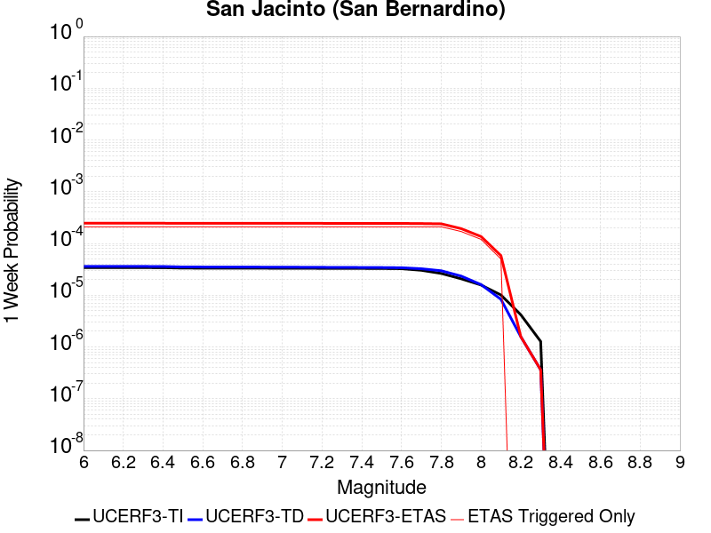 |  |  |  |

| Magnitude | 1 wk TI Prob | 1 wk TD Prob | 1 wk ETAS Prob | 1 wk ETAS/TD Gain | 1 wk ETAS Triggered Only | 1 mo TI Prob | 1 mo TD Prob | 1 mo ETAS Prob | 1 mo ETAS/TD Gain | 1 mo ETAS Triggered Only | 1 yr TI Prob | 1 yr TD Prob | 1 yr ETAS Prob | 1 yr ETAS/TD Gain | 1 yr ETAS Triggered Only | 10 yr TI Prob | 10 yr TD Prob | 10 yr ETAS Prob | 10 yr ETAS/TD Gain | 10 yr ETAS Triggered Only |
|-----|-----|-----|-----|-----|-----|-----|-----|-----|-----|-----|-----|-----|-----|-----|-----|-----|-----|-----|-----|-----|
| 6.0 | 3.409352E-5 | 3.5986508E-5 | 2.2099372E-4 | 6.141016 | 1.8501388E-4 | 1.461069E-4 | 1.542188E-4 | 4.316968E-4 | 2.799249 | 2.7752083E-4 | 0.0017774 | 0.0018759987 | 0.0022453323 | 1.1968731 | 3.7002776E-4 | 0.01763251 | 0.019349935 | 0.019712802 | 1.0187529 | 3.7002776E-4 |
| 6.1 | 3.409352E-5 | 3.5986508E-5 | 2.2099372E-4 | 6.141016 | 1.8501388E-4 | 1.461069E-4 | 1.542188E-4 | 4.316968E-4 | 2.799249 | 2.7752083E-4 | 0.0017774 | 0.0018759987 | 0.0022453323 | 1.1968731 | 3.7002776E-4 | 0.01763251 | 0.019349935 | 0.019712802 | 1.0187529 | 3.7002776E-4 |
| 6.2 | 3.409352E-5 | 3.5986508E-5 | 2.2099372E-4 | 6.141016 | 1.8501388E-4 | 1.461069E-4 | 1.542188E-4 | 4.316968E-4 | 2.799249 | 2.7752083E-4 | 0.0017774 | 0.0018759987 | 0.0022453323 | 1.1968731 | 3.7002776E-4 | 0.01763251 | 0.019349935 | 0.019712802 | 1.0187529 | 3.7002776E-4 |
| 6.3 | 3.409352E-5 | 3.5986508E-5 | 2.2099372E-4 | 6.141016 | 1.8501388E-4 | 1.461069E-4 | 1.542188E-4 | 4.316968E-4 | 2.799249 | 2.7752083E-4 | 0.0017774 | 0.0018759987 | 0.0022453323 | 1.1968731 | 3.7002776E-4 | 0.01763251 | 0.019349935 | 0.019712802 | 1.0187529 | 3.7002776E-4 |
| 6.4 | 3.400795E-5 | 3.5879173E-5 | 2.2088642E-4 | 6.1563964 | 1.8501388E-4 | 1.4574021E-4 | 1.5375883E-4 | 4.31237E-4 | 2.8046322 | 2.7752083E-4 | 0.0017729428 | 0.0018704084 | 0.002239744 | 1.1974626 | 3.7002776E-4 | 0.017588645 | 0.019295016 | 0.019657904 | 1.0188073 | 3.7002776E-4 |
| 6.5 | 3.341482E-5 | 3.5139812E-5 | 2.2014718E-4 | 6.264894 | 1.8501388E-4 | 1.4319851E-4 | 1.5059051E-4 | 4.2806953E-4 | 2.8426063 | 2.7752083E-4 | 0.0017420477 | 0.0018318989 | 0.002201249 | 1.2016213 | 3.7002776E-4 | 0.017284546 | 0.018916558 | 0.019279586 | 1.019191 | 3.7002776E-4 |
| 6.6 | 3.3364955E-5 | 3.5077028E-5 | 2.2008442E-4 | 6.2743173 | 1.8501388E-4 | 1.4298483E-4 | 1.5032147E-4 | 4.2780058E-4 | 2.8459046 | 2.7752083E-4 | 0.0017394501 | 0.001828629 | 0.0021979802 | 1.2019825 | 3.7002776E-4 | 0.017258976 | 0.018884424 | 0.019247463 | 1.0192243 | 3.7002776E-4 |
| 6.7 | 3.335922E-5 | 3.5066805E-5 | 2.2007419E-4 | 6.2758555 | 1.8501388E-4 | 1.4296026E-4 | 1.5027766E-4 | 4.2775675E-4 | 2.846443 | 2.7752083E-4 | 0.0017391514 | 0.0018280965 | 0.0021974477 | 1.2020415 | 3.7002776E-4 | 0.017256035 | 0.018879214 | 0.019242257 | 1.0192298 | 3.7002776E-4 |
| 6.8 | 3.327683E-5 | 3.496087E-5 | 2.1996828E-4 | 6.2918425 | 1.8501388E-4 | 1.4260718E-4 | 1.498237E-4 | 4.2730293E-4 | 2.8520384 | 2.7752083E-4 | 0.0017348597 | 0.0018225788 | 0.0021919322 | 1.2026542 | 3.7002776E-4 | 0.017213784 | 0.018824987 | 0.019188048 | 1.0192862 | 3.7002776E-4 |
| 6.9 | 3.3235785E-5 | 3.4901823E-5 | 2.1990924E-4 | 6.300795 | 1.8501388E-4 | 1.4243131E-4 | 1.4957068E-4 | 4.2705E-4 | 2.855172 | 2.7752083E-4 | 0.0017327217 | 0.0018195034 | 0.0021888579 | 1.2029974 | 3.7002776E-4 | 0.017192734 | 0.018794855 | 0.01915793 | 1.0193177 | 3.7002776E-4 |
| 7.0 | 3.3197095E-5 | 3.4841752E-5 | 2.1984919E-4 | 6.3099346 | 1.8501388E-4 | 1.422655E-4 | 1.4931326E-4 | 4.2679263E-4 | 2.8583705 | 2.7752083E-4 | 0.0017307063 | 0.0018163746 | 0.0021857303 | 1.2033477 | 3.7002776E-4 | 0.017172894 | 0.018764233 | 0.019127317 | 1.0193498 | 3.7002776E-4 |
| 7.1 | 3.3129716E-5 | 3.4721965E-5 | 2.1972942E-4 | 6.328254 | 1.8501388E-4 | 1.4197677E-4 | 1.4879994E-4 | 4.2627947E-4 | 2.8647823 | 2.7752083E-4 | 0.0017271966 | 0.0018101353 | 0.0021794932 | 1.20405 | 3.7002776E-4 | 0.017138338 | 0.018703312 | 0.01906642 | 1.0194141 | 3.7002776E-4 |
| 7.2 | 3.3034008E-5 | 3.458941E-5 | 2.1959688E-4 | 6.348674 | 1.8501388E-4 | 1.4156665E-4 | 1.4823192E-4 | 4.257116E-4 | 2.8719292 | 2.7752083E-4 | 0.0017222111 | 0.0018032312 | 0.0021725916 | 1.2048326 | 3.7002776E-4 | 0.017089253 | 0.018635705 | 0.018998837 | 1.0194858 | 3.7002776E-4 |
| 7.3 | 3.2956614E-5 | 3.445717E-5 | 2.1946467E-4 | 6.3692017 | 1.8501388E-4 | 1.4123498E-4 | 1.4766524E-4 | 4.2514506E-4 | 2.8791142 | 2.7752083E-4 | 0.0017181796 | 0.0017963431 | 0.0021657061 | 1.2056195 | 3.7002776E-4 | 0.017049557 | 0.018568452 | 0.01893161 | 1.0195577 | 3.7002776E-4 |
| 7.4 | 3.2915937E-5 | 3.4378863E-5 | 2.1938638E-4 | 6.3814316 | 1.8501388E-4 | 1.4106068E-4 | 1.4732967E-4 | 4.248096E-4 | 2.8833947 | 2.7752083E-4 | 0.0017160608 | 0.0017922645 | 0.002161629 | 1.2060882 | 3.7002776E-4 | 0.017028693 | 0.018528719 | 0.01889189 | 1.0196005 | 3.7002776E-4 |
| 7.5 | 3.281791E-5 | 3.4243778E-5 | 2.1925132E-4 | 6.4026613 | 1.8501388E-4 | 1.406406E-4 | 1.4675081E-4 | 4.242309E-4 | 2.890825 | 2.7752083E-4 | 0.0017109542 | 0.0017852283 | 0.0021545955 | 1.2069019 | 3.7002776E-4 | 0.016978411 | 0.018459605 | 0.018822802 | 1.0196753 | 3.7002776E-4 |
| 7.6 | 3.2521442E-5 | 3.396873E-5 | 2.1897632E-4 | 6.4464087 | 1.8501388E-4 | 1.3937015E-4 | 1.4557215E-4 | 4.2305258E-4 | 2.9061365 | 2.7752083E-4 | 0.0016955109 | 0.0017709016 | 0.002140274 | 1.2085787 | 3.7002776E-4 | 0.016826328 | 0.018317232 | 0.018680483 | 1.0198311 | 3.7002776E-4 |
| 7.7 | 3.0287873E-5 | 3.245276E-5 | 2.1746063E-4 | 6.7008357 | 1.8501388E-4 | 1.297987E-4 | 1.3907586E-4 | 4.165581E-4 | 2.995186 | 2.7752083E-4 | 0.0015791537 | 0.0016919347 | 0.0020613363 | 1.218331 | 3.7002776E-4 | 0.01567979 | 0.01752809 | 0.017891632 | 1.0207405 | 3.7002776E-4 |
| 7.8 | 2.6316151E-5 | 2.9663592E-5 | 2.1467198E-4 | 7.2368846 | 1.8501388E-4 | 1.1277862E-4 | 1.2712348E-4 | 4.0460902E-4 | 3.1828032 | 2.7752083E-4 | 0.0013722149 | 0.0015466306 | 0.0019160861 | 1.2388777 | 3.7002776E-4 | 0.013637724 | 0.016069634 | 0.016433716 | 1.0226564 | 3.7002776E-4 |
| 7.9 | 2.0761147E-5 | 2.34181E-5 | 1.1592287E-4 | 4.9501395 | 9.250694E-5 | 8.897331E-5 | 1.0035944E-4 | 2.8535473E-4 | 2.8433275 | 1.8501388E-4 | 0.0010827117 | 0.0012211921 | 0.0014983739 | 1.2269765 | 2.7752083E-4 | 0.010774517 | 0.012793174 | 0.013067145 | 1.0214154 | 2.7752083E-4 |
| 8.0 | 1.5738568E-5 | 1.6033575E-5 | 1.0853903E-4 | 6.769484 | 9.250694E-5 | 6.744926E-5 | 6.871352E-5 | 1.6121409E-4 | 2.3461773 | 9.250694E-5 | 8.2088535E-4 | 8.3626667E-4 | 0.0010211258 | 1.2210529 | 1.8501388E-4 | 0.008178596 | 0.008865921 | 0.0090492945 | 1.0206829 | 1.8501388E-4 |
| 8.1 | 1.0105832E-5 | 8.3304985E-6 | 8.3304985E-6 | 1.0 | 0.0 | 4.3309992E-5 | 3.570165E-5 | 3.570165E-5 | 1.0 | 0.0 | 5.2717153E-4 | 4.345814E-4 | 4.345814E-4 | 1.0 | 0.0 | 0.005259227 | 0.004677232 | 0.004677232 | 1.0 | 0.0 |
| 8.2 | 4.189207E-6 | 1.5784357E-6 | 1.5784357E-6 | 1.0 | 0.0 | 1.7953622E-5 | 6.7647065E-6 | 6.7647065E-6 | 1.0 | 0.0 | 2.1856341E-4 | 8.235722E-5 | 8.235722E-5 | 1.0 | 0.0 | 0.0021834858 | 9.565867E-4 | 9.565867E-4 | 1.0 | 0.0 |
| 8.3 | 1.2758221E-6 | 3.6149942E-7 | 3.6149942E-7 | 1.0 | 0.0 | 5.4677976E-6 | 1.5492824E-6 | 1.5492824E-6 | 1.0 | 0.0 | 6.65684E-5 | 1.8862354E-5 | 1.8862354E-5 | 1.0 | 0.0 | 6.6548464E-4 | 2.2751294E-4 | 2.2751294E-4 | 1.0 | 0.0 |

## San Andreas (San Gorgonio Pass-Garnet HIll)
*[(top)](#table-of-contents)*

| 1 Week | 1 Month | 1 Year | 10 Year |
|-----|-----|-----|-----|
|  |  |  |  |

| Magnitude | 1 wk TI Prob | 1 wk TD Prob | 1 wk ETAS Prob | 1 wk ETAS/TD Gain | 1 wk ETAS Triggered Only | 1 mo TI Prob | 1 mo TD Prob | 1 mo ETAS Prob | 1 mo ETAS/TD Gain | 1 mo ETAS Triggered Only | 1 yr TI Prob | 1 yr TD Prob | 1 yr ETAS Prob | 1 yr ETAS/TD Gain | 1 yr ETAS Triggered Only | 10 yr TI Prob | 10 yr TD Prob | 10 yr ETAS Prob | 10 yr ETAS/TD Gain | 10 yr ETAS Triggered Only |
|-----|-----|-----|-----|-----|-----|-----|-----|-----|-----|-----|-----|-----|-----|-----|-----|-----|-----|-----|-----|-----|
| 6.0 | 8.31567E-5 | 2.3382473E-4 | 6.0376595E-4 | 2.5821304 | 3.7002776E-4 | 3.5633717E-4 | 0.0010017233 | 0.0013713805 | 1.3690212 | 3.7002776E-4 | 0.004329778 | 0.012127888 | 0.012493429 | 1.0301404 | 3.7002776E-4 | 0.042463828 | 0.11257892 | 0.11290729 | 1.0029168 | 3.7002776E-4 |
| 6.1 | 8.31567E-5 | 2.3382473E-4 | 6.0376595E-4 | 2.5821304 | 3.7002776E-4 | 3.5633717E-4 | 0.0010017233 | 0.0013713805 | 1.3690212 | 3.7002776E-4 | 0.004329778 | 0.012127888 | 0.012493429 | 1.0301404 | 3.7002776E-4 | 0.042463828 | 0.11257892 | 0.11290729 | 1.0029168 | 3.7002776E-4 |
| 6.2 | 8.31567E-5 | 2.3382473E-4 | 6.0376595E-4 | 2.5821304 | 3.7002776E-4 | 3.5633717E-4 | 0.0010017233 | 0.0013713805 | 1.3690212 | 3.7002776E-4 | 0.004329778 | 0.012127888 | 0.012493429 | 1.0301404 | 3.7002776E-4 | 0.042463828 | 0.11257892 | 0.11290729 | 1.0029168 | 3.7002776E-4 |
| 6.3 | 8.31567E-5 | 2.3382473E-4 | 6.0376595E-4 | 2.5821304 | 3.7002776E-4 | 3.5633717E-4 | 0.0010017233 | 0.0013713805 | 1.3690212 | 3.7002776E-4 | 0.004329778 | 0.012127888 | 0.012493429 | 1.0301404 | 3.7002776E-4 | 0.042463828 | 0.11257892 | 0.11290729 | 1.0029168 | 3.7002776E-4 |
| 6.4 | 8.059055E-5 | 2.2940808E-4 | 5.9935095E-4 | 2.6125972 | 3.7002776E-4 | 3.4534236E-4 | 9.828096E-4 | 0.0013524736 | 1.37613 | 3.7002776E-4 | 0.0041964394 | 0.011900152 | 0.012265776 | 1.0307243 | 3.7002776E-4 | 0.041180745 | 0.11056015 | 0.11088926 | 1.0029768 | 3.7002776E-4 |
| 6.5 | 8.059055E-5 | 2.2940808E-4 | 5.9935095E-4 | 2.6125972 | 3.7002776E-4 | 3.4534236E-4 | 9.828096E-4 | 0.0013524736 | 1.37613 | 3.7002776E-4 | 0.0041964394 | 0.011900152 | 0.012265776 | 1.0307243 | 3.7002776E-4 | 0.041180745 | 0.11056015 | 0.11088926 | 1.0029768 | 3.7002776E-4 |
| 6.6 | 7.619237E-5 | 2.218517E-4 | 5.9179735E-4 | 2.6675358 | 3.7002776E-4 | 3.2649786E-4 | 9.5044886E-4 | 0.001320125 | 1.3889489 | 3.7002776E-4 | 0.0039678677 | 0.01151087 | 0.011876639 | 1.031776 | 3.7002776E-4 | 0.03897764 | 0.10709683 | 0.107427225 | 1.003085 | 3.7002776E-4 |
| 6.7 | 7.440636E-5 | 2.1860997E-4 | 5.885568E-4 | 2.6922688 | 3.7002776E-4 | 3.188454E-4 | 9.3656575E-4 | 0.001306247 | 1.39472 | 3.7002776E-4 | 0.0038750346 | 0.011343609 | 0.011709439 | 1.0322499 | 3.7002776E-4 | 0.038081564 | 0.105605274 | 0.10593623 | 1.0031339 | 3.7002776E-4 |
| 6.8 | 7.3735864E-5 | 2.1708169E-4 | 5.870291E-4 | 2.7041852 | 3.7002776E-4 | 3.1597257E-4 | 9.3002064E-4 | 0.0012997043 | 1.3975004 | 3.7002776E-4 | 0.0038401815 | 0.011264749 | 0.011630609 | 1.0324782 | 3.7002776E-4 | 0.03774495 | 0.10490683 | 0.105238035 | 1.0031571 | 3.7002776E-4 |
| 6.9 | 7.27575E-5 | 2.1477141E-4 | 5.847197E-4 | 2.722521 | 3.7002776E-4 | 3.117806E-4 | 9.201265E-4 | 0.0012898138 | 1.4017787 | 3.7002776E-4 | 0.003789323 | 0.011145527 | 0.01151143 | 1.0328296 | 3.7002776E-4 | 0.037253562 | 0.103854746 | 0.10418634 | 1.0031929 | 3.7002776E-4 |
| 7.0 | 7.102591E-5 | 2.1061185E-4 | 5.8056164E-4 | 2.756548 | 3.7002776E-4 | 3.0436125E-4 | 9.023122E-4 | 0.0012720061 | 1.4097184 | 3.7002776E-4 | 0.003699303 | 0.010930831 | 0.011296814 | 1.0334817 | 3.7002776E-4 | 0.03638325 | 0.10195695 | 0.102289245 | 1.0032592 | 3.7002776E-4 |
| 7.1 | 7.028513E-5 | 2.0896831E-4 | 5.789187E-4 | 2.7703662 | 3.7002776E-4 | 3.0118722E-4 | 8.9527335E-4 | 0.0012649698 | 1.4129425 | 3.7002776E-4 | 0.0036607897 | 0.010845989 | 0.011212003 | 1.0337465 | 3.7002776E-4 | 0.036010686 | 0.101199985 | 0.10153256 | 1.0032864 | 3.7002776E-4 |
| 7.2 | 6.8498244E-5 | 2.0504706E-4 | 5.7499897E-4 | 2.804229 | 3.7002776E-4 | 2.9353087E-4 | 8.784794E-4 | 0.001248182 | 1.4208438 | 3.7002776E-4 | 0.003567883 | 0.010643536 | 0.011009625 | 1.0343955 | 3.7002776E-4 | 0.035111405 | 0.09939202 | 0.09972527 | 1.0033529 | 3.7002776E-4 |
| 7.3 | 6.622592E-5 | 1.9732013E-4 | 5.6727487E-4 | 2.874896 | 3.7002776E-4 | 2.8379448E-4 | 8.453858E-4 | 0.0012151008 | 1.4373327 | 3.7002776E-4 | 0.0034497243 | 0.0102444785 | 0.0106107155 | 1.0357497 | 3.7002776E-4 | 0.033966612 | 0.095888525 | 0.09622307 | 1.0034889 | 3.7002776E-4 |
| 7.4 | 5.1050705E-5 | 1.4689034E-4 | 4.2437037E-4 | 2.8890288 | 2.7752083E-4 | 2.1877038E-4 | 6.29379E-4 | 9.067251E-4 | 1.4406663 | 2.7752083E-4 | 0.002660276 | 0.0076359594 | 0.007911361 | 1.0360664 | 2.7752083E-4 | 0.02628654 | 0.07286301 | 0.07312032 | 1.0035313 | 2.7752083E-4 |
| 7.5 | 3.9302922E-5 | 1.1129847E-4 | 3.887884E-4 | 3.4932053 | 2.7752083E-4 | 1.6843023E-4 | 4.7690657E-4 | 7.5429503E-4 | 1.5816411 | 2.7752083E-4 | 0.0020487092 | 0.005790949 | 0.0060668625 | 1.0476457 | 2.7752083E-4 | 0.020299247 | 0.05600951 | 0.056271486 | 1.0046774 | 2.7752083E-4 |
| 7.6 | 2.9851626E-5 | 8.4949745E-5 | 3.6244697E-4 | 4.266605 | 2.7752083E-4 | 1.2792926E-4 | 3.6401965E-4 | 6.4143946E-4 | 1.7621012 | 2.7752083E-4 | 0.0015564259 | 0.0044229585 | 0.0046992516 | 1.062468 | 2.7752083E-4 | 0.0154556995 | 0.04319374 | 0.04345927 | 1.0061475 | 2.7752083E-4 |
| 7.7 | 2.1135214E-5 | 6.3529005E-5 | 2.485311E-4 | 3.9120893 | 1.8501388E-4 | 9.0576345E-5 | 2.7223877E-4 | 4.5720226E-4 | 1.6794165 | 1.8501388E-4 | 0.0011022091 | 0.0033094748 | 0.0034938764 | 1.0557193 | 1.8501388E-4 | 0.010967582 | 0.032582592 | 0.032761578 | 1.0054933 | 1.8501388E-4 |
| 7.8 | 1.883379E-5 | 5.564028E-5 | 2.4064386E-4 | 4.3249936 | 1.8501388E-4 | 8.0713755E-5 | 2.3843657E-4 | 4.2340634E-4 | 1.7757609 | 1.8501388E-4 | 9.822468E-4 | 0.0028991038 | 0.0030835813 | 1.0636326 | 1.8501388E-4 | 0.0097791655 | 0.028695205 | 0.028874911 | 1.0062625 | 1.8501388E-4 |
| 7.9 | 1.5156185E-5 | 4.1658426E-5 | 2.2666459E-4 | 5.441026 | 1.8501388E-4 | 6.495346E-5 | 1.785239E-4 | 3.6350475E-4 | 2.0361686 | 1.8501388E-4 | 7.9052144E-4 | 0.0021713632 | 0.0023559753 | 1.0850213 | 1.8501388E-4 | 0.007877152 | 0.021759422 | 0.021940412 | 1.0083177 | 1.8501388E-4 |
| 8.0 | 1.1405907E-5 | 2.9974231E-5 | 1.2247839E-4 | 4.086123 | 9.250694E-5 | 4.8881542E-5 | 1.2845467E-4 | 2.2094973E-4 | 1.7200599 | 9.250694E-5 | 5.9497025E-4 | 0.0015628147 | 0.001655177 | 1.0591 | 9.250694E-5 | 0.005933798 | 0.015772851 | 0.015863897 | 1.0057725 | 9.250694E-5 |
| 8.1 | 4.3511436E-6 | 7.369219E-6 | 7.369219E-6 | 1.0 | 0.0 | 1.8647626E-5 | 3.1581985E-5 | 3.1581985E-5 | 1.0 | 0.0 | 2.2701119E-4 | 3.8444297E-4 | 3.8444297E-4 | 1.0 | 0.0 | 0.0022677942 | 0.0041163345 | 0.0041163345 | 1.0 | 0.0 |
| 8.2 | 2.3042528E-6 | 2.7329415E-6 | 2.7329415E-6 | 1.0 | 0.0 | 9.875332E-6 | 1.1712554E-5 | 1.1712554E-5 | 1.0 | 0.0 | 1.2022553E-4 | 1.4259106E-4 | 1.4259106E-4 | 1.0 | 0.0 | 0.0012016051 | 0.0015979785 | 0.0015979785 | 1.0 | 0.0 |
| 8.3 | 5.202968E-7 | 3.1598344E-7 | 3.1598344E-7 | 1.0 | 0.0 | 2.2298414E-6 | 1.3542141E-6 | 1.3542141E-6 | 1.0 | 0.0 | 2.714798E-5 | 1.6487444E-5 | 1.6487444E-5 | 1.0 | 0.0 | 2.7144665E-4 | 1.9563142E-4 | 1.9563142E-4 | 1.0 | 0.0 |

## Baker
*[(top)](#table-of-contents)*

| 1 Week | 1 Month | 1 Year | 10 Year |
|-----|-----|-----|-----|
|  |  |  |  |

| Magnitude | 1 wk TI Prob | 1 wk TD Prob | 1 wk ETAS Prob | 1 wk ETAS/TD Gain | 1 wk ETAS Triggered Only | 1 mo TI Prob | 1 mo TD Prob | 1 mo ETAS Prob | 1 mo ETAS/TD Gain | 1 mo ETAS Triggered Only | 1 yr TI Prob | 1 yr TD Prob | 1 yr ETAS Prob | 1 yr ETAS/TD Gain | 1 yr ETAS Triggered Only | 10 yr TI Prob | 10 yr TD Prob | 10 yr ETAS Prob | 10 yr ETAS/TD Gain | 10 yr ETAS Triggered Only |
|-----|-----|-----|-----|-----|-----|-----|-----|-----|-----|-----|-----|-----|-----|-----|-----|-----|-----|-----|-----|-----|
| 6.0 | 5.695525E-6 | 5.8348373E-6 | 1.9084764E-4 | 32.708305 | 1.8501388E-4 | 2.4409164E-5 | 2.5006228E-5 | 3.0252011E-4 | 12.097791 | 2.7752083E-4 | 2.9714106E-4 | 3.044123E-4 | 6.743274E-4 | 2.215178 | 3.7002776E-4 | 0.0029674405 | 0.0030403486 | 0.0034092516 | 1.1213356 | 3.7002776E-4 |
| 6.1 | 5.695525E-6 | 5.8348373E-6 | 1.9084764E-4 | 32.708305 | 1.8501388E-4 | 2.4409164E-5 | 2.5006228E-5 | 3.0252011E-4 | 12.097791 | 2.7752083E-4 | 2.9714106E-4 | 3.044123E-4 | 6.743274E-4 | 2.215178 | 3.7002776E-4 | 0.0029674405 | 0.0030403486 | 0.0034092516 | 1.1213356 | 3.7002776E-4 |
| 6.2 | 5.695525E-6 | 5.8348373E-6 | 1.9084764E-4 | 32.708305 | 1.8501388E-4 | 2.4409164E-5 | 2.5006228E-5 | 3.0252011E-4 | 12.097791 | 2.7752083E-4 | 2.9714106E-4 | 3.044123E-4 | 6.743274E-4 | 2.215178 | 3.7002776E-4 | 0.0029674405 | 0.0030403486 | 0.0034092516 | 1.1213356 | 3.7002776E-4 |
| 6.3 | 3.2995713E-6 | 3.383667E-6 | 1.8839692E-4 | 55.678326 | 1.8501388E-4 | 1.4140943E-5 | 1.4501353E-5 | 1.9951255E-4 | 13.758203 | 1.8501388E-4 | 1.7215237E-4 | 1.7654014E-4 | 4.5401196E-4 | 2.5717208 | 2.7752083E-4 | 0.0017201907 | 0.001764046 | 0.0020410772 | 1.1570431 | 2.7752083E-4 |
| 6.4 | 3.2995713E-6 | 3.383667E-6 | 1.8839692E-4 | 55.678326 | 1.8501388E-4 | 1.4140943E-5 | 1.4501353E-5 | 1.9951255E-4 | 13.758203 | 1.8501388E-4 | 1.7215237E-4 | 1.7654014E-4 | 4.5401196E-4 | 2.5717208 | 2.7752083E-4 | 0.0017201907 | 0.001764046 | 0.0020410772 | 1.1570431 | 2.7752083E-4 |
| 6.5 | 2.782202E-6 | 2.8558404E-6 | 9.536251E-5 | 33.3921 | 9.250694E-5 | 1.1923668E-5 | 1.223926E-5 | 1.04745064E-4 | 8.558121 | 9.250694E-5 | 1.4516099E-4 | 1.4900314E-4 | 3.3398945E-4 | 2.2414927 | 1.8501388E-4 | 0.001450662 | 0.0014890651 | 0.0016738034 | 1.1240634 | 1.8501388E-4 |
| 6.6 | 2.3163404E-6 | 2.38092E-6 | 2.38092E-6 | 1.0 | 0.0 | 9.927136E-6 | 1.0203904E-5 | 1.0203904E-5 | 1.0 | 0.0 | 1.20856166E-4 | 1.2422565E-4 | 1.2422565E-4 | 1.0 | 0.0 | 0.0012079047 | 0.0012415823 | 0.0012415823 | 1.0 | 0.0 |
| 6.7 | 2.037056E-6 | 2.0965003E-6 | 2.0965003E-6 | 1.0 | 0.0 | 8.7302105E-6 | 8.984972E-6 | 8.984972E-6 | 1.0 | 0.0 | 1.0628513E-4 | 1.093867E-4 | 1.093867E-4 | 1.0 | 0.0 | 0.0010623431 | 0.0010933448 | 0.0010933448 | 1.0 | 0.0 |
| 6.8 | 1.8356744E-6 | 1.8915287E-6 | 1.8915287E-6 | 1.0 | 0.0 | 7.867153E-6 | 8.106527E-6 | 8.106527E-6 | 1.0 | 0.0 | 9.577837E-5 | 9.869264E-5 | 9.869264E-5 | 1.0 | 0.0 | 9.57371E-4 | 9.86502E-4 | 9.86502E-4 | 1.0 | 0.0 |
| 6.9 | 1.6310546E-6 | 1.6832072E-6 | 1.6832072E-6 | 1.0 | 0.0 | 6.9902153E-6 | 7.213726E-6 | 7.213726E-6 | 1.0 | 0.0 | 8.510255E-5 | 8.782368E-5 | 8.782368E-5 | 1.0 | 0.0 | 8.5069967E-4 | 8.7790104E-4 | 8.7790104E-4 | 1.0 | 0.0 |
| 7.0 | 1.2058036E-6 | 1.2508665E-6 | 1.2508665E-6 | 1.0 | 0.0 | 5.1677193E-6 | 5.3608455E-6 | 5.3608455E-6 | 1.0 | 0.0 | 6.291517E-5 | 6.5266366E-5 | 6.5266366E-5 | 1.0 | 0.0 | 6.289736E-4 | 6.524743E-4 | 6.524743E-4 | 1.0 | 0.0 |
| 7.1 | 1.052382E-6 | 1.0951609E-6 | 1.0951609E-6 | 1.0 | 0.0 | 4.5102006E-6 | 4.693538E-6 | 4.693538E-6 | 1.0 | 0.0 | 5.491031E-5 | 5.7142337E-5 | 5.7142337E-5 | 1.0 | 0.0 | 5.4896745E-4 | 5.7127734E-4 | 5.7127734E-4 | 1.0 | 0.0 |
| 7.2 | 1.0067454E-6 | 1.0487711E-6 | 1.0487711E-6 | 1.0 | 0.0 | 4.3146156E-6 | 4.4947255E-6 | 4.4947255E-6 | 1.0 | 0.0 | 5.252918E-5 | 5.4721917E-5 | 5.4721917E-5 | 1.0 | 0.0 | 5.251676E-4 | 5.470853E-4 | 5.470853E-4 | 1.0 | 0.0 |
| 7.3 | 9.3596316E-7 | 9.767723E-7 | 9.767723E-7 | 1.0 | 0.0 | 4.0112645E-6 | 4.1861604E-6 | 4.1861604E-6 | 1.0 | 0.0 | 4.8836053E-5 | 5.096532E-5 | 5.096532E-5 | 1.0 | 0.0 | 4.8825322E-4 | 5.095371E-4 | 5.095371E-4 | 1.0 | 0.0 |
| 7.4 | 8.8117395E-7 | 9.2076635E-7 | 9.2076635E-7 | 1.0 | 0.0 | 3.7764542E-6 | 3.9461356E-6 | 3.9461356E-6 | 1.0 | 0.0 | 4.5977362E-5 | 4.8043148E-5 | 4.8043148E-5 | 1.0 | 0.0 | 4.596785E-4 | 4.8032837E-4 | 4.8032837E-4 | 1.0 | 0.0 |
| 7.5 | 8.292386E-7 | 8.6745956E-7 | 8.6745956E-7 | 1.0 | 0.0 | 3.5538749E-6 | 3.7176785E-6 | 3.7176785E-6 | 1.0 | 0.0 | 4.326757E-5 | 4.5261804E-5 | 4.5261804E-5 | 1.0 | 0.0 | 4.3259145E-4 | 4.5252658E-4 | 4.5252658E-4 | 1.0 | 0.0 |
| 7.6 | 7.553842E-7 | 7.9144706E-7 | 7.9144706E-7 | 1.0 | 0.0 | 3.2373566E-6 | 3.3919116E-6 | 3.3919116E-6 | 1.0 | 0.0 | 3.9414106E-5 | 4.129575E-5 | 4.129575E-5 | 1.0 | 0.0 | 3.9407116E-4 | 4.1288146E-4 | 4.1288146E-4 | 1.0 | 0.0 |
| 7.7 | 6.5285366E-7 | 6.852797E-7 | 6.852797E-7 | 1.0 | 0.0 | 2.797941E-6 | 2.9369096E-6 | 2.9369096E-6 | 1.0 | 0.0 | 3.40644E-5 | 3.5756293E-5 | 3.5756293E-5 | 1.0 | 0.0 | 3.405918E-4 | 3.5750607E-4 | 3.5750607E-4 | 1.0 | 0.0 |
| 7.8 | 3.4586725E-7 | 3.6482615E-7 | 3.6482615E-7 | 1.0 | 0.0 | 1.4822873E-6 | 1.5635396E-6 | 1.5635396E-6 | 1.0 | 0.0 | 1.80467E-5 | 1.9035933E-5 | 1.9035933E-5 | 1.0 | 0.0 | 1.8045233E-4 | 1.9034347E-4 | 1.9034347E-4 | 1.0 | 0.0 |
| 7.9 | 2.5591178E-9 | 2.6696718E-9 | 2.6696718E-9 | 1.0 | 0.0 | 1.0967647E-8 | 1.14414505E-8 | 1.14414505E-8 | 1.0 | 0.0 | 1.335311E-7 | 1.3929966E-7 | 1.3929966E-7 | 1.0 | 0.0 | 1.3353102E-6 | 1.3929966E-6 | 1.3929966E-6 | 1.0 | 0.0 |

## Owens Valley
*[(top)](#table-of-contents)*

| 1 Week | 1 Month | 1 Year | 10 Year |
|-----|-----|-----|-----|
|  |  |  |  |

| Magnitude | 1 wk TI Prob | 1 wk TD Prob | 1 wk ETAS Prob | 1 wk ETAS/TD Gain | 1 wk ETAS Triggered Only | 1 mo TI Prob | 1 mo TD Prob | 1 mo ETAS Prob | 1 mo ETAS/TD Gain | 1 mo ETAS Triggered Only | 1 yr TI Prob | 1 yr TD Prob | 1 yr ETAS Prob | 1 yr ETAS/TD Gain | 1 yr ETAS Triggered Only | 10 yr TI Prob | 10 yr TD Prob | 10 yr ETAS Prob | 10 yr ETAS/TD Gain | 10 yr ETAS Triggered Only |
|-----|-----|-----|-----|-----|-----|-----|-----|-----|-----|-----|-----|-----|-----|-----|-----|-----|-----|-----|-----|-----|
| 6.0 | 4.83821E-5 | 3.626567E-6 | 1.8863977E-4 | 52.016075 | 1.8501388E-4 | 2.0733538E-4 | 1.5542342E-5 | 2.9305884E-4 | 18.855513 | 2.7752083E-4 | 0.002521386 | 1.8921259E-4 | 4.6668088E-4 | 2.4664369 | 2.7752083E-4 | 0.024929691 | 0.001925011 | 0.0022943264 | 1.1918511 | 3.7002776E-4 |
| 6.1 | 4.83821E-5 | 3.626567E-6 | 1.8863977E-4 | 52.016075 | 1.8501388E-4 | 2.0733538E-4 | 1.5542342E-5 | 2.9305884E-4 | 18.855513 | 2.7752083E-4 | 0.002521386 | 1.8921259E-4 | 4.6668088E-4 | 2.4664369 | 2.7752083E-4 | 0.024929691 | 0.001925011 | 0.0022943264 | 1.1918511 | 3.7002776E-4 |
| 6.2 | 4.83821E-5 | 3.626567E-6 | 1.8863977E-4 | 52.016075 | 1.8501388E-4 | 2.0733538E-4 | 1.5542342E-5 | 2.9305884E-4 | 18.855513 | 2.7752083E-4 | 0.002521386 | 1.8921259E-4 | 4.6668088E-4 | 2.4664369 | 2.7752083E-4 | 0.024929691 | 0.001925011 | 0.0022943264 | 1.1918511 | 3.7002776E-4 |
| 6.3 | 3.953008E-5 | 3.1553948E-6 | 1.8816869E-4 | 59.63396 | 1.8501388E-4 | 1.6940363E-4 | 1.3523055E-5 | 2.910401E-4 | 21.521772 | 2.7752083E-4 | 0.002060538 | 1.6463149E-4 | 4.4210663E-4 | 2.6854317 | 2.7752083E-4 | 0.020415364 | 0.0016592 | 0.0020286138 | 1.2226458 | 3.7002776E-4 |
| 6.4 | 3.953008E-5 | 3.1553948E-6 | 1.8816869E-4 | 59.63396 | 1.8501388E-4 | 1.6940363E-4 | 1.3523055E-5 | 2.910401E-4 | 21.521772 | 2.7752083E-4 | 0.002060538 | 1.6463149E-4 | 4.4210663E-4 | 2.6854317 | 2.7752083E-4 | 0.020415364 | 0.0016592 | 0.0020286138 | 1.2226458 | 3.7002776E-4 |
| 6.5 | 3.457342E-5 | 2.9715961E-6 | 1.8798493E-4 | 63.26059 | 1.8501388E-4 | 1.4816338E-4 | 1.2735354E-5 | 2.9025265E-4 | 22.791092 | 2.7752083E-4 | 0.0018023965 | 1.550426E-4 | 4.3252038E-4 | 2.7896874 | 2.7752083E-4 | 0.017878477 | 0.001555719 | 0.001925171 | 1.2374799 | 3.7002776E-4 |
| 6.6 | 3.1127765E-5 | 2.8744932E-6 | 1.8788784E-4 | 65.36381 | 1.8501388E-4 | 1.3339789E-4 | 1.2319203E-5 | 2.898366E-4 | 23.52722 | 2.7752083E-4 | 0.0016229092 | 1.4997667E-4 | 4.2745585E-4 | 2.8501492 | 2.7752083E-4 | 0.016111081 | 0.0015012559 | 0.0017783601 | 1.1845816 | 2.7752083E-4 |
| 6.7 | 2.806885E-5 | 2.8104134E-6 | 1.8782377E-4 | 66.83137 | 1.8501388E-4 | 1.2028952E-4 | 1.20445775E-5 | 2.8956204E-4 | 24.040865 | 2.7752083E-4 | 0.001463541 | 1.4663354E-4 | 4.2411368E-4 | 2.8923373 | 2.7752083E-4 | 0.014539397 | 0.0014657511 | 0.0017428651 | 1.1890594 | 2.7752083E-4 |
| 6.8 | 2.524524E-5 | 2.2353688E-6 | 1.8724884E-4 | 83.76642 | 1.8501388E-4 | 1.0818939E-4 | 9.580118E-6 | 2.870983E-4 | 29.968134 | 2.7752083E-4 | 0.0013164099 | 1.16632E-4 | 3.9412043E-4 | 3.3791795 | 2.7752083E-4 | 0.01308639 | 0.0011659812 | 0.0014431784 | 1.2377373 | 2.7752083E-4 |
| 6.9 | 2.2704568E-5 | 1.6081682E-6 | 1.8662175E-4 | 116.04616 | 1.8501388E-4 | 9.730166E-5 | 6.8921313E-6 | 2.8441104E-4 | 41.26605 | 2.7752083E-4 | 0.0011840039 | 8.390849E-5 | 3.61406E-4 | 4.307145 | 2.7752083E-4 | 0.011777153 | 8.3897985E-4 | 0.0011162678 | 1.3305061 | 2.7752083E-4 |
| 7.0 | 2.0871712E-5 | 1.5395453E-6 | 1.8655314E-4 | 121.17418 | 1.8501388E-4 | 8.944713E-5 | 6.598035E-6 | 2.84117E-4 | 43.060856 | 2.7752083E-4 | 0.0010884746 | 8.032813E-5 | 3.5782665E-4 | 4.454562 | 2.7752083E-4 | 0.010831586 | 8.0316263E-4 | 0.0010804605 | 1.3452575 | 2.7752083E-4 |
| 7.1 | 1.944928E-5 | 1.3864178E-6 | 1.8640004E-4 | 134.44724 | 1.8501388E-4 | 8.335139E-5 | 5.941777E-6 | 2.8346095E-4 | 47.706425 | 2.7752083E-4 | 0.0010143308 | 7.233874E-5 | 3.4983948E-4 | 4.8361287 | 2.7752083E-4 | 0.010097133 | 7.2330976E-4 | 0.0010006299 | 1.3834043 | 2.7752083E-4 |
| 7.2 | 1.7876306E-5 | 1.2489141E-6 | 1.8626256E-4 | 149.1396 | 1.8501388E-4 | 7.6610486E-5 | 5.352478E-6 | 2.828718E-4 | 52.848755 | 2.7752083E-4 | 9.3233347E-4 | 6.516448E-5 | 3.4266722E-4 | 5.2584968 | 2.7752083E-4 | 0.009284316 | 6.5159105E-4 | 9.2893105E-4 | 1.4256351 | 2.7752083E-4 |
| 7.3 | 1.2618672E-5 | 1.1115209E-6 | 1.861252E-4 | 167.45091 | 1.8501388E-4 | 5.40789E-5 | 4.763652E-6 | 1.8977665E-4 | 39.838478 | 1.8501388E-4 | 6.582117E-4 | 5.799593E-5 | 2.4299907E-4 | 4.1899333 | 1.8501388E-4 | 0.0065626553 | 5.7994033E-4 | 7.648469E-4 | 1.3188373 | 1.8501388E-4 |
| 7.4 | 7.4874442E-6 | 8.5486437E-7 | 1.8586859E-4 | 217.42464 | 1.8501388E-4 | 3.208865E-5 | 3.6636993E-6 | 1.886769E-4 | 51.499012 | 1.8501388E-4 | 3.906093E-4 | 4.4604632E-5 | 2.2961026E-4 | 5.1476774 | 1.8501388E-4 | 0.003899234 | 4.4604883E-4 | 6.309802E-4 | 1.414599 | 1.8501388E-4 |
| 7.5 | 2.4734156E-6 | 6.068616E-7 | 9.311374E-5 | 153.43489 | 9.250694E-5 | 1.060031E-5 | 2.6008327E-6 | 9.510753E-5 | 36.568108 | 9.250694E-5 | 1.2905113E-4 | 3.166468E-5 | 1.2416868E-4 | 3.9213624 | 9.250694E-5 | 0.0012897621 | 3.1660203E-4 | 4.090797E-4 | 1.2920943 | 9.250694E-5 |
| 7.6 | 1.1328841E-6 | 3.196531E-7 | 9.282656E-5 | 290.39783 | 9.250694E-5 | 4.8552088E-6 | 1.3699412E-6 | 9.3876755E-5 | 68.52612 | 9.250694E-5 | 5.9110564E-5 | 1.6678909E-5 | 1.091843E-4 | 6.5462503 | 9.250694E-5 | 5.9094845E-4 | 1.6677675E-4 | 2.5926827E-4 | 1.5545827 | 9.250694E-5 |
| 7.7 | 4.8613185E-7 | 8.964689E-8 | 8.964689E-8 | 1.0 | 0.0 | 2.0834207E-6 | 3.8420092E-7 | 3.8420092E-7 | 1.0 | 0.0 | 2.536535E-5 | 4.6776368E-6 | 4.6776368E-6 | 1.0 | 0.0 | 2.5362454E-4 | 4.677545E-5 | 4.677545E-5 | 1.0 | 0.0 |

## San Gabriel
*[(top)](#table-of-contents)*

| 1 Week | 1 Month | 1 Year | 10 Year |
|-----|-----|-----|-----|
|  |  |  |  |

| Magnitude | 1 wk TI Prob | 1 wk TD Prob | 1 wk ETAS Prob | 1 wk ETAS/TD Gain | 1 wk ETAS Triggered Only | 1 mo TI Prob | 1 mo TD Prob | 1 mo ETAS Prob | 1 mo ETAS/TD Gain | 1 mo ETAS Triggered Only | 1 yr TI Prob | 1 yr TD Prob | 1 yr ETAS Prob | 1 yr ETAS/TD Gain | 1 yr ETAS Triggered Only | 10 yr TI Prob | 10 yr TD Prob | 10 yr ETAS Prob | 10 yr ETAS/TD Gain | 10 yr ETAS Triggered Only |
|-----|-----|-----|-----|-----|-----|-----|-----|-----|-----|-----|-----|-----|-----|-----|-----|-----|-----|-----|-----|-----|
| 6.0 | 1.083775E-5 | 1.19851875E-5 | 1.9699684E-4 | 16.436693 | 1.8501388E-4 | 4.6446676E-5 | 5.1364143E-5 | 3.288707E-4 | 6.4027295 | 2.7752083E-4 | 5.653415E-4 | 6.251903E-4 | 9.025376E-4 | 1.4436206 | 2.7752083E-4 | 0.0056390543 | 0.006246409 | 0.0065221963 | 1.0441513 | 2.7752083E-4 |
| 6.1 | 1.083775E-5 | 1.19851875E-5 | 1.9699684E-4 | 16.436693 | 1.8501388E-4 | 4.6446676E-5 | 5.1364143E-5 | 3.288707E-4 | 6.4027295 | 2.7752083E-4 | 5.653415E-4 | 6.251903E-4 | 9.025376E-4 | 1.4436206 | 2.7752083E-4 | 0.0056390543 | 0.006246409 | 0.0065221963 | 1.0441513 | 2.7752083E-4 |
| 6.2 | 1.083775E-5 | 1.19851875E-5 | 1.9699684E-4 | 16.436693 | 1.8501388E-4 | 4.6446676E-5 | 5.1364143E-5 | 3.288707E-4 | 6.4027295 | 2.7752083E-4 | 5.653415E-4 | 6.251903E-4 | 9.025376E-4 | 1.4436206 | 2.7752083E-4 | 0.0056390543 | 0.006246409 | 0.0065221963 | 1.0441513 | 2.7752083E-4 |
| 6.3 | 1.083775E-5 | 1.19851875E-5 | 1.9699684E-4 | 16.436693 | 1.8501388E-4 | 4.6446676E-5 | 5.1364143E-5 | 3.288707E-4 | 6.4027295 | 2.7752083E-4 | 5.653415E-4 | 6.251903E-4 | 9.025376E-4 | 1.4436206 | 2.7752083E-4 | 0.0056390543 | 0.006246409 | 0.0065221963 | 1.0441513 | 2.7752083E-4 |
| 6.4 | 1.083775E-5 | 1.19851875E-5 | 1.9699684E-4 | 16.436693 | 1.8501388E-4 | 4.6446676E-5 | 5.1364143E-5 | 3.288707E-4 | 6.4027295 | 2.7752083E-4 | 5.653415E-4 | 6.251903E-4 | 9.025376E-4 | 1.4436206 | 2.7752083E-4 | 0.0056390543 | 0.006246409 | 0.0065221963 | 1.0441513 | 2.7752083E-4 |
| 6.5 | 6.7317824E-6 | 7.716944E-6 | 1.00223166E-4 | 12.987415 | 9.250694E-5 | 2.8850178E-5 | 3.3072207E-5 | 2.1807996E-4 | 6.5940557 | 1.8501388E-4 | 3.511943E-4 | 4.0258077E-4 | 5.875202E-4 | 1.4593846 | 1.8501388E-4 | 0.003506398 | 0.0040296097 | 0.004213878 | 1.0457286 | 1.8501388E-4 |
| 6.6 | 6.7317824E-6 | 7.716944E-6 | 1.00223166E-4 | 12.987415 | 9.250694E-5 | 2.8850178E-5 | 3.3072207E-5 | 2.1807996E-4 | 6.5940557 | 1.8501388E-4 | 3.511943E-4 | 4.0258077E-4 | 5.875202E-4 | 1.4593846 | 1.8501388E-4 | 0.003506398 | 0.0040296097 | 0.004213878 | 1.0457286 | 1.8501388E-4 |
| 6.7 | 6.274881E-6 | 7.2458647E-6 | 9.9752135E-5 | 13.766767 | 9.250694E-5 | 2.6892068E-5 | 3.1053343E-5 | 2.1606147E-4 | 6.9577527 | 1.8501388E-4 | 3.2736175E-4 | 3.780098E-4 | 5.6295376E-4 | 1.489257 | 1.8501388E-4 | 0.0032687993 | 0.0037847564 | 0.00396907 | 1.0486989 | 1.8501388E-4 |
| 6.8 | 5.996209E-6 | 6.958585E-6 | 6.958585E-6 | 1.0 | 0.0 | 2.5697784E-5 | 2.9822171E-5 | 1.2232635E-4 | 4.101859 | 9.250694E-5 | 3.128256E-4 | 3.6302538E-4 | 4.5549872E-4 | 1.2547297 | 9.250694E-5 | 0.003123856 | 0.0036354093 | 0.00372758 | 1.0253536 | 9.250694E-5 |
| 6.9 | 5.686331E-6 | 6.6236316E-6 | 6.6236316E-6 | 1.0 | 0.0 | 2.4369761E-5 | 2.8386688E-5 | 1.20891E-4 | 4.2587214 | 9.250694E-5 | 2.9666146E-4 | 3.4555403E-4 | 4.38029E-4 | 1.2676136 | 9.250694E-5 | 0.0029626573 | 0.0034612515 | 0.0035534382 | 1.026634 | 9.250694E-5 |
| 7.0 | 5.2329838E-6 | 6.147514E-6 | 6.147514E-6 | 1.0 | 0.0 | 2.242688E-5 | 2.6346226E-5 | 1.1885073E-4 | 4.51111 | 9.250694E-5 | 2.7301308E-4 | 3.2071886E-4 | 4.1319613E-4 | 1.2883437 | 9.250694E-5 | 0.002726779 | 0.0032136322 | 0.0033058417 | 1.0286933 | 9.250694E-5 |
| 7.1 | 5.135671E-6 | 6.03764E-6 | 6.03764E-6 | 1.0 | 0.0 | 2.2009834E-5 | 2.5875348E-5 | 1.1837989E-4 | 4.575007 | 9.250694E-5 | 2.6793676E-4 | 3.1498758E-4 | 4.0746538E-4 | 1.2935919 | 9.250694E-5 | 0.0026761394 | 0.0031564834 | 0.0032486983 | 1.0292145 | 9.250694E-5 |
| 7.2 | 4.989062E-6 | 5.87102E-6 | 5.87102E-6 | 1.0 | 0.0 | 2.1381518E-5 | 2.5161276E-5 | 2.5161276E-5 | 1.0 | 0.0 | 2.6028889E-4 | 3.0629625E-4 | 3.0629625E-4 | 1.0 | 0.0 | 0.0025998424 | 0.003069813 | 0.003069813 | 1.0 | 0.0 |
| 7.3 | 4.8219395E-6 | 5.702574E-6 | 5.702574E-6 | 1.0 | 0.0 | 2.0665291E-5 | 2.443938E-5 | 2.443938E-5 | 1.0 | 0.0 | 2.5157086E-4 | 2.9750957E-4 | 2.9750957E-4 | 1.0 | 0.0 | 0.0025128627 | 0.0029821852 | 0.0029821852 | 1.0 | 0.0 |
| 7.4 | 4.7118383E-6 | 5.5911332E-6 | 5.5911332E-6 | 1.0 | 0.0 | 2.0193436E-5 | 2.3961782E-5 | 2.3961782E-5 | 1.0 | 0.0 | 2.4582737E-4 | 2.916964E-4 | 2.916964E-4 | 1.0 | 0.0 | 0.002455556 | 0.0029242067 | 0.0029242067 | 1.0 | 0.0 |
| 7.5 | 4.5506545E-6 | 5.4365014E-6 | 5.4365014E-6 | 1.0 | 0.0 | 1.9502659E-5 | 2.3299088E-5 | 2.3299088E-5 | 1.0 | 0.0 | 2.37419E-4 | 2.8363022E-4 | 2.8363022E-4 | 1.0 | 0.0 | 0.002371655 | 0.002843753 | 0.002843753 | 1.0 | 0.0 |
| 7.6 | 4.343636E-6 | 5.2293817E-6 | 5.2293817E-6 | 1.0 | 0.0 | 1.861545E-5 | 2.2411448E-5 | 2.2411448E-5 | 1.0 | 0.0 | 2.2661954E-4 | 2.7282597E-4 | 2.7282597E-4 | 1.0 | 0.0 | 0.0022638857 | 0.0027359722 | 0.0027359722 | 1.0 | 0.0 |
| 7.7 | 2.936235E-6 | 2.7440458E-6 | 2.7440458E-6 | 1.0 | 0.0 | 1.2583803E-5 | 1.1760143E-5 | 1.1760143E-5 | 1.0 | 0.0 | 1.5319703E-4 | 1.4317037E-4 | 1.4317037E-4 | 1.0 | 0.0 | 0.0015309147 | 0.0014380751 | 0.0014380751 | 1.0 | 0.0 |
| 7.8 | 1.4541639E-6 | 9.1237047E-7 | 9.1237047E-7 | 1.0 | 0.0 | 6.232116E-6 | 3.9101533E-6 | 3.9101533E-6 | 1.0 | 0.0 | 7.587337E-5 | 4.7605077E-5 | 4.7605077E-5 | 1.0 | 0.0 | 7.584747E-4 | 4.8085177E-4 | 4.8085177E-4 | 1.0 | 0.0 |
| 7.9 | 8.098958E-7 | 2.41753E-7 | 2.41753E-7 | 1.0 | 0.0 | 3.4709774E-6 | 1.0360839E-6 | 1.0360839E-6 | 1.0 | 0.0 | 4.225833E-5 | 1.2614248E-5 | 1.2614248E-5 | 1.0 | 0.0 | 4.2250296E-4 | 1.2921814E-4 | 1.2921814E-4 | 1.0 | 0.0 |
| 8.0 | 5.2473234E-7 | 7.6792055E-8 | 7.6792055E-8 | 1.0 | 0.0 | 2.248851E-6 | 3.2910876E-7 | 3.2910876E-7 | 1.0 | 0.0 | 2.7379416E-5 | 4.0068917E-6 | 4.0068917E-6 | 1.0 | 0.0 | 2.7376044E-4 | 4.21918E-5 | 4.21918E-5 | 1.0 | 0.0 |
| 8.1 | 3.3162388E-7 | 4.1496126E-8 | 4.1496126E-8 | 1.0 | 0.0 | 1.4212444E-6 | 1.7784053E-7 | 1.7784053E-7 | 1.0 | 0.0 | 1.7303513E-5 | 2.1652063E-6 | 2.1652063E-6 | 1.0 | 0.0 | 1.7302166E-4 | 2.2965523E-5 | 2.2965523E-5 | 1.0 | 0.0 |
| 8.2 | 1.0235345E-7 | 1.4043474E-8 | 1.4043474E-8 | 1.0 | 0.0 | 4.3865757E-7 | 6.0186316E-8 | 6.0186316E-8 | 1.0 | 0.0 | 5.340643E-6 | 7.327681E-7 | 7.327681E-7 | 1.0 | 0.0 | 5.3405143E-5 | 7.9273705E-6 | 7.9273705E-6 | 1.0 | 0.0 |

## Santa Ynez (East)
*[(top)](#table-of-contents)*

| 1 Week | 1 Month | 1 Year | 10 Year |
|-----|-----|-----|-----|
|  |  |  |  |

| Magnitude | 1 wk TI Prob | 1 wk TD Prob | 1 wk ETAS Prob | 1 wk ETAS/TD Gain | 1 wk ETAS Triggered Only | 1 mo TI Prob | 1 mo TD Prob | 1 mo ETAS Prob | 1 mo ETAS/TD Gain | 1 mo ETAS Triggered Only | 1 yr TI Prob | 1 yr TD Prob | 1 yr ETAS Prob | 1 yr ETAS/TD Gain | 1 yr ETAS Triggered Only | 10 yr TI Prob | 10 yr TD Prob | 10 yr ETAS Prob | 10 yr ETAS/TD Gain | 10 yr ETAS Triggered Only |
|-----|-----|-----|-----|-----|-----|-----|-----|-----|-----|-----|-----|-----|-----|-----|-----|-----|-----|-----|-----|-----|
| 6.0 | 3.2269712E-5 | 3.67505E-5 | 3.67505E-5 | 1.0 | 0.0 | 1.3829143E-4 | 1.5749598E-4 | 3.4248072E-4 | 2.1745362 | 1.8501388E-4 | 0.0016823979 | 0.0019164166 | 0.0021010758 | 1.0963565 | 1.8501388E-4 | 0.016697178 | 0.019056441 | 0.01923793 | 1.0095237 | 1.8501388E-4 |
| 6.1 | 3.2269712E-5 | 3.67505E-5 | 3.67505E-5 | 1.0 | 0.0 | 1.3829143E-4 | 1.5749598E-4 | 3.4248072E-4 | 2.1745362 | 1.8501388E-4 | 0.0016823979 | 0.0019164166 | 0.0021010758 | 1.0963565 | 1.8501388E-4 | 0.016697178 | 0.019056441 | 0.01923793 | 1.0095237 | 1.8501388E-4 |
| 6.2 | 3.2269712E-5 | 3.67505E-5 | 3.67505E-5 | 1.0 | 0.0 | 1.3829143E-4 | 1.5749598E-4 | 3.4248072E-4 | 2.1745362 | 1.8501388E-4 | 0.0016823979 | 0.0019164166 | 0.0021010758 | 1.0963565 | 1.8501388E-4 | 0.016697178 | 0.019056441 | 0.01923793 | 1.0095237 | 1.8501388E-4 |
| 6.3 | 3.2269712E-5 | 3.67505E-5 | 3.67505E-5 | 1.0 | 0.0 | 1.3829143E-4 | 1.5749598E-4 | 3.4248072E-4 | 2.1745362 | 1.8501388E-4 | 0.0016823979 | 0.0019164166 | 0.0021010758 | 1.0963565 | 1.8501388E-4 | 0.016697178 | 0.019056441 | 0.01923793 | 1.0095237 | 1.8501388E-4 |
| 6.4 | 1.4404779E-5 | 1.4849382E-5 | 1.4849382E-5 | 1.0 | 0.0 | 6.1733306E-5 | 6.363868E-5 | 6.363868E-5 | 1.0 | 0.0 | 7.513438E-4 | 7.745306E-4 | 8.6696586E-4 | 1.1193436 | 9.250694E-5 | 0.0074880854 | 0.007718862 | 0.0078106546 | 1.0118921 | 9.250694E-5 |
| 6.5 | 1.4404779E-5 | 1.4849382E-5 | 1.4849382E-5 | 1.0 | 0.0 | 6.1733306E-5 | 6.363868E-5 | 6.363868E-5 | 1.0 | 0.0 | 7.513438E-4 | 7.745306E-4 | 8.6696586E-4 | 1.1193436 | 9.250694E-5 | 0.0074880854 | 0.007718862 | 0.0078106546 | 1.0118921 | 9.250694E-5 |
| 6.6 | 1.280208E-5 | 1.3011947E-5 | 1.3011947E-5 | 1.0 | 0.0 | 5.4864904E-5 | 5.5764307E-5 | 5.5764307E-5 | 1.0 | 0.0 | 6.6777546E-4 | 6.787207E-4 | 7.7116484E-4 | 1.1362035 | 9.250694E-5 | 0.006657724 | 0.0067666885 | 0.0068585696 | 1.0135784 | 9.250694E-5 |
| 6.7 | 1.2457027E-5 | 1.2628468E-5 | 1.2628468E-5 | 1.0 | 0.0 | 5.3386164E-5 | 5.412089E-5 | 5.412089E-5 | 1.0 | 0.0 | 6.497827E-4 | 6.587243E-4 | 7.5117033E-4 | 1.1403409 | 9.250694E-5 | 0.00647886 | 0.006567915 | 0.006659814 | 1.0139922 | 9.250694E-5 |
| 6.8 | 1.2095134E-5 | 1.2230915E-5 | 1.2230915E-5 | 1.0 | 0.0 | 5.1835254E-5 | 5.241716E-5 | 5.241716E-5 | 1.0 | 0.0 | 6.309115E-4 | 6.379937E-4 | 7.304416E-4 | 1.1449041 | 9.250694E-5 | 0.0062912325 | 0.006361809 | 0.0064537274 | 1.0144485 | 9.250694E-5 |
| 6.9 | 1.1104036E-5 | 1.1157347E-5 | 1.1157347E-5 | 1.0 | 0.0 | 4.758786E-5 | 4.781633E-5 | 4.781633E-5 | 1.0 | 0.0 | 5.7922816E-4 | 5.820096E-4 | 6.744627E-4 | 1.1588515 | 9.250694E-5 | 0.005777207 | 0.0058049993 | 0.005896969 | 1.0158433 | 9.250694E-5 |
| 7.0 | 1.0577444E-5 | 1.058168E-5 | 1.058168E-5 | 1.0 | 0.0 | 4.5331115E-5 | 4.5349276E-5 | 4.5349276E-5 | 1.0 | 0.0 | 5.5176654E-4 | 5.519888E-4 | 6.4444466E-4 | 1.167496 | 9.250694E-5 | 0.0055039856 | 0.0055063153 | 0.005598313 | 1.0167077 | 9.250694E-5 |
| 7.1 | 1.0021775E-5 | 9.980988E-6 | 9.980988E-6 | 1.0 | 0.0 | 4.294976E-5 | 4.2774966E-5 | 4.2774966E-5 | 1.0 | 0.0 | 5.2278786E-4 | 5.2066194E-4 | 6.1312073E-4 | 1.1775793 | 9.250694E-5 | 0.0052155964 | 0.0051945536 | 0.00528658 | 1.0177159 | 9.250694E-5 |
| 7.2 | 8.874109E-6 | 8.748793E-6 | 8.748793E-6 | 1.0 | 0.0 | 3.8031343E-5 | 3.7494297E-5 | 3.7494297E-5 | 1.0 | 0.0 | 4.629332E-4 | 4.5639853E-4 | 5.4886326E-4 | 1.2025964 | 9.250694E-5 | 0.0046197 | 0.0045547304 | 0.004646816 | 1.0202175 | 9.250694E-5 |
| 7.3 | 7.5504267E-6 | 7.5051175E-6 | 7.5051175E-6 | 1.0 | 0.0 | 3.235857E-5 | 3.21644E-5 | 3.21644E-5 | 1.0 | 0.0 | 3.9389438E-4 | 3.915322E-4 | 4.8400293E-4 | 1.2361765 | 9.250694E-5 | 0.0039319694 | 0.003908531 | 0.0040006763 | 1.0235754 | 9.250694E-5 |
| 7.4 | 6.309394E-6 | 6.1831556E-6 | 6.1831556E-6 | 1.0 | 0.0 | 2.703998E-5 | 2.6498974E-5 | 2.6498974E-5 | 1.0 | 0.0 | 3.2916202E-4 | 3.225782E-4 | 4.150553E-4 | 1.2866812 | 9.250694E-5 | 0.003286749 | 0.003221197 | 0.003313406 | 1.0286257 | 9.250694E-5 |
| 7.5 | 4.6103073E-6 | 4.4408903E-6 | 4.4408903E-6 | 1.0 | 0.0 | 1.975831E-5 | 1.9032252E-5 | 1.9032252E-5 | 1.0 | 0.0 | 2.4053088E-4 | 2.3169373E-4 | 3.2417924E-4 | 1.3991714 | 9.250694E-5 | 0.002402707 | 0.002314591 | 0.002406884 | 1.0398743 | 9.250694E-5 |
| 7.6 | 1.2858658E-6 | 1.3008173E-6 | 1.3008173E-6 | 1.0 | 0.0 | 5.5108417E-6 | 5.5749197E-6 | 5.5749197E-6 | 1.0 | 0.0 | 6.7092435E-5 | 6.78726E-5 | 6.78726E-5 | 1.0 | 0.0 | 6.707218E-4 | 6.785256E-4 | 6.785256E-4 | 1.0 | 0.0 |
| 7.7 | 5.3302307E-7 | 5.612138E-7 | 5.612138E-7 | 1.0 | 0.0 | 2.2843826E-6 | 2.4052001E-6 | 2.4052001E-6 | 1.0 | 0.0 | 2.7812002E-5 | 2.9282954E-5 | 2.9282954E-5 | 1.0 | 0.0 | 2.7808524E-4 | 2.9279452E-4 | 2.9279452E-4 | 1.0 | 0.0 |
| 7.8 | 4.613933E-8 | 4.80301E-8 | 4.80301E-8 | 1.0 | 0.0 | 1.9773998E-7 | 2.0584326E-7 | 2.0584326E-7 | 1.0 | 0.0 | 2.4074816E-6 | 2.5061388E-6 | 2.5061388E-6 | 1.0 | 0.0 | 2.4074554E-5 | 2.5061116E-5 | 2.5061116E-5 | 1.0 | 0.0 |

## Sierra Nevada  (No Extension)
*[(top)](#table-of-contents)*

| 1 Week | 1 Month | 1 Year | 10 Year |
|-----|-----|-----|-----|
|  |  |  |  |

| Magnitude | 1 wk TI Prob | 1 wk TD Prob | 1 wk ETAS Prob | 1 wk ETAS/TD Gain | 1 wk ETAS Triggered Only | 1 mo TI Prob | 1 mo TD Prob | 1 mo ETAS Prob | 1 mo ETAS/TD Gain | 1 mo ETAS Triggered Only | 1 yr TI Prob | 1 yr TD Prob | 1 yr ETAS Prob | 1 yr ETAS/TD Gain | 1 yr ETAS Triggered Only | 10 yr TI Prob | 10 yr TD Prob | 10 yr ETAS Prob | 10 yr ETAS/TD Gain | 10 yr ETAS Triggered Only |
|-----|-----|-----|-----|-----|-----|-----|-----|-----|-----|-----|-----|-----|-----|-----|-----|-----|-----|-----|-----|-----|
| 6.0 | 7.7690465E-6 | 6.976322E-6 | 1.919889E-4 | 27.520077 | 1.8501388E-4 | 3.329549E-5 | 2.9898381E-5 | 3.074109E-4 | 10.2818575 | 2.7752083E-4 | 4.0529718E-4 | 3.6398784E-4 | 6.414076E-4 | 1.7621678 | 2.7752083E-4 | 0.004045588 | 0.0036374326 | 0.003913944 | 1.0760182 | 2.7752083E-4 |
| 6.1 | 7.7690465E-6 | 6.976322E-6 | 1.919889E-4 | 27.520077 | 1.8501388E-4 | 3.329549E-5 | 2.9898381E-5 | 3.074109E-4 | 10.2818575 | 2.7752083E-4 | 4.0529718E-4 | 3.6398784E-4 | 6.414076E-4 | 1.7621678 | 2.7752083E-4 | 0.004045588 | 0.0036374326 | 0.003913944 | 1.0760182 | 2.7752083E-4 |
| 6.2 | 7.7690465E-6 | 6.976322E-6 | 1.919889E-4 | 27.520077 | 1.8501388E-4 | 3.329549E-5 | 2.9898381E-5 | 3.074109E-4 | 10.2818575 | 2.7752083E-4 | 4.0529718E-4 | 3.6398784E-4 | 6.414076E-4 | 1.7621678 | 2.7752083E-4 | 0.004045588 | 0.0036374326 | 0.003913944 | 1.0760182 | 2.7752083E-4 |
| 6.3 | 7.7690465E-6 | 6.976322E-6 | 1.919889E-4 | 27.520077 | 1.8501388E-4 | 3.329549E-5 | 2.9898381E-5 | 3.074109E-4 | 10.2818575 | 2.7752083E-4 | 4.0529718E-4 | 3.6398784E-4 | 6.414076E-4 | 1.7621678 | 2.7752083E-4 | 0.004045588 | 0.0036374326 | 0.003913944 | 1.0760182 | 2.7752083E-4 |
| 6.4 | 7.7690465E-6 | 6.976322E-6 | 1.919889E-4 | 27.520077 | 1.8501388E-4 | 3.329549E-5 | 2.9898381E-5 | 3.074109E-4 | 10.2818575 | 2.7752083E-4 | 4.0529718E-4 | 3.6398784E-4 | 6.414076E-4 | 1.7621678 | 2.7752083E-4 | 0.004045588 | 0.0036374326 | 0.003913944 | 1.0760182 | 2.7752083E-4 |
| 6.5 | 7.7690465E-6 | 6.976322E-6 | 1.919889E-4 | 27.520077 | 1.8501388E-4 | 3.329549E-5 | 2.9898381E-5 | 3.074109E-4 | 10.2818575 | 2.7752083E-4 | 4.0529718E-4 | 3.6398784E-4 | 6.414076E-4 | 1.7621678 | 2.7752083E-4 | 0.004045588 | 0.0036374326 | 0.003913944 | 1.0760182 | 2.7752083E-4 |
| 6.6 | 2.653E-6 | 1.614854E-6 | 1.8662843E-4 | 115.56985 | 1.8501388E-4 | 1.136995E-5 | 6.9207845E-6 | 2.8443968E-4 | 41.09934 | 2.7752083E-4 | 1.3842035E-4 | 8.425733E-5 | 3.6175476E-4 | 4.293452 | 2.7752083E-4 | 0.0013833415 | 8.422573E-4 | 0.0011195444 | 1.329219 | 2.7752083E-4 |
| 6.7 | 2.5902466E-6 | 1.5501876E-6 | 1.8656378E-4 | 120.34917 | 1.8501388E-4 | 1.11010095E-5 | 6.643644E-6 | 2.841626E-4 | 42.772102 | 2.7752083E-4 | 1.351464E-4 | 8.0883394E-5 | 3.5838177E-4 | 4.430845 | 2.7752083E-4 | 0.0013506424 | 8.0854254E-4 | 0.001085839 | 1.3429583 | 2.7752083E-4 |
| 6.8 | 2.5853892E-6 | 1.5469877E-6 | 1.8656057E-4 | 120.59602 | 1.8501388E-4 | 1.1080193E-5 | 6.629931E-6 | 2.841489E-4 | 42.8585 | 2.7752083E-4 | 1.34893E-4 | 8.071645E-5 | 3.5821486E-4 | 4.4379416 | 2.7752083E-4 | 0.0013481114 | 8.068743E-4 | 0.0010841711 | 1.343668 | 2.7752083E-4 |
| 6.9 | 2.458257E-6 | 1.4220619E-6 | 1.8643567E-4 | 131.10236 | 1.8501388E-4 | 1.0535345E-5 | 6.094537E-6 | 2.8361366E-4 | 46.535717 | 2.7752083E-4 | 1.2826028E-4 | 7.4198484E-5 | 3.5169872E-4 | 4.7399716 | 2.7752083E-4 | 0.0012818627 | 7.4173906E-4 | 0.001019054 | 1.3738713 | 2.7752083E-4 |
| 7.0 | 2.4341468E-6 | 1.3990258E-6 | 1.8641264E-4 | 133.2446 | 1.8501388E-4 | 1.0432016E-5 | 5.9958115E-6 | 2.8351496E-4 | 47.285503 | 2.7752083E-4 | 1.270024E-4 | 7.2996576E-5 | 3.5049714E-4 | 4.8015556 | 2.7752083E-4 | 0.0012692984 | 7.297279E-4 | 0.0010070462 | 1.3800297 | 2.7752083E-4 |
| 7.1 | 2.3652476E-6 | 1.3339754E-6 | 1.863476E-4 | 139.69344 | 1.8501388E-4 | 1.0136736E-5 | 5.717025E-6 | 2.8323627E-4 | 49.542595 | 2.7752083E-4 | 1.2340778E-4 | 6.9602575E-5 | 3.4710407E-4 | 4.986943 | 2.7752083E-4 | 0.0012333926 | 6.9580943E-4 | 9.7313715E-4 | 1.3985685 | 2.7752083E-4 |
| 7.2 | 2.272158E-6 | 1.2502821E-6 | 1.8626393E-4 | 148.97751 | 1.8501388E-4 | 9.737784E-6 | 5.3583412E-6 | 2.8287768E-4 | 52.792023 | 2.7752083E-4 | 1.1855107E-4 | 6.5235865E-5 | 3.4273858E-4 | 5.2538366 | 2.7752083E-4 | 0.0011848784 | 6.5216864E-4 | 9.295085E-4 | 1.4252578 | 2.7752083E-4 |
| 7.3 | 2.1382127E-6 | 1.1419703E-6 | 1.8615564E-4 | 163.01268 | 1.8501388E-4 | 9.163737E-6 | 4.8941492E-6 | 1.8990712E-4 | 38.802887 | 1.8501388E-4 | 1.1156279E-4 | 5.958465E-5 | 2.445875E-4 | 4.1048746 | 1.8501388E-4 | 0.001115068 | 5.956879E-4 | 7.8059157E-4 | 1.3104036 | 1.8501388E-4 |
| 7.4 | 1.9048055E-6 | 9.575242E-7 | 1.8597122E-4 | 194.2209 | 1.8501388E-4 | 8.163426E-6 | 4.1036687E-6 | 1.8911679E-4 | 46.084805 | 1.8501388E-4 | 9.9385186E-5 | 4.996103E-5 | 2.3496566E-4 | 4.7029786 | 1.8501388E-4 | 9.934074E-4 | 4.994987E-4 | 6.844201E-4 | 1.3702141 | 1.8501388E-4 |
| 7.5 | 1.5373403E-6 | 7.560042E-7 | 9.3262875E-5 | 123.3629 | 9.250694E-5 | 6.5885843E-6 | 3.2400142E-6 | 9.5746655E-5 | 29.551308 | 9.250694E-5 | 8.021306E-5 | 3.9446462E-5 | 1.3194975E-4 | 3.345034 | 9.250694E-5 | 8.0184115E-4 | 3.943951E-4 | 4.8686552E-4 | 1.2344614 | 9.250694E-5 |
| 7.6 | 1.0680322E-6 | 4.6596554E-7 | 9.297286E-5 | 199.52733 | 9.250694E-5 | 4.577273E-6 | 1.9969937E-6 | 9.450375E-5 | 47.32301 | 9.250694E-5 | 5.5726876E-5 | 2.4313129E-5 | 1.1681782E-4 | 4.804722 | 9.250694E-5 | 5.5712904E-4 | 2.4310495E-4 | 3.355894E-4 | 1.3804301 | 9.250694E-5 |
| 7.7 | 5.509146E-7 | 1.5580486E-7 | 1.5580486E-7 | 1.0 | 0.0 | 2.3610605E-6 | 6.677349E-7 | 6.677349E-7 | 1.0 | 0.0 | 2.8745531E-5 | 8.129644E-6 | 8.129644E-6 | 1.0 | 0.0 | 2.8741814E-4 | 8.1293576E-5 | 8.1293576E-5 | 1.0 | 0.0 |

## San Andreas (Cholame) rev
*[(top)](#table-of-contents)*

| 1 Week | 1 Month | 1 Year | 10 Year |
|-----|-----|-----|-----|
|  |  |  |  |

| Magnitude | 1 wk TI Prob | 1 wk TD Prob | 1 wk ETAS Prob | 1 wk ETAS/TD Gain | 1 wk ETAS Triggered Only | 1 mo TI Prob | 1 mo TD Prob | 1 mo ETAS Prob | 1 mo ETAS/TD Gain | 1 mo ETAS Triggered Only | 1 yr TI Prob | 1 yr TD Prob | 1 yr ETAS Prob | 1 yr ETAS/TD Gain | 1 yr ETAS Triggered Only | 10 yr TI Prob | 10 yr TD Prob | 10 yr ETAS Prob | 10 yr ETAS/TD Gain | 10 yr ETAS Triggered Only |
|-----|-----|-----|-----|-----|-----|-----|-----|-----|-----|-----|-----|-----|-----|-----|-----|-----|-----|-----|-----|-----|
| 6.0 | 1.2302514E-4 | 2.5204287E-4 | 3.445265E-4 | 1.3669361 | 9.250694E-5 | 5.27144E-4 | 0.0010797381 | 0.0011721452 | 1.0855829 | 9.250694E-5 | 0.0063991086 | 0.0130670825 | 0.013340977 | 1.0209607 | 2.7752083E-4 | 0.06217949 | 0.12439073 | 0.12463373 | 1.0019535 | 2.7752083E-4 |
| 6.1 | 1.2302514E-4 | 2.5204287E-4 | 3.445265E-4 | 1.3669361 | 9.250694E-5 | 5.27144E-4 | 0.0010797381 | 0.0011721452 | 1.0855829 | 9.250694E-5 | 0.0063991086 | 0.0130670825 | 0.013340977 | 1.0209607 | 2.7752083E-4 | 0.06217949 | 0.12439073 | 0.12463373 | 1.0019535 | 2.7752083E-4 |
| 6.2 | 1.2203569E-4 | 2.5021084E-4 | 3.4269464E-4 | 1.3696234 | 9.250694E-5 | 5.2290526E-4 | 0.0010718931 | 0.0011643008 | 1.0862099 | 9.250694E-5 | 0.006347804 | 0.01297271 | 0.01324663 | 1.0211152 | 2.7752083E-4 | 0.061695136 | 0.12357691 | 0.12382013 | 1.0019683 | 2.7752083E-4 |
| 6.3 | 1.2142645E-4 | 2.4907055E-4 | 3.4155446E-4 | 1.3713161 | 9.250694E-5 | 5.202953E-4 | 0.0010670102 | 0.0011594185 | 1.0866048 | 9.250694E-5 | 0.006316212 | 0.012913967 | 0.013187904 | 1.0212125 | 2.7752083E-4 | 0.06139677 | 0.12307103 | 0.123314396 | 1.0019774 | 2.7752083E-4 |
| 6.4 | 1.1865206E-4 | 2.44126E-4 | 3.3661036E-4 | 1.3788387 | 9.250694E-5 | 5.0840975E-4 | 0.0010458364 | 0.0011382466 | 1.0883601 | 9.250694E-5 | 0.006172335 | 0.012659196 | 0.012933204 | 1.021645 | 2.7752083E-4 | 0.060036868 | 0.1208638 | 0.12110778 | 1.0020186 | 2.7752083E-4 |
| 6.5 | 1.17443946E-4 | 2.4205919E-4 | 3.3454373E-4 | 1.3820741 | 9.250694E-5 | 5.032341E-4 | 0.0010369857 | 0.0011293967 | 1.089115 | 9.250694E-5 | 0.006109677 | 0.012552682 | 0.012826719 | 1.0218309 | 2.7752083E-4 | 0.059444077 | 0.11993805 | 0.12018229 | 1.0020363 | 2.7752083E-4 |
| 6.6 | 1.13579066E-4 | 2.3514954E-4 | 3.276347E-4 | 1.3933038 | 9.250694E-5 | 4.866766E-4 | 0.001007396 | 0.0010998098 | 1.0917352 | 9.250694E-5 | 0.0059092017 | 0.012196515 | 0.012379272 | 1.0149844 | 1.8501388E-4 | 0.057545185 | 0.11685214 | 0.11701554 | 1.0013983 | 1.8501388E-4 |
| 6.7 | 1.1271412E-4 | 2.3359268E-4 | 3.26078E-4 | 1.3959256 | 9.250694E-5 | 4.829711E-4 | 0.0010007289 | 0.0010931432 | 1.092347 | 9.250694E-5 | 0.005864331 | 0.012116249 | 0.012299021 | 1.0150849 | 1.8501388E-4 | 0.057119697 | 0.116155714 | 0.11631924 | 1.0014077 | 1.8501388E-4 |
| 6.8 | 1.1217975E-4 | 2.3247694E-4 | 3.2496237E-4 | 1.3978262 | 9.250694E-5 | 4.8068175E-4 | 9.959509E-4 | 0.0010883657 | 1.0927905 | 9.250694E-5 | 0.005836608 | 0.012058721 | 0.012241504 | 1.0151577 | 1.8501388E-4 | 0.056856725 | 0.11565396 | 0.115817584 | 1.0014147 | 1.8501388E-4 |
| 6.9 | 1.1146753E-4 | 2.3096445E-4 | 3.2345002E-4 | 1.4004321 | 9.250694E-5 | 4.7763053E-4 | 9.894737E-4 | 0.001081889 | 1.0933986 | 9.250694E-5 | 0.0057996577 | 0.011980731 | 0.012163529 | 1.0152576 | 1.8501388E-4 | 0.056506127 | 0.11497439 | 0.11513813 | 1.0014242 | 1.8501388E-4 |
| 7.0 | 1.0965793E-4 | 2.2719789E-4 | 3.196838E-4 | 1.4070721 | 9.250694E-5 | 4.698779E-4 | 9.733434E-4 | 0.0010657603 | 1.0949479 | 9.250694E-5 | 0.005705768 | 0.011786487 | 0.0119693205 | 1.0155121 | 1.8501388E-4 | 0.055614736 | 0.11327597 | 0.11344002 | 1.0014483 | 1.8501388E-4 |
| 7.1 | 9.927982E-5 | 2.0538924E-4 | 2.9787718E-4 | 1.4503057 | 9.250694E-5 | 4.2541555E-4 | 8.7994366E-4 | 9.7236916E-4 | 1.1050358 | 9.250694E-5 | 0.0051671406 | 0.010660981 | 0.010844022 | 1.0171692 | 1.8501388E-4 | 0.05048634 | 0.1033706 | 0.10353649 | 1.0016048 | 1.8501388E-4 |
| 7.2 | 9.696786E-5 | 2.0043184E-4 | 2.9292025E-4 | 1.4614456 | 9.250694E-5 | 4.1551032E-4 | 8.5871184E-4 | 9.511393E-4 | 1.107635 | 9.250694E-5 | 0.00504711 | 0.010404981 | 0.010588069 | 1.0175962 | 1.8501388E-4 | 0.04934009 | 0.1011086 | 0.10127491 | 1.0016448 | 1.8501388E-4 |
| 7.3 | 9.4727984E-5 | 1.9472468E-4 | 2.872136E-4 | 1.4749727 | 9.250694E-5 | 4.0591392E-4 | 8.3426846E-4 | 9.266982E-4 | 1.1107914 | 9.250694E-5 | 0.0049308087 | 0.010110183 | 0.010293326 | 1.0181147 | 1.8501388E-4 | 0.048228268 | 0.09847952 | 0.098646306 | 1.0016937 | 1.8501388E-4 |
| 7.4 | 9.220358E-5 | 1.8843076E-4 | 2.8092027E-4 | 1.4908408 | 9.250694E-5 | 3.9509835E-4 | 8.073114E-4 | 8.9974364E-4 | 1.114494 | 9.250694E-5 | 0.004799717 | 0.009784967 | 0.00996817 | 1.018723 | 1.8501388E-4 | 0.046973653 | 0.095557496 | 0.095724836 | 1.0017512 | 1.8501388E-4 |
| 7.5 | 7.71631E-5 | 1.5177966E-4 | 2.4427255E-4 | 1.6093893 | 9.250694E-5 | 3.306571E-4 | 6.503223E-4 | 7.4276904E-4 | 1.1421553 | 9.250694E-5 | 0.0040183207 | 0.007889002 | 0.008072556 | 1.0232671 | 1.8501388E-4 | 0.03946433 | 0.07828531 | 0.078455836 | 1.0021783 | 1.8501388E-4 |
| 7.6 | 7.5634416E-5 | 1.483744E-4 | 2.4086761E-4 | 1.6233772 | 9.250694E-5 | 3.241072E-4 | 6.3573546E-4 | 7.281836E-4 | 1.1454191 | 9.250694E-5 | 0.0039388672 | 0.0077126776 | 0.007896264 | 1.0238032 | 1.8501388E-4 | 0.038697794 | 0.07664872 | 0.076819554 | 1.0022287 | 1.8501388E-4 |
| 7.7 | 6.3783E-5 | 1.235872E-4 | 2.1608271E-4 | 1.748423 | 9.250694E-5 | 2.7332708E-4 | 5.29552E-4 | 6.220099E-4 | 1.1745965 | 9.250694E-5 | 0.0033226798 | 0.0064282627 | 0.006520175 | 1.0142982 | 9.250694E-5 | 0.032734364 | 0.06454029 | 0.06462683 | 1.0013409 | 9.250694E-5 |
| 7.8 | 5.863422E-5 | 1.1416107E-4 | 1.1416107E-4 | 1.0 | 0.0 | 2.512653E-4 | 4.8917E-4 | 4.8917E-4 | 1.0 | 0.0 | 0.003054864 | 0.0059394026 | 0.0059394026 | 1.0 | 0.0 | 0.030132094 | 0.059659187 | 0.059659187 | 1.0 | 0.0 |
| 7.9 | 4.595283E-5 | 8.426331E-5 | 8.426331E-5 | 1.0 | 0.0 | 1.9692584E-4 | 3.610785E-4 | 3.610785E-4 | 1.0 | 0.0 | 0.0023949358 | 0.0043872762 | 0.0043872762 | 1.0 | 0.0 | 0.023692891 | 0.044362005 | 0.044362005 | 1.0 | 0.0 |
| 8.0 | 3.2950178E-5 | 5.0772942E-5 | 5.0772942E-5 | 1.0 | 0.0 | 1.412074E-4 | 2.1758018E-4 | 2.1758018E-4 | 1.0 | 0.0 | 0.0017178444 | 0.0026458222 | 0.0026458222 | 1.0 | 0.0 | 0.017046256 | 0.027180137 | 0.027180137 | 1.0 | 0.0 |
| 8.1 | 1.9177472E-5 | 1.9185145E-5 | 1.9185145E-5 | 1.0 | 0.0 | 8.218658E-5 | 8.221946E-5 | 8.221946E-5 | 1.0 | 0.0 | 0.0010001622 | 0.0010005629 | 0.0010005629 | 1.0 | 0.0 | 0.009956728 | 0.010758142 | 0.010758142 | 1.0 | 0.0 |
| 8.2 | 8.643924E-6 | 5.4748625E-6 | 5.4748625E-6 | 1.0 | 0.0 | 3.704486E-5 | 2.3463486E-5 | 2.3463486E-5 | 1.0 | 0.0 | 4.5092785E-4 | 2.8563058E-4 | 2.8563058E-4 | 1.0 | 0.0 | 0.0045001395 | 0.0032487072 | 0.0032487072 | 1.0 | 0.0 |
| 8.3 | 1.983087E-6 | 7.6599065E-7 | 7.6599065E-7 | 1.0 | 0.0 | 8.498917E-6 | 3.282813E-6 | 3.282813E-6 | 1.0 | 0.0 | 1.034694E-4 | 3.9967534E-5 | 3.9967534E-5 | 1.0 | 0.0 | 0.0010342124 | 4.719687E-4 | 4.719687E-4 | 1.0 | 0.0 |

## San Andreas (Coachella) rev
*[(top)](#table-of-contents)*

| 1 Week | 1 Month | 1 Year | 10 Year |
|-----|-----|-----|-----|
|  |  |  |  |

| Magnitude | 1 wk TI Prob | 1 wk TD Prob | 1 wk ETAS Prob | 1 wk ETAS/TD Gain | 1 wk ETAS Triggered Only | 1 mo TI Prob | 1 mo TD Prob | 1 mo ETAS Prob | 1 mo ETAS/TD Gain | 1 mo ETAS Triggered Only | 1 yr TI Prob | 1 yr TD Prob | 1 yr ETAS Prob | 1 yr ETAS/TD Gain | 1 yr ETAS Triggered Only | 10 yr TI Prob | 10 yr TD Prob | 10 yr ETAS Prob | 10 yr ETAS/TD Gain | 10 yr ETAS Triggered Only |
|-----|-----|-----|-----|-----|-----|-----|-----|-----|-----|-----|-----|-----|-----|-----|-----|-----|-----|-----|-----|-----|
| 6.0 | 1.1925945E-4 | 3.2729402E-4 | 6.04724E-4 | 1.8476475 | 2.7752083E-4 | 5.110118E-4 | 0.0014019393 | 0.001679071 | 1.1976774 | 2.7752083E-4 | 0.0062038354 | 0.016936364 | 0.017209185 | 1.0161085 | 2.7752083E-4 | 0.060334753 | 0.15265316 | 0.15288831 | 1.0015404 | 2.7752083E-4 |
| 6.1 | 1.1925945E-4 | 3.2729402E-4 | 6.04724E-4 | 1.8476475 | 2.7752083E-4 | 5.110118E-4 | 0.0014019393 | 0.001679071 | 1.1976774 | 2.7752083E-4 | 0.0062038354 | 0.016936364 | 0.017209185 | 1.0161085 | 2.7752083E-4 | 0.060334753 | 0.15265316 | 0.15288831 | 1.0015404 | 2.7752083E-4 |
| 6.2 | 1.07432395E-4 | 3.0230157E-4 | 5.7973847E-4 | 1.9177489 | 2.7752083E-4 | 4.603433E-4 | 0.0012949388 | 0.0015721003 | 1.2140344 | 2.7752083E-4 | 0.005590286 | 0.015653009 | 0.015926186 | 1.017452 | 2.7752083E-4 | 0.05451731 | 0.14182423 | 0.1420624 | 1.0016793 | 2.7752083E-4 |
| 6.3 | 1.0718766E-4 | 3.0175463E-4 | 5.7919166E-4 | 1.9194129 | 2.7752083E-4 | 4.592948E-4 | 0.0012925972 | 0.0015697592 | 1.2144226 | 2.7752083E-4 | 0.005577586 | 0.015624908 | 0.015898092 | 1.017484 | 2.7752083E-4 | 0.054396555 | 0.14159249 | 0.14183071 | 1.0016825 | 2.7752083E-4 |
| 6.4 | 1.0355944E-4 | 2.9383553E-4 | 5.712748E-4 | 1.9441992 | 2.7752083E-4 | 4.4375064E-4 | 0.0012586913 | 0.0015358628 | 1.2202061 | 2.7752083E-4 | 0.0053892885 | 0.015217941 | 0.015491239 | 1.0179589 | 2.7752083E-4 | 0.052604496 | 0.13815255 | 0.13839173 | 1.0017313 | 2.7752083E-4 |
| 6.5 | 1.0227914E-4 | 2.9102986E-4 | 5.684699E-4 | 1.9533044 | 2.7752083E-4 | 4.382655E-4 | 0.0012466786 | 0.0015238534 | 1.2223306 | 2.7752083E-4 | 0.0053228354 | 0.01507372 | 0.015347058 | 1.0181334 | 2.7752083E-4 | 0.051971316 | 0.13693172 | 0.13717124 | 1.0017492 | 2.7752083E-4 |
| 6.6 | 1.0116757E-4 | 2.8868738E-4 | 5.6612806E-4 | 1.961042 | 2.7752083E-4 | 4.3350324E-4 | 0.0012366489 | 0.0015138265 | 1.2241361 | 2.7752083E-4 | 0.0052651367 | 0.01495329 | 0.015226661 | 1.0182817 | 2.7752083E-4 | 0.051421247 | 0.1359099 | 0.1361497 | 1.0017644 | 2.7752083E-4 |
| 6.7 | 1.0050676E-4 | 2.8727303E-4 | 5.647141E-4 | 1.965775 | 2.7752083E-4 | 4.3067214E-4 | 0.0012305931 | 0.0015077724 | 1.2252405 | 2.7752083E-4 | 0.005230834 | 0.014880571 | 0.015153961 | 1.0183724 | 2.7752083E-4 | 0.051094085 | 0.13529462 | 0.1355346 | 1.0017737 | 2.7752083E-4 |
| 6.8 | 9.976819E-5 | 2.853096E-4 | 5.627512E-4 | 1.9724231 | 2.7752083E-4 | 4.2750788E-4 | 0.0012221863 | 0.001499368 | 1.2267916 | 2.7752083E-4 | 0.0051924936 | 0.0147796115 | 0.01505303 | 1.0184997 | 2.7752083E-4 | 0.050728295 | 0.13444631 | 0.13468651 | 1.0017867 | 2.7752083E-4 |
| 6.9 | 9.77719E-5 | 2.8027873E-4 | 5.5772177E-4 | 1.9898826 | 2.7752083E-4 | 4.1895514E-4 | 0.0012006456 | 0.0014778331 | 1.2308655 | 2.7752083E-4 | 0.0050888555 | 0.014520878 | 0.014794368 | 1.0188344 | 2.7752083E-4 | 0.049738888 | 0.1322748 | 0.13251562 | 1.0018206 | 2.7752083E-4 |
| 7.0 | 8.500761E-5 | 2.4762485E-4 | 5.2507693E-4 | 2.1204534 | 2.7752083E-4 | 3.6426744E-4 | 0.001060821 | 0.0013380474 | 1.2613319 | 2.7752083E-4 | 0.0044259406 | 0.012839786 | 0.013113744 | 1.0213366 | 2.7752083E-4 | 0.04338823 | 0.11813272 | 0.118377455 | 1.0020717 | 2.7752083E-4 |
| 7.1 | 8.319876E-5 | 2.4365232E-4 | 5.2110554E-4 | 2.1387258 | 2.7752083E-4 | 3.5651738E-4 | 0.0010438096 | 0.0013210407 | 1.2655956 | 2.7752083E-4 | 0.004331963 | 0.012635092 | 0.012909107 | 1.0216868 | 2.7752083E-4 | 0.042484846 | 0.116353 | 0.11659823 | 1.0021076 | 2.7752083E-4 |
| 7.2 | 7.563917E-5 | 2.2413683E-4 | 5.0159544E-4 | 2.2378983 | 2.7752083E-4 | 3.2412758E-4 | 9.602359E-4 | 0.0012374902 | 1.2887356 | 2.7752083E-4 | 0.0039391145 | 0.011628893 | 0.011903187 | 1.0235872 | 2.7752083E-4 | 0.03870018 | 0.10775925 | 0.108006865 | 1.0022979 | 2.7752083E-4 |
| 7.3 | 7.082985E-5 | 2.0729867E-4 | 4.8476196E-4 | 2.3384712 | 2.7752083E-4 | 3.0352117E-4 | 8.881233E-4 | 0.0011653976 | 1.3122026 | 2.7752083E-4 | 0.0036891096 | 0.010759917 | 0.011034451 | 1.0255146 | 2.7752083E-4 | 0.03628465 | 0.100282 | 0.10053169 | 1.0024899 | 2.7752083E-4 |
| 7.4 | 5.146215E-5 | 1.4273795E-4 | 3.277254E-4 | 2.2959936 | 1.8501388E-4 | 2.2053342E-4 | 6.115915E-4 | 7.964922E-4 | 1.3023272 | 1.8501388E-4 | 0.0026816884 | 0.0074208933 | 0.0076045343 | 1.0247464 | 1.8501388E-4 | 0.02649557 | 0.070849575 | 0.07102148 | 1.0024264 | 1.8501388E-4 |
| 7.5 | 4.0285166E-5 | 1.09416E-4 | 2.9440963E-4 | 2.6907365 | 1.8501388E-4 | 1.7263928E-4 | 4.6884175E-4 | 6.537689E-4 | 1.394434 | 1.8501388E-4 | 0.002099857 | 0.0056932783 | 0.0058772387 | 1.0323119 | 1.8501388E-4 | 0.020801254 | 0.055011146 | 0.055185985 | 1.0031782 | 1.8501388E-4 |
| 7.6 | 3.1168736E-5 | 8.4389096E-5 | 2.6938735E-4 | 3.1922057 | 1.8501388E-4 | 1.3357346E-4 | 3.6161754E-4 | 5.465645E-4 | 1.5114436 | 1.8501388E-4 | 0.0016250437 | 0.0043938323 | 0.0045780335 | 1.0419226 | 1.8501388E-4 | 0.016132116 | 0.04281005 | 0.04298714 | 1.0041367 | 1.8501388E-4 |
| 7.7 | 2.2100989E-5 | 6.238755E-5 | 1.5488872E-4 | 2.4826863 | 9.250694E-5 | 9.4715084E-5 | 2.6734784E-4 | 3.5983007E-4 | 1.3459246 | 9.250694E-5 | 0.001152546 | 0.0032501083 | 0.0033423146 | 1.0283703 | 9.250694E-5 | 0.011465867 | 0.0319002 | 0.031989757 | 1.0028074 | 9.250694E-5 |
| 7.8 | 1.7484861E-5 | 5.179572E-5 | 1.4429787E-4 | 2.7859032 | 9.250694E-5 | 7.493296E-5 | 2.2196278E-4 | 3.144492E-4 | 1.4166753 | 9.250694E-5 | 9.1192697E-4 | 0.0026990508 | 0.002791308 | 1.0341814 | 9.250694E-5 | 0.009081938 | 0.026640115 | 0.02673016 | 1.00338 | 9.250694E-5 |
| 7.9 | 1.3967285E-5 | 3.822255E-5 | 1.3072595E-4 | 3.4201262 | 9.250694E-5 | 5.985842E-5 | 1.6380067E-4 | 2.5629243E-4 | 1.5646607 | 9.250694E-5 | 7.2853256E-4 | 0.00199245 | 0.0020847728 | 1.0463362 | 9.250694E-5 | 0.0072614877 | 0.019909438 | 0.020000102 | 1.0045539 | 9.250694E-5 |
| 8.0 | 1.1887396E-5 | 3.106521E-5 | 1.2356928E-4 | 3.9777381 | 9.250694E-5 | 5.094499E-5 | 1.3312983E-4 | 2.2562445E-4 | 1.6947701 | 9.250694E-5 | 6.200787E-4 | 0.0016196516 | 0.0017120086 | 1.0570228 | 9.250694E-5 | 0.006183513 | 0.016279267 | 0.016370269 | 1.00559 | 9.250694E-5 |
| 8.1 | 5.100864E-6 | 8.973418E-6 | 8.973418E-6 | 1.0 | 0.0 | 2.1860664E-5 | 3.8456936E-5 | 3.8456936E-5 | 1.0 | 0.0 | 2.6612106E-4 | 4.6811273E-4 | 4.6811273E-4 | 1.0 | 0.0 | 0.002658026 | 0.004917731 | 0.004917731 | 1.0 | 0.0 |
| 8.2 | 2.3004484E-6 | 2.7864487E-6 | 2.7864487E-6 | 1.0 | 0.0 | 9.859027E-6 | 1.1941868E-5 | 1.1941868E-5 | 1.0 | 0.0 | 1.2002704E-4 | 1.4538258E-4 | 1.4538258E-4 | 1.0 | 0.0 | 0.0011996223 | 0.0015973912 | 0.0015973912 | 1.0 | 0.0 |
| 8.3 | 1.0424446E-7 | 5.8161504E-8 | 5.8161504E-8 | 1.0 | 0.0 | 4.4676187E-7 | 2.4926356E-7 | 2.4926356E-7 | 1.0 | 0.0 | 5.439312E-6 | 3.03478E-6 | 3.03478E-6 | 1.0 | 0.0 | 5.4391792E-5 | 3.190716E-5 | 3.190716E-5 | 1.0 | 0.0 |

## Oceanside alt1
*[(top)](#table-of-contents)*

| 1 Week | 1 Month | 1 Year | 10 Year |
|-----|-----|-----|-----|
|  |  |  |  |

| Magnitude | 1 wk TI Prob | 1 wk TD Prob | 1 wk ETAS Prob | 1 wk ETAS/TD Gain | 1 wk ETAS Triggered Only | 1 mo TI Prob | 1 mo TD Prob | 1 mo ETAS Prob | 1 mo ETAS/TD Gain | 1 mo ETAS Triggered Only | 1 yr TI Prob | 1 yr TD Prob | 1 yr ETAS Prob | 1 yr ETAS/TD Gain | 1 yr ETAS Triggered Only | 10 yr TI Prob | 10 yr TD Prob | 10 yr ETAS Prob | 10 yr ETAS/TD Gain | 10 yr ETAS Triggered Only |
|-----|-----|-----|-----|-----|-----|-----|-----|-----|-----|-----|-----|-----|-----|-----|-----|-----|-----|-----|-----|-----|
| 6.0 | 1.1617542E-5 | 1.1423493E-5 | 1.9643526E-4 | 17.195726 | 1.8501388E-4 | 4.9788516E-5 | 4.8956997E-5 | 2.3396181E-4 | 4.778925 | 1.8501388E-4 | 6.060066E-4 | 5.9590454E-4 | 8.7325997E-4 | 1.465436 | 2.7752083E-4 | 0.0060435664 | 0.005944664 | 0.0062205354 | 1.0464065 | 2.7752083E-4 |
| 6.1 | 1.1617542E-5 | 1.1423493E-5 | 1.9643526E-4 | 17.195726 | 1.8501388E-4 | 4.9788516E-5 | 4.8956997E-5 | 2.3396181E-4 | 4.778925 | 1.8501388E-4 | 6.060066E-4 | 5.9590454E-4 | 8.7325997E-4 | 1.465436 | 2.7752083E-4 | 0.0060435664 | 0.005944664 | 0.0062205354 | 1.0464065 | 2.7752083E-4 |
| 6.2 | 1.1617542E-5 | 1.1423493E-5 | 1.9643526E-4 | 17.195726 | 1.8501388E-4 | 4.9788516E-5 | 4.8956997E-5 | 2.3396181E-4 | 4.778925 | 1.8501388E-4 | 6.060066E-4 | 5.9590454E-4 | 8.7325997E-4 | 1.465436 | 2.7752083E-4 | 0.0060435664 | 0.005944664 | 0.0062205354 | 1.0464065 | 2.7752083E-4 |
| 6.3 | 1.1617542E-5 | 1.1423493E-5 | 1.9643526E-4 | 17.195726 | 1.8501388E-4 | 4.9788516E-5 | 4.8956997E-5 | 2.3396181E-4 | 4.778925 | 1.8501388E-4 | 6.060066E-4 | 5.9590454E-4 | 8.7325997E-4 | 1.465436 | 2.7752083E-4 | 0.0060435664 | 0.005944664 | 0.0062205354 | 1.0464065 | 2.7752083E-4 |
| 6.4 | 1.1617542E-5 | 1.1423493E-5 | 1.9643526E-4 | 17.195726 | 1.8501388E-4 | 4.9788516E-5 | 4.8956997E-5 | 2.3396181E-4 | 4.778925 | 1.8501388E-4 | 6.060066E-4 | 5.9590454E-4 | 8.7325997E-4 | 1.465436 | 2.7752083E-4 | 0.0060435664 | 0.005944664 | 0.0062205354 | 1.0464065 | 2.7752083E-4 |
| 6.5 | 1.1617542E-5 | 1.1423493E-5 | 1.9643526E-4 | 17.195726 | 1.8501388E-4 | 4.9788516E-5 | 4.8956997E-5 | 2.3396181E-4 | 4.778925 | 1.8501388E-4 | 6.060066E-4 | 5.9590454E-4 | 8.7325997E-4 | 1.465436 | 2.7752083E-4 | 0.0060435664 | 0.005944664 | 0.0062205354 | 1.0464065 | 2.7752083E-4 |
| 6.6 | 7.561768E-6 | 7.1336153E-6 | 9.9639896E-5 | 13.967657 | 9.250694E-5 | 3.2407173E-5 | 3.0572286E-5 | 1.2307639E-4 | 4.0257506 | 9.250694E-5 | 3.9448592E-4 | 3.7215507E-4 | 5.571001E-4 | 1.4969568 | 1.8501388E-4 | 0.0039378637 | 0.00371543 | 0.0038997564 | 1.0496111 | 1.8501388E-4 |
| 6.7 | 7.1042605E-6 | 6.6556854E-6 | 9.916201E-5 | 14.898842 | 9.250694E-5 | 3.0446476E-5 | 2.8524059E-5 | 1.2102836E-4 | 4.243027 | 9.250694E-5 | 3.706228E-4 | 3.472259E-4 | 5.3217553E-4 | 1.5326493 | 1.8501388E-4 | 0.0037000529 | 0.003466917 | 0.0036512895 | 1.0531806 | 1.8501388E-4 |
| 6.8 | 6.285554E-6 | 5.799706E-6 | 5.799706E-6 | 1.0 | 0.0 | 2.693781E-5 | 2.4855648E-5 | 2.4855648E-5 | 1.0 | 0.0 | 3.2791847E-4 | 3.0257605E-4 | 3.95055E-4 | 1.3056387 | 9.250694E-5 | 0.0032743502 | 0.0030216982 | 0.0031139257 | 1.0305218 | 9.250694E-5 |
| 6.9 | 6.148883E-6 | 5.6565445E-6 | 5.6565445E-6 | 1.0 | 0.0 | 2.635209E-5 | 2.424211E-5 | 2.424211E-5 | 1.0 | 0.0 | 3.2078946E-4 | 2.9510827E-4 | 3.875879E-4 | 1.3133752 | 9.250694E-5 | 0.003203268 | 0.0029472208 | 0.003039455 | 1.0312953 | 9.250694E-5 |
| 7.0 | 5.253857E-6 | 4.722404E-6 | 4.722404E-6 | 1.0 | 0.0 | 2.2516335E-5 | 2.0238718E-5 | 2.0238718E-5 | 1.0 | 0.0 | 2.7410188E-4 | 2.4637886E-4 | 2.4637886E-4 | 1.0 | 0.0 | 0.0027376404 | 0.0024610884 | 0.0024610884 | 1.0 | 0.0 |
| 7.1 | 4.730754E-6 | 4.17851E-6 | 4.17851E-6 | 1.0 | 0.0 | 2.0274503E-5 | 1.7907778E-5 | 1.7907778E-5 | 1.0 | 0.0 | 2.468141E-4 | 2.1800565E-4 | 2.1800565E-4 | 1.0 | 0.0 | 0.0024654015 | 0.0021779444 | 0.0021779444 | 1.0 | 0.0 |
| 7.2 | 3.7998386E-6 | 3.214026E-6 | 3.214026E-6 | 1.0 | 0.0 | 1.6284921E-5 | 1.37743245E-5 | 1.37743245E-5 | 1.0 | 0.0 | 1.9825088E-4 | 1.6768962E-4 | 1.6768962E-4 | 1.0 | 0.0 | 0.001980741 | 0.001675643 | 0.001675643 | 1.0 | 0.0 |
| 7.3 | 3.2656465E-6 | 2.698376E-6 | 2.698376E-6 | 1.0 | 0.0 | 1.3995553E-5 | 1.1564418E-5 | 1.1564418E-5 | 1.0 | 0.0 | 1.7038253E-4 | 1.407878E-4 | 1.407878E-4 | 1.0 | 0.0 | 0.0017025196 | 0.0014069972 | 0.0014069972 | 1.0 | 0.0 |
| 7.4 | 2.593703E-6 | 2.0680277E-6 | 2.0680277E-6 | 1.0 | 0.0 | 1.1115822E-5 | 8.862946E-6 | 8.862946E-6 | 1.0 | 0.0 | 1.3532673E-4 | 1.0790111E-4 | 1.0790111E-4 | 1.0 | 0.0 | 0.0013524436 | 0.0010784961 | 0.0010784961 | 1.0 | 0.0 |
| 7.5 | 1.8715585E-6 | 1.4137177E-6 | 1.4137177E-6 | 1.0 | 0.0 | 8.020941E-6 | 6.0587763E-6 | 6.0587763E-6 | 1.0 | 0.0 | 9.7650576E-5 | 7.376316E-5 | 7.376316E-5 | 1.0 | 0.0 | 9.7607676E-4 | 7.3739287E-4 | 7.3739287E-4 | 1.0 | 0.0 |
| 7.6 | 1.2246786E-6 | 8.5268175E-7 | 8.5268175E-7 | 1.0 | 0.0 | 5.248612E-6 | 3.6543456E-6 | 3.6543456E-6 | 1.0 | 0.0 | 6.389998E-5 | 4.4490793E-5 | 4.4490793E-5 | 1.0 | 0.0 | 6.3881604E-4 | 4.4482335E-4 | 4.4482335E-4 | 1.0 | 0.0 |
| 7.7 | 5.140719E-7 | 2.734703E-7 | 2.734703E-7 | 1.0 | 0.0 | 2.2031636E-6 | 1.1720151E-6 | 1.1720151E-6 | 1.0 | 0.0 | 2.6823185E-5 | 1.4269205E-5 | 1.4269205E-5 | 1.0 | 0.0 | 2.6819948E-4 | 1.4268424E-4 | 1.4268424E-4 | 1.0 | 0.0 |
| 7.8 | 1.16056995E-8 | 9.782373E-9 | 9.782373E-9 | 1.0 | 0.0 | 4.9738713E-8 | 4.1924455E-8 | 4.1924455E-8 | 1.0 | 0.0 | 6.0556863E-7 | 5.1043025E-7 | 5.1043025E-7 | 1.0 | 0.0 | 6.05567E-6 | 5.1043025E-6 | 5.1043025E-6 | 1.0 | 0.0 |

## Brawley (Seismic Zone) alt 1
*[(top)](#table-of-contents)*

| 1 Week | 1 Month | 1 Year | 10 Year |
|-----|-----|-----|-----|
|  |  |  |  |

| Magnitude | 1 wk TI Prob | 1 wk TD Prob | 1 wk ETAS Prob | 1 wk ETAS/TD Gain | 1 wk ETAS Triggered Only | 1 mo TI Prob | 1 mo TD Prob | 1 mo ETAS Prob | 1 mo ETAS/TD Gain | 1 mo ETAS Triggered Only | 1 yr TI Prob | 1 yr TD Prob | 1 yr ETAS Prob | 1 yr ETAS/TD Gain | 1 yr ETAS Triggered Only | 10 yr TI Prob | 10 yr TD Prob | 10 yr ETAS Prob | 10 yr ETAS/TD Gain | 10 yr ETAS Triggered Only |
|-----|-----|-----|-----|-----|-----|-----|-----|-----|-----|-----|-----|-----|-----|-----|-----|-----|-----|-----|-----|-----|
| 6.0 | 2.2521618E-4 | 4.7632487E-4 | 5.6878774E-4 | 1.1941173 | 9.250694E-5 | 9.6485513E-4 | 0.0020398323 | 0.0021321506 | 1.0452578 | 9.250694E-5 | 0.011683988 | 0.024546238 | 0.02472671 | 1.0073524 | 1.8501388E-4 | 0.11088423 | 0.21350002 | 0.2137183 | 1.0010223 | 2.7752083E-4 |
| 6.1 | 2.2521618E-4 | 4.7632487E-4 | 5.6878774E-4 | 1.1941173 | 9.250694E-5 | 9.6485513E-4 | 0.0020398323 | 0.0021321506 | 1.0452578 | 9.250694E-5 | 0.011683988 | 0.024546238 | 0.024636474 | 1.0036762 | 9.250694E-5 | 0.11088423 | 0.21350002 | 0.21364553 | 1.0006815 | 1.8501388E-4 |
| 6.2 | 2.198148E-4 | 4.6717093E-4 | 5.5963465E-4 | 1.1979227 | 9.250694E-5 | 9.417233E-4 | 0.0020006616 | 0.0020929833 | 1.0461457 | 9.250694E-5 | 0.011405343 | 0.024080504 | 0.024170782 | 1.003749 | 9.250694E-5 | 0.10837428 | 0.20993657 | 0.21008274 | 1.0006963 | 1.8501388E-4 |
| 6.3 | 2.1704129E-4 | 4.615278E-4 | 5.53992E-4 | 1.2003438 | 9.250694E-5 | 9.298453E-4 | 0.0019765133 | 0.0020688374 | 1.0467106 | 9.250694E-5 | 0.011262234 | 0.02379366 | 0.023883967 | 1.0037954 | 9.250694E-5 | 0.107082725 | 0.20782755 | 0.2079741 | 1.0007052 | 1.8501388E-4 |
| 6.4 | 1.876142E-4 | 4.00449E-4 | 4.929189E-4 | 1.2309155 | 9.250694E-5 | 8.038131E-4 | 0.0017150956 | 0.0018074439 | 1.0538443 | 9.250694E-5 | 0.00974259 | 0.020680401 | 0.020770995 | 1.0043807 | 9.250694E-5 | 0.093263686 | 0.18457815 | 0.18472902 | 1.0008173 | 1.8501388E-4 |
| 6.5 | 1.7390939E-4 | 3.7477075E-4 | 4.6724302E-4 | 1.2467436 | 9.250694E-5 | 7.45113E-4 | 0.0016051838 | 0.0016975423 | 1.0575376 | 9.250694E-5 | 0.009034078 | 0.019368723 | 0.019459438 | 1.0046836 | 9.250694E-5 | 0.086755216 | 0.17440031 | 0.17447668 | 1.000438 | 9.250694E-5 |
| 6.6 | 1.591791E-4 | 3.4891962E-4 | 4.4139428E-4 | 1.2650315 | 9.250694E-5 | 6.8201777E-4 | 0.0014945229 | 0.0015868916 | 1.0618048 | 9.250694E-5 | 0.008271996 | 0.018045569 | 0.018136406 | 1.0050337 | 9.250694E-5 | 0.07970774 | 0.16380852 | 0.16388588 | 1.0004722 | 9.250694E-5 |
| 6.7 | 1.4268003E-4 | 3.20582E-4 | 4.130593E-4 | 1.2884668 | 9.250694E-5 | 6.1134255E-4 | 0.0013732077 | 0.0014655875 | 1.067273 | 9.250694E-5 | 0.007417723 | 0.016592601 | 0.016683575 | 1.0054827 | 9.250694E-5 | 0.07174956 | 0.15193306 | 0.15201151 | 1.0005164 | 9.250694E-5 |
| 6.8 | 1.239713E-4 | 2.9053655E-4 | 3.8301662E-4 | 1.3183079 | 9.250694E-5 | 5.3119735E-4 | 0.0012445687 | 0.0013369605 | 1.074236 | 9.250694E-5 | 0.0064481674 | 0.015048777 | 0.015139892 | 1.0060546 | 9.250694E-5 | 0.06264243 | 0.13837762 | 0.13845733 | 1.000576 | 9.250694E-5 |
| 6.9 | 1.0180238E-4 | 2.625439E-4 | 3.5502657E-4 | 1.352256 | 9.250694E-5 | 4.3622297E-4 | 0.0011247073 | 0.0012171101 | 1.0821573 | 9.250694E-5 | 0.005298089 | 0.013608336 | 0.013699584 | 1.0067053 | 9.250694E-5 | 0.05173543 | 0.124961674 | 0.12504262 | 1.0006478 | 9.250694E-5 |
| 7.0 | 7.6619996E-5 | 2.23993E-4 | 3.164792E-4 | 1.4128978 | 9.250694E-5 | 3.283301E-4 | 9.5962E-4 | 0.0010520382 | 1.096307 | 9.250694E-5 | 0.0039900932 | 0.011621496 | 0.011712927 | 1.0078675 | 9.250694E-5 | 0.039192066 | 0.107266866 | 0.10734945 | 1.0007699 | 9.250694E-5 |
| 7.1 | 7.5127435E-5 | 2.2082464E-4 | 3.1331115E-4 | 1.4188234 | 9.250694E-5 | 3.2193496E-4 | 9.4605127E-4 | 0.0010384707 | 1.0976896 | 9.250694E-5 | 0.0039125155 | 0.011458045 | 0.011549491 | 1.0079811 | 9.250694E-5 | 0.038443442 | 0.10583085 | 0.105913565 | 1.0007815 | 9.250694E-5 |
| 7.2 | 6.788582E-5 | 2.0210193E-4 | 2.945902E-4 | 1.4576316 | 9.250694E-5 | 2.9090676E-4 | 8.6586666E-4 | 9.582935E-4 | 1.1067449 | 9.250694E-5 | 0.0035360386 | 0.0104916105 | 0.0105831465 | 1.0087247 | 9.250694E-5 | 0.034803 | 0.09750131 | 0.0975848 | 1.0008563 | 9.250694E-5 |
| 7.3 | 6.399602E-5 | 1.8841137E-4 | 2.809009E-4 | 1.4908913 | 9.250694E-5 | 2.7423984E-4 | 8.072303E-4 | 8.9966255E-4 | 1.1145054 | 9.250694E-5 | 0.0033337586 | 0.009784332 | 0.009875933 | 1.0093621 | 9.250694E-5 | 0.03284188 | 0.09139617 | 0.09148022 | 1.0009197 | 9.250694E-5 |
| 7.4 | 4.506759E-5 | 1.2529209E-4 | 2.1778744E-4 | 1.7382377 | 9.250694E-5 | 1.9313251E-4 | 5.368565E-4 | 6.2931376E-4 | 1.1722198 | 9.250694E-5 | 0.0023488526 | 0.0065168133 | 0.0066087176 | 1.0141026 | 9.250694E-5 | 0.023241805 | 0.062363707 | 0.062450442 | 1.0013908 | 9.250694E-5 |
| 7.5 | 3.43289E-5 | 9.33541E-5 | 1.858524E-4 | 1.9908328 | 9.250694E-5 | 1.4711556E-4 | 4.00028E-4 | 4.9249793E-4 | 1.2311586 | 9.250694E-5 | 0.0017896603 | 0.0048595266 | 0.004951584 | 1.0189437 | 9.250694E-5 | 0.01775316 | 0.04705519 | 0.047143344 | 1.0018734 | 9.250694E-5 |
| 7.6 | 2.5980507E-5 | 7.053101E-5 | 1.6303142E-4 | 2.3114858 | 9.250694E-5 | 1.1134028E-4 | 3.0224086E-4 | 3.9471986E-4 | 1.3059777 | 9.250694E-5 | 0.001354725 | 0.003673598 | 0.0037657649 | 1.025089 | 9.250694E-5 | 0.013464959 | 0.035840835 | 0.035930026 | 1.0024885 | 9.250694E-5 |
| 7.7 | 1.7292105E-5 | 4.9407296E-5 | 4.9407296E-5 | 1.0 | 0.0 | 7.4106916E-5 | 2.117284E-4 | 2.117284E-4 | 1.0 | 0.0 | 9.018782E-4 | 0.0025747516 | 0.0025747516 | 1.0 | 0.0 | 0.008982267 | 0.025290398 | 0.025290398 | 1.0 | 0.0 |
| 7.8 | 1.2927471E-5 | 3.9693266E-5 | 3.9693266E-5 | 1.0 | 0.0 | 5.5402274E-5 | 1.7010293E-4 | 1.7010293E-4 | 1.0 | 0.0 | 6.743139E-4 | 0.0020690386 | 0.0020690386 | 1.0 | 0.0 | 0.0067227143 | 0.020431727 | 0.020431727 | 1.0 | 0.0 |
| 7.9 | 1.0200774E-5 | 2.874569E-5 | 2.874569E-5 | 1.0 | 0.0 | 4.371687E-5 | 1.2319001E-4 | 1.2319001E-4 | 1.0 | 0.0 | 5.321229E-4 | 0.0014988075 | 0.0014988075 | 1.0 | 0.0 | 0.005308505 | 0.014991644 | 0.014991644 | 1.0 | 0.0 |
| 8.0 | 8.650396E-6 | 2.3277367E-5 | 2.3277367E-5 | 1.0 | 0.0 | 3.70726E-5 | 9.975634E-5 | 9.975634E-5 | 1.0 | 0.0 | 4.5126543E-4 | 0.0012138576 | 0.0012138576 | 1.0 | 0.0 | 0.0045035016 | 0.012211097 | 0.012211097 | 1.0 | 0.0 |
| 8.1 | 3.9368224E-6 | 7.3279825E-6 | 7.3279825E-6 | 1.0 | 0.0 | 1.6871985E-5 | 3.140526E-5 | 3.140526E-5 | 1.0 | 0.0 | 2.0539707E-4 | 3.8229208E-4 | 3.8229208E-4 | 1.0 | 0.0 | 0.0020520731 | 0.004001185 | 0.004001185 | 1.0 | 0.0 |
| 8.2 | 1.7101195E-6 | 2.217876E-6 | 2.217876E-6 | 1.0 | 0.0 | 7.329063E-6 | 9.505149E-6 | 9.505149E-6 | 1.0 | 0.0 | 8.922769E-5 | 1.1571907E-4 | 1.1571907E-4 | 1.0 | 0.0 | 8.9191867E-4 | 0.0012666774 | 0.0012666774 | 1.0 | 0.0 |
| 8.3 | 3.0346666E-8 | 1.721586E-8 | 1.721586E-8 | 1.0 | 0.0 | 1.3005713E-7 | 7.378226E-8 | 7.378226E-8 | 1.0 | 0.0 | 1.5834444E-6 | 8.9829894E-7 | 8.9829894E-7 | 1.0 | 0.0 | 1.5834332E-5 | 9.367729E-6 | 9.367729E-6 | 1.0 | 0.0 |

## San Jacinto (Anza) rev
*[(top)](#table-of-contents)*

| 1 Week | 1 Month | 1 Year | 10 Year |
|-----|-----|-----|-----|
|  |  |  |  |

| Magnitude | 1 wk TI Prob | 1 wk TD Prob | 1 wk ETAS Prob | 1 wk ETAS/TD Gain | 1 wk ETAS Triggered Only | 1 mo TI Prob | 1 mo TD Prob | 1 mo ETAS Prob | 1 mo ETAS/TD Gain | 1 mo ETAS Triggered Only | 1 yr TI Prob | 1 yr TD Prob | 1 yr ETAS Prob | 1 yr ETAS/TD Gain | 1 yr ETAS Triggered Only | 10 yr TI Prob | 10 yr TD Prob | 10 yr ETAS Prob | 10 yr ETAS/TD Gain | 10 yr ETAS Triggered Only |
|-----|-----|-----|-----|-----|-----|-----|-----|-----|-----|-----|-----|-----|-----|-----|-----|-----|-----|-----|-----|-----|
| 6.0 | 6.3015636E-5 | 4.3302647E-5 | 2.283085E-4 | 5.2723913 | 1.8501388E-4 | 2.7003905E-4 | 1.8556965E-4 | 3.7054918E-4 | 1.9968201 | 1.8501388E-4 | 0.0032827691 | 0.0022569813 | 0.0025338756 | 1.1226835 | 2.7752083E-4 | 0.032346968 | 0.023296192 | 0.023567248 | 1.0116352 | 2.7752083E-4 |
| 6.1 | 6.3015636E-5 | 4.3302647E-5 | 2.283085E-4 | 5.2723913 | 1.8501388E-4 | 2.7003905E-4 | 1.8556965E-4 | 3.7054918E-4 | 1.9968201 | 1.8501388E-4 | 0.0032827691 | 0.0022569813 | 0.0025338756 | 1.1226835 | 2.7752083E-4 | 0.032346968 | 0.023296192 | 0.023567248 | 1.0116352 | 2.7752083E-4 |
| 6.2 | 6.3015636E-5 | 4.3302647E-5 | 2.283085E-4 | 5.2723913 | 1.8501388E-4 | 2.7003905E-4 | 1.8556965E-4 | 3.7054918E-4 | 1.9968201 | 1.8501388E-4 | 0.0032827691 | 0.0022569813 | 0.0025338756 | 1.1226835 | 2.7752083E-4 | 0.032346968 | 0.023296192 | 0.023567248 | 1.0116352 | 2.7752083E-4 |
| 6.3 | 6.3015636E-5 | 4.3302647E-5 | 2.283085E-4 | 5.2723913 | 1.8501388E-4 | 2.7003905E-4 | 1.8556965E-4 | 3.7054918E-4 | 1.9968201 | 1.8501388E-4 | 0.0032827691 | 0.0022569813 | 0.0025338756 | 1.1226835 | 2.7752083E-4 | 0.032346968 | 0.023296192 | 0.023567248 | 1.0116352 | 2.7752083E-4 |
| 6.4 | 6.3015636E-5 | 4.3302647E-5 | 2.283085E-4 | 5.2723913 | 1.8501388E-4 | 2.7003905E-4 | 1.8556965E-4 | 3.7054918E-4 | 1.9968201 | 1.8501388E-4 | 0.0032827691 | 0.0022569813 | 0.0025338756 | 1.1226835 | 2.7752083E-4 | 0.032346968 | 0.023296192 | 0.023567248 | 1.0116352 | 2.7752083E-4 |
| 6.5 | 5.811017E-5 | 4.0082516E-5 | 2.2508898E-4 | 5.61564 | 1.8501388E-4 | 2.4901982E-4 | 1.7177092E-4 | 3.56753E-4 | 2.0769114 | 1.8501388E-4 | 0.0030276014 | 0.002089311 | 0.0023662518 | 1.1325513 | 2.7752083E-4 | 0.02986684 | 0.021593736 | 0.021865265 | 1.0125744 | 2.7752083E-4 |
| 6.6 | 5.811017E-5 | 4.0082516E-5 | 2.2508898E-4 | 5.61564 | 1.8501388E-4 | 2.4901982E-4 | 1.7177092E-4 | 3.56753E-4 | 2.0769114 | 1.8501388E-4 | 0.0030276014 | 0.002089311 | 0.0023662518 | 1.1325513 | 2.7752083E-4 | 0.02986684 | 0.021593736 | 0.021865265 | 1.0125744 | 2.7752083E-4 |
| 6.7 | 5.712442E-5 | 3.9505223E-5 | 2.245118E-4 | 5.683091 | 1.8501388E-4 | 2.4479596E-4 | 1.6929714E-4 | 3.542797E-4 | 2.0926502 | 1.8501388E-4 | 0.0029763177 | 0.0020592497 | 0.002336199 | 1.1344904 | 2.7752083E-4 | 0.029367693 | 0.021285562 | 0.021557176 | 1.0127605 | 2.7752083E-4 |
| 6.8 | 5.6967532E-5 | 3.9361643E-5 | 2.2436824E-4 | 5.7001743 | 1.8501388E-4 | 2.4412372E-4 | 1.6868189E-4 | 3.5366454E-4 | 2.0966363 | 1.8501388E-4 | 0.0029681553 | 0.002051773 | 0.0023287244 | 1.1349815 | 2.7752083E-4 | 0.029288229 | 0.021210281 | 0.021481916 | 1.0128068 | 2.7752083E-4 |
| 6.9 | 5.6211324E-5 | 3.9066435E-5 | 2.2407308E-4 | 5.735693 | 1.8501388E-4 | 2.4088343E-4 | 1.6741687E-4 | 3.5239977E-4 | 2.104924 | 1.8501388E-4 | 0.0029288116 | 0.0020364004 | 0.002313356 | 1.1360025 | 2.7752083E-4 | 0.028905109 | 0.021049714 | 0.021321394 | 1.0129066 | 2.7752083E-4 |
| 7.0 | 5.4383527E-5 | 3.792697E-5 | 2.2293383E-4 | 5.8779764 | 1.8501388E-4 | 2.3305144E-4 | 1.6253405E-4 | 3.4751787E-4 | 2.1381233 | 1.8501388E-4 | 0.0028337094 | 0.001977061 | 0.002254033 | 1.1400928 | 2.7752083E-4 | 0.027978465 | 0.020440677 | 0.020712525 | 1.0132993 | 2.7752083E-4 |
| 7.1 | 5.1393665E-5 | 3.6389913E-5 | 2.2139706E-4 | 6.084023 | 1.8501388E-4 | 2.2023996E-4 | 1.5594746E-4 | 3.4093249E-4 | 2.1862009 | 1.8501388E-4 | 0.0026781242 | 0.0018970112 | 0.0021740056 | 1.1460162 | 2.7752083E-4 | 0.026460782 | 0.019614287 | 0.019886363 | 1.0138714 | 2.7752083E-4 |
| 7.2 | 4.785222E-5 | 3.4741795E-5 | 2.1974924E-4 | 6.3252125 | 1.8501388E-4 | 2.0506482E-4 | 1.4888494E-4 | 3.3387126E-4 | 2.2424786 | 1.8501388E-4 | 0.0024938055 | 0.0018111705 | 0.0020881887 | 1.1529498 | 2.7752083E-4 | 0.024660049 | 0.018728992 | 0.019001314 | 1.0145402 | 2.7752083E-4 |
| 7.3 | 4.2143256E-5 | 3.383628E-5 | 2.188439E-4 | 6.4677296 | 1.8501388E-4 | 1.8060145E-4 | 1.4500458E-4 | 3.2999163E-4 | 2.2757325 | 1.8501388E-4 | 0.002196605 | 0.0017640047 | 0.002041036 | 1.1570468 | 2.7752083E-4 | 0.02175019 | 0.01823724 | 0.0185097 | 1.0149398 | 2.7752083E-4 |
| 7.4 | 4.0264713E-5 | 3.347446E-5 | 2.1848215E-4 | 6.5268307 | 1.8501388E-4 | 1.7255165E-4 | 1.4345412E-4 | 3.2844144E-4 | 2.2895226 | 1.8501388E-4 | 0.002098792 | 0.0017451581 | 0.0020221947 | 1.1587458 | 2.7752083E-4 | 0.020790804 | 0.018041821 | 0.018314334 | 1.0151045 | 2.7752083E-4 |
| 7.5 | 3.694492E-5 | 3.218847E-5 | 2.1719639E-4 | 6.7476463 | 1.8501388E-4 | 1.5832575E-4 | 1.379433E-4 | 3.2293165E-4 | 2.3410463 | 1.8501388E-4 | 0.0019259118 | 0.001678169 | 0.001955224 | 1.1650937 | 2.7752083E-4 | 0.01909306 | 0.01735827 | 0.017630974 | 1.0157102 | 2.7752083E-4 |
| 7.6 | 3.200565E-5 | 2.9504106E-5 | 2.1451252E-4 | 7.270599 | 1.8501388E-4 | 1.3715986E-4 | 1.2644005E-4 | 3.1143054E-4 | 2.4630687 | 1.8501388E-4 | 0.001668642 | 0.0015383229 | 0.0018154167 | 1.1801273 | 2.7752083E-4 | 0.01656168 | 0.0159463 | 0.016219396 | 1.017126 | 2.7752083E-4 |
| 7.7 | 2.731642E-5 | 2.6092788E-5 | 2.1110184E-4 | 8.090428 | 1.8501388E-4 | 1.1706512E-4 | 1.1182144E-4 | 2.9681463E-4 | 2.6543624 | 1.8501388E-4 | 0.001424336 | 0.0013605768 | 0.00163772 | 1.2036954 | 2.7752083E-4 | 0.014152412 | 0.014167004 | 0.014440594 | 1.0193117 | 2.7752083E-4 |
| 7.8 | 2.3466424E-5 | 2.3504817E-5 | 2.0851435E-4 | 8.871132 | 1.8501388E-4 | 1.0056651E-4 | 1.0073105E-4 | 2.857263E-4 | 2.8365264 | 1.8501388E-4 | 0.0012237094 | 0.0012257113 | 0.001502892 | 1.2261386 | 2.7752083E-4 | 0.012169928 | 0.012808893 | 0.013082859 | 1.0213888 | 2.7752083E-4 |
| 7.9 | 1.8611925E-5 | 1.8908117E-5 | 1.11413305E-4 | 5.8923535 | 9.250694E-5 | 7.9762955E-5 | 8.1032274E-5 | 1.7353172E-4 | 2.1415136 | 9.250694E-5 | 9.7068126E-4 | 9.861222E-4 | 0.0011709535 | 1.1874326 | 1.8501388E-4 | 0.0096645225 | 0.010393824 | 0.010576915 | 1.0176153 | 1.8501388E-4 |
| 8.0 | 1.5460775E-5 | 1.5740965E-5 | 1.08246444E-4 | 6.876735 | 9.250694E-5 | 6.6258784E-5 | 6.7459536E-5 | 1.5996024E-4 | 2.3712027 | 9.250694E-5 | 8.0640207E-4 | 8.21011E-4 | 0.001005873 | 1.2251638 | 1.8501388E-4 | 0.008034821 | 0.0087028835 | 0.008886287 | 1.0210739 | 1.8501388E-4 |
| 8.1 | 9.983884E-6 | 8.269952E-6 | 8.269952E-6 | 1.0 | 0.0 | 4.2787375E-5 | 3.544217E-5 | 3.544217E-5 | 1.0 | 0.0 | 5.2081177E-4 | 4.314235E-4 | 4.314235E-4 | 1.0 | 0.0 | 0.0051959283 | 0.004640022 | 0.004640022 | 1.0 | 0.0 |
| 8.2 | 4.1226E-6 | 1.5529788E-6 | 1.5529788E-6 | 1.0 | 0.0 | 1.7668166E-5 | 6.6556063E-6 | 6.6556063E-6 | 1.0 | 0.0 | 2.1508869E-4 | 8.102902E-5 | 8.102902E-5 | 1.0 | 0.0 | 0.0021488064 | 9.4050163E-4 | 9.4050163E-4 | 1.0 | 0.0 |
| 8.3 | 1.2750878E-6 | 3.612133E-7 | 3.612133E-7 | 1.0 | 0.0 | 5.4646503E-6 | 1.548056E-6 | 1.548056E-6 | 1.0 | 0.0 | 6.653009E-5 | 1.8847424E-5 | 1.8847424E-5 | 1.0 | 0.0 | 6.6510175E-4 | 2.2734253E-4 | 2.2734253E-4 | 1.0 | 0.0 |

## Newport-Inglewood (Offshore)
*[(top)](#table-of-contents)*

| 1 Week | 1 Month | 1 Year | 10 Year |
|-----|-----|-----|-----|
|  |  |  |  |

| Magnitude | 1 wk TI Prob | 1 wk TD Prob | 1 wk ETAS Prob | 1 wk ETAS/TD Gain | 1 wk ETAS Triggered Only | 1 mo TI Prob | 1 mo TD Prob | 1 mo ETAS Prob | 1 mo ETAS/TD Gain | 1 mo ETAS Triggered Only | 1 yr TI Prob | 1 yr TD Prob | 1 yr ETAS Prob | 1 yr ETAS/TD Gain | 1 yr ETAS Triggered Only | 10 yr TI Prob | 10 yr TD Prob | 10 yr ETAS Prob | 10 yr ETAS/TD Gain | 10 yr ETAS Triggered Only |
|-----|-----|-----|-----|-----|-----|-----|-----|-----|-----|-----|-----|-----|-----|-----|-----|-----|-----|-----|-----|-----|
| 6.0 | 1.9626508E-5 | 1.8965357E-5 | 1.1147054E-4 | 5.8775873 | 9.250694E-5 | 8.411089E-5 | 8.1277634E-5 | 2.6627647E-4 | 3.2761345 | 1.8501388E-4 | 0.001023569 | 9.891186E-4 | 0.0011739495 | 1.1868643 | 1.8501388E-4 | 0.010188672 | 0.009848503 | 0.0100316955 | 1.018601 | 1.8501388E-4 |
| 6.1 | 1.331886E-5 | 1.2218092E-5 | 1.047239E-4 | 8.571216 | 9.250694E-5 | 5.707958E-5 | 5.2362207E-5 | 2.373664E-4 | 4.5331626 | 1.8501388E-4 | 6.947222E-4 | 6.3732493E-4 | 8.2222087E-4 | 1.2901126 | 1.8501388E-4 | 0.006925544 | 0.006355149 | 0.006538987 | 1.0289274 | 1.8501388E-4 |
| 6.2 | 1.2250852E-5 | 1.1076029E-5 | 1.03581944E-4 | 9.351902 | 9.250694E-5 | 5.2502597E-5 | 4.7467838E-5 | 2.3247293E-4 | 4.897483 | 1.8501388E-4 | 6.3903164E-4 | 5.777687E-4 | 7.6267566E-4 | 1.3200363 | 1.8501388E-4 | 0.006371971 | 0.0057627866 | 0.0059467345 | 1.03192 | 1.8501388E-4 |
| 6.3 | 1.2106258E-5 | 1.0918891E-5 | 1.0342482E-4 | 9.472099 | 9.250694E-5 | 5.1882926E-5 | 4.6794412E-5 | 2.3179963E-4 | 4.953575 | 1.8501388E-4 | 6.3149154E-4 | 5.69574E-4 | 7.544825E-4 | 1.3246435 | 1.8501388E-4 | 0.0062970007 | 0.005681259 | 0.005865222 | 1.0323806 | 1.8501388E-4 |
| 6.4 | 1.1348758E-5 | 1.0109362E-5 | 1.0109362E-5 | 1.0 | 0.0 | 4.8636626E-5 | 4.3325123E-5 | 1.3582806E-4 | 3.1350875 | 9.250694E-5 | 5.919901E-4 | 5.273565E-4 | 6.198147E-4 | 1.1753238 | 9.250694E-5 | 0.005904155 | 0.0052611465 | 0.0053531667 | 1.0174905 | 9.250694E-5 |
| 6.5 | 1.100837E-5 | 9.7433895E-6 | 9.7433895E-6 | 1.0 | 0.0 | 4.7177873E-5 | 4.1756717E-5 | 1.342598E-4 | 3.215286 | 9.250694E-5 | 5.7423924E-4 | 5.082702E-4 | 6.007301E-4 | 1.181911 | 9.250694E-5 | 0.005727576 | 0.0050711688 | 0.0051632067 | 1.0181493 | 9.250694E-5 |
| 6.6 | 1.0634696E-5 | 9.345544E-6 | 9.345544E-6 | 1.0 | 0.0 | 4.557647E-5 | 4.0051716E-5 | 1.3255495E-4 | 3.3095946 | 9.250694E-5 | 5.5475225E-4 | 4.8752132E-4 | 5.7998317E-4 | 1.189657 | 9.250694E-5 | 0.0055336943 | 0.0048646047 | 0.0049566617 | 1.0189239 | 9.250694E-5 |
| 6.7 | 9.9780855E-6 | 8.667911E-6 | 8.667911E-6 | 1.0 | 0.0 | 4.276252E-5 | 3.7147664E-5 | 1.2965116E-4 | 3.4901567 | 9.250694E-5 | 5.205093E-4 | 4.5217964E-4 | 5.446448E-4 | 1.2044876 | 9.250694E-5 | 0.0051929182 | 0.004512675 | 0.0046047643 | 1.0204068 | 9.250694E-5 |
| 6.8 | 9.59546E-6 | 8.27295E-6 | 8.27295E-6 | 1.0 | 0.0 | 4.1122752E-5 | 3.5455025E-5 | 1.2795869E-4 | 3.6090424 | 9.250694E-5 | 5.0055445E-4 | 4.315801E-4 | 5.240471E-4 | 1.2142522 | 9.250694E-5 | 0.004994285 | 0.004307495 | 0.0043996037 | 1.0213833 | 9.250694E-5 |
| 6.9 | 9.000614E-6 | 7.70684E-6 | 7.70684E-6 | 1.0 | 0.0 | 3.857349E-5 | 3.30289E-5 | 1.2553278E-4 | 3.8006952 | 9.250694E-5 | 4.6953102E-4 | 4.0205332E-4 | 4.9452303E-4 | 1.2299937 | 9.250694E-5 | 0.004685402 | 0.0040133307 | 0.0041054664 | 1.0229574 | 9.250694E-5 |
| 7.0 | 7.4070194E-6 | 6.148904E-6 | 6.148904E-6 | 1.0 | 0.0 | 3.1743984E-5 | 2.635218E-5 | 2.635218E-5 | 1.0 | 0.0 | 3.8641447E-4 | 3.207907E-4 | 3.207907E-4 | 1.0 | 0.0 | 0.0038574322 | 0.0032032963 | 0.0032032963 | 1.0 | 0.0 |
| 7.1 | 6.299615E-6 | 5.0565927E-6 | 5.0565927E-6 | 1.0 | 0.0 | 2.699807E-5 | 2.1670932E-5 | 2.1670932E-5 | 1.0 | 0.0 | 3.2865192E-4 | 2.638118E-4 | 2.638118E-4 | 1.0 | 0.0 | 0.003281663 | 0.002635001 | 0.002635001 | 1.0 | 0.0 |
| 7.2 | 5.096653E-6 | 3.892769E-6 | 3.892769E-6 | 1.0 | 0.0 | 2.1842614E-5 | 1.668319E-5 | 1.668319E-5 | 1.0 | 0.0 | 2.6590136E-4 | 2.0309901E-4 | 2.0309901E-4 | 1.0 | 0.0 | 0.0026558342 | 0.0020291451 | 0.0020291451 | 1.0 | 0.0 |
| 7.3 | 3.9753018E-6 | 2.9099103E-6 | 2.9099103E-6 | 1.0 | 0.0 | 1.7036897E-5 | 1.2470985E-5 | 1.2470985E-5 | 1.0 | 0.0 | 2.0740448E-4 | 1.5182374E-4 | 1.5182374E-4 | 1.0 | 0.0 | 0.00207211 | 0.0015172083 | 0.0015172083 | 1.0 | 0.0 |
| 7.4 | 3.0568392E-6 | 2.1449955E-6 | 2.1449955E-6 | 1.0 | 0.0 | 1.3100675E-5 | 9.192806E-6 | 9.192806E-6 | 1.0 | 0.0 | 1.5948903E-4 | 1.1191672E-4 | 1.1191672E-4 | 1.0 | 0.0 | 0.0015937461 | 0.0011186098 | 0.0011186098 | 1.0 | 0.0 |
| 7.5 | 1.7279019E-6 | 1.1469883E-6 | 1.1469883E-6 | 1.0 | 0.0 | 7.405273E-6 | 4.915655E-6 | 4.915655E-6 | 1.0 | 0.0 | 9.015547E-5 | 5.9846494E-5 | 5.9846494E-5 | 1.0 | 0.0 | 9.01189E-4 | 5.9830764E-4 | 5.9830764E-4 | 1.0 | 0.0 |
| 7.6 | 1.1156416E-6 | 7.223012E-7 | 7.223012E-7 | 1.0 | 0.0 | 4.7813123E-6 | 3.095573E-6 | 3.095573E-6 | 1.0 | 0.0 | 5.821092E-5 | 3.7687976E-5 | 3.7687976E-5 | 1.0 | 0.0 | 5.8195676E-4 | 3.7681818E-4 | 3.7681818E-4 | 1.0 | 0.0 |
| 7.7 | 9.117973E-8 | 6.734145E-8 | 6.734145E-8 | 1.0 | 0.0 | 3.907702E-7 | 2.886062E-7 | 2.886062E-7 | 1.0 | 0.0 | 4.757617E-6 | 3.513775E-6 | 3.513775E-6 | 1.0 | 0.0 | 4.7575148E-5 | 3.5137225E-5 | 3.5137225E-5 | 1.0 | 0.0 |

## Santa Susana alt 1
*[(top)](#table-of-contents)*

| 1 Week | 1 Month | 1 Year | 10 Year |
|-----|-----|-----|-----|
|  |  |  |  |

| Magnitude | 1 wk TI Prob | 1 wk TD Prob | 1 wk ETAS Prob | 1 wk ETAS/TD Gain | 1 wk ETAS Triggered Only | 1 mo TI Prob | 1 mo TD Prob | 1 mo ETAS Prob | 1 mo ETAS/TD Gain | 1 mo ETAS Triggered Only | 1 yr TI Prob | 1 yr TD Prob | 1 yr ETAS Prob | 1 yr ETAS/TD Gain | 1 yr ETAS Triggered Only | 10 yr TI Prob | 10 yr TD Prob | 10 yr ETAS Prob | 10 yr ETAS/TD Gain | 10 yr ETAS Triggered Only |
|-----|-----|-----|-----|-----|-----|-----|-----|-----|-----|-----|-----|-----|-----|-----|-----|-----|-----|-----|-----|-----|
| 6.0 | 2.674877E-5 | 2.7198023E-5 | 1.1970245E-4 | 4.401145 | 9.250694E-5 | 1.1463255E-4 | 1.1655839E-4 | 2.0905455E-4 | 1.7935607 | 9.250694E-5 | 0.0013947578 | 0.0014182882 | 0.0015106639 | 1.0651319 | 9.250694E-5 | 0.013860362 | 0.014104128 | 0.0141953295 | 1.0064664 | 9.250694E-5 |
| 6.1 | 2.674877E-5 | 2.7198023E-5 | 1.1970245E-4 | 4.401145 | 9.250694E-5 | 1.1463255E-4 | 1.1655839E-4 | 2.0905455E-4 | 1.7935607 | 9.250694E-5 | 0.0013947578 | 0.0014182882 | 0.0015106639 | 1.0651319 | 9.250694E-5 | 0.013860362 | 0.014104128 | 0.0141953295 | 1.0064664 | 9.250694E-5 |
| 6.2 | 2.674877E-5 | 2.7198023E-5 | 1.1970245E-4 | 4.401145 | 9.250694E-5 | 1.1463255E-4 | 1.1655839E-4 | 2.0905455E-4 | 1.7935607 | 9.250694E-5 | 0.0013947578 | 0.0014182882 | 0.0015106639 | 1.0651319 | 9.250694E-5 | 0.013860362 | 0.014104128 | 0.0141953295 | 1.0064664 | 9.250694E-5 |
| 6.3 | 2.674877E-5 | 2.7198023E-5 | 1.1970245E-4 | 4.401145 | 9.250694E-5 | 1.1463255E-4 | 1.1655839E-4 | 2.0905455E-4 | 1.7935607 | 9.250694E-5 | 0.0013947578 | 0.0014182882 | 0.0015106639 | 1.0651319 | 9.250694E-5 | 0.013860362 | 0.014104128 | 0.0141953295 | 1.0064664 | 9.250694E-5 |
| 6.4 | 2.674877E-5 | 2.7198023E-5 | 1.1970245E-4 | 4.401145 | 9.250694E-5 | 1.1463255E-4 | 1.1655839E-4 | 2.0905455E-4 | 1.7935607 | 9.250694E-5 | 0.0013947578 | 0.0014182882 | 0.0015106639 | 1.0651319 | 9.250694E-5 | 0.013860362 | 0.014104128 | 0.0141953295 | 1.0064664 | 9.250694E-5 |
| 6.5 | 2.674877E-5 | 2.7198023E-5 | 1.1970245E-4 | 4.401145 | 9.250694E-5 | 1.1463255E-4 | 1.1655839E-4 | 2.0905455E-4 | 1.7935607 | 9.250694E-5 | 0.0013947578 | 0.0014182882 | 0.0015106639 | 1.0651319 | 9.250694E-5 | 0.013860362 | 0.014104128 | 0.0141953295 | 1.0064664 | 9.250694E-5 |
| 6.6 | 2.6647976E-5 | 2.7074359E-5 | 1.1957879E-4 | 4.4166803 | 9.250694E-5 | 1.14200615E-4 | 1.1602845E-4 | 2.0852465E-4 | 1.7971855 | 9.250694E-5 | 0.0013895056 | 0.0014118447 | 0.0015042211 | 1.0654296 | 9.250694E-5 | 0.013808494 | 0.014040513 | 0.014131721 | 1.0064961 | 9.250694E-5 |
| 6.7 | 2.6647976E-5 | 2.7074359E-5 | 1.1957879E-4 | 4.4166803 | 9.250694E-5 | 1.14200615E-4 | 1.1602845E-4 | 2.0852465E-4 | 1.7971855 | 9.250694E-5 | 0.0013895056 | 0.0014118447 | 0.0015042211 | 1.0654296 | 9.250694E-5 | 0.013808494 | 0.014040513 | 0.014131721 | 1.0064961 | 9.250694E-5 |
| 6.8 | 1.9073179E-5 | 1.7637283E-5 | 1.1014259E-4 | 6.2448726 | 9.250694E-5 | 8.1739636E-5 | 7.558627E-5 | 1.6808622E-4 | 2.2237666 | 9.250694E-5 | 9.947256E-4 | 9.198925E-4 | 0.0010123143 | 1.1004703 | 9.250694E-5 | 0.009902848 | 0.009163101 | 0.00925476 | 1.0100031 | 9.250694E-5 |
| 6.9 | 1.9041876E-5 | 1.7619415E-5 | 1.10124725E-4 | 6.2501917 | 9.250694E-5 | 8.160549E-5 | 7.55097E-5 | 1.6800965E-4 | 2.2250075 | 9.250694E-5 | 9.930939E-4 | 9.1896096E-4 | 0.0010113829 | 1.1005722 | 9.250694E-5 | 0.0098866755 | 0.0091538625 | 0.009245523 | 1.0100132 | 9.250694E-5 |
| 7.0 | 1.5917482E-5 | 1.3863864E-5 | 1.0636952E-4 | 7.672429 | 9.250694E-5 | 6.8215995E-5 | 5.9415237E-5 | 1.5191668E-4 | 2.556864 | 9.250694E-5 | 8.302132E-4 | 7.231451E-4 | 8.155851E-4 | 1.1278305 | 9.250694E-5 | 0.008271185 | 0.0072088144 | 0.0073006544 | 1.01274 | 9.250694E-5 |
| 7.1 | 1.577788E-5 | 1.3743872E-5 | 1.06249536E-4 | 7.7306843 | 9.250694E-5 | 6.761774E-5 | 5.8901005E-5 | 1.5140249E-4 | 2.570457 | 9.250694E-5 | 8.2293496E-4 | 7.1688846E-4 | 8.0932904E-4 | 1.128947 | 9.250694E-5 | 0.008198941 | 0.007146652 | 0.007238498 | 1.0128516 | 9.250694E-5 |
| 7.2 | 1.5416446E-5 | 1.3469944E-5 | 1.0597564E-4 | 7.8675632 | 9.250694E-5 | 6.606882E-5 | 5.772708E-5 | 1.5022868E-4 | 2.6023953 | 9.250694E-5 | 8.0409093E-4 | 7.026052E-4 | 7.9504715E-4 | 1.1315702 | 9.250694E-5 | 0.008011877 | 0.0070047234 | 0.0070965826 | 1.0131139 | 9.250694E-5 |
| 7.3 | 1.4534083E-5 | 1.2717879E-5 | 1.0522364E-4 | 8.273679 | 9.250694E-5 | 6.228744E-5 | 5.4504082E-5 | 1.4700598E-4 | 2.6971555 | 9.250694E-5 | 7.580857E-4 | 6.633896E-4 | 7.5583515E-4 | 1.1393534 | 9.250694E-5 | 0.007555048 | 0.0066149444 | 0.0067068394 | 1.013892 | 9.250694E-5 |
| 7.4 | 1.2858995E-5 | 1.1229652E-5 | 1.03735554E-4 | 9.237646 | 9.250694E-5 | 5.5108816E-5 | 4.8126214E-5 | 1.406287E-4 | 2.922081 | 9.250694E-5 | 6.7074323E-4 | 5.857831E-4 | 6.7823584E-4 | 1.1578276 | 9.250694E-5 | 0.0066872234 | 0.005843165 | 0.005935131 | 1.0157391 | 9.250694E-5 |
| 7.5 | 8.827668E-6 | 7.805457E-6 | 1.0031167E-4 | 12.85148 | 9.250694E-5 | 3.7832317E-5 | 3.3451546E-5 | 1.2595538E-4 | 3.7653086 | 9.250694E-5 | 4.605111E-4 | 4.071989E-4 | 4.996682E-4 | 1.2270863 | 9.250694E-5 | 0.0045955796 | 0.0040647765 | 0.0041569076 | 1.0226656 | 9.250694E-5 |
| 7.6 | 3.2533426E-6 | 2.871988E-6 | 2.871988E-6 | 1.0 | 0.0 | 1.3942822E-5 | 1.2308465E-5 | 1.2308465E-5 | 1.0 | 0.0 | 1.6974064E-4 | 1.4984563E-4 | 1.4984563E-4 | 1.0 | 0.0 | 0.0016961104 | 0.0014974826 | 0.0014974826 | 1.0 | 0.0 |
| 7.7 | 1.2751709E-6 | 1.1491089E-6 | 1.1491089E-6 | 1.0 | 0.0 | 5.4650063E-6 | 4.9247437E-6 | 4.9247437E-6 | 1.0 | 0.0 | 6.653442E-5 | 5.9957198E-5 | 5.9957198E-5 | 1.0 | 0.0 | 6.6514505E-4 | 5.994191E-4 | 5.994191E-4 | 1.0 | 0.0 |
| 7.8 | 3.067544E-7 | 3.2400436E-7 | 3.2400436E-7 | 1.0 | 0.0 | 1.3146611E-6 | 1.3885895E-6 | 1.3885895E-6 | 1.0 | 0.0 | 1.600588E-5 | 1.6905957E-5 | 1.6905957E-5 | 1.0 | 0.0 | 1.6004729E-4 | 1.6904772E-4 | 1.6904772E-4 | 1.0 | 0.0 |
| 7.9 | 7.622999E-8 | 8.087964E-8 | 8.087964E-8 | 1.0 | 0.0 | 3.2669993E-7 | 3.4662696E-7 | 3.4662696E-7 | 1.0 | 0.0 | 3.977564E-6 | 4.2201773E-6 | 4.2201773E-6 | 1.0 | 0.0 | 3.977493E-5 | 4.220118E-5 | 4.220118E-5 | 1.0 | 0.0 |

## San Cayetano
*[(top)](#table-of-contents)*

| 1 Week | 1 Month | 1 Year | 10 Year |
|-----|-----|-----|-----|
|  |  |  |  |

| Magnitude | 1 wk TI Prob | 1 wk TD Prob | 1 wk ETAS Prob | 1 wk ETAS/TD Gain | 1 wk ETAS Triggered Only | 1 mo TI Prob | 1 mo TD Prob | 1 mo ETAS Prob | 1 mo ETAS/TD Gain | 1 mo ETAS Triggered Only | 1 yr TI Prob | 1 yr TD Prob | 1 yr ETAS Prob | 1 yr ETAS/TD Gain | 1 yr ETAS Triggered Only | 10 yr TI Prob | 10 yr TD Prob | 10 yr ETAS Prob | 10 yr ETAS/TD Gain | 10 yr ETAS Triggered Only |
|-----|-----|-----|-----|-----|-----|-----|-----|-----|-----|-----|-----|-----|-----|-----|-----|-----|-----|-----|-----|-----|
| 6.0 | 2.3476267E-5 | 1.816928E-5 | 1.1067453E-4 | 6.0913005 | 9.250694E-5 | 1.0060869E-4 | 7.786603E-5 | 1.7036576E-4 | 2.1879344 | 9.250694E-5 | 0.0012242225 | 9.476103E-4 | 0.0010400296 | 1.0975288 | 9.250694E-5 | 0.012175002 | 0.009436584 | 0.009528218 | 1.0097106 | 9.250694E-5 |
| 6.1 | 2.3476267E-5 | 1.816928E-5 | 1.1067453E-4 | 6.0913005 | 9.250694E-5 | 1.0060869E-4 | 7.786603E-5 | 1.7036576E-4 | 2.1879344 | 9.250694E-5 | 0.0012242225 | 9.476103E-4 | 0.0010400296 | 1.0975288 | 9.250694E-5 | 0.012175002 | 0.009436584 | 0.009528218 | 1.0097106 | 9.250694E-5 |
| 6.2 | 2.3476267E-5 | 1.816928E-5 | 1.1067453E-4 | 6.0913005 | 9.250694E-5 | 1.0060869E-4 | 7.786603E-5 | 1.7036576E-4 | 2.1879344 | 9.250694E-5 | 0.0012242225 | 9.476103E-4 | 0.0010400296 | 1.0975288 | 9.250694E-5 | 0.012175002 | 0.009436584 | 0.009528218 | 1.0097106 | 9.250694E-5 |
| 6.3 | 2.3476267E-5 | 1.816928E-5 | 1.1067453E-4 | 6.0913005 | 9.250694E-5 | 1.0060869E-4 | 7.786603E-5 | 1.7036576E-4 | 2.1879344 | 9.250694E-5 | 0.0012242225 | 9.476103E-4 | 0.0010400296 | 1.0975288 | 9.250694E-5 | 0.012175002 | 0.009436584 | 0.009528218 | 1.0097106 | 9.250694E-5 |
| 6.4 | 2.3476267E-5 | 1.816928E-5 | 1.1067453E-4 | 6.0913005 | 9.250694E-5 | 1.0060869E-4 | 7.786603E-5 | 1.7036576E-4 | 2.1879344 | 9.250694E-5 | 0.0012242225 | 9.476103E-4 | 0.0010400296 | 1.0975288 | 9.250694E-5 | 0.012175002 | 0.009436584 | 0.009528218 | 1.0097106 | 9.250694E-5 |
| 6.5 | 2.3476267E-5 | 1.816928E-5 | 1.1067453E-4 | 6.0913005 | 9.250694E-5 | 1.0060869E-4 | 7.786603E-5 | 1.7036576E-4 | 2.1879344 | 9.250694E-5 | 0.0012242225 | 9.476103E-4 | 0.0010400296 | 1.0975288 | 9.250694E-5 | 0.012175002 | 0.009436584 | 0.009528218 | 1.0097106 | 9.250694E-5 |
| 6.6 | 2.3476267E-5 | 1.816928E-5 | 1.1067453E-4 | 6.0913005 | 9.250694E-5 | 1.0060869E-4 | 7.786603E-5 | 1.7036576E-4 | 2.1879344 | 9.250694E-5 | 0.0012242225 | 9.476103E-4 | 0.0010400296 | 1.0975288 | 9.250694E-5 | 0.012175002 | 0.009436584 | 0.009528218 | 1.0097106 | 9.250694E-5 |
| 6.7 | 2.3476267E-5 | 1.816928E-5 | 1.1067453E-4 | 6.0913005 | 9.250694E-5 | 1.0060869E-4 | 7.786603E-5 | 1.7036576E-4 | 2.1879344 | 9.250694E-5 | 0.0012242225 | 9.476103E-4 | 0.0010400296 | 1.0975288 | 9.250694E-5 | 0.012175002 | 0.009436584 | 0.009528218 | 1.0097106 | 9.250694E-5 |
| 6.8 | 2.3241924E-5 | 1.7936987E-5 | 1.1044226E-4 | 6.157236 | 9.250694E-5 | 9.960445E-5 | 7.687056E-5 | 1.6937038E-4 | 2.2033193 | 9.250694E-5 | 0.0012120095 | 9.3550084E-4 | 0.0010279212 | 1.0987924 | 9.250694E-5 | 0.012054204 | 0.009316482 | 0.0094081275 | 1.0098369 | 9.250694E-5 |
| 6.9 | 2.2761007E-5 | 1.7432423E-5 | 1.0993775E-4 | 6.30651 | 9.250694E-5 | 9.7543525E-5 | 7.470827E-5 | 1.6720829E-4 | 2.23815 | 9.250694E-5 | 0.0011869454 | 9.09197E-4 | 0.0010016199 | 1.1016532 | 9.250694E-5 | 0.011806256 | 0.009055603 | 0.009147272 | 1.0101229 | 9.250694E-5 |
| 7.0 | 2.240283E-5 | 1.7066168E-5 | 1.0957153E-4 | 6.420394 | 9.250694E-5 | 9.600859E-5 | 7.313869E-5 | 1.6563886E-4 | 2.2647228 | 9.250694E-5 | 0.0011682777 | 8.9010317E-4 | 9.825277E-4 | 1.1038358 | 9.250694E-5 | 0.011621549 | 0.008866196 | 0.008957882 | 1.0103412 | 9.250694E-5 |
| 7.1 | 2.1871154E-5 | 1.6586018E-5 | 1.0909142E-4 | 6.5773125 | 9.250694E-5 | 9.373015E-5 | 7.108101E-5 | 1.6358138E-4 | 2.301337 | 9.250694E-5 | 0.0011405671 | 8.6507114E-4 | 9.5749804E-4 | 1.1068431 | 9.250694E-5 | 0.011347309 | 0.008617838 | 0.008709548 | 1.0106418 | 9.250694E-5 |
| 7.2 | 2.0714133E-5 | 1.5564561E-5 | 1.0807006E-4 | 6.9433413 | 9.250694E-5 | 8.8771834E-5 | 6.670357E-5 | 1.5920434E-4 | 2.3867438 | 9.250694E-5 | 0.0010802611 | 8.1181666E-4 | 9.042485E-4 | 1.113858 | 9.250694E-5 | 0.010750249 | 0.008089285 | 0.008181044 | 1.0113432 | 9.250694E-5 |
| 7.3 | 1.8408395E-5 | 1.3996864E-5 | 1.06502506E-4 | 7.609026 | 9.250694E-5 | 7.8890735E-5 | 5.99852E-5 | 1.524866E-4 | 2.5420702 | 9.250694E-5 | 9.600714E-4 | 7.300781E-4 | 8.225175E-4 | 1.1266158 | 9.250694E-5 | 0.009559342 | 0.0072775153 | 0.0073693492 | 1.0126188 | 9.250694E-5 |
| 7.4 | 1.6856795E-5 | 1.28500815E-5 | 1.0535583E-4 | 8.198846 | 9.250694E-5 | 7.2241404E-5 | 5.5070628E-5 | 1.4757247E-4 | 2.6796947 | 9.250694E-5 | 8.7918417E-4 | 6.7028153E-4 | 7.627264E-4 | 1.1379195 | 9.250694E-5 | 0.00875714 | 0.0066832784 | 0.0067751673 | 1.013749 | 9.250694E-5 |
| 7.5 | 1.2822778E-5 | 9.577542E-6 | 1.0208359E-4 | 10.658643 | 9.250694E-5 | 5.495361E-5 | 4.1045972E-5 | 1.3354911E-4 | 3.2536473 | 9.250694E-5 | 6.688548E-4 | 4.996217E-4 | 5.9208245E-4 | 1.1850615 | 9.250694E-5 | 0.006668452 | 0.0049851555 | 0.0050772014 | 1.018464 | 9.250694E-5 |
| 7.6 | 5.6272684E-6 | 3.854903E-6 | 3.854903E-6 | 1.0 | 0.0 | 2.4116642E-5 | 1.652091E-5 | 1.652091E-5 | 1.0 | 0.0 | 2.9358055E-4 | 2.0112359E-4 | 2.0112359E-4 | 1.0 | 0.0 | 0.0029319301 | 0.0020094267 | 0.0020094267 | 1.0 | 0.0 |
| 7.7 | 3.5261346E-6 | 2.3407013E-6 | 2.3407013E-6 | 1.0 | 0.0 | 1.5111918E-5 | 1.0031539E-5 | 1.0031539E-5 | 1.0 | 0.0 | 1.8397206E-4 | 1.2212721E-4 | 1.2212721E-4 | 1.0 | 0.0 | 0.0018381984 | 0.0012206084 | 0.0012206084 | 1.0 | 0.0 |
| 7.8 | 1.4826929E-6 | 1.056428E-6 | 1.056428E-6 | 1.0 | 0.0 | 6.354383E-6 | 4.5275406E-6 | 4.5275406E-6 | 1.0 | 0.0 | 7.736187E-5 | 5.5121433E-5 | 5.5121433E-5 | 1.0 | 0.0 | 7.733494E-4 | 5.5107963E-4 | 5.5107963E-4 | 1.0 | 0.0 |
| 7.9 | 2.7568166E-7 | 1.6978244E-7 | 1.6978244E-7 | 1.0 | 0.0 | 1.1814923E-6 | 7.2763885E-7 | 7.2763885E-7 | 1.0 | 0.0 | 1.4384574E-5 | 8.858967E-6 | 8.858967E-6 | 1.0 | 0.0 | 1.4383643E-4 | 8.8586174E-5 | 8.8586174E-5 | 1.0 | 0.0 |
| 8.0 | 5.407832E-8 | 2.6887697E-8 | 2.6887697E-8 | 1.0 | 0.0 | 2.3176422E-7 | 1.15232986E-7 | 1.15232986E-7 | 1.0 | 0.0 | 2.8217257E-6 | 1.4029607E-6 | 1.4029607E-6 | 1.0 | 0.0 | 2.8216898E-5 | 1.4029522E-5 | 1.4029522E-5 | 1.0 | 0.0 |

## Pisgah-Bullion Mtn-Mesquite Lk
*[(top)](#table-of-contents)*

| 1 Week | 1 Month | 1 Year | 10 Year |
|-----|-----|-----|-----|
|  |  |  | 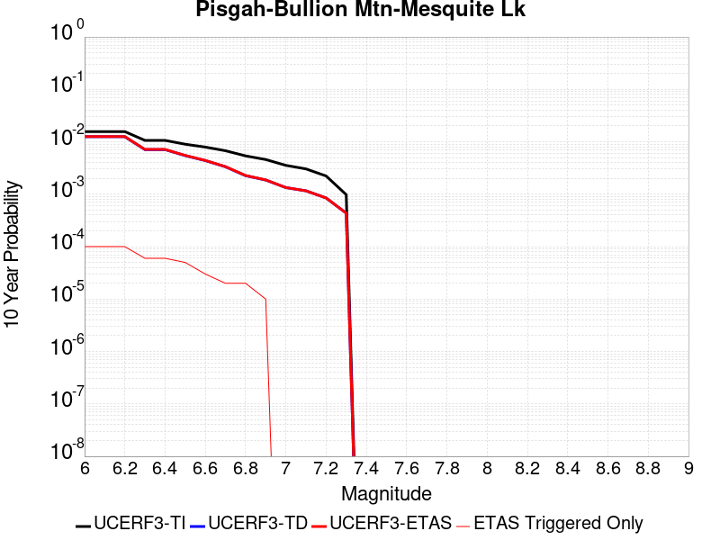 |

| Magnitude | 1 wk TI Prob | 1 wk TD Prob | 1 wk ETAS Prob | 1 wk ETAS/TD Gain | 1 wk ETAS Triggered Only | 1 mo TI Prob | 1 mo TD Prob | 1 mo ETAS Prob | 1 mo ETAS/TD Gain | 1 mo ETAS Triggered Only | 1 yr TI Prob | 1 yr TD Prob | 1 yr ETAS Prob | 1 yr ETAS/TD Gain | 1 yr ETAS Triggered Only | 10 yr TI Prob | 10 yr TD Prob | 10 yr ETAS Prob | 10 yr ETAS/TD Gain | 10 yr ETAS Triggered Only |
|-----|-----|-----|-----|-----|-----|-----|-----|-----|-----|-----|-----|-----|-----|-----|-----|-----|-----|-----|-----|-----|
| 6.0 | 3.0240792E-5 | 2.4091114E-5 | 2.4091114E-5 | 1.0 | 0.0 | 1.2959696E-4 | 1.03244114E-4 | 1.9574151E-4 | 1.8959095 | 9.250694E-5 | 0.0015767008 | 0.0012563728 | 0.0013487635 | 1.0735377 | 9.250694E-5 | 0.015655609 | 0.012502721 | 0.012685422 | 1.0146129 | 1.8501388E-4 |
| 6.1 | 3.0240792E-5 | 2.4091114E-5 | 2.4091114E-5 | 1.0 | 0.0 | 1.2959696E-4 | 1.03244114E-4 | 1.9574151E-4 | 1.8959095 | 9.250694E-5 | 0.0015767008 | 0.0012563728 | 0.0013487635 | 1.0735377 | 9.250694E-5 | 0.015655609 | 0.012502721 | 0.012685422 | 1.0146129 | 1.8501388E-4 |
| 6.2 | 3.0240792E-5 | 2.4091114E-5 | 2.4091114E-5 | 1.0 | 0.0 | 1.2959696E-4 | 1.03244114E-4 | 1.9574151E-4 | 1.8959095 | 9.250694E-5 | 0.0015767008 | 0.0012563728 | 0.0013487635 | 1.0735377 | 9.250694E-5 | 0.015655609 | 0.012502721 | 0.012685422 | 1.0146129 | 1.8501388E-4 |
| 6.3 | 2.0498217E-5 | 1.36380695E-5 | 1.36380695E-5 | 1.0 | 0.0 | 8.784654E-5 | 5.844765E-5 | 1.5094918E-4 | 2.582639 | 9.250694E-5 | 0.0010690069 | 7.1138405E-4 | 8.0382515E-4 | 1.1299455 | 9.250694E-5 | 0.01063879 | 0.0070926943 | 0.0072763963 | 1.0259001 | 1.8501388E-4 |
| 6.4 | 2.0498217E-5 | 1.36380695E-5 | 1.36380695E-5 | 1.0 | 0.0 | 8.784654E-5 | 5.844765E-5 | 1.5094918E-4 | 2.582639 | 9.250694E-5 | 0.0010690069 | 7.1138405E-4 | 8.0382515E-4 | 1.1299455 | 9.250694E-5 | 0.01063879 | 0.0070926943 | 0.0072763963 | 1.0259001 | 1.8501388E-4 |
| 6.5 | 1.7316182E-5 | 1.0477042E-5 | 1.0477042E-5 | 1.0 | 0.0 | 7.42101E-5 | 4.4900895E-5 | 1.3740368E-4 | 3.0601544 | 9.250694E-5 | 9.0313336E-4 | 5.465413E-4 | 6.3899765E-4 | 1.1691663 | 9.250694E-5 | 0.008994718 | 0.0054529672 | 0.005636972 | 1.033744 | 1.8501388E-4 |
| 6.6 | 1.5251077E-5 | 8.414273E-6 | 8.414273E-6 | 1.0 | 0.0 | 6.536012E-5 | 3.6060712E-5 | 3.6060712E-5 | 1.0 | 0.0 | 7.9546886E-4 | 4.3895794E-4 | 4.3895794E-4 | 1.0 | 0.0 | 0.007926274 | 0.0043816264 | 0.004473728 | 1.0210199 | 9.250694E-5 |
| 6.7 | 1.2997425E-5 | 6.4114965E-6 | 6.4114965E-6 | 1.0 | 0.0 | 5.570206E-5 | 2.7477578E-5 | 2.7477578E-5 | 1.0 | 0.0 | 6.7796157E-4 | 3.3449283E-4 | 3.3449283E-4 | 1.0 | 0.0 | 0.0067589693 | 0.0033403537 | 0.0034325516 | 1.0276012 | 9.250694E-5 |
| 6.8 | 1.035386E-5 | 4.3332193E-6 | 4.3332193E-6 | 1.0 | 0.0 | 4.437293E-5 | 1.8570812E-5 | 1.8570812E-5 | 1.0 | 0.0 | 5.401065E-4 | 2.2607706E-4 | 2.2607706E-4 | 1.0 | 0.0 | 0.0053879567 | 0.0022585576 | 0.0023508554 | 1.0408659 | 9.250694E-5 |
| 6.9 | 8.816252E-6 | 3.580638E-6 | 3.580638E-6 | 1.0 | 0.0 | 3.778339E-5 | 1.5345504E-5 | 1.5345504E-5 | 1.0 | 0.0 | 4.5991567E-4 | 1.8681608E-4 | 1.8681608E-4 | 1.0 | 0.0 | 0.00458965 | 0.0018666488 | 0.0018666488 | 1.0 | 0.0 |
| 7.0 | 6.8232207E-6 | 2.5675843E-6 | 2.5675843E-6 | 1.0 | 0.0 | 2.9242048E-5 | 1.1003888E-5 | 1.1003888E-5 | 1.0 | 0.0 | 3.5596377E-4 | 1.3396442E-4 | 1.3396442E-4 | 1.0 | 0.0 | 0.0035539411 | 0.0013388677 | 0.0013388677 | 1.0 | 0.0 |
| 7.1 | 5.837013E-6 | 2.22738E-6 | 2.22738E-6 | 1.0 | 0.0 | 2.501553E-5 | 9.545881E-6 | 9.545881E-6 | 1.0 | 0.0 | 3.045215E-4 | 1.16215204E-4 | 1.16215204E-4 | 1.0 | 0.0 | 0.0030410455 | 0.0011615733 | 0.0011615733 | 1.0 | 0.0 |
| 7.2 | 4.278052E-6 | 1.6275711E-6 | 1.6275711E-6 | 1.0 | 0.0 | 1.833438E-5 | 6.9752873E-6 | 6.9752873E-6 | 1.0 | 0.0 | 2.231982E-4 | 8.492105E-5 | 8.492105E-5 | 1.0 | 0.0 | 0.0022297418 | 8.489092E-4 | 8.489092E-4 | 1.0 | 0.0 |
| 7.3 | 1.8803692E-6 | 8.344926E-7 | 8.344926E-7 | 1.0 | 0.0 | 8.0587E-6 | 3.5763926E-6 | 3.5763926E-6 | 1.0 | 0.0 | 9.811026E-5 | 4.354186E-5 | 4.354186E-5 | 1.0 | 0.0 | 9.806695E-4 | 4.3534773E-4 | 4.3534773E-4 | 1.0 | 0.0 |

## Calico-Hidalgo
*[(top)](#table-of-contents)*

| 1 Week | 1 Month | 1 Year | 10 Year |
|-----|-----|-----|-----|
|  |  |  |  |

| Magnitude | 1 wk TI Prob | 1 wk TD Prob | 1 wk ETAS Prob | 1 wk ETAS/TD Gain | 1 wk ETAS Triggered Only | 1 mo TI Prob | 1 mo TD Prob | 1 mo ETAS Prob | 1 mo ETAS/TD Gain | 1 mo ETAS Triggered Only | 1 yr TI Prob | 1 yr TD Prob | 1 yr ETAS Prob | 1 yr ETAS/TD Gain | 1 yr ETAS Triggered Only | 10 yr TI Prob | 10 yr TD Prob | 10 yr ETAS Prob | 10 yr ETAS/TD Gain | 10 yr ETAS Triggered Only |
|-----|-----|-----|-----|-----|-----|-----|-----|-----|-----|-----|-----|-----|-----|-----|-----|-----|-----|-----|-----|-----|
| 6.0 | 4.0906612E-5 | 5.0703686E-5 | 1.4320594E-4 | 2.8243692 | 9.250694E-5 | 1.7530227E-4 | 2.172857E-4 | 4.0225938E-4 | 1.8512925 | 1.8501388E-4 | 0.0021322158 | 0.002642648 | 0.002827173 | 1.0698258 | 1.8501388E-4 | 0.02111873 | 0.026152607 | 0.026332783 | 1.0068893 | 1.8501388E-4 |
| 6.1 | 4.0906612E-5 | 5.0703686E-5 | 1.4320594E-4 | 2.8243692 | 9.250694E-5 | 1.7530227E-4 | 2.172857E-4 | 4.0225938E-4 | 1.8512925 | 1.8501388E-4 | 0.0021322158 | 0.002642648 | 0.002827173 | 1.0698258 | 1.8501388E-4 | 0.02111873 | 0.026152607 | 0.026332783 | 1.0068893 | 1.8501388E-4 |
| 6.2 | 4.0906612E-5 | 5.0703686E-5 | 1.4320594E-4 | 2.8243692 | 9.250694E-5 | 1.7530227E-4 | 2.172857E-4 | 4.0225938E-4 | 1.8512925 | 1.8501388E-4 | 0.0021322158 | 0.002642648 | 0.002827173 | 1.0698258 | 1.8501388E-4 | 0.02111873 | 0.026152607 | 0.026332783 | 1.0068893 | 1.8501388E-4 |
| 6.3 | 2.4242801E-5 | 3.0090669E-5 | 3.0090669E-5 | 1.0 | 0.0 | 1.0389358E-4 | 1.2895382E-4 | 1.2895382E-4 | 1.0 | 0.0 | 0.0012641704 | 0.0015689151 | 0.0015689151 | 1.0 | 0.0 | 0.01257003 | 0.01558206 | 0.01558206 | 1.0 | 0.0 |
| 6.4 | 2.4242801E-5 | 3.0090669E-5 | 3.0090669E-5 | 1.0 | 0.0 | 1.0389358E-4 | 1.2895382E-4 | 1.2895382E-4 | 1.0 | 0.0 | 0.0012641704 | 0.0015689151 | 0.0015689151 | 1.0 | 0.0 | 0.01257003 | 0.01558206 | 0.01558206 | 1.0 | 0.0 |
| 6.5 | 2.0286952E-5 | 2.5315738E-5 | 2.5315738E-5 | 1.0 | 0.0 | 8.694118E-5 | 1.0849161E-4 | 1.0849161E-4 | 1.0 | 0.0 | 0.0010579949 | 0.001320102 | 0.001320102 | 1.0 | 0.0 | 0.010529719 | 0.013124538 | 0.013124538 | 1.0 | 0.0 |
| 6.6 | 2.0269223E-5 | 2.5296687E-5 | 2.5296687E-5 | 1.0 | 0.0 | 8.6865206E-5 | 1.08409964E-4 | 1.08409964E-4 | 1.0 | 0.0 | 0.0010570707 | 0.0013191093 | 0.0013191093 | 1.0 | 0.0 | 0.010520565 | 0.013114728 | 0.013114728 | 1.0 | 0.0 |
| 6.7 | 1.799852E-5 | 2.25406E-5 | 2.25406E-5 | 1.0 | 0.0 | 7.713423E-5 | 9.659908E-5 | 9.659908E-5 | 1.0 | 0.0 | 9.3870464E-4 | 0.0011754738 | 0.0011754738 | 1.0 | 0.0 | 0.009347493 | 0.011694173 | 0.011694173 | 1.0 | 0.0 |
| 6.8 | 1.7458793E-5 | 2.184212E-5 | 2.184212E-5 | 1.0 | 0.0 | 7.4821255E-5 | 9.3605806E-5 | 9.3605806E-5 | 1.0 | 0.0 | 9.10568E-4 | 0.0011390693 | 0.0011390693 | 1.0 | 0.0 | 0.009068459 | 0.011333893 | 0.011333893 | 1.0 | 0.0 |
| 6.9 | 1.542884E-5 | 1.9025927E-5 | 1.9025927E-5 | 1.0 | 0.0 | 6.612192E-5 | 8.153721E-5 | 8.153721E-5 | 1.0 | 0.0 | 8.04737E-4 | 9.922766E-4 | 9.922766E-4 | 1.0 | 0.0 | 0.008018291 | 0.009879857 | 0.009879857 | 1.0 | 0.0 |
| 7.0 | 1.468253E-5 | 1.8030598E-5 | 1.8030598E-5 | 1.0 | 0.0 | 6.292361E-5 | 7.7271776E-5 | 7.7271776E-5 | 1.0 | 0.0 | 7.658257E-4 | 9.4039086E-4 | 9.4039086E-4 | 1.0 | 0.0 | 0.0076319184 | 0.009365481 | 0.009365481 | 1.0 | 0.0 |
| 7.1 | 1.3139281E-5 | 1.6200942E-5 | 1.6200942E-5 | 1.0 | 0.0 | 5.6309986E-5 | 6.943083E-5 | 6.943083E-5 | 1.0 | 0.0 | 6.853584E-4 | 8.4500515E-4 | 8.4500515E-4 | 1.0 | 0.0 | 0.0068324856 | 0.0084192185 | 0.0084192185 | 1.0 | 0.0 |
| 7.2 | 1.1127404E-5 | 1.3866597E-5 | 1.3866597E-5 | 1.0 | 0.0 | 4.7688E-5 | 5.942698E-5 | 5.942698E-5 | 1.0 | 0.0 | 5.8044674E-4 | 7.232942E-4 | 7.232942E-4 | 1.0 | 0.0 | 0.0057893298 | 0.0072105085 | 0.0072105085 | 1.0 | 0.0 |
| 7.3 | 9.808154E-6 | 1.2176215E-5 | 1.2176215E-5 | 1.0 | 0.0 | 4.2034266E-5 | 5.2182797E-5 | 5.2182797E-5 | 1.0 | 0.0 | 5.11647E-4 | 6.3515105E-4 | 6.3515105E-4 | 1.0 | 0.0 | 0.0051047057 | 0.006334433 | 0.006334433 | 1.0 | 0.0 |
| 7.4 | 7.942452E-6 | 9.792144E-6 | 9.792144E-6 | 1.0 | 0.0 | 3.4038632E-5 | 4.1965708E-5 | 4.1965708E-5 | 1.0 | 0.0 | 4.1434157E-4 | 5.1082217E-4 | 5.1082217E-4 | 1.0 | 0.0 | 0.0041356985 | 0.005097421 | 0.005097421 | 1.0 | 0.0 |
| 7.5 | 4.7121216E-6 | 5.772836E-6 | 5.772836E-6 | 1.0 | 0.0 | 2.019465E-5 | 2.4740535E-5 | 2.4740535E-5 | 1.0 | 0.0 | 2.4584212E-4 | 3.0118204E-4 | 3.0118204E-4 | 1.0 | 0.0 | 0.0024557032 | 0.0030084911 | 0.0030084911 | 1.0 | 0.0 |
| 7.6 | 2.21172E-7 | 2.603961E-7 | 2.603961E-7 | 1.0 | 0.0 | 9.478797E-7 | 1.1159829E-6 | 1.1159829E-6 | 1.0 | 0.0 | 1.1540374E-5 | 1.3587036E-5 | 1.3587036E-5 | 1.0 | 0.0 | 1.1539775E-4 | 1.3586486E-4 | 1.3586486E-4 | 1.0 | 0.0 |

## Santa Cruz Island
*[(top)](#table-of-contents)*

| 1 Week | 1 Month | 1 Year | 10 Year |
|-----|-----|-----|-----|
|  |  |  |  |

| Magnitude | 1 wk TI Prob | 1 wk TD Prob | 1 wk ETAS Prob | 1 wk ETAS/TD Gain | 1 wk ETAS Triggered Only | 1 mo TI Prob | 1 mo TD Prob | 1 mo ETAS Prob | 1 mo ETAS/TD Gain | 1 mo ETAS Triggered Only | 1 yr TI Prob | 1 yr TD Prob | 1 yr ETAS Prob | 1 yr ETAS/TD Gain | 1 yr ETAS Triggered Only | 10 yr TI Prob | 10 yr TD Prob | 10 yr ETAS Prob | 10 yr ETAS/TD Gain | 10 yr ETAS Triggered Only |
|-----|-----|-----|-----|-----|-----|-----|-----|-----|-----|-----|-----|-----|-----|-----|-----|-----|-----|-----|-----|-----|
| 6.0 | 2.9164563E-5 | 3.1599742E-5 | 1.2410375E-4 | 3.927366 | 9.250694E-5 | 1.2498499E-4 | 1.3542121E-4 | 3.2041004E-4 | 2.3660254 | 1.8501388E-4 | 0.0015206301 | 0.0016476426 | 0.0018323516 | 1.112105 | 1.8501388E-4 | 0.015102667 | 0.016368 | 0.016549984 | 1.0111184 | 1.8501388E-4 |
| 6.1 | 2.9164563E-5 | 3.1599742E-5 | 1.2410375E-4 | 3.927366 | 9.250694E-5 | 1.2498499E-4 | 1.3542121E-4 | 3.2041004E-4 | 2.3660254 | 1.8501388E-4 | 0.0015206301 | 0.0016476426 | 0.0018323516 | 1.112105 | 1.8501388E-4 | 0.015102667 | 0.016368 | 0.016549984 | 1.0111184 | 1.8501388E-4 |
| 6.2 | 2.9164563E-5 | 3.1599742E-5 | 1.2410375E-4 | 3.927366 | 9.250694E-5 | 1.2498499E-4 | 1.3542121E-4 | 3.2041004E-4 | 2.3660254 | 1.8501388E-4 | 0.0015206301 | 0.0016476426 | 0.0018323516 | 1.112105 | 1.8501388E-4 | 0.015102667 | 0.016368 | 0.016549984 | 1.0111184 | 1.8501388E-4 |
| 6.3 | 1.6635553E-5 | 1.780436E-5 | 1.1030965E-4 | 6.1956544 | 9.250694E-5 | 7.1293274E-5 | 7.630226E-5 | 2.6130202E-4 | 3.4245644 | 1.8501388E-4 | 8.6765E-4 | 9.2860236E-4 | 0.0011134445 | 1.199054 | 1.8501388E-4 | 0.008642701 | 0.009249094 | 0.009432396 | 1.0198184 | 1.8501388E-4 |
| 6.4 | 1.6635553E-5 | 1.780436E-5 | 1.1030965E-4 | 6.1956544 | 9.250694E-5 | 7.1293274E-5 | 7.630226E-5 | 2.6130202E-4 | 3.4245644 | 1.8501388E-4 | 8.6765E-4 | 9.2860236E-4 | 0.0011134445 | 1.199054 | 1.8501388E-4 | 0.008642701 | 0.009249094 | 0.009432396 | 1.0198184 | 1.8501388E-4 |
| 6.5 | 1.2238748E-5 | 1.3042995E-5 | 1.0554873E-4 | 8.092368 | 9.250694E-5 | 5.2450723E-5 | 5.5897377E-5 | 1.4839914E-4 | 2.65485 | 9.250694E-5 | 6.3840044E-4 | 6.8034173E-4 | 7.7278574E-4 | 1.1358788 | 9.250694E-5 | 0.0063656955 | 0.0067829876 | 0.0068748672 | 1.0135456 | 9.250694E-5 |
| 6.6 | 1.0489767E-5 | 1.1156636E-5 | 1.0366254E-4 | 9.291559 | 9.250694E-5 | 4.495537E-5 | 4.781329E-5 | 1.4031581E-4 | 2.9346611 | 9.250694E-5 | 5.4719415E-4 | 5.819735E-4 | 6.744267E-4 | 1.1588614 | 9.250694E-5 | 0.005458487 | 0.0058047357 | 0.0058967057 | 1.015844 | 9.250694E-5 |
| 6.7 | 8.699222E-6 | 9.236782E-6 | 1.01742866E-4 | 11.014969 | 9.250694E-5 | 3.7281847E-5 | 3.958561E-5 | 1.3208888E-4 | 3.3367903 | 9.250694E-5 | 4.5381195E-4 | 4.8184878E-4 | 5.743111E-4 | 1.1918908 | 9.250694E-5 | 0.0045288634 | 0.004808108 | 0.00490017 | 1.0191473 | 9.250694E-5 |
| 6.8 | 8.307732E-6 | 8.8169045E-6 | 1.0132303E-4 | 11.491905 | 9.250694E-5 | 3.560408E-5 | 3.7786187E-5 | 1.3028963E-4 | 3.4480755 | 9.250694E-5 | 4.3339343E-4 | 4.5995016E-4 | 5.524145E-4 | 1.2010313 | 9.250694E-5 | 0.004325492 | 0.0045900354 | 0.0046821176 | 1.0200614 | 9.250694E-5 |
| 6.9 | 8.073121E-6 | 8.564939E-6 | 1.01071084E-4 | 11.800561 | 9.250694E-5 | 3.459863E-5 | 3.6706366E-5 | 1.292099E-4 | 3.5200953 | 9.250694E-5 | 4.2115687E-4 | 4.468088E-4 | 5.392744E-4 | 1.2069467 | 9.250694E-5 | 0.004203596 | 0.004459156 | 0.0045512505 | 1.0206529 | 9.250694E-5 |
| 7.0 | 7.617019E-6 | 8.074664E-6 | 1.0058085E-4 | 12.456351 | 9.250694E-5 | 3.264396E-5 | 3.4605247E-5 | 1.2710899E-4 | 3.673113 | 9.250694E-5 | 3.9736772E-4 | 4.212378E-4 | 5.137058E-4 | 1.2195148 | 9.250694E-5 | 0.003966579 | 0.0042044413 | 0.0042965594 | 1.0219097 | 9.250694E-5 |
| 7.1 | 7.1224836E-6 | 7.545788E-6 | 1.0005203E-4 | 13.259322 | 9.250694E-5 | 3.052457E-5 | 3.2338692E-5 | 1.2484264E-4 | 3.8604727 | 9.250694E-5 | 3.715733E-4 | 3.936528E-4 | 4.8612332E-4 | 1.2349038 | 9.250694E-5 | 0.003709526 | 0.003929598 | 0.0040217414 | 1.0234486 | 9.250694E-5 |
| 7.2 | 6.441115E-6 | 6.8273835E-6 | 9.933369E-5 | 14.549306 | 9.250694E-5 | 2.7604487E-5 | 2.9259887E-5 | 1.2176412E-4 | 4.161469 | 9.250694E-5 | 3.360328E-4 | 3.5618112E-4 | 4.486551E-4 | 1.2596263 | 9.250694E-5 | 0.0033552512 | 0.003556131 | 0.003648309 | 1.0259209 | 9.250694E-5 |
| 7.3 | 5.494274E-6 | 5.8199944E-6 | 9.8326396E-5 | 16.894587 | 9.250694E-5 | 2.3546674E-5 | 2.4942596E-5 | 1.1744723E-4 | 4.708701 | 9.250694E-5 | 2.8664304E-4 | 3.0363398E-4 | 3.9611282E-4 | 1.3045734 | 9.250694E-5 | 0.002862736 | 0.0030322142 | 0.0031244408 | 1.0304155 | 9.250694E-5 |
| 7.4 | 4.0802624E-6 | 4.312256E-6 | 9.6818796E-5 | 22.452005 | 9.250694E-5 | 1.7486722E-5 | 1.8480967E-5 | 1.109862E-4 | 6.005432 | 9.250694E-5 | 2.1288003E-4 | 2.2498262E-4 | 3.1746874E-4 | 1.4110812 | 9.250694E-5 | 0.0021267622 | 0.0022475575 | 0.0023398565 | 1.0410664 | 9.250694E-5 |
| 7.5 | 2.3584746E-6 | 2.4753094E-6 | 9.498202E-5 | 38.371773 | 9.250694E-5 | 1.0107709E-5 | 1.0608426E-5 | 1.03114384E-4 | 9.720045 | 9.250694E-5 | 1.2305441E-4 | 1.2915E-4 | 2.2164498E-4 | 1.7161827 | 9.250694E-5 | 0.0012298629 | 0.0012907543 | 0.0013831418 | 1.0715764 | 9.250694E-5 |
| 7.6 | 9.4981914E-7 | 9.86093E-7 | 9.349294E-5 | 94.81148 | 9.250694E-5 | 4.0706473E-6 | 4.2261063E-6 | 9.6732656E-5 | 22.889309 | 9.250694E-5 | 4.9559E-5 | 5.145164E-5 | 1.4395382E-4 | 2.797847 | 9.250694E-5 | 4.954795E-4 | 5.1439856E-4 | 6.0685794E-4 | 1.1797426 | 9.250694E-5 |
| 7.7 | 2.6013532E-7 | 2.6416603E-7 | 2.6416603E-7 | 1.0 | 0.0 | 1.1148652E-6 | 1.1321397E-6 | 1.1321397E-6 | 1.0 | 0.0 | 1.3573399E-5 | 1.3783714E-5 | 1.3783714E-5 | 1.0 | 0.0 | 1.357257E-4 | 1.3782867E-4 | 1.3782867E-4 | 1.0 | 0.0 |
| 7.8 | 4.1522263E-8 | 3.965679E-8 | 3.965679E-8 | 1.0 | 0.0 | 1.7795254E-7 | 1.6995766E-7 | 1.6995766E-7 | 1.0 | 0.0 | 2.16657E-6 | 2.0692328E-6 | 2.0692328E-6 | 1.0 | 0.0 | 2.1665488E-5 | 2.0692156E-5 | 2.0692156E-5 | 1.0 | 0.0 |
| 7.9 | 7.7242046E-10 | 5.9468175E-10 | 5.9468175E-10 | 1.0 | 0.0 | 3.3103735E-9 | 2.5486364E-9 | 2.5486364E-9 | 1.0 | 0.0 | 4.0303796E-8 | 3.1029646E-8 | 3.1029646E-8 | 1.0 | 0.0 | 4.030379E-7 | 3.1029643E-7 | 3.1029643E-7 | 1.0 | 0.0 |

## San Jacinto (Superstition Mtn)
*[(top)](#table-of-contents)*

| 1 Week | 1 Month | 1 Year | 10 Year |
|-----|-----|-----|-----|
|  |  |  |  |

| Magnitude | 1 wk TI Prob | 1 wk TD Prob | 1 wk ETAS Prob | 1 wk ETAS/TD Gain | 1 wk ETAS Triggered Only | 1 mo TI Prob | 1 mo TD Prob | 1 mo ETAS Prob | 1 mo ETAS/TD Gain | 1 mo ETAS Triggered Only | 1 yr TI Prob | 1 yr TD Prob | 1 yr ETAS Prob | 1 yr ETAS/TD Gain | 1 yr ETAS Triggered Only | 10 yr TI Prob | 10 yr TD Prob | 10 yr ETAS Prob | 10 yr ETAS/TD Gain | 10 yr ETAS Triggered Only |
|-----|-----|-----|-----|-----|-----|-----|-----|-----|-----|-----|-----|-----|-----|-----|-----|-----|-----|-----|-----|-----|
| 6.0 | 6.4193904E-5 | 9.599367E-5 | 1.8849173E-4 | 1.963585 | 9.250694E-5 | 2.7508775E-4 | 4.1134638E-4 | 5.0381524E-4 | 1.2247957 | 9.250694E-5 | 0.0033440501 | 0.0049980893 | 0.005090134 | 1.0184159 | 9.250694E-5 | 0.03294174 | 0.048823986 | 0.048999965 | 1.0036044 | 1.8501388E-4 |
| 6.1 | 6.4193904E-5 | 9.599367E-5 | 1.8849173E-4 | 1.963585 | 9.250694E-5 | 2.7508775E-4 | 4.1134638E-4 | 5.0381524E-4 | 1.2247957 | 9.250694E-5 | 0.0033440501 | 0.0049980893 | 0.005090134 | 1.0184159 | 9.250694E-5 | 0.03294174 | 0.048823986 | 0.048999965 | 1.0036044 | 1.8501388E-4 |
| 6.2 | 5.7023593E-5 | 8.3144434E-5 | 1.7564368E-4 | 2.1125128 | 9.250694E-5 | 2.4436394E-4 | 3.5629404E-4 | 4.48768E-4 | 1.259544 | 9.250694E-5 | 0.002971072 | 0.0043308944 | 0.004423001 | 1.0212673 | 9.250694E-5 | 0.029316625 | 0.04250403 | 0.04268118 | 1.0041678 | 1.8501388E-4 |
| 6.3 | 5.6940098E-5 | 8.298979E-5 | 1.7548905E-4 | 2.1145859 | 9.250694E-5 | 2.4400617E-4 | 3.5563146E-4 | 4.481055E-4 | 1.2600278 | 9.250694E-5 | 0.002966728 | 0.00432286 | 0.004414967 | 1.021307 | 9.250694E-5 | 0.029274331 | 0.042427283 | 0.042604446 | 1.0041757 | 1.8501388E-4 |
| 6.4 | 5.4171585E-5 | 7.7483564E-5 | 1.6998334E-4 | 2.1937985 | 9.250694E-5 | 2.3214328E-4 | 3.3203943E-4 | 4.2451566E-4 | 1.2785097 | 9.250694E-5 | 0.0028226813 | 0.0040367353 | 0.0041288687 | 1.0228238 | 9.250694E-5 | 0.02787096 | 0.03971653 | 0.039894197 | 1.0044733 | 1.8501388E-4 |
| 6.5 | 4.375144E-5 | 5.642133E-5 | 1.4892305E-4 | 2.6394813 | 9.250694E-5 | 1.874927E-4 | 2.4178992E-4 | 3.342745E-4 | 1.3824997 | 9.250694E-5 | 0.0022803338 | 0.002940994 | 0.003033229 | 1.0313618 | 9.250694E-5 | 0.022570757 | 0.029236801 | 0.029416407 | 1.0061431 | 1.8501388E-4 |
| 6.6 | 2.772192E-5 | 2.5488358E-5 | 1.1799294E-4 | 4.6292877 | 9.250694E-5 | 1.1880282E-4 | 1.09231354E-4 | 2.0172818E-4 | 1.8467975 | 9.250694E-5 | 0.0014454646 | 0.0013290998 | 0.0014214838 | 1.0695087 | 9.250694E-5 | 0.014360986 | 0.01354049 | 0.013631744 | 1.0067394 | 9.250694E-5 |
| 6.7 | 2.7124124E-5 | 2.4699386E-5 | 1.1720404E-4 | 4.7452207 | 9.250694E-5 | 1.1624106E-4 | 1.05850326E-4 | 1.9834748E-4 | 1.8738484 | 9.250694E-5 | 0.0014143161 | 0.001287985 | 0.0013803728 | 1.0717305 | 9.250694E-5 | 0.014053487 | 0.013133943 | 0.013225235 | 1.0069509 | 9.250694E-5 |
| 6.8 | 2.5475807E-5 | 2.216446E-5 | 1.1466935E-4 | 5.1735682 | 9.250694E-5 | 1.0917746E-4 | 9.4987154E-5 | 1.874853E-4 | 1.9737965 | 9.250694E-5 | 0.001328425 | 0.001155867 | 0.001248267 | 1.07994 | 9.250694E-5 | 0.0132051185 | 0.011822182 | 0.011913595 | 1.0077324 | 9.250694E-5 |
| 6.9 | 2.1162023E-5 | 1.7626244E-5 | 1.1013155E-4 | 6.248158 | 9.250694E-5 | 9.069123E-5 | 7.5538876E-5 | 1.6803882E-4 | 2.2245343 | 9.250694E-5 | 0.0011036064 | 9.193016E-4 | 0.0010117234 | 1.1005349 | 9.250694E-5 | 0.010981417 | 0.00944688 | 0.009538513 | 1.0096998 | 9.250694E-5 |
| 7.0 | 1.8754288E-5 | 1.6161559E-5 | 1.08667E-4 | 6.723795 | 9.250694E-5 | 8.037304E-5 | 6.9261994E-5 | 1.6176252E-4 | 2.3355165 | 9.250694E-5 | 9.781026E-4 | 8.4294105E-4 | 9.3537E-4 | 1.1096506 | 9.250694E-5 | 0.009738087 | 0.008670042 | 0.008761747 | 1.0105772 | 9.250694E-5 |
| 7.1 | 1.8678527E-5 | 1.6086702E-5 | 1.08592154E-4 | 6.75043 | 9.250694E-5 | 8.0048376E-5 | 6.89412E-5 | 1.6144176E-4 | 2.3417313 | 9.250694E-5 | 9.7415317E-4 | 8.3903834E-4 | 9.314676E-4 | 1.1101611 | 9.250694E-5 | 0.009698939 | 0.008630998 | 0.008722707 | 1.0106255 | 9.250694E-5 |
| 7.2 | 1.7804578E-5 | 1.5381282E-5 | 1.0788679E-4 | 7.014162 | 9.250694E-5 | 7.6303106E-5 | 6.5918124E-5 | 1.5841896E-4 | 2.4032688 | 9.250694E-5 | 9.285943E-4 | 8.022599E-4 | 8.946926E-4 | 1.1152154 | 9.250694E-5 | 0.009247236 | 0.008262311 | 0.008354054 | 1.0111037 | 9.250694E-5 |
| 7.3 | 1.6583685E-5 | 1.4530388E-5 | 1.0703598E-4 | 7.366354 | 9.250694E-5 | 7.1070994E-5 | 6.227162E-5 | 1.5477279E-4 | 2.485447 | 9.250694E-5 | 8.649459E-4 | 7.5789524E-4 | 8.503321E-4 | 1.1219652 | 9.250694E-5 | 0.00861587 | 0.007817623 | 0.007909407 | 1.0117406 | 9.250694E-5 |
| 7.4 | 1.6387552E-5 | 1.4395274E-5 | 1.0690088E-4 | 7.4261093 | 9.250694E-5 | 7.023047E-5 | 6.169258E-5 | 1.5419381E-4 | 2.49939 | 9.250694E-5 | 8.5472054E-4 | 7.5085036E-4 | 8.4328785E-4 | 1.1231104 | 9.250694E-5 | 0.008514405 | 0.0077470057 | 0.007838796 | 1.0118484 | 9.250694E-5 |
| 7.5 | 1.5790754E-5 | 1.4035962E-5 | 1.065416E-4 | 7.590616 | 9.250694E-5 | 6.767291E-5 | 6.0152746E-5 | 1.5265412E-4 | 2.5377748 | 9.250694E-5 | 8.236062E-4 | 7.321156E-4 | 8.2455477E-4 | 1.1262631 | 9.250694E-5 | 0.008205604 | 0.007557569 | 0.007649377 | 1.0121478 | 9.250694E-5 |
| 7.6 | 1.4248672E-5 | 1.3054932E-5 | 1.0556066E-4 | 8.085883 | 9.250694E-5 | 6.106431E-5 | 5.594852E-5 | 1.4845029E-4 | 2.653337 | 9.250694E-5 | 7.432043E-4 | 6.8096205E-4 | 7.73406E-4 | 1.135755 | 9.250694E-5 | 0.007407237 | 0.0070401574 | 0.007132013 | 1.0130473 | 9.250694E-5 |
| 7.7 | 1.15449975E-5 | 1.090368E-5 | 1.03409606E-4 | 9.483918 | 9.250694E-5 | 4.947762E-5 | 4.6729223E-5 | 1.3923184E-4 | 2.9795454 | 9.250694E-5 | 6.022235E-4 | 5.687805E-4 | 6.612349E-4 | 1.1625483 | 9.250694E-5 | 0.006005941 | 0.0059101824 | 0.0060021426 | 1.0155597 | 9.250694E-5 |
| 7.8 | 9.1391985E-6 | 9.514299E-6 | 1.02020356E-4 | 10.722846 | 9.250694E-5 | 3.9167408E-5 | 4.0774932E-5 | 1.332781E-4 | 3.2686284 | 9.250694E-5 | 4.767588E-4 | 4.963223E-4 | 5.8878335E-4 | 1.1862923 | 9.250694E-5 | 0.0047573727 | 0.0051766867 | 0.005268715 | 1.0177774 | 9.250694E-5 |
| 7.9 | 6.973017E-6 | 7.3821784E-6 | 7.3821784E-6 | 1.0 | 0.0 | 2.9884017E-5 | 3.1637526E-5 | 3.1637526E-5 | 1.0 | 0.0 | 3.6377716E-4 | 3.8511935E-4 | 3.8511935E-4 | 1.0 | 0.0 | 0.0036318225 | 0.0040517948 | 0.0040517948 | 1.0 | 0.0 |
| 8.0 | 5.7638235E-6 | 6.259972E-6 | 6.259972E-6 | 1.0 | 0.0 | 2.4701867E-5 | 2.6828178E-5 | 2.6828178E-5 | 1.0 | 0.0 | 3.0070372E-4 | 3.2658462E-4 | 3.2658462E-4 | 1.0 | 0.0 | 0.0030029714 | 0.0034534496 | 0.0034534496 | 1.0 | 0.0 |
| 8.1 | 5.1124434E-6 | 5.4956718E-6 | 5.4956718E-6 | 1.0 | 0.0 | 2.1910288E-5 | 2.355267E-5 | 2.355267E-5 | 1.0 | 0.0 | 2.6672508E-4 | 2.867165E-4 | 2.867165E-4 | 1.0 | 0.0 | 0.0026640517 | 0.003040336 | 0.003040336 | 1.0 | 0.0 |
| 8.2 | 1.1075938E-6 | 5.336568E-7 | 5.336568E-7 | 1.0 | 0.0 | 4.7468216E-6 | 2.2870988E-6 | 2.2870988E-6 | 1.0 | 0.0 | 5.779102E-5 | 2.7845093E-5 | 2.7845093E-5 | 1.0 | 0.0 | 5.777599E-4 | 3.1346595E-4 | 3.1346595E-4 | 1.0 | 0.0 |
| 8.3 | 1.3584393E-8 | 4.473836E-9 | 4.473836E-9 | 1.0 | 0.0 | 5.8218827E-8 | 1.9173582E-8 | 1.9173582E-8 | 1.0 | 0.0 | 7.0881396E-7 | 2.3343837E-7 | 2.3343837E-7 | 1.0 | 0.0 | 7.0881174E-6 | 2.6163038E-6 | 2.6163038E-6 | 1.0 | 0.0 |

## Palos Verdes
*[(top)](#table-of-contents)*

| 1 Week | 1 Month | 1 Year | 10 Year |
|-----|-----|-----|-----|
|  |  |  | 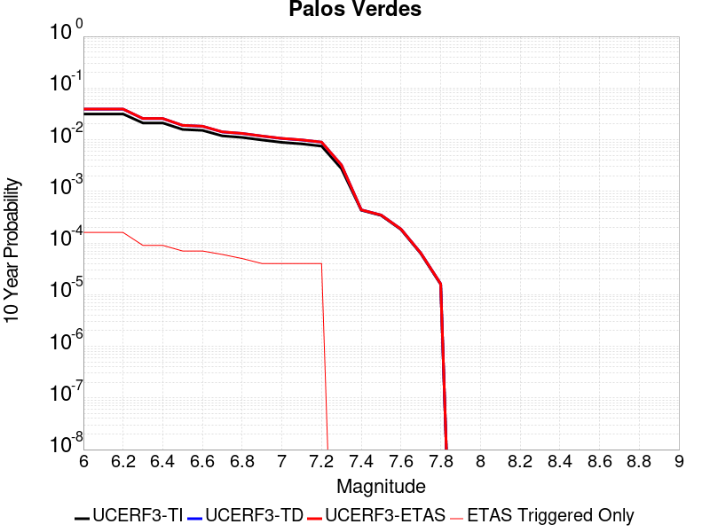 |

| Magnitude | 1 wk TI Prob | 1 wk TD Prob | 1 wk ETAS Prob | 1 wk ETAS/TD Gain | 1 wk ETAS Triggered Only | 1 mo TI Prob | 1 mo TD Prob | 1 mo ETAS Prob | 1 mo ETAS/TD Gain | 1 mo ETAS Triggered Only | 1 yr TI Prob | 1 yr TD Prob | 1 yr ETAS Prob | 1 yr ETAS/TD Gain | 1 yr ETAS Triggered Only | 10 yr TI Prob | 10 yr TD Prob | 10 yr ETAS Prob | 10 yr ETAS/TD Gain | 10 yr ETAS Triggered Only |
|-----|-----|-----|-----|-----|-----|-----|-----|-----|-----|-----|-----|-----|-----|-----|-----|-----|-----|-----|-----|-----|
| 6.0 | 6.126063E-5 | 7.622612E-5 | 7.622612E-5 | 1.0 | 0.0 | 2.6251914E-4 | 3.2664582E-4 | 5.1159924E-4 | 1.5662202 | 1.8501388E-4 | 0.0031914865 | 0.003970174 | 0.0041544535 | 1.0464159 | 1.8501388E-4 | 0.031460393 | 0.039048895 | 0.039226685 | 1.004553 | 1.8501388E-4 |
| 6.1 | 6.126063E-5 | 7.622612E-5 | 7.622612E-5 | 1.0 | 0.0 | 2.6251914E-4 | 3.2664582E-4 | 5.1159924E-4 | 1.5662202 | 1.8501388E-4 | 0.0031914865 | 0.003970174 | 0.0041544535 | 1.0464159 | 1.8501388E-4 | 0.031460393 | 0.039048895 | 0.039226685 | 1.004553 | 1.8501388E-4 |
| 6.2 | 6.126063E-5 | 7.622612E-5 | 7.622612E-5 | 1.0 | 0.0 | 2.6251914E-4 | 3.2664582E-4 | 5.1159924E-4 | 1.5662202 | 1.8501388E-4 | 0.0031914865 | 0.003970174 | 0.0041544535 | 1.0464159 | 1.8501388E-4 | 0.031460393 | 0.039048895 | 0.039226685 | 1.004553 | 1.8501388E-4 |
| 6.3 | 4.0838047E-5 | 4.9749437E-5 | 4.9749437E-5 | 1.0 | 0.0 | 1.7500846E-4 | 2.1319572E-4 | 3.0568292E-4 | 1.4338137 | 9.250694E-5 | 0.0021286458 | 0.0025927818 | 0.0026850489 | 1.0355861 | 9.250694E-5 | 0.021083709 | 0.025646681 | 0.025736814 | 1.0035144 | 9.250694E-5 |
| 6.4 | 4.0838047E-5 | 4.9749437E-5 | 4.9749437E-5 | 1.0 | 0.0 | 1.7500846E-4 | 2.1319572E-4 | 3.0568292E-4 | 1.4338137 | 9.250694E-5 | 0.0021286458 | 0.0025927818 | 0.0026850489 | 1.0355861 | 9.250694E-5 | 0.021083709 | 0.025646681 | 0.025736814 | 1.0035144 | 9.250694E-5 |
| 6.5 | 3.0512005E-5 | 3.656162E-5 | 3.656162E-5 | 1.0 | 0.0 | 1.3075917E-4 | 1.5668393E-4 | 2.4917637E-4 | 1.5903122 | 9.250694E-5 | 0.0015908304 | 0.0019060767 | 0.0019984073 | 1.0484401 | 9.250694E-5 | 0.015794903 | 0.018909154 | 0.018999912 | 1.0047997 | 9.250694E-5 |
| 6.6 | 2.9255087E-5 | 3.515442E-5 | 3.515442E-5 | 1.0 | 0.0 | 1.2537291E-4 | 1.5065377E-4 | 2.4314676E-4 | 1.6139442 | 9.250694E-5 | 0.0015253464 | 0.0018327828 | 0.0019251202 | 1.050381 | 9.250694E-5 | 0.015149189 | 0.018188225 | 0.01827905 | 1.0049936 | 9.250694E-5 |
| 6.7 | 2.287198E-5 | 2.7248278E-5 | 2.7248278E-5 | 1.0 | 0.0 | 9.801909E-5 | 1.16773626E-4 | 2.0926977E-4 | 1.7920978 | 9.250694E-5 | 0.001192729 | 0.0014208833 | 0.0015132589 | 1.0650127 | 9.250694E-5 | 0.011863477 | 0.014127217 | 0.014218417 | 1.0064557 | 9.250694E-5 |
| 6.8 | 2.1325764E-5 | 2.5431877E-5 | 2.5431877E-5 | 1.0 | 0.0 | 9.139293E-5 | 1.0898971E-4 | 2.0148657E-4 | 1.8486751 | 9.250694E-5 | 0.001112141 | 0.0013262323 | 0.0014186165 | 1.0696592 | 9.250694E-5 | 0.011065915 | 0.013192211 | 0.013283498 | 1.0069197 | 9.250694E-5 |
| 6.9 | 1.9009392E-5 | 2.2613547E-5 | 2.2613547E-5 | 1.0 | 0.0 | 8.1466285E-5 | 9.6912096E-5 | 1.8941007E-4 | 1.9544523 | 9.250694E-5 | 9.914007E-4 | 0.0011793535 | 0.0012717514 | 1.0783461 | 9.250694E-5 | 0.009869894 | 0.011739632 | 0.0118310535 | 1.0077873 | 9.250694E-5 |
| 7.0 | 1.7098473E-5 | 2.0319356E-5 | 2.0319356E-5 | 1.0 | 0.0 | 7.3277115E-5 | 8.708052E-5 | 1.7957941E-4 | 2.0622225 | 9.250694E-5 | 8.917837E-4 | 0.001059775 | 0.0011521839 | 1.0871967 | 9.250694E-5 | 0.008882134 | 0.010555646 | 0.010647177 | 1.0086713 | 9.250694E-5 |
| 7.1 | 1.5982785E-5 | 1.899476E-5 | 1.899476E-5 | 1.0 | 0.0 | 6.849585E-5 | 8.1404054E-5 | 1.7390346E-4 | 2.1362998 | 9.250694E-5 | 8.336179E-4 | 9.907284E-4 | 0.0010831438 | 1.0932802 | 9.250694E-5 | 0.008304977 | 0.009871479 | 0.009963073 | 1.0092787 | 9.250694E-5 |
| 7.2 | 1.4468002E-5 | 1.7197237E-5 | 1.7197237E-5 | 1.0 | 0.0 | 6.200425E-5 | 7.370083E-5 | 1.6620095E-4 | 2.2550757 | 9.250694E-5 | 7.546402E-4 | 8.970222E-4 | 9.894462E-4 | 1.1030341 | 9.250694E-5 | 0.007520827 | 0.008942284 | 0.009033963 | 1.0102524 | 9.250694E-5 |
| 7.3 | 5.288233E-6 | 6.2036747E-6 | 6.2036747E-6 | 1.0 | 0.0 | 2.2663658E-5 | 2.6587102E-5 | 2.6587102E-5 | 1.0 | 0.0 | 2.7589512E-4 | 3.236848E-4 | 3.236848E-4 | 1.0 | 0.0 | 0.0027555283 | 0.0032355562 | 0.0032355562 | 1.0 | 0.0 |
| 7.4 | 8.279556E-7 | 8.408347E-7 | 8.408347E-7 | 1.0 | 0.0 | 3.5483763E-6 | 3.6035726E-6 | 3.6035726E-6 | 1.0 | 0.0 | 4.3200624E-5 | 4.3872686E-5 | 4.3872686E-5 | 1.0 | 0.0 | 4.3192226E-4 | 4.3864746E-4 | 4.3864746E-4 | 1.0 | 0.0 |
| 7.5 | 6.559831E-7 | 6.667229E-7 | 6.667229E-7 | 1.0 | 0.0 | 2.8113532E-6 | 2.857381E-6 | 2.857381E-6 | 1.0 | 0.0 | 3.4227687E-5 | 3.4788125E-5 | 3.4788125E-5 | 1.0 | 0.0 | 3.4222414E-4 | 3.4783344E-4 | 3.4783344E-4 | 1.0 | 0.0 |
| 7.6 | 3.5018968E-7 | 3.5620027E-7 | 3.5620027E-7 | 1.0 | 0.0 | 1.500812E-6 | 1.526572E-6 | 1.526572E-6 | 1.0 | 0.0 | 1.8272232E-5 | 1.8585903E-5 | 1.8585903E-5 | 1.0 | 0.0 | 1.8270731E-4 | 1.8584808E-4 | 1.8584808E-4 | 1.0 | 0.0 |
| 7.7 | 1.1986104E-7 | 1.2198376E-7 | 1.2198376E-7 | 1.0 | 0.0 | 5.1369005E-7 | 5.2278745E-7 | 5.2278745E-7 | 1.0 | 0.0 | 6.2541585E-6 | 6.364919E-6 | 6.364919E-6 | 1.0 | 0.0 | 6.2539824E-5 | 6.364741E-5 | 6.364741E-5 | 1.0 | 0.0 |
| 7.8 | 3.0445005E-8 | 3.1027582E-8 | 3.1027582E-8 | 1.0 | 0.0 | 1.3047858E-7 | 1.3297536E-7 | 1.3297536E-7 | 1.0 | 0.0 | 1.5885756E-6 | 1.6189739E-6 | 1.6189739E-6 | 1.0 | 0.0 | 1.5885644E-5 | 1.6189642E-5 | 1.6189642E-5 | 1.0 | 0.0 |

## Kern Canyon (Lake Isabella) 2011
*[(top)](#table-of-contents)*

| 1 Week | 1 Month | 1 Year | 10 Year |
|-----|-----|-----|-----|
|  |  |  |  |

| Magnitude | 1 wk TI Prob | 1 wk TD Prob | 1 wk ETAS Prob | 1 wk ETAS/TD Gain | 1 wk ETAS Triggered Only | 1 mo TI Prob | 1 mo TD Prob | 1 mo ETAS Prob | 1 mo ETAS/TD Gain | 1 mo ETAS Triggered Only | 1 yr TI Prob | 1 yr TD Prob | 1 yr ETAS Prob | 1 yr ETAS/TD Gain | 1 yr ETAS Triggered Only | 10 yr TI Prob | 10 yr TD Prob | 10 yr ETAS Prob | 10 yr ETAS/TD Gain | 10 yr ETAS Triggered Only |
|-----|-----|-----|-----|-----|-----|-----|-----|-----|-----|-----|-----|-----|-----|-----|-----|-----|-----|-----|-----|-----|
| 6.0 | 4.2387383E-6 | 4.001639E-6 | 4.001639E-6 | 1.0 | 0.0 | 1.8165894E-5 | 1.7149778E-5 | 1.0965513E-4 | 6.393968 | 9.250694E-5 | 2.2114732E-4 | 2.087804E-4 | 3.0126804E-4 | 1.44299 | 9.250694E-5 | 0.0022092736 | 0.0020860266 | 0.0022706545 | 1.0885069 | 1.8501388E-4 |
| 6.1 | 4.2387383E-6 | 4.001639E-6 | 4.001639E-6 | 1.0 | 0.0 | 1.8165894E-5 | 1.7149778E-5 | 1.0965513E-4 | 6.393968 | 9.250694E-5 | 2.2114732E-4 | 2.087804E-4 | 3.0126804E-4 | 1.44299 | 9.250694E-5 | 0.0022092736 | 0.0020860266 | 0.0022706545 | 1.0885069 | 1.8501388E-4 |
| 6.2 | 4.2387383E-6 | 4.001639E-6 | 4.001639E-6 | 1.0 | 0.0 | 1.8165894E-5 | 1.7149778E-5 | 1.0965513E-4 | 6.393968 | 9.250694E-5 | 2.2114732E-4 | 2.087804E-4 | 3.0126804E-4 | 1.44299 | 9.250694E-5 | 0.0022092736 | 0.0020860266 | 0.0022706545 | 1.0885069 | 1.8501388E-4 |
| 6.3 | 4.2387383E-6 | 4.001639E-6 | 4.001639E-6 | 1.0 | 0.0 | 1.8165894E-5 | 1.7149778E-5 | 1.0965513E-4 | 6.393968 | 9.250694E-5 | 2.2114732E-4 | 2.087804E-4 | 3.0126804E-4 | 1.44299 | 9.250694E-5 | 0.0022092736 | 0.0020860266 | 0.0022706545 | 1.0885069 | 1.8501388E-4 |
| 6.4 | 4.2387383E-6 | 4.001639E-6 | 4.001639E-6 | 1.0 | 0.0 | 1.8165894E-5 | 1.7149778E-5 | 1.0965513E-4 | 6.393968 | 9.250694E-5 | 2.2114732E-4 | 2.087804E-4 | 3.0126804E-4 | 1.44299 | 9.250694E-5 | 0.0022092736 | 0.0020860266 | 0.0022706545 | 1.0885069 | 1.8501388E-4 |
| 6.5 | 2.7857532E-6 | 2.517867E-6 | 2.517867E-6 | 1.0 | 0.0 | 1.1938888E-5 | 1.0790815E-5 | 1.03296756E-4 | 9.572656 | 9.250694E-5 | 1.4534626E-4 | 1.3137059E-4 | 2.2386537E-4 | 1.7040753 | 9.250694E-5 | 0.0014525123 | 0.001312962 | 0.0014977329 | 1.1407284 | 1.8501388E-4 |
| 6.6 | 2.2233348E-6 | 1.9441236E-6 | 1.9441236E-6 | 1.0 | 0.0 | 9.528543E-6 | 8.331932E-6 | 8.331932E-6 | 1.0 | 0.0 | 1.1600384E-4 | 1.01436635E-4 | 1.01436635E-4 | 1.0 | 0.0 | 0.001159433 | 0.001013912 | 0.0011063252 | 1.0911452 | 9.250694E-5 |
| 6.7 | 2.1635126E-6 | 1.8835036E-6 | 1.8835036E-6 | 1.0 | 0.0 | 9.272164E-6 | 8.072134E-6 | 8.072134E-6 | 1.0 | 0.0 | 1.1288274E-4 | 9.827388E-5 | 9.827388E-5 | 1.0 | 0.0 | 0.0011282542 | 9.823124E-4 | 0.0010747284 | 1.0940801 | 9.250694E-5 |
| 6.8 | 1.8685711E-6 | 1.5831425E-6 | 1.5831425E-6 | 1.0 | 0.0 | 8.008137E-6 | 6.784879E-6 | 6.784879E-6 | 1.0 | 0.0 | 9.74947E-5 | 8.260282E-5 | 8.260282E-5 | 1.0 | 0.0 | 9.745194E-4 | 8.2572614E-4 | 9.1815664E-4 | 1.1119385 | 9.250694E-5 |
| 6.9 | 1.5815071E-6 | 1.3064928E-6 | 1.3064928E-6 | 1.0 | 0.0 | 6.77787E-6 | 5.599243E-6 | 5.599243E-6 | 1.0 | 0.0 | 8.251744E-5 | 6.816868E-5 | 6.816868E-5 | 1.0 | 0.0 | 8.248681E-4 | 6.8148033E-4 | 7.739242E-4 | 1.1356516 | 9.250694E-5 |
| 7.0 | 1.3772564E-6 | 1.1210718E-6 | 1.1210718E-6 | 1.0 | 0.0 | 5.9025137E-6 | 4.8045845E-6 | 4.8045845E-6 | 1.0 | 0.0 | 7.186073E-5 | 5.8494268E-5 | 5.8494268E-5 | 1.0 | 0.0 | 7.18375E-4 | 5.847908E-4 | 6.7724363E-4 | 1.1580956 | 9.250694E-5 |
| 7.1 | 1.0916998E-6 | 8.763777E-7 | 8.763777E-7 | 1.0 | 0.0 | 4.678705E-6 | 3.7558991E-6 | 3.7558991E-6 | 1.0 | 0.0 | 5.6961744E-5 | 4.5727127E-5 | 4.5727127E-5 | 1.0 | 0.0 | 5.6947145E-4 | 4.571785E-4 | 4.571785E-4 | 1.0 | 0.0 |
| 7.2 | 7.6277024E-7 | 5.901454E-7 | 5.901454E-7 | 1.0 | 0.0 | 3.2690114E-6 | 2.5291922E-6 | 2.5291922E-6 | 1.0 | 0.0 | 3.9799485E-5 | 3.0792486E-5 | 3.0792486E-5 | 1.0 | 0.0 | 3.9792358E-4 | 3.0788282E-4 | 3.0788282E-4 | 1.0 | 0.0 |
| 7.3 | 5.3265916E-7 | 4.3824414E-7 | 4.3824414E-7 | 1.0 | 0.0 | 2.282823E-6 | 1.878188E-6 | 1.878188E-6 | 1.0 | 0.0 | 2.7793016E-5 | 2.2866701E-5 | 2.2866701E-5 | 1.0 | 0.0 | 2.778954E-4 | 2.2864387E-4 | 2.2864387E-4 | 1.0 | 0.0 |
| 7.4 | 3.4946007E-7 | 3.006571E-7 | 3.006571E-7 | 1.0 | 0.0 | 1.497685E-6 | 1.2885298E-6 | 1.2885298E-6 | 1.0 | 0.0 | 1.8234163E-5 | 1.568774E-5 | 1.568774E-5 | 1.0 | 0.0 | 1.8232666E-4 | 1.5686655E-4 | 1.5686655E-4 | 1.0 | 0.0 |
| 7.5 | 1.8317026E-7 | 1.4244812E-7 | 1.4244812E-7 | 1.0 | 0.0 | 7.850152E-7 | 6.104918E-7 | 6.104918E-7 | 1.0 | 0.0 | 9.557518E-6 | 7.432713E-6 | 7.432713E-6 | 1.0 | 0.0 | 9.5571064E-5 | 7.432472E-5 | 7.432472E-5 | 1.0 | 0.0 |
| 7.6 | 2.572245E-8 | 1.7352555E-8 | 1.7352555E-8 | 1.0 | 0.0 | 1.10239064E-7 | 7.436809E-8 | 7.436809E-8 | 1.0 | 0.0 | 1.3421597E-6 | 9.054312E-7 | 9.054312E-7 | 1.0 | 0.0 | 1.3421517E-5 | 9.05428E-6 | 9.05428E-6 | 1.0 | 0.0 |

## Channel Islands Thrust
*[(top)](#table-of-contents)*

| 1 Week | 1 Month | 1 Year | 10 Year |
|-----|-----|-----|-----|
|  |  |  |  |

| Magnitude | 1 wk TI Prob | 1 wk TD Prob | 1 wk ETAS Prob | 1 wk ETAS/TD Gain | 1 wk ETAS Triggered Only | 1 mo TI Prob | 1 mo TD Prob | 1 mo ETAS Prob | 1 mo ETAS/TD Gain | 1 mo ETAS Triggered Only | 1 yr TI Prob | 1 yr TD Prob | 1 yr ETAS Prob | 1 yr ETAS/TD Gain | 1 yr ETAS Triggered Only | 10 yr TI Prob | 10 yr TD Prob | 10 yr ETAS Prob | 10 yr ETAS/TD Gain | 10 yr ETAS Triggered Only |
|-----|-----|-----|-----|-----|-----|-----|-----|-----|-----|-----|-----|-----|-----|-----|-----|-----|-----|-----|-----|-----|
| 6.0 | 2.2156251E-5 | 2.4092022E-5 | 1.1659673E-4 | 4.8396406 | 9.250694E-5 | 9.495191E-5 | 1.03248036E-4 | 2.8824282E-4 | 2.791751 | 1.8501388E-4 | 0.0011554264 | 0.0012564264 | 0.001441208 | 1.147069 | 1.8501388E-4 | 0.011494373 | 0.0125038205 | 0.012686521 | 1.0146116 | 1.8501388E-4 |
| 6.1 | 2.2156251E-5 | 2.4092022E-5 | 1.1659673E-4 | 4.8396406 | 9.250694E-5 | 9.495191E-5 | 1.03248036E-4 | 2.8824282E-4 | 2.791751 | 1.8501388E-4 | 0.0011554264 | 0.0012564264 | 0.001441208 | 1.147069 | 1.8501388E-4 | 0.011494373 | 0.0125038205 | 0.012686521 | 1.0146116 | 1.8501388E-4 |
| 6.2 | 2.2156251E-5 | 2.4092022E-5 | 1.1659673E-4 | 4.8396406 | 9.250694E-5 | 9.495191E-5 | 1.03248036E-4 | 2.8824282E-4 | 2.791751 | 1.8501388E-4 | 0.0011554264 | 0.0012564264 | 0.001441208 | 1.147069 | 1.8501388E-4 | 0.011494373 | 0.0125038205 | 0.012686521 | 1.0146116 | 1.8501388E-4 |
| 6.3 | 2.2156251E-5 | 2.4092022E-5 | 1.1659673E-4 | 4.8396406 | 9.250694E-5 | 9.495191E-5 | 1.03248036E-4 | 2.8824282E-4 | 2.791751 | 1.8501388E-4 | 0.0011554264 | 0.0012564264 | 0.001441208 | 1.147069 | 1.8501388E-4 | 0.011494373 | 0.0125038205 | 0.012686521 | 1.0146116 | 1.8501388E-4 |
| 6.4 | 2.2156251E-5 | 2.4092022E-5 | 1.1659673E-4 | 4.8396406 | 9.250694E-5 | 9.495191E-5 | 1.03248036E-4 | 2.8824282E-4 | 2.791751 | 1.8501388E-4 | 0.0011554264 | 0.0012564264 | 0.001441208 | 1.147069 | 1.8501388E-4 | 0.011494373 | 0.0125038205 | 0.012686521 | 1.0146116 | 1.8501388E-4 |
| 6.5 | 2.2156251E-5 | 2.4092022E-5 | 1.1659673E-4 | 4.8396406 | 9.250694E-5 | 9.495191E-5 | 1.03248036E-4 | 2.8824282E-4 | 2.791751 | 1.8501388E-4 | 0.0011554264 | 0.0012564264 | 0.001441208 | 1.147069 | 1.8501388E-4 | 0.011494373 | 0.0125038205 | 0.012686521 | 1.0146116 | 1.8501388E-4 |
| 6.6 | 2.2156251E-5 | 2.4092022E-5 | 1.1659673E-4 | 4.8396406 | 9.250694E-5 | 9.495191E-5 | 1.03248036E-4 | 2.8824282E-4 | 2.791751 | 1.8501388E-4 | 0.0011554264 | 0.0012564264 | 0.001441208 | 1.147069 | 1.8501388E-4 | 0.011494373 | 0.0125038205 | 0.012686521 | 1.0146116 | 1.8501388E-4 |
| 6.7 | 1.0601296E-5 | 1.1379544E-5 | 1.1379544E-5 | 1.0 | 0.0 | 4.5433335E-5 | 4.876859E-5 | 1.4127101E-4 | 2.8967624 | 9.250694E-5 | 5.5301044E-4 | 5.936007E-4 | 6.860527E-4 | 1.1557479 | 9.250694E-5 | 0.005516363 | 0.005920653 | 0.0060126125 | 1.0155319 | 9.250694E-5 |
| 6.8 | 1.0246747E-5 | 1.0996669E-5 | 1.0996669E-5 | 1.0 | 0.0 | 4.391389E-5 | 4.7127756E-5 | 1.3963034E-4 | 2.9628046 | 9.250694E-5 | 5.345204E-4 | 5.7363417E-4 | 6.66088E-4 | 1.1611722 | 9.250694E-5 | 0.0053323656 | 0.005722025 | 0.0058140024 | 1.0160743 | 9.250694E-5 |
| 6.9 | 9.049551E-6 | 9.699645E-6 | 9.699645E-6 | 1.0 | 0.0 | 3.878322E-5 | 4.1569267E-5 | 4.1569267E-5 | 1.0 | 0.0 | 4.7208337E-4 | 5.059924E-4 | 5.059924E-4 | 1.0 | 0.0 | 0.0047108172 | 0.0050488203 | 0.0050488203 | 1.0 | 0.0 |
| 7.0 | 8.6542195E-6 | 9.274603E-6 | 9.274603E-6 | 1.0 | 0.0 | 3.7088983E-5 | 3.9747716E-5 | 3.9747716E-5 | 1.0 | 0.0 | 4.5146482E-4 | 4.8382508E-4 | 4.8382508E-4 | 1.0 | 0.0 | 0.004505487 | 0.004828129 | 0.004828129 | 1.0 | 0.0 |
| 7.1 | 8.391028E-6 | 8.992924E-6 | 8.992924E-6 | 1.0 | 0.0 | 3.5961057E-5 | 3.854056E-5 | 3.854056E-5 | 1.0 | 0.0 | 4.3773788E-4 | 4.6913436E-4 | 4.6913436E-4 | 1.0 | 0.0 | 0.004368766 | 0.0046818503 | 0.0046818503 | 1.0 | 0.0 |
| 7.2 | 5.965188E-6 | 6.3716952E-6 | 6.3716952E-6 | 1.0 | 0.0 | 2.556484E-5 | 2.7306982E-5 | 2.7306982E-5 | 1.0 | 0.0 | 3.1120746E-4 | 3.3241234E-4 | 3.3241234E-4 | 1.0 | 0.0 | 0.00310772 | 0.0033192092 | 0.0033192092 | 1.0 | 0.0 |
| 7.3 | 4.877518E-6 | 5.2060063E-6 | 5.2060063E-6 | 1.0 | 0.0 | 2.0903482E-5 | 2.2311267E-5 | 2.2311267E-5 | 1.0 | 0.0 | 2.5447016E-4 | 2.716063E-4 | 2.716063E-4 | 1.0 | 0.0 | 0.0025417898 | 0.0027127895 | 0.0027127895 | 1.0 | 0.0 |
| 7.4 | 3.8829853E-6 | 4.141863E-6 | 4.141863E-6 | 1.0 | 0.0 | 1.664126E-5 | 1.7750723E-5 | 1.7750723E-5 | 1.0 | 0.0 | 2.0258849E-4 | 2.1609402E-4 | 2.1609402E-4 | 1.0 | 0.0 | 0.002024039 | 0.0021588807 | 0.0021588807 | 1.0 | 0.0 |
| 7.5 | 1.3489616E-6 | 1.4277903E-6 | 1.4277903E-6 | 1.0 | 0.0 | 5.7812517E-6 | 6.119087E-6 | 6.119087E-6 | 1.0 | 0.0 | 7.038446E-5 | 7.449738E-5 | 7.449738E-5 | 1.0 | 0.0 | 7.036218E-4 | 7.44728E-4 | 7.44728E-4 | 1.0 | 0.0 |
| 7.6 | 6.058192E-7 | 6.353778E-7 | 6.353778E-7 | 1.0 | 0.0 | 2.5963652E-6 | 2.7230449E-6 | 2.7230449E-6 | 1.0 | 0.0 | 3.161029E-5 | 3.3152584E-5 | 3.3152584E-5 | 1.0 | 0.0 | 3.1605794E-4 | 3.31478E-4 | 3.31478E-4 | 1.0 | 0.0 |
| 7.7 | 2.2170494E-7 | 2.2607902E-7 | 2.2607902E-7 | 1.0 | 0.0 | 9.5016367E-7 | 9.689098E-7 | 9.689098E-7 | 1.0 | 0.0 | 1.1568181E-5 | 1.1796425E-5 | 1.1796425E-5 | 1.0 | 0.0 | 1.1567579E-4 | 1.1795909E-4 | 1.1795909E-4 | 1.0 | 0.0 |
| 7.8 | 2.1613102E-8 | 1.5466682E-8 | 1.5466682E-8 | 1.0 | 0.0 | 9.262757E-8 | 6.628578E-8 | 6.628578E-8 | 1.0 | 0.0 | 1.1277401E-6 | 8.070291E-7 | 8.070291E-7 | 1.0 | 0.0 | 1.1277344E-5 | 8.070269E-6 | 8.070269E-6 | 1.0 | 0.0 |

## Malibu Coast (Extension) alt 1
*[(top)](#table-of-contents)*

| 1 Week | 1 Month | 1 Year | 10 Year |
|-----|-----|-----|-----|
|  |  |  |  |

| Magnitude | 1 wk TI Prob | 1 wk TD Prob | 1 wk ETAS Prob | 1 wk ETAS/TD Gain | 1 wk ETAS Triggered Only | 1 mo TI Prob | 1 mo TD Prob | 1 mo ETAS Prob | 1 mo ETAS/TD Gain | 1 mo ETAS Triggered Only | 1 yr TI Prob | 1 yr TD Prob | 1 yr ETAS Prob | 1 yr ETAS/TD Gain | 1 yr ETAS Triggered Only | 10 yr TI Prob | 10 yr TD Prob | 10 yr ETAS Prob | 10 yr ETAS/TD Gain | 10 yr ETAS Triggered Only |
|-----|-----|-----|-----|-----|-----|-----|-----|-----|-----|-----|-----|-----|-----|-----|-----|-----|-----|-----|-----|-----|
| 6.0 | 8.930738E-6 | 9.329276E-6 | 9.329276E-6 | 1.0 | 0.0 | 3.827403E-5 | 3.998201E-5 | 1.3248525E-4 | 3.3136218 | 9.250694E-5 | 4.6588664E-4 | 4.8667393E-4 | 6.715978E-4 | 1.3799748 | 1.8501388E-4 | 0.0046491115 | 0.004856264 | 0.0050403792 | 1.037913 | 1.8501388E-4 |
| 6.1 | 7.199952E-6 | 7.5302964E-6 | 7.5302964E-6 | 1.0 | 0.0 | 3.0856572E-5 | 3.2272303E-5 | 1.2477626E-4 | 3.8663573 | 9.250694E-5 | 3.75614E-4 | 3.9284505E-4 | 4.8531566E-4 | 1.235387 | 9.250694E-5 | 0.0037497976 | 0.003921572 | 0.0040137162 | 1.0234967 | 9.250694E-5 |
| 6.2 | 6.3721413E-6 | 6.6667917E-6 | 6.6667917E-6 | 1.0 | 0.0 | 2.7308892E-5 | 2.8571652E-5 | 1.2107595E-4 | 4.237625 | 9.250694E-5 | 3.3243504E-4 | 3.4780471E-4 | 4.4027946E-4 | 1.2658813 | 9.250694E-5 | 0.0033193815 | 0.0034726437 | 0.0035648295 | 1.0265462 | 9.250694E-5 |
| 6.3 | 6.016345E-6 | 6.295158E-6 | 6.295158E-6 | 1.0 | 0.0 | 2.578408E-5 | 2.6978973E-5 | 1.1948341E-4 | 4.428761 | 9.250694E-5 | 3.1387596E-4 | 3.2841982E-4 | 4.2089637E-4 | 1.2815803 | 9.250694E-5 | 0.00313433 | 0.0032793807 | 0.0033715842 | 1.0281161 | 9.250694E-5 |
| 6.4 | 5.8104883E-6 | 6.0795446E-6 | 6.0795446E-6 | 1.0 | 0.0 | 2.4901856E-5 | 2.6054933E-5 | 1.1855946E-4 | 4.5503654 | 9.250694E-5 | 3.031379E-4 | 3.1717293E-4 | 4.0965053E-4 | 1.2915684 | 9.250694E-5 | 0.0030272473 | 0.0031672374 | 0.0032594514 | 1.029115 | 9.250694E-5 |
| 6.5 | 5.476925E-6 | 5.7275133E-6 | 5.7275133E-6 | 1.0 | 0.0 | 2.3472323E-5 | 2.4546256E-5 | 1.1705092E-4 | 4.7685857 | 9.250694E-5 | 2.8573806E-4 | 2.9880996E-4 | 3.9128927E-4 | 1.309492 | 9.250694E-5 | 0.0028537093 | 0.002984114 | 0.0030763447 | 1.0309073 | 9.250694E-5 |
| 6.6 | 5.222387E-6 | 5.45858E-6 | 5.45858E-6 | 1.0 | 0.0 | 2.2381464E-5 | 2.3393704E-5 | 1.1589848E-4 | 4.9542594 | 9.250694E-5 | 2.7246025E-4 | 2.8478142E-4 | 3.77262E-4 | 1.3247423 | 9.250694E-5 | 0.0027212645 | 0.0028441956 | 0.0029364394 | 1.0324323 | 9.250694E-5 |
| 6.7 | 5.0337076E-6 | 5.259103E-6 | 5.259103E-6 | 1.0 | 0.0 | 2.1572854E-5 | 2.253882E-5 | 1.1504367E-4 | 5.1042457 | 9.250694E-5 | 2.6261783E-4 | 2.7437587E-4 | 3.6685742E-4 | 1.3370615 | 9.250694E-5 | 0.002623077 | 0.002740401 | 0.0028326546 | 1.0336642 | 9.250694E-5 |
| 6.8 | 4.5675624E-6 | 4.7587164E-6 | 4.7587164E-6 | 1.0 | 0.0 | 1.9575122E-5 | 2.039434E-5 | 1.1289939E-4 | 5.5358195 | 9.250694E-5 | 2.3830103E-4 | 2.48273E-4 | 3.4075696E-4 | 1.3725092 | 9.250694E-5 | 0.0023804565 | 0.002479976 | 0.0025722536 | 1.037209 | 9.250694E-5 |
| 6.9 | 4.2802412E-6 | 4.4520207E-6 | 4.4520207E-6 | 1.0 | 0.0 | 1.8343762E-5 | 1.907995E-5 | 1.907995E-5 | 1.0 | 0.0 | 2.2331243E-4 | 2.3227377E-4 | 2.3227377E-4 | 1.0 | 0.0 | 0.0022308815 | 0.0023203269 | 0.0023203269 | 1.0 | 0.0 |
| 7.0 | 3.9794063E-6 | 4.130099E-6 | 4.130099E-6 | 1.0 | 0.0 | 1.7054486E-5 | 1.7700306E-5 | 1.7700306E-5 | 1.0 | 0.0 | 2.0761859E-4 | 2.1548003E-4 | 2.1548003E-4 | 1.0 | 0.0 | 0.0020742472 | 0.0021527244 | 0.0021527244 | 1.0 | 0.0 |
| 7.1 | 3.7730424E-6 | 3.911217E-6 | 3.911217E-6 | 1.0 | 0.0 | 1.6170083E-5 | 1.6762251E-5 | 1.6762251E-5 | 1.0 | 0.0 | 1.9685295E-4 | 2.0406142E-4 | 2.0406142E-4 | 1.0 | 0.0 | 0.0019667868 | 0.0020387534 | 0.0020387534 | 1.0 | 0.0 |
| 7.2 | 3.424985E-6 | 3.541337E-6 | 3.541337E-6 | 1.0 | 0.0 | 1.4678424E-5 | 1.5177071E-5 | 1.5177071E-5 | 1.0 | 0.0 | 1.7869516E-4 | 1.8476529E-4 | 1.8476529E-4 | 1.0 | 0.0 | 0.0017855153 | 0.0018461287 | 0.0018461287 | 1.0 | 0.0 |
| 7.3 | 2.6966375E-6 | 2.7596534E-6 | 2.7596534E-6 | 1.0 | 0.0 | 1.15569665E-5 | 1.1827032E-5 | 1.1827032E-5 | 1.0 | 0.0 | 1.4069698E-4 | 1.4398464E-4 | 1.4398464E-4 | 1.0 | 0.0 | 0.0014060794 | 0.0014389176 | 0.0014389176 | 1.0 | 0.0 |
| 7.4 | 2.215957E-6 | 2.249378E-6 | 2.249378E-6 | 1.0 | 0.0 | 9.496924E-6 | 9.640156E-6 | 9.640156E-6 | 1.0 | 0.0 | 1.1561892E-4 | 1.17362615E-4 | 1.17362615E-4 | 1.0 | 0.0 | 0.0011555878 | 0.0011730101 | 0.0011730101 | 1.0 | 0.0 |
| 7.5 | 1.2040218E-6 | 1.2219067E-6 | 1.2219067E-6 | 1.0 | 0.0 | 5.160083E-6 | 5.2367322E-6 | 5.2367322E-6 | 1.0 | 0.0 | 6.2822204E-5 | 6.375537E-5 | 6.375537E-5 | 1.0 | 0.0 | 6.280445E-4 | 6.3737266E-4 | 6.3737266E-4 | 1.0 | 0.0 |
| 7.6 | 6.6157446E-7 | 6.678975E-7 | 6.678975E-7 | 1.0 | 0.0 | 2.835316E-6 | 2.8624147E-6 | 2.8624147E-6 | 1.0 | 0.0 | 3.4519428E-5 | 3.484936E-5 | 3.484936E-5 | 1.0 | 0.0 | 3.4514067E-4 | 3.4844046E-4 | 3.4844046E-4 | 1.0 | 0.0 |
| 7.7 | 2.6012302E-7 | 2.4357593E-7 | 2.4357593E-7 | 1.0 | 0.0 | 1.1148124E-6 | 1.0438964E-6 | 1.0438964E-6 | 1.0 | 0.0 | 1.3572758E-5 | 1.2709375E-5 | 1.2709375E-5 | 1.0 | 0.0 | 1.3571928E-4 | 1.2708755E-4 | 1.2708755E-4 | 1.0 | 0.0 |
| 7.8 | 2.8323132E-8 | 2.0266649E-8 | 2.0266649E-8 | 1.0 | 0.0 | 1.2138484E-7 | 8.685707E-8 | 8.685707E-8 | 1.0 | 0.0 | 1.4778595E-6 | 1.0574844E-6 | 1.0574844E-6 | 1.0 | 0.0 | 1.4778497E-5 | 1.0574801E-5 | 1.0574801E-5 | 1.0 | 0.0 |

## San Jacinto (Coyote Creek)
*[(top)](#table-of-contents)*

| 1 Week | 1 Month | 1 Year | 10 Year |
|-----|-----|-----|-----|
| 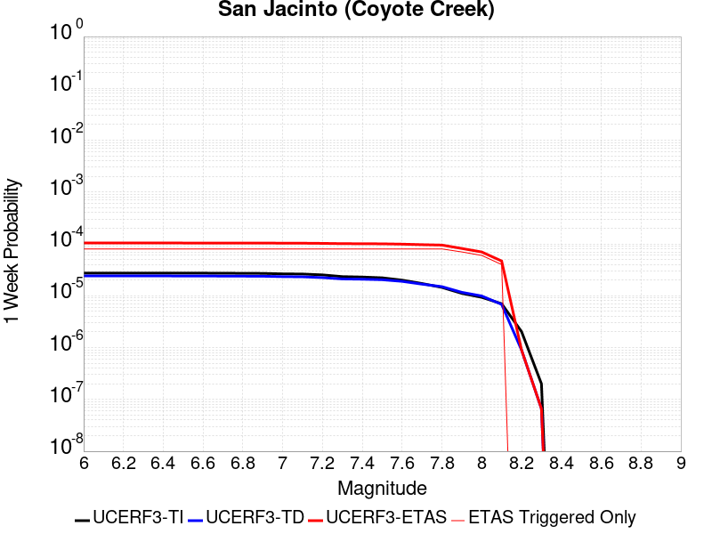 |  |  |  |

| Magnitude | 1 wk TI Prob | 1 wk TD Prob | 1 wk ETAS Prob | 1 wk ETAS/TD Gain | 1 wk ETAS Triggered Only | 1 mo TI Prob | 1 mo TD Prob | 1 mo ETAS Prob | 1 mo ETAS/TD Gain | 1 mo ETAS Triggered Only | 1 yr TI Prob | 1 yr TD Prob | 1 yr ETAS Prob | 1 yr ETAS/TD Gain | 1 yr ETAS Triggered Only | 10 yr TI Prob | 10 yr TD Prob | 10 yr ETAS Prob | 10 yr ETAS/TD Gain | 10 yr ETAS Triggered Only |
|-----|-----|-----|-----|-----|-----|-----|-----|-----|-----|-----|-----|-----|-----|-----|-----|-----|-----|-----|-----|-----|
| 6.0 | 2.7374346E-5 | 2.4145214E-5 | 1.1664992E-4 | 4.831182 | 9.250694E-5 | 1.1731335E-4 | 1.034754E-4 | 1.9597277E-4 | 1.8939068 | 9.250694E-5 | 0.0014273542 | 0.0012590875 | 0.0014438684 | 1.1467578 | 1.8501388E-4 | 0.01418221 | 0.012928318 | 0.01311094 | 1.0141257 | 1.8501388E-4 |
| 6.1 | 2.7374346E-5 | 2.4145214E-5 | 1.1664992E-4 | 4.831182 | 9.250694E-5 | 1.1731335E-4 | 1.034754E-4 | 1.9597277E-4 | 1.8939068 | 9.250694E-5 | 0.0014273542 | 0.0012590875 | 0.0014438684 | 1.1467578 | 1.8501388E-4 | 0.01418221 | 0.012928318 | 0.01311094 | 1.0141257 | 1.8501388E-4 |
| 6.2 | 2.7374346E-5 | 2.4145214E-5 | 1.1664992E-4 | 4.831182 | 9.250694E-5 | 1.1731335E-4 | 1.034754E-4 | 1.9597277E-4 | 1.8939068 | 9.250694E-5 | 0.0014273542 | 0.0012590875 | 0.0014438684 | 1.1467578 | 1.8501388E-4 | 0.01418221 | 0.012928318 | 0.01311094 | 1.0141257 | 1.8501388E-4 |
| 6.3 | 2.7374346E-5 | 2.4145214E-5 | 1.1664992E-4 | 4.831182 | 9.250694E-5 | 1.1731335E-4 | 1.034754E-4 | 1.9597277E-4 | 1.8939068 | 9.250694E-5 | 0.0014273542 | 0.0012590875 | 0.0014438684 | 1.1467578 | 1.8501388E-4 | 0.01418221 | 0.012928318 | 0.01311094 | 1.0141257 | 1.8501388E-4 |
| 6.4 | 2.7374346E-5 | 2.4145214E-5 | 1.1664992E-4 | 4.831182 | 9.250694E-5 | 1.1731335E-4 | 1.034754E-4 | 1.9597277E-4 | 1.8939068 | 9.250694E-5 | 0.0014273542 | 0.0012590875 | 0.0014438684 | 1.1467578 | 1.8501388E-4 | 0.01418221 | 0.012928318 | 0.01311094 | 1.0141257 | 1.8501388E-4 |
| 6.5 | 2.7282445E-5 | 2.4031293E-5 | 1.1653601E-4 | 4.8493443 | 9.250694E-5 | 1.16919524E-4 | 1.029872E-4 | 1.9548461E-4 | 1.8981447 | 9.250694E-5 | 0.0014225657 | 0.0012531505 | 0.0014379326 | 1.147454 | 1.8501388E-4 | 0.014134934 | 0.012869646 | 0.013052278 | 1.014191 | 1.8501388E-4 |
| 6.6 | 2.7282445E-5 | 2.4031293E-5 | 1.1653601E-4 | 4.8493443 | 9.250694E-5 | 1.16919524E-4 | 1.029872E-4 | 1.9548461E-4 | 1.8981447 | 9.250694E-5 | 0.0014225657 | 0.0012531505 | 0.0014379326 | 1.147454 | 1.8501388E-4 | 0.014134934 | 0.012869646 | 0.013052278 | 1.014191 | 1.8501388E-4 |
| 6.7 | 2.7216198E-5 | 2.3956412E-5 | 1.1646113E-4 | 4.8613763 | 9.250694E-5 | 1.1663563E-4 | 1.02666316E-4 | 1.9516375E-4 | 1.9009522 | 9.250694E-5 | 0.0014191137 | 0.0012492483 | 0.0014340311 | 1.1479151 | 1.8501388E-4 | 0.014100855 | 0.0128310565 | 0.013013696 | 1.0142342 | 1.8501388E-4 |
| 6.8 | 2.7078617E-5 | 2.387363E-5 | 1.1637836E-4 | 4.874766 | 9.250694E-5 | 1.1604605E-4 | 1.0231156E-4 | 1.9480904E-4 | 1.9040765 | 9.250694E-5 | 0.001411945 | 0.0012449342 | 0.0014297176 | 1.1484283 | 1.8501388E-4 | 0.014030075 | 0.012788199 | 0.012970847 | 1.0142826 | 1.8501388E-4 |
| 6.9 | 2.6982952E-5 | 2.3793142E-5 | 1.1629788E-4 | 4.887874 | 9.250694E-5 | 1.15636096E-4 | 1.0196664E-4 | 1.9446414E-4 | 1.907135 | 9.250694E-5 | 0.0014069602 | 0.0012407395 | 0.0014255238 | 1.1489308 | 1.8501388E-4 | 0.013980856 | 0.012746515 | 0.01292917 | 1.0143298 | 1.8501388E-4 |
| 7.0 | 2.6449972E-5 | 2.3370165E-5 | 1.15874944E-4 | 4.9582424 | 9.250694E-5 | 1.1335209E-4 | 1.00154015E-4 | 1.9265169E-4 | 1.9235543 | 9.250694E-5 | 0.001379188 | 0.0012186957 | 0.001403484 | 1.151628 | 1.8501388E-4 | 0.0137065975 | 0.0125278765 | 0.012710573 | 1.0145831 | 1.8501388E-4 |
| 7.1 | 2.6257849E-5 | 2.3196202E-5 | 1.1570099E-4 | 4.9879284 | 9.250694E-5 | 1.1252879E-4 | 9.940852E-5 | 1.9190626E-4 | 1.9304811 | 9.250694E-5 | 0.0013691769 | 0.0012096294 | 0.0013944193 | 1.1527659 | 1.8501388E-4 | 0.013607717 | 0.012437741 | 0.012620454 | 1.0146902 | 1.8501388E-4 |
| 7.2 | 2.5270041E-5 | 2.2390966E-5 | 1.1489583E-4 | 5.1313477 | 9.250694E-5 | 1.0829568E-4 | 9.595777E-5 | 1.8845583E-4 | 1.9639455 | 9.250694E-5 | 0.0013177024 | 0.0011676621 | 0.0013524599 | 1.1582631 | 1.8501388E-4 | 0.013099162 | 0.012018777 | 0.012201568 | 1.0152087 | 1.8501388E-4 |
| 7.3 | 2.339701E-5 | 2.1122814E-5 | 1.136278E-4 | 5.3793874 | 9.250694E-5 | 1.0026905E-4 | 9.0523215E-5 | 1.8302178E-4 | 2.0218215 | 9.250694E-5 | 0.001220092 | 0.0011015651 | 0.0012863751 | 1.1677705 | 1.8501388E-4 | 0.012134149 | 0.011357696 | 0.0115406085 | 1.0161047 | 1.8501388E-4 |
| 7.4 | 2.296333E-5 | 2.0853171E-5 | 1.1335818E-4 | 5.4360166 | 9.250694E-5 | 9.841056E-5 | 8.936768E-5 | 1.8186634E-4 | 2.035035 | 9.250694E-5 | 0.0011974899 | 0.0010875105 | 0.0012723232 | 1.1699411 | 1.8501388E-4 | 0.011910575 | 0.01121681 | 0.011399748 | 1.0163094 | 1.8501388E-4 |
| 7.5 | 2.2188895E-5 | 2.0376096E-5 | 1.1288115E-4 | 5.539881 | 9.250694E-5 | 9.50918E-5 | 8.732321E-5 | 1.7982208E-4 | 2.05927 | 9.250694E-5 | 0.0011571277 | 0.0010626436 | 0.0012474608 | 1.1739222 | 1.8501388E-4 | 0.011511209 | 0.010966429 | 0.011149413 | 1.016686 | 1.8501388E-4 |
| 7.6 | 2.0013189E-5 | 1.8962366E-5 | 1.1146755E-4 | 5.878357 | 9.250694E-5 | 8.5767984E-5 | 8.1264756E-5 | 1.7376419E-4 | 2.1382477 | 9.250694E-5 | 0.001043725 | 9.889511E-4 | 0.001173782 | 1.1868958 | 1.8501388E-4 | 0.010388365 | 0.010224434 | 0.010407556 | 1.0179102 | 1.8501388E-4 |
| 7.7 | 1.7230794E-5 | 1.674371E-5 | 1.092491E-4 | 6.5247846 | 9.250694E-5 | 7.384417E-5 | 7.175679E-5 | 1.6425709E-4 | 2.2890809 | 9.250694E-5 | 8.986819E-4 | 8.7328954E-4 | 0.0010581418 | 1.2116736 | 1.8501388E-4 | 0.008950562 | 0.009062956 | 0.009246293 | 1.0202293 | 1.8501388E-4 |
| 7.8 | 1.4478809E-5 | 1.4990978E-5 | 1.0749653E-4 | 7.170748 | 9.250694E-5 | 6.205057E-5 | 6.424547E-5 | 1.5674646E-4 | 2.4398057 | 9.250694E-5 | 7.552038E-4 | 7.819085E-4 | 9.6677773E-4 | 1.2364333 | 1.8501388E-4 | 0.0075264242 | 0.008141387 | 0.008324895 | 1.0225401 | 1.8501388E-4 |
| 7.9 | 1.1114467E-5 | 1.1645102E-5 | 1.1645102E-5 | 1.0 | 0.0 | 4.7632562E-5 | 4.990663E-5 | 4.990663E-5 | 1.0 | 0.0 | 5.797721E-4 | 6.074444E-4 | 6.9989514E-4 | 1.1521963 | 9.250694E-5 | 0.0057826187 | 0.0063803247 | 0.0064722416 | 1.0144063 | 9.250694E-5 |
| 8.0 | 9.327402E-6 | 9.899186E-6 | 9.899186E-6 | 1.0 | 0.0 | 3.9973966E-5 | 4.2424395E-5 | 4.2424395E-5 | 1.0 | 0.0 | 4.8657437E-4 | 5.1639514E-4 | 6.0885435E-4 | 1.1790473 | 9.250694E-5 | 0.0048551033 | 0.0054499684 | 0.0055419714 | 1.0168813 | 9.250694E-5 |
| 8.1 | 7.0235833E-6 | 6.827495E-6 | 6.827495E-6 | 1.0 | 0.0 | 3.0100724E-5 | 2.9260367E-5 | 2.9260367E-5 | 1.0 | 0.0 | 3.664147E-4 | 3.5618723E-4 | 3.5618723E-4 | 1.0 | 0.0 | 0.003658111 | 0.0037876023 | 0.0037876023 | 1.0 | 0.0 |
| 8.2 | 2.0358202E-6 | 8.994527E-7 | 8.994527E-7 | 1.0 | 0.0 | 8.724915E-6 | 3.854792E-6 | 3.854792E-6 | 1.0 | 0.0 | 1.06220665E-4 | 4.69311E-5 | 4.69311E-5 | 1.0 | 0.0 | 0.001061699 | 5.3254166E-4 | 5.3254166E-4 | 1.0 | 0.0 |
| 8.3 | 2.0051264E-7 | 6.617272E-8 | 6.617272E-8 | 1.0 | 0.0 | 8.5933965E-7 | 2.8359733E-7 | 2.8359733E-7 | 1.0 | 0.0 | 1.046241E-5 | 3.4527925E-6 | 3.4527925E-6 | 1.0 | 0.0 | 1.0461917E-4 | 4.01389E-5 | 4.01389E-5 | 1.0 | 0.0 |

## Deep Springs
*[(top)](#table-of-contents)*

| 1 Week | 1 Month | 1 Year | 10 Year |
|-----|-----|-----|-----|
|  |  |  |  |

| Magnitude | 1 wk TI Prob | 1 wk TD Prob | 1 wk ETAS Prob | 1 wk ETAS/TD Gain | 1 wk ETAS Triggered Only | 1 mo TI Prob | 1 mo TD Prob | 1 mo ETAS Prob | 1 mo ETAS/TD Gain | 1 mo ETAS Triggered Only | 1 yr TI Prob | 1 yr TD Prob | 1 yr ETAS Prob | 1 yr ETAS/TD Gain | 1 yr ETAS Triggered Only | 10 yr TI Prob | 10 yr TD Prob | 10 yr ETAS Prob | 10 yr ETAS/TD Gain | 10 yr ETAS Triggered Only |
|-----|-----|-----|-----|-----|-----|-----|-----|-----|-----|-----|-----|-----|-----|-----|-----|-----|-----|-----|-----|-----|
| 6.0 | 1.9810619E-5 | 2.311252E-5 | 2.311252E-5 | 1.0 | 0.0 | 8.489989E-5 | 9.905276E-5 | 2.8404832E-4 | 2.8676467 | 1.8501388E-4 | 0.001033166 | 0.0012058079 | 0.0013905987 | 1.1532506 | 1.8501388E-4 | 0.010283757 | 0.012042425 | 0.012225211 | 1.0151784 | 1.8501388E-4 |
| 6.1 | 1.9810619E-5 | 2.311252E-5 | 2.311252E-5 | 1.0 | 0.0 | 8.489989E-5 | 9.905276E-5 | 2.8404832E-4 | 2.8676467 | 1.8501388E-4 | 0.001033166 | 0.0012058079 | 0.0013905987 | 1.1532506 | 1.8501388E-4 | 0.010283757 | 0.012042425 | 0.012225211 | 1.0151784 | 1.8501388E-4 |
| 6.2 | 1.9810619E-5 | 2.311252E-5 | 2.311252E-5 | 1.0 | 0.0 | 8.489989E-5 | 9.905276E-5 | 2.8404832E-4 | 2.8676467 | 1.8501388E-4 | 0.001033166 | 0.0012058079 | 0.0013905987 | 1.1532506 | 1.8501388E-4 | 0.010283757 | 0.012042425 | 0.012225211 | 1.0151784 | 1.8501388E-4 |
| 6.3 | 1.9810619E-5 | 2.311252E-5 | 2.311252E-5 | 1.0 | 0.0 | 8.489989E-5 | 9.905276E-5 | 2.8404832E-4 | 2.8676467 | 1.8501388E-4 | 0.001033166 | 0.0012058079 | 0.0013905987 | 1.1532506 | 1.8501388E-4 | 0.010283757 | 0.012042425 | 0.012225211 | 1.0151784 | 1.8501388E-4 |
| 6.4 | 1.9810619E-5 | 2.311252E-5 | 2.311252E-5 | 1.0 | 0.0 | 8.489989E-5 | 9.905276E-5 | 2.8404832E-4 | 2.8676467 | 1.8501388E-4 | 0.001033166 | 0.0012058079 | 0.0013905987 | 1.1532506 | 1.8501388E-4 | 0.010283757 | 0.012042425 | 0.012225211 | 1.0151784 | 1.8501388E-4 |
| 6.5 | 1.7190405E-5 | 2.0050555E-5 | 2.0050555E-5 | 1.0 | 0.0 | 7.367108E-5 | 8.593095E-5 | 2.7092893E-4 | 3.1528678 | 1.8501388E-4 | 8.9657627E-4 | 0.0010462094 | 0.0012310296 | 1.1766571 | 1.8501388E-4 | 0.008929676 | 0.010462056 | 0.010645134 | 1.0174992 | 1.8501388E-4 |
| 6.6 | 1.7190405E-5 | 2.0050555E-5 | 2.0050555E-5 | 1.0 | 0.0 | 7.367108E-5 | 8.593095E-5 | 2.7092893E-4 | 3.1528678 | 1.8501388E-4 | 8.9657627E-4 | 0.0010462094 | 0.0012310296 | 1.1766571 | 1.8501388E-4 | 0.008929676 | 0.010462056 | 0.010645134 | 1.0174992 | 1.8501388E-4 |

## Oceanic - West Huasna
*[(top)](#table-of-contents)*

| 1 Week | 1 Month | 1 Year | 10 Year |
|-----|-----|-----|-----|
|  |  |  |  |

| Magnitude | 1 wk TI Prob | 1 wk TD Prob | 1 wk ETAS Prob | 1 wk ETAS/TD Gain | 1 wk ETAS Triggered Only | 1 mo TI Prob | 1 mo TD Prob | 1 mo ETAS Prob | 1 mo ETAS/TD Gain | 1 mo ETAS Triggered Only | 1 yr TI Prob | 1 yr TD Prob | 1 yr ETAS Prob | 1 yr ETAS/TD Gain | 1 yr ETAS Triggered Only | 10 yr TI Prob | 10 yr TD Prob | 10 yr ETAS Prob | 10 yr ETAS/TD Gain | 10 yr ETAS Triggered Only |
|-----|-----|-----|-----|-----|-----|-----|-----|-----|-----|-----|-----|-----|-----|-----|-----|-----|-----|-----|-----|-----|
| 6.0 | 3.195567E-5 | 2.7926868E-5 | 1.2043122E-4 | 4.3123784 | 9.250694E-5 | 1.3694567E-4 | 1.1968133E-4 | 3.0467307E-4 | 2.5457025 | 1.8501388E-4 | 0.0016660384 | 0.0014561893 | 0.0016409338 | 1.1268685 | 1.8501388E-4 | 0.016536033 | 0.014471028 | 0.014653364 | 1.0126001 | 1.8501388E-4 |
| 6.1 | 2.1156782E-5 | 1.7573486E-5 | 1.100788E-4 | 6.2639136 | 9.250694E-5 | 9.066878E-5 | 7.531282E-5 | 1.6781279E-4 | 2.2282102 | 9.250694E-5 | 0.0011033333 | 9.165572E-4 | 0.0010089794 | 1.1008362 | 9.250694E-5 | 0.010978713 | 0.009128777 | 0.00922044 | 1.010041 | 9.250694E-5 |
| 6.2 | 1.6195117E-5 | 1.3327152E-5 | 1.3327152E-5 | 1.0 | 0.0 | 6.9405796E-5 | 5.7115132E-5 | 5.7115132E-5 | 1.0 | 0.0 | 8.44688E-4 | 6.9515745E-4 | 6.9515745E-4 | 1.0 | 0.0 | 0.008414844 | 0.006930123 | 0.006930123 | 1.0 | 0.0 |
| 6.3 | 1.3559345E-5 | 1.1179142E-5 | 1.1179142E-5 | 1.0 | 0.0 | 5.811018E-5 | 4.7909736E-5 | 4.7909736E-5 | 1.0 | 0.0 | 7.072618E-4 | 5.831459E-4 | 5.831459E-4 | 1.0 | 0.0 | 0.0070501505 | 0.0058162753 | 0.0058162753 | 1.0 | 0.0 |
| 6.4 | 1.2120619E-5 | 1.0000977E-5 | 1.0000977E-5 | 1.0 | 0.0 | 5.1944477E-5 | 4.2860633E-5 | 4.2860633E-5 | 1.0 | 0.0 | 6.322405E-4 | 5.2170374E-4 | 5.2170374E-4 | 1.0 | 0.0 | 0.006304447 | 0.0052048573 | 0.0052048573 | 1.0 | 0.0 |
| 6.5 | 1.13511915E-5 | 9.3674735E-6 | 9.3674735E-6 | 1.0 | 0.0 | 4.8647056E-5 | 4.01457E-5 | 4.01457E-5 | 1.0 | 0.0 | 5.9211696E-4 | 4.886647E-4 | 4.886647E-4 | 1.0 | 0.0 | 0.0059054173 | 0.0048759608 | 0.0048759608 | 1.0 | 0.0 |
| 6.6 | 9.850605E-6 | 8.135418E-6 | 8.135418E-6 | 1.0 | 0.0 | 4.2216197E-5 | 3.4865614E-5 | 3.4865614E-5 | 1.0 | 0.0 | 5.1386096E-4 | 4.2440637E-4 | 4.2440637E-4 | 1.0 | 0.0 | 0.0051267436 | 0.004235991 | 0.004235991 | 1.0 | 0.0 |
| 6.7 | 8.8558645E-6 | 7.318433E-6 | 7.318433E-6 | 1.0 | 0.0 | 3.7953152E-5 | 3.1364336E-5 | 3.1364336E-5 | 1.0 | 0.0 | 4.6198163E-4 | 3.8179406E-4 | 3.8179406E-4 | 1.0 | 0.0 | 0.004610224 | 0.0038114067 | 0.0038114067 | 1.0 | 0.0 |
| 6.8 | 7.67136E-6 | 6.391756E-6 | 6.391756E-6 | 1.0 | 0.0 | 3.2876844E-5 | 2.7392953E-5 | 2.7392953E-5 | 1.0 | 0.0 | 4.0020206E-4 | 3.3345833E-4 | 3.3345833E-4 | 1.0 | 0.0 | 0.003994821 | 0.0033296007 | 0.0033296007 | 1.0 | 0.0 |
| 6.9 | 6.534529E-6 | 5.4583297E-6 | 5.4583297E-6 | 1.0 | 0.0 | 2.8004823E-5 | 2.3392633E-5 | 2.3392633E-5 | 1.0 | 0.0 | 3.4090536E-4 | 2.847682E-4 | 2.847682E-4 | 1.0 | 0.0 | 0.0034038287 | 0.0028440498 | 0.0028440498 | 1.0 | 0.0 |
| 7.0 | 5.460525E-6 | 4.5699517E-6 | 4.5699517E-6 | 1.0 | 0.0 | 2.3402039E-5 | 1.958536E-5 | 1.958536E-5 | 1.0 | 0.0 | 2.8488258E-4 | 2.3842578E-4 | 2.3842578E-4 | 1.0 | 0.0 | 0.0028451765 | 0.0023817138 | 0.0023817138 | 1.0 | 0.0 |
| 7.1 | 4.4825083E-6 | 3.7524428E-6 | 3.7524428E-6 | 1.0 | 0.0 | 1.9210609E-5 | 1.60818E-5 | 1.60818E-5 | 1.0 | 0.0 | 2.3386406E-4 | 1.9577841E-4 | 1.9577841E-4 | 1.0 | 0.0 | 0.002336181 | 0.0019560715 | 0.0019560715 | 1.0 | 0.0 |
| 7.2 | 2.821708E-6 | 2.4249334E-6 | 2.4249334E-6 | 1.0 | 0.0 | 1.2092979E-5 | 1.039253E-5 | 1.039253E-5 | 1.0 | 0.0 | 1.4722206E-4 | 1.2652173E-4 | 1.2652173E-4 | 1.0 | 0.0 | 0.0014712457 | 0.0012644994 | 0.0012644994 | 1.0 | 0.0 |
| 7.3 | 2.0644757E-6 | 1.7687412E-6 | 1.7687412E-6 | 1.0 | 0.0 | 8.847723E-6 | 7.5802973E-6 | 7.5802973E-6 | 1.0 | 0.0 | 1.0771569E-4 | 9.228622E-5 | 9.228622E-5 | 1.0 | 0.0 | 0.001076635 | 9.2248066E-4 | 9.2248066E-4 | 1.0 | 0.0 |
| 7.4 | 1.6980367E-6 | 1.4379892E-6 | 1.4379892E-6 | 1.0 | 0.0 | 7.27728E-6 | 6.162796E-6 | 6.162796E-6 | 1.0 | 0.0 | 8.8597284E-5 | 7.5029464E-5 | 7.5029464E-5 | 1.0 | 0.0 | 8.8561967E-4 | 7.500429E-4 | 7.500429E-4 | 1.0 | 0.0 |
| 7.5 | 1.3637683E-6 | 1.1302635E-6 | 1.1302635E-6 | 1.0 | 0.0 | 5.844708E-6 | 4.8439774E-6 | 4.8439774E-6 | 1.0 | 0.0 | 7.1156996E-5 | 5.897383E-5 | 5.897383E-5 | 1.0 | 0.0 | 7.1134215E-4 | 5.895833E-4 | 5.895833E-4 | 1.0 | 0.0 |
| 7.6 | 9.802994E-7 | 7.677247E-7 | 7.677247E-7 | 1.0 | 0.0 | 4.2012766E-6 | 3.2902446E-6 | 3.2902446E-6 | 1.0 | 0.0 | 5.1149345E-5 | 4.0057992E-5 | 4.0057992E-5 | 1.0 | 0.0 | 5.113757E-4 | 4.0050913E-4 | 4.0050913E-4 | 1.0 | 0.0 |
| 7.7 | 5.986191E-7 | 4.0050548E-7 | 4.0050548E-7 | 1.0 | 0.0 | 2.5655079E-6 | 1.7164509E-6 | 1.7164509E-6 | 1.0 | 0.0 | 3.1234613E-5 | 2.089759E-5 | 2.089759E-5 | 1.0 | 0.0 | 3.123022E-4 | 2.089576E-4 | 2.089576E-4 | 1.0 | 0.0 |
| 7.8 | 2.9189815E-7 | 1.5285792E-7 | 1.5285792E-7 | 1.0 | 0.0 | 1.2509914E-6 | 6.5510517E-7 | 6.5510517E-7 | 1.0 | 0.0 | 1.5230714E-5 | 7.9758765E-6 | 7.9758765E-6 | 1.0 | 0.0 | 1.522967E-4 | 7.9757214E-5 | 7.9757214E-5 | 1.0 | 0.0 |
| 7.9 | 1.2057845E-7 | 4.621248E-8 | 4.621248E-8 | 1.0 | 0.0 | 5.1676466E-7 | 1.9805347E-7 | 1.9805347E-7 | 1.0 | 0.0 | 6.2915915E-6 | 2.4112983E-6 | 2.4112983E-6 | 1.0 | 0.0 | 6.2914136E-5 | 2.4114026E-5 | 2.4114026E-5 | 1.0 | 0.0 |
| 8.0 | 3.3806387E-9 | 9.011393E-10 | 9.011393E-10 | 1.0 | 0.0 | 1.4488451E-8 | 3.8620254E-9 | 3.8620254E-9 | 1.0 | 0.0 | 1.7639688E-7 | 4.702016E-8 | 4.702016E-8 | 1.0 | 0.0 | 1.7639674E-6 | 4.7129527E-7 | 4.7129527E-7 | 1.0 | 0.0 |

## Cleghorn Lake
*[(top)](#table-of-contents)*

| 1 Week | 1 Month | 1 Year | 10 Year |
|-----|-----|-----|-----|
|  |  |  |  |

| Magnitude | 1 wk TI Prob | 1 wk TD Prob | 1 wk ETAS Prob | 1 wk ETAS/TD Gain | 1 wk ETAS Triggered Only | 1 mo TI Prob | 1 mo TD Prob | 1 mo ETAS Prob | 1 mo ETAS/TD Gain | 1 mo ETAS Triggered Only | 1 yr TI Prob | 1 yr TD Prob | 1 yr ETAS Prob | 1 yr ETAS/TD Gain | 1 yr ETAS Triggered Only | 10 yr TI Prob | 10 yr TD Prob | 10 yr ETAS Prob | 10 yr ETAS/TD Gain | 10 yr ETAS Triggered Only |
|-----|-----|-----|-----|-----|-----|-----|-----|-----|-----|-----|-----|-----|-----|-----|-----|-----|-----|-----|-----|-----|
| 6.0 | 1.5467183E-5 | 1.6794203E-5 | 1.0929959E-4 | 6.5081735 | 9.250694E-5 | 6.6286244E-5 | 7.197348E-5 | 1.6447376E-4 | 2.2851994 | 9.250694E-5 | 8.067362E-4 | 8.759797E-4 | 0.0010608316 | 1.211023 | 1.8501388E-4 | 0.008038137 | 0.008730696 | 0.008914094 | 1.0210062 | 1.8501388E-4 |
| 6.1 | 1.5467183E-5 | 1.6794203E-5 | 1.0929959E-4 | 6.5081735 | 9.250694E-5 | 6.6286244E-5 | 7.197348E-5 | 1.6447376E-4 | 2.2851994 | 9.250694E-5 | 8.067362E-4 | 8.759797E-4 | 0.0010608316 | 1.211023 | 1.8501388E-4 | 0.008038137 | 0.008730696 | 0.008914094 | 1.0210062 | 1.8501388E-4 |
| 6.2 | 1.2624631E-5 | 1.3681544E-5 | 1.0618722E-4 | 7.7613473 | 9.250694E-5 | 5.410444E-5 | 5.863415E-5 | 1.5113567E-4 | 2.5776048 | 9.250694E-5 | 6.585225E-4 | 7.1368564E-4 | 8.061265E-4 | 1.1295261 | 9.250694E-5 | 0.0065657445 | 0.0071187317 | 0.00721058 | 1.0129024 | 9.250694E-5 |
| 6.3 | 1.2624631E-5 | 1.3681544E-5 | 1.0618722E-4 | 7.7613473 | 9.250694E-5 | 5.410444E-5 | 5.863415E-5 | 1.5113567E-4 | 2.5776048 | 9.250694E-5 | 6.585225E-4 | 7.1368564E-4 | 8.061265E-4 | 1.1295261 | 9.250694E-5 | 0.0065657445 | 0.0071187317 | 0.00721058 | 1.0129024 | 9.250694E-5 |
| 6.4 | 9.417684E-6 | 1.0170118E-5 | 1.0267612E-4 | 10.095863 | 9.250694E-5 | 4.036088E-5 | 4.3585722E-5 | 1.3608862E-4 | 3.1223214 | 9.250694E-5 | 4.912829E-4 | 5.3056807E-4 | 6.2302593E-4 | 1.174262 | 9.250694E-5 | 0.004901982 | 0.005297049 | 0.005389066 | 1.0173713 | 9.250694E-5 |
| 6.5 | 9.368219E-6 | 1.0117545E-5 | 1.0262355E-4 | 10.143128 | 9.250694E-5 | 4.014889E-5 | 4.3360415E-5 | 1.3586335E-4 | 3.1333497 | 9.250694E-5 | 4.8870314E-4 | 5.2782625E-4 | 6.2028435E-4 | 1.1751677 | 9.250694E-5 | 0.004876298 | 0.0052697617 | 0.005361781 | 1.0174618 | 9.250694E-5 |
| 6.6 | 7.803798E-6 | 8.441831E-6 | 1.0094799E-4 | 11.958068 | 9.250694E-5 | 3.3444423E-5 | 3.6179E-5 | 1.2868259E-4 | 3.5568311 | 9.250694E-5 | 4.0710976E-4 | 4.4043022E-4 | 5.3289643E-4 | 1.2099452 | 9.250694E-5 | 0.0040636472 | 0.0043994905 | 0.0044915904 | 1.0209342 | 9.250694E-5 |
| 6.7 | 2.3108669E-6 | 2.4438336E-6 | 2.4438336E-6 | 1.0 | 0.0 | 9.903678E-6 | 1.0473532E-5 | 1.0473532E-5 | 1.0 | 0.0 | 1.205706E-4 | 1.2750797E-4 | 1.2750797E-4 | 1.0 | 0.0 | 0.001205052 | 0.0012743667 | 0.0012743667 | 1.0 | 0.0 |
| 6.8 | 2.0882828E-6 | 2.2062823E-6 | 2.2062823E-6 | 1.0 | 0.0 | 8.949753E-6 | 9.455462E-6 | 9.455462E-6 | 1.0 | 0.0 | 1.08957785E-4 | 1.1511434E-4 | 1.1511434E-4 | 1.0 | 0.0 | 0.0010890438 | 0.0011505639 | 0.0011505639 | 1.0 | 0.0 |
| 6.9 | 1.876935E-6 | 1.981051E-6 | 1.981051E-6 | 1.0 | 0.0 | 8.043982E-6 | 8.490192E-6 | 8.490192E-6 | 1.0 | 0.0 | 9.7931086E-5 | 1.03363345E-4 | 1.03363345E-4 | 1.0 | 0.0 | 9.788794E-4 | 0.0010331686 | 0.0010331686 | 1.0 | 0.0 |
| 7.0 | 1.5357559E-6 | 1.6202807E-6 | 1.6202807E-6 | 1.0 | 0.0 | 6.5817944E-6 | 6.9440425E-6 | 6.9440425E-6 | 1.0 | 0.0 | 8.01304E-5 | 8.454057E-5 | 8.454057E-5 | 1.0 | 0.0 | 8.010151E-4 | 8.450965E-4 | 8.450965E-4 | 1.0 | 0.0 |
| 7.1 | 1.0905424E-6 | 1.1497619E-6 | 1.1497619E-6 | 1.0 | 0.0 | 4.6737446E-6 | 4.9275427E-6 | 4.9275427E-6 | 1.0 | 0.0 | 5.6901354E-5 | 5.999128E-5 | 5.999128E-5 | 1.0 | 0.0 | 5.6886784E-4 | 5.997606E-4 | 5.997606E-4 | 1.0 | 0.0 |
| 7.2 | 6.06668E-7 | 6.387277E-7 | 6.387277E-7 | 1.0 | 0.0 | 2.600003E-6 | 2.7374022E-6 | 2.7374022E-6 | 1.0 | 0.0 | 3.1654577E-5 | 3.3327433E-5 | 3.3327433E-5 | 1.0 | 0.0 | 3.1650066E-4 | 3.3323118E-4 | 3.3323118E-4 | 1.0 | 0.0 |

## San Andreas (Carrizo) rev
*[(top)](#table-of-contents)*

| 1 Week | 1 Month | 1 Year | 10 Year |
|-----|-----|-----|-----|
|  |  |  |  |

| Magnitude | 1 wk TI Prob | 1 wk TD Prob | 1 wk ETAS Prob | 1 wk ETAS/TD Gain | 1 wk ETAS Triggered Only | 1 mo TI Prob | 1 mo TD Prob | 1 mo ETAS Prob | 1 mo ETAS/TD Gain | 1 mo ETAS Triggered Only | 1 yr TI Prob | 1 yr TD Prob | 1 yr ETAS Prob | 1 yr ETAS/TD Gain | 1 yr ETAS Triggered Only | 10 yr TI Prob | 10 yr TD Prob | 10 yr ETAS Prob | 10 yr ETAS/TD Gain | 10 yr ETAS Triggered Only |
|-----|-----|-----|-----|-----|-----|-----|-----|-----|-----|-----|-----|-----|-----|-----|-----|-----|-----|-----|-----|-----|
| 6.0 | 1.1674632E-4 | 2.432302E-4 | 3.3571463E-4 | 1.3802342 | 9.250694E-5 | 5.002454E-4 | 0.0010420004 | 0.0011344108 | 1.0886858 | 9.250694E-5 | 0.006073493 | 0.012613042 | 0.012795723 | 1.0144835 | 1.8501388E-4 | 0.0591016 | 0.12061418 | 0.12077688 | 1.001349 | 1.8501388E-4 |
| 6.1 | 1.1674632E-4 | 2.432302E-4 | 3.3571463E-4 | 1.3802342 | 9.250694E-5 | 5.002454E-4 | 0.0010420004 | 0.0011344108 | 1.0886858 | 9.250694E-5 | 0.006073493 | 0.012613042 | 0.012795723 | 1.0144835 | 1.8501388E-4 | 0.0591016 | 0.12061418 | 0.12077688 | 1.001349 | 1.8501388E-4 |
| 6.2 | 1.1674632E-4 | 2.432302E-4 | 3.3571463E-4 | 1.3802342 | 9.250694E-5 | 5.002454E-4 | 0.0010420004 | 0.0011344108 | 1.0886858 | 9.250694E-5 | 0.006073493 | 0.012613042 | 0.012795723 | 1.0144835 | 1.8501388E-4 | 0.0591016 | 0.12061418 | 0.12077688 | 1.001349 | 1.8501388E-4 |
| 6.3 | 1.1674632E-4 | 2.432302E-4 | 3.3571463E-4 | 1.3802342 | 9.250694E-5 | 5.002454E-4 | 0.0010420004 | 0.0011344108 | 1.0886858 | 9.250694E-5 | 0.006073493 | 0.012613042 | 0.012795723 | 1.0144835 | 1.8501388E-4 | 0.0591016 | 0.12061418 | 0.12077688 | 1.001349 | 1.8501388E-4 |
| 6.4 | 1.1674632E-4 | 2.432302E-4 | 3.3571463E-4 | 1.3802342 | 9.250694E-5 | 5.002454E-4 | 0.0010420004 | 0.0011344108 | 1.0886858 | 9.250694E-5 | 0.006073493 | 0.012613042 | 0.012795723 | 1.0144835 | 1.8501388E-4 | 0.0591016 | 0.12061418 | 0.12077688 | 1.001349 | 1.8501388E-4 |
| 6.5 | 1.13136164E-4 | 2.3643032E-4 | 3.289154E-4 | 1.3911726 | 9.250694E-5 | 4.847792E-4 | 0.0010128808 | 0.0011052941 | 1.091238 | 9.250694E-5 | 0.0058862255 | 0.012262545 | 0.01244529 | 1.0149027 | 1.8501388E-4 | 0.057327334 | 0.117585555 | 0.11774881 | 1.0013884 | 1.8501388E-4 |
| 6.6 | 1.13136164E-4 | 2.3643032E-4 | 3.289154E-4 | 1.3911726 | 9.250694E-5 | 4.847792E-4 | 0.0010128808 | 0.0011052941 | 1.091238 | 9.250694E-5 | 0.0058862255 | 0.012262545 | 0.01244529 | 1.0149027 | 1.8501388E-4 | 0.057327334 | 0.117585555 | 0.11774881 | 1.0013884 | 1.8501388E-4 |
| 6.7 | 1.1149675E-4 | 2.3334254E-4 | 3.258279E-4 | 1.3963501 | 9.250694E-5 | 4.777557E-4 | 9.996577E-4 | 0.0010920721 | 1.0924461 | 9.250694E-5 | 0.0058011734 | 0.012103349 | 0.012286124 | 1.0151012 | 1.8501388E-4 | 0.05652051 | 0.1162071 | 0.11637061 | 1.0014071 | 1.8501388E-4 |
| 6.8 | 1.1103589E-4 | 2.3236412E-4 | 3.2484956E-4 | 1.3980194 | 9.250694E-5 | 4.7578133E-4 | 9.954676E-4 | 0.0010878826 | 1.0928357 | 9.250694E-5 | 0.005777263 | 0.012052901 | 0.012235685 | 1.0151651 | 1.8501388E-4 | 0.056293584 | 0.1157674 | 0.115931 | 1.0014131 | 1.8501388E-4 |
| 6.9 | 1.1053259E-4 | 2.3128795E-4 | 3.237735E-4 | 1.3998718 | 9.250694E-5 | 4.7362508E-4 | 9.90859E-4 | 0.0010832743 | 1.0932678 | 9.250694E-5 | 0.0057511497 | 0.01199741 | 0.0121802045 | 1.0152361 | 1.8501388E-4 | 0.05604569 | 0.11528359 | 0.11544728 | 1.0014199 | 1.8501388E-4 |
| 7.0 | 1.1005377E-4 | 2.3029637E-4 | 3.22782E-4 | 1.4015939 | 9.250694E-5 | 4.7157376E-4 | 9.866126E-4 | 0.0010790284 | 1.0936697 | 9.250694E-5 | 0.0057263062 | 0.011946279 | 0.012129082 | 1.0153022 | 1.8501388E-4 | 0.055809796 | 0.11483591 | 0.114999674 | 1.0014261 | 1.8501388E-4 |
| 7.1 | 1.0308142E-4 | 2.1539345E-4 | 3.0788046E-4 | 1.4293864 | 9.250694E-5 | 4.417027E-4 | 9.227892E-4 | 0.0010152108 | 1.1001546 | 9.250694E-5 | 0.0053644776 | 0.011177397 | 0.011360344 | 1.0163674 | 1.8501388E-4 | 0.052368138 | 0.108092256 | 0.10825727 | 1.0015266 | 1.8501388E-4 |
| 7.2 | 1.0027479E-4 | 2.094724E-4 | 3.0195998E-4 | 1.4415262 | 9.250694E-5 | 4.296783E-4 | 8.9743105E-4 | 9.898549E-4 | 1.1029872 | 9.250694E-5 | 0.0052187922 | 0.010871782 | 0.011054785 | 1.0168328 | 1.8501388E-4 | 0.050979212 | 0.10539625 | 0.10556176 | 1.0015703 | 1.8501388E-4 |
| 7.3 | 9.816942E-5 | 2.0422463E-4 | 2.9671268E-4 | 1.4528741 | 9.250694E-5 | 4.2065824E-4 | 8.7495585E-4 | 9.673819E-4 | 1.105635 | 9.250694E-5 | 0.005109493 | 0.010600842 | 0.010783894 | 1.0172677 | 1.8501388E-4 | 0.049935985 | 0.102979995 | 0.10314596 | 1.0016116 | 1.8501388E-4 |
| 7.4 | 9.5634205E-5 | 1.9791997E-4 | 2.9040858E-4 | 1.4673032 | 9.250694E-5 | 4.0979648E-4 | 8.479536E-4 | 9.4038213E-4 | 1.1090019 | 9.250694E-5 | 0.0049778637 | 0.010275229 | 0.010458342 | 1.0178208 | 1.8501388E-4 | 0.048678253 | 0.10006632 | 0.10023282 | 1.0016639 | 1.8501388E-4 |
| 7.5 | 8.052417E-5 | 1.611261E-4 | 2.5361814E-4 | 1.574035 | 9.250694E-5 | 3.4505792E-4 | 6.903579E-4 | 7.828009E-4 | 1.133906 | 9.250694E-5 | 0.0041929903 | 0.008372796 | 0.008556261 | 1.021912 | 1.8501388E-4 | 0.04114753 | 0.08281049 | 0.082980186 | 1.0020492 | 1.8501388E-4 |
| 7.6 | 7.897024E-5 | 1.5765853E-4 | 2.501509E-4 | 1.5866625 | 9.250694E-5 | 3.384E-4 | 6.755046E-4 | 7.679491E-4 | 1.1368524 | 9.250694E-5 | 0.0041122385 | 0.008193332 | 0.00837683 | 1.022396 | 1.8501388E-4 | 0.040369697 | 0.08115171 | 0.08132171 | 1.0020949 | 1.8501388E-4 |
| 7.7 | 6.707427E-5 | 1.3276102E-4 | 2.2525569E-4 | 1.6967003 | 9.250694E-5 | 2.8742946E-4 | 5.688518E-4 | 6.6130614E-4 | 1.1625279 | 9.250694E-5 | 0.003493839 | 0.00690381 | 0.0069956784 | 1.0133069 | 9.250694E-5 | 0.034394164 | 0.069048055 | 0.069134176 | 1.0012473 | 9.250694E-5 |
| 7.8 | 6.147705E-5 | 1.2197486E-4 | 1.2197486E-4 | 1.0 | 0.0 | 2.6344648E-4 | 5.226447E-4 | 5.226447E-4 | 1.0 | 0.0 | 0.0032027436 | 0.006344659 | 0.006344659 | 1.0 | 0.0 | 0.031569764 | 0.06351457 | 0.06351457 | 1.0 | 0.0 |
| 7.9 | 4.7636717E-5 | 8.87977E-5 | 8.87977E-5 | 1.0 | 0.0 | 2.0414138E-4 | 3.8050607E-4 | 3.8050607E-4 | 1.0 | 0.0 | 0.0024825884 | 0.0046228287 | 0.0046228287 | 1.0 | 0.0 | 0.024550365 | 0.046628095 | 0.046628095 | 1.0 | 0.0 |
| 8.0 | 3.3554235E-5 | 5.2136907E-5 | 5.2136907E-5 | 1.0 | 0.0 | 1.4379594E-4 | 2.2342477E-4 | 2.2342477E-4 | 1.0 | 0.0 | 0.0017493097 | 0.002716805 | 0.002716805 | 1.0 | 0.0 | 0.017356034 | 0.027880952 | 0.027880952 | 1.0 | 0.0 |
| 8.1 | 1.9175432E-5 | 1.9184976E-5 | 1.9184976E-5 | 1.0 | 0.0 | 8.217783E-5 | 8.2218736E-5 | 8.2218736E-5 | 1.0 | 0.0 | 0.0010000558 | 0.0010005541 | 0.0010005541 | 1.0 | 0.0 | 0.009955673 | 0.0107580265 | 0.0107580265 | 1.0 | 0.0 |
| 8.2 | 8.643924E-6 | 5.4748625E-6 | 5.4748625E-6 | 1.0 | 0.0 | 3.704486E-5 | 2.3463486E-5 | 2.3463486E-5 | 1.0 | 0.0 | 4.5092785E-4 | 2.8563058E-4 | 2.8563058E-4 | 1.0 | 0.0 | 0.0045001395 | 0.0032487072 | 0.0032487072 | 1.0 | 0.0 |
| 8.3 | 1.983087E-6 | 7.6599065E-7 | 7.6599065E-7 | 1.0 | 0.0 | 8.498917E-6 | 3.282813E-6 | 3.282813E-6 | 1.0 | 0.0 | 1.034694E-4 | 3.9967534E-5 | 3.9967534E-5 | 1.0 | 0.0 | 0.0010342124 | 4.719687E-4 | 4.719687E-4 | 1.0 | 0.0 |

## San Andreas (North Branch Mill Creek)
*[(top)](#table-of-contents)*

| 1 Week | 1 Month | 1 Year | 10 Year |
|-----|-----|-----|-----|
|  |  |  |  |

| Magnitude | 1 wk TI Prob | 1 wk TD Prob | 1 wk ETAS Prob | 1 wk ETAS/TD Gain | 1 wk ETAS Triggered Only | 1 mo TI Prob | 1 mo TD Prob | 1 mo ETAS Prob | 1 mo ETAS/TD Gain | 1 mo ETAS Triggered Only | 1 yr TI Prob | 1 yr TD Prob | 1 yr ETAS Prob | 1 yr ETAS/TD Gain | 1 yr ETAS Triggered Only | 10 yr TI Prob | 10 yr TD Prob | 10 yr ETAS Prob | 10 yr ETAS/TD Gain | 10 yr ETAS Triggered Only |
|-----|-----|-----|-----|-----|-----|-----|-----|-----|-----|-----|-----|-----|-----|-----|-----|-----|-----|-----|-----|-----|
| 6.0 | 1.3461156E-5 | 2.3499893E-5 | 2.0850942E-4 | 8.872782 | 1.8501388E-4 | 5.7689394E-5 | 1.00709956E-4 | 2.857052E-4 | 2.8369112 | 1.8501388E-4 | 7.02142E-4 | 0.0012254574 | 0.0014102445 | 1.1507903 | 1.8501388E-4 | 0.0069992766 | 0.01222957 | 0.012412321 | 1.0149434 | 1.8501388E-4 |
| 6.1 | 1.3461156E-5 | 2.3499893E-5 | 2.0850942E-4 | 8.872782 | 1.8501388E-4 | 5.7689394E-5 | 1.00709956E-4 | 2.857052E-4 | 2.8369112 | 1.8501388E-4 | 7.02142E-4 | 0.0012254574 | 0.0014102445 | 1.1507903 | 1.8501388E-4 | 0.0069992766 | 0.01222957 | 0.012412321 | 1.0149434 | 1.8501388E-4 |
| 6.2 | 1.3461156E-5 | 2.3499893E-5 | 2.0850942E-4 | 8.872782 | 1.8501388E-4 | 5.7689394E-5 | 1.00709956E-4 | 2.857052E-4 | 2.8369112 | 1.8501388E-4 | 7.02142E-4 | 0.0012254574 | 0.0014102445 | 1.1507903 | 1.8501388E-4 | 0.0069992766 | 0.01222957 | 0.012412321 | 1.0149434 | 1.8501388E-4 |
| 6.3 | 1.3461156E-5 | 2.3499893E-5 | 2.0850942E-4 | 8.872782 | 1.8501388E-4 | 5.7689394E-5 | 1.00709956E-4 | 2.857052E-4 | 2.8369112 | 1.8501388E-4 | 7.02142E-4 | 0.0012254574 | 0.0014102445 | 1.1507903 | 1.8501388E-4 | 0.0069992766 | 0.01222957 | 0.012412321 | 1.0149434 | 1.8501388E-4 |
| 6.4 | 1.3461156E-5 | 2.3499893E-5 | 2.0850942E-4 | 8.872782 | 1.8501388E-4 | 5.7689394E-5 | 1.00709956E-4 | 2.857052E-4 | 2.8369112 | 1.8501388E-4 | 7.02142E-4 | 0.0012254574 | 0.0014102445 | 1.1507903 | 1.8501388E-4 | 0.0069992766 | 0.01222957 | 0.012412321 | 1.0149434 | 1.8501388E-4 |
| 6.5 | 1.3450706E-5 | 2.3488852E-5 | 2.0849839E-4 | 8.876482 | 1.8501388E-4 | 5.764461E-5 | 1.0066265E-4 | 2.856579E-4 | 2.8377745 | 1.8501388E-4 | 7.0159714E-4 | 0.001224882 | 0.0014096693 | 1.1508613 | 1.8501388E-4 | 0.006993862 | 0.01222388 | 0.012406631 | 1.0149504 | 1.8501388E-4 |
| 6.6 | 1.3074523E-5 | 2.3103135E-5 | 2.0811273E-4 | 9.007987 | 1.8501388E-4 | 5.6032466E-5 | 9.9009696E-5 | 2.8400525E-4 | 2.868459 | 1.8501388E-4 | 6.8198174E-4 | 0.0012047797 | 0.0013895707 | 1.1533816 | 1.8501388E-4 | 0.006798926 | 0.012025044 | 0.012207834 | 1.0152007 | 1.8501388E-4 |
| 6.7 | 1.3050216E-5 | 2.3078432E-5 | 2.0808804E-4 | 9.016559 | 1.8501388E-4 | 5.59283E-5 | 9.890384E-5 | 2.8389943E-4 | 2.870459 | 1.8501388E-4 | 6.8071426E-4 | 0.0012034923 | 0.0013882834 | 1.1535459 | 1.8501388E-4 | 0.0067863287 | 0.012012309 | 0.012195101 | 1.0152171 | 1.8501388E-4 |
| 6.8 | 1.29049395E-5 | 2.292684E-5 | 2.0793648E-4 | 9.069565 | 1.8501388E-4 | 5.530571E-5 | 9.825421E-5 | 2.8324992E-4 | 2.8828273 | 1.8501388E-4 | 6.73139E-4 | 0.0011955918 | 0.0013803844 | 1.1545616 | 1.8501388E-4 | 0.0067110364 | 0.011934154 | 0.01211696 | 1.0153179 | 1.8501388E-4 |
| 6.9 | 1.2867369E-5 | 2.2886245E-5 | 2.078959E-4 | 9.083879 | 1.8501388E-4 | 5.51447E-5 | 9.8080236E-5 | 2.8307596E-4 | 2.8861673 | 1.8501388E-4 | 6.711799E-4 | 0.0011934759 | 0.001378269 | 1.154836 | 1.8501388E-4 | 0.006691564 | 0.011913223 | 0.012096033 | 1.0153451 | 1.8501388E-4 |
| 7.0 | 1.2495996E-5 | 2.2286325E-5 | 2.0729608E-4 | 9.301492 | 1.8501388E-4 | 5.3553173E-5 | 9.550934E-5 | 2.8050554E-4 | 2.9369435 | 1.8501388E-4 | 6.518148E-4 | 0.0011622087 | 0.0013470076 | 1.1590066 | 1.8501388E-4 | 0.0064990623 | 0.0116038285 | 0.011786696 | 1.0157592 | 1.8501388E-4 |
| 7.1 | 1.2452067E-5 | 2.2231397E-5 | 2.0724116E-4 | 9.322003 | 1.8501388E-4 | 5.3364907E-5 | 9.527396E-5 | 2.802702E-4 | 2.9417295 | 1.8501388E-4 | 6.4952404E-4 | 0.0011593461 | 0.0013441454 | 1.1593996 | 1.8501388E-4 | 0.0064762887 | 0.0115755 | 0.011758372 | 1.0157982 | 1.8501388E-4 |
| 7.2 | 1.2002777E-5 | 2.1609963E-5 | 2.0661984E-4 | 9.561323 | 1.8501388E-4 | 5.143946E-5 | 9.2610855E-5 | 2.7760759E-4 | 2.9975708 | 1.8501388E-4 | 6.2609545E-4 | 0.0011269567 | 0.001311762 | 1.1639862 | 1.8501388E-4 | 0.006243344 | 0.011254923 | 0.011437855 | 1.0162535 | 1.8501388E-4 |
| 7.3 | 1.1923425E-5 | 2.1479793E-5 | 2.064897E-4 | 9.613207 | 1.8501388E-4 | 5.109939E-5 | 9.205302E-5 | 2.7704987E-4 | 3.009677 | 1.8501388E-4 | 6.219575E-4 | 0.001120172 | 0.0013049786 | 1.1649805 | 1.8501388E-4 | 0.0062021962 | 0.011187789 | 0.011370732 | 1.016352 | 1.8501388E-4 |
| 7.4 | 1.16105175E-5 | 2.0853771E-5 | 2.0586379E-4 | 9.871778 | 1.8501388E-4 | 4.975841E-5 | 8.937026E-5 | 2.743676E-4 | 3.0700102 | 1.8501388E-4 | 6.0564023E-4 | 0.0010875424 | 0.0012723551 | 1.1699361 | 1.8501388E-4 | 0.006039923 | 0.010865397 | 0.0110484 | 1.0168428 | 1.8501388E-4 |
| 7.5 | 1.1037265E-5 | 1.9553907E-5 | 2.0456416E-4 | 10.46155 | 1.8501388E-4 | 4.7301706E-5 | 8.379978E-5 | 2.6879815E-4 | 3.2076237 | 1.8501388E-4 | 5.757461E-4 | 0.0010197869 | 0.0012046122 | 1.181239 | 1.8501388E-4 | 0.005742567 | 0.010194898 | 0.0103780255 | 1.0179627 | 1.8501388E-4 |
| 7.6 | 1.0720915E-5 | 1.899582E-5 | 2.0400618E-4 | 10.739531 | 1.8501388E-4 | 4.5945973E-5 | 8.140812E-5 | 2.6640695E-4 | 3.272486 | 1.8501388E-4 | 5.592486E-4 | 9.906954E-4 | 0.001175526 | 1.1865665 | 1.8501388E-4 | 0.005578433 | 0.009906623 | 0.0100898035 | 1.0184908 | 1.8501388E-4 |
| 7.7 | 9.276279E-6 | 1.6441649E-5 | 2.0145248E-4 | 12.252572 | 1.8501388E-4 | 3.9754876E-5 | 7.0462316E-5 | 2.5546315E-4 | 3.6255288 | 1.8501388E-4 | 4.839081E-4 | 8.575427E-4 | 0.0010423979 | 1.2155639 | 1.8501388E-4 | 0.0048285574 | 0.008586041 | 0.008769467 | 1.0213633 | 1.8501388E-4 |
| 7.8 | 5.8346777E-6 | 1.1155013E-5 | 1.9616683E-4 | 17.58553 | 1.8501388E-4 | 2.5005522E-5 | 4.7806327E-5 | 2.3281136E-4 | 4.869886 | 1.8501388E-4 | 3.043997E-4 | 5.818867E-4 | 7.667929E-4 | 1.3177701 | 1.8501388E-4 | 0.0030398308 | 0.0058469265 | 0.0060308585 | 1.0314579 | 1.8501388E-4 |
| 7.9 | 4.690204E-6 | 8.509093E-6 | 1.935214E-4 | 22.742891 | 1.8501388E-4 | 2.0100719E-5 | 3.6467034E-5 | 2.2147417E-4 | 6.0732703 | 1.8501388E-4 | 2.4469878E-4 | 4.4389578E-4 | 6.2882755E-4 | 1.4166107 | 1.8501388E-4 | 0.002444295 | 0.0044707474 | 0.0046549337 | 1.0411983 | 1.8501388E-4 |
| 8.0 | 2.9570454E-6 | 4.846947E-6 | 4.846947E-6 | 1.0 | 0.0 | 1.267299E-5 | 2.0772464E-5 | 2.0772464E-5 | 1.0 | 0.0 | 1.5428272E-4 | 2.5287544E-4 | 2.5287544E-4 | 1.0 | 0.0 | 0.0015417566 | 0.002549644 | 0.002549644 | 1.0 | 0.0 |
| 8.1 | 1.6376824E-6 | 2.1968929E-6 | 2.1968929E-6 | 1.0 | 0.0 | 7.01862E-6 | 9.41522E-6 | 9.41522E-6 | 1.0 | 0.0 | 8.544835E-5 | 1.14624294E-4 | 1.14624294E-4 | 1.0 | 0.0 | 8.54155E-4 | 0.0011606582 | 0.0011606582 | 1.0 | 0.0 |
| 8.2 | 6.9631557E-7 | 4.5360213E-7 | 4.5360213E-7 | 1.0 | 0.0 | 2.984206E-6 | 1.9440076E-6 | 1.9440076E-6 | 1.0 | 0.0 | 3.63321E-5 | 2.3668037E-5 | 2.3668037E-5 | 1.0 | 0.0 | 3.6326164E-4 | 2.451564E-4 | 2.451564E-4 | 1.0 | 0.0 |
| 8.3 | 1.7876137E-7 | 8.360375E-8 | 8.360375E-8 | 1.0 | 0.0 | 7.661199E-7 | 3.5830175E-7 | 3.5830175E-7 | 1.0 | 0.0 | 9.32747E-6 | 4.3623154E-6 | 4.3623154E-6 | 1.0 | 0.0 | 9.3270784E-5 | 4.5817014E-5 | 4.5817014E-5 | 1.0 | 0.0 |

## Imperial
*[(top)](#table-of-contents)*

| 1 Week | 1 Month | 1 Year | 10 Year |
|-----|-----|-----|-----|
|  |  |  |  |

| Magnitude | 1 wk TI Prob | 1 wk TD Prob | 1 wk ETAS Prob | 1 wk ETAS/TD Gain | 1 wk ETAS Triggered Only | 1 mo TI Prob | 1 mo TD Prob | 1 mo ETAS Prob | 1 mo ETAS/TD Gain | 1 mo ETAS Triggered Only | 1 yr TI Prob | 1 yr TD Prob | 1 yr ETAS Prob | 1 yr ETAS/TD Gain | 1 yr ETAS Triggered Only | 10 yr TI Prob | 10 yr TD Prob | 10 yr ETAS Prob | 10 yr ETAS/TD Gain | 10 yr ETAS Triggered Only |
|-----|-----|-----|-----|-----|-----|-----|-----|-----|-----|-----|-----|-----|-----|-----|-----|-----|-----|-----|-----|-----|
| 6.0 | 2.7496446E-4 | 5.0552754E-4 | 5.9798773E-4 | 1.1828984 | 9.250694E-5 | 0.0011778869 | 0.002164787 | 0.0022570936 | 1.0426401 | 9.250694E-5 | 0.0142467655 | 0.026038699 | 0.026128797 | 1.0034602 | 9.250694E-5 | 0.13367249 | 0.2280438 | 0.2281866 | 1.0006263 | 1.8501388E-4 |
| 6.1 | 2.5356023E-4 | 4.8656776E-4 | 5.790297E-4 | 1.1900289 | 9.250694E-5 | 0.001086234 | 0.0020836622 | 0.0021759765 | 1.0443038 | 9.250694E-5 | 0.013144928 | 0.025071215 | 0.025161402 | 1.0035973 | 9.250694E-5 | 0.123940155 | 0.21947981 | 0.21962422 | 1.0006579 | 1.8501388E-4 |
| 6.2 | 2.4820742E-4 | 4.7752203E-4 | 5.699848E-4 | 1.1936303 | 9.250694E-5 | 0.0010633124 | 0.0020449557 | 0.0021372736 | 1.0451441 | 9.250694E-5 | 0.01286919 | 0.024611235 | 0.024701465 | 1.0036662 | 9.250694E-5 | 0.12148927 | 0.21598552 | 0.21613058 | 1.0006716 | 1.8501388E-4 |
| 6.3 | 2.3205351E-4 | 4.5890483E-4 | 5.5136933E-4 | 1.2014894 | 9.250694E-5 | 9.94136E-4 | 0.0019652895 | 0.0020576145 | 1.0469779 | 9.250694E-5 | 0.012036599 | 0.02366133 | 0.023751648 | 1.0038171 | 9.250694E-5 | 0.11405133 | 0.20793462 | 0.20808116 | 1.0007048 | 1.8501388E-4 |
| 6.4 | 2.0304754E-4 | 3.987652E-4 | 4.9123523E-4 | 1.231891 | 9.250694E-5 | 8.6991355E-4 | 0.0017078889 | 0.0018002379 | 1.054072 | 9.250694E-5 | 0.010539869 | 0.020595672 | 0.020686273 | 1.0043991 | 9.250694E-5 | 0.100537635 | 0.1850669 | 0.18521766 | 1.0008147 | 1.8501388E-4 |
| 6.5 | 1.854992E-4 | 3.6988858E-4 | 4.6236132E-4 | 1.2500015 | 9.250694E-5 | 7.9475436E-4 | 0.0015842861 | 0.0016766464 | 1.0582978 | 9.250694E-5 | 0.009633281 | 0.01911948 | 0.01921022 | 1.0047458 | 9.250694E-5 | 0.0922623 | 0.173298 | 0.17337447 | 1.0004413 | 9.250694E-5 |
| 6.6 | 1.6586106E-4 | 3.403506E-4 | 4.3282608E-4 | 1.2717065 | 9.250694E-5 | 7.106394E-4 | 0.0014578402 | 0.0015502124 | 1.0633622 | 9.250694E-5 | 0.008617763 | 0.01760642 | 0.017697299 | 1.0051616 | 9.250694E-5 | 0.08291132 | 0.16077545 | 0.16085309 | 1.0004829 | 9.250694E-5 |
| 6.7 | 1.4224656E-4 | 3.076692E-4 | 4.0014766E-4 | 1.3005776 | 9.250694E-5 | 6.094856E-4 | 0.001317924 | 0.0014103091 | 1.0700989 | 9.250694E-5 | 0.0073952693 | 0.015929576 | 0.01602061 | 1.0057148 | 9.250694E-5 | 0.07153955 | 0.14648417 | 0.14656311 | 1.0005391 | 9.250694E-5 |
| 6.8 | 1.2317259E-4 | 2.779122E-4 | 3.7039342E-4 | 1.3327714 | 9.250694E-5 | 5.2777573E-4 | 0.0011905148 | 0.0012829115 | 1.0776109 | 9.250694E-5 | 0.0064067547 | 0.0143995695 | 0.014490744 | 1.0063318 | 9.250694E-5 | 0.06225166 | 0.13293684 | 0.13301703 | 1.0006033 | 9.250694E-5 |
| 6.9 | 9.859898E-5 | 2.5014306E-4 | 3.4262685E-4 | 1.3697237 | 9.250694E-5 | 4.2249862E-4 | 0.0010716055 | 0.0011640133 | 1.086233 | 9.250694E-5 | 0.0051317946 | 0.012969712 | 0.013061019 | 1.00704 | 9.250694E-5 | 0.05014893 | 0.11940631 | 0.11948778 | 1.0006822 | 9.250694E-5 |
| 7.0 | 7.3191884E-5 | 2.1266776E-4 | 3.0515503E-4 | 1.4348909 | 9.250694E-5 | 3.136418E-4 | 9.1111806E-4 | 0.0010035407 | 1.1014388 | 9.250694E-5 | 0.003811904 | 0.011037128 | 0.011128614 | 1.008289 | 9.250694E-5 | 0.037471764 | 0.10206493 | 0.10214799 | 1.0008138 | 9.250694E-5 |
| 7.1 | 7.1760296E-5 | 2.0968143E-4 | 3.0216898E-4 | 1.441086 | 9.250694E-5 | 3.0750787E-4 | 8.983284E-4 | 9.907521E-4 | 1.1028843 | 9.250694E-5 | 0.003737482 | 0.010882978 | 0.010974478 | 1.0084076 | 9.250694E-5 | 0.03675245 | 0.10070146 | 0.100784644 | 1.0008261 | 9.250694E-5 |
| 7.2 | 6.46614E-5 | 1.9136685E-4 | 2.838561E-4 | 1.4833086 | 9.250694E-5 | 2.7709085E-4 | 8.1988896E-4 | 9.1232004E-4 | 1.1127361 | 9.250694E-5 | 0.0033683628 | 0.0099370815 | 0.01002867 | 1.0092168 | 9.250694E-5 | 0.033177625 | 0.09250898 | 0.092592925 | 1.0009074 | 9.250694E-5 |
| 7.3 | 6.088115E-5 | 1.78084E-4 | 2.7057444E-4 | 1.5193642 | 9.250694E-5 | 2.6089314E-4 | 7.6299673E-4 | 8.554331E-4 | 1.1211491 | 9.250694E-5 | 0.0031717476 | 0.009250494 | 0.009342145 | 1.0099077 | 9.250694E-5 | 0.031268585 | 0.08655989 | 0.086644396 | 1.0009762 | 9.250694E-5 |
| 7.4 | 4.199346E-5 | 1.1510366E-4 | 2.0759995E-4 | 1.8035911 | 9.250694E-5 | 1.7995955E-4 | 4.9320905E-4 | 5.8567035E-4 | 1.1874688 | 9.250694E-5 | 0.0021888057 | 0.0059884563 | 0.006080409 | 1.015355 | 9.250694E-5 | 0.02167372 | 0.057439793 | 0.057526987 | 1.001518 | 9.250694E-5 |
| 7.5 | 3.130448E-5 | 8.33328E-5 | 1.7583203E-4 | 2.1099977 | 9.250694E-5 | 1.3415517E-4 | 3.57092E-4 | 4.495659E-4 | 1.2589638 | 9.250694E-5 | 0.0016321153 | 0.004338988 | 0.0044310936 | 1.0212275 | 9.250694E-5 | 0.016201803 | 0.04213201 | 0.04222062 | 1.0021031 | 9.250694E-5 |
| 7.6 | 2.3074248E-5 | 6.0844646E-5 | 1.5334596E-4 | 2.5202868 | 9.250694E-5 | 9.888588E-5 | 2.6073685E-4 | 3.5321966E-4 | 1.354698 | 9.250694E-5 | 0.0012032706 | 0.0031698733 | 0.003262087 | 1.0290906 | 9.250694E-5 | 0.011967761 | 0.031026395 | 0.031116031 | 1.002889 | 9.250694E-5 |
| 7.7 | 1.45864815E-5 | 4.0124698E-5 | 4.0124698E-5 | 1.0 | 0.0 | 6.2511994E-5 | 1.7195169E-4 | 1.7195169E-4 | 1.0 | 0.0 | 7.608177E-4 | 0.0020915072 | 0.0020915072 | 1.0 | 0.0 | 0.007582182 | 0.020627763 | 0.020627763 | 1.0 | 0.0 |
| 7.8 | 1.0352979E-5 | 3.0960902E-5 | 3.0960902E-5 | 1.0 | 0.0 | 4.4369157E-5 | 1.3268284E-4 | 1.3268284E-4 | 1.0 | 0.0 | 5.400606E-4 | 0.0016142189 | 0.0016142189 | 1.0 | 0.0 | 0.0053875 | 0.016016833 | 0.016016833 | 1.0 | 0.0 |
| 7.9 | 8.137906E-6 | 2.2149103E-5 | 2.2149103E-5 | 1.0 | 0.0 | 3.4876273E-5 | 9.492128E-5 | 9.492128E-5 | 1.0 | 0.0 | 4.2453592E-4 | 0.0011550548 | 0.0011550548 | 1.0 | 0.0 | 0.004237258 | 0.011617903 | 0.011617903 | 1.0 | 0.0 |
| 8.0 | 6.93792E-6 | 1.8008766E-5 | 1.8008766E-5 | 1.0 | 0.0 | 2.9733603E-5 | 7.717814E-5 | 7.717814E-5 | 1.0 | 0.0 | 3.6194647E-4 | 9.3923963E-4 | 9.3923963E-4 | 1.0 | 0.0 | 0.0036135751 | 0.00950155 | 0.00950155 | 1.0 | 0.0 |
| 8.1 | 3.4286315E-6 | 6.379872E-6 | 6.379872E-6 | 1.0 | 0.0 | 1.4694053E-5 | 2.7342023E-5 | 2.7342023E-5 | 1.0 | 0.0 | 1.7888541E-4 | 3.328384E-4 | 3.328384E-4 | 1.0 | 0.0 | 0.0017874148 | 0.003486031 | 0.003486031 | 1.0 | 0.0 |
| 8.2 | 1.4906886E-6 | 1.9366646E-6 | 1.9366646E-6 | 1.0 | 0.0 | 6.3886496E-6 | 8.299965E-6 | 8.299965E-6 | 1.0 | 0.0 | 7.7779034E-5 | 1.0104742E-4 | 1.0104742E-4 | 1.0 | 0.0 | 7.775182E-4 | 0.0011075331 | 0.0011075331 | 1.0 | 0.0 |
| 8.3 | 2.5758007E-8 | 1.4500102E-8 | 1.4500102E-8 | 1.0 | 0.0 | 1.10391454E-7 | 6.214329E-8 | 6.214329E-8 | 1.0 | 0.0 | 1.3440151E-6 | 7.565946E-7 | 7.565946E-7 | 1.0 | 0.0 | 1.344007E-5 | 7.887763E-6 | 7.887763E-6 | 1.0 | 0.0 |

## Lake Isabella (Seismicity)
*[(top)](#table-of-contents)*

| 1 Week | 1 Month | 1 Year | 10 Year |
|-----|-----|-----|-----|
|  | 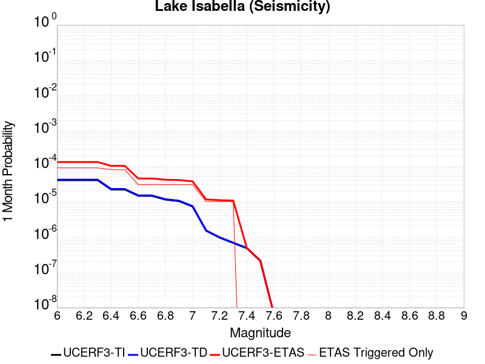 |  |  |

| Magnitude | 1 wk TI Prob | 1 wk TD Prob | 1 wk ETAS Prob | 1 wk ETAS/TD Gain | 1 wk ETAS Triggered Only | 1 mo TI Prob | 1 mo TD Prob | 1 mo ETAS Prob | 1 mo ETAS/TD Gain | 1 mo ETAS Triggered Only | 1 yr TI Prob | 1 yr TD Prob | 1 yr ETAS Prob | 1 yr ETAS/TD Gain | 1 yr ETAS Triggered Only | 10 yr TI Prob | 10 yr TD Prob | 10 yr ETAS Prob | 10 yr ETAS/TD Gain | 10 yr ETAS Triggered Only |
|-----|-----|-----|-----|-----|-----|-----|-----|-----|-----|-----|-----|-----|-----|-----|-----|-----|-----|-----|-----|-----|
| 6.0 | 9.431637E-6 | 9.741651E-6 | 1.02247686E-4 | 10.49593 | 9.250694E-5 | 4.0420677E-5 | 4.1749343E-5 | 1.3425242E-4 | 3.2156775 | 9.250694E-5 | 4.920106E-4 | 5.0819275E-4 | 6.0065265E-4 | 1.1819386 | 9.250694E-5 | 0.004909227 | 0.005071599 | 0.0052556745 | 1.0362954 | 1.8501388E-4 |
| 6.1 | 9.431637E-6 | 9.741651E-6 | 1.02247686E-4 | 10.49593 | 9.250694E-5 | 4.0420677E-5 | 4.1749343E-5 | 1.3425242E-4 | 3.2156775 | 9.250694E-5 | 4.920106E-4 | 5.0819275E-4 | 6.0065265E-4 | 1.1819386 | 9.250694E-5 | 0.004909227 | 0.005071599 | 0.0052556745 | 1.0362954 | 1.8501388E-4 |
| 6.2 | 9.431637E-6 | 9.741651E-6 | 1.02247686E-4 | 10.49593 | 9.250694E-5 | 4.0420677E-5 | 4.1749343E-5 | 1.3425242E-4 | 3.2156775 | 9.250694E-5 | 4.920106E-4 | 5.0819275E-4 | 6.0065265E-4 | 1.1819386 | 9.250694E-5 | 0.004909227 | 0.005071599 | 0.0052556745 | 1.0362954 | 1.8501388E-4 |
| 6.3 | 9.431637E-6 | 9.741651E-6 | 1.02247686E-4 | 10.49593 | 9.250694E-5 | 4.0420677E-5 | 4.1749343E-5 | 1.3425242E-4 | 3.2156775 | 9.250694E-5 | 4.920106E-4 | 5.0819275E-4 | 6.0065265E-4 | 1.1819386 | 9.250694E-5 | 0.004909227 | 0.005071599 | 0.0052556745 | 1.0362954 | 1.8501388E-4 |
| 6.4 | 5.144063E-6 | 5.3000763E-6 | 5.3000763E-6 | 1.0 | 0.0 | 2.2045799E-5 | 2.2714434E-5 | 2.2714434E-5 | 1.0 | 0.0 | 2.6837454E-4 | 2.765166E-4 | 2.765166E-4 | 1.0 | 0.0 | 0.0026805066 | 0.0027620657 | 0.0028543172 | 1.0333995 | 9.250694E-5 |
| 6.5 | 5.144063E-6 | 5.3000763E-6 | 5.3000763E-6 | 1.0 | 0.0 | 2.2045799E-5 | 2.2714434E-5 | 2.2714434E-5 | 1.0 | 0.0 | 2.6837454E-4 | 2.765166E-4 | 2.765166E-4 | 1.0 | 0.0 | 0.0026805066 | 0.0027620657 | 0.0028543172 | 1.0333995 | 9.250694E-5 |
| 6.6 | 3.4009804E-6 | 3.498786E-6 | 3.498786E-6 | 1.0 | 0.0 | 1.4575549E-5 | 1.4994721E-5 | 1.4994721E-5 | 1.0 | 0.0 | 1.7744285E-4 | 1.8254704E-4 | 1.8254704E-4 | 1.0 | 0.0 | 0.0017730123 | 0.0018241286 | 0.0019164667 | 1.0506204 | 9.250694E-5 |
| 6.7 | 3.3880428E-6 | 3.4856528E-6 | 3.4856528E-6 | 1.0 | 0.0 | 1.4520103E-5 | 1.4938435E-5 | 1.4938435E-5 | 1.0 | 0.0 | 1.767679E-4 | 1.8186188E-4 | 1.8186188E-4 | 1.0 | 0.0 | 0.0017662736 | 0.0018172882 | 0.001909627 | 1.0508113 | 9.250694E-5 |
| 6.8 | 2.6582E-6 | 2.7337003E-6 | 2.7337003E-6 | 1.0 | 0.0 | 1.1392236E-5 | 1.1715813E-5 | 1.1715813E-5 | 1.0 | 0.0 | 1.3869164E-4 | 1.4263204E-4 | 1.4263204E-4 | 1.0 | 0.0 | 0.0013860512 | 0.0014255369 | 0.001517912 | 1.0648001 | 9.250694E-5 |
| 6.9 | 2.406011E-6 | 2.4743288E-6 | 2.4743288E-6 | 1.0 | 0.0 | 1.0311434E-5 | 1.0604231E-5 | 1.0604231E-5 | 1.0 | 0.0 | 1.2553448E-4 | 1.2910018E-4 | 1.2910018E-4 | 1.0 | 0.0 | 0.0012546359 | 0.0012903814 | 0.001382769 | 1.0715971 | 9.250694E-5 |
| 7.0 | 1.6953097E-6 | 1.7429371E-6 | 1.7429371E-6 | 1.0 | 0.0 | 7.265593E-6 | 7.469715E-6 | 7.469715E-6 | 1.0 | 0.0 | 8.8455E-5 | 9.094104E-5 | 9.094104E-5 | 1.0 | 0.0 | 8.84198E-4 | 9.09141E-4 | 0.0010015637 | 1.1016595 | 9.250694E-5 |
| 7.1 | 3.5013824E-7 | 3.5714822E-7 | 3.5714822E-7 | 1.0 | 0.0 | 1.5005916E-6 | 1.5306344E-6 | 1.5306344E-6 | 1.0 | 0.0 | 1.826955E-5 | 1.8635317E-5 | 1.8635317E-5 | 1.0 | 0.0 | 1.8268047E-4 | 1.863378E-4 | 1.863378E-4 | 1.0 | 0.0 |
| 7.2 | 2.2321095E-7 | 2.2750574E-7 | 2.2750574E-7 | 1.0 | 0.0 | 9.56618E-7 | 9.750242E-7 | 9.750242E-7 | 1.0 | 0.0 | 1.1646762E-5 | 1.1870856E-5 | 1.1870856E-5 | 1.0 | 0.0 | 1.1646151E-4 | 1.1870232E-4 | 1.1870232E-4 | 1.0 | 0.0 |
| 7.3 | 1.5760406E-7 | 1.6060922E-7 | 1.6060922E-7 | 1.0 | 0.0 | 6.7544585E-7 | 6.8832503E-7 | 6.8832503E-7 | 1.0 | 0.0 | 8.223522E-6 | 8.380326E-6 | 8.380326E-6 | 1.0 | 0.0 | 8.2232174E-5 | 8.3800165E-5 | 8.3800165E-5 | 1.0 | 0.0 |
| 7.4 | 1.1216497E-7 | 1.1431706E-7 | 1.1431706E-7 | 1.0 | 0.0 | 4.8070694E-7 | 4.899302E-7 | 4.899302E-7 | 1.0 | 0.0 | 5.852591E-6 | 5.964884E-6 | 5.964884E-6 | 1.0 | 0.0 | 5.8524372E-5 | 5.9647282E-5 | 5.9647282E-5 | 1.0 | 0.0 |
| 7.5 | 4.885185E-8 | 4.9787737E-8 | 4.9787737E-8 | 1.0 | 0.0 | 2.0936506E-7 | 2.13376E-7 | 2.13376E-7 | 1.0 | 0.0 | 2.5490165E-6 | 2.59785E-6 | 2.59785E-6 | 1.0 | 0.0 | 2.5489873E-5 | 2.5978214E-5 | 2.5978214E-5 | 1.0 | 0.0 |
| 7.6 | 1.504641E-9 | 1.5317903E-9 | 1.5317903E-9 | 1.0 | 0.0 | 6.4484613E-9 | 6.5648154E-9 | 6.5648154E-9 | 1.0 | 0.0 | 7.851001E-8 | 7.992663E-8 | 7.992663E-8 | 1.0 | 0.0 | 7.8509987E-7 | 7.992663E-7 | 7.992663E-7 | 1.0 | 0.0 |

## Great Valley 09 (Laguna Seca)
*[(top)](#table-of-contents)*

| 1 Week | 1 Month | 1 Year | 10 Year |
|-----|-----|-----|-----|
|  |  |  |  |

| Magnitude | 1 wk TI Prob | 1 wk TD Prob | 1 wk ETAS Prob | 1 wk ETAS/TD Gain | 1 wk ETAS Triggered Only | 1 mo TI Prob | 1 mo TD Prob | 1 mo ETAS Prob | 1 mo ETAS/TD Gain | 1 mo ETAS Triggered Only | 1 yr TI Prob | 1 yr TD Prob | 1 yr ETAS Prob | 1 yr ETAS/TD Gain | 1 yr ETAS Triggered Only | 10 yr TI Prob | 10 yr TD Prob | 10 yr ETAS Prob | 10 yr ETAS/TD Gain | 10 yr ETAS Triggered Only |
|-----|-----|-----|-----|-----|-----|-----|-----|-----|-----|-----|-----|-----|-----|-----|-----|-----|-----|-----|-----|-----|
| 6.0 | 5.4353277E-5 | 7.05022E-5 | 2.5550302E-4 | 3.6240435 | 1.8501388E-4 | 2.3292181E-4 | 3.0211566E-4 | 4.8707364E-4 | 1.6122092 | 1.8501388E-4 | 0.0028321352 | 0.0036721937 | 0.0038565283 | 1.0501974 | 1.8501388E-4 | 0.02796312 | 0.03611547 | 0.036293805 | 1.0049379 | 1.8501388E-4 |
| 6.1 | 4.5578287E-5 | 5.822118E-5 | 5.822118E-5 | 1.0 | 0.0 | 1.953209E-4 | 2.4949326E-4 | 2.4949326E-4 | 1.0 | 0.0 | 0.0023754383 | 0.003033432 | 0.003033432 | 1.0 | 0.0 | 0.023502063 | 0.029919548 | 0.029919548 | 1.0 | 0.0 |
| 6.2 | 2.8536782E-5 | 3.4737273E-5 | 3.4737273E-5 | 1.0 | 0.0 | 1.2229476E-4 | 1.4886224E-4 | 1.4886224E-4 | 1.0 | 0.0 | 0.0014879217 | 0.001810813 | 0.001810813 | 1.0 | 0.0 | 0.014779986 | 0.017958116 | 0.017958116 | 1.0 | 0.0 |
| 6.3 | 2.3698774E-5 | 2.8213295E-5 | 2.8213295E-5 | 1.0 | 0.0 | 1.01562226E-4 | 1.20905075E-4 | 1.20905075E-4 | 1.0 | 0.0 | 0.0012358186 | 0.0014710218 | 0.0014710218 | 1.0 | 0.0 | 0.012289686 | 0.014611342 | 0.014611342 | 1.0 | 0.0 |
| 6.4 | 1.9191197E-5 | 2.2123184E-5 | 2.2123184E-5 | 1.0 | 0.0 | 8.2245395E-5 | 9.4806666E-5 | 9.4806666E-5 | 1.0 | 0.0 | 0.0010008777 | 0.0011536429 | 0.0011536429 | 1.0 | 0.0 | 0.009963818 | 0.011476948 | 0.011476948 | 1.0 | 0.0 |
| 6.5 | 1.5203241E-5 | 1.6802203E-5 | 1.6802203E-5 | 1.0 | 0.0 | 6.5155116E-5 | 7.200386E-5 | 7.200386E-5 | 1.0 | 0.0 | 7.9297484E-4 | 8.7626575E-4 | 8.7626575E-4 | 1.0 | 0.0 | 0.007901512 | 0.0087295165 | 0.0087295165 | 1.0 | 0.0 |
| 6.6 | 1.0984925E-5 | 1.1242595E-5 | 1.1242595E-5 | 1.0 | 0.0 | 4.70774E-5 | 4.8181686E-5 | 4.8181686E-5 | 1.0 | 0.0 | 5.730166E-4 | 5.8645656E-4 | 5.8645656E-4 | 1.0 | 0.0 | 0.005715413 | 0.0058494853 | 0.0058494853 | 1.0 | 0.0 |
| 6.7 | 9.134616E-6 | 9.019894E-6 | 9.019894E-6 | 1.0 | 0.0 | 3.9147766E-5 | 3.865613E-5 | 3.865613E-5 | 1.0 | 0.0 | 4.7651984E-4 | 4.7053912E-4 | 4.7053912E-4 | 1.0 | 0.0 | 0.004754993 | 0.0046956735 | 0.0046956735 | 1.0 | 0.0 |
| 6.8 | 7.785589E-6 | 7.4519444E-6 | 7.4519444E-6 | 1.0 | 0.0 | 3.3366385E-5 | 3.1936524E-5 | 3.1936524E-5 | 1.0 | 0.0 | 4.0616E-4 | 3.8875983E-4 | 3.8875983E-4 | 1.0 | 0.0 | 0.0040541845 | 0.0038810016 | 0.0038810016 | 1.0 | 0.0 |
| 6.9 | 5.579095E-6 | 4.898492E-6 | 4.898492E-6 | 1.0 | 0.0 | 2.3910188E-5 | 2.0993377E-5 | 2.0993377E-5 | 1.0 | 0.0 | 2.9106764E-4 | 2.5556577E-4 | 2.5556577E-4 | 1.0 | 0.0 | 0.002906867 | 0.002552856 | 0.002552856 | 1.0 | 0.0 |
| 7.0 | 2.6816688E-6 | 1.5216126E-6 | 1.5216126E-6 | 1.0 | 0.0 | 1.1492816E-5 | 6.521181E-6 | 6.521181E-6 | 1.0 | 0.0 | 1.3991605E-4 | 7.939258E-5 | 7.939258E-5 | 1.0 | 0.0 | 0.0013982799 | 7.9365086E-4 | 7.9365086E-4 | 1.0 | 0.0 |
| 7.1 | 1.9951021E-6 | 7.453827E-7 | 7.453827E-7 | 1.0 | 0.0 | 8.55041E-6 | 3.1944935E-6 | 3.1944935E-6 | 1.0 | 0.0 | 1.0409627E-4 | 3.8892307E-5 | 3.8892307E-5 | 1.0 | 0.0 | 0.0010404752 | 3.8885913E-4 | 3.8885913E-4 | 1.0 | 0.0 |
| 7.2 | 1.9951021E-6 | 7.453827E-7 | 7.453827E-7 | 1.0 | 0.0 | 8.55041E-6 | 3.1944935E-6 | 3.1944935E-6 | 1.0 | 0.0 | 1.0409627E-4 | 3.8892307E-5 | 3.8892307E-5 | 1.0 | 0.0 | 0.0010404752 | 3.8885913E-4 | 3.8885913E-4 | 1.0 | 0.0 |
| 7.3 | 1.7087556E-6 | 6.578881E-7 | 6.578881E-7 | 1.0 | 0.0 | 7.3232177E-6 | 2.8195177E-6 | 2.8195177E-6 | 1.0 | 0.0 | 8.915652E-5 | 3.4327128E-5 | 3.4327128E-5 | 1.0 | 0.0 | 8.9120766E-4 | 3.432223E-4 | 3.432223E-4 | 1.0 | 0.0 |
| 7.4 | 1.3804846E-6 | 6.073852E-7 | 6.073852E-7 | 1.0 | 0.0 | 5.916349E-6 | 2.6030768E-6 | 2.6030768E-6 | 1.0 | 0.0 | 7.2029165E-5 | 3.169204E-5 | 3.169204E-5 | 1.0 | 0.0 | 7.200583E-4 | 3.1687922E-4 | 3.1687922E-4 | 1.0 | 0.0 |
| 7.5 | 1.3804846E-6 | 6.073852E-7 | 6.073852E-7 | 1.0 | 0.0 | 5.916349E-6 | 2.6030768E-6 | 2.6030768E-6 | 1.0 | 0.0 | 7.2029165E-5 | 3.169204E-5 | 3.169204E-5 | 1.0 | 0.0 | 7.200583E-4 | 3.1687922E-4 | 3.1687922E-4 | 1.0 | 0.0 |

## Big Pine (Central)
*[(top)](#table-of-contents)*

| 1 Week | 1 Month | 1 Year | 10 Year |
|-----|-----|-----|-----|
|  | 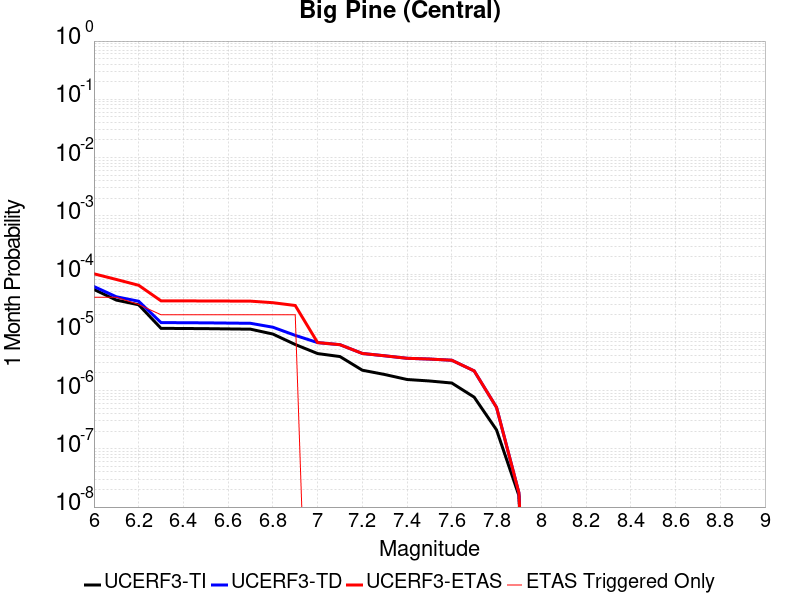 |  |  |

| Magnitude | 1 wk TI Prob | 1 wk TD Prob | 1 wk ETAS Prob | 1 wk ETAS/TD Gain | 1 wk ETAS Triggered Only | 1 mo TI Prob | 1 mo TD Prob | 1 mo ETAS Prob | 1 mo ETAS/TD Gain | 1 mo ETAS Triggered Only | 1 yr TI Prob | 1 yr TD Prob | 1 yr ETAS Prob | 1 yr ETAS/TD Gain | 1 yr ETAS Triggered Only | 10 yr TI Prob | 10 yr TD Prob | 10 yr ETAS Prob | 10 yr ETAS/TD Gain | 10 yr ETAS Triggered Only |
|-----|-----|-----|-----|-----|-----|-----|-----|-----|-----|-----|-----|-----|-----|-----|-----|-----|-----|-----|-----|-----|
| 6.0 | 1.2706755E-5 | 1.4250529E-5 | 1.06756146E-4 | 7.4913816 | 9.250694E-5 | 5.4456385E-5 | 6.107247E-5 | 1.5357375E-4 | 2.5146153 | 9.250694E-5 | 6.628048E-4 | 7.433402E-4 | 9.2821656E-4 | 1.2487103 | 1.8501388E-4 | 0.006608314 | 0.0074135666 | 0.007597209 | 1.0247711 | 1.8501388E-4 |
| 6.1 | 8.342579E-6 | 9.510762E-6 | 1.0201682E-4 | 10.726461 | 9.250694E-5 | 3.5753423E-5 | 4.0759893E-5 | 1.3326306E-4 | 3.2694654 | 9.250694E-5 | 4.3521097E-4 | 4.961604E-4 | 5.886215E-4 | 1.1863531 | 9.250694E-5 | 0.0043435963 | 0.0049540824 | 0.005046131 | 1.0185803 | 9.250694E-5 |
| 6.2 | 6.923899E-6 | 7.967147E-6 | 7.967147E-6 | 1.0 | 0.0 | 2.9673516E-5 | 3.4144578E-5 | 3.4144578E-5 | 1.0 | 0.0 | 3.6121515E-4 | 4.156502E-4 | 4.156502E-4 | 1.0 | 0.0 | 0.003606286 | 0.0041520367 | 0.0041520367 | 1.0 | 0.0 |
| 6.3 | 2.728396E-6 | 3.4242908E-6 | 3.4242908E-6 | 1.0 | 0.0 | 1.1693074E-5 | 1.4675454E-5 | 1.4675454E-5 | 1.0 | 0.0 | 1.4235388E-4 | 1.7865987E-4 | 1.7865987E-4 | 1.0 | 0.0 | 0.0014226272 | 0.0017866704 | 0.0017866704 | 1.0 | 0.0 |
| 6.4 | 2.7136944E-6 | 3.408584E-6 | 3.408584E-6 | 1.0 | 0.0 | 1.1630066E-5 | 1.4608141E-5 | 1.4608141E-5 | 1.0 | 0.0 | 1.4158686E-4 | 1.7784047E-4 | 1.7784047E-4 | 1.0 | 0.0 | 0.0014149669 | 0.0017784894 | 0.0017784894 | 1.0 | 0.0 |
| 6.5 | 2.6971882E-6 | 3.3909291E-6 | 3.3909291E-6 | 1.0 | 0.0 | 1.1559327E-5 | 1.45324775E-5 | 1.45324775E-5 | 1.0 | 0.0 | 1.4072572E-4 | 1.7691942E-4 | 1.7691942E-4 | 1.0 | 0.0 | 0.0014063664 | 0.0017692937 | 0.0017692937 | 1.0 | 0.0 |
| 6.6 | 2.669092E-6 | 3.3609497E-6 | 3.3609497E-6 | 1.0 | 0.0 | 1.1438916E-5 | 1.4403995E-5 | 1.4403995E-5 | 1.0 | 0.0 | 1.3925991E-4 | 1.753554E-4 | 1.753554E-4 | 1.0 | 0.0 | 0.0013917267 | 0.0017536782 | 0.0017536782 | 1.0 | 0.0 |
| 6.7 | 2.6408059E-6 | 3.3309752E-6 | 3.3309752E-6 | 1.0 | 0.0 | 1.1317691E-5 | 1.4275535E-5 | 1.4275535E-5 | 1.0 | 0.0 | 1.3778417E-4 | 1.7379165E-4 | 1.7379165E-4 | 1.0 | 0.0 | 0.0013769877 | 0.0017380653 | 0.0017380653 | 1.0 | 0.0 |
| 6.8 | 2.1786943E-6 | 2.8544325E-6 | 2.8544325E-6 | 1.0 | 0.0 | 9.337228E-6 | 1.2233229E-5 | 1.2233229E-5 | 1.0 | 0.0 | 1.1367482E-4 | 1.4893012E-4 | 1.4893012E-4 | 1.0 | 0.0 | 0.0011361669 | 0.0014897975 | 0.0014897975 | 1.0 | 0.0 |
| 6.9 | 1.4411696E-6 | 2.068499E-6 | 2.068499E-6 | 1.0 | 0.0 | 6.1764263E-6 | 8.864968E-6 | 8.864968E-6 | 1.0 | 0.0 | 7.51954E-5 | 1.079259E-4 | 1.079259E-4 | 1.0 | 0.0 | 7.5169955E-4 | 0.0010801847 | 0.0010801847 | 1.0 | 0.0 |
| 7.0 | 1.0073411E-6 | 1.554261E-6 | 1.554261E-6 | 1.0 | 0.0 | 4.317169E-6 | 6.6611024E-6 | 6.6611024E-6 | 1.0 | 0.0 | 5.2560266E-5 | 8.1096056E-5 | 8.1096056E-5 | 1.0 | 0.0 | 5.2547833E-4 | 8.1210316E-4 | 8.1210316E-4 | 1.0 | 0.0 |
| 7.1 | 8.947104E-7 | 1.4302494E-6 | 1.4302494E-6 | 1.0 | 0.0 | 3.834468E-6 | 6.129627E-6 | 6.129627E-6 | 1.0 | 0.0 | 4.6683643E-5 | 7.46258E-5 | 7.46258E-5 | 1.0 | 0.0 | 4.6673836E-4 | 7.474457E-4 | 7.474457E-4 | 1.0 | 0.0 |
| 7.2 | 5.215166E-7 | 1.0111678E-6 | 1.0111678E-6 | 1.0 | 0.0 | 2.2350691E-6 | 4.3335694E-6 | 4.3335694E-6 | 1.0 | 0.0 | 2.7211627E-5 | 5.2759973E-5 | 5.2759973E-5 | 1.0 | 0.0 | 2.7208295E-4 | 5.2890263E-4 | 5.2890263E-4 | 1.0 | 0.0 |
| 7.3 | 4.4024807E-7 | 9.219589E-7 | 9.219589E-7 | 1.0 | 0.0 | 1.8867761E-6 | 3.9512465E-6 | 3.9512465E-6 | 1.0 | 0.0 | 2.2971257E-5 | 4.810541E-5 | 4.810541E-5 | 1.0 | 0.0 | 2.2968883E-4 | 4.8237795E-4 | 4.8237795E-4 | 1.0 | 0.0 |
| 7.4 | 3.6130905E-7 | 8.358523E-7 | 8.358523E-7 | 1.0 | 0.0 | 1.5484665E-6 | 3.5822195E-6 | 3.5822195E-6 | 1.0 | 0.0 | 1.8852415E-5 | 4.3612687E-5 | 4.3612687E-5 | 1.0 | 0.0 | 1.8850817E-4 | 4.374597E-4 | 4.374597E-4 | 1.0 | 0.0 |
| 7.5 | 3.408184E-7 | 8.108147E-7 | 8.108147E-7 | 1.0 | 0.0 | 1.4606494E-6 | 3.4749157E-6 | 3.4749157E-6 | 1.0 | 0.0 | 1.7783263E-5 | 4.2306317E-5 | 4.2306317E-5 | 1.0 | 0.0 | 1.778184E-4 | 4.2437963E-4 | 4.2437963E-4 | 1.0 | 0.0 |
| 7.6 | 3.1428627E-7 | 7.7316E-7 | 7.7316E-7 | 1.0 | 0.0 | 1.3469405E-6 | 3.3135389E-6 | 3.3135389E-6 | 1.0 | 0.0 | 1.6398877E-5 | 4.0341627E-5 | 4.0341627E-5 | 1.0 | 0.0 | 1.6397667E-4 | 4.0471106E-4 | 4.0471106E-4 | 1.0 | 0.0 |
| 7.7 | 1.7972785E-7 | 5.077752E-7 | 5.077752E-7 | 1.0 | 0.0 | 7.70262E-7 | 2.1761778E-6 | 2.1761778E-6 | 1.0 | 0.0 | 9.377899E-6 | 2.6494654E-5 | 2.6494654E-5 | 1.0 | 0.0 | 9.377503E-5 | 2.662899E-4 | 2.662899E-4 | 1.0 | 0.0 |
| 7.8 | 4.9230927E-8 | 1.198079E-7 | 1.198079E-7 | 1.0 | 0.0 | 2.1098968E-7 | 5.134623E-7 | 5.134623E-7 | 1.0 | 0.0 | 2.5687964E-6 | 6.2513873E-6 | 6.2513873E-6 | 1.0 | 0.0 | 2.5687666E-5 | 6.295415E-5 | 6.295415E-5 | 1.0 | 0.0 |
| 7.9 | 3.6805972E-9 | 4.105293E-9 | 4.105293E-9 | 1.0 | 0.0 | 1.5773987E-8 | 1.7594115E-8 | 1.7594115E-8 | 1.0 | 0.0 | 1.9204828E-7 | 2.1420831E-7 | 2.1420831E-7 | 1.0 | 0.0 | 1.920481E-6 | 2.1900614E-6 | 2.1900614E-6 | 1.0 | 0.0 |

## Northridge Hills
*[(top)](#table-of-contents)*

| 1 Week | 1 Month | 1 Year | 10 Year |
|-----|-----|-----|-----|
|  |  |  |  |

| Magnitude | 1 wk TI Prob | 1 wk TD Prob | 1 wk ETAS Prob | 1 wk ETAS/TD Gain | 1 wk ETAS Triggered Only | 1 mo TI Prob | 1 mo TD Prob | 1 mo ETAS Prob | 1 mo ETAS/TD Gain | 1 mo ETAS Triggered Only | 1 yr TI Prob | 1 yr TD Prob | 1 yr ETAS Prob | 1 yr ETAS/TD Gain | 1 yr ETAS Triggered Only | 10 yr TI Prob | 10 yr TD Prob | 10 yr ETAS Prob | 10 yr ETAS/TD Gain | 10 yr ETAS Triggered Only |
|-----|-----|-----|-----|-----|-----|-----|-----|-----|-----|-----|-----|-----|-----|-----|-----|-----|-----|-----|-----|-----|
| 6.0 | 5.095982E-6 | 3.6152098E-6 | 3.6152098E-6 | 1.0 | 0.0 | 2.183974E-5 | 1.5493664E-5 | 1.0799917E-4 | 6.970537 | 9.250694E-5 | 2.658664E-4 | 1.8861916E-4 | 2.8110866E-4 | 1.4903505 | 9.250694E-5 | 0.0026554854 | 0.001884603 | 0.0019769357 | 1.0489931 | 9.250694E-5 |
| 6.1 | 5.095982E-6 | 3.6152098E-6 | 3.6152098E-6 | 1.0 | 0.0 | 2.183974E-5 | 1.5493664E-5 | 1.0799917E-4 | 6.970537 | 9.250694E-5 | 2.658664E-4 | 1.8861916E-4 | 2.8110866E-4 | 1.4903505 | 9.250694E-5 | 0.0026554854 | 0.001884603 | 0.0019769357 | 1.0489931 | 9.250694E-5 |
| 6.2 | 5.095982E-6 | 3.6152098E-6 | 3.6152098E-6 | 1.0 | 0.0 | 2.183974E-5 | 1.5493664E-5 | 1.0799917E-4 | 6.970537 | 9.250694E-5 | 2.658664E-4 | 1.8861916E-4 | 2.8110866E-4 | 1.4903505 | 9.250694E-5 | 0.0026554854 | 0.001884603 | 0.0019769357 | 1.0489931 | 9.250694E-5 |
| 6.3 | 5.095982E-6 | 3.6152098E-6 | 3.6152098E-6 | 1.0 | 0.0 | 2.183974E-5 | 1.5493664E-5 | 1.0799917E-4 | 6.970537 | 9.250694E-5 | 2.658664E-4 | 1.8861916E-4 | 2.8110866E-4 | 1.4903505 | 9.250694E-5 | 0.0026554854 | 0.001884603 | 0.0019769357 | 1.0489931 | 9.250694E-5 |
| 6.4 | 5.095982E-6 | 3.6152098E-6 | 3.6152098E-6 | 1.0 | 0.0 | 2.183974E-5 | 1.5493664E-5 | 1.0799917E-4 | 6.970537 | 9.250694E-5 | 2.658664E-4 | 1.8861916E-4 | 2.8110866E-4 | 1.4903505 | 9.250694E-5 | 0.0026554854 | 0.001884603 | 0.0019769357 | 1.0489931 | 9.250694E-5 |
| 6.5 | 5.095982E-6 | 3.6152098E-6 | 3.6152098E-6 | 1.0 | 0.0 | 2.183974E-5 | 1.5493664E-5 | 1.0799917E-4 | 6.970537 | 9.250694E-5 | 2.658664E-4 | 1.8861916E-4 | 2.8110866E-4 | 1.4903505 | 9.250694E-5 | 0.0026554854 | 0.001884603 | 0.0019769357 | 1.0489931 | 9.250694E-5 |
| 6.6 | 5.095982E-6 | 3.6152098E-6 | 3.6152098E-6 | 1.0 | 0.0 | 2.183974E-5 | 1.5493664E-5 | 1.0799917E-4 | 6.970537 | 9.250694E-5 | 2.658664E-4 | 1.8861916E-4 | 2.8110866E-4 | 1.4903505 | 9.250694E-5 | 0.0026554854 | 0.001884603 | 0.0019769357 | 1.0489931 | 9.250694E-5 |
| 6.7 | 5.095982E-6 | 3.6152098E-6 | 3.6152098E-6 | 1.0 | 0.0 | 2.183974E-5 | 1.5493664E-5 | 1.0799917E-4 | 6.970537 | 9.250694E-5 | 2.658664E-4 | 1.8861916E-4 | 2.8110866E-4 | 1.4903505 | 9.250694E-5 | 0.0026554854 | 0.001884603 | 0.0019769357 | 1.0489931 | 9.250694E-5 |
| 6.8 | 5.095982E-6 | 3.6152098E-6 | 3.6152098E-6 | 1.0 | 0.0 | 2.183974E-5 | 1.5493664E-5 | 1.0799917E-4 | 6.970537 | 9.250694E-5 | 2.658664E-4 | 1.8861916E-4 | 2.8110866E-4 | 1.4903505 | 9.250694E-5 | 0.0026554854 | 0.001884603 | 0.0019769357 | 1.0489931 | 9.250694E-5 |
| 6.9 | 5.0942654E-6 | 3.6134247E-6 | 3.6134247E-6 | 1.0 | 0.0 | 2.1832384E-5 | 1.5486015E-5 | 1.07991524E-4 | 6.973487 | 9.250694E-5 | 2.6577685E-4 | 1.8852603E-4 | 2.8101553E-4 | 1.4905927 | 9.250694E-5 | 0.002654592 | 0.0018836735 | 0.0019760062 | 1.0490173 | 9.250694E-5 |
| 7.0 | 4.851143E-6 | 3.3587396E-6 | 3.3587396E-6 | 1.0 | 0.0 | 2.0790447E-5 | 1.4394519E-5 | 1.0690012E-4 | 7.4264464 | 9.250694E-5 | 2.5309427E-4 | 1.7523921E-4 | 2.6772995E-4 | 1.527797 | 9.250694E-5 | 0.0025280623 | 0.0017510147 | 0.0018433597 | 1.052738 | 9.250694E-5 |
| 7.1 | 4.7910607E-6 | 3.2970208E-6 | 3.2970208E-6 | 1.0 | 0.0 | 2.0532956E-5 | 1.4130013E-5 | 1.0663564E-4 | 7.5467477 | 9.250694E-5 | 2.4996005E-4 | 1.7201937E-4 | 2.645104E-4 | 1.537678 | 9.250694E-5 | 0.0024967908 | 0.0017188663 | 0.0018112141 | 1.0537261 | 9.250694E-5 |
| 7.2 | 4.580079E-6 | 3.1067987E-6 | 3.1067987E-6 | 1.0 | 0.0 | 1.9628762E-5 | 1.3314784E-5 | 1.3314784E-5 | 1.0 | 0.0 | 2.3895396E-4 | 1.6209547E-4 | 1.6209547E-4 | 1.0 | 0.0 | 0.0023869718 | 0.0016197758 | 0.0016197758 | 1.0 | 0.0 |
| 7.3 | 4.290062E-6 | 2.8682275E-6 | 2.8682275E-6 | 1.0 | 0.0 | 1.838585E-5 | 1.2292346E-5 | 1.2292346E-5 | 1.0 | 0.0 | 2.2382473E-4 | 1.4964906E-4 | 1.4964906E-4 | 1.0 | 0.0 | 0.0022359942 | 0.0014954859 | 0.0014954859 | 1.0 | 0.0 |
| 7.4 | 4.0259683E-6 | 2.673904E-6 | 2.673904E-6 | 1.0 | 0.0 | 1.7254037E-5 | 1.1459538E-5 | 1.1459538E-5 | 1.0 | 0.0 | 2.1004764E-4 | 1.3951097E-4 | 1.3951097E-4 | 1.0 | 0.0 | 0.002098492 | 0.0013942367 | 0.0013942367 | 1.0 | 0.0 |
| 7.5 | 3.5477108E-6 | 2.285216E-6 | 2.285216E-6 | 1.0 | 0.0 | 1.5204386E-5 | 9.793746E-6 | 9.793746E-6 | 1.0 | 0.0 | 1.8509767E-4 | 1.1923235E-4 | 1.1923235E-4 | 1.0 | 0.0 | 0.0018494357 | 0.0011916853 | 0.0011916853 | 1.0 | 0.0 |
| 7.6 | 2.9990608E-6 | 1.8528339E-6 | 1.8528339E-6 | 1.0 | 0.0 | 1.2853055E-5 | 7.940693E-6 | 7.940693E-6 | 1.0 | 0.0 | 1.564747E-4 | 9.667365E-5 | 9.667365E-5 | 1.0 | 0.0 | 0.0015636457 | 9.663168E-4 | 9.663168E-4 | 1.0 | 0.0 |
| 7.7 | 2.4542855E-6 | 1.4461344E-6 | 1.4461344E-6 | 1.0 | 0.0 | 1.05183235E-5 | 6.197704E-6 | 6.197704E-6 | 1.0 | 0.0 | 1.2805307E-4 | 7.545444E-5 | 7.545444E-5 | 1.0 | 0.0 | 0.001279793 | 7.5428875E-4 | 7.5428875E-4 | 1.0 | 0.0 |
| 7.8 | 1.3623128E-6 | 8.016168E-7 | 8.016168E-7 | 1.0 | 0.0 | 5.8384703E-6 | 3.4354962E-6 | 3.4354962E-6 | 1.0 | 0.0 | 7.108106E-5 | 4.1826366E-5 | 4.1826366E-5 | 1.0 | 0.0 | 7.1058323E-4 | 4.1818514E-4 | 4.1818514E-4 | 1.0 | 0.0 |
| 7.9 | 7.716622E-7 | 4.218757E-7 | 4.218757E-7 | 1.0 | 0.0 | 3.3071194E-6 | 1.8080375E-6 | 1.8080375E-6 | 1.0 | 0.0 | 4.0263436E-5 | 2.2012635E-5 | 2.2012635E-5 | 1.0 | 0.0 | 4.0256142E-4 | 2.2010466E-4 | 2.2010466E-4 | 1.0 | 0.0 |
| 8.0 | 1.2117711E-7 | 6.6220565E-8 | 6.6220565E-8 | 1.0 | 0.0 | 5.1933034E-7 | 2.838024E-7 | 2.838024E-7 | 1.0 | 0.0 | 6.3228285E-6 | 3.4552888E-6 | 3.4552888E-6 | 1.0 | 0.0 | 6.3226486E-5 | 3.455237E-5 | 3.455237E-5 | 1.0 | 0.0 |

## Lost Hills
*[(top)](#table-of-contents)*

| 1 Week | 1 Month | 1 Year | 10 Year |
|-----|-----|-----|-----|
|  |  | 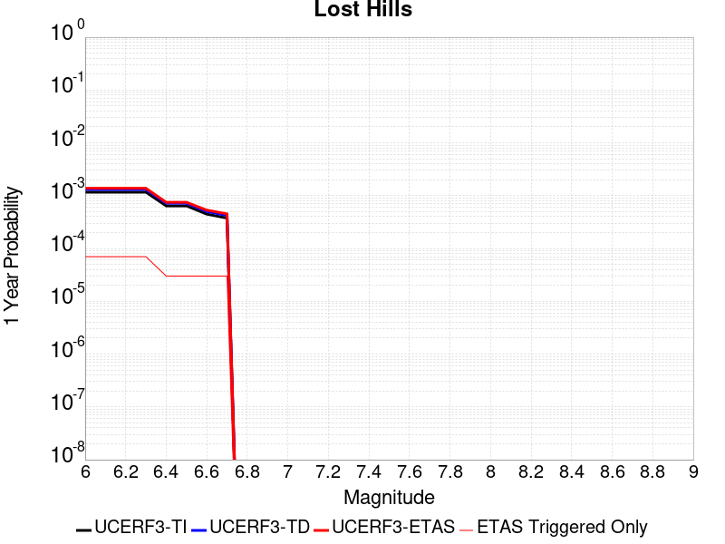 |  |

| Magnitude | 1 wk TI Prob | 1 wk TD Prob | 1 wk ETAS Prob | 1 wk ETAS/TD Gain | 1 wk ETAS Triggered Only | 1 mo TI Prob | 1 mo TD Prob | 1 mo ETAS Prob | 1 mo ETAS/TD Gain | 1 mo ETAS Triggered Only | 1 yr TI Prob | 1 yr TD Prob | 1 yr ETAS Prob | 1 yr ETAS/TD Gain | 1 yr ETAS Triggered Only | 10 yr TI Prob | 10 yr TD Prob | 10 yr ETAS Prob | 10 yr ETAS/TD Gain | 10 yr ETAS Triggered Only |
|-----|-----|-----|-----|-----|-----|-----|-----|-----|-----|-----|-----|-----|-----|-----|-----|-----|-----|-----|-----|-----|
| 6.0 | 2.233523E-5 | 2.5106583E-5 | 1.176112E-4 | 4.6844764 | 9.250694E-5 | 9.571891E-5 | 1.0759615E-4 | 2.0009313E-4 | 1.8596681 | 9.250694E-5 | 0.0011647546 | 0.001309364 | 0.0014017498 | 1.0705578 | 9.250694E-5 | 0.011586686 | 0.013033091 | 0.013124392 | 1.0070053 | 9.250694E-5 |
| 6.1 | 2.233523E-5 | 2.5106583E-5 | 1.176112E-4 | 4.6844764 | 9.250694E-5 | 9.571891E-5 | 1.0759615E-4 | 2.0009313E-4 | 1.8596681 | 9.250694E-5 | 0.0011647546 | 0.001309364 | 0.0014017498 | 1.0705578 | 9.250694E-5 | 0.011586686 | 0.013033091 | 0.013124392 | 1.0070053 | 9.250694E-5 |
| 6.2 | 2.233523E-5 | 2.5106583E-5 | 1.176112E-4 | 4.6844764 | 9.250694E-5 | 9.571891E-5 | 1.0759615E-4 | 2.0009313E-4 | 1.8596681 | 9.250694E-5 | 0.0011647546 | 0.001309364 | 0.0014017498 | 1.0705578 | 9.250694E-5 | 0.011586686 | 0.013033091 | 0.013124392 | 1.0070053 | 9.250694E-5 |
| 6.3 | 2.233523E-5 | 2.5106583E-5 | 1.176112E-4 | 4.6844764 | 9.250694E-5 | 9.571891E-5 | 1.0759615E-4 | 2.0009313E-4 | 1.8596681 | 9.250694E-5 | 0.0011647546 | 0.001309364 | 0.0014017498 | 1.0705578 | 9.250694E-5 | 0.011586686 | 0.013033091 | 0.013124392 | 1.0070053 | 9.250694E-5 |
| 6.4 | 1.2288092E-5 | 1.3781108E-5 | 1.3781108E-5 | 1.0 | 0.0 | 5.2662188E-5 | 5.906108E-5 | 5.906108E-5 | 1.0 | 0.0 | 6.409735E-4 | 7.189252E-4 | 7.189252E-4 | 1.0 | 0.0 | 0.006391279 | 0.0071752006 | 0.0071752006 | 1.0 | 0.0 |
| 6.5 | 1.2288092E-5 | 1.3781108E-5 | 1.3781108E-5 | 1.0 | 0.0 | 5.2662188E-5 | 5.906108E-5 | 5.906108E-5 | 1.0 | 0.0 | 6.409735E-4 | 7.189252E-4 | 7.189252E-4 | 1.0 | 0.0 | 0.006391279 | 0.0071752006 | 0.0071752006 | 1.0 | 0.0 |
| 6.6 | 8.58281E-6 | 9.63377E-6 | 9.63377E-6 | 1.0 | 0.0 | 3.6782953E-5 | 4.12874E-5 | 4.12874E-5 | 1.0 | 0.0 | 4.4774043E-4 | 5.026414E-4 | 5.026414E-4 | 1.0 | 0.0 | 0.0044683935 | 0.005023205 | 0.005023205 | 1.0 | 0.0 |
| 6.7 | 7.205685E-6 | 8.088302E-6 | 8.088302E-6 | 1.0 | 0.0 | 3.088114E-5 | 3.466415E-5 | 3.466415E-5 | 1.0 | 0.0 | 3.7591302E-4 | 4.2203604E-4 | 4.2203604E-4 | 1.0 | 0.0 | 0.0037527776 | 0.0042203604 | 0.0042203604 | 1.0 | 0.0 |

## Cucamonga
*[(top)](#table-of-contents)*

| 1 Week | 1 Month | 1 Year | 10 Year |
|-----|-----|-----|-----|
|  |  |  |  |

| Magnitude | 1 wk TI Prob | 1 wk TD Prob | 1 wk ETAS Prob | 1 wk ETAS/TD Gain | 1 wk ETAS Triggered Only | 1 mo TI Prob | 1 mo TD Prob | 1 mo ETAS Prob | 1 mo ETAS/TD Gain | 1 mo ETAS Triggered Only | 1 yr TI Prob | 1 yr TD Prob | 1 yr ETAS Prob | 1 yr ETAS/TD Gain | 1 yr ETAS Triggered Only | 10 yr TI Prob | 10 yr TD Prob | 10 yr ETAS Prob | 10 yr ETAS/TD Gain | 10 yr ETAS Triggered Only |
|-----|-----|-----|-----|-----|-----|-----|-----|-----|-----|-----|-----|-----|-----|-----|-----|-----|-----|-----|-----|-----|
| 6.0 | 1.1848348E-5 | 1.1737008E-5 | 1.0424286E-4 | 8.881553 | 9.250694E-5 | 5.0777642E-5 | 5.030051E-5 | 1.4280279E-4 | 2.838993 | 9.250694E-5 | 6.180424E-4 | 6.1223935E-4 | 7.0468965E-4 | 1.1510035 | 9.250694E-5 | 0.0061632637 | 0.0061067017 | 0.0061986437 | 1.0150559 | 9.250694E-5 |
| 6.1 | 1.1848348E-5 | 1.1737008E-5 | 1.0424286E-4 | 8.881553 | 9.250694E-5 | 5.0777642E-5 | 5.030051E-5 | 1.4280279E-4 | 2.838993 | 9.250694E-5 | 6.180424E-4 | 6.1223935E-4 | 7.0468965E-4 | 1.1510035 | 9.250694E-5 | 0.0061632637 | 0.0061067017 | 0.0061986437 | 1.0150559 | 9.250694E-5 |
| 6.2 | 1.1848348E-5 | 1.1737008E-5 | 1.0424286E-4 | 8.881553 | 9.250694E-5 | 5.0777642E-5 | 5.030051E-5 | 1.4280279E-4 | 2.838993 | 9.250694E-5 | 6.180424E-4 | 6.1223935E-4 | 7.0468965E-4 | 1.1510035 | 9.250694E-5 | 0.0061632637 | 0.0061067017 | 0.0061986437 | 1.0150559 | 9.250694E-5 |
| 6.3 | 1.1848348E-5 | 1.1737008E-5 | 1.0424286E-4 | 8.881553 | 9.250694E-5 | 5.0777642E-5 | 5.030051E-5 | 1.4280279E-4 | 2.838993 | 9.250694E-5 | 6.180424E-4 | 6.1223935E-4 | 7.0468965E-4 | 1.1510035 | 9.250694E-5 | 0.0061632637 | 0.0061067017 | 0.0061986437 | 1.0150559 | 9.250694E-5 |
| 6.4 | 1.1848348E-5 | 1.1737008E-5 | 1.0424286E-4 | 8.881553 | 9.250694E-5 | 5.0777642E-5 | 5.030051E-5 | 1.4280279E-4 | 2.838993 | 9.250694E-5 | 6.180424E-4 | 6.1223935E-4 | 7.0468965E-4 | 1.1510035 | 9.250694E-5 | 0.0061632637 | 0.0061067017 | 0.0061986437 | 1.0150559 | 9.250694E-5 |
| 6.5 | 1.16988695E-5 | 1.15760395E-5 | 1.04081904E-4 | 8.99115 | 9.250694E-5 | 5.013705E-5 | 4.9610666E-5 | 1.4211301E-4 | 2.8645656 | 9.250694E-5 | 6.102476E-4 | 6.0384517E-4 | 6.962962E-4 | 1.153104 | 9.250694E-5 | 0.006085745 | 0.006023216 | 0.006115166 | 1.015266 | 9.250694E-5 |
| 6.6 | 1.16988695E-5 | 1.15760395E-5 | 1.04081904E-4 | 8.99115 | 9.250694E-5 | 5.013705E-5 | 4.9610666E-5 | 1.4211301E-4 | 2.8645656 | 9.250694E-5 | 6.102476E-4 | 6.0384517E-4 | 6.962962E-4 | 1.153104 | 9.250694E-5 | 0.006085745 | 0.006023216 | 0.006115166 | 1.015266 | 9.250694E-5 |
| 6.7 | 1.1397107E-5 | 1.11149475E-5 | 1.03620856E-4 | 9.322659 | 9.250694E-5 | 4.884383E-5 | 4.7634636E-5 | 1.4013717E-4 | 2.9419174 | 9.250694E-5 | 5.9451134E-4 | 5.797998E-4 | 6.7225314E-4 | 1.1594573 | 9.250694E-5 | 0.005929234 | 0.0057840226 | 0.0058759945 | 1.015901 | 9.250694E-5 |
| 6.8 | 1.058387E-5 | 9.784992E-6 | 9.784992E-6 | 1.0 | 0.0 | 4.5358654E-5 | 4.193501E-5 | 4.193501E-5 | 1.0 | 0.0 | 5.521017E-4 | 5.1044027E-4 | 5.1044027E-4 | 1.0 | 0.0 | 0.00550732 | 0.0050936877 | 0.0050936877 | 1.0 | 0.0 |
| 6.9 | 9.690046E-6 | 8.57948E-6 | 8.57948E-6 | 1.0 | 0.0 | 4.1528107E-5 | 3.6768684E-5 | 3.6768684E-5 | 1.0 | 0.0 | 5.054874E-4 | 4.475672E-4 | 4.475672E-4 | 1.0 | 0.0 | 0.005043391 | 0.004467594 | 0.004467594 | 1.0 | 0.0 |
| 7.0 | 9.381461E-6 | 8.187101E-6 | 8.187101E-6 | 1.0 | 0.0 | 4.020564E-5 | 3.5087105E-5 | 3.5087105E-5 | 1.0 | 0.0 | 4.893937E-4 | 4.2710215E-4 | 4.2710215E-4 | 1.0 | 0.0 | 0.0048831734 | 0.0042637475 | 0.0042637475 | 1.0 | 0.0 |
| 7.1 | 8.946492E-6 | 7.781886E-6 | 7.781886E-6 | 1.0 | 0.0 | 3.8341543E-5 | 3.3350516E-5 | 3.3350516E-5 | 1.0 | 0.0 | 4.667083E-4 | 4.0596718E-4 | 4.0596718E-4 | 1.0 | 0.0 | 0.0046572937 | 0.004053192 | 0.004053192 | 1.0 | 0.0 |
| 7.2 | 8.251016E-6 | 6.9752796E-6 | 6.9752796E-6 | 1.0 | 0.0 | 3.5361016E-5 | 2.9893714E-5 | 2.9893714E-5 | 1.0 | 0.0 | 4.3043532E-4 | 3.6389544E-4 | 3.6389544E-4 | 1.0 | 0.0 | 0.0042960253 | 0.0036339292 | 0.0036339292 | 1.0 | 0.0 |
| 7.3 | 7.717881E-6 | 6.4863502E-6 | 6.4863502E-6 | 1.0 | 0.0 | 3.3076216E-5 | 2.7798349E-5 | 2.7798349E-5 | 1.0 | 0.0 | 4.026285E-4 | 3.3839257E-4 | 3.3839257E-4 | 1.0 | 0.0 | 0.004018998 | 0.00337971 | 0.00337971 | 1.0 | 0.0 |
| 7.4 | 7.275623E-6 | 6.031997E-6 | 6.031997E-6 | 1.0 | 0.0 | 3.118087E-5 | 2.585116E-5 | 2.585116E-5 | 1.0 | 0.0 | 3.7956095E-4 | 3.1469265E-4 | 3.1469265E-4 | 1.0 | 0.0 | 0.0037891332 | 0.0031434062 | 0.0031434062 | 1.0 | 0.0 |
| 7.5 | 6.5109502E-6 | 5.1006014E-6 | 5.1006014E-6 | 1.0 | 0.0 | 2.7903774E-5 | 2.1859538E-5 | 2.1859538E-5 | 1.0 | 0.0 | 3.3967546E-4 | 2.661075E-4 | 2.661075E-4 | 1.0 | 0.0 | 0.0033915674 | 0.002658813 | 0.002658813 | 1.0 | 0.0 |
| 7.6 | 5.4495326E-6 | 3.90857E-6 | 3.90857E-6 | 1.0 | 0.0 | 2.335493E-5 | 1.6750908E-5 | 1.6750908E-5 | 1.0 | 0.0 | 2.8430918E-4 | 2.0392328E-4 | 2.0392328E-4 | 1.0 | 0.0 | 0.0028394572 | 0.002038282 | 0.002038282 | 1.0 | 0.0 |
| 7.7 | 4.7997164E-6 | 3.2002547E-6 | 3.2002547E-6 | 1.0 | 0.0 | 2.057005E-5 | 1.3715306E-5 | 1.3715306E-5 | 1.0 | 0.0 | 2.504116E-4 | 1.6697108E-4 | 1.6697108E-4 | 1.0 | 0.0 | 0.002501296 | 0.0016693877 | 0.0016693877 | 1.0 | 0.0 |
| 7.8 | 3.3941733E-6 | 2.0641899E-6 | 2.0641899E-6 | 1.0 | 0.0 | 1.4546376E-5 | 8.846498E-6 | 8.846498E-6 | 1.0 | 0.0 | 1.7708774E-4 | 1.07700806E-4 | 1.07700806E-4 | 1.0 | 0.0 | 0.0017694668 | 0.001076723 | 0.001076723 | 1.0 | 0.0 |
| 7.9 | 9.750552E-7 | 5.155946E-7 | 5.155946E-7 | 1.0 | 0.0 | 4.178801E-6 | 2.2096892E-6 | 2.2096892E-6 | 1.0 | 0.0 | 5.0875715E-5 | 2.690264E-5 | 2.690264E-5 | 1.0 | 0.0 | 5.086407E-4 | 2.6899425E-4 | 2.6899425E-4 | 1.0 | 0.0 |
| 8.0 | 1.133857E-7 | 6.053707E-8 | 6.053707E-8 | 1.0 | 0.0 | 4.8593864E-7 | 2.5944456E-7 | 2.5944456E-7 | 1.0 | 0.0 | 5.9162867E-6 | 3.158733E-6 | 3.158733E-6 | 1.0 | 0.0 | 5.916129E-5 | 3.1586897E-5 | 3.1586897E-5 | 1.0 | 0.0 |

## Cady
*[(top)](#table-of-contents)*

| 1 Week | 1 Month | 1 Year | 10 Year |
|-----|-----|-----|-----|
|  |  |  |  |

| Magnitude | 1 wk TI Prob | 1 wk TD Prob | 1 wk ETAS Prob | 1 wk ETAS/TD Gain | 1 wk ETAS Triggered Only | 1 mo TI Prob | 1 mo TD Prob | 1 mo ETAS Prob | 1 mo ETAS/TD Gain | 1 mo ETAS Triggered Only | 1 yr TI Prob | 1 yr TD Prob | 1 yr ETAS Prob | 1 yr ETAS/TD Gain | 1 yr ETAS Triggered Only | 10 yr TI Prob | 10 yr TD Prob | 10 yr ETAS Prob | 10 yr ETAS/TD Gain | 10 yr ETAS Triggered Only |
|-----|-----|-----|-----|-----|-----|-----|-----|-----|-----|-----|-----|-----|-----|-----|-----|-----|-----|-----|-----|-----|
| 6.0 | 1.9892565E-5 | 2.1858728E-5 | 2.1858728E-5 | 1.0 | 0.0 | 8.525106E-5 | 9.3677416E-5 | 9.3677416E-5 | 1.0 | 0.0 | 0.0010374374 | 0.0011400167 | 0.0011400167 | 1.0 | 0.0 | 0.010326075 | 0.011350701 | 0.011442157 | 1.0080574 | 9.250694E-5 |
| 6.1 | 1.9892565E-5 | 2.1858728E-5 | 2.1858728E-5 | 1.0 | 0.0 | 8.525106E-5 | 9.3677416E-5 | 9.3677416E-5 | 1.0 | 0.0 | 0.0010374374 | 0.0011400167 | 0.0011400167 | 1.0 | 0.0 | 0.010326075 | 0.011350701 | 0.011442157 | 1.0080574 | 9.250694E-5 |
| 6.2 | 1.9892565E-5 | 2.1858728E-5 | 2.1858728E-5 | 1.0 | 0.0 | 8.525106E-5 | 9.3677416E-5 | 9.3677416E-5 | 1.0 | 0.0 | 0.0010374374 | 0.0011400167 | 0.0011400167 | 1.0 | 0.0 | 0.010326075 | 0.011350701 | 0.011442157 | 1.0080574 | 9.250694E-5 |
| 6.3 | 1.1117327E-5 | 1.2176583E-5 | 1.2176583E-5 | 1.0 | 0.0 | 4.764482E-5 | 5.2184492E-5 | 5.2184492E-5 | 1.0 | 0.0 | 5.7992124E-4 | 6.351925E-4 | 6.351925E-4 | 1.0 | 0.0 | 0.0057841022 | 0.0063368753 | 0.0064287963 | 1.0145057 | 9.250694E-5 |
| 6.4 | 1.1117327E-5 | 1.2176583E-5 | 1.2176583E-5 | 1.0 | 0.0 | 4.764482E-5 | 5.2184492E-5 | 5.2184492E-5 | 1.0 | 0.0 | 5.7992124E-4 | 6.351925E-4 | 6.351925E-4 | 1.0 | 0.0 | 0.0057841022 | 0.0063368753 | 0.0064287963 | 1.0145057 | 9.250694E-5 |
| 6.5 | 6.103093E-6 | 6.672021E-6 | 6.672021E-6 | 1.0 | 0.0 | 2.615585E-5 | 2.8594131E-5 | 2.8594131E-5 | 1.0 | 0.0 | 3.1840094E-4 | 3.480905E-4 | 3.480905E-4 | 1.0 | 0.0 | 0.0031794512 | 0.0034766865 | 0.0035688719 | 1.0265152 | 9.250694E-5 |
| 6.6 | 5.817237E-6 | 6.3656585E-6 | 6.3656585E-6 | 1.0 | 0.0 | 2.4930776E-5 | 2.728118E-5 | 2.728118E-5 | 1.0 | 0.0 | 3.034899E-4 | 3.3211018E-4 | 3.3211018E-4 | 1.0 | 0.0 | 0.0030307577 | 0.0033173605 | 0.0034095605 | 1.0277932 | 9.250694E-5 |
| 6.7 | 4.8846314E-6 | 5.3405684E-6 | 5.3405684E-6 | 1.0 | 0.0 | 2.0933967E-5 | 2.2888014E-5 | 2.2888014E-5 | 1.0 | 0.0 | 2.5484123E-4 | 2.7863772E-4 | 2.7863772E-4 | 1.0 | 0.0 | 0.0025454918 | 0.0027840391 | 0.0028762885 | 1.033135 | 9.250694E-5 |
| 6.8 | 1.7788773E-6 | 1.9399079E-6 | 1.9399079E-6 | 1.0 | 0.0 | 7.6237375E-6 | 8.313874E-6 | 8.313874E-6 | 1.0 | 0.0 | 9.281505E-5 | 1.01218284E-4 | 1.01218284E-4 | 1.0 | 0.0 | 9.2776294E-4 | 0.0010118765 | 0.0010118765 | 1.0 | 0.0 |
| 6.9 | 7.5455404E-7 | 8.297092E-7 | 8.297092E-7 | 1.0 | 0.0 | 3.233799E-6 | 3.5558937E-6 | 3.5558937E-6 | 1.0 | 0.0 | 3.937079E-5 | 4.3292483E-5 | 4.3292483E-5 | 1.0 | 0.0 | 3.9363815E-4 | 4.3287344E-4 | 4.3287344E-4 | 1.0 | 0.0 |
| 7.0 | 6.8578805E-7 | 7.541816E-7 | 7.541816E-7 | 1.0 | 0.0 | 2.9390883E-6 | 3.2322048E-6 | 3.2322048E-6 | 1.0 | 0.0 | 3.578281E-5 | 3.9351715E-5 | 3.9351715E-5 | 1.0 | 0.0 | 3.577705E-4 | 3.9347992E-4 | 3.9347992E-4 | 1.0 | 0.0 |

## Earthquake Valley (So Extension)
*[(top)](#table-of-contents)*

| 1 Week | 1 Month | 1 Year | 10 Year |
|-----|-----|-----|-----|
|  |  |  |  |

| Magnitude | 1 wk TI Prob | 1 wk TD Prob | 1 wk ETAS Prob | 1 wk ETAS/TD Gain | 1 wk ETAS Triggered Only | 1 mo TI Prob | 1 mo TD Prob | 1 mo ETAS Prob | 1 mo ETAS/TD Gain | 1 mo ETAS Triggered Only | 1 yr TI Prob | 1 yr TD Prob | 1 yr ETAS Prob | 1 yr ETAS/TD Gain | 1 yr ETAS Triggered Only | 10 yr TI Prob | 10 yr TD Prob | 10 yr ETAS Prob | 10 yr ETAS/TD Gain | 10 yr ETAS Triggered Only |
|-----|-----|-----|-----|-----|-----|-----|-----|-----|-----|-----|-----|-----|-----|-----|-----|-----|-----|-----|-----|-----|
| 6.0 | 3.0194888E-5 | 3.7072114E-5 | 1.2957562E-4 | 3.4952316 | 9.250694E-5 | 1.2940024E-4 | 1.5887388E-4 | 2.5136612E-4 | 1.5821741 | 9.250694E-5 | 0.0015743093 | 0.0019331174 | 0.0020254455 | 1.0477612 | 9.250694E-5 | 0.01563203 | 0.019213019 | 0.019303748 | 1.0047224 | 9.250694E-5 |
| 6.1 | 3.0194888E-5 | 3.7072114E-5 | 1.2957562E-4 | 3.4952316 | 9.250694E-5 | 1.2940024E-4 | 1.5887388E-4 | 2.5136612E-4 | 1.5821741 | 9.250694E-5 | 0.0015743093 | 0.0019331174 | 0.0020254455 | 1.0477612 | 9.250694E-5 | 0.01563203 | 0.019213019 | 0.019303748 | 1.0047224 | 9.250694E-5 |
| 6.2 | 3.0194888E-5 | 3.7072114E-5 | 1.2957562E-4 | 3.4952316 | 9.250694E-5 | 1.2940024E-4 | 1.5887388E-4 | 2.5136612E-4 | 1.5821741 | 9.250694E-5 | 0.0015743093 | 0.0019331174 | 0.0020254455 | 1.0477612 | 9.250694E-5 | 0.01563203 | 0.019213019 | 0.019303748 | 1.0047224 | 9.250694E-5 |
| 6.3 | 1.5795305E-5 | 1.844658E-5 | 1.844658E-5 | 1.0 | 0.0 | 6.769241E-5 | 7.9055004E-5 | 7.9055004E-5 | 1.0 | 0.0 | 8.238434E-4 | 9.6218096E-4 | 9.6218096E-4 | 1.0 | 0.0 | 0.008207959 | 0.009591061 | 0.009591061 | 1.0 | 0.0 |
| 6.4 | 1.5795305E-5 | 1.844658E-5 | 1.844658E-5 | 1.0 | 0.0 | 6.769241E-5 | 7.9055004E-5 | 7.9055004E-5 | 1.0 | 0.0 | 8.238434E-4 | 9.6218096E-4 | 9.6218096E-4 | 1.0 | 0.0 | 0.008207959 | 0.009591061 | 0.009591061 | 1.0 | 0.0 |
| 6.5 | 1.5795305E-5 | 1.844658E-5 | 1.844658E-5 | 1.0 | 0.0 | 6.769241E-5 | 7.9055004E-5 | 7.9055004E-5 | 1.0 | 0.0 | 8.238434E-4 | 9.6218096E-4 | 9.6218096E-4 | 1.0 | 0.0 | 0.008207959 | 0.009591061 | 0.009591061 | 1.0 | 0.0 |
| 6.6 | 1.5795305E-5 | 1.844658E-5 | 1.844658E-5 | 1.0 | 0.0 | 6.769241E-5 | 7.9055004E-5 | 7.9055004E-5 | 1.0 | 0.0 | 8.238434E-4 | 9.6218096E-4 | 9.6218096E-4 | 1.0 | 0.0 | 0.008207959 | 0.009591061 | 0.009591061 | 1.0 | 0.0 |
| 6.7 | 1.1363076E-5 | 1.3138294E-5 | 1.3138294E-5 | 1.0 | 0.0 | 4.8697988E-5 | 5.6306188E-5 | 5.6306188E-5 | 1.0 | 0.0 | 5.927367E-4 | 6.8538834E-4 | 6.8538834E-4 | 1.0 | 0.0 | 0.0059115817 | 0.0068402183 | 0.0068402183 | 1.0 | 0.0 |
| 6.8 | 1.0049611E-5 | 1.1594334E-5 | 1.1594334E-5 | 1.0 | 0.0 | 4.306905E-5 | 4.9689468E-5 | 4.9689468E-5 | 1.0 | 0.0 | 5.242395E-4 | 6.048745E-4 | 6.048745E-4 | 1.0 | 0.0 | 0.0052300454 | 0.006039458 | 0.006039458 | 1.0 | 0.0 |
| 6.9 | 1.0049611E-5 | 1.1594334E-5 | 1.1594334E-5 | 1.0 | 0.0 | 4.306905E-5 | 4.9689468E-5 | 4.9689468E-5 | 1.0 | 0.0 | 5.242395E-4 | 6.048745E-4 | 6.048745E-4 | 1.0 | 0.0 | 0.0052300454 | 0.006039458 | 0.006039458 | 1.0 | 0.0 |
| 7.0 | 1.0049611E-5 | 1.1594334E-5 | 1.1594334E-5 | 1.0 | 0.0 | 4.306905E-5 | 4.9689468E-5 | 4.9689468E-5 | 1.0 | 0.0 | 5.242395E-4 | 6.048745E-4 | 6.048745E-4 | 1.0 | 0.0 | 0.0052300454 | 0.006039458 | 0.006039458 | 1.0 | 0.0 |
| 7.1 | 8.140254E-6 | 9.383458E-6 | 9.383458E-6 | 1.0 | 0.0 | 3.4886336E-5 | 4.0214578E-5 | 4.0214578E-5 | 1.0 | 0.0 | 4.2465836E-4 | 4.8956956E-4 | 4.8956956E-4 | 1.0 | 0.0 | 0.0042384774 | 0.0048914864 | 0.0048914864 | 1.0 | 0.0 |
| 7.2 | 1.673835E-7 | 1.4154125E-7 | 1.4154125E-7 | 1.0 | 0.0 | 7.173577E-7 | 6.066052E-7 | 6.066052E-7 | 1.0 | 0.0 | 8.733795E-6 | 7.385397E-6 | 7.385397E-6 | 1.0 | 0.0 | 8.733451E-5 | 7.385187E-5 | 7.385187E-5 | 1.0 | 0.0 |
| 7.3 | 1.6632116E-7 | 1.4052354E-7 | 1.4052354E-7 | 1.0 | 0.0 | 7.1280476E-7 | 6.0224363E-7 | 6.0224363E-7 | 1.0 | 0.0 | 8.678364E-6 | 7.332295E-6 | 7.332295E-6 | 1.0 | 0.0 | 8.6780245E-5 | 7.332089E-5 | 7.332089E-5 | 1.0 | 0.0 |
| 7.4 | 1.6569169E-7 | 1.3996983E-7 | 1.3996983E-7 | 1.0 | 0.0 | 7.1010703E-7 | 5.9987053E-7 | 5.9987053E-7 | 1.0 | 0.0 | 8.645519E-6 | 7.303403E-6 | 7.303403E-6 | 1.0 | 0.0 | 8.645182E-5 | 7.303199E-5 | 7.303199E-5 | 1.0 | 0.0 |
| 7.5 | 1.1764555E-7 | 1.0095917E-7 | 1.0095917E-7 | 1.0 | 0.0 | 5.041951E-7 | 4.326821E-7 | 4.326821E-7 | 1.0 | 0.0 | 6.138558E-6 | 5.267894E-6 | 5.267894E-6 | 1.0 | 0.0 | 6.1383886E-5 | 5.2677904E-5 | 5.2677904E-5 | 1.0 | 0.0 |
| 7.6 | 1.07927605E-7 | 9.260736E-8 | 9.260736E-8 | 1.0 | 0.0 | 4.6254678E-7 | 3.9688865E-7 | 3.9688865E-7 | 1.0 | 0.0 | 5.6314925E-6 | 4.832111E-6 | 4.832111E-6 | 1.0 | 0.0 | 5.63135E-5 | 4.8320264E-5 | 4.8320264E-5 | 1.0 | 0.0 |
| 7.7 | 2.1826905E-8 | 1.1180516E-8 | 1.1180516E-8 | 1.0 | 0.0 | 9.3543875E-8 | 4.7916494E-8 | 4.7916494E-8 | 1.0 | 0.0 | 1.1388961E-6 | 5.833832E-7 | 5.833832E-7 | 1.0 | 0.0 | 1.1388902E-5 | 5.8338223E-6 | 5.8338223E-6 | 1.0 | 0.0 |
| 7.8 | 2.6169649E-9 | 1.1969472E-9 | 1.1969472E-9 | 1.0 | 0.0 | 1.1215564E-8 | 5.1297735E-9 | 5.1297735E-9 | 1.0 | 0.0 | 1.3654947E-7 | 6.2454994E-8 | 6.2454994E-8 | 1.0 | 0.0 | 1.365494E-6 | 6.245499E-7 | 6.245499E-7 | 1.0 | 0.0 |

## Mission Ridge-Arroyo Parida-Santa Ana
*[(top)](#table-of-contents)*

| 1 Week | 1 Month | 1 Year | 10 Year |
|-----|-----|-----|-----|
|  |  |  |  |

| Magnitude | 1 wk TI Prob | 1 wk TD Prob | 1 wk ETAS Prob | 1 wk ETAS/TD Gain | 1 wk ETAS Triggered Only | 1 mo TI Prob | 1 mo TD Prob | 1 mo ETAS Prob | 1 mo ETAS/TD Gain | 1 mo ETAS Triggered Only | 1 yr TI Prob | 1 yr TD Prob | 1 yr ETAS Prob | 1 yr ETAS/TD Gain | 1 yr ETAS Triggered Only | 10 yr TI Prob | 10 yr TD Prob | 10 yr ETAS Prob | 10 yr ETAS/TD Gain | 10 yr ETAS Triggered Only |
|-----|-----|-----|-----|-----|-----|-----|-----|-----|-----|-----|-----|-----|-----|-----|-----|-----|-----|-----|-----|-----|
| 6.0 | 4.169034E-5 | 4.7138263E-5 | 4.7138263E-5 | 1.0 | 0.0 | 1.7866064E-4 | 2.0201034E-4 | 2.0201034E-4 | 1.0 | 0.0 | 0.0021730233 | 0.00245745 | 0.0025497295 | 1.0375509 | 9.250694E-5 | 0.021518968 | 0.024384614 | 0.024474867 | 1.0037012 | 9.250694E-5 |
| 6.1 | 1.73813E-5 | 1.6854226E-5 | 1.6854226E-5 | 1.0 | 0.0 | 7.4489166E-5 | 7.223046E-5 | 7.223046E-5 | 1.0 | 0.0 | 9.065282E-4 | 8.790618E-4 | 8.790618E-4 | 1.0 | 0.0 | 0.009028391 | 0.008756988 | 0.008756988 | 1.0 | 0.0 |
| 6.2 | 1.4622182E-5 | 1.367329E-5 | 1.367329E-5 | 1.0 | 0.0 | 6.2664985E-5 | 5.8598518E-5 | 5.8598518E-5 | 1.0 | 0.0 | 7.6267915E-4 | 7.132073E-4 | 7.132073E-4 | 1.0 | 0.0 | 0.007600669 | 0.007109627 | 0.007109627 | 1.0 | 0.0 |
| 6.3 | 1.3552434E-5 | 1.2482201E-5 | 1.2482201E-5 | 1.0 | 0.0 | 5.8080568E-5 | 5.3494066E-5 | 5.3494066E-5 | 1.0 | 0.0 | 7.069015E-4 | 6.510988E-4 | 6.510988E-4 | 1.0 | 0.0 | 0.00704657 | 0.006492275 | 0.006492275 | 1.0 | 0.0 |
| 6.4 | 1.30977305E-5 | 1.1979156E-5 | 1.1979156E-5 | 1.0 | 0.0 | 5.613192E-5 | 5.1338247E-5 | 5.1338247E-5 | 1.0 | 0.0 | 6.831918E-4 | 6.248669E-4 | 6.248669E-4 | 1.0 | 0.0 | 0.006810953 | 0.0062314444 | 0.0062314444 | 1.0 | 0.0 |
| 6.5 | 1.225205E-5 | 1.1048803E-5 | 1.1048803E-5 | 1.0 | 0.0 | 5.2507727E-5 | 4.7351168E-5 | 4.7351168E-5 | 1.0 | 0.0 | 6.3909404E-4 | 5.7635066E-4 | 5.7635066E-4 | 1.0 | 0.0 | 0.006372592 | 0.005748869 | 0.005748869 | 1.0 | 0.0 |
| 6.6 | 1.1352241E-5 | 1.0063535E-5 | 1.0063535E-5 | 1.0 | 0.0 | 4.8651553E-5 | 4.3128734E-5 | 4.3128734E-5 | 1.0 | 0.0 | 5.921717E-4 | 5.2496797E-4 | 5.2496797E-4 | 1.0 | 0.0 | 0.0059059616 | 0.0052375244 | 0.0052375244 | 1.0 | 0.0 |
| 6.7 | 1.0864116E-5 | 9.517027E-6 | 9.517027E-6 | 1.0 | 0.0 | 4.6559664E-5 | 4.0786632E-5 | 4.0786632E-5 | 1.0 | 0.0 | 5.667165E-4 | 4.964661E-4 | 4.964661E-4 | 1.0 | 0.0 | 0.005652734 | 0.004953804 | 0.004953804 | 1.0 | 0.0 |
| 6.8 | 1.0666365E-5 | 9.299779E-6 | 9.299779E-6 | 1.0 | 0.0 | 4.571219E-5 | 3.9855597E-5 | 3.9855597E-5 | 1.0 | 0.0 | 5.564038E-4 | 4.8513585E-4 | 4.8513585E-4 | 1.0 | 0.0 | 0.005550127 | 0.0048410003 | 0.0048410003 | 1.0 | 0.0 |
| 6.9 | 1.0038665E-5 | 8.592046E-6 | 8.592046E-6 | 1.0 | 0.0 | 4.302214E-5 | 3.682254E-5 | 3.682254E-5 | 1.0 | 0.0 | 5.236687E-4 | 4.4822405E-4 | 4.4822405E-4 | 1.0 | 0.0 | 0.005224364 | 0.004473411 | 0.004473411 | 1.0 | 0.0 |
| 7.0 | 9.5379955E-6 | 8.025073E-6 | 8.025073E-6 | 1.0 | 0.0 | 4.0876483E-5 | 3.4392728E-5 | 3.4392728E-5 | 1.0 | 0.0 | 4.975576E-4 | 4.1865272E-4 | 4.1865272E-4 | 1.0 | 0.0 | 0.00496445 | 0.0041788397 | 0.0041788397 | 1.0 | 0.0 |
| 7.1 | 9.207389E-6 | 7.652375E-6 | 7.652375E-6 | 1.0 | 0.0 | 3.945964E-5 | 3.279549E-5 | 3.279549E-5 | 1.0 | 0.0 | 4.803152E-4 | 3.9921363E-4 | 3.9921363E-4 | 1.0 | 0.0 | 0.004792784 | 0.003985161 | 0.003985161 | 1.0 | 0.0 |
| 7.2 | 7.638091E-6 | 5.9311183E-6 | 5.9311183E-6 | 1.0 | 0.0 | 3.2734264E-5 | 2.541883E-5 | 2.541883E-5 | 1.0 | 0.0 | 3.984668E-4 | 3.0943064E-4 | 3.0943064E-4 | 1.0 | 0.0 | 0.0039775306 | 0.0030900547 | 0.0030900547 | 1.0 | 0.0 |
| 7.3 | 7.2500147E-6 | 5.5961527E-6 | 5.5961527E-6 | 1.0 | 0.0 | 3.1071122E-5 | 2.3983293E-5 | 2.3983293E-5 | 1.0 | 0.0 | 3.7822526E-4 | 2.9195778E-4 | 2.9195778E-4 | 1.0 | 0.0 | 0.0037758215 | 0.0029157975 | 0.0029157975 | 1.0 | 0.0 |
| 7.4 | 6.3899715E-6 | 4.9184964E-6 | 4.9184964E-6 | 1.0 | 0.0 | 2.7385306E-5 | 2.10791E-5 | 2.10791E-5 | 1.0 | 0.0 | 3.3336508E-4 | 2.5660804E-4 | 2.5660804E-4 | 1.0 | 0.0 | 0.0033286542 | 0.0025631618 | 0.0025631618 | 1.0 | 0.0 |
| 7.5 | 5.379025E-6 | 4.0838527E-6 | 4.0838527E-6 | 1.0 | 0.0 | 2.305276E-5 | 1.7502109E-5 | 1.7502109E-5 | 1.0 | 0.0 | 2.806312E-4 | 2.1306744E-4 | 2.1306744E-4 | 1.0 | 0.0 | 0.0028027708 | 0.002128643 | 0.002128643 | 1.0 | 0.0 |
| 7.6 | 4.1270696E-6 | 3.0883439E-6 | 3.0883439E-6 | 1.0 | 0.0 | 1.768732E-5 | 1.3235693E-5 | 1.3235693E-5 | 1.0 | 0.0 | 2.1532185E-4 | 1.6113273E-4 | 1.6113273E-4 | 1.0 | 0.0 | 0.0021511333 | 0.001610167 | 0.001610167 | 1.0 | 0.0 |
| 7.7 | 2.5406805E-6 | 1.8282013E-6 | 1.8282013E-6 | 1.0 | 0.0 | 1.0888585E-5 | 7.835125E-6 | 7.835125E-6 | 1.0 | 0.0 | 1.3256045E-4 | 9.538854E-5 | 9.538854E-5 | 1.0 | 0.0 | 0.0013248142 | 9.534821E-4 | 9.534821E-4 | 1.0 | 0.0 |
| 7.8 | 4.8608285E-7 | 3.5098864E-7 | 3.5098864E-7 | 1.0 | 0.0 | 2.0832106E-6 | 1.5042363E-6 | 1.5042363E-6 | 1.0 | 0.0 | 2.5362791E-5 | 1.8313924E-5 | 1.8313924E-5 | 1.0 | 0.0 | 2.5359896E-4 | 1.8312426E-4 | 1.8312426E-4 | 1.0 | 0.0 |
| 7.9 | 2.0472514E-8 | 1.2688783E-8 | 1.2688783E-8 | 1.0 | 0.0 | 8.7739345E-8 | 5.43805E-8 | 5.43805E-8 | 1.0 | 0.0 | 1.068226E-6 | 6.6208236E-7 | 6.6208236E-7 | 1.0 | 0.0 | 1.0682209E-5 | 6.620805E-6 | 6.620805E-6 | 1.0 | 0.0 |
| 8.0 | 4.443582E-9 | 2.0321211E-9 | 2.0321211E-9 | 1.0 | 0.0 | 1.9043922E-8 | 8.70909E-9 | 8.70909E-9 | 1.0 | 0.0 | 2.3185973E-7 | 1.0603316E-7 | 1.0603316E-7 | 1.0 | 0.0 | 2.3185949E-6 | 1.0603312E-6 | 1.0603312E-6 | 1.0 | 0.0 |

## Camp Rock 2011
*[(top)](#table-of-contents)*

| 1 Week | 1 Month | 1 Year | 10 Year |
|-----|-----|-----|-----|
|  |  |  |  |

| Magnitude | 1 wk TI Prob | 1 wk TD Prob | 1 wk ETAS Prob | 1 wk ETAS/TD Gain | 1 wk ETAS Triggered Only | 1 mo TI Prob | 1 mo TD Prob | 1 mo ETAS Prob | 1 mo ETAS/TD Gain | 1 mo ETAS Triggered Only | 1 yr TI Prob | 1 yr TD Prob | 1 yr ETAS Prob | 1 yr ETAS/TD Gain | 1 yr ETAS Triggered Only | 10 yr TI Prob | 10 yr TD Prob | 10 yr ETAS Prob | 10 yr ETAS/TD Gain | 10 yr ETAS Triggered Only |
|-----|-----|-----|-----|-----|-----|-----|-----|-----|-----|-----|-----|-----|-----|-----|-----|-----|-----|-----|-----|-----|
| 6.0 | 1.6710783E-5 | 4.25026E-6 | 9.6756805E-5 | 22.764914 | 9.250694E-5 | 7.161568E-5 | 1.8215276E-5 | 1.1072053E-4 | 6.0784435 | 9.250694E-5 | 8.7157206E-4 | 2.2174895E-4 | 3.1423537E-4 | 1.4170772 | 9.250694E-5 | 0.008681616 | 0.0022153298 | 0.0023076318 | 1.0416651 | 9.250694E-5 |
| 6.1 | 1.6710783E-5 | 4.25026E-6 | 9.6756805E-5 | 22.764914 | 9.250694E-5 | 7.161568E-5 | 1.8215276E-5 | 1.1072053E-4 | 6.0784435 | 9.250694E-5 | 8.7157206E-4 | 2.2174895E-4 | 3.1423537E-4 | 1.4170772 | 9.250694E-5 | 0.008681616 | 0.0022153298 | 0.0023076318 | 1.0416651 | 9.250694E-5 |
| 6.2 | 1.6710783E-5 | 4.25026E-6 | 9.6756805E-5 | 22.764914 | 9.250694E-5 | 7.161568E-5 | 1.8215276E-5 | 1.1072053E-4 | 6.0784435 | 9.250694E-5 | 8.7157206E-4 | 2.2174895E-4 | 3.1423537E-4 | 1.4170772 | 9.250694E-5 | 0.008681616 | 0.0022153298 | 0.0023076318 | 1.0416651 | 9.250694E-5 |
| 6.3 | 1.6710783E-5 | 4.25026E-6 | 9.6756805E-5 | 22.764914 | 9.250694E-5 | 7.161568E-5 | 1.8215276E-5 | 1.1072053E-4 | 6.0784435 | 9.250694E-5 | 8.7157206E-4 | 2.2174895E-4 | 3.1423537E-4 | 1.4170772 | 9.250694E-5 | 0.008681616 | 0.0022153298 | 0.0023076318 | 1.0416651 | 9.250694E-5 |
| 6.4 | 7.982846E-6 | 3.6820884E-6 | 3.6820884E-6 | 1.0 | 0.0 | 3.421175E-5 | 1.5780286E-5 | 1.5780286E-5 | 1.0 | 0.0 | 4.1644843E-4 | 1.9210839E-4 | 1.9210839E-4 | 1.0 | 0.0 | 0.0041566887 | 0.001919458 | 0.001919458 | 1.0 | 0.0 |
| 6.5 | 7.982846E-6 | 3.6820884E-6 | 3.6820884E-6 | 1.0 | 0.0 | 3.421175E-5 | 1.5780286E-5 | 1.5780286E-5 | 1.0 | 0.0 | 4.1644843E-4 | 1.9210839E-4 | 1.9210839E-4 | 1.0 | 0.0 | 0.0041566887 | 0.001919458 | 0.001919458 | 1.0 | 0.0 |
| 6.6 | 7.048869E-6 | 3.4243571E-6 | 3.4243571E-6 | 1.0 | 0.0 | 3.0209088E-5 | 1.4675736E-5 | 1.4675736E-5 | 1.0 | 0.0 | 3.677336E-4 | 1.7866275E-4 | 1.7866275E-4 | 1.0 | 0.0 | 0.0036712566 | 0.0017852228 | 0.0017852228 | 1.0 | 0.0 |
| 6.7 | 6.987307E-6 | 3.3623348E-6 | 3.3623348E-6 | 1.0 | 0.0 | 2.9945259E-5 | 1.4409929E-5 | 1.4409929E-5 | 1.0 | 0.0 | 3.6452254E-4 | 1.7542706E-4 | 1.7542706E-4 | 1.0 | 0.0 | 0.0036392517 | 0.001752917 | 0.001752917 | 1.0 | 0.0 |
| 6.8 | 6.3737602E-6 | 3.1179077E-6 | 3.1179077E-6 | 1.0 | 0.0 | 2.731583E-5 | 1.3362394E-5 | 1.3362394E-5 | 1.0 | 0.0 | 3.3251947E-4 | 1.626753E-4 | 1.626753E-4 | 1.0 | 0.0 | 0.0033202237 | 0.0016255907 | 0.0016255907 | 1.0 | 0.0 |
| 6.9 | 6.112211E-6 | 2.9331156E-6 | 2.9331156E-6 | 1.0 | 0.0 | 2.6194928E-5 | 1.2570436E-5 | 1.2570436E-5 | 1.0 | 0.0 | 3.1887658E-4 | 1.5303459E-4 | 1.5303459E-4 | 1.0 | 0.0 | 0.003184194 | 0.0015293199 | 0.0015293199 | 1.0 | 0.0 |
| 7.0 | 5.5140117E-6 | 2.641923E-6 | 2.641923E-6 | 1.0 | 0.0 | 2.3631264E-5 | 1.132248E-5 | 1.132248E-5 | 1.0 | 0.0 | 2.8767265E-4 | 1.3784273E-4 | 1.3784273E-4 | 1.0 | 0.0 | 0.0028730053 | 0.0013775975 | 0.0013775975 | 1.0 | 0.0 |
| 7.1 | 4.8151105E-6 | 2.1342705E-6 | 2.1342705E-6 | 1.0 | 0.0 | 2.0636026E-5 | 9.146843E-6 | 9.146843E-6 | 1.0 | 0.0 | 2.5121463E-4 | 1.1135734E-4 | 1.1135734E-4 | 1.0 | 0.0 | 0.0025093083 | 0.0011130372 | 0.0011130372 | 1.0 | 0.0 |
| 7.2 | 3.818335E-6 | 1.2937425E-6 | 1.2937425E-6 | 1.0 | 0.0 | 1.6364189E-5 | 5.5445994E-6 | 5.5445994E-6 | 1.0 | 0.0 | 1.9921579E-4 | 6.750349E-5 | 6.750349E-5 | 1.0 | 0.0 | 0.0019903728 | 6.748381E-4 | 6.748381E-4 | 1.0 | 0.0 |
| 7.3 | 2.7166698E-6 | 7.3835776E-7 | 7.3835776E-7 | 1.0 | 0.0 | 1.1642818E-5 | 3.1643867E-6 | 3.1643867E-6 | 1.0 | 0.0 | 1.4174209E-4 | 3.8525748E-5 | 3.8525748E-5 | 1.0 | 0.0 | 0.0014165172 | 3.851927E-4 | 3.851927E-4 | 1.0 | 0.0 |
| 7.4 | 2.0893426E-6 | 5.4618386E-7 | 5.4618386E-7 | 1.0 | 0.0 | 8.954295E-6 | 2.3407858E-6 | 2.3407858E-6 | 1.0 | 0.0 | 1.0901308E-4 | 2.84987E-5 | 2.84987E-5 | 1.0 | 0.0 | 0.0010895962 | 2.84951E-4 | 2.84951E-4 | 1.0 | 0.0 |
| 7.5 | 1.1681728E-6 | 3.6030585E-7 | 3.6030585E-7 | 1.0 | 0.0 | 5.0064455E-6 | 1.544167E-6 | 1.544167E-6 | 1.0 | 0.0 | 6.0951766E-5 | 1.8800076E-5 | 1.8800076E-5 | 1.0 | 0.0 | 6.093505E-4 | 1.8798532E-4 | 1.8798532E-4 | 1.0 | 0.0 |
| 7.6 | 1.3154387E-7 | 7.1197384E-8 | 7.1197384E-8 | 1.0 | 0.0 | 5.6375933E-7 | 3.051316E-7 | 3.051316E-7 | 1.0 | 0.0 | 6.863748E-6 | 3.7149728E-6 | 3.7149728E-6 | 1.0 | 0.0 | 6.863536E-5 | 3.7149264E-5 | 3.7149264E-5 | 1.0 | 0.0 |

## San Andreas (Creeping Section) 2011 CFM
*[(top)](#table-of-contents)*

| 1 Week | 1 Month | 1 Year | 10 Year |
|-----|-----|-----|-----|
|  |  |  |  |

| Magnitude | 1 wk TI Prob | 1 wk TD Prob | 1 wk ETAS Prob | 1 wk ETAS/TD Gain | 1 wk ETAS Triggered Only | 1 mo TI Prob | 1 mo TD Prob | 1 mo ETAS Prob | 1 mo ETAS/TD Gain | 1 mo ETAS Triggered Only | 1 yr TI Prob | 1 yr TD Prob | 1 yr ETAS Prob | 1 yr ETAS/TD Gain | 1 yr ETAS Triggered Only | 10 yr TI Prob | 10 yr TD Prob | 10 yr ETAS Prob | 10 yr ETAS/TD Gain | 10 yr ETAS Triggered Only |
|-----|-----|-----|-----|-----|-----|-----|-----|-----|-----|-----|-----|-----|-----|-----|-----|-----|-----|-----|-----|-----|
| 6.0 | 5.986481E-4 | 0.001228691 | 0.001228691 | 1.0 | 0.0 | 0.0025631124 | 0.005246795 | 0.005246795 | 1.0 | 0.0 | 0.030762846 | 0.061203245 | 0.061290093 | 1.001419 | 9.250694E-5 | 0.26835477 | 0.425928 | 0.4259811 | 1.0001247 | 9.250694E-5 |
| 6.1 | 5.015945E-4 | 0.0010230356 | 0.0010230356 | 1.0 | 0.0 | 0.00214792 | 0.004369436 | 0.004369436 | 1.0 | 0.0 | 0.025839351 | 0.051246606 | 0.051334374 | 1.0017127 | 9.250694E-5 | 0.23032776 | 0.37284943 | 0.37290746 | 1.0001556 | 9.250694E-5 |
| 6.2 | 4.073338E-4 | 8.1157376E-4 | 8.1157376E-4 | 1.0 | 0.0 | 0.0017445484 | 0.0034683137 | 0.0034683137 | 1.0 | 0.0 | 0.021034058 | 0.04093177 | 0.04102049 | 1.0021675 | 9.250694E-5 | 0.19150782 | 0.31302592 | 0.31308946 | 1.000203 | 9.250694E-5 |
| 6.3 | 3.464099E-4 | 6.7455834E-4 | 6.7455834E-4 | 1.0 | 0.0 | 0.0014837692 | 0.0028832308 | 0.0028832308 | 1.0 | 0.0 | 0.017915873 | 0.034187846 | 0.03427719 | 1.0026133 | 9.250694E-5 | 0.16538359 | 0.27130842 | 0.27137583 | 1.0002484 | 9.250694E-5 |
| 6.4 | 2.935057E-4 | 5.5516965E-4 | 5.5516965E-4 | 1.0 | 0.0 | 0.0012572751 | 0.0023727308 | 0.0023727308 | 1.0 | 0.0 | 0.015200248 | 0.02826279 | 0.028352683 | 1.0031806 | 9.250694E-5 | 0.14201577 | 0.23297668 | 0.23304763 | 1.0003046 | 9.250694E-5 |
| 6.5 | 2.3409708E-4 | 4.2132285E-4 | 4.2132285E-4 | 1.0 | 0.0 | 0.0010028875 | 0.0018017791 | 0.0018017791 | 1.0 | 0.0 | 0.012141965 | 0.021586355 | 0.021676864 | 1.004193 | 9.250694E-5 | 0.11499573 | 0.1868149 | 0.18689014 | 1.0004027 | 9.250694E-5 |
| 6.6 | 1.5842178E-4 | 2.5068692E-4 | 2.5068692E-4 | 1.0 | 0.0 | 6.7877385E-4 | 0.0010739256 | 0.0010739256 | 1.0 | 0.0 | 0.0082328 | 0.012995283 | 0.012995283 | 1.0 | 0.0 | 0.07934396 | 0.12313759 | 0.12313759 | 1.0 | 0.0 |
| 6.7 | 1.5616413E-4 | 2.4605254E-4 | 2.4605254E-4 | 1.0 | 0.0 | 6.691031E-4 | 0.0010540807 | 0.0010540807 | 1.0 | 0.0 | 0.0081159435 | 0.012757154 | 0.012757154 | 1.0 | 0.0 | 0.0782586 | 0.12116472 | 0.12116472 | 1.0 | 0.0 |
| 6.8 | 1.5538467E-4 | 2.442914E-4 | 2.442914E-4 | 1.0 | 0.0 | 6.6576427E-4 | 0.001046539 | 0.001046539 | 1.0 | 0.0 | 0.008075596 | 0.012666538 | 0.012666538 | 1.0 | 0.0 | 0.07788358 | 0.12039561 | 0.12039561 | 1.0 | 0.0 |
| 6.9 | 1.5153569E-4 | 2.3538464E-4 | 2.3538464E-4 | 1.0 | 0.0 | 6.49277E-4 | 0.0010084033 | 0.0010084033 | 1.0 | 0.0 | 0.007876333 | 0.012208726 | 0.012208726 | 1.0 | 0.0 | 0.07602952 | 0.11646574 | 0.11646574 | 1.0 | 0.0 |
| 7.0 | 1.4588932E-4 | 2.2395732E-4 | 2.2395732E-4 | 1.0 | 0.0 | 6.250901E-4 | 9.59466E-4 | 9.59466E-4 | 1.0 | 0.0 | 0.0075839474 | 0.011619428 | 0.011619428 | 1.0 | 0.0 | 0.073302895 | 0.11131206 | 0.11131206 | 1.0 | 0.0 |
| 7.1 | 1.1565079E-4 | 1.6281323E-4 | 1.6281323E-4 | 1.0 | 0.0 | 4.955521E-4 | 6.9758523E-4 | 6.9758523E-4 | 1.0 | 0.0 | 0.006016669 | 0.008460228 | 0.008460228 | 1.0 | 0.0 | 0.058563538 | 0.08366478 | 0.08366478 | 1.0 | 0.0 |
| 7.2 | 1.0393792E-4 | 1.4615392E-4 | 1.4615392E-4 | 1.0 | 0.0 | 4.4537216E-4 | 6.262243E-4 | 6.262243E-4 | 1.0 | 0.0 | 0.005408933 | 0.0075977976 | 0.0075977976 | 1.0 | 0.0 | 0.052791595 | 0.07561503 | 0.07561503 | 1.0 | 0.0 |
| 7.3 | 9.332884E-5 | 1.2780601E-4 | 1.2780601E-4 | 1.0 | 0.0 | 3.999194E-4 | 5.4762565E-4 | 5.4762565E-4 | 1.0 | 0.0 | 0.0048581534 | 0.0066470946 | 0.0066470946 | 1.0 | 0.0 | 0.047533102 | 0.06647954 | 0.06647954 | 1.0 | 0.0 |
| 7.4 | 8.670252E-5 | 1.1702972E-4 | 1.1702972E-4 | 1.0 | 0.0 | 3.715293E-4 | 5.014601E-4 | 5.014601E-4 | 1.0 | 0.0 | 0.004513991 | 0.0060883067 | 0.0060883067 | 1.0 | 0.0 | 0.044233937 | 0.061148684 | 0.061148684 | 1.0 | 0.0 |
| 7.5 | 7.3036405E-5 | 9.005699E-5 | 9.005699E-5 | 1.0 | 0.0 | 3.129756E-4 | 3.859015E-4 | 3.859015E-4 | 1.0 | 0.0 | 0.0038038217 | 0.0046882504 | 0.0046882504 | 1.0 | 0.0 | 0.03739367 | 0.047875606 | 0.047875606 | 1.0 | 0.0 |
| 7.6 | 6.3935775E-5 | 8.280209E-5 | 8.280209E-5 | 1.0 | 0.0 | 2.7398168E-4 | 3.5481792E-4 | 3.5481792E-4 | 1.0 | 0.0 | 0.0033306254 | 0.00431137 | 0.00431137 | 1.0 | 0.0 | 0.032811474 | 0.043990135 | 0.043990135 | 1.0 | 0.0 |
| 7.7 | 5.5050095E-5 | 6.661729E-5 | 6.661729E-5 | 1.0 | 0.0 | 2.3590765E-4 | 2.8547147E-4 | 2.8547147E-4 | 1.0 | 0.0 | 0.0028683927 | 0.0034700802 | 0.0034700802 | 1.0 | 0.0 | 0.0283165 | 0.03579509 | 0.03579509 | 1.0 | 0.0 |
| 7.8 | 5.027131E-5 | 6.1627725E-5 | 6.1627725E-5 | 1.0 | 0.0 | 2.1543067E-4 | 2.640921E-4 | 2.640921E-4 | 1.0 | 0.0 | 0.0026197135 | 0.003210584 | 0.003210584 | 1.0 | 0.0 | 0.025890453 | 0.03312572 | 0.03312572 | 1.0 | 0.0 |
| 7.9 | 3.7271806E-5 | 5.0224386E-5 | 5.0224386E-5 | 1.0 | 0.0 | 1.5972654E-4 | 2.1522962E-4 | 2.1522962E-4 | 1.0 | 0.0 | 0.0019429359 | 0.0026172737 | 0.0026172737 | 1.0 | 0.0 | 0.019260362 | 0.027066687 | 0.027066687 | 1.0 | 0.0 |
| 8.0 | 2.7310243E-5 | 3.1428404E-5 | 3.1428404E-5 | 1.0 | 0.0 | 1.17038646E-4 | 1.3468621E-4 | 1.3468621E-4 | 1.0 | 0.0 | 0.0014240141 | 0.0016385721 | 0.0016385721 | 1.0 | 0.0 | 0.014149235 | 0.01721387 | 0.01721387 | 1.0 | 0.0 |
| 8.1 | 1.7940547E-5 | 1.7400796E-5 | 1.7400796E-5 | 1.0 | 0.0 | 7.688579E-5 | 7.457271E-5 | 7.457271E-5 | 1.0 | 0.0 | 9.3568244E-4 | 9.075451E-4 | 9.075451E-4 | 1.0 | 0.0 | 0.009317525 | 0.009799073 | 0.009799073 | 1.0 | 0.0 |
| 8.2 | 8.643924E-6 | 5.4748625E-6 | 5.4748625E-6 | 1.0 | 0.0 | 3.704486E-5 | 2.3463486E-5 | 2.3463486E-5 | 1.0 | 0.0 | 4.5092785E-4 | 2.8563058E-4 | 2.8563058E-4 | 1.0 | 0.0 | 0.0045001395 | 0.0032487072 | 0.0032487072 | 1.0 | 0.0 |
| 8.3 | 1.983087E-6 | 7.6599065E-7 | 7.6599065E-7 | 1.0 | 0.0 | 8.498917E-6 | 3.282813E-6 | 3.282813E-6 | 1.0 | 0.0 | 1.034694E-4 | 3.9967534E-5 | 3.9967534E-5 | 1.0 | 0.0 | 0.0010342124 | 4.719687E-4 | 4.719687E-4 | 1.0 | 0.0 |

## White Wolf
*[(top)](#table-of-contents)*

| 1 Week | 1 Month | 1 Year | 10 Year |
|-----|-----|-----|-----|
|  |  |  |  |

| Magnitude | 1 wk TI Prob | 1 wk TD Prob | 1 wk ETAS Prob | 1 wk ETAS/TD Gain | 1 wk ETAS Triggered Only | 1 mo TI Prob | 1 mo TD Prob | 1 mo ETAS Prob | 1 mo ETAS/TD Gain | 1 mo ETAS Triggered Only | 1 yr TI Prob | 1 yr TD Prob | 1 yr ETAS Prob | 1 yr ETAS/TD Gain | 1 yr ETAS Triggered Only | 10 yr TI Prob | 10 yr TD Prob | 10 yr ETAS Prob | 10 yr ETAS/TD Gain | 10 yr ETAS Triggered Only |
|-----|-----|-----|-----|-----|-----|-----|-----|-----|-----|-----|-----|-----|-----|-----|-----|-----|-----|-----|-----|-----|
| 6.0 | 2.0037822E-5 | 1.0469162E-6 | 9.355376E-5 | 89.36127 | 9.250694E-5 | 8.587355E-5 | 4.486776E-6 | 9.69933E-5 | 21.617592 | 9.250694E-5 | 0.001045009 | 5.4625183E-5 | 1.4712707E-4 | 2.6933928 | 9.250694E-5 | 0.010401085 | 5.461226E-4 | 6.38579E-4 | 1.169296 | 9.250694E-5 |
| 6.1 | 2.0037822E-5 | 1.0469162E-6 | 9.355376E-5 | 89.36127 | 9.250694E-5 | 8.587355E-5 | 4.486776E-6 | 9.69933E-5 | 21.617592 | 9.250694E-5 | 0.001045009 | 5.4625183E-5 | 1.4712707E-4 | 2.6933928 | 9.250694E-5 | 0.010401085 | 5.461226E-4 | 6.38579E-4 | 1.169296 | 9.250694E-5 |
| 6.2 | 2.0037822E-5 | 1.0469162E-6 | 9.355376E-5 | 89.36127 | 9.250694E-5 | 8.587355E-5 | 4.486776E-6 | 9.69933E-5 | 21.617592 | 9.250694E-5 | 0.001045009 | 5.4625183E-5 | 1.4712707E-4 | 2.6933928 | 9.250694E-5 | 0.010401085 | 5.461226E-4 | 6.38579E-4 | 1.169296 | 9.250694E-5 |
| 6.3 | 2.0037822E-5 | 1.0469162E-6 | 9.355376E-5 | 89.36127 | 9.250694E-5 | 8.587355E-5 | 4.486776E-6 | 9.69933E-5 | 21.617592 | 9.250694E-5 | 0.001045009 | 5.4625183E-5 | 1.4712707E-4 | 2.6933928 | 9.250694E-5 | 0.010401085 | 5.461226E-4 | 6.38579E-4 | 1.169296 | 9.250694E-5 |
| 6.4 | 1.132487E-5 | 1.0469162E-6 | 9.355376E-5 | 89.36127 | 9.250694E-5 | 4.8534253E-5 | 4.486776E-6 | 9.69933E-5 | 21.617592 | 9.250694E-5 | 5.907443E-4 | 5.4625183E-5 | 1.4712707E-4 | 2.6933928 | 9.250694E-5 | 0.005891764 | 5.461226E-4 | 6.38579E-4 | 1.169296 | 9.250694E-5 |
| 6.5 | 1.132487E-5 | 1.0469162E-6 | 9.355376E-5 | 89.36127 | 9.250694E-5 | 4.8534253E-5 | 4.486776E-6 | 9.69933E-5 | 21.617592 | 9.250694E-5 | 5.907443E-4 | 5.4625183E-5 | 1.4712707E-4 | 2.6933928 | 9.250694E-5 | 0.005891764 | 5.461226E-4 | 6.38579E-4 | 1.169296 | 9.250694E-5 |
| 6.6 | 9.347473E-6 | 1.0469162E-6 | 9.355376E-5 | 89.36127 | 9.250694E-5 | 4.0059982E-5 | 4.486776E-6 | 9.69933E-5 | 21.617592 | 9.250694E-5 | 4.8762115E-4 | 5.4625183E-5 | 1.4712707E-4 | 2.6933928 | 9.250694E-5 | 0.0048655253 | 5.461226E-4 | 6.38579E-4 | 1.169296 | 9.250694E-5 |
| 6.7 | 7.842647E-6 | 1.0048342E-6 | 9.351168E-5 | 93.0618 | 9.250694E-5 | 3.361091E-5 | 4.3064256E-6 | 9.681297E-5 | 22.48105 | 9.250694E-5 | 4.0913603E-4 | 5.2429517E-5 | 1.449316E-4 | 2.7643132 | 9.250694E-5 | 0.004083836 | 5.2417646E-4 | 6.166349E-4 | 1.176388 | 9.250694E-5 |
| 6.8 | 6.26597E-6 | 9.734822E-7 | 9.348033E-5 | 96.02675 | 9.250694E-5 | 2.685388E-5 | 4.17206E-6 | 9.667861E-5 | 23.17287 | 9.250694E-5 | 3.2689696E-4 | 5.0793697E-5 | 1.4329594E-4 | 2.8211362 | 9.250694E-5 | 0.003264165 | 5.078258E-4 | 6.0028577E-4 | 1.1820703 | 9.250694E-5 |
| 6.9 | 5.258436E-6 | 9.183254E-7 | 9.342518E-5 | 101.73429 | 9.250694E-5 | 2.2535958E-5 | 3.9356746E-6 | 9.644225E-5 | 24.504631 | 9.250694E-5 | 2.7434074E-4 | 4.7915833E-5 | 1.4041834E-4 | 2.9305208 | 9.250694E-5 | 0.0027400232 | 4.790598E-4 | 5.715224E-4 | 1.1930085 | 9.250694E-5 |
| 7.0 | 4.675028E-6 | 8.6611794E-7 | 9.3372975E-5 | 107.806305 | 9.250694E-5 | 2.003568E-5 | 3.7119291E-6 | 9.621852E-5 | 25.921434 | 9.250694E-5 | 2.4390711E-4 | 4.5191846E-5 | 1.376946E-4 | 3.0468905 | 9.250694E-5 | 0.0024363957 | 4.518313E-4 | 5.442964E-4 | 1.2046453 | 9.250694E-5 |
| 7.1 | 2.8270078E-6 | 6.8741696E-7 | 9.319429E-5 | 135.5717 | 9.250694E-5 | 1.2115692E-5 | 2.9460696E-6 | 9.5452735E-5 | 32.40003 | 9.250694E-5 | 1.4749856E-4 | 3.5867848E-5 | 1.2837147E-4 | 3.5790122 | 9.250694E-5 | 0.001474007 | 3.586247E-4 | 4.5109846E-4 | 1.2578566 | 9.250694E-5 |
| 7.2 | 1.6881406E-6 | 2.2706382E-7 | 2.2706382E-7 | 1.0 | 0.0 | 7.2348685E-6 | 9.731303E-7 | 9.731303E-7 | 1.0 | 0.0 | 8.808096E-5 | 1.1847799E-5 | 1.1847799E-5 | 1.0 | 0.0 | 8.8046055E-4 | 1.1847183E-4 | 1.1847183E-4 | 1.0 | 0.0 |
| 7.3 | 9.086107E-7 | 1.5266386E-7 | 1.5266386E-7 | 1.0 | 0.0 | 3.8940398E-6 | 6.5427355E-7 | 6.5427355E-7 | 1.0 | 0.0 | 4.7408903E-5 | 7.965752E-6 | 7.965752E-6 | 1.0 | 0.0 | 4.739879E-4 | 7.965475E-5 | 7.965475E-5 | 1.0 | 0.0 |
| 7.4 | 1.9717383E-7 | 9.003913E-8 | 9.003913E-8 | 1.0 | 0.0 | 8.450304E-7 | 3.8588192E-7 | 3.8588192E-7 | 1.0 | 0.0 | 1.0288197E-5 | 4.6981027E-6 | 4.6981027E-6 | 1.0 | 0.0 | 1.028772E-4 | 4.6980065E-5 | 4.6980065E-5 | 1.0 | 0.0 |
| 7.5 | 1.086975E-7 | 6.6597195E-8 | 6.6597195E-8 | 1.0 | 0.0 | 4.6584634E-7 | 2.8541652E-7 | 2.8541652E-7 | 1.0 | 0.0 | 5.6716644E-6 | 3.474941E-6 | 3.474941E-6 | 1.0 | 0.0 | 5.6715195E-5 | 3.474889E-5 | 3.474889E-5 | 1.0 | 0.0 |
| 7.6 | 2.4217808E-8 | 1.5820765E-8 | 1.5820765E-8 | 1.0 | 0.0 | 1.03790605E-7 | 6.780328E-8 | 6.780328E-8 | 1.0 | 0.0 | 1.2636499E-6 | 8.255046E-7 | 8.255046E-7 | 1.0 | 0.0 | 1.2636427E-5 | 8.2550205E-6 | 8.2550205E-6 | 1.0 | 0.0 |

## Ventura-Pitas Point
*[(top)](#table-of-contents)*

| 1 Week | 1 Month | 1 Year | 10 Year |
|-----|-----|-----|-----|
|  |  |  |  |

| Magnitude | 1 wk TI Prob | 1 wk TD Prob | 1 wk ETAS Prob | 1 wk ETAS/TD Gain | 1 wk ETAS Triggered Only | 1 mo TI Prob | 1 mo TD Prob | 1 mo ETAS Prob | 1 mo ETAS/TD Gain | 1 mo ETAS Triggered Only | 1 yr TI Prob | 1 yr TD Prob | 1 yr ETAS Prob | 1 yr ETAS/TD Gain | 1 yr ETAS Triggered Only | 10 yr TI Prob | 10 yr TD Prob | 10 yr ETAS Prob | 10 yr ETAS/TD Gain | 10 yr ETAS Triggered Only |
|-----|-----|-----|-----|-----|-----|-----|-----|-----|-----|-----|-----|-----|-----|-----|-----|-----|-----|-----|-----|-----|
| 6.0 | 3.3179622E-5 | 3.3735185E-5 | 1.26239E-4 | 3.7420576 | 9.250694E-5 | 1.4219063E-4 | 1.445728E-4 | 2.3706636E-4 | 1.6397716 | 9.250694E-5 | 0.0017297962 | 0.0017590096 | 0.0018513538 | 1.0524979 | 9.250694E-5 | 0.017163932 | 0.0174764 | 0.017567292 | 1.0052007 | 9.250694E-5 |
| 6.1 | 3.3179622E-5 | 3.3735185E-5 | 1.26239E-4 | 3.7420576 | 9.250694E-5 | 1.4219063E-4 | 1.445728E-4 | 2.3706636E-4 | 1.6397716 | 9.250694E-5 | 0.0017297962 | 0.0017590096 | 0.0018513538 | 1.0524979 | 9.250694E-5 | 0.017163932 | 0.0174764 | 0.017567292 | 1.0052007 | 9.250694E-5 |
| 6.2 | 3.3179622E-5 | 3.3735185E-5 | 1.26239E-4 | 3.7420576 | 9.250694E-5 | 1.4219063E-4 | 1.445728E-4 | 2.3706636E-4 | 1.6397716 | 9.250694E-5 | 0.0017297962 | 0.0017590096 | 0.0018513538 | 1.0524979 | 9.250694E-5 | 0.017163932 | 0.0174764 | 0.017567292 | 1.0052007 | 9.250694E-5 |
| 6.3 | 3.3179622E-5 | 3.3735185E-5 | 1.26239E-4 | 3.7420576 | 9.250694E-5 | 1.4219063E-4 | 1.445728E-4 | 2.3706636E-4 | 1.6397716 | 9.250694E-5 | 0.0017297962 | 0.0017590096 | 0.0018513538 | 1.0524979 | 9.250694E-5 | 0.017163932 | 0.0174764 | 0.017567292 | 1.0052007 | 9.250694E-5 |
| 6.4 | 1.8754668E-5 | 1.701961E-5 | 1.09524975E-4 | 6.435222 | 9.250694E-5 | 8.037467E-5 | 7.293928E-5 | 1.6543947E-4 | 2.2681808 | 9.250694E-5 | 9.781223E-4 | 8.8769704E-4 | 9.801219E-4 | 1.1041175 | 9.250694E-5 | 0.009738282 | 0.008843848 | 0.008935537 | 1.0103675 | 9.250694E-5 |
| 6.5 | 1.8754668E-5 | 1.701961E-5 | 1.09524975E-4 | 6.435222 | 9.250694E-5 | 8.037467E-5 | 7.293928E-5 | 1.6543947E-4 | 2.2681808 | 9.250694E-5 | 9.781223E-4 | 8.8769704E-4 | 9.801219E-4 | 1.1041175 | 9.250694E-5 | 0.009738282 | 0.008843848 | 0.008935537 | 1.0103675 | 9.250694E-5 |
| 6.6 | 1.4361558E-5 | 1.2122275E-5 | 1.0462809E-4 | 8.631061 | 9.250694E-5 | 6.154808E-5 | 5.1951585E-5 | 1.4445372E-4 | 2.780545 | 9.250694E-5 | 7.490902E-4 | 6.3232926E-4 | 7.247777E-4 | 1.146203 | 9.250694E-5 | 0.0074657016 | 0.0063055577 | 0.006397481 | 1.0145782 | 9.250694E-5 |
| 6.7 | 1.4361558E-5 | 1.2122275E-5 | 1.0462809E-4 | 8.631061 | 9.250694E-5 | 6.154808E-5 | 5.1951585E-5 | 1.4445372E-4 | 2.780545 | 9.250694E-5 | 7.490902E-4 | 6.3232926E-4 | 7.247777E-4 | 1.146203 | 9.250694E-5 | 0.0074657016 | 0.0063055577 | 0.006397481 | 1.0145782 | 9.250694E-5 |
| 6.8 | 1.3663846E-5 | 1.13444175E-5 | 1.038503E-4 | 9.154309 | 9.250694E-5 | 5.8558027E-5 | 4.861804E-5 | 1.4112047E-4 | 2.9026363 | 9.250694E-5 | 7.127108E-4 | 5.917658E-4 | 6.84218E-4 | 1.156231 | 9.250694E-5 | 0.007104293 | 0.005902116 | 0.005994077 | 1.015581 | 9.250694E-5 |
| 6.9 | 1.3644157E-5 | 1.1322519E-5 | 1.0382841E-4 | 9.170081 | 9.250694E-5 | 5.8473648E-5 | 4.8524187E-5 | 1.4102664E-4 | 2.9063163 | 9.250694E-5 | 7.116841E-4 | 5.9062376E-4 | 6.830761E-4 | 1.1565334 | 9.250694E-5 | 0.007094092 | 0.0058907564 | 0.0059827184 | 1.0156113 | 9.250694E-5 |
| 7.0 | 1.3568845E-5 | 1.1242086E-5 | 1.0374798E-4 | 9.228536 | 9.250694E-5 | 5.8150898E-5 | 4.817949E-5 | 1.4068196E-4 | 2.9199557 | 9.250694E-5 | 7.077572E-4 | 5.864293E-4 | 6.78882E-4 | 1.1576536 | 9.250694E-5 | 0.007055073 | 0.0058490336 | 0.0059409994 | 1.0157232 | 9.250694E-5 |
| 7.1 | 1.306572E-5 | 1.072054E-5 | 1.03226484E-4 | 9.628852 | 9.250694E-5 | 5.599474E-5 | 4.5944373E-5 | 1.3844705E-4 | 3.013363 | 9.250694E-5 | 6.815227E-4 | 5.5923103E-4 | 6.516862E-4 | 1.1653256 | 9.250694E-5 | 0.0067943637 | 0.0055784425 | 0.005670433 | 1.0164905 | 9.250694E-5 |
| 7.2 | 1.232604E-5 | 9.995143E-6 | 1.0250116E-4 | 10.255096 | 9.250694E-5 | 5.2824813E-5 | 4.2835632E-5 | 1.353386E-4 | 3.1594865 | 9.250694E-5 | 6.429523E-4 | 5.214008E-4 | 6.138595E-4 | 1.1773275 | 9.250694E-5 | 0.0064109527 | 0.005201967 | 0.0052939923 | 1.0176905 | 9.250694E-5 |
| 7.3 | 1.0917261E-5 | 8.84384E-6 | 1.0134996E-4 | 11.459949 | 9.250694E-5 | 4.678742E-5 | 3.790163E-5 | 1.3040507E-4 | 3.4406188 | 9.250694E-5 | 5.69488E-4 | 4.6135622E-4 | 5.5382046E-4 | 1.2004184 | 9.250694E-5 | 0.0056803077 | 0.00460415 | 0.004696231 | 1.0199996 | 9.250694E-5 |
| 7.4 | 1.039959E-5 | 8.423562E-6 | 1.0092972E-4 | 11.981833 | 9.250694E-5 | 4.456891E-5 | 3.610049E-5 | 1.286041E-4 | 3.5623918 | 9.250694E-5 | 5.424914E-4 | 4.3943635E-4 | 5.3190265E-4 | 1.2104203 | 9.250694E-5 | 0.0054116896 | 0.004385836 | 0.0044779372 | 1.0209997 | 9.250694E-5 |
| 7.5 | 9.015877E-6 | 7.2975445E-6 | 9.980381E-5 | 13.676354 | 9.250694E-5 | 3.86389E-5 | 3.1274823E-5 | 1.2377887E-4 | 3.95778 | 9.250694E-5 | 4.7032707E-4 | 3.8070587E-4 | 4.7317758E-4 | 1.2428955 | 9.250694E-5 | 0.004693329 | 0.0038006818 | 0.003892837 | 1.024247 | 9.250694E-5 |
| 7.6 | 4.900162E-6 | 3.8741155E-6 | 3.8741155E-6 | 1.0 | 0.0 | 2.1000526E-5 | 1.6603248E-5 | 1.6603248E-5 | 1.0 | 0.0 | 2.556514E-4 | 2.0212591E-4 | 2.0212591E-4 | 1.0 | 0.0 | 0.0025535747 | 0.0020194345 | 0.0020194345 | 1.0 | 0.0 |
| 7.7 | 3.8850626E-6 | 3.1267302E-6 | 3.1267302E-6 | 1.0 | 0.0 | 1.6650163E-5 | 1.3400205E-5 | 1.3400205E-5 | 1.0 | 0.0 | 2.0269687E-4 | 1.6313537E-4 | 1.6313537E-4 | 1.0 | 0.0 | 0.002025121 | 0.0016301654 | 0.0016301654 | 1.0 | 0.0 |
| 7.8 | 2.4654719E-6 | 2.029875E-6 | 2.029875E-6 | 1.0 | 0.0 | 1.0566265E-5 | 8.699436E-6 | 8.699436E-6 | 1.0 | 0.0 | 1.2863669E-4 | 1.0591053E-4 | 1.0591053E-4 | 1.0 | 0.0 | 0.0012856225 | 0.0010586053 | 0.0010586053 | 1.0 | 0.0 |
| 7.9 | 4.095894E-7 | 3.2764765E-7 | 3.2764765E-7 | 1.0 | 0.0 | 1.7553821E-6 | 1.4042034E-6 | 1.4042034E-6 | 1.0 | 0.0 | 2.1371567E-5 | 1.7096047E-5 | 1.7096047E-5 | 1.0 | 0.0 | 2.1369511E-4 | 1.7094762E-4 | 1.7094762E-4 | 1.0 | 0.0 |
| 8.0 | 7.791402E-9 | 5.683497E-9 | 5.683497E-9 | 1.0 | 0.0 | 3.3391725E-8 | 2.4357844E-8 | 2.4357844E-8 | 1.0 | 0.0 | 4.0654416E-7 | 2.9655675E-7 | 2.9655675E-7 | 1.0 | 0.0 | 4.065434E-6 | 2.9655655E-6 | 2.9655655E-6 | 1.0 | 0.0 |

## Hayward (So) 2011 CFM
*[(top)](#table-of-contents)*

| 1 Week | 1 Month | 1 Year | 10 Year |
|-----|-----|-----|-----|
|  |  |  |  |

| Magnitude | 1 wk TI Prob | 1 wk TD Prob | 1 wk ETAS Prob | 1 wk ETAS/TD Gain | 1 wk ETAS Triggered Only | 1 mo TI Prob | 1 mo TD Prob | 1 mo ETAS Prob | 1 mo ETAS/TD Gain | 1 mo ETAS Triggered Only | 1 yr TI Prob | 1 yr TD Prob | 1 yr ETAS Prob | 1 yr ETAS/TD Gain | 1 yr ETAS Triggered Only | 10 yr TI Prob | 10 yr TD Prob | 10 yr ETAS Prob | 10 yr ETAS/TD Gain | 10 yr ETAS Triggered Only |
|-----|-----|-----|-----|-----|-----|-----|-----|-----|-----|-----|-----|-----|-----|-----|-----|-----|-----|-----|-----|-----|
| 6.0 | 1.8091932E-4 | 3.570541E-4 | 3.570541E-4 | 1.0 | 0.0 | 7.751381E-4 | 0.0015293444 | 0.0016217098 | 1.0603955 | 9.250694E-5 | 0.00939654 | 0.018463207 | 0.018554008 | 1.0049179 | 9.250694E-5 | 0.090090066 | 0.16673161 | 0.1668087 | 1.0004623 | 9.250694E-5 |
| 6.1 | 1.8091932E-4 | 3.570541E-4 | 3.570541E-4 | 1.0 | 0.0 | 7.751381E-4 | 0.0015293444 | 0.0016217098 | 1.0603955 | 9.250694E-5 | 0.00939654 | 0.018463207 | 0.018554008 | 1.0049179 | 9.250694E-5 | 0.090090066 | 0.16673161 | 0.1668087 | 1.0004623 | 9.250694E-5 |
| 6.2 | 1.8091932E-4 | 3.570541E-4 | 3.570541E-4 | 1.0 | 0.0 | 7.751381E-4 | 0.0015293444 | 0.0016217098 | 1.0603955 | 9.250694E-5 | 0.00939654 | 0.018463207 | 0.018554008 | 1.0049179 | 9.250694E-5 | 0.090090066 | 0.16673161 | 0.1668087 | 1.0004623 | 9.250694E-5 |
| 6.3 | 1.7322872E-4 | 3.426234E-4 | 3.426234E-4 | 1.0 | 0.0 | 7.4219756E-4 | 0.0014675693 | 0.0015599404 | 1.0629417 | 9.250694E-5 | 0.0089988755 | 0.017723544 | 0.01781441 | 1.005127 | 9.250694E-5 | 0.08643075 | 0.16066726 | 0.1607449 | 1.0004833 | 9.250694E-5 |
| 6.4 | 1.6334097E-4 | 3.234411E-4 | 3.234411E-4 | 1.0 | 0.0 | 6.998449E-4 | 0.0013854484 | 0.0014778272 | 1.0666779 | 9.250694E-5 | 0.008487372 | 0.016739385 | 0.016830344 | 1.0054338 | 9.250694E-5 | 0.081704415 | 0.15255594 | 0.15263434 | 1.0005139 | 9.250694E-5 |
| 6.5 | 1.5600289E-4 | 3.1018828E-4 | 3.1018828E-4 | 1.0 | 0.0 | 6.684125E-4 | 0.0013287093 | 0.0014210934 | 1.0695292 | 9.250694E-5 | 0.008107598 | 0.016058935 | 0.016149955 | 1.0056679 | 9.250694E-5 | 0.078181036 | 0.14683272 | 0.14691164 | 1.0005375 | 9.250694E-5 |
| 6.6 | 1.4046066E-4 | 2.8032906E-4 | 2.8032906E-4 | 1.0 | 0.0 | 6.018354E-4 | 0.0012008639 | 0.0012008639 | 1.0 | 0.0 | 0.0073027555 | 0.014524006 | 0.014524006 | 1.0 | 0.0 | 0.07067384 | 0.13391982 | 0.13391982 | 1.0 | 0.0 |
| 6.7 | 1.14696966E-4 | 2.3271477E-4 | 2.3271477E-4 | 1.0 | 0.0 | 4.914658E-4 | 9.969729E-4 | 9.969729E-4 | 1.0 | 0.0 | 0.0059671924 | 0.012071652 | 0.012071652 | 1.0 | 0.0 | 0.058094822 | 0.11274672 | 0.11274672 | 1.0 | 0.0 |
| 6.8 | 9.3874296E-5 | 1.8861453E-4 | 1.8861453E-4 | 1.0 | 0.0 | 4.0225635E-4 | 8.0810126E-4 | 8.0810126E-4 | 1.0 | 0.0 | 0.0048864787 | 0.009794984 | 0.009794984 | 1.0 | 0.0 | 0.047804173 | 0.09259856 | 0.09259856 | 1.0 | 0.0 |
| 6.9 | 5.551852E-5 | 1.072948E-4 | 1.072948E-4 | 1.0 | 0.0 | 2.3791482E-4 | 4.5975443E-4 | 4.5975443E-4 | 1.0 | 0.0 | 0.0028927654 | 0.0055832625 | 0.0055832625 | 1.0 | 0.0 | 0.028553981 | 0.054245494 | 0.054245494 | 1.0 | 0.0 |
| 7.0 | 4.2662363E-5 | 8.2464416E-5 | 8.2464416E-5 | 1.0 | 0.0 | 1.8282588E-4 | 3.5337146E-4 | 3.5337146E-4 | 1.0 | 0.0 | 0.0022236328 | 0.0042938837 | 0.0042938837 | 1.0 | 0.0 | 0.022015138 | 0.042064495 | 0.042064495 | 1.0 | 0.0 |
| 7.1 | 3.305886E-5 | 6.3019055E-5 | 6.3019055E-5 | 1.0 | 0.0 | 1.4167312E-4 | 2.700538E-4 | 2.700538E-4 | 1.0 | 0.0 | 0.0017235056 | 0.0032829668 | 0.0032829668 | 1.0 | 0.0 | 0.017101998 | 0.032452874 | 0.032452874 | 1.0 | 0.0 |
| 7.2 | 2.9856887E-5 | 5.7013647E-5 | 5.7013647E-5 | 1.0 | 0.0 | 1.2795182E-4 | 2.4432142E-4 | 2.4432142E-4 | 1.0 | 0.0 | 0.0015567001 | 0.0029705726 | 0.0029705726 | 1.0 | 0.0 | 0.015458403 | 0.029453589 | 0.029453589 | 1.0 | 0.0 |
| 7.3 | 2.4559737E-5 | 4.599088E-5 | 4.599088E-5 | 1.0 | 0.0 | 1.0525176E-4 | 1.9708896E-4 | 1.9708896E-4 | 1.0 | 0.0 | 0.0012806869 | 0.0023969305 | 0.0023969305 | 1.0 | 0.0 | 0.012733313 | 0.023857482 | 0.023857482 | 1.0 | 0.0 |
| 7.4 | 1.9002231E-5 | 3.5049303E-5 | 3.5049303E-5 | 1.0 | 0.0 | 8.143559E-5 | 1.502027E-4 | 1.502027E-4 | 1.0 | 0.0 | 9.910273E-4 | 0.0018271938 | 0.0018271938 | 1.0 | 0.0 | 0.009866194 | 0.018258283 | 0.018258283 | 1.0 | 0.0 |
| 7.5 | 1.2783333E-5 | 2.3330069E-5 | 2.3330069E-5 | 1.0 | 0.0 | 5.4784563E-5 | 9.998221E-5 | 9.998221E-5 | 1.0 | 0.0 | 6.667979E-4 | 0.0012166094 | 0.0012166094 | 1.0 | 0.0 | 0.006648007 | 0.012209582 | 0.012209582 | 1.0 | 0.0 |
| 7.6 | 4.8149627E-6 | 8.887544E-6 | 8.887544E-6 | 1.0 | 0.0 | 2.063539E-5 | 3.8088925E-5 | 3.8088925E-5 | 1.0 | 0.0 | 2.5120692E-4 | 4.636352E-4 | 4.636352E-4 | 1.0 | 0.0 | 0.0025092314 | 0.0046812436 | 0.0046812436 | 1.0 | 0.0 |
| 7.7 | 6.0838227E-7 | 1.2056693E-6 | 1.2056693E-6 | 1.0 | 0.0 | 2.6073499E-6 | 5.1671436E-6 | 5.1671436E-6 | 1.0 | 0.0 | 3.174402E-5 | 6.290816E-5 | 6.290816E-5 | 1.0 | 0.0 | 3.1739488E-4 | 6.5293367E-4 | 6.5293367E-4 | 1.0 | 0.0 |
| 7.8 | 4.5542808E-7 | 9.792182E-7 | 9.792182E-7 | 1.0 | 0.0 | 1.9518332E-6 | 4.1966427E-6 | 4.1966427E-6 | 1.0 | 0.0 | 2.376331E-5 | 5.1092928E-5 | 5.1092928E-5 | 1.0 | 0.0 | 2.3760769E-4 | 5.321372E-4 | 5.321372E-4 | 1.0 | 0.0 |
| 7.9 | 3.3016747E-7 | 7.386335E-7 | 7.386335E-7 | 1.0 | 0.0 | 1.4150027E-6 | 3.1655684E-6 | 3.1655684E-6 | 1.0 | 0.0 | 1.7227521E-5 | 3.8540114E-5 | 3.8540114E-5 | 1.0 | 0.0 | 1.7226185E-4 | 3.9930744E-4 | 3.9930744E-4 | 1.0 | 0.0 |
| 8.0 | 2.347038E-7 | 5.4714894E-7 | 5.4714894E-7 | 1.0 | 0.0 | 1.0058731E-6 | 2.344922E-6 | 2.344922E-6 | 1.0 | 0.0 | 1.2246436E-5 | 2.8549053E-5 | 2.8549053E-5 | 1.0 | 0.0 | 1.2245761E-4 | 2.9355253E-4 | 2.9355253E-4 | 1.0 | 0.0 |
| 8.1 | 1.18822804E-7 | 2.6058973E-7 | 2.6058973E-7 | 1.0 | 0.0 | 5.092405E-7 | 1.1168127E-6 | 1.1168127E-6 | 1.0 | 0.0 | 6.1999854E-6 | 1.359711E-5 | 1.359711E-5 | 1.0 | 0.0 | 6.199812E-5 | 1.3917852E-4 | 1.3917852E-4 | 1.0 | 0.0 |

## Red Mountain
*[(top)](#table-of-contents)*

| 1 Week | 1 Month | 1 Year | 10 Year |
|-----|-----|-----|-----|
|  |  | 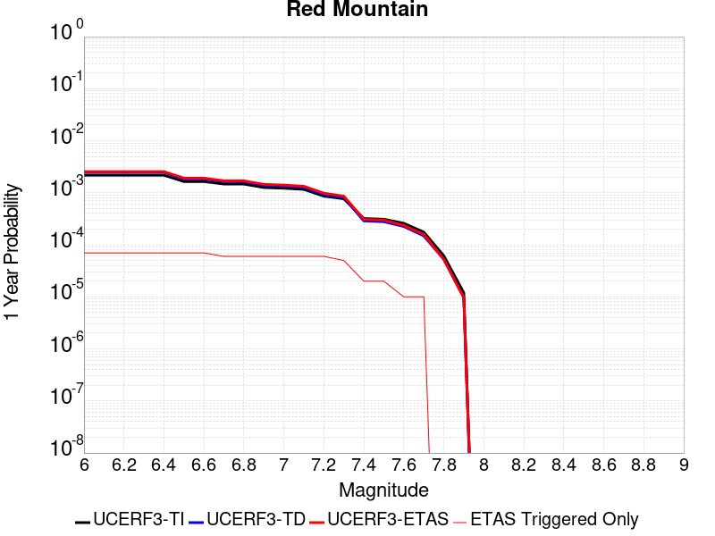 |  |

| Magnitude | 1 wk TI Prob | 1 wk TD Prob | 1 wk ETAS Prob | 1 wk ETAS/TD Gain | 1 wk ETAS Triggered Only | 1 mo TI Prob | 1 mo TD Prob | 1 mo ETAS Prob | 1 mo ETAS/TD Gain | 1 mo ETAS Triggered Only | 1 yr TI Prob | 1 yr TD Prob | 1 yr ETAS Prob | 1 yr ETAS/TD Gain | 1 yr ETAS Triggered Only | 10 yr TI Prob | 10 yr TD Prob | 10 yr ETAS Prob | 10 yr ETAS/TD Gain | 10 yr ETAS Triggered Only |
|-----|-----|-----|-----|-----|-----|-----|-----|-----|-----|-----|-----|-----|-----|-----|-----|-----|-----|-----|-----|-----|
| 6.0 | 4.1810763E-5 | 4.7589947E-5 | 4.7589947E-5 | 1.0 | 0.0 | 1.7917668E-4 | 2.039419E-4 | 2.039419E-4 | 1.0 | 0.0 | 0.0021792934 | 0.0024803306 | 0.0025726082 | 1.0372037 | 9.250694E-5 | 0.021580452 | 0.024544092 | 0.024634328 | 1.0036765 | 9.250694E-5 |
| 6.1 | 4.1810763E-5 | 4.7589947E-5 | 4.7589947E-5 | 1.0 | 0.0 | 1.7917668E-4 | 2.039419E-4 | 2.039419E-4 | 1.0 | 0.0 | 0.0021792934 | 0.0024803306 | 0.0025726082 | 1.0372037 | 9.250694E-5 | 0.021580452 | 0.024544092 | 0.024634328 | 1.0036765 | 9.250694E-5 |
| 6.2 | 4.1810763E-5 | 4.7589947E-5 | 4.7589947E-5 | 1.0 | 0.0 | 1.7917668E-4 | 2.039419E-4 | 2.039419E-4 | 1.0 | 0.0 | 0.0021792934 | 0.0024803306 | 0.0025726082 | 1.0372037 | 9.250694E-5 | 0.021580452 | 0.024544092 | 0.024634328 | 1.0036765 | 9.250694E-5 |
| 6.3 | 4.1810763E-5 | 4.7589947E-5 | 4.7589947E-5 | 1.0 | 0.0 | 1.7917668E-4 | 2.039419E-4 | 2.039419E-4 | 1.0 | 0.0 | 0.0021792934 | 0.0024803306 | 0.0025726082 | 1.0372037 | 9.250694E-5 | 0.021580452 | 0.024544092 | 0.024634328 | 1.0036765 | 9.250694E-5 |
| 6.4 | 4.1810763E-5 | 4.7589947E-5 | 4.7589947E-5 | 1.0 | 0.0 | 1.7917668E-4 | 2.039419E-4 | 2.039419E-4 | 1.0 | 0.0 | 0.0021792934 | 0.0024803306 | 0.0025726082 | 1.0372037 | 9.250694E-5 | 0.021580452 | 0.024544092 | 0.024634328 | 1.0036765 | 9.250694E-5 |
| 6.5 | 3.154503E-5 | 3.5359728E-5 | 3.5359728E-5 | 1.0 | 0.0 | 1.3518598E-4 | 1.5153342E-4 | 1.5153342E-4 | 1.0 | 0.0 | 0.0016446467 | 0.0018434501 | 0.0019357866 | 1.0500889 | 9.250694E-5 | 0.01632528 | 0.018291233 | 0.018382048 | 1.004965 | 9.250694E-5 |
| 6.6 | 3.1535834E-5 | 3.534911E-5 | 3.534911E-5 | 1.0 | 0.0 | 1.3514658E-4 | 1.5148791E-4 | 1.5148791E-4 | 1.0 | 0.0 | 0.0016441676 | 0.001842897 | 0.0019352336 | 1.050104 | 9.250694E-5 | 0.01632056 | 0.018285794 | 0.01837661 | 1.0049665 | 9.250694E-5 |
| 6.7 | 2.8267326E-5 | 3.146934E-5 | 3.146934E-5 | 1.0 | 0.0 | 1.2114006E-4 | 1.348621E-4 | 1.348621E-4 | 1.0 | 0.0 | 0.0014738824 | 0.0016407946 | 0.0017331498 | 1.0562868 | 9.250694E-5 | 0.014641452 | 0.016295563 | 0.016386563 | 1.0055844 | 9.250694E-5 |
| 6.8 | 2.8212884E-5 | 3.1407224E-5 | 3.1407224E-5 | 1.0 | 0.0 | 1.20906756E-4 | 1.3459593E-4 | 1.3459593E-4 | 1.0 | 0.0 | 0.0014710457 | 0.0016375587 | 0.0017299142 | 1.0563983 | 9.250694E-5 | 0.014613459 | 0.01626368 | 0.016354682 | 1.0055954 | 9.250694E-5 |
| 6.9 | 2.4227871E-5 | 2.6706979E-5 | 2.6706979E-5 | 1.0 | 0.0 | 1.03829596E-4 | 1.14453884E-4 | 1.14453884E-4 | 1.0 | 0.0 | 0.0012633923 | 0.0013926612 | 0.0014850394 | 1.0663321 | 9.250694E-5 | 0.012562336 | 0.013847026 | 0.013938252 | 1.0065881 | 9.250694E-5 |
| 7.0 | 2.348524E-5 | 2.5835763E-5 | 2.5835763E-5 | 1.0 | 0.0 | 1.0064714E-4 | 1.1072042E-4 | 1.1072042E-4 | 1.0 | 0.0 | 0.0012246901 | 0.0013472632 | 0.0014396455 | 1.0685704 | 9.250694E-5 | 0.012179627 | 0.01339859 | 0.013489857 | 1.0068117 | 9.250694E-5 |
| 7.1 | 2.2311642E-5 | 2.4462828E-5 | 2.4462828E-5 | 1.0 | 0.0 | 9.561782E-5 | 1.048369E-4 | 1.048369E-4 | 1.0 | 0.0 | 0.0011635252 | 0.0012757168 | 0.0013681056 | 1.0724212 | 9.250694E-5 | 0.01157452 | 0.012691451 | 0.012782784 | 1.0071964 | 9.250694E-5 |
| 7.2 | 1.6533986E-5 | 1.7670347E-5 | 1.7670347E-5 | 1.0 | 0.0 | 7.085802E-5 | 7.572822E-5 | 7.572822E-5 | 1.0 | 0.0 | 8.623549E-4 | 9.216645E-4 | 0.0010140862 | 1.100277 | 9.250694E-5 | 0.008590161 | 0.009184699 | 0.009276357 | 1.0099794 | 9.250694E-5 |
| 7.3 | 1.4703092E-5 | 1.555952E-5 | 1.555952E-5 | 1.0 | 0.0 | 6.301173E-5 | 6.66823E-5 | 6.66823E-5 | 1.0 | 0.0 | 7.668978E-4 | 8.1161625E-4 | 8.1161625E-4 | 1.0 | 0.0 | 0.0076425658 | 0.008092596 | 0.008092596 | 1.0 | 0.0 |
| 7.4 | 6.1331984E-6 | 5.528872E-6 | 5.528872E-6 | 1.0 | 0.0 | 2.6284872E-5 | 2.3694953E-5 | 2.3694953E-5 | 1.0 | 0.0 | 3.199713E-4 | 2.8844838E-4 | 2.8844838E-4 | 1.0 | 0.0 | 0.0031951098 | 0.0028807942 | 0.0028807942 | 1.0 | 0.0 |
| 7.5 | 5.954766E-6 | 5.3385015E-6 | 5.3385015E-6 | 1.0 | 0.0 | 2.5520176E-5 | 2.2879094E-5 | 2.2879094E-5 | 1.0 | 0.0 | 3.1066386E-4 | 2.785179E-4 | 2.785179E-4 | 1.0 | 0.0 | 0.003102299 | 0.0027817423 | 0.0027817423 | 1.0 | 0.0 |
| 7.6 | 4.9726646E-6 | 4.315295E-6 | 4.315295E-6 | 1.0 | 0.0 | 2.1311245E-5 | 1.8493993E-5 | 1.8493993E-5 | 1.0 | 0.0 | 2.5943352E-4 | 2.2514143E-4 | 2.2514143E-4 | 1.0 | 0.0 | 0.0025913084 | 0.002249168 | 0.002249168 | 1.0 | 0.0 |
| 7.7 | 3.3613894E-6 | 2.8526642E-6 | 2.8526642E-6 | 1.0 | 0.0 | 1.4405875E-5 | 1.2225649E-5 | 1.2225649E-5 | 1.0 | 0.0 | 1.7537741E-4 | 1.4883737E-4 | 1.4883737E-4 | 1.0 | 0.0 | 0.0017523908 | 0.0014874031 | 0.0014874031 | 1.0 | 0.0 |
| 7.8 | 1.1828961E-6 | 1.0122756E-6 | 1.0122756E-6 | 1.0 | 0.0 | 5.069545E-6 | 4.338317E-6 | 4.338317E-6 | 1.0 | 0.0 | 6.171996E-5 | 5.281776E-5 | 5.281776E-5 | 1.0 | 0.0 | 6.170282E-4 | 5.2805495E-4 | 5.2805495E-4 | 1.0 | 0.0 |
| 7.9 | 2.2967266E-7 | 1.8618952E-7 | 1.8618952E-7 | 1.0 | 0.0 | 9.843111E-7 | 7.9795484E-7 | 7.9795484E-7 | 1.0 | 0.0 | 1.19839215E-5 | 9.7150605E-6 | 9.7150605E-6 | 1.0 | 0.0 | 1.1983275E-4 | 9.714664E-5 | 9.714664E-5 | 1.0 | 0.0 |

## Dry Mountain
*[(top)](#table-of-contents)*

| 1 Week | 1 Month | 1 Year | 10 Year |
|-----|-----|-----|-----|
|  |  |  |  |

| Magnitude | 1 wk TI Prob | 1 wk TD Prob | 1 wk ETAS Prob | 1 wk ETAS/TD Gain | 1 wk ETAS Triggered Only | 1 mo TI Prob | 1 mo TD Prob | 1 mo ETAS Prob | 1 mo ETAS/TD Gain | 1 mo ETAS Triggered Only | 1 yr TI Prob | 1 yr TD Prob | 1 yr ETAS Prob | 1 yr ETAS/TD Gain | 1 yr ETAS Triggered Only | 10 yr TI Prob | 10 yr TD Prob | 10 yr ETAS Prob | 10 yr ETAS/TD Gain | 10 yr ETAS Triggered Only |
|-----|-----|-----|-----|-----|-----|-----|-----|-----|-----|-----|-----|-----|-----|-----|-----|-----|-----|-----|-----|-----|
| 6.0 | 6.222801E-6 | 6.439381E-6 | 6.439381E-6 | 1.0 | 0.0 | 2.6668875E-5 | 2.7597147E-5 | 2.7597147E-5 | 1.0 | 0.0 | 3.2464517E-4 | 3.3595937E-4 | 4.2843522E-4 | 1.275259 | 9.250694E-5 | 0.0032417132 | 0.0033560768 | 0.0034482733 | 1.0274715 | 9.250694E-5 |
| 6.1 | 6.222801E-6 | 6.439381E-6 | 6.439381E-6 | 1.0 | 0.0 | 2.6668875E-5 | 2.7597147E-5 | 2.7597147E-5 | 1.0 | 0.0 | 3.2464517E-4 | 3.3595937E-4 | 4.2843522E-4 | 1.275259 | 9.250694E-5 | 0.0032417132 | 0.0033560768 | 0.0034482733 | 1.0274715 | 9.250694E-5 |
| 6.2 | 6.222801E-6 | 6.439381E-6 | 6.439381E-6 | 1.0 | 0.0 | 2.6668875E-5 | 2.7597147E-5 | 2.7597147E-5 | 1.0 | 0.0 | 3.2464517E-4 | 3.3595937E-4 | 4.2843522E-4 | 1.275259 | 9.250694E-5 | 0.0032417132 | 0.0033560768 | 0.0034482733 | 1.0274715 | 9.250694E-5 |
| 6.3 | 6.222801E-6 | 6.439381E-6 | 6.439381E-6 | 1.0 | 0.0 | 2.6668875E-5 | 2.7597147E-5 | 2.7597147E-5 | 1.0 | 0.0 | 3.2464517E-4 | 3.3595937E-4 | 4.2843522E-4 | 1.275259 | 9.250694E-5 | 0.0032417132 | 0.0033560768 | 0.0034482733 | 1.0274715 | 9.250694E-5 |
| 6.4 | 6.222801E-6 | 6.439381E-6 | 6.439381E-6 | 1.0 | 0.0 | 2.6668875E-5 | 2.7597147E-5 | 2.7597147E-5 | 1.0 | 0.0 | 3.2464517E-4 | 3.3595937E-4 | 4.2843522E-4 | 1.275259 | 9.250694E-5 | 0.0032417132 | 0.0033560768 | 0.0034482733 | 1.0274715 | 9.250694E-5 |
| 6.5 | 2.8528623E-6 | 2.9521684E-6 | 2.9521684E-6 | 1.0 | 0.0 | 1.22264955E-5 | 1.2652138E-5 | 1.2652138E-5 | 1.0 | 0.0 | 1.4884741E-4 | 1.540376E-4 | 1.540376E-4 | 1.0 | 0.0 | 0.0014874774 | 0.0015401616 | 0.0015401616 | 1.0 | 0.0 |
| 6.6 | 2.8528623E-6 | 2.9521684E-6 | 2.9521684E-6 | 1.0 | 0.0 | 1.22264955E-5 | 1.2652138E-5 | 1.2652138E-5 | 1.0 | 0.0 | 1.4884741E-4 | 1.540376E-4 | 1.540376E-4 | 1.0 | 0.0 | 0.0014874774 | 0.0015401616 | 0.0015401616 | 1.0 | 0.0 |
| 6.7 | 2.541E-6 | 2.6293578E-6 | 2.6293578E-6 | 1.0 | 0.0 | 1.0889954E-5 | 1.1268677E-5 | 1.1268677E-5 | 1.0 | 0.0 | 1.3257713E-4 | 1.3719614E-4 | 1.3719614E-4 | 1.0 | 0.0 | 0.0013249806 | 0.0013719613 | 0.0013719613 | 1.0 | 0.0 |

## Los Alamos 2011 CFM
*[(top)](#table-of-contents)*

| 1 Week | 1 Month | 1 Year | 10 Year |
|-----|-----|-----|-----|
|  |  |  |  |

| Magnitude | 1 wk TI Prob | 1 wk TD Prob | 1 wk ETAS Prob | 1 wk ETAS/TD Gain | 1 wk ETAS Triggered Only | 1 mo TI Prob | 1 mo TD Prob | 1 mo ETAS Prob | 1 mo ETAS/TD Gain | 1 mo ETAS Triggered Only | 1 yr TI Prob | 1 yr TD Prob | 1 yr ETAS Prob | 1 yr ETAS/TD Gain | 1 yr ETAS Triggered Only | 10 yr TI Prob | 10 yr TD Prob | 10 yr ETAS Prob | 10 yr ETAS/TD Gain | 10 yr ETAS Triggered Only |
|-----|-----|-----|-----|-----|-----|-----|-----|-----|-----|-----|-----|-----|-----|-----|-----|-----|-----|-----|-----|-----|
| 6.0 | 4.6284417E-6 | 4.751731E-6 | 9.725823E-5 | 20.467957 | 9.250694E-5 | 1.9836029E-5 | 2.0364414E-5 | 1.12869464E-4 | 5.5424857 | 9.250694E-5 | 2.4147688E-4 | 2.4791027E-4 | 3.403943E-4 | 1.3730544 | 9.250694E-5 | 0.0024121467 | 0.0024765113 | 0.0025687893 | 1.0372612 | 9.250694E-5 |
| 6.1 | 4.6284417E-6 | 4.751731E-6 | 9.725823E-5 | 20.467957 | 9.250694E-5 | 1.9836029E-5 | 2.0364414E-5 | 1.12869464E-4 | 5.5424857 | 9.250694E-5 | 2.4147688E-4 | 2.4791027E-4 | 3.403943E-4 | 1.3730544 | 9.250694E-5 | 0.0024121467 | 0.0024765113 | 0.0025687893 | 1.0372612 | 9.250694E-5 |
| 6.2 | 4.6284417E-6 | 4.751731E-6 | 9.725823E-5 | 20.467957 | 9.250694E-5 | 1.9836029E-5 | 2.0364414E-5 | 1.12869464E-4 | 5.5424857 | 9.250694E-5 | 2.4147688E-4 | 2.4791027E-4 | 3.403943E-4 | 1.3730544 | 9.250694E-5 | 0.0024121467 | 0.0024765113 | 0.0025687893 | 1.0372612 | 9.250694E-5 |
| 6.3 | 4.6284417E-6 | 4.751731E-6 | 9.725823E-5 | 20.467957 | 9.250694E-5 | 1.9836029E-5 | 2.0364414E-5 | 1.12869464E-4 | 5.5424857 | 9.250694E-5 | 2.4147688E-4 | 2.4791027E-4 | 3.403943E-4 | 1.3730544 | 9.250694E-5 | 0.0024121467 | 0.0024765113 | 0.0025687893 | 1.0372612 | 9.250694E-5 |
| 6.4 | 4.6284417E-6 | 4.751731E-6 | 9.725823E-5 | 20.467957 | 9.250694E-5 | 1.9836029E-5 | 2.0364414E-5 | 1.12869464E-4 | 5.5424857 | 9.250694E-5 | 2.4147688E-4 | 2.4791027E-4 | 3.403943E-4 | 1.3730544 | 9.250694E-5 | 0.0024121467 | 0.0024765113 | 0.0025687893 | 1.0372612 | 9.250694E-5 |
| 6.5 | 4.6284417E-6 | 4.751731E-6 | 9.725823E-5 | 20.467957 | 9.250694E-5 | 1.9836029E-5 | 2.0364414E-5 | 1.12869464E-4 | 5.5424857 | 9.250694E-5 | 2.4147688E-4 | 2.4791027E-4 | 3.403943E-4 | 1.3730544 | 9.250694E-5 | 0.0024121467 | 0.0024765113 | 0.0025687893 | 1.0372612 | 9.250694E-5 |
| 6.6 | 4.6284417E-6 | 4.751731E-6 | 9.725823E-5 | 20.467957 | 9.250694E-5 | 1.9836029E-5 | 2.0364414E-5 | 1.12869464E-4 | 5.5424857 | 9.250694E-5 | 2.4147688E-4 | 2.4791027E-4 | 3.403943E-4 | 1.3730544 | 9.250694E-5 | 0.0024121467 | 0.0024765113 | 0.0025687893 | 1.0372612 | 9.250694E-5 |
| 6.7 | 4.062321E-6 | 4.166349E-6 | 9.66729E-5 | 23.203266 | 9.250694E-5 | 1.7409831E-5 | 1.7855667E-5 | 1.10360954E-4 | 6.180724 | 9.250694E-5 | 2.1194408E-4 | 2.1737257E-4 | 3.098594E-4 | 1.4254761 | 9.250694E-5 | 0.0021174205 | 0.0021717492 | 0.0022640552 | 1.0425031 | 9.250694E-5 |
| 6.8 | 4.062321E-6 | 4.166349E-6 | 9.66729E-5 | 23.203266 | 9.250694E-5 | 1.7409831E-5 | 1.7855667E-5 | 1.10360954E-4 | 6.180724 | 9.250694E-5 | 2.1194408E-4 | 2.1737257E-4 | 3.098594E-4 | 1.4254761 | 9.250694E-5 | 0.0021174205 | 0.0021717492 | 0.0022640552 | 1.0425031 | 9.250694E-5 |
| 6.9 | 3.2936077E-6 | 3.372958E-6 | 9.5879586E-5 | 28.425966 | 9.250694E-5 | 1.4115385E-5 | 1.4455459E-5 | 1.0696106E-4 | 7.399354 | 9.250694E-5 | 1.7184127E-4 | 1.7598194E-4 | 2.684726E-4 | 1.5255691 | 9.250694E-5 | 0.0017170844 | 0.0017585184 | 0.0018508626 | 1.0525125 | 9.250694E-5 |
| 7.0 | 3.1687898E-6 | 3.2448156E-6 | 9.575146E-5 | 29.50906 | 9.250694E-5 | 1.3580457E-5 | 1.3906283E-5 | 1.06411935E-4 | 7.652076 | 9.250694E-5 | 1.6532952E-4 | 1.6929678E-4 | 2.6178805E-4 | 1.5463263 | 9.250694E-5 | 0.0016520657 | 0.0016917696 | 0.0017841201 | 1.0545881 | 9.250694E-5 |
| 7.1 | 2.9379228E-6 | 3.0073259E-6 | 3.0073259E-6 | 1.0 | 0.0 | 1.25910365E-5 | 1.288848E-5 | 1.288848E-5 | 1.0 | 0.0 | 1.5328509E-4 | 1.5690686E-4 | 1.5690686E-4 | 1.0 | 0.0 | 0.001531794 | 0.0015680499 | 0.0015680499 | 1.0 | 0.0 |
| 7.2 | 2.0020686E-6 | 2.0416298E-6 | 2.0416298E-6 | 1.0 | 0.0 | 8.580266E-6 | 8.749813E-6 | 8.749813E-6 | 1.0 | 0.0 | 1.0445973E-4 | 1.0652381E-4 | 1.0652381E-4 | 1.0 | 0.0 | 0.0010441064 | 0.001064732 | 0.001064732 | 1.0 | 0.0 |
| 7.3 | 1.7364243E-6 | 1.7678802E-6 | 1.7678802E-6 | 1.0 | 0.0 | 7.441797E-6 | 7.576608E-6 | 7.576608E-6 | 1.0 | 0.0 | 9.0600115E-5 | 9.2241324E-5 | 9.2241324E-5 | 1.0 | 0.0 | 9.0563187E-4 | 9.2203356E-4 | 9.2203356E-4 | 1.0 | 0.0 |
| 7.4 | 1.5718434E-6 | 1.5983177E-6 | 1.5983177E-6 | 1.0 | 0.0 | 6.7364545E-6 | 6.849915E-6 | 6.849915E-6 | 1.0 | 0.0 | 8.201325E-5 | 8.339455E-5 | 8.339455E-5 | 1.0 | 0.0 | 8.198299E-4 | 8.3363557E-4 | 8.3363557E-4 | 1.0 | 0.0 |
| 7.5 | 1.3841119E-6 | 1.4042793E-6 | 1.4042793E-6 | 1.0 | 0.0 | 5.9318945E-6 | 6.0183256E-6 | 6.0183256E-6 | 1.0 | 0.0 | 7.221842E-5 | 7.327068E-5 | 7.327068E-5 | 1.0 | 0.0 | 7.2194956E-4 | 7.324681E-4 | 7.324681E-4 | 1.0 | 0.0 |
| 7.6 | 1.0843726E-6 | 1.093442E-6 | 1.093442E-6 | 1.0 | 0.0 | 4.647303E-6 | 4.6861724E-6 | 4.6861724E-6 | 1.0 | 0.0 | 5.6579443E-5 | 5.705268E-5 | 5.705268E-5 | 1.0 | 0.0 | 5.656504E-4 | 5.703829E-4 | 5.703829E-4 | 1.0 | 0.0 |
| 7.7 | 5.544814E-7 | 5.5018705E-7 | 5.5018705E-7 | 1.0 | 0.0 | 2.3763469E-6 | 2.3579425E-6 | 2.3579425E-6 | 1.0 | 0.0 | 2.8931638E-5 | 2.8707573E-5 | 2.8707573E-5 | 1.0 | 0.0 | 2.8927872E-4 | 2.870388E-4 | 2.870388E-4 | 1.0 | 0.0 |
| 7.8 | 2.0707465E-7 | 1.977846E-7 | 1.977846E-7 | 1.0 | 0.0 | 8.874625E-7 | 8.4764804E-7 | 8.4764804E-7 | 1.0 | 0.0 | 1.08048025E-5 | 1.0320066E-5 | 1.0320066E-5 | 1.0 | 0.0 | 1.0804277E-4 | 1.0319592E-4 | 1.0319592E-4 | 1.0 | 0.0 |
| 7.9 | 3.9821284E-8 | 3.433109E-8 | 3.433109E-8 | 1.0 | 0.0 | 1.7066264E-7 | 1.4713324E-7 | 1.4713324E-7 | 1.0 | 0.0 | 2.0778157E-6 | 1.7913457E-6 | 1.7913457E-6 | 1.0 | 0.0 | 2.0777963E-5 | 1.7913319E-5 | 1.7913319E-5 | 1.0 | 0.0 |
| 8.0 | 7.880441E-11 | 8.2353124E-11 | 8.2353124E-11 | 1.0 | 0.0 | 3.3773329E-10 | 3.52942E-10 | 3.52942E-10 | 1.0 | 0.0 | 4.1119033E-9 | 4.2970694E-9 | 4.2970694E-9 | 1.0 | 0.0 | 4.1119034E-8 | 4.2970694E-8 | 4.2970694E-8 | 1.0 | 0.0 |

## Ortigalita (South)
*[(top)](#table-of-contents)*

| 1 Week | 1 Month | 1 Year | 10 Year |
|-----|-----|-----|-----|
|  |  |  |  |

| Magnitude | 1 wk TI Prob | 1 wk TD Prob | 1 wk ETAS Prob | 1 wk ETAS/TD Gain | 1 wk ETAS Triggered Only | 1 mo TI Prob | 1 mo TD Prob | 1 mo ETAS Prob | 1 mo ETAS/TD Gain | 1 mo ETAS Triggered Only | 1 yr TI Prob | 1 yr TD Prob | 1 yr ETAS Prob | 1 yr ETAS/TD Gain | 1 yr ETAS Triggered Only | 10 yr TI Prob | 10 yr TD Prob | 10 yr ETAS Prob | 10 yr ETAS/TD Gain | 10 yr ETAS Triggered Only |
|-----|-----|-----|-----|-----|-----|-----|-----|-----|-----|-----|-----|-----|-----|-----|-----|-----|-----|-----|-----|-----|
| 6.0 | 3.72394E-5 | 4.325562E-5 | 1.3575856E-4 | 3.1385186 | 9.250694E-5 | 1.5958765E-4 | 1.8536893E-4 | 2.7785872E-4 | 1.4989498 | 9.250694E-5 | 0.0019412481 | 0.0022546875 | 0.0023469857 | 1.0409362 | 9.250694E-5 | 0.019243775 | 0.022334497 | 0.022424938 | 1.0040494 | 9.250694E-5 |
| 6.1 | 2.7299884E-5 | 3.149204E-5 | 3.149204E-5 | 1.0 | 0.0 | 1.16994255E-4 | 1.3495922E-4 | 1.3495922E-4 | 1.0 | 0.0 | 0.0014234743 | 0.0016419457 | 0.0016419457 | 1.0 | 0.0 | 0.014143906 | 0.01630407 | 0.01630407 | 1.0 | 0.0 |
| 6.2 | 2.7299884E-5 | 3.149204E-5 | 3.149204E-5 | 1.0 | 0.0 | 1.16994255E-4 | 1.3495922E-4 | 1.3495922E-4 | 1.0 | 0.0 | 0.0014234743 | 0.0016419457 | 0.0016419457 | 1.0 | 0.0 | 0.014143906 | 0.01630407 | 0.01630407 | 1.0 | 0.0 |
| 6.3 | 2.0546433E-5 | 2.363145E-5 | 2.363145E-5 | 1.0 | 0.0 | 8.805317E-5 | 1.0127382E-4 | 1.0127382E-4 | 1.0 | 0.0 | 0.00107152 | 0.0012323303 | 0.0012323303 | 1.0 | 0.0 | 0.010663681 | 0.01225703 | 0.01225703 | 1.0 | 0.0 |
| 6.4 | 2.0546433E-5 | 2.363145E-5 | 2.363145E-5 | 1.0 | 0.0 | 8.805317E-5 | 1.0127382E-4 | 1.0127382E-4 | 1.0 | 0.0 | 0.00107152 | 0.0012323303 | 0.0012323303 | 1.0 | 0.0 | 0.010663681 | 0.01225703 | 0.01225703 | 1.0 | 0.0 |
| 6.5 | 1.7779594E-5 | 2.0446974E-5 | 2.0446974E-5 | 1.0 | 0.0 | 7.619603E-5 | 8.762702E-5 | 8.762702E-5 | 1.0 | 0.0 | 9.272918E-4 | 0.0010663504 | 0.0010663504 | 1.0 | 0.0 | 0.009234319 | 0.010613803 | 0.010613803 | 1.0 | 0.0 |
| 6.6 | 1.6272212E-5 | 1.8714967E-5 | 1.8714967E-5 | 1.0 | 0.0 | 6.973618E-5 | 8.0204605E-5 | 8.0204605E-5 | 1.0 | 0.0 | 8.487073E-4 | 9.760658E-4 | 9.760658E-4 | 1.0 | 0.0 | 0.008454733 | 0.009719091 | 0.009719091 | 1.0 | 0.0 |
| 6.7 | 1.3051484E-5 | 1.5038758E-5 | 1.5038758E-5 | 1.0 | 0.0 | 5.593373E-5 | 6.445028E-5 | 6.445028E-5 | 1.0 | 0.0 | 6.807804E-4 | 7.844092E-4 | 7.844092E-4 | 1.0 | 0.0 | 0.006786986 | 0.007817388 | 0.007817388 | 1.0 | 0.0 |
| 6.8 | 1.04277415E-5 | 1.1987235E-5 | 1.1987235E-5 | 1.0 | 0.0 | 4.4689557E-5 | 5.1372896E-5 | 5.1372896E-5 | 1.0 | 0.0 | 5.439595E-4 | 6.2529295E-4 | 6.2529295E-4 | 1.0 | 0.0 | 0.0054262993 | 0.00623609 | 0.00623609 | 1.0 | 0.0 |
| 6.9 | 7.639968E-6 | 8.791503E-6 | 8.791503E-6 | 1.0 | 0.0 | 3.274231E-5 | 3.767736E-5 | 3.767736E-5 | 1.0 | 0.0 | 3.9856473E-4 | 4.586312E-4 | 4.586312E-4 | 1.0 | 0.0 | 0.003978506 | 0.004577433 | 0.004577433 | 1.0 | 0.0 |
| 7.0 | 3.919831E-6 | 4.5334014E-6 | 4.5334014E-6 | 1.0 | 0.0 | 1.679917E-5 | 1.942873E-5 | 1.942873E-5 | 1.0 | 0.0 | 2.045107E-4 | 2.3652123E-4 | 2.3652123E-4 | 1.0 | 0.0 | 0.0020432258 | 0.0023629034 | 0.0023629034 | 1.0 | 0.0 |
| 7.1 | 1.6017933E-6 | 1.8570418E-6 | 1.8570418E-6 | 1.0 | 0.0 | 6.8648105E-6 | 7.958732E-6 | 7.958732E-6 | 1.0 | 0.0 | 8.357586E-5 | 9.689432E-5 | 9.689432E-5 | 1.0 | 0.0 | 8.3544437E-4 | 9.686254E-4 | 9.686254E-4 | 1.0 | 0.0 |

## Point Reyes 2011 CFM
*[(top)](#table-of-contents)*

| 1 Week | 1 Month | 1 Year | 10 Year |
|-----|-----|-----|-----|
|  |  |  |  |

| Magnitude | 1 wk TI Prob | 1 wk TD Prob | 1 wk ETAS Prob | 1 wk ETAS/TD Gain | 1 wk ETAS Triggered Only | 1 mo TI Prob | 1 mo TD Prob | 1 mo ETAS Prob | 1 mo ETAS/TD Gain | 1 mo ETAS Triggered Only | 1 yr TI Prob | 1 yr TD Prob | 1 yr ETAS Prob | 1 yr ETAS/TD Gain | 1 yr ETAS Triggered Only | 10 yr TI Prob | 10 yr TD Prob | 10 yr ETAS Prob | 10 yr ETAS/TD Gain | 10 yr ETAS Triggered Only |
|-----|-----|-----|-----|-----|-----|-----|-----|-----|-----|-----|-----|-----|-----|-----|-----|-----|-----|-----|-----|-----|
| 6.0 | 8.8644965E-6 | 8.967163E-6 | 1.0147327E-4 | 11.316095 | 9.250694E-5 | 3.7990147E-5 | 3.843017E-5 | 1.3093355E-4 | 3.407051 | 9.250694E-5 | 4.624319E-4 | 4.6779314E-4 | 5.602568E-4 | 1.1976593 | 9.250694E-5 | 0.0046147075 | 0.004668713 | 0.004760788 | 1.0197217 | 9.250694E-5 |
| 6.1 | 4.526405E-6 | 4.5392185E-6 | 9.704573E-5 | 21.379393 | 9.250694E-5 | 1.9398734E-5 | 1.9453653E-5 | 1.1195879E-4 | 5.755155 | 9.250694E-5 | 2.36154E-4 | 2.3682354E-4 | 3.2930856E-4 | 1.390523 | 9.250694E-5 | 0.002359032 | 0.0023658178 | 0.0024581058 | 1.039009 | 9.250694E-5 |
| 6.2 | 4.526405E-6 | 4.5392185E-6 | 9.704573E-5 | 21.379393 | 9.250694E-5 | 1.9398734E-5 | 1.9453653E-5 | 1.1195879E-4 | 5.755155 | 9.250694E-5 | 2.36154E-4 | 2.3682354E-4 | 3.2930856E-4 | 1.390523 | 9.250694E-5 | 0.002359032 | 0.0023658178 | 0.0024581058 | 1.039009 | 9.250694E-5 |
| 6.3 | 2.6842322E-6 | 2.660676E-6 | 9.5167365E-5 | 35.768116 | 9.250694E-5 | 1.1503801E-5 | 1.1402849E-5 | 1.0390873E-4 | 9.112524 | 9.250694E-5 | 1.4004979E-4 | 1.3882104E-4 | 2.3131513E-4 | 1.666283 | 9.250694E-5 | 0.0013996155 | 0.0013873649 | 0.0014797435 | 1.0665857 | 9.250694E-5 |
| 6.4 | 2.6842322E-6 | 2.660676E-6 | 9.5167365E-5 | 35.768116 | 9.250694E-5 | 1.1503801E-5 | 1.1402849E-5 | 1.0390873E-4 | 9.112524 | 9.250694E-5 | 1.4004979E-4 | 1.3882104E-4 | 2.3131513E-4 | 1.666283 | 9.250694E-5 | 0.0013996155 | 0.0013873649 | 0.0014797435 | 1.0665857 | 9.250694E-5 |
| 6.5 | 1.9281833E-6 | 1.8906262E-6 | 1.8906262E-6 | 1.0 | 0.0 | 8.263617E-6 | 8.102659E-6 | 8.102659E-6 | 1.0 | 0.0 | 1.0060489E-4 | 9.86455E-5 | 9.86455E-5 | 1.0 | 0.0 | 0.0010055936 | 9.860279E-4 | 9.860279E-4 | 1.0 | 0.0 |
| 6.6 | 1.4726726E-6 | 1.4269577E-6 | 1.4269577E-6 | 1.0 | 0.0 | 6.3114385E-6 | 6.1155188E-6 | 6.1155188E-6 | 1.0 | 0.0 | 7.683905E-5 | 7.445395E-5 | 7.445395E-5 | 1.0 | 0.0 | 7.6812494E-4 | 7.4429717E-4 | 7.4429717E-4 | 1.0 | 0.0 |
| 6.7 | 8.572307E-7 | 8.007212E-7 | 8.007212E-7 | 1.0 | 0.0 | 3.6738406E-6 | 3.431658E-6 | 3.431658E-6 | 1.0 | 0.0 | 4.472809E-5 | 4.1779647E-5 | 4.1779647E-5 | 1.0 | 0.0 | 4.471909E-4 | 4.1772184E-4 | 4.1772184E-4 | 1.0 | 0.0 |
| 6.8 | 6.6745434E-7 | 6.0773E-7 | 6.0773E-7 | 1.0 | 0.0 | 2.8605155E-6 | 2.6045543E-6 | 2.6045543E-6 | 1.0 | 0.0 | 3.482622E-5 | 3.171E-5 | 3.171E-5 | 1.0 | 0.0 | 3.4820763E-4 | 3.1705803E-4 | 3.1705803E-4 | 1.0 | 0.0 |
| 6.9 | 4.291521E-7 | 3.6535937E-7 | 3.6535937E-7 | 1.0 | 0.0 | 1.839222E-6 | 1.565825E-6 | 1.565825E-6 | 1.0 | 0.0 | 2.2392298E-5 | 1.9063755E-5 | 1.9063755E-5 | 1.0 | 0.0 | 2.2390042E-4 | 1.9062385E-4 | 1.9062385E-4 | 1.0 | 0.0 |
| 7.0 | 2.6812808E-7 | 2.0187414E-7 | 2.0187414E-7 | 1.0 | 0.0 | 1.1491198E-6 | 8.651746E-7 | 8.651746E-7 | 1.0 | 0.0 | 1.3990444E-5 | 1.0533451E-5 | 1.0533451E-5 | 1.0 | 0.0 | 1.3989564E-4 | 1.0533186E-4 | 1.0533186E-4 | 1.0 | 0.0 |
| 7.1 | 1.9451231E-7 | 1.2725499E-7 | 1.2725499E-7 | 1.0 | 0.0 | 8.336239E-7 | 5.453784E-7 | 5.453784E-7 | 1.0 | 0.0 | 1.0149324E-5 | 6.6399616E-6 | 6.6399616E-6 | 1.0 | 0.0 | 1.014886E-4 | 6.639991E-5 | 6.639991E-5 | 1.0 | 0.0 |
| 7.2 | 1.6715143E-7 | 1.00428394E-7 | 1.00428394E-7 | 1.0 | 0.0 | 7.1636305E-7 | 4.3040734E-7 | 4.3040734E-7 | 1.0 | 0.0 | 8.721685E-6 | 5.2401965E-6 | 5.2401965E-6 | 1.0 | 0.0 | 8.721343E-5 | 5.2402997E-5 | 5.2402997E-5 | 1.0 | 0.0 |
| 7.3 | 1.5503173E-7 | 9.0131024E-8 | 9.0131024E-8 | 1.0 | 0.0 | 6.644215E-7 | 3.8627576E-7 | 3.8627576E-7 | 1.0 | 0.0 | 8.089301E-6 | 4.702897E-6 | 4.702897E-6 | 1.0 | 0.0 | 8.089007E-5 | 4.7030244E-5 | 4.7030244E-5 | 1.0 | 0.0 |
| 7.4 | 1.4251614E-7 | 8.097624E-8 | 8.097624E-8 | 1.0 | 0.0 | 6.1078333E-7 | 3.47041E-7 | 3.47041E-7 | 1.0 | 0.0 | 7.4362615E-6 | 4.225216E-6 | 4.225216E-6 | 1.0 | 0.0 | 7.436013E-5 | 4.2253625E-5 | 4.2253625E-5 | 1.0 | 0.0 |
| 7.5 | 1.2710186E-7 | 7.0296394E-8 | 7.0296394E-8 | 1.0 | 0.0 | 5.447221E-7 | 3.0127023E-7 | 3.0127023E-7 | 1.0 | 0.0 | 6.6319717E-6 | 3.667959E-6 | 3.667959E-6 | 1.0 | 0.0 | 6.6317734E-5 | 3.6681253E-5 | 3.6681253E-5 | 1.0 | 0.0 |
| 7.6 | 1.0144708E-7 | 5.4952274E-8 | 5.4952274E-8 | 1.0 | 0.0 | 4.347731E-7 | 2.3550973E-7 | 2.3550973E-7 | 1.0 | 0.0 | 5.2933497E-6 | 2.8673273E-6 | 2.8673273E-6 | 1.0 | 0.0 | 5.293224E-5 | 2.8675171E-5 | 2.8675171E-5 | 1.0 | 0.0 |
| 7.7 | 7.090527E-8 | 3.98231E-8 | 3.98231E-8 | 1.0 | 0.0 | 3.038797E-7 | 1.7067042E-7 | 1.7067042E-7 | 1.0 | 0.0 | 3.699729E-6 | 2.0779103E-6 | 2.0779103E-6 | 1.0 | 0.0 | 3.6996673E-5 | 2.0781177E-5 | 2.0781177E-5 | 1.0 | 0.0 |
| 7.8 | 3.8712045E-8 | 2.7440025E-8 | 2.7440025E-8 | 1.0 | 0.0 | 1.6590876E-7 | 1.176001E-7 | 1.176001E-7 | 1.0 | 0.0 | 2.0199373E-6 | 1.4317802E-6 | 1.4317802E-6 | 1.0 | 0.0 | 2.0199188E-5 | 1.4319979E-5 | 1.4319979E-5 | 1.0 | 0.0 |
| 7.9 | 1.7068782E-8 | 1.1833354E-8 | 1.1833354E-8 | 1.0 | 0.0 | 7.315192E-8 | 5.0714362E-8 | 5.0714362E-8 | 1.0 | 0.0 | 8.906242E-7 | 6.174472E-7 | 6.174472E-7 | 1.0 | 0.0 | 8.906207E-6 | 6.1767228E-6 | 6.1767228E-6 | 1.0 | 0.0 |
| 8.0 | 1.0172592E-8 | 7.0280843E-9 | 7.0280843E-9 | 1.0 | 0.0 | 4.359682E-8 | 3.0120354E-8 | 3.0120354E-8 | 1.0 | 0.0 | 5.3079117E-7 | 3.6671526E-7 | 3.6671526E-7 | 1.0 | 0.0 | 5.307899E-6 | 3.6694146E-6 | 3.6694146E-6 | 1.0 | 0.0 |
| 8.1 | 3.7861243E-9 | 3.5452439E-9 | 3.5452439E-9 | 1.0 | 0.0 | 1.6226247E-8 | 1.5193901E-8 | 1.5193901E-8 | 1.0 | 0.0 | 1.9755454E-7 | 1.8498575E-7 | 1.8498575E-7 | 1.0 | 0.0 | 1.9755437E-6 | 1.8518531E-6 | 1.8518531E-6 | 1.0 | 0.0 |

## Pinto Mtn
*[(top)](#table-of-contents)*

| 1 Week | 1 Month | 1 Year | 10 Year |
|-----|-----|-----|-----|
|  |  |  |  |

| Magnitude | 1 wk TI Prob | 1 wk TD Prob | 1 wk ETAS Prob | 1 wk ETAS/TD Gain | 1 wk ETAS Triggered Only | 1 mo TI Prob | 1 mo TD Prob | 1 mo ETAS Prob | 1 mo ETAS/TD Gain | 1 mo ETAS Triggered Only | 1 yr TI Prob | 1 yr TD Prob | 1 yr ETAS Prob | 1 yr ETAS/TD Gain | 1 yr ETAS Triggered Only | 10 yr TI Prob | 10 yr TD Prob | 10 yr ETAS Prob | 10 yr ETAS/TD Gain | 10 yr ETAS Triggered Only |
|-----|-----|-----|-----|-----|-----|-----|-----|-----|-----|-----|-----|-----|-----|-----|-----|-----|-----|-----|-----|-----|
| 6.0 | 4.4194956E-5 | 4.785362E-5 | 1.4035613E-4 | 2.9330306 | 9.250694E-5 | 1.893932E-4 | 2.0507174E-4 | 2.9755972E-4 | 1.451003 | 9.250694E-5 | 0.0023034236 | 0.0024940541 | 0.0025863305 | 1.0369985 | 9.250694E-5 | 0.022796938 | 0.024678145 | 0.02476837 | 1.003656 | 9.250694E-5 |
| 6.1 | 4.4194956E-5 | 4.785362E-5 | 1.4035613E-4 | 2.9330306 | 9.250694E-5 | 1.893932E-4 | 2.0507174E-4 | 2.9755972E-4 | 1.451003 | 9.250694E-5 | 0.0023034236 | 0.0024940541 | 0.0025863305 | 1.0369985 | 9.250694E-5 | 0.022796938 | 0.024678145 | 0.02476837 | 1.003656 | 9.250694E-5 |
| 6.2 | 4.4194956E-5 | 4.785362E-5 | 1.4035613E-4 | 2.9330306 | 9.250694E-5 | 1.893932E-4 | 2.0507174E-4 | 2.9755972E-4 | 1.451003 | 9.250694E-5 | 0.0023034236 | 0.0024940541 | 0.0025863305 | 1.0369985 | 9.250694E-5 | 0.022796938 | 0.024678145 | 0.02476837 | 1.003656 | 9.250694E-5 |
| 6.3 | 4.4194956E-5 | 4.785362E-5 | 1.4035613E-4 | 2.9330306 | 9.250694E-5 | 1.893932E-4 | 2.0507174E-4 | 2.9755972E-4 | 1.451003 | 9.250694E-5 | 0.0023034236 | 0.0024940541 | 0.0025863305 | 1.0369985 | 9.250694E-5 | 0.022796938 | 0.024678145 | 0.02476837 | 1.003656 | 9.250694E-5 |
| 6.4 | 3.729929E-5 | 3.9603186E-5 | 1.3210646E-4 | 3.3357534 | 9.250694E-5 | 1.5984432E-4 | 1.6971743E-4 | 2.6220866E-4 | 1.544972 | 9.250694E-5 | 0.0019443673 | 0.002064445 | 0.002156761 | 1.0447171 | 9.250694E-5 | 0.019274427 | 0.02046269 | 0.020553304 | 1.0044283 | 9.250694E-5 |
| 6.5 | 3.729929E-5 | 3.9603186E-5 | 1.3210646E-4 | 3.3357534 | 9.250694E-5 | 1.5984432E-4 | 1.6971743E-4 | 2.6220866E-4 | 1.544972 | 9.250694E-5 | 0.0019443673 | 0.002064445 | 0.002156761 | 1.0447171 | 9.250694E-5 | 0.019274427 | 0.02046269 | 0.020553304 | 1.0044283 | 9.250694E-5 |
| 6.6 | 3.0204548E-5 | 3.1205298E-5 | 3.1205298E-5 | 1.0 | 0.0 | 1.2944164E-4 | 1.3373033E-4 | 1.3373033E-4 | 1.0 | 0.0 | 0.0015748127 | 0.0016269855 | 0.0016269855 | 1.0 | 0.0 | 0.015636992 | 0.01615461 | 0.01615461 | 1.0 | 0.0 |
| 6.7 | 2.9857754E-5 | 3.081468E-5 | 3.081468E-5 | 1.0 | 0.0 | 1.2795553E-4 | 1.3205643E-4 | 1.3205643E-4 | 1.0 | 0.0 | 0.0015567453 | 0.001606636 | 0.001606636 | 1.0 | 0.0 | 0.015458848 | 0.01595405 | 0.01595405 | 1.0 | 0.0 |
| 6.8 | 2.4819734E-5 | 2.5009364E-5 | 2.5009364E-5 | 1.0 | 0.0 | 1.0636595E-4 | 1.07178705E-4 | 1.07178705E-4 | 1.0 | 0.0 | 0.0012942362 | 0.0013041412 | 0.0013041412 | 1.0 | 0.0 | 0.012867244 | 0.0129672475 | 0.0129672475 | 1.0 | 0.0 |
| 6.9 | 2.331124E-5 | 2.3337643E-5 | 2.3337643E-5 | 1.0 | 0.0 | 9.990149E-5 | 1.00014746E-4 | 1.00014746E-4 | 1.0 | 0.0 | 0.001215622 | 0.0012170197 | 0.0012170197 | 1.0 | 0.0 | 0.012089936 | 0.012105742 | 0.012105742 | 1.0 | 0.0 |
| 7.0 | 2.1818534E-5 | 2.1760772E-5 | 2.1760772E-5 | 1.0 | 0.0 | 9.3504656E-5 | 9.325723E-5 | 9.325723E-5 | 1.0 | 0.0 | 0.0011378246 | 0.0011348352 | 0.0011348352 | 1.0 | 0.0 | 0.011320163 | 0.011292503 | 0.011292503 | 1.0 | 0.0 |
| 7.1 | 2.066081E-5 | 2.0540418E-5 | 2.0540418E-5 | 1.0 | 0.0 | 8.854332E-5 | 8.8027504E-5 | 8.8027504E-5 | 1.0 | 0.0 | 0.0010774818 | 0.0010712275 | 0.0010712275 | 1.0 | 0.0 | 0.010722724 | 0.010662688 | 0.010662688 | 1.0 | 0.0 |
| 7.2 | 1.8990233E-5 | 1.9053701E-5 | 1.9053701E-5 | 1.0 | 0.0 | 8.138417E-5 | 8.1656275E-5 | 8.1656275E-5 | 1.0 | 0.0 | 9.904018E-4 | 9.937311E-4 | 9.937311E-4 | 1.0 | 0.0 | 0.009859995 | 0.009894874 | 0.009894874 | 1.0 | 0.0 |
| 7.3 | 1.3335872E-5 | 1.4906372E-5 | 1.4906372E-5 | 1.0 | 0.0 | 5.7152483E-5 | 6.388296E-5 | 6.388296E-5 | 1.0 | 0.0 | 6.956093E-4 | 7.775102E-4 | 7.775102E-4 | 1.0 | 0.0 | 0.006934359 | 0.0077491994 | 0.0077491994 | 1.0 | 0.0 |
| 7.4 | 9.414066E-6 | 1.186061E-5 | 1.186061E-5 | 1.0 | 0.0 | 4.0345374E-5 | 5.0830247E-5 | 5.0830247E-5 | 1.0 | 0.0 | 4.910942E-4 | 6.1869196E-4 | 6.1869196E-4 | 1.0 | 0.0 | 0.0049001034 | 0.006170644 | 0.006170644 | 1.0 | 0.0 |
| 7.5 | 7.2101157E-6 | 9.157893E-6 | 9.157893E-6 | 1.0 | 0.0 | 3.090013E-5 | 3.924757E-5 | 3.924757E-5 | 1.0 | 0.0 | 3.7614413E-4 | 4.7774217E-4 | 4.7774217E-4 | 1.0 | 0.0 | 0.0037550807 | 0.004767927 | 0.004767927 | 1.0 | 0.0 |
| 7.6 | 3.296375E-6 | 4.5453176E-6 | 4.5453176E-6 | 1.0 | 0.0 | 1.4127245E-5 | 1.9479796E-5 | 1.9479796E-5 | 1.0 | 0.0 | 1.7198564E-4 | 2.3714209E-4 | 2.3714209E-4 | 1.0 | 0.0 | 0.0017185259 | 0.0023690276 | 0.0023690276 | 1.0 | 0.0 |
| 7.7 | 2.5741092E-6 | 3.584251E-6 | 3.584251E-6 | 1.0 | 0.0 | 1.103185E-5 | 1.5360993E-5 | 1.5360993E-5 | 1.0 | 0.0 | 1.3430449E-4 | 1.8700535E-4 | 1.8700535E-4 | 1.0 | 0.0 | 0.0013422335 | 0.0018686098 | 0.0018686098 | 1.0 | 0.0 |

## Rose Canyon
*[(top)](#table-of-contents)*

| 1 Week | 1 Month | 1 Year | 10 Year |
|-----|-----|-----|-----|
|  |  |  |  |

| Magnitude | 1 wk TI Prob | 1 wk TD Prob | 1 wk ETAS Prob | 1 wk ETAS/TD Gain | 1 wk ETAS Triggered Only | 1 mo TI Prob | 1 mo TD Prob | 1 mo ETAS Prob | 1 mo ETAS/TD Gain | 1 mo ETAS Triggered Only | 1 yr TI Prob | 1 yr TD Prob | 1 yr ETAS Prob | 1 yr ETAS/TD Gain | 1 yr ETAS Triggered Only | 10 yr TI Prob | 10 yr TD Prob | 10 yr ETAS Prob | 10 yr ETAS/TD Gain | 10 yr ETAS Triggered Only |
|-----|-----|-----|-----|-----|-----|-----|-----|-----|-----|-----|-----|-----|-----|-----|-----|-----|-----|-----|-----|-----|
| 6.0 | 4.5923203E-5 | 4.9714225E-5 | 4.9714225E-5 | 1.0 | 0.0 | 1.9679888E-4 | 2.1304491E-4 | 3.0553216E-4 | 1.4341208 | 9.250694E-5 | 0.0023933933 | 0.0025909345 | 0.0026832018 | 1.0356116 | 9.250694E-5 | 0.023677798 | 0.02563999 | 0.025730126 | 1.0035154 | 9.250694E-5 |
| 6.1 | 4.5923203E-5 | 4.9714225E-5 | 4.9714225E-5 | 1.0 | 0.0 | 1.9679888E-4 | 2.1304491E-4 | 3.0553216E-4 | 1.4341208 | 9.250694E-5 | 0.0023933933 | 0.0025909345 | 0.0026832018 | 1.0356116 | 9.250694E-5 | 0.023677798 | 0.02563999 | 0.025730126 | 1.0035154 | 9.250694E-5 |
| 6.2 | 2.8844734E-5 | 2.9668723E-5 | 2.9668723E-5 | 1.0 | 0.0 | 1.2361443E-4 | 1.2714567E-4 | 2.1964085E-4 | 1.7274741 | 9.250694E-5 | 0.0015039665 | 0.0015468939 | 0.0016392578 | 1.0597092 | 9.250694E-5 | 0.0149382865 | 0.015374276 | 0.015465361 | 1.0059245 | 9.250694E-5 |
| 6.3 | 2.3171577E-5 | 2.3161238E-5 | 2.3161238E-5 | 1.0 | 0.0 | 9.9302975E-5 | 9.9258745E-5 | 1.9175651E-4 | 1.9318851 | 9.250694E-5 | 0.0012083431 | 0.0012078186 | 0.0013002139 | 1.0764976 | 9.250694E-5 | 0.012017938 | 0.012022437 | 0.012113831 | 1.007602 | 9.250694E-5 |
| 6.4 | 2.0066604E-5 | 1.9667024E-5 | 1.9667024E-5 | 1.0 | 0.0 | 8.599689E-5 | 8.4284584E-5 | 1.7678372E-4 | 2.0974622 | 9.250694E-5 | 0.0010465092 | 0.0010256917 | 0.0011181037 | 1.0900973 | 9.250694E-5 | 0.010415946 | 0.010217559 | 0.010309121 | 1.0089612 | 9.250694E-5 |
| 6.5 | 1.776989E-5 | 1.7113807E-5 | 1.7113807E-5 | 1.0 | 0.0 | 7.615444E-5 | 7.334287E-5 | 1.6584301E-4 | 2.2612019 | 9.250694E-5 | 9.267859E-4 | 8.925905E-4 | 9.850148E-4 | 1.1035463 | 9.250694E-5 | 0.009229303 | 0.008896211 | 0.008987895 | 1.010306 | 9.250694E-5 |
| 6.6 | 1.5227364E-5 | 1.433926E-5 | 1.433926E-5 | 1.0 | 0.0 | 6.52585E-5 | 6.1452556E-5 | 1.539538E-4 | 2.5052466 | 9.250694E-5 | 7.942326E-4 | 7.479332E-4 | 8.4037095E-4 | 1.123591 | 9.250694E-5 | 0.007914 | 0.007458359 | 0.0075501762 | 1.0123106 | 9.250694E-5 |
| 6.7 | 1.2703898E-5 | 1.1673274E-5 | 1.1673274E-5 | 1.0 | 0.0 | 5.4444143E-5 | 5.0027378E-5 | 1.425297E-4 | 2.8490336 | 9.250694E-5 | 6.626558E-4 | 6.089174E-4 | 7.01368E-4 | 1.1518278 | 9.250694E-5 | 0.006606833 | 0.0060750856 | 0.006167031 | 1.0151348 | 9.250694E-5 |
| 6.8 | 1.1554917E-5 | 1.0609337E-5 | 1.0609337E-5 | 1.0 | 0.0 | 4.9520135E-5 | 4.546782E-5 | 1.3797055E-4 | 3.034466 | 9.250694E-5 | 6.0274085E-4 | 5.5343413E-4 | 6.4588984E-4 | 1.1670582 | 9.250694E-5 | 0.0060110865 | 0.0055225673 | 0.0056145634 | 1.0166582 | 9.250694E-5 |
| 6.9 | 8.732078E-6 | 7.881357E-6 | 7.881357E-6 | 1.0 | 0.0 | 3.7422655E-5 | 3.3776825E-5 | 1.2628063E-4 | 3.738677 | 9.250694E-5 | 4.5552556E-4 | 4.111582E-4 | 5.036271E-4 | 1.2248986 | 9.250694E-5 | 0.0045459294 | 0.0041048084 | 0.004196936 | 1.0224438 | 9.250694E-5 |
| 7.0 | 5.9337494E-6 | 5.1074853E-6 | 5.1074853E-6 | 1.0 | 0.0 | 2.5430107E-5 | 2.188904E-5 | 2.188904E-5 | 1.0 | 0.0 | 3.0956755E-4 | 2.664666E-4 | 2.664666E-4 | 1.0 | 0.0 | 0.0030913667 | 0.0026614866 | 0.0026614866 | 1.0 | 0.0 |
| 7.1 | 5.013409E-6 | 4.1773833E-6 | 4.1773833E-6 | 1.0 | 0.0 | 2.1485863E-5 | 1.7902948E-5 | 1.7902948E-5 | 1.0 | 0.0 | 2.6155898E-4 | 2.179467E-4 | 2.179467E-4 | 1.0 | 0.0 | 0.0026125133 | 0.0021773411 | 0.0021773411 | 1.0 | 0.0 |
| 7.2 | 4.120763E-6 | 3.2821383E-6 | 3.2821383E-6 | 1.0 | 0.0 | 1.7660293E-5 | 1.4066231E-5 | 1.4066231E-5 | 1.0 | 0.0 | 2.1499286E-4 | 1.7124301E-4 | 1.7124301E-4 | 1.0 | 0.0 | 0.0021478499 | 0.00171112 | 0.00171112 | 1.0 | 0.0 |
| 7.3 | 3.2081239E-6 | 2.4405372E-6 | 2.4405372E-6 | 1.0 | 0.0 | 1.374903E-5 | 1.0459404E-5 | 1.0459404E-5 | 1.0 | 0.0 | 1.6738157E-4 | 1.2733586E-4 | 1.2733586E-4 | 1.0 | 0.0 | 0.0016725556 | 0.001272636 | 0.001272636 | 1.0 | 0.0 |
| 7.4 | 2.4194755E-6 | 1.7680634E-6 | 1.7680634E-6 | 1.0 | 0.0 | 1.0369139E-5 | 7.577393E-6 | 7.577393E-6 | 1.0 | 0.0 | 1.2623696E-4 | 9.2250906E-5 | 9.2250906E-5 | 1.0 | 0.0 | 0.0012616527 | 9.2213147E-4 | 9.2213147E-4 | 1.0 | 0.0 |
| 7.5 | 1.3842889E-6 | 9.3786275E-7 | 9.3786275E-7 | 1.0 | 0.0 | 5.9326535E-6 | 4.019406E-6 | 4.019406E-6 | 1.0 | 0.0 | 7.222766E-5 | 4.8935202E-5 | 4.8935202E-5 | 1.0 | 0.0 | 7.220419E-4 | 4.892478E-4 | 4.892478E-4 | 1.0 | 0.0 |
| 7.6 | 1.0021575E-6 | 6.411463E-7 | 6.411463E-7 | 1.0 | 0.0 | 4.2949537E-6 | 2.7477672E-6 | 2.7477672E-6 | 1.0 | 0.0 | 5.2289808E-5 | 3.3453573E-5 | 3.3453573E-5 | 1.0 | 0.0 | 5.2277505E-4 | 3.344875E-4 | 3.344875E-4 | 1.0 | 0.0 |
| 7.7 | 8.7620116E-8 | 6.4492404E-8 | 6.4492404E-8 | 1.0 | 0.0 | 3.7551473E-7 | 2.76396E-7 | 2.76396E-7 | 1.0 | 0.0 | 4.5718825E-6 | 3.3651165E-6 | 3.3651165E-6 | 1.0 | 0.0 | 4.5717883E-5 | 3.3650686E-5 | 3.3650686E-5 | 1.0 | 0.0 |

## Oak Ridge (Onshore)
*[(top)](#table-of-contents)*

| 1 Week | 1 Month | 1 Year | 10 Year |
|-----|-----|-----|-----|
|  |  |  |  |

| Magnitude | 1 wk TI Prob | 1 wk TD Prob | 1 wk ETAS Prob | 1 wk ETAS/TD Gain | 1 wk ETAS Triggered Only | 1 mo TI Prob | 1 mo TD Prob | 1 mo ETAS Prob | 1 mo ETAS/TD Gain | 1 mo ETAS Triggered Only | 1 yr TI Prob | 1 yr TD Prob | 1 yr ETAS Prob | 1 yr ETAS/TD Gain | 1 yr ETAS Triggered Only | 10 yr TI Prob | 10 yr TD Prob | 10 yr ETAS Prob | 10 yr ETAS/TD Gain | 10 yr ETAS Triggered Only |
|-----|-----|-----|-----|-----|-----|-----|-----|-----|-----|-----|-----|-----|-----|-----|-----|-----|-----|-----|-----|-----|
| 6.0 | 3.155064E-5 | 2.9525974E-5 | 1.2203018E-4 | 4.1329775 | 9.250694E-5 | 1.3521002E-4 | 1.2653397E-4 | 2.190292E-4 | 1.7309914 | 9.250694E-5 | 0.001644939 | 0.0015395004 | 0.0016318649 | 1.0599964 | 9.250694E-5 | 0.01632816 | 0.015292859 | 0.015383951 | 1.0059565 | 9.250694E-5 |
| 6.1 | 3.155064E-5 | 2.9525974E-5 | 1.2203018E-4 | 4.1329775 | 9.250694E-5 | 1.3521002E-4 | 1.2653397E-4 | 2.190292E-4 | 1.7309914 | 9.250694E-5 | 0.001644939 | 0.0015395004 | 0.0016318649 | 1.0599964 | 9.250694E-5 | 0.01632816 | 0.015292859 | 0.015383951 | 1.0059565 | 9.250694E-5 |
| 6.2 | 3.155064E-5 | 2.9525974E-5 | 1.2203018E-4 | 4.1329775 | 9.250694E-5 | 1.3521002E-4 | 1.2653397E-4 | 2.190292E-4 | 1.7309914 | 9.250694E-5 | 0.001644939 | 0.0015395004 | 0.0016318649 | 1.0599964 | 9.250694E-5 | 0.01632816 | 0.015292859 | 0.015383951 | 1.0059565 | 9.250694E-5 |
| 6.3 | 3.155064E-5 | 2.9525974E-5 | 1.2203018E-4 | 4.1329775 | 9.250694E-5 | 1.3521002E-4 | 1.2653397E-4 | 2.190292E-4 | 1.7309914 | 9.250694E-5 | 0.001644939 | 0.0015395004 | 0.0016318649 | 1.0599964 | 9.250694E-5 | 0.01632816 | 0.015292859 | 0.015383951 | 1.0059565 | 9.250694E-5 |
| 6.4 | 3.155064E-5 | 2.9525974E-5 | 1.2203018E-4 | 4.1329775 | 9.250694E-5 | 1.3521002E-4 | 1.2653397E-4 | 2.190292E-4 | 1.7309914 | 9.250694E-5 | 0.001644939 | 0.0015395004 | 0.0016318649 | 1.0599964 | 9.250694E-5 | 0.01632816 | 0.015292859 | 0.015383951 | 1.0059565 | 9.250694E-5 |
| 6.5 | 3.155064E-5 | 2.9525974E-5 | 1.2203018E-4 | 4.1329775 | 9.250694E-5 | 1.3521002E-4 | 1.2653397E-4 | 2.190292E-4 | 1.7309914 | 9.250694E-5 | 0.001644939 | 0.0015395004 | 0.0016318649 | 1.0599964 | 9.250694E-5 | 0.01632816 | 0.015292859 | 0.015383951 | 1.0059565 | 9.250694E-5 |
| 6.6 | 3.155064E-5 | 2.9525974E-5 | 1.2203018E-4 | 4.1329775 | 9.250694E-5 | 1.3521002E-4 | 1.2653397E-4 | 2.190292E-4 | 1.7309914 | 9.250694E-5 | 0.001644939 | 0.0015395004 | 0.0016318649 | 1.0599964 | 9.250694E-5 | 0.01632816 | 0.015292859 | 0.015383951 | 1.0059565 | 9.250694E-5 |
| 6.7 | 3.098897E-5 | 2.8864175E-5 | 1.21368445E-4 | 4.2048125 | 9.250694E-5 | 1.328031E-4 | 1.2369796E-4 | 2.1619345E-4 | 1.7477528 | 9.250694E-5 | 0.0016156785 | 0.0015050198 | 0.0015973876 | 1.0613731 | 9.250694E-5 | 0.016039822 | 0.014952714 | 0.015043837 | 1.0060941 | 9.250694E-5 |
| 6.8 | 3.0449872E-5 | 2.8239372E-5 | 1.207437E-4 | 4.2757215 | 9.250694E-5 | 1.3049292E-4 | 1.2102048E-4 | 2.1351622E-4 | 1.7642983 | 9.250694E-5 | 0.0015875935 | 0.0014724657 | 0.0015648364 | 1.062732 | 9.250694E-5 | 0.015762992 | 0.014631462 | 0.0147226155 | 1.00623 | 9.250694E-5 |
| 6.9 | 2.697928E-5 | 2.4219773E-5 | 1.1672447E-4 | 4.8193874 | 9.250694E-5 | 1.15620365E-4 | 1.0379502E-4 | 1.9629236E-4 | 1.8911539 | 9.250694E-5 | 0.0014067689 | 0.0012629933 | 0.0013553834 | 1.0731517 | 9.250694E-5 | 0.0139789665 | 0.01256087 | 0.012652215 | 1.0072722 | 9.250694E-5 |
| 7.0 | 2.4893961E-5 | 2.1862043E-5 | 1.1436696E-4 | 5.2313027 | 9.250694E-5 | 1.0668404E-4 | 9.3691204E-5 | 1.8618947E-4 | 1.9872674 | 9.250694E-5 | 0.0012981043 | 0.0011401111 | 0.0012325126 | 1.081046 | 9.250694E-5 | 0.012905477 | 0.011344905 | 0.011436363 | 1.0080615 | 9.250694E-5 |
| 7.1 | 2.0945363E-5 | 1.7354487E-5 | 1.0985982E-4 | 6.330341 | 9.250694E-5 | 8.976275E-5 | 7.437428E-5 | 1.6687434E-4 | 2.2437103 | 9.250694E-5 | 0.0010923136 | 9.051354E-4 | 9.975586E-4 | 1.1021098 | 9.250694E-5 | 0.0108696 | 0.009015423 | 0.009107096 | 1.0101684 | 9.250694E-5 |
| 7.2 | 2.0439404E-5 | 1.6809423E-5 | 1.0931481E-4 | 6.5031857 | 9.250694E-5 | 8.7594504E-5 | 7.203843E-5 | 1.645387E-4 | 2.2840407 | 9.250694E-5 | 0.0010659413 | 8.767196E-4 | 9.691454E-4 | 1.1054224 | 9.250694E-5 | 0.010608427 | 0.008733526 | 0.008825225 | 1.0104997 | 9.250694E-5 |
| 7.3 | 1.8463334E-5 | 1.5381811E-5 | 1.07887325E-4 | 7.013955 | 9.250694E-5 | 7.912617E-5 | 6.59204E-5 | 1.5842124E-4 | 2.4032202 | 9.250694E-5 | 9.6293533E-4 | 8.0228975E-4 | 8.9472247E-4 | 1.1152111 | 9.250694E-5 | 0.009587734 | 0.007994797 | 0.008086564 | 1.0114784 | 9.250694E-5 |
| 7.4 | 1.763139E-5 | 1.451684E-5 | 1.0702243E-4 | 7.372296 | 9.250694E-5 | 7.556091E-5 | 6.221356E-5 | 1.5471475E-4 | 2.486833 | 9.250694E-5 | 9.1956573E-4 | 7.571909E-4 | 8.496278E-4 | 1.1220787 | 9.250694E-5 | 0.009157699 | 0.007546914 | 0.0076387227 | 1.0121651 | 9.250694E-5 |
| 7.5 | 1.3594944E-5 | 1.1163356E-5 | 1.0366926E-4 | 9.286568 | 9.250694E-5 | 5.8262744E-5 | 4.784209E-5 | 1.4034461E-4 | 2.9334965 | 9.250694E-5 | 7.0911803E-4 | 5.8232434E-4 | 6.747774E-4 | 1.1587656 | 9.250694E-5 | 0.007068595 | 0.0058082556 | 0.005900225 | 1.0158343 | 9.250694E-5 |
| 7.6 | 6.9889534E-6 | 5.6367144E-6 | 5.6367144E-6 | 1.0 | 0.0 | 2.9952313E-5 | 2.4157125E-5 | 2.4157125E-5 | 1.0 | 0.0 | 3.646084E-4 | 2.9407372E-4 | 2.9407372E-4 | 1.0 | 0.0 | 0.0036401073 | 0.0029368899 | 0.0029368899 | 1.0 | 0.0 |
| 7.7 | 4.0824193E-6 | 3.2832586E-6 | 3.2832586E-6 | 1.0 | 0.0 | 1.7495966E-5 | 1.4071033E-5 | 1.4071033E-5 | 1.0 | 0.0 | 2.1299256E-4 | 1.713015E-4 | 1.713015E-4 | 1.0 | 0.0 | 0.0021278851 | 0.0017117079 | 0.0017117079 | 1.0 | 0.0 |
| 7.8 | 1.7023609E-6 | 1.4370495E-6 | 1.4370495E-6 | 1.0 | 0.0 | 7.295812E-6 | 6.1587693E-6 | 6.1587693E-6 | 1.0 | 0.0 | 8.882289E-5 | 7.498047E-5 | 7.498047E-5 | 1.0 | 0.0 | 8.8787393E-4 | 7.495545E-4 | 7.495545E-4 | 1.0 | 0.0 |
| 7.9 | 2.721225E-7 | 2.2616497E-7 | 2.2616497E-7 | 1.0 | 0.0 | 1.1662388E-6 | 9.692781E-7 | 9.692781E-7 | 1.0 | 0.0 | 1.4198865E-5 | 1.1800899E-5 | 1.1800899E-5 | 1.0 | 0.0 | 1.4197957E-4 | 1.1800301E-4 | 1.1800301E-4 | 1.0 | 0.0 |
| 8.0 | 9.364255E-9 | 5.1206666E-9 | 5.1206666E-9 | 1.0 | 0.0 | 4.0132523E-8 | 2.1945715E-8 | 2.1945715E-8 | 1.0 | 0.0 | 4.8861335E-7 | 2.6718905E-7 | 2.6718905E-7 | 1.0 | 0.0 | 4.8861225E-6 | 2.6718876E-6 | 2.6718876E-6 | 1.0 | 0.0 |

## San Jacinto (Borrego)
*[(top)](#table-of-contents)*

| 1 Week | 1 Month | 1 Year | 10 Year |
|-----|-----|-----|-----|
|  |  |  |  |

| Magnitude | 1 wk TI Prob | 1 wk TD Prob | 1 wk ETAS Prob | 1 wk ETAS/TD Gain | 1 wk ETAS Triggered Only | 1 mo TI Prob | 1 mo TD Prob | 1 mo ETAS Prob | 1 mo ETAS/TD Gain | 1 mo ETAS Triggered Only | 1 yr TI Prob | 1 yr TD Prob | 1 yr ETAS Prob | 1 yr ETAS/TD Gain | 1 yr ETAS Triggered Only | 10 yr TI Prob | 10 yr TD Prob | 10 yr ETAS Prob | 10 yr ETAS/TD Gain | 10 yr ETAS Triggered Only |
|-----|-----|-----|-----|-----|-----|-----|-----|-----|-----|-----|-----|-----|-----|-----|-----|-----|-----|-----|-----|-----|
| 6.0 | 3.543992E-5 | 2.7926513E-5 | 1.20430865E-4 | 4.3124204 | 9.250694E-5 | 1.5187653E-4 | 1.1967963E-4 | 2.121755E-4 | 1.7728622 | 9.250694E-5 | 0.0018475284 | 0.0014561379 | 0.00154851 | 1.0634365 | 9.250694E-5 | 0.018322436 | 0.014869647 | 0.014960779 | 1.0061287 | 9.250694E-5 |
| 6.1 | 3.542281E-5 | 2.7926513E-5 | 1.20430865E-4 | 4.3124204 | 9.250694E-5 | 1.5180321E-4 | 1.1967963E-4 | 2.121755E-4 | 1.7728622 | 9.250694E-5 | 0.0018466372 | 0.0014561379 | 0.00154851 | 1.0634365 | 9.250694E-5 | 0.018313672 | 0.014869647 | 0.014960779 | 1.0061287 | 9.250694E-5 |
| 6.2 | 3.4688688E-5 | 2.7926511E-5 | 1.20430865E-4 | 4.312421 | 9.250694E-5 | 1.4865733E-4 | 1.1967963E-4 | 2.121755E-4 | 1.7728622 | 9.250694E-5 | 0.0018084005 | 0.0014561379 | 0.00154851 | 1.0634365 | 9.250694E-5 | 0.017937548 | 0.014869647 | 0.014960778 | 1.0061287 | 9.250694E-5 |
| 6.3 | 3.2087122E-5 | 2.7771865E-5 | 1.20276236E-4 | 4.3308663 | 9.250694E-5 | 1.3750899E-4 | 1.1901691E-4 | 2.1151284E-4 | 1.7771662 | 9.250694E-5 | 0.0016728862 | 0.00144808 | 0.0015404529 | 1.06379 | 9.250694E-5 | 0.016603488 | 0.014790683 | 0.014881821 | 1.0061619 | 9.250694E-5 |
| 6.4 | 3.1828724E-5 | 2.7738852E-5 | 1.20243225E-4 | 4.3348308 | 9.250694E-5 | 1.364017E-4 | 1.1887544E-4 | 2.1137139E-4 | 1.7780913 | 9.250694E-5 | 0.0016594254 | 0.0014463598 | 0.001538733 | 1.0638659 | 9.250694E-5 | 0.016470885 | 0.014773762 | 0.014864902 | 1.0061691 | 9.250694E-5 |
| 6.5 | 3.1563577E-5 | 2.747857E-5 | 1.19982964E-4 | 4.3664193 | 9.250694E-5 | 1.3526545E-4 | 1.1776006E-4 | 2.102561E-4 | 1.785462 | 9.250694E-5 | 0.0016456128 | 0.0014327979 | 0.0015251723 | 1.0644714 | 9.250694E-5 | 0.0163348 | 0.014640348 | 0.0147315 | 1.0062262 | 9.250694E-5 |
| 6.6 | 3.1467625E-5 | 2.7322796E-5 | 1.1982721E-4 | 4.385613 | 9.250694E-5 | 1.3485427E-4 | 1.1709251E-4 | 2.0958862E-4 | 1.7899405 | 9.250694E-5 | 0.0016406142 | 0.0014246812 | 0.0015170564 | 1.0648391 | 9.250694E-5 | 0.016285548 | 0.014560594 | 0.014651755 | 1.0062608 | 9.250694E-5 |
| 6.7 | 3.1223695E-5 | 2.6940816E-5 | 1.1944526E-4 | 4.433617 | 9.250694E-5 | 1.3380898E-4 | 1.15455594E-4 | 2.0795185E-4 | 1.8011414 | 9.250694E-5 | 0.0016279068 | 0.0014047775 | 0.0014971546 | 1.0657592 | 9.250694E-5 | 0.01616033 | 0.014364966 | 0.0144561445 | 1.0063473 | 9.250694E-5 |
| 6.8 | 3.1015585E-5 | 2.6761822E-5 | 1.1926628E-4 | 4.456583 | 9.250694E-5 | 1.3291716E-4 | 1.1468855E-4 | 2.0718487E-4 | 1.8065001 | 9.250694E-5 | 0.001617065 | 0.0013954508 | 0.0014878287 | 1.0661993 | 9.250694E-5 | 0.016053487 | 0.014272246 | 0.014363432 | 1.0063891 | 9.250694E-5 |
| 6.9 | 2.6641965E-5 | 2.2184247E-5 | 1.1468913E-4 | 5.1698456 | 9.250694E-5 | 1.1417485E-4 | 9.50719E-5 | 1.8757004E-4 | 1.9729283 | 9.250694E-5 | 0.0013891924 | 0.0011568897 | 0.0012492896 | 1.0798693 | 9.250694E-5 | 0.0138054015 | 0.011882438 | 0.011973847 | 1.0076927 | 9.250694E-5 |
| 7.0 | 2.3854353E-5 | 2.0479023E-5 | 1.1298407E-4 | 5.517063 | 9.250694E-5 | 1.02228936E-4 | 8.77643E-5 | 1.8026313E-4 | 2.0539458 | 9.250694E-5 | 0.0012439266 | 0.0010680092 | 0.0011604173 | 1.0865238 | 9.250694E-5 | 0.012369866 | 0.0109828 | 0.011074292 | 1.0083303 | 9.250694E-5 |
| 7.1 | 2.3672901E-5 | 2.031551E-5 | 1.1282057E-4 | 5.55342 | 9.250694E-5 | 1.0145135E-4 | 8.7063585E-5 | 1.7956247E-4 | 2.0624292 | 9.250694E-5 | 0.0012344702 | 0.0010594862 | 0.0011518952 | 1.0872205 | 9.250694E-5 | 0.0122763505 | 0.010897976 | 0.010989475 | 1.0083959 | 9.250694E-5 |
| 7.2 | 2.2717244E-5 | 1.9542893E-5 | 1.1204802E-4 | 5.733441 | 9.250694E-5 | 9.735599E-5 | 8.375258E-5 | 1.7625176E-4 | 2.104434 | 9.250694E-5 | 0.0011846646 | 0.001019213 | 0.0011116256 | 1.0906706 | 9.250694E-5 | 0.01178369 | 0.010495341 | 0.010586877 | 1.0087216 | 9.250694E-5 |
| 7.3 | 2.1016205E-5 | 1.8384526E-5 | 1.1088976E-4 | 6.03169 | 9.250694E-5 | 9.006634E-5 | 7.878846E-5 | 1.712881E-4 | 2.1740255 | 9.250694E-5 | 0.001096006 | 9.5882936E-4 | 0.0010512476 | 1.0963866 | 9.250694E-5 | 0.010906163 | 0.009890967 | 0.009982559 | 1.0092602 | 9.250694E-5 |
| 7.4 | 2.0683625E-5 | 1.8187047E-5 | 1.106923E-4 | 6.086326 | 9.250694E-5 | 8.86411E-5 | 7.794217E-5 | 1.704419E-4 | 2.1867738 | 9.250694E-5 | 0.001078671 | 9.485349E-4 | 0.001040954 | 1.0974337 | 9.250694E-5 | 0.010734501 | 0.009787692 | 0.009879294 | 1.0093589 | 9.250694E-5 |
| 7.5 | 1.9993966E-5 | 1.7782075E-5 | 1.10287365E-4 | 6.2021656 | 9.250694E-5 | 8.568561E-5 | 7.620667E-5 | 1.6870657E-4 | 2.213803 | 9.250694E-5 | 0.001042723 | 9.2742336E-4 | 0.0010198444 | 1.0996537 | 9.250694E-5 | 0.010378438 | 0.009574614 | 0.009666236 | 1.0095692 | 9.250694E-5 |
| 7.6 | 1.788966E-5 | 1.6435291E-5 | 1.0894071E-4 | 6.628463 | 9.250694E-5 | 7.666772E-5 | 7.043507E-5 | 1.629355E-4 | 2.3132722 | 9.250694E-5 | 9.3302975E-4 | 8.572113E-4 | 9.4963895E-4 | 1.1078236 | 9.250694E-5 | 0.00929122 | 0.008866487 | 0.008958173 | 1.0103408 | 9.250694E-5 |
| 7.7 | 1.5125781E-5 | 1.4237377E-5 | 1.06743E-4 | 7.497378 | 9.250694E-5 | 6.4823165E-5 | 6.1015908E-5 | 1.535172E-4 | 2.5160193 | 9.250694E-5 | 7.889362E-4 | 7.426163E-4 | 8.3505455E-4 | 1.1244764 | 9.250694E-5 | 0.007861412 | 0.0077142045 | 0.0078059975 | 1.0118992 | 9.250694E-5 |
| 7.8 | 1.250089E-5 | 1.26304985E-5 | 1.0513627E-4 | 8.324 | 9.250694E-5 | 5.3574146E-5 | 5.412959E-5 | 1.4663152E-4 | 2.7088978 | 9.250694E-5 | 6.5207E-4 | 6.588291E-4 | 7.512751E-4 | 1.1403186 | 9.250694E-5 | 0.006501599 | 0.0068677636 | 0.0069596353 | 1.0133772 | 9.250694E-5 |
| 7.9 | 9.561E-6 | 9.754616E-6 | 9.754616E-6 | 1.0 | 0.0 | 4.0975072E-5 | 4.1804833E-5 | 4.1804833E-5 | 1.0 | 0.0 | 4.987573E-4 | 5.088555E-4 | 5.088555E-4 | 1.0 | 0.0 | 0.0049763937 | 0.0053523467 | 0.0053523467 | 1.0 | 0.0 |
| 8.0 | 8.01699E-6 | 8.293488E-6 | 8.293488E-6 | 1.0 | 0.0 | 3.4358076E-5 | 3.554304E-5 | 3.554304E-5 | 1.0 | 0.0 | 4.1822926E-4 | 4.3265108E-4 | 4.3265108E-4 | 1.0 | 0.0 | 0.0041744304 | 0.004573375 | 0.004573375 | 1.0 | 0.0 |
| 8.1 | 6.541947E-6 | 6.4622354E-6 | 6.4622354E-6 | 1.0 | 0.0 | 2.8036617E-5 | 2.7695003E-5 | 2.7695003E-5 | 1.0 | 0.0 | 3.4129233E-4 | 3.37135E-4 | 3.37135E-4 | 1.0 | 0.0 | 0.0034076865 | 0.0035806994 | 0.0035806994 | 1.0 | 0.0 |
| 8.2 | 1.7968189E-6 | 7.9713476E-7 | 7.9713476E-7 | 1.0 | 0.0 | 7.70063E-6 | 3.4162877E-6 | 3.4162877E-6 | 1.0 | 0.0 | 9.3751136E-5 | 4.159253E-5 | 4.159253E-5 | 1.0 | 0.0 | 9.371159E-4 | 4.712058E-4 | 4.712058E-4 | 1.0 | 0.0 |
| 8.3 | 1.5167889E-7 | 4.897714E-8 | 4.897714E-8 | 1.0 | 0.0 | 6.500522E-7 | 2.09902E-7 | 2.09902E-7 | 1.0 | 0.0 | 7.9143565E-6 | 2.5555544E-6 | 2.5555544E-6 | 1.0 | 0.0 | 7.914075E-5 | 2.969505E-5 | 2.969505E-5 | 1.0 | 0.0 |

## Santa Ynez River
*[(top)](#table-of-contents)*

| 1 Week | 1 Month | 1 Year | 10 Year |
|-----|-----|-----|-----|
|  |  |  |  |

| Magnitude | 1 wk TI Prob | 1 wk TD Prob | 1 wk ETAS Prob | 1 wk ETAS/TD Gain | 1 wk ETAS Triggered Only | 1 mo TI Prob | 1 mo TD Prob | 1 mo ETAS Prob | 1 mo ETAS/TD Gain | 1 mo ETAS Triggered Only | 1 yr TI Prob | 1 yr TD Prob | 1 yr ETAS Prob | 1 yr ETAS/TD Gain | 1 yr ETAS Triggered Only | 10 yr TI Prob | 10 yr TD Prob | 10 yr ETAS Prob | 10 yr ETAS/TD Gain | 10 yr ETAS Triggered Only |
|-----|-----|-----|-----|-----|-----|-----|-----|-----|-----|-----|-----|-----|-----|-----|-----|-----|-----|-----|-----|-----|
| 6.0 | 1.6396456E-5 | 1.7209435E-5 | 1.7209435E-5 | 1.0 | 0.0 | 7.026863E-5 | 7.375284E-5 | 7.375284E-5 | 1.0 | 0.0 | 8.551848E-4 | 8.976064E-4 | 9.900304E-4 | 1.102967 | 9.250694E-5 | 0.0085190125 | 0.008943358 | 0.009035038 | 1.0102512 | 9.250694E-5 |
| 6.1 | 1.6396456E-5 | 1.7209435E-5 | 1.7209435E-5 | 1.0 | 0.0 | 7.026863E-5 | 7.375284E-5 | 7.375284E-5 | 1.0 | 0.0 | 8.551848E-4 | 8.976064E-4 | 9.900304E-4 | 1.102967 | 9.250694E-5 | 0.0085190125 | 0.008943358 | 0.009035038 | 1.0102512 | 9.250694E-5 |
| 6.2 | 1.6396456E-5 | 1.7209435E-5 | 1.7209435E-5 | 1.0 | 0.0 | 7.026863E-5 | 7.375284E-5 | 7.375284E-5 | 1.0 | 0.0 | 8.551848E-4 | 8.976064E-4 | 9.900304E-4 | 1.102967 | 9.250694E-5 | 0.0085190125 | 0.008943358 | 0.009035038 | 1.0102512 | 9.250694E-5 |
| 6.3 | 9.736976E-6 | 1.012233E-5 | 1.012233E-5 | 1.0 | 0.0 | 4.172923E-5 | 4.338072E-5 | 4.338072E-5 | 1.0 | 0.0 | 5.0793495E-4 | 5.280373E-4 | 6.204954E-4 | 1.1750977 | 9.250694E-5 | 0.005067755 | 0.005268332 | 0.0053603514 | 1.0174665 | 9.250694E-5 |
| 6.4 | 9.736976E-6 | 1.012233E-5 | 1.012233E-5 | 1.0 | 0.0 | 4.172923E-5 | 4.338072E-5 | 4.338072E-5 | 1.0 | 0.0 | 5.0793495E-4 | 5.280373E-4 | 6.204954E-4 | 1.1750977 | 9.250694E-5 | 0.005067755 | 0.005268332 | 0.0053603514 | 1.0174665 | 9.250694E-5 |
| 6.5 | 7.081964E-6 | 7.3298966E-6 | 7.3298966E-6 | 1.0 | 0.0 | 3.035092E-5 | 3.1413474E-5 | 3.1413474E-5 | 1.0 | 0.0 | 3.694598E-4 | 3.8239348E-4 | 3.8239348E-4 | 1.0 | 0.0 | 0.0036884616 | 0.0038175168 | 0.0038175168 | 1.0 | 0.0 |
| 6.6 | 5.873247E-6 | 6.059743E-6 | 6.059743E-6 | 1.0 | 0.0 | 2.5170815E-5 | 2.5970074E-5 | 2.5970074E-5 | 1.0 | 0.0 | 3.064116E-4 | 3.1614062E-4 | 3.1614062E-4 | 1.0 | 0.0 | 0.0030598943 | 0.0031569963 | 0.0031569963 | 1.0 | 0.0 |
| 6.7 | 4.973277E-6 | 5.115901E-6 | 5.115901E-6 | 1.0 | 0.0 | 2.1313872E-5 | 2.1925109E-5 | 2.1925109E-5 | 1.0 | 0.0 | 2.5946548E-4 | 2.66906E-4 | 2.66906E-4 | 1.0 | 0.0 | 0.0025916274 | 0.0026659032 | 0.0026659032 | 1.0 | 0.0 |
| 6.8 | 4.396492E-6 | 4.5109778E-6 | 4.5109778E-6 | 1.0 | 0.0 | 1.884197E-5 | 1.9332621E-5 | 1.9332621E-5 | 1.0 | 0.0 | 2.2937685E-4 | 2.3534958E-4 | 2.3534958E-4 | 1.0 | 0.0 | 0.0022914023 | 0.0023510386 | 0.0023510386 | 1.0 | 0.0 |
| 6.9 | 3.5255632E-6 | 3.6013332E-6 | 3.6013332E-6 | 1.0 | 0.0 | 1.5109469E-5 | 1.5434196E-5 | 1.5434196E-5 | 1.0 | 0.0 | 1.8394225E-4 | 1.8789528E-4 | 1.8789528E-4 | 1.0 | 0.0 | 0.0018379007 | 0.0018773803 | 0.0018773803 | 1.0 | 0.0 |
| 7.0 | 3.211603E-6 | 3.273654E-6 | 3.273654E-6 | 1.0 | 0.0 | 1.376394E-5 | 1.4029872E-5 | 1.4029872E-5 | 1.0 | 0.0 | 1.6756308E-4 | 1.7080043E-4 | 1.7080043E-4 | 1.0 | 0.0 | 0.0016743679 | 0.0017067058 | 0.0017067058 | 1.0 | 0.0 |
| 7.1 | 2.5094619E-6 | 2.5409204E-6 | 2.5409204E-6 | 1.0 | 0.0 | 1.0754793E-5 | 1.0889614E-5 | 1.0889614E-5 | 1.0 | 0.0 | 1.3093173E-4 | 1.3257304E-4 | 1.3257304E-4 | 1.0 | 0.0 | 0.0013085462 | 0.0013249456 | 0.0013249456 | 1.0 | 0.0 |
| 7.2 | 2.0515774E-6 | 2.0619375E-6 | 2.0619375E-6 | 1.0 | 0.0 | 8.792445E-6 | 8.836846E-6 | 8.836846E-6 | 1.0 | 0.0 | 1.0704277E-4 | 1.0758333E-4 | 1.0758333E-4 | 1.0 | 0.0 | 0.0010699122 | 0.0010753168 | 0.0010753168 | 1.0 | 0.0 |
| 7.3 | 1.6845745E-6 | 1.6773907E-6 | 1.6773907E-6 | 1.0 | 0.0 | 7.219585E-6 | 7.1887976E-6 | 7.1887976E-6 | 1.0 | 0.0 | 8.78949E-5 | 8.752012E-5 | 8.752012E-5 | 1.0 | 0.0 | 8.7860145E-4 | 8.7485946E-4 | 8.7485946E-4 | 1.0 | 0.0 |
| 7.4 | 1.3600285E-6 | 1.3333357E-6 | 1.3333357E-6 | 1.0 | 0.0 | 5.82868E-6 | 5.714284E-6 | 5.714284E-6 | 1.0 | 0.0 | 7.096187E-5 | 6.956921E-5 | 6.956921E-5 | 1.0 | 0.0 | 7.0939213E-4 | 6.954765E-4 | 6.954765E-4 | 1.0 | 0.0 |
| 7.5 | 9.735342E-7 | 9.290103E-7 | 9.290103E-7 | 1.0 | 0.0 | 4.172283E-6 | 3.9814668E-6 | 3.9814668E-6 | 1.0 | 0.0 | 5.079636E-5 | 4.8473295E-5 | 4.8473295E-5 | 1.0 | 0.0 | 5.0784746E-4 | 4.8462892E-4 | 4.8462892E-4 | 1.0 | 0.0 |
| 7.6 | 5.067187E-7 | 4.77857E-7 | 4.77857E-7 | 1.0 | 0.0 | 2.1716498E-6 | 2.047957E-6 | 2.047957E-6 | 1.0 | 0.0 | 2.6439517E-5 | 2.4933597E-5 | 2.4933597E-5 | 1.0 | 0.0 | 2.643637E-4 | 2.4930874E-4 | 2.4930874E-4 | 1.0 | 0.0 |
| 7.7 | 2.769089E-7 | 2.5759124E-7 | 2.5759124E-7 | 1.0 | 0.0 | 1.1867519E-6 | 1.1039621E-6 | 1.1039621E-6 | 1.0 | 0.0 | 1.4448608E-5 | 1.34406555E-5 | 1.34406555E-5 | 1.0 | 0.0 | 1.444767E-4 | 1.3439846E-4 | 1.3439846E-4 | 1.0 | 0.0 |
| 7.8 | 1.7044663E-7 | 1.5449015E-7 | 1.5449015E-7 | 1.0 | 0.0 | 7.3048534E-7 | 6.621005E-7 | 6.621005E-7 | 1.0 | 0.0 | 8.893623E-6 | 8.061043E-6 | 8.061043E-6 | 1.0 | 0.0 | 8.893267E-5 | 8.060753E-5 | 8.060753E-5 | 1.0 | 0.0 |
| 7.9 | 4.8344287E-8 | 4.0910923E-8 | 4.0910923E-8 | 1.0 | 0.0 | 2.0718979E-7 | 1.7533252E-7 | 1.7533252E-7 | 1.0 | 0.0 | 2.5225327E-6 | 2.1346711E-6 | 2.1346711E-6 | 1.0 | 0.0 | 2.5225041E-5 | 2.1346512E-5 | 2.1346512E-5 | 1.0 | 0.0 |

## San Pedro Basin
*[(top)](#table-of-contents)*

| 1 Week | 1 Month | 1 Year | 10 Year |
|-----|-----|-----|-----|
|  |  |  |  |

| Magnitude | 1 wk TI Prob | 1 wk TD Prob | 1 wk ETAS Prob | 1 wk ETAS/TD Gain | 1 wk ETAS Triggered Only | 1 mo TI Prob | 1 mo TD Prob | 1 mo ETAS Prob | 1 mo ETAS/TD Gain | 1 mo ETAS Triggered Only | 1 yr TI Prob | 1 yr TD Prob | 1 yr ETAS Prob | 1 yr ETAS/TD Gain | 1 yr ETAS Triggered Only | 10 yr TI Prob | 10 yr TD Prob | 10 yr ETAS Prob | 10 yr ETAS/TD Gain | 10 yr ETAS Triggered Only |
|-----|-----|-----|-----|-----|-----|-----|-----|-----|-----|-----|-----|-----|-----|-----|-----|-----|-----|-----|-----|-----|
| 6.0 | 5.3449043E-5 | 6.336954E-5 | 1.5587061E-4 | 2.459709 | 9.250694E-5 | 2.2904722E-4 | 2.715589E-4 | 3.6404072E-4 | 1.3405589 | 9.250694E-5 | 0.0027850836 | 0.0033018254 | 0.0033940268 | 1.0279244 | 9.250694E-5 | 0.027504366 | 0.03258945 | 0.032678943 | 1.0027461 | 9.250694E-5 |
| 6.1 | 5.3449043E-5 | 6.336954E-5 | 1.5587061E-4 | 2.459709 | 9.250694E-5 | 2.2904722E-4 | 2.715589E-4 | 3.6404072E-4 | 1.3405589 | 9.250694E-5 | 0.0027850836 | 0.0033018254 | 0.0033940268 | 1.0279244 | 9.250694E-5 | 0.027504366 | 0.03258945 | 0.032678943 | 1.0027461 | 9.250694E-5 |
| 6.2 | 2.3189454E-5 | 2.6642796E-5 | 1.1914727E-4 | 4.472026 | 9.250694E-5 | 9.9379584E-5 | 1.14178685E-4 | 2.0667506E-4 | 1.810102 | 9.250694E-5 | 0.0012092749 | 0.0013892864 | 0.0014816648 | 1.0664934 | 9.250694E-5 | 0.012027155 | 0.013810883 | 0.013902113 | 1.0066056 | 9.250694E-5 |
| 6.3 | 2.3189454E-5 | 2.6642796E-5 | 1.1914727E-4 | 4.472026 | 9.250694E-5 | 9.9379584E-5 | 1.14178685E-4 | 2.0667506E-4 | 1.810102 | 9.250694E-5 | 0.0012092749 | 0.0013892864 | 0.0014816648 | 1.0664934 | 9.250694E-5 | 0.012027155 | 0.013810883 | 0.013902113 | 1.0066056 | 9.250694E-5 |
| 6.4 | 1.966056E-5 | 2.2463413E-5 | 1.1496827E-4 | 5.1180234 | 9.250694E-5 | 8.425682E-5 | 9.626844E-5 | 1.8876647E-4 | 1.9608344 | 9.250694E-5 | 0.001025344 | 0.0011714783 | 0.0012638769 | 1.0788735 | 9.250694E-5 | 0.010206259 | 0.011657117 | 0.011748545 | 1.0078431 | 9.250694E-5 |
| 6.5 | 1.7342953E-5 | 1.9745148E-5 | 1.1225026E-4 | 5.684954 | 9.250694E-5 | 7.4324824E-5 | 8.4619525E-5 | 1.7711864E-4 | 2.0931177 | 9.250694E-5 | 9.04529E-4 | 0.0010297928 | 0.0011222045 | 1.0897381 | 9.250694E-5 | 0.009008561 | 0.010253931 | 0.01034549 | 1.0089291 | 9.250694E-5 |
| 6.6 | 1.439804E-5 | 1.6322716E-5 | 1.0882814E-4 | 6.6672816 | 9.250694E-5 | 6.170443E-5 | 6.99528E-5 | 1.6245327E-4 | 2.322327 | 9.250694E-5 | 7.509924E-4 | 8.513747E-4 | 9.438029E-4 | 1.1085634 | 9.250694E-5 | 0.0074845953 | 0.008484332 | 0.008576054 | 1.0108107 | 9.250694E-5 |
| 6.7 | 1.2634884E-5 | 1.4285297E-5 | 1.0679091E-4 | 7.475582 | 9.250694E-5 | 5.414838E-5 | 6.1221435E-5 | 1.537227E-4 | 2.5109296 | 9.250694E-5 | 6.590571E-4 | 7.4514654E-4 | 8.3758455E-4 | 1.1240535 | 9.250694E-5 | 0.006571059 | 0.007429501 | 0.007521321 | 1.0123588 | 9.250694E-5 |
| 6.8 | 1.146091E-5 | 1.2933192E-5 | 1.05438936E-4 | 8.152584 | 9.250694E-5 | 4.911726E-5 | 5.5426954E-5 | 1.4792876E-4 | 2.6688957 | 9.250694E-5 | 5.9783855E-4 | 6.7464396E-4 | 7.670885E-4 | 1.1370271 | 9.250694E-5 | 0.0059623276 | 0.006728899 | 0.0068207835 | 1.0136552 | 9.250694E-5 |
| 6.9 | 9.109035E-6 | 1.0235011E-5 | 1.02741E-4 | 10.038191 | 9.250694E-5 | 3.9038136E-5 | 4.3863754E-5 | 1.3636664E-4 | 3.1088681 | 9.250694E-5 | 4.7518566E-4 | 5.3393835E-4 | 6.263959E-4 | 1.1731615 | 9.250694E-5 | 0.0047417083 | 0.005329309 | 0.005421323 | 1.0172657 | 9.250694E-5 |
| 7.0 | 5.9351028E-6 | 6.583964E-6 | 9.909029E-5 | 15.050248 | 9.250694E-5 | 2.5435906E-5 | 2.8216817E-5 | 1.20721146E-4 | 4.2783403 | 9.250694E-5 | 3.0963816E-4 | 3.435092E-4 | 4.3598437E-4 | 1.2692072 | 9.250694E-5 | 0.0030920706 | 0.0034320992 | 0.0035242885 | 1.026861 | 9.250694E-5 |
| 7.1 | 2.1557585E-6 | 2.209648E-6 | 9.471638E-5 | 42.864918 | 9.250694E-5 | 9.238933E-6 | 9.469887E-6 | 1.0197595E-4 | 10.768444 | 9.250694E-5 | 1.1247819E-4 | 1.1528993E-4 | 2.077862E-4 | 1.8022927 | 9.250694E-5 | 0.0011242128 | 0.0011523166 | 0.0012447169 | 1.0801866 | 9.250694E-5 |
| 7.2 | 2.1251979E-6 | 2.1779945E-6 | 9.468473E-5 | 43.47336 | 9.250694E-5 | 9.107958E-6 | 9.334229E-6 | 1.01840305E-4 | 10.910414 | 9.250694E-5 | 1.1088375E-4 | 1.1363847E-4 | 2.061349E-4 | 1.8139535 | 9.250694E-5 | 0.0011082845 | 0.0011358189 | 0.0012282208 | 1.0813526 | 9.250694E-5 |
| 7.3 | 1.7145798E-6 | 1.7442874E-6 | 9.425107E-5 | 54.034138 | 9.250694E-5 | 7.3481783E-6 | 7.4754967E-6 | 9.998174E-5 | 13.374596 | 9.250694E-5 | 8.94604E-5 | 9.1010465E-5 | 1.8350898E-4 | 2.0163505 | 9.250694E-5 | 8.9424395E-4 | 9.0974104E-4 | 0.0010021637 | 1.1015924 | 9.250694E-5 |
| 7.4 | 1.4467993E-6 | 1.4641868E-6 | 9.3970986E-5 | 64.17965 | 9.250694E-5 | 6.200554E-6 | 6.2750714E-6 | 9.878143E-5 | 15.741881 | 9.250694E-5 | 7.548913E-5 | 7.639639E-5 | 1.6889625E-4 | 2.2107885 | 9.250694E-5 | 7.546349E-4 | 7.6370855E-4 | 8.561448E-4 | 1.121036 | 9.250694E-5 |
| 7.5 | 1.2803735E-6 | 1.2931497E-6 | 9.3799965E-5 | 72.53605 | 9.250694E-5 | 5.487303E-6 | 5.5420587E-6 | 9.8048484E-5 | 17.691708 | 9.250694E-5 | 6.680587E-5 | 6.7472545E-5 | 1.5997325E-4 | 2.3709383 | 9.250694E-5 | 6.678579E-4 | 6.7452766E-4 | 7.669722E-4 | 1.1370507 | 9.250694E-5 |
| 7.6 | 6.755009E-7 | 6.769465E-7 | 9.318382E-5 | 137.65315 | 9.250694E-5 | 2.8950008E-6 | 2.9011965E-6 | 9.5407864E-5 | 32.885696 | 9.250694E-5 | 3.5246063E-5 | 3.5321555E-5 | 1.2782523E-4 | 3.6189015 | 9.250694E-5 | 3.5240475E-4 | 3.5316512E-4 | 4.456394E-4 | 1.2618443 | 9.250694E-5 |
| 7.7 | 6.211885E-8 | 4.569953E-8 | 4.569953E-8 | 1.0 | 0.0 | 2.6622362E-7 | 1.9585512E-7 | 1.9585512E-7 | 1.0 | 0.0 | 3.2412677E-6 | 2.3845337E-6 | 2.3845337E-6 | 1.0 | 0.0 | 3.2412205E-5 | 2.3845101E-5 | 2.3845101E-5 | 1.0 | 0.0 |
| 7.8 | 2.6580573E-9 | 1.5138163E-9 | 1.5138163E-9 | 1.0 | 0.0 | 1.1391674E-8 | 6.487784E-9 | 6.487784E-9 | 1.0 | 0.0 | 1.3869362E-7 | 7.898877E-8 | 7.898877E-8 | 1.0 | 0.0 | 1.3869354E-6 | 7.898877E-7 | 7.898877E-7 | 1.0 | 0.0 |

## Kern Canyon (North Kern) 2011
*[(top)](#table-of-contents)*

| 1 Week | 1 Month | 1 Year | 10 Year |
|-----|-----|-----|-----|
|  |  |  |  |

| Magnitude | 1 wk TI Prob | 1 wk TD Prob | 1 wk ETAS Prob | 1 wk ETAS/TD Gain | 1 wk ETAS Triggered Only | 1 mo TI Prob | 1 mo TD Prob | 1 mo ETAS Prob | 1 mo ETAS/TD Gain | 1 mo ETAS Triggered Only | 1 yr TI Prob | 1 yr TD Prob | 1 yr ETAS Prob | 1 yr ETAS/TD Gain | 1 yr ETAS Triggered Only | 10 yr TI Prob | 10 yr TD Prob | 10 yr ETAS Prob | 10 yr ETAS/TD Gain | 10 yr ETAS Triggered Only |
|-----|-----|-----|-----|-----|-----|-----|-----|-----|-----|-----|-----|-----|-----|-----|-----|-----|-----|-----|-----|-----|
| 6.0 | 6.6264497E-6 | 6.75733E-6 | 6.75733E-6 | 1.0 | 0.0 | 2.8398761E-5 | 2.895971E-5 | 2.895971E-5 | 1.0 | 0.0 | 3.4570007E-4 | 3.5253543E-4 | 4.4500976E-4 | 1.2623122 | 9.250694E-5 | 0.0034516277 | 0.0035205502 | 0.0036127316 | 1.0261837 | 9.250694E-5 |
| 6.1 | 6.6264497E-6 | 6.75733E-6 | 6.75733E-6 | 1.0 | 0.0 | 2.8398761E-5 | 2.895971E-5 | 2.895971E-5 | 1.0 | 0.0 | 3.4570007E-4 | 3.5253543E-4 | 4.4500976E-4 | 1.2623122 | 9.250694E-5 | 0.0034516277 | 0.0035205502 | 0.0036127316 | 1.0261837 | 9.250694E-5 |
| 6.2 | 6.6264497E-6 | 6.75733E-6 | 6.75733E-6 | 1.0 | 0.0 | 2.8398761E-5 | 2.895971E-5 | 2.895971E-5 | 1.0 | 0.0 | 3.4570007E-4 | 3.5253543E-4 | 4.4500976E-4 | 1.2623122 | 9.250694E-5 | 0.0034516277 | 0.0035205502 | 0.0036127316 | 1.0261837 | 9.250694E-5 |
| 6.3 | 6.6264497E-6 | 6.75733E-6 | 6.75733E-6 | 1.0 | 0.0 | 2.8398761E-5 | 2.895971E-5 | 2.895971E-5 | 1.0 | 0.0 | 3.4570007E-4 | 3.5253543E-4 | 4.4500976E-4 | 1.2623122 | 9.250694E-5 | 0.0034516277 | 0.0035205502 | 0.0036127316 | 1.0261837 | 9.250694E-5 |
| 6.4 | 6.6264497E-6 | 6.75733E-6 | 6.75733E-6 | 1.0 | 0.0 | 2.8398761E-5 | 2.895971E-5 | 2.895971E-5 | 1.0 | 0.0 | 3.4570007E-4 | 3.5253543E-4 | 4.4500976E-4 | 1.2623122 | 9.250694E-5 | 0.0034516277 | 0.0035205502 | 0.0036127316 | 1.0261837 | 9.250694E-5 |
| 6.5 | 3.2162225E-6 | 3.2570915E-6 | 3.2570915E-6 | 1.0 | 0.0 | 1.3783738E-5 | 1.3958893E-5 | 1.3958893E-5 | 1.0 | 0.0 | 1.6780409E-4 | 1.6993708E-4 | 1.6993708E-4 | 1.0 | 0.0 | 0.0016767744 | 0.001698151 | 0.001698151 | 1.0 | 0.0 |
| 6.6 | 3.2162225E-6 | 3.2570915E-6 | 3.2570915E-6 | 1.0 | 0.0 | 1.3783738E-5 | 1.3958893E-5 | 1.3958893E-5 | 1.0 | 0.0 | 1.6780409E-4 | 1.6993708E-4 | 1.6993708E-4 | 1.0 | 0.0 | 0.0016767744 | 0.001698151 | 0.001698151 | 1.0 | 0.0 |
| 6.7 | 2.1908265E-6 | 2.2071222E-6 | 2.2071222E-6 | 1.0 | 0.0 | 9.389223E-6 | 9.459061E-6 | 9.459061E-6 | 1.0 | 0.0 | 1.1430779E-4 | 1.1515819E-4 | 1.1515819E-4 | 1.0 | 0.0 | 0.0011424901 | 0.0011510046 | 0.0011510046 | 1.0 | 0.0 |
| 6.8 | 1.7303895E-6 | 1.7365529E-6 | 1.7365529E-6 | 1.0 | 0.0 | 7.415934E-6 | 7.4423488E-6 | 7.4423488E-6 | 1.0 | 0.0 | 9.028525E-5 | 9.0606925E-5 | 9.0606925E-5 | 1.0 | 0.0 | 9.024858E-4 | 9.057096E-4 | 9.057096E-4 | 1.0 | 0.0 |
| 6.9 | 1.3700314E-6 | 1.3688622E-6 | 1.3688622E-6 | 1.0 | 0.0 | 5.87155E-6 | 5.8665396E-6 | 5.8665396E-6 | 1.0 | 0.0 | 7.148377E-5 | 7.142282E-5 | 7.142282E-5 | 1.0 | 0.0 | 7.146078E-4 | 7.140032E-4 | 7.140032E-4 | 1.0 | 0.0 |
| 7.0 | 1.1467797E-6 | 1.1413804E-6 | 1.1413804E-6 | 1.0 | 0.0 | 4.9147607E-6 | 4.8916213E-6 | 4.8916213E-6 | 1.0 | 0.0 | 5.983557E-5 | 5.9553895E-5 | 5.9553895E-5 | 1.0 | 0.0 | 5.981946E-4 | 5.953825E-4 | 5.953825E-4 | 1.0 | 0.0 |
| 7.1 | 9.3952065E-7 | 9.3026904E-7 | 9.3026904E-7 | 1.0 | 0.0 | 4.026511E-6 | 3.9868614E-6 | 3.9868614E-6 | 1.0 | 0.0 | 4.9021666E-5 | 4.8538972E-5 | 4.8538972E-5 | 1.0 | 0.0 | 4.901085E-4 | 4.8528548E-4 | 4.8528548E-4 | 1.0 | 0.0 |
| 7.2 | 6.858055E-7 | 6.7193E-7 | 6.7193E-7 | 1.0 | 0.0 | 2.939163E-6 | 2.879697E-6 | 2.879697E-6 | 1.0 | 0.0 | 3.5783723E-5 | 3.5059755E-5 | 3.5059755E-5 | 1.0 | 0.0 | 3.5777962E-4 | 3.5054312E-4 | 3.5054312E-4 | 1.0 | 0.0 |
| 7.3 | 5.1101983E-7 | 4.9393E-7 | 4.9393E-7 | 1.0 | 0.0 | 2.1900833E-6 | 2.116841E-6 | 2.116841E-6 | 1.0 | 0.0 | 2.6663936E-5 | 2.5772239E-5 | 2.5772239E-5 | 1.0 | 0.0 | 2.6660739E-4 | 2.57693E-4 | 2.57693E-4 | 1.0 | 0.0 |
| 7.4 | 3.4999414E-7 | 3.2995905E-7 | 3.2995905E-7 | 1.0 | 0.0 | 1.499974E-6 | 1.4141094E-6 | 1.4141094E-6 | 1.0 | 0.0 | 1.8262032E-5 | 1.721665E-5 | 1.721665E-5 | 1.0 | 0.0 | 1.826053E-4 | 1.7215339E-4 | 1.7215339E-4 | 1.0 | 0.0 |
| 7.5 | 1.7021522E-7 | 1.4750044E-7 | 1.4750044E-7 | 1.0 | 0.0 | 7.2949354E-7 | 6.321446E-7 | 6.321446E-7 | 1.0 | 0.0 | 8.881548E-6 | 7.696334E-6 | 7.696334E-6 | 1.0 | 0.0 | 8.8811925E-5 | 7.696076E-5 | 7.696076E-5 | 1.0 | 0.0 |
| 7.6 | 2.572245E-8 | 1.7352555E-8 | 1.7352555E-8 | 1.0 | 0.0 | 1.10239064E-7 | 7.436809E-8 | 7.436809E-8 | 1.0 | 0.0 | 1.3421597E-6 | 9.054312E-7 | 9.054312E-7 | 1.0 | 0.0 | 1.3421517E-5 | 9.05428E-6 | 9.05428E-6 | 1.0 | 0.0 |

## Del Valle
*[(top)](#table-of-contents)*

| 1 Week | 1 Month | 1 Year | 10 Year |
|-----|-----|-----|-----|
|  |  |  |  |

| Magnitude | 1 wk TI Prob | 1 wk TD Prob | 1 wk ETAS Prob | 1 wk ETAS/TD Gain | 1 wk ETAS Triggered Only | 1 mo TI Prob | 1 mo TD Prob | 1 mo ETAS Prob | 1 mo ETAS/TD Gain | 1 mo ETAS Triggered Only | 1 yr TI Prob | 1 yr TD Prob | 1 yr ETAS Prob | 1 yr ETAS/TD Gain | 1 yr ETAS Triggered Only | 10 yr TI Prob | 10 yr TD Prob | 10 yr ETAS Prob | 10 yr ETAS/TD Gain | 10 yr ETAS Triggered Only |
|-----|-----|-----|-----|-----|-----|-----|-----|-----|-----|-----|-----|-----|-----|-----|-----|-----|-----|-----|-----|-----|
| 6.0 | 1.0716125E-5 | 8.767882E-6 | 1.0127401E-4 | 11.550567 | 9.250694E-5 | 4.592544E-5 | 3.7576207E-5 | 1.3007967E-4 | 3.4617562 | 9.250694E-5 | 5.589988E-4 | 4.5741405E-4 | 5.498787E-4 | 1.2021464 | 9.250694E-5 | 0.0055759475 | 0.00456668 | 0.0046587647 | 1.0201644 | 9.250694E-5 |
| 6.1 | 1.0716125E-5 | 8.767882E-6 | 1.0127401E-4 | 11.550567 | 9.250694E-5 | 4.592544E-5 | 3.7576207E-5 | 1.3007967E-4 | 3.4617562 | 9.250694E-5 | 5.589988E-4 | 4.5741405E-4 | 5.498787E-4 | 1.2021464 | 9.250694E-5 | 0.0055759475 | 0.00456668 | 0.0046587647 | 1.0201644 | 9.250694E-5 |
| 6.2 | 1.0716125E-5 | 8.767882E-6 | 1.0127401E-4 | 11.550567 | 9.250694E-5 | 4.592544E-5 | 3.7576207E-5 | 1.3007967E-4 | 3.4617562 | 9.250694E-5 | 5.589988E-4 | 4.5741405E-4 | 5.498787E-4 | 1.2021464 | 9.250694E-5 | 0.0055759475 | 0.00456668 | 0.0046587647 | 1.0201644 | 9.250694E-5 |
| 6.3 | 7.1293784E-6 | 4.865823E-6 | 9.7372314E-5 | 20.011478 | 9.250694E-5 | 3.055412E-5 | 2.0853364E-5 | 1.1335837E-4 | 5.435975 | 9.250694E-5 | 3.7193293E-4 | 2.5386087E-4 | 3.463443E-4 | 1.3643076 | 9.250694E-5 | 0.0037131102 | 0.0025357946 | 0.002628067 | 1.0363879 | 9.250694E-5 |
| 6.4 | 7.1293784E-6 | 4.865823E-6 | 9.7372314E-5 | 20.011478 | 9.250694E-5 | 3.055412E-5 | 2.0853364E-5 | 1.1335837E-4 | 5.435975 | 9.250694E-5 | 3.7193293E-4 | 2.5386087E-4 | 3.463443E-4 | 1.3643076 | 9.250694E-5 | 0.0037131102 | 0.0025357946 | 0.002628067 | 1.0363879 | 9.250694E-5 |
| 6.5 | 7.1293784E-6 | 4.865823E-6 | 9.7372314E-5 | 20.011478 | 9.250694E-5 | 3.055412E-5 | 2.0853364E-5 | 1.1335837E-4 | 5.435975 | 9.250694E-5 | 3.7193293E-4 | 2.5386087E-4 | 3.463443E-4 | 1.3643076 | 9.250694E-5 | 0.0037131102 | 0.0025357946 | 0.002628067 | 1.0363879 | 9.250694E-5 |
| 6.6 | 7.1293784E-6 | 4.865823E-6 | 9.7372314E-5 | 20.011478 | 9.250694E-5 | 3.055412E-5 | 2.0853364E-5 | 1.1335837E-4 | 5.435975 | 9.250694E-5 | 3.7193293E-4 | 2.5386087E-4 | 3.463443E-4 | 1.3643076 | 9.250694E-5 | 0.0037131102 | 0.0025357946 | 0.002628067 | 1.0363879 | 9.250694E-5 |
| 6.7 | 7.12272E-6 | 4.8631987E-6 | 9.736969E-5 | 20.021738 | 9.250694E-5 | 3.0525585E-5 | 2.0842117E-5 | 1.1334713E-4 | 5.4383693 | 9.250694E-5 | 3.7158563E-4 | 2.5372396E-4 | 3.4620744E-4 | 1.3645042 | 9.250694E-5 | 0.003709649 | 0.0025344288 | 0.0026267013 | 1.0364076 | 9.250694E-5 |
| 6.8 | 6.7558703E-6 | 4.5594015E-6 | 4.5594015E-6 | 1.0 | 0.0 | 2.895341E-5 | 1.9540148E-5 | 1.9540148E-5 | 1.0 | 0.0 | 3.5245073E-4 | 2.3787597E-4 | 2.3787597E-4 | 1.0 | 0.0 | 0.0035189227 | 0.0023762889 | 0.0023762889 | 1.0 | 0.0 |
| 6.9 | 6.6700386E-6 | 4.502539E-6 | 4.502539E-6 | 1.0 | 0.0 | 2.8585566E-5 | 1.9296456E-5 | 1.9296456E-5 | 1.0 | 0.0 | 3.479737E-4 | 2.3490966E-4 | 2.3490966E-4 | 1.0 | 0.0 | 0.003474293 | 0.0023466884 | 0.0023466884 | 1.0 | 0.0 |
| 7.0 | 6.3181424E-6 | 4.0987034E-6 | 4.0987034E-6 | 1.0 | 0.0 | 2.7077473E-5 | 1.7565755E-5 | 1.7565755E-5 | 1.0 | 0.0 | 3.2961834E-4 | 2.1384252E-4 | 2.1384252E-4 | 1.0 | 0.0 | 0.0032912986 | 0.002136422 | 0.002136422 | 1.0 | 0.0 |
| 7.1 | 6.248759E-6 | 4.033895E-6 | 4.033895E-6 | 1.0 | 0.0 | 2.678012E-5 | 1.7288008E-5 | 1.7288008E-5 | 1.0 | 0.0 | 3.2599916E-4 | 2.104616E-4 | 2.104616E-4 | 1.0 | 0.0 | 0.0032552136 | 0.0021026772 | 0.0021026772 | 1.0 | 0.0 |
| 7.2 | 6.0411944E-6 | 3.869888E-6 | 3.869888E-6 | 1.0 | 0.0 | 2.5890577E-5 | 1.658513E-5 | 1.658513E-5 | 1.0 | 0.0 | 3.1517216E-4 | 2.0190567E-4 | 2.0190567E-4 | 1.0 | 0.0 | 0.0031472554 | 0.0020172757 | 0.0020172757 | 1.0 | 0.0 |
| 7.3 | 4.7691183E-6 | 3.0781202E-6 | 3.0781202E-6 | 1.0 | 0.0 | 2.0438918E-5 | 1.3191879E-5 | 1.3191879E-5 | 1.0 | 0.0 | 2.488154E-4 | 1.605995E-4 | 1.605995E-4 | 1.0 | 0.0 | 0.00248537 | 0.0016048603 | 0.0016048603 | 1.0 | 0.0 |
| 7.4 | 3.5524722E-6 | 2.1893363E-6 | 2.1893363E-6 | 1.0 | 0.0 | 1.5224792E-5 | 9.382837E-6 | 9.382837E-6 | 1.0 | 0.0 | 1.8534607E-4 | 1.1423013E-4 | 1.1423013E-4 | 1.0 | 0.0 | 0.0018519156 | 0.0011417224 | 0.0011417224 | 1.0 | 0.0 |
| 7.5 | 2.7133442E-6 | 1.5916097E-6 | 1.5916097E-6 | 1.0 | 0.0 | 1.1628566E-5 | 6.821167E-6 | 6.821167E-6 | 1.0 | 0.0 | 1.415686E-4 | 8.304456E-5 | 8.304456E-5 | 1.0 | 0.0 | 0.0014147845 | 8.301372E-4 | 8.301372E-4 | 1.0 | 0.0 |
| 7.6 | 1.915338E-6 | 1.173914E-6 | 1.173914E-6 | 1.0 | 0.0 | 8.208566E-6 | 5.0310505E-6 | 5.0310505E-6 | 1.0 | 0.0 | 9.993471E-5 | 6.125133E-5 | 6.125133E-5 | 1.0 | 0.0 | 9.988978E-4 | 6.123454E-4 | 6.123454E-4 | 1.0 | 0.0 |
| 7.7 | 1.2120448E-6 | 7.180313E-7 | 7.180313E-7 | 1.0 | 0.0 | 5.194467E-6 | 3.0772733E-6 | 3.0772733E-6 | 1.0 | 0.0 | 6.3240805E-5 | 3.746516E-5 | 3.746516E-5 | 1.0 | 0.0 | 6.322281E-4 | 3.7458882E-4 | 3.7458882E-4 | 1.0 | 0.0 |
| 7.8 | 6.272381E-7 | 3.932549E-7 | 3.932549E-7 | 1.0 | 0.0 | 2.6881603E-6 | 1.6853771E-6 | 1.6853771E-6 | 1.0 | 0.0 | 3.272786E-5 | 2.0519275E-5 | 2.0519275E-5 | 1.0 | 0.0 | 3.272304E-4 | 2.0517396E-4 | 2.0517396E-4 | 1.0 | 0.0 |
| 7.9 | 2.0292627E-7 | 1.2004622E-7 | 1.2004622E-7 | 1.0 | 0.0 | 8.6968373E-7 | 5.1448376E-7 | 5.1448376E-7 | 1.0 | 0.0 | 1.0588348E-5 | 6.263822E-6 | 6.263822E-6 | 1.0 | 0.0 | 1.0587843E-4 | 6.263647E-5 | 6.263647E-5 | 1.0 | 0.0 |
| 8.0 | 4.374492E-8 | 2.189964E-8 | 2.189964E-8 | 1.0 | 0.0 | 1.8747821E-7 | 9.385559E-8 | 9.385559E-8 | 1.0 | 0.0 | 2.2825448E-6 | 1.1426913E-6 | 1.1426913E-6 | 1.0 | 0.0 | 2.2825214E-5 | 1.1426858E-5 | 1.1426858E-5 | 1.0 | 0.0 |

## Tin Mountain
*[(top)](#table-of-contents)*

| 1 Week | 1 Month | 1 Year | 10 Year |
|-----|-----|-----|-----|
|  |  |  | 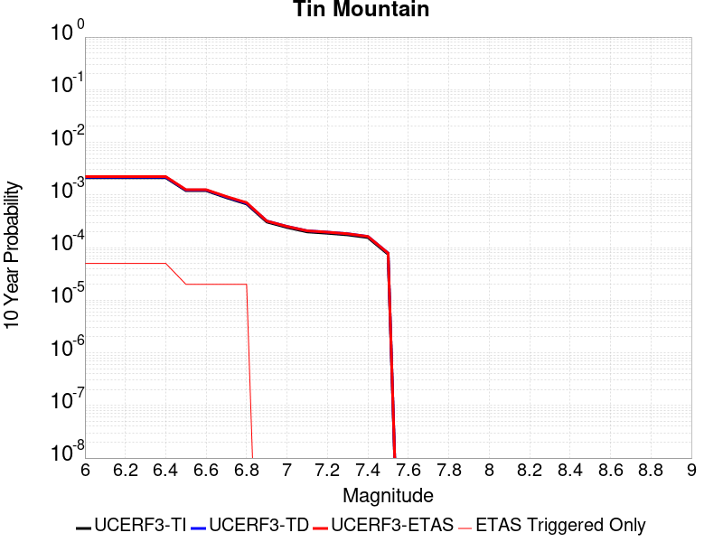 |

| Magnitude | 1 wk TI Prob | 1 wk TD Prob | 1 wk ETAS Prob | 1 wk ETAS/TD Gain | 1 wk ETAS Triggered Only | 1 mo TI Prob | 1 mo TD Prob | 1 mo ETAS Prob | 1 mo ETAS/TD Gain | 1 mo ETAS Triggered Only | 1 yr TI Prob | 1 yr TD Prob | 1 yr ETAS Prob | 1 yr ETAS/TD Gain | 1 yr ETAS Triggered Only | 10 yr TI Prob | 10 yr TD Prob | 10 yr ETAS Prob | 10 yr ETAS/TD Gain | 10 yr ETAS Triggered Only |
|-----|-----|-----|-----|-----|-----|-----|-----|-----|-----|-----|-----|-----|-----|-----|-----|-----|-----|-----|-----|-----|
| 6.0 | 4.083776E-6 | 4.1815365E-6 | 9.668809E-5 | 23.122622 | 9.250694E-5 | 1.750178E-5 | 1.792077E-5 | 1.1042605E-4 | 6.1619034 | 9.250694E-5 | 2.1306332E-4 | 2.1816725E-4 | 3.10654E-4 | 1.423926 | 9.250694E-5 | 0.0021285915 | 0.0021798965 | 0.0022722017 | 1.0423439 | 9.250694E-5 |
| 6.1 | 4.083776E-6 | 4.1815365E-6 | 9.668809E-5 | 23.122622 | 9.250694E-5 | 1.750178E-5 | 1.792077E-5 | 1.1042605E-4 | 6.1619034 | 9.250694E-5 | 2.1306332E-4 | 2.1816725E-4 | 3.10654E-4 | 1.423926 | 9.250694E-5 | 0.0021285915 | 0.0021798965 | 0.0022722017 | 1.0423439 | 9.250694E-5 |
| 6.2 | 4.083776E-6 | 4.1815365E-6 | 9.668809E-5 | 23.122622 | 9.250694E-5 | 1.750178E-5 | 1.792077E-5 | 1.1042605E-4 | 6.1619034 | 9.250694E-5 | 2.1306332E-4 | 2.1816725E-4 | 3.10654E-4 | 1.423926 | 9.250694E-5 | 0.0021285915 | 0.0021798965 | 0.0022722017 | 1.0423439 | 9.250694E-5 |
| 6.3 | 4.083776E-6 | 4.1815365E-6 | 9.668809E-5 | 23.122622 | 9.250694E-5 | 1.750178E-5 | 1.792077E-5 | 1.1042605E-4 | 6.1619034 | 9.250694E-5 | 2.1306332E-4 | 2.1816725E-4 | 3.10654E-4 | 1.423926 | 9.250694E-5 | 0.0021285915 | 0.0021798965 | 0.0022722017 | 1.0423439 | 9.250694E-5 |
| 6.4 | 4.083776E-6 | 4.1815365E-6 | 9.668809E-5 | 23.122622 | 9.250694E-5 | 1.750178E-5 | 1.792077E-5 | 1.1042605E-4 | 6.1619034 | 9.250694E-5 | 2.1306332E-4 | 2.1816725E-4 | 3.10654E-4 | 1.423926 | 9.250694E-5 | 0.0021285915 | 0.0021798965 | 0.0022722017 | 1.0423439 | 9.250694E-5 |
| 6.5 | 2.3143427E-6 | 2.3731573E-6 | 9.487988E-5 | 39.980442 | 9.250694E-5 | 9.9185745E-6 | 1.0170638E-5 | 1.0267663E-4 | 10.095397 | 9.250694E-5 | 1.2075195E-4 | 1.2382126E-4 | 2.1631674E-4 | 1.7470081 | 9.250694E-5 | 0.0012068636 | 0.0012375986 | 0.001329991 | 1.0746546 | 9.250694E-5 |
| 6.6 | 2.3143427E-6 | 2.3731573E-6 | 9.487988E-5 | 39.980442 | 9.250694E-5 | 9.9185745E-6 | 1.0170638E-5 | 1.0267663E-4 | 10.095397 | 9.250694E-5 | 1.2075195E-4 | 1.2382126E-4 | 2.1631674E-4 | 1.7470081 | 9.250694E-5 | 0.0012068636 | 0.0012375986 | 0.001329991 | 1.0746546 | 9.250694E-5 |
| 6.7 | 1.7029532E-6 | 1.7497915E-6 | 9.425657E-5 | 53.867313 | 9.250694E-5 | 7.2983503E-6 | 7.499088E-6 | 1.0000533E-4 | 13.335666 | 9.250694E-5 | 8.885379E-5 | 9.1298105E-5 | 1.837966E-4 | 2.013148 | 9.250694E-5 | 8.881827E-4 | 9.1265864E-4 | 0.0010050811 | 1.1012673 | 9.250694E-5 |
| 6.8 | 1.2914646E-6 | 1.3299378E-6 | 9.383675E-5 | 70.55724 | 9.250694E-5 | 5.534837E-6 | 5.6997237E-6 | 9.820613E-5 | 17.229982 | 9.250694E-5 | 6.738455E-5 | 6.939237E-5 | 1.618929E-4 | 2.333007 | 9.250694E-5 | 6.736412E-4 | 6.9375033E-4 | 7.861931E-4 | 1.1332507 | 9.250694E-5 |
| 6.9 | 5.8708974E-7 | 6.1169936E-7 | 6.1169936E-7 | 1.0 | 0.0 | 2.5160964E-6 | 2.6215664E-6 | 2.6215664E-6 | 1.0 | 0.0 | 3.0633044E-5 | 3.1917145E-5 | 3.1917145E-5 | 1.0 | 0.0 | 3.0628822E-4 | 3.191297E-4 | 3.191297E-4 | 1.0 | 0.0 |
| 7.0 | 4.6248786E-7 | 4.832015E-7 | 4.832015E-7 | 1.0 | 0.0 | 1.9820893E-6 | 2.0708624E-6 | 2.0708624E-6 | 1.0 | 0.0 | 2.413167E-5 | 2.5212494E-5 | 2.5212494E-5 | 1.0 | 0.0 | 2.412905E-4 | 2.5210003E-4 | 2.5210003E-4 | 1.0 | 0.0 |
| 7.1 | 3.804606E-7 | 3.987147E-7 | 3.987147E-7 | 1.0 | 0.0 | 1.6305444E-6 | 1.7087764E-6 | 1.7087764E-6 | 1.0 | 0.0 | 1.9851697E-5 | 2.0804187E-5 | 2.0804187E-5 | 1.0 | 0.0 | 1.9849923E-4 | 2.0802575E-4 | 2.0802575E-4 | 1.0 | 0.0 |
| 7.2 | 3.5864858E-7 | 3.7616863E-7 | 3.7616863E-7 | 1.0 | 0.0 | 1.5370645E-6 | 1.6121504E-6 | 1.6121504E-6 | 1.0 | 0.0 | 1.87136E-5 | 1.9627789E-5 | 1.9627789E-5 | 1.0 | 0.0 | 1.8712023E-4 | 1.9626386E-4 | 1.9626386E-4 | 1.0 | 0.0 |
| 7.3 | 3.342063E-7 | 3.506347E-7 | 3.506347E-7 | 1.0 | 0.0 | 1.4323119E-6 | 1.5027196E-6 | 1.5027196E-6 | 1.0 | 0.0 | 1.7438259E-5 | 1.829549E-5 | 1.829549E-5 | 1.0 | 0.0 | 1.743689E-4 | 1.8294314E-4 | 1.8294314E-4 | 1.0 | 0.0 |
| 7.4 | 2.971242E-7 | 3.1165817E-7 | 3.1165817E-7 | 1.0 | 0.0 | 1.2733886E-6 | 1.3356774E-6 | 1.3356774E-6 | 1.0 | 0.0 | 1.5503398E-5 | 1.6261785E-5 | 1.6261785E-5 | 1.0 | 0.0 | 1.5502315E-4 | 1.6260923E-4 | 1.6260923E-4 | 1.0 | 0.0 |
| 7.5 | 1.4326713E-7 | 1.5012525E-7 | 1.5012525E-7 | 1.0 | 0.0 | 6.140018E-7 | 6.433939E-7 | 6.433939E-7 | 1.0 | 0.0 | 7.4754466E-6 | 7.8333205E-6 | 7.8333205E-6 | 1.0 | 0.0 | 7.475195E-5 | 7.833321E-5 | 7.833321E-5 | 1.0 | 0.0 |

## San Jacinto (Clark) rev
*[(top)](#table-of-contents)*

| 1 Week | 1 Month | 1 Year | 10 Year |
|-----|-----|-----|-----|
|  |  | 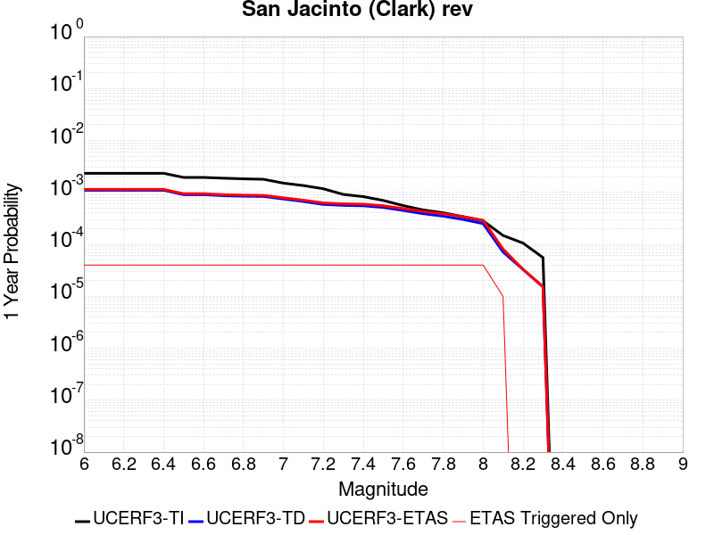 |  |

| Magnitude | 1 wk TI Prob | 1 wk TD Prob | 1 wk ETAS Prob | 1 wk ETAS/TD Gain | 1 wk ETAS Triggered Only | 1 mo TI Prob | 1 mo TD Prob | 1 mo ETAS Prob | 1 mo ETAS/TD Gain | 1 mo ETAS Triggered Only | 1 yr TI Prob | 1 yr TD Prob | 1 yr ETAS Prob | 1 yr ETAS/TD Gain | 1 yr ETAS Triggered Only | 10 yr TI Prob | 10 yr TD Prob | 10 yr ETAS Prob | 10 yr ETAS/TD Gain | 10 yr ETAS Triggered Only |
|-----|-----|-----|-----|-----|-----|-----|-----|-----|-----|-----|-----|-----|-----|-----|-----|-----|-----|-----|-----|-----|
| 6.0 | 4.482615E-5 | 2.1154196E-5 | 1.13659175E-4 | 5.3728905 | 9.250694E-5 | 1.9209793E-4 | 9.065773E-5 | 1.8315628E-4 | 2.0203052 | 9.250694E-5 | 0.0023362834 | 0.0011032083 | 0.0011956132 | 1.0837601 | 9.250694E-5 | 0.02311874 | 0.011503847 | 0.011595289 | 1.0079489 | 9.250694E-5 |
| 6.1 | 4.482615E-5 | 2.1154196E-5 | 1.13659175E-4 | 5.3728905 | 9.250694E-5 | 1.9209793E-4 | 9.065773E-5 | 1.8315628E-4 | 2.0203052 | 9.250694E-5 | 0.0023362834 | 0.0011032083 | 0.0011956132 | 1.0837601 | 9.250694E-5 | 0.02311874 | 0.011503847 | 0.011595289 | 1.0079489 | 9.250694E-5 |
| 6.2 | 4.482615E-5 | 2.1154196E-5 | 1.13659175E-4 | 5.3728905 | 9.250694E-5 | 1.9209793E-4 | 9.065773E-5 | 1.8315628E-4 | 2.0203052 | 9.250694E-5 | 0.0023362834 | 0.0011032083 | 0.0011956132 | 1.0837601 | 9.250694E-5 | 0.02311874 | 0.011503847 | 0.011595289 | 1.0079489 | 9.250694E-5 |
| 6.3 | 4.482615E-5 | 2.1154196E-5 | 1.13659175E-4 | 5.3728905 | 9.250694E-5 | 1.9209793E-4 | 9.065773E-5 | 1.8315628E-4 | 2.0203052 | 9.250694E-5 | 0.0023362834 | 0.0011032083 | 0.0011956132 | 1.0837601 | 9.250694E-5 | 0.02311874 | 0.011503847 | 0.011595289 | 1.0079489 | 9.250694E-5 |
| 6.4 | 4.482615E-5 | 2.1154196E-5 | 1.13659175E-4 | 5.3728905 | 9.250694E-5 | 1.9209793E-4 | 9.065773E-5 | 1.8315628E-4 | 2.0203052 | 9.250694E-5 | 0.0023362834 | 0.0011032083 | 0.0011956132 | 1.0837601 | 9.250694E-5 | 0.02311874 | 0.011503847 | 0.011595289 | 1.0079489 | 9.250694E-5 |
| 6.5 | 3.7294863E-5 | 1.7356087E-5 | 1.0986142E-4 | 6.3298492 | 9.250694E-5 | 1.5982533E-4 | 7.438113E-5 | 1.6688119E-4 | 2.2435956 | 9.250694E-5 | 0.0019441366 | 9.052186E-4 | 9.976418E-4 | 1.1021004 | 9.250694E-5 | 0.01927216 | 0.0094941035 | 0.009585732 | 1.0096511 | 9.250694E-5 |
| 6.6 | 3.7294863E-5 | 1.7356087E-5 | 1.0986142E-4 | 6.3298492 | 9.250694E-5 | 1.5982533E-4 | 7.438113E-5 | 1.6688119E-4 | 2.2435956 | 9.250694E-5 | 0.0019441366 | 9.052186E-4 | 9.976418E-4 | 1.1021004 | 9.250694E-5 | 0.01927216 | 0.0094941035 | 0.009585732 | 1.0096511 | 9.250694E-5 |
| 6.7 | 3.6039248E-5 | 1.6604314E-5 | 1.09109715E-4 | 6.571167 | 9.250694E-5 | 1.5444479E-4 | 7.1159426E-5 | 1.6365977E-4 | 2.2999032 | 9.250694E-5 | 0.0018787434 | 8.6602574E-4 | 9.584526E-4 | 1.1067252 | 9.250694E-5 | 0.01862939 | 0.009096047 | 0.009187712 | 1.0100775 | 9.250694E-5 |
| 6.8 | 3.5031844E-5 | 1.6232942E-5 | 1.0873838E-4 | 6.6986246 | 9.250694E-5 | 1.5012783E-4 | 6.956792E-5 | 1.6206842E-4 | 2.329643 | 9.250694E-5 | 0.0018262739 | 8.4666436E-4 | 9.3909295E-4 | 1.1091679 | 9.250694E-5 | 0.01811338 | 0.008895969 | 0.008987653 | 1.0103062 | 9.250694E-5 |
| 6.9 | 3.435112E-5 | 1.6063195E-5 | 1.08568645E-4 | 6.7588453 | 9.250694E-5 | 1.4721078E-4 | 6.884047E-5 | 1.6134104E-4 | 2.3436947 | 9.250694E-5 | 0.0017908178 | 8.3781447E-4 | 9.302439E-4 | 1.1103221 | 9.250694E-5 | 0.017764548 | 0.008804181 | 0.008895873 | 1.0104146 | 9.250694E-5 |
| 7.0 | 2.8959772E-5 | 1.4336745E-5 | 1.0684236E-4 | 7.452344 | 9.250694E-5 | 1.241074E-4 | 6.144176E-5 | 1.5394302E-4 | 2.505511 | 9.250694E-5 | 0.0015099603 | 7.477995E-4 | 8.4023725E-4 | 1.123613 | 9.250694E-5 | 0.014997416 | 0.007868037 | 0.007959816 | 1.0116647 | 9.250694E-5 |
| 7.1 | 2.6002877E-5 | 1.2829002E-5 | 1.0533475E-4 | 8.210674 | 9.250694E-5 | 1.11436144E-4 | 5.498029E-5 | 1.4748215E-4 | 2.6824548 | 9.250694E-5 | 0.0013558907 | 6.691816E-4 | 7.616266E-4 | 1.1381464 | 9.250694E-5 | 0.013476475 | 0.0070465137 | 0.007138369 | 1.0130355 | 9.250694E-5 |
| 7.2 | 2.2544838E-5 | 1.1262543E-5 | 1.0376844E-4 | 9.213589 | 9.250694E-5 | 9.661716E-5 | 4.8267157E-5 | 1.4076963E-4 | 2.9164681 | 9.250694E-5 | 0.001175679 | 5.874956E-4 | 6.7994825E-4 | 1.1573672 | 9.250694E-5 | 0.011694785 | 0.0061927503 | 0.006284684 | 1.0148455 | 9.250694E-5 |
| 7.3 | 1.75334E-5 | 1.0811715E-5 | 1.0331765E-4 | 9.556084 | 9.250694E-5 | 7.514098E-5 | 4.6335106E-5 | 1.3883776E-4 | 2.9963837 | 9.250694E-5 | 9.144575E-4 | 5.6398526E-4 | 6.5644004E-4 | 1.1639311 | 9.250694E-5 | 0.009107036 | 0.0059337732 | 0.0060257316 | 1.0154974 | 9.250694E-5 |
| 7.4 | 1.5924552E-5 | 1.0611516E-5 | 1.03117476E-4 | 9.717506 | 9.250694E-5 | 6.82463E-5 | 4.547714E-5 | 1.3797988E-4 | 3.034049 | 9.250694E-5 | 8.305819E-4 | 5.535449E-4 | 6.460006E-4 | 1.1670249 | 9.250694E-5 | 0.008274844 | 0.0058210334 | 0.005913002 | 1.0157993 | 9.250694E-5 |
| 7.5 | 1.3428931E-5 | 9.8519E-6 | 1.02357924E-4 | 10.389664 | 9.250694E-5 | 5.7551293E-5 | 4.2221753E-5 | 1.3472479E-4 | 3.1908858 | 9.250694E-5 | 7.004617E-4 | 5.1392964E-4 | 6.063891E-4 | 1.1799067 | 9.250694E-5 | 0.006982579 | 0.0054066023 | 0.005498609 | 1.0170175 | 9.250694E-5 |
| 7.6 | 1.0688787E-5 | 8.614839E-6 | 1.0112098E-4 | 11.737999 | 9.250694E-5 | 4.5808283E-5 | 3.692022E-5 | 1.2942374E-4 | 3.5054975 | 9.250694E-5 | 5.5757316E-4 | 4.4941145E-4 | 5.418768E-4 | 1.2057477 | 9.250694E-5 | 0.005561762 | 0.0047416524 | 0.0048337206 | 1.0194169 | 9.250694E-5 |
| 7.7 | 8.81236E-6 | 7.4680274E-6 | 9.997428E-5 | 13.386971 | 9.250694E-5 | 3.776671E-5 | 3.2005442E-5 | 1.2450942E-4 | 3.8902578 | 9.250694E-5 | 4.597127E-4 | 3.8959677E-4 | 4.8206767E-4 | 1.2373502 | 9.250694E-5 | 0.0045876284 | 0.0041346536 | 0.004226778 | 1.022281 | 9.250694E-5 |
| 7.8 | 7.780431E-6 | 6.696579E-6 | 9.9202894E-5 | 14.813967 | 9.250694E-5 | 3.3344273E-5 | 2.8699309E-5 | 1.2120359E-4 | 4.223223 | 9.250694E-5 | 4.0589093E-4 | 3.4935825E-4 | 4.4183288E-4 | 1.2646985 | 9.250694E-5 | 0.0040515037 | 0.0037227906 | 0.0038149531 | 1.0247563 | 9.250694E-5 |
| 7.9 | 6.5437994E-6 | 5.780382E-6 | 9.8286786E-5 | 17.003511 | 9.250694E-5 | 2.8044553E-5 | 2.477283E-5 | 1.1727748E-4 | 4.734117 | 9.250694E-5 | 3.4138895E-4 | 3.0156763E-4 | 3.9404668E-4 | 1.306661 | 9.250694E-5 | 0.0034086495 | 0.0032344845 | 0.0033266922 | 1.0285077 | 9.250694E-5 |
| 8.0 | 5.4488164E-6 | 4.8133406E-6 | 9.731983E-5 | 20.218771 | 9.250694E-5 | 2.3351862E-5 | 2.062844E-5 | 1.1313347E-4 | 5.4843445 | 9.250694E-5 | 2.8427184E-4 | 2.5112246E-4 | 3.4360617E-4 | 1.3682812 | 9.250694E-5 | 0.0028390845 | 0.002710839 | 0.0028030952 | 1.0340323 | 9.250694E-5 |
| 8.1 | 2.8397242E-6 | 1.3670389E-6 | 1.3670389E-6 | 1.0 | 0.0 | 1.217019E-5 | 5.858725E-6 | 5.858725E-6 | 1.0 | 0.0 | 1.4816198E-4 | 7.132765E-5 | 7.132765E-5 | 1.0 | 0.0 | 0.0014806325 | 8.115382E-4 | 8.115382E-4 | 1.0 | 0.0 |
| 8.2 | 2.030244E-6 | 6.318974E-7 | 6.318974E-7 | 1.0 | 0.0 | 8.701017E-6 | 2.708129E-6 | 2.708129E-6 | 1.0 | 0.0 | 1.05929736E-4 | 3.2970976E-5 | 3.2970976E-5 | 1.0 | 0.0 | 0.0010587925 | 3.9486602E-4 | 3.9486602E-4 | 1.0 | 0.0 |
| 8.3 | 1.0659804E-6 | 2.9250086E-7 | 2.9250086E-7 | 1.0 | 0.0 | 4.568479E-6 | 1.2535745E-6 | 1.2535745E-6 | 1.0 | 0.0 | 5.5619817E-5 | 1.5262167E-5 | 1.5262167E-5 | 1.0 | 0.0 | 5.5605895E-4 | 1.8566217E-4 | 1.8566217E-4 | 1.0 | 0.0 |

## Carlsbad
*[(top)](#table-of-contents)*

| 1 Week | 1 Month | 1 Year | 10 Year |
|-----|-----|-----|-----|
|  |  |  |  |

| Magnitude | 1 wk TI Prob | 1 wk TD Prob | 1 wk ETAS Prob | 1 wk ETAS/TD Gain | 1 wk ETAS Triggered Only | 1 mo TI Prob | 1 mo TD Prob | 1 mo ETAS Prob | 1 mo ETAS/TD Gain | 1 mo ETAS Triggered Only | 1 yr TI Prob | 1 yr TD Prob | 1 yr ETAS Prob | 1 yr ETAS/TD Gain | 1 yr ETAS Triggered Only | 10 yr TI Prob | 10 yr TD Prob | 10 yr ETAS Prob | 10 yr ETAS/TD Gain | 10 yr ETAS Triggered Only |
|-----|-----|-----|-----|-----|-----|-----|-----|-----|-----|-----|-----|-----|-----|-----|-----|-----|-----|-----|-----|-----|
| 6.0 | 4.9038536E-6 | 4.9872565E-6 | 4.9872565E-6 | 1.0 | 0.0 | 2.1016345E-5 | 2.1373784E-5 | 2.1373784E-5 | 1.0 | 0.0 | 2.5584397E-4 | 2.601952E-4 | 3.5267806E-4 | 1.3554364 | 9.250694E-5 | 0.002555496 | 0.0025989525 | 0.002691219 | 1.0355015 | 9.250694E-5 |
| 6.1 | 4.9038536E-6 | 4.9872565E-6 | 4.9872565E-6 | 1.0 | 0.0 | 2.1016345E-5 | 2.1373784E-5 | 2.1373784E-5 | 1.0 | 0.0 | 2.5584397E-4 | 2.601952E-4 | 3.5267806E-4 | 1.3554364 | 9.250694E-5 | 0.002555496 | 0.0025989525 | 0.002691219 | 1.0355015 | 9.250694E-5 |
| 6.2 | 4.3820614E-6 | 4.4547687E-6 | 4.4547687E-6 | 1.0 | 0.0 | 1.8780129E-5 | 1.9091729E-5 | 1.9091729E-5 | 1.0 | 0.0 | 2.2862408E-4 | 2.3241735E-4 | 3.249028E-4 | 1.3979282 | 9.250694E-5 | 0.00228389 | 0.0023217786 | 0.0024140708 | 1.0397506 | 9.250694E-5 |
| 6.3 | 4.302872E-6 | 4.373006E-6 | 4.373006E-6 | 1.0 | 0.0 | 1.8440749E-5 | 1.8741322E-5 | 1.8741322E-5 | 1.0 | 0.0 | 2.24493E-4 | 2.2815206E-4 | 3.206379E-4 | 1.4053693 | 9.250694E-5 | 0.0022426634 | 0.0022792136 | 0.0023715096 | 1.0404947 | 9.250694E-5 |
| 6.4 | 4.0835243E-6 | 4.1476546E-6 | 4.1476546E-6 | 1.0 | 0.0 | 1.75007E-5 | 1.7775543E-5 | 1.7775543E-5 | 1.0 | 0.0 | 2.1305021E-4 | 2.1639607E-4 | 3.08883E-4 | 1.4273964 | 9.250694E-5 | 0.0021284607 | 0.0021618877 | 0.0022541946 | 1.0426974 | 9.250694E-5 |
| 6.5 | 3.987806E-6 | 4.0488867E-6 | 4.0488867E-6 | 1.0 | 0.0 | 1.7090486E-5 | 1.7352257E-5 | 1.7352257E-5 | 1.0 | 0.0 | 2.080568E-4 | 2.1124359E-4 | 3.0373098E-4 | 1.4378234 | 9.250694E-5 | 0.002078621 | 0.0021104617 | 0.0022027735 | 1.04374 | 9.250694E-5 |
| 6.6 | 3.8707576E-6 | 3.927488E-6 | 3.927488E-6 | 1.0 | 0.0 | 1.6588854E-5 | 1.6831984E-5 | 1.6831984E-5 | 1.0 | 0.0 | 2.0195059E-4 | 2.0491047E-4 | 2.9739845E-4 | 1.451358 | 9.250694E-5 | 0.0020176715 | 0.0020472489 | 0.0021395665 | 1.0450934 | 9.250694E-5 |
| 6.7 | 3.3093434E-6 | 3.3423917E-6 | 3.3423917E-6 | 1.0 | 0.0 | 1.4182823E-5 | 1.4324457E-5 | 1.4324457E-5 | 1.0 | 0.0 | 1.7266218E-4 | 1.7438637E-4 | 2.6687718E-4 | 1.5303787 | 9.250694E-5 | 0.001725281 | 0.0017425013 | 0.001834847 | 1.052996 | 9.250694E-5 |
| 6.8 | 3.136983E-6 | 3.1664536E-6 | 3.1664536E-6 | 1.0 | 0.0 | 1.3444143E-5 | 1.3570445E-5 | 1.3570445E-5 | 1.0 | 0.0 | 1.6367015E-4 | 1.6520769E-4 | 2.5769934E-4 | 1.5598508 | 9.250694E-5 | 0.0016354966 | 0.0016508545 | 0.0017432086 | 1.0559433 | 9.250694E-5 |
| 6.9 | 2.9056644E-6 | 2.9267585E-6 | 2.9267585E-6 | 1.0 | 0.0 | 1.2452788E-5 | 1.2543191E-5 | 1.2543191E-5 | 1.0 | 0.0 | 1.5160214E-4 | 1.5270269E-4 | 2.451955E-4 | 1.6057051 | 9.250694E-5 | 0.0015149876 | 0.001525983 | 0.0016183488 | 1.0605288 | 9.250694E-5 |
| 7.0 | 2.5071035E-6 | 2.5113977E-6 | 2.5113977E-6 | 1.0 | 0.0 | 1.0744685E-5 | 1.07630885E-5 | 1.07630885E-5 | 1.0 | 0.0 | 1.308087E-4 | 1.3103275E-4 | 1.3103275E-4 | 1.0 | 0.0 | 0.0013073172 | 0.0013095582 | 0.0013095582 | 1.0 | 0.0 |
| 7.1 | 2.1786877E-6 | 2.1678832E-6 | 2.1678832E-6 | 1.0 | 0.0 | 9.3372E-6 | 9.290896E-6 | 9.290896E-6 | 1.0 | 0.0 | 1.13674476E-4 | 1.1311081E-4 | 1.1311081E-4 | 1.0 | 0.0 | 0.0011361635 | 0.0011305353 | 0.0011305353 | 1.0 | 0.0 |
| 7.2 | 1.6628418E-6 | 1.6213872E-6 | 1.6213872E-6 | 1.0 | 0.0 | 7.1264453E-6 | 6.948784E-6 | 6.948784E-6 | 1.0 | 0.0 | 8.676102E-5 | 8.4598185E-5 | 8.4598185E-5 | 1.0 | 0.0 | 8.672715E-4 | 8.45662E-4 | 8.45662E-4 | 1.0 | 0.0 |
| 7.3 | 1.0595926E-6 | 9.816804E-7 | 9.816804E-7 | 1.0 | 0.0 | 4.541103E-6 | 4.2071947E-6 | 4.2071947E-6 | 1.0 | 0.0 | 5.5286528E-5 | 5.1221403E-5 | 5.1221403E-5 | 1.0 | 0.0 | 5.527277E-4 | 5.1209686E-4 | 5.1209686E-4 | 1.0 | 0.0 |
| 7.4 | 7.956623E-7 | 7.1737975E-7 | 7.1737975E-7 | 1.0 | 0.0 | 3.4099767E-6 | 3.074481E-6 | 3.074481E-6 | 1.0 | 0.0 | 4.1515676E-5 | 3.743117E-5 | 3.743117E-5 | 1.0 | 0.0 | 4.150792E-4 | 3.7424936E-4 | 3.7424936E-4 | 1.0 | 0.0 |
| 7.5 | 5.1043804E-7 | 4.4483627E-7 | 4.4483627E-7 | 1.0 | 0.0 | 2.1875896E-6 | 1.9064398E-6 | 1.9064398E-6 | 1.0 | 0.0 | 2.663358E-5 | 2.3210663E-5 | 2.3210663E-5 | 1.0 | 0.0 | 2.6630386E-4 | 2.3208297E-4 | 2.3208297E-4 | 1.0 | 0.0 |
| 7.6 | 2.3723294E-7 | 1.989569E-7 | 1.989569E-7 | 1.0 | 0.0 | 1.0167122E-6 | 8.5267214E-7 | 8.5267214E-7 | 1.0 | 0.0 | 1.2378401E-5 | 1.0381237E-5 | 1.0381237E-5 | 1.0 | 0.0 | 1.237771E-4 | 1.038078E-4 | 1.038078E-4 | 1.0 | 0.0 |
| 7.7 | 1.9992152E-8 | 9.8601785E-9 | 9.8601785E-9 | 1.0 | 0.0 | 8.568065E-8 | 4.225791E-8 | 4.225791E-8 | 1.0 | 0.0 | 1.0431614E-6 | 5.1449E-7 | 5.1449E-7 | 1.0 | 0.0 | 1.0431565E-5 | 5.1449E-6 | 5.1449E-6 | 1.0 | 0.0 |

## Kern Canyon (South Kern) 2011
*[(top)](#table-of-contents)*

| 1 Week | 1 Month | 1 Year | 10 Year |
|-----|-----|-----|-----|
|  |  |  |  |

| Magnitude | 1 wk TI Prob | 1 wk TD Prob | 1 wk ETAS Prob | 1 wk ETAS/TD Gain | 1 wk ETAS Triggered Only | 1 mo TI Prob | 1 mo TD Prob | 1 mo ETAS Prob | 1 mo ETAS/TD Gain | 1 mo ETAS Triggered Only | 1 yr TI Prob | 1 yr TD Prob | 1 yr ETAS Prob | 1 yr ETAS/TD Gain | 1 yr ETAS Triggered Only | 10 yr TI Prob | 10 yr TD Prob | 10 yr ETAS Prob | 10 yr ETAS/TD Gain | 10 yr ETAS Triggered Only |
|-----|-----|-----|-----|-----|-----|-----|-----|-----|-----|-----|-----|-----|-----|-----|-----|-----|-----|-----|-----|-----|
| 6.0 | 4.105075E-6 | 4.1137264E-6 | 9.6620286E-5 | 23.48729 | 9.250694E-5 | 1.7593058E-5 | 1.763014E-5 | 1.1013545E-4 | 6.246998 | 9.250694E-5 | 2.1417443E-4 | 2.1462646E-4 | 3.0711354E-4 | 1.4309212 | 9.250694E-5 | 0.0021396813 | 0.0021442557 | 0.0022365642 | 1.0430492 | 9.250694E-5 |
| 6.1 | 4.105075E-6 | 4.1137264E-6 | 9.6620286E-5 | 23.48729 | 9.250694E-5 | 1.7593058E-5 | 1.763014E-5 | 1.1013545E-4 | 6.246998 | 9.250694E-5 | 2.1417443E-4 | 2.1462646E-4 | 3.0711354E-4 | 1.4309212 | 9.250694E-5 | 0.0021396813 | 0.0021442557 | 0.0022365642 | 1.0430492 | 9.250694E-5 |
| 6.2 | 4.105075E-6 | 4.1137264E-6 | 9.6620286E-5 | 23.48729 | 9.250694E-5 | 1.7593058E-5 | 1.763014E-5 | 1.1013545E-4 | 6.246998 | 9.250694E-5 | 2.1417443E-4 | 2.1462646E-4 | 3.0711354E-4 | 1.4309212 | 9.250694E-5 | 0.0021396813 | 0.0021442557 | 0.0022365642 | 1.0430492 | 9.250694E-5 |
| 6.3 | 4.105075E-6 | 4.1137264E-6 | 9.6620286E-5 | 23.48729 | 9.250694E-5 | 1.7593058E-5 | 1.763014E-5 | 1.1013545E-4 | 6.246998 | 9.250694E-5 | 2.1417443E-4 | 2.1462646E-4 | 3.0711354E-4 | 1.4309212 | 9.250694E-5 | 0.0021396813 | 0.0021442557 | 0.0022365642 | 1.0430492 | 9.250694E-5 |
| 6.4 | 4.105075E-6 | 4.1137264E-6 | 9.6620286E-5 | 23.48729 | 9.250694E-5 | 1.7593058E-5 | 1.763014E-5 | 1.1013545E-4 | 6.246998 | 9.250694E-5 | 2.1417443E-4 | 2.1462646E-4 | 3.0711354E-4 | 1.4309212 | 9.250694E-5 | 0.0021396813 | 0.0021442557 | 0.0022365642 | 1.0430492 | 9.250694E-5 |
| 6.5 | 2.9849807E-6 | 2.9731548E-6 | 2.9731548E-6 | 1.0 | 0.0 | 1.2792712E-5 | 1.274203E-5 | 1.274203E-5 | 1.0 | 0.0 | 1.5574014E-4 | 1.5512333E-4 | 1.5512333E-4 | 1.0 | 0.0 | 0.0015563103 | 0.0015501656 | 0.0015501656 | 1.0 | 0.0 |
| 6.6 | 2.9849807E-6 | 2.9731548E-6 | 2.9731548E-6 | 1.0 | 0.0 | 1.2792712E-5 | 1.274203E-5 | 1.274203E-5 | 1.0 | 0.0 | 1.5574014E-4 | 1.5512333E-4 | 1.5512333E-4 | 1.0 | 0.0 | 0.0015563103 | 0.0015501656 | 0.0015501656 | 1.0 | 0.0 |
| 6.7 | 2.6756725E-6 | 2.6582206E-6 | 2.6582206E-6 | 1.0 | 0.0 | 1.1467117E-5 | 1.1392325E-5 | 1.1392325E-5 | 1.0 | 0.0 | 1.396032E-4 | 1.3869285E-4 | 1.3869285E-4 | 1.0 | 0.0 | 0.0013951553 | 0.0013860738 | 0.0013860738 | 1.0 | 0.0 |
| 6.8 | 2.3283721E-6 | 2.3047787E-6 | 2.3047787E-6 | 1.0 | 0.0 | 9.9787E-6 | 9.877586E-6 | 9.877586E-6 | 1.0 | 0.0 | 1.214839E-4 | 1.20253055E-4 | 1.20253055E-4 | 1.0 | 0.0 | 0.001214175 | 0.0012018873 | 0.0012018873 | 1.0 | 0.0 |
| 6.9 | 2.0972677E-6 | 2.0696411E-6 | 2.0696411E-6 | 1.0 | 0.0 | 8.988259E-6 | 8.869861E-6 | 8.869861E-6 | 1.0 | 0.0 | 1.0942656E-4 | 1.0798526E-4 | 1.0798526E-4 | 1.0 | 0.0 | 0.0010937268 | 0.0010793337 | 0.0010793337 | 1.0 | 0.0 |
| 7.0 | 1.7132242E-6 | 1.6787036E-6 | 1.6787036E-6 | 1.0 | 0.0 | 7.3423685E-6 | 7.194424E-6 | 7.194424E-6 | 1.0 | 0.0 | 8.938967E-5 | 8.758863E-5 | 8.758863E-5 | 1.0 | 0.0 | 8.935372E-4 | 8.7554497E-4 | 8.7554497E-4 | 1.0 | 0.0 |
| 7.1 | 1.4215541E-6 | 1.3815752E-6 | 1.3815752E-6 | 1.0 | 0.0 | 6.0923603E-6 | 5.9210233E-6 | 5.9210233E-6 | 1.0 | 0.0 | 7.417196E-5 | 7.20861E-5 | 7.20861E-5 | 1.0 | 0.0 | 7.414721E-4 | 7.206299E-4 | 7.206299E-4 | 1.0 | 0.0 |
| 7.2 | 9.097853E-7 | 8.6037755E-7 | 8.6037755E-7 | 1.0 | 0.0 | 3.899074E-6 | 3.6873273E-6 | 3.6873273E-6 | 1.0 | 0.0 | 4.7470192E-5 | 4.4892295E-5 | 4.4892295E-5 | 1.0 | 0.0 | 4.7460053E-4 | 4.4883334E-4 | 4.4883334E-4 | 1.0 | 0.0 |
| 7.3 | 6.144169E-7 | 5.628206E-7 | 5.628206E-7 | 1.0 | 0.0 | 2.6332125E-6 | 2.4120861E-6 | 2.4120861E-6 | 1.0 | 0.0 | 3.205889E-5 | 2.9366758E-5 | 2.9366758E-5 | 1.0 | 0.0 | 3.2054266E-4 | 2.936293E-4 | 2.936293E-4 | 1.0 | 0.0 |
| 7.4 | 4.049844E-7 | 3.5728314E-7 | 3.5728314E-7 | 1.0 | 0.0 | 1.7356463E-6 | 1.5312125E-6 | 1.5312125E-6 | 1.0 | 0.0 | 2.1131287E-5 | 1.8642357E-5 | 1.8642357E-5 | 1.0 | 0.0 | 2.1129279E-4 | 1.8640817E-4 | 1.8640817E-4 | 1.0 | 0.0 |
| 7.5 | 1.9871162E-7 | 1.583044E-7 | 1.583044E-7 | 1.0 | 0.0 | 8.5162094E-7 | 6.7844724E-7 | 6.7844724E-7 | 1.0 | 0.0 | 1.0368436E-5 | 8.260065E-6 | 8.260065E-6 | 1.0 | 0.0 | 1.0367952E-4 | 8.259767E-5 | 8.259767E-5 | 1.0 | 0.0 |
| 7.6 | 2.572245E-8 | 1.7352555E-8 | 1.7352555E-8 | 1.0 | 0.0 | 1.10239064E-7 | 7.436809E-8 | 7.436809E-8 | 1.0 | 0.0 | 1.3421597E-6 | 9.054312E-7 | 9.054312E-7 | 1.0 | 0.0 | 1.3421517E-5 | 9.05428E-6 | 9.05428E-6 | 1.0 | 0.0 |

## Big Pine (East)
*[(top)](#table-of-contents)*

| 1 Week | 1 Month | 1 Year | 10 Year |
|-----|-----|-----|-----|
|  |  |  |  |

| Magnitude | 1 wk TI Prob | 1 wk TD Prob | 1 wk ETAS Prob | 1 wk ETAS/TD Gain | 1 wk ETAS Triggered Only | 1 mo TI Prob | 1 mo TD Prob | 1 mo ETAS Prob | 1 mo ETAS/TD Gain | 1 mo ETAS Triggered Only | 1 yr TI Prob | 1 yr TD Prob | 1 yr ETAS Prob | 1 yr ETAS/TD Gain | 1 yr ETAS Triggered Only | 10 yr TI Prob | 10 yr TD Prob | 10 yr ETAS Prob | 10 yr ETAS/TD Gain | 10 yr ETAS Triggered Only |
|-----|-----|-----|-----|-----|-----|-----|-----|-----|-----|-----|-----|-----|-----|-----|-----|-----|-----|-----|-----|-----|
| 6.0 | 9.916913E-6 | 1.2816984E-5 | 1.0532274E-4 | 8.217435 | 9.250694E-5 | 4.250036E-5 | 5.49289E-5 | 1.4743076E-4 | 2.6840289 | 9.250694E-5 | 5.173191E-4 | 6.685763E-4 | 7.610214E-4 | 1.1382716 | 9.250694E-5 | 0.0051611643 | 0.006670441 | 0.006762331 | 1.0137757 | 9.250694E-5 |
| 6.1 | 9.916913E-6 | 1.2816984E-5 | 1.0532274E-4 | 8.217435 | 9.250694E-5 | 4.250036E-5 | 5.49289E-5 | 1.4743076E-4 | 2.6840289 | 9.250694E-5 | 5.173191E-4 | 6.685763E-4 | 7.610214E-4 | 1.1382716 | 9.250694E-5 | 0.0051611643 | 0.006670441 | 0.006762331 | 1.0137757 | 9.250694E-5 |
| 6.2 | 9.916913E-6 | 1.2816984E-5 | 1.0532274E-4 | 8.217435 | 9.250694E-5 | 4.250036E-5 | 5.49289E-5 | 1.4743076E-4 | 2.6840289 | 9.250694E-5 | 5.173191E-4 | 6.685763E-4 | 7.610214E-4 | 1.1382716 | 9.250694E-5 | 0.0051611643 | 0.006670441 | 0.006762331 | 1.0137757 | 9.250694E-5 |
| 6.3 | 5.479711E-6 | 8.112951E-6 | 1.0061914E-4 | 12.402286 | 9.250694E-5 | 2.3484265E-5 | 3.4769346E-5 | 1.2727307E-4 | 3.6604965 | 9.250694E-5 | 2.858834E-4 | 4.2323777E-4 | 5.1570556E-4 | 1.2184771 | 9.250694E-5 | 0.0028551589 | 0.004227244 | 0.0043193595 | 1.021791 | 9.250694E-5 |
| 6.4 | 5.465009E-6 | 8.097245E-6 | 1.00603436E-4 | 12.424403 | 9.250694E-5 | 2.3421257E-5 | 3.4702036E-5 | 1.2720576E-4 | 3.6656573 | 9.250694E-5 | 2.851165E-4 | 4.2241855E-4 | 5.148864E-4 | 1.218901 | 9.250694E-5 | 0.0028475097 | 0.0042190826 | 0.0043111993 | 1.0218333 | 9.250694E-5 |
| 6.5 | 4.826767E-6 | 7.422301E-6 | 9.9928555E-5 | 13.4632845 | 9.250694E-5 | 2.068598E-5 | 3.180949E-5 | 1.2431349E-4 | 3.9080627 | 9.250694E-5 | 2.518227E-4 | 3.872145E-4 | 4.796856E-4 | 1.2388111 | 9.250694E-5 | 0.0025153751 | 0.003868283 | 0.003960432 | 1.0238217 | 9.250694E-5 |
| 6.6 | 4.3146847E-6 | 6.8822374E-6 | 9.938854E-5 | 14.441313 | 9.250694E-5 | 1.8491375E-5 | 2.9494982E-5 | 1.2199919E-4 | 4.136269 | 9.250694E-5 | 2.2510924E-4 | 3.590447E-4 | 4.5151843E-4 | 1.2575549 | 9.250694E-5 | 0.0022488134 | 0.0035874986 | 0.0036796737 | 1.0256934 | 9.250694E-5 |
| 6.7 | 3.6968106E-6 | 5.9954727E-6 | 9.8501856E-5 | 16.429373 | 9.250694E-5 | 1.5843378E-5 | 2.5694639E-5 | 1.181992E-4 | 4.60015 | 9.250694E-5 | 1.9287605E-4 | 3.1278885E-4 | 4.0526685E-4 | 1.2956563 | 9.250694E-5 | 0.0019270873 | 0.0031262483 | 0.003218466 | 1.0294979 | 9.250694E-5 |
| 6.8 | 3.4671132E-6 | 5.702177E-6 | 9.820859E-5 | 17.222998 | 9.250694E-5 | 1.4858972E-5 | 2.4437682E-5 | 1.16942356E-4 | 4.7853293 | 9.250694E-5 | 1.8089297E-4 | 2.974896E-4 | 3.89969E-4 | 1.310866 | 9.250694E-5 | 0.0018074579 | 0.002973667 | 0.003065899 | 1.0310162 | 9.250694E-5 |
| 6.9 | 2.7686972E-6 | 4.825223E-6 | 4.825223E-6 | 1.0 | 0.0 | 1.1865792E-5 | 2.0679368E-5 | 2.0679368E-5 | 1.0 | 0.0 | 1.4445644E-4 | 2.5174298E-4 | 2.5174298E-4 | 1.0 | 0.0 | 0.0014436257 | 0.0025172636 | 0.0025172636 | 1.0 | 0.0 |
| 7.0 | 2.1472624E-6 | 3.9850406E-6 | 3.9850406E-6 | 1.0 | 0.0 | 9.20252E-6 | 1.7078637E-5 | 1.7078637E-5 | 1.0 | 0.0 | 1.12034926E-4 | 2.079131E-4 | 2.079131E-4 | 1.0 | 0.0 | 0.0011197845 | 0.0020798394 | 0.0020798394 | 1.0 | 0.0 |
| 7.1 | 1.7018335E-6 | 3.344876E-6 | 3.344876E-6 | 1.0 | 0.0 | 7.293552E-6 | 1.4335106E-5 | 1.4335106E-5 | 1.0 | 0.0 | 8.879537E-5 | 1.7451629E-4 | 1.7451629E-4 | 1.0 | 0.0 | 8.87599E-4 | 0.0017464145 | 0.0017464145 | 1.0 | 0.0 |
| 7.2 | 1.25603E-6 | 2.794484E-6 | 2.794484E-6 | 1.0 | 0.0 | 5.3829745E-6 | 1.1976307E-5 | 1.1976307E-5 | 1.0 | 0.0 | 6.553574E-5 | 1.4580201E-4 | 1.4580201E-4 | 1.0 | 0.0 | 6.551642E-4 | 0.001459661 | 0.001459661 | 1.0 | 0.0 |
| 7.3 | 1.112297E-6 | 2.610332E-6 | 2.610332E-6 | 1.0 | 0.0 | 4.7669787E-6 | 1.118709E-5 | 1.118709E-5 | 1.0 | 0.0 | 5.803642E-5 | 1.3619453E-4 | 1.3619453E-4 | 1.0 | 0.0 | 5.802127E-4 | 0.0013635408 | 0.0013635408 | 1.0 | 0.0 |
| 7.4 | 1.0137181E-6 | 2.4834917E-6 | 2.4834917E-6 | 1.0 | 0.0 | 4.3444993E-6 | 1.0643494E-5 | 1.0643494E-5 | 1.0 | 0.0 | 5.2892992E-5 | 1.2957705E-4 | 1.2957705E-4 | 1.0 | 0.0 | 5.288041E-4 | 0.0012972289 | 0.0012972289 | 1.0 | 0.0 |
| 7.5 | 9.598608E-7 | 2.4071483E-6 | 2.4071483E-6 | 1.0 | 0.0 | 4.1136827E-6 | 1.031631E-5 | 1.031631E-5 | 1.0 | 0.0 | 5.0082934E-5 | 1.2559404E-4 | 1.2559404E-4 | 1.0 | 0.0 | 5.007165E-4 | 0.0012572526 | 0.0012572526 | 1.0 | 0.0 |
| 7.6 | 7.929459E-7 | 2.0448588E-6 | 2.0448588E-6 | 1.0 | 0.0 | 3.3983351E-6 | 8.763653E-6 | 8.763653E-6 | 1.0 | 0.0 | 4.1373947E-5 | 1.06692416E-4 | 1.06692416E-4 | 1.0 | 0.0 | 4.1366243E-4 | 0.0010685222 | 0.0010685222 | 1.0 | 0.0 |
| 7.7 | 4.155788E-7 | 1.1605589E-6 | 1.1605589E-6 | 1.0 | 0.0 | 1.7810507E-6 | 4.9738146E-6 | 4.9738146E-6 | 1.0 | 0.0 | 2.1684076E-5 | 6.0554554E-5 | 6.0554554E-5 | 1.0 | 0.0 | 2.1681961E-4 | 6.0857297E-4 | 6.0857297E-4 | 1.0 | 0.0 |
| 7.8 | 1.14666925E-7 | 2.592015E-7 | 2.592015E-7 | 1.0 | 0.0 | 4.914296E-7 | 1.1108631E-6 | 1.1108631E-6 | 1.0 | 0.0 | 5.9831386E-6 | 1.3524678E-5 | 1.3524678E-5 | 1.0 | 0.0 | 5.9829777E-5 | 1.3634123E-4 | 1.3634123E-4 | 1.0 | 0.0 |
| 7.9 | 2.9231824E-8 | 4.1463963E-8 | 4.1463963E-8 | 1.0 | 0.0 | 1.2527924E-7 | 1.7770269E-7 | 1.7770269E-7 | 1.0 | 0.0 | 1.5252737E-6 | 2.1635283E-6 | 2.1635283E-6 | 1.0 | 0.0 | 1.5252632E-5 | 2.1967755E-5 | 2.1967755E-5 | 1.0 | 0.0 |

## Independence rev 2011
*[(top)](#table-of-contents)*

| 1 Week | 1 Month | 1 Year | 10 Year |
|-----|-----|-----|-----|
|  |  |  |  |

| Magnitude | 1 wk TI Prob | 1 wk TD Prob | 1 wk ETAS Prob | 1 wk ETAS/TD Gain | 1 wk ETAS Triggered Only | 1 mo TI Prob | 1 mo TD Prob | 1 mo ETAS Prob | 1 mo ETAS/TD Gain | 1 mo ETAS Triggered Only | 1 yr TI Prob | 1 yr TD Prob | 1 yr ETAS Prob | 1 yr ETAS/TD Gain | 1 yr ETAS Triggered Only | 10 yr TI Prob | 10 yr TD Prob | 10 yr ETAS Prob | 10 yr ETAS/TD Gain | 10 yr ETAS Triggered Only |
|-----|-----|-----|-----|-----|-----|-----|-----|-----|-----|-----|-----|-----|-----|-----|-----|-----|-----|-----|-----|-----|
| 6.0 | 4.422171E-6 | 4.326227E-6 | 9.6832766E-5 | 22.382729 | 9.250694E-5 | 1.8952025E-5 | 1.8540857E-5 | 1.1104608E-4 | 5.9892635 | 9.250694E-5 | 2.3071647E-4 | 2.2571455E-4 | 3.1820062E-4 | 1.4097478 | 9.250694E-5 | 0.0023047708 | 0.0022551466 | 0.0023474449 | 1.0409279 | 9.250694E-5 |
| 6.1 | 4.422171E-6 | 4.326227E-6 | 9.6832766E-5 | 22.382729 | 9.250694E-5 | 1.8952025E-5 | 1.8540857E-5 | 1.1104608E-4 | 5.9892635 | 9.250694E-5 | 2.3071647E-4 | 2.2571455E-4 | 3.1820062E-4 | 1.4097478 | 9.250694E-5 | 0.0023047708 | 0.0022551466 | 0.0023474449 | 1.0409279 | 9.250694E-5 |
| 6.2 | 4.422171E-6 | 4.326227E-6 | 9.6832766E-5 | 22.382729 | 9.250694E-5 | 1.8952025E-5 | 1.8540857E-5 | 1.1104608E-4 | 5.9892635 | 9.250694E-5 | 2.3071647E-4 | 2.2571455E-4 | 3.1820062E-4 | 1.4097478 | 9.250694E-5 | 0.0023047708 | 0.0022551466 | 0.0023474449 | 1.0409279 | 9.250694E-5 |
| 6.3 | 4.422171E-6 | 4.326227E-6 | 9.6832766E-5 | 22.382729 | 9.250694E-5 | 1.8952025E-5 | 1.8540857E-5 | 1.1104608E-4 | 5.9892635 | 9.250694E-5 | 2.3071647E-4 | 2.2571455E-4 | 3.1820062E-4 | 1.4097478 | 9.250694E-5 | 0.0023047708 | 0.0022551466 | 0.0023474449 | 1.0409279 | 9.250694E-5 |
| 6.4 | 4.422171E-6 | 4.326227E-6 | 9.6832766E-5 | 22.382729 | 9.250694E-5 | 1.8952025E-5 | 1.8540857E-5 | 1.1104608E-4 | 5.9892635 | 9.250694E-5 | 2.3071647E-4 | 2.2571455E-4 | 3.1820062E-4 | 1.4097478 | 9.250694E-5 | 0.0023047708 | 0.0022551466 | 0.0023474449 | 1.0409279 | 9.250694E-5 |
| 6.5 | 4.422171E-6 | 4.326227E-6 | 9.6832766E-5 | 22.382729 | 9.250694E-5 | 1.8952025E-5 | 1.8540857E-5 | 1.1104608E-4 | 5.9892635 | 9.250694E-5 | 2.3071647E-4 | 2.2571455E-4 | 3.1820062E-4 | 1.4097478 | 9.250694E-5 | 0.0023047708 | 0.0022551466 | 0.0023474449 | 1.0409279 | 9.250694E-5 |
| 6.6 | 2.663744E-6 | 2.5319862E-6 | 9.503869E-5 | 37.535233 | 9.250694E-5 | 1.1415996E-5 | 1.0851327E-5 | 1.0335726E-4 | 9.52485 | 9.250694E-5 | 1.3898089E-4 | 1.3210738E-4 | 2.246021E-4 | 1.700148 | 9.250694E-5 | 0.0013889399 | 0.0013203367 | 0.0014127216 | 1.0699706 | 9.250694E-5 |
| 6.7 | 2.663744E-6 | 2.5319862E-6 | 9.503869E-5 | 37.535233 | 9.250694E-5 | 1.1415996E-5 | 1.0851327E-5 | 1.0335726E-4 | 9.52485 | 9.250694E-5 | 1.3898089E-4 | 1.3210738E-4 | 2.246021E-4 | 1.700148 | 9.250694E-5 | 0.0013889399 | 0.0013203367 | 0.0014127216 | 1.0699706 | 9.250694E-5 |
| 6.8 | 1.9716529E-6 | 1.8322585E-6 | 9.4339026E-5 | 51.48784 | 9.250694E-5 | 8.449913E-6 | 7.852514E-6 | 1.00358724E-4 | 12.780459 | 9.250694E-5 | 1.0287284E-4 | 9.5600284E-5 | 1.8809838E-4 | 1.9675504 | 9.250694E-5 | 0.0010282523 | 9.556045E-4 | 0.001048023 | 1.0967121 | 9.250694E-5 |
| 6.9 | 1.8788617E-6 | 1.7429993E-6 | 9.424978E-5 | 54.07333 | 9.250694E-5 | 8.0522395E-6 | 7.4699765E-6 | 9.997623E-5 | 13.38374 | 9.250694E-5 | 9.80316E-5 | 9.0943286E-5 | 1.834418E-4 | 2.0171013 | 9.250694E-5 | 9.798837E-4 | 9.0907275E-4 | 0.0010014956 | 1.1016672 | 9.250694E-5 |
| 7.0 | 1.5045488E-6 | 1.3849503E-6 | 9.389176E-5 | 67.79431 | 9.250694E-5 | 6.44805E-6 | 5.9354884E-6 | 9.844188E-5 | 16.585304 | 9.250694E-5 | 7.8502184E-5 | 7.226223E-5 | 1.6476247E-4 | 2.2800636 | 9.250694E-5 | 7.8474457E-4 | 7.2239246E-4 | 8.148326E-4 | 1.1279639 | 9.250694E-5 |
| 7.1 | 1.272341E-6 | 1.1625096E-6 | 9.366934E-5 | 80.5751 | 9.250694E-5 | 5.4528787E-6 | 4.982175E-6 | 9.748865E-5 | 19.567488 | 9.250694E-5 | 6.6386776E-5 | 6.0656326E-5 | 1.5315766E-4 | 2.525007 | 9.250694E-5 | 6.636695E-4 | 6.064009E-4 | 6.988517E-4 | 1.1524583 | 9.250694E-5 |
| 7.2 | 1.0416892E-6 | 9.4098806E-7 | 9.4098806E-7 | 1.0 | 0.0 | 4.464375E-6 | 4.0328E-6 | 4.0328E-6 | 1.0 | 0.0 | 5.4352407E-5 | 4.909825E-5 | 4.909825E-5 | 1.0 | 0.0 | 5.4339116E-4 | 4.9087586E-4 | 4.9087586E-4 | 1.0 | 0.0 |
| 7.3 | 7.9450155E-7 | 7.235002E-7 | 7.235002E-7 | 1.0 | 0.0 | 3.4050022E-6 | 3.1007114E-6 | 3.1007114E-6 | 1.0 | 0.0 | 4.1455114E-5 | 3.775052E-5 | 3.775052E-5 | 1.0 | 0.0 | 4.144738E-4 | 3.7744216E-4 | 3.7744216E-4 | 1.0 | 0.0 |
| 7.4 | 5.3893444E-7 | 5.019512E-7 | 5.019512E-7 | 1.0 | 0.0 | 2.309717E-6 | 2.1512178E-6 | 2.1512178E-6 | 1.0 | 0.0 | 2.8120441E-5 | 2.6190766E-5 | 2.6190766E-5 | 1.0 | 0.0 | 2.8116882E-4 | 2.6187726E-4 | 2.6187726E-4 | 1.0 | 0.0 |
| 7.5 | 3.8852085E-7 | 3.682554E-7 | 3.682554E-7 | 1.0 | 0.0 | 1.6650882E-6 | 1.5782365E-6 | 1.5782365E-6 | 1.0 | 0.0 | 2.027226E-5 | 1.9214862E-5 | 1.9214862E-5 | 1.0 | 0.0 | 2.0270412E-4 | 1.9213221E-4 | 1.9213221E-4 | 1.0 | 0.0 |
| 7.6 | 2.414929E-7 | 2.345755E-7 | 2.345755E-7 | 1.0 | 0.0 | 1.0349692E-6 | 1.0053232E-6 | 1.0053232E-6 | 1.0 | 0.0 | 1.2600677E-5 | 1.2239742E-5 | 1.2239742E-5 | 1.0 | 0.0 | 1.2599962E-4 | 1.223908E-4 | 1.223908E-4 | 1.0 | 0.0 |
| 7.7 | 6.8298014E-8 | 6.85897E-8 | 6.85897E-8 | 1.0 | 0.0 | 2.9270575E-7 | 2.9395582E-7 | 2.9395582E-7 | 1.0 | 0.0 | 3.5636867E-6 | 3.5789067E-6 | 3.5789067E-6 | 1.0 | 0.0 | 3.5636294E-5 | 3.5788536E-5 | 3.5788536E-5 | 1.0 | 0.0 |

## Cedar Mtn-Mahogany Mtn
*[(top)](#table-of-contents)*

| 1 Week | 1 Month | 1 Year | 10 Year |
|-----|-----|-----|-----|
|  |  |  |  |

| Magnitude | 1 wk TI Prob | 1 wk TD Prob | 1 wk ETAS Prob | 1 wk ETAS/TD Gain | 1 wk ETAS Triggered Only | 1 mo TI Prob | 1 mo TD Prob | 1 mo ETAS Prob | 1 mo ETAS/TD Gain | 1 mo ETAS Triggered Only | 1 yr TI Prob | 1 yr TD Prob | 1 yr ETAS Prob | 1 yr ETAS/TD Gain | 1 yr ETAS Triggered Only | 10 yr TI Prob | 10 yr TD Prob | 10 yr ETAS Prob | 10 yr ETAS/TD Gain | 10 yr ETAS Triggered Only |
|-----|-----|-----|-----|-----|-----|-----|-----|-----|-----|-----|-----|-----|-----|-----|-----|-----|-----|-----|-----|-----|
| 6.0 | 2.7763876E-5 | 2.9588866E-5 | 1.2209307E-4 | 4.126318 | 9.250694E-5 | 1.1898261E-4 | 1.2680366E-4 | 2.1929886E-4 | 1.7294364 | 9.250694E-5 | 0.0014476506 | 0.0015428112 | 0.0016351754 | 1.0598675 | 9.250694E-5 | 0.0143825635 | 0.015328225 | 0.015419314 | 1.0059426 | 9.250694E-5 |
| 6.1 | 1.6162443E-5 | 1.7142966E-5 | 1.0964832E-4 | 6.3961115 | 9.250694E-5 | 6.926578E-5 | 7.346788E-5 | 1.6596803E-4 | 2.2590554 | 9.250694E-5 | 8.4298453E-4 | 8.941221E-4 | 9.865464E-4 | 1.1033686 | 9.250694E-5 | 0.008397939 | 0.008907059 | 0.008998741 | 1.0102932 | 9.250694E-5 |
| 6.2 | 1.6162443E-5 | 1.7142966E-5 | 1.0964832E-4 | 6.3961115 | 9.250694E-5 | 6.926578E-5 | 7.346788E-5 | 1.6596803E-4 | 2.2590554 | 9.250694E-5 | 8.4298453E-4 | 8.941221E-4 | 9.865464E-4 | 1.1033686 | 9.250694E-5 | 0.008397939 | 0.008907059 | 0.008998741 | 1.0102932 | 9.250694E-5 |
| 6.3 | 9.746053E-6 | 1.0303152E-5 | 1.02809136E-4 | 9.978416 | 9.250694E-5 | 4.1768133E-5 | 4.415564E-5 | 1.3665849E-4 | 3.0949273 | 9.250694E-5 | 5.0840835E-4 | 5.3746643E-4 | 6.2992366E-4 | 1.1720241 | 9.250694E-5 | 0.0050724675 | 0.005362084 | 0.005454095 | 1.0171596 | 9.250694E-5 |
| 6.4 | 9.746053E-6 | 1.0303152E-5 | 1.02809136E-4 | 9.978416 | 9.250694E-5 | 4.1768133E-5 | 4.415564E-5 | 1.3665849E-4 | 3.0949273 | 9.250694E-5 | 5.0840835E-4 | 5.3746643E-4 | 6.2992366E-4 | 1.1720241 | 9.250694E-5 | 0.0050724675 | 0.005362084 | 0.005454095 | 1.0171596 | 9.250694E-5 |
| 6.5 | 7.290083E-6 | 7.695325E-6 | 7.695325E-6 | 1.0 | 0.0 | 3.124284E-5 | 3.297956E-5 | 3.297956E-5 | 1.0 | 0.0 | 3.8031515E-4 | 4.014543E-4 | 4.014543E-4 | 1.0 | 0.0 | 0.0037966494 | 0.004007511 | 0.004007511 | 1.0 | 0.0 |
| 6.6 | 5.67907E-6 | 5.9891527E-6 | 5.9891527E-6 | 1.0 | 0.0 | 2.4338644E-5 | 2.5667552E-5 | 2.5667552E-5 | 1.0 | 0.0 | 2.962827E-4 | 3.12459E-4 | 3.12459E-4 | 1.0 | 0.0 | 0.0029588798 | 0.003120333 | 0.003120333 | 1.0 | 0.0 |
| 6.7 | 3.4853963E-6 | 3.672631E-6 | 3.672631E-6 | 1.0 | 0.0 | 1.4937327E-5 | 1.5739755E-5 | 1.5739755E-5 | 1.0 | 0.0 | 1.8184677E-4 | 1.916153E-4 | 1.916153E-4 | 1.0 | 0.0 | 0.0018169804 | 0.0019145629 | 0.0019145629 | 1.0 | 0.0 |
| 6.8 | 2.7535168E-6 | 2.9015764E-6 | 2.9015764E-6 | 1.0 | 0.0 | 1.1800733E-5 | 1.2435271E-5 | 1.2435271E-5 | 1.0 | 0.0 | 1.4366445E-4 | 1.5138938E-4 | 1.5138938E-4 | 1.0 | 0.0 | 0.0014357162 | 0.0015129098 | 0.0015129098 | 1.0 | 0.0 |
| 6.9 | 1.6594106E-6 | 1.7496985E-6 | 1.7496985E-6 | 1.0 | 0.0 | 7.1117406E-6 | 7.4986883E-6 | 7.4986883E-6 | 1.0 | 0.0 | 8.6582E-5 | 9.129302E-5 | 9.129302E-5 | 1.0 | 0.0 | 8.654827E-4 | 9.125856E-4 | 9.125856E-4 | 1.0 | 0.0 |
| 7.0 | 5.10215E-7 | 5.389254E-7 | 5.389254E-7 | 1.0 | 0.0 | 2.186634E-6 | 2.3096788E-6 | 2.3096788E-6 | 1.0 | 0.0 | 2.6621943E-5 | 2.8120105E-5 | 2.8120105E-5 | 1.0 | 0.0 | 2.6618753E-4 | 2.81178E-4 | 2.81178E-4 | 1.0 | 0.0 |

## Santa Cruz Catalina Ridge alt1
*[(top)](#table-of-contents)*

| 1 Week | 1 Month | 1 Year | 10 Year |
|-----|-----|-----|-----|
|  |  |  |  |

| Magnitude | 1 wk TI Prob | 1 wk TD Prob | 1 wk ETAS Prob | 1 wk ETAS/TD Gain | 1 wk ETAS Triggered Only | 1 mo TI Prob | 1 mo TD Prob | 1 mo ETAS Prob | 1 mo ETAS/TD Gain | 1 mo ETAS Triggered Only | 1 yr TI Prob | 1 yr TD Prob | 1 yr ETAS Prob | 1 yr ETAS/TD Gain | 1 yr ETAS Triggered Only | 10 yr TI Prob | 10 yr TD Prob | 10 yr ETAS Prob | 10 yr ETAS/TD Gain | 10 yr ETAS Triggered Only |
|-----|-----|-----|-----|-----|-----|-----|-----|-----|-----|-----|-----|-----|-----|-----|-----|-----|-----|-----|-----|-----|
| 6.0 | 3.2833184E-5 | 3.65584E-5 | 3.65584E-5 | 1.0 | 0.0 | 1.4070606E-4 | 1.5667039E-4 | 1.5667039E-4 | 1.0 | 0.0 | 0.00171175 | 0.0019059596 | 0.0019059596 | 1.0 | 0.0 | 0.016986247 | 0.018913029 | 0.019003786 | 1.0047987 | 9.250694E-5 |
| 6.1 | 1.9835548E-5 | 2.1659505E-5 | 2.1659505E-5 | 1.0 | 0.0 | 8.500672E-5 | 9.282326E-5 | 9.282326E-5 | 1.0 | 0.0 | 0.0010344655 | 0.0011295575 | 0.0011295575 | 1.0 | 0.0 | 0.010296632 | 0.011240295 | 0.011331762 | 1.0081375 | 9.250694E-5 |
| 6.2 | 1.9835548E-5 | 2.1659505E-5 | 2.1659505E-5 | 1.0 | 0.0 | 8.500672E-5 | 9.282326E-5 | 9.282326E-5 | 1.0 | 0.0 | 0.0010344655 | 0.0011295575 | 0.0011295575 | 1.0 | 0.0 | 0.010296632 | 0.011240295 | 0.011331762 | 1.0081375 | 9.250694E-5 |
| 6.3 | 1.5728183E-5 | 1.703395E-5 | 1.703395E-5 | 1.0 | 0.0 | 6.7404755E-5 | 7.300063E-5 | 7.300063E-5 | 1.0 | 0.0 | 8.2034385E-4 | 8.884264E-4 | 8.884264E-4 | 1.0 | 0.0 | 0.008173222 | 0.008849427 | 0.008941115 | 1.010361 | 9.250694E-5 |
| 6.4 | 1.5728183E-5 | 1.703395E-5 | 1.703395E-5 | 1.0 | 0.0 | 6.7404755E-5 | 7.300063E-5 | 7.300063E-5 | 1.0 | 0.0 | 8.2034385E-4 | 8.884264E-4 | 8.884264E-4 | 1.0 | 0.0 | 0.008173222 | 0.008849427 | 0.008941115 | 1.010361 | 9.250694E-5 |
| 6.5 | 1.3707734E-5 | 1.4794522E-5 | 1.4794522E-5 | 1.0 | 0.0 | 5.8746107E-5 | 6.3403575E-5 | 6.3403575E-5 | 1.0 | 0.0 | 7.1499916E-4 | 7.716686E-4 | 7.716686E-4 | 1.0 | 0.0 | 0.0071270303 | 0.0076902895 | 0.0077820853 | 1.0119365 | 9.250694E-5 |
| 6.6 | 1.2539813E-5 | 1.3510219E-5 | 1.3510219E-5 | 1.0 | 0.0 | 5.3740947E-5 | 5.789967E-5 | 5.789967E-5 | 1.0 | 0.0 | 6.540996E-4 | 7.0470315E-4 | 7.0470315E-4 | 1.0 | 0.0 | 0.0065217763 | 0.0070249885 | 0.0071168453 | 1.0130757 | 9.250694E-5 |
| 6.7 | 1.1504083E-5 | 1.2377375E-5 | 1.2377375E-5 | 1.0 | 0.0 | 4.930228E-5 | 5.3044827E-5 | 5.3044827E-5 | 1.0 | 0.0 | 6.0008996E-4 | 6.456314E-4 | 6.456314E-4 | 1.0 | 0.0 | 0.005984721 | 0.006437786 | 0.006529697 | 1.0142769 | 9.250694E-5 |
| 6.8 | 1.012739E-5 | 1.0877071E-5 | 1.0877071E-5 | 1.0 | 0.0 | 4.340238E-5 | 4.6615194E-5 | 4.6615194E-5 | 1.0 | 0.0 | 5.282958E-4 | 5.673937E-4 | 5.673937E-4 | 1.0 | 0.0 | 0.0052704164 | 0.0056596193 | 0.005751603 | 1.0162525 | 9.250694E-5 |
| 6.9 | 8.9607865E-6 | 9.609117E-6 | 9.609117E-6 | 1.0 | 0.0 | 3.8402806E-5 | 4.1181287E-5 | 4.1181287E-5 | 1.0 | 0.0 | 4.6745385E-4 | 5.012679E-4 | 5.012679E-4 | 1.0 | 0.0 | 0.0046647177 | 0.005001492 | 0.005001492 | 1.0 | 0.0 |
| 7.0 | 8.046829E-6 | 8.619746E-6 | 8.619746E-6 | 1.0 | 0.0 | 3.4485955E-5 | 3.694125E-5 | 3.694125E-5 | 1.0 | 0.0 | 4.1978562E-4 | 4.496677E-4 | 4.496677E-4 | 1.0 | 0.0 | 0.004189935 | 0.0044876686 | 0.0044876686 | 1.0 | 0.0 |
| 7.1 | 7.136131E-6 | 7.637656E-6 | 7.637656E-6 | 1.0 | 0.0 | 3.0583058E-5 | 3.2732405E-5 | 3.2732405E-5 | 1.0 | 0.0 | 3.7228514E-4 | 3.9844486E-4 | 3.9844486E-4 | 1.0 | 0.0 | 0.0037166206 | 0.003977381 | 0.003977381 | 1.0 | 0.0 |
| 7.2 | 6.362014E-6 | 6.8049585E-6 | 6.8049585E-6 | 1.0 | 0.0 | 2.726549E-5 | 2.9163786E-5 | 2.9163786E-5 | 1.0 | 0.0 | 3.3190678E-4 | 3.550119E-4 | 3.550119E-4 | 1.0 | 0.0 | 0.0033141149 | 0.003544516 | 0.003544516 | 1.0 | 0.0 |
| 7.3 | 5.004101E-6 | 5.351715E-6 | 5.351715E-6 | 1.0 | 0.0 | 2.1445969E-5 | 2.2935723E-5 | 2.2935723E-5 | 1.0 | 0.0 | 2.6107338E-4 | 2.792072E-4 | 2.792072E-4 | 1.0 | 0.0 | 0.002607669 | 0.0027886187 | 0.0027886187 | 1.0 | 0.0 |
| 7.4 | 3.4901443E-6 | 3.7320526E-6 | 3.7320526E-6 | 1.0 | 0.0 | 1.4957676E-5 | 1.5994416E-5 | 1.5994416E-5 | 1.0 | 0.0 | 1.8209449E-4 | 1.9471499E-4 | 1.9471499E-4 | 1.0 | 0.0 | 0.0018194534 | 0.0019454823 | 0.0019454823 | 1.0 | 0.0 |
| 7.5 | 1.1215045E-6 | 1.189387E-6 | 1.189387E-6 | 1.0 | 0.0 | 4.806439E-6 | 5.097363E-6 | 5.097363E-6 | 1.0 | 0.0 | 5.851682E-5 | 6.205866E-5 | 6.205866E-5 | 1.0 | 0.0 | 5.850142E-4 | 6.2041637E-4 | 6.2041637E-4 | 1.0 | 0.0 |
| 7.6 | 2.8599047E-7 | 2.9951994E-7 | 2.9951994E-7 | 1.0 | 0.0 | 1.2256729E-6 | 1.2836562E-6 | 1.2836562E-6 | 1.0 | 0.0 | 1.4922465E-5 | 1.5628404E-5 | 1.5628404E-5 | 1.0 | 0.0 | 1.4921463E-4 | 1.5627318E-4 | 1.5627318E-4 | 1.0 | 0.0 |
| 7.7 | 2.0781519E-7 | 2.1744323E-7 | 2.1744323E-7 | 1.0 | 0.0 | 8.906362E-7 | 9.3189925E-7 | 9.3189925E-7 | 1.0 | 0.0 | 1.08434415E-5 | 1.13458145E-5 | 1.13458145E-5 | 1.0 | 0.0 | 1.0842913E-4 | 1.1345245E-4 | 1.1345245E-4 | 1.0 | 0.0 |
| 7.8 | 3.614776E-8 | 3.764102E-8 | 3.764102E-8 | 1.0 | 0.0 | 1.5491896E-7 | 1.6131864E-7 | 1.6131864E-7 | 1.0 | 0.0 | 1.8861368E-6 | 1.9640527E-6 | 1.9640527E-6 | 1.0 | 0.0 | 1.8861208E-5 | 1.9640367E-5 | 1.9640367E-5 | 1.0 | 0.0 |

## Los Alamos extension
*[(top)](#table-of-contents)*

| 1 Week | 1 Month | 1 Year | 10 Year |
|-----|-----|-----|-----|
|  |  |  |  |

| Magnitude | 1 wk TI Prob | 1 wk TD Prob | 1 wk ETAS Prob | 1 wk ETAS/TD Gain | 1 wk ETAS Triggered Only | 1 mo TI Prob | 1 mo TD Prob | 1 mo ETAS Prob | 1 mo ETAS/TD Gain | 1 mo ETAS Triggered Only | 1 yr TI Prob | 1 yr TD Prob | 1 yr ETAS Prob | 1 yr ETAS/TD Gain | 1 yr ETAS Triggered Only | 10 yr TI Prob | 10 yr TD Prob | 10 yr ETAS Prob | 10 yr ETAS/TD Gain | 10 yr ETAS Triggered Only |
|-----|-----|-----|-----|-----|-----|-----|-----|-----|-----|-----|-----|-----|-----|-----|-----|-----|-----|-----|-----|-----|
| 6.0 | 4.0146506E-6 | 4.0861596E-6 | 9.659272E-5 | 23.638998 | 9.250694E-5 | 1.7205533E-5 | 1.7512002E-5 | 1.1001732E-4 | 6.2823954 | 9.250694E-5 | 2.0945723E-4 | 2.1318886E-4 | 3.0567608E-4 | 1.4338276 | 9.250694E-5 | 0.0020925992 | 0.0021299527 | 0.0022222626 | 1.0433389 | 9.250694E-5 |
| 6.1 | 4.0146506E-6 | 4.0861596E-6 | 9.659272E-5 | 23.638998 | 9.250694E-5 | 1.7205533E-5 | 1.7512002E-5 | 1.1001732E-4 | 6.2823954 | 9.250694E-5 | 2.0945723E-4 | 2.1318886E-4 | 3.0567608E-4 | 1.4338276 | 9.250694E-5 | 0.0020925992 | 0.0021299527 | 0.0022222626 | 1.0433389 | 9.250694E-5 |
| 6.2 | 4.0146506E-6 | 4.0861596E-6 | 9.659272E-5 | 23.638998 | 9.250694E-5 | 1.7205533E-5 | 1.7512002E-5 | 1.1001732E-4 | 6.2823954 | 9.250694E-5 | 2.0945723E-4 | 2.1318886E-4 | 3.0567608E-4 | 1.4338276 | 9.250694E-5 | 0.0020925992 | 0.0021299527 | 0.0022222626 | 1.0433389 | 9.250694E-5 |
| 6.3 | 4.0146506E-6 | 4.0861596E-6 | 9.659272E-5 | 23.638998 | 9.250694E-5 | 1.7205533E-5 | 1.7512002E-5 | 1.1001732E-4 | 6.2823954 | 9.250694E-5 | 2.0945723E-4 | 2.1318886E-4 | 3.0567608E-4 | 1.4338276 | 9.250694E-5 | 0.0020925992 | 0.0021299527 | 0.0022222626 | 1.0433389 | 9.250694E-5 |
| 6.4 | 4.0146506E-6 | 4.0861596E-6 | 9.659272E-5 | 23.638998 | 9.250694E-5 | 1.7205533E-5 | 1.7512002E-5 | 1.1001732E-4 | 6.2823954 | 9.250694E-5 | 2.0945723E-4 | 2.1318886E-4 | 3.0567608E-4 | 1.4338276 | 9.250694E-5 | 0.0020925992 | 0.0021299527 | 0.0022222626 | 1.0433389 | 9.250694E-5 |
| 6.5 | 4.0146506E-6 | 4.0861596E-6 | 9.659272E-5 | 23.638998 | 9.250694E-5 | 1.7205533E-5 | 1.7512002E-5 | 1.1001732E-4 | 6.2823954 | 9.250694E-5 | 2.0945723E-4 | 2.1318886E-4 | 3.0567608E-4 | 1.4338276 | 9.250694E-5 | 0.0020925992 | 0.0021299527 | 0.0022222626 | 1.0433389 | 9.250694E-5 |
| 6.6 | 4.0146506E-6 | 4.0861596E-6 | 9.659272E-5 | 23.638998 | 9.250694E-5 | 1.7205533E-5 | 1.7512002E-5 | 1.1001732E-4 | 6.2823954 | 9.250694E-5 | 2.0945723E-4 | 2.1318886E-4 | 3.0567608E-4 | 1.4338276 | 9.250694E-5 | 0.0020925992 | 0.0021299527 | 0.0022222626 | 1.0433389 | 9.250694E-5 |
| 6.7 | 4.0146506E-6 | 4.0861596E-6 | 9.659272E-5 | 23.638998 | 9.250694E-5 | 1.7205533E-5 | 1.7512002E-5 | 1.1001732E-4 | 6.2823954 | 9.250694E-5 | 2.0945723E-4 | 2.1318886E-4 | 3.0567608E-4 | 1.4338276 | 9.250694E-5 | 0.0020925992 | 0.0021299527 | 0.0022222626 | 1.0433389 | 9.250694E-5 |
| 6.8 | 3.6584688E-6 | 3.7188588E-6 | 9.6225456E-5 | 25.874994 | 9.250694E-5 | 1.5679057E-5 | 1.5937874E-5 | 1.0844334E-4 | 6.804128 | 9.250694E-5 | 1.9087581E-4 | 1.9402728E-4 | 2.8651627E-4 | 1.4766803 | 9.250694E-5 | 0.0019071194 | 0.0019386712 | 0.0020309987 | 1.0476241 | 9.250694E-5 |
| 6.9 | 3.644631E-6 | 3.7045688E-6 | 9.6211166E-5 | 25.970947 | 9.250694E-5 | 1.5619753E-5 | 1.5876632E-5 | 1.08382104E-4 | 6.826517 | 9.250694E-5 | 1.901539E-4 | 1.9328178E-4 | 2.8577083E-4 | 1.4785193 | 9.250694E-5 | 0.0018999127 | 0.0019312293 | 0.0020235574 | 1.047808 | 9.250694E-5 |
| 7.0 | 3.6318522E-6 | 3.6913295E-6 | 9.6197924E-5 | 26.060509 | 9.250694E-5 | 1.5564989E-5 | 1.5819893E-5 | 1.0832537E-4 | 6.847415 | 9.250694E-5 | 1.8948725E-4 | 1.925911E-4 | 2.8508023E-4 | 1.4802357 | 9.250694E-5 | 0.0018932576 | 0.0019243343 | 0.0020166633 | 1.0479797 | 9.250694E-5 |
| 7.1 | 3.5001724E-6 | 3.5554E-6 | 3.5554E-6 | 1.0 | 0.0 | 1.5000653E-5 | 1.5237345E-5 | 1.5237345E-5 | 1.0 | 0.0 | 1.8261763E-4 | 1.854998E-4 | 1.854998E-4 | 1.0 | 0.0 | 0.0018246764 | 0.0018535402 | 0.0018535402 | 1.0 | 0.0 |
| 7.2 | 2.5204702E-6 | 2.5436943E-6 | 2.5436943E-6 | 1.0 | 0.0 | 1.080197E-5 | 1.0901502E-5 | 1.0901502E-5 | 1.0 | 0.0 | 1.3150605E-4 | 1.3271775E-4 | 1.3271775E-4 | 1.0 | 0.0 | 0.0013142825 | 0.0013263905 | 0.0013263905 | 1.0 | 0.0 |
| 7.3 | 2.1399692E-6 | 2.1501316E-6 | 2.1501316E-6 | 1.0 | 0.0 | 9.1712645E-6 | 9.2148175E-6 | 9.2148175E-6 | 1.0 | 0.0 | 1.1165442E-4 | 1.1218466E-4 | 1.1218466E-4 | 1.0 | 0.0 | 0.0011159834 | 0.0011212835 | 0.0011212835 | 1.0 | 0.0 |
| 7.4 | 1.9660122E-6 | 1.9702363E-6 | 1.9702363E-6 | 1.0 | 0.0 | 8.42574E-6 | 8.4438425E-6 | 8.4438425E-6 | 1.0 | 0.0 | 1.0257855E-4 | 1.0279897E-4 | 1.0279897E-4 | 1.0 | 0.0 | 0.0010253121 | 0.0010275173 | 0.0010275173 | 1.0 | 0.0 |
| 7.5 | 1.7204633E-6 | 1.7150983E-6 | 1.7150983E-6 | 1.0 | 0.0 | 7.373393E-6 | 7.3504007E-6 | 7.3504007E-6 | 1.0 | 0.0 | 8.976737E-5 | 8.948748E-5 | 8.948748E-5 | 1.0 | 0.0 | 8.9731114E-4 | 8.9451746E-4 | 8.9451746E-4 | 1.0 | 0.0 |
| 7.6 | 1.3717638E-6 | 1.3535827E-6 | 1.3535827E-6 | 1.0 | 0.0 | 5.878974E-6 | 5.8010555E-6 | 5.8010555E-6 | 1.0 | 0.0 | 7.157416E-5 | 7.062559E-5 | 7.062559E-5 | 1.0 | 0.0 | 7.1551115E-4 | 7.060341E-4 | 7.060341E-4 | 1.0 | 0.0 |
| 7.7 | 8.272564E-7 | 7.957636E-7 | 7.957636E-7 | 1.0 | 0.0 | 3.5453797E-6 | 3.410411E-6 | 3.410411E-6 | 1.0 | 0.0 | 4.3164142E-5 | 4.1520965E-5 | 4.1520965E-5 | 1.0 | 0.0 | 4.315576E-4 | 4.1513226E-4 | 4.1513226E-4 | 1.0 | 0.0 |
| 7.8 | 3.9708277E-7 | 3.6719027E-7 | 3.6719027E-7 | 1.0 | 0.0 | 1.7017821E-6 | 1.5736716E-6 | 1.5736716E-6 | 1.0 | 0.0 | 2.0719E-5 | 1.9159284E-5 | 1.9159284E-5 | 1.0 | 0.0 | 2.071707E-4 | 1.9157639E-4 | 1.9157639E-4 | 1.0 | 0.0 |
| 7.9 | 9.292528E-8 | 7.889087E-8 | 7.889087E-8 | 1.0 | 0.0 | 3.9825116E-7 | 3.381037E-7 | 3.381037E-7 | 1.0 | 0.0 | 4.848697E-6 | 4.116405E-6 | 4.116405E-6 | 1.0 | 0.0 | 4.8485912E-5 | 4.1163294E-5 | 4.1163294E-5 | 1.0 | 0.0 |
| 8.0 | 7.880441E-11 | 8.2353124E-11 | 8.2353124E-11 | 1.0 | 0.0 | 3.3773329E-10 | 3.52942E-10 | 3.52942E-10 | 1.0 | 0.0 | 4.1119033E-9 | 4.2970694E-9 | 4.2970694E-9 | 1.0 | 0.0 | 4.1119034E-8 | 4.2970694E-8 | 4.2970694E-8 | 1.0 | 0.0 |

## Santa Rosa Island
*[(top)](#table-of-contents)*

| 1 Week | 1 Month | 1 Year | 10 Year |
|-----|-----|-----|-----|
| 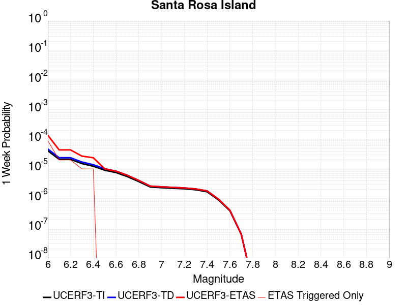 |  |  |  |

| Magnitude | 1 wk TI Prob | 1 wk TD Prob | 1 wk ETAS Prob | 1 wk ETAS/TD Gain | 1 wk ETAS Triggered Only | 1 mo TI Prob | 1 mo TD Prob | 1 mo ETAS Prob | 1 mo ETAS/TD Gain | 1 mo ETAS Triggered Only | 1 yr TI Prob | 1 yr TD Prob | 1 yr ETAS Prob | 1 yr ETAS/TD Gain | 1 yr ETAS Triggered Only | 10 yr TI Prob | 10 yr TD Prob | 10 yr ETAS Prob | 10 yr ETAS/TD Gain | 10 yr ETAS Triggered Only |
|-----|-----|-----|-----|-----|-----|-----|-----|-----|-----|-----|-----|-----|-----|-----|-----|-----|-----|-----|-----|-----|
| 6.0 | 4.1143165E-5 | 4.7091133E-5 | 1.3959371E-4 | 2.9643312 | 9.250694E-5 | 1.7631594E-4 | 2.0180465E-4 | 2.9429293E-4 | 1.458306 | 9.250694E-5 | 0.002144533 | 0.0024544 | 0.00254668 | 1.0375978 | 9.250694E-5 | 0.021239553 | 0.024293551 | 0.024383811 | 1.0037154 | 9.250694E-5 |
| 6.1 | 2.1061249E-5 | 2.3864959E-5 | 2.3864959E-5 | 1.0 | 0.0 | 9.0259375E-5 | 1.0227455E-4 | 1.0227455E-4 | 1.0 | 0.0 | 0.0010983539 | 0.0012445104 | 0.0012445104 | 1.0 | 0.0 | 0.01092941 | 0.012378449 | 0.012378449 | 1.0 | 0.0 |
| 6.2 | 2.1061249E-5 | 2.3864959E-5 | 2.3864959E-5 | 1.0 | 0.0 | 9.0259375E-5 | 1.0227455E-4 | 1.0227455E-4 | 1.0 | 0.0 | 0.0010983539 | 0.0012445104 | 0.0012445104 | 1.0 | 0.0 | 0.01092941 | 0.012378449 | 0.012378449 | 1.0 | 0.0 |
| 6.3 | 1.5158236E-5 | 1.7074419E-5 | 1.7074419E-5 | 1.0 | 0.0 | 6.496225E-5 | 7.3174095E-5 | 7.3174095E-5 | 1.0 | 0.0 | 7.906284E-4 | 8.905424E-4 | 8.905424E-4 | 1.0 | 0.0 | 0.007878214 | 0.008870989 | 0.008870989 | 1.0 | 0.0 |
| 6.4 | 1.2341918E-5 | 1.3852917E-5 | 1.3852917E-5 | 1.0 | 0.0 | 5.2892858E-5 | 5.9368336E-5 | 5.9368336E-5 | 1.0 | 0.0 | 6.437803E-4 | 7.225779E-4 | 7.225779E-4 | 1.0 | 0.0 | 0.006419184 | 0.007203121 | 0.007203121 | 1.0 | 0.0 |
| 6.5 | 9.061158E-6 | 1.0117031E-5 | 1.0117031E-5 | 1.0 | 0.0 | 3.883296E-5 | 4.3358013E-5 | 4.3358013E-5 | 1.0 | 0.0 | 4.726887E-4 | 5.277613E-4 | 5.277613E-4 | 1.0 | 0.0 | 0.004716845 | 0.0052656173 | 0.0052656173 | 1.0 | 0.0 |
| 6.6 | 7.5461685E-6 | 8.400733E-6 | 8.400733E-6 | 1.0 | 0.0 | 3.2340322E-5 | 3.600267E-5 | 3.600267E-5 | 1.0 | 0.0 | 3.936723E-4 | 4.3824865E-4 | 4.3824865E-4 | 1.0 | 0.0 | 0.003929756 | 0.0043742736 | 0.0043742736 | 1.0 | 0.0 |
| 6.7 | 5.5023775E-6 | 6.087381E-6 | 6.087381E-6 | 1.0 | 0.0 | 2.3581404E-5 | 2.6088532E-5 | 2.6088532E-5 | 1.0 | 0.0 | 2.8706578E-4 | 3.1758484E-4 | 3.1758484E-4 | 1.0 | 0.0 | 0.0028669522 | 0.0031716314 | 0.0031716314 | 1.0 | 0.0 |
| 6.8 | 3.7351679E-6 | 4.0831405E-6 | 4.0831405E-6 | 1.0 | 0.0 | 1.6007763E-5 | 1.749907E-5 | 1.749907E-5 | 1.0 | 0.0 | 1.948771E-4 | 2.1303284E-4 | 2.1303284E-4 | 1.0 | 0.0 | 0.0019470629 | 0.0021285315 | 0.0021285315 | 1.0 | 0.0 |
| 6.9 | 2.456366E-6 | 2.6292705E-6 | 2.6292705E-6 | 1.0 | 0.0 | 1.0527241E-5 | 1.1268254E-5 | 1.1268254E-5 | 1.0 | 0.0 | 1.2816161E-4 | 1.3718237E-4 | 1.3718237E-4 | 1.0 | 0.0 | 0.0012808773 | 0.0013709799 | 0.0013709799 | 1.0 | 0.0 |
| 7.0 | 2.3245157E-6 | 2.4827782E-6 | 2.4827782E-6 | 1.0 | 0.0 | 9.962172E-6 | 1.0640435E-5 | 1.0640435E-5 | 1.0 | 0.0 | 1.2128269E-4 | 1.2953962E-4 | 1.2953962E-4 | 1.0 | 0.0 | 0.0012121652 | 0.0012946434 | 0.0012946434 | 1.0 | 0.0 |
| 7.1 | 2.2248344E-6 | 2.37325E-6 | 2.37325E-6 | 1.0 | 0.0 | 9.53497E-6 | 1.0171032E-5 | 1.0171032E-5 | 1.0 | 0.0 | 1.1608207E-4 | 1.2382529E-4 | 1.2382529E-4 | 1.0 | 0.0 | 0.0011602144 | 0.001237565 | 0.001237565 | 1.0 | 0.0 |
| 7.2 | 2.1350402E-6 | 2.276154E-6 | 2.276154E-6 | 1.0 | 0.0 | 9.150141E-6 | 9.754909E-6 | 9.754909E-6 | 1.0 | 0.0 | 1.1139726E-4 | 1.1875956E-4 | 1.1875956E-4 | 1.0 | 0.0 | 0.0011134144 | 0.0011869629 | 0.0011869629 | 1.0 | 0.0 |
| 7.3 | 1.9793572E-6 | 2.108719E-6 | 2.108719E-6 | 1.0 | 0.0 | 8.482932E-6 | 9.037336E-6 | 9.037336E-6 | 1.0 | 0.0 | 1.032748E-4 | 1.10024026E-4 | 1.10024026E-4 | 1.0 | 0.0 | 0.0010322682 | 0.0010996973 | 0.0010996973 | 1.0 | 0.0 |
| 7.4 | 1.6951194E-6 | 1.8045733E-6 | 1.8045733E-6 | 1.0 | 0.0 | 7.264777E-6 | 7.733863E-6 | 7.733863E-6 | 1.0 | 0.0 | 8.844508E-5 | 9.415573E-5 | 9.415573E-5 | 1.0 | 0.0 | 8.840988E-4 | 9.4116E-4 | 9.4116E-4 | 1.0 | 0.0 |
| 7.5 | 8.987207E-7 | 9.5122147E-7 | 9.5122147E-7 | 1.0 | 0.0 | 3.8516546E-6 | 4.076657E-6 | 4.076657E-6 | 1.0 | 0.0 | 4.6892885E-5 | 4.963218E-5 | 4.963218E-5 | 1.0 | 0.0 | 4.688299E-4 | 4.9621216E-4 | 4.9621216E-4 | 1.0 | 0.0 |
| 7.6 | 3.8783037E-7 | 4.052932E-7 | 4.052932E-7 | 1.0 | 0.0 | 1.6621291E-6 | 1.7369698E-6 | 1.7369698E-6 | 1.0 | 0.0 | 2.0236233E-5 | 2.1147409E-5 | 2.1147409E-5 | 1.0 | 0.0 | 2.023439E-4 | 2.1145462E-4 | 2.1145462E-4 | 1.0 | 0.0 |
| 7.7 | 6.181804E-8 | 6.339035E-8 | 6.339035E-8 | 1.0 | 0.0 | 2.6493444E-7 | 2.7167292E-7 | 2.7167292E-7 | 1.0 | 0.0 | 3.225572E-6 | 3.3076128E-6 | 3.3076128E-6 | 1.0 | 0.0 | 3.225525E-5 | 3.307564E-5 | 3.307564E-5 | 1.0 | 0.0 |
| 7.8 | 1.3704449E-9 | 1.3964153E-9 | 1.3964153E-9 | 1.0 | 0.0 | 5.873335E-9 | 5.984637E-9 | 5.984637E-9 | 1.0 | 0.0 | 7.1507856E-8 | 7.286295E-8 | 7.286295E-8 | 1.0 | 0.0 | 7.1507833E-7 | 7.286294E-7 | 7.286294E-7 | 1.0 | 0.0 |

## Pine Mtn
*[(top)](#table-of-contents)*

| 1 Week | 1 Month | 1 Year | 10 Year |
|-----|-----|-----|-----|
|  |  |  |  |

| Magnitude | 1 wk TI Prob | 1 wk TD Prob | 1 wk ETAS Prob | 1 wk ETAS/TD Gain | 1 wk ETAS Triggered Only | 1 mo TI Prob | 1 mo TD Prob | 1 mo ETAS Prob | 1 mo ETAS/TD Gain | 1 mo ETAS Triggered Only | 1 yr TI Prob | 1 yr TD Prob | 1 yr ETAS Prob | 1 yr ETAS/TD Gain | 1 yr ETAS Triggered Only | 10 yr TI Prob | 10 yr TD Prob | 10 yr ETAS Prob | 10 yr ETAS/TD Gain | 10 yr ETAS Triggered Only |
|-----|-----|-----|-----|-----|-----|-----|-----|-----|-----|-----|-----|-----|-----|-----|-----|-----|-----|-----|-----|-----|
| 6.0 | 6.894797E-6 | 7.225461E-6 | 7.225461E-6 | 1.0 | 0.0 | 2.9548795E-5 | 3.096591E-5 | 1.2346999E-4 | 3.9872873 | 9.250694E-5 | 3.596972E-4 | 3.7694772E-4 | 4.694198E-4 | 1.245318 | 9.250694E-5 | 0.0035911554 | 0.003763381 | 0.0038555397 | 1.0244883 | 9.250694E-5 |
| 6.1 | 6.894797E-6 | 7.225461E-6 | 7.225461E-6 | 1.0 | 0.0 | 2.9548795E-5 | 3.096591E-5 | 1.2346999E-4 | 3.9872873 | 9.250694E-5 | 3.596972E-4 | 3.7694772E-4 | 4.694198E-4 | 1.245318 | 9.250694E-5 | 0.0035911554 | 0.003763381 | 0.0038555397 | 1.0244883 | 9.250694E-5 |
| 6.2 | 6.894797E-6 | 7.225461E-6 | 7.225461E-6 | 1.0 | 0.0 | 2.9548795E-5 | 3.096591E-5 | 1.2346999E-4 | 3.9872873 | 9.250694E-5 | 3.596972E-4 | 3.7694772E-4 | 4.694198E-4 | 1.245318 | 9.250694E-5 | 0.0035911554 | 0.003763381 | 0.0038555397 | 1.0244883 | 9.250694E-5 |
| 6.3 | 6.894797E-6 | 7.225461E-6 | 7.225461E-6 | 1.0 | 0.0 | 2.9548795E-5 | 3.096591E-5 | 1.2346999E-4 | 3.9872873 | 9.250694E-5 | 3.596972E-4 | 3.7694772E-4 | 4.694198E-4 | 1.245318 | 9.250694E-5 | 0.0035911554 | 0.003763381 | 0.0038555397 | 1.0244883 | 9.250694E-5 |
| 6.4 | 6.894797E-6 | 7.225461E-6 | 7.225461E-6 | 1.0 | 0.0 | 2.9548795E-5 | 3.096591E-5 | 1.2346999E-4 | 3.9872873 | 9.250694E-5 | 3.596972E-4 | 3.7694772E-4 | 4.694198E-4 | 1.245318 | 9.250694E-5 | 0.0035911554 | 0.003763381 | 0.0038555397 | 1.0244883 | 9.250694E-5 |
| 6.5 | 6.894797E-6 | 7.225461E-6 | 7.225461E-6 | 1.0 | 0.0 | 2.9548795E-5 | 3.096591E-5 | 1.2346999E-4 | 3.9872873 | 9.250694E-5 | 3.596972E-4 | 3.7694772E-4 | 4.694198E-4 | 1.245318 | 9.250694E-5 | 0.0035911554 | 0.003763381 | 0.0038555397 | 1.0244883 | 9.250694E-5 |
| 6.6 | 6.894797E-6 | 7.225461E-6 | 7.225461E-6 | 1.0 | 0.0 | 2.9548795E-5 | 3.096591E-5 | 1.2346999E-4 | 3.9872873 | 9.250694E-5 | 3.596972E-4 | 3.7694772E-4 | 4.694198E-4 | 1.245318 | 9.250694E-5 | 0.0035911554 | 0.003763381 | 0.0038555397 | 1.0244883 | 9.250694E-5 |
| 6.7 | 6.0867933E-6 | 6.3971133E-6 | 6.3971133E-6 | 1.0 | 0.0 | 2.6085996E-5 | 2.7415923E-5 | 1.19920325E-4 | 4.374112 | 9.250694E-5 | 3.1755073E-4 | 3.3373994E-4 | 4.26216E-4 | 1.2770902 | 9.250694E-5 | 0.0031709734 | 0.0033326065 | 0.0034248051 | 1.0276656 | 9.250694E-5 |
| 6.8 | 5.6530425E-6 | 5.9505956E-6 | 5.9505956E-6 | 1.0 | 0.0 | 2.42271E-5 | 2.5502315E-5 | 1.18006894E-4 | 4.627301 | 9.250694E-5 | 2.94925E-4 | 3.104485E-4 | 4.0292673E-4 | 1.2978859 | 9.250694E-5 | 0.002945339 | 0.0031003528 | 0.0031925729 | 1.0297451 | 9.250694E-5 |
| 6.9 | 4.6015225E-6 | 4.863834E-6 | 4.863834E-6 | 1.0 | 0.0 | 1.9720663E-5 | 2.0844845E-5 | 1.1334985E-4 | 5.4377885 | 9.250694E-5 | 2.4007261E-4 | 2.5375787E-4 | 3.4624134E-4 | 1.3644556 | 9.250694E-5 | 0.0023981342 | 0.0025348254 | 0.0026270978 | 1.0364019 | 9.250694E-5 |
| 7.0 | 4.4875965E-6 | 4.747473E-6 | 4.747473E-6 | 1.0 | 0.0 | 1.9232413E-5 | 2.0346162E-5 | 1.12851216E-4 | 5.5465603 | 9.250694E-5 | 2.3412947E-4 | 2.4768783E-4 | 3.4017186E-4 | 1.3733895 | 9.250694E-5 | 0.0023388295 | 0.0024742614 | 0.0025665394 | 1.0372952 | 9.250694E-5 |
| 7.1 | 3.203907E-6 | 3.4294096E-6 | 3.4294096E-6 | 1.0 | 0.0 | 1.3730958E-5 | 1.4697391E-5 | 1.0720297E-4 | 7.294014 | 9.250694E-5 | 1.6716159E-4 | 1.789267E-4 | 2.7141708E-4 | 1.5169177 | 9.250694E-5 | 0.0016703589 | 0.0017878925 | 0.0018802341 | 1.0516483 | 9.250694E-5 |
| 7.2 | 2.2060601E-6 | 2.3784817E-6 | 2.3784817E-6 | 1.0 | 0.0 | 9.4545085E-6 | 1.0193455E-5 | 1.0269945E-4 | 10.075038 | 9.250694E-5 | 1.15102564E-4 | 1.240987E-4 | 2.1659416E-4 | 1.7453378 | 9.250694E-5 | 0.0011504296 | 0.0012403389 | 0.0013327311 | 1.0744895 | 9.250694E-5 |
| 7.3 | 1.3765207E-6 | 1.5216481E-6 | 1.5216481E-6 | 1.0 | 0.0 | 5.899361E-6 | 6.521333E-6 | 9.902767E-5 | 15.185188 | 9.250694E-5 | 7.182235E-5 | 7.939443E-5 | 1.7189402E-4 | 2.165064 | 9.250694E-5 | 7.1799144E-4 | 7.936697E-4 | 8.8610325E-4 | 1.1164634 | 9.250694E-5 |
| 7.4 | 1.1245983E-6 | 1.2587075E-6 | 1.2587075E-6 | 1.0 | 0.0 | 4.819698E-6 | 5.39445E-6 | 9.790089E-5 | 18.148447 | 9.250694E-5 | 5.8678244E-5 | 6.567554E-5 | 1.581764E-4 | 2.4084523 | 9.250694E-5 | 5.866275E-4 | 6.5656955E-4 | 7.490158E-4 | 1.1408018 | 9.250694E-5 |
| 7.5 | 8.031682E-7 | 9.276951E-7 | 9.276951E-7 | 1.0 | 0.0 | 3.4421448E-6 | 3.9758306E-6 | 3.9758306E-6 | 1.0 | 0.0 | 4.1907308E-5 | 4.840473E-5 | 4.840473E-5 | 1.0 | 0.0 | 4.1899405E-4 | 4.8394862E-4 | 4.8394862E-4 | 1.0 | 0.0 |
| 7.6 | 4.8953444E-7 | 6.003009E-7 | 6.003009E-7 | 1.0 | 0.0 | 2.098003E-6 | 2.5727159E-6 | 2.5727159E-6 | 1.0 | 0.0 | 2.5542888E-5 | 3.1322415E-5 | 3.1322415E-5 | 1.0 | 0.0 | 2.5539953E-4 | 3.1318486E-4 | 3.1318486E-4 | 1.0 | 0.0 |
| 7.7 | 6.634529E-8 | 6.788826E-8 | 6.788826E-8 | 1.0 | 0.0 | 2.843369E-7 | 2.9094966E-7 | 2.9094966E-7 | 1.0 | 0.0 | 3.4617963E-6 | 3.5423066E-6 | 3.5423066E-6 | 1.0 | 0.0 | 3.4617424E-5 | 3.542255E-5 | 3.542255E-5 | 1.0 | 0.0 |
| 7.8 | 9.235578E-9 | 9.488566E-9 | 9.488566E-9 | 1.0 | 0.0 | 3.9581046E-8 | 4.0665284E-8 | 4.0665284E-8 | 1.0 | 0.0 | 4.818991E-7 | 4.950997E-7 | 4.950997E-7 | 1.0 | 0.0 | 4.8189804E-6 | 4.950988E-6 | 4.950988E-6 | 1.0 | 0.0 |

## White Mountains
*[(top)](#table-of-contents)*

| 1 Week | 1 Month | 1 Year | 10 Year |
|-----|-----|-----|-----|
|  |  |  |  |

| Magnitude | 1 wk TI Prob | 1 wk TD Prob | 1 wk ETAS Prob | 1 wk ETAS/TD Gain | 1 wk ETAS Triggered Only | 1 mo TI Prob | 1 mo TD Prob | 1 mo ETAS Prob | 1 mo ETAS/TD Gain | 1 mo ETAS Triggered Only | 1 yr TI Prob | 1 yr TD Prob | 1 yr ETAS Prob | 1 yr ETAS/TD Gain | 1 yr ETAS Triggered Only | 10 yr TI Prob | 10 yr TD Prob | 10 yr ETAS Prob | 10 yr ETAS/TD Gain | 10 yr ETAS Triggered Only |
|-----|-----|-----|-----|-----|-----|-----|-----|-----|-----|-----|-----|-----|-----|-----|-----|-----|-----|-----|-----|-----|
| 6.0 | 3.503579E-5 | 3.378405E-5 | 1.2628786E-4 | 3.7380912 | 9.250694E-5 | 1.5014476E-4 | 1.4478143E-4 | 2.3727497E-4 | 1.6388495 | 9.250694E-5 | 0.0018264796 | 0.0017614096 | 0.0018537536 | 1.0524262 | 9.250694E-5 | 0.018115403 | 0.017486818 | 0.017577708 | 1.0051976 | 9.250694E-5 |
| 6.1 | 3.503579E-5 | 3.378405E-5 | 1.2628786E-4 | 3.7380912 | 9.250694E-5 | 1.5014476E-4 | 1.4478143E-4 | 2.3727497E-4 | 1.6388495 | 9.250694E-5 | 0.0018264796 | 0.0017614096 | 0.0018537536 | 1.0524262 | 9.250694E-5 | 0.018115403 | 0.017486818 | 0.017577708 | 1.0051976 | 9.250694E-5 |
| 6.2 | 3.503579E-5 | 3.378405E-5 | 1.2628786E-4 | 3.7380912 | 9.250694E-5 | 1.5014476E-4 | 1.4478143E-4 | 2.3727497E-4 | 1.6388495 | 9.250694E-5 | 0.0018264796 | 0.0017614096 | 0.0018537536 | 1.0524262 | 9.250694E-5 | 0.018115403 | 0.017486818 | 0.017577708 | 1.0051976 | 9.250694E-5 |
| 6.3 | 1.7818425E-5 | 1.5916074E-5 | 1.0842154E-4 | 6.812078 | 9.250694E-5 | 7.636245E-5 | 6.821004E-5 | 1.6071067E-4 | 2.3561144 | 9.250694E-5 | 9.293162E-4 | 8.301551E-4 | 9.2258526E-4 | 1.1113408 | 9.250694E-5 | 0.009254395 | 0.008271999 | 0.0083637405 | 1.0110906 | 9.250694E-5 |
| 6.4 | 1.7818425E-5 | 1.5916074E-5 | 1.0842154E-4 | 6.812078 | 9.250694E-5 | 7.636245E-5 | 6.821004E-5 | 1.6071067E-4 | 2.3561144 | 9.250694E-5 | 9.293162E-4 | 8.301551E-4 | 9.2258526E-4 | 1.1113408 | 9.250694E-5 | 0.009254395 | 0.008271999 | 0.0083637405 | 1.0110906 | 9.250694E-5 |
| 6.5 | 1.3397557E-5 | 1.13362685E-5 | 1.03842154E-4 | 9.160171 | 9.250694E-5 | 5.741684E-5 | 4.858314E-5 | 1.4108559E-4 | 2.904003 | 9.250694E-5 | 6.988258E-4 | 5.913462E-4 | 6.8379845E-4 | 1.156342 | 9.250694E-5 | 0.006966323 | 0.005898432 | 0.005990393 | 1.0155908 | 9.250694E-5 |
| 6.6 | 1.0818695E-5 | 8.625366E-6 | 1.011315E-4 | 11.724895 | 9.250694E-5 | 4.6365014E-5 | 3.6965357E-5 | 1.2946887E-4 | 3.5024383 | 9.250694E-5 | 5.6434784E-4 | 4.4996463E-4 | 5.424299E-4 | 1.2054946 | 9.250694E-5 | 0.005629168 | 0.004490972 | 0.0045830635 | 1.0205059 | 9.250694E-5 |
| 6.7 | 9.067908E-6 | 6.802442E-6 | 9.930875E-5 | 14.598986 | 9.250694E-5 | 3.8861883E-5 | 2.9153016E-5 | 1.2165726E-4 | 4.173059 | 9.250694E-5 | 4.7304068E-4 | 3.5488335E-4 | 4.4735745E-4 | 1.2605761 | 9.250694E-5 | 0.00472035 | 0.0035434833 | 0.0036356626 | 1.0260137 | 9.250694E-5 |
| 6.8 | 7.295947E-6 | 4.936391E-6 | 4.936391E-6 | 1.0 | 0.0 | 3.126797E-5 | 2.1155796E-5 | 2.1155796E-5 | 1.0 | 0.0 | 3.8062103E-4 | 2.575425E-4 | 2.575425E-4 | 1.0 | 0.0 | 0.0037996976 | 0.0025725532 | 0.0025725532 | 1.0 | 0.0 |
| 6.9 | 6.2243444E-6 | 3.832213E-6 | 3.832213E-6 | 1.0 | 0.0 | 2.6675489E-5 | 1.642367E-5 | 1.642367E-5 | 1.0 | 0.0 | 3.2472567E-4 | 1.9994036E-4 | 1.9994036E-4 | 1.0 | 0.0 | 0.0032425157 | 0.0019976576 | 0.0019976576 | 1.0 | 0.0 |
| 7.0 | 4.9878413E-6 | 2.6795342E-6 | 2.6795342E-6 | 1.0 | 0.0 | 2.1376287E-5 | 1.14836685E-5 | 1.14836685E-5 | 1.0 | 0.0 | 2.602252E-4 | 1.3980496E-4 | 1.3980496E-4 | 1.0 | 0.0 | 0.002599207 | 0.0013971963 | 0.0013971963 | 1.0 | 0.0 |
| 7.1 | 4.0252844E-6 | 1.8857575E-6 | 1.8857575E-6 | 1.0 | 0.0 | 1.7251105E-5 | 8.081794E-6 | 8.081794E-6 | 1.0 | 0.0 | 2.1001195E-4 | 9.8391516E-5 | 9.8391516E-5 | 1.0 | 0.0 | 0.0020981359 | 9.834924E-4 | 9.834924E-4 | 1.0 | 0.0 |
| 7.2 | 3.3284066E-6 | 1.281964E-6 | 1.281964E-6 | 1.0 | 0.0 | 1.4264522E-5 | 5.494121E-6 | 5.494121E-6 | 1.0 | 0.0 | 1.736567E-4 | 6.688897E-5 | 6.688897E-5 | 1.0 | 0.0 | 0.0017352107 | 6.6869846E-4 | 6.6869846E-4 | 1.0 | 0.0 |
| 7.3 | 2.458226E-6 | 6.05722E-7 | 6.05722E-7 | 1.0 | 0.0 | 1.0535211E-5 | 2.5959491E-6 | 2.5959491E-6 | 1.0 | 0.0 | 1.2825865E-4 | 3.1605257E-5 | 3.1605257E-5 | 1.0 | 0.0 | 0.0012818464 | 3.160114E-4 | 3.160114E-4 | 1.0 | 0.0 |
| 7.4 | 1.965953E-6 | 3.1089303E-7 | 3.1089303E-7 | 1.0 | 0.0 | 8.425486E-6 | 1.332398E-6 | 1.332398E-6 | 1.0 | 0.0 | 1.0257547E-4 | 1.6221828E-5 | 1.6221828E-5 | 1.0 | 0.0 | 0.0010252813 | 1.6220656E-4 | 1.6220656E-4 | 1.0 | 0.0 |
| 7.5 | 1.2014192E-6 | 1.8244253E-7 | 1.8244253E-7 | 1.0 | 0.0 | 5.148929E-6 | 7.8189635E-7 | 7.8189635E-7 | 1.0 | 0.0 | 6.2686406E-5 | 9.519547E-6 | 9.519547E-6 | 1.0 | 0.0 | 6.266873E-4 | 9.519148E-5 | 9.519148E-5 | 1.0 | 0.0 |
| 7.6 | 2.5612175E-7 | 4.8946475E-8 | 4.8946475E-8 | 1.0 | 0.0 | 1.0976642E-6 | 2.0977059E-7 | 2.0977059E-7 | 1.0 | 0.0 | 1.3363979E-5 | 2.5539543E-6 | 2.5539543E-6 | 1.0 | 0.0 | 1.3363175E-4 | 2.5539286E-5 | 2.5539286E-5 | 1.0 | 0.0 |

## Surprise Valley 2011 CFM
*[(top)](#table-of-contents)*

| 1 Week | 1 Month | 1 Year | 10 Year |
|-----|-----|-----|-----|
|  |  |  |  |

| Magnitude | 1 wk TI Prob | 1 wk TD Prob | 1 wk ETAS Prob | 1 wk ETAS/TD Gain | 1 wk ETAS Triggered Only | 1 mo TI Prob | 1 mo TD Prob | 1 mo ETAS Prob | 1 mo ETAS/TD Gain | 1 mo ETAS Triggered Only | 1 yr TI Prob | 1 yr TD Prob | 1 yr ETAS Prob | 1 yr ETAS/TD Gain | 1 yr ETAS Triggered Only | 10 yr TI Prob | 10 yr TD Prob | 10 yr ETAS Prob | 10 yr ETAS/TD Gain | 10 yr ETAS Triggered Only |
|-----|-----|-----|-----|-----|-----|-----|-----|-----|-----|-----|-----|-----|-----|-----|-----|-----|-----|-----|-----|-----|
| 6.0 | 4.0396248E-5 | 4.485131E-5 | 4.485131E-5 | 1.0 | 0.0 | 1.7311527E-4 | 1.9220692E-4 | 2.8469609E-4 | 1.4811958 | 9.250694E-5 | 0.002105641 | 0.0023378176 | 0.0024301084 | 1.0394772 | 9.250694E-5 | 0.020858008 | 0.023153966 | 0.02324433 | 1.0039028 | 9.250694E-5 |
| 6.1 | 4.0396248E-5 | 4.485131E-5 | 4.485131E-5 | 1.0 | 0.0 | 1.7311527E-4 | 1.9220692E-4 | 2.8469609E-4 | 1.4811958 | 9.250694E-5 | 0.002105641 | 0.0023378176 | 0.0024301084 | 1.0394772 | 9.250694E-5 | 0.020858008 | 0.023153966 | 0.02324433 | 1.0039028 | 9.250694E-5 |
| 6.2 | 2.2295266E-5 | 2.440125E-5 | 2.440125E-5 | 1.0 | 0.0 | 9.554764E-5 | 1.0457276E-4 | 1.0457276E-4 | 1.0 | 0.0 | 0.0011626717 | 0.0012724606 | 0.0012724606 | 1.0 | 0.0 | 0.011566074 | 0.012654981 | 0.012654981 | 1.0 | 0.0 |
| 6.3 | 1.572643E-5 | 1.7096807E-5 | 1.7096807E-5 | 1.0 | 0.0 | 6.7397246E-5 | 7.327003E-5 | 7.327003E-5 | 1.0 | 0.0 | 8.202525E-4 | 8.91708E-4 | 8.91708E-4 | 1.0 | 0.0 | 0.008172315 | 0.008882407 | 0.008882407 | 1.0 | 0.0 |
| 6.4 | 1.5714395E-5 | 1.7084629E-5 | 1.7084629E-5 | 1.0 | 0.0 | 6.734567E-5 | 7.3217845E-5 | 7.3217845E-5 | 1.0 | 0.0 | 8.1962504E-4 | 8.9107314E-4 | 8.9107314E-4 | 1.0 | 0.0 | 0.008166086 | 0.008876109 | 0.008876109 | 1.0 | 0.0 |
| 6.5 | 1.2733495E-5 | 1.38016E-5 | 1.38016E-5 | 1.0 | 0.0 | 5.457098E-5 | 5.9148413E-5 | 5.9148413E-5 | 1.0 | 0.0 | 6.641992E-4 | 7.1990065E-4 | 7.1990065E-4 | 1.0 | 0.0 | 0.0066221743 | 0.0071763797 | 0.0071763797 | 1.0 | 0.0 |
| 6.6 | 1.0983784E-5 | 1.1886554E-5 | 1.1886554E-5 | 1.0 | 0.0 | 4.7072506E-5 | 5.094141E-5 | 5.094141E-5 | 1.0 | 0.0 | 5.7295704E-4 | 6.200405E-4 | 6.200405E-4 | 1.0 | 0.0 | 0.0057148207 | 0.0061836545 | 0.0061836545 | 1.0 | 0.0 |
| 6.7 | 9.104806E-6 | 9.839491E-6 | 9.839491E-6 | 1.0 | 0.0 | 3.902001E-5 | 4.2168587E-5 | 4.2168587E-5 | 1.0 | 0.0 | 4.7496508E-4 | 5.132855E-4 | 5.132855E-4 | 1.0 | 0.0 | 0.004739512 | 0.005121397 | 0.005121397 | 1.0 | 0.0 |
| 6.8 | 6.2162403E-6 | 6.7041337E-6 | 6.7041337E-6 | 1.0 | 0.0 | 2.6640759E-5 | 2.8731698E-5 | 2.8731698E-5 | 1.0 | 0.0 | 3.2430296E-4 | 3.497545E-4 | 3.497545E-4 | 1.0 | 0.0 | 0.003238301 | 0.0034922638 | 0.0034922638 | 1.0 | 0.0 |
| 6.9 | 4.1792696E-6 | 4.50323E-6 | 4.50323E-6 | 1.0 | 0.0 | 1.7911032E-5 | 1.9299423E-5 | 1.9299423E-5 | 1.0 | 0.0 | 2.1804498E-4 | 2.3494668E-4 | 2.3494668E-4 | 1.0 | 0.0 | 0.0021783116 | 0.0023471361 | 0.0023471361 | 1.0 | 0.0 |
| 7.0 | 2.7478413E-6 | 2.9622424E-6 | 2.9622424E-6 | 1.0 | 0.0 | 1.177641E-5 | 1.269527E-5 | 1.269527E-5 | 1.0 | 0.0 | 1.4336836E-4 | 1.545552E-4 | 1.545552E-4 | 1.0 | 0.0 | 0.001432759 | 0.0015445995 | 0.0015445995 | 1.0 | 0.0 |
| 7.1 | 8.128648E-7 | 8.724922E-7 | 8.724922E-7 | 1.0 | 0.0 | 3.4837017E-6 | 3.7392501E-6 | 3.7392501E-6 | 1.0 | 0.0 | 4.2413245E-5 | 4.552502E-5 | 4.552502E-5 | 1.0 | 0.0 | 4.2405148E-4 | 4.5521575E-4 | 4.5521575E-4 | 1.0 | 0.0 |
| 7.2 | 4.8641045E-8 | 4.9402068E-8 | 4.9402068E-8 | 1.0 | 0.0 | 2.084616E-7 | 2.1172312E-7 | 2.1172312E-7 | 1.0 | 0.0 | 2.538017E-6 | 2.577726E-6 | 2.577726E-6 | 1.0 | 0.0 | 2.537988E-5 | 2.5776973E-5 | 2.5776973E-5 | 1.0 | 0.0 |
| 7.3 | 5.3911844E-9 | 5.4758145E-9 | 5.4758145E-9 | 1.0 | 0.0 | 2.3105075E-8 | 2.3467775E-8 | 2.3467775E-8 | 1.0 | 0.0 | 2.8130427E-7 | 2.8572015E-7 | 2.8572015E-7 | 1.0 | 0.0 | 2.8130391E-6 | 2.8571992E-6 | 2.8571992E-6 | 1.0 | 0.0 |

## Whittier alt 1
*[(top)](#table-of-contents)*

| 1 Week | 1 Month | 1 Year | 10 Year |
|-----|-----|-----|-----|
|  |  |  |  |

| Magnitude | 1 wk TI Prob | 1 wk TD Prob | 1 wk ETAS Prob | 1 wk ETAS/TD Gain | 1 wk ETAS Triggered Only | 1 mo TI Prob | 1 mo TD Prob | 1 mo ETAS Prob | 1 mo ETAS/TD Gain | 1 mo ETAS Triggered Only | 1 yr TI Prob | 1 yr TD Prob | 1 yr ETAS Prob | 1 yr ETAS/TD Gain | 1 yr ETAS Triggered Only | 10 yr TI Prob | 10 yr TD Prob | 10 yr ETAS Prob | 10 yr ETAS/TD Gain | 10 yr ETAS Triggered Only |
|-----|-----|-----|-----|-----|-----|-----|-----|-----|-----|-----|-----|-----|-----|-----|-----|-----|-----|-----|-----|-----|
| 6.0 | 4.2554693E-5 | 4.725218E-5 | 4.725218E-5 | 1.0 | 0.0 | 1.8236451E-4 | 2.0249544E-4 | 2.0249544E-4 | 1.0 | 0.0 | 0.002218027 | 0.0024629154 | 0.0025551945 | 1.0374675 | 9.250694E-5 | 0.02196019 | 0.024390234 | 0.024480484 | 1.0037003 | 9.250694E-5 |
| 6.1 | 4.2554693E-5 | 4.725218E-5 | 4.725218E-5 | 1.0 | 0.0 | 1.8236451E-4 | 2.0249544E-4 | 2.0249544E-4 | 1.0 | 0.0 | 0.002218027 | 0.0024629154 | 0.0025551945 | 1.0374675 | 9.250694E-5 | 0.02196019 | 0.024390234 | 0.024480484 | 1.0037003 | 9.250694E-5 |
| 6.2 | 4.2554693E-5 | 4.725218E-5 | 4.725218E-5 | 1.0 | 0.0 | 1.8236451E-4 | 2.0249544E-4 | 2.0249544E-4 | 1.0 | 0.0 | 0.002218027 | 0.0024629154 | 0.0025551945 | 1.0374675 | 9.250694E-5 | 0.02196019 | 0.024390234 | 0.024480484 | 1.0037003 | 9.250694E-5 |
| 6.3 | 1.9617712E-5 | 1.8268593E-5 | 1.8268593E-5 | 1.0 | 0.0 | 8.40732E-5 | 7.829172E-5 | 7.829172E-5 | 1.0 | 0.0 | 0.0010231105 | 9.52804E-4 | 9.52804E-4 | 1.0 | 0.0 | 0.01018413 | 0.009490474 | 0.009490474 | 1.0 | 0.0 |
| 6.4 | 1.5611336E-5 | 1.3604271E-5 | 1.3604271E-5 | 1.0 | 0.0 | 6.690401E-5 | 5.8302747E-5 | 5.8302747E-5 | 1.0 | 0.0 | 8.142519E-4 | 7.0961076E-4 | 7.0961076E-4 | 1.0 | 0.0 | 0.008112748 | 0.0070754145 | 0.0070754145 | 1.0 | 0.0 |
| 6.5 | 1.5150166E-5 | 1.3100925E-5 | 1.3100925E-5 | 1.0 | 0.0 | 6.492767E-5 | 5.6145647E-5 | 5.6145647E-5 | 1.0 | 0.0 | 7.9020765E-4 | 6.8336475E-4 | 6.8336475E-4 | 1.0 | 0.0 | 0.007874036 | 0.0068145846 | 0.0068145846 | 1.0 | 0.0 |
| 6.6 | 1.295588E-5 | 1.0380725E-5 | 1.0380725E-5 | 1.0 | 0.0 | 5.552402E-5 | 4.4488075E-5 | 4.4488075E-5 | 1.0 | 0.0 | 6.7579525E-4 | 5.4150965E-4 | 5.4150965E-4 | 1.0 | 0.0 | 0.006737438 | 0.0054033357 | 0.0054033357 | 1.0 | 0.0 |
| 6.7 | 1.2542085E-5 | 9.899369E-6 | 9.899369E-6 | 1.0 | 0.0 | 5.3750682E-5 | 4.242519E-5 | 4.242519E-5 | 1.0 | 0.0 | 6.542181E-4 | 5.164061E-4 | 5.164061E-4 | 1.0 | 0.0 | 0.006522954 | 0.0051534795 | 0.0051534795 | 1.0 | 0.0 |
| 6.8 | 1.2195878E-5 | 9.495415E-6 | 9.495415E-6 | 1.0 | 0.0 | 5.2267E-5 | 4.069401E-5 | 4.069401E-5 | 1.0 | 0.0 | 6.36165E-4 | 4.9533875E-4 | 4.9533875E-4 | 1.0 | 0.0 | 0.0063434686 | 0.004943688 | 0.004943688 | 1.0 | 0.0 |
| 6.9 | 1.1580298E-5 | 8.772933E-6 | 8.772933E-6 | 1.0 | 0.0 | 4.9628903E-5 | 3.7597754E-5 | 3.7597754E-5 | 1.0 | 0.0 | 6.040644E-4 | 4.5765814E-4 | 4.5765814E-4 | 1.0 | 0.0 | 0.00602425 | 0.0045684157 | 0.0045684157 | 1.0 | 0.0 |
| 7.0 | 1.0964795E-5 | 8.083994E-6 | 8.083994E-6 | 1.0 | 0.0 | 4.6991136E-5 | 3.4645236E-5 | 3.4645236E-5 | 1.0 | 0.0 | 5.7196687E-4 | 4.2172565E-4 | 4.2172565E-4 | 1.0 | 0.0 | 0.0057049696 | 0.004210462 | 0.004210462 | 1.0 | 0.0 |
| 7.1 | 1.0230601E-5 | 7.3266697E-6 | 7.3266697E-6 | 1.0 | 0.0 | 4.3844695E-5 | 3.1399642E-5 | 3.1399642E-5 | 1.0 | 0.0 | 5.336784E-4 | 3.8222488E-4 | 3.8222488E-4 | 1.0 | 0.0 | 0.005323986 | 0.0038168381 | 0.0038168381 | 1.0 | 0.0 |
| 7.2 | 9.40865E-6 | 6.543289E-6 | 6.543289E-6 | 1.0 | 0.0 | 4.032216E-5 | 2.8042374E-5 | 2.8042374E-5 | 1.0 | 0.0 | 4.908117E-4 | 3.4136363E-4 | 3.4136363E-4 | 1.0 | 0.0 | 0.0048972913 | 0.003409485 | 0.003409485 | 1.0 | 0.0 |
| 7.3 | 8.237384E-6 | 5.5977525E-6 | 5.5977525E-6 | 1.0 | 0.0 | 3.5302593E-5 | 2.3990153E-5 | 2.3990153E-5 | 1.0 | 0.0 | 4.2972428E-4 | 2.92042E-4 | 2.92042E-4 | 1.0 | 0.0 | 0.0042889426 | 0.002916903 | 0.002916903 | 1.0 | 0.0 |
| 7.4 | 7.5316966E-6 | 5.027819E-6 | 5.027819E-6 | 1.0 | 0.0 | 3.2278298E-5 | 2.1547625E-5 | 2.1547625E-5 | 1.0 | 0.0 | 3.9291743E-4 | 2.6231175E-4 | 2.6231175E-4 | 1.0 | 0.0 | 0.0039222343 | 0.0026201333 | 0.0026201333 | 1.0 | 0.0 |
| 7.5 | 6.149649E-6 | 3.933841E-6 | 3.933841E-6 | 1.0 | 0.0 | 2.6355372E-5 | 1.6859214E-5 | 1.6859214E-5 | 1.0 | 0.0 | 3.208294E-4 | 2.052425E-4 | 2.052425E-4 | 1.0 | 0.0 | 0.003203666 | 0.0020506186 | 0.0020506186 | 1.0 | 0.0 |
| 7.6 | 5.457711E-6 | 3.3953788E-6 | 3.3953788E-6 | 1.0 | 0.0 | 2.338998E-5 | 1.4551547E-5 | 1.4551547E-5 | 1.0 | 0.0 | 2.8473578E-4 | 1.771515E-4 | 1.771515E-4 | 1.0 | 0.0 | 0.0028437122 | 0.0017701836 | 0.0017701836 | 1.0 | 0.0 |
| 7.7 | 4.1676276E-6 | 2.3331952E-6 | 2.3331952E-6 | 1.0 | 0.0 | 1.7861139E-5 | 9.999374E-6 | 9.999374E-6 | 1.0 | 0.0 | 2.1743766E-4 | 1.2173632E-4 | 1.2173632E-4 | 1.0 | 0.0 | 0.0021722503 | 0.0012167693 | 0.0012167693 | 1.0 | 0.0 |
| 7.8 | 2.2692414E-7 | 9.3854695E-8 | 9.3854695E-8 | 1.0 | 0.0 | 9.725317E-7 | 4.0223435E-7 | 4.0223435E-7 | 1.0 | 0.0 | 1.1840509E-5 | 4.8971956E-6 | 4.8971956E-6 | 1.0 | 0.0 | 1.1839878E-4 | 4.8971204E-5 | 4.8971204E-5 | 1.0 | 0.0 |
| 7.9 | 6.676829E-9 | 3.439853E-9 | 3.439853E-9 | 1.0 | 0.0 | 2.861498E-8 | 1.4742227E-8 | 1.4742227E-8 | 1.0 | 0.0 | 3.4838732E-7 | 1.7948659E-7 | 1.7948659E-7 | 1.0 | 0.0 | 3.4838679E-6 | 1.7948646E-6 | 1.7948646E-6 | 1.0 | 0.0 |

## Chino alt 1
*[(top)](#table-of-contents)*

| 1 Week | 1 Month | 1 Year | 10 Year |
|-----|-----|-----|-----|
|  |  |  |  |

| Magnitude | 1 wk TI Prob | 1 wk TD Prob | 1 wk ETAS Prob | 1 wk ETAS/TD Gain | 1 wk ETAS Triggered Only | 1 mo TI Prob | 1 mo TD Prob | 1 mo ETAS Prob | 1 mo ETAS/TD Gain | 1 mo ETAS Triggered Only | 1 yr TI Prob | 1 yr TD Prob | 1 yr ETAS Prob | 1 yr ETAS/TD Gain | 1 yr ETAS Triggered Only | 10 yr TI Prob | 10 yr TD Prob | 10 yr ETAS Prob | 10 yr ETAS/TD Gain | 10 yr ETAS Triggered Only |
|-----|-----|-----|-----|-----|-----|-----|-----|-----|-----|-----|-----|-----|-----|-----|-----|-----|-----|-----|-----|-----|
| 6.0 | 3.939946E-5 | 4.8948554E-5 | 1.4145096E-4 | 2.8897884 | 9.250694E-5 | 1.6884391E-4 | 2.097656E-4 | 3.0225312E-4 | 1.440909 | 9.250694E-5 | 0.0020537362 | 0.0025513945 | 0.0026436655 | 1.0361649 | 9.250694E-5 | 0.020348595 | 0.025277847 | 0.025368016 | 1.0035671 | 9.250694E-5 |
| 6.1 | 2.1505624E-5 | 2.6879026E-5 | 1.19383476E-4 | 4.4415107 | 9.250694E-5 | 9.2163704E-5 | 1.1519137E-4 | 2.0768764E-4 | 1.8029794 | 9.250694E-5 | 0.0011215154 | 0.001401664 | 0.0014940413 | 1.0659055 | 9.250694E-5 | 0.011158722 | 0.013945141 | 0.014036358 | 1.0065411 | 9.250694E-5 |
| 6.2 | 2.1505624E-5 | 2.6879026E-5 | 1.19383476E-4 | 4.4415107 | 9.250694E-5 | 9.2163704E-5 | 1.1519137E-4 | 2.0768764E-4 | 1.8029794 | 9.250694E-5 | 0.0011215154 | 0.001401664 | 0.0014940413 | 1.0659055 | 9.250694E-5 | 0.011158722 | 0.013945141 | 0.014036358 | 1.0065411 | 9.250694E-5 |
| 6.3 | 1.4290785E-5 | 1.8165128E-5 | 1.8165128E-5 | 1.0 | 0.0 | 6.1244784E-5 | 7.784848E-5 | 7.784848E-5 | 1.0 | 0.0 | 7.454001E-4 | 9.4743853E-4 | 9.4743853E-4 | 1.0 | 0.0 | 0.007429048 | 0.0094444575 | 0.0094444575 | 1.0 | 0.0 |
| 6.4 | 1.4290785E-5 | 1.8165128E-5 | 1.8165128E-5 | 1.0 | 0.0 | 6.1244784E-5 | 7.784848E-5 | 7.784848E-5 | 1.0 | 0.0 | 7.454001E-4 | 9.4743853E-4 | 9.4743853E-4 | 1.0 | 0.0 | 0.007429048 | 0.0094444575 | 0.0094444575 | 1.0 | 0.0 |
| 6.5 | 1.3017944E-5 | 1.6652088E-5 | 1.6652088E-5 | 1.0 | 0.0 | 5.5789995E-5 | 7.136439E-5 | 7.136439E-5 | 1.0 | 0.0 | 6.790315E-4 | 8.685589E-4 | 8.685589E-4 | 1.0 | 0.0 | 0.0067696036 | 0.008661949 | 0.008661949 | 1.0 | 0.0 |
| 6.6 | 9.470016E-6 | 1.2039424E-5 | 1.2039424E-5 | 1.0 | 0.0 | 4.058515E-5 | 5.1596704E-5 | 5.1596704E-5 | 1.0 | 0.0 | 4.940122E-4 | 6.280428E-4 | 6.280428E-4 | 1.0 | 0.0 | 0.004929154 | 0.0062718987 | 0.0062718987 | 1.0 | 0.0 |
| 6.7 | 8.314155E-6 | 1.0407736E-5 | 1.0407736E-5 | 1.0 | 0.0 | 3.5631605E-5 | 4.4604003E-5 | 4.4604003E-5 | 1.0 | 0.0 | 4.3372845E-4 | 5.429507E-4 | 5.429507E-4 | 1.0 | 0.0 | 0.004328829 | 0.005425775 | 0.005425775 | 1.0 | 0.0 |
| 6.8 | 3.4856364E-6 | 3.8133708E-6 | 3.8133708E-6 | 1.0 | 0.0 | 1.4938357E-5 | 1.6342927E-5 | 1.6342927E-5 | 1.0 | 0.0 | 1.8185932E-4 | 1.9895904E-4 | 1.9895904E-4 | 1.0 | 0.0 | 0.0018171056 | 0.0019894864 | 0.0019894864 | 1.0 | 0.0 |
| 6.9 | 2.2645952E-6 | 2.1529022E-6 | 2.1529022E-6 | 1.0 | 0.0 | 9.705372E-6 | 9.226692E-6 | 9.226692E-6 | 1.0 | 0.0 | 1.18156495E-4 | 1.123294E-4 | 1.123294E-4 | 1.0 | 0.0 | 0.0011809369 | 0.0011233423 | 0.0011233423 | 1.0 | 0.0 |
| 7.0 | 1.7864003E-6 | 1.5430785E-6 | 1.5430785E-6 | 1.0 | 0.0 | 7.655979E-6 | 6.613177E-6 | 6.613177E-6 | 1.0 | 0.0 | 9.3207556E-5 | 8.051251E-5 | 8.051251E-5 | 1.0 | 0.0 | 9.316847E-4 | 8.0528046E-4 | 8.0528046E-4 | 1.0 | 0.0 |
| 7.1 | 1.7315456E-6 | 1.4733511E-6 | 1.4733511E-6 | 1.0 | 0.0 | 7.420889E-6 | 6.3143466E-6 | 6.3143466E-6 | 1.0 | 0.0 | 9.034557E-5 | 7.6874516E-5 | 7.6874516E-5 | 1.0 | 0.0 | 9.0308854E-4 | 7.6891703E-4 | 7.6891703E-4 | 1.0 | 0.0 |
| 7.2 | 1.6008337E-6 | 1.3574215E-6 | 1.3574215E-6 | 1.0 | 0.0 | 6.860698E-6 | 5.817508E-6 | 5.817508E-6 | 1.0 | 0.0 | 8.352579E-5 | 7.082591E-5 | 7.082591E-5 | 1.0 | 0.0 | 8.34944E-4 | 7.0845755E-4 | 7.0845755E-4 | 1.0 | 0.0 |
| 7.3 | 1.3320939E-6 | 1.121782E-6 | 1.121782E-6 | 1.0 | 0.0 | 5.7089615E-6 | 4.807629E-6 | 4.807629E-6 | 1.0 | 0.0 | 6.9504385E-5 | 5.8531357E-5 | 5.8531357E-5 | 1.0 | 0.0 | 6.9482654E-4 | 5.8530393E-4 | 5.8530393E-4 | 1.0 | 0.0 |
| 7.4 | 1.114294E-6 | 9.237111E-7 | 9.237111E-7 | 1.0 | 0.0 | 4.775537E-6 | 3.958756E-6 | 3.958756E-6 | 1.0 | 0.0 | 5.8140613E-5 | 4.8196827E-5 | 4.8196827E-5 | 1.0 | 0.0 | 5.81254E-4 | 4.8188053E-4 | 4.8188053E-4 | 1.0 | 0.0 |
| 7.5 | 9.354081E-7 | 7.6234323E-7 | 7.6234323E-7 | 1.0 | 0.0 | 4.0088858E-6 | 3.2671815E-6 | 3.2671815E-6 | 1.0 | 0.0 | 4.8807087E-5 | 3.9777242E-5 | 3.9777242E-5 | 1.0 | 0.0 | 4.879637E-4 | 3.977046E-4 | 3.977046E-4 | 1.0 | 0.0 |
| 7.6 | 8.521771E-7 | 6.88071E-7 | 6.88071E-7 | 1.0 | 0.0 | 3.6521824E-6 | 2.9488726E-6 | 2.9488726E-6 | 1.0 | 0.0 | 4.4464414E-5 | 3.5901965E-5 | 3.5901965E-5 | 1.0 | 0.0 | 4.4455516E-4 | 3.589648E-4 | 3.589648E-4 | 1.0 | 0.0 |
| 7.7 | 2.1803626E-7 | 1.418649E-7 | 1.418649E-7 | 1.0 | 0.0 | 9.344408E-7 | 6.079923E-7 | 6.079923E-7 | 1.0 | 0.0 | 1.1376757E-5 | 7.4022914E-6 | 7.4022914E-6 | 1.0 | 0.0 | 1.13761744E-4 | 7.402141E-5 | 7.402141E-5 | 1.0 | 0.0 |

## Manix-Afton Hills
*[(top)](#table-of-contents)*

| 1 Week | 1 Month | 1 Year | 10 Year |
|-----|-----|-----|-----|
|  |  |  |  |

| Magnitude | 1 wk TI Prob | 1 wk TD Prob | 1 wk ETAS Prob | 1 wk ETAS/TD Gain | 1 wk ETAS Triggered Only | 1 mo TI Prob | 1 mo TD Prob | 1 mo ETAS Prob | 1 mo ETAS/TD Gain | 1 mo ETAS Triggered Only | 1 yr TI Prob | 1 yr TD Prob | 1 yr ETAS Prob | 1 yr ETAS/TD Gain | 1 yr ETAS Triggered Only | 10 yr TI Prob | 10 yr TD Prob | 10 yr ETAS Prob | 10 yr ETAS/TD Gain | 10 yr ETAS Triggered Only |
|-----|-----|-----|-----|-----|-----|-----|-----|-----|-----|-----|-----|-----|-----|-----|-----|-----|-----|-----|-----|-----|
| 6.0 | 1.3783202E-5 | 1.47110895E-5 | 1.47110895E-5 | 1.0 | 0.0 | 5.906953E-5 | 6.30461E-5 | 1.5554721E-4 | 2.467198 | 9.250694E-5 | 7.189342E-4 | 7.6733343E-4 | 8.597694E-4 | 1.1204638 | 9.250694E-5 | 0.0071661277 | 0.007648596 | 0.007740395 | 1.0120021 | 9.250694E-5 |
| 6.1 | 1.3783202E-5 | 1.47110895E-5 | 1.47110895E-5 | 1.0 | 0.0 | 5.906953E-5 | 6.30461E-5 | 1.5554721E-4 | 2.467198 | 9.250694E-5 | 7.189342E-4 | 7.6733343E-4 | 8.597694E-4 | 1.1204638 | 9.250694E-5 | 0.0071661277 | 0.007648596 | 0.007740395 | 1.0120021 | 9.250694E-5 |
| 6.2 | 1.3783202E-5 | 1.47110895E-5 | 1.47110895E-5 | 1.0 | 0.0 | 5.906953E-5 | 6.30461E-5 | 1.5554721E-4 | 2.467198 | 9.250694E-5 | 7.189342E-4 | 7.6733343E-4 | 8.597694E-4 | 1.1204638 | 9.250694E-5 | 0.0071661277 | 0.007648596 | 0.007740395 | 1.0120021 | 9.250694E-5 |
| 6.3 | 1.10494875E-5 | 1.1793136E-5 | 1.1793136E-5 | 1.0 | 0.0 | 4.7354086E-5 | 5.054109E-5 | 5.054109E-5 | 1.0 | 0.0 | 5.763835E-4 | 6.151744E-4 | 6.151744E-4 | 1.0 | 0.0 | 0.005748908 | 0.0061357557 | 0.0061357557 | 1.0 | 0.0 |
| 6.4 | 1.10494875E-5 | 1.1793136E-5 | 1.1793136E-5 | 1.0 | 0.0 | 4.7354086E-5 | 5.054109E-5 | 5.054109E-5 | 1.0 | 0.0 | 5.763835E-4 | 6.151744E-4 | 6.151744E-4 | 1.0 | 0.0 | 0.005748908 | 0.0061357557 | 0.0061357557 | 1.0 | 0.0 |
| 6.5 | 9.788949E-6 | 1.045432E-5 | 1.045432E-5 | 1.0 | 0.0 | 4.1951964E-5 | 4.480351E-5 | 4.480351E-5 | 1.0 | 0.0 | 5.1064545E-4 | 5.453555E-4 | 5.453555E-4 | 1.0 | 0.0 | 0.0050947363 | 0.0054410985 | 0.0054410985 | 1.0 | 0.0 |
| 6.6 | 8.810006E-6 | 9.4136285E-6 | 9.4136285E-6 | 1.0 | 0.0 | 3.775662E-5 | 4.0343548E-5 | 4.0343548E-5 | 1.0 | 0.0 | 4.5958988E-4 | 4.9108086E-4 | 4.9108086E-4 | 1.0 | 0.0 | 0.0045864056 | 0.004900839 | 0.004900839 | 1.0 | 0.0 |
| 6.7 | 8.80128E-6 | 9.404108E-6 | 9.404108E-6 | 1.0 | 0.0 | 3.7719226E-5 | 4.0302748E-5 | 4.0302748E-5 | 1.0 | 0.0 | 4.591348E-4 | 4.9058435E-4 | 4.9058435E-4 | 1.0 | 0.0 | 0.004581874 | 0.0048958957 | 0.0048958957 | 1.0 | 0.0 |
| 6.8 | 6.8994877E-6 | 7.380076E-6 | 7.380076E-6 | 1.0 | 0.0 | 2.9568899E-5 | 3.162856E-5 | 3.162856E-5 | 1.0 | 0.0 | 3.5994186E-4 | 3.8501783E-4 | 3.8501783E-4 | 1.0 | 0.0 | 0.003593594 | 0.0038443129 | 0.0038443129 | 1.0 | 0.0 |
| 6.9 | 4.9328037E-6 | 5.2709615E-6 | 5.2709615E-6 | 1.0 | 0.0 | 2.1140417E-5 | 2.2589675E-5 | 2.2589675E-5 | 1.0 | 0.0 | 2.5735417E-4 | 2.7500073E-4 | 2.7500073E-4 | 1.0 | 0.0 | 0.0025705635 | 0.0027472095 | 0.0027472095 | 1.0 | 0.0 |
| 7.0 | 3.347973E-6 | 3.59003E-6 | 3.59003E-6 | 1.0 | 0.0 | 1.4348378E-5 | 1.5385775E-5 | 1.5385775E-5 | 1.0 | 0.0 | 1.746775E-4 | 1.8730981E-4 | 1.8730981E-4 | 1.0 | 0.0 | 0.0017454025 | 0.0018719219 | 0.0018719219 | 1.0 | 0.0 |
| 7.1 | 1.2073567E-6 | 1.293482E-6 | 1.293482E-6 | 1.0 | 0.0 | 5.1743755E-6 | 5.543492E-6 | 5.543492E-6 | 1.0 | 0.0 | 6.29962E-5 | 6.749156E-5 | 6.749156E-5 | 1.0 | 0.0 | 6.297835E-4 | 6.7487074E-4 | 6.7487074E-4 | 1.0 | 0.0 |

## Northridge
*[(top)](#table-of-contents)*

| 1 Week | 1 Month | 1 Year | 10 Year |
|-----|-----|-----|-----|
|  |  |  |  |

| Magnitude | 1 wk TI Prob | 1 wk TD Prob | 1 wk ETAS Prob | 1 wk ETAS/TD Gain | 1 wk ETAS Triggered Only | 1 mo TI Prob | 1 mo TD Prob | 1 mo ETAS Prob | 1 mo ETAS/TD Gain | 1 mo ETAS Triggered Only | 1 yr TI Prob | 1 yr TD Prob | 1 yr ETAS Prob | 1 yr ETAS/TD Gain | 1 yr ETAS Triggered Only | 10 yr TI Prob | 10 yr TD Prob | 10 yr ETAS Prob | 10 yr ETAS/TD Gain | 10 yr ETAS Triggered Only |
|-----|-----|-----|-----|-----|-----|-----|-----|-----|-----|-----|-----|-----|-----|-----|-----|-----|-----|-----|-----|-----|
| 6.0 | 1.8340852E-5 | 7.5880193E-6 | 7.5880193E-6 | 1.0 | 0.0 | 7.860128E-5 | 3.251969E-5 | 1.2502362E-4 | 3.8445513 | 9.250694E-5 | 9.565505E-4 | 3.958575E-4 | 4.883278E-4 | 1.233595 | 9.250694E-5 | 0.009524435 | 0.003951746 | 0.0040438874 | 1.0233166 | 9.250694E-5 |
| 6.1 | 1.8340852E-5 | 7.5880193E-6 | 7.5880193E-6 | 1.0 | 0.0 | 7.860128E-5 | 3.251969E-5 | 1.2502362E-4 | 3.8445513 | 9.250694E-5 | 9.565505E-4 | 3.958575E-4 | 4.883278E-4 | 1.233595 | 9.250694E-5 | 0.009524435 | 0.003951746 | 0.0040438874 | 1.0233166 | 9.250694E-5 |
| 6.2 | 1.8340852E-5 | 7.5880193E-6 | 7.5880193E-6 | 1.0 | 0.0 | 7.860128E-5 | 3.251969E-5 | 1.2502362E-4 | 3.8445513 | 9.250694E-5 | 9.565505E-4 | 3.958575E-4 | 4.883278E-4 | 1.233595 | 9.250694E-5 | 0.009524435 | 0.003951746 | 0.0040438874 | 1.0233166 | 9.250694E-5 |
| 6.3 | 1.8340852E-5 | 7.5880193E-6 | 7.5880193E-6 | 1.0 | 0.0 | 7.860128E-5 | 3.251969E-5 | 1.2502362E-4 | 3.8445513 | 9.250694E-5 | 9.565505E-4 | 3.958575E-4 | 4.883278E-4 | 1.233595 | 9.250694E-5 | 0.009524435 | 0.003951746 | 0.0040438874 | 1.0233166 | 9.250694E-5 |
| 6.4 | 1.7361892E-5 | 7.5880193E-6 | 7.5880193E-6 | 1.0 | 0.0 | 7.440598E-5 | 3.251969E-5 | 1.2502362E-4 | 3.8445513 | 9.250694E-5 | 9.055163E-4 | 3.958575E-4 | 4.883278E-4 | 1.233595 | 9.250694E-5 | 0.009018354 | 0.003951746 | 0.0040438874 | 1.0233166 | 9.250694E-5 |
| 6.5 | 1.7361892E-5 | 7.5880193E-6 | 7.5880193E-6 | 1.0 | 0.0 | 7.440598E-5 | 3.251969E-5 | 1.2502362E-4 | 3.8445513 | 9.250694E-5 | 9.055163E-4 | 3.958575E-4 | 4.883278E-4 | 1.233595 | 9.250694E-5 | 0.009018354 | 0.003951746 | 0.0040438874 | 1.0233166 | 9.250694E-5 |
| 6.6 | 1.5458201E-5 | 7.5880193E-6 | 7.5880193E-6 | 1.0 | 0.0 | 6.624775E-5 | 3.251969E-5 | 1.2502362E-4 | 3.8445513 | 9.250694E-5 | 8.0626784E-4 | 3.958575E-4 | 4.883278E-4 | 1.233595 | 9.250694E-5 | 0.008033488 | 0.003951746 | 0.0040438874 | 1.0233166 | 9.250694E-5 |
| 6.7 | 1.2538368E-5 | 6.381603E-6 | 6.381603E-6 | 1.0 | 0.0 | 5.3734755E-5 | 2.7349442E-5 | 1.1985385E-4 | 4.382314 | 9.250694E-5 | 6.5402425E-4 | 3.3292902E-4 | 4.2540516E-4 | 1.2777653 | 9.250694E-5 | 0.0065210275 | 0.0033243506 | 0.0034165499 | 1.0277345 | 9.250694E-5 |
| 6.8 | 1.1438097E-5 | 6.3502566E-6 | 6.3502566E-6 | 1.0 | 0.0 | 4.9019498E-5 | 2.7215105E-5 | 1.1971952E-4 | 4.39901 | 9.250694E-5 | 5.9664896E-4 | 3.3129397E-4 | 4.2377025E-4 | 1.2791367 | 9.250694E-5 | 0.005950495 | 0.0033080487 | 0.0034002496 | 1.0278717 | 9.250694E-5 |
| 6.9 | 1.1204891E-5 | 6.2867084E-6 | 6.2867084E-6 | 1.0 | 0.0 | 4.8020076E-5 | 2.694276E-5 | 1.19447206E-4 | 4.433369 | 9.250694E-5 | 5.8448757E-4 | 3.2797916E-4 | 4.2045576E-4 | 1.2819587 | 9.250694E-5 | 0.0058295266 | 0.0032749989 | 0.0033672028 | 1.0281539 | 9.250694E-5 |
| 7.0 | 1.061046E-5 | 6.115359E-6 | 6.115359E-6 | 1.0 | 0.0 | 4.5472607E-5 | 2.6208421E-5 | 1.1871293E-4 | 4.529572 | 9.250694E-5 | 5.534883E-4 | 3.1904122E-4 | 4.1151865E-4 | 1.2898604 | 9.250694E-5 | 0.0055211177 | 0.0031858785 | 0.0032780909 | 1.028944 | 9.250694E-5 |
| 7.1 | 1.0266979E-5 | 6.004274E-6 | 6.004274E-6 | 1.0 | 0.0 | 4.40006E-5 | 2.5732352E-5 | 1.1823691E-4 | 4.594874 | 9.250694E-5 | 5.355756E-4 | 3.1324677E-4 | 4.057247E-4 | 1.295224 | 9.250694E-5 | 0.0053428668 | 0.003128098 | 0.0032203158 | 1.0294803 | 9.250694E-5 |
| 7.2 | 9.91273E-6 | 5.819984E-6 | 5.819984E-6 | 1.0 | 0.0 | 4.248244E-5 | 2.4942554E-5 | 2.4942554E-5 | 1.0 | 0.0 | 5.171009E-4 | 3.036337E-4 | 3.036337E-4 | 1.0 | 0.0 | 0.0051589934 | 0.0030322333 | 0.0030322333 | 1.0 | 0.0 |
| 7.3 | 8.4959265E-6 | 5.193062E-6 | 5.193062E-6 | 1.0 | 0.0 | 3.6410605E-5 | 2.225579E-5 | 2.225579E-5 | 1.0 | 0.0 | 4.4320893E-4 | 2.709308E-4 | 2.709308E-4 | 1.0 | 0.0 | 0.00442326 | 0.0027060313 | 0.0027060313 | 1.0 | 0.0 |
| 7.4 | 8.0847185E-6 | 4.9819355E-6 | 4.9819355E-6 | 1.0 | 0.0 | 3.4648332E-5 | 2.135098E-5 | 2.135098E-5 | 1.0 | 0.0 | 4.2176177E-4 | 2.599174E-4 | 2.599174E-4 | 1.0 | 0.0 | 0.0042096223 | 0.00259616 | 0.00259616 | 1.0 | 0.0 |
| 7.5 | 6.8220684E-6 | 4.2533075E-6 | 4.2533075E-6 | 1.0 | 0.0 | 2.9237108E-5 | 1.8228335E-5 | 1.8228335E-5 | 1.0 | 0.0 | 3.5590364E-4 | 2.2190758E-4 | 2.2190758E-4 | 1.0 | 0.0 | 0.0035533418 | 0.002216881 | 0.002216881 | 1.0 | 0.0 |
| 7.6 | 4.4224143E-6 | 2.8999582E-6 | 2.8999582E-6 | 1.0 | 0.0 | 1.8953066E-5 | 1.2428334E-5 | 1.2428334E-5 | 1.0 | 0.0 | 2.3072914E-4 | 1.5130457E-4 | 1.5130457E-4 | 1.0 | 0.0 | 0.0023048974 | 0.0015120271 | 0.0015120271 | 1.0 | 0.0 |
| 7.7 | 2.5297056E-6 | 1.6045905E-6 | 1.6045905E-6 | 1.0 | 0.0 | 1.0841551E-5 | 6.8767986E-6 | 6.8767986E-6 | 1.0 | 0.0 | 1.319879E-4 | 8.3721854E-5 | 8.3721854E-5 | 1.0 | 0.0 | 0.0013190953 | 8.369078E-4 | 8.369078E-4 | 1.0 | 0.0 |
| 7.8 | 1.2508156E-6 | 8.780076E-7 | 8.780076E-7 | 1.0 | 0.0 | 5.3606273E-6 | 3.7628845E-6 | 3.7628845E-6 | 1.0 | 0.0 | 6.526368E-5 | 4.581217E-5 | 4.581217E-5 | 1.0 | 0.0 | 6.524452E-4 | 4.5802852E-4 | 4.5802852E-4 | 1.0 | 0.0 |
| 7.9 | 2.262199E-7 | 1.4664671E-7 | 1.4664671E-7 | 1.0 | 0.0 | 9.695135E-7 | 6.284858E-7 | 6.284858E-7 | 1.0 | 0.0 | 1.1803763E-5 | 7.651788E-6 | 7.651788E-6 | 1.0 | 0.0 | 1.1803136E-4 | 7.651533E-5 | 7.651533E-5 | 1.0 | 0.0 |
| 8.0 | 2.865362E-9 | 1.2753101E-9 | 1.2753101E-9 | 1.0 | 0.0 | 1.2280123E-8 | 5.4656146E-9 | 5.4656146E-9 | 1.0 | 0.0 | 1.4951048E-7 | 6.654386E-8 | 6.654386E-8 | 1.0 | 0.0 | 1.4951038E-6 | 6.654386E-7 | 6.654386E-7 | 1.0 | 0.0 |

## Anacapa-Dume alt 1
*[(top)](#table-of-contents)*

| 1 Week | 1 Month | 1 Year | 10 Year |
|-----|-----|-----|-----|
| 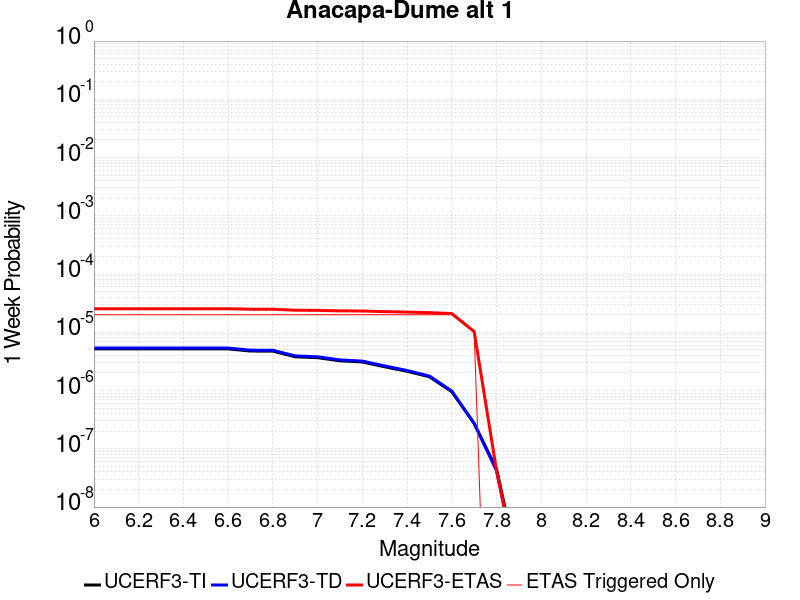 |  | 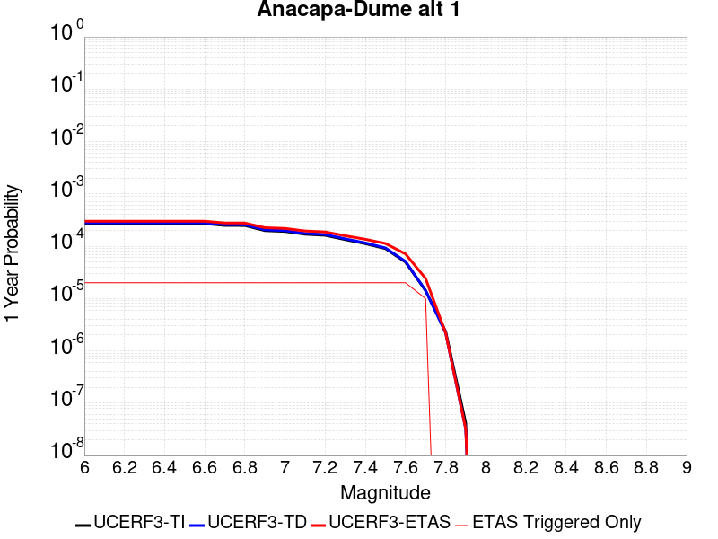 |  |

| Magnitude | 1 wk TI Prob | 1 wk TD Prob | 1 wk ETAS Prob | 1 wk ETAS/TD Gain | 1 wk ETAS Triggered Only | 1 mo TI Prob | 1 mo TD Prob | 1 mo ETAS Prob | 1 mo ETAS/TD Gain | 1 mo ETAS Triggered Only | 1 yr TI Prob | 1 yr TD Prob | 1 yr ETAS Prob | 1 yr ETAS/TD Gain | 1 yr ETAS Triggered Only | 10 yr TI Prob | 10 yr TD Prob | 10 yr ETAS Prob | 10 yr ETAS/TD Gain | 10 yr ETAS Triggered Only |
|-----|-----|-----|-----|-----|-----|-----|-----|-----|-----|-----|-----|-----|-----|-----|-----|-----|-----|-----|-----|-----|
| 6.0 | 5.1871802E-6 | 5.3673907E-6 | 9.787383E-5 | 18.2349 | 9.250694E-5 | 2.2230583E-5 | 2.3002905E-5 | 1.1550772E-4 | 5.02144 | 9.250694E-5 | 2.7062374E-4 | 2.8002524E-4 | 3.7250627E-4 | 1.3302597 | 9.250694E-5 | 0.002702944 | 0.0027968092 | 0.0028890574 | 1.0329834 | 9.250694E-5 |
| 6.1 | 5.1871802E-6 | 5.3673907E-6 | 9.787383E-5 | 18.2349 | 9.250694E-5 | 2.2230583E-5 | 2.3002905E-5 | 1.1550772E-4 | 5.02144 | 9.250694E-5 | 2.7062374E-4 | 2.8002524E-4 | 3.7250627E-4 | 1.3302597 | 9.250694E-5 | 0.002702944 | 0.0027968092 | 0.0028890574 | 1.0329834 | 9.250694E-5 |
| 6.2 | 5.1871802E-6 | 5.3673907E-6 | 9.787383E-5 | 18.2349 | 9.250694E-5 | 2.2230583E-5 | 2.3002905E-5 | 1.1550772E-4 | 5.02144 | 9.250694E-5 | 2.7062374E-4 | 2.8002524E-4 | 3.7250627E-4 | 1.3302597 | 9.250694E-5 | 0.002702944 | 0.0027968092 | 0.0028890574 | 1.0329834 | 9.250694E-5 |
| 6.3 | 5.1871802E-6 | 5.3673907E-6 | 9.787383E-5 | 18.2349 | 9.250694E-5 | 2.2230583E-5 | 2.3002905E-5 | 1.1550772E-4 | 5.02144 | 9.250694E-5 | 2.7062374E-4 | 2.8002524E-4 | 3.7250627E-4 | 1.3302597 | 9.250694E-5 | 0.002702944 | 0.0027968092 | 0.0028890574 | 1.0329834 | 9.250694E-5 |
| 6.4 | 5.1871802E-6 | 5.3673907E-6 | 9.787383E-5 | 18.2349 | 9.250694E-5 | 2.2230583E-5 | 2.3002905E-5 | 1.1550772E-4 | 5.02144 | 9.250694E-5 | 2.7062374E-4 | 2.8002524E-4 | 3.7250627E-4 | 1.3302597 | 9.250694E-5 | 0.002702944 | 0.0027968092 | 0.0028890574 | 1.0329834 | 9.250694E-5 |
| 6.5 | 5.1871802E-6 | 5.3673907E-6 | 9.787383E-5 | 18.2349 | 9.250694E-5 | 2.2230583E-5 | 2.3002905E-5 | 1.1550772E-4 | 5.02144 | 9.250694E-5 | 2.7062374E-4 | 2.8002524E-4 | 3.7250627E-4 | 1.3302597 | 9.250694E-5 | 0.002702944 | 0.0027968092 | 0.0028890574 | 1.0329834 | 9.250694E-5 |
| 6.6 | 5.1871802E-6 | 5.3673907E-6 | 9.787383E-5 | 18.2349 | 9.250694E-5 | 2.2230583E-5 | 2.3002905E-5 | 1.1550772E-4 | 5.02144 | 9.250694E-5 | 2.7062374E-4 | 2.8002524E-4 | 3.7250627E-4 | 1.3302597 | 9.250694E-5 | 0.002702944 | 0.0027968092 | 0.0028890574 | 1.0329834 | 9.250694E-5 |
| 6.7 | 4.7693475E-6 | 4.9366918E-6 | 9.7443175E-5 | 19.738558 | 9.250694E-5 | 2.04399E-5 | 2.1157082E-5 | 1.1366206E-4 | 5.372294 | 9.250694E-5 | 2.4882736E-4 | 2.5755778E-4 | 3.500409E-4 | 1.3590771 | 9.250694E-5 | 0.0024854892 | 0.002572669 | 0.0026649379 | 1.0358651 | 9.250694E-5 |
| 6.8 | 4.753408E-6 | 4.92024E-6 | 9.7426724E-5 | 19.801214 | 9.250694E-5 | 2.037159E-5 | 2.1086576E-5 | 1.13591566E-4 | 5.386914 | 9.250694E-5 | 2.4799586E-4 | 2.5669957E-4 | 3.4918278E-4 | 1.3602779 | 9.250694E-5 | 0.002477193 | 0.0025641066 | 0.0026563765 | 1.0359851 | 9.250694E-5 |
| 6.9 | 3.800069E-6 | 3.937126E-6 | 9.64437E-5 | 24.495964 | 9.250694E-5 | 1.6285909E-5 | 1.687329E-5 | 1.0937866E-4 | 6.4823556 | 9.250694E-5 | 1.9826289E-4 | 2.0541316E-4 | 2.979011E-4 | 1.4502532 | 9.250694E-5 | 0.001980861 | 0.0020522568 | 0.002144574 | 1.0449831 | 9.250694E-5 |
| 7.0 | 3.6671938E-6 | 3.7999182E-6 | 9.63065E-5 | 25.344362 | 9.250694E-5 | 1.571645E-5 | 1.6285263E-5 | 1.0879069E-4 | 6.6803155 | 9.250694E-5 | 1.9133097E-4 | 1.9825528E-4 | 2.9074386E-4 | 1.4665127 | 9.250694E-5 | 0.0019116632 | 0.0019808074 | 0.002073131 | 1.0466092 | 9.250694E-5 |
| 7.1 | 3.2394885E-6 | 3.3587933E-6 | 9.586542E-5 | 28.541626 | 9.250694E-5 | 1.3883448E-5 | 1.4394749E-5 | 1.06900356E-4 | 7.426344 | 9.250694E-5 | 1.6901788E-4 | 1.7524208E-4 | 2.677328E-4 | 1.5277883 | 9.250694E-5 | 0.0016888938 | 0.0017510501 | 0.0018433951 | 1.0527369 | 9.250694E-5 |
| 7.2 | 3.0935948E-6 | 3.2079258E-6 | 9.571457E-5 | 29.8369 | 9.250694E-5 | 1.3258196E-5 | 1.3748182E-5 | 1.0625385E-4 | 7.7285743 | 9.250694E-5 | 1.6140658E-4 | 1.6737137E-4 | 2.598628E-4 | 1.5526122 | 9.250694E-5 | 0.001612894 | 0.0016724641 | 0.0017648163 | 1.0552193 | 9.250694E-5 |
| 7.3 | 2.5604163E-6 | 2.647073E-6 | 9.5153766E-5 | 35.946785 | 9.250694E-5 | 1.0973167E-5 | 1.1344549E-5 | 1.0385044E-4 | 9.154215 | 9.250694E-5 | 1.3359012E-4 | 1.3811118E-4 | 2.3060534E-4 | 1.669708 | 9.250694E-5 | 0.0013350984 | 0.0013802581 | 0.0014726373 | 1.066929 | 9.250694E-5 |
| 7.4 | 2.1429005E-6 | 2.2106028E-6 | 9.471734E-5 | 42.84684 | 9.250694E-5 | 9.1838265E-6 | 9.473977E-6 | 1.0198004E-4 | 10.764227 | 9.250694E-5 | 1.11807356E-4 | 1.1533959E-4 | 2.0783587E-4 | 1.8019472 | 9.250694E-5 | 0.0011175112 | 0.0011527999 | 0.0012452003 | 1.080153 | 9.250694E-5 |
| 7.5 | 1.7237151E-6 | 1.7761449E-6 | 9.428292E-5 | 53.082897 | 9.250694E-5 | 7.3873293E-6 | 7.6120277E-6 | 1.0011826E-4 | 13.15264 | 9.250694E-5 | 8.993702E-5 | 9.267252E-5 | 1.8517088E-4 | 1.9981208 | 9.250694E-5 | 8.990063E-4 | 9.2634105E-4 | 0.0010187624 | 1.0997702 | 9.250694E-5 |
| 7.6 | 9.541696E-7 | 9.823206E-7 | 9.3489165E-5 | 95.17175 | 9.250694E-5 | 4.089292E-6 | 4.2099387E-6 | 9.671649E-5 | 22.973373 | 9.250694E-5 | 4.9785995E-5 | 5.1254807E-5 | 1.43757E-4 | 2.8047516 | 9.250694E-5 | 4.9774844E-4 | 5.1243114E-4 | 6.048907E-4 | 1.180433 | 9.250694E-5 |
| 7.7 | 2.7226676E-7 | 2.7172416E-7 | 2.7172416E-7 | 1.0 | 0.0 | 1.166857E-6 | 1.1645316E-6 | 1.1645316E-6 | 1.0 | 0.0 | 1.4206392E-5 | 1.4178081E-5 | 1.4178081E-5 | 1.0 | 0.0 | 1.4205484E-4 | 1.4177183E-4 | 1.4177183E-4 | 1.0 | 0.0 |
| 7.8 | 4.5017995E-8 | 4.2157676E-8 | 4.2157676E-8 | 1.0 | 0.0 | 1.9293425E-7 | 1.8067574E-7 | 1.8067574E-7 | 1.0 | 0.0 | 2.348972E-6 | 2.1997253E-6 | 2.1997253E-6 | 1.0 | 0.0 | 2.348947E-5 | 2.1997055E-5 | 2.1997055E-5 | 1.0 | 0.0 |
| 7.9 | 8.007447E-10 | 6.1608785E-10 | 6.1608785E-10 | 1.0 | 0.0 | 3.4317629E-9 | 2.6403764E-9 | 2.6403764E-9 | 1.0 | 0.0 | 4.1781714E-8 | 3.2146584E-8 | 3.2146584E-8 | 1.0 | 0.0 | 4.1781706E-7 | 3.214658E-7 | 3.214658E-7 | 1.0 | 0.0 |

## Mission Hills 2011
*[(top)](#table-of-contents)*

| 1 Week | 1 Month | 1 Year | 10 Year |
|-----|-----|-----|-----|
|  |  |  |  |

| Magnitude | 1 wk TI Prob | 1 wk TD Prob | 1 wk ETAS Prob | 1 wk ETAS/TD Gain | 1 wk ETAS Triggered Only | 1 mo TI Prob | 1 mo TD Prob | 1 mo ETAS Prob | 1 mo ETAS/TD Gain | 1 mo ETAS Triggered Only | 1 yr TI Prob | 1 yr TD Prob | 1 yr ETAS Prob | 1 yr ETAS/TD Gain | 1 yr ETAS Triggered Only | 10 yr TI Prob | 10 yr TD Prob | 10 yr ETAS Prob | 10 yr ETAS/TD Gain | 10 yr ETAS Triggered Only |
|-----|-----|-----|-----|-----|-----|-----|-----|-----|-----|-----|-----|-----|-----|-----|-----|-----|-----|-----|-----|-----|
| 6.0 | 1.8765717E-5 | 1.9054645E-5 | 1.9054645E-5 | 1.0 | 0.0 | 8.0422025E-5 | 8.166215E-5 | 1.7416153E-4 | 2.132708 | 9.250694E-5 | 9.786983E-4 | 9.941267E-4 | 0.0010865416 | 1.092961 | 9.250694E-5 | 0.009743992 | 0.009930461 | 0.010022049 | 1.009223 | 9.250694E-5 |
| 6.1 | 1.8765717E-5 | 1.9054645E-5 | 1.9054645E-5 | 1.0 | 0.0 | 8.0422025E-5 | 8.166215E-5 | 1.7416153E-4 | 2.132708 | 9.250694E-5 | 9.786983E-4 | 9.941267E-4 | 0.0010865416 | 1.092961 | 9.250694E-5 | 0.009743992 | 0.009930461 | 0.010022049 | 1.009223 | 9.250694E-5 |
| 6.2 | 1.8765717E-5 | 1.9054645E-5 | 1.9054645E-5 | 1.0 | 0.0 | 8.0422025E-5 | 8.166215E-5 | 1.7416153E-4 | 2.132708 | 9.250694E-5 | 9.786983E-4 | 9.941267E-4 | 0.0010865416 | 1.092961 | 9.250694E-5 | 0.009743992 | 0.009930461 | 0.010022049 | 1.009223 | 9.250694E-5 |
| 6.3 | 1.8765717E-5 | 1.9054645E-5 | 1.9054645E-5 | 1.0 | 0.0 | 8.0422025E-5 | 8.166215E-5 | 1.7416153E-4 | 2.132708 | 9.250694E-5 | 9.786983E-4 | 9.941267E-4 | 0.0010865416 | 1.092961 | 9.250694E-5 | 0.009743992 | 0.009930461 | 0.010022049 | 1.009223 | 9.250694E-5 |
| 6.4 | 4.566357E-6 | 2.5148488E-6 | 2.5148488E-6 | 1.0 | 0.0 | 1.9569954E-5 | 1.0777889E-5 | 1.0328383E-4 | 9.582937 | 9.250694E-5 | 2.3823815E-4 | 1.3121472E-4 | 2.2370952E-4 | 1.7049118 | 9.250694E-5 | 0.002379829 | 0.0013115506 | 0.0014039363 | 1.0704399 | 9.250694E-5 |
| 6.5 | 4.566357E-6 | 2.5148488E-6 | 2.5148488E-6 | 1.0 | 0.0 | 1.9569954E-5 | 1.0777889E-5 | 1.0328383E-4 | 9.582937 | 9.250694E-5 | 2.3823815E-4 | 1.3121472E-4 | 2.2370952E-4 | 1.7049118 | 9.250694E-5 | 0.002379829 | 0.0013115506 | 0.0014039363 | 1.0704399 | 9.250694E-5 |
| 6.6 | 4.566357E-6 | 2.5148488E-6 | 2.5148488E-6 | 1.0 | 0.0 | 1.9569954E-5 | 1.0777889E-5 | 1.0328383E-4 | 9.582937 | 9.250694E-5 | 2.3823815E-4 | 1.3121472E-4 | 2.2370952E-4 | 1.7049118 | 9.250694E-5 | 0.002379829 | 0.0013115506 | 0.0014039363 | 1.0704399 | 9.250694E-5 |
| 6.7 | 2.3266773E-6 | 1.3296187E-6 | 1.3296187E-6 | 1.0 | 0.0 | 9.971435E-6 | 5.698354E-6 | 9.8204764E-5 | 17.233883 | 9.250694E-5 | 1.2139547E-4 | 6.937531E-5 | 1.6187584E-4 | 2.333335 | 9.250694E-5 | 0.0012132917 | 6.9354265E-4 | 7.8598544E-4 | 1.1332906 | 9.250694E-5 |
| 6.8 | 2.032735E-6 | 1.1894115E-6 | 1.1894115E-6 | 1.0 | 0.0 | 8.711692E-6 | 5.097468E-6 | 9.760394E-5 | 19.147532 | 9.250694E-5 | 1.06059684E-4 | 6.205996E-5 | 1.5456116E-4 | 2.4905133 | 9.250694E-5 | 0.0010600908 | 6.2043115E-4 | 7.128807E-4 | 1.1490085 | 9.250694E-5 |
| 6.9 | 1.3186259E-6 | 1.0561778E-6 | 1.0561778E-6 | 1.0 | 0.0 | 5.6512413E-6 | 4.5264687E-6 | 9.7032986E-5 | 21.436796 | 9.250694E-5 | 6.8801695E-5 | 5.5108394E-5 | 1.4761023E-4 | 2.6785436 | 9.250694E-5 | 6.8780396E-4 | 5.5095024E-4 | 6.4340624E-4 | 1.1678119 | 9.250694E-5 |
| 7.0 | 1.2726016E-6 | 1.0159088E-6 | 1.0159088E-6 | 1.0 | 0.0 | 5.4539955E-6 | 4.3538876E-6 | 9.686042E-5 | 22.246881 | 9.250694E-5 | 6.6400375E-5 | 5.300732E-5 | 1.4550936E-4 | 2.7450805 | 9.250694E-5 | 6.6380535E-4 | 5.299496E-4 | 6.2240753E-4 | 1.1744655 | 9.250694E-5 |
| 7.1 | 1.2063913E-6 | 9.570072E-7 | 9.570072E-7 | 1.0 | 0.0 | 5.170238E-6 | 4.101453E-6 | 9.660801E-5 | 23.55458 | 9.250694E-5 | 6.294583E-5 | 4.9934075E-5 | 1.4243639E-4 | 2.852489 | 9.250694E-5 | 6.2928005E-4 | 4.992311E-4 | 5.916919E-4 | 1.1852063 | 9.250694E-5 |
| 7.2 | 9.105806E-7 | 7.3765557E-7 | 7.3765557E-7 | 1.0 | 0.0 | 3.9024826E-6 | 3.1613772E-6 | 3.1613772E-6 | 1.0 | 0.0 | 4.7511687E-5 | 3.8489103E-5 | 3.8489103E-5 | 1.0 | 0.0 | 4.7501532E-4 | 3.8482592E-4 | 3.8482592E-4 | 1.0 | 0.0 |
| 7.3 | 7.020432E-7 | 5.710089E-7 | 5.710089E-7 | 1.0 | 0.0 | 3.0087533E-6 | 2.447179E-6 | 2.447179E-6 | 1.0 | 0.0 | 3.6630954E-5 | 2.979401E-5 | 2.979401E-5 | 1.0 | 0.0 | 3.6624918E-4 | 2.9790145E-4 | 2.9790145E-4 | 1.0 | 0.0 |
| 7.4 | 5.3900635E-7 | 4.4480825E-7 | 4.4480825E-7 | 1.0 | 0.0 | 2.3100251E-6 | 1.9063198E-6 | 1.9063198E-6 | 1.0 | 0.0 | 2.8124194E-5 | 2.3209208E-5 | 2.3209208E-5 | 1.0 | 0.0 | 2.8120633E-4 | 2.3206905E-4 | 2.3206905E-4 | 1.0 | 0.0 |
| 7.5 | 2.907075E-7 | 2.2875415E-7 | 2.2875415E-7 | 1.0 | 0.0 | 1.2458887E-6 | 9.803746E-7 | 9.803746E-7 | 1.0 | 0.0 | 1.5168589E-5 | 1.1935997E-5 | 1.1935997E-5 | 1.0 | 0.0 | 1.5167553E-4 | 1.1935373E-4 | 1.1935373E-4 | 1.0 | 0.0 |
| 7.6 | 1.6903675E-7 | 1.2353402E-7 | 1.2353402E-7 | 1.0 | 0.0 | 7.2444305E-7 | 5.294314E-7 | 5.294314E-7 | 1.0 | 0.0 | 8.820059E-6 | 6.4458095E-6 | 6.4458095E-6 | 1.0 | 0.0 | 8.8197085E-5 | 6.445635E-5 | 6.445635E-5 | 1.0 | 0.0 |
| 7.7 | 7.168073E-8 | 3.9135116E-8 | 3.9135116E-8 | 1.0 | 0.0 | 3.072031E-7 | 1.6772192E-7 | 1.6772192E-7 | 1.0 | 0.0 | 3.7401915E-6 | 2.0420127E-6 | 2.0420127E-6 | 1.0 | 0.0 | 3.7401285E-5 | 2.041995E-5 | 2.041995E-5 | 1.0 | 0.0 |
| 7.8 | 6.564101E-8 | 3.3835356E-8 | 3.3835356E-8 | 1.0 | 0.0 | 2.813186E-7 | 1.4500866E-7 | 1.4500866E-7 | 1.0 | 0.0 | 3.4250486E-6 | 1.7654792E-6 | 1.7654792E-6 | 1.0 | 0.0 | 3.424996E-5 | 1.7654662E-5 | 1.7654662E-5 | 1.0 | 0.0 |
| 7.9 | 1.0029074E-8 | 3.7292542E-9 | 3.7292542E-9 | 1.0 | 0.0 | 4.2981743E-8 | 1.5982518E-8 | 1.5982518E-8 | 1.0 | 0.0 | 5.2330256E-7 | 1.9458714E-7 | 1.9458714E-7 | 1.0 | 0.0 | 5.2330133E-6 | 1.945871E-6 | 1.945871E-6 | 1.0 | 0.0 |

## Ozena
*[(top)](#table-of-contents)*

| 1 Week | 1 Month | 1 Year | 10 Year |
|-----|-----|-----|-----|
|  |  |  |  |

| Magnitude | 1 wk TI Prob | 1 wk TD Prob | 1 wk ETAS Prob | 1 wk ETAS/TD Gain | 1 wk ETAS Triggered Only | 1 mo TI Prob | 1 mo TD Prob | 1 mo ETAS Prob | 1 mo ETAS/TD Gain | 1 mo ETAS Triggered Only | 1 yr TI Prob | 1 yr TD Prob | 1 yr ETAS Prob | 1 yr ETAS/TD Gain | 1 yr ETAS Triggered Only | 10 yr TI Prob | 10 yr TD Prob | 10 yr ETAS Prob | 10 yr ETAS/TD Gain | 10 yr ETAS Triggered Only |
|-----|-----|-----|-----|-----|-----|-----|-----|-----|-----|-----|-----|-----|-----|-----|-----|-----|-----|-----|-----|-----|
| 6.0 | 1.4377547E-6 | 1.4513782E-6 | 1.4513782E-6 | 1.0 | 0.0 | 6.161791E-6 | 6.2201793E-6 | 9.8726545E-5 | 15.871977 | 9.250694E-5 | 7.5017226E-5 | 7.572832E-5 | 1.6822826E-4 | 2.2214708 | 9.250694E-5 | 7.4991904E-4 | 7.570518E-4 | 8.494887E-4 | 1.1221012 | 9.250694E-5 |
| 6.1 | 1.4377547E-6 | 1.4513782E-6 | 1.4513782E-6 | 1.0 | 0.0 | 6.161791E-6 | 6.2201793E-6 | 9.8726545E-5 | 15.871977 | 9.250694E-5 | 7.5017226E-5 | 7.572832E-5 | 1.6822826E-4 | 2.2214708 | 9.250694E-5 | 7.4991904E-4 | 7.570518E-4 | 8.494887E-4 | 1.1221012 | 9.250694E-5 |
| 6.2 | 1.4377547E-6 | 1.4513782E-6 | 1.4513782E-6 | 1.0 | 0.0 | 6.161791E-6 | 6.2201793E-6 | 9.8726545E-5 | 15.871977 | 9.250694E-5 | 7.5017226E-5 | 7.572832E-5 | 1.6822826E-4 | 2.2214708 | 9.250694E-5 | 7.4991904E-4 | 7.570518E-4 | 8.494887E-4 | 1.1221012 | 9.250694E-5 |
| 6.3 | 1.4377547E-6 | 1.4513782E-6 | 1.4513782E-6 | 1.0 | 0.0 | 6.161791E-6 | 6.2201793E-6 | 9.8726545E-5 | 15.871977 | 9.250694E-5 | 7.5017226E-5 | 7.572832E-5 | 1.6822826E-4 | 2.2214708 | 9.250694E-5 | 7.4991904E-4 | 7.570518E-4 | 8.494887E-4 | 1.1221012 | 9.250694E-5 |
| 6.4 | 1.4377547E-6 | 1.4513782E-6 | 1.4513782E-6 | 1.0 | 0.0 | 6.161791E-6 | 6.2201793E-6 | 9.8726545E-5 | 15.871977 | 9.250694E-5 | 7.5017226E-5 | 7.572832E-5 | 1.6822826E-4 | 2.2214708 | 9.250694E-5 | 7.4991904E-4 | 7.570518E-4 | 8.494887E-4 | 1.1221012 | 9.250694E-5 |
| 6.5 | 1.4377547E-6 | 1.4513782E-6 | 1.4513782E-6 | 1.0 | 0.0 | 6.161791E-6 | 6.2201793E-6 | 9.8726545E-5 | 15.871977 | 9.250694E-5 | 7.5017226E-5 | 7.572832E-5 | 1.6822826E-4 | 2.2214708 | 9.250694E-5 | 7.4991904E-4 | 7.570518E-4 | 8.494887E-4 | 1.1221012 | 9.250694E-5 |
| 6.6 | 1.4377547E-6 | 1.4513782E-6 | 1.4513782E-6 | 1.0 | 0.0 | 6.161791E-6 | 6.2201793E-6 | 9.8726545E-5 | 15.871977 | 9.250694E-5 | 7.5017226E-5 | 7.572832E-5 | 1.6822826E-4 | 2.2214708 | 9.250694E-5 | 7.4991904E-4 | 7.570518E-4 | 8.494887E-4 | 1.1221012 | 9.250694E-5 |
| 6.7 | 1.4377547E-6 | 1.4513782E-6 | 1.4513782E-6 | 1.0 | 0.0 | 6.161791E-6 | 6.2201793E-6 | 9.8726545E-5 | 15.871977 | 9.250694E-5 | 7.5017226E-5 | 7.572832E-5 | 1.6822826E-4 | 2.2214708 | 9.250694E-5 | 7.4991904E-4 | 7.570518E-4 | 8.494887E-4 | 1.1221012 | 9.250694E-5 |
| 6.8 | 9.223257E-7 | 9.317624E-7 | 9.317624E-7 | 1.0 | 0.0 | 3.9528186E-6 | 3.9932615E-6 | 9.649983E-5 | 24.165668 | 9.250694E-5 | 4.81245E-5 | 4.8616912E-5 | 1.4111935E-4 | 2.9026802 | 9.250694E-5 | 4.811408E-4 | 4.860668E-4 | 5.785288E-4 | 1.1902248 | 9.250694E-5 |
| 6.9 | 9.141515E-7 | 9.235371E-7 | 9.235371E-7 | 1.0 | 0.0 | 3.917786E-6 | 3.9580104E-6 | 9.646458E-5 | 24.371988 | 9.250694E-5 | 4.7698002E-5 | 4.818775E-5 | 1.4069023E-4 | 2.9196265 | 9.250694E-5 | 4.7687767E-4 | 4.8177704E-4 | 5.742394E-4 | 1.1919194 | 9.250694E-5 |
| 7.0 | 8.767648E-7 | 8.8585773E-7 | 8.8585773E-7 | 1.0 | 0.0 | 3.757558E-6 | 3.7965276E-6 | 9.630311E-5 | 25.366104 | 9.250694E-5 | 4.5747307E-5 | 4.6221783E-5 | 1.3872444E-4 | 3.0012784 | 9.250694E-5 | 4.5737892E-4 | 4.6212564E-4 | 5.5458985E-4 | 1.2000846 | 9.250694E-5 |
| 7.1 | 8.199402E-7 | 8.2853984E-7 | 8.2853984E-7 | 1.0 | 0.0 | 3.5140247E-6 | 3.5508804E-6 | 9.605749E-5 | 27.051739 | 9.250694E-5 | 4.2782412E-5 | 4.323115E-5 | 1.357341E-4 | 3.1397288 | 9.250694E-5 | 4.2774176E-4 | 4.322311E-4 | 5.2469806E-4 | 1.2139294 | 9.250694E-5 |
| 7.2 | 7.38705E-7 | 7.464262E-7 | 7.464262E-7 | 1.0 | 0.0 | 3.1658747E-6 | 3.198966E-6 | 9.570561E-5 | 29.917671 | 9.250694E-5 | 3.8543843E-5 | 3.894675E-5 | 1.3145008E-4 | 3.3751235 | 9.250694E-5 | 3.853716E-4 | 3.8940276E-4 | 4.8187366E-4 | 1.2374686 | 9.250694E-5 |
| 7.3 | 6.490017E-7 | 6.557802E-7 | 6.557802E-7 | 1.0 | 0.0 | 2.7814328E-6 | 2.8104837E-6 | 9.531716E-5 | 33.91486 | 9.250694E-5 | 3.386342E-5 | 3.4217133E-5 | 1.267209E-4 | 3.7034342 | 9.250694E-5 | 3.3858258E-4 | 3.4212202E-4 | 4.345973E-4 | 1.2702991 | 9.250694E-5 |
| 7.4 | 5.346736E-7 | 5.4022604E-7 | 5.4022604E-7 | 1.0 | 0.0 | 2.291456E-6 | 2.3152527E-6 | 9.4821975E-5 | 40.955345 | 9.250694E-5 | 2.789812E-5 | 2.8187867E-5 | 1.20692195E-4 | 4.2817073 | 9.250694E-5 | 2.789462E-4 | 2.8184598E-4 | 3.7432683E-4 | 1.3281256 | 9.250694E-5 |
| 7.5 | 2.939325E-7 | 2.9666057E-7 | 2.9666057E-7 | 1.0 | 0.0 | 1.25971E-6 | 1.271402E-6 | 1.271402E-6 | 1.0 | 0.0 | 1.5336862E-5 | 1.5479225E-5 | 1.5479225E-5 | 1.0 | 0.0 | 1.5335804E-4 | 1.5478309E-4 | 1.5478309E-4 | 1.0 | 0.0 |
| 7.6 | 1.4151905E-7 | 1.4253266E-7 | 1.4253266E-7 | 1.0 | 0.0 | 6.065101E-7 | 6.108541E-7 | 6.108541E-7 | 1.0 | 0.0 | 7.3842357E-6 | 7.4371237E-6 | 7.4371237E-6 | 1.0 | 0.0 | 7.38399E-5 | 7.436883E-5 | 7.436883E-5 | 1.0 | 0.0 |
| 7.7 | 4.4957577E-8 | 4.5252243E-8 | 4.5252243E-8 | 1.0 | 0.0 | 1.9267533E-7 | 1.9393818E-7 | 1.9393818E-7 | 1.0 | 0.0 | 2.3458194E-6 | 2.3611947E-6 | 2.3611947E-6 | 1.0 | 0.0 | 2.3457947E-5 | 2.3611707E-5 | 2.3611707E-5 | 1.0 | 0.0 |
| 7.8 | 5.9993255E-9 | 6.0412972E-9 | 6.0412972E-9 | 1.0 | 0.0 | 2.5711394E-8 | 2.5891273E-8 | 2.5891273E-8 | 1.0 | 0.0 | 3.1303617E-7 | 3.1522623E-7 | 3.1522623E-7 | 1.0 | 0.0 | 3.1303573E-6 | 3.1522588E-6 | 3.1522588E-6 | 1.0 | 0.0 |

## Earthquake Valley (No  Extension)
*[(top)](#table-of-contents)*

| 1 Week | 1 Month | 1 Year | 10 Year |
|-----|-----|-----|-----|
|  |  |  |  |

| Magnitude | 1 wk TI Prob | 1 wk TD Prob | 1 wk ETAS Prob | 1 wk ETAS/TD Gain | 1 wk ETAS Triggered Only | 1 mo TI Prob | 1 mo TD Prob | 1 mo ETAS Prob | 1 mo ETAS/TD Gain | 1 mo ETAS Triggered Only | 1 yr TI Prob | 1 yr TD Prob | 1 yr ETAS Prob | 1 yr ETAS/TD Gain | 1 yr ETAS Triggered Only | 10 yr TI Prob | 10 yr TD Prob | 10 yr ETAS Prob | 10 yr ETAS/TD Gain | 10 yr ETAS Triggered Only |
|-----|-----|-----|-----|-----|-----|-----|-----|-----|-----|-----|-----|-----|-----|-----|-----|-----|-----|-----|-----|-----|
| 6.0 | 2.1859703E-5 | 2.5198362E-5 | 1.1770297E-4 | 4.6710563 | 9.250694E-5 | 9.3681076E-5 | 1.07989326E-4 | 2.0048628E-4 | 1.8565379 | 9.250694E-5 | 0.0011399703 | 0.001314122 | 0.0014065075 | 1.070302 | 9.250694E-5 | 0.011341401 | 0.013077871 | 0.0131691685 | 1.006981 | 9.250694E-5 |
| 6.1 | 2.1859703E-5 | 2.5198362E-5 | 1.1770297E-4 | 4.6710563 | 9.250694E-5 | 9.3681076E-5 | 1.07989326E-4 | 2.0048628E-4 | 1.8565379 | 9.250694E-5 | 0.0011399703 | 0.001314122 | 0.0014065075 | 1.070302 | 9.250694E-5 | 0.011341401 | 0.013077871 | 0.0131691685 | 1.006981 | 9.250694E-5 |
| 6.2 | 2.1859703E-5 | 2.5198362E-5 | 1.1770297E-4 | 4.6710563 | 9.250694E-5 | 9.3681076E-5 | 1.07989326E-4 | 2.0048628E-4 | 1.8565379 | 9.250694E-5 | 0.0011399703 | 0.001314122 | 0.0014065075 | 1.070302 | 9.250694E-5 | 0.011341401 | 0.013077871 | 0.0131691685 | 1.006981 | 9.250694E-5 |
| 6.3 | 2.1859703E-5 | 2.5198362E-5 | 1.1770297E-4 | 4.6710563 | 9.250694E-5 | 9.3681076E-5 | 1.07989326E-4 | 2.0048628E-4 | 1.8565379 | 9.250694E-5 | 0.0011399703 | 0.001314122 | 0.0014065075 | 1.070302 | 9.250694E-5 | 0.011341401 | 0.013077871 | 0.0131691685 | 1.006981 | 9.250694E-5 |
| 6.4 | 2.1859703E-5 | 2.5198362E-5 | 1.1770297E-4 | 4.6710563 | 9.250694E-5 | 9.3681076E-5 | 1.07989326E-4 | 2.0048628E-4 | 1.8565379 | 9.250694E-5 | 0.0011399703 | 0.001314122 | 0.0014065075 | 1.070302 | 9.250694E-5 | 0.011341401 | 0.013077871 | 0.0131691685 | 1.006981 | 9.250694E-5 |
| 6.5 | 2.1859703E-5 | 2.5198362E-5 | 1.1770297E-4 | 4.6710563 | 9.250694E-5 | 9.3681076E-5 | 1.07989326E-4 | 2.0048628E-4 | 1.8565379 | 9.250694E-5 | 0.0011399703 | 0.001314122 | 0.0014065075 | 1.070302 | 9.250694E-5 | 0.011341401 | 0.013077871 | 0.0131691685 | 1.006981 | 9.250694E-5 |
| 6.6 | 1.597E-5 | 1.8356275E-5 | 1.1086152E-4 | 6.039434 | 9.250694E-5 | 6.8441055E-5 | 7.866787E-5 | 1.7116753E-4 | 2.175825 | 9.250694E-5 | 8.329513E-4 | 9.574478E-4 | 0.0010498662 | 1.0965258 | 9.250694E-5 | 0.008298361 | 0.009541836 | 0.00963346 | 1.0096024 | 9.250694E-5 |
| 6.7 | 1.597E-5 | 1.8356275E-5 | 1.1086152E-4 | 6.039434 | 9.250694E-5 | 6.8441055E-5 | 7.866787E-5 | 1.7116753E-4 | 2.175825 | 9.250694E-5 | 8.329513E-4 | 9.574478E-4 | 0.0010498662 | 1.0965258 | 9.250694E-5 | 0.008298361 | 0.009541836 | 0.00963346 | 1.0096024 | 9.250694E-5 |
| 6.8 | 1.5315149E-5 | 1.7602091E-5 | 1.101074E-4 | 6.2553587 | 9.250694E-5 | 6.5634704E-5 | 7.543584E-5 | 1.6793581E-4 | 2.226207 | 9.250694E-5 | 7.988095E-4 | 9.181311E-4 | 0.0010105531 | 1.1006632 | 9.250694E-5 | 0.007959441 | 0.009151919 | 0.00924358 | 1.0100154 | 9.250694E-5 |
| 6.9 | 1.3634728E-5 | 1.5675821E-5 | 1.5675821E-5 | 1.0 | 0.0 | 5.8433237E-5 | 6.718082E-5 | 6.718082E-5 | 1.0 | 0.0 | 7.1119244E-4 | 8.177017E-4 | 8.177017E-4 | 1.0 | 0.0 | 0.007089207 | 0.008155 | 0.008155 | 1.0 | 0.0 |
| 7.0 | 1.3496271E-5 | 1.5517853E-5 | 1.5517853E-5 | 1.0 | 0.0 | 5.783988E-5 | 6.650385E-5 | 6.650385E-5 | 1.0 | 0.0 | 7.03973E-4 | 8.094657E-4 | 8.094657E-4 | 1.0 | 0.0 | 0.007017471 | 0.0080732405 | 0.0080732405 | 1.0 | 0.0 |
| 7.1 | 8.242798E-6 | 9.4726E-6 | 9.4726E-6 | 1.0 | 0.0 | 3.53258E-5 | 4.0596606E-5 | 4.0596606E-5 | 1.0 | 0.0 | 4.300067E-4 | 4.9421866E-4 | 4.9421866E-4 | 1.0 | 0.0 | 0.004291756 | 0.0049377717 | 0.0049377717 | 1.0 | 0.0 |
| 7.2 | 2.6506527E-7 | 2.2560312E-7 | 2.2560312E-7 | 1.0 | 0.0 | 1.1359936E-6 | 9.668702E-7 | 9.668702E-7 | 1.0 | 0.0 | 1.3830633E-5 | 1.17715845E-5 | 1.17715845E-5 | 1.0 | 0.0 | 1.3829772E-4 | 1.1771003E-4 | 1.1771003E-4 | 1.0 | 0.0 |
| 7.3 | 2.5810488E-7 | 2.1955442E-7 | 2.1955442E-7 | 1.0 | 0.0 | 1.1061633E-6 | 9.409472E-7 | 9.409472E-7 | 1.0 | 0.0 | 1.3467455E-5 | 1.1455976E-5 | 1.1455976E-5 | 1.0 | 0.0 | 1.3466639E-4 | 1.1455427E-4 | 1.1455427E-4 | 1.0 | 0.0 |
| 7.4 | 2.2676066E-7 | 1.9110601E-7 | 1.9110601E-7 | 1.0 | 0.0 | 9.71831E-7 | 8.190255E-7 | 8.190255E-7 | 1.0 | 0.0 | 1.1831979E-5 | 9.9715935E-6 | 9.9715935E-6 | 1.0 | 0.0 | 1.1831349E-4 | 9.9711855E-5 | 9.9711855E-5 | 1.0 | 0.0 |
| 7.5 | 1.5553917E-7 | 1.3112096E-7 | 1.3112096E-7 | 1.0 | 0.0 | 6.6659624E-7 | 5.619469E-7 | 5.619469E-7 | 1.0 | 0.0 | 8.115779E-6 | 6.8416834E-6 | 6.8416834E-6 | 1.0 | 0.0 | 8.115482E-5 | 6.841495E-5 | 6.841495E-5 | 1.0 | 0.0 |
| 7.6 | 1.3448629E-7 | 1.1288419E-7 | 1.1288419E-7 | 1.0 | 0.0 | 5.7636964E-7 | 4.837893E-7 | 4.837893E-7 | 1.0 | 0.0 | 7.017278E-6 | 5.890121E-6 | 5.890121E-6 | 1.0 | 0.0 | 7.0170565E-5 | 5.889986E-5 | 5.889986E-5 | 1.0 | 0.0 |
| 7.7 | 2.9719402E-8 | 1.458206E-8 | 1.458206E-8 | 1.0 | 0.0 | 1.2736886E-7 | 6.249454E-8 | 6.249454E-8 | 1.0 | 0.0 | 1.5507147E-6 | 7.608708E-7 | 7.608708E-7 | 1.0 | 0.0 | 1.550704E-5 | 7.6086876E-6 | 7.6086876E-6 | 1.0 | 0.0 |
| 7.8 | 7.4390196E-9 | 3.2502152E-9 | 3.2502152E-9 | 1.0 | 0.0 | 3.1881513E-8 | 1.3929493E-8 | 1.3929493E-8 | 1.0 | 0.0 | 3.8815733E-7 | 1.6959156E-7 | 1.6959156E-7 | 1.0 | 0.0 | 3.8815665E-6 | 1.6959145E-6 | 1.6959145E-6 | 1.0 | 0.0 |
| 7.9 | 1.5373532E-9 | 8.440161E-10 | 8.440161E-10 | 1.0 | 0.0 | 6.5886567E-9 | 3.6172119E-9 | 3.6172119E-9 | 1.0 | 0.0 | 8.021689E-8 | 4.4039556E-8 | 4.4039556E-8 | 1.0 | 0.0 | 8.0216864E-7 | 4.4039552E-7 | 4.4039552E-7 | 1.0 | 0.0 |

## Blue Cut
*[(top)](#table-of-contents)*

| 1 Week | 1 Month | 1 Year | 10 Year |
|-----|-----|-----|-----|
|  |  |  |  |

| Magnitude | 1 wk TI Prob | 1 wk TD Prob | 1 wk ETAS Prob | 1 wk ETAS/TD Gain | 1 wk ETAS Triggered Only | 1 mo TI Prob | 1 mo TD Prob | 1 mo ETAS Prob | 1 mo ETAS/TD Gain | 1 mo ETAS Triggered Only | 1 yr TI Prob | 1 yr TD Prob | 1 yr ETAS Prob | 1 yr ETAS/TD Gain | 1 yr ETAS Triggered Only | 10 yr TI Prob | 10 yr TD Prob | 10 yr ETAS Prob | 10 yr ETAS/TD Gain | 10 yr ETAS Triggered Only |
|-----|-----|-----|-----|-----|-----|-----|-----|-----|-----|-----|-----|-----|-----|-----|-----|-----|-----|-----|-----|-----|
| 6.0 | 2.1227985E-5 | 2.2719574E-5 | 1.1522441E-4 | 5.071592 | 9.250694E-5 | 9.097391E-5 | 9.73663E-5 | 1.8986424E-4 | 1.9499995 | 9.250694E-5 | 0.0011070445 | 0.0011848481 | 0.0012772455 | 1.0779824 | 9.250694E-5 | 0.011015458 | 0.011791152 | 0.011882568 | 1.0077529 | 9.250694E-5 |
| 6.1 | 2.1227985E-5 | 2.2719574E-5 | 1.1522441E-4 | 5.071592 | 9.250694E-5 | 9.097391E-5 | 9.73663E-5 | 1.8986424E-4 | 1.9499995 | 9.250694E-5 | 0.0011070445 | 0.0011848481 | 0.0012772455 | 1.0779824 | 9.250694E-5 | 0.011015458 | 0.011791152 | 0.011882568 | 1.0077529 | 9.250694E-5 |
| 6.2 | 2.1227985E-5 | 2.2719574E-5 | 1.1522441E-4 | 5.071592 | 9.250694E-5 | 9.097391E-5 | 9.73663E-5 | 1.8986424E-4 | 1.9499995 | 9.250694E-5 | 0.0011070445 | 0.0011848481 | 0.0012772455 | 1.0779824 | 9.250694E-5 | 0.011015458 | 0.011791152 | 0.011882568 | 1.0077529 | 9.250694E-5 |
| 6.3 | 1.1613981E-5 | 1.2353542E-5 | 1.2353542E-5 | 1.0 | 0.0 | 4.9773254E-5 | 5.2942745E-5 | 5.2942745E-5 | 1.0 | 0.0 | 6.0582085E-4 | 6.443998E-4 | 6.443998E-4 | 1.0 | 0.0 | 0.0060417196 | 0.0064265593 | 0.0064265593 | 1.0 | 0.0 |
| 6.4 | 1.1613981E-5 | 1.2353542E-5 | 1.2353542E-5 | 1.0 | 0.0 | 4.9773254E-5 | 5.2942745E-5 | 5.2942745E-5 | 1.0 | 0.0 | 6.0582085E-4 | 6.443998E-4 | 6.443998E-4 | 1.0 | 0.0 | 0.0060417196 | 0.0064265593 | 0.0064265593 | 1.0 | 0.0 |
| 6.5 | 8.931326E-6 | 9.4816E-6 | 9.4816E-6 | 1.0 | 0.0 | 3.8276554E-5 | 4.0634844E-5 | 4.0634844E-5 | 1.0 | 0.0 | 4.6591737E-4 | 4.946261E-4 | 4.946261E-4 | 1.0 | 0.0 | 0.0046494175 | 0.004936161 | 0.004936161 | 1.0 | 0.0 |
| 6.6 | 7.345353E-6 | 7.79028E-6 | 7.79028E-6 | 1.0 | 0.0 | 3.1479703E-5 | 3.338653E-5 | 3.338653E-5 | 1.0 | 0.0 | 3.83198E-4 | 4.064132E-4 | 4.064132E-4 | 1.0 | 0.0 | 0.0038253788 | 0.0040574907 | 0.0040574907 | 1.0 | 0.0 |
| 6.7 | 6.2775666E-6 | 6.655149E-6 | 6.655149E-6 | 1.0 | 0.0 | 2.690358E-5 | 2.8521798E-5 | 2.8521798E-5 | 1.0 | 0.0 | 3.2750185E-4 | 3.472051E-4 | 3.472051E-4 | 1.0 | 0.0 | 0.0032701963 | 0.003467367 | 0.003467367 | 1.0 | 0.0 |
| 6.8 | 5.5234095E-6 | 5.8551113E-6 | 5.8551113E-6 | 1.0 | 0.0 | 2.367154E-5 | 2.5093133E-5 | 2.5093133E-5 | 1.0 | 0.0 | 2.8816288E-4 | 3.0547334E-4 | 3.0547334E-4 | 1.0 | 0.0 | 0.002877895 | 0.0030512505 | 0.0030512505 | 1.0 | 0.0 |
| 6.9 | 4.7780054E-6 | 5.0654203E-6 | 5.0654203E-6 | 1.0 | 0.0 | 2.0477004E-5 | 2.1708804E-5 | 2.1708804E-5 | 1.0 | 0.0 | 2.4927902E-4 | 2.642797E-4 | 2.642797E-4 | 1.0 | 0.0 | 0.0024899957 | 0.002640346 | 0.002640346 | 1.0 | 0.0 |
| 7.0 | 3.883171E-6 | 4.118487E-6 | 4.118487E-6 | 1.0 | 0.0 | 1.6642054E-5 | 1.7650578E-5 | 1.7650578E-5 | 1.0 | 0.0 | 2.0259817E-4 | 2.1488148E-4 | 2.1488148E-4 | 1.0 | 0.0 | 0.0020241356 | 0.0021474129 | 0.0021474129 | 1.0 | 0.0 |
| 7.1 | 2.8358215E-6 | 3.0097158E-6 | 3.0097158E-6 | 1.0 | 0.0 | 1.2153464E-5 | 1.2898756E-5 | 1.2898756E-5 | 1.0 | 0.0 | 1.4795837E-4 | 1.5703762E-4 | 1.5703762E-4 | 1.0 | 0.0 | 0.001478599 | 0.0015699116 | 0.0015699116 | 1.0 | 0.0 |

## Clamshell-Sawpit
*[(top)](#table-of-contents)*

| 1 Week | 1 Month | 1 Year | 10 Year |
|-----|-----|-----|-----|
|  |  |  |  |

| Magnitude | 1 wk TI Prob | 1 wk TD Prob | 1 wk ETAS Prob | 1 wk ETAS/TD Gain | 1 wk ETAS Triggered Only | 1 mo TI Prob | 1 mo TD Prob | 1 mo ETAS Prob | 1 mo ETAS/TD Gain | 1 mo ETAS Triggered Only | 1 yr TI Prob | 1 yr TD Prob | 1 yr ETAS Prob | 1 yr ETAS/TD Gain | 1 yr ETAS Triggered Only | 10 yr TI Prob | 10 yr TD Prob | 10 yr ETAS Prob | 10 yr ETAS/TD Gain | 10 yr ETAS Triggered Only |
|-----|-----|-----|-----|-----|-----|-----|-----|-----|-----|-----|-----|-----|-----|-----|-----|-----|-----|-----|-----|-----|
| 6.0 | 3.202998E-6 | 3.0127644E-6 | 3.0127644E-6 | 1.0 | 0.0 | 1.3727062E-5 | 1.2911788E-5 | 1.0541753E-4 | 8.164441 | 9.250694E-5 | 1.6711417E-4 | 1.5719049E-4 | 2.4968287E-4 | 1.5884097 | 9.250694E-5 | 0.0016698855 | 0.0015708724 | 0.001663234 | 1.0587964 | 9.250694E-5 |
| 6.1 | 3.202998E-6 | 3.0127644E-6 | 3.0127644E-6 | 1.0 | 0.0 | 1.3727062E-5 | 1.2911788E-5 | 1.0541753E-4 | 8.164441 | 9.250694E-5 | 1.6711417E-4 | 1.5719049E-4 | 2.4968287E-4 | 1.5884097 | 9.250694E-5 | 0.0016698855 | 0.0015708724 | 0.001663234 | 1.0587964 | 9.250694E-5 |
| 6.2 | 3.202998E-6 | 3.0127644E-6 | 3.0127644E-6 | 1.0 | 0.0 | 1.3727062E-5 | 1.2911788E-5 | 1.0541753E-4 | 8.164441 | 9.250694E-5 | 1.6711417E-4 | 1.5719049E-4 | 2.4968287E-4 | 1.5884097 | 9.250694E-5 | 0.0016698855 | 0.0015708724 | 0.001663234 | 1.0587964 | 9.250694E-5 |
| 6.3 | 3.202998E-6 | 3.0127644E-6 | 3.0127644E-6 | 1.0 | 0.0 | 1.3727062E-5 | 1.2911788E-5 | 1.0541753E-4 | 8.164441 | 9.250694E-5 | 1.6711417E-4 | 1.5719049E-4 | 2.4968287E-4 | 1.5884097 | 9.250694E-5 | 0.0016698855 | 0.0015708724 | 0.001663234 | 1.0587964 | 9.250694E-5 |
| 6.4 | 3.202998E-6 | 3.0127644E-6 | 3.0127644E-6 | 1.0 | 0.0 | 1.3727062E-5 | 1.2911788E-5 | 1.0541753E-4 | 8.164441 | 9.250694E-5 | 1.6711417E-4 | 1.5719049E-4 | 2.4968287E-4 | 1.5884097 | 9.250694E-5 | 0.0016698855 | 0.0015708724 | 0.001663234 | 1.0587964 | 9.250694E-5 |
| 6.5 | 2.5862723E-6 | 2.380775E-6 | 2.380775E-6 | 1.0 | 0.0 | 1.1083977E-5 | 1.0203283E-5 | 1.0203283E-5 | 1.0 | 0.0 | 1.3493907E-4 | 1.2421819E-4 | 1.2421819E-4 | 1.0 | 0.0 | 0.0013485716 | 0.0012415178 | 0.0012415178 | 1.0 | 0.0 |
| 6.6 | 2.5862723E-6 | 2.380775E-6 | 2.380775E-6 | 1.0 | 0.0 | 1.1083977E-5 | 1.0203283E-5 | 1.0203283E-5 | 1.0 | 0.0 | 1.3493907E-4 | 1.2421819E-4 | 1.2421819E-4 | 1.0 | 0.0 | 0.0013485716 | 0.0012415178 | 0.0012415178 | 1.0 | 0.0 |
| 6.7 | 2.5862723E-6 | 2.380775E-6 | 2.380775E-6 | 1.0 | 0.0 | 1.1083977E-5 | 1.0203283E-5 | 1.0203283E-5 | 1.0 | 0.0 | 1.3493907E-4 | 1.2421819E-4 | 1.2421819E-4 | 1.0 | 0.0 | 0.0013485716 | 0.0012415178 | 0.0012415178 | 1.0 | 0.0 |
| 6.8 | 2.4098806E-6 | 2.1977307E-6 | 2.1977307E-6 | 1.0 | 0.0 | 1.0328019E-5 | 9.4188135E-6 | 9.4188135E-6 | 1.0 | 0.0 | 1.2573638E-4 | 1.1466829E-4 | 1.1466829E-4 | 1.0 | 0.0 | 0.0012566525 | 0.0011461178 | 0.0011461178 | 1.0 | 0.0 |
| 6.9 | 2.0073985E-6 | 1.7784248E-6 | 1.7784248E-6 | 1.0 | 0.0 | 8.603109E-6 | 7.621799E-6 | 7.621799E-6 | 1.0 | 0.0 | 1.0473781E-4 | 9.279157E-5 | 9.279157E-5 | 1.0 | 0.0 | 0.0010468846 | 9.275401E-4 | 9.275401E-4 | 1.0 | 0.0 |
| 7.0 | 1.8166766E-6 | 1.5807095E-6 | 1.5807095E-6 | 1.0 | 0.0 | 7.785734E-6 | 6.7744522E-6 | 6.7744522E-6 | 1.0 | 0.0 | 9.478718E-5 | 8.247593E-5 | 8.247593E-5 | 1.0 | 0.0 | 9.4746763E-4 | 8.244633E-4 | 8.244633E-4 | 1.0 | 0.0 |
| 7.1 | 1.5471421E-6 | 1.3052961E-6 | 1.3052961E-6 | 1.0 | 0.0 | 6.6305925E-6 | 5.5941146E-6 | 5.5941146E-6 | 1.0 | 0.0 | 8.072447E-5 | 6.8106274E-5 | 6.8106274E-5 | 1.0 | 0.0 | 8.0695155E-4 | 6.808595E-4 | 6.808595E-4 | 1.0 | 0.0 |
| 7.2 | 1.3608037E-6 | 1.1153443E-6 | 1.1153443E-6 | 1.0 | 0.0 | 5.8320024E-6 | 4.7800386E-6 | 4.7800386E-6 | 1.0 | 0.0 | 7.1002316E-5 | 5.8195463E-5 | 5.8195463E-5 | 1.0 | 0.0 | 7.097964E-4 | 5.818069E-4 | 5.818069E-4 | 1.0 | 0.0 |
| 7.3 | 1.0749634E-6 | 8.384254E-7 | 8.384254E-7 | 1.0 | 0.0 | 4.6069777E-6 | 3.593247E-6 | 3.593247E-6 | 1.0 | 0.0 | 5.608851E-5 | 4.374693E-5 | 4.374693E-5 | 1.0 | 0.0 | 5.6074356E-4 | 4.37386E-4 | 4.37386E-4 | 1.0 | 0.0 |
| 7.4 | 8.416856E-7 | 6.200048E-7 | 6.200048E-7 | 1.0 | 0.0 | 3.607219E-6 | 2.6571608E-6 | 2.6571608E-6 | 1.0 | 0.0 | 4.3917007E-5 | 3.2350472E-5 | 3.2350472E-5 | 1.0 | 0.0 | 4.390833E-4 | 3.2345962E-4 | 3.2345962E-4 | 1.0 | 0.0 |
| 7.5 | 6.2779594E-7 | 4.496886E-7 | 4.496886E-7 | 1.0 | 0.0 | 2.6905511E-6 | 1.9272356E-6 | 1.9272356E-6 | 1.0 | 0.0 | 3.275697E-5 | 2.346386E-5 | 2.346386E-5 | 1.0 | 0.0 | 3.275214E-4 | 2.346157E-4 | 2.346157E-4 | 1.0 | 0.0 |
| 7.6 | 4.3822078E-7 | 3.0595405E-7 | 3.0595405E-7 | 1.0 | 0.0 | 1.8780877E-6 | 1.311231E-6 | 1.311231E-6 | 1.0 | 0.0 | 2.2865479E-5 | 1.5964137E-5 | 1.5964137E-5 | 1.0 | 0.0 | 2.2863125E-4 | 1.5963144E-4 | 1.5963144E-4 | 1.0 | 0.0 |
| 7.7 | 1.8704569E-7 | 1.12379205E-7 | 1.12379205E-7 | 1.0 | 0.0 | 8.0162414E-7 | 4.816251E-7 | 4.816251E-7 | 1.0 | 0.0 | 9.75973E-6 | 5.86377E-6 | 5.86377E-6 | 1.0 | 0.0 | 9.7593016E-5 | 5.863622E-5 | 5.863622E-5 | 1.0 | 0.0 |
| 7.8 | 3.5378733E-8 | 2.1838144E-8 | 2.1838144E-8 | 1.0 | 0.0 | 1.5162313E-7 | 9.359204E-8 | 9.359204E-8 | 1.0 | 0.0 | 1.84601E-6 | 1.1394826E-6 | 1.1394826E-6 | 1.0 | 0.0 | 1.8459947E-5 | 1.139477E-5 | 1.139477E-5 | 1.0 | 0.0 |
| 7.9 | 7.504945E-9 | 5.1920326E-9 | 5.1920326E-9 | 1.0 | 0.0 | 3.2164053E-8 | 2.225157E-8 | 2.225157E-8 | 1.0 | 0.0 | 3.9159727E-7 | 2.7091284E-7 | 2.7091284E-7 | 1.0 | 0.0 | 3.915966E-6 | 2.7091257E-6 | 2.7091257E-6 | 1.0 | 0.0 |
| 8.0 | 1.6554036E-10 | 1.4180768E-10 | 1.4180768E-10 | 1.0 | 0.0 | 7.0945894E-10 | 6.077475E-10 | 6.077475E-10 | 1.0 | 0.0 | 8.637662E-9 | 7.3993256E-9 | 7.3993256E-9 | 1.0 | 0.0 | 8.6376616E-8 | 7.3993256E-8 | 7.3993256E-8 | 1.0 | 0.0 |

