# Parent Section Magnitude-Probability Distributions

Only fault sections with at least one triggered aftershock are plotted. Sections are sorted by total supraseismogenic trigger rate (decreasing)

## Table Of Contents

* [Garlock (Central)](#garlock-central)
* [Tank Canyon](#tank-canyon)
* [Little Lake](#little-lake)
* [Airport Lake](#airport-lake)
* [Owl Lake](#owl-lake)
* [Panamint Valley](#panamint-valley)
* [Garlock (East)](#garlock-east)
* [Hunter Mountain-Saline Valley](#hunter-mountain-saline-valley)
* [Blackwater](#blackwater)
* [Ash Hill](#ash-hill)
* [Garlock (West)](#garlock-west)
* [McLean Lake](#mclean-lake)
* [Gravel Hills-Harper Lk](#gravel-hills-harper-lk)
* [Goldstone Lake](#goldstone-lake)
* [So Sierra Nevada](#so-sierra-nevada)
* [Coyote Canyon](#coyote-canyon)
* [Death Valley (So)](#death-valley-so)
* [San Andreas (Mojave S)](#san-andreas-mojave-s)
* [Nelson Lake](#nelson-lake)
* [San Andreas (Mojave N)](#san-andreas-mojave-n)
* [Lenwood-Lockhart-Old Woman Springs](#lenwood-lockhart-old-woman-springs)
* [Towne Pass](#towne-pass)
* [Bicycle Lake](#bicycle-lake)
* [San Andreas (San Bernardino N)](#san-andreas-san-bernardino-n)
* [Garlic Springs](#garlic-springs)
* [Paradise](#paradise)
* [Death Valley (Black Mtns Frontal)](#death-valley-black-mtns-frontal)
* [Helendale-So Lockhart](#helendale-so-lockhart)
* [Death Valley (No)](#death-valley-no)
* [San Andreas (San Bernardino S)](#san-andreas-san-bernardino-s)
* [Coyote Lake](#coyote-lake)
* [Red Pass](#red-pass)
* [San Andreas (Parkfield)](#san-andreas-parkfield)
* [San Andreas (Big Bend)](#san-andreas-big-bend)
* [Cleghorn Lake](#cleghorn-lake)
* [Death Valley (Fish Lake Valley)](#death-valley-fish-lake-valley)
* [Calico-Hidalgo](#calico-hidalgo)
* [Santa Ynez (West)](#santa-ynez-west)
* [Sierra Nevada  (No Extension)](#sierra-nevada--no-extension)
* [San Andreas (Cholame) rev](#san-andreas-cholame-rev)
* [Scodie Lineament](#scodie-lineament)
* [San Andreas (San Gorgonio Pass-Garnet HIll)](#san-andreas-san-gorgonio-pass-garnet-hill)
* [White Wolf (Extension)](#white-wolf-extension)
* [Owens Valley](#owens-valley)
* [San Jacinto (Stepovers Combined)](#san-jacinto-stepovers-combined)
* [San Jacinto (San Jacinto Valley) rev](#san-jacinto-san-jacinto-valley-rev)
* [San Jacinto (San Bernardino)](#san-jacinto-san-bernardino)
* [Elsinore (Glen Ivy) rev](#elsinore-glen-ivy-rev)
* [San Andreas (Coachella) rev](#san-andreas-coachella-rev)
* [Baker](#baker)
* [San Andreas (Carrizo) rev](#san-andreas-carrizo-rev)
* [Ludlow](#ludlow)
* [Santa Cruz Island](#santa-cruz-island)
* [Palos Verdes](#palos-verdes)
* [Kern Canyon (North Kern) 2011](#kern-canyon-north-kern-2011)
* [Santa Ynez (East)](#santa-ynez-east)
* [Pisgah-Bullion Mtn-Mesquite Lk](#pisgah-bullion-mtn-mesquite-lk)
* [Channel Islands Thrust](#channel-islands-thrust)
* [Pinto Mtn](#pinto-mtn)
* [Rose Canyon](#rose-canyon)
* [Oceanic - West Huasna](#oceanic---west-huasna)
* [Brawley (Seismic Zone) alt 1](#brawley-seismic-zone-alt-1)
* [San Andreas (North Branch Mill Creek)](#san-andreas-north-branch-mill-creek)
* [San Jacinto (Anza) rev](#san-jacinto-anza-rev)
* [Cleghorn Pass](#cleghorn-pass)
* [San Gabriel](#san-gabriel)
* [San Andreas (Creeping Section) 2011 CFM](#san-andreas-creeping-section-2011-cfm)
* [Red Mountain](#red-mountain)
* [Santa Ynez River](#santa-ynez-river)
* [San Jacinto (Coyote Creek)](#san-jacinto-coyote-creek)
* [Deep Springs](#deep-springs)
* [Oceanside alt1](#oceanside-alt1)
* [Tin Mountain](#tin-mountain)
* [Cedar Mtn-Mahogany Mtn](#cedar-mtn-mahogany-mtn)
* [Santa Rosa Island](#santa-rosa-island)
* [Imperial](#imperial)
* [Lake Isabella (Seismicity)](#lake-isabella-seismicity)
* [San Diego Trough north alt1](#san-diego-trough-north-alt1)
* [Great Valley 09 (Laguna Seca)](#great-valley-09-laguna-seca)
* [San Gorgonio Pass](#san-gorgonio-pass)
* [Lost Hills](#lost-hills)
* [Cady](#cady)
* [Newport-Inglewood (Offshore)](#newport-inglewood-offshore)
* [Santa Susana alt 1](#santa-susana-alt-1)
* [Mission Ridge-Arroyo Parida-Santa Ana](#mission-ridge-arroyo-parida-santa-ana)
* [Camp Rock 2011](#camp-rock-2011)
* [San Cayetano](#san-cayetano)
* [Ventura-Pitas Point](#ventura-pitas-point)
* [Hayward (So) 2011 CFM](#hayward-so-2011-cfm)
* [Hartley Springs 2011 CFM](#hartley-springs-2011-cfm)
* [San Jacinto (Superstition Mtn)](#san-jacinto-superstition-mtn)
* [Kern Canyon (Lake Isabella) 2011](#kern-canyon-lake-isabella-2011)
* [Malibu Coast (Extension) alt 1](#malibu-coast-extension-alt-1)
* [Coronado Bank alt1](#coronado-bank-alt1)
* [Kern Canyon (South Kern) 2011](#kern-canyon-south-kern-2011)
* [Big Pine (East)](#big-pine-east)
* [Independence rev 2011](#independence-rev-2011)
* [Los Alamos extension](#los-alamos-extension)
* [Whittier alt 1](#whittier-alt-1)
* [Big Pine (Central)](#big-pine-central)
* [Hosgri](#hosgri)
* [Northridge Hills](#northridge-hills)
* [San Andreas (Santa Cruz Mts) 2011 CFM](#san-andreas-santa-cruz-mts-2011-cfm)
* [Cucamonga](#cucamonga)
* [Earthquake Valley (So Extension)](#earthquake-valley-so-extension)
* [White Wolf](#white-wolf)
* [San Diego Trough south](#san-diego-trough-south)
* [San Juan](#san-juan)
* [Santa Monica alt 1](#santa-monica-alt-1)
* [Dry Mountain](#dry-mountain)
* [Great Valley 11](#great-valley-11)
* [Reliz 2011 CFM](#reliz-2011-cfm)
* [Los Alamos 2011 CFM](#los-alamos-2011-cfm)
* [Malibu Coast alt 1](#malibu-coast-alt-1)
* [Cerro Prieto](#cerro-prieto)
* [Ortigalita (South)](#ortigalita-south)
* [Point Reyes 2011 CFM](#point-reyes-2011-cfm)
* [Bullion Mountains](#bullion-mountains)
* [Hollywood](#hollywood)
* [Oak Ridge (Onshore)](#oak-ridge-onshore)
* [San Jacinto (Borrego)](#san-jacinto-borrego)
* [Simi-Santa Rosa](#simi-santa-rosa)
* [San Pedro Basin](#san-pedro-basin)
* [Pleito](#pleito)
* [San Jacinto (Lytle Creek connector)](#san-jacinto-lytle-creek-connector)
* [Monterey Bay-Tularcitos](#monterey-bay-tularcitos)
* [Del Valle](#del-valle)
* [Elysian Park (Upper)](#elysian-park-upper)
* [San Jacinto (Clark) rev](#san-jacinto-clark-rev)
* [Carlsbad](#carlsbad)
* [Elmore Ranch](#elmore-ranch)
* [Rinconada 2011 CFM](#rinconada-2011-cfm)
* [Santa Cruz Catalina Ridge alt1](#santa-cruz-catalina-ridge-alt1)
* [Pine Mtn](#pine-mtn)
* [San Andreas (Peninsula) 2011 CFM](#san-andreas-peninsula-2011-cfm)
* [Casmalia 2011 CFM](#casmalia-2011-cfm)
* [Mission Creek](#mission-creek)
* [White Mountains](#white-mountains)
* [Surprise Valley 2011 CFM](#surprise-valley-2011-cfm)
* [San Andreas (North Coast) 2011 CFM](#san-andreas-north-coast-2011-cfm)
* [Great Valley 06 (Midland) 2011 CFM alt1](#great-valley-06-midland-2011-cfm-alt1)
* [Chino alt 1](#chino-alt-1)
* [Manix-Afton Hills](#manix-afton-hills)
* [Calaveras (No) 2011 CFM](#calaveras-no-2011-cfm)
* [Northridge](#northridge)
* [Anacapa-Dume alt 1](#anacapa-dume-alt-1)
* [Sheephole](#sheephole)
* [Mission Hills 2011](#mission-hills-2011)
* [Ozena](#ozena)
* [Earthquake Valley (No  Extension)](#earthquake-valley-no--extension)
* [Blue Cut](#blue-cut)
* [Clamshell-Sawpit](#clamshell-sawpit)
* [Puente Hills](#puente-hills)

## Garlock (Central)
*[(top)](#table-of-contents)*

| 1 Week | 1 Month | 1 Year | 10 Year |
|-----|-----|-----|-----|
| 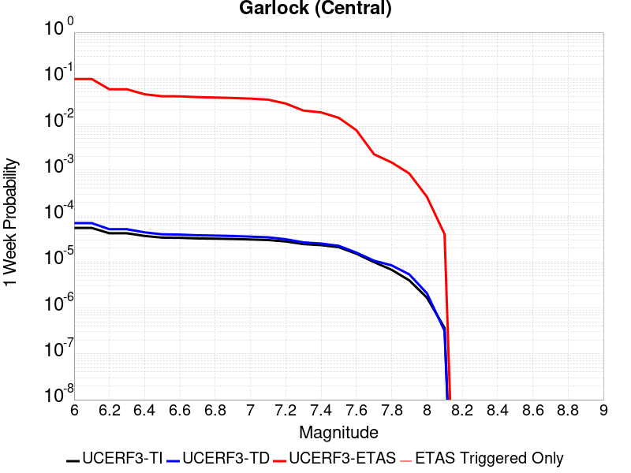 |  |  |  |

| Magnitude | 1 wk TI Prob | 1 wk TD Prob | 1 wk ETAS Prob | 1 wk ETAS/TD Gain | 1 wk ETAS Triggered Only | 1 mo TI Prob | 1 mo TD Prob | 1 mo ETAS Prob | 1 mo ETAS/TD Gain | 1 mo ETAS Triggered Only | 1 yr TI Prob | 1 yr TD Prob | 1 yr ETAS Prob | 1 yr ETAS/TD Gain | 1 yr ETAS Triggered Only | 10 yr TI Prob | 10 yr TD Prob | 10 yr ETAS Prob | 10 yr ETAS/TD Gain | 10 yr ETAS Triggered Only |
|-----|-----|-----|-----|-----|-----|-----|-----|-----|-----|-----|-----|-----|-----|-----|-----|-----|-----|-----|-----|-----|
| 6.0 | 5.5131142E-5 | 7.024681E-5 | 0.09699303 | 1380.7463 | 0.096929595 | 2.3625491E-4 | 3.010234E-4 | 0.11059073 | 367.38254 | 0.11032292 | 0.0028726095 | 0.0036588663 | 0.12834656 | 35.07823 | 0.12514558 | 0.028357591 | 0.036079824 | 0.16737504 | 4.6390204 | 0.13620964 |
| 6.1 | 5.5131142E-5 | 7.024681E-5 | 0.09699303 | 1380.7463 | 0.096929595 | 2.3625491E-4 | 3.010234E-4 | 0.11059073 | 367.38254 | 0.11032292 | 0.0028726095 | 0.0036588663 | 0.12834656 | 35.07823 | 0.12514558 | 0.028357591 | 0.036079824 | 0.16737504 | 4.6390204 | 0.13620964 |
| 6.2 | 4.216245E-5 | 5.1661493E-5 | 0.057804104 | 1118.9011 | 0.057755426 | 1.806837E-4 | 2.2138779E-4 | 0.06690858 | 302.22345 | 0.066701956 | 0.0021976046 | 0.0026920962 | 0.07818973 | 29.04418 | 0.07570143 | 0.021759989 | 0.026689773 | 0.107017495 | 4.0096817 | 0.08253044 |
| 6.3 | 4.216245E-5 | 5.1661493E-5 | 0.057804104 | 1118.9011 | 0.057755426 | 1.806837E-4 | 2.2138779E-4 | 0.06690858 | 302.22345 | 0.066701956 | 0.0021976046 | 0.0026920962 | 0.07818973 | 29.04418 | 0.07570143 | 0.021759989 | 0.026689773 | 0.107017495 | 4.0096817 | 0.08253044 |
| 6.4 | 3.6858168E-5 | 4.411054E-5 | 0.045462966 | 1030.6599 | 0.04542086 | 1.5795401E-4 | 1.8903162E-4 | 0.052640736 | 278.47583 | 0.05246162 | 0.0019213937 | 0.002299056 | 0.06192872 | 26.936586 | 0.05976707 | 0.019048655 | 0.02284894 | 0.087043986 | 3.8095417 | 0.065696135 |
| 6.5 | 3.39199E-5 | 4.0018083E-5 | 0.040536016 | 1012.94244 | 0.040497616 | 1.453629E-4 | 1.7149492E-4 | 0.047066573 | 274.4488 | 0.046903122 | 0.0017683565 | 0.002085973 | 0.055441886 | 26.578428 | 0.05346744 | 0.017543508 | 0.020759864 | 0.078249395 | 3.7692635 | 0.05870831 |
| 6.6 | 3.3571985E-5 | 3.9472274E-5 | 0.04032375 | 1021.5715 | 0.040285867 | 1.4387199E-4 | 1.6915603E-4 | 0.04685263 | 276.97876 | 0.04669137 | 0.0017502342 | 0.0020575512 | 0.055203665 | 26.82979 | 0.053255692 | 0.017365133 | 0.020481179 | 0.07777966 | 3.7976162 | 0.058496557 |
| 6.7 | 3.2580007E-5 | 3.8088703E-5 | 0.039210763 | 1029.4591 | 0.039174166 | 1.3962112E-4 | 1.632272E-4 | 0.045417883 | 278.24948 | 0.045262042 | 0.0016985617 | 0.0019855013 | 0.0536033 | 26.997362 | 0.05172049 | 0.016856372 | 0.019773813 | 0.0751418 | 3.8000662 | 0.05648491 |
| 6.8 | 3.2185937E-5 | 3.7515918E-5 | 0.038363237 | 1022.5855 | 0.038327157 | 1.3793244E-4 | 1.6077272E-4 | 0.044515736 | 276.88614 | 0.044362098 | 0.0016780337 | 0.001955672 | 0.052676823 | 26.935408 | 0.05082054 | 0.016654192 | 0.019480614 | 0.07387894 | 3.7924337 | 0.05547909 |
| 6.9 | 3.165394E-5 | 3.6720503E-5 | 0.03740962 | 1018.76654 | 0.037374273 | 1.3565269E-4 | 1.5736422E-4 | 0.043506816 | 276.4721 | 0.043356273 | 0.0016503202 | 0.001914247 | 0.051527932 | 26.91812 | 0.04970884 | 0.01638118 | 0.019073246 | 0.07219596 | 3.785195 | 0.054155637 |
| 7.0 | 3.0903822E-5 | 3.5625766E-5 | 0.036296908 | 1018.8386 | 0.03626257 | 1.3243823E-4 | 1.5267303E-4 | 0.042232007 | 276.61734 | 0.04208576 | 0.0016112428 | 0.0018572307 | 0.050099917 | 26.975603 | 0.048332453 | 0.015996104 | 0.018512413 | 0.07026263 | 3.7954335 | 0.05272631 |
| 7.1 | 3.0069863E-5 | 3.4392073E-5 | 0.03513112 | 1021.48895 | 0.035097934 | 1.2886449E-4 | 1.4738638E-4 | 0.040903687 | 277.52692 | 0.04076231 | 0.0015677959 | 0.0017929734 | 0.048136413 | 26.847256 | 0.04642668 | 0.01556781 | 0.017880075 | 0.06758397 | 3.7798483 | 0.050608788 |
| 7.2 | 2.7957109E-5 | 3.128145E-5 | 0.029093368 | 930.0517 | 0.029062996 | 1.1981068E-4 | 1.340566E-4 | 0.03379815 | 252.11853 | 0.033668607 | 0.0014577188 | 0.0016309366 | 0.040265545 | 24.688602 | 0.038697723 | 0.014481937 | 0.016283695 | 0.058204904 | 3.5744286 | 0.04261514 |
| 7.3 | 2.4519275E-5 | 2.6714795E-5 | 0.019930895 | 746.0621 | 0.019904712 | 1.0507837E-4 | 1.1448703E-4 | 0.023298703 | 203.50517 | 0.023186872 | 0.0012785783 | 0.001393003 | 0.028459534 | 20.430346 | 0.027104288 | 0.012712469 | 0.013928054 | 0.043212667 | 3.1025634 | 0.029698253 |
| 7.4 | 2.3225532E-5 | 2.51994E-5 | 0.018129561 | 719.44415 | 0.018104818 | 9.95342E-5 | 1.0799304E-4 | 0.020910405 | 193.62733 | 0.020804659 | 0.0012111551 | 0.0013140367 | 0.025686415 | 19.547716 | 0.024404448 | 0.012045753 | 0.013145725 | 0.039632495 | 3.014858 | 0.026839597 |
| 7.5 | 2.097765E-5 | 2.2483688E-5 | 0.013574323 | 603.74097 | 0.013552144 | 8.9901114E-5 | 9.635517E-5 | 0.01608211 | 166.90448 | 0.015987296 | 0.0010939965 | 0.0011725046 | 0.020154987 | 17.189686 | 0.019004764 | 0.010886264 | 0.011740365 | 0.032666985 | 2.7824504 | 0.021175224 |
| 7.6 | 1.511254E-5 | 1.5991332E-5 | 0.0072683897 | 454.52057 | 0.0072525144 | 6.476642E-5 | 6.853253E-5 | 0.008379239 | 122.266594 | 0.008311275 | 7.882459E-4 | 8.3407195E-4 | 0.010778126 | 12.922298 | 0.009952356 | 0.007854558 | 0.008383559 | 0.019407352 | 2.31493 | 0.011116993 |
| 7.7 | 9.934069E-6 | 1.0678794E-5 | 0.002286991 | 214.16194 | 0.0022763368 | 4.2573887E-5 | 4.5765457E-5 | 0.0026396117 | 57.676945 | 0.002593965 | 5.182138E-4 | 5.570524E-4 | 0.0037315667 | 6.698772 | 0.0031762838 | 0.00517007 | 0.005627684 | 0.009101933 | 1.6173499 | 0.003493912 |
| 7.8 | 6.7562896E-6 | 8.428449E-6 | 0.0015436193 | 183.14394 | 0.0015352038 | 2.8955206E-5 | 3.6121426E-5 | 0.0017830144 | 49.361683 | 0.001746956 | 3.5247262E-4 | 4.3968976E-4 | 0.002609196 | 5.934175 | 0.0021704605 | 0.0035191406 | 0.004446654 | 0.006818274 | 1.5333493 | 0.0023822128 |
| 7.9 | 3.975453E-6 | 5.37103E-6 | 8.5237547E-4 | 158.6987 | 8.47009E-4 | 1.7037546E-5 | 2.3018498E-5 | 9.758817E-4 | 42.395542 | 9.5288514E-4 | 2.0741238E-4 | 2.8021427E-4 | 0.0013916021 | 4.966207 | 0.0011116993 | 0.002072189 | 0.0028336283 | 0.0041005416 | 1.4470993 | 0.0012705135 |
| 8.0 | 1.6729537E-6 | 2.0775144E-6 | 2.1382932E-4 | 102.92556 | 2.1175225E-4 | 7.169782E-6 | 8.903603E-6 | 2.2065396E-4 | 24.782549 | 2.1175225E-4 | 8.7288594E-5 | 1.0839601E-4 | 3.730576E-4 | 3.4416177 | 2.6469032E-4 | 8.7254314E-4 | 0.0010969337 | 0.0013613338 | 1.2410355 | 2.6469032E-4 |
| 8.1 | 3.6733252E-7 | 3.1489964E-7 | 3.1489964E-7 | 1.0 | 0.0 | 1.5742813E-6 | 1.3495693E-6 | 1.3495693E-6 | 1.0 | 0.0 | 1.9166706E-5 | 1.6430899E-5 | 1.6430899E-5 | 1.0 | 0.0 | 1.9165053E-4 | 1.6638759E-4 | 1.6638759E-4 | 1.0 | 0.0 |

## Tank Canyon
*[(top)](#table-of-contents)*

| 1 Week | 1 Month | 1 Year | 10 Year |
|-----|-----|-----|-----|
|  |  |  |  |

| Magnitude | 1 wk TI Prob | 1 wk TD Prob | 1 wk ETAS Prob | 1 wk ETAS/TD Gain | 1 wk ETAS Triggered Only | 1 mo TI Prob | 1 mo TD Prob | 1 mo ETAS Prob | 1 mo ETAS/TD Gain | 1 mo ETAS Triggered Only | 1 yr TI Prob | 1 yr TD Prob | 1 yr ETAS Prob | 1 yr ETAS/TD Gain | 1 yr ETAS Triggered Only | 10 yr TI Prob | 10 yr TD Prob | 10 yr ETAS Prob | 10 yr ETAS/TD Gain | 10 yr ETAS Triggered Only |
|-----|-----|-----|-----|-----|-----|-----|-----|-----|-----|-----|-----|-----|-----|-----|-----|-----|-----|-----|-----|-----|
| 6.0 | 4.8284557E-5 | 5.7964822E-5 | 0.06109201 | 1053.9498 | 0.061037585 | 2.0691741E-4 | 2.4840087E-4 | 0.07429035 | 299.07446 | 0.07406035 | 0.0025163088 | 0.0030207601 | 0.094063066 | 31.138872 | 0.09131816 | 0.02488006 | 0.029863637 | 0.12882884 | 4.3139033 | 0.10201164 |
| 6.1 | 1.7796336E-5 | 2.0873314E-5 | 0.021089783 | 1010.37054 | 0.02106935 | 7.626778E-5 | 8.945422E-5 | 0.026503185 | 296.27652 | 0.026416093 | 9.281647E-4 | 0.0010885983 | 0.034561913 | 31.749008 | 0.033509795 | 0.009242975 | 0.010836744 | 0.047544178 | 4.3873124 | 0.037109584 |
| 6.2 | 1.7796336E-5 | 2.0873314E-5 | 0.021089783 | 1010.37054 | 0.02106935 | 7.626778E-5 | 8.945422E-5 | 0.026503185 | 296.27652 | 0.026416093 | 9.281647E-4 | 0.0010885983 | 0.034561913 | 31.749008 | 0.033509795 | 0.009242975 | 0.010836744 | 0.047544178 | 4.3873124 | 0.037109584 |
| 6.3 | 1.3515912E-5 | 1.5759564E-5 | 0.015420493 | 978.4847 | 0.015404976 | 5.792405E-5 | 6.753938E-5 | 0.018806348 | 278.4501 | 0.018740075 | 7.049971E-4 | 8.2200574E-4 | 0.025047708 | 30.47145 | 0.024245633 | 0.007027647 | 0.0081922645 | 0.03523202 | 4.300645 | 0.027263103 |
| 6.4 | 1.0870146E-5 | 1.2618021E-5 | 0.011288283 | 894.61597 | 0.011275807 | 4.658551E-5 | 5.4076212E-5 | 0.014028969 | 259.42957 | 0.013975648 | 5.67031E-4 | 6.581969E-4 | 0.018698195 | 28.408207 | 0.01805188 | 0.005655863 | 0.0065644905 | 0.02660149 | 4.0523314 | 0.020169402 |
| 6.5 | 7.964826E-6 | 9.196094E-6 | 0.0071028313 | 772.3748 | 0.0070937006 | 3.4134522E-5 | 3.9411298E-5 | 0.008667976 | 219.93631 | 0.008628904 | 4.1550855E-4 | 4.7973756E-4 | 0.011379747 | 23.720776 | 0.010905241 | 0.0041473247 | 0.004788321 | 0.016800405 | 3.5086212 | 0.012069878 |
| 6.6 | 6.6317E-6 | 7.6122988E-6 | 0.005354316 | 703.377 | 0.0053467443 | 2.8421264E-5 | 3.2623782E-5 | 0.0064379205 | 197.33826 | 0.0064055054 | 3.4597394E-4 | 3.9713128E-4 | 0.008493438 | 21.386978 | 0.008099523 | 0.0034543579 | 0.003965368 | 0.01271824 | 3.207329 | 0.008787719 |
| 6.7 | 4.793663E-6 | 5.4307857E-6 | 0.0027581952 | 507.8814 | 0.0027527793 | 2.0544108E-5 | 2.3274613E-5 | 0.0035171055 | 151.11339 | 0.003493912 | 2.500958E-4 | 2.8333595E-4 | 0.0048347195 | 17.063559 | 0.0045526735 | 0.0024981452 | 0.0028304397 | 0.008003686 | 2.8277183 | 0.00518793 |
| 6.8 | 4.382823E-6 | 4.9692567E-6 | 0.0025989215 | 523.0 | 0.002593965 | 1.8783392E-5 | 2.1296666E-5 | 0.0033563236 | 157.59856 | 0.003335098 | 2.286638E-4 | 2.5926033E-4 | 0.004493207 | 17.330872 | 0.004235045 | 0.0022842865 | 0.002590253 | 0.0072367354 | 2.7938335 | 0.0046585496 |
| 6.9 | 2.729601E-6 | 3.0735416E-6 | 8.5007993E-4 | 276.57993 | 8.47009E-4 | 1.1698237E-5 | 1.3172262E-5 | 0.0011248569 | 85.39588 | 0.0011116993 | 1.4241673E-4 | 1.6036171E-4 | 0.0017482489 | 10.90191 | 0.0015881419 | 0.001423255 | 0.0016026258 | 0.0033996354 | 2.1212907 | 0.0017998941 |
| 7.0 | 1.8987357E-6 | 2.126939E-6 | 2.1387874E-4 | 100.55706 | 2.1175225E-4 | 8.137413E-6 | 9.115425E-6 | 3.7967847E-4 | 41.652306 | 3.7056644E-4 | 9.90685E-5 | 1.1097535E-4 | 6.9322943E-4 | 6.2466974 | 5.823187E-4 | 9.902435E-4 | 0.0011092679 | 0.00174382 | 1.5720458 | 6.3525676E-4 |
| 7.1 | 1.4928986E-6 | 1.6641272E-6 | 1.0754007E-4 | 64.62251 | 1.05876126E-4 | 6.398121E-6 | 7.1319573E-6 | 2.1888269E-4 | 30.690409 | 2.1175225E-4 | 7.789434E-5 | 8.682871E-5 | 4.044295E-4 | 4.6577854 | 3.1762838E-4 | 7.786704E-4 | 8.6800574E-4 | 0.0011853584 | 1.3656113 | 3.1762838E-4 |
| 7.2 | 1.069082E-6 | 1.1828573E-6 | 5.4120857E-5 | 45.75434 | 5.2938063E-5 | 4.581772E-6 | 5.0693816E-6 | 1.1094497E-4 | 21.885307 | 1.05876126E-4 | 5.5781646E-5 | 6.171851E-5 | 2.734577E-4 | 4.4307246 | 2.1175225E-4 | 5.576765E-4 | 6.170659E-4 | 8.286875E-4 | 1.3429481 | 2.1175225E-4 |
| 7.3 | 8.776551E-7 | 9.770005E-7 | 5.391501E-5 | 55.184223 | 5.2938063E-5 | 3.7613736E-6 | 4.1871413E-6 | 5.712498E-5 | 13.642956 | 5.2938063E-5 | 4.579376E-5 | 5.097777E-5 | 2.0978386E-4 | 4.115203 | 1.5881419E-4 | 4.5784327E-4 | 5.097118E-4 | 6.68445E-4 | 1.3114176 | 1.5881419E-4 |
| 7.4 | 7.55721E-7 | 8.510244E-7 | 5.378904E-5 | 63.205048 | 5.2938063E-5 | 3.2388E-6 | 3.6472454E-6 | 5.6585115E-5 | 15.51448 | 5.2938063E-5 | 3.9431678E-5 | 4.4404827E-5 | 1.5027625E-4 | 3.3842323 | 1.05876126E-4 | 3.942468E-4 | 4.440104E-4 | 5.498395E-4 | 1.2383482 | 1.05876126E-4 |
| 7.5 | 5.587665E-7 | 6.305619E-7 | 5.356859E-5 | 84.95374 | 5.2938063E-5 | 2.3947114E-6 | 2.702408E-6 | 5.564033E-5 | 20.589165 | 5.2938063E-5 | 2.915522E-5 | 3.290182E-5 | 1.3877446E-4 | 4.2178354 | 1.05876126E-4 | 2.9151395E-4 | 3.290182E-4 | 4.3485948E-4 | 1.3216883 | 1.05876126E-4 |

## Little Lake
*[(top)](#table-of-contents)*

| 1 Week | 1 Month | 1 Year | 10 Year |
|-----|-----|-----|-----|
|  |  |  |  |

| Magnitude | 1 wk TI Prob | 1 wk TD Prob | 1 wk ETAS Prob | 1 wk ETAS/TD Gain | 1 wk ETAS Triggered Only | 1 mo TI Prob | 1 mo TD Prob | 1 mo ETAS Prob | 1 mo ETAS/TD Gain | 1 mo ETAS Triggered Only | 1 yr TI Prob | 1 yr TD Prob | 1 yr ETAS Prob | 1 yr ETAS/TD Gain | 1 yr ETAS Triggered Only | 10 yr TI Prob | 10 yr TD Prob | 10 yr ETAS Prob | 10 yr ETAS/TD Gain | 10 yr ETAS Triggered Only |
|-----|-----|-----|-----|-----|-----|-----|-----|-----|-----|-----|-----|-----|-----|-----|-----|-----|-----|-----|-----|-----|
| 6.0 | 2.8424427E-5 | 3.120572E-5 | 0.04629763 | 1483.6263 | 0.046267867 | 1.2181328E-4 | 1.337327E-4 | 0.05221782 | 390.4641 | 0.052091055 | 0.0014820677 | 0.0016271127 | 0.06108553 | 37.542286 | 0.059555322 | 0.014722223 | 0.016165402 | 0.07850791 | 4.8565397 | 0.06336686 |
| 6.1 | 2.8424427E-5 | 3.120572E-5 | 0.04629763 | 1483.6263 | 0.046267867 | 1.2181328E-4 | 1.337327E-4 | 0.05221782 | 390.4641 | 0.052091055 | 0.0014820677 | 0.0016271127 | 0.06108553 | 37.542286 | 0.059555322 | 0.014722223 | 0.016165402 | 0.07850791 | 4.8565397 | 0.06336686 |
| 6.2 | 2.8424427E-5 | 3.120572E-5 | 0.04629763 | 1483.6263 | 0.046267867 | 1.2181328E-4 | 1.337327E-4 | 0.05221782 | 390.4641 | 0.052091055 | 0.0014820677 | 0.0016271127 | 0.06108553 | 37.542286 | 0.059555322 | 0.014722223 | 0.016165402 | 0.07850791 | 4.8565397 | 0.06336686 |
| 6.3 | 1.48860645E-5 | 1.6081389E-5 | 0.031460784 | 1956.3474 | 0.03144521 | 6.379586E-5 | 6.8918576E-5 | 0.03548204 | 514.84 | 0.035415564 | 7.7643775E-4 | 8.3878887E-4 | 0.040826395 | 48.673027 | 0.040021174 | 0.007737305 | 0.008359048 | 0.050302994 | 6.01779 | 0.042297512 |
| 6.4 | 1.48860645E-5 | 1.6081389E-5 | 0.031460784 | 1956.3474 | 0.03144521 | 6.379586E-5 | 6.8918576E-5 | 0.03548204 | 514.84 | 0.035415564 | 7.7643775E-4 | 8.3878887E-4 | 0.040826395 | 48.673027 | 0.040021174 | 0.007737305 | 0.008359048 | 0.050302994 | 6.01779 | 0.042297512 |
| 6.5 | 1.2797581E-5 | 1.3765565E-5 | 0.029235173 | 2123.7903 | 0.02922181 | 5.4845623E-5 | 5.899409E-5 | 0.03303746 | 560.01306 | 0.032980412 | 6.675408E-4 | 7.18042E-4 | 0.03801258 | 52.93921 | 0.037321333 | 0.006655392 | 0.00715977 | 0.046263695 | 6.4616175 | 0.03938592 |
| 6.6 | 9.661896E-6 | 1.0289038E-5 | 0.026373172 | 2563.2302 | 0.026363155 | 4.1407468E-5 | 4.409522E-5 | 0.029529296 | 669.6711 | 0.029486502 | 5.040193E-4 | 5.367433E-4 | 0.033605274 | 62.609577 | 0.03308629 | 0.005028777 | 0.0053560743 | 0.040055405 | 7.4785004 | 0.03488618 |
| 6.7 | 7.767871E-6 | 8.199687E-6 | 0.022877255 | 2790.0159 | 0.022869242 | 3.329045E-5 | 3.5141118E-5 | 0.025815072 | 734.6116 | 0.025780836 | 4.0523586E-4 | 4.2777284E-4 | 0.029478338 | 68.911194 | 0.029062996 | 0.004044977 | 0.004270846 | 0.034685653 | 8.121495 | 0.030545263 |
| 6.8 | 6.4235196E-6 | 6.7357446E-6 | 0.017846743 | 2649.5576 | 0.017840127 | 2.752908E-5 | 2.8867229E-5 | 0.020250624 | 701.5091 | 0.02022234 | 3.35115E-4 | 3.5141467E-4 | 0.022948023 | 65.30184 | 0.022604553 | 0.003346101 | 0.00350985 | 0.027142862 | 7.7333393 | 0.023716252 |
| 6.9 | 3.1283696E-6 | 3.1121804E-6 | 0.009902499 | 3181.8525 | 0.009899418 | 1.3407229E-5 | 1.3337856E-5 | 0.011236058 | 842.4185 | 0.011222869 | 1.6322079E-4 | 1.6237781E-4 | 0.0127595905 | 78.57964 | 0.012599259 | 0.0016310095 | 0.00162274 | 0.014782927 | 9.109856 | 0.013181577 |
| 7.0 | 2.290603E-6 | 2.2286815E-6 | 0.006301844 | 2827.6108 | 0.0062996293 | 9.816834E-6 | 9.551463E-6 | 0.0070502465 | 738.1326 | 0.0070407623 | 1.19513395E-4 | 1.162839E-4 | 0.00779141 | 67.00334 | 0.007676019 | 0.0011944914 | 0.0011623327 | 0.0091466885 | 7.8692517 | 0.007993648 |
| 7.1 | 1.293693E-6 | 1.1776827E-6 | 0.0030715817 | 2608.157 | 0.0030704075 | 5.5443866E-6 | 5.0472063E-6 | 0.0035518794 | 703.7318 | 0.0035468503 | 6.750081E-5 | 6.14487E-5 | 0.0039786245 | 64.74709 | 0.0039174166 | 6.7480316E-4 | 6.143856E-4 | 0.004688112 | 7.63057 | 0.004076231 |
| 7.2 | 4.715842E-7 | 3.0917857E-7 | 1.0618527E-4 | 343.44318 | 1.05876126E-4 | 2.0210737E-6 | 1.3250503E-6 | 1.6013902E-4 | 120.85505 | 1.5881419E-4 | 2.4606294E-5 | 1.6132375E-5 | 1.74944E-4 | 10.844281 | 1.5881419E-4 | 2.460357E-4 | 1.6131258E-4 | 3.2010116E-4 | 1.9843533 | 1.5881419E-4 |
| 7.3 | 3.9430947E-7 | 2.3097488E-7 | 1.0610707E-4 | 459.38797 | 1.05876126E-4 | 1.6898966E-6 | 9.89892E-7 | 1.0686591E-4 | 107.957146 | 1.05876126E-4 | 2.0574296E-5 | 1.2051869E-5 | 1.1792672E-4 | 9.784932 | 1.05876126E-4 | 2.0572392E-4 | 1.20512224E-4 | 2.2637559E-4 | 1.878445 | 1.05876126E-4 |
| 7.4 | 3.547123E-7 | 1.9679135E-7 | 5.3134845E-5 | 270.00598 | 5.2938063E-5 | 1.5201948E-6 | 8.4339126E-7 | 5.378141E-5 | 63.768044 | 5.2938063E-5 | 1.8508214E-5 | 1.0268241E-5 | 6.3205756E-5 | 6.1554613 | 5.2938063E-5 | 1.8506673E-4 | 1.02677724E-4 | 1.5561035E-4 | 1.515522 | 5.2938063E-5 |
| 7.5 | 2.6354266E-7 | 1.4423138E-7 | 5.3082287E-5 | 368.0356 | 5.2938063E-5 | 1.129468E-6 | 6.181344E-7 | 5.3556163E-5 | 86.641624 | 5.2938063E-5 | 1.3751187E-5 | 7.5257603E-6 | 6.0463426E-5 | 8.034195 | 5.2938063E-5 | 1.3750336E-4 | 7.5255106E-5 | 1.2818919E-4 | 1.7033951 | 5.2938063E-5 |
| 7.6 | 1.269913E-7 | 7.572556E-8 | 7.572556E-8 | 1.0 | 0.0 | 5.4424834E-7 | 3.245381E-7 | 3.245381E-7 | 1.0 | 0.0 | 6.6262032E-6 | 3.9512443E-6 | 3.9512443E-6 | 1.0 | 0.0 | 6.626006E-5 | 3.9511775E-5 | 3.9511775E-5 | 1.0 | 0.0 |

## Airport Lake
*[(top)](#table-of-contents)*

| 1 Week | 1 Month | 1 Year | 10 Year |
|-----|-----|-----|-----|
|  |  |  |  |

| Magnitude | 1 wk TI Prob | 1 wk TD Prob | 1 wk ETAS Prob | 1 wk ETAS/TD Gain | 1 wk ETAS Triggered Only | 1 mo TI Prob | 1 mo TD Prob | 1 mo ETAS Prob | 1 mo ETAS/TD Gain | 1 mo ETAS Triggered Only | 1 yr TI Prob | 1 yr TD Prob | 1 yr ETAS Prob | 1 yr ETAS/TD Gain | 1 yr ETAS Triggered Only | 10 yr TI Prob | 10 yr TD Prob | 10 yr ETAS Prob | 10 yr ETAS/TD Gain | 10 yr ETAS Triggered Only |
|-----|-----|-----|-----|-----|-----|-----|-----|-----|-----|-----|-----|-----|-----|-----|-----|-----|-----|-----|-----|-----|
| 6.0 | 1.2387061E-5 | 1.3103157E-5 | 0.038816195 | 2962.3545 | 0.0388036 | 5.3086325E-5 | 5.615534E-5 | 0.043939345 | 782.4607 | 0.043885652 | 6.461343E-4 | 6.8350515E-4 | 0.050199665 | 73.44445 | 0.049550027 | 0.0064425888 | 0.0068168393 | 0.05902599 | 8.658851 | 0.052567497 |
| 6.1 | 1.2387061E-5 | 1.3103157E-5 | 0.038816195 | 2962.3545 | 0.0388036 | 5.3086325E-5 | 5.615534E-5 | 0.043939345 | 782.4607 | 0.043885652 | 6.461343E-4 | 6.8350515E-4 | 0.050199665 | 73.44445 | 0.049550027 | 0.0064425888 | 0.0068168393 | 0.05902599 | 8.658851 | 0.052567497 |
| 6.2 | 1.2387061E-5 | 1.3103157E-5 | 0.038816195 | 2962.3545 | 0.0388036 | 5.3086325E-5 | 5.615534E-5 | 0.043939345 | 782.4607 | 0.043885652 | 6.461343E-4 | 6.8350515E-4 | 0.050199665 | 73.44445 | 0.049550027 | 0.0064425888 | 0.0068168393 | 0.05902599 | 8.658851 | 0.052567497 |
| 6.3 | 1.2387061E-5 | 1.3103157E-5 | 0.038816195 | 2962.3545 | 0.0388036 | 5.3086325E-5 | 5.615534E-5 | 0.043939345 | 782.4607 | 0.043885652 | 6.461343E-4 | 6.8350515E-4 | 0.050199665 | 73.44445 | 0.049550027 | 0.0064425888 | 0.0068168393 | 0.05902599 | 8.658851 | 0.052567497 |
| 6.4 | 1.2387061E-5 | 1.3103157E-5 | 0.038816195 | 2962.3545 | 0.0388036 | 5.3086325E-5 | 5.615534E-5 | 0.043939345 | 782.4607 | 0.043885652 | 6.461343E-4 | 6.8350515E-4 | 0.050199665 | 73.44445 | 0.049550027 | 0.0064425888 | 0.0068168393 | 0.05902599 | 8.658851 | 0.052567497 |
| 6.5 | 6.9922594E-6 | 7.384925E-6 | 0.028752541 | 3893.41 | 0.028745368 | 2.996648E-5 | 3.1649324E-5 | 0.032640465 | 1031.3163 | 0.032609846 | 3.6478083E-4 | 3.8526783E-4 | 0.0373218 | 96.872345 | 0.036950767 | 0.003641826 | 0.0038465366 | 0.04255361 | 11.062838 | 0.038856536 |
| 6.6 | 6.9922594E-6 | 7.384925E-6 | 0.028752541 | 3893.41 | 0.028745368 | 2.996648E-5 | 3.1649324E-5 | 0.032640465 | 1031.3163 | 0.032609846 | 3.6478083E-4 | 3.8526783E-4 | 0.0373218 | 96.872345 | 0.036950767 | 0.003641826 | 0.0038465366 | 0.04255361 | 11.062838 | 0.038856536 |
| 6.7 | 5.477277E-6 | 5.7860684E-6 | 0.024992406 | 4319.4106 | 0.024986766 | 2.3473833E-5 | 2.4797222E-5 | 0.028398896 | 1145.245 | 0.028374802 | 2.8575645E-4 | 3.0186825E-4 | 0.032213885 | 106.71504 | 0.03192165 | 0.0028538927 | 0.003014966 | 0.03637095 | 12.06347 | 0.033456855 |
| 6.8 | 3.9950432E-6 | 4.2190873E-6 | 0.01837365 | 4354.887 | 0.018369507 | 1.7121502E-5 | 1.8081691E-5 | 0.021139987 | 1169.1377 | 0.021122286 | 2.0843433E-4 | 2.2012512E-4 | 0.023772378 | 107.99484 | 0.023557438 | 0.0020823893 | 0.0021993418 | 0.026761401 | 12.167914 | 0.024616199 |
| 6.9 | 2.95695E-6 | 3.1230243E-6 | 0.013078784 | 4187.8584 | 0.013075702 | 1.2672582E-5 | 1.3384334E-5 | 0.014888781 | 1112.4036 | 0.014875595 | 1.5427776E-4 | 1.6294434E-4 | 0.016782787 | 102.997055 | 0.01662255 | 0.001541707 | 0.0016284712 | 0.019069582 | 11.7101145 | 0.01746956 |
| 7.0 | 1.456072E-6 | 1.540812E-6 | 0.0060894084 | 3952.0776 | 0.0060878773 | 6.2402937E-6 | 6.603469E-6 | 0.006729693 | 1019.1148 | 0.006723134 | 7.597293E-5 | 8.039528E-5 | 0.0074381945 | 92.520294 | 0.007358391 | 7.594696E-4 | 8.0376083E-4 | 0.0084736105 | 10.542453 | 0.007676019 |
| 7.1 | 6.995192E-7 | 7.4089746E-7 | 0.0029652703 | 4002.268 | 0.0029645315 | 2.997936E-6 | 3.1752747E-6 | 0.0033382627 | 1051.3303 | 0.003335098 | 3.649926E-5 | 3.865897E-5 | 0.00374418 | 96.851524 | 0.0037056643 | 3.6493264E-4 | 3.865897E-4 | 0.004249574 | 10.992466 | 0.0038644786 |

## Owl Lake
*[(top)](#table-of-contents)*

| 1 Week | 1 Month | 1 Year | 10 Year |
|-----|-----|-----|-----|
|  |  |  | 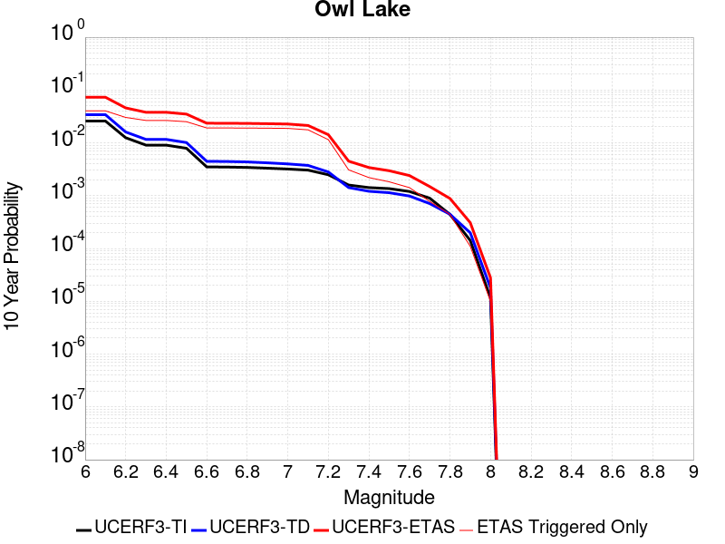 |

| Magnitude | 1 wk TI Prob | 1 wk TD Prob | 1 wk ETAS Prob | 1 wk ETAS/TD Gain | 1 wk ETAS Triggered Only | 1 mo TI Prob | 1 mo TD Prob | 1 mo ETAS Prob | 1 mo ETAS/TD Gain | 1 mo ETAS Triggered Only | 1 yr TI Prob | 1 yr TD Prob | 1 yr ETAS Prob | 1 yr ETAS/TD Gain | 1 yr ETAS Triggered Only | 10 yr TI Prob | 10 yr TD Prob | 10 yr ETAS Prob | 10 yr ETAS/TD Gain | 10 yr ETAS Triggered Only |
|-----|-----|-----|-----|-----|-----|-----|-----|-----|-----|-----|-----|-----|-----|-----|-----|-----|-----|-----|-----|-----|
| 6.0 | 5.0320643E-5 | 6.635816E-5 | 0.026745372 | 403.04572 | 0.026680784 | 2.1564208E-4 | 2.843674E-4 | 0.032091096 | 112.85083 | 0.031815775 | 0.0026222812 | 0.0034577388 | 0.041494105 | 12.000359 | 0.038168345 | 0.02591553 | 0.034140717 | 0.07458512 | 2.1846383 | 0.041874006 |
| 6.1 | 5.0320643E-5 | 6.635816E-5 | 0.026745372 | 403.04572 | 0.026680784 | 2.1564208E-4 | 2.843674E-4 | 0.032091096 | 112.85083 | 0.031815775 | 0.0026222812 | 0.0034577388 | 0.041494105 | 12.000359 | 0.038168345 | 0.02591553 | 0.034140717 | 0.07458512 | 2.1846383 | 0.041874006 |
| 6.2 | 2.4125871E-5 | 3.0981035E-5 | 0.02120555 | 684.4687 | 0.021175224 | 1.0339249E-4 | 1.3277028E-4 | 0.024957426 | 187.97449 | 0.024827952 | 0.0012580766 | 0.001615439 | 0.03089575 | 19.125296 | 0.029327687 | 0.012509781 | 0.016070465 | 0.047739558 | 2.9706395 | 0.03218634 |
| 6.3 | 1.7433485E-5 | 2.2355514E-5 | 0.018762011 | 839.25653 | 0.018740075 | 7.471279E-5 | 9.580672E-5 | 0.022168864 | 231.39154 | 0.022075173 | 9.0924866E-4 | 0.0011659743 | 0.02707538 | 23.221249 | 0.02593965 | 0.009055373 | 0.011628896 | 0.03946444 | 3.3936532 | 0.02816305 |
| 6.4 | 1.7433485E-5 | 2.2355514E-5 | 0.018762011 | 839.25653 | 0.018740075 | 7.471279E-5 | 9.580672E-5 | 0.022168864 | 231.39154 | 0.022075173 | 9.0924866E-4 | 0.0011659743 | 0.02707538 | 23.221249 | 0.02593965 | 0.009055373 | 0.011628896 | 0.03946444 | 3.3936532 | 0.02816305 |
| 6.5 | 1.5182742E-5 | 1.9429144E-5 | 0.017647462 | 908.2984 | 0.017628375 | 6.506727E-5 | 8.326596E-5 | 0.020939127 | 251.47282 | 0.020857597 | 7.919061E-4 | 0.0010134429 | 0.025287388 | 24.951962 | 0.024298571 | 0.0078909 | 0.010118429 | 0.036267232 | 3.5842752 | 0.026416093 |
| 6.6 | 6.7271576E-6 | 8.547361E-6 | 0.01435464 | 1679.4236 | 0.014346215 | 2.8830356E-5 | 3.6631063E-5 | 0.016552702 | 451.87607 | 0.016516676 | 3.5095305E-4 | 4.458976E-4 | 0.019389274 | 43.48369 | 0.018951826 | 0.0035039932 | 0.004467813 | 0.024757907 | 5.5413933 | 0.020381154 |
| 6.7 | 6.682835E-6 | 8.479807E-6 | 0.014354573 | 1692.7948 | 0.014346215 | 2.8640408E-5 | 3.6341557E-5 | 0.016552417 | 455.46802 | 0.016516676 | 3.4864116E-4 | 4.4237426E-4 | 0.019385817 | 43.82221 | 0.018951826 | 0.003480947 | 0.0044327388 | 0.024723548 | 5.577488 | 0.020381154 |
| 6.8 | 6.5774975E-6 | 8.32628E-6 | 0.014248546 | 1711.2739 | 0.0142403385 | 2.8188972E-5 | 3.5683603E-5 | 0.016445898 | 460.88107 | 0.0164108 | 3.4314668E-4 | 4.343669E-4 | 0.019272132 | 44.368324 | 0.01884595 | 0.0034261728 | 0.004352885 | 0.024539907 | 5.637619 | 0.020275278 |
| 6.9 | 6.363419E-6 | 7.999454E-6 | 0.014195287 | 1774.5319 | 0.014187401 | 2.727151E-5 | 3.428296E-5 | 0.016391583 | 478.12628 | 0.016357861 | 3.3198006E-4 | 4.1732067E-4 | 0.019149574 | 45.886955 | 0.018740075 | 0.0033148455 | 0.0041828766 | 0.024215195 | 5.789125 | 0.020116463 |
| 7.0 | 6.1342453E-6 | 7.6316555E-6 | 0.013983173 | 1832.2595 | 0.013975648 | 2.6289357E-5 | 3.2706717E-5 | 0.016178288 | 494.64728 | 0.016146109 | 3.2002592E-4 | 3.9813702E-4 | 0.018919082 | 47.519024 | 0.018528322 | 0.0031956544 | 0.003991571 | 0.023816831 | 5.9667816 | 0.019904712 |
| 7.1 | 5.842926E-6 | 7.142211E-6 | 0.013241563 | 1853.9866 | 0.013234516 | 2.504087E-5 | 3.0609146E-5 | 0.015382177 | 502.5353 | 0.015352038 | 3.0482994E-4 | 3.7260808E-4 | 0.01778274 | 47.725056 | 0.017416622 | 0.0030441214 | 0.0037370329 | 0.022407075 | 5.995953 | 0.018740075 |
| 7.2 | 4.77173E-6 | 5.358483E-6 | 0.008581279 | 1601.438 | 0.008575967 | 2.045011E-5 | 2.2964748E-5 | 0.009922155 | 432.06024 | 0.009899418 | 2.4895166E-4 | 2.79564E-4 | 0.011763912 | 42.079494 | 0.011487559 | 0.0024867293 | 0.002808645 | 0.015478096 | 5.5108767 | 0.012705135 |
| 7.3 | 3.0494948E-6 | 2.710463E-6 | 0.0022790409 | 840.8309 | 0.0022763368 | 1.3069198E-5 | 1.1616219E-5 | 0.0025526136 | 219.74567 | 0.002541027 | 1.5910587E-4 | 1.4141845E-4 | 0.0032643224 | 23.08272 | 0.0031233458 | 0.0015899199 | 0.0014232415 | 0.00470073 | 3.3028338 | 0.0032821598 |
| 7.4 | 2.7263884E-6 | 2.3056762E-6 | 0.0014316301 | 620.91547 | 0.0014293276 | 1.1684469E-5 | 9.881433E-6 | 0.0016509452 | 167.07549 | 0.0016410799 | 1.4224913E-4 | 1.20299905E-4 | 0.0022904994 | 19.03991 | 0.0021704605 | 0.0014215811 | 0.0012112238 | 0.0035376772 | 2.920746 | 0.0023292748 |
| 7.5 | 2.6090431E-6 | 2.1656133E-6 | 0.0011668005 | 538.7852 | 0.0011646374 | 1.1181565E-5 | 9.281167E-6 | 0.0013327204 | 143.59406 | 0.0013234515 | 1.3612706E-4 | 1.1299244E-4 | 0.0019126832 | 16.927532 | 0.0017998941 | 0.001360437 | 0.0011379806 | 0.0030415822 | 2.672789 | 0.0019057703 |
| 7.6 | 2.3008756E-6 | 1.8727933E-6 | 9.0181816E-4 | 481.5364 | 8.999471E-4 | 9.860858E-6 | 8.0262325E-6 | 9.0796605E-4 | 113.12481 | 8.999471E-4 | 1.20049335E-4 | 9.7715085E-5 | 0.0013151716 | 13.459248 | 0.0012175754 | 0.001199845 | 9.849932E-4 | 0.0023071412 | 2.3422916 | 0.0013234515 |
| 7.7 | 1.7184348E-6 | 1.3419171E-6 | 5.836598E-4 | 434.94476 | 5.823187E-4 | 7.3646997E-6 | 5.7510606E-6 | 5.880664E-4 | 102.253555 | 5.823187E-4 | 8.966153E-5 | 7.0016955E-5 | 8.640323E-4 | 12.340329 | 7.9407095E-4 | 8.962536E-4 | 7.078345E-4 | 0.0016071445 | 2.270509 | 8.999471E-4 |
| 7.8 | 8.4612907E-7 | 8.4058576E-7 | 1.5965464E-4 | 189.9326 | 1.5881419E-4 | 3.6262625E-6 | 3.6025056E-6 | 1.6241612E-4 | 45.08421 | 1.5881419E-4 | 4.4148852E-5 | 4.3859643E-5 | 3.6147409E-4 | 8.241611 | 3.1762838E-4 | 4.414008E-4 | 4.4398365E-4 | 8.1438554E-4 | 1.8342693 | 3.7056644E-4 |
| 7.9 | 2.716738E-7 | 3.768106E-7 | 3.768106E-7 | 1.0 | 0.0 | 1.1643157E-6 | 1.6149015E-6 | 1.6149015E-6 | 1.0 | 0.0 | 1.4175452E-5 | 1.966126E-5 | 1.966126E-5 | 1.0 | 0.0 | 1.4174548E-4 | 1.9836679E-4 | 1.9836679E-4 | 1.0 | 0.0 |
| 8.0 | 2.1995428E-8 | 3.384878E-8 | 3.384878E-8 | 1.0 | 0.0 | 9.426611E-8 | 1.4506621E-7 | 1.4506621E-7 | 1.0 | 0.0 | 1.1476893E-6 | 1.7661803E-6 | 1.7661803E-6 | 1.0 | 0.0 | 1.14768345E-5 | 1.7963059E-5 | 1.7963059E-5 | 1.0 | 0.0 |

## Panamint Valley
*[(top)](#table-of-contents)*

| 1 Week | 1 Month | 1 Year | 10 Year |
|-----|-----|-----|-----|
|  |  |  |  |

| Magnitude | 1 wk TI Prob | 1 wk TD Prob | 1 wk ETAS Prob | 1 wk ETAS/TD Gain | 1 wk ETAS Triggered Only | 1 mo TI Prob | 1 mo TD Prob | 1 mo ETAS Prob | 1 mo ETAS/TD Gain | 1 mo ETAS Triggered Only | 1 yr TI Prob | 1 yr TD Prob | 1 yr ETAS Prob | 1 yr ETAS/TD Gain | 1 yr ETAS Triggered Only | 10 yr TI Prob | 10 yr TD Prob | 10 yr ETAS Prob | 10 yr ETAS/TD Gain | 10 yr ETAS Triggered Only |
|-----|-----|-----|-----|-----|-----|-----|-----|-----|-----|-----|-----|-----|-----|-----|-----|-----|-----|-----|-----|-----|
| 6.0 | 3.0211835E-5 | 3.3984514E-5 | 0.017979378 | 529.0462 | 0.017946003 | 1.2947287E-4 | 1.4563995E-4 | 0.02258811 | 155.09557 | 0.022445738 | 0.0015751923 | 0.0017717537 | 0.028986553 | 16.360374 | 0.027263103 | 0.015640736 | 0.017583137 | 0.047851354 | 2.7214344 | 0.030809952 |
| 6.1 | 3.0211835E-5 | 3.3984514E-5 | 0.017979378 | 529.0462 | 0.017946003 | 1.2947287E-4 | 1.4563995E-4 | 0.02258811 | 155.09557 | 0.022445738 | 0.0015751923 | 0.0017717537 | 0.028986553 | 16.360374 | 0.027263103 | 0.015640736 | 0.017583137 | 0.047851354 | 2.7214344 | 0.030809952 |
| 6.2 | 3.0211835E-5 | 3.3984514E-5 | 0.017979378 | 529.0462 | 0.017946003 | 1.2947287E-4 | 1.4563995E-4 | 0.02258811 | 155.09557 | 0.022445738 | 0.0015751923 | 0.0017717537 | 0.028986553 | 16.360374 | 0.027263103 | 0.015640736 | 0.017583137 | 0.047851354 | 2.7214344 | 0.030809952 |
| 6.3 | 2.8573924E-5 | 3.210268E-5 | 0.01723642 | 536.91534 | 0.01720487 | 1.2245393E-4 | 1.3757581E-4 | 0.021680404 | 157.58876 | 0.021545792 | 0.001489857 | 0.0016737265 | 0.027622811 | 16.503778 | 0.02599259 | 0.01479908 | 0.016617801 | 0.045510184 | 2.7386405 | 0.029380625 |
| 6.4 | 2.8573924E-5 | 3.210268E-5 | 0.01723642 | 536.91534 | 0.01720487 | 1.2245393E-4 | 1.3757581E-4 | 0.021680404 | 157.58876 | 0.021545792 | 0.001489857 | 0.0016737265 | 0.027622811 | 16.503778 | 0.02599259 | 0.01479908 | 0.016617801 | 0.045510184 | 2.7386405 | 0.029380625 |
| 6.5 | 2.7468774E-5 | 3.0828433E-5 | 0.016705804 | 541.896 | 0.016675489 | 1.1771801E-4 | 1.3211532E-4 | 0.020881094 | 158.05203 | 0.02075172 | 0.0014322745 | 0.0016073446 | 0.026395388 | 16.421736 | 0.024827952 | 0.014230782 | 0.015963677 | 0.043625046 | 2.7327695 | 0.028110111 |
| 6.6 | 2.6135967E-5 | 2.925248E-5 | 0.016121952 | 551.1311 | 0.01609317 | 1.1200648E-4 | 1.253619E-4 | 0.020080509 | 160.18033 | 0.01995765 | 0.0013628257 | 0.0015252391 | 0.025152462 | 16.490831 | 0.023663314 | 0.013544982 | 0.015154043 | 0.041691184 | 2.7511592 | 0.026945474 |
| 6.7 | 2.4498746E-5 | 2.7341335E-5 | 0.015326023 | 560.54407 | 0.0152991 | 1.04990395E-4 | 1.1717203E-4 | 0.019013846 | 162.2729 | 0.018898888 | 0.0012775084 | 0.0014256609 | 0.023680812 | 16.610409 | 0.022286924 | 0.012701893 | 0.014171274 | 0.03922145 | 2.7676725 | 0.02541027 |
| 6.8 | 2.2244329E-5 | 2.4935423E-5 | 0.014423729 | 578.4433 | 0.014399153 | 9.532935E-5 | 1.0686185E-4 | 0.017786285 | 166.44186 | 0.017681314 | 0.0011600169 | 0.0013002884 | 0.021972157 | 16.897911 | 0.020698782 | 0.011539802 | 0.0129325185 | 0.035976287 | 2.7818468 | 0.023345685 |
| 6.9 | 1.9902658E-5 | 2.2290267E-5 | 0.012621269 | 566.2233 | 0.012599259 | 8.529431E-5 | 9.552632E-5 | 0.015499031 | 162.2488 | 0.015404976 | 0.0010379635 | 0.0011624309 | 0.019034697 | 16.374907 | 0.017893065 | 0.010331288 | 0.011568608 | 0.03160933 | 2.7323365 | 0.020275278 |
| 7.0 | 1.8353881E-5 | 2.0566185E-5 | 0.011560827 | 562.12787 | 0.011540498 | 7.865712E-5 | 8.813792E-5 | 0.014221354 | 161.35342 | 0.014134463 | 9.5722964E-4 | 0.0010725686 | 0.017518647 | 16.333359 | 0.016463738 | 0.009531168 | 0.010678849 | 0.029114055 | 2.7263288 | 0.018634198 |
| 7.1 | 1.7667631E-5 | 1.9772613E-5 | 0.011295357 | 571.26276 | 0.011275807 | 7.571623E-5 | 8.473711E-5 | 0.013794534 | 162.79211 | 0.013710958 | 9.2145515E-4 | 0.0010312037 | 0.016949128 | 16.436258 | 0.015934357 | 0.009176437 | 0.010269073 | 0.028135575 | 2.7398362 | 0.01805188 |
| 7.2 | 1.6381597E-5 | 1.8158249E-5 | 0.010182082 | 560.74133 | 0.010164108 | 7.020495E-5 | 7.781885E-5 | 0.012358493 | 158.81107 | 0.01228163 | 8.544101E-4 | 9.4704994E-4 | 0.015279679 | 16.133974 | 0.014346215 | 0.008511325 | 0.009434792 | 0.025533443 | 2.706307 | 0.016251985 |
| 7.3 | 1.4520491E-5 | 1.5966476E-5 | 0.008380047 | 524.85266 | 0.008364214 | 6.222919E-5 | 6.842605E-5 | 0.010231839 | 149.53134 | 0.010164108 | 7.57377E-4 | 8.327849E-4 | 0.012998399 | 15.608351 | 0.012175755 | 0.0075480095 | 0.00829975 | 0.022106906 | 2.6635628 | 0.01392271 |
| 7.4 | 1.2852287E-5 | 1.4145411E-5 | 0.008166492 | 577.32446 | 0.008152462 | 5.5080065E-5 | 6.062187E-5 | 0.009906504 | 163.4147 | 0.00984648 | 6.7039346E-4 | 7.378371E-4 | 0.0124285165 | 16.844526 | 0.011699311 | 0.0066837464 | 0.0073567946 | 0.020651592 | 2.8071456 | 0.013393329 |
| 7.5 | 1.1637851E-5 | 1.2836797E-5 | 0.008112256 | 631.95325 | 0.008099523 | 4.987555E-5 | 5.5013777E-5 | 0.009848016 | 179.01001 | 0.009793541 | 6.070656E-4 | 6.6960254E-4 | 0.012308178 | 18.381319 | 0.011646374 | 0.006054099 | 0.0066787465 | 0.01993004 | 2.9840991 | 0.013340392 |
| 7.6 | 3.0068115E-6 | 3.3330316E-6 | 0.0035501714 | 1065.1478 | 0.0035468503 | 1.2886271E-5 | 1.4284384E-5 | 0.0040904568 | 286.35864 | 0.004076231 | 1.5687906E-4 | 1.7390578E-4 | 0.0050962893 | 29.30489 | 0.00492324 | 0.0015676835 | 0.0017391363 | 0.0072879656 | 4.190566 | 0.0055584963 |

## Garlock (East)
*[(top)](#table-of-contents)*

| 1 Week | 1 Month | 1 Year | 10 Year |
|-----|-----|-----|-----|
|  |  |  |  |

| Magnitude | 1 wk TI Prob | 1 wk TD Prob | 1 wk ETAS Prob | 1 wk ETAS/TD Gain | 1 wk ETAS Triggered Only | 1 mo TI Prob | 1 mo TD Prob | 1 mo ETAS Prob | 1 mo ETAS/TD Gain | 1 mo ETAS Triggered Only | 1 yr TI Prob | 1 yr TD Prob | 1 yr ETAS Prob | 1 yr ETAS/TD Gain | 1 yr ETAS Triggered Only | 10 yr TI Prob | 10 yr TD Prob | 10 yr ETAS Prob | 10 yr ETAS/TD Gain | 10 yr ETAS Triggered Only |
|-----|-----|-----|-----|-----|-----|-----|-----|-----|-----|-----|-----|-----|-----|-----|-----|-----|-----|-----|-----|-----|
| 6.0 | 4.5092507E-5 | 6.290325E-5 | 0.017054953 | 271.1299 | 0.016993118 | 1.9323928E-4 | 2.6956003E-4 | 0.02106861 | 78.159256 | 0.020804659 | 0.0023501497 | 0.0032774 | 0.027971216 | 8.5345745 | 0.024775013 | 0.023254504 | 0.032351844 | 0.058937836 | 1.8217766 | 0.027474854 |
| 6.1 | 4.5092507E-5 | 6.290325E-5 | 0.017054953 | 271.1299 | 0.016993118 | 1.9323928E-4 | 2.6956003E-4 | 0.02106861 | 78.159256 | 0.020804659 | 0.0023501497 | 0.0032774 | 0.027971216 | 8.5345745 | 0.024775013 | 0.023254504 | 0.032351844 | 0.058937836 | 1.8217766 | 0.027474854 |
| 6.2 | 2.6674514E-5 | 3.4509674E-5 | 0.013109759 | 379.8865 | 0.013075702 | 1.1431433E-4 | 1.4789042E-4 | 0.015762309 | 106.58101 | 0.015616728 | 0.0013908884 | 0.0017991117 | 0.02013557 | 11.191951 | 0.018369507 | 0.01382215 | 0.017890299 | 0.037386917 | 2.0897872 | 0.019851774 |
| 6.3 | 2.6674514E-5 | 3.4509674E-5 | 0.013109759 | 379.8865 | 0.013075702 | 1.1431433E-4 | 1.4789042E-4 | 0.015762309 | 106.58101 | 0.015616728 | 0.0013908884 | 0.0017991117 | 0.02013557 | 11.191951 | 0.018369507 | 0.01382215 | 0.017890299 | 0.037386917 | 2.0897872 | 0.019851774 |
| 6.4 | 2.5312667E-5 | 3.233893E-5 | 0.0128429355 | 397.13547 | 0.012811011 | 1.0847834E-4 | 1.3858822E-4 | 0.015488499 | 111.75913 | 0.015352038 | 0.0013199237 | 0.0016860351 | 0.019707479 | 11.688653 | 0.01805188 | 0.013121112 | 0.016778335 | 0.03593268 | 2.1416118 | 0.019481206 |
| 6.5 | 2.5312667E-5 | 3.233893E-5 | 0.0128429355 | 397.13547 | 0.012811011 | 1.0847834E-4 | 1.3858822E-4 | 0.015488499 | 111.75913 | 0.015352038 | 0.0013199237 | 0.0016860351 | 0.019707479 | 11.688653 | 0.01805188 | 0.013121112 | 0.016778335 | 0.03593268 | 2.1416118 | 0.019481206 |
| 6.6 | 2.246556E-5 | 2.8133776E-5 | 0.012468228 | 443.17648 | 0.012440445 | 9.627742E-5 | 1.20567885E-4 | 0.01499437 | 124.36454 | 0.014875595 | 0.0011715472 | 0.0014669491 | 0.018805161 | 12.819232 | 0.017363684 | 0.011653901 | 0.01461866 | 0.033032615 | 2.25962 | 0.018687136 |
| 6.7 | 2.2241198E-5 | 2.7803519E-5 | 0.012467902 | 448.42892 | 0.012440445 | 9.531594E-5 | 1.1915263E-4 | 0.014940044 | 125.385765 | 0.014822657 | 0.0011598538 | 0.0014497414 | 0.01868253 | 12.886802 | 0.017257808 | 0.011538187 | 0.014448853 | 0.032761637 | 2.267421 | 0.01858126 |
| 6.8 | 1.9528685E-5 | 2.389819E-5 | 0.011828804 | 494.9665 | 0.011805188 | 8.369167E-5 | 1.0241691E-4 | 0.014129567 | 137.96127 | 0.014028586 | 0.0010184698 | 0.0012462323 | 0.017372219 | 13.939793 | 0.016146109 | 0.010138147 | 0.012436427 | 0.02953189 | 2.374628 | 0.017310746 |
| 6.9 | 1.3318621E-5 | 1.5198884E-5 | 0.010549713 | 694.111 | 0.010534675 | 5.7078556E-5 | 6.513648E-5 | 0.012240098 | 187.91463 | 0.012175755 | 6.9470983E-4 | 7.927538E-4 | 0.014598635 | 18.415092 | 0.013816834 | 0.0069254204 | 0.007939888 | 0.022592338 | 2.8454227 | 0.014769719 |
| 7.0 | 1.1760853E-5 | 1.31077895E-5 | 0.010335894 | 788.53076 | 0.010322922 | 5.0402683E-5 | 5.6175057E-5 | 0.011913635 | 212.0805 | 0.011858126 | 6.134799E-4 | 6.8372174E-4 | 0.014014992 | 20.498095 | 0.013340392 | 0.0061178906 | 0.00685652 | 0.021051794 | 3.0703323 | 0.014293277 |
| 7.1 | 1.0064758E-5 | 1.0902931E-5 | 0.00996315 | 913.8048 | 0.009952356 | 4.3133965E-5 | 4.672603E-5 | 0.011480813 | 245.70488 | 0.011434621 | 5.2502943E-4 | 5.687444E-4 | 0.013478286 | 23.698317 | 0.012916887 | 0.005237907 | 0.0057129986 | 0.01939826 | 3.3954606 | 0.013763896 |
| 7.2 | 9.768808E-6 | 1.0498807E-5 | 0.009698062 | 923.73 | 0.009687666 | 4.186565E-5 | 4.499413E-5 | 0.011214423 | 249.2419 | 0.011169931 | 5.095951E-4 | 5.4766936E-4 | 0.013192937 | 24.089237 | 0.012652197 | 0.0050842804 | 0.0055032647 | 0.018928181 | 3.439446 | 0.013499206 |
| 7.3 | 9.344516E-6 | 9.944468E-6 | 0.0086917 | 874.02374 | 0.008681842 | 4.004731E-5 | 4.261847E-5 | 0.0101004215 | 236.99635 | 0.010058232 | 4.8746695E-4 | 5.1875977E-4 | 0.0120003605 | 23.132788 | 0.011487559 | 0.0048639905 | 0.0052149445 | 0.017379865 | 3.3327036 | 0.012228693 |
| 7.4 | 9.023491E-6 | 9.490661E-6 | 0.008003063 | 843.2566 | 0.007993648 | 3.867153E-5 | 4.0673647E-5 | 0.008986842 | 220.95 | 0.008946532 | 4.7072413E-4 | 4.950925E-4 | 0.010654168 | 21.519552 | 0.010164108 | 0.004697283 | 0.0049783974 | 0.015723998 | 3.1584458 | 0.010799365 |
| 7.5 | 7.081253E-6 | 7.087672E-6 | 0.003659788 | 516.3597 | 0.0036527263 | 3.0347876E-5 | 3.0375388E-5 | 0.004424101 | 145.64757 | 0.0043938593 | 3.6942272E-4 | 3.6975832E-4 | 0.0055028517 | 14.882293 | 0.005134992 | 0.003688092 | 0.0037243143 | 0.009262109 | 2.4869301 | 0.0055584963 |
| 7.6 | 6.116396E-6 | 5.959245E-6 | 0.0020705315 | 347.44864 | 0.0020645845 | 2.6212863E-5 | 2.5539372E-5 | 0.002619438 | 102.56471 | 0.002593965 | 3.1909486E-4 | 3.1089774E-4 | 0.003327429 | 10.702648 | 0.0030174695 | 0.0031863707 | 0.0031357552 | 0.006513167 | 2.077065 | 0.003388036 |
| 7.7 | 4.797145E-6 | 4.757281E-6 | 0.0011164513 | 234.68265 | 0.0011116993 | 2.055903E-5 | 2.0388188E-5 | 0.0014496867 | 71.10424 | 0.0014293276 | 2.5027743E-4 | 2.4819805E-4 | 0.0019947204 | 8.03681 | 0.001746956 | 0.0024999576 | 0.0025093474 | 0.0044103353 | 1.7575628 | 0.0019057703 |
| 7.8 | 3.4028885E-6 | 3.978462E-6 | 8.5098407E-4 | 213.89777 | 8.47009E-4 | 1.4583726E-5 | 1.7050439E-5 | 0.0010757936 | 63.094776 | 0.0010587613 | 1.775424E-4 | 2.0756939E-4 | 0.0014778192 | 7.119639 | 0.0012705135 | 0.0017740062 | 0.0021012232 | 0.0035275475 | 1.6788067 | 0.0014293276 |
| 7.9 | 2.5928412E-6 | 3.3724489E-6 | 5.3275126E-4 | 157.97165 | 5.2938063E-4 | 1.1112129E-5 | 1.4453272E-5 | 6.497008E-4 | 44.951817 | 6.3525676E-4 | 1.3528178E-4 | 1.7595445E-4 | 9.169569E-4 | 5.2113314 | 7.411329E-4 | 0.0013519945 | 0.0017812408 | 0.0026795848 | 1.5043361 | 8.999471E-4 |
| 8.0 | 1.3743648E-6 | 1.6734747E-6 | 2.1342537E-4 | 127.53427 | 2.1175225E-4 | 5.8901214E-6 | 7.1720146E-6 | 2.1892275E-4 | 30.524582 | 2.1175225E-4 | 7.1709874E-5 | 8.731581E-5 | 3.51983E-4 | 4.0311484 | 2.6469032E-4 | 7.1686733E-4 | 8.837234E-4 | 0.0011481798 | 1.2992525 | 2.6469032E-4 |
| 8.1 | 3.6733252E-7 | 3.1489964E-7 | 3.1489964E-7 | 1.0 | 0.0 | 1.5742813E-6 | 1.3495693E-6 | 1.3495693E-6 | 1.0 | 0.0 | 1.9166706E-5 | 1.6430899E-5 | 1.6430899E-5 | 1.0 | 0.0 | 1.9165053E-4 | 1.6638759E-4 | 1.6638759E-4 | 1.0 | 0.0 |

## Hunter Mountain-Saline Valley
*[(top)](#table-of-contents)*

| 1 Week | 1 Month | 1 Year | 10 Year |
|-----|-----|-----|-----|
|  |  |  |  |

| Magnitude | 1 wk TI Prob | 1 wk TD Prob | 1 wk ETAS Prob | 1 wk ETAS/TD Gain | 1 wk ETAS Triggered Only | 1 mo TI Prob | 1 mo TD Prob | 1 mo ETAS Prob | 1 mo ETAS/TD Gain | 1 mo ETAS Triggered Only | 1 yr TI Prob | 1 yr TD Prob | 1 yr ETAS Prob | 1 yr ETAS/TD Gain | 1 yr ETAS Triggered Only | 10 yr TI Prob | 10 yr TD Prob | 10 yr ETAS Prob | 10 yr ETAS/TD Gain | 10 yr ETAS Triggered Only |
|-----|-----|-----|-----|-----|-----|-----|-----|-----|-----|-----|-----|-----|-----|-----|-----|-----|-----|-----|-----|-----|
| 6.0 | 4.5103672E-5 | 5.4570177E-5 | 0.008630068 | 158.14624 | 0.008575967 | 1.9328714E-4 | 2.3385242E-4 | 0.01055436 | 45.13257 | 0.010322922 | 0.002350731 | 0.0028435152 | 0.0152485855 | 5.3625827 | 0.012440445 | 0.023260195 | 0.028091887 | 0.041983638 | 1.4945111 | 0.014293277 |
| 6.1 | 4.5103672E-5 | 5.4570177E-5 | 0.008630068 | 158.14624 | 0.008575967 | 1.9328714E-4 | 2.3385242E-4 | 0.01055436 | 45.13257 | 0.010322922 | 0.002350731 | 0.0028435152 | 0.0152485855 | 5.3625827 | 0.012440445 | 0.023260195 | 0.028091887 | 0.041983638 | 1.4945111 | 0.014293277 |
| 6.2 | 3.9363465E-5 | 4.706337E-5 | 0.00856969 | 182.08833 | 0.008523028 | 1.6868966E-4 | 2.0168544E-4 | 0.010469599 | 51.91053 | 0.010269984 | 0.002051862 | 0.0024528175 | 0.01480994 | 6.03793 | 0.012387507 | 0.020330196 | 0.024273481 | 0.038116504 | 1.5702941 | 0.014187401 |
| 6.3 | 3.9363465E-5 | 4.706337E-5 | 0.00856969 | 182.08833 | 0.008523028 | 1.6868966E-4 | 2.0168544E-4 | 0.010469599 | 51.91053 | 0.010269984 | 0.002051862 | 0.0024528175 | 0.01480994 | 6.03793 | 0.012387507 | 0.020330196 | 0.024273481 | 0.038116504 | 1.5702941 | 0.014187401 |
| 6.4 | 3.2311684E-5 | 3.795099E-5 | 0.008401847 | 221.38678 | 0.008364214 | 1.384713E-4 | 1.6263737E-4 | 0.010272163 | 63.159916 | 0.01011117 | 0.0016845843 | 0.0019783843 | 0.01413005 | 7.142217 | 0.012175755 | 0.016718714 | 0.019616475 | 0.03326607 | 1.6958231 | 0.01392271 |
| 6.5 | 3.2311684E-5 | 3.795099E-5 | 0.008401847 | 221.38678 | 0.008364214 | 1.384713E-4 | 1.6263737E-4 | 0.010272163 | 63.159916 | 0.01011117 | 0.0016845843 | 0.0019783843 | 0.01413005 | 7.142217 | 0.012175755 | 0.016718714 | 0.019616475 | 0.03326607 | 1.6958231 | 0.01392271 |
| 6.6 | 2.9305844E-5 | 3.418183E-5 | 0.00839811 | 245.68929 | 0.008364214 | 1.2559042E-4 | 1.4648569E-4 | 0.010256174 | 70.014854 | 0.01011117 | 0.0015279909 | 0.001782067 | 0.01388328 | 7.7905483 | 0.012122816 | 0.015175272 | 0.01768569 | 0.031310167 | 1.7703671 | 0.013869773 |
| 6.7 | 2.7826512E-5 | 3.2344276E-5 | 0.008396287 | 259.59116 | 0.008364214 | 1.19251024E-4 | 1.386113E-4 | 0.01024838 | 73.936104 | 0.01011117 | 0.0014509142 | 0.0016863465 | 0.01378872 | 8.176682 | 0.012122816 | 0.014414776 | 0.016743187 | 0.030380735 | 1.8145133 | 0.013869773 |
| 6.8 | 2.3389874E-5 | 2.6866714E-5 | 0.008390856 | 312.31418 | 0.008364214 | 1.0023846E-4 | 1.15138246E-4 | 0.010225144 | 88.80753 | 0.01011117 | 0.00121972 | 0.001400954 | 0.013506787 | 9.641135 | 0.012122816 | 0.01213047 | 0.013927434 | 0.027604036 | 1.9819901 | 0.013869773 |
| 6.9 | 2.069209E-5 | 2.3570032E-5 | 0.008387587 | 355.8581 | 0.008364214 | 8.867737E-5 | 1.01010715E-4 | 0.010158227 | 100.565834 | 0.010058232 | 0.0010791123 | 0.0012291478 | 0.0131784445 | 10.721611 | 0.011964002 | 0.010738871 | 0.012228523 | 0.025771817 | 2.1075168 | 0.013710958 |
| 7.0 | 1.7462342E-5 | 1.9633546E-5 | 0.008383683 | 427.00812 | 0.008364214 | 7.483646E-5 | 8.414118E-5 | 0.010141526 | 120.529884 | 0.010058232 | 9.1075303E-4 | 0.0010239601 | 0.012975711 | 12.672088 | 0.011964002 | 0.009070295 | 0.0101960525 | 0.023767212 | 2.331021 | 0.013710958 |
| 7.1 | 1.4807709E-5 | 1.6441749E-5 | 0.008221706 | 500.0506 | 0.0082054 | 6.3460066E-5 | 7.046283E-5 | 0.009969183 | 141.48145 | 0.009899418 | 7.723524E-4 | 8.575638E-4 | 0.012652628 | 14.754153 | 0.011805188 | 0.007696735 | 0.008545532 | 0.02192938 | 2.566181 | 0.013499206 |
| 7.2 | 1.4180048E-5 | 1.5698337E-5 | 0.008220969 | 523.6841 | 0.0082054 | 6.077022E-5 | 6.727694E-5 | 0.009966029 | 148.13438 | 0.009899418 | 7.396263E-4 | 8.188051E-4 | 0.012614327 | 15.405774 | 0.011805188 | 0.0073716943 | 0.008160833 | 0.021549875 | 2.6406462 | 0.013499206 |
| 7.3 | 1.3730402E-5 | 1.5172075E-5 | 0.008220447 | 541.8143 | 0.0082054 | 5.8843252E-5 | 6.502165E-5 | 0.009963796 | 153.23813 | 0.009899418 | 7.161811E-4 | 7.9136714E-4 | 0.012587213 | 15.905655 | 0.011805188 | 0.007138774 | 0.007888422 | 0.021281142 | 2.697769 | 0.013499206 |
| 7.4 | 1.2810095E-5 | 1.4109277E-5 | 0.008166456 | 578.8005 | 0.008152462 | 5.489925E-5 | 6.0467017E-5 | 0.009906352 | 163.83066 | 0.00984648 | 6.681934E-4 | 7.359531E-4 | 0.012426655 | 16.885118 | 0.011699311 | 0.006661878 | 0.007338053 | 0.020633101 | 2.811795 | 0.013393329 |
| 7.5 | 1.1595659E-5 | 1.2800664E-5 | 0.00811222 | 633.7344 | 0.008099523 | 4.9694736E-5 | 5.4858923E-5 | 0.009847864 | 179.51251 | 0.009793541 | 6.0486543E-4 | 6.6771836E-4 | 0.012306316 | 18.430399 | 0.011646374 | 0.006032217 | 0.0066599925 | 0.019911537 | 2.9897237 | 0.013340392 |
| 7.6 | 2.997694E-6 | 3.3251579E-6 | 0.0035501635 | 1067.6676 | 0.0035468503 | 1.28471975E-5 | 1.425064E-5 | 0.004090423 | 287.03436 | 0.004076231 | 1.564034E-4 | 1.73495E-4 | 0.0050958805 | 29.371916 | 0.00492324 | 0.0015629337 | 0.001735031 | 0.0072838836 | 4.1981287 | 0.0055584963 |

## Blackwater
*[(top)](#table-of-contents)*

| 1 Week | 1 Month | 1 Year | 10 Year |
|-----|-----|-----|-----|
|  |  |  |  |

| Magnitude | 1 wk TI Prob | 1 wk TD Prob | 1 wk ETAS Prob | 1 wk ETAS/TD Gain | 1 wk ETAS Triggered Only | 1 mo TI Prob | 1 mo TD Prob | 1 mo ETAS Prob | 1 mo ETAS/TD Gain | 1 mo ETAS Triggered Only | 1 yr TI Prob | 1 yr TD Prob | 1 yr ETAS Prob | 1 yr ETAS/TD Gain | 1 yr ETAS Triggered Only | 10 yr TI Prob | 10 yr TD Prob | 10 yr ETAS Prob | 10 yr ETAS/TD Gain | 10 yr ETAS Triggered Only |
|-----|-----|-----|-----|-----|-----|-----|-----|-----|-----|-----|-----|-----|-----|-----|-----|-----|-----|-----|-----|-----|
| 6.0 | 3.0708583E-5 | 3.3095846E-5 | 0.006491326 | 196.13716 | 0.0064584436 | 1.3160157E-4 | 1.4183241E-4 | 0.007922624 | 55.85905 | 0.0077818953 | 0.0016010714 | 0.0017255784 | 0.011924994 | 6.9107227 | 0.010217046 | 0.015895851 | 0.017135633 | 0.029310873 | 1.7105217 | 0.012387507 |
| 6.1 | 3.0708583E-5 | 3.3095846E-5 | 0.006491326 | 196.13716 | 0.0064584436 | 1.3160157E-4 | 1.4183241E-4 | 0.007922624 | 55.85905 | 0.0077818953 | 0.0016010714 | 0.0017255784 | 0.011924994 | 6.9107227 | 0.010217046 | 0.015895851 | 0.017135633 | 0.029310873 | 1.7105217 | 0.012387507 |
| 6.2 | 1.1707779E-5 | 1.2545122E-5 | 0.0021829784 | 174.01013 | 0.0021704605 | 5.017523E-5 | 5.3763757E-5 | 0.0026475894 | 49.244873 | 0.002593965 | 6.107122E-4 | 6.5438676E-4 | 0.003987302 | 6.0931892 | 0.003335098 | 0.006090366 | 0.0065255696 | 0.010890757 | 1.6689358 | 0.0043938593 |
| 6.3 | 1.1707779E-5 | 1.2545122E-5 | 0.0021829784 | 174.01013 | 0.0021704605 | 5.017523E-5 | 5.3763757E-5 | 0.0026475894 | 49.244873 | 0.002593965 | 6.107122E-4 | 6.5438676E-4 | 0.003987302 | 6.0931892 | 0.003335098 | 0.006090366 | 0.0065255696 | 0.010890757 | 1.6689358 | 0.0043938593 |
| 6.4 | 7.929244E-6 | 8.480098E-6 | 0.0014907332 | 175.79199 | 0.0014822658 | 3.3982033E-5 | 3.6342793E-5 | 0.0017832353 | 49.067097 | 0.001746956 | 4.136527E-4 | 4.423877E-4 | 0.0027177173 | 6.143293 | 0.0022763368 | 0.0041288356 | 0.0044154758 | 0.0073669176 | 1.6684312 | 0.0029645315 |
| 6.5 | 5.8832115E-6 | 6.285991E-6 | 0.0010650406 | 169.43082 | 0.0010587613 | 2.521352E-5 | 2.6939697E-5 | 0.001297419 | 48.16012 | 0.0012705135 | 3.0693135E-4 | 3.27944E-4 | 0.0018626443 | 5.6797633 | 0.0015352038 | 0.0030650778 | 0.0032748538 | 0.0052271476 | 1.5961468 | 0.0019587083 |
| 6.6 | 5.8832115E-6 | 6.285991E-6 | 0.0010650406 | 169.43082 | 0.0010587613 | 2.521352E-5 | 2.6939697E-5 | 0.001297419 | 48.16012 | 0.0012705135 | 3.0693135E-4 | 3.27944E-4 | 0.0018626443 | 5.6797633 | 0.0015352038 | 0.0030650778 | 0.0032748538 | 0.0052271476 | 1.5961468 | 0.0019587083 |
| 6.7 | 3.0715053E-6 | 3.2814662E-6 | 2.1503303E-4 | 65.52956 | 2.1175225E-4 | 1.3163528E-5 | 1.4063357E-5 | 3.8462458E-4 | 27.349415 | 3.7056644E-4 | 1.6025416E-4 | 1.7120909E-4 | 5.946411E-4 | 3.4731865 | 4.235045E-4 | 0.0016013865 | 0.0017108864 | 0.0022922088 | 1.3397785 | 5.823187E-4 |
| 6.8 | 2.2722281E-6 | 2.4287538E-6 | 1.6124255E-4 | 66.389015 | 1.5881419E-4 | 9.738084E-6 | 1.0408908E-5 | 1.6922144E-4 | 16.257368 | 1.5881419E-4 | 1.1855473E-4 | 1.26722E-4 | 3.3844743E-4 | 2.6707866 | 2.1175225E-4 | 0.001184915 | 0.0012665876 | 0.0016366846 | 1.2922002 | 3.7056644E-4 |
| 6.9 | 9.952399E-7 | 1.0653489E-6 | 5.4003354E-5 | 50.69077 | 5.2938063E-5 | 4.265307E-6 | 4.5657757E-6 | 5.7503596E-5 | 12.594485 | 5.2938063E-5 | 5.1928873E-5 | 5.5587418E-5 | 1.6145766E-4 | 2.904572 | 1.05876126E-4 | 5.191674E-4 | 5.557858E-4 | 7.6742034E-4 | 1.3807844 | 2.1175225E-4 |
| 7.0 | 4.7385504E-7 | 5.0755597E-7 | 5.344559E-5 | 105.299904 | 5.2938063E-5 | 2.0308057E-6 | 2.1752398E-6 | 5.511319E-5 | 25.336603 | 5.2938063E-5 | 2.4724779E-5 | 2.6483543E-5 | 7.9420206E-5 | 2.998851 | 5.2938063E-5 | 2.4722028E-4 | 2.6483546E-4 | 3.7068353E-4 | 1.3996749 | 1.05876126E-4 |

## Ash Hill
*[(top)](#table-of-contents)*

| 1 Week | 1 Month | 1 Year | 10 Year |
|-----|-----|-----|-----|
|  |  |  |  |

| Magnitude | 1 wk TI Prob | 1 wk TD Prob | 1 wk ETAS Prob | 1 wk ETAS/TD Gain | 1 wk ETAS Triggered Only | 1 mo TI Prob | 1 mo TD Prob | 1 mo ETAS Prob | 1 mo ETAS/TD Gain | 1 mo ETAS Triggered Only | 1 yr TI Prob | 1 yr TD Prob | 1 yr ETAS Prob | 1 yr ETAS/TD Gain | 1 yr ETAS Triggered Only | 10 yr TI Prob | 10 yr TD Prob | 10 yr ETAS Prob | 10 yr ETAS/TD Gain | 10 yr ETAS Triggered Only |
|-----|-----|-----|-----|-----|-----|-----|-----|-----|-----|-----|-----|-----|-----|-----|-----|-----|-----|-----|-----|-----|
| 6.0 | 2.1545662E-5 | 2.3194447E-5 | 0.005899183 | 254.33601 | 0.005876125 | 9.2335285E-5 | 9.940143E-5 | 0.0072982623 | 73.422104 | 0.0071995766 | 0.0011236023 | 0.0012096206 | 0.010198206 | 8.430913 | 0.008999471 | 0.011179381 | 0.012038348 | 0.022550805 | 1.8732474 | 0.01064055 |
| 6.1 | 2.1545662E-5 | 2.3194447E-5 | 0.005899183 | 254.33601 | 0.005876125 | 9.2335285E-5 | 9.940143E-5 | 0.0072982623 | 73.422104 | 0.0071995766 | 0.0011236023 | 0.0012096206 | 0.010198206 | 8.430913 | 0.008999471 | 0.011179381 | 0.012038348 | 0.022550805 | 1.8732474 | 0.01064055 |
| 6.2 | 2.1545662E-5 | 2.3194447E-5 | 0.005899183 | 254.33601 | 0.005876125 | 9.2335285E-5 | 9.940143E-5 | 0.0072982623 | 73.422104 | 0.0071995766 | 0.0011236023 | 0.0012096206 | 0.010198206 | 8.430913 | 0.008999471 | 0.011179381 | 0.012038348 | 0.022550805 | 1.8732474 | 0.01064055 |
| 6.3 | 1.0025529E-5 | 1.0746934E-5 | 0.0023399966 | 217.7362 | 0.0023292748 | 4.2965847E-5 | 4.605755E-5 | 0.0029045814 | 63.06417 | 0.0028586553 | 5.229836E-4 | 5.6061964E-4 | 0.003946756 | 7.0399895 | 0.003388036 | 0.005217545 | 0.0055933665 | 0.009488871 | 1.696451 | 0.0039174166 |
| 6.4 | 1.0025529E-5 | 1.0746934E-5 | 0.0023399966 | 217.7362 | 0.0023292748 | 4.2965847E-5 | 4.605755E-5 | 0.0029045814 | 63.06417 | 0.0028586553 | 5.229836E-4 | 5.6061964E-4 | 0.003946756 | 7.0399895 | 0.003388036 | 0.005217545 | 0.0055933665 | 0.009488871 | 1.696451 | 0.0039174166 |
| 6.5 | 6.9617327E-6 | 7.456634E-6 | 0.001542649 | 206.88275 | 0.0015352038 | 2.9835655E-5 | 3.195666E-5 | 0.001937666 | 60.634182 | 0.0019057703 | 3.6318856E-4 | 3.8901155E-4 | 0.0026644627 | 6.849315 | 0.0022763368 | 0.0036259557 | 0.0038841602 | 0.0065207826 | 1.6788139 | 0.002646903 |
| 6.6 | 4.9919777E-6 | 5.3466883E-6 | 0.0013817289 | 258.42706 | 0.0013763896 | 2.1394015E-5 | 2.2914215E-5 | 0.0016639566 | 72.61678 | 0.0016410799 | 2.60441E-4 | 2.7895154E-4 | 0.0022371134 | 8.01972 | 0.0019587083 | 0.0026013597 | 0.0027866727 | 0.005003875 | 1.7956452 | 0.0022233985 |
| 6.7 | 3.6630722E-6 | 3.924624E-6 | 0.0011156196 | 284.26154 | 0.0011116993 | 1.5698786E-5 | 1.681974E-5 | 0.0013931862 | 82.83043 | 0.0013763896 | 1.9111596E-4 | 2.0476682E-4 | 0.001898438 | 9.271218 | 0.001694018 | 0.0019095168 | 0.0020463446 | 0.003948215 | 1.9293989 | 0.0019057703 |
| 6.8 | 2.5599613E-6 | 2.744925E-6 | 7.968137E-4 | 290.28613 | 7.9407095E-4 | 1.0971216E-5 | 1.1763939E-5 | 9.6463785E-4 | 81.99956 | 9.5288514E-4 | 1.3356637E-4 | 1.4322149E-4 | 0.001307692 | 9.130557 | 0.0011646374 | 0.0013348613 | 0.0014317769 | 0.0027533337 | 1.9230186 | 0.0013234515 |
| 6.9 | 1.7684905E-6 | 1.8968707E-6 | 6.371524E-4 | 335.8966 | 6.3525676E-4 | 7.579223E-6 | 8.129446E-6 | 6.963187E-4 | 85.65389 | 6.881948E-4 | 9.2273134E-5 | 9.8976E-5 | 9.98834E-4 | 10.091679 | 8.999471E-4 | 9.223483E-4 | 9.8976E-4 | 0.0020474733 | 2.0686562 | 0.0010587613 |

## Garlock (West)
*[(top)](#table-of-contents)*

| 1 Week | 1 Month | 1 Year | 10 Year |
|-----|-----|-----|-----|
|  |  |  |  |

| Magnitude | 1 wk TI Prob | 1 wk TD Prob | 1 wk ETAS Prob | 1 wk ETAS/TD Gain | 1 wk ETAS Triggered Only | 1 mo TI Prob | 1 mo TD Prob | 1 mo ETAS Prob | 1 mo ETAS/TD Gain | 1 mo ETAS Triggered Only | 1 yr TI Prob | 1 yr TD Prob | 1 yr ETAS Prob | 1 yr ETAS/TD Gain | 1 yr ETAS Triggered Only | 10 yr TI Prob | 10 yr TD Prob | 10 yr ETAS Prob | 10 yr ETAS/TD Gain | 10 yr ETAS Triggered Only |
|-----|-----|-----|-----|-----|-----|-----|-----|-----|-----|-----|-----|-----|-----|-----|-----|-----|-----|-----|-----|-----|
| 6.0 | 2.5181727E-5 | 2.51973E-5 | 0.006695225 | 265.712 | 0.006670196 | 1.0791722E-4 | 1.0798398E-4 | 0.007783174 | 72.07712 | 0.007676019 | 0.0013131002 | 0.0013139155 | 0.010513036 | 8.001303 | 0.009211223 | 0.013053683 | 0.013141977 | 0.022859054 | 1.7393924 | 0.00984648 |
| 6.1 | 2.5077732E-5 | 2.5098372E-5 | 0.0066951266 | 266.75543 | 0.006670196 | 1.0747157E-4 | 1.0756004E-4 | 0.0077827536 | 72.3573 | 0.007676019 | 0.001307681 | 0.0013087603 | 0.010507928 | 8.028917 | 0.009211223 | 0.013000126 | 0.013091032 | 0.022808611 | 1.742308 | 0.00984648 |
| 6.2 | 2.494612E-5 | 2.498005E-5 | 0.0066950093 | 268.01425 | 0.006670196 | 1.0690756E-4 | 1.0705298E-4 | 0.00778225 | 72.69531 | 0.007676019 | 0.0013008224 | 0.0013025942 | 0.010501819 | 8.062233 | 0.009211223 | 0.012932341 | 0.013030097 | 0.022748277 | 1.7458255 | 0.00984648 |
| 6.3 | 2.4733758E-5 | 2.479942E-5 | 0.00669483 | 269.95914 | 0.006670196 | 1.0599751E-4 | 1.06278916E-4 | 0.0077814823 | 73.21755 | 0.007676019 | 0.0012897556 | 0.0012931811 | 0.0104924925 | 8.113707 | 0.009211223 | 0.012822957 | 0.012937066 | 0.022656161 | 1.7512596 | 0.00984648 |
| 6.4 | 2.3237335E-5 | 2.317873E-5 | 0.0066932198 | 288.7656 | 0.006670196 | 9.958477E-5 | 9.933365E-5 | 0.00777459 | 78.26744 | 0.007676019 | 0.0012117702 | 0.001208719 | 0.0104088085 | 8.611438 | 0.009211223 | 0.012051838 | 0.012101916 | 0.021829234 | 1.8037833 | 0.00984648 |
| 6.5 | 2.2732203E-5 | 2.2993298E-5 | 0.006693036 | 291.08636 | 0.006670196 | 9.742009E-5 | 9.8539E-5 | 0.0077738017 | 78.89061 | 0.007676019 | 0.0011854442 | 0.0011990548 | 0.010399233 | 8.672858 | 0.009211223 | 0.011791403 | 0.012006322 | 0.021734582 | 1.8102614 | 0.00984648 |
| 6.6 | 2.1319436E-5 | 2.17735E-5 | 0.0066388873 | 304.90677 | 0.006617258 | 9.136581E-5 | 9.331167E-5 | 0.0077156816 | 82.6872 | 0.007623081 | 0.001111811 | 0.0011354799 | 0.010283366 | 9.056405 | 0.009158284 | 0.011062649 | 0.011377227 | 0.021059344 | 1.8510087 | 0.009793541 |
| 6.7 | 1.970802E-5 | 2.0393396E-5 | 0.0066375164 | 325.47382 | 0.006617258 | 8.446021E-5 | 8.739735E-5 | 0.007709812 | 88.21563 | 0.007623081 | 0.001027818 | 0.001063545 | 0.01021209 | 9.601934 | 0.009158284 | 0.010230771 | 0.010664964 | 0.020354059 | 1.9084976 | 0.009793541 |
| 6.8 | 1.8744462E-5 | 1.9901045E-5 | 0.006637027 | 333.50143 | 0.006617258 | 8.033094E-5 | 8.5287415E-5 | 0.0077077183 | 90.37346 | 0.007623081 | 9.775903E-4 | 0.0010378812 | 0.010186661 | 9.814861 | 0.009158284 | 0.009733009 | 0.01041075 | 0.020102333 | 1.9309207 | 0.009793541 |
| 6.9 | 1.7559682E-5 | 1.8953415E-5 | 0.006636086 | 350.12613 | 0.006617258 | 7.5253614E-5 | 8.12264E-5 | 0.007703688 | 94.84217 | 0.007623081 | 9.158276E-4 | 9.884841E-4 | 0.01008483 | 10.202318 | 0.009105347 | 0.0091206245 | 0.009921231 | 0.019565197 | 1.9720532 | 0.009740603 |
| 7.0 | 1.6794445E-5 | 1.8216237E-5 | 0.0065824166 | 361.34885 | 0.0065643196 | 7.197421E-5 | 7.8067256E-5 | 0.007647619 | 97.96193 | 0.007570143 | 8.759337E-4 | 9.5005584E-4 | 0.009993864 | 10.519239 | 0.009052409 | 0.008724891 | 0.009540141 | 0.019135384 | 2.005776 | 0.009687666 |
| 7.1 | 1.6337795E-5 | 1.7717046E-5 | 0.0065819207 | 371.50217 | 0.0065643196 | 7.0017246E-5 | 7.5927994E-5 | 0.007645496 | 100.69404 | 0.007570143 | 8.521265E-4 | 9.240326E-4 | 0.009968077 | 10.787581 | 0.009052409 | 0.008488664 | 0.009281996 | 0.018879741 | 2.0340173 | 0.009687666 |
| 7.2 | 1.5780008E-5 | 1.7165687E-5 | 0.0065284357 | 380.31894 | 0.006511382 | 6.762685E-5 | 7.356516E-5 | 0.007537283 | 102.45724 | 0.007464267 | 8.2304585E-4 | 8.9528906E-4 | 0.009833812 | 10.983952 | 0.008946532 | 0.008200042 | 0.008996838 | 0.018492421 | 2.0554357 | 0.009581789 |
| 7.3 | 1.5058865E-5 | 1.6618762E-5 | 0.0065278923 | 392.80255 | 0.006511382 | 6.45364E-5 | 7.122133E-5 | 0.0075349566 | 105.79635 | 0.007464267 | 7.854473E-4 | 8.667759E-4 | 0.009805554 | 11.3126745 | 0.008946532 | 0.00782677 | 0.008713539 | 0.018211836 | 2.0900621 | 0.009581789 |
| 7.4 | 1.4887923E-5 | 1.6454731E-5 | 0.006474792 | 393.49118 | 0.0064584436 | 6.380382E-5 | 7.051838E-5 | 0.0074813245 | 106.090416 | 0.0074113286 | 7.7653467E-4 | 8.582243E-4 | 0.009744186 | 11.353892 | 0.008893594 | 0.0077382675 | 0.008628399 | 0.018075032 | 2.0948303 | 0.009528851 |
| 7.5 | 1.4509299E-5 | 1.6046748E-5 | 0.0059979516 | 373.77988 | 0.005982001 | 6.218123E-5 | 6.876997E-5 | 0.006950245 | 101.06511 | 0.006881948 | 7.567935E-4 | 8.36954E-4 | 0.009035486 | 10.795679 | 0.0082054 | 0.0075422134 | 0.008416704 | 0.017130459 | 2.0352929 | 0.008787719 |
| 7.6 | 1.2756717E-5 | 1.4050848E-5 | 0.0037196632 | 264.72873 | 0.0037056643 | 5.4670498E-5 | 6.0216535E-5 | 0.0042950064 | 71.326035 | 0.004235045 | 6.6541E-4 | 7.328904E-4 | 0.0057583204 | 7.8570013 | 0.005029116 | 0.006634211 | 0.0073816874 | 0.012899153 | 1.7474531 | 0.0055584963 |
| 7.7 | 1.0328985E-5 | 1.1460557E-5 | 0.002287771 | 199.62129 | 0.0022763368 | 4.4266326E-5 | 4.911575E-5 | 0.0026429533 | 53.81071 | 0.002593965 | 5.388092E-4 | 5.978206E-4 | 0.0037722054 | 6.309929 | 0.0031762838 | 0.0053750467 | 0.006038511 | 0.0095113255 | 1.575111 | 0.003493912 |
| 7.8 | 7.0306583E-6 | 8.899601E-6 | 0.0015440898 | 173.501 | 0.0015352038 | 3.0131043E-5 | 3.814059E-5 | 0.00178503 | 46.80132 | 0.001746956 | 3.667837E-4 | 4.642629E-4 | 0.0026337157 | 5.6728973 | 0.0021704605 | 0.003661789 | 0.0046952725 | 0.0070663 | 1.5049819 | 0.0023822128 |
| 7.9 | 4.060633E-6 | 5.4653938E-6 | 8.5246976E-4 | 155.9759 | 8.47009E-4 | 1.7402595E-5 | 2.3422906E-5 | 9.762857E-4 | 41.68081 | 9.5288514E-4 | 2.11856E-4 | 2.851367E-4 | 0.001396519 | 4.897718 | 0.0011116993 | 0.0021165414 | 0.002884201 | 0.00415105 | 1.4392375 | 0.0012705135 |
| 8.0 | 1.6729537E-6 | 2.0775144E-6 | 2.1382932E-4 | 102.92556 | 2.1175225E-4 | 7.169782E-6 | 8.903603E-6 | 2.2065396E-4 | 24.782549 | 2.1175225E-4 | 8.7288594E-5 | 1.0839601E-4 | 3.730576E-4 | 3.4416177 | 2.6469032E-4 | 8.7254314E-4 | 0.0010969337 | 0.0013613338 | 1.2410355 | 2.6469032E-4 |
| 8.1 | 3.6733252E-7 | 3.1489964E-7 | 3.1489964E-7 | 1.0 | 0.0 | 1.5742813E-6 | 1.3495693E-6 | 1.3495693E-6 | 1.0 | 0.0 | 1.9166706E-5 | 1.6430899E-5 | 1.6430899E-5 | 1.0 | 0.0 | 1.9165053E-4 | 1.6638759E-4 | 1.6638759E-4 | 1.0 | 0.0 |

## McLean Lake
*[(top)](#table-of-contents)*

| 1 Week | 1 Month | 1 Year | 10 Year |
|-----|-----|-----|-----|
|  |  |  |  |

| Magnitude | 1 wk TI Prob | 1 wk TD Prob | 1 wk ETAS Prob | 1 wk ETAS/TD Gain | 1 wk ETAS Triggered Only | 1 mo TI Prob | 1 mo TD Prob | 1 mo ETAS Prob | 1 mo ETAS/TD Gain | 1 mo ETAS Triggered Only | 1 yr TI Prob | 1 yr TD Prob | 1 yr ETAS Prob | 1 yr ETAS/TD Gain | 1 yr ETAS Triggered Only | 10 yr TI Prob | 10 yr TD Prob | 10 yr ETAS Prob | 10 yr ETAS/TD Gain | 10 yr ETAS Triggered Only |
|-----|-----|-----|-----|-----|-----|-----|-----|-----|-----|-----|-----|-----|-----|-----|-----|-----|-----|-----|-----|-----|
| 6.0 | 1.7360222E-5 | 1.8501627E-5 | 0.0035123492 | 189.84001 | 0.003493912 | 7.439883E-5 | 7.9290556E-5 | 0.0046845367 | 59.080643 | 0.0046056113 | 9.0542925E-4 | 9.6498354E-4 | 0.007575856 | 7.8507614 | 0.006617258 | 0.009017491 | 0.0096127745 | 0.017267436 | 1.7963009 | 0.007728957 |
| 6.1 | 9.062689E-6 | 9.592193E-6 | 0.0020212193 | 210.71503 | 0.0020116463 | 3.8839516E-5 | 4.1108804E-5 | 0.0026349672 | 64.0974 | 0.002593965 | 4.727685E-4 | 5.003936E-4 | 0.0040983805 | 8.190313 | 0.0035997883 | 0.0047176396 | 0.004993552 | 0.009049428 | 1.8122227 | 0.004076231 |
| 6.2 | 9.062689E-6 | 9.592193E-6 | 0.0020212193 | 210.71503 | 0.0020116463 | 3.8839516E-5 | 4.1108804E-5 | 0.0026349672 | 64.0974 | 0.002593965 | 4.727685E-4 | 5.003936E-4 | 0.0040983805 | 8.190313 | 0.0035997883 | 0.0047176396 | 0.004993552 | 0.009049428 | 1.8122227 | 0.004076231 |
| 6.3 | 7.2575485E-6 | 7.66771E-6 | 0.0015428597 | 201.21521 | 0.0015352038 | 3.110341E-5 | 3.2861237E-5 | 0.0020973778 | 63.825283 | 0.0020645845 | 3.786182E-4 | 4.0001926E-4 | 0.0030987805 | 7.746578 | 0.0026998413 | 0.0037797375 | 0.0039936965 | 0.0071572955 | 1.792148 | 0.0031762838 |
| 6.4 | 7.2575485E-6 | 7.66771E-6 | 0.0015428597 | 201.21521 | 0.0015352038 | 3.110341E-5 | 3.2861237E-5 | 0.0020973778 | 63.825283 | 0.0020645845 | 3.786182E-4 | 4.0001926E-4 | 0.0030987805 | 7.746578 | 0.0026998413 | 0.0037797375 | 0.0039936965 | 0.0071572955 | 1.792148 | 0.0031762838 |
| 6.5 | 6.06582E-6 | 6.4038773E-6 | 0.0012769093 | 199.39627 | 0.0012705135 | 2.5996113E-5 | 2.7444936E-5 | 0.0018272897 | 66.580215 | 0.0017998941 | 3.164567E-4 | 3.3409733E-4 | 0.002662594 | 7.9695153 | 0.0023292748 | 0.0031600643 | 0.0033365893 | 0.006132945 | 1.8380882 | 0.0028057173 |
| 6.6 | 5.598744E-6 | 5.910262E-6 | 0.0011705408 | 198.05225 | 0.0011646374 | 2.3994397E-5 | 2.5329486E-5 | 0.0017193046 | 67.877594 | 0.001694018 | 2.9209262E-4 | 3.0834923E-4 | 0.0025310623 | 8.208427 | 0.0022233985 | 0.0029170897 | 0.003079843 | 0.005665819 | 1.8396454 | 0.002593965 |
| 6.7 | 5.246996E-6 | 5.539162E-6 | 0.0011172324 | 201.69699 | 0.0011116993 | 2.2486933E-5 | 2.3739085E-5 | 0.0016118432 | 67.898285 | 0.0015881419 | 2.73744E-4 | 2.8899137E-4 | 0.0023529793 | 8.142039 | 0.0020645845 | 0.0027340704 | 0.0028867796 | 0.0052621155 | 1.8228325 | 0.0023822128 |
| 6.8 | 4.02324E-6 | 4.2469046E-6 | 9.041901E-4 | 212.9057 | 8.999471E-4 | 1.7242342E-5 | 1.8200926E-5 | 0.0013416284 | 73.7121 | 0.0013234515 | 2.099053E-4 | 2.2157968E-4 | 0.0019152224 | 8.643492 | 0.001694018 | 0.0020970714 | 0.002214172 | 0.0041685435 | 1.8826647 | 0.0019587083 |
| 6.9 | 6.835972E-7 | 7.1399285E-7 | 2.124661E-4 | 297.57455 | 2.1175225E-4 | 2.9296991E-6 | 3.0599674E-6 | 3.2068737E-4 | 104.80091 | 3.1762838E-4 | 3.56685E-5 | 3.7254784E-5 | 4.607435E-4 | 12.367364 | 4.235045E-4 | 3.5662777E-4 | 3.7251666E-4 | 7.958634E-4 | 2.1364505 | 4.235045E-4 |

## Gravel Hills-Harper Lk
*[(top)](#table-of-contents)*

| 1 Week | 1 Month | 1 Year | 10 Year |
|-----|-----|-----|-----|
|  |  |  |  |

| Magnitude | 1 wk TI Prob | 1 wk TD Prob | 1 wk ETAS Prob | 1 wk ETAS/TD Gain | 1 wk ETAS Triggered Only | 1 mo TI Prob | 1 mo TD Prob | 1 mo ETAS Prob | 1 mo ETAS/TD Gain | 1 mo ETAS Triggered Only | 1 yr TI Prob | 1 yr TD Prob | 1 yr ETAS Prob | 1 yr ETAS/TD Gain | 1 yr ETAS Triggered Only | 10 yr TI Prob | 10 yr TD Prob | 10 yr ETAS Prob | 10 yr ETAS/TD Gain | 10 yr ETAS Triggered Only |
|-----|-----|-----|-----|-----|-----|-----|-----|-----|-----|-----|-----|-----|-----|-----|-----|-----|-----|-----|-----|-----|
| 6.0 | 3.0679566E-5 | 3.1464646E-5 | 0.0034193941 | 108.674164 | 0.003388036 | 1.3147724E-4 | 1.3484273E-4 | 0.0045810402 | 33.97321 | 0.004446797 | 0.0015995599 | 0.0016406906 | 0.0071900673 | 4.382342 | 0.0055584963 | 0.015880952 | 0.01630734 | 0.022400089 | 1.3736202 | 0.0061937533 |
| 6.1 | 3.0679566E-5 | 3.1464646E-5 | 0.0034193941 | 108.674164 | 0.003388036 | 1.3147724E-4 | 1.3484273E-4 | 0.0045810402 | 33.97321 | 0.004446797 | 0.0015995599 | 0.0016406906 | 0.0071900673 | 4.382342 | 0.0055584963 | 0.015880952 | 0.01630734 | 0.022400089 | 1.3736202 | 0.0061937533 |
| 6.2 | 1.514536E-5 | 1.3635206E-5 | 0.0010194447 | 74.76562 | 0.0010058231 | 6.490707E-5 | 5.843536E-5 | 0.0013818096 | 23.646807 | 0.0013234515 | 7.8995706E-4 | 7.1123015E-4 | 0.002351143 | 3.3057413 | 0.0016410799 | 0.007871548 | 0.0070907404 | 0.008772747 | 1.2372116 | 0.001694018 |
| 6.3 | 1.514536E-5 | 1.3635206E-5 | 0.0010194447 | 74.76562 | 0.0010058231 | 6.490707E-5 | 5.843536E-5 | 0.0013818096 | 23.646807 | 0.0013234515 | 7.8995706E-4 | 7.1123015E-4 | 0.002351143 | 3.3057413 | 0.0016410799 | 0.007871548 | 0.0070907404 | 0.008772747 | 1.2372116 | 0.001694018 |
| 6.4 | 1.2532521E-5 | 1.06896905E-5 | 5.930021E-4 | 55.47421 | 5.823187E-4 | 5.37097E-5 | 4.581219E-5 | 8.3984673E-4 | 18.332386 | 7.9407095E-4 | 6.537194E-4 | 5.576265E-4 | 0.0016157973 | 2.8976338 | 0.0010587613 | 0.0065179965 | 0.005562863 | 0.006615734 | 1.1892679 | 0.0010587613 |
| 6.5 | 1.1094058E-5 | 9.083664E-6 | 3.2670915E-4 | 35.966675 | 3.1762838E-4 | 4.7545094E-5 | 3.892943E-5 | 4.6241743E-4 | 11.878352 | 4.235045E-4 | 5.787078E-4 | 4.7386673E-4 | 0.0010559094 | 2.2282836 | 5.823187E-4 | 0.0057720304 | 0.0047289706 | 0.0053085354 | 1.1225562 | 5.823187E-4 |
| 6.6 | 9.688328E-6 | 7.5316952E-6 | 1.6634469E-4 | 22.085957 | 1.5881419E-4 | 4.1520743E-5 | 3.227831E-5 | 2.969601E-4 | 9.199989 | 2.6469032E-4 | 5.053978E-4 | 3.9292008E-4 | 8.162582E-4 | 2.0774152 | 4.235045E-4 | 0.0050424994 | 0.0039225104 | 0.004344354 | 1.1075442 | 4.235045E-4 |
| 6.7 | 8.974824E-6 | 6.749413E-6 | 1.12624824E-4 | 16.68661 | 1.05876126E-4 | 3.8462964E-5 | 2.8925748E-5 | 1.8773534E-4 | 6.49025 | 1.5881419E-4 | 4.6818596E-4 | 3.5211627E-4 | 6.1671337E-4 | 1.7514482 | 2.6469032E-4 | 0.004672008 | 0.0035158044 | 0.0037795643 | 1.0750211 | 2.6469032E-4 |
| 6.8 | 7.4780046E-6 | 5.1161933E-6 | 1.1099178E-4 | 21.694212 | 1.05876126E-4 | 3.20482E-5 | 2.1926366E-5 | 1.2780017E-4 | 5.828607 | 1.05876126E-4 | 3.9011694E-4 | 2.669222E-4 | 4.25694E-4 | 1.5948243 | 1.5881419E-4 | 0.0038943281 | 0.0026661542 | 0.002824545 | 1.059408 | 1.5881419E-4 |
| 6.9 | 6.3409307E-6 | 3.9074966E-6 | 1.0978321E-4 | 28.095533 | 1.05876126E-4 | 2.7175134E-5 | 1.6746313E-5 | 1.2262067E-4 | 7.3222485 | 1.05876126E-4 | 3.3080703E-4 | 2.0386827E-4 | 3.6265008E-4 | 1.7788451 | 1.5881419E-4 | 0.0033031502 | 0.0020369107 | 0.0021954014 | 1.0778093 | 1.5881419E-4 |
| 7.0 | 5.1239335E-6 | 2.6058565E-6 | 2.6058565E-6 | 1.0 | 0.0 | 2.195953E-5 | 1.116791E-5 | 1.116791E-5 | 1.0 | 0.0 | 2.6732447E-4 | 1.3596108E-4 | 1.8889194E-4 | 1.3893089 | 5.2938063E-5 | 0.0026700313 | 0.0013588042 | 0.0014116704 | 1.0389063 | 5.2938063E-5 |
| 7.1 | 4.438899E-6 | 2.0984728E-6 | 2.0984728E-6 | 1.0 | 0.0 | 1.9023713E-5 | 8.993425E-6 | 8.993425E-6 | 1.0 | 0.0 | 2.315891E-4 | 1.0948967E-4 | 1.6242193E-4 | 1.4834453 | 5.2938063E-5 | 0.002313479 | 0.0010943791 | 0.0011472593 | 1.0483197 | 5.2938063E-5 |
| 7.2 | 3.50367E-6 | 1.2615716E-6 | 1.2615716E-6 | 1.0 | 0.0 | 1.5015643E-5 | 5.4067245E-6 | 5.4067245E-6 | 1.0 | 0.0 | 1.8280011E-4 | 6.582497E-5 | 6.582497E-5 | 1.0 | 0.0 | 0.0018264982 | 6.580629E-4 | 6.580629E-4 | 1.0 | 0.0 |
| 7.3 | 2.561638E-6 | 7.1191585E-7 | 7.1191585E-7 | 1.0 | 0.0 | 1.0978401E-5 | 3.0510646E-6 | 3.0510646E-6 | 1.0 | 0.0 | 1.3365384E-4 | 3.71461E-5 | 3.71461E-5 | 1.0 | 0.0 | 0.0013357349 | 3.7140088E-4 | 3.7140088E-4 | 1.0 | 0.0 |
| 7.4 | 2.0368864E-6 | 5.304837E-7 | 5.304837E-7 | 1.0 | 0.0 | 8.729483E-6 | 2.2734996E-6 | 2.2734996E-6 | 1.0 | 0.0 | 1.06276275E-4 | 2.7679513E-5 | 2.7679513E-5 | 1.0 | 0.0 | 0.0010622547 | 2.767612E-4 | 2.767612E-4 | 1.0 | 0.0 |
| 7.5 | 1.1681728E-6 | 3.6030585E-7 | 3.6030585E-7 | 1.0 | 0.0 | 5.0064455E-6 | 1.544167E-6 | 1.544167E-6 | 1.0 | 0.0 | 6.0951766E-5 | 1.8800076E-5 | 1.8800076E-5 | 1.0 | 0.0 | 6.093505E-4 | 1.8798532E-4 | 1.8798532E-4 | 1.0 | 0.0 |
| 7.6 | 1.3154387E-7 | 7.1197384E-8 | 7.1197384E-8 | 1.0 | 0.0 | 5.6375933E-7 | 3.051316E-7 | 3.051316E-7 | 1.0 | 0.0 | 6.863748E-6 | 3.7149728E-6 | 3.7149728E-6 | 1.0 | 0.0 | 6.863536E-5 | 3.7149264E-5 | 3.7149264E-5 | 1.0 | 0.0 |

## Goldstone Lake
*[(top)](#table-of-contents)*

| 1 Week | 1 Month | 1 Year | 10 Year |
|-----|-----|-----|-----|
|  | 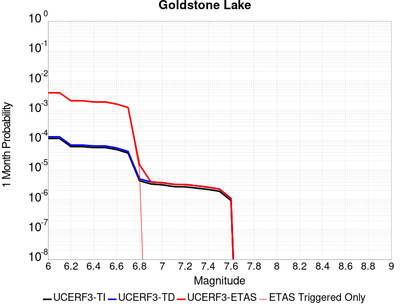 |  |  |

| Magnitude | 1 wk TI Prob | 1 wk TD Prob | 1 wk ETAS Prob | 1 wk ETAS/TD Gain | 1 wk ETAS Triggered Only | 1 mo TI Prob | 1 mo TD Prob | 1 mo ETAS Prob | 1 mo ETAS/TD Gain | 1 mo ETAS Triggered Only | 1 yr TI Prob | 1 yr TD Prob | 1 yr ETAS Prob | 1 yr ETAS/TD Gain | 1 yr ETAS Triggered Only | 10 yr TI Prob | 10 yr TD Prob | 10 yr ETAS Prob | 10 yr ETAS/TD Gain | 10 yr ETAS Triggered Only |
|-----|-----|-----|-----|-----|-----|-----|-----|-----|-----|-----|-----|-----|-----|-----|-----|-----|-----|-----|-----|-----|
| 6.0 | 2.671352E-5 | 3.037609E-5 | 0.0022007707 | 72.45076 | 0.0021704605 | 1.1448149E-4 | 1.3017785E-4 | 0.0033589792 | 25.803001 | 0.0032292218 | 0.001392921 | 0.0015839594 | 0.006499401 | 4.1032624 | 0.00492324 | 0.013842222 | 0.015746197 | 0.021165064 | 1.3441381 | 0.0055055586 |
| 6.1 | 2.671352E-5 | 3.037609E-5 | 0.0022007707 | 72.45076 | 0.0021704605 | 1.1448149E-4 | 1.3017785E-4 | 0.0033589792 | 25.803001 | 0.0032292218 | 0.001392921 | 0.0015839594 | 0.006499401 | 4.1032624 | 0.00492324 | 0.013842222 | 0.015746197 | 0.021165064 | 1.3441381 | 0.0055055586 |
| 6.2 | 1.4197047E-5 | 1.6096245E-5 | 8.101544E-4 | 50.33189 | 7.9407095E-4 | 6.0843064E-5 | 6.8982634E-5 | 0.0013394085 | 19.416603 | 0.0012705135 | 7.4051257E-4 | 8.3963864E-4 | 0.0030611705 | 3.645819 | 0.0022233985 | 0.007380498 | 0.0083743585 | 0.010894107 | 1.3008884 | 0.002541027 |
| 6.3 | 1.4197047E-5 | 1.6096245E-5 | 8.101544E-4 | 50.33189 | 7.9407095E-4 | 6.0843064E-5 | 6.8982634E-5 | 0.0013394085 | 19.416603 | 0.0012705135 | 7.4051257E-4 | 8.3963864E-4 | 0.0030611705 | 3.645819 | 0.0022233985 | 0.007380498 | 0.0083743585 | 0.010894107 | 1.3008884 | 0.002541027 |
| 6.4 | 1.3238931E-5 | 1.500846E-5 | 7.561302E-4 | 50.38027 | 7.411329E-4 | 5.6737044E-5 | 6.4320935E-5 | 0.0011759488 | 18.282518 | 0.0011116993 | 6.9055456E-4 | 7.82924E-4 | 0.0027929954 | 3.5673902 | 0.0020116463 | 0.006884126 | 0.0078112837 | 0.010122363 | 1.2958643 | 0.0023292748 |
| 6.5 | 1.3238931E-5 | 1.500846E-5 | 7.561302E-4 | 50.38027 | 7.411329E-4 | 5.6737044E-5 | 6.4320935E-5 | 0.0011759488 | 18.282518 | 0.0011116993 | 6.9055456E-4 | 7.82924E-4 | 0.0027929954 | 3.5673902 | 0.0020116463 | 0.006884126 | 0.0078112837 | 0.010122363 | 1.2958643 | 0.0023292748 |
| 6.6 | 1.1328278E-5 | 1.2855166E-5 | 7.0104114E-4 | 54.53381 | 6.881948E-4 | 4.8548856E-5 | 5.5092944E-5 | 0.0010079256 | 18.295004 | 9.5288514E-4 | 5.90922E-4 | 6.7064585E-4 | 0.0023106253 | 3.4453733 | 0.0016410799 | 0.0058935313 | 0.0066956086 | 0.008588619 | 1.2827241 | 0.0019057703 |
| 6.7 | 8.651175E-6 | 9.824565E-6 | 3.8038736E-4 | 38.717987 | 3.7056644E-4 | 3.707594E-5 | 4.2105108E-5 | 5.7146343E-4 | 13.572307 | 5.2938063E-4 | 4.5130608E-4 | 5.1259965E-4 | 0.0016237291 | 3.1676362 | 0.0011116993 | 0.0045039062 | 0.005123051 | 0.0064397226 | 1.2570093 | 0.0013234515 |
| 6.8 | 1.0215377E-6 | 1.1754702E-6 | 1.1754702E-6 | 1.0 | 0.0 | 4.378012E-6 | 5.0377203E-6 | 5.0377203E-6 | 1.0 | 0.0 | 5.3300988E-5 | 6.1332634E-5 | 1.6720226E-4 | 2.726155 | 1.05876126E-4 | 5.3288206E-4 | 6.1316835E-4 | 7.7188516E-4 | 1.258847 | 1.5881419E-4 |
| 6.9 | 7.9360774E-7 | 9.2833966E-7 | 9.2833966E-7 | 1.0 | 0.0 | 3.4011714E-6 | 3.9785928E-6 | 3.9785928E-6 | 1.0 | 0.0 | 4.1408475E-5 | 4.843836E-5 | 1.0137386E-4 | 2.0928426 | 5.2938063E-5 | 4.140076E-4 | 4.8428503E-4 | 5.3719745E-4 | 1.1092589 | 5.2938063E-5 |
| 7.0 | 7.4382757E-7 | 8.7473285E-7 | 8.7473285E-7 | 1.0 | 0.0 | 3.1878285E-6 | 3.74885E-6 | 3.74885E-6 | 1.0 | 0.0 | 3.8811122E-5 | 4.564136E-5 | 4.564136E-5 | 1.0 | 0.0 | 3.8804344E-4 | 4.5632652E-4 | 4.5632652E-4 | 1.0 | 0.0 |
| 7.1 | 6.4709513E-7 | 7.7113E-7 | 7.7113E-7 | 1.0 | 0.0 | 2.773262E-6 | 3.3048389E-6 | 3.3048389E-6 | 1.0 | 0.0 | 3.376394E-5 | 4.0235733E-5 | 4.0235733E-5 | 1.0 | 0.0 | 3.375881E-4 | 4.0229043E-4 | 4.0229043E-4 | 1.0 | 0.0 |
| 7.2 | 6.356704E-7 | 7.5883594E-7 | 7.5883594E-7 | 1.0 | 0.0 | 2.7242988E-6 | 3.2521505E-6 | 3.2521505E-6 | 1.0 | 0.0 | 3.3167835E-5 | 3.959427E-5 | 3.959427E-5 | 1.0 | 0.0 | 3.3162883E-4 | 3.958781E-4 | 3.958781E-4 | 1.0 | 0.0 |
| 7.3 | 5.7695723E-7 | 6.8965653E-7 | 6.8965653E-7 | 1.0 | 0.0 | 2.4726714E-6 | 2.9556677E-6 | 2.9556677E-6 | 1.0 | 0.0 | 3.0104358E-5 | 3.5984718E-5 | 3.5984718E-5 | 1.0 | 0.0 | 3.0100282E-4 | 3.5979465E-4 | 3.5979465E-4 | 1.0 | 0.0 |
| 7.4 | 5.209647E-7 | 6.193514E-7 | 6.193514E-7 | 1.0 | 0.0 | 2.232704E-6 | 2.6543607E-6 | 2.6543607E-6 | 1.0 | 0.0 | 2.718283E-5 | 3.2316417E-5 | 3.2316417E-5 | 1.0 | 0.0 | 2.7179506E-4 | 3.2312275E-4 | 3.2312275E-4 | 1.0 | 0.0 |
| 7.5 | 4.512955E-7 | 5.348885E-7 | 5.348885E-7 | 1.0 | 0.0 | 1.934122E-6 | 2.2923775E-6 | 2.2923775E-6 | 1.0 | 0.0 | 2.3547682E-5 | 2.7909393E-5 | 2.7909393E-5 | 1.0 | 0.0 | 2.3545188E-4 | 2.7906417E-4 | 2.7906417E-4 | 1.0 | 0.0 |
| 7.6 | 2.21172E-7 | 2.603961E-7 | 2.603961E-7 | 1.0 | 0.0 | 9.478797E-7 | 1.1159829E-6 | 1.1159829E-6 | 1.0 | 0.0 | 1.1540374E-5 | 1.3587036E-5 | 1.3587036E-5 | 1.0 | 0.0 | 1.1539775E-4 | 1.3586486E-4 | 1.3586486E-4 | 1.0 | 0.0 |

## So Sierra Nevada
*[(top)](#table-of-contents)*

| 1 Week | 1 Month | 1 Year | 10 Year |
|-----|-----|-----|-----|
|  |  | 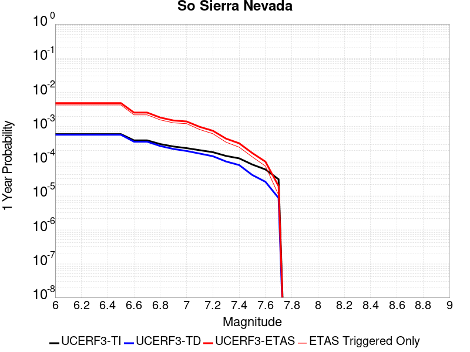 |  |

| Magnitude | 1 wk TI Prob | 1 wk TD Prob | 1 wk ETAS Prob | 1 wk ETAS/TD Gain | 1 wk ETAS Triggered Only | 1 mo TI Prob | 1 mo TD Prob | 1 mo ETAS Prob | 1 mo ETAS/TD Gain | 1 mo ETAS Triggered Only | 1 yr TI Prob | 1 yr TD Prob | 1 yr ETAS Prob | 1 yr ETAS/TD Gain | 1 yr ETAS Triggered Only | 10 yr TI Prob | 10 yr TD Prob | 10 yr ETAS Prob | 10 yr ETAS/TD Gain | 10 yr ETAS Triggered Only |
|-----|-----|-----|-----|-----|-----|-----|-----|-----|-----|-----|-----|-----|-----|-----|-----|-----|-----|-----|-----|-----|
| 6.0 | 1.15488665E-5 | 1.1079643E-5 | 0.0028697033 | 259.00687 | 0.0028586553 | 4.9494203E-5 | 4.748339E-5 | 0.003382423 | 71.23382 | 0.003335098 | 6.024253E-4 | 5.7796965E-4 | 0.0048634745 | 8.414757 | 0.0042879833 | 0.006007948 | 0.005765934 | 0.01071342 | 1.8580545 | 0.004976178 |
| 6.1 | 1.15488665E-5 | 1.1079643E-5 | 0.0028697033 | 259.00687 | 0.0028586553 | 4.9494203E-5 | 4.748339E-5 | 0.003382423 | 71.23382 | 0.003335098 | 6.024253E-4 | 5.7796965E-4 | 0.0048634745 | 8.414757 | 0.0042879833 | 0.006007948 | 0.005765934 | 0.01071342 | 1.8580545 | 0.004976178 |
| 6.2 | 1.15488665E-5 | 1.1079643E-5 | 0.0028697033 | 259.00687 | 0.0028586553 | 4.9494203E-5 | 4.748339E-5 | 0.003382423 | 71.23382 | 0.003335098 | 6.024253E-4 | 5.7796965E-4 | 0.0048634745 | 8.414757 | 0.0042879833 | 0.006007948 | 0.005765934 | 0.01071342 | 1.8580545 | 0.004976178 |
| 6.3 | 1.15488665E-5 | 1.1079643E-5 | 0.0028697033 | 259.00687 | 0.0028586553 | 4.9494203E-5 | 4.748339E-5 | 0.003382423 | 71.23382 | 0.003335098 | 6.024253E-4 | 5.7796965E-4 | 0.0048634745 | 8.414757 | 0.0042879833 | 0.006007948 | 0.005765934 | 0.01071342 | 1.8580545 | 0.004976178 |
| 6.4 | 1.15488665E-5 | 1.1079643E-5 | 0.0028697033 | 259.00687 | 0.0028586553 | 4.9494203E-5 | 4.748339E-5 | 0.003382423 | 71.23382 | 0.003335098 | 6.024253E-4 | 5.7796965E-4 | 0.0048634745 | 8.414757 | 0.0042879833 | 0.006007948 | 0.005765934 | 0.01071342 | 1.8580545 | 0.004976178 |
| 6.5 | 1.15488665E-5 | 1.1079643E-5 | 0.0028697033 | 259.00687 | 0.0028586553 | 4.9494203E-5 | 4.748339E-5 | 0.003382423 | 71.23382 | 0.003335098 | 6.024253E-4 | 5.7796965E-4 | 0.0048634745 | 8.414757 | 0.0042879833 | 0.006007948 | 0.005765934 | 0.01071342 | 1.8580545 | 0.004976178 |
| 6.6 | 7.587044E-6 | 6.935635E-6 | 0.0015421289 | 222.3486 | 0.0015352038 | 3.2515498E-5 | 2.9723828E-5 | 0.001776628 | 59.771168 | 0.001746956 | 3.9580427E-4 | 3.6183043E-4 | 0.0024256678 | 6.70388 | 0.0020645845 | 0.003951 | 0.0036127048 | 0.005828071 | 1.6132153 | 0.0022233985 |
| 6.7 | 7.587044E-6 | 6.935635E-6 | 0.0015421289 | 222.3486 | 0.0015352038 | 3.2515498E-5 | 2.9723828E-5 | 0.001776628 | 59.771168 | 0.001746956 | 3.9580427E-4 | 3.6183043E-4 | 0.0024256678 | 6.70388 | 0.0020645845 | 0.003951 | 0.0036127048 | 0.005828071 | 1.6132153 | 0.0022233985 |
| 6.8 | 5.9026956E-6 | 5.1793927E-6 | 0.0013286241 | 256.5212 | 0.0013234515 | 2.5297022E-5 | 2.2197215E-5 | 0.0015044301 | 67.77562 | 0.0014822658 | 3.0794772E-4 | 2.7021873E-4 | 0.001963779 | 7.267368 | 0.001694018 | 0.0030752132 | 0.002699018 | 0.0045468495 | 1.684631 | 0.0018528322 |
| 6.9 | 5.0118915E-6 | 4.2524252E-6 | 0.0010630091 | 249.97716 | 0.0010587613 | 2.1479358E-5 | 1.8224557E-5 | 0.0011828407 | 64.90367 | 0.0011646374 | 2.614798E-4 | 2.2186211E-4 | 0.0015979464 | 7.2024302 | 0.0013763896 | 0.0026117235 | 0.0022164788 | 0.003695459 | 1.6672658 | 0.0014822658 |
| 7.0 | 4.4924795E-6 | 3.7139177E-6 | 0.0010095334 | 271.82437 | 0.0010058231 | 1.925334E-5 | 1.5916696E-5 | 0.0011275983 | 70.84374 | 0.0011116993 | 2.3438422E-4 | 1.9376918E-4 | 0.0014640365 | 7.5555696 | 0.0012705135 | 0.0023413717 | 0.0019360651 | 0.00330979 | 1.7095448 | 0.0013763896 |
| 7.1 | 3.9118436E-6 | 3.1119775E-6 | 6.3836674E-4 | 205.13219 | 6.3525676E-4 | 1.6764936E-5 | 1.3336982E-5 | 7.5446E-4 | 56.56902 | 7.411329E-4 | 2.0409399E-4 | 1.6236622E-4 | 0.0010092377 | 6.215811 | 8.47009E-4 | 0.0020390663 | 0.001622532 | 0.002573871 | 1.5863299 | 9.5288514E-4 |
| 7.2 | 3.4200818E-6 | 2.6054543E-6 | 6.3786056E-4 | 244.8174 | 6.3525676E-4 | 1.4657411E-5 | 1.11661875E-5 | 6.993533E-4 | 62.63134 | 6.881948E-4 | 1.7843937E-4 | 1.3594035E-4 | 9.2990336E-4 | 6.8405247 | 7.9407095E-4 | 0.0017829615 | 0.0013586218 | 0.0022573462 | 1.6614971 | 8.999471E-4 |
| 7.3 | 2.6593618E-6 | 1.8284203E-6 | 4.782701E-4 | 261.5756 | 4.7644257E-4 | 1.13972155E-5 | 7.836065E-6 | 4.842749E-4 | 61.800777 | 4.7644257E-4 | 1.3875226E-4 | 9.540021E-5 | 6.247303E-4 | 6.5485215 | 5.2938063E-4 | 0.0013866565 | 9.5362146E-4 | 0.0015353848 | 1.6100569 | 5.823187E-4 |
| 7.4 | 2.2577992E-6 | 1.436438E-6 | 2.6612636E-4 | 185.26826 | 2.6469032E-4 | 9.676246E-6 | 6.15615E-6 | 2.7084484E-4 | 43.995815 | 2.6469032E-4 | 1.1780193E-4 | 7.49488E-5 | 3.9255337E-4 | 5.2376204 | 3.1762838E-4 | 0.001177395 | 7.492603E-4 | 0.0010666507 | 1.423605 | 3.1762838E-4 |
| 7.5 | 1.489319E-6 | 7.353936E-7 | 1.5954947E-4 | 216.95792 | 1.5881419E-4 | 6.3827797E-6 | 3.1516831E-6 | 1.6196536E-4 | 51.390118 | 1.5881419E-4 | 7.770758E-5 | 3.8371072E-5 | 2.501152E-4 | 6.518327 | 2.1175225E-4 | 7.7680405E-4 | 3.836449E-4 | 5.953159E-4 | 1.5517368 | 2.1175225E-4 |
| 7.6 | 1.0680322E-6 | 4.6596554E-7 | 1.0634204E-4 | 228.21867 | 1.05876126E-4 | 4.577273E-6 | 1.9969937E-6 | 1.07872904E-4 | 54.01765 | 1.05876126E-4 | 5.5726876E-5 | 2.4313129E-5 | 1.8312345E-4 | 7.531875 | 1.5881419E-4 | 5.5712904E-4 | 2.4310495E-4 | 4.0188053E-4 | 1.6531154 | 1.5881419E-4 |
| 7.7 | 5.509146E-7 | 1.5580486E-7 | 1.5580486E-7 | 1.0 | 0.0 | 2.3610605E-6 | 6.677349E-7 | 6.677349E-7 | 1.0 | 0.0 | 2.8745531E-5 | 8.129644E-6 | 8.129644E-6 | 1.0 | 0.0 | 2.8741814E-4 | 8.1293576E-5 | 8.1293576E-5 | 1.0 | 0.0 |

## Coyote Canyon
*[(top)](#table-of-contents)*

| 1 Week | 1 Month | 1 Year | 10 Year |
|-----|-----|-----|-----|
|  |  |  |  |

| Magnitude | 1 wk TI Prob | 1 wk TD Prob | 1 wk ETAS Prob | 1 wk ETAS/TD Gain | 1 wk ETAS Triggered Only | 1 mo TI Prob | 1 mo TD Prob | 1 mo ETAS Prob | 1 mo ETAS/TD Gain | 1 mo ETAS Triggered Only | 1 yr TI Prob | 1 yr TD Prob | 1 yr ETAS Prob | 1 yr ETAS/TD Gain | 1 yr ETAS Triggered Only | 10 yr TI Prob | 10 yr TD Prob | 10 yr ETAS Prob | 10 yr ETAS/TD Gain | 10 yr ETAS Triggered Only |
|-----|-----|-----|-----|-----|-----|-----|-----|-----|-----|-----|-----|-----|-----|-----|-----|-----|-----|-----|-----|-----|
| 6.0 | 3.5090034E-5 | 4.0364324E-5 | 0.0014696344 | 36.40924 | 0.0014293276 | 1.503772E-4 | 1.7297994E-4 | 0.002343065 | 13.5453 | 0.0021704605 | 0.0018293047 | 0.0021042528 | 0.0054851593 | 2.6067019 | 0.003388036 | 0.018143194 | 0.020869201 | 0.024756698 | 1.1862792 | 0.003970355 |
| 6.1 | 3.5090034E-5 | 4.0364324E-5 | 0.0014696344 | 36.40924 | 0.0014293276 | 1.503772E-4 | 1.7297994E-4 | 0.002343065 | 13.5453 | 0.0021704605 | 0.0018293047 | 0.0021042528 | 0.0054851593 | 2.6067019 | 0.003388036 | 0.018143194 | 0.020869201 | 0.024756698 | 1.1862792 | 0.003970355 |
| 6.2 | 1.841879E-5 | 2.1059794E-5 | 8.6805096E-4 | 41.2184 | 8.47009E-4 | 7.8935285E-5 | 9.0253714E-5 | 0.0013077193 | 14.489368 | 0.0012175754 | 9.606133E-4 | 0.001098387 | 0.0030549439 | 2.7813 | 0.0019587083 | 0.0095647145 | 0.010939667 | 0.013191101 | 1.2058047 | 0.0022763368 |
| 6.3 | 1.841879E-5 | 2.1059794E-5 | 8.6805096E-4 | 41.2184 | 8.47009E-4 | 7.8935285E-5 | 9.0253714E-5 | 0.0013077193 | 14.489368 | 0.0012175754 | 9.606133E-4 | 0.001098387 | 0.0030549439 | 2.7813 | 0.0019587083 | 0.0095647145 | 0.010939667 | 0.013191101 | 1.2058047 | 0.0022763368 |
| 6.4 | 1.712201E-5 | 1.9565212E-5 | 8.1362063E-4 | 41.585064 | 7.9407095E-4 | 7.337798E-5 | 8.3848776E-5 | 0.0011954549 | 14.257273 | 0.0011116993 | 8.930107E-4 | 0.0010204813 | 0.0028714228 | 2.8137925 | 0.0018528322 | 0.008894307 | 0.010167871 | 0.012316262 | 1.2112921 | 0.0021704605 |
| 6.5 | 1.4744935E-5 | 1.6836972E-5 | 8.1089453E-4 | 48.161545 | 7.9407095E-4 | 6.3191044E-5 | 7.215698E-5 | 0.0011837761 | 16.405565 | 0.0011116993 | 7.6907943E-4 | 8.7825063E-4 | 0.002676564 | 3.0476084 | 0.0017998941 | 0.007664232 | 0.008756994 | 0.010855974 | 1.2396917 | 0.0021175225 |
| 6.6 | 1.2017839E-5 | 1.37240895E-5 | 7.019095E-4 | 51.144337 | 6.881948E-4 | 5.150401E-5 | 5.88167E-5 | 9.057759E-4 | 15.399979 | 8.47009E-4 | 6.268809E-4 | 7.159466E-4 | 0.0020913507 | 2.921099 | 0.0013763896 | 0.0062511545 | 0.0071450938 | 0.008721888 | 1.2206821 | 0.0015881419 |
| 6.7 | 1.00956095E-5 | 1.1533517E-5 | 6.997204E-4 | 60.668434 | 6.881948E-4 | 4.326618E-5 | 4.942891E-5 | 8.434606E-4 | 17.064116 | 7.9407095E-4 | 5.266384E-4 | 6.017178E-4 | 0.0018714668 | 3.1102068 | 0.0012705135 | 0.005253921 | 0.0060094125 | 0.007482771 | 1.2451751 | 0.0014822658 |

## Death Valley (So)
*[(top)](#table-of-contents)*

| 1 Week | 1 Month | 1 Year | 10 Year |
|-----|-----|-----|-----|
| 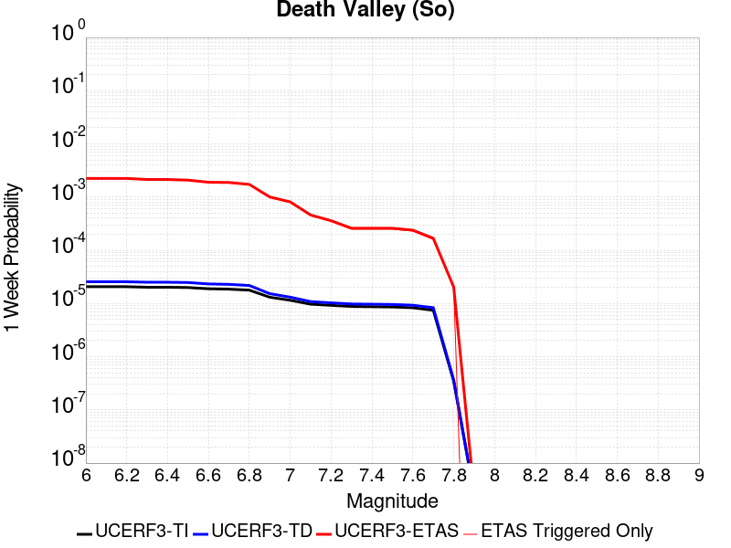 |  |  |  |

| Magnitude | 1 wk TI Prob | 1 wk TD Prob | 1 wk ETAS Prob | 1 wk ETAS/TD Gain | 1 wk ETAS Triggered Only | 1 mo TI Prob | 1 mo TD Prob | 1 mo ETAS Prob | 1 mo ETAS/TD Gain | 1 mo ETAS Triggered Only | 1 yr TI Prob | 1 yr TD Prob | 1 yr ETAS Prob | 1 yr ETAS/TD Gain | 1 yr ETAS Triggered Only | 10 yr TI Prob | 10 yr TD Prob | 10 yr ETAS Prob | 10 yr ETAS/TD Gain | 10 yr ETAS Triggered Only |
|-----|-----|-----|-----|-----|-----|-----|-----|-----|-----|-----|-----|-----|-----|-----|-----|-----|-----|-----|-----|-----|
| 6.0 | 2.0684236E-5 | 2.5617775E-5 | 0.0026724532 | 104.32026 | 0.002646903 | 8.864371E-5 | 1.0978594E-4 | 0.0035503823 | 32.339134 | 0.003440974 | 0.0010787029 | 0.0013358411 | 0.005459494 | 4.0869336 | 0.004129169 | 0.010734817 | 0.013281397 | 0.01772137 | 1.3343002 | 0.0044997353 |
| 6.1 | 2.0684236E-5 | 2.5617775E-5 | 0.0026724532 | 104.32026 | 0.002646903 | 8.864371E-5 | 1.0978594E-4 | 0.0035503823 | 32.339134 | 0.003440974 | 0.0010787029 | 0.0013358411 | 0.005459494 | 4.0869336 | 0.004129169 | 0.010734817 | 0.013281397 | 0.01772137 | 1.3343002 | 0.0044997353 |
| 6.2 | 2.0684236E-5 | 2.5617775E-5 | 0.0026724532 | 104.32026 | 0.002646903 | 8.864371E-5 | 1.0978594E-4 | 0.0035503823 | 32.339134 | 0.003440974 | 0.0010787029 | 0.0013358411 | 0.005459494 | 4.0869336 | 0.004129169 | 0.010734817 | 0.013281397 | 0.01772137 | 1.3343002 | 0.0044997353 |
| 6.3 | 2.0240292E-5 | 2.511786E-5 | 0.0024602076 | 97.94654 | 0.0024351508 | 8.6741224E-5 | 1.07643624E-4 | 0.0032835854 | 30.504225 | 0.0031762838 | 0.0010555626 | 0.00130979 | 0.0050634695 | 3.8658636 | 0.0037586025 | 0.010505628 | 0.013023956 | 0.017047098 | 1.3089032 | 0.004076231 |
| 6.4 | 2.0240292E-5 | 2.511786E-5 | 0.0024602076 | 97.94654 | 0.0024351508 | 8.6741224E-5 | 1.07643624E-4 | 0.0032835854 | 30.504225 | 0.0031762838 | 0.0010555626 | 0.00130979 | 0.0050634695 | 3.8658636 | 0.0037586025 | 0.010505628 | 0.013023956 | 0.017047098 | 1.3089032 | 0.004076231 |
| 6.5 | 1.9962767E-5 | 2.4807114E-5 | 0.0022481505 | 90.62524 | 0.0022233985 | 8.55519E-5 | 1.0631196E-4 | 0.0030705284 | 28.882246 | 0.0029645315 | 0.0010410968 | 0.0012935963 | 0.0048358585 | 3.7383056 | 0.0035468503 | 0.010362327 | 0.012863902 | 0.016626412 | 1.2924858 | 0.0038115405 |
| 6.6 | 1.8937297E-5 | 2.3310964E-5 | 0.0020349105 | 87.29413 | 0.0020116463 | 8.115732E-5 | 9.990039E-5 | 0.0027994718 | 28.02263 | 0.0026998413 | 9.876423E-4 | 0.0012156231 | 0.0044409195 | 3.653204 | 0.0032292218 | 0.009832645 | 0.012092789 | 0.0154921515 | 1.2811066 | 0.003440974 |
| 6.7 | 1.8621096E-5 | 2.2911607E-5 | 0.0020345119 | 88.79831 | 0.0020116463 | 7.980225E-5 | 9.818898E-5 | 0.0027448323 | 27.954584 | 0.002646903 | 9.711593E-4 | 0.0011948098 | 0.0043672984 | 3.6552248 | 0.0031762838 | 0.009669261 | 0.011886904 | 0.015182358 | 1.277234 | 0.003335098 |
| 6.8 | 1.7830353E-5 | 2.1805688E-5 | 0.0019275344 | 88.39594 | 0.0019057703 | 7.641356E-5 | 9.344968E-5 | 0.0026342392 | 28.188852 | 0.002541027 | 9.29938E-4 | 0.00113717 | 0.00409833 | 3.6039732 | 0.0029645315 | 0.009260561 | 0.011316354 | 0.014404356 | 1.2728795 | 0.0031233458 |
| 6.9 | 1.3135183E-5 | 1.5303925E-5 | 0.0011269862 | 73.64034 | 0.0011116993 | 5.6292425E-5 | 6.558664E-5 | 0.0014948206 | 22.791542 | 0.0014293276 | 6.8514474E-4 | 7.982312E-4 | 0.0025437928 | 3.186787 | 0.001746956 | 0.006830362 | 0.007954649 | 0.009792742 | 1.2310716 | 0.0018528322 |
| 7.0 | 1.1507512E-5 | 1.3154199E-5 | 9.1308943E-4 | 69.41429 | 8.999471E-4 | 4.9316975E-5 | 5.6373956E-5 | 0.0011150755 | 19.779976 | 0.0010587613 | 6.002687E-4 | 6.8614254E-4 | 0.0019028826 | 2.773305 | 0.0012175754 | 0.0059864987 | 0.0068409415 | 0.008155339 | 1.192137 | 0.0013234515 |
| 7.1 | 9.715903E-6 | 1.0865278E-5 | 5.4024014E-4 | 49.721706 | 5.2938063E-4 | 4.1638916E-5 | 4.656467E-5 | 6.8179186E-4 | 14.641827 | 6.3525676E-4 | 5.068359E-4 | 5.667817E-4 | 0.0013604026 | 2.4002233 | 7.9407095E-4 | 0.0050568148 | 0.0056538144 | 0.0064960346 | 1.148965 | 8.47009E-4 |
| 7.2 | 9.233269E-6 | 1.02863105E-5 | 4.8672396E-4 | 47.317642 | 4.7644257E-4 | 3.9570554E-5 | 4.4083466E-5 | 6.263765E-4 | 14.208876 | 5.823187E-4 | 4.81665E-4 | 5.3658825E-4 | 0.0012773235 | 2.3804536 | 7.411329E-4 | 0.0048062233 | 0.0053533576 | 0.006143178 | 1.1475374 | 7.9407095E-4 |
| 7.3 | 8.8041315E-6 | 9.808164E-6 | 3.8037097E-4 | 38.781055 | 3.7056644E-4 | 3.7731446E-5 | 4.2034335E-5 | 4.6552104E-4 | 11.07478 | 4.235045E-4 | 4.592835E-4 | 5.1165203E-4 | 0.0010936728 | 2.1375322 | 5.823187E-4 | 0.0045833546 | 0.005105167 | 0.005737181 | 1.1237988 | 6.3525676E-4 |
| 7.4 | 8.708749E-6 | 9.707175E-6 | 3.8027E-4 | 39.174118 | 3.7056644E-4 | 3.7322676E-5 | 4.160154E-5 | 4.650884E-4 | 11.179597 | 4.235045E-4 | 4.5430884E-4 | 5.0638523E-4 | 0.001088409 | 2.1493697 | 5.823187E-4 | 0.004533812 | 0.0050527398 | 0.0056847865 | 1.12509 | 6.3525676E-4 |
| 7.5 | 8.612678E-6 | 9.604817E-6 | 3.801677E-4 | 39.58094 | 3.7056644E-4 | 3.6910955E-5 | 4.1162875E-5 | 4.6464996E-4 | 11.288082 | 4.235045E-4 | 4.492982E-4 | 5.01047E-4 | 0.0010301623 | 2.0560195 | 5.2938063E-4 | 0.004483909 | 0.0049995985 | 0.005579006 | 1.1158907 | 5.823187E-4 |
| 7.6 | 8.319024E-6 | 9.283916E-6 | 3.2690933E-4 | 35.21244 | 3.1762838E-4 | 3.5652476E-5 | 3.978763E-5 | 4.1033933E-4 | 10.313239 | 3.7056644E-4 | 4.3398244E-4 | 4.8431093E-4 | 9.076103E-4 | 1.874024 | 4.235045E-4 | 0.0043313587 | 0.0048329784 | 0.0053071184 | 1.0981051 | 4.7644257E-4 |
| 7.7 | 7.4718328E-6 | 8.34517E-6 | 2.2009565E-4 | 26.374018 | 2.1175225E-4 | 3.2021748E-5 | 3.5764548E-5 | 3.004454E-4 | 8.400649 | 2.6469032E-4 | 3.8979502E-4 | 4.353504E-4 | 7.528405E-4 | 1.7292749 | 3.1762838E-4 | 0.00389112 | 0.0043453807 | 0.0047143367 | 1.0849077 | 3.7056644E-4 |
| 7.8 | 3.4586725E-7 | 3.6482615E-7 | 3.6482615E-7 | 1.0 | 0.0 | 1.4822873E-6 | 1.5635396E-6 | 1.5635396E-6 | 1.0 | 0.0 | 1.80467E-5 | 1.9035933E-5 | 1.9035933E-5 | 1.0 | 0.0 | 1.8045233E-4 | 1.9034347E-4 | 1.9034347E-4 | 1.0 | 0.0 |
| 7.9 | 2.5591178E-9 | 2.6696718E-9 | 2.6696718E-9 | 1.0 | 0.0 | 1.0967647E-8 | 1.14414505E-8 | 1.14414505E-8 | 1.0 | 0.0 | 1.335311E-7 | 1.3929966E-7 | 1.3929966E-7 | 1.0 | 0.0 | 1.3353102E-6 | 1.3929966E-6 | 1.3929966E-6 | 1.0 | 0.0 |

## San Andreas (Mojave S)
*[(top)](#table-of-contents)*

| 1 Week | 1 Month | 1 Year | 10 Year |
|-----|-----|-----|-----|
|  |  |  | 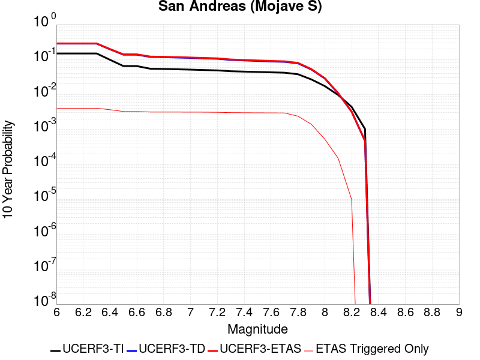 |

| Magnitude | 1 wk TI Prob | 1 wk TD Prob | 1 wk ETAS Prob | 1 wk ETAS/TD Gain | 1 wk ETAS Triggered Only | 1 mo TI Prob | 1 mo TD Prob | 1 mo ETAS Prob | 1 mo ETAS/TD Gain | 1 mo ETAS Triggered Only | 1 yr TI Prob | 1 yr TD Prob | 1 yr ETAS Prob | 1 yr ETAS/TD Gain | 1 yr ETAS Triggered Only | 10 yr TI Prob | 10 yr TD Prob | 10 yr ETAS Prob | 10 yr ETAS/TD Gain | 10 yr ETAS Triggered Only |
|-----|-----|-----|-----|-----|-----|-----|-----|-----|-----|-----|-----|-----|-----|-----|-----|-----|-----|-----|-----|-----|
| 6.0 | 3.1064058E-4 | 6.7460834E-4 | 0.0029494094 | 4.372032 | 0.0022763368 | 0.0013306376 | 0.0028881032 | 0.0055273618 | 1.913838 | 0.002646903 | 0.016080605 | 0.03462235 | 0.037841976 | 1.0929928 | 0.003335098 | 0.1496549 | 0.28660452 | 0.2893992 | 1.009751 | 0.0039174166 |
| 6.1 | 3.1064058E-4 | 6.7460834E-4 | 0.0029494094 | 4.372032 | 0.0022763368 | 0.0013306376 | 0.0028881032 | 0.0055273618 | 1.913838 | 0.002646903 | 0.016080605 | 0.03462235 | 0.037841976 | 1.0929928 | 0.003335098 | 0.1496549 | 0.28660452 | 0.2893992 | 1.009751 | 0.0039174166 |
| 6.2 | 3.1064058E-4 | 6.7460834E-4 | 0.0029494094 | 4.372032 | 0.0022763368 | 0.0013306376 | 0.0028881032 | 0.0055273618 | 1.913838 | 0.002646903 | 0.016080605 | 0.03462235 | 0.037841976 | 1.0929928 | 0.003335098 | 0.1496549 | 0.28660452 | 0.2893992 | 1.009751 | 0.0039174166 |
| 6.3 | 3.1064058E-4 | 6.7460834E-4 | 0.0029494094 | 4.372032 | 0.0022763368 | 0.0013306376 | 0.0028881032 | 0.0055273618 | 1.913838 | 0.002646903 | 0.016080605 | 0.03462235 | 0.037841976 | 1.0929928 | 0.003335098 | 0.1496549 | 0.28660452 | 0.2893992 | 1.009751 | 0.0039174166 |
| 6.4 | 1.9872203E-4 | 4.3179357E-4 | 0.002654232 | 6.146993 | 0.0022233985 | 8.5138786E-4 | 0.0018492596 | 0.0043855878 | 2.371537 | 0.002541027 | 0.010316478 | 0.02228844 | 0.02539393 | 1.1393318 | 0.0031762838 | 0.098504856 | 0.19699748 | 0.19988811 | 1.0146735 | 0.0035997883 |
| 6.5 | 1.291105E-4 | 2.875267E-4 | 0.0022985947 | 7.9943695 | 0.0020116463 | 5.5321335E-4 | 0.0012316781 | 0.003558084 | 2.88881 | 0.0023292748 | 0.006714592 | 0.0148934 | 0.01781378 | 1.1960855 | 0.0029645315 | 0.065152965 | 0.13803436 | 0.14086346 | 1.0204957 | 0.0032821598 |
| 6.6 | 1.291105E-4 | 2.875267E-4 | 0.0022985947 | 7.9943695 | 0.0020116463 | 5.5321335E-4 | 0.0012316781 | 0.003558084 | 2.88881 | 0.0023292748 | 0.006714592 | 0.0148934 | 0.01781378 | 1.1960855 | 0.0029645315 | 0.065152965 | 0.13803436 | 0.14086346 | 1.0204957 | 0.0032821598 |
| 6.7 | 1.08001186E-4 | 2.4333889E-4 | 0.0022015707 | 9.047344 | 0.0019587083 | 4.6278012E-4 | 0.0010424647 | 0.0033164283 | 3.181334 | 0.0022763368 | 0.0056198016 | 0.012618446 | 0.0154933 | 1.2278295 | 0.0029115935 | 0.054797906 | 0.119176775 | 0.122021146 | 1.0238669 | 0.0032292218 |
| 6.8 | 1.0624356E-4 | 2.3851555E-4 | 0.0021967567 | 9.210119 | 0.0019587083 | 4.5525006E-4 | 0.0010218095 | 0.0032958202 | 3.225474 | 0.0022763368 | 0.0055285925 | 0.012369843 | 0.015245421 | 1.2324668 | 0.0029115935 | 0.053930566 | 0.11712591 | 0.11997691 | 1.0243413 | 0.0032292218 |
| 6.9 | 1.0393785E-4 | 2.3221898E-4 | 0.0021904726 | 9.432788 | 0.0019587083 | 4.4537184E-4 | 9.948451E-4 | 0.003268917 | 3.2858555 | 0.0022763368 | 0.0054089287 | 0.012045221 | 0.014921743 | 1.2388103 | 0.0029115935 | 0.05279156 | 0.11442335 | 0.117283076 | 1.0249925 | 0.0032292218 |
| 7.0 | 1.0155622E-4 | 2.2591476E-4 | 0.0021841805 | 9.668162 | 0.0019587083 | 4.3516833E-4 | 9.6784724E-4 | 0.0032419807 | 3.3496823 | 0.0022763368 | 0.005285311 | 0.0117200995 | 0.014545252 | 1.2410518 | 0.0028586553 | 0.05161361 | 0.111683756 | 0.1145053 | 1.0252637 | 0.0031762838 |
| 7.1 | 9.885595E-5 | 2.1879886E-4 | 0.0021770785 | 9.950137 | 0.0019587083 | 4.2359953E-4 | 9.3737274E-4 | 0.0032115756 | 3.4261458 | 0.0022763368 | 0.0051451353 | 0.011352993 | 0.014179193 | 1.2489389 | 0.0028586553 | 0.05027629 | 0.1085682 | 0.11139964 | 1.0260798 | 0.0031762838 |
| 7.2 | 9.6411415E-5 | 2.124288E-4 | 0.002170721 | 10.218581 | 0.0019587083 | 4.1312634E-4 | 9.1009185E-4 | 0.0031843567 | 3.4989402 | 0.0022763368 | 0.005018219 | 0.011024255 | 0.013851397 | 1.2564473 | 0.0028586553 | 0.049064007 | 0.105758004 | 0.10859837 | 1.0268573 | 0.0031762838 |
| 7.3 | 9.1180635E-5 | 1.9471257E-4 | 0.002047184 | 10.513877 | 0.0018528322 | 3.907156E-4 | 8.342157E-4 | 0.0030028657 | 3.5996273 | 0.0021704605 | 0.004746591 | 0.01010939 | 0.01283434 | 1.2695465 | 0.0027527793 | 0.046464786 | 0.09795115 | 0.10072081 | 1.0282758 | 0.0030704075 |
| 7.4 | 8.887388E-5 | 1.8719878E-4 | 0.0020396842 | 10.89582 | 0.0018528322 | 3.8083247E-4 | 8.020339E-4 | 0.0029707537 | 3.704025 | 0.0021704605 | 0.0046267817 | 0.00972114 | 0.01244716 | 1.2804217 | 0.0027527793 | 0.045316286 | 0.09458615 | 0.09736614 | 1.029391 | 0.0030704075 |
| 7.5 | 8.6750515E-5 | 1.8051457E-4 | 0.0020330122 | 11.262317 | 0.0018528322 | 3.7173493E-4 | 7.7340455E-4 | 0.0029421865 | 3.8042011 | 0.0021704605 | 0.004516484 | 0.009375632 | 0.012102602 | 1.2908572 | 0.0027527793 | 0.04425787 | 0.091549896 | 0.09433921 | 1.0304676 | 0.0030704075 |
| 7.6 | 8.453092E-5 | 1.7439072E-4 | 0.0020268997 | 11.62275 | 0.0018528322 | 3.6222505E-4 | 7.471748E-4 | 0.0029160136 | 3.9027195 | 0.0021704605 | 0.0044011753 | 0.009058985 | 0.011786826 | 1.30112 | 0.0027527793 | 0.04315024 | 0.08870898 | 0.09150702 | 1.0315417 | 0.0030704075 |
| 7.7 | 8.259102E-5 | 1.6961215E-4 | 0.0020221302 | 11.922083 | 0.0018528322 | 3.539135E-4 | 7.2670676E-4 | 0.0028955902 | 3.9845371 | 0.0021704605 | 0.004300386 | 0.008811831 | 0.011540352 | 1.309643 | 0.0027527793 | 0.042181134 | 0.08645982 | 0.089264765 | 1.0324421 | 0.0030704075 |
| 7.8 | 7.444844E-5 | 1.5283503E-4 | 0.0016878042 | 11.043307 | 0.0015352038 | 3.1902574E-4 | 6.548429E-4 | 0.0024535584 | 3.7467895 | 0.0017998941 | 0.0038772223 | 0.007943616 | 0.010254388 | 1.2908968 | 0.0023292748 | 0.03810269 | 0.078290746 | 0.080632836 | 1.0299152 | 0.002541027 |
| 7.9 | 5.2586525E-5 | 1.00064186E-4 | 9.469884E-4 | 9.46381 | 8.47009E-4 | 2.2535135E-4 | 4.2877605E-4 | 0.001434168 | 3.344795 | 0.0010058231 | 0.0027402006 | 0.005207864 | 0.0064717606 | 1.2426901 | 0.0012705135 | 0.027066574 | 0.052200034 | 0.05355475 | 1.0259525 | 0.0014293276 |
| 8.0 | 3.379877E-5 | 5.4074168E-5 | 2.6581498E-4 | 4.9157476 | 2.1175225E-4 | 1.4484383E-4 | 2.3172585E-4 | 4.963548E-4 | 2.1419916 | 2.6469032E-4 | 0.0017620471 | 0.002817614 | 0.0032399253 | 1.1498826 | 4.235045E-4 | 0.017481409 | 0.028834904 | 0.029246196 | 1.0142637 | 4.235045E-4 |
| 8.1 | 1.8668277E-5 | 1.9309397E-5 | 1.9309397E-5 | 1.0 | 0.0 | 8.000444E-5 | 8.275194E-5 | 1.3568562E-4 | 1.639667 | 5.2938063E-5 | 9.736188E-4 | 0.0010070398 | 0.0010599246 | 1.052515 | 5.2938063E-5 | 0.009693642 | 0.010798888 | 0.010851255 | 1.0048492 | 5.2938063E-5 |
| 8.2 | 8.541571E-6 | 5.460819E-6 | 5.460819E-6 | 1.0 | 0.0 | 3.660622E-5 | 2.3403301E-5 | 2.3403301E-5 | 1.0 | 0.0 | 4.455896E-4 | 2.84898E-4 | 2.84898E-4 | 1.0 | 0.0 | 0.0044469717 | 0.0032408056 | 0.0032408056 | 1.0 | 0.0 |
| 8.3 | 1.983087E-6 | 7.6599065E-7 | 7.6599065E-7 | 1.0 | 0.0 | 8.498917E-6 | 3.282813E-6 | 3.282813E-6 | 1.0 | 0.0 | 1.034694E-4 | 3.9967534E-5 | 3.9967534E-5 | 1.0 | 0.0 | 0.0010342124 | 4.719687E-4 | 4.719687E-4 | 1.0 | 0.0 |

## Nelson Lake
*[(top)](#table-of-contents)*

| 1 Week | 1 Month | 1 Year | 10 Year |
|-----|-----|-----|-----|
|  |  |  |  |

| Magnitude | 1 wk TI Prob | 1 wk TD Prob | 1 wk ETAS Prob | 1 wk ETAS/TD Gain | 1 wk ETAS Triggered Only | 1 mo TI Prob | 1 mo TD Prob | 1 mo ETAS Prob | 1 mo ETAS/TD Gain | 1 mo ETAS Triggered Only | 1 yr TI Prob | 1 yr TD Prob | 1 yr ETAS Prob | 1 yr ETAS/TD Gain | 1 yr ETAS Triggered Only | 10 yr TI Prob | 10 yr TD Prob | 10 yr ETAS Prob | 10 yr ETAS/TD Gain | 10 yr ETAS Triggered Only |
|-----|-----|-----|-----|-----|-----|-----|-----|-----|-----|-----|-----|-----|-----|-----|-----|-----|-----|-----|-----|-----|
| 6.0 | 9.913453E-6 | 1.0192255E-5 | 0.0014395054 | 141.23521 | 0.0014293276 | 4.2485535E-5 | 4.3680422E-5 | 0.0021081746 | 48.263607 | 0.0020645845 | 5.1713863E-4 | 5.316897E-4 | 0.003494645 | 6.5727153 | 0.0029645315 | 0.0051593683 | 0.005305204 | 0.008885895 | 1.6749393 | 0.0035997883 |
| 6.1 | 9.913453E-6 | 1.0192255E-5 | 0.0014395054 | 141.23521 | 0.0014293276 | 4.2485535E-5 | 4.3680422E-5 | 0.0021081746 | 48.263607 | 0.0020645845 | 5.1713863E-4 | 5.316897E-4 | 0.003494645 | 6.5727153 | 0.0029645315 | 0.0051593683 | 0.005305204 | 0.008885895 | 1.6749393 | 0.0035997883 |
| 6.2 | 4.5596407E-6 | 4.696313E-6 | 6.928879E-4 | 147.5387 | 6.881948E-4 | 1.954117E-5 | 2.0126909E-5 | 0.0011847408 | 58.86353 | 0.0011646374 | 2.3788778E-4 | 2.4501883E-4 | 0.0018327716 | 7.480126 | 0.0015881419 | 0.0023763329 | 0.0024476128 | 0.00429591 | 1.7551428 | 0.0018528322 |
| 6.3 | 4.5596407E-6 | 4.696313E-6 | 6.928879E-4 | 147.5387 | 6.881948E-4 | 1.954117E-5 | 2.0126909E-5 | 0.0011847408 | 58.86353 | 0.0011646374 | 2.3788778E-4 | 2.4501883E-4 | 0.0018327716 | 7.480126 | 0.0015881419 | 0.0023763329 | 0.0024476128 | 0.00429591 | 1.7551428 | 0.0018528322 |
| 6.4 | 3.4025713E-6 | 3.5098972E-6 | 6.387644E-4 | 181.98949 | 6.3525676E-4 | 1.4582367E-5 | 1.5042335E-5 | 9.6791313E-4 | 64.34594 | 9.5288514E-4 | 1.7752586E-4 | 1.8312587E-4 | 0.0014534068 | 7.936654 | 0.0012705135 | 0.001773841 | 0.0018298327 | 0.003309386 | 1.8085731 | 0.0014822658 |
| 6.5 | 2.8352947E-6 | 2.927856E-6 | 5.323069E-4 | 181.80775 | 5.2938063E-4 | 1.2151207E-5 | 1.2547898E-5 | 8.066089E-4 | 64.28239 | 7.9407095E-4 | 1.479309E-4 | 1.5276071E-4 | 0.0012113602 | 7.9297895 | 0.0010587613 | 0.0014783246 | 0.0015266308 | 0.0027952048 | 1.8309631 | 0.0012705135 |
| 6.6 | 2.251518E-6 | 2.3290677E-6 | 4.2583258E-4 | 182.83394 | 4.235045E-4 | 9.649328E-6 | 9.981683E-6 | 5.9229456E-4 | 59.338142 | 5.823187E-4 | 1.1747423E-4 | 1.2152085E-4 | 9.154953E-4 | 7.533648 | 7.9407095E-4 | 0.0011741214 | 0.0012146058 | 0.0021134596 | 1.7400377 | 8.999471E-4 |
| 6.7 | 1.8911853E-6 | 1.9591396E-6 | 2.6664895E-4 | 136.10512 | 2.6469032E-4 | 8.105055E-6 | 8.39629E-6 | 4.3189724E-4 | 51.43906 | 4.235045E-4 | 9.867457E-5 | 1.0222061E-4 | 7.374124E-4 | 7.213931 | 6.3525676E-4 | 9.863076E-4 | 0.0010217935 | 0.0017621691 | 1.7245845 | 7.411329E-4 |
| 6.8 | 1.4874814E-6 | 1.5438305E-6 | 2.1329576E-4 | 138.16008 | 2.1175225E-4 | 6.374905E-6 | 6.6164025E-6 | 3.7718037E-4 | 57.006866 | 3.7056644E-4 | 7.76117E-5 | 8.055224E-5 | 6.098902E-4 | 7.5713625 | 5.2938063E-4 | 7.75846E-4 | 8.0528157E-4 | 0.0013871313 | 1.722542 | 5.823187E-4 |
| 6.9 | 6.835972E-7 | 7.1399285E-7 | 2.124661E-4 | 297.57455 | 2.1175225E-4 | 2.9296991E-6 | 3.0599674E-6 | 3.2068737E-4 | 104.80091 | 3.1762838E-4 | 3.56685E-5 | 3.7254784E-5 | 4.607435E-4 | 12.367364 | 4.235045E-4 | 3.5662777E-4 | 3.7251666E-4 | 7.958634E-4 | 2.1364505 | 4.235045E-4 |

## San Andreas (Mojave N)
*[(top)](#table-of-contents)*

| 1 Week | 1 Month | 1 Year | 10 Year |
|-----|-----|-----|-----|
|  |  |  |  |

| Magnitude | 1 wk TI Prob | 1 wk TD Prob | 1 wk ETAS Prob | 1 wk ETAS/TD Gain | 1 wk ETAS Triggered Only | 1 mo TI Prob | 1 mo TD Prob | 1 mo ETAS Prob | 1 mo ETAS/TD Gain | 1 mo ETAS Triggered Only | 1 yr TI Prob | 1 yr TD Prob | 1 yr ETAS Prob | 1 yr ETAS/TD Gain | 1 yr ETAS Triggered Only | 10 yr TI Prob | 10 yr TD Prob | 10 yr ETAS Prob | 10 yr ETAS/TD Gain | 10 yr ETAS Triggered Only |
|-----|-----|-----|-----|-----|-----|-----|-----|-----|-----|-----|-----|-----|-----|-----|-----|-----|-----|-----|-----|-----|
| 6.0 | 9.877682E-5 | 1.9400702E-4 | 0.0028403967 | 14.64069 | 0.002646903 | 4.2326056E-4 | 8.311939E-4 | 0.0038461552 | 4.627266 | 0.0030174695 | 0.0051410277 | 0.010072956 | 0.013741293 | 1.3641769 | 0.0037056643 | 0.05023708 | 0.09831428 | 0.10194202 | 1.0368994 | 0.0040232926 |
| 6.1 | 9.877682E-5 | 1.9400702E-4 | 0.0028403967 | 14.64069 | 0.002646903 | 4.2326056E-4 | 8.311939E-4 | 0.0038461552 | 4.627266 | 0.0030174695 | 0.0051410277 | 0.010072956 | 0.013741293 | 1.3641769 | 0.0037056643 | 0.05023708 | 0.09831428 | 0.10194202 | 1.0368994 | 0.0040232926 |
| 6.2 | 9.877682E-5 | 1.9400702E-4 | 0.0028403967 | 14.64069 | 0.002646903 | 4.2326056E-4 | 8.311939E-4 | 0.0038461552 | 4.627266 | 0.0030174695 | 0.0051410277 | 0.010072956 | 0.013741293 | 1.3641769 | 0.0037056643 | 0.05023708 | 0.09831428 | 0.10194202 | 1.0368994 | 0.0040232926 |
| 6.3 | 9.877682E-5 | 1.9400702E-4 | 0.0028403967 | 14.64069 | 0.002646903 | 4.2326056E-4 | 8.311939E-4 | 0.0038461552 | 4.627266 | 0.0030174695 | 0.0051410277 | 0.010072956 | 0.013741293 | 1.3641769 | 0.0037056643 | 0.05023708 | 0.09831428 | 0.10194202 | 1.0368994 | 0.0040232926 |
| 6.4 | 9.877682E-5 | 1.9400702E-4 | 0.0028403967 | 14.64069 | 0.002646903 | 4.2326056E-4 | 8.311939E-4 | 0.0038461552 | 4.627266 | 0.0030174695 | 0.0051410277 | 0.010072956 | 0.013741293 | 1.3641769 | 0.0037056643 | 0.05023708 | 0.09831428 | 0.10194202 | 1.0368994 | 0.0040232926 |
| 6.5 | 9.861474E-5 | 1.9374468E-4 | 0.002840135 | 14.659163 | 0.002646903 | 4.2256617E-4 | 8.300703E-4 | 0.003845035 | 4.63218 | 0.0030174695 | 0.0051326132 | 0.010059402 | 0.013727791 | 1.3646725 | 0.0037056643 | 0.050156746 | 0.098192066 | 0.101820305 | 1.0369505 | 0.0040232926 |
| 6.6 | 9.861474E-5 | 1.9374468E-4 | 0.002840135 | 14.659163 | 0.002646903 | 4.2256617E-4 | 8.300703E-4 | 0.003845035 | 4.63218 | 0.0030174695 | 0.0051326132 | 0.010059402 | 0.013727791 | 1.3646725 | 0.0037056643 | 0.050156746 | 0.098192066 | 0.101820305 | 1.0369505 | 0.0040232926 |
| 6.7 | 9.8552715E-5 | 1.9364421E-4 | 0.0028400347 | 14.666252 | 0.002646903 | 4.223004E-4 | 8.2964E-4 | 0.0038446062 | 4.6340656 | 0.0030174695 | 0.0051293927 | 0.010054212 | 0.013722619 | 1.3648627 | 0.0037056643 | 0.050125998 | 0.098145254 | 0.10177368 | 1.0369699 | 0.0040232926 |
| 6.8 | 9.8464974E-5 | 1.9349584E-4 | 0.0028398868 | 14.676733 | 0.002646903 | 4.219245E-4 | 8.290045E-4 | 0.0038439727 | 4.6368537 | 0.0030174695 | 0.0051248376 | 0.010046546 | 0.013714982 | 1.3651439 | 0.0037056643 | 0.05008251 | 0.09807528 | 0.10170399 | 1.0369992 | 0.0040232926 |
| 6.9 | 9.825824E-5 | 1.9317595E-4 | 0.0028395678 | 14.699387 | 0.002646903 | 4.2103877E-4 | 8.276344E-4 | 0.0038426067 | 4.6428795 | 0.0030174695 | 0.0051141046 | 0.010030019 | 0.0136985155 | 1.3657517 | 0.0037056643 | 0.049980022 | 0.09792438 | 0.10155369 | 1.0370624 | 0.0040232926 |
| 7.0 | 9.781462E-5 | 1.924896E-4 | 0.0028388833 | 14.748242 | 0.002646903 | 4.1913814E-4 | 8.246948E-4 | 0.0038396758 | 4.6558747 | 0.0030174695 | 0.005091073 | 0.009994558 | 0.013663187 | 1.3670626 | 0.0037056643 | 0.04976007 | 0.09760077 | 0.10123139 | 1.0371987 | 0.0040232926 |
| 7.1 | 9.7121134E-5 | 1.9150671E-4 | 0.0028379029 | 14.818817 | 0.002646903 | 4.1616702E-4 | 8.204851E-4 | 0.0038354788 | 4.674648 | 0.0030174695 | 0.005055068 | 0.009943774 | 0.013612591 | 1.3689561 | 0.0037056643 | 0.04941613 | 0.09713728 | 0.100769766 | 1.0373954 | 0.0040232926 |
| 7.2 | 9.663819E-5 | 1.9081456E-4 | 0.0028372125 | 14.868952 | 0.002646903 | 4.1409794E-4 | 8.175206E-4 | 0.0038325232 | 4.6879835 | 0.0030174695 | 0.0050299936 | 0.00990801 | 0.013576959 | 1.3703012 | 0.0037056643 | 0.049176537 | 0.09681055 | 0.10044434 | 1.0375351 | 0.0040232926 |
| 7.3 | 9.6277574E-5 | 1.9033969E-4 | 0.002836739 | 14.90356 | 0.002646903 | 4.125529E-4 | 8.154867E-4 | 0.0038304955 | 4.6971893 | 0.0030174695 | 0.0050112694 | 0.009883473 | 0.013552512 | 1.3712298 | 0.0037056643 | 0.04899759 | 0.09658401 | 0.10021871 | 1.0376326 | 0.0040232926 |
| 7.4 | 9.593308E-5 | 1.897375E-4 | 0.0028361385 | 14.947696 | 0.002646903 | 4.1107697E-4 | 8.129075E-4 | 0.0038279241 | 4.7089295 | 0.0030174695 | 0.0049933824 | 0.009852355 | 0.01352151 | 1.372414 | 0.0037056643 | 0.04882661 | 0.09630218 | 0.09993803 | 1.0377545 | 0.0040232926 |
| 7.5 | 9.561707E-5 | 1.8919831E-4 | 0.0028356006 | 14.987452 | 0.002646903 | 4.0972308E-4 | 8.1059814E-4 | 0.0038256217 | 4.719505 | 0.0030174695 | 0.0049769743 | 0.009824493 | 0.013493751 | 1.3734807 | 0.0037056643 | 0.048669744 | 0.09604836 | 0.09968522 | 1.0378649 | 0.0040232926 |
| 7.6 | 9.418194E-5 | 1.8572104E-4 | 0.0028321326 | 15.24939 | 0.002646903 | 4.0357444E-4 | 7.957047E-4 | 0.0038107734 | 4.7891803 | 0.0030174695 | 0.004902454 | 0.009644784 | 0.013314708 | 1.3805087 | 0.0037056643 | 0.047957025 | 0.094430685 | 0.098074056 | 1.0385824 | 0.0040232926 |
| 7.7 | 8.202141E-5 | 1.6021315E-4 | 0.0024891146 | 15.536269 | 0.0023292748 | 3.51473E-4 | 6.8644714E-4 | 0.003384435 | 4.930365 | 0.0026998413 | 0.00427079 | 0.008325525 | 0.011685354 | 1.4035577 | 0.003388036 | 0.04189639 | 0.08223219 | 0.08563314 | 1.0413578 | 0.0037056643 |
| 7.8 | 7.2859846E-5 | 1.4516473E-4 | 0.0016801456 | 11.574063 | 0.0015352038 | 3.1221908E-4 | 6.219862E-4 | 0.002420761 | 3.8919847 | 0.0017998941 | 0.003794643 | 0.0075464295 | 0.009858127 | 1.3063298 | 0.0023292748 | 0.037304975 | 0.07472468 | 0.07707583 | 1.0314642 | 0.002541027 |
| 7.9 | 5.3874453E-5 | 1.0045676E-4 | 9.473807E-4 | 9.430731 | 8.47009E-4 | 2.3087008E-4 | 4.3045796E-4 | 0.0014358482 | 3.3356292 | 0.0010058231 | 0.0028072202 | 0.0052282433 | 0.006492114 | 1.2417392 | 0.0012705135 | 0.02772022 | 0.05242443 | 0.053778827 | 1.0258352 | 0.0014293276 |
| 8.0 | 3.468538E-5 | 5.4260272E-5 | 2.6600104E-4 | 4.9023166 | 2.1175225E-4 | 1.4864317E-4 | 2.325233E-4 | 4.9715204E-4 | 2.1380742 | 2.6469032E-4 | 0.0018082283 | 0.002827298 | 0.003249605 | 1.1493678 | 4.235045E-4 | 0.017935853 | 0.028947512 | 0.029358756 | 1.0142065 | 4.235045E-4 |
| 8.1 | 1.9152367E-5 | 1.940263E-5 | 1.940263E-5 | 1.0 | 0.0 | 8.207899E-5 | 8.3151484E-5 | 1.3608515E-4 | 1.6365931 | 5.2938063E-5 | 9.988535E-4 | 0.0010118998 | 0.0010647842 | 1.0522625 | 5.2938063E-5 | 0.009943757 | 0.01085625 | 0.010908614 | 1.0048233 | 5.2938063E-5 |
| 8.2 | 8.643924E-6 | 5.4748625E-6 | 5.4748625E-6 | 1.0 | 0.0 | 3.704486E-5 | 2.3463486E-5 | 2.3463486E-5 | 1.0 | 0.0 | 4.5092785E-4 | 2.8563058E-4 | 2.8563058E-4 | 1.0 | 0.0 | 0.0045001395 | 0.0032487072 | 0.0032487072 | 1.0 | 0.0 |
| 8.3 | 1.983087E-6 | 7.6599065E-7 | 7.6599065E-7 | 1.0 | 0.0 | 8.498917E-6 | 3.282813E-6 | 3.282813E-6 | 1.0 | 0.0 | 1.034694E-4 | 3.9967534E-5 | 3.9967534E-5 | 1.0 | 0.0 | 0.0010342124 | 4.719687E-4 | 4.719687E-4 | 1.0 | 0.0 |

## Lenwood-Lockhart-Old Woman Springs
*[(top)](#table-of-contents)*

| 1 Week | 1 Month | 1 Year | 10 Year |
|-----|-----|-----|-----|
|  |  |  |  |

| Magnitude | 1 wk TI Prob | 1 wk TD Prob | 1 wk ETAS Prob | 1 wk ETAS/TD Gain | 1 wk ETAS Triggered Only | 1 mo TI Prob | 1 mo TD Prob | 1 mo ETAS Prob | 1 mo ETAS/TD Gain | 1 mo ETAS Triggered Only | 1 yr TI Prob | 1 yr TD Prob | 1 yr ETAS Prob | 1 yr ETAS/TD Gain | 1 yr ETAS Triggered Only | 10 yr TI Prob | 10 yr TD Prob | 10 yr ETAS Prob | 10 yr ETAS/TD Gain | 10 yr ETAS Triggered Only |
|-----|-----|-----|-----|-----|-----|-----|-----|-----|-----|-----|-----|-----|-----|-----|-----|-----|-----|-----|-----|-----|
| 6.0 | 3.744542E-5 | 4.396252E-5 | 0.0017908418 | 40.73565 | 0.001746956 | 1.604705E-4 | 1.8839816E-4 | 0.0022525936 | 11.956558 | 0.0020645845 | 0.0019519776 | 0.0022915069 | 0.004985161 | 2.175495 | 0.0026998413 | 0.019349206 | 0.022696787 | 0.025852716 | 1.1390474 | 0.0032292218 |
| 6.1 | 3.744542E-5 | 4.396252E-5 | 0.0017908418 | 40.73565 | 0.001746956 | 1.604705E-4 | 1.8839816E-4 | 0.0022525936 | 11.956558 | 0.0020645845 | 0.0019519776 | 0.0022915069 | 0.004985161 | 2.175495 | 0.0026998413 | 0.019349206 | 0.022696787 | 0.025852716 | 1.1390474 | 0.0032292218 |
| 6.2 | 3.744542E-5 | 4.396252E-5 | 0.0017908418 | 40.73565 | 0.001746956 | 1.604705E-4 | 1.8839816E-4 | 0.0022525936 | 11.956558 | 0.0020645845 | 0.0019519776 | 0.0022915069 | 0.004985161 | 2.175495 | 0.0026998413 | 0.019349206 | 0.022696787 | 0.025852716 | 1.1390474 | 0.0032292218 |
| 6.3 | 2.1079984E-5 | 2.5353434E-5 | 9.782144E-4 | 38.583115 | 9.5288514E-4 | 9.0339665E-5 | 1.0865316E-4 | 0.001273164 | 11.7176895 | 0.0011646374 | 0.0010993304 | 0.0013220694 | 0.0025909033 | 1.9597331 | 0.0012705135 | 0.010939079 | 0.0131442575 | 0.014659282 | 1.1152613 | 0.0015352038 |
| 6.4 | 2.1079984E-5 | 2.5353434E-5 | 9.782144E-4 | 38.583115 | 9.5288514E-4 | 9.0339665E-5 | 1.0865316E-4 | 0.001273164 | 11.7176895 | 0.0011646374 | 0.0010993304 | 0.0013220694 | 0.0025909033 | 1.9597331 | 0.0012705135 | 0.010939079 | 0.0131442575 | 0.014659282 | 1.1152613 | 0.0015352038 |
| 6.5 | 1.7397282E-5 | 2.066241E-5 | 7.6177996E-4 | 36.867916 | 7.411329E-4 | 7.455765E-5 | 8.8550245E-5 | 9.3548425E-4 | 10.5644455 | 8.47009E-4 | 9.073613E-4 | 0.0010775778 | 0.001976555 | 1.8342575 | 8.999471E-4 | 0.009036654 | 0.010724821 | 0.011876968 | 1.1074281 | 0.0011646374 |
| 6.6 | 1.52050325E-5 | 1.7679693E-5 | 7.0586236E-4 | 39.925034 | 6.881948E-4 | 6.51628E-5 | 7.576796E-5 | 8.6977874E-4 | 11.479506 | 7.9407095E-4 | 7.9306826E-4 | 9.220924E-4 | 0.0017683203 | 1.9177258 | 8.47009E-4 | 0.007902439 | 0.009183526 | 0.010232564 | 1.1142304 | 0.0010587613 |
| 6.7 | 1.332523E-5 | 1.5264002E-5 | 6.5051107E-4 | 42.617332 | 6.3525676E-4 | 5.7106878E-5 | 6.5415545E-5 | 8.064999E-4 | 12.328873 | 7.411329E-4 | 6.950544E-4 | 7.961491E-4 | 0.0015895879 | 1.9965956 | 7.9407095E-4 | 0.006928845 | 0.007933599 | 0.008878924 | 1.1191547 | 9.5288514E-4 |
| 6.8 | 1.1525329E-5 | 1.3030979E-5 | 5.953421E-4 | 45.686672 | 5.823187E-4 | 4.9393333E-5 | 5.584588E-5 | 6.9106714E-4 | 12.374541 | 6.3525676E-4 | 6.011979E-4 | 6.797157E-4 | 0.0013145407 | 1.9339565 | 6.3525676E-4 | 0.00599574 | 0.006776819 | 0.0075655086 | 1.1163805 | 7.9407095E-4 |
| 6.9 | 1.0253909E-5 | 1.15144385E-5 | 5.938264E-4 | 51.572327 | 5.823187E-4 | 4.3944583E-5 | 4.9346683E-5 | 6.845721E-4 | 13.872707 | 6.3525676E-4 | 5.3489394E-4 | 6.0063385E-4 | 0.0012355091 | 2.0570087 | 6.3525676E-4 | 0.0053360825 | 0.0059904843 | 0.0067271776 | 1.1229773 | 7.411329E-4 |
| 7.0 | 8.104563E-6 | 8.991279E-6 | 4.8542957E-4 | 53.988934 | 4.7644257E-4 | 3.4733377E-5 | 3.8533497E-5 | 5.6789373E-4 | 14.737664 | 5.2938063E-4 | 4.2279682E-4 | 4.6904673E-4 | 9.981791E-4 | 2.1281013 | 5.2938063E-4 | 0.0042199334 | 0.0046808156 | 0.005313099 | 1.1350797 | 6.3525676E-4 |
| 7.1 | 6.7986157E-6 | 7.515816E-6 | 2.7220414E-4 | 36.21751 | 2.6469032E-4 | 2.91366E-5 | 3.2210253E-5 | 3.498284E-4 | 10.860778 | 3.1762838E-4 | 3.5468035E-4 | 3.920914E-4 | 7.095952E-4 | 1.80977 | 3.1762838E-4 | 0.003541148 | 0.003914213 | 0.0042833285 | 1.0943015 | 3.7056644E-4 |
| 7.2 | 5.6893327E-6 | 6.2800136E-6 | 2.7096865E-4 | 43.14778 | 2.6469032E-4 | 2.4382627E-5 | 2.6914078E-5 | 3.445339E-4 | 12.801252 | 3.1762838E-4 | 2.9681803E-4 | 3.2763163E-4 | 6.451559E-4 | 1.9691504 | 3.1762838E-4 | 0.002964219 | 0.0032716845 | 0.0035882737 | 1.0967665 | 3.1762838E-4 |
| 7.3 | 4.253348E-6 | 4.7069107E-6 | 5.7644724E-5 | 12.246828 | 5.2938063E-5 | 1.8228506E-5 | 2.0172329E-5 | 1.2604632E-4 | 6.2484765 | 1.05876126E-4 | 2.2190946E-4 | 2.4557224E-4 | 3.5142238E-4 | 1.4310346 | 1.05876126E-4 | 0.00221688 | 0.0024531898 | 0.0025588062 | 1.0430527 | 1.05876126E-4 |
| 7.4 | 2.5448119E-6 | 2.852045E-6 | 5.5789955E-5 | 19.561388 | 5.2938063E-5 | 1.0906291E-5 | 1.2223002E-5 | 6.516042E-5 | 5.330967 | 5.2938063E-5 | 1.3277601E-4 | 1.4880655E-4 | 2.0173672E-4 | 1.355698 | 5.2938063E-5 | 0.001326967 | 0.0014872311 | 0.0015400905 | 1.0355421 | 5.2938063E-5 |
| 7.5 | 4.3706837E-8 | 4.562909E-8 | 4.562909E-8 | 1.0 | 0.0 | 1.8731501E-7 | 1.9555324E-7 | 1.9555324E-7 | 1.0 | 0.0 | 2.2805577E-6 | 2.3808586E-6 | 2.3808586E-6 | 1.0 | 0.0 | 2.2805343E-5 | 2.3808387E-5 | 2.3808387E-5 | 1.0 | 0.0 |

## Towne Pass
*[(top)](#table-of-contents)*

| 1 Week | 1 Month | 1 Year | 10 Year |
|-----|-----|-----|-----|
|  |  |  |  |

| Magnitude | 1 wk TI Prob | 1 wk TD Prob | 1 wk ETAS Prob | 1 wk ETAS/TD Gain | 1 wk ETAS Triggered Only | 1 mo TI Prob | 1 mo TD Prob | 1 mo ETAS Prob | 1 mo ETAS/TD Gain | 1 mo ETAS Triggered Only | 1 yr TI Prob | 1 yr TD Prob | 1 yr ETAS Prob | 1 yr ETAS/TD Gain | 1 yr ETAS Triggered Only | 10 yr TI Prob | 10 yr TD Prob | 10 yr ETAS Prob | 10 yr ETAS/TD Gain | 10 yr ETAS Triggered Only |
|-----|-----|-----|-----|-----|-----|-----|-----|-----|-----|-----|-----|-----|-----|-----|-----|-----|-----|-----|-----|-----|
| 6.0 | 3.849728E-6 | 3.8945414E-6 | 0.0012744031 | 327.22803 | 0.0012705135 | 1.649873E-5 | 1.669081E-5 | 0.0018165549 | 108.83564 | 0.0017998941 | 2.0085352E-4 | 2.0319603E-4 | 0.0026907793 | 13.242284 | 0.002488089 | 0.0020067208 | 0.0020305314 | 0.0053588576 | 2.6391404 | 0.003335098 |
| 6.1 | 3.849728E-6 | 3.8945414E-6 | 0.0012744031 | 327.22803 | 0.0012705135 | 1.649873E-5 | 1.669081E-5 | 0.0018165549 | 108.83564 | 0.0017998941 | 2.0085352E-4 | 2.0319603E-4 | 0.0026907793 | 13.242284 | 0.002488089 | 0.0020067208 | 0.0020305314 | 0.0053588576 | 2.6391404 | 0.003335098 |
| 6.2 | 3.849728E-6 | 3.8945414E-6 | 0.0012744031 | 327.22803 | 0.0012705135 | 1.649873E-5 | 1.669081E-5 | 0.0018165549 | 108.83564 | 0.0017998941 | 2.0085352E-4 | 2.0319603E-4 | 0.0026907793 | 13.242284 | 0.002488089 | 0.0020067208 | 0.0020305314 | 0.0053588576 | 2.6391404 | 0.003335098 |
| 6.3 | 3.849728E-6 | 3.8945414E-6 | 0.0012744031 | 327.22803 | 0.0012705135 | 1.649873E-5 | 1.669081E-5 | 0.0018165549 | 108.83564 | 0.0017998941 | 2.0085352E-4 | 2.0319603E-4 | 0.0026907793 | 13.242284 | 0.002488089 | 0.0020067208 | 0.0020305314 | 0.0053588576 | 2.6391404 | 0.003335098 |
| 6.4 | 3.849728E-6 | 3.8945414E-6 | 0.0012744031 | 327.22803 | 0.0012705135 | 1.649873E-5 | 1.669081E-5 | 0.0018165549 | 108.83564 | 0.0017998941 | 2.0085352E-4 | 2.0319603E-4 | 0.0026907793 | 13.242284 | 0.002488089 | 0.0020067208 | 0.0020305314 | 0.0053588576 | 2.6391404 | 0.003335098 |
| 6.5 | 1.1953545E-6 | 1.203052E-6 | 2.6589303E-4 | 221.01541 | 2.6469032E-4 | 5.1229376E-6 | 5.1559277E-6 | 3.7572047E-4 | 72.87155 | 3.7056644E-4 | 6.236998E-5 | 6.277173E-5 | 6.4505386E-4 | 10.276184 | 5.823187E-4 | 6.235248E-4 | 6.275517E-4 | 0.0013153147 | 2.0959463 | 6.881948E-4 |
| 6.6 | 1.1953545E-6 | 1.203052E-6 | 2.6589303E-4 | 221.01541 | 2.6469032E-4 | 5.1229376E-6 | 5.1559277E-6 | 3.7572047E-4 | 72.87155 | 3.7056644E-4 | 6.236998E-5 | 6.277173E-5 | 6.4505386E-4 | 10.276184 | 5.823187E-4 | 6.235248E-4 | 6.275517E-4 | 0.0013153147 | 2.0959463 | 6.881948E-4 |
| 6.7 | 8.375951E-7 | 8.4106705E-7 | 1.067171E-4 | 126.882996 | 1.05876126E-4 | 3.5896885E-6 | 3.6045683E-6 | 1.0948031E-4 | 30.372654 | 1.05876126E-4 | 4.370358E-5 | 4.3884793E-5 | 3.6149923E-4 | 8.23746 | 3.1762838E-4 | 4.3694986E-4 | 4.38767E-4 | 8.0917083E-4 | 1.8441926 | 3.7056644E-4 |
| 6.8 | 6.38041E-7 | 6.392156E-7 | 1.06515276E-4 | 166.63434 | 1.05876126E-4 | 2.7344586E-6 | 2.7394929E-6 | 1.0861533E-4 | 39.64797 | 1.05876126E-4 | 3.3291526E-5 | 3.3352855E-5 | 2.9803434E-4 | 8.935797 | 2.6469032E-4 | 3.3286537E-4 | 3.334823E-4 | 6.510048E-4 | 1.9521419 | 3.1762838E-4 |
| 6.9 | 5.3460053E-7 | 5.345333E-7 | 5.3472566E-5 | 100.03599 | 5.2938063E-5 | 2.2911431E-6 | 2.2908553E-6 | 5.5228797E-5 | 24.108376 | 5.2938063E-5 | 2.789431E-5 | 2.789084E-5 | 1.8670059E-4 | 6.6939754 | 1.5881419E-4 | 2.789081E-4 | 2.7887672E-4 | 4.376466E-4 | 1.5693194 | 1.5881419E-4 |
| 7.0 | 3.557783E-7 | 3.5324226E-7 | 5.3291285E-5 | 150.86328 | 5.2938063E-5 | 1.5247632E-6 | 1.5138945E-6 | 5.4451877E-5 | 35.96808 | 5.2938063E-5 | 1.8563835E-5 | 1.843152E-5 | 1.2430569E-4 | 6.744191 | 1.05876126E-4 | 1.8562283E-4 | 1.8430075E-4 | 2.9015736E-4 | 1.5743688 | 1.05876126E-4 |
| 7.1 | 3.037942E-7 | 3.0002218E-7 | 3.0002218E-7 | 1.0 | 0.0 | 1.3019744E-6 | 1.2858087E-6 | 1.2858087E-6 | 1.0 | 0.0 | 1.5851423E-5 | 1.5654618E-5 | 6.859185E-5 | 4.381573 | 5.2938063E-5 | 1.5850292E-4 | 1.5653588E-4 | 2.0946567E-4 | 1.3381319 | 5.2938063E-5 |
| 7.2 | 2.0808248E-7 | 2.0217689E-7 | 2.0217689E-7 | 1.0 | 0.0 | 8.917818E-7 | 8.6647213E-7 | 8.6647213E-7 | 1.0 | 0.0 | 1.0857389E-5 | 1.0549252E-5 | 6.3486754E-5 | 6.018129 | 5.2938063E-5 | 1.0856859E-4 | 1.0548797E-4 | 1.5842044E-4 | 1.5017868 | 5.2938063E-5 |
| 7.3 | 1.1162073E-7 | 1.0636894E-7 | 1.0636894E-7 | 1.0 | 0.0 | 4.7837443E-7 | 4.558668E-7 | 4.558668E-7 | 1.0 | 0.0 | 5.8241935E-6 | 5.550166E-6 | 5.8487934E-5 | 10.538052 | 5.2938063E-5 | 5.8240406E-5 | 5.5500474E-5 | 1.084356E-4 | 1.9537779 | 5.2938063E-5 |

## Bicycle Lake
*[(top)](#table-of-contents)*

| 1 Week | 1 Month | 1 Year | 10 Year |
|-----|-----|-----|-----|
|  |  |  |  |

| Magnitude | 1 wk TI Prob | 1 wk TD Prob | 1 wk ETAS Prob | 1 wk ETAS/TD Gain | 1 wk ETAS Triggered Only | 1 mo TI Prob | 1 mo TD Prob | 1 mo ETAS Prob | 1 mo ETAS/TD Gain | 1 mo ETAS Triggered Only | 1 yr TI Prob | 1 yr TD Prob | 1 yr ETAS Prob | 1 yr ETAS/TD Gain | 1 yr ETAS Triggered Only | 10 yr TI Prob | 10 yr TD Prob | 10 yr ETAS Prob | 10 yr ETAS/TD Gain | 10 yr ETAS Triggered Only |
|-----|-----|-----|-----|-----|-----|-----|-----|-----|-----|-----|-----|-----|-----|-----|-----|-----|-----|-----|-----|-----|
| 6.0 | 1.9621975E-5 | 2.2097078E-5 | 0.0010808349 | 48.913025 | 0.0010587613 | 8.4091465E-5 | 9.4699084E-5 | 0.0016297575 | 17.209854 | 0.0015352038 | 0.0010233327 | 0.0011524865 | 0.0033204458 | 2.8811145 | 0.0021704605 | 0.01018633 | 0.011478408 | 0.014042598 | 1.2233925 | 0.002593965 |
| 6.1 | 1.9621975E-5 | 2.2097078E-5 | 0.0010808349 | 48.913025 | 0.0010587613 | 8.4091465E-5 | 9.4699084E-5 | 0.0016297575 | 17.209854 | 0.0015352038 | 0.0010233327 | 0.0011524865 | 0.0033204458 | 2.8811145 | 0.0021704605 | 0.01018633 | 0.011478408 | 0.014042598 | 1.2233925 | 0.002593965 |
| 6.2 | 9.9971285E-6 | 1.1255639E-5 | 5.406303E-4 | 48.031948 | 5.2938063E-4 | 4.2844134E-5 | 4.8237856E-5 | 6.8346394E-4 | 14.168622 | 6.3525676E-4 | 5.2150246E-4 | 5.871896E-4 | 0.0016982362 | 2.8921425 | 0.0011116993 | 0.0052028033 | 0.005861487 | 0.0072824364 | 1.2424214 | 0.0014293276 |
| 6.3 | 9.589428E-6 | 1.0798346E-5 | 5.4017326E-4 | 50.023705 | 5.2938063E-4 | 4.10969E-5 | 4.62781E-5 | 6.815054E-4 | 14.726307 | 6.3525676E-4 | 5.002399E-4 | 5.6334207E-4 | 0.0016744151 | 2.9722886 | 0.0011116993 | 0.0049911533 | 0.0056242296 | 0.006992878 | 1.2433486 | 0.0013763896 |
| 6.4 | 9.589428E-6 | 1.0798346E-5 | 5.4017326E-4 | 50.023705 | 5.2938063E-4 | 4.10969E-5 | 4.62781E-5 | 6.815054E-4 | 14.726307 | 6.3525676E-4 | 5.002399E-4 | 5.6334207E-4 | 0.0016744151 | 2.9722886 | 0.0011116993 | 0.0049911533 | 0.0056242296 | 0.006992878 | 1.2433486 | 0.0013763896 |
| 6.5 | 5.557707E-6 | 6.2856016E-6 | 3.768497E-4 | 59.954437 | 3.7056644E-4 | 2.3818526E-5 | 2.6938165E-5 | 4.5043125E-4 | 16.720932 | 4.235045E-4 | 2.8995197E-4 | 3.2794967E-4 | 0.0011217602 | 3.4205253 | 7.9407095E-4 | 0.0028957394 | 0.0032772934 | 0.0042270557 | 1.2898008 | 9.5288514E-4 |
| 6.6 | 4.8742945E-6 | 5.5132896E-6 | 3.2313992E-4 | 58.611088 | 3.1762838E-4 | 2.0889667E-5 | 2.3628318E-5 | 3.94186E-4 | 16.68278 | 3.7056644E-4 | 2.54302E-4 | 2.87663E-4 | 9.756598E-4 | 3.3916764 | 6.881948E-4 | 0.002540112 | 0.0028754752 | 0.0037200486 | 1.2937161 | 8.47009E-4 |
| 6.7 | 3.991108E-6 | 4.5159104E-6 | 3.2214285E-4 | 71.33508 | 3.1762838E-4 | 1.7104636E-5 | 1.9353902E-5 | 3.3697614E-4 | 17.411276 | 3.1762838E-4 | 2.0822904E-4 | 2.3563375E-4 | 8.707408E-4 | 3.6953144 | 6.3525676E-4 | 0.0020803404 | 0.0023563374 | 0.0031485374 | 1.3361996 | 7.9407095E-4 |

## San Andreas (San Bernardino N)
*[(top)](#table-of-contents)*

| 1 Week | 1 Month | 1 Year | 10 Year |
|-----|-----|-----|-----|
|  |  |  | 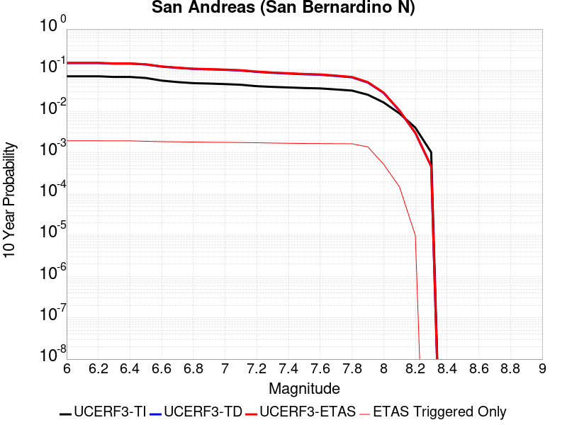 |

| Magnitude | 1 wk TI Prob | 1 wk TD Prob | 1 wk ETAS Prob | 1 wk ETAS/TD Gain | 1 wk ETAS Triggered Only | 1 mo TI Prob | 1 mo TD Prob | 1 mo ETAS Prob | 1 mo ETAS/TD Gain | 1 mo ETAS Triggered Only | 1 yr TI Prob | 1 yr TD Prob | 1 yr ETAS Prob | 1 yr ETAS/TD Gain | 1 yr ETAS Triggered Only | 10 yr TI Prob | 10 yr TD Prob | 10 yr ETAS Prob | 10 yr ETAS/TD Gain | 10 yr ETAS Triggered Only |
|-----|-----|-----|-----|-----|-----|-----|-----|-----|-----|-----|-----|-----|-----|-----|-----|-----|-----|-----|-----|-----|
| 6.0 | 1.4273766E-4 | 3.1606483E-4 | 0.0014803341 | 4.6836405 | 0.0011646374 | 6.115894E-4 | 0.0013538664 | 0.0027283926 | 2.0152597 | 0.0013763896 | 0.0074207084 | 0.016360244 | 0.018078618 | 1.1050336 | 0.001746956 | 0.07177748 | 0.15026689 | 0.15193127 | 1.0110762 | 0.0019587083 |
| 6.1 | 1.4273766E-4 | 3.1606483E-4 | 0.0014803341 | 4.6836405 | 0.0011646374 | 6.115894E-4 | 0.0013538664 | 0.0027283926 | 2.0152597 | 0.0013763896 | 0.0074207084 | 0.016360244 | 0.018078618 | 1.1050336 | 0.001746956 | 0.07177748 | 0.15026689 | 0.15193127 | 1.0110762 | 0.0019587083 |
| 6.2 | 1.4273766E-4 | 3.1606483E-4 | 0.0014803341 | 4.6836405 | 0.0011646374 | 6.115894E-4 | 0.0013538664 | 0.0027283926 | 2.0152597 | 0.0013763896 | 0.0074207084 | 0.016360244 | 0.018078618 | 1.1050336 | 0.001746956 | 0.07177748 | 0.15026689 | 0.15193127 | 1.0110762 | 0.0019587083 |
| 6.3 | 1.3730655E-4 | 3.0511338E-4 | 0.0014693954 | 4.8158994 | 0.0011646374 | 5.883239E-4 | 0.0013069791 | 0.00268157 | 2.051731 | 0.0013763896 | 0.0071393442 | 0.015797773 | 0.01751713 | 1.1088355 | 0.001746956 | 0.06914291 | 0.14556676 | 0.14724036 | 1.011497 | 0.0019587083 |
| 6.4 | 1.3730655E-4 | 3.0511338E-4 | 0.0014693954 | 4.8158994 | 0.0011646374 | 5.883239E-4 | 0.0013069791 | 0.00268157 | 2.051731 | 0.0013763896 | 0.0071393442 | 0.015797773 | 0.01751713 | 1.1088355 | 0.001746956 | 0.06914291 | 0.14556676 | 0.14724036 | 1.011497 | 0.0019587083 |
| 6.5 | 1.2942807E-4 | 2.8925808E-4 | 0.0014006358 | 4.842167 | 0.0011116993 | 5.545738E-4 | 0.0012390936 | 0.0025609054 | 2.066757 | 0.0013234515 | 0.0067310524 | 0.01498286 | 0.016651496 | 1.1113697 | 0.001694018 | 0.06530788 | 0.13870941 | 0.14035083 | 1.0118335 | 0.0019057703 |
| 6.6 | 1.1125901E-4 | 2.536472E-4 | 0.0013121399 | 5.1730905 | 0.0010587613 | 4.767372E-4 | 0.0010866089 | 0.0023557418 | 2.167976 | 0.0012705135 | 0.005788839 | 0.013149847 | 0.014769347 | 1.1231574 | 0.0016410799 | 0.056403454 | 0.122999296 | 0.12462423 | 1.0132109 | 0.0018528322 |
| 6.7 | 1.02209575E-4 | 2.3499702E-4 | 0.0012935095 | 5.5043654 | 0.0010587613 | 4.3796748E-4 | 0.0010067427 | 0.002275977 | 2.2607336 | 0.0012705135 | 0.0053192247 | 0.012188629 | 0.013809707 | 1.1329992 | 0.0016410799 | 0.051936906 | 0.114790924 | 0.116431065 | 1.0142881 | 0.0018528322 |
| 6.8 | 9.610582E-5 | 2.2025521E-4 | 0.0012787833 | 5.8059163 | 0.0010587613 | 4.1181705E-4 | 9.436101E-4 | 0.0022129246 | 2.3451686 | 0.0012705135 | 0.0050023515 | 0.011428202 | 0.013050526 | 1.1419581 | 0.0016410799 | 0.048912346 | 0.1081929 | 0.10979806 | 1.0148361 | 0.0017998941 |
| 6.9 | 9.3877505E-5 | 2.1481077E-4 | 0.0012733446 | 5.92775 | 0.0010587613 | 4.0227012E-4 | 9.2029345E-4 | 0.0021896376 | 2.379282 | 0.0012705135 | 0.0048866454 | 0.011147255 | 0.012770042 | 1.1455772 | 0.0016410799 | 0.04780577 | 0.10578323 | 0.10739272 | 1.015215 | 0.0017998941 |
| 7.0 | 9.1019785E-5 | 2.0808022E-4 | 0.0012666212 | 6.0871773 | 0.0010587613 | 3.900265E-4 | 8.914682E-4 | 0.002160849 | 2.4239216 | 0.0012705135 | 0.0047382377 | 0.010799837 | 0.012370828 | 1.1454643 | 0.0015881419 | 0.046384744 | 0.102753714 | 0.10432117 | 1.0152544 | 0.001746956 |
| 7.1 | 8.771155E-5 | 1.9982594E-4 | 0.0012583756 | 6.2973585 | 0.0010587613 | 3.758525E-4 | 8.5611636E-4 | 0.0021255421 | 2.4827726 | 0.0012705135 | 0.0045664064 | 0.0103736 | 0.011945266 | 1.1515064 | 0.0015881419 | 0.044737056 | 0.09906527 | 0.10063916 | 1.0158875 | 0.001746956 |
| 7.2 | 8.0830236E-5 | 1.8388197E-4 | 0.0012424486 | 6.7567716 | 0.0010587613 | 3.4636928E-4 | 7.8782777E-4 | 0.0020573402 | 2.6114087 | 0.0012705135 | 0.0042088944 | 0.009549725 | 0.0111227 | 1.1647142 | 0.0015881419 | 0.041300658 | 0.09179615 | 0.093382746 | 1.0172839 | 0.001746956 |
| 7.3 | 7.7668235E-5 | 1.7331762E-4 | 0.0011789665 | 6.802346 | 0.0010058231 | 3.328214E-4 | 7.425784E-4 | 0.0019592498 | 2.6384416 | 0.0012175754 | 0.0040445733 | 0.009003494 | 0.0105248755 | 1.1689768 | 0.0015352038 | 0.03971748 | 0.08706327 | 0.08860979 | 1.0177633 | 0.001694018 |
| 7.4 | 7.520177E-5 | 1.6551897E-4 | 0.0011711756 | 7.075779 | 0.0010058231 | 3.2225347E-4 | 7.0917426E-4 | 0.0019258863 | 2.7156742 | 0.0012175754 | 0.0039163795 | 0.008600081 | 0.010122082 | 1.1769751 | 0.0015352038 | 0.038480744 | 0.08351955 | 0.085072085 | 1.0185889 | 0.001694018 |
| 7.5 | 7.274697E-5 | 1.5839566E-4 | 0.0011640595 | 7.349062 | 0.0010058231 | 3.1173544E-4 | 6.78662E-4 | 0.001895411 | 2.7928648 | 0.0012175754 | 0.003788775 | 0.008231463 | 0.00975403 | 1.1849692 | 0.0015352038 | 0.03724827 | 0.08023631 | 0.0817944 | 1.0194188 | 0.001694018 |
| 7.6 | 7.1185845E-5 | 1.540943E-4 | 0.0011597625 | 7.5263166 | 0.0010058231 | 3.0504653E-4 | 6.6023704E-4 | 0.0018770086 | 2.8429313 | 0.0012175754 | 0.0037076178 | 0.008008812 | 0.00953172 | 1.1901542 | 0.0015352038 | 0.036463667 | 0.07822598 | 0.07978748 | 1.0199615 | 0.001694018 |
| 7.7 | 6.709961E-5 | 1.4318313E-4 | 0.0011488623 | 8.023726 | 0.0010058231 | 2.8753807E-4 | 6.1349774E-4 | 0.0018303262 | 2.9834278 | 0.0012175754 | 0.003495157 | 0.0074437927 | 0.008967568 | 1.2047043 | 0.0015352038 | 0.034406938 | 0.07305469 | 0.074624956 | 1.0214944 | 0.001694018 |
| 7.8 | 6.300812E-5 | 1.3202413E-4 | 0.0011377145 | 8.617475 | 0.0010058231 | 2.7000686E-4 | 5.65695E-4 | 0.0017825817 | 3.1511354 | 0.0012175754 | 0.0032823787 | 0.006865616 | 0.0083902795 | 1.2220724 | 0.0015352038 | 0.032343175 | 0.06771354 | 0.06929285 | 1.0233234 | 0.001694018 |
| 7.9 | 4.983037E-5 | 9.723488E-5 | 9.441615E-4 | 9.710112 | 8.47009E-4 | 2.1354125E-4 | 4.1665437E-4 | 0.0014220584 | 3.413041 | 0.0010058231 | 0.0025967648 | 0.0050609782 | 0.0063250614 | 1.2497705 | 0.0012705135 | 0.025666296 | 0.05064886 | 0.052005794 | 1.026791 | 0.0014293276 |
| 8.0 | 3.2211527E-5 | 5.3304586E-5 | 2.6504556E-4 | 4.9722843 | 2.1175225E-4 | 1.380421E-4 | 2.2842824E-4 | 4.9305806E-4 | 2.1584814 | 2.6469032E-4 | 0.0016793669 | 0.0027775685 | 0.0031998968 | 1.1520495 | 4.235045E-4 | 0.016667323 | 0.028361378 | 0.028772872 | 1.014509 | 4.235045E-4 |
| 8.1 | 1.743376E-5 | 1.8824427E-5 | 1.8824427E-5 | 1.0 | 0.0 | 7.471398E-5 | 8.067362E-5 | 1.336074E-4 | 1.6561475 | 5.2938063E-5 | 9.0926304E-4 | 9.817594E-4 | 0.0010346455 | 1.0538687 | 5.2938063E-5 | 0.009055517 | 0.010484105 | 0.010536488 | 1.0049964 | 5.2938063E-5 |
| 8.2 | 7.831616E-6 | 5.1551065E-6 | 5.1551065E-6 | 1.0 | 0.0 | 3.3563636E-5 | 2.2093127E-5 | 2.2093127E-5 | 1.0 | 0.0 | 4.0856065E-4 | 2.6895068E-4 | 2.6895068E-4 | 1.0 | 0.0 | 0.004078103 | 0.0030418145 | 0.0030418145 | 1.0 | 0.0 |
| 8.3 | 1.983087E-6 | 7.6599065E-7 | 7.6599065E-7 | 1.0 | 0.0 | 8.498917E-6 | 3.282813E-6 | 3.282813E-6 | 1.0 | 0.0 | 1.034694E-4 | 3.9967534E-5 | 3.9967534E-5 | 1.0 | 0.0 | 0.0010342124 | 4.719687E-4 | 4.719687E-4 | 1.0 | 0.0 |

## Garlic Springs
*[(top)](#table-of-contents)*

| 1 Week | 1 Month | 1 Year | 10 Year |
|-----|-----|-----|-----|
|  |  |  |  |

| Magnitude | 1 wk TI Prob | 1 wk TD Prob | 1 wk ETAS Prob | 1 wk ETAS/TD Gain | 1 wk ETAS Triggered Only | 1 mo TI Prob | 1 mo TD Prob | 1 mo ETAS Prob | 1 mo ETAS/TD Gain | 1 mo ETAS Triggered Only | 1 yr TI Prob | 1 yr TD Prob | 1 yr ETAS Prob | 1 yr ETAS/TD Gain | 1 yr ETAS Triggered Only | 10 yr TI Prob | 10 yr TD Prob | 10 yr ETAS Prob | 10 yr ETAS/TD Gain | 10 yr ETAS Triggered Only |
|-----|-----|-----|-----|-----|-----|-----|-----|-----|-----|-----|-----|-----|-----|-----|-----|-----|-----|-----|-----|-----|
| 6.0 | 1.6760017E-5 | 1.8776833E-5 | 0.0010775182 | 57.385513 | 0.0010587613 | 7.182667E-5 | 8.0470316E-5 | 0.001509683 | 18.760744 | 0.0014293276 | 8.7413884E-4 | 9.794032E-4 | 0.0026717621 | 2.7279491 | 0.001694018 | 0.008707083 | 0.009762413 | 0.0115971565 | 1.1879396 | 0.0018528322 |
| 6.1 | 9.852767E-6 | 1.09735865E-5 | 6.9916085E-4 | 63.713062 | 6.881948E-4 | 4.222546E-5 | 4.702921E-5 | 0.0011057407 | 23.511786 | 0.0010587613 | 5.139737E-4 | 5.7250116E-4 | 0.001683564 | 2.9407172 | 0.0011116993 | 0.005127866 | 0.005717221 | 0.006980471 | 1.2209551 | 0.0012705135 |
| 6.2 | 9.852767E-6 | 1.09735865E-5 | 6.9916085E-4 | 63.713062 | 6.881948E-4 | 4.222546E-5 | 4.702921E-5 | 0.0011057407 | 23.511786 | 0.0010587613 | 5.139737E-4 | 5.7250116E-4 | 0.001683564 | 2.9407172 | 0.0011116993 | 0.005127866 | 0.005717221 | 0.006980471 | 1.2209551 | 0.0012705135 |
| 6.3 | 4.3167724E-6 | 4.7780286E-6 | 2.1652927E-4 | 45.3177 | 2.1175225E-4 | 1.8500323E-5 | 2.0477235E-5 | 2.8516212E-4 | 13.925813 | 2.6469032E-4 | 2.2521814E-4 | 2.4930484E-4 | 5.139292E-4 | 2.0614488 | 2.6469032E-4 | 0.0022499003 | 0.00249251 | 0.0028093467 | 1.1271155 | 3.1762838E-4 |
| 6.4 | 4.3167724E-6 | 4.7780286E-6 | 2.1652927E-4 | 45.3177 | 2.1175225E-4 | 1.8500323E-5 | 2.0477235E-5 | 2.8516212E-4 | 13.925813 | 2.6469032E-4 | 2.2521814E-4 | 2.4930484E-4 | 5.139292E-4 | 2.0614488 | 2.6469032E-4 | 0.0022499003 | 0.00249251 | 0.0028093467 | 1.1271155 | 3.1762838E-4 |
| 6.5 | 4.3167724E-6 | 4.7780286E-6 | 2.1652927E-4 | 45.3177 | 2.1175225E-4 | 1.8500323E-5 | 2.0477235E-5 | 2.8516212E-4 | 13.925813 | 2.6469032E-4 | 2.2521814E-4 | 2.4930484E-4 | 5.139292E-4 | 2.0614488 | 2.6469032E-4 | 0.0022499003 | 0.00249251 | 0.0028093467 | 1.1271155 | 3.1762838E-4 |
| 6.6 | 4.301311E-6 | 4.760897E-6 | 2.1651214E-4 | 45.477173 | 2.1175225E-4 | 1.8434059E-5 | 2.0403815E-5 | 2.8508872E-4 | 13.972324 | 2.6469032E-4 | 2.2441156E-4 | 2.4841115E-4 | 5.130357E-4 | 2.0652685 | 2.6469032E-4 | 0.0022418506 | 0.002483593 | 0.0028004325 | 1.127573 | 3.1762838E-4 |
| 6.7 | 3.8599724E-6 | 4.27106E-6 | 1.6308457E-4 | 38.18363 | 1.5881419E-4 | 1.6542634E-5 | 1.8304541E-5 | 1.7711583E-4 | 9.676059 | 1.5881419E-4 | 2.0138794E-4 | 2.228578E-4 | 3.816366E-4 | 1.7124668 | 1.5881419E-4 | 0.0020120554 | 0.002228578 | 0.0023870382 | 1.0711038 | 1.5881419E-4 |

## Paradise
*[(top)](#table-of-contents)*

| 1 Week | 1 Month | 1 Year | 10 Year |
|-----|-----|-----|-----|
|  |  |  |  |

| Magnitude | 1 wk TI Prob | 1 wk TD Prob | 1 wk ETAS Prob | 1 wk ETAS/TD Gain | 1 wk ETAS Triggered Only | 1 mo TI Prob | 1 mo TD Prob | 1 mo ETAS Prob | 1 mo ETAS/TD Gain | 1 mo ETAS Triggered Only | 1 yr TI Prob | 1 yr TD Prob | 1 yr ETAS Prob | 1 yr ETAS/TD Gain | 1 yr ETAS Triggered Only | 10 yr TI Prob | 10 yr TD Prob | 10 yr ETAS Prob | 10 yr ETAS/TD Gain | 10 yr ETAS Triggered Only |
|-----|-----|-----|-----|-----|-----|-----|-----|-----|-----|-----|-----|-----|-----|-----|-----|-----|-----|-----|-----|-----|
| 6.0 | 1.4851273E-5 | 1.6694692E-5 | 7.04878E-4 | 42.221687 | 6.881948E-4 | 6.364676E-5 | 7.154685E-5 | 0.0010772981 | 15.0572405 | 0.0010058231 | 7.7462377E-4 | 8.707584E-4 | 0.0026161931 | 3.0044997 | 0.001746956 | 0.0077192914 | 0.008675844 | 0.0104601225 | 1.2056605 | 0.0017998941 |
| 6.1 | 1.4851273E-5 | 1.6694692E-5 | 7.04878E-4 | 42.221687 | 6.881948E-4 | 6.364676E-5 | 7.154685E-5 | 0.0010772981 | 15.0572405 | 0.0010058231 | 7.7462377E-4 | 8.707584E-4 | 0.0026161931 | 3.0044997 | 0.001746956 | 0.0077192914 | 0.008675844 | 0.0104601225 | 1.2056605 | 0.0017998941 |
| 6.2 | 1.4851273E-5 | 1.6694692E-5 | 7.04878E-4 | 42.221687 | 6.881948E-4 | 6.364676E-5 | 7.154685E-5 | 0.0010772981 | 15.0572405 | 0.0010058231 | 7.7462377E-4 | 8.707584E-4 | 0.0026161931 | 3.0044997 | 0.001746956 | 0.0077192914 | 0.008675844 | 0.0104601225 | 1.2056605 | 0.0017998941 |
| 6.3 | 1.0426831E-5 | 1.188862E-5 | 2.765758E-4 | 23.26391 | 2.6469032E-4 | 4.4685654E-5 | 5.0950268E-5 | 4.7443318E-4 | 9.311691 | 4.235045E-4 | 5.43912E-4 | 6.201489E-4 | 0.001307917 | 2.109037 | 6.881948E-4 | 0.0054258266 | 0.0061847917 | 0.0069213407 | 1.1190903 | 7.411329E-4 |
| 6.4 | 1.0426831E-5 | 1.188862E-5 | 2.765758E-4 | 23.26391 | 2.6469032E-4 | 4.4685654E-5 | 5.0950268E-5 | 4.7443318E-4 | 9.311691 | 4.235045E-4 | 5.43912E-4 | 6.201489E-4 | 0.001307917 | 2.109037 | 6.881948E-4 | 0.0054258266 | 0.0061847917 | 0.0069213407 | 1.1190903 | 7.411329E-4 |
| 6.5 | 9.25027E-6 | 1.06199595E-5 | 2.2236996E-4 | 20.93887 | 2.1175225E-4 | 3.964341E-5 | 4.551335E-5 | 4.1606292E-4 | 9.141559 | 3.7056644E-4 | 4.8255164E-4 | 5.53989E-4 | 0.0011359851 | 2.0505552 | 5.823187E-4 | 0.0048150513 | 0.0055265795 | 0.0061583254 | 1.1143105 | 6.3525676E-4 |
| 6.6 | 7.904275E-6 | 9.159525E-6 | 1.6797226E-4 | 18.338533 | 1.5881419E-4 | 3.3875025E-5 | 3.9254537E-5 | 1.980625E-4 | 5.0455947 | 1.5881419E-4 | 4.1235037E-4 | 4.7782314E-4 | 7.952997E-4 | 1.6644229 | 3.1762838E-4 | 0.0041158604 | 0.0047683544 | 0.005137154 | 1.0773431 | 3.7056644E-4 |
| 6.7 | 7.2061953E-6 | 8.407248E-6 | 6.1344865E-5 | 7.2966638 | 5.2938063E-5 | 3.088333E-5 | 3.6030586E-5 | 8.896674E-5 | 2.4692004 | 5.2938063E-5 | 3.7593965E-4 | 4.3858777E-4 | 6.5024715E-4 | 1.4825929 | 2.1175225E-4 | 0.003753043 | 0.004377591 | 0.0046411227 | 1.0602001 | 2.6469032E-4 |
| 6.8 | 6.6948724E-6 | 7.842166E-6 | 6.0779814E-5 | 7.750386 | 5.2938063E-5 | 2.8691995E-5 | 3.360887E-5 | 8.654515E-5 | 2.575069 | 5.2938063E-5 | 3.4926904E-4 | 4.0911473E-4 | 6.2078034E-4 | 1.5173748 | 2.1175225E-4 | 0.003487206 | 0.0040839734 | 0.0043475823 | 1.0645473 | 2.6469032E-4 |
| 6.9 | 6.0421025E-6 | 7.130621E-6 | 6.0068305E-5 | 8.423994 | 5.2938063E-5 | 2.5894467E-5 | 3.0559466E-5 | 8.349591E-5 | 2.7322438 | 5.2938063E-5 | 3.1521954E-4 | 3.7200135E-4 | 5.307565E-4 | 1.4267595 | 1.5881419E-4 | 0.0031477278 | 0.0037141247 | 0.003872349 | 1.0426008 | 1.5881419E-4 |
| 7.0 | 4.134091E-6 | 5.0803087E-6 | 5.0803087E-6 | 1.0 | 0.0 | 1.7717413E-5 | 2.177258E-5 | 2.177258E-5 | 1.0 | 0.0 | 2.1568815E-4 | 2.6505045E-4 | 3.1797448E-4 | 1.1996753 | 5.2938063E-5 | 0.0021547892 | 0.0026474963 | 0.0027002944 | 1.0199425 | 5.2938063E-5 |
| 7.1 | 3.7674888E-6 | 4.6318696E-6 | 4.6318696E-6 | 1.0 | 0.0 | 1.6146281E-5 | 1.9850726E-5 | 1.9850726E-5 | 1.0 | 0.0 | 1.9656324E-4 | 2.4165731E-4 | 2.9458257E-4 | 1.2190096 | 5.2938063E-5 | 0.0019638946 | 0.002414096 | 0.002466906 | 1.0218757 | 5.2938063E-5 |
| 7.2 | 3.4065345E-6 | 4.156723E-6 | 4.156723E-6 | 1.0 | 0.0 | 1.4599351E-5 | 1.7814415E-5 | 1.7814415E-5 | 1.0 | 0.0 | 1.777326E-4 | 2.1687041E-4 | 2.69797E-4 | 1.244047 | 5.2938063E-5 | 0.0017759053 | 0.002166736 | 0.0022195592 | 1.0243793 | 5.2938063E-5 |
| 7.3 | 2.9934936E-6 | 3.6293168E-6 | 3.6293168E-6 | 1.0 | 0.0 | 1.2829195E-5 | 1.555413E-5 | 1.555413E-5 | 1.0 | 0.0 | 1.5618425E-4 | 1.8935655E-4 | 2.4228459E-4 | 1.2795153 | 5.2938063E-5 | 0.0015607453 | 0.0018920974 | 0.0019449353 | 1.0279256 | 5.2938063E-5 |
| 7.4 | 2.4049796E-6 | 2.8889842E-6 | 2.8889842E-6 | 1.0 | 0.0 | 1.0307015E-5 | 1.238131E-5 | 1.238131E-5 | 1.0 | 0.0 | 1.2548068E-4 | 1.5073347E-4 | 2.0366354E-4 | 1.3511502 | 5.2938063E-5 | 0.0012540985 | 0.0015064536 | 0.001559312 | 1.035088 | 5.2938063E-5 |
| 7.5 | 1.2710091E-6 | 1.5134682E-6 | 1.5134682E-6 | 1.0 | 0.0 | 5.44717E-6 | 6.4862834E-6 | 6.4862834E-6 | 1.0 | 0.0 | 6.631728E-5 | 7.8968886E-5 | 7.8968886E-5 | 1.0 | 0.0 | 6.6297496E-4 | 7.8953087E-4 | 7.8953087E-4 | 1.0 | 0.0 |
| 7.6 | 2.21172E-7 | 2.603961E-7 | 2.603961E-7 | 1.0 | 0.0 | 9.478797E-7 | 1.1159829E-6 | 1.1159829E-6 | 1.0 | 0.0 | 1.1540374E-5 | 1.3587036E-5 | 1.3587036E-5 | 1.0 | 0.0 | 1.1539775E-4 | 1.3586486E-4 | 1.3586486E-4 | 1.0 | 0.0 |

## Death Valley (Black Mtns Frontal)
*[(top)](#table-of-contents)*

| 1 Week | 1 Month | 1 Year | 10 Year |
|-----|-----|-----|-----|
| 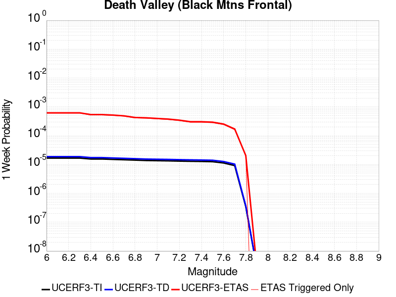 |  |  |  |

| Magnitude | 1 wk TI Prob | 1 wk TD Prob | 1 wk ETAS Prob | 1 wk ETAS/TD Gain | 1 wk ETAS Triggered Only | 1 mo TI Prob | 1 mo TD Prob | 1 mo ETAS Prob | 1 mo ETAS/TD Gain | 1 mo ETAS Triggered Only | 1 yr TI Prob | 1 yr TD Prob | 1 yr ETAS Prob | 1 yr ETAS/TD Gain | 1 yr ETAS Triggered Only | 10 yr TI Prob | 10 yr TD Prob | 10 yr ETAS Prob | 10 yr ETAS/TD Gain | 10 yr ETAS Triggered Only |
|-----|-----|-----|-----|-----|-----|-----|-----|-----|-----|-----|-----|-----|-----|-----|-----|-----|-----|-----|-----|-----|
| 6.0 | 1.6707214E-5 | 1.867027E-5 | 8.127264E-4 | 43.530514 | 7.9407095E-4 | 7.160038E-5 | 8.001302E-5 | 9.798881E-4 | 12.246607 | 8.999471E-4 | 8.71386E-4 | 9.737309E-4 | 0.0020843477 | 2.1405787 | 0.0011116993 | 0.00867977 | 0.009695496 | 0.010848843 | 1.1189568 | 0.0011646374 |
| 6.1 | 1.6707214E-5 | 1.867027E-5 | 8.127264E-4 | 43.530514 | 7.9407095E-4 | 7.160038E-5 | 8.001302E-5 | 9.798881E-4 | 12.246607 | 8.999471E-4 | 8.71386E-4 | 9.737309E-4 | 0.0020843477 | 2.1405787 | 0.0011116993 | 0.00867977 | 0.009695496 | 0.010848843 | 1.1189568 | 0.0011646374 |
| 6.2 | 1.6707214E-5 | 1.867027E-5 | 8.127264E-4 | 43.530514 | 7.9407095E-4 | 7.160038E-5 | 8.001302E-5 | 9.798881E-4 | 12.246607 | 8.999471E-4 | 8.71386E-4 | 9.737309E-4 | 0.0020843477 | 2.1405787 | 0.0011116993 | 0.00867977 | 0.009695496 | 0.010848843 | 1.1189568 | 0.0011646374 |
| 6.3 | 1.6707214E-5 | 1.867027E-5 | 8.127264E-4 | 43.530514 | 7.9407095E-4 | 7.160038E-5 | 8.001302E-5 | 9.798881E-4 | 12.246607 | 8.999471E-4 | 8.71386E-4 | 9.737309E-4 | 0.0020843477 | 2.1405787 | 0.0011116993 | 0.00867977 | 0.009695496 | 0.010848843 | 1.1189568 | 0.0011646374 |
| 6.4 | 1.5515609E-5 | 1.7338214E-5 | 8.113954E-4 | 46.798096 | 7.9407095E-4 | 6.649377E-5 | 7.4304546E-5 | 9.741847E-4 | 13.110702 | 8.999471E-4 | 8.0926094E-4 | 9.042885E-4 | 0.0020149825 | 2.228252 | 0.0011116993 | 0.008063202 | 0.009006773 | 0.01016092 | 1.1281422 | 0.0011646374 |
| 6.5 | 1.5515609E-5 | 1.7338214E-5 | 8.113954E-4 | 46.798096 | 7.9407095E-4 | 6.649377E-5 | 7.4304546E-5 | 9.741847E-4 | 13.110702 | 8.999471E-4 | 8.0926094E-4 | 9.042885E-4 | 0.0020149825 | 2.228252 | 0.0011116993 | 0.008063202 | 0.009006773 | 0.01016092 | 1.1281422 | 0.0011646374 |
| 6.6 | 1.5041828E-5 | 1.6809145E-5 | 8.108667E-4 | 48.23962 | 7.9407095E-4 | 6.4463384E-5 | 7.203723E-5 | 9.7191945E-4 | 13.491904 | 8.999471E-4 | 7.8455906E-4 | 8.767063E-4 | 0.001987431 | 2.266929 | 0.0011116993 | 0.00781795 | 0.008733132 | 0.009887598 | 1.1321938 | 0.0011646374 |
| 6.7 | 1.4634985E-5 | 1.6356016E-5 | 7.574768E-4 | 46.311813 | 7.411329E-4 | 6.271985E-5 | 7.009536E-5 | 9.17045E-4 | 13.08282 | 8.47009E-4 | 7.6334673E-4 | 8.5308263E-4 | 0.0019109407 | 2.2400417 | 0.0010587613 | 0.007607299 | 0.008498715 | 0.009600967 | 1.1296962 | 0.0011116993 |
| 6.8 | 1.4209158E-5 | 1.5882048E-5 | 5.4525427E-4 | 34.331486 | 5.2938063E-4 | 6.089497E-5 | 6.8064175E-5 | 7.032777E-4 | 10.332567 | 6.3525676E-4 | 7.4114406E-4 | 8.2837185E-4 | 0.001621785 | 1.9577982 | 7.9407095E-4 | 0.007386771 | 0.008253456 | 0.009093475 | 1.1017778 | 8.47009E-4 |
| 6.9 | 1.3780098E-5 | 1.5404594E-5 | 5.447771E-4 | 35.364586 | 5.2938063E-4 | 5.9056227E-5 | 6.6018045E-5 | 7.012329E-4 | 10.621837 | 6.3525676E-4 | 7.1877235E-4 | 8.0347876E-4 | 0.0015969117 | 1.9874971 | 7.9407095E-4 | 0.0071645193 | 0.008006332 | 0.0088465605 | 1.1049454 | 8.47009E-4 |
| 7.0 | 1.3585064E-5 | 1.5188155E-5 | 5.445607E-4 | 35.854305 | 5.2938063E-4 | 5.8220405E-5 | 6.50905E-5 | 7.003059E-4 | 10.758957 | 6.3525676E-4 | 7.086029E-4 | 7.9219416E-4 | 0.001585636 | 2.001575 | 7.9407095E-4 | 0.007063476 | 0.007894293 | 0.008734616 | 1.1064469 | 8.47009E-4 |
| 7.1 | 1.3398601E-5 | 1.49813395E-5 | 5.44354E-4 | 36.335472 | 5.2938063E-4 | 5.742131E-5 | 6.420419E-5 | 6.9942017E-4 | 10.893683 | 6.3525676E-4 | 6.9888023E-4 | 7.8141113E-4 | 0.0015748616 | 2.015407 | 7.9407095E-4 | 0.0069668638 | 0.007787224 | 0.008627637 | 1.1079221 | 8.47009E-4 |
| 7.2 | 1.3126312E-5 | 1.4679561E-5 | 4.9111515E-4 | 33.45571 | 4.7644257E-4 | 5.6254412E-5 | 6.291092E-5 | 6.45193E-4 | 10.25566 | 5.823187E-4 | 6.846822E-4 | 7.6567667E-4 | 0.0015062421 | 1.9672039 | 7.411329E-4 | 0.006825765 | 0.00763097 | 0.008418982 | 1.1032649 | 7.9407095E-4 |
| 7.3 | 1.2922429E-5 | 1.4453788E-5 | 4.908895E-4 | 33.962685 | 4.7644257E-4 | 5.5380664E-5 | 6.194336E-5 | 5.912912E-4 | 9.545674 | 5.2938063E-4 | 6.74051E-4 | 7.53905E-4 | 0.001441581 | 1.912152 | 6.881948E-4 | 0.006720101 | 0.007514055 | 0.008249619 | 1.0978918 | 7.411329E-4 |
| 7.4 | 1.2768878E-5 | 1.4283772E-5 | 4.907195E-4 | 34.355038 | 4.7644257E-4 | 5.4722615E-5 | 6.1214756E-5 | 5.90563E-4 | 9.647395 | 5.2938063E-4 | 6.660441E-4 | 7.4504025E-4 | 0.0014327223 | 1.9230133 | 6.881948E-4 | 0.0066405144 | 0.0074260035 | 0.008161632 | 1.0990613 | 7.411329E-4 |
| 7.5 | 1.2521929E-5 | 1.40120155E-5 | 4.3751058E-4 | 31.223959 | 4.235045E-4 | 5.366431E-5 | 6.005014E-5 | 5.364641E-4 | 8.933602 | 4.7644257E-4 | 6.531671E-4 | 7.3087064E-4 | 0.0013127638 | 1.7961643 | 5.823187E-4 | 0.006512506 | 0.0072852457 | 0.007915875 | 1.0865624 | 6.3525676E-4 |
| 7.6 | 1.1301089E-5 | 1.2648149E-5 | 3.302725E-4 | 26.11232 | 3.1762838E-4 | 4.8432343E-5 | 5.4205255E-5 | 4.247516E-4 | 7.8359857 | 3.7056644E-4 | 5.895042E-4 | 6.5975444E-4 | 0.0010829796 | 1.6414888 | 4.235045E-4 | 0.0058794282 | 0.00657851 | 0.0070518185 | 1.0719477 | 4.7644257E-4 |
| 7.7 | 9.189108E-6 | 1.0283358E-5 | 2.2203343E-4 | 21.59153 | 2.1175225E-4 | 3.93813E-5 | 4.407082E-5 | 3.0874947E-4 | 7.0057573 | 2.6469032E-4 | 4.7936183E-4 | 5.3643517E-4 | 8.538932E-4 | 1.5917919 | 3.1762838E-4 | 0.004783291 | 0.005351914 | 0.005720497 | 1.0688695 | 3.7056644E-4 |
| 7.8 | 3.4586725E-7 | 3.6482615E-7 | 3.6482615E-7 | 1.0 | 0.0 | 1.4822873E-6 | 1.5635396E-6 | 1.5635396E-6 | 1.0 | 0.0 | 1.80467E-5 | 1.9035933E-5 | 1.9035933E-5 | 1.0 | 0.0 | 1.8045233E-4 | 1.9034347E-4 | 1.9034347E-4 | 1.0 | 0.0 |
| 7.9 | 2.5591178E-9 | 2.6696718E-9 | 2.6696718E-9 | 1.0 | 0.0 | 1.0967647E-8 | 1.14414505E-8 | 1.14414505E-8 | 1.0 | 0.0 | 1.335311E-7 | 1.3929966E-7 | 1.3929966E-7 | 1.0 | 0.0 | 1.3353102E-6 | 1.3929966E-6 | 1.3929966E-6 | 1.0 | 0.0 |

## Helendale-So Lockhart
*[(top)](#table-of-contents)*

| 1 Week | 1 Month | 1 Year | 10 Year |
|-----|-----|-----|-----|
|  |  |  |  |

| Magnitude | 1 wk TI Prob | 1 wk TD Prob | 1 wk ETAS Prob | 1 wk ETAS/TD Gain | 1 wk ETAS Triggered Only | 1 mo TI Prob | 1 mo TD Prob | 1 mo ETAS Prob | 1 mo ETAS/TD Gain | 1 mo ETAS Triggered Only | 1 yr TI Prob | 1 yr TD Prob | 1 yr ETAS Prob | 1 yr ETAS/TD Gain | 1 yr ETAS Triggered Only | 10 yr TI Prob | 10 yr TD Prob | 10 yr ETAS Prob | 10 yr ETAS/TD Gain | 10 yr ETAS Triggered Only |
|-----|-----|-----|-----|-----|-----|-----|-----|-----|-----|-----|-----|-----|-----|-----|-----|-----|-----|-----|-----|-----|
| 6.0 | 1.7296055E-5 | 1.8103729E-5 | 5.474748E-4 | 30.240993 | 5.2938063E-4 | 7.412385E-5 | 7.7585224E-5 | 9.245285E-4 | 11.916297 | 8.47009E-4 | 9.0208417E-4 | 9.4421144E-4 | 0.002001973 | 2.1202593 | 0.0010587613 | 0.008984311 | 0.009404116 | 0.0105053615 | 1.1171024 | 0.0011116993 |
| 6.1 | 1.7296055E-5 | 1.8103729E-5 | 5.474748E-4 | 30.240993 | 5.2938063E-4 | 7.412385E-5 | 7.7585224E-5 | 9.245285E-4 | 11.916297 | 8.47009E-4 | 9.0208417E-4 | 9.4421144E-4 | 0.002001973 | 2.1202593 | 0.0010587613 | 0.008984311 | 0.009404116 | 0.0105053615 | 1.1171024 | 0.0011116993 |
| 6.2 | 1.7296055E-5 | 1.8103729E-5 | 5.474748E-4 | 30.240993 | 5.2938063E-4 | 7.412385E-5 | 7.7585224E-5 | 9.245285E-4 | 11.916297 | 8.47009E-4 | 9.0208417E-4 | 9.4421144E-4 | 0.002001973 | 2.1202593 | 0.0010587613 | 0.008984311 | 0.009404116 | 0.0105053615 | 1.1171024 | 0.0011116993 |
| 6.3 | 1.0669118E-5 | 1.1135425E-5 | 3.2876027E-4 | 29.523819 | 3.1762838E-4 | 4.5723988E-5 | 4.772239E-5 | 6.300133E-4 | 13.201629 | 5.823187E-4 | 5.5654737E-4 | 5.80868E-4 | 0.0013215704 | 2.2751646 | 7.411329E-4 | 0.0055515557 | 0.0057937936 | 0.0065306323 | 1.1271772 | 7.411329E-4 |
| 6.4 | 1.0669118E-5 | 1.1135425E-5 | 3.2876027E-4 | 29.523819 | 3.1762838E-4 | 4.5723988E-5 | 4.772239E-5 | 6.300133E-4 | 13.201629 | 5.823187E-4 | 5.5654737E-4 | 5.80868E-4 | 0.0013215704 | 2.2751646 | 7.411329E-4 | 0.0055515557 | 0.0057937936 | 0.0065306323 | 1.1271772 | 7.411329E-4 |
| 6.5 | 8.790038E-6 | 9.170197E-6 | 3.2679565E-4 | 35.63671 | 3.1762838E-4 | 3.767105E-5 | 3.930026E-5 | 5.157241E-4 | 13.1226635 | 4.7644257E-4 | 4.585485E-4 | 4.7837716E-4 | 0.0010075045 | 2.1060884 | 5.2938063E-4 | 0.0045760344 | 0.004773638 | 0.005300492 | 1.1103673 | 5.2938063E-4 |
| 6.6 | 7.396949E-6 | 7.715537E-6 | 3.2534145E-4 | 42.167053 | 3.1762838E-4 | 3.1700827E-5 | 3.3066175E-5 | 5.09493E-4 | 15.408283 | 4.7644257E-4 | 3.858892E-4 | 4.025073E-4 | 9.3167485E-4 | 2.3146782 | 5.2938063E-4 | 0.003852198 | 0.00401789 | 0.0045451433 | 1.1312265 | 5.2938063E-4 |
| 6.7 | 6.4600285E-6 | 6.738031E-6 | 3.2436426E-4 | 48.139324 | 3.1762838E-4 | 2.7685543E-5 | 2.887696E-5 | 5.0530577E-4 | 17.498579 | 4.7644257E-4 | 3.3701936E-4 | 3.5152107E-4 | 8.807156E-4 | 2.505442 | 5.2938063E-4 | 0.0033650869 | 0.003509732 | 0.0040372545 | 1.1503029 | 5.2938063E-4 |
| 6.8 | 5.600104E-6 | 5.836009E-6 | 3.2346253E-4 | 55.425293 | 3.1762838E-4 | 2.4000226E-5 | 2.5011232E-5 | 4.4850513E-4 | 17.932148 | 4.235045E-4 | 2.9216358E-4 | 3.044698E-4 | 7.807673E-4 | 2.5643506 | 4.7644257E-4 | 0.0029177975 | 0.003040588 | 0.003515582 | 1.1562178 | 4.7644257E-4 |
| 6.9 | 4.839122E-6 | 5.0395092E-6 | 3.2266628E-4 | 64.02732 | 3.1762838E-4 | 2.0738931E-5 | 2.159772E-5 | 4.450931E-4 | 20.608335 | 4.235045E-4 | 2.5246723E-4 | 2.6292098E-4 | 7.392383E-4 | 2.8116367 | 4.7644257E-4 | 0.002521806 | 0.002626147 | 0.0031013382 | 1.1809462 | 4.7644257E-4 |
| 7.0 | 3.6937633E-6 | 3.845208E-6 | 2.685345E-4 | 69.83614 | 2.6469032E-4 | 1.5830317E-5 | 1.647936E-5 | 3.3410251E-4 | 20.273996 | 3.1762838E-4 | 1.9271708E-4 | 2.0061806E-4 | 5.7111017E-4 | 2.8467536 | 3.7056644E-4 | 0.0019255003 | 0.002004401 | 0.0023742246 | 1.1845058 | 3.7056644E-4 |
| 7.1 | 2.7858857E-6 | 2.8978538E-6 | 1.08773675E-4 | 37.535942 | 1.05876126E-4 | 1.1939455E-5 | 1.2419316E-5 | 1.7123153E-4 | 13.787518 | 1.5881419E-4 | 1.4535317E-4 | 1.511949E-4 | 3.6291513E-4 | 2.4003134 | 2.1175225E-4 | 0.0014525814 | 0.0015109418 | 0.0017223741 | 1.1399341 | 2.1175225E-4 |
| 7.2 | 2.1672065E-6 | 2.2540128E-6 | 1.081299E-4 | 47.972176 | 1.05876126E-4 | 9.2879945E-6 | 9.66002E-6 | 1.6847267E-4 | 17.440199 | 1.5881419E-4 | 1.1307546E-4 | 1.1760458E-4 | 3.2933193E-4 | 2.8003325 | 2.1175225E-4 | 0.0011301794 | 0.0011754417 | 0.001386945 | 1.1799352 | 2.1175225E-4 |
| 7.3 | 1.4823496E-6 | 1.5422102E-6 | 5.448019E-5 | 35.326046 | 5.2938063E-5 | 6.3529114E-6 | 6.6094562E-6 | 1.1248488E-4 | 17.01878 | 1.05876126E-4 | 7.734395E-5 | 8.046731E-5 | 2.3926872E-4 | 2.9734895 | 1.5881419E-4 | 7.731704E-4 | 8.0439687E-4 | 9.630833E-4 | 1.1972739 | 1.5881419E-4 |
| 7.4 | 4.2321457E-7 | 4.4108765E-7 | 5.3379128E-5 | 121.01705 | 5.2938063E-5 | 1.8137755E-6 | 1.8903745E-6 | 5.482834E-5 | 29.003954 | 5.2938063E-5 | 2.2082493E-5 | 2.3015113E-5 | 7.595196E-5 | 3.3000906 | 5.2938063E-5 | 2.2080299E-4 | 2.3013182E-4 | 2.830577E-4 | 1.2299807 | 5.2938063E-5 |
| 7.5 | 5.6942316E-8 | 5.9415648E-8 | 5.9415648E-8 | 1.0 | 0.0 | 2.440385E-7 | 2.5463845E-7 | 2.5463845E-7 | 1.0 | 0.0 | 2.9711643E-6 | 3.1002196E-6 | 3.1002196E-6 | 1.0 | 0.0 | 2.9711247E-5 | 3.1001844E-5 | 3.1001844E-5 | 1.0 | 0.0 |

## Death Valley (No)
*[(top)](#table-of-contents)*

| 1 Week | 1 Month | 1 Year | 10 Year |
|-----|-----|-----|-----|
|  |  |  |  |

| Magnitude | 1 wk TI Prob | 1 wk TD Prob | 1 wk ETAS Prob | 1 wk ETAS/TD Gain | 1 wk ETAS Triggered Only | 1 mo TI Prob | 1 mo TD Prob | 1 mo ETAS Prob | 1 mo ETAS/TD Gain | 1 mo ETAS Triggered Only | 1 yr TI Prob | 1 yr TD Prob | 1 yr ETAS Prob | 1 yr ETAS/TD Gain | 1 yr ETAS Triggered Only | 10 yr TI Prob | 10 yr TD Prob | 10 yr ETAS Prob | 10 yr ETAS/TD Gain | 10 yr ETAS Triggered Only |
|-----|-----|-----|-----|-----|-----|-----|-----|-----|-----|-----|-----|-----|-----|-----|-----|-----|-----|-----|-----|-----|
| 6.0 | 2.0074807E-5 | 2.2500084E-5 | 6.5774255E-4 | 29.232893 | 6.3525676E-4 | 8.603206E-5 | 9.642541E-5 | 8.374868E-4 | 8.685333 | 7.411329E-4 | 0.001046937 | 0.0011733545 | 0.0021779975 | 1.8562144 | 0.0010058231 | 0.010420183 | 0.011672506 | 0.012718909 | 1.0896468 | 0.0010587613 |
| 6.1 | 2.0074807E-5 | 2.2500084E-5 | 6.5774255E-4 | 29.232893 | 6.3525676E-4 | 8.603206E-5 | 9.642541E-5 | 8.374868E-4 | 8.685333 | 7.411329E-4 | 0.001046937 | 0.0011733545 | 0.0021779975 | 1.8562144 | 0.0010058231 | 0.010420183 | 0.011672506 | 0.012718909 | 1.0896468 | 0.0010587613 |
| 6.2 | 2.0074807E-5 | 2.2500084E-5 | 6.5774255E-4 | 29.232893 | 6.3525676E-4 | 8.603206E-5 | 9.642541E-5 | 8.374868E-4 | 8.685333 | 7.411329E-4 | 0.001046937 | 0.0011733545 | 0.0021779975 | 1.8562144 | 0.0010058231 | 0.010420183 | 0.011672506 | 0.012718909 | 1.0896468 | 0.0010587613 |
| 6.3 | 1.9050609E-5 | 2.1336948E-5 | 6.5658015E-4 | 30.771982 | 6.3525676E-4 | 8.164292E-5 | 9.1440896E-5 | 8.32506E-4 | 9.104307 | 7.411329E-4 | 9.935491E-4 | 0.001112731 | 0.002117435 | 1.9029171 | 0.0010058231 | 0.009891188 | 0.011072419 | 0.012119457 | 1.0945628 | 0.0010587613 |
| 6.4 | 1.9050609E-5 | 2.1336948E-5 | 6.5658015E-4 | 30.771982 | 6.3525676E-4 | 8.164292E-5 | 9.1440896E-5 | 8.32506E-4 | 9.104307 | 7.411329E-4 | 9.935491E-4 | 0.001112731 | 0.002117435 | 1.9029171 | 0.0010058231 | 0.009891188 | 0.011072419 | 0.012119457 | 1.0945628 | 0.0010587613 |
| 6.5 | 1.8367004E-5 | 2.0561009E-5 | 6.558047E-4 | 31.895552 | 6.3525676E-4 | 7.8713354E-5 | 8.811567E-5 | 8.2918326E-4 | 9.410168 | 7.411329E-4 | 9.5791375E-4 | 0.0010722869 | 0.0020770314 | 1.9370111 | 0.0010058231 | 0.009537951 | 0.0106719155 | 0.011719378 | 1.0981513 | 0.0010587613 |
| 6.6 | 1.779439E-5 | 1.9910927E-5 | 6.5515505E-4 | 32.904293 | 6.3525676E-4 | 7.625944E-5 | 8.53298E-5 | 8.263994E-4 | 9.68477 | 7.411329E-4 | 9.280632E-4 | 0.0010384015 | 0.001990297 | 1.9166932 | 9.5288514E-4 | 0.009241969 | 0.010336253 | 0.011331679 | 1.0963044 | 0.0010058231 |
| 6.7 | 1.7025437E-5 | 1.9043426E-5 | 6.542881E-4 | 34.35769 | 6.3525676E-4 | 7.296412E-5 | 8.161216E-5 | 8.2268455E-4 | 10.080416 | 7.411329E-4 | 8.87976E-4 | 9.931813E-4 | 0.00194512 | 1.9584743 | 9.5288514E-4 | 0.008844362 | 0.009888145 | 0.010884022 | 1.1007143 | 0.0010058231 |
| 6.8 | 1.6545107E-5 | 1.8512545E-5 | 6.5375754E-4 | 35.314297 | 6.3525676E-4 | 7.090568E-5 | 7.93371E-5 | 8.204112E-4 | 10.340826 | 7.411329E-4 | 8.629347E-4 | 9.655073E-4 | 0.0019174723 | 1.9859741 | 9.5288514E-4 | 0.008595915 | 0.009613829 | 0.010609983 | 1.1036167 | 0.0010058231 |
| 6.9 | 1.615478E-5 | 1.8087594E-5 | 6.003957E-4 | 33.193787 | 5.823187E-4 | 6.9232934E-5 | 7.751599E-5 | 7.6565746E-4 | 9.877413 | 6.881948E-4 | 8.4258494E-4 | 9.433546E-4 | 0.0018424528 | 1.953086 | 8.999471E-4 | 0.008393973 | 0.009394196 | 0.0103381295 | 1.1004806 | 9.5288514E-4 |
| 7.0 | 1.5894311E-5 | 1.780555E-5 | 6.001139E-4 | 33.703754 | 5.823187E-4 | 6.81167E-5 | 7.6307304E-5 | 7.644496E-4 | 10.01804 | 6.881948E-4 | 8.2900526E-4 | 9.286515E-4 | 0.0018277628 | 1.9681902 | 8.999471E-4 | 0.008259195 | 0.009248397 | 0.01019247 | 1.1020796 | 9.5288514E-4 |
| 7.1 | 1.5602263E-5 | 1.7483504E-5 | 5.99792E-4 | 34.306168 | 5.823187E-4 | 6.6865134E-5 | 7.492718E-5 | 7.630704E-4 | 10.18416 | 6.881948E-4 | 8.137789E-4 | 9.118627E-4 | 0.0018109891 | 1.9860327 | 8.999471E-4 | 0.008108052 | 0.009081894 | 0.010026125 | 1.1039685 | 9.5288514E-4 |
| 7.2 | 1.5323829E-5 | 1.717063E-5 | 5.994793E-4 | 34.913063 | 5.823187E-4 | 6.56719E-5 | 7.358637E-5 | 7.6173054E-4 | 10.351517 | 6.881948E-4 | 7.99262E-4 | 8.9555193E-4 | 0.0017946931 | 2.0040078 | 8.999471E-4 | 0.007963934 | 0.008920107 | 0.009864492 | 1.1058716 | 9.5288514E-4 |
| 7.3 | 1.4556212E-5 | 1.6302456E-5 | 5.9861166E-4 | 36.71911 | 5.823187E-4 | 6.238227E-5 | 6.9865826E-5 | 7.580126E-4 | 10.849546 | 6.881948E-4 | 7.592395E-4 | 8.5029035E-4 | 0.0017494722 | 2.0575 | 8.999471E-4 | 0.0075665074 | 0.008471014 | 0.009415828 | 1.1115348 | 9.5288514E-4 |
| 7.4 | 1.411725E-5 | 1.580796E-5 | 4.92243E-4 | 31.138931 | 4.7644257E-4 | 6.0501097E-5 | 6.7746674E-5 | 6.500259E-4 | 9.59495 | 5.823187E-4 | 7.363519E-4 | 8.245094E-4 | 0.0016179257 | 1.9622889 | 7.9407095E-4 | 0.0073391674 | 0.008215138 | 0.009055189 | 1.1022564 | 8.47009E-4 |
| 7.5 | 1.3503312E-5 | 1.5126289E-5 | 4.3862438E-4 | 28.997488 | 4.235045E-4 | 5.7870053E-5 | 6.482538E-5 | 5.941717E-4 | 9.165727 | 5.2938063E-4 | 7.043401E-4 | 7.8896893E-4 | 0.0014766208 | 1.8715829 | 6.881948E-4 | 0.007021119 | 0.007862304 | 0.0085976105 | 1.0935229 | 7.411329E-4 |
| 7.6 | 1.1279839E-5 | 1.2626327E-5 | 3.3025068E-4 | 26.155722 | 3.1762838E-4 | 4.834127E-5 | 5.4111737E-5 | 4.2465812E-4 | 7.8478007 | 3.7056644E-4 | 5.88396E-4 | 6.5861654E-4 | 0.0010818421 | 1.6425978 | 4.235045E-4 | 0.005868405 | 0.006567199 | 0.0070405123 | 1.0720724 | 4.7644257E-4 |
| 7.7 | 9.189108E-6 | 1.0283358E-5 | 2.2203343E-4 | 21.59153 | 2.1175225E-4 | 3.93813E-5 | 4.407082E-5 | 3.0874947E-4 | 7.0057573 | 2.6469032E-4 | 4.7936183E-4 | 5.3643517E-4 | 8.538932E-4 | 1.5917919 | 3.1762838E-4 | 0.004783291 | 0.005351914 | 0.005720497 | 1.0688695 | 3.7056644E-4 |
| 7.8 | 3.4586725E-7 | 3.6482615E-7 | 3.6482615E-7 | 1.0 | 0.0 | 1.4822873E-6 | 1.5635396E-6 | 1.5635396E-6 | 1.0 | 0.0 | 1.80467E-5 | 1.9035933E-5 | 1.9035933E-5 | 1.0 | 0.0 | 1.8045233E-4 | 1.9034347E-4 | 1.9034347E-4 | 1.0 | 0.0 |
| 7.9 | 2.5591178E-9 | 2.6696718E-9 | 2.6696718E-9 | 1.0 | 0.0 | 1.0967647E-8 | 1.14414505E-8 | 1.14414505E-8 | 1.0 | 0.0 | 1.335311E-7 | 1.3929966E-7 | 1.3929966E-7 | 1.0 | 0.0 | 1.3353102E-6 | 1.3929966E-6 | 1.3929966E-6 | 1.0 | 0.0 |

## San Andreas (San Bernardino S)
*[(top)](#table-of-contents)*

| 1 Week | 1 Month | 1 Year | 10 Year |
|-----|-----|-----|-----|
|  |  |  |  |

| Magnitude | 1 wk TI Prob | 1 wk TD Prob | 1 wk ETAS Prob | 1 wk ETAS/TD Gain | 1 wk ETAS Triggered Only | 1 mo TI Prob | 1 mo TD Prob | 1 mo ETAS Prob | 1 mo ETAS/TD Gain | 1 mo ETAS Triggered Only | 1 yr TI Prob | 1 yr TD Prob | 1 yr ETAS Prob | 1 yr ETAS/TD Gain | 1 yr ETAS Triggered Only | 10 yr TI Prob | 10 yr TD Prob | 10 yr ETAS Prob | 10 yr ETAS/TD Gain | 10 yr ETAS Triggered Only |
|-----|-----|-----|-----|-----|-----|-----|-----|-----|-----|-----|-----|-----|-----|-----|-----|-----|-----|-----|-----|-----|
| 6.0 | 1.2336002E-4 | 3.0004102E-4 | 8.82185E-4 | 2.9402146 | 5.823187E-4 | 5.2857865E-4 | 0.0012852824 | 0.0019725927 | 1.5347543 | 6.881948E-4 | 0.006416472 | 0.015540994 | 0.016426954 | 1.057008 | 8.999471E-4 | 0.06234337 | 0.14283717 | 0.14365394 | 1.0057182 | 9.5288514E-4 |
| 6.1 | 1.2336002E-4 | 3.0004102E-4 | 8.82185E-4 | 2.9402146 | 5.823187E-4 | 5.2857865E-4 | 0.0012852824 | 0.0019725927 | 1.5347543 | 6.881948E-4 | 0.006416472 | 0.015540994 | 0.016426954 | 1.057008 | 8.999471E-4 | 0.06234337 | 0.14283717 | 0.14365394 | 1.0057182 | 9.5288514E-4 |
| 6.2 | 1.2336002E-4 | 3.0004102E-4 | 8.82185E-4 | 2.9402146 | 5.823187E-4 | 5.2857865E-4 | 0.0012852824 | 0.0019725927 | 1.5347543 | 6.881948E-4 | 0.006416472 | 0.015540994 | 0.016426954 | 1.057008 | 8.999471E-4 | 0.06234337 | 0.14283717 | 0.14365394 | 1.0057182 | 9.5288514E-4 |
| 6.3 | 1.1712257E-4 | 2.8792414E-4 | 8.171523E-4 | 2.838082 | 5.2938063E-4 | 5.018573E-4 | 0.0012334028 | 0.0018678759 | 1.5144088 | 6.3525676E-4 | 0.006093008 | 0.014918125 | 0.015752498 | 1.0559301 | 8.47009E-4 | 0.059286322 | 0.13754563 | 0.13832179 | 1.005643 | 8.999471E-4 |
| 6.4 | 1.1712257E-4 | 2.8792414E-4 | 8.171523E-4 | 2.838082 | 5.2938063E-4 | 5.018573E-4 | 0.0012334028 | 0.0018678759 | 1.5144088 | 6.3525676E-4 | 0.006093008 | 0.014918125 | 0.015752498 | 1.0559301 | 8.47009E-4 | 0.059286322 | 0.13754563 | 0.13832179 | 1.005643 | 8.999471E-4 |
| 6.5 | 1.0689076E-4 | 2.680528E-4 | 7.972915E-4 | 2.9743824 | 5.2938063E-4 | 4.5802278E-4 | 0.0011483167 | 0.001782844 | 1.5525717 | 6.3525676E-4 | 0.0055621783 | 0.01389575 | 0.014678787 | 1.0563508 | 7.9407095E-4 | 0.05425003 | 0.12879294 | 0.12953086 | 1.0057296 | 8.47009E-4 |
| 6.6 | 9.7648895E-5 | 2.50501E-4 | 6.738994E-4 | 2.6902063 | 4.235045E-4 | 4.1842813E-4 | 0.0010731576 | 0.0016019702 | 1.4927632 | 5.2938063E-4 | 0.005082469 | 0.012991785 | 0.01367104 | 1.0522833 | 6.881948E-4 | 0.049677886 | 0.12095292 | 0.121604405 | 1.0053864 | 7.411329E-4 |
| 6.7 | 8.757013E-5 | 2.3120902E-4 | 6.546156E-4 | 2.831272 | 4.235045E-4 | 3.7524657E-4 | 9.905418E-4 | 0.0015193981 | 1.533906 | 5.2938063E-4 | 0.00455906 | 0.011997245 | 0.012677183 | 1.0566746 | 6.881948E-4 | 0.04466656 | 0.11226123 | 0.11291916 | 1.0058607 | 7.411329E-4 |
| 6.8 | 8.562978E-5 | 2.2680782E-4 | 6.5021624E-4 | 2.8668158 | 4.235045E-4 | 3.6693315E-4 | 9.7169366E-4 | 0.0015005599 | 1.5442725 | 5.2938063E-4 | 0.004458263 | 0.011770263 | 0.012450358 | 1.0577807 | 6.881948E-4 | 0.043698758 | 0.11027153 | 0.11093094 | 1.0059799 | 7.411329E-4 |
| 6.9 | 6.124075E-5 | 1.7065753E-4 | 5.9408974E-4 | 3.4811811 | 4.235045E-4 | 2.6243398E-4 | 7.311852E-4 | 0.0012601787 | 1.723474 | 5.2938063E-4 | 0.0031904527 | 0.008866051 | 0.009548144 | 1.0769331 | 6.881948E-4 | 0.031450346 | 0.08418263 | 0.08481289 | 1.0074868 | 6.881948E-4 |
| 7.0 | 5.8598747E-5 | 1.649477E-4 | 5.8838236E-4 | 3.567084 | 4.235045E-4 | 2.5111332E-4 | 7.06728E-4 | 0.0012357346 | 1.7485291 | 5.2938063E-4 | 0.0030530186 | 0.008570663 | 0.00925296 | 1.0796083 | 6.881948E-4 | 0.03011414 | 0.081500374 | 0.08213248 | 1.0077559 | 6.881948E-4 |
| 7.1 | 5.613814E-5 | 1.5913323E-4 | 5.825703E-4 | 3.6608968 | 4.235045E-4 | 2.4056983E-4 | 6.818221E-4 | 0.0012108417 | 1.7758911 | 5.2938063E-4 | 0.0029250039 | 0.008269769 | 0.008952272 | 1.0825299 | 6.881948E-4 | 0.028868021 | 0.07879931 | 0.07943328 | 1.0080453 | 6.881948E-4 |
| 7.2 | 4.991222E-5 | 1.4519796E-4 | 5.6864094E-4 | 3.9163153 | 4.235045E-4 | 2.1389198E-4 | 6.2212895E-4 | 0.0011511802 | 1.8503885 | 5.2938063E-4 | 0.002601025 | 0.007548217 | 0.008231217 | 1.090485 | 6.881948E-4 | 0.025707912 | 0.07225321 | 0.07289168 | 1.0088366 | 6.881948E-4 |
| 7.3 | 4.7410045E-5 | 1.3714004E-4 | 5.6058646E-4 | 4.0876937 | 4.235045E-4 | 2.0317009E-4 | 5.8761094E-4 | 0.0011166806 | 1.9003739 | 5.2938063E-4 | 0.0024707897 | 0.0071307817 | 0.007814069 | 1.0958222 | 6.881948E-4 | 0.024434982 | 0.06853558 | 0.06917661 | 1.0093533 | 6.881948E-4 |
| 7.4 | 4.5556746E-5 | 1.3121912E-4 | 5.54668E-4 | 4.227037 | 4.235045E-4 | 1.952286E-4 | 5.622468E-4 | 0.0010913297 | 1.9410156 | 5.2938063E-4 | 0.002374317 | 0.0068239477 | 0.007507446 | 1.1001618 | 6.881948E-4 | 0.023491086 | 0.065788016 | 0.066430934 | 1.0097725 | 6.881948E-4 |
| 7.5 | 4.3084514E-5 | 1.2357246E-4 | 5.4702465E-4 | 4.4267516 | 4.235045E-4 | 1.8463485E-4 | 5.2948913E-4 | 0.0010585894 | 1.9992658 | 5.2938063E-4 | 0.0022456115 | 0.0064275465 | 0.007111318 | 1.1063814 | 6.881948E-4 | 0.022230545 | 0.062188786 | 0.06283418 | 1.010378 | 6.881948E-4 |
| 7.6 | 3.408608E-5 | 9.83552E-5 | 5.2181806E-4 | 5.3054447 | 4.235045E-4 | 1.4607502E-4 | 4.214543E-4 | 9.506118E-4 | 2.2555513 | 5.2938063E-4 | 0.0017770125 | 0.0051191594 | 0.005803831 | 1.133747 | 6.881948E-4 | 0.017628696 | 0.050020292 | 0.050674062 | 1.0130701 | 6.881948E-4 |
| 7.7 | 2.8315713E-5 | 8.248679E-5 | 4.5302266E-4 | 5.492063 | 3.7056644E-4 | 1.2134742E-4 | 3.5346695E-4 | 8.297411E-4 | 2.3474362 | 4.7644257E-4 | 0.0014764034 | 0.0042949775 | 0.0049275057 | 1.1472716 | 6.3525676E-4 | 0.01466633 | 0.0422714 | 0.042879805 | 1.0143927 | 6.3525676E-4 |
| 7.8 | 2.6222975E-5 | 7.463088E-5 | 4.4516966E-4 | 5.9649525 | 3.7056644E-4 | 1.1237934E-4 | 3.1980744E-4 | 7.960976E-4 | 2.489303 | 4.7644257E-4 | 0.0013673597 | 0.0038867102 | 0.004519498 | 1.1628081 | 6.3525676E-4 | 0.013589768 | 0.03843674 | 0.03904758 | 1.015892 | 6.3525676E-4 |
| 7.9 | 2.1469694E-5 | 5.787864E-5 | 3.7548863E-4 | 6.4875164 | 3.1762838E-4 | 9.200973E-5 | 2.4802773E-4 | 6.7142723E-4 | 2.7070649 | 4.235045E-4 | 0.0011196428 | 0.0030155594 | 0.003596122 | 1.1925224 | 5.823187E-4 | 0.011140184 | 0.030152109 | 0.03071687 | 1.0187304 | 5.823187E-4 |
| 8.0 | 1.2420249E-5 | 3.131896E-5 | 8.425536E-5 | 2.6902351 | 5.2938063E-5 | 5.322855E-5 | 1.342172E-4 | 2.4007913E-4 | 1.7887357 | 1.05876126E-4 | 6.478649E-4 | 0.0016328706 | 0.0017914255 | 1.0971019 | 1.5881419E-4 | 0.0064597935 | 0.016522504 | 0.016678695 | 1.0094532 | 1.5881419E-4 |
| 8.1 | 4.9197724E-6 | 7.822348E-6 | 7.822348E-6 | 1.0 | 0.0 | 2.1084568E-5 | 3.352392E-5 | 8.646021E-5 | 2.57906 | 5.2938063E-5 | 2.566744E-4 | 4.0807744E-4 | 4.609939E-4 | 1.1296726 | 5.2938063E-5 | 0.002563781 | 0.0043843705 | 0.0044370764 | 1.0120213 | 5.2938063E-5 |
| 8.2 | 2.5634774E-6 | 2.9067196E-6 | 2.9067196E-6 | 1.0 | 0.0 | 1.0986286E-5 | 1.2457311E-5 | 1.2457311E-5 | 1.0 | 0.0 | 1.3374983E-4 | 1.5165724E-4 | 1.5165724E-4 | 1.0 | 0.0 | 0.0013366934 | 0.0017049741 | 0.0017049741 | 1.0 | 0.0 |
| 8.3 | 5.2850464E-7 | 3.2088764E-7 | 3.2088764E-7 | 1.0 | 0.0 | 2.2650179E-6 | 1.375232E-6 | 1.375232E-6 | 1.0 | 0.0 | 2.7576245E-5 | 1.6743334E-5 | 1.6743334E-5 | 1.0 | 0.0 | 2.7572823E-4 | 1.9870348E-4 | 1.9870348E-4 | 1.0 | 0.0 |

## Coyote Lake
*[(top)](#table-of-contents)*

| 1 Week | 1 Month | 1 Year | 10 Year |
|-----|-----|-----|-----|
| 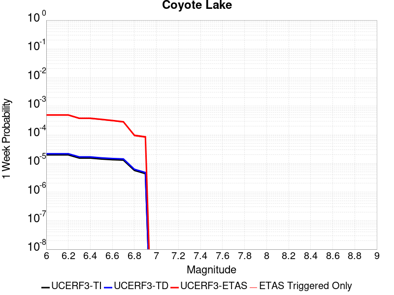 |  |  |  |

| Magnitude | 1 wk TI Prob | 1 wk TD Prob | 1 wk ETAS Prob | 1 wk ETAS/TD Gain | 1 wk ETAS Triggered Only | 1 mo TI Prob | 1 mo TD Prob | 1 mo ETAS Prob | 1 mo ETAS/TD Gain | 1 mo ETAS Triggered Only | 1 yr TI Prob | 1 yr TD Prob | 1 yr ETAS Prob | 1 yr ETAS/TD Gain | 1 yr ETAS Triggered Only | 10 yr TI Prob | 10 yr TD Prob | 10 yr ETAS Prob | 10 yr ETAS/TD Gain | 10 yr ETAS Triggered Only |
|-----|-----|-----|-----|-----|-----|-----|-----|-----|-----|-----|-----|-----|-----|-----|-----|-----|-----|-----|-----|-----|
| 6.0 | 1.980352E-5 | 2.1706745E-5 | 6.040128E-4 | 27.826042 | 5.823187E-4 | 8.486947E-5 | 9.302599E-5 | 7.8115676E-4 | 8.397188 | 6.881948E-4 | 0.0010327959 | 0.0011320751 | 0.001872369 | 1.6539265 | 7.411329E-4 | 0.010280091 | 0.011270258 | 0.012107721 | 1.0743073 | 8.47009E-4 |
| 6.1 | 1.980352E-5 | 2.1706745E-5 | 6.040128E-4 | 27.826042 | 5.823187E-4 | 8.486947E-5 | 9.302599E-5 | 7.8115676E-4 | 8.397188 | 6.881948E-4 | 0.0010327959 | 0.0011320751 | 0.001872369 | 1.6539265 | 7.411329E-4 | 0.010280091 | 0.011270258 | 0.012107721 | 1.0743073 | 8.47009E-4 |
| 6.2 | 1.980352E-5 | 2.1706745E-5 | 6.040128E-4 | 27.826042 | 5.823187E-4 | 8.486947E-5 | 9.302599E-5 | 7.8115676E-4 | 8.397188 | 6.881948E-4 | 0.0010327959 | 0.0011320751 | 0.001872369 | 1.6539265 | 7.411329E-4 | 0.010280091 | 0.011270258 | 0.012107721 | 1.0743073 | 8.47009E-4 |
| 6.3 | 1.5344787E-5 | 1.682067E-5 | 5.461924E-4 | 32.4715 | 5.2938063E-4 | 6.576172E-5 | 7.2086936E-5 | 6.5436366E-4 | 9.077423 | 5.823187E-4 | 8.003548E-4 | 8.773662E-4 | 0.001459174 | 1.6631299 | 5.823187E-4 | 0.007974784 | 0.00874507 | 0.009427246 | 1.078007 | 6.881948E-4 |
| 6.4 | 1.5344787E-5 | 1.682067E-5 | 5.461924E-4 | 32.4715 | 5.2938063E-4 | 6.576172E-5 | 7.2086936E-5 | 6.5436366E-4 | 9.077423 | 5.823187E-4 | 8.003548E-4 | 8.773662E-4 | 0.001459174 | 1.6631299 | 5.823187E-4 | 0.007974784 | 0.00874507 | 0.009427246 | 1.078007 | 6.881948E-4 |
| 6.5 | 1.4189697E-5 | 1.5557987E-5 | 4.390559E-4 | 28.220612 | 4.235045E-4 | 6.081157E-5 | 6.6675726E-5 | 5.430865E-4 | 8.145191 | 4.7644257E-4 | 7.401293E-4 | 8.115349E-4 | 0.0012875908 | 1.5866117 | 4.7644257E-4 | 0.0073766913 | 0.008091656 | 0.008669263 | 1.071383 | 5.823187E-4 |
| 6.6 | 1.3469301E-5 | 1.4771577E-5 | 3.8533253E-4 | 26.086079 | 3.7056644E-4 | 5.7724297E-5 | 6.330556E-5 | 4.8678325E-4 | 7.689423 | 4.235045E-4 | 7.025667E-4 | 7.7053264E-4 | 0.0011937108 | 1.5492021 | 4.235045E-4 | 0.0070034964 | 0.0076845144 | 0.008209826 | 1.0683599 | 5.2938063E-4 |
| 6.7 | 1.3027966E-5 | 1.4281745E-5 | 3.3190558E-4 | 23.239847 | 3.1762838E-4 | 5.5832945E-5 | 6.120638E-5 | 3.788153E-4 | 6.1891475 | 3.1762838E-4 | 6.7955407E-4 | 7.4499263E-4 | 0.0010623843 | 1.4260334 | 3.1762838E-4 | 0.006774798 | 0.0074308286 | 0.007851186 | 1.0565695 | 4.235045E-4 |
| 6.8 | 5.695434E-6 | 6.2244176E-6 | 5.916215E-5 | 9.5048485 | 5.2938063E-5 | 2.4408775E-5 | 2.6675973E-5 | 7.9612626E-5 | 2.984432 | 5.2938063E-5 | 2.971363E-4 | 3.2476155E-4 | 3.7768242E-4 | 1.162953 | 5.2938063E-5 | 0.0029673933 | 0.0032458105 | 0.0033513429 | 1.0325135 | 1.05876126E-4 |
| 6.9 | 4.385688E-6 | 4.7930553E-6 | 5.7730864E-5 | 12.044689 | 5.2938063E-5 | 1.879567E-5 | 2.0541665E-5 | 7.3478644E-5 | 3.5770535 | 5.2938063E-5 | 2.2881327E-4 | 2.5009477E-4 | 3.030196E-4 | 1.211619 | 5.2938063E-5 | 0.002285778 | 0.0025009478 | 0.0025537536 | 1.0211142 | 5.2938063E-5 |

## Red Pass
*[(top)](#table-of-contents)*

| 1 Week | 1 Month | 1 Year | 10 Year |
|-----|-----|-----|-----|
|  |  |  |  |

| Magnitude | 1 wk TI Prob | 1 wk TD Prob | 1 wk ETAS Prob | 1 wk ETAS/TD Gain | 1 wk ETAS Triggered Only | 1 mo TI Prob | 1 mo TD Prob | 1 mo ETAS Prob | 1 mo ETAS/TD Gain | 1 mo ETAS Triggered Only | 1 yr TI Prob | 1 yr TD Prob | 1 yr ETAS Prob | 1 yr ETAS/TD Gain | 1 yr ETAS Triggered Only | 10 yr TI Prob | 10 yr TD Prob | 10 yr ETAS Prob | 10 yr ETAS/TD Gain | 10 yr ETAS Triggered Only |
|-----|-----|-----|-----|-----|-----|-----|-----|-----|-----|-----|-----|-----|-----|-----|-----|-----|-----|-----|-----|-----|
| 6.0 | 8.258278E-6 | 8.551265E-6 | 4.8498975E-4 | 56.715557 | 4.7644257E-4 | 3.539214E-5 | 3.6647863E-5 | 5.660091E-4 | 15.444531 | 5.2938063E-4 | 4.308141E-4 | 4.4611428E-4 | 0.0010810876 | 2.4233425 | 6.3525676E-4 | 0.0042997985 | 0.004453945 | 0.0051390743 | 1.1538254 | 6.881948E-4 |
| 6.1 | 3.649988E-6 | 3.7753161E-6 | 2.6846462E-4 | 71.110504 | 2.6469032E-4 | 1.5642712E-5 | 1.6179853E-5 | 3.338031E-4 | 20.630787 | 3.1762838E-4 | 1.9043336E-4 | 1.9697666E-4 | 6.2039774E-4 | 3.1496003 | 4.235045E-4 | 0.0019027026 | 0.001968488 | 0.0024439928 | 1.2415583 | 4.7644257E-4 |
| 6.2 | 3.649988E-6 | 3.7753161E-6 | 2.6846462E-4 | 71.110504 | 2.6469032E-4 | 1.5642712E-5 | 1.6179853E-5 | 3.338031E-4 | 20.630787 | 3.1762838E-4 | 1.9043336E-4 | 1.9697666E-4 | 6.2039774E-4 | 3.1496003 | 4.235045E-4 | 0.0019027026 | 0.001968488 | 0.0024439928 | 1.2415583 | 4.7644257E-4 |
| 6.3 | 1.3924937E-6 | 1.4411166E-6 | 5.4379103E-5 | 37.734005 | 5.2938063E-5 | 5.9678164E-6 | 6.1762075E-6 | 1.12051675E-4 | 18.142473 | 1.05876126E-4 | 7.265574E-5 | 7.519415E-5 | 1.810623E-4 | 2.4079309 | 1.05876126E-4 | 7.263199E-4 | 7.518258E-4 | 8.576223E-4 | 1.1407194 | 1.05876126E-4 |
| 6.4 | 1.3924937E-6 | 1.4411166E-6 | 5.4379103E-5 | 37.734005 | 5.2938063E-5 | 5.9678164E-6 | 6.1762075E-6 | 1.12051675E-4 | 18.142473 | 1.05876126E-4 | 7.265574E-5 | 7.519415E-5 | 1.810623E-4 | 2.4079309 | 1.05876126E-4 | 7.263199E-4 | 7.518258E-4 | 8.576223E-4 | 1.1407194 | 1.05876126E-4 |
| 6.5 | 9.876812E-7 | 1.0221912E-6 | 1.0221912E-6 | 1.0 | 0.0 | 4.2329125E-6 | 4.3808195E-6 | 5.731865E-5 | 13.084002 | 5.2938063E-5 | 5.153449E-5 | 5.3336476E-5 | 1.0627171E-4 | 1.9924772 | 5.2938063E-5 | 5.1522546E-4 | 5.333648E-4 | 5.862746E-4 | 1.0992001 | 5.2938063E-5 |

## San Andreas (Parkfield)
*[(top)](#table-of-contents)*

| 1 Week | 1 Month | 1 Year | 10 Year |
|-----|-----|-----|-----|
|  |  |  |  |

| Magnitude | 1 wk TI Prob | 1 wk TD Prob | 1 wk ETAS Prob | 1 wk ETAS/TD Gain | 1 wk ETAS Triggered Only | 1 mo TI Prob | 1 mo TD Prob | 1 mo ETAS Prob | 1 mo ETAS/TD Gain | 1 mo ETAS Triggered Only | 1 yr TI Prob | 1 yr TD Prob | 1 yr ETAS Prob | 1 yr ETAS/TD Gain | 1 yr ETAS Triggered Only | 10 yr TI Prob | 10 yr TD Prob | 10 yr ETAS Prob | 10 yr ETAS/TD Gain | 10 yr ETAS Triggered Only |
|-----|-----|-----|-----|-----|-----|-----|-----|-----|-----|-----|-----|-----|-----|-----|-----|-----|-----|-----|-----|-----|
| 6.0 | 5.556969E-4 | 7.7782426E-4 | 0.0010423086 | 1.3400311 | 2.6469032E-4 | 0.0023793848 | 0.0033298214 | 0.003699154 | 1.1109166 | 3.7056644E-4 | 0.028586963 | 0.040191233 | 0.04080096 | 1.0151706 | 6.3525676E-4 | 0.25176284 | 0.33716413 | 0.3375852 | 1.0012488 | 6.3525676E-4 |
| 6.1 | 1.925858E-4 | 3.0276453E-4 | 3.5568656E-4 | 1.174796 | 5.2938063E-5 | 8.2510663E-4 | 0.0012970108 | 0.0014027496 | 1.081525 | 1.05876126E-4 | 0.0099994885 | 0.015778083 | 0.016038597 | 1.0165111 | 2.6469032E-4 | 0.095613256 | 0.1497237 | 0.14994875 | 1.0015031 | 2.6469032E-4 |
| 6.2 | 9.4306815E-5 | 1.8242796E-4 | 1.8242796E-4 | 1.0 | 0.0 | 4.0410945E-4 | 7.816011E-4 | 8.344978E-4 | 1.0676774 | 5.2938063E-5 | 0.0049089384 | 0.009474681 | 0.009684427 | 1.0221375 | 2.1175225E-4 | 0.048019063 | 0.09185409 | 0.09204639 | 1.0020936 | 2.1175225E-4 |
| 6.3 | 9.283051E-5 | 1.7939322E-4 | 1.7939322E-4 | 1.0 | 0.0 | 3.9778434E-4 | 7.686027E-4 | 8.215001E-4 | 1.0688227 | 5.2938063E-5 | 0.0048322747 | 0.009317789 | 0.009527569 | 1.0225139 | 2.1175225E-4 | 0.047285385 | 0.09050704 | 0.09069962 | 1.0021279 | 2.1175225E-4 |
| 6.4 | 9.138826E-5 | 1.770153E-4 | 1.770153E-4 | 1.0 | 0.0 | 3.916052E-4 | 7.5841765E-4 | 8.1131555E-4 | 1.0697477 | 5.2938063E-5 | 0.0047573745 | 0.00919484 | 0.009404645 | 1.0228177 | 2.1175225E-4 | 0.046568092 | 0.08940927 | 0.08960209 | 1.0021566 | 2.1175225E-4 |
| 6.5 | 9.000255E-5 | 1.7459576E-4 | 1.7459576E-4 | 1.0 | 0.0 | 3.8566816E-4 | 7.480541E-4 | 8.009526E-4 | 1.0707147 | 5.2938063E-5 | 0.0046854047 | 0.009069731 | 0.009279564 | 1.0231354 | 2.1175225E-4 | 0.045878403 | 0.088295065 | 0.08848812 | 1.0021865 | 2.1175225E-4 |
| 6.6 | 8.8109264E-5 | 1.7140752E-4 | 1.7140752E-4 | 1.0 | 0.0 | 3.7755648E-4 | 7.3439797E-4 | 7.872972E-4 | 1.0720307 | 5.2938063E-5 | 0.0045870654 | 0.008904854 | 0.009062254 | 1.0176758 | 1.5881419E-4 | 0.04493529 | 0.0868267 | 0.086971715 | 1.0016702 | 1.5881419E-4 |
| 6.7 | 8.738073E-5 | 1.7007832E-4 | 1.7007832E-4 | 1.0 | 0.0 | 3.7443507E-4 | 7.287046E-4 | 7.816041E-4 | 1.0725938 | 5.2938063E-5 | 0.0045492216 | 0.008836143 | 0.008993554 | 1.0178144 | 1.5881419E-4 | 0.04457213 | 0.08622707 | 0.08637218 | 1.001683 | 1.5881419E-4 |
| 6.8 | 8.710195E-5 | 1.6953335E-4 | 1.6953335E-4 | 1.0 | 0.0 | 3.7324068E-4 | 7.263703E-4 | 7.792699E-4 | 1.0728273 | 5.2938063E-5 | 0.0045347405 | 0.008807961 | 0.008965376 | 1.017872 | 1.5881419E-4 | 0.04443313 | 0.08597467 | 0.08611983 | 1.0016884 | 1.5881419E-4 |
| 6.9 | 8.6801556E-5 | 1.689429E-4 | 1.689429E-4 | 1.0 | 0.0 | 3.7195362E-4 | 7.2384125E-4 | 7.76741E-4 | 1.073082 | 5.2938063E-5 | 0.0045191357 | 0.008777418 | 0.008934839 | 1.0179347 | 1.5881419E-4 | 0.044283327 | 0.085700735 | 0.08584594 | 1.0016943 | 1.5881419E-4 |
| 7.0 | 8.5571606E-5 | 1.6647128E-4 | 1.6647128E-4 | 1.0 | 0.0 | 3.6668387E-4 | 7.132544E-4 | 7.661547E-4 | 1.0741675 | 5.2938063E-5 | 0.004455241 | 0.008649553 | 0.008806994 | 1.0182022 | 1.5881419E-4 | 0.043669727 | 0.08454914 | 0.08469453 | 1.0017196 | 1.5881419E-4 |
| 7.1 | 7.82589E-5 | 1.5128135E-4 | 1.5128135E-4 | 1.0 | 0.0 | 3.3535215E-4 | 6.481883E-4 | 7.01092E-4 | 1.0816178 | 5.2938063E-5 | 0.0040752706 | 0.007863307 | 0.008020872 | 1.020038 | 1.5881419E-4 | 0.040013418 | 0.07746111 | 0.077607624 | 1.0018914 | 1.5881419E-4 |
| 7.2 | 7.690929E-5 | 1.4865391E-4 | 1.4865391E-4 | 1.0 | 0.0 | 3.2956956E-4 | 6.369334E-4 | 6.8983773E-4 | 1.083061 | 5.2938063E-5 | 0.004005129 | 0.007727258 | 0.007884845 | 1.0203936 | 1.5881419E-4 | 0.0393371 | 0.07623427 | 0.076380976 | 1.0019244 | 1.5881419E-4 |
| 7.3 | 7.5543794E-5 | 1.4561978E-4 | 1.4561978E-4 | 1.0 | 0.0 | 3.2371894E-4 | 6.2393624E-4 | 6.7684124E-4 | 1.0847924 | 5.2938063E-5 | 0.003934157 | 0.007570127 | 0.0077277394 | 1.0208203 | 1.5881419E-4 | 0.038652334 | 0.074797355 | 0.07494429 | 1.0019644 | 1.5881419E-4 |
| 7.4 | 7.4214564E-5 | 1.4262961E-4 | 1.4262961E-4 | 1.0 | 0.0 | 3.1802364E-4 | 6.111273E-4 | 6.64033E-4 | 1.0865707 | 5.2938063E-5 | 0.003865065 | 0.00741525 | 0.0075728865 | 1.0212585 | 1.5881419E-4 | 0.03798529 | 0.07337123 | 0.073518395 | 1.0020057 | 1.5881419E-4 |
| 7.5 | 6.149578E-5 | 1.11907226E-4 | 1.11907226E-4 | 1.0 | 0.0 | 2.6352672E-4 | 4.7951436E-4 | 5.3242705E-4 | 1.1103464 | 5.2938063E-5 | 0.0032037178 | 0.0058224914 | 0.005980381 | 1.0271171 | 1.5881419E-4 | 0.03157923 | 0.058557566 | 0.05870708 | 1.0025533 | 1.5881419E-4 |
| 7.6 | 6.0643448E-5 | 1.10193796E-4 | 1.10193796E-4 | 1.0 | 0.0 | 2.598746E-4 | 4.7217376E-4 | 5.250868E-4 | 1.1120627 | 5.2938063E-5 | 0.0031593828 | 0.0057335934 | 0.0058914972 | 1.0275401 | 1.5881419E-4 | 0.031148417 | 0.057718582 | 0.057868227 | 1.0025927 | 1.5881419E-4 |
| 7.7 | 5.1652263E-5 | 9.174698E-5 | 9.174698E-5 | 1.0 | 0.0 | 2.2134806E-4 | 3.931421E-4 | 4.4605936E-4 | 1.1346009 | 5.2938063E-5 | 0.002691582 | 0.0047760103 | 0.0048813806 | 1.0220624 | 1.05876126E-4 | 0.026592141 | 0.04853623 | 0.048636965 | 1.0020756 | 1.05876126E-4 |
| 7.8 | 4.8090482E-5 | 8.559635E-5 | 8.559635E-5 | 1.0 | 0.0 | 2.060858E-4 | 3.6678996E-4 | 4.197086E-4 | 1.1442751 | 5.2938063E-5 | 0.0025062072 | 0.0044565317 | 0.004561936 | 1.0236516 | 1.05876126E-4 | 0.024781305 | 0.04530245 | 0.04540353 | 1.0022312 | 1.05876126E-4 |
| 7.9 | 3.970278E-5 | 6.750426E-5 | 6.750426E-5 | 1.0 | 0.0 | 1.7014367E-4 | 2.892719E-4 | 3.4219466E-4 | 1.1829516 | 5.2938063E-5 | 0.002069531 | 0.0035162016 | 0.0036217053 | 1.0300051 | 1.05876126E-4 | 0.020503636 | 0.035881363 | 0.03598344 | 1.0028448 | 1.05876126E-4 |
| 8.0 | 2.8982335E-5 | 4.069796E-5 | 4.069796E-5 | 1.0 | 0.0 | 1.2420409E-4 | 1.7440817E-4 | 2.27337E-4 | 1.3034768 | 5.2938063E-5 | 0.0015111357 | 0.0021213528 | 0.0022270042 | 1.0498039 | 1.05876126E-4 | 0.015009012 | 0.022010697 | 0.022114241 | 1.0047044 | 1.05876126E-4 |
| 8.1 | 1.8836186E-5 | 1.8681134E-5 | 1.8681134E-5 | 1.0 | 0.0 | 8.0724014E-5 | 8.005955E-5 | 1.3299337E-4 | 1.6611806 | 5.2938063E-5 | 9.823717E-4 | 9.742898E-4 | 0.0010271763 | 1.0542821 | 5.2938063E-5 | 0.009780403 | 0.010488115 | 0.010540498 | 1.0049945 | 5.2938063E-5 |
| 8.2 | 8.643924E-6 | 5.4748625E-6 | 5.4748625E-6 | 1.0 | 0.0 | 3.704486E-5 | 2.3463486E-5 | 2.3463486E-5 | 1.0 | 0.0 | 4.5092785E-4 | 2.8563058E-4 | 2.8563058E-4 | 1.0 | 0.0 | 0.0045001395 | 0.0032487072 | 0.0032487072 | 1.0 | 0.0 |
| 8.3 | 1.983087E-6 | 7.6599065E-7 | 7.6599065E-7 | 1.0 | 0.0 | 8.498917E-6 | 3.282813E-6 | 3.282813E-6 | 1.0 | 0.0 | 1.034694E-4 | 3.9967534E-5 | 3.9967534E-5 | 1.0 | 0.0 | 0.0010342124 | 4.719687E-4 | 4.719687E-4 | 1.0 | 0.0 |

## San Andreas (Big Bend)
*[(top)](#table-of-contents)*

| 1 Week | 1 Month | 1 Year | 10 Year |
|-----|-----|-----|-----|
|  |  |  |  |

| Magnitude | 1 wk TI Prob | 1 wk TD Prob | 1 wk ETAS Prob | 1 wk ETAS/TD Gain | 1 wk ETAS Triggered Only | 1 mo TI Prob | 1 mo TD Prob | 1 mo ETAS Prob | 1 mo ETAS/TD Gain | 1 mo ETAS Triggered Only | 1 yr TI Prob | 1 yr TD Prob | 1 yr ETAS Prob | 1 yr ETAS/TD Gain | 1 yr ETAS Triggered Only | 10 yr TI Prob | 10 yr TD Prob | 10 yr ETAS Prob | 10 yr ETAS/TD Gain | 10 yr ETAS Triggered Only |
|-----|-----|-----|-----|-----|-----|-----|-----|-----|-----|-----|-----|-----|-----|-----|-----|-----|-----|-----|-----|-----|
| 6.0 | 1.0179969E-4 | 2.0072258E-4 | 3.0657745E-4 | 1.527369 | 1.05876126E-4 | 4.362114E-4 | 8.599571E-4 | 0.0011773123 | 1.3690361 | 3.1762838E-4 | 0.0052979486 | 0.010419999 | 0.010943864 | 1.0502748 | 5.2938063E-4 | 0.051734097 | 0.10144902 | 0.10201983 | 1.0056266 | 6.3525676E-4 |
| 6.1 | 1.0179969E-4 | 2.0072258E-4 | 3.0657745E-4 | 1.527369 | 1.05876126E-4 | 4.362114E-4 | 8.599571E-4 | 0.0011773123 | 1.3690361 | 3.1762838E-4 | 0.0052979486 | 0.010419999 | 0.010943864 | 1.0502748 | 5.2938063E-4 | 0.051734097 | 0.10144902 | 0.10201983 | 1.0056266 | 6.3525676E-4 |
| 6.2 | 1.0179969E-4 | 2.0072258E-4 | 3.0657745E-4 | 1.527369 | 1.05876126E-4 | 4.362114E-4 | 8.599571E-4 | 0.0011773123 | 1.3690361 | 3.1762838E-4 | 0.0052979486 | 0.010419999 | 0.010943864 | 1.0502748 | 5.2938063E-4 | 0.051734097 | 0.10144902 | 0.10201983 | 1.0056266 | 6.3525676E-4 |
| 6.3 | 1.0179969E-4 | 2.0072258E-4 | 3.0657745E-4 | 1.527369 | 1.05876126E-4 | 4.362114E-4 | 8.599571E-4 | 0.0011773123 | 1.3690361 | 3.1762838E-4 | 0.0052979486 | 0.010419999 | 0.010943864 | 1.0502748 | 5.2938063E-4 | 0.051734097 | 0.10144902 | 0.10201983 | 1.0056266 | 6.3525676E-4 |
| 6.4 | 9.1639464E-5 | 1.8429532E-4 | 2.9015192E-4 | 1.5743858 | 1.05876126E-4 | 3.9268145E-4 | 7.895982E-4 | 0.0011069758 | 1.4019482 | 3.1762838E-4 | 0.0047704205 | 0.009571102 | 0.010042985 | 1.0493028 | 4.7644257E-4 | 0.046693064 | 0.09377527 | 0.09420703 | 1.0046042 | 4.7644257E-4 |
| 6.5 | 9.1639464E-5 | 1.8429532E-4 | 2.9015192E-4 | 1.5743858 | 1.05876126E-4 | 3.9268145E-4 | 7.895982E-4 | 0.0011069758 | 1.4019482 | 3.1762838E-4 | 0.0047704205 | 0.009571102 | 0.010042985 | 1.0493028 | 4.7644257E-4 | 0.046693064 | 0.09377527 | 0.09420703 | 1.0046042 | 4.7644257E-4 |
| 6.6 | 9.042622E-5 | 1.823659E-4 | 2.882227E-4 | 1.5804639 | 1.05876126E-4 | 3.8748336E-4 | 7.8133424E-4 | 0.0010458177 | 1.3385024 | 2.6469032E-4 | 0.0047074095 | 0.009471365 | 0.009890858 | 1.0442907 | 4.235045E-4 | 0.046089325 | 0.092869274 | 0.09325345 | 1.0041367 | 4.235045E-4 |
| 6.7 | 8.9836685E-5 | 1.8150927E-4 | 2.8736616E-4 | 1.5832039 | 1.05876126E-4 | 3.8495753E-4 | 7.776651E-4 | 9.892527E-4 | 1.2720805 | 2.1175225E-4 | 0.00467679 | 0.00942708 | 0.009794153 | 1.0389382 | 3.7056644E-4 | 0.045795817 | 0.09246355 | 0.09279985 | 1.0036372 | 3.7056644E-4 |
| 6.8 | 8.9471854E-5 | 1.8097709E-4 | 2.8683405E-4 | 1.5849191 | 1.05876126E-4 | 3.8339442E-4 | 7.7538576E-4 | 9.869738E-4 | 1.272881 | 2.1175225E-4 | 0.004657841 | 0.009399569 | 0.009766652 | 1.0390532 | 3.7056644E-4 | 0.04561414 | 0.092210755 | 0.092547156 | 1.0036482 | 3.7056644E-4 |
| 6.9 | 8.858234E-5 | 1.7979681E-4 | 2.3272536E-4 | 1.2943797 | 5.2938063E-5 | 3.7958333E-4 | 7.703304E-4 | 9.2902227E-4 | 1.2060049 | 1.5881419E-4 | 0.004611638 | 0.009338548 | 0.009653211 | 1.033695 | 3.1762838E-4 | 0.04517103 | 0.09165087 | 0.09193939 | 1.003148 | 3.1762838E-4 |
| 7.0 | 8.7433385E-5 | 1.7818481E-4 | 2.3111344E-4 | 1.2970434 | 5.2938063E-5 | 3.746607E-4 | 7.634259E-4 | 9.2211884E-4 | 1.2078695 | 1.5881419E-4 | 0.004551957 | 0.009255203 | 0.009569892 | 1.0340012 | 3.1762838E-4 | 0.044598386 | 0.09088532 | 0.09117407 | 1.0031772 | 3.1762838E-4 |
| 7.1 | 8.684964E-5 | 1.7730435E-4 | 2.3023302E-4 | 1.2985188 | 5.2938063E-5 | 3.7215967E-4 | 7.596547E-4 | 9.1834826E-4 | 1.2089022 | 1.5881419E-4 | 0.0045216335 | 0.009209678 | 0.009524381 | 1.0341709 | 3.1762838E-4 | 0.04430731 | 0.09046686 | 0.09075575 | 1.0031934 | 3.1762838E-4 |
| 7.2 | 8.606521E-5 | 1.762105E-4 | 2.2913923E-4 | 1.3003722 | 5.2938063E-5 | 3.6879873E-4 | 7.549695E-4 | 8.607657E-4 | 1.140133 | 1.05876126E-4 | 0.0044808835 | 0.0091531165 | 0.009415383 | 1.0286534 | 2.6469032E-4 | 0.043916024 | 0.089947365 | 0.09018825 | 1.002678 | 2.6469032E-4 |
| 7.3 | 8.568266E-5 | 1.7563057E-4 | 2.2855934E-4 | 1.3013642 | 5.2938063E-5 | 3.6715972E-4 | 7.524855E-4 | 8.582819E-4 | 1.140596 | 1.05876126E-4 | 0.0044610105 | 0.009123127 | 0.009385402 | 1.0287484 | 2.6469032E-4 | 0.043725148 | 0.08966853 | 0.08990948 | 1.0026872 | 2.6469032E-4 |
| 7.4 | 8.5432206E-5 | 1.7525644E-4 | 2.2818522E-4 | 1.3020077 | 5.2938063E-5 | 3.6608664E-4 | 7.50883E-4 | 8.5667963E-4 | 1.1408963 | 1.05876126E-4 | 0.004447999 | 0.009103781 | 0.009366061 | 1.02881 | 2.6469032E-4 | 0.043600157 | 0.08948871 | 0.08972971 | 1.002693 | 2.6469032E-4 |
| 7.5 | 8.4791965E-5 | 1.7394972E-4 | 2.2687859E-4 | 1.3042767 | 5.2938063E-5 | 3.633435E-4 | 7.4528606E-4 | 8.5108326E-4 | 1.1419551 | 1.05876126E-4 | 0.0044147377 | 0.009036204 | 0.0092985025 | 1.0290275 | 2.6469032E-4 | 0.043280575 | 0.088866346 | 0.08910751 | 1.0027138 | 2.6469032E-4 |
| 7.6 | 8.241105E-5 | 1.6840403E-4 | 2.2133318E-4 | 1.3142986 | 5.2938063E-5 | 3.531424E-4 | 7.215321E-4 | 8.2733185E-4 | 1.1466321 | 1.05876126E-4 | 0.0042910352 | 0.008749358 | 0.009011733 | 1.0299878 | 2.6469032E-4 | 0.042091176 | 0.086243294 | 0.086485155 | 1.0028044 | 2.6469032E-4 |
| 7.7 | 7.00432E-5 | 1.42045E-4 | 1.9497555E-4 | 1.3726321 | 5.2938063E-5 | 3.001506E-4 | 6.0862233E-4 | 7.14434E-4 | 1.1738545 | 1.05876126E-4 | 0.0036482112 | 0.0073848404 | 0.0075950287 | 1.0284622 | 2.1175225E-4 | 0.035888977 | 0.07351733 | 0.07371351 | 1.0026685 | 2.1175225E-4 |
| 7.8 | 6.415362E-5 | 1.2968935E-4 | 1.2968935E-4 | 1.0 | 0.0 | 2.749151E-4 | 5.556931E-4 | 6.086017E-4 | 1.095212 | 5.2938063E-5 | 0.0033419547 | 0.0067446055 | 0.0069023487 | 1.023388 | 1.5881419E-4 | 0.03292141 | 0.06725231 | 0.06740044 | 1.0022026 | 1.5881419E-4 |
| 7.9 | 4.939911E-5 | 9.3411545E-5 | 9.3411545E-5 | 1.0 | 0.0 | 2.116933E-4 | 4.0027377E-4 | 4.5319065E-4 | 1.1322017 | 5.2938063E-5 | 0.0025743195 | 0.004862453 | 0.0050204946 | 1.0325025 | 1.5881419E-4 | 0.025447013 | 0.048914436 | 0.049065482 | 1.003088 | 1.5881419E-4 |
| 8.0 | 3.344983E-5 | 5.222685E-5 | 5.222685E-5 | 1.0 | 0.0 | 1.4334853E-4 | 2.2381016E-4 | 2.767364E-4 | 1.2364782 | 5.2938063E-5 | 0.0017438711 | 0.0027214854 | 0.0028798676 | 1.0581969 | 1.5881419E-4 | 0.017302496 | 0.027922187 | 0.028076567 | 1.0055289 | 1.5881419E-4 |
| 8.1 | 1.9104898E-5 | 1.9173063E-5 | 1.9173063E-5 | 1.0 | 0.0 | 8.1875565E-5 | 8.216769E-5 | 1.351014E-4 | 1.6442157 | 5.2938063E-5 | 9.963791E-4 | 9.999331E-4 | 0.0010528183 | 1.0528886 | 5.2938063E-5 | 0.009919235 | 0.010749801 | 0.01080217 | 1.0048716 | 5.2938063E-5 |
| 8.2 | 8.643924E-6 | 5.4748625E-6 | 5.4748625E-6 | 1.0 | 0.0 | 3.704486E-5 | 2.3463486E-5 | 2.3463486E-5 | 1.0 | 0.0 | 4.5092785E-4 | 2.8563058E-4 | 2.8563058E-4 | 1.0 | 0.0 | 0.0045001395 | 0.0032487072 | 0.0032487072 | 1.0 | 0.0 |
| 8.3 | 1.983087E-6 | 7.6599065E-7 | 7.6599065E-7 | 1.0 | 0.0 | 8.498917E-6 | 3.282813E-6 | 3.282813E-6 | 1.0 | 0.0 | 1.034694E-4 | 3.9967534E-5 | 3.9967534E-5 | 1.0 | 0.0 | 0.0010342124 | 4.719687E-4 | 4.719687E-4 | 1.0 | 0.0 |

## Cleghorn Lake
*[(top)](#table-of-contents)*

| 1 Week | 1 Month | 1 Year | 10 Year |
|-----|-----|-----|-----|
|  |  |  |  |

| Magnitude | 1 wk TI Prob | 1 wk TD Prob | 1 wk ETAS Prob | 1 wk ETAS/TD Gain | 1 wk ETAS Triggered Only | 1 mo TI Prob | 1 mo TD Prob | 1 mo ETAS Prob | 1 mo ETAS/TD Gain | 1 mo ETAS Triggered Only | 1 yr TI Prob | 1 yr TD Prob | 1 yr ETAS Prob | 1 yr ETAS/TD Gain | 1 yr ETAS Triggered Only | 10 yr TI Prob | 10 yr TD Prob | 10 yr ETAS Prob | 10 yr ETAS/TD Gain | 10 yr ETAS Triggered Only |
|-----|-----|-----|-----|-----|-----|-----|-----|-----|-----|-----|-----|-----|-----|-----|-----|-----|-----|-----|-----|-----|
| 6.0 | 1.5467183E-5 | 1.6794203E-5 | 3.3441724E-4 | 19.912659 | 3.1762838E-4 | 6.6286244E-5 | 7.197348E-5 | 3.8957899E-4 | 5.4128127 | 3.1762838E-4 | 8.067362E-4 | 8.759797E-4 | 0.0013520049 | 1.5434203 | 4.7644257E-4 | 0.008038137 | 0.008730696 | 0.009255454 | 1.0601051 | 5.2938063E-4 |
| 6.1 | 1.5467183E-5 | 1.6794203E-5 | 3.3441724E-4 | 19.912659 | 3.1762838E-4 | 6.6286244E-5 | 7.197348E-5 | 3.8957899E-4 | 5.4128127 | 3.1762838E-4 | 8.067362E-4 | 8.759797E-4 | 0.0013520049 | 1.5434203 | 4.7644257E-4 | 0.008038137 | 0.008730696 | 0.009255454 | 1.0601051 | 5.2938063E-4 |
| 6.2 | 1.2624631E-5 | 1.3681544E-5 | 3.3130558E-4 | 24.21551 | 3.1762838E-4 | 5.410444E-5 | 5.863415E-5 | 3.762439E-4 | 6.4168053 | 3.1762838E-4 | 6.585225E-4 | 7.1368564E-4 | 0.0011368878 | 1.5929813 | 4.235045E-4 | 0.0065657445 | 0.0071187317 | 0.0075392216 | 1.0590681 | 4.235045E-4 |
| 6.3 | 1.2624631E-5 | 1.3681544E-5 | 3.3130558E-4 | 24.21551 | 3.1762838E-4 | 5.410444E-5 | 5.863415E-5 | 3.762439E-4 | 6.4168053 | 3.1762838E-4 | 6.585225E-4 | 7.1368564E-4 | 0.0011368878 | 1.5929813 | 4.235045E-4 | 0.0065657445 | 0.0071187317 | 0.0075392216 | 1.0590681 | 4.235045E-4 |
| 6.4 | 9.417684E-6 | 1.0170118E-5 | 2.2192021E-4 | 21.82081 | 2.1175225E-4 | 4.036088E-5 | 4.3585722E-5 | 2.5532875E-4 | 5.8580823 | 2.1175225E-4 | 4.912829E-4 | 5.3056807E-4 | 8.480279E-4 | 1.5983396 | 3.1762838E-4 | 0.004901982 | 0.005297049 | 0.005612995 | 1.0596457 | 3.1762838E-4 |
| 6.5 | 9.368219E-6 | 1.0117545E-5 | 2.2186765E-4 | 21.929003 | 2.1175225E-4 | 4.014889E-5 | 4.3360415E-5 | 2.5510348E-4 | 5.8833265 | 2.1175225E-4 | 4.8870314E-4 | 5.2782625E-4 | 8.45287E-4 | 1.6014493 | 3.1762838E-4 | 0.004876298 | 0.0052697617 | 0.005585716 | 1.0599562 | 3.1762838E-4 |
| 6.6 | 7.803798E-6 | 8.441831E-6 | 2.2019229E-4 | 26.083475 | 2.1175225E-4 | 3.3444423E-5 | 3.6179E-5 | 2.479236E-4 | 6.8526936 | 2.1175225E-4 | 4.0710976E-4 | 4.4043022E-4 | 7.05004E-4 | 1.6007166 | 2.6469032E-4 | 0.0040636472 | 0.0043994905 | 0.004663016 | 1.0598992 | 2.6469032E-4 |
| 6.7 | 2.3108669E-6 | 2.4438336E-6 | 5.5381766E-5 | 22.66184 | 5.2938063E-5 | 9.903678E-6 | 1.0473532E-5 | 6.341104E-5 | 6.0544086 | 5.2938063E-5 | 1.205706E-4 | 1.2750797E-4 | 1.8043928E-4 | 1.4151216 | 5.2938063E-5 | 0.001205052 | 0.0012743667 | 0.0013272373 | 1.0414877 | 5.2938063E-5 |
| 6.8 | 2.0882828E-6 | 2.2062823E-6 | 5.5144228E-5 | 24.994186 | 5.2938063E-5 | 8.949753E-6 | 9.455462E-6 | 6.2393025E-5 | 6.598623 | 5.2938063E-5 | 1.08957785E-4 | 1.1511434E-4 | 1.680463E-4 | 1.4598209 | 5.2938063E-5 | 0.0010890438 | 0.0011505639 | 0.0012034411 | 1.0459576 | 5.2938063E-5 |
| 6.9 | 1.876935E-6 | 1.981051E-6 | 5.4919008E-5 | 27.722158 | 5.2938063E-5 | 8.043982E-6 | 8.490192E-6 | 6.14278E-5 | 7.2351494 | 5.2938063E-5 | 9.7931086E-5 | 1.03363345E-4 | 1.5629594E-4 | 1.5121021 | 5.2938063E-5 | 9.788794E-4 | 0.0010331686 | 0.001086052 | 1.0511856 | 5.2938063E-5 |
| 7.0 | 1.5357559E-6 | 1.6202807E-6 | 5.455826E-5 | 33.6721 | 5.2938063E-5 | 6.5817944E-6 | 6.9440425E-6 | 5.988174E-5 | 8.623469 | 5.2938063E-5 | 8.01304E-5 | 8.454057E-5 | 1.3747416E-4 | 1.6261324 | 5.2938063E-5 | 8.010151E-4 | 8.450965E-4 | 8.979898E-4 | 1.0625885 | 5.2938063E-5 |
| 7.1 | 1.0905424E-6 | 1.1497619E-6 | 1.1497619E-6 | 1.0 | 0.0 | 4.6737446E-6 | 4.9275427E-6 | 4.9275427E-6 | 1.0 | 0.0 | 5.6901354E-5 | 5.999128E-5 | 5.999128E-5 | 1.0 | 0.0 | 5.6886784E-4 | 5.997606E-4 | 5.997606E-4 | 1.0 | 0.0 |
| 7.2 | 6.06668E-7 | 6.387277E-7 | 6.387277E-7 | 1.0 | 0.0 | 2.600003E-6 | 2.7374022E-6 | 2.7374022E-6 | 1.0 | 0.0 | 3.1654577E-5 | 3.3327433E-5 | 3.3327433E-5 | 1.0 | 0.0 | 3.1650066E-4 | 3.3323118E-4 | 3.3323118E-4 | 1.0 | 0.0 |

## Death Valley (Fish Lake Valley)
*[(top)](#table-of-contents)*

| 1 Week | 1 Month | 1 Year | 10 Year |
|-----|-----|-----|-----|
|  |  |  |  |

| Magnitude | 1 wk TI Prob | 1 wk TD Prob | 1 wk ETAS Prob | 1 wk ETAS/TD Gain | 1 wk ETAS Triggered Only | 1 mo TI Prob | 1 mo TD Prob | 1 mo ETAS Prob | 1 mo ETAS/TD Gain | 1 mo ETAS Triggered Only | 1 yr TI Prob | 1 yr TD Prob | 1 yr ETAS Prob | 1 yr ETAS/TD Gain | 1 yr ETAS Triggered Only | 10 yr TI Prob | 10 yr TD Prob | 10 yr ETAS Prob | 10 yr ETAS/TD Gain | 10 yr ETAS Triggered Only |
|-----|-----|-----|-----|-----|-----|-----|-----|-----|-----|-----|-----|-----|-----|-----|-----|-----|-----|-----|-----|-----|
| 6.0 | 3.872328E-5 | 4.7267473E-5 | 3.1194527E-4 | 6.599576 | 2.6469032E-4 | 1.6594635E-4 | 2.0256084E-4 | 5.730522E-4 | 2.8290374 | 3.7056644E-4 | 0.0020185246 | 0.002463534 | 0.0029388028 | 1.1929215 | 4.7644257E-4 | 0.02000288 | 0.024388181 | 0.024904652 | 1.021177 | 5.2938063E-4 |
| 6.1 | 3.872328E-5 | 4.7267473E-5 | 3.1194527E-4 | 6.599576 | 2.6469032E-4 | 1.6594635E-4 | 2.0256084E-4 | 5.730522E-4 | 2.8290374 | 3.7056644E-4 | 0.0020185246 | 0.002463534 | 0.0029388028 | 1.1929215 | 4.7644257E-4 | 0.02000288 | 0.024388181 | 0.024904652 | 1.021177 | 5.2938063E-4 |
| 6.2 | 3.872328E-5 | 4.7267473E-5 | 3.1194527E-4 | 6.599576 | 2.6469032E-4 | 1.6594635E-4 | 2.0256084E-4 | 5.730522E-4 | 2.8290374 | 3.7056644E-4 | 0.0020185246 | 0.002463534 | 0.0029388028 | 1.1929215 | 4.7644257E-4 | 0.02000288 | 0.024388181 | 0.024904652 | 1.021177 | 5.2938063E-4 |
| 6.3 | 2.8356371E-5 | 3.3609853E-5 | 2.9829127E-4 | 8.875114 | 2.6469032E-4 | 1.2152165E-4 | 1.4403471E-4 | 5.1454775E-4 | 3.5723872 | 3.7056644E-4 | 0.0014785219 | 0.0017522911 | 0.0022278987 | 1.2714205 | 4.7644257E-4 | 0.014687235 | 0.017391782 | 0.017911956 | 1.0299091 | 5.2938063E-4 |
| 6.4 | 2.8356371E-5 | 3.3609853E-5 | 2.9829127E-4 | 8.875114 | 2.6469032E-4 | 1.2152165E-4 | 1.4403471E-4 | 5.1454775E-4 | 3.5723872 | 3.7056644E-4 | 0.0014785219 | 0.0017522911 | 0.0022278987 | 1.2714205 | 4.7644257E-4 | 0.014687235 | 0.017391782 | 0.017911956 | 1.0299091 | 5.2938063E-4 |
| 6.5 | 2.4448687E-5 | 2.8607552E-5 | 2.932903E-4 | 10.252198 | 2.6469032E-4 | 1.0477588E-4 | 1.2259831E-4 | 4.9311935E-4 | 4.0222354 | 3.7056644E-4 | 0.0012748998 | 0.0014916632 | 0.001967395 | 1.3189272 | 4.7644257E-4 | 0.012676105 | 0.014821377 | 0.015342911 | 1.035188 | 5.2938063E-4 |
| 6.6 | 2.1298161E-5 | 2.4660083E-5 | 2.8934388E-4 | 11.733288 | 2.6469032E-4 | 9.127464E-5 | 1.0568198E-4 | 4.7620927E-4 | 4.506059 | 3.7056644E-4 | 0.0011107022 | 0.0012859525 | 0.0017617824 | 1.3700213 | 4.7644257E-4 | 0.011051672 | 0.012788526 | 0.013311136 | 1.0408655 | 5.2938063E-4 |
| 6.7 | 1.8959729E-5 | 2.1781025E-5 | 2.8646557E-4 | 13.15207 | 2.6469032E-4 | 8.125345E-5 | 9.334405E-5 | 4.638759E-4 | 4.969528 | 3.7056644E-4 | 9.888117E-4 | 0.001135897 | 0.0016117983 | 1.4189652 | 4.7644257E-4 | 0.009844234 | 0.01130357 | 0.011826967 | 1.0463036 | 5.2938063E-4 |
| 6.8 | 1.6691629E-5 | 1.9018353E-5 | 2.8370364E-4 | 14.917361 | 2.6469032E-4 | 7.153359E-5 | 8.150477E-5 | 4.5204101E-4 | 5.5461907 | 3.7056644E-4 | 8.7057345E-4 | 9.918857E-4 | 0.0014678556 | 1.4798638 | 4.7644257E-4 | 0.008671708 | 0.009876343 | 0.0104004955 | 1.0530715 | 5.2938063E-4 |
| 6.9 | 1.450505E-5 | 1.638954E-5 | 2.810755E-4 | 17.149689 | 2.6469032E-4 | 6.216302E-5 | 7.0239046E-5 | 4.4077946E-4 | 6.275419 | 3.7056644E-4 | 7.5657194E-4 | 8.5483363E-4 | 0.0013308689 | 1.5568748 | 4.7644257E-4 | 0.007540013 | 0.008516385 | 0.009041258 | 1.0616308 | 5.2938063E-4 |
| 7.0 | 1.2940855E-5 | 1.4537972E-5 | 2.7922445E-4 | 19.20656 | 2.6469032E-4 | 5.545963E-5 | 6.230414E-5 | 4.3284748E-4 | 6.9473314 | 3.7056644E-4 | 6.750118E-4 | 7.5829466E-4 | 0.001234376 | 1.6278315 | 4.7644257E-4 | 0.006729651 | 0.0075576897 | 0.00808307 | 1.069516 | 5.2938063E-4 |
| 7.1 | 1.2544658E-5 | 1.4078208E-5 | 2.7876478E-4 | 19.801157 | 2.6469032E-4 | 5.3761712E-5 | 6.0333812E-5 | 4.308779E-4 | 7.141566 | 3.7056644E-4 | 6.5435225E-4 | 7.343222E-4 | 0.0012104149 | 1.6483431 | 4.7644257E-4 | 0.006524288 | 0.007319551 | 0.007845056 | 1.0717949 | 5.2938063E-4 |
| 7.2 | 1.2489416E-5 | 1.4015674E-5 | 2.7870227E-4 | 19.885042 | 2.6469032E-4 | 5.3524967E-5 | 6.0065824E-5 | 4.3061E-4 | 7.1689687 | 3.7056644E-4 | 6.514716E-4 | 7.310616E-4 | 0.0012071559 | 1.6512368 | 4.7644257E-4 | 0.006495651 | 0.0072871596 | 0.007812683 | 1.0721163 | 5.2938063E-4 |
| 7.3 | 1.2368307E-5 | 1.3879812E-5 | 2.7856644E-4 | 20.0699 | 2.6469032E-4 | 5.3005948E-5 | 5.9483587E-5 | 4.3002798E-4 | 7.2293553 | 3.7056644E-4 | 6.451563E-4 | 7.2397763E-4 | 0.0012000753 | 1.6576138 | 4.7644257E-4 | 0.0064328653 | 0.007216782 | 0.007742342 | 1.0728247 | 5.2938063E-4 |
| 7.4 | 1.2161707E-5 | 1.36478675E-5 | 2.2539723E-4 | 16.515198 | 2.1175225E-4 | 5.212056E-5 | 5.8489582E-5 | 3.7609937E-4 | 6.4301944 | 3.1762838E-4 | 6.3438306E-4 | 7.118836E-4 | 0.0011350866 | 1.5944835 | 4.235045E-4 | 0.006325751 | 0.0070966207 | 0.007569682 | 1.06666 | 4.7644257E-4 |
| 7.5 | 1.1707948E-5 | 1.3145515E-5 | 2.2489497E-4 | 17.108114 | 2.1175225E-4 | 5.0175953E-5 | 5.6336736E-5 | 3.7394723E-4 | 6.6377153 | 3.1762838E-4 | 6.10721E-4 | 6.856895E-4 | 0.0011089036 | 1.6172096 | 4.235045E-4 | 0.0060904534 | 0.006836321 | 0.0073095066 | 1.0692164 | 4.7644257E-4 |
| 7.6 | 1.0319538E-5 | 1.1579622E-5 | 2.2332942E-4 | 19.286417 | 2.1175225E-4 | 4.4225842E-5 | 4.9626036E-5 | 3.143032E-4 | 6.3334336 | 2.6469032E-4 | 5.383166E-4 | 6.040347E-4 | 9.214712E-4 | 1.525527 | 3.1762838E-4 | 0.0053701443 | 0.0060244603 | 0.006392794 | 1.0611397 | 3.7056644E-4 |
| 7.7 | 8.937764E-6 | 1.0022779E-5 | 2.217729E-4 | 22.126888 | 2.1175225E-4 | 3.830414E-5 | 4.295409E-5 | 3.0763302E-4 | 7.1619034 | 2.6469032E-4 | 4.6625308E-4 | 5.228456E-4 | 8.403079E-4 | 1.6071818 | 3.1762838E-4 | 0.0046527605 | 0.005216664 | 0.0055852975 | 1.0706645 | 3.7056644E-4 |
| 7.8 | 3.108007E-7 | 3.284654E-7 | 3.284654E-7 | 1.0 | 0.0 | 1.3320023E-6 | 1.407708E-6 | 1.407708E-6 | 1.0 | 0.0 | 1.6217007E-5 | 1.7138715E-5 | 1.7138715E-5 | 1.0 | 0.0 | 1.6215823E-4 | 1.7137431E-4 | 1.7137431E-4 | 1.0 | 0.0 |
| 7.9 | 2.5591178E-9 | 2.6696718E-9 | 2.6696718E-9 | 1.0 | 0.0 | 1.0967647E-8 | 1.14414505E-8 | 1.14414505E-8 | 1.0 | 0.0 | 1.335311E-7 | 1.3929966E-7 | 1.3929966E-7 | 1.0 | 0.0 | 1.3353102E-6 | 1.3929966E-6 | 1.3929966E-6 | 1.0 | 0.0 |

## Calico-Hidalgo
*[(top)](#table-of-contents)*

| 1 Week | 1 Month | 1 Year | 10 Year |
|-----|-----|-----|-----|
|  |  |  |  |

| Magnitude | 1 wk TI Prob | 1 wk TD Prob | 1 wk ETAS Prob | 1 wk ETAS/TD Gain | 1 wk ETAS Triggered Only | 1 mo TI Prob | 1 mo TD Prob | 1 mo ETAS Prob | 1 mo ETAS/TD Gain | 1 mo ETAS Triggered Only | 1 yr TI Prob | 1 yr TD Prob | 1 yr ETAS Prob | 1 yr ETAS/TD Gain | 1 yr ETAS Triggered Only | 10 yr TI Prob | 10 yr TD Prob | 10 yr ETAS Prob | 10 yr ETAS/TD Gain | 10 yr ETAS Triggered Only |
|-----|-----|-----|-----|-----|-----|-----|-----|-----|-----|-----|-----|-----|-----|-----|-----|-----|-----|-----|-----|-----|
| 6.0 | 4.0906612E-5 | 5.0703686E-5 | 2.624452E-4 | 5.1760573 | 2.1175225E-4 | 1.7530227E-4 | 2.172857E-4 | 5.3484505E-4 | 2.461483 | 3.1762838E-4 | 0.0021322158 | 0.002642648 | 0.0030650334 | 1.1598341 | 4.235045E-4 | 0.02111873 | 0.026152607 | 0.026565036 | 1.0157701 | 4.235045E-4 |
| 6.1 | 4.0906612E-5 | 5.0703686E-5 | 2.624452E-4 | 5.1760573 | 2.1175225E-4 | 1.7530227E-4 | 2.172857E-4 | 5.3484505E-4 | 2.461483 | 3.1762838E-4 | 0.0021322158 | 0.002642648 | 0.0030650334 | 1.1598341 | 4.235045E-4 | 0.02111873 | 0.026152607 | 0.026565036 | 1.0157701 | 4.235045E-4 |
| 6.2 | 4.0906612E-5 | 5.0703686E-5 | 2.624452E-4 | 5.1760573 | 2.1175225E-4 | 1.7530227E-4 | 2.172857E-4 | 5.3484505E-4 | 2.461483 | 3.1762838E-4 | 0.0021322158 | 0.002642648 | 0.0030650334 | 1.1598341 | 4.235045E-4 | 0.02111873 | 0.026152607 | 0.026565036 | 1.0157701 | 4.235045E-4 |
| 6.3 | 2.4242801E-5 | 3.0090669E-5 | 1.8890007E-4 | 6.277696 | 1.5881419E-4 | 1.0389358E-4 | 1.2895382E-4 | 3.4067876E-4 | 2.6418664 | 2.1175225E-4 | 0.0012641704 | 0.0015689151 | 0.0018331901 | 1.1684444 | 2.6469032E-4 | 0.01257003 | 0.01558206 | 0.015842626 | 1.0167222 | 2.6469032E-4 |
| 6.4 | 2.4242801E-5 | 3.0090669E-5 | 1.8890007E-4 | 6.277696 | 1.5881419E-4 | 1.0389358E-4 | 1.2895382E-4 | 3.4067876E-4 | 2.6418664 | 2.1175225E-4 | 0.0012641704 | 0.0015689151 | 0.0018331901 | 1.1684444 | 2.6469032E-4 | 0.01257003 | 0.01558206 | 0.015842626 | 1.0167222 | 2.6469032E-4 |
| 6.5 | 2.0286952E-5 | 2.5315738E-5 | 1.3118918E-4 | 5.18212 | 1.05876126E-4 | 8.694118E-5 | 1.0849161E-4 | 2.6728856E-4 | 2.4636798 | 1.5881419E-4 | 0.0010579949 | 0.001320102 | 0.0015315748 | 1.1601942 | 2.1175225E-4 | 0.010529719 | 0.013124538 | 0.013333511 | 1.0159223 | 2.1175225E-4 |
| 6.6 | 2.0269223E-5 | 2.5296687E-5 | 1.3117013E-4 | 5.1852694 | 1.05876126E-4 | 8.6865206E-5 | 1.08409964E-4 | 2.6720692E-4 | 2.464782 | 1.5881419E-4 | 0.0010570707 | 0.0013191093 | 0.0015305822 | 1.1603149 | 2.1175225E-4 | 0.010520565 | 0.013114728 | 0.013323703 | 1.0159343 | 2.1175225E-4 |
| 6.7 | 1.799852E-5 | 2.25406E-5 | 1.2841434E-4 | 5.697024 | 1.05876126E-4 | 7.713423E-5 | 9.659908E-5 | 2.5539793E-4 | 2.643896 | 1.5881419E-4 | 9.3870464E-4 | 0.0011754738 | 0.0013869772 | 1.1799303 | 2.1175225E-4 | 0.009347493 | 0.011694173 | 0.01190345 | 1.0178957 | 2.1175225E-4 |
| 6.8 | 1.7458793E-5 | 2.184212E-5 | 1.2771593E-4 | 5.8472314 | 1.05876126E-4 | 7.4821255E-5 | 9.3605806E-5 | 2.5240512E-4 | 2.6964686 | 1.5881419E-4 | 9.10568E-4 | 0.0011390693 | 0.0013505804 | 1.1856875 | 2.1175225E-4 | 0.009068459 | 0.011333893 | 0.011543246 | 1.0184714 | 2.1175225E-4 |
| 6.9 | 1.542884E-5 | 1.9025927E-5 | 1.2490003E-4 | 6.5647283 | 1.05876126E-4 | 6.612192E-5 | 8.153721E-5 | 2.4033846E-4 | 2.9475923 | 1.5881419E-4 | 8.04737E-4 | 9.922766E-4 | 0.0012038187 | 1.2131886 | 2.1175225E-4 | 0.008018291 | 0.009879857 | 0.010089518 | 1.0212209 | 2.1175225E-4 |
| 7.0 | 1.468253E-5 | 1.8030598E-5 | 7.0967704E-5 | 3.9359596 | 5.2938063E-5 | 6.292361E-5 | 7.7271776E-5 | 1.8313972E-4 | 2.3700726 | 1.05876126E-4 | 7.658257E-4 | 9.4039086E-4 | 0.0010990557 | 1.1687223 | 1.5881419E-4 | 0.0076319184 | 0.009365481 | 0.009522808 | 1.0167986 | 1.5881419E-4 |
| 7.1 | 1.3139281E-5 | 1.6200942E-5 | 6.913815E-5 | 4.2675385 | 5.2938063E-5 | 5.6309986E-5 | 6.943083E-5 | 1.752996E-4 | 2.5248091 | 1.05876126E-4 | 6.853584E-4 | 8.4500515E-4 | 0.0010036852 | 1.1877859 | 1.5881419E-4 | 0.0068324856 | 0.0084192185 | 0.008576696 | 1.0187045 | 1.5881419E-4 |
| 7.2 | 1.1127404E-5 | 1.3866597E-5 | 6.680393E-5 | 4.817615 | 5.2938063E-5 | 4.7688E-5 | 5.942698E-5 | 1.6529682E-4 | 2.781511 | 1.05876126E-4 | 5.8044674E-4 | 7.232942E-4 | 8.8199356E-4 | 1.2194118 | 1.5881419E-4 | 0.0057893298 | 0.0072105085 | 0.0073681776 | 1.0218666 | 1.5881419E-4 |
| 7.3 | 9.808154E-6 | 1.2176215E-5 | 6.5113636E-5 | 5.3476086 | 5.2938063E-5 | 4.2034266E-5 | 5.2182797E-5 | 1.580534E-4 | 3.028841 | 1.05876126E-4 | 5.11647E-4 | 6.3515105E-4 | 7.9386437E-4 | 1.2498828 | 1.5881419E-4 | 0.0051047057 | 0.006334433 | 0.0064922413 | 1.0249127 | 1.5881419E-4 |
| 7.4 | 7.942452E-6 | 9.792144E-6 | 6.272969E-5 | 6.406124 | 5.2938063E-5 | 3.4038632E-5 | 4.1965708E-5 | 9.4901545E-5 | 2.2614071 | 5.2938063E-5 | 4.1434157E-4 | 5.1082217E-4 | 6.166442E-4 | 1.2071602 | 1.05876126E-4 | 0.0041356985 | 0.005097421 | 0.0052027577 | 1.0206647 | 1.05876126E-4 |
| 7.5 | 4.7121216E-6 | 5.772836E-6 | 5.8710593E-5 | 10.170147 | 5.2938063E-5 | 2.019465E-5 | 2.4740535E-5 | 7.767729E-5 | 3.1396768 | 5.2938063E-5 | 2.4584212E-4 | 3.0118204E-4 | 3.5410415E-4 | 1.1757147 | 5.2938063E-5 | 0.0024557032 | 0.0030084911 | 0.0030612699 | 1.0175433 | 5.2938063E-5 |
| 7.6 | 2.21172E-7 | 2.603961E-7 | 2.603961E-7 | 1.0 | 0.0 | 9.478797E-7 | 1.1159829E-6 | 1.1159829E-6 | 1.0 | 0.0 | 1.1540374E-5 | 1.3587036E-5 | 1.3587036E-5 | 1.0 | 0.0 | 1.1539775E-4 | 1.3586486E-4 | 1.3586486E-4 | 1.0 | 0.0 |

## Santa Ynez (West)
*[(top)](#table-of-contents)*

| 1 Week | 1 Month | 1 Year | 10 Year |
|-----|-----|-----|-----|
|  |  |  |  |

| Magnitude | 1 wk TI Prob | 1 wk TD Prob | 1 wk ETAS Prob | 1 wk ETAS/TD Gain | 1 wk ETAS Triggered Only | 1 mo TI Prob | 1 mo TD Prob | 1 mo ETAS Prob | 1 mo ETAS/TD Gain | 1 mo ETAS Triggered Only | 1 yr TI Prob | 1 yr TD Prob | 1 yr ETAS Prob | 1 yr ETAS/TD Gain | 1 yr ETAS Triggered Only | 10 yr TI Prob | 10 yr TD Prob | 10 yr ETAS Prob | 10 yr ETAS/TD Gain | 10 yr ETAS Triggered Only |
|-----|-----|-----|-----|-----|-----|-----|-----|-----|-----|-----|-----|-----|-----|-----|-----|-----|-----|-----|-----|-----|
| 6.0 | 4.7352758E-5 | 5.4972126E-5 | 2.1377759E-4 | 3.888836 | 1.5881419E-4 | 2.0292461E-4 | 2.3557522E-4 | 5.0020317E-4 | 2.1233268 | 2.6469032E-4 | 0.0024678076 | 0.0028645284 | 0.0031812468 | 1.1105657 | 3.1762838E-4 | 0.024405818 | 0.028304417 | 0.028613055 | 1.0109042 | 3.1762838E-4 |
| 6.1 | 4.7352758E-5 | 5.4972126E-5 | 2.1377759E-4 | 3.888836 | 1.5881419E-4 | 2.0292461E-4 | 2.3557522E-4 | 5.0020317E-4 | 2.1233268 | 2.6469032E-4 | 0.0024678076 | 0.0028645284 | 0.0031812468 | 1.1105657 | 3.1762838E-4 | 0.024405818 | 0.028304417 | 0.028613055 | 1.0109042 | 3.1762838E-4 |
| 6.2 | 3.0415853E-5 | 3.392511E-5 | 1.3979764E-4 | 4.120772 | 1.05876126E-4 | 1.3034715E-4 | 1.4538545E-4 | 3.571069E-4 | 2.456277 | 2.1175225E-4 | 0.0015858212 | 0.0017686661 | 0.0020328881 | 1.1493907 | 2.6469032E-4 | 0.015745522 | 0.017549807 | 0.017809853 | 1.0148176 | 2.6469032E-4 |
| 6.3 | 3.0415853E-5 | 3.392511E-5 | 1.3979764E-4 | 4.120772 | 1.05876126E-4 | 1.3034715E-4 | 1.4538545E-4 | 3.571069E-4 | 2.456277 | 2.1175225E-4 | 0.0015858212 | 0.0017686661 | 0.0020328881 | 1.1493907 | 2.6469032E-4 | 0.015745522 | 0.017549807 | 0.017809853 | 1.0148176 | 2.6469032E-4 |
| 6.4 | 2.5452082E-5 | 2.7912422E-5 | 8.084901E-5 | 2.8965242 | 5.2938063E-5 | 1.09075794E-4 | 1.196193E-4 | 2.784145E-4 | 2.3275049 | 1.5881419E-4 | 0.0013271887 | 0.0014554089 | 0.0017197139 | 1.181602 | 2.6469032E-4 | 0.013192902 | 0.014460951 | 0.014721814 | 1.0180391 | 2.6469032E-4 |
| 6.5 | 2.3143784E-5 | 2.5128256E-5 | 7.8064986E-5 | 3.1066616 | 5.2938063E-5 | 9.9183875E-5 | 1.0768817E-4 | 2.6648527E-4 | 2.474601 | 1.5881419E-4 | 0.0012068948 | 0.0013103267 | 0.0015746702 | 1.2017386 | 2.6469032E-4 | 0.012003611 | 0.01302768 | 0.013288922 | 1.0200528 | 2.6469032E-4 |
| 6.6 | 1.9118515E-5 | 2.035434E-5 | 7.3291325E-5 | 3.6007714 | 5.2938063E-5 | 8.193392E-5 | 8.7230015E-5 | 2.4603034E-4 | 2.8204782 | 1.5881419E-4 | 9.97089E-4 | 0.001061516 | 0.0012730435 | 1.1992692 | 2.1175225E-4 | 0.00992627 | 0.010565365 | 0.01077488 | 1.0198303 | 2.1175225E-4 |
| 6.7 | 1.722807E-5 | 1.8146347E-5 | 1.8146347E-5 | 1.0 | 0.0 | 7.3832496E-5 | 7.776777E-5 | 1.3070172E-4 | 1.6806668 | 5.2938063E-5 | 8.985399E-4 | 9.464169E-4 | 0.0010521929 | 1.1117647 | 1.05876126E-4 | 0.008949154 | 0.0094245095 | 0.0095293885 | 1.0111283 | 1.05876126E-4 |
| 6.8 | 1.5317364E-5 | 1.5926486E-5 | 1.5926486E-5 | 1.0 | 0.0 | 6.56442E-5 | 6.82546E-5 | 1.21189056E-4 | 1.775544 | 5.2938063E-5 | 7.98925E-4 | 8.306873E-4 | 9.3647547E-4 | 1.1273502 | 1.05876126E-4 | 0.007960589 | 0.00827631 | 0.00838131 | 1.0126868 | 1.05876126E-4 |
| 6.9 | 1.3071226E-5 | 1.3329624E-5 | 1.3329624E-5 | 1.0 | 0.0 | 5.6018336E-5 | 5.7125722E-5 | 1.1006076E-4 | 1.926641 | 5.2938063E-5 | 6.8180985E-4 | 6.9528597E-4 | 8.0108846E-4 | 1.1521713 | 1.05876126E-4 | 0.0067972173 | 0.006931367 | 0.0070365095 | 1.015169 | 1.05876126E-4 |
| 7.0 | 1.1836986E-5 | 1.19327815E-5 | 1.19327815E-5 | 1.0 | 0.0 | 5.0728955E-5 | 5.11395E-5 | 1.04074854E-4 | 2.035117 | 5.2938063E-5 | 6.1745E-4 | 6.2244723E-4 | 7.2825747E-4 | 1.1699907 | 1.05876126E-4 | 0.006157372 | 0.006207231 | 0.00631245 | 1.0169511 | 1.05876126E-4 |
| 7.1 | 1.0597169E-5 | 1.0542201E-5 | 1.0542201E-5 | 1.0 | 0.0 | 4.541565E-5 | 4.5180084E-5 | 9.811576E-5 | 2.1716595 | 5.2938063E-5 | 5.5279525E-4 | 5.4992986E-4 | 6.557477E-4 | 1.1924207 | 1.05876126E-4 | 0.0055142213 | 0.005485821 | 0.0055911164 | 1.0191941 | 1.05876126E-4 |
| 7.2 | 9.59113E-6 | 9.459144E-6 | 9.459144E-6 | 1.0 | 0.0 | 4.11042E-5 | 4.0538565E-5 | 9.347448E-5 | 2.3058162 | 5.2938063E-5 | 5.0032866E-4 | 4.934463E-4 | 5.992702E-4 | 1.2144587 | 1.05876126E-4 | 0.004992037 | 0.0049236254 | 0.0050289803 | 1.0213978 | 1.05876126E-4 |
| 7.3 | 8.586084E-6 | 8.379583E-6 | 8.379583E-6 | 1.0 | 0.0 | 3.679698E-5 | 3.5912013E-5 | 8.884817E-5 | 2.4740517 | 5.2938063E-5 | 4.4791115E-4 | 4.3714207E-4 | 5.429719E-4 | 1.2420949 | 1.05876126E-4 | 0.004470094 | 0.004362933 | 0.004468347 | 1.0241613 | 1.05876126E-4 |
| 7.4 | 7.2622997E-6 | 6.9515427E-6 | 6.9515427E-6 | 1.0 | 0.0 | 3.112377E-5 | 2.979199E-5 | 8.2728475E-5 | 2.7768698 | 5.2938063E-5 | 3.78866E-4 | 3.626581E-4 | 4.6849583E-4 | 1.2918389 | 1.05876126E-4 | 0.0037822074 | 0.0036207628 | 0.0037262556 | 1.0291355 | 1.05876126E-4 |
| 7.5 | 5.627296E-6 | 5.251588E-6 | 5.251588E-6 | 1.0 | 0.0 | 2.411676E-5 | 2.2506614E-5 | 2.2506614E-5 | 1.0 | 0.0 | 2.9358198E-4 | 2.739843E-4 | 3.2690784E-4 | 1.1931628 | 5.2938063E-5 | 0.0029319443 | 0.002736537 | 0.0027893302 | 1.019292 | 5.2938063E-5 |
| 7.6 | 2.265244E-6 | 2.0608625E-6 | 2.0608625E-6 | 1.0 | 0.0 | 9.708152E-6 | 8.832238E-6 | 8.832238E-6 | 1.0 | 0.0 | 1.18190335E-4 | 1.0752728E-4 | 1.0752728E-4 | 1.0 | 0.0 | 0.001181275 | 0.0010747612 | 0.0010747612 | 1.0 | 0.0 |
| 7.7 | 1.3099874E-6 | 1.1016252E-6 | 1.1016252E-6 | 1.0 | 0.0 | 5.61422E-6 | 4.7212425E-6 | 4.7212425E-6 | 1.0 | 0.0 | 6.8350986E-5 | 5.7479636E-5 | 5.7479636E-5 | 1.0 | 0.0 | 6.832996E-4 | 5.7465007E-4 | 5.7465007E-4 | 1.0 | 0.0 |
| 7.8 | 7.903951E-7 | 6.0711415E-7 | 6.0711415E-7 | 1.0 | 0.0 | 3.3874032E-6 | 2.6019152E-6 | 2.6019152E-6 | 1.0 | 0.0 | 4.1240855E-5 | 3.167787E-5 | 3.167787E-5 | 1.0 | 0.0 | 4.12332E-4 | 3.167349E-4 | 3.167349E-4 | 1.0 | 0.0 |
| 7.9 | 7.0753297E-9 | 5.0899476E-9 | 5.0899476E-9 | 1.0 | 0.0 | 3.032284E-8 | 2.181406E-8 | 2.181406E-8 | 1.0 | 0.0 | 3.6918053E-7 | 2.6558615E-7 | 2.6558615E-7 | 1.0 | 0.0 | 3.691799E-6 | 2.6558594E-6 | 2.6558594E-6 | 1.0 | 0.0 |

## Sierra Nevada  (No Extension)
*[(top)](#table-of-contents)*

| 1 Week | 1 Month | 1 Year | 10 Year |
|-----|-----|-----|-----|
|  |  |  |  |

| Magnitude | 1 wk TI Prob | 1 wk TD Prob | 1 wk ETAS Prob | 1 wk ETAS/TD Gain | 1 wk ETAS Triggered Only | 1 mo TI Prob | 1 mo TD Prob | 1 mo ETAS Prob | 1 mo ETAS/TD Gain | 1 mo ETAS Triggered Only | 1 yr TI Prob | 1 yr TD Prob | 1 yr ETAS Prob | 1 yr ETAS/TD Gain | 1 yr ETAS Triggered Only | 10 yr TI Prob | 10 yr TD Prob | 10 yr ETAS Prob | 10 yr ETAS/TD Gain | 10 yr ETAS Triggered Only |
|-----|-----|-----|-----|-----|-----|-----|-----|-----|-----|-----|-----|-----|-----|-----|-----|-----|-----|-----|-----|-----|
| 6.0 | 7.7690465E-6 | 6.976322E-6 | 2.716648E-4 | 38.94098 | 2.6469032E-4 | 3.329549E-5 | 2.9898381E-5 | 3.4751726E-4 | 11.623281 | 3.1762838E-4 | 4.0529718E-4 | 3.6398784E-4 | 7.344194E-4 | 2.017703 | 3.7056644E-4 | 0.004045588 | 0.0036374326 | 0.004006651 | 1.1015053 | 3.7056644E-4 |
| 6.1 | 7.7690465E-6 | 6.976322E-6 | 2.716648E-4 | 38.94098 | 2.6469032E-4 | 3.329549E-5 | 2.9898381E-5 | 3.4751726E-4 | 11.623281 | 3.1762838E-4 | 4.0529718E-4 | 3.6398784E-4 | 7.344194E-4 | 2.017703 | 3.7056644E-4 | 0.004045588 | 0.0036374326 | 0.004006651 | 1.1015053 | 3.7056644E-4 |
| 6.2 | 7.7690465E-6 | 6.976322E-6 | 2.716648E-4 | 38.94098 | 2.6469032E-4 | 3.329549E-5 | 2.9898381E-5 | 3.4751726E-4 | 11.623281 | 3.1762838E-4 | 4.0529718E-4 | 3.6398784E-4 | 7.344194E-4 | 2.017703 | 3.7056644E-4 | 0.004045588 | 0.0036374326 | 0.004006651 | 1.1015053 | 3.7056644E-4 |
| 6.3 | 7.7690465E-6 | 6.976322E-6 | 2.716648E-4 | 38.94098 | 2.6469032E-4 | 3.329549E-5 | 2.9898381E-5 | 3.4751726E-4 | 11.623281 | 3.1762838E-4 | 4.0529718E-4 | 3.6398784E-4 | 7.344194E-4 | 2.017703 | 3.7056644E-4 | 0.004045588 | 0.0036374326 | 0.004006651 | 1.1015053 | 3.7056644E-4 |
| 6.4 | 7.7690465E-6 | 6.976322E-6 | 2.716648E-4 | 38.94098 | 2.6469032E-4 | 3.329549E-5 | 2.9898381E-5 | 3.4751726E-4 | 11.623281 | 3.1762838E-4 | 4.0529718E-4 | 3.6398784E-4 | 7.344194E-4 | 2.017703 | 3.7056644E-4 | 0.004045588 | 0.0036374326 | 0.004006651 | 1.1015053 | 3.7056644E-4 |
| 6.5 | 7.7690465E-6 | 6.976322E-6 | 2.716648E-4 | 38.94098 | 2.6469032E-4 | 3.329549E-5 | 2.9898381E-5 | 3.4751726E-4 | 11.623281 | 3.1762838E-4 | 4.0529718E-4 | 3.6398784E-4 | 7.344194E-4 | 2.017703 | 3.7056644E-4 | 0.004045588 | 0.0036374326 | 0.004006651 | 1.1015053 | 3.7056644E-4 |
| 6.6 | 2.653E-6 | 1.614854E-6 | 2.6630473E-4 | 164.90948 | 2.6469032E-4 | 1.136995E-5 | 6.9207845E-6 | 3.2454697E-4 | 46.89453 | 3.1762838E-4 | 1.3842035E-4 | 8.425733E-5 | 4.5479255E-4 | 5.3976617 | 3.7056644E-4 | 0.0013833415 | 8.422573E-4 | 0.0012125116 | 1.4395976 | 3.7056644E-4 |
| 6.7 | 2.5902466E-6 | 1.5501876E-6 | 2.662401E-4 | 171.74702 | 2.6469032E-4 | 1.11010095E-5 | 6.643644E-6 | 3.242699E-4 | 48.809044 | 3.1762838E-4 | 1.351464E-4 | 8.0883394E-5 | 4.5141985E-4 | 5.581119 | 3.7056644E-4 | 0.0013506424 | 8.0854254E-4 | 0.0011788093 | 1.4579436 | 3.7056644E-4 |
| 6.8 | 2.5853892E-6 | 1.5469877E-6 | 2.662369E-4 | 172.10019 | 2.6469032E-4 | 1.1080193E-5 | 6.629931E-6 | 3.242562E-4 | 48.907932 | 3.1762838E-4 | 1.34893E-4 | 8.071645E-5 | 4.5125297E-4 | 5.5905952 | 3.7056644E-4 | 0.0013481114 | 8.068743E-4 | 0.0011771417 | 1.4588912 | 3.7056644E-4 |
| 6.9 | 2.458257E-6 | 1.4220619E-6 | 2.66112E-4 | 187.13109 | 2.6469032E-4 | 1.0535345E-5 | 6.094537E-6 | 3.2372097E-4 | 53.11658 | 3.1762838E-4 | 1.2826028E-4 | 7.4198484E-5 | 4.4473744E-4 | 5.9938884 | 3.7056644E-4 | 0.0012818627 | 7.4173906E-4 | 0.0011120306 | 1.4992208 | 3.7056644E-4 |
| 7.0 | 2.4341468E-6 | 1.3990258E-6 | 2.6608896E-4 | 190.19589 | 2.6469032E-4 | 1.0432016E-5 | 5.9958115E-6 | 3.2362228E-4 | 53.974728 | 3.1762838E-4 | 1.270024E-4 | 7.2996576E-5 | 4.4353597E-4 | 6.07612 | 3.7056644E-4 | 0.0012692984 | 7.297279E-4 | 0.001100024 | 1.507444 | 3.7056644E-4 |
| 7.1 | 2.3652476E-6 | 1.3339754E-6 | 2.6602394E-4 | 199.42192 | 2.6469032E-4 | 1.0136736E-5 | 5.717025E-6 | 3.233436E-4 | 56.558014 | 3.1762838E-4 | 1.2340778E-4 | 6.9602575E-5 | 4.4014322E-4 | 6.3236628 | 3.7056644E-4 | 0.0012333926 | 6.9580943E-4 | 0.001066118 | 1.5321983 | 3.7056644E-4 |
| 7.2 | 2.272158E-6 | 1.2502821E-6 | 2.6594027E-4 | 212.70421 | 2.6469032E-4 | 9.737784E-6 | 5.3583412E-6 | 3.2298503E-4 | 60.277054 | 3.1762838E-4 | 1.1855107E-4 | 6.5235865E-5 | 4.357781E-4 | 6.680039 | 3.7056644E-4 | 0.0011848784 | 6.5216864E-4 | 0.0010224935 | 1.5678359 | 3.7056644E-4 |
| 7.3 | 2.1382127E-6 | 1.1419703E-6 | 2.6583197E-4 | 232.78363 | 2.6469032E-4 | 9.163737E-6 | 4.8941492E-6 | 2.6958316E-4 | 55.082745 | 2.6469032E-4 | 1.1156279E-4 | 5.958465E-5 | 3.771941E-4 | 6.3303905 | 3.1762838E-4 | 0.001115068 | 5.956879E-4 | 9.131271E-4 | 1.5328951 | 3.1762838E-4 |
| 7.4 | 1.9048055E-6 | 9.575242E-7 | 2.1270956E-4 | 222.14537 | 2.1175225E-4 | 8.163426E-6 | 4.1036687E-6 | 2.1585505E-4 | 52.600502 | 2.1175225E-4 | 9.9385186E-5 | 4.996103E-5 | 3.146381E-4 | 6.297671 | 2.6469032E-4 | 9.934074E-4 | 4.994987E-4 | 7.6405675E-4 | 1.5296472 | 2.6469032E-4 |
| 7.5 | 1.5373403E-6 | 7.560042E-7 | 1.5957007E-4 | 211.07034 | 1.5881419E-4 | 6.5885843E-6 | 3.2400142E-6 | 1.620537E-4 | 50.01635 | 1.5881419E-4 | 8.021306E-5 | 3.9446462E-5 | 2.5119036E-4 | 6.3678803 | 2.1175225E-4 | 8.0184115E-4 | 3.943951E-4 | 6.060638E-4 | 1.5366921 | 2.1175225E-4 |
| 7.6 | 1.0680322E-6 | 4.6596554E-7 | 1.0634204E-4 | 228.21867 | 1.05876126E-4 | 4.577273E-6 | 1.9969937E-6 | 1.07872904E-4 | 54.01765 | 1.05876126E-4 | 5.5726876E-5 | 2.4313129E-5 | 1.8312345E-4 | 7.531875 | 1.5881419E-4 | 5.5712904E-4 | 2.4310495E-4 | 4.0188053E-4 | 1.6531154 | 1.5881419E-4 |
| 7.7 | 5.509146E-7 | 1.5580486E-7 | 1.5580486E-7 | 1.0 | 0.0 | 2.3610605E-6 | 6.677349E-7 | 6.677349E-7 | 1.0 | 0.0 | 2.8745531E-5 | 8.129644E-6 | 8.129644E-6 | 1.0 | 0.0 | 2.8741814E-4 | 8.1293576E-5 | 8.1293576E-5 | 1.0 | 0.0 |

## San Andreas (Cholame) rev
*[(top)](#table-of-contents)*

| 1 Week | 1 Month | 1 Year | 10 Year |
|-----|-----|-----|-----|
|  |  |  |  |

| Magnitude | 1 wk TI Prob | 1 wk TD Prob | 1 wk ETAS Prob | 1 wk ETAS/TD Gain | 1 wk ETAS Triggered Only | 1 mo TI Prob | 1 mo TD Prob | 1 mo ETAS Prob | 1 mo ETAS/TD Gain | 1 mo ETAS Triggered Only | 1 yr TI Prob | 1 yr TD Prob | 1 yr ETAS Prob | 1 yr ETAS/TD Gain | 1 yr ETAS Triggered Only | 10 yr TI Prob | 10 yr TD Prob | 10 yr ETAS Prob | 10 yr ETAS/TD Gain | 10 yr ETAS Triggered Only |
|-----|-----|-----|-----|-----|-----|-----|-----|-----|-----|-----|-----|-----|-----|-----|-----|-----|-----|-----|-----|-----|
| 6.0 | 1.2302514E-4 | 2.5204287E-4 | 3.578923E-4 | 1.419966 | 1.05876126E-4 | 5.27144E-4 | 0.0010797381 | 0.0012383809 | 1.146927 | 1.5881419E-4 | 0.0063991086 | 0.0130670825 | 0.013432807 | 1.0279882 | 3.7056644E-4 | 0.06217949 | 0.12439073 | 0.1247152 | 1.0026085 | 3.7056644E-4 |
| 6.1 | 1.2302514E-4 | 2.5204287E-4 | 3.578923E-4 | 1.419966 | 1.05876126E-4 | 5.27144E-4 | 0.0010797381 | 0.0012383809 | 1.146927 | 1.5881419E-4 | 0.0063991086 | 0.0130670825 | 0.013432807 | 1.0279882 | 3.7056644E-4 | 0.06217949 | 0.12439073 | 0.1247152 | 1.0026085 | 3.7056644E-4 |
| 6.2 | 1.2203569E-4 | 2.5021084E-4 | 3.5606048E-4 | 1.4230418 | 1.05876126E-4 | 5.2290526E-4 | 0.0010718931 | 0.0012305371 | 1.1480036 | 1.5881419E-4 | 0.006347804 | 0.01297271 | 0.013338469 | 1.0281945 | 3.7056644E-4 | 0.061695136 | 0.12357691 | 0.12390168 | 1.0026281 | 3.7056644E-4 |
| 6.3 | 1.2142645E-4 | 2.4907055E-4 | 3.549203E-4 | 1.424979 | 1.05876126E-4 | 5.202953E-4 | 0.0010670102 | 0.001225655 | 1.1486815 | 1.5881419E-4 | 0.006316212 | 0.012913967 | 0.013279748 | 1.0283245 | 3.7056644E-4 | 0.06139677 | 0.12307103 | 0.123395994 | 1.0026405 | 3.7056644E-4 |
| 6.4 | 1.1865206E-4 | 2.44126E-4 | 3.499763E-4 | 1.4335887 | 1.05876126E-4 | 5.0840975E-4 | 0.0010458364 | 0.0012044845 | 1.1516949 | 1.5881419E-4 | 0.006172335 | 0.012659196 | 0.0130250715 | 1.0289019 | 3.7056644E-4 | 0.060036868 | 0.1208638 | 0.12118958 | 1.0026954 | 3.7056644E-4 |
| 6.5 | 1.17443946E-4 | 2.4205919E-4 | 3.479097E-4 | 1.4372917 | 1.05876126E-4 | 5.032341E-4 | 0.0010369857 | 0.0011956352 | 1.152991 | 1.5881419E-4 | 0.006109677 | 0.012552682 | 0.012918597 | 1.0291504 | 3.7056644E-4 | 0.059444077 | 0.11993805 | 0.12026417 | 1.002719 | 3.7056644E-4 |
| 6.6 | 1.13579066E-4 | 2.3514954E-4 | 3.4100076E-4 | 1.4501443 | 1.05876126E-4 | 4.866766E-4 | 0.001007396 | 0.0011660502 | 1.1574894 | 1.5881419E-4 | 0.0059092017 | 0.012196515 | 0.012510269 | 1.0257249 | 3.1762838E-4 | 0.057545185 | 0.11685214 | 0.11713266 | 1.0024006 | 3.1762838E-4 |
| 6.7 | 1.1271412E-4 | 2.3359268E-4 | 3.394441E-4 | 1.4531451 | 1.05876126E-4 | 4.829711E-4 | 0.0010007289 | 0.0011593841 | 1.1585397 | 1.5881419E-4 | 0.005864331 | 0.012116249 | 0.012430029 | 1.0258975 | 3.1762838E-4 | 0.057119697 | 0.116155714 | 0.116436444 | 1.0024168 | 3.1762838E-4 |
| 6.8 | 1.1217975E-4 | 2.3247694E-4 | 3.3832845E-4 | 1.4553205 | 1.05876126E-4 | 4.8068175E-4 | 9.959509E-4 | 0.0011546069 | 1.159301 | 1.5881419E-4 | 0.005836608 | 0.012058721 | 0.01237252 | 1.0260226 | 3.1762838E-4 | 0.056856725 | 0.11565396 | 0.115934856 | 1.0024288 | 3.1762838E-4 |
| 6.9 | 1.1146753E-4 | 2.3096445E-4 | 3.3681613E-4 | 1.4583029 | 1.05876126E-4 | 4.7763053E-4 | 9.894737E-4 | 0.0011481307 | 1.1603448 | 1.5881419E-4 | 0.0057996577 | 0.011980731 | 0.012294554 | 1.026194 | 3.1762838E-4 | 0.056506127 | 0.11497439 | 0.1152555 | 1.002445 | 3.1762838E-4 |
| 7.0 | 1.0965793E-4 | 2.2719789E-4 | 3.3304995E-4 | 1.4659026 | 1.05876126E-4 | 4.698779E-4 | 9.733434E-4 | 0.001132003 | 1.1630048 | 1.5881419E-4 | 0.005705768 | 0.011786487 | 0.0121003715 | 1.0266309 | 3.1762838E-4 | 0.055614736 | 0.11327597 | 0.113557614 | 1.0024863 | 3.1762838E-4 |
| 7.1 | 9.927982E-5 | 2.0538924E-4 | 3.112436E-4 | 1.5153843 | 1.05876126E-4 | 4.2541555E-4 | 8.7994366E-4 | 0.001038618 | 1.1803234 | 1.5881419E-4 | 0.0051671406 | 0.010660981 | 0.010975223 | 1.0294759 | 3.1762838E-4 | 0.05048634 | 0.1033706 | 0.10365539 | 1.002755 | 3.1762838E-4 |
| 7.2 | 9.696786E-5 | 2.0043184E-4 | 2.533593E-4 | 1.264067 | 5.2938063E-5 | 4.1551032E-4 | 8.5871184E-4 | 9.6449704E-4 | 1.1231905 | 1.05876126E-4 | 0.00504711 | 0.010404981 | 0.010666917 | 1.0251741 | 2.6469032E-4 | 0.04934009 | 0.1011086 | 0.10134653 | 1.0023532 | 2.6469032E-4 |
| 7.3 | 9.4727984E-5 | 1.9472468E-4 | 2.4765244E-4 | 1.2718081 | 5.2938063E-5 | 4.0591392E-4 | 8.3426846E-4 | 9.400562E-4 | 1.126803 | 1.05876126E-4 | 0.0049308087 | 0.010110183 | 0.010372197 | 1.0259159 | 2.6469032E-4 | 0.048228268 | 0.09847952 | 0.09871814 | 1.002423 | 2.6469032E-4 |
| 7.4 | 9.220358E-5 | 1.8843076E-4 | 2.4135884E-4 | 1.2808888 | 5.2938063E-5 | 3.9509835E-4 | 8.073114E-4 | 9.13102E-4 | 1.1310407 | 1.05876126E-4 | 0.004799717 | 0.009784967 | 0.010047067 | 1.026786 | 2.6469032E-4 | 0.046973653 | 0.095557496 | 0.0957969 | 1.0025053 | 2.6469032E-4 |
| 7.5 | 7.71631E-5 | 1.5177966E-4 | 2.047097E-4 | 1.3487294 | 5.2938063E-5 | 3.306571E-4 | 6.503223E-4 | 7.5612956E-4 | 1.1626997 | 1.05876126E-4 | 0.0040183207 | 0.007889002 | 0.008151604 | 1.0332872 | 2.6469032E-4 | 0.03946433 | 0.07828531 | 0.078529276 | 1.0031164 | 2.6469032E-4 |
| 7.6 | 7.5634416E-5 | 1.483744E-4 | 2.013046E-4 | 1.3567342 | 5.2938063E-5 | 3.241072E-4 | 6.3573546E-4 | 7.415443E-4 | 1.1664352 | 1.05876126E-4 | 0.0039388672 | 0.0077126776 | 0.007975327 | 1.0340542 | 2.6469032E-4 | 0.038697794 | 0.07664872 | 0.07689312 | 1.0031886 | 2.6469032E-4 |
| 7.7 | 6.3783E-5 | 1.235872E-4 | 1.7651872E-4 | 1.4282929 | 5.2938063E-5 | 2.7332708E-4 | 5.29552E-4 | 6.35372E-4 | 1.1998295 | 1.05876126E-4 | 0.0033226798 | 0.0064282627 | 0.0066386536 | 1.032729 | 2.1175225E-4 | 0.032734364 | 0.06454029 | 0.06473838 | 1.0030692 | 2.1175225E-4 |
| 7.8 | 5.863422E-5 | 1.1416107E-4 | 1.1416107E-4 | 1.0 | 0.0 | 2.512653E-4 | 4.8917E-4 | 5.420822E-4 | 1.1081672 | 5.2938063E-5 | 0.003054864 | 0.0059394026 | 0.0060972734 | 1.0265802 | 1.5881419E-4 | 0.030132094 | 0.059659187 | 0.059808526 | 1.0025032 | 1.5881419E-4 |
| 7.9 | 4.595283E-5 | 8.426331E-5 | 8.426331E-5 | 1.0 | 0.0 | 1.9692584E-4 | 3.610785E-4 | 4.1399745E-4 | 1.146558 | 5.2938063E-5 | 0.0023949358 | 0.0043872762 | 0.0045453934 | 1.03604 | 1.5881419E-4 | 0.023692891 | 0.044362005 | 0.044513773 | 1.0034212 | 1.5881419E-4 |
| 8.0 | 3.2950178E-5 | 5.0772942E-5 | 5.0772942E-5 | 1.0 | 0.0 | 1.412074E-4 | 2.1758018E-4 | 2.7050672E-4 | 1.2432507 | 5.2938063E-5 | 0.0017178444 | 0.0026458222 | 0.0028042165 | 1.0598657 | 1.5881419E-4 | 0.017046256 | 0.027180137 | 0.027334634 | 1.0056843 | 1.5881419E-4 |
| 8.1 | 1.9177472E-5 | 1.9185145E-5 | 1.9185145E-5 | 1.0 | 0.0 | 8.218658E-5 | 8.221946E-5 | 1.3515317E-4 | 1.6438099 | 5.2938063E-5 | 0.0010001622 | 0.0010005629 | 0.001053448 | 1.0528554 | 5.2938063E-5 | 0.009956728 | 0.010758142 | 0.010810511 | 1.0048678 | 5.2938063E-5 |
| 8.2 | 8.643924E-6 | 5.4748625E-6 | 5.4748625E-6 | 1.0 | 0.0 | 3.704486E-5 | 2.3463486E-5 | 2.3463486E-5 | 1.0 | 0.0 | 4.5092785E-4 | 2.8563058E-4 | 2.8563058E-4 | 1.0 | 0.0 | 0.0045001395 | 0.0032487072 | 0.0032487072 | 1.0 | 0.0 |
| 8.3 | 1.983087E-6 | 7.6599065E-7 | 7.6599065E-7 | 1.0 | 0.0 | 8.498917E-6 | 3.282813E-6 | 3.282813E-6 | 1.0 | 0.0 | 1.034694E-4 | 3.9967534E-5 | 3.9967534E-5 | 1.0 | 0.0 | 0.0010342124 | 4.719687E-4 | 4.719687E-4 | 1.0 | 0.0 |

## Scodie Lineament
*[(top)](#table-of-contents)*

| 1 Week | 1 Month | 1 Year | 10 Year |
|-----|-----|-----|-----|
|  |  |  |  |

| Magnitude | 1 wk TI Prob | 1 wk TD Prob | 1 wk ETAS Prob | 1 wk ETAS/TD Gain | 1 wk ETAS Triggered Only | 1 mo TI Prob | 1 mo TD Prob | 1 mo ETAS Prob | 1 mo ETAS/TD Gain | 1 mo ETAS Triggered Only | 1 yr TI Prob | 1 yr TD Prob | 1 yr ETAS Prob | 1 yr ETAS/TD Gain | 1 yr ETAS Triggered Only | 10 yr TI Prob | 10 yr TD Prob | 10 yr ETAS Prob | 10 yr ETAS/TD Gain | 10 yr ETAS Triggered Only |
|-----|-----|-----|-----|-----|-----|-----|-----|-----|-----|-----|-----|-----|-----|-----|-----|-----|-----|-----|-----|-----|
| 6.0 | 3.2919327E-6 | 3.0133422E-6 | 3.2064077E-4 | 106.40702 | 3.1762838E-4 | 1.4108206E-5 | 1.2914278E-5 | 3.3053855E-4 | 25.594814 | 3.1762838E-4 | 1.7175387E-4 | 1.5722317E-4 | 5.277313E-4 | 3.356575 | 3.7056644E-4 | 0.0017162118 | 0.0015714309 | 0.001941415 | 1.2354441 | 3.7056644E-4 |
| 6.1 | 1.8663811E-6 | 1.5490499E-6 | 2.1330097E-4 | 137.69794 | 2.1175225E-4 | 7.998751E-6 | 6.6387715E-6 | 2.1838961E-4 | 32.896088 | 2.1175225E-4 | 9.738045E-5 | 8.082454E-5 | 2.9255968E-4 | 3.6196887 | 2.1175225E-4 | 9.7337784E-4 | 8.080003E-4 | 0.0010195815 | 1.2618577 | 2.1175225E-4 |
| 6.2 | 1.8663811E-6 | 1.5490499E-6 | 2.1330097E-4 | 137.69794 | 2.1175225E-4 | 7.998751E-6 | 6.6387715E-6 | 2.1838961E-4 | 32.896088 | 2.1175225E-4 | 9.738045E-5 | 8.082454E-5 | 2.9255968E-4 | 3.6196887 | 2.1175225E-4 | 9.7337784E-4 | 8.080003E-4 | 0.0010195815 | 1.2618577 | 2.1175225E-4 |
| 6.3 | 1.8663811E-6 | 1.5490499E-6 | 2.1330097E-4 | 137.69794 | 2.1175225E-4 | 7.998751E-6 | 6.6387715E-6 | 2.1838961E-4 | 32.896088 | 2.1175225E-4 | 9.738045E-5 | 8.082454E-5 | 2.9255968E-4 | 3.6196887 | 2.1175225E-4 | 9.7337784E-4 | 8.080003E-4 | 0.0010195815 | 1.2618577 | 2.1175225E-4 |
| 6.4 | 1.8663811E-6 | 1.5490499E-6 | 2.1330097E-4 | 137.69794 | 2.1175225E-4 | 7.998751E-6 | 6.6387715E-6 | 2.1838961E-4 | 32.896088 | 2.1175225E-4 | 9.738045E-5 | 8.082454E-5 | 2.9255968E-4 | 3.6196887 | 2.1175225E-4 | 9.7337784E-4 | 8.080003E-4 | 0.0010195815 | 1.2618577 | 2.1175225E-4 |
| 6.5 | 1.8106311E-6 | 1.4909839E-6 | 2.1324292E-4 | 143.0216 | 2.1175225E-4 | 7.759824E-6 | 6.3899183E-6 | 2.1814082E-4 | 34.13828 | 2.1175225E-4 | 9.447177E-5 | 7.7794975E-5 | 2.8953076E-4 | 3.7217155 | 2.1175225E-4 | 9.4431615E-4 | 7.7772606E-4 | 9.893136E-4 | 1.2720592 | 2.1175225E-4 |
| 6.6 | 1.2414679E-6 | 8.997558E-7 | 1.06775784E-4 | 118.67197 | 1.05876126E-4 | 5.320566E-6 | 3.856091E-6 | 1.0973181E-4 | 28.456747 | 1.05876126E-4 | 6.477596E-5 | 4.6946985E-5 | 1.5281813E-4 | 3.2551215 | 1.05876126E-4 | 6.475708E-4 | 4.693793E-4 | 5.752057E-4 | 1.2254604 | 1.05876126E-4 |
| 6.7 | 1.1062215E-6 | 7.594311E-7 | 7.594311E-7 | 1.0 | 0.0 | 4.7409408E-6 | 3.2547011E-6 | 3.2547011E-6 | 1.0 | 0.0 | 5.7719422E-5 | 3.9625334E-5 | 3.9625334E-5 | 1.0 | 0.0 | 5.770443E-4 | 3.961897E-4 | 3.961897E-4 | 1.0 | 0.0 |
| 6.8 | 1.0006736E-6 | 6.500397E-7 | 6.500397E-7 | 1.0 | 0.0 | 4.288594E-6 | 2.7858816E-6 | 2.7858816E-6 | 1.0 | 0.0 | 5.221238E-5 | 3.3917644E-5 | 3.3917644E-5 | 1.0 | 0.0 | 5.220012E-4 | 3.3913075E-4 | 3.3913075E-4 | 1.0 | 0.0 |
| 6.9 | 9.167364E-7 | 5.631625E-7 | 5.631625E-7 | 1.0 | 0.0 | 3.9288643E-6 | 2.4135516E-6 | 2.4135516E-6 | 1.0 | 0.0 | 4.7832873E-5 | 2.9384651E-5 | 2.9384651E-5 | 1.0 | 0.0 | 4.782258E-4 | 2.9381333E-4 | 2.9381333E-4 | 1.0 | 0.0 |
| 7.0 | 7.6987664E-7 | 4.113383E-7 | 4.113383E-7 | 1.0 | 0.0 | 3.2994672E-6 | 1.7628774E-6 | 1.7628774E-6 | 1.0 | 0.0 | 4.0170275E-5 | 2.1462862E-5 | 2.1462862E-5 | 1.0 | 0.0 | 4.0163012E-4 | 2.1461173E-4 | 2.1461173E-4 | 1.0 | 0.0 |
| 7.1 | 7.1038727E-7 | 3.5211494E-7 | 3.5211494E-7 | 1.0 | 0.0 | 3.0445133E-6 | 1.5090633E-6 | 1.5090633E-6 | 1.0 | 0.0 | 3.706632E-5 | 1.8372726E-5 | 1.8372726E-5 | 1.0 | 0.0 | 3.7060137E-4 | 1.8371557E-4 | 1.8371557E-4 | 1.0 | 0.0 |
| 7.2 | 2.0799602E-7 | 3.1186854E-8 | 3.1186854E-8 | 1.0 | 0.0 | 8.914113E-7 | 1.3365793E-7 | 1.3365793E-7 | 1.0 | 0.0 | 1.0852878E-5 | 1.6272843E-6 | 1.6272843E-6 | 1.0 | 0.0 | 1.08523476E-4 | 1.627273E-5 | 1.627273E-5 | 1.0 | 0.0 |
| 7.3 | 1.5048182E-7 | 1.5945696E-8 | 1.5945696E-8 | 1.0 | 0.0 | 6.449219E-7 | 6.83387E-8 | 6.83387E-8 | 1.0 | 0.0 | 7.851896E-6 | 8.320234E-7 | 8.320234E-7 | 1.0 | 0.0 | 7.851618E-5 | 8.320206E-6 | 8.320206E-6 | 1.0 | 0.0 |
| 7.4 | 5.9334678E-8 | 4.8683537E-9 | 4.8683537E-9 | 1.0 | 0.0 | 2.5429145E-7 | 2.0864372E-8 | 2.0864372E-8 | 1.0 | 0.0 | 3.095994E-6 | 2.5402372E-7 | 2.5402372E-7 | 1.0 | 0.0 | 3.095951E-5 | 2.5402353E-6 | 2.5402353E-6 | 1.0 | 0.0 |

## San Andreas (San Gorgonio Pass-Garnet HIll)
*[(top)](#table-of-contents)*

| 1 Week | 1 Month | 1 Year | 10 Year |
|-----|-----|-----|-----|
|  |  |  |  |

| Magnitude | 1 wk TI Prob | 1 wk TD Prob | 1 wk ETAS Prob | 1 wk ETAS/TD Gain | 1 wk ETAS Triggered Only | 1 mo TI Prob | 1 mo TD Prob | 1 mo ETAS Prob | 1 mo ETAS/TD Gain | 1 mo ETAS Triggered Only | 1 yr TI Prob | 1 yr TD Prob | 1 yr ETAS Prob | 1 yr ETAS/TD Gain | 1 yr ETAS Triggered Only | 10 yr TI Prob | 10 yr TD Prob | 10 yr ETAS Prob | 10 yr ETAS/TD Gain | 10 yr ETAS Triggered Only |
|-----|-----|-----|-----|-----|-----|-----|-----|-----|-----|-----|-----|-----|-----|-----|-----|-----|-----|-----|-----|-----|
| 6.0 | 8.31567E-5 | 2.3382473E-4 | 5.513788E-4 | 2.358086 | 3.1762838E-4 | 3.5633717E-4 | 0.0010017233 | 0.0013190336 | 1.3167642 | 3.1762838E-4 | 0.004329778 | 0.012127888 | 0.012493961 | 1.0301844 | 3.7056644E-4 | 0.042463828 | 0.11257892 | 0.11290777 | 1.0029211 | 3.7056644E-4 |
| 6.1 | 8.31567E-5 | 2.3382473E-4 | 5.513788E-4 | 2.358086 | 3.1762838E-4 | 3.5633717E-4 | 0.0010017233 | 0.0013190336 | 1.3167642 | 3.1762838E-4 | 0.004329778 | 0.012127888 | 0.012493961 | 1.0301844 | 3.7056644E-4 | 0.042463828 | 0.11257892 | 0.11290777 | 1.0029211 | 3.7056644E-4 |
| 6.2 | 8.31567E-5 | 2.3382473E-4 | 5.513788E-4 | 2.358086 | 3.1762838E-4 | 3.5633717E-4 | 0.0010017233 | 0.0013190336 | 1.3167642 | 3.1762838E-4 | 0.004329778 | 0.012127888 | 0.012493961 | 1.0301844 | 3.7056644E-4 | 0.042463828 | 0.11257892 | 0.11290777 | 1.0029211 | 3.7056644E-4 |
| 6.3 | 8.31567E-5 | 2.3382473E-4 | 5.513788E-4 | 2.358086 | 3.1762838E-4 | 3.5633717E-4 | 0.0010017233 | 0.0013190336 | 1.3167642 | 3.1762838E-4 | 0.004329778 | 0.012127888 | 0.012493961 | 1.0301844 | 3.7056644E-4 | 0.042463828 | 0.11257892 | 0.11290777 | 1.0029211 | 3.7056644E-4 |
| 6.4 | 8.059055E-5 | 2.2940808E-4 | 5.469636E-4 | 2.3842385 | 3.1762838E-4 | 3.4534236E-4 | 9.828096E-4 | 0.0013001257 | 1.3228664 | 3.1762838E-4 | 0.0041964394 | 0.011900152 | 0.012266308 | 1.0307691 | 3.7056644E-4 | 0.041180745 | 0.11056015 | 0.11088974 | 1.0029812 | 3.7056644E-4 |
| 6.5 | 8.059055E-5 | 2.2940808E-4 | 5.469636E-4 | 2.3842385 | 3.1762838E-4 | 3.4534236E-4 | 9.828096E-4 | 0.0013001257 | 1.3228664 | 3.1762838E-4 | 0.0041964394 | 0.011900152 | 0.012266308 | 1.0307691 | 3.7056644E-4 | 0.041180745 | 0.11056015 | 0.11088974 | 1.0029812 | 3.7056644E-4 |
| 6.6 | 7.619237E-5 | 2.218517E-4 | 5.3940964E-4 | 2.4313972 | 3.1762838E-4 | 3.2649786E-4 | 9.5044886E-4 | 0.0012677753 | 1.3338702 | 3.1762838E-4 | 0.0039678677 | 0.01151087 | 0.011877171 | 1.0318222 | 3.7056644E-4 | 0.03897764 | 0.10709683 | 0.10742771 | 1.0030895 | 3.7056644E-4 |
| 6.7 | 7.440636E-5 | 2.1860997E-4 | 5.361689E-4 | 2.452628 | 3.1762838E-4 | 3.188454E-4 | 9.3656575E-4 | 0.0012538966 | 1.3388239 | 3.1762838E-4 | 0.0038750346 | 0.011343609 | 0.011709971 | 1.0322969 | 3.7056644E-4 | 0.038081564 | 0.105605274 | 0.105936706 | 1.0031384 | 3.7056644E-4 |
| 6.8 | 7.3735864E-5 | 2.1708169E-4 | 5.346411E-4 | 2.4628568 | 3.1762838E-4 | 3.1597257E-4 | 9.3002064E-4 | 0.0012473536 | 1.3412107 | 3.1762838E-4 | 0.0038401815 | 0.011264749 | 0.011631141 | 1.0325255 | 3.7056644E-4 | 0.03774495 | 0.10490683 | 0.10523852 | 1.0031618 | 3.7056644E-4 |
| 6.9 | 7.27575E-5 | 2.1477141E-4 | 5.323316E-4 | 2.478596 | 3.1762838E-4 | 3.117806E-4 | 9.201265E-4 | 0.0012374626 | 1.3448831 | 3.1762838E-4 | 0.003789323 | 0.011145527 | 0.011511962 | 1.0328774 | 3.7056644E-4 | 0.037253562 | 0.103854746 | 0.104186825 | 1.0031976 | 3.7056644E-4 |
| 7.0 | 7.102591E-5 | 2.1061185E-4 | 5.2817335E-4 | 2.5078044 | 3.1762838E-4 | 3.0436125E-4 | 9.023122E-4 | 0.001219654 | 1.3516984 | 3.1762838E-4 | 0.003699303 | 0.010930831 | 0.011297347 | 1.0335305 | 3.7056644E-4 | 0.03638325 | 0.10195695 | 0.10228973 | 1.003264 | 3.7056644E-4 |
| 7.1 | 7.028513E-5 | 2.0896831E-4 | 5.265303E-4 | 2.5196657 | 3.1762838E-4 | 3.0118722E-4 | 8.9527335E-4 | 0.0012126174 | 1.3544661 | 3.1762838E-4 | 0.0036607897 | 0.010845989 | 0.011212536 | 1.0337956 | 3.7056644E-4 | 0.036010686 | 0.101199985 | 0.10153305 | 1.0032911 | 3.7056644E-4 |
| 7.2 | 6.8498244E-5 | 2.0504706E-4 | 5.226103E-4 | 2.5487335 | 3.1762838E-4 | 2.9353087E-4 | 8.784794E-4 | 0.0011958288 | 1.3612485 | 3.1762838E-4 | 0.003567883 | 0.010643536 | 0.011010159 | 1.0344455 | 3.7056644E-4 | 0.035111405 | 0.09939202 | 0.09972575 | 1.0033578 | 3.7056644E-4 |
| 7.3 | 6.622592E-5 | 1.9732013E-4 | 5.148858E-4 | 2.6093934 | 3.1762838E-4 | 2.8379448E-4 | 8.453858E-4 | 0.0011627456 | 1.3754025 | 3.1762838E-4 | 0.0034497243 | 0.0102444785 | 0.010611249 | 1.0358018 | 3.7056644E-4 | 0.033966612 | 0.095888525 | 0.09622356 | 1.003494 | 3.7056644E-4 |
| 7.4 | 5.1050705E-5 | 1.4689034E-4 | 4.1154175E-4 | 2.801694 | 2.6469032E-4 | 2.1877038E-4 | 6.29379E-4 | 8.9390273E-4 | 1.4202932 | 2.6469032E-4 | 0.002660276 | 0.0076359594 | 0.007951163 | 1.0412787 | 3.1762838E-4 | 0.02628654 | 0.07286301 | 0.0731575 | 1.0040417 | 3.1762838E-4 |
| 7.5 | 3.9302922E-5 | 1.1129847E-4 | 3.7595932E-4 | 3.377938 | 2.6469032E-4 | 1.6843023E-4 | 4.7690657E-4 | 7.4147066E-4 | 1.5547503 | 2.6469032E-4 | 0.0020487092 | 0.005790949 | 0.0061067375 | 1.0545315 | 3.1762838E-4 | 0.020299247 | 0.05600951 | 0.05630935 | 1.0053533 | 3.1762838E-4 |
| 7.6 | 2.9851626E-5 | 8.4949745E-5 | 2.96684E-4 | 3.492465 | 2.1175225E-4 | 1.2792926E-4 | 3.6401965E-4 | 5.7569484E-4 | 1.5814939 | 2.1175225E-4 | 0.0015564259 | 0.0044229585 | 0.004686478 | 1.05958 | 2.6469032E-4 | 0.0154556995 | 0.04319374 | 0.043446995 | 1.0058633 | 2.6469032E-4 |
| 7.7 | 2.1135214E-5 | 6.3529005E-5 | 2.223331E-4 | 3.4997103 | 1.5881419E-4 | 9.0576345E-5 | 2.7223877E-4 | 4.310097E-4 | 1.5832047 | 1.5881419E-4 | 0.0011022091 | 0.0033094748 | 0.0035205262 | 1.0637718 | 2.1175225E-4 | 0.010967582 | 0.032582592 | 0.032787446 | 1.0062872 | 2.1175225E-4 |
| 7.8 | 1.883379E-5 | 5.564028E-5 | 2.1444564E-4 | 3.8541436 | 1.5881419E-4 | 8.0713755E-5 | 2.3843657E-4 | 3.972129E-4 | 1.665906 | 1.5881419E-4 | 9.822468E-4 | 0.0028991038 | 0.0031102423 | 1.0728289 | 2.1175225E-4 | 0.0097791655 | 0.028695205 | 0.028900882 | 1.0071676 | 2.1175225E-4 |
| 7.9 | 1.5156185E-5 | 4.1658426E-5 | 2.0046599E-4 | 4.8121357 | 1.5881419E-4 | 6.495346E-5 | 1.785239E-4 | 3.3730973E-4 | 1.8894374 | 1.5881419E-4 | 7.9052144E-4 | 0.0021713632 | 0.0023826556 | 1.0973086 | 2.1175225E-4 | 0.007877152 | 0.021759422 | 0.021966567 | 1.0095198 | 2.1175225E-4 |
| 8.0 | 1.1405907E-5 | 2.9974231E-5 | 8.291071E-5 | 2.766066 | 5.2938063E-5 | 4.8881542E-5 | 1.2845467E-4 | 1.8138593E-4 | 1.4120618 | 5.2938063E-5 | 5.9497025E-4 | 0.0015628147 | 0.0016685253 | 1.0676413 | 1.05876126E-4 | 0.005933798 | 0.015772851 | 0.015877057 | 1.0066067 | 1.05876126E-4 |
| 8.1 | 4.3511436E-6 | 7.369219E-6 | 7.369219E-6 | 1.0 | 0.0 | 1.8647626E-5 | 3.1581985E-5 | 3.1581985E-5 | 1.0 | 0.0 | 2.2701119E-4 | 3.8444297E-4 | 3.8444297E-4 | 1.0 | 0.0 | 0.0022677942 | 0.0041163345 | 0.0041163345 | 1.0 | 0.0 |
| 8.2 | 2.3042528E-6 | 2.7329415E-6 | 2.7329415E-6 | 1.0 | 0.0 | 9.875332E-6 | 1.1712554E-5 | 1.1712554E-5 | 1.0 | 0.0 | 1.2022553E-4 | 1.4259106E-4 | 1.4259106E-4 | 1.0 | 0.0 | 0.0012016051 | 0.0015979785 | 0.0015979785 | 1.0 | 0.0 |
| 8.3 | 5.202968E-7 | 3.1598344E-7 | 3.1598344E-7 | 1.0 | 0.0 | 2.2298414E-6 | 1.3542141E-6 | 1.3542141E-6 | 1.0 | 0.0 | 2.714798E-5 | 1.6487444E-5 | 1.6487444E-5 | 1.0 | 0.0 | 2.7144665E-4 | 1.9563142E-4 | 1.9563142E-4 | 1.0 | 0.0 |

## White Wolf (Extension)
*[(top)](#table-of-contents)*

| 1 Week | 1 Month | 1 Year | 10 Year |
|-----|-----|-----|-----|
|  |  |  |  |

| Magnitude | 1 wk TI Prob | 1 wk TD Prob | 1 wk ETAS Prob | 1 wk ETAS/TD Gain | 1 wk ETAS Triggered Only | 1 mo TI Prob | 1 mo TD Prob | 1 mo ETAS Prob | 1 mo ETAS/TD Gain | 1 mo ETAS Triggered Only | 1 yr TI Prob | 1 yr TD Prob | 1 yr ETAS Prob | 1 yr ETAS/TD Gain | 1 yr ETAS Triggered Only | 10 yr TI Prob | 10 yr TD Prob | 10 yr ETAS Prob | 10 yr ETAS/TD Gain | 10 yr ETAS Triggered Only |
|-----|-----|-----|-----|-----|-----|-----|-----|-----|-----|-----|-----|-----|-----|-----|-----|-----|-----|-----|-----|-----|
| 6.0 | 8.222555E-6 | 6.0666657E-6 | 2.7075538E-4 | 44.630013 | 2.6469032E-4 | 3.5239045E-5 | 2.5999774E-5 | 2.906832E-4 | 11.180221 | 2.6469032E-4 | 4.289509E-4 | 3.1650788E-4 | 6.8695704E-4 | 2.1704264 | 3.7056644E-4 | 0.0042812387 | 0.003161223 | 0.003530618 | 1.1168519 | 3.7056644E-4 |
| 6.1 | 8.222555E-6 | 6.0666657E-6 | 2.7075538E-4 | 44.630013 | 2.6469032E-4 | 3.5239045E-5 | 2.5999774E-5 | 2.906832E-4 | 11.180221 | 2.6469032E-4 | 4.289509E-4 | 3.1650788E-4 | 6.8695704E-4 | 2.1704264 | 3.7056644E-4 | 0.0042812387 | 0.003161223 | 0.003530618 | 1.1168519 | 3.7056644E-4 |
| 6.2 | 8.222555E-6 | 6.0666657E-6 | 2.7075538E-4 | 44.630013 | 2.6469032E-4 | 3.5239045E-5 | 2.5999774E-5 | 2.906832E-4 | 11.180221 | 2.6469032E-4 | 4.289509E-4 | 3.1650788E-4 | 6.8695704E-4 | 2.1704264 | 3.7056644E-4 | 0.0042812387 | 0.003161223 | 0.003530618 | 1.1168519 | 3.7056644E-4 |
| 6.3 | 8.222555E-6 | 6.0666657E-6 | 2.7075538E-4 | 44.630013 | 2.6469032E-4 | 3.5239045E-5 | 2.5999774E-5 | 2.906832E-4 | 11.180221 | 2.6469032E-4 | 4.289509E-4 | 3.1650788E-4 | 6.8695704E-4 | 2.1704264 | 3.7056644E-4 | 0.0042812387 | 0.003161223 | 0.003530618 | 1.1168519 | 3.7056644E-4 |
| 6.4 | 5.821773E-6 | 3.5571766E-6 | 2.6824654E-4 | 75.409966 | 2.6469032E-4 | 2.4950215E-5 | 1.5244959E-5 | 2.7993124E-4 | 18.362217 | 2.6469032E-4 | 3.0372653E-4 | 1.8559267E-4 | 4.5023384E-4 | 2.4259248 | 2.6469032E-4 | 0.0030331176 | 0.001854485 | 0.0021186846 | 1.1424651 | 2.6469032E-4 |
| 6.5 | 5.766023E-6 | 3.4991106E-6 | 2.681885E-4 | 76.64476 | 2.6469032E-4 | 2.4711293E-5 | 1.4996108E-5 | 2.7968246E-4 | 18.650335 | 2.6469032E-4 | 3.0081844E-4 | 1.8256342E-4 | 4.472054E-4 | 2.4495893 | 2.6469032E-4 | 0.0030041158 | 0.0018242426 | 0.0020884501 | 1.1448313 | 2.6469032E-4 |
| 6.6 | 4.643576E-6 | 2.332624E-6 | 1.6114644E-4 | 69.08376 | 1.5881419E-4 | 1.9900888E-5 | 9.996925E-6 | 1.6880952E-4 | 16.886147 | 1.5881419E-4 | 2.4226638E-4 | 1.2170619E-4 | 2.8050106E-4 | 2.3047395 | 1.5881419E-4 | 0.0024200242 | 0.0012164378 | 0.0013750588 | 1.1303979 | 1.5881419E-4 |
| 6.7 | 3.9529173E-6 | 1.6483477E-6 | 5.4586322E-5 | 33.11578 | 5.2938063E-5 | 1.6940963E-5 | 7.0643296E-6 | 6.0002018E-5 | 8.493661 | 5.2938063E-5 | 2.0623671E-4 | 8.6005006E-5 | 1.3893851E-4 | 1.61547 | 5.2938063E-5 | 0.002060454 | 8.597357E-4 | 9.1262825E-4 | 1.0615219 | 5.2938063E-5 |
| 6.8 | 3.4377522E-6 | 1.2245237E-6 | 5.416252E-5 | 44.231503 | 5.2938063E-5 | 1.473314E-5 | 5.2479486E-6 | 5.8185735E-5 | 11.087329 | 5.2938063E-5 | 1.7936122E-4 | 6.3891996E-5 | 1.16826675E-4 | 1.8285025 | 5.2938063E-5 | 0.0017921652 | 6.387454E-4 | 6.916496E-4 | 1.0828253 | 5.2938063E-5 |
| 6.9 | 3.1367306E-6 | 1.0033783E-6 | 5.394139E-5 | 53.75977 | 5.2938063E-5 | 1.3443062E-5 | 4.3001864E-6 | 5.723802E-5 | 13.310591 | 5.2938063E-5 | 1.63657E-4 | 5.235359E-5 | 1.0528888E-4 | 2.011111 | 5.2938063E-5 | 0.0016353652 | 5.2342017E-4 | 5.763305E-4 | 1.1010858 | 5.2938063E-5 |
| 7.0 | 2.8298145E-6 | 7.4286646E-7 | 5.368089E-5 | 72.261826 | 5.2938063E-5 | 1.2127721E-5 | 3.1837099E-6 | 5.6121604E-5 | 17.627739 | 5.2938063E-5 | 1.47645E-4 | 3.8761027E-5 | 9.169704E-5 | 2.365702 | 5.2938063E-5 | 0.0014754693 | 3.8754768E-4 | 4.4046523E-4 | 1.1365446 | 5.2938063E-5 |
| 7.1 | 2.4091064E-6 | 5.4227525E-7 | 5.3480308E-5 | 98.62208 | 5.2938063E-5 | 1.03247E-5 | 2.3240348E-6 | 5.5261975E-5 | 23.778461 | 5.2938063E-5 | 1.2569598E-4 | 2.8294799E-5 | 8.123136E-5 | 2.870894 | 5.2938063E-5 | 0.001256249 | 2.8291598E-4 | 3.3583908E-4 | 1.1870629 | 5.2938063E-5 |
| 7.2 | 1.3875518E-6 | 1.0743063E-7 | 1.0743063E-7 | 1.0 | 0.0 | 5.9466374E-6 | 4.6041689E-7 | 4.6041689E-7 | 1.0 | 0.0 | 7.23979E-5 | 5.6055624E-6 | 5.6055624E-6 | 1.0 | 0.0 | 7.2374323E-4 | 5.6054323E-5 | 5.6054323E-5 | 1.0 | 0.0 |
| 7.3 | 7.056077E-7 | 5.002034E-8 | 5.002034E-8 | 1.0 | 0.0 | 3.0240296E-6 | 2.1437286E-7 | 2.1437286E-7 | 1.0 | 0.0 | 3.681694E-5 | 2.609987E-6 | 2.609987E-6 | 1.0 | 0.0 | 3.681084E-4 | 2.609961E-5 | 2.609961E-5 | 1.0 | 0.0 |
| 7.4 | 5.9334678E-8 | 4.8683537E-9 | 4.8683537E-9 | 1.0 | 0.0 | 2.5429145E-7 | 2.0864372E-8 | 2.0864372E-8 | 1.0 | 0.0 | 3.095994E-6 | 2.5402372E-7 | 2.5402372E-7 | 1.0 | 0.0 | 3.095951E-5 | 2.5402353E-6 | 2.5402353E-6 | 1.0 | 0.0 |

## Owens Valley
*[(top)](#table-of-contents)*

| 1 Week | 1 Month | 1 Year | 10 Year |
|-----|-----|-----|-----|
|  |  |  | 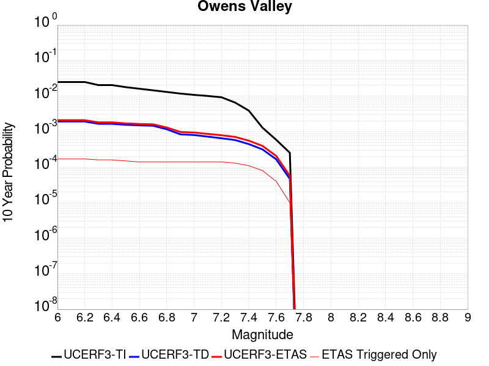 |

| Magnitude | 1 wk TI Prob | 1 wk TD Prob | 1 wk ETAS Prob | 1 wk ETAS/TD Gain | 1 wk ETAS Triggered Only | 1 mo TI Prob | 1 mo TD Prob | 1 mo ETAS Prob | 1 mo ETAS/TD Gain | 1 mo ETAS Triggered Only | 1 yr TI Prob | 1 yr TD Prob | 1 yr ETAS Prob | 1 yr ETAS/TD Gain | 1 yr ETAS Triggered Only | 10 yr TI Prob | 10 yr TD Prob | 10 yr ETAS Prob | 10 yr ETAS/TD Gain | 10 yr ETAS Triggered Only |
|-----|-----|-----|-----|-----|-----|-----|-----|-----|-----|-----|-----|-----|-----|-----|-----|-----|-----|-----|-----|-----|
| 6.0 | 4.83821E-5 | 3.626567E-6 | 2.6831593E-4 | 73.986206 | 2.6469032E-4 | 2.0733538E-4 | 1.5542342E-5 | 3.3316578E-4 | 21.436008 | 3.1762838E-4 | 0.002521386 | 1.8921259E-4 | 5.0678087E-4 | 2.6783676 | 3.1762838E-4 | 0.024929691 | 0.001925011 | 0.002294864 | 1.1921303 | 3.7056644E-4 |
| 6.1 | 4.83821E-5 | 3.626567E-6 | 2.6831593E-4 | 73.986206 | 2.6469032E-4 | 2.0733538E-4 | 1.5542342E-5 | 3.3316578E-4 | 21.436008 | 3.1762838E-4 | 0.002521386 | 1.8921259E-4 | 5.0678087E-4 | 2.6783676 | 3.1762838E-4 | 0.024929691 | 0.001925011 | 0.002294864 | 1.1921303 | 3.7056644E-4 |
| 6.2 | 4.83821E-5 | 3.626567E-6 | 2.6831593E-4 | 73.986206 | 2.6469032E-4 | 2.0733538E-4 | 1.5542342E-5 | 3.3316578E-4 | 21.436008 | 3.1762838E-4 | 0.002521386 | 1.8921259E-4 | 5.0678087E-4 | 2.6783676 | 3.1762838E-4 | 0.024929691 | 0.001925011 | 0.002294864 | 1.1921303 | 3.7056644E-4 |
| 6.3 | 3.953008E-5 | 3.1553948E-6 | 2.6784488E-4 | 84.88474 | 2.6469032E-4 | 1.6940363E-4 | 1.3523055E-5 | 3.3114714E-4 | 24.487598 | 3.1762838E-4 | 0.002060538 | 1.6463149E-4 | 4.8220757E-4 | 2.9290118 | 3.1762838E-4 | 0.020415364 | 0.0016592 | 0.0020291514 | 1.2229699 | 3.7056644E-4 |
| 6.4 | 3.953008E-5 | 3.1553948E-6 | 2.6784488E-4 | 84.88474 | 2.6469032E-4 | 1.6940363E-4 | 1.3523055E-5 | 3.3114714E-4 | 24.487598 | 3.1762838E-4 | 0.002060538 | 1.6463149E-4 | 4.8220757E-4 | 2.9290118 | 3.1762838E-4 | 0.020415364 | 0.0016592 | 0.0020291514 | 1.2229699 | 3.7056644E-4 |
| 6.5 | 3.457342E-5 | 2.9715961E-6 | 2.6766112E-4 | 90.07318 | 2.6469032E-4 | 1.4816338E-4 | 1.2735354E-5 | 3.3035967E-4 | 25.940361 | 3.1762838E-4 | 0.0018023965 | 1.550426E-4 | 4.7262173E-4 | 3.0483346 | 3.1762838E-4 | 0.017878477 | 0.001555719 | 0.0019257088 | 1.2378258 | 3.7056644E-4 |
| 6.6 | 3.1127765E-5 | 2.8744932E-6 | 2.6756406E-4 | 93.08216 | 2.6469032E-4 | 1.3339789E-4 | 1.2319203E-5 | 3.2994366E-4 | 26.782875 | 3.1762838E-4 | 0.0016229092 | 1.4997667E-4 | 4.675574E-4 | 3.1175344 | 3.1762838E-4 | 0.016111081 | 0.0015012559 | 0.0018184074 | 1.2112575 | 3.1762838E-4 |
| 6.7 | 2.806885E-5 | 2.8104134E-6 | 2.6749997E-4 | 95.18172 | 2.6469032E-4 | 1.2028952E-4 | 1.20445775E-5 | 3.2966913E-4 | 27.370752 | 3.1762838E-4 | 0.001463541 | 1.4663354E-4 | 4.6421535E-4 | 3.1658196 | 3.1762838E-4 | 0.014539397 | 0.0014657511 | 0.0017829139 | 1.2163825 | 3.1762838E-4 |
| 6.8 | 2.524524E-5 | 2.2353688E-6 | 2.6692508E-4 | 119.40987 | 2.6469032E-4 | 1.0818939E-4 | 9.580118E-6 | 3.2720546E-4 | 34.154636 | 3.1762838E-4 | 0.0013164099 | 1.16632E-4 | 4.3422333E-4 | 3.7230206 | 3.1762838E-4 | 0.01308639 | 0.0011659812 | 0.0014832392 | 1.2720953 | 3.1762838E-4 |
| 6.9 | 2.2704568E-5 | 1.6081682E-6 | 2.6629804E-4 | 165.59091 | 2.6469032E-4 | 9.730166E-5 | 6.8921313E-6 | 3.245183E-4 | 47.085335 | 3.1762838E-4 | 0.0011840039 | 8.390849E-5 | 4.0151022E-4 | 4.7850966 | 3.1762838E-4 | 0.011777153 | 8.3897985E-4 | 0.0011563418 | 1.3782712 | 3.1762838E-4 |
| 7.0 | 2.0871712E-5 | 1.5395453E-6 | 2.6622944E-4 | 172.92732 | 2.6469032E-4 | 8.944713E-5 | 6.598035E-6 | 3.2422433E-4 | 49.139526 | 3.1762838E-4 | 0.0010884746 | 8.032813E-5 | 3.97931E-4 | 4.953819 | 3.1762838E-4 | 0.010831586 | 8.0316263E-4 | 0.0011205359 | 1.3951545 | 3.1762838E-4 |
| 7.1 | 1.944928E-5 | 1.3864178E-6 | 2.6607636E-4 | 191.91644 | 2.6469032E-4 | 8.335139E-5 | 5.941777E-6 | 3.2356827E-4 | 54.456482 | 3.1762838E-4 | 0.0010143308 | 7.233874E-5 | 3.8994415E-4 | 5.3905296 | 3.1762838E-4 | 0.010097133 | 7.2330976E-4 | 0.0010407084 | 1.4388143 | 3.1762838E-4 |
| 7.2 | 1.7876306E-5 | 1.2489141E-6 | 2.659389E-4 | 212.9361 | 2.6469032E-4 | 7.6610486E-5 | 5.352478E-6 | 3.2297915E-4 | 60.341984 | 3.1762838E-4 | 9.3233347E-4 | 6.516448E-5 | 3.8277215E-4 | 5.8739386 | 3.1762838E-4 | 0.009284316 | 6.5159105E-4 | 9.6901244E-4 | 1.4871482 | 3.1762838E-4 |
| 7.3 | 1.2618672E-5 | 1.1115209E-6 | 2.6580153E-4 | 239.1332 | 2.6469032E-4 | 5.40789E-5 | 4.763652E-6 | 2.694527E-4 | 56.564312 | 2.6469032E-4 | 6.582117E-4 | 5.799593E-5 | 3.2267088E-4 | 5.5636816 | 2.6469032E-4 | 0.0065626553 | 5.7994033E-4 | 8.4447715E-4 | 1.4561448 | 2.6469032E-4 |
| 7.4 | 7.4874442E-6 | 8.5486437E-7 | 2.1260693E-4 | 248.70253 | 2.1175225E-4 | 3.208865E-5 | 3.6636993E-6 | 2.1541517E-4 | 58.797176 | 2.1175225E-4 | 3.906093E-4 | 4.4604632E-5 | 2.5634744E-4 | 5.7471037 | 2.1175225E-4 | 0.003899234 | 4.4604883E-4 | 6.5770664E-4 | 1.4745171 | 2.1175225E-4 |
| 7.5 | 2.4734156E-6 | 6.068616E-7 | 1.5942095E-4 | 262.6974 | 1.5881419E-4 | 1.060031E-5 | 2.6008327E-6 | 1.614146E-4 | 62.062664 | 1.5881419E-4 | 1.2905113E-4 | 3.166468E-5 | 1.9047385E-4 | 6.0153403 | 1.5881419E-4 | 0.0012897621 | 3.1660203E-4 | 4.7536593E-4 | 1.5014621 | 1.5881419E-4 |
| 7.6 | 1.1328841E-6 | 3.196531E-7 | 1.06195745E-4 | 332.22186 | 1.05876126E-4 | 4.8552088E-6 | 1.3699412E-6 | 1.0724592E-4 | 78.28506 | 1.05876126E-4 | 5.9110564E-5 | 1.6678909E-5 | 1.2255326E-4 | 7.3477993 | 1.05876126E-4 | 5.9094845E-4 | 1.6677675E-4 | 2.7263522E-4 | 1.6347315 | 1.05876126E-4 |
| 7.7 | 4.8613185E-7 | 8.964689E-8 | 8.964689E-8 | 1.0 | 0.0 | 2.0834207E-6 | 3.8420092E-7 | 3.8420092E-7 | 1.0 | 0.0 | 2.536535E-5 | 4.6776368E-6 | 4.6776368E-6 | 1.0 | 0.0 | 2.5362454E-4 | 4.677545E-5 | 4.677545E-5 | 1.0 | 0.0 |

## San Jacinto (Stepovers Combined)
*[(top)](#table-of-contents)*

| 1 Week | 1 Month | 1 Year | 10 Year |
|-----|-----|-----|-----|
|  |  |  |  |

| Magnitude | 1 wk TI Prob | 1 wk TD Prob | 1 wk ETAS Prob | 1 wk ETAS/TD Gain | 1 wk ETAS Triggered Only | 1 mo TI Prob | 1 mo TD Prob | 1 mo ETAS Prob | 1 mo ETAS/TD Gain | 1 mo ETAS Triggered Only | 1 yr TI Prob | 1 yr TD Prob | 1 yr ETAS Prob | 1 yr ETAS/TD Gain | 1 yr ETAS Triggered Only | 10 yr TI Prob | 10 yr TD Prob | 10 yr ETAS Prob | 10 yr ETAS/TD Gain | 10 yr ETAS Triggered Only |
|-----|-----|-----|-----|-----|-----|-----|-----|-----|-----|-----|-----|-----|-----|-----|-----|-----|-----|-----|-----|-----|
| 6.0 | 4.0667746E-5 | 3.5272755E-5 | 1.9408134E-4 | 5.5023017 | 1.5881419E-4 | 1.742787E-4 | 1.5116022E-4 | 3.6288044E-4 | 2.4006348 | 2.1175225E-4 | 0.0021197782 | 0.0018388226 | 0.0021030263 | 1.1436808 | 2.6469032E-4 | 0.020996714 | 0.018986892 | 0.019298488 | 1.0164112 | 3.1762838E-4 |
| 6.1 | 4.0667746E-5 | 3.5272755E-5 | 1.9408134E-4 | 5.5023017 | 1.5881419E-4 | 1.742787E-4 | 1.5116022E-4 | 3.6288044E-4 | 2.4006348 | 2.1175225E-4 | 0.0021197782 | 0.0018388226 | 0.0021030263 | 1.1436808 | 2.6469032E-4 | 0.020996714 | 0.018986892 | 0.019298488 | 1.0164112 | 3.1762838E-4 |
| 6.2 | 4.0667746E-5 | 3.5272755E-5 | 1.9408134E-4 | 5.5023017 | 1.5881419E-4 | 1.742787E-4 | 1.5116022E-4 | 3.6288044E-4 | 2.4006348 | 2.1175225E-4 | 0.0021197782 | 0.0018388226 | 0.0021030263 | 1.1436808 | 2.6469032E-4 | 0.020996714 | 0.018986892 | 0.019298488 | 1.0164112 | 3.1762838E-4 |
| 6.3 | 4.0667746E-5 | 3.5272755E-5 | 1.9408134E-4 | 5.5023017 | 1.5881419E-4 | 1.742787E-4 | 1.5116022E-4 | 3.6288044E-4 | 2.4006348 | 2.1175225E-4 | 0.0021197782 | 0.0018388226 | 0.0021030263 | 1.1436808 | 2.6469032E-4 | 0.020996714 | 0.018986892 | 0.019298488 | 1.0164112 | 3.1762838E-4 |
| 6.4 | 4.0577226E-5 | 3.5144654E-5 | 1.9395327E-4 | 5.518713 | 1.5881419E-4 | 1.738908E-4 | 1.5061127E-4 | 3.6233163E-4 | 2.4057405 | 2.1175225E-4 | 0.0021150648 | 0.0018321523 | 0.0020963575 | 1.1442049 | 2.6469032E-4 | 0.020950472 | 0.018921461 | 0.01923308 | 1.016469 | 3.1762838E-4 |
| 6.5 | 4.0577226E-5 | 3.5144654E-5 | 1.9395327E-4 | 5.518713 | 1.5881419E-4 | 1.738908E-4 | 1.5061127E-4 | 3.6233163E-4 | 2.4057405 | 2.1175225E-4 | 0.0021150648 | 0.0018321523 | 0.0020963575 | 1.1442049 | 2.6469032E-4 | 0.020950472 | 0.018921461 | 0.01923308 | 1.016469 | 3.1762838E-4 |
| 6.6 | 4.053861E-5 | 3.509E-5 | 1.9389861E-4 | 5.525751 | 1.5881419E-4 | 1.7372532E-4 | 1.5037706E-4 | 3.620975E-4 | 2.4079301 | 2.1175225E-4 | 0.0021130538 | 0.0018293057 | 0.0020935116 | 1.1444297 | 2.6469032E-4 | 0.020930743 | 0.018893538 | 0.019205166 | 1.0164938 | 3.1762838E-4 |
| 6.7 | 4.0516545E-5 | 3.5059067E-5 | 1.9386769E-4 | 5.529744 | 1.5881419E-4 | 1.7363077E-4 | 1.5024451E-4 | 3.6196495E-4 | 2.4091725 | 2.1175225E-4 | 0.002111905 | 0.001827695 | 0.0020919016 | 1.1445572 | 2.6469032E-4 | 0.020919468 | 0.018877735 | 0.019189367 | 1.016508 | 3.1762838E-4 |
| 6.8 | 4.049434E-5 | 3.5030633E-5 | 1.9383925E-4 | 5.5334215 | 1.5881419E-4 | 1.7353562E-4 | 1.5012265E-4 | 3.6184312E-4 | 2.4103165 | 2.1175225E-4 | 0.0021107488 | 0.0018262138 | 0.0020904208 | 1.1446747 | 2.6469032E-4 | 0.020908125 | 0.018863149 | 0.019174784 | 1.016521 | 3.1762838E-4 |
| 6.9 | 4.046386E-5 | 3.499319E-5 | 1.9380182E-4 | 5.5382724 | 1.5881419E-4 | 1.73405E-4 | 1.4996222E-4 | 3.616827E-4 | 2.4118257 | 2.1175225E-4 | 0.0021091616 | 0.0018242638 | 0.0020884713 | 1.1448296 | 2.6469032E-4 | 0.020892553 | 0.01884392 | 0.019155564 | 1.0165381 | 3.1762838E-4 |
| 7.0 | 4.036382E-5 | 3.487376E-5 | 1.9368241E-4 | 5.5538154 | 1.5881419E-4 | 1.7297632E-4 | 1.4945042E-4 | 3.6117103E-4 | 2.4166613 | 2.1175225E-4 | 0.0021039525 | 0.0018180435 | 0.0020822526 | 1.145326 | 2.6469032E-4 | 0.02084144 | 0.018782536 | 0.019094199 | 1.0165932 | 3.1762838E-4 |
| 7.1 | 4.0343282E-5 | 3.4852223E-5 | 1.9366088E-4 | 5.556629 | 1.5881419E-4 | 1.7288832E-4 | 1.4935812E-4 | 3.6107874E-4 | 2.4175367 | 2.1175225E-4 | 0.002102883 | 0.0018169218 | 0.002081131 | 1.1454159 | 2.6469032E-4 | 0.020830948 | 0.018771412 | 0.019083079 | 1.0166032 | 3.1762838E-4 |
| 7.2 | 4.0257353E-5 | 3.4756722E-5 | 1.9356539E-4 | 5.56915 | 1.5881419E-4 | 1.725201E-4 | 1.489489E-4 | 3.606696E-4 | 2.421432 | 2.1175225E-4 | 0.0020984085 | 0.0018119477 | 0.0020761583 | 1.1458158 | 2.6469032E-4 | 0.020787042 | 0.018722152 | 0.019033834 | 1.0166477 | 3.1762838E-4 |
| 7.3 | 3.9940667E-5 | 3.4584376E-5 | 1.9339308E-4 | 5.59192 | 1.5881419E-4 | 1.7116306E-4 | 1.4821035E-4 | 3.5993123E-4 | 2.428516 | 2.1175225E-4 | 0.0020819185 | 0.0018029709 | 0.002067184 | 1.1465431 | 2.6469032E-4 | 0.020625217 | 0.018630784 | 0.018942494 | 1.0167309 | 3.1762838E-4 |
| 7.4 | 3.9721202E-5 | 3.4469766E-5 | 1.9327848E-4 | 5.6071887 | 1.5881419E-4 | 1.7022261E-4 | 1.4771923E-4 | 3.594402E-4 | 2.4332662 | 2.1175225E-4 | 0.0020704903 | 0.0017970012 | 0.002061216 | 1.1470308 | 2.6469032E-4 | 0.020513052 | 0.018569905 | 0.018881636 | 1.0167868 | 3.1762838E-4 |
| 7.5 | 3.7036873E-5 | 3.3537188E-5 | 1.9234605E-4 | 5.7353067 | 1.5881419E-4 | 1.5871979E-4 | 1.437229E-4 | 3.554447E-4 | 2.4731252 | 2.1175225E-4 | 0.0019307006 | 0.0017484248 | 0.0020126523 | 1.1511232 | 2.6469032E-4 | 0.019140124 | 0.018071463 | 0.018383352 | 1.0172586 | 3.1762838E-4 |
| 7.6 | 3.2940967E-5 | 3.1317984E-5 | 1.901272E-4 | 6.070863 | 1.5881419E-4 | 1.4116794E-4 | 1.3421304E-4 | 3.459369E-4 | 2.5775204 | 2.1175225E-4 | 0.0017173645 | 0.0016328214 | 0.0018970794 | 1.1618414 | 2.6469032E-4 | 0.01704153 | 0.016904354 | 0.017216612 | 1.0184721 | 3.1762838E-4 |
| 7.7 | 2.8236149E-5 | 2.7883889E-5 | 1.8669365E-4 | 6.695395 | 1.5881419E-4 | 1.2100645E-4 | 1.19496915E-4 | 3.3122386E-4 | 2.7718194 | 2.1175225E-4 | 0.0014722579 | 0.001453905 | 0.0017182105 | 1.1817901 | 2.6469032E-4 | 0.014625421 | 0.015115095 | 0.015427923 | 1.0206964 | 3.1762838E-4 |
| 7.8 | 2.4329287E-5 | 2.5207537E-5 | 1.8401771E-4 | 7.300107 | 1.5881419E-4 | 1.042642E-4 | 1.0802783E-4 | 3.197572E-4 | 2.959952 | 2.1175225E-4 | 0.0012686774 | 0.0013144462 | 0.0015787885 | 1.2011055 | 2.6469032E-4 | 0.012614589 | 0.013712396 | 0.014025669 | 1.022846 | 3.1762838E-4 |
| 7.9 | 1.9370926E-5 | 2.0421452E-5 | 1.2629542E-4 | 6.1844482 | 1.05876126E-4 | 8.301561E-5 | 8.7517576E-5 | 2.4631785E-4 | 2.814496 | 1.5881419E-4 | 0.0010102465 | 0.0010650064 | 0.0012765331 | 1.1986154 | 2.1175225E-4 | 0.0100566605 | 0.011199483 | 0.011461209 | 1.0233694 | 2.6469032E-4 |
| 8.0 | 1.5583017E-5 | 1.588647E-5 | 1.2176091E-4 | 7.6644416 | 1.05876126E-4 | 6.6782646E-5 | 6.808309E-5 | 1.7395201E-4 | 2.5549958 | 1.05876126E-4 | 8.127754E-4 | 8.285971E-4 | 9.872797E-4 | 1.1915076 | 1.5881419E-4 | 0.008098091 | 0.008781809 | 0.008939229 | 1.0179256 | 1.5881419E-4 |
| 8.1 | 1.0024873E-5 | 8.292404E-6 | 8.292404E-6 | 1.0 | 0.0 | 4.2963035E-5 | 3.5538393E-5 | 3.5538393E-5 | 1.0 | 0.0 | 5.229494E-4 | 4.3259456E-4 | 4.3259456E-4 | 1.0 | 0.0 | 0.0052172043 | 0.0046534105 | 0.0046534105 | 1.0 | 0.0 |
| 8.2 | 4.142796E-6 | 1.5610041E-6 | 1.5610041E-6 | 1.0 | 0.0 | 1.775472E-5 | 6.69E-6 | 6.69E-6 | 1.0 | 0.0 | 2.1614227E-4 | 8.144774E-5 | 8.144774E-5 | 1.0 | 0.0 | 0.0021593217 | 9.454649E-4 | 9.454649E-4 | 1.0 | 0.0 |
| 8.3 | 1.2750878E-6 | 3.612133E-7 | 3.612133E-7 | 1.0 | 0.0 | 5.4646503E-6 | 1.548056E-6 | 1.548056E-6 | 1.0 | 0.0 | 6.653009E-5 | 1.8847424E-5 | 1.8847424E-5 | 1.0 | 0.0 | 6.6510175E-4 | 2.2734253E-4 | 2.2734253E-4 | 1.0 | 0.0 |

## San Jacinto (San Jacinto Valley) rev
*[(top)](#table-of-contents)*

| 1 Week | 1 Month | 1 Year | 10 Year |
|-----|-----|-----|-----|
|  |  |  |  |

| Magnitude | 1 wk TI Prob | 1 wk TD Prob | 1 wk ETAS Prob | 1 wk ETAS/TD Gain | 1 wk ETAS Triggered Only | 1 mo TI Prob | 1 mo TD Prob | 1 mo ETAS Prob | 1 mo ETAS/TD Gain | 1 mo ETAS Triggered Only | 1 yr TI Prob | 1 yr TD Prob | 1 yr ETAS Prob | 1 yr ETAS/TD Gain | 1 yr ETAS Triggered Only | 10 yr TI Prob | 10 yr TD Prob | 10 yr ETAS Prob | 10 yr ETAS/TD Gain | 10 yr ETAS Triggered Only |
|-----|-----|-----|-----|-----|-----|-----|-----|-----|-----|-----|-----|-----|-----|-----|-----|-----|-----|-----|-----|-----|
| 6.0 | 3.652694E-5 | 3.4402394E-5 | 1.9321112E-4 | 5.616212 | 1.5881419E-4 | 1.5653463E-4 | 1.474305E-4 | 3.5915154E-4 | 2.4360735 | 2.1175225E-4 | 0.0019041431 | 0.00179349 | 0.0020577055 | 1.1473192 | 2.6469032E-4 | 0.018879099 | 0.018526595 | 0.018838339 | 1.0168269 | 3.1762838E-4 |
| 6.1 | 3.652694E-5 | 3.4402394E-5 | 1.9321112E-4 | 5.616212 | 1.5881419E-4 | 1.5653463E-4 | 1.474305E-4 | 3.5915154E-4 | 2.4360735 | 2.1175225E-4 | 0.0019041431 | 0.00179349 | 0.0020577055 | 1.1473192 | 2.6469032E-4 | 0.018879099 | 0.018526595 | 0.018838339 | 1.0168269 | 3.1762838E-4 |
| 6.2 | 3.652694E-5 | 3.4402394E-5 | 1.9321112E-4 | 5.616212 | 1.5881419E-4 | 1.5653463E-4 | 1.474305E-4 | 3.5915154E-4 | 2.4360735 | 2.1175225E-4 | 0.0019041431 | 0.00179349 | 0.0020577055 | 1.1473192 | 2.6469032E-4 | 0.018879099 | 0.018526595 | 0.018838339 | 1.0168269 | 3.1762838E-4 |
| 6.3 | 3.652694E-5 | 3.4402394E-5 | 1.9321112E-4 | 5.616212 | 1.5881419E-4 | 1.5653463E-4 | 1.474305E-4 | 3.5915154E-4 | 2.4360735 | 2.1175225E-4 | 0.0019041431 | 0.00179349 | 0.0020577055 | 1.1473192 | 2.6469032E-4 | 0.018879099 | 0.018526595 | 0.018838339 | 1.0168269 | 3.1762838E-4 |
| 6.4 | 3.646941E-5 | 3.432397E-5 | 1.931327E-4 | 5.626759 | 1.5881419E-4 | 1.5628811E-4 | 1.4709444E-4 | 3.5881554E-4 | 2.439355 | 2.1175225E-4 | 0.0019011468 | 0.0017894056 | 0.0020536224 | 1.1476561 | 2.6469032E-4 | 0.018849645 | 0.018486476 | 0.018798232 | 1.0168641 | 3.1762838E-4 |
| 6.5 | 3.646941E-5 | 3.432397E-5 | 1.931327E-4 | 5.626759 | 1.5881419E-4 | 1.5628811E-4 | 1.4709444E-4 | 3.5881554E-4 | 2.439355 | 2.1175225E-4 | 0.0019011468 | 0.0017894056 | 0.0020536224 | 1.1476561 | 2.6469032E-4 | 0.018849645 | 0.018486476 | 0.018798232 | 1.0168641 | 3.1762838E-4 |
| 6.6 | 3.6442503E-5 | 3.4287354E-5 | 1.930961E-4 | 5.6317 | 1.5881419E-4 | 1.561728E-4 | 1.4693754E-4 | 3.5865867E-4 | 2.440892 | 2.1175225E-4 | 0.0018997455 | 0.0017874985 | 0.0020517157 | 1.1478139 | 2.6469032E-4 | 0.018835869 | 0.018467745 | 0.018779507 | 1.0168815 | 3.1762838E-4 |
| 6.7 | 3.6432113E-5 | 3.4272925E-5 | 1.9308167E-4 | 5.63365 | 1.5881419E-4 | 1.5612828E-4 | 1.4687571E-4 | 3.5859685E-4 | 2.4414988 | 2.1175225E-4 | 0.0018992044 | 0.0017867472 | 0.0020509646 | 1.1478761 | 2.6469032E-4 | 0.018830549 | 0.018460369 | 0.018772133 | 1.0168884 | 3.1762838E-4 |
| 6.8 | 3.6409598E-5 | 3.424198E-5 | 1.9305073E-4 | 5.6378374 | 1.5881419E-4 | 1.560318E-4 | 1.4674311E-4 | 3.5846428E-4 | 2.4428015 | 2.1175225E-4 | 0.0018980318 | 0.0017851355 | 0.0020493532 | 1.1480099 | 2.6469032E-4 | 0.018819023 | 0.018444523 | 0.018756293 | 1.0169032 | 3.1762838E-4 |
| 6.9 | 3.638078E-5 | 3.4202407E-5 | 1.9301116E-4 | 5.643204 | 1.5881419E-4 | 1.5590832E-4 | 1.4657351E-4 | 3.5829472E-4 | 2.4444711 | 2.1175225E-4 | 0.0018965311 | 0.001783074 | 0.0020472924 | 1.1481813 | 2.6469032E-4 | 0.018804269 | 0.018424258 | 0.018736033 | 1.016922 | 3.1762838E-4 |
| 7.0 | 3.6294874E-5 | 3.408442E-5 | 1.9289319E-4 | 5.6592774 | 1.5881419E-4 | 1.5554018E-4 | 1.4606792E-4 | 3.5778925E-4 | 2.4494717 | 2.1175225E-4 | 0.0018920569 | 0.001776929 | 0.002041149 | 1.1486948 | 2.6469032E-4 | 0.018760284 | 0.018363839 | 0.018675635 | 1.0169787 | 3.1762838E-4 |
| 7.1 | 3.6260717E-5 | 3.4040702E-5 | 1.9284949E-4 | 5.6652617 | 1.5881419E-4 | 1.5539382E-4 | 1.4588058E-4 | 3.5760194E-4 | 2.4513333 | 2.1175225E-4 | 0.001890278 | 0.0017746518 | 0.0020388723 | 1.1488858 | 2.6469032E-4 | 0.018742796 | 0.018341439 | 0.018653242 | 1.0169998 | 3.1762838E-4 |
| 7.2 | 3.6210204E-5 | 3.397492E-5 | 1.9278371E-4 | 5.6742945 | 1.5881419E-4 | 1.5517735E-4 | 1.455987E-4 | 3.5732012E-4 | 2.4541438 | 2.1175225E-4 | 0.001887647 | 0.0017712255 | 0.002035447 | 1.1491745 | 2.6469032E-4 | 0.01871693 | 0.01830772 | 0.018619532 | 1.0170318 | 3.1762838E-4 |
| 7.3 | 3.6119454E-5 | 3.386321E-5 | 1.9267201E-4 | 5.6897154 | 1.5881419E-4 | 1.5478847E-4 | 1.4511998E-4 | 3.5684148E-4 | 2.4589412 | 2.1175225E-4 | 0.0018829206 | 0.0017654065 | 0.0020296294 | 1.1496669 | 2.6469032E-4 | 0.018670462 | 0.018250274 | 0.018562105 | 1.0170864 | 3.1762838E-4 |
| 7.4 | 3.607848E-5 | 3.381071E-5 | 1.9261953E-4 | 5.6969976 | 1.5881419E-4 | 1.5461289E-4 | 1.44895E-4 | 3.5661657E-4 | 2.461207 | 2.1175225E-4 | 0.0018807866 | 0.0017626719 | 0.0020268958 | 1.1498996 | 2.6469032E-4 | 0.018649481 | 0.018223269 | 0.01853511 | 1.0171123 | 3.1762838E-4 |
| 7.5 | 3.5856774E-5 | 3.3620483E-5 | 1.9242933E-4 | 5.7235746 | 1.5881419E-4 | 1.5366284E-4 | 1.4407984E-4 | 3.5580157E-4 | 2.4694753 | 2.1175225E-4 | 0.0018692396 | 0.0017527633 | 0.0020169895 | 1.1507485 | 2.6469032E-4 | 0.018535944 | 0.018124366 | 0.018436238 | 1.0172073 | 3.1762838E-4 |
| 7.6 | 3.286655E-5 | 3.2143445E-5 | 1.9095253E-4 | 5.9406366 | 1.5881419E-4 | 1.4084904E-4 | 1.3775036E-4 | 3.4947344E-4 | 2.5370057 | 2.1175225E-4 | 0.001713488 | 0.0016758227 | 0.0019400694 | 1.1576818 | 2.6469032E-4 | 0.017003361 | 0.017344031 | 0.017656151 | 1.0179958 | 3.1762838E-4 |
| 7.7 | 2.8882527E-5 | 2.9236293E-5 | 1.8804584E-4 | 6.4319315 | 1.5881419E-4 | 1.237764E-4 | 1.2529238E-4 | 3.370181E-4 | 2.689853 | 2.1175225E-4 | 0.0015059357 | 0.0015243685 | 0.0017886554 | 1.1733747 | 2.6469032E-4 | 0.014957713 | 0.015830461 | 0.016143061 | 1.0197468 | 3.1762838E-4 |
| 7.8 | 2.4950225E-5 | 2.6527203E-5 | 1.8533718E-4 | 6.986684 | 1.5881419E-4 | 1.0692515E-4 | 1.1368306E-4 | 3.2541124E-4 | 2.8624425 | 2.1175225E-4 | 0.0013010362 | 0.0013832134 | 0.0016475376 | 1.1910943 | 2.6469032E-4 | 0.012934455 | 0.014411755 | 0.014724806 | 1.021722 | 3.1762838E-4 |
| 7.9 | 1.9881603E-5 | 2.1507445E-5 | 1.273813E-4 | 5.9226604 | 1.05876126E-4 | 8.520408E-5 | 9.217151E-5 | 2.5097106E-4 | 2.72287 | 1.5881419E-4 | 0.001036866 | 0.0011216112 | 0.001333126 | 1.1885811 | 2.1175225E-4 | 0.010320415 | 0.011777027 | 0.0120386 | 1.0222105 | 2.6469032E-4 |
| 8.0 | 1.563292E-5 | 1.5937347E-5 | 1.2181178E-4 | 7.643166 | 1.05876126E-4 | 6.6996516E-5 | 6.8301124E-5 | 1.7417003E-4 | 2.5500314 | 1.05876126E-4 | 8.153773E-4 | 8.3124964E-4 | 9.899319E-4 | 1.1908959 | 1.5881419E-4 | 0.00812392 | 0.008810506 | 0.008967921 | 1.0178667 | 1.5881419E-4 |
| 8.1 | 1.0045313E-5 | 8.301802E-6 | 8.301802E-6 | 1.0 | 0.0 | 4.305063E-5 | 3.5578672E-5 | 3.5578672E-5 | 1.0 | 0.0 | 5.2401534E-4 | 4.3308473E-4 | 4.3308473E-4 | 1.0 | 0.0 | 0.0052278144 | 0.0046591135 | 0.0046591135 | 1.0 | 0.0 |
| 8.2 | 4.1554413E-6 | 1.5655598E-6 | 1.5655598E-6 | 1.0 | 0.0 | 1.7808914E-5 | 6.709525E-6 | 6.709525E-6 | 1.0 | 0.0 | 2.1680194E-4 | 8.168544E-5 | 8.168544E-5 | 1.0 | 0.0 | 0.0021659054 | 9.482903E-4 | 9.482903E-4 | 1.0 | 0.0 |
| 8.3 | 1.2758221E-6 | 3.6149942E-7 | 3.6149942E-7 | 1.0 | 0.0 | 5.4677976E-6 | 1.5492824E-6 | 1.5492824E-6 | 1.0 | 0.0 | 6.65684E-5 | 1.8862354E-5 | 1.8862354E-5 | 1.0 | 0.0 | 6.6548464E-4 | 2.2751294E-4 | 2.2751294E-4 | 1.0 | 0.0 |

## San Jacinto (San Bernardino)
*[(top)](#table-of-contents)*

| 1 Week | 1 Month | 1 Year | 10 Year |
|-----|-----|-----|-----|
|  |  |  |  |

| Magnitude | 1 wk TI Prob | 1 wk TD Prob | 1 wk ETAS Prob | 1 wk ETAS/TD Gain | 1 wk ETAS Triggered Only | 1 mo TI Prob | 1 mo TD Prob | 1 mo ETAS Prob | 1 mo ETAS/TD Gain | 1 mo ETAS Triggered Only | 1 yr TI Prob | 1 yr TD Prob | 1 yr ETAS Prob | 1 yr ETAS/TD Gain | 1 yr ETAS Triggered Only | 10 yr TI Prob | 10 yr TD Prob | 10 yr ETAS Prob | 10 yr ETAS/TD Gain | 10 yr ETAS Triggered Only |
|-----|-----|-----|-----|-----|-----|-----|-----|-----|-----|-----|-----|-----|-----|-----|-----|-----|-----|-----|-----|-----|
| 6.0 | 3.409352E-5 | 3.5986508E-5 | 1.9479498E-4 | 5.413 | 1.5881419E-4 | 1.461069E-4 | 1.542188E-4 | 3.6593838E-4 | 2.372852 | 2.1175225E-4 | 0.0017774 | 0.0018759987 | 0.0021401925 | 1.1408284 | 2.6469032E-4 | 0.01763251 | 0.019349935 | 0.019661417 | 1.0160973 | 3.1762838E-4 |
| 6.1 | 3.409352E-5 | 3.5986508E-5 | 1.9479498E-4 | 5.413 | 1.5881419E-4 | 1.461069E-4 | 1.542188E-4 | 3.6593838E-4 | 2.372852 | 2.1175225E-4 | 0.0017774 | 0.0018759987 | 0.0021401925 | 1.1408284 | 2.6469032E-4 | 0.01763251 | 0.019349935 | 0.019661417 | 1.0160973 | 3.1762838E-4 |
| 6.2 | 3.409352E-5 | 3.5986508E-5 | 1.9479498E-4 | 5.413 | 1.5881419E-4 | 1.461069E-4 | 1.542188E-4 | 3.6593838E-4 | 2.372852 | 2.1175225E-4 | 0.0017774 | 0.0018759987 | 0.0021401925 | 1.1408284 | 2.6469032E-4 | 0.01763251 | 0.019349935 | 0.019661417 | 1.0160973 | 3.1762838E-4 |
| 6.3 | 3.409352E-5 | 3.5986508E-5 | 1.9479498E-4 | 5.413 | 1.5881419E-4 | 1.461069E-4 | 1.542188E-4 | 3.6593838E-4 | 2.372852 | 2.1175225E-4 | 0.0017774 | 0.0018759987 | 0.0021401925 | 1.1408284 | 2.6469032E-4 | 0.01763251 | 0.019349935 | 0.019661417 | 1.0160973 | 3.1762838E-4 |
| 6.4 | 3.400795E-5 | 3.5879173E-5 | 1.9468766E-4 | 5.426203 | 1.5881419E-4 | 1.4574021E-4 | 1.5375883E-4 | 3.654785E-4 | 2.3769596 | 2.1175225E-4 | 0.0017729428 | 0.0018704084 | 0.0021346037 | 1.14125 | 2.6469032E-4 | 0.017588645 | 0.019295016 | 0.019606516 | 1.016144 | 3.1762838E-4 |
| 6.5 | 3.341482E-5 | 3.5139812E-5 | 1.9394842E-4 | 5.5193357 | 1.5881419E-4 | 1.4319851E-4 | 1.5059051E-4 | 3.6231088E-4 | 2.4059343 | 2.1175225E-4 | 0.0017420477 | 0.0018318989 | 0.0020961044 | 1.1442249 | 2.6469032E-4 | 0.017284546 | 0.018916558 | 0.019228179 | 1.0164734 | 3.1762838E-4 |
| 6.6 | 3.3364955E-5 | 3.5077028E-5 | 1.9388564E-4 | 5.527425 | 1.5881419E-4 | 1.4298483E-4 | 1.5032147E-4 | 3.620419E-4 | 2.4084508 | 2.1175225E-4 | 0.0017394501 | 0.001828629 | 0.0020928353 | 1.1444832 | 2.6469032E-4 | 0.017258976 | 0.018884424 | 0.019196054 | 1.016502 | 3.1762838E-4 |
| 6.7 | 3.335922E-5 | 3.5066805E-5 | 1.9387543E-4 | 5.528745 | 1.5881419E-4 | 1.4296026E-4 | 1.5027766E-4 | 3.6199807E-4 | 2.4088616 | 2.1175225E-4 | 0.0017391514 | 0.0018280965 | 0.0020923028 | 1.1445254 | 2.6469032E-4 | 0.017256035 | 0.018879214 | 0.019190846 | 1.0165066 | 3.1762838E-4 |
| 6.8 | 3.327683E-5 | 3.496087E-5 | 1.937695E-4 | 5.542468 | 1.5881419E-4 | 1.4260718E-4 | 1.498237E-4 | 3.6154423E-4 | 2.413131 | 2.1175225E-4 | 0.0017348597 | 0.0018225788 | 0.0020867868 | 1.1449637 | 2.6469032E-4 | 0.017213784 | 0.018824987 | 0.019136636 | 1.0165551 | 3.1762838E-4 |
| 6.9 | 3.3235785E-5 | 3.4901823E-5 | 1.9371047E-4 | 5.5501533 | 1.5881419E-4 | 1.4243131E-4 | 1.4957068E-4 | 3.6129126E-4 | 2.4155219 | 2.1175225E-4 | 0.0017327217 | 0.0018195034 | 0.002083712 | 1.1452092 | 2.6469032E-4 | 0.017192734 | 0.018794855 | 0.019106515 | 1.0165821 | 3.1762838E-4 |
| 7.0 | 3.3197095E-5 | 3.4841752E-5 | 1.9365041E-4 | 5.557998 | 1.5881419E-4 | 1.422655E-4 | 1.4931326E-4 | 3.610339E-4 | 2.4179626 | 2.1175225E-4 | 0.0017307063 | 0.0018163746 | 0.0020805842 | 1.1454598 | 2.6469032E-4 | 0.017172894 | 0.018764233 | 0.0190759 | 1.0166097 | 3.1762838E-4 |
| 7.1 | 3.3129716E-5 | 3.4721965E-5 | 1.9353064E-4 | 5.573724 | 1.5881419E-4 | 1.4197677E-4 | 1.4879994E-4 | 3.6052067E-4 | 2.422855 | 2.1175225E-4 | 0.0017271966 | 0.0018101353 | 0.0020743466 | 1.1459621 | 2.6469032E-4 | 0.017138338 | 0.018703312 | 0.019015 | 1.0166649 | 3.1762838E-4 |
| 7.2 | 3.3034008E-5 | 3.458941E-5 | 1.9339811E-4 | 5.591252 | 1.5881419E-4 | 1.4156665E-4 | 1.4823192E-4 | 3.5995277E-4 | 2.4283082 | 2.1175225E-4 | 0.0017222111 | 0.0018032312 | 0.0020674441 | 1.146522 | 2.6469032E-4 | 0.017089253 | 0.018635705 | 0.018947415 | 1.0167265 | 3.1762838E-4 |
| 7.3 | 3.2956614E-5 | 3.445717E-5 | 1.9326588E-4 | 5.608873 | 1.5881419E-4 | 1.4123498E-4 | 1.4766524E-4 | 3.593862E-4 | 2.4337902 | 2.1175225E-4 | 0.0017181796 | 0.0017963431 | 0.002060558 | 1.1470848 | 2.6469032E-4 | 0.017049557 | 0.018568452 | 0.018880183 | 1.0167881 | 3.1762838E-4 |
| 7.4 | 3.2915937E-5 | 3.4378863E-5 | 1.9318759E-4 | 5.619371 | 1.5881419E-4 | 1.4106068E-4 | 1.4732967E-4 | 3.5905073E-4 | 2.4370563 | 2.1175225E-4 | 0.0017160608 | 0.0017922645 | 0.0020564804 | 1.1474202 | 2.6469032E-4 | 0.017028693 | 0.018528719 | 0.018840462 | 1.0168248 | 3.1762838E-4 |
| 7.5 | 3.281791E-5 | 3.4243778E-5 | 1.9305253E-4 | 5.637594 | 1.5881419E-4 | 1.406406E-4 | 1.4675081E-4 | 3.5847197E-4 | 2.442726 | 2.1175225E-4 | 0.0017109542 | 0.0017852283 | 0.002049446 | 1.1480023 | 2.6469032E-4 | 0.016978411 | 0.018459605 | 0.01877137 | 1.0168891 | 3.1762838E-4 |
| 7.6 | 3.2521442E-5 | 3.396873E-5 | 1.9277752E-4 | 5.6751466 | 1.5881419E-4 | 1.3937015E-4 | 1.4557215E-4 | 3.5729358E-4 | 2.454409 | 2.1175225E-4 | 0.0016955109 | 0.0017709016 | 0.0020351233 | 1.1492018 | 2.6469032E-4 | 0.016826328 | 0.018317232 | 0.018629042 | 1.0170227 | 3.1762838E-4 |
| 7.7 | 3.0287873E-5 | 3.245276E-5 | 1.912618E-4 | 5.893544 | 1.5881419E-4 | 1.297987E-4 | 1.3907586E-4 | 3.5079865E-4 | 2.5223548 | 2.1175225E-4 | 0.0015791537 | 0.0016919347 | 0.0019561772 | 1.1561778 | 2.6469032E-4 | 0.01567979 | 0.01752809 | 0.01784015 | 1.0178034 | 3.1762838E-4 |
| 7.8 | 2.6316151E-5 | 2.9663592E-5 | 1.8847307E-4 | 6.3536835 | 1.5881419E-4 | 1.1277862E-4 | 1.2712348E-4 | 3.3884883E-4 | 2.6655092 | 2.1175225E-4 | 0.0013722149 | 0.0015466306 | 0.0018109116 | 1.1708753 | 2.6469032E-4 | 0.013637724 | 0.016069634 | 0.016382158 | 1.0194482 | 3.1762838E-4 |
| 7.9 | 2.0761147E-5 | 2.34181E-5 | 1.2929174E-4 | 5.5210176 | 1.05876126E-4 | 8.897331E-5 | 1.0035944E-4 | 2.5915768E-4 | 2.5822952 | 1.5881419E-4 | 0.0010827117 | 0.0012211921 | 0.0014326858 | 1.1731862 | 2.1175225E-4 | 0.010774517 | 0.012793174 | 0.013054478 | 1.0204253 | 2.6469032E-4 |
| 8.0 | 1.5738568E-5 | 1.6033575E-5 | 1.21908E-4 | 7.603295 | 1.05876126E-4 | 6.744926E-5 | 6.871352E-5 | 1.7458237E-4 | 2.540728 | 1.05876126E-4 | 8.2088535E-4 | 8.3626667E-4 | 9.94948E-4 | 1.1897497 | 1.5881419E-4 | 0.008178596 | 0.008865921 | 0.009023326 | 1.0177541 | 1.5881419E-4 |
| 8.1 | 1.0105832E-5 | 8.3304985E-6 | 8.3304985E-6 | 1.0 | 0.0 | 4.3309992E-5 | 3.570165E-5 | 3.570165E-5 | 1.0 | 0.0 | 5.2717153E-4 | 4.345814E-4 | 4.345814E-4 | 1.0 | 0.0 | 0.005259227 | 0.004677232 | 0.004677232 | 1.0 | 0.0 |
| 8.2 | 4.189207E-6 | 1.5784357E-6 | 1.5784357E-6 | 1.0 | 0.0 | 1.7953622E-5 | 6.7647065E-6 | 6.7647065E-6 | 1.0 | 0.0 | 2.1856341E-4 | 8.235722E-5 | 8.235722E-5 | 1.0 | 0.0 | 0.0021834858 | 9.565867E-4 | 9.565867E-4 | 1.0 | 0.0 |
| 8.3 | 1.2758221E-6 | 3.6149942E-7 | 3.6149942E-7 | 1.0 | 0.0 | 5.4677976E-6 | 1.5492824E-6 | 1.5492824E-6 | 1.0 | 0.0 | 6.65684E-5 | 1.8862354E-5 | 1.8862354E-5 | 1.0 | 0.0 | 6.6548464E-4 | 2.2751294E-4 | 2.2751294E-4 | 1.0 | 0.0 |

## Elsinore (Glen Ivy) rev
*[(top)](#table-of-contents)*

| 1 Week | 1 Month | 1 Year | 10 Year |
|-----|-----|-----|-----|
| 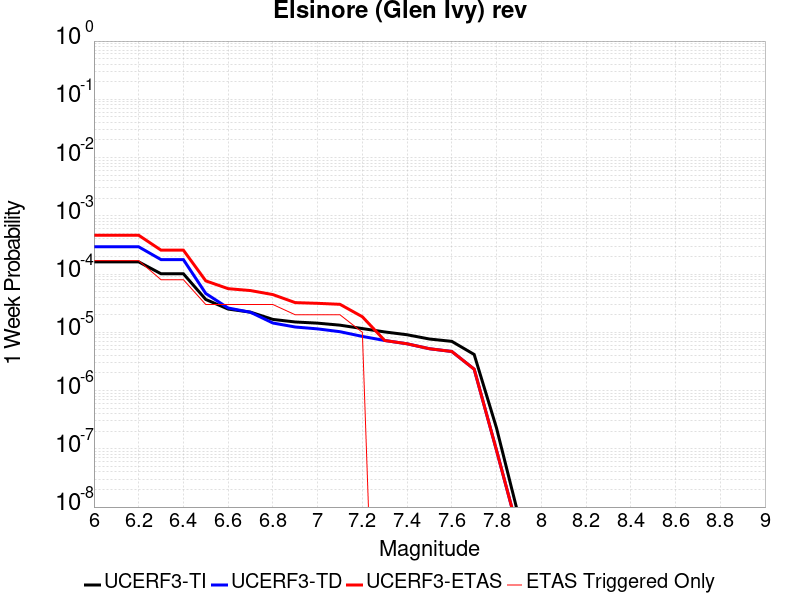 |  |  |  |

| Magnitude | 1 wk TI Prob | 1 wk TD Prob | 1 wk ETAS Prob | 1 wk ETAS/TD Gain | 1 wk ETAS Triggered Only | 1 mo TI Prob | 1 mo TD Prob | 1 mo ETAS Prob | 1 mo ETAS/TD Gain | 1 mo ETAS Triggered Only | 1 yr TI Prob | 1 yr TD Prob | 1 yr ETAS Prob | 1 yr ETAS/TD Gain | 1 yr ETAS Triggered Only | 10 yr TI Prob | 10 yr TD Prob | 10 yr ETAS Prob | 10 yr ETAS/TD Gain | 10 yr ETAS Triggered Only |
|-----|-----|-----|-----|-----|-----|-----|-----|-----|-----|-----|-----|-----|-----|-----|-----|-----|-----|-----|-----|-----|
| 6.0 | 1.6204086E-4 | 2.9360707E-4 | 5.0529715E-4 | 1.7209979 | 2.1175225E-4 | 6.94276E-4 | 0.0012578638 | 0.0014693497 | 1.168131 | 2.1175225E-4 | 0.008420097 | 0.015234485 | 0.015495143 | 1.0171098 | 2.6469032E-4 | 0.081081145 | 0.13969168 | 0.13991939 | 1.0016302 | 2.6469032E-4 |
| 6.1 | 1.6204086E-4 | 2.9360707E-4 | 5.0529715E-4 | 1.7209979 | 2.1175225E-4 | 6.94276E-4 | 0.0012578638 | 0.0014693497 | 1.168131 | 2.1175225E-4 | 0.008420097 | 0.015234485 | 0.015495143 | 1.0171098 | 2.6469032E-4 | 0.081081145 | 0.13969168 | 0.13991939 | 1.0016302 | 2.6469032E-4 |
| 6.2 | 1.6204086E-4 | 2.9360707E-4 | 5.0529715E-4 | 1.7209979 | 2.1175225E-4 | 6.94276E-4 | 0.0012578638 | 0.0014693497 | 1.168131 | 2.1175225E-4 | 0.008420097 | 0.015234485 | 0.015495143 | 1.0171098 | 2.6469032E-4 | 0.081081145 | 0.13969168 | 0.13991939 | 1.0016302 | 2.6469032E-4 |
| 6.3 | 1.0111737E-4 | 1.7703383E-4 | 1.7703383E-4 | 1.0 | 0.0 | 4.332882E-4 | 7.5861247E-4 | 7.5861247E-4 | 1.0 | 0.0 | 0.005262531 | 0.009217682 | 0.0092701325 | 1.0056902 | 5.2938063E-5 | 0.0513964 | 0.0870191 | 0.08706743 | 1.0005554 | 5.2938063E-5 |
| 6.4 | 1.0111737E-4 | 1.7703383E-4 | 1.7703383E-4 | 1.0 | 0.0 | 4.332882E-4 | 7.5861247E-4 | 7.5861247E-4 | 1.0 | 0.0 | 0.005262531 | 0.009217682 | 0.0092701325 | 1.0056902 | 5.2938063E-5 | 0.0513964 | 0.0870191 | 0.08706743 | 1.0005554 | 5.2938063E-5 |
| 6.5 | 3.6624708E-5 | 4.6391084E-5 | 4.6391084E-5 | 1.0 | 0.0 | 1.569536E-4 | 1.9880582E-4 | 1.9880582E-4 | 1.0 | 0.0 | 0.001909235 | 0.0024181372 | 0.0024181372 | 1.0 | 0.0 | 0.01892915 | 0.023739954 | 0.023739954 | 1.0 | 0.0 |
| 6.6 | 2.5051324E-5 | 2.614772E-5 | 2.614772E-5 | 1.0 | 0.0 | 1.073584E-4 | 1.12057096E-4 | 1.12057096E-4 | 1.0 | 0.0 | 0.0013063047 | 0.0013634858 | 0.0013634858 | 1.0 | 0.0 | 0.012986525 | 0.013564618 | 0.013564618 | 1.0 | 0.0 |
| 6.7 | 2.2189772E-5 | 2.2072849E-5 | 2.2072849E-5 | 1.0 | 0.0 | 9.509556E-5 | 9.4594696E-5 | 9.4594696E-5 | 1.0 | 0.0 | 0.0011571734 | 0.0011511183 | 0.0011511183 | 1.0 | 0.0 | 0.011511663 | 0.011465415 | 0.011465415 | 1.0 | 0.0 |
| 6.8 | 1.6654378E-5 | 1.4437705E-5 | 1.4437705E-5 | 1.0 | 0.0 | 7.137396E-5 | 6.187444E-5 | 6.187444E-5 | 1.0 | 0.0 | 8.686314E-4 | 7.530661E-4 | 7.530661E-4 | 1.0 | 0.0 | 0.008652439 | 0.00751048 | 0.00751048 | 1.0 | 0.0 |
| 6.9 | 1.5042909E-5 | 1.2332022E-5 | 1.2332022E-5 | 1.0 | 0.0 | 6.446802E-5 | 5.285047E-5 | 5.285047E-5 | 1.0 | 0.0 | 7.8461546E-4 | 6.4326765E-4 | 6.4326765E-4 | 1.0 | 0.0 | 0.007818509 | 0.00641828 | 0.00641828 | 1.0 | 0.0 |
| 7.0 | 1.4361385E-5 | 1.1451324E-5 | 1.1451324E-5 | 1.0 | 0.0 | 6.154734E-5 | 4.9076196E-5 | 4.9076196E-5 | 1.0 | 0.0 | 7.490812E-4 | 5.973418E-4 | 5.973418E-4 | 1.0 | 0.0 | 0.007465612 | 0.0059613534 | 0.0059613534 | 1.0 | 0.0 |
| 7.1 | 1.3265571E-5 | 1.0244926E-5 | 1.0244926E-5 | 1.0 | 0.0 | 5.6851208E-5 | 4.39061E-5 | 4.39061E-5 | 1.0 | 0.0 | 6.919436E-4 | 5.344282E-4 | 5.344282E-4 | 1.0 | 0.0 | 0.006897931 | 0.0053347866 | 0.0053347866 | 1.0 | 0.0 |
| 7.2 | 1.1596403E-5 | 8.505067E-6 | 8.505067E-6 | 1.0 | 0.0 | 4.9697923E-5 | 3.6449786E-5 | 3.6449786E-5 | 1.0 | 0.0 | 6.049042E-4 | 4.436875E-4 | 4.436875E-4 | 1.0 | 0.0 | 0.006032603 | 0.0044294316 | 0.0044294316 | 1.0 | 0.0 |
| 7.3 | 1.0150827E-5 | 7.2387597E-6 | 7.2387597E-6 | 1.0 | 0.0 | 4.3502816E-5 | 3.1022897E-5 | 3.1022897E-5 | 1.0 | 0.0 | 5.2951806E-4 | 3.7763975E-4 | 3.7763975E-4 | 1.0 | 0.0 | 0.005282581 | 0.0037703665 | 0.0037703665 | 1.0 | 0.0 |
| 7.4 | 9.080705E-6 | 6.352519E-6 | 6.352519E-6 | 1.0 | 0.0 | 3.8916725E-5 | 2.7224805E-5 | 2.7224805E-5 | 1.0 | 0.0 | 4.7370812E-4 | 3.3141294E-4 | 3.3141294E-4 | 1.0 | 0.0 | 0.004726996 | 0.0033093381 | 0.0033093381 | 1.0 | 0.0 |
| 7.5 | 7.671649E-6 | 5.2256332E-6 | 5.2256332E-6 | 1.0 | 0.0 | 3.287808E-5 | 2.2395385E-5 | 2.2395385E-5 | 1.0 | 0.0 | 4.0021708E-4 | 2.7263095E-4 | 2.7263095E-4 | 1.0 | 0.0 | 0.0039949706 | 0.00272309 | 0.00272309 | 1.0 | 0.0 |
| 7.6 | 6.990086E-6 | 4.687545E-6 | 4.687545E-6 | 1.0 | 0.0 | 2.9957167E-5 | 2.008933E-5 | 2.008933E-5 | 1.0 | 0.0 | 3.6466747E-4 | 2.445613E-4 | 2.445613E-4 | 1.0 | 0.0 | 0.0036406964 | 0.002443038 | 0.002443038 | 1.0 | 0.0 |
| 7.7 | 4.163505E-6 | 2.3295343E-6 | 2.3295343E-6 | 1.0 | 0.0 | 1.7843471E-5 | 9.983683E-6 | 9.983683E-6 | 1.0 | 0.0 | 2.172226E-4 | 1.21545316E-4 | 1.21545316E-4 | 1.0 | 0.0 | 0.0021701038 | 0.0012148614 | 0.0012148614 | 1.0 | 0.0 |
| 7.8 | 2.2692414E-7 | 9.3854695E-8 | 9.3854695E-8 | 1.0 | 0.0 | 9.725317E-7 | 4.0223435E-7 | 4.0223435E-7 | 1.0 | 0.0 | 1.1840509E-5 | 4.8971956E-6 | 4.8971956E-6 | 1.0 | 0.0 | 1.1839878E-4 | 4.8971204E-5 | 4.8971204E-5 | 1.0 | 0.0 |
| 7.9 | 6.676829E-9 | 3.439853E-9 | 3.439853E-9 | 1.0 | 0.0 | 2.861498E-8 | 1.4742227E-8 | 1.4742227E-8 | 1.0 | 0.0 | 3.4838732E-7 | 1.7948659E-7 | 1.7948659E-7 | 1.0 | 0.0 | 3.4838679E-6 | 1.7948646E-6 | 1.7948646E-6 | 1.0 | 0.0 |

## San Andreas (Coachella) rev
*[(top)](#table-of-contents)*

| 1 Week | 1 Month | 1 Year | 10 Year |
|-----|-----|-----|-----|
|  |  |  |  |

| Magnitude | 1 wk TI Prob | 1 wk TD Prob | 1 wk ETAS Prob | 1 wk ETAS/TD Gain | 1 wk ETAS Triggered Only | 1 mo TI Prob | 1 mo TD Prob | 1 mo ETAS Prob | 1 mo ETAS/TD Gain | 1 mo ETAS Triggered Only | 1 yr TI Prob | 1 yr TD Prob | 1 yr ETAS Prob | 1 yr ETAS/TD Gain | 1 yr ETAS Triggered Only | 10 yr TI Prob | 10 yr TD Prob | 10 yr ETAS Prob | 10 yr ETAS/TD Gain | 10 yr ETAS Triggered Only |
|-----|-----|-----|-----|-----|-----|-----|-----|-----|-----|-----|-----|-----|-----|-----|-----|-----|-----|-----|-----|-----|
| 6.0 | 1.1925945E-4 | 3.2729402E-4 | 5.918977E-4 | 1.8084587 | 2.6469032E-4 | 5.110118E-4 | 0.0014019393 | 0.0016662586 | 1.1885383 | 2.6469032E-4 | 0.0062038354 | 0.016936364 | 0.017248614 | 1.0184366 | 3.1762838E-4 | 0.060334753 | 0.15265316 | 0.1529223 | 1.0017631 | 3.1762838E-4 |
| 6.1 | 1.1925945E-4 | 3.2729402E-4 | 5.918977E-4 | 1.8084587 | 2.6469032E-4 | 5.110118E-4 | 0.0014019393 | 0.0016662586 | 1.1885383 | 2.6469032E-4 | 0.0062038354 | 0.016936364 | 0.017248614 | 1.0184366 | 3.1762838E-4 | 0.060334753 | 0.15265316 | 0.1529223 | 1.0017631 | 3.1762838E-4 |
| 6.2 | 1.07432395E-4 | 3.0230157E-4 | 5.669119E-4 | 1.875319 | 2.6469032E-4 | 4.603433E-4 | 0.0012949388 | 0.0015592864 | 1.204139 | 2.6469032E-4 | 0.005590286 | 0.015653009 | 0.015965665 | 1.0199742 | 3.1762838E-4 | 0.05451731 | 0.14182423 | 0.14209682 | 1.001922 | 3.1762838E-4 |
| 6.3 | 1.0718766E-4 | 3.0175463E-4 | 5.663651E-4 | 1.876906 | 2.6469032E-4 | 4.592948E-4 | 0.0012925972 | 0.0015569453 | 1.2045094 | 2.6469032E-4 | 0.005577586 | 0.015624908 | 0.015937572 | 1.0200107 | 3.1762838E-4 | 0.054396555 | 0.14159249 | 0.14186515 | 1.0019256 | 3.1762838E-4 |
| 6.4 | 1.0355944E-4 | 2.9383553E-4 | 5.584481E-4 | 1.9005464 | 2.6469032E-4 | 4.4375064E-4 | 0.0012586913 | 0.0015230485 | 1.2100254 | 2.6469032E-4 | 0.0053892885 | 0.015217941 | 0.015530736 | 1.0205543 | 3.1762838E-4 | 0.052604496 | 0.13815255 | 0.1384263 | 1.0019815 | 3.1762838E-4 |
| 6.5 | 1.0227914E-4 | 2.9102986E-4 | 5.556432E-4 | 1.9092307 | 2.6469032E-4 | 4.382655E-4 | 0.0012466786 | 0.001511039 | 1.2120517 | 2.6469032E-4 | 0.0053228354 | 0.01507372 | 0.015386561 | 1.020754 | 3.1762838E-4 | 0.051971316 | 0.13693172 | 0.13720585 | 1.002002 | 3.1762838E-4 |
| 6.6 | 1.0116757E-4 | 2.8868738E-4 | 5.533013E-4 | 1.9166106 | 2.6469032E-4 | 4.3350324E-4 | 0.0012366489 | 0.0015010119 | 1.2137737 | 2.6469032E-4 | 0.0052651367 | 0.01495329 | 0.015266169 | 1.0209237 | 3.1762838E-4 | 0.051421247 | 0.1359099 | 0.13618436 | 1.0020194 | 3.1762838E-4 |
| 6.7 | 1.0050676E-4 | 2.8727303E-4 | 5.5188726E-4 | 1.9211247 | 2.6469032E-4 | 4.3067214E-4 | 0.0012305931 | 0.0014949577 | 1.214827 | 2.6469032E-4 | 0.005230834 | 0.014880571 | 0.015193472 | 1.0210276 | 3.1762838E-4 | 0.051094085 | 0.13529462 | 0.13556927 | 1.00203 | 3.1762838E-4 |
| 6.8 | 9.976819E-5 | 2.853096E-4 | 5.499244E-4 | 1.9274654 | 2.6469032E-4 | 4.2750788E-4 | 0.0012221863 | 0.0014865531 | 1.2163064 | 2.6469032E-4 | 0.0051924936 | 0.0147796115 | 0.015092545 | 1.0211734 | 3.1762838E-4 | 0.050728295 | 0.13444631 | 0.13472123 | 1.0020449 | 3.1762838E-4 |
| 6.9 | 9.77719E-5 | 2.8027873E-4 | 5.448949E-4 | 1.9441177 | 2.6469032E-4 | 4.1895514E-4 | 0.0012006456 | 0.001465018 | 1.220192 | 2.6469032E-4 | 0.0050888555 | 0.014520878 | 0.014833894 | 1.0215563 | 3.1762838E-4 | 0.049738888 | 0.1322748 | 0.13255042 | 1.0020837 | 3.1762838E-4 |
| 7.0 | 8.500761E-5 | 2.4762485E-4 | 5.1224965E-4 | 2.068652 | 2.6469032E-4 | 3.6426744E-4 | 0.001060821 | 0.0013252305 | 1.2492499 | 2.6469032E-4 | 0.0044259406 | 0.012839786 | 0.013153336 | 1.0244201 | 3.1762838E-4 | 0.04338823 | 0.11813272 | 0.11841283 | 1.0023711 | 3.1762838E-4 |
| 7.1 | 8.319876E-5 | 2.4365232E-4 | 5.0827814E-4 | 2.0860796 | 2.6469032E-4 | 3.5651738E-4 | 0.0010438096 | 0.0013082236 | 1.2533164 | 2.6469032E-4 | 0.004331963 | 0.012635092 | 0.012948708 | 1.0248209 | 3.1762838E-4 | 0.042484846 | 0.116353 | 0.11663367 | 1.0024122 | 3.1762838E-4 |
| 7.2 | 7.563917E-5 | 2.2413683E-4 | 4.887678E-4 | 2.1806672 | 2.6469032E-4 | 3.2412758E-4 | 9.602359E-4 | 0.0012246721 | 1.2753867 | 2.6469032E-4 | 0.0039391145 | 0.011628893 | 0.011942828 | 1.0269961 | 3.1762838E-4 | 0.03870018 | 0.10775925 | 0.10804265 | 1.00263 | 3.1762838E-4 |
| 7.3 | 7.082985E-5 | 2.0729867E-4 | 4.7193412E-4 | 2.27659 | 2.6469032E-4 | 3.0352117E-4 | 8.881233E-4 | 0.0011525785 | 1.2977686 | 2.6469032E-4 | 0.0036891096 | 0.010759917 | 0.011074128 | 1.029202 | 3.1762838E-4 | 0.03628465 | 0.100282 | 0.10056777 | 1.0028497 | 3.1762838E-4 |
| 7.4 | 5.146215E-5 | 1.4273795E-4 | 3.5445997E-4 | 2.4832919 | 2.1175225E-4 | 2.2053342E-4 | 6.115915E-4 | 8.2321424E-4 | 1.3460197 | 2.1175225E-4 | 0.0026816884 | 0.0074208933 | 0.0076836194 | 1.0354036 | 2.6469032E-4 | 0.02649557 | 0.070849575 | 0.07109551 | 1.0034713 | 2.6469032E-4 |
| 7.5 | 4.0285166E-5 | 1.09416E-4 | 3.2114508E-4 | 2.9350834 | 2.1175225E-4 | 1.7263928E-4 | 4.6884175E-4 | 6.8049476E-4 | 1.451438 | 2.1175225E-4 | 0.002099857 | 0.0056932783 | 0.0059564617 | 1.046227 | 2.6469032E-4 | 0.020801254 | 0.055011146 | 0.055261277 | 1.0045469 | 2.6469032E-4 |
| 7.6 | 3.1168736E-5 | 8.4389096E-5 | 2.4318988E-4 | 2.881769 | 1.5881419E-4 | 1.3357346E-4 | 3.6161754E-4 | 5.203743E-4 | 1.4390184 | 1.5881419E-4 | 0.0016250437 | 0.0043938323 | 0.0046046544 | 1.0479813 | 2.1175225E-4 | 0.016132116 | 0.04281005 | 0.043012735 | 1.0047345 | 2.1175225E-4 |
| 7.7 | 2.2100989E-5 | 6.238755E-5 | 1.6825707E-4 | 2.6969655 | 1.05876126E-4 | 9.4715084E-5 | 2.6734784E-4 | 3.7319568E-4 | 1.395918 | 1.05876126E-4 | 0.001152546 | 0.0032501083 | 0.0034084064 | 1.0487055 | 1.5881419E-4 | 0.011465867 | 0.0319002 | 0.032053947 | 1.0048196 | 1.5881419E-4 |
| 7.8 | 1.7484861E-5 | 5.179572E-5 | 1.5766636E-4 | 3.0440037 | 1.05876126E-4 | 7.493296E-5 | 2.2196278E-4 | 3.2781542E-4 | 1.4768935 | 1.05876126E-4 | 9.1192697E-4 | 0.0026990508 | 0.0028574362 | 1.058682 | 1.5881419E-4 | 0.009081938 | 0.026640115 | 0.0267947 | 1.0058026 | 1.5881419E-4 |
| 7.9 | 1.3967285E-5 | 3.822255E-5 | 1.4409464E-4 | 3.769885 | 1.05876126E-4 | 5.985842E-5 | 1.6380067E-4 | 2.6965945E-4 | 1.6462659 | 1.05876126E-4 | 7.2853256E-4 | 0.00199245 | 0.002150948 | 1.0795492 | 1.5881419E-4 | 0.0072614877 | 0.019909438 | 0.02006509 | 1.007818 | 1.5881419E-4 |
| 8.0 | 1.1887396E-5 | 3.106521E-5 | 1.3693805E-4 | 4.4080834 | 1.05876126E-4 | 5.094499E-5 | 1.3312983E-4 | 2.3899185E-4 | 1.7951789 | 1.05876126E-4 | 6.200787E-4 | 0.0016196516 | 0.0017782085 | 1.0978957 | 1.5881419E-4 | 0.006183513 | 0.016279267 | 0.016435497 | 1.0095968 | 1.5881419E-4 |
| 8.1 | 5.100864E-6 | 8.973418E-6 | 8.973418E-6 | 1.0 | 0.0 | 2.1860664E-5 | 3.8456936E-5 | 3.8456936E-5 | 1.0 | 0.0 | 2.6612106E-4 | 4.6811273E-4 | 4.6811273E-4 | 1.0 | 0.0 | 0.002658026 | 0.004917731 | 0.004917731 | 1.0 | 0.0 |
| 8.2 | 2.3004484E-6 | 2.7864487E-6 | 2.7864487E-6 | 1.0 | 0.0 | 9.859027E-6 | 1.1941868E-5 | 1.1941868E-5 | 1.0 | 0.0 | 1.2002704E-4 | 1.4538258E-4 | 1.4538258E-4 | 1.0 | 0.0 | 0.0011996223 | 0.0015973912 | 0.0015973912 | 1.0 | 0.0 |
| 8.3 | 1.0424446E-7 | 5.8161504E-8 | 5.8161504E-8 | 1.0 | 0.0 | 4.4676187E-7 | 2.4926356E-7 | 2.4926356E-7 | 1.0 | 0.0 | 5.439312E-6 | 3.03478E-6 | 3.03478E-6 | 1.0 | 0.0 | 5.4391792E-5 | 3.190716E-5 | 3.190716E-5 | 1.0 | 0.0 |

## Baker
*[(top)](#table-of-contents)*

| 1 Week | 1 Month | 1 Year | 10 Year |
|-----|-----|-----|-----|
|  | 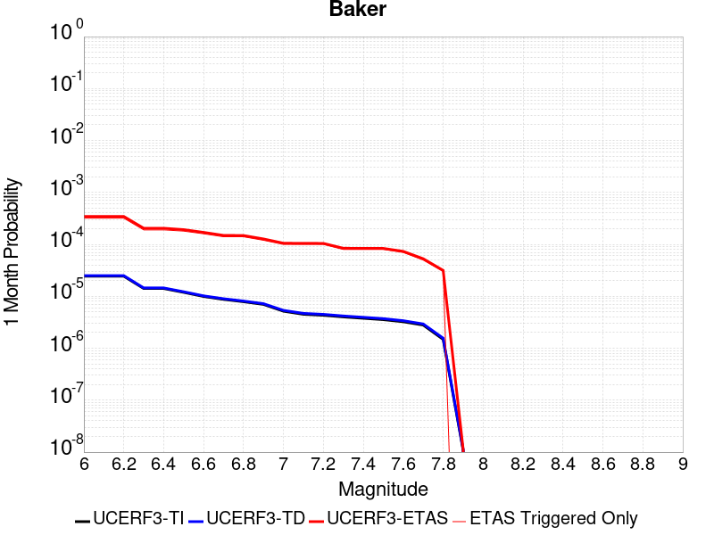 |  |  |

| Magnitude | 1 wk TI Prob | 1 wk TD Prob | 1 wk ETAS Prob | 1 wk ETAS/TD Gain | 1 wk ETAS Triggered Only | 1 mo TI Prob | 1 mo TD Prob | 1 mo ETAS Prob | 1 mo ETAS/TD Gain | 1 mo ETAS Triggered Only | 1 yr TI Prob | 1 yr TD Prob | 1 yr ETAS Prob | 1 yr ETAS/TD Gain | 1 yr ETAS Triggered Only | 10 yr TI Prob | 10 yr TD Prob | 10 yr ETAS Prob | 10 yr ETAS/TD Gain | 10 yr ETAS Triggered Only |
|-----|-----|-----|-----|-----|-----|-----|-----|-----|-----|-----|-----|-----|-----|-----|-----|-----|-----|-----|-----|-----|
| 6.0 | 5.695525E-6 | 5.8348373E-6 | 1.646481E-4 | 28.218113 | 1.5881419E-4 | 2.4409164E-5 | 2.5006228E-5 | 2.8968992E-4 | 11.584711 | 2.6469032E-4 | 2.9714106E-4 | 3.044123E-4 | 6.2194397E-4 | 2.0430975 | 3.1762838E-4 | 0.0029674405 | 0.0030403486 | 0.0033570114 | 1.1041534 | 3.1762838E-4 |
| 6.1 | 5.695525E-6 | 5.8348373E-6 | 1.646481E-4 | 28.218113 | 1.5881419E-4 | 2.4409164E-5 | 2.5006228E-5 | 2.8968992E-4 | 11.584711 | 2.6469032E-4 | 2.9714106E-4 | 3.044123E-4 | 6.2194397E-4 | 2.0430975 | 3.1762838E-4 | 0.0029674405 | 0.0030403486 | 0.0033570114 | 1.1041534 | 3.1762838E-4 |
| 6.2 | 5.695525E-6 | 5.8348373E-6 | 1.646481E-4 | 28.218113 | 1.5881419E-4 | 2.4409164E-5 | 2.5006228E-5 | 2.8968992E-4 | 11.584711 | 2.6469032E-4 | 2.9714106E-4 | 3.044123E-4 | 6.2194397E-4 | 2.0430975 | 3.1762838E-4 | 0.0029674405 | 0.0030403486 | 0.0033570114 | 1.1041534 | 3.1762838E-4 |
| 6.3 | 3.2995713E-6 | 3.383667E-6 | 1.6219732E-4 | 47.935364 | 1.5881419E-4 | 1.4140943E-5 | 1.4501353E-5 | 1.7331324E-4 | 11.951522 | 1.5881419E-4 | 1.7215237E-4 | 1.7654014E-4 | 3.88255E-4 | 2.199245 | 2.1175225E-4 | 0.0017201907 | 0.001764046 | 0.0019754248 | 1.1198261 | 2.1175225E-4 |
| 6.4 | 3.2995713E-6 | 3.383667E-6 | 1.6219732E-4 | 47.935364 | 1.5881419E-4 | 1.4140943E-5 | 1.4501353E-5 | 1.7331324E-4 | 11.951522 | 1.5881419E-4 | 1.7215237E-4 | 1.7654014E-4 | 3.88255E-4 | 2.199245 | 2.1175225E-4 | 0.0017201907 | 0.001764046 | 0.0019754248 | 1.1198261 | 2.1175225E-4 |
| 6.5 | 2.782202E-6 | 2.8558404E-6 | 1.0873166E-4 | 38.073437 | 1.05876126E-4 | 1.1923668E-5 | 1.223926E-5 | 1.1811409E-4 | 9.650427 | 1.05876126E-4 | 1.4516099E-4 | 1.4900314E-4 | 3.0779367E-4 | 2.0656857 | 1.5881419E-4 | 0.001450662 | 0.0014890651 | 0.0016476428 | 1.1064948 | 1.5881419E-4 |
| 6.6 | 2.3163404E-6 | 2.38092E-6 | 5.5318855E-5 | 23.234236 | 5.2938063E-5 | 9.927136E-6 | 1.0203904E-5 | 6.314143E-5 | 6.1879673 | 5.2938063E-5 | 1.20856166E-4 | 1.2422565E-4 | 1.7715714E-4 | 1.4260914 | 5.2938063E-5 | 0.0012079047 | 0.0012415823 | 0.0012944547 | 1.0425847 | 5.2938063E-5 |
| 6.7 | 2.037056E-6 | 2.0965003E-6 | 5.5034452E-5 | 26.250628 | 5.2938063E-5 | 8.7302105E-6 | 8.984972E-6 | 6.192256E-5 | 6.8917923 | 5.2938063E-5 | 1.0628513E-4 | 1.093867E-4 | 1.6231897E-4 | 1.4839004 | 5.2938063E-5 | 0.0010623431 | 0.0010933448 | 0.0011462249 | 1.0483655 | 5.2938063E-5 |
| 6.8 | 1.8356744E-6 | 1.8915287E-6 | 5.4829492E-5 | 28.986868 | 5.2938063E-5 | 7.867153E-6 | 8.106527E-6 | 6.1044164E-5 | 7.530248 | 5.2938063E-5 | 9.577837E-5 | 9.869264E-5 | 1.5162547E-4 | 1.5363402 | 5.2938063E-5 | 9.57371E-4 | 9.86502E-4 | 0.0010393879 | 1.0536095 | 5.2938063E-5 |
| 6.9 | 1.6310546E-6 | 1.6832072E-6 | 5.462118E-5 | 32.450657 | 5.2938063E-5 | 6.9902153E-6 | 7.213726E-6 | 6.0151408E-5 | 8.338466 | 5.2938063E-5 | 8.510255E-5 | 8.782368E-5 | 1.407571E-4 | 1.6027237 | 5.2938063E-5 | 8.5069967E-4 | 8.7790104E-4 | 9.3079265E-4 | 1.0602478 | 5.2938063E-5 |
| 7.0 | 1.2058036E-6 | 1.2508665E-6 | 5.4188862E-5 | 43.32106 | 5.2938063E-5 | 5.1677193E-6 | 5.3608455E-6 | 5.8298625E-5 | 10.874893 | 5.2938063E-5 | 6.291517E-5 | 6.5266366E-5 | 1.1820097E-4 | 1.811055 | 5.2938063E-5 | 6.289736E-4 | 6.524743E-4 | 7.0537784E-4 | 1.0810814 | 5.2938063E-5 |
| 7.1 | 1.052382E-6 | 1.0951609E-6 | 5.4033164E-5 | 49.338108 | 5.2938063E-5 | 4.5102006E-6 | 4.693538E-6 | 5.763135E-5 | 12.278872 | 5.2938063E-5 | 5.491031E-5 | 5.7142337E-5 | 1.1007737E-4 | 1.9263716 | 5.2938063E-5 | 5.4896745E-4 | 5.7127734E-4 | 6.2418514E-4 | 1.0926132 | 5.2938063E-5 |
| 7.2 | 1.0067454E-6 | 1.0487711E-6 | 5.398678E-5 | 51.476227 | 5.2938063E-5 | 4.3146156E-6 | 4.4947255E-6 | 5.743255E-5 | 12.777766 | 5.2938063E-5 | 5.252918E-5 | 5.4721917E-5 | 1.07657084E-4 | 1.9673486 | 5.2938063E-5 | 5.251676E-4 | 5.470853E-4 | 5.999944E-4 | 1.0967109 | 5.2938063E-5 |
| 7.3 | 9.3596316E-7 | 9.767723E-7 | 5.3914784E-5 | 55.196877 | 5.2938063E-5 | 4.0112645E-6 | 4.1861604E-6 | 5.7124E-5 | 13.645918 | 5.2938063E-5 | 4.8836053E-5 | 5.096532E-5 | 1.0390068E-4 | 2.0386546 | 5.2938063E-5 | 4.8825322E-4 | 5.095371E-4 | 5.624482E-4 | 1.1038415 | 5.2938063E-5 |
| 7.4 | 8.8117395E-7 | 9.2076635E-7 | 5.385878E-5 | 58.493427 | 5.2938063E-5 | 3.7764542E-6 | 3.9461356E-6 | 5.688399E-5 | 14.4151125 | 5.2938063E-5 | 4.5977362E-5 | 4.8043148E-5 | 1.00978665E-4 | 2.1018329 | 5.2938063E-5 | 4.596785E-4 | 4.8032837E-4 | 5.33241E-4 | 1.1101593 | 5.2938063E-5 |
| 7.5 | 8.292386E-7 | 8.6745956E-7 | 5.3805477E-5 | 62.026493 | 5.2938063E-5 | 3.5538749E-6 | 3.7176785E-6 | 5.6655543E-5 | 15.239495 | 5.2938063E-5 | 4.326757E-5 | 4.5261804E-5 | 9.819747E-5 | 2.169544 | 5.2938063E-5 | 4.3259145E-4 | 4.5252658E-4 | 5.054407E-4 | 1.1169304 | 5.2938063E-5 |
| 7.6 | 7.553842E-7 | 7.9144706E-7 | 5.372947E-5 | 67.887634 | 5.2938063E-5 | 3.2373566E-6 | 3.3919116E-6 | 5.6329794E-5 | 16.607094 | 5.2938063E-5 | 3.9414106E-5 | 4.129575E-5 | 9.4231626E-5 | 2.2818723 | 5.2938063E-5 | 3.9407116E-4 | 4.1288146E-4 | 4.6579764E-4 | 1.1281632 | 5.2938063E-5 |
| 7.7 | 6.5285366E-7 | 6.852797E-7 | 6.852797E-7 | 1.0 | 0.0 | 2.797941E-6 | 2.9369096E-6 | 2.9369096E-6 | 1.0 | 0.0 | 3.40644E-5 | 3.5756293E-5 | 3.5756293E-5 | 1.0 | 0.0 | 3.405918E-4 | 3.5750607E-4 | 3.5750607E-4 | 1.0 | 0.0 |
| 7.8 | 3.4586725E-7 | 3.6482615E-7 | 3.6482615E-7 | 1.0 | 0.0 | 1.4822873E-6 | 1.5635396E-6 | 1.5635396E-6 | 1.0 | 0.0 | 1.80467E-5 | 1.9035933E-5 | 1.9035933E-5 | 1.0 | 0.0 | 1.8045233E-4 | 1.9034347E-4 | 1.9034347E-4 | 1.0 | 0.0 |
| 7.9 | 2.5591178E-9 | 2.6696718E-9 | 2.6696718E-9 | 1.0 | 0.0 | 1.0967647E-8 | 1.14414505E-8 | 1.14414505E-8 | 1.0 | 0.0 | 1.335311E-7 | 1.3929966E-7 | 1.3929966E-7 | 1.0 | 0.0 | 1.3353102E-6 | 1.3929966E-6 | 1.3929966E-6 | 1.0 | 0.0 |

## San Andreas (Carrizo) rev
*[(top)](#table-of-contents)*

| 1 Week | 1 Month | 1 Year | 10 Year |
|-----|-----|-----|-----|
| 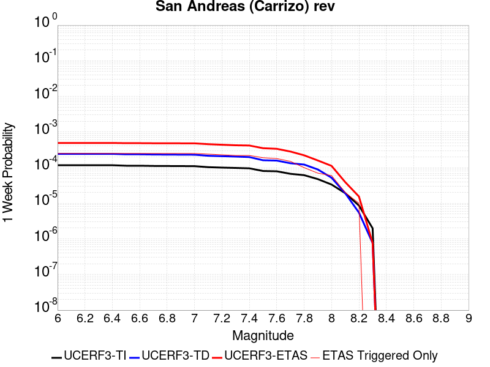 |  |  |  |

| Magnitude | 1 wk TI Prob | 1 wk TD Prob | 1 wk ETAS Prob | 1 wk ETAS/TD Gain | 1 wk ETAS Triggered Only | 1 mo TI Prob | 1 mo TD Prob | 1 mo ETAS Prob | 1 mo ETAS/TD Gain | 1 mo ETAS Triggered Only | 1 yr TI Prob | 1 yr TD Prob | 1 yr ETAS Prob | 1 yr ETAS/TD Gain | 1 yr ETAS Triggered Only | 10 yr TI Prob | 10 yr TD Prob | 10 yr ETAS Prob | 10 yr ETAS/TD Gain | 10 yr ETAS Triggered Only |
|-----|-----|-----|-----|-----|-----|-----|-----|-----|-----|-----|-----|-----|-----|-----|-----|-----|-----|-----|-----|-----|
| 6.0 | 1.1674632E-4 | 2.432302E-4 | 3.4908057E-4 | 1.435186 | 1.05876126E-4 | 5.002454E-4 | 0.0010420004 | 0.0012006491 | 1.152254 | 1.5881419E-4 | 0.006073493 | 0.012613042 | 0.012926664 | 1.0248649 | 3.1762838E-4 | 0.0591016 | 0.12061418 | 0.12089349 | 1.0023158 | 3.1762838E-4 |
| 6.1 | 1.1674632E-4 | 2.432302E-4 | 3.4908057E-4 | 1.435186 | 1.05876126E-4 | 5.002454E-4 | 0.0010420004 | 0.0012006491 | 1.152254 | 1.5881419E-4 | 0.006073493 | 0.012613042 | 0.012926664 | 1.0248649 | 3.1762838E-4 | 0.0591016 | 0.12061418 | 0.12089349 | 1.0023158 | 3.1762838E-4 |
| 6.2 | 1.1674632E-4 | 2.432302E-4 | 3.4908057E-4 | 1.435186 | 1.05876126E-4 | 5.002454E-4 | 0.0010420004 | 0.0012006491 | 1.152254 | 1.5881419E-4 | 0.006073493 | 0.012613042 | 0.012926664 | 1.0248649 | 3.1762838E-4 | 0.0591016 | 0.12061418 | 0.12089349 | 1.0023158 | 3.1762838E-4 |
| 6.3 | 1.1674632E-4 | 2.432302E-4 | 3.4908057E-4 | 1.435186 | 1.05876126E-4 | 5.002454E-4 | 0.0010420004 | 0.0012006491 | 1.152254 | 1.5881419E-4 | 0.006073493 | 0.012613042 | 0.012926664 | 1.0248649 | 3.1762838E-4 | 0.0591016 | 0.12061418 | 0.12089349 | 1.0023158 | 3.1762838E-4 |
| 6.4 | 1.1674632E-4 | 2.432302E-4 | 3.4908057E-4 | 1.435186 | 1.05876126E-4 | 5.002454E-4 | 0.0010420004 | 0.0012006491 | 1.152254 | 1.5881419E-4 | 0.006073493 | 0.012613042 | 0.012926664 | 1.0248649 | 3.1762838E-4 | 0.0591016 | 0.12061418 | 0.12089349 | 1.0023158 | 3.1762838E-4 |
| 6.5 | 1.13136164E-4 | 2.3643032E-4 | 3.4228142E-4 | 1.4477053 | 1.05876126E-4 | 4.847792E-4 | 0.0010128808 | 0.0011715342 | 1.1566358 | 1.5881419E-4 | 0.0058862255 | 0.012262545 | 0.012576277 | 1.0255847 | 3.1762838E-4 | 0.057327334 | 0.117585555 | 0.11786583 | 1.0023836 | 3.1762838E-4 |
| 6.6 | 1.13136164E-4 | 2.3643032E-4 | 3.4228142E-4 | 1.4477053 | 1.05876126E-4 | 4.847792E-4 | 0.0010128808 | 0.0011715342 | 1.1566358 | 1.5881419E-4 | 0.0058862255 | 0.012262545 | 0.012576277 | 1.0255847 | 3.1762838E-4 | 0.057327334 | 0.117585555 | 0.11786583 | 1.0023836 | 3.1762838E-4 |
| 6.7 | 1.1149675E-4 | 2.3334254E-4 | 3.3919397E-4 | 1.453631 | 1.05876126E-4 | 4.777557E-4 | 9.996577E-4 | 0.0011583131 | 1.1587098 | 1.5881419E-4 | 0.0058011734 | 0.012103349 | 0.012417133 | 1.0259254 | 3.1762838E-4 | 0.05652051 | 0.1162071 | 0.116487816 | 1.0024157 | 3.1762838E-4 |
| 6.8 | 1.1103589E-4 | 2.3236412E-4 | 3.3821564E-4 | 1.4555416 | 1.05876126E-4 | 4.7578133E-4 | 9.954676E-4 | 0.0011541238 | 1.1593784 | 1.5881419E-4 | 0.005777263 | 0.012052901 | 0.012366702 | 1.0260352 | 3.1762838E-4 | 0.056293584 | 0.1157674 | 0.116048254 | 1.002426 | 3.1762838E-4 |
| 6.9 | 1.1053259E-4 | 2.3128795E-4 | 3.371396E-4 | 1.4576617 | 1.05876126E-4 | 4.7362508E-4 | 9.90859E-4 | 0.0011495159 | 1.1601205 | 1.5881419E-4 | 0.0057511497 | 0.01199741 | 0.012311228 | 1.0261571 | 3.1762838E-4 | 0.05604569 | 0.11528359 | 0.11556461 | 1.0024376 | 3.1762838E-4 |
| 7.0 | 1.1005377E-4 | 2.3029637E-4 | 3.361481E-4 | 1.4596326 | 1.05876126E-4 | 4.7157376E-4 | 9.866126E-4 | 0.0011452702 | 1.1608104 | 1.5881419E-4 | 0.0057263062 | 0.011946279 | 0.012260113 | 1.0262704 | 3.1762838E-4 | 0.055809796 | 0.11483591 | 0.115117066 | 1.0024483 | 3.1762838E-4 |
| 7.1 | 1.0308142E-4 | 2.1539345E-4 | 3.2124677E-4 | 1.4914417 | 1.05876126E-4 | 4.417027E-4 | 9.227892E-4 | 0.0010814569 | 1.1719435 | 1.5881419E-4 | 0.0053644776 | 0.011177397 | 0.011491476 | 1.0280994 | 3.1762838E-4 | 0.052368138 | 0.108092256 | 0.10837555 | 1.0026208 | 3.1762838E-4 |
| 7.2 | 1.0027479E-4 | 2.094724E-4 | 2.6239938E-4 | 1.252668 | 5.2938063E-5 | 4.296783E-4 | 8.9743105E-4 | 0.0010032122 | 1.117871 | 1.05876126E-4 | 0.0052187922 | 0.010871782 | 0.011133595 | 1.0240818 | 2.6469032E-4 | 0.050979212 | 0.10539625 | 0.10563304 | 1.0022467 | 2.6469032E-4 |
| 7.3 | 9.816942E-5 | 2.0422463E-4 | 2.571519E-4 | 1.259162 | 5.2938063E-5 | 4.2065824E-4 | 8.7495585E-4 | 9.807394E-4 | 1.1209015 | 1.05876126E-4 | 0.005109493 | 0.010600842 | 0.010862726 | 1.0247041 | 2.6469032E-4 | 0.049935985 | 0.102979995 | 0.10321743 | 1.0023056 | 2.6469032E-4 |
| 7.4 | 9.5634205E-5 | 1.9791997E-4 | 2.5084754E-4 | 1.2674191 | 5.2938063E-5 | 4.0979648E-4 | 8.479536E-4 | 9.5374E-4 | 1.1247549 | 1.05876126E-4 | 0.0049778637 | 0.010275229 | 0.0105372 | 1.0254953 | 2.6469032E-4 | 0.048678253 | 0.10006632 | 0.10030452 | 1.0023805 | 2.6469032E-4 |
| 7.5 | 8.052417E-5 | 1.611261E-4 | 2.1405563E-4 | 1.3284975 | 5.2938063E-5 | 3.4505792E-4 | 6.903579E-4 | 7.961609E-4 | 1.1532582 | 1.05876126E-4 | 0.0041929903 | 0.008372796 | 0.0086352695 | 1.0313485 | 2.6469032E-4 | 0.04114753 | 0.08281049 | 0.08305326 | 1.0029316 | 2.6469032E-4 |
| 7.6 | 7.897024E-5 | 1.5765853E-4 | 2.1058824E-4 | 1.3357238 | 5.2938063E-5 | 3.384E-4 | 6.755046E-4 | 7.8130927E-4 | 1.1566305 | 1.05876126E-4 | 0.0041122385 | 0.008193332 | 0.008455854 | 1.0320408 | 2.6469032E-4 | 0.040369697 | 0.08115171 | 0.08139492 | 1.002997 | 2.6469032E-4 |
| 7.7 | 6.707427E-5 | 1.3276102E-4 | 1.8569206E-4 | 1.398694 | 5.2938063E-5 | 2.8742946E-4 | 5.688518E-4 | 6.746677E-4 | 1.1860167 | 1.05876126E-4 | 0.003493839 | 0.00690381 | 0.0071141003 | 1.03046 | 2.1175225E-4 | 0.034394164 | 0.069048055 | 0.06924519 | 1.002855 | 2.1175225E-4 |
| 7.8 | 6.147705E-5 | 1.2197486E-4 | 1.2197486E-4 | 1.0 | 0.0 | 2.6344648E-4 | 5.226447E-4 | 5.7555514E-4 | 1.1012359 | 5.2938063E-5 | 0.0032027436 | 0.006344659 | 0.006502466 | 1.0248723 | 1.5881419E-4 | 0.031569764 | 0.06351457 | 0.06366329 | 1.0023416 | 1.5881419E-4 |
| 7.9 | 4.7636717E-5 | 8.87977E-5 | 8.87977E-5 | 1.0 | 0.0 | 2.0414138E-4 | 3.8050607E-4 | 4.33424E-4 | 1.1390724 | 5.2938063E-5 | 0.0024825884 | 0.0046228287 | 0.0047809086 | 1.0341955 | 1.5881419E-4 | 0.024550365 | 0.046628095 | 0.046779502 | 1.0032471 | 1.5881419E-4 |
| 8.0 | 3.3554235E-5 | 5.2136907E-5 | 5.2136907E-5 | 1.0 | 0.0 | 1.4379594E-4 | 2.2342477E-4 | 2.76351E-4 | 1.2368861 | 5.2938063E-5 | 0.0017493097 | 0.002716805 | 0.0028751877 | 1.0582974 | 1.5881419E-4 | 0.017356034 | 0.027880952 | 0.028035339 | 1.0055374 | 1.5881419E-4 |
| 8.1 | 1.9175432E-5 | 1.9184976E-5 | 1.9184976E-5 | 1.0 | 0.0 | 8.217783E-5 | 8.2218736E-5 | 1.3515244E-4 | 1.6438156 | 5.2938063E-5 | 0.0010000558 | 0.0010005541 | 0.0010534391 | 1.0528558 | 5.2938063E-5 | 0.009955673 | 0.0107580265 | 0.010810396 | 1.0048679 | 5.2938063E-5 |
| 8.2 | 8.643924E-6 | 5.4748625E-6 | 5.4748625E-6 | 1.0 | 0.0 | 3.704486E-5 | 2.3463486E-5 | 2.3463486E-5 | 1.0 | 0.0 | 4.5092785E-4 | 2.8563058E-4 | 2.8563058E-4 | 1.0 | 0.0 | 0.0045001395 | 0.0032487072 | 0.0032487072 | 1.0 | 0.0 |
| 8.3 | 1.983087E-6 | 7.6599065E-7 | 7.6599065E-7 | 1.0 | 0.0 | 8.498917E-6 | 3.282813E-6 | 3.282813E-6 | 1.0 | 0.0 | 1.034694E-4 | 3.9967534E-5 | 3.9967534E-5 | 1.0 | 0.0 | 0.0010342124 | 4.719687E-4 | 4.719687E-4 | 1.0 | 0.0 |

## Ludlow
*[(top)](#table-of-contents)*

| 1 Week | 1 Month | 1 Year | 10 Year |
|-----|-----|-----|-----|
|  |  |  | 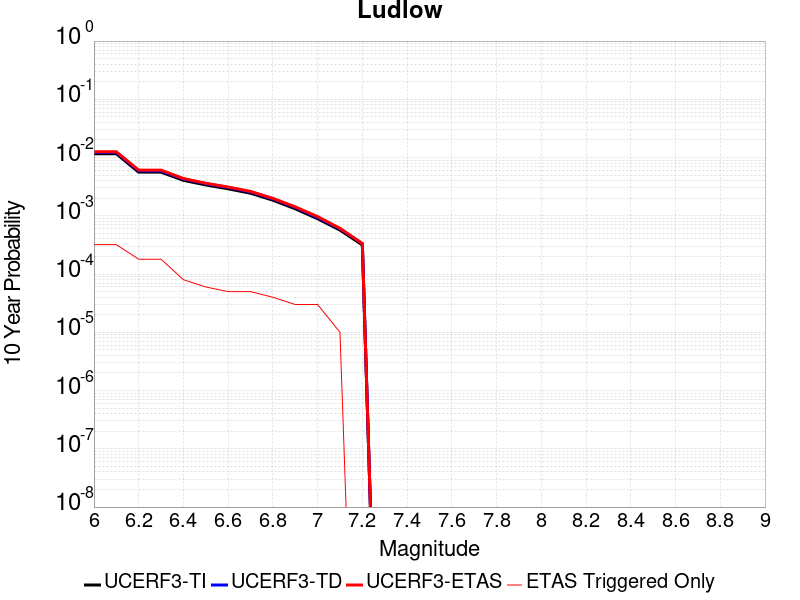 |

| Magnitude | 1 wk TI Prob | 1 wk TD Prob | 1 wk ETAS Prob | 1 wk ETAS/TD Gain | 1 wk ETAS Triggered Only | 1 mo TI Prob | 1 mo TD Prob | 1 mo ETAS Prob | 1 mo ETAS/TD Gain | 1 mo ETAS Triggered Only | 1 yr TI Prob | 1 yr TD Prob | 1 yr ETAS Prob | 1 yr ETAS/TD Gain | 1 yr ETAS Triggered Only | 10 yr TI Prob | 10 yr TD Prob | 10 yr ETAS Prob | 10 yr ETAS/TD Gain | 10 yr ETAS Triggered Only |
|-----|-----|-----|-----|-----|-----|-----|-----|-----|-----|-----|-----|-----|-----|-----|-----|-----|-----|-----|-----|-----|
| 6.0 | 2.2407607E-5 | 2.3657254E-5 | 2.354045E-4 | 9.950626 | 2.1175225E-4 | 9.602906E-5 | 1.0138454E-4 | 3.131153E-4 | 3.0883932 | 2.1175225E-4 | 0.0011685267 | 0.001233702 | 0.001445193 | 1.171428 | 2.1175225E-4 | 0.011624013 | 0.012273042 | 0.012534483 | 1.0213021 | 2.6469032E-4 |
| 6.1 | 2.2407607E-5 | 2.3657254E-5 | 2.354045E-4 | 9.950626 | 2.1175225E-4 | 9.602906E-5 | 1.0138454E-4 | 3.131153E-4 | 3.0883932 | 2.1175225E-4 | 0.0011685267 | 0.001233702 | 0.001445193 | 1.171428 | 2.1175225E-4 | 0.011624013 | 0.012273042 | 0.012534483 | 1.0213021 | 2.6469032E-4 |
| 6.2 | 1.0781252E-5 | 1.1365663E-5 | 1.7017804E-4 | 14.972997 | 1.5881419E-4 | 4.620455E-5 | 4.8709102E-5 | 2.0751555E-4 | 4.2603035 | 1.5881419E-4 | 5.623952E-4 | 5.9287593E-4 | 7.51596E-4 | 1.267712 | 1.5881419E-4 | 0.00560974 | 0.0059133614 | 0.0061238613 | 1.0355973 | 2.1175225E-4 |
| 6.3 | 1.0781252E-5 | 1.1365663E-5 | 1.7017804E-4 | 14.972997 | 1.5881419E-4 | 4.620455E-5 | 4.8709102E-5 | 2.0751555E-4 | 4.2603035 | 1.5881419E-4 | 5.623952E-4 | 5.9287593E-4 | 7.51596E-4 | 1.267712 | 1.5881419E-4 | 0.00560974 | 0.0059133614 | 0.0061238613 | 1.0355973 | 2.1175225E-4 |
| 6.4 | 7.814439E-6 | 8.237729E-6 | 6.117536E-5 | 7.4262404 | 5.2938063E-5 | 3.3490025E-5 | 3.530408E-5 | 8.8240275E-5 | 2.4994354 | 5.2938063E-5 | 4.0766477E-4 | 4.2974384E-4 | 4.8265915E-4 | 1.1231322 | 5.2938063E-5 | 0.0040691774 | 0.0042892746 | 0.0043419856 | 1.012289 | 5.2938063E-5 |
| 6.5 | 6.4986366E-6 | 6.85092E-6 | 5.978862E-5 | 8.727094 | 5.2938063E-5 | 2.7851002E-5 | 2.9360759E-5 | 8.2297265E-5 | 2.802968 | 5.2938063E-5 | 3.390332E-4 | 3.5740953E-4 | 4.1032868E-4 | 1.1480631 | 5.2938063E-5 | 0.003385164 | 0.0035684432 | 0.0036211924 | 1.0147821 | 5.2938063E-5 |
| 6.6 | 5.582177E-6 | 5.8860055E-6 | 5.8823756E-5 | 9.993833 | 5.2938063E-5 | 2.3923398E-5 | 2.5225498E-5 | 7.816222E-5 | 3.0985403 | 5.2938063E-5 | 2.9122844E-4 | 3.0707786E-4 | 3.5999969E-4 | 1.17234 | 5.2938063E-5 | 0.0029084706 | 0.003066609 | 0.0031193846 | 1.0172098 | 5.2938063E-5 |
| 6.7 | 4.6858763E-6 | 4.940427E-6 | 5.7878227E-5 | 11.715227 | 5.2938063E-5 | 2.0082172E-5 | 2.1173091E-5 | 7.411003E-5 | 3.500199 | 5.2938063E-5 | 2.4447302E-4 | 2.5775246E-4 | 3.1067687E-4 | 1.2053304 | 5.2938063E-5 | 0.0024420423 | 0.0025745912 | 0.002627393 | 1.0205088 | 5.2938063E-5 |
| 6.8 | 3.5584908E-6 | 3.7520183E-6 | 5.668988E-5 | 15.10917 | 5.2938063E-5 | 1.5250586E-5 | 1.6079981E-5 | 6.9017195E-5 | 4.292119 | 5.2938063E-5 | 1.8566006E-4 | 1.957566E-4 | 2.486843E-4 | 1.270375 | 5.2938063E-5 | 0.0018550502 | 0.0019558826 | 0.0020087173 | 1.0270132 | 5.2938063E-5 |
| 6.9 | 2.532834E-6 | 2.6710034E-6 | 5.5608925E-5 | 20.819489 | 5.2938063E-5 | 1.0854958E-5 | 1.1447109E-5 | 6.438456E-5 | 5.6245265 | 5.2938063E-5 | 1.3215111E-4 | 1.3935992E-4 | 1.9229061E-4 | 1.3798128 | 5.2938063E-5 | 0.0013207254 | 0.0013927529 | 0.0014456172 | 1.0379567 | 5.2938063E-5 |
| 7.0 | 1.7083285E-6 | 1.8019439E-6 | 5.473991E-5 | 30.378256 | 5.2938063E-5 | 7.3213873E-6 | 7.722595E-6 | 6.0660248E-5 | 7.854905 | 5.2938063E-5 | 8.913424E-5 | 9.40187E-5 | 1.4695179E-4 | 1.5630059 | 5.2938063E-5 | 8.9098496E-4 | 9.3980576E-4 | 9.92694E-4 | 1.0562758 | 5.2938063E-5 |
| 7.1 | 1.0905424E-6 | 1.1497619E-6 | 1.1497619E-6 | 1.0 | 0.0 | 4.6737446E-6 | 4.9275427E-6 | 4.9275427E-6 | 1.0 | 0.0 | 5.6901354E-5 | 5.999128E-5 | 5.999128E-5 | 1.0 | 0.0 | 5.6886784E-4 | 5.997606E-4 | 5.997606E-4 | 1.0 | 0.0 |
| 7.2 | 6.06668E-7 | 6.387277E-7 | 6.387277E-7 | 1.0 | 0.0 | 2.600003E-6 | 2.7374022E-6 | 2.7374022E-6 | 1.0 | 0.0 | 3.1654577E-5 | 3.3327433E-5 | 3.3327433E-5 | 1.0 | 0.0 | 3.1650066E-4 | 3.3323118E-4 | 3.3323118E-4 | 1.0 | 0.0 |

## Santa Cruz Island
*[(top)](#table-of-contents)*

| 1 Week | 1 Month | 1 Year | 10 Year |
|-----|-----|-----|-----|
|  |  |  |  |

| Magnitude | 1 wk TI Prob | 1 wk TD Prob | 1 wk ETAS Prob | 1 wk ETAS/TD Gain | 1 wk ETAS Triggered Only | 1 mo TI Prob | 1 mo TD Prob | 1 mo ETAS Prob | 1 mo ETAS/TD Gain | 1 mo ETAS Triggered Only | 1 yr TI Prob | 1 yr TD Prob | 1 yr ETAS Prob | 1 yr ETAS/TD Gain | 1 yr ETAS Triggered Only | 10 yr TI Prob | 10 yr TD Prob | 10 yr ETAS Prob | 10 yr ETAS/TD Gain | 10 yr ETAS Triggered Only |
|-----|-----|-----|-----|-----|-----|-----|-----|-----|-----|-----|-----|-----|-----|-----|-----|-----|-----|-----|-----|-----|
| 6.0 | 2.9164563E-5 | 3.1599742E-5 | 1.3747253E-4 | 4.3504314 | 1.05876126E-4 | 1.2498499E-4 | 1.3542121E-4 | 3.4714479E-4 | 2.5634446 | 2.1175225E-4 | 0.0015206301 | 0.0016476426 | 0.0018590459 | 1.1283065 | 2.1175225E-4 | 0.015102667 | 0.016368 | 0.016628357 | 1.0159066 | 2.6469032E-4 |
| 6.1 | 2.9164563E-5 | 3.1599742E-5 | 1.3747253E-4 | 4.3504314 | 1.05876126E-4 | 1.2498499E-4 | 1.3542121E-4 | 3.4714479E-4 | 2.5634446 | 2.1175225E-4 | 0.0015206301 | 0.0016476426 | 0.0018590459 | 1.1283065 | 2.1175225E-4 | 0.015102667 | 0.016368 | 0.016628357 | 1.0159066 | 2.6469032E-4 |
| 6.2 | 2.9164563E-5 | 3.1599742E-5 | 1.3747253E-4 | 4.3504314 | 1.05876126E-4 | 1.2498499E-4 | 1.3542121E-4 | 3.4714479E-4 | 2.5634446 | 2.1175225E-4 | 0.0015206301 | 0.0016476426 | 0.0018590459 | 1.1283065 | 2.1175225E-4 | 0.015102667 | 0.016368 | 0.016628357 | 1.0159066 | 2.6469032E-4 |
| 6.3 | 1.6635553E-5 | 1.780436E-5 | 1.236786E-4 | 6.946535 | 1.05876126E-4 | 7.1293274E-5 | 7.630226E-5 | 2.3510434E-4 | 3.0812235 | 1.5881419E-4 | 8.6765E-4 | 9.2860236E-4 | 0.001087269 | 1.1708661 | 1.5881419E-4 | 0.008642701 | 0.009249094 | 0.009406439 | 1.017012 | 1.5881419E-4 |
| 6.4 | 1.6635553E-5 | 1.780436E-5 | 1.236786E-4 | 6.946535 | 1.05876126E-4 | 7.1293274E-5 | 7.630226E-5 | 2.3510434E-4 | 3.0812235 | 1.5881419E-4 | 8.6765E-4 | 9.2860236E-4 | 0.001087269 | 1.1708661 | 1.5881419E-4 | 0.008642701 | 0.009249094 | 0.009406439 | 1.017012 | 1.5881419E-4 |
| 6.5 | 1.2238748E-5 | 1.3042995E-5 | 6.598037E-5 | 5.058682 | 5.2938063E-5 | 5.2450723E-5 | 5.5897377E-5 | 1.0883248E-4 | 1.9470052 | 5.2938063E-5 | 6.3840044E-4 | 6.8034173E-4 | 7.3324377E-4 | 1.0777581 | 5.2938063E-5 | 0.0063656955 | 0.0067829876 | 0.006835567 | 1.0077516 | 5.2938063E-5 |
| 6.6 | 1.0489767E-5 | 1.1156636E-5 | 6.409411E-5 | 5.744931 | 5.2938063E-5 | 4.495537E-5 | 4.781329E-5 | 1.00748824E-4 | 2.10713 | 5.2938063E-5 | 5.4719415E-4 | 5.819735E-4 | 6.348808E-4 | 1.0909101 | 5.2938063E-5 | 0.005458487 | 0.0058047357 | 0.0058573666 | 1.0090668 | 5.2938063E-5 |
| 6.7 | 8.699222E-6 | 9.236782E-6 | 6.217435E-5 | 6.7311707 | 5.2938063E-5 | 3.7281847E-5 | 3.958561E-5 | 9.252158E-5 | 2.3372529 | 5.2938063E-5 | 4.5381195E-4 | 4.8184878E-4 | 5.3476135E-4 | 1.1098115 | 5.2938063E-5 | 0.0045288634 | 0.004808108 | 0.0048607914 | 1.0109572 | 5.2938063E-5 |
| 6.8 | 8.307732E-6 | 8.8169045E-6 | 6.17545E-5 | 7.004102 | 5.2938063E-5 | 3.560408E-5 | 3.7786187E-5 | 9.072225E-5 | 2.4009368 | 5.2938063E-5 | 4.3339343E-4 | 4.5995016E-4 | 5.1286386E-4 | 1.1150423 | 5.2938063E-5 | 0.004325492 | 0.0045900354 | 0.00464273 | 1.0114803 | 5.2938063E-5 |
| 6.9 | 8.073121E-6 | 8.564939E-6 | 6.150255E-5 | 7.180734 | 5.2938063E-5 | 3.459863E-5 | 3.6706366E-5 | 8.964249E-5 | 2.4421508 | 5.2938063E-5 | 4.2115687E-4 | 4.468088E-4 | 4.997232E-4 | 1.1184274 | 5.2938063E-5 | 0.004203596 | 0.004459156 | 0.004511858 | 1.0118189 | 5.2938063E-5 |
| 7.0 | 7.617019E-6 | 8.074664E-6 | 6.10123E-5 | 7.556017 | 5.2938063E-5 | 3.264396E-5 | 3.4605247E-5 | 8.754148E-5 | 2.529717 | 5.2938063E-5 | 3.9736772E-4 | 4.212378E-4 | 4.7415358E-4 | 1.1256196 | 5.2938063E-5 | 0.003966579 | 0.0042044413 | 0.0042571565 | 1.0125381 | 5.2938063E-5 |
| 7.1 | 7.1224836E-6 | 7.545788E-6 | 6.048345E-5 | 8.015525 | 5.2938063E-5 | 3.052457E-5 | 3.2338692E-5 | 8.5275045E-5 | 2.6369355 | 5.2938063E-5 | 3.715733E-4 | 3.936528E-4 | 4.4657002E-4 | 1.1344261 | 5.2938063E-5 | 0.003709526 | 0.003929598 | 0.003982328 | 1.0134187 | 5.2938063E-5 |
| 7.2 | 6.441115E-6 | 6.8273835E-6 | 5.9765083E-5 | 8.753732 | 5.2938063E-5 | 2.7604487E-5 | 2.9259887E-5 | 8.21964E-5 | 2.8091838 | 5.2938063E-5 | 3.360328E-4 | 3.5618112E-4 | 4.0910032E-4 | 1.1485739 | 5.2938063E-5 | 0.0033552512 | 0.003556131 | 0.0036088808 | 1.0148335 | 5.2938063E-5 |
| 7.3 | 5.494274E-6 | 5.8199944E-6 | 5.875775E-5 | 10.095843 | 5.2938063E-5 | 2.3546674E-5 | 2.4942596E-5 | 7.787934E-5 | 3.122343 | 5.2938063E-5 | 2.8664304E-4 | 3.0363398E-4 | 3.5655597E-4 | 1.1742953 | 5.2938063E-5 | 0.002862736 | 0.0030322142 | 0.0030849918 | 1.0174056 | 5.2938063E-5 |
| 7.4 | 4.0802624E-6 | 4.312256E-6 | 5.725009E-5 | 13.2761345 | 5.2938063E-5 | 1.7486722E-5 | 1.8480967E-5 | 7.141805E-5 | 3.8644109 | 5.2938063E-5 | 2.1288003E-4 | 2.2498262E-4 | 2.7790878E-4 | 1.2352455 | 5.2938063E-5 | 0.0021267622 | 0.0022475575 | 0.0023003765 | 1.0235007 | 5.2938063E-5 |
| 7.5 | 2.3584746E-6 | 2.4753094E-6 | 5.5413242E-5 | 22.386389 | 5.2938063E-5 | 1.0107709E-5 | 1.0608426E-5 | 6.354593E-5 | 5.990137 | 5.2938063E-5 | 1.2305441E-4 | 1.2915E-4 | 1.8208122E-4 | 1.4098431 | 5.2938063E-5 | 0.0012298629 | 0.0012907543 | 0.0013436241 | 1.0409603 | 5.2938063E-5 |
| 7.6 | 9.4981914E-7 | 9.86093E-7 | 5.3924105E-5 | 54.6846 | 5.2938063E-5 | 4.0706473E-6 | 4.2261063E-6 | 5.7163947E-5 | 13.526386 | 5.2938063E-5 | 4.9559E-5 | 5.145164E-5 | 1.0438698E-4 | 2.0288367 | 5.2938063E-5 | 4.954795E-4 | 5.1439856E-4 | 5.6730944E-4 | 1.1028596 | 5.2938063E-5 |
| 7.7 | 2.6013532E-7 | 2.6416603E-7 | 2.6416603E-7 | 1.0 | 0.0 | 1.1148652E-6 | 1.1321397E-6 | 1.1321397E-6 | 1.0 | 0.0 | 1.3573399E-5 | 1.3783714E-5 | 1.3783714E-5 | 1.0 | 0.0 | 1.357257E-4 | 1.3782867E-4 | 1.3782867E-4 | 1.0 | 0.0 |
| 7.8 | 4.1522263E-8 | 3.965679E-8 | 3.965679E-8 | 1.0 | 0.0 | 1.7795254E-7 | 1.6995766E-7 | 1.6995766E-7 | 1.0 | 0.0 | 2.16657E-6 | 2.0692328E-6 | 2.0692328E-6 | 1.0 | 0.0 | 2.1665488E-5 | 2.0692156E-5 | 2.0692156E-5 | 1.0 | 0.0 |
| 7.9 | 7.7242046E-10 | 5.9468175E-10 | 5.9468175E-10 | 1.0 | 0.0 | 3.3103735E-9 | 2.5486364E-9 | 2.5486364E-9 | 1.0 | 0.0 | 4.0303796E-8 | 3.1029646E-8 | 3.1029646E-8 | 1.0 | 0.0 | 4.030379E-7 | 3.1029643E-7 | 3.1029643E-7 | 1.0 | 0.0 |

## Palos Verdes
*[(top)](#table-of-contents)*

| 1 Week | 1 Month | 1 Year | 10 Year |
|-----|-----|-----|-----|
|  |  |  |  |

| Magnitude | 1 wk TI Prob | 1 wk TD Prob | 1 wk ETAS Prob | 1 wk ETAS/TD Gain | 1 wk ETAS Triggered Only | 1 mo TI Prob | 1 mo TD Prob | 1 mo ETAS Prob | 1 mo ETAS/TD Gain | 1 mo ETAS Triggered Only | 1 yr TI Prob | 1 yr TD Prob | 1 yr ETAS Prob | 1 yr ETAS/TD Gain | 1 yr ETAS Triggered Only | 10 yr TI Prob | 10 yr TD Prob | 10 yr ETAS Prob | 10 yr ETAS/TD Gain | 10 yr ETAS Triggered Only |
|-----|-----|-----|-----|-----|-----|-----|-----|-----|-----|-----|-----|-----|-----|-----|-----|-----|-----|-----|-----|-----|
| 6.0 | 6.126063E-5 | 7.622612E-5 | 1.2916015E-4 | 1.6944343 | 5.2938063E-5 | 2.6251914E-4 | 3.2664582E-4 | 5.9124967E-4 | 1.8100635 | 2.6469032E-4 | 0.0031914865 | 0.003970174 | 0.004233814 | 1.066405 | 2.6469032E-4 | 0.031460393 | 0.039048895 | 0.03930325 | 1.0065137 | 2.6469032E-4 |
| 6.1 | 6.126063E-5 | 7.622612E-5 | 1.2916015E-4 | 1.6944343 | 5.2938063E-5 | 2.6251914E-4 | 3.2664582E-4 | 5.9124967E-4 | 1.8100635 | 2.6469032E-4 | 0.0031914865 | 0.003970174 | 0.004233814 | 1.066405 | 2.6469032E-4 | 0.031460393 | 0.039048895 | 0.03930325 | 1.0065137 | 2.6469032E-4 |
| 6.2 | 6.126063E-5 | 7.622612E-5 | 1.2916015E-4 | 1.6944343 | 5.2938063E-5 | 2.6251914E-4 | 3.2664582E-4 | 5.9124967E-4 | 1.8100635 | 2.6469032E-4 | 0.0031914865 | 0.003970174 | 0.004233814 | 1.066405 | 2.6469032E-4 | 0.031460393 | 0.039048895 | 0.03930325 | 1.0065137 | 2.6469032E-4 |
| 6.3 | 4.0838047E-5 | 4.9749437E-5 | 1.0268486E-4 | 2.064041 | 5.2938063E-5 | 1.7500846E-4 | 2.1319572E-4 | 3.7197603E-4 | 1.7447633 | 1.5881419E-4 | 0.0021286458 | 0.0025927818 | 0.0027511842 | 1.0610936 | 1.5881419E-4 | 0.021083709 | 0.025646681 | 0.025801422 | 1.0060335 | 1.5881419E-4 |
| 6.4 | 4.0838047E-5 | 4.9749437E-5 | 1.0268486E-4 | 2.064041 | 5.2938063E-5 | 1.7500846E-4 | 2.1319572E-4 | 3.7197603E-4 | 1.7447633 | 1.5881419E-4 | 0.0021286458 | 0.0025927818 | 0.0027511842 | 1.0610936 | 1.5881419E-4 | 0.021083709 | 0.025646681 | 0.025801422 | 1.0060335 | 1.5881419E-4 |
| 6.5 | 3.0512005E-5 | 3.656162E-5 | 3.656162E-5 | 1.0 | 0.0 | 1.3075917E-4 | 1.5668393E-4 | 2.6254347E-4 | 1.6756247 | 1.05876126E-4 | 0.0015908304 | 0.0019060767 | 0.0020117508 | 1.0554408 | 1.05876126E-4 | 0.015794903 | 0.018909154 | 0.019013029 | 1.0054933 | 1.05876126E-4 |
| 6.6 | 2.9255087E-5 | 3.515442E-5 | 3.515442E-5 | 1.0 | 0.0 | 1.2537291E-4 | 1.5065377E-4 | 2.5651394E-4 | 1.702672 | 1.05876126E-4 | 0.0015253464 | 0.0018327828 | 0.0019384649 | 1.0576621 | 1.05876126E-4 | 0.015149189 | 0.018188225 | 0.018292176 | 1.0057153 | 1.05876126E-4 |
| 6.7 | 2.287198E-5 | 2.7248278E-5 | 2.7248278E-5 | 1.0 | 0.0 | 9.801909E-5 | 1.16773626E-4 | 2.2263739E-4 | 1.9065726 | 1.05876126E-4 | 0.001192729 | 0.0014208833 | 0.0015266091 | 1.0744084 | 1.05876126E-4 | 0.011863477 | 0.014127217 | 0.014231598 | 1.0073886 | 1.05876126E-4 |
| 6.8 | 2.1325764E-5 | 2.5431877E-5 | 2.5431877E-5 | 1.0 | 0.0 | 9.139293E-5 | 1.0898971E-4 | 2.148543E-4 | 1.9713264 | 1.05876126E-4 | 0.001112141 | 0.0013262323 | 0.001431968 | 1.0797263 | 1.05876126E-4 | 0.011065915 | 0.013192211 | 0.013296691 | 1.0079198 | 1.05876126E-4 |
| 6.9 | 1.9009392E-5 | 2.2613547E-5 | 2.2613547E-5 | 1.0 | 0.0 | 8.1466285E-5 | 9.6912096E-5 | 2.0277796E-4 | 2.0923905 | 1.05876126E-4 | 9.914007E-4 | 0.0011793535 | 0.0012851048 | 1.0896689 | 1.05876126E-4 | 0.009869894 | 0.011739632 | 0.011844265 | 1.0089128 | 1.05876126E-4 |
| 7.0 | 1.7098473E-5 | 2.0319356E-5 | 2.0319356E-5 | 1.0 | 0.0 | 7.3277115E-5 | 8.708052E-5 | 1.9294742E-4 | 2.2157357 | 1.05876126E-4 | 8.917837E-4 | 0.001059775 | 0.0011655389 | 1.0997984 | 1.05876126E-4 | 0.008882134 | 0.010555646 | 0.010660405 | 1.0099244 | 1.05876126E-4 |
| 7.1 | 1.5982785E-5 | 1.899476E-5 | 1.899476E-5 | 1.0 | 0.0 | 6.849585E-5 | 8.1404054E-5 | 1.8727157E-4 | 2.3005188 | 1.05876126E-4 | 8.336179E-4 | 9.907284E-4 | 0.0010964996 | 1.1067611 | 1.05876126E-4 | 0.008304977 | 0.009871479 | 0.009976311 | 1.0106195 | 1.05876126E-4 |
| 7.2 | 1.4468002E-5 | 1.7197237E-5 | 1.7197237E-5 | 1.0 | 0.0 | 6.200425E-5 | 7.370083E-5 | 1.7956915E-4 | 2.4364603 | 1.05876126E-4 | 7.546402E-4 | 8.970222E-4 | 0.0010028033 | 1.1179248 | 1.05876126E-4 | 0.007520827 | 0.008942284 | 0.009047213 | 1.011734 | 1.05876126E-4 |
| 7.3 | 5.288233E-6 | 6.2036747E-6 | 6.2036747E-6 | 1.0 | 0.0 | 2.2663658E-5 | 2.6587102E-5 | 2.6587102E-5 | 1.0 | 0.0 | 2.7589512E-4 | 3.236848E-4 | 3.236848E-4 | 1.0 | 0.0 | 0.0027555283 | 0.0032355562 | 0.0032355562 | 1.0 | 0.0 |
| 7.4 | 8.279556E-7 | 8.408347E-7 | 8.408347E-7 | 1.0 | 0.0 | 3.5483763E-6 | 3.6035726E-6 | 3.6035726E-6 | 1.0 | 0.0 | 4.3200624E-5 | 4.3872686E-5 | 4.3872686E-5 | 1.0 | 0.0 | 4.3192226E-4 | 4.3864746E-4 | 4.3864746E-4 | 1.0 | 0.0 |
| 7.5 | 6.559831E-7 | 6.667229E-7 | 6.667229E-7 | 1.0 | 0.0 | 2.8113532E-6 | 2.857381E-6 | 2.857381E-6 | 1.0 | 0.0 | 3.4227687E-5 | 3.4788125E-5 | 3.4788125E-5 | 1.0 | 0.0 | 3.4222414E-4 | 3.4783344E-4 | 3.4783344E-4 | 1.0 | 0.0 |
| 7.6 | 3.5018968E-7 | 3.5620027E-7 | 3.5620027E-7 | 1.0 | 0.0 | 1.500812E-6 | 1.526572E-6 | 1.526572E-6 | 1.0 | 0.0 | 1.8272232E-5 | 1.8585903E-5 | 1.8585903E-5 | 1.0 | 0.0 | 1.8270731E-4 | 1.8584808E-4 | 1.8584808E-4 | 1.0 | 0.0 |
| 7.7 | 1.1986104E-7 | 1.2198376E-7 | 1.2198376E-7 | 1.0 | 0.0 | 5.1369005E-7 | 5.2278745E-7 | 5.2278745E-7 | 1.0 | 0.0 | 6.2541585E-6 | 6.364919E-6 | 6.364919E-6 | 1.0 | 0.0 | 6.2539824E-5 | 6.364741E-5 | 6.364741E-5 | 1.0 | 0.0 |
| 7.8 | 3.0445005E-8 | 3.1027582E-8 | 3.1027582E-8 | 1.0 | 0.0 | 1.3047858E-7 | 1.3297536E-7 | 1.3297536E-7 | 1.0 | 0.0 | 1.5885756E-6 | 1.6189739E-6 | 1.6189739E-6 | 1.0 | 0.0 | 1.5885644E-5 | 1.6189642E-5 | 1.6189642E-5 | 1.0 | 0.0 |

## Kern Canyon (North Kern) 2011
*[(top)](#table-of-contents)*

| 1 Week | 1 Month | 1 Year | 10 Year |
|-----|-----|-----|-----|
|  |  |  |  |

| Magnitude | 1 wk TI Prob | 1 wk TD Prob | 1 wk ETAS Prob | 1 wk ETAS/TD Gain | 1 wk ETAS Triggered Only | 1 mo TI Prob | 1 mo TD Prob | 1 mo ETAS Prob | 1 mo ETAS/TD Gain | 1 mo ETAS Triggered Only | 1 yr TI Prob | 1 yr TD Prob | 1 yr ETAS Prob | 1 yr ETAS/TD Gain | 1 yr ETAS Triggered Only | 10 yr TI Prob | 10 yr TD Prob | 10 yr ETAS Prob | 10 yr ETAS/TD Gain | 10 yr ETAS Triggered Only |
|-----|-----|-----|-----|-----|-----|-----|-----|-----|-----|-----|-----|-----|-----|-----|-----|-----|-----|-----|-----|-----|
| 6.0 | 6.6264497E-6 | 6.75733E-6 | 5.9695034E-5 | 8.834116 | 5.2938063E-5 | 2.8398761E-5 | 2.895971E-5 | 1.3483276E-4 | 4.6558743 | 1.05876126E-4 | 3.4570007E-4 | 3.5253543E-4 | 6.171324E-4 | 1.7505543 | 2.6469032E-4 | 0.0034516277 | 0.0035205502 | 0.0037843087 | 1.0749197 | 2.6469032E-4 |
| 6.1 | 6.6264497E-6 | 6.75733E-6 | 5.9695034E-5 | 8.834116 | 5.2938063E-5 | 2.8398761E-5 | 2.895971E-5 | 1.3483276E-4 | 4.6558743 | 1.05876126E-4 | 3.4570007E-4 | 3.5253543E-4 | 6.171324E-4 | 1.7505543 | 2.6469032E-4 | 0.0034516277 | 0.0035205502 | 0.0037843087 | 1.0749197 | 2.6469032E-4 |
| 6.2 | 6.6264497E-6 | 6.75733E-6 | 5.9695034E-5 | 8.834116 | 5.2938063E-5 | 2.8398761E-5 | 2.895971E-5 | 1.3483276E-4 | 4.6558743 | 1.05876126E-4 | 3.4570007E-4 | 3.5253543E-4 | 6.171324E-4 | 1.7505543 | 2.6469032E-4 | 0.0034516277 | 0.0035205502 | 0.0037843087 | 1.0749197 | 2.6469032E-4 |
| 6.3 | 6.6264497E-6 | 6.75733E-6 | 5.9695034E-5 | 8.834116 | 5.2938063E-5 | 2.8398761E-5 | 2.895971E-5 | 1.3483276E-4 | 4.6558743 | 1.05876126E-4 | 3.4570007E-4 | 3.5253543E-4 | 6.171324E-4 | 1.7505543 | 2.6469032E-4 | 0.0034516277 | 0.0035205502 | 0.0037843087 | 1.0749197 | 2.6469032E-4 |
| 6.4 | 6.6264497E-6 | 6.75733E-6 | 5.9695034E-5 | 8.834116 | 5.2938063E-5 | 2.8398761E-5 | 2.895971E-5 | 1.3483276E-4 | 4.6558743 | 1.05876126E-4 | 3.4570007E-4 | 3.5253543E-4 | 6.171324E-4 | 1.7505543 | 2.6469032E-4 | 0.0034516277 | 0.0035205502 | 0.0037843087 | 1.0749197 | 2.6469032E-4 |
| 6.5 | 3.2162225E-6 | 3.2570915E-6 | 3.2570915E-6 | 1.0 | 0.0 | 1.3783738E-5 | 1.3958893E-5 | 1.3958893E-5 | 1.0 | 0.0 | 1.6780409E-4 | 1.6993708E-4 | 2.2286615E-4 | 1.3114628 | 5.2938063E-5 | 0.0016767744 | 0.001698151 | 0.0017509991 | 1.031121 | 5.2938063E-5 |
| 6.6 | 3.2162225E-6 | 3.2570915E-6 | 3.2570915E-6 | 1.0 | 0.0 | 1.3783738E-5 | 1.3958893E-5 | 1.3958893E-5 | 1.0 | 0.0 | 1.6780409E-4 | 1.6993708E-4 | 2.2286615E-4 | 1.3114628 | 5.2938063E-5 | 0.0016767744 | 0.001698151 | 0.0017509991 | 1.031121 | 5.2938063E-5 |
| 6.7 | 2.1908265E-6 | 2.2071222E-6 | 2.2071222E-6 | 1.0 | 0.0 | 9.389223E-6 | 9.459061E-6 | 9.459061E-6 | 1.0 | 0.0 | 1.1430779E-4 | 1.1515819E-4 | 1.1515819E-4 | 1.0 | 0.0 | 0.0011424901 | 0.0011510046 | 0.0011510046 | 1.0 | 0.0 |
| 6.8 | 1.7303895E-6 | 1.7365529E-6 | 1.7365529E-6 | 1.0 | 0.0 | 7.415934E-6 | 7.4423488E-6 | 7.4423488E-6 | 1.0 | 0.0 | 9.028525E-5 | 9.0606925E-5 | 9.0606925E-5 | 1.0 | 0.0 | 9.024858E-4 | 9.057096E-4 | 9.057096E-4 | 1.0 | 0.0 |
| 6.9 | 1.3700314E-6 | 1.3688622E-6 | 1.3688622E-6 | 1.0 | 0.0 | 5.87155E-6 | 5.8665396E-6 | 5.8665396E-6 | 1.0 | 0.0 | 7.148377E-5 | 7.142282E-5 | 7.142282E-5 | 1.0 | 0.0 | 7.146078E-4 | 7.140032E-4 | 7.140032E-4 | 1.0 | 0.0 |
| 7.0 | 1.1467797E-6 | 1.1413804E-6 | 1.1413804E-6 | 1.0 | 0.0 | 4.9147607E-6 | 4.8916213E-6 | 4.8916213E-6 | 1.0 | 0.0 | 5.983557E-5 | 5.9553895E-5 | 5.9553895E-5 | 1.0 | 0.0 | 5.981946E-4 | 5.953825E-4 | 5.953825E-4 | 1.0 | 0.0 |
| 7.1 | 9.3952065E-7 | 9.3026904E-7 | 9.3026904E-7 | 1.0 | 0.0 | 4.026511E-6 | 3.9868614E-6 | 3.9868614E-6 | 1.0 | 0.0 | 4.9021666E-5 | 4.8538972E-5 | 4.8538972E-5 | 1.0 | 0.0 | 4.901085E-4 | 4.8528548E-4 | 4.8528548E-4 | 1.0 | 0.0 |
| 7.2 | 6.858055E-7 | 6.7193E-7 | 6.7193E-7 | 1.0 | 0.0 | 2.939163E-6 | 2.879697E-6 | 2.879697E-6 | 1.0 | 0.0 | 3.5783723E-5 | 3.5059755E-5 | 3.5059755E-5 | 1.0 | 0.0 | 3.5777962E-4 | 3.5054312E-4 | 3.5054312E-4 | 1.0 | 0.0 |
| 7.3 | 5.1101983E-7 | 4.9393E-7 | 4.9393E-7 | 1.0 | 0.0 | 2.1900833E-6 | 2.116841E-6 | 2.116841E-6 | 1.0 | 0.0 | 2.6663936E-5 | 2.5772239E-5 | 2.5772239E-5 | 1.0 | 0.0 | 2.6660739E-4 | 2.57693E-4 | 2.57693E-4 | 1.0 | 0.0 |
| 7.4 | 3.4999414E-7 | 3.2995905E-7 | 3.2995905E-7 | 1.0 | 0.0 | 1.499974E-6 | 1.4141094E-6 | 1.4141094E-6 | 1.0 | 0.0 | 1.8262032E-5 | 1.721665E-5 | 1.721665E-5 | 1.0 | 0.0 | 1.826053E-4 | 1.7215339E-4 | 1.7215339E-4 | 1.0 | 0.0 |
| 7.5 | 1.7021522E-7 | 1.4750044E-7 | 1.4750044E-7 | 1.0 | 0.0 | 7.2949354E-7 | 6.321446E-7 | 6.321446E-7 | 1.0 | 0.0 | 8.881548E-6 | 7.696334E-6 | 7.696334E-6 | 1.0 | 0.0 | 8.8811925E-5 | 7.696076E-5 | 7.696076E-5 | 1.0 | 0.0 |
| 7.6 | 2.572245E-8 | 1.7352555E-8 | 1.7352555E-8 | 1.0 | 0.0 | 1.10239064E-7 | 7.436809E-8 | 7.436809E-8 | 1.0 | 0.0 | 1.3421597E-6 | 9.054312E-7 | 9.054312E-7 | 1.0 | 0.0 | 1.3421517E-5 | 9.05428E-6 | 9.05428E-6 | 1.0 | 0.0 |

## Santa Ynez (East)
*[(top)](#table-of-contents)*

| 1 Week | 1 Month | 1 Year | 10 Year |
|-----|-----|-----|-----|
|  |  |  |  |

| Magnitude | 1 wk TI Prob | 1 wk TD Prob | 1 wk ETAS Prob | 1 wk ETAS/TD Gain | 1 wk ETAS Triggered Only | 1 mo TI Prob | 1 mo TD Prob | 1 mo ETAS Prob | 1 mo ETAS/TD Gain | 1 mo ETAS Triggered Only | 1 yr TI Prob | 1 yr TD Prob | 1 yr ETAS Prob | 1 yr ETAS/TD Gain | 1 yr ETAS Triggered Only | 10 yr TI Prob | 10 yr TD Prob | 10 yr ETAS Prob | 10 yr ETAS/TD Gain | 10 yr ETAS Triggered Only |
|-----|-----|-----|-----|-----|-----|-----|-----|-----|-----|-----|-----|-----|-----|-----|-----|-----|-----|-----|-----|-----|
| 6.0 | 3.2269712E-5 | 3.67505E-5 | 3.67505E-5 | 1.0 | 0.0 | 1.3829143E-4 | 1.5749598E-4 | 3.1628515E-4 | 2.0082111 | 1.5881419E-4 | 0.0016823979 | 0.0019164166 | 0.0020749264 | 1.0827116 | 1.5881419E-4 | 0.016697178 | 0.019056441 | 0.01921223 | 1.008175 | 1.5881419E-4 |
| 6.1 | 3.2269712E-5 | 3.67505E-5 | 3.67505E-5 | 1.0 | 0.0 | 1.3829143E-4 | 1.5749598E-4 | 3.1628515E-4 | 2.0082111 | 1.5881419E-4 | 0.0016823979 | 0.0019164166 | 0.0020749264 | 1.0827116 | 1.5881419E-4 | 0.016697178 | 0.019056441 | 0.01921223 | 1.008175 | 1.5881419E-4 |
| 6.2 | 3.2269712E-5 | 3.67505E-5 | 3.67505E-5 | 1.0 | 0.0 | 1.3829143E-4 | 1.5749598E-4 | 3.1628515E-4 | 2.0082111 | 1.5881419E-4 | 0.0016823979 | 0.0019164166 | 0.0020749264 | 1.0827116 | 1.5881419E-4 | 0.016697178 | 0.019056441 | 0.01921223 | 1.008175 | 1.5881419E-4 |
| 6.3 | 3.2269712E-5 | 3.67505E-5 | 3.67505E-5 | 1.0 | 0.0 | 1.3829143E-4 | 1.5749598E-4 | 3.1628515E-4 | 2.0082111 | 1.5881419E-4 | 0.0016823979 | 0.0019164166 | 0.0020749264 | 1.0827116 | 1.5881419E-4 | 0.016697178 | 0.019056441 | 0.01921223 | 1.008175 | 1.5881419E-4 |
| 6.4 | 1.4404779E-5 | 1.4849382E-5 | 1.4849382E-5 | 1.0 | 0.0 | 6.1733306E-5 | 6.363868E-5 | 1.1657338E-4 | 1.8318006 | 5.2938063E-5 | 7.513438E-4 | 7.745306E-4 | 8.803247E-4 | 1.1365913 | 1.05876126E-4 | 0.0074880854 | 0.007718862 | 0.007823921 | 1.0136107 | 1.05876126E-4 |
| 6.5 | 1.4404779E-5 | 1.4849382E-5 | 1.4849382E-5 | 1.0 | 0.0 | 6.1733306E-5 | 6.363868E-5 | 1.1657338E-4 | 1.8318006 | 5.2938063E-5 | 7.513438E-4 | 7.745306E-4 | 8.803247E-4 | 1.1365913 | 1.05876126E-4 | 0.0074880854 | 0.007718862 | 0.007823921 | 1.0136107 | 1.05876126E-4 |
| 6.6 | 1.280208E-5 | 1.3011947E-5 | 1.3011947E-5 | 1.0 | 0.0 | 5.4864904E-5 | 5.5764307E-5 | 1.08699416E-4 | 1.9492651 | 5.2938063E-5 | 6.6777546E-4 | 6.787207E-4 | 7.8452495E-4 | 1.1558877 | 1.05876126E-4 | 0.006657724 | 0.0067666885 | 0.0068718484 | 1.0155408 | 1.05876126E-4 |
| 6.7 | 1.2457027E-5 | 1.2628468E-5 | 1.2628468E-5 | 1.0 | 0.0 | 5.3386164E-5 | 5.412089E-5 | 1.0705609E-4 | 1.9780917 | 5.2938063E-5 | 6.497827E-4 | 6.587243E-4 | 7.645307E-4 | 1.1606232 | 1.05876126E-4 | 0.00647886 | 0.006567915 | 0.0066730957 | 1.0160143 | 1.05876126E-4 |
| 6.8 | 1.2095134E-5 | 1.2230915E-5 | 1.2230915E-5 | 1.0 | 0.0 | 5.1835254E-5 | 5.241716E-5 | 1.0535245E-4 | 2.0098846 | 5.2938063E-5 | 6.309115E-4 | 6.379937E-4 | 7.4380223E-4 | 1.1658458 | 1.05876126E-4 | 0.0062912325 | 0.006361809 | 0.0064670118 | 1.0165366 | 1.05876126E-4 |
| 6.9 | 1.1104036E-5 | 1.1157347E-5 | 1.1157347E-5 | 1.0 | 0.0 | 4.758786E-5 | 4.781633E-5 | 1.00751866E-4 | 2.1070597 | 5.2938063E-5 | 5.7922816E-4 | 5.820096E-4 | 6.878241E-4 | 1.1818088 | 1.05876126E-4 | 0.005777207 | 0.0058049993 | 0.0059102606 | 1.0181329 | 1.05876126E-4 |
| 7.0 | 1.0577444E-5 | 1.058168E-5 | 1.058168E-5 | 1.0 | 0.0 | 4.5331115E-5 | 4.5349276E-5 | 9.828494E-5 | 2.1672878 | 5.2938063E-5 | 5.5176654E-4 | 5.519888E-4 | 6.5780646E-4 | 1.1917026 | 1.05876126E-4 | 0.0055039856 | 0.0055063153 | 0.0056116087 | 1.0191222 | 1.05876126E-4 |
| 7.1 | 1.0021775E-5 | 9.980988E-6 | 9.980988E-6 | 1.0 | 0.0 | 4.294976E-5 | 4.2774966E-5 | 9.571076E-5 | 2.2375417 | 5.2938063E-5 | 5.2278786E-4 | 5.2066194E-4 | 6.2648294E-4 | 1.2032433 | 1.05876126E-4 | 0.0052155964 | 0.0051945536 | 0.0052998797 | 1.0202763 | 1.05876126E-4 |
| 7.2 | 8.874109E-6 | 8.748793E-6 | 8.748793E-6 | 1.0 | 0.0 | 3.8031343E-5 | 3.7494297E-5 | 9.0430374E-5 | 2.4118435 | 5.2938063E-5 | 4.629332E-4 | 4.5639853E-4 | 5.6222634E-4 | 1.2318759 | 1.05876126E-4 | 0.0046197 | 0.0045547304 | 0.004660124 | 1.0231395 | 1.05876126E-4 |
| 7.3 | 7.5504267E-6 | 7.5051175E-6 | 7.5051175E-6 | 1.0 | 0.0 | 3.235857E-5 | 3.21644E-5 | 8.510076E-5 | 2.645806 | 5.2938063E-5 | 3.9389438E-4 | 3.915322E-4 | 4.973669E-4 | 1.270309 | 1.05876126E-4 | 0.0039319694 | 0.003908531 | 0.0040139933 | 1.0269825 | 1.05876126E-4 |
| 7.4 | 6.309394E-6 | 6.1831556E-6 | 6.1831556E-6 | 1.0 | 0.0 | 2.703998E-5 | 2.6498974E-5 | 7.943563E-5 | 2.997687 | 5.2938063E-5 | 3.2916202E-4 | 3.225782E-4 | 4.2842017E-4 | 1.3281126 | 1.05876126E-4 | 0.003286749 | 0.003221197 | 0.0033267322 | 1.0327626 | 1.05876126E-4 |
| 7.5 | 4.6103073E-6 | 4.4408903E-6 | 4.4408903E-6 | 1.0 | 0.0 | 1.975831E-5 | 1.9032252E-5 | 1.9032252E-5 | 1.0 | 0.0 | 2.4053088E-4 | 2.3169373E-4 | 2.846195E-4 | 1.22843 | 5.2938063E-5 | 0.002402707 | 0.002314591 | 0.0023674066 | 1.0228186 | 5.2938063E-5 |
| 7.6 | 1.2858658E-6 | 1.3008173E-6 | 1.3008173E-6 | 1.0 | 0.0 | 5.5108417E-6 | 5.5749197E-6 | 5.5749197E-6 | 1.0 | 0.0 | 6.7092435E-5 | 6.78726E-5 | 6.78726E-5 | 1.0 | 0.0 | 6.707218E-4 | 6.785256E-4 | 6.785256E-4 | 1.0 | 0.0 |
| 7.7 | 5.3302307E-7 | 5.612138E-7 | 5.612138E-7 | 1.0 | 0.0 | 2.2843826E-6 | 2.4052001E-6 | 2.4052001E-6 | 1.0 | 0.0 | 2.7812002E-5 | 2.9282954E-5 | 2.9282954E-5 | 1.0 | 0.0 | 2.7808524E-4 | 2.9279452E-4 | 2.9279452E-4 | 1.0 | 0.0 |
| 7.8 | 4.613933E-8 | 4.80301E-8 | 4.80301E-8 | 1.0 | 0.0 | 1.9773998E-7 | 2.0584326E-7 | 2.0584326E-7 | 1.0 | 0.0 | 2.4074816E-6 | 2.5061388E-6 | 2.5061388E-6 | 1.0 | 0.0 | 2.4074554E-5 | 2.5061116E-5 | 2.5061116E-5 | 1.0 | 0.0 |

## Pisgah-Bullion Mtn-Mesquite Lk
*[(top)](#table-of-contents)*

| 1 Week | 1 Month | 1 Year | 10 Year |
|-----|-----|-----|-----|
|  |  |  |  |

| Magnitude | 1 wk TI Prob | 1 wk TD Prob | 1 wk ETAS Prob | 1 wk ETAS/TD Gain | 1 wk ETAS Triggered Only | 1 mo TI Prob | 1 mo TD Prob | 1 mo ETAS Prob | 1 mo ETAS/TD Gain | 1 mo ETAS Triggered Only | 1 yr TI Prob | 1 yr TD Prob | 1 yr ETAS Prob | 1 yr ETAS/TD Gain | 1 yr ETAS Triggered Only | 10 yr TI Prob | 10 yr TD Prob | 10 yr ETAS Prob | 10 yr ETAS/TD Gain | 10 yr ETAS Triggered Only |
|-----|-----|-----|-----|-----|-----|-----|-----|-----|-----|-----|-----|-----|-----|-----|-----|-----|-----|-----|-----|-----|
| 6.0 | 3.0240792E-5 | 2.4091114E-5 | 7.70279E-5 | 3.1973574 | 5.2938063E-5 | 1.2959696E-4 | 1.03244114E-4 | 2.091093E-4 | 2.0253873 | 1.05876126E-4 | 0.0015767008 | 0.0012563728 | 0.0014149874 | 1.1262481 | 1.5881419E-4 | 0.015655609 | 0.012502721 | 0.012711826 | 1.0167247 | 2.1175225E-4 |
| 6.1 | 3.0240792E-5 | 2.4091114E-5 | 7.70279E-5 | 3.1973574 | 5.2938063E-5 | 1.2959696E-4 | 1.03244114E-4 | 2.091093E-4 | 2.0253873 | 1.05876126E-4 | 0.0015767008 | 0.0012563728 | 0.0014149874 | 1.1262481 | 1.5881419E-4 | 0.015655609 | 0.012502721 | 0.012711826 | 1.0167247 | 2.1175225E-4 |
| 6.2 | 3.0240792E-5 | 2.4091114E-5 | 7.70279E-5 | 3.1973574 | 5.2938063E-5 | 1.2959696E-4 | 1.03244114E-4 | 2.091093E-4 | 2.0253873 | 1.05876126E-4 | 0.0015767008 | 0.0012563728 | 0.0014149874 | 1.1262481 | 1.5881419E-4 | 0.015655609 | 0.012502721 | 0.012711826 | 1.0167247 | 2.1175225E-4 |
| 6.3 | 2.0498217E-5 | 1.36380695E-5 | 6.657541E-5 | 4.881586 | 5.2938063E-5 | 8.784654E-5 | 5.844765E-5 | 1.643176E-4 | 2.8113635 | 1.05876126E-4 | 0.0010690069 | 7.1138405E-4 | 8.1718486E-4 | 1.1487253 | 1.05876126E-4 | 0.01063879 | 0.0070926943 | 0.007250382 | 1.0222324 | 1.5881419E-4 |
| 6.4 | 2.0498217E-5 | 1.36380695E-5 | 6.657541E-5 | 4.881586 | 5.2938063E-5 | 8.784654E-5 | 5.844765E-5 | 1.643176E-4 | 2.8113635 | 1.05876126E-4 | 0.0010690069 | 7.1138405E-4 | 8.1718486E-4 | 1.1487253 | 1.05876126E-4 | 0.01063879 | 0.0070926943 | 0.007250382 | 1.0222324 | 1.5881419E-4 |
| 6.5 | 1.7316182E-5 | 1.0477042E-5 | 6.341455E-5 | 6.052715 | 5.2938063E-5 | 7.42101E-5 | 4.4900895E-5 | 1.5077226E-4 | 3.35789 | 1.05876126E-4 | 9.0313336E-4 | 5.465413E-4 | 6.523595E-4 | 1.1936144 | 1.05876126E-4 | 0.008994718 | 0.0054529672 | 0.0056109154 | 1.0289656 | 1.5881419E-4 |
| 6.6 | 1.5251077E-5 | 8.414273E-6 | 6.135189E-5 | 7.291407 | 5.2938063E-5 | 6.536012E-5 | 3.6060712E-5 | 8.8996865E-5 | 2.467973 | 5.2938063E-5 | 7.9546886E-4 | 4.3895794E-4 | 4.918728E-4 | 1.1205465 | 5.2938063E-5 | 0.007926274 | 0.0043816264 | 0.0044870386 | 1.0240577 | 1.05876126E-4 |
| 6.7 | 1.2997425E-5 | 6.4114965E-6 | 5.934922E-5 | 9.256688 | 5.2938063E-5 | 5.570206E-5 | 2.7477578E-5 | 8.041419E-5 | 2.9265382 | 5.2938063E-5 | 6.7796157E-4 | 3.3449283E-4 | 3.8741317E-4 | 1.1582108 | 5.2938063E-5 | 0.0067589693 | 0.0033403537 | 0.0034458763 | 1.0315902 | 1.05876126E-4 |
| 6.8 | 1.035386E-5 | 4.3332193E-6 | 5.7271052E-5 | 13.216744 | 5.2938063E-5 | 4.437293E-5 | 1.8570812E-5 | 7.150789E-5 | 3.8505526 | 5.2938063E-5 | 5.401065E-4 | 2.2607706E-4 | 2.7900314E-4 | 1.2341064 | 5.2938063E-5 | 0.0053879567 | 0.0022585576 | 0.0023641945 | 1.0467719 | 1.05876126E-4 |
| 6.9 | 8.816252E-6 | 3.580638E-6 | 5.651851E-5 | 15.784481 | 5.2938063E-5 | 3.778339E-5 | 1.5345504E-5 | 6.828275E-5 | 4.4496913 | 5.2938063E-5 | 4.5991567E-4 | 1.8681608E-4 | 2.3974424E-4 | 1.283317 | 5.2938063E-5 | 0.00458965 | 0.0018666488 | 0.001919488 | 1.028307 | 5.2938063E-5 |
| 7.0 | 6.8232207E-6 | 2.5675843E-6 | 2.5675843E-6 | 1.0 | 0.0 | 2.9242048E-5 | 1.1003888E-5 | 1.1003888E-5 | 1.0 | 0.0 | 3.5596377E-4 | 1.3396442E-4 | 1.3396442E-4 | 1.0 | 0.0 | 0.0035539411 | 0.0013388677 | 0.0013388677 | 1.0 | 0.0 |
| 7.1 | 5.837013E-6 | 2.22738E-6 | 2.22738E-6 | 1.0 | 0.0 | 2.501553E-5 | 9.545881E-6 | 9.545881E-6 | 1.0 | 0.0 | 3.045215E-4 | 1.16215204E-4 | 1.16215204E-4 | 1.0 | 0.0 | 0.0030410455 | 0.0011615733 | 0.0011615733 | 1.0 | 0.0 |
| 7.2 | 4.278052E-6 | 1.6275711E-6 | 1.6275711E-6 | 1.0 | 0.0 | 1.833438E-5 | 6.9752873E-6 | 6.9752873E-6 | 1.0 | 0.0 | 2.231982E-4 | 8.492105E-5 | 8.492105E-5 | 1.0 | 0.0 | 0.0022297418 | 8.489092E-4 | 8.489092E-4 | 1.0 | 0.0 |
| 7.3 | 1.8803692E-6 | 8.344926E-7 | 8.344926E-7 | 1.0 | 0.0 | 8.0587E-6 | 3.5763926E-6 | 3.5763926E-6 | 1.0 | 0.0 | 9.811026E-5 | 4.354186E-5 | 4.354186E-5 | 1.0 | 0.0 | 9.806695E-4 | 4.3534773E-4 | 4.3534773E-4 | 1.0 | 0.0 |

## Channel Islands Thrust
*[(top)](#table-of-contents)*

| 1 Week | 1 Month | 1 Year | 10 Year |
|-----|-----|-----|-----|
|  |  |  | 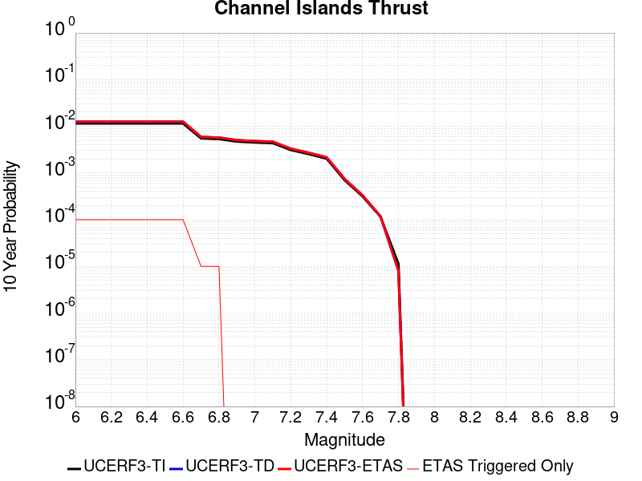 |

| Magnitude | 1 wk TI Prob | 1 wk TD Prob | 1 wk ETAS Prob | 1 wk ETAS/TD Gain | 1 wk ETAS Triggered Only | 1 mo TI Prob | 1 mo TD Prob | 1 mo ETAS Prob | 1 mo ETAS/TD Gain | 1 mo ETAS Triggered Only | 1 yr TI Prob | 1 yr TD Prob | 1 yr ETAS Prob | 1 yr ETAS/TD Gain | 1 yr ETAS Triggered Only | 10 yr TI Prob | 10 yr TD Prob | 10 yr ETAS Prob | 10 yr ETAS/TD Gain | 10 yr ETAS Triggered Only |
|-----|-----|-----|-----|-----|-----|-----|-----|-----|-----|-----|-----|-----|-----|-----|-----|-----|-----|-----|-----|-----|
| 6.0 | 2.2156251E-5 | 2.4092022E-5 | 7.702881E-5 | 3.1972744 | 5.2938063E-5 | 9.495191E-5 | 1.03248036E-4 | 2.6204583E-4 | 2.5380223 | 1.5881419E-4 | 0.0011554264 | 0.0012564264 | 0.0014150412 | 1.1262426 | 1.5881419E-4 | 0.011494373 | 0.0125038205 | 0.012712925 | 1.0167233 | 2.1175225E-4 |
| 6.1 | 2.2156251E-5 | 2.4092022E-5 | 7.702881E-5 | 3.1972744 | 5.2938063E-5 | 9.495191E-5 | 1.03248036E-4 | 2.6204583E-4 | 2.5380223 | 1.5881419E-4 | 0.0011554264 | 0.0012564264 | 0.0014150412 | 1.1262426 | 1.5881419E-4 | 0.011494373 | 0.0125038205 | 0.012712925 | 1.0167233 | 2.1175225E-4 |
| 6.2 | 2.2156251E-5 | 2.4092022E-5 | 7.702881E-5 | 3.1972744 | 5.2938063E-5 | 9.495191E-5 | 1.03248036E-4 | 2.6204583E-4 | 2.5380223 | 1.5881419E-4 | 0.0011554264 | 0.0012564264 | 0.0014150412 | 1.1262426 | 1.5881419E-4 | 0.011494373 | 0.0125038205 | 0.012712925 | 1.0167233 | 2.1175225E-4 |
| 6.3 | 2.2156251E-5 | 2.4092022E-5 | 7.702881E-5 | 3.1972744 | 5.2938063E-5 | 9.495191E-5 | 1.03248036E-4 | 2.6204583E-4 | 2.5380223 | 1.5881419E-4 | 0.0011554264 | 0.0012564264 | 0.0014150412 | 1.1262426 | 1.5881419E-4 | 0.011494373 | 0.0125038205 | 0.012712925 | 1.0167233 | 2.1175225E-4 |
| 6.4 | 2.2156251E-5 | 2.4092022E-5 | 7.702881E-5 | 3.1972744 | 5.2938063E-5 | 9.495191E-5 | 1.03248036E-4 | 2.6204583E-4 | 2.5380223 | 1.5881419E-4 | 0.0011554264 | 0.0012564264 | 0.0014150412 | 1.1262426 | 1.5881419E-4 | 0.011494373 | 0.0125038205 | 0.012712925 | 1.0167233 | 2.1175225E-4 |
| 6.5 | 2.2156251E-5 | 2.4092022E-5 | 7.702881E-5 | 3.1972744 | 5.2938063E-5 | 9.495191E-5 | 1.03248036E-4 | 2.6204583E-4 | 2.5380223 | 1.5881419E-4 | 0.0011554264 | 0.0012564264 | 0.0014150412 | 1.1262426 | 1.5881419E-4 | 0.011494373 | 0.0125038205 | 0.012712925 | 1.0167233 | 2.1175225E-4 |
| 6.6 | 2.2156251E-5 | 2.4092022E-5 | 7.702881E-5 | 3.1972744 | 5.2938063E-5 | 9.495191E-5 | 1.03248036E-4 | 2.6204583E-4 | 2.5380223 | 1.5881419E-4 | 0.0011554264 | 0.0012564264 | 0.0014150412 | 1.1262426 | 1.5881419E-4 | 0.011494373 | 0.0125038205 | 0.012712925 | 1.0167233 | 2.1175225E-4 |
| 6.7 | 1.0601296E-5 | 1.1379544E-5 | 1.1379544E-5 | 1.0 | 0.0 | 4.5433335E-5 | 4.876859E-5 | 1.0170407E-4 | 2.085442 | 5.2938063E-5 | 5.5301044E-4 | 5.936007E-4 | 6.465073E-4 | 1.0891284 | 5.2938063E-5 | 0.005516363 | 0.005920653 | 0.005973278 | 1.0088884 | 5.2938063E-5 |
| 6.8 | 1.0246747E-5 | 1.0996669E-5 | 1.0996669E-5 | 1.0 | 0.0 | 4.391389E-5 | 4.7127756E-5 | 1.0006332E-4 | 2.1232355 | 5.2938063E-5 | 5.345204E-4 | 5.7363417E-4 | 6.2654185E-4 | 1.0922325 | 5.2938063E-5 | 0.0053323656 | 0.005722025 | 0.00577466 | 1.0091987 | 5.2938063E-5 |
| 6.9 | 9.049551E-6 | 9.699645E-6 | 9.699645E-6 | 1.0 | 0.0 | 3.878322E-5 | 4.1569267E-5 | 4.1569267E-5 | 1.0 | 0.0 | 4.7208337E-4 | 5.059924E-4 | 5.059924E-4 | 1.0 | 0.0 | 0.0047108172 | 0.0050488203 | 0.0050488203 | 1.0 | 0.0 |
| 7.0 | 8.6542195E-6 | 9.274603E-6 | 9.274603E-6 | 1.0 | 0.0 | 3.7088983E-5 | 3.9747716E-5 | 3.9747716E-5 | 1.0 | 0.0 | 4.5146482E-4 | 4.8382508E-4 | 4.8382508E-4 | 1.0 | 0.0 | 0.004505487 | 0.004828129 | 0.004828129 | 1.0 | 0.0 |
| 7.1 | 8.391028E-6 | 8.992924E-6 | 8.992924E-6 | 1.0 | 0.0 | 3.5961057E-5 | 3.854056E-5 | 3.854056E-5 | 1.0 | 0.0 | 4.3773788E-4 | 4.6913436E-4 | 4.6913436E-4 | 1.0 | 0.0 | 0.004368766 | 0.0046818503 | 0.0046818503 | 1.0 | 0.0 |
| 7.2 | 5.965188E-6 | 6.3716952E-6 | 6.3716952E-6 | 1.0 | 0.0 | 2.556484E-5 | 2.7306982E-5 | 2.7306982E-5 | 1.0 | 0.0 | 3.1120746E-4 | 3.3241234E-4 | 3.3241234E-4 | 1.0 | 0.0 | 0.00310772 | 0.0033192092 | 0.0033192092 | 1.0 | 0.0 |
| 7.3 | 4.877518E-6 | 5.2060063E-6 | 5.2060063E-6 | 1.0 | 0.0 | 2.0903482E-5 | 2.2311267E-5 | 2.2311267E-5 | 1.0 | 0.0 | 2.5447016E-4 | 2.716063E-4 | 2.716063E-4 | 1.0 | 0.0 | 0.0025417898 | 0.0027127895 | 0.0027127895 | 1.0 | 0.0 |
| 7.4 | 3.8829853E-6 | 4.141863E-6 | 4.141863E-6 | 1.0 | 0.0 | 1.664126E-5 | 1.7750723E-5 | 1.7750723E-5 | 1.0 | 0.0 | 2.0258849E-4 | 2.1609402E-4 | 2.1609402E-4 | 1.0 | 0.0 | 0.002024039 | 0.0021588807 | 0.0021588807 | 1.0 | 0.0 |
| 7.5 | 1.3489616E-6 | 1.4277903E-6 | 1.4277903E-6 | 1.0 | 0.0 | 5.7812517E-6 | 6.119087E-6 | 6.119087E-6 | 1.0 | 0.0 | 7.038446E-5 | 7.449738E-5 | 7.449738E-5 | 1.0 | 0.0 | 7.036218E-4 | 7.44728E-4 | 7.44728E-4 | 1.0 | 0.0 |
| 7.6 | 6.058192E-7 | 6.353778E-7 | 6.353778E-7 | 1.0 | 0.0 | 2.5963652E-6 | 2.7230449E-6 | 2.7230449E-6 | 1.0 | 0.0 | 3.161029E-5 | 3.3152584E-5 | 3.3152584E-5 | 1.0 | 0.0 | 3.1605794E-4 | 3.31478E-4 | 3.31478E-4 | 1.0 | 0.0 |
| 7.7 | 2.2170494E-7 | 2.2607902E-7 | 2.2607902E-7 | 1.0 | 0.0 | 9.5016367E-7 | 9.689098E-7 | 9.689098E-7 | 1.0 | 0.0 | 1.1568181E-5 | 1.1796425E-5 | 1.1796425E-5 | 1.0 | 0.0 | 1.1567579E-4 | 1.1795909E-4 | 1.1795909E-4 | 1.0 | 0.0 |
| 7.8 | 2.1613102E-8 | 1.5466682E-8 | 1.5466682E-8 | 1.0 | 0.0 | 9.262757E-8 | 6.628578E-8 | 6.628578E-8 | 1.0 | 0.0 | 1.1277401E-6 | 8.070291E-7 | 8.070291E-7 | 1.0 | 0.0 | 1.1277344E-5 | 8.070269E-6 | 8.070269E-6 | 1.0 | 0.0 |

## Pinto Mtn
*[(top)](#table-of-contents)*

| 1 Week | 1 Month | 1 Year | 10 Year |
|-----|-----|-----|-----|
|  |  |  |  |

| Magnitude | 1 wk TI Prob | 1 wk TD Prob | 1 wk ETAS Prob | 1 wk ETAS/TD Gain | 1 wk ETAS Triggered Only | 1 mo TI Prob | 1 mo TD Prob | 1 mo ETAS Prob | 1 mo ETAS/TD Gain | 1 mo ETAS Triggered Only | 1 yr TI Prob | 1 yr TD Prob | 1 yr ETAS Prob | 1 yr ETAS/TD Gain | 1 yr ETAS Triggered Only | 10 yr TI Prob | 10 yr TD Prob | 10 yr ETAS Prob | 10 yr ETAS/TD Gain | 10 yr ETAS Triggered Only |
|-----|-----|-----|-----|-----|-----|-----|-----|-----|-----|-----|-----|-----|-----|-----|-----|-----|-----|-----|-----|-----|
| 6.0 | 4.4194956E-5 | 4.785362E-5 | 2.066602E-4 | 4.318591 | 1.5881419E-4 | 1.893932E-4 | 2.0507174E-4 | 4.1678056E-4 | 2.0323646 | 2.1175225E-4 | 0.0023034236 | 0.0024940541 | 0.0027052783 | 1.084691 | 2.1175225E-4 | 0.022796938 | 0.024678145 | 0.024884671 | 1.0083688 | 2.1175225E-4 |
| 6.1 | 4.4194956E-5 | 4.785362E-5 | 2.066602E-4 | 4.318591 | 1.5881419E-4 | 1.893932E-4 | 2.0507174E-4 | 4.1678056E-4 | 2.0323646 | 2.1175225E-4 | 0.0023034236 | 0.0024940541 | 0.0027052783 | 1.084691 | 2.1175225E-4 | 0.022796938 | 0.024678145 | 0.024884671 | 1.0083688 | 2.1175225E-4 |
| 6.2 | 4.4194956E-5 | 4.785362E-5 | 2.066602E-4 | 4.318591 | 1.5881419E-4 | 1.893932E-4 | 2.0507174E-4 | 4.1678056E-4 | 2.0323646 | 2.1175225E-4 | 0.0023034236 | 0.0024940541 | 0.0027052783 | 1.084691 | 2.1175225E-4 | 0.022796938 | 0.024678145 | 0.024884671 | 1.0083688 | 2.1175225E-4 |
| 6.3 | 4.4194956E-5 | 4.785362E-5 | 2.066602E-4 | 4.318591 | 1.5881419E-4 | 1.893932E-4 | 2.0507174E-4 | 4.1678056E-4 | 2.0323646 | 2.1175225E-4 | 0.0023034236 | 0.0024940541 | 0.0027052783 | 1.084691 | 2.1175225E-4 | 0.022796938 | 0.024678145 | 0.024884671 | 1.0083688 | 2.1175225E-4 |
| 6.4 | 3.729929E-5 | 3.9603186E-5 | 1.9841109E-4 | 5.009978 | 1.5881419E-4 | 1.5984432E-4 | 1.6971743E-4 | 3.8143373E-4 | 2.2474637 | 2.1175225E-4 | 0.0019443673 | 0.002064445 | 0.00227576 | 1.1023593 | 2.1175225E-4 | 0.019274427 | 0.02046269 | 0.020670108 | 1.0101365 | 2.1175225E-4 |
| 6.5 | 3.729929E-5 | 3.9603186E-5 | 1.9841109E-4 | 5.009978 | 1.5881419E-4 | 1.5984432E-4 | 1.6971743E-4 | 3.8143373E-4 | 2.2474637 | 2.1175225E-4 | 0.0019443673 | 0.002064445 | 0.00227576 | 1.1023593 | 2.1175225E-4 | 0.019274427 | 0.02046269 | 0.020670108 | 1.0101365 | 2.1175225E-4 |
| 6.6 | 3.0204548E-5 | 3.1205298E-5 | 1.3707812E-4 | 4.3927836 | 1.05876126E-4 | 1.2944164E-4 | 1.3373033E-4 | 2.395923E-4 | 1.7916077 | 1.05876126E-4 | 0.0015748127 | 0.0016269855 | 0.0017326893 | 1.0649692 | 1.05876126E-4 | 0.015636992 | 0.01615461 | 0.016258774 | 1.006448 | 1.05876126E-4 |
| 6.7 | 2.9857754E-5 | 3.081468E-5 | 1.3668755E-4 | 4.435793 | 1.05876126E-4 | 1.2795553E-4 | 1.3205643E-4 | 2.3791858E-4 | 1.8016433 | 1.05876126E-4 | 0.0015567453 | 0.001606636 | 0.0017123419 | 1.0657934 | 1.05876126E-4 | 0.015458848 | 0.01595405 | 0.016058236 | 1.0065304 | 1.05876126E-4 |
| 6.8 | 2.4819734E-5 | 2.5009364E-5 | 1.3088284E-4 | 5.2333536 | 1.05876126E-4 | 1.0636595E-4 | 1.07178705E-4 | 2.1304347E-4 | 1.9877408 | 1.05876126E-4 | 0.0012942362 | 0.0013041412 | 0.0014098793 | 1.0810786 | 1.05876126E-4 | 0.012867244 | 0.0129672475 | 0.01307175 | 1.008059 | 1.05876126E-4 |
| 6.9 | 2.331124E-5 | 2.3337643E-5 | 1.292113E-4 | 5.5366044 | 1.05876126E-4 | 9.990149E-5 | 1.00014746E-4 | 2.0588028E-4 | 2.0584993 | 1.05876126E-4 | 0.001215622 | 0.0012170197 | 0.001322767 | 1.0868903 | 1.05876126E-4 | 0.012089936 | 0.012105742 | 0.012210336 | 1.00864 | 1.05876126E-4 |
| 7.0 | 2.1818534E-5 | 2.1760772E-5 | 7.469768E-5 | 3.432676 | 5.2938063E-5 | 9.3504656E-5 | 9.325723E-5 | 1.4619036E-4 | 1.5676035 | 5.2938063E-5 | 0.0011378246 | 0.0011348352 | 0.0011877132 | 1.0465953 | 5.2938063E-5 | 0.011320163 | 0.011292503 | 0.011344844 | 1.004635 | 5.2938063E-5 |
| 7.1 | 2.066081E-5 | 2.0540418E-5 | 7.347739E-5 | 3.5772102 | 5.2938063E-5 | 8.854332E-5 | 8.8027504E-5 | 1.4096091E-4 | 1.601328 | 5.2938063E-5 | 0.0010774818 | 0.0010712275 | 0.0011241088 | 1.0493652 | 5.2938063E-5 | 0.010722724 | 0.010662688 | 0.010715062 | 1.0049119 | 5.2938063E-5 |
| 7.2 | 1.8990233E-5 | 1.9053701E-5 | 7.1990755E-5 | 3.7783082 | 5.2938063E-5 | 8.138417E-5 | 8.1656275E-5 | 1.3459001E-4 | 1.6482507 | 5.2938063E-5 | 9.904018E-4 | 9.937311E-4 | 0.0010466165 | 1.0532191 | 5.2938063E-5 | 0.009859995 | 0.009894874 | 0.009947288 | 1.0052971 | 5.2938063E-5 |
| 7.3 | 1.3335872E-5 | 1.4906372E-5 | 6.784365E-5 | 4.5513186 | 5.2938063E-5 | 5.7152483E-5 | 6.388296E-5 | 1.1681764E-4 | 1.8286197 | 5.2938063E-5 | 6.956093E-4 | 7.775102E-4 | 8.3040714E-4 | 1.0680337 | 5.2938063E-5 | 0.006934359 | 0.0077491994 | 0.007801727 | 1.0067785 | 5.2938063E-5 |
| 7.4 | 9.414066E-6 | 1.186061E-5 | 6.479804E-5 | 5.463298 | 5.2938063E-5 | 4.0345374E-5 | 5.0830247E-5 | 1.0376562E-4 | 2.0414147 | 5.2938063E-5 | 4.910942E-4 | 6.1869196E-4 | 6.715973E-4 | 1.0855116 | 5.2938063E-5 | 0.0049001034 | 0.006170644 | 0.0062232553 | 1.0085261 | 5.2938063E-5 |
| 7.5 | 7.2101157E-6 | 9.157893E-6 | 6.2095474E-5 | 6.780541 | 5.2938063E-5 | 3.090013E-5 | 3.924757E-5 | 9.218355E-5 | 2.348771 | 5.2938063E-5 | 3.7614413E-4 | 4.7774217E-4 | 5.30655E-4 | 1.1107559 | 5.2938063E-5 | 0.0037550807 | 0.004767927 | 0.0048206127 | 1.01105 | 5.2938063E-5 |
| 7.6 | 3.296375E-6 | 4.5453176E-6 | 4.5453176E-6 | 1.0 | 0.0 | 1.4127245E-5 | 1.9479796E-5 | 1.9479796E-5 | 1.0 | 0.0 | 1.7198564E-4 | 2.3714209E-4 | 2.3714209E-4 | 1.0 | 0.0 | 0.0017185259 | 0.0023690276 | 0.0023690276 | 1.0 | 0.0 |
| 7.7 | 2.5741092E-6 | 3.584251E-6 | 3.584251E-6 | 1.0 | 0.0 | 1.103185E-5 | 1.5360993E-5 | 1.5360993E-5 | 1.0 | 0.0 | 1.3430449E-4 | 1.8700535E-4 | 1.8700535E-4 | 1.0 | 0.0 | 0.0013422335 | 0.0018686098 | 0.0018686098 | 1.0 | 0.0 |

## Rose Canyon
*[(top)](#table-of-contents)*

| 1 Week | 1 Month | 1 Year | 10 Year |
|-----|-----|-----|-----|
|  |  |  |  |

| Magnitude | 1 wk TI Prob | 1 wk TD Prob | 1 wk ETAS Prob | 1 wk ETAS/TD Gain | 1 wk ETAS Triggered Only | 1 mo TI Prob | 1 mo TD Prob | 1 mo ETAS Prob | 1 mo ETAS/TD Gain | 1 mo ETAS Triggered Only | 1 yr TI Prob | 1 yr TD Prob | 1 yr ETAS Prob | 1 yr ETAS/TD Gain | 1 yr ETAS Triggered Only | 10 yr TI Prob | 10 yr TD Prob | 10 yr ETAS Prob | 10 yr ETAS/TD Gain | 10 yr ETAS Triggered Only |
|-----|-----|-----|-----|-----|-----|-----|-----|-----|-----|-----|-----|-----|-----|-----|-----|-----|-----|-----|-----|-----|
| 6.0 | 4.5923203E-5 | 4.9714225E-5 | 1.02649654E-4 | 2.0647945 | 5.2938063E-5 | 1.9679888E-4 | 2.1304491E-4 | 4.2475204E-4 | 1.9937207 | 2.1175225E-4 | 0.0023933933 | 0.0025909345 | 0.002802138 | 1.0815164 | 2.1175225E-4 | 0.023677798 | 0.02563999 | 0.025846314 | 1.0080469 | 2.1175225E-4 |
| 6.1 | 4.5923203E-5 | 4.9714225E-5 | 4.9714225E-5 | 1.0 | 0.0 | 1.9679888E-4 | 2.1304491E-4 | 3.188985E-4 | 1.4968604 | 1.05876126E-4 | 0.0023933933 | 0.0025909345 | 0.0026965362 | 1.0407583 | 1.05876126E-4 | 0.023677798 | 0.02563999 | 0.025743153 | 1.0040234 | 1.05876126E-4 |
| 6.2 | 2.8844734E-5 | 2.9668723E-5 | 2.9668723E-5 | 1.0 | 0.0 | 1.2361443E-4 | 1.2714567E-4 | 2.3300834E-4 | 1.8326093 | 1.05876126E-4 | 0.0015039665 | 0.0015468939 | 0.0016526062 | 1.0683385 | 1.05876126E-4 | 0.0149382865 | 0.015374276 | 0.015478524 | 1.0067807 | 1.05876126E-4 |
| 6.3 | 2.3171577E-5 | 2.3161238E-5 | 2.3161238E-5 | 1.0 | 0.0 | 9.9302975E-5 | 9.9258745E-5 | 2.0512436E-4 | 2.0665622 | 1.05876126E-4 | 0.0012083431 | 0.0012078186 | 0.0013135669 | 1.0875531 | 1.05876126E-4 | 0.012017938 | 0.012022437 | 0.01212704 | 1.0087006 | 1.05876126E-4 |
| 6.4 | 2.0066604E-5 | 1.9667024E-5 | 1.9667024E-5 | 1.0 | 0.0 | 8.599689E-5 | 8.4284584E-5 | 1.9015178E-4 | 2.2560685 | 1.05876126E-4 | 0.0010465092 | 0.0010256917 | 0.0011314593 | 1.1031183 | 1.05876126E-4 | 0.010415946 | 0.010217559 | 0.010322353 | 1.0102563 | 1.05876126E-4 |
| 6.5 | 1.776989E-5 | 1.7113807E-5 | 1.7113807E-5 | 1.0 | 0.0 | 7.615444E-5 | 7.334287E-5 | 1.7921123E-4 | 2.443472 | 1.05876126E-4 | 9.267859E-4 | 8.925905E-4 | 9.983721E-4 | 1.1185108 | 1.05876126E-4 | 0.009229303 | 0.008896211 | 0.009001145 | 1.0117954 | 1.05876126E-4 |
| 6.6 | 1.5227364E-5 | 1.433926E-5 | 1.433926E-5 | 1.0 | 0.0 | 6.52585E-5 | 6.1452556E-5 | 1.6732217E-4 | 2.7227862 | 1.05876126E-4 | 7.942326E-4 | 7.479332E-4 | 8.5373013E-4 | 1.1414524 | 1.05876126E-4 | 0.007914 | 0.007458359 | 0.0075634457 | 1.0140897 | 1.05876126E-4 |
| 6.7 | 1.2703898E-5 | 1.1673274E-5 | 1.1673274E-5 | 1.0 | 0.0 | 5.4444143E-5 | 5.0027378E-5 | 1.558982E-4 | 3.1162577 | 1.05876126E-4 | 6.626558E-4 | 6.089174E-4 | 7.14729E-4 | 1.1737702 | 1.05876126E-4 | 0.006606833 | 0.0060750856 | 0.0061803185 | 1.0173221 | 1.05876126E-4 |
| 6.8 | 1.1554917E-5 | 1.0609337E-5 | 1.0609337E-5 | 1.0 | 0.0 | 4.9520135E-5 | 4.546782E-5 | 1.5133913E-4 | 3.328489 | 1.05876126E-4 | 6.0274085E-4 | 5.5343413E-4 | 6.5925164E-4 | 1.1912017 | 1.05876126E-4 | 0.0060110865 | 0.0055225673 | 0.005627859 | 1.0190656 | 1.05876126E-4 |
| 6.9 | 8.732078E-6 | 7.881357E-6 | 7.881357E-6 | 1.0 | 0.0 | 3.7422655E-5 | 3.3776825E-5 | 1.3964938E-4 | 4.134473 | 1.05876126E-4 | 4.5552556E-4 | 4.111582E-4 | 5.169908E-4 | 1.2574011 | 1.05876126E-4 | 0.0045459294 | 0.0041048084 | 0.00421025 | 1.0256873 | 1.05876126E-4 |
| 7.0 | 5.9337494E-6 | 5.1074853E-6 | 5.1074853E-6 | 1.0 | 0.0 | 2.5430107E-5 | 2.188904E-5 | 2.188904E-5 | 1.0 | 0.0 | 3.0956755E-4 | 2.664666E-4 | 2.664666E-4 | 1.0 | 0.0 | 0.0030913667 | 0.0026614866 | 0.0026614866 | 1.0 | 0.0 |
| 7.1 | 5.013409E-6 | 4.1773833E-6 | 4.1773833E-6 | 1.0 | 0.0 | 2.1485863E-5 | 1.7902948E-5 | 1.7902948E-5 | 1.0 | 0.0 | 2.6155898E-4 | 2.179467E-4 | 2.179467E-4 | 1.0 | 0.0 | 0.0026125133 | 0.0021773411 | 0.0021773411 | 1.0 | 0.0 |
| 7.2 | 4.120763E-6 | 3.2821383E-6 | 3.2821383E-6 | 1.0 | 0.0 | 1.7660293E-5 | 1.4066231E-5 | 1.4066231E-5 | 1.0 | 0.0 | 2.1499286E-4 | 1.7124301E-4 | 1.7124301E-4 | 1.0 | 0.0 | 0.0021478499 | 0.00171112 | 0.00171112 | 1.0 | 0.0 |
| 7.3 | 3.2081239E-6 | 2.4405372E-6 | 2.4405372E-6 | 1.0 | 0.0 | 1.374903E-5 | 1.0459404E-5 | 1.0459404E-5 | 1.0 | 0.0 | 1.6738157E-4 | 1.2733586E-4 | 1.2733586E-4 | 1.0 | 0.0 | 0.0016725556 | 0.001272636 | 0.001272636 | 1.0 | 0.0 |
| 7.4 | 2.4194755E-6 | 1.7680634E-6 | 1.7680634E-6 | 1.0 | 0.0 | 1.0369139E-5 | 7.577393E-6 | 7.577393E-6 | 1.0 | 0.0 | 1.2623696E-4 | 9.2250906E-5 | 9.2250906E-5 | 1.0 | 0.0 | 0.0012616527 | 9.2213147E-4 | 9.2213147E-4 | 1.0 | 0.0 |
| 7.5 | 1.3842889E-6 | 9.3786275E-7 | 9.3786275E-7 | 1.0 | 0.0 | 5.9326535E-6 | 4.019406E-6 | 4.019406E-6 | 1.0 | 0.0 | 7.222766E-5 | 4.8935202E-5 | 4.8935202E-5 | 1.0 | 0.0 | 7.220419E-4 | 4.892478E-4 | 4.892478E-4 | 1.0 | 0.0 |
| 7.6 | 1.0021575E-6 | 6.411463E-7 | 6.411463E-7 | 1.0 | 0.0 | 4.2949537E-6 | 2.7477672E-6 | 2.7477672E-6 | 1.0 | 0.0 | 5.2289808E-5 | 3.3453573E-5 | 3.3453573E-5 | 1.0 | 0.0 | 5.2277505E-4 | 3.344875E-4 | 3.344875E-4 | 1.0 | 0.0 |
| 7.7 | 8.7620116E-8 | 6.4492404E-8 | 6.4492404E-8 | 1.0 | 0.0 | 3.7551473E-7 | 2.76396E-7 | 2.76396E-7 | 1.0 | 0.0 | 4.5718825E-6 | 3.3651165E-6 | 3.3651165E-6 | 1.0 | 0.0 | 4.5717883E-5 | 3.3650686E-5 | 3.3650686E-5 | 1.0 | 0.0 |

## Oceanic - West Huasna
*[(top)](#table-of-contents)*

| 1 Week | 1 Month | 1 Year | 10 Year |
|-----|-----|-----|-----|
| 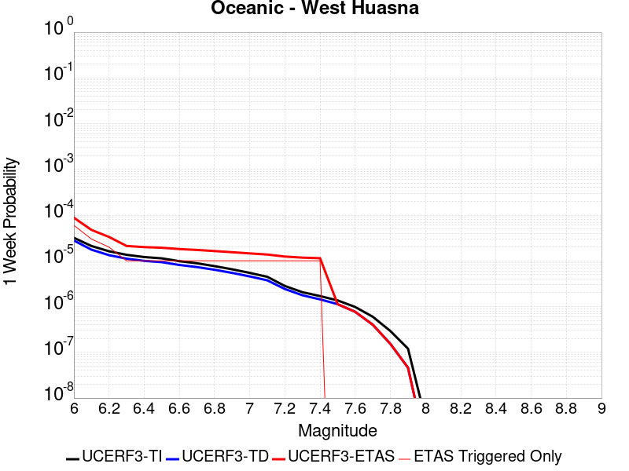 |  |  |  |

| Magnitude | 1 wk TI Prob | 1 wk TD Prob | 1 wk ETAS Prob | 1 wk ETAS/TD Gain | 1 wk ETAS Triggered Only | 1 mo TI Prob | 1 mo TD Prob | 1 mo ETAS Prob | 1 mo ETAS/TD Gain | 1 mo ETAS Triggered Only | 1 yr TI Prob | 1 yr TD Prob | 1 yr ETAS Prob | 1 yr ETAS/TD Gain | 1 yr ETAS Triggered Only | 10 yr TI Prob | 10 yr TD Prob | 10 yr ETAS Prob | 10 yr ETAS/TD Gain | 10 yr ETAS Triggered Only |
|-----|-----|-----|-----|-----|-----|-----|-----|-----|-----|-----|-----|-----|-----|-----|-----|-----|-----|-----|-----|-----|
| 6.0 | 3.195567E-5 | 2.7926868E-5 | 1.3380003E-4 | 4.791086 | 1.05876126E-4 | 1.3694567E-4 | 1.1968133E-4 | 2.784765E-4 | 2.3268166 | 1.5881419E-4 | 0.0016660384 | 0.0014561893 | 0.0016147722 | 1.1089027 | 1.5881419E-4 | 0.016536033 | 0.014471028 | 0.014627543 | 1.0108159 | 1.5881419E-4 |
| 6.1 | 2.1156782E-5 | 1.7573486E-5 | 1.2344775E-4 | 7.024659 | 1.05876126E-4 | 9.066878E-5 | 7.531282E-5 | 1.8118096E-4 | 2.4057124 | 1.05876126E-4 | 0.0011033333 | 9.165572E-4 | 0.0010223363 | 1.1154091 | 1.05876126E-4 | 0.010978713 | 0.009128777 | 0.009233687 | 1.0114921 | 1.05876126E-4 |
| 6.2 | 1.6195117E-5 | 1.3327152E-5 | 6.626451E-5 | 4.972143 | 5.2938063E-5 | 6.9405796E-5 | 5.7115132E-5 | 1.1005017E-4 | 1.9268129 | 5.2938063E-5 | 8.44688E-4 | 6.9515745E-4 | 7.480587E-4 | 1.0760996 | 5.2938063E-5 | 0.008414844 | 0.006930123 | 0.0069826944 | 1.0075859 | 5.2938063E-5 |
| 6.3 | 1.3559345E-5 | 1.1179142E-5 | 6.411661E-5 | 5.7353783 | 5.2938063E-5 | 5.811018E-5 | 4.7909736E-5 | 1.0084526E-4 | 2.1049013 | 5.2938063E-5 | 7.072618E-4 | 5.831459E-4 | 6.360531E-4 | 1.0907272 | 5.2938063E-5 | 0.0070501505 | 0.0058162753 | 0.005868905 | 1.0090488 | 5.2938063E-5 |
| 6.4 | 1.2120619E-5 | 1.0000977E-5 | 6.293851E-5 | 6.293236 | 5.2938063E-5 | 5.1944477E-5 | 4.2860633E-5 | 9.579642E-5 | 2.235068 | 5.2938063E-5 | 6.322405E-4 | 5.2170374E-4 | 5.746142E-4 | 1.1014186 | 5.2938063E-5 | 0.006304447 | 0.0052048573 | 0.00525752 | 1.010118 | 5.2938063E-5 |
| 6.5 | 1.13511915E-5 | 9.3674735E-6 | 6.2305044E-5 | 6.651211 | 5.2938063E-5 | 4.8647056E-5 | 4.01457E-5 | 9.308164E-5 | 2.3185954 | 5.2938063E-5 | 5.9211696E-4 | 4.886647E-4 | 5.4157694E-4 | 1.1082791 | 5.2938063E-5 | 0.0059054173 | 0.0048759608 | 0.0049286406 | 1.010804 | 5.2938063E-5 |
| 6.6 | 9.850605E-6 | 8.135418E-6 | 6.107305E-5 | 7.507057 | 5.2938063E-5 | 4.2216197E-5 | 3.4865614E-5 | 8.780183E-5 | 2.5182931 | 5.2938063E-5 | 5.1386096E-4 | 4.2440637E-4 | 4.7732197E-4 | 1.1246815 | 5.2938063E-5 | 0.0051267436 | 0.004235991 | 0.0042887046 | 1.0124443 | 5.2938063E-5 |
| 6.7 | 8.8558645E-6 | 7.318433E-6 | 6.025611E-5 | 8.233472 | 5.2938063E-5 | 3.7953152E-5 | 3.1364336E-5 | 8.430074E-5 | 2.6877897 | 5.2938063E-5 | 4.6198163E-4 | 3.8179406E-4 | 4.347119E-4 | 1.1386031 | 5.2938063E-5 | 0.004610224 | 0.0038114067 | 0.003864143 | 1.0138364 | 5.2938063E-5 |
| 6.8 | 7.67136E-6 | 6.391756E-6 | 5.932948E-5 | 9.282187 | 5.2938063E-5 | 3.2876844E-5 | 2.7392953E-5 | 8.032956E-5 | 2.93249 | 5.2938063E-5 | 4.0020206E-4 | 3.3345833E-4 | 3.8637873E-4 | 1.1587018 | 5.2938063E-5 | 0.003994821 | 0.0033296007 | 0.0033823624 | 1.0158463 | 5.2938063E-5 |
| 6.9 | 6.534529E-6 | 5.4583297E-6 | 5.8396105E-5 | 10.69853 | 5.2938063E-5 | 2.8004823E-5 | 2.3392633E-5 | 7.632946E-5 | 3.26297 | 5.2938063E-5 | 3.4090536E-4 | 2.847682E-4 | 3.376912E-4 | 1.1858459 | 5.2938063E-5 | 0.0034038287 | 0.0028440498 | 0.0028968372 | 1.0185606 | 5.2938063E-5 |
| 7.0 | 5.460525E-6 | 4.5699517E-6 | 5.7507772E-5 | 12.583891 | 5.2938063E-5 | 2.3402039E-5 | 1.958536E-5 | 7.252239E-5 | 3.7028875 | 5.2938063E-5 | 2.8488258E-4 | 2.3842578E-4 | 2.9135123E-4 | 1.2219787 | 5.2938063E-5 | 0.0028451765 | 0.0023817138 | 0.0024345256 | 1.0221739 | 5.2938063E-5 |
| 7.1 | 4.4825083E-6 | 3.7524428E-6 | 5.6690307E-5 | 15.1075735 | 5.2938063E-5 | 1.9210609E-5 | 1.60818E-5 | 6.901901E-5 | 4.2917466 | 5.2938063E-5 | 2.3386406E-4 | 1.9577841E-4 | 2.487061E-4 | 1.2703449 | 5.2938063E-5 | 0.002336181 | 0.0019560715 | 0.0020089059 | 1.0270106 | 5.2938063E-5 |
| 7.2 | 2.821708E-6 | 2.4249334E-6 | 5.5362867E-5 | 22.830675 | 5.2938063E-5 | 1.2092979E-5 | 1.039253E-5 | 6.3330044E-5 | 6.093804 | 5.2938063E-5 | 1.4722206E-4 | 1.2652173E-4 | 1.7945308E-4 | 1.418358 | 5.2938063E-5 | 0.0014712457 | 0.0012644994 | 0.0013173705 | 1.041812 | 5.2938063E-5 |
| 7.3 | 2.0644757E-6 | 1.7687412E-6 | 5.470671E-5 | 30.929743 | 5.2938063E-5 | 8.847723E-6 | 7.5802973E-6 | 6.051796E-5 | 7.9835863 | 5.2938063E-5 | 1.0771569E-4 | 9.228622E-5 | 1.452194E-4 | 1.5735762 | 5.2938063E-5 | 0.001076635 | 9.2248066E-4 | 9.753699E-4 | 1.0573337 | 5.2938063E-5 |
| 7.4 | 1.6980367E-6 | 1.4379892E-6 | 5.4375974E-5 | 37.813896 | 5.2938063E-5 | 7.27728E-6 | 6.162796E-6 | 5.9100534E-5 | 9.58989 | 5.2938063E-5 | 8.8597284E-5 | 7.5029464E-5 | 1.2796355E-4 | 1.7055107 | 5.2938063E-5 | 8.8561967E-4 | 7.500429E-4 | 8.029413E-4 | 1.0705271 | 5.2938063E-5 |
| 7.5 | 1.3637683E-6 | 1.1302635E-6 | 1.1302635E-6 | 1.0 | 0.0 | 5.844708E-6 | 4.8439774E-6 | 4.8439774E-6 | 1.0 | 0.0 | 7.1156996E-5 | 5.897383E-5 | 5.897383E-5 | 1.0 | 0.0 | 7.1134215E-4 | 5.895833E-4 | 5.895833E-4 | 1.0 | 0.0 |
| 7.6 | 9.802994E-7 | 7.677247E-7 | 7.677247E-7 | 1.0 | 0.0 | 4.2012766E-6 | 3.2902446E-6 | 3.2902446E-6 | 1.0 | 0.0 | 5.1149345E-5 | 4.0057992E-5 | 4.0057992E-5 | 1.0 | 0.0 | 5.113757E-4 | 4.0050913E-4 | 4.0050913E-4 | 1.0 | 0.0 |
| 7.7 | 5.986191E-7 | 4.0050548E-7 | 4.0050548E-7 | 1.0 | 0.0 | 2.5655079E-6 | 1.7164509E-6 | 1.7164509E-6 | 1.0 | 0.0 | 3.1234613E-5 | 2.089759E-5 | 2.089759E-5 | 1.0 | 0.0 | 3.123022E-4 | 2.089576E-4 | 2.089576E-4 | 1.0 | 0.0 |
| 7.8 | 2.9189815E-7 | 1.5285792E-7 | 1.5285792E-7 | 1.0 | 0.0 | 1.2509914E-6 | 6.5510517E-7 | 6.5510517E-7 | 1.0 | 0.0 | 1.5230714E-5 | 7.9758765E-6 | 7.9758765E-6 | 1.0 | 0.0 | 1.522967E-4 | 7.9757214E-5 | 7.9757214E-5 | 1.0 | 0.0 |
| 7.9 | 1.2057845E-7 | 4.621248E-8 | 4.621248E-8 | 1.0 | 0.0 | 5.1676466E-7 | 1.9805347E-7 | 1.9805347E-7 | 1.0 | 0.0 | 6.2915915E-6 | 2.4112983E-6 | 2.4112983E-6 | 1.0 | 0.0 | 6.2914136E-5 | 2.4114026E-5 | 2.4114026E-5 | 1.0 | 0.0 |
| 8.0 | 3.3806387E-9 | 9.011393E-10 | 9.011393E-10 | 1.0 | 0.0 | 1.4488451E-8 | 3.8620254E-9 | 3.8620254E-9 | 1.0 | 0.0 | 1.7639688E-7 | 4.702016E-8 | 4.702016E-8 | 1.0 | 0.0 | 1.7639674E-6 | 4.7129527E-7 | 4.7129527E-7 | 1.0 | 0.0 |

## Brawley (Seismic Zone) alt 1
*[(top)](#table-of-contents)*

| 1 Week | 1 Month | 1 Year | 10 Year |
|-----|-----|-----|-----|
|  |  |  |  |

| Magnitude | 1 wk TI Prob | 1 wk TD Prob | 1 wk ETAS Prob | 1 wk ETAS/TD Gain | 1 wk ETAS Triggered Only | 1 mo TI Prob | 1 mo TD Prob | 1 mo ETAS Prob | 1 mo ETAS/TD Gain | 1 mo ETAS Triggered Only | 1 yr TI Prob | 1 yr TD Prob | 1 yr ETAS Prob | 1 yr ETAS/TD Gain | 1 yr ETAS Triggered Only | 10 yr TI Prob | 10 yr TD Prob | 10 yr ETAS Prob | 10 yr ETAS/TD Gain | 10 yr ETAS Triggered Only |
|-----|-----|-----|-----|-----|-----|-----|-----|-----|-----|-----|-----|-----|-----|-----|-----|-----|-----|-----|-----|-----|
| 6.0 | 2.2521618E-4 | 4.7632487E-4 | 5.2923773E-4 | 1.1110857 | 5.2938063E-5 | 9.6485513E-4 | 0.0020398323 | 0.0020926623 | 1.0258992 | 5.2938063E-5 | 0.011683988 | 0.024546238 | 0.024701152 | 1.0063112 | 1.5881419E-4 | 0.11088423 | 0.21350002 | 0.21366656 | 1.0007801 | 2.1175225E-4 |
| 6.1 | 2.2521618E-4 | 4.7632487E-4 | 5.2923773E-4 | 1.1110857 | 5.2938063E-5 | 9.6485513E-4 | 0.0020398323 | 0.0020926623 | 1.0258992 | 5.2938063E-5 | 0.011683988 | 0.024546238 | 0.024649514 | 1.0042075 | 1.05876126E-4 | 0.11088423 | 0.21350002 | 0.21362492 | 1.0005851 | 1.5881419E-4 |
| 6.2 | 2.198148E-4 | 4.6717093E-4 | 5.200843E-4 | 1.1132634 | 5.2938063E-5 | 9.417233E-4 | 0.0020006616 | 0.0020534936 | 1.0264074 | 5.2938063E-5 | 0.011405343 | 0.024080504 | 0.02418383 | 1.0042909 | 1.05876126E-4 | 0.10837428 | 0.20993657 | 0.21006204 | 1.0005977 | 1.5881419E-4 |
| 6.3 | 2.1704129E-4 | 4.615278E-4 | 5.144414E-4 | 1.1146488 | 5.2938063E-5 | 9.298453E-4 | 0.0019765133 | 0.0020293468 | 1.0267307 | 5.2938063E-5 | 0.011262234 | 0.02379366 | 0.023897018 | 1.0043439 | 1.05876126E-4 | 0.107082725 | 0.20782755 | 0.20795335 | 1.0006053 | 1.5881419E-4 |
| 6.4 | 1.876142E-4 | 4.00449E-4 | 4.5336588E-4 | 1.1321439 | 5.2938063E-5 | 8.038131E-4 | 0.0017150956 | 0.0017679429 | 1.030813 | 5.2938063E-5 | 0.00974259 | 0.020680401 | 0.020784087 | 1.0050137 | 1.05876126E-4 | 0.093263686 | 0.18457815 | 0.18470766 | 1.0007015 | 1.5881419E-4 |
| 6.5 | 1.7390939E-4 | 3.7477075E-4 | 4.2768897E-4 | 1.1412016 | 5.2938063E-5 | 7.45113E-4 | 0.0016051838 | 0.001658037 | 1.0329266 | 5.2938063E-5 | 0.009034078 | 0.019368723 | 0.019472549 | 1.0053605 | 1.05876126E-4 | 0.086755216 | 0.17440031 | 0.17448772 | 1.0005012 | 1.05876126E-4 |
| 6.6 | 1.591791E-4 | 3.4891962E-4 | 4.018392E-4 | 1.151667 | 5.2938063E-5 | 6.8201777E-4 | 0.0014945229 | 0.0015473819 | 1.0353684 | 5.2938063E-5 | 0.008271996 | 0.018045569 | 0.018149534 | 1.0057613 | 1.05876126E-4 | 0.07970774 | 0.16380852 | 0.16389707 | 1.0005405 | 1.05876126E-4 |
| 6.7 | 1.4268003E-4 | 3.20582E-4 | 3.735031E-4 | 1.1650782 | 5.2938063E-5 | 6.1134255E-4 | 0.0013732077 | 0.001426073 | 1.0384977 | 5.2938063E-5 | 0.007417723 | 0.016592601 | 0.016696721 | 1.006275 | 1.05876126E-4 | 0.07174956 | 0.15193306 | 0.15202285 | 1.000591 | 1.05876126E-4 |
| 6.8 | 1.239713E-4 | 2.9053655E-4 | 3.4345925E-4 | 1.182155 | 5.2938063E-5 | 5.3119735E-4 | 0.0012445687 | 0.0012974408 | 1.0424824 | 5.2938063E-5 | 0.0064481674 | 0.015048777 | 0.01515306 | 1.0069296 | 1.05876126E-4 | 0.06264243 | 0.13837762 | 0.13846885 | 1.0006592 | 1.05876126E-4 |
| 6.9 | 1.0180238E-4 | 2.625439E-4 | 3.1546806E-4 | 1.2015822 | 5.2938063E-5 | 4.3622297E-4 | 0.0011247073 | 0.0011775858 | 1.0470153 | 5.2938063E-5 | 0.005298089 | 0.013608336 | 0.013712771 | 1.0076743 | 1.05876126E-4 | 0.05173543 | 0.124961674 | 0.12505431 | 1.0007414 | 1.05876126E-4 |
| 7.0 | 7.6619996E-5 | 2.23993E-4 | 2.769192E-4 | 1.2362851 | 5.2938063E-5 | 3.283301E-4 | 9.5962E-4 | 0.0010125072 | 1.0551127 | 5.2938063E-5 | 0.0039900932 | 0.011621496 | 0.011726141 | 1.0090045 | 1.05876126E-4 | 0.039192066 | 0.107266866 | 0.107361384 | 1.0008812 | 1.05876126E-4 |
| 7.1 | 7.5127435E-5 | 2.2082464E-4 | 2.73751E-4 | 1.239676 | 5.2938063E-5 | 3.2193496E-4 | 9.4605127E-4 | 9.989393E-4 | 1.0559039 | 5.2938063E-5 | 0.0039125155 | 0.011458045 | 0.011562708 | 1.0091344 | 1.05876126E-4 | 0.038443442 | 0.10583085 | 0.10592552 | 1.0008945 | 1.05876126E-4 |
| 7.2 | 6.788582E-5 | 2.0210193E-4 | 2.550293E-4 | 1.2618845 | 5.2938063E-5 | 2.9090676E-4 | 8.6586666E-4 | 9.187589E-4 | 1.0610858 | 5.2938063E-5 | 0.0035360386 | 0.0104916105 | 0.010596376 | 1.0099857 | 1.05876126E-4 | 0.034803 | 0.09750131 | 0.09759686 | 1.00098 | 1.05876126E-4 |
| 7.3 | 6.399602E-5 | 1.8841137E-4 | 2.4133947E-4 | 1.2809176 | 5.2938063E-5 | 2.7423984E-4 | 8.072303E-4 | 8.6012564E-4 | 1.065527 | 5.2938063E-5 | 0.0033337586 | 0.009784332 | 0.009889171 | 1.0107151 | 1.05876126E-4 | 0.03284188 | 0.09139617 | 0.09149236 | 1.0010525 | 1.05876126E-4 |
| 7.4 | 4.506759E-5 | 1.2529209E-4 | 1.7822352E-4 | 1.4224643 | 5.2938063E-5 | 1.9313251E-4 | 5.368565E-4 | 5.8976613E-4 | 1.0985545 | 5.2938063E-5 | 0.0023488526 | 0.0065168133 | 0.0066219997 | 1.0161407 | 1.05876126E-4 | 0.023241805 | 0.062363707 | 0.062462978 | 1.0015918 | 1.05876126E-4 |
| 7.5 | 3.43289E-5 | 9.33541E-5 | 1.4628722E-4 | 1.5670145 | 5.2938063E-5 | 1.4711556E-4 | 4.00028E-4 | 4.5294486E-4 | 1.132283 | 5.2938063E-5 | 0.0017896603 | 0.0048595266 | 0.004964888 | 1.0216814 | 1.05876126E-4 | 0.01775316 | 0.04705519 | 0.047156084 | 1.0021442 | 1.05876126E-4 |
| 7.6 | 2.5980507E-5 | 7.053101E-5 | 1.2346535E-4 | 1.7505114 | 5.2938063E-5 | 1.1134028E-4 | 3.0224086E-4 | 3.5516292E-4 | 1.175099 | 5.2938063E-5 | 0.001354725 | 0.003673598 | 0.0037790851 | 1.0287149 | 1.05876126E-4 | 0.013464959 | 0.035840835 | 0.035942916 | 1.0028481 | 1.05876126E-4 |
| 7.7 | 1.7292105E-5 | 4.9407296E-5 | 4.9407296E-5 | 1.0 | 0.0 | 7.4106916E-5 | 2.117284E-4 | 2.117284E-4 | 1.0 | 0.0 | 9.018782E-4 | 0.0025747516 | 0.0026275534 | 1.0205076 | 5.2938063E-5 | 0.008982267 | 0.025290398 | 0.025341997 | 1.0020403 | 5.2938063E-5 |
| 7.8 | 1.2927471E-5 | 3.9693266E-5 | 3.9693266E-5 | 1.0 | 0.0 | 5.5402274E-5 | 1.7010293E-4 | 1.7010293E-4 | 1.0 | 0.0 | 6.743139E-4 | 0.0020690386 | 0.0021218671 | 1.0255328 | 5.2938063E-5 | 0.0067227143 | 0.020431727 | 0.020483585 | 1.0025381 | 5.2938063E-5 |
| 7.9 | 1.0200774E-5 | 2.874569E-5 | 2.874569E-5 | 1.0 | 0.0 | 4.371687E-5 | 1.2319001E-4 | 1.2319001E-4 | 1.0 | 0.0 | 5.321229E-4 | 0.0014988075 | 0.0015516662 | 1.0352672 | 5.2938063E-5 | 0.005308505 | 0.014991644 | 0.015043789 | 1.0034783 | 5.2938063E-5 |
| 8.0 | 8.650396E-6 | 2.3277367E-5 | 2.3277367E-5 | 1.0 | 0.0 | 3.70726E-5 | 9.975634E-5 | 9.975634E-5 | 1.0 | 0.0 | 4.5126543E-4 | 0.0012138576 | 0.0012667314 | 1.0435585 | 5.2938063E-5 | 0.0045035016 | 0.012211097 | 0.012263388 | 1.0042824 | 5.2938063E-5 |
| 8.1 | 3.9368224E-6 | 7.3279825E-6 | 7.3279825E-6 | 1.0 | 0.0 | 1.6871985E-5 | 3.140526E-5 | 3.140526E-5 | 1.0 | 0.0 | 2.0539707E-4 | 3.8229208E-4 | 3.8229208E-4 | 1.0 | 0.0 | 0.0020520731 | 0.004001185 | 0.004001185 | 1.0 | 0.0 |
| 8.2 | 1.7101195E-6 | 2.217876E-6 | 2.217876E-6 | 1.0 | 0.0 | 7.329063E-6 | 9.505149E-6 | 9.505149E-6 | 1.0 | 0.0 | 8.922769E-5 | 1.1571907E-4 | 1.1571907E-4 | 1.0 | 0.0 | 8.9191867E-4 | 0.0012666774 | 0.0012666774 | 1.0 | 0.0 |
| 8.3 | 3.0346666E-8 | 1.721586E-8 | 1.721586E-8 | 1.0 | 0.0 | 1.3005713E-7 | 7.378226E-8 | 7.378226E-8 | 1.0 | 0.0 | 1.5834444E-6 | 8.9829894E-7 | 8.9829894E-7 | 1.0 | 0.0 | 1.5834332E-5 | 9.367729E-6 | 9.367729E-6 | 1.0 | 0.0 |

## San Andreas (North Branch Mill Creek)
*[(top)](#table-of-contents)*

| 1 Week | 1 Month | 1 Year | 10 Year |
|-----|-----|-----|-----|
|  |  |  | 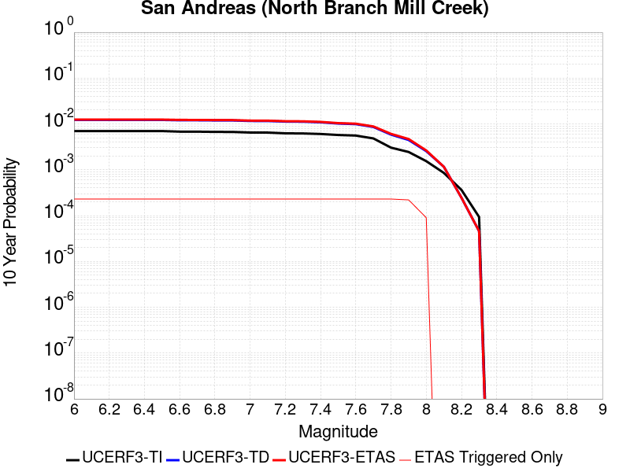 |

| Magnitude | 1 wk TI Prob | 1 wk TD Prob | 1 wk ETAS Prob | 1 wk ETAS/TD Gain | 1 wk ETAS Triggered Only | 1 mo TI Prob | 1 mo TD Prob | 1 mo ETAS Prob | 1 mo ETAS/TD Gain | 1 mo ETAS Triggered Only | 1 yr TI Prob | 1 yr TD Prob | 1 yr ETAS Prob | 1 yr ETAS/TD Gain | 1 yr ETAS Triggered Only | 10 yr TI Prob | 10 yr TD Prob | 10 yr ETAS Prob | 10 yr ETAS/TD Gain | 10 yr ETAS Triggered Only |
|-----|-----|-----|-----|-----|-----|-----|-----|-----|-----|-----|-----|-----|-----|-----|-----|-----|-----|-----|-----|-----|
| 6.0 | 1.3461156E-5 | 2.3499893E-5 | 1.8231035E-4 | 7.7579226 | 1.5881419E-4 | 5.7689394E-5 | 1.00709956E-4 | 2.5950815E-4 | 2.5767875 | 1.5881419E-4 | 7.02142E-4 | 0.0012254574 | 0.0014369502 | 1.1725827 | 2.1175225E-4 | 0.0069992766 | 0.01222957 | 0.012438732 | 1.0171031 | 2.1175225E-4 |
| 6.1 | 1.3461156E-5 | 2.3499893E-5 | 1.8231035E-4 | 7.7579226 | 1.5881419E-4 | 5.7689394E-5 | 1.00709956E-4 | 2.5950815E-4 | 2.5767875 | 1.5881419E-4 | 7.02142E-4 | 0.0012254574 | 0.0014369502 | 1.1725827 | 2.1175225E-4 | 0.0069992766 | 0.01222957 | 0.012438732 | 1.0171031 | 2.1175225E-4 |
| 6.2 | 1.3461156E-5 | 2.3499893E-5 | 1.8231035E-4 | 7.7579226 | 1.5881419E-4 | 5.7689394E-5 | 1.00709956E-4 | 2.5950815E-4 | 2.5767875 | 1.5881419E-4 | 7.02142E-4 | 0.0012254574 | 0.0014369502 | 1.1725827 | 2.1175225E-4 | 0.0069992766 | 0.01222957 | 0.012438732 | 1.0171031 | 2.1175225E-4 |
| 6.3 | 1.3461156E-5 | 2.3499893E-5 | 1.8231035E-4 | 7.7579226 | 1.5881419E-4 | 5.7689394E-5 | 1.00709956E-4 | 2.5950815E-4 | 2.5767875 | 1.5881419E-4 | 7.02142E-4 | 0.0012254574 | 0.0014369502 | 1.1725827 | 2.1175225E-4 | 0.0069992766 | 0.01222957 | 0.012438732 | 1.0171031 | 2.1175225E-4 |
| 6.4 | 1.3461156E-5 | 2.3499893E-5 | 1.8231035E-4 | 7.7579226 | 1.5881419E-4 | 5.7689394E-5 | 1.00709956E-4 | 2.5950815E-4 | 2.5767875 | 1.5881419E-4 | 7.02142E-4 | 0.0012254574 | 0.0014369502 | 1.1725827 | 2.1175225E-4 | 0.0069992766 | 0.01222957 | 0.012438732 | 1.0171031 | 2.1175225E-4 |
| 6.5 | 1.3450706E-5 | 2.3488852E-5 | 1.822993E-4 | 7.761099 | 1.5881419E-4 | 5.764461E-5 | 1.0066265E-4 | 2.5946085E-4 | 2.5775285 | 1.5881419E-4 | 7.0159714E-4 | 0.001224882 | 0.0014363748 | 1.1726639 | 2.1175225E-4 | 0.006993862 | 0.01222388 | 0.012433044 | 1.0171111 | 2.1175225E-4 |
| 6.6 | 1.3074523E-5 | 2.3103135E-5 | 1.8191365E-4 | 7.873981 | 1.5881419E-4 | 5.6032466E-5 | 9.9009696E-5 | 2.5780816E-4 | 2.6038678 | 1.5881419E-4 | 6.8198174E-4 | 0.0012047797 | 0.0014162769 | 1.1755484 | 2.1175225E-4 | 0.006798926 | 0.012025044 | 0.01223425 | 1.0173975 | 2.1175225E-4 |
| 6.7 | 1.3050216E-5 | 2.3078432E-5 | 1.8188896E-4 | 7.881339 | 1.5881419E-4 | 5.59283E-5 | 9.890384E-5 | 2.577023E-4 | 2.6055846 | 1.5881419E-4 | 6.8071426E-4 | 0.0012034923 | 0.0014149897 | 1.1757364 | 2.1175225E-4 | 0.0067863287 | 0.012012309 | 0.012221518 | 1.0174162 | 2.1175225E-4 |
| 6.8 | 1.29049395E-5 | 2.292684E-5 | 1.8173738E-4 | 7.9268394 | 1.5881419E-4 | 5.530571E-5 | 9.825421E-5 | 2.570528E-4 | 2.6162014 | 1.5881419E-4 | 6.73139E-4 | 0.0011955918 | 0.0014070908 | 1.1768991 | 2.1175225E-4 | 0.0067110364 | 0.011934154 | 0.012143379 | 1.0175316 | 2.1175225E-4 |
| 6.9 | 1.2867369E-5 | 2.2886245E-5 | 1.816968E-4 | 7.939127 | 1.5881419E-4 | 5.51447E-5 | 9.8080236E-5 | 2.5687885E-4 | 2.6190684 | 1.5881419E-4 | 6.711799E-4 | 0.0011934759 | 0.0014049754 | 1.1772131 | 2.1175225E-4 | 0.006691564 | 0.011913223 | 0.012122453 | 1.0175627 | 2.1175225E-4 |
| 7.0 | 1.2495996E-5 | 2.2286325E-5 | 1.8109697E-4 | 8.125923 | 1.5881419E-4 | 5.3553173E-5 | 9.550934E-5 | 2.5430837E-4 | 2.6626544 | 1.5881419E-4 | 6.518148E-4 | 0.0011622087 | 0.0013737149 | 1.1819863 | 2.1175225E-4 | 0.0064990623 | 0.0116038285 | 0.011813124 | 1.0180367 | 2.1175225E-4 |
| 7.1 | 1.2452067E-5 | 2.2231397E-5 | 1.8104205E-4 | 8.14353 | 1.5881419E-4 | 5.3364907E-5 | 9.527396E-5 | 2.54073E-4 | 2.6667624 | 1.5881419E-4 | 6.4952404E-4 | 0.0011593461 | 0.0013708528 | 1.1824362 | 2.1175225E-4 | 0.0064762887 | 0.0115755 | 0.011784801 | 1.0180814 | 2.1175225E-4 |
| 7.2 | 1.2002777E-5 | 2.1609963E-5 | 1.8042071E-4 | 8.34896 | 1.5881419E-4 | 5.143946E-5 | 9.2610855E-5 | 2.5141033E-4 | 2.7146962 | 1.5881419E-4 | 6.2609545E-4 | 0.0011269567 | 0.0013384703 | 1.1876857 | 2.1175225E-4 | 0.006243344 | 0.011254923 | 0.011464292 | 1.0186025 | 2.1175225E-4 |
| 7.3 | 1.1923425E-5 | 2.1479793E-5 | 1.8029058E-4 | 8.3934965 | 1.5881419E-4 | 5.109939E-5 | 9.205302E-5 | 2.5085258E-4 | 2.7250881 | 1.5881419E-4 | 6.219575E-4 | 0.001120172 | 0.001331687 | 1.1888237 | 2.1175225E-4 | 0.0062021962 | 0.011187789 | 0.011397172 | 1.0187154 | 2.1175225E-4 |
| 7.4 | 1.16105175E-5 | 2.0853771E-5 | 1.7966465E-4 | 8.615451 | 1.5881419E-4 | 4.975841E-5 | 8.937026E-5 | 2.4817025E-4 | 2.7768774 | 1.5881419E-4 | 6.0564023E-4 | 0.0010875424 | 0.0012990644 | 1.1944953 | 2.1175225E-4 | 0.006039923 | 0.010865397 | 0.0110748485 | 1.019277 | 2.1175225E-4 |
| 7.5 | 1.1037265E-5 | 1.9553907E-5 | 1.78365E-4 | 9.121706 | 1.5881419E-4 | 4.7301706E-5 | 8.379978E-5 | 2.4260065E-4 | 2.8950036 | 1.5881419E-4 | 5.757461E-4 | 0.0010197869 | 0.0012313232 | 1.2074319 | 2.1175225E-4 | 0.005742567 | 0.010194898 | 0.010404491 | 1.0205587 | 2.1175225E-4 |
| 7.6 | 1.0720915E-5 | 1.899582E-5 | 1.7780699E-4 | 9.360322 | 1.5881419E-4 | 4.5945973E-5 | 8.140812E-5 | 2.4020938E-4 | 2.9506807 | 1.5881419E-4 | 5.592486E-4 | 9.906954E-4 | 0.0012022379 | 1.2135292 | 2.1175225E-4 | 0.005578433 | 0.009906623 | 0.010116276 | 1.0211631 | 2.1175225E-4 |
| 7.7 | 9.276279E-6 | 1.6441649E-5 | 1.7525323E-4 | 10.659102 | 1.5881419E-4 | 3.9754876E-5 | 7.0462316E-5 | 2.2926531E-4 | 3.2537296 | 1.5881419E-4 | 4.839081E-4 | 8.575427E-4 | 0.0010691134 | 1.2467173 | 2.1175225E-4 | 0.0048285574 | 0.008586041 | 0.008795975 | 1.0244507 | 2.1175225E-4 |
| 7.8 | 5.8346777E-6 | 1.1155013E-5 | 1.6996743E-4 | 15.236865 | 1.5881419E-4 | 2.5005522E-5 | 4.7806327E-5 | 2.0661292E-4 | 4.321874 | 1.5881419E-4 | 3.043997E-4 | 5.818867E-4 | 7.935157E-4 | 1.3636945 | 2.1175225E-4 | 0.0030398308 | 0.0058469265 | 0.006057441 | 1.0360042 | 2.1175225E-4 |
| 7.9 | 4.690204E-6 | 8.509093E-6 | 1.6732192E-4 | 19.663897 | 1.5881419E-4 | 2.0100719E-5 | 3.6467034E-5 | 1.9527542E-4 | 5.3548484 | 1.5881419E-4 | 2.4469878E-4 | 4.4389578E-4 | 6.5555406E-4 | 1.4768198 | 2.1175225E-4 | 0.002444295 | 0.0044707474 | 0.0046815528 | 1.0471522 | 2.1175225E-4 |
| 8.0 | 2.9570454E-6 | 4.846947E-6 | 5.7784753E-5 | 11.921887 | 5.2938063E-5 | 1.267299E-5 | 2.0772464E-5 | 7.370942E-5 | 3.54842 | 5.2938063E-5 | 1.5428272E-4 | 2.5287544E-4 | 3.587248E-4 | 1.418583 | 1.05876126E-4 | 0.0015417566 | 0.002549644 | 0.0026552503 | 1.04142 | 1.05876126E-4 |
| 8.1 | 1.6376824E-6 | 2.1968929E-6 | 2.1968929E-6 | 1.0 | 0.0 | 7.01862E-6 | 9.41522E-6 | 9.41522E-6 | 1.0 | 0.0 | 8.544835E-5 | 1.14624294E-4 | 1.14624294E-4 | 1.0 | 0.0 | 8.54155E-4 | 0.0011606582 | 0.0011606582 | 1.0 | 0.0 |
| 8.2 | 6.9631557E-7 | 4.5360213E-7 | 4.5360213E-7 | 1.0 | 0.0 | 2.984206E-6 | 1.9440076E-6 | 1.9440076E-6 | 1.0 | 0.0 | 3.63321E-5 | 2.3668037E-5 | 2.3668037E-5 | 1.0 | 0.0 | 3.6326164E-4 | 2.451564E-4 | 2.451564E-4 | 1.0 | 0.0 |
| 8.3 | 1.7876137E-7 | 8.360375E-8 | 8.360375E-8 | 1.0 | 0.0 | 7.661199E-7 | 3.5830175E-7 | 3.5830175E-7 | 1.0 | 0.0 | 9.32747E-6 | 4.3623154E-6 | 4.3623154E-6 | 1.0 | 0.0 | 9.3270784E-5 | 4.5817014E-5 | 4.5817014E-5 | 1.0 | 0.0 |

## San Jacinto (Anza) rev
*[(top)](#table-of-contents)*

| 1 Week | 1 Month | 1 Year | 10 Year |
|-----|-----|-----|-----|
|  |  |  |  |

| Magnitude | 1 wk TI Prob | 1 wk TD Prob | 1 wk ETAS Prob | 1 wk ETAS/TD Gain | 1 wk ETAS Triggered Only | 1 mo TI Prob | 1 mo TD Prob | 1 mo ETAS Prob | 1 mo ETAS/TD Gain | 1 mo ETAS Triggered Only | 1 yr TI Prob | 1 yr TD Prob | 1 yr ETAS Prob | 1 yr ETAS/TD Gain | 1 yr ETAS Triggered Only | 10 yr TI Prob | 10 yr TD Prob | 10 yr ETAS Prob | 10 yr ETAS/TD Gain | 10 yr ETAS Triggered Only |
|-----|-----|-----|-----|-----|-----|-----|-----|-----|-----|-----|-----|-----|-----|-----|-----|-----|-----|-----|-----|-----|
| 6.0 | 6.3015636E-5 | 4.3302647E-5 | 2.0210996E-4 | 4.6673813 | 1.5881419E-4 | 2.7003905E-4 | 1.8556965E-4 | 3.4435437E-4 | 1.855661 | 1.5881419E-4 | 0.0032827691 | 0.0022569813 | 0.0024682556 | 1.0936092 | 2.1175225E-4 | 0.032346968 | 0.023296192 | 0.023503011 | 1.0088778 | 2.1175225E-4 |
| 6.1 | 6.3015636E-5 | 4.3302647E-5 | 2.0210996E-4 | 4.6673813 | 1.5881419E-4 | 2.7003905E-4 | 1.8556965E-4 | 3.4435437E-4 | 1.855661 | 1.5881419E-4 | 0.0032827691 | 0.0022569813 | 0.0024682556 | 1.0936092 | 2.1175225E-4 | 0.032346968 | 0.023296192 | 0.023503011 | 1.0088778 | 2.1175225E-4 |
| 6.2 | 6.3015636E-5 | 4.3302647E-5 | 2.0210996E-4 | 4.6673813 | 1.5881419E-4 | 2.7003905E-4 | 1.8556965E-4 | 3.4435437E-4 | 1.855661 | 1.5881419E-4 | 0.0032827691 | 0.0022569813 | 0.0024682556 | 1.0936092 | 2.1175225E-4 | 0.032346968 | 0.023296192 | 0.023503011 | 1.0088778 | 2.1175225E-4 |
| 6.3 | 6.3015636E-5 | 4.3302647E-5 | 2.0210996E-4 | 4.6673813 | 1.5881419E-4 | 2.7003905E-4 | 1.8556965E-4 | 3.4435437E-4 | 1.855661 | 1.5881419E-4 | 0.0032827691 | 0.0022569813 | 0.0024682556 | 1.0936092 | 2.1175225E-4 | 0.032346968 | 0.023296192 | 0.023503011 | 1.0088778 | 2.1175225E-4 |
| 6.4 | 6.3015636E-5 | 4.3302647E-5 | 2.0210996E-4 | 4.6673813 | 1.5881419E-4 | 2.7003905E-4 | 1.8556965E-4 | 3.4435437E-4 | 1.855661 | 1.5881419E-4 | 0.0032827691 | 0.0022569813 | 0.0024682556 | 1.0936092 | 2.1175225E-4 | 0.032346968 | 0.023296192 | 0.023503011 | 1.0088778 | 2.1175225E-4 |
| 6.5 | 5.811017E-5 | 4.0082516E-5 | 1.9889034E-4 | 4.9620223 | 1.5881419E-4 | 2.4901982E-4 | 1.7177092E-4 | 3.3055784E-4 | 1.9244108 | 1.5881419E-4 | 0.0030276014 | 0.002089311 | 0.0023006205 | 1.1011386 | 2.1175225E-4 | 0.02986684 | 0.021593736 | 0.021800917 | 1.0095944 | 2.1175225E-4 |
| 6.6 | 5.811017E-5 | 4.0082516E-5 | 1.9889034E-4 | 4.9620223 | 1.5881419E-4 | 2.4901982E-4 | 1.7177092E-4 | 3.3055784E-4 | 1.9244108 | 1.5881419E-4 | 0.0030276014 | 0.002089311 | 0.0023006205 | 1.1011386 | 2.1175225E-4 | 0.02986684 | 0.021593736 | 0.021800917 | 1.0095944 | 2.1175225E-4 |
| 6.7 | 5.712442E-5 | 3.9505223E-5 | 1.9831314E-4 | 5.019922 | 1.5881419E-4 | 2.4479596E-4 | 1.6929714E-4 | 3.2808445E-4 | 1.9379207 | 1.5881419E-4 | 0.0029763177 | 0.0020592497 | 0.0022705658 | 1.1026181 | 2.1175225E-4 | 0.029367693 | 0.021285562 | 0.021492807 | 1.0097364 | 2.1175225E-4 |
| 6.8 | 5.6967532E-5 | 3.9361643E-5 | 1.9816958E-4 | 5.034586 | 1.5881419E-4 | 2.4412372E-4 | 1.6868189E-4 | 3.274693E-4 | 1.9413424 | 1.5881419E-4 | 0.0029681553 | 0.002051773 | 0.0022630908 | 1.1029928 | 2.1175225E-4 | 0.029288229 | 0.021210281 | 0.021417541 | 1.0097717 | 2.1175225E-4 |
| 6.9 | 5.6211324E-5 | 3.9066435E-5 | 1.9787443E-4 | 5.065075 | 1.5881419E-4 | 2.4088343E-4 | 1.6741687E-4 | 3.2620446E-4 | 1.9484564 | 1.5881419E-4 | 0.0029288116 | 0.0020364004 | 0.0022477214 | 1.1037718 | 2.1175225E-4 | 0.028905109 | 0.021049714 | 0.02125701 | 1.0098479 | 2.1175225E-4 |
| 7.0 | 5.4383527E-5 | 3.792697E-5 | 1.9673513E-4 | 5.1872096 | 1.5881419E-4 | 2.3305144E-4 | 1.6253405E-4 | 3.2132244E-4 | 1.9769545 | 1.5881419E-4 | 0.0028337094 | 0.001977061 | 0.0021883945 | 1.1068928 | 2.1175225E-4 | 0.027978465 | 0.020440677 | 0.020648101 | 1.0101476 | 2.1175225E-4 |
| 7.1 | 5.1393665E-5 | 3.6389913E-5 | 1.9519831E-4 | 5.3640776 | 1.5881419E-4 | 2.2023996E-4 | 1.5594746E-4 | 3.1473688E-4 | 2.0182238 | 1.5881419E-4 | 0.0026781242 | 0.0018970112 | 0.0021083618 | 1.1114124 | 2.1175225E-4 | 0.026460782 | 0.019614287 | 0.019821886 | 1.0105841 | 2.1175225E-4 |
| 7.2 | 4.785222E-5 | 3.4741795E-5 | 1.9355047E-4 | 5.5711126 | 1.5881419E-4 | 2.0506482E-4 | 1.4888494E-4 | 3.0767548E-4 | 2.066532 | 1.5881419E-4 | 0.0024938055 | 0.0018111705 | 0.0020225393 | 1.1167028 | 2.1175225E-4 | 0.024660049 | 0.018728992 | 0.018936777 | 1.0110943 | 2.1175225E-4 |
| 7.3 | 4.2143256E-5 | 3.383628E-5 | 1.926451E-4 | 5.693448 | 1.5881419E-4 | 1.8060145E-4 | 1.4500458E-4 | 3.0379574E-4 | 2.0950768 | 1.5881419E-4 | 0.002196605 | 0.0017640047 | 0.0019753834 | 1.1198289 | 2.1175225E-4 | 0.02175019 | 0.01823724 | 0.018445132 | 1.0113993 | 2.1175225E-4 |
| 7.4 | 4.0264713E-5 | 3.347446E-5 | 1.9228333E-4 | 5.7441797 | 1.5881419E-4 | 1.7255165E-4 | 1.4345412E-4 | 3.0224552E-4 | 2.1069143 | 1.5881419E-4 | 0.002098792 | 0.0017451581 | 0.0019565409 | 1.1211252 | 2.1175225E-4 | 0.020790804 | 0.018041821 | 0.018249752 | 1.011525 | 2.1175225E-4 |
| 7.5 | 3.694492E-5 | 3.218847E-5 | 1.9099754E-4 | 5.933726 | 1.5881419E-4 | 1.5832575E-4 | 1.379433E-4 | 2.9673558E-4 | 2.1511416 | 1.5881419E-4 | 0.0019259118 | 0.001678169 | 0.0018895658 | 1.1259688 | 2.1175225E-4 | 0.01909306 | 0.01735827 | 0.017566347 | 1.0119872 | 2.1175225E-4 |
| 7.6 | 3.200565E-5 | 2.9504106E-5 | 1.8831361E-4 | 6.3826237 | 1.5881419E-4 | 1.3715986E-4 | 1.2644005E-4 | 2.8523416E-4 | 2.2558844 | 1.5881419E-4 | 0.001668642 | 0.0015383229 | 0.0017497494 | 1.1374396 | 2.1175225E-4 | 0.01656168 | 0.0159463 | 0.016154677 | 1.0130674 | 2.1175225E-4 |
| 7.7 | 2.731642E-5 | 2.6092788E-5 | 1.8490283E-4 | 7.086358 | 1.5881419E-4 | 1.1706512E-4 | 1.1182144E-4 | 2.7061786E-4 | 2.4200892 | 1.5881419E-4 | 0.001424336 | 0.0013605768 | 0.001572041 | 1.1554224 | 2.1175225E-4 | 0.014152412 | 0.014167004 | 0.014375757 | 1.0147351 | 2.1175225E-4 |
| 7.8 | 2.3466424E-5 | 2.3504817E-5 | 1.8231527E-4 | 7.7565064 | 1.5881419E-4 | 1.0056651E-4 | 1.0073105E-4 | 2.5952925E-4 | 2.5764573 | 1.5881419E-4 | 0.0012237094 | 0.0012257113 | 0.0014372041 | 1.1725469 | 2.1175225E-4 | 0.012169928 | 0.012808893 | 0.013017933 | 1.0163199 | 2.1175225E-4 |
| 7.9 | 1.8611925E-5 | 1.8908117E-5 | 1.2478224E-4 | 6.5994005 | 1.05876126E-4 | 7.9762955E-5 | 8.1032274E-5 | 1.8689982E-4 | 2.3064861 | 1.05876126E-4 | 9.7068126E-4 | 9.861222E-4 | 0.0011447797 | 1.1608903 | 1.5881419E-4 | 0.0096645225 | 0.010393824 | 0.010550988 | 1.0151209 | 1.5881419E-4 |
| 8.0 | 1.5460775E-5 | 1.5740965E-5 | 1.2161542E-4 | 7.7260466 | 1.05876126E-4 | 6.6258784E-5 | 6.7459536E-5 | 1.7332852E-4 | 2.56937 | 1.05876126E-4 | 8.0640207E-4 | 8.21011E-4 | 9.796949E-4 | 1.1932786 | 1.5881419E-4 | 0.008034821 | 0.0087028835 | 0.008860315 | 1.0180897 | 1.5881419E-4 |
| 8.1 | 9.983884E-6 | 8.269952E-6 | 8.269952E-6 | 1.0 | 0.0 | 4.2787375E-5 | 3.544217E-5 | 3.544217E-5 | 1.0 | 0.0 | 5.2081177E-4 | 4.314235E-4 | 4.314235E-4 | 1.0 | 0.0 | 0.0051959283 | 0.004640022 | 0.004640022 | 1.0 | 0.0 |
| 8.2 | 4.1226E-6 | 1.5529788E-6 | 1.5529788E-6 | 1.0 | 0.0 | 1.7668166E-5 | 6.6556063E-6 | 6.6556063E-6 | 1.0 | 0.0 | 2.1508869E-4 | 8.102902E-5 | 8.102902E-5 | 1.0 | 0.0 | 0.0021488064 | 9.4050163E-4 | 9.4050163E-4 | 1.0 | 0.0 |
| 8.3 | 1.2750878E-6 | 3.612133E-7 | 3.612133E-7 | 1.0 | 0.0 | 5.4646503E-6 | 1.548056E-6 | 1.548056E-6 | 1.0 | 0.0 | 6.653009E-5 | 1.8847424E-5 | 1.8847424E-5 | 1.0 | 0.0 | 6.6510175E-4 | 2.2734253E-4 | 2.2734253E-4 | 1.0 | 0.0 |

## Cleghorn Pass
*[(top)](#table-of-contents)*

| 1 Week | 1 Month | 1 Year | 10 Year |
|-----|-----|-----|-----|
|  |  | 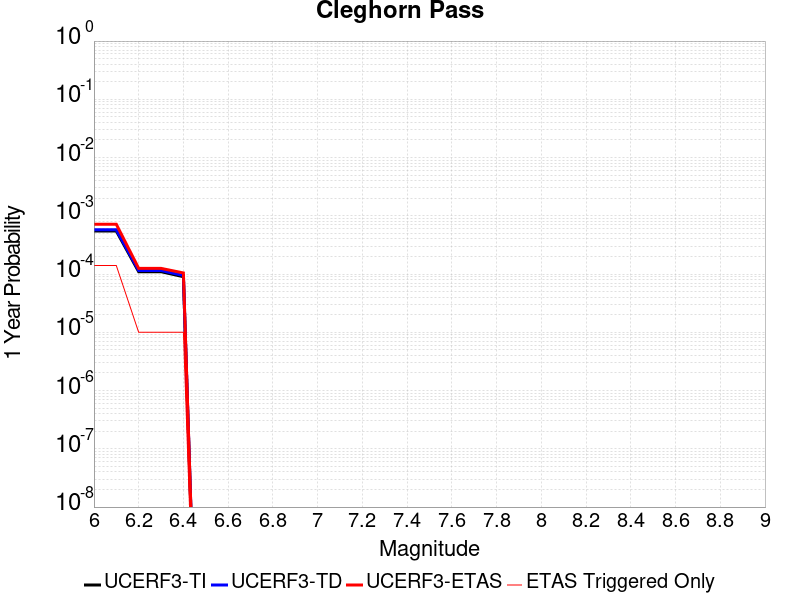 |  |

| Magnitude | 1 wk TI Prob | 1 wk TD Prob | 1 wk ETAS Prob | 1 wk ETAS/TD Gain | 1 wk ETAS Triggered Only | 1 mo TI Prob | 1 mo TD Prob | 1 mo ETAS Prob | 1 mo ETAS/TD Gain | 1 mo ETAS Triggered Only | 1 yr TI Prob | 1 yr TD Prob | 1 yr ETAS Prob | 1 yr ETAS/TD Gain | 1 yr ETAS Triggered Only | 10 yr TI Prob | 10 yr TD Prob | 10 yr ETAS Prob | 10 yr ETAS/TD Gain | 10 yr ETAS Triggered Only |
|-----|-----|-----|-----|-----|-----|-----|-----|-----|-----|-----|-----|-----|-----|-----|-----|-----|-----|-----|-----|-----|
| 6.0 | 1.0522846E-5 | 1.1040642E-5 | 1.16915595E-4 | 10.589565 | 1.05876126E-4 | 4.509713E-5 | 4.7316473E-5 | 1.5318759E-4 | 3.2375107 | 1.05876126E-4 | 5.4891926E-4 | 5.759784E-4 | 7.3470117E-4 | 1.2755706 | 1.5881419E-4 | 0.0054756533 | 0.005750022 | 0.005907923 | 1.0274609 | 1.5881419E-4 |
| 6.1 | 1.0522846E-5 | 1.1040642E-5 | 1.16915595E-4 | 10.589565 | 1.05876126E-4 | 4.509713E-5 | 4.7316473E-5 | 1.5318759E-4 | 3.2375107 | 1.05876126E-4 | 5.4891926E-4 | 5.759784E-4 | 7.3470117E-4 | 1.2755706 | 1.5881419E-4 | 0.0054756533 | 0.005750022 | 0.005907923 | 1.0274609 | 1.5881419E-4 |
| 6.2 | 2.1045846E-6 | 2.2082024E-6 | 2.2082024E-6 | 1.0 | 0.0 | 9.019617E-6 | 9.463714E-6 | 9.463714E-6 | 1.0 | 0.0 | 1.098083E-4 | 1.1521882E-4 | 1.1521882E-4 | 1.0 | 0.0 | 0.0010975406 | 0.0011520023 | 0.0011520023 | 1.0 | 0.0 |
| 6.3 | 2.1045846E-6 | 2.2082024E-6 | 2.2082024E-6 | 1.0 | 0.0 | 9.019617E-6 | 9.463714E-6 | 9.463714E-6 | 1.0 | 0.0 | 1.098083E-4 | 1.1521882E-4 | 1.1521882E-4 | 1.0 | 0.0 | 0.0010975406 | 0.0011520023 | 0.0011520023 | 1.0 | 0.0 |
| 6.4 | 1.7259927E-6 | 1.810877E-6 | 1.810877E-6 | 1.0 | 0.0 | 7.3970905E-6 | 7.760902E-6 | 7.760902E-6 | 1.0 | 0.0 | 9.005586E-5 | 9.4488976E-5 | 9.4488976E-5 | 1.0 | 0.0 | 9.001937E-4 | 9.448898E-4 | 9.448898E-4 | 1.0 | 0.0 |

## San Gabriel
*[(top)](#table-of-contents)*

| 1 Week | 1 Month | 1 Year | 10 Year |
|-----|-----|-----|-----|
|  |  |  | 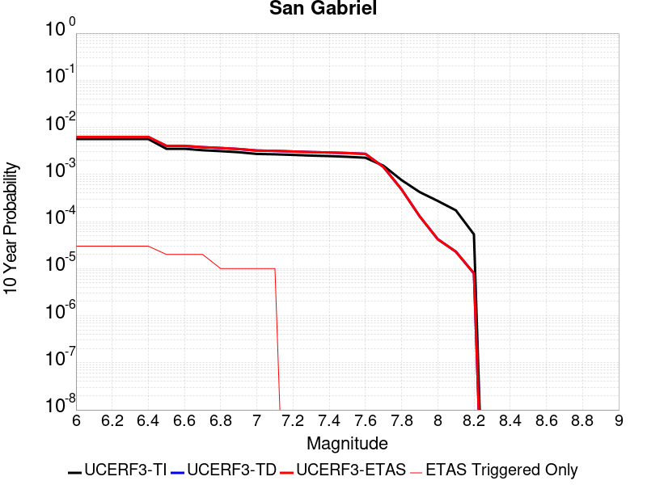 |

| Magnitude | 1 wk TI Prob | 1 wk TD Prob | 1 wk ETAS Prob | 1 wk ETAS/TD Gain | 1 wk ETAS Triggered Only | 1 mo TI Prob | 1 mo TD Prob | 1 mo ETAS Prob | 1 mo ETAS/TD Gain | 1 mo ETAS Triggered Only | 1 yr TI Prob | 1 yr TD Prob | 1 yr ETAS Prob | 1 yr ETAS/TD Gain | 1 yr ETAS Triggered Only | 10 yr TI Prob | 10 yr TD Prob | 10 yr ETAS Prob | 10 yr ETAS/TD Gain | 10 yr ETAS Triggered Only |
|-----|-----|-----|-----|-----|-----|-----|-----|-----|-----|-----|-----|-----|-----|-----|-----|-----|-----|-----|-----|-----|
| 6.0 | 1.083775E-5 | 1.19851875E-5 | 1.1786004E-4 | 9.833809 | 1.05876126E-4 | 4.6446676E-5 | 5.1364143E-5 | 2.1017017E-4 | 4.0917683 | 1.5881419E-4 | 5.653415E-4 | 6.251903E-4 | 7.839052E-4 | 1.2538666 | 1.5881419E-4 | 0.0056390543 | 0.006246409 | 0.0064042313 | 1.025266 | 1.5881419E-4 |
| 6.1 | 1.083775E-5 | 1.19851875E-5 | 1.1786004E-4 | 9.833809 | 1.05876126E-4 | 4.6446676E-5 | 5.1364143E-5 | 2.1017017E-4 | 4.0917683 | 1.5881419E-4 | 5.653415E-4 | 6.251903E-4 | 7.839052E-4 | 1.2538666 | 1.5881419E-4 | 0.0056390543 | 0.006246409 | 0.0064042313 | 1.025266 | 1.5881419E-4 |
| 6.2 | 1.083775E-5 | 1.19851875E-5 | 1.1786004E-4 | 9.833809 | 1.05876126E-4 | 4.6446676E-5 | 5.1364143E-5 | 2.1017017E-4 | 4.0917683 | 1.5881419E-4 | 5.653415E-4 | 6.251903E-4 | 7.839052E-4 | 1.2538666 | 1.5881419E-4 | 0.0056390543 | 0.006246409 | 0.0064042313 | 1.025266 | 1.5881419E-4 |
| 6.3 | 1.083775E-5 | 1.19851875E-5 | 1.1786004E-4 | 9.833809 | 1.05876126E-4 | 4.6446676E-5 | 5.1364143E-5 | 2.1017017E-4 | 4.0917683 | 1.5881419E-4 | 5.653415E-4 | 6.251903E-4 | 7.839052E-4 | 1.2538666 | 1.5881419E-4 | 0.0056390543 | 0.006246409 | 0.0064042313 | 1.025266 | 1.5881419E-4 |
| 6.4 | 1.083775E-5 | 1.19851875E-5 | 1.1786004E-4 | 9.833809 | 1.05876126E-4 | 4.6446676E-5 | 5.1364143E-5 | 2.1017017E-4 | 4.0917683 | 1.5881419E-4 | 5.653415E-4 | 6.251903E-4 | 7.839052E-4 | 1.2538666 | 1.5881419E-4 | 0.0056390543 | 0.006246409 | 0.0064042313 | 1.025266 | 1.5881419E-4 |
| 6.5 | 6.7317824E-6 | 7.716944E-6 | 6.06546E-5 | 7.859924 | 5.2938063E-5 | 2.8850178E-5 | 3.3072207E-5 | 1.3894483E-4 | 4.2012568 | 1.05876126E-4 | 3.511943E-4 | 4.0258077E-4 | 5.084143E-4 | 1.2628876 | 1.05876126E-4 | 0.003506398 | 0.0040296097 | 0.004135059 | 1.0261687 | 1.05876126E-4 |
| 6.6 | 6.7317824E-6 | 7.716944E-6 | 6.06546E-5 | 7.859924 | 5.2938063E-5 | 2.8850178E-5 | 3.3072207E-5 | 1.3894483E-4 | 4.2012568 | 1.05876126E-4 | 3.511943E-4 | 4.0258077E-4 | 5.084143E-4 | 1.2628876 | 1.05876126E-4 | 0.003506398 | 0.0040296097 | 0.004135059 | 1.0261687 | 1.05876126E-4 |
| 6.7 | 6.274881E-6 | 7.2458647E-6 | 6.0183545E-5 | 8.305916 | 5.2938063E-5 | 2.6892068E-5 | 3.1053343E-5 | 1.3692617E-4 | 4.409386 | 1.05876126E-4 | 3.2736175E-4 | 3.780098E-4 | 4.838459E-4 | 1.2799824 | 1.05876126E-4 | 0.0032687993 | 0.0037847564 | 0.0038902317 | 1.0278685 | 1.05876126E-4 |
| 6.8 | 5.996209E-6 | 6.958585E-6 | 6.958585E-6 | 1.0 | 0.0 | 2.5697784E-5 | 2.9822171E-5 | 8.2758655E-5 | 2.7750714 | 5.2938063E-5 | 3.128256E-4 | 3.6302538E-4 | 4.1594423E-4 | 1.1457717 | 5.2938063E-5 | 0.003123856 | 0.0036354093 | 0.003688155 | 1.0145088 | 5.2938063E-5 |
| 6.9 | 5.686331E-6 | 6.6236316E-6 | 6.6236316E-6 | 1.0 | 0.0 | 2.4369761E-5 | 2.8386688E-5 | 8.132325E-5 | 2.8648374 | 5.2938063E-5 | 2.9666146E-4 | 3.4555403E-4 | 3.984738E-4 | 1.1531447 | 5.2938063E-5 | 0.0029626573 | 0.0034612515 | 0.0035140063 | 1.0152415 | 5.2938063E-5 |
| 7.0 | 5.2329838E-6 | 6.147514E-6 | 6.147514E-6 | 1.0 | 0.0 | 2.242688E-5 | 2.6346226E-5 | 7.9282894E-5 | 3.0092695 | 5.2938063E-5 | 2.7301308E-4 | 3.2071886E-4 | 3.7363995E-4 | 1.1650077 | 5.2938063E-5 | 0.002726779 | 0.0032136322 | 0.0032664 | 1.01642 | 5.2938063E-5 |
| 7.1 | 5.135671E-6 | 6.03764E-6 | 6.03764E-6 | 1.0 | 0.0 | 2.2009834E-5 | 2.5875348E-5 | 7.881204E-5 | 3.045835 | 5.2938063E-5 | 2.6793676E-4 | 3.1498758E-4 | 3.6790897E-4 | 1.1680111 | 5.2938063E-5 | 0.0026761394 | 0.0031564834 | 0.0032092542 | 1.0167183 | 5.2938063E-5 |
| 7.2 | 4.989062E-6 | 5.87102E-6 | 5.87102E-6 | 1.0 | 0.0 | 2.1381518E-5 | 2.5161276E-5 | 2.5161276E-5 | 1.0 | 0.0 | 2.6028889E-4 | 3.0629625E-4 | 3.0629625E-4 | 1.0 | 0.0 | 0.0025998424 | 0.003069813 | 0.003069813 | 1.0 | 0.0 |
| 7.3 | 4.8219395E-6 | 5.702574E-6 | 5.702574E-6 | 1.0 | 0.0 | 2.0665291E-5 | 2.443938E-5 | 2.443938E-5 | 1.0 | 0.0 | 2.5157086E-4 | 2.9750957E-4 | 2.9750957E-4 | 1.0 | 0.0 | 0.0025128627 | 0.0029821852 | 0.0029821852 | 1.0 | 0.0 |
| 7.4 | 4.7118383E-6 | 5.5911332E-6 | 5.5911332E-6 | 1.0 | 0.0 | 2.0193436E-5 | 2.3961782E-5 | 2.3961782E-5 | 1.0 | 0.0 | 2.4582737E-4 | 2.916964E-4 | 2.916964E-4 | 1.0 | 0.0 | 0.002455556 | 0.0029242067 | 0.0029242067 | 1.0 | 0.0 |
| 7.5 | 4.5506545E-6 | 5.4365014E-6 | 5.4365014E-6 | 1.0 | 0.0 | 1.9502659E-5 | 2.3299088E-5 | 2.3299088E-5 | 1.0 | 0.0 | 2.37419E-4 | 2.8363022E-4 | 2.8363022E-4 | 1.0 | 0.0 | 0.002371655 | 0.002843753 | 0.002843753 | 1.0 | 0.0 |
| 7.6 | 4.343636E-6 | 5.2293817E-6 | 5.2293817E-6 | 1.0 | 0.0 | 1.861545E-5 | 2.2411448E-5 | 2.2411448E-5 | 1.0 | 0.0 | 2.2661954E-4 | 2.7282597E-4 | 2.7282597E-4 | 1.0 | 0.0 | 0.0022638857 | 0.0027359722 | 0.0027359722 | 1.0 | 0.0 |
| 7.7 | 2.936235E-6 | 2.7440458E-6 | 2.7440458E-6 | 1.0 | 0.0 | 1.2583803E-5 | 1.1760143E-5 | 1.1760143E-5 | 1.0 | 0.0 | 1.5319703E-4 | 1.4317037E-4 | 1.4317037E-4 | 1.0 | 0.0 | 0.0015309147 | 0.0014380751 | 0.0014380751 | 1.0 | 0.0 |
| 7.8 | 1.4541639E-6 | 9.1237047E-7 | 9.1237047E-7 | 1.0 | 0.0 | 6.232116E-6 | 3.9101533E-6 | 3.9101533E-6 | 1.0 | 0.0 | 7.587337E-5 | 4.7605077E-5 | 4.7605077E-5 | 1.0 | 0.0 | 7.584747E-4 | 4.8085177E-4 | 4.8085177E-4 | 1.0 | 0.0 |
| 7.9 | 8.098958E-7 | 2.41753E-7 | 2.41753E-7 | 1.0 | 0.0 | 3.4709774E-6 | 1.0360839E-6 | 1.0360839E-6 | 1.0 | 0.0 | 4.225833E-5 | 1.2614248E-5 | 1.2614248E-5 | 1.0 | 0.0 | 4.2250296E-4 | 1.2921814E-4 | 1.2921814E-4 | 1.0 | 0.0 |
| 8.0 | 5.2473234E-7 | 7.6792055E-8 | 7.6792055E-8 | 1.0 | 0.0 | 2.248851E-6 | 3.2910876E-7 | 3.2910876E-7 | 1.0 | 0.0 | 2.7379416E-5 | 4.0068917E-6 | 4.0068917E-6 | 1.0 | 0.0 | 2.7376044E-4 | 4.21918E-5 | 4.21918E-5 | 1.0 | 0.0 |
| 8.1 | 3.3162388E-7 | 4.1496126E-8 | 4.1496126E-8 | 1.0 | 0.0 | 1.4212444E-6 | 1.7784053E-7 | 1.7784053E-7 | 1.0 | 0.0 | 1.7303513E-5 | 2.1652063E-6 | 2.1652063E-6 | 1.0 | 0.0 | 1.7302166E-4 | 2.2965523E-5 | 2.2965523E-5 | 1.0 | 0.0 |
| 8.2 | 1.0235345E-7 | 1.4043474E-8 | 1.4043474E-8 | 1.0 | 0.0 | 4.3865757E-7 | 6.0186316E-8 | 6.0186316E-8 | 1.0 | 0.0 | 5.340643E-6 | 7.327681E-7 | 7.327681E-7 | 1.0 | 0.0 | 5.3405143E-5 | 7.9273705E-6 | 7.9273705E-6 | 1.0 | 0.0 |

## San Andreas (Creeping Section) 2011 CFM
*[(top)](#table-of-contents)*

| 1 Week | 1 Month | 1 Year | 10 Year |
|-----|-----|-----|-----|
|  |  |  |  |

| Magnitude | 1 wk TI Prob | 1 wk TD Prob | 1 wk ETAS Prob | 1 wk ETAS/TD Gain | 1 wk ETAS Triggered Only | 1 mo TI Prob | 1 mo TD Prob | 1 mo ETAS Prob | 1 mo ETAS/TD Gain | 1 mo ETAS Triggered Only | 1 yr TI Prob | 1 yr TD Prob | 1 yr ETAS Prob | 1 yr ETAS/TD Gain | 1 yr ETAS Triggered Only | 10 yr TI Prob | 10 yr TD Prob | 10 yr ETAS Prob | 10 yr ETAS/TD Gain | 10 yr ETAS Triggered Only |
|-----|-----|-----|-----|-----|-----|-----|-----|-----|-----|-----|-----|-----|-----|-----|-----|-----|-----|-----|-----|-----|
| 6.0 | 5.986481E-4 | 0.001228691 | 0.001228691 | 1.0 | 0.0 | 0.0025631124 | 0.005246795 | 0.0052994555 | 1.0100367 | 5.2938063E-5 | 0.030762846 | 0.061203245 | 0.061352342 | 1.002436 | 1.5881419E-4 | 0.26835477 | 0.425928 | 0.42601916 | 1.0002141 | 1.5881419E-4 |
| 6.1 | 5.015945E-4 | 0.0010230356 | 0.0010230356 | 1.0 | 0.0 | 0.00214792 | 0.004369436 | 0.0044221426 | 1.0120625 | 5.2938063E-5 | 0.025839351 | 0.051246606 | 0.051397283 | 1.0029402 | 1.5881419E-4 | 0.23032776 | 0.37284943 | 0.37294906 | 1.0002671 | 1.5881419E-4 |
| 6.2 | 4.073338E-4 | 8.1157376E-4 | 8.1157376E-4 | 1.0 | 0.0 | 0.0017445484 | 0.0034683137 | 0.003521068 | 1.0152104 | 5.2938063E-5 | 0.021034058 | 0.04093177 | 0.04108408 | 1.0037211 | 1.5881419E-4 | 0.19150782 | 0.31302592 | 0.31313503 | 1.0003486 | 1.5881419E-4 |
| 6.3 | 3.464099E-4 | 6.7455834E-4 | 6.7455834E-4 | 1.0 | 0.0 | 0.0014837692 | 0.0028832308 | 0.0029360163 | 1.0183077 | 5.2938063E-5 | 0.017915873 | 0.034187846 | 0.03434123 | 1.0044866 | 1.5881419E-4 | 0.16538359 | 0.27130842 | 0.27142414 | 1.0004265 | 1.5881419E-4 |
| 6.4 | 2.935057E-4 | 5.5516965E-4 | 5.5516965E-4 | 1.0 | 0.0 | 0.0012572751 | 0.0023727308 | 0.0024255433 | 1.022258 | 5.2938063E-5 | 0.015200248 | 0.02826279 | 0.028417116 | 1.0054604 | 1.5881419E-4 | 0.14201577 | 0.23297668 | 0.23309849 | 1.0005229 | 1.5881419E-4 |
| 6.5 | 2.3409708E-4 | 4.2132285E-4 | 4.2132285E-4 | 1.0 | 0.0 | 0.0010028875 | 0.0018017791 | 0.0018546219 | 1.0293281 | 5.2938063E-5 | 0.012141965 | 0.021586355 | 0.02174174 | 1.0071983 | 1.5881419E-4 | 0.11499573 | 0.1868149 | 0.18694405 | 1.0006913 | 1.5881419E-4 |
| 6.6 | 1.5842178E-4 | 2.5068692E-4 | 2.5068692E-4 | 1.0 | 0.0 | 6.7877385E-4 | 0.0010739256 | 0.0011268068 | 1.0492411 | 5.2938063E-5 | 0.0082328 | 0.012995283 | 0.013099783 | 1.0080414 | 1.05876126E-4 | 0.07934396 | 0.12313759 | 0.123230435 | 1.000754 | 1.05876126E-4 |
| 6.7 | 1.5616413E-4 | 2.4605254E-4 | 2.4605254E-4 | 1.0 | 0.0 | 6.691031E-4 | 0.0010540807 | 0.0011069629 | 1.0501691 | 5.2938063E-5 | 0.0081159435 | 0.012757154 | 0.012861679 | 1.0081935 | 1.05876126E-4 | 0.0782586 | 0.12116472 | 0.12125777 | 1.000768 | 1.05876126E-4 |
| 6.8 | 1.5538467E-4 | 2.442914E-4 | 2.442914E-4 | 1.0 | 0.0 | 6.6576427E-4 | 0.001046539 | 0.0010994218 | 1.050531 | 5.2938063E-5 | 0.008075596 | 0.012666538 | 0.012771073 | 1.0082529 | 1.05876126E-4 | 0.07788358 | 0.12039561 | 0.12048873 | 1.0007735 | 1.05876126E-4 |
| 6.9 | 1.5153569E-4 | 2.3538464E-4 | 2.3538464E-4 | 1.0 | 0.0 | 6.49277E-4 | 0.0010084033 | 0.0010612879 | 1.052444 | 5.2938063E-5 | 0.007876333 | 0.012208726 | 0.01231331 | 1.0085663 | 1.05876126E-4 | 0.07602952 | 0.11646574 | 0.11655929 | 1.0008032 | 1.05876126E-4 |
| 7.0 | 1.4588932E-4 | 2.2395732E-4 | 2.2395732E-4 | 1.0 | 0.0 | 6.250901E-4 | 9.59466E-4 | 0.0010123532 | 1.0551215 | 5.2938063E-5 | 0.0075839474 | 0.011619428 | 0.011724073 | 1.0090061 | 1.05876126E-4 | 0.073302895 | 0.11131206 | 0.111406155 | 1.0008453 | 1.05876126E-4 |
| 7.1 | 1.1565079E-4 | 1.6281323E-4 | 1.6281323E-4 | 1.0 | 0.0 | 4.955521E-4 | 6.9758523E-4 | 7.5048633E-4 | 1.0758346 | 5.2938063E-5 | 0.006016669 | 0.008460228 | 0.008565209 | 1.0124087 | 1.05876126E-4 | 0.058563538 | 0.08366478 | 0.083761804 | 1.0011595 | 1.05876126E-4 |
| 7.2 | 1.0393792E-4 | 1.4615392E-4 | 1.4615392E-4 | 1.0 | 0.0 | 4.4537216E-4 | 6.262243E-4 | 6.7912927E-4 | 1.0844823 | 5.2938063E-5 | 0.005408933 | 0.0075977976 | 0.0077028694 | 1.0138292 | 1.05876126E-4 | 0.052791595 | 0.07561503 | 0.075712904 | 1.0012944 | 1.05876126E-4 |
| 7.3 | 9.332884E-5 | 1.2780601E-4 | 1.2780601E-4 | 1.0 | 0.0 | 3.999194E-4 | 5.4762565E-4 | 6.005347E-4 | 1.0966154 | 5.2938063E-5 | 0.0048581534 | 0.0066470946 | 0.006752267 | 1.0158223 | 1.05876126E-4 | 0.047533102 | 0.06647954 | 0.06657838 | 1.0014868 | 1.05876126E-4 |
| 7.4 | 8.670252E-5 | 1.1702972E-4 | 1.1702972E-4 | 1.0 | 0.0 | 3.715293E-4 | 5.014601E-4 | 5.543716E-4 | 1.1055149 | 5.2938063E-5 | 0.004513991 | 0.0060883067 | 0.006193538 | 1.0172842 | 1.05876126E-4 | 0.044233937 | 0.061148684 | 0.061248086 | 1.0016255 | 1.05876126E-4 |
| 7.5 | 7.3036405E-5 | 9.005699E-5 | 9.005699E-5 | 1.0 | 0.0 | 3.129756E-4 | 3.859015E-4 | 4.3881914E-4 | 1.1371273 | 5.2938063E-5 | 0.0038038217 | 0.0046882504 | 0.00479363 | 1.0224774 | 1.05876126E-4 | 0.03739367 | 0.047875606 | 0.047976416 | 1.0021056 | 1.05876126E-4 |
| 7.6 | 6.3935775E-5 | 8.280209E-5 | 8.280209E-5 | 1.0 | 0.0 | 2.7398168E-4 | 3.5481792E-4 | 4.0773719E-4 | 1.1491449 | 5.2938063E-5 | 0.0033306254 | 0.00431137 | 0.00441679 | 1.0244515 | 1.05876126E-4 | 0.032811474 | 0.043990135 | 0.044091355 | 1.002301 | 1.05876126E-4 |
| 7.7 | 5.5050095E-5 | 6.661729E-5 | 6.661729E-5 | 1.0 | 0.0 | 2.3590765E-4 | 2.8547147E-4 | 3.383944E-4 | 1.1853878 | 5.2938063E-5 | 0.0028683927 | 0.0034700802 | 0.0035755888 | 1.0304053 | 1.05876126E-4 | 0.0283165 | 0.03579509 | 0.035897173 | 1.002852 | 1.05876126E-4 |
| 7.8 | 5.027131E-5 | 6.1627725E-5 | 6.1627725E-5 | 1.0 | 0.0 | 2.1543067E-4 | 2.640921E-4 | 3.1701618E-4 | 1.2004001 | 5.2938063E-5 | 0.0026197135 | 0.003210584 | 0.00331612 | 1.0328714 | 1.05876126E-4 | 0.025890453 | 0.03312572 | 0.03322809 | 1.0030903 | 1.05876126E-4 |
| 7.9 | 3.7271806E-5 | 5.0224386E-5 | 5.0224386E-5 | 1.0 | 0.0 | 1.5972654E-4 | 2.1522962E-4 | 2.681563E-4 | 1.2459079 | 5.2938063E-5 | 0.0019429359 | 0.0026172737 | 0.0027228727 | 1.040347 | 1.05876126E-4 | 0.019260362 | 0.027066687 | 0.027169699 | 1.0038058 | 1.05876126E-4 |
| 8.0 | 2.7310243E-5 | 3.1428404E-5 | 3.1428404E-5 | 1.0 | 0.0 | 1.17038646E-4 | 1.3468621E-4 | 1.8761714E-4 | 1.3929944 | 5.2938063E-5 | 0.0014240141 | 0.0016385721 | 0.0017442747 | 1.064509 | 1.05876126E-4 | 0.014149235 | 0.01721387 | 0.017317923 | 1.0060447 | 1.05876126E-4 |
| 8.1 | 1.7940547E-5 | 1.7400796E-5 | 1.7400796E-5 | 1.0 | 0.0 | 7.688579E-5 | 7.457271E-5 | 1.2750682E-4 | 1.7098322 | 5.2938063E-5 | 9.3568244E-4 | 9.075451E-4 | 9.6043514E-4 | 1.0582781 | 5.2938063E-5 | 0.009317525 | 0.009799073 | 0.009851493 | 1.0053494 | 5.2938063E-5 |
| 8.2 | 8.643924E-6 | 5.4748625E-6 | 5.4748625E-6 | 1.0 | 0.0 | 3.704486E-5 | 2.3463486E-5 | 2.3463486E-5 | 1.0 | 0.0 | 4.5092785E-4 | 2.8563058E-4 | 2.8563058E-4 | 1.0 | 0.0 | 0.0045001395 | 0.0032487072 | 0.0032487072 | 1.0 | 0.0 |
| 8.3 | 1.983087E-6 | 7.6599065E-7 | 7.6599065E-7 | 1.0 | 0.0 | 8.498917E-6 | 3.282813E-6 | 3.282813E-6 | 1.0 | 0.0 | 1.034694E-4 | 3.9967534E-5 | 3.9967534E-5 | 1.0 | 0.0 | 0.0010342124 | 4.719687E-4 | 4.719687E-4 | 1.0 | 0.0 |

## Red Mountain
*[(top)](#table-of-contents)*

| 1 Week | 1 Month | 1 Year | 10 Year |
|-----|-----|-----|-----|
|  |  |  |  |

| Magnitude | 1 wk TI Prob | 1 wk TD Prob | 1 wk ETAS Prob | 1 wk ETAS/TD Gain | 1 wk ETAS Triggered Only | 1 mo TI Prob | 1 mo TD Prob | 1 mo ETAS Prob | 1 mo ETAS/TD Gain | 1 mo ETAS Triggered Only | 1 yr TI Prob | 1 yr TD Prob | 1 yr ETAS Prob | 1 yr ETAS/TD Gain | 1 yr ETAS Triggered Only | 10 yr TI Prob | 10 yr TD Prob | 10 yr ETAS Prob | 10 yr ETAS/TD Gain | 10 yr ETAS Triggered Only |
|-----|-----|-----|-----|-----|-----|-----|-----|-----|-----|-----|-----|-----|-----|-----|-----|-----|-----|-----|-----|-----|
| 6.0 | 4.1810763E-5 | 4.7589947E-5 | 1.0052549E-4 | 2.1123261 | 5.2938063E-5 | 1.7917668E-4 | 2.039419E-4 | 2.5686916E-4 | 1.2595212 | 5.2938063E-5 | 0.0021792934 | 0.0024803306 | 0.002585944 | 1.0425804 | 1.05876126E-4 | 0.021580452 | 0.024544092 | 0.024699008 | 1.0063118 | 1.5881419E-4 |
| 6.1 | 4.1810763E-5 | 4.7589947E-5 | 1.0052549E-4 | 2.1123261 | 5.2938063E-5 | 1.7917668E-4 | 2.039419E-4 | 2.5686916E-4 | 1.2595212 | 5.2938063E-5 | 0.0021792934 | 0.0024803306 | 0.002585944 | 1.0425804 | 1.05876126E-4 | 0.021580452 | 0.024544092 | 0.024699008 | 1.0063118 | 1.5881419E-4 |
| 6.2 | 4.1810763E-5 | 4.7589947E-5 | 1.0052549E-4 | 2.1123261 | 5.2938063E-5 | 1.7917668E-4 | 2.039419E-4 | 2.5686916E-4 | 1.2595212 | 5.2938063E-5 | 0.0021792934 | 0.0024803306 | 0.002585944 | 1.0425804 | 1.05876126E-4 | 0.021580452 | 0.024544092 | 0.024699008 | 1.0063118 | 1.5881419E-4 |
| 6.3 | 4.1810763E-5 | 4.7589947E-5 | 1.0052549E-4 | 2.1123261 | 5.2938063E-5 | 1.7917668E-4 | 2.039419E-4 | 2.5686916E-4 | 1.2595212 | 5.2938063E-5 | 0.0021792934 | 0.0024803306 | 0.002585944 | 1.0425804 | 1.05876126E-4 | 0.021580452 | 0.024544092 | 0.024699008 | 1.0063118 | 1.5881419E-4 |
| 6.4 | 4.1810763E-5 | 4.7589947E-5 | 1.0052549E-4 | 2.1123261 | 5.2938063E-5 | 1.7917668E-4 | 2.039419E-4 | 2.5686916E-4 | 1.2595212 | 5.2938063E-5 | 0.0021792934 | 0.0024803306 | 0.002585944 | 1.0425804 | 1.05876126E-4 | 0.021580452 | 0.024544092 | 0.024699008 | 1.0063118 | 1.5881419E-4 |
| 6.5 | 3.154503E-5 | 3.5359728E-5 | 8.829592E-5 | 2.4970758 | 5.2938063E-5 | 1.3518598E-4 | 1.5153342E-4 | 2.0446345E-4 | 1.3492962 | 5.2938063E-5 | 0.0016446467 | 0.0018434501 | 0.001949131 | 1.0573277 | 1.05876126E-4 | 0.01632528 | 0.018291233 | 0.018395174 | 1.0056825 | 1.05876126E-4 |
| 6.6 | 3.1535834E-5 | 3.534911E-5 | 8.82853E-5 | 2.4975255 | 5.2938063E-5 | 1.3514658E-4 | 1.5148791E-4 | 2.0441796E-4 | 1.3494011 | 5.2938063E-5 | 0.0016441676 | 0.001842897 | 0.001948578 | 1.057345 | 1.05876126E-4 | 0.01632056 | 0.018285794 | 0.018389735 | 1.0056843 | 1.05876126E-4 |
| 6.7 | 2.8267326E-5 | 3.146934E-5 | 8.4405736E-5 | 2.6821578 | 5.2938063E-5 | 1.2114006E-4 | 1.348621E-4 | 1.8779303E-4 | 1.3924818 | 5.2938063E-5 | 0.0014738824 | 0.0016407946 | 0.001746497 | 1.0644214 | 1.05876126E-4 | 0.014641452 | 0.016295563 | 0.016399715 | 1.0063914 | 1.05876126E-4 |
| 6.8 | 2.8212884E-5 | 3.1407224E-5 | 8.434363E-5 | 2.685485 | 5.2938063E-5 | 1.20906756E-4 | 1.3459593E-4 | 1.8752686E-4 | 1.3932581 | 5.2938063E-5 | 0.0014710457 | 0.0016375587 | 0.0017432615 | 1.064549 | 1.05876126E-4 | 0.014613459 | 0.01626368 | 0.016367834 | 1.006404 | 1.05876126E-4 |
| 6.9 | 2.4227871E-5 | 2.6706979E-5 | 7.964363E-5 | 2.982128 | 5.2938063E-5 | 1.03829596E-4 | 1.14453884E-4 | 1.673859E-4 | 1.4624745 | 5.2938063E-5 | 0.0012633923 | 0.0013926612 | 0.0014983899 | 1.0759184 | 1.05876126E-4 | 0.012562336 | 0.013847026 | 0.013951436 | 1.0075402 | 1.05876126E-4 |
| 7.0 | 2.348524E-5 | 2.5835763E-5 | 7.877246E-5 | 3.0489697 | 5.2938063E-5 | 1.0064714E-4 | 1.1072042E-4 | 1.6365263E-4 | 1.4780707 | 5.2938063E-5 | 0.0012246901 | 0.0013472632 | 0.0014529967 | 1.0784802 | 1.05876126E-4 | 0.012179627 | 0.01339859 | 0.013503048 | 1.0077962 | 1.05876126E-4 |
| 7.1 | 2.2311642E-5 | 2.4462828E-5 | 7.73996E-5 | 3.1639676 | 5.2938063E-5 | 9.561782E-5 | 1.048369E-4 | 1.5776942E-4 | 1.5049034 | 5.2938063E-5 | 0.0011635252 | 0.0012757168 | 0.0013814578 | 1.0828875 | 1.05876126E-4 | 0.01157452 | 0.012691451 | 0.012795984 | 1.0082364 | 1.05876126E-4 |
| 7.2 | 1.6533986E-5 | 1.7670347E-5 | 7.060747E-5 | 3.9958172 | 5.2938063E-5 | 7.085802E-5 | 7.572822E-5 | 1.2866227E-4 | 1.6990004 | 5.2938063E-5 | 8.623549E-4 | 9.216645E-4 | 0.0010274431 | 1.114769 | 1.05876126E-4 | 0.008590161 | 0.009184699 | 0.009289603 | 1.0114216 | 1.05876126E-4 |
| 7.3 | 1.4703092E-5 | 1.555952E-5 | 6.849676E-5 | 4.4022408 | 5.2938063E-5 | 6.301173E-5 | 6.66823E-5 | 1.1961684E-4 | 1.7938318 | 5.2938063E-5 | 7.668978E-4 | 8.1161625E-4 | 8.6451136E-4 | 1.0651726 | 5.2938063E-5 | 0.0076425658 | 0.008092596 | 0.008145105 | 1.0064886 | 5.2938063E-5 |
| 7.4 | 6.1331984E-6 | 5.528872E-6 | 5.528872E-6 | 1.0 | 0.0 | 2.6284872E-5 | 2.3694953E-5 | 2.3694953E-5 | 1.0 | 0.0 | 3.199713E-4 | 2.8844838E-4 | 2.8844838E-4 | 1.0 | 0.0 | 0.0031951098 | 0.0028807942 | 0.0028807942 | 1.0 | 0.0 |
| 7.5 | 5.954766E-6 | 5.3385015E-6 | 5.3385015E-6 | 1.0 | 0.0 | 2.5520176E-5 | 2.2879094E-5 | 2.2879094E-5 | 1.0 | 0.0 | 3.1066386E-4 | 2.785179E-4 | 2.785179E-4 | 1.0 | 0.0 | 0.003102299 | 0.0027817423 | 0.0027817423 | 1.0 | 0.0 |
| 7.6 | 4.9726646E-6 | 4.315295E-6 | 4.315295E-6 | 1.0 | 0.0 | 2.1311245E-5 | 1.8493993E-5 | 1.8493993E-5 | 1.0 | 0.0 | 2.5943352E-4 | 2.2514143E-4 | 2.2514143E-4 | 1.0 | 0.0 | 0.0025913084 | 0.002249168 | 0.002249168 | 1.0 | 0.0 |
| 7.7 | 3.3613894E-6 | 2.8526642E-6 | 2.8526642E-6 | 1.0 | 0.0 | 1.4405875E-5 | 1.2225649E-5 | 1.2225649E-5 | 1.0 | 0.0 | 1.7537741E-4 | 1.4883737E-4 | 1.4883737E-4 | 1.0 | 0.0 | 0.0017523908 | 0.0014874031 | 0.0014874031 | 1.0 | 0.0 |
| 7.8 | 1.1828961E-6 | 1.0122756E-6 | 1.0122756E-6 | 1.0 | 0.0 | 5.069545E-6 | 4.338317E-6 | 4.338317E-6 | 1.0 | 0.0 | 6.171996E-5 | 5.281776E-5 | 5.281776E-5 | 1.0 | 0.0 | 6.170282E-4 | 5.2805495E-4 | 5.2805495E-4 | 1.0 | 0.0 |
| 7.9 | 2.2967266E-7 | 1.8618952E-7 | 1.8618952E-7 | 1.0 | 0.0 | 9.843111E-7 | 7.9795484E-7 | 7.9795484E-7 | 1.0 | 0.0 | 1.19839215E-5 | 9.7150605E-6 | 9.7150605E-6 | 1.0 | 0.0 | 1.1983275E-4 | 9.714664E-5 | 9.714664E-5 | 1.0 | 0.0 |

## Santa Ynez River
*[(top)](#table-of-contents)*

| 1 Week | 1 Month | 1 Year | 10 Year |
|-----|-----|-----|-----|
|  |  |  |  |

| Magnitude | 1 wk TI Prob | 1 wk TD Prob | 1 wk ETAS Prob | 1 wk ETAS/TD Gain | 1 wk ETAS Triggered Only | 1 mo TI Prob | 1 mo TD Prob | 1 mo ETAS Prob | 1 mo ETAS/TD Gain | 1 mo ETAS Triggered Only | 1 yr TI Prob | 1 yr TD Prob | 1 yr ETAS Prob | 1 yr ETAS/TD Gain | 1 yr ETAS Triggered Only | 10 yr TI Prob | 10 yr TD Prob | 10 yr ETAS Prob | 10 yr ETAS/TD Gain | 10 yr ETAS Triggered Only |
|-----|-----|-----|-----|-----|-----|-----|-----|-----|-----|-----|-----|-----|-----|-----|-----|-----|-----|-----|-----|-----|
| 6.0 | 1.6396456E-5 | 1.7209435E-5 | 7.014659E-5 | 4.076054 | 5.2938063E-5 | 7.026863E-5 | 7.375284E-5 | 1.26687E-4 | 1.7177236 | 5.2938063E-5 | 8.551848E-4 | 8.976064E-4 | 0.0010033875 | 1.1178479 | 1.05876126E-4 | 0.0085190125 | 0.008943358 | 0.009048288 | 1.0117327 | 1.05876126E-4 |
| 6.1 | 1.6396456E-5 | 1.7209435E-5 | 7.014659E-5 | 4.076054 | 5.2938063E-5 | 7.026863E-5 | 7.375284E-5 | 1.26687E-4 | 1.7177236 | 5.2938063E-5 | 8.551848E-4 | 8.976064E-4 | 0.0010033875 | 1.1178479 | 1.05876126E-4 | 0.0085190125 | 0.008943358 | 0.009048288 | 1.0117327 | 1.05876126E-4 |
| 6.2 | 1.6396456E-5 | 1.7209435E-5 | 7.014659E-5 | 4.076054 | 5.2938063E-5 | 7.026863E-5 | 7.375284E-5 | 1.26687E-4 | 1.7177236 | 5.2938063E-5 | 8.551848E-4 | 8.976064E-4 | 0.0010033875 | 1.1178479 | 1.05876126E-4 | 0.0085190125 | 0.008943358 | 0.009048288 | 1.0117327 | 1.05876126E-4 |
| 6.3 | 9.736976E-6 | 1.012233E-5 | 6.305986E-5 | 6.229777 | 5.2938063E-5 | 4.172923E-5 | 4.338072E-5 | 9.6316486E-5 | 2.2202601 | 5.2938063E-5 | 5.0793495E-4 | 5.280373E-4 | 6.338575E-4 | 1.200403 | 1.05876126E-4 | 0.005067755 | 0.005268332 | 0.00537365 | 1.0199908 | 1.05876126E-4 |
| 6.4 | 9.736976E-6 | 1.012233E-5 | 6.305986E-5 | 6.229777 | 5.2938063E-5 | 4.172923E-5 | 4.338072E-5 | 9.6316486E-5 | 2.2202601 | 5.2938063E-5 | 5.0793495E-4 | 5.280373E-4 | 6.338575E-4 | 1.200403 | 1.05876126E-4 | 0.005067755 | 0.005268332 | 0.00537365 | 1.0199908 | 1.05876126E-4 |
| 6.5 | 7.081964E-6 | 7.3298966E-6 | 6.0267572E-5 | 8.222158 | 5.2938063E-5 | 3.035092E-5 | 3.1413474E-5 | 8.434987E-5 | 2.6851497 | 5.2938063E-5 | 3.694598E-4 | 3.8239348E-4 | 4.3531132E-4 | 1.1383858 | 5.2938063E-5 | 0.0036884616 | 0.0038175168 | 0.0038702528 | 1.0138142 | 5.2938063E-5 |
| 6.6 | 5.873247E-6 | 6.059743E-6 | 5.8997484E-5 | 9.735971 | 5.2938063E-5 | 2.5170815E-5 | 2.5970074E-5 | 7.890676E-5 | 3.0383728 | 5.2938063E-5 | 3.064116E-4 | 3.1614062E-4 | 3.6906195E-4 | 1.1673981 | 5.2938063E-5 | 0.0030598943 | 0.0031569963 | 0.0032097672 | 1.0167155 | 5.2938063E-5 |
| 6.7 | 4.973277E-6 | 5.115901E-6 | 5.8053694E-5 | 11.347696 | 5.2938063E-5 | 2.1313872E-5 | 2.1925109E-5 | 7.486201E-5 | 3.4144418 | 5.2938063E-5 | 2.5946548E-4 | 2.66906E-4 | 3.198299E-4 | 1.1982868 | 5.2938063E-5 | 0.0025916274 | 0.0026659032 | 0.0027187 | 1.0198045 | 5.2938063E-5 |
| 6.8 | 4.396492E-6 | 4.5109778E-6 | 5.74488E-5 | 12.7353325 | 5.2938063E-5 | 1.884197E-5 | 1.9332621E-5 | 7.226966E-5 | 3.7382236 | 5.2938063E-5 | 2.2937685E-4 | 2.3534958E-4 | 2.882752E-4 | 1.2248808 | 5.2938063E-5 | 0.0022914023 | 0.0023510386 | 0.0024038523 | 1.0224639 | 5.2938063E-5 |
| 6.9 | 3.5255632E-6 | 3.6013332E-6 | 5.6539204E-5 | 15.69952 | 5.2938063E-5 | 1.5109469E-5 | 1.5434196E-5 | 6.837144E-5 | 4.4298677 | 5.2938063E-5 | 1.8394225E-4 | 1.8789528E-4 | 2.408234E-4 | 1.2816894 | 5.2938063E-5 | 0.0018379007 | 0.0018773803 | 0.001930219 | 1.028145 | 5.2938063E-5 |
| 7.0 | 3.211603E-6 | 3.273654E-6 | 5.6211542E-5 | 17.170887 | 5.2938063E-5 | 1.376394E-5 | 1.4029872E-5 | 6.696719E-5 | 4.773186 | 5.2938063E-5 | 1.6756308E-4 | 1.7080043E-4 | 2.2372945E-4 | 1.3098881 | 5.2938063E-5 | 0.0016743679 | 0.0017067058 | 0.0017595534 | 1.0309647 | 5.2938063E-5 |
| 7.1 | 2.5094619E-6 | 2.5409204E-6 | 5.547885E-5 | 21.834154 | 5.2938063E-5 | 1.0754793E-5 | 1.0889614E-5 | 6.38271E-5 | 5.861282 | 5.2938063E-5 | 1.3093173E-4 | 1.3257304E-4 | 1.8550409E-4 | 1.3992594 | 5.2938063E-5 | 0.0013085462 | 0.0013249456 | 0.0013778135 | 1.039902 | 5.2938063E-5 |
| 7.2 | 2.0515774E-6 | 2.0619375E-6 | 2.0619375E-6 | 1.0 | 0.0 | 8.792445E-6 | 8.836846E-6 | 8.836846E-6 | 1.0 | 0.0 | 1.0704277E-4 | 1.0758333E-4 | 1.0758333E-4 | 1.0 | 0.0 | 0.0010699122 | 0.0010753168 | 0.0010753168 | 1.0 | 0.0 |
| 7.3 | 1.6845745E-6 | 1.6773907E-6 | 1.6773907E-6 | 1.0 | 0.0 | 7.219585E-6 | 7.1887976E-6 | 7.1887976E-6 | 1.0 | 0.0 | 8.78949E-5 | 8.752012E-5 | 8.752012E-5 | 1.0 | 0.0 | 8.7860145E-4 | 8.7485946E-4 | 8.7485946E-4 | 1.0 | 0.0 |
| 7.4 | 1.3600285E-6 | 1.3333357E-6 | 1.3333357E-6 | 1.0 | 0.0 | 5.82868E-6 | 5.714284E-6 | 5.714284E-6 | 1.0 | 0.0 | 7.096187E-5 | 6.956921E-5 | 6.956921E-5 | 1.0 | 0.0 | 7.0939213E-4 | 6.954765E-4 | 6.954765E-4 | 1.0 | 0.0 |
| 7.5 | 9.735342E-7 | 9.290103E-7 | 9.290103E-7 | 1.0 | 0.0 | 4.172283E-6 | 3.9814668E-6 | 3.9814668E-6 | 1.0 | 0.0 | 5.079636E-5 | 4.8473295E-5 | 4.8473295E-5 | 1.0 | 0.0 | 5.0784746E-4 | 4.8462892E-4 | 4.8462892E-4 | 1.0 | 0.0 |
| 7.6 | 5.067187E-7 | 4.77857E-7 | 4.77857E-7 | 1.0 | 0.0 | 2.1716498E-6 | 2.047957E-6 | 2.047957E-6 | 1.0 | 0.0 | 2.6439517E-5 | 2.4933597E-5 | 2.4933597E-5 | 1.0 | 0.0 | 2.643637E-4 | 2.4930874E-4 | 2.4930874E-4 | 1.0 | 0.0 |
| 7.7 | 2.769089E-7 | 2.5759124E-7 | 2.5759124E-7 | 1.0 | 0.0 | 1.1867519E-6 | 1.1039621E-6 | 1.1039621E-6 | 1.0 | 0.0 | 1.4448608E-5 | 1.34406555E-5 | 1.34406555E-5 | 1.0 | 0.0 | 1.444767E-4 | 1.3439846E-4 | 1.3439846E-4 | 1.0 | 0.0 |
| 7.8 | 1.7044663E-7 | 1.5449015E-7 | 1.5449015E-7 | 1.0 | 0.0 | 7.3048534E-7 | 6.621005E-7 | 6.621005E-7 | 1.0 | 0.0 | 8.893623E-6 | 8.061043E-6 | 8.061043E-6 | 1.0 | 0.0 | 8.893267E-5 | 8.060753E-5 | 8.060753E-5 | 1.0 | 0.0 |
| 7.9 | 4.8344287E-8 | 4.0910923E-8 | 4.0910923E-8 | 1.0 | 0.0 | 2.0718979E-7 | 1.7533252E-7 | 1.7533252E-7 | 1.0 | 0.0 | 2.5225327E-6 | 2.1346711E-6 | 2.1346711E-6 | 1.0 | 0.0 | 2.5225041E-5 | 2.1346512E-5 | 2.1346512E-5 | 1.0 | 0.0 |

## San Jacinto (Coyote Creek)
*[(top)](#table-of-contents)*

| 1 Week | 1 Month | 1 Year | 10 Year |
|-----|-----|-----|-----|
|  |  |  |  |

| Magnitude | 1 wk TI Prob | 1 wk TD Prob | 1 wk ETAS Prob | 1 wk ETAS/TD Gain | 1 wk ETAS Triggered Only | 1 mo TI Prob | 1 mo TD Prob | 1 mo ETAS Prob | 1 mo ETAS/TD Gain | 1 mo ETAS Triggered Only | 1 yr TI Prob | 1 yr TD Prob | 1 yr ETAS Prob | 1 yr ETAS/TD Gain | 1 yr ETAS Triggered Only | 10 yr TI Prob | 10 yr TD Prob | 10 yr ETAS Prob | 10 yr ETAS/TD Gain | 10 yr ETAS Triggered Only |
|-----|-----|-----|-----|-----|-----|-----|-----|-----|-----|-----|-----|-----|-----|-----|-----|-----|-----|-----|-----|-----|
| 6.0 | 2.7374346E-5 | 2.4145214E-5 | 1.3001879E-4 | 5.3848677 | 1.05876126E-4 | 1.1731335E-4 | 1.034754E-4 | 2.0934056E-4 | 2.0230951 | 1.05876126E-4 | 0.0014273542 | 0.0012590875 | 0.0014177017 | 1.1259755 | 1.5881419E-4 | 0.01418221 | 0.012928318 | 0.013085079 | 1.0121254 | 1.5881419E-4 |
| 6.1 | 2.7374346E-5 | 2.4145214E-5 | 1.3001879E-4 | 5.3848677 | 1.05876126E-4 | 1.1731335E-4 | 1.034754E-4 | 2.0934056E-4 | 2.0230951 | 1.05876126E-4 | 0.0014273542 | 0.0012590875 | 0.0014177017 | 1.1259755 | 1.5881419E-4 | 0.01418221 | 0.012928318 | 0.013085079 | 1.0121254 | 1.5881419E-4 |
| 6.2 | 2.7374346E-5 | 2.4145214E-5 | 1.3001879E-4 | 5.3848677 | 1.05876126E-4 | 1.1731335E-4 | 1.034754E-4 | 2.0934056E-4 | 2.0230951 | 1.05876126E-4 | 0.0014273542 | 0.0012590875 | 0.0014177017 | 1.1259755 | 1.5881419E-4 | 0.01418221 | 0.012928318 | 0.013085079 | 1.0121254 | 1.5881419E-4 |
| 6.3 | 2.7374346E-5 | 2.4145214E-5 | 1.3001879E-4 | 5.3848677 | 1.05876126E-4 | 1.1731335E-4 | 1.034754E-4 | 2.0934056E-4 | 2.0230951 | 1.05876126E-4 | 0.0014273542 | 0.0012590875 | 0.0014177017 | 1.1259755 | 1.5881419E-4 | 0.01418221 | 0.012928318 | 0.013085079 | 1.0121254 | 1.5881419E-4 |
| 6.4 | 2.7374346E-5 | 2.4145214E-5 | 1.3001879E-4 | 5.3848677 | 1.05876126E-4 | 1.1731335E-4 | 1.034754E-4 | 2.0934056E-4 | 2.0230951 | 1.05876126E-4 | 0.0014273542 | 0.0012590875 | 0.0014177017 | 1.1259755 | 1.5881419E-4 | 0.01418221 | 0.012928318 | 0.013085079 | 1.0121254 | 1.5881419E-4 |
| 6.5 | 2.7282445E-5 | 2.4031293E-5 | 1.2990487E-4 | 5.405655 | 1.05876126E-4 | 1.16919524E-4 | 1.029872E-4 | 2.0885242E-4 | 2.0279455 | 1.05876126E-4 | 0.0014225657 | 0.0012531505 | 0.0014117657 | 1.1265731 | 1.5881419E-4 | 0.014134934 | 0.012869646 | 0.013026416 | 1.0121814 | 1.5881419E-4 |
| 6.6 | 2.7282445E-5 | 2.4031293E-5 | 1.2990487E-4 | 5.405655 | 1.05876126E-4 | 1.16919524E-4 | 1.029872E-4 | 2.0885242E-4 | 2.0279455 | 1.05876126E-4 | 0.0014225657 | 0.0012531505 | 0.0014117657 | 1.1265731 | 1.5881419E-4 | 0.014134934 | 0.012869646 | 0.013026416 | 1.0121814 | 1.5881419E-4 |
| 6.7 | 2.7216198E-5 | 2.3956412E-5 | 1.2983E-4 | 5.419426 | 1.05876126E-4 | 1.1663563E-4 | 1.02666316E-4 | 2.0853156E-4 | 2.0311587 | 1.05876126E-4 | 0.0014191137 | 0.0012492483 | 0.0014078642 | 1.126969 | 1.5881419E-4 | 0.014100855 | 0.0128310565 | 0.0129878335 | 1.0122185 | 1.5881419E-4 |
| 6.8 | 2.7078617E-5 | 2.387363E-5 | 1.2974723E-4 | 5.4347506 | 1.05876126E-4 | 1.1604605E-4 | 1.0231156E-4 | 2.0817685E-4 | 2.0347345 | 1.05876126E-4 | 0.001411945 | 0.0012449342 | 0.0014035506 | 1.1274096 | 1.5881419E-4 | 0.014030075 | 0.012788199 | 0.012944982 | 1.01226 | 1.5881419E-4 |
| 6.9 | 2.6982952E-5 | 2.3793142E-5 | 1.2966675E-4 | 5.4497533 | 1.05876126E-4 | 1.15636096E-4 | 1.0196664E-4 | 2.0783197E-4 | 2.038235 | 1.05876126E-4 | 0.0014069602 | 0.0012407395 | 0.0013993566 | 1.1278408 | 1.5881419E-4 | 0.013980856 | 0.012746515 | 0.012903305 | 1.0123006 | 1.5881419E-4 |
| 7.0 | 2.6449972E-5 | 2.3370165E-5 | 1.2924381E-4 | 5.530291 | 1.05876126E-4 | 1.1335209E-4 | 1.00154015E-4 | 2.0601954E-4 | 2.0570273 | 1.05876126E-4 | 0.001379188 | 0.0012186957 | 0.0013773163 | 1.130156 | 1.5881419E-4 | 0.0137065975 | 0.0125278765 | 0.012684702 | 1.012518 | 1.5881419E-4 |
| 7.1 | 2.6257849E-5 | 2.3196202E-5 | 1.2906987E-4 | 5.5642676 | 1.05876126E-4 | 1.1252879E-4 | 9.940852E-5 | 2.0527412E-4 | 2.064955 | 1.05876126E-4 | 0.0013691769 | 0.0012096294 | 0.0013682514 | 1.1311328 | 1.5881419E-4 | 0.013607717 | 0.012437741 | 0.012594581 | 1.01261 | 1.5881419E-4 |
| 7.2 | 2.5270041E-5 | 2.2390966E-5 | 1.2826471E-4 | 5.7284136 | 1.05876126E-4 | 1.0829568E-4 | 9.595777E-5 | 2.0182373E-4 | 2.1032557 | 1.05876126E-4 | 0.0013177024 | 0.0011676621 | 0.0013262908 | 1.1358516 | 1.5881419E-4 | 0.013099162 | 0.012018777 | 0.012175683 | 1.013055 | 1.5881419E-4 |
| 7.3 | 2.339701E-5 | 2.1122814E-5 | 1.269967E-4 | 6.0123005 | 1.05876126E-4 | 1.0026905E-4 | 9.0523215E-5 | 1.9638975E-4 | 2.169496 | 1.05876126E-4 | 0.001220092 | 0.0011015651 | 0.0012602042 | 1.1440126 | 1.5881419E-4 | 0.012134149 | 0.011357696 | 0.011514707 | 1.0138241 | 1.5881419E-4 |
| 7.4 | 2.296333E-5 | 2.0853171E-5 | 1.2672709E-4 | 6.0771136 | 1.05876126E-4 | 9.841056E-5 | 8.936768E-5 | 1.9523434E-4 | 2.1846192 | 1.05876126E-4 | 0.0011974899 | 0.0010875105 | 0.001246152 | 1.1458758 | 1.5881419E-4 | 0.011910575 | 0.01121681 | 0.011373842 | 1.0139998 | 1.5881419E-4 |
| 7.5 | 2.2188895E-5 | 2.0376096E-5 | 1.2625006E-4 | 6.195989 | 1.05876126E-4 | 9.50918E-5 | 8.732321E-5 | 1.9319009E-4 | 2.2123568 | 1.05876126E-4 | 0.0011571277 | 0.0010626436 | 0.001221289 | 1.1492932 | 1.5881419E-4 | 0.011511209 | 0.010966429 | 0.011123501 | 1.014323 | 1.5881419E-4 |
| 7.6 | 2.0013189E-5 | 1.8962366E-5 | 1.2483649E-4 | 6.583381 | 1.05876126E-4 | 8.5767984E-5 | 8.1264756E-5 | 1.8713227E-4 | 2.3027482 | 1.05876126E-4 | 0.001043725 | 9.889511E-4 | 0.0011476083 | 1.1604297 | 1.5881419E-4 | 0.010388365 | 0.010224434 | 0.010381624 | 1.015374 | 1.5881419E-4 |
| 7.7 | 1.7230794E-5 | 1.674371E-5 | 1.2261806E-4 | 7.323231 | 1.05876126E-4 | 7.384417E-5 | 7.175679E-5 | 1.7762532E-4 | 2.47538 | 1.05876126E-4 | 8.986819E-4 | 8.7328954E-4 | 0.001031965 | 1.1816986 | 1.5881419E-4 | 0.008950562 | 0.009062956 | 0.009220331 | 1.0173646 | 1.5881419E-4 |
| 7.8 | 1.4478809E-5 | 1.4990978E-5 | 1.20865516E-4 | 8.062551 | 1.05876126E-4 | 6.205057E-5 | 6.424547E-5 | 1.701148E-4 | 2.6478877 | 1.05876126E-4 | 7.552038E-4 | 7.819085E-4 | 9.4059855E-4 | 1.2029521 | 1.5881419E-4 | 0.0075264242 | 0.008141387 | 0.008298908 | 1.0193481 | 1.5881419E-4 |
| 7.9 | 1.1114467E-5 | 1.1645102E-5 | 6.458255E-5 | 5.545898 | 5.2938063E-5 | 4.7632562E-5 | 4.990663E-5 | 1.0284205E-4 | 2.0606892 | 5.2938063E-5 | 5.797721E-4 | 6.074444E-4 | 7.132562E-4 | 1.1741917 | 1.05876126E-4 | 0.0057826187 | 0.0063803247 | 0.0064855255 | 1.0164883 | 1.05876126E-4 |
| 8.0 | 9.327402E-6 | 9.899186E-6 | 6.283673E-5 | 6.347666 | 5.2938063E-5 | 3.9973966E-5 | 4.2424395E-5 | 9.5360214E-5 | 2.2477682 | 5.2938063E-5 | 4.8657437E-4 | 5.1639514E-4 | 6.222166E-4 | 1.2049234 | 1.05876126E-4 | 0.0048551033 | 0.0054499684 | 0.0055552674 | 1.0193211 | 1.05876126E-4 |
| 8.1 | 7.0235833E-6 | 6.827495E-6 | 6.827495E-6 | 1.0 | 0.0 | 3.0100724E-5 | 2.9260367E-5 | 2.9260367E-5 | 1.0 | 0.0 | 3.664147E-4 | 3.5618723E-4 | 3.5618723E-4 | 1.0 | 0.0 | 0.003658111 | 0.0037876023 | 0.0037876023 | 1.0 | 0.0 |
| 8.2 | 2.0358202E-6 | 8.994527E-7 | 8.994527E-7 | 1.0 | 0.0 | 8.724915E-6 | 3.854792E-6 | 3.854792E-6 | 1.0 | 0.0 | 1.06220665E-4 | 4.69311E-5 | 4.69311E-5 | 1.0 | 0.0 | 0.001061699 | 5.3254166E-4 | 5.3254166E-4 | 1.0 | 0.0 |
| 8.3 | 2.0051264E-7 | 6.617272E-8 | 6.617272E-8 | 1.0 | 0.0 | 8.5933965E-7 | 2.8359733E-7 | 2.8359733E-7 | 1.0 | 0.0 | 1.046241E-5 | 3.4527925E-6 | 3.4527925E-6 | 1.0 | 0.0 | 1.0461917E-4 | 4.01389E-5 | 4.01389E-5 | 1.0 | 0.0 |

## Deep Springs
*[(top)](#table-of-contents)*

| 1 Week | 1 Month | 1 Year | 10 Year |
|-----|-----|-----|-----|
|  |  |  |  |

| Magnitude | 1 wk TI Prob | 1 wk TD Prob | 1 wk ETAS Prob | 1 wk ETAS/TD Gain | 1 wk ETAS Triggered Only | 1 mo TI Prob | 1 mo TD Prob | 1 mo ETAS Prob | 1 mo ETAS/TD Gain | 1 mo ETAS Triggered Only | 1 yr TI Prob | 1 yr TD Prob | 1 yr ETAS Prob | 1 yr ETAS/TD Gain | 1 yr ETAS Triggered Only | 10 yr TI Prob | 10 yr TD Prob | 10 yr ETAS Prob | 10 yr ETAS/TD Gain | 10 yr ETAS Triggered Only |
|-----|-----|-----|-----|-----|-----|-----|-----|-----|-----|-----|-----|-----|-----|-----|-----|-----|-----|-----|-----|-----|
| 6.0 | 1.9810619E-5 | 2.311252E-5 | 7.604936E-5 | 3.2903967 | 5.2938063E-5 | 8.489989E-5 | 9.905276E-5 | 2.578512E-4 | 2.6031704 | 1.5881419E-4 | 0.001033166 | 0.0012058079 | 0.0013644306 | 1.1315489 | 1.5881419E-4 | 0.010283757 | 0.012042425 | 0.012199326 | 1.0130291 | 1.5881419E-4 |
| 6.1 | 1.9810619E-5 | 2.311252E-5 | 7.604936E-5 | 3.2903967 | 5.2938063E-5 | 8.489989E-5 | 9.905276E-5 | 2.578512E-4 | 2.6031704 | 1.5881419E-4 | 0.001033166 | 0.0012058079 | 0.0013644306 | 1.1315489 | 1.5881419E-4 | 0.010283757 | 0.012042425 | 0.012199326 | 1.0130291 | 1.5881419E-4 |
| 6.2 | 1.9810619E-5 | 2.311252E-5 | 7.604936E-5 | 3.2903967 | 5.2938063E-5 | 8.489989E-5 | 9.905276E-5 | 2.578512E-4 | 2.6031704 | 1.5881419E-4 | 0.001033166 | 0.0012058079 | 0.0013644306 | 1.1315489 | 1.5881419E-4 | 0.010283757 | 0.012042425 | 0.012199326 | 1.0130291 | 1.5881419E-4 |
| 6.3 | 1.9810619E-5 | 2.311252E-5 | 7.604936E-5 | 3.2903967 | 5.2938063E-5 | 8.489989E-5 | 9.905276E-5 | 2.578512E-4 | 2.6031704 | 1.5881419E-4 | 0.001033166 | 0.0012058079 | 0.0013644306 | 1.1315489 | 1.5881419E-4 | 0.010283757 | 0.012042425 | 0.012199326 | 1.0130291 | 1.5881419E-4 |
| 6.4 | 1.9810619E-5 | 2.311252E-5 | 7.604936E-5 | 3.2903967 | 5.2938063E-5 | 8.489989E-5 | 9.905276E-5 | 2.578512E-4 | 2.6031704 | 1.5881419E-4 | 0.001033166 | 0.0012058079 | 0.0013644306 | 1.1315489 | 1.5881419E-4 | 0.010283757 | 0.012042425 | 0.012199326 | 1.0130291 | 1.5881419E-4 |
| 6.5 | 1.7190405E-5 | 2.0050555E-5 | 7.2987554E-5 | 3.6401763 | 5.2938063E-5 | 7.367108E-5 | 8.593095E-5 | 2.447315E-4 | 2.8480017 | 1.5881419E-4 | 8.9657627E-4 | 0.0010462094 | 0.0012048574 | 1.1516408 | 1.5881419E-4 | 0.008929676 | 0.010462056 | 0.010619209 | 1.0150212 | 1.5881419E-4 |
| 6.6 | 1.7190405E-5 | 2.0050555E-5 | 7.2987554E-5 | 3.6401763 | 5.2938063E-5 | 7.367108E-5 | 8.593095E-5 | 2.447315E-4 | 2.8480017 | 1.5881419E-4 | 8.9657627E-4 | 0.0010462094 | 0.0012048574 | 1.1516408 | 1.5881419E-4 | 0.008929676 | 0.010462056 | 0.010619209 | 1.0150212 | 1.5881419E-4 |

## Oceanside alt1
*[(top)](#table-of-contents)*

| 1 Week | 1 Month | 1 Year | 10 Year |
|-----|-----|-----|-----|
|  | 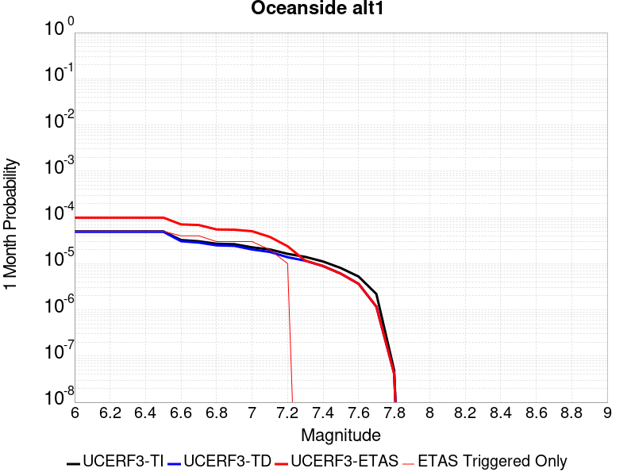 |  |  |

| Magnitude | 1 wk TI Prob | 1 wk TD Prob | 1 wk ETAS Prob | 1 wk ETAS/TD Gain | 1 wk ETAS Triggered Only | 1 mo TI Prob | 1 mo TD Prob | 1 mo ETAS Prob | 1 mo ETAS/TD Gain | 1 mo ETAS Triggered Only | 1 yr TI Prob | 1 yr TD Prob | 1 yr ETAS Prob | 1 yr ETAS/TD Gain | 1 yr ETAS Triggered Only | 10 yr TI Prob | 10 yr TD Prob | 10 yr ETAS Prob | 10 yr ETAS/TD Gain | 10 yr ETAS Triggered Only |
|-----|-----|-----|-----|-----|-----|-----|-----|-----|-----|-----|-----|-----|-----|-----|-----|-----|-----|-----|-----|-----|
| 6.0 | 1.1617542E-5 | 1.1423493E-5 | 1.17298405E-4 | 10.268174 | 1.05876126E-4 | 4.9788516E-5 | 4.8956997E-5 | 1.5482794E-4 | 3.1625295 | 1.05876126E-4 | 6.060066E-4 | 5.9590454E-4 | 7.546241E-4 | 1.2663506 | 1.5881419E-4 | 0.0060435664 | 0.005944664 | 0.0061025345 | 1.0265566 | 1.5881419E-4 |
| 6.1 | 1.1617542E-5 | 1.1423493E-5 | 1.17298405E-4 | 10.268174 | 1.05876126E-4 | 4.9788516E-5 | 4.8956997E-5 | 1.5482794E-4 | 3.1625295 | 1.05876126E-4 | 6.060066E-4 | 5.9590454E-4 | 7.546241E-4 | 1.2663506 | 1.5881419E-4 | 0.0060435664 | 0.005944664 | 0.0061025345 | 1.0265566 | 1.5881419E-4 |
| 6.2 | 1.1617542E-5 | 1.1423493E-5 | 1.17298405E-4 | 10.268174 | 1.05876126E-4 | 4.9788516E-5 | 4.8956997E-5 | 1.5482794E-4 | 3.1625295 | 1.05876126E-4 | 6.060066E-4 | 5.9590454E-4 | 7.546241E-4 | 1.2663506 | 1.5881419E-4 | 0.0060435664 | 0.005944664 | 0.0061025345 | 1.0265566 | 1.5881419E-4 |
| 6.3 | 1.1617542E-5 | 1.1423493E-5 | 1.17298405E-4 | 10.268174 | 1.05876126E-4 | 4.9788516E-5 | 4.8956997E-5 | 1.5482794E-4 | 3.1625295 | 1.05876126E-4 | 6.060066E-4 | 5.9590454E-4 | 7.546241E-4 | 1.2663506 | 1.5881419E-4 | 0.0060435664 | 0.005944664 | 0.0061025345 | 1.0265566 | 1.5881419E-4 |
| 6.4 | 1.1617542E-5 | 1.1423493E-5 | 1.17298405E-4 | 10.268174 | 1.05876126E-4 | 4.9788516E-5 | 4.8956997E-5 | 1.5482794E-4 | 3.1625295 | 1.05876126E-4 | 6.060066E-4 | 5.9590454E-4 | 7.546241E-4 | 1.2663506 | 1.5881419E-4 | 0.0060435664 | 0.005944664 | 0.0061025345 | 1.0265566 | 1.5881419E-4 |
| 6.5 | 1.1617542E-5 | 1.1423493E-5 | 1.17298405E-4 | 10.268174 | 1.05876126E-4 | 4.9788516E-5 | 4.8956997E-5 | 1.5482794E-4 | 3.1625295 | 1.05876126E-4 | 6.060066E-4 | 5.9590454E-4 | 7.546241E-4 | 1.2663506 | 1.5881419E-4 | 0.0060435664 | 0.005944664 | 0.0061025345 | 1.0265566 | 1.5881419E-4 |
| 6.6 | 7.561768E-6 | 7.1336153E-6 | 6.00713E-5 | 8.420877 | 5.2938063E-5 | 3.2407173E-5 | 3.0572286E-5 | 8.350873E-5 | 2.7315173 | 5.2938063E-5 | 3.9448592E-4 | 3.7215507E-4 | 4.779918E-4 | 1.2843888 | 1.05876126E-4 | 0.0039378637 | 0.00371543 | 0.0038209127 | 1.0283904 | 1.05876126E-4 |
| 6.7 | 7.1042605E-6 | 6.6556854E-6 | 5.9593396E-5 | 8.953757 | 5.2938063E-5 | 3.0446476E-5 | 2.8524059E-5 | 8.146061E-5 | 2.8558562 | 5.2938063E-5 | 3.706228E-4 | 3.472259E-4 | 4.5306524E-4 | 1.3048141 | 1.05876126E-4 | 0.0037000529 | 0.003466917 | 0.003572426 | 1.030433 | 1.05876126E-4 |
| 6.8 | 6.285554E-6 | 5.799706E-6 | 5.799706E-6 | 1.0 | 0.0 | 2.693781E-5 | 2.4855648E-5 | 2.4855648E-5 | 1.0 | 0.0 | 3.2791847E-4 | 3.0257605E-4 | 3.5549808E-4 | 1.174905 | 5.2938063E-5 | 0.0032743502 | 0.0030216982 | 0.0030744763 | 1.0174664 | 5.2938063E-5 |
| 6.9 | 6.148883E-6 | 5.6565445E-6 | 5.6565445E-6 | 1.0 | 0.0 | 2.635209E-5 | 2.424211E-5 | 2.424211E-5 | 1.0 | 0.0 | 3.2078946E-4 | 2.9510827E-4 | 3.480307E-4 | 1.1793323 | 5.2938063E-5 | 0.003203268 | 0.0029472208 | 0.0030000028 | 1.017909 | 5.2938063E-5 |
| 7.0 | 5.253857E-6 | 4.722404E-6 | 4.722404E-6 | 1.0 | 0.0 | 2.2516335E-5 | 2.0238718E-5 | 2.0238718E-5 | 1.0 | 0.0 | 2.7410188E-4 | 2.4637886E-4 | 2.4637886E-4 | 1.0 | 0.0 | 0.0027376404 | 0.0024610884 | 0.0024610884 | 1.0 | 0.0 |
| 7.1 | 4.730754E-6 | 4.17851E-6 | 4.17851E-6 | 1.0 | 0.0 | 2.0274503E-5 | 1.7907778E-5 | 1.7907778E-5 | 1.0 | 0.0 | 2.468141E-4 | 2.1800565E-4 | 2.1800565E-4 | 1.0 | 0.0 | 0.0024654015 | 0.0021779444 | 0.0021779444 | 1.0 | 0.0 |
| 7.2 | 3.7998386E-6 | 3.214026E-6 | 3.214026E-6 | 1.0 | 0.0 | 1.6284921E-5 | 1.37743245E-5 | 1.37743245E-5 | 1.0 | 0.0 | 1.9825088E-4 | 1.6768962E-4 | 1.6768962E-4 | 1.0 | 0.0 | 0.001980741 | 0.001675643 | 0.001675643 | 1.0 | 0.0 |
| 7.3 | 3.2656465E-6 | 2.698376E-6 | 2.698376E-6 | 1.0 | 0.0 | 1.3995553E-5 | 1.1564418E-5 | 1.1564418E-5 | 1.0 | 0.0 | 1.7038253E-4 | 1.407878E-4 | 1.407878E-4 | 1.0 | 0.0 | 0.0017025196 | 0.0014069972 | 0.0014069972 | 1.0 | 0.0 |
| 7.4 | 2.593703E-6 | 2.0680277E-6 | 2.0680277E-6 | 1.0 | 0.0 | 1.1115822E-5 | 8.862946E-6 | 8.862946E-6 | 1.0 | 0.0 | 1.3532673E-4 | 1.0790111E-4 | 1.0790111E-4 | 1.0 | 0.0 | 0.0013524436 | 0.0010784961 | 0.0010784961 | 1.0 | 0.0 |
| 7.5 | 1.8715585E-6 | 1.4137177E-6 | 1.4137177E-6 | 1.0 | 0.0 | 8.020941E-6 | 6.0587763E-6 | 6.0587763E-6 | 1.0 | 0.0 | 9.7650576E-5 | 7.376316E-5 | 7.376316E-5 | 1.0 | 0.0 | 9.7607676E-4 | 7.3739287E-4 | 7.3739287E-4 | 1.0 | 0.0 |
| 7.6 | 1.2246786E-6 | 8.5268175E-7 | 8.5268175E-7 | 1.0 | 0.0 | 5.248612E-6 | 3.6543456E-6 | 3.6543456E-6 | 1.0 | 0.0 | 6.389998E-5 | 4.4490793E-5 | 4.4490793E-5 | 1.0 | 0.0 | 6.3881604E-4 | 4.4482335E-4 | 4.4482335E-4 | 1.0 | 0.0 |
| 7.7 | 5.140719E-7 | 2.734703E-7 | 2.734703E-7 | 1.0 | 0.0 | 2.2031636E-6 | 1.1720151E-6 | 1.1720151E-6 | 1.0 | 0.0 | 2.6823185E-5 | 1.4269205E-5 | 1.4269205E-5 | 1.0 | 0.0 | 2.6819948E-4 | 1.4268424E-4 | 1.4268424E-4 | 1.0 | 0.0 |
| 7.8 | 1.16056995E-8 | 9.782373E-9 | 9.782373E-9 | 1.0 | 0.0 | 4.9738713E-8 | 4.1924455E-8 | 4.1924455E-8 | 1.0 | 0.0 | 6.0556863E-7 | 5.1043025E-7 | 5.1043025E-7 | 1.0 | 0.0 | 6.05567E-6 | 5.1043025E-6 | 5.1043025E-6 | 1.0 | 0.0 |

## Tin Mountain
*[(top)](#table-of-contents)*

| 1 Week | 1 Month | 1 Year | 10 Year |
|-----|-----|-----|-----|
|  |  |  |  |

| Magnitude | 1 wk TI Prob | 1 wk TD Prob | 1 wk ETAS Prob | 1 wk ETAS/TD Gain | 1 wk ETAS Triggered Only | 1 mo TI Prob | 1 mo TD Prob | 1 mo ETAS Prob | 1 mo ETAS/TD Gain | 1 mo ETAS Triggered Only | 1 yr TI Prob | 1 yr TD Prob | 1 yr ETAS Prob | 1 yr ETAS/TD Gain | 1 yr ETAS Triggered Only | 10 yr TI Prob | 10 yr TD Prob | 10 yr ETAS Prob | 10 yr ETAS/TD Gain | 10 yr ETAS Triggered Only |
|-----|-----|-----|-----|-----|-----|-----|-----|-----|-----|-----|-----|-----|-----|-----|-----|-----|-----|-----|-----|-----|
| 6.0 | 4.083776E-6 | 4.1815365E-6 | 1.1005722E-4 | 26.319803 | 1.05876126E-4 | 1.750178E-5 | 1.792077E-5 | 1.2379499E-4 | 6.9079065 | 1.05876126E-4 | 2.1306332E-4 | 2.1816725E-4 | 3.2402028E-4 | 1.4851921 | 1.05876126E-4 | 0.0021285915 | 0.0021798965 | 0.0023383643 | 1.0726951 | 1.5881419E-4 |
| 6.1 | 4.083776E-6 | 4.1815365E-6 | 1.1005722E-4 | 26.319803 | 1.05876126E-4 | 1.750178E-5 | 1.792077E-5 | 1.2379499E-4 | 6.9079065 | 1.05876126E-4 | 2.1306332E-4 | 2.1816725E-4 | 3.2402028E-4 | 1.4851921 | 1.05876126E-4 | 0.0021285915 | 0.0021798965 | 0.0023383643 | 1.0726951 | 1.5881419E-4 |
| 6.2 | 4.083776E-6 | 4.1815365E-6 | 1.1005722E-4 | 26.319803 | 1.05876126E-4 | 1.750178E-5 | 1.792077E-5 | 1.2379499E-4 | 6.9079065 | 1.05876126E-4 | 2.1306332E-4 | 2.1816725E-4 | 3.2402028E-4 | 1.4851921 | 1.05876126E-4 | 0.0021285915 | 0.0021798965 | 0.0023383643 | 1.0726951 | 1.5881419E-4 |
| 6.3 | 4.083776E-6 | 4.1815365E-6 | 1.1005722E-4 | 26.319803 | 1.05876126E-4 | 1.750178E-5 | 1.792077E-5 | 1.2379499E-4 | 6.9079065 | 1.05876126E-4 | 2.1306332E-4 | 2.1816725E-4 | 3.2402028E-4 | 1.4851921 | 1.05876126E-4 | 0.0021285915 | 0.0021798965 | 0.0023383643 | 1.0726951 | 1.5881419E-4 |
| 6.4 | 4.083776E-6 | 4.1815365E-6 | 1.1005722E-4 | 26.319803 | 1.05876126E-4 | 1.750178E-5 | 1.792077E-5 | 1.2379499E-4 | 6.9079065 | 1.05876126E-4 | 2.1306332E-4 | 2.1816725E-4 | 3.2402028E-4 | 1.4851921 | 1.05876126E-4 | 0.0021285915 | 0.0021798965 | 0.0023383643 | 1.0726951 | 1.5881419E-4 |
| 6.5 | 2.3143427E-6 | 2.3731573E-6 | 1.08249034E-4 | 45.613934 | 1.05876126E-4 | 9.9185745E-6 | 1.0170638E-5 | 1.1604569E-4 | 11.409873 | 1.05876126E-4 | 1.2075195E-4 | 1.2382126E-4 | 2.2968427E-4 | 1.8549664 | 1.05876126E-4 | 0.0012068636 | 0.0012375986 | 0.0013433438 | 1.0854437 | 1.05876126E-4 |
| 6.6 | 2.3143427E-6 | 2.3731573E-6 | 1.08249034E-4 | 45.613934 | 1.05876126E-4 | 9.9185745E-6 | 1.0170638E-5 | 1.1604569E-4 | 11.409873 | 1.05876126E-4 | 1.2075195E-4 | 1.2382126E-4 | 2.2968427E-4 | 1.8549664 | 1.05876126E-4 | 0.0012068636 | 0.0012375986 | 0.0013433438 | 1.0854437 | 1.05876126E-4 |
| 6.7 | 1.7029532E-6 | 1.7497915E-6 | 1.0762573E-4 | 61.507748 | 1.05876126E-4 | 7.2983503E-6 | 7.499088E-6 | 1.13374415E-4 | 15.118428 | 1.05876126E-4 | 8.885379E-5 | 9.1298105E-5 | 1.9716457E-4 | 2.159569 | 1.05876126E-4 | 8.881827E-4 | 9.1265864E-4 | 0.0010184381 | 1.1159025 | 1.05876126E-4 |
| 6.8 | 1.2914646E-6 | 1.3299378E-6 | 1.07205924E-4 | 80.60972 | 1.05876126E-4 | 5.534837E-6 | 5.6997237E-6 | 1.11575246E-4 | 19.575554 | 1.05876126E-4 | 6.738455E-5 | 6.939237E-5 | 1.7526114E-4 | 2.5256546 | 1.05876126E-4 | 6.736412E-4 | 6.9375033E-4 | 7.99553E-4 | 1.1525083 | 1.05876126E-4 |
| 6.9 | 5.8708974E-7 | 6.1169936E-7 | 6.1169936E-7 | 1.0 | 0.0 | 2.5160964E-6 | 2.6215664E-6 | 2.6215664E-6 | 1.0 | 0.0 | 3.0633044E-5 | 3.1917145E-5 | 3.1917145E-5 | 1.0 | 0.0 | 3.0628822E-4 | 3.191297E-4 | 3.191297E-4 | 1.0 | 0.0 |
| 7.0 | 4.6248786E-7 | 4.832015E-7 | 4.832015E-7 | 1.0 | 0.0 | 1.9820893E-6 | 2.0708624E-6 | 2.0708624E-6 | 1.0 | 0.0 | 2.413167E-5 | 2.5212494E-5 | 2.5212494E-5 | 1.0 | 0.0 | 2.412905E-4 | 2.5210003E-4 | 2.5210003E-4 | 1.0 | 0.0 |
| 7.1 | 3.804606E-7 | 3.987147E-7 | 3.987147E-7 | 1.0 | 0.0 | 1.6305444E-6 | 1.7087764E-6 | 1.7087764E-6 | 1.0 | 0.0 | 1.9851697E-5 | 2.0804187E-5 | 2.0804187E-5 | 1.0 | 0.0 | 1.9849923E-4 | 2.0802575E-4 | 2.0802575E-4 | 1.0 | 0.0 |
| 7.2 | 3.5864858E-7 | 3.7616863E-7 | 3.7616863E-7 | 1.0 | 0.0 | 1.5370645E-6 | 1.6121504E-6 | 1.6121504E-6 | 1.0 | 0.0 | 1.87136E-5 | 1.9627789E-5 | 1.9627789E-5 | 1.0 | 0.0 | 1.8712023E-4 | 1.9626386E-4 | 1.9626386E-4 | 1.0 | 0.0 |
| 7.3 | 3.342063E-7 | 3.506347E-7 | 3.506347E-7 | 1.0 | 0.0 | 1.4323119E-6 | 1.5027196E-6 | 1.5027196E-6 | 1.0 | 0.0 | 1.7438259E-5 | 1.829549E-5 | 1.829549E-5 | 1.0 | 0.0 | 1.743689E-4 | 1.8294314E-4 | 1.8294314E-4 | 1.0 | 0.0 |
| 7.4 | 2.971242E-7 | 3.1165817E-7 | 3.1165817E-7 | 1.0 | 0.0 | 1.2733886E-6 | 1.3356774E-6 | 1.3356774E-6 | 1.0 | 0.0 | 1.5503398E-5 | 1.6261785E-5 | 1.6261785E-5 | 1.0 | 0.0 | 1.5502315E-4 | 1.6260923E-4 | 1.6260923E-4 | 1.0 | 0.0 |
| 7.5 | 1.4326713E-7 | 1.5012525E-7 | 1.5012525E-7 | 1.0 | 0.0 | 6.140018E-7 | 6.433939E-7 | 6.433939E-7 | 1.0 | 0.0 | 7.4754466E-6 | 7.8333205E-6 | 7.8333205E-6 | 1.0 | 0.0 | 7.475195E-5 | 7.833321E-5 | 7.833321E-5 | 1.0 | 0.0 |

## Cedar Mtn-Mahogany Mtn
*[(top)](#table-of-contents)*

| 1 Week | 1 Month | 1 Year | 10 Year |
|-----|-----|-----|-----|
| 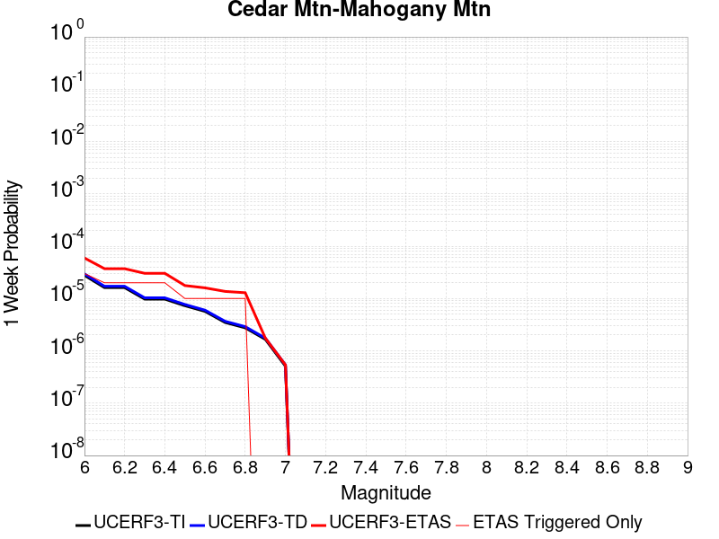 |  |  |  |

| Magnitude | 1 wk TI Prob | 1 wk TD Prob | 1 wk ETAS Prob | 1 wk ETAS/TD Gain | 1 wk ETAS Triggered Only | 1 mo TI Prob | 1 mo TD Prob | 1 mo ETAS Prob | 1 mo ETAS/TD Gain | 1 mo ETAS Triggered Only | 1 yr TI Prob | 1 yr TD Prob | 1 yr ETAS Prob | 1 yr ETAS/TD Gain | 1 yr ETAS Triggered Only | 10 yr TI Prob | 10 yr TD Prob | 10 yr ETAS Prob | 10 yr ETAS/TD Gain | 10 yr ETAS Triggered Only |
|-----|-----|-----|-----|-----|-----|-----|-----|-----|-----|-----|-----|-----|-----|-----|-----|-----|-----|-----|-----|-----|
| 6.0 | 2.7763876E-5 | 2.9588866E-5 | 1.8839835E-4 | 6.367204 | 1.5881419E-4 | 1.1898261E-4 | 1.2680366E-4 | 2.855977E-4 | 2.2522829 | 1.5881419E-4 | 0.0014476506 | 0.0015428112 | 0.0017013804 | 1.1027794 | 1.5881419E-4 | 0.0143825635 | 0.015328225 | 0.015484605 | 1.010202 | 1.5881419E-4 |
| 6.1 | 1.6162443E-5 | 1.7142966E-5 | 1.2301728E-4 | 7.1759624 | 1.05876126E-4 | 6.926578E-5 | 7.346788E-5 | 1.7933623E-4 | 2.4410152 | 1.05876126E-4 | 8.4298453E-4 | 8.941221E-4 | 9.999035E-4 | 1.1183076 | 1.05876126E-4 | 0.008397939 | 0.008907059 | 0.009011992 | 1.0117809 | 1.05876126E-4 |
| 6.2 | 1.6162443E-5 | 1.7142966E-5 | 1.2301728E-4 | 7.1759624 | 1.05876126E-4 | 6.926578E-5 | 7.346788E-5 | 1.7933623E-4 | 2.4410152 | 1.05876126E-4 | 8.4298453E-4 | 8.941221E-4 | 9.999035E-4 | 1.1183076 | 1.05876126E-4 | 0.008397939 | 0.008907059 | 0.009011992 | 1.0117809 | 1.05876126E-4 |
| 6.3 | 9.746053E-6 | 1.0303152E-5 | 1.16178184E-4 | 11.275985 | 1.05876126E-4 | 4.1768133E-5 | 4.415564E-5 | 1.5002709E-4 | 3.397688 | 1.05876126E-4 | 5.0840835E-4 | 5.3746643E-4 | 6.4328563E-4 | 1.1968852 | 1.05876126E-4 | 0.0050724675 | 0.005362084 | 0.005467393 | 1.0196395 | 1.05876126E-4 |
| 6.4 | 9.746053E-6 | 1.0303152E-5 | 1.16178184E-4 | 11.275985 | 1.05876126E-4 | 4.1768133E-5 | 4.415564E-5 | 1.5002709E-4 | 3.397688 | 1.05876126E-4 | 5.0840835E-4 | 5.3746643E-4 | 6.4328563E-4 | 1.1968852 | 1.05876126E-4 | 0.0050724675 | 0.005362084 | 0.005467393 | 1.0196395 | 1.05876126E-4 |
| 6.5 | 7.290083E-6 | 7.695325E-6 | 6.063298E-5 | 7.879197 | 5.2938063E-5 | 3.124284E-5 | 3.297956E-5 | 8.5915875E-5 | 2.6051252 | 5.2938063E-5 | 3.8031515E-4 | 4.014543E-4 | 4.5437113E-4 | 1.1318128 | 5.2938063E-5 | 0.0037966494 | 0.004007511 | 0.0040602367 | 1.0131568 | 5.2938063E-5 |
| 6.6 | 5.67907E-6 | 5.9891527E-6 | 5.8926897E-5 | 9.838938 | 5.2938063E-5 | 2.4338644E-5 | 2.5667552E-5 | 7.860426E-5 | 3.0623977 | 5.2938063E-5 | 2.962827E-4 | 3.12459E-4 | 3.6538052E-4 | 1.1693711 | 5.2938063E-5 | 0.0029588798 | 0.003120333 | 0.0031731057 | 1.0169126 | 5.2938063E-5 |
| 6.7 | 3.4853963E-6 | 3.672631E-6 | 5.6610497E-5 | 15.414154 | 5.2938063E-5 | 1.4937327E-5 | 1.5739755E-5 | 6.8676985E-5 | 4.3632812 | 5.2938063E-5 | 1.8184677E-4 | 1.916153E-4 | 2.4454322E-4 | 1.2762197 | 5.2938063E-5 | 0.0018169804 | 0.0019145629 | 0.0019673996 | 1.0275973 | 5.2938063E-5 |
| 6.8 | 2.7535168E-6 | 2.9015764E-6 | 5.5839486E-5 | 19.244534 | 5.2938063E-5 | 1.1800733E-5 | 1.2435271E-5 | 6.5372675E-5 | 5.2570367 | 5.2938063E-5 | 1.4366445E-4 | 1.5138938E-4 | 2.0431943E-4 | 1.3496286 | 5.2938063E-5 | 0.0014357162 | 0.0015129098 | 0.0015657677 | 1.034938 | 5.2938063E-5 |
| 6.9 | 1.6594106E-6 | 1.7496985E-6 | 1.7496985E-6 | 1.0 | 0.0 | 7.1117406E-6 | 7.4986883E-6 | 7.4986883E-6 | 1.0 | 0.0 | 8.6582E-5 | 9.129302E-5 | 9.129302E-5 | 1.0 | 0.0 | 8.654827E-4 | 9.125856E-4 | 9.125856E-4 | 1.0 | 0.0 |
| 7.0 | 5.10215E-7 | 5.389254E-7 | 5.389254E-7 | 1.0 | 0.0 | 2.186634E-6 | 2.3096788E-6 | 2.3096788E-6 | 1.0 | 0.0 | 2.6621943E-5 | 2.8120105E-5 | 2.8120105E-5 | 1.0 | 0.0 | 2.6618753E-4 | 2.81178E-4 | 2.81178E-4 | 1.0 | 0.0 |

## Santa Rosa Island
*[(top)](#table-of-contents)*

| 1 Week | 1 Month | 1 Year | 10 Year |
|-----|-----|-----|-----|
|  |  |  |  |

| Magnitude | 1 wk TI Prob | 1 wk TD Prob | 1 wk ETAS Prob | 1 wk ETAS/TD Gain | 1 wk ETAS Triggered Only | 1 mo TI Prob | 1 mo TD Prob | 1 mo ETAS Prob | 1 mo ETAS/TD Gain | 1 mo ETAS Triggered Only | 1 yr TI Prob | 1 yr TD Prob | 1 yr ETAS Prob | 1 yr ETAS/TD Gain | 1 yr ETAS Triggered Only | 10 yr TI Prob | 10 yr TD Prob | 10 yr ETAS Prob | 10 yr ETAS/TD Gain | 10 yr ETAS Triggered Only |
|-----|-----|-----|-----|-----|-----|-----|-----|-----|-----|-----|-----|-----|-----|-----|-----|-----|-----|-----|-----|-----|
| 6.0 | 4.1143165E-5 | 4.7091133E-5 | 1.000267E-4 | 2.124109 | 5.2938063E-5 | 1.7631594E-4 | 2.0180465E-4 | 3.0765941E-4 | 1.5245408 | 1.05876126E-4 | 0.002144533 | 0.0024544 | 0.0025600162 | 1.0430315 | 1.05876126E-4 | 0.021239553 | 0.024293551 | 0.024448507 | 1.0063785 | 1.5881419E-4 |
| 6.1 | 2.1061249E-5 | 2.3864959E-5 | 2.3864959E-5 | 1.0 | 0.0 | 9.0259375E-5 | 1.0227455E-4 | 1.552072E-4 | 1.5175544 | 5.2938063E-5 | 0.0010983539 | 0.0012445104 | 0.0012973825 | 1.0424843 | 5.2938063E-5 | 0.01092941 | 0.012378449 | 0.012430731 | 1.0042237 | 5.2938063E-5 |
| 6.2 | 2.1061249E-5 | 2.3864959E-5 | 2.3864959E-5 | 1.0 | 0.0 | 9.0259375E-5 | 1.0227455E-4 | 1.552072E-4 | 1.5175544 | 5.2938063E-5 | 0.0010983539 | 0.0012445104 | 0.0012973825 | 1.0424843 | 5.2938063E-5 | 0.01092941 | 0.012378449 | 0.012430731 | 1.0042237 | 5.2938063E-5 |
| 6.3 | 1.5158236E-5 | 1.7074419E-5 | 1.7074419E-5 | 1.0 | 0.0 | 6.496225E-5 | 7.3174095E-5 | 1.2610828E-4 | 1.7234006 | 5.2938063E-5 | 7.906284E-4 | 8.905424E-4 | 9.434333E-4 | 1.0593919 | 5.2938063E-5 | 0.007878214 | 0.008870989 | 0.008923458 | 1.0059146 | 5.2938063E-5 |
| 6.4 | 1.2341918E-5 | 1.3852917E-5 | 1.3852917E-5 | 1.0 | 0.0 | 5.2892858E-5 | 5.9368336E-5 | 1.12303256E-4 | 1.8916355 | 5.2938063E-5 | 6.437803E-4 | 7.225779E-4 | 7.7547773E-4 | 1.0732099 | 5.2938063E-5 | 0.006419184 | 0.007203121 | 0.007255678 | 1.0072964 | 5.2938063E-5 |
| 6.5 | 9.061158E-6 | 1.0117031E-5 | 1.0117031E-5 | 1.0 | 0.0 | 3.883296E-5 | 4.3358013E-5 | 9.629378E-5 | 2.2208993 | 5.2938063E-5 | 4.726887E-4 | 5.277613E-4 | 5.806714E-4 | 1.1002539 | 5.2938063E-5 | 0.004716845 | 0.0052656173 | 0.0053182766 | 1.0100006 | 5.2938063E-5 |
| 6.6 | 7.5461685E-6 | 8.400733E-6 | 8.400733E-6 | 1.0 | 0.0 | 3.2340322E-5 | 3.600267E-5 | 8.8938825E-5 | 2.4703398 | 5.2938063E-5 | 3.936723E-4 | 4.3824865E-4 | 4.911635E-4 | 1.1207416 | 5.2938063E-5 | 0.003929756 | 0.0043742736 | 0.0044269804 | 1.0120492 | 5.2938063E-5 |
| 6.7 | 5.5023775E-6 | 6.087381E-6 | 6.087381E-6 | 1.0 | 0.0 | 2.3581404E-5 | 2.6088532E-5 | 7.9025216E-5 | 3.0291169 | 5.2938063E-5 | 2.8706578E-4 | 3.1758484E-4 | 3.7050608E-4 | 1.1666366 | 5.2938063E-5 | 0.0028669522 | 0.0031716314 | 0.0032244017 | 1.0166382 | 5.2938063E-5 |
| 6.8 | 3.7351679E-6 | 4.0831405E-6 | 4.0831405E-6 | 1.0 | 0.0 | 1.6007763E-5 | 1.749907E-5 | 7.04362E-5 | 4.02514 | 5.2938063E-5 | 1.948771E-4 | 2.1303284E-4 | 2.6595962E-4 | 1.2484442 | 5.2938063E-5 | 0.0019470629 | 0.0021285315 | 0.0021813568 | 1.0248177 | 5.2938063E-5 |
| 6.9 | 2.456366E-6 | 2.6292705E-6 | 2.6292705E-6 | 1.0 | 0.0 | 1.0527241E-5 | 1.1268254E-5 | 1.1268254E-5 | 1.0 | 0.0 | 1.2816161E-4 | 1.3718237E-4 | 1.3718237E-4 | 1.0 | 0.0 | 0.0012808773 | 0.0013709799 | 0.0013709799 | 1.0 | 0.0 |
| 7.0 | 2.3245157E-6 | 2.4827782E-6 | 2.4827782E-6 | 1.0 | 0.0 | 9.962172E-6 | 1.0640435E-5 | 1.0640435E-5 | 1.0 | 0.0 | 1.2128269E-4 | 1.2953962E-4 | 1.2953962E-4 | 1.0 | 0.0 | 0.0012121652 | 0.0012946434 | 0.0012946434 | 1.0 | 0.0 |
| 7.1 | 2.2248344E-6 | 2.37325E-6 | 2.37325E-6 | 1.0 | 0.0 | 9.53497E-6 | 1.0171032E-5 | 1.0171032E-5 | 1.0 | 0.0 | 1.1608207E-4 | 1.2382529E-4 | 1.2382529E-4 | 1.0 | 0.0 | 0.0011602144 | 0.001237565 | 0.001237565 | 1.0 | 0.0 |
| 7.2 | 2.1350402E-6 | 2.276154E-6 | 2.276154E-6 | 1.0 | 0.0 | 9.150141E-6 | 9.754909E-6 | 9.754909E-6 | 1.0 | 0.0 | 1.1139726E-4 | 1.1875956E-4 | 1.1875956E-4 | 1.0 | 0.0 | 0.0011134144 | 0.0011869629 | 0.0011869629 | 1.0 | 0.0 |
| 7.3 | 1.9793572E-6 | 2.108719E-6 | 2.108719E-6 | 1.0 | 0.0 | 8.482932E-6 | 9.037336E-6 | 9.037336E-6 | 1.0 | 0.0 | 1.032748E-4 | 1.10024026E-4 | 1.10024026E-4 | 1.0 | 0.0 | 0.0010322682 | 0.0010996973 | 0.0010996973 | 1.0 | 0.0 |
| 7.4 | 1.6951194E-6 | 1.8045733E-6 | 1.8045733E-6 | 1.0 | 0.0 | 7.264777E-6 | 7.733863E-6 | 7.733863E-6 | 1.0 | 0.0 | 8.844508E-5 | 9.415573E-5 | 9.415573E-5 | 1.0 | 0.0 | 8.840988E-4 | 9.4116E-4 | 9.4116E-4 | 1.0 | 0.0 |
| 7.5 | 8.987207E-7 | 9.5122147E-7 | 9.5122147E-7 | 1.0 | 0.0 | 3.8516546E-6 | 4.076657E-6 | 4.076657E-6 | 1.0 | 0.0 | 4.6892885E-5 | 4.963218E-5 | 4.963218E-5 | 1.0 | 0.0 | 4.688299E-4 | 4.9621216E-4 | 4.9621216E-4 | 1.0 | 0.0 |
| 7.6 | 3.8783037E-7 | 4.052932E-7 | 4.052932E-7 | 1.0 | 0.0 | 1.6621291E-6 | 1.7369698E-6 | 1.7369698E-6 | 1.0 | 0.0 | 2.0236233E-5 | 2.1147409E-5 | 2.1147409E-5 | 1.0 | 0.0 | 2.023439E-4 | 2.1145462E-4 | 2.1145462E-4 | 1.0 | 0.0 |
| 7.7 | 6.181804E-8 | 6.339035E-8 | 6.339035E-8 | 1.0 | 0.0 | 2.6493444E-7 | 2.7167292E-7 | 2.7167292E-7 | 1.0 | 0.0 | 3.225572E-6 | 3.3076128E-6 | 3.3076128E-6 | 1.0 | 0.0 | 3.225525E-5 | 3.307564E-5 | 3.307564E-5 | 1.0 | 0.0 |
| 7.8 | 1.3704449E-9 | 1.3964153E-9 | 1.3964153E-9 | 1.0 | 0.0 | 5.873335E-9 | 5.984637E-9 | 5.984637E-9 | 1.0 | 0.0 | 7.1507856E-8 | 7.286295E-8 | 7.286295E-8 | 1.0 | 0.0 | 7.1507833E-7 | 7.286294E-7 | 7.286294E-7 | 1.0 | 0.0 |

## Imperial
*[(top)](#table-of-contents)*

| 1 Week | 1 Month | 1 Year | 10 Year |
|-----|-----|-----|-----|
|  |  |  |  |

| Magnitude | 1 wk TI Prob | 1 wk TD Prob | 1 wk ETAS Prob | 1 wk ETAS/TD Gain | 1 wk ETAS Triggered Only | 1 mo TI Prob | 1 mo TD Prob | 1 mo ETAS Prob | 1 mo ETAS/TD Gain | 1 mo ETAS Triggered Only | 1 yr TI Prob | 1 yr TD Prob | 1 yr ETAS Prob | 1 yr ETAS/TD Gain | 1 yr ETAS Triggered Only | 10 yr TI Prob | 10 yr TD Prob | 10 yr ETAS Prob | 10 yr ETAS/TD Gain | 10 yr ETAS Triggered Only |
|-----|-----|-----|-----|-----|-----|-----|-----|-----|-----|-----|-----|-----|-----|-----|-----|-----|-----|-----|-----|-----|
| 6.0 | 2.7496446E-4 | 5.0552754E-4 | 5.584388E-4 | 1.1046655 | 5.2938063E-5 | 0.0011778869 | 0.002164787 | 0.0022176104 | 1.0244012 | 5.2938063E-5 | 0.0142467655 | 0.026038699 | 0.026141817 | 1.0039603 | 1.05876126E-4 | 0.13367249 | 0.2280438 | 0.22816639 | 1.0005376 | 1.5881419E-4 |
| 6.1 | 2.5356023E-4 | 4.8656776E-4 | 5.3948007E-4 | 1.108746 | 5.2938063E-5 | 0.001086234 | 0.0020836622 | 0.00213649 | 1.0253533 | 5.2938063E-5 | 0.013144928 | 0.025071215 | 0.025174437 | 1.0041171 | 1.05876126E-4 | 0.123940155 | 0.21947981 | 0.21960376 | 1.0005648 | 1.5881419E-4 |
| 6.2 | 2.4820742E-4 | 4.7752203E-4 | 5.3043483E-4 | 1.110807 | 5.2938063E-5 | 0.0010633124 | 0.0020449557 | 0.0020977855 | 1.0258342 | 5.2938063E-5 | 0.01286919 | 0.024611235 | 0.024714505 | 1.004196 | 1.05876126E-4 | 0.12148927 | 0.21598552 | 0.21611004 | 1.0005765 | 1.5881419E-4 |
| 6.3 | 2.3205351E-4 | 4.5890483E-4 | 5.1181857E-4 | 1.1153045 | 5.2938063E-5 | 9.94136E-4 | 0.0019652895 | 0.0020181234 | 1.0268836 | 5.2938063E-5 | 0.012036599 | 0.02366133 | 0.023764702 | 1.0043688 | 1.05876126E-4 | 0.11405133 | 0.20793462 | 0.20806041 | 1.000605 | 1.5881419E-4 |
| 6.4 | 2.0304754E-4 | 3.987652E-4 | 4.5168214E-4 | 1.132702 | 5.2938063E-5 | 8.6991355E-4 | 0.0017078889 | 0.0017607366 | 1.0309433 | 5.2938063E-5 | 0.010539869 | 0.020595672 | 0.020699367 | 1.0050348 | 1.05876126E-4 | 0.100537635 | 0.1850669 | 0.18519631 | 1.0006993 | 1.5881419E-4 |
| 6.5 | 1.854992E-4 | 3.6988858E-4 | 4.2280706E-4 | 1.143066 | 5.2938063E-5 | 7.9475436E-4 | 0.0015842861 | 0.0016371403 | 1.0333616 | 5.2938063E-5 | 0.009633281 | 0.01911948 | 0.019223332 | 1.0054318 | 1.05876126E-4 | 0.0922623 | 0.173298 | 0.17338553 | 1.0005051 | 1.05876126E-4 |
| 6.6 | 1.6586106E-4 | 3.403506E-4 | 3.9327066E-4 | 1.1554868 | 5.2938063E-5 | 7.106394E-4 | 0.0014578402 | 0.0015107011 | 1.0362598 | 5.2938063E-5 | 0.008617763 | 0.01760642 | 0.017710432 | 1.0059077 | 1.05876126E-4 | 0.08291132 | 0.16077545 | 0.1608643 | 1.0005527 | 1.05876126E-4 |
| 6.7 | 1.4224656E-4 | 3.076692E-4 | 3.6059096E-4 | 1.1720088 | 5.2938063E-5 | 6.094856E-4 | 0.001317924 | 0.0013707924 | 1.0401149 | 5.2938063E-5 | 0.0073952693 | 0.015929576 | 0.016033767 | 1.0065407 | 1.05876126E-4 | 0.07153955 | 0.14648417 | 0.14657453 | 1.0006169 | 1.05876126E-4 |
| 6.8 | 1.2317259E-4 | 2.779122E-4 | 3.3083552E-4 | 1.190432 | 5.2938063E-5 | 5.2777573E-4 | 0.0011905148 | 0.0012433898 | 1.0444136 | 5.2938063E-5 | 0.0064067547 | 0.0143995695 | 0.014503921 | 1.0072469 | 1.05876126E-4 | 0.06225166 | 0.13293684 | 0.13302863 | 1.0006906 | 1.05876126E-4 |
| 6.9 | 9.859898E-5 | 2.5014306E-4 | 3.0306788E-4 | 1.2115782 | 5.2938063E-5 | 4.2249862E-4 | 0.0010716055 | 0.0011244868 | 1.0493478 | 5.2938063E-5 | 0.0051317946 | 0.012969712 | 0.013074215 | 1.0080575 | 1.05876126E-4 | 0.05014893 | 0.11940631 | 0.11949955 | 1.0007808 | 1.05876126E-4 |
| 7.0 | 7.3191884E-5 | 2.1266776E-4 | 2.6559457E-4 | 1.2488708 | 5.2938063E-5 | 3.136418E-4 | 9.1111806E-4 | 9.640079E-4 | 1.0580493 | 5.2938063E-5 | 0.003811904 | 0.011037128 | 0.011141835 | 1.0094868 | 1.05876126E-4 | 0.037471764 | 0.10206493 | 0.10216 | 1.0009315 | 1.05876126E-4 |
| 7.1 | 7.1760296E-5 | 2.0968143E-4 | 2.6260837E-4 | 1.2524161 | 5.2938063E-5 | 3.0750787E-4 | 8.983284E-4 | 9.512189E-4 | 1.0588766 | 5.2938063E-5 | 0.003737482 | 0.010882978 | 0.010987702 | 1.0096227 | 1.05876126E-4 | 0.03675245 | 0.10070146 | 0.10079667 | 1.0009456 | 1.05876126E-4 |
| 7.2 | 6.46614E-5 | 1.9136685E-4 | 2.442948E-4 | 1.2765783 | 5.2938063E-5 | 2.7709085E-4 | 8.1988896E-4 | 8.727836E-4 | 1.0645144 | 5.2938063E-5 | 0.0033683628 | 0.0099370815 | 0.010041906 | 1.0105488 | 1.05876126E-4 | 0.033177625 | 0.09250898 | 0.09260506 | 1.0010387 | 1.05876126E-4 |
| 7.3 | 6.088115E-5 | 1.78084E-4 | 2.3101263E-4 | 1.2972116 | 5.2938063E-5 | 2.6089314E-4 | 7.6299673E-4 | 8.158944E-4 | 1.0693288 | 5.2938063E-5 | 0.0031717476 | 0.009250494 | 0.00935539 | 1.0113395 | 1.05876126E-4 | 0.031268585 | 0.08655989 | 0.08665661 | 1.0011172 | 1.05876126E-4 |
| 7.4 | 4.199346E-5 | 1.1510366E-4 | 1.6803564E-4 | 1.4598634 | 5.2938063E-5 | 1.7995955E-4 | 4.9320905E-4 | 5.46121E-4 | 1.107281 | 5.2938063E-5 | 0.0021888057 | 0.0059884563 | 0.006093698 | 1.0175742 | 1.05876126E-4 | 0.02167372 | 0.057439793 | 0.05753959 | 1.0017374 | 1.05876126E-4 |
| 7.5 | 3.130448E-5 | 8.33328E-5 | 1.3626645E-4 | 1.6352079 | 5.2938063E-5 | 1.3415517E-4 | 3.57092E-4 | 4.1001115E-4 | 1.1481948 | 5.2938063E-5 | 0.0016321153 | 0.004338988 | 0.004444405 | 1.0242952 | 1.05876126E-4 | 0.016201803 | 0.04213201 | 0.042233422 | 1.0024071 | 1.05876126E-4 |
| 7.6 | 2.3074248E-5 | 6.0844646E-5 | 1.1377949E-4 | 1.87 | 5.2938063E-5 | 9.888588E-5 | 2.6073685E-4 | 3.136611E-4 | 1.2029796 | 5.2938063E-5 | 0.0012032706 | 0.0031698733 | 0.0032754138 | 1.0332949 | 1.05876126E-4 | 0.011967761 | 0.031026395 | 0.031128986 | 1.0033066 | 1.05876126E-4 |
| 7.7 | 1.45864815E-5 | 4.0124698E-5 | 4.0124698E-5 | 1.0 | 0.0 | 6.2511994E-5 | 1.7195169E-4 | 1.7195169E-4 | 1.0 | 0.0 | 7.608177E-4 | 0.0020915072 | 0.0021443346 | 1.0252581 | 5.2938063E-5 | 0.007582182 | 0.020627763 | 0.02067961 | 1.0025134 | 5.2938063E-5 |
| 7.8 | 1.0352979E-5 | 3.0960902E-5 | 3.0960902E-5 | 1.0 | 0.0 | 4.4369157E-5 | 1.3268284E-4 | 1.3268284E-4 | 1.0 | 0.0 | 5.400606E-4 | 0.0016142189 | 0.0016670716 | 1.0327419 | 5.2938063E-5 | 0.0053875 | 0.016016833 | 0.016068922 | 1.0032523 | 5.2938063E-5 |
| 7.9 | 8.137906E-6 | 2.2149103E-5 | 2.2149103E-5 | 1.0 | 0.0 | 3.4876273E-5 | 9.492128E-5 | 9.492128E-5 | 1.0 | 0.0 | 4.2453592E-4 | 0.0011550548 | 0.0012079317 | 1.0457788 | 5.2938063E-5 | 0.004237258 | 0.011617903 | 0.011670225 | 1.0045036 | 5.2938063E-5 |
| 8.0 | 6.93792E-6 | 1.8008766E-5 | 1.8008766E-5 | 1.0 | 0.0 | 2.9733603E-5 | 7.717814E-5 | 7.717814E-5 | 1.0 | 0.0 | 3.6194647E-4 | 9.3923963E-4 | 9.921279E-4 | 1.0563097 | 5.2938063E-5 | 0.0036135751 | 0.00950155 | 0.009553986 | 1.0055186 | 5.2938063E-5 |
| 8.1 | 3.4286315E-6 | 6.379872E-6 | 6.379872E-6 | 1.0 | 0.0 | 1.4694053E-5 | 2.7342023E-5 | 2.7342023E-5 | 1.0 | 0.0 | 1.7888541E-4 | 3.328384E-4 | 3.328384E-4 | 1.0 | 0.0 | 0.0017874148 | 0.003486031 | 0.003486031 | 1.0 | 0.0 |
| 8.2 | 1.4906886E-6 | 1.9366646E-6 | 1.9366646E-6 | 1.0 | 0.0 | 6.3886496E-6 | 8.299965E-6 | 8.299965E-6 | 1.0 | 0.0 | 7.7779034E-5 | 1.0104742E-4 | 1.0104742E-4 | 1.0 | 0.0 | 7.775182E-4 | 0.0011075331 | 0.0011075331 | 1.0 | 0.0 |
| 8.3 | 2.5758007E-8 | 1.4500102E-8 | 1.4500102E-8 | 1.0 | 0.0 | 1.10391454E-7 | 6.214329E-8 | 6.214329E-8 | 1.0 | 0.0 | 1.3440151E-6 | 7.565946E-7 | 7.565946E-7 | 1.0 | 0.0 | 1.344007E-5 | 7.887763E-6 | 7.887763E-6 | 1.0 | 0.0 |

## Lake Isabella (Seismicity)
*[(top)](#table-of-contents)*

| 1 Week | 1 Month | 1 Year | 10 Year |
|-----|-----|-----|-----|
|  |  |  |  |

| Magnitude | 1 wk TI Prob | 1 wk TD Prob | 1 wk ETAS Prob | 1 wk ETAS/TD Gain | 1 wk ETAS Triggered Only | 1 mo TI Prob | 1 mo TD Prob | 1 mo ETAS Prob | 1 mo ETAS/TD Gain | 1 mo ETAS Triggered Only | 1 yr TI Prob | 1 yr TD Prob | 1 yr ETAS Prob | 1 yr ETAS/TD Gain | 1 yr ETAS Triggered Only | 10 yr TI Prob | 10 yr TD Prob | 10 yr ETAS Prob | 10 yr ETAS/TD Gain | 10 yr ETAS Triggered Only |
|-----|-----|-----|-----|-----|-----|-----|-----|-----|-----|-----|-----|-----|-----|-----|-----|-----|-----|-----|-----|-----|
| 6.0 | 9.431637E-6 | 9.741651E-6 | 1.1561674E-4 | 11.86829 | 1.05876126E-4 | 4.0420677E-5 | 4.1749343E-5 | 1.4762105E-4 | 3.5358891 | 1.05876126E-4 | 4.920106E-4 | 5.0819275E-4 | 6.140151E-4 | 1.2082326 | 1.05876126E-4 | 0.004909227 | 0.005071599 | 0.0052296077 | 1.0311556 | 1.5881419E-4 |
| 6.1 | 9.431637E-6 | 9.741651E-6 | 1.1561674E-4 | 11.86829 | 1.05876126E-4 | 4.0420677E-5 | 4.1749343E-5 | 1.4762105E-4 | 3.5358891 | 1.05876126E-4 | 4.920106E-4 | 5.0819275E-4 | 6.140151E-4 | 1.2082326 | 1.05876126E-4 | 0.004909227 | 0.005071599 | 0.0052296077 | 1.0311556 | 1.5881419E-4 |
| 6.2 | 9.431637E-6 | 9.741651E-6 | 1.1561674E-4 | 11.86829 | 1.05876126E-4 | 4.0420677E-5 | 4.1749343E-5 | 1.4762105E-4 | 3.5358891 | 1.05876126E-4 | 4.920106E-4 | 5.0819275E-4 | 6.140151E-4 | 1.2082326 | 1.05876126E-4 | 0.004909227 | 0.005071599 | 0.0052296077 | 1.0311556 | 1.5881419E-4 |
| 6.3 | 9.431637E-6 | 9.741651E-6 | 1.1561674E-4 | 11.86829 | 1.05876126E-4 | 4.0420677E-5 | 4.1749343E-5 | 1.4762105E-4 | 3.5358891 | 1.05876126E-4 | 4.920106E-4 | 5.0819275E-4 | 6.140151E-4 | 1.2082326 | 1.05876126E-4 | 0.004909227 | 0.005071599 | 0.0052296077 | 1.0311556 | 1.5881419E-4 |
| 6.4 | 5.144063E-6 | 5.3000763E-6 | 5.823786E-5 | 10.988117 | 5.2938063E-5 | 2.2045799E-5 | 2.2714434E-5 | 7.5651296E-5 | 3.3305385 | 5.2938063E-5 | 2.6837454E-4 | 2.765166E-4 | 3.2944002E-4 | 1.1913933 | 5.2938063E-5 | 0.0026805066 | 0.0027620657 | 0.0028676493 | 1.0382264 | 1.05876126E-4 |
| 6.5 | 5.144063E-6 | 5.3000763E-6 | 5.823786E-5 | 10.988117 | 5.2938063E-5 | 2.2045799E-5 | 2.2714434E-5 | 7.5651296E-5 | 3.3305385 | 5.2938063E-5 | 2.6837454E-4 | 2.765166E-4 | 3.2944002E-4 | 1.1913933 | 5.2938063E-5 | 0.0026805066 | 0.0027620657 | 0.0028676493 | 1.0382264 | 1.05876126E-4 |
| 6.6 | 3.4009804E-6 | 3.498786E-6 | 3.498786E-6 | 1.0 | 0.0 | 1.4575549E-5 | 1.4994721E-5 | 1.4994721E-5 | 1.0 | 0.0 | 1.7744285E-4 | 1.8254704E-4 | 1.8254704E-4 | 1.0 | 0.0 | 0.0017730123 | 0.0018241286 | 0.00187697 | 1.0289681 | 5.2938063E-5 |
| 6.7 | 3.3880428E-6 | 3.4856528E-6 | 3.4856528E-6 | 1.0 | 0.0 | 1.4520103E-5 | 1.4938435E-5 | 1.4938435E-5 | 1.0 | 0.0 | 1.767679E-4 | 1.8186188E-4 | 1.8186188E-4 | 1.0 | 0.0 | 0.0017662736 | 0.0018172882 | 0.0018701301 | 1.0290773 | 5.2938063E-5 |
| 6.8 | 2.6582E-6 | 2.7337003E-6 | 2.7337003E-6 | 1.0 | 0.0 | 1.1392236E-5 | 1.1715813E-5 | 1.1715813E-5 | 1.0 | 0.0 | 1.3869164E-4 | 1.4263204E-4 | 1.4263204E-4 | 1.0 | 0.0 | 0.0013860512 | 0.0014255369 | 0.0014783995 | 1.0370826 | 5.2938063E-5 |
| 6.9 | 2.406011E-6 | 2.4743288E-6 | 2.4743288E-6 | 1.0 | 0.0 | 1.0311434E-5 | 1.0604231E-5 | 1.0604231E-5 | 1.0 | 0.0 | 1.2553448E-4 | 1.2910018E-4 | 1.2910018E-4 | 1.0 | 0.0 | 0.0012546359 | 0.0012903814 | 0.0013432512 | 1.0409722 | 5.2938063E-5 |
| 7.0 | 1.6953097E-6 | 1.7429371E-6 | 1.7429371E-6 | 1.0 | 0.0 | 7.265593E-6 | 7.469715E-6 | 7.469715E-6 | 1.0 | 0.0 | 8.8455E-5 | 9.094104E-5 | 9.094104E-5 | 1.0 | 0.0 | 8.84198E-4 | 9.09141E-4 | 9.620309E-4 | 1.0581757 | 5.2938063E-5 |
| 7.1 | 3.5013824E-7 | 3.5714822E-7 | 3.5714822E-7 | 1.0 | 0.0 | 1.5005916E-6 | 1.5306344E-6 | 1.5306344E-6 | 1.0 | 0.0 | 1.826955E-5 | 1.8635317E-5 | 1.8635317E-5 | 1.0 | 0.0 | 1.8268047E-4 | 1.863378E-4 | 1.863378E-4 | 1.0 | 0.0 |
| 7.2 | 2.2321095E-7 | 2.2750574E-7 | 2.2750574E-7 | 1.0 | 0.0 | 9.56618E-7 | 9.750242E-7 | 9.750242E-7 | 1.0 | 0.0 | 1.1646762E-5 | 1.1870856E-5 | 1.1870856E-5 | 1.0 | 0.0 | 1.1646151E-4 | 1.1870232E-4 | 1.1870232E-4 | 1.0 | 0.0 |
| 7.3 | 1.5760406E-7 | 1.6060922E-7 | 1.6060922E-7 | 1.0 | 0.0 | 6.7544585E-7 | 6.8832503E-7 | 6.8832503E-7 | 1.0 | 0.0 | 8.223522E-6 | 8.380326E-6 | 8.380326E-6 | 1.0 | 0.0 | 8.2232174E-5 | 8.3800165E-5 | 8.3800165E-5 | 1.0 | 0.0 |
| 7.4 | 1.1216497E-7 | 1.1431706E-7 | 1.1431706E-7 | 1.0 | 0.0 | 4.8070694E-7 | 4.899302E-7 | 4.899302E-7 | 1.0 | 0.0 | 5.852591E-6 | 5.964884E-6 | 5.964884E-6 | 1.0 | 0.0 | 5.8524372E-5 | 5.9647282E-5 | 5.9647282E-5 | 1.0 | 0.0 |
| 7.5 | 4.885185E-8 | 4.9787737E-8 | 4.9787737E-8 | 1.0 | 0.0 | 2.0936506E-7 | 2.13376E-7 | 2.13376E-7 | 1.0 | 0.0 | 2.5490165E-6 | 2.59785E-6 | 2.59785E-6 | 1.0 | 0.0 | 2.5489873E-5 | 2.5978214E-5 | 2.5978214E-5 | 1.0 | 0.0 |
| 7.6 | 1.504641E-9 | 1.5317903E-9 | 1.5317903E-9 | 1.0 | 0.0 | 6.4484613E-9 | 6.5648154E-9 | 6.5648154E-9 | 1.0 | 0.0 | 7.851001E-8 | 7.992663E-8 | 7.992663E-8 | 1.0 | 0.0 | 7.8509987E-7 | 7.992663E-7 | 7.992663E-7 | 1.0 | 0.0 |

## San Diego Trough north alt1
*[(top)](#table-of-contents)*

| 1 Week | 1 Month | 1 Year | 10 Year |
|-----|-----|-----|-----|
|  |  |  |  |

| Magnitude | 1 wk TI Prob | 1 wk TD Prob | 1 wk ETAS Prob | 1 wk ETAS/TD Gain | 1 wk ETAS Triggered Only | 1 mo TI Prob | 1 mo TD Prob | 1 mo ETAS Prob | 1 mo ETAS/TD Gain | 1 mo ETAS Triggered Only | 1 yr TI Prob | 1 yr TD Prob | 1 yr ETAS Prob | 1 yr ETAS/TD Gain | 1 yr ETAS Triggered Only | 10 yr TI Prob | 10 yr TD Prob | 10 yr ETAS Prob | 10 yr ETAS/TD Gain | 10 yr ETAS Triggered Only |
|-----|-----|-----|-----|-----|-----|-----|-----|-----|-----|-----|-----|-----|-----|-----|-----|-----|-----|-----|-----|-----|
| 6.0 | 7.329252E-5 | 8.821093E-5 | 2.470111E-4 | 2.8002324 | 1.5881419E-4 | 3.14073E-4 | 3.7799572E-4 | 5.367499E-4 | 1.4199893 | 1.5881419E-4 | 0.0038171355 | 0.004593027 | 0.004751112 | 1.0344185 | 1.5881419E-4 | 0.03752231 | 0.045044992 | 0.045196652 | 1.0033668 | 1.5881419E-4 |
| 6.1 | 3.7940346E-5 | 4.4885E-5 | 9.782069E-5 | 2.1793625 | 5.2938063E-5 | 1.6259136E-4 | 1.9235066E-4 | 2.4527856E-4 | 1.2751635 | 5.2938063E-5 | 0.0019777524 | 0.0023394432 | 0.0023922573 | 1.0225755 | 5.2938063E-5 | 0.019602431 | 0.023156688 | 0.023208398 | 1.0022331 | 5.2938063E-5 |
| 6.2 | 2.8645263E-5 | 3.329678E-5 | 8.623308E-5 | 2.5898323 | 5.2938063E-5 | 1.2275964E-4 | 1.4269284E-4 | 1.9562335E-4 | 1.3709402 | 5.2938063E-5 | 0.0014935739 | 0.0017359189 | 0.0017887651 | 1.0304427 | 5.2938063E-5 | 0.0148357535 | 0.017226247 | 0.017278275 | 1.0030202 | 5.2938063E-5 |
| 6.3 | 2.8645263E-5 | 3.329678E-5 | 8.623308E-5 | 2.5898323 | 5.2938063E-5 | 1.2275964E-4 | 1.4269284E-4 | 1.9562335E-4 | 1.3709402 | 5.2938063E-5 | 0.0014935739 | 0.0017359189 | 0.0017887651 | 1.0304427 | 5.2938063E-5 | 0.0148357535 | 0.017226247 | 0.017278275 | 1.0030202 | 5.2938063E-5 |
| 6.4 | 2.2204576E-5 | 2.5448318E-5 | 7.8385034E-5 | 3.0801656 | 5.2938063E-5 | 9.5159E-5 | 1.0905972E-4 | 1.6199201E-4 | 1.4853514 | 5.2938063E-5 | 0.001157945 | 0.0013270034 | 0.0013798712 | 1.03984 | 5.2938063E-5 | 0.011519298 | 0.013191955 | 0.013244195 | 1.00396 | 5.2938063E-5 |
| 6.5 | 2.1004838E-5 | 2.4024694E-5 | 7.6961485E-5 | 3.2034323 | 5.2938063E-5 | 9.0017624E-5 | 1.0295896E-4 | 1.5589158E-4 | 1.5141137 | 5.2938063E-5 | 0.0010954136 | 0.0012528138 | 0.0013056856 | 1.0422024 | 5.2938063E-5 | 0.010900296 | 0.012458589 | 0.012510867 | 1.0041962 | 5.2938063E-5 |
| 6.6 | 1.820557E-5 | 2.0704787E-5 | 7.364175E-5 | 3.5567503 | 5.2938063E-5 | 7.802154E-5 | 8.873181E-5 | 1.4166518E-4 | 1.5965545 | 5.2938063E-5 | 9.4949827E-4 | 0.0010797799 | 0.0011326608 | 1.0489738 | 5.2938063E-5 | 0.009454516 | 0.010746004 | 0.010798373 | 1.0048734 | 5.2938063E-5 |
| 6.7 | 1.5884485E-5 | 1.7983646E-5 | 7.092076E-5 | 3.943625 | 5.2938063E-5 | 6.807459E-5 | 7.707051E-5 | 1.300045E-4 | 1.6868254 | 5.2938063E-5 | 8.284929E-4 | 9.3793223E-4 | 9.908207E-4 | 1.0563883 | 5.2938063E-5 | 0.008254109 | 0.009340104 | 0.009392547 | 1.0056149 | 5.2938063E-5 |
| 6.8 | 1.4331171E-5 | 1.6201066E-5 | 6.913827E-5 | 4.2675138 | 5.2938063E-5 | 6.141786E-5 | 6.94313E-5 | 1.2236569E-4 | 1.7623996 | 5.2938063E-5 | 7.4750587E-4 | 8.450002E-4 | 8.978935E-4 | 1.0625956 | 5.2938063E-5 | 0.0074499645 | 0.008418139 | 0.008470631 | 1.0062356 | 5.2938063E-5 |
| 6.9 | 1.2574203E-5 | 1.4205835E-5 | 1.4205835E-5 | 1.0 | 0.0 | 5.3888325E-5 | 6.0880735E-5 | 6.0880735E-5 | 1.0 | 0.0 | 6.558929E-4 | 7.409723E-4 | 7.409723E-4 | 1.0 | 0.0 | 0.0065396037 | 0.007385203 | 0.007385203 | 1.0 | 0.0 |
| 7.0 | 1.0883844E-5 | 1.2289262E-5 | 1.2289262E-5 | 1.0 | 0.0 | 4.664421E-5 | 5.2667205E-5 | 5.2667205E-5 | 1.0 | 0.0 | 5.677453E-4 | 6.4103556E-4 | 6.4103556E-4 | 1.0 | 0.0 | 0.00566297 | 0.006391993 | 0.006391993 | 1.0 | 0.0 |
| 7.1 | 9.393088E-6 | 1.060702E-5 | 1.060702E-5 | 1.0 | 0.0 | 4.025547E-5 | 4.545787E-5 | 4.545787E-5 | 1.0 | 0.0 | 4.900001E-4 | 5.533098E-4 | 5.533098E-4 | 1.0 | 0.0 | 0.0048892107 | 0.005519418 | 0.005519418 | 1.0 | 0.0 |
| 7.2 | 8.190791E-6 | 9.258625E-6 | 9.258625E-6 | 1.0 | 0.0 | 3.510292E-5 | 3.9679224E-5 | 3.9679224E-5 | 1.0 | 0.0 | 4.2729423E-4 | 4.8298817E-4 | 4.8298817E-4 | 1.0 | 0.0 | 0.0042647356 | 0.004819465 | 0.004819465 | 1.0 | 0.0 |
| 7.3 | 6.268162E-6 | 7.089716E-6 | 7.089716E-6 | 1.0 | 0.0 | 2.6863276E-5 | 3.0384144E-5 | 3.0384144E-5 | 1.0 | 0.0 | 3.2701128E-4 | 3.6986457E-4 | 3.6986457E-4 | 1.0 | 0.0 | 0.003265305 | 0.003692536 | 0.003692536 | 1.0 | 0.0 |
| 7.4 | 4.985186E-6 | 5.6426816E-6 | 5.6426816E-6 | 1.0 | 0.0 | 2.1364907E-5 | 2.4182698E-5 | 2.4182698E-5 | 1.0 | 0.0 | 2.600867E-4 | 2.9438498E-4 | 2.9438498E-4 | 1.0 | 0.0 | 0.002597825 | 0.0029399914 | 0.0029399914 | 1.0 | 0.0 |
| 7.5 | 1.7489613E-6 | 1.969678E-6 | 1.969678E-6 | 1.0 | 0.0 | 7.495527E-6 | 8.4414505E-6 | 8.4414505E-6 | 1.0 | 0.0 | 9.125422E-5 | 1.02770035E-4 | 1.02770035E-4 | 1.0 | 0.0 | 9.1216754E-4 | 0.0010272472 | 0.0010272472 | 1.0 | 0.0 |
| 7.6 | 1.6988751E-7 | 1.7533823E-7 | 1.7533823E-7 | 1.0 | 0.0 | 7.2808916E-7 | 7.5144936E-7 | 7.5144936E-7 | 1.0 | 0.0 | 8.864449E-6 | 9.14886E-6 | 9.14886E-6 | 1.0 | 0.0 | 8.8640954E-5 | 9.1485024E-5 | 9.1485024E-5 | 1.0 | 0.0 |

## Great Valley 09 (Laguna Seca)
*[(top)](#table-of-contents)*

| 1 Week | 1 Month | 1 Year | 10 Year |
|-----|-----|-----|-----|
|  |  |  |  |

| Magnitude | 1 wk TI Prob | 1 wk TD Prob | 1 wk ETAS Prob | 1 wk ETAS/TD Gain | 1 wk ETAS Triggered Only | 1 mo TI Prob | 1 mo TD Prob | 1 mo ETAS Prob | 1 mo ETAS/TD Gain | 1 mo ETAS Triggered Only | 1 yr TI Prob | 1 yr TD Prob | 1 yr ETAS Prob | 1 yr ETAS/TD Gain | 1 yr ETAS Triggered Only | 10 yr TI Prob | 10 yr TD Prob | 10 yr ETAS Prob | 10 yr ETAS/TD Gain | 10 yr ETAS Triggered Only |
|-----|-----|-----|-----|-----|-----|-----|-----|-----|-----|-----|-----|-----|-----|-----|-----|-----|-----|-----|-----|-----|
| 6.0 | 5.4353277E-5 | 7.05022E-5 | 2.293052E-4 | 3.2524543 | 1.5881419E-4 | 2.3292181E-4 | 3.0211566E-4 | 4.6088189E-4 | 1.5255146 | 1.5881419E-4 | 0.0028321352 | 0.0036721937 | 0.0038304247 | 1.0430889 | 1.5881419E-4 | 0.02796312 | 0.03611547 | 0.03626855 | 1.0042386 | 1.5881419E-4 |
| 6.1 | 4.5578287E-5 | 5.822118E-5 | 5.822118E-5 | 1.0 | 0.0 | 1.953209E-4 | 2.4949326E-4 | 2.4949326E-4 | 1.0 | 0.0 | 0.0023754383 | 0.003033432 | 0.003033432 | 1.0 | 0.0 | 0.023502063 | 0.029919548 | 0.029919548 | 1.0 | 0.0 |
| 6.2 | 2.8536782E-5 | 3.4737273E-5 | 3.4737273E-5 | 1.0 | 0.0 | 1.2229476E-4 | 1.4886224E-4 | 1.4886224E-4 | 1.0 | 0.0 | 0.0014879217 | 0.001810813 | 0.001810813 | 1.0 | 0.0 | 0.014779986 | 0.017958116 | 0.017958116 | 1.0 | 0.0 |
| 6.3 | 2.3698774E-5 | 2.8213295E-5 | 2.8213295E-5 | 1.0 | 0.0 | 1.01562226E-4 | 1.20905075E-4 | 1.20905075E-4 | 1.0 | 0.0 | 0.0012358186 | 0.0014710218 | 0.0014710218 | 1.0 | 0.0 | 0.012289686 | 0.014611342 | 0.014611342 | 1.0 | 0.0 |
| 6.4 | 1.9191197E-5 | 2.2123184E-5 | 2.2123184E-5 | 1.0 | 0.0 | 8.2245395E-5 | 9.4806666E-5 | 9.4806666E-5 | 1.0 | 0.0 | 0.0010008777 | 0.0011536429 | 0.0011536429 | 1.0 | 0.0 | 0.009963818 | 0.011476948 | 0.011476948 | 1.0 | 0.0 |
| 6.5 | 1.5203241E-5 | 1.6802203E-5 | 1.6802203E-5 | 1.0 | 0.0 | 6.5155116E-5 | 7.200386E-5 | 7.200386E-5 | 1.0 | 0.0 | 7.9297484E-4 | 8.7626575E-4 | 8.7626575E-4 | 1.0 | 0.0 | 0.007901512 | 0.0087295165 | 0.0087295165 | 1.0 | 0.0 |
| 6.6 | 1.0984925E-5 | 1.1242595E-5 | 1.1242595E-5 | 1.0 | 0.0 | 4.70774E-5 | 4.8181686E-5 | 4.8181686E-5 | 1.0 | 0.0 | 5.730166E-4 | 5.8645656E-4 | 5.8645656E-4 | 1.0 | 0.0 | 0.005715413 | 0.0058494853 | 0.0058494853 | 1.0 | 0.0 |
| 6.7 | 9.134616E-6 | 9.019894E-6 | 9.019894E-6 | 1.0 | 0.0 | 3.9147766E-5 | 3.865613E-5 | 3.865613E-5 | 1.0 | 0.0 | 4.7651984E-4 | 4.7053912E-4 | 4.7053912E-4 | 1.0 | 0.0 | 0.004754993 | 0.0046956735 | 0.0046956735 | 1.0 | 0.0 |
| 6.8 | 7.785589E-6 | 7.4519444E-6 | 7.4519444E-6 | 1.0 | 0.0 | 3.3366385E-5 | 3.1936524E-5 | 3.1936524E-5 | 1.0 | 0.0 | 4.0616E-4 | 3.8875983E-4 | 3.8875983E-4 | 1.0 | 0.0 | 0.0040541845 | 0.0038810016 | 0.0038810016 | 1.0 | 0.0 |
| 6.9 | 5.579095E-6 | 4.898492E-6 | 4.898492E-6 | 1.0 | 0.0 | 2.3910188E-5 | 2.0993377E-5 | 2.0993377E-5 | 1.0 | 0.0 | 2.9106764E-4 | 2.5556577E-4 | 2.5556577E-4 | 1.0 | 0.0 | 0.002906867 | 0.002552856 | 0.002552856 | 1.0 | 0.0 |
| 7.0 | 2.6816688E-6 | 1.5216126E-6 | 1.5216126E-6 | 1.0 | 0.0 | 1.1492816E-5 | 6.521181E-6 | 6.521181E-6 | 1.0 | 0.0 | 1.3991605E-4 | 7.939258E-5 | 7.939258E-5 | 1.0 | 0.0 | 0.0013982799 | 7.9365086E-4 | 7.9365086E-4 | 1.0 | 0.0 |
| 7.1 | 1.9951021E-6 | 7.453827E-7 | 7.453827E-7 | 1.0 | 0.0 | 8.55041E-6 | 3.1944935E-6 | 3.1944935E-6 | 1.0 | 0.0 | 1.0409627E-4 | 3.8892307E-5 | 3.8892307E-5 | 1.0 | 0.0 | 0.0010404752 | 3.8885913E-4 | 3.8885913E-4 | 1.0 | 0.0 |
| 7.2 | 1.9951021E-6 | 7.453827E-7 | 7.453827E-7 | 1.0 | 0.0 | 8.55041E-6 | 3.1944935E-6 | 3.1944935E-6 | 1.0 | 0.0 | 1.0409627E-4 | 3.8892307E-5 | 3.8892307E-5 | 1.0 | 0.0 | 0.0010404752 | 3.8885913E-4 | 3.8885913E-4 | 1.0 | 0.0 |
| 7.3 | 1.7087556E-6 | 6.578881E-7 | 6.578881E-7 | 1.0 | 0.0 | 7.3232177E-6 | 2.8195177E-6 | 2.8195177E-6 | 1.0 | 0.0 | 8.915652E-5 | 3.4327128E-5 | 3.4327128E-5 | 1.0 | 0.0 | 8.9120766E-4 | 3.432223E-4 | 3.432223E-4 | 1.0 | 0.0 |
| 7.4 | 1.3804846E-6 | 6.073852E-7 | 6.073852E-7 | 1.0 | 0.0 | 5.916349E-6 | 2.6030768E-6 | 2.6030768E-6 | 1.0 | 0.0 | 7.2029165E-5 | 3.169204E-5 | 3.169204E-5 | 1.0 | 0.0 | 7.200583E-4 | 3.1687922E-4 | 3.1687922E-4 | 1.0 | 0.0 |
| 7.5 | 1.3804846E-6 | 6.073852E-7 | 6.073852E-7 | 1.0 | 0.0 | 5.916349E-6 | 2.6030768E-6 | 2.6030768E-6 | 1.0 | 0.0 | 7.2029165E-5 | 3.169204E-5 | 3.169204E-5 | 1.0 | 0.0 | 7.200583E-4 | 3.1687922E-4 | 3.1687922E-4 | 1.0 | 0.0 |

## San Gorgonio Pass
*[(top)](#table-of-contents)*

| 1 Week | 1 Month | 1 Year | 10 Year |
|-----|-----|-----|-----|
|  |  |  |  |

| Magnitude | 1 wk TI Prob | 1 wk TD Prob | 1 wk ETAS Prob | 1 wk ETAS/TD Gain | 1 wk ETAS Triggered Only | 1 mo TI Prob | 1 mo TD Prob | 1 mo ETAS Prob | 1 mo ETAS/TD Gain | 1 mo ETAS Triggered Only | 1 yr TI Prob | 1 yr TD Prob | 1 yr ETAS Prob | 1 yr ETAS/TD Gain | 1 yr ETAS Triggered Only | 10 yr TI Prob | 10 yr TD Prob | 10 yr ETAS Prob | 10 yr ETAS/TD Gain | 10 yr ETAS Triggered Only |
|-----|-----|-----|-----|-----|-----|-----|-----|-----|-----|-----|-----|-----|-----|-----|-----|-----|-----|-----|-----|-----|
| 6.0 | 7.644328E-6 | 1.3314231E-5 | 6.625159E-5 | 4.975998 | 5.2938063E-5 | 3.2760996E-5 | 5.705979E-5 | 1.09994835E-4 | 1.9277118 | 5.2938063E-5 | 3.987921E-4 | 6.944901E-4 | 8.002927E-4 | 1.1523458 | 1.05876126E-4 | 0.003980772 | 0.0069299806 | 0.007035123 | 1.0151721 | 1.05876126E-4 |
| 6.1 | 7.644328E-6 | 1.3314231E-5 | 6.625159E-5 | 4.975998 | 5.2938063E-5 | 3.2760996E-5 | 5.705979E-5 | 1.09994835E-4 | 1.9277118 | 5.2938063E-5 | 3.987921E-4 | 6.944901E-4 | 8.002927E-4 | 1.1523458 | 1.05876126E-4 | 0.003980772 | 0.0069299806 | 0.007035123 | 1.0151721 | 1.05876126E-4 |
| 6.2 | 7.644328E-6 | 1.3314231E-5 | 6.625159E-5 | 4.975998 | 5.2938063E-5 | 3.2760996E-5 | 5.705979E-5 | 1.09994835E-4 | 1.9277118 | 5.2938063E-5 | 3.987921E-4 | 6.944901E-4 | 8.002927E-4 | 1.1523458 | 1.05876126E-4 | 0.003980772 | 0.0069299806 | 0.007035123 | 1.0151721 | 1.05876126E-4 |
| 6.3 | 7.644328E-6 | 1.3314231E-5 | 6.625159E-5 | 4.975998 | 5.2938063E-5 | 3.2760996E-5 | 5.705979E-5 | 1.09994835E-4 | 1.9277118 | 5.2938063E-5 | 3.987921E-4 | 6.944901E-4 | 8.002927E-4 | 1.1523458 | 1.05876126E-4 | 0.003980772 | 0.0069299806 | 0.007035123 | 1.0151721 | 1.05876126E-4 |
| 6.4 | 7.644328E-6 | 1.3314231E-5 | 6.625159E-5 | 4.975998 | 5.2938063E-5 | 3.2760996E-5 | 5.705979E-5 | 1.09994835E-4 | 1.9277118 | 5.2938063E-5 | 3.987921E-4 | 6.944901E-4 | 8.002927E-4 | 1.1523458 | 1.05876126E-4 | 0.003980772 | 0.0069299806 | 0.007035123 | 1.0151721 | 1.05876126E-4 |
| 6.5 | 7.644328E-6 | 1.3314231E-5 | 6.625159E-5 | 4.975998 | 5.2938063E-5 | 3.2760996E-5 | 5.705979E-5 | 1.09994835E-4 | 1.9277118 | 5.2938063E-5 | 3.987921E-4 | 6.944901E-4 | 8.002927E-4 | 1.1523458 | 1.05876126E-4 | 0.003980772 | 0.0069299806 | 0.007035123 | 1.0151721 | 1.05876126E-4 |
| 6.6 | 7.644328E-6 | 1.3314231E-5 | 6.625159E-5 | 4.975998 | 5.2938063E-5 | 3.2760996E-5 | 5.705979E-5 | 1.09994835E-4 | 1.9277118 | 5.2938063E-5 | 3.987921E-4 | 6.944901E-4 | 8.002927E-4 | 1.1523458 | 1.05876126E-4 | 0.003980772 | 0.0069299806 | 0.007035123 | 1.0151721 | 1.05876126E-4 |
| 6.7 | 6.987586E-6 | 1.2618505E-5 | 6.55559E-5 | 5.195219 | 5.2938063E-5 | 2.9946454E-5 | 5.4078235E-5 | 1.0701343E-4 | 1.9788634 | 5.2938063E-5 | 3.645371E-4 | 6.582117E-4 | 7.6401816E-4 | 1.1607484 | 1.05876126E-4 | 0.0036393967 | 0.0065693567 | 0.0066745374 | 1.0160108 | 1.05876126E-4 |
| 6.8 | 6.987586E-6 | 1.2618505E-5 | 6.55559E-5 | 5.195219 | 5.2938063E-5 | 2.9946454E-5 | 5.4078235E-5 | 1.0701343E-4 | 1.9788634 | 5.2938063E-5 | 3.645371E-4 | 6.582117E-4 | 7.6401816E-4 | 1.1607484 | 1.05876126E-4 | 0.0036393967 | 0.0065693567 | 0.0066745374 | 1.0160108 | 1.05876126E-4 |
| 6.9 | 5.504702E-6 | 1.1049368E-5 | 6.3986845E-5 | 5.7909956 | 5.2938063E-5 | 2.3591367E-5 | 4.7353606E-5 | 1.0028916E-4 | 2.117878 | 5.2938063E-5 | 2.8718702E-4 | 5.7638274E-4 | 6.821978E-4 | 1.1835848 | 1.05876126E-4 | 0.0028681618 | 0.005755309 | 0.005860576 | 1.0182904 | 1.05876126E-4 |
| 7.0 | 5.4825764E-6 | 1.102571E-5 | 6.396319E-5 | 5.801276 | 5.2938063E-5 | 2.3496545E-5 | 4.7252215E-5 | 1.00187775E-4 | 2.120277 | 5.2938063E-5 | 2.8603288E-4 | 5.751489E-4 | 6.8096415E-4 | 1.1839788 | 1.05876126E-4 | 0.00285665 | 0.005743035 | 0.005848303 | 1.0183297 | 1.05876126E-4 |
| 7.1 | 5.4692787E-6 | 1.101142E-5 | 6.39489E-5 | 5.807507 | 5.2938063E-5 | 2.3439556E-5 | 4.7190973E-5 | 1.0012654E-4 | 2.1217308 | 5.2938063E-5 | 2.8533922E-4 | 5.744037E-4 | 6.8021903E-4 | 1.1842177 | 1.05876126E-4 | 0.0028497311 | 0.0057356213 | 0.00584089 | 1.0183536 | 1.05876126E-4 |
| 7.2 | 5.453661E-6 | 1.0994446E-5 | 6.3931926E-5 | 5.8149295 | 5.2938063E-5 | 2.3372622E-5 | 4.7118232E-5 | 1.000538E-4 | 2.1234624 | 5.2938063E-5 | 2.8452452E-4 | 5.7351857E-4 | 6.793339E-4 | 1.1845021 | 1.05876126E-4 | 0.002841605 | 0.0057268157 | 0.0058320854 | 1.018382 | 1.05876126E-4 |
| 7.3 | 5.4422303E-6 | 1.0981369E-5 | 6.391885E-5 | 5.820663 | 5.2938063E-5 | 2.3323635E-5 | 4.706219E-5 | 9.9997764E-5 | 2.1248004 | 5.2938063E-5 | 2.8392827E-4 | 5.728366E-4 | 6.786521E-4 | 1.184722 | 1.05876126E-4 | 0.0028356577 | 0.005720031 | 0.0058253016 | 1.0184039 | 1.05876126E-4 |
| 7.4 | 5.398595E-6 | 1.0928734E-5 | 6.386622E-5 | 5.8438807 | 5.2938063E-5 | 2.313663E-5 | 4.683662E-5 | 9.97722E-5 | 2.1302178 | 5.2938063E-5 | 2.8165206E-4 | 5.700917E-4 | 6.759075E-4 | 1.1856118 | 1.05876126E-4 | 0.0028129534 | 0.005692723 | 0.0057979967 | 1.0184926 | 1.05876126E-4 |
| 7.5 | 5.3578788E-6 | 1.0855281E-5 | 6.3792766E-5 | 5.8766575 | 5.2938063E-5 | 2.2962136E-5 | 4.6521833E-5 | 9.945743E-5 | 2.1378658 | 5.2938063E-5 | 2.7952815E-4 | 5.662612E-4 | 6.7207735E-4 | 1.1868682 | 1.05876126E-4 | 0.002791768 | 0.0056546377 | 0.0057599153 | 1.0186179 | 1.05876126E-4 |
| 7.6 | 4.8091474E-6 | 9.60368E-6 | 9.60368E-6 | 1.0 | 0.0 | 2.0610469E-5 | 4.1158008E-5 | 4.1158008E-5 | 1.0 | 0.0 | 2.5090357E-4 | 5.0098833E-4 | 5.5389985E-4 | 1.1056143 | 5.2938063E-5 | 0.0025062046 | 0.0050053033 | 0.005057976 | 1.0105234 | 5.2938063E-5 |
| 7.7 | 1.5991155E-6 | 3.352866E-6 | 3.352866E-6 | 1.0 | 0.0 | 6.853334E-6 | 1.4369349E-5 | 1.4369349E-5 | 1.0 | 0.0 | 8.343615E-5 | 1.7493303E-4 | 2.2786183E-4 | 1.302566 | 5.2938063E-5 | 8.340483E-4 | 0.0017534072 | 0.0018062524 | 1.0301386 | 5.2938063E-5 |
| 7.8 | 9.258398E-7 | 2.0579948E-6 | 2.0579948E-6 | 1.0 | 0.0 | 3.967879E-6 | 8.819949E-6 | 8.819949E-6 | 1.0 | 0.0 | 4.8307855E-5 | 1.073776E-4 | 1.6030998E-4 | 1.4929556 | 5.2938063E-5 | 4.8297356E-4 | 0.001078687 | 0.001131568 | 1.0490235 | 5.2938063E-5 |
| 7.9 | 5.975575E-7 | 1.2291794E-6 | 1.2291794E-6 | 1.0 | 0.0 | 2.5609581E-6 | 5.2679006E-6 | 5.2679006E-6 | 1.0 | 0.0 | 3.117922E-5 | 6.4134816E-5 | 1.1706948E-4 | 1.8253655 | 5.2938063E-5 | 3.1174847E-4 | 6.463092E-4 | 6.9921307E-4 | 1.0818553 | 5.2938063E-5 |
| 8.0 | 3.4413725E-7 | 6.7148494E-7 | 6.7148494E-7 | 1.0 | 0.0 | 1.4748731E-6 | 2.8777895E-6 | 2.8777895E-6 | 1.0 | 0.0 | 1.7956432E-5 | 3.503653E-5 | 8.797274E-5 | 2.5108862 | 5.2938063E-5 | 1.7954981E-4 | 3.5373896E-4 | 4.0665828E-4 | 1.1495999 | 5.2938063E-5 |
| 8.1 | 1.1787731E-8 | 9.634385E-9 | 9.634385E-9 | 1.0 | 0.0 | 5.0518846E-8 | 4.129022E-8 | 4.129022E-8 | 1.0 | 0.0 | 6.1506677E-7 | 5.027083E-7 | 5.027083E-7 | 1.0 | 0.0 | 6.1506507E-6 | 5.2424944E-6 | 5.2424944E-6 | 1.0 | 0.0 |

## Lost Hills
*[(top)](#table-of-contents)*

| 1 Week | 1 Month | 1 Year | 10 Year |
|-----|-----|-----|-----|
|  | 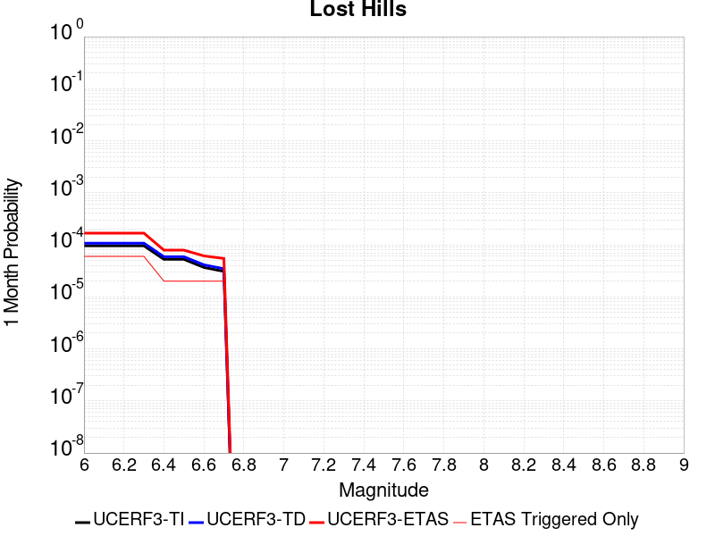 |  |  |

| Magnitude | 1 wk TI Prob | 1 wk TD Prob | 1 wk ETAS Prob | 1 wk ETAS/TD Gain | 1 wk ETAS Triggered Only | 1 mo TI Prob | 1 mo TD Prob | 1 mo ETAS Prob | 1 mo ETAS/TD Gain | 1 mo ETAS Triggered Only | 1 yr TI Prob | 1 yr TD Prob | 1 yr ETAS Prob | 1 yr ETAS/TD Gain | 1 yr ETAS Triggered Only | 10 yr TI Prob | 10 yr TD Prob | 10 yr ETAS Prob | 10 yr ETAS/TD Gain | 10 yr ETAS Triggered Only |
|-----|-----|-----|-----|-----|-----|-----|-----|-----|-----|-----|-----|-----|-----|-----|-----|-----|-----|-----|-----|-----|
| 6.0 | 2.233523E-5 | 2.5106583E-5 | 7.804332E-5 | 3.1084802 | 5.2938063E-5 | 9.571891E-5 | 1.0759615E-4 | 1.6052852E-4 | 1.4919541 | 5.2938063E-5 | 0.0011647546 | 0.001309364 | 0.0013622327 | 1.0403774 | 5.2938063E-5 | 0.011586686 | 0.013033091 | 0.013137587 | 1.0080178 | 1.05876126E-4 |
| 6.1 | 2.233523E-5 | 2.5106583E-5 | 7.804332E-5 | 3.1084802 | 5.2938063E-5 | 9.571891E-5 | 1.0759615E-4 | 1.6052852E-4 | 1.4919541 | 5.2938063E-5 | 0.0011647546 | 0.001309364 | 0.0013622327 | 1.0403774 | 5.2938063E-5 | 0.011586686 | 0.013033091 | 0.013137587 | 1.0080178 | 1.05876126E-4 |
| 6.2 | 2.233523E-5 | 2.5106583E-5 | 7.804332E-5 | 3.1084802 | 5.2938063E-5 | 9.571891E-5 | 1.0759615E-4 | 1.6052852E-4 | 1.4919541 | 5.2938063E-5 | 0.0011647546 | 0.001309364 | 0.0013622327 | 1.0403774 | 5.2938063E-5 | 0.011586686 | 0.013033091 | 0.013137587 | 1.0080178 | 1.05876126E-4 |
| 6.3 | 2.233523E-5 | 2.5106583E-5 | 7.804332E-5 | 3.1084802 | 5.2938063E-5 | 9.571891E-5 | 1.0759615E-4 | 1.6052852E-4 | 1.4919541 | 5.2938063E-5 | 0.0011647546 | 0.001309364 | 0.0013622327 | 1.0403774 | 5.2938063E-5 | 0.011586686 | 0.013033091 | 0.013137587 | 1.0080178 | 1.05876126E-4 |
| 6.4 | 1.2288092E-5 | 1.3781108E-5 | 1.3781108E-5 | 1.0 | 0.0 | 5.2662188E-5 | 5.906108E-5 | 5.906108E-5 | 1.0 | 0.0 | 6.409735E-4 | 7.189252E-4 | 7.189252E-4 | 1.0 | 0.0 | 0.006391279 | 0.0071752006 | 0.007227759 | 1.0073249 | 5.2938063E-5 |
| 6.5 | 1.2288092E-5 | 1.3781108E-5 | 1.3781108E-5 | 1.0 | 0.0 | 5.2662188E-5 | 5.906108E-5 | 5.906108E-5 | 1.0 | 0.0 | 6.409735E-4 | 7.189252E-4 | 7.189252E-4 | 1.0 | 0.0 | 0.006391279 | 0.0071752006 | 0.007227759 | 1.0073249 | 5.2938063E-5 |
| 6.6 | 8.58281E-6 | 9.63377E-6 | 9.63377E-6 | 1.0 | 0.0 | 3.6782953E-5 | 4.12874E-5 | 4.12874E-5 | 1.0 | 0.0 | 4.4774043E-4 | 5.026414E-4 | 5.026414E-4 | 1.0 | 0.0 | 0.0044683935 | 0.005023205 | 0.005075877 | 1.0104858 | 5.2938063E-5 |
| 6.7 | 7.205685E-6 | 8.088302E-6 | 8.088302E-6 | 1.0 | 0.0 | 3.088114E-5 | 3.466415E-5 | 3.466415E-5 | 1.0 | 0.0 | 3.7591302E-4 | 4.2203604E-4 | 4.2203604E-4 | 1.0 | 0.0 | 0.0037527776 | 0.0042203604 | 0.004273075 | 1.0124905 | 5.2938063E-5 |

## Cady
*[(top)](#table-of-contents)*

| 1 Week | 1 Month | 1 Year | 10 Year |
|-----|-----|-----|-----|
|  |  |  |  |

| Magnitude | 1 wk TI Prob | 1 wk TD Prob | 1 wk ETAS Prob | 1 wk ETAS/TD Gain | 1 wk ETAS Triggered Only | 1 mo TI Prob | 1 mo TD Prob | 1 mo ETAS Prob | 1 mo ETAS/TD Gain | 1 mo ETAS Triggered Only | 1 yr TI Prob | 1 yr TD Prob | 1 yr ETAS Prob | 1 yr ETAS/TD Gain | 1 yr ETAS Triggered Only | 10 yr TI Prob | 10 yr TD Prob | 10 yr ETAS Prob | 10 yr ETAS/TD Gain | 10 yr ETAS Triggered Only |
|-----|-----|-----|-----|-----|-----|-----|-----|-----|-----|-----|-----|-----|-----|-----|-----|-----|-----|-----|-----|-----|
| 6.0 | 1.9892565E-5 | 2.1858728E-5 | 7.479564E-5 | 3.4217741 | 5.2938063E-5 | 8.525106E-5 | 9.3677416E-5 | 1.4661052E-4 | 1.5650573 | 5.2938063E-5 | 0.0010374374 | 0.0011400167 | 0.0011928944 | 1.0463833 | 5.2938063E-5 | 0.010326075 | 0.011350701 | 0.011455375 | 1.0092218 | 1.05876126E-4 |
| 6.1 | 1.9892565E-5 | 2.1858728E-5 | 7.479564E-5 | 3.4217741 | 5.2938063E-5 | 8.525106E-5 | 9.3677416E-5 | 1.4661052E-4 | 1.5650573 | 5.2938063E-5 | 0.0010374374 | 0.0011400167 | 0.0011928944 | 1.0463833 | 5.2938063E-5 | 0.010326075 | 0.011350701 | 0.011455375 | 1.0092218 | 1.05876126E-4 |
| 6.2 | 1.9892565E-5 | 2.1858728E-5 | 7.479564E-5 | 3.4217741 | 5.2938063E-5 | 8.525106E-5 | 9.3677416E-5 | 1.4661052E-4 | 1.5650573 | 5.2938063E-5 | 0.0010374374 | 0.0011400167 | 0.0011928944 | 1.0463833 | 5.2938063E-5 | 0.010326075 | 0.011350701 | 0.011455375 | 1.0092218 | 1.05876126E-4 |
| 6.3 | 1.1117327E-5 | 1.2176583E-5 | 1.2176583E-5 | 1.0 | 0.0 | 4.764482E-5 | 5.2184492E-5 | 5.2184492E-5 | 1.0 | 0.0 | 5.7992124E-4 | 6.351925E-4 | 6.351925E-4 | 1.0 | 0.0 | 0.0057841022 | 0.0063368753 | 0.006389478 | 1.008301 | 5.2938063E-5 |
| 6.4 | 1.1117327E-5 | 1.2176583E-5 | 1.2176583E-5 | 1.0 | 0.0 | 4.764482E-5 | 5.2184492E-5 | 5.2184492E-5 | 1.0 | 0.0 | 5.7992124E-4 | 6.351925E-4 | 6.351925E-4 | 1.0 | 0.0 | 0.0057841022 | 0.0063368753 | 0.006389478 | 1.008301 | 5.2938063E-5 |
| 6.5 | 6.103093E-6 | 6.672021E-6 | 6.672021E-6 | 1.0 | 0.0 | 2.615585E-5 | 2.8594131E-5 | 2.8594131E-5 | 1.0 | 0.0 | 3.1840094E-4 | 3.480905E-4 | 3.480905E-4 | 1.0 | 0.0 | 0.0031794512 | 0.0034766865 | 0.0035294406 | 1.0151737 | 5.2938063E-5 |
| 6.6 | 5.817237E-6 | 6.3656585E-6 | 6.3656585E-6 | 1.0 | 0.0 | 2.4930776E-5 | 2.728118E-5 | 2.728118E-5 | 1.0 | 0.0 | 3.034899E-4 | 3.3211018E-4 | 3.3211018E-4 | 1.0 | 0.0 | 0.0030307577 | 0.0033173605 | 0.003370123 | 1.0159049 | 5.2938063E-5 |
| 6.7 | 4.8846314E-6 | 5.3405684E-6 | 5.3405684E-6 | 1.0 | 0.0 | 2.0933967E-5 | 2.2888014E-5 | 2.2888014E-5 | 1.0 | 0.0 | 2.5484123E-4 | 2.7863772E-4 | 2.7863772E-4 | 1.0 | 0.0 | 0.0025454918 | 0.0027840391 | 0.0028368297 | 1.0189619 | 5.2938063E-5 |
| 6.8 | 1.7788773E-6 | 1.9399079E-6 | 1.9399079E-6 | 1.0 | 0.0 | 7.6237375E-6 | 8.313874E-6 | 8.313874E-6 | 1.0 | 0.0 | 9.281505E-5 | 1.01218284E-4 | 1.01218284E-4 | 1.0 | 0.0 | 9.2776294E-4 | 0.0010118765 | 0.0010118765 | 1.0 | 0.0 |
| 6.9 | 7.5455404E-7 | 8.297092E-7 | 8.297092E-7 | 1.0 | 0.0 | 3.233799E-6 | 3.5558937E-6 | 3.5558937E-6 | 1.0 | 0.0 | 3.937079E-5 | 4.3292483E-5 | 4.3292483E-5 | 1.0 | 0.0 | 3.9363815E-4 | 4.3287344E-4 | 4.3287344E-4 | 1.0 | 0.0 |
| 7.0 | 6.8578805E-7 | 7.541816E-7 | 7.541816E-7 | 1.0 | 0.0 | 2.9390883E-6 | 3.2322048E-6 | 3.2322048E-6 | 1.0 | 0.0 | 3.578281E-5 | 3.9351715E-5 | 3.9351715E-5 | 1.0 | 0.0 | 3.577705E-4 | 3.9347992E-4 | 3.9347992E-4 | 1.0 | 0.0 |

## Newport-Inglewood (Offshore)
*[(top)](#table-of-contents)*

| 1 Week | 1 Month | 1 Year | 10 Year |
|-----|-----|-----|-----|
|  |  |  |  |

| Magnitude | 1 wk TI Prob | 1 wk TD Prob | 1 wk ETAS Prob | 1 wk ETAS/TD Gain | 1 wk ETAS Triggered Only | 1 mo TI Prob | 1 mo TD Prob | 1 mo ETAS Prob | 1 mo ETAS/TD Gain | 1 mo ETAS Triggered Only | 1 yr TI Prob | 1 yr TD Prob | 1 yr ETAS Prob | 1 yr ETAS/TD Gain | 1 yr ETAS Triggered Only | 10 yr TI Prob | 10 yr TD Prob | 10 yr ETAS Prob | 10 yr ETAS/TD Gain | 10 yr ETAS Triggered Only |
|-----|-----|-----|-----|-----|-----|-----|-----|-----|-----|-----|-----|-----|-----|-----|-----|-----|-----|-----|-----|-----|
| 6.0 | 1.9626508E-5 | 1.8965357E-5 | 7.190242E-5 | 3.7912505 | 5.2938063E-5 | 8.411089E-5 | 8.1277634E-5 | 1.8714515E-4 | 2.3025417 | 1.05876126E-4 | 0.001023569 | 9.891186E-4 | 0.00109489 | 1.106935 | 1.05876126E-4 | 0.010188672 | 0.009848503 | 0.009953337 | 1.0106446 | 1.05876126E-4 |
| 6.1 | 1.331886E-5 | 1.2218092E-5 | 6.515551E-5 | 5.3327074 | 5.2938063E-5 | 5.707958E-5 | 5.2362207E-5 | 1.582328E-4 | 3.0218892 | 1.05876126E-4 | 6.947222E-4 | 6.3732493E-4 | 7.4313354E-4 | 1.1660199 | 1.05876126E-4 | 0.006925544 | 0.006355149 | 0.0064603523 | 1.016554 | 1.05876126E-4 |
| 6.2 | 1.2250852E-5 | 1.1076029E-5 | 6.4013504E-5 | 5.7794633 | 5.2938063E-5 | 5.2502597E-5 | 4.7467838E-5 | 1.5333894E-4 | 3.2303753 | 1.05876126E-4 | 6.3903164E-4 | 5.777687E-4 | 6.8358367E-4 | 1.1831441 | 1.05876126E-4 | 0.006371971 | 0.0057627866 | 0.0058680526 | 1.0182666 | 1.05876126E-4 |
| 6.3 | 1.2106258E-5 | 1.0918891E-5 | 6.385637E-5 | 5.8482475 | 5.2938063E-5 | 5.1882926E-5 | 4.6794412E-5 | 1.5266558E-4 | 3.2624745 | 1.05876126E-4 | 6.3149154E-4 | 5.69574E-4 | 6.7538983E-4 | 1.1857806 | 1.05876126E-4 | 0.0062970007 | 0.005681259 | 0.005786534 | 1.0185301 | 1.05876126E-4 |
| 6.4 | 1.1348758E-5 | 1.0109362E-5 | 1.0109362E-5 | 1.0 | 0.0 | 4.8636626E-5 | 4.3325123E-5 | 9.626089E-5 | 2.2218263 | 5.2938063E-5 | 5.919901E-4 | 5.273565E-4 | 5.8026664E-4 | 1.1003308 | 5.2938063E-5 | 0.005904155 | 0.0052611465 | 0.005313806 | 1.0100092 | 5.2938063E-5 |
| 6.5 | 1.100837E-5 | 9.7433895E-6 | 9.7433895E-6 | 1.0 | 0.0 | 4.7177873E-5 | 4.1756717E-5 | 9.469257E-5 | 2.2677207 | 5.2938063E-5 | 5.7423924E-4 | 5.082702E-4 | 5.611814E-4 | 1.1041005 | 5.2938063E-5 | 0.005727576 | 0.0050711688 | 0.0051238383 | 1.0103861 | 5.2938063E-5 |
| 6.6 | 1.0634696E-5 | 9.345544E-6 | 9.345544E-6 | 1.0 | 0.0 | 4.557647E-5 | 4.0051716E-5 | 9.298766E-5 | 2.3216896 | 5.2938063E-5 | 5.5475225E-4 | 4.8752132E-4 | 5.4043357E-4 | 1.1085333 | 5.2938063E-5 | 0.0055336943 | 0.0048646047 | 0.0049172854 | 1.0108293 | 5.2938063E-5 |
| 6.7 | 9.9780855E-6 | 8.667911E-6 | 8.667911E-6 | 1.0 | 0.0 | 4.276252E-5 | 3.7147664E-5 | 9.008376E-5 | 2.425018 | 5.2938063E-5 | 5.205093E-4 | 4.5217964E-4 | 5.050938E-4 | 1.1170201 | 5.2938063E-5 | 0.0051929182 | 0.004512675 | 0.004565374 | 1.011678 | 5.2938063E-5 |
| 6.8 | 9.59546E-6 | 8.27295E-6 | 8.27295E-6 | 1.0 | 0.0 | 4.1122752E-5 | 3.5455025E-5 | 8.839121E-5 | 2.4930518 | 5.2938063E-5 | 5.0055445E-4 | 4.315801E-4 | 4.844953E-4 | 1.1226081 | 5.2938063E-5 | 0.004994285 | 0.004307495 | 0.004360205 | 1.0122368 | 5.2938063E-5 |
| 6.9 | 9.000614E-6 | 7.70684E-6 | 7.70684E-6 | 1.0 | 0.0 | 3.857349E-5 | 3.30289E-5 | 8.5965214E-5 | 2.6027272 | 5.2938063E-5 | 4.6953102E-4 | 4.0205332E-4 | 4.5497008E-4 | 1.1316164 | 5.2938063E-5 | 0.004685402 | 0.0040133307 | 0.0040660566 | 1.0131376 | 5.2938063E-5 |
| 7.0 | 7.4070194E-6 | 6.148904E-6 | 6.148904E-6 | 1.0 | 0.0 | 3.1743984E-5 | 2.635218E-5 | 2.635218E-5 | 1.0 | 0.0 | 3.8641447E-4 | 3.207907E-4 | 3.207907E-4 | 1.0 | 0.0 | 0.0038574322 | 0.0032032963 | 0.0032032963 | 1.0 | 0.0 |
| 7.1 | 6.299615E-6 | 5.0565927E-6 | 5.0565927E-6 | 1.0 | 0.0 | 2.699807E-5 | 2.1670932E-5 | 2.1670932E-5 | 1.0 | 0.0 | 3.2865192E-4 | 2.638118E-4 | 2.638118E-4 | 1.0 | 0.0 | 0.003281663 | 0.002635001 | 0.002635001 | 1.0 | 0.0 |
| 7.2 | 5.096653E-6 | 3.892769E-6 | 3.892769E-6 | 1.0 | 0.0 | 2.1842614E-5 | 1.668319E-5 | 1.668319E-5 | 1.0 | 0.0 | 2.6590136E-4 | 2.0309901E-4 | 2.0309901E-4 | 1.0 | 0.0 | 0.0026558342 | 0.0020291451 | 0.0020291451 | 1.0 | 0.0 |
| 7.3 | 3.9753018E-6 | 2.9099103E-6 | 2.9099103E-6 | 1.0 | 0.0 | 1.7036897E-5 | 1.2470985E-5 | 1.2470985E-5 | 1.0 | 0.0 | 2.0740448E-4 | 1.5182374E-4 | 1.5182374E-4 | 1.0 | 0.0 | 0.00207211 | 0.0015172083 | 0.0015172083 | 1.0 | 0.0 |
| 7.4 | 3.0568392E-6 | 2.1449955E-6 | 2.1449955E-6 | 1.0 | 0.0 | 1.3100675E-5 | 9.192806E-6 | 9.192806E-6 | 1.0 | 0.0 | 1.5948903E-4 | 1.1191672E-4 | 1.1191672E-4 | 1.0 | 0.0 | 0.0015937461 | 0.0011186098 | 0.0011186098 | 1.0 | 0.0 |
| 7.5 | 1.7279019E-6 | 1.1469883E-6 | 1.1469883E-6 | 1.0 | 0.0 | 7.405273E-6 | 4.915655E-6 | 4.915655E-6 | 1.0 | 0.0 | 9.015547E-5 | 5.9846494E-5 | 5.9846494E-5 | 1.0 | 0.0 | 9.01189E-4 | 5.9830764E-4 | 5.9830764E-4 | 1.0 | 0.0 |
| 7.6 | 1.1156416E-6 | 7.223012E-7 | 7.223012E-7 | 1.0 | 0.0 | 4.7813123E-6 | 3.095573E-6 | 3.095573E-6 | 1.0 | 0.0 | 5.821092E-5 | 3.7687976E-5 | 3.7687976E-5 | 1.0 | 0.0 | 5.8195676E-4 | 3.7681818E-4 | 3.7681818E-4 | 1.0 | 0.0 |
| 7.7 | 9.117973E-8 | 6.734145E-8 | 6.734145E-8 | 1.0 | 0.0 | 3.907702E-7 | 2.886062E-7 | 2.886062E-7 | 1.0 | 0.0 | 4.757617E-6 | 3.513775E-6 | 3.513775E-6 | 1.0 | 0.0 | 4.7575148E-5 | 3.5137225E-5 | 3.5137225E-5 | 1.0 | 0.0 |

## Santa Susana alt 1
*[(top)](#table-of-contents)*

| 1 Week | 1 Month | 1 Year | 10 Year |
|-----|-----|-----|-----|
|  |  |  |  |

| Magnitude | 1 wk TI Prob | 1 wk TD Prob | 1 wk ETAS Prob | 1 wk ETAS/TD Gain | 1 wk ETAS Triggered Only | 1 mo TI Prob | 1 mo TD Prob | 1 mo ETAS Prob | 1 mo ETAS/TD Gain | 1 mo ETAS Triggered Only | 1 yr TI Prob | 1 yr TD Prob | 1 yr ETAS Prob | 1 yr ETAS/TD Gain | 1 yr ETAS Triggered Only | 10 yr TI Prob | 10 yr TD Prob | 10 yr ETAS Prob | 10 yr ETAS/TD Gain | 10 yr ETAS Triggered Only |
|-----|-----|-----|-----|-----|-----|-----|-----|-----|-----|-----|-----|-----|-----|-----|-----|-----|-----|-----|-----|-----|
| 6.0 | 2.674877E-5 | 2.7198023E-5 | 8.013465E-5 | 2.9463408 | 5.2938063E-5 | 1.1463255E-4 | 1.1655839E-4 | 1.6949027E-4 | 1.4541234 | 5.2938063E-5 | 0.0013947578 | 0.0014182882 | 0.0014711511 | 1.0372723 | 5.2938063E-5 | 0.013860362 | 0.014104128 | 0.014156319 | 1.0037005 | 5.2938063E-5 |
| 6.1 | 2.674877E-5 | 2.7198023E-5 | 8.013465E-5 | 2.9463408 | 5.2938063E-5 | 1.1463255E-4 | 1.1655839E-4 | 1.6949027E-4 | 1.4541234 | 5.2938063E-5 | 0.0013947578 | 0.0014182882 | 0.0014711511 | 1.0372723 | 5.2938063E-5 | 0.013860362 | 0.014104128 | 0.014156319 | 1.0037005 | 5.2938063E-5 |
| 6.2 | 2.674877E-5 | 2.7198023E-5 | 8.013465E-5 | 2.9463408 | 5.2938063E-5 | 1.1463255E-4 | 1.1655839E-4 | 1.6949027E-4 | 1.4541234 | 5.2938063E-5 | 0.0013947578 | 0.0014182882 | 0.0014711511 | 1.0372723 | 5.2938063E-5 | 0.013860362 | 0.014104128 | 0.014156319 | 1.0037005 | 5.2938063E-5 |
| 6.3 | 2.674877E-5 | 2.7198023E-5 | 8.013465E-5 | 2.9463408 | 5.2938063E-5 | 1.1463255E-4 | 1.1655839E-4 | 1.6949027E-4 | 1.4541234 | 5.2938063E-5 | 0.0013947578 | 0.0014182882 | 0.0014711511 | 1.0372723 | 5.2938063E-5 | 0.013860362 | 0.014104128 | 0.014156319 | 1.0037005 | 5.2938063E-5 |
| 6.4 | 2.674877E-5 | 2.7198023E-5 | 8.013465E-5 | 2.9463408 | 5.2938063E-5 | 1.1463255E-4 | 1.1655839E-4 | 1.6949027E-4 | 1.4541234 | 5.2938063E-5 | 0.0013947578 | 0.0014182882 | 0.0014711511 | 1.0372723 | 5.2938063E-5 | 0.013860362 | 0.014104128 | 0.014156319 | 1.0037005 | 5.2938063E-5 |
| 6.5 | 2.674877E-5 | 2.7198023E-5 | 8.013465E-5 | 2.9463408 | 5.2938063E-5 | 1.1463255E-4 | 1.1655839E-4 | 1.6949027E-4 | 1.4541234 | 5.2938063E-5 | 0.0013947578 | 0.0014182882 | 0.0014711511 | 1.0372723 | 5.2938063E-5 | 0.013860362 | 0.014104128 | 0.014156319 | 1.0037005 | 5.2938063E-5 |
| 6.6 | 2.6647976E-5 | 2.7074359E-5 | 8.001099E-5 | 2.9552312 | 5.2938063E-5 | 1.14200615E-4 | 1.1602845E-4 | 1.6896037E-4 | 1.4561977 | 5.2938063E-5 | 0.0013895056 | 0.0014118447 | 0.0014647081 | 1.0374427 | 5.2938063E-5 | 0.013808494 | 0.014040513 | 0.014092708 | 1.0037174 | 5.2938063E-5 |
| 6.7 | 2.6647976E-5 | 2.7074359E-5 | 8.001099E-5 | 2.9552312 | 5.2938063E-5 | 1.14200615E-4 | 1.1602845E-4 | 1.6896037E-4 | 1.4561977 | 5.2938063E-5 | 0.0013895056 | 0.0014118447 | 0.0014647081 | 1.0374427 | 5.2938063E-5 | 0.013808494 | 0.014040513 | 0.014092708 | 1.0037174 | 5.2938063E-5 |
| 6.8 | 1.9073179E-5 | 1.7637283E-5 | 7.057441E-5 | 4.0014334 | 5.2938063E-5 | 8.1739636E-5 | 7.558627E-5 | 1.2852033E-4 | 1.7003132 | 5.2938063E-5 | 9.947256E-4 | 9.198925E-4 | 9.7278185E-4 | 1.0574951 | 5.2938063E-5 | 0.009902848 | 0.009163101 | 0.009215554 | 1.0057243 | 5.2938063E-5 |
| 6.9 | 1.9041876E-5 | 1.7619415E-5 | 7.055655E-5 | 4.004477 | 5.2938063E-5 | 8.160549E-5 | 7.55097E-5 | 1.2844376E-4 | 1.7010235 | 5.2938063E-5 | 9.930939E-4 | 9.1896096E-4 | 9.7185036E-4 | 1.0575535 | 5.2938063E-5 | 0.0098866755 | 0.0091538625 | 0.009206316 | 1.0057302 | 5.2938063E-5 |
| 7.0 | 1.5917482E-5 | 1.3863864E-5 | 6.680119E-5 | 4.8183675 | 5.2938063E-5 | 6.8215995E-5 | 5.9415237E-5 | 1.1235015E-4 | 1.8909317 | 5.2938063E-5 | 8.302132E-4 | 7.231451E-4 | 7.7604485E-4 | 1.0731524 | 5.2938063E-5 | 0.008271185 | 0.0072088144 | 0.007261371 | 1.0072906 | 5.2938063E-5 |
| 7.1 | 1.577788E-5 | 1.3743872E-5 | 6.6681205E-5 | 4.8517046 | 5.2938063E-5 | 6.761774E-5 | 5.8901005E-5 | 1.1183595E-4 | 1.8987104 | 5.2938063E-5 | 8.2293496E-4 | 7.1688846E-4 | 7.697886E-4 | 1.0737913 | 5.2938063E-5 | 0.008198941 | 0.007146652 | 0.0071992115 | 1.0073545 | 5.2938063E-5 |
| 7.2 | 1.5416446E-5 | 1.3469944E-5 | 6.6407294E-5 | 4.9300346 | 5.2938063E-5 | 6.606882E-5 | 5.772708E-5 | 1.1066209E-4 | 1.9169874 | 5.2938063E-5 | 8.0409093E-4 | 7.026052E-4 | 7.5550604E-4 | 1.0752925 | 5.2938063E-5 | 0.008011877 | 0.0070047234 | 0.0070572905 | 1.0075046 | 5.2938063E-5 |
| 7.3 | 1.4534083E-5 | 1.2717879E-5 | 6.5655266E-5 | 5.1624384 | 5.2938063E-5 | 6.228744E-5 | 5.4504082E-5 | 1.0743926E-4 | 1.9712149 | 5.2938063E-5 | 7.580857E-4 | 6.633896E-4 | 7.1629253E-4 | 1.0797464 | 5.2938063E-5 | 0.007555048 | 0.0066149444 | 0.0066675325 | 1.0079498 | 5.2938063E-5 |
| 7.4 | 1.2858995E-5 | 1.1229652E-5 | 6.416712E-5 | 5.714079 | 5.2938063E-5 | 5.5108816E-5 | 4.8126214E-5 | 1.0106173E-4 | 2.099931 | 5.2938063E-5 | 6.7074323E-4 | 5.857831E-4 | 6.3869014E-4 | 1.0903186 | 5.2938063E-5 | 0.0066872234 | 0.005843165 | 0.0058957934 | 1.0090069 | 5.2938063E-5 |
| 7.5 | 8.827668E-6 | 7.805457E-6 | 6.0743107E-5 | 7.782133 | 5.2938063E-5 | 3.7832317E-5 | 3.3451546E-5 | 8.638784E-5 | 2.5824769 | 5.2938063E-5 | 4.605111E-4 | 4.071989E-4 | 4.601154E-4 | 1.1299524 | 5.2938063E-5 | 0.0045955796 | 0.0040647765 | 0.0041174996 | 1.0129707 | 5.2938063E-5 |
| 7.6 | 3.2533426E-6 | 2.871988E-6 | 2.871988E-6 | 1.0 | 0.0 | 1.3942822E-5 | 1.2308465E-5 | 1.2308465E-5 | 1.0 | 0.0 | 1.6974064E-4 | 1.4984563E-4 | 1.4984563E-4 | 1.0 | 0.0 | 0.0016961104 | 0.0014974826 | 0.0014974826 | 1.0 | 0.0 |
| 7.7 | 1.2751709E-6 | 1.1491089E-6 | 1.1491089E-6 | 1.0 | 0.0 | 5.4650063E-6 | 4.9247437E-6 | 4.9247437E-6 | 1.0 | 0.0 | 6.653442E-5 | 5.9957198E-5 | 5.9957198E-5 | 1.0 | 0.0 | 6.6514505E-4 | 5.994191E-4 | 5.994191E-4 | 1.0 | 0.0 |
| 7.8 | 3.067544E-7 | 3.2400436E-7 | 3.2400436E-7 | 1.0 | 0.0 | 1.3146611E-6 | 1.3885895E-6 | 1.3885895E-6 | 1.0 | 0.0 | 1.600588E-5 | 1.6905957E-5 | 1.6905957E-5 | 1.0 | 0.0 | 1.6004729E-4 | 1.6904772E-4 | 1.6904772E-4 | 1.0 | 0.0 |
| 7.9 | 7.622999E-8 | 8.087964E-8 | 8.087964E-8 | 1.0 | 0.0 | 3.2669993E-7 | 3.4662696E-7 | 3.4662696E-7 | 1.0 | 0.0 | 3.977564E-6 | 4.2201773E-6 | 4.2201773E-6 | 1.0 | 0.0 | 3.977493E-5 | 4.220118E-5 | 4.220118E-5 | 1.0 | 0.0 |

## Mission Ridge-Arroyo Parida-Santa Ana
*[(top)](#table-of-contents)*

| 1 Week | 1 Month | 1 Year | 10 Year |
|-----|-----|-----|-----|
|  |  |  |  |

| Magnitude | 1 wk TI Prob | 1 wk TD Prob | 1 wk ETAS Prob | 1 wk ETAS/TD Gain | 1 wk ETAS Triggered Only | 1 mo TI Prob | 1 mo TD Prob | 1 mo ETAS Prob | 1 mo ETAS/TD Gain | 1 mo ETAS Triggered Only | 1 yr TI Prob | 1 yr TD Prob | 1 yr ETAS Prob | 1 yr ETAS/TD Gain | 1 yr ETAS Triggered Only | 10 yr TI Prob | 10 yr TD Prob | 10 yr ETAS Prob | 10 yr ETAS/TD Gain | 10 yr ETAS Triggered Only |
|-----|-----|-----|-----|-----|-----|-----|-----|-----|-----|-----|-----|-----|-----|-----|-----|-----|-----|-----|-----|-----|
| 6.0 | 4.169034E-5 | 4.7138263E-5 | 1.00073834E-4 | 2.1229851 | 5.2938063E-5 | 1.7866064E-4 | 2.0201034E-4 | 2.549377E-4 | 1.2620033 | 5.2938063E-5 | 0.0021730233 | 0.00245745 | 0.0025630658 | 1.0429778 | 1.05876126E-4 | 0.021518968 | 0.024384614 | 0.024487909 | 1.0042361 | 1.05876126E-4 |
| 6.1 | 1.73813E-5 | 1.6854226E-5 | 6.979139E-5 | 4.140884 | 5.2938063E-5 | 7.4489166E-5 | 7.223046E-5 | 1.251647E-4 | 1.732852 | 5.2938063E-5 | 9.065282E-4 | 8.790618E-4 | 9.319533E-4 | 1.0601681 | 5.2938063E-5 | 0.009028391 | 0.008756988 | 0.008809462 | 1.0059923 | 5.2938063E-5 |
| 6.2 | 1.4622182E-5 | 1.367329E-5 | 6.661063E-5 | 4.8715878 | 5.2938063E-5 | 6.2664985E-5 | 5.8598518E-5 | 1.1153348E-4 | 1.9033498 | 5.2938063E-5 | 7.6267915E-4 | 7.132073E-4 | 7.661076E-4 | 1.0741724 | 5.2938063E-5 | 0.007600669 | 0.007109627 | 0.007162189 | 1.007393 | 5.2938063E-5 |
| 6.3 | 1.3552434E-5 | 1.2482201E-5 | 6.5419605E-5 | 5.241031 | 5.2938063E-5 | 5.8080568E-5 | 5.3494066E-5 | 1.06429296E-4 | 1.9895533 | 5.2938063E-5 | 7.069015E-4 | 6.510988E-4 | 7.040024E-4 | 1.0812528 | 5.2938063E-5 | 0.00704657 | 0.006492275 | 0.0065448694 | 1.0081011 | 5.2938063E-5 |
| 6.4 | 1.30977305E-5 | 1.1979156E-5 | 6.491658E-5 | 5.4191284 | 5.2938063E-5 | 5.613192E-5 | 5.1338247E-5 | 1.0427359E-4 | 2.0311093 | 5.2938063E-5 | 6.831918E-4 | 6.248669E-4 | 6.7777187E-4 | 1.084666 | 5.2938063E-5 | 0.006810953 | 0.0062314444 | 0.0062840525 | 1.0084424 | 5.2938063E-5 |
| 6.5 | 1.225205E-5 | 1.1048803E-5 | 1.1048803E-5 | 1.0 | 0.0 | 5.2507727E-5 | 4.7351168E-5 | 4.7351168E-5 | 1.0 | 0.0 | 6.3909404E-4 | 5.7635066E-4 | 5.7635066E-4 | 1.0 | 0.0 | 0.006372592 | 0.005748869 | 0.005748869 | 1.0 | 0.0 |
| 6.6 | 1.1352241E-5 | 1.0063535E-5 | 1.0063535E-5 | 1.0 | 0.0 | 4.8651553E-5 | 4.3128734E-5 | 4.3128734E-5 | 1.0 | 0.0 | 5.921717E-4 | 5.2496797E-4 | 5.2496797E-4 | 1.0 | 0.0 | 0.0059059616 | 0.0052375244 | 0.0052375244 | 1.0 | 0.0 |
| 6.7 | 1.0864116E-5 | 9.517027E-6 | 9.517027E-6 | 1.0 | 0.0 | 4.6559664E-5 | 4.0786632E-5 | 4.0786632E-5 | 1.0 | 0.0 | 5.667165E-4 | 4.964661E-4 | 4.964661E-4 | 1.0 | 0.0 | 0.005652734 | 0.004953804 | 0.004953804 | 1.0 | 0.0 |
| 6.8 | 1.0666365E-5 | 9.299779E-6 | 9.299779E-6 | 1.0 | 0.0 | 4.571219E-5 | 3.9855597E-5 | 3.9855597E-5 | 1.0 | 0.0 | 5.564038E-4 | 4.8513585E-4 | 4.8513585E-4 | 1.0 | 0.0 | 0.005550127 | 0.0048410003 | 0.0048410003 | 1.0 | 0.0 |
| 6.9 | 1.0038665E-5 | 8.592046E-6 | 8.592046E-6 | 1.0 | 0.0 | 4.302214E-5 | 3.682254E-5 | 3.682254E-5 | 1.0 | 0.0 | 5.236687E-4 | 4.4822405E-4 | 4.4822405E-4 | 1.0 | 0.0 | 0.005224364 | 0.004473411 | 0.004473411 | 1.0 | 0.0 |
| 7.0 | 9.5379955E-6 | 8.025073E-6 | 8.025073E-6 | 1.0 | 0.0 | 4.0876483E-5 | 3.4392728E-5 | 3.4392728E-5 | 1.0 | 0.0 | 4.975576E-4 | 4.1865272E-4 | 4.1865272E-4 | 1.0 | 0.0 | 0.00496445 | 0.0041788397 | 0.0041788397 | 1.0 | 0.0 |
| 7.1 | 9.207389E-6 | 7.652375E-6 | 7.652375E-6 | 1.0 | 0.0 | 3.945964E-5 | 3.279549E-5 | 3.279549E-5 | 1.0 | 0.0 | 4.803152E-4 | 3.9921363E-4 | 3.9921363E-4 | 1.0 | 0.0 | 0.004792784 | 0.003985161 | 0.003985161 | 1.0 | 0.0 |
| 7.2 | 7.638091E-6 | 5.9311183E-6 | 5.9311183E-6 | 1.0 | 0.0 | 3.2734264E-5 | 2.541883E-5 | 2.541883E-5 | 1.0 | 0.0 | 3.984668E-4 | 3.0943064E-4 | 3.0943064E-4 | 1.0 | 0.0 | 0.0039775306 | 0.0030900547 | 0.0030900547 | 1.0 | 0.0 |
| 7.3 | 7.2500147E-6 | 5.5961527E-6 | 5.5961527E-6 | 1.0 | 0.0 | 3.1071122E-5 | 2.3983293E-5 | 2.3983293E-5 | 1.0 | 0.0 | 3.7822526E-4 | 2.9195778E-4 | 2.9195778E-4 | 1.0 | 0.0 | 0.0037758215 | 0.0029157975 | 0.0029157975 | 1.0 | 0.0 |
| 7.4 | 6.3899715E-6 | 4.9184964E-6 | 4.9184964E-6 | 1.0 | 0.0 | 2.7385306E-5 | 2.10791E-5 | 2.10791E-5 | 1.0 | 0.0 | 3.3336508E-4 | 2.5660804E-4 | 2.5660804E-4 | 1.0 | 0.0 | 0.0033286542 | 0.0025631618 | 0.0025631618 | 1.0 | 0.0 |
| 7.5 | 5.379025E-6 | 4.0838527E-6 | 4.0838527E-6 | 1.0 | 0.0 | 2.305276E-5 | 1.7502109E-5 | 1.7502109E-5 | 1.0 | 0.0 | 2.806312E-4 | 2.1306744E-4 | 2.1306744E-4 | 1.0 | 0.0 | 0.0028027708 | 0.002128643 | 0.002128643 | 1.0 | 0.0 |
| 7.6 | 4.1270696E-6 | 3.0883439E-6 | 3.0883439E-6 | 1.0 | 0.0 | 1.768732E-5 | 1.3235693E-5 | 1.3235693E-5 | 1.0 | 0.0 | 2.1532185E-4 | 1.6113273E-4 | 1.6113273E-4 | 1.0 | 0.0 | 0.0021511333 | 0.001610167 | 0.001610167 | 1.0 | 0.0 |
| 7.7 | 2.5406805E-6 | 1.8282013E-6 | 1.8282013E-6 | 1.0 | 0.0 | 1.0888585E-5 | 7.835125E-6 | 7.835125E-6 | 1.0 | 0.0 | 1.3256045E-4 | 9.538854E-5 | 9.538854E-5 | 1.0 | 0.0 | 0.0013248142 | 9.534821E-4 | 9.534821E-4 | 1.0 | 0.0 |
| 7.8 | 4.8608285E-7 | 3.5098864E-7 | 3.5098864E-7 | 1.0 | 0.0 | 2.0832106E-6 | 1.5042363E-6 | 1.5042363E-6 | 1.0 | 0.0 | 2.5362791E-5 | 1.8313924E-5 | 1.8313924E-5 | 1.0 | 0.0 | 2.5359896E-4 | 1.8312426E-4 | 1.8312426E-4 | 1.0 | 0.0 |
| 7.9 | 2.0472514E-8 | 1.2688783E-8 | 1.2688783E-8 | 1.0 | 0.0 | 8.7739345E-8 | 5.43805E-8 | 5.43805E-8 | 1.0 | 0.0 | 1.068226E-6 | 6.6208236E-7 | 6.6208236E-7 | 1.0 | 0.0 | 1.0682209E-5 | 6.620805E-6 | 6.620805E-6 | 1.0 | 0.0 |
| 8.0 | 4.443582E-9 | 2.0321211E-9 | 2.0321211E-9 | 1.0 | 0.0 | 1.9043922E-8 | 8.70909E-9 | 8.70909E-9 | 1.0 | 0.0 | 2.3185973E-7 | 1.0603316E-7 | 1.0603316E-7 | 1.0 | 0.0 | 2.3185949E-6 | 1.0603312E-6 | 1.0603312E-6 | 1.0 | 0.0 |

## Camp Rock 2011
*[(top)](#table-of-contents)*

| 1 Week | 1 Month | 1 Year | 10 Year |
|-----|-----|-----|-----|
|  |  |  |  |

| Magnitude | 1 wk TI Prob | 1 wk TD Prob | 1 wk ETAS Prob | 1 wk ETAS/TD Gain | 1 wk ETAS Triggered Only | 1 mo TI Prob | 1 mo TD Prob | 1 mo ETAS Prob | 1 mo ETAS/TD Gain | 1 mo ETAS Triggered Only | 1 yr TI Prob | 1 yr TD Prob | 1 yr ETAS Prob | 1 yr ETAS/TD Gain | 1 yr ETAS Triggered Only | 10 yr TI Prob | 10 yr TD Prob | 10 yr ETAS Prob | 10 yr ETAS/TD Gain | 10 yr ETAS Triggered Only |
|-----|-----|-----|-----|-----|-----|-----|-----|-----|-----|-----|-----|-----|-----|-----|-----|-----|-----|-----|-----|-----|
| 6.0 | 1.6710783E-5 | 4.25026E-6 | 5.71881E-5 | 13.455199 | 5.2938063E-5 | 7.161568E-5 | 1.8215276E-5 | 7.1152375E-5 | 3.9061923 | 5.2938063E-5 | 8.7157206E-4 | 2.2174895E-4 | 3.276016E-4 | 1.4773536 | 1.05876126E-4 | 0.008681616 | 0.0022153298 | 0.0023209713 | 1.0476866 | 1.05876126E-4 |
| 6.1 | 1.6710783E-5 | 4.25026E-6 | 5.71881E-5 | 13.455199 | 5.2938063E-5 | 7.161568E-5 | 1.8215276E-5 | 7.1152375E-5 | 3.9061923 | 5.2938063E-5 | 8.7157206E-4 | 2.2174895E-4 | 3.276016E-4 | 1.4773536 | 1.05876126E-4 | 0.008681616 | 0.0022153298 | 0.0023209713 | 1.0476866 | 1.05876126E-4 |
| 6.2 | 1.6710783E-5 | 4.25026E-6 | 5.71881E-5 | 13.455199 | 5.2938063E-5 | 7.161568E-5 | 1.8215276E-5 | 7.1152375E-5 | 3.9061923 | 5.2938063E-5 | 8.7157206E-4 | 2.2174895E-4 | 3.276016E-4 | 1.4773536 | 1.05876126E-4 | 0.008681616 | 0.0022153298 | 0.0023209713 | 1.0476866 | 1.05876126E-4 |
| 6.3 | 1.6710783E-5 | 4.25026E-6 | 5.71881E-5 | 13.455199 | 5.2938063E-5 | 7.161568E-5 | 1.8215276E-5 | 7.1152375E-5 | 3.9061923 | 5.2938063E-5 | 8.7157206E-4 | 2.2174895E-4 | 3.276016E-4 | 1.4773536 | 1.05876126E-4 | 0.008681616 | 0.0022153298 | 0.0023209713 | 1.0476866 | 1.05876126E-4 |
| 6.4 | 7.982846E-6 | 3.6820884E-6 | 3.6820884E-6 | 1.0 | 0.0 | 3.421175E-5 | 1.5780286E-5 | 1.5780286E-5 | 1.0 | 0.0 | 4.1644843E-4 | 1.9210839E-4 | 2.4503627E-4 | 1.2755105 | 5.2938063E-5 | 0.0041566887 | 0.001919458 | 0.0019722944 | 1.0275267 | 5.2938063E-5 |
| 6.5 | 7.982846E-6 | 3.6820884E-6 | 3.6820884E-6 | 1.0 | 0.0 | 3.421175E-5 | 1.5780286E-5 | 1.5780286E-5 | 1.0 | 0.0 | 4.1644843E-4 | 1.9210839E-4 | 2.4503627E-4 | 1.2755105 | 5.2938063E-5 | 0.0041566887 | 0.001919458 | 0.0019722944 | 1.0275267 | 5.2938063E-5 |
| 6.6 | 7.048869E-6 | 3.4243571E-6 | 3.4243571E-6 | 1.0 | 0.0 | 3.0209088E-5 | 1.4675736E-5 | 1.4675736E-5 | 1.0 | 0.0 | 3.677336E-4 | 1.7866275E-4 | 2.3159136E-4 | 1.2962487 | 5.2938063E-5 | 0.0036712566 | 0.0017852228 | 0.0018380663 | 1.0296005 | 5.2938063E-5 |
| 6.7 | 6.987307E-6 | 3.3623348E-6 | 3.3623348E-6 | 1.0 | 0.0 | 2.9945259E-5 | 1.4409929E-5 | 1.4409929E-5 | 1.0 | 0.0 | 3.6452254E-4 | 1.7542706E-4 | 2.2835584E-4 | 1.3017138 | 5.2938063E-5 | 0.0036392517 | 0.001752917 | 0.0018057622 | 1.0301471 | 5.2938063E-5 |
| 6.8 | 6.3737602E-6 | 3.1179077E-6 | 3.1179077E-6 | 1.0 | 0.0 | 2.731583E-5 | 1.3362394E-5 | 1.3362394E-5 | 1.0 | 0.0 | 3.3251947E-4 | 1.626753E-4 | 2.1560474E-4 | 1.3253688 | 5.2938063E-5 | 0.0033202237 | 0.0016255907 | 0.0016784428 | 1.0325125 | 5.2938063E-5 |
| 6.9 | 6.112211E-6 | 2.9331156E-6 | 2.9331156E-6 | 1.0 | 0.0 | 2.6194928E-5 | 1.2570436E-5 | 1.2570436E-5 | 1.0 | 0.0 | 3.1887658E-4 | 1.5303459E-4 | 2.0596455E-4 | 1.3458693 | 5.2938063E-5 | 0.003184194 | 0.0015293199 | 0.001582177 | 1.0345625 | 5.2938063E-5 |
| 7.0 | 5.5140117E-6 | 2.641923E-6 | 2.641923E-6 | 1.0 | 0.0 | 2.3631264E-5 | 1.132248E-5 | 1.132248E-5 | 1.0 | 0.0 | 2.8767265E-4 | 1.3784273E-4 | 1.9077348E-4 | 1.3839939 | 5.2938063E-5 | 0.0028730053 | 0.0013775975 | 0.0014304626 | 1.0383749 | 5.2938063E-5 |
| 7.1 | 4.8151105E-6 | 2.1342705E-6 | 2.1342705E-6 | 1.0 | 0.0 | 2.0636026E-5 | 9.146843E-6 | 9.146843E-6 | 1.0 | 0.0 | 2.5121463E-4 | 1.1135734E-4 | 1.6428951E-4 | 1.4753362 | 5.2938063E-5 | 0.0025093083 | 0.0011130372 | 0.0011659164 | 1.0475088 | 5.2938063E-5 |
| 7.2 | 3.818335E-6 | 1.2937425E-6 | 1.2937425E-6 | 1.0 | 0.0 | 1.6364189E-5 | 5.5445994E-6 | 5.5445994E-6 | 1.0 | 0.0 | 1.9921579E-4 | 6.750349E-5 | 6.750349E-5 | 1.0 | 0.0 | 0.0019903728 | 6.748381E-4 | 6.748381E-4 | 1.0 | 0.0 |
| 7.3 | 2.7166698E-6 | 7.3835776E-7 | 7.3835776E-7 | 1.0 | 0.0 | 1.1642818E-5 | 3.1643867E-6 | 3.1643867E-6 | 1.0 | 0.0 | 1.4174209E-4 | 3.8525748E-5 | 3.8525748E-5 | 1.0 | 0.0 | 0.0014165172 | 3.851927E-4 | 3.851927E-4 | 1.0 | 0.0 |
| 7.4 | 2.0893426E-6 | 5.4618386E-7 | 5.4618386E-7 | 1.0 | 0.0 | 8.954295E-6 | 2.3407858E-6 | 2.3407858E-6 | 1.0 | 0.0 | 1.0901308E-4 | 2.84987E-5 | 2.84987E-5 | 1.0 | 0.0 | 0.0010895962 | 2.84951E-4 | 2.84951E-4 | 1.0 | 0.0 |
| 7.5 | 1.1681728E-6 | 3.6030585E-7 | 3.6030585E-7 | 1.0 | 0.0 | 5.0064455E-6 | 1.544167E-6 | 1.544167E-6 | 1.0 | 0.0 | 6.0951766E-5 | 1.8800076E-5 | 1.8800076E-5 | 1.0 | 0.0 | 6.093505E-4 | 1.8798532E-4 | 1.8798532E-4 | 1.0 | 0.0 |
| 7.6 | 1.3154387E-7 | 7.1197384E-8 | 7.1197384E-8 | 1.0 | 0.0 | 5.6375933E-7 | 3.051316E-7 | 3.051316E-7 | 1.0 | 0.0 | 6.863748E-6 | 3.7149728E-6 | 3.7149728E-6 | 1.0 | 0.0 | 6.863536E-5 | 3.7149264E-5 | 3.7149264E-5 | 1.0 | 0.0 |

## San Cayetano
*[(top)](#table-of-contents)*

| 1 Week | 1 Month | 1 Year | 10 Year |
|-----|-----|-----|-----|
|  |  |  |  |

| Magnitude | 1 wk TI Prob | 1 wk TD Prob | 1 wk ETAS Prob | 1 wk ETAS/TD Gain | 1 wk ETAS Triggered Only | 1 mo TI Prob | 1 mo TD Prob | 1 mo ETAS Prob | 1 mo ETAS/TD Gain | 1 mo ETAS Triggered Only | 1 yr TI Prob | 1 yr TD Prob | 1 yr ETAS Prob | 1 yr ETAS/TD Gain | 1 yr ETAS Triggered Only | 10 yr TI Prob | 10 yr TD Prob | 10 yr ETAS Prob | 10 yr ETAS/TD Gain | 10 yr ETAS Triggered Only |
|-----|-----|-----|-----|-----|-----|-----|-----|-----|-----|-----|-----|-----|-----|-----|-----|-----|-----|-----|-----|-----|
| 6.0 | 2.3476267E-5 | 1.816928E-5 | 7.110638E-5 | 3.91355 | 5.2938063E-5 | 1.0060869E-4 | 7.786603E-5 | 1.3079998E-4 | 1.6798079 | 5.2938063E-5 | 0.0012242225 | 9.476103E-4 | 0.0010004982 | 1.0558119 | 5.2938063E-5 | 0.012175002 | 0.009436584 | 0.009489023 | 1.005557 | 5.2938063E-5 |
| 6.1 | 2.3476267E-5 | 1.816928E-5 | 7.110638E-5 | 3.91355 | 5.2938063E-5 | 1.0060869E-4 | 7.786603E-5 | 1.3079998E-4 | 1.6798079 | 5.2938063E-5 | 0.0012242225 | 9.476103E-4 | 0.0010004982 | 1.0558119 | 5.2938063E-5 | 0.012175002 | 0.009436584 | 0.009489023 | 1.005557 | 5.2938063E-5 |
| 6.2 | 2.3476267E-5 | 1.816928E-5 | 7.110638E-5 | 3.91355 | 5.2938063E-5 | 1.0060869E-4 | 7.786603E-5 | 1.3079998E-4 | 1.6798079 | 5.2938063E-5 | 0.0012242225 | 9.476103E-4 | 0.0010004982 | 1.0558119 | 5.2938063E-5 | 0.012175002 | 0.009436584 | 0.009489023 | 1.005557 | 5.2938063E-5 |
| 6.3 | 2.3476267E-5 | 1.816928E-5 | 7.110638E-5 | 3.91355 | 5.2938063E-5 | 1.0060869E-4 | 7.786603E-5 | 1.3079998E-4 | 1.6798079 | 5.2938063E-5 | 0.0012242225 | 9.476103E-4 | 0.0010004982 | 1.0558119 | 5.2938063E-5 | 0.012175002 | 0.009436584 | 0.009489023 | 1.005557 | 5.2938063E-5 |
| 6.4 | 2.3476267E-5 | 1.816928E-5 | 7.110638E-5 | 3.91355 | 5.2938063E-5 | 1.0060869E-4 | 7.786603E-5 | 1.3079998E-4 | 1.6798079 | 5.2938063E-5 | 0.0012242225 | 9.476103E-4 | 0.0010004982 | 1.0558119 | 5.2938063E-5 | 0.012175002 | 0.009436584 | 0.009489023 | 1.005557 | 5.2938063E-5 |
| 6.5 | 2.3476267E-5 | 1.816928E-5 | 7.110638E-5 | 3.91355 | 5.2938063E-5 | 1.0060869E-4 | 7.786603E-5 | 1.3079998E-4 | 1.6798079 | 5.2938063E-5 | 0.0012242225 | 9.476103E-4 | 0.0010004982 | 1.0558119 | 5.2938063E-5 | 0.012175002 | 0.009436584 | 0.009489023 | 1.005557 | 5.2938063E-5 |
| 6.6 | 2.3476267E-5 | 1.816928E-5 | 7.110638E-5 | 3.91355 | 5.2938063E-5 | 1.0060869E-4 | 7.786603E-5 | 1.3079998E-4 | 1.6798079 | 5.2938063E-5 | 0.0012242225 | 9.476103E-4 | 0.0010004982 | 1.0558119 | 5.2938063E-5 | 0.012175002 | 0.009436584 | 0.009489023 | 1.005557 | 5.2938063E-5 |
| 6.7 | 2.3476267E-5 | 1.816928E-5 | 7.110638E-5 | 3.91355 | 5.2938063E-5 | 1.0060869E-4 | 7.786603E-5 | 1.3079998E-4 | 1.6798079 | 5.2938063E-5 | 0.0012242225 | 9.476103E-4 | 0.0010004982 | 1.0558119 | 5.2938063E-5 | 0.012175002 | 0.009436584 | 0.009489023 | 1.005557 | 5.2938063E-5 |
| 6.8 | 2.3241924E-5 | 1.7936987E-5 | 7.08741E-5 | 3.9512823 | 5.2938063E-5 | 9.960445E-5 | 7.687056E-5 | 1.2980455E-4 | 1.6886121 | 5.2938063E-5 | 0.0012120095 | 9.3550084E-4 | 9.883894E-4 | 1.056535 | 5.2938063E-5 | 0.012054204 | 0.009316482 | 0.009368927 | 1.0056293 | 5.2938063E-5 |
| 6.9 | 2.2761007E-5 | 1.7432423E-5 | 7.036956E-5 | 4.0367055 | 5.2938063E-5 | 9.7543525E-5 | 7.470827E-5 | 1.2764237E-4 | 1.7085441 | 5.2938063E-5 | 0.0011869454 | 9.09197E-4 | 9.6208695E-4 | 1.0581721 | 5.2938063E-5 | 0.011806256 | 0.009055603 | 0.009108062 | 1.005793 | 5.2938063E-5 |
| 7.0 | 2.240283E-5 | 1.7066168E-5 | 7.000333E-5 | 4.101877 | 5.2938063E-5 | 9.600859E-5 | 7.313869E-5 | 1.2607287E-4 | 1.7237508 | 5.2938063E-5 | 0.0011682777 | 8.9010317E-4 | 9.4299414E-4 | 1.0594212 | 5.2938063E-5 | 0.011621549 | 0.008866196 | 0.0089186635 | 1.0059178 | 5.2938063E-5 |
| 7.1 | 2.1871154E-5 | 1.6586018E-5 | 6.95232E-5 | 4.191675 | 5.2938063E-5 | 9.373015E-5 | 7.108101E-5 | 1.2401532E-4 | 1.7447038 | 5.2938063E-5 | 0.0011405671 | 8.6507114E-4 | 9.179634E-4 | 1.0611421 | 5.2938063E-5 | 0.011347309 | 0.008617838 | 0.00867032 | 1.0060899 | 5.2938063E-5 |
| 7.2 | 2.0714133E-5 | 1.5564561E-5 | 6.85018E-5 | 4.4011393 | 5.2938063E-5 | 8.8771834E-5 | 6.670357E-5 | 1.19638105E-4 | 1.7935786 | 5.2938063E-5 | 0.0010802611 | 8.1181666E-4 | 8.6471176E-4 | 1.0651565 | 5.2938063E-5 | 0.010750249 | 0.008089285 | 0.008141795 | 1.0064913 | 5.2938063E-5 |
| 7.3 | 1.8408395E-5 | 1.3996864E-5 | 6.693419E-5 | 4.7820845 | 5.2938063E-5 | 7.8890735E-5 | 5.99852E-5 | 1.1292009E-4 | 1.8824658 | 5.2938063E-5 | 9.600714E-4 | 7.300781E-4 | 7.829775E-4 | 1.0724572 | 5.2938063E-5 | 0.009559342 | 0.0072775153 | 0.0073300684 | 1.0072212 | 5.2938063E-5 |
| 7.4 | 1.6856795E-5 | 1.28500815E-5 | 6.578746E-5 | 5.1196146 | 5.2938063E-5 | 7.2241404E-5 | 5.5070628E-5 | 1.0800578E-4 | 1.9612229 | 5.2938063E-5 | 8.7918417E-4 | 6.7028153E-4 | 7.231841E-4 | 1.078926 | 5.2938063E-5 | 0.00875714 | 0.0066832784 | 0.0067358627 | 1.007868 | 5.2938063E-5 |
| 7.5 | 1.2822778E-5 | 9.577542E-6 | 6.25151E-5 | 6.527259 | 5.2938063E-5 | 5.495361E-5 | 4.1045972E-5 | 9.3981864E-5 | 2.289673 | 5.2938063E-5 | 6.688548E-4 | 4.996217E-4 | 5.525333E-4 | 1.1059034 | 5.2938063E-5 | 0.006668452 | 0.0049851555 | 0.0050378297 | 1.0105662 | 5.2938063E-5 |
| 7.6 | 5.6272684E-6 | 3.854903E-6 | 3.854903E-6 | 1.0 | 0.0 | 2.4116642E-5 | 1.652091E-5 | 1.652091E-5 | 1.0 | 0.0 | 2.9358055E-4 | 2.0112359E-4 | 2.0112359E-4 | 1.0 | 0.0 | 0.0029319301 | 0.0020094267 | 0.0020094267 | 1.0 | 0.0 |
| 7.7 | 3.5261346E-6 | 2.3407013E-6 | 2.3407013E-6 | 1.0 | 0.0 | 1.5111918E-5 | 1.0031539E-5 | 1.0031539E-5 | 1.0 | 0.0 | 1.8397206E-4 | 1.2212721E-4 | 1.2212721E-4 | 1.0 | 0.0 | 0.0018381984 | 0.0012206084 | 0.0012206084 | 1.0 | 0.0 |
| 7.8 | 1.4826929E-6 | 1.056428E-6 | 1.056428E-6 | 1.0 | 0.0 | 6.354383E-6 | 4.5275406E-6 | 4.5275406E-6 | 1.0 | 0.0 | 7.736187E-5 | 5.5121433E-5 | 5.5121433E-5 | 1.0 | 0.0 | 7.733494E-4 | 5.5107963E-4 | 5.5107963E-4 | 1.0 | 0.0 |
| 7.9 | 2.7568166E-7 | 1.6978244E-7 | 1.6978244E-7 | 1.0 | 0.0 | 1.1814923E-6 | 7.2763885E-7 | 7.2763885E-7 | 1.0 | 0.0 | 1.4384574E-5 | 8.858967E-6 | 8.858967E-6 | 1.0 | 0.0 | 1.4383643E-4 | 8.8586174E-5 | 8.8586174E-5 | 1.0 | 0.0 |
| 8.0 | 5.407832E-8 | 2.6887697E-8 | 2.6887697E-8 | 1.0 | 0.0 | 2.3176422E-7 | 1.15232986E-7 | 1.15232986E-7 | 1.0 | 0.0 | 2.8217257E-6 | 1.4029607E-6 | 1.4029607E-6 | 1.0 | 0.0 | 2.8216898E-5 | 1.4029522E-5 | 1.4029522E-5 | 1.0 | 0.0 |

## Ventura-Pitas Point
*[(top)](#table-of-contents)*

| 1 Week | 1 Month | 1 Year | 10 Year |
|-----|-----|-----|-----|
|  |  |  |  |

| Magnitude | 1 wk TI Prob | 1 wk TD Prob | 1 wk ETAS Prob | 1 wk ETAS/TD Gain | 1 wk ETAS Triggered Only | 1 mo TI Prob | 1 mo TD Prob | 1 mo ETAS Prob | 1 mo ETAS/TD Gain | 1 mo ETAS Triggered Only | 1 yr TI Prob | 1 yr TD Prob | 1 yr ETAS Prob | 1 yr ETAS/TD Gain | 1 yr ETAS Triggered Only | 10 yr TI Prob | 10 yr TD Prob | 10 yr ETAS Prob | 10 yr ETAS/TD Gain | 10 yr ETAS Triggered Only |
|-----|-----|-----|-----|-----|-----|-----|-----|-----|-----|-----|-----|-----|-----|-----|-----|-----|-----|-----|-----|-----|
| 6.0 | 3.3179622E-5 | 3.3735185E-5 | 8.667146E-5 | 2.5691712 | 5.2938063E-5 | 1.4219063E-4 | 1.445728E-4 | 1.975032E-4 | 1.3661159 | 5.2938063E-5 | 0.0017297962 | 0.0017590096 | 0.0018118545 | 1.0300424 | 5.2938063E-5 | 0.017163932 | 0.0174764 | 0.017580427 | 1.0059524 | 1.05876126E-4 |
| 6.1 | 3.3179622E-5 | 3.3735185E-5 | 8.667146E-5 | 2.5691712 | 5.2938063E-5 | 1.4219063E-4 | 1.445728E-4 | 1.975032E-4 | 1.3661159 | 5.2938063E-5 | 0.0017297962 | 0.0017590096 | 0.0018118545 | 1.0300424 | 5.2938063E-5 | 0.017163932 | 0.0174764 | 0.017580427 | 1.0059524 | 1.05876126E-4 |
| 6.2 | 3.3179622E-5 | 3.3735185E-5 | 8.667146E-5 | 2.5691712 | 5.2938063E-5 | 1.4219063E-4 | 1.445728E-4 | 1.975032E-4 | 1.3661159 | 5.2938063E-5 | 0.0017297962 | 0.0017590096 | 0.0018118545 | 1.0300424 | 5.2938063E-5 | 0.017163932 | 0.0174764 | 0.017580427 | 1.0059524 | 1.05876126E-4 |
| 6.3 | 3.3179622E-5 | 3.3735185E-5 | 8.667146E-5 | 2.5691712 | 5.2938063E-5 | 1.4219063E-4 | 1.445728E-4 | 1.975032E-4 | 1.3661159 | 5.2938063E-5 | 0.0017297962 | 0.0017590096 | 0.0018118545 | 1.0300424 | 5.2938063E-5 | 0.017163932 | 0.0174764 | 0.017580427 | 1.0059524 | 1.05876126E-4 |
| 6.4 | 1.8754668E-5 | 1.701961E-5 | 6.9956775E-5 | 4.1103625 | 5.2938063E-5 | 8.037467E-5 | 7.293928E-5 | 1.2587348E-4 | 1.7257297 | 5.2938063E-5 | 9.781223E-4 | 8.8769704E-4 | 9.4058807E-4 | 1.0595824 | 5.2938063E-5 | 0.009738282 | 0.008843848 | 0.008896317 | 1.0059329 | 5.2938063E-5 |
| 6.5 | 1.8754668E-5 | 1.701961E-5 | 6.9956775E-5 | 4.1103625 | 5.2938063E-5 | 8.037467E-5 | 7.293928E-5 | 1.2587348E-4 | 1.7257297 | 5.2938063E-5 | 9.781223E-4 | 8.8769704E-4 | 9.4058807E-4 | 1.0595824 | 5.2938063E-5 | 0.009738282 | 0.008843848 | 0.008896317 | 1.0059329 | 5.2938063E-5 |
| 6.6 | 1.4361558E-5 | 1.2122275E-5 | 6.505969E-5 | 5.3669543 | 5.2938063E-5 | 6.154808E-5 | 5.1951585E-5 | 1.04886894E-4 | 2.0189354 | 5.2938063E-5 | 7.490902E-4 | 6.3232926E-4 | 6.8523386E-4 | 1.0836662 | 5.2938063E-5 | 0.0074657016 | 0.0063055577 | 0.0063581616 | 1.0083425 | 5.2938063E-5 |
| 6.7 | 1.4361558E-5 | 1.2122275E-5 | 6.505969E-5 | 5.3669543 | 5.2938063E-5 | 6.154808E-5 | 5.1951585E-5 | 1.04886894E-4 | 2.0189354 | 5.2938063E-5 | 7.490902E-4 | 6.3232926E-4 | 6.8523386E-4 | 1.0836662 | 5.2938063E-5 | 0.0074657016 | 0.0063055577 | 0.0063581616 | 1.0083425 | 5.2938063E-5 |
| 6.8 | 1.3663846E-5 | 1.13444175E-5 | 6.428188E-5 | 5.6663885 | 5.2938063E-5 | 5.8558027E-5 | 4.861804E-5 | 1.0155353E-4 | 2.0888035 | 5.2938063E-5 | 7.127108E-4 | 5.917658E-4 | 6.4467255E-4 | 1.0894048 | 5.2938063E-5 | 0.007104293 | 0.005902116 | 0.0059547415 | 1.0089164 | 5.2938063E-5 |
| 6.9 | 1.3644157E-5 | 1.1322519E-5 | 6.4259984E-5 | 5.675414 | 5.2938063E-5 | 5.8473648E-5 | 4.8524187E-5 | 1.0145968E-4 | 2.0909095 | 5.2938063E-5 | 7.116841E-4 | 5.9062376E-4 | 6.4353057E-4 | 1.0895778 | 5.2938063E-5 | 0.007094092 | 0.0058907564 | 0.0059433826 | 1.0089337 | 5.2938063E-5 |
| 7.0 | 1.3568845E-5 | 1.1242086E-5 | 6.4179556E-5 | 5.7088656 | 5.2938063E-5 | 5.8150898E-5 | 4.817949E-5 | 1.01115E-4 | 2.0987148 | 5.2938063E-5 | 7.077572E-4 | 5.864293E-4 | 6.3933636E-4 | 1.0902189 | 5.2938063E-5 | 0.007055073 | 0.0058490336 | 0.0059016617 | 1.0089978 | 5.2938063E-5 |
| 7.1 | 1.306572E-5 | 1.072054E-5 | 6.365804E-5 | 5.9379506 | 5.2938063E-5 | 5.599474E-5 | 4.5944373E-5 | 9.888E-5 | 2.1521678 | 5.2938063E-5 | 6.815227E-4 | 5.5923103E-4 | 6.1213947E-4 | 1.0946093 | 5.2938063E-5 | 0.0067943637 | 0.0055784425 | 0.005631085 | 1.0094368 | 5.2938063E-5 |
| 7.2 | 1.232604E-5 | 9.995143E-6 | 6.2932675E-5 | 6.2963257 | 5.2938063E-5 | 5.2824813E-5 | 4.2835632E-5 | 9.577143E-5 | 2.2357888 | 5.2938063E-5 | 6.429523E-4 | 5.214008E-4 | 5.743113E-4 | 1.1014775 | 5.2938063E-5 | 0.0064109527 | 0.005201967 | 0.0052546295 | 1.0101236 | 5.2938063E-5 |
| 7.3 | 1.0917261E-5 | 8.84384E-6 | 6.178144E-5 | 6.985815 | 5.2938063E-5 | 4.678742E-5 | 3.790163E-5 | 9.083769E-5 | 2.3966696 | 5.2938063E-5 | 5.69488E-4 | 4.6135622E-4 | 5.1426986E-4 | 1.1146915 | 5.2938063E-5 | 0.0056803077 | 0.00460415 | 0.0046568443 | 1.0114449 | 5.2938063E-5 |
| 7.4 | 1.039959E-5 | 8.423562E-6 | 6.136118E-5 | 7.284469 | 5.2938063E-5 | 4.456891E-5 | 3.610049E-5 | 8.903664E-5 | 2.4663556 | 5.2938063E-5 | 5.424914E-4 | 4.3943635E-4 | 4.9235113E-4 | 1.1204152 | 5.2938063E-5 | 0.0054116896 | 0.004385836 | 0.004438542 | 1.0120173 | 5.2938063E-5 |
| 7.5 | 9.015877E-6 | 7.2975445E-6 | 6.023522E-5 | 8.254176 | 5.2938063E-5 | 3.86389E-5 | 3.1274823E-5 | 8.421123E-5 | 2.6926205 | 5.2938063E-5 | 4.7032707E-4 | 3.8070587E-4 | 4.3362376E-4 | 1.1389995 | 5.2938063E-5 | 0.004693329 | 0.0038006818 | 0.0038534186 | 1.0138756 | 5.2938063E-5 |
| 7.6 | 4.900162E-6 | 3.8741155E-6 | 3.8741155E-6 | 1.0 | 0.0 | 2.1000526E-5 | 1.6603248E-5 | 1.6603248E-5 | 1.0 | 0.0 | 2.556514E-4 | 2.0212591E-4 | 2.0212591E-4 | 1.0 | 0.0 | 0.0025535747 | 0.0020194345 | 0.0020194345 | 1.0 | 0.0 |
| 7.7 | 3.8850626E-6 | 3.1267302E-6 | 3.1267302E-6 | 1.0 | 0.0 | 1.6650163E-5 | 1.3400205E-5 | 1.3400205E-5 | 1.0 | 0.0 | 2.0269687E-4 | 1.6313537E-4 | 1.6313537E-4 | 1.0 | 0.0 | 0.002025121 | 0.0016301654 | 0.0016301654 | 1.0 | 0.0 |
| 7.8 | 2.4654719E-6 | 2.029875E-6 | 2.029875E-6 | 1.0 | 0.0 | 1.0566265E-5 | 8.699436E-6 | 8.699436E-6 | 1.0 | 0.0 | 1.2863669E-4 | 1.0591053E-4 | 1.0591053E-4 | 1.0 | 0.0 | 0.0012856225 | 0.0010586053 | 0.0010586053 | 1.0 | 0.0 |
| 7.9 | 4.095894E-7 | 3.2764765E-7 | 3.2764765E-7 | 1.0 | 0.0 | 1.7553821E-6 | 1.4042034E-6 | 1.4042034E-6 | 1.0 | 0.0 | 2.1371567E-5 | 1.7096047E-5 | 1.7096047E-5 | 1.0 | 0.0 | 2.1369511E-4 | 1.7094762E-4 | 1.7094762E-4 | 1.0 | 0.0 |
| 8.0 | 7.791402E-9 | 5.683497E-9 | 5.683497E-9 | 1.0 | 0.0 | 3.3391725E-8 | 2.4357844E-8 | 2.4357844E-8 | 1.0 | 0.0 | 4.0654416E-7 | 2.9655675E-7 | 2.9655675E-7 | 1.0 | 0.0 | 4.065434E-6 | 2.9655655E-6 | 2.9655655E-6 | 1.0 | 0.0 |

## Hayward (So) 2011 CFM
*[(top)](#table-of-contents)*

| 1 Week | 1 Month | 1 Year | 10 Year |
|-----|-----|-----|-----|
|  |  |  |  |

| Magnitude | 1 wk TI Prob | 1 wk TD Prob | 1 wk ETAS Prob | 1 wk ETAS/TD Gain | 1 wk ETAS Triggered Only | 1 mo TI Prob | 1 mo TD Prob | 1 mo ETAS Prob | 1 mo ETAS/TD Gain | 1 mo ETAS Triggered Only | 1 yr TI Prob | 1 yr TD Prob | 1 yr ETAS Prob | 1 yr ETAS/TD Gain | 1 yr ETAS Triggered Only | 10 yr TI Prob | 10 yr TD Prob | 10 yr ETAS Prob | 10 yr ETAS/TD Gain | 10 yr ETAS Triggered Only |
|-----|-----|-----|-----|-----|-----|-----|-----|-----|-----|-----|-----|-----|-----|-----|-----|-----|-----|-----|-----|-----|
| 6.0 | 1.8091932E-4 | 3.570541E-4 | 3.570541E-4 | 1.0 | 0.0 | 7.751381E-4 | 0.0015293444 | 0.0015822015 | 1.034562 | 5.2938063E-5 | 0.00939654 | 0.018463207 | 0.01856713 | 1.0056286 | 1.05876126E-4 | 0.090090066 | 0.16673161 | 0.16681984 | 1.0005292 | 1.05876126E-4 |
| 6.1 | 1.8091932E-4 | 3.570541E-4 | 3.570541E-4 | 1.0 | 0.0 | 7.751381E-4 | 0.0015293444 | 0.0015822015 | 1.034562 | 5.2938063E-5 | 0.00939654 | 0.018463207 | 0.01856713 | 1.0056286 | 1.05876126E-4 | 0.090090066 | 0.16673161 | 0.16681984 | 1.0005292 | 1.05876126E-4 |
| 6.2 | 1.8091932E-4 | 3.570541E-4 | 3.570541E-4 | 1.0 | 0.0 | 7.751381E-4 | 0.0015293444 | 0.0015822015 | 1.034562 | 5.2938063E-5 | 0.00939654 | 0.018463207 | 0.01856713 | 1.0056286 | 1.05876126E-4 | 0.090090066 | 0.16673161 | 0.16681984 | 1.0005292 | 1.05876126E-4 |
| 6.3 | 1.7322872E-4 | 3.426234E-4 | 3.426234E-4 | 1.0 | 0.0 | 7.4219756E-4 | 0.0014675693 | 0.0015204296 | 1.036019 | 5.2938063E-5 | 0.0089988755 | 0.017723544 | 0.017775545 | 1.002934 | 5.2938063E-5 | 0.08643075 | 0.16066726 | 0.16071169 | 1.0002766 | 5.2938063E-5 |
| 6.4 | 1.6334097E-4 | 3.234411E-4 | 3.234411E-4 | 1.0 | 0.0 | 6.998449E-4 | 0.0013854484 | 0.0014383132 | 1.0381571 | 5.2938063E-5 | 0.008487372 | 0.016739385 | 0.016791437 | 1.0031096 | 5.2938063E-5 | 0.081704415 | 0.15255594 | 0.15260081 | 1.0002941 | 5.2938063E-5 |
| 6.5 | 1.5600289E-4 | 3.1018828E-4 | 3.1018828E-4 | 1.0 | 0.0 | 6.684125E-4 | 0.0013287093 | 0.001381577 | 1.0397887 | 5.2938063E-5 | 0.008107598 | 0.016058935 | 0.016111022 | 1.0032436 | 5.2938063E-5 | 0.078181036 | 0.14683272 | 0.14687788 | 1.0003076 | 5.2938063E-5 |
| 6.6 | 1.4046066E-4 | 2.8032906E-4 | 2.8032906E-4 | 1.0 | 0.0 | 6.018354E-4 | 0.0012008639 | 0.0012008639 | 1.0 | 0.0 | 0.0073027555 | 0.014524006 | 0.014524006 | 1.0 | 0.0 | 0.07067384 | 0.13391982 | 0.13391982 | 1.0 | 0.0 |
| 6.7 | 1.14696966E-4 | 2.3271477E-4 | 2.3271477E-4 | 1.0 | 0.0 | 4.914658E-4 | 9.969729E-4 | 9.969729E-4 | 1.0 | 0.0 | 0.0059671924 | 0.012071652 | 0.012071652 | 1.0 | 0.0 | 0.058094822 | 0.11274672 | 0.11274672 | 1.0 | 0.0 |
| 6.8 | 9.3874296E-5 | 1.8861453E-4 | 1.8861453E-4 | 1.0 | 0.0 | 4.0225635E-4 | 8.0810126E-4 | 8.0810126E-4 | 1.0 | 0.0 | 0.0048864787 | 0.009794984 | 0.009794984 | 1.0 | 0.0 | 0.047804173 | 0.09259856 | 0.09259856 | 1.0 | 0.0 |
| 6.9 | 5.551852E-5 | 1.072948E-4 | 1.072948E-4 | 1.0 | 0.0 | 2.3791482E-4 | 4.5975443E-4 | 4.5975443E-4 | 1.0 | 0.0 | 0.0028927654 | 0.0055832625 | 0.0055832625 | 1.0 | 0.0 | 0.028553981 | 0.054245494 | 0.054245494 | 1.0 | 0.0 |
| 7.0 | 4.2662363E-5 | 8.2464416E-5 | 8.2464416E-5 | 1.0 | 0.0 | 1.8282588E-4 | 3.5337146E-4 | 3.5337146E-4 | 1.0 | 0.0 | 0.0022236328 | 0.0042938837 | 0.0042938837 | 1.0 | 0.0 | 0.022015138 | 0.042064495 | 0.042064495 | 1.0 | 0.0 |
| 7.1 | 3.305886E-5 | 6.3019055E-5 | 6.3019055E-5 | 1.0 | 0.0 | 1.4167312E-4 | 2.700538E-4 | 2.700538E-4 | 1.0 | 0.0 | 0.0017235056 | 0.0032829668 | 0.0032829668 | 1.0 | 0.0 | 0.017101998 | 0.032452874 | 0.032452874 | 1.0 | 0.0 |
| 7.2 | 2.9856887E-5 | 5.7013647E-5 | 5.7013647E-5 | 1.0 | 0.0 | 1.2795182E-4 | 2.4432142E-4 | 2.4432142E-4 | 1.0 | 0.0 | 0.0015567001 | 0.0029705726 | 0.0029705726 | 1.0 | 0.0 | 0.015458403 | 0.029453589 | 0.029453589 | 1.0 | 0.0 |
| 7.3 | 2.4559737E-5 | 4.599088E-5 | 4.599088E-5 | 1.0 | 0.0 | 1.0525176E-4 | 1.9708896E-4 | 1.9708896E-4 | 1.0 | 0.0 | 0.0012806869 | 0.0023969305 | 0.0023969305 | 1.0 | 0.0 | 0.012733313 | 0.023857482 | 0.023857482 | 1.0 | 0.0 |
| 7.4 | 1.9002231E-5 | 3.5049303E-5 | 3.5049303E-5 | 1.0 | 0.0 | 8.143559E-5 | 1.502027E-4 | 1.502027E-4 | 1.0 | 0.0 | 9.910273E-4 | 0.0018271938 | 0.0018271938 | 1.0 | 0.0 | 0.009866194 | 0.018258283 | 0.018258283 | 1.0 | 0.0 |
| 7.5 | 1.2783333E-5 | 2.3330069E-5 | 2.3330069E-5 | 1.0 | 0.0 | 5.4784563E-5 | 9.998221E-5 | 9.998221E-5 | 1.0 | 0.0 | 6.667979E-4 | 0.0012166094 | 0.0012166094 | 1.0 | 0.0 | 0.006648007 | 0.012209582 | 0.012209582 | 1.0 | 0.0 |
| 7.6 | 4.8149627E-6 | 8.887544E-6 | 8.887544E-6 | 1.0 | 0.0 | 2.063539E-5 | 3.8088925E-5 | 3.8088925E-5 | 1.0 | 0.0 | 2.5120692E-4 | 4.636352E-4 | 4.636352E-4 | 1.0 | 0.0 | 0.0025092314 | 0.0046812436 | 0.0046812436 | 1.0 | 0.0 |
| 7.7 | 6.0838227E-7 | 1.2056693E-6 | 1.2056693E-6 | 1.0 | 0.0 | 2.6073499E-6 | 5.1671436E-6 | 5.1671436E-6 | 1.0 | 0.0 | 3.174402E-5 | 6.290816E-5 | 6.290816E-5 | 1.0 | 0.0 | 3.1739488E-4 | 6.5293367E-4 | 6.5293367E-4 | 1.0 | 0.0 |
| 7.8 | 4.5542808E-7 | 9.792182E-7 | 9.792182E-7 | 1.0 | 0.0 | 1.9518332E-6 | 4.1966427E-6 | 4.1966427E-6 | 1.0 | 0.0 | 2.376331E-5 | 5.1092928E-5 | 5.1092928E-5 | 1.0 | 0.0 | 2.3760769E-4 | 5.321372E-4 | 5.321372E-4 | 1.0 | 0.0 |
| 7.9 | 3.3016747E-7 | 7.386335E-7 | 7.386335E-7 | 1.0 | 0.0 | 1.4150027E-6 | 3.1655684E-6 | 3.1655684E-6 | 1.0 | 0.0 | 1.7227521E-5 | 3.8540114E-5 | 3.8540114E-5 | 1.0 | 0.0 | 1.7226185E-4 | 3.9930744E-4 | 3.9930744E-4 | 1.0 | 0.0 |
| 8.0 | 2.347038E-7 | 5.4714894E-7 | 5.4714894E-7 | 1.0 | 0.0 | 1.0058731E-6 | 2.344922E-6 | 2.344922E-6 | 1.0 | 0.0 | 1.2246436E-5 | 2.8549053E-5 | 2.8549053E-5 | 1.0 | 0.0 | 1.2245761E-4 | 2.9355253E-4 | 2.9355253E-4 | 1.0 | 0.0 |
| 8.1 | 1.18822804E-7 | 2.6058973E-7 | 2.6058973E-7 | 1.0 | 0.0 | 5.092405E-7 | 1.1168127E-6 | 1.1168127E-6 | 1.0 | 0.0 | 6.1999854E-6 | 1.359711E-5 | 1.359711E-5 | 1.0 | 0.0 | 6.199812E-5 | 1.3917852E-4 | 1.3917852E-4 | 1.0 | 0.0 |

## Hartley Springs 2011 CFM
*[(top)](#table-of-contents)*

| 1 Week | 1 Month | 1 Year | 10 Year |
|-----|-----|-----|-----|
|  |  |  |  |

| Magnitude | 1 wk TI Prob | 1 wk TD Prob | 1 wk ETAS Prob | 1 wk ETAS/TD Gain | 1 wk ETAS Triggered Only | 1 mo TI Prob | 1 mo TD Prob | 1 mo ETAS Prob | 1 mo ETAS/TD Gain | 1 mo ETAS Triggered Only | 1 yr TI Prob | 1 yr TD Prob | 1 yr ETAS Prob | 1 yr ETAS/TD Gain | 1 yr ETAS Triggered Only | 10 yr TI Prob | 10 yr TD Prob | 10 yr ETAS Prob | 10 yr ETAS/TD Gain | 10 yr ETAS Triggered Only |
|-----|-----|-----|-----|-----|-----|-----|-----|-----|-----|-----|-----|-----|-----|-----|-----|-----|-----|-----|-----|-----|
| 6.0 | 1.4352418E-5 | 1.4434182E-5 | 1.2030878E-4 | 8.334991 | 1.05876126E-4 | 6.1508916E-5 | 6.1860235E-5 | 1.6772981E-4 | 2.7114317 | 1.05876126E-4 | 7.486137E-4 | 7.5305253E-4 | 8.588489E-4 | 1.14049 | 1.05876126E-4 | 0.007460968 | 0.0075211283 | 0.0076262085 | 1.0139713 | 1.05876126E-4 |
| 6.1 | 1.4352418E-5 | 1.4434182E-5 | 1.2030878E-4 | 8.334991 | 1.05876126E-4 | 6.1508916E-5 | 6.1860235E-5 | 1.6772981E-4 | 2.7114317 | 1.05876126E-4 | 7.486137E-4 | 7.5305253E-4 | 8.588489E-4 | 1.14049 | 1.05876126E-4 | 0.007460968 | 0.0075211283 | 0.0076262085 | 1.0139713 | 1.05876126E-4 |
| 6.2 | 1.4352418E-5 | 1.4434182E-5 | 1.2030878E-4 | 8.334991 | 1.05876126E-4 | 6.1508916E-5 | 6.1860235E-5 | 1.6772981E-4 | 2.7114317 | 1.05876126E-4 | 7.486137E-4 | 7.5305253E-4 | 8.588489E-4 | 1.14049 | 1.05876126E-4 | 0.007460968 | 0.0075211283 | 0.0076262085 | 1.0139713 | 1.05876126E-4 |
| 6.3 | 1.4352418E-5 | 1.4434182E-5 | 1.2030878E-4 | 8.334991 | 1.05876126E-4 | 6.1508916E-5 | 6.1860235E-5 | 1.6772981E-4 | 2.7114317 | 1.05876126E-4 | 7.486137E-4 | 7.5305253E-4 | 8.588489E-4 | 1.14049 | 1.05876126E-4 | 0.007460968 | 0.0075211283 | 0.0076262085 | 1.0139713 | 1.05876126E-4 |
| 6.4 | 1.4352418E-5 | 1.4434182E-5 | 1.2030878E-4 | 8.334991 | 1.05876126E-4 | 6.1508916E-5 | 6.1860235E-5 | 1.6772981E-4 | 2.7114317 | 1.05876126E-4 | 7.486137E-4 | 7.5305253E-4 | 8.588489E-4 | 1.14049 | 1.05876126E-4 | 0.007460968 | 0.0075211283 | 0.0076262085 | 1.0139713 | 1.05876126E-4 |
| 6.5 | 1.2279858E-5 | 1.2133106E-5 | 6.5070526E-5 | 5.3630557 | 5.2938063E-5 | 5.26269E-5 | 5.1998883E-5 | 1.0493419E-4 | 2.0180087 | 5.2938063E-5 | 6.4054417E-4 | 6.3306064E-4 | 6.8596523E-4 | 1.0835695 | 5.2938063E-5 | 0.0063870098 | 0.006328085 | 0.006380688 | 1.0083126 | 5.2938063E-5 |
| 6.6 | 1.2279858E-5 | 1.2133106E-5 | 6.5070526E-5 | 5.3630557 | 5.2938063E-5 | 5.26269E-5 | 5.1998883E-5 | 1.0493419E-4 | 2.0180087 | 5.2938063E-5 | 6.4054417E-4 | 6.3306064E-4 | 6.8596523E-4 | 1.0835695 | 5.2938063E-5 | 0.0063870098 | 0.006328085 | 0.006380688 | 1.0083126 | 5.2938063E-5 |
| 6.7 | 2.1282601E-6 | 8.8948315E-7 | 8.8948315E-7 | 1.0 | 0.0 | 9.121083E-6 | 3.8120663E-6 | 3.8120663E-6 | 1.0 | 0.0 | 1.11043526E-4 | 4.641118E-5 | 4.641118E-5 | 1.0 | 0.0 | 0.0011098806 | 4.6404017E-4 | 4.6404017E-4 | 1.0 | 0.0 |
| 6.8 | 2.00516E-6 | 8.517597E-7 | 8.517597E-7 | 1.0 | 0.0 | 8.593515E-6 | 3.650395E-6 | 3.650395E-6 | 1.0 | 0.0 | 1.04621024E-4 | 4.444291E-5 | 4.444291E-5 | 1.0 | 0.0 | 0.0010457177 | 4.4436535E-4 | 4.4436535E-4 | 1.0 | 0.0 |
| 6.9 | 2.00516E-6 | 8.517597E-7 | 8.517597E-7 | 1.0 | 0.0 | 8.593515E-6 | 3.650395E-6 | 3.650395E-6 | 1.0 | 0.0 | 1.04621024E-4 | 4.444291E-5 | 4.444291E-5 | 1.0 | 0.0 | 0.0010457177 | 4.4436535E-4 | 4.4436535E-4 | 1.0 | 0.0 |
| 7.0 | 1.8366732E-6 | 8.237307E-7 | 8.237307E-7 | 1.0 | 0.0 | 7.871433E-6 | 3.5302712E-6 | 3.5302712E-6 | 1.0 | 0.0 | 9.583048E-5 | 4.298046E-5 | 4.298046E-5 | 1.0 | 0.0 | 9.5789164E-4 | 4.2974652E-4 | 4.2974652E-4 | 1.0 | 0.0 |
| 7.1 | 1.5097997E-6 | 7.1902616E-7 | 7.1902616E-7 | 1.0 | 0.0 | 6.470554E-6 | 3.0815384E-6 | 3.0815384E-6 | 1.0 | 0.0 | 7.877615E-5 | 3.7517326E-5 | 3.7517326E-5 | 1.0 | 0.0 | 7.874823E-4 | 3.7513362E-4 | 3.7513362E-4 | 1.0 | 0.0 |
| 7.2 | 1.3490993E-6 | 6.405254E-7 | 6.405254E-7 | 1.0 | 0.0 | 5.7818415E-6 | 2.7451074E-6 | 2.7451074E-6 | 1.0 | 0.0 | 7.0391645E-5 | 3.3421402E-5 | 3.3421402E-5 | 1.0 | 0.0 | 7.0369354E-4 | 3.341867E-4 | 3.341867E-4 | 1.0 | 0.0 |
| 7.3 | 7.900015E-7 | 4.0889498E-7 | 4.0889498E-7 | 1.0 | 0.0 | 3.3857161E-6 | 1.752407E-6 | 1.752407E-6 | 1.0 | 0.0 | 4.1220315E-5 | 2.1335554E-5 | 2.1335554E-5 | 1.0 | 0.0 | 4.121267E-4 | 2.1335555E-4 | 2.1335555E-4 | 1.0 | 0.0 |

## San Jacinto (Superstition Mtn)
*[(top)](#table-of-contents)*

| 1 Week | 1 Month | 1 Year | 10 Year |
|-----|-----|-----|-----|
|  |  |  |  |

| Magnitude | 1 wk TI Prob | 1 wk TD Prob | 1 wk ETAS Prob | 1 wk ETAS/TD Gain | 1 wk ETAS Triggered Only | 1 mo TI Prob | 1 mo TD Prob | 1 mo ETAS Prob | 1 mo ETAS/TD Gain | 1 mo ETAS Triggered Only | 1 yr TI Prob | 1 yr TD Prob | 1 yr ETAS Prob | 1 yr ETAS/TD Gain | 1 yr ETAS Triggered Only | 10 yr TI Prob | 10 yr TD Prob | 10 yr ETAS Prob | 10 yr ETAS/TD Gain | 10 yr ETAS Triggered Only |
|-----|-----|-----|-----|-----|-----|-----|-----|-----|-----|-----|-----|-----|-----|-----|-----|-----|-----|-----|-----|-----|
| 6.0 | 6.4193904E-5 | 9.599367E-5 | 1.4892666E-4 | 1.5514215 | 5.2938063E-5 | 2.7508775E-4 | 4.1134638E-4 | 4.6426264E-4 | 1.1286417 | 5.2938063E-5 | 0.0033440501 | 0.0049980893 | 0.005050763 | 1.0105387 | 5.2938063E-5 | 0.03294174 | 0.048823986 | 0.048924692 | 1.0020627 | 1.05876126E-4 |
| 6.1 | 6.4193904E-5 | 9.599367E-5 | 1.4892666E-4 | 1.5514215 | 5.2938063E-5 | 2.7508775E-4 | 4.1134638E-4 | 4.6426264E-4 | 1.1286417 | 5.2938063E-5 | 0.0033440501 | 0.0049980893 | 0.005050763 | 1.0105387 | 5.2938063E-5 | 0.03294174 | 0.048823986 | 0.048924692 | 1.0020627 | 1.05876126E-4 |
| 6.2 | 5.7023593E-5 | 8.3144434E-5 | 1.3607809E-4 | 1.6366471 | 5.2938063E-5 | 2.4436394E-4 | 3.5629404E-4 | 4.0921321E-4 | 1.1485268 | 5.2938063E-5 | 0.002971072 | 0.0043308944 | 0.004383603 | 1.0121704 | 5.2938063E-5 | 0.029316625 | 0.04250403 | 0.042605408 | 1.0023851 | 1.05876126E-4 |
| 6.3 | 5.6940098E-5 | 8.298979E-5 | 1.3592346E-4 | 1.6378335 | 5.2938063E-5 | 2.4400617E-4 | 3.5563146E-4 | 4.085507E-4 | 1.1488036 | 5.2938063E-5 | 0.002966728 | 0.00432286 | 0.004375569 | 1.0121931 | 5.2938063E-5 | 0.029274331 | 0.042427283 | 0.042528667 | 1.0023896 | 1.05876126E-4 |
| 6.4 | 5.4171585E-5 | 7.7483564E-5 | 1.3041752E-4 | 1.6831638 | 5.2938063E-5 | 2.3214328E-4 | 3.3203943E-4 | 3.8495992E-4 | 1.1593801 | 5.2938063E-5 | 0.0028226813 | 0.0040367353 | 0.0040894593 | 1.0130612 | 5.2938063E-5 | 0.02787096 | 0.03971653 | 0.0398182 | 1.0025599 | 1.05876126E-4 |
| 6.5 | 4.375144E-5 | 5.642133E-5 | 1.09356406E-4 | 1.9382104 | 5.2938063E-5 | 1.874927E-4 | 2.4178992E-4 | 2.9471517E-4 | 1.2188895 | 5.2938063E-5 | 0.0022803338 | 0.002940994 | 0.0029937762 | 1.0179471 | 5.2938063E-5 | 0.022570757 | 0.029236801 | 0.029339582 | 1.0035155 | 1.05876126E-4 |
| 6.6 | 2.772192E-5 | 2.5488358E-5 | 7.842507E-5 | 3.0768979 | 5.2938063E-5 | 1.1880282E-4 | 1.09231354E-4 | 1.6216363E-4 | 1.4845887 | 5.2938063E-5 | 0.0014454646 | 0.0013290998 | 0.0013819674 | 1.039777 | 5.2938063E-5 | 0.014360986 | 0.01354049 | 0.013592712 | 1.0038567 | 5.2938063E-5 |
| 6.7 | 2.7124124E-5 | 2.4699386E-5 | 7.763614E-5 | 3.1432416 | 5.2938063E-5 | 1.1624106E-4 | 1.05850326E-4 | 1.5878279E-4 | 1.5000689 | 5.2938063E-5 | 0.0014143161 | 0.001287985 | 0.0013408549 | 1.0410485 | 5.2938063E-5 | 0.014053487 | 0.013133943 | 0.013186187 | 1.0039777 | 5.2938063E-5 |
| 6.8 | 2.5475807E-5 | 2.216446E-5 | 7.510135E-5 | 3.3883681 | 5.2938063E-5 | 1.0917746E-4 | 9.4987154E-5 | 1.4792019E-4 | 1.5572652 | 5.2938063E-5 | 0.001328425 | 0.001155867 | 0.0012087439 | 1.0457464 | 5.2938063E-5 | 0.0132051185 | 0.011822182 | 0.011874494 | 1.0044249 | 5.2938063E-5 |
| 6.9 | 2.1162023E-5 | 1.7626244E-5 | 7.056337E-5 | 4.003313 | 5.2938063E-5 | 9.069123E-5 | 7.5538876E-5 | 1.2847294E-4 | 1.7007526 | 5.2938063E-5 | 0.0011036064 | 9.193016E-4 | 9.72191E-4 | 1.0575322 | 5.2938063E-5 | 0.010981417 | 0.00944688 | 0.009499318 | 1.0055509 | 5.2938063E-5 |
| 7.0 | 1.8754288E-5 | 1.6161559E-5 | 6.9098765E-5 | 4.2755013 | 5.2938063E-5 | 8.037304E-5 | 6.9261994E-5 | 1.2219639E-4 | 1.7642632 | 5.2938063E-5 | 9.781026E-4 | 8.4294105E-4 | 8.9583447E-4 | 1.0627487 | 5.2938063E-5 | 0.009738087 | 0.008670042 | 0.008722521 | 1.006053 | 5.2938063E-5 |
| 7.1 | 1.8678527E-5 | 1.6086702E-5 | 6.902391E-5 | 4.290744 | 5.2938063E-5 | 8.0048376E-5 | 6.89412E-5 | 1.2187561E-4 | 1.7678198 | 5.2938063E-5 | 9.7415317E-4 | 8.3903834E-4 | 8.91932E-4 | 1.0630409 | 5.2938063E-5 | 0.009698939 | 0.008630998 | 0.008683479 | 1.0060805 | 5.2938063E-5 |
| 7.2 | 1.7804578E-5 | 1.5381282E-5 | 6.831853E-5 | 4.441667 | 5.2938063E-5 | 7.6303106E-5 | 6.5918124E-5 | 1.18852695E-4 | 1.8030353 | 5.2938063E-5 | 9.285943E-4 | 8.022599E-4 | 8.5515546E-4 | 1.0659332 | 5.2938063E-5 | 0.009247236 | 0.008262311 | 0.008314813 | 1.0063542 | 5.2938063E-5 |
| 7.3 | 1.6583685E-5 | 1.4530388E-5 | 6.7467685E-5 | 4.643213 | 5.2938063E-5 | 7.1070994E-5 | 6.227162E-5 | 1.15206385E-4 | 1.8500625 | 5.2938063E-5 | 8.649459E-4 | 7.5789524E-4 | 8.107932E-4 | 1.0697958 | 5.2938063E-5 | 0.00861587 | 0.007817623 | 0.007870148 | 1.0067186 | 5.2938063E-5 |
| 7.4 | 1.6387552E-5 | 1.4395274E-5 | 6.733258E-5 | 4.677408 | 5.2938063E-5 | 7.023047E-5 | 6.169258E-5 | 1.1462738E-4 | 1.8580415 | 5.2938063E-5 | 8.5472054E-4 | 7.5085036E-4 | 8.0374867E-4 | 1.0704513 | 5.2938063E-5 | 0.008514405 | 0.0077470057 | 0.0077995337 | 1.0067804 | 5.2938063E-5 |
| 7.5 | 1.5790754E-5 | 1.4035962E-5 | 6.697328E-5 | 4.771549 | 5.2938063E-5 | 6.767291E-5 | 6.0152746E-5 | 1.13087626E-4 | 1.8800076 | 5.2938063E-5 | 8.236062E-4 | 7.321156E-4 | 7.850149E-4 | 1.0722554 | 5.2938063E-5 | 0.008205604 | 0.007557569 | 0.0076101073 | 1.0069517 | 5.2938063E-5 |
| 7.6 | 1.4248672E-5 | 1.3054932E-5 | 6.59923E-5 | 5.0549707 | 5.2938063E-5 | 6.106431E-5 | 5.594852E-5 | 1.0888362E-4 | 1.9461395 | 5.2938063E-5 | 7.432043E-4 | 6.8096205E-4 | 7.338641E-4 | 1.0776871 | 5.2938063E-5 | 0.007407237 | 0.0070401574 | 0.0070927227 | 1.0074666 | 5.2938063E-5 |
| 7.7 | 1.15449975E-5 | 1.090368E-5 | 6.3841166E-5 | 5.855011 | 5.2938063E-5 | 4.947762E-5 | 4.6729223E-5 | 9.966481E-5 | 2.1328156 | 5.2938063E-5 | 6.022235E-4 | 5.687805E-4 | 6.216885E-4 | 1.09302 | 5.2938063E-5 | 0.006005941 | 0.0059101824 | 0.005962807 | 1.0089041 | 5.2938063E-5 |
| 7.8 | 9.1391985E-6 | 9.514299E-6 | 6.245186E-5 | 6.564 | 5.2938063E-5 | 3.9167408E-5 | 4.0774932E-5 | 9.3710834E-5 | 2.2982464 | 5.2938063E-5 | 4.767588E-4 | 4.963223E-4 | 5.492341E-4 | 1.1066077 | 5.2938063E-5 | 0.0047573727 | 0.0051766867 | 0.0052293506 | 1.0101733 | 5.2938063E-5 |
| 7.9 | 6.973017E-6 | 7.3821784E-6 | 7.3821784E-6 | 1.0 | 0.0 | 2.9884017E-5 | 3.1637526E-5 | 3.1637526E-5 | 1.0 | 0.0 | 3.6377716E-4 | 3.8511935E-4 | 3.8511935E-4 | 1.0 | 0.0 | 0.0036318225 | 0.0040517948 | 0.0040517948 | 1.0 | 0.0 |
| 8.0 | 5.7638235E-6 | 6.259972E-6 | 6.259972E-6 | 1.0 | 0.0 | 2.4701867E-5 | 2.6828178E-5 | 2.6828178E-5 | 1.0 | 0.0 | 3.0070372E-4 | 3.2658462E-4 | 3.2658462E-4 | 1.0 | 0.0 | 0.0030029714 | 0.0034534496 | 0.0034534496 | 1.0 | 0.0 |
| 8.1 | 5.1124434E-6 | 5.4956718E-6 | 5.4956718E-6 | 1.0 | 0.0 | 2.1910288E-5 | 2.355267E-5 | 2.355267E-5 | 1.0 | 0.0 | 2.6672508E-4 | 2.867165E-4 | 2.867165E-4 | 1.0 | 0.0 | 0.0026640517 | 0.003040336 | 0.003040336 | 1.0 | 0.0 |
| 8.2 | 1.1075938E-6 | 5.336568E-7 | 5.336568E-7 | 1.0 | 0.0 | 4.7468216E-6 | 2.2870988E-6 | 2.2870988E-6 | 1.0 | 0.0 | 5.779102E-5 | 2.7845093E-5 | 2.7845093E-5 | 1.0 | 0.0 | 5.777599E-4 | 3.1346595E-4 | 3.1346595E-4 | 1.0 | 0.0 |
| 8.3 | 1.3584393E-8 | 4.473836E-9 | 4.473836E-9 | 1.0 | 0.0 | 5.8218827E-8 | 1.9173582E-8 | 1.9173582E-8 | 1.0 | 0.0 | 7.0881396E-7 | 2.3343837E-7 | 2.3343837E-7 | 1.0 | 0.0 | 7.0881174E-6 | 2.6163038E-6 | 2.6163038E-6 | 1.0 | 0.0 |

## Kern Canyon (Lake Isabella) 2011
*[(top)](#table-of-contents)*

| 1 Week | 1 Month | 1 Year | 10 Year |
|-----|-----|-----|-----|
|  |  |  |  |

| Magnitude | 1 wk TI Prob | 1 wk TD Prob | 1 wk ETAS Prob | 1 wk ETAS/TD Gain | 1 wk ETAS Triggered Only | 1 mo TI Prob | 1 mo TD Prob | 1 mo ETAS Prob | 1 mo ETAS/TD Gain | 1 mo ETAS Triggered Only | 1 yr TI Prob | 1 yr TD Prob | 1 yr ETAS Prob | 1 yr ETAS/TD Gain | 1 yr ETAS Triggered Only | 10 yr TI Prob | 10 yr TD Prob | 10 yr ETAS Prob | 10 yr ETAS/TD Gain | 10 yr ETAS Triggered Only |
|-----|-----|-----|-----|-----|-----|-----|-----|-----|-----|-----|-----|-----|-----|-----|-----|-----|-----|-----|-----|-----|
| 6.0 | 4.2387383E-6 | 4.001639E-6 | 4.001639E-6 | 1.0 | 0.0 | 1.8165894E-5 | 1.7149778E-5 | 7.0086935E-5 | 4.0867543 | 5.2938063E-5 | 2.2114732E-4 | 2.087804E-4 | 2.617074E-4 | 1.2535056 | 5.2938063E-5 | 0.0022092736 | 0.0020860266 | 0.0021916819 | 1.050649 | 1.05876126E-4 |
| 6.1 | 4.2387383E-6 | 4.001639E-6 | 4.001639E-6 | 1.0 | 0.0 | 1.8165894E-5 | 1.7149778E-5 | 7.0086935E-5 | 4.0867543 | 5.2938063E-5 | 2.2114732E-4 | 2.087804E-4 | 2.617074E-4 | 1.2535056 | 5.2938063E-5 | 0.0022092736 | 0.0020860266 | 0.0021916819 | 1.050649 | 1.05876126E-4 |
| 6.2 | 4.2387383E-6 | 4.001639E-6 | 4.001639E-6 | 1.0 | 0.0 | 1.8165894E-5 | 1.7149778E-5 | 7.0086935E-5 | 4.0867543 | 5.2938063E-5 | 2.2114732E-4 | 2.087804E-4 | 2.617074E-4 | 1.2535056 | 5.2938063E-5 | 0.0022092736 | 0.0020860266 | 0.0021916819 | 1.050649 | 1.05876126E-4 |
| 6.3 | 4.2387383E-6 | 4.001639E-6 | 4.001639E-6 | 1.0 | 0.0 | 1.8165894E-5 | 1.7149778E-5 | 7.0086935E-5 | 4.0867543 | 5.2938063E-5 | 2.2114732E-4 | 2.087804E-4 | 2.617074E-4 | 1.2535056 | 5.2938063E-5 | 0.0022092736 | 0.0020860266 | 0.0021916819 | 1.050649 | 1.05876126E-4 |
| 6.4 | 4.2387383E-6 | 4.001639E-6 | 4.001639E-6 | 1.0 | 0.0 | 1.8165894E-5 | 1.7149778E-5 | 7.0086935E-5 | 4.0867543 | 5.2938063E-5 | 2.2114732E-4 | 2.087804E-4 | 2.617074E-4 | 1.2535056 | 5.2938063E-5 | 0.0022092736 | 0.0020860266 | 0.0021916819 | 1.050649 | 1.05876126E-4 |
| 6.5 | 2.7857532E-6 | 2.517867E-6 | 2.517867E-6 | 1.0 | 0.0 | 1.1938888E-5 | 1.0790815E-5 | 6.372831E-5 | 5.9057918 | 5.2938063E-5 | 1.4534626E-4 | 1.3137059E-4 | 1.843017E-4 | 1.4029144 | 5.2938063E-5 | 0.0014525123 | 0.001312962 | 0.0014186992 | 1.0805333 | 1.05876126E-4 |
| 6.6 | 2.2233348E-6 | 1.9441236E-6 | 1.9441236E-6 | 1.0 | 0.0 | 9.528543E-6 | 8.331932E-6 | 8.331932E-6 | 1.0 | 0.0 | 1.1600384E-4 | 1.01436635E-4 | 1.01436635E-4 | 1.0 | 0.0 | 0.001159433 | 0.001013912 | 0.0010667964 | 1.0521587 | 5.2938063E-5 |
| 6.7 | 2.1635126E-6 | 1.8835036E-6 | 1.8835036E-6 | 1.0 | 0.0 | 9.272164E-6 | 8.072134E-6 | 8.072134E-6 | 1.0 | 0.0 | 1.1288274E-4 | 9.827388E-5 | 9.827388E-5 | 1.0 | 0.0 | 0.0011282542 | 9.823124E-4 | 0.0010351985 | 1.0538384 | 5.2938063E-5 |
| 6.8 | 1.8685711E-6 | 1.5831425E-6 | 1.5831425E-6 | 1.0 | 0.0 | 8.008137E-6 | 6.784879E-6 | 6.784879E-6 | 1.0 | 0.0 | 9.74947E-5 | 8.260282E-5 | 8.260282E-5 | 1.0 | 0.0 | 9.745194E-4 | 8.2572614E-4 | 8.786205E-4 | 1.064058 | 5.2938063E-5 |
| 6.9 | 1.5815071E-6 | 1.3064928E-6 | 1.3064928E-6 | 1.0 | 0.0 | 6.77787E-6 | 5.599243E-6 | 5.599243E-6 | 1.0 | 0.0 | 8.251744E-5 | 6.816868E-5 | 6.816868E-5 | 1.0 | 0.0 | 8.248681E-4 | 6.8148033E-4 | 7.3438237E-4 | 1.077628 | 5.2938063E-5 |
| 7.0 | 1.3772564E-6 | 1.1210718E-6 | 1.1210718E-6 | 1.0 | 0.0 | 5.9025137E-6 | 4.8045845E-6 | 4.8045845E-6 | 1.0 | 0.0 | 7.186073E-5 | 5.8494268E-5 | 5.8494268E-5 | 1.0 | 0.0 | 7.18375E-4 | 5.847908E-4 | 6.3769787E-4 | 1.0904719 | 5.2938063E-5 |
| 7.1 | 1.0916998E-6 | 8.763777E-7 | 8.763777E-7 | 1.0 | 0.0 | 4.678705E-6 | 3.7558991E-6 | 3.7558991E-6 | 1.0 | 0.0 | 5.6961744E-5 | 4.5727127E-5 | 4.5727127E-5 | 1.0 | 0.0 | 5.6947145E-4 | 4.571785E-4 | 4.571785E-4 | 1.0 | 0.0 |
| 7.2 | 7.6277024E-7 | 5.901454E-7 | 5.901454E-7 | 1.0 | 0.0 | 3.2690114E-6 | 2.5291922E-6 | 2.5291922E-6 | 1.0 | 0.0 | 3.9799485E-5 | 3.0792486E-5 | 3.0792486E-5 | 1.0 | 0.0 | 3.9792358E-4 | 3.0788282E-4 | 3.0788282E-4 | 1.0 | 0.0 |
| 7.3 | 5.3265916E-7 | 4.3824414E-7 | 4.3824414E-7 | 1.0 | 0.0 | 2.282823E-6 | 1.878188E-6 | 1.878188E-6 | 1.0 | 0.0 | 2.7793016E-5 | 2.2866701E-5 | 2.2866701E-5 | 1.0 | 0.0 | 2.778954E-4 | 2.2864387E-4 | 2.2864387E-4 | 1.0 | 0.0 |
| 7.4 | 3.4946007E-7 | 3.006571E-7 | 3.006571E-7 | 1.0 | 0.0 | 1.497685E-6 | 1.2885298E-6 | 1.2885298E-6 | 1.0 | 0.0 | 1.8234163E-5 | 1.568774E-5 | 1.568774E-5 | 1.0 | 0.0 | 1.8232666E-4 | 1.5686655E-4 | 1.5686655E-4 | 1.0 | 0.0 |
| 7.5 | 1.8317026E-7 | 1.4244812E-7 | 1.4244812E-7 | 1.0 | 0.0 | 7.850152E-7 | 6.104918E-7 | 6.104918E-7 | 1.0 | 0.0 | 9.557518E-6 | 7.432713E-6 | 7.432713E-6 | 1.0 | 0.0 | 9.5571064E-5 | 7.432472E-5 | 7.432472E-5 | 1.0 | 0.0 |
| 7.6 | 2.572245E-8 | 1.7352555E-8 | 1.7352555E-8 | 1.0 | 0.0 | 1.10239064E-7 | 7.436809E-8 | 7.436809E-8 | 1.0 | 0.0 | 1.3421597E-6 | 9.054312E-7 | 9.054312E-7 | 1.0 | 0.0 | 1.3421517E-5 | 9.05428E-6 | 9.05428E-6 | 1.0 | 0.0 |

## Malibu Coast (Extension) alt 1
*[(top)](#table-of-contents)*

| 1 Week | 1 Month | 1 Year | 10 Year |
|-----|-----|-----|-----|
|  |  |  |  |

| Magnitude | 1 wk TI Prob | 1 wk TD Prob | 1 wk ETAS Prob | 1 wk ETAS/TD Gain | 1 wk ETAS Triggered Only | 1 mo TI Prob | 1 mo TD Prob | 1 mo ETAS Prob | 1 mo ETAS/TD Gain | 1 mo ETAS Triggered Only | 1 yr TI Prob | 1 yr TD Prob | 1 yr ETAS Prob | 1 yr ETAS/TD Gain | 1 yr ETAS Triggered Only | 10 yr TI Prob | 10 yr TD Prob | 10 yr ETAS Prob | 10 yr ETAS/TD Gain | 10 yr ETAS Triggered Only |
|-----|-----|-----|-----|-----|-----|-----|-----|-----|-----|-----|-----|-----|-----|-----|-----|-----|-----|-----|-----|-----|
| 6.0 | 8.930738E-6 | 9.329276E-6 | 9.329276E-6 | 1.0 | 0.0 | 3.827403E-5 | 3.998201E-5 | 9.291795E-5 | 2.3239942 | 5.2938063E-5 | 4.6588664E-4 | 4.8667393E-4 | 5.924985E-4 | 1.2174445 | 1.05876126E-4 | 0.0046491115 | 0.004856264 | 0.004961626 | 1.0216961 | 1.05876126E-4 |
| 6.1 | 7.199952E-6 | 7.5302964E-6 | 7.5302964E-6 | 1.0 | 0.0 | 3.0856572E-5 | 3.2272303E-5 | 8.520866E-5 | 2.640303 | 5.2938063E-5 | 3.75614E-4 | 3.9284505E-4 | 4.4576233E-4 | 1.1347027 | 5.2938063E-5 | 0.0037497976 | 0.003921572 | 0.0039743027 | 1.0134462 | 5.2938063E-5 |
| 6.2 | 6.3721413E-6 | 6.6667917E-6 | 6.6667917E-6 | 1.0 | 0.0 | 2.7308892E-5 | 2.8571652E-5 | 8.15082E-5 | 2.8527646 | 5.2938063E-5 | 3.3243504E-4 | 3.4780471E-4 | 4.0072436E-4 | 1.1521534 | 5.2938063E-5 | 0.0033193815 | 0.0034726437 | 0.003525398 | 1.0151913 | 5.2938063E-5 |
| 6.3 | 6.016345E-6 | 6.295158E-6 | 6.295158E-6 | 1.0 | 0.0 | 2.578408E-5 | 2.6978973E-5 | 7.9915604E-5 | 2.9621441 | 5.2938063E-5 | 3.1387596E-4 | 3.2841982E-4 | 3.8134048E-4 | 1.1611373 | 5.2938063E-5 | 0.00313433 | 0.0032793807 | 0.003332145 | 1.0160898 | 5.2938063E-5 |
| 6.4 | 5.8104883E-6 | 6.0795446E-6 | 6.0795446E-6 | 1.0 | 0.0 | 2.4901856E-5 | 2.6054933E-5 | 7.8991616E-5 | 3.0317338 | 5.2938063E-5 | 3.031379E-4 | 3.1717293E-4 | 3.700942E-4 | 1.1668531 | 5.2938063E-5 | 0.0030272473 | 0.0031672374 | 0.0032200078 | 1.0166613 | 5.2938063E-5 |
| 6.5 | 5.476925E-6 | 5.7275133E-6 | 5.7275133E-6 | 1.0 | 0.0 | 2.3472323E-5 | 2.4546256E-5 | 7.748302E-5 | 3.1566126 | 5.2938063E-5 | 2.8573806E-4 | 2.9880996E-4 | 3.5173222E-4 | 1.1771101 | 5.2938063E-5 | 0.0028537093 | 0.002984114 | 0.003036894 | 1.017687 | 5.2938063E-5 |
| 6.6 | 5.222387E-6 | 5.45858E-6 | 5.45858E-6 | 1.0 | 0.0 | 2.2381464E-5 | 2.3393704E-5 | 7.633053E-5 | 3.2628663 | 5.2938063E-5 | 2.7246025E-4 | 2.8478142E-4 | 3.377044E-4 | 1.1858373 | 5.2938063E-5 | 0.0027212645 | 0.0028441956 | 0.002896983 | 1.0185597 | 5.2938063E-5 |
| 6.7 | 5.0337076E-6 | 5.259103E-6 | 5.259103E-6 | 1.0 | 0.0 | 2.1572854E-5 | 2.253882E-5 | 7.547569E-5 | 3.3486974 | 5.2938063E-5 | 2.6261783E-4 | 2.7437587E-4 | 3.272994E-4 | 1.192887 | 5.2938063E-5 | 0.002623077 | 0.002740401 | 0.002793194 | 1.0192647 | 5.2938063E-5 |
| 6.8 | 4.5675624E-6 | 4.7587164E-6 | 4.7587164E-6 | 1.0 | 0.0 | 1.9575122E-5 | 2.039434E-5 | 7.333132E-5 | 3.5956702 | 5.2938063E-5 | 2.3830103E-4 | 2.48273E-4 | 3.011979E-4 | 1.2131723 | 5.2938063E-5 | 0.0023804565 | 0.002479976 | 0.0025327827 | 1.0212933 | 5.2938063E-5 |
| 6.9 | 4.2802412E-6 | 4.4520207E-6 | 4.4520207E-6 | 1.0 | 0.0 | 1.8343762E-5 | 1.907995E-5 | 1.907995E-5 | 1.0 | 0.0 | 2.2331243E-4 | 2.3227377E-4 | 2.3227377E-4 | 1.0 | 0.0 | 0.0022308815 | 0.0023203269 | 0.0023203269 | 1.0 | 0.0 |
| 7.0 | 3.9794063E-6 | 4.130099E-6 | 4.130099E-6 | 1.0 | 0.0 | 1.7054486E-5 | 1.7700306E-5 | 1.7700306E-5 | 1.0 | 0.0 | 2.0761859E-4 | 2.1548003E-4 | 2.1548003E-4 | 1.0 | 0.0 | 0.0020742472 | 0.0021527244 | 0.0021527244 | 1.0 | 0.0 |
| 7.1 | 3.7730424E-6 | 3.911217E-6 | 3.911217E-6 | 1.0 | 0.0 | 1.6170083E-5 | 1.6762251E-5 | 1.6762251E-5 | 1.0 | 0.0 | 1.9685295E-4 | 2.0406142E-4 | 2.0406142E-4 | 1.0 | 0.0 | 0.0019667868 | 0.0020387534 | 0.0020387534 | 1.0 | 0.0 |
| 7.2 | 3.424985E-6 | 3.541337E-6 | 3.541337E-6 | 1.0 | 0.0 | 1.4678424E-5 | 1.5177071E-5 | 1.5177071E-5 | 1.0 | 0.0 | 1.7869516E-4 | 1.8476529E-4 | 1.8476529E-4 | 1.0 | 0.0 | 0.0017855153 | 0.0018461287 | 0.0018461287 | 1.0 | 0.0 |
| 7.3 | 2.6966375E-6 | 2.7596534E-6 | 2.7596534E-6 | 1.0 | 0.0 | 1.15569665E-5 | 1.1827032E-5 | 1.1827032E-5 | 1.0 | 0.0 | 1.4069698E-4 | 1.4398464E-4 | 1.4398464E-4 | 1.0 | 0.0 | 0.0014060794 | 0.0014389176 | 0.0014389176 | 1.0 | 0.0 |
| 7.4 | 2.215957E-6 | 2.249378E-6 | 2.249378E-6 | 1.0 | 0.0 | 9.496924E-6 | 9.640156E-6 | 9.640156E-6 | 1.0 | 0.0 | 1.1561892E-4 | 1.17362615E-4 | 1.17362615E-4 | 1.0 | 0.0 | 0.0011555878 | 0.0011730101 | 0.0011730101 | 1.0 | 0.0 |
| 7.5 | 1.2040218E-6 | 1.2219067E-6 | 1.2219067E-6 | 1.0 | 0.0 | 5.160083E-6 | 5.2367322E-6 | 5.2367322E-6 | 1.0 | 0.0 | 6.2822204E-5 | 6.375537E-5 | 6.375537E-5 | 1.0 | 0.0 | 6.280445E-4 | 6.3737266E-4 | 6.3737266E-4 | 1.0 | 0.0 |
| 7.6 | 6.6157446E-7 | 6.678975E-7 | 6.678975E-7 | 1.0 | 0.0 | 2.835316E-6 | 2.8624147E-6 | 2.8624147E-6 | 1.0 | 0.0 | 3.4519428E-5 | 3.484936E-5 | 3.484936E-5 | 1.0 | 0.0 | 3.4514067E-4 | 3.4844046E-4 | 3.4844046E-4 | 1.0 | 0.0 |
| 7.7 | 2.6012302E-7 | 2.4357593E-7 | 2.4357593E-7 | 1.0 | 0.0 | 1.1148124E-6 | 1.0438964E-6 | 1.0438964E-6 | 1.0 | 0.0 | 1.3572758E-5 | 1.2709375E-5 | 1.2709375E-5 | 1.0 | 0.0 | 1.3571928E-4 | 1.2708755E-4 | 1.2708755E-4 | 1.0 | 0.0 |
| 7.8 | 2.8323132E-8 | 2.0266649E-8 | 2.0266649E-8 | 1.0 | 0.0 | 1.2138484E-7 | 8.685707E-8 | 8.685707E-8 | 1.0 | 0.0 | 1.4778595E-6 | 1.0574844E-6 | 1.0574844E-6 | 1.0 | 0.0 | 1.4778497E-5 | 1.0574801E-5 | 1.0574801E-5 | 1.0 | 0.0 |

## Coronado Bank alt1
*[(top)](#table-of-contents)*

| 1 Week | 1 Month | 1 Year | 10 Year |
|-----|-----|-----|-----|
|  |  |  |  |

| Magnitude | 1 wk TI Prob | 1 wk TD Prob | 1 wk ETAS Prob | 1 wk ETAS/TD Gain | 1 wk ETAS Triggered Only | 1 mo TI Prob | 1 mo TD Prob | 1 mo ETAS Prob | 1 mo ETAS/TD Gain | 1 mo ETAS Triggered Only | 1 yr TI Prob | 1 yr TD Prob | 1 yr ETAS Prob | 1 yr ETAS/TD Gain | 1 yr ETAS Triggered Only | 10 yr TI Prob | 10 yr TD Prob | 10 yr ETAS Prob | 10 yr ETAS/TD Gain | 10 yr ETAS Triggered Only |
|-----|-----|-----|-----|-----|-----|-----|-----|-----|-----|-----|-----|-----|-----|-----|-----|-----|-----|-----|-----|-----|
| 6.0 | 7.533492E-5 | 9.394913E-5 | 9.394913E-5 | 1.0 | 0.0 | 3.22824E-4 | 4.0258127E-4 | 5.0841476E-4 | 1.2628874 | 1.05876126E-4 | 0.0039233007 | 0.0048909658 | 0.004996324 | 1.0215414 | 1.05876126E-4 | 0.03854755 | 0.04790356 | 0.048004366 | 1.0021043 | 1.05876126E-4 |
| 6.1 | 4.1807285E-5 | 5.049283E-5 | 5.049283E-5 | 1.0 | 0.0 | 1.7916178E-4 | 2.1638049E-4 | 2.1638049E-4 | 1.0 | 0.0 | 0.0021791123 | 0.0026313474 | 0.0026313474 | 1.0 | 0.0 | 0.021578677 | 0.026011046 | 0.026011046 | 1.0 | 0.0 |
| 6.2 | 4.1807285E-5 | 5.049283E-5 | 5.049283E-5 | 1.0 | 0.0 | 1.7916178E-4 | 2.1638049E-4 | 2.1638049E-4 | 1.0 | 0.0 | 0.0021791123 | 0.0026313474 | 0.0026313474 | 1.0 | 0.0 | 0.021578677 | 0.026011046 | 0.026011046 | 1.0 | 0.0 |
| 6.3 | 3.1793104E-5 | 3.7711117E-5 | 3.7711117E-5 | 1.0 | 0.0 | 1.3624904E-4 | 1.6160926E-4 | 1.6160926E-4 | 1.0 | 0.0 | 0.0016575698 | 0.001965848 | 0.001965848 | 1.0 | 0.0 | 0.016452603 | 0.019488465 | 0.019488465 | 1.0 | 0.0 |
| 6.4 | 2.9878007E-5 | 3.5335794E-5 | 3.5335794E-5 | 1.0 | 0.0 | 1.2804232E-4 | 1.5143053E-4 | 1.5143053E-4 | 1.0 | 0.0 | 0.0015578003 | 0.0018421387 | 0.0018421387 | 1.0 | 0.0 | 0.015469253 | 0.01827244 | 0.01827244 | 1.0 | 0.0 |
| 6.5 | 2.4512565E-5 | 2.8764043E-5 | 2.8764043E-5 | 1.0 | 0.0 | 1.0504962E-4 | 1.2326881E-4 | 1.2326881E-4 | 1.0 | 0.0 | 0.0012782287 | 0.0014997921 | 0.0014997921 | 1.0 | 0.0 | 0.012709012 | 0.014899683 | 0.014899683 | 1.0 | 0.0 |
| 6.6 | 2.1317413E-5 | 2.490667E-5 | 2.490667E-5 | 1.0 | 0.0 | 9.135714E-5 | 1.0673863E-4 | 1.0673863E-4 | 1.0 | 0.0 | 0.0011117056 | 0.0012987906 | 0.0012987906 | 1.0 | 0.0 | 0.011061605 | 0.012914404 | 0.012914404 | 1.0 | 0.0 |
| 6.7 | 1.8585655E-5 | 2.163488E-5 | 2.163488E-5 | 1.0 | 0.0 | 7.9650374E-5 | 9.271773E-5 | 9.271773E-5 | 1.0 | 0.0 | 9.6931186E-4 | 0.0011282742 | 0.0011282742 | 1.0 | 0.0 | 0.0096509475 | 0.011227623 | 0.011227623 | 1.0 | 0.0 |
| 6.8 | 1.5862879E-5 | 1.8419474E-5 | 1.8419474E-5 | 1.0 | 0.0 | 6.798199E-5 | 7.893833E-5 | 7.893833E-5 | 1.0 | 0.0 | 8.273665E-4 | 9.6066965E-4 | 9.6066965E-4 | 1.0 | 0.0 | 0.008242928 | 0.00956715 | 0.00956715 | 1.0 | 0.0 |
| 6.9 | 1.3021509E-5 | 1.5095265E-5 | 1.5095265E-5 | 1.0 | 0.0 | 5.5805274E-5 | 6.469249E-5 | 6.469249E-5 | 1.0 | 0.0 | 6.792174E-4 | 7.8736455E-4 | 7.8736455E-4 | 1.0 | 0.0 | 0.006771452 | 0.007847573 | 0.007847573 | 1.0 | 0.0 |
| 7.0 | 1.0974371E-5 | 1.2720104E-5 | 1.2720104E-5 | 1.0 | 0.0 | 4.7032172E-5 | 5.451369E-5 | 5.451369E-5 | 1.0 | 0.0 | 5.7246623E-4 | 6.6351966E-4 | 6.6351966E-4 | 1.0 | 0.0 | 0.0057099373 | 0.006617135 | 0.006617135 | 1.0 | 0.0 |
| 7.1 | 8.766221E-6 | 1.01638325E-5 | 1.01638325E-5 | 1.0 | 0.0 | 3.7568978E-5 | 4.355865E-5 | 4.355865E-5 | 1.0 | 0.0 | 4.573063E-4 | 5.3021475E-4 | 5.3021475E-4 | 1.0 | 0.0 | 0.0045636636 | 0.0052911965 | 0.0052911965 | 1.0 | 0.0 |
| 7.2 | 8.026024E-7 | 8.331765E-7 | 8.331765E-7 | 1.0 | 0.0 | 3.43972E-6 | 3.5707515E-6 | 3.5707515E-6 | 1.0 | 0.0 | 4.1877785E-5 | 4.3473043E-5 | 4.3473043E-5 | 1.0 | 0.0 | 4.1869894E-4 | 4.3464647E-4 | 4.3464647E-4 | 1.0 | 0.0 |
| 7.3 | 3.7293114E-7 | 3.7000953E-7 | 3.7000953E-7 | 1.0 | 0.0 | 1.5982754E-6 | 1.5857541E-6 | 1.5857541E-6 | 1.0 | 0.0 | 1.9458828E-5 | 1.9306386E-5 | 1.9306386E-5 | 1.0 | 0.0 | 1.9457124E-4 | 1.9304715E-4 | 1.9304715E-4 | 1.0 | 0.0 |
| 7.4 | 2.0557036E-7 | 1.9674363E-7 | 1.9674363E-7 | 1.0 | 0.0 | 8.810155E-7 | 8.431867E-7 | 8.431867E-7 | 1.0 | 0.0 | 1.0726311E-5 | 1.026575E-5 | 1.026575E-5 | 1.0 | 0.0 | 1.0725793E-4 | 1.0265279E-4 | 1.0265279E-4 | 1.0 | 0.0 |
| 7.5 | 6.845446E-8 | 6.279369E-8 | 6.279369E-8 | 1.0 | 0.0 | 2.9337625E-7 | 2.691158E-7 | 2.691158E-7 | 1.0 | 0.0 | 3.5718497E-6 | 3.2764797E-6 | 3.2764797E-6 | 1.0 | 0.0 | 3.5717923E-5 | 3.2764325E-5 | 3.2764325E-5 | 1.0 | 0.0 |
| 7.6 | 6.0975145E-9 | 5.53185E-9 | 5.53185E-9 | 1.0 | 0.0 | 2.6132206E-8 | 2.370793E-8 | 2.370793E-8 | 1.0 | 0.0 | 3.1815955E-7 | 2.88644E-7 | 2.88644E-7 | 1.0 | 0.0 | 3.181591E-6 | 2.8864374E-6 | 2.8864374E-6 | 1.0 | 0.0 |

## Kern Canyon (South Kern) 2011
*[(top)](#table-of-contents)*

| 1 Week | 1 Month | 1 Year | 10 Year |
|-----|-----|-----|-----|
|  |  |  |  |

| Magnitude | 1 wk TI Prob | 1 wk TD Prob | 1 wk ETAS Prob | 1 wk ETAS/TD Gain | 1 wk ETAS Triggered Only | 1 mo TI Prob | 1 mo TD Prob | 1 mo ETAS Prob | 1 mo ETAS/TD Gain | 1 mo ETAS Triggered Only | 1 yr TI Prob | 1 yr TD Prob | 1 yr ETAS Prob | 1 yr ETAS/TD Gain | 1 yr ETAS Triggered Only | 10 yr TI Prob | 10 yr TD Prob | 10 yr ETAS Prob | 10 yr ETAS/TD Gain | 10 yr ETAS Triggered Only |
|-----|-----|-----|-----|-----|-----|-----|-----|-----|-----|-----|-----|-----|-----|-----|-----|-----|-----|-----|-----|-----|
| 6.0 | 4.105075E-6 | 4.1137264E-6 | 1.09989414E-4 | 26.737173 | 1.05876126E-4 | 1.7593058E-5 | 1.763014E-5 | 1.235044E-4 | 7.0052986 | 1.05876126E-4 | 2.1417443E-4 | 2.1462646E-4 | 3.2047986E-4 | 1.4931983 | 1.05876126E-4 | 0.0021396813 | 0.0021442557 | 0.0022499047 | 1.0492707 | 1.05876126E-4 |
| 6.1 | 4.105075E-6 | 4.1137264E-6 | 1.09989414E-4 | 26.737173 | 1.05876126E-4 | 1.7593058E-5 | 1.763014E-5 | 1.235044E-4 | 7.0052986 | 1.05876126E-4 | 2.1417443E-4 | 2.1462646E-4 | 3.2047986E-4 | 1.4931983 | 1.05876126E-4 | 0.0021396813 | 0.0021442557 | 0.0022499047 | 1.0492707 | 1.05876126E-4 |
| 6.2 | 4.105075E-6 | 4.1137264E-6 | 1.09989414E-4 | 26.737173 | 1.05876126E-4 | 1.7593058E-5 | 1.763014E-5 | 1.235044E-4 | 7.0052986 | 1.05876126E-4 | 2.1417443E-4 | 2.1462646E-4 | 3.2047986E-4 | 1.4931983 | 1.05876126E-4 | 0.0021396813 | 0.0021442557 | 0.0022499047 | 1.0492707 | 1.05876126E-4 |
| 6.3 | 4.105075E-6 | 4.1137264E-6 | 1.09989414E-4 | 26.737173 | 1.05876126E-4 | 1.7593058E-5 | 1.763014E-5 | 1.235044E-4 | 7.0052986 | 1.05876126E-4 | 2.1417443E-4 | 2.1462646E-4 | 3.2047986E-4 | 1.4931983 | 1.05876126E-4 | 0.0021396813 | 0.0021442557 | 0.0022499047 | 1.0492707 | 1.05876126E-4 |
| 6.4 | 4.105075E-6 | 4.1137264E-6 | 1.09989414E-4 | 26.737173 | 1.05876126E-4 | 1.7593058E-5 | 1.763014E-5 | 1.235044E-4 | 7.0052986 | 1.05876126E-4 | 2.1417443E-4 | 2.1462646E-4 | 3.2047986E-4 | 1.4931983 | 1.05876126E-4 | 0.0021396813 | 0.0021442557 | 0.0022499047 | 1.0492707 | 1.05876126E-4 |
| 6.5 | 2.9849807E-6 | 2.9731548E-6 | 5.591106E-5 | 18.805298 | 5.2938063E-5 | 1.2792712E-5 | 1.274203E-5 | 6.567942E-5 | 5.154549 | 5.2938063E-5 | 1.5574014E-4 | 1.5512333E-4 | 2.0805317E-4 | 1.3412114 | 5.2938063E-5 | 0.0015563103 | 0.0015501656 | 0.0016030216 | 1.034097 | 5.2938063E-5 |
| 6.6 | 2.9849807E-6 | 2.9731548E-6 | 5.591106E-5 | 18.805298 | 5.2938063E-5 | 1.2792712E-5 | 1.274203E-5 | 6.567942E-5 | 5.154549 | 5.2938063E-5 | 1.5574014E-4 | 1.5512333E-4 | 2.0805317E-4 | 1.3412114 | 5.2938063E-5 | 0.0015563103 | 0.0015501656 | 0.0016030216 | 1.034097 | 5.2938063E-5 |
| 6.7 | 2.6756725E-6 | 2.6582206E-6 | 5.559614E-5 | 20.914795 | 5.2938063E-5 | 1.1467117E-5 | 1.1392325E-5 | 6.432978E-5 | 5.646765 | 5.2938063E-5 | 1.396032E-4 | 1.3869285E-4 | 1.9162356E-4 | 1.3816398 | 5.2938063E-5 | 0.0013951553 | 0.0013860738 | 0.0014389384 | 1.0381398 | 5.2938063E-5 |
| 6.8 | 2.3283721E-6 | 2.3047787E-6 | 5.524272E-5 | 23.968773 | 5.2938063E-5 | 9.9787E-6 | 9.877586E-6 | 6.2815125E-5 | 6.3593597 | 5.2938063E-5 | 1.214839E-4 | 1.20253055E-4 | 1.7318474E-4 | 1.4401692 | 5.2938063E-5 | 0.001214175 | 0.0012018873 | 0.0012547617 | 1.0439929 | 5.2938063E-5 |
| 6.9 | 2.0972677E-6 | 2.0696411E-6 | 5.5007593E-5 | 26.578325 | 5.2938063E-5 | 8.988259E-6 | 8.869861E-6 | 6.1807455E-5 | 6.9682555 | 5.2938063E-5 | 1.0942656E-4 | 1.0798526E-4 | 1.6091761E-4 | 1.4901812 | 5.2938063E-5 | 0.0010937268 | 0.0010793337 | 0.0011322147 | 1.0489941 | 5.2938063E-5 |
| 7.0 | 1.7132242E-6 | 1.6787036E-6 | 1.6787036E-6 | 1.0 | 0.0 | 7.3423685E-6 | 7.194424E-6 | 7.194424E-6 | 1.0 | 0.0 | 8.938967E-5 | 8.758863E-5 | 8.758863E-5 | 1.0 | 0.0 | 8.935372E-4 | 8.7554497E-4 | 8.7554497E-4 | 1.0 | 0.0 |
| 7.1 | 1.4215541E-6 | 1.3815752E-6 | 1.3815752E-6 | 1.0 | 0.0 | 6.0923603E-6 | 5.9210233E-6 | 5.9210233E-6 | 1.0 | 0.0 | 7.417196E-5 | 7.20861E-5 | 7.20861E-5 | 1.0 | 0.0 | 7.414721E-4 | 7.206299E-4 | 7.206299E-4 | 1.0 | 0.0 |
| 7.2 | 9.097853E-7 | 8.6037755E-7 | 8.6037755E-7 | 1.0 | 0.0 | 3.899074E-6 | 3.6873273E-6 | 3.6873273E-6 | 1.0 | 0.0 | 4.7470192E-5 | 4.4892295E-5 | 4.4892295E-5 | 1.0 | 0.0 | 4.7460053E-4 | 4.4883334E-4 | 4.4883334E-4 | 1.0 | 0.0 |
| 7.3 | 6.144169E-7 | 5.628206E-7 | 5.628206E-7 | 1.0 | 0.0 | 2.6332125E-6 | 2.4120861E-6 | 2.4120861E-6 | 1.0 | 0.0 | 3.205889E-5 | 2.9366758E-5 | 2.9366758E-5 | 1.0 | 0.0 | 3.2054266E-4 | 2.936293E-4 | 2.936293E-4 | 1.0 | 0.0 |
| 7.4 | 4.049844E-7 | 3.5728314E-7 | 3.5728314E-7 | 1.0 | 0.0 | 1.7356463E-6 | 1.5312125E-6 | 1.5312125E-6 | 1.0 | 0.0 | 2.1131287E-5 | 1.8642357E-5 | 1.8642357E-5 | 1.0 | 0.0 | 2.1129279E-4 | 1.8640817E-4 | 1.8640817E-4 | 1.0 | 0.0 |
| 7.5 | 1.9871162E-7 | 1.583044E-7 | 1.583044E-7 | 1.0 | 0.0 | 8.5162094E-7 | 6.7844724E-7 | 6.7844724E-7 | 1.0 | 0.0 | 1.0368436E-5 | 8.260065E-6 | 8.260065E-6 | 1.0 | 0.0 | 1.0367952E-4 | 8.259767E-5 | 8.259767E-5 | 1.0 | 0.0 |
| 7.6 | 2.572245E-8 | 1.7352555E-8 | 1.7352555E-8 | 1.0 | 0.0 | 1.10239064E-7 | 7.436809E-8 | 7.436809E-8 | 1.0 | 0.0 | 1.3421597E-6 | 9.054312E-7 | 9.054312E-7 | 1.0 | 0.0 | 1.3421517E-5 | 9.05428E-6 | 9.05428E-6 | 1.0 | 0.0 |

## Big Pine (East)
*[(top)](#table-of-contents)*

| 1 Week | 1 Month | 1 Year | 10 Year |
|-----|-----|-----|-----|
|  |  |  |  |

| Magnitude | 1 wk TI Prob | 1 wk TD Prob | 1 wk ETAS Prob | 1 wk ETAS/TD Gain | 1 wk ETAS Triggered Only | 1 mo TI Prob | 1 mo TD Prob | 1 mo ETAS Prob | 1 mo ETAS/TD Gain | 1 mo ETAS Triggered Only | 1 yr TI Prob | 1 yr TD Prob | 1 yr ETAS Prob | 1 yr ETAS/TD Gain | 1 yr ETAS Triggered Only | 10 yr TI Prob | 10 yr TD Prob | 10 yr ETAS Prob | 10 yr ETAS/TD Gain | 10 yr ETAS Triggered Only |
|-----|-----|-----|-----|-----|-----|-----|-----|-----|-----|-----|-----|-----|-----|-----|-----|-----|-----|-----|-----|-----|
| 6.0 | 9.916913E-6 | 1.2816984E-5 | 6.575437E-5 | 5.130253 | 5.2938063E-5 | 4.250036E-5 | 5.49289E-5 | 1.6079922E-4 | 2.9274063 | 1.05876126E-4 | 5.173191E-4 | 6.685763E-4 | 7.743816E-4 | 1.1582547 | 1.05876126E-4 | 0.0051611643 | 0.006670441 | 0.006775611 | 1.0157665 | 1.05876126E-4 |
| 6.1 | 9.916913E-6 | 1.2816984E-5 | 6.575437E-5 | 5.130253 | 5.2938063E-5 | 4.250036E-5 | 5.49289E-5 | 1.6079922E-4 | 2.9274063 | 1.05876126E-4 | 5.173191E-4 | 6.685763E-4 | 7.743816E-4 | 1.1582547 | 1.05876126E-4 | 0.0051611643 | 0.006670441 | 0.006775611 | 1.0157665 | 1.05876126E-4 |
| 6.2 | 9.916913E-6 | 1.2816984E-5 | 6.575437E-5 | 5.130253 | 5.2938063E-5 | 4.250036E-5 | 5.49289E-5 | 1.6079922E-4 | 2.9274063 | 1.05876126E-4 | 5.173191E-4 | 6.685763E-4 | 7.743816E-4 | 1.1582547 | 1.05876126E-4 | 0.0051611643 | 0.006670441 | 0.006775611 | 1.0157665 | 1.05876126E-4 |
| 6.3 | 5.479711E-6 | 8.112951E-6 | 6.105058E-5 | 7.525077 | 5.2938063E-5 | 2.3484265E-5 | 3.4769346E-5 | 1.4064179E-4 | 4.044994 | 1.05876126E-4 | 2.858834E-4 | 4.2323777E-4 | 5.2906905E-4 | 1.2500517 | 1.05876126E-4 | 0.0028551589 | 0.004227244 | 0.0043326723 | 1.0249403 | 1.05876126E-4 |
| 6.4 | 5.465009E-6 | 8.097245E-6 | 6.103488E-5 | 7.537734 | 5.2938063E-5 | 2.3421257E-5 | 3.4702036E-5 | 1.4057448E-4 | 4.0509005 | 1.05876126E-4 | 2.851165E-4 | 4.2241855E-4 | 5.2824995E-4 | 1.2505368 | 1.05876126E-4 | 0.0028475097 | 0.0042190826 | 0.004324512 | 1.0249887 | 1.05876126E-4 |
| 6.5 | 4.826767E-6 | 7.422301E-6 | 6.035997E-5 | 8.132245 | 5.2938063E-5 | 2.068598E-5 | 3.180949E-5 | 1.3768225E-4 | 4.3283386 | 1.05876126E-4 | 2.518227E-4 | 3.872145E-4 | 4.930496E-4 | 1.2733243 | 1.05876126E-4 | 0.0025153751 | 0.003868283 | 0.0039737495 | 1.0272645 | 1.05876126E-4 |
| 6.6 | 4.3146847E-6 | 6.8822374E-6 | 5.9819937E-5 | 8.691932 | 5.2938063E-5 | 1.8491375E-5 | 2.9494982E-5 | 1.3536798E-4 | 4.5895257 | 1.05876126E-4 | 2.2510924E-4 | 3.590447E-4 | 4.648828E-4 | 1.294777 | 1.05876126E-4 | 0.0022488134 | 0.0035874986 | 0.0036929948 | 1.0294067 | 1.05876126E-4 |
| 6.7 | 3.6968106E-6 | 5.9954727E-6 | 5.893322E-5 | 9.82962 | 5.2938063E-5 | 1.5843378E-5 | 2.5694639E-5 | 7.863134E-5 | 3.0602236 | 5.2938063E-5 | 1.9287605E-4 | 3.1278885E-4 | 3.6571035E-4 | 1.1691924 | 5.2938063E-5 | 0.0019270873 | 0.0031262483 | 0.0031790207 | 1.0168805 | 5.2938063E-5 |
| 6.8 | 3.4671132E-6 | 5.702177E-6 | 5.8639936E-5 | 10.28378 | 5.2938063E-5 | 1.4858972E-5 | 2.4437682E-5 | 7.737445E-5 | 3.1661944 | 5.2938063E-5 | 1.8089297E-4 | 2.974896E-4 | 3.5041192E-4 | 1.1778964 | 5.2938063E-5 | 0.0018074579 | 0.002973667 | 0.003026448 | 1.0177493 | 5.2938063E-5 |
| 6.9 | 2.7686972E-6 | 4.825223E-6 | 4.825223E-6 | 1.0 | 0.0 | 1.1865792E-5 | 2.0679368E-5 | 2.0679368E-5 | 1.0 | 0.0 | 1.4445644E-4 | 2.5174298E-4 | 2.5174298E-4 | 1.0 | 0.0 | 0.0014436257 | 0.0025172636 | 0.0025172636 | 1.0 | 0.0 |
| 7.0 | 2.1472624E-6 | 3.9850406E-6 | 3.9850406E-6 | 1.0 | 0.0 | 9.20252E-6 | 1.7078637E-5 | 1.7078637E-5 | 1.0 | 0.0 | 1.12034926E-4 | 2.079131E-4 | 2.079131E-4 | 1.0 | 0.0 | 0.0011197845 | 0.0020798394 | 0.0020798394 | 1.0 | 0.0 |
| 7.1 | 1.7018335E-6 | 3.344876E-6 | 3.344876E-6 | 1.0 | 0.0 | 7.293552E-6 | 1.4335106E-5 | 1.4335106E-5 | 1.0 | 0.0 | 8.879537E-5 | 1.7451629E-4 | 1.7451629E-4 | 1.0 | 0.0 | 8.87599E-4 | 0.0017464145 | 0.0017464145 | 1.0 | 0.0 |
| 7.2 | 1.25603E-6 | 2.794484E-6 | 2.794484E-6 | 1.0 | 0.0 | 5.3829745E-6 | 1.1976307E-5 | 1.1976307E-5 | 1.0 | 0.0 | 6.553574E-5 | 1.4580201E-4 | 1.4580201E-4 | 1.0 | 0.0 | 6.551642E-4 | 0.001459661 | 0.001459661 | 1.0 | 0.0 |
| 7.3 | 1.112297E-6 | 2.610332E-6 | 2.610332E-6 | 1.0 | 0.0 | 4.7669787E-6 | 1.118709E-5 | 1.118709E-5 | 1.0 | 0.0 | 5.803642E-5 | 1.3619453E-4 | 1.3619453E-4 | 1.0 | 0.0 | 5.802127E-4 | 0.0013635408 | 0.0013635408 | 1.0 | 0.0 |
| 7.4 | 1.0137181E-6 | 2.4834917E-6 | 2.4834917E-6 | 1.0 | 0.0 | 4.3444993E-6 | 1.0643494E-5 | 1.0643494E-5 | 1.0 | 0.0 | 5.2892992E-5 | 1.2957705E-4 | 1.2957705E-4 | 1.0 | 0.0 | 5.288041E-4 | 0.0012972289 | 0.0012972289 | 1.0 | 0.0 |
| 7.5 | 9.598608E-7 | 2.4071483E-6 | 2.4071483E-6 | 1.0 | 0.0 | 4.1136827E-6 | 1.031631E-5 | 1.031631E-5 | 1.0 | 0.0 | 5.0082934E-5 | 1.2559404E-4 | 1.2559404E-4 | 1.0 | 0.0 | 5.007165E-4 | 0.0012572526 | 0.0012572526 | 1.0 | 0.0 |
| 7.6 | 7.929459E-7 | 2.0448588E-6 | 2.0448588E-6 | 1.0 | 0.0 | 3.3983351E-6 | 8.763653E-6 | 8.763653E-6 | 1.0 | 0.0 | 4.1373947E-5 | 1.06692416E-4 | 1.06692416E-4 | 1.0 | 0.0 | 4.1366243E-4 | 0.0010685222 | 0.0010685222 | 1.0 | 0.0 |
| 7.7 | 4.155788E-7 | 1.1605589E-6 | 1.1605589E-6 | 1.0 | 0.0 | 1.7810507E-6 | 4.9738146E-6 | 4.9738146E-6 | 1.0 | 0.0 | 2.1684076E-5 | 6.0554554E-5 | 6.0554554E-5 | 1.0 | 0.0 | 2.1681961E-4 | 6.0857297E-4 | 6.0857297E-4 | 1.0 | 0.0 |
| 7.8 | 1.14666925E-7 | 2.592015E-7 | 2.592015E-7 | 1.0 | 0.0 | 4.914296E-7 | 1.1108631E-6 | 1.1108631E-6 | 1.0 | 0.0 | 5.9831386E-6 | 1.3524678E-5 | 1.3524678E-5 | 1.0 | 0.0 | 5.9829777E-5 | 1.3634123E-4 | 1.3634123E-4 | 1.0 | 0.0 |
| 7.9 | 2.9231824E-8 | 4.1463963E-8 | 4.1463963E-8 | 1.0 | 0.0 | 1.2527924E-7 | 1.7770269E-7 | 1.7770269E-7 | 1.0 | 0.0 | 1.5252737E-6 | 2.1635283E-6 | 2.1635283E-6 | 1.0 | 0.0 | 1.5252632E-5 | 2.1967755E-5 | 2.1967755E-5 | 1.0 | 0.0 |

## Independence rev 2011
*[(top)](#table-of-contents)*

| 1 Week | 1 Month | 1 Year | 10 Year |
|-----|-----|-----|-----|
|  |  |  |  |

| Magnitude | 1 wk TI Prob | 1 wk TD Prob | 1 wk ETAS Prob | 1 wk ETAS/TD Gain | 1 wk ETAS Triggered Only | 1 mo TI Prob | 1 mo TD Prob | 1 mo ETAS Prob | 1 mo ETAS/TD Gain | 1 mo ETAS Triggered Only | 1 yr TI Prob | 1 yr TD Prob | 1 yr ETAS Prob | 1 yr ETAS/TD Gain | 1 yr ETAS Triggered Only | 10 yr TI Prob | 10 yr TD Prob | 10 yr ETAS Prob | 10 yr ETAS/TD Gain | 10 yr ETAS Triggered Only |
|-----|-----|-----|-----|-----|-----|-----|-----|-----|-----|-----|-----|-----|-----|-----|-----|-----|-----|-----|-----|-----|
| 6.0 | 4.422171E-6 | 4.326227E-6 | 5.726406E-5 | 13.23649 | 5.2938063E-5 | 1.8952025E-5 | 1.8540857E-5 | 7.147794E-5 | 3.855158 | 5.2938063E-5 | 2.3071647E-4 | 2.2571455E-4 | 3.315668E-4 | 1.468965 | 1.05876126E-4 | 0.0023047708 | 0.0022551466 | 0.002360784 | 1.0468428 | 1.05876126E-4 |
| 6.1 | 4.422171E-6 | 4.326227E-6 | 5.726406E-5 | 13.23649 | 5.2938063E-5 | 1.8952025E-5 | 1.8540857E-5 | 7.147794E-5 | 3.855158 | 5.2938063E-5 | 2.3071647E-4 | 2.2571455E-4 | 3.315668E-4 | 1.468965 | 1.05876126E-4 | 0.0023047708 | 0.0022551466 | 0.002360784 | 1.0468428 | 1.05876126E-4 |
| 6.2 | 4.422171E-6 | 4.326227E-6 | 5.726406E-5 | 13.23649 | 5.2938063E-5 | 1.8952025E-5 | 1.8540857E-5 | 7.147794E-5 | 3.855158 | 5.2938063E-5 | 2.3071647E-4 | 2.2571455E-4 | 3.315668E-4 | 1.468965 | 1.05876126E-4 | 0.0023047708 | 0.0022551466 | 0.002360784 | 1.0468428 | 1.05876126E-4 |
| 6.3 | 4.422171E-6 | 4.326227E-6 | 5.726406E-5 | 13.23649 | 5.2938063E-5 | 1.8952025E-5 | 1.8540857E-5 | 7.147794E-5 | 3.855158 | 5.2938063E-5 | 2.3071647E-4 | 2.2571455E-4 | 3.315668E-4 | 1.468965 | 1.05876126E-4 | 0.0023047708 | 0.0022551466 | 0.002360784 | 1.0468428 | 1.05876126E-4 |
| 6.4 | 4.422171E-6 | 4.326227E-6 | 5.726406E-5 | 13.23649 | 5.2938063E-5 | 1.8952025E-5 | 1.8540857E-5 | 7.147794E-5 | 3.855158 | 5.2938063E-5 | 2.3071647E-4 | 2.2571455E-4 | 3.315668E-4 | 1.468965 | 1.05876126E-4 | 0.0023047708 | 0.0022551466 | 0.002360784 | 1.0468428 | 1.05876126E-4 |
| 6.5 | 4.422171E-6 | 4.326227E-6 | 5.726406E-5 | 13.23649 | 5.2938063E-5 | 1.8952025E-5 | 1.8540857E-5 | 7.147794E-5 | 3.855158 | 5.2938063E-5 | 2.3071647E-4 | 2.2571455E-4 | 3.315668E-4 | 1.468965 | 1.05876126E-4 | 0.0023047708 | 0.0022551466 | 0.002360784 | 1.0468428 | 1.05876126E-4 |
| 6.6 | 2.663744E-6 | 2.5319862E-6 | 5.5469915E-5 | 21.90767 | 5.2938063E-5 | 1.1415996E-5 | 1.0851327E-5 | 6.3788815E-5 | 5.8784347 | 5.2938063E-5 | 1.3898089E-4 | 1.3210738E-4 | 2.3796952E-4 | 1.801334 | 1.05876126E-4 | 0.0013889399 | 0.0013203367 | 0.0014260731 | 1.0800829 | 1.05876126E-4 |
| 6.7 | 2.663744E-6 | 2.5319862E-6 | 5.5469915E-5 | 21.90767 | 5.2938063E-5 | 1.1415996E-5 | 1.0851327E-5 | 6.3788815E-5 | 5.8784347 | 5.2938063E-5 | 1.3898089E-4 | 1.3210738E-4 | 2.3796952E-4 | 1.801334 | 1.05876126E-4 | 0.0013889399 | 0.0013203367 | 0.0014260731 | 1.0800829 | 1.05876126E-4 |
| 6.8 | 1.9716529E-6 | 1.8322585E-6 | 5.4770226E-5 | 29.892193 | 5.2938063E-5 | 8.449913E-6 | 7.852514E-6 | 6.079016E-5 | 7.741491 | 5.2938063E-5 | 1.0287284E-4 | 9.5600284E-5 | 2.0146629E-4 | 2.1073816 | 1.05876126E-4 | 0.0010282523 | 9.556045E-4 | 0.0010613794 | 1.110689 | 1.05876126E-4 |
| 6.9 | 1.8788617E-6 | 1.7429993E-6 | 5.4680968E-5 | 31.371767 | 5.2938063E-5 | 8.0522395E-6 | 7.4699765E-6 | 6.0407645E-5 | 8.086725 | 5.2938063E-5 | 9.80316E-5 | 9.0943286E-5 | 1.9680978E-4 | 2.1640935 | 1.05876126E-4 | 9.798837E-4 | 9.0907275E-4 | 0.0010148527 | 1.1163602 | 1.05876126E-4 |
| 7.0 | 1.5045488E-6 | 1.3849503E-6 | 5.432294E-5 | 39.223743 | 5.2938063E-5 | 6.44805E-6 | 5.9354884E-6 | 5.8873236E-5 | 9.918853 | 5.2938063E-5 | 7.8502184E-5 | 7.226223E-5 | 1.7813071E-4 | 2.4650598 | 1.05876126E-4 | 7.8474457E-4 | 7.2239246E-4 | 8.281921E-4 | 1.1464573 | 1.05876126E-4 |
| 7.1 | 1.272341E-6 | 1.1625096E-6 | 5.410051E-5 | 46.537685 | 5.2938063E-5 | 5.4528787E-6 | 4.982175E-6 | 5.7919973E-5 | 11.62544 | 5.2938063E-5 | 6.6386776E-5 | 6.0656326E-5 | 1.6652604E-4 | 2.7454026 | 1.05876126E-4 | 6.636695E-4 | 6.064009E-4 | 7.122128E-4 | 1.1744916 | 1.05876126E-4 |
| 7.2 | 1.0416892E-6 | 9.4098806E-7 | 9.4098806E-7 | 1.0 | 0.0 | 4.464375E-6 | 4.0328E-6 | 4.0328E-6 | 1.0 | 0.0 | 5.4352407E-5 | 4.909825E-5 | 1.02033715E-4 | 2.0781538 | 5.2938063E-5 | 5.4339116E-4 | 4.9087586E-4 | 5.4378796E-4 | 1.1077912 | 5.2938063E-5 |
| 7.3 | 7.9450155E-7 | 7.235002E-7 | 7.235002E-7 | 1.0 | 0.0 | 3.4050022E-6 | 3.1007114E-6 | 3.1007114E-6 | 1.0 | 0.0 | 4.1455114E-5 | 3.775052E-5 | 9.068658E-5 | 2.4022605 | 5.2938063E-5 | 4.144738E-4 | 3.7744216E-4 | 4.3036026E-4 | 1.1402018 | 5.2938063E-5 |
| 7.4 | 5.3893444E-7 | 5.019512E-7 | 5.019512E-7 | 1.0 | 0.0 | 2.309717E-6 | 2.1512178E-6 | 2.1512178E-6 | 1.0 | 0.0 | 2.8120441E-5 | 2.6190766E-5 | 7.912744E-5 | 3.0211961 | 5.2938063E-5 | 2.8116882E-4 | 2.6187726E-4 | 3.1480144E-4 | 1.2020954 | 5.2938063E-5 |
| 7.5 | 3.8852085E-7 | 3.682554E-7 | 3.682554E-7 | 1.0 | 0.0 | 1.6650882E-6 | 1.5782365E-6 | 1.5782365E-6 | 1.0 | 0.0 | 2.027226E-5 | 1.9214862E-5 | 7.215191E-5 | 3.7550054 | 5.2938063E-5 | 2.0270412E-4 | 1.9213221E-4 | 2.450601E-4 | 1.2754765 | 5.2938063E-5 |
| 7.6 | 2.414929E-7 | 2.345755E-7 | 2.345755E-7 | 1.0 | 0.0 | 1.0349692E-6 | 1.0053232E-6 | 1.0053232E-6 | 1.0 | 0.0 | 1.2600677E-5 | 1.2239742E-5 | 6.5177155E-5 | 5.325043 | 5.2938063E-5 | 1.2599962E-4 | 1.223908E-4 | 1.7532239E-4 | 1.4324801 | 5.2938063E-5 |
| 7.7 | 6.8298014E-8 | 6.85897E-8 | 6.85897E-8 | 1.0 | 0.0 | 2.9270575E-7 | 2.9395582E-7 | 2.9395582E-7 | 1.0 | 0.0 | 3.5636867E-6 | 3.5789067E-6 | 3.5789067E-6 | 1.0 | 0.0 | 3.5636294E-5 | 3.5788536E-5 | 3.5788536E-5 | 1.0 | 0.0 |

## Los Alamos extension
*[(top)](#table-of-contents)*

| 1 Week | 1 Month | 1 Year | 10 Year |
|-----|-----|-----|-----|
|  |  |  |  |

| Magnitude | 1 wk TI Prob | 1 wk TD Prob | 1 wk ETAS Prob | 1 wk ETAS/TD Gain | 1 wk ETAS Triggered Only | 1 mo TI Prob | 1 mo TD Prob | 1 mo ETAS Prob | 1 mo ETAS/TD Gain | 1 mo ETAS Triggered Only | 1 yr TI Prob | 1 yr TD Prob | 1 yr ETAS Prob | 1 yr ETAS/TD Gain | 1 yr ETAS Triggered Only | 10 yr TI Prob | 10 yr TD Prob | 10 yr ETAS Prob | 10 yr ETAS/TD Gain | 10 yr ETAS Triggered Only |
|-----|-----|-----|-----|-----|-----|-----|-----|-----|-----|-----|-----|-----|-----|-----|-----|-----|-----|-----|-----|-----|
| 6.0 | 4.0146506E-6 | 4.0861596E-6 | 1.0996185E-4 | 26.910807 | 1.05876126E-4 | 1.7205533E-5 | 1.7512002E-5 | 1.2338627E-4 | 7.045812 | 1.05876126E-4 | 2.0945723E-4 | 2.1318886E-4 | 3.1904242E-4 | 1.4965248 | 1.05876126E-4 | 0.0020925992 | 0.0021299527 | 0.0022356033 | 1.0496024 | 1.05876126E-4 |
| 6.1 | 4.0146506E-6 | 4.0861596E-6 | 1.0996185E-4 | 26.910807 | 1.05876126E-4 | 1.7205533E-5 | 1.7512002E-5 | 1.2338627E-4 | 7.045812 | 1.05876126E-4 | 2.0945723E-4 | 2.1318886E-4 | 3.1904242E-4 | 1.4965248 | 1.05876126E-4 | 0.0020925992 | 0.0021299527 | 0.0022356033 | 1.0496024 | 1.05876126E-4 |
| 6.2 | 4.0146506E-6 | 4.0861596E-6 | 1.0996185E-4 | 26.910807 | 1.05876126E-4 | 1.7205533E-5 | 1.7512002E-5 | 1.2338627E-4 | 7.045812 | 1.05876126E-4 | 2.0945723E-4 | 2.1318886E-4 | 3.1904242E-4 | 1.4965248 | 1.05876126E-4 | 0.0020925992 | 0.0021299527 | 0.0022356033 | 1.0496024 | 1.05876126E-4 |
| 6.3 | 4.0146506E-6 | 4.0861596E-6 | 1.0996185E-4 | 26.910807 | 1.05876126E-4 | 1.7205533E-5 | 1.7512002E-5 | 1.2338627E-4 | 7.045812 | 1.05876126E-4 | 2.0945723E-4 | 2.1318886E-4 | 3.1904242E-4 | 1.4965248 | 1.05876126E-4 | 0.0020925992 | 0.0021299527 | 0.0022356033 | 1.0496024 | 1.05876126E-4 |
| 6.4 | 4.0146506E-6 | 4.0861596E-6 | 1.0996185E-4 | 26.910807 | 1.05876126E-4 | 1.7205533E-5 | 1.7512002E-5 | 1.2338627E-4 | 7.045812 | 1.05876126E-4 | 2.0945723E-4 | 2.1318886E-4 | 3.1904242E-4 | 1.4965248 | 1.05876126E-4 | 0.0020925992 | 0.0021299527 | 0.0022356033 | 1.0496024 | 1.05876126E-4 |
| 6.5 | 4.0146506E-6 | 4.0861596E-6 | 1.0996185E-4 | 26.910807 | 1.05876126E-4 | 1.7205533E-5 | 1.7512002E-5 | 1.2338627E-4 | 7.045812 | 1.05876126E-4 | 2.0945723E-4 | 2.1318886E-4 | 3.1904242E-4 | 1.4965248 | 1.05876126E-4 | 0.0020925992 | 0.0021299527 | 0.0022356033 | 1.0496024 | 1.05876126E-4 |
| 6.6 | 4.0146506E-6 | 4.0861596E-6 | 1.0996185E-4 | 26.910807 | 1.05876126E-4 | 1.7205533E-5 | 1.7512002E-5 | 1.2338627E-4 | 7.045812 | 1.05876126E-4 | 2.0945723E-4 | 2.1318886E-4 | 3.1904242E-4 | 1.4965248 | 1.05876126E-4 | 0.0020925992 | 0.0021299527 | 0.0022356033 | 1.0496024 | 1.05876126E-4 |
| 6.7 | 4.0146506E-6 | 4.0861596E-6 | 1.0996185E-4 | 26.910807 | 1.05876126E-4 | 1.7205533E-5 | 1.7512002E-5 | 1.2338627E-4 | 7.045812 | 1.05876126E-4 | 2.0945723E-4 | 2.1318886E-4 | 3.1904242E-4 | 1.4965248 | 1.05876126E-4 | 0.0020925992 | 0.0021299527 | 0.0022356033 | 1.0496024 | 1.05876126E-4 |
| 6.8 | 3.6584688E-6 | 3.7188588E-6 | 1.0959459E-4 | 29.469952 | 1.05876126E-4 | 1.5679057E-5 | 1.5937874E-5 | 1.21812314E-4 | 7.642946 | 1.05876126E-4 | 1.9087581E-4 | 1.9402728E-4 | 2.9988287E-4 | 1.5455706 | 1.05876126E-4 | 0.0019071194 | 0.0019386712 | 0.002044342 | 1.0545069 | 1.05876126E-4 |
| 6.9 | 3.644631E-6 | 3.7045688E-6 | 1.095803E-4 | 29.579771 | 1.05876126E-4 | 1.5619753E-5 | 1.5876632E-5 | 1.2175108E-4 | 7.6685705 | 1.05876126E-4 | 1.901539E-4 | 1.9328178E-4 | 2.9913743E-4 | 1.5476753 | 1.05876126E-4 | 0.0018999127 | 0.0019312293 | 0.002036901 | 1.0547173 | 1.05876126E-4 |
| 7.0 | 3.6318522E-6 | 3.6913295E-6 | 1.0956707E-4 | 29.682278 | 1.05876126E-4 | 1.5564989E-5 | 1.5819893E-5 | 1.2169434E-4 | 7.6924887 | 1.05876126E-4 | 1.8948725E-4 | 1.925911E-4 | 2.9844683E-4 | 1.5496398 | 1.05876126E-4 | 0.0018932576 | 0.0019243343 | 0.0020300068 | 1.0549138 | 1.05876126E-4 |
| 7.1 | 3.5001724E-6 | 3.5554E-6 | 5.6493274E-5 | 15.889428 | 5.2938063E-5 | 1.5000653E-5 | 1.5237345E-5 | 6.81746E-5 | 4.4741783 | 5.2938063E-5 | 1.8261763E-4 | 1.854998E-4 | 2.3842804E-4 | 1.2853278 | 5.2938063E-5 | 0.0018246764 | 0.0018535402 | 0.0019063802 | 1.0285076 | 5.2938063E-5 |
| 7.2 | 2.5204702E-6 | 2.5436943E-6 | 2.5436943E-6 | 1.0 | 0.0 | 1.080197E-5 | 1.0901502E-5 | 1.0901502E-5 | 1.0 | 0.0 | 1.3150605E-4 | 1.3271775E-4 | 1.3271775E-4 | 1.0 | 0.0 | 0.0013142825 | 0.0013263905 | 0.0013263905 | 1.0 | 0.0 |
| 7.3 | 2.1399692E-6 | 2.1501316E-6 | 2.1501316E-6 | 1.0 | 0.0 | 9.1712645E-6 | 9.2148175E-6 | 9.2148175E-6 | 1.0 | 0.0 | 1.1165442E-4 | 1.1218466E-4 | 1.1218466E-4 | 1.0 | 0.0 | 0.0011159834 | 0.0011212835 | 0.0011212835 | 1.0 | 0.0 |
| 7.4 | 1.9660122E-6 | 1.9702363E-6 | 1.9702363E-6 | 1.0 | 0.0 | 8.42574E-6 | 8.4438425E-6 | 8.4438425E-6 | 1.0 | 0.0 | 1.0257855E-4 | 1.0279897E-4 | 1.0279897E-4 | 1.0 | 0.0 | 0.0010253121 | 0.0010275173 | 0.0010275173 | 1.0 | 0.0 |
| 7.5 | 1.7204633E-6 | 1.7150983E-6 | 1.7150983E-6 | 1.0 | 0.0 | 7.373393E-6 | 7.3504007E-6 | 7.3504007E-6 | 1.0 | 0.0 | 8.976737E-5 | 8.948748E-5 | 8.948748E-5 | 1.0 | 0.0 | 8.9731114E-4 | 8.9451746E-4 | 8.9451746E-4 | 1.0 | 0.0 |
| 7.6 | 1.3717638E-6 | 1.3535827E-6 | 1.3535827E-6 | 1.0 | 0.0 | 5.878974E-6 | 5.8010555E-6 | 5.8010555E-6 | 1.0 | 0.0 | 7.157416E-5 | 7.062559E-5 | 7.062559E-5 | 1.0 | 0.0 | 7.1551115E-4 | 7.060341E-4 | 7.060341E-4 | 1.0 | 0.0 |
| 7.7 | 8.272564E-7 | 7.957636E-7 | 7.957636E-7 | 1.0 | 0.0 | 3.5453797E-6 | 3.410411E-6 | 3.410411E-6 | 1.0 | 0.0 | 4.3164142E-5 | 4.1520965E-5 | 4.1520965E-5 | 1.0 | 0.0 | 4.315576E-4 | 4.1513226E-4 | 4.1513226E-4 | 1.0 | 0.0 |
| 7.8 | 3.9708277E-7 | 3.6719027E-7 | 3.6719027E-7 | 1.0 | 0.0 | 1.7017821E-6 | 1.5736716E-6 | 1.5736716E-6 | 1.0 | 0.0 | 2.0719E-5 | 1.9159284E-5 | 1.9159284E-5 | 1.0 | 0.0 | 2.071707E-4 | 1.9157639E-4 | 1.9157639E-4 | 1.0 | 0.0 |
| 7.9 | 9.292528E-8 | 7.889087E-8 | 7.889087E-8 | 1.0 | 0.0 | 3.9825116E-7 | 3.381037E-7 | 3.381037E-7 | 1.0 | 0.0 | 4.848697E-6 | 4.116405E-6 | 4.116405E-6 | 1.0 | 0.0 | 4.8485912E-5 | 4.1163294E-5 | 4.1163294E-5 | 1.0 | 0.0 |
| 8.0 | 7.880441E-11 | 8.2353124E-11 | 8.2353124E-11 | 1.0 | 0.0 | 3.3773329E-10 | 3.52942E-10 | 3.52942E-10 | 1.0 | 0.0 | 4.1119033E-9 | 4.2970694E-9 | 4.2970694E-9 | 1.0 | 0.0 | 4.1119034E-8 | 4.2970694E-8 | 4.2970694E-8 | 1.0 | 0.0 |

## Whittier alt 1
*[(top)](#table-of-contents)*

| 1 Week | 1 Month | 1 Year | 10 Year |
|-----|-----|-----|-----|
|  |  |  |  |

| Magnitude | 1 wk TI Prob | 1 wk TD Prob | 1 wk ETAS Prob | 1 wk ETAS/TD Gain | 1 wk ETAS Triggered Only | 1 mo TI Prob | 1 mo TD Prob | 1 mo ETAS Prob | 1 mo ETAS/TD Gain | 1 mo ETAS Triggered Only | 1 yr TI Prob | 1 yr TD Prob | 1 yr ETAS Prob | 1 yr ETAS/TD Gain | 1 yr ETAS Triggered Only | 10 yr TI Prob | 10 yr TD Prob | 10 yr ETAS Prob | 10 yr ETAS/TD Gain | 10 yr ETAS Triggered Only |
|-----|-----|-----|-----|-----|-----|-----|-----|-----|-----|-----|-----|-----|-----|-----|-----|-----|-----|-----|-----|-----|
| 6.0 | 4.2554693E-5 | 4.725218E-5 | 4.725218E-5 | 1.0 | 0.0 | 1.8236451E-4 | 2.0249544E-4 | 2.0249544E-4 | 1.0 | 0.0 | 0.002218027 | 0.0024629154 | 0.002515723 | 1.0214411 | 5.2938063E-5 | 0.02196019 | 0.024390234 | 0.024493529 | 1.004235 | 1.05876126E-4 |
| 6.1 | 4.2554693E-5 | 4.725218E-5 | 4.725218E-5 | 1.0 | 0.0 | 1.8236451E-4 | 2.0249544E-4 | 2.0249544E-4 | 1.0 | 0.0 | 0.002218027 | 0.0024629154 | 0.002515723 | 1.0214411 | 5.2938063E-5 | 0.02196019 | 0.024390234 | 0.024493529 | 1.004235 | 1.05876126E-4 |
| 6.2 | 4.2554693E-5 | 4.725218E-5 | 4.725218E-5 | 1.0 | 0.0 | 1.8236451E-4 | 2.0249544E-4 | 2.0249544E-4 | 1.0 | 0.0 | 0.002218027 | 0.0024629154 | 0.002515723 | 1.0214411 | 5.2938063E-5 | 0.02196019 | 0.024390234 | 0.024493529 | 1.004235 | 1.05876126E-4 |
| 6.3 | 1.9617712E-5 | 1.8268593E-5 | 1.8268593E-5 | 1.0 | 0.0 | 8.40732E-5 | 7.829172E-5 | 7.829172E-5 | 1.0 | 0.0 | 0.0010231105 | 9.52804E-4 | 9.52804E-4 | 1.0 | 0.0 | 0.01018413 | 0.009490474 | 0.009490474 | 1.0 | 0.0 |
| 6.4 | 1.5611336E-5 | 1.3604271E-5 | 1.3604271E-5 | 1.0 | 0.0 | 6.690401E-5 | 5.8302747E-5 | 5.8302747E-5 | 1.0 | 0.0 | 8.142519E-4 | 7.0961076E-4 | 7.0961076E-4 | 1.0 | 0.0 | 0.008112748 | 0.0070754145 | 0.0070754145 | 1.0 | 0.0 |
| 6.5 | 1.5150166E-5 | 1.3100925E-5 | 1.3100925E-5 | 1.0 | 0.0 | 6.492767E-5 | 5.6145647E-5 | 5.6145647E-5 | 1.0 | 0.0 | 7.9020765E-4 | 6.8336475E-4 | 6.8336475E-4 | 1.0 | 0.0 | 0.007874036 | 0.0068145846 | 0.0068145846 | 1.0 | 0.0 |
| 6.6 | 1.295588E-5 | 1.0380725E-5 | 1.0380725E-5 | 1.0 | 0.0 | 5.552402E-5 | 4.4488075E-5 | 4.4488075E-5 | 1.0 | 0.0 | 6.7579525E-4 | 5.4150965E-4 | 5.4150965E-4 | 1.0 | 0.0 | 0.006737438 | 0.0054033357 | 0.0054033357 | 1.0 | 0.0 |
| 6.7 | 1.2542085E-5 | 9.899369E-6 | 9.899369E-6 | 1.0 | 0.0 | 5.3750682E-5 | 4.242519E-5 | 4.242519E-5 | 1.0 | 0.0 | 6.542181E-4 | 5.164061E-4 | 5.164061E-4 | 1.0 | 0.0 | 0.006522954 | 0.0051534795 | 0.0051534795 | 1.0 | 0.0 |
| 6.8 | 1.2195878E-5 | 9.495415E-6 | 9.495415E-6 | 1.0 | 0.0 | 5.2267E-5 | 4.069401E-5 | 4.069401E-5 | 1.0 | 0.0 | 6.36165E-4 | 4.9533875E-4 | 4.9533875E-4 | 1.0 | 0.0 | 0.0063434686 | 0.004943688 | 0.004943688 | 1.0 | 0.0 |
| 6.9 | 1.1580298E-5 | 8.772933E-6 | 8.772933E-6 | 1.0 | 0.0 | 4.9628903E-5 | 3.7597754E-5 | 3.7597754E-5 | 1.0 | 0.0 | 6.040644E-4 | 4.5765814E-4 | 4.5765814E-4 | 1.0 | 0.0 | 0.00602425 | 0.0045684157 | 0.0045684157 | 1.0 | 0.0 |
| 7.0 | 1.0964795E-5 | 8.083994E-6 | 8.083994E-6 | 1.0 | 0.0 | 4.6991136E-5 | 3.4645236E-5 | 3.4645236E-5 | 1.0 | 0.0 | 5.7196687E-4 | 4.2172565E-4 | 4.2172565E-4 | 1.0 | 0.0 | 0.0057049696 | 0.004210462 | 0.004210462 | 1.0 | 0.0 |
| 7.1 | 1.0230601E-5 | 7.3266697E-6 | 7.3266697E-6 | 1.0 | 0.0 | 4.3844695E-5 | 3.1399642E-5 | 3.1399642E-5 | 1.0 | 0.0 | 5.336784E-4 | 3.8222488E-4 | 3.8222488E-4 | 1.0 | 0.0 | 0.005323986 | 0.0038168381 | 0.0038168381 | 1.0 | 0.0 |
| 7.2 | 9.40865E-6 | 6.543289E-6 | 6.543289E-6 | 1.0 | 0.0 | 4.032216E-5 | 2.8042374E-5 | 2.8042374E-5 | 1.0 | 0.0 | 4.908117E-4 | 3.4136363E-4 | 3.4136363E-4 | 1.0 | 0.0 | 0.0048972913 | 0.003409485 | 0.003409485 | 1.0 | 0.0 |
| 7.3 | 8.237384E-6 | 5.5977525E-6 | 5.5977525E-6 | 1.0 | 0.0 | 3.5302593E-5 | 2.3990153E-5 | 2.3990153E-5 | 1.0 | 0.0 | 4.2972428E-4 | 2.92042E-4 | 2.92042E-4 | 1.0 | 0.0 | 0.0042889426 | 0.002916903 | 0.002916903 | 1.0 | 0.0 |
| 7.4 | 7.5316966E-6 | 5.027819E-6 | 5.027819E-6 | 1.0 | 0.0 | 3.2278298E-5 | 2.1547625E-5 | 2.1547625E-5 | 1.0 | 0.0 | 3.9291743E-4 | 2.6231175E-4 | 2.6231175E-4 | 1.0 | 0.0 | 0.0039222343 | 0.0026201333 | 0.0026201333 | 1.0 | 0.0 |
| 7.5 | 6.149649E-6 | 3.933841E-6 | 3.933841E-6 | 1.0 | 0.0 | 2.6355372E-5 | 1.6859214E-5 | 1.6859214E-5 | 1.0 | 0.0 | 3.208294E-4 | 2.052425E-4 | 2.052425E-4 | 1.0 | 0.0 | 0.003203666 | 0.0020506186 | 0.0020506186 | 1.0 | 0.0 |
| 7.6 | 5.457711E-6 | 3.3953788E-6 | 3.3953788E-6 | 1.0 | 0.0 | 2.338998E-5 | 1.4551547E-5 | 1.4551547E-5 | 1.0 | 0.0 | 2.8473578E-4 | 1.771515E-4 | 1.771515E-4 | 1.0 | 0.0 | 0.0028437122 | 0.0017701836 | 0.0017701836 | 1.0 | 0.0 |
| 7.7 | 4.1676276E-6 | 2.3331952E-6 | 2.3331952E-6 | 1.0 | 0.0 | 1.7861139E-5 | 9.999374E-6 | 9.999374E-6 | 1.0 | 0.0 | 2.1743766E-4 | 1.2173632E-4 | 1.2173632E-4 | 1.0 | 0.0 | 0.0021722503 | 0.0012167693 | 0.0012167693 | 1.0 | 0.0 |
| 7.8 | 2.2692414E-7 | 9.3854695E-8 | 9.3854695E-8 | 1.0 | 0.0 | 9.725317E-7 | 4.0223435E-7 | 4.0223435E-7 | 1.0 | 0.0 | 1.1840509E-5 | 4.8971956E-6 | 4.8971956E-6 | 1.0 | 0.0 | 1.1839878E-4 | 4.8971204E-5 | 4.8971204E-5 | 1.0 | 0.0 |
| 7.9 | 6.676829E-9 | 3.439853E-9 | 3.439853E-9 | 1.0 | 0.0 | 2.861498E-8 | 1.4742227E-8 | 1.4742227E-8 | 1.0 | 0.0 | 3.4838732E-7 | 1.7948659E-7 | 1.7948659E-7 | 1.0 | 0.0 | 3.4838679E-6 | 1.7948646E-6 | 1.7948646E-6 | 1.0 | 0.0 |

## Big Pine (Central)
*[(top)](#table-of-contents)*

| 1 Week | 1 Month | 1 Year | 10 Year |
|-----|-----|-----|-----|
|  |  |  |  |

| Magnitude | 1 wk TI Prob | 1 wk TD Prob | 1 wk ETAS Prob | 1 wk ETAS/TD Gain | 1 wk ETAS Triggered Only | 1 mo TI Prob | 1 mo TD Prob | 1 mo ETAS Prob | 1 mo ETAS/TD Gain | 1 mo ETAS Triggered Only | 1 yr TI Prob | 1 yr TD Prob | 1 yr ETAS Prob | 1 yr ETAS/TD Gain | 1 yr ETAS Triggered Only | 10 yr TI Prob | 10 yr TD Prob | 10 yr ETAS Prob | 10 yr ETAS/TD Gain | 10 yr ETAS Triggered Only |
|-----|-----|-----|-----|-----|-----|-----|-----|-----|-----|-----|-----|-----|-----|-----|-----|-----|-----|-----|-----|-----|
| 6.0 | 1.2706755E-5 | 1.4250529E-5 | 6.718784E-5 | 4.7147613 | 5.2938063E-5 | 5.4456385E-5 | 6.107247E-5 | 1.140073E-4 | 1.8667544 | 5.2938063E-5 | 6.628048E-4 | 7.433402E-4 | 8.491376E-4 | 1.1423271 | 1.05876126E-4 | 0.006608314 | 0.0074135666 | 0.007518658 | 1.0141755 | 1.05876126E-4 |
| 6.1 | 8.342579E-6 | 9.510762E-6 | 6.244832E-5 | 6.5660696 | 5.2938063E-5 | 3.5753423E-5 | 4.0759893E-5 | 9.3695795E-5 | 2.2987254 | 5.2938063E-5 | 4.3521097E-4 | 4.961604E-4 | 5.490722E-4 | 1.1066425 | 5.2938063E-5 | 0.0043435963 | 0.0049540824 | 0.005006758 | 1.0106328 | 5.2938063E-5 |
| 6.2 | 6.923899E-6 | 7.967147E-6 | 7.967147E-6 | 1.0 | 0.0 | 2.9673516E-5 | 3.4144578E-5 | 3.4144578E-5 | 1.0 | 0.0 | 3.6121515E-4 | 4.156502E-4 | 4.156502E-4 | 1.0 | 0.0 | 0.003606286 | 0.0041520367 | 0.0041520367 | 1.0 | 0.0 |
| 6.3 | 2.728396E-6 | 3.4242908E-6 | 3.4242908E-6 | 1.0 | 0.0 | 1.1693074E-5 | 1.4675454E-5 | 1.4675454E-5 | 1.0 | 0.0 | 1.4235388E-4 | 1.7865987E-4 | 1.7865987E-4 | 1.0 | 0.0 | 0.0014226272 | 0.0017866704 | 0.0017866704 | 1.0 | 0.0 |
| 6.4 | 2.7136944E-6 | 3.408584E-6 | 3.408584E-6 | 1.0 | 0.0 | 1.1630066E-5 | 1.4608141E-5 | 1.4608141E-5 | 1.0 | 0.0 | 1.4158686E-4 | 1.7784047E-4 | 1.7784047E-4 | 1.0 | 0.0 | 0.0014149669 | 0.0017784894 | 0.0017784894 | 1.0 | 0.0 |
| 6.5 | 2.6971882E-6 | 3.3909291E-6 | 3.3909291E-6 | 1.0 | 0.0 | 1.1559327E-5 | 1.45324775E-5 | 1.45324775E-5 | 1.0 | 0.0 | 1.4072572E-4 | 1.7691942E-4 | 1.7691942E-4 | 1.0 | 0.0 | 0.0014063664 | 0.0017692937 | 0.0017692937 | 1.0 | 0.0 |
| 6.6 | 2.669092E-6 | 3.3609497E-6 | 3.3609497E-6 | 1.0 | 0.0 | 1.1438916E-5 | 1.4403995E-5 | 1.4403995E-5 | 1.0 | 0.0 | 1.3925991E-4 | 1.753554E-4 | 1.753554E-4 | 1.0 | 0.0 | 0.0013917267 | 0.0017536782 | 0.0017536782 | 1.0 | 0.0 |
| 6.7 | 2.6408059E-6 | 3.3309752E-6 | 3.3309752E-6 | 1.0 | 0.0 | 1.1317691E-5 | 1.4275535E-5 | 1.4275535E-5 | 1.0 | 0.0 | 1.3778417E-4 | 1.7379165E-4 | 1.7379165E-4 | 1.0 | 0.0 | 0.0013769877 | 0.0017380653 | 0.0017380653 | 1.0 | 0.0 |
| 6.8 | 2.1786943E-6 | 2.8544325E-6 | 2.8544325E-6 | 1.0 | 0.0 | 9.337228E-6 | 1.2233229E-5 | 1.2233229E-5 | 1.0 | 0.0 | 1.1367482E-4 | 1.4893012E-4 | 1.4893012E-4 | 1.0 | 0.0 | 0.0011361669 | 0.0014897975 | 0.0014897975 | 1.0 | 0.0 |
| 6.9 | 1.4411696E-6 | 2.068499E-6 | 2.068499E-6 | 1.0 | 0.0 | 6.1764263E-6 | 8.864968E-6 | 8.864968E-6 | 1.0 | 0.0 | 7.51954E-5 | 1.079259E-4 | 1.079259E-4 | 1.0 | 0.0 | 7.5169955E-4 | 0.0010801847 | 0.0010801847 | 1.0 | 0.0 |
| 7.0 | 1.0073411E-6 | 1.554261E-6 | 1.554261E-6 | 1.0 | 0.0 | 4.317169E-6 | 6.6611024E-6 | 6.6611024E-6 | 1.0 | 0.0 | 5.2560266E-5 | 8.1096056E-5 | 8.1096056E-5 | 1.0 | 0.0 | 5.2547833E-4 | 8.1210316E-4 | 8.1210316E-4 | 1.0 | 0.0 |
| 7.1 | 8.947104E-7 | 1.4302494E-6 | 1.4302494E-6 | 1.0 | 0.0 | 3.834468E-6 | 6.129627E-6 | 6.129627E-6 | 1.0 | 0.0 | 4.6683643E-5 | 7.46258E-5 | 7.46258E-5 | 1.0 | 0.0 | 4.6673836E-4 | 7.474457E-4 | 7.474457E-4 | 1.0 | 0.0 |
| 7.2 | 5.215166E-7 | 1.0111678E-6 | 1.0111678E-6 | 1.0 | 0.0 | 2.2350691E-6 | 4.3335694E-6 | 4.3335694E-6 | 1.0 | 0.0 | 2.7211627E-5 | 5.2759973E-5 | 5.2759973E-5 | 1.0 | 0.0 | 2.7208295E-4 | 5.2890263E-4 | 5.2890263E-4 | 1.0 | 0.0 |
| 7.3 | 4.4024807E-7 | 9.219589E-7 | 9.219589E-7 | 1.0 | 0.0 | 1.8867761E-6 | 3.9512465E-6 | 3.9512465E-6 | 1.0 | 0.0 | 2.2971257E-5 | 4.810541E-5 | 4.810541E-5 | 1.0 | 0.0 | 2.2968883E-4 | 4.8237795E-4 | 4.8237795E-4 | 1.0 | 0.0 |
| 7.4 | 3.6130905E-7 | 8.358523E-7 | 8.358523E-7 | 1.0 | 0.0 | 1.5484665E-6 | 3.5822195E-6 | 3.5822195E-6 | 1.0 | 0.0 | 1.8852415E-5 | 4.3612687E-5 | 4.3612687E-5 | 1.0 | 0.0 | 1.8850817E-4 | 4.374597E-4 | 4.374597E-4 | 1.0 | 0.0 |
| 7.5 | 3.408184E-7 | 8.108147E-7 | 8.108147E-7 | 1.0 | 0.0 | 1.4606494E-6 | 3.4749157E-6 | 3.4749157E-6 | 1.0 | 0.0 | 1.7783263E-5 | 4.2306317E-5 | 4.2306317E-5 | 1.0 | 0.0 | 1.778184E-4 | 4.2437963E-4 | 4.2437963E-4 | 1.0 | 0.0 |
| 7.6 | 3.1428627E-7 | 7.7316E-7 | 7.7316E-7 | 1.0 | 0.0 | 1.3469405E-6 | 3.3135389E-6 | 3.3135389E-6 | 1.0 | 0.0 | 1.6398877E-5 | 4.0341627E-5 | 4.0341627E-5 | 1.0 | 0.0 | 1.6397667E-4 | 4.0471106E-4 | 4.0471106E-4 | 1.0 | 0.0 |
| 7.7 | 1.7972785E-7 | 5.077752E-7 | 5.077752E-7 | 1.0 | 0.0 | 7.70262E-7 | 2.1761778E-6 | 2.1761778E-6 | 1.0 | 0.0 | 9.377899E-6 | 2.6494654E-5 | 2.6494654E-5 | 1.0 | 0.0 | 9.377503E-5 | 2.662899E-4 | 2.662899E-4 | 1.0 | 0.0 |
| 7.8 | 4.9230927E-8 | 1.198079E-7 | 1.198079E-7 | 1.0 | 0.0 | 2.1098968E-7 | 5.134623E-7 | 5.134623E-7 | 1.0 | 0.0 | 2.5687964E-6 | 6.2513873E-6 | 6.2513873E-6 | 1.0 | 0.0 | 2.5687666E-5 | 6.295415E-5 | 6.295415E-5 | 1.0 | 0.0 |
| 7.9 | 3.6805972E-9 | 4.105293E-9 | 4.105293E-9 | 1.0 | 0.0 | 1.5773987E-8 | 1.7594115E-8 | 1.7594115E-8 | 1.0 | 0.0 | 1.9204828E-7 | 2.1420831E-7 | 2.1420831E-7 | 1.0 | 0.0 | 1.920481E-6 | 2.1900614E-6 | 2.1900614E-6 | 1.0 | 0.0 |

## Hosgri
*[(top)](#table-of-contents)*

| 1 Week | 1 Month | 1 Year | 10 Year |
|-----|-----|-----|-----|
|  |  |  |  |

| Magnitude | 1 wk TI Prob | 1 wk TD Prob | 1 wk ETAS Prob | 1 wk ETAS/TD Gain | 1 wk ETAS Triggered Only | 1 mo TI Prob | 1 mo TD Prob | 1 mo ETAS Prob | 1 mo ETAS/TD Gain | 1 mo ETAS Triggered Only | 1 yr TI Prob | 1 yr TD Prob | 1 yr ETAS Prob | 1 yr ETAS/TD Gain | 1 yr ETAS Triggered Only | 10 yr TI Prob | 10 yr TD Prob | 10 yr ETAS Prob | 10 yr ETAS/TD Gain | 10 yr ETAS Triggered Only |
|-----|-----|-----|-----|-----|-----|-----|-----|-----|-----|-----|-----|-----|-----|-----|-----|-----|-----|-----|-----|-----|
| 6.0 | 2.883978E-5 | 2.9128416E-5 | 8.206494E-5 | 2.8173497 | 5.2938063E-5 | 1.235932E-4 | 1.2483024E-4 | 1.777617E-4 | 1.4240274 | 5.2938063E-5 | 0.0015037085 | 0.001518776 | 0.0015716336 | 1.0348028 | 5.2938063E-5 | 0.01493574 | 0.01508774 | 0.015139879 | 1.0034558 | 5.2938063E-5 |
| 6.1 | 2.883978E-5 | 2.9128416E-5 | 8.206494E-5 | 2.8173497 | 5.2938063E-5 | 1.235932E-4 | 1.2483024E-4 | 1.777617E-4 | 1.4240274 | 5.2938063E-5 | 0.0015037085 | 0.001518776 | 0.0015716336 | 1.0348028 | 5.2938063E-5 | 0.01493574 | 0.01508774 | 0.015139879 | 1.0034558 | 5.2938063E-5 |
| 6.2 | 2.883978E-5 | 2.9128416E-5 | 8.206494E-5 | 2.8173497 | 5.2938063E-5 | 1.235932E-4 | 1.2483024E-4 | 1.777617E-4 | 1.4240274 | 5.2938063E-5 | 0.0015037085 | 0.001518776 | 0.0015716336 | 1.0348028 | 5.2938063E-5 | 0.01493574 | 0.01508774 | 0.015139879 | 1.0034558 | 5.2938063E-5 |
| 6.3 | 2.2914428E-5 | 2.2641969E-5 | 7.5578835E-5 | 3.3379974 | 5.2938063E-5 | 9.8200995E-5 | 9.703343E-5 | 1.4996635E-4 | 1.5455123 | 5.2938063E-5 | 0.0011949413 | 0.0011807467 | 0.0012336222 | 1.0447814 | 5.2938063E-5 | 0.011885363 | 0.011746133 | 0.011798449 | 1.0044539 | 5.2938063E-5 |
| 6.4 | 2.0195741E-5 | 1.969656E-5 | 7.263358E-5 | 3.6876276 | 5.2938063E-5 | 8.65503E-5 | 8.4411105E-5 | 1.373447E-4 | 1.6270927 | 5.2938063E-5 | 0.0010532405 | 0.0010272227 | 0.0010801064 | 1.0514822 | 5.2938063E-5 | 0.010482626 | 0.010225792 | 0.01027819 | 1.005124 | 5.2938063E-5 |
| 6.5 | 1.9924333E-5 | 1.940898E-5 | 7.234602E-5 | 3.7274504 | 5.2938063E-5 | 8.53872E-5 | 8.3178704E-5 | 1.3611237E-4 | 1.6363847 | 5.2938063E-5 | 0.0010390934 | 0.0010122322 | 0.0010651166 | 1.0522454 | 5.2938063E-5 | 0.010342481 | 0.010077253 | 0.010129658 | 1.0052003 | 5.2938063E-5 |
| 6.6 | 1.809694E-5 | 1.74583E-5 | 7.0395436E-5 | 4.0322046 | 5.2938063E-5 | 7.7556004E-5 | 7.4819145E-5 | 1.2775324E-4 | 1.707494 | 5.2938063E-5 | 9.438353E-4 | 9.105437E-4 | 9.634336E-4 | 1.058086 | 5.2938063E-5 | 0.009398366 | 0.009069073 | 0.009121531 | 1.0057843 | 5.2938063E-5 |
| 6.7 | 1.675989E-5 | 1.6042764E-5 | 6.897998E-5 | 4.299756 | 5.2938063E-5 | 7.182612E-5 | 6.87529E-5 | 1.2168732E-4 | 1.7699227 | 5.2938063E-5 | 8.7413215E-4 | 8.3674624E-4 | 8.8964E-4 | 1.0632136 | 5.2938063E-5 | 0.008707017 | 0.0083368635 | 0.00838936 | 1.006297 | 5.2938063E-5 |
| 6.8 | 1.5401129E-5 | 1.4614083E-5 | 6.755137E-5 | 4.622348 | 5.2938063E-5 | 6.6003166E-5 | 6.2630286E-5 | 1.1556503E-4 | 1.8451941 | 5.2938063E-5 | 8.032922E-4 | 7.622578E-4 | 8.151555E-4 | 1.0693961 | 5.2938063E-5 | 0.008003947 | 0.007597296 | 0.007649832 | 1.0069151 | 5.2938063E-5 |
| 6.9 | 1.356559E-5 | 1.2689968E-5 | 6.5627355E-5 | 5.171594 | 5.2938063E-5 | 5.8136946E-5 | 5.4384444E-5 | 1.07319625E-4 | 1.9733516 | 5.2938063E-5 | 7.0758746E-4 | 6.619299E-4 | 7.148329E-4 | 1.0799224 | 5.2938063E-5 | 0.007053386 | 0.006600388 | 0.0066529764 | 1.0079675 | 5.2938063E-5 |
| 7.0 | 1.2030819E-5 | 1.1095962E-5 | 6.403343E-5 | 5.770878 | 5.2938063E-5 | 5.155963E-5 | 4.7553254E-5 | 1.00488796E-4 | 2.1131845 | 5.2938063E-5 | 6.275577E-4 | 5.7880714E-4 | 6.317146E-4 | 1.0914077 | 5.2938063E-5 | 0.006257884 | 0.005773757 | 0.0058263894 | 1.0091158 | 5.2938063E-5 |
| 7.1 | 1.0972698E-5 | 1.0022179E-5 | 1.0022179E-5 | 1.0 | 0.0 | 4.7025E-5 | 4.2951488E-5 | 4.2951488E-5 | 1.0 | 0.0 | 5.72379E-4 | 5.22809E-4 | 5.22809E-4 | 1.0 | 0.0 | 0.0057090693 | 0.005216542 | 0.005216542 | 1.0 | 0.0 |
| 7.2 | 9.961926E-6 | 9.034746E-6 | 9.034746E-6 | 1.0 | 0.0 | 4.2693267E-5 | 3.8719765E-5 | 3.8719765E-5 | 1.0 | 0.0 | 5.1966653E-4 | 4.713112E-4 | 4.713112E-4 | 1.0 | 0.0 | 0.00518453 | 0.0047038626 | 0.0047038626 | 1.0 | 0.0 |
| 7.3 | 8.700929E-6 | 7.8281E-6 | 7.8281E-6 | 1.0 | 0.0 | 3.7289166E-5 | 3.354857E-5 | 3.354857E-5 | 1.0 | 0.0 | 4.53901E-4 | 4.0837732E-4 | 4.0837732E-4 | 1.0 | 0.0 | 0.00452975 | 0.004077008 | 0.004077008 | 1.0 | 0.0 |
| 7.4 | 7.866285E-6 | 6.998739E-6 | 6.998739E-6 | 1.0 | 0.0 | 3.3712215E-5 | 2.9994251E-5 | 2.9994251E-5 | 1.0 | 0.0 | 4.103689E-4 | 3.6511885E-4 | 3.6511885E-4 | 1.0 | 0.0 | 0.004096119 | 0.0036459267 | 0.0036459267 | 1.0 | 0.0 |
| 7.5 | 6.8381305E-6 | 5.9596955E-6 | 5.9596955E-6 | 1.0 | 0.0 | 2.9305946E-5 | 2.5541302E-5 | 2.5541302E-5 | 1.0 | 0.0 | 3.5674145E-4 | 3.10921E-4 | 3.10921E-4 | 1.0 | 0.0 | 0.0035616932 | 0.0031055948 | 0.0031055948 | 1.0 | 0.0 |
| 7.6 | 5.503376E-6 | 4.5952443E-6 | 4.5952443E-6 | 1.0 | 0.0 | 2.3585684E-5 | 1.9693754E-5 | 1.9693754E-5 | 1.0 | 0.0 | 2.8711787E-4 | 2.397451E-4 | 2.397451E-4 | 1.0 | 0.0 | 0.002867472 | 0.0023955975 | 0.0023955975 | 1.0 | 0.0 |
| 7.7 | 3.6144982E-6 | 2.6522112E-6 | 2.6522112E-6 | 1.0 | 0.0 | 1.5490614E-5 | 1.1366569E-5 | 1.1366569E-5 | 1.0 | 0.0 | 1.8858191E-4 | 1.383792E-4 | 1.383792E-4 | 1.0 | 0.0 | 0.0018842196 | 0.0013836613 | 0.0013836613 | 1.0 | 0.0 |
| 7.8 | 1.9853494E-6 | 1.1361129E-6 | 1.1361129E-6 | 1.0 | 0.0 | 8.508612E-6 | 4.8690463E-6 | 4.8690463E-6 | 1.0 | 0.0 | 1.0358743E-4 | 5.9279027E-5 | 5.9279027E-5 | 1.0 | 0.0 | 0.0010353916 | 5.9336185E-4 | 5.9336185E-4 | 1.0 | 0.0 |
| 7.9 | 1.1818757E-6 | 5.2951856E-7 | 5.2951856E-7 | 1.0 | 0.0 | 5.0651715E-6 | 2.2693632E-6 | 2.2693632E-6 | 1.0 | 0.0 | 6.1666724E-5 | 2.7629147E-5 | 2.7629147E-5 | 1.0 | 0.0 | 6.1649614E-4 | 2.7694515E-4 | 2.7694515E-4 | 1.0 | 0.0 |
| 8.0 | 6.962958E-7 | 2.7139782E-7 | 2.7139782E-7 | 1.0 | 0.0 | 2.9841215E-6 | 1.163133E-6 | 1.163133E-6 | 1.0 | 0.0 | 3.6331072E-5 | 1.4161053E-5 | 1.4161053E-5 | 1.0 | 0.0 | 3.6325134E-4 | 1.4217179E-4 | 1.4217179E-4 | 1.0 | 0.0 |
| 8.1 | 1.5033264E-7 | 6.527624E-8 | 6.527624E-8 | 1.0 | 0.0 | 6.442826E-7 | 2.7975528E-7 | 2.7975528E-7 | 1.0 | 0.0 | 7.844113E-6 | 3.4060151E-6 | 3.4060151E-6 | 1.0 | 0.0 | 7.843835E-5 | 3.407693E-5 | 3.407693E-5 | 1.0 | 0.0 |

## Northridge Hills
*[(top)](#table-of-contents)*

| 1 Week | 1 Month | 1 Year | 10 Year |
|-----|-----|-----|-----|
|  | 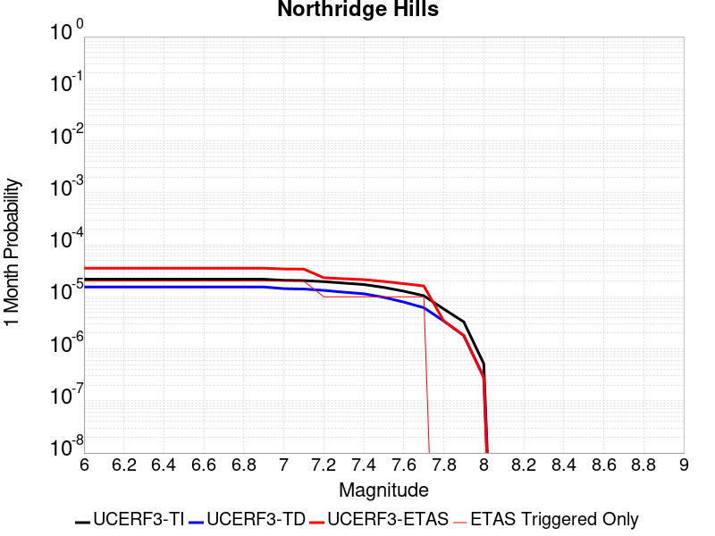 |  |  |

| Magnitude | 1 wk TI Prob | 1 wk TD Prob | 1 wk ETAS Prob | 1 wk ETAS/TD Gain | 1 wk ETAS Triggered Only | 1 mo TI Prob | 1 mo TD Prob | 1 mo ETAS Prob | 1 mo ETAS/TD Gain | 1 mo ETAS Triggered Only | 1 yr TI Prob | 1 yr TD Prob | 1 yr ETAS Prob | 1 yr ETAS/TD Gain | 1 yr ETAS Triggered Only | 10 yr TI Prob | 10 yr TD Prob | 10 yr ETAS Prob | 10 yr ETAS/TD Gain | 10 yr ETAS Triggered Only |
|-----|-----|-----|-----|-----|-----|-----|-----|-----|-----|-----|-----|-----|-----|-----|-----|-----|-----|-----|-----|-----|
| 6.0 | 5.095982E-6 | 3.6152098E-6 | 3.6152098E-6 | 1.0 | 0.0 | 2.183974E-5 | 1.5493664E-5 | 6.8430905E-5 | 4.4167023 | 5.2938063E-5 | 2.658664E-4 | 1.8861916E-4 | 2.4154724E-4 | 1.2806082 | 5.2938063E-5 | 0.0026554854 | 0.001884603 | 0.0019374414 | 1.0280368 | 5.2938063E-5 |
| 6.1 | 5.095982E-6 | 3.6152098E-6 | 3.6152098E-6 | 1.0 | 0.0 | 2.183974E-5 | 1.5493664E-5 | 6.8430905E-5 | 4.4167023 | 5.2938063E-5 | 2.658664E-4 | 1.8861916E-4 | 2.4154724E-4 | 1.2806082 | 5.2938063E-5 | 0.0026554854 | 0.001884603 | 0.0019374414 | 1.0280368 | 5.2938063E-5 |
| 6.2 | 5.095982E-6 | 3.6152098E-6 | 3.6152098E-6 | 1.0 | 0.0 | 2.183974E-5 | 1.5493664E-5 | 6.8430905E-5 | 4.4167023 | 5.2938063E-5 | 2.658664E-4 | 1.8861916E-4 | 2.4154724E-4 | 1.2806082 | 5.2938063E-5 | 0.0026554854 | 0.001884603 | 0.0019374414 | 1.0280368 | 5.2938063E-5 |
| 6.3 | 5.095982E-6 | 3.6152098E-6 | 3.6152098E-6 | 1.0 | 0.0 | 2.183974E-5 | 1.5493664E-5 | 6.8430905E-5 | 4.4167023 | 5.2938063E-5 | 2.658664E-4 | 1.8861916E-4 | 2.4154724E-4 | 1.2806082 | 5.2938063E-5 | 0.0026554854 | 0.001884603 | 0.0019374414 | 1.0280368 | 5.2938063E-5 |
| 6.4 | 5.095982E-6 | 3.6152098E-6 | 3.6152098E-6 | 1.0 | 0.0 | 2.183974E-5 | 1.5493664E-5 | 6.8430905E-5 | 4.4167023 | 5.2938063E-5 | 2.658664E-4 | 1.8861916E-4 | 2.4154724E-4 | 1.2806082 | 5.2938063E-5 | 0.0026554854 | 0.001884603 | 0.0019374414 | 1.0280368 | 5.2938063E-5 |
| 6.5 | 5.095982E-6 | 3.6152098E-6 | 3.6152098E-6 | 1.0 | 0.0 | 2.183974E-5 | 1.5493664E-5 | 6.8430905E-5 | 4.4167023 | 5.2938063E-5 | 2.658664E-4 | 1.8861916E-4 | 2.4154724E-4 | 1.2806082 | 5.2938063E-5 | 0.0026554854 | 0.001884603 | 0.0019374414 | 1.0280368 | 5.2938063E-5 |
| 6.6 | 5.095982E-6 | 3.6152098E-6 | 3.6152098E-6 | 1.0 | 0.0 | 2.183974E-5 | 1.5493664E-5 | 6.8430905E-5 | 4.4167023 | 5.2938063E-5 | 2.658664E-4 | 1.8861916E-4 | 2.4154724E-4 | 1.2806082 | 5.2938063E-5 | 0.0026554854 | 0.001884603 | 0.0019374414 | 1.0280368 | 5.2938063E-5 |
| 6.7 | 5.095982E-6 | 3.6152098E-6 | 3.6152098E-6 | 1.0 | 0.0 | 2.183974E-5 | 1.5493664E-5 | 6.8430905E-5 | 4.4167023 | 5.2938063E-5 | 2.658664E-4 | 1.8861916E-4 | 2.4154724E-4 | 1.2806082 | 5.2938063E-5 | 0.0026554854 | 0.001884603 | 0.0019374414 | 1.0280368 | 5.2938063E-5 |
| 6.8 | 5.095982E-6 | 3.6152098E-6 | 3.6152098E-6 | 1.0 | 0.0 | 2.183974E-5 | 1.5493664E-5 | 6.8430905E-5 | 4.4167023 | 5.2938063E-5 | 2.658664E-4 | 1.8861916E-4 | 2.4154724E-4 | 1.2806082 | 5.2938063E-5 | 0.0026554854 | 0.001884603 | 0.0019374414 | 1.0280368 | 5.2938063E-5 |
| 6.9 | 5.0942654E-6 | 3.6134247E-6 | 3.6134247E-6 | 1.0 | 0.0 | 2.1832384E-5 | 1.5486015E-5 | 6.842326E-5 | 4.4183903 | 5.2938063E-5 | 2.6577685E-4 | 1.8852603E-4 | 2.4145412E-4 | 1.2807468 | 5.2938063E-5 | 0.002654592 | 0.0018836735 | 0.0019365117 | 1.0280507 | 5.2938063E-5 |
| 7.0 | 4.851143E-6 | 3.3587396E-6 | 3.3587396E-6 | 1.0 | 0.0 | 2.0790447E-5 | 1.4394519E-5 | 6.733182E-5 | 4.6776013 | 5.2938063E-5 | 2.5309427E-4 | 1.7523921E-4 | 2.28168E-4 | 1.3020374 | 5.2938063E-5 | 0.0025280623 | 0.0017510147 | 0.0018038602 | 1.0301799 | 5.2938063E-5 |
| 7.1 | 4.7910607E-6 | 3.2970208E-6 | 3.2970208E-6 | 1.0 | 0.0 | 2.0532956E-5 | 1.4130013E-5 | 6.7067325E-5 | 4.7464447 | 5.2938063E-5 | 2.4996005E-4 | 1.7201937E-4 | 2.2494832E-4 | 1.3076918 | 5.2938063E-5 | 0.0024967908 | 0.0017188663 | 0.0017717133 | 1.0307453 | 5.2938063E-5 |
| 7.2 | 4.580079E-6 | 3.1067987E-6 | 3.1067987E-6 | 1.0 | 0.0 | 1.9628762E-5 | 1.3314784E-5 | 1.3314784E-5 | 1.0 | 0.0 | 2.3895396E-4 | 1.6209547E-4 | 1.6209547E-4 | 1.0 | 0.0 | 0.0023869718 | 0.0016197758 | 0.0016197758 | 1.0 | 0.0 |
| 7.3 | 4.290062E-6 | 2.8682275E-6 | 2.8682275E-6 | 1.0 | 0.0 | 1.838585E-5 | 1.2292346E-5 | 1.2292346E-5 | 1.0 | 0.0 | 2.2382473E-4 | 1.4964906E-4 | 1.4964906E-4 | 1.0 | 0.0 | 0.0022359942 | 0.0014954859 | 0.0014954859 | 1.0 | 0.0 |
| 7.4 | 4.0259683E-6 | 2.673904E-6 | 2.673904E-6 | 1.0 | 0.0 | 1.7254037E-5 | 1.1459538E-5 | 1.1459538E-5 | 1.0 | 0.0 | 2.1004764E-4 | 1.3951097E-4 | 1.3951097E-4 | 1.0 | 0.0 | 0.002098492 | 0.0013942367 | 0.0013942367 | 1.0 | 0.0 |
| 7.5 | 3.5477108E-6 | 2.285216E-6 | 2.285216E-6 | 1.0 | 0.0 | 1.5204386E-5 | 9.793746E-6 | 9.793746E-6 | 1.0 | 0.0 | 1.8509767E-4 | 1.1923235E-4 | 1.1923235E-4 | 1.0 | 0.0 | 0.0018494357 | 0.0011916853 | 0.0011916853 | 1.0 | 0.0 |
| 7.6 | 2.9990608E-6 | 1.8528339E-6 | 1.8528339E-6 | 1.0 | 0.0 | 1.2853055E-5 | 7.940693E-6 | 7.940693E-6 | 1.0 | 0.0 | 1.564747E-4 | 9.667365E-5 | 9.667365E-5 | 1.0 | 0.0 | 0.0015636457 | 9.663168E-4 | 9.663168E-4 | 1.0 | 0.0 |
| 7.7 | 2.4542855E-6 | 1.4461344E-6 | 1.4461344E-6 | 1.0 | 0.0 | 1.05183235E-5 | 6.197704E-6 | 6.197704E-6 | 1.0 | 0.0 | 1.2805307E-4 | 7.545444E-5 | 7.545444E-5 | 1.0 | 0.0 | 0.001279793 | 7.5428875E-4 | 7.5428875E-4 | 1.0 | 0.0 |
| 7.8 | 1.3623128E-6 | 8.016168E-7 | 8.016168E-7 | 1.0 | 0.0 | 5.8384703E-6 | 3.4354962E-6 | 3.4354962E-6 | 1.0 | 0.0 | 7.108106E-5 | 4.1826366E-5 | 4.1826366E-5 | 1.0 | 0.0 | 7.1058323E-4 | 4.1818514E-4 | 4.1818514E-4 | 1.0 | 0.0 |
| 7.9 | 7.716622E-7 | 4.218757E-7 | 4.218757E-7 | 1.0 | 0.0 | 3.3071194E-6 | 1.8080375E-6 | 1.8080375E-6 | 1.0 | 0.0 | 4.0263436E-5 | 2.2012635E-5 | 2.2012635E-5 | 1.0 | 0.0 | 4.0256142E-4 | 2.2010466E-4 | 2.2010466E-4 | 1.0 | 0.0 |
| 8.0 | 1.2117711E-7 | 6.6220565E-8 | 6.6220565E-8 | 1.0 | 0.0 | 5.1933034E-7 | 2.838024E-7 | 2.838024E-7 | 1.0 | 0.0 | 6.3228285E-6 | 3.4552888E-6 | 3.4552888E-6 | 1.0 | 0.0 | 6.3226486E-5 | 3.455237E-5 | 3.455237E-5 | 1.0 | 0.0 |

## San Andreas (Santa Cruz Mts) 2011 CFM
*[(top)](#table-of-contents)*

| 1 Week | 1 Month | 1 Year | 10 Year |
|-----|-----|-----|-----|
|  |  |  |  |

| Magnitude | 1 wk TI Prob | 1 wk TD Prob | 1 wk ETAS Prob | 1 wk ETAS/TD Gain | 1 wk ETAS Triggered Only | 1 mo TI Prob | 1 mo TD Prob | 1 mo ETAS Prob | 1 mo ETAS/TD Gain | 1 mo ETAS Triggered Only | 1 yr TI Prob | 1 yr TD Prob | 1 yr ETAS Prob | 1 yr ETAS/TD Gain | 1 yr ETAS Triggered Only | 10 yr TI Prob | 10 yr TD Prob | 10 yr ETAS Prob | 10 yr ETAS/TD Gain | 10 yr ETAS Triggered Only |
|-----|-----|-----|-----|-----|-----|-----|-----|-----|-----|-----|-----|-----|-----|-----|-----|-----|-----|-----|-----|-----|
| 6.0 | 1.7221631E-4 | 1.3793171E-4 | 1.3793171E-4 | 1.0 | 0.0 | 7.378611E-4 | 5.9100403E-4 | 6.439108E-4 | 1.0895202 | 5.2938063E-5 | 0.008946515 | 0.007172124 | 0.0072246823 | 1.0073282 | 5.2938063E-5 | 0.08594794 | 0.0705551 | 0.0706043 | 1.0006974 | 5.2938063E-5 |
| 6.1 | 1.7221631E-4 | 1.3793171E-4 | 1.3793171E-4 | 1.0 | 0.0 | 7.378611E-4 | 5.9100403E-4 | 6.439108E-4 | 1.0895202 | 5.2938063E-5 | 0.008946515 | 0.007172124 | 0.0072246823 | 1.0073282 | 5.2938063E-5 | 0.08594794 | 0.0705551 | 0.0706043 | 1.0006974 | 5.2938063E-5 |
| 6.2 | 1.7221631E-4 | 1.3793171E-4 | 1.3793171E-4 | 1.0 | 0.0 | 7.378611E-4 | 5.9100403E-4 | 6.439108E-4 | 1.0895202 | 5.2938063E-5 | 0.008946515 | 0.007172124 | 0.0072246823 | 1.0073282 | 5.2938063E-5 | 0.08594794 | 0.0705551 | 0.0706043 | 1.0006974 | 5.2938063E-5 |
| 6.3 | 1.716926E-4 | 1.3712609E-4 | 1.3712609E-4 | 1.0 | 0.0 | 7.3561794E-4 | 5.875529E-4 | 6.404598E-4 | 1.0900463 | 5.2938063E-5 | 0.008919428 | 0.0071303817 | 0.0071829422 | 1.0073713 | 5.2938063E-5 | 0.08569809 | 0.070167266 | 0.07021649 | 1.0007015 | 5.2938063E-5 |
| 6.4 | 1.6392978E-4 | 1.3588481E-4 | 1.3588481E-4 | 1.0 | 0.0 | 7.02367E-4 | 5.822355E-4 | 6.351428E-4 | 1.0908692 | 5.2938063E-5 | 0.008517839 | 0.007066063 | 0.007118627 | 1.0074389 | 5.2938063E-5 | 0.08198654 | 0.06940135 | 0.06945062 | 1.0007099 | 5.2938063E-5 |
| 6.5 | 1.5742714E-4 | 1.2648388E-4 | 1.2648388E-4 | 1.0 | 0.0 | 6.745133E-4 | 5.4196286E-4 | 5.948722E-4 | 1.0976255 | 5.2938063E-5 | 0.00818132 | 0.0065787593 | 0.006631349 | 1.0079939 | 5.2938063E-5 | 0.078865945 | 0.06486309 | 0.0649126 | 1.0007632 | 5.2938063E-5 |
| 6.6 | 1.3038084E-4 | 1.1588213E-4 | 1.1588213E-4 | 1.0 | 0.0 | 5.5865536E-4 | 4.9654447E-4 | 5.494562E-4 | 1.10656 | 5.2938063E-5 | 0.006780438 | 0.0060289134 | 0.006081532 | 1.0087278 | 5.2938063E-5 | 0.0657725 | 0.05932738 | 0.059377175 | 1.0008394 | 5.2938063E-5 |
| 6.7 | 1.2867592E-4 | 1.1314701E-4 | 1.1314701E-4 | 1.0 | 0.0 | 5.5135164E-4 | 4.8482692E-4 | 5.377393E-4 | 1.1091367 | 5.2938063E-5 | 0.0066920654 | 0.00588703 | 0.005939657 | 1.0089394 | 5.2938063E-5 | 0.06494093 | 0.058038417 | 0.058088284 | 1.0008591 | 5.2938063E-5 |
| 6.8 | 1.2801298E-4 | 1.1252261E-4 | 1.1252261E-4 | 1.0 | 0.0 | 5.485117E-4 | 4.8215193E-4 | 5.3506444E-4 | 1.1097424 | 5.2938063E-5 | 0.0066577005 | 0.0058546383 | 0.0059072664 | 1.0089891 | 5.2938063E-5 | 0.06461738 | 0.057752274 | 0.057802152 | 1.0008637 | 5.2938063E-5 |
| 6.9 | 1.269149E-4 | 1.1094465E-4 | 1.1094465E-4 | 1.0 | 0.0 | 5.4380763E-4 | 4.7539172E-4 | 5.283046E-4 | 1.1113038 | 5.2938063E-5 | 0.006600777 | 0.005772772 | 0.005825404 | 1.0091174 | 5.2938063E-5 | 0.06408122 | 0.0570241 | 0.057074018 | 1.0008754 | 5.2938063E-5 |
| 7.0 | 1.2030331E-4 | 1.0824504E-4 | 1.0824504E-4 | 1.0 | 0.0 | 5.154837E-4 | 4.638261E-4 | 5.167396E-4 | 1.1140805 | 5.2938063E-5 | 0.006257969 | 0.0056326967 | 0.0056853364 | 1.0093454 | 5.2938063E-5 | 0.06084648 | 0.055696685 | 0.055746675 | 1.0008975 | 5.2938063E-5 |
| 7.1 | 8.049617E-5 | 5.3926604E-5 | 5.3926604E-5 | 1.0 | 0.0 | 3.4493793E-4 | 2.3109373E-4 | 2.8401957E-4 | 1.2290232 | 5.2938063E-5 | 0.0041915346 | 0.0028099709 | 0.00286276 | 1.0187864 | 5.2938063E-5 | 0.041133516 | 0.029618956 | 0.029670326 | 1.0017344 | 5.2938063E-5 |
| 7.2 | 7.093979E-5 | 4.2937932E-5 | 4.2937932E-5 | 1.0 | 0.0 | 3.0399222E-4 | 1.8400686E-4 | 2.3693517E-4 | 1.2876432 | 5.2938063E-5 | 0.0036948253 | 0.0022380045 | 0.0022908242 | 1.0236012 | 5.2938063E-5 | 0.03633994 | 0.023941692 | 0.023993362 | 1.0021582 | 5.2938063E-5 |
| 7.3 | 6.193693E-5 | 2.8894141E-5 | 2.8894141E-5 | 1.0 | 0.0 | 2.6541698E-4 | 1.2382616E-4 | 1.7675768E-4 | 1.4274663 | 5.2938063E-5 | 0.0032266637 | 0.0015065427 | 0.001559401 | 1.0350858 | 5.2938063E-5 | 0.031802133 | 0.016499156 | 0.01655122 | 1.0031556 | 5.2938063E-5 |
| 7.4 | 5.906492E-5 | 2.702346E-5 | 2.702346E-5 | 1.0 | 0.0 | 2.5311083E-4 | 1.1580969E-4 | 1.6874162E-4 | 1.4570596 | 5.2938063E-5 | 0.0030772698 | 0.0014090725 | 0.0014619359 | 1.0375165 | 5.2938063E-5 | 0.030350044 | 0.015471023 | 0.015523141 | 1.0033689 | 5.2938063E-5 |
| 7.5 | 5.424296E-5 | 2.4678277E-5 | 2.4678277E-5 | 1.0 | 0.0 | 2.324491E-4 | 1.05759755E-4 | 1.5869222E-4 | 1.5004972 | 5.2938063E-5 | 0.002826395 | 0.0012868657 | 0.0013397356 | 1.0410843 | 5.2938063E-5 | 0.027907165 | 0.014163188 | 0.014215376 | 1.0036848 | 5.2938063E-5 |
| 7.6 | 4.43084E-5 | 1.990431E-5 | 1.990431E-5 | 1.0 | 0.0 | 1.8987931E-4 | 8.53014E-5 | 1.3823494E-4 | 1.6205473 | 5.2938063E-5 | 0.0023093296 | 0.0010380499 | 0.0010909331 | 1.0509447 | 5.2938063E-5 | 0.022854783 | 0.011412679 | 0.011465014 | 1.0045856 | 5.2938063E-5 |
| 7.7 | 4.118098E-5 | 1.8936442E-5 | 1.8936442E-5 | 1.0 | 0.0 | 1.7647797E-4 | 8.115366E-5 | 1.3408743E-4 | 1.6522659 | 5.2938063E-5 | 0.002146502 | 9.875982E-4 | 0.0010404839 | 1.0535499 | 5.2938063E-5 | 0.021258866 | 0.010870468 | 0.010922831 | 1.004817 | 5.2938063E-5 |
| 7.8 | 3.5408906E-5 | 1.856446E-5 | 1.856446E-5 | 1.0 | 0.0 | 1.5174363E-4 | 7.955955E-5 | 1.324934E-4 | 1.6653363 | 5.2938063E-5 | 0.0018459131 | 9.682073E-4 | 0.0010210942 | 1.0546235 | 5.2938063E-5 | 0.018306552 | 0.010652021 | 0.010704394 | 1.0049168 | 5.2938063E-5 |
| 7.9 | 2.5860836E-5 | 1.7315993E-5 | 1.7315993E-5 | 1.0 | 0.0 | 1.10827445E-4 | 7.420929E-5 | 1.2714343E-4 | 1.7133087 | 5.2938063E-5 | 0.001348489 | 9.031238E-4 | 9.560141E-4 | 1.0585637 | 5.2938063E-5 | 0.013403354 | 0.009907599 | 0.0099600125 | 1.0052903 | 5.2938063E-5 |
| 8.0 | 1.9777332E-5 | 1.4839596E-5 | 1.4839596E-5 | 1.0 | 0.0 | 8.4757245E-5 | 6.3596715E-5 | 1.1653142E-4 | 1.8323495 | 5.2938063E-5 | 0.0010314309 | 7.740152E-4 | 8.269123E-4 | 1.0683411 | 5.2938063E-5 | 0.010266567 | 0.008508967 | 0.008561456 | 1.0061685 | 5.2938063E-5 |
| 8.1 | 1.468494E-5 | 1.2107374E-5 | 1.2107374E-5 | 1.0 | 0.0 | 6.293394E-5 | 5.1887713E-5 | 1.04823026E-4 | 2.0201898 | 5.2938063E-5 | 7.6595135E-4 | 6.3155E-4 | 6.8445463E-4 | 1.0837696 | 5.2938063E-5 | 0.0076331664 | 0.006969149 | 0.007021718 | 1.0075431 | 5.2938063E-5 |
| 8.2 | 8.63836E-6 | 5.469061E-6 | 5.469061E-6 | 1.0 | 0.0 | 3.7021015E-5 | 2.3438623E-5 | 2.3438623E-5 | 1.0 | 0.0 | 4.5063766E-4 | 2.8532793E-4 | 2.8532793E-4 | 1.0 | 0.0 | 0.004497249 | 0.00324569 | 0.00324569 | 1.0 | 0.0 |
| 8.3 | 1.983087E-6 | 7.6599065E-7 | 7.6599065E-7 | 1.0 | 0.0 | 8.498917E-6 | 3.282813E-6 | 3.282813E-6 | 1.0 | 0.0 | 1.034694E-4 | 3.9967534E-5 | 3.9967534E-5 | 1.0 | 0.0 | 0.0010342124 | 4.719687E-4 | 4.719687E-4 | 1.0 | 0.0 |

## Cucamonga
*[(top)](#table-of-contents)*

| 1 Week | 1 Month | 1 Year | 10 Year |
|-----|-----|-----|-----|
|  |  |  |  |

| Magnitude | 1 wk TI Prob | 1 wk TD Prob | 1 wk ETAS Prob | 1 wk ETAS/TD Gain | 1 wk ETAS Triggered Only | 1 mo TI Prob | 1 mo TD Prob | 1 mo ETAS Prob | 1 mo ETAS/TD Gain | 1 mo ETAS Triggered Only | 1 yr TI Prob | 1 yr TD Prob | 1 yr ETAS Prob | 1 yr ETAS/TD Gain | 1 yr ETAS Triggered Only | 10 yr TI Prob | 10 yr TD Prob | 10 yr ETAS Prob | 10 yr ETAS/TD Gain | 10 yr ETAS Triggered Only |
|-----|-----|-----|-----|-----|-----|-----|-----|-----|-----|-----|-----|-----|-----|-----|-----|-----|-----|-----|-----|-----|
| 6.0 | 1.1848348E-5 | 1.1737008E-5 | 6.467445E-5 | 5.510301 | 5.2938063E-5 | 5.0777642E-5 | 5.030051E-5 | 1.0323591E-4 | 2.052383 | 5.2938063E-5 | 6.180424E-4 | 6.1223935E-4 | 6.65145E-4 | 1.0864134 | 5.2938063E-5 | 0.0061632637 | 0.0061067017 | 0.0061593167 | 1.0086159 | 5.2938063E-5 |
| 6.1 | 1.1848348E-5 | 1.1737008E-5 | 6.467445E-5 | 5.510301 | 5.2938063E-5 | 5.0777642E-5 | 5.030051E-5 | 1.0323591E-4 | 2.052383 | 5.2938063E-5 | 6.180424E-4 | 6.1223935E-4 | 6.65145E-4 | 1.0864134 | 5.2938063E-5 | 0.0061632637 | 0.0061067017 | 0.0061593167 | 1.0086159 | 5.2938063E-5 |
| 6.2 | 1.1848348E-5 | 1.1737008E-5 | 6.467445E-5 | 5.510301 | 5.2938063E-5 | 5.0777642E-5 | 5.030051E-5 | 1.0323591E-4 | 2.052383 | 5.2938063E-5 | 6.180424E-4 | 6.1223935E-4 | 6.65145E-4 | 1.0864134 | 5.2938063E-5 | 0.0061632637 | 0.0061067017 | 0.0061593167 | 1.0086159 | 5.2938063E-5 |
| 6.3 | 1.1848348E-5 | 1.1737008E-5 | 6.467445E-5 | 5.510301 | 5.2938063E-5 | 5.0777642E-5 | 5.030051E-5 | 1.0323591E-4 | 2.052383 | 5.2938063E-5 | 6.180424E-4 | 6.1223935E-4 | 6.65145E-4 | 1.0864134 | 5.2938063E-5 | 0.0061632637 | 0.0061067017 | 0.0061593167 | 1.0086159 | 5.2938063E-5 |
| 6.4 | 1.1848348E-5 | 1.1737008E-5 | 6.467445E-5 | 5.510301 | 5.2938063E-5 | 5.0777642E-5 | 5.030051E-5 | 1.0323591E-4 | 2.052383 | 5.2938063E-5 | 6.180424E-4 | 6.1223935E-4 | 6.65145E-4 | 1.0864134 | 5.2938063E-5 | 0.0061632637 | 0.0061067017 | 0.0061593167 | 1.0086159 | 5.2938063E-5 |
| 6.5 | 1.16988695E-5 | 1.15760395E-5 | 6.4513486E-5 | 5.573019 | 5.2938063E-5 | 5.013705E-5 | 4.9610666E-5 | 1.025461E-4 | 2.0670173 | 5.2938063E-5 | 6.102476E-4 | 6.0384517E-4 | 6.567513E-4 | 1.0876154 | 5.2938063E-5 | 0.006085745 | 0.006023216 | 0.0060758353 | 1.008736 | 5.2938063E-5 |
| 6.6 | 1.16988695E-5 | 1.15760395E-5 | 6.4513486E-5 | 5.573019 | 5.2938063E-5 | 5.013705E-5 | 4.9610666E-5 | 1.025461E-4 | 2.0670173 | 5.2938063E-5 | 6.102476E-4 | 6.0384517E-4 | 6.567513E-4 | 1.0876154 | 5.2938063E-5 | 0.006085745 | 0.006023216 | 0.0060758353 | 1.008736 | 5.2938063E-5 |
| 6.7 | 1.1397107E-5 | 1.11149475E-5 | 6.405242E-5 | 5.762728 | 5.2938063E-5 | 4.884383E-5 | 4.7634636E-5 | 1.0057018E-4 | 2.1112826 | 5.2938063E-5 | 5.9451134E-4 | 5.797998E-4 | 6.327072E-4 | 1.0912511 | 5.2938063E-5 | 0.005929234 | 0.0057840226 | 0.0058366545 | 1.0090995 | 5.2938063E-5 |
| 6.8 | 1.058387E-5 | 9.784992E-6 | 9.784992E-6 | 1.0 | 0.0 | 4.5358654E-5 | 4.193501E-5 | 4.193501E-5 | 1.0 | 0.0 | 5.521017E-4 | 5.1044027E-4 | 5.1044027E-4 | 1.0 | 0.0 | 0.00550732 | 0.0050936877 | 0.0050936877 | 1.0 | 0.0 |
| 6.9 | 9.690046E-6 | 8.57948E-6 | 8.57948E-6 | 1.0 | 0.0 | 4.1528107E-5 | 3.6768684E-5 | 3.6768684E-5 | 1.0 | 0.0 | 5.054874E-4 | 4.475672E-4 | 4.475672E-4 | 1.0 | 0.0 | 0.005043391 | 0.004467594 | 0.004467594 | 1.0 | 0.0 |
| 7.0 | 9.381461E-6 | 8.187101E-6 | 8.187101E-6 | 1.0 | 0.0 | 4.020564E-5 | 3.5087105E-5 | 3.5087105E-5 | 1.0 | 0.0 | 4.893937E-4 | 4.2710215E-4 | 4.2710215E-4 | 1.0 | 0.0 | 0.0048831734 | 0.0042637475 | 0.0042637475 | 1.0 | 0.0 |
| 7.1 | 8.946492E-6 | 7.781886E-6 | 7.781886E-6 | 1.0 | 0.0 | 3.8341543E-5 | 3.3350516E-5 | 3.3350516E-5 | 1.0 | 0.0 | 4.667083E-4 | 4.0596718E-4 | 4.0596718E-4 | 1.0 | 0.0 | 0.0046572937 | 0.004053192 | 0.004053192 | 1.0 | 0.0 |
| 7.2 | 8.251016E-6 | 6.9752796E-6 | 6.9752796E-6 | 1.0 | 0.0 | 3.5361016E-5 | 2.9893714E-5 | 2.9893714E-5 | 1.0 | 0.0 | 4.3043532E-4 | 3.6389544E-4 | 3.6389544E-4 | 1.0 | 0.0 | 0.0042960253 | 0.0036339292 | 0.0036339292 | 1.0 | 0.0 |
| 7.3 | 7.717881E-6 | 6.4863502E-6 | 6.4863502E-6 | 1.0 | 0.0 | 3.3076216E-5 | 2.7798349E-5 | 2.7798349E-5 | 1.0 | 0.0 | 4.026285E-4 | 3.3839257E-4 | 3.3839257E-4 | 1.0 | 0.0 | 0.004018998 | 0.00337971 | 0.00337971 | 1.0 | 0.0 |
| 7.4 | 7.275623E-6 | 6.031997E-6 | 6.031997E-6 | 1.0 | 0.0 | 3.118087E-5 | 2.585116E-5 | 2.585116E-5 | 1.0 | 0.0 | 3.7956095E-4 | 3.1469265E-4 | 3.1469265E-4 | 1.0 | 0.0 | 0.0037891332 | 0.0031434062 | 0.0031434062 | 1.0 | 0.0 |
| 7.5 | 6.5109502E-6 | 5.1006014E-6 | 5.1006014E-6 | 1.0 | 0.0 | 2.7903774E-5 | 2.1859538E-5 | 2.1859538E-5 | 1.0 | 0.0 | 3.3967546E-4 | 2.661075E-4 | 2.661075E-4 | 1.0 | 0.0 | 0.0033915674 | 0.002658813 | 0.002658813 | 1.0 | 0.0 |
| 7.6 | 5.4495326E-6 | 3.90857E-6 | 3.90857E-6 | 1.0 | 0.0 | 2.335493E-5 | 1.6750908E-5 | 1.6750908E-5 | 1.0 | 0.0 | 2.8430918E-4 | 2.0392328E-4 | 2.0392328E-4 | 1.0 | 0.0 | 0.0028394572 | 0.002038282 | 0.002038282 | 1.0 | 0.0 |
| 7.7 | 4.7997164E-6 | 3.2002547E-6 | 3.2002547E-6 | 1.0 | 0.0 | 2.057005E-5 | 1.3715306E-5 | 1.3715306E-5 | 1.0 | 0.0 | 2.504116E-4 | 1.6697108E-4 | 1.6697108E-4 | 1.0 | 0.0 | 0.002501296 | 0.0016693877 | 0.0016693877 | 1.0 | 0.0 |
| 7.8 | 3.3941733E-6 | 2.0641899E-6 | 2.0641899E-6 | 1.0 | 0.0 | 1.4546376E-5 | 8.846498E-6 | 8.846498E-6 | 1.0 | 0.0 | 1.7708774E-4 | 1.07700806E-4 | 1.07700806E-4 | 1.0 | 0.0 | 0.0017694668 | 0.001076723 | 0.001076723 | 1.0 | 0.0 |
| 7.9 | 9.750552E-7 | 5.155946E-7 | 5.155946E-7 | 1.0 | 0.0 | 4.178801E-6 | 2.2096892E-6 | 2.2096892E-6 | 1.0 | 0.0 | 5.0875715E-5 | 2.690264E-5 | 2.690264E-5 | 1.0 | 0.0 | 5.086407E-4 | 2.6899425E-4 | 2.6899425E-4 | 1.0 | 0.0 |
| 8.0 | 1.133857E-7 | 6.053707E-8 | 6.053707E-8 | 1.0 | 0.0 | 4.8593864E-7 | 2.5944456E-7 | 2.5944456E-7 | 1.0 | 0.0 | 5.9162867E-6 | 3.158733E-6 | 3.158733E-6 | 1.0 | 0.0 | 5.916129E-5 | 3.1586897E-5 | 3.1586897E-5 | 1.0 | 0.0 |

## Earthquake Valley (So Extension)
*[(top)](#table-of-contents)*

| 1 Week | 1 Month | 1 Year | 10 Year |
|-----|-----|-----|-----|
|  |  |  |  |

| Magnitude | 1 wk TI Prob | 1 wk TD Prob | 1 wk ETAS Prob | 1 wk ETAS/TD Gain | 1 wk ETAS Triggered Only | 1 mo TI Prob | 1 mo TD Prob | 1 mo ETAS Prob | 1 mo ETAS/TD Gain | 1 mo ETAS Triggered Only | 1 yr TI Prob | 1 yr TD Prob | 1 yr ETAS Prob | 1 yr ETAS/TD Gain | 1 yr ETAS Triggered Only | 10 yr TI Prob | 10 yr TD Prob | 10 yr ETAS Prob | 10 yr ETAS/TD Gain | 10 yr ETAS Triggered Only |
|-----|-----|-----|-----|-----|-----|-----|-----|-----|-----|-----|-----|-----|-----|-----|-----|-----|-----|-----|-----|-----|
| 6.0 | 3.0194888E-5 | 3.7072114E-5 | 9.000821E-5 | 2.4279225 | 5.2938063E-5 | 1.2940024E-4 | 1.5887388E-4 | 2.1180353E-4 | 1.3331552 | 5.2938063E-5 | 0.0015743093 | 0.0019331174 | 0.0019859532 | 1.0273318 | 5.2938063E-5 | 0.01563203 | 0.019213019 | 0.019264938 | 1.0027024 | 5.2938063E-5 |
| 6.1 | 3.0194888E-5 | 3.7072114E-5 | 9.000821E-5 | 2.4279225 | 5.2938063E-5 | 1.2940024E-4 | 1.5887388E-4 | 2.1180353E-4 | 1.3331552 | 5.2938063E-5 | 0.0015743093 | 0.0019331174 | 0.0019859532 | 1.0273318 | 5.2938063E-5 | 0.01563203 | 0.019213019 | 0.019264938 | 1.0027024 | 5.2938063E-5 |
| 6.2 | 3.0194888E-5 | 3.7072114E-5 | 9.000821E-5 | 2.4279225 | 5.2938063E-5 | 1.2940024E-4 | 1.5887388E-4 | 2.1180353E-4 | 1.3331552 | 5.2938063E-5 | 0.0015743093 | 0.0019331174 | 0.0019859532 | 1.0273318 | 5.2938063E-5 | 0.01563203 | 0.019213019 | 0.019264938 | 1.0027024 | 5.2938063E-5 |
| 6.3 | 1.5795305E-5 | 1.844658E-5 | 1.844658E-5 | 1.0 | 0.0 | 6.769241E-5 | 7.9055004E-5 | 7.9055004E-5 | 1.0 | 0.0 | 8.238434E-4 | 9.6218096E-4 | 9.6218096E-4 | 1.0 | 0.0 | 0.008207959 | 0.009591061 | 0.009591061 | 1.0 | 0.0 |
| 6.4 | 1.5795305E-5 | 1.844658E-5 | 1.844658E-5 | 1.0 | 0.0 | 6.769241E-5 | 7.9055004E-5 | 7.9055004E-5 | 1.0 | 0.0 | 8.238434E-4 | 9.6218096E-4 | 9.6218096E-4 | 1.0 | 0.0 | 0.008207959 | 0.009591061 | 0.009591061 | 1.0 | 0.0 |
| 6.5 | 1.5795305E-5 | 1.844658E-5 | 1.844658E-5 | 1.0 | 0.0 | 6.769241E-5 | 7.9055004E-5 | 7.9055004E-5 | 1.0 | 0.0 | 8.238434E-4 | 9.6218096E-4 | 9.6218096E-4 | 1.0 | 0.0 | 0.008207959 | 0.009591061 | 0.009591061 | 1.0 | 0.0 |
| 6.6 | 1.5795305E-5 | 1.844658E-5 | 1.844658E-5 | 1.0 | 0.0 | 6.769241E-5 | 7.9055004E-5 | 7.9055004E-5 | 1.0 | 0.0 | 8.238434E-4 | 9.6218096E-4 | 9.6218096E-4 | 1.0 | 0.0 | 0.008207959 | 0.009591061 | 0.009591061 | 1.0 | 0.0 |
| 6.7 | 1.1363076E-5 | 1.3138294E-5 | 1.3138294E-5 | 1.0 | 0.0 | 4.8697988E-5 | 5.6306188E-5 | 5.6306188E-5 | 1.0 | 0.0 | 5.927367E-4 | 6.8538834E-4 | 6.8538834E-4 | 1.0 | 0.0 | 0.0059115817 | 0.0068402183 | 0.0068402183 | 1.0 | 0.0 |
| 6.8 | 1.0049611E-5 | 1.1594334E-5 | 1.1594334E-5 | 1.0 | 0.0 | 4.306905E-5 | 4.9689468E-5 | 4.9689468E-5 | 1.0 | 0.0 | 5.242395E-4 | 6.048745E-4 | 6.048745E-4 | 1.0 | 0.0 | 0.0052300454 | 0.006039458 | 0.006039458 | 1.0 | 0.0 |
| 6.9 | 1.0049611E-5 | 1.1594334E-5 | 1.1594334E-5 | 1.0 | 0.0 | 4.306905E-5 | 4.9689468E-5 | 4.9689468E-5 | 1.0 | 0.0 | 5.242395E-4 | 6.048745E-4 | 6.048745E-4 | 1.0 | 0.0 | 0.0052300454 | 0.006039458 | 0.006039458 | 1.0 | 0.0 |
| 7.0 | 1.0049611E-5 | 1.1594334E-5 | 1.1594334E-5 | 1.0 | 0.0 | 4.306905E-5 | 4.9689468E-5 | 4.9689468E-5 | 1.0 | 0.0 | 5.242395E-4 | 6.048745E-4 | 6.048745E-4 | 1.0 | 0.0 | 0.0052300454 | 0.006039458 | 0.006039458 | 1.0 | 0.0 |
| 7.1 | 8.140254E-6 | 9.383458E-6 | 9.383458E-6 | 1.0 | 0.0 | 3.4886336E-5 | 4.0214578E-5 | 4.0214578E-5 | 1.0 | 0.0 | 4.2465836E-4 | 4.8956956E-4 | 4.8956956E-4 | 1.0 | 0.0 | 0.0042384774 | 0.0048914864 | 0.0048914864 | 1.0 | 0.0 |
| 7.2 | 1.673835E-7 | 1.4154125E-7 | 1.4154125E-7 | 1.0 | 0.0 | 7.173577E-7 | 6.066052E-7 | 6.066052E-7 | 1.0 | 0.0 | 8.733795E-6 | 7.385397E-6 | 7.385397E-6 | 1.0 | 0.0 | 8.733451E-5 | 7.385187E-5 | 7.385187E-5 | 1.0 | 0.0 |
| 7.3 | 1.6632116E-7 | 1.4052354E-7 | 1.4052354E-7 | 1.0 | 0.0 | 7.1280476E-7 | 6.0224363E-7 | 6.0224363E-7 | 1.0 | 0.0 | 8.678364E-6 | 7.332295E-6 | 7.332295E-6 | 1.0 | 0.0 | 8.6780245E-5 | 7.332089E-5 | 7.332089E-5 | 1.0 | 0.0 |
| 7.4 | 1.6569169E-7 | 1.3996983E-7 | 1.3996983E-7 | 1.0 | 0.0 | 7.1010703E-7 | 5.9987053E-7 | 5.9987053E-7 | 1.0 | 0.0 | 8.645519E-6 | 7.303403E-6 | 7.303403E-6 | 1.0 | 0.0 | 8.645182E-5 | 7.303199E-5 | 7.303199E-5 | 1.0 | 0.0 |
| 7.5 | 1.1764555E-7 | 1.0095917E-7 | 1.0095917E-7 | 1.0 | 0.0 | 5.041951E-7 | 4.326821E-7 | 4.326821E-7 | 1.0 | 0.0 | 6.138558E-6 | 5.267894E-6 | 5.267894E-6 | 1.0 | 0.0 | 6.1383886E-5 | 5.2677904E-5 | 5.2677904E-5 | 1.0 | 0.0 |
| 7.6 | 1.07927605E-7 | 9.260736E-8 | 9.260736E-8 | 1.0 | 0.0 | 4.6254678E-7 | 3.9688865E-7 | 3.9688865E-7 | 1.0 | 0.0 | 5.6314925E-6 | 4.832111E-6 | 4.832111E-6 | 1.0 | 0.0 | 5.63135E-5 | 4.8320264E-5 | 4.8320264E-5 | 1.0 | 0.0 |
| 7.7 | 2.1826905E-8 | 1.1180516E-8 | 1.1180516E-8 | 1.0 | 0.0 | 9.3543875E-8 | 4.7916494E-8 | 4.7916494E-8 | 1.0 | 0.0 | 1.1388961E-6 | 5.833832E-7 | 5.833832E-7 | 1.0 | 0.0 | 1.1388902E-5 | 5.8338223E-6 | 5.8338223E-6 | 1.0 | 0.0 |
| 7.8 | 2.6169649E-9 | 1.1969472E-9 | 1.1969472E-9 | 1.0 | 0.0 | 1.1215564E-8 | 5.1297735E-9 | 5.1297735E-9 | 1.0 | 0.0 | 1.3654947E-7 | 6.2454994E-8 | 6.2454994E-8 | 1.0 | 0.0 | 1.365494E-6 | 6.245499E-7 | 6.245499E-7 | 1.0 | 0.0 |

## White Wolf
*[(top)](#table-of-contents)*

| 1 Week | 1 Month | 1 Year | 10 Year |
|-----|-----|-----|-----|
|  |  |  |  |

| Magnitude | 1 wk TI Prob | 1 wk TD Prob | 1 wk ETAS Prob | 1 wk ETAS/TD Gain | 1 wk ETAS Triggered Only | 1 mo TI Prob | 1 mo TD Prob | 1 mo ETAS Prob | 1 mo ETAS/TD Gain | 1 mo ETAS Triggered Only | 1 yr TI Prob | 1 yr TD Prob | 1 yr ETAS Prob | 1 yr ETAS/TD Gain | 1 yr ETAS Triggered Only | 10 yr TI Prob | 10 yr TD Prob | 10 yr ETAS Prob | 10 yr ETAS/TD Gain | 10 yr ETAS Triggered Only |
|-----|-----|-----|-----|-----|-----|-----|-----|-----|-----|-----|-----|-----|-----|-----|-----|-----|-----|-----|-----|-----|
| 6.0 | 2.0037822E-5 | 1.0469162E-6 | 5.3984924E-5 | 51.56566 | 5.2938063E-5 | 8.587355E-5 | 4.486776E-6 | 5.74246E-5 | 12.798633 | 5.2938063E-5 | 0.001045009 | 5.4625183E-5 | 1.0756035E-4 | 1.9690617 | 5.2938063E-5 | 0.010401085 | 5.461226E-4 | 5.9903174E-4 | 1.0968815 | 5.2938063E-5 |
| 6.1 | 2.0037822E-5 | 1.0469162E-6 | 5.3984924E-5 | 51.56566 | 5.2938063E-5 | 8.587355E-5 | 4.486776E-6 | 5.74246E-5 | 12.798633 | 5.2938063E-5 | 0.001045009 | 5.4625183E-5 | 1.0756035E-4 | 1.9690617 | 5.2938063E-5 | 0.010401085 | 5.461226E-4 | 5.9903174E-4 | 1.0968815 | 5.2938063E-5 |
| 6.2 | 2.0037822E-5 | 1.0469162E-6 | 5.3984924E-5 | 51.56566 | 5.2938063E-5 | 8.587355E-5 | 4.486776E-6 | 5.74246E-5 | 12.798633 | 5.2938063E-5 | 0.001045009 | 5.4625183E-5 | 1.0756035E-4 | 1.9690617 | 5.2938063E-5 | 0.010401085 | 5.461226E-4 | 5.9903174E-4 | 1.0968815 | 5.2938063E-5 |
| 6.3 | 2.0037822E-5 | 1.0469162E-6 | 5.3984924E-5 | 51.56566 | 5.2938063E-5 | 8.587355E-5 | 4.486776E-6 | 5.74246E-5 | 12.798633 | 5.2938063E-5 | 0.001045009 | 5.4625183E-5 | 1.0756035E-4 | 1.9690617 | 5.2938063E-5 | 0.010401085 | 5.461226E-4 | 5.9903174E-4 | 1.0968815 | 5.2938063E-5 |
| 6.4 | 1.132487E-5 | 1.0469162E-6 | 5.3984924E-5 | 51.56566 | 5.2938063E-5 | 4.8534253E-5 | 4.486776E-6 | 5.74246E-5 | 12.798633 | 5.2938063E-5 | 5.907443E-4 | 5.4625183E-5 | 1.0756035E-4 | 1.9690617 | 5.2938063E-5 | 0.005891764 | 5.461226E-4 | 5.9903174E-4 | 1.0968815 | 5.2938063E-5 |
| 6.5 | 1.132487E-5 | 1.0469162E-6 | 5.3984924E-5 | 51.56566 | 5.2938063E-5 | 4.8534253E-5 | 4.486776E-6 | 5.74246E-5 | 12.798633 | 5.2938063E-5 | 5.907443E-4 | 5.4625183E-5 | 1.0756035E-4 | 1.9690617 | 5.2938063E-5 | 0.005891764 | 5.461226E-4 | 5.9903174E-4 | 1.0968815 | 5.2938063E-5 |
| 6.6 | 9.347473E-6 | 1.0469162E-6 | 5.3984924E-5 | 51.56566 | 5.2938063E-5 | 4.0059982E-5 | 4.486776E-6 | 5.74246E-5 | 12.798633 | 5.2938063E-5 | 4.8762115E-4 | 5.4625183E-5 | 1.0756035E-4 | 1.9690617 | 5.2938063E-5 | 0.0048655253 | 5.461226E-4 | 5.9903174E-4 | 1.0968815 | 5.2938063E-5 |
| 6.7 | 7.842647E-6 | 1.0048342E-6 | 5.3942844E-5 | 53.683327 | 5.2938063E-5 | 3.361091E-5 | 4.3064256E-6 | 5.724426E-5 | 13.292755 | 5.2938063E-5 | 4.0913603E-4 | 5.2429517E-5 | 1.0536481E-4 | 2.0096467 | 5.2938063E-5 | 0.004083836 | 5.2417646E-4 | 5.7708676E-4 | 1.1009399 | 5.2938063E-5 |
| 6.8 | 6.26597E-6 | 9.734822E-7 | 5.391149E-5 | 55.38005 | 5.2938063E-5 | 2.685388E-5 | 4.17206E-6 | 5.71099E-5 | 13.688658 | 5.2938063E-5 | 3.2689696E-4 | 5.0793697E-5 | 1.0372907E-4 | 2.042164 | 5.2938063E-5 | 0.003264165 | 5.078258E-4 | 5.60737E-4 | 1.1041915 | 5.2938063E-5 |
| 6.9 | 5.258436E-6 | 9.183254E-7 | 5.385634E-5 | 58.64625 | 5.2938063E-5 | 2.2535958E-5 | 3.9356746E-6 | 5.687353E-5 | 14.45077 | 5.2938063E-5 | 2.7434074E-4 | 4.7915833E-5 | 1.0085136E-4 | 2.1047606 | 5.2938063E-5 | 0.0027400232 | 4.790598E-4 | 5.319725E-4 | 1.1104511 | 5.2938063E-5 |
| 7.0 | 4.675028E-6 | 8.6611794E-7 | 5.3804135E-5 | 62.121025 | 5.2938063E-5 | 2.003568E-5 | 3.7119291E-6 | 5.6649795E-5 | 15.261551 | 5.2938063E-5 | 2.4390711E-4 | 4.5191846E-5 | 9.8127515E-5 | 2.1713545 | 5.2938063E-5 | 0.0024363957 | 4.518313E-4 | 5.047454E-4 | 1.1171104 | 5.2938063E-5 |
| 7.1 | 2.8270078E-6 | 6.8741696E-7 | 5.3625445E-5 | 78.01006 | 5.2938063E-5 | 1.2115692E-5 | 2.9460696E-6 | 5.5883975E-5 | 18.968994 | 5.2938063E-5 | 1.4749856E-4 | 3.5867848E-5 | 8.8804016E-5 | 2.4758668 | 5.2938063E-5 | 0.001474007 | 3.586247E-4 | 4.1154376E-4 | 1.1475612 | 5.2938063E-5 |
| 7.2 | 1.6881406E-6 | 2.2706382E-7 | 2.2706382E-7 | 1.0 | 0.0 | 7.2348685E-6 | 9.731303E-7 | 9.731303E-7 | 1.0 | 0.0 | 8.808096E-5 | 1.1847799E-5 | 1.1847799E-5 | 1.0 | 0.0 | 8.8046055E-4 | 1.1847183E-4 | 1.1847183E-4 | 1.0 | 0.0 |
| 7.3 | 9.086107E-7 | 1.5266386E-7 | 1.5266386E-7 | 1.0 | 0.0 | 3.8940398E-6 | 6.5427355E-7 | 6.5427355E-7 | 1.0 | 0.0 | 4.7408903E-5 | 7.965752E-6 | 7.965752E-6 | 1.0 | 0.0 | 4.739879E-4 | 7.965475E-5 | 7.965475E-5 | 1.0 | 0.0 |
| 7.4 | 1.9717383E-7 | 9.003913E-8 | 9.003913E-8 | 1.0 | 0.0 | 8.450304E-7 | 3.8588192E-7 | 3.8588192E-7 | 1.0 | 0.0 | 1.0288197E-5 | 4.6981027E-6 | 4.6981027E-6 | 1.0 | 0.0 | 1.028772E-4 | 4.6980065E-5 | 4.6980065E-5 | 1.0 | 0.0 |
| 7.5 | 1.086975E-7 | 6.6597195E-8 | 6.6597195E-8 | 1.0 | 0.0 | 4.6584634E-7 | 2.8541652E-7 | 2.8541652E-7 | 1.0 | 0.0 | 5.6716644E-6 | 3.474941E-6 | 3.474941E-6 | 1.0 | 0.0 | 5.6715195E-5 | 3.474889E-5 | 3.474889E-5 | 1.0 | 0.0 |
| 7.6 | 2.4217808E-8 | 1.5820765E-8 | 1.5820765E-8 | 1.0 | 0.0 | 1.03790605E-7 | 6.780328E-8 | 6.780328E-8 | 1.0 | 0.0 | 1.2636499E-6 | 8.255046E-7 | 8.255046E-7 | 1.0 | 0.0 | 1.2636427E-5 | 8.2550205E-6 | 8.2550205E-6 | 1.0 | 0.0 |

## San Diego Trough south
*[(top)](#table-of-contents)*

| 1 Week | 1 Month | 1 Year | 10 Year |
|-----|-----|-----|-----|
|  |  |  |  |

| Magnitude | 1 wk TI Prob | 1 wk TD Prob | 1 wk ETAS Prob | 1 wk ETAS/TD Gain | 1 wk ETAS Triggered Only | 1 mo TI Prob | 1 mo TD Prob | 1 mo ETAS Prob | 1 mo ETAS/TD Gain | 1 mo ETAS Triggered Only | 1 yr TI Prob | 1 yr TD Prob | 1 yr ETAS Prob | 1 yr ETAS/TD Gain | 1 yr ETAS Triggered Only | 10 yr TI Prob | 10 yr TD Prob | 10 yr ETAS Prob | 10 yr ETAS/TD Gain | 10 yr ETAS Triggered Only |
|-----|-----|-----|-----|-----|-----|-----|-----|-----|-----|-----|-----|-----|-----|-----|-----|-----|-----|-----|-----|-----|
| 6.0 | 8.279495E-5 | 1.04241306E-4 | 1.5717385E-4 | 1.5077885 | 5.2938063E-5 | 3.5478722E-4 | 4.4667677E-4 | 4.995912E-4 | 1.1184624 | 5.2938063E-5 | 0.004310982 | 0.0054256152 | 0.005478266 | 1.0097041 | 5.2938063E-5 | 0.042283054 | 0.05299221 | 0.05304234 | 1.000946 | 5.2938063E-5 |
| 6.1 | 4.6961468E-5 | 5.772944E-5 | 1.1066445E-4 | 1.9169499 | 5.2938063E-5 | 2.0124791E-4 | 2.473894E-4 | 3.0031436E-4 | 1.2139338 | 5.2938063E-5 | 0.00244744 | 0.0030079768 | 0.0030607556 | 1.0175463 | 5.2938063E-5 | 0.024206603 | 0.029679462 | 0.029730828 | 1.0017307 | 5.2938063E-5 |
| 6.2 | 3.5079658E-5 | 4.214154E-5 | 9.507737E-5 | 2.2561438 | 5.2938063E-5 | 1.5033272E-4 | 1.8059435E-4 | 2.3352285E-4 | 1.2930795 | 5.2938063E-5 | 0.0018287642 | 0.0021965632 | 0.0022493848 | 1.0240475 | 5.2938063E-5 | 0.018137876 | 0.021751117 | 0.021802904 | 1.0023808 | 5.2938063E-5 |
| 6.3 | 3.5079658E-5 | 4.214154E-5 | 9.507737E-5 | 2.2561438 | 5.2938063E-5 | 1.5033272E-4 | 1.8059435E-4 | 2.3352285E-4 | 1.2930795 | 5.2938063E-5 | 0.0018287642 | 0.0021965632 | 0.0022493848 | 1.0240475 | 5.2938063E-5 | 0.018137876 | 0.021751117 | 0.021802904 | 1.0023808 | 5.2938063E-5 |
| 6.4 | 2.7196904E-5 | 3.2087162E-5 | 3.2087162E-5 | 1.0 | 0.0 | 1.16552954E-4 | 1.3750927E-4 | 1.3750927E-4 | 1.0 | 0.0 | 0.0014181085 | 0.0016729041 | 0.0016729041 | 1.0 | 0.0 | 0.014090929 | 0.016604643 | 0.016604643 | 1.0 | 0.0 |
| 6.5 | 2.5584688E-5 | 3.010164E-5 | 3.010164E-5 | 1.0 | 0.0 | 1.0964406E-4 | 1.2900073E-4 | 1.2900073E-4 | 1.0 | 0.0 | 0.0013340989 | 0.0015694655 | 0.0015694655 | 1.0 | 0.0 | 0.013261181 | 0.015585314 | 0.015585314 | 1.0 | 0.0 |
| 6.6 | 2.2034688E-5 | 2.5742738E-5 | 2.5742738E-5 | 1.0 | 0.0 | 9.443096E-5 | 1.1032141E-4 | 1.1032141E-4 | 1.0 | 0.0 | 0.0011490905 | 0.0013423424 | 0.0013423424 | 1.0 | 0.0 | 0.011431668 | 0.013343317 | 0.013343317 | 1.0 | 0.0 |
| 6.7 | 1.9394853E-5 | 2.254176E-5 | 2.254176E-5 | 1.0 | 0.0 | 8.311815E-5 | 9.6603995E-5 | 9.6603995E-5 | 1.0 | 0.0 | 0.0010114936 | 0.0011755243 | 0.0011755243 | 1.0 | 0.0 | 0.01006902 | 0.011693766 | 0.011693766 | 1.0 | 0.0 |
| 6.8 | 1.7615313E-5 | 2.0403182E-5 | 2.0403182E-5 | 1.0 | 0.0 | 7.549201E-5 | 8.74393E-5 | 8.74393E-5 | 1.0 | 0.0 | 9.1872766E-4 | 0.0010640579 | 0.0010640579 | 1.0 | 0.0 | 0.009149387 | 0.010590198 | 0.010590198 | 1.0 | 0.0 |
| 6.9 | 1.5621423E-5 | 1.8026114E-5 | 1.8026114E-5 | 1.0 | 0.0 | 6.6947236E-5 | 7.725251E-5 | 7.725251E-5 | 1.0 | 0.0 | 8.147778E-4 | 9.40147E-4 | 9.40147E-4 | 1.0 | 0.0 | 0.008117969 | 0.009362142 | 0.009362142 | 1.0 | 0.0 |
| 7.0 | 1.3444376E-5 | 1.544809E-5 | 1.544809E-5 | 1.0 | 0.0 | 5.7617483E-5 | 6.620443E-5 | 6.620443E-5 | 1.0 | 0.0 | 7.0126704E-4 | 8.057436E-4 | 8.057436E-4 | 1.0 | 0.0 | 0.006990582 | 0.008028555 | 0.008028555 | 1.0 | 0.0 |
| 7.1 | 1.2268361E-5 | 1.407303E-5 | 1.407303E-5 | 1.0 | 0.0 | 5.2577634E-5 | 6.0311606E-5 | 6.0311606E-5 | 1.0 | 0.0 | 6.399447E-4 | 7.3404907E-4 | 7.3404907E-4 | 1.0 | 0.0 | 0.0063810493 | 0.0073165493 | 0.0073165493 | 1.0 | 0.0 |
| 7.2 | 1.0922655E-5 | 1.2513563E-5 | 1.2513563E-5 | 1.0 | 0.0 | 4.681054E-5 | 5.3628468E-5 | 5.3628468E-5 | 1.0 | 0.0 | 5.697693E-4 | 6.5273355E-4 | 6.5273355E-4 | 1.0 | 0.0 | 0.0056831064 | 0.0065084435 | 0.0065084435 | 1.0 | 0.0 |
| 7.3 | 6.1106753E-6 | 6.928925E-6 | 6.928925E-6 | 1.0 | 0.0 | 2.6188345E-5 | 2.9695057E-5 | 2.9695057E-5 | 1.0 | 0.0 | 3.1879646E-4 | 3.6147775E-4 | 3.6147775E-4 | 1.0 | 0.0 | 0.0031833951 | 0.003608943 | 0.003608943 | 1.0 | 0.0 |
| 7.4 | 4.933187E-6 | 5.5895525E-6 | 5.5895525E-6 | 1.0 | 0.0 | 2.114206E-5 | 2.3955008E-5 | 2.3955008E-5 | 1.0 | 0.0 | 2.5737417E-4 | 2.9161357E-4 | 2.9161357E-4 | 1.0 | 0.0 | 0.002570763 | 0.0029123505 | 0.0029123505 | 1.0 | 0.0 |
| 7.5 | 1.7489613E-6 | 1.969678E-6 | 1.969678E-6 | 1.0 | 0.0 | 7.495527E-6 | 8.4414505E-6 | 8.4414505E-6 | 1.0 | 0.0 | 9.125422E-5 | 1.02770035E-4 | 1.02770035E-4 | 1.0 | 0.0 | 9.1216754E-4 | 0.0010272472 | 0.0010272472 | 1.0 | 0.0 |
| 7.6 | 1.6988751E-7 | 1.7533823E-7 | 1.7533823E-7 | 1.0 | 0.0 | 7.2808916E-7 | 7.5144936E-7 | 7.5144936E-7 | 1.0 | 0.0 | 8.864449E-6 | 9.14886E-6 | 9.14886E-6 | 1.0 | 0.0 | 8.8640954E-5 | 9.1485024E-5 | 9.1485024E-5 | 1.0 | 0.0 |

## San Juan
*[(top)](#table-of-contents)*

| 1 Week | 1 Month | 1 Year | 10 Year |
|-----|-----|-----|-----|
|  |  |  |  |

| Magnitude | 1 wk TI Prob | 1 wk TD Prob | 1 wk ETAS Prob | 1 wk ETAS/TD Gain | 1 wk ETAS Triggered Only | 1 mo TI Prob | 1 mo TD Prob | 1 mo ETAS Prob | 1 mo ETAS/TD Gain | 1 mo ETAS Triggered Only | 1 yr TI Prob | 1 yr TD Prob | 1 yr ETAS Prob | 1 yr ETAS/TD Gain | 1 yr ETAS Triggered Only | 10 yr TI Prob | 10 yr TD Prob | 10 yr ETAS Prob | 10 yr ETAS/TD Gain | 10 yr ETAS Triggered Only |
|-----|-----|-----|-----|-----|-----|-----|-----|-----|-----|-----|-----|-----|-----|-----|-----|-----|-----|-----|-----|-----|
| 6.0 | 8.682808E-6 | 8.7491635E-6 | 6.168676E-5 | 7.05059 | 5.2938063E-5 | 3.72115E-5 | 3.74959E-5 | 9.043198E-5 | 2.411783 | 5.2938063E-5 | 4.5295584E-4 | 4.564218E-4 | 5.093357E-4 | 1.115932 | 5.2938063E-5 | 0.004520337 | 0.004555385 | 0.004608082 | 1.0115681 | 5.2938063E-5 |
| 6.1 | 8.682808E-6 | 8.7491635E-6 | 6.168676E-5 | 7.05059 | 5.2938063E-5 | 3.72115E-5 | 3.74959E-5 | 9.043198E-5 | 2.411783 | 5.2938063E-5 | 4.5295584E-4 | 4.564218E-4 | 5.093357E-4 | 1.115932 | 5.2938063E-5 | 0.004520337 | 0.004555385 | 0.004608082 | 1.0115681 | 5.2938063E-5 |
| 6.2 | 8.682808E-6 | 8.7491635E-6 | 6.168676E-5 | 7.05059 | 5.2938063E-5 | 3.72115E-5 | 3.74959E-5 | 9.043198E-5 | 2.411783 | 5.2938063E-5 | 4.5295584E-4 | 4.564218E-4 | 5.093357E-4 | 1.115932 | 5.2938063E-5 | 0.004520337 | 0.004555385 | 0.004608082 | 1.0115681 | 5.2938063E-5 |
| 6.3 | 6.3054235E-6 | 6.2825848E-6 | 6.2825848E-6 | 1.0 | 0.0 | 2.7022963E-5 | 2.6925094E-5 | 2.6925094E-5 | 1.0 | 0.0 | 3.2895492E-4 | 3.2776513E-4 | 3.2776513E-4 | 1.0 | 0.0 | 0.003284684 | 0.003273017 | 0.003273017 | 1.0 | 0.0 |
| 6.4 | 6.1490473E-6 | 6.1144656E-6 | 6.1144656E-6 | 1.0 | 0.0 | 2.6352795E-5 | 2.6204598E-5 | 2.6204598E-5 | 1.0 | 0.0 | 3.2079802E-4 | 3.1899565E-4 | 3.1899565E-4 | 1.0 | 0.0 | 0.0032033534 | 0.0031855737 | 0.0031855737 | 1.0 | 0.0 |
| 6.5 | 5.204848E-6 | 5.137233E-6 | 5.137233E-6 | 1.0 | 0.0 | 2.23063E-5 | 2.2016533E-5 | 2.2016533E-5 | 1.0 | 0.0 | 2.7154534E-4 | 2.6801927E-4 | 2.6801927E-4 | 1.0 | 0.0 | 0.0027121378 | 0.0026771144 | 0.0026771144 | 1.0 | 0.0 |
| 6.6 | 4.5179986E-6 | 4.4150297E-6 | 4.4150297E-6 | 1.0 | 0.0 | 1.9362706E-5 | 1.8921424E-5 | 1.8921424E-5 | 1.0 | 0.0 | 2.3571544E-4 | 2.3034477E-4 | 2.3034477E-4 | 1.0 | 0.0 | 0.0023546559 | 0.0023011973 | 0.0023011973 | 1.0 | 0.0 |
| 6.7 | 3.9442616E-6 | 3.819828E-6 | 3.819828E-6 | 1.0 | 0.0 | 1.6903869E-5 | 1.6370592E-5 | 1.6370592E-5 | 1.0 | 0.0 | 2.0578515E-4 | 1.992944E-4 | 1.992944E-4 | 1.0 | 0.0 | 0.002055947 | 0.0019912818 | 0.0019912818 | 1.0 | 0.0 |
| 6.8 | 3.4536245E-6 | 3.3163353E-6 | 3.3163353E-6 | 1.0 | 0.0 | 1.4801163E-5 | 1.4212792E-5 | 1.4212792E-5 | 1.0 | 0.0 | 1.8018926E-4 | 1.7302761E-4 | 1.7302761E-4 | 1.0 | 0.0 | 0.0018004322 | 0.0017290477 | 0.0017290477 | 1.0 | 0.0 |
| 6.9 | 3.059865E-6 | 2.9120315E-6 | 2.9120315E-6 | 1.0 | 0.0 | 1.3113641E-5 | 1.2480078E-5 | 1.2480078E-5 | 1.0 | 0.0 | 1.596469E-4 | 1.5193493E-4 | 1.5193493E-4 | 1.0 | 0.0 | 0.0015953224 | 0.0015184252 | 0.0015184252 | 1.0 | 0.0 |
| 7.0 | 2.6504351E-6 | 2.4920002E-6 | 2.4920002E-6 | 1.0 | 0.0 | 1.1358958E-5 | 1.0679961E-5 | 1.0679961E-5 | 1.0 | 0.0 | 1.3828653E-4 | 1.300213E-4 | 1.300213E-4 | 1.0 | 0.0 | 0.0013820052 | 0.0012995641 | 0.0012995641 | 1.0 | 0.0 |
| 7.1 | 2.2039317E-6 | 2.0338296E-6 | 2.0338296E-6 | 1.0 | 0.0 | 9.445387E-6 | 8.716386E-6 | 8.716386E-6 | 1.0 | 0.0 | 1.1499152E-4 | 1.0611736E-4 | 1.0611736E-4 | 1.0 | 0.0 | 0.0011493203 | 0.0010607769 | 0.0010607769 | 1.0 | 0.0 |
| 7.2 | 1.0786707E-6 | 8.7701903E-7 | 8.7701903E-7 | 1.0 | 0.0 | 4.622866E-6 | 3.7586476E-6 | 3.7586476E-6 | 1.0 | 0.0 | 5.628194E-5 | 4.5760586E-5 | 4.5760586E-5 | 1.0 | 0.0 | 5.6267687E-4 | 4.5757066E-4 | 4.5757066E-4 | 1.0 | 0.0 |
| 7.3 | 6.846433E-7 | 4.868805E-7 | 4.868805E-7 | 1.0 | 0.0 | 2.9341822E-6 | 2.086629E-6 | 2.086629E-6 | 1.0 | 0.0 | 3.5723086E-5 | 2.5404412E-5 | 2.5404412E-5 | 1.0 | 0.0 | 3.571734E-4 | 2.540486E-4 | 2.540486E-4 | 1.0 | 0.0 |
| 7.4 | 5.23043E-7 | 3.2628162E-7 | 3.2628162E-7 | 1.0 | 0.0 | 2.2416111E-6 | 1.398349E-6 | 1.398349E-6 | 1.0 | 0.0 | 2.7291273E-5 | 1.7024766E-5 | 1.7024766E-5 | 1.0 | 0.0 | 2.7287923E-4 | 1.7026656E-4 | 1.7026656E-4 | 1.0 | 0.0 |
| 7.5 | 4.648444E-7 | 2.7234944E-7 | 2.7234944E-7 | 1.0 | 0.0 | 1.9921886E-6 | 1.1672114E-6 | 1.1672114E-6 | 1.0 | 0.0 | 2.4254627E-5 | 1.42107065E-5 | 1.42107065E-5 | 1.0 | 0.0 | 2.425198E-4 | 1.421276E-4 | 1.421276E-4 | 1.0 | 0.0 |
| 7.6 | 3.9906567E-7 | 2.2083314E-7 | 2.2083314E-7 | 1.0 | 0.0 | 1.7102802E-6 | 9.464274E-7 | 9.464274E-7 | 1.0 | 0.0 | 2.0822463E-5 | 1.1522693E-5 | 1.1522693E-5 | 1.0 | 0.0 | 2.0820512E-4 | 1.15245566E-4 | 1.15245566E-4 | 1.0 | 0.0 |
| 7.7 | 1.8784601E-7 | 5.3666906E-8 | 5.3666906E-8 | 1.0 | 0.0 | 8.0505407E-7 | 2.30001E-7 | 2.30001E-7 | 1.0 | 0.0 | 9.80149E-6 | 2.8002585E-6 | 2.8002585E-6 | 1.0 | 0.0 | 9.801057E-5 | 2.8011282E-5 | 2.8011282E-5 | 1.0 | 0.0 |
| 7.8 | 1.00154914E-7 | 1.2415832E-8 | 1.2415832E-8 | 1.0 | 0.0 | 4.2923529E-7 | 5.3210716E-8 | 5.3210716E-8 | 1.0 | 0.0 | 5.225927E-6 | 6.4784024E-7 | 6.4784024E-7 | 1.0 | 0.0 | 5.225804E-5 | 6.484273E-6 | 6.484273E-6 | 1.0 | 0.0 |
| 7.9 | 6.171429E-8 | 4.2966155E-9 | 4.2966155E-9 | 1.0 | 0.0 | 2.6448978E-7 | 1.8414067E-8 | 1.8414067E-8 | 1.0 | 0.0 | 3.2201583E-6 | 2.2419121E-7 | 2.2419121E-7 | 1.0 | 0.0 | 3.2201115E-5 | 2.2472002E-6 | 2.2472002E-6 | 1.0 | 0.0 |
| 8.0 | 1.3974572E-8 | 3.3788217E-10 | 3.3788217E-10 | 1.0 | 0.0 | 5.989102E-8 | 1.448067E-9 | 1.448067E-9 | 1.0 | 0.0 | 7.2917294E-7 | 1.763022E-8 | 1.763022E-8 | 1.0 | 0.0 | 7.2917055E-6 | 1.8060365E-7 | 1.8060365E-7 | 1.0 | 0.0 |
| 8.1 | 1.8403477E-9 | 1.1302803E-10 | 1.1302803E-10 | 1.0 | 0.0 | 7.887204E-9 | 4.844063E-10 | 4.844063E-10 | 1.0 | 0.0 | 9.602671E-8 | 5.8976446E-9 | 5.8976446E-9 | 1.0 | 0.0 | 9.602667E-7 | 6.021993E-8 | 6.021993E-8 | 1.0 | 0.0 |

## Santa Monica alt 1
*[(top)](#table-of-contents)*

| 1 Week | 1 Month | 1 Year | 10 Year |
|-----|-----|-----|-----|
|  |  |  | 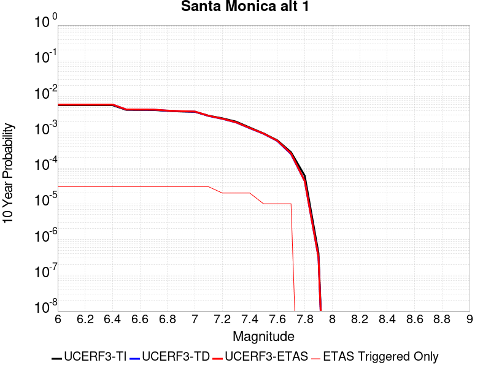 |

| Magnitude | 1 wk TI Prob | 1 wk TD Prob | 1 wk ETAS Prob | 1 wk ETAS/TD Gain | 1 wk ETAS Triggered Only | 1 mo TI Prob | 1 mo TD Prob | 1 mo ETAS Prob | 1 mo ETAS/TD Gain | 1 mo ETAS Triggered Only | 1 yr TI Prob | 1 yr TD Prob | 1 yr ETAS Prob | 1 yr ETAS/TD Gain | 1 yr ETAS Triggered Only | 10 yr TI Prob | 10 yr TD Prob | 10 yr ETAS Prob | 10 yr ETAS/TD Gain | 10 yr ETAS Triggered Only |
|-----|-----|-----|-----|-----|-----|-----|-----|-----|-----|-----|-----|-----|-----|-----|-----|-----|-----|-----|-----|-----|
| 6.0 | 1.1066008E-5 | 1.148031E-5 | 1.148031E-5 | 1.0 | 0.0 | 4.742488E-5 | 4.920048E-5 | 4.920048E-5 | 1.0 | 0.0 | 5.7724497E-4 | 5.9886515E-4 | 5.9886515E-4 | 1.0 | 0.0 | 0.005757478 | 0.0059739 | 0.006026522 | 1.0088086 | 5.2938063E-5 |
| 6.1 | 1.1066008E-5 | 1.148031E-5 | 1.148031E-5 | 1.0 | 0.0 | 4.742488E-5 | 4.920048E-5 | 4.920048E-5 | 1.0 | 0.0 | 5.7724497E-4 | 5.9886515E-4 | 5.9886515E-4 | 1.0 | 0.0 | 0.005757478 | 0.0059739 | 0.006026522 | 1.0088086 | 5.2938063E-5 |
| 6.2 | 1.1066008E-5 | 1.148031E-5 | 1.148031E-5 | 1.0 | 0.0 | 4.742488E-5 | 4.920048E-5 | 4.920048E-5 | 1.0 | 0.0 | 5.7724497E-4 | 5.9886515E-4 | 5.9886515E-4 | 1.0 | 0.0 | 0.005757478 | 0.0059739 | 0.006026522 | 1.0088086 | 5.2938063E-5 |
| 6.3 | 1.1066008E-5 | 1.148031E-5 | 1.148031E-5 | 1.0 | 0.0 | 4.742488E-5 | 4.920048E-5 | 4.920048E-5 | 1.0 | 0.0 | 5.7724497E-4 | 5.9886515E-4 | 5.9886515E-4 | 1.0 | 0.0 | 0.005757478 | 0.0059739 | 0.006026522 | 1.0088086 | 5.2938063E-5 |
| 6.4 | 1.1066008E-5 | 1.148031E-5 | 1.148031E-5 | 1.0 | 0.0 | 4.742488E-5 | 4.920048E-5 | 4.920048E-5 | 1.0 | 0.0 | 5.7724497E-4 | 5.9886515E-4 | 5.9886515E-4 | 1.0 | 0.0 | 0.005757478 | 0.0059739 | 0.006026522 | 1.0088086 | 5.2938063E-5 |
| 6.5 | 8.183544E-6 | 8.335432E-6 | 8.335432E-6 | 1.0 | 0.0 | 3.5071862E-5 | 3.57228E-5 | 3.57228E-5 | 1.0 | 0.0 | 4.2691626E-4 | 4.3483984E-4 | 4.3483984E-4 | 1.0 | 0.0 | 0.0042609703 | 0.0043400554 | 0.004392764 | 1.0121446 | 5.2938063E-5 |
| 6.6 | 8.1543285E-6 | 8.303646E-6 | 8.303646E-6 | 1.0 | 0.0 | 3.4946657E-5 | 3.5586578E-5 | 3.5586578E-5 | 1.0 | 0.0 | 4.2539247E-4 | 4.3318202E-4 | 4.3318202E-4 | 1.0 | 0.0 | 0.0042457907 | 0.004323542 | 0.0043762513 | 1.0121912 | 5.2938063E-5 |
| 6.7 | 8.110878E-6 | 8.257042E-6 | 8.257042E-6 | 1.0 | 0.0 | 3.4760444E-5 | 3.5386853E-5 | 3.5386853E-5 | 1.0 | 0.0 | 4.231262E-4 | 4.3075136E-4 | 4.3075136E-4 | 1.0 | 0.0 | 0.0042232145 | 0.0042993296 | 0.00435204 | 1.0122602 | 5.2938063E-5 |
| 6.8 | 7.644036E-6 | 7.75106E-6 | 7.75106E-6 | 1.0 | 0.0 | 3.275974E-5 | 3.3218414E-5 | 3.3218414E-5 | 1.0 | 0.0 | 3.9877684E-4 | 4.0436056E-4 | 4.0436056E-4 | 1.0 | 0.0 | 0.00398062 | 0.0040363944 | 0.004089119 | 1.0130622 | 5.2938063E-5 |
| 6.9 | 7.3698293E-6 | 7.455719E-6 | 7.455719E-6 | 1.0 | 0.0 | 3.15846E-5 | 3.19527E-5 | 3.19527E-5 | 1.0 | 0.0 | 3.8447464E-4 | 3.8895605E-4 | 3.8895605E-4 | 1.0 | 0.0 | 0.0038381014 | 0.0038828964 | 0.003935629 | 1.0135807 | 5.2938063E-5 |
| 7.0 | 7.209872E-6 | 7.2856255E-6 | 7.2856255E-6 | 1.0 | 0.0 | 3.0899086E-5 | 3.1223743E-5 | 3.1223743E-5 | 1.0 | 0.0 | 3.7613141E-4 | 3.8008415E-4 | 3.8008415E-4 | 1.0 | 0.0 | 0.0037549543 | 0.0037944836 | 0.003847221 | 1.0138984 | 5.2938063E-5 |
| 7.1 | 5.603456E-6 | 5.5238925E-6 | 5.5238925E-6 | 1.0 | 0.0 | 2.4014591E-5 | 2.3673612E-5 | 2.3673612E-5 | 1.0 | 0.0 | 2.923384E-4 | 2.881885E-4 | 2.881885E-4 | 1.0 | 0.0 | 0.0029195412 | 0.0028781896 | 0.0029309753 | 1.0183399 | 5.2938063E-5 |
| 7.2 | 4.7483613E-6 | 4.5911324E-6 | 4.5911324E-6 | 1.0 | 0.0 | 2.0349962E-5 | 1.9676136E-5 | 1.9676136E-5 | 1.0 | 0.0 | 2.4773262E-4 | 2.3953074E-4 | 2.3953074E-4 | 1.0 | 0.0 | 0.0024745662 | 0.0023927398 | 0.002445551 | 1.0220715 | 5.2938063E-5 |
| 7.3 | 3.829015E-6 | 3.6342253E-6 | 3.6342253E-6 | 1.0 | 0.0 | 1.6409962E-5 | 1.5575159E-5 | 1.5575159E-5 | 1.0 | 0.0 | 1.9977297E-4 | 1.8961114E-4 | 1.8961114E-4 | 1.0 | 0.0 | 0.0019959346 | 0.0018945024 | 0.0019473402 | 1.0278901 | 5.2938063E-5 |
| 7.4 | 2.610755E-6 | 2.4995716E-6 | 2.4995716E-6 | 1.0 | 0.0 | 1.1188902E-5 | 1.0712406E-5 | 1.0712406E-5 | 1.0 | 0.0 | 1.3621636E-4 | 1.3041578E-4 | 1.3041578E-4 | 1.0 | 0.0 | 0.001361329 | 0.0013033969 | 0.001356266 | 1.0405625 | 5.2938063E-5 |
| 7.5 | 1.792146E-6 | 1.7584184E-6 | 1.7584184E-6 | 1.0 | 0.0 | 7.680603E-6 | 7.536057E-6 | 7.536057E-6 | 1.0 | 0.0 | 9.3507326E-5 | 9.1747665E-5 | 9.1747665E-5 | 1.0 | 0.0 | 9.3467993E-4 | 9.1710105E-4 | 9.1710105E-4 | 1.0 | 0.0 |
| 7.6 | 1.1473018E-6 | 1.1029152E-6 | 1.1029152E-6 | 1.0 | 0.0 | 4.9169985E-6 | 4.726771E-6 | 4.726771E-6 | 1.0 | 0.0 | 5.986281E-5 | 5.7546935E-5 | 5.7546935E-5 | 1.0 | 0.0 | 5.984669E-4 | 5.7532196E-4 | 5.7532196E-4 | 1.0 | 0.0 |
| 7.7 | 5.330919E-7 | 4.7452556E-7 | 4.7452556E-7 | 1.0 | 0.0 | 2.2846775E-6 | 2.0336795E-6 | 2.0336795E-6 | 1.0 | 0.0 | 2.7815593E-5 | 2.4759778E-5 | 2.4759778E-5 | 1.0 | 0.0 | 2.7812112E-4 | 2.4757133E-4 | 2.4757133E-4 | 1.0 | 0.0 |
| 7.8 | 1.1668574E-7 | 8.2966224E-8 | 8.2966224E-8 | 1.0 | 0.0 | 5.000816E-7 | 3.5556948E-7 | 3.5556948E-7 | 1.0 | 0.0 | 6.0884768E-6 | 4.32905E-6 | 4.32905E-6 | 1.0 | 0.0 | 6.08831E-5 | 4.3289692E-5 | 4.3289692E-5 | 1.0 | 0.0 |
| 7.9 | 8.007447E-10 | 6.1608785E-10 | 6.1608785E-10 | 1.0 | 0.0 | 3.4317629E-9 | 2.6403764E-9 | 2.6403764E-9 | 1.0 | 0.0 | 4.1781714E-8 | 3.2146584E-8 | 3.2146584E-8 | 1.0 | 0.0 | 4.1781706E-7 | 3.214658E-7 | 3.214658E-7 | 1.0 | 0.0 |

## Dry Mountain
*[(top)](#table-of-contents)*

| 1 Week | 1 Month | 1 Year | 10 Year |
|-----|-----|-----|-----|
|  |  |  |  |

| Magnitude | 1 wk TI Prob | 1 wk TD Prob | 1 wk ETAS Prob | 1 wk ETAS/TD Gain | 1 wk ETAS Triggered Only | 1 mo TI Prob | 1 mo TD Prob | 1 mo ETAS Prob | 1 mo ETAS/TD Gain | 1 mo ETAS Triggered Only | 1 yr TI Prob | 1 yr TD Prob | 1 yr ETAS Prob | 1 yr ETAS/TD Gain | 1 yr ETAS Triggered Only | 10 yr TI Prob | 10 yr TD Prob | 10 yr ETAS Prob | 10 yr ETAS/TD Gain | 10 yr ETAS Triggered Only |
|-----|-----|-----|-----|-----|-----|-----|-----|-----|-----|-----|-----|-----|-----|-----|-----|-----|-----|-----|-----|-----|
| 6.0 | 6.222801E-6 | 6.439381E-6 | 6.439381E-6 | 1.0 | 0.0 | 2.6668875E-5 | 2.7597147E-5 | 2.7597147E-5 | 1.0 | 0.0 | 3.2464517E-4 | 3.3595937E-4 | 3.8887965E-4 | 1.1575198 | 5.2938063E-5 | 0.0032417132 | 0.0033560768 | 0.0034088371 | 1.0157208 | 5.2938063E-5 |
| 6.1 | 6.222801E-6 | 6.439381E-6 | 6.439381E-6 | 1.0 | 0.0 | 2.6668875E-5 | 2.7597147E-5 | 2.7597147E-5 | 1.0 | 0.0 | 3.2464517E-4 | 3.3595937E-4 | 3.8887965E-4 | 1.1575198 | 5.2938063E-5 | 0.0032417132 | 0.0033560768 | 0.0034088371 | 1.0157208 | 5.2938063E-5 |
| 6.2 | 6.222801E-6 | 6.439381E-6 | 6.439381E-6 | 1.0 | 0.0 | 2.6668875E-5 | 2.7597147E-5 | 2.7597147E-5 | 1.0 | 0.0 | 3.2464517E-4 | 3.3595937E-4 | 3.8887965E-4 | 1.1575198 | 5.2938063E-5 | 0.0032417132 | 0.0033560768 | 0.0034088371 | 1.0157208 | 5.2938063E-5 |
| 6.3 | 6.222801E-6 | 6.439381E-6 | 6.439381E-6 | 1.0 | 0.0 | 2.6668875E-5 | 2.7597147E-5 | 2.7597147E-5 | 1.0 | 0.0 | 3.2464517E-4 | 3.3595937E-4 | 3.8887965E-4 | 1.1575198 | 5.2938063E-5 | 0.0032417132 | 0.0033560768 | 0.0034088371 | 1.0157208 | 5.2938063E-5 |
| 6.4 | 6.222801E-6 | 6.439381E-6 | 6.439381E-6 | 1.0 | 0.0 | 2.6668875E-5 | 2.7597147E-5 | 2.7597147E-5 | 1.0 | 0.0 | 3.2464517E-4 | 3.3595937E-4 | 3.8887965E-4 | 1.1575198 | 5.2938063E-5 | 0.0032417132 | 0.0033560768 | 0.0034088371 | 1.0157208 | 5.2938063E-5 |
| 6.5 | 2.8528623E-6 | 2.9521684E-6 | 2.9521684E-6 | 1.0 | 0.0 | 1.22264955E-5 | 1.2652138E-5 | 1.2652138E-5 | 1.0 | 0.0 | 1.4884741E-4 | 1.540376E-4 | 1.540376E-4 | 1.0 | 0.0 | 0.0014874774 | 0.0015401616 | 0.0015401616 | 1.0 | 0.0 |
| 6.6 | 2.8528623E-6 | 2.9521684E-6 | 2.9521684E-6 | 1.0 | 0.0 | 1.22264955E-5 | 1.2652138E-5 | 1.2652138E-5 | 1.0 | 0.0 | 1.4884741E-4 | 1.540376E-4 | 1.540376E-4 | 1.0 | 0.0 | 0.0014874774 | 0.0015401616 | 0.0015401616 | 1.0 | 0.0 |
| 6.7 | 2.541E-6 | 2.6293578E-6 | 2.6293578E-6 | 1.0 | 0.0 | 1.0889954E-5 | 1.1268677E-5 | 1.1268677E-5 | 1.0 | 0.0 | 1.3257713E-4 | 1.3719614E-4 | 1.3719614E-4 | 1.0 | 0.0 | 0.0013249806 | 0.0013719613 | 0.0013719613 | 1.0 | 0.0 |

## Great Valley 11
*[(top)](#table-of-contents)*

| 1 Week | 1 Month | 1 Year | 10 Year |
|-----|-----|-----|-----|
|  |  |  | 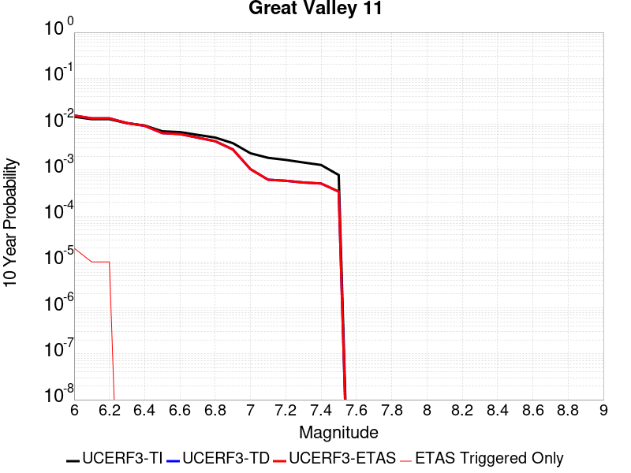 |

| Magnitude | 1 wk TI Prob | 1 wk TD Prob | 1 wk ETAS Prob | 1 wk ETAS/TD Gain | 1 wk ETAS Triggered Only | 1 mo TI Prob | 1 mo TD Prob | 1 mo ETAS Prob | 1 mo ETAS/TD Gain | 1 mo ETAS Triggered Only | 1 yr TI Prob | 1 yr TD Prob | 1 yr ETAS Prob | 1 yr ETAS/TD Gain | 1 yr ETAS Triggered Only | 10 yr TI Prob | 10 yr TD Prob | 10 yr ETAS Prob | 10 yr ETAS/TD Gain | 10 yr ETAS Triggered Only |
|-----|-----|-----|-----|-----|-----|-----|-----|-----|-----|-----|-----|-----|-----|-----|-----|-----|-----|-----|-----|-----|
| 6.0 | 2.8099583E-5 | 2.9832152E-5 | 8.276864E-5 | 2.7744775 | 5.2938063E-5 | 1.20421224E-4 | 1.278462E-4 | 1.807775E-4 | 1.4140232 | 5.2938063E-5 | 0.0014651422 | 0.0015554909 | 0.0016083466 | 1.0339801 | 5.2938063E-5 | 0.0145552 | 0.01545356 | 0.01550568 | 1.0033727 | 5.2938063E-5 |
| 6.1 | 2.483194E-5 | 2.590715E-5 | 2.590715E-5 | 1.0 | 0.0 | 1.0641825E-4 | 1.11026246E-4 | 1.11026246E-4 | 1.0 | 0.0 | 0.0012948721 | 0.0013509706 | 0.0013509706 | 1.0 | 0.0 | 0.012873529 | 0.013433994 | 0.013433994 | 1.0 | 0.0 |
| 6.2 | 2.483194E-5 | 2.590715E-5 | 2.590715E-5 | 1.0 | 0.0 | 1.0641825E-4 | 1.11026246E-4 | 1.11026246E-4 | 1.0 | 0.0 | 0.0012948721 | 0.0013509706 | 0.0013509706 | 1.0 | 0.0 | 0.012873529 | 0.013433994 | 0.013433994 | 1.0 | 0.0 |
| 6.3 | 2.0257901E-5 | 2.0398922E-5 | 2.0398922E-5 | 1.0 | 0.0 | 8.681669E-5 | 8.742122E-5 | 8.742122E-5 | 1.0 | 0.0 | 0.0010564806 | 0.0010638756 | 0.0010638756 | 1.0 | 0.0 | 0.01051472 | 0.010592012 | 0.010592012 | 1.0 | 0.0 |
| 6.4 | 1.8054898E-5 | 1.7780874E-5 | 1.7780874E-5 | 1.0 | 0.0 | 7.737584E-5 | 7.62017E-5 | 7.62017E-5 | 1.0 | 0.0 | 9.416436E-4 | 9.2739856E-4 | 9.2739856E-4 | 1.0 | 0.0 | 0.009376635 | 0.009239036 | 0.009239036 | 1.0 | 0.0 |
| 6.5 | 1.34804895E-5 | 1.2321055E-5 | 1.2321055E-5 | 1.0 | 0.0 | 5.777225E-5 | 5.2803476E-5 | 5.2803476E-5 | 1.0 | 0.0 | 7.031501E-4 | 6.4269686E-4 | 6.4269686E-4 | 1.0 | 0.0 | 0.007009294 | 0.0064088185 | 0.0064088185 | 1.0 | 0.0 |
| 6.6 | 1.294883E-5 | 1.1732312E-5 | 1.1732312E-5 | 1.0 | 0.0 | 5.5493805E-5 | 5.028039E-5 | 5.028039E-5 | 1.0 | 0.0 | 6.754276E-4 | 6.1199587E-4 | 6.1199587E-4 | 1.0 | 0.0 | 0.006733784 | 0.0061035305 | 0.0061035305 | 1.0 | 0.0 |
| 6.7 | 1.1272237E-5 | 9.811886E-6 | 9.811886E-6 | 1.0 | 0.0 | 4.8308695E-5 | 4.2050277E-5 | 4.2050277E-5 | 1.0 | 0.0 | 5.879996E-4 | 5.118446E-4 | 5.118446E-4 | 1.0 | 0.0 | 0.005864462 | 0.0051069413 | 0.0051069413 | 1.0 | 0.0 |
| 6.8 | 9.8337505E-6 | 8.19377E-6 | 8.19377E-6 | 1.0 | 0.0 | 4.2143965E-5 | 3.5115696E-5 | 3.5115696E-5 | 1.0 | 0.0 | 5.1298196E-4 | 4.2745177E-4 | 4.2745177E-4 | 1.0 | 0.0 | 0.005117994 | 0.0042665056 | 0.0042665056 | 1.0 | 0.0 |
| 6.9 | 7.4224813E-6 | 5.4131347E-6 | 5.4131347E-6 | 1.0 | 0.0 | 3.1810247E-5 | 2.319895E-5 | 2.319895E-5 | 1.0 | 0.0 | 3.872209E-4 | 2.8241202E-4 | 2.8241202E-4 | 1.0 | 0.0 | 0.0038654688 | 0.0028206722 | 0.0028206722 | 1.0 | 0.0 |
| 7.0 | 4.4628923E-6 | 2.0110795E-6 | 2.0110795E-6 | 1.0 | 0.0 | 1.912654E-5 | 8.618884E-6 | 8.618884E-6 | 1.0 | 0.0 | 2.3284076E-4 | 1.04929975E-4 | 1.04929975E-4 | 1.0 | 0.0 | 0.0023259693 | 0.0010488159 | 0.0010488159 | 1.0 | 0.0 |
| 7.1 | 3.5546527E-6 | 1.1855836E-6 | 1.1855836E-6 | 1.0 | 0.0 | 1.5234136E-5 | 5.081063E-6 | 5.081063E-6 | 1.0 | 0.0 | 1.8545982E-4 | 6.186026E-5 | 6.186026E-5 | 1.0 | 0.0 | 0.0018530512 | 6.1843713E-4 | 6.1843713E-4 | 1.0 | 0.0 |
| 7.2 | 3.2039936E-6 | 1.1254128E-6 | 1.1254128E-6 | 1.0 | 0.0 | 1.3731329E-5 | 4.823189E-6 | 4.823189E-6 | 1.0 | 0.0 | 1.671661E-4 | 5.8720816E-5 | 5.8720816E-5 | 1.0 | 0.0 | 0.0016704041 | 5.870597E-4 | 5.870597E-4 | 1.0 | 0.0 |
| 7.3 | 2.8120473E-6 | 1.0305612E-6 | 1.0305612E-6 | 1.0 | 0.0 | 1.2051575E-5 | 4.4166836E-6 | 4.4166836E-6 | 1.0 | 0.0 | 1.4671806E-4 | 5.3771862E-5 | 5.3771862E-5 | 1.0 | 0.0 | 0.0014662122 | 5.3759513E-4 | 5.3759513E-4 | 1.0 | 0.0 |
| 7.4 | 2.4837766E-6 | 9.800582E-7 | 9.800582E-7 | 1.0 | 0.0 | 1.0644713E-5 | 4.200243E-6 | 4.200243E-6 | 1.0 | 0.0 | 1.2959167E-4 | 5.1136827E-5 | 5.1136827E-5 | 1.0 | 0.0 | 0.0012951613 | 5.112572E-4 | 5.112572E-4 | 1.0 | 0.0 |
| 7.5 | 1.5002679E-6 | 6.546144E-7 | 6.546144E-7 | 1.0 | 0.0 | 6.4297037E-6 | 2.8054874E-6 | 2.8054874E-6 | 1.0 | 0.0 | 7.827883E-5 | 3.4156317E-5 | 3.4156317E-5 | 1.0 | 0.0 | 7.825126E-4 | 3.4151482E-4 | 3.4151482E-4 | 1.0 | 0.0 |

## Reliz 2011 CFM
*[(top)](#table-of-contents)*

| 1 Week | 1 Month | 1 Year | 10 Year |
|-----|-----|-----|-----|
|  | 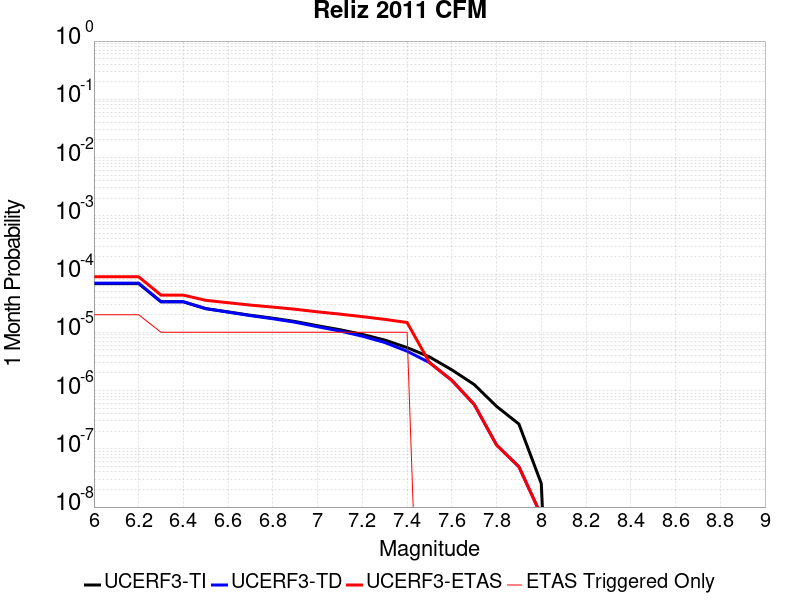 |  |  |

| Magnitude | 1 wk TI Prob | 1 wk TD Prob | 1 wk ETAS Prob | 1 wk ETAS/TD Gain | 1 wk ETAS Triggered Only | 1 mo TI Prob | 1 mo TD Prob | 1 mo ETAS Prob | 1 mo ETAS/TD Gain | 1 mo ETAS Triggered Only | 1 yr TI Prob | 1 yr TD Prob | 1 yr ETAS Prob | 1 yr ETAS/TD Gain | 1 yr ETAS Triggered Only | 10 yr TI Prob | 10 yr TD Prob | 10 yr ETAS Prob | 10 yr ETAS/TD Gain | 10 yr ETAS Triggered Only |
|-----|-----|-----|-----|-----|-----|-----|-----|-----|-----|-----|-----|-----|-----|-----|-----|-----|-----|-----|-----|-----|
| 6.0 | 1.6002472E-5 | 1.6282804E-5 | 6.9220005E-5 | 4.2511106 | 5.2938063E-5 | 6.8580215E-5 | 6.9781694E-5 | 1.2271605E-4 | 1.758571 | 5.2938063E-5 | 8.3464425E-4 | 8.4928074E-4 | 9.0217387E-4 | 1.0622798 | 5.2938063E-5 | 0.008315164 | 0.008462547 | 0.008515038 | 1.0062026 | 5.2938063E-5 |
| 6.1 | 1.6002472E-5 | 1.6282804E-5 | 6.9220005E-5 | 4.2511106 | 5.2938063E-5 | 6.8580215E-5 | 6.9781694E-5 | 1.2271605E-4 | 1.758571 | 5.2938063E-5 | 8.3464425E-4 | 8.4928074E-4 | 9.0217387E-4 | 1.0622798 | 5.2938063E-5 | 0.008315164 | 0.008462547 | 0.008515038 | 1.0062026 | 5.2938063E-5 |
| 6.2 | 1.6002472E-5 | 1.6282804E-5 | 6.9220005E-5 | 4.2511106 | 5.2938063E-5 | 6.8580215E-5 | 6.9781694E-5 | 1.2271605E-4 | 1.758571 | 5.2938063E-5 | 8.3464425E-4 | 8.4928074E-4 | 9.0217387E-4 | 1.0622798 | 5.2938063E-5 | 0.008315164 | 0.008462547 | 0.008515038 | 1.0062026 | 5.2938063E-5 |
| 6.3 | 7.792404E-6 | 7.803802E-6 | 6.074145E-5 | 7.7835712 | 5.2938063E-5 | 3.339559E-5 | 3.344444E-5 | 8.6380736E-5 | 2.5828128 | 5.2938063E-5 | 4.0651546E-4 | 4.0711078E-4 | 4.6002728E-4 | 1.1299806 | 5.2938063E-5 | 0.0040577264 | 0.004063926 | 0.0041166493 | 1.0129734 | 5.2938063E-5 |
| 6.4 | 7.792404E-6 | 7.803802E-6 | 6.074145E-5 | 7.7835712 | 5.2938063E-5 | 3.339559E-5 | 3.344444E-5 | 8.6380736E-5 | 2.5828128 | 5.2938063E-5 | 4.0651546E-4 | 4.0711078E-4 | 4.6002728E-4 | 1.1299806 | 5.2938063E-5 | 0.0040577264 | 0.004063926 | 0.0041166493 | 1.0129734 | 5.2938063E-5 |
| 6.5 | 5.9659374E-6 | 5.928738E-6 | 5.8866488E-5 | 9.929008 | 5.2938063E-5 | 2.5568053E-5 | 2.5408632E-5 | 7.834535E-5 | 3.0834148 | 5.2938063E-5 | 3.1124658E-4 | 3.093064E-4 | 3.6222808E-4 | 1.171098 | 5.2938063E-5 | 0.00310811 | 0.0030889767 | 0.0031417513 | 1.0170848 | 5.2938063E-5 |
| 6.6 | 5.2350692E-6 | 5.178986E-6 | 5.8116773E-5 | 11.221651 | 5.2938063E-5 | 2.2435817E-5 | 2.2195467E-5 | 7.513235E-5 | 3.3850315 | 5.2938063E-5 | 2.7312184E-4 | 2.7019644E-4 | 3.231202E-4 | 1.1958714 | 5.2938063E-5 | 0.002727864 | 0.0026988892 | 0.0027516845 | 1.0195618 | 5.2938063E-5 |
| 6.7 | 4.580206E-6 | 4.5061206E-6 | 5.7443944E-5 | 12.747982 | 5.2938063E-5 | 1.9629308E-5 | 1.9311801E-5 | 7.224884E-5 | 3.7411757 | 5.2938063E-5 | 2.389606E-4 | 2.350959E-4 | 2.8802152E-4 | 1.2251235 | 5.2938063E-5 | 0.002387038 | 0.0023486738 | 0.0024014874 | 1.0224866 | 5.2938063E-5 |
| 6.8 | 4.0765017E-6 | 3.9882384E-6 | 5.692609E-5 | 14.273493 | 5.2938063E-5 | 1.7470604E-5 | 1.7092338E-5 | 7.00295E-5 | 4.097128 | 5.2938063E-5 | 2.1268385E-4 | 2.0807938E-4 | 2.610064E-4 | 1.2543598 | 5.2938063E-5 | 0.002124804 | 0.0020790435 | 0.0021318714 | 1.0254098 | 5.2938063E-5 |
| 6.9 | 3.5752896E-6 | 3.4725176E-6 | 5.6410398E-5 | 16.244812 | 5.2938063E-5 | 1.532258E-5 | 1.4882134E-5 | 6.7819405E-5 | 4.5571027 | 5.2938063E-5 | 1.8653645E-4 | 1.8117494E-4 | 2.341034E-4 | 1.2921401 | 5.2938063E-5 | 0.0018637994 | 0.0018104686 | 0.0018633108 | 1.0291871 | 5.2938063E-5 |
| 7.0 | 3.0259848E-6 | 2.9079417E-6 | 5.584585E-5 | 19.204597 | 5.2938063E-5 | 1.2968442E-5 | 1.2462548E-5 | 6.539995E-5 | 5.2477193 | 5.2938063E-5 | 1.5787935E-4 | 1.5172097E-4 | 2.04651E-4 | 1.3488643 | 5.2938063E-5 | 0.0015776722 | 0.001516369 | 0.0015692268 | 1.0348581 | 5.2938063E-5 |
| 7.1 | 2.5861116E-6 | 2.455167E-6 | 5.53931E-5 | 22.561844 | 5.2938063E-5 | 1.1083288E-5 | 1.05221025E-5 | 6.345961E-5 | 6.031077 | 5.2938063E-5 | 1.3493067E-4 | 1.2809907E-4 | 1.8103035E-4 | 1.4132059 | 5.2938063E-5 | 0.0013484878 | 0.001280447 | 0.0013333173 | 1.0412905 | 5.2938063E-5 |
| 7.2 | 2.1482588E-6 | 2.003237E-6 | 5.4941193E-5 | 27.42621 | 5.2938063E-5 | 9.20679E-6 | 8.585273E-6 | 6.152288E-5 | 7.1660953 | 5.2938063E-5 | 1.12086906E-4 | 1.0452068E-4 | 1.574532E-4 | 1.5064311 | 5.2938063E-5 | 0.0011203039 | 0.0010449095 | 0.0010977922 | 1.0506098 | 5.2938063E-5 |
| 7.3 | 1.7194744E-6 | 1.5611241E-6 | 5.4499105E-5 | 34.910168 | 5.2938063E-5 | 7.3691554E-6 | 6.690515E-6 | 5.9628223E-5 | 8.912352 | 5.2938063E-5 | 8.971577E-5 | 8.1453974E-5 | 1.3438772E-4 | 1.6498609 | 5.2938063E-5 | 8.967956E-4 | 8.1443513E-4 | 8.6733006E-4 | 1.0649468 | 5.2938063E-5 |
| 7.4 | 1.2755178E-6 | 1.10563E-6 | 5.4043634E-5 | 48.880398 | 5.2938063E-5 | 5.4664933E-6 | 4.7384056E-6 | 5.7676218E-5 | 12.172073 | 5.2938063E-5 | 6.655252E-5 | 5.768856E-5 | 1.1062357E-4 | 1.9175998 | 5.2938063E-5 | 6.6532596E-4 | 5.7692965E-4 | 6.2983716E-4 | 1.0917053 | 5.2938063E-5 |
| 7.5 | 8.8463224E-7 | 7.0580273E-7 | 7.0580273E-7 | 1.0 | 0.0 | 3.7912755E-6 | 3.0248652E-6 | 3.0248652E-6 | 1.0 | 0.0 | 4.6157802E-5 | 3.6827114E-5 | 3.6827114E-5 | 1.0 | 0.0 | 4.6148215E-4 | 3.684038E-4 | 3.684038E-4 | 1.0 | 0.0 |
| 7.6 | 5.291355E-7 | 3.500777E-7 | 3.500777E-7 | 1.0 | 0.0 | 2.2677216E-6 | 1.5003321E-6 | 1.5003321E-6 | 1.0 | 0.0 | 2.760916E-5 | 1.8266392E-5 | 1.8266392E-5 | 1.0 | 0.0 | 2.760573E-4 | 1.8284164E-4 | 1.8284164E-4 | 1.0 | 0.0 |
| 7.7 | 2.9663357E-7 | 1.351113E-7 | 1.351113E-7 | 1.0 | 0.0 | 1.2712861E-6 | 5.7904833E-7 | 5.7904833E-7 | 1.0 | 0.0 | 1.5477797E-5 | 7.049891E-6 | 7.049891E-6 | 1.0 | 0.0 | 1.547672E-4 | 7.068132E-5 | 7.068132E-5 | 1.0 | 0.0 |
| 7.8 | 1.2509386E-7 | 2.7157126E-8 | 2.7157126E-8 | 1.0 | 0.0 | 5.3611643E-7 | 1.1638769E-7 | 1.1638769E-7 | 1.0 | 0.0 | 6.527198E-6 | 1.4170191E-6 | 1.4170191E-6 | 1.0 | 0.0 | 6.527006E-5 | 1.4326506E-5 | 1.4326506E-5 | 1.0 | 0.0 |
| 7.9 | 6.213493E-8 | 1.1482114E-8 | 1.1482114E-8 | 1.0 | 0.0 | 2.6629255E-7 | 4.920906E-8 | 4.920906E-8 | 1.0 | 0.0 | 3.242107E-6 | 5.9912014E-7 | 5.9912014E-7 | 1.0 | 0.0 | 3.2420594E-5 | 6.1224223E-6 | 6.1224223E-6 | 1.0 | 0.0 |
| 8.0 | 5.92383E-9 | 1.677887E-9 | 1.677887E-9 | 1.0 | 0.0 | 2.5387841E-8 | 7.190944E-9 | 7.190944E-9 | 1.0 | 0.0 | 3.0909692E-7 | 8.754974E-8 | 8.754974E-8 | 1.0 | 0.0 | 3.090965E-6 | 9.003061E-7 | 9.003061E-7 | 1.0 | 0.0 |

## Los Alamos 2011 CFM
*[(top)](#table-of-contents)*

| 1 Week | 1 Month | 1 Year | 10 Year |
|-----|-----|-----|-----|
|  |  | 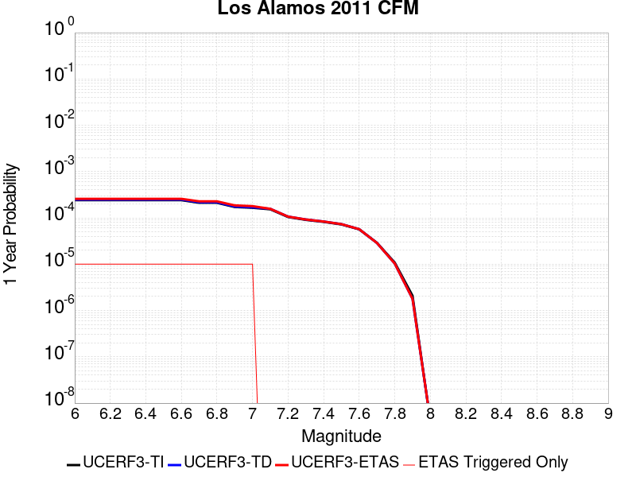 |  |

| Magnitude | 1 wk TI Prob | 1 wk TD Prob | 1 wk ETAS Prob | 1 wk ETAS/TD Gain | 1 wk ETAS Triggered Only | 1 mo TI Prob | 1 mo TD Prob | 1 mo ETAS Prob | 1 mo ETAS/TD Gain | 1 mo ETAS Triggered Only | 1 yr TI Prob | 1 yr TD Prob | 1 yr ETAS Prob | 1 yr ETAS/TD Gain | 1 yr ETAS Triggered Only | 10 yr TI Prob | 10 yr TD Prob | 10 yr ETAS Prob | 10 yr ETAS/TD Gain | 10 yr ETAS Triggered Only |
|-----|-----|-----|-----|-----|-----|-----|-----|-----|-----|-----|-----|-----|-----|-----|-----|-----|-----|-----|-----|-----|
| 6.0 | 4.6284417E-6 | 4.751731E-6 | 5.7689544E-5 | 12.140742 | 5.2938063E-5 | 1.9836029E-5 | 2.0364414E-5 | 7.3301395E-5 | 3.599485 | 5.2938063E-5 | 2.4147688E-4 | 2.4791027E-4 | 3.008352E-4 | 1.2134843 | 5.2938063E-5 | 0.0024121467 | 0.0024765113 | 0.0025293184 | 1.0213231 | 5.2938063E-5 |
| 6.1 | 4.6284417E-6 | 4.751731E-6 | 5.7689544E-5 | 12.140742 | 5.2938063E-5 | 1.9836029E-5 | 2.0364414E-5 | 7.3301395E-5 | 3.599485 | 5.2938063E-5 | 2.4147688E-4 | 2.4791027E-4 | 3.008352E-4 | 1.2134843 | 5.2938063E-5 | 0.0024121467 | 0.0024765113 | 0.0025293184 | 1.0213231 | 5.2938063E-5 |
| 6.2 | 4.6284417E-6 | 4.751731E-6 | 5.7689544E-5 | 12.140742 | 5.2938063E-5 | 1.9836029E-5 | 2.0364414E-5 | 7.3301395E-5 | 3.599485 | 5.2938063E-5 | 2.4147688E-4 | 2.4791027E-4 | 3.008352E-4 | 1.2134843 | 5.2938063E-5 | 0.0024121467 | 0.0024765113 | 0.0025293184 | 1.0213231 | 5.2938063E-5 |
| 6.3 | 4.6284417E-6 | 4.751731E-6 | 5.7689544E-5 | 12.140742 | 5.2938063E-5 | 1.9836029E-5 | 2.0364414E-5 | 7.3301395E-5 | 3.599485 | 5.2938063E-5 | 2.4147688E-4 | 2.4791027E-4 | 3.008352E-4 | 1.2134843 | 5.2938063E-5 | 0.0024121467 | 0.0024765113 | 0.0025293184 | 1.0213231 | 5.2938063E-5 |
| 6.4 | 4.6284417E-6 | 4.751731E-6 | 5.7689544E-5 | 12.140742 | 5.2938063E-5 | 1.9836029E-5 | 2.0364414E-5 | 7.3301395E-5 | 3.599485 | 5.2938063E-5 | 2.4147688E-4 | 2.4791027E-4 | 3.008352E-4 | 1.2134843 | 5.2938063E-5 | 0.0024121467 | 0.0024765113 | 0.0025293184 | 1.0213231 | 5.2938063E-5 |
| 6.5 | 4.6284417E-6 | 4.751731E-6 | 5.7689544E-5 | 12.140742 | 5.2938063E-5 | 1.9836029E-5 | 2.0364414E-5 | 7.3301395E-5 | 3.599485 | 5.2938063E-5 | 2.4147688E-4 | 2.4791027E-4 | 3.008352E-4 | 1.2134843 | 5.2938063E-5 | 0.0024121467 | 0.0024765113 | 0.0025293184 | 1.0213231 | 5.2938063E-5 |
| 6.6 | 4.6284417E-6 | 4.751731E-6 | 5.7689544E-5 | 12.140742 | 5.2938063E-5 | 1.9836029E-5 | 2.0364414E-5 | 7.3301395E-5 | 3.599485 | 5.2938063E-5 | 2.4147688E-4 | 2.4791027E-4 | 3.008352E-4 | 1.2134843 | 5.2938063E-5 | 0.0024121467 | 0.0024765113 | 0.0025293184 | 1.0213231 | 5.2938063E-5 |
| 6.7 | 4.062321E-6 | 4.166349E-6 | 5.710419E-5 | 13.706052 | 5.2938063E-5 | 1.7409831E-5 | 1.7855667E-5 | 7.079278E-5 | 3.9647236 | 5.2938063E-5 | 2.1194408E-4 | 2.1737257E-4 | 2.7029912E-4 | 1.2434832 | 5.2938063E-5 | 0.0021174205 | 0.0021717492 | 0.0022245722 | 1.0243229 | 5.2938063E-5 |
| 6.8 | 4.062321E-6 | 4.166349E-6 | 5.710419E-5 | 13.706052 | 5.2938063E-5 | 1.7409831E-5 | 1.7855667E-5 | 7.079278E-5 | 3.9647236 | 5.2938063E-5 | 2.1194408E-4 | 2.1737257E-4 | 2.7029912E-4 | 1.2434832 | 5.2938063E-5 | 0.0021174205 | 0.0021717492 | 0.0022245722 | 1.0243229 | 5.2938063E-5 |
| 6.9 | 3.2936077E-6 | 3.372958E-6 | 5.631084E-5 | 16.694796 | 5.2938063E-5 | 1.4115385E-5 | 1.4455459E-5 | 6.739276E-5 | 4.6620975 | 5.2938063E-5 | 1.7184127E-4 | 1.7598194E-4 | 2.2891068E-4 | 1.3007624 | 5.2938063E-5 | 0.0017170844 | 0.0017585184 | 0.0018113634 | 1.0300509 | 5.2938063E-5 |
| 7.0 | 3.1687898E-6 | 3.2448156E-6 | 5.6182707E-5 | 17.314608 | 5.2938063E-5 | 1.3580457E-5 | 1.3906283E-5 | 6.684361E-5 | 4.80672 | 5.2938063E-5 | 1.6532952E-4 | 1.6929678E-4 | 2.2222588E-4 | 1.3126409 | 5.2938063E-5 | 0.0016520657 | 0.0016917696 | 0.0017446182 | 1.0312386 | 5.2938063E-5 |
| 7.1 | 2.9379228E-6 | 3.0073259E-6 | 3.0073259E-6 | 1.0 | 0.0 | 1.25910365E-5 | 1.288848E-5 | 1.288848E-5 | 1.0 | 0.0 | 1.5328509E-4 | 1.5690686E-4 | 1.5690686E-4 | 1.0 | 0.0 | 0.001531794 | 0.0015680499 | 0.0015680499 | 1.0 | 0.0 |
| 7.2 | 2.0020686E-6 | 2.0416298E-6 | 2.0416298E-6 | 1.0 | 0.0 | 8.580266E-6 | 8.749813E-6 | 8.749813E-6 | 1.0 | 0.0 | 1.0445973E-4 | 1.0652381E-4 | 1.0652381E-4 | 1.0 | 0.0 | 0.0010441064 | 0.001064732 | 0.001064732 | 1.0 | 0.0 |
| 7.3 | 1.7364243E-6 | 1.7678802E-6 | 1.7678802E-6 | 1.0 | 0.0 | 7.441797E-6 | 7.576608E-6 | 7.576608E-6 | 1.0 | 0.0 | 9.0600115E-5 | 9.2241324E-5 | 9.2241324E-5 | 1.0 | 0.0 | 9.0563187E-4 | 9.2203356E-4 | 9.2203356E-4 | 1.0 | 0.0 |
| 7.4 | 1.5718434E-6 | 1.5983177E-6 | 1.5983177E-6 | 1.0 | 0.0 | 6.7364545E-6 | 6.849915E-6 | 6.849915E-6 | 1.0 | 0.0 | 8.201325E-5 | 8.339455E-5 | 8.339455E-5 | 1.0 | 0.0 | 8.198299E-4 | 8.3363557E-4 | 8.3363557E-4 | 1.0 | 0.0 |
| 7.5 | 1.3841119E-6 | 1.4042793E-6 | 1.4042793E-6 | 1.0 | 0.0 | 5.9318945E-6 | 6.0183256E-6 | 6.0183256E-6 | 1.0 | 0.0 | 7.221842E-5 | 7.327068E-5 | 7.327068E-5 | 1.0 | 0.0 | 7.2194956E-4 | 7.324681E-4 | 7.324681E-4 | 1.0 | 0.0 |
| 7.6 | 1.0843726E-6 | 1.093442E-6 | 1.093442E-6 | 1.0 | 0.0 | 4.647303E-6 | 4.6861724E-6 | 4.6861724E-6 | 1.0 | 0.0 | 5.6579443E-5 | 5.705268E-5 | 5.705268E-5 | 1.0 | 0.0 | 5.656504E-4 | 5.703829E-4 | 5.703829E-4 | 1.0 | 0.0 |
| 7.7 | 5.544814E-7 | 5.5018705E-7 | 5.5018705E-7 | 1.0 | 0.0 | 2.3763469E-6 | 2.3579425E-6 | 2.3579425E-6 | 1.0 | 0.0 | 2.8931638E-5 | 2.8707573E-5 | 2.8707573E-5 | 1.0 | 0.0 | 2.8927872E-4 | 2.870388E-4 | 2.870388E-4 | 1.0 | 0.0 |
| 7.8 | 2.0707465E-7 | 1.977846E-7 | 1.977846E-7 | 1.0 | 0.0 | 8.874625E-7 | 8.4764804E-7 | 8.4764804E-7 | 1.0 | 0.0 | 1.08048025E-5 | 1.0320066E-5 | 1.0320066E-5 | 1.0 | 0.0 | 1.0804277E-4 | 1.0319592E-4 | 1.0319592E-4 | 1.0 | 0.0 |
| 7.9 | 3.9821284E-8 | 3.433109E-8 | 3.433109E-8 | 1.0 | 0.0 | 1.7066264E-7 | 1.4713324E-7 | 1.4713324E-7 | 1.0 | 0.0 | 2.0778157E-6 | 1.7913457E-6 | 1.7913457E-6 | 1.0 | 0.0 | 2.0777963E-5 | 1.7913319E-5 | 1.7913319E-5 | 1.0 | 0.0 |
| 8.0 | 7.880441E-11 | 8.2353124E-11 | 8.2353124E-11 | 1.0 | 0.0 | 3.3773329E-10 | 3.52942E-10 | 3.52942E-10 | 1.0 | 0.0 | 4.1119033E-9 | 4.2970694E-9 | 4.2970694E-9 | 1.0 | 0.0 | 4.1119034E-8 | 4.2970694E-8 | 4.2970694E-8 | 1.0 | 0.0 |

## Malibu Coast alt 1
*[(top)](#table-of-contents)*

| 1 Week | 1 Month | 1 Year | 10 Year |
|-----|-----|-----|-----|
| 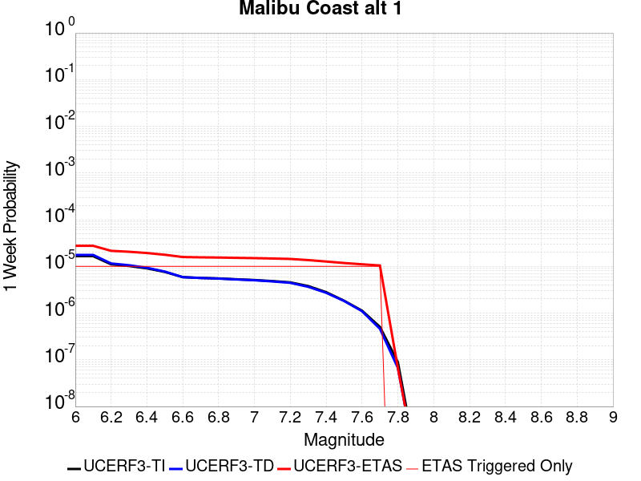 |  | 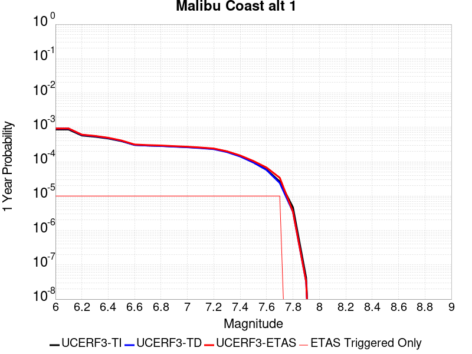 | 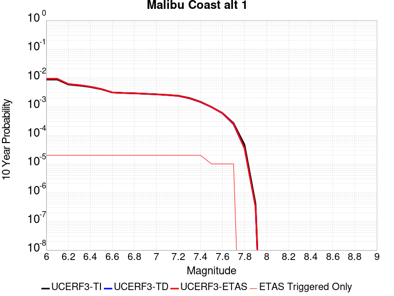 |

| Magnitude | 1 wk TI Prob | 1 wk TD Prob | 1 wk ETAS Prob | 1 wk ETAS/TD Gain | 1 wk ETAS Triggered Only | 1 mo TI Prob | 1 mo TD Prob | 1 mo ETAS Prob | 1 mo ETAS/TD Gain | 1 mo ETAS Triggered Only | 1 yr TI Prob | 1 yr TD Prob | 1 yr ETAS Prob | 1 yr ETAS/TD Gain | 1 yr ETAS Triggered Only | 10 yr TI Prob | 10 yr TD Prob | 10 yr ETAS Prob | 10 yr ETAS/TD Gain | 10 yr ETAS Triggered Only |
|-----|-----|-----|-----|-----|-----|-----|-----|-----|-----|-----|-----|-----|-----|-----|-----|-----|-----|-----|-----|-----|
| 6.0 | 1.6572556E-5 | 1.7598066E-5 | 1.7598066E-5 | 1.0 | 0.0 | 7.102331E-5 | 7.541821E-5 | 7.541821E-5 | 1.0 | 0.0 | 8.6436566E-4 | 9.178488E-4 | 9.178488E-4 | 1.0 | 0.0 | 0.0086101135 | 0.009142512 | 0.009194966 | 1.0057374 | 5.2938063E-5 |
| 6.1 | 1.6572556E-5 | 1.7598066E-5 | 1.7598066E-5 | 1.0 | 0.0 | 7.102331E-5 | 7.541821E-5 | 7.541821E-5 | 1.0 | 0.0 | 8.6436566E-4 | 9.178488E-4 | 9.178488E-4 | 1.0 | 0.0 | 0.0086101135 | 0.009142512 | 0.009194966 | 1.0057374 | 5.2938063E-5 |
| 6.2 | 1.1085717E-5 | 1.1557147E-5 | 1.1557147E-5 | 1.0 | 0.0 | 4.750935E-5 | 4.952971E-5 | 4.952971E-5 | 1.0 | 0.0 | 5.782728E-4 | 6.028609E-4 | 6.028609E-4 | 1.0 | 0.0 | 0.0057677035 | 0.0060126255 | 0.0060652457 | 1.0087515 | 5.2938063E-5 |
| 6.3 | 1.0208568E-5 | 1.0592237E-5 | 1.0592237E-5 | 1.0 | 0.0 | 4.375027E-5 | 4.539453E-5 | 4.539453E-5 | 1.0 | 0.0 | 5.325294E-4 | 5.5254117E-4 | 5.5254117E-4 | 1.0 | 0.0 | 0.0053125503 | 0.0055119814 | 0.0055646277 | 1.0095513 | 5.2938063E-5 |
| 6.4 | 9.0682315E-6 | 9.342637E-6 | 9.342637E-6 | 1.0 | 0.0 | 3.8863272E-5 | 4.003927E-5 | 4.003927E-5 | 1.0 | 0.0 | 4.730576E-4 | 4.8737114E-4 | 4.8737114E-4 | 1.0 | 0.0 | 0.0047205184 | 0.004863236 | 0.004915917 | 1.0108324 | 5.2938063E-5 |
| 6.5 | 7.605796E-6 | 7.748587E-6 | 7.748587E-6 | 1.0 | 0.0 | 3.259586E-5 | 3.3207816E-5 | 3.3207816E-5 | 1.0 | 0.0 | 3.9678233E-4 | 4.0423148E-4 | 4.0423148E-4 | 1.0 | 0.0 | 0.0039607463 | 0.0040351 | 0.0040878244 | 1.0130664 | 5.2938063E-5 |
| 6.6 | 5.889873E-6 | 5.8795385E-6 | 5.8795385E-6 | 1.0 | 0.0 | 2.5242069E-5 | 2.519778E-5 | 2.519778E-5 | 1.0 | 0.0 | 3.0727885E-4 | 3.0673988E-4 | 3.0673988E-4 | 1.0 | 0.0 | 0.003068543 | 0.0030631777 | 0.0031159536 | 1.0172291 | 5.2938063E-5 |
| 6.7 | 5.66586E-6 | 5.641641E-6 | 5.641641E-6 | 1.0 | 0.0 | 2.428203E-5 | 2.417824E-5 | 2.417824E-5 | 1.0 | 0.0 | 2.955936E-4 | 2.9433038E-4 | 2.9433038E-4 | 1.0 | 0.0 | 0.0029520073 | 0.0029394177 | 0.0029922002 | 1.0179567 | 5.2938063E-5 |
| 6.8 | 5.521556E-6 | 5.489427E-6 | 5.489427E-6 | 1.0 | 0.0 | 2.3663597E-5 | 2.3525903E-5 | 2.3525903E-5 | 1.0 | 0.0 | 2.880662E-4 | 2.8639034E-4 | 2.8639034E-4 | 1.0 | 0.0 | 0.0028769306 | 0.002860224 | 0.0029130108 | 1.0184554 | 5.2938063E-5 |
| 6.9 | 5.29752E-6 | 5.2499317E-6 | 5.2499317E-6 | 1.0 | 0.0 | 2.270346E-5 | 2.2499513E-5 | 2.2499513E-5 | 1.0 | 0.0 | 2.7637955E-4 | 2.7389723E-4 | 2.7389723E-4 | 1.0 | 0.0 | 0.0027603607 | 0.0027356069 | 0.0027884 | 1.0192986 | 5.2938063E-5 |
| 7.0 | 5.106743E-6 | 5.0476788E-6 | 5.0476788E-6 | 1.0 | 0.0 | 2.1885859E-5 | 2.163273E-5 | 2.163273E-5 | 1.0 | 0.0 | 2.6642776E-4 | 2.6334674E-4 | 2.6334674E-4 | 1.0 | 0.0 | 0.0026610855 | 0.0026303562 | 0.002683155 | 1.0200728 | 5.2938063E-5 |
| 7.1 | 4.8469647E-6 | 4.770373E-6 | 4.770373E-6 | 1.0 | 0.0 | 2.0772539E-5 | 2.0444295E-5 | 2.0444295E-5 | 1.0 | 0.0 | 2.528763E-4 | 2.4888094E-4 | 2.4888094E-4 | 1.0 | 0.0 | 0.0025258875 | 0.00248603 | 0.0025388366 | 1.0212413 | 5.2938063E-5 |
| 7.2 | 4.545514E-6 | 4.4481935E-6 | 4.4481935E-6 | 1.0 | 0.0 | 1.9480629E-5 | 1.9063547E-5 | 1.9063547E-5 | 1.0 | 0.0 | 2.3715083E-4 | 2.3207403E-4 | 2.3207403E-4 | 1.0 | 0.0 | 0.0023689792 | 0.0023183243 | 0.0023711396 | 1.0227817 | 5.2938063E-5 |
| 7.3 | 3.794097E-6 | 3.6519348E-6 | 3.6519348E-6 | 1.0 | 0.0 | 1.6260314E-5 | 1.5651056E-5 | 1.5651056E-5 | 1.0 | 0.0 | 1.9795135E-4 | 1.9053498E-4 | 1.9053498E-4 | 1.0 | 0.0 | 0.001977751 | 0.0019037209 | 0.001956558 | 1.0277548 | 5.2938063E-5 |
| 7.4 | 2.808217E-6 | 2.719077E-6 | 2.719077E-6 | 1.0 | 0.0 | 1.203516E-5 | 1.1653135E-5 | 1.1653135E-5 | 1.0 | 0.0 | 1.4651821E-4 | 1.418677E-4 | 1.418677E-4 | 1.0 | 0.0 | 0.0014642165 | 0.001417774 | 0.001470637 | 1.0372859 | 5.2938063E-5 |
| 7.5 | 1.83809E-6 | 1.8190691E-6 | 1.8190691E-6 | 1.0 | 0.0 | 7.877505E-6 | 7.795988E-6 | 7.795988E-6 | 1.0 | 0.0 | 9.59044E-5 | 9.491203E-5 | 9.491203E-5 | 1.0 | 0.0 | 9.5863023E-4 | 9.48717E-4 | 9.48717E-4 | 1.0 | 0.0 |
| 7.6 | 1.1292672E-6 | 1.1001447E-6 | 1.1001447E-6 | 1.0 | 0.0 | 4.839708E-6 | 4.714897E-6 | 4.714897E-6 | 1.0 | 0.0 | 5.8921847E-5 | 5.7402376E-5 | 5.7402376E-5 | 1.0 | 0.0 | 5.890623E-4 | 5.738771E-4 | 5.738771E-4 | 1.0 | 0.0 |
| 7.7 | 5.065272E-7 | 4.609151E-7 | 4.609151E-7 | 1.0 | 0.0 | 2.170829E-6 | 1.975349E-6 | 1.975349E-6 | 1.0 | 0.0 | 2.6429525E-5 | 2.404962E-5 | 2.404962E-5 | 1.0 | 0.0 | 2.642638E-4 | 2.4047129E-4 | 2.4047129E-4 | 1.0 | 0.0 |
| 7.8 | 8.952991E-8 | 6.707874E-8 | 6.707874E-8 | 1.0 | 0.0 | 3.8369956E-7 | 2.8748025E-7 | 2.8748025E-7 | 1.0 | 0.0 | 4.671532E-6 | 3.5000667E-6 | 3.5000667E-6 | 1.0 | 0.0 | 4.671434E-5 | 3.5000136E-5 | 3.5000136E-5 | 1.0 | 0.0 |
| 7.9 | 8.007447E-10 | 6.1608785E-10 | 6.1608785E-10 | 1.0 | 0.0 | 3.4317629E-9 | 2.6403764E-9 | 2.6403764E-9 | 1.0 | 0.0 | 4.1781714E-8 | 3.2146584E-8 | 3.2146584E-8 | 1.0 | 0.0 | 4.1781706E-7 | 3.214658E-7 | 3.214658E-7 | 1.0 | 0.0 |

## Cerro Prieto
*[(top)](#table-of-contents)*

| 1 Week | 1 Month | 1 Year | 10 Year |
|-----|-----|-----|-----|
|  |  |  |  |

| Magnitude | 1 wk TI Prob | 1 wk TD Prob | 1 wk ETAS Prob | 1 wk ETAS/TD Gain | 1 wk ETAS Triggered Only | 1 mo TI Prob | 1 mo TD Prob | 1 mo ETAS Prob | 1 mo ETAS/TD Gain | 1 mo ETAS Triggered Only | 1 yr TI Prob | 1 yr TD Prob | 1 yr ETAS Prob | 1 yr ETAS/TD Gain | 1 yr ETAS Triggered Only | 10 yr TI Prob | 10 yr TD Prob | 10 yr ETAS Prob | 10 yr ETAS/TD Gain | 10 yr ETAS Triggered Only |
|-----|-----|-----|-----|-----|-----|-----|-----|-----|-----|-----|-----|-----|-----|-----|-----|-----|-----|-----|-----|-----|
| 6.0 | 2.9101528E-4 | 5.964804E-4 | 5.964804E-4 | 1.0 | 0.0 | 0.0012466122 | 0.002554082 | 0.002554082 | 1.0 | 0.0 | 0.015072231 | 0.03064807 | 0.03064807 | 1.0 | 0.0 | 0.14089979 | 0.25397858 | 0.25401807 | 1.0001554 | 5.2938063E-5 |
| 6.1 | 2.9101528E-4 | 5.964804E-4 | 5.964804E-4 | 1.0 | 0.0 | 0.0012466122 | 0.002554082 | 0.002554082 | 1.0 | 0.0 | 0.015072231 | 0.03064807 | 0.03064807 | 1.0 | 0.0 | 0.14089979 | 0.25397858 | 0.25401807 | 1.0001554 | 5.2938063E-5 |
| 6.2 | 2.9101528E-4 | 5.964804E-4 | 5.964804E-4 | 1.0 | 0.0 | 0.0012466122 | 0.002554082 | 0.002554082 | 1.0 | 0.0 | 0.015072231 | 0.03064807 | 0.03064807 | 1.0 | 0.0 | 0.14089979 | 0.25397858 | 0.25401807 | 1.0001554 | 5.2938063E-5 |
| 6.3 | 2.9101528E-4 | 5.964804E-4 | 5.964804E-4 | 1.0 | 0.0 | 0.0012466122 | 0.002554082 | 0.002554082 | 1.0 | 0.0 | 0.015072231 | 0.03064807 | 0.03064807 | 1.0 | 0.0 | 0.14089979 | 0.25397858 | 0.25401807 | 1.0001554 | 5.2938063E-5 |
| 6.4 | 2.508648E-4 | 5.1397446E-4 | 5.1397446E-4 | 1.0 | 0.0 | 0.0010746918 | 0.0022010866 | 0.0022010866 | 1.0 | 0.0 | 0.013006088 | 0.026471792 | 0.026471792 | 1.0 | 0.0 | 0.12270685 | 0.22440416 | 0.22444521 | 1.000183 | 5.2938063E-5 |
| 6.5 | 2.508648E-4 | 5.1397446E-4 | 5.1397446E-4 | 1.0 | 0.0 | 0.0010746918 | 0.0022010866 | 0.0022010866 | 1.0 | 0.0 | 0.013006088 | 0.026471792 | 0.026471792 | 1.0 | 0.0 | 0.12270685 | 0.22440416 | 0.22444521 | 1.000183 | 5.2938063E-5 |
| 6.6 | 2.294914E-4 | 4.7116808E-4 | 4.7116808E-4 | 1.0 | 0.0 | 9.831638E-4 | 0.0020179166 | 0.0020179166 | 1.0 | 0.0 | 0.011904482 | 0.02429866 | 0.02429866 | 1.0 | 0.0 | 0.11286586 | 0.20858558 | 0.20862746 | 1.0002009 | 5.2938063E-5 |
| 6.7 | 1.9621674E-4 | 4.0419117E-4 | 4.0419117E-4 | 1.0 | 0.0 | 8.4065786E-4 | 0.0017312564 | 0.0017312564 | 1.0 | 0.0 | 0.010187071 | 0.020884845 | 0.020884845 | 1.0 | 0.0 | 0.09732539 | 0.18290249 | 0.18294574 | 1.0002365 | 5.2938063E-5 |
| 6.8 | 1.5476145E-4 | 3.056516E-4 | 3.056516E-4 | 1.0 | 0.0 | 6.6309475E-4 | 0.00130938 | 0.00130938 | 1.0 | 0.0 | 0.008043335 | 0.015836509 | 0.015836509 | 1.0 | 0.0 | 0.07758363 | 0.14336355 | 0.14340891 | 1.0003163 | 5.2938063E-5 |
| 6.9 | 1.20509176E-4 | 2.2582515E-4 | 2.2582515E-4 | 1.0 | 0.0 | 5.1636563E-4 | 9.6752634E-4 | 9.6752634E-4 | 1.0 | 0.0 | 0.006268645 | 0.011726342 | 0.011726342 | 1.0 | 0.0 | 0.060947374 | 0.109451205 | 0.109451205 | 1.0 | 0.0 |
| 7.0 | 9.3269155E-5 | 1.6716642E-4 | 1.6716642E-4 | 1.0 | 0.0 | 3.9966372E-4 | 7.162739E-4 | 7.162739E-4 | 1.0 | 0.0 | 0.0048550544 | 0.008693418 | 0.008693418 | 1.0 | 0.0 | 0.04750344 | 0.08315912 | 0.08315912 | 1.0 | 0.0 |
| 7.1 | 5.029709E-5 | 8.1718936E-5 | 8.1718936E-5 | 1.0 | 0.0 | 2.1554115E-4 | 3.5019626E-4 | 3.5019626E-4 | 1.0 | 0.0 | 0.0026210553 | 0.0042587193 | 0.0042587193 | 1.0 | 0.0 | 0.025903556 | 0.042365108 | 0.042365108 | 1.0 | 0.0 |
| 7.2 | 6.5445185E-8 | 6.814903E-8 | 6.814903E-8 | 1.0 | 0.0 | 2.8047933E-7 | 2.9206726E-7 | 2.9206726E-7 | 1.0 | 0.0 | 3.4148304E-6 | 3.555919E-6 | 3.555919E-6 | 1.0 | 0.0 | 3.414778E-5 | 3.5559187E-5 | 3.5559187E-5 | 1.0 | 0.0 |

## Ortigalita (South)
*[(top)](#table-of-contents)*

| 1 Week | 1 Month | 1 Year | 10 Year |
|-----|-----|-----|-----|
|  |  |  |  |

| Magnitude | 1 wk TI Prob | 1 wk TD Prob | 1 wk ETAS Prob | 1 wk ETAS/TD Gain | 1 wk ETAS Triggered Only | 1 mo TI Prob | 1 mo TD Prob | 1 mo ETAS Prob | 1 mo ETAS/TD Gain | 1 mo ETAS Triggered Only | 1 yr TI Prob | 1 yr TD Prob | 1 yr ETAS Prob | 1 yr ETAS/TD Gain | 1 yr ETAS Triggered Only | 10 yr TI Prob | 10 yr TD Prob | 10 yr ETAS Prob | 10 yr ETAS/TD Gain | 10 yr ETAS Triggered Only |
|-----|-----|-----|-----|-----|-----|-----|-----|-----|-----|-----|-----|-----|-----|-----|-----|-----|-----|-----|-----|-----|
| 6.0 | 3.72394E-5 | 4.325562E-5 | 9.619139E-5 | 2.2237895 | 5.2938063E-5 | 1.5958765E-4 | 1.8536893E-4 | 2.3829719E-4 | 1.2855293 | 5.2938063E-5 | 0.0019412481 | 0.0022546875 | 0.002307506 | 1.0234262 | 5.2938063E-5 | 0.019243775 | 0.022334497 | 0.022386253 | 1.0023173 | 5.2938063E-5 |
| 6.1 | 2.7299884E-5 | 3.149204E-5 | 3.149204E-5 | 1.0 | 0.0 | 1.16994255E-4 | 1.3495922E-4 | 1.3495922E-4 | 1.0 | 0.0 | 0.0014234743 | 0.0016419457 | 0.0016419457 | 1.0 | 0.0 | 0.014143906 | 0.01630407 | 0.01630407 | 1.0 | 0.0 |
| 6.2 | 2.7299884E-5 | 3.149204E-5 | 3.149204E-5 | 1.0 | 0.0 | 1.16994255E-4 | 1.3495922E-4 | 1.3495922E-4 | 1.0 | 0.0 | 0.0014234743 | 0.0016419457 | 0.0016419457 | 1.0 | 0.0 | 0.014143906 | 0.01630407 | 0.01630407 | 1.0 | 0.0 |
| 6.3 | 2.0546433E-5 | 2.363145E-5 | 2.363145E-5 | 1.0 | 0.0 | 8.805317E-5 | 1.0127382E-4 | 1.0127382E-4 | 1.0 | 0.0 | 0.00107152 | 0.0012323303 | 0.0012323303 | 1.0 | 0.0 | 0.010663681 | 0.01225703 | 0.01225703 | 1.0 | 0.0 |
| 6.4 | 2.0546433E-5 | 2.363145E-5 | 2.363145E-5 | 1.0 | 0.0 | 8.805317E-5 | 1.0127382E-4 | 1.0127382E-4 | 1.0 | 0.0 | 0.00107152 | 0.0012323303 | 0.0012323303 | 1.0 | 0.0 | 0.010663681 | 0.01225703 | 0.01225703 | 1.0 | 0.0 |
| 6.5 | 1.7779594E-5 | 2.0446974E-5 | 2.0446974E-5 | 1.0 | 0.0 | 7.619603E-5 | 8.762702E-5 | 8.762702E-5 | 1.0 | 0.0 | 9.272918E-4 | 0.0010663504 | 0.0010663504 | 1.0 | 0.0 | 0.009234319 | 0.010613803 | 0.010613803 | 1.0 | 0.0 |
| 6.6 | 1.6272212E-5 | 1.8714967E-5 | 1.8714967E-5 | 1.0 | 0.0 | 6.973618E-5 | 8.0204605E-5 | 8.0204605E-5 | 1.0 | 0.0 | 8.487073E-4 | 9.760658E-4 | 9.760658E-4 | 1.0 | 0.0 | 0.008454733 | 0.009719091 | 0.009719091 | 1.0 | 0.0 |
| 6.7 | 1.3051484E-5 | 1.5038758E-5 | 1.5038758E-5 | 1.0 | 0.0 | 5.593373E-5 | 6.445028E-5 | 6.445028E-5 | 1.0 | 0.0 | 6.807804E-4 | 7.844092E-4 | 7.844092E-4 | 1.0 | 0.0 | 0.006786986 | 0.007817388 | 0.007817388 | 1.0 | 0.0 |
| 6.8 | 1.04277415E-5 | 1.1987235E-5 | 1.1987235E-5 | 1.0 | 0.0 | 4.4689557E-5 | 5.1372896E-5 | 5.1372896E-5 | 1.0 | 0.0 | 5.439595E-4 | 6.2529295E-4 | 6.2529295E-4 | 1.0 | 0.0 | 0.0054262993 | 0.00623609 | 0.00623609 | 1.0 | 0.0 |
| 6.9 | 7.639968E-6 | 8.791503E-6 | 8.791503E-6 | 1.0 | 0.0 | 3.274231E-5 | 3.767736E-5 | 3.767736E-5 | 1.0 | 0.0 | 3.9856473E-4 | 4.586312E-4 | 4.586312E-4 | 1.0 | 0.0 | 0.003978506 | 0.004577433 | 0.004577433 | 1.0 | 0.0 |
| 7.0 | 3.919831E-6 | 4.5334014E-6 | 4.5334014E-6 | 1.0 | 0.0 | 1.679917E-5 | 1.942873E-5 | 1.942873E-5 | 1.0 | 0.0 | 2.045107E-4 | 2.3652123E-4 | 2.3652123E-4 | 1.0 | 0.0 | 0.0020432258 | 0.0023629034 | 0.0023629034 | 1.0 | 0.0 |
| 7.1 | 1.6017933E-6 | 1.8570418E-6 | 1.8570418E-6 | 1.0 | 0.0 | 6.8648105E-6 | 7.958732E-6 | 7.958732E-6 | 1.0 | 0.0 | 8.357586E-5 | 9.689432E-5 | 9.689432E-5 | 1.0 | 0.0 | 8.3544437E-4 | 9.686254E-4 | 9.686254E-4 | 1.0 | 0.0 |

## Point Reyes 2011 CFM
*[(top)](#table-of-contents)*

| 1 Week | 1 Month | 1 Year | 10 Year |
|-----|-----|-----|-----|
|  |  |  |  |

| Magnitude | 1 wk TI Prob | 1 wk TD Prob | 1 wk ETAS Prob | 1 wk ETAS/TD Gain | 1 wk ETAS Triggered Only | 1 mo TI Prob | 1 mo TD Prob | 1 mo ETAS Prob | 1 mo ETAS/TD Gain | 1 mo ETAS Triggered Only | 1 yr TI Prob | 1 yr TD Prob | 1 yr ETAS Prob | 1 yr ETAS/TD Gain | 1 yr ETAS Triggered Only | 10 yr TI Prob | 10 yr TD Prob | 10 yr ETAS Prob | 10 yr ETAS/TD Gain | 10 yr ETAS Triggered Only |
|-----|-----|-----|-----|-----|-----|-----|-----|-----|-----|-----|-----|-----|-----|-----|-----|-----|-----|-----|-----|-----|
| 6.0 | 8.8644965E-6 | 8.967163E-6 | 6.190475E-5 | 6.903493 | 5.2938063E-5 | 3.7990147E-5 | 3.843017E-5 | 9.13662E-5 | 2.3774602 | 5.2938063E-5 | 4.624319E-4 | 4.6779314E-4 | 5.2070647E-4 | 1.1131126 | 5.2938063E-5 | 0.0046147075 | 0.004668713 | 0.0047214036 | 1.011286 | 5.2938063E-5 |
| 6.1 | 4.526405E-6 | 4.5392185E-6 | 5.7477042E-5 | 12.662321 | 5.2938063E-5 | 1.9398734E-5 | 1.9453653E-5 | 7.2390685E-5 | 3.721187 | 5.2938063E-5 | 2.36154E-4 | 2.3682354E-4 | 2.8974906E-4 | 1.2234808 | 5.2938063E-5 | 0.002359032 | 0.0023658178 | 0.0024186305 | 1.0223233 | 5.2938063E-5 |
| 6.2 | 4.526405E-6 | 4.5392185E-6 | 5.7477042E-5 | 12.662321 | 5.2938063E-5 | 1.9398734E-5 | 1.9453653E-5 | 7.2390685E-5 | 3.721187 | 5.2938063E-5 | 2.36154E-4 | 2.3682354E-4 | 2.8974906E-4 | 1.2234808 | 5.2938063E-5 | 0.002359032 | 0.0023658178 | 0.0024186305 | 1.0223233 | 5.2938063E-5 |
| 6.3 | 2.6842322E-6 | 2.660676E-6 | 5.5598597E-5 | 20.896418 | 5.2938063E-5 | 1.1503801E-5 | 1.1402849E-5 | 6.434031E-5 | 5.6424766 | 5.2938063E-5 | 1.4004979E-4 | 1.3882104E-4 | 1.9175175E-4 | 1.3812875 | 5.2938063E-5 | 0.0013996155 | 0.0013873649 | 0.0014402296 | 1.0381043 | 5.2938063E-5 |
| 6.4 | 2.6842322E-6 | 2.660676E-6 | 5.5598597E-5 | 20.896418 | 5.2938063E-5 | 1.1503801E-5 | 1.1402849E-5 | 6.434031E-5 | 5.6424766 | 5.2938063E-5 | 1.4004979E-4 | 1.3882104E-4 | 1.9175175E-4 | 1.3812875 | 5.2938063E-5 | 0.0013996155 | 0.0013873649 | 0.0014402296 | 1.0381043 | 5.2938063E-5 |
| 6.5 | 1.9281833E-6 | 1.8906262E-6 | 1.8906262E-6 | 1.0 | 0.0 | 8.263617E-6 | 8.102659E-6 | 8.102659E-6 | 1.0 | 0.0 | 1.0060489E-4 | 9.86455E-5 | 9.86455E-5 | 1.0 | 0.0 | 0.0010055936 | 9.860279E-4 | 9.860279E-4 | 1.0 | 0.0 |
| 6.6 | 1.4726726E-6 | 1.4269577E-6 | 1.4269577E-6 | 1.0 | 0.0 | 6.3114385E-6 | 6.1155188E-6 | 6.1155188E-6 | 1.0 | 0.0 | 7.683905E-5 | 7.445395E-5 | 7.445395E-5 | 1.0 | 0.0 | 7.6812494E-4 | 7.4429717E-4 | 7.4429717E-4 | 1.0 | 0.0 |
| 6.7 | 8.572307E-7 | 8.007212E-7 | 8.007212E-7 | 1.0 | 0.0 | 3.6738406E-6 | 3.431658E-6 | 3.431658E-6 | 1.0 | 0.0 | 4.472809E-5 | 4.1779647E-5 | 4.1779647E-5 | 1.0 | 0.0 | 4.471909E-4 | 4.1772184E-4 | 4.1772184E-4 | 1.0 | 0.0 |
| 6.8 | 6.6745434E-7 | 6.0773E-7 | 6.0773E-7 | 1.0 | 0.0 | 2.8605155E-6 | 2.6045543E-6 | 2.6045543E-6 | 1.0 | 0.0 | 3.482622E-5 | 3.171E-5 | 3.171E-5 | 1.0 | 0.0 | 3.4820763E-4 | 3.1705803E-4 | 3.1705803E-4 | 1.0 | 0.0 |
| 6.9 | 4.291521E-7 | 3.6535937E-7 | 3.6535937E-7 | 1.0 | 0.0 | 1.839222E-6 | 1.565825E-6 | 1.565825E-6 | 1.0 | 0.0 | 2.2392298E-5 | 1.9063755E-5 | 1.9063755E-5 | 1.0 | 0.0 | 2.2390042E-4 | 1.9062385E-4 | 1.9062385E-4 | 1.0 | 0.0 |
| 7.0 | 2.6812808E-7 | 2.0187414E-7 | 2.0187414E-7 | 1.0 | 0.0 | 1.1491198E-6 | 8.651746E-7 | 8.651746E-7 | 1.0 | 0.0 | 1.3990444E-5 | 1.0533451E-5 | 1.0533451E-5 | 1.0 | 0.0 | 1.3989564E-4 | 1.0533186E-4 | 1.0533186E-4 | 1.0 | 0.0 |
| 7.1 | 1.9451231E-7 | 1.2725499E-7 | 1.2725499E-7 | 1.0 | 0.0 | 8.336239E-7 | 5.453784E-7 | 5.453784E-7 | 1.0 | 0.0 | 1.0149324E-5 | 6.6399616E-6 | 6.6399616E-6 | 1.0 | 0.0 | 1.014886E-4 | 6.639991E-5 | 6.639991E-5 | 1.0 | 0.0 |
| 7.2 | 1.6715143E-7 | 1.00428394E-7 | 1.00428394E-7 | 1.0 | 0.0 | 7.1636305E-7 | 4.3040734E-7 | 4.3040734E-7 | 1.0 | 0.0 | 8.721685E-6 | 5.2401965E-6 | 5.2401965E-6 | 1.0 | 0.0 | 8.721343E-5 | 5.2402997E-5 | 5.2402997E-5 | 1.0 | 0.0 |
| 7.3 | 1.5503173E-7 | 9.0131024E-8 | 9.0131024E-8 | 1.0 | 0.0 | 6.644215E-7 | 3.8627576E-7 | 3.8627576E-7 | 1.0 | 0.0 | 8.089301E-6 | 4.702897E-6 | 4.702897E-6 | 1.0 | 0.0 | 8.089007E-5 | 4.7030244E-5 | 4.7030244E-5 | 1.0 | 0.0 |
| 7.4 | 1.4251614E-7 | 8.097624E-8 | 8.097624E-8 | 1.0 | 0.0 | 6.1078333E-7 | 3.47041E-7 | 3.47041E-7 | 1.0 | 0.0 | 7.4362615E-6 | 4.225216E-6 | 4.225216E-6 | 1.0 | 0.0 | 7.436013E-5 | 4.2253625E-5 | 4.2253625E-5 | 1.0 | 0.0 |
| 7.5 | 1.2710186E-7 | 7.0296394E-8 | 7.0296394E-8 | 1.0 | 0.0 | 5.447221E-7 | 3.0127023E-7 | 3.0127023E-7 | 1.0 | 0.0 | 6.6319717E-6 | 3.667959E-6 | 3.667959E-6 | 1.0 | 0.0 | 6.6317734E-5 | 3.6681253E-5 | 3.6681253E-5 | 1.0 | 0.0 |
| 7.6 | 1.0144708E-7 | 5.4952274E-8 | 5.4952274E-8 | 1.0 | 0.0 | 4.347731E-7 | 2.3550973E-7 | 2.3550973E-7 | 1.0 | 0.0 | 5.2933497E-6 | 2.8673273E-6 | 2.8673273E-6 | 1.0 | 0.0 | 5.293224E-5 | 2.8675171E-5 | 2.8675171E-5 | 1.0 | 0.0 |
| 7.7 | 7.090527E-8 | 3.98231E-8 | 3.98231E-8 | 1.0 | 0.0 | 3.038797E-7 | 1.7067042E-7 | 1.7067042E-7 | 1.0 | 0.0 | 3.699729E-6 | 2.0779103E-6 | 2.0779103E-6 | 1.0 | 0.0 | 3.6996673E-5 | 2.0781177E-5 | 2.0781177E-5 | 1.0 | 0.0 |
| 7.8 | 3.8712045E-8 | 2.7440025E-8 | 2.7440025E-8 | 1.0 | 0.0 | 1.6590876E-7 | 1.176001E-7 | 1.176001E-7 | 1.0 | 0.0 | 2.0199373E-6 | 1.4317802E-6 | 1.4317802E-6 | 1.0 | 0.0 | 2.0199188E-5 | 1.4319979E-5 | 1.4319979E-5 | 1.0 | 0.0 |
| 7.9 | 1.7068782E-8 | 1.1833354E-8 | 1.1833354E-8 | 1.0 | 0.0 | 7.315192E-8 | 5.0714362E-8 | 5.0714362E-8 | 1.0 | 0.0 | 8.906242E-7 | 6.174472E-7 | 6.174472E-7 | 1.0 | 0.0 | 8.906207E-6 | 6.1767228E-6 | 6.1767228E-6 | 1.0 | 0.0 |
| 8.0 | 1.0172592E-8 | 7.0280843E-9 | 7.0280843E-9 | 1.0 | 0.0 | 4.359682E-8 | 3.0120354E-8 | 3.0120354E-8 | 1.0 | 0.0 | 5.3079117E-7 | 3.6671526E-7 | 3.6671526E-7 | 1.0 | 0.0 | 5.307899E-6 | 3.6694146E-6 | 3.6694146E-6 | 1.0 | 0.0 |
| 8.1 | 3.7861243E-9 | 3.5452439E-9 | 3.5452439E-9 | 1.0 | 0.0 | 1.6226247E-8 | 1.5193901E-8 | 1.5193901E-8 | 1.0 | 0.0 | 1.9755454E-7 | 1.8498575E-7 | 1.8498575E-7 | 1.0 | 0.0 | 1.9755437E-6 | 1.8518531E-6 | 1.8518531E-6 | 1.0 | 0.0 |

## Bullion Mountains
*[(top)](#table-of-contents)*

| 1 Week | 1 Month | 1 Year | 10 Year |
|-----|-----|-----|-----|
| 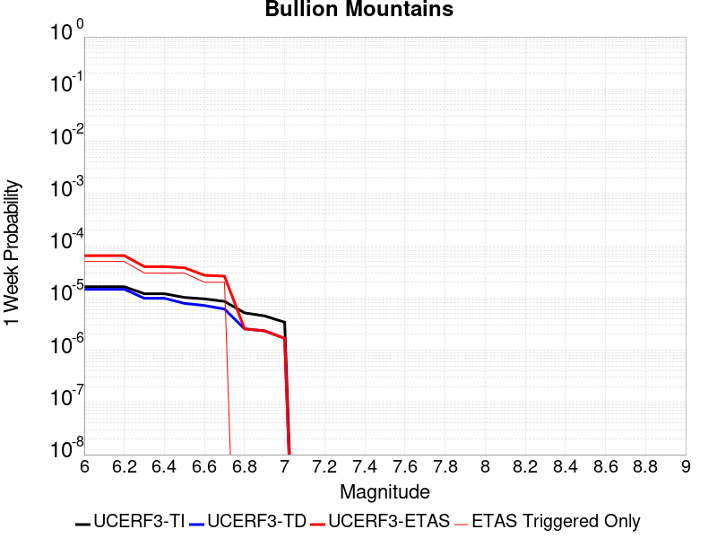 |  |  |  |

| Magnitude | 1 wk TI Prob | 1 wk TD Prob | 1 wk ETAS Prob | 1 wk ETAS/TD Gain | 1 wk ETAS Triggered Only | 1 mo TI Prob | 1 mo TD Prob | 1 mo ETAS Prob | 1 mo ETAS/TD Gain | 1 mo ETAS Triggered Only | 1 yr TI Prob | 1 yr TD Prob | 1 yr ETAS Prob | 1 yr ETAS/TD Gain | 1 yr ETAS Triggered Only | 10 yr TI Prob | 10 yr TD Prob | 10 yr ETAS Prob | 10 yr ETAS/TD Gain | 10 yr ETAS Triggered Only |
|-----|-----|-----|-----|-----|-----|-----|-----|-----|-----|-----|-----|-----|-----|-----|-----|-----|-----|-----|-----|-----|
| 6.0 | 1.6420427E-5 | 1.4692089E-5 | 1.4692089E-5 | 1.0 | 0.0 | 7.037136E-5 | 6.296479E-5 | 6.296479E-5 | 1.0 | 0.0 | 8.5643446E-4 | 7.663651E-4 | 8.192626E-4 | 1.0690238 | 5.2938063E-5 | 0.008531413 | 0.007641016 | 0.0076935496 | 1.0068752 | 5.2938063E-5 |
| 6.1 | 1.6420427E-5 | 1.4692089E-5 | 1.4692089E-5 | 1.0 | 0.0 | 7.037136E-5 | 6.296479E-5 | 6.296479E-5 | 1.0 | 0.0 | 8.5643446E-4 | 7.663651E-4 | 8.192626E-4 | 1.0690238 | 5.2938063E-5 | 0.008531413 | 0.007641016 | 0.0076935496 | 1.0068752 | 5.2938063E-5 |
| 6.2 | 1.6420427E-5 | 1.4692089E-5 | 1.4692089E-5 | 1.0 | 0.0 | 7.037136E-5 | 6.296479E-5 | 6.296479E-5 | 1.0 | 0.0 | 8.5643446E-4 | 7.663651E-4 | 8.192626E-4 | 1.0690238 | 5.2938063E-5 | 0.008531413 | 0.007641016 | 0.0076935496 | 1.0068752 | 5.2938063E-5 |
| 6.3 | 1.2046778E-5 | 9.862335E-6 | 9.862335E-6 | 1.0 | 0.0 | 5.1628023E-5 | 4.2266598E-5 | 4.2266598E-5 | 1.0 | 0.0 | 6.283899E-4 | 5.144975E-4 | 5.144975E-4 | 1.0 | 0.0 | 0.0062661595 | 0.005135345 | 0.005135345 | 1.0 | 0.0 |
| 6.4 | 1.2046778E-5 | 9.862335E-6 | 9.862335E-6 | 1.0 | 0.0 | 5.1628023E-5 | 4.2266598E-5 | 4.2266598E-5 | 1.0 | 0.0 | 6.283899E-4 | 5.144975E-4 | 5.144975E-4 | 1.0 | 0.0 | 0.0062661595 | 0.005135345 | 0.005135345 | 1.0 | 0.0 |
| 6.5 | 1.0244343E-5 | 7.879458E-6 | 7.879458E-6 | 1.0 | 0.0 | 4.390359E-5 | 3.3768785E-5 | 3.3768785E-5 | 1.0 | 0.0 | 5.343951E-4 | 4.110781E-4 | 4.110781E-4 | 1.0 | 0.0 | 0.005331118 | 0.004105208 | 0.004105208 | 1.0 | 0.0 |
| 6.6 | 9.605408E-6 | 7.1774966E-6 | 7.1774966E-6 | 1.0 | 0.0 | 4.1165385E-5 | 3.076045E-5 | 3.076045E-5 | 1.0 | 0.0 | 5.010733E-4 | 3.744645E-4 | 3.744645E-4 | 1.0 | 0.0 | 0.00499945 | 0.003740332 | 0.003740332 | 1.0 | 0.0 |
| 6.7 | 8.60418E-6 | 6.1240044E-6 | 6.1240044E-6 | 1.0 | 0.0 | 3.687454E-5 | 2.624558E-5 | 2.624558E-5 | 1.0 | 0.0 | 4.48855E-4 | 3.1951256E-4 | 3.1951256E-4 | 1.0 | 0.0 | 0.004479495 | 0.0031924439 | 0.0031924439 | 1.0 | 0.0 |
| 6.8 | 5.187994E-6 | 2.5631666E-6 | 2.5631666E-6 | 1.0 | 0.0 | 2.223407E-5 | 1.0984976E-5 | 1.0984976E-5 | 1.0 | 0.0 | 2.7066618E-4 | 1.3373788E-4 | 1.3373788E-4 | 1.0 | 0.0 | 0.0027033675 | 0.0013369655 | 0.0013369655 | 1.0 | 0.0 |
| 6.9 | 4.5302368E-6 | 2.3443165E-6 | 2.3443165E-6 | 1.0 | 0.0 | 1.9415156E-5 | 1.0047055E-5 | 1.0047055E-5 | 1.0 | 0.0 | 2.3635388E-4 | 1.2232E-4 | 1.2232E-4 | 1.0 | 0.0 | 0.0023610266 | 0.0012229157 | 0.0012229157 | 1.0 | 0.0 |
| 7.0 | 3.431668E-6 | 1.6882402E-6 | 1.6882402E-6 | 1.0 | 0.0 | 1.4707065E-5 | 7.235315E-6 | 7.235315E-6 | 1.0 | 0.0 | 1.7904381E-4 | 8.808996E-5 | 8.808996E-5 | 1.0 | 0.0 | 0.0017889962 | 8.808996E-4 | 8.808996E-4 | 1.0 | 0.0 |

## Hollywood
*[(top)](#table-of-contents)*

| 1 Week | 1 Month | 1 Year | 10 Year |
|-----|-----|-----|-----|
|  |  |  |  |

| Magnitude | 1 wk TI Prob | 1 wk TD Prob | 1 wk ETAS Prob | 1 wk ETAS/TD Gain | 1 wk ETAS Triggered Only | 1 mo TI Prob | 1 mo TD Prob | 1 mo ETAS Prob | 1 mo ETAS/TD Gain | 1 mo ETAS Triggered Only | 1 yr TI Prob | 1 yr TD Prob | 1 yr ETAS Prob | 1 yr ETAS/TD Gain | 1 yr ETAS Triggered Only | 10 yr TI Prob | 10 yr TD Prob | 10 yr ETAS Prob | 10 yr ETAS/TD Gain | 10 yr ETAS Triggered Only |
|-----|-----|-----|-----|-----|-----|-----|-----|-----|-----|-----|-----|-----|-----|-----|-----|-----|-----|-----|-----|-----|
| 6.0 | 1.24487615E-5 | 1.2593226E-5 | 1.2593226E-5 | 1.0 | 0.0 | 5.3350745E-5 | 5.3969878E-5 | 5.3969878E-5 | 1.0 | 0.0 | 6.4935174E-4 | 6.568898E-4 | 6.568898E-4 | 1.0 | 0.0 | 0.0064745755 | 0.006549969 | 0.00660256 | 1.0080292 | 5.2938063E-5 |
| 6.1 | 1.24487615E-5 | 1.2593226E-5 | 1.2593226E-5 | 1.0 | 0.0 | 5.3350745E-5 | 5.3969878E-5 | 5.3969878E-5 | 1.0 | 0.0 | 6.4935174E-4 | 6.568898E-4 | 6.568898E-4 | 1.0 | 0.0 | 0.0064745755 | 0.006549969 | 0.00660256 | 1.0080292 | 5.2938063E-5 |
| 6.2 | 1.24487615E-5 | 1.2593226E-5 | 1.2593226E-5 | 1.0 | 0.0 | 5.3350745E-5 | 5.3969878E-5 | 5.3969878E-5 | 1.0 | 0.0 | 6.4935174E-4 | 6.568898E-4 | 6.568898E-4 | 1.0 | 0.0 | 0.0064745755 | 0.006549969 | 0.00660256 | 1.0080292 | 5.2938063E-5 |
| 6.3 | 1.24487615E-5 | 1.2593226E-5 | 1.2593226E-5 | 1.0 | 0.0 | 5.3350745E-5 | 5.3969878E-5 | 5.3969878E-5 | 1.0 | 0.0 | 6.4935174E-4 | 6.568898E-4 | 6.568898E-4 | 1.0 | 0.0 | 0.0064745755 | 0.006549969 | 0.00660256 | 1.0080292 | 5.2938063E-5 |
| 6.4 | 1.2431024E-5 | 1.2573839E-5 | 1.2573839E-5 | 1.0 | 0.0 | 5.327473E-5 | 5.3886797E-5 | 5.3886797E-5 | 1.0 | 0.0 | 6.4842677E-4 | 6.558789E-4 | 6.558789E-4 | 1.0 | 0.0 | 0.0064653796 | 0.0065399194 | 0.006592511 | 1.0080416 | 5.2938063E-5 |
| 6.5 | 1.1242222E-5 | 1.13178E-5 | 1.13178E-5 | 1.0 | 0.0 | 4.8180063E-5 | 4.850397E-5 | 4.850397E-5 | 1.0 | 0.0 | 5.864344E-4 | 5.9037853E-4 | 5.9037853E-4 | 1.0 | 0.0 | 0.0058488925 | 0.005888388 | 0.0059410143 | 1.0089374 | 5.2938063E-5 |
| 6.6 | 1.1234066E-5 | 1.13089145E-5 | 1.13089145E-5 | 1.0 | 0.0 | 4.8145106E-5 | 4.846589E-5 | 4.846589E-5 | 1.0 | 0.0 | 5.86009E-4 | 5.8991514E-4 | 5.8991514E-4 | 1.0 | 0.0 | 0.005844661 | 0.0058837784 | 0.005936405 | 1.0089444 | 5.2938063E-5 |
| 6.7 | 1.12294E-5 | 1.1303658E-5 | 1.1303658E-5 | 1.0 | 0.0 | 4.812511E-5 | 4.8443362E-5 | 4.8443362E-5 | 1.0 | 0.0 | 5.857657E-4 | 5.89641E-4 | 5.89641E-4 | 1.0 | 0.0 | 0.0058422405 | 0.005881052 | 0.0059336787 | 1.0089486 | 5.2938063E-5 |
| 6.8 | 1.0252819E-5 | 1.0218445E-5 | 1.0218445E-5 | 1.0 | 0.0 | 4.3939912E-5 | 4.379261E-5 | 4.379261E-5 | 1.0 | 0.0 | 5.3483713E-4 | 5.330467E-4 | 5.330467E-4 | 1.0 | 0.0 | 0.005335517 | 0.005317908 | 0.0053705643 | 1.0099018 | 5.2938063E-5 |
| 6.9 | 9.252289E-6 | 9.110306E-6 | 9.110306E-6 | 1.0 | 0.0 | 3.9652066E-5 | 3.9043593E-5 | 3.9043593E-5 | 1.0 | 0.0 | 4.8265693E-4 | 4.752537E-4 | 4.752537E-4 | 1.0 | 0.0 | 0.0048161 | 0.004742547 | 0.0047952337 | 1.0111095 | 5.2938063E-5 |
| 7.0 | 8.474604E-6 | 8.258257E-6 | 8.258257E-6 | 1.0 | 0.0 | 3.6319227E-5 | 3.539206E-5 | 3.539206E-5 | 1.0 | 0.0 | 4.4209688E-4 | 4.3081454E-4 | 4.3081454E-4 | 1.0 | 0.0 | 0.004412184 | 0.004299944 | 0.0043526543 | 1.0122584 | 5.2938063E-5 |
| 7.1 | 6.643643E-6 | 6.2683675E-6 | 6.2683675E-6 | 1.0 | 0.0 | 2.8472443E-5 | 2.6864158E-5 | 2.6864158E-5 | 1.0 | 0.0 | 3.4659685E-4 | 3.2702246E-4 | 3.2702246E-4 | 1.0 | 0.0 | 0.0034605677 | 0.0032654584 | 0.0033182236 | 1.0161586 | 5.2938063E-5 |
| 7.2 | 5.549002E-6 | 5.108709E-6 | 5.108709E-6 | 1.0 | 0.0 | 2.378122E-5 | 2.1894284E-5 | 2.1894284E-5 | 1.0 | 0.0 | 2.8949787E-4 | 2.6653046E-4 | 2.6653046E-4 | 1.0 | 0.0 | 0.0028912104 | 0.0026621243 | 0.0027149215 | 1.0198327 | 5.2938063E-5 |
| 7.3 | 4.3059727E-6 | 3.9598885E-6 | 3.9598885E-6 | 1.0 | 0.0 | 1.8454039E-5 | 1.6970842E-5 | 1.6970842E-5 | 1.0 | 0.0 | 2.2465475E-4 | 2.066005E-4 | 2.066005E-4 | 1.0 | 0.0 | 0.0022442779 | 0.0020640944 | 0.0021169232 | 1.0255942 | 5.2938063E-5 |
| 7.4 | 2.8550733E-6 | 2.7012966E-6 | 2.7012966E-6 | 1.0 | 0.0 | 1.2235971E-5 | 1.1576934E-5 | 1.1576934E-5 | 1.0 | 0.0 | 1.4896276E-4 | 1.409401E-4 | 1.409401E-4 | 1.0 | 0.0 | 0.0014886294 | 0.0014085122 | 0.0014613757 | 1.0375315 | 5.2938063E-5 |
| 7.5 | 1.9927045E-6 | 1.8976367E-6 | 1.8976367E-6 | 1.0 | 0.0 | 8.540134E-6 | 8.132703E-6 | 8.132703E-6 | 1.0 | 0.0 | 1.0397117E-4 | 9.90112E-5 | 9.90112E-5 | 1.0 | 0.0 | 0.0010392254 | 9.896745E-4 | 9.896745E-4 | 1.0 | 0.0 |
| 7.6 | 1.345084E-6 | 1.2216007E-6 | 1.2216007E-6 | 1.0 | 0.0 | 5.764633E-6 | 5.235421E-6 | 5.235421E-6 | 1.0 | 0.0 | 7.018215E-5 | 6.3739404E-5 | 6.3739404E-5 | 1.0 | 0.0 | 7.0159987E-4 | 6.3721323E-4 | 6.3721323E-4 | 1.0 | 0.0 |
| 7.7 | 7.6835164E-7 | 6.277697E-7 | 6.277697E-7 | 1.0 | 0.0 | 3.2929315E-6 | 2.6904388E-6 | 2.6904388E-6 | 1.0 | 0.0 | 4.00907E-5 | 3.2755615E-5 | 3.2755615E-5 | 1.0 | 0.0 | 4.0083472E-4 | 3.2750933E-4 | 3.2750933E-4 | 1.0 | 0.0 |
| 7.8 | 3.6562128E-7 | 2.453479E-7 | 2.453479E-7 | 1.0 | 0.0 | 1.5669474E-6 | 1.0514907E-6 | 1.0514907E-6 | 1.0 | 0.0 | 1.9077417E-5 | 1.2801827E-5 | 1.2801827E-5 | 1.0 | 0.0 | 1.907578E-4 | 1.2801126E-4 | 1.2801126E-4 | 1.0 | 0.0 |
| 7.9 | 7.5024424E-8 | 5.3816795E-8 | 5.3816795E-8 | 1.0 | 0.0 | 3.215332E-7 | 2.306434E-7 | 2.306434E-7 | 1.0 | 0.0 | 3.91466E-6 | 2.808081E-6 | 2.808081E-6 | 1.0 | 0.0 | 3.9145907E-5 | 2.8080585E-5 | 2.8080585E-5 | 1.0 | 0.0 |

## Oak Ridge (Onshore)
*[(top)](#table-of-contents)*

| 1 Week | 1 Month | 1 Year | 10 Year |
|-----|-----|-----|-----|
|  |  |  |  |

| Magnitude | 1 wk TI Prob | 1 wk TD Prob | 1 wk ETAS Prob | 1 wk ETAS/TD Gain | 1 wk ETAS Triggered Only | 1 mo TI Prob | 1 mo TD Prob | 1 mo ETAS Prob | 1 mo ETAS/TD Gain | 1 mo ETAS Triggered Only | 1 yr TI Prob | 1 yr TD Prob | 1 yr ETAS Prob | 1 yr ETAS/TD Gain | 1 yr ETAS Triggered Only | 10 yr TI Prob | 10 yr TD Prob | 10 yr ETAS Prob | 10 yr ETAS/TD Gain | 10 yr ETAS Triggered Only |
|-----|-----|-----|-----|-----|-----|-----|-----|-----|-----|-----|-----|-----|-----|-----|-----|-----|-----|-----|-----|-----|
| 6.0 | 3.155064E-5 | 2.9525974E-5 | 8.246247E-5 | 2.792879 | 5.2938063E-5 | 1.3521002E-4 | 1.2653397E-4 | 1.7946534E-4 | 1.4183174 | 5.2938063E-5 | 0.001644939 | 0.0015395004 | 0.001592357 | 1.0343336 | 5.2938063E-5 | 0.01632816 | 0.015292859 | 0.015344988 | 1.0034087 | 5.2938063E-5 |
| 6.1 | 3.155064E-5 | 2.9525974E-5 | 8.246247E-5 | 2.792879 | 5.2938063E-5 | 1.3521002E-4 | 1.2653397E-4 | 1.7946534E-4 | 1.4183174 | 5.2938063E-5 | 0.001644939 | 0.0015395004 | 0.001592357 | 1.0343336 | 5.2938063E-5 | 0.01632816 | 0.015292859 | 0.015344988 | 1.0034087 | 5.2938063E-5 |
| 6.2 | 3.155064E-5 | 2.9525974E-5 | 8.246247E-5 | 2.792879 | 5.2938063E-5 | 1.3521002E-4 | 1.2653397E-4 | 1.7946534E-4 | 1.4183174 | 5.2938063E-5 | 0.001644939 | 0.0015395004 | 0.001592357 | 1.0343336 | 5.2938063E-5 | 0.01632816 | 0.015292859 | 0.015344988 | 1.0034087 | 5.2938063E-5 |
| 6.3 | 3.155064E-5 | 2.9525974E-5 | 8.246247E-5 | 2.792879 | 5.2938063E-5 | 1.3521002E-4 | 1.2653397E-4 | 1.7946534E-4 | 1.4183174 | 5.2938063E-5 | 0.001644939 | 0.0015395004 | 0.001592357 | 1.0343336 | 5.2938063E-5 | 0.01632816 | 0.015292859 | 0.015344988 | 1.0034087 | 5.2938063E-5 |
| 6.4 | 3.155064E-5 | 2.9525974E-5 | 8.246247E-5 | 2.792879 | 5.2938063E-5 | 1.3521002E-4 | 1.2653397E-4 | 1.7946534E-4 | 1.4183174 | 5.2938063E-5 | 0.001644939 | 0.0015395004 | 0.001592357 | 1.0343336 | 5.2938063E-5 | 0.01632816 | 0.015292859 | 0.015344988 | 1.0034087 | 5.2938063E-5 |
| 6.5 | 3.155064E-5 | 2.9525974E-5 | 8.246247E-5 | 2.792879 | 5.2938063E-5 | 1.3521002E-4 | 1.2653397E-4 | 1.7946534E-4 | 1.4183174 | 5.2938063E-5 | 0.001644939 | 0.0015395004 | 0.001592357 | 1.0343336 | 5.2938063E-5 | 0.01632816 | 0.015292859 | 0.015344988 | 1.0034087 | 5.2938063E-5 |
| 6.6 | 3.155064E-5 | 2.9525974E-5 | 8.246247E-5 | 2.792879 | 5.2938063E-5 | 1.3521002E-4 | 1.2653397E-4 | 1.7946534E-4 | 1.4183174 | 5.2938063E-5 | 0.001644939 | 0.0015395004 | 0.001592357 | 1.0343336 | 5.2938063E-5 | 0.01632816 | 0.015292859 | 0.015344988 | 1.0034087 | 5.2938063E-5 |
| 6.7 | 3.098897E-5 | 2.8864175E-5 | 8.180071E-5 | 2.8339875 | 5.2938063E-5 | 1.328031E-4 | 1.2369796E-4 | 1.7662947E-4 | 1.4279094 | 5.2938063E-5 | 0.0016156785 | 0.0015050198 | 0.0015578782 | 1.0351214 | 5.2938063E-5 | 0.016039822 | 0.014952714 | 0.01500486 | 1.0034875 | 5.2938063E-5 |
| 6.8 | 3.0449872E-5 | 2.8239372E-5 | 8.117594E-5 | 2.874566 | 5.2938063E-5 | 1.3049292E-4 | 1.2102048E-4 | 1.7395214E-4 | 1.4373777 | 5.2938063E-5 | 0.0015875935 | 0.0014724657 | 0.0015253257 | 1.035899 | 5.2938063E-5 | 0.015762992 | 0.014631462 | 0.014683626 | 1.0035652 | 5.2938063E-5 |
| 6.9 | 2.697928E-5 | 2.4219773E-5 | 7.7156554E-5 | 3.1856844 | 5.2938063E-5 | 1.15620365E-4 | 1.0379502E-4 | 1.5672759E-4 | 1.5099721 | 5.2938063E-5 | 0.0014067689 | 0.0012629933 | 0.0013158645 | 1.0418618 | 5.2938063E-5 | 0.0139789665 | 0.01256087 | 0.012613143 | 1.0041616 | 5.2938063E-5 |
| 7.0 | 2.4893961E-5 | 2.1862043E-5 | 7.479895E-5 | 3.4214072 | 5.2938063E-5 | 1.0668404E-4 | 9.3691204E-5 | 1.466243E-4 | 1.5649741 | 5.2938063E-5 | 0.0012981043 | 0.0011401111 | 0.0011929888 | 1.0463794 | 5.2938063E-5 | 0.012905477 | 0.011344905 | 0.011397243 | 1.0046133 | 5.2938063E-5 |
| 7.1 | 2.0945363E-5 | 1.7354487E-5 | 7.029163E-5 | 4.0503435 | 5.2938063E-5 | 8.976275E-5 | 7.437428E-5 | 1.273084E-4 | 1.7117262 | 5.2938063E-5 | 0.0010923136 | 9.051354E-4 | 9.580256E-4 | 1.0584334 | 5.2938063E-5 | 0.0108696 | 0.009015423 | 0.009067884 | 1.005819 | 5.2938063E-5 |
| 7.2 | 2.0439404E-5 | 1.6809423E-5 | 6.9746595E-5 | 4.1492558 | 5.2938063E-5 | 8.7594504E-5 | 7.203843E-5 | 1.2497268E-4 | 1.7348057 | 5.2938063E-5 | 0.0010659413 | 8.767196E-4 | 9.296112E-4 | 1.0603291 | 5.2938063E-5 | 0.010608427 | 0.008733526 | 0.008786002 | 1.0060085 | 5.2938063E-5 |
| 7.3 | 1.8463334E-5 | 1.5381811E-5 | 6.831906E-5 | 4.441549 | 5.2938063E-5 | 7.912617E-5 | 6.59204E-5 | 1.1885498E-4 | 1.8030074 | 5.2938063E-5 | 9.6293533E-4 | 8.0228975E-4 | 8.551853E-4 | 1.0659307 | 5.2938063E-5 | 0.009587734 | 0.007994797 | 0.008047312 | 1.0065687 | 5.2938063E-5 |
| 7.4 | 1.763139E-5 | 1.451684E-5 | 6.745414E-5 | 4.6466126 | 5.2938063E-5 | 7.556091E-5 | 6.221356E-5 | 1.1514834E-4 | 1.8508557 | 5.2938063E-5 | 9.1956573E-4 | 7.571909E-4 | 8.100889E-4 | 1.0698608 | 5.2938063E-5 | 0.009157699 | 0.007546914 | 0.007599452 | 1.0069616 | 5.2938063E-5 |
| 7.5 | 1.3594944E-5 | 1.1163356E-5 | 6.410083E-5 | 5.742075 | 5.2938063E-5 | 5.8262744E-5 | 4.784209E-5 | 1.0077762E-4 | 2.1064634 | 5.2938063E-5 | 7.0911803E-4 | 5.8232434E-4 | 6.3523155E-4 | 1.0908552 | 5.2938063E-5 | 0.007068595 | 0.0058082556 | 0.005860886 | 1.0090613 | 5.2938063E-5 |
| 7.6 | 6.9889534E-6 | 5.6367144E-6 | 5.6367144E-6 | 1.0 | 0.0 | 2.9952313E-5 | 2.4157125E-5 | 2.4157125E-5 | 1.0 | 0.0 | 3.646084E-4 | 2.9407372E-4 | 2.9407372E-4 | 1.0 | 0.0 | 0.0036401073 | 0.0029368899 | 0.0029368899 | 1.0 | 0.0 |
| 7.7 | 4.0824193E-6 | 3.2832586E-6 | 3.2832586E-6 | 1.0 | 0.0 | 1.7495966E-5 | 1.4071033E-5 | 1.4071033E-5 | 1.0 | 0.0 | 2.1299256E-4 | 1.713015E-4 | 1.713015E-4 | 1.0 | 0.0 | 0.0021278851 | 0.0017117079 | 0.0017117079 | 1.0 | 0.0 |
| 7.8 | 1.7023609E-6 | 1.4370495E-6 | 1.4370495E-6 | 1.0 | 0.0 | 7.295812E-6 | 6.1587693E-6 | 6.1587693E-6 | 1.0 | 0.0 | 8.882289E-5 | 7.498047E-5 | 7.498047E-5 | 1.0 | 0.0 | 8.8787393E-4 | 7.495545E-4 | 7.495545E-4 | 1.0 | 0.0 |
| 7.9 | 2.721225E-7 | 2.2616497E-7 | 2.2616497E-7 | 1.0 | 0.0 | 1.1662388E-6 | 9.692781E-7 | 9.692781E-7 | 1.0 | 0.0 | 1.4198865E-5 | 1.1800899E-5 | 1.1800899E-5 | 1.0 | 0.0 | 1.4197957E-4 | 1.1800301E-4 | 1.1800301E-4 | 1.0 | 0.0 |
| 8.0 | 9.364255E-9 | 5.1206666E-9 | 5.1206666E-9 | 1.0 | 0.0 | 4.0132523E-8 | 2.1945715E-8 | 2.1945715E-8 | 1.0 | 0.0 | 4.8861335E-7 | 2.6718905E-7 | 2.6718905E-7 | 1.0 | 0.0 | 4.8861225E-6 | 2.6718876E-6 | 2.6718876E-6 | 1.0 | 0.0 |

## San Jacinto (Borrego)
*[(top)](#table-of-contents)*

| 1 Week | 1 Month | 1 Year | 10 Year |
|-----|-----|-----|-----|
|  | 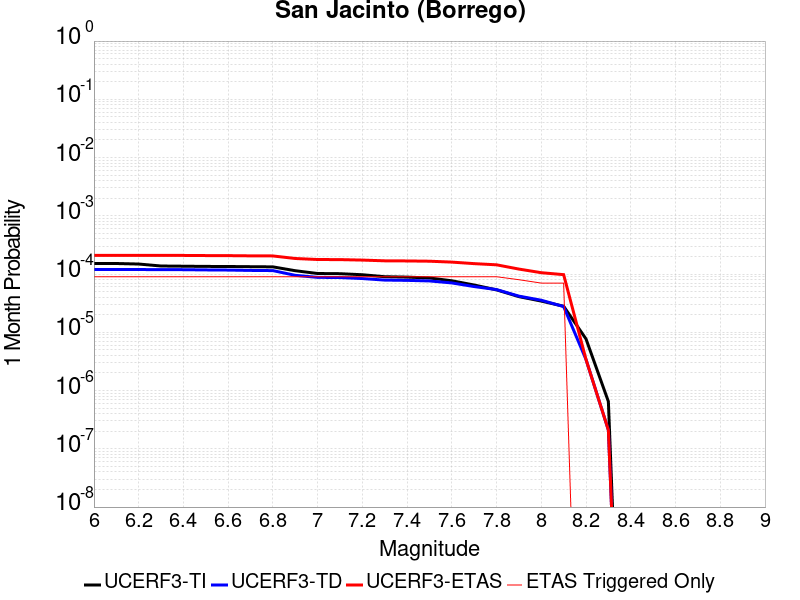 |  |  |

| Magnitude | 1 wk TI Prob | 1 wk TD Prob | 1 wk ETAS Prob | 1 wk ETAS/TD Gain | 1 wk ETAS Triggered Only | 1 mo TI Prob | 1 mo TD Prob | 1 mo ETAS Prob | 1 mo ETAS/TD Gain | 1 mo ETAS Triggered Only | 1 yr TI Prob | 1 yr TD Prob | 1 yr ETAS Prob | 1 yr ETAS/TD Gain | 1 yr ETAS Triggered Only | 10 yr TI Prob | 10 yr TD Prob | 10 yr ETAS Prob | 10 yr ETAS/TD Gain | 10 yr ETAS Triggered Only |
|-----|-----|-----|-----|-----|-----|-----|-----|-----|-----|-----|-----|-----|-----|-----|-----|-----|-----|-----|-----|-----|
| 6.0 | 3.543992E-5 | 2.7926513E-5 | 8.0863094E-5 | 2.8955674 | 5.2938063E-5 | 1.5187653E-4 | 1.1967963E-4 | 1.7261136E-4 | 1.4422785 | 5.2938063E-5 | 0.0018475284 | 0.0014561379 | 0.0015089988 | 1.0363022 | 5.2938063E-5 | 0.018322436 | 0.014869647 | 0.014921798 | 1.0035073 | 5.2938063E-5 |
| 6.1 | 3.542281E-5 | 2.7926513E-5 | 8.0863094E-5 | 2.8955674 | 5.2938063E-5 | 1.5180321E-4 | 1.1967963E-4 | 1.7261136E-4 | 1.4422785 | 5.2938063E-5 | 0.0018466372 | 0.0014561379 | 0.0015089988 | 1.0363022 | 5.2938063E-5 | 0.018313672 | 0.014869647 | 0.014921798 | 1.0035073 | 5.2938063E-5 |
| 6.2 | 3.4688688E-5 | 2.7926511E-5 | 8.0863094E-5 | 2.8955674 | 5.2938063E-5 | 1.4865733E-4 | 1.1967963E-4 | 1.7261136E-4 | 1.4422785 | 5.2938063E-5 | 0.0018084005 | 0.0014561379 | 0.0015089988 | 1.0363022 | 5.2938063E-5 | 0.017937548 | 0.014869647 | 0.014921797 | 1.0035073 | 5.2938063E-5 |
| 6.3 | 3.2087122E-5 | 2.7771865E-5 | 8.070846E-5 | 2.9061232 | 5.2938063E-5 | 1.3750899E-4 | 1.1901691E-4 | 1.7194868E-4 | 1.4447415 | 5.2938063E-5 | 0.0016728862 | 0.00144808 | 0.0015009413 | 1.0365045 | 5.2938063E-5 | 0.016603488 | 0.014790683 | 0.014842838 | 1.0035262 | 5.2938063E-5 |
| 6.4 | 3.1828724E-5 | 2.7738852E-5 | 8.067545E-5 | 2.9083917 | 5.2938063E-5 | 1.364017E-4 | 1.1887544E-4 | 1.7180722E-4 | 1.4452709 | 5.2938063E-5 | 0.0016594254 | 0.0014463598 | 0.0014992213 | 1.0365479 | 5.2938063E-5 | 0.016470885 | 0.014773762 | 0.014825918 | 1.0035303 | 5.2938063E-5 |
| 6.5 | 3.1563577E-5 | 2.747857E-5 | 8.041518E-5 | 2.9264688 | 5.2938063E-5 | 1.3526545E-4 | 1.1776006E-4 | 1.7069188E-4 | 1.4494889 | 5.2938063E-5 | 0.0016456128 | 0.0014327979 | 0.0014856601 | 1.0368944 | 5.2938063E-5 | 0.0163348 | 0.014640348 | 0.0146925105 | 1.0035629 | 5.2938063E-5 |
| 6.6 | 3.1467625E-5 | 2.7322796E-5 | 8.0259415E-5 | 2.9374523 | 5.2938063E-5 | 1.3485427E-4 | 1.1709251E-4 | 1.7002437E-4 | 1.4520516 | 5.2938063E-5 | 0.0016406142 | 0.0014246812 | 0.0014775438 | 1.0371048 | 5.2938063E-5 | 0.016285548 | 0.014560594 | 0.014612761 | 1.0035827 | 5.2938063E-5 |
| 6.7 | 3.1223695E-5 | 2.6940816E-5 | 7.987745E-5 | 2.9649234 | 5.2938063E-5 | 1.3380898E-4 | 1.15455594E-4 | 1.6838755E-4 | 1.4584615 | 5.2938063E-5 | 0.0016279068 | 0.0014047775 | 0.0014576413 | 1.0376314 | 5.2938063E-5 | 0.01616033 | 0.014364966 | 0.014417144 | 1.0036323 | 5.2938063E-5 |
| 6.8 | 3.1015585E-5 | 2.6761822E-5 | 7.969847E-5 | 2.9780657 | 5.2938063E-5 | 1.3291716E-4 | 1.1468855E-4 | 1.6762054E-4 | 1.4615281 | 5.2938063E-5 | 0.001617065 | 0.0013954508 | 0.001448315 | 1.0378833 | 5.2938063E-5 | 0.016053487 | 0.014272246 | 0.0143244285 | 1.0036563 | 5.2938063E-5 |
| 6.9 | 2.6641965E-5 | 2.2184247E-5 | 7.5121134E-5 | 3.3862379 | 5.2938063E-5 | 1.1417485E-4 | 9.50719E-5 | 1.4800492E-4 | 1.5567684 | 5.2938063E-5 | 0.0013891924 | 0.0011568897 | 0.0012097665 | 1.045706 | 5.2938063E-5 | 0.0138054015 | 0.011882438 | 0.011934748 | 1.0044022 | 5.2938063E-5 |
| 7.0 | 2.3854353E-5 | 2.0479023E-5 | 7.3416E-5 | 3.5849366 | 5.2938063E-5 | 1.02228936E-4 | 8.77643E-5 | 1.4069772E-4 | 1.6031315 | 5.2938063E-5 | 0.0012439266 | 0.0010680092 | 0.0011208907 | 1.049514 | 5.2938063E-5 | 0.012369866 | 0.0109828 | 0.011035157 | 1.0047672 | 5.2938063E-5 |
| 7.1 | 2.3672901E-5 | 2.031551E-5 | 7.32525E-5 | 3.6057425 | 5.2938063E-5 | 1.0145135E-4 | 8.7063585E-5 | 1.3999704E-4 | 1.6079862 | 5.2938063E-5 | 0.0012344702 | 0.0010594862 | 0.0011123682 | 1.0499128 | 5.2938063E-5 | 0.0122763505 | 0.010897976 | 0.010950337 | 1.0048046 | 5.2938063E-5 |
| 7.2 | 2.2717244E-5 | 1.9542893E-5 | 7.247992E-5 | 3.7087612 | 5.2938063E-5 | 9.735599E-5 | 8.375258E-5 | 1.3668621E-4 | 1.6320239 | 5.2938063E-5 | 0.0011846646 | 0.001019213 | 0.0010720971 | 1.0518872 | 5.2938063E-5 | 0.01178369 | 0.010495341 | 0.010547724 | 1.004991 | 5.2938063E-5 |
| 7.3 | 2.1016205E-5 | 1.8384526E-5 | 7.1321614E-5 | 3.8794374 | 5.2938063E-5 | 9.006634E-5 | 7.878846E-5 | 1.3172235E-4 | 1.6718483 | 5.2938063E-5 | 0.001096006 | 9.5882936E-4 | 0.0010117167 | 1.0551583 | 5.2938063E-5 | 0.010906163 | 0.009890967 | 0.009943381 | 1.0052992 | 5.2938063E-5 |
| 7.4 | 2.0683625E-5 | 1.8187047E-5 | 7.1124145E-5 | 3.9107034 | 5.2938063E-5 | 8.86411E-5 | 7.794217E-5 | 1.3087611E-4 | 1.6791438 | 5.2938063E-5 | 0.001078671 | 9.485349E-4 | 0.0010014226 | 1.0557574 | 5.2938063E-5 | 0.010734501 | 0.009787692 | 0.009840112 | 1.0053557 | 5.2938063E-5 |
| 7.5 | 1.9993966E-5 | 1.7782075E-5 | 7.0719194E-5 | 3.9769936 | 5.2938063E-5 | 8.568561E-5 | 7.620667E-5 | 1.291407E-4 | 1.6946114 | 5.2938063E-5 | 0.001042723 | 9.2742336E-4 | 9.803124E-4 | 1.0570278 | 5.2938063E-5 | 0.010378438 | 0.009574614 | 0.009627046 | 1.0054761 | 5.2938063E-5 |
| 7.6 | 1.788966E-5 | 1.6435291E-5 | 6.937248E-5 | 4.220947 | 5.2938063E-5 | 7.666772E-5 | 7.043507E-5 | 1.233694E-4 | 1.7515337 | 5.2938063E-5 | 9.3302975E-4 | 8.572113E-4 | 9.10104E-4 | 1.0617032 | 5.2938063E-5 | 0.00929122 | 0.008866487 | 0.008918955 | 1.0059177 | 5.2938063E-5 |
| 7.7 | 1.5125781E-5 | 1.4237377E-5 | 6.717469E-5 | 4.7181926 | 5.2938063E-5 | 6.4823165E-5 | 6.1015908E-5 | 1.13950744E-4 | 1.8675579 | 5.2938063E-5 | 7.889362E-4 | 7.426163E-4 | 7.955151E-4 | 1.0712329 | 5.2938063E-5 | 0.007861412 | 0.0077142045 | 0.007766734 | 1.0068095 | 5.2938063E-5 |
| 7.8 | 1.250089E-5 | 1.26304985E-5 | 6.556789E-5 | 5.1912355 | 5.2938063E-5 | 5.3574146E-5 | 5.412959E-5 | 1.07064785E-4 | 1.9779346 | 5.2938063E-5 | 6.5207E-4 | 6.588291E-4 | 7.1173225E-4 | 1.0802988 | 5.2938063E-5 | 0.006501599 | 0.0068677636 | 0.006920338 | 1.0076553 | 5.2938063E-5 |
| 7.9 | 9.561E-6 | 9.754616E-6 | 9.754616E-6 | 1.0 | 0.0 | 4.0975072E-5 | 4.1804833E-5 | 4.1804833E-5 | 1.0 | 0.0 | 4.987573E-4 | 5.088555E-4 | 5.088555E-4 | 1.0 | 0.0 | 0.0049763937 | 0.0053523467 | 0.0053523467 | 1.0 | 0.0 |
| 8.0 | 8.01699E-6 | 8.293488E-6 | 8.293488E-6 | 1.0 | 0.0 | 3.4358076E-5 | 3.554304E-5 | 3.554304E-5 | 1.0 | 0.0 | 4.1822926E-4 | 4.3265108E-4 | 4.3265108E-4 | 1.0 | 0.0 | 0.0041744304 | 0.004573375 | 0.004573375 | 1.0 | 0.0 |
| 8.1 | 6.541947E-6 | 6.4622354E-6 | 6.4622354E-6 | 1.0 | 0.0 | 2.8036617E-5 | 2.7695003E-5 | 2.7695003E-5 | 1.0 | 0.0 | 3.4129233E-4 | 3.37135E-4 | 3.37135E-4 | 1.0 | 0.0 | 0.0034076865 | 0.0035806994 | 0.0035806994 | 1.0 | 0.0 |
| 8.2 | 1.7968189E-6 | 7.9713476E-7 | 7.9713476E-7 | 1.0 | 0.0 | 7.70063E-6 | 3.4162877E-6 | 3.4162877E-6 | 1.0 | 0.0 | 9.3751136E-5 | 4.159253E-5 | 4.159253E-5 | 1.0 | 0.0 | 9.371159E-4 | 4.712058E-4 | 4.712058E-4 | 1.0 | 0.0 |
| 8.3 | 1.5167889E-7 | 4.897714E-8 | 4.897714E-8 | 1.0 | 0.0 | 6.500522E-7 | 2.09902E-7 | 2.09902E-7 | 1.0 | 0.0 | 7.9143565E-6 | 2.5555544E-6 | 2.5555544E-6 | 1.0 | 0.0 | 7.914075E-5 | 2.969505E-5 | 2.969505E-5 | 1.0 | 0.0 |

## Simi-Santa Rosa
*[(top)](#table-of-contents)*

| 1 Week | 1 Month | 1 Year | 10 Year |
|-----|-----|-----|-----|
|  |  |  |  |

| Magnitude | 1 wk TI Prob | 1 wk TD Prob | 1 wk ETAS Prob | 1 wk ETAS/TD Gain | 1 wk ETAS Triggered Only | 1 mo TI Prob | 1 mo TD Prob | 1 mo ETAS Prob | 1 mo ETAS/TD Gain | 1 mo ETAS Triggered Only | 1 yr TI Prob | 1 yr TD Prob | 1 yr ETAS Prob | 1 yr ETAS/TD Gain | 1 yr ETAS Triggered Only | 10 yr TI Prob | 10 yr TD Prob | 10 yr ETAS Prob | 10 yr ETAS/TD Gain | 10 yr ETAS Triggered Only |
|-----|-----|-----|-----|-----|-----|-----|-----|-----|-----|-----|-----|-----|-----|-----|-----|-----|-----|-----|-----|-----|
| 6.0 | 2.198912E-5 | 2.2275442E-5 | 7.521232E-5 | 3.3764684 | 5.2938063E-5 | 9.4235686E-5 | 9.5462936E-5 | 1.4839595E-4 | 1.5544876 | 5.2938063E-5 | 0.0011467156 | 0.0011616853 | 0.001214562 | 1.0455171 | 5.2938063E-5 | 0.011408163 | 0.011560575 | 0.011612901 | 1.0045263 | 5.2938063E-5 |
| 6.1 | 2.198912E-5 | 2.2275442E-5 | 7.521232E-5 | 3.3764684 | 5.2938063E-5 | 9.4235686E-5 | 9.5462936E-5 | 1.4839595E-4 | 1.5544876 | 5.2938063E-5 | 0.0011467156 | 0.0011616853 | 0.001214562 | 1.0455171 | 5.2938063E-5 | 0.011408163 | 0.011560575 | 0.011612901 | 1.0045263 | 5.2938063E-5 |
| 6.2 | 1.69983E-5 | 1.6668559E-5 | 6.960574E-5 | 4.17587 | 5.2938063E-5 | 7.284782E-5 | 7.143489E-5 | 1.2436917E-4 | 1.7410144 | 5.2938063E-5 | 8.865613E-4 | 8.6940196E-4 | 9.22294E-4 | 1.0608373 | 5.2938063E-5 | 0.008830327 | 0.008662928 | 0.008715407 | 1.006058 | 5.2938063E-5 |
| 6.3 | 1.69983E-5 | 1.6668559E-5 | 6.960574E-5 | 4.17587 | 5.2938063E-5 | 7.284782E-5 | 7.143489E-5 | 1.2436917E-4 | 1.7410144 | 5.2938063E-5 | 8.865613E-4 | 8.6940196E-4 | 9.22294E-4 | 1.0608373 | 5.2938063E-5 | 0.008830327 | 0.008662928 | 0.008715407 | 1.006058 | 5.2938063E-5 |
| 6.4 | 1.4666188E-5 | 1.4052543E-5 | 1.4052543E-5 | 1.0 | 0.0 | 6.285358E-5 | 6.0223934E-5 | 6.0223934E-5 | 1.0 | 0.0 | 7.6497364E-4 | 7.3300465E-4 | 7.3300465E-4 | 1.0 | 0.0 | 0.0076234564 | 0.007308344 | 0.007308344 | 1.0 | 0.0 |
| 6.5 | 1.4666188E-5 | 1.4052543E-5 | 1.4052543E-5 | 1.0 | 0.0 | 6.285358E-5 | 6.0223934E-5 | 6.0223934E-5 | 1.0 | 0.0 | 7.6497364E-4 | 7.3300465E-4 | 7.3300465E-4 | 1.0 | 0.0 | 0.0076234564 | 0.007308344 | 0.007308344 | 1.0 | 0.0 |
| 6.6 | 1.4377586E-5 | 1.3729583E-5 | 1.3729583E-5 | 1.0 | 0.0 | 6.1616774E-5 | 5.883988E-5 | 5.883988E-5 | 1.0 | 0.0 | 7.4992597E-4 | 7.1616494E-4 | 7.1616494E-4 | 1.0 | 0.0 | 0.007474003 | 0.0071410383 | 0.0071410383 | 1.0 | 0.0 |
| 6.7 | 1.3881404E-5 | 1.320755E-5 | 1.320755E-5 | 1.0 | 0.0 | 5.9490372E-5 | 5.66027E-5 | 5.66027E-5 | 1.0 | 0.0 | 7.240546E-4 | 6.8894465E-4 | 6.8894465E-4 | 1.0 | 0.0 | 0.007217 | 0.006870538 | 0.006870538 | 1.0 | 0.0 |
| 6.8 | 1.0176516E-5 | 9.154151E-6 | 9.154151E-6 | 1.0 | 0.0 | 4.3612912E-5 | 3.9231574E-5 | 3.9231574E-5 | 1.0 | 0.0 | 5.308578E-4 | 4.7755634E-4 | 4.7755634E-4 | 1.0 | 0.0 | 0.0052959146 | 0.004766934 | 0.004766934 | 1.0 | 0.0 |
| 6.9 | 9.699797E-6 | 8.774719E-6 | 8.774719E-6 | 1.0 | 0.0 | 4.15699E-5 | 3.7605492E-5 | 3.7605492E-5 | 1.0 | 0.0 | 5.05996E-4 | 4.577671E-4 | 4.577671E-4 | 1.0 | 0.0 | 0.005048454 | 0.0045698597 | 0.0045698597 | 1.0 | 0.0 |
| 7.0 | 7.4049476E-6 | 6.559333E-6 | 6.559333E-6 | 1.0 | 0.0 | 3.1735104E-5 | 2.8111197E-5 | 2.8111197E-5 | 1.0 | 0.0 | 3.8630638E-4 | 3.422127E-4 | 3.422127E-4 | 1.0 | 0.0 | 0.0038563553 | 0.0034180996 | 0.0034180996 | 1.0 | 0.0 |
| 7.1 | 3.873439E-6 | 2.7595095E-6 | 2.7595095E-6 | 1.0 | 0.0 | 1.6600346E-5 | 1.1826417E-5 | 1.1826417E-5 | 1.0 | 0.0 | 2.0209046E-4 | 1.4397735E-4 | 1.4397735E-4 | 1.0 | 0.0 | 0.0020190678 | 0.0014388643 | 0.0014388643 | 1.0 | 0.0 |
| 7.2 | 3.417706E-6 | 2.3676484E-6 | 2.3676484E-6 | 1.0 | 0.0 | 1.4647229E-5 | 1.0147027E-5 | 1.0147027E-5 | 1.0 | 0.0 | 1.7831543E-4 | 1.2353327E-4 | 1.2353327E-4 | 1.0 | 0.0 | 0.0017817242 | 0.0012346683 | 0.0012346683 | 1.0 | 0.0 |
| 7.3 | 1.90225E-6 | 1.4073753E-6 | 1.4073753E-6 | 1.0 | 0.0 | 8.152474E-6 | 6.0315947E-6 | 6.0315947E-6 | 1.0 | 0.0 | 9.9251854E-5 | 7.343221E-5 | 7.343221E-5 | 1.0 | 0.0 | 9.920754E-4 | 7.340817E-4 | 7.340817E-4 | 1.0 | 0.0 |
| 7.4 | 1.5170556E-6 | 1.1024773E-6 | 1.1024773E-6 | 1.0 | 0.0 | 6.5016507E-6 | 4.724894E-6 | 4.724894E-6 | 1.0 | 0.0 | 7.915472E-5 | 5.7524077E-5 | 5.7524077E-5 | 1.0 | 0.0 | 7.9126534E-4 | 5.7509297E-4 | 5.7509297E-4 | 1.0 | 0.0 |
| 7.5 | 1.178732E-6 | 8.535102E-7 | 8.535102E-7 | 1.0 | 0.0 | 5.0516987E-6 | 3.6578958E-6 | 3.6578958E-6 | 1.0 | 0.0 | 6.1502695E-5 | 4.453398E-5 | 4.453398E-5 | 1.0 | 0.0 | 6.148568E-4 | 4.452515E-4 | 4.452515E-4 | 1.0 | 0.0 |
| 7.6 | 6.8722386E-7 | 4.793198E-7 | 4.793198E-7 | 1.0 | 0.0 | 2.9452417E-6 | 2.054226E-6 | 2.054226E-6 | 1.0 | 0.0 | 3.5857727E-5 | 2.5009915E-5 | 2.5009915E-5 | 1.0 | 0.0 | 3.5851944E-4 | 2.5007114E-4 | 2.5007114E-4 | 1.0 | 0.0 |
| 7.7 | 5.5126515E-7 | 3.6731157E-7 | 3.6731157E-7 | 1.0 | 0.0 | 2.3625628E-6 | 1.5741915E-6 | 1.5741915E-6 | 1.0 | 0.0 | 2.8763823E-5 | 1.9165615E-5 | 1.9165615E-5 | 1.0 | 0.0 | 2.87601E-4 | 1.9163972E-4 | 1.9163972E-4 | 1.0 | 0.0 |
| 7.8 | 3.3860243E-7 | 2.0075942E-7 | 2.0075942E-7 | 1.0 | 0.0 | 1.4511525E-6 | 8.6039717E-7 | 8.6039717E-7 | 1.0 | 0.0 | 1.7667637E-5 | 1.0475286E-5 | 1.0475286E-5 | 1.0 | 0.0 | 1.7666233E-4 | 1.04747975E-4 | 1.04747975E-4 | 1.0 | 0.0 |
| 7.9 | 2.7955386E-7 | 1.4649108E-7 | 1.4649108E-7 | 1.0 | 0.0 | 1.1980875E-6 | 6.278188E-7 | 6.278188E-7 | 1.0 | 0.0 | 1.4586617E-5 | 7.643667E-6 | 7.643667E-6 | 1.0 | 0.0 | 1.458566E-4 | 7.643409E-5 | 7.643409E-5 | 1.0 | 0.0 |
| 8.0 | 5.6259015E-8 | 3.3355324E-8 | 3.3355324E-8 | 1.0 | 0.0 | 2.4111003E-7 | 1.4295138E-7 | 1.4295138E-7 | 1.0 | 0.0 | 2.9355108E-6 | 1.7404317E-6 | 1.7404317E-6 | 1.0 | 0.0 | 2.935472E-5 | 1.7404194E-5 | 1.7404194E-5 | 1.0 | 0.0 |

## San Pedro Basin
*[(top)](#table-of-contents)*

| 1 Week | 1 Month | 1 Year | 10 Year |
|-----|-----|-----|-----|
|  |  |  |  |

| Magnitude | 1 wk TI Prob | 1 wk TD Prob | 1 wk ETAS Prob | 1 wk ETAS/TD Gain | 1 wk ETAS Triggered Only | 1 mo TI Prob | 1 mo TD Prob | 1 mo ETAS Prob | 1 mo ETAS/TD Gain | 1 mo ETAS Triggered Only | 1 yr TI Prob | 1 yr TD Prob | 1 yr ETAS Prob | 1 yr ETAS/TD Gain | 1 yr ETAS Triggered Only | 10 yr TI Prob | 10 yr TD Prob | 10 yr ETAS Prob | 10 yr ETAS/TD Gain | 10 yr ETAS Triggered Only |
|-----|-----|-----|-----|-----|-----|-----|-----|-----|-----|-----|-----|-----|-----|-----|-----|-----|-----|-----|-----|-----|
| 6.0 | 5.3449043E-5 | 6.336954E-5 | 1.1630425E-4 | 1.8353337 | 5.2938063E-5 | 2.2904722E-4 | 2.715589E-4 | 3.244826E-4 | 1.1948884 | 5.2938063E-5 | 0.0027850836 | 0.0033018254 | 0.0033545885 | 1.01598 | 5.2938063E-5 | 0.027504366 | 0.03258945 | 0.032640662 | 1.0015714 | 5.2938063E-5 |
| 6.1 | 5.3449043E-5 | 6.336954E-5 | 1.1630425E-4 | 1.8353337 | 5.2938063E-5 | 2.2904722E-4 | 2.715589E-4 | 3.244826E-4 | 1.1948884 | 5.2938063E-5 | 0.0027850836 | 0.0033018254 | 0.0033545885 | 1.01598 | 5.2938063E-5 | 0.027504366 | 0.03258945 | 0.032640662 | 1.0015714 | 5.2938063E-5 |
| 6.2 | 2.3189454E-5 | 2.6642796E-5 | 7.957945E-5 | 2.986903 | 5.2938063E-5 | 9.9379584E-5 | 1.14178685E-4 | 1.671107E-4 | 1.4635893 | 5.2938063E-5 | 0.0012092749 | 0.0013892864 | 0.0014421509 | 1.0380516 | 5.2938063E-5 | 0.012027155 | 0.013810883 | 0.01386309 | 1.0037801 | 5.2938063E-5 |
| 6.3 | 2.3189454E-5 | 2.6642796E-5 | 7.957945E-5 | 2.986903 | 5.2938063E-5 | 9.9379584E-5 | 1.14178685E-4 | 1.671107E-4 | 1.4635893 | 5.2938063E-5 | 0.0012092749 | 0.0013892864 | 0.0014421509 | 1.0380516 | 5.2938063E-5 | 0.012027155 | 0.013810883 | 0.01386309 | 1.0037801 | 5.2938063E-5 |
| 6.4 | 1.966056E-5 | 2.2463413E-5 | 7.540028E-5 | 3.356582 | 5.2938063E-5 | 8.425682E-5 | 9.626844E-5 | 1.4920141E-4 | 1.5498475 | 5.2938063E-5 | 0.001025344 | 0.0011714783 | 0.0012243544 | 1.0451362 | 5.2938063E-5 | 0.010206259 | 0.011657117 | 0.011709438 | 1.0044883 | 5.2938063E-5 |
| 6.5 | 1.7342953E-5 | 1.9745148E-5 | 7.268217E-5 | 3.6810138 | 5.2938063E-5 | 7.4324824E-5 | 8.4619525E-5 | 1.3755311E-4 | 1.6255481 | 5.2938063E-5 | 9.04529E-4 | 0.0010297928 | 0.0010826763 | 1.0513536 | 5.2938063E-5 | 0.009008561 | 0.010253931 | 0.010306327 | 1.0051098 | 5.2938063E-5 |
| 6.6 | 1.439804E-5 | 1.6322716E-5 | 6.925991E-5 | 4.243161 | 5.2938063E-5 | 6.170443E-5 | 6.99528E-5 | 1.2288716E-4 | 1.7567154 | 5.2938063E-5 | 7.509924E-4 | 8.513747E-4 | 9.042677E-4 | 1.0621265 | 5.2938063E-5 | 0.0074845953 | 0.008484332 | 0.008536821 | 1.0061866 | 5.2938063E-5 |
| 6.7 | 1.2634884E-5 | 1.4285297E-5 | 6.72226E-5 | 4.7057195 | 5.2938063E-5 | 5.414838E-5 | 6.1221435E-5 | 1.1415626E-4 | 1.8646452 | 5.2938063E-5 | 6.590571E-4 | 7.4514654E-4 | 7.980452E-4 | 1.0709909 | 5.2938063E-5 | 0.006571059 | 0.007429501 | 0.007482046 | 1.0070724 | 5.2938063E-5 |
| 6.8 | 1.146091E-5 | 1.2933192E-5 | 6.587057E-5 | 5.093141 | 5.2938063E-5 | 4.911726E-5 | 5.5426954E-5 | 1.0836208E-4 | 1.9550431 | 5.2938063E-5 | 5.9783855E-4 | 6.7464396E-4 | 7.2754634E-4 | 1.0784152 | 5.2938063E-5 | 0.0059623276 | 0.006728899 | 0.0067814807 | 1.0078143 | 5.2938063E-5 |
| 6.9 | 9.109035E-6 | 1.0235011E-5 | 6.3172534E-5 | 6.1721992 | 5.2938063E-5 | 3.9038136E-5 | 4.3863754E-5 | 9.679949E-5 | 2.206822 | 5.2938063E-5 | 4.7518566E-4 | 5.3393835E-4 | 5.868482E-4 | 1.0990934 | 5.2938063E-5 | 0.0047417083 | 0.005329309 | 0.005381965 | 1.0098804 | 5.2938063E-5 |
| 7.0 | 5.9351028E-6 | 6.583964E-6 | 5.9521677E-5 | 9.040401 | 5.2938063E-5 | 2.5435906E-5 | 2.8216817E-5 | 8.115338E-5 | 2.8760645 | 5.2938063E-5 | 3.0963816E-4 | 3.435092E-4 | 3.9642907E-4 | 1.1540567 | 5.2938063E-5 | 0.0030920706 | 0.0034320992 | 0.0034848556 | 1.0153714 | 5.2938063E-5 |
| 7.1 | 2.1557585E-6 | 2.209648E-6 | 5.5147593E-5 | 24.957636 | 5.2938063E-5 | 9.238933E-6 | 9.469887E-6 | 6.2407446E-5 | 6.590094 | 5.2938063E-5 | 1.1247819E-4 | 1.1528993E-4 | 1.6822189E-4 | 1.4591204 | 5.2938063E-5 | 0.0011242128 | 0.0011523166 | 0.0012051936 | 1.0458876 | 5.2938063E-5 |
| 7.2 | 2.1251979E-6 | 2.1779945E-6 | 5.5115943E-5 | 25.305824 | 5.2938063E-5 | 9.107958E-6 | 9.334229E-6 | 6.22718E-5 | 6.671338 | 5.2938063E-5 | 1.1088375E-4 | 1.1363847E-4 | 1.6657052E-4 | 1.4657934 | 5.2938063E-5 | 0.0011082845 | 0.0011358189 | 0.0011886968 | 1.0465549 | 5.2938063E-5 |
| 7.3 | 1.7145798E-6 | 1.7442874E-6 | 5.468226E-5 | 31.349339 | 5.2938063E-5 | 7.3481783E-6 | 7.4754967E-6 | 6.0413164E-5 | 8.081491 | 5.2938063E-5 | 8.94604E-5 | 9.1010465E-5 | 1.439437E-4 | 1.5816171 | 5.2938063E-5 | 8.9424395E-4 | 9.0974104E-4 | 9.626309E-4 | 1.0581373 | 5.2938063E-5 |
| 7.4 | 1.4467993E-6 | 1.4641868E-6 | 5.440217E-5 | 37.155216 | 5.2938063E-5 | 6.200554E-6 | 6.2750714E-6 | 5.92128E-5 | 9.436196 | 5.2938063E-5 | 7.548913E-5 | 7.639639E-5 | 1.2933041E-4 | 1.6928864 | 5.2938063E-5 | 7.546349E-4 | 7.6370855E-4 | 8.1660616E-4 | 1.0692642 | 5.2938063E-5 |
| 7.5 | 1.2803735E-6 | 1.2931497E-6 | 5.4231143E-5 | 41.937252 | 5.2938063E-5 | 5.487303E-6 | 5.5420587E-6 | 5.847983E-5 | 10.552005 | 5.2938063E-5 | 6.680587E-5 | 6.7472545E-5 | 1.20407036E-4 | 1.7845337 | 5.2938063E-5 | 6.678579E-4 | 6.7452766E-4 | 7.2743004E-4 | 1.0784287 | 5.2938063E-5 |
| 7.6 | 6.755009E-7 | 6.769465E-7 | 5.3614975E-5 | 79.201195 | 5.2938063E-5 | 2.8950008E-6 | 2.9011965E-6 | 5.5839104E-5 | 19.246923 | 5.2938063E-5 | 3.5246063E-5 | 3.5321555E-5 | 8.8257744E-5 | 2.4986937 | 5.2938063E-5 | 3.5240475E-4 | 3.5316512E-4 | 4.060845E-4 | 1.1498431 | 5.2938063E-5 |
| 7.7 | 6.211885E-8 | 4.569953E-8 | 4.569953E-8 | 1.0 | 0.0 | 2.6622362E-7 | 1.9585512E-7 | 1.9585512E-7 | 1.0 | 0.0 | 3.2412677E-6 | 2.3845337E-6 | 2.3845337E-6 | 1.0 | 0.0 | 3.2412205E-5 | 2.3845101E-5 | 2.3845101E-5 | 1.0 | 0.0 |
| 7.8 | 2.6580573E-9 | 1.5138163E-9 | 1.5138163E-9 | 1.0 | 0.0 | 1.1391674E-8 | 6.487784E-9 | 6.487784E-9 | 1.0 | 0.0 | 1.3869362E-7 | 7.898877E-8 | 7.898877E-8 | 1.0 | 0.0 | 1.3869354E-6 | 7.898877E-7 | 7.898877E-7 | 1.0 | 0.0 |

## Pleito
*[(top)](#table-of-contents)*

| 1 Week | 1 Month | 1 Year | 10 Year |
|-----|-----|-----|-----|
|  |  | 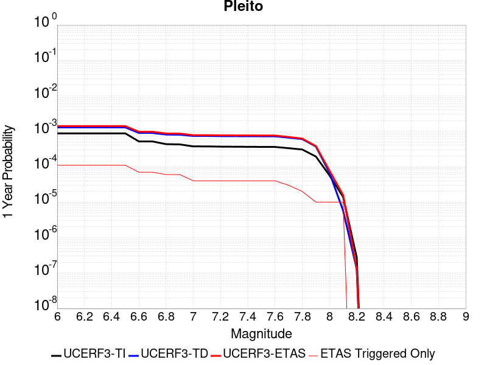 |  |

| Magnitude | 1 wk TI Prob | 1 wk TD Prob | 1 wk ETAS Prob | 1 wk ETAS/TD Gain | 1 wk ETAS Triggered Only | 1 mo TI Prob | 1 mo TD Prob | 1 mo ETAS Prob | 1 mo ETAS/TD Gain | 1 mo ETAS Triggered Only | 1 yr TI Prob | 1 yr TD Prob | 1 yr ETAS Prob | 1 yr ETAS/TD Gain | 1 yr ETAS Triggered Only | 10 yr TI Prob | 10 yr TD Prob | 10 yr ETAS Prob | 10 yr ETAS/TD Gain | 10 yr ETAS Triggered Only |
|-----|-----|-----|-----|-----|-----|-----|-----|-----|-----|-----|-----|-----|-----|-----|-----|-----|-----|-----|-----|-----|
| 6.0 | 1.6763008E-5 | 2.4763838E-5 | 2.4763838E-5 | 1.0 | 0.0 | 7.183948E-5 | 1.0612683E-4 | 1.0612683E-4 | 1.0 | 0.0 | 8.742947E-4 | 0.0012914003 | 0.00134427 | 1.0409398 | 5.2938063E-5 | 0.00870863 | 0.0129538905 | 0.013006142 | 1.0040337 | 5.2938063E-5 |
| 6.1 | 1.6763008E-5 | 2.4763838E-5 | 2.4763838E-5 | 1.0 | 0.0 | 7.183948E-5 | 1.0612683E-4 | 1.0612683E-4 | 1.0 | 0.0 | 8.742947E-4 | 0.0012914003 | 0.00134427 | 1.0409398 | 5.2938063E-5 | 0.00870863 | 0.0129538905 | 0.013006142 | 1.0040337 | 5.2938063E-5 |
| 6.2 | 1.6763008E-5 | 2.4763838E-5 | 2.4763838E-5 | 1.0 | 0.0 | 7.183948E-5 | 1.0612683E-4 | 1.0612683E-4 | 1.0 | 0.0 | 8.742947E-4 | 0.0012914003 | 0.00134427 | 1.0409398 | 5.2938063E-5 | 0.00870863 | 0.0129538905 | 0.013006142 | 1.0040337 | 5.2938063E-5 |
| 6.3 | 1.6763008E-5 | 2.4763838E-5 | 2.4763838E-5 | 1.0 | 0.0 | 7.183948E-5 | 1.0612683E-4 | 1.0612683E-4 | 1.0 | 0.0 | 8.742947E-4 | 0.0012914003 | 0.00134427 | 1.0409398 | 5.2938063E-5 | 0.00870863 | 0.0129538905 | 0.013006142 | 1.0040337 | 5.2938063E-5 |
| 6.4 | 1.6763008E-5 | 2.4763838E-5 | 2.4763838E-5 | 1.0 | 0.0 | 7.183948E-5 | 1.0612683E-4 | 1.0612683E-4 | 1.0 | 0.0 | 8.742947E-4 | 0.0012914003 | 0.00134427 | 1.0409398 | 5.2938063E-5 | 0.00870863 | 0.0129538905 | 0.013006142 | 1.0040337 | 5.2938063E-5 |
| 6.5 | 1.6763008E-5 | 2.4763838E-5 | 2.4763838E-5 | 1.0 | 0.0 | 7.183948E-5 | 1.0612683E-4 | 1.0612683E-4 | 1.0 | 0.0 | 8.742947E-4 | 0.0012914003 | 0.00134427 | 1.0409398 | 5.2938063E-5 | 0.00870863 | 0.0129538905 | 0.013006142 | 1.0040337 | 5.2938063E-5 |
| 6.6 | 9.910213E-6 | 1.7214623E-5 | 1.7214623E-5 | 1.0 | 0.0 | 4.247165E-5 | 7.377489E-5 | 7.377489E-5 | 1.0 | 0.0 | 5.169696E-4 | 8.978429E-4 | 8.978429E-4 | 1.0 | 0.0 | 0.0051576863 | 0.009050702 | 0.009050702 | 1.0 | 0.0 |
| 6.7 | 9.910213E-6 | 1.7214623E-5 | 1.7214623E-5 | 1.0 | 0.0 | 4.247165E-5 | 7.377489E-5 | 7.377489E-5 | 1.0 | 0.0 | 5.169696E-4 | 8.978429E-4 | 8.978429E-4 | 1.0 | 0.0 | 0.0051576863 | 0.009050702 | 0.009050702 | 1.0 | 0.0 |
| 6.8 | 8.300162E-6 | 1.5474232E-5 | 1.5474232E-5 | 1.0 | 0.0 | 3.557164E-5 | 6.631646E-5 | 6.631646E-5 | 1.0 | 0.0 | 4.3299864E-4 | 8.071053E-4 | 8.071053E-4 | 1.0 | 0.0 | 0.004321559 | 0.008150139 | 0.008150139 | 1.0 | 0.0 |
| 6.9 | 8.183114E-6 | 1.5345448E-5 | 1.5345448E-5 | 1.0 | 0.0 | 3.5070017E-5 | 6.576455E-5 | 6.576455E-5 | 1.0 | 0.0 | 4.2689382E-4 | 8.003907E-4 | 8.003907E-4 | 1.0 | 0.0 | 0.0042607468 | 0.008083483 | 0.008083483 | 1.0 | 0.0 |
| 7.0 | 7.1748823E-6 | 1.413244E-5 | 1.413244E-5 | 1.0 | 0.0 | 3.0749135E-5 | 6.0566195E-5 | 6.0566195E-5 | 1.0 | 0.0 | 3.743064E-4 | 7.371445E-4 | 7.371445E-4 | 1.0 | 0.0 | 0.0037367654 | 0.007454939 | 0.007454939 | 1.0 | 0.0 |
| 7.1 | 7.1671807E-6 | 1.412281E-5 | 1.412281E-5 | 1.0 | 0.0 | 3.0716128E-5 | 6.052493E-5 | 6.052493E-5 | 1.0 | 0.0 | 3.7390468E-4 | 7.366424E-4 | 7.366424E-4 | 1.0 | 0.0 | 0.0037327618 | 0.0074499524 | 0.0074499524 | 1.0 | 0.0 |
| 7.2 | 7.0649667E-6 | 1.39701015E-5 | 1.39701015E-5 | 1.0 | 0.0 | 3.0278077E-5 | 5.9870494E-5 | 5.9870494E-5 | 1.0 | 0.0 | 3.6857324E-4 | 7.2868E-4 | 7.2868E-4 | 1.0 | 0.0 | 0.0036796255 | 0.0073707094 | 0.0073707094 | 1.0 | 0.0 |
| 7.3 | 7.02082E-6 | 1.3913556E-5 | 1.3913556E-5 | 1.0 | 0.0 | 3.008888E-5 | 5.9628168E-5 | 5.9628168E-5 | 1.0 | 0.0 | 3.6627054E-4 | 7.2573166E-4 | 7.2573166E-4 | 1.0 | 0.0 | 0.0036566744 | 0.007341209 | 0.007341209 | 1.0 | 0.0 |
| 7.4 | 6.987146E-6 | 1.3873118E-5 | 1.3873118E-5 | 1.0 | 0.0 | 2.9944567E-5 | 5.945487E-5 | 5.945487E-5 | 1.0 | 0.0 | 3.6451413E-4 | 7.2362315E-4 | 7.2362315E-4 | 1.0 | 0.0 | 0.0036391679 | 0.007320144 | 0.007320144 | 1.0 | 0.0 |
| 7.5 | 6.9494554E-6 | 1.3830024E-5 | 1.3830024E-5 | 1.0 | 0.0 | 2.9783041E-5 | 5.9270187E-5 | 5.9270187E-5 | 1.0 | 0.0 | 3.625482E-4 | 7.2137616E-4 | 7.2137616E-4 | 1.0 | 0.0 | 0.0036195726 | 0.0072977724 | 0.0072977724 | 1.0 | 0.0 |
| 7.6 | 6.92694E-6 | 1.3789138E-5 | 1.3789138E-5 | 1.0 | 0.0 | 2.9686547E-5 | 5.909497E-5 | 5.909497E-5 | 1.0 | 0.0 | 3.6137376E-4 | 7.1924424E-4 | 7.1924424E-4 | 1.0 | 0.0 | 0.0036078666 | 0.0072765257 | 0.0072765257 | 1.0 | 0.0 |
| 7.7 | 6.395867E-6 | 1.2668219E-5 | 1.2668219E-5 | 1.0 | 0.0 | 2.741057E-5 | 5.429124E-5 | 5.429124E-5 | 1.0 | 0.0 | 3.336726E-4 | 6.6079566E-4 | 6.6079566E-4 | 1.0 | 0.0 | 0.0033317201 | 0.0066951844 | 0.0066951844 | 1.0 | 0.0 |
| 7.8 | 5.8664327E-6 | 1.153586E-5 | 1.153586E-5 | 1.0 | 0.0 | 2.5141611E-5 | 4.9438466E-5 | 4.9438466E-5 | 1.0 | 0.0 | 3.060561E-4 | 6.017473E-4 | 6.017473E-4 | 1.0 | 0.0 | 0.0030563495 | 0.0061006667 | 0.0061006667 | 1.0 | 0.0 |
| 7.9 | 3.7167474E-6 | 7.1140853E-6 | 7.1140853E-6 | 1.0 | 0.0 | 1.592882E-5 | 3.0488582E-5 | 3.0488582E-5 | 1.0 | 0.0 | 1.9391612E-4 | 3.7113542E-4 | 3.7113542E-4 | 1.0 | 0.0 | 0.0019374699 | 0.0037674906 | 0.0037674906 | 1.0 | 0.0 |
| 8.0 | 1.0903841E-6 | 1.2879392E-6 | 1.2879392E-6 | 1.0 | 0.0 | 4.6730665E-6 | 5.5197274E-6 | 5.5197274E-6 | 1.0 | 0.0 | 5.68931E-5 | 6.720063E-5 | 6.720063E-5 | 1.0 | 0.0 | 5.6878536E-4 | 6.941948E-4 | 6.941948E-4 | 1.0 | 0.0 |
| 8.1 | 2.6894583E-7 | 1.1060341E-7 | 1.1060341E-7 | 1.0 | 0.0 | 1.1526245E-6 | 4.740145E-7 | 4.740145E-7 | 1.0 | 0.0 | 1.4033113E-5 | 5.7711113E-6 | 5.7711113E-6 | 1.0 | 0.0 | 1.4032227E-4 | 6.456908E-5 | 6.456908E-5 | 1.0 | 0.0 |
| 8.2 | 5.2967013E-9 | 2.4578228E-9 | 2.4578228E-9 | 1.0 | 0.0 | 2.2700148E-8 | 1.0533527E-8 | 1.0533527E-8 | 1.0 | 0.0 | 2.7637427E-7 | 1.2824569E-7 | 1.2824569E-7 | 1.0 | 0.0 | 2.7637393E-6 | 1.4592787E-6 | 1.4592787E-6 | 1.0 | 0.0 |

## San Jacinto (Lytle Creek connector)
*[(top)](#table-of-contents)*

| 1 Week | 1 Month | 1 Year | 10 Year |
|-----|-----|-----|-----|
|  |  |  |  |

| Magnitude | 1 wk TI Prob | 1 wk TD Prob | 1 wk ETAS Prob | 1 wk ETAS/TD Gain | 1 wk ETAS Triggered Only | 1 mo TI Prob | 1 mo TD Prob | 1 mo ETAS Prob | 1 mo ETAS/TD Gain | 1 mo ETAS Triggered Only | 1 yr TI Prob | 1 yr TD Prob | 1 yr ETAS Prob | 1 yr ETAS/TD Gain | 1 yr ETAS Triggered Only | 10 yr TI Prob | 10 yr TD Prob | 10 yr ETAS Prob | 10 yr ETAS/TD Gain | 10 yr ETAS Triggered Only |
|-----|-----|-----|-----|-----|-----|-----|-----|-----|-----|-----|-----|-----|-----|-----|-----|-----|-----|-----|-----|-----|
| 6.0 | 6.693995E-6 | 6.660216E-6 | 5.9597925E-5 | 8.948347 | 5.2938063E-5 | 2.8688235E-5 | 2.854347E-5 | 8.148002E-5 | 2.854594 | 5.2938063E-5 | 3.492233E-4 | 3.4746144E-4 | 4.003811E-4 | 1.1523037 | 5.2938063E-5 | 0.00348675 | 0.0035493854 | 0.0036021355 | 1.0148618 | 5.2938063E-5 |
| 6.1 | 6.693995E-6 | 6.660216E-6 | 5.9597925E-5 | 8.948347 | 5.2938063E-5 | 2.8688235E-5 | 2.854347E-5 | 8.148002E-5 | 2.854594 | 5.2938063E-5 | 3.492233E-4 | 3.4746144E-4 | 4.003811E-4 | 1.1523037 | 5.2938063E-5 | 0.00348675 | 0.0035493854 | 0.0036021355 | 1.0148618 | 5.2938063E-5 |
| 6.2 | 6.693995E-6 | 6.660216E-6 | 5.9597925E-5 | 8.948347 | 5.2938063E-5 | 2.8688235E-5 | 2.854347E-5 | 8.148002E-5 | 2.854594 | 5.2938063E-5 | 3.492233E-4 | 3.4746144E-4 | 4.003811E-4 | 1.1523037 | 5.2938063E-5 | 0.00348675 | 0.0035493854 | 0.0036021355 | 1.0148618 | 5.2938063E-5 |
| 6.3 | 6.693995E-6 | 6.660216E-6 | 5.9597925E-5 | 8.948347 | 5.2938063E-5 | 2.8688235E-5 | 2.854347E-5 | 8.148002E-5 | 2.854594 | 5.2938063E-5 | 3.492233E-4 | 3.4746144E-4 | 4.003811E-4 | 1.1523037 | 5.2938063E-5 | 0.00348675 | 0.0035493854 | 0.0036021355 | 1.0148618 | 5.2938063E-5 |
| 6.4 | 6.693995E-6 | 6.660216E-6 | 5.9597925E-5 | 8.948347 | 5.2938063E-5 | 2.8688235E-5 | 2.854347E-5 | 8.148002E-5 | 2.854594 | 5.2938063E-5 | 3.492233E-4 | 3.4746144E-4 | 4.003811E-4 | 1.1523037 | 5.2938063E-5 | 0.00348675 | 0.0035493854 | 0.0036021355 | 1.0148618 | 5.2938063E-5 |
| 6.5 | 6.6561875E-6 | 6.6204343E-6 | 5.9558148E-5 | 8.996109 | 5.2938063E-5 | 2.8526205E-5 | 2.837298E-5 | 8.130954E-5 | 2.8657384 | 5.2938063E-5 | 3.472512E-4 | 3.4538636E-4 | 3.9830615E-4 | 1.1532191 | 5.2938063E-5 | 0.0034670907 | 0.003528701 | 0.0035814522 | 1.0149492 | 5.2938063E-5 |
| 6.6 | 6.6561875E-6 | 6.6204343E-6 | 5.9558148E-5 | 8.996109 | 5.2938063E-5 | 2.8526205E-5 | 2.837298E-5 | 8.130954E-5 | 2.8657384 | 5.2938063E-5 | 3.472512E-4 | 3.4538636E-4 | 3.9830615E-4 | 1.1532191 | 5.2938063E-5 | 0.0034670907 | 0.003528701 | 0.0035814522 | 1.0149492 | 5.2938063E-5 |
| 6.7 | 6.5802237E-6 | 6.539611E-6 | 5.9477326E-5 | 9.0949335 | 5.2938063E-5 | 2.8200653E-5 | 2.8026603E-5 | 8.096318E-5 | 2.8887975 | 5.2938063E-5 | 3.4328885E-4 | 3.4117055E-4 | 3.9409054E-4 | 1.1551131 | 5.2938063E-5 | 0.0034275902 | 0.0034866752 | 0.0035394288 | 1.01513 | 5.2938063E-5 |
| 6.8 | 6.575632E-6 | 6.5341005E-6 | 5.947182E-5 | 9.10176 | 5.2938063E-5 | 2.8180975E-5 | 2.8002989E-5 | 8.093957E-5 | 2.8903904 | 5.2938063E-5 | 3.4304935E-4 | 3.4088313E-4 | 3.9380314E-4 | 1.1552439 | 5.2938063E-5 | 0.0034252026 | 0.00348381 | 0.0035365636 | 1.0151426 | 5.2938063E-5 |
| 6.9 | 6.570433E-6 | 6.525495E-6 | 5.946321E-5 | 9.112445 | 5.2938063E-5 | 2.8158694E-5 | 2.7966107E-5 | 8.090269E-5 | 2.8928835 | 5.2938063E-5 | 3.4277816E-4 | 3.4043423E-4 | 3.9335428E-4 | 1.1554487 | 5.2938063E-5 | 0.0034224992 | 0.0034793352 | 0.003532089 | 1.0151621 | 5.2938063E-5 |
| 7.0 | 6.5643826E-6 | 6.515616E-6 | 5.9453334E-5 | 9.124745 | 5.2938063E-5 | 2.8132765E-5 | 2.792377E-5 | 8.086035E-5 | 2.8957536 | 5.2938063E-5 | 3.424626E-4 | 3.3991894E-4 | 3.92839E-4 | 1.1556844 | 5.2938063E-5 | 0.0034193532 | 0.0034741985 | 0.0035269526 | 1.0151845 | 5.2938063E-5 |
| 7.1 | 6.557402E-6 | 6.5043278E-6 | 5.9442045E-5 | 9.138845 | 5.2938063E-5 | 2.8102848E-5 | 2.7875392E-5 | 8.081198E-5 | 2.8990436 | 5.2938063E-5 | 3.4209844E-4 | 3.3933012E-4 | 3.9225022E-4 | 1.1559546 | 5.2938063E-5 | 0.0034157229 | 0.0034683298 | 0.0035210843 | 1.0152104 | 5.2938063E-5 |
| 7.2 | 6.546394E-6 | 6.4862943E-6 | 5.9424012E-5 | 9.161473 | 5.2938063E-5 | 2.8055672E-5 | 2.7798109E-5 | 8.07347E-5 | 2.9043233 | 5.2938063E-5 | 3.4152428E-4 | 3.3838948E-4 | 3.9130964E-4 | 1.1563883 | 5.2938063E-5 | 0.0034099987 | 0.0034589572 | 0.003511712 | 1.0152516 | 5.2938063E-5 |
| 7.3 | 6.5364216E-6 | 6.4670803E-6 | 5.94048E-5 | 9.185721 | 5.2938063E-5 | 2.8012933E-5 | 2.7715765E-5 | 8.065236E-5 | 2.9099815 | 5.2938063E-5 | 3.4100408E-4 | 3.3738726E-4 | 3.9030745E-4 | 1.156853 | 5.2938063E-5 | 0.003404813 | 0.0034489788 | 0.0035017342 | 1.015296 | 5.2938063E-5 |
| 7.4 | 6.5269523E-6 | 6.4481674E-6 | 5.938589E-5 | 9.209731 | 5.2938063E-5 | 2.7972354E-5 | 2.7634711E-5 | 8.057131E-5 | 2.9155836 | 5.2938063E-5 | 3.4051016E-4 | 3.3640073E-4 | 3.89321E-4 | 1.1573131 | 5.2938063E-5 | 0.0033998888 | 0.003439161 | 0.003491917 | 1.0153397 | 5.2938063E-5 |
| 7.5 | 6.5111835E-6 | 6.424442E-6 | 5.9362163E-5 | 9.24005 | 5.2938063E-5 | 2.7904773E-5 | 2.7533031E-5 | 8.046964E-5 | 2.922658 | 5.2938063E-5 | 3.3968766E-4 | 3.3516317E-4 | 3.8808348E-4 | 1.1578941 | 5.2938063E-5 | 0.0033916887 | 0.003426834 | 0.0034795906 | 1.0153952 | 5.2938063E-5 |
| 7.6 | 6.4768806E-6 | 6.383551E-6 | 5.9321275E-5 | 9.292833 | 5.2938063E-5 | 2.7757764E-5 | 2.735779E-5 | 8.0294405E-5 | 2.9349742 | 5.2938063E-5 | 3.3789838E-4 | 3.3303024E-4 | 3.859507E-4 | 1.1589057 | 5.2938063E-5 | 0.0033738504 | 0.0034055663 | 0.003458324 | 1.0154916 | 5.2938063E-5 |
| 7.7 | 6.1655364E-6 | 6.1760365E-6 | 5.9113772E-5 | 9.571474 | 5.2938063E-5 | 2.642346E-5 | 2.646846E-5 | 7.940512E-5 | 2.9999902 | 5.2938063E-5 | 3.2165812E-4 | 3.2220592E-4 | 3.7512693E-4 | 1.164246 | 5.2938063E-5 | 0.0032119295 | 0.0032971818 | 0.0033499452 | 1.0160027 | 5.2938063E-5 |
| 7.8 | 5.5043524E-6 | 5.737097E-6 | 5.8674857E-5 | 10.227273 | 5.2938063E-5 | 2.3589868E-5 | 2.4587327E-5 | 7.7524084E-5 | 3.1530101 | 5.2938063E-5 | 2.871688E-4 | 2.9930964E-4 | 3.5223184E-4 | 1.1768143 | 5.2938063E-5 | 0.0028679797 | 0.0030672832 | 0.003120059 | 1.017206 | 5.2938063E-5 |
| 7.9 | 3.889249E-6 | 4.076761E-6 | 5.7014608E-5 | 13.985271 | 5.2938063E-5 | 1.6668104E-5 | 1.7471715E-5 | 7.040885E-5 | 4.029876 | 5.2938063E-5 | 2.0291525E-4 | 2.1269741E-4 | 2.6562423E-4 | 1.2488362 | 5.2938063E-5 | 0.0020273007 | 0.0021943315 | 0.0022471533 | 1.0240719 | 5.2938063E-5 |
| 8.0 | 2.668535E-6 | 2.5315155E-6 | 5.5469445E-5 | 21.911556 | 5.2938063E-5 | 1.1436528E-5 | 1.0849307E-5 | 6.378679E-5 | 5.879343 | 5.2938063E-5 | 1.3923083E-4 | 1.3208234E-4 | 1.850134E-4 | 1.400743 | 5.2938063E-5 | 0.0013914363 | 0.0013757964 | 0.0014286615 | 1.0384252 | 5.2938063E-5 |
| 8.1 | 1.5911459E-6 | 1.218661E-6 | 1.218661E-6 | 1.0 | 0.0 | 6.8191785E-6 | 5.2228224E-6 | 5.2228224E-6 | 1.0 | 0.0 | 8.3020335E-5 | 6.3586034E-5 | 6.3586034E-5 | 1.0 | 0.0 | 8.298933E-4 | 6.6932244E-4 | 6.6932244E-4 | 1.0 | 0.0 |
| 8.2 | 6.1294963E-7 | 2.1812275E-7 | 2.1812275E-7 | 1.0 | 0.0 | 2.6269242E-6 | 9.3481145E-7 | 9.3481145E-7 | 1.0 | 0.0 | 3.1982334E-5 | 1.138127E-5 | 1.138127E-5 | 1.0 | 0.0 | 3.1977732E-4 | 1.2784546E-4 | 1.2784546E-4 | 1.0 | 0.0 |
| 8.3 | 1.762871E-7 | 4.7546838E-8 | 4.7546838E-8 | 1.0 | 0.0 | 7.5551594E-7 | 2.0377215E-7 | 2.0377215E-7 | 1.0 | 0.0 | 9.1983675E-6 | 2.480923E-6 | 2.480923E-6 | 1.0 | 0.0 | 9.197987E-5 | 2.868753E-5 | 2.868753E-5 | 1.0 | 0.0 |

## Monterey Bay-Tularcitos
*[(top)](#table-of-contents)*

| 1 Week | 1 Month | 1 Year | 10 Year |
|-----|-----|-----|-----|
|  |  |  | 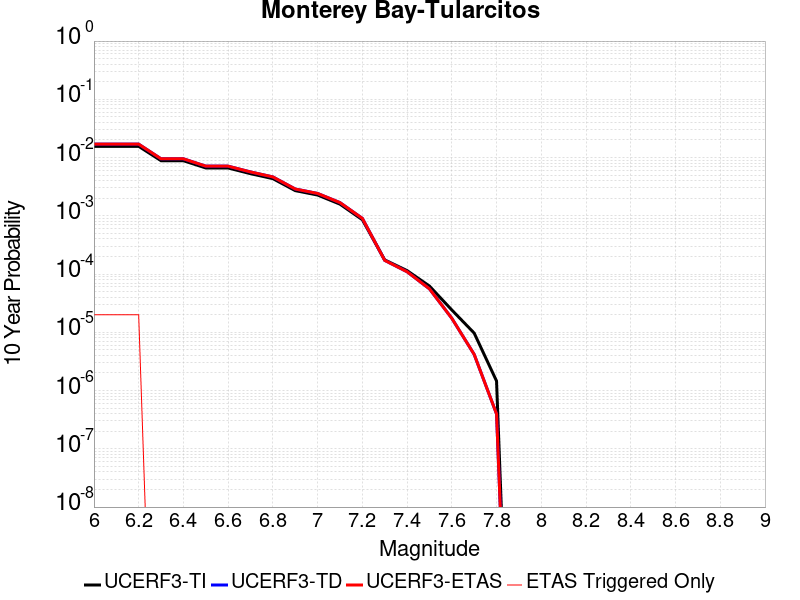 |

| Magnitude | 1 wk TI Prob | 1 wk TD Prob | 1 wk ETAS Prob | 1 wk ETAS/TD Gain | 1 wk ETAS Triggered Only | 1 mo TI Prob | 1 mo TD Prob | 1 mo ETAS Prob | 1 mo ETAS/TD Gain | 1 mo ETAS Triggered Only | 1 yr TI Prob | 1 yr TD Prob | 1 yr ETAS Prob | 1 yr ETAS/TD Gain | 1 yr ETAS Triggered Only | 10 yr TI Prob | 10 yr TD Prob | 10 yr ETAS Prob | 10 yr ETAS/TD Gain | 10 yr ETAS Triggered Only |
|-----|-----|-----|-----|-----|-----|-----|-----|-----|-----|-----|-----|-----|-----|-----|-----|-----|-----|-----|-----|-----|
| 6.0 | 3.0131365E-5 | 3.279877E-5 | 8.57351E-5 | 2.613973 | 5.2938063E-5 | 1.2912804E-4 | 1.4055918E-4 | 1.934898E-4 | 1.3765718 | 5.2938063E-5 | 0.001571 | 0.0017100703 | 0.0017629177 | 1.0309037 | 5.2938063E-5 | 0.015599402 | 0.016979916 | 0.017031956 | 1.0030648 | 5.2938063E-5 |
| 6.1 | 3.0131365E-5 | 3.279877E-5 | 8.57351E-5 | 2.613973 | 5.2938063E-5 | 1.2912804E-4 | 1.4055918E-4 | 1.934898E-4 | 1.3765718 | 5.2938063E-5 | 0.001571 | 0.0017100703 | 0.0017629177 | 1.0309037 | 5.2938063E-5 | 0.015599402 | 0.016979916 | 0.017031956 | 1.0030648 | 5.2938063E-5 |
| 6.2 | 3.0131365E-5 | 3.279877E-5 | 8.57351E-5 | 2.613973 | 5.2938063E-5 | 1.2912804E-4 | 1.4055918E-4 | 1.934898E-4 | 1.3765718 | 5.2938063E-5 | 0.001571 | 0.0017100703 | 0.0017629177 | 1.0309037 | 5.2938063E-5 | 0.015599402 | 0.016979916 | 0.017031956 | 1.0030648 | 5.2938063E-5 |
| 6.3 | 1.6998249E-5 | 1.8330798E-5 | 1.8330798E-5 | 1.0 | 0.0 | 7.28476E-5 | 7.85583E-5 | 7.85583E-5 | 1.0 | 0.0 | 8.865586E-4 | 9.5604634E-4 | 9.5604634E-4 | 1.0 | 0.0 | 0.0088303005 | 0.009521258 | 0.009521258 | 1.0 | 0.0 |
| 6.4 | 1.6998249E-5 | 1.8330798E-5 | 1.8330798E-5 | 1.0 | 0.0 | 7.28476E-5 | 7.85583E-5 | 7.85583E-5 | 1.0 | 0.0 | 8.865586E-4 | 9.5604634E-4 | 9.5604634E-4 | 1.0 | 0.0 | 0.0088303005 | 0.009521258 | 0.009521258 | 1.0 | 0.0 |
| 6.5 | 1.27470785E-5 | 1.3693312E-5 | 1.3693312E-5 | 1.0 | 0.0 | 5.4629192E-5 | 5.8684363E-5 | 5.8684363E-5 | 1.0 | 0.0 | 6.649074E-4 | 7.1425823E-4 | 7.1425823E-4 | 1.0 | 0.0 | 0.0066292146 | 0.007120678 | 0.007120678 | 1.0 | 0.0 |
| 6.6 | 1.2739422E-5 | 1.36854E-5 | 1.36854E-5 | 1.0 | 0.0 | 5.4596385E-5 | 5.8650454E-5 | 5.8650454E-5 | 1.0 | 0.0 | 6.645082E-4 | 7.1384566E-4 | 7.1384566E-4 | 1.0 | 0.0 | 0.0066252467 | 0.007116579 | 0.007116579 | 1.0 | 0.0 |
| 6.7 | 1.0160109E-5 | 1.0885755E-5 | 1.0885755E-5 | 1.0 | 0.0 | 4.35426E-5 | 4.665244E-5 | 4.665244E-5 | 1.0 | 0.0 | 5.300022E-4 | 5.6785246E-4 | 5.6785246E-4 | 1.0 | 0.0 | 0.005287399 | 0.0056647263 | 0.0056647263 | 1.0 | 0.0 |
| 6.8 | 8.349859E-6 | 8.932587E-6 | 8.932587E-6 | 1.0 | 0.0 | 3.578462E-5 | 3.8281985E-5 | 3.8281985E-5 | 1.0 | 0.0 | 4.3559066E-4 | 4.6598914E-4 | 4.6598914E-4 | 1.0 | 0.0 | 0.004347378 | 0.004650685 | 0.004650685 | 1.0 | 0.0 |
| 6.9 | 5.193639E-6 | 5.53643E-6 | 5.53643E-6 | 1.0 | 0.0 | 2.2258262E-5 | 2.372736E-5 | 2.372736E-5 | 1.0 | 0.0 | 2.7096065E-4 | 2.8884556E-4 | 2.8884556E-4 | 1.0 | 0.0 | 0.0027063051 | 0.0028850222 | 0.0028850222 | 1.0 | 0.0 |
| 7.0 | 4.359381E-6 | 4.643366E-6 | 4.643366E-6 | 1.0 | 0.0 | 1.8682927E-5 | 1.9900004E-5 | 1.9900004E-5 | 1.0 | 0.0 | 2.274409E-4 | 2.422586E-4 | 2.422586E-4 | 1.0 | 0.0 | 0.0022720827 | 0.002420238 | 0.002420238 | 1.0 | 0.0 |
| 7.1 | 3.0398533E-6 | 3.2310427E-6 | 3.2310427E-6 | 1.0 | 0.0 | 1.3027877E-5 | 1.3847267E-5 | 1.3847267E-5 | 1.0 | 0.0 | 1.5860285E-4 | 1.6858005E-4 | 1.6858005E-4 | 1.0 | 0.0 | 0.001584897 | 0.0016847793 | 0.0016847793 | 1.0 | 0.0 |
| 7.2 | 1.642335E-6 | 1.7333153E-6 | 1.7333153E-6 | 1.0 | 0.0 | 7.0385595E-6 | 7.428485E-6 | 7.428485E-6 | 1.0 | 0.0 | 8.569109E-5 | 9.044012E-5 | 9.044012E-5 | 1.0 | 0.0 | 8.5658056E-4 | 9.042358E-4 | 9.042358E-4 | 1.0 | 0.0 |
| 7.3 | 3.356842E-7 | 3.2952389E-7 | 3.2952389E-7 | 1.0 | 0.0 | 1.4386458E-6 | 1.4122444E-6 | 1.4122444E-6 | 1.0 | 0.0 | 1.7515373E-5 | 1.7193941E-5 | 1.7193941E-5 | 1.0 | 0.0 | 1.7513991E-4 | 1.719262E-4 | 1.719262E-4 | 1.0 | 0.0 |
| 7.4 | 2.1973483E-7 | 2.1006413E-7 | 2.1006413E-7 | 1.0 | 0.0 | 9.417204E-7 | 9.0027453E-7 | 9.0027453E-7 | 1.0 | 0.0 | 1.1465385E-5 | 1.0960787E-5 | 1.0960787E-5 | 1.0 | 0.0 | 1.1464794E-4 | 1.096025E-4 | 1.096025E-4 | 1.0 | 0.0 |
| 7.5 | 1.1944135E-7 | 1.0696043E-7 | 1.0696043E-7 | 1.0 | 0.0 | 5.118914E-7 | 4.5840173E-7 | 4.5840173E-7 | 1.0 | 0.0 | 6.23226E-6 | 5.581027E-6 | 5.581027E-6 | 1.0 | 0.0 | 6.2320854E-5 | 5.5808883E-5 | 5.5808883E-5 | 1.0 | 0.0 |
| 7.6 | 4.636058E-8 | 3.336489E-8 | 3.336489E-8 | 1.0 | 0.0 | 1.9868818E-7 | 1.4299238E-7 | 1.4299238E-7 | 1.0 | 0.0 | 2.419026E-6 | 1.7409308E-6 | 1.7409308E-6 | 1.0 | 0.0 | 2.4189996E-5 | 1.7409173E-5 | 1.7409173E-5 | 1.0 | 0.0 |
| 7.7 | 1.8588572E-8 | 8.003744E-9 | 8.003744E-9 | 1.0 | 0.0 | 7.9665305E-8 | 3.430176E-8 | 3.430176E-8 | 1.0 | 0.0 | 9.699246E-7 | 4.1762385E-7 | 4.1762385E-7 | 1.0 | 0.0 | 9.699204E-6 | 4.176231E-6 | 4.176231E-6 | 1.0 | 0.0 |
| 7.8 | 2.7960154E-9 | 7.6099427E-10 | 7.6099427E-10 | 1.0 | 0.0 | 1.1982923E-8 | 3.2614043E-9 | 3.2614043E-9 | 1.0 | 0.0 | 1.4589209E-7 | 3.9707597E-8 | 3.9707597E-8 | 1.0 | 0.0 | 1.4589199E-6 | 3.9707595E-7 | 3.9707595E-7 | 1.0 | 0.0 |

## Del Valle
*[(top)](#table-of-contents)*

| 1 Week | 1 Month | 1 Year | 10 Year |
|-----|-----|-----|-----|
|  |  |  |  |

| Magnitude | 1 wk TI Prob | 1 wk TD Prob | 1 wk ETAS Prob | 1 wk ETAS/TD Gain | 1 wk ETAS Triggered Only | 1 mo TI Prob | 1 mo TD Prob | 1 mo ETAS Prob | 1 mo ETAS/TD Gain | 1 mo ETAS Triggered Only | 1 yr TI Prob | 1 yr TD Prob | 1 yr ETAS Prob | 1 yr ETAS/TD Gain | 1 yr ETAS Triggered Only | 10 yr TI Prob | 10 yr TD Prob | 10 yr ETAS Prob | 10 yr ETAS/TD Gain | 10 yr ETAS Triggered Only |
|-----|-----|-----|-----|-----|-----|-----|-----|-----|-----|-----|-----|-----|-----|-----|-----|-----|-----|-----|-----|-----|
| 6.0 | 1.0716125E-5 | 8.767882E-6 | 6.170548E-5 | 7.037672 | 5.2938063E-5 | 4.592544E-5 | 3.7576207E-5 | 9.051228E-5 | 2.4087658 | 5.2938063E-5 | 5.589988E-4 | 4.5741405E-4 | 5.1032787E-4 | 1.1156805 | 5.2938063E-5 | 0.0055759475 | 0.00456668 | 0.0046193767 | 1.0115393 | 5.2938063E-5 |
| 6.1 | 1.0716125E-5 | 8.767882E-6 | 6.170548E-5 | 7.037672 | 5.2938063E-5 | 4.592544E-5 | 3.7576207E-5 | 9.051228E-5 | 2.4087658 | 5.2938063E-5 | 5.589988E-4 | 4.5741405E-4 | 5.1032787E-4 | 1.1156805 | 5.2938063E-5 | 0.0055759475 | 0.00456668 | 0.0046193767 | 1.0115393 | 5.2938063E-5 |
| 6.2 | 1.0716125E-5 | 8.767882E-6 | 6.170548E-5 | 7.037672 | 5.2938063E-5 | 4.592544E-5 | 3.7576207E-5 | 9.051228E-5 | 2.4087658 | 5.2938063E-5 | 5.589988E-4 | 4.5741405E-4 | 5.1032787E-4 | 1.1156805 | 5.2938063E-5 | 0.0055759475 | 0.00456668 | 0.0046193767 | 1.0115393 | 5.2938063E-5 |
| 6.3 | 7.1293784E-6 | 4.865823E-6 | 5.7803627E-5 | 11.879518 | 5.2938063E-5 | 3.055412E-5 | 2.0853364E-5 | 7.3790325E-5 | 3.5385332 | 5.2938063E-5 | 3.7193293E-4 | 2.5386087E-4 | 3.0678549E-4 | 1.2084788 | 5.2938063E-5 | 0.0037131102 | 0.0025357946 | 0.0025885985 | 1.0208234 | 5.2938063E-5 |
| 6.4 | 7.1293784E-6 | 4.865823E-6 | 5.7803627E-5 | 11.879518 | 5.2938063E-5 | 3.055412E-5 | 2.0853364E-5 | 7.3790325E-5 | 3.5385332 | 5.2938063E-5 | 3.7193293E-4 | 2.5386087E-4 | 3.0678549E-4 | 1.2084788 | 5.2938063E-5 | 0.0037131102 | 0.0025357946 | 0.0025885985 | 1.0208234 | 5.2938063E-5 |
| 6.5 | 7.1293784E-6 | 4.865823E-6 | 5.7803627E-5 | 11.879518 | 5.2938063E-5 | 3.055412E-5 | 2.0853364E-5 | 7.3790325E-5 | 3.5385332 | 5.2938063E-5 | 3.7193293E-4 | 2.5386087E-4 | 3.0678549E-4 | 1.2084788 | 5.2938063E-5 | 0.0037131102 | 0.0025357946 | 0.0025885985 | 1.0208234 | 5.2938063E-5 |
| 6.6 | 7.1293784E-6 | 4.865823E-6 | 5.7803627E-5 | 11.879518 | 5.2938063E-5 | 3.055412E-5 | 2.0853364E-5 | 7.3790325E-5 | 3.5385332 | 5.2938063E-5 | 3.7193293E-4 | 2.5386087E-4 | 3.0678549E-4 | 1.2084788 | 5.2938063E-5 | 0.0037131102 | 0.0025357946 | 0.0025885985 | 1.0208234 | 5.2938063E-5 |
| 6.7 | 7.12272E-6 | 4.8631987E-6 | 5.7801004E-5 | 11.885388 | 5.2938063E-5 | 3.0525585E-5 | 2.0842117E-5 | 7.3779076E-5 | 3.5399032 | 5.2938063E-5 | 3.7158563E-4 | 2.5372396E-4 | 3.066486E-4 | 1.2085913 | 5.2938063E-5 | 0.003709649 | 0.0025344288 | 0.0025872327 | 1.0208347 | 5.2938063E-5 |
| 6.8 | 6.7558703E-6 | 4.5594015E-6 | 4.5594015E-6 | 1.0 | 0.0 | 2.895341E-5 | 1.9540148E-5 | 1.9540148E-5 | 1.0 | 0.0 | 3.5245073E-4 | 2.3787597E-4 | 2.3787597E-4 | 1.0 | 0.0 | 0.0035189227 | 0.0023762889 | 0.0023762889 | 1.0 | 0.0 |
| 6.9 | 6.6700386E-6 | 4.502539E-6 | 4.502539E-6 | 1.0 | 0.0 | 2.8585566E-5 | 1.9296456E-5 | 1.9296456E-5 | 1.0 | 0.0 | 3.479737E-4 | 2.3490966E-4 | 2.3490966E-4 | 1.0 | 0.0 | 0.003474293 | 0.0023466884 | 0.0023466884 | 1.0 | 0.0 |
| 7.0 | 6.3181424E-6 | 4.0987034E-6 | 4.0987034E-6 | 1.0 | 0.0 | 2.7077473E-5 | 1.7565755E-5 | 1.7565755E-5 | 1.0 | 0.0 | 3.2961834E-4 | 2.1384252E-4 | 2.1384252E-4 | 1.0 | 0.0 | 0.0032912986 | 0.002136422 | 0.002136422 | 1.0 | 0.0 |
| 7.1 | 6.248759E-6 | 4.033895E-6 | 4.033895E-6 | 1.0 | 0.0 | 2.678012E-5 | 1.7288008E-5 | 1.7288008E-5 | 1.0 | 0.0 | 3.2599916E-4 | 2.104616E-4 | 2.104616E-4 | 1.0 | 0.0 | 0.0032552136 | 0.0021026772 | 0.0021026772 | 1.0 | 0.0 |
| 7.2 | 6.0411944E-6 | 3.869888E-6 | 3.869888E-6 | 1.0 | 0.0 | 2.5890577E-5 | 1.658513E-5 | 1.658513E-5 | 1.0 | 0.0 | 3.1517216E-4 | 2.0190567E-4 | 2.0190567E-4 | 1.0 | 0.0 | 0.0031472554 | 0.0020172757 | 0.0020172757 | 1.0 | 0.0 |
| 7.3 | 4.7691183E-6 | 3.0781202E-6 | 3.0781202E-6 | 1.0 | 0.0 | 2.0438918E-5 | 1.3191879E-5 | 1.3191879E-5 | 1.0 | 0.0 | 2.488154E-4 | 1.605995E-4 | 1.605995E-4 | 1.0 | 0.0 | 0.00248537 | 0.0016048603 | 0.0016048603 | 1.0 | 0.0 |
| 7.4 | 3.5524722E-6 | 2.1893363E-6 | 2.1893363E-6 | 1.0 | 0.0 | 1.5224792E-5 | 9.382837E-6 | 9.382837E-6 | 1.0 | 0.0 | 1.8534607E-4 | 1.1423013E-4 | 1.1423013E-4 | 1.0 | 0.0 | 0.0018519156 | 0.0011417224 | 0.0011417224 | 1.0 | 0.0 |
| 7.5 | 2.7133442E-6 | 1.5916097E-6 | 1.5916097E-6 | 1.0 | 0.0 | 1.1628566E-5 | 6.821167E-6 | 6.821167E-6 | 1.0 | 0.0 | 1.415686E-4 | 8.304456E-5 | 8.304456E-5 | 1.0 | 0.0 | 0.0014147845 | 8.301372E-4 | 8.301372E-4 | 1.0 | 0.0 |
| 7.6 | 1.915338E-6 | 1.173914E-6 | 1.173914E-6 | 1.0 | 0.0 | 8.208566E-6 | 5.0310505E-6 | 5.0310505E-6 | 1.0 | 0.0 | 9.993471E-5 | 6.125133E-5 | 6.125133E-5 | 1.0 | 0.0 | 9.988978E-4 | 6.123454E-4 | 6.123454E-4 | 1.0 | 0.0 |
| 7.7 | 1.2120448E-6 | 7.180313E-7 | 7.180313E-7 | 1.0 | 0.0 | 5.194467E-6 | 3.0772733E-6 | 3.0772733E-6 | 1.0 | 0.0 | 6.3240805E-5 | 3.746516E-5 | 3.746516E-5 | 1.0 | 0.0 | 6.322281E-4 | 3.7458882E-4 | 3.7458882E-4 | 1.0 | 0.0 |
| 7.8 | 6.272381E-7 | 3.932549E-7 | 3.932549E-7 | 1.0 | 0.0 | 2.6881603E-6 | 1.6853771E-6 | 1.6853771E-6 | 1.0 | 0.0 | 3.272786E-5 | 2.0519275E-5 | 2.0519275E-5 | 1.0 | 0.0 | 3.272304E-4 | 2.0517396E-4 | 2.0517396E-4 | 1.0 | 0.0 |
| 7.9 | 2.0292627E-7 | 1.2004622E-7 | 1.2004622E-7 | 1.0 | 0.0 | 8.6968373E-7 | 5.1448376E-7 | 5.1448376E-7 | 1.0 | 0.0 | 1.0588348E-5 | 6.263822E-6 | 6.263822E-6 | 1.0 | 0.0 | 1.0587843E-4 | 6.263647E-5 | 6.263647E-5 | 1.0 | 0.0 |
| 8.0 | 4.374492E-8 | 2.189964E-8 | 2.189964E-8 | 1.0 | 0.0 | 1.8747821E-7 | 9.385559E-8 | 9.385559E-8 | 1.0 | 0.0 | 2.2825448E-6 | 1.1426913E-6 | 1.1426913E-6 | 1.0 | 0.0 | 2.2825214E-5 | 1.1426858E-5 | 1.1426858E-5 | 1.0 | 0.0 |

## Elysian Park (Upper)
*[(top)](#table-of-contents)*

| 1 Week | 1 Month | 1 Year | 10 Year |
|-----|-----|-----|-----|
|  | 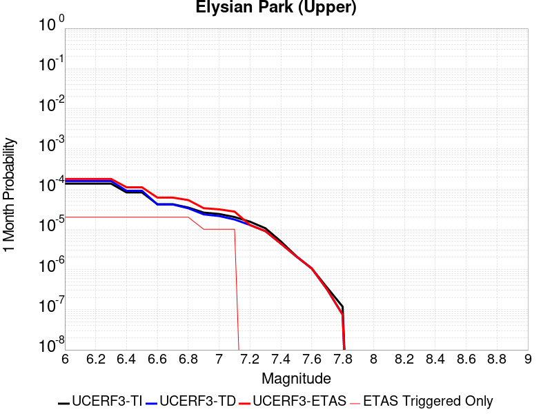 |  | 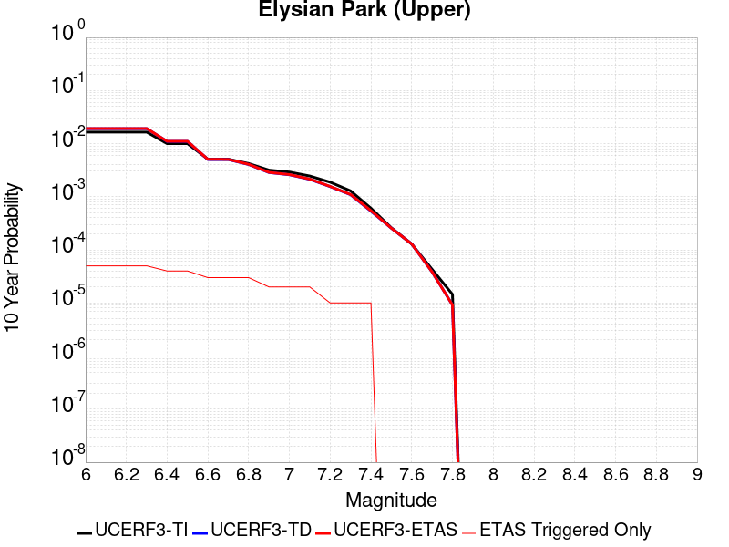 |

| Magnitude | 1 wk TI Prob | 1 wk TD Prob | 1 wk ETAS Prob | 1 wk ETAS/TD Gain | 1 wk ETAS Triggered Only | 1 mo TI Prob | 1 mo TD Prob | 1 mo ETAS Prob | 1 mo ETAS/TD Gain | 1 mo ETAS Triggered Only | 1 yr TI Prob | 1 yr TD Prob | 1 yr ETAS Prob | 1 yr ETAS/TD Gain | 1 yr ETAS Triggered Only | 10 yr TI Prob | 10 yr TD Prob | 10 yr ETAS Prob | 10 yr ETAS/TD Gain | 10 yr ETAS Triggered Only |
|-----|-----|-----|-----|-----|-----|-----|-----|-----|-----|-----|-----|-----|-----|-----|-----|-----|-----|-----|-----|-----|
| 6.0 | 3.1876025E-5 | 3.7035516E-5 | 3.7035516E-5 | 1.0 | 0.0 | 1.3660437E-4 | 1.587167E-4 | 1.587167E-4 | 1.0 | 0.0 | 0.0016618895 | 0.0019311075 | 0.0019311075 | 1.0 | 0.0 | 0.016495159 | 0.019189782 | 0.019241706 | 1.0027057 | 5.2938063E-5 |
| 6.1 | 3.1876025E-5 | 3.7035516E-5 | 3.7035516E-5 | 1.0 | 0.0 | 1.3660437E-4 | 1.587167E-4 | 1.587167E-4 | 1.0 | 0.0 | 0.0016618895 | 0.0019311075 | 0.0019311075 | 1.0 | 0.0 | 0.016495159 | 0.019189782 | 0.019241706 | 1.0027057 | 5.2938063E-5 |
| 6.2 | 3.1876025E-5 | 3.7035516E-5 | 3.7035516E-5 | 1.0 | 0.0 | 1.3660437E-4 | 1.587167E-4 | 1.587167E-4 | 1.0 | 0.0 | 0.0016618895 | 0.0019311075 | 0.0019311075 | 1.0 | 0.0 | 0.016495159 | 0.019189782 | 0.019241706 | 1.0027057 | 5.2938063E-5 |
| 6.3 | 3.1876025E-5 | 3.7035516E-5 | 3.7035516E-5 | 1.0 | 0.0 | 1.3660437E-4 | 1.587167E-4 | 1.587167E-4 | 1.0 | 0.0 | 0.0016618895 | 0.0019311075 | 0.0019311075 | 1.0 | 0.0 | 0.016495159 | 0.019189782 | 0.019241706 | 1.0027057 | 5.2938063E-5 |
| 6.4 | 1.9273462E-5 | 2.1202266E-5 | 2.1202266E-5 | 1.0 | 0.0 | 8.259794E-5 | 9.086466E-5 | 9.086466E-5 | 1.0 | 0.0 | 0.001005166 | 0.0011058892 | 0.0011058892 | 1.0 | 0.0 | 0.010006315 | 0.011020724 | 0.011073078 | 1.0047506 | 5.2938063E-5 |
| 6.5 | 1.9273462E-5 | 2.1202266E-5 | 2.1202266E-5 | 1.0 | 0.0 | 8.259794E-5 | 9.086466E-5 | 9.086466E-5 | 1.0 | 0.0 | 0.001005166 | 0.0011058892 | 0.0011058892 | 1.0 | 0.0 | 0.010006315 | 0.011020724 | 0.011073078 | 1.0047506 | 5.2938063E-5 |
| 6.6 | 9.813258E-6 | 9.665599E-6 | 9.665599E-6 | 1.0 | 0.0 | 4.205614E-5 | 4.1423376E-5 | 4.1423376E-5 | 1.0 | 0.0 | 5.119132E-4 | 5.0422014E-4 | 5.0422014E-4 | 1.0 | 0.0 | 0.005107356 | 0.0050314846 | 0.0050841565 | 1.0104684 | 5.2938063E-5 |
| 6.7 | 9.801478E-6 | 9.653168E-6 | 9.653168E-6 | 1.0 | 0.0 | 4.2005657E-5 | 4.1370105E-5 | 4.1370105E-5 | 1.0 | 0.0 | 5.112989E-4 | 5.035719E-4 | 5.035719E-4 | 1.0 | 0.0 | 0.0051012407 | 0.0050250315 | 0.0050777034 | 1.010482 | 5.2938063E-5 |
| 6.8 | 8.102489E-6 | 7.773004E-6 | 7.773004E-6 | 1.0 | 0.0 | 3.4724493E-5 | 3.3312477E-5 | 3.3312477E-5 | 1.0 | 0.0 | 4.2268867E-4 | 4.055089E-4 | 4.055089E-4 | 1.0 | 0.0 | 0.004218856 | 0.0040481836 | 0.004100907 | 1.0130241 | 5.2938063E-5 |
| 6.9 | 6.08275E-6 | 5.4814514E-6 | 5.4814514E-6 | 1.0 | 0.0 | 2.6068668E-5 | 2.3491726E-5 | 2.3491726E-5 | 1.0 | 0.0 | 3.173398E-4 | 2.85975E-4 | 2.85975E-4 | 1.0 | 0.0 | 0.0031688702 | 0.0028561477 | 0.0029089346 | 1.0184819 | 5.2938063E-5 |
| 7.0 | 5.5995934E-6 | 4.98278E-6 | 4.98278E-6 | 1.0 | 0.0 | 2.3998036E-5 | 2.13546E-5 | 2.13546E-5 | 1.0 | 0.0 | 2.9213692E-4 | 2.599619E-4 | 2.599619E-4 | 1.0 | 0.0 | 0.0029175316 | 0.0025966454 | 0.002649446 | 1.0203341 | 5.2938063E-5 |
| 7.1 | 4.709881E-6 | 4.0874015E-6 | 4.0874015E-6 | 1.0 | 0.0 | 2.0185047E-5 | 1.7517319E-5 | 1.7517319E-5 | 1.0 | 0.0 | 2.4572524E-4 | 2.132529E-4 | 2.132529E-4 | 1.0 | 0.0 | 0.002454537 | 0.002130524 | 0.0021833493 | 1.0247945 | 5.2938063E-5 |
| 7.2 | 3.6063436E-6 | 2.9779544E-6 | 2.9779544E-6 | 1.0 | 0.0 | 1.5455667E-5 | 1.27626E-5 | 1.27626E-5 | 1.0 | 0.0 | 1.881565E-4 | 1.5537368E-4 | 1.5537368E-4 | 1.0 | 0.0 | 0.0018799726 | 0.0015526618 | 0.0016055177 | 1.0340421 | 5.2938063E-5 |
| 7.3 | 2.471135E-6 | 2.0954615E-6 | 2.0954615E-6 | 1.0 | 0.0 | 1.0590536E-5 | 8.980519E-6 | 8.980519E-6 | 1.0 | 0.0 | 1.2893214E-4 | 1.093324E-4 | 1.093324E-4 | 1.0 | 0.0 | 0.0012885736 | 0.0010927934 | 0.0011456736 | 1.0483899 | 5.2938063E-5 |
| 7.4 | 1.163943E-6 | 1.0275091E-6 | 1.0275091E-6 | 1.0 | 0.0 | 4.988318E-6 | 4.4036033E-6 | 4.4036033E-6 | 1.0 | 0.0 | 6.0731076E-5 | 5.3612584E-5 | 5.3612584E-5 | 1.0 | 0.0 | 6.071448E-4 | 5.359995E-4 | 5.8890914E-4 | 1.0987122 | 5.2938063E-5 |
| 7.5 | 4.99459E-7 | 4.917604E-7 | 4.917604E-7 | 1.0 | 0.0 | 2.140537E-6 | 2.1075427E-6 | 2.1075427E-6 | 1.0 | 0.0 | 2.6060725E-5 | 2.5659048E-5 | 2.5659048E-5 | 1.0 | 0.0 | 2.605767E-4 | 2.5656243E-4 | 2.5656243E-4 | 1.0 | 0.0 |
| 7.6 | 2.4667852E-7 | 2.4778336E-7 | 2.4778336E-7 | 1.0 | 0.0 | 1.0571932E-6 | 1.0619283E-6 | 1.0619283E-6 | 1.0 | 0.0 | 1.2871251E-5 | 1.2928905E-5 | 1.2928905E-5 | 1.0 | 0.0 | 1.2870505E-4 | 1.2928189E-4 | 1.2928189E-4 | 1.0 | 0.0 |
| 7.7 | 8.2312795E-8 | 7.3864456E-8 | 7.3864456E-8 | 1.0 | 0.0 | 3.527691E-7 | 3.165619E-7 | 3.165619E-7 | 1.0 | 0.0 | 4.294955E-6 | 3.8541357E-6 | 3.8541357E-6 | 1.0 | 0.0 | 4.2948723E-5 | 3.8540802E-5 | 3.8540802E-5 | 1.0 | 0.0 |
| 7.8 | 2.7819295E-8 | 1.7566023E-8 | 1.7566023E-8 | 1.0 | 0.0 | 1.1922555E-7 | 7.5282955E-8 | 7.5282955E-8 | 1.0 | 0.0 | 1.45157E-6 | 9.165697E-7 | 9.165697E-7 | 1.0 | 0.0 | 1.45156055E-5 | 9.165675E-6 | 9.165675E-6 | 1.0 | 0.0 |

## San Jacinto (Clark) rev
*[(top)](#table-of-contents)*

| 1 Week | 1 Month | 1 Year | 10 Year |
|-----|-----|-----|-----|
|  |  |  |  |

| Magnitude | 1 wk TI Prob | 1 wk TD Prob | 1 wk ETAS Prob | 1 wk ETAS/TD Gain | 1 wk ETAS Triggered Only | 1 mo TI Prob | 1 mo TD Prob | 1 mo ETAS Prob | 1 mo ETAS/TD Gain | 1 mo ETAS Triggered Only | 1 yr TI Prob | 1 yr TD Prob | 1 yr ETAS Prob | 1 yr ETAS/TD Gain | 1 yr ETAS Triggered Only | 10 yr TI Prob | 10 yr TD Prob | 10 yr ETAS Prob | 10 yr ETAS/TD Gain | 10 yr ETAS Triggered Only |
|-----|-----|-----|-----|-----|-----|-----|-----|-----|-----|-----|-----|-----|-----|-----|-----|-----|-----|-----|-----|-----|
| 6.0 | 4.482615E-5 | 2.1154196E-5 | 7.4091135E-5 | 3.5024323 | 5.2938063E-5 | 1.9209793E-4 | 9.065773E-5 | 1.43591E-4 | 1.5838803 | 5.2938063E-5 | 0.0023362834 | 0.0011032083 | 0.001156088 | 1.0479326 | 5.2938063E-5 | 0.02311874 | 0.011503847 | 0.011556176 | 1.0045488 | 5.2938063E-5 |
| 6.1 | 4.482615E-5 | 2.1154196E-5 | 7.4091135E-5 | 3.5024323 | 5.2938063E-5 | 1.9209793E-4 | 9.065773E-5 | 1.43591E-4 | 1.5838803 | 5.2938063E-5 | 0.0023362834 | 0.0011032083 | 0.001156088 | 1.0479326 | 5.2938063E-5 | 0.02311874 | 0.011503847 | 0.011556176 | 1.0045488 | 5.2938063E-5 |
| 6.2 | 4.482615E-5 | 2.1154196E-5 | 7.4091135E-5 | 3.5024323 | 5.2938063E-5 | 1.9209793E-4 | 9.065773E-5 | 1.43591E-4 | 1.5838803 | 5.2938063E-5 | 0.0023362834 | 0.0011032083 | 0.001156088 | 1.0479326 | 5.2938063E-5 | 0.02311874 | 0.011503847 | 0.011556176 | 1.0045488 | 5.2938063E-5 |
| 6.3 | 4.482615E-5 | 2.1154196E-5 | 7.4091135E-5 | 3.5024323 | 5.2938063E-5 | 1.9209793E-4 | 9.065773E-5 | 1.43591E-4 | 1.5838803 | 5.2938063E-5 | 0.0023362834 | 0.0011032083 | 0.001156088 | 1.0479326 | 5.2938063E-5 | 0.02311874 | 0.011503847 | 0.011556176 | 1.0045488 | 5.2938063E-5 |
| 6.4 | 4.482615E-5 | 2.1154196E-5 | 7.4091135E-5 | 3.5024323 | 5.2938063E-5 | 1.9209793E-4 | 9.065773E-5 | 1.43591E-4 | 1.5838803 | 5.2938063E-5 | 0.0023362834 | 0.0011032083 | 0.001156088 | 1.0479326 | 5.2938063E-5 | 0.02311874 | 0.011503847 | 0.011556176 | 1.0045488 | 5.2938063E-5 |
| 6.5 | 3.7294863E-5 | 1.7356087E-5 | 7.029323E-5 | 4.050062 | 5.2938063E-5 | 1.5982533E-4 | 7.438113E-5 | 1.2731526E-4 | 1.7116606 | 5.2938063E-5 | 0.0019441366 | 9.052186E-4 | 9.581087E-4 | 1.058428 | 5.2938063E-5 | 0.01927216 | 0.0094941035 | 0.009546539 | 1.005523 | 5.2938063E-5 |
| 6.6 | 3.7294863E-5 | 1.7356087E-5 | 7.029323E-5 | 4.050062 | 5.2938063E-5 | 1.5982533E-4 | 7.438113E-5 | 1.2731526E-4 | 1.7116606 | 5.2938063E-5 | 0.0019441366 | 9.052186E-4 | 9.581087E-4 | 1.058428 | 5.2938063E-5 | 0.01927216 | 0.0094941035 | 0.009546539 | 1.005523 | 5.2938063E-5 |
| 6.7 | 3.6039248E-5 | 1.6604314E-5 | 6.954149E-5 | 4.1881585 | 5.2938063E-5 | 1.5444479E-4 | 7.1159426E-5 | 1.2409371E-4 | 1.7438831 | 5.2938063E-5 | 0.0018787434 | 8.6602574E-4 | 9.18918E-4 | 1.0610746 | 5.2938063E-5 | 0.01862939 | 0.009096047 | 0.009148504 | 1.005767 | 5.2938063E-5 |
| 6.8 | 3.5031844E-5 | 1.6232942E-5 | 6.917014E-5 | 4.2610974 | 5.2938063E-5 | 1.5012783E-4 | 6.956792E-5 | 1.225023E-4 | 1.7609022 | 5.2938063E-5 | 0.0018262739 | 8.4666436E-4 | 8.995576E-4 | 1.0624725 | 5.2938063E-5 | 0.01811338 | 0.008895969 | 0.008948436 | 1.0058979 | 5.2938063E-5 |
| 6.9 | 3.435112E-5 | 1.6063195E-5 | 6.900041E-5 | 4.2955594 | 5.2938063E-5 | 1.4721078E-4 | 6.884047E-5 | 1.2177489E-4 | 1.7689433 | 5.2938063E-5 | 0.0017908178 | 8.3781447E-4 | 8.907082E-4 | 1.063133 | 5.2938063E-5 | 0.017764548 | 0.008804181 | 0.008856652 | 1.0059599 | 5.2938063E-5 |
| 7.0 | 2.8959772E-5 | 1.4336745E-5 | 6.727405E-5 | 4.6924214 | 5.2938063E-5 | 1.241074E-4 | 6.144176E-5 | 1.1437657E-4 | 1.8615445 | 5.2938063E-5 | 0.0015099603 | 7.477995E-4 | 8.0069795E-4 | 1.0707388 | 5.2938063E-5 | 0.014997416 | 0.007868037 | 0.007920558 | 1.0066754 | 5.2938063E-5 |
| 7.1 | 2.6002877E-5 | 1.2829002E-5 | 6.5766384E-5 | 5.126384 | 5.2938063E-5 | 1.11436144E-4 | 5.498029E-5 | 1.0791544E-4 | 1.9628024 | 5.2938063E-5 | 0.0013558907 | 6.691816E-4 | 7.220842E-4 | 1.0790558 | 5.2938063E-5 | 0.013476475 | 0.0070465137 | 0.007099079 | 1.0074598 | 5.2938063E-5 |
| 7.2 | 2.2544838E-5 | 1.1262543E-5 | 6.420001E-5 | 5.7003117 | 5.2938063E-5 | 9.661716E-5 | 4.8267157E-5 | 1.0120266E-4 | 2.096719 | 5.2938063E-5 | 0.001175679 | 5.874956E-4 | 6.404026E-4 | 1.0900551 | 5.2938063E-5 | 0.011694785 | 0.0061927503 | 0.0062453602 | 1.0084955 | 5.2938063E-5 |
| 7.3 | 1.75334E-5 | 1.0811715E-5 | 6.3749205E-5 | 5.8963084 | 5.2938063E-5 | 7.514098E-5 | 4.6335106E-5 | 9.9270714E-5 | 2.1424515 | 5.2938063E-5 | 9.144575E-4 | 5.6398526E-4 | 6.1689346E-4 | 1.0938113 | 5.2938063E-5 | 0.009107036 | 0.0059337732 | 0.005986397 | 1.0088686 | 5.2938063E-5 |
| 7.4 | 1.5924552E-5 | 1.0611516E-5 | 6.3549014E-5 | 5.988684 | 5.2938063E-5 | 6.82463E-5 | 4.547714E-5 | 9.84128E-5 | 2.1640058 | 5.2938063E-5 | 8.305819E-4 | 5.535449E-4 | 6.064537E-4 | 1.0955817 | 5.2938063E-5 | 0.008274844 | 0.0058210334 | 0.0058736634 | 1.0090413 | 5.2938063E-5 |
| 7.5 | 1.3428931E-5 | 9.8519E-6 | 6.278944E-5 | 6.373333 | 5.2938063E-5 | 5.7551293E-5 | 4.2221753E-5 | 9.515758E-5 | 2.2537572 | 5.2938063E-5 | 7.004617E-4 | 5.1392964E-4 | 5.668405E-4 | 1.1029536 | 5.2938063E-5 | 0.006982579 | 0.0054066023 | 0.005459254 | 1.0097384 | 5.2938063E-5 |
| 7.6 | 1.0688787E-5 | 8.614839E-6 | 6.155245E-5 | 7.1449323 | 5.2938063E-5 | 4.5808283E-5 | 3.692022E-5 | 8.985633E-5 | 2.4337971 | 5.2938063E-5 | 5.5757316E-4 | 4.4941145E-4 | 5.023257E-4 | 1.1177412 | 5.2938063E-5 | 0.005561762 | 0.0047416524 | 0.004794339 | 1.0111115 | 5.2938063E-5 |
| 7.7 | 8.81236E-6 | 7.4680274E-6 | 6.0405695E-5 | 8.088574 | 5.2938063E-5 | 3.776671E-5 | 3.2005442E-5 | 8.494181E-5 | 2.6539803 | 5.2938063E-5 | 4.597127E-4 | 3.8959677E-4 | 4.4251423E-4 | 1.1358262 | 5.2938063E-5 | 0.0045876284 | 0.0041346536 | 0.0041873725 | 1.0127506 | 5.2938063E-5 |
| 7.8 | 7.780431E-6 | 6.696579E-6 | 5.9634287E-5 | 8.905187 | 5.2938063E-5 | 3.3344273E-5 | 2.8699309E-5 | 8.163585E-5 | 2.8445232 | 5.2938063E-5 | 4.0589093E-4 | 3.4935825E-4 | 4.0227783E-4 | 1.1514765 | 5.2938063E-5 | 0.0040515037 | 0.0037227906 | 0.0037755317 | 1.0141671 | 5.2938063E-5 |
| 7.9 | 6.5437994E-6 | 5.780382E-6 | 5.871814E-5 | 10.158176 | 5.2938063E-5 | 2.8044553E-5 | 2.477283E-5 | 7.7709585E-5 | 3.1368876 | 5.2938063E-5 | 3.4138895E-4 | 3.0156763E-4 | 3.5448972E-4 | 1.17549 | 5.2938063E-5 | 0.0034086495 | 0.0032344845 | 0.0032872513 | 1.0163138 | 5.2938063E-5 |
| 8.0 | 5.4488164E-6 | 4.8133406E-6 | 5.775115E-5 | 11.998142 | 5.2938063E-5 | 2.3351862E-5 | 2.062844E-5 | 7.356541E-5 | 3.566213 | 5.2938063E-5 | 2.8427184E-4 | 2.5112246E-4 | 3.0404725E-4 | 1.2107528 | 5.2938063E-5 | 0.0028390845 | 0.002710839 | 0.0027636336 | 1.0194753 | 5.2938063E-5 |
| 8.1 | 2.8397242E-6 | 1.3670389E-6 | 1.3670389E-6 | 1.0 | 0.0 | 1.217019E-5 | 5.858725E-6 | 5.858725E-6 | 1.0 | 0.0 | 1.4816198E-4 | 7.132765E-5 | 7.132765E-5 | 1.0 | 0.0 | 0.0014806325 | 8.115382E-4 | 8.115382E-4 | 1.0 | 0.0 |
| 8.2 | 2.030244E-6 | 6.318974E-7 | 6.318974E-7 | 1.0 | 0.0 | 8.701017E-6 | 2.708129E-6 | 2.708129E-6 | 1.0 | 0.0 | 1.05929736E-4 | 3.2970976E-5 | 3.2970976E-5 | 1.0 | 0.0 | 0.0010587925 | 3.9486602E-4 | 3.9486602E-4 | 1.0 | 0.0 |
| 8.3 | 1.0659804E-6 | 2.9250086E-7 | 2.9250086E-7 | 1.0 | 0.0 | 4.568479E-6 | 1.2535745E-6 | 1.2535745E-6 | 1.0 | 0.0 | 5.5619817E-5 | 1.5262167E-5 | 1.5262167E-5 | 1.0 | 0.0 | 5.5605895E-4 | 1.8566217E-4 | 1.8566217E-4 | 1.0 | 0.0 |

## Carlsbad
*[(top)](#table-of-contents)*

| 1 Week | 1 Month | 1 Year | 10 Year |
|-----|-----|-----|-----|
|  |  |  |  |

| Magnitude | 1 wk TI Prob | 1 wk TD Prob | 1 wk ETAS Prob | 1 wk ETAS/TD Gain | 1 wk ETAS Triggered Only | 1 mo TI Prob | 1 mo TD Prob | 1 mo ETAS Prob | 1 mo ETAS/TD Gain | 1 mo ETAS Triggered Only | 1 yr TI Prob | 1 yr TD Prob | 1 yr ETAS Prob | 1 yr ETAS/TD Gain | 1 yr ETAS Triggered Only | 10 yr TI Prob | 10 yr TD Prob | 10 yr ETAS Prob | 10 yr ETAS/TD Gain | 10 yr ETAS Triggered Only |
|-----|-----|-----|-----|-----|-----|-----|-----|-----|-----|-----|-----|-----|-----|-----|-----|-----|-----|-----|-----|-----|
| 6.0 | 4.9038536E-6 | 4.9872565E-6 | 4.9872565E-6 | 1.0 | 0.0 | 2.1016345E-5 | 2.1373784E-5 | 2.1373784E-5 | 1.0 | 0.0 | 2.5584397E-4 | 2.601952E-4 | 3.131195E-4 | 1.2034023 | 5.2938063E-5 | 0.002555496 | 0.0025989525 | 0.002651753 | 1.020316 | 5.2938063E-5 |
| 6.1 | 4.9038536E-6 | 4.9872565E-6 | 4.9872565E-6 | 1.0 | 0.0 | 2.1016345E-5 | 2.1373784E-5 | 2.1373784E-5 | 1.0 | 0.0 | 2.5584397E-4 | 2.601952E-4 | 3.131195E-4 | 1.2034023 | 5.2938063E-5 | 0.002555496 | 0.0025989525 | 0.002651753 | 1.020316 | 5.2938063E-5 |
| 6.2 | 4.3820614E-6 | 4.4547687E-6 | 4.4547687E-6 | 1.0 | 0.0 | 1.8780129E-5 | 1.9091729E-5 | 1.9091729E-5 | 1.0 | 0.0 | 2.2862408E-4 | 2.3241735E-4 | 2.8534312E-4 | 1.2277186 | 5.2938063E-5 | 0.00228389 | 0.0023217786 | 0.0023745936 | 1.0227478 | 5.2938063E-5 |
| 6.3 | 4.302872E-6 | 4.373006E-6 | 4.373006E-6 | 1.0 | 0.0 | 1.8440749E-5 | 1.8741322E-5 | 1.8741322E-5 | 1.0 | 0.0 | 2.24493E-4 | 2.2815206E-4 | 2.8107804E-4 | 1.2319767 | 5.2938063E-5 | 0.0022426634 | 0.0022792136 | 0.002332031 | 1.0231736 | 5.2938063E-5 |
| 6.4 | 4.0835243E-6 | 4.1476546E-6 | 4.1476546E-6 | 1.0 | 0.0 | 1.75007E-5 | 1.7775543E-5 | 1.7775543E-5 | 1.0 | 0.0 | 2.1305021E-4 | 2.1639607E-4 | 2.6932269E-4 | 1.244582 | 5.2938063E-5 | 0.0021284607 | 0.0021618877 | 0.0022147114 | 1.024434 | 5.2938063E-5 |
| 6.5 | 3.987806E-6 | 4.0488867E-6 | 4.0488867E-6 | 1.0 | 0.0 | 1.7090486E-5 | 1.7352257E-5 | 1.7352257E-5 | 1.0 | 0.0 | 2.080568E-4 | 2.1124359E-4 | 2.6417046E-4 | 1.2505491 | 5.2938063E-5 | 0.002078621 | 0.0021104617 | 0.002163288 | 1.0250307 | 5.2938063E-5 |
| 6.6 | 3.8707576E-6 | 3.927488E-6 | 3.927488E-6 | 1.0 | 0.0 | 1.6588854E-5 | 1.6831984E-5 | 1.6831984E-5 | 1.0 | 0.0 | 2.0195059E-4 | 2.0491047E-4 | 2.5783767E-4 | 1.2582943 | 5.2938063E-5 | 0.0020176715 | 0.0020472489 | 0.0021000786 | 1.0258052 | 5.2938063E-5 |
| 6.7 | 3.3093434E-6 | 3.3423917E-6 | 3.3423917E-6 | 1.0 | 0.0 | 1.4182823E-5 | 1.4324457E-5 | 1.4324457E-5 | 1.0 | 0.0 | 1.7266218E-4 | 1.7438637E-4 | 2.2731519E-4 | 1.3035147 | 5.2938063E-5 | 0.001725281 | 0.0017425013 | 0.0017953471 | 1.0303276 | 5.2938063E-5 |
| 6.8 | 3.136983E-6 | 3.1664536E-6 | 3.1664536E-6 | 1.0 | 0.0 | 1.3444143E-5 | 1.3570445E-5 | 1.3570445E-5 | 1.0 | 0.0 | 1.6367015E-4 | 1.6520769E-4 | 2.1813701E-4 | 1.3203804 | 5.2938063E-5 | 0.0016354966 | 0.0016508545 | 0.001703705 | 1.0320141 | 5.2938063E-5 |
| 6.9 | 2.9056644E-6 | 2.9267585E-6 | 2.9267585E-6 | 1.0 | 0.0 | 1.2452788E-5 | 1.2543191E-5 | 1.2543191E-5 | 1.0 | 0.0 | 1.5160214E-4 | 1.5270269E-4 | 2.0563268E-4 | 1.3466212 | 5.2938063E-5 | 0.0015149876 | 0.001525983 | 0.0015788402 | 1.0346382 | 5.2938063E-5 |
| 7.0 | 2.5071035E-6 | 2.5113977E-6 | 2.5113977E-6 | 1.0 | 0.0 | 1.0744685E-5 | 1.07630885E-5 | 1.07630885E-5 | 1.0 | 0.0 | 1.308087E-4 | 1.3103275E-4 | 1.3103275E-4 | 1.0 | 0.0 | 0.0013073172 | 0.0013095582 | 0.0013095582 | 1.0 | 0.0 |
| 7.1 | 2.1786877E-6 | 2.1678832E-6 | 2.1678832E-6 | 1.0 | 0.0 | 9.3372E-6 | 9.290896E-6 | 9.290896E-6 | 1.0 | 0.0 | 1.13674476E-4 | 1.1311081E-4 | 1.1311081E-4 | 1.0 | 0.0 | 0.0011361635 | 0.0011305353 | 0.0011305353 | 1.0 | 0.0 |
| 7.2 | 1.6628418E-6 | 1.6213872E-6 | 1.6213872E-6 | 1.0 | 0.0 | 7.1264453E-6 | 6.948784E-6 | 6.948784E-6 | 1.0 | 0.0 | 8.676102E-5 | 8.4598185E-5 | 8.4598185E-5 | 1.0 | 0.0 | 8.672715E-4 | 8.45662E-4 | 8.45662E-4 | 1.0 | 0.0 |
| 7.3 | 1.0595926E-6 | 9.816804E-7 | 9.816804E-7 | 1.0 | 0.0 | 4.541103E-6 | 4.2071947E-6 | 4.2071947E-6 | 1.0 | 0.0 | 5.5286528E-5 | 5.1221403E-5 | 5.1221403E-5 | 1.0 | 0.0 | 5.527277E-4 | 5.1209686E-4 | 5.1209686E-4 | 1.0 | 0.0 |
| 7.4 | 7.956623E-7 | 7.1737975E-7 | 7.1737975E-7 | 1.0 | 0.0 | 3.4099767E-6 | 3.074481E-6 | 3.074481E-6 | 1.0 | 0.0 | 4.1515676E-5 | 3.743117E-5 | 3.743117E-5 | 1.0 | 0.0 | 4.150792E-4 | 3.7424936E-4 | 3.7424936E-4 | 1.0 | 0.0 |
| 7.5 | 5.1043804E-7 | 4.4483627E-7 | 4.4483627E-7 | 1.0 | 0.0 | 2.1875896E-6 | 1.9064398E-6 | 1.9064398E-6 | 1.0 | 0.0 | 2.663358E-5 | 2.3210663E-5 | 2.3210663E-5 | 1.0 | 0.0 | 2.6630386E-4 | 2.3208297E-4 | 2.3208297E-4 | 1.0 | 0.0 |
| 7.6 | 2.3723294E-7 | 1.989569E-7 | 1.989569E-7 | 1.0 | 0.0 | 1.0167122E-6 | 8.5267214E-7 | 8.5267214E-7 | 1.0 | 0.0 | 1.2378401E-5 | 1.0381237E-5 | 1.0381237E-5 | 1.0 | 0.0 | 1.237771E-4 | 1.038078E-4 | 1.038078E-4 | 1.0 | 0.0 |
| 7.7 | 1.9992152E-8 | 9.8601785E-9 | 9.8601785E-9 | 1.0 | 0.0 | 8.568065E-8 | 4.225791E-8 | 4.225791E-8 | 1.0 | 0.0 | 1.0431614E-6 | 5.1449E-7 | 5.1449E-7 | 1.0 | 0.0 | 1.0431565E-5 | 5.1449E-6 | 5.1449E-6 | 1.0 | 0.0 |

## Elmore Ranch
*[(top)](#table-of-contents)*

| 1 Week | 1 Month | 1 Year | 10 Year |
|-----|-----|-----|-----|
|  |  | 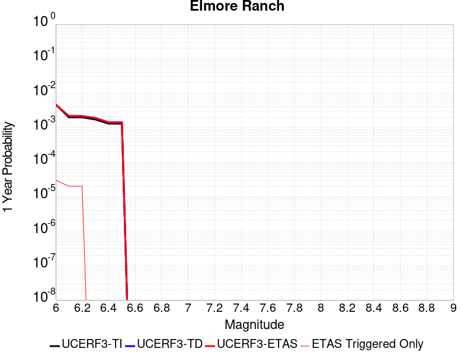 | 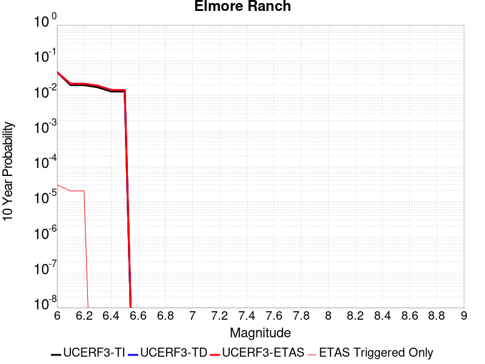 |

| Magnitude | 1 wk TI Prob | 1 wk TD Prob | 1 wk ETAS Prob | 1 wk ETAS/TD Gain | 1 wk ETAS Triggered Only | 1 mo TI Prob | 1 mo TD Prob | 1 mo ETAS Prob | 1 mo ETAS/TD Gain | 1 mo ETAS Triggered Only | 1 yr TI Prob | 1 yr TD Prob | 1 yr ETAS Prob | 1 yr ETAS/TD Gain | 1 yr ETAS Triggered Only | 10 yr TI Prob | 10 yr TD Prob | 10 yr ETAS Prob | 10 yr ETAS/TD Gain | 10 yr ETAS Triggered Only |
|-----|-----|-----|-----|-----|-----|-----|-----|-----|-----|-----|-----|-----|-----|-----|-----|-----|-----|-----|-----|-----|
| 6.0 | 9.102099E-5 | 8.952015E-5 | 8.952015E-5 | 1.0 | 0.0 | 3.9003167E-4 | 3.8361453E-4 | 3.8361453E-4 | 1.0 | 0.0 | 0.0047383 | 0.004662009 | 0.0047147 | 1.0113022 | 5.2938063E-5 | 0.046385348 | 0.045870975 | 0.045921482 | 1.0011011 | 5.2938063E-5 |
| 6.1 | 3.8306698E-5 | 4.1498504E-5 | 4.1498504E-5 | 1.0 | 0.0 | 1.6416123E-4 | 1.7784268E-4 | 1.7784268E-4 | 1.0 | 0.0 | 0.0019968306 | 0.0021631396 | 0.002215963 | 1.0244199 | 5.2938063E-5 | 0.019789828 | 0.021628205 | 0.021679997 | 1.0023947 | 5.2938063E-5 |
| 6.2 | 3.8306698E-5 | 4.1498504E-5 | 4.1498504E-5 | 1.0 | 0.0 | 1.6416123E-4 | 1.7784268E-4 | 1.7784268E-4 | 1.0 | 0.0 | 0.0019968306 | 0.0021631396 | 0.002215963 | 1.0244199 | 5.2938063E-5 | 0.019789828 | 0.021628205 | 0.021679997 | 1.0023947 | 5.2938063E-5 |
| 6.3 | 3.3197924E-5 | 3.6554302E-5 | 3.6554302E-5 | 1.0 | 0.0 | 1.4226905E-4 | 1.5665586E-4 | 1.5665586E-4 | 1.0 | 0.0 | 0.0017307495 | 0.001905917 | 0.001905917 | 1.0 | 0.0 | 0.017173318 | 0.01908996 | 0.01908996 | 1.0 | 0.0 |
| 6.4 | 2.5148964E-5 | 2.7420487E-5 | 2.7420487E-5 | 1.0 | 0.0 | 1.0777682E-4 | 1.17514726E-4 | 1.17514726E-4 | 1.0 | 0.0 | 0.0013113929 | 0.0014304507 | 0.0014304507 | 1.0 | 0.0 | 0.01303681 | 0.014387194 | 0.014387194 | 1.0 | 0.0 |
| 6.5 | 2.5148964E-5 | 2.7420487E-5 | 2.7420487E-5 | 1.0 | 0.0 | 1.0777682E-4 | 1.17514726E-4 | 1.17514726E-4 | 1.0 | 0.0 | 0.0013113929 | 0.0014304507 | 0.0014304507 | 1.0 | 0.0 | 0.01303681 | 0.014387194 | 0.014387194 | 1.0 | 0.0 |

## Rinconada 2011 CFM
*[(top)](#table-of-contents)*

| 1 Week | 1 Month | 1 Year | 10 Year |
|-----|-----|-----|-----|
|  |  |  |  |

| Magnitude | 1 wk TI Prob | 1 wk TD Prob | 1 wk ETAS Prob | 1 wk ETAS/TD Gain | 1 wk ETAS Triggered Only | 1 mo TI Prob | 1 mo TD Prob | 1 mo ETAS Prob | 1 mo ETAS/TD Gain | 1 mo ETAS Triggered Only | 1 yr TI Prob | 1 yr TD Prob | 1 yr ETAS Prob | 1 yr ETAS/TD Gain | 1 yr ETAS Triggered Only | 10 yr TI Prob | 10 yr TD Prob | 10 yr ETAS Prob | 10 yr ETAS/TD Gain | 10 yr ETAS Triggered Only |
|-----|-----|-----|-----|-----|-----|-----|-----|-----|-----|-----|-----|-----|-----|-----|-----|-----|-----|-----|-----|-----|
| 6.0 | 1.5752368E-5 | 1.6274716E-5 | 6.9211914E-5 | 4.2527266 | 5.2938063E-5 | 6.75084E-5 | 6.974694E-5 | 1.226813E-4 | 1.758949 | 5.2938063E-5 | 8.2160486E-4 | 8.488412E-4 | 9.0173434E-4 | 1.0623121 | 5.2938063E-5 | 0.008185739 | 0.00845637 | 0.00850886 | 1.0062072 | 5.2938063E-5 |
| 6.1 | 1.0966133E-5 | 1.1323029E-5 | 6.4260494E-5 | 5.6752033 | 5.2938063E-5 | 4.6996865E-5 | 4.852637E-5 | 1.0146186E-4 | 2.0908604 | 5.2938063E-5 | 5.720366E-4 | 5.906491E-4 | 6.435559E-4 | 1.089574 | 5.2938063E-5 | 0.0057056635 | 0.0058908886 | 0.005943515 | 1.0089335 | 5.2938063E-5 |
| 6.2 | 1.0966133E-5 | 1.1323029E-5 | 6.4260494E-5 | 5.6752033 | 5.2938063E-5 | 4.6996865E-5 | 4.852637E-5 | 1.0146186E-4 | 2.0908604 | 5.2938063E-5 | 5.720366E-4 | 5.906491E-4 | 6.435559E-4 | 1.089574 | 5.2938063E-5 | 0.0057056635 | 0.0058908886 | 0.005943515 | 1.0089335 | 5.2938063E-5 |
| 6.3 | 8.926149E-6 | 9.212771E-6 | 6.215035E-5 | 6.7461076 | 5.2938063E-5 | 3.8254362E-5 | 3.948271E-5 | 9.241868E-5 | 2.340738 | 5.2938063E-5 | 4.6564735E-4 | 4.805963E-4 | 5.335089E-4 | 1.1100979 | 5.2938063E-5 | 0.0046467283 | 0.0047956146 | 0.0048482986 | 1.0109859 | 5.2938063E-5 |
| 6.4 | 7.676955E-6 | 7.920191E-6 | 6.0857834E-5 | 7.6838846 | 5.2938063E-5 | 3.290082E-5 | 3.3943234E-5 | 8.68795E-5 | 2.559553 | 5.2938063E-5 | 4.0049385E-4 | 4.1318068E-4 | 4.6609688E-4 | 1.1280704 | 5.2938063E-5 | 0.0039977287 | 0.004124151 | 0.004176871 | 1.0127832 | 5.2938063E-5 |
| 6.5 | 6.1671026E-6 | 6.3589546E-6 | 5.929668E-5 | 9.32491 | 5.2938063E-5 | 2.6430173E-5 | 2.725238E-5 | 8.0189E-5 | 2.9424586 | 5.2938063E-5 | 3.2173982E-4 | 3.317473E-4 | 3.8466777E-4 | 1.1595205 | 5.2938063E-5 | 0.003212744 | 0.0033125326 | 0.0033652952 | 1.0159281 | 5.2938063E-5 |
| 6.6 | 5.553456E-6 | 5.7248126E-6 | 5.8662572E-5 | 10.247073 | 5.2938063E-5 | 2.3800309E-5 | 2.453468E-5 | 7.747144E-5 | 3.15763 | 5.2938063E-5 | 2.897302E-4 | 2.9866883E-4 | 3.515911E-4 | 1.1771938 | 5.2938063E-5 | 0.0028935277 | 0.002982683 | 0.0030354634 | 1.0176955 | 5.2938063E-5 |
| 6.7 | 4.787857E-6 | 4.9333094E-6 | 5.787111E-5 | 11.730687 | 5.2938063E-5 | 2.0519226E-5 | 2.1142583E-5 | 7.407953E-5 | 3.5038068 | 5.2938063E-5 | 2.4979294E-4 | 2.573806E-4 | 3.1030504E-4 | 1.2056272 | 5.2938063E-5 | 0.0024951235 | 0.0025708308 | 0.0026236328 | 1.0205389 | 5.2938063E-5 |
| 6.8 | 3.9955166E-6 | 4.1134763E-6 | 5.7051322E-5 | 13.8693695 | 5.2938063E-5 | 1.7123532E-5 | 1.7629065E-5 | 7.0566195E-5 | 4.0028324 | 5.2938063E-5 | 2.0845905E-4 | 2.1461274E-4 | 2.6753944E-4 | 1.2466149 | 5.2938063E-5 | 0.002082636 | 0.0021440585 | 0.002196883 | 1.0246377 | 5.2938063E-5 |
| 6.9 | 3.4250072E-6 | 3.5224464E-6 | 5.646032E-5 | 16.028725 | 5.2938063E-5 | 1.46785205E-5 | 1.5096111E-5 | 6.8033376E-5 | 4.506682 | 5.2938063E-5 | 1.7869633E-4 | 1.8377967E-4 | 2.36708E-4 | 1.2879988 | 5.2938063E-5 | 0.001785527 | 0.0018362794 | 0.0018891202 | 1.028776 | 5.2938063E-5 |
| 7.0 | 2.7712713E-6 | 2.8467E-6 | 5.578461E-5 | 19.59624 | 5.2938063E-5 | 1.1876823E-5 | 1.2200086E-5 | 6.51375E-5 | 5.3391023 | 5.2938063E-5 | 1.4459073E-4 | 1.4852593E-4 | 2.0145613E-4 | 1.3563701 | 5.2938063E-5 | 0.0014449668 | 0.0014842682 | 0.0015371277 | 1.0356132 | 5.2938063E-5 |
| 7.1 | 2.227358E-6 | 2.2856984E-6 | 5.522364E-5 | 24.16051 | 5.2938063E-5 | 9.545785E-6 | 9.795814E-6 | 6.273336E-5 | 6.4040985 | 5.2938063E-5 | 1.16213734E-4 | 1.19257515E-4 | 1.7218926E-4 | 1.4438442 | 5.2938063E-5 | 0.0011615298 | 0.0011919362 | 0.0012448112 | 1.0443605 | 5.2938063E-5 |
| 7.2 | 1.581796E-6 | 1.6209011E-6 | 5.4558877E-5 | 33.659595 | 5.2938063E-5 | 6.779108E-6 | 6.9467005E-6 | 5.9884394E-5 | 8.620552 | 5.2938063E-5 | 8.253252E-5 | 8.457281E-5 | 1.3750639E-4 | 1.6258937 | 5.2938063E-5 | 8.250187E-4 | 8.454067E-4 | 8.9830003E-4 | 1.0625656 | 5.2938063E-5 |
| 7.3 | 1.0306567E-6 | 1.0546477E-6 | 5.3992655E-5 | 51.19497 | 5.2938063E-5 | 4.4170924E-6 | 4.519911E-6 | 5.7457735E-5 | 12.712139 | 5.2938063E-5 | 5.3776774E-5 | 5.5028526E-5 | 1.0796368E-4 | 1.9619583 | 5.2938063E-5 | 5.376376E-4 | 5.5014924E-4 | 6.030582E-4 | 1.096172 | 5.2938063E-5 |
| 7.4 | 6.535541E-7 | 6.682742E-7 | 5.36063E-5 | 80.21603 | 5.2938063E-5 | 2.800943E-6 | 2.864029E-6 | 5.580194E-5 | 19.48372 | 5.2938063E-5 | 3.4100947E-5 | 3.4868997E-5 | 8.7805216E-5 | 2.5181456 | 5.2938063E-5 | 3.4095717E-4 | 3.4863537E-4 | 4.0155498E-4 | 1.1517907 | 5.2938063E-5 |
| 7.5 | 3.2656962E-7 | 3.3316687E-7 | 3.3316687E-7 | 1.0 | 0.0 | 1.3995833E-6 | 1.4278572E-6 | 1.4278572E-6 | 1.0 | 0.0 | 1.7039794E-5 | 1.7384024E-5 | 1.7384024E-5 | 1.0 | 0.0 | 1.7038487E-4 | 1.7382667E-4 | 1.7382667E-4 | 1.0 | 0.0 |
| 7.6 | 9.754343E-8 | 9.82099E-8 | 9.82099E-8 | 1.0 | 0.0 | 4.180432E-7 | 4.208995E-7 | 4.208995E-7 | 1.0 | 0.0 | 5.089664E-6 | 5.1244397E-6 | 5.1244397E-6 | 1.0 | 0.0 | 5.0895473E-5 | 5.1243223E-5 | 5.1243223E-5 | 1.0 | 0.0 |
| 7.7 | 6.0001453E-9 | 5.8490435E-9 | 5.8490435E-9 | 1.0 | 0.0 | 2.5714908E-8 | 2.506733E-8 | 2.506733E-8 | 1.0 | 0.0 | 3.1307894E-7 | 3.051947E-7 | 3.051947E-7 | 1.0 | 0.0 | 3.1307852E-6 | 3.051943E-6 | 3.051943E-6 | 1.0 | 0.0 |
| 7.8 | 7.400003E-11 | 7.4654505E-11 | 7.4654505E-11 | 1.0 | 0.0 | 3.171432E-10 | 3.1994773E-10 | 3.1994773E-10 | 1.0 | 0.0 | 3.861218E-9 | 3.895363E-9 | 3.895363E-9 | 1.0 | 0.0 | 3.861218E-8 | 3.895363E-8 | 3.895363E-8 | 1.0 | 0.0 |

## Santa Cruz Catalina Ridge alt1
*[(top)](#table-of-contents)*

| 1 Week | 1 Month | 1 Year | 10 Year |
|-----|-----|-----|-----|
|  |  |  |  |

| Magnitude | 1 wk TI Prob | 1 wk TD Prob | 1 wk ETAS Prob | 1 wk ETAS/TD Gain | 1 wk ETAS Triggered Only | 1 mo TI Prob | 1 mo TD Prob | 1 mo ETAS Prob | 1 mo ETAS/TD Gain | 1 mo ETAS Triggered Only | 1 yr TI Prob | 1 yr TD Prob | 1 yr ETAS Prob | 1 yr ETAS/TD Gain | 1 yr ETAS Triggered Only | 10 yr TI Prob | 10 yr TD Prob | 10 yr ETAS Prob | 10 yr ETAS/TD Gain | 10 yr ETAS Triggered Only |
|-----|-----|-----|-----|-----|-----|-----|-----|-----|-----|-----|-----|-----|-----|-----|-----|-----|-----|-----|-----|-----|
| 6.0 | 3.2833184E-5 | 3.65584E-5 | 3.65584E-5 | 1.0 | 0.0 | 1.4070606E-4 | 1.5667039E-4 | 1.5667039E-4 | 1.0 | 0.0 | 0.00171175 | 0.0019059596 | 0.0019059596 | 1.0 | 0.0 | 0.016986247 | 0.018913029 | 0.018964967 | 1.0027461 | 5.2938063E-5 |
| 6.1 | 1.9835548E-5 | 2.1659505E-5 | 2.1659505E-5 | 1.0 | 0.0 | 8.500672E-5 | 9.282326E-5 | 9.282326E-5 | 1.0 | 0.0 | 0.0010344655 | 0.0011295575 | 0.0011295575 | 1.0 | 0.0 | 0.010296632 | 0.011240295 | 0.011292638 | 1.0046567 | 5.2938063E-5 |
| 6.2 | 1.9835548E-5 | 2.1659505E-5 | 2.1659505E-5 | 1.0 | 0.0 | 8.500672E-5 | 9.282326E-5 | 9.282326E-5 | 1.0 | 0.0 | 0.0010344655 | 0.0011295575 | 0.0011295575 | 1.0 | 0.0 | 0.010296632 | 0.011240295 | 0.011292638 | 1.0046567 | 5.2938063E-5 |
| 6.3 | 1.5728183E-5 | 1.703395E-5 | 1.703395E-5 | 1.0 | 0.0 | 6.7404755E-5 | 7.300063E-5 | 7.300063E-5 | 1.0 | 0.0 | 8.2034385E-4 | 8.884264E-4 | 8.884264E-4 | 1.0 | 0.0 | 0.008173222 | 0.008849427 | 0.008901897 | 1.0059291 | 5.2938063E-5 |
| 6.4 | 1.5728183E-5 | 1.703395E-5 | 1.703395E-5 | 1.0 | 0.0 | 6.7404755E-5 | 7.300063E-5 | 7.300063E-5 | 1.0 | 0.0 | 8.2034385E-4 | 8.884264E-4 | 8.884264E-4 | 1.0 | 0.0 | 0.008173222 | 0.008849427 | 0.008901897 | 1.0059291 | 5.2938063E-5 |
| 6.5 | 1.3707734E-5 | 1.4794522E-5 | 1.4794522E-5 | 1.0 | 0.0 | 5.8746107E-5 | 6.3403575E-5 | 6.3403575E-5 | 1.0 | 0.0 | 7.1499916E-4 | 7.716686E-4 | 7.716686E-4 | 1.0 | 0.0 | 0.0071270303 | 0.0076902895 | 0.007742821 | 1.0068308 | 5.2938063E-5 |
| 6.6 | 1.2539813E-5 | 1.3510219E-5 | 1.3510219E-5 | 1.0 | 0.0 | 5.3740947E-5 | 5.789967E-5 | 5.789967E-5 | 1.0 | 0.0 | 6.540996E-4 | 7.0470315E-4 | 7.0470315E-4 | 1.0 | 0.0 | 0.0065217763 | 0.0070249885 | 0.0070775547 | 1.0074828 | 5.2938063E-5 |
| 6.7 | 1.1504083E-5 | 1.2377375E-5 | 1.2377375E-5 | 1.0 | 0.0 | 4.930228E-5 | 5.3044827E-5 | 5.3044827E-5 | 1.0 | 0.0 | 6.0008996E-4 | 6.456314E-4 | 6.456314E-4 | 1.0 | 0.0 | 0.005984721 | 0.006437786 | 0.0064903833 | 1.0081701 | 5.2938063E-5 |
| 6.8 | 1.012739E-5 | 1.0877071E-5 | 1.0877071E-5 | 1.0 | 0.0 | 4.340238E-5 | 4.6615194E-5 | 4.6615194E-5 | 1.0 | 0.0 | 5.282958E-4 | 5.673937E-4 | 5.673937E-4 | 1.0 | 0.0 | 0.0052704164 | 0.0056596193 | 0.005712258 | 1.0093007 | 5.2938063E-5 |
| 6.9 | 8.9607865E-6 | 9.609117E-6 | 9.609117E-6 | 1.0 | 0.0 | 3.8402806E-5 | 4.1181287E-5 | 4.1181287E-5 | 1.0 | 0.0 | 4.6745385E-4 | 5.012679E-4 | 5.012679E-4 | 1.0 | 0.0 | 0.0046647177 | 0.005001492 | 0.005001492 | 1.0 | 0.0 |
| 7.0 | 8.046829E-6 | 8.619746E-6 | 8.619746E-6 | 1.0 | 0.0 | 3.4485955E-5 | 3.694125E-5 | 3.694125E-5 | 1.0 | 0.0 | 4.1978562E-4 | 4.496677E-4 | 4.496677E-4 | 1.0 | 0.0 | 0.004189935 | 0.0044876686 | 0.0044876686 | 1.0 | 0.0 |
| 7.1 | 7.136131E-6 | 7.637656E-6 | 7.637656E-6 | 1.0 | 0.0 | 3.0583058E-5 | 3.2732405E-5 | 3.2732405E-5 | 1.0 | 0.0 | 3.7228514E-4 | 3.9844486E-4 | 3.9844486E-4 | 1.0 | 0.0 | 0.0037166206 | 0.003977381 | 0.003977381 | 1.0 | 0.0 |
| 7.2 | 6.362014E-6 | 6.8049585E-6 | 6.8049585E-6 | 1.0 | 0.0 | 2.726549E-5 | 2.9163786E-5 | 2.9163786E-5 | 1.0 | 0.0 | 3.3190678E-4 | 3.550119E-4 | 3.550119E-4 | 1.0 | 0.0 | 0.0033141149 | 0.003544516 | 0.003544516 | 1.0 | 0.0 |
| 7.3 | 5.004101E-6 | 5.351715E-6 | 5.351715E-6 | 1.0 | 0.0 | 2.1445969E-5 | 2.2935723E-5 | 2.2935723E-5 | 1.0 | 0.0 | 2.6107338E-4 | 2.792072E-4 | 2.792072E-4 | 1.0 | 0.0 | 0.002607669 | 0.0027886187 | 0.0027886187 | 1.0 | 0.0 |
| 7.4 | 3.4901443E-6 | 3.7320526E-6 | 3.7320526E-6 | 1.0 | 0.0 | 1.4957676E-5 | 1.5994416E-5 | 1.5994416E-5 | 1.0 | 0.0 | 1.8209449E-4 | 1.9471499E-4 | 1.9471499E-4 | 1.0 | 0.0 | 0.0018194534 | 0.0019454823 | 0.0019454823 | 1.0 | 0.0 |
| 7.5 | 1.1215045E-6 | 1.189387E-6 | 1.189387E-6 | 1.0 | 0.0 | 4.806439E-6 | 5.097363E-6 | 5.097363E-6 | 1.0 | 0.0 | 5.851682E-5 | 6.205866E-5 | 6.205866E-5 | 1.0 | 0.0 | 5.850142E-4 | 6.2041637E-4 | 6.2041637E-4 | 1.0 | 0.0 |
| 7.6 | 2.8599047E-7 | 2.9951994E-7 | 2.9951994E-7 | 1.0 | 0.0 | 1.2256729E-6 | 1.2836562E-6 | 1.2836562E-6 | 1.0 | 0.0 | 1.4922465E-5 | 1.5628404E-5 | 1.5628404E-5 | 1.0 | 0.0 | 1.4921463E-4 | 1.5627318E-4 | 1.5627318E-4 | 1.0 | 0.0 |
| 7.7 | 2.0781519E-7 | 2.1744323E-7 | 2.1744323E-7 | 1.0 | 0.0 | 8.906362E-7 | 9.3189925E-7 | 9.3189925E-7 | 1.0 | 0.0 | 1.08434415E-5 | 1.13458145E-5 | 1.13458145E-5 | 1.0 | 0.0 | 1.0842913E-4 | 1.1345245E-4 | 1.1345245E-4 | 1.0 | 0.0 |
| 7.8 | 3.614776E-8 | 3.764102E-8 | 3.764102E-8 | 1.0 | 0.0 | 1.5491896E-7 | 1.6131864E-7 | 1.6131864E-7 | 1.0 | 0.0 | 1.8861368E-6 | 1.9640527E-6 | 1.9640527E-6 | 1.0 | 0.0 | 1.8861208E-5 | 1.9640367E-5 | 1.9640367E-5 | 1.0 | 0.0 |

## Pine Mtn
*[(top)](#table-of-contents)*

| 1 Week | 1 Month | 1 Year | 10 Year |
|-----|-----|-----|-----|
|  |  |  |  |

| Magnitude | 1 wk TI Prob | 1 wk TD Prob | 1 wk ETAS Prob | 1 wk ETAS/TD Gain | 1 wk ETAS Triggered Only | 1 mo TI Prob | 1 mo TD Prob | 1 mo ETAS Prob | 1 mo ETAS/TD Gain | 1 mo ETAS Triggered Only | 1 yr TI Prob | 1 yr TD Prob | 1 yr ETAS Prob | 1 yr ETAS/TD Gain | 1 yr ETAS Triggered Only | 10 yr TI Prob | 10 yr TD Prob | 10 yr ETAS Prob | 10 yr ETAS/TD Gain | 10 yr ETAS Triggered Only |
|-----|-----|-----|-----|-----|-----|-----|-----|-----|-----|-----|-----|-----|-----|-----|-----|-----|-----|-----|-----|-----|
| 6.0 | 6.894797E-6 | 7.225461E-6 | 7.225461E-6 | 1.0 | 0.0 | 2.9548795E-5 | 3.096591E-5 | 8.3902334E-5 | 2.7095063 | 5.2938063E-5 | 3.596972E-4 | 3.7694772E-4 | 4.2986585E-4 | 1.1403857 | 5.2938063E-5 | 0.0035911554 | 0.003763381 | 0.0038161199 | 1.0140136 | 5.2938063E-5 |
| 6.1 | 6.894797E-6 | 7.225461E-6 | 7.225461E-6 | 1.0 | 0.0 | 2.9548795E-5 | 3.096591E-5 | 8.3902334E-5 | 2.7095063 | 5.2938063E-5 | 3.596972E-4 | 3.7694772E-4 | 4.2986585E-4 | 1.1403857 | 5.2938063E-5 | 0.0035911554 | 0.003763381 | 0.0038161199 | 1.0140136 | 5.2938063E-5 |
| 6.2 | 6.894797E-6 | 7.225461E-6 | 7.225461E-6 | 1.0 | 0.0 | 2.9548795E-5 | 3.096591E-5 | 8.3902334E-5 | 2.7095063 | 5.2938063E-5 | 3.596972E-4 | 3.7694772E-4 | 4.2986585E-4 | 1.1403857 | 5.2938063E-5 | 0.0035911554 | 0.003763381 | 0.0038161199 | 1.0140136 | 5.2938063E-5 |
| 6.3 | 6.894797E-6 | 7.225461E-6 | 7.225461E-6 | 1.0 | 0.0 | 2.9548795E-5 | 3.096591E-5 | 8.3902334E-5 | 2.7095063 | 5.2938063E-5 | 3.596972E-4 | 3.7694772E-4 | 4.2986585E-4 | 1.1403857 | 5.2938063E-5 | 0.0035911554 | 0.003763381 | 0.0038161199 | 1.0140136 | 5.2938063E-5 |
| 6.4 | 6.894797E-6 | 7.225461E-6 | 7.225461E-6 | 1.0 | 0.0 | 2.9548795E-5 | 3.096591E-5 | 8.3902334E-5 | 2.7095063 | 5.2938063E-5 | 3.596972E-4 | 3.7694772E-4 | 4.2986585E-4 | 1.1403857 | 5.2938063E-5 | 0.0035911554 | 0.003763381 | 0.0038161199 | 1.0140136 | 5.2938063E-5 |
| 6.5 | 6.894797E-6 | 7.225461E-6 | 7.225461E-6 | 1.0 | 0.0 | 2.9548795E-5 | 3.096591E-5 | 8.3902334E-5 | 2.7095063 | 5.2938063E-5 | 3.596972E-4 | 3.7694772E-4 | 4.2986585E-4 | 1.1403857 | 5.2938063E-5 | 0.0035911554 | 0.003763381 | 0.0038161199 | 1.0140136 | 5.2938063E-5 |
| 6.6 | 6.894797E-6 | 7.225461E-6 | 7.225461E-6 | 1.0 | 0.0 | 2.9548795E-5 | 3.096591E-5 | 8.3902334E-5 | 2.7095063 | 5.2938063E-5 | 3.596972E-4 | 3.7694772E-4 | 4.2986585E-4 | 1.1403857 | 5.2938063E-5 | 0.0035911554 | 0.003763381 | 0.0038161199 | 1.0140136 | 5.2938063E-5 |
| 6.7 | 6.0867933E-6 | 6.3971133E-6 | 6.3971133E-6 | 1.0 | 0.0 | 2.6085996E-5 | 2.7415923E-5 | 8.035253E-5 | 2.930871 | 5.2938063E-5 | 3.1755073E-4 | 3.3373994E-4 | 3.8666034E-4 | 1.1585678 | 5.2938063E-5 | 0.0031709734 | 0.0033326065 | 0.003385368 | 1.015832 | 5.2938063E-5 |
| 6.8 | 5.6530425E-6 | 5.9505956E-6 | 5.9505956E-6 | 1.0 | 0.0 | 2.42271E-5 | 2.5502315E-5 | 7.843903E-5 | 3.075761 | 5.2938063E-5 | 2.94925E-4 | 3.104485E-4 | 3.6337014E-4 | 1.1704683 | 5.2938063E-5 | 0.002945339 | 0.0031003528 | 0.0031531267 | 1.0170219 | 5.2938063E-5 |
| 6.9 | 4.6015225E-6 | 4.863834E-6 | 4.863834E-6 | 1.0 | 0.0 | 1.9720663E-5 | 2.0844845E-5 | 7.3781805E-5 | 3.5395708 | 5.2938063E-5 | 2.4007261E-4 | 2.5375787E-4 | 3.0668252E-4 | 1.2085634 | 5.2938063E-5 | 0.0023981342 | 0.0025348254 | 0.0025876292 | 1.0208313 | 5.2938063E-5 |
| 7.0 | 4.4875965E-6 | 4.747473E-6 | 4.747473E-6 | 1.0 | 0.0 | 1.9232413E-5 | 2.0346162E-5 | 7.328315E-5 | 3.6018167 | 5.2938063E-5 | 2.3412947E-4 | 2.4768783E-4 | 3.0061277E-4 | 1.213676 | 5.2938063E-5 | 0.0023388295 | 0.0024742614 | 0.0025270686 | 1.0213425 | 5.2938063E-5 |
| 7.1 | 3.203907E-6 | 3.4294096E-6 | 3.4294096E-6 | 1.0 | 0.0 | 1.3730958E-5 | 1.4697391E-5 | 6.7634675E-5 | 4.601815 | 5.2938063E-5 | 1.6716159E-4 | 1.789267E-4 | 2.3185529E-4 | 1.2958115 | 5.2938063E-5 | 0.0016703589 | 0.0017878925 | 0.001840736 | 1.0295563 | 5.2938063E-5 |
| 7.2 | 2.2060601E-6 | 2.3784817E-6 | 2.3784817E-6 | 1.0 | 0.0 | 9.4545085E-6 | 1.0193455E-5 | 6.313098E-5 | 6.1932855 | 5.2938063E-5 | 1.15102564E-4 | 1.240987E-4 | 1.7703019E-4 | 1.4265274 | 5.2938063E-5 | 0.0011504296 | 0.0012403389 | 0.0012932112 | 1.0426273 | 5.2938063E-5 |
| 7.3 | 1.3765207E-6 | 1.5216481E-6 | 1.5216481E-6 | 1.0 | 0.0 | 5.899361E-6 | 6.521333E-6 | 5.945905E-5 | 9.117622 | 5.2938063E-5 | 7.182235E-5 | 7.939443E-5 | 1.3232829E-4 | 1.66672 | 5.2938063E-5 | 7.1799144E-4 | 7.936697E-4 | 8.465658E-4 | 1.0666474 | 5.2938063E-5 |
| 7.4 | 1.1245983E-6 | 1.2587075E-6 | 1.2587075E-6 | 1.0 | 0.0 | 4.819698E-6 | 5.39445E-6 | 5.8332225E-5 | 10.813377 | 5.2938063E-5 | 5.8678244E-5 | 6.567554E-5 | 1.1861012E-4 | 1.8060015 | 5.2938063E-5 | 5.866275E-4 | 6.5656955E-4 | 7.0947286E-4 | 1.0805753 | 5.2938063E-5 |
| 7.5 | 8.031682E-7 | 9.276951E-7 | 9.276951E-7 | 1.0 | 0.0 | 3.4421448E-6 | 3.9758306E-6 | 3.9758306E-6 | 1.0 | 0.0 | 4.1907308E-5 | 4.840473E-5 | 4.840473E-5 | 1.0 | 0.0 | 4.1899405E-4 | 4.8394862E-4 | 4.8394862E-4 | 1.0 | 0.0 |
| 7.6 | 4.8953444E-7 | 6.003009E-7 | 6.003009E-7 | 1.0 | 0.0 | 2.098003E-6 | 2.5727159E-6 | 2.5727159E-6 | 1.0 | 0.0 | 2.5542888E-5 | 3.1322415E-5 | 3.1322415E-5 | 1.0 | 0.0 | 2.5539953E-4 | 3.1318486E-4 | 3.1318486E-4 | 1.0 | 0.0 |
| 7.7 | 6.634529E-8 | 6.788826E-8 | 6.788826E-8 | 1.0 | 0.0 | 2.843369E-7 | 2.9094966E-7 | 2.9094966E-7 | 1.0 | 0.0 | 3.4617963E-6 | 3.5423066E-6 | 3.5423066E-6 | 1.0 | 0.0 | 3.4617424E-5 | 3.542255E-5 | 3.542255E-5 | 1.0 | 0.0 |
| 7.8 | 9.235578E-9 | 9.488566E-9 | 9.488566E-9 | 1.0 | 0.0 | 3.9581046E-8 | 4.0665284E-8 | 4.0665284E-8 | 1.0 | 0.0 | 4.818991E-7 | 4.950997E-7 | 4.950997E-7 | 1.0 | 0.0 | 4.8189804E-6 | 4.950988E-6 | 4.950988E-6 | 1.0 | 0.0 |

## San Andreas (Peninsula) 2011 CFM
*[(top)](#table-of-contents)*

| 1 Week | 1 Month | 1 Year | 10 Year |
|-----|-----|-----|-----|
|  |  |  |  |

| Magnitude | 1 wk TI Prob | 1 wk TD Prob | 1 wk ETAS Prob | 1 wk ETAS/TD Gain | 1 wk ETAS Triggered Only | 1 mo TI Prob | 1 mo TD Prob | 1 mo ETAS Prob | 1 mo ETAS/TD Gain | 1 mo ETAS Triggered Only | 1 yr TI Prob | 1 yr TD Prob | 1 yr ETAS Prob | 1 yr ETAS/TD Gain | 1 yr ETAS Triggered Only | 10 yr TI Prob | 10 yr TD Prob | 10 yr ETAS Prob | 10 yr ETAS/TD Gain | 10 yr ETAS Triggered Only |
|-----|-----|-----|-----|-----|-----|-----|-----|-----|-----|-----|-----|-----|-----|-----|-----|-----|-----|-----|-----|-----|
| 6.0 | 8.6200685E-5 | 2.52136E-5 | 2.52136E-5 | 1.0 | 0.0 | 3.6937918E-4 | 1.0805382E-4 | 1.6098616E-4 | 1.4898702 | 5.2938063E-5 | 0.0044879215 | 0.001314763 | 0.0013676314 | 1.0402114 | 5.2938063E-5 | 0.043983612 | 0.014774441 | 0.014826597 | 1.0035301 | 5.2938063E-5 |
| 6.1 | 8.6200685E-5 | 2.52136E-5 | 2.52136E-5 | 1.0 | 0.0 | 3.6937918E-4 | 1.0805382E-4 | 1.6098616E-4 | 1.4898702 | 5.2938063E-5 | 0.0044879215 | 0.001314763 | 0.0013676314 | 1.0402114 | 5.2938063E-5 | 0.043983612 | 0.014774441 | 0.014826597 | 1.0035301 | 5.2938063E-5 |
| 6.2 | 8.6200685E-5 | 2.52136E-5 | 2.52136E-5 | 1.0 | 0.0 | 3.6937918E-4 | 1.0805382E-4 | 1.6098616E-4 | 1.4898702 | 5.2938063E-5 | 0.0044879215 | 0.001314763 | 0.0013676314 | 1.0402114 | 5.2938063E-5 | 0.043983612 | 0.014774441 | 0.014826597 | 1.0035301 | 5.2938063E-5 |
| 6.3 | 8.551163E-5 | 2.490552E-5 | 2.490552E-5 | 1.0 | 0.0 | 3.6642692E-4 | 1.06733576E-4 | 1.5966599E-4 | 1.4959303 | 5.2938063E-5 | 0.004452125 | 0.0012987083 | 0.0013515776 | 1.0407091 | 5.2938063E-5 | 0.043639794 | 0.014601416 | 0.014653581 | 1.0035726 | 5.2938063E-5 |
| 6.4 | 8.551163E-5 | 2.490552E-5 | 2.490552E-5 | 1.0 | 0.0 | 3.6642692E-4 | 1.06733576E-4 | 1.5966599E-4 | 1.4959303 | 5.2938063E-5 | 0.004452125 | 0.0012987083 | 0.0013515776 | 1.0407091 | 5.2938063E-5 | 0.043639794 | 0.014601416 | 0.014653581 | 1.0035726 | 5.2938063E-5 |
| 6.5 | 8.511146E-5 | 2.4726973E-5 | 2.4726973E-5 | 1.0 | 0.0 | 3.647124E-4 | 1.05968444E-4 | 1.5890089E-4 | 1.4995115 | 5.2938063E-5 | 0.004431336 | 0.0012894038 | 0.0013422737 | 1.0410033 | 5.2938063E-5 | 0.04344007 | 0.0145011945 | 0.014553364 | 1.0035976 | 5.2938063E-5 |
| 6.6 | 8.4985084E-5 | 2.4657606E-5 | 2.4657606E-5 | 1.0 | 0.0 | 3.6417096E-4 | 1.05671184E-4 | 1.5860365E-4 | 1.5009168 | 5.2938063E-5 | 0.0044247704 | 0.001285789 | 0.001338659 | 1.0411187 | 5.2938063E-5 | 0.043376986 | 0.014463263 | 0.014515434 | 1.0036073 | 5.2938063E-5 |
| 6.7 | 8.462618E-5 | 2.4486113E-5 | 2.4486113E-5 | 1.0 | 0.0 | 3.6263323E-4 | 1.0493627E-4 | 1.5786878E-4 | 1.5044253 | 5.2938063E-5 | 0.004406125 | 0.0012768519 | 0.0013297223 | 1.0414069 | 5.2938063E-5 | 0.043197807 | 0.01436807 | 0.014420248 | 1.0036315 | 5.2938063E-5 |
| 6.8 | 8.42337E-5 | 2.438192E-5 | 2.438192E-5 | 1.0 | 0.0 | 3.6095164E-4 | 1.04489765E-4 | 1.574223E-4 | 1.5065811 | 5.2938063E-5 | 0.004385734 | 0.0012714221 | 0.0013242929 | 1.0415839 | 5.2938063E-5 | 0.043001823 | 0.014308756 | 0.014360936 | 1.0036467 | 5.2938063E-5 |
| 6.9 | 8.365989E-5 | 2.4186513E-5 | 2.4186513E-5 | 1.0 | 0.0 | 3.5849313E-4 | 1.03652375E-4 | 1.5658495E-4 | 1.510674 | 5.2938063E-5 | 0.004355922 | 0.0012612387 | 0.00131411 | 1.0419202 | 5.2938063E-5 | 0.04271523 | 0.014201242 | 0.014253427 | 1.0036747 | 5.2938063E-5 |
| 7.0 | 8.30936E-5 | 2.3948E-5 | 2.3948E-5 | 1.0 | 0.0 | 3.560668E-4 | 1.02630256E-4 | 1.5556288E-4 | 1.5157605 | 5.2938063E-5 | 0.004326499 | 0.0012488087 | 0.0013016807 | 1.0423379 | 5.2938063E-5 | 0.042432297 | 0.014072227 | 0.0141244205 | 1.003709 | 5.2938063E-5 |
| 7.1 | 8.041264E-5 | 2.3634402E-5 | 2.3634402E-5 | 1.0 | 0.0 | 3.4458007E-4 | 1.0128637E-4 | 1.5421907E-4 | 1.5226043 | 5.2938063E-5 | 0.0041871946 | 0.0012324656 | 0.0012853384 | 1.0429001 | 5.2938063E-5 | 0.041091725 | 0.013895032 | 0.0139472345 | 1.0037569 | 5.2938063E-5 |
| 7.2 | 7.8427016E-5 | 2.3058019E-5 | 2.3058019E-5 | 1.0 | 0.0 | 3.3607247E-4 | 9.8816345E-5 | 1.5174918E-4 | 1.5356688 | 5.2938063E-5 | 0.004084008 | 0.0012024266 | 0.001255301 | 1.0439731 | 5.2938063E-5 | 0.040097635 | 0.013579085 | 0.013631304 | 1.0038456 | 5.2938063E-5 |
| 7.3 | 7.721087E-5 | 2.2842805E-5 | 2.2842805E-5 | 1.0 | 0.0 | 3.3086175E-4 | 9.7894066E-5 | 1.5082695E-4 | 1.5407159 | 5.2938063E-5 | 0.004020803 | 0.0011912102 | 0.0012440853 | 1.0443876 | 5.2938063E-5 | 0.03948827 | 0.013462781 | 0.013515007 | 1.0038792 | 5.2938063E-5 |
| 7.4 | 7.3536525E-5 | 2.0960428E-5 | 2.0960428E-5 | 1.0 | 0.0 | 3.1511846E-4 | 8.982732E-5 | 1.4276063E-4 | 1.5892785 | 5.2938063E-5 | 0.0038298194 | 0.0010931002 | 0.0011459804 | 1.0483763 | 5.2938063E-5 | 0.037644852 | 0.012419564 | 0.012471844 | 1.0042095 | 5.2938063E-5 |
| 7.5 | 6.806207E-5 | 1.876674E-5 | 1.876674E-5 | 1.0 | 0.0 | 2.9166197E-4 | 8.042641E-5 | 1.3336021E-4 | 1.6581645 | 5.2938063E-5 | 0.0035452035 | 9.787527E-4 | 0.0010316389 | 1.0540344 | 5.2938063E-5 | 0.034891766 | 0.01117254 | 0.0112248855 | 1.0046853 | 5.2938063E-5 |
| 7.6 | 5.6731416E-5 | 1.4177827E-5 | 1.4177827E-5 | 1.0 | 0.0 | 2.43112E-4 | 6.07607E-5 | 1.1369555E-4 | 1.871202 | 5.2938063E-5 | 0.0029558712 | 7.395106E-4 | 7.924095E-4 | 1.0715324 | 5.2938063E-5 | 0.02916862 | 0.008485565 | 0.008538053 | 1.0061857 | 5.2938063E-5 |
| 7.7 | 4.946994E-5 | 1.3246218E-5 | 1.3246218E-5 | 1.0 | 0.0 | 2.1199681E-4 | 5.6768273E-5 | 1.0970333E-4 | 1.9324762 | 5.2938063E-5 | 0.002578006 | 6.9093466E-4 | 7.4383616E-4 | 1.0765651 | 5.2938063E-5 | 0.02548303 | 0.0079078935 | 0.007960414 | 1.0066414 | 5.2938063E-5 |
| 7.8 | 3.9718198E-5 | 1.2982541E-5 | 1.2982541E-5 | 1.0 | 0.0 | 1.7020974E-4 | 5.5638273E-5 | 1.0857339E-4 | 1.9514155 | 5.2938063E-5 | 0.0020703338 | 6.771856E-4 | 7.300878E-4 | 1.0781207 | 5.2938063E-5 | 0.020511515 | 0.0077184658 | 0.0077709956 | 1.0068057 | 5.2938063E-5 |
| 7.9 | 2.4115114E-5 | 1.218559E-5 | 1.218559E-5 | 1.0 | 0.0 | 1.0334639E-4 | 5.2222913E-5 | 1.05158215E-4 | 2.013641 | 5.2938063E-5 | 0.001257516 | 6.3562865E-4 | 6.8853307E-4 | 1.0832317 | 5.2938063E-5 | 0.012504238 | 0.007159044 | 0.0072116028 | 1.0073416 | 5.2938063E-5 |
| 8.0 | 1.7756569E-5 | 1.1410005E-5 | 1.1410005E-5 | 1.0 | 0.0 | 7.6097356E-5 | 4.8899106E-5 | 1.0183458E-4 | 2.0825448 | 5.2938063E-5 | 9.260915E-4 | 5.951841E-4 | 6.480907E-4 | 1.088891 | 5.2938063E-5 | 0.009222416 | 0.006659493 | 0.0067120786 | 1.0078963 | 5.2938063E-5 |
| 8.1 | 1.3159258E-5 | 9.746194E-6 | 9.746194E-6 | 1.0 | 0.0 | 5.6395602E-5 | 4.1768737E-5 | 9.470459E-5 | 2.267356 | 5.2938063E-5 | 6.864001E-4 | 5.0841586E-4 | 5.61327E-4 | 1.1040707 | 5.2938063E-5 | 0.0068428386 | 0.005689538 | 0.0057421746 | 1.0092515 | 5.2938063E-5 |
| 8.2 | 8.635426E-6 | 5.466912E-6 | 5.466912E-6 | 1.0 | 0.0 | 3.700844E-5 | 2.3429413E-5 | 2.3429413E-5 | 1.0 | 0.0 | 4.5048463E-4 | 2.8521585E-4 | 2.8521585E-4 | 1.0 | 0.0 | 0.004495725 | 0.0032445018 | 0.0032445018 | 1.0 | 0.0 |
| 8.3 | 1.983087E-6 | 7.6599065E-7 | 7.6599065E-7 | 1.0 | 0.0 | 8.498917E-6 | 3.282813E-6 | 3.282813E-6 | 1.0 | 0.0 | 1.034694E-4 | 3.9967534E-5 | 3.9967534E-5 | 1.0 | 0.0 | 0.0010342124 | 4.719687E-4 | 4.719687E-4 | 1.0 | 0.0 |

## Casmalia 2011 CFM
*[(top)](#table-of-contents)*

| 1 Week | 1 Month | 1 Year | 10 Year |
|-----|-----|-----|-----|
|  |  |  |  |

| Magnitude | 1 wk TI Prob | 1 wk TD Prob | 1 wk ETAS Prob | 1 wk ETAS/TD Gain | 1 wk ETAS Triggered Only | 1 mo TI Prob | 1 mo TD Prob | 1 mo ETAS Prob | 1 mo ETAS/TD Gain | 1 mo ETAS Triggered Only | 1 yr TI Prob | 1 yr TD Prob | 1 yr ETAS Prob | 1 yr ETAS/TD Gain | 1 yr ETAS Triggered Only | 10 yr TI Prob | 10 yr TD Prob | 10 yr ETAS Prob | 10 yr ETAS/TD Gain | 10 yr ETAS Triggered Only |
|-----|-----|-----|-----|-----|-----|-----|-----|-----|-----|-----|-----|-----|-----|-----|-----|-----|-----|-----|-----|-----|
| 6.0 | 4.1704893E-6 | 4.262483E-6 | 5.720032E-5 | 13.419484 | 5.2938063E-5 | 1.7873403E-5 | 1.8267656E-5 | 7.1204755E-5 | 3.897859 | 5.2938063E-5 | 2.1758694E-4 | 2.2238622E-4 | 2.7531252E-4 | 1.2379926 | 5.2938063E-5 | 0.0021737402 | 0.0022216577 | 0.0022744783 | 1.0237752 | 5.2938063E-5 |
| 6.1 | 4.1704893E-6 | 4.262483E-6 | 5.720032E-5 | 13.419484 | 5.2938063E-5 | 1.7873403E-5 | 1.8267656E-5 | 7.1204755E-5 | 3.897859 | 5.2938063E-5 | 2.1758694E-4 | 2.2238622E-4 | 2.7531252E-4 | 1.2379926 | 5.2938063E-5 | 0.0021737402 | 0.0022216577 | 0.0022744783 | 1.0237752 | 5.2938063E-5 |
| 6.2 | 3.457312E-6 | 3.5370217E-6 | 5.6474895E-5 | 15.966794 | 5.2938063E-5 | 1.4816967E-5 | 1.5158577E-5 | 6.809584E-5 | 4.4922314 | 5.2938063E-5 | 1.8038164E-4 | 1.8454014E-4 | 2.3746843E-4 | 1.2868118 | 5.2938063E-5 | 0.001802353 | 0.0018438784 | 0.0018967189 | 1.0286572 | 5.2938063E-5 |
| 6.3 | 3.457312E-6 | 3.5370217E-6 | 5.6474895E-5 | 15.966794 | 5.2938063E-5 | 1.4816967E-5 | 1.5158577E-5 | 6.809584E-5 | 4.4922314 | 5.2938063E-5 | 1.8038164E-4 | 1.8454014E-4 | 2.3746843E-4 | 1.2868118 | 5.2938063E-5 | 0.001802353 | 0.0018438784 | 0.0018967189 | 1.0286572 | 5.2938063E-5 |
| 6.4 | 3.0957337E-6 | 3.1692257E-6 | 5.610712E-5 | 17.703732 | 5.2938063E-5 | 1.3267363E-5 | 1.3582326E-5 | 6.651967E-5 | 4.8975167 | 5.2938063E-5 | 1.6151817E-4 | 1.6535232E-4 | 2.1828162E-4 | 1.3201002 | 5.2938063E-5 | 0.0016140083 | 0.0016522991 | 0.0017051497 | 1.0319861 | 5.2938063E-5 |
| 6.5 | 3.0957337E-6 | 3.1692257E-6 | 5.610712E-5 | 17.703732 | 5.2938063E-5 | 1.3267363E-5 | 1.3582326E-5 | 6.651967E-5 | 4.8975167 | 5.2938063E-5 | 1.6151817E-4 | 1.6535232E-4 | 2.1828162E-4 | 1.3201002 | 5.2938063E-5 | 0.0016140083 | 0.0016522991 | 0.0017051497 | 1.0319861 | 5.2938063E-5 |
| 6.6 | 2.9459152E-6 | 3.0165752E-6 | 5.595448E-5 | 18.54901 | 5.2938063E-5 | 1.262529E-5 | 1.2928115E-5 | 6.586549E-5 | 5.0947485 | 5.2938063E-5 | 1.5370206E-4 | 1.5738848E-4 | 2.1031822E-4 | 1.3362999 | 5.2938063E-5 | 0.0015359579 | 0.0015727758 | 0.0016256307 | 1.033606 | 5.2938063E-5 |
| 6.7 | 2.8634809E-6 | 2.9324726E-6 | 5.587038E-5 | 19.05231 | 5.2938063E-5 | 1.2272003E-5 | 1.256768E-5 | 6.5505075E-5 | 5.2121854 | 5.2938063E-5 | 1.4940138E-4 | 1.530008E-4 | 2.0593076E-4 | 1.3459456 | 5.2938063E-5 | 0.0014930099 | 0.0015289601 | 0.0015818172 | 1.0345707 | 5.2938063E-5 |
| 6.8 | 2.7999822E-6 | 2.8675968E-6 | 5.5805507E-5 | 19.460724 | 5.2938063E-5 | 1.1999869E-5 | 1.2289643E-5 | 6.5227054E-5 | 5.307482 | 5.2938063E-5 | 1.460886E-4 | 1.4961617E-4 | 2.0254632E-4 | 1.3537729 | 5.2938063E-5 | 0.001459926 | 0.0014951597 | 0.0015480187 | 1.0353533 | 5.2938063E-5 |
| 6.9 | 2.551052E-6 | 2.6119649E-6 | 5.554989E-5 | 21.267471 | 5.2938063E-5 | 1.0933034E-5 | 1.1194087E-5 | 6.413156E-5 | 5.7290564 | 5.2938063E-5 | 1.3310155E-4 | 1.3627953E-4 | 1.8921038E-4 | 1.3883991 | 5.2938063E-5 | 0.0013302186 | 0.0013619636 | 0.0014148295 | 1.038816 | 5.2938063E-5 |
| 7.0 | 2.3081875E-6 | 2.3624088E-6 | 5.5300345E-5 | 23.408457 | 5.2938063E-5 | 9.892195E-6 | 1.01245705E-5 | 6.30621E-5 | 6.2286196 | 5.2938063E-5 | 1.20430814E-4 | 1.232597E-4 | 1.7619123E-4 | 1.4294311 | 5.2938063E-5 | 0.0012036557 | 0.0012319161 | 0.0012847891 | 1.0429192 | 5.2938063E-5 |
| 7.1 | 2.093245E-6 | 2.1417243E-6 | 2.1417243E-6 | 1.0 | 0.0 | 8.971019E-6 | 9.178786E-6 | 9.178786E-6 | 1.0 | 0.0 | 1.09216686E-4 | 1.1174601E-4 | 1.1174601E-4 | 1.0 | 0.0 | 0.0010916302 | 0.0011169002 | 0.0011169002 | 1.0 | 0.0 |
| 7.2 | 1.9714576E-6 | 2.0165091E-6 | 2.0165091E-6 | 1.0 | 0.0 | 8.449076E-6 | 8.642153E-6 | 8.642153E-6 | 1.0 | 0.0 | 1.0286264E-4 | 1.05213156E-4 | 1.05213156E-4 | 1.0 | 0.0 | 0.0010281504 | 0.0010516352 | 0.0010516352 | 1.0 | 0.0 |
| 7.3 | 1.6689512E-6 | 1.7047131E-6 | 1.7047131E-6 | 1.0 | 0.0 | 7.1526288E-6 | 7.3058927E-6 | 7.3058927E-6 | 1.0 | 0.0 | 8.7079774E-5 | 8.894562E-5 | 8.894562E-5 | 1.0 | 0.0 | 8.7045657E-4 | 8.89101E-4 | 8.89101E-4 | 1.0 | 0.0 |
| 7.4 | 1.4490954E-6 | 1.4778908E-6 | 1.4778908E-6 | 1.0 | 0.0 | 6.210394E-6 | 6.333802E-6 | 6.333802E-6 | 1.0 | 0.0 | 7.560892E-5 | 7.711132E-5 | 7.711132E-5 | 1.0 | 0.0 | 7.55832E-4 | 7.7084627E-4 | 7.7084627E-4 | 1.0 | 0.0 |
| 7.5 | 1.226873E-6 | 1.2481701E-6 | 1.2481701E-6 | 1.0 | 0.0 | 5.2580162E-6 | 5.3492895E-6 | 5.3492895E-6 | 1.0 | 0.0 | 6.401447E-5 | 6.5125656E-5 | 6.5125656E-5 | 1.0 | 0.0 | 6.399603E-4 | 6.5106625E-4 | 6.5106625E-4 | 1.0 | 0.0 |
| 7.6 | 9.2561345E-7 | 9.361923E-7 | 9.361923E-7 | 1.0 | 0.0 | 3.966909E-6 | 4.012247E-6 | 4.012247E-6 | 1.0 | 0.0 | 4.8296046E-5 | 4.884801E-5 | 4.884801E-5 | 1.0 | 0.0 | 4.828555E-4 | 4.8837316E-4 | 4.8837316E-4 | 1.0 | 0.0 |
| 7.7 | 5.4367933E-7 | 5.392888E-7 | 5.392888E-7 | 1.0 | 0.0 | 2.3300522E-6 | 2.3112357E-6 | 2.3112357E-6 | 1.0 | 0.0 | 2.8368017E-5 | 2.8138933E-5 | 2.8138933E-5 | 1.0 | 0.0 | 2.8364395E-4 | 2.8135383E-4 | 2.8135383E-4 | 1.0 | 0.0 |
| 7.8 | 1.8825742E-7 | 1.7342276E-7 | 1.7342276E-7 | 1.0 | 0.0 | 8.068173E-7 | 7.4324015E-7 | 7.4324015E-7 | 1.0 | 0.0 | 9.822956E-6 | 9.048912E-6 | 9.048912E-6 | 1.0 | 0.0 | 9.822522E-5 | 9.048546E-5 | 9.048546E-5 | 1.0 | 0.0 |
| 7.9 | 6.342771E-8 | 4.6790706E-8 | 4.6790706E-8 | 1.0 | 0.0 | 2.7183304E-7 | 2.0053157E-7 | 2.0053157E-7 | 1.0 | 0.0 | 3.3095623E-6 | 2.4414692E-6 | 2.4414692E-6 | 1.0 | 0.0 | 3.309513E-5 | 2.4414428E-5 | 2.4414428E-5 | 1.0 | 0.0 |
| 8.0 | 1.2574819E-8 | 6.4733463E-9 | 6.4733463E-9 | 1.0 | 0.0 | 5.3892084E-8 | 2.7742912E-8 | 2.7742912E-8 | 1.0 | 0.0 | 6.561359E-7 | 3.377699E-7 | 3.377699E-7 | 1.0 | 0.0 | 6.56134E-6 | 3.377694E-6 | 3.377694E-6 | 1.0 | 0.0 |

## Mission Creek
*[(top)](#table-of-contents)*

| 1 Week | 1 Month | 1 Year | 10 Year |
|-----|-----|-----|-----|
|  | 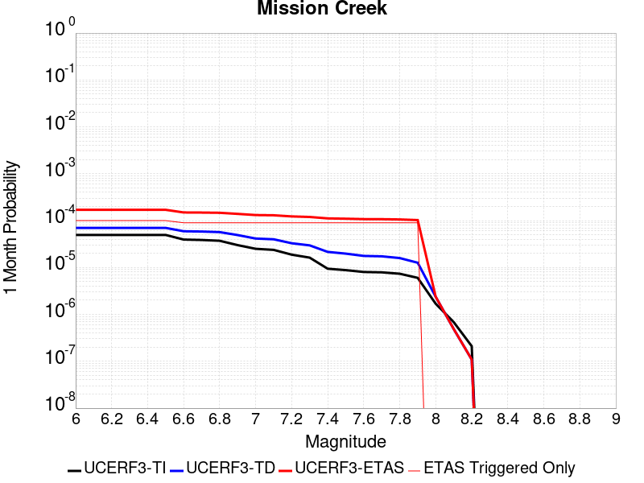 |  |  |

| Magnitude | 1 wk TI Prob | 1 wk TD Prob | 1 wk ETAS Prob | 1 wk ETAS/TD Gain | 1 wk ETAS Triggered Only | 1 mo TI Prob | 1 mo TD Prob | 1 mo ETAS Prob | 1 mo ETAS/TD Gain | 1 mo ETAS Triggered Only | 1 yr TI Prob | 1 yr TD Prob | 1 yr ETAS Prob | 1 yr ETAS/TD Gain | 1 yr ETAS Triggered Only | 10 yr TI Prob | 10 yr TD Prob | 10 yr ETAS Prob | 10 yr ETAS/TD Gain | 10 yr ETAS Triggered Only |
|-----|-----|-----|-----|-----|-----|-----|-----|-----|-----|-----|-----|-----|-----|-----|-----|-----|-----|-----|-----|-----|
| 6.0 | 1.1549387E-5 | 1.632237E-5 | 1.632237E-5 | 1.0 | 0.0 | 4.9496433E-5 | 6.9951224E-5 | 1.2288558E-4 | 1.7567325 | 5.2938063E-5 | 6.0245243E-4 | 8.513384E-4 | 9.042314E-4 | 1.0621293 | 5.2938063E-5 | 0.006008218 | 0.008509998 | 0.008562486 | 1.0061678 | 5.2938063E-5 |
| 6.1 | 1.1549387E-5 | 1.632237E-5 | 1.632237E-5 | 1.0 | 0.0 | 4.9496433E-5 | 6.9951224E-5 | 1.2288558E-4 | 1.7567325 | 5.2938063E-5 | 6.0245243E-4 | 8.513384E-4 | 9.042314E-4 | 1.0621293 | 5.2938063E-5 | 0.006008218 | 0.008509998 | 0.008562486 | 1.0061678 | 5.2938063E-5 |
| 6.2 | 1.1549387E-5 | 1.632237E-5 | 1.632237E-5 | 1.0 | 0.0 | 4.9496433E-5 | 6.9951224E-5 | 1.2288558E-4 | 1.7567325 | 5.2938063E-5 | 6.0245243E-4 | 8.513384E-4 | 9.042314E-4 | 1.0621293 | 5.2938063E-5 | 0.006008218 | 0.008509998 | 0.008562486 | 1.0061678 | 5.2938063E-5 |
| 6.3 | 1.1549387E-5 | 1.632237E-5 | 1.632237E-5 | 1.0 | 0.0 | 4.9496433E-5 | 6.9951224E-5 | 1.2288558E-4 | 1.7567325 | 5.2938063E-5 | 6.0245243E-4 | 8.513384E-4 | 9.042314E-4 | 1.0621293 | 5.2938063E-5 | 0.006008218 | 0.008509998 | 0.008562486 | 1.0061678 | 5.2938063E-5 |
| 6.4 | 1.1549387E-5 | 1.632237E-5 | 1.632237E-5 | 1.0 | 0.0 | 4.9496433E-5 | 6.9951224E-5 | 1.2288558E-4 | 1.7567325 | 5.2938063E-5 | 6.0245243E-4 | 8.513384E-4 | 9.042314E-4 | 1.0621293 | 5.2938063E-5 | 0.006008218 | 0.008509998 | 0.008562486 | 1.0061678 | 5.2938063E-5 |
| 6.5 | 1.1549387E-5 | 1.632237E-5 | 1.632237E-5 | 1.0 | 0.0 | 4.9496433E-5 | 6.9951224E-5 | 1.2288558E-4 | 1.7567325 | 5.2938063E-5 | 6.0245243E-4 | 8.513384E-4 | 9.042314E-4 | 1.0621293 | 5.2938063E-5 | 0.006008218 | 0.008509998 | 0.008562486 | 1.0061678 | 5.2938063E-5 |
| 6.6 | 9.202681E-6 | 1.3845646E-5 | 1.3845646E-5 | 1.0 | 0.0 | 3.9439463E-5 | 5.9337188E-5 | 1.1227211E-4 | 1.8921037 | 5.2938063E-5 | 4.800697E-4 | 7.221998E-4 | 7.750997E-4 | 1.0732481 | 5.2938063E-5 | 0.004790339 | 0.0072271815 | 0.007279737 | 1.0072719 | 5.2938063E-5 |
| 6.7 | 9.019164E-6 | 1.3651316E-5 | 1.3651316E-5 | 1.0 | 0.0 | 3.8652986E-5 | 5.8504378E-5 | 1.11439345E-4 | 1.9048035 | 5.2938063E-5 | 4.7049852E-4 | 7.12067E-4 | 7.649674E-4 | 1.0742912 | 5.2938063E-5 | 0.004695036 | 0.007126506 | 0.0071790665 | 1.0073754 | 5.2938063E-5 |
| 6.8 | 8.673558E-6 | 1.3273427E-5 | 1.3273427E-5 | 1.0 | 0.0 | 3.717186E-5 | 5.6884925E-5 | 1.0981998E-4 | 1.9305638 | 5.2938063E-5 | 4.524734E-4 | 6.923627E-4 | 7.452641E-4 | 1.0764071 | 5.2938063E-5 | 0.0045155324 | 0.006930694 | 0.0069832653 | 1.0075853 | 5.2938063E-5 |
| 6.9 | 7.002255E-6 | 1.1477657E-5 | 1.1477657E-5 | 1.0 | 0.0 | 3.000932E-5 | 4.9189068E-5 | 1.02124526E-4 | 2.076163 | 5.2938063E-5 | 3.653022E-4 | 5.9871917E-4 | 6.5162557E-4 | 1.0883659 | 5.2938063E-5 | 0.0036470229 | 0.005999517 | 0.006052138 | 1.0087708 | 5.2938063E-5 |
| 7.0 | 5.84644E-6 | 9.67498E-6 | 9.67498E-6 | 1.0 | 0.0 | 2.5055931E-5 | 4.1463565E-5 | 9.439943E-5 | 2.2766838 | 5.2938063E-5 | 3.0501327E-4 | 5.047066E-4 | 5.576179E-4 | 1.1048359 | 5.2938063E-5 | 0.0030459496 | 0.0050638523 | 0.0051165223 | 1.0104011 | 5.2938063E-5 |
| 7.1 | 5.54703E-6 | 9.329456E-6 | 9.329456E-6 | 1.0 | 0.0 | 2.377277E-5 | 3.9982795E-5 | 9.2918744E-5 | 2.3239682 | 5.2938063E-5 | 2.8939504E-4 | 4.8668624E-4 | 5.395986E-4 | 1.1087195 | 5.2938063E-5 | 0.0028901845 | 0.004884446 | 0.004937126 | 1.0107851 | 5.2938063E-5 |
| 7.2 | 4.384709E-6 | 7.68157E-6 | 7.68157E-6 | 1.0 | 0.0 | 1.8791474E-5 | 3.2920623E-5 | 8.585694E-5 | 2.6079988 | 5.2938063E-5 | 2.2876218E-4 | 4.0073853E-4 | 4.5365538E-4 | 1.1320484 | 5.2938063E-5 | 0.0022852682 | 0.004028366 | 0.0040810904 | 1.0130883 | 5.2938063E-5 |
| 7.3 | 3.7888456E-6 | 6.915452E-6 | 6.915452E-6 | 1.0 | 0.0 | 1.623781E-5 | 2.9637333E-5 | 8.2573824E-5 | 2.7861423 | 5.2938063E-5 | 1.9767738E-4 | 3.6077813E-4 | 4.136971E-4 | 1.1466801 | 5.2938063E-5 | 0.0019750162 | 0.0036301152 | 0.003682861 | 1.0145301 | 5.2938063E-5 |
| 7.4 | 2.1982462E-6 | 5.0237763E-6 | 5.0237763E-6 | 1.0 | 0.0 | 9.421021E-6 | 2.1530293E-5 | 7.4467214E-5 | 3.458718 | 5.2938063E-5 | 1.1469489E-4 | 2.621E-4 | 3.1502417E-4 | 1.2019236 | 5.2938063E-5 | 0.0011463572 | 0.0026458844 | 0.0026986825 | 1.0199548 | 5.2938063E-5 |
| 7.5 | 2.051923E-6 | 4.615016E-6 | 4.615016E-6 | 1.0 | 0.0 | 8.793926E-6 | 1.9778492E-5 | 7.2715506E-5 | 3.6764941 | 5.2938063E-5 | 1.0706078E-4 | 2.4077666E-4 | 2.9370197E-4 | 1.2198108 | 5.2938063E-5 | 0.0010700922 | 0.0024335422 | 0.0024863512 | 1.0217006 | 5.2938063E-5 |
| 7.6 | 1.8733427E-6 | 4.1233748E-6 | 4.1233748E-6 | 1.0 | 0.0 | 8.028587E-6 | 1.7671488E-5 | 7.0608614E-5 | 3.9956236 | 5.2938063E-5 | 9.774366E-5 | 2.151292E-4 | 2.6805588E-4 | 1.2460227 | 5.2938063E-5 | 9.770069E-4 | 0.0021780801 | 0.002230903 | 1.0242519 | 5.2938063E-5 |
| 7.7 | 1.8411953E-6 | 4.0430496E-6 | 4.0430496E-6 | 1.0 | 0.0 | 7.890813E-6 | 1.732724E-5 | 7.026439E-5 | 4.05514 | 5.2938063E-5 | 9.606641E-5 | 2.1093882E-4 | 2.6386572E-4 | 1.2509111 | 5.2938063E-5 | 9.6024893E-4 | 0.0021363653 | 0.0021891904 | 1.0247265 | 5.2938063E-5 |
| 7.8 | 1.7194251E-6 | 3.7104276E-6 | 3.7104276E-6 | 1.0 | 0.0 | 7.368944E-6 | 1.5901736E-5 | 6.8838955E-5 | 4.3290215 | 5.2938063E-5 | 8.97132E-5 | 1.9358651E-4 | 2.4651433E-4 | 1.2734065 | 5.2938063E-5 | 8.967699E-4 | 0.0019623525 | 0.0020151867 | 1.0269239 | 5.2938063E-5 |
| 7.9 | 1.4035052E-6 | 2.9500632E-6 | 2.9500632E-6 | 1.0 | 0.0 | 6.0150082E-6 | 1.2643067E-5 | 6.558046E-5 | 5.187069 | 5.2938063E-5 | 7.3230265E-5 | 1.5391852E-4 | 2.0684845E-4 | 1.3438827 | 5.2938063E-5 | 7.3206134E-4 | 0.0015631086 | 0.001615964 | 1.0338142 | 5.2938063E-5 |
| 8.0 | 3.9318823E-7 | 5.528522E-7 | 5.528522E-7 | 1.0 | 0.0 | 1.6850913E-6 | 2.3693647E-6 | 2.3693647E-6 | 1.0 | 0.0 | 2.0515794E-5 | 2.8846638E-5 | 2.8846638E-5 | 1.0 | 0.0 | 2.0513899E-4 | 2.9899E-4 | 2.9899E-4 | 1.0 | 0.0 |
| 8.1 | 1.596793E-7 | 1.1380002E-7 | 1.1380002E-7 | 1.0 | 0.0 | 6.8433974E-7 | 4.877143E-7 | 4.877143E-7 | 1.0 | 0.0 | 8.331805E-6 | 5.937906E-6 | 5.937906E-6 | 1.0 | 0.0 | 8.331492E-5 | 6.549966E-5 | 6.549966E-5 | 1.0 | 0.0 |
| 8.2 | 4.9003038E-8 | 2.5444924E-8 | 2.5444924E-8 | 1.0 | 0.0 | 2.10013E-7 | 1.0904967E-7 | 1.0904967E-7 | 1.0 | 0.0 | 2.5569052E-6 | 1.327679E-6 | 1.327679E-6 | 1.0 | 0.0 | 2.556876E-5 | 1.495635E-5 | 1.495635E-5 | 1.0 | 0.0 |

## White Mountains
*[(top)](#table-of-contents)*

| 1 Week | 1 Month | 1 Year | 10 Year |
|-----|-----|-----|-----|
|  |  |  |  |

| Magnitude | 1 wk TI Prob | 1 wk TD Prob | 1 wk ETAS Prob | 1 wk ETAS/TD Gain | 1 wk ETAS Triggered Only | 1 mo TI Prob | 1 mo TD Prob | 1 mo ETAS Prob | 1 mo ETAS/TD Gain | 1 mo ETAS Triggered Only | 1 yr TI Prob | 1 yr TD Prob | 1 yr ETAS Prob | 1 yr ETAS/TD Gain | 1 yr ETAS Triggered Only | 10 yr TI Prob | 10 yr TD Prob | 10 yr ETAS Prob | 10 yr ETAS/TD Gain | 10 yr ETAS Triggered Only |
|-----|-----|-----|-----|-----|-----|-----|-----|-----|-----|-----|-----|-----|-----|-----|-----|-----|-----|-----|-----|-----|
| 6.0 | 3.503579E-5 | 3.378405E-5 | 8.672033E-5 | 2.5669012 | 5.2938063E-5 | 1.5014476E-4 | 1.4478143E-4 | 1.9771184E-4 | 1.3655883 | 5.2938063E-5 | 0.0018264796 | 0.0017614096 | 0.0018142543 | 1.0300014 | 5.2938063E-5 | 0.018115403 | 0.017486818 | 0.01753883 | 1.0029744 | 5.2938063E-5 |
| 6.1 | 3.503579E-5 | 3.378405E-5 | 8.672033E-5 | 2.5669012 | 5.2938063E-5 | 1.5014476E-4 | 1.4478143E-4 | 1.9771184E-4 | 1.3655883 | 5.2938063E-5 | 0.0018264796 | 0.0017614096 | 0.0018142543 | 1.0300014 | 5.2938063E-5 | 0.018115403 | 0.017486818 | 0.01753883 | 1.0029744 | 5.2938063E-5 |
| 6.2 | 3.503579E-5 | 3.378405E-5 | 8.672033E-5 | 2.5669012 | 5.2938063E-5 | 1.5014476E-4 | 1.4478143E-4 | 1.9771184E-4 | 1.3655883 | 5.2938063E-5 | 0.0018264796 | 0.0017614096 | 0.0018142543 | 1.0300014 | 5.2938063E-5 | 0.018115403 | 0.017486818 | 0.01753883 | 1.0029744 | 5.2938063E-5 |
| 6.3 | 1.7818425E-5 | 1.5916074E-5 | 6.88533E-5 | 4.3260226 | 5.2938063E-5 | 7.636245E-5 | 6.821004E-5 | 1.211445E-4 | 1.7760507 | 5.2938063E-5 | 9.293162E-4 | 8.301551E-4 | 8.830492E-4 | 1.0637159 | 5.2938063E-5 | 0.009254395 | 0.008271999 | 0.008324499 | 1.0063467 | 5.2938063E-5 |
| 6.4 | 1.7818425E-5 | 1.5916074E-5 | 6.88533E-5 | 4.3260226 | 5.2938063E-5 | 7.636245E-5 | 6.821004E-5 | 1.211445E-4 | 1.7760507 | 5.2938063E-5 | 9.293162E-4 | 8.301551E-4 | 8.830492E-4 | 1.0637159 | 5.2938063E-5 | 0.009254395 | 0.008271999 | 0.008324499 | 1.0063467 | 5.2938063E-5 |
| 6.5 | 1.3397557E-5 | 1.13362685E-5 | 6.427373E-5 | 5.669743 | 5.2938063E-5 | 5.741684E-5 | 4.858314E-5 | 1.01518635E-4 | 2.0895855 | 5.2938063E-5 | 6.988258E-4 | 5.913462E-4 | 6.44253E-4 | 1.0894684 | 5.2938063E-5 | 0.006966323 | 0.005898432 | 0.0059510577 | 1.008922 | 5.2938063E-5 |
| 6.6 | 1.0818695E-5 | 8.625366E-6 | 6.156297E-5 | 7.137433 | 5.2938063E-5 | 4.6365014E-5 | 3.6965357E-5 | 8.990146E-5 | 2.4320464 | 5.2938063E-5 | 5.6434784E-4 | 4.4996463E-4 | 5.0287886E-4 | 1.1175965 | 5.2938063E-5 | 0.005629168 | 0.004490972 | 0.0045436723 | 1.0117347 | 5.2938063E-5 |
| 6.7 | 9.067908E-6 | 6.802442E-6 | 5.9740145E-5 | 8.782162 | 5.2938063E-5 | 3.8861883E-5 | 2.9153016E-5 | 8.208954E-5 | 2.8158162 | 5.2938063E-5 | 4.7304068E-4 | 3.5488335E-4 | 4.078026E-4 | 1.1491174 | 5.2938063E-5 | 0.00472035 | 0.0035434833 | 0.003596234 | 1.0148866 | 5.2938063E-5 |
| 6.8 | 7.295947E-6 | 4.936391E-6 | 4.936391E-6 | 1.0 | 0.0 | 3.126797E-5 | 2.1155796E-5 | 2.1155796E-5 | 1.0 | 0.0 | 3.8062103E-4 | 2.575425E-4 | 2.575425E-4 | 1.0 | 0.0 | 0.0037996976 | 0.0025725532 | 0.0025725532 | 1.0 | 0.0 |
| 6.9 | 6.2243444E-6 | 3.832213E-6 | 3.832213E-6 | 1.0 | 0.0 | 2.6675489E-5 | 1.642367E-5 | 1.642367E-5 | 1.0 | 0.0 | 3.2472567E-4 | 1.9994036E-4 | 1.9994036E-4 | 1.0 | 0.0 | 0.0032425157 | 0.0019976576 | 0.0019976576 | 1.0 | 0.0 |
| 7.0 | 4.9878413E-6 | 2.6795342E-6 | 2.6795342E-6 | 1.0 | 0.0 | 2.1376287E-5 | 1.14836685E-5 | 1.14836685E-5 | 1.0 | 0.0 | 2.602252E-4 | 1.3980496E-4 | 1.3980496E-4 | 1.0 | 0.0 | 0.002599207 | 0.0013971963 | 0.0013971963 | 1.0 | 0.0 |
| 7.1 | 4.0252844E-6 | 1.8857575E-6 | 1.8857575E-6 | 1.0 | 0.0 | 1.7251105E-5 | 8.081794E-6 | 8.081794E-6 | 1.0 | 0.0 | 2.1001195E-4 | 9.8391516E-5 | 9.8391516E-5 | 1.0 | 0.0 | 0.0020981359 | 9.834924E-4 | 9.834924E-4 | 1.0 | 0.0 |
| 7.2 | 3.3284066E-6 | 1.281964E-6 | 1.281964E-6 | 1.0 | 0.0 | 1.4264522E-5 | 5.494121E-6 | 5.494121E-6 | 1.0 | 0.0 | 1.736567E-4 | 6.688897E-5 | 6.688897E-5 | 1.0 | 0.0 | 0.0017352107 | 6.6869846E-4 | 6.6869846E-4 | 1.0 | 0.0 |
| 7.3 | 2.458226E-6 | 6.05722E-7 | 6.05722E-7 | 1.0 | 0.0 | 1.0535211E-5 | 2.5959491E-6 | 2.5959491E-6 | 1.0 | 0.0 | 1.2825865E-4 | 3.1605257E-5 | 3.1605257E-5 | 1.0 | 0.0 | 0.0012818464 | 3.160114E-4 | 3.160114E-4 | 1.0 | 0.0 |
| 7.4 | 1.965953E-6 | 3.1089303E-7 | 3.1089303E-7 | 1.0 | 0.0 | 8.425486E-6 | 1.332398E-6 | 1.332398E-6 | 1.0 | 0.0 | 1.0257547E-4 | 1.6221828E-5 | 1.6221828E-5 | 1.0 | 0.0 | 0.0010252813 | 1.6220656E-4 | 1.6220656E-4 | 1.0 | 0.0 |
| 7.5 | 1.2014192E-6 | 1.8244253E-7 | 1.8244253E-7 | 1.0 | 0.0 | 5.148929E-6 | 7.8189635E-7 | 7.8189635E-7 | 1.0 | 0.0 | 6.2686406E-5 | 9.519547E-6 | 9.519547E-6 | 1.0 | 0.0 | 6.266873E-4 | 9.519148E-5 | 9.519148E-5 | 1.0 | 0.0 |
| 7.6 | 2.5612175E-7 | 4.8946475E-8 | 4.8946475E-8 | 1.0 | 0.0 | 1.0976642E-6 | 2.0977059E-7 | 2.0977059E-7 | 1.0 | 0.0 | 1.3363979E-5 | 2.5539543E-6 | 2.5539543E-6 | 1.0 | 0.0 | 1.3363175E-4 | 2.5539286E-5 | 2.5539286E-5 | 1.0 | 0.0 |

## Surprise Valley 2011 CFM
*[(top)](#table-of-contents)*

| 1 Week | 1 Month | 1 Year | 10 Year |
|-----|-----|-----|-----|
|  |  |  |  |

| Magnitude | 1 wk TI Prob | 1 wk TD Prob | 1 wk ETAS Prob | 1 wk ETAS/TD Gain | 1 wk ETAS Triggered Only | 1 mo TI Prob | 1 mo TD Prob | 1 mo ETAS Prob | 1 mo ETAS/TD Gain | 1 mo ETAS Triggered Only | 1 yr TI Prob | 1 yr TD Prob | 1 yr ETAS Prob | 1 yr ETAS/TD Gain | 1 yr ETAS Triggered Only | 10 yr TI Prob | 10 yr TD Prob | 10 yr ETAS Prob | 10 yr ETAS/TD Gain | 10 yr ETAS Triggered Only |
|-----|-----|-----|-----|-----|-----|-----|-----|-----|-----|-----|-----|-----|-----|-----|-----|-----|-----|-----|-----|-----|
| 6.0 | 4.0396248E-5 | 4.485131E-5 | 4.485131E-5 | 1.0 | 0.0 | 1.7311527E-4 | 1.9220692E-4 | 2.451348E-4 | 1.2753693 | 5.2938063E-5 | 0.002105641 | 0.0023378176 | 0.002390632 | 1.0225912 | 5.2938063E-5 | 0.020858008 | 0.023153966 | 0.023205679 | 1.0022334 | 5.2938063E-5 |
| 6.1 | 4.0396248E-5 | 4.485131E-5 | 4.485131E-5 | 1.0 | 0.0 | 1.7311527E-4 | 1.9220692E-4 | 2.451348E-4 | 1.2753693 | 5.2938063E-5 | 0.002105641 | 0.0023378176 | 0.002390632 | 1.0225912 | 5.2938063E-5 | 0.020858008 | 0.023153966 | 0.023205679 | 1.0022334 | 5.2938063E-5 |
| 6.2 | 2.2295266E-5 | 2.440125E-5 | 2.440125E-5 | 1.0 | 0.0 | 9.554764E-5 | 1.0457276E-4 | 1.0457276E-4 | 1.0 | 0.0 | 0.0011626717 | 0.0012724606 | 0.0012724606 | 1.0 | 0.0 | 0.011566074 | 0.012654981 | 0.012654981 | 1.0 | 0.0 |
| 6.3 | 1.572643E-5 | 1.7096807E-5 | 1.7096807E-5 | 1.0 | 0.0 | 6.7397246E-5 | 7.327003E-5 | 7.327003E-5 | 1.0 | 0.0 | 8.202525E-4 | 8.91708E-4 | 8.91708E-4 | 1.0 | 0.0 | 0.008172315 | 0.008882407 | 0.008882407 | 1.0 | 0.0 |
| 6.4 | 1.5714395E-5 | 1.7084629E-5 | 1.7084629E-5 | 1.0 | 0.0 | 6.734567E-5 | 7.3217845E-5 | 7.3217845E-5 | 1.0 | 0.0 | 8.1962504E-4 | 8.9107314E-4 | 8.9107314E-4 | 1.0 | 0.0 | 0.008166086 | 0.008876109 | 0.008876109 | 1.0 | 0.0 |
| 6.5 | 1.2733495E-5 | 1.38016E-5 | 1.38016E-5 | 1.0 | 0.0 | 5.457098E-5 | 5.9148413E-5 | 5.9148413E-5 | 1.0 | 0.0 | 6.641992E-4 | 7.1990065E-4 | 7.1990065E-4 | 1.0 | 0.0 | 0.0066221743 | 0.0071763797 | 0.0071763797 | 1.0 | 0.0 |
| 6.6 | 1.0983784E-5 | 1.1886554E-5 | 1.1886554E-5 | 1.0 | 0.0 | 4.7072506E-5 | 5.094141E-5 | 5.094141E-5 | 1.0 | 0.0 | 5.7295704E-4 | 6.200405E-4 | 6.200405E-4 | 1.0 | 0.0 | 0.0057148207 | 0.0061836545 | 0.0061836545 | 1.0 | 0.0 |
| 6.7 | 9.104806E-6 | 9.839491E-6 | 9.839491E-6 | 1.0 | 0.0 | 3.902001E-5 | 4.2168587E-5 | 4.2168587E-5 | 1.0 | 0.0 | 4.7496508E-4 | 5.132855E-4 | 5.132855E-4 | 1.0 | 0.0 | 0.004739512 | 0.005121397 | 0.005121397 | 1.0 | 0.0 |
| 6.8 | 6.2162403E-6 | 6.7041337E-6 | 6.7041337E-6 | 1.0 | 0.0 | 2.6640759E-5 | 2.8731698E-5 | 2.8731698E-5 | 1.0 | 0.0 | 3.2430296E-4 | 3.497545E-4 | 3.497545E-4 | 1.0 | 0.0 | 0.003238301 | 0.0034922638 | 0.0034922638 | 1.0 | 0.0 |
| 6.9 | 4.1792696E-6 | 4.50323E-6 | 4.50323E-6 | 1.0 | 0.0 | 1.7911032E-5 | 1.9299423E-5 | 1.9299423E-5 | 1.0 | 0.0 | 2.1804498E-4 | 2.3494668E-4 | 2.3494668E-4 | 1.0 | 0.0 | 0.0021783116 | 0.0023471361 | 0.0023471361 | 1.0 | 0.0 |
| 7.0 | 2.7478413E-6 | 2.9622424E-6 | 2.9622424E-6 | 1.0 | 0.0 | 1.177641E-5 | 1.269527E-5 | 1.269527E-5 | 1.0 | 0.0 | 1.4336836E-4 | 1.545552E-4 | 1.545552E-4 | 1.0 | 0.0 | 0.001432759 | 0.0015445995 | 0.0015445995 | 1.0 | 0.0 |
| 7.1 | 8.128648E-7 | 8.724922E-7 | 8.724922E-7 | 1.0 | 0.0 | 3.4837017E-6 | 3.7392501E-6 | 3.7392501E-6 | 1.0 | 0.0 | 4.2413245E-5 | 4.552502E-5 | 4.552502E-5 | 1.0 | 0.0 | 4.2405148E-4 | 4.5521575E-4 | 4.5521575E-4 | 1.0 | 0.0 |
| 7.2 | 4.8641045E-8 | 4.9402068E-8 | 4.9402068E-8 | 1.0 | 0.0 | 2.084616E-7 | 2.1172312E-7 | 2.1172312E-7 | 1.0 | 0.0 | 2.538017E-6 | 2.577726E-6 | 2.577726E-6 | 1.0 | 0.0 | 2.537988E-5 | 2.5776973E-5 | 2.5776973E-5 | 1.0 | 0.0 |
| 7.3 | 5.3911844E-9 | 5.4758145E-9 | 5.4758145E-9 | 1.0 | 0.0 | 2.3105075E-8 | 2.3467775E-8 | 2.3467775E-8 | 1.0 | 0.0 | 2.8130427E-7 | 2.8572015E-7 | 2.8572015E-7 | 1.0 | 0.0 | 2.8130391E-6 | 2.8571992E-6 | 2.8571992E-6 | 1.0 | 0.0 |

## San Andreas (North Coast) 2011 CFM
*[(top)](#table-of-contents)*

| 1 Week | 1 Month | 1 Year | 10 Year |
|-----|-----|-----|-----|
|  |  |  |  |

| Magnitude | 1 wk TI Prob | 1 wk TD Prob | 1 wk ETAS Prob | 1 wk ETAS/TD Gain | 1 wk ETAS Triggered Only | 1 mo TI Prob | 1 mo TD Prob | 1 mo ETAS Prob | 1 mo ETAS/TD Gain | 1 mo ETAS Triggered Only | 1 yr TI Prob | 1 yr TD Prob | 1 yr ETAS Prob | 1 yr ETAS/TD Gain | 1 yr ETAS Triggered Only | 10 yr TI Prob | 10 yr TD Prob | 10 yr ETAS Prob | 10 yr ETAS/TD Gain | 10 yr ETAS Triggered Only |
|-----|-----|-----|-----|-----|-----|-----|-----|-----|-----|-----|-----|-----|-----|-----|-----|-----|-----|-----|-----|-----|
| 6.0 | 1.5333705E-4 | 7.1106435E-5 | 7.1106435E-5 | 1.0 | 0.0 | 6.5699324E-4 | 3.0470645E-4 | 3.5762836E-4 | 1.1736817 | 5.2938063E-5 | 0.007969595 | 0.0037035241 | 0.003756266 | 1.014241 | 5.2938063E-5 | 0.0768977 | 0.03935284 | 0.039403696 | 1.0012922 | 5.2938063E-5 |
| 6.1 | 1.5333705E-4 | 7.1106435E-5 | 7.1106435E-5 | 1.0 | 0.0 | 6.5699324E-4 | 3.0470645E-4 | 3.5762836E-4 | 1.1736817 | 5.2938063E-5 | 0.007969595 | 0.0037035241 | 0.003756266 | 1.014241 | 5.2938063E-5 | 0.0768977 | 0.03935284 | 0.039403696 | 1.0012922 | 5.2938063E-5 |
| 6.2 | 1.3912938E-4 | 6.050204E-5 | 6.050204E-5 | 1.0 | 0.0 | 5.961325E-4 | 2.5926883E-4 | 3.1219318E-4 | 1.2041292 | 5.2938063E-5 | 0.007233787 | 0.003152056 | 0.0032048272 | 1.0167419 | 5.2938063E-5 | 0.07002798 | 0.03369227 | 0.033743422 | 1.0015182 | 5.2938063E-5 |
| 6.3 | 1.3912938E-4 | 6.050204E-5 | 6.050204E-5 | 1.0 | 0.0 | 5.961325E-4 | 2.5926883E-4 | 3.1219318E-4 | 1.2041292 | 5.2938063E-5 | 0.007233787 | 0.003152056 | 0.0032048272 | 1.0167419 | 5.2938063E-5 | 0.07002798 | 0.03369227 | 0.033743422 | 1.0015182 | 5.2938063E-5 |
| 6.4 | 1.2623647E-4 | 5.0442024E-5 | 5.0442024E-5 | 1.0 | 0.0 | 5.4090127E-4 | 2.161623E-4 | 2.6908892E-4 | 1.2448467 | 5.2938063E-5 | 0.0065656058 | 0.0026286195 | 0.0026814186 | 1.0200862 | 5.2938063E-5 | 0.06374981 | 0.028303223 | 0.028354662 | 1.0018175 | 5.2938063E-5 |
| 6.5 | 1.1736096E-4 | 4.3523814E-5 | 4.3523814E-5 | 1.0 | 0.0 | 5.028786E-4 | 1.8651738E-4 | 2.3944557E-4 | 1.2837708 | 5.2938063E-5 | 0.006105373 | 0.0022685004 | 0.0023213183 | 1.0232832 | 5.2938063E-5 | 0.05940335 | 0.024579322 | 0.024630958 | 1.0021008 | 5.2938063E-5 |
| 6.6 | 1.1586959E-4 | 4.2423668E-5 | 4.2423668E-5 | 1.0 | 0.0 | 4.964894E-4 | 1.8180315E-4 | 2.3473159E-4 | 1.2911305 | 5.2938063E-5 | 0.006028018 | 0.0022112224 | 0.0022640435 | 1.0238876 | 5.2938063E-5 | 0.058671024 | 0.023984991 | 0.02403666 | 1.0021542 | 5.2938063E-5 |
| 6.7 | 1.13693764E-4 | 4.073593E-5 | 4.073593E-5 | 1.0 | 0.0 | 4.87168E-4 | 1.7457096E-4 | 2.2749978E-4 | 1.3031937 | 5.2938063E-5 | 0.005915152 | 0.0021233456 | 0.0021761712 | 1.0248785 | 5.2938063E-5 | 0.057601593 | 0.023076393 | 0.023128109 | 1.0022411 | 5.2938063E-5 |
| 6.8 | 1.1204889E-4 | 3.9953447E-5 | 3.9953447E-5 | 1.0 | 0.0 | 4.8012115E-4 | 1.7121792E-4 | 2.2414692E-4 | 1.3091323 | 5.2938063E-5 | 0.005829819 | 0.002082601 | 0.0021354288 | 1.0253663 | 5.2938063E-5 | 0.05679232 | 0.022636656 | 0.022688394 | 1.0022857 | 5.2938063E-5 |
| 6.9 | 1.1005794E-4 | 3.900957E-5 | 3.900957E-5 | 1.0 | 0.0 | 4.7159163E-4 | 1.6717325E-4 | 2.2010246E-4 | 1.316613 | 5.2938063E-5 | 0.0057265228 | 0.0020334502 | 0.0020862806 | 1.0259807 | 5.2938063E-5 | 0.055811852 | 0.022102542 | 0.02215431 | 1.0023422 | 5.2938063E-5 |
| 7.0 | 1.0647948E-4 | 3.7166337E-5 | 3.7166337E-5 | 1.0 | 0.0 | 4.562608E-4 | 1.5927466E-4 | 2.122043E-4 | 1.3323168 | 5.2938063E-5 | 0.0055408357 | 0.0019374598 | 0.0019902952 | 1.0272706 | 5.2938063E-5 | 0.054047033 | 0.021062272 | 0.021114094 | 1.0024605 | 5.2938063E-5 |
| 7.1 | 1.04795035E-4 | 3.6215948E-5 | 3.6215948E-5 | 1.0 | 0.0 | 4.4904428E-4 | 1.5520205E-4 | 2.0813191E-4 | 1.3410383 | 5.2938063E-5 | 0.0054534175 | 0.0018879628 | 0.0019408009 | 1.0279869 | 5.2938063E-5 | 0.053215165 | 0.020530313 | 0.020582164 | 1.0025256 | 5.2938063E-5 |
| 7.2 | 1.02724036E-4 | 3.5124547E-5 | 3.5124547E-5 | 1.0 | 0.0 | 4.401716E-4 | 1.5052517E-4 | 2.0345526E-4 | 1.3516362 | 5.2938063E-5 | 0.0053459285 | 0.0018311188 | 0.00188396 | 1.0288572 | 5.2938063E-5 | 0.052191395 | 0.019919246 | 0.01997113 | 1.0026047 | 5.2938063E-5 |
| 7.3 | 1.00650694E-4 | 3.4592013E-5 | 3.4592013E-5 | 1.0 | 0.0 | 4.312888E-4 | 1.4824314E-4 | 2.0117336E-4 | 1.35705 | 5.2938063E-5 | 0.005238306 | 0.0018033815 | 0.001856224 | 1.029302 | 5.2938063E-5 | 0.051165357 | 0.019596443 | 0.019648343 | 1.0026485 | 5.2938063E-5 |
| 7.4 | 9.672919E-5 | 3.338123E-5 | 3.338123E-5 | 1.0 | 0.0 | 4.144878E-4 | 1.4305465E-4 | 1.9598514E-4 | 1.3700019 | 5.2938063E-5 | 0.005034718 | 0.0017403142 | 0.0017931601 | 1.0303657 | 5.2938063E-5 | 0.049221683 | 0.018869769 | 0.018921707 | 1.0027525 | 5.2938063E-5 |
| 7.5 | 8.7600405E-5 | 2.2700917E-5 | 2.2700917E-5 | 1.0 | 0.0 | 3.753763E-4 | 9.728602E-5 | 1.5021894E-4 | 1.5440958 | 5.2938063E-5 | 0.0045606326 | 0.0011838155 | 0.0012366909 | 1.0446652 | 5.2938063E-5 | 0.04468165 | 0.013130207 | 0.01318245 | 1.0039788 | 5.2938063E-5 |
| 7.6 | 7.9562284E-5 | 1.9226305E-5 | 1.9226305E-5 | 1.0 | 0.0 | 3.4093665E-4 | 8.239586E-5 | 1.3532957E-4 | 1.6424316 | 5.2938063E-5 | 0.0041430052 | 0.0010027094 | 0.0010555944 | 1.0527421 | 5.2938063E-5 | 0.040666126 | 0.011221658 | 0.0112740025 | 1.0046645 | 5.2938063E-5 |
| 7.7 | 6.3866544E-5 | 1.1941707E-5 | 1.1941707E-5 | 1.0 | 0.0 | 2.7368503E-4 | 5.117774E-5 | 1.04113096E-4 | 2.0343432 | 5.2938063E-5 | 0.0033270244 | 6.2291115E-4 | 6.758162E-4 | 1.084932 | 5.2938063E-5 | 0.032776527 | 0.007210334 | 0.00726289 | 1.007289 | 5.2938063E-5 |
| 7.8 | 4.2543215E-5 | 9.076524E-6 | 9.076524E-6 | 1.0 | 0.0 | 1.8231533E-4 | 3.8898812E-5 | 9.1834816E-5 | 2.3608644 | 5.2938063E-5 | 0.0022174292 | 4.7349022E-4 | 5.264032E-4 | 1.111751 | 5.2938063E-5 | 0.021954332 | 0.005490525 | 0.0055431724 | 1.0095887 | 5.2938063E-5 |
| 7.9 | 2.2636612E-5 | 7.81435E-6 | 7.81435E-6 | 1.0 | 0.0 | 9.7010445E-5 | 3.3489643E-5 | 8.6425935E-5 | 2.5806766 | 5.2938063E-5 | 0.0011804621 | 4.076602E-4 | 4.6057667E-4 | 1.1298053 | 5.2938063E-5 | 0.011742111 | 0.0046832846 | 0.0047359746 | 1.0112507 | 5.2938063E-5 |
| 8.0 | 1.5167874E-5 | 7.0494675E-6 | 7.0494675E-6 | 1.0 | 0.0 | 6.500356E-5 | 3.0211655E-5 | 8.3148116E-5 | 2.7521868 | 5.2938063E-5 | 7.9113094E-4 | 3.677649E-4 | 4.206835E-4 | 1.1438924 | 5.2938063E-5 | 0.007883203 | 0.004215588 | 0.0042683026 | 1.0125047 | 5.2938063E-5 |
| 8.1 | 1.0681047E-5 | 6.386992E-6 | 6.386992E-6 | 1.0 | 0.0 | 4.5775112E-5 | 2.7372536E-5 | 8.030915E-5 | 2.9339316 | 5.2938063E-5 | 5.5716943E-4 | 3.3320975E-4 | 3.8613018E-4 | 1.1588202 | 5.2938063E-5 | 0.0055577457 | 0.003817393 | 0.003870129 | 1.0138147 | 5.2938063E-5 |
| 8.2 | 8.226114E-6 | 5.1150587E-6 | 5.1150587E-6 | 1.0 | 0.0 | 3.52543E-5 | 2.1921496E-5 | 2.1921496E-5 | 1.0 | 0.0 | 4.2913653E-4 | 2.668616E-4 | 2.668616E-4 | 1.0 | 0.0 | 0.004283088 | 0.0030450926 | 0.0030450926 | 1.0 | 0.0 |
| 8.3 | 1.983087E-6 | 7.6599065E-7 | 7.6599065E-7 | 1.0 | 0.0 | 8.498917E-6 | 3.282813E-6 | 3.282813E-6 | 1.0 | 0.0 | 1.034694E-4 | 3.9967534E-5 | 3.9967534E-5 | 1.0 | 0.0 | 0.0010342124 | 4.719687E-4 | 4.719687E-4 | 1.0 | 0.0 |

## Great Valley 06 (Midland) 2011 CFM alt1
*[(top)](#table-of-contents)*

| 1 Week | 1 Month | 1 Year | 10 Year |
|-----|-----|-----|-----|
|  |  |  |  |

| Magnitude | 1 wk TI Prob | 1 wk TD Prob | 1 wk ETAS Prob | 1 wk ETAS/TD Gain | 1 wk ETAS Triggered Only | 1 mo TI Prob | 1 mo TD Prob | 1 mo ETAS Prob | 1 mo ETAS/TD Gain | 1 mo ETAS Triggered Only | 1 yr TI Prob | 1 yr TD Prob | 1 yr ETAS Prob | 1 yr ETAS/TD Gain | 1 yr ETAS Triggered Only | 10 yr TI Prob | 10 yr TD Prob | 10 yr ETAS Prob | 10 yr ETAS/TD Gain | 10 yr ETAS Triggered Only |
|-----|-----|-----|-----|-----|-----|-----|-----|-----|-----|-----|-----|-----|-----|-----|-----|-----|-----|-----|-----|-----|
| 6.0 | 1.2712525E-5 | 1.3210576E-5 | 1.3210576E-5 | 1.0 | 0.0 | 5.4481112E-5 | 5.6615667E-5 | 5.6615667E-5 | 1.0 | 0.0 | 6.6310563E-4 | 6.8910315E-4 | 7.420047E-4 | 1.0767688 | 5.2938063E-5 | 0.0066113044 | 0.006872179 | 0.006924753 | 1.0076503 | 5.2938063E-5 |
| 6.1 | 1.2712525E-5 | 1.3210576E-5 | 1.3210576E-5 | 1.0 | 0.0 | 5.4481112E-5 | 5.6615667E-5 | 5.6615667E-5 | 1.0 | 0.0 | 6.6310563E-4 | 6.8910315E-4 | 7.420047E-4 | 1.0767688 | 5.2938063E-5 | 0.0066113044 | 0.006872179 | 0.006924753 | 1.0076503 | 5.2938063E-5 |
| 6.2 | 1.2712525E-5 | 1.3210576E-5 | 1.3210576E-5 | 1.0 | 0.0 | 5.4481112E-5 | 5.6615667E-5 | 5.6615667E-5 | 1.0 | 0.0 | 6.6310563E-4 | 6.8910315E-4 | 7.420047E-4 | 1.0767688 | 5.2938063E-5 | 0.0066113044 | 0.006872179 | 0.006924753 | 1.0076503 | 5.2938063E-5 |
| 6.3 | 1.2712525E-5 | 1.3210576E-5 | 1.3210576E-5 | 1.0 | 0.0 | 5.4481112E-5 | 5.6615667E-5 | 5.6615667E-5 | 1.0 | 0.0 | 6.6310563E-4 | 6.8910315E-4 | 7.420047E-4 | 1.0767688 | 5.2938063E-5 | 0.0066113044 | 0.006872179 | 0.006924753 | 1.0076503 | 5.2938063E-5 |
| 6.4 | 1.2712525E-5 | 1.3210576E-5 | 1.3210576E-5 | 1.0 | 0.0 | 5.4481112E-5 | 5.6615667E-5 | 5.6615667E-5 | 1.0 | 0.0 | 6.6310563E-4 | 6.8910315E-4 | 7.420047E-4 | 1.0767688 | 5.2938063E-5 | 0.0066113044 | 0.006872179 | 0.006924753 | 1.0076503 | 5.2938063E-5 |
| 6.5 | 1.2712525E-5 | 1.3210576E-5 | 1.3210576E-5 | 1.0 | 0.0 | 5.4481112E-5 | 5.6615667E-5 | 5.6615667E-5 | 1.0 | 0.0 | 6.6310563E-4 | 6.8910315E-4 | 7.420047E-4 | 1.0767688 | 5.2938063E-5 | 0.0066113044 | 0.006872179 | 0.006924753 | 1.0076503 | 5.2938063E-5 |
| 6.6 | 5.7574384E-6 | 5.9706463E-6 | 5.9706463E-6 | 1.0 | 0.0 | 2.4674504E-5 | 2.5588255E-5 | 2.5588255E-5 | 1.0 | 0.0 | 3.0037065E-4 | 3.1149638E-4 | 3.1149638E-4 | 1.0 | 0.0 | 0.0029996498 | 0.0031109843 | 0.0031109843 | 1.0 | 0.0 |
| 6.7 | 5.7574384E-6 | 5.9706463E-6 | 5.9706463E-6 | 1.0 | 0.0 | 2.4674504E-5 | 2.5588255E-5 | 2.5588255E-5 | 1.0 | 0.0 | 3.0037065E-4 | 3.1149638E-4 | 3.1149638E-4 | 1.0 | 0.0 | 0.0029996498 | 0.0031109843 | 0.0031109843 | 1.0 | 0.0 |
| 6.8 | 3.3474828E-6 | 3.4693849E-6 | 3.4693849E-6 | 1.0 | 0.0 | 1.4346277E-5 | 1.4868716E-5 | 1.4868716E-5 | 1.0 | 0.0 | 1.7465191E-4 | 1.8101306E-4 | 1.8101306E-4 | 1.0 | 0.0 | 0.0017451472 | 0.0018088033 | 0.0018088033 | 1.0 | 0.0 |
| 6.9 | 2.035106E-6 | 2.1090357E-6 | 2.1090357E-6 | 1.0 | 0.0 | 8.721853E-6 | 9.038697E-6 | 9.038697E-6 | 1.0 | 0.0 | 1.0618339E-4 | 1.10041314E-4 | 1.10041314E-4 | 1.0 | 0.0 | 0.0010613267 | 0.0010999405 | 0.0010999405 | 1.0 | 0.0 |
| 7.0 | 1.2424716E-6 | 1.2878762E-6 | 1.2878762E-6 | 1.0 | 0.0 | 5.3248673E-6 | 5.51946E-6 | 5.51946E-6 | 1.0 | 0.0 | 6.482833E-5 | 6.7197805E-5 | 6.7197805E-5 | 1.0 | 0.0 | 6.480942E-4 | 6.718192E-4 | 6.718192E-4 | 1.0 | 0.0 |
| 7.1 | 6.6904556E-7 | 6.939035E-7 | 6.939035E-7 | 1.0 | 0.0 | 2.867335E-6 | 2.97387E-6 | 2.97387E-6 | 1.0 | 0.0 | 3.4909244E-5 | 3.6206526E-5 | 3.6206526E-5 | 1.0 | 0.0 | 3.490376E-4 | 3.6203177E-4 | 3.6203177E-4 | 1.0 | 0.0 |
| 7.2 | 3.948168E-7 | 4.095705E-7 | 4.095705E-7 | 1.0 | 0.0 | 1.6920709E-6 | 1.7553022E-6 | 1.7553022E-6 | 1.0 | 0.0 | 2.0600768E-5 | 2.1370803E-5 | 2.1370803E-5 | 1.0 | 0.0 | 2.0598859E-4 | 2.1370803E-4 | 2.1370803E-4 | 1.0 | 0.0 |

## Chino alt 1
*[(top)](#table-of-contents)*

| 1 Week | 1 Month | 1 Year | 10 Year |
|-----|-----|-----|-----|
|  |  |  |  |

| Magnitude | 1 wk TI Prob | 1 wk TD Prob | 1 wk ETAS Prob | 1 wk ETAS/TD Gain | 1 wk ETAS Triggered Only | 1 mo TI Prob | 1 mo TD Prob | 1 mo ETAS Prob | 1 mo ETAS/TD Gain | 1 mo ETAS Triggered Only | 1 yr TI Prob | 1 yr TD Prob | 1 yr ETAS Prob | 1 yr ETAS/TD Gain | 1 yr ETAS Triggered Only | 10 yr TI Prob | 10 yr TD Prob | 10 yr ETAS Prob | 10 yr ETAS/TD Gain | 10 yr ETAS Triggered Only |
|-----|-----|-----|-----|-----|-----|-----|-----|-----|-----|-----|-----|-----|-----|-----|-----|-----|-----|-----|-----|-----|
| 6.0 | 3.939946E-5 | 4.8948554E-5 | 1.0188403E-4 | 2.0814512 | 5.2938063E-5 | 1.6884391E-4 | 2.097656E-4 | 2.6269254E-4 | 1.2523148 | 5.2938063E-5 | 0.0020537362 | 0.0025513945 | 0.0026041977 | 1.0206957 | 5.2938063E-5 | 0.020348595 | 0.025277847 | 0.025329446 | 1.0020413 | 5.2938063E-5 |
| 6.1 | 2.1505624E-5 | 2.6879026E-5 | 7.981566E-5 | 2.9694405 | 5.2938063E-5 | 9.2163704E-5 | 1.1519137E-4 | 1.6812333E-4 | 1.4595133 | 5.2938063E-5 | 0.0011215154 | 0.001401664 | 0.0014545278 | 1.0377151 | 5.2938063E-5 | 0.011158722 | 0.013945141 | 0.013997341 | 1.0037432 | 5.2938063E-5 |
| 6.2 | 2.1505624E-5 | 2.6879026E-5 | 7.981566E-5 | 2.9694405 | 5.2938063E-5 | 9.2163704E-5 | 1.1519137E-4 | 1.6812333E-4 | 1.4595133 | 5.2938063E-5 | 0.0011215154 | 0.001401664 | 0.0014545278 | 1.0377151 | 5.2938063E-5 | 0.011158722 | 0.013945141 | 0.013997341 | 1.0037432 | 5.2938063E-5 |
| 6.3 | 1.4290785E-5 | 1.8165128E-5 | 1.8165128E-5 | 1.0 | 0.0 | 6.1244784E-5 | 7.784848E-5 | 7.784848E-5 | 1.0 | 0.0 | 7.454001E-4 | 9.4743853E-4 | 9.4743853E-4 | 1.0 | 0.0 | 0.007429048 | 0.0094444575 | 0.0094444575 | 1.0 | 0.0 |
| 6.4 | 1.4290785E-5 | 1.8165128E-5 | 1.8165128E-5 | 1.0 | 0.0 | 6.1244784E-5 | 7.784848E-5 | 7.784848E-5 | 1.0 | 0.0 | 7.454001E-4 | 9.4743853E-4 | 9.4743853E-4 | 1.0 | 0.0 | 0.007429048 | 0.0094444575 | 0.0094444575 | 1.0 | 0.0 |
| 6.5 | 1.3017944E-5 | 1.6652088E-5 | 1.6652088E-5 | 1.0 | 0.0 | 5.5789995E-5 | 7.136439E-5 | 7.136439E-5 | 1.0 | 0.0 | 6.790315E-4 | 8.685589E-4 | 8.685589E-4 | 1.0 | 0.0 | 0.0067696036 | 0.008661949 | 0.008661949 | 1.0 | 0.0 |
| 6.6 | 9.470016E-6 | 1.2039424E-5 | 1.2039424E-5 | 1.0 | 0.0 | 4.058515E-5 | 5.1596704E-5 | 5.1596704E-5 | 1.0 | 0.0 | 4.940122E-4 | 6.280428E-4 | 6.280428E-4 | 1.0 | 0.0 | 0.004929154 | 0.0062718987 | 0.0062718987 | 1.0 | 0.0 |
| 6.7 | 8.314155E-6 | 1.0407736E-5 | 1.0407736E-5 | 1.0 | 0.0 | 3.5631605E-5 | 4.4604003E-5 | 4.4604003E-5 | 1.0 | 0.0 | 4.3372845E-4 | 5.429507E-4 | 5.429507E-4 | 1.0 | 0.0 | 0.004328829 | 0.005425775 | 0.005425775 | 1.0 | 0.0 |
| 6.8 | 3.4856364E-6 | 3.8133708E-6 | 3.8133708E-6 | 1.0 | 0.0 | 1.4938357E-5 | 1.6342927E-5 | 1.6342927E-5 | 1.0 | 0.0 | 1.8185932E-4 | 1.9895904E-4 | 1.9895904E-4 | 1.0 | 0.0 | 0.0018171056 | 0.0019894864 | 0.0019894864 | 1.0 | 0.0 |
| 6.9 | 2.2645952E-6 | 2.1529022E-6 | 2.1529022E-6 | 1.0 | 0.0 | 9.705372E-6 | 9.226692E-6 | 9.226692E-6 | 1.0 | 0.0 | 1.18156495E-4 | 1.123294E-4 | 1.123294E-4 | 1.0 | 0.0 | 0.0011809369 | 0.0011233423 | 0.0011233423 | 1.0 | 0.0 |
| 7.0 | 1.7864003E-6 | 1.5430785E-6 | 1.5430785E-6 | 1.0 | 0.0 | 7.655979E-6 | 6.613177E-6 | 6.613177E-6 | 1.0 | 0.0 | 9.3207556E-5 | 8.051251E-5 | 8.051251E-5 | 1.0 | 0.0 | 9.316847E-4 | 8.0528046E-4 | 8.0528046E-4 | 1.0 | 0.0 |
| 7.1 | 1.7315456E-6 | 1.4733511E-6 | 1.4733511E-6 | 1.0 | 0.0 | 7.420889E-6 | 6.3143466E-6 | 6.3143466E-6 | 1.0 | 0.0 | 9.034557E-5 | 7.6874516E-5 | 7.6874516E-5 | 1.0 | 0.0 | 9.0308854E-4 | 7.6891703E-4 | 7.6891703E-4 | 1.0 | 0.0 |
| 7.2 | 1.6008337E-6 | 1.3574215E-6 | 1.3574215E-6 | 1.0 | 0.0 | 6.860698E-6 | 5.817508E-6 | 5.817508E-6 | 1.0 | 0.0 | 8.352579E-5 | 7.082591E-5 | 7.082591E-5 | 1.0 | 0.0 | 8.34944E-4 | 7.0845755E-4 | 7.0845755E-4 | 1.0 | 0.0 |
| 7.3 | 1.3320939E-6 | 1.121782E-6 | 1.121782E-6 | 1.0 | 0.0 | 5.7089615E-6 | 4.807629E-6 | 4.807629E-6 | 1.0 | 0.0 | 6.9504385E-5 | 5.8531357E-5 | 5.8531357E-5 | 1.0 | 0.0 | 6.9482654E-4 | 5.8530393E-4 | 5.8530393E-4 | 1.0 | 0.0 |
| 7.4 | 1.114294E-6 | 9.237111E-7 | 9.237111E-7 | 1.0 | 0.0 | 4.775537E-6 | 3.958756E-6 | 3.958756E-6 | 1.0 | 0.0 | 5.8140613E-5 | 4.8196827E-5 | 4.8196827E-5 | 1.0 | 0.0 | 5.81254E-4 | 4.8188053E-4 | 4.8188053E-4 | 1.0 | 0.0 |
| 7.5 | 9.354081E-7 | 7.6234323E-7 | 7.6234323E-7 | 1.0 | 0.0 | 4.0088858E-6 | 3.2671815E-6 | 3.2671815E-6 | 1.0 | 0.0 | 4.8807087E-5 | 3.9777242E-5 | 3.9777242E-5 | 1.0 | 0.0 | 4.879637E-4 | 3.977046E-4 | 3.977046E-4 | 1.0 | 0.0 |
| 7.6 | 8.521771E-7 | 6.88071E-7 | 6.88071E-7 | 1.0 | 0.0 | 3.6521824E-6 | 2.9488726E-6 | 2.9488726E-6 | 1.0 | 0.0 | 4.4464414E-5 | 3.5901965E-5 | 3.5901965E-5 | 1.0 | 0.0 | 4.4455516E-4 | 3.589648E-4 | 3.589648E-4 | 1.0 | 0.0 |
| 7.7 | 2.1803626E-7 | 1.418649E-7 | 1.418649E-7 | 1.0 | 0.0 | 9.344408E-7 | 6.079923E-7 | 6.079923E-7 | 1.0 | 0.0 | 1.1376757E-5 | 7.4022914E-6 | 7.4022914E-6 | 1.0 | 0.0 | 1.13761744E-4 | 7.402141E-5 | 7.402141E-5 | 1.0 | 0.0 |

## Manix-Afton Hills
*[(top)](#table-of-contents)*

| 1 Week | 1 Month | 1 Year | 10 Year |
|-----|-----|-----|-----|
|  |  |  |  |

| Magnitude | 1 wk TI Prob | 1 wk TD Prob | 1 wk ETAS Prob | 1 wk ETAS/TD Gain | 1 wk ETAS Triggered Only | 1 mo TI Prob | 1 mo TD Prob | 1 mo ETAS Prob | 1 mo ETAS/TD Gain | 1 mo ETAS Triggered Only | 1 yr TI Prob | 1 yr TD Prob | 1 yr ETAS Prob | 1 yr ETAS/TD Gain | 1 yr ETAS Triggered Only | 10 yr TI Prob | 10 yr TD Prob | 10 yr ETAS Prob | 10 yr ETAS/TD Gain | 10 yr ETAS Triggered Only |
|-----|-----|-----|-----|-----|-----|-----|-----|-----|-----|-----|-----|-----|-----|-----|-----|-----|-----|-----|-----|-----|
| 6.0 | 1.3783202E-5 | 1.47110895E-5 | 1.47110895E-5 | 1.0 | 0.0 | 5.906953E-5 | 6.30461E-5 | 1.1598083E-4 | 1.8396193 | 5.2938063E-5 | 7.189342E-4 | 7.6733343E-4 | 8.2023087E-4 | 1.0689367 | 5.2938063E-5 | 0.0071661277 | 0.007648596 | 0.007701129 | 1.0068684 | 5.2938063E-5 |
| 6.1 | 1.3783202E-5 | 1.47110895E-5 | 1.47110895E-5 | 1.0 | 0.0 | 5.906953E-5 | 6.30461E-5 | 1.1598083E-4 | 1.8396193 | 5.2938063E-5 | 7.189342E-4 | 7.6733343E-4 | 8.2023087E-4 | 1.0689367 | 5.2938063E-5 | 0.0071661277 | 0.007648596 | 0.007701129 | 1.0068684 | 5.2938063E-5 |
| 6.2 | 1.3783202E-5 | 1.47110895E-5 | 1.47110895E-5 | 1.0 | 0.0 | 5.906953E-5 | 6.30461E-5 | 1.1598083E-4 | 1.8396193 | 5.2938063E-5 | 7.189342E-4 | 7.6733343E-4 | 8.2023087E-4 | 1.0689367 | 5.2938063E-5 | 0.0071661277 | 0.007648596 | 0.007701129 | 1.0068684 | 5.2938063E-5 |
| 6.3 | 1.10494875E-5 | 1.1793136E-5 | 1.1793136E-5 | 1.0 | 0.0 | 4.7354086E-5 | 5.054109E-5 | 5.054109E-5 | 1.0 | 0.0 | 5.763835E-4 | 6.151744E-4 | 6.151744E-4 | 1.0 | 0.0 | 0.005748908 | 0.0061357557 | 0.0061357557 | 1.0 | 0.0 |
| 6.4 | 1.10494875E-5 | 1.1793136E-5 | 1.1793136E-5 | 1.0 | 0.0 | 4.7354086E-5 | 5.054109E-5 | 5.054109E-5 | 1.0 | 0.0 | 5.763835E-4 | 6.151744E-4 | 6.151744E-4 | 1.0 | 0.0 | 0.005748908 | 0.0061357557 | 0.0061357557 | 1.0 | 0.0 |
| 6.5 | 9.788949E-6 | 1.045432E-5 | 1.045432E-5 | 1.0 | 0.0 | 4.1951964E-5 | 4.480351E-5 | 4.480351E-5 | 1.0 | 0.0 | 5.1064545E-4 | 5.453555E-4 | 5.453555E-4 | 1.0 | 0.0 | 0.0050947363 | 0.0054410985 | 0.0054410985 | 1.0 | 0.0 |
| 6.6 | 8.810006E-6 | 9.4136285E-6 | 9.4136285E-6 | 1.0 | 0.0 | 3.775662E-5 | 4.0343548E-5 | 4.0343548E-5 | 1.0 | 0.0 | 4.5958988E-4 | 4.9108086E-4 | 4.9108086E-4 | 1.0 | 0.0 | 0.0045864056 | 0.004900839 | 0.004900839 | 1.0 | 0.0 |
| 6.7 | 8.80128E-6 | 9.404108E-6 | 9.404108E-6 | 1.0 | 0.0 | 3.7719226E-5 | 4.0302748E-5 | 4.0302748E-5 | 1.0 | 0.0 | 4.591348E-4 | 4.9058435E-4 | 4.9058435E-4 | 1.0 | 0.0 | 0.004581874 | 0.0048958957 | 0.0048958957 | 1.0 | 0.0 |
| 6.8 | 6.8994877E-6 | 7.380076E-6 | 7.380076E-6 | 1.0 | 0.0 | 2.9568899E-5 | 3.162856E-5 | 3.162856E-5 | 1.0 | 0.0 | 3.5994186E-4 | 3.8501783E-4 | 3.8501783E-4 | 1.0 | 0.0 | 0.003593594 | 0.0038443129 | 0.0038443129 | 1.0 | 0.0 |
| 6.9 | 4.9328037E-6 | 5.2709615E-6 | 5.2709615E-6 | 1.0 | 0.0 | 2.1140417E-5 | 2.2589675E-5 | 2.2589675E-5 | 1.0 | 0.0 | 2.5735417E-4 | 2.7500073E-4 | 2.7500073E-4 | 1.0 | 0.0 | 0.0025705635 | 0.0027472095 | 0.0027472095 | 1.0 | 0.0 |
| 7.0 | 3.347973E-6 | 3.59003E-6 | 3.59003E-6 | 1.0 | 0.0 | 1.4348378E-5 | 1.5385775E-5 | 1.5385775E-5 | 1.0 | 0.0 | 1.746775E-4 | 1.8730981E-4 | 1.8730981E-4 | 1.0 | 0.0 | 0.0017454025 | 0.0018719219 | 0.0018719219 | 1.0 | 0.0 |
| 7.1 | 1.2073567E-6 | 1.293482E-6 | 1.293482E-6 | 1.0 | 0.0 | 5.1743755E-6 | 5.543492E-6 | 5.543492E-6 | 1.0 | 0.0 | 6.29962E-5 | 6.749156E-5 | 6.749156E-5 | 1.0 | 0.0 | 6.297835E-4 | 6.7487074E-4 | 6.7487074E-4 | 1.0 | 0.0 |

## Calaveras (No) 2011 CFM
*[(top)](#table-of-contents)*

| 1 Week | 1 Month | 1 Year | 10 Year |
|-----|-----|-----|-----|
|  |  | 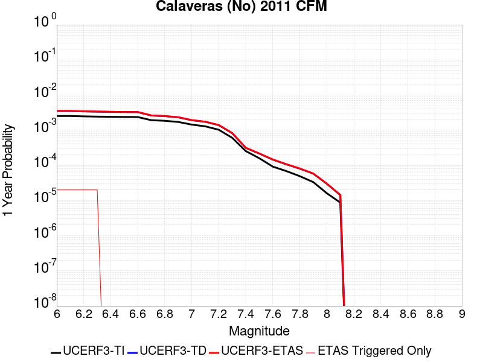 |  |

| Magnitude | 1 wk TI Prob | 1 wk TD Prob | 1 wk ETAS Prob | 1 wk ETAS/TD Gain | 1 wk ETAS Triggered Only | 1 mo TI Prob | 1 mo TD Prob | 1 mo ETAS Prob | 1 mo ETAS/TD Gain | 1 mo ETAS Triggered Only | 1 yr TI Prob | 1 yr TD Prob | 1 yr ETAS Prob | 1 yr ETAS/TD Gain | 1 yr ETAS Triggered Only | 10 yr TI Prob | 10 yr TD Prob | 10 yr ETAS Prob | 10 yr ETAS/TD Gain | 10 yr ETAS Triggered Only |
|-----|-----|-----|-----|-----|-----|-----|-----|-----|-----|-----|-----|-----|-----|-----|-----|-----|-----|-----|-----|-----|
| 6.0 | 4.8694856E-5 | 6.747121E-5 | 6.747121E-5 | 1.0 | 0.0 | 2.0867554E-4 | 2.8913133E-4 | 2.8913133E-4 | 1.0 | 0.0 | 0.0025376645 | 0.003514627 | 0.003567379 | 1.0150093 | 5.2938063E-5 | 0.02508881 | 0.034771245 | 0.03482234 | 1.0014695 | 5.2938063E-5 |
| 6.1 | 4.8694856E-5 | 6.747121E-5 | 6.747121E-5 | 1.0 | 0.0 | 2.0867554E-4 | 2.8913133E-4 | 2.8913133E-4 | 1.0 | 0.0 | 0.0025376645 | 0.003514627 | 0.003567379 | 1.0150093 | 5.2938063E-5 | 0.02508881 | 0.034771245 | 0.03482234 | 1.0014695 | 5.2938063E-5 |
| 6.2 | 4.7541962E-5 | 6.580218E-5 | 6.580218E-5 | 1.0 | 0.0 | 2.0373536E-4 | 2.8197994E-4 | 2.8197994E-4 | 1.0 | 0.0 | 0.0024776561 | 0.003427859 | 0.0034806156 | 1.0153905 | 5.2938063E-5 | 0.024502134 | 0.033932675 | 0.033983815 | 1.0015072 | 5.2938063E-5 |
| 6.3 | 4.6717287E-5 | 6.4635555E-5 | 6.4635555E-5 | 1.0 | 0.0 | 2.0020158E-4 | 2.7698115E-4 | 2.7698115E-4 | 1.0 | 0.0 | 0.0024347296 | 0.0033672103 | 0.0034199702 | 1.0156687 | 5.2938063E-5 | 0.024082264 | 0.033345193 | 0.033396363 | 1.0015346 | 5.2938063E-5 |
| 6.4 | 4.6276386E-5 | 6.399742E-5 | 6.399742E-5 | 1.0 | 0.0 | 1.983123E-4 | 2.7424688E-4 | 2.7424688E-4 | 1.0 | 0.0 | 0.0024117786 | 0.0033340224 | 0.0033340224 | 1.0 | 0.0 | 0.02385771 | 0.033024073 | 0.033024073 | 1.0 | 0.0 |
| 6.5 | 4.5720994E-5 | 6.319881E-5 | 6.319881E-5 | 1.0 | 0.0 | 1.9593239E-4 | 2.70825E-4 | 2.70825E-4 | 1.0 | 0.0 | 0.002382867 | 0.0032924965 | 0.0032924965 | 1.0 | 0.0 | 0.023574775 | 0.032622032 | 0.032622032 | 1.0 | 0.0 |
| 6.6 | 4.549134E-5 | 6.28519E-5 | 6.28519E-5 | 1.0 | 0.0 | 1.949483E-4 | 2.6933852E-4 | 2.6933852E-4 | 1.0 | 0.0 | 0.0023709119 | 0.0032744533 | 0.0032744533 | 1.0 | 0.0 | 0.023457756 | 0.032447387 | 0.032447387 | 1.0 | 0.0 |
| 6.7 | 3.701047E-5 | 5.0359427E-5 | 5.0359427E-5 | 1.0 | 0.0 | 1.5860666E-4 | 2.1580851E-4 | 2.1580851E-4 | 1.0 | 0.0 | 0.0019293258 | 0.002624346 | 0.002624346 | 1.0 | 0.0 | 0.019126613 | 0.026125323 | 0.026125323 | 1.0 | 0.0 |
| 6.8 | 3.5523568E-5 | 4.8341022E-5 | 4.8341022E-5 | 1.0 | 0.0 | 1.5223498E-4 | 2.071596E-4 | 2.071596E-4 | 1.0 | 0.0 | 0.0018518851 | 0.0025192937 | 0.0025192937 | 1.0 | 0.0 | 0.018365284 | 0.025097553 | 0.025097553 | 1.0 | 0.0 |
| 6.9 | 3.2946147E-5 | 4.466269E-5 | 4.466269E-5 | 1.0 | 0.0 | 1.4119013E-4 | 1.9139773E-4 | 1.9139773E-4 | 1.0 | 0.0 | 0.0017176344 | 0.0023278191 | 0.0023278191 | 1.0 | 0.0 | 0.017044188 | 0.023219598 | 0.023219598 | 1.0 | 0.0 |
| 7.0 | 2.7682381E-5 | 3.702223E-5 | 3.702223E-5 | 1.0 | 0.0 | 1.1863338E-4 | 1.5865723E-4 | 1.5865723E-4 | 1.0 | 0.0 | 0.0014434044 | 0.0019299705 | 0.0019299705 | 1.0 | 0.0 | 0.01434065 | 0.01931092 | 0.01931092 | 1.0 | 0.0 |
| 7.1 | 2.471967E-5 | 3.328669E-5 | 3.328669E-5 | 1.0 | 0.0 | 1.05937135E-4 | 1.4264962E-4 | 1.4264962E-4 | 1.0 | 0.0 | 0.0012890215 | 0.0017354045 | 0.0017354045 | 1.0 | 0.0 | 0.0128157 | 0.017385952 | 0.017385952 | 1.0 | 0.0 |
| 7.2 | 1.9748062E-5 | 2.6774684E-5 | 2.6774684E-5 | 1.0 | 0.0 | 8.463181E-5 | 1.1474373E-4 | 1.1474373E-4 | 1.0 | 0.0 | 0.0010299052 | 0.0013961331 | 0.0013961331 | 1.0 | 0.0 | 0.01025145 | 0.014030739 | 0.014030739 | 1.0 | 0.0 |
| 7.3 | 1.1603734E-5 | 1.5783844E-5 | 1.5783844E-5 | 1.0 | 0.0 | 4.9729337E-5 | 6.764337E-5 | 6.764337E-5 | 1.0 | 0.0 | 6.052865E-4 | 8.232611E-4 | 8.232611E-4 | 1.0 | 0.0 | 0.0060364045 | 0.008308666 | 0.008308666 | 1.0 | 0.0 |
| 7.4 | 4.885381E-6 | 6.0349853E-6 | 6.0349853E-6 | 1.0 | 0.0 | 2.0937177E-5 | 2.5863968E-5 | 2.5863968E-5 | 1.0 | 0.0 | 2.5488032E-4 | 3.148485E-4 | 3.148485E-4 | 1.0 | 0.0 | 0.0025458818 | 0.0032010598 | 0.0032010598 | 1.0 | 0.0 |
| 7.5 | 3.0571264E-6 | 4.155299E-6 | 4.155299E-6 | 1.0 | 0.0 | 1.3101904E-5 | 1.7808303E-5 | 1.7808303E-5 | 1.0 | 0.0 | 1.5950401E-4 | 2.1679462E-4 | 2.1679462E-4 | 1.0 | 0.0 | 0.0015938957 | 0.002221121 | 0.002221121 | 1.0 | 0.0 |
| 7.6 | 1.764948E-6 | 2.7955498E-6 | 2.7955498E-6 | 1.0 | 0.0 | 7.564041E-6 | 1.1980874E-5 | 1.1980874E-5 | 1.0 | 0.0 | 9.208831E-5 | 1.4585744E-4 | 1.4585744E-4 | 1.0 | 0.0 | 9.205016E-4 | 0.0015123509 | 0.0015123509 | 1.0 | 0.0 |
| 7.7 | 1.3173734E-6 | 2.058471E-6 | 2.058471E-6 | 1.0 | 0.0 | 5.645874E-6 | 8.8219895E-6 | 8.8219895E-6 | 1.0 | 0.0 | 6.873634E-5 | 1.0740245E-4 | 1.0740245E-4 | 1.0 | 0.0 | 6.8715087E-4 | 0.0011261401 | 0.0011261401 | 1.0 | 0.0 |
| 7.8 | 9.4429885E-7 | 1.5489635E-6 | 1.5489635E-6 | 1.0 | 0.0 | 4.0469886E-6 | 6.638398E-6 | 6.638398E-6 | 1.0 | 0.0 | 4.9270973E-5 | 8.081952E-5 | 8.081952E-5 | 1.0 | 0.0 | 4.926005E-4 | 8.5014524E-4 | 8.5014524E-4 | 1.0 | 0.0 |
| 7.9 | 6.388233E-7 | 1.1148749E-6 | 1.1148749E-6 | 1.0 | 0.0 | 2.7378112E-6 | 4.7780263E-6 | 4.7780263E-6 | 1.0 | 0.0 | 3.3332344E-5 | 5.817093E-5 | 5.817093E-5 | 1.0 | 0.0 | 3.3327343E-4 | 6.0963054E-4 | 6.0963054E-4 | 1.0 | 0.0 |
| 8.0 | 3.087986E-7 | 5.7543696E-7 | 5.7543696E-7 | 1.0 | 0.0 | 1.323422E-6 | 2.466156E-6 | 2.466156E-6 | 1.0 | 0.0 | 1.6112543E-5 | 3.002504E-5 | 3.002504E-5 | 1.0 | 0.0 | 1.6111376E-4 | 3.110302E-4 | 3.110302E-4 | 1.0 | 0.0 |
| 8.1 | 1.6725647E-7 | 2.7410047E-7 | 2.7410047E-7 | 1.0 | 0.0 | 7.168133E-7 | 1.1747159E-6 | 1.1747159E-6 | 1.0 | 0.0 | 8.7271665E-6 | 1.4302073E-5 | 1.4302073E-5 | 1.0 | 0.0 | 8.726824E-5 | 1.48486E-4 | 1.48486E-4 | 1.0 | 0.0 |

## Northridge
*[(top)](#table-of-contents)*

| 1 Week | 1 Month | 1 Year | 10 Year |
|-----|-----|-----|-----|
|  |  |  |  |

| Magnitude | 1 wk TI Prob | 1 wk TD Prob | 1 wk ETAS Prob | 1 wk ETAS/TD Gain | 1 wk ETAS Triggered Only | 1 mo TI Prob | 1 mo TD Prob | 1 mo ETAS Prob | 1 mo ETAS/TD Gain | 1 mo ETAS Triggered Only | 1 yr TI Prob | 1 yr TD Prob | 1 yr ETAS Prob | 1 yr ETAS/TD Gain | 1 yr ETAS Triggered Only | 10 yr TI Prob | 10 yr TD Prob | 10 yr ETAS Prob | 10 yr ETAS/TD Gain | 10 yr ETAS Triggered Only |
|-----|-----|-----|-----|-----|-----|-----|-----|-----|-----|-----|-----|-----|-----|-----|-----|-----|-----|-----|-----|-----|
| 6.0 | 1.8340852E-5 | 7.5880193E-6 | 7.5880193E-6 | 1.0 | 0.0 | 7.860128E-5 | 3.251969E-5 | 8.5456035E-5 | 2.6278243 | 5.2938063E-5 | 9.565505E-4 | 3.958575E-4 | 4.487746E-4 | 1.1336771 | 5.2938063E-5 | 0.009524435 | 0.003951746 | 0.0040044747 | 1.0133432 | 5.2938063E-5 |
| 6.1 | 1.8340852E-5 | 7.5880193E-6 | 7.5880193E-6 | 1.0 | 0.0 | 7.860128E-5 | 3.251969E-5 | 8.5456035E-5 | 2.6278243 | 5.2938063E-5 | 9.565505E-4 | 3.958575E-4 | 4.487746E-4 | 1.1336771 | 5.2938063E-5 | 0.009524435 | 0.003951746 | 0.0040044747 | 1.0133432 | 5.2938063E-5 |
| 6.2 | 1.8340852E-5 | 7.5880193E-6 | 7.5880193E-6 | 1.0 | 0.0 | 7.860128E-5 | 3.251969E-5 | 8.5456035E-5 | 2.6278243 | 5.2938063E-5 | 9.565505E-4 | 3.958575E-4 | 4.487746E-4 | 1.1336771 | 5.2938063E-5 | 0.009524435 | 0.003951746 | 0.0040044747 | 1.0133432 | 5.2938063E-5 |
| 6.3 | 1.8340852E-5 | 7.5880193E-6 | 7.5880193E-6 | 1.0 | 0.0 | 7.860128E-5 | 3.251969E-5 | 8.5456035E-5 | 2.6278243 | 5.2938063E-5 | 9.565505E-4 | 3.958575E-4 | 4.487746E-4 | 1.1336771 | 5.2938063E-5 | 0.009524435 | 0.003951746 | 0.0040044747 | 1.0133432 | 5.2938063E-5 |
| 6.4 | 1.7361892E-5 | 7.5880193E-6 | 7.5880193E-6 | 1.0 | 0.0 | 7.440598E-5 | 3.251969E-5 | 8.5456035E-5 | 2.6278243 | 5.2938063E-5 | 9.055163E-4 | 3.958575E-4 | 4.487746E-4 | 1.1336771 | 5.2938063E-5 | 0.009018354 | 0.003951746 | 0.0040044747 | 1.0133432 | 5.2938063E-5 |
| 6.5 | 1.7361892E-5 | 7.5880193E-6 | 7.5880193E-6 | 1.0 | 0.0 | 7.440598E-5 | 3.251969E-5 | 8.5456035E-5 | 2.6278243 | 5.2938063E-5 | 9.055163E-4 | 3.958575E-4 | 4.487746E-4 | 1.1336771 | 5.2938063E-5 | 0.009018354 | 0.003951746 | 0.0040044747 | 1.0133432 | 5.2938063E-5 |
| 6.6 | 1.5458201E-5 | 7.5880193E-6 | 7.5880193E-6 | 1.0 | 0.0 | 6.624775E-5 | 3.251969E-5 | 8.5456035E-5 | 2.6278243 | 5.2938063E-5 | 8.0626784E-4 | 3.958575E-4 | 4.487746E-4 | 1.1336771 | 5.2938063E-5 | 0.008033488 | 0.003951746 | 0.0040044747 | 1.0133432 | 5.2938063E-5 |
| 6.7 | 1.2538368E-5 | 6.381603E-6 | 6.381603E-6 | 1.0 | 0.0 | 5.3734755E-5 | 2.7349442E-5 | 8.028606E-5 | 2.9355648 | 5.2938063E-5 | 6.5402425E-4 | 3.3292902E-4 | 3.8584947E-4 | 1.1589541 | 5.2938063E-5 | 0.0065210275 | 0.0033243506 | 0.0033771126 | 1.0158714 | 5.2938063E-5 |
| 6.8 | 1.1438097E-5 | 6.3502566E-6 | 6.3502566E-6 | 1.0 | 0.0 | 4.9019498E-5 | 2.7215105E-5 | 8.015172E-5 | 2.9451191 | 5.2938063E-5 | 5.9664896E-4 | 3.3129397E-4 | 3.8421448E-4 | 1.1597389 | 5.2938063E-5 | 0.005950495 | 0.0033080487 | 0.0033608116 | 1.0159498 | 5.2938063E-5 |
| 6.9 | 1.1204891E-5 | 6.2867084E-6 | 6.2867084E-6 | 1.0 | 0.0 | 4.8020076E-5 | 2.694276E-5 | 7.98794E-5 | 2.9647815 | 5.2938063E-5 | 5.8448757E-4 | 3.2797916E-4 | 3.8089987E-4 | 1.1613538 | 5.2938063E-5 | 0.0058295266 | 0.0032749989 | 0.0033277636 | 1.0161114 | 5.2938063E-5 |
| 7.0 | 1.061046E-5 | 6.115359E-6 | 6.115359E-6 | 1.0 | 0.0 | 4.5472607E-5 | 2.6208421E-5 | 7.9145095E-5 | 3.0198345 | 5.2938063E-5 | 5.534883E-4 | 3.1904122E-4 | 3.719624E-4 | 1.1658757 | 5.2938063E-5 | 0.0055211177 | 0.0031858785 | 0.003238648 | 1.0165635 | 5.2938063E-5 |
| 7.1 | 1.0266979E-5 | 6.004274E-6 | 6.004274E-6 | 1.0 | 0.0 | 4.40006E-5 | 2.5732352E-5 | 7.866905E-5 | 3.0572042 | 5.2938063E-5 | 5.355756E-4 | 3.1324677E-4 | 3.6616824E-4 | 1.1689451 | 5.2938063E-5 | 0.0053428668 | 0.003128098 | 0.0031808708 | 1.0168705 | 5.2938063E-5 |
| 7.2 | 9.91273E-6 | 5.819984E-6 | 5.819984E-6 | 1.0 | 0.0 | 4.248244E-5 | 2.4942554E-5 | 2.4942554E-5 | 1.0 | 0.0 | 5.171009E-4 | 3.036337E-4 | 3.036337E-4 | 1.0 | 0.0 | 0.0051589934 | 0.0030322333 | 0.0030322333 | 1.0 | 0.0 |
| 7.3 | 8.4959265E-6 | 5.193062E-6 | 5.193062E-6 | 1.0 | 0.0 | 3.6410605E-5 | 2.225579E-5 | 2.225579E-5 | 1.0 | 0.0 | 4.4320893E-4 | 2.709308E-4 | 2.709308E-4 | 1.0 | 0.0 | 0.00442326 | 0.0027060313 | 0.0027060313 | 1.0 | 0.0 |
| 7.4 | 8.0847185E-6 | 4.9819355E-6 | 4.9819355E-6 | 1.0 | 0.0 | 3.4648332E-5 | 2.135098E-5 | 2.135098E-5 | 1.0 | 0.0 | 4.2176177E-4 | 2.599174E-4 | 2.599174E-4 | 1.0 | 0.0 | 0.0042096223 | 0.00259616 | 0.00259616 | 1.0 | 0.0 |
| 7.5 | 6.8220684E-6 | 4.2533075E-6 | 4.2533075E-6 | 1.0 | 0.0 | 2.9237108E-5 | 1.8228335E-5 | 1.8228335E-5 | 1.0 | 0.0 | 3.5590364E-4 | 2.2190758E-4 | 2.2190758E-4 | 1.0 | 0.0 | 0.0035533418 | 0.002216881 | 0.002216881 | 1.0 | 0.0 |
| 7.6 | 4.4224143E-6 | 2.8999582E-6 | 2.8999582E-6 | 1.0 | 0.0 | 1.8953066E-5 | 1.2428334E-5 | 1.2428334E-5 | 1.0 | 0.0 | 2.3072914E-4 | 1.5130457E-4 | 1.5130457E-4 | 1.0 | 0.0 | 0.0023048974 | 0.0015120271 | 0.0015120271 | 1.0 | 0.0 |
| 7.7 | 2.5297056E-6 | 1.6045905E-6 | 1.6045905E-6 | 1.0 | 0.0 | 1.0841551E-5 | 6.8767986E-6 | 6.8767986E-6 | 1.0 | 0.0 | 1.319879E-4 | 8.3721854E-5 | 8.3721854E-5 | 1.0 | 0.0 | 0.0013190953 | 8.369078E-4 | 8.369078E-4 | 1.0 | 0.0 |
| 7.8 | 1.2508156E-6 | 8.780076E-7 | 8.780076E-7 | 1.0 | 0.0 | 5.3606273E-6 | 3.7628845E-6 | 3.7628845E-6 | 1.0 | 0.0 | 6.526368E-5 | 4.581217E-5 | 4.581217E-5 | 1.0 | 0.0 | 6.524452E-4 | 4.5802852E-4 | 4.5802852E-4 | 1.0 | 0.0 |
| 7.9 | 2.262199E-7 | 1.4664671E-7 | 1.4664671E-7 | 1.0 | 0.0 | 9.695135E-7 | 6.284858E-7 | 6.284858E-7 | 1.0 | 0.0 | 1.1803763E-5 | 7.651788E-6 | 7.651788E-6 | 1.0 | 0.0 | 1.1803136E-4 | 7.651533E-5 | 7.651533E-5 | 1.0 | 0.0 |
| 8.0 | 2.865362E-9 | 1.2753101E-9 | 1.2753101E-9 | 1.0 | 0.0 | 1.2280123E-8 | 5.4656146E-9 | 5.4656146E-9 | 1.0 | 0.0 | 1.4951048E-7 | 6.654386E-8 | 6.654386E-8 | 1.0 | 0.0 | 1.4951038E-6 | 6.654386E-7 | 6.654386E-7 | 1.0 | 0.0 |

## Anacapa-Dume alt 1
*[(top)](#table-of-contents)*

| 1 Week | 1 Month | 1 Year | 10 Year |
|-----|-----|-----|-----|
|  |  |  | 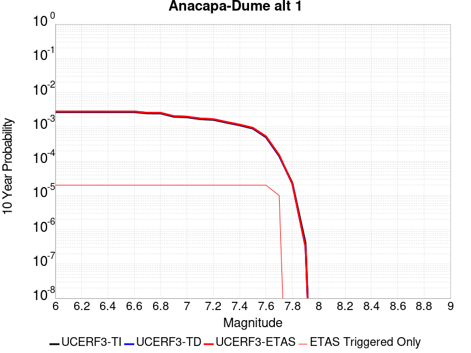 |

| Magnitude | 1 wk TI Prob | 1 wk TD Prob | 1 wk ETAS Prob | 1 wk ETAS/TD Gain | 1 wk ETAS Triggered Only | 1 mo TI Prob | 1 mo TD Prob | 1 mo ETAS Prob | 1 mo ETAS/TD Gain | 1 mo ETAS Triggered Only | 1 yr TI Prob | 1 yr TD Prob | 1 yr ETAS Prob | 1 yr ETAS/TD Gain | 1 yr ETAS Triggered Only | 10 yr TI Prob | 10 yr TD Prob | 10 yr ETAS Prob | 10 yr ETAS/TD Gain | 10 yr ETAS Triggered Only |
|-----|-----|-----|-----|-----|-----|-----|-----|-----|-----|-----|-----|-----|-----|-----|-----|-----|-----|-----|-----|-----|
| 6.0 | 5.1871802E-6 | 5.3673907E-6 | 5.830517E-5 | 10.862851 | 5.2938063E-5 | 2.2230583E-5 | 2.3002905E-5 | 7.593975E-5 | 3.3013113 | 5.2938063E-5 | 2.7062374E-4 | 2.8002524E-4 | 3.3294846E-4 | 1.1889945 | 5.2938063E-5 | 0.002702944 | 0.0027968092 | 0.002849599 | 1.0188751 | 5.2938063E-5 |
| 6.1 | 5.1871802E-6 | 5.3673907E-6 | 5.830517E-5 | 10.862851 | 5.2938063E-5 | 2.2230583E-5 | 2.3002905E-5 | 7.593975E-5 | 3.3013113 | 5.2938063E-5 | 2.7062374E-4 | 2.8002524E-4 | 3.3294846E-4 | 1.1889945 | 5.2938063E-5 | 0.002702944 | 0.0027968092 | 0.002849599 | 1.0188751 | 5.2938063E-5 |
| 6.2 | 5.1871802E-6 | 5.3673907E-6 | 5.830517E-5 | 10.862851 | 5.2938063E-5 | 2.2230583E-5 | 2.3002905E-5 | 7.593975E-5 | 3.3013113 | 5.2938063E-5 | 2.7062374E-4 | 2.8002524E-4 | 3.3294846E-4 | 1.1889945 | 5.2938063E-5 | 0.002702944 | 0.0027968092 | 0.002849599 | 1.0188751 | 5.2938063E-5 |
| 6.3 | 5.1871802E-6 | 5.3673907E-6 | 5.830517E-5 | 10.862851 | 5.2938063E-5 | 2.2230583E-5 | 2.3002905E-5 | 7.593975E-5 | 3.3013113 | 5.2938063E-5 | 2.7062374E-4 | 2.8002524E-4 | 3.3294846E-4 | 1.1889945 | 5.2938063E-5 | 0.002702944 | 0.0027968092 | 0.002849599 | 1.0188751 | 5.2938063E-5 |
| 6.4 | 5.1871802E-6 | 5.3673907E-6 | 5.830517E-5 | 10.862851 | 5.2938063E-5 | 2.2230583E-5 | 2.3002905E-5 | 7.593975E-5 | 3.3013113 | 5.2938063E-5 | 2.7062374E-4 | 2.8002524E-4 | 3.3294846E-4 | 1.1889945 | 5.2938063E-5 | 0.002702944 | 0.0027968092 | 0.002849599 | 1.0188751 | 5.2938063E-5 |
| 6.5 | 5.1871802E-6 | 5.3673907E-6 | 5.830517E-5 | 10.862851 | 5.2938063E-5 | 2.2230583E-5 | 2.3002905E-5 | 7.593975E-5 | 3.3013113 | 5.2938063E-5 | 2.7062374E-4 | 2.8002524E-4 | 3.3294846E-4 | 1.1889945 | 5.2938063E-5 | 0.002702944 | 0.0027968092 | 0.002849599 | 1.0188751 | 5.2938063E-5 |
| 6.6 | 5.1871802E-6 | 5.3673907E-6 | 5.830517E-5 | 10.862851 | 5.2938063E-5 | 2.2230583E-5 | 2.3002905E-5 | 7.593975E-5 | 3.3013113 | 5.2938063E-5 | 2.7062374E-4 | 2.8002524E-4 | 3.3294846E-4 | 1.1889945 | 5.2938063E-5 | 0.002702944 | 0.0027968092 | 0.002849599 | 1.0188751 | 5.2938063E-5 |
| 6.7 | 4.7693475E-6 | 4.9366918E-6 | 5.787449E-5 | 11.723335 | 5.2938063E-5 | 2.04399E-5 | 2.1157082E-5 | 7.409402E-5 | 3.502091 | 5.2938063E-5 | 2.4882736E-4 | 2.5755778E-4 | 3.1048222E-4 | 1.2054857 | 5.2938063E-5 | 0.0024854892 | 0.002572669 | 0.0026254707 | 1.0205241 | 5.2938063E-5 |
| 6.8 | 4.753408E-6 | 4.92024E-6 | 5.785804E-5 | 11.7591915 | 5.2938063E-5 | 2.037159E-5 | 2.1086576E-5 | 7.402352E-5 | 3.510457 | 5.2938063E-5 | 2.4799586E-4 | 2.5669957E-4 | 3.0962404E-4 | 1.2061728 | 5.2938063E-5 | 0.002477193 | 0.0025641066 | 0.0026169089 | 1.0205929 | 5.2938063E-5 |
| 6.9 | 3.800069E-6 | 3.937126E-6 | 5.687498E-5 | 14.445811 | 5.2938063E-5 | 1.6285909E-5 | 1.687329E-5 | 6.9810456E-5 | 4.1373353 | 5.2938063E-5 | 1.9826289E-4 | 2.0541316E-4 | 2.5834035E-4 | 1.257662 | 5.2938063E-5 | 0.001980861 | 0.0020522568 | 0.002105086 | 1.025742 | 5.2938063E-5 |
| 7.0 | 3.6671938E-6 | 3.7999182E-6 | 5.673778E-5 | 14.931315 | 5.2938063E-5 | 1.571645E-5 | 1.6285263E-5 | 6.9222464E-5 | 4.25062 | 5.2938063E-5 | 1.9133097E-4 | 1.9825528E-4 | 2.5118285E-4 | 1.2669667 | 5.2938063E-5 | 0.0019116632 | 0.0019808074 | 0.0020336406 | 1.0266726 | 5.2938063E-5 |
| 7.1 | 3.2394885E-6 | 3.3587933E-6 | 5.6296678E-5 | 16.760984 | 5.2938063E-5 | 1.3883448E-5 | 1.4394749E-5 | 6.733205E-5 | 4.677542 | 5.2938063E-5 | 1.6901788E-4 | 1.7524208E-4 | 2.2817087E-4 | 1.3020324 | 5.2938063E-5 | 0.0016888938 | 0.0017510501 | 0.0018038955 | 1.0301793 | 5.2938063E-5 |
| 7.2 | 3.0935948E-6 | 3.2079258E-6 | 5.614582E-5 | 17.502218 | 5.2938063E-5 | 1.3258196E-5 | 1.3748182E-5 | 6.668552E-5 | 4.8504972 | 5.2938063E-5 | 1.6140658E-4 | 1.6737137E-4 | 2.2030057E-4 | 1.316238 | 5.2938063E-5 | 0.001612894 | 0.0016724641 | 0.0017253136 | 1.0315998 | 5.2938063E-5 |
| 7.3 | 2.5604163E-6 | 2.647073E-6 | 5.5584995E-5 | 20.998663 | 5.2938063E-5 | 1.0973167E-5 | 1.1344549E-5 | 6.428201E-5 | 5.6663346 | 5.2938063E-5 | 1.3359012E-4 | 1.3811118E-4 | 1.9104192E-4 | 1.3832474 | 5.2938063E-5 | 0.0013350984 | 0.0013802581 | 0.001433123 | 1.0383008 | 5.2938063E-5 |
| 7.4 | 2.1429005E-6 | 2.2106028E-6 | 5.5148546E-5 | 24.94729 | 5.2938063E-5 | 9.1838265E-6 | 9.473977E-6 | 6.2411535E-5 | 6.587681 | 5.2938063E-5 | 1.11807356E-4 | 1.1533959E-4 | 1.6827155E-4 | 1.4589227 | 5.2938063E-5 | 0.0011175112 | 0.0011527999 | 0.001205677 | 1.0458684 | 5.2938063E-5 |
| 7.5 | 1.7237151E-6 | 1.7761449E-6 | 5.4714114E-5 | 30.804981 | 5.2938063E-5 | 7.3873293E-6 | 7.6120277E-6 | 6.0549686E-5 | 7.9544754 | 5.2938063E-5 | 8.993702E-5 | 9.267252E-5 | 1.4560568E-4 | 1.571185 | 5.2938063E-5 | 8.990063E-4 | 9.2634105E-4 | 9.7923E-4 | 1.0570946 | 5.2938063E-5 |
| 7.6 | 9.541696E-7 | 9.823206E-7 | 5.3920332E-5 | 54.89077 | 5.2938063E-5 | 4.089292E-6 | 4.2099387E-6 | 5.714778E-5 | 13.574492 | 5.2938063E-5 | 4.9785995E-5 | 5.1254807E-5 | 1.04190156E-4 | 2.032788 | 5.2938063E-5 | 4.9774844E-4 | 5.1243114E-4 | 5.653421E-4 | 1.1032547 | 5.2938063E-5 |
| 7.7 | 2.7226676E-7 | 2.7172416E-7 | 2.7172416E-7 | 1.0 | 0.0 | 1.166857E-6 | 1.1645316E-6 | 1.1645316E-6 | 1.0 | 0.0 | 1.4206392E-5 | 1.4178081E-5 | 1.4178081E-5 | 1.0 | 0.0 | 1.4205484E-4 | 1.4177183E-4 | 1.4177183E-4 | 1.0 | 0.0 |
| 7.8 | 4.5017995E-8 | 4.2157676E-8 | 4.2157676E-8 | 1.0 | 0.0 | 1.9293425E-7 | 1.8067574E-7 | 1.8067574E-7 | 1.0 | 0.0 | 2.348972E-6 | 2.1997253E-6 | 2.1997253E-6 | 1.0 | 0.0 | 2.348947E-5 | 2.1997055E-5 | 2.1997055E-5 | 1.0 | 0.0 |
| 7.9 | 8.007447E-10 | 6.1608785E-10 | 6.1608785E-10 | 1.0 | 0.0 | 3.4317629E-9 | 2.6403764E-9 | 2.6403764E-9 | 1.0 | 0.0 | 4.1781714E-8 | 3.2146584E-8 | 3.2146584E-8 | 1.0 | 0.0 | 4.1781706E-7 | 3.214658E-7 | 3.214658E-7 | 1.0 | 0.0 |

## Sheephole
*[(top)](#table-of-contents)*

| 1 Week | 1 Month | 1 Year | 10 Year |
|-----|-----|-----|-----|
| 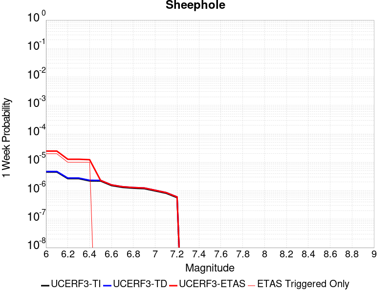 |  |  |  |

| Magnitude | 1 wk TI Prob | 1 wk TD Prob | 1 wk ETAS Prob | 1 wk ETAS/TD Gain | 1 wk ETAS Triggered Only | 1 mo TI Prob | 1 mo TD Prob | 1 mo ETAS Prob | 1 mo ETAS/TD Gain | 1 mo ETAS Triggered Only | 1 yr TI Prob | 1 yr TD Prob | 1 yr ETAS Prob | 1 yr ETAS/TD Gain | 1 yr ETAS Triggered Only | 10 yr TI Prob | 10 yr TD Prob | 10 yr ETAS Prob | 10 yr ETAS/TD Gain | 10 yr ETAS Triggered Only |
|-----|-----|-----|-----|-----|-----|-----|-----|-----|-----|-----|-----|-----|-----|-----|-----|-----|-----|-----|-----|-----|
| 6.0 | 4.5579695E-6 | 4.7412627E-6 | 4.7412627E-6 | 1.0 | 0.0 | 1.9534009E-5 | 2.031957E-5 | 2.031957E-5 | 1.0 | 0.0 | 2.3780059E-4 | 2.473682E-4 | 3.0029318E-4 | 1.2139522 | 5.2938063E-5 | 0.0023754628 | 0.002471473 | 0.0025242805 | 1.0213667 | 5.2938063E-5 |
| 6.1 | 4.5579695E-6 | 4.7412627E-6 | 4.7412627E-6 | 1.0 | 0.0 | 1.9534009E-5 | 2.031957E-5 | 2.031957E-5 | 1.0 | 0.0 | 2.3780059E-4 | 2.473682E-4 | 3.0029318E-4 | 1.2139522 | 5.2938063E-5 | 0.0023754628 | 0.002471473 | 0.0025242805 | 1.0213667 | 5.2938063E-5 |
| 6.2 | 2.6677674E-6 | 2.7873941E-6 | 2.7873941E-6 | 1.0 | 0.0 | 1.1433239E-5 | 1.1945926E-5 | 1.1945926E-5 | 1.0 | 0.0 | 1.3919079E-4 | 1.4543302E-4 | 1.9836338E-4 | 1.3639501 | 5.2938063E-5 | 0.0013910364 | 0.0014534844 | 0.0015063455 | 1.0363685 | 5.2938063E-5 |
| 6.3 | 2.6677674E-6 | 2.7873941E-6 | 2.7873941E-6 | 1.0 | 0.0 | 1.1433239E-5 | 1.1945926E-5 | 1.1945926E-5 | 1.0 | 0.0 | 1.3919079E-4 | 1.4543302E-4 | 1.9836338E-4 | 1.3639501 | 5.2938063E-5 | 0.0013910364 | 0.0014534844 | 0.0015063455 | 1.0363685 | 5.2938063E-5 |
| 6.4 | 2.2159759E-6 | 2.3228788E-6 | 2.3228788E-6 | 1.0 | 0.0 | 9.497005E-6 | 9.955161E-6 | 9.955161E-6 | 1.0 | 0.0 | 1.156199E-4 | 1.2119815E-4 | 1.741298E-4 | 1.4367365 | 5.2938063E-5 | 0.0011555976 | 0.0012113999 | 0.0012642739 | 1.0436469 | 5.2938063E-5 |
| 6.5 | 2.1986082E-6 | 2.304759E-6 | 2.304759E-6 | 1.0 | 0.0 | 9.4225725E-6 | 9.877506E-6 | 9.877506E-6 | 1.0 | 0.0 | 1.1471378E-4 | 1.2025281E-4 | 1.731845E-4 | 1.4401702 | 5.2938063E-5 | 0.0011465458 | 0.0012019566 | 0.0012548311 | 1.0439903 | 5.2938063E-5 |
| 6.6 | 1.5232331E-6 | 1.6018919E-6 | 1.6018919E-6 | 1.0 | 0.0 | 6.5281256E-6 | 6.865234E-6 | 6.865234E-6 | 1.0 | 0.0 | 7.947703E-5 | 8.35812E-5 | 8.35812E-5 | 1.0 | 0.0 | 7.9448614E-4 | 8.3551643E-4 | 8.3551643E-4 | 1.0 | 0.0 |
| 6.7 | 1.3137362E-6 | 1.382819E-6 | 1.382819E-6 | 1.0 | 0.0 | 5.6302856E-6 | 5.926355E-6 | 5.926355E-6 | 1.0 | 0.0 | 6.854657E-5 | 7.215112E-5 | 7.215112E-5 | 1.0 | 0.0 | 6.8525434E-4 | 7.212908E-4 | 7.212908E-4 | 1.0 | 0.0 |
| 6.8 | 1.2275751E-6 | 1.2922847E-6 | 1.2922847E-6 | 1.0 | 0.0 | 5.2610258E-6 | 5.5383516E-6 | 5.5383516E-6 | 1.0 | 0.0 | 6.4051106E-5 | 6.7427485E-5 | 6.7427485E-5 | 1.0 | 0.0 | 6.4032647E-4 | 6.740836E-4 | 6.740836E-4 | 1.0 | 0.0 |
| 6.9 | 1.1837088E-6 | 1.246102E-6 | 1.246102E-6 | 1.0 | 0.0 | 5.0730278E-6 | 5.340427E-6 | 5.340427E-6 | 1.0 | 0.0 | 6.176237E-5 | 6.501789E-5 | 6.501789E-5 | 1.0 | 0.0 | 6.17452E-4 | 6.5000186E-4 | 6.5000186E-4 | 1.0 | 0.0 |
| 7.0 | 9.849371E-7 | 1.0366288E-6 | 1.0366288E-6 | 1.0 | 0.0 | 4.2211523E-6 | 4.442688E-6 | 4.442688E-6 | 1.0 | 0.0 | 5.1391315E-5 | 5.4088487E-5 | 5.4088487E-5 | 1.0 | 0.0 | 5.137943E-4 | 5.407633E-4 | 5.407633E-4 | 1.0 | 0.0 |
| 7.1 | 8.1643645E-7 | 8.591669E-7 | 8.591669E-7 | 1.0 | 0.0 | 3.4990085E-6 | 3.682139E-6 | 3.682139E-6 | 1.0 | 0.0 | 4.2599597E-5 | 4.482921E-5 | 4.482921E-5 | 1.0 | 0.0 | 4.259143E-4 | 4.4821028E-4 | 4.4821028E-4 | 1.0 | 0.0 |
| 7.2 | 5.7295756E-7 | 6.029502E-7 | 6.029502E-7 | 1.0 | 0.0 | 2.45553E-6 | 2.58407E-6 | 2.58407E-6 | 1.0 | 0.0 | 2.9895667E-5 | 3.1460666E-5 | 3.1460666E-5 | 1.0 | 0.0 | 2.9891645E-4 | 3.145688E-4 | 3.145688E-4 | 1.0 | 0.0 |

## Mission Hills 2011
*[(top)](#table-of-contents)*

| 1 Week | 1 Month | 1 Year | 10 Year |
|-----|-----|-----|-----|
| 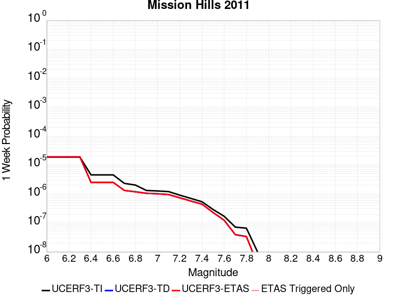 | 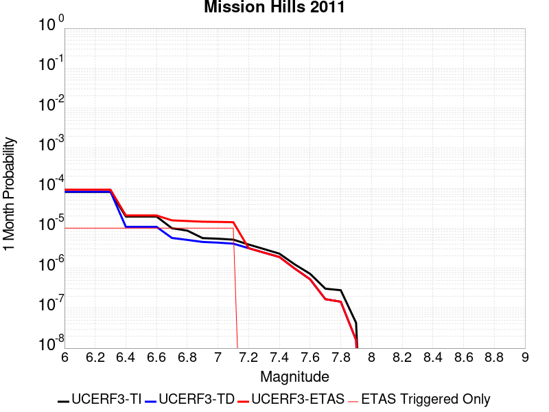 |  |  |

| Magnitude | 1 wk TI Prob | 1 wk TD Prob | 1 wk ETAS Prob | 1 wk ETAS/TD Gain | 1 wk ETAS Triggered Only | 1 mo TI Prob | 1 mo TD Prob | 1 mo ETAS Prob | 1 mo ETAS/TD Gain | 1 mo ETAS Triggered Only | 1 yr TI Prob | 1 yr TD Prob | 1 yr ETAS Prob | 1 yr ETAS/TD Gain | 1 yr ETAS Triggered Only | 10 yr TI Prob | 10 yr TD Prob | 10 yr ETAS Prob | 10 yr ETAS/TD Gain | 10 yr ETAS Triggered Only |
|-----|-----|-----|-----|-----|-----|-----|-----|-----|-----|-----|-----|-----|-----|-----|-----|-----|-----|-----|-----|-----|
| 6.0 | 1.8765717E-5 | 1.9054645E-5 | 1.9054645E-5 | 1.0 | 0.0 | 8.0422025E-5 | 8.166215E-5 | 1.3459589E-4 | 1.6482041 | 5.2938063E-5 | 9.786983E-4 | 9.941267E-4 | 0.001047012 | 1.0531979 | 5.2938063E-5 | 0.009743992 | 0.009930461 | 0.009982873 | 1.005278 | 5.2938063E-5 |
| 6.1 | 1.8765717E-5 | 1.9054645E-5 | 1.9054645E-5 | 1.0 | 0.0 | 8.0422025E-5 | 8.166215E-5 | 1.3459589E-4 | 1.6482041 | 5.2938063E-5 | 9.786983E-4 | 9.941267E-4 | 0.001047012 | 1.0531979 | 5.2938063E-5 | 0.009743992 | 0.009930461 | 0.009982873 | 1.005278 | 5.2938063E-5 |
| 6.2 | 1.8765717E-5 | 1.9054645E-5 | 1.9054645E-5 | 1.0 | 0.0 | 8.0422025E-5 | 8.166215E-5 | 1.3459589E-4 | 1.6482041 | 5.2938063E-5 | 9.786983E-4 | 9.941267E-4 | 0.001047012 | 1.0531979 | 5.2938063E-5 | 0.009743992 | 0.009930461 | 0.009982873 | 1.005278 | 5.2938063E-5 |
| 6.3 | 1.8765717E-5 | 1.9054645E-5 | 1.9054645E-5 | 1.0 | 0.0 | 8.0422025E-5 | 8.166215E-5 | 1.3459589E-4 | 1.6482041 | 5.2938063E-5 | 9.786983E-4 | 9.941267E-4 | 0.001047012 | 1.0531979 | 5.2938063E-5 | 0.009743992 | 0.009930461 | 0.009982873 | 1.005278 | 5.2938063E-5 |
| 6.4 | 4.566357E-6 | 2.5148488E-6 | 2.5148488E-6 | 1.0 | 0.0 | 1.9569954E-5 | 1.0777889E-5 | 6.371538E-5 | 5.9116755 | 5.2938063E-5 | 2.3823815E-4 | 1.3121472E-4 | 1.8414583E-4 | 1.4033931 | 5.2938063E-5 | 0.002379829 | 0.0013115506 | 0.0013644192 | 1.04031 | 5.2938063E-5 |
| 6.5 | 4.566357E-6 | 2.5148488E-6 | 2.5148488E-6 | 1.0 | 0.0 | 1.9569954E-5 | 1.0777889E-5 | 6.371538E-5 | 5.9116755 | 5.2938063E-5 | 2.3823815E-4 | 1.3121472E-4 | 1.8414583E-4 | 1.4033931 | 5.2938063E-5 | 0.002379829 | 0.0013115506 | 0.0013644192 | 1.04031 | 5.2938063E-5 |
| 6.6 | 4.566357E-6 | 2.5148488E-6 | 2.5148488E-6 | 1.0 | 0.0 | 1.9569954E-5 | 1.0777889E-5 | 6.371538E-5 | 5.9116755 | 5.2938063E-5 | 2.3823815E-4 | 1.3121472E-4 | 1.8414583E-4 | 1.4033931 | 5.2938063E-5 | 0.002379829 | 0.0013115506 | 0.0013644192 | 1.04031 | 5.2938063E-5 |
| 6.7 | 2.3266773E-6 | 1.3296187E-6 | 1.3296187E-6 | 1.0 | 0.0 | 9.971435E-6 | 5.698354E-6 | 5.8636117E-5 | 10.2900095 | 5.2938063E-5 | 1.2139547E-4 | 6.937531E-5 | 1.223097E-4 | 1.7630148 | 5.2938063E-5 | 0.0012132917 | 6.9354265E-4 | 7.46444E-4 | 1.076277 | 5.2938063E-5 |
| 6.8 | 2.032735E-6 | 1.1894115E-6 | 1.1894115E-6 | 1.0 | 0.0 | 8.711692E-6 | 5.097468E-6 | 5.803526E-5 | 11.385115 | 5.2938063E-5 | 1.06059684E-4 | 6.205996E-5 | 1.14994735E-4 | 1.8529619 | 5.2938063E-5 | 0.0010600908 | 6.2043115E-4 | 6.733363E-4 | 1.0852717 | 5.2938063E-5 |
| 6.9 | 1.3186259E-6 | 1.0561778E-6 | 1.0561778E-6 | 1.0 | 0.0 | 5.6512413E-6 | 4.5264687E-6 | 5.746429E-5 | 12.69517 | 5.2938063E-5 | 6.8801695E-5 | 5.5108394E-5 | 1.0804354E-4 | 1.9605641 | 5.2938063E-5 | 6.8780396E-4 | 5.5095024E-4 | 6.0385914E-4 | 1.096032 | 5.2938063E-5 |
| 7.0 | 1.2726016E-6 | 1.0159088E-6 | 1.0159088E-6 | 1.0 | 0.0 | 5.4539955E-6 | 4.3538876E-6 | 5.729172E-5 | 13.158751 | 5.2938063E-5 | 6.6400375E-5 | 5.300732E-5 | 1.0594258E-4 | 1.9986405 | 5.2938063E-5 | 6.6380535E-4 | 5.299496E-4 | 5.828596E-4 | 1.0998397 | 5.2938063E-5 |
| 7.1 | 1.2063913E-6 | 9.570072E-7 | 9.570072E-7 | 1.0 | 0.0 | 5.170238E-6 | 4.101453E-6 | 5.70393E-5 | 13.907095 | 5.2938063E-5 | 6.294583E-5 | 4.9934075E-5 | 1.0286949E-4 | 2.060106 | 5.2938063E-5 | 6.2928005E-4 | 4.992311E-4 | 5.5214274E-4 | 1.1059862 | 5.2938063E-5 |
| 7.2 | 9.105806E-7 | 7.3765557E-7 | 7.3765557E-7 | 1.0 | 0.0 | 3.9024826E-6 | 3.1613772E-6 | 3.1613772E-6 | 1.0 | 0.0 | 4.7511687E-5 | 3.8489103E-5 | 3.8489103E-5 | 1.0 | 0.0 | 4.7501532E-4 | 3.8482592E-4 | 3.8482592E-4 | 1.0 | 0.0 |
| 7.3 | 7.020432E-7 | 5.710089E-7 | 5.710089E-7 | 1.0 | 0.0 | 3.0087533E-6 | 2.447179E-6 | 2.447179E-6 | 1.0 | 0.0 | 3.6630954E-5 | 2.979401E-5 | 2.979401E-5 | 1.0 | 0.0 | 3.6624918E-4 | 2.9790145E-4 | 2.9790145E-4 | 1.0 | 0.0 |
| 7.4 | 5.3900635E-7 | 4.4480825E-7 | 4.4480825E-7 | 1.0 | 0.0 | 2.3100251E-6 | 1.9063198E-6 | 1.9063198E-6 | 1.0 | 0.0 | 2.8124194E-5 | 2.3209208E-5 | 2.3209208E-5 | 1.0 | 0.0 | 2.8120633E-4 | 2.3206905E-4 | 2.3206905E-4 | 1.0 | 0.0 |
| 7.5 | 2.907075E-7 | 2.2875415E-7 | 2.2875415E-7 | 1.0 | 0.0 | 1.2458887E-6 | 9.803746E-7 | 9.803746E-7 | 1.0 | 0.0 | 1.5168589E-5 | 1.1935997E-5 | 1.1935997E-5 | 1.0 | 0.0 | 1.5167553E-4 | 1.1935373E-4 | 1.1935373E-4 | 1.0 | 0.0 |
| 7.6 | 1.6903675E-7 | 1.2353402E-7 | 1.2353402E-7 | 1.0 | 0.0 | 7.2444305E-7 | 5.294314E-7 | 5.294314E-7 | 1.0 | 0.0 | 8.820059E-6 | 6.4458095E-6 | 6.4458095E-6 | 1.0 | 0.0 | 8.8197085E-5 | 6.445635E-5 | 6.445635E-5 | 1.0 | 0.0 |
| 7.7 | 7.168073E-8 | 3.9135116E-8 | 3.9135116E-8 | 1.0 | 0.0 | 3.072031E-7 | 1.6772192E-7 | 1.6772192E-7 | 1.0 | 0.0 | 3.7401915E-6 | 2.0420127E-6 | 2.0420127E-6 | 1.0 | 0.0 | 3.7401285E-5 | 2.041995E-5 | 2.041995E-5 | 1.0 | 0.0 |
| 7.8 | 6.564101E-8 | 3.3835356E-8 | 3.3835356E-8 | 1.0 | 0.0 | 2.813186E-7 | 1.4500866E-7 | 1.4500866E-7 | 1.0 | 0.0 | 3.4250486E-6 | 1.7654792E-6 | 1.7654792E-6 | 1.0 | 0.0 | 3.424996E-5 | 1.7654662E-5 | 1.7654662E-5 | 1.0 | 0.0 |
| 7.9 | 1.0029074E-8 | 3.7292542E-9 | 3.7292542E-9 | 1.0 | 0.0 | 4.2981743E-8 | 1.5982518E-8 | 1.5982518E-8 | 1.0 | 0.0 | 5.2330256E-7 | 1.9458714E-7 | 1.9458714E-7 | 1.0 | 0.0 | 5.2330133E-6 | 1.945871E-6 | 1.945871E-6 | 1.0 | 0.0 |

## Ozena
*[(top)](#table-of-contents)*

| 1 Week | 1 Month | 1 Year | 10 Year |
|-----|-----|-----|-----|
|  |  |  |  |

| Magnitude | 1 wk TI Prob | 1 wk TD Prob | 1 wk ETAS Prob | 1 wk ETAS/TD Gain | 1 wk ETAS Triggered Only | 1 mo TI Prob | 1 mo TD Prob | 1 mo ETAS Prob | 1 mo ETAS/TD Gain | 1 mo ETAS Triggered Only | 1 yr TI Prob | 1 yr TD Prob | 1 yr ETAS Prob | 1 yr ETAS/TD Gain | 1 yr ETAS Triggered Only | 10 yr TI Prob | 10 yr TD Prob | 10 yr ETAS Prob | 10 yr ETAS/TD Gain | 10 yr ETAS Triggered Only |
|-----|-----|-----|-----|-----|-----|-----|-----|-----|-----|-----|-----|-----|-----|-----|-----|-----|-----|-----|-----|-----|
| 6.0 | 1.4377547E-6 | 1.4513782E-6 | 1.4513782E-6 | 1.0 | 0.0 | 6.161791E-6 | 6.2201793E-6 | 5.9157912E-5 | 9.510644 | 5.2938063E-5 | 7.5017226E-5 | 7.572832E-5 | 1.2866237E-4 | 1.6989994 | 5.2938063E-5 | 7.4991904E-4 | 7.570518E-4 | 8.0994976E-4 | 1.0698737 | 5.2938063E-5 |
| 6.1 | 1.4377547E-6 | 1.4513782E-6 | 1.4513782E-6 | 1.0 | 0.0 | 6.161791E-6 | 6.2201793E-6 | 5.9157912E-5 | 9.510644 | 5.2938063E-5 | 7.5017226E-5 | 7.572832E-5 | 1.2866237E-4 | 1.6989994 | 5.2938063E-5 | 7.4991904E-4 | 7.570518E-4 | 8.0994976E-4 | 1.0698737 | 5.2938063E-5 |
| 6.2 | 1.4377547E-6 | 1.4513782E-6 | 1.4513782E-6 | 1.0 | 0.0 | 6.161791E-6 | 6.2201793E-6 | 5.9157912E-5 | 9.510644 | 5.2938063E-5 | 7.5017226E-5 | 7.572832E-5 | 1.2866237E-4 | 1.6989994 | 5.2938063E-5 | 7.4991904E-4 | 7.570518E-4 | 8.0994976E-4 | 1.0698737 | 5.2938063E-5 |
| 6.3 | 1.4377547E-6 | 1.4513782E-6 | 1.4513782E-6 | 1.0 | 0.0 | 6.161791E-6 | 6.2201793E-6 | 5.9157912E-5 | 9.510644 | 5.2938063E-5 | 7.5017226E-5 | 7.572832E-5 | 1.2866237E-4 | 1.6989994 | 5.2938063E-5 | 7.4991904E-4 | 7.570518E-4 | 8.0994976E-4 | 1.0698737 | 5.2938063E-5 |
| 6.4 | 1.4377547E-6 | 1.4513782E-6 | 1.4513782E-6 | 1.0 | 0.0 | 6.161791E-6 | 6.2201793E-6 | 5.9157912E-5 | 9.510644 | 5.2938063E-5 | 7.5017226E-5 | 7.572832E-5 | 1.2866237E-4 | 1.6989994 | 5.2938063E-5 | 7.4991904E-4 | 7.570518E-4 | 8.0994976E-4 | 1.0698737 | 5.2938063E-5 |
| 6.5 | 1.4377547E-6 | 1.4513782E-6 | 1.4513782E-6 | 1.0 | 0.0 | 6.161791E-6 | 6.2201793E-6 | 5.9157912E-5 | 9.510644 | 5.2938063E-5 | 7.5017226E-5 | 7.572832E-5 | 1.2866237E-4 | 1.6989994 | 5.2938063E-5 | 7.4991904E-4 | 7.570518E-4 | 8.0994976E-4 | 1.0698737 | 5.2938063E-5 |
| 6.6 | 1.4377547E-6 | 1.4513782E-6 | 1.4513782E-6 | 1.0 | 0.0 | 6.161791E-6 | 6.2201793E-6 | 5.9157912E-5 | 9.510644 | 5.2938063E-5 | 7.5017226E-5 | 7.572832E-5 | 1.2866237E-4 | 1.6989994 | 5.2938063E-5 | 7.4991904E-4 | 7.570518E-4 | 8.0994976E-4 | 1.0698737 | 5.2938063E-5 |
| 6.7 | 1.4377547E-6 | 1.4513782E-6 | 1.4513782E-6 | 1.0 | 0.0 | 6.161791E-6 | 6.2201793E-6 | 5.9157912E-5 | 9.510644 | 5.2938063E-5 | 7.5017226E-5 | 7.572832E-5 | 1.2866237E-4 | 1.6989994 | 5.2938063E-5 | 7.4991904E-4 | 7.570518E-4 | 8.0994976E-4 | 1.0698737 | 5.2938063E-5 |
| 6.8 | 9.223257E-7 | 9.317624E-7 | 9.317624E-7 | 1.0 | 0.0 | 3.9528186E-6 | 3.9932615E-6 | 5.6931112E-5 | 14.256796 | 5.2938063E-5 | 4.81245E-5 | 4.8616912E-5 | 1.015524E-4 | 2.0888286 | 5.2938063E-5 | 4.811408E-4 | 4.860668E-4 | 5.3897913E-4 | 1.1088581 | 5.2938063E-5 |
| 6.9 | 9.141515E-7 | 9.235371E-7 | 9.235371E-7 | 1.0 | 0.0 | 3.917786E-6 | 3.9580104E-6 | 5.6895864E-5 | 14.374865 | 5.2938063E-5 | 4.7698002E-5 | 4.818775E-5 | 1.0112326E-4 | 2.0985262 | 5.2938063E-5 | 4.7687767E-4 | 4.8177704E-4 | 5.346896E-4 | 1.1098279 | 5.2938063E-5 |
| 7.0 | 8.767648E-7 | 8.8585773E-7 | 8.8585773E-7 | 1.0 | 0.0 | 3.757558E-6 | 3.7965276E-6 | 5.673439E-5 | 14.943757 | 5.2938063E-5 | 4.5747307E-5 | 4.6221783E-5 | 9.91574E-5 | 2.1452525 | 5.2938063E-5 | 4.5737892E-4 | 4.6212564E-4 | 5.1503925E-4 | 1.1145004 | 5.2938063E-5 |
| 7.1 | 8.199402E-7 | 8.2853984E-7 | 8.2853984E-7 | 1.0 | 0.0 | 3.5140247E-6 | 3.5508804E-6 | 5.6488756E-5 | 15.90838 | 5.2938063E-5 | 4.2782412E-5 | 4.323115E-5 | 9.616692E-5 | 2.2244823 | 5.2938063E-5 | 4.2774176E-4 | 4.322311E-4 | 4.851463E-4 | 1.1224233 | 5.2938063E-5 |
| 7.2 | 7.38705E-7 | 7.464262E-7 | 7.464262E-7 | 1.0 | 0.0 | 3.1658747E-6 | 3.198966E-6 | 5.6136858E-5 | 17.548439 | 5.2938063E-5 | 3.8543843E-5 | 3.894675E-5 | 9.188275E-5 | 2.3591893 | 5.2938063E-5 | 3.853716E-4 | 3.8940276E-4 | 4.423202E-4 | 1.1358938 | 5.2938063E-5 |
| 7.3 | 6.490017E-7 | 6.557802E-7 | 6.557802E-7 | 1.0 | 0.0 | 2.7814328E-6 | 2.8104837E-6 | 5.5748398E-5 | 19.835873 | 5.2938063E-5 | 3.386342E-5 | 3.4217133E-5 | 8.7153385E-5 | 2.5470686 | 5.2938063E-5 | 3.3858258E-4 | 3.4212202E-4 | 3.9504198E-4 | 1.1546816 | 5.2938063E-5 |
| 7.4 | 5.346736E-7 | 5.4022604E-7 | 5.4022604E-7 | 1.0 | 0.0 | 2.291456E-6 | 2.3152527E-6 | 5.5253193E-5 | 23.864864 | 5.2938063E-5 | 2.789812E-5 | 2.8187867E-5 | 8.112444E-5 | 2.8779912 | 5.2938063E-5 | 2.789462E-4 | 2.8184598E-4 | 3.347691E-4 | 1.1877732 | 5.2938063E-5 |
| 7.5 | 2.939325E-7 | 2.9666057E-7 | 2.9666057E-7 | 1.0 | 0.0 | 1.25971E-6 | 1.271402E-6 | 1.271402E-6 | 1.0 | 0.0 | 1.5336862E-5 | 1.5479225E-5 | 1.5479225E-5 | 1.0 | 0.0 | 1.5335804E-4 | 1.5478309E-4 | 1.5478309E-4 | 1.0 | 0.0 |
| 7.6 | 1.4151905E-7 | 1.4253266E-7 | 1.4253266E-7 | 1.0 | 0.0 | 6.065101E-7 | 6.108541E-7 | 6.108541E-7 | 1.0 | 0.0 | 7.3842357E-6 | 7.4371237E-6 | 7.4371237E-6 | 1.0 | 0.0 | 7.38399E-5 | 7.436883E-5 | 7.436883E-5 | 1.0 | 0.0 |
| 7.7 | 4.4957577E-8 | 4.5252243E-8 | 4.5252243E-8 | 1.0 | 0.0 | 1.9267533E-7 | 1.9393818E-7 | 1.9393818E-7 | 1.0 | 0.0 | 2.3458194E-6 | 2.3611947E-6 | 2.3611947E-6 | 1.0 | 0.0 | 2.3457947E-5 | 2.3611707E-5 | 2.3611707E-5 | 1.0 | 0.0 |
| 7.8 | 5.9993255E-9 | 6.0412972E-9 | 6.0412972E-9 | 1.0 | 0.0 | 2.5711394E-8 | 2.5891273E-8 | 2.5891273E-8 | 1.0 | 0.0 | 3.1303617E-7 | 3.1522623E-7 | 3.1522623E-7 | 1.0 | 0.0 | 3.1303573E-6 | 3.1522588E-6 | 3.1522588E-6 | 1.0 | 0.0 |

## Earthquake Valley (No  Extension)
*[(top)](#table-of-contents)*

| 1 Week | 1 Month | 1 Year | 10 Year |
|-----|-----|-----|-----|
|  |  | 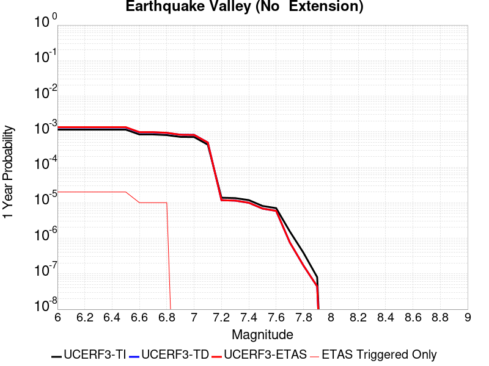 |  |

| Magnitude | 1 wk TI Prob | 1 wk TD Prob | 1 wk ETAS Prob | 1 wk ETAS/TD Gain | 1 wk ETAS Triggered Only | 1 mo TI Prob | 1 mo TD Prob | 1 mo ETAS Prob | 1 mo ETAS/TD Gain | 1 mo ETAS Triggered Only | 1 yr TI Prob | 1 yr TD Prob | 1 yr ETAS Prob | 1 yr ETAS/TD Gain | 1 yr ETAS Triggered Only | 10 yr TI Prob | 10 yr TD Prob | 10 yr ETAS Prob | 10 yr ETAS/TD Gain | 10 yr ETAS Triggered Only |
|-----|-----|-----|-----|-----|-----|-----|-----|-----|-----|-----|-----|-----|-----|-----|-----|-----|-----|-----|-----|-----|
| 6.0 | 2.1859703E-5 | 2.5198362E-5 | 7.813509E-5 | 3.1008005 | 5.2938063E-5 | 9.3681076E-5 | 1.07989326E-4 | 1.6092167E-4 | 1.4901627 | 5.2938063E-5 | 0.0011399703 | 0.001314122 | 0.0013669905 | 1.040231 | 5.2938063E-5 | 0.011341401 | 0.013077871 | 0.013130117 | 1.003995 | 5.2938063E-5 |
| 6.1 | 2.1859703E-5 | 2.5198362E-5 | 7.813509E-5 | 3.1008005 | 5.2938063E-5 | 9.3681076E-5 | 1.07989326E-4 | 1.6092167E-4 | 1.4901627 | 5.2938063E-5 | 0.0011399703 | 0.001314122 | 0.0013669905 | 1.040231 | 5.2938063E-5 | 0.011341401 | 0.013077871 | 0.013130117 | 1.003995 | 5.2938063E-5 |
| 6.2 | 2.1859703E-5 | 2.5198362E-5 | 7.813509E-5 | 3.1008005 | 5.2938063E-5 | 9.3681076E-5 | 1.07989326E-4 | 1.6092167E-4 | 1.4901627 | 5.2938063E-5 | 0.0011399703 | 0.001314122 | 0.0013669905 | 1.040231 | 5.2938063E-5 | 0.011341401 | 0.013077871 | 0.013130117 | 1.003995 | 5.2938063E-5 |
| 6.3 | 2.1859703E-5 | 2.5198362E-5 | 7.813509E-5 | 3.1008005 | 5.2938063E-5 | 9.3681076E-5 | 1.07989326E-4 | 1.6092167E-4 | 1.4901627 | 5.2938063E-5 | 0.0011399703 | 0.001314122 | 0.0013669905 | 1.040231 | 5.2938063E-5 | 0.011341401 | 0.013077871 | 0.013130117 | 1.003995 | 5.2938063E-5 |
| 6.4 | 2.1859703E-5 | 2.5198362E-5 | 7.813509E-5 | 3.1008005 | 5.2938063E-5 | 9.3681076E-5 | 1.07989326E-4 | 1.6092167E-4 | 1.4901627 | 5.2938063E-5 | 0.0011399703 | 0.001314122 | 0.0013669905 | 1.040231 | 5.2938063E-5 | 0.011341401 | 0.013077871 | 0.013130117 | 1.003995 | 5.2938063E-5 |
| 6.5 | 2.1859703E-5 | 2.5198362E-5 | 7.813509E-5 | 3.1008005 | 5.2938063E-5 | 9.3681076E-5 | 1.07989326E-4 | 1.6092167E-4 | 1.4901627 | 5.2938063E-5 | 0.0011399703 | 0.001314122 | 0.0013669905 | 1.040231 | 5.2938063E-5 | 0.011341401 | 0.013077871 | 0.013130117 | 1.003995 | 5.2938063E-5 |
| 6.6 | 1.597E-5 | 1.8356275E-5 | 7.129337E-5 | 3.8838687 | 5.2938063E-5 | 6.8441055E-5 | 7.866787E-5 | 1.3160177E-4 | 1.6728783 | 5.2938063E-5 | 8.329513E-4 | 9.574478E-4 | 0.0010103352 | 1.0552379 | 5.2938063E-5 | 0.008298361 | 0.009541836 | 0.009594269 | 1.0054951 | 5.2938063E-5 |
| 6.7 | 1.597E-5 | 1.8356275E-5 | 7.129337E-5 | 3.8838687 | 5.2938063E-5 | 6.8441055E-5 | 7.866787E-5 | 1.3160177E-4 | 1.6728783 | 5.2938063E-5 | 8.329513E-4 | 9.574478E-4 | 0.0010103352 | 1.0552379 | 5.2938063E-5 | 0.008298361 | 0.009541836 | 0.009594269 | 1.0054951 | 5.2938063E-5 |
| 6.8 | 1.5315149E-5 | 1.7602091E-5 | 7.053922E-5 | 4.007434 | 5.2938063E-5 | 6.5634704E-5 | 7.543584E-5 | 1.2836991E-4 | 1.7017097 | 5.2938063E-5 | 7.988095E-4 | 9.181311E-4 | 9.7102055E-4 | 1.0576055 | 5.2938063E-5 | 0.007959441 | 0.009151919 | 0.009204373 | 1.0057315 | 5.2938063E-5 |
| 6.9 | 1.3634728E-5 | 1.5675821E-5 | 1.5675821E-5 | 1.0 | 0.0 | 5.8433237E-5 | 6.718082E-5 | 6.718082E-5 | 1.0 | 0.0 | 7.1119244E-4 | 8.177017E-4 | 8.177017E-4 | 1.0 | 0.0 | 0.007089207 | 0.008155 | 0.008155 | 1.0 | 0.0 |
| 7.0 | 1.3496271E-5 | 1.5517853E-5 | 1.5517853E-5 | 1.0 | 0.0 | 5.783988E-5 | 6.650385E-5 | 6.650385E-5 | 1.0 | 0.0 | 7.03973E-4 | 8.094657E-4 | 8.094657E-4 | 1.0 | 0.0 | 0.007017471 | 0.0080732405 | 0.0080732405 | 1.0 | 0.0 |
| 7.1 | 8.242798E-6 | 9.4726E-6 | 9.4726E-6 | 1.0 | 0.0 | 3.53258E-5 | 4.0596606E-5 | 4.0596606E-5 | 1.0 | 0.0 | 4.300067E-4 | 4.9421866E-4 | 4.9421866E-4 | 1.0 | 0.0 | 0.004291756 | 0.0049377717 | 0.0049377717 | 1.0 | 0.0 |
| 7.2 | 2.6506527E-7 | 2.2560312E-7 | 2.2560312E-7 | 1.0 | 0.0 | 1.1359936E-6 | 9.668702E-7 | 9.668702E-7 | 1.0 | 0.0 | 1.3830633E-5 | 1.17715845E-5 | 1.17715845E-5 | 1.0 | 0.0 | 1.3829772E-4 | 1.1771003E-4 | 1.1771003E-4 | 1.0 | 0.0 |
| 7.3 | 2.5810488E-7 | 2.1955442E-7 | 2.1955442E-7 | 1.0 | 0.0 | 1.1061633E-6 | 9.409472E-7 | 9.409472E-7 | 1.0 | 0.0 | 1.3467455E-5 | 1.1455976E-5 | 1.1455976E-5 | 1.0 | 0.0 | 1.3466639E-4 | 1.1455427E-4 | 1.1455427E-4 | 1.0 | 0.0 |
| 7.4 | 2.2676066E-7 | 1.9110601E-7 | 1.9110601E-7 | 1.0 | 0.0 | 9.71831E-7 | 8.190255E-7 | 8.190255E-7 | 1.0 | 0.0 | 1.1831979E-5 | 9.9715935E-6 | 9.9715935E-6 | 1.0 | 0.0 | 1.1831349E-4 | 9.9711855E-5 | 9.9711855E-5 | 1.0 | 0.0 |
| 7.5 | 1.5553917E-7 | 1.3112096E-7 | 1.3112096E-7 | 1.0 | 0.0 | 6.6659624E-7 | 5.619469E-7 | 5.619469E-7 | 1.0 | 0.0 | 8.115779E-6 | 6.8416834E-6 | 6.8416834E-6 | 1.0 | 0.0 | 8.115482E-5 | 6.841495E-5 | 6.841495E-5 | 1.0 | 0.0 |
| 7.6 | 1.3448629E-7 | 1.1288419E-7 | 1.1288419E-7 | 1.0 | 0.0 | 5.7636964E-7 | 4.837893E-7 | 4.837893E-7 | 1.0 | 0.0 | 7.017278E-6 | 5.890121E-6 | 5.890121E-6 | 1.0 | 0.0 | 7.0170565E-5 | 5.889986E-5 | 5.889986E-5 | 1.0 | 0.0 |
| 7.7 | 2.9719402E-8 | 1.458206E-8 | 1.458206E-8 | 1.0 | 0.0 | 1.2736886E-7 | 6.249454E-8 | 6.249454E-8 | 1.0 | 0.0 | 1.5507147E-6 | 7.608708E-7 | 7.608708E-7 | 1.0 | 0.0 | 1.550704E-5 | 7.6086876E-6 | 7.6086876E-6 | 1.0 | 0.0 |
| 7.8 | 7.4390196E-9 | 3.2502152E-9 | 3.2502152E-9 | 1.0 | 0.0 | 3.1881513E-8 | 1.3929493E-8 | 1.3929493E-8 | 1.0 | 0.0 | 3.8815733E-7 | 1.6959156E-7 | 1.6959156E-7 | 1.0 | 0.0 | 3.8815665E-6 | 1.6959145E-6 | 1.6959145E-6 | 1.0 | 0.0 |
| 7.9 | 1.5373532E-9 | 8.440161E-10 | 8.440161E-10 | 1.0 | 0.0 | 6.5886567E-9 | 3.6172119E-9 | 3.6172119E-9 | 1.0 | 0.0 | 8.021689E-8 | 4.4039556E-8 | 4.4039556E-8 | 1.0 | 0.0 | 8.0216864E-7 | 4.4039552E-7 | 4.4039552E-7 | 1.0 | 0.0 |

## Blue Cut
*[(top)](#table-of-contents)*

| 1 Week | 1 Month | 1 Year | 10 Year |
|-----|-----|-----|-----|
|  |  |  |  |

| Magnitude | 1 wk TI Prob | 1 wk TD Prob | 1 wk ETAS Prob | 1 wk ETAS/TD Gain | 1 wk ETAS Triggered Only | 1 mo TI Prob | 1 mo TD Prob | 1 mo ETAS Prob | 1 mo ETAS/TD Gain | 1 mo ETAS Triggered Only | 1 yr TI Prob | 1 yr TD Prob | 1 yr ETAS Prob | 1 yr ETAS/TD Gain | 1 yr ETAS Triggered Only | 10 yr TI Prob | 10 yr TD Prob | 10 yr ETAS Prob | 10 yr ETAS/TD Gain | 10 yr ETAS Triggered Only |
|-----|-----|-----|-----|-----|-----|-----|-----|-----|-----|-----|-----|-----|-----|-----|-----|-----|-----|-----|-----|-----|
| 6.0 | 2.1227985E-5 | 2.2719574E-5 | 7.565643E-5 | 3.3300111 | 5.2938063E-5 | 9.097391E-5 | 9.73663E-5 | 1.5029921E-4 | 1.5436472 | 5.2938063E-5 | 0.0011070445 | 0.0011848481 | 0.0012377234 | 1.0446262 | 5.2938063E-5 | 0.011015458 | 0.011791152 | 0.011843465 | 1.0044367 | 5.2938063E-5 |
| 6.1 | 2.1227985E-5 | 2.2719574E-5 | 7.565643E-5 | 3.3300111 | 5.2938063E-5 | 9.097391E-5 | 9.73663E-5 | 1.5029921E-4 | 1.5436472 | 5.2938063E-5 | 0.0011070445 | 0.0011848481 | 0.0012377234 | 1.0446262 | 5.2938063E-5 | 0.011015458 | 0.011791152 | 0.011843465 | 1.0044367 | 5.2938063E-5 |
| 6.2 | 2.1227985E-5 | 2.2719574E-5 | 7.565643E-5 | 3.3300111 | 5.2938063E-5 | 9.097391E-5 | 9.73663E-5 | 1.5029921E-4 | 1.5436472 | 5.2938063E-5 | 0.0011070445 | 0.0011848481 | 0.0012377234 | 1.0446262 | 5.2938063E-5 | 0.011015458 | 0.011791152 | 0.011843465 | 1.0044367 | 5.2938063E-5 |
| 6.3 | 1.1613981E-5 | 1.2353542E-5 | 1.2353542E-5 | 1.0 | 0.0 | 4.9773254E-5 | 5.2942745E-5 | 5.2942745E-5 | 1.0 | 0.0 | 6.0582085E-4 | 6.443998E-4 | 6.443998E-4 | 1.0 | 0.0 | 0.0060417196 | 0.0064265593 | 0.0064265593 | 1.0 | 0.0 |
| 6.4 | 1.1613981E-5 | 1.2353542E-5 | 1.2353542E-5 | 1.0 | 0.0 | 4.9773254E-5 | 5.2942745E-5 | 5.2942745E-5 | 1.0 | 0.0 | 6.0582085E-4 | 6.443998E-4 | 6.443998E-4 | 1.0 | 0.0 | 0.0060417196 | 0.0064265593 | 0.0064265593 | 1.0 | 0.0 |
| 6.5 | 8.931326E-6 | 9.4816E-6 | 9.4816E-6 | 1.0 | 0.0 | 3.8276554E-5 | 4.0634844E-5 | 4.0634844E-5 | 1.0 | 0.0 | 4.6591737E-4 | 4.946261E-4 | 4.946261E-4 | 1.0 | 0.0 | 0.0046494175 | 0.004936161 | 0.004936161 | 1.0 | 0.0 |
| 6.6 | 7.345353E-6 | 7.79028E-6 | 7.79028E-6 | 1.0 | 0.0 | 3.1479703E-5 | 3.338653E-5 | 3.338653E-5 | 1.0 | 0.0 | 3.83198E-4 | 4.064132E-4 | 4.064132E-4 | 1.0 | 0.0 | 0.0038253788 | 0.0040574907 | 0.0040574907 | 1.0 | 0.0 |
| 6.7 | 6.2775666E-6 | 6.655149E-6 | 6.655149E-6 | 1.0 | 0.0 | 2.690358E-5 | 2.8521798E-5 | 2.8521798E-5 | 1.0 | 0.0 | 3.2750185E-4 | 3.472051E-4 | 3.472051E-4 | 1.0 | 0.0 | 0.0032701963 | 0.003467367 | 0.003467367 | 1.0 | 0.0 |
| 6.8 | 5.5234095E-6 | 5.8551113E-6 | 5.8551113E-6 | 1.0 | 0.0 | 2.367154E-5 | 2.5093133E-5 | 2.5093133E-5 | 1.0 | 0.0 | 2.8816288E-4 | 3.0547334E-4 | 3.0547334E-4 | 1.0 | 0.0 | 0.002877895 | 0.0030512505 | 0.0030512505 | 1.0 | 0.0 |
| 6.9 | 4.7780054E-6 | 5.0654203E-6 | 5.0654203E-6 | 1.0 | 0.0 | 2.0477004E-5 | 2.1708804E-5 | 2.1708804E-5 | 1.0 | 0.0 | 2.4927902E-4 | 2.642797E-4 | 2.642797E-4 | 1.0 | 0.0 | 0.0024899957 | 0.002640346 | 0.002640346 | 1.0 | 0.0 |
| 7.0 | 3.883171E-6 | 4.118487E-6 | 4.118487E-6 | 1.0 | 0.0 | 1.6642054E-5 | 1.7650578E-5 | 1.7650578E-5 | 1.0 | 0.0 | 2.0259817E-4 | 2.1488148E-4 | 2.1488148E-4 | 1.0 | 0.0 | 0.0020241356 | 0.0021474129 | 0.0021474129 | 1.0 | 0.0 |
| 7.1 | 2.8358215E-6 | 3.0097158E-6 | 3.0097158E-6 | 1.0 | 0.0 | 1.2153464E-5 | 1.2898756E-5 | 1.2898756E-5 | 1.0 | 0.0 | 1.4795837E-4 | 1.5703762E-4 | 1.5703762E-4 | 1.0 | 0.0 | 0.001478599 | 0.0015699116 | 0.0015699116 | 1.0 | 0.0 |

## Clamshell-Sawpit
*[(top)](#table-of-contents)*

| 1 Week | 1 Month | 1 Year | 10 Year |
|-----|-----|-----|-----|
|  |  |  |  |

| Magnitude | 1 wk TI Prob | 1 wk TD Prob | 1 wk ETAS Prob | 1 wk ETAS/TD Gain | 1 wk ETAS Triggered Only | 1 mo TI Prob | 1 mo TD Prob | 1 mo ETAS Prob | 1 mo ETAS/TD Gain | 1 mo ETAS Triggered Only | 1 yr TI Prob | 1 yr TD Prob | 1 yr ETAS Prob | 1 yr ETAS/TD Gain | 1 yr ETAS Triggered Only | 10 yr TI Prob | 10 yr TD Prob | 10 yr ETAS Prob | 10 yr ETAS/TD Gain | 10 yr ETAS Triggered Only |
|-----|-----|-----|-----|-----|-----|-----|-----|-----|-----|-----|-----|-----|-----|-----|-----|-----|-----|-----|-----|-----|
| 6.0 | 3.202998E-6 | 3.0127644E-6 | 3.0127644E-6 | 1.0 | 0.0 | 1.3727062E-5 | 1.2911788E-5 | 6.584917E-5 | 5.0999265 | 5.2938063E-5 | 1.6711417E-4 | 1.5719049E-4 | 2.1012023E-4 | 1.3367236 | 5.2938063E-5 | 0.0016698855 | 0.0015708724 | 0.0016237273 | 1.0336468 | 5.2938063E-5 |
| 6.1 | 3.202998E-6 | 3.0127644E-6 | 3.0127644E-6 | 1.0 | 0.0 | 1.3727062E-5 | 1.2911788E-5 | 6.584917E-5 | 5.0999265 | 5.2938063E-5 | 1.6711417E-4 | 1.5719049E-4 | 2.1012023E-4 | 1.3367236 | 5.2938063E-5 | 0.0016698855 | 0.0015708724 | 0.0016237273 | 1.0336468 | 5.2938063E-5 |
| 6.2 | 3.202998E-6 | 3.0127644E-6 | 3.0127644E-6 | 1.0 | 0.0 | 1.3727062E-5 | 1.2911788E-5 | 6.584917E-5 | 5.0999265 | 5.2938063E-5 | 1.6711417E-4 | 1.5719049E-4 | 2.1012023E-4 | 1.3367236 | 5.2938063E-5 | 0.0016698855 | 0.0015708724 | 0.0016237273 | 1.0336468 | 5.2938063E-5 |
| 6.3 | 3.202998E-6 | 3.0127644E-6 | 3.0127644E-6 | 1.0 | 0.0 | 1.3727062E-5 | 1.2911788E-5 | 6.584917E-5 | 5.0999265 | 5.2938063E-5 | 1.6711417E-4 | 1.5719049E-4 | 2.1012023E-4 | 1.3367236 | 5.2938063E-5 | 0.0016698855 | 0.0015708724 | 0.0016237273 | 1.0336468 | 5.2938063E-5 |
| 6.4 | 3.202998E-6 | 3.0127644E-6 | 3.0127644E-6 | 1.0 | 0.0 | 1.3727062E-5 | 1.2911788E-5 | 6.584917E-5 | 5.0999265 | 5.2938063E-5 | 1.6711417E-4 | 1.5719049E-4 | 2.1012023E-4 | 1.3367236 | 5.2938063E-5 | 0.0016698855 | 0.0015708724 | 0.0016237273 | 1.0336468 | 5.2938063E-5 |
| 6.5 | 2.5862723E-6 | 2.380775E-6 | 2.380775E-6 | 1.0 | 0.0 | 1.1083977E-5 | 1.0203283E-5 | 1.0203283E-5 | 1.0 | 0.0 | 1.3493907E-4 | 1.2421819E-4 | 1.2421819E-4 | 1.0 | 0.0 | 0.0013485716 | 0.0012415178 | 0.0012415178 | 1.0 | 0.0 |
| 6.6 | 2.5862723E-6 | 2.380775E-6 | 2.380775E-6 | 1.0 | 0.0 | 1.1083977E-5 | 1.0203283E-5 | 1.0203283E-5 | 1.0 | 0.0 | 1.3493907E-4 | 1.2421819E-4 | 1.2421819E-4 | 1.0 | 0.0 | 0.0013485716 | 0.0012415178 | 0.0012415178 | 1.0 | 0.0 |
| 6.7 | 2.5862723E-6 | 2.380775E-6 | 2.380775E-6 | 1.0 | 0.0 | 1.1083977E-5 | 1.0203283E-5 | 1.0203283E-5 | 1.0 | 0.0 | 1.3493907E-4 | 1.2421819E-4 | 1.2421819E-4 | 1.0 | 0.0 | 0.0013485716 | 0.0012415178 | 0.0012415178 | 1.0 | 0.0 |
| 6.8 | 2.4098806E-6 | 2.1977307E-6 | 2.1977307E-6 | 1.0 | 0.0 | 1.0328019E-5 | 9.4188135E-6 | 9.4188135E-6 | 1.0 | 0.0 | 1.2573638E-4 | 1.1466829E-4 | 1.1466829E-4 | 1.0 | 0.0 | 0.0012566525 | 0.0011461178 | 0.0011461178 | 1.0 | 0.0 |
| 6.9 | 2.0073985E-6 | 1.7784248E-6 | 1.7784248E-6 | 1.0 | 0.0 | 8.603109E-6 | 7.621799E-6 | 7.621799E-6 | 1.0 | 0.0 | 1.0473781E-4 | 9.279157E-5 | 9.279157E-5 | 1.0 | 0.0 | 0.0010468846 | 9.275401E-4 | 9.275401E-4 | 1.0 | 0.0 |
| 7.0 | 1.8166766E-6 | 1.5807095E-6 | 1.5807095E-6 | 1.0 | 0.0 | 7.785734E-6 | 6.7744522E-6 | 6.7744522E-6 | 1.0 | 0.0 | 9.478718E-5 | 8.247593E-5 | 8.247593E-5 | 1.0 | 0.0 | 9.4746763E-4 | 8.244633E-4 | 8.244633E-4 | 1.0 | 0.0 |
| 7.1 | 1.5471421E-6 | 1.3052961E-6 | 1.3052961E-6 | 1.0 | 0.0 | 6.6305925E-6 | 5.5941146E-6 | 5.5941146E-6 | 1.0 | 0.0 | 8.072447E-5 | 6.8106274E-5 | 6.8106274E-5 | 1.0 | 0.0 | 8.0695155E-4 | 6.808595E-4 | 6.808595E-4 | 1.0 | 0.0 |
| 7.2 | 1.3608037E-6 | 1.1153443E-6 | 1.1153443E-6 | 1.0 | 0.0 | 5.8320024E-6 | 4.7800386E-6 | 4.7800386E-6 | 1.0 | 0.0 | 7.1002316E-5 | 5.8195463E-5 | 5.8195463E-5 | 1.0 | 0.0 | 7.097964E-4 | 5.818069E-4 | 5.818069E-4 | 1.0 | 0.0 |
| 7.3 | 1.0749634E-6 | 8.384254E-7 | 8.384254E-7 | 1.0 | 0.0 | 4.6069777E-6 | 3.593247E-6 | 3.593247E-6 | 1.0 | 0.0 | 5.608851E-5 | 4.374693E-5 | 4.374693E-5 | 1.0 | 0.0 | 5.6074356E-4 | 4.37386E-4 | 4.37386E-4 | 1.0 | 0.0 |
| 7.4 | 8.416856E-7 | 6.200048E-7 | 6.200048E-7 | 1.0 | 0.0 | 3.607219E-6 | 2.6571608E-6 | 2.6571608E-6 | 1.0 | 0.0 | 4.3917007E-5 | 3.2350472E-5 | 3.2350472E-5 | 1.0 | 0.0 | 4.390833E-4 | 3.2345962E-4 | 3.2345962E-4 | 1.0 | 0.0 |
| 7.5 | 6.2779594E-7 | 4.496886E-7 | 4.496886E-7 | 1.0 | 0.0 | 2.6905511E-6 | 1.9272356E-6 | 1.9272356E-6 | 1.0 | 0.0 | 3.275697E-5 | 2.346386E-5 | 2.346386E-5 | 1.0 | 0.0 | 3.275214E-4 | 2.346157E-4 | 2.346157E-4 | 1.0 | 0.0 |
| 7.6 | 4.3822078E-7 | 3.0595405E-7 | 3.0595405E-7 | 1.0 | 0.0 | 1.8780877E-6 | 1.311231E-6 | 1.311231E-6 | 1.0 | 0.0 | 2.2865479E-5 | 1.5964137E-5 | 1.5964137E-5 | 1.0 | 0.0 | 2.2863125E-4 | 1.5963144E-4 | 1.5963144E-4 | 1.0 | 0.0 |
| 7.7 | 1.8704569E-7 | 1.12379205E-7 | 1.12379205E-7 | 1.0 | 0.0 | 8.0162414E-7 | 4.816251E-7 | 4.816251E-7 | 1.0 | 0.0 | 9.75973E-6 | 5.86377E-6 | 5.86377E-6 | 1.0 | 0.0 | 9.7593016E-5 | 5.863622E-5 | 5.863622E-5 | 1.0 | 0.0 |
| 7.8 | 3.5378733E-8 | 2.1838144E-8 | 2.1838144E-8 | 1.0 | 0.0 | 1.5162313E-7 | 9.359204E-8 | 9.359204E-8 | 1.0 | 0.0 | 1.84601E-6 | 1.1394826E-6 | 1.1394826E-6 | 1.0 | 0.0 | 1.8459947E-5 | 1.139477E-5 | 1.139477E-5 | 1.0 | 0.0 |
| 7.9 | 7.504945E-9 | 5.1920326E-9 | 5.1920326E-9 | 1.0 | 0.0 | 3.2164053E-8 | 2.225157E-8 | 2.225157E-8 | 1.0 | 0.0 | 3.9159727E-7 | 2.7091284E-7 | 2.7091284E-7 | 1.0 | 0.0 | 3.915966E-6 | 2.7091257E-6 | 2.7091257E-6 | 1.0 | 0.0 |
| 8.0 | 1.6554036E-10 | 1.4180768E-10 | 1.4180768E-10 | 1.0 | 0.0 | 7.0945894E-10 | 6.077475E-10 | 6.077475E-10 | 1.0 | 0.0 | 8.637662E-9 | 7.3993256E-9 | 7.3993256E-9 | 1.0 | 0.0 | 8.6376616E-8 | 7.3993256E-8 | 7.3993256E-8 | 1.0 | 0.0 |

## Puente Hills
*[(top)](#table-of-contents)*

| 1 Week | 1 Month | 1 Year | 10 Year |
|-----|-----|-----|-----|
|  |  |  |  |

| Magnitude | 1 wk TI Prob | 1 wk TD Prob | 1 wk ETAS Prob | 1 wk ETAS/TD Gain | 1 wk ETAS Triggered Only | 1 mo TI Prob | 1 mo TD Prob | 1 mo ETAS Prob | 1 mo ETAS/TD Gain | 1 mo ETAS Triggered Only | 1 yr TI Prob | 1 yr TD Prob | 1 yr ETAS Prob | 1 yr ETAS/TD Gain | 1 yr ETAS Triggered Only | 10 yr TI Prob | 10 yr TD Prob | 10 yr ETAS Prob | 10 yr ETAS/TD Gain | 10 yr ETAS Triggered Only |
|-----|-----|-----|-----|-----|-----|-----|-----|-----|-----|-----|-----|-----|-----|-----|-----|-----|-----|-----|-----|-----|
| 6.0 | 1.2101656E-5 | 8.098625E-6 | 8.098625E-6 | 1.0 | 0.0 | 5.1863204E-5 | 3.4707962E-5 | 3.4707962E-5 | 1.0 | 0.0 | 6.312516E-4 | 4.2249315E-4 | 4.2249315E-4 | 1.0 | 0.0 | 0.0062946146 | 0.0042174594 | 0.004270174 | 1.0124992 | 5.2938063E-5 |
| 6.1 | 1.2101656E-5 | 8.098625E-6 | 8.098625E-6 | 1.0 | 0.0 | 5.1863204E-5 | 3.4707962E-5 | 3.4707962E-5 | 1.0 | 0.0 | 6.312516E-4 | 4.2249315E-4 | 4.2249315E-4 | 1.0 | 0.0 | 0.0062946146 | 0.0042174594 | 0.004270174 | 1.0124992 | 5.2938063E-5 |
| 6.2 | 1.2101656E-5 | 8.098625E-6 | 8.098625E-6 | 1.0 | 0.0 | 5.1863204E-5 | 3.4707962E-5 | 3.4707962E-5 | 1.0 | 0.0 | 6.312516E-4 | 4.2249315E-4 | 4.2249315E-4 | 1.0 | 0.0 | 0.0062946146 | 0.0042174594 | 0.004270174 | 1.0124992 | 5.2938063E-5 |
| 6.3 | 1.2101656E-5 | 8.098625E-6 | 8.098625E-6 | 1.0 | 0.0 | 5.1863204E-5 | 3.4707962E-5 | 3.4707962E-5 | 1.0 | 0.0 | 6.312516E-4 | 4.2249315E-4 | 4.2249315E-4 | 1.0 | 0.0 | 0.0062946146 | 0.0042174594 | 0.004270174 | 1.0124992 | 5.2938063E-5 |
| 6.4 | 1.2101656E-5 | 8.098625E-6 | 8.098625E-6 | 1.0 | 0.0 | 5.1863204E-5 | 3.4707962E-5 | 3.4707962E-5 | 1.0 | 0.0 | 6.312516E-4 | 4.2249315E-4 | 4.2249315E-4 | 1.0 | 0.0 | 0.0062946146 | 0.0042174594 | 0.004270174 | 1.0124992 | 5.2938063E-5 |
| 6.5 | 1.2101656E-5 | 8.098625E-6 | 8.098625E-6 | 1.0 | 0.0 | 5.1863204E-5 | 3.4707962E-5 | 3.4707962E-5 | 1.0 | 0.0 | 6.312516E-4 | 4.2249315E-4 | 4.2249315E-4 | 1.0 | 0.0 | 0.0062946146 | 0.0042174594 | 0.004270174 | 1.0124992 | 5.2938063E-5 |
| 6.6 | 1.0222488E-5 | 6.3991847E-6 | 6.3991847E-6 | 1.0 | 0.0 | 4.3809923E-5 | 2.7424803E-5 | 2.7424803E-5 | 1.0 | 0.0 | 5.332553E-4 | 3.3384826E-4 | 3.3384826E-4 | 1.0 | 0.0 | 0.0053197746 | 0.0033337125 | 0.0033864742 | 1.0158267 | 5.2938063E-5 |
| 6.7 | 1.0222488E-5 | 6.3991847E-6 | 6.3991847E-6 | 1.0 | 0.0 | 4.3809923E-5 | 2.7424803E-5 | 2.7424803E-5 | 1.0 | 0.0 | 5.332553E-4 | 3.3384826E-4 | 3.3384826E-4 | 1.0 | 0.0 | 0.0053197746 | 0.0033337125 | 0.0033864742 | 1.0158267 | 5.2938063E-5 |
| 6.8 | 8.6367845E-6 | 5.0282533E-6 | 5.0282533E-6 | 1.0 | 0.0 | 3.7014266E-5 | 2.1549482E-5 | 2.1549482E-5 | 1.0 | 0.0 | 4.505555E-4 | 2.623339E-4 | 2.623339E-4 | 1.0 | 0.0 | 0.004496431 | 0.0026202986 | 0.002673098 | 1.0201502 | 5.2938063E-5 |
| 6.9 | 8.066481E-6 | 4.836117E-6 | 4.836117E-6 | 1.0 | 0.0 | 3.4570177E-5 | 2.0726053E-5 | 2.0726053E-5 | 1.0 | 0.0 | 4.2081063E-4 | 2.52311E-4 | 2.52311E-4 | 1.0 | 0.0 | 0.0042001465 | 0.0025202993 | 0.0025731039 | 1.0209517 | 5.2938063E-5 |
| 7.0 | 7.393828E-6 | 4.417296E-6 | 4.417296E-6 | 1.0 | 0.0 | 3.168745E-5 | 1.8931134E-5 | 1.8931134E-5 | 1.0 | 0.0 | 3.857264E-4 | 2.3046264E-4 | 2.3046264E-4 | 1.0 | 0.0 | 0.0038505755 | 0.0023022818 | 0.002355098 | 1.0229408 | 5.2938063E-5 |
| 7.1 | 6.4660953E-6 | 3.8044495E-6 | 3.8044495E-6 | 1.0 | 0.0 | 2.7711543E-5 | 1.6304684E-5 | 1.6304684E-5 | 1.0 | 0.0 | 3.373358E-4 | 1.984918E-4 | 1.984918E-4 | 1.0 | 0.0 | 0.0033682417 | 0.001983181 | 0.002036014 | 1.0266405 | 5.2938063E-5 |
| 7.2 | 5.143232E-6 | 2.7865456E-6 | 2.7865456E-6 | 1.0 | 0.0 | 2.2042237E-5 | 1.1942284E-5 | 1.1942284E-5 | 1.0 | 0.0 | 2.6833118E-4 | 1.453877E-4 | 1.453877E-4 | 1.0 | 0.0 | 0.002680074 | 0.0014529356 | 0.0015057967 | 1.0363823 | 5.2938063E-5 |
| 7.3 | 3.928255E-6 | 2.0913774E-6 | 2.0913774E-6 | 1.0 | 0.0 | 1.683527E-5 | 8.963015E-6 | 8.963015E-6 | 1.0 | 0.0 | 2.0495013E-4 | 1.0911931E-4 | 1.0911931E-4 | 1.0 | 0.0 | 0.002047612 | 0.001090664 | 0.0011435443 | 1.0484846 | 5.2938063E-5 |
| 7.4 | 2.7894434E-6 | 1.3546753E-6 | 1.3546753E-6 | 1.0 | 0.0 | 1.1954703E-5 | 5.8057385E-6 | 5.8057385E-6 | 1.0 | 0.0 | 1.4553878E-4 | 7.068262E-5 | 7.068262E-5 | 1.0 | 0.0 | 0.001454435 | 7.066058E-4 | 7.595064E-4 | 1.0748658 | 5.2938063E-5 |
| 7.5 | 2.041735E-6 | 8.787305E-7 | 8.787305E-7 | 1.0 | 0.0 | 8.750263E-6 | 3.7659825E-6 | 3.7659825E-6 | 1.0 | 0.0 | 1.06529245E-4 | 4.5849905E-5 | 4.5849905E-5 | 1.0 | 0.0 | 0.0010647819 | 4.5840783E-4 | 4.5840783E-4 | 1.0 | 0.0 |
| 7.6 | 1.6959062E-6 | 6.6986263E-7 | 6.6986263E-7 | 1.0 | 0.0 | 7.268149E-6 | 2.8708366E-6 | 2.8708366E-6 | 1.0 | 0.0 | 8.848612E-5 | 3.4951907E-5 | 3.4951907E-5 | 1.0 | 0.0 | 8.84509E-4 | 3.4946698E-4 | 3.4946698E-4 | 1.0 | 0.0 |
| 7.7 | 1.4767965E-6 | 5.407607E-7 | 5.407607E-7 | 1.0 | 0.0 | 6.3291122E-6 | 2.317544E-6 | 2.317544E-6 | 1.0 | 0.0 | 7.705422E-5 | 2.8215758E-5 | 2.8215758E-5 | 1.0 | 0.0 | 7.702751E-4 | 2.8212433E-4 | 2.8212433E-4 | 1.0 | 0.0 |
| 7.8 | 1.8432911E-7 | 7.28201E-8 | 7.28201E-8 | 1.0 | 0.0 | 7.8998164E-7 | 3.1208612E-7 | 3.1208612E-7 | 1.0 | 0.0 | 9.617985E-6 | 3.7996451E-6 | 3.7996451E-6 | 1.0 | 0.0 | 9.617568E-5 | 3.7996128E-5 | 3.7996128E-5 | 1.0 | 0.0 |

