# Parent Section Magnitude-Probability Distributions

Only fault sections with at least one triggered aftershock are plotted. Sections are sorted by total supraseismogenic trigger rate (decreasing)

## Table Of Contents

* [Garlock (Central)](#garlock-central)
* [Tank Canyon](#tank-canyon)
* [Little Lake](#little-lake)
* [Airport Lake](#airport-lake)
* [Owl Lake](#owl-lake)
* [Panamint Valley](#panamint-valley)
* [Garlock (East)](#garlock-east)
* [Hunter Mountain-Saline Valley](#hunter-mountain-saline-valley)
* [Blackwater](#blackwater)
* [Ash Hill](#ash-hill)
* [Garlock (West)](#garlock-west)
* [McLean Lake](#mclean-lake)
* [Gravel Hills-Harper Lk](#gravel-hills-harper-lk)
* [Goldstone Lake](#goldstone-lake)
* [Coyote Canyon](#coyote-canyon)
* [So Sierra Nevada](#so-sierra-nevada)
* [Death Valley (So)](#death-valley-so)
* [San Andreas (Mojave N)](#san-andreas-mojave-n)
* [Nelson Lake](#nelson-lake)
* [San Andreas (Mojave S)](#san-andreas-mojave-s)
* [Lenwood-Lockhart-Old Woman Springs](#lenwood-lockhart-old-woman-springs)
* [Towne Pass](#towne-pass)
* [Bicycle Lake](#bicycle-lake)
* [San Andreas (San Bernardino N)](#san-andreas-san-bernardino-n)
* [Paradise](#paradise)
* [Garlic Springs](#garlic-springs)
* [Death Valley (Black Mtns Frontal)](#death-valley-black-mtns-frontal)
* [Helendale-So Lockhart](#helendale-so-lockhart)
* [Death Valley (No)](#death-valley-no)
* [San Andreas (San Bernardino S)](#san-andreas-san-bernardino-s)
* [Coyote Lake](#coyote-lake)
* [Red Pass](#red-pass)
* [San Andreas (Parkfield)](#san-andreas-parkfield)
* [Cleghorn Lake](#cleghorn-lake)
* [San Andreas (Big Bend)](#san-andreas-big-bend)
* [Death Valley (Fish Lake Valley)](#death-valley-fish-lake-valley)
* [Sierra Nevada  (No Extension)](#sierra-nevada--no-extension)
* [White Wolf (Extension)](#white-wolf-extension)
* [San Andreas (San Gorgonio Pass-Garnet HIll)](#san-andreas-san-gorgonio-pass-garnet-hill)
* [Baker](#baker)
* [San Andreas (Coachella) rev](#san-andreas-coachella-rev)
* [Calico-Hidalgo](#calico-hidalgo)
* [San Andreas (Carrizo) rev](#san-andreas-carrizo-rev)
* [San Andreas (Cholame) rev](#san-andreas-cholame-rev)
* [Owens Valley](#owens-valley)
* [San Jacinto (San Bernardino)](#san-jacinto-san-bernardino)
* [Santa Ynez (West)](#santa-ynez-west)
* [Scodie Lineament](#scodie-lineament)
* [Elsinore (Glen Ivy) rev](#elsinore-glen-ivy-rev)
* [Palos Verdes](#palos-verdes)
* [Ludlow](#ludlow)
* [Kern Canyon (North Kern) 2011](#kern-canyon-north-kern-2011)
* [San Jacinto (Stepovers Combined)](#san-jacinto-stepovers-combined)
* [San Andreas (North Branch Mill Creek)](#san-andreas-north-branch-mill-creek)
* [San Jacinto (San Jacinto Valley) rev](#san-jacinto-san-jacinto-valley-rev)
* [Santa Cruz Island](#santa-cruz-island)
* [Oceanic - West Huasna](#oceanic---west-huasna)
* [Cleghorn Pass](#cleghorn-pass)
* [San Andreas (Creeping Section) 2011 CFM](#san-andreas-creeping-section-2011-cfm)
* [Pinto Mtn](#pinto-mtn)
* [Channel Islands Thrust](#channel-islands-thrust)
* [Coronado Bank alt1](#coronado-bank-alt1)
* [Oceanside alt1](#oceanside-alt1)
* [Elysian Park (Upper)](#elysian-park-upper)
* [San Jacinto (Anza) rev](#san-jacinto-anza-rev)
* [Rose Canyon](#rose-canyon)
* [Brawley (Seismic Zone) alt 1](#brawley-seismic-zone-alt-1)
* [Pisgah-Bullion Mtn-Mesquite Lk](#pisgah-bullion-mtn-mesquite-lk)
* [Santa Ynez (East)](#santa-ynez-east)
* [Great Valley 09 (Laguna Seca)](#great-valley-09-laguna-seca)
* [Lake Isabella (Seismicity)](#lake-isabella-seismicity)
* [Manix-Afton Hills](#manix-afton-hills)
* [San Gabriel](#san-gabriel)
* [Lost Hills](#lost-hills)
* [Tin Mountain](#tin-mountain)
* [Santa Monica alt 1](#santa-monica-alt-1)
* [Santa Ynez River](#santa-ynez-river)
* [Hollywood](#hollywood)
* [Hosgri](#hosgri)
* [Cady](#cady)
* [Red Mountain](#red-mountain)
* [Deep Springs](#deep-springs)
* [Imperial](#imperial)
* [Cedar Mtn-Mahogany Mtn](#cedar-mtn-mahogany-mtn)
* [San Diego Trough north alt1](#san-diego-trough-north-alt1)
* [White Mountains](#white-mountains)
* [Big Pine (Central)](#big-pine-central)
* [Newport-Inglewood (Offshore)](#newport-inglewood-offshore)
* [San Jacinto (Coyote Creek)](#san-jacinto-coyote-creek)
* [Santa Rosa Island](#santa-rosa-island)
* [Sheephole](#sheephole)
* [Kern Canyon (Lake Isabella) 2011](#kern-canyon-lake-isabella-2011)
* [San Jacinto (Superstition Mtn)](#san-jacinto-superstition-mtn)
* [Puente Hills](#puente-hills)
* [Malibu Coast (Extension) alt 1](#malibu-coast-extension-alt-1)
* [Carlsbad](#carlsbad)
* [Santa Susana alt 1](#santa-susana-alt-1)
* [Hartley Springs 2011 CFM](#hartley-springs-2011-cfm)
* [San Clemente](#san-clemente)
* [Casmalia 2011 CFM](#casmalia-2011-cfm)
* [Los Alamos extension](#los-alamos-extension)
* [Mission Ridge-Arroyo Parida-Santa Ana](#mission-ridge-arroyo-parida-santa-ana)
* [Camp Rock 2011](#camp-rock-2011)
* [Independence rev 2011](#independence-rev-2011)
* [Kern Canyon (South Kern) 2011](#kern-canyon-south-kern-2011)
* [Big Pine (East)](#big-pine-east)
* [Malibu Coast alt 1](#malibu-coast-alt-1)
* [Ventura-Pitas Point](#ventura-pitas-point)
* [Mission Creek](#mission-creek)
* [Whittier alt 1](#whittier-alt-1)
* [Likely 2011 CFM](#likely-2011-cfm)
* [San Gorgonio Pass](#san-gorgonio-pass)
* [Anacapa-Dume alt 1](#anacapa-dume-alt-1)
* [Raymond](#raymond)
* [San Cayetano](#san-cayetano)
* [Hayward (So) 2011 CFM](#hayward-so-2011-cfm)
* [White Wolf](#white-wolf)
* [Earthquake Valley (So Extension)](#earthquake-valley-so-extension)
* [Reliz 2011 CFM](#reliz-2011-cfm)
* [Elmore Ranch](#elmore-ranch)
* [Great Valley 07 (Orestimba)](#great-valley-07-orestimba)
* [Rinconada 2011 CFM](#rinconada-2011-cfm)
* [San Pedro Escarpment](#san-pedro-escarpment)
* [Ozena](#ozena)
* [Clamshell-Sawpit](#clamshell-sawpit)
* [Great Valley 06 (Midland) 2011 CFM alt1](#great-valley-06-midland-2011-cfm-alt1)
* [Monterey Bay-Tularcitos](#monterey-bay-tularcitos)
* [Shoreline](#shoreline)
* [Mission Hills 2011](#mission-hills-2011)
* [Calaveras (So) 2011 CFM](#calaveras-so-2011-cfm)
* [Los Alamos 2011 CFM](#los-alamos-2011-cfm)
* [Pleito](#pleito)
* [Northridge Hills](#northridge-hills)
* [San Andreas (Santa Cruz Mts) 2011 CFM](#san-andreas-santa-cruz-mts-2011-cfm)
* [Chino alt 1](#chino-alt-1)
* [Yorba Linda](#yorba-linda)
* [Honey Lake 2011 CFM](#honey-lake-2011-cfm)
* [San Juan](#san-juan)
* [San Andreas (North Coast) 2011 CFM](#san-andreas-north-coast-2011-cfm)
* [Ortigalita (South)](#ortigalita-south)
* [Surprise Valley 2011 CFM](#surprise-valley-2011-cfm)
* [Cerro Prieto](#cerro-prieto)
* [Del Valle](#del-valle)
* [Great Valley 11](#great-valley-11)
* [Oak Ridge (Onshore)](#oak-ridge-onshore)
* [Pine Mtn](#pine-mtn)
* [Quien Sabe 2011 CFM](#quien-sabe-2011-cfm)
* [Northridge](#northridge)
* [San Luis Range 2011 CFM](#san-luis-range-2011-cfm)
* [Cucamonga](#cucamonga)
* [Dry Mountain](#dry-mountain)
* [Elsinore (Temecula) rev](#elsinore-temecula-rev)
* [San Diego Trough south](#san-diego-trough-south)
* [San Andreas (Peninsula) 2011 CFM](#san-andreas-peninsula-2011-cfm)
* [Sierra Madre](#sierra-madre)
* [Blue Cut](#blue-cut)
* [Compton](#compton)
* [San Pedro Basin](#san-pedro-basin)
* [Simi-Santa Rosa](#simi-santa-rosa)
* [San Jacinto (Clark) rev](#san-jacinto-clark-rev)
* [Santa Cruz Catalina Ridge alt1](#santa-cruz-catalina-ridge-alt1)
* [San Jacinto (Lytle Creek connector)](#san-jacinto-lytle-creek-connector)
* [Earthquake Valley (No  Extension)](#earthquake-valley-no--extension)
* [Point Reyes 2011 CFM](#point-reyes-2011-cfm)
* [Calaveras (No) 2011 CFM](#calaveras-no-2011-cfm)
* [Bullion Mountains](#bullion-mountains)
* [San Jacinto (Borrego)](#san-jacinto-borrego)
* [Elsinore (Stepovers Combined)](#elsinore-stepovers-combined)

## Garlock (Central)
*[(top)](#table-of-contents)*

| 1 Week | 1 Month | 1 Year | 10 Year |
|-----|-----|-----|-----|
|  |  |  |  |

| Magnitude | 1 wk TI Prob | 1 wk TD Prob | 1 wk ETAS Prob | 1 wk ETAS/TD Gain | 1 wk ETAS Triggered Only | 1 mo TI Prob | 1 mo TD Prob | 1 mo ETAS Prob | 1 mo ETAS/TD Gain | 1 mo ETAS Triggered Only | 1 yr TI Prob | 1 yr TD Prob | 1 yr ETAS Prob | 1 yr ETAS/TD Gain | 1 yr ETAS Triggered Only | 10 yr TI Prob | 10 yr TD Prob | 10 yr ETAS Prob | 10 yr ETAS/TD Gain | 10 yr ETAS Triggered Only |
|-----|-----|-----|-----|-----|-----|-----|-----|-----|-----|-----|-----|-----|-----|-----|-----|-----|-----|-----|-----|-----|
| 6.0 | 5.5131142E-5 | 7.024681E-5 | 0.09627585 | 1370.537 | 0.096212365 | 2.3625491E-4 | 3.010234E-4 | 0.10973316 | 364.53366 | 0.109465085 | 0.0028726095 | 0.0036588663 | 0.12812172 | 35.01678 | 0.12491992 | 0.028357591 | 0.036079824 | 0.16702878 | 4.629423 | 0.13585041 |
| 6.1 | 5.5131142E-5 | 7.024681E-5 | 0.09627585 | 1370.537 | 0.096212365 | 2.3625491E-4 | 3.010234E-4 | 0.10973316 | 364.53366 | 0.109465085 | 0.0028726095 | 0.0036588663 | 0.12812172 | 35.01678 | 0.12491992 | 0.028357591 | 0.036079824 | 0.16702878 | 4.629423 | 0.13585041 |
| 6.2 | 4.216245E-5 | 5.1661493E-5 | 0.057423778 | 1111.5393 | 0.05737508 | 1.806837E-4 | 2.2138779E-4 | 0.06627018 | 299.33984 | 0.06606342 | 0.0021976046 | 0.0026920962 | 0.07836068 | 29.10768 | 0.07587284 | 0.021759989 | 0.026689773 | 0.10712348 | 4.013653 | 0.08263934 |
| 6.3 | 4.216245E-5 | 5.1661493E-5 | 0.057423778 | 1111.5393 | 0.05737508 | 1.806837E-4 | 2.2138779E-4 | 0.06627018 | 299.33984 | 0.06606342 | 0.0021976046 | 0.0026920962 | 0.07836068 | 29.10768 | 0.07587284 | 0.021759989 | 0.026689773 | 0.10712348 | 4.013653 | 0.08263934 |
| 6.4 | 3.6858168E-5 | 4.411054E-5 | 0.045245513 | 1025.7301 | 0.045203395 | 1.5795401E-4 | 1.8903162E-4 | 0.0521491 | 275.875 | 0.05196989 | 0.0019213937 | 0.002299056 | 0.06181917 | 26.888937 | 0.059657272 | 0.019048655 | 0.02284894 | 0.086659536 | 3.7927158 | 0.06530269 |
| 6.5 | 3.39199E-5 | 4.0018083E-5 | 0.04071744 | 1017.4761 | 0.040679052 | 1.453629E-4 | 1.7149492E-4 | 0.04692837 | 273.6429 | 0.046764895 | 0.0017683565 | 0.002085973 | 0.055705473 | 26.704792 | 0.053731583 | 0.017543508 | 0.020759864 | 0.078276895 | 3.770588 | 0.058736388 |
| 6.6 | 3.3571985E-5 | 3.9472274E-5 | 0.0404767 | 1025.4463 | 0.04043882 | 1.4387199E-4 | 1.6915603E-4 | 0.04668595 | 275.9934 | 0.046524663 | 0.0017502342 | 0.0020575512 | 0.055438843 | 26.94409 | 0.05349135 | 0.017365133 | 0.020481179 | 0.07774004 | 3.7956822 | 0.05845612 |
| 6.7 | 3.2580007E-5 | 3.8088703E-5 | 0.03907408 | 1025.8706 | 0.039037477 | 1.3962112E-4 | 1.632272E-4 | 0.044958927 | 275.4377 | 0.044803012 | 0.0016985617 | 0.0019855013 | 0.053532533 | 26.961723 | 0.051649585 | 0.016856372 | 0.019773813 | 0.07491546 | 3.7886198 | 0.056254003 |
| 6.8 | 3.2185937E-5 | 3.7515918E-5 | 0.038272787 | 1020.1746 | 0.038236707 | 1.3793244E-4 | 1.6077272E-4 | 0.04411591 | 274.3992 | 0.043962203 | 0.0016780337 | 0.001955672 | 0.052625123 | 26.908972 | 0.050768737 | 0.016654192 | 0.019480614 | 0.07369655 | 3.7830713 | 0.055293083 |
| 6.9 | 3.165394E-5 | 3.6720503E-5 | 0.03739121 | 1018.2652 | 0.037355863 | 1.3565269E-4 | 1.5736422E-4 | 0.04319191 | 274.47098 | 0.04304132 | 0.0016503202 | 0.001914247 | 0.051586755 | 26.948849 | 0.049767777 | 0.01638118 | 0.019073246 | 0.07213347 | 3.7819185 | 0.054091927 |
| 7.0 | 3.0903822E-5 | 3.5625766E-5 | 0.036309157 | 1019.1825 | 0.036274824 | 1.3243823E-4 | 1.5267303E-4 | 0.04194642 | 274.74673 | 0.041800126 | 0.0016112428 | 0.0018572307 | 0.0501738 | 27.015383 | 0.04840647 | 0.015996104 | 0.018512413 | 0.07022756 | 3.7935393 | 0.052690584 |
| 7.1 | 3.0069863E-5 | 3.4392073E-5 | 0.03478656 | 1011.47034 | 0.034753364 | 1.2886449E-4 | 1.4738638E-4 | 0.040259987 | 273.1595 | 0.040118515 | 0.0015677959 | 0.0017929734 | 0.047794588 | 26.656607 | 0.04608424 | 0.01556781 | 0.017880075 | 0.0671119 | 3.7534463 | 0.050128125 |
| 7.2 | 2.7957109E-5 | 3.128145E-5 | 0.029218389 | 934.04834 | 0.02918802 | 1.1981068E-4 | 1.340566E-4 | 0.033641737 | 250.95175 | 0.03351217 | 0.0014577188 | 0.0016309366 | 0.04028496 | 24.700506 | 0.03871717 | 0.014481937 | 0.016283695 | 0.057915185 | 3.5566368 | 0.042320628 |
| 7.3 | 2.4519275E-5 | 2.6714795E-5 | 0.019845212 | 742.85474 | 0.019819027 | 1.0507837E-4 | 1.1448703E-4 | 0.023053885 | 201.36678 | 0.022942025 | 0.0012785783 | 0.001393003 | 0.028261352 | 20.288076 | 0.02690583 | 0.012712469 | 0.013928054 | 0.042867463 | 3.0777786 | 0.029348174 |
| 7.4 | 2.3225532E-5 | 2.51994E-5 | 0.018122116 | 719.14874 | 0.018097373 | 9.95342E-5 | 1.0799304E-4 | 0.020765595 | 192.28642 | 0.020659834 | 0.0012111551 | 0.0013140367 | 0.025545446 | 19.440437 | 0.024263293 | 0.012045753 | 0.013145725 | 0.03938176 | 2.9957845 | 0.026585521 |
| 7.5 | 2.097765E-5 | 2.2483688E-5 | 0.013515133 | 601.1084 | 0.013492953 | 8.9901114E-5 | 9.635517E-5 | 0.015869979 | 164.70294 | 0.015775144 | 0.0010939965 | 0.0011725046 | 0.01976855 | 16.860102 | 0.018617874 | 0.010886264 | 0.011740365 | 0.032118075 | 2.7356966 | 0.020619795 |
| 7.6 | 1.511254E-5 | 1.5991332E-5 | 0.0070626438 | 441.65448 | 0.0070467647 | 6.476642E-5 | 6.853253E-5 | 0.00827585 | 120.75798 | 0.00820788 | 7.882459E-4 | 8.3407195E-4 | 0.010675312 | 12.79903 | 0.009849455 | 0.007854558 | 0.008383559 | 0.019222416 | 2.2928705 | 0.0109304935 |
| 7.7 | 9.934069E-6 | 1.0678794E-5 | 0.0021727313 | 203.46225 | 0.0021620756 | 4.2573887E-5 | 4.5765457E-5 | 0.0026481447 | 57.863396 | 0.0026024985 | 5.182138E-4 | 5.570524E-4 | 0.0036382945 | 6.531333 | 0.0030829597 | 0.00517007 | 0.005627684 | 0.009011799 | 1.6013335 | 0.0034032671 |
| 7.8 | 6.7562896E-6 | 8.428449E-6 | 0.001409762 | 167.26231 | 0.0014013452 | 2.8955206E-5 | 3.6121426E-5 | 0.001717675 | 47.552803 | 0.0016816143 | 3.5247262E-4 | 4.3968976E-4 | 0.0024407313 | 5.5510306 | 0.0020019219 | 0.0035191406 | 0.004446654 | 0.0065991157 | 1.4840631 | 0.0021620756 |
| 7.9 | 3.975453E-6 | 5.37103E-6 | 7.660972E-4 | 142.63507 | 7.607303E-4 | 1.7037546E-5 | 2.3018498E-5 | 9.839189E-4 | 42.7447 | 9.609225E-4 | 2.0741238E-4 | 2.8021427E-4 | 0.0013609491 | 4.856816 | 0.0010810378 | 0.002072189 | 0.0028336283 | 0.004031378 | 1.4226911 | 0.0012011532 |
| 8.0 | 1.6729537E-6 | 2.0775144E-6 | 1.6223094E-4 | 78.08896 | 1.6015375E-4 | 7.169782E-6 | 8.903603E-6 | 2.8917016E-4 | 32.477882 | 2.8026907E-4 | 8.7288594E-5 | 1.0839601E-4 | 4.2866878E-4 | 3.9546547 | 3.203075E-4 | 8.7254314E-4 | 0.0010969337 | 0.00141689 | 1.2916822 | 3.203075E-4 |
| 8.1 | 3.6733252E-7 | 3.1489964E-7 | 3.1489964E-7 | 1.0 | 0.0 | 1.5742813E-6 | 1.3495693E-6 | 1.3495693E-6 | 1.0 | 0.0 | 1.9166706E-5 | 1.6430899E-5 | 1.6430899E-5 | 1.0 | 0.0 | 1.9165053E-4 | 1.6638759E-4 | 1.6638759E-4 | 1.0 | 0.0 |

## Tank Canyon
*[(top)](#table-of-contents)*

| 1 Week | 1 Month | 1 Year | 10 Year |
|-----|-----|-----|-----|
|  |  |  |  |

| Magnitude | 1 wk TI Prob | 1 wk TD Prob | 1 wk ETAS Prob | 1 wk ETAS/TD Gain | 1 wk ETAS Triggered Only | 1 mo TI Prob | 1 mo TD Prob | 1 mo ETAS Prob | 1 mo ETAS/TD Gain | 1 mo ETAS Triggered Only | 1 yr TI Prob | 1 yr TD Prob | 1 yr ETAS Prob | 1 yr ETAS/TD Gain | 1 yr ETAS Triggered Only | 10 yr TI Prob | 10 yr TD Prob | 10 yr ETAS Prob | 10 yr ETAS/TD Gain | 10 yr ETAS Triggered Only |
|-----|-----|-----|-----|-----|-----|-----|-----|-----|-----|-----|-----|-----|-----|-----|-----|-----|-----|-----|-----|-----|
| 6.0 | 4.8284557E-5 | 5.7964822E-5 | 0.06071268 | 1047.4056 | 0.06065823 | 2.0691741E-4 | 2.4840087E-4 | 0.07342048 | 295.57257 | 0.073190264 | 0.0025163088 | 0.0030207601 | 0.09311453 | 30.82487 | 0.09036675 | 0.02488006 | 0.029863637 | 0.12790272 | 4.2828918 | 0.101057015 |
| 6.1 | 1.7796336E-5 | 2.0873314E-5 | 0.021481028 | 1029.1144 | 0.021460602 | 7.626778E-5 | 8.945422E-5 | 0.026712634 | 298.61792 | 0.02662556 | 9.281647E-4 | 0.0010885983 | 0.034604285 | 31.78793 | 0.03355221 | 0.009242975 | 0.010836744 | 0.047906604 | 4.4207563 | 0.037475977 |
| 6.2 | 1.7796336E-5 | 2.0873314E-5 | 0.021481028 | 1029.1144 | 0.021460602 | 7.626778E-5 | 8.945422E-5 | 0.026712634 | 298.61792 | 0.02662556 | 9.281647E-4 | 0.0010885983 | 0.034604285 | 31.78793 | 0.03355221 | 0.009242975 | 0.010836744 | 0.047906604 | 4.4207563 | 0.037475977 |
| 6.3 | 1.3515912E-5 | 1.5759564E-5 | 0.015470353 | 981.64844 | 0.015454836 | 5.792405E-5 | 6.753938E-5 | 0.01892437 | 280.19757 | 0.018858103 | 7.049971E-4 | 8.2200574E-4 | 0.024985343 | 30.395582 | 0.024183216 | 0.007027647 | 0.0081922645 | 0.03523507 | 4.301017 | 0.027266176 |
| 6.4 | 1.0870146E-5 | 1.2618021E-5 | 0.011623618 | 921.1919 | 0.011611147 | 4.658551E-5 | 5.4076212E-5 | 0.014266953 | 263.83047 | 0.014213645 | 5.67031E-4 | 6.581969E-4 | 0.018863695 | 28.659653 | 0.01821749 | 0.005655863 | 0.0065644905 | 0.0269296 | 4.102314 | 0.02049968 |
| 6.5 | 7.964826E-6 | 9.196094E-6 | 0.007416239 | 806.4553 | 0.0074071107 | 3.4134522E-5 | 3.9411298E-5 | 0.009047705 | 229.57135 | 0.009008648 | 4.1550855E-4 | 4.7973756E-4 | 0.011885217 | 24.774416 | 0.011410954 | 0.0041473247 | 0.004788321 | 0.017419731 | 3.6379623 | 0.012692184 |
| 6.6 | 6.6317E-6 | 7.6122988E-6 | 0.0058531794 | 768.9109 | 0.005845612 | 2.8421264E-5 | 3.2623782E-5 | 0.007079159 | 216.99382 | 0.0070467647 | 3.4597394E-4 | 3.9713128E-4 | 0.009202089 | 23.171404 | 0.008808456 | 0.0034543579 | 0.003965368 | 0.013656128 | 3.4438488 | 0.00972934 |
| 6.7 | 4.793663E-6 | 5.4307857E-6 | 0.0031684502 | 583.4239 | 0.0031630364 | 2.0544108E-5 | 2.3274613E-5 | 0.00394695 | 169.58177 | 0.003923767 | 2.500958E-4 | 2.8333595E-4 | 0.0052466956 | 18.517578 | 0.004964766 | 0.0024981452 | 0.0028304397 | 0.00845988 | 2.9888926 | 0.0056454195 |
| 6.8 | 4.382823E-6 | 4.9692567E-6 | 0.0028076458 | 565.0032 | 0.0028026905 | 1.8783392E-5 | 2.1296666E-5 | 0.0035846417 | 168.31938 | 0.0035634208 | 2.286638E-4 | 2.5926033E-4 | 0.0047424026 | 18.29205 | 0.004484305 | 0.0022842865 | 0.002590253 | 0.007542159 | 2.9117463 | 0.004964766 |
| 6.9 | 2.729601E-6 | 3.0735416E-6 | 0.0010040314 | 326.6692 | 0.0010009609 | 1.1698237E-5 | 1.3172262E-5 | 0.0012943854 | 98.26599 | 0.00128123 | 1.4241673E-4 | 1.6036171E-4 | 0.0019217704 | 11.983973 | 0.0017616912 | 0.001423255 | 0.0016026258 | 0.0036013394 | 2.2471492 | 0.0020019219 |
| 7.0 | 1.8987357E-6 | 2.126939E-6 | 2.823954E-4 | 132.7708 | 2.8026907E-4 | 8.137413E-6 | 9.115425E-6 | 4.0949613E-4 | 44.923428 | 4.0038436E-4 | 9.90685E-5 | 1.1097535E-4 | 7.114853E-4 | 6.411201 | 6.005766E-4 | 9.902435E-4 | 0.0011092679 | 0.0017891664 | 1.6129253 | 6.8065344E-4 |
| 7.1 | 1.4928986E-6 | 1.6641272E-6 | 1.618176E-4 | 97.23872 | 1.6015375E-4 | 6.398121E-6 | 7.1319573E-6 | 2.4736088E-4 | 34.683445 | 2.4023063E-4 | 7.789434E-5 | 8.682871E-5 | 4.071084E-4 | 4.6886377 | 3.203075E-4 | 7.786704E-4 | 8.6800574E-4 | 0.0012280389 | 1.414782 | 3.6034593E-4 |
| 7.2 | 1.069082E-6 | 1.1828573E-6 | 8.125963E-5 | 68.697754 | 8.0076876E-5 | 4.581772E-6 | 5.0693816E-6 | 1.2518409E-4 | 24.694153 | 1.2011531E-4 | 5.5781646E-5 | 6.171851E-5 | 2.6189833E-4 | 4.243433 | 2.0019218E-4 | 5.576765E-4 | 6.170659E-4 | 8.1713457E-4 | 1.3242258 | 2.0019218E-4 |
| 7.3 | 8.776551E-7 | 9.770005E-7 | 8.10538E-5 | 82.961876 | 8.0076876E-5 | 3.7613736E-6 | 4.1871413E-6 | 8.426368E-5 | 20.124393 | 8.0076876E-5 | 4.579376E-5 | 5.097777E-5 | 2.1112335E-4 | 4.1414785 | 1.6015375E-4 | 4.5784327E-4 | 5.097118E-4 | 6.697839E-4 | 1.3140444 | 1.6015375E-4 |
| 7.4 | 7.55721E-7 | 8.510244E-7 | 8.092783E-5 | 95.094604 | 8.0076876E-5 | 3.2388E-6 | 3.6472454E-6 | 8.3723826E-5 | 22.955359 | 8.0076876E-5 | 3.9431678E-5 | 4.4404827E-5 | 1.645148E-4 | 3.7048857 | 1.2011531E-4 | 3.942468E-4 | 4.440104E-4 | 5.6407234E-4 | 1.2704035 | 1.2011531E-4 |
| 7.5 | 5.587665E-7 | 6.305619E-7 | 8.070739E-5 | 127.992805 | 8.0076876E-5 | 2.3947114E-6 | 2.702408E-6 | 8.2779065E-5 | 30.631594 | 8.0076876E-5 | 2.915522E-5 | 3.290182E-5 | 1.5301317E-4 | 4.6505995 | 1.2011531E-4 | 2.9151395E-4 | 3.290182E-4 | 4.49094E-4 | 1.3649518 | 1.2011531E-4 |

## Little Lake
*[(top)](#table-of-contents)*

| 1 Week | 1 Month | 1 Year | 10 Year |
|-----|-----|-----|-----|
|  |  |  |  |

| Magnitude | 1 wk TI Prob | 1 wk TD Prob | 1 wk ETAS Prob | 1 wk ETAS/TD Gain | 1 wk ETAS Triggered Only | 1 mo TI Prob | 1 mo TD Prob | 1 mo ETAS Prob | 1 mo ETAS/TD Gain | 1 mo ETAS Triggered Only | 1 yr TI Prob | 1 yr TD Prob | 1 yr ETAS Prob | 1 yr ETAS/TD Gain | 1 yr ETAS Triggered Only | 10 yr TI Prob | 10 yr TD Prob | 10 yr ETAS Prob | 10 yr ETAS/TD Gain | 10 yr ETAS Triggered Only |
|-----|-----|-----|-----|-----|-----|-----|-----|-----|-----|-----|-----|-----|-----|-----|-----|-----|-----|-----|-----|-----|
| 6.0 | 2.8424427E-5 | 3.120572E-5 | 0.04451252 | 1426.4219 | 0.044482704 | 1.2181328E-4 | 1.337327E-4 | 0.050135054 | 374.89 | 0.050008006 | 0.0014820677 | 0.0016271127 | 0.059148677 | 36.351925 | 0.05761531 | 0.014722223 | 0.016165402 | 0.07667028 | 4.742863 | 0.06149904 |
| 6.1 | 2.8424427E-5 | 3.120572E-5 | 0.04451252 | 1426.4219 | 0.044482704 | 1.2181328E-4 | 1.337327E-4 | 0.050135054 | 374.89 | 0.050008006 | 0.0014820677 | 0.0016271127 | 0.059148677 | 36.351925 | 0.05761531 | 0.014722223 | 0.016165402 | 0.07667028 | 4.742863 | 0.06149904 |
| 6.2 | 2.8424427E-5 | 3.120572E-5 | 0.04451252 | 1426.4219 | 0.044482704 | 1.2181328E-4 | 1.337327E-4 | 0.050135054 | 374.89 | 0.050008006 | 0.0014820677 | 0.0016271127 | 0.059148677 | 36.351925 | 0.05761531 | 0.014722223 | 0.016165402 | 0.07667028 | 4.742863 | 0.06149904 |
| 6.3 | 1.48860645E-5 | 1.6081389E-5 | 0.030244615 | 1880.7216 | 0.030229019 | 6.379586E-5 | 6.8918576E-5 | 0.034019172 | 493.61395 | 0.033952594 | 7.7643775E-4 | 8.3878887E-4 | 0.039683502 | 47.310474 | 0.038877323 | 0.007737305 | 0.008359048 | 0.049253915 | 5.8922877 | 0.04123959 |
| 6.4 | 1.48860645E-5 | 1.6081389E-5 | 0.030244615 | 1880.7216 | 0.030229019 | 6.379586E-5 | 6.8918576E-5 | 0.034019172 | 493.61395 | 0.033952594 | 7.7643775E-4 | 8.3878887E-4 | 0.039683502 | 47.310474 | 0.038877323 | 0.007737305 | 0.008359048 | 0.049253915 | 5.8922877 | 0.04123959 |
| 6.5 | 1.2797581E-5 | 1.3765565E-5 | 0.028080324 | 2039.8962 | 0.028066944 | 5.4845623E-5 | 5.899409E-5 | 0.03164746 | 536.45135 | 0.031590328 | 6.675408E-4 | 7.18042E-4 | 0.03692681 | 51.427086 | 0.036234785 | 0.006655392 | 0.00715977 | 0.04532147 | 6.3300176 | 0.0384369 |
| 6.6 | 9.661896E-6 | 1.0289038E-5 | 0.025234245 | 2452.5369 | 0.025224214 | 4.1407468E-5 | 4.409522E-5 | 0.028229913 | 640.2034 | 0.028187059 | 5.040193E-4 | 5.367433E-4 | 0.03271037 | 60.94229 | 0.032190904 | 0.005028777 | 0.0053560743 | 0.03928611 | 7.3348703 | 0.034112748 |
| 6.7 | 7.767871E-6 | 8.199687E-6 | 0.02178893 | 2657.2883 | 0.02178091 | 3.329045E-5 | 3.5141118E-5 | 0.024537804 | 698.2647 | 0.024503523 | 4.0523586E-4 | 4.2777284E-4 | 0.028642796 | 66.957954 | 0.028227098 | 0.004044977 | 0.004270846 | 0.034011956 | 7.9637513 | 0.029868674 |
| 6.8 | 6.4235196E-6 | 6.7357446E-6 | 0.016782727 | 2491.592 | 0.016776105 | 2.752908E-5 | 2.8867229E-5 | 0.019086612 | 661.18616 | 0.019058296 | 3.35115E-4 | 3.5141467E-4 | 0.022084646 | 62.844975 | 0.02174087 | 0.003346101 | 0.00350985 | 0.026411248 | 7.5248938 | 0.022982063 |
| 6.9 | 3.1283696E-6 | 3.1121804E-6 | 0.009332039 | 2998.5532 | 0.009328956 | 1.3407229E-5 | 1.3337856E-5 | 0.010623382 | 796.48346 | 0.010610186 | 1.6322079E-4 | 1.6237781E-4 | 0.012171959 | 74.960724 | 0.012011531 | 0.0016310095 | 0.00162274 | 0.014254355 | 8.784127 | 0.012652146 |
| 7.0 | 2.290603E-6 | 2.2286815E-6 | 0.005807789 | 2605.9304 | 0.0058055734 | 9.816834E-6 | 9.551463E-6 | 0.0065757926 | 688.45917 | 0.006566304 | 1.19513395E-4 | 1.162839E-4 | 0.0072823307 | 62.625443 | 0.00716688 | 0.0011944914 | 0.0011623327 | 0.008680809 | 7.468438 | 0.007527226 |
| 7.1 | 1.293693E-6 | 1.1776827E-6 | 0.0029239801 | 2482.825 | 0.002922806 | 5.5443866E-6 | 5.0472063E-6 | 0.003368259 | 667.3512 | 0.0033632286 | 6.750081E-5 | 6.14487E-5 | 0.0037047225 | 60.28968 | 0.0036434978 | 6.7480316E-4 | 6.143856E-4 | 0.004455714 | 7.2523093 | 0.00384369 |
| 7.2 | 4.715842E-7 | 3.0917857E-7 | 1.6046288E-4 | 518.9974 | 1.6015375E-4 | 2.0210737E-6 | 1.3250503E-6 | 2.0151697E-4 | 152.08249 | 2.0019218E-4 | 2.4606294E-5 | 1.6132375E-5 | 2.1632134E-4 | 13.409143 | 2.0019218E-4 | 2.460357E-4 | 1.6131258E-4 | 3.6147246E-4 | 2.2408202 | 2.0019218E-4 |
| 7.3 | 3.9430947E-7 | 2.3097488E-7 | 1.2034626E-4 | 521.03613 | 1.2011531E-4 | 1.6898966E-6 | 9.89892E-7 | 1.21105084E-4 | 122.34172 | 1.2011531E-4 | 2.0574296E-5 | 1.2051869E-5 | 1.3216573E-4 | 10.96641 | 1.2011531E-4 | 2.0572392E-4 | 1.20512224E-4 | 2.4061305E-4 | 1.9965863 | 1.2011531E-4 |
| 7.4 | 3.547123E-7 | 1.9679135E-7 | 8.027365E-5 | 407.91248 | 8.0076876E-5 | 1.5201948E-6 | 8.4339126E-7 | 8.0920196E-5 | 95.94621 | 8.0076876E-5 | 1.8508214E-5 | 1.0268241E-5 | 9.034429E-5 | 8.79842 | 8.0076876E-5 | 1.8506673E-4 | 1.02677724E-4 | 1.8274639E-4 | 1.7798054 | 8.0076876E-5 |
| 7.5 | 2.6354266E-7 | 1.4423138E-7 | 8.022109E-5 | 556.1972 | 8.0076876E-5 | 1.129468E-6 | 6.181344E-7 | 8.069496E-5 | 130.54599 | 8.0076876E-5 | 1.3751187E-5 | 7.5257603E-6 | 8.7602035E-5 | 11.64029 | 8.0076876E-5 | 1.3750336E-4 | 7.5255106E-5 | 1.5532595E-4 | 2.0639923 | 8.0076876E-5 |
| 7.6 | 1.269913E-7 | 7.572556E-8 | 4.011416E-5 | 529.7308 | 4.0038438E-5 | 5.4424834E-7 | 3.245381E-7 | 4.0362964E-5 | 124.3705 | 4.0038438E-5 | 6.6262032E-6 | 3.9512443E-6 | 4.3989523E-5 | 11.1330805 | 4.0038438E-5 | 6.626006E-5 | 3.9511775E-5 | 7.9548634E-5 | 2.0132892 | 4.0038438E-5 |

## Airport Lake
*[(top)](#table-of-contents)*

| 1 Week | 1 Month | 1 Year | 10 Year |
|-----|-----|-----|-----|
|  |  |  |  |

| Magnitude | 1 wk TI Prob | 1 wk TD Prob | 1 wk ETAS Prob | 1 wk ETAS/TD Gain | 1 wk ETAS Triggered Only | 1 mo TI Prob | 1 mo TD Prob | 1 mo ETAS Prob | 1 mo ETAS/TD Gain | 1 mo ETAS Triggered Only | 1 yr TI Prob | 1 yr TD Prob | 1 yr ETAS Prob | 1 yr ETAS/TD Gain | 1 yr ETAS Triggered Only | 10 yr TI Prob | 10 yr TD Prob | 10 yr ETAS Prob | 10 yr ETAS/TD Gain | 10 yr ETAS Triggered Only |
|-----|-----|-----|-----|-----|-----|-----|-----|-----|-----|-----|-----|-----|-----|-----|-----|-----|-----|-----|-----|-----|
| 6.0 | 1.2387061E-5 | 1.3103157E-5 | 0.03804912 | 2903.8132 | 0.038036514 | 5.3086325E-5 | 5.615534E-5 | 0.04317513 | 768.85175 | 0.043121397 | 6.461343E-4 | 6.8350515E-4 | 0.04937698 | 72.24083 | 0.04872678 | 0.0064425888 | 0.0068168393 | 0.05807457 | 8.519281 | 0.051609546 |
| 6.1 | 1.2387061E-5 | 1.3103157E-5 | 0.03804912 | 2903.8132 | 0.038036514 | 5.3086325E-5 | 5.615534E-5 | 0.04317513 | 768.85175 | 0.043121397 | 6.461343E-4 | 6.8350515E-4 | 0.04937698 | 72.24083 | 0.04872678 | 0.0064425888 | 0.0068168393 | 0.05807457 | 8.519281 | 0.051609546 |
| 6.2 | 1.2387061E-5 | 1.3103157E-5 | 0.03804912 | 2903.8132 | 0.038036514 | 5.3086325E-5 | 5.615534E-5 | 0.04317513 | 768.85175 | 0.043121397 | 6.461343E-4 | 6.8350515E-4 | 0.04937698 | 72.24083 | 0.04872678 | 0.0064425888 | 0.0068168393 | 0.05807457 | 8.519281 | 0.051609546 |
| 6.3 | 1.2387061E-5 | 1.3103157E-5 | 0.03804912 | 2903.8132 | 0.038036514 | 5.3086325E-5 | 5.615534E-5 | 0.04317513 | 768.85175 | 0.043121397 | 6.461343E-4 | 6.8350515E-4 | 0.04937698 | 72.24083 | 0.04872678 | 0.0064425888 | 0.0068168393 | 0.05807457 | 8.519281 | 0.051609546 |
| 6.4 | 1.2387061E-5 | 1.3103157E-5 | 0.03804912 | 2903.8132 | 0.038036514 | 5.3086325E-5 | 5.615534E-5 | 0.04317513 | 768.85175 | 0.043121397 | 6.461343E-4 | 6.8350515E-4 | 0.04937698 | 72.24083 | 0.04872678 | 0.0064425888 | 0.0068168393 | 0.05807457 | 8.519281 | 0.051609546 |
| 6.5 | 6.9922594E-6 | 7.384925E-6 | 0.028234275 | 3823.231 | 0.028227098 | 2.996648E-5 | 3.1649324E-5 | 0.031941272 | 1009.2244 | 0.031910636 | 3.6478083E-4 | 3.8526783E-4 | 0.036486026 | 94.70301 | 0.03611467 | 0.003641826 | 0.0038465366 | 0.041577205 | 10.808998 | 0.03787636 |
| 6.6 | 6.9922594E-6 | 7.384925E-6 | 0.028234275 | 3823.231 | 0.028227098 | 2.996648E-5 | 3.1649324E-5 | 0.031941272 | 1009.2244 | 0.031910636 | 3.6478083E-4 | 3.8526783E-4 | 0.036486026 | 94.70301 | 0.03611467 | 0.003641826 | 0.0038465366 | 0.041577205 | 10.808998 | 0.03787636 |
| 6.7 | 5.477277E-6 | 5.7860684E-6 | 0.023868557 | 4125.177 | 0.023862908 | 2.3473833E-5 | 2.4797222E-5 | 0.027130147 | 1094.0801 | 0.027106022 | 2.8575645E-4 | 3.0186825E-4 | 0.030962054 | 102.5681 | 0.030669443 | 0.0028538927 | 0.003014966 | 0.03502898 | 11.618366 | 0.032110825 |
| 6.8 | 3.9950432E-6 | 4.2190873E-6 | 0.017500943 | 4148.04 | 0.017496796 | 1.7121502E-5 | 1.8081691E-5 | 0.02019709 | 1116.9911 | 0.020179372 | 2.0843433E-4 | 2.2012512E-4 | 0.022836862 | 103.74492 | 0.022621717 | 0.0020823893 | 0.0021993418 | 0.025810016 | 11.735336 | 0.023662716 |
| 6.9 | 2.95695E-6 | 3.1230243E-6 | 0.012334923 | 3949.6724 | 0.012331839 | 1.2672582E-5 | 1.3384334E-5 | 0.014066688 | 1050.9816 | 0.014053491 | 1.5427776E-4 | 1.6294434E-4 | 0.015935518 | 97.7973 | 0.015775144 | 0.001541707 | 0.0016284712 | 0.018257337 | 11.211336 | 0.016655989 |
| 7.0 | 1.456072E-6 | 1.540812E-6 | 0.0055268365 | 3586.9636 | 0.0055253045 | 6.2402937E-6 | 6.603469E-6 | 0.0062125204 | 940.79645 | 0.006205958 | 7.597293E-5 | 8.039528E-5 | 0.006886382 | 85.656555 | 0.0068065342 | 7.594696E-4 | 8.0376083E-4 | 0.00796488 | 9.909515 | 0.00716688 |
| 7.1 | 6.995192E-7 | 7.4089746E-7 | 0.002763391 | 3729.7888 | 0.0027626522 | 2.997936E-6 | 3.1752747E-6 | 0.0031261635 | 984.5332 | 0.0031229982 | 3.649926E-5 | 3.865897E-5 | 0.0034417945 | 89.02965 | 0.0034032671 | 3.6493264E-4 | 3.865897E-4 | 0.0039886557 | 10.317543 | 0.0036034593 |

## Owl Lake
*[(top)](#table-of-contents)*

| 1 Week | 1 Month | 1 Year | 10 Year |
|-----|-----|-----|-----|
|  |  |  |  |

| Magnitude | 1 wk TI Prob | 1 wk TD Prob | 1 wk ETAS Prob | 1 wk ETAS/TD Gain | 1 wk ETAS Triggered Only | 1 mo TI Prob | 1 mo TD Prob | 1 mo ETAS Prob | 1 mo ETAS/TD Gain | 1 mo ETAS Triggered Only | 1 yr TI Prob | 1 yr TD Prob | 1 yr ETAS Prob | 1 yr ETAS/TD Gain | 1 yr ETAS Triggered Only | 10 yr TI Prob | 10 yr TD Prob | 10 yr ETAS Prob | 10 yr ETAS/TD Gain | 10 yr ETAS Triggered Only |
|-----|-----|-----|-----|-----|-----|-----|-----|-----|-----|-----|-----|-----|-----|-----|-----|-----|-----|-----|-----|-----|
| 6.0 | 5.0320643E-5 | 6.635816E-5 | 0.026650116 | 401.61026 | 0.026585521 | 2.1564208E-4 | 2.843674E-4 | 0.031545494 | 110.93218 | 0.03127002 | 0.0026222812 | 0.0034577388 | 0.041083433 | 11.88159 | 0.037756246 | 0.02591553 | 0.034140717 | 0.07412704 | 2.171221 | 0.041399743 |
| 6.1 | 5.0320643E-5 | 6.635816E-5 | 0.026650116 | 401.61026 | 0.026585521 | 2.1564208E-4 | 2.843674E-4 | 0.031545494 | 110.93218 | 0.03127002 | 0.0026222812 | 0.0034577388 | 0.041083433 | 11.88159 | 0.037756246 | 0.02591553 | 0.034140717 | 0.07412704 | 2.171221 | 0.041399743 |
| 6.2 | 2.4125871E-5 | 3.0981035E-5 | 0.020970434 | 676.8797 | 0.020940103 | 1.0339249E-4 | 1.3277028E-4 | 0.024472907 | 184.3252 | 0.02434337 | 0.0012580766 | 0.001615439 | 0.030836256 | 19.088469 | 0.029268097 | 0.012509781 | 0.016070465 | 0.047665253 | 2.966016 | 0.032110825 |
| 6.3 | 1.7433485E-5 | 2.2355514E-5 | 0.018639812 | 833.7904 | 0.018617874 | 7.471279E-5 | 9.580672E-5 | 0.021874629 | 228.32042 | 0.02178091 | 9.0924866E-4 | 0.0011659743 | 0.027120622 | 23.260052 | 0.025984945 | 0.009055373 | 0.011628896 | 0.03948817 | 3.395694 | 0.028187059 |
| 6.4 | 1.7433485E-5 | 2.2355514E-5 | 0.018639812 | 833.7904 | 0.018617874 | 7.471279E-5 | 9.580672E-5 | 0.021874629 | 228.32042 | 0.02178091 | 9.0924866E-4 | 0.0011659743 | 0.027120622 | 23.260052 | 0.025984945 | 0.009055373 | 0.011628896 | 0.03948817 | 3.395694 | 0.028187059 |
| 6.5 | 1.5182742E-5 | 1.9429144E-5 | 0.017555924 | 903.58704 | 0.017536836 | 6.506727E-5 | 8.326596E-5 | 0.020621274 | 247.65552 | 0.020539718 | 7.919061E-4 | 0.0010134429 | 0.025252147 | 24.917187 | 0.024263293 | 0.0078909 | 0.010118429 | 0.036157515 | 3.5734317 | 0.026305253 |
| 6.6 | 6.7271576E-6 | 8.547361E-6 | 0.014182033 | 1659.2294 | 0.014173606 | 2.8830356E-5 | 3.6631063E-5 | 0.016251603 | 443.65634 | 0.016215567 | 3.5095305E-4 | 4.458976E-4 | 0.01909549 | 42.824833 | 0.018657912 | 0.0035039932 | 0.004467813 | 0.024477309 | 5.4785886 | 0.020099295 |
| 6.7 | 6.682835E-6 | 8.479807E-6 | 0.014181966 | 1672.4397 | 0.014173606 | 2.8640408E-5 | 3.6341557E-5 | 0.01625132 | 447.1828 | 0.016215567 | 3.4864116E-4 | 4.4237426E-4 | 0.019092033 | 43.158096 | 0.018657912 | 0.003480947 | 0.0044327388 | 0.02444294 | 5.5141845 | 0.020099295 |
| 6.8 | 6.5774975E-6 | 8.32628E-6 | 0.014101739 | 1693.6421 | 0.014093529 | 2.8188972E-5 | 3.5683603E-5 | 0.016170599 | 453.16608 | 0.01613549 | 3.4314668E-4 | 4.343669E-4 | 0.019004133 | 43.751335 | 0.018577835 | 0.0034261728 | 0.004352885 | 0.024284963 | 5.57905 | 0.020019218 |
| 6.9 | 6.363419E-6 | 7.999454E-6 | 0.01402134 | 1752.787 | 0.014013452 | 2.727151E-5 | 3.428296E-5 | 0.016089145 | 469.30447 | 0.016055413 | 3.3198006E-4 | 4.1732067E-4 | 0.018867338 | 45.210648 | 0.01845772 | 0.0033148455 | 0.0041828766 | 0.023958873 | 5.727846 | 0.019859064 |
| 7.0 | 6.1342453E-6 | 7.6316555E-6 | 0.013820787 | 1810.9814 | 0.013813261 | 2.6289357E-5 | 3.2706717E-5 | 0.01588741 | 485.75372 | 0.015855221 | 3.2002592E-4 | 3.9813702E-4 | 0.018648395 | 46.839138 | 0.018257527 | 0.0031956544 | 0.003991571 | 0.023571974 | 5.905438 | 0.019658873 |
| 7.1 | 5.842926E-6 | 7.142211E-6 | 0.012979503 | 1817.2948 | 0.012972454 | 2.504087E-5 | 3.0609146E-5 | 0.015004526 | 490.19745 | 0.014974375 | 3.0482994E-4 | 3.7260808E-4 | 0.017422628 | 46.758587 | 0.017056374 | 0.0030441214 | 0.0037370329 | 0.022045998 | 5.899332 | 0.018377643 |
| 7.2 | 4.77173E-6 | 5.358483E-6 | 0.008853805 | 1652.297 | 0.008848495 | 2.045011E-5 | 2.2964748E-5 | 0.010112419 | 440.3453 | 0.010089686 | 2.4895166E-4 | 2.79564E-4 | 0.01180741 | 42.23509 | 0.01153107 | 0.0024867293 | 0.002808645 | 0.0154252555 | 5.492063 | 0.012652146 |
| 7.3 | 3.0494948E-6 | 2.710463E-6 | 0.0024050102 | 887.306 | 0.0024023063 | 1.3069198E-5 | 1.1616219E-5 | 0.0026941604 | 231.93092 | 0.0026825753 | 1.5910587E-4 | 1.4141845E-4 | 0.0033440404 | 23.646423 | 0.003203075 | 0.0015899199 | 0.0014232415 | 0.0048216647 | 3.3878055 | 0.0034032671 |
| 7.4 | 2.7263884E-6 | 2.3056762E-6 | 0.0015237628 | 660.8746 | 0.0015214606 | 1.1684469E-5 | 9.881433E-6 | 0.0017315173 | 175.22937 | 0.0017216528 | 1.4224913E-4 | 1.20299905E-4 | 0.0022821154 | 18.970219 | 0.0021620756 | 0.0014215811 | 0.0012112238 | 0.0035706304 | 2.9479525 | 0.0023622678 |
| 7.5 | 2.6090431E-6 | 2.1656133E-6 | 0.0012033161 | 555.64685 | 0.0012011532 | 1.1181565E-5 | 9.281167E-6 | 0.0013705754 | 147.67274 | 0.0013613069 | 1.3612706E-4 | 1.1299244E-4 | 0.0018344508 | 16.235163 | 0.0017216528 | 0.001360437 | 0.0011379806 | 0.0030176458 | 2.6517549 | 0.0018818065 |
| 7.6 | 2.3008756E-6 | 1.8727933E-6 | 8.426784E-4 | 449.95804 | 8.4080716E-4 | 9.860858E-6 | 8.0262325E-6 | 8.888648E-4 | 110.74495 | 8.808456E-4 | 1.20049335E-4 | 9.7715085E-5 | 0.0012186818 | 12.471787 | 0.0011210763 | 0.001199845 | 9.849932E-4 | 0.002184963 | 2.2182522 | 0.0012011532 |
| 7.7 | 1.7184348E-6 | 1.3419171E-6 | 5.618793E-4 | 418.71387 | 5.6053814E-4 | 7.3646997E-6 | 5.7510606E-6 | 6.063242E-4 | 105.42823 | 6.005766E-4 | 8.966153E-5 | 7.0016955E-5 | 8.30694E-4 | 11.864183 | 7.607303E-4 | 8.962536E-4 | 7.078345E-4 | 0.0015480465 | 2.1870177 | 8.4080716E-4 |
| 7.8 | 8.4612907E-7 | 8.4058576E-7 | 1.609942E-4 | 191.5262 | 1.6015375E-4 | 3.6262625E-6 | 3.6025056E-6 | 1.6375567E-4 | 45.45605 | 1.6015375E-4 | 4.4148852E-5 | 4.3859643E-5 | 3.241164E-4 | 7.389855 | 2.8026907E-4 | 4.414008E-4 | 4.4398365E-4 | 7.641489E-4 | 1.7211195 | 3.203075E-4 |
| 7.9 | 2.716738E-7 | 3.768106E-7 | 3.768106E-7 | 1.0 | 0.0 | 1.1643157E-6 | 1.6149015E-6 | 1.6149015E-6 | 1.0 | 0.0 | 1.4175452E-5 | 1.966126E-5 | 1.966126E-5 | 1.0 | 0.0 | 1.4174548E-4 | 1.9836679E-4 | 1.9836679E-4 | 1.0 | 0.0 |
| 8.0 | 2.1995428E-8 | 3.384878E-8 | 3.384878E-8 | 1.0 | 0.0 | 9.426611E-8 | 1.4506621E-7 | 1.4506621E-7 | 1.0 | 0.0 | 1.1476893E-6 | 1.7661803E-6 | 1.7661803E-6 | 1.0 | 0.0 | 1.14768345E-5 | 1.7963059E-5 | 1.7963059E-5 | 1.0 | 0.0 |

## Panamint Valley
*[(top)](#table-of-contents)*

| 1 Week | 1 Month | 1 Year | 10 Year |
|-----|-----|-----|-----|
|  |  |  |  |

| Magnitude | 1 wk TI Prob | 1 wk TD Prob | 1 wk ETAS Prob | 1 wk ETAS/TD Gain | 1 wk ETAS Triggered Only | 1 mo TI Prob | 1 mo TD Prob | 1 mo ETAS Prob | 1 mo ETAS/TD Gain | 1 mo ETAS Triggered Only | 1 yr TI Prob | 1 yr TD Prob | 1 yr ETAS Prob | 1 yr ETAS/TD Gain | 1 yr ETAS Triggered Only | 10 yr TI Prob | 10 yr TD Prob | 10 yr ETAS Prob | 10 yr ETAS/TD Gain | 10 yr ETAS Triggered Only |
|-----|-----|-----|-----|-----|-----|-----|-----|-----|-----|-----|-----|-----|-----|-----|-----|-----|-----|-----|-----|-----|
| 6.0 | 3.0211835E-5 | 3.3984514E-5 | 0.018771335 | 552.34973 | 0.018737989 | 1.2947287E-4 | 1.4563995E-4 | 0.023124356 | 158.77756 | 0.022982063 | 0.0015751923 | 0.0017717537 | 0.029868905 | 16.858385 | 0.028147021 | 0.015640736 | 0.017583137 | 0.048578672 | 2.762799 | 0.03155029 |
| 6.1 | 3.0211835E-5 | 3.3984514E-5 | 0.018771335 | 552.34973 | 0.018737989 | 1.2947287E-4 | 1.4563995E-4 | 0.023124356 | 158.77756 | 0.022982063 | 0.0015751923 | 0.0017717537 | 0.029868905 | 16.858385 | 0.028147021 | 0.015640736 | 0.017583137 | 0.048578672 | 2.762799 | 0.03155029 |
| 6.2 | 3.0211835E-5 | 3.3984514E-5 | 0.018771335 | 552.34973 | 0.018737989 | 1.2947287E-4 | 1.4563995E-4 | 0.023124356 | 158.77756 | 0.022982063 | 0.0015751923 | 0.0017717537 | 0.029868905 | 16.858385 | 0.028147021 | 0.015640736 | 0.017583137 | 0.048578672 | 2.762799 | 0.03155029 |
| 6.3 | 2.8573924E-5 | 3.210268E-5 | 0.018008783 | 560.9745 | 0.017977258 | 1.2245393E-4 | 1.3757581E-4 | 0.022155687 | 161.04347 | 0.02202114 | 0.001489857 | 0.0016737265 | 0.028414609 | 16.976852 | 0.026785715 | 0.01479908 | 0.016617801 | 0.04606887 | 2.7722602 | 0.02994875 |
| 6.4 | 2.8573924E-5 | 3.210268E-5 | 0.018008783 | 560.9745 | 0.017977258 | 1.2245393E-4 | 1.3757581E-4 | 0.022155687 | 161.04347 | 0.02202114 | 0.001489857 | 0.0016737265 | 0.028414609 | 16.976852 | 0.026785715 | 0.01479908 | 0.016617801 | 0.04606887 | 2.7722602 | 0.02994875 |
| 6.5 | 2.7468774E-5 | 3.0828433E-5 | 0.017567122 | 569.8351 | 0.017536836 | 1.1771801E-4 | 1.3211532E-4 | 0.021509815 | 162.81091 | 0.021380525 | 0.0014322745 | 0.0016073446 | 0.027390627 | 17.040918 | 0.025824793 | 0.014230782 | 0.015963677 | 0.044370554 | 2.7794697 | 0.028867712 |
| 6.6 | 2.6135967E-5 | 2.925248E-5 | 0.01704509 | 582.6887 | 0.017016336 | 1.1200648E-4 | 1.253619E-4 | 0.020782605 | 165.78088 | 0.020659834 | 0.0013628257 | 0.0015252391 | 0.026111322 | 17.119493 | 0.024623638 | 0.013544982 | 0.015154043 | 0.042401344 | 2.7980218 | 0.02766656 |
| 6.7 | 2.4498746E-5 | 2.7341335E-5 | 0.016282503 | 595.527 | 0.016255606 | 1.04990395E-4 | 1.1717203E-4 | 0.01977374 | 168.75821 | 0.019658873 | 0.0012775084 | 0.0014256609 | 0.024734791 | 17.3497 | 0.023342408 | 0.012701893 | 0.014171274 | 0.040024806 | 2.8243618 | 0.026225176 |
| 6.8 | 2.2244329E-5 | 2.4935423E-5 | 0.015038975 | 603.1169 | 0.015014414 | 9.532935E-5 | 1.0686185E-4 | 0.018202301 | 170.33488 | 0.018097373 | 0.0011600169 | 0.0013002884 | 0.02257304 | 17.360027 | 0.021300448 | 0.011539802 | 0.0129325185 | 0.03640778 | 2.8152118 | 0.02378283 |
| 6.9 | 1.9902658E-5 | 2.2290267E-5 | 0.01323468 | 593.74255 | 0.013212685 | 8.529431E-5 | 9.552632E-5 | 0.015869163 | 166.12347 | 0.015775144 | 0.0010379635 | 0.0011624309 | 0.019638686 | 16.894497 | 0.018497758 | 0.010331288 | 0.011568608 | 0.03202901 | 2.768614 | 0.020699872 |
| 7.0 | 1.8353881E-5 | 2.0566185E-5 | 0.012232038 | 594.7645 | 0.012211723 | 7.865712E-5 | 8.813792E-5 | 0.01462081 | 165.88557 | 0.014533953 | 9.5722964E-4 | 0.0010725686 | 0.018110648 | 16.885305 | 0.017056374 | 0.009531168 | 0.010678849 | 0.029533625 | 2.7656186 | 0.019058296 |
| 7.1 | 1.7667631E-5 | 1.9772613E-5 | 0.011870916 | 600.37164 | 0.011851378 | 7.571623E-5 | 8.473711E-5 | 0.014137038 | 166.83408 | 0.014053491 | 9.2145515E-4 | 0.0010312037 | 0.017470032 | 16.941399 | 0.016455797 | 0.009176437 | 0.010269073 | 0.028497621 | 2.7750921 | 0.01841768 |
| 7.2 | 1.6381597E-5 | 1.8158249E-5 | 0.010708227 | 589.7169 | 0.010690263 | 7.020495E-5 | 7.781885E-5 | 0.012688945 | 163.05748 | 0.012612107 | 8.544101E-4 | 9.4704994E-4 | 0.015787242 | 16.669916 | 0.01485426 | 0.008511325 | 0.009434792 | 0.025814654 | 2.7361126 | 0.016535874 |
| 7.3 | 1.4520491E-5 | 1.5966476E-5 | 0.008664131 | 542.64514 | 0.008648302 | 6.222919E-5 | 6.842605E-5 | 0.010357601 | 151.36926 | 0.010289879 | 7.57377E-4 | 8.327849E-4 | 0.013114349 | 15.7475815 | 0.0122918 | 0.0075480095 | 0.00829975 | 0.021998364 | 2.650485 | 0.013813261 |
| 7.4 | 1.2852287E-5 | 1.4145411E-5 | 0.008462136 | 598.22485 | 0.00844811 | 5.5080065E-5 | 6.062187E-5 | 0.0100696245 | 166.10547 | 0.010009609 | 6.7039346E-4 | 7.378371E-4 | 0.01258047 | 17.05047 | 0.011851378 | 0.0066837464 | 0.0073567946 | 0.020591507 | 2.7989783 | 0.013332799 |
| 7.5 | 1.1637851E-5 | 1.2836797E-5 | 0.008420801 | 655.9892 | 0.0084080715 | 4.987555E-5 | 5.5013777E-5 | 0.010024036 | 182.20956 | 0.009969571 | 6.070656E-4 | 6.6960254E-4 | 0.012473033 | 18.627516 | 0.011811339 | 0.006054099 | 0.0066787465 | 0.01988273 | 2.977015 | 0.013292761 |
| 7.6 | 3.0068115E-6 | 3.3330316E-6 | 0.003566742 | 1070.1195 | 0.0035634208 | 1.2886271E-5 | 1.4284384E-5 | 0.0041381842 | 289.6999 | 0.004123959 | 1.5687906E-4 | 1.7390578E-4 | 0.0052979346 | 30.464397 | 0.00512492 | 0.0015676835 | 0.0017391363 | 0.007454675 | 4.2864237 | 0.0057254964 |

## Garlock (East)
*[(top)](#table-of-contents)*

| 1 Week | 1 Month | 1 Year | 10 Year |
|-----|-----|-----|-----|
| 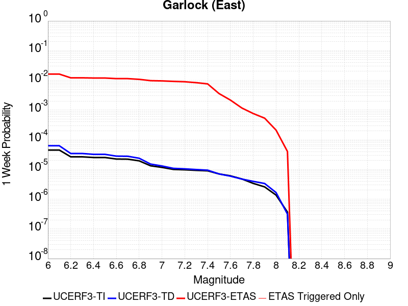 |  |  |  |

| Magnitude | 1 wk TI Prob | 1 wk TD Prob | 1 wk ETAS Prob | 1 wk ETAS/TD Gain | 1 wk ETAS Triggered Only | 1 mo TI Prob | 1 mo TD Prob | 1 mo ETAS Prob | 1 mo ETAS/TD Gain | 1 mo ETAS Triggered Only | 1 yr TI Prob | 1 yr TD Prob | 1 yr ETAS Prob | 1 yr ETAS/TD Gain | 1 yr ETAS Triggered Only | 10 yr TI Prob | 10 yr TD Prob | 10 yr ETAS Prob | 10 yr ETAS/TD Gain | 10 yr ETAS Triggered Only |
|-----|-----|-----|-----|-----|-----|-----|-----|-----|-----|-----|-----|-----|-----|-----|-----|-----|-----|-----|-----|-----|
| 6.0 | 4.5092507E-5 | 6.290325E-5 | 0.017038133 | 270.86252 | 0.016976297 | 1.9323928E-4 | 2.6956003E-4 | 0.020643631 | 76.58269 | 0.020379564 | 0.0023501497 | 0.0032774 | 0.027900152 | 8.512892 | 0.024703715 | 0.023254504 | 0.032351844 | 0.05885214 | 1.8191277 | 0.027386291 |
| 6.1 | 4.5092507E-5 | 6.290325E-5 | 0.017038133 | 270.86252 | 0.016976297 | 1.9323928E-4 | 2.6956003E-4 | 0.020643631 | 76.58269 | 0.020379564 | 0.0023501497 | 0.0032774 | 0.027900152 | 8.512892 | 0.024703715 | 0.023254504 | 0.032351844 | 0.05885214 | 1.8191277 | 0.027386291 |
| 6.2 | 2.6674514E-5 | 3.4509674E-5 | 0.012846367 | 372.2541 | 0.0128123 | 1.1431433E-4 | 1.4789042E-4 | 0.015360246 | 103.86236 | 0.015214606 | 0.0013908884 | 0.0017991117 | 0.01982396 | 11.018748 | 0.018057335 | 0.01382215 | 0.017890299 | 0.037197467 | 2.0791976 | 0.019658873 |
| 6.3 | 2.6674514E-5 | 3.4509674E-5 | 0.012846367 | 372.2541 | 0.0128123 | 1.1431433E-4 | 1.4789042E-4 | 0.015360246 | 103.86236 | 0.015214606 | 0.0013908884 | 0.0017991117 | 0.01982396 | 11.018748 | 0.018057335 | 0.01382215 | 0.017890299 | 0.037197467 | 2.0791976 | 0.019658873 |
| 6.4 | 2.5312667E-5 | 3.233893E-5 | 0.012563964 | 388.50897 | 0.012532031 | 1.0847834E-4 | 1.3858822E-4 | 0.015070856 | 108.745575 | 0.014934337 | 0.0013199237 | 0.0016860351 | 0.019393157 | 11.502227 | 0.017737027 | 0.013121112 | 0.016778335 | 0.0357137 | 2.1285603 | 0.019258488 |
| 6.5 | 2.5312667E-5 | 3.233893E-5 | 0.012563964 | 388.50897 | 0.012532031 | 1.0847834E-4 | 1.3858822E-4 | 0.015070856 | 108.745575 | 0.014934337 | 0.0013199237 | 0.0016860351 | 0.019393157 | 11.502227 | 0.017737027 | 0.013121112 | 0.016778335 | 0.0357137 | 2.1285603 | 0.019258488 |
| 6.6 | 2.246556E-5 | 2.8133776E-5 | 0.012079365 | 429.35452 | 0.012051569 | 9.627742E-5 | 1.20567885E-4 | 0.0144526 | 119.871056 | 0.01433376 | 0.0011715472 | 0.0014669491 | 0.018378364 | 12.528289 | 0.01693626 | 0.011653901 | 0.01461866 | 0.032688193 | 2.2360594 | 0.018337604 |
| 6.7 | 2.2241198E-5 | 2.7803519E-5 | 0.012079038 | 434.44278 | 0.012051569 | 9.531594E-5 | 1.1915263E-4 | 0.014411172 | 120.94715 | 0.014293722 | 0.0011598538 | 0.0014497414 | 0.018281486 | 12.61017 | 0.016856182 | 0.011538187 | 0.014448853 | 0.03244258 | 2.2453394 | 0.018257527 |
| 6.8 | 1.9528685E-5 | 2.389819E-5 | 0.0113144675 | 473.44452 | 0.011290839 | 8.369167E-5 | 1.0241691E-4 | 0.013433851 | 131.16829 | 0.013332799 | 0.0010184698 | 0.0012462323 | 0.016841764 | 13.514145 | 0.01561499 | 0.010138147 | 0.012436427 | 0.029082978 | 2.3385317 | 0.016856182 |
| 6.9 | 1.3318621E-5 | 1.5198884E-5 | 0.010224845 | 672.7366 | 0.010209802 | 5.7078556E-5 | 6.513648E-5 | 0.011875706 | 182.32034 | 0.011811339 | 6.9470983E-4 | 7.927538E-4 | 0.014355024 | 18.107794 | 0.01357303 | 0.0069254204 | 0.007939888 | 0.022398163 | 2.8209672 | 0.014573991 |
| 7.0 | 1.1760853E-5 | 1.31077895E-5 | 0.009982548 | 761.5737 | 0.009969571 | 5.0402683E-5 | 5.6175057E-5 | 0.011546561 | 205.54604 | 0.011491031 | 6.134799E-4 | 6.8372174E-4 | 0.013767339 | 20.13588 | 0.013092569 | 0.0061178906 | 0.00685652 | 0.020853417 | 3.0413995 | 0.014093529 |
| 7.1 | 1.0064758E-5 | 1.0902931E-5 | 0.009660061 | 886.0059 | 0.009649264 | 4.3133965E-5 | 4.672603E-5 | 0.011136855 | 238.34372 | 0.011090647 | 5.2502943E-4 | 5.687444E-4 | 0.01325371 | 23.303457 | 0.012692184 | 0.005237907 | 0.0057129986 | 0.019248296 | 3.3692107 | 0.0136130685 |
| 7.2 | 9.768808E-6 | 1.0498807E-5 | 0.009339357 | 889.5636 | 0.009328956 | 4.186565E-5 | 4.499413E-5 | 0.010814849 | 240.36133 | 0.0107703395 | 5.095951E-4 | 5.4766936E-4 | 0.012912771 | 23.577677 | 0.012371877 | 0.0050842804 | 0.0055032647 | 0.018683054 | 3.394904 | 0.013252723 |
| 7.3 | 9.344516E-6 | 9.944468E-6 | 0.008417932 | 846.4941 | 0.0084080715 | 4.004731E-5 | 4.261847E-5 | 0.009811581 | 230.21898 | 0.009769378 | 4.8746695E-4 | 5.1875977E-4 | 0.011803742 | 22.75377 | 0.011290839 | 0.0048639905 | 0.0052149445 | 0.017243495 | 3.3065538 | 0.012091608 |
| 7.4 | 9.023491E-6 | 9.490661E-6 | 0.007816912 | 823.6425 | 0.007807495 | 3.867153E-5 | 4.0673647E-5 | 0.008808735 | 216.57106 | 0.008768418 | 4.7072413E-4 | 4.950925E-4 | 0.0105797835 | 21.369307 | 0.010089686 | 0.004697283 | 0.0049783974 | 0.015734958 | 3.1606472 | 0.010810378 |
| 7.5 | 7.081253E-6 | 7.087672E-6 | 0.003530445 | 498.1107 | 0.0035233824 | 3.0347876E-5 | 3.0375388E-5 | 0.004274321 | 140.71658 | 0.004244074 | 3.6942272E-4 | 3.6975832E-4 | 0.005292665 | 14.313849 | 0.0049247276 | 0.003688092 | 0.0037243143 | 0.009069484 | 2.435209 | 0.0053651505 |
| 7.6 | 6.116396E-6 | 5.959245E-6 | 0.001967831 | 330.21484 | 0.0019618834 | 2.6212863E-5 | 2.5539372E-5 | 0.0025078591 | 98.1958 | 0.002482383 | 3.1909486E-4 | 3.1089774E-4 | 0.003152743 | 10.140772 | 0.002842729 | 0.0031863707 | 0.0031357552 | 0.0063287863 | 2.0182655 | 0.003203075 |
| 7.7 | 4.797145E-6 | 4.757281E-6 | 0.00108579 | 228.2375 | 0.0010810378 | 2.055903E-5 | 2.0388188E-5 | 0.0014617426 | 71.69556 | 0.0014413837 | 2.5027743E-4 | 2.4819805E-4 | 0.0019694236 | 7.9348874 | 0.0017216528 | 0.0024999576 | 0.0025093474 | 0.00442637 | 1.7639526 | 0.001921845 |
| 7.8 | 3.4028885E-6 | 3.978462E-6 | 7.6470576E-4 | 192.21141 | 7.607303E-4 | 1.4583726E-5 | 1.7050439E-5 | 0.0010179942 | 59.704872 | 0.0010009609 | 1.775424E-4 | 2.0756939E-4 | 0.001368443 | 6.5927014 | 0.0011611147 | 0.0017740062 | 0.0021012232 | 0.003379761 | 1.6084732 | 0.00128123 |
| 7.9 | 2.5928412E-6 | 3.3724489E-6 | 5.2387035E-4 | 155.33827 | 5.2049966E-4 | 1.1112129E-5 | 1.4453272E-5 | 6.9509685E-4 | 48.092697 | 6.8065344E-4 | 1.3528178E-4 | 1.7595445E-4 | 9.365509E-4 | 5.3226895 | 7.607303E-4 | 0.0013519945 | 0.0017812408 | 0.0026605173 | 1.4936315 | 8.808456E-4 |
| 8.0 | 1.3743648E-6 | 1.6734747E-6 | 1.6182696E-4 | 96.701164 | 1.6015375E-4 | 5.8901214E-6 | 7.1720146E-6 | 2.4740092E-4 | 34.495316 | 2.4023063E-4 | 7.1709874E-5 | 8.731581E-5 | 3.675604E-4 | 4.2095513 | 2.8026907E-4 | 7.1686733E-4 | 8.837234E-4 | 0.0011637447 | 1.3168654 | 2.8026907E-4 |
| 8.1 | 3.6733252E-7 | 3.1489964E-7 | 3.1489964E-7 | 1.0 | 0.0 | 1.5742813E-6 | 1.3495693E-6 | 1.3495693E-6 | 1.0 | 0.0 | 1.9166706E-5 | 1.6430899E-5 | 1.6430899E-5 | 1.0 | 0.0 | 1.9165053E-4 | 1.6638759E-4 | 1.6638759E-4 | 1.0 | 0.0 |

## Hunter Mountain-Saline Valley
*[(top)](#table-of-contents)*

| 1 Week | 1 Month | 1 Year | 10 Year |
|-----|-----|-----|-----|
|  |  |  |  |

| Magnitude | 1 wk TI Prob | 1 wk TD Prob | 1 wk ETAS Prob | 1 wk ETAS/TD Gain | 1 wk ETAS Triggered Only | 1 mo TI Prob | 1 mo TD Prob | 1 mo ETAS Prob | 1 mo ETAS/TD Gain | 1 mo ETAS Triggered Only | 1 yr TI Prob | 1 yr TD Prob | 1 yr ETAS Prob | 1 yr ETAS/TD Gain | 1 yr ETAS Triggered Only | 10 yr TI Prob | 10 yr TD Prob | 10 yr ETAS Prob | 10 yr ETAS/TD Gain | 10 yr ETAS Triggered Only |
|-----|-----|-----|-----|-----|-----|-----|-----|-----|-----|-----|-----|-----|-----|-----|-----|-----|-----|-----|-----|-----|
| 6.0 | 4.5103672E-5 | 5.4570177E-5 | 0.008862546 | 162.40639 | 0.008808456 | 1.9328714E-4 | 2.3385242E-4 | 0.010641412 | 45.504814 | 0.010409994 | 0.002350731 | 0.0028435152 | 0.015260062 | 5.3666186 | 0.012451954 | 0.023260195 | 0.028091887 | 0.041789502 | 1.4876004 | 0.014093529 |
| 6.1 | 4.5103672E-5 | 5.4570177E-5 | 0.008862546 | 162.40639 | 0.008808456 | 1.9328714E-4 | 2.3385242E-4 | 0.010641412 | 45.504814 | 0.010409994 | 0.002350731 | 0.0028435152 | 0.015260062 | 5.3666186 | 0.012451954 | 0.023260195 | 0.028091887 | 0.041789502 | 1.4876004 | 0.014093529 |
| 6.2 | 3.9363465E-5 | 4.706337E-5 | 0.008815069 | 187.30211 | 0.008768418 | 1.6868966E-4 | 2.0168544E-4 | 0.010569549 | 52.40611 | 0.010369956 | 0.002051862 | 0.0024528175 | 0.0148342885 | 6.047857 | 0.012411916 | 0.020330196 | 0.024273481 | 0.037907712 | 1.5616925 | 0.013973415 |
| 6.3 | 3.9363465E-5 | 4.706337E-5 | 0.008815069 | 187.30211 | 0.008768418 | 1.6868966E-4 | 2.0168544E-4 | 0.010569549 | 52.40611 | 0.010369956 | 0.002051862 | 0.0024528175 | 0.0148342885 | 6.047857 | 0.012411916 | 0.020330196 | 0.024273481 | 0.037907712 | 1.5616925 | 0.013973415 |
| 6.4 | 3.2311684E-5 | 3.795099E-5 | 0.008605851 | 226.76224 | 0.008568225 | 1.384713E-4 | 1.6263737E-4 | 0.010330746 | 63.520126 | 0.010169763 | 0.0016845843 | 0.0019783843 | 0.014125989 | 7.140164 | 0.012171685 | 0.016718714 | 0.019616475 | 0.033041008 | 1.68435 | 0.0136931455 |
| 6.5 | 3.2311684E-5 | 3.795099E-5 | 0.008605851 | 226.76224 | 0.008568225 | 1.384713E-4 | 1.6263737E-4 | 0.010330746 | 63.520126 | 0.010169763 | 0.0016845843 | 0.0019783843 | 0.014125989 | 7.140164 | 0.012171685 | 0.016718714 | 0.019616475 | 0.033041008 | 1.68435 | 0.0136931455 |
| 6.6 | 2.9305844E-5 | 3.418183E-5 | 0.008602114 | 251.6575 | 0.008568225 | 1.2559042E-4 | 1.4648569E-4 | 0.010314759 | 70.41479 | 0.010169763 | 0.0015279909 | 0.001782067 | 0.013892094 | 7.7954946 | 0.012131646 | 0.015175272 | 0.01768569 | 0.031097334 | 1.758333 | 0.013653107 |
| 6.7 | 2.7826512E-5 | 3.2344276E-5 | 0.008600293 | 265.89844 | 0.008568225 | 1.19251024E-4 | 1.386113E-4 | 0.010306965 | 74.358765 | 0.010169763 | 0.0014509142 | 0.0016863465 | 0.013797535 | 8.18191 | 0.012131646 | 0.014414776 | 0.016743187 | 0.030167697 | 1.8017895 | 0.013653107 |
| 6.8 | 2.3389874E-5 | 2.6866714E-5 | 0.008594862 | 319.90744 | 0.008568225 | 1.0023846E-4 | 1.15138246E-4 | 0.01028373 | 89.31637 | 0.010169763 | 0.00121972 | 0.001400954 | 0.013515605 | 9.647429 | 0.012131646 | 0.01213047 | 0.013927434 | 0.027390389 | 1.96665 | 0.013653107 |
| 6.9 | 2.069209E-5 | 2.3570032E-5 | 0.008591593 | 364.51346 | 0.008568225 | 8.867737E-5 | 1.01010715E-4 | 0.010229712 | 101.27354 | 0.010129725 | 0.0010791123 | 0.0012291478 | 0.013225915 | 10.760232 | 0.012011531 | 0.010738871 | 0.012228523 | 0.025596026 | 2.0931413 | 0.0135329915 |
| 7.0 | 1.7462342E-5 | 1.9633546E-5 | 0.008587691 | 437.39886 | 0.008568225 | 7.483646E-5 | 8.414118E-5 | 0.010213014 | 121.379486 | 0.010129725 | 9.1075303E-4 | 0.0010239601 | 0.013023192 | 12.718456 | 0.012011531 | 0.009070295 | 0.0101960525 | 0.02359106 | 2.3137445 | 0.0135329915 |
| 7.1 | 1.4807709E-5 | 1.6441749E-5 | 0.008464413 | 514.8122 | 0.00844811 | 6.3460066E-5 | 7.046283E-5 | 0.010079367 | 143.04517 | 0.010009609 | 7.723524E-4 | 8.575638E-4 | 0.012738782 | 14.854617 | 0.011891415 | 0.007696735 | 0.008545532 | 0.021804092 | 2.5515196 | 0.013372838 |
| 7.2 | 1.4180048E-5 | 1.5698337E-5 | 0.008463676 | 539.1448 | 0.00844811 | 6.077022E-5 | 6.727694E-5 | 0.010076213 | 149.77216 | 0.010009609 | 7.396263E-4 | 8.188051E-4 | 0.012700484 | 15.510997 | 0.011891415 | 0.0073716943 | 0.008160833 | 0.021424538 | 2.625288 | 0.013372838 |
| 7.3 | 1.3730402E-5 | 1.5172075E-5 | 0.008463155 | 557.8112 | 0.00844811 | 5.8843252E-5 | 6.502165E-5 | 0.01007398 | 154.93271 | 0.010009609 | 7.161811E-4 | 7.9136714E-4 | 0.012673372 | 16.01453 | 0.011891415 | 0.007138774 | 0.007888422 | 0.02115577 | 2.6818757 | 0.013372838 |
| 7.4 | 1.2810095E-5 | 1.4109277E-5 | 0.008422063 | 596.9166 | 0.0084080715 | 5.489925E-5 | 6.0467017E-5 | 0.010029435 | 165.86621 | 0.009969571 | 6.681934E-4 | 7.359531E-4 | 0.0125386 | 17.037226 | 0.011811339 | 0.006661878 | 0.007338053 | 0.020533271 | 2.7981906 | 0.013292761 |
| 7.5 | 1.1595659E-5 | 1.2800664E-5 | 0.008380727 | 654.7103 | 0.008368033 | 4.9694736E-5 | 5.4858923E-5 | 0.009983847 | 181.9913 | 0.009929532 | 6.0486543E-4 | 6.6771836E-4 | 0.012431159 | 18.617369 | 0.011771301 | 0.006032217 | 0.0066599925 | 0.019824453 | 2.9766479 | 0.013252723 |
| 7.6 | 2.997694E-6 | 3.3251579E-6 | 0.003526696 | 1060.61 | 0.0035233824 | 1.28471975E-5 | 1.425064E-5 | 0.004098113 | 287.57397 | 0.0040839207 | 1.564034E-4 | 1.73495E-4 | 0.0052574943 | 30.303432 | 0.0050848816 | 0.0015629337 | 0.001735031 | 0.0074106245 | 4.271177 | 0.005685458 |

## Blackwater
*[(top)](#table-of-contents)*

| 1 Week | 1 Month | 1 Year | 10 Year |
|-----|-----|-----|-----|
|  |  |  |  |

| Magnitude | 1 wk TI Prob | 1 wk TD Prob | 1 wk ETAS Prob | 1 wk ETAS/TD Gain | 1 wk ETAS Triggered Only | 1 mo TI Prob | 1 mo TD Prob | 1 mo ETAS Prob | 1 mo ETAS/TD Gain | 1 mo ETAS Triggered Only | 1 yr TI Prob | 1 yr TD Prob | 1 yr ETAS Prob | 1 yr ETAS/TD Gain | 1 yr ETAS Triggered Only | 10 yr TI Prob | 10 yr TD Prob | 10 yr ETAS Prob | 10 yr ETAS/TD Gain | 10 yr ETAS Triggered Only |
|-----|-----|-----|-----|-----|-----|-----|-----|-----|-----|-----|-----|-----|-----|-----|-----|-----|-----|-----|-----|-----|
| 6.0 | 3.0708583E-5 | 3.3095846E-5 | 0.0066792564 | 201.81554 | 0.0066463803 | 1.3160157E-4 | 1.4183241E-4 | 0.008108351 | 57.168537 | 0.007967649 | 0.0016010714 | 0.0017255784 | 0.012277486 | 7.1149974 | 0.010570147 | 0.015895851 | 0.017135633 | 0.02945292 | 1.7188113 | 0.012532031 |
| 6.1 | 3.0708583E-5 | 3.3095846E-5 | 0.0066792564 | 201.81554 | 0.0066463803 | 1.3160157E-4 | 1.4183241E-4 | 0.008108351 | 57.168537 | 0.007967649 | 0.0016010714 | 0.0017255784 | 0.012277486 | 7.1149974 | 0.010570147 | 0.015895851 | 0.017135633 | 0.02945292 | 1.7188113 | 0.012532031 |
| 6.2 | 1.1707779E-5 | 1.2545122E-5 | 0.0023747832 | 189.29933 | 0.0023622678 | 5.017523E-5 | 5.3763757E-5 | 0.0028563037 | 53.126938 | 0.0028026905 | 6.107122E-4 | 6.5438676E-4 | 0.0044155368 | 6.7475953 | 0.003763613 | 0.006090366 | 0.0065255696 | 0.011139721 | 1.7070879 | 0.0046444586 |
| 6.3 | 1.1707779E-5 | 1.2545122E-5 | 0.0023747832 | 189.29933 | 0.0023622678 | 5.017523E-5 | 5.3763757E-5 | 0.0028563037 | 53.126938 | 0.0028026905 | 6.107122E-4 | 6.5438676E-4 | 0.0044155368 | 6.7475953 | 0.003763613 | 0.006090366 | 0.0065255696 | 0.011139721 | 1.7070879 | 0.0046444586 |
| 6.4 | 7.929244E-6 | 8.480098E-6 | 0.0016500421 | 194.57819 | 0.001641576 | 3.3982033E-5 | 3.6342793E-5 | 0.0019581178 | 53.879124 | 0.001921845 | 4.136527E-4 | 4.423877E-4 | 0.0030837555 | 6.970708 | 0.0026425368 | 0.0041288356 | 0.0044154758 | 0.0076442696 | 1.7312447 | 0.0032431134 |
| 6.5 | 5.8832115E-6 | 6.285991E-6 | 0.0012074315 | 192.08293 | 0.0012011532 | 2.521352E-5 | 2.6939697E-5 | 0.0014682846 | 54.50264 | 0.0014413837 | 3.0693135E-4 | 3.27944E-4 | 0.0022091335 | 6.736313 | 0.0018818065 | 0.0030650778 | 0.0032748538 | 0.005549571 | 1.694601 | 0.0022821908 |
| 6.6 | 5.8832115E-6 | 6.285991E-6 | 0.0012074315 | 192.08293 | 0.0012011532 | 2.521352E-5 | 2.6939697E-5 | 0.0014682846 | 54.50264 | 0.0014413837 | 3.0693135E-4 | 3.27944E-4 | 0.0022091335 | 6.736313 | 0.0018818065 | 0.0030650778 | 0.0032748538 | 0.005549571 | 1.694601 | 0.0022821908 |
| 6.7 | 3.0715053E-6 | 3.2814662E-6 | 4.036645E-4 | 123.013466 | 4.0038436E-4 | 1.3163528E-5 | 1.4063357E-5 | 5.745936E-4 | 40.8575 | 5.6053814E-4 | 1.6025416E-4 | 1.7120909E-4 | 7.716828E-4 | 4.507254 | 6.005766E-4 | 0.0016013865 | 0.0017108864 | 0.0024303452 | 1.4205182 | 7.2069187E-4 |
| 6.8 | 2.2722281E-6 | 2.4287538E-6 | 3.2273546E-4 | 132.8811 | 3.203075E-4 | 9.738084E-6 | 1.0408908E-5 | 3.7075108E-4 | 35.618633 | 3.6034593E-4 | 1.1855473E-4 | 1.26722E-4 | 5.2705564E-4 | 4.1591487 | 4.0038436E-4 | 0.001184915 | 0.0012665876 | 0.001786428 | 1.4104259 | 5.2049966E-4 |
| 6.9 | 9.952399E-7 | 1.0653489E-6 | 8.1142134E-5 | 76.16485 | 8.0076876E-5 | 4.265307E-6 | 4.5657757E-6 | 1.2468053E-4 | 27.307634 | 1.2011531E-4 | 5.1928873E-5 | 5.5587418E-5 | 2.1573226E-4 | 3.880955 | 1.6015375E-4 | 5.191674E-4 | 5.557858E-4 | 7.9588284E-4 | 1.4319957 | 2.4023063E-4 |
| 7.0 | 4.7385504E-7 | 5.0755597E-7 | 4.0545972E-5 | 79.884735 | 4.0038438E-5 | 2.0308057E-6 | 2.1752398E-6 | 4.221359E-5 | 19.406408 | 4.0038438E-5 | 2.4724779E-5 | 2.6483543E-5 | 6.652092E-5 | 2.5117831 | 4.0038438E-5 | 2.4722028E-4 | 2.6483546E-4 | 3.448911E-4 | 1.3022846 | 8.0076876E-5 |

## Ash Hill
*[(top)](#table-of-contents)*

| 1 Week | 1 Month | 1 Year | 10 Year |
|-----|-----|-----|-----|
|  |  |  |  |

| Magnitude | 1 wk TI Prob | 1 wk TD Prob | 1 wk ETAS Prob | 1 wk ETAS/TD Gain | 1 wk ETAS Triggered Only | 1 mo TI Prob | 1 mo TD Prob | 1 mo ETAS Prob | 1 mo ETAS/TD Gain | 1 mo ETAS Triggered Only | 1 yr TI Prob | 1 yr TD Prob | 1 yr ETAS Prob | 1 yr ETAS/TD Gain | 1 yr ETAS Triggered Only | 10 yr TI Prob | 10 yr TD Prob | 10 yr ETAS Prob | 10 yr ETAS/TD Gain | 10 yr ETAS Triggered Only |
|-----|-----|-----|-----|-----|-----|-----|-----|-----|-----|-----|-----|-----|-----|-----|-----|-----|-----|-----|-----|-----|
| 6.0 | 2.1545662E-5 | 2.3194447E-5 | 0.005988783 | 258.199 | 0.005965727 | 9.2335285E-5 | 9.940143E-5 | 0.0075458107 | 75.91249 | 0.007447149 | 0.0011236023 | 0.0012096206 | 0.010167382 | 8.405431 | 0.00896861 | 0.011179381 | 0.012038348 | 0.02224391 | 1.8477542 | 0.010329917 |
| 6.1 | 2.1545662E-5 | 2.3194447E-5 | 0.005988783 | 258.199 | 0.005965727 | 9.2335285E-5 | 9.940143E-5 | 0.0075458107 | 75.91249 | 0.007447149 | 0.0011236023 | 0.0012096206 | 0.010167382 | 8.405431 | 0.00896861 | 0.011179381 | 0.012038348 | 0.02224391 | 1.8477542 | 0.010329917 |
| 6.2 | 2.1545662E-5 | 2.3194447E-5 | 0.005988783 | 258.199 | 0.005965727 | 9.2335285E-5 | 9.940143E-5 | 0.0075458107 | 75.91249 | 0.007447149 | 0.0011236023 | 0.0012096206 | 0.010167382 | 8.405431 | 0.00896861 | 0.011179381 | 0.012038348 | 0.02224391 | 1.8477542 | 0.010329917 |
| 6.3 | 1.0025529E-5 | 1.0746934E-5 | 0.0026932934 | 250.61038 | 0.0026825753 | 4.2965847E-5 | 4.605755E-5 | 0.0033690948 | 73.14967 | 0.0033231901 | 5.229836E-4 | 5.6061964E-4 | 0.0042821066 | 7.6381674 | 0.0037235746 | 0.005217545 | 0.0055933665 | 0.009694259 | 1.7331706 | 0.004123959 |
| 6.4 | 1.0025529E-5 | 1.0746934E-5 | 0.0026932934 | 250.61038 | 0.0026825753 | 4.2965847E-5 | 4.605755E-5 | 0.0033690948 | 73.14967 | 0.0033231901 | 5.229836E-4 | 5.6061964E-4 | 0.0042821066 | 7.6381674 | 0.0037235746 | 0.005217545 | 0.0055933665 | 0.009694259 | 1.7331706 | 0.004123959 |
| 6.5 | 6.9617327E-6 | 7.456634E-6 | 0.0018892492 | 253.36487 | 0.0018818065 | 2.9835655E-5 | 3.195666E-5 | 0.0023941488 | 74.91862 | 0.0023622678 | 3.6318856E-4 | 3.8901155E-4 | 0.0030305204 | 7.7903094 | 0.0026425368 | 0.0036259557 | 0.0038841602 | 0.0067956136 | 1.7495708 | 0.002922806 |
| 6.6 | 4.9919777E-6 | 5.3466883E-6 | 0.0014467227 | 270.58295 | 0.0014413837 | 2.1394015E-5 | 2.2914215E-5 | 0.001784565 | 77.880264 | 0.0017616912 | 2.60441E-4 | 2.7895154E-4 | 0.002280315 | 8.174591 | 0.0020019219 | 0.0026013597 | 0.0027866727 | 0.0049826503 | 1.7880285 | 0.002202114 |
| 6.7 | 3.6630722E-6 | 3.924624E-6 | 0.0011650347 | 296.8526 | 0.0011611147 | 1.5698786E-5 | 1.681974E-5 | 0.0014181414 | 84.31412 | 0.0014013452 | 1.9111596E-4 | 2.0476682E-4 | 0.0018460066 | 9.015164 | 0.001641576 | 0.0019095168 | 0.0020463446 | 0.0038443871 | 1.8786608 | 0.0018017297 |
| 6.8 | 2.5599613E-6 | 2.744925E-6 | 8.835881E-4 | 321.8988 | 8.808456E-4 | 1.0971216E-5 | 1.1763939E-5 | 0.0010527511 | 89.48967 | 0.0010409993 | 1.3356637E-4 | 1.4322149E-4 | 0.0013442026 | 9.385481 | 0.0012011532 | 0.0013348613 | 0.0014317769 | 0.0027511537 | 1.921496 | 0.0013212684 |
| 6.9 | 1.7684905E-6 | 1.8968707E-6 | 7.2258734E-4 | 380.93655 | 7.2069187E-4 | 7.579223E-6 | 8.129446E-6 | 7.688536E-4 | 94.57638 | 7.607303E-4 | 9.2273134E-5 | 9.8976E-5 | 0.0010197689 | 10.303193 | 9.20884E-4 | 9.223483E-4 | 9.8976E-4 | 0.002029729 | 2.0507283 | 0.0010409993 |

## Garlock (West)
*[(top)](#table-of-contents)*

| 1 Week | 1 Month | 1 Year | 10 Year |
|-----|-----|-----|-----|
|  |  |  |  |

| Magnitude | 1 wk TI Prob | 1 wk TD Prob | 1 wk ETAS Prob | 1 wk ETAS/TD Gain | 1 wk ETAS Triggered Only | 1 mo TI Prob | 1 mo TD Prob | 1 mo ETAS Prob | 1 mo ETAS/TD Gain | 1 mo ETAS Triggered Only | 1 yr TI Prob | 1 yr TD Prob | 1 yr ETAS Prob | 1 yr ETAS/TD Gain | 1 yr ETAS Triggered Only | 10 yr TI Prob | 10 yr TD Prob | 10 yr ETAS Prob | 10 yr ETAS/TD Gain | 10 yr ETAS Triggered Only |
|-----|-----|-----|-----|-----|-----|-----|-----|-----|-----|-----|-----|-----|-----|-----|-----|-----|-----|-----|-----|-----|
| 6.0 | 2.5181727E-5 | 2.51973E-5 | 0.0065112608 | 258.41104 | 0.006486227 | 1.0791722E-4 | 1.0798398E-4 | 0.0075943633 | 70.32861 | 0.0074871876 | 0.0013131002 | 0.0013139155 | 0.010270742 | 7.8168964 | 0.00896861 | 0.013053683 | 0.013141977 | 0.02266443 | 1.724583 | 0.009649264 |
| 6.1 | 2.5077732E-5 | 2.5098372E-5 | 0.0065111625 | 259.4257 | 0.006486227 | 1.0747157E-4 | 1.0756004E-4 | 0.0075939423 | 70.6019 | 0.0074871876 | 0.001307681 | 0.0013087603 | 0.0102656325 | 7.843784 | 0.00896861 | 0.013000126 | 0.013091032 | 0.022613976 | 1.7274402 | 0.009649264 |
| 6.2 | 2.494612E-5 | 2.498005E-5 | 0.0065110447 | 260.64978 | 0.006486227 | 1.0690756E-4 | 1.0705298E-4 | 0.007593439 | 70.931595 | 0.0074871876 | 0.0013008224 | 0.0013025942 | 0.010259521 | 7.876222 | 0.00896861 | 0.012932341 | 0.013030097 | 0.02255363 | 1.7308873 | 0.009649264 |
| 6.3 | 2.4733758E-5 | 2.479942E-5 | 0.0065108654 | 262.54105 | 0.006486227 | 1.0599751E-4 | 1.06278916E-4 | 0.007592671 | 71.44099 | 0.0074871876 | 0.0012897556 | 0.0012931811 | 0.010250193 | 7.9263396 | 0.00896861 | 0.012822957 | 0.012937066 | 0.022461496 | 1.7362125 | 0.009649264 |
| 6.4 | 2.3237335E-5 | 2.317873E-5 | 0.006509255 | 280.8288 | 0.006486227 | 9.958477E-5 | 9.933365E-5 | 0.0075857774 | 76.366646 | 0.0074871876 | 0.0012117702 | 0.001208719 | 0.010166489 | 8.410961 | 0.00896861 | 0.012051838 | 0.012101916 | 0.021634404 | 1.7876843 | 0.009649264 |
| 6.5 | 2.2732203E-5 | 2.2993298E-5 | 0.0065090708 | 283.08557 | 0.006486227 | 9.742009E-5 | 9.8539E-5 | 0.007584989 | 76.97449 | 0.0074871876 | 0.0011854442 | 0.0011990548 | 0.010156911 | 8.470764 | 0.00896861 | 0.011791403 | 0.012006322 | 0.021539733 | 1.7940326 | 0.009649264 |
| 6.6 | 2.1319436E-5 | 2.17735E-5 | 0.0064678215 | 297.05017 | 0.0064461883 | 9.136581E-5 | 9.331167E-5 | 0.007539766 | 80.80196 | 0.007447149 | 0.001111811 | 0.0011354799 | 0.010053913 | 8.85433 | 0.008928572 | 0.011062649 | 0.011377227 | 0.020877125 | 1.8349925 | 0.009609225 |
| 6.7 | 1.970802E-5 | 2.0393396E-5 | 0.00646645 | 317.0855 | 0.0064461883 | 8.446021E-5 | 8.739735E-5 | 0.007533896 | 86.2028 | 0.007447149 | 0.001027818 | 0.001063545 | 0.00998262 | 9.386176 | 0.008928572 | 0.010230771 | 0.010664964 | 0.020171707 | 1.8913994 | 0.009609225 |
| 6.8 | 1.8744462E-5 | 1.9901045E-5 | 0.006465961 | 324.9056 | 0.0064461883 | 8.033094E-5 | 8.5287415E-5 | 0.0075318017 | 88.31082 | 0.007447149 | 9.775903E-4 | 0.0010378812 | 0.009957186 | 9.593762 | 0.008928572 | 0.009733009 | 0.01041075 | 0.019919936 | 1.9134005 | 0.009609225 |
| 6.9 | 1.7559682E-5 | 1.8953415E-5 | 0.0064650197 | 341.10052 | 0.0064461883 | 7.5253614E-5 | 8.12264E-5 | 0.007527771 | 92.67641 | 0.007447149 | 9.158276E-4 | 9.884841E-4 | 0.009868231 | 9.983195 | 0.008888533 | 0.0091206245 | 0.009921231 | 0.01939548 | 1.9549469 | 0.009569187 |
| 7.0 | 1.6794445E-5 | 1.8216237E-5 | 0.0064242496 | 352.6661 | 0.00640615 | 7.197421E-5 | 7.8067256E-5 | 0.0074846 | 95.87373 | 0.0074071107 | 8.759337E-4 | 9.5005584E-4 | 0.009790144 | 10.304809 | 0.008848495 | 0.008724891 | 0.009540141 | 0.01897838 | 1.9893186 | 0.009529148 |
| 7.1 | 1.6337795E-5 | 1.7717046E-5 | 0.006423753 | 362.57477 | 0.00640615 | 7.0017246E-5 | 7.5927994E-5 | 0.0074824765 | 98.547005 | 0.0074071107 | 8.521265E-4 | 9.240326E-4 | 0.009764351 | 10.567106 | 0.008848495 | 0.008488664 | 0.009281996 | 0.018722694 | 2.017098 | 0.009529148 |
| 7.2 | 1.5780008E-5 | 1.7165687E-5 | 0.006383168 | 371.85626 | 0.0063661113 | 6.762685E-5 | 7.356516E-5 | 0.00740006 | 100.59191 | 0.007327034 | 8.2304585E-4 | 8.9528906E-4 | 0.0096558565 | 10.785183 | 0.008768418 | 0.008200042 | 0.008996838 | 0.018360898 | 2.0408168 | 0.009449071 |
| 7.3 | 1.5058865E-5 | 1.6618762E-5 | 0.0063826246 | 384.06137 | 0.0063661113 | 6.45364E-5 | 7.122133E-5 | 0.0073977336 | 103.86964 | 0.007327034 | 7.854473E-4 | 8.667759E-4 | 0.009627594 | 11.107362 | 0.008768418 | 0.00782677 | 0.008713539 | 0.018080276 | 2.0749636 | 0.009449071 |
| 7.4 | 1.4887923E-5 | 1.6454731E-5 | 0.0063424236 | 385.4468 | 0.006326073 | 6.380382E-5 | 7.051838E-5 | 0.007357 | 104.327415 | 0.0072869956 | 7.7653467E-4 | 8.582243E-4 | 0.009579113 | 11.16155 | 0.008728379 | 0.0077382675 | 0.008628399 | 0.017956248 | 2.0810635 | 0.009409033 |
| 7.5 | 1.4509299E-5 | 1.6046748E-5 | 0.005781489 | 360.29037 | 0.005765535 | 6.218123E-5 | 6.876997E-5 | 0.006754729 | 98.22207 | 0.006686419 | 7.567935E-4 | 8.36954E-4 | 0.008677919 | 10.368455 | 0.007847534 | 0.0075422134 | 0.008416704 | 0.016833412 | 2.0000002 | 0.008488148 |
| 7.6 | 1.2756717E-5 | 1.4050848E-5 | 0.0035373839 | 251.75589 | 0.0035233824 | 5.4670498E-5 | 6.0216535E-5 | 0.004183927 | 69.48137 | 0.004123959 | 6.6541E-4 | 7.328904E-4 | 0.0054939725 | 7.496309 | 0.004764574 | 0.006634211 | 0.0073816874 | 0.0125880055 | 1.7053019 | 0.005245035 |
| 7.7 | 1.0328985E-5 | 1.1460557E-5 | 0.0021735113 | 189.65146 | 0.0021620756 | 4.4266326E-5 | 4.911575E-5 | 0.0026514863 | 53.98444 | 0.0026024985 | 5.388092E-4 | 5.978206E-4 | 0.0036789372 | 6.153915 | 0.0030829597 | 0.0053750467 | 0.006038511 | 0.0094212275 | 1.5601904 | 0.0034032671 |
| 7.8 | 7.0306583E-6 | 8.899601E-6 | 0.0014102324 | 158.46019 | 0.0014013452 | 3.0131043E-5 | 3.814059E-5 | 0.0017196909 | 45.088207 | 0.0016816143 | 3.667837E-4 | 4.642629E-4 | 0.0024652553 | 5.3100414 | 0.0020019219 | 0.003661789 | 0.0046952725 | 0.0068471967 | 1.4583172 | 0.0021620756 |
| 7.9 | 4.060633E-6 | 5.4653938E-6 | 7.661915E-4 | 140.18962 | 7.607303E-4 | 1.7402595E-5 | 2.3422906E-5 | 9.843229E-4 | 42.02394 | 9.609225E-4 | 2.11856E-4 | 2.851367E-4 | 0.0013658663 | 4.790216 | 0.0010810378 | 0.0021165414 | 0.002884201 | 0.00408189 | 1.4152584 | 0.0012011532 |
| 8.0 | 1.6729537E-6 | 2.0775144E-6 | 1.6223094E-4 | 78.08896 | 1.6015375E-4 | 7.169782E-6 | 8.903603E-6 | 2.8917016E-4 | 32.477882 | 2.8026907E-4 | 8.7288594E-5 | 1.0839601E-4 | 4.2866878E-4 | 3.9546547 | 3.203075E-4 | 8.7254314E-4 | 0.0010969337 | 0.00141689 | 1.2916822 | 3.203075E-4 |
| 8.1 | 3.6733252E-7 | 3.1489964E-7 | 3.1489964E-7 | 1.0 | 0.0 | 1.5742813E-6 | 1.3495693E-6 | 1.3495693E-6 | 1.0 | 0.0 | 1.9166706E-5 | 1.6430899E-5 | 1.6430899E-5 | 1.0 | 0.0 | 1.9165053E-4 | 1.6638759E-4 | 1.6638759E-4 | 1.0 | 0.0 |

## McLean Lake
*[(top)](#table-of-contents)*

| 1 Week | 1 Month | 1 Year | 10 Year |
|-----|-----|-----|-----|
|  |  |  | 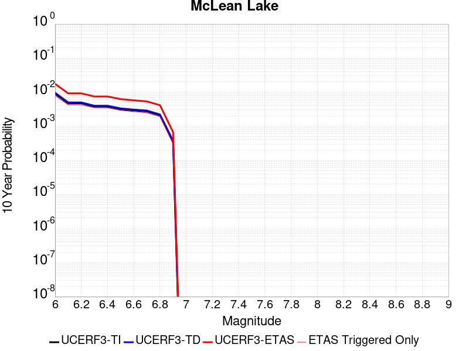 |

| Magnitude | 1 wk TI Prob | 1 wk TD Prob | 1 wk ETAS Prob | 1 wk ETAS/TD Gain | 1 wk ETAS Triggered Only | 1 mo TI Prob | 1 mo TD Prob | 1 mo ETAS Prob | 1 mo ETAS/TD Gain | 1 mo ETAS Triggered Only | 1 yr TI Prob | 1 yr TD Prob | 1 yr ETAS Prob | 1 yr ETAS/TD Gain | 1 yr ETAS Triggered Only | 10 yr TI Prob | 10 yr TD Prob | 10 yr ETAS Prob | 10 yr ETAS/TD Gain | 10 yr ETAS Triggered Only |
|-----|-----|-----|-----|-----|-----|-----|-----|-----|-----|-----|-----|-----|-----|-----|-----|-----|-----|-----|-----|-----|
| 6.0 | 1.7360222E-5 | 1.8501627E-5 | 0.003661932 | 197.92485 | 0.0036434978 | 7.439883E-5 | 7.9290556E-5 | 0.0046833456 | 59.06562 | 0.00460442 | 9.0542925E-4 | 9.6498354E-4 | 0.007524951 | 7.7980094 | 0.006566304 | 0.009017491 | 0.0096127745 | 0.01746418 | 1.8167677 | 0.007927611 |
| 6.1 | 9.062689E-6 | 9.592193E-6 | 0.0018513426 | 193.00514 | 0.001841768 | 3.8839516E-5 | 4.1108804E-5 | 0.0024032795 | 58.461433 | 0.0023622678 | 4.727685E-4 | 5.003936E-4 | 0.0038619393 | 7.717803 | 0.0033632286 | 0.0047176396 | 0.004993552 | 0.008897725 | 1.781843 | 0.003923767 |
| 6.2 | 9.062689E-6 | 9.592193E-6 | 0.0018513426 | 193.00514 | 0.001841768 | 3.8839516E-5 | 4.1108804E-5 | 0.0024032795 | 58.461433 | 0.0023622678 | 4.727685E-4 | 5.003936E-4 | 0.0038619393 | 7.717803 | 0.0033632286 | 0.0047176396 | 0.004993552 | 0.008897725 | 1.781843 | 0.003923767 |
| 6.3 | 7.2575485E-6 | 7.66771E-6 | 0.0014890785 | 194.20122 | 0.0014814222 | 3.110341E-5 | 3.2861237E-5 | 0.0019946801 | 60.700092 | 0.0019618834 | 3.786182E-4 | 4.0001926E-4 | 0.0030815215 | 7.703433 | 0.0026825753 | 0.0037797375 | 0.0039936965 | 0.0071839797 | 1.7988296 | 0.003203075 |
| 6.4 | 7.2575485E-6 | 7.66771E-6 | 0.0014890785 | 194.20122 | 0.0014814222 | 3.110341E-5 | 3.2861237E-5 | 0.0019946801 | 60.700092 | 0.0019618834 | 3.786182E-4 | 4.0001926E-4 | 0.0030815215 | 7.703433 | 0.0026825753 | 0.0037797375 | 0.0039936965 | 0.0071839797 | 1.7988296 | 0.003203075 |
| 6.5 | 6.06582E-6 | 6.4038773E-6 | 0.0012075492 | 188.56534 | 0.0012011532 | 2.5996113E-5 | 2.7444936E-5 | 0.0016689758 | 60.811794 | 0.001641576 | 3.164567E-4 | 3.3409733E-4 | 0.0025354757 | 7.5890326 | 0.002202114 | 0.0031600643 | 0.0033365893 | 0.0060501187 | 1.8132645 | 0.0027226137 |
| 6.6 | 5.598744E-6 | 5.910262E-6 | 0.0011269798 | 190.68187 | 0.0011210763 | 2.3994397E-5 | 2.5329486E-5 | 0.0015467516 | 61.065258 | 0.0015214606 | 2.9209262E-4 | 3.0834923E-4 | 0.002389706 | 7.749998 | 0.0020819986 | 0.0029170897 | 0.003079843 | 0.0055545806 | 1.8035272 | 0.002482383 |
| 6.7 | 5.246996E-6 | 5.539162E-6 | 0.001086571 | 196.16162 | 0.0010810378 | 2.2486933E-5 | 2.3739085E-5 | 0.0014650886 | 61.7163 | 0.0014413837 | 2.73744E-4 | 2.8899137E-4 | 0.002250308 | 7.7867646 | 0.0019618834 | 0.0027340704 | 0.0028867796 | 0.005202305 | 1.8021138 | 0.0023222293 |
| 6.8 | 4.02324E-6 | 4.2469046E-6 | 8.0501224E-4 | 189.5527 | 8.007687E-4 | 1.7242342E-5 | 1.8200926E-5 | 0.0011392568 | 62.59334 | 0.0011210763 | 2.099053E-4 | 2.2157968E-4 | 0.0017427031 | 7.864905 | 0.0015214606 | 0.0020970714 | 0.002214172 | 0.0040518623 | 1.8299673 | 0.001841768 |
| 6.9 | 6.835972E-7 | 7.1399285E-7 | 2.0090604E-4 | 281.38382 | 2.0019218E-4 | 2.9296991E-6 | 3.0599674E-6 | 2.8332818E-4 | 92.59189 | 2.8026907E-4 | 3.56685E-5 | 3.7254784E-5 | 4.3762423E-4 | 11.746793 | 4.0038436E-4 | 3.5662777E-4 | 3.7251666E-4 | 7.7275187E-4 | 2.074409 | 4.0038436E-4 |

## Gravel Hills-Harper Lk
*[(top)](#table-of-contents)*

| 1 Week | 1 Month | 1 Year | 10 Year |
|-----|-----|-----|-----|
|  |  |  |  |

| Magnitude | 1 wk TI Prob | 1 wk TD Prob | 1 wk ETAS Prob | 1 wk ETAS/TD Gain | 1 wk ETAS Triggered Only | 1 mo TI Prob | 1 mo TD Prob | 1 mo ETAS Prob | 1 mo ETAS/TD Gain | 1 mo ETAS Triggered Only | 1 yr TI Prob | 1 yr TD Prob | 1 yr ETAS Prob | 1 yr ETAS/TD Gain | 1 yr ETAS Triggered Only | 10 yr TI Prob | 10 yr TD Prob | 10 yr ETAS Prob | 10 yr ETAS/TD Gain | 10 yr ETAS Triggered Only |
|-----|-----|-----|-----|-----|-----|-----|-----|-----|-----|-----|-----|-----|-----|-----|-----|-----|-----|-----|-----|-----|
| 6.0 | 3.0679566E-5 | 3.1464646E-5 | 0.0037549222 | 119.337814 | 0.0037235746 | 1.3147724E-4 | 1.3484273E-4 | 0.004738642 | 35.14199 | 0.00460442 | 0.0015995599 | 0.0016406906 | 0.007436739 | 4.532688 | 0.0058055734 | 0.015880952 | 0.01630734 | 0.022687793 | 1.3912628 | 0.006486227 |
| 6.1 | 3.0679566E-5 | 3.1464646E-5 | 0.0037549222 | 119.337814 | 0.0037235746 | 1.3147724E-4 | 1.3484273E-4 | 0.004738642 | 35.14199 | 0.00460442 | 0.0015995599 | 0.0016406906 | 0.007436739 | 4.532688 | 0.0058055734 | 0.015880952 | 0.01630734 | 0.022687793 | 1.3912628 | 0.006486227 |
| 6.2 | 1.514536E-5 | 1.3635206E-5 | 0.0011346962 | 83.21811 | 0.0011210763 | 6.490707E-5 | 5.843536E-5 | 0.0014196626 | 24.294582 | 0.0013613069 | 7.8995706E-4 | 7.1123015E-4 | 0.0024316583 | 3.4189475 | 0.0017216528 | 0.007871548 | 0.0070907404 | 0.008959204 | 1.2635075 | 0.0018818065 |
| 6.3 | 1.514536E-5 | 1.3635206E-5 | 0.0011346962 | 83.21811 | 0.0011210763 | 6.490707E-5 | 5.843536E-5 | 0.0014196626 | 24.294582 | 0.0013613069 | 7.8995706E-4 | 7.1123015E-4 | 0.0024316583 | 3.4189475 | 0.0017216528 | 0.007871548 | 0.0070907404 | 0.008959204 | 1.2635075 | 0.0018818065 |
| 6.4 | 1.2532521E-5 | 1.06896905E-5 | 6.913358E-4 | 64.67314 | 6.8065344E-4 | 5.37097E-5 | 4.581219E-5 | 8.8658085E-4 | 19.35251 | 8.4080716E-4 | 6.537194E-4 | 5.576265E-4 | 0.0017180936 | 3.0810833 | 0.0011611147 | 0.0065179965 | 0.005562863 | 0.0067175184 | 1.207565 | 0.0011611147 |
| 6.5 | 1.1094058E-5 | 9.083664E-6 | 3.6942633E-4 | 40.66931 | 3.6034593E-4 | 4.7545094E-5 | 3.892943E-5 | 4.7933508E-4 | 12.312924 | 4.404228E-4 | 5.787078E-4 | 4.7386673E-4 | 0.0011141782 | 2.3512478 | 6.40615E-4 | 0.0057720304 | 0.0047289706 | 0.005366556 | 1.1348255 | 6.40615E-4 |
| 6.6 | 9.688328E-6 | 7.5316952E-6 | 2.0772238E-4 | 27.579763 | 2.0019218E-4 | 4.1520743E-5 | 3.227831E-5 | 3.1253832E-4 | 9.682611 | 2.8026907E-4 | 5.053978E-4 | 3.9292008E-4 | 8.3316985E-4 | 2.1204562 | 4.404228E-4 | 0.0050424994 | 0.0039225104 | 0.0043612057 | 1.1118404 | 4.404228E-4 |
| 6.7 | 8.974824E-6 | 6.749413E-6 | 1.6690209E-4 | 24.728384 | 1.6015375E-4 | 3.8462964E-5 | 2.8925748E-5 | 2.2911213E-4 | 7.920699 | 2.0019218E-4 | 4.6818596E-4 | 3.5211627E-4 | 6.72311E-4 | 1.9093437 | 3.203075E-4 | 0.004672008 | 0.0035158044 | 0.003834986 | 1.0907847 | 3.203075E-4 |
| 6.8 | 7.4780046E-6 | 5.1161933E-6 | 1.2523089E-4 | 24.477358 | 1.2011531E-4 | 3.20482E-5 | 2.1926366E-5 | 1.4203905E-4 | 6.478002 | 1.2011531E-4 | 3.9011694E-4 | 2.669222E-4 | 4.6706095E-4 | 1.7498019 | 2.0019218E-4 | 0.0038943281 | 0.0026661542 | 0.0028658125 | 1.0748863 | 2.0019218E-4 |
| 6.9 | 6.3409307E-6 | 3.9074966E-6 | 1.2402234E-4 | 31.739588 | 1.2011531E-4 | 2.7175134E-5 | 1.6746313E-5 | 1.3685961E-4 | 8.172523 | 1.2011531E-4 | 3.3080703E-4 | 2.0386827E-4 | 4.0401964E-4 | 1.9817681 | 2.0019218E-4 | 0.0033031502 | 0.0020369107 | 0.002236695 | 1.0980821 | 2.0019218E-4 |
| 7.0 | 5.1239335E-6 | 2.6058565E-6 | 2.6058565E-6 | 1.0 | 0.0 | 2.195953E-5 | 1.116791E-5 | 1.116791E-5 | 1.0 | 0.0 | 2.6732447E-4 | 1.3596108E-4 | 1.7599406E-4 | 1.2944446 | 4.0038438E-5 | 0.0026700313 | 0.0013588042 | 0.0013987882 | 1.0294259 | 4.0038438E-5 |
| 7.1 | 4.438899E-6 | 2.0984728E-6 | 2.0984728E-6 | 1.0 | 0.0 | 1.9023713E-5 | 8.993425E-6 | 8.993425E-6 | 1.0 | 0.0 | 2.315891E-4 | 1.0948967E-4 | 1.4952372E-4 | 1.3656423 | 4.0038438E-5 | 0.002313479 | 0.0010943791 | 0.0011343737 | 1.0365455 | 4.0038438E-5 |
| 7.2 | 3.50367E-6 | 1.2615716E-6 | 1.2615716E-6 | 1.0 | 0.0 | 1.5015643E-5 | 5.4067245E-6 | 5.4067245E-6 | 1.0 | 0.0 | 1.8280011E-4 | 6.582497E-5 | 6.582497E-5 | 1.0 | 0.0 | 0.0018264982 | 6.580629E-4 | 6.580629E-4 | 1.0 | 0.0 |
| 7.3 | 2.561638E-6 | 7.1191585E-7 | 7.1191585E-7 | 1.0 | 0.0 | 1.0978401E-5 | 3.0510646E-6 | 3.0510646E-6 | 1.0 | 0.0 | 1.3365384E-4 | 3.71461E-5 | 3.71461E-5 | 1.0 | 0.0 | 0.0013357349 | 3.7140088E-4 | 3.7140088E-4 | 1.0 | 0.0 |
| 7.4 | 2.0368864E-6 | 5.304837E-7 | 5.304837E-7 | 1.0 | 0.0 | 8.729483E-6 | 2.2734996E-6 | 2.2734996E-6 | 1.0 | 0.0 | 1.06276275E-4 | 2.7679513E-5 | 2.7679513E-5 | 1.0 | 0.0 | 0.0010622547 | 2.767612E-4 | 2.767612E-4 | 1.0 | 0.0 |
| 7.5 | 1.1681728E-6 | 3.6030585E-7 | 3.6030585E-7 | 1.0 | 0.0 | 5.0064455E-6 | 1.544167E-6 | 1.544167E-6 | 1.0 | 0.0 | 6.0951766E-5 | 1.8800076E-5 | 1.8800076E-5 | 1.0 | 0.0 | 6.093505E-4 | 1.8798532E-4 | 1.8798532E-4 | 1.0 | 0.0 |
| 7.6 | 1.3154387E-7 | 7.1197384E-8 | 7.1197384E-8 | 1.0 | 0.0 | 5.6375933E-7 | 3.051316E-7 | 3.051316E-7 | 1.0 | 0.0 | 6.863748E-6 | 3.7149728E-6 | 3.7149728E-6 | 1.0 | 0.0 | 6.863536E-5 | 3.7149264E-5 | 3.7149264E-5 | 1.0 | 0.0 |

## Goldstone Lake
*[(top)](#table-of-contents)*

| 1 Week | 1 Month | 1 Year | 10 Year |
|-----|-----|-----|-----|
|  |  |  | 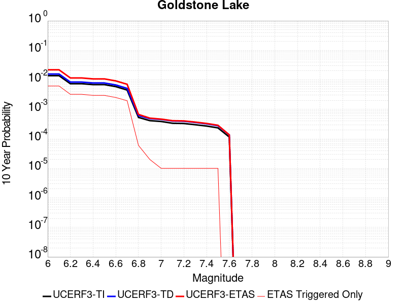 |

| Magnitude | 1 wk TI Prob | 1 wk TD Prob | 1 wk ETAS Prob | 1 wk ETAS/TD Gain | 1 wk ETAS Triggered Only | 1 mo TI Prob | 1 mo TD Prob | 1 mo ETAS Prob | 1 mo ETAS/TD Gain | 1 mo ETAS Triggered Only | 1 yr TI Prob | 1 yr TD Prob | 1 yr ETAS Prob | 1 yr ETAS/TD Gain | 1 yr ETAS Triggered Only | 10 yr TI Prob | 10 yr TD Prob | 10 yr ETAS Prob | 10 yr ETAS/TD Gain | 10 yr ETAS Triggered Only |
|-----|-----|-----|-----|-----|-----|-----|-----|-----|-----|-----|-----|-----|-----|-----|-----|-----|-----|-----|-----|-----|
| 6.0 | 2.671352E-5 | 3.037609E-5 | 0.0023525348 | 77.44693 | 0.0023222293 | 1.1448149E-4 | 1.3017785E-4 | 0.003372869 | 25.9097 | 0.0032431134 | 0.001392921 | 0.0015839594 | 0.0063010114 | 3.978013 | 0.0047245356 | 0.013842222 | 0.015746197 | 0.021263314 | 1.3503778 | 0.005605381 |
| 6.1 | 2.671352E-5 | 3.037609E-5 | 0.0023525348 | 77.44693 | 0.0023222293 | 1.1448149E-4 | 1.3017785E-4 | 0.003372869 | 25.9097 | 0.0032431134 | 0.001392921 | 0.0015839594 | 0.0063010114 | 3.978013 | 0.0047245356 | 0.013842222 | 0.015746197 | 0.021263314 | 1.3503778 | 0.005605381 |
| 6.2 | 1.4197047E-5 | 1.6096245E-5 | 9.3696546E-4 | 58.21019 | 9.20884E-4 | 6.0843064E-5 | 6.8982634E-5 | 0.0014702312 | 21.313063 | 0.0014013452 | 7.4051257E-4 | 8.3963864E-4 | 0.0031199134 | 3.7157812 | 0.0022821908 | 0.007380498 | 0.0083743585 | 0.011034469 | 1.3176495 | 0.0026825753 |
| 6.3 | 1.4197047E-5 | 1.6096245E-5 | 9.3696546E-4 | 58.21019 | 9.20884E-4 | 6.0843064E-5 | 6.8982634E-5 | 0.0014702312 | 21.313063 | 0.0014013452 | 7.4051257E-4 | 8.3963864E-4 | 0.0031199134 | 3.7157812 | 0.0022821908 | 0.007380498 | 0.0083743585 | 0.011034469 | 1.3176495 | 0.0026825753 |
| 6.4 | 1.3238931E-5 | 1.500846E-5 | 8.958409E-4 | 59.68906 | 8.808456E-4 | 5.6737044E-5 | 6.4320935E-5 | 0.0013454685 | 20.918049 | 0.00128123 | 6.9055456E-4 | 7.82924E-4 | 0.0028632928 | 3.6571782 | 0.0020819986 | 0.006884126 | 0.0078112837 | 0.010274276 | 1.3153121 | 0.002482383 |
| 6.5 | 1.3238931E-5 | 1.500846E-5 | 8.958409E-4 | 59.68906 | 8.808456E-4 | 5.6737044E-5 | 6.4320935E-5 | 0.0013454685 | 20.918049 | 0.00128123 | 6.9055456E-4 | 7.82924E-4 | 0.0028632928 | 3.6571782 | 0.0020819986 | 0.006884126 | 0.0078112837 | 0.010274276 | 1.3153121 | 0.002482383 |
| 6.6 | 1.1328278E-5 | 1.2855166E-5 | 8.5365155E-4 | 66.405334 | 8.4080716E-4 | 4.8548856E-5 | 5.5092944E-5 | 0.0011761074 | 21.347696 | 0.0011210763 | 5.90922E-4 | 6.7064585E-4 | 0.0024311556 | 3.625096 | 0.0017616912 | 0.0058935313 | 0.0066956086 | 0.008803437 | 1.3148077 | 0.002122037 |
| 6.7 | 8.651175E-6 | 9.824565E-6 | 5.703572E-4 | 58.054195 | 5.6053814E-4 | 3.707594E-5 | 4.2105108E-5 | 8.028034E-4 | 19.06665 | 7.607303E-4 | 4.5130608E-4 | 5.1259965E-4 | 0.0017931729 | 3.4981937 | 0.00128123 | 0.0045039062 | 0.005123051 | 0.0066367174 | 1.2954619 | 0.0015214606 |
| 6.8 | 1.0215377E-6 | 1.1754702E-6 | 1.1754702E-6 | 1.0 | 0.0 | 4.378012E-6 | 5.0377203E-6 | 5.0377203E-6 | 1.0 | 0.0 | 5.3300988E-5 | 6.1332634E-5 | 1.414046E-4 | 2.305536 | 8.0076876E-5 | 5.3288206E-4 | 6.1316835E-4 | 7.732239E-4 | 1.2610303 | 1.6015375E-4 |
| 6.9 | 7.9360774E-7 | 9.2833966E-7 | 9.2833966E-7 | 1.0 | 0.0 | 3.4011714E-6 | 3.9785928E-6 | 3.9785928E-6 | 1.0 | 0.0 | 4.1408475E-5 | 4.843836E-5 | 8.847486E-5 | 1.8265452 | 4.0038438E-5 | 4.140076E-4 | 4.8428503E-4 | 5.643231E-4 | 1.1652707 | 8.0076876E-5 |
| 7.0 | 7.4382757E-7 | 8.7473285E-7 | 8.7473285E-7 | 1.0 | 0.0 | 3.1878285E-6 | 3.74885E-6 | 3.74885E-6 | 1.0 | 0.0 | 3.8811122E-5 | 4.564136E-5 | 4.564136E-5 | 1.0 | 0.0 | 3.8804344E-4 | 4.5632652E-4 | 4.963467E-4 | 1.0877007 | 4.0038438E-5 |
| 7.1 | 6.4709513E-7 | 7.7113E-7 | 7.7113E-7 | 1.0 | 0.0 | 2.773262E-6 | 3.3048389E-6 | 3.3048389E-6 | 1.0 | 0.0 | 3.376394E-5 | 4.0235733E-5 | 4.0235733E-5 | 1.0 | 0.0 | 3.375881E-4 | 4.0229043E-4 | 4.4231274E-4 | 1.0994861 | 4.0038438E-5 |
| 7.2 | 6.356704E-7 | 7.5883594E-7 | 7.5883594E-7 | 1.0 | 0.0 | 2.7242988E-6 | 3.2521505E-6 | 3.2521505E-6 | 1.0 | 0.0 | 3.3167835E-5 | 3.959427E-5 | 3.959427E-5 | 1.0 | 0.0 | 3.3162883E-4 | 3.958781E-4 | 4.359007E-4 | 1.1010983 | 4.0038438E-5 |
| 7.3 | 5.7695723E-7 | 6.8965653E-7 | 6.8965653E-7 | 1.0 | 0.0 | 2.4726714E-6 | 2.9556677E-6 | 2.9556677E-6 | 1.0 | 0.0 | 3.0104358E-5 | 3.5984718E-5 | 3.5984718E-5 | 1.0 | 0.0 | 3.0100282E-4 | 3.5979465E-4 | 3.9981867E-4 | 1.1112413 | 4.0038438E-5 |
| 7.4 | 5.209647E-7 | 6.193514E-7 | 6.193514E-7 | 1.0 | 0.0 | 2.232704E-6 | 2.6543607E-6 | 2.6543607E-6 | 1.0 | 0.0 | 2.718283E-5 | 3.2316417E-5 | 3.2316417E-5 | 1.0 | 0.0 | 2.7179506E-4 | 3.2312275E-4 | 3.6314825E-4 | 1.1238708 | 4.0038438E-5 |
| 7.5 | 4.512955E-7 | 5.348885E-7 | 5.348885E-7 | 1.0 | 0.0 | 1.934122E-6 | 2.2923775E-6 | 2.2923775E-6 | 1.0 | 0.0 | 2.3547682E-5 | 2.7909393E-5 | 2.7909393E-5 | 1.0 | 0.0 | 2.3545188E-4 | 2.7906417E-4 | 3.1909146E-4 | 1.1434339 | 4.0038438E-5 |
| 7.6 | 2.21172E-7 | 2.603961E-7 | 2.603961E-7 | 1.0 | 0.0 | 9.478797E-7 | 1.1159829E-6 | 1.1159829E-6 | 1.0 | 0.0 | 1.1540374E-5 | 1.3587036E-5 | 1.3587036E-5 | 1.0 | 0.0 | 1.1539775E-4 | 1.3586486E-4 | 1.3586486E-4 | 1.0 | 0.0 |

## Coyote Canyon
*[(top)](#table-of-contents)*

| 1 Week | 1 Month | 1 Year | 10 Year |
|-----|-----|-----|-----|
|  |  |  |  |

| Magnitude | 1 wk TI Prob | 1 wk TD Prob | 1 wk ETAS Prob | 1 wk ETAS/TD Gain | 1 wk ETAS Triggered Only | 1 mo TI Prob | 1 mo TD Prob | 1 mo ETAS Prob | 1 mo ETAS/TD Gain | 1 mo ETAS Triggered Only | 1 yr TI Prob | 1 yr TD Prob | 1 yr ETAS Prob | 1 yr ETAS/TD Gain | 1 yr ETAS Triggered Only | 10 yr TI Prob | 10 yr TD Prob | 10 yr ETAS Prob | 10 yr ETAS/TD Gain | 10 yr ETAS Triggered Only |
|-----|-----|-----|-----|-----|-----|-----|-----|-----|-----|-----|-----|-----|-----|-----|-----|-----|-----|-----|-----|-----|
| 6.0 | 3.5090034E-5 | 4.0364324E-5 | 0.0012815058 | 31.748476 | 0.0012411915 | 1.503772E-4 | 1.7297994E-4 | 0.0021745556 | 12.571142 | 0.0020019219 | 0.0018293047 | 0.0021042528 | 0.0053405417 | 2.5379755 | 0.0032431134 | 0.018143194 | 0.020869201 | 0.024711082 | 1.1840934 | 0.003923767 |
| 6.1 | 3.5090034E-5 | 4.0364324E-5 | 0.0012815058 | 31.748476 | 0.0012411915 | 1.503772E-4 | 1.7297994E-4 | 0.0021745556 | 12.571142 | 0.0020019219 | 0.0018293047 | 0.0021042528 | 0.0053405417 | 2.5379755 | 0.0032431134 | 0.018143194 | 0.020869201 | 0.024711082 | 1.1840934 | 0.003923767 |
| 6.2 | 1.841879E-5 | 2.1059794E-5 | 7.417365E-4 | 35.2205 | 7.2069187E-4 | 7.8935285E-5 | 9.0253714E-5 | 0.0011711939 | 12.976685 | 0.0010810378 | 9.606133E-4 | 0.001098387 | 0.002938132 | 2.6749518 | 0.001841768 | 0.0095647145 | 0.010939667 | 0.01307809 | 1.1954743 | 0.0021620756 |
| 6.3 | 1.841879E-5 | 2.1059794E-5 | 7.417365E-4 | 35.2205 | 7.2069187E-4 | 7.8935285E-5 | 9.0253714E-5 | 0.0011711939 | 12.976685 | 0.0010810378 | 9.606133E-4 | 0.001098387 | 0.002938132 | 2.6749518 | 0.001841768 | 0.0095647145 | 0.010939667 | 0.01307809 | 1.1954743 | 0.0021620756 |
| 6.4 | 1.712201E-5 | 1.9565212E-5 | 7.0020533E-4 | 35.788284 | 6.8065344E-4 | 7.337798E-5 | 8.3848776E-5 | 0.0010847257 | 12.936691 | 0.0010009609 | 8.930107E-4 | 0.0010204813 | 0.002740377 | 2.6853771 | 0.0017216528 | 0.008894307 | 0.010167871 | 0.012189069 | 1.1987828 | 0.0020419604 |
| 6.5 | 1.4744935E-5 | 1.6836972E-5 | 6.9747894E-4 | 41.425438 | 6.8065344E-4 | 6.3191044E-5 | 7.215698E-5 | 0.0010330101 | 14.31615 | 9.609225E-4 | 7.6907943E-4 | 8.7825063E-4 | 0.0024783816 | 2.8219523 | 0.0016015375 | 0.007664232 | 0.008756994 | 0.01066201 | 1.2175422 | 0.001921845 |
| 6.6 | 1.2017839E-5 | 1.37240895E-5 | 5.742545E-4 | 41.842815 | 5.6053814E-4 | 5.150401E-5 | 5.88167E-5 | 7.394301E-4 | 12.571772 | 6.8065344E-4 | 6.268809E-4 | 7.159466E-4 | 0.00187623 | 2.6206284 | 0.0011611147 | 0.0062511545 | 0.0071450938 | 0.008536426 | 1.1947256 | 0.0014013452 |
| 6.7 | 1.00956095E-5 | 1.1533517E-5 | 5.720652E-4 | 49.60024 | 5.6053814E-4 | 4.326618E-5 | 4.942891E-5 | 6.9001224E-4 | 13.959689 | 6.40615E-4 | 5.266384E-4 | 6.017178E-4 | 0.0016821051 | 2.795505 | 0.0010810378 | 0.005253921 | 0.0060094125 | 0.007282943 | 1.2119226 | 0.00128123 |

## So Sierra Nevada
*[(top)](#table-of-contents)*

| 1 Week | 1 Month | 1 Year | 10 Year |
|-----|-----|-----|-----|
|  | 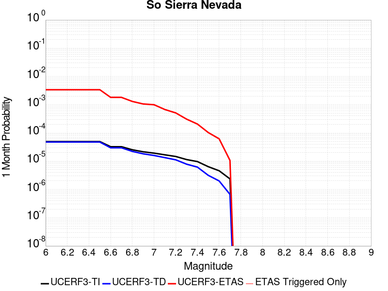 |  |  |

| Magnitude | 1 wk TI Prob | 1 wk TD Prob | 1 wk ETAS Prob | 1 wk ETAS/TD Gain | 1 wk ETAS Triggered Only | 1 mo TI Prob | 1 mo TD Prob | 1 mo ETAS Prob | 1 mo ETAS/TD Gain | 1 mo ETAS Triggered Only | 1 yr TI Prob | 1 yr TD Prob | 1 yr ETAS Prob | 1 yr ETAS/TD Gain | 1 yr ETAS Triggered Only | 10 yr TI Prob | 10 yr TD Prob | 10 yr ETAS Prob | 10 yr ETAS/TD Gain | 10 yr ETAS Triggered Only |
|-----|-----|-----|-----|-----|-----|-----|-----|-----|-----|-----|-----|-----|-----|-----|-----|-----|-----|-----|-----|-----|
| 6.0 | 1.15488665E-5 | 1.1079643E-5 | 0.0024934353 | 225.04654 | 0.002482383 | 4.9494203E-5 | 4.748339E-5 | 0.0030502235 | 64.23769 | 0.0030028827 | 6.024253E-4 | 5.7796965E-4 | 0.0044594533 | 7.715722 | 0.0038837283 | 0.006007948 | 0.005765934 | 0.01026419 | 1.7801435 | 0.004524343 |
| 6.1 | 1.15488665E-5 | 1.1079643E-5 | 0.0024934353 | 225.04654 | 0.002482383 | 4.9494203E-5 | 4.748339E-5 | 0.0030502235 | 64.23769 | 0.0030028827 | 6.024253E-4 | 5.7796965E-4 | 0.0044594533 | 7.715722 | 0.0038837283 | 0.006007948 | 0.005765934 | 0.01026419 | 1.7801435 | 0.004524343 |
| 6.2 | 1.15488665E-5 | 1.1079643E-5 | 0.0024934353 | 225.04654 | 0.002482383 | 4.9494203E-5 | 4.748339E-5 | 0.0030502235 | 64.23769 | 0.0030028827 | 6.024253E-4 | 5.7796965E-4 | 0.0044594533 | 7.715722 | 0.0038837283 | 0.006007948 | 0.005765934 | 0.01026419 | 1.7801435 | 0.004524343 |
| 6.3 | 1.15488665E-5 | 1.1079643E-5 | 0.0024934353 | 225.04654 | 0.002482383 | 4.9494203E-5 | 4.748339E-5 | 0.0030502235 | 64.23769 | 0.0030028827 | 6.024253E-4 | 5.7796965E-4 | 0.0044594533 | 7.715722 | 0.0038837283 | 0.006007948 | 0.005765934 | 0.01026419 | 1.7801435 | 0.004524343 |
| 6.4 | 1.15488665E-5 | 1.1079643E-5 | 0.0024934353 | 225.04654 | 0.002482383 | 4.9494203E-5 | 4.748339E-5 | 0.0030502235 | 64.23769 | 0.0030028827 | 6.024253E-4 | 5.7796965E-4 | 0.0044594533 | 7.715722 | 0.0038837283 | 0.006007948 | 0.005765934 | 0.01026419 | 1.7801435 | 0.004524343 |
| 6.5 | 1.15488665E-5 | 1.1079643E-5 | 0.0024934353 | 225.04654 | 0.002482383 | 4.9494203E-5 | 4.748339E-5 | 0.0030502235 | 64.23769 | 0.0030028827 | 6.024253E-4 | 5.7796965E-4 | 0.0044594533 | 7.715722 | 0.0038837283 | 0.006007948 | 0.005765934 | 0.01026419 | 1.7801435 | 0.004524343 |
| 6.6 | 7.587044E-6 | 6.935635E-6 | 0.0014082713 | 203.04863 | 0.0014013452 | 3.2515498E-5 | 2.9723828E-5 | 0.0016712509 | 56.225967 | 0.001641576 | 3.9580427E-4 | 3.6183043E-4 | 0.002242956 | 6.198915 | 0.0018818065 | 0.003951 | 0.0036127048 | 0.005647288 | 1.5631745 | 0.0020419604 |
| 6.7 | 7.587044E-6 | 6.935635E-6 | 0.0014082713 | 203.04863 | 0.0014013452 | 3.2515498E-5 | 2.9723828E-5 | 0.0016712509 | 56.225967 | 0.001641576 | 3.9580427E-4 | 3.6183043E-4 | 0.002242956 | 6.198915 | 0.0018818065 | 0.003951 | 0.0036127048 | 0.005647288 | 1.5631745 | 0.0020419604 |
| 6.8 | 5.9026956E-6 | 5.1793927E-6 | 0.001166288 | 225.17853 | 0.0011611147 | 2.5297022E-5 | 2.2197215E-5 | 0.0013033987 | 58.71902 | 0.00128123 | 3.0794772E-4 | 2.7021873E-4 | 0.001711213 | 6.3326955 | 0.0014413837 | 0.0030752132 | 0.002699018 | 0.0042563025 | 1.5769819 | 0.0015614991 |
| 6.9 | 5.0118915E-6 | 4.2524252E-6 | 9.6517085E-4 | 226.9695 | 9.609225E-4 | 2.1479358E-5 | 1.8224557E-5 | 0.0010592049 | 58.119656 | 0.0010409993 | 2.614798E-4 | 2.2186211E-4 | 0.0014227488 | 6.412761 | 0.0012011532 | 0.0026117235 | 0.0022164788 | 0.003494869 | 1.5767663 | 0.00128123 |
| 7.0 | 4.4924795E-6 | 3.7139177E-6 | 9.245945E-4 | 248.95396 | 9.20884E-4 | 1.925334E-5 | 1.5916696E-5 | 0.0010168616 | 63.88648 | 0.0010009609 | 2.3438422E-4 | 1.9376918E-4 | 0.0013146282 | 6.7845063 | 0.0011210763 | 0.0023413717 | 0.0019360651 | 0.0031348928 | 1.6192082 | 0.0012011532 |
| 7.1 | 3.9118436E-6 | 3.1119775E-6 | 5.6364835E-4 | 181.12224 | 5.6053814E-4 | 1.6764936E-5 | 1.3336982E-5 | 6.5394345E-4 | 49.03234 | 6.40615E-4 | 2.0409399E-4 | 1.6236622E-4 | 8.8294107E-4 | 5.43796 | 7.2069187E-4 | 0.0020390663 | 0.001622532 | 0.0024220014 | 1.4927295 | 8.007687E-4 |
| 7.2 | 3.4200818E-6 | 2.6054543E-6 | 5.631421E-4 | 216.1397 | 5.6053814E-4 | 1.4657411E-5 | 1.11661875E-5 | 6.1173603E-4 | 54.78468 | 6.005766E-4 | 1.7843937E-4 | 1.3594035E-4 | 8.1650127E-4 | 6.0063195 | 6.8065344E-4 | 0.0017829615 | 0.0013586218 | 0.0021183186 | 1.5591673 | 7.607303E-4 |
| 7.3 | 2.6593618E-6 | 1.8284203E-6 | 4.0221206E-4 | 219.9779 | 4.0038436E-4 | 1.13972155E-5 | 7.836065E-6 | 4.082173E-4 | 52.09468 | 4.0038436E-4 | 1.3875226E-4 | 9.540021E-5 | 5.35781E-4 | 5.616141 | 4.404228E-4 | 0.0013866565 | 9.5362146E-4 | 0.0014336245 | 1.5033476 | 4.8046125E-4 |
| 7.4 | 2.2577992E-6 | 1.436438E-6 | 2.4166671E-4 | 168.24026 | 2.4023063E-4 | 9.676246E-6 | 6.15615E-6 | 2.463853E-4 | 40.02263 | 2.4023063E-4 | 1.1780193E-4 | 7.49488E-5 | 3.5519685E-4 | 4.7391934 | 2.8026907E-4 | 0.001177395 | 7.492603E-4 | 0.0010293194 | 1.3737807 | 2.8026907E-4 |
| 7.5 | 1.489319E-6 | 7.353936E-7 | 1.6088903E-4 | 218.77946 | 1.6015375E-4 | 6.3827797E-6 | 3.1516831E-6 | 1.6330493E-4 | 51.815147 | 1.6015375E-4 | 7.770758E-5 | 3.8371072E-5 | 2.3855557E-4 | 6.2170687 | 2.0019218E-4 | 7.7680405E-4 | 3.836449E-4 | 5.8376027E-4 | 1.5216162 | 2.0019218E-4 |
| 7.6 | 1.0680322E-6 | 4.6596554E-7 | 1.2058122E-4 | 258.77713 | 1.2011531E-4 | 4.577273E-6 | 1.9969937E-6 | 1.2211206E-4 | 61.14795 | 1.2011531E-4 | 5.5726876E-5 | 2.4313129E-5 | 1.8446299E-4 | 7.58697 | 1.6015375E-4 | 5.5712904E-4 | 2.4310495E-4 | 4.0321978E-4 | 1.6586242 | 1.6015375E-4 |
| 7.7 | 5.509146E-7 | 1.5580486E-7 | 1.5580486E-7 | 1.0 | 0.0 | 2.3610605E-6 | 6.677349E-7 | 6.677349E-7 | 1.0 | 0.0 | 2.8745531E-5 | 8.129644E-6 | 8.129644E-6 | 1.0 | 0.0 | 2.8741814E-4 | 8.1293576E-5 | 8.1293576E-5 | 1.0 | 0.0 |

## Death Valley (So)
*[(top)](#table-of-contents)*

| 1 Week | 1 Month | 1 Year | 10 Year |
|-----|-----|-----|-----|
|  |  |  |  |

| Magnitude | 1 wk TI Prob | 1 wk TD Prob | 1 wk ETAS Prob | 1 wk ETAS/TD Gain | 1 wk ETAS Triggered Only | 1 mo TI Prob | 1 mo TD Prob | 1 mo ETAS Prob | 1 mo ETAS/TD Gain | 1 mo ETAS Triggered Only | 1 yr TI Prob | 1 yr TD Prob | 1 yr ETAS Prob | 1 yr ETAS/TD Gain | 1 yr ETAS Triggered Only | 10 yr TI Prob | 10 yr TD Prob | 10 yr ETAS Prob | 10 yr ETAS/TD Gain | 10 yr ETAS Triggered Only |
|-----|-----|-----|-----|-----|-----|-----|-----|-----|-----|-----|-----|-----|-----|-----|-----|-----|-----|-----|-----|-----|
| 6.0 | 2.0684236E-5 | 2.5617775E-5 | 0.0024278625 | 94.77257 | 0.0024023063 | 8.864371E-5 | 1.0978594E-4 | 0.0032324411 | 29.443125 | 0.0031229982 | 0.0010787029 | 0.0013358411 | 0.0052943514 | 3.963309 | 0.0039638053 | 0.010734817 | 0.013281397 | 0.017587624 | 1.32423 | 0.0043641897 |
| 6.1 | 2.0684236E-5 | 2.5617775E-5 | 0.0024278625 | 94.77257 | 0.0024023063 | 8.864371E-5 | 1.0978594E-4 | 0.0032324411 | 29.443125 | 0.0031229982 | 0.0010787029 | 0.0013358411 | 0.0052943514 | 3.963309 | 0.0039638053 | 0.010734817 | 0.013281397 | 0.017587624 | 1.32423 | 0.0043641897 |
| 6.2 | 2.0684236E-5 | 2.5617775E-5 | 0.0024278625 | 94.77257 | 0.0024023063 | 8.864371E-5 | 1.0978594E-4 | 0.0032324411 | 29.443125 | 0.0031229982 | 0.0010787029 | 0.0013358411 | 0.0052943514 | 3.963309 | 0.0039638053 | 0.010734817 | 0.013281397 | 0.017587624 | 1.32423 | 0.0043641897 |
| 6.3 | 2.0240292E-5 | 2.511786E-5 | 0.002267214 | 90.26302 | 0.0022421526 | 8.6741224E-5 | 1.07643624E-4 | 0.0030301348 | 28.149693 | 0.002922806 | 0.0010555626 | 0.00130979 | 0.0049885013 | 3.8086271 | 0.003683536 | 0.010505628 | 0.013023956 | 0.01701517 | 1.3064518 | 0.0040438822 |
| 6.4 | 2.0240292E-5 | 2.511786E-5 | 0.002267214 | 90.26302 | 0.0022421526 | 8.6741224E-5 | 1.07643624E-4 | 0.0030301348 | 28.149693 | 0.002922806 | 0.0010555626 | 0.00130979 | 0.0049885013 | 3.8086271 | 0.003683536 | 0.010505628 | 0.013023956 | 0.01701517 | 1.3064518 | 0.0040438822 |
| 6.5 | 1.9962767E-5 | 2.4807114E-5 | 0.002106754 | 84.92541 | 0.0020819986 | 8.55519E-5 | 1.0631196E-4 | 0.0028286362 | 26.606941 | 0.0027226137 | 0.0010410968 | 0.0012935963 | 0.0047324477 | 3.6583652 | 0.0034433056 | 0.010362327 | 0.012863902 | 0.016539577 | 1.2857356 | 0.0037235746 |
| 6.6 | 1.8937297E-5 | 2.3310964E-5 | 0.0019451111 | 83.441895 | 0.001921845 | 8.115732E-5 | 9.990039E-5 | 0.00262207 | 26.246843 | 0.0025224215 | 9.876423E-4 | 0.0012156231 | 0.0044148043 | 3.6317213 | 0.003203075 | 0.009832645 | 0.012092789 | 0.0154549 | 1.2780262 | 0.0034032671 |
| 6.7 | 1.8621096E-5 | 2.2911607E-5 | 0.0019447126 | 84.87893 | 0.001921845 | 7.980225E-5 | 9.818898E-5 | 0.0025803284 | 26.279203 | 0.002482383 | 9.711593E-4 | 0.0011948098 | 0.004354067 | 3.6441507 | 0.0031630364 | 0.009669261 | 0.011886904 | 0.015170592 | 1.2762442 | 0.0033231901 |
| 6.8 | 1.7830353E-5 | 2.1805688E-5 | 0.0017834585 | 81.78868 | 0.0017616912 | 7.641356E-5 | 9.344968E-5 | 0.002415462 | 25.847729 | 0.0023222293 | 9.29938E-4 | 0.00113717 | 0.004016659 | 3.5321536 | 0.0028827675 | 0.009260561 | 0.011316354 | 0.014324841 | 1.2658529 | 0.0030429212 |
| 6.9 | 1.3135183E-5 | 1.5303925E-5 | 0.0010162495 | 66.4045 | 0.0010009609 | 5.6292425E-5 | 6.558664E-5 | 0.0013867684 | 21.14407 | 0.0013212684 | 6.8514474E-4 | 7.982312E-4 | 0.0025185097 | 3.155113 | 0.0017216528 | 0.006830362 | 0.007954649 | 0.009742046 | 1.2246985 | 0.0018017297 |
| 7.0 | 1.1507512E-5 | 1.3154199E-5 | 8.139124E-4 | 61.874718 | 8.007687E-4 | 4.9316975E-5 | 5.6373956E-5 | 0.0010572785 | 18.754732 | 0.0010009609 | 6.002687E-4 | 6.8614254E-4 | 0.0018464605 | 2.6910744 | 0.0011611147 | 0.0059864987 | 0.0068409415 | 0.008073642 | 1.1801946 | 0.0012411915 |
| 7.1 | 9.715903E-6 | 1.0865278E-5 | 4.913213E-4 | 45.219395 | 4.8046125E-4 | 4.1638916E-5 | 4.656467E-5 | 6.4711325E-4 | 13.897086 | 6.005766E-4 | 5.068359E-4 | 5.667817E-4 | 0.0013270808 | 2.341432 | 7.607303E-4 | 0.0050568148 | 0.0056538144 | 0.006450056 | 1.1408325 | 8.007687E-4 |
| 7.2 | 9.233269E-6 | 1.02863105E-5 | 4.1066657E-4 | 39.923603 | 4.0038436E-4 | 3.9570554E-5 | 4.4083466E-5 | 5.645602E-4 | 12.80662 | 5.2049966E-4 | 4.81665E-4 | 5.3658825E-4 | 0.0012168764 | 2.267803 | 6.8065344E-4 | 0.0048062233 | 0.0053533576 | 0.0060701915 | 1.1339036 | 7.2069187E-4 |
| 7.3 | 8.8041315E-6 | 9.808164E-6 | 3.3011253E-4 | 33.656914 | 3.203075E-4 | 3.7731446E-5 | 4.2034335E-5 | 4.4240188E-4 | 10.524774 | 4.0038436E-4 | 4.592835E-4 | 5.1165203E-4 | 0.0010719034 | 2.094985 | 5.6053814E-4 | 0.0045833546 | 0.005105167 | 0.0057026776 | 1.1170404 | 6.005766E-4 |
| 7.4 | 8.708749E-6 | 9.707175E-6 | 3.3001156E-4 | 33.996662 | 3.203075E-4 | 3.7322676E-5 | 4.160154E-5 | 4.4196926E-4 | 10.623868 | 4.0038436E-4 | 4.5430884E-4 | 5.0638523E-4 | 0.0010666394 | 2.1063795 | 5.6053814E-4 | 0.004533812 | 0.0050527398 | 0.0056502814 | 1.118261 | 6.005766E-4 |
| 7.5 | 8.612678E-6 | 9.604817E-6 | 3.2990924E-4 | 34.34831 | 3.203075E-4 | 3.6910955E-5 | 4.1162875E-5 | 4.4153078E-4 | 10.726431 | 4.0038436E-4 | 4.492982E-4 | 5.01047E-4 | 0.0010212859 | 2.0383036 | 5.2049966E-4 | 0.004483909 | 0.0049995985 | 0.0055573345 | 1.111556 | 5.6053814E-4 |
| 7.6 | 8.319024E-6 | 9.283916E-6 | 2.8955037E-4 | 31.188387 | 2.8026907E-4 | 3.5652476E-5 | 3.978763E-5 | 3.6008237E-4 | 9.050109 | 3.203075E-4 | 4.3398244E-4 | 4.8431093E-4 | 8.4448233E-4 | 1.7436781 | 3.6034593E-4 | 0.0043313587 | 0.0048329784 | 0.0052314275 | 1.0824438 | 4.0038436E-4 |
| 7.7 | 7.4718328E-6 | 8.34517E-6 | 2.0853568E-4 | 24.988789 | 2.0019218E-4 | 3.2021748E-5 | 3.5764548E-5 | 2.759866E-4 | 7.7167645 | 2.4023063E-4 | 3.8979502E-4 | 4.353504E-4 | 7.154974E-4 | 1.6434978 | 2.8026907E-4 | 0.00389112 | 0.0043453807 | 0.0046642963 | 1.0733919 | 3.203075E-4 |
| 7.8 | 3.4586725E-7 | 3.6482615E-7 | 3.6482615E-7 | 1.0 | 0.0 | 1.4822873E-6 | 1.5635396E-6 | 1.5635396E-6 | 1.0 | 0.0 | 1.80467E-5 | 1.9035933E-5 | 1.9035933E-5 | 1.0 | 0.0 | 1.8045233E-4 | 1.9034347E-4 | 1.9034347E-4 | 1.0 | 0.0 |
| 7.9 | 2.5591178E-9 | 2.6696718E-9 | 2.6696718E-9 | 1.0 | 0.0 | 1.0967647E-8 | 1.14414505E-8 | 1.14414505E-8 | 1.0 | 0.0 | 1.335311E-7 | 1.3929966E-7 | 1.3929966E-7 | 1.0 | 0.0 | 1.3353102E-6 | 1.3929966E-6 | 1.3929966E-6 | 1.0 | 0.0 |

## San Andreas (Mojave N)
*[(top)](#table-of-contents)*

| 1 Week | 1 Month | 1 Year | 10 Year |
|-----|-----|-----|-----|
|  |  |  |  |

| Magnitude | 1 wk TI Prob | 1 wk TD Prob | 1 wk ETAS Prob | 1 wk ETAS/TD Gain | 1 wk ETAS Triggered Only | 1 mo TI Prob | 1 mo TD Prob | 1 mo ETAS Prob | 1 mo ETAS/TD Gain | 1 mo ETAS Triggered Only | 1 yr TI Prob | 1 yr TD Prob | 1 yr ETAS Prob | 1 yr ETAS/TD Gain | 1 yr ETAS Triggered Only | 10 yr TI Prob | 10 yr TD Prob | 10 yr ETAS Prob | 10 yr ETAS/TD Gain | 10 yr ETAS Triggered Only |
|-----|-----|-----|-----|-----|-----|-----|-----|-----|-----|-----|-----|-----|-----|-----|-----|-----|-----|-----|-----|-----|
| 6.0 | 9.877682E-5 | 1.9400702E-4 | 0.0026759086 | 13.792844 | 0.002482383 | 4.2326056E-4 | 8.311939E-4 | 0.0037915756 | 4.5616016 | 0.0029628444 | 0.0051410277 | 0.010072956 | 0.013600483 | 1.3501978 | 0.0035634208 | 0.05023708 | 0.09831428 | 0.10181618 | 1.0356195 | 0.0038837283 |
| 6.1 | 9.877682E-5 | 1.9400702E-4 | 0.0026759086 | 13.792844 | 0.002482383 | 4.2326056E-4 | 8.311939E-4 | 0.0037915756 | 4.5616016 | 0.0029628444 | 0.0051410277 | 0.010072956 | 0.013600483 | 1.3501978 | 0.0035634208 | 0.05023708 | 0.09831428 | 0.10181618 | 1.0356195 | 0.0038837283 |
| 6.2 | 9.877682E-5 | 1.9400702E-4 | 0.0026759086 | 13.792844 | 0.002482383 | 4.2326056E-4 | 8.311939E-4 | 0.0037915756 | 4.5616016 | 0.0029628444 | 0.0051410277 | 0.010072956 | 0.013600483 | 1.3501978 | 0.0035634208 | 0.05023708 | 0.09831428 | 0.10181618 | 1.0356195 | 0.0038837283 |
| 6.3 | 9.877682E-5 | 1.9400702E-4 | 0.0026759086 | 13.792844 | 0.002482383 | 4.2326056E-4 | 8.311939E-4 | 0.0037915756 | 4.5616016 | 0.0029628444 | 0.0051410277 | 0.010072956 | 0.013600483 | 1.3501978 | 0.0035634208 | 0.05023708 | 0.09831428 | 0.10181618 | 1.0356195 | 0.0038837283 |
| 6.4 | 9.877682E-5 | 1.9400702E-4 | 0.0026759086 | 13.792844 | 0.002482383 | 4.2326056E-4 | 8.311939E-4 | 0.0037915756 | 4.5616016 | 0.0029628444 | 0.0051410277 | 0.010072956 | 0.013600483 | 1.3501978 | 0.0035634208 | 0.05023708 | 0.09831428 | 0.10181618 | 1.0356195 | 0.0038837283 |
| 6.5 | 9.861474E-5 | 1.9374468E-4 | 0.002675647 | 13.810169 | 0.002482383 | 4.2256617E-4 | 8.300703E-4 | 0.0037904552 | 4.5664268 | 0.0029628444 | 0.0051326132 | 0.010059402 | 0.0135869775 | 1.3506744 | 0.0035634208 | 0.050156746 | 0.098192066 | 0.10169444 | 1.0356686 | 0.0038837283 |
| 6.6 | 9.861474E-5 | 1.9374468E-4 | 0.002675647 | 13.810169 | 0.002482383 | 4.2256617E-4 | 8.300703E-4 | 0.0037904552 | 4.5664268 | 0.0029628444 | 0.0051326132 | 0.010059402 | 0.0135869775 | 1.3506744 | 0.0035634208 | 0.050156746 | 0.098192066 | 0.10169444 | 1.0356686 | 0.0038837283 |
| 6.7 | 9.8552715E-5 | 1.9364421E-4 | 0.0026755466 | 13.816816 | 0.002482383 | 4.223004E-4 | 8.2964E-4 | 0.0037900263 | 4.5682783 | 0.0029628444 | 0.0051293927 | 0.010054212 | 0.013581806 | 1.3508573 | 0.0035634208 | 0.050125998 | 0.098145254 | 0.10164782 | 1.0356874 | 0.0038837283 |
| 6.8 | 9.8464974E-5 | 1.9349584E-4 | 0.0026753985 | 13.826647 | 0.002482383 | 4.219245E-4 | 8.290045E-4 | 0.0037893928 | 4.5710154 | 0.0029628444 | 0.0051248376 | 0.010046546 | 0.013574167 | 1.3511277 | 0.0035634208 | 0.05008251 | 0.09807528 | 0.10157811 | 1.0357157 | 0.0038837283 |
| 6.9 | 9.825824E-5 | 1.9317595E-4 | 0.0026750795 | 13.847892 | 0.002482383 | 4.2103877E-4 | 8.276344E-4 | 0.0037880265 | 4.5769324 | 0.0029628444 | 0.0051141046 | 0.010030019 | 0.013557699 | 1.3517121 | 0.0035634208 | 0.049980022 | 0.09792438 | 0.10142779 | 1.0357767 | 0.0038837283 |
| 7.0 | 9.781462E-5 | 1.924896E-4 | 0.0026743948 | 13.893711 | 0.002482383 | 4.1913814E-4 | 8.246948E-4 | 0.0037850956 | 4.5896926 | 0.0029628444 | 0.005091073 | 0.009994558 | 0.013522364 | 1.3529726 | 0.0035634208 | 0.04976007 | 0.09760077 | 0.101105444 | 1.0359082 | 0.0038837283 |
| 7.1 | 9.7121134E-5 | 1.9150671E-4 | 0.0026734143 | 13.959899 | 0.002482383 | 4.1616702E-4 | 8.204851E-4 | 0.0037808984 | 4.6081257 | 0.0029628444 | 0.005055068 | 0.009943774 | 0.013471762 | 1.3547935 | 0.0035634208 | 0.04941613 | 0.09713728 | 0.100643754 | 1.0360981 | 0.0038837283 |
| 7.2 | 9.663819E-5 | 1.9081456E-4 | 0.002672724 | 14.006918 | 0.002482383 | 4.1409794E-4 | 8.175206E-4 | 0.0037779429 | 4.62122 | 0.0029628444 | 0.0050299936 | 0.00990801 | 0.013436125 | 1.3560871 | 0.0035634208 | 0.049176537 | 0.09681055 | 0.10031829 | 1.0362331 | 0.0038837283 |
| 7.3 | 9.6277574E-5 | 1.9033969E-4 | 0.0026722504 | 14.039374 | 0.002482383 | 4.125529E-4 | 8.154867E-4 | 0.003775915 | 4.630259 | 0.0029628444 | 0.0050112694 | 0.009883473 | 0.013411675 | 1.35698 | 0.0035634208 | 0.04899759 | 0.09658401 | 0.10009263 | 1.0363271 | 0.0038837283 |
| 7.4 | 9.593308E-5 | 1.897375E-4 | 0.0026716497 | 14.080767 | 0.002482383 | 4.1107697E-4 | 8.129075E-4 | 0.0037733433 | 4.6417866 | 0.0029628444 | 0.0049933824 | 0.009852355 | 0.013380668 | 1.3581187 | 0.0035634208 | 0.04882661 | 0.09630218 | 0.099811904 | 1.0364448 | 0.0038837283 |
| 7.5 | 9.561707E-5 | 1.8919831E-4 | 0.0026711118 | 14.1180525 | 0.002482383 | 4.0972308E-4 | 8.1059814E-4 | 0.0037710408 | 4.6521707 | 0.0029628444 | 0.0049769743 | 0.009824493 | 0.0133529045 | 1.3591444 | 0.0035634208 | 0.048669744 | 0.09604836 | 0.09955907 | 1.0365514 | 0.0038837283 |
| 7.6 | 9.418194E-5 | 1.8572104E-4 | 0.0026676431 | 14.363709 | 0.002482383 | 4.0357444E-4 | 7.957047E-4 | 0.0037561916 | 4.720585 | 0.0029628444 | 0.004902454 | 0.009644784 | 0.013173836 | 1.3659027 | 0.0035634208 | 0.047957025 | 0.094430685 | 0.09794767 | 1.0372441 | 0.0038837283 |
| 7.7 | 8.202141E-5 | 1.6021315E-4 | 0.0023619744 | 14.7427 | 0.002202114 | 3.51473E-4 | 6.8644714E-4 | 0.003367181 | 4.9052296 | 0.0026825753 | 0.00427079 | 0.008325525 | 0.011581343 | 1.3910646 | 0.003283152 | 0.04189639 | 0.08223219 | 0.08553933 | 1.040217 | 0.0036034593 |
| 7.8 | 7.2859846E-5 | 1.4516473E-4 | 0.0015463065 | 10.652082 | 0.0014013452 | 3.1221908E-4 | 6.219862E-4 | 0.0023425682 | 3.7662702 | 0.0017216528 | 0.003794643 | 0.0075464295 | 0.009692189 | 1.284341 | 0.0021620756 | 0.037304975 | 0.07472468 | 0.076873384 | 1.028755 | 0.0023222293 |
| 7.9 | 5.3874453E-5 | 1.0045676E-4 | 8.6111063E-4 | 8.571953 | 7.607303E-4 | 2.3087008E-4 | 4.3045796E-4 | 0.001430988 | 3.3243387 | 0.0010009609 | 0.0028072202 | 0.0052282433 | 0.006423116 | 1.228542 | 0.0012011532 | 0.02772022 | 0.05242443 | 0.05367643 | 1.023882 | 0.0013212684 |
| 8.0 | 3.468538E-5 | 5.4260272E-5 | 2.1440533E-4 | 3.951424 | 1.6015375E-4 | 1.4864317E-4 | 2.325233E-4 | 5.527563E-4 | 2.3772082 | 3.203075E-4 | 0.0018082283 | 0.002827298 | 0.0032664754 | 1.1553347 | 4.404228E-4 | 0.017935853 | 0.028947512 | 0.029375184 | 1.0147741 | 4.404228E-4 |
| 8.1 | 1.9152367E-5 | 1.940263E-5 | 1.940263E-5 | 1.0 | 0.0 | 8.207899E-5 | 8.3151484E-5 | 1.2318659E-4 | 1.481472 | 4.0038438E-5 | 9.988535E-4 | 0.0010118998 | 0.0010518976 | 1.0395275 | 4.0038438E-5 | 0.009943757 | 0.01085625 | 0.010895854 | 1.003648 | 4.0038438E-5 |
| 8.2 | 8.643924E-6 | 5.4748625E-6 | 5.4748625E-6 | 1.0 | 0.0 | 3.704486E-5 | 2.3463486E-5 | 2.3463486E-5 | 1.0 | 0.0 | 4.5092785E-4 | 2.8563058E-4 | 2.8563058E-4 | 1.0 | 0.0 | 0.0045001395 | 0.0032487072 | 0.0032487072 | 1.0 | 0.0 |
| 8.3 | 1.983087E-6 | 7.6599065E-7 | 7.6599065E-7 | 1.0 | 0.0 | 8.498917E-6 | 3.282813E-6 | 3.282813E-6 | 1.0 | 0.0 | 1.034694E-4 | 3.9967534E-5 | 3.9967534E-5 | 1.0 | 0.0 | 0.0010342124 | 4.719687E-4 | 4.719687E-4 | 1.0 | 0.0 |

## Nelson Lake
*[(top)](#table-of-contents)*

| 1 Week | 1 Month | 1 Year | 10 Year |
|-----|-----|-----|-----|
|  |  | 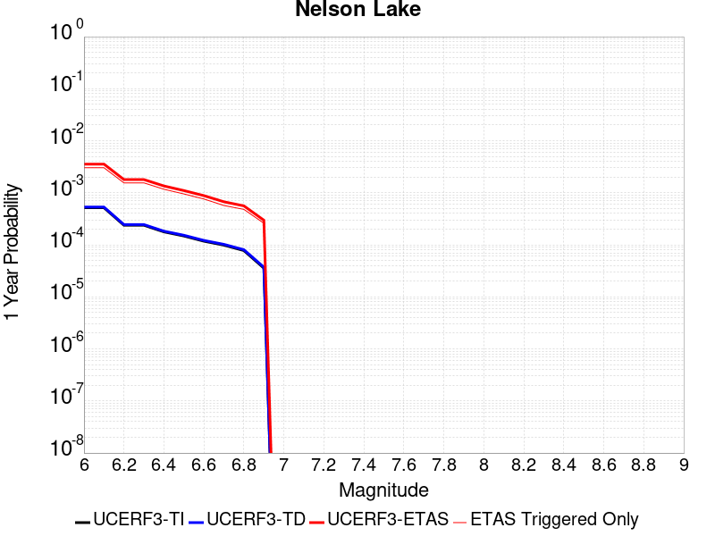 |  |

| Magnitude | 1 wk TI Prob | 1 wk TD Prob | 1 wk ETAS Prob | 1 wk ETAS/TD Gain | 1 wk ETAS Triggered Only | 1 mo TI Prob | 1 mo TD Prob | 1 mo ETAS Prob | 1 mo ETAS/TD Gain | 1 mo ETAS Triggered Only | 1 yr TI Prob | 1 yr TD Prob | 1 yr ETAS Prob | 1 yr ETAS/TD Gain | 1 yr ETAS Triggered Only | 10 yr TI Prob | 10 yr TD Prob | 10 yr ETAS Prob | 10 yr ETAS/TD Gain | 10 yr ETAS Triggered Only |
|-----|-----|-----|-----|-----|-----|-----|-----|-----|-----|-----|-----|-----|-----|-----|-----|-----|-----|-----|-----|-----|
| 6.0 | 9.913453E-6 | 1.0192255E-5 | 0.0014915994 | 146.34634 | 0.0014814222 | 4.2485535E-5 | 4.3680422E-5 | 0.0021656249 | 49.578846 | 0.002122037 | 5.1713863E-4 | 5.316897E-4 | 0.0034929586 | 6.569544 | 0.0029628444 | 0.0051593683 | 0.005305204 | 0.008809894 | 1.6606137 | 0.0035233824 |
| 6.1 | 9.913453E-6 | 1.0192255E-5 | 0.0014915994 | 146.34634 | 0.0014814222 | 4.2485535E-5 | 4.3680422E-5 | 0.0021656249 | 49.578846 | 0.002122037 | 5.1713863E-4 | 5.316897E-4 | 0.0034929586 | 6.569544 | 0.0029628444 | 0.0051593683 | 0.005305204 | 0.008809894 | 1.6606137 | 0.0035233824 |
| 6.2 | 4.5596407E-6 | 4.696313E-6 | 6.8534655E-4 | 145.93289 | 6.8065344E-4 | 1.954117E-5 | 2.0126909E-5 | 0.001101143 | 54.70999 | 0.0010810378 | 2.3788778E-4 | 2.4501883E-4 | 0.0018061353 | 7.3714147 | 0.0015614991 | 0.0023763329 | 0.0024476128 | 0.0042449324 | 1.7343154 | 0.0018017297 |
| 6.3 | 4.5596407E-6 | 4.696313E-6 | 6.8534655E-4 | 145.93289 | 6.8065344E-4 | 1.954117E-5 | 2.0126909E-5 | 0.001101143 | 54.70999 | 0.0010810378 | 2.3788778E-4 | 2.4501883E-4 | 0.0018061353 | 7.3714147 | 0.0015614991 | 0.0023763329 | 0.0024476128 | 0.0042449324 | 1.7343154 | 0.0018017297 |
| 6.4 | 3.4025713E-6 | 3.5098972E-6 | 6.4412266E-4 | 183.5161 | 6.40615E-4 | 1.4582367E-5 | 1.5042335E-5 | 8.958747E-4 | 59.556892 | 8.808456E-4 | 1.7752586E-4 | 1.8312587E-4 | 0.0014641213 | 7.995163 | 0.00128123 | 0.001773841 | 0.0018298327 | 0.0033085442 | 1.808113 | 0.0014814222 |
| 6.5 | 2.8352947E-6 | 2.927856E-6 | 5.6346436E-4 | 192.44946 | 5.6053814E-4 | 1.2151207E-5 | 1.2547898E-5 | 7.7326864E-4 | 61.62535 | 7.607303E-4 | 1.479309E-4 | 1.5276071E-4 | 0.0012736657 | 8.337652 | 0.0011210763 | 0.0014783246 | 0.0015266308 | 0.0028458822 | 1.8641587 | 0.0013212684 |
| 6.6 | 2.251518E-6 | 2.3290677E-6 | 4.4275084E-4 | 190.0979 | 4.404228E-4 | 9.649328E-6 | 9.981683E-6 | 5.705142E-4 | 57.15611 | 5.6053814E-4 | 1.1747423E-4 | 1.2152085E-4 | 9.6222584E-4 | 7.9181957 | 8.4080716E-4 | 0.0011741214 | 0.0012146058 | 0.0021743611 | 1.7901785 | 9.609225E-4 |
| 6.7 | 1.8911853E-6 | 1.9591396E-6 | 2.8222764E-4 | 144.05693 | 2.8026907E-4 | 8.105055E-6 | 8.39629E-6 | 4.087773E-4 | 48.68547 | 4.0038436E-4 | 9.867457E-5 | 1.0222061E-4 | 7.8280445E-4 | 7.6579905 | 6.8065344E-4 | 9.863076E-4 | 0.0010217935 | 0.0018217439 | 1.7828887 | 8.007687E-4 |
| 6.8 | 1.4874814E-6 | 1.5438305E-6 | 2.4177408E-4 | 156.60663 | 2.4023063E-4 | 6.374905E-6 | 6.6164025E-6 | 3.6695995E-4 | 55.462154 | 3.6034593E-4 | 7.76117E-5 | 8.055224E-5 | 6.410452E-4 | 7.95813 | 5.6053814E-4 | 7.75846E-4 | 8.0528157E-4 | 0.0014453806 | 1.7948762 | 6.40615E-4 |
| 6.9 | 6.835972E-7 | 7.1399285E-7 | 2.0090604E-4 | 281.38382 | 2.0019218E-4 | 2.9296991E-6 | 3.0599674E-6 | 2.8332818E-4 | 92.59189 | 2.8026907E-4 | 3.56685E-5 | 3.7254784E-5 | 4.3762423E-4 | 11.746793 | 4.0038436E-4 | 3.5662777E-4 | 3.7251666E-4 | 7.7275187E-4 | 2.074409 | 4.0038436E-4 |

## San Andreas (Mojave S)
*[(top)](#table-of-contents)*

| 1 Week | 1 Month | 1 Year | 10 Year |
|-----|-----|-----|-----|
|  |  |  |  |

| Magnitude | 1 wk TI Prob | 1 wk TD Prob | 1 wk ETAS Prob | 1 wk ETAS/TD Gain | 1 wk ETAS Triggered Only | 1 mo TI Prob | 1 mo TD Prob | 1 mo ETAS Prob | 1 mo ETAS/TD Gain | 1 mo ETAS Triggered Only | 1 yr TI Prob | 1 yr TD Prob | 1 yr ETAS Prob | 1 yr ETAS/TD Gain | 1 yr ETAS Triggered Only | 10 yr TI Prob | 10 yr TD Prob | 10 yr ETAS Prob | 10 yr ETAS/TD Gain | 10 yr ETAS Triggered Only |
|-----|-----|-----|-----|-----|-----|-----|-----|-----|-----|-----|-----|-----|-----|-----|-----|-----|-----|-----|-----|-----|
| 6.0 | 3.1064058E-4 | 6.7460834E-4 | 0.0028352253 | 4.2027726 | 0.0021620756 | 0.0013306376 | 0.0028881032 | 0.0054431628 | 1.8846842 | 0.00256246 | 0.016080605 | 0.03462235 | 0.037675872 | 1.0881952 | 0.0031630364 | 0.1496549 | 0.28660452 | 0.2892038 | 1.0090691 | 0.0036434978 |
| 6.1 | 3.1064058E-4 | 6.7460834E-4 | 0.0028352253 | 4.2027726 | 0.0021620756 | 0.0013306376 | 0.0028881032 | 0.0054431628 | 1.8846842 | 0.00256246 | 0.016080605 | 0.03462235 | 0.037675872 | 1.0881952 | 0.0031630364 | 0.1496549 | 0.28660452 | 0.2892038 | 1.0090691 | 0.0036434978 |
| 6.2 | 3.1064058E-4 | 6.7460834E-4 | 0.0028352253 | 4.2027726 | 0.0021620756 | 0.0013306376 | 0.0028881032 | 0.0054431628 | 1.8846842 | 0.00256246 | 0.016080605 | 0.03462235 | 0.037675872 | 1.0881952 | 0.0031630364 | 0.1496549 | 0.28660452 | 0.2892038 | 1.0090691 | 0.0036434978 |
| 6.3 | 3.1064058E-4 | 6.7460834E-4 | 0.0028352253 | 4.2027726 | 0.0021620756 | 0.0013306376 | 0.0028881032 | 0.0054431628 | 1.8846842 | 0.00256246 | 0.016080605 | 0.03462235 | 0.037675872 | 1.0881952 | 0.0031630364 | 0.1496549 | 0.28660452 | 0.2892038 | 1.0090691 | 0.0036434978 |
| 6.4 | 1.9872203E-4 | 4.3179357E-4 | 0.0025128932 | 5.8196635 | 0.0020819986 | 8.5138786E-4 | 0.0018492596 | 0.004287088 | 2.3182726 | 0.0024423446 | 0.010316478 | 0.02228844 | 0.025185246 | 1.129969 | 0.0029628444 | 0.098504856 | 0.19699748 | 0.19966601 | 1.013546 | 0.0033231901 |
| 6.5 | 1.291105E-4 | 2.875267E-4 | 0.0020887384 | 7.2645025 | 0.0018017297 | 5.5321335E-4 | 0.0012316781 | 0.0033910908 | 2.7532282 | 0.0021620756 | 0.006714592 | 0.0148934 | 0.017536022 | 1.1774359 | 0.0026825753 | 0.065152965 | 0.13803436 | 0.14058822 | 1.0185016 | 0.0029628444 |
| 6.6 | 1.291105E-4 | 2.875267E-4 | 0.0020887384 | 7.2645025 | 0.0018017297 | 5.5321335E-4 | 0.0012316781 | 0.0033910908 | 2.7532282 | 0.0021620756 | 0.006714592 | 0.0148934 | 0.017536022 | 1.1774359 | 0.0026825753 | 0.065152965 | 0.13803436 | 0.14058822 | 1.0185016 | 0.0029628444 |
| 6.7 | 1.08001186E-4 | 2.4333889E-4 | 0.0020046015 | 8.2379 | 0.0017616912 | 4.6278012E-4 | 0.0010424647 | 0.0031622897 | 3.0334742 | 0.002122037 | 0.0056198016 | 0.012618446 | 0.015227638 | 1.206776 | 0.0026425368 | 0.054797906 | 0.119176775 | 0.12175125 | 1.0216022 | 0.002922806 |
| 6.8 | 1.0624356E-4 | 2.3851555E-4 | 0.0019997866 | 8.384303 | 0.0017616912 | 4.5525006E-4 | 0.0010218095 | 0.0031416784 | 3.0746222 | 0.002122037 | 0.0055285925 | 0.012369843 | 0.014979692 | 1.2109848 | 0.0026425368 | 0.053930566 | 0.11712591 | 0.119706385 | 1.0220315 | 0.002922806 |
| 6.9 | 1.0393785E-4 | 2.3221898E-4 | 0.001993501 | 8.584574 | 0.0017616912 | 4.4537184E-4 | 9.948451E-4 | 0.003114771 | 3.1309106 | 0.002122037 | 0.0054089287 | 0.012045221 | 0.014655928 | 1.2167422 | 0.0026425368 | 0.05279156 | 0.11442335 | 0.11701172 | 1.022621 | 0.002922806 |
| 7.0 | 1.0155622E-4 | 2.2591476E-4 | 0.001987208 | 8.796273 | 0.0017616912 | 4.3516833E-4 | 9.6784724E-4 | 0.0030878305 | 3.190411 | 0.002122037 | 0.005285311 | 0.0117200995 | 0.014292097 | 1.2194518 | 0.0026024985 | 0.05161361 | 0.111683756 | 0.114244565 | 1.0229291 | 0.0028827675 |
| 7.1 | 9.885595E-5 | 2.1879886E-4 | 0.0019801047 | 9.049886 | 0.0017616912 | 4.2359953E-4 | 9.3737274E-4 | 0.0030574207 | 3.2616916 | 0.002122037 | 0.0051451353 | 0.011352993 | 0.013925945 | 1.2266321 | 0.0026024985 | 0.05027629 | 0.1085682 | 0.11113799 | 1.0236698 | 0.0028827675 |
| 7.2 | 9.6411415E-5 | 2.124288E-4 | 0.0019737459 | 9.291328 | 0.0017616912 | 4.1312634E-4 | 9.1009185E-4 | 0.0030301977 | 3.3295517 | 0.002122037 | 0.005018219 | 0.011024255 | 0.013598063 | 1.2334677 | 0.0026024985 | 0.049064007 | 0.105758004 | 0.1083359 | 1.0243754 | 0.0028827675 |
| 7.3 | 9.1180635E-5 | 1.9471257E-4 | 0.0018759995 | 9.634711 | 0.0016816143 | 3.907156E-4 | 8.342157E-4 | 0.0028744726 | 3.4457185 | 0.0020419604 | 0.004746591 | 0.01010939 | 0.012606311 | 1.2469903 | 0.0025224215 | 0.046464786 | 0.09795115 | 0.10047931 | 1.0258105 | 0.0028026905 |
| 7.4 | 8.887388E-5 | 1.8719878E-4 | 0.0018684983 | 9.9813595 | 0.0016816143 | 3.8083247E-4 | 8.020339E-4 | 0.0028423565 | 3.5439355 | 0.0020419604 | 0.0046267817 | 0.00972114 | 0.012219041 | 1.2569555 | 0.0025224215 | 0.045316286 | 0.09458615 | 0.09712374 | 1.0268284 | 0.0028026905 |
| 7.5 | 8.6750515E-5 | 1.8051457E-4 | 0.0018618254 | 10.31399 | 0.0016816143 | 3.7173493E-4 | 7.7340455E-4 | 0.0028137856 | 3.6381807 | 0.0020419604 | 0.004516484 | 0.009375632 | 0.011874404 | 1.2665178 | 0.0025224215 | 0.04425787 | 0.091549896 | 0.094096 | 1.0278112 | 0.0028026905 |
| 7.6 | 8.453092E-5 | 1.7439072E-4 | 0.0018557118 | 10.641115 | 0.0016816143 | 3.6222505E-4 | 7.471748E-4 | 0.0027876094 | 3.7308664 | 0.0020419604 | 0.0044011753 | 0.009058985 | 0.011558555 | 1.2759217 | 0.0025224215 | 0.04315024 | 0.08870898 | 0.09126305 | 1.0287915 | 0.0028026905 |
| 7.7 | 8.259102E-5 | 1.6961215E-4 | 0.0018509413 | 10.912787 | 0.0016816143 | 3.539135E-4 | 7.2670676E-4 | 0.0027671831 | 3.80784 | 0.0020419604 | 0.004300386 | 0.008811831 | 0.011312025 | 1.2837316 | 0.0025224215 | 0.042181134 | 0.08645982 | 0.08902019 | 1.0296134 | 0.0028026905 |
| 7.8 | 7.444844E-5 | 1.5283503E-4 | 0.0015539662 | 10.167604 | 0.0014013452 | 3.1902574E-4 | 6.548429E-4 | 0.0023753683 | 3.6273866 | 0.0017216528 | 0.0038772223 | 0.007943616 | 0.010088517 | 1.2700157 | 0.0021620756 | 0.03810269 | 0.078290746 | 0.08043116 | 1.0273393 | 0.0023222293 |
| 7.9 | 5.2586525E-5 | 1.00064186E-4 | 8.6071837E-4 | 8.601663 | 7.607303E-4 | 2.2535135E-4 | 4.2877605E-4 | 0.0014293077 | 3.3334599 | 0.0010009609 | 0.0027402006 | 0.005207864 | 0.0064027617 | 1.229441 | 0.0012011532 | 0.027066574 | 0.052200034 | 0.05345233 | 1.0239904 | 0.0013212684 |
| 8.0 | 3.379877E-5 | 5.4074168E-5 | 2.1421925E-4 | 3.9615822 | 1.6015375E-4 | 1.4484383E-4 | 2.3172585E-4 | 5.5195915E-4 | 2.381949 | 3.203075E-4 | 0.0017620471 | 0.002817614 | 0.003256796 | 1.1558701 | 4.404228E-4 | 0.017481409 | 0.028834904 | 0.029262627 | 1.0148336 | 4.404228E-4 |
| 8.1 | 1.8668277E-5 | 1.9309397E-5 | 1.9309397E-5 | 1.0 | 0.0 | 8.000444E-5 | 8.275194E-5 | 1.2278707E-4 | 1.4837968 | 4.0038438E-5 | 9.736188E-4 | 0.0010070398 | 0.0010470379 | 1.0397185 | 4.0038438E-5 | 0.009693642 | 0.010798888 | 0.010838495 | 1.0036676 | 4.0038438E-5 |
| 8.2 | 8.541571E-6 | 5.460819E-6 | 5.460819E-6 | 1.0 | 0.0 | 3.660622E-5 | 2.3403301E-5 | 2.3403301E-5 | 1.0 | 0.0 | 4.455896E-4 | 2.84898E-4 | 2.84898E-4 | 1.0 | 0.0 | 0.0044469717 | 0.0032408056 | 0.0032408056 | 1.0 | 0.0 |
| 8.3 | 1.983087E-6 | 7.6599065E-7 | 7.6599065E-7 | 1.0 | 0.0 | 8.498917E-6 | 3.282813E-6 | 3.282813E-6 | 1.0 | 0.0 | 1.034694E-4 | 3.9967534E-5 | 3.9967534E-5 | 1.0 | 0.0 | 0.0010342124 | 4.719687E-4 | 4.719687E-4 | 1.0 | 0.0 |

## Lenwood-Lockhart-Old Woman Springs
*[(top)](#table-of-contents)*

| 1 Week | 1 Month | 1 Year | 10 Year |
|-----|-----|-----|-----|
|  |  |  |  |

| Magnitude | 1 wk TI Prob | 1 wk TD Prob | 1 wk ETAS Prob | 1 wk ETAS/TD Gain | 1 wk ETAS Triggered Only | 1 mo TI Prob | 1 mo TD Prob | 1 mo ETAS Prob | 1 mo ETAS/TD Gain | 1 mo ETAS Triggered Only | 1 yr TI Prob | 1 yr TD Prob | 1 yr ETAS Prob | 1 yr ETAS/TD Gain | 1 yr ETAS Triggered Only | 10 yr TI Prob | 10 yr TD Prob | 10 yr ETAS Prob | 10 yr ETAS/TD Gain | 10 yr ETAS Triggered Only |
|-----|-----|-----|-----|-----|-----|-----|-----|-----|-----|-----|-----|-----|-----|-----|-----|-----|-----|-----|-----|-----|
| 6.0 | 3.744542E-5 | 4.396252E-5 | 0.0018055763 | 41.07081 | 0.0017616912 | 1.604705E-4 | 1.8839816E-4 | 0.0023100355 | 12.261455 | 0.002122037 | 0.0019519776 | 0.0022915069 | 0.0052875085 | 2.3074374 | 0.0030028827 | 0.019349206 | 0.022696787 | 0.026101071 | 1.1499896 | 0.003483344 |
| 6.1 | 3.744542E-5 | 4.396252E-5 | 0.0018055763 | 41.07081 | 0.0017616912 | 1.604705E-4 | 1.8839816E-4 | 0.0023100355 | 12.261455 | 0.002122037 | 0.0019519776 | 0.0022915069 | 0.0052875085 | 2.3074374 | 0.0030028827 | 0.019349206 | 0.022696787 | 0.026101071 | 1.1499896 | 0.003483344 |
| 6.2 | 3.744542E-5 | 4.396252E-5 | 0.0018055763 | 41.07081 | 0.0017616912 | 1.604705E-4 | 1.8839816E-4 | 0.0023100355 | 12.261455 | 0.002122037 | 0.0019519776 | 0.0022915069 | 0.0052875085 | 2.3074374 | 0.0030028827 | 0.019349206 | 0.022696787 | 0.026101071 | 1.1499896 | 0.003483344 |
| 6.3 | 2.1079984E-5 | 2.5353434E-5 | 9.4621413E-4 | 37.320946 | 9.20884E-4 | 9.0339665E-5 | 1.0865316E-4 | 0.0011895736 | 10.948356 | 0.0010810378 | 0.0010993304 | 0.0013220694 | 0.0026016056 | 1.9678282 | 0.00128123 | 0.010939079 | 0.0131442575 | 0.01464572 | 1.1142296 | 0.0015214606 |
| 6.4 | 2.1079984E-5 | 2.5353434E-5 | 9.4621413E-4 | 37.320946 | 9.20884E-4 | 9.0339665E-5 | 1.0865316E-4 | 0.0011895736 | 10.948356 | 0.0010810378 | 0.0010993304 | 0.0013220694 | 0.0026016056 | 1.9678282 | 0.00128123 | 0.010939079 | 0.0131442575 | 0.01464572 | 1.1142296 | 0.0015214606 |
| 6.5 | 1.7397282E-5 | 2.066241E-5 | 7.413394E-4 | 35.87865 | 7.2069187E-4 | 7.455765E-5 | 8.8550245E-5 | 8.892481E-4 | 10.042299 | 8.007687E-4 | 9.073613E-4 | 0.0010775778 | 0.0020374649 | 1.8907821 | 9.609225E-4 | 0.009036654 | 0.010724821 | 0.011873483 | 1.1071031 | 0.0011611147 |
| 6.6 | 1.52050325E-5 | 1.7679693E-5 | 6.983211E-4 | 39.49848 | 6.8065344E-4 | 6.51628E-5 | 7.576796E-5 | 8.364406E-4 | 11.039503 | 7.607303E-4 | 7.9306826E-4 | 9.220924E-4 | 0.0018021258 | 1.9543874 | 8.808456E-4 | 0.007902439 | 0.009183526 | 0.010214966 | 1.1123141 | 0.0010409993 |
| 6.7 | 1.332523E-5 | 1.5264002E-5 | 6.158314E-4 | 40.34534 | 6.005766E-4 | 5.7106878E-5 | 6.5415545E-5 | 7.460244E-4 | 11.40439 | 6.8065344E-4 | 6.950544E-4 | 7.961491E-4 | 0.0015962803 | 2.0050018 | 8.007687E-4 | 0.006928845 | 0.007933599 | 0.008847177 | 1.1151531 | 9.20884E-4 |
| 6.8 | 1.1525329E-5 | 1.3030979E-5 | 5.735618E-4 | 44.01525 | 5.6053814E-4 | 4.9393333E-5 | 5.584588E-5 | 6.563889E-4 | 11.753577 | 6.005766E-4 | 6.011979E-4 | 6.797157E-4 | 0.0013599065 | 2.0006988 | 6.8065344E-4 | 0.00599574 | 0.006776819 | 0.007572161 | 1.1173621 | 8.007687E-4 |
| 6.9 | 1.0253909E-5 | 1.15144385E-5 | 5.320081E-4 | 46.203564 | 5.2049966E-4 | 4.3944583E-5 | 4.9346683E-5 | 6.0985715E-4 | 12.358625 | 5.6053814E-4 | 5.3489394E-4 | 6.0063385E-4 | 0.0012008497 | 1.999304 | 6.005766E-4 | 0.0053360825 | 0.0059904843 | 0.0066670603 | 1.1129417 | 6.8065344E-4 |
| 7.0 | 8.104563E-6 | 8.991279E-6 | 4.4941012E-4 | 49.98289 | 4.404228E-4 | 3.4733377E-5 | 3.8533497E-5 | 5.1897625E-4 | 13.4681835 | 4.8046125E-4 | 4.2279682E-4 | 4.6904673E-4 | 9.893023E-4 | 2.1091764 | 5.2049966E-4 | 0.0042199334 | 0.0046808156 | 0.005278581 | 1.1277053 | 6.005766E-4 |
| 7.1 | 6.7986157E-6 | 7.515816E-6 | 2.8778278E-4 | 38.29029 | 2.8026907E-4 | 2.91366E-5 | 3.2210253E-5 | 3.5250743E-4 | 10.943951 | 3.203075E-4 | 3.5468035E-4 | 3.920914E-4 | 7.5229607E-4 | 1.9186752 | 3.6034593E-4 | 0.003541148 | 0.003914213 | 0.00431303 | 1.1018895 | 4.0038436E-4 |
| 7.2 | 5.6893327E-6 | 6.2800136E-6 | 2.8654732E-4 | 45.628452 | 2.8026907E-4 | 2.4382627E-5 | 2.6914078E-5 | 3.4721295E-4 | 12.900793 | 3.203075E-4 | 2.9681803E-4 | 3.2763163E-4 | 6.878595E-4 | 2.0994906 | 3.6034593E-4 | 0.002964219 | 0.0032716845 | 0.0036308516 | 1.1097804 | 3.6034593E-4 |
| 7.3 | 4.253348E-6 | 4.7069107E-6 | 1.2482166E-4 | 26.518808 | 1.2011531E-4 | 1.8228506E-5 | 2.0172329E-5 | 1.8032285E-4 | 8.939119 | 1.6015375E-4 | 2.2190946E-4 | 2.4557224E-4 | 4.4571527E-4 | 1.8150067 | 2.0019218E-4 | 0.00221688 | 0.0024531898 | 0.0026528907 | 1.0814047 | 2.0019218E-4 |
| 7.4 | 2.5448119E-6 | 2.852045E-6 | 1.2296702E-4 | 43.115383 | 1.2011531E-4 | 1.0906291E-5 | 1.2223002E-5 | 1.3233685E-4 | 10.826869 | 1.2011531E-4 | 1.3277601E-4 | 1.4880655E-4 | 3.0893646E-4 | 2.0760946 | 1.6015375E-4 | 0.001326967 | 0.0014872311 | 0.0016471468 | 1.1075257 | 1.6015375E-4 |
| 7.5 | 4.3706837E-8 | 4.562909E-8 | 4.562909E-8 | 1.0 | 0.0 | 1.8731501E-7 | 1.9555324E-7 | 1.9555324E-7 | 1.0 | 0.0 | 2.2805577E-6 | 2.3808586E-6 | 2.3808586E-6 | 1.0 | 0.0 | 2.2805343E-5 | 2.3808387E-5 | 2.3808387E-5 | 1.0 | 0.0 |

## Towne Pass
*[(top)](#table-of-contents)*

| 1 Week | 1 Month | 1 Year | 10 Year |
|-----|-----|-----|-----|
|  |  |  |  |

| Magnitude | 1 wk TI Prob | 1 wk TD Prob | 1 wk ETAS Prob | 1 wk ETAS/TD Gain | 1 wk ETAS Triggered Only | 1 mo TI Prob | 1 mo TD Prob | 1 mo ETAS Prob | 1 mo ETAS/TD Gain | 1 mo ETAS Triggered Only | 1 yr TI Prob | 1 yr TD Prob | 1 yr ETAS Prob | 1 yr ETAS/TD Gain | 1 yr ETAS Triggered Only | 10 yr TI Prob | 10 yr TD Prob | 10 yr ETAS Prob | 10 yr ETAS/TD Gain | 10 yr ETAS Triggered Only |
|-----|-----|-----|-----|-----|-----|-----|-----|-----|-----|-----|-----|-----|-----|-----|-----|-----|-----|-----|-----|-----|
| 6.0 | 3.849728E-6 | 3.8945414E-6 | 0.0012450813 | 319.69907 | 0.0012411915 | 1.649873E-5 | 1.669081E-5 | 0.0017383149 | 104.148026 | 0.0017216528 | 2.0085352E-4 | 2.0319603E-4 | 0.0026450444 | 13.017205 | 0.0024423446 | 0.0020067208 | 0.0020305314 | 0.0051871454 | 2.5545752 | 0.0031630364 |
| 6.1 | 3.849728E-6 | 3.8945414E-6 | 0.0012450813 | 319.69907 | 0.0012411915 | 1.649873E-5 | 1.669081E-5 | 0.0017383149 | 104.148026 | 0.0017216528 | 2.0085352E-4 | 2.0319603E-4 | 0.0026450444 | 13.017205 | 0.0024423446 | 0.0020067208 | 0.0020305314 | 0.0051871454 | 2.5545752 | 0.0031630364 |
| 6.2 | 3.849728E-6 | 3.8945414E-6 | 0.0012450813 | 319.69907 | 0.0012411915 | 1.649873E-5 | 1.669081E-5 | 0.0017383149 | 104.148026 | 0.0017216528 | 2.0085352E-4 | 2.0319603E-4 | 0.0026450444 | 13.017205 | 0.0024423446 | 0.0020067208 | 0.0020305314 | 0.0051871454 | 2.5545752 | 0.0031630364 |
| 6.3 | 3.849728E-6 | 3.8945414E-6 | 0.0012450813 | 319.69907 | 0.0012411915 | 1.649873E-5 | 1.669081E-5 | 0.0017383149 | 104.148026 | 0.0017216528 | 2.0085352E-4 | 2.0319603E-4 | 0.0026450444 | 13.017205 | 0.0024423446 | 0.0020067208 | 0.0020305314 | 0.0051871454 | 2.5545752 | 0.0031630364 |
| 6.4 | 3.849728E-6 | 3.8945414E-6 | 0.0012450813 | 319.69907 | 0.0012411915 | 1.649873E-5 | 1.669081E-5 | 0.0017383149 | 104.148026 | 0.0017216528 | 2.0085352E-4 | 2.0319603E-4 | 0.0026450444 | 13.017205 | 0.0024423446 | 0.0020067208 | 0.0020305314 | 0.0051871454 | 2.5545752 | 0.0031630364 |
| 6.5 | 1.1953545E-6 | 1.203052E-6 | 2.4143339E-4 | 200.68408 | 2.4023063E-4 | 5.1229376E-6 | 5.1559277E-6 | 3.655E-4 | 70.88928 | 3.6034593E-4 | 6.236998E-5 | 6.277173E-5 | 6.633106E-4 | 10.567027 | 6.005766E-4 | 6.235248E-4 | 6.275517E-4 | 0.0013077781 | 2.0839367 | 6.8065344E-4 |
| 6.6 | 1.1953545E-6 | 1.203052E-6 | 2.4143339E-4 | 200.68408 | 2.4023063E-4 | 5.1229376E-6 | 5.1559277E-6 | 3.655E-4 | 70.88928 | 3.6034593E-4 | 6.236998E-5 | 6.277173E-5 | 6.633106E-4 | 10.567027 | 6.005766E-4 | 6.235248E-4 | 6.275517E-4 | 0.0013077781 | 2.0839367 | 6.8065344E-4 |
| 6.7 | 8.375951E-7 | 8.4106705E-7 | 8.0917875E-5 | 96.20859 | 8.0076876E-5 | 3.5896885E-6 | 3.6045683E-6 | 8.368115E-5 | 23.215305 | 8.0076876E-5 | 4.370358E-5 | 4.3884793E-5 | 3.2414155E-4 | 7.386193 | 2.8026907E-4 | 4.3694986E-4 | 4.38767E-4 | 7.5893395E-4 | 1.729697 | 3.203075E-4 |
| 6.8 | 6.38041E-7 | 6.392156E-7 | 8.071604E-5 | 126.27357 | 8.0076876E-5 | 2.7344586E-6 | 2.7394929E-6 | 8.281615E-5 | 30.230465 | 8.0076876E-5 | 3.3291526E-5 | 3.3352855E-5 | 2.7357545E-4 | 8.20246 | 2.4023063E-4 | 3.3286537E-4 | 3.334823E-4 | 6.136579E-4 | 1.8401513 | 2.8026907E-4 |
| 6.9 | 5.3460053E-7 | 5.345333E-7 | 4.0572948E-5 | 75.9035 | 4.0038438E-5 | 2.2911431E-6 | 2.2908553E-6 | 4.23292E-5 | 18.477467 | 4.0038438E-5 | 2.789431E-5 | 2.789084E-5 | 1.480028E-4 | 5.3065023 | 1.2011531E-4 | 2.789081E-4 | 2.7887672E-4 | 3.989585E-4 | 1.4305911 | 1.2011531E-4 |
| 7.0 | 3.557783E-7 | 3.5324226E-7 | 4.0391664E-5 | 114.345505 | 4.0038438E-5 | 1.5247632E-6 | 1.5138945E-6 | 4.155227E-5 | 27.44727 | 4.0038438E-5 | 1.8563835E-5 | 1.843152E-5 | 9.850692E-5 | 5.344482 | 8.0076876E-5 | 1.8562283E-4 | 1.8430075E-4 | 2.6436287E-4 | 1.4344102 | 8.0076876E-5 |
| 7.1 | 3.037942E-7 | 3.0002218E-7 | 3.0002218E-7 | 1.0 | 0.0 | 1.3019744E-6 | 1.2858087E-6 | 1.2858087E-6 | 1.0 | 0.0 | 1.5851423E-5 | 1.5654618E-5 | 5.5692428E-5 | 3.5575721 | 4.0038438E-5 | 1.5850292E-4 | 1.5653588E-4 | 1.9656806E-4 | 1.255738 | 4.0038438E-5 |
| 7.2 | 2.0808248E-7 | 2.0217689E-7 | 2.0217689E-7 | 1.0 | 0.0 | 8.917818E-7 | 8.6647213E-7 | 8.6647213E-7 | 1.0 | 0.0 | 1.0857389E-5 | 1.0549252E-5 | 5.0587267E-5 | 4.7953415 | 4.0038438E-5 | 1.0856859E-4 | 1.0548797E-4 | 1.4552218E-4 | 1.3795145 | 4.0038438E-5 |
| 7.3 | 1.1162073E-7 | 1.0636894E-7 | 1.0636894E-7 | 1.0 | 0.0 | 4.7837443E-7 | 4.558668E-7 | 4.558668E-7 | 1.0 | 0.0 | 5.8241935E-6 | 5.550166E-6 | 4.5588382E-5 | 8.213877 | 4.0038438E-5 | 5.8240406E-5 | 5.5500474E-5 | 9.553669E-5 | 1.721367 | 4.0038438E-5 |

## Bicycle Lake
*[(top)](#table-of-contents)*

| 1 Week | 1 Month | 1 Year | 10 Year |
|-----|-----|-----|-----|
|  |  |  |  |

| Magnitude | 1 wk TI Prob | 1 wk TD Prob | 1 wk ETAS Prob | 1 wk ETAS/TD Gain | 1 wk ETAS Triggered Only | 1 mo TI Prob | 1 mo TD Prob | 1 mo ETAS Prob | 1 mo ETAS/TD Gain | 1 mo ETAS Triggered Only | 1 yr TI Prob | 1 yr TD Prob | 1 yr ETAS Prob | 1 yr ETAS/TD Gain | 1 yr ETAS Triggered Only | 10 yr TI Prob | 10 yr TD Prob | 10 yr ETAS Prob | 10 yr ETAS/TD Gain | 10 yr ETAS Triggered Only |
|-----|-----|-----|-----|-----|-----|-----|-----|-----|-----|-----|-----|-----|-----|-----|-----|-----|-----|-----|-----|-----|
| 6.0 | 1.9621975E-5 | 2.2097078E-5 | 9.829983E-4 | 44.485443 | 9.609225E-4 | 8.4091465E-5 | 9.4699084E-5 | 0.0014959116 | 15.796474 | 0.0014013452 | 0.0010233327 | 0.0011524865 | 0.0030721165 | 2.665642 | 0.001921845 | 0.01018633 | 0.011478408 | 0.013734403 | 1.1965425 | 0.0022821908 |
| 6.1 | 1.9621975E-5 | 2.2097078E-5 | 9.829983E-4 | 44.485443 | 9.609225E-4 | 8.4091465E-5 | 9.4699084E-5 | 0.0014959116 | 15.796474 | 0.0014013452 | 0.0010233327 | 0.0011524865 | 0.0030721165 | 2.665642 | 0.001921845 | 0.01018633 | 0.011478408 | 0.013734403 | 1.1965425 | 0.0022821908 |
| 6.2 | 9.9971285E-6 | 1.1255639E-5 | 4.917115E-4 | 43.685787 | 4.8046125E-4 | 4.2844134E-5 | 4.8237856E-5 | 6.4878544E-4 | 13.449716 | 6.005766E-4 | 5.2150246E-4 | 5.871896E-4 | 0.0015875628 | 2.7036629 | 0.0010009609 | 0.0052028033 | 0.005861487 | 0.007135207 | 1.2173033 | 0.00128123 |
| 6.3 | 9.589428E-6 | 1.0798346E-5 | 4.912544E-4 | 45.493484 | 4.8046125E-4 | 4.10969E-5 | 4.62781E-5 | 6.4682687E-4 | 13.976954 | 6.005766E-4 | 5.002399E-4 | 5.6334207E-4 | 0.001563739 | 2.7758253 | 0.0010009609 | 0.0049911533 | 0.0056242296 | 0.0068584406 | 1.2194453 | 0.0012411915 |
| 6.4 | 9.589428E-6 | 1.0798346E-5 | 4.912544E-4 | 45.493484 | 4.8046125E-4 | 4.10969E-5 | 4.62781E-5 | 6.4682687E-4 | 13.976954 | 6.005766E-4 | 5.002399E-4 | 5.6334207E-4 | 0.001563739 | 2.7758253 | 0.0010009609 | 0.0049911533 | 0.0056242296 | 0.0068584406 | 1.2194453 | 0.0012411915 |
| 6.5 | 5.557707E-6 | 6.2856016E-6 | 3.6662928E-4 | 58.32843 | 3.6034593E-4 | 2.3818526E-5 | 2.6938165E-5 | 4.2731175E-4 | 15.862689 | 4.0038436E-4 | 2.8995197E-4 | 3.2794967E-4 | 0.0010484052 | 3.1968477 | 7.2069187E-4 | 0.0028957394 | 0.0032772934 | 0.004155252 | 1.2678914 | 8.808456E-4 |
| 6.6 | 4.8742945E-6 | 5.5132896E-6 | 2.857808E-4 | 51.834896 | 2.8026907E-4 | 2.0889667E-5 | 2.3628318E-5 | 3.4392826E-4 | 14.555765 | 3.203075E-4 | 2.54302E-4 | 2.87663E-4 | 8.880668E-4 | 3.0871778 | 6.005766E-4 | 0.002540112 | 0.0028754752 | 0.0036340181 | 1.2637974 | 7.607303E-4 |
| 6.7 | 3.991108E-6 | 4.5159104E-6 | 2.8478372E-4 | 63.0623 | 2.8026907E-4 | 1.7104636E-5 | 1.9353902E-5 | 2.9961753E-4 | 15.480989 | 2.8026907E-4 | 2.0822904E-4 | 2.3563375E-4 | 7.9603976E-4 | 3.3782928 | 5.6053814E-4 | 0.0020803404 | 0.0023563374 | 0.003035387 | 1.2881801 | 6.8065344E-4 |

## San Andreas (San Bernardino N)
*[(top)](#table-of-contents)*

| 1 Week | 1 Month | 1 Year | 10 Year |
|-----|-----|-----|-----|
|  |  |  |  |

| Magnitude | 1 wk TI Prob | 1 wk TD Prob | 1 wk ETAS Prob | 1 wk ETAS/TD Gain | 1 wk ETAS Triggered Only | 1 mo TI Prob | 1 mo TD Prob | 1 mo ETAS Prob | 1 mo ETAS/TD Gain | 1 mo ETAS Triggered Only | 1 yr TI Prob | 1 yr TD Prob | 1 yr ETAS Prob | 1 yr ETAS/TD Gain | 1 yr ETAS Triggered Only | 10 yr TI Prob | 10 yr TD Prob | 10 yr ETAS Prob | 10 yr ETAS/TD Gain | 10 yr ETAS Triggered Only |
|-----|-----|-----|-----|-----|-----|-----|-----|-----|-----|-----|-----|-----|-----|-----|-----|-----|-----|-----|-----|-----|
| 6.0 | 1.4273766E-4 | 3.1606483E-4 | 0.0013967609 | 4.419223 | 0.0010810378 | 6.115894E-4 | 0.0013538664 | 0.0027133303 | 2.0041344 | 0.0013613069 | 0.0074207084 | 0.016360244 | 0.018014345 | 1.101105 | 0.0016816143 | 0.07177748 | 0.15026689 | 0.1518319 | 1.0104148 | 0.001841768 |
| 6.1 | 1.4273766E-4 | 3.1606483E-4 | 0.0013967609 | 4.419223 | 0.0010810378 | 6.115894E-4 | 0.0013538664 | 0.0027133303 | 2.0041344 | 0.0013613069 | 0.0074207084 | 0.016360244 | 0.018014345 | 1.101105 | 0.0016816143 | 0.07177748 | 0.15026689 | 0.1518319 | 1.0104148 | 0.001841768 |
| 6.2 | 1.4273766E-4 | 3.1606483E-4 | 0.0013967609 | 4.419223 | 0.0010810378 | 6.115894E-4 | 0.0013538664 | 0.0027133303 | 2.0041344 | 0.0013613069 | 0.0074207084 | 0.016360244 | 0.018014345 | 1.101105 | 0.0016816143 | 0.07177748 | 0.15026689 | 0.1518319 | 1.0104148 | 0.001841768 |
| 6.3 | 1.3730655E-4 | 3.0511338E-4 | 0.0013858214 | 4.541988 | 0.0010810378 | 5.883239E-4 | 0.0013069791 | 0.002666507 | 2.040206 | 0.0013613069 | 0.0071393442 | 0.015797773 | 0.017452821 | 1.1047647 | 0.0016816143 | 0.06914291 | 0.14556676 | 0.14714043 | 1.0108106 | 0.001841768 |
| 6.4 | 1.3730655E-4 | 3.0511338E-4 | 0.0013858214 | 4.541988 | 0.0010810378 | 5.883239E-4 | 0.0013069791 | 0.002666507 | 2.040206 | 0.0013613069 | 0.0071393442 | 0.015797773 | 0.017452821 | 1.1047647 | 0.0016816143 | 0.06914291 | 0.14556676 | 0.14714043 | 1.0108106 | 0.001841768 |
| 6.5 | 1.2942807E-4 | 2.8925808E-4 | 0.0013299563 | 4.5978193 | 0.0010409993 | 5.545738E-4 | 0.0012390936 | 0.002558725 | 2.0649972 | 0.0013212684 | 0.0067310524 | 0.01498286 | 0.01659984 | 1.107922 | 0.001641576 | 0.06530788 | 0.13870941 | 0.14026123 | 1.0111876 | 0.0018017297 |
| 6.6 | 1.1125901E-4 | 2.536472E-4 | 0.0012543543 | 4.9452715 | 0.0010009609 | 4.767372E-4 | 0.0010866089 | 0.0023664467 | 2.1778276 | 0.00128123 | 0.005788839 | 0.013149847 | 0.014730325 | 1.1201898 | 0.0016015375 | 0.056403454 | 0.122999296 | 0.1245443 | 1.0125611 | 0.0017616912 |
| 6.7 | 1.02209575E-4 | 2.3499702E-4 | 0.0012357227 | 5.2584615 | 0.0010009609 | 4.3796748E-4 | 0.0010067427 | 0.0022866828 | 2.2713675 | 0.00128123 | 0.0053192247 | 0.012188629 | 0.013770646 | 1.1297945 | 0.0016015375 | 0.051936906 | 0.114790924 | 0.11635039 | 1.0135852 | 0.0017616912 |
| 6.8 | 9.610582E-5 | 2.2025521E-4 | 0.0012209957 | 5.5435495 | 0.0010009609 | 4.1181705E-4 | 9.436101E-4 | 0.0022236311 | 2.3565147 | 0.00128123 | 0.0050023515 | 0.011428202 | 0.013011436 | 1.1385375 | 0.0016015375 | 0.048912346 | 0.1081929 | 0.109728284 | 1.0141912 | 0.0017216528 |
| 6.9 | 9.3877505E-5 | 2.1481077E-4 | 0.0012155566 | 5.6587324 | 0.0010009609 | 4.0227012E-4 | 9.2029345E-4 | 0.0022003443 | 2.390916 | 0.00128123 | 0.0048866454 | 0.011147255 | 0.01273094 | 1.1420695 | 0.0016015375 | 0.04780577 | 0.10578323 | 0.10732276 | 1.0145537 | 0.0017216528 |
| 7.0 | 9.1019785E-5 | 2.0808022E-4 | 0.0012088328 | 5.809456 | 0.0010009609 | 3.900265E-4 | 8.914682E-4 | 0.002171556 | 2.4359322 | 0.00128123 | 0.0047382377 | 0.010799837 | 0.012344472 | 1.143024 | 0.0015614991 | 0.046384744 | 0.102753714 | 0.10426254 | 1.0146838 | 0.0016816143 |
| 7.1 | 8.771155E-5 | 1.9982594E-4 | 0.0012005869 | 6.008163 | 0.0010009609 | 3.758525E-4 | 8.5611636E-4 | 0.0021362496 | 2.4952793 | 0.00128123 | 0.0045664064 | 0.0103736 | 0.011918901 | 1.1489648 | 0.0015614991 | 0.044737056 | 0.09906527 | 0.10058029 | 1.0152932 | 0.0016816143 |
| 7.2 | 8.0830236E-5 | 1.8388197E-4 | 0.0011846588 | 6.442496 | 0.0010009609 | 3.4636928E-4 | 7.8782777E-4 | 0.0020680483 | 2.6250007 | 0.00128123 | 0.0042088944 | 0.009549725 | 0.011096312 | 1.161951 | 0.0015614991 | 0.041300658 | 0.09179615 | 0.0933234 | 1.0166374 | 0.0016816143 |
| 7.3 | 7.7668235E-5 | 1.7331762E-4 | 0.0011340736 | 6.5433254 | 9.609225E-4 | 3.328214E-4 | 7.425784E-4 | 0.0019828484 | 2.6702206 | 0.0012411915 | 0.0040445733 | 0.009003494 | 0.010511256 | 1.1674641 | 0.0015214606 | 0.03971748 | 0.08706327 | 0.08856192 | 1.0172133 | 0.001641576 |
| 7.4 | 7.520177E-5 | 1.6551897E-4 | 0.0011262824 | 6.8045516 | 9.609225E-4 | 3.2225347E-4 | 7.0917426E-4 | 0.0019494856 | 2.7489514 | 0.0012411915 | 0.0039163795 | 0.008600081 | 0.010108457 | 1.1753908 | 0.0015214606 | 0.038480744 | 0.08351955 | 0.08502402 | 1.0180134 | 0.001641576 |
| 7.5 | 7.274697E-5 | 1.5839566E-4 | 0.0011191659 | 7.065635 | 9.609225E-4 | 3.1173544E-4 | 6.78662E-4 | 0.0019190111 | 2.827639 | 0.0012411915 | 0.003788775 | 0.008231463 | 0.009740399 | 1.1833134 | 0.0015214606 | 0.03724827 | 0.08023631 | 0.08174617 | 1.0188177 | 0.001641576 |
| 7.6 | 7.1185845E-5 | 1.540943E-4 | 0.0011148687 | 7.234977 | 9.609225E-4 | 3.0504653E-4 | 6.6023704E-4 | 0.0019006091 | 2.878677 | 0.0012411915 | 0.0037076178 | 0.008008812 | 0.009518087 | 1.1884519 | 0.0015214606 | 0.036463667 | 0.07822598 | 0.07973914 | 1.0193435 | 0.001641576 |
| 7.7 | 6.709961E-5 | 1.4318313E-4 | 0.001103968 | 7.710182 | 9.609225E-4 | 2.8753807E-4 | 6.1349774E-4 | 0.0018539277 | 3.0218985 | 0.0012411915 | 0.003495157 | 0.0074437927 | 0.008953928 | 1.2028718 | 0.0015214606 | 0.034406938 | 0.07305469 | 0.07457635 | 1.020829 | 0.001641576 |
| 7.8 | 6.300812E-5 | 1.3202413E-4 | 0.0010928197 | 8.277425 | 9.609225E-4 | 2.7000686E-4 | 5.65695E-4 | 0.0018061844 | 3.192859 | 0.0012411915 | 0.0032823787 | 0.006865616 | 0.008376631 | 1.2200844 | 0.0015214606 | 0.032343175 | 0.06771354 | 0.06924396 | 1.0226014 | 0.001641576 |
| 7.9 | 4.983037E-5 | 9.723488E-5 | 8.578912E-4 | 8.822875 | 7.607303E-4 | 2.1354125E-4 | 4.1665437E-4 | 0.0014171982 | 3.4013762 | 0.0010009609 | 0.0025967648 | 0.0050609782 | 0.0062560523 | 1.236135 | 0.0012011532 | 0.025666296 | 0.05064886 | 0.051903207 | 1.0247656 | 0.0013212684 |
| 8.0 | 3.2211527E-5 | 5.3304586E-5 | 2.1344979E-4 | 4.004342 | 1.6015375E-4 | 1.380421E-4 | 2.2842824E-4 | 5.4866256E-4 | 2.4019034 | 3.203075E-4 | 0.0016793669 | 0.0027775685 | 0.0032167681 | 1.1581237 | 4.404228E-4 | 0.016667323 | 0.028361378 | 0.02878931 | 1.0150886 | 4.404228E-4 |
| 8.1 | 1.743376E-5 | 1.8824427E-5 | 1.8824427E-5 | 1.0 | 0.0 | 7.471398E-5 | 8.067362E-5 | 1.2070883E-4 | 1.4962615 | 4.0038438E-5 | 9.0926304E-4 | 9.817594E-4 | 0.0010217585 | 1.0407423 | 4.0038438E-5 | 0.009055517 | 0.010484105 | 0.010523723 | 1.0037789 | 4.0038438E-5 |
| 8.2 | 7.831616E-6 | 5.1551065E-6 | 5.1551065E-6 | 1.0 | 0.0 | 3.3563636E-5 | 2.2093127E-5 | 2.2093127E-5 | 1.0 | 0.0 | 4.0856065E-4 | 2.6895068E-4 | 2.6895068E-4 | 1.0 | 0.0 | 0.004078103 | 0.0030418145 | 0.0030418145 | 1.0 | 0.0 |
| 8.3 | 1.983087E-6 | 7.6599065E-7 | 7.6599065E-7 | 1.0 | 0.0 | 8.498917E-6 | 3.282813E-6 | 3.282813E-6 | 1.0 | 0.0 | 1.034694E-4 | 3.9967534E-5 | 3.9967534E-5 | 1.0 | 0.0 | 0.0010342124 | 4.719687E-4 | 4.719687E-4 | 1.0 | 0.0 |

## Paradise
*[(top)](#table-of-contents)*

| 1 Week | 1 Month | 1 Year | 10 Year |
|-----|-----|-----|-----|
|  |  |  |  |

| Magnitude | 1 wk TI Prob | 1 wk TD Prob | 1 wk ETAS Prob | 1 wk ETAS/TD Gain | 1 wk ETAS Triggered Only | 1 mo TI Prob | 1 mo TD Prob | 1 mo ETAS Prob | 1 mo ETAS/TD Gain | 1 mo ETAS Triggered Only | 1 yr TI Prob | 1 yr TD Prob | 1 yr ETAS Prob | 1 yr ETAS/TD Gain | 1 yr ETAS Triggered Only | 10 yr TI Prob | 10 yr TD Prob | 10 yr ETAS Prob | 10 yr ETAS/TD Gain | 10 yr ETAS Triggered Only |
|-----|-----|-----|-----|-----|-----|-----|-----|-----|-----|-----|-----|-----|-----|-----|-----|-----|-----|-----|-----|-----|
| 6.0 | 1.4851273E-5 | 1.6694692E-5 | 8.1745005E-4 | 48.964672 | 8.007687E-4 | 6.364676E-5 | 7.154685E-5 | 0.0011925428 | 16.668 | 0.0011210763 | 7.7462377E-4 | 8.707584E-4 | 0.0026309155 | 3.0214071 | 0.0017616912 | 0.0077192914 | 0.008675844 | 0.010581016 | 1.219595 | 0.001921845 |
| 6.1 | 1.4851273E-5 | 1.6694692E-5 | 8.1745005E-4 | 48.964672 | 8.007687E-4 | 6.364676E-5 | 7.154685E-5 | 0.0011925428 | 16.668 | 0.0011210763 | 7.7462377E-4 | 8.707584E-4 | 0.0026309155 | 3.0214071 | 0.0017616912 | 0.0077192914 | 0.008675844 | 0.010581016 | 1.219595 | 0.001921845 |
| 6.2 | 1.4851273E-5 | 1.6694692E-5 | 8.1745005E-4 | 48.964672 | 8.007687E-4 | 6.364676E-5 | 7.154685E-5 | 0.0011925428 | 16.668 | 0.0011210763 | 7.7462377E-4 | 8.707584E-4 | 0.0026309155 | 3.0214071 | 0.0017616912 | 0.0077192914 | 0.008675844 | 0.010581016 | 1.219595 | 0.001921845 |
| 6.3 | 1.0426831E-5 | 1.188862E-5 | 2.9215435E-4 | 24.574286 | 2.8026907E-4 | 4.4685654E-5 | 5.0950268E-5 | 4.5131423E-4 | 8.857937 | 4.0038436E-4 | 5.43912E-4 | 6.201489E-4 | 0.0012603666 | 2.0323613 | 6.40615E-4 | 0.0054258266 | 0.0061847917 | 0.006940817 | 1.1222395 | 7.607303E-4 |
| 6.4 | 1.0426831E-5 | 1.188862E-5 | 2.9215435E-4 | 24.574286 | 2.8026907E-4 | 4.4685654E-5 | 5.0950268E-5 | 4.5131423E-4 | 8.857937 | 4.0038436E-4 | 5.43912E-4 | 6.201489E-4 | 0.0012603666 | 2.0323613 | 6.40615E-4 | 0.0054258266 | 0.0061847917 | 0.006940817 | 1.1222395 | 7.607303E-4 |
| 6.5 | 9.25027E-6 | 1.06199595E-5 | 2.1081002E-4 | 19.850359 | 2.0019218E-4 | 3.964341E-5 | 4.551335E-5 | 3.6580628E-4 | 8.03734 | 3.203075E-4 | 4.8255164E-4 | 5.53989E-4 | 0.0010341841 | 1.8667953 | 4.8046125E-4 | 0.0048150513 | 0.0055265795 | 0.0061238366 | 1.10807 | 6.005766E-4 |
| 6.6 | 7.904275E-6 | 9.159525E-6 | 1.6931181E-4 | 18.48478 | 1.6015375E-4 | 3.3875025E-5 | 3.9254537E-5 | 1.99402E-4 | 5.079718 | 1.6015375E-4 | 4.1235037E-4 | 4.7782314E-4 | 7.579583E-4 | 1.5862737 | 2.8026907E-4 | 0.0041158604 | 0.0047683544 | 0.005126982 | 1.07521 | 3.6034593E-4 |
| 6.7 | 7.2061953E-6 | 8.407248E-6 | 8.848345E-5 | 10.524662 | 8.0076876E-5 | 3.088333E-5 | 3.6030586E-5 | 1.1610457E-4 | 3.2223892 | 8.0076876E-5 | 3.7593965E-4 | 4.3858777E-4 | 6.386922E-4 | 1.4562471 | 2.0019218E-4 | 0.003753043 | 0.004377591 | 0.004656633 | 1.0637434 | 2.8026907E-4 |
| 6.8 | 6.6948724E-6 | 7.842166E-6 | 4.788029E-5 | 6.105493 | 4.0038438E-5 | 2.8691995E-5 | 3.360887E-5 | 7.364596E-5 | 2.1912656 | 4.0038438E-5 | 3.4926904E-4 | 4.0911473E-4 | 5.6920294E-4 | 1.391304 | 1.6015375E-4 | 0.003487206 | 0.0040839734 | 0.0043232227 | 1.0585825 | 2.4023063E-4 |
| 6.9 | 6.0421025E-6 | 7.130621E-6 | 4.716877E-5 | 6.61496 | 4.0038438E-5 | 2.5894467E-5 | 3.0559466E-5 | 7.059668E-5 | 2.310141 | 4.0038438E-5 | 3.1521954E-4 | 3.7200135E-4 | 4.9207197E-4 | 1.3227693 | 1.2011531E-4 | 0.0031477278 | 0.0037141247 | 0.0038736835 | 1.04296 | 1.6015375E-4 |
| 7.0 | 4.134091E-6 | 5.0803087E-6 | 5.0803087E-6 | 1.0 | 0.0 | 1.7717413E-5 | 2.177258E-5 | 2.177258E-5 | 1.0 | 0.0 | 2.1568815E-4 | 2.6505045E-4 | 3.0507828E-4 | 1.1510197 | 4.0038438E-5 | 0.0021547892 | 0.0026474963 | 0.0027273612 | 1.0301661 | 8.0076876E-5 |
| 7.1 | 3.7674888E-6 | 4.6318696E-6 | 4.6318696E-6 | 1.0 | 0.0 | 1.6146281E-5 | 1.9850726E-5 | 1.9850726E-5 | 1.0 | 0.0 | 1.9656324E-4 | 2.4165731E-4 | 2.8168608E-4 | 1.1656426 | 4.0038438E-5 | 0.0019638946 | 0.002414096 | 0.0024939794 | 1.0330905 | 8.0076876E-5 |
| 7.2 | 3.4065345E-6 | 4.156723E-6 | 4.156723E-6 | 1.0 | 0.0 | 1.4599351E-5 | 1.7814415E-5 | 1.7814415E-5 | 1.0 | 0.0 | 1.777326E-4 | 2.1687041E-4 | 2.5690015E-4 | 1.1845791 | 4.0038438E-5 | 0.0017759053 | 0.002166736 | 0.0022466392 | 1.0368773 | 8.0076876E-5 |
| 7.3 | 2.9934936E-6 | 3.6293168E-6 | 3.6293168E-6 | 1.0 | 0.0 | 1.2829195E-5 | 1.555413E-5 | 1.555413E-5 | 1.0 | 0.0 | 1.5618425E-4 | 1.8935655E-4 | 2.2938741E-4 | 1.2114047 | 4.0038438E-5 | 0.0015607453 | 0.0018920974 | 0.0019720227 | 1.0422417 | 8.0076876E-5 |
| 7.4 | 2.4049796E-6 | 2.8889842E-6 | 2.8889842E-6 | 1.0 | 0.0 | 1.0307015E-5 | 1.238131E-5 | 1.238131E-5 | 1.0 | 0.0 | 1.2548068E-4 | 1.5073347E-4 | 1.9076586E-4 | 1.265584 | 4.0038438E-5 | 0.0012540985 | 0.0015064536 | 0.0015864099 | 1.0530758 | 8.0076876E-5 |
| 7.5 | 1.2710091E-6 | 1.5134682E-6 | 1.5134682E-6 | 1.0 | 0.0 | 5.44717E-6 | 6.4862834E-6 | 6.4862834E-6 | 1.0 | 0.0 | 6.631728E-5 | 7.8968886E-5 | 7.8968886E-5 | 1.0 | 0.0 | 6.6297496E-4 | 7.8953087E-4 | 8.295377E-4 | 1.0506717 | 4.0038438E-5 |
| 7.6 | 2.21172E-7 | 2.603961E-7 | 2.603961E-7 | 1.0 | 0.0 | 9.478797E-7 | 1.1159829E-6 | 1.1159829E-6 | 1.0 | 0.0 | 1.1540374E-5 | 1.3587036E-5 | 1.3587036E-5 | 1.0 | 0.0 | 1.1539775E-4 | 1.3586486E-4 | 1.3586486E-4 | 1.0 | 0.0 |

## Garlic Springs
*[(top)](#table-of-contents)*

| 1 Week | 1 Month | 1 Year | 10 Year |
|-----|-----|-----|-----|
|  |  |  |  |

| Magnitude | 1 wk TI Prob | 1 wk TD Prob | 1 wk ETAS Prob | 1 wk ETAS/TD Gain | 1 wk ETAS Triggered Only | 1 mo TI Prob | 1 mo TD Prob | 1 mo ETAS Prob | 1 mo ETAS/TD Gain | 1 mo ETAS Triggered Only | 1 yr TI Prob | 1 yr TD Prob | 1 yr ETAS Prob | 1 yr ETAS/TD Gain | 1 yr ETAS Triggered Only | 10 yr TI Prob | 10 yr TD Prob | 10 yr ETAS Prob | 10 yr ETAS/TD Gain | 10 yr ETAS Triggered Only |
|-----|-----|-----|-----|-----|-----|-----|-----|-----|-----|-----|-----|-----|-----|-----|-----|-----|-----|-----|-----|-----|
| 6.0 | 1.6760017E-5 | 1.8776833E-5 | 8.5956824E-4 | 45.778126 | 8.4080716E-4 | 7.182667E-5 | 8.0470316E-5 | 0.0012815268 | 15.925459 | 0.0012011532 | 8.7413884E-4 | 9.794032E-4 | 0.0024593745 | 2.511095 | 0.0014814222 | 0.008707083 | 0.009762413 | 0.0113483155 | 1.1624498 | 0.0016015375 |
| 6.1 | 9.852767E-6 | 1.09735865E-5 | 5.715056E-4 | 52.080105 | 5.6053814E-4 | 4.222546E-5 | 4.702921E-5 | 9.6786994E-4 | 20.580187 | 9.20884E-4 | 5.139737E-4 | 5.7250116E-4 | 0.0015328735 | 2.6775029 | 9.609225E-4 | 0.005127866 | 0.005717221 | 0.0067920787 | 1.1880034 | 0.0010810378 |
| 6.2 | 9.852767E-6 | 1.09735865E-5 | 5.715056E-4 | 52.080105 | 5.6053814E-4 | 4.222546E-5 | 4.702921E-5 | 9.6786994E-4 | 20.580187 | 9.20884E-4 | 5.139737E-4 | 5.7250116E-4 | 0.0015328735 | 2.6775029 | 9.609225E-4 | 0.005127866 | 0.005717221 | 0.0067920787 | 1.1880034 | 0.0010810378 |
| 6.3 | 4.3167724E-6 | 4.7780286E-6 | 1.6493101E-4 | 34.51863 | 1.6015375E-4 | 1.8500323E-5 | 2.0477235E-5 | 2.6070295E-4 | 12.731355 | 2.4023063E-4 | 2.2521814E-4 | 2.4930484E-4 | 4.8947555E-4 | 1.9633617 | 2.4023063E-4 | 0.0022499003 | 0.00249251 | 0.0027720805 | 1.1121643 | 2.8026907E-4 |
| 6.4 | 4.3167724E-6 | 4.7780286E-6 | 1.6493101E-4 | 34.51863 | 1.6015375E-4 | 1.8500323E-5 | 2.0477235E-5 | 2.6070295E-4 | 12.731355 | 2.4023063E-4 | 2.2521814E-4 | 2.4930484E-4 | 4.8947555E-4 | 1.9633617 | 2.4023063E-4 | 0.0022499003 | 0.00249251 | 0.0027720805 | 1.1121643 | 2.8026907E-4 |
| 6.5 | 4.3167724E-6 | 4.7780286E-6 | 1.6493101E-4 | 34.51863 | 1.6015375E-4 | 1.8500323E-5 | 2.0477235E-5 | 2.6070295E-4 | 12.731355 | 2.4023063E-4 | 2.2521814E-4 | 2.4930484E-4 | 4.8947555E-4 | 1.9633617 | 2.4023063E-4 | 0.0022499003 | 0.00249251 | 0.0027720805 | 1.1121643 | 2.8026907E-4 |
| 6.6 | 4.301311E-6 | 4.760897E-6 | 1.6491389E-4 | 34.639244 | 1.6015375E-4 | 1.8434059E-5 | 2.0403815E-5 | 2.6062955E-4 | 12.773569 | 2.4023063E-4 | 2.2441156E-4 | 2.4841115E-4 | 4.885821E-4 | 1.9668283 | 2.4023063E-4 | 0.0022418506 | 0.002483593 | 0.002763166 | 1.1125679 | 2.8026907E-4 |
| 6.7 | 3.8599724E-6 | 4.27106E-6 | 1.2438586E-4 | 29.12295 | 1.2011531E-4 | 1.6542634E-5 | 1.8304541E-5 | 1.7845536E-4 | 9.749239 | 1.6015375E-4 | 2.0138794E-4 | 2.228578E-4 | 3.8297585E-4 | 1.7184763 | 1.6015375E-4 | 0.0020120554 | 0.002228578 | 0.0023883749 | 1.0717036 | 1.6015375E-4 |

## Death Valley (Black Mtns Frontal)
*[(top)](#table-of-contents)*

| 1 Week | 1 Month | 1 Year | 10 Year |
|-----|-----|-----|-----|
|  |  |  |  |

| Magnitude | 1 wk TI Prob | 1 wk TD Prob | 1 wk ETAS Prob | 1 wk ETAS/TD Gain | 1 wk ETAS Triggered Only | 1 mo TI Prob | 1 mo TD Prob | 1 mo ETAS Prob | 1 mo ETAS/TD Gain | 1 mo ETAS Triggered Only | 1 yr TI Prob | 1 yr TD Prob | 1 yr ETAS Prob | 1 yr ETAS/TD Gain | 1 yr ETAS Triggered Only | 10 yr TI Prob | 10 yr TD Prob | 10 yr ETAS Prob | 10 yr ETAS/TD Gain | 10 yr ETAS Triggered Only |
|-----|-----|-----|-----|-----|-----|-----|-----|-----|-----|-----|-----|-----|-----|-----|-----|-----|-----|-----|-----|-----|
| 6.0 | 1.6707214E-5 | 1.867027E-5 | 6.592733E-4 | 35.311398 | 6.40615E-4 | 7.160038E-5 | 8.001302E-5 | 8.406825E-4 | 10.50682 | 7.607303E-4 | 8.71386E-4 | 9.737309E-4 | 0.002133715 | 2.191278 | 0.0011611147 | 0.00867977 | 0.009695496 | 0.010924654 | 1.1267761 | 0.0012411915 |
| 6.1 | 1.6707214E-5 | 1.867027E-5 | 6.592733E-4 | 35.311398 | 6.40615E-4 | 7.160038E-5 | 8.001302E-5 | 8.406825E-4 | 10.50682 | 7.607303E-4 | 8.71386E-4 | 9.737309E-4 | 0.002133715 | 2.191278 | 0.0011611147 | 0.00867977 | 0.009695496 | 0.010924654 | 1.1267761 | 0.0012411915 |
| 6.2 | 1.6707214E-5 | 1.867027E-5 | 6.592733E-4 | 35.311398 | 6.40615E-4 | 7.160038E-5 | 8.001302E-5 | 8.406825E-4 | 10.50682 | 7.607303E-4 | 8.71386E-4 | 9.737309E-4 | 0.002133715 | 2.191278 | 0.0011611147 | 0.00867977 | 0.009695496 | 0.010924654 | 1.1267761 | 0.0012411915 |
| 6.3 | 1.6707214E-5 | 1.867027E-5 | 6.592733E-4 | 35.311398 | 6.40615E-4 | 7.160038E-5 | 8.001302E-5 | 8.406825E-4 | 10.50682 | 7.607303E-4 | 8.71386E-4 | 9.737309E-4 | 0.002133715 | 2.191278 | 0.0011611147 | 0.00867977 | 0.009695496 | 0.010924654 | 1.1267761 | 0.0012411915 |
| 6.4 | 1.5515609E-5 | 1.7338214E-5 | 6.579421E-4 | 37.947514 | 6.40615E-4 | 6.649377E-5 | 7.4304546E-5 | 8.349783E-4 | 11.237244 | 7.607303E-4 | 8.0926094E-4 | 9.042885E-4 | 0.002024351 | 2.238612 | 0.0011210763 | 0.008063202 | 0.009006773 | 0.010197108 | 1.13216 | 0.0012011532 |
| 6.5 | 1.5515609E-5 | 1.7338214E-5 | 6.579421E-4 | 37.947514 | 6.40615E-4 | 6.649377E-5 | 7.4304546E-5 | 8.349783E-4 | 11.237244 | 7.607303E-4 | 8.0926094E-4 | 9.042885E-4 | 0.002024351 | 2.238612 | 0.0011210763 | 0.008063202 | 0.009006773 | 0.010197108 | 1.13216 | 0.0012011532 |
| 6.6 | 1.5041828E-5 | 1.6809145E-5 | 6.574134E-4 | 39.11046 | 6.40615E-4 | 6.4463384E-5 | 7.203723E-5 | 8.3271274E-4 | 11.559477 | 7.607303E-4 | 7.8455906E-4 | 8.767063E-4 | 0.0019567963 | 2.231986 | 0.0010810378 | 0.00781795 | 0.008733132 | 0.009884107 | 1.131794 | 0.0011611147 |
| 6.7 | 1.4634985E-5 | 1.6356016E-5 | 6.1692274E-4 | 37.7184 | 6.005766E-4 | 6.271985E-5 | 7.009536E-5 | 7.907367E-4 | 11.28087 | 7.2069187E-4 | 7.6334673E-4 | 8.5308263E-4 | 0.0018931939 | 2.2192385 | 0.0010409993 | 0.007607299 | 0.008498715 | 0.009610265 | 1.1307902 | 0.0011210763 |
| 6.8 | 1.4209158E-5 | 1.5882048E-5 | 4.5629786E-4 | 28.730417 | 4.404228E-4 | 6.089497E-5 | 6.8064175E-5 | 6.2856416E-4 | 9.234875 | 5.6053814E-4 | 7.4114406E-4 | 8.2837185E-4 | 0.0016684826 | 2.014171 | 8.4080716E-4 | 0.007386771 | 0.008253456 | 0.00916674 | 1.1106547 | 9.20884E-4 |
| 6.9 | 1.3780098E-5 | 1.5404594E-5 | 4.558206E-4 | 29.589916 | 4.404228E-4 | 5.9056227E-5 | 6.6018045E-5 | 6.2651915E-4 | 9.49012 | 5.6053814E-4 | 7.1877235E-4 | 8.0347876E-4 | 0.0016036041 | 1.9958264 | 8.007687E-4 | 0.0071645193 | 0.008006332 | 0.008880126 | 1.1091378 | 8.808456E-4 |
| 7.0 | 1.3585064E-5 | 1.5188155E-5 | 4.5560428E-4 | 29.997341 | 4.404228E-4 | 5.8220405E-5 | 6.50905E-5 | 6.2559213E-4 | 9.611113 | 5.6053814E-4 | 7.086029E-4 | 7.9219416E-4 | 0.0015523218 | 1.9595219 | 7.607303E-4 | 0.007063476 | 0.007894293 | 0.008728463 | 1.1056674 | 8.4080716E-4 |
| 7.1 | 1.3398601E-5 | 1.49813395E-5 | 4.5539756E-4 | 30.397652 | 4.404228E-4 | 5.742131E-5 | 6.420419E-5 | 6.247063E-4 | 9.729993 | 5.6053814E-4 | 6.9888023E-4 | 7.8141113E-4 | 0.001541547 | 1.9727733 | 7.607303E-4 | 0.0069668638 | 0.007787224 | 0.008621484 | 1.1071318 | 8.4080716E-4 |
| 7.2 | 1.3126312E-5 | 1.4679561E-5 | 4.1505805E-4 | 28.274555 | 4.0038436E-4 | 5.6254412E-5 | 6.291092E-5 | 5.8337784E-4 | 9.273078 | 5.2049966E-4 | 6.846822E-4 | 7.6567667E-4 | 0.0014858168 | 1.9405276 | 7.2069187E-4 | 0.006825765 | 0.00763097 | 0.008425628 | 1.1041359 | 8.007687E-4 |
| 7.3 | 1.2922429E-5 | 1.4453788E-5 | 4.1483238E-4 | 28.7006 | 4.0038436E-4 | 5.5380664E-5 | 6.194336E-5 | 5.4237485E-4 | 8.75598 | 4.8046125E-4 | 6.74051E-4 | 7.53905E-4 | 0.0014340453 | 1.9021565 | 6.8065344E-4 | 0.006720101 | 0.007514055 | 0.008269069 | 1.1004802 | 7.607303E-4 |
| 7.4 | 1.2768878E-5 | 1.4283772E-5 | 4.146624E-4 | 29.030317 | 4.0038436E-4 | 5.4722615E-5 | 6.1214756E-5 | 5.416466E-4 | 8.848301 | 4.8046125E-4 | 6.660441E-4 | 7.4504025E-4 | 0.0014251865 | 1.9128988 | 6.8065344E-4 | 0.0066405144 | 0.0074260035 | 0.008181085 | 1.1016806 | 7.607303E-4 |
| 7.5 | 1.2521929E-5 | 1.40120155E-5 | 3.743529E-4 | 26.716564 | 3.6034593E-4 | 5.366431E-5 | 6.005014E-5 | 5.004465E-4 | 8.333811 | 4.404228E-4 | 6.531671E-4 | 7.3087064E-4 | 0.0013310083 | 1.8211269 | 6.005766E-4 | 0.006512506 | 0.0072852457 | 0.007960941 | 1.0927484 | 6.8065344E-4 |
| 7.6 | 1.1301089E-5 | 1.2648149E-5 | 2.9291367E-4 | 23.158619 | 2.8026907E-4 | 4.8432343E-5 | 5.4205255E-5 | 3.744954E-4 | 6.908839 | 3.203075E-4 | 5.895042E-4 | 6.5975444E-4 | 0.0010598747 | 1.6064683 | 4.0038436E-4 | 0.0058794282 | 0.00657851 | 0.0070558107 | 1.0725545 | 4.8046125E-4 |
| 7.7 | 9.189108E-6 | 1.0283358E-5 | 2.1047349E-4 | 20.467388 | 2.0019218E-4 | 3.93813E-5 | 4.407082E-5 | 2.8429084E-4 | 6.4507732 | 2.4023063E-4 | 4.7936183E-4 | 5.3643517E-4 | 8.165539E-4 | 1.5221856 | 2.8026907E-4 | 0.004783291 | 0.005351914 | 0.005670507 | 1.0595288 | 3.203075E-4 |
| 7.8 | 3.4586725E-7 | 3.6482615E-7 | 3.6482615E-7 | 1.0 | 0.0 | 1.4822873E-6 | 1.5635396E-6 | 1.5635396E-6 | 1.0 | 0.0 | 1.80467E-5 | 1.9035933E-5 | 1.9035933E-5 | 1.0 | 0.0 | 1.8045233E-4 | 1.9034347E-4 | 1.9034347E-4 | 1.0 | 0.0 |
| 7.9 | 2.5591178E-9 | 2.6696718E-9 | 2.6696718E-9 | 1.0 | 0.0 | 1.0967647E-8 | 1.14414505E-8 | 1.14414505E-8 | 1.0 | 0.0 | 1.335311E-7 | 1.3929966E-7 | 1.3929966E-7 | 1.0 | 0.0 | 1.3353102E-6 | 1.3929966E-6 | 1.3929966E-6 | 1.0 | 0.0 |

## Helendale-So Lockhart
*[(top)](#table-of-contents)*

| 1 Week | 1 Month | 1 Year | 10 Year |
|-----|-----|-----|-----|
|  |  |  |  |

| Magnitude | 1 wk TI Prob | 1 wk TD Prob | 1 wk ETAS Prob | 1 wk ETAS/TD Gain | 1 wk ETAS Triggered Only | 1 mo TI Prob | 1 mo TD Prob | 1 mo ETAS Prob | 1 mo ETAS/TD Gain | 1 mo ETAS Triggered Only | 1 yr TI Prob | 1 yr TD Prob | 1 yr ETAS Prob | 1 yr ETAS/TD Gain | 1 yr ETAS Triggered Only | 10 yr TI Prob | 10 yr TD Prob | 10 yr ETAS Prob | 10 yr ETAS/TD Gain | 10 yr ETAS Triggered Only |
|-----|-----|-----|-----|-----|-----|-----|-----|-----|-----|-----|-----|-----|-----|-----|-----|-----|-----|-----|-----|-----|
| 6.0 | 1.7296055E-5 | 1.8103729E-5 | 4.985563E-4 | 27.538872 | 4.8046125E-4 | 7.412385E-5 | 7.7585224E-5 | 7.9822115E-4 | 10.288315 | 7.2069187E-4 | 9.0208417E-4 | 9.4421144E-4 | 0.0019042266 | 2.0167375 | 9.609225E-4 | 0.008984311 | 0.009404116 | 0.010435326 | 1.1096551 | 0.0010409993 |
| 6.1 | 1.7296055E-5 | 1.8103729E-5 | 4.985563E-4 | 27.538872 | 4.8046125E-4 | 7.412385E-5 | 7.7585224E-5 | 7.9822115E-4 | 10.288315 | 7.2069187E-4 | 9.0208417E-4 | 9.4421144E-4 | 0.0019042266 | 2.0167375 | 9.609225E-4 | 0.008984311 | 0.009404116 | 0.010435326 | 1.1096551 | 0.0010409993 |
| 6.2 | 1.7296055E-5 | 1.8103729E-5 | 4.985563E-4 | 27.538872 | 4.8046125E-4 | 7.412385E-5 | 7.7585224E-5 | 7.9822115E-4 | 10.288315 | 7.2069187E-4 | 9.0208417E-4 | 9.4421144E-4 | 0.0019042266 | 2.0167375 | 9.609225E-4 | 0.008984311 | 0.009404116 | 0.010435326 | 1.1096551 | 0.0010409993 |
| 6.3 | 1.0669118E-5 | 1.1135425E-5 | 3.3143934E-4 | 29.764412 | 3.203075E-4 | 4.5723988E-5 | 4.772239E-5 | 5.681972E-4 | 11.906302 | 5.2049966E-4 | 5.5654737E-4 | 5.80868E-4 | 0.0012211109 | 2.1022174 | 6.40615E-4 | 0.0055515557 | 0.0057937936 | 0.006430697 | 1.1099286 | 6.40615E-4 |
| 6.4 | 1.0669118E-5 | 1.1135425E-5 | 3.3143934E-4 | 29.764412 | 3.203075E-4 | 4.5723988E-5 | 4.772239E-5 | 5.681972E-4 | 11.906302 | 5.2049966E-4 | 5.5654737E-4 | 5.80868E-4 | 0.0012211109 | 2.1022174 | 6.40615E-4 | 0.0055515557 | 0.0057937936 | 0.006430697 | 1.1099286 | 6.40615E-4 |
| 6.5 | 8.790038E-6 | 9.170197E-6 | 3.2947474E-4 | 35.928864 | 3.203075E-4 | 3.767105E-5 | 3.930026E-5 | 4.7970575E-4 | 12.206173 | 4.404228E-4 | 4.585485E-4 | 4.7837716E-4 | 9.586086E-4 | 2.0038762 | 4.8046125E-4 | 0.0045760344 | 0.004773638 | 0.005251806 | 1.1001683 | 4.8046125E-4 |
| 6.6 | 7.396949E-6 | 7.715537E-6 | 3.2802057E-4 | 42.51429 | 3.203075E-4 | 3.1700827E-5 | 3.3066175E-5 | 4.734744E-4 | 14.318996 | 4.404228E-4 | 3.858892E-4 | 4.025073E-4 | 8.827752E-4 | 2.1931903 | 4.8046125E-4 | 0.003852198 | 0.00401789 | 0.0044964207 | 1.1191 | 4.8046125E-4 |
| 6.7 | 6.4600285E-6 | 6.738031E-6 | 2.4696704E-4 | 36.652702 | 2.4023063E-4 | 2.7685543E-5 | 2.887696E-5 | 3.8921248E-4 | 13.478305 | 3.6034593E-4 | 3.3701936E-4 | 3.5152107E-4 | 7.517647E-4 | 2.1386049 | 4.0038436E-4 | 0.0033650869 | 0.003509732 | 0.003908711 | 1.113678 | 4.0038436E-4 |
| 6.8 | 5.600104E-6 | 5.836009E-6 | 2.4606523E-4 | 42.16327 | 2.4023063E-4 | 2.4000226E-5 | 2.5011232E-5 | 3.4531072E-4 | 13.806226 | 3.203075E-4 | 2.9216358E-4 | 3.044698E-4 | 6.64706E-4 | 2.183159 | 3.6034593E-4 | 0.0029177975 | 0.003040588 | 0.0033998382 | 1.1181515 | 3.6034593E-4 |
| 6.9 | 4.839122E-6 | 5.0395092E-6 | 2.4526892E-4 | 48.66921 | 2.4023063E-4 | 2.0738931E-5 | 2.159772E-5 | 3.418983E-4 | 15.830296 | 3.203075E-4 | 2.5246723E-4 | 2.6292098E-4 | 6.2317215E-4 | 2.370188 | 3.6034593E-4 | 0.002521806 | 0.002626147 | 0.0029855464 | 1.1368543 | 3.6034593E-4 |
| 7.0 | 3.6937633E-6 | 3.845208E-6 | 2.0403662E-4 | 53.062572 | 2.0019218E-4 | 1.5830317E-5 | 1.647936E-5 | 2.5670603E-4 | 15.577426 | 2.4023063E-4 | 1.9271708E-4 | 2.0061806E-4 | 4.8083087E-4 | 2.3967478 | 2.8026907E-4 | 0.0019255003 | 0.002004401 | 0.0022841082 | 1.1395466 | 2.8026907E-4 |
| 7.1 | 2.7858857E-6 | 2.8978538E-6 | 8.29745E-5 | 28.633085 | 8.0076876E-5 | 1.1939455E-5 | 1.2419316E-5 | 1.3253314E-4 | 10.671533 | 1.2011531E-4 | 1.4535317E-4 | 1.511949E-4 | 3.1132443E-4 | 2.0590935 | 1.6015375E-4 | 0.0014525814 | 0.0015109418 | 0.0016708535 | 1.1058358 | 1.6015375E-4 |
| 7.2 | 2.1672065E-6 | 2.2540128E-6 | 8.2330705E-5 | 36.526283 | 8.0076876E-5 | 9.2879945E-6 | 9.66002E-6 | 1.2977417E-4 | 13.434152 | 1.2011531E-4 | 1.1307546E-4 | 1.1760458E-4 | 2.7773948E-4 | 2.3616383 | 1.6015375E-4 | 0.0011301794 | 0.0011754417 | 0.0013354071 | 1.1360897 | 1.6015375E-4 |
| 7.3 | 1.4823496E-6 | 1.5422102E-6 | 4.1580584E-5 | 26.961685 | 4.0038438E-5 | 6.3529114E-6 | 6.6094562E-6 | 8.66858E-5 | 13.11542 | 8.0076876E-5 | 7.734395E-5 | 8.046731E-5 | 2.0057296E-4 | 2.4926016 | 1.2011531E-4 | 7.731704E-4 | 8.0439687E-4 | 9.244156E-4 | 1.1492033 | 1.2011531E-4 |
| 7.4 | 4.2321457E-7 | 4.4108765E-7 | 4.0479506E-5 | 91.772026 | 4.0038438E-5 | 1.8137755E-6 | 1.8903745E-6 | 4.1928735E-5 | 22.18012 | 4.0038438E-5 | 2.2082493E-5 | 2.3015113E-5 | 6.305263E-5 | 2.7396185 | 4.0038438E-5 | 2.2080299E-4 | 2.3013182E-4 | 2.7016105E-4 | 1.1739404 | 4.0038438E-5 |
| 7.5 | 5.6942316E-8 | 5.9415648E-8 | 5.9415648E-8 | 1.0 | 0.0 | 2.440385E-7 | 2.5463845E-7 | 2.5463845E-7 | 1.0 | 0.0 | 2.9711643E-6 | 3.1002196E-6 | 3.1002196E-6 | 1.0 | 0.0 | 2.9711247E-5 | 3.1001844E-5 | 3.1001844E-5 | 1.0 | 0.0 |

## Death Valley (No)
*[(top)](#table-of-contents)*

| 1 Week | 1 Month | 1 Year | 10 Year |
|-----|-----|-----|-----|
|  |  |  |  |

| Magnitude | 1 wk TI Prob | 1 wk TD Prob | 1 wk ETAS Prob | 1 wk ETAS/TD Gain | 1 wk ETAS Triggered Only | 1 mo TI Prob | 1 mo TD Prob | 1 mo ETAS Prob | 1 mo ETAS/TD Gain | 1 mo ETAS Triggered Only | 1 yr TI Prob | 1 yr TD Prob | 1 yr ETAS Prob | 1 yr ETAS/TD Gain | 1 yr ETAS Triggered Only | 10 yr TI Prob | 10 yr TD Prob | 10 yr ETAS Prob | 10 yr ETAS/TD Gain | 10 yr ETAS Triggered Only |
|-----|-----|-----|-----|-----|-----|-----|-----|-----|-----|-----|-----|-----|-----|-----|-----|-----|-----|-----|-----|-----|
| 6.0 | 2.0074807E-5 | 2.2500084E-5 | 5.4298807E-4 | 24.132713 | 5.2049966E-4 | 8.603206E-5 | 9.642541E-5 | 7.369786E-4 | 7.642992 | 6.40615E-4 | 0.001046937 | 0.0011733545 | 0.002093158 | 1.7839093 | 9.20884E-4 | 0.010420183 | 0.011672506 | 0.012661784 | 1.0847528 | 0.0010009609 |
| 6.1 | 2.0074807E-5 | 2.2500084E-5 | 5.4298807E-4 | 24.132713 | 5.2049966E-4 | 8.603206E-5 | 9.642541E-5 | 7.369786E-4 | 7.642992 | 6.40615E-4 | 0.001046937 | 0.0011733545 | 0.002093158 | 1.7839093 | 9.20884E-4 | 0.010420183 | 0.011672506 | 0.012661784 | 1.0847528 | 0.0010009609 |
| 6.2 | 2.0074807E-5 | 2.2500084E-5 | 5.4298807E-4 | 24.132713 | 5.2049966E-4 | 8.603206E-5 | 9.642541E-5 | 7.369786E-4 | 7.642992 | 6.40615E-4 | 0.001046937 | 0.0011733545 | 0.002093158 | 1.7839093 | 9.20884E-4 | 0.010420183 | 0.011672506 | 0.012661784 | 1.0847528 | 0.0010009609 |
| 6.3 | 1.9050609E-5 | 2.1336948E-5 | 5.4182555E-4 | 25.39377 | 5.2049966E-4 | 8.164292E-5 | 9.1440896E-5 | 7.319973E-4 | 8.005141 | 6.40615E-4 | 9.935491E-4 | 0.001112731 | 0.0020325903 | 1.8266681 | 9.20884E-4 | 0.009891188 | 0.011072419 | 0.012062296 | 1.0894003 | 0.0010009609 |
| 6.4 | 1.9050609E-5 | 2.1336948E-5 | 5.4182555E-4 | 25.39377 | 5.2049966E-4 | 8.164292E-5 | 9.1440896E-5 | 7.319973E-4 | 8.005141 | 6.40615E-4 | 9.935491E-4 | 0.001112731 | 0.0020325903 | 1.8266681 | 9.20884E-4 | 0.009891188 | 0.011072419 | 0.012062296 | 1.0894003 | 0.0010009609 |
| 6.5 | 1.8367004E-5 | 2.0561009E-5 | 5.4105E-4 | 26.314371 | 5.2049966E-4 | 7.8713354E-5 | 8.811567E-5 | 7.2867423E-4 | 8.269519 | 6.40615E-4 | 9.5791375E-4 | 0.0010722869 | 0.0019921835 | 1.857883 | 9.20884E-4 | 0.009537951 | 0.0106719155 | 0.0116621945 | 1.092793 | 0.0010009609 |
| 6.6 | 1.779439E-5 | 1.9910927E-5 | 5.404002E-4 | 27.140886 | 5.2049966E-4 | 7.625944E-5 | 8.53298E-5 | 7.258901E-4 | 8.506878 | 6.40615E-4 | 9.280632E-4 | 0.0010384015 | 0.0019183324 | 1.8473899 | 8.808456E-4 | 0.009241969 | 0.010336253 | 0.011287243 | 1.0920053 | 9.609225E-4 |
| 6.7 | 1.7025437E-5 | 1.9043426E-5 | 5.395332E-4 | 28.33173 | 5.2049966E-4 | 7.296412E-5 | 8.161216E-5 | 7.221749E-4 | 8.848864 | 6.40615E-4 | 8.87976E-4 | 9.931813E-4 | 0.0018731521 | 1.8860122 | 8.808456E-4 | 0.008844362 | 0.009888145 | 0.010839566 | 1.0962183 | 9.609225E-4 |
| 6.8 | 1.6545107E-5 | 1.8512545E-5 | 5.390026E-4 | 29.11553 | 5.2049966E-4 | 7.090568E-5 | 7.93371E-5 | 7.199013E-4 | 9.073955 | 6.40615E-4 | 8.629347E-4 | 9.655073E-4 | 0.0018455024 | 1.911433 | 8.808456E-4 | 0.008595915 | 0.009613829 | 0.010565513 | 1.0989912 | 9.609225E-4 |
| 6.9 | 1.615478E-5 | 1.8087594E-5 | 4.985401E-4 | 27.562546 | 4.8046125E-4 | 6.9232934E-5 | 7.751599E-5 | 6.7804597E-4 | 8.747176 | 6.005766E-4 | 8.4258494E-4 | 9.433546E-4 | 0.0017833686 | 1.890454 | 8.4080716E-4 | 0.008393973 | 0.009394196 | 0.010306428 | 1.097106 | 9.20884E-4 |
| 7.0 | 1.5894311E-5 | 1.780555E-5 | 4.982582E-4 | 27.98331 | 4.8046125E-4 | 6.81167E-5 | 7.6307304E-5 | 6.7683804E-4 | 8.869899 | 6.005766E-4 | 8.2900526E-4 | 9.286515E-4 | 0.0017686778 | 1.9045658 | 8.4080716E-4 | 0.008259195 | 0.009248397 | 0.010160765 | 1.0986514 | 9.20884E-4 |
| 7.1 | 1.5602263E-5 | 1.7483504E-5 | 4.9793633E-4 | 28.480352 | 4.8046125E-4 | 6.6865134E-5 | 7.492718E-5 | 6.7545875E-4 | 9.014869 | 6.005766E-4 | 8.137789E-4 | 9.118627E-4 | 0.0017519032 | 1.9212357 | 8.4080716E-4 | 0.008108052 | 0.009081894 | 0.009994415 | 1.1004769 | 9.20884E-4 |
| 7.2 | 1.5323829E-5 | 1.717063E-5 | 4.9762364E-4 | 28.981092 | 4.8046125E-4 | 6.56719E-5 | 7.358637E-5 | 6.7411875E-4 | 9.160918 | 6.005766E-4 | 7.99262E-4 | 8.9555193E-4 | 0.0017356061 | 1.9380296 | 8.4080716E-4 | 0.007963934 | 0.008920107 | 0.009832776 | 1.102316 | 9.20884E-4 |
| 7.3 | 1.4556212E-5 | 1.6302456E-5 | 4.967559E-4 | 30.47123 | 4.8046125E-4 | 6.238227E-5 | 6.9865826E-5 | 6.7040045E-4 | 9.595541 | 6.005766E-4 | 7.592395E-4 | 8.5029035E-4 | 0.0016903826 | 1.9880064 | 8.4080716E-4 | 0.0075665074 | 0.008471014 | 0.0093840975 | 1.1077892 | 9.20884E-4 |
| 7.4 | 1.411725E-5 | 1.580796E-5 | 4.16186E-4 | 26.327621 | 4.0038436E-4 | 6.0501097E-5 | 6.7746674E-5 | 5.882111E-4 | 8.682508 | 5.2049966E-4 | 7.363519E-4 | 8.245094E-4 | 0.0015846125 | 1.9218853 | 7.607303E-4 | 0.0073391674 | 0.008215138 | 0.009049038 | 1.1015077 | 8.4080716E-4 |
| 7.5 | 1.3503312E-5 | 1.5126289E-5 | 3.7546677E-4 | 24.822134 | 3.6034593E-4 | 5.7870053E-5 | 6.482538E-5 | 5.452555E-4 | 8.411142 | 4.8046125E-4 | 7.043401E-4 | 7.8896893E-4 | 0.0014690853 | 1.8620319 | 6.8065344E-4 | 0.007021119 | 0.007862304 | 0.008617054 | 1.0959959 | 7.607303E-4 |
| 7.6 | 1.1279839E-5 | 1.2626327E-5 | 2.9289184E-4 | 23.196917 | 2.8026907E-4 | 4.834127E-5 | 5.4111737E-5 | 3.744019E-4 | 6.9190516 | 3.203075E-4 | 5.88396E-4 | 6.5861654E-4 | 0.0010587373 | 1.6075169 | 4.0038436E-4 | 0.005868405 | 0.006567199 | 0.0070445044 | 1.0726804 | 4.8046125E-4 |
| 7.7 | 9.189108E-6 | 1.0283358E-5 | 2.1047349E-4 | 20.467388 | 2.0019218E-4 | 3.93813E-5 | 4.407082E-5 | 2.8429084E-4 | 6.4507732 | 2.4023063E-4 | 4.7936183E-4 | 5.3643517E-4 | 8.165539E-4 | 1.5221856 | 2.8026907E-4 | 0.004783291 | 0.005351914 | 0.005670507 | 1.0595288 | 3.203075E-4 |
| 7.8 | 3.4586725E-7 | 3.6482615E-7 | 3.6482615E-7 | 1.0 | 0.0 | 1.4822873E-6 | 1.5635396E-6 | 1.5635396E-6 | 1.0 | 0.0 | 1.80467E-5 | 1.9035933E-5 | 1.9035933E-5 | 1.0 | 0.0 | 1.8045233E-4 | 1.9034347E-4 | 1.9034347E-4 | 1.0 | 0.0 |
| 7.9 | 2.5591178E-9 | 2.6696718E-9 | 2.6696718E-9 | 1.0 | 0.0 | 1.0967647E-8 | 1.14414505E-8 | 1.14414505E-8 | 1.0 | 0.0 | 1.335311E-7 | 1.3929966E-7 | 1.3929966E-7 | 1.0 | 0.0 | 1.3353102E-6 | 1.3929966E-6 | 1.3929966E-6 | 1.0 | 0.0 |

## San Andreas (San Bernardino S)
*[(top)](#table-of-contents)*

| 1 Week | 1 Month | 1 Year | 10 Year |
|-----|-----|-----|-----|
|  |  |  |  |

| Magnitude | 1 wk TI Prob | 1 wk TD Prob | 1 wk ETAS Prob | 1 wk ETAS/TD Gain | 1 wk ETAS Triggered Only | 1 mo TI Prob | 1 mo TD Prob | 1 mo ETAS Prob | 1 mo ETAS/TD Gain | 1 mo ETAS Triggered Only | 1 yr TI Prob | 1 yr TD Prob | 1 yr ETAS Prob | 1 yr ETAS/TD Gain | 1 yr ETAS Triggered Only | 10 yr TI Prob | 10 yr TD Prob | 10 yr ETAS Prob | 10 yr ETAS/TD Gain | 10 yr ETAS Triggered Only |
|-----|-----|-----|-----|-----|-----|-----|-----|-----|-----|-----|-----|-----|-----|-----|-----|-----|-----|-----|-----|-----|
| 6.0 | 1.2336002E-4 | 3.0004102E-4 | 7.4033166E-4 | 2.467435 | 4.404228E-4 | 5.2857865E-4 | 0.0012852824 | 0.0019250741 | 1.497783 | 6.40615E-4 | 0.006416472 | 0.015540994 | 0.016368734 | 1.0532618 | 8.4080716E-4 | 0.06234337 | 0.14283717 | 0.1435922 | 1.005286 | 8.808456E-4 |
| 6.1 | 1.2336002E-4 | 3.0004102E-4 | 7.4033166E-4 | 2.467435 | 4.404228E-4 | 5.2857865E-4 | 0.0012852824 | 0.0019250741 | 1.497783 | 6.40615E-4 | 0.006416472 | 0.015540994 | 0.016368734 | 1.0532618 | 8.4080716E-4 | 0.06234337 | 0.14283717 | 0.1435922 | 1.005286 | 8.808456E-4 |
| 6.2 | 1.2336002E-4 | 3.0004102E-4 | 7.4033166E-4 | 2.467435 | 4.404228E-4 | 5.2857865E-4 | 0.0012852824 | 0.0019250741 | 1.497783 | 6.40615E-4 | 0.006416472 | 0.015540994 | 0.016368734 | 1.0532618 | 8.4080716E-4 | 0.06234337 | 0.14283717 | 0.1435922 | 1.005286 | 8.808456E-4 |
| 6.3 | 1.1712257E-4 | 2.8792414E-4 | 6.8819325E-4 | 2.3901894 | 4.0038436E-4 | 5.018573E-4 | 0.0012334028 | 0.0018332385 | 1.486326 | 6.005766E-4 | 0.006093008 | 0.014918125 | 0.015706947 | 1.0528768 | 8.007687E-4 | 0.059286322 | 0.13754563 | 0.13827078 | 1.0052722 | 8.4080716E-4 |
| 6.4 | 1.1712257E-4 | 2.8792414E-4 | 6.8819325E-4 | 2.3901894 | 4.0038436E-4 | 5.018573E-4 | 0.0012334028 | 0.0018332385 | 1.486326 | 6.005766E-4 | 0.006093008 | 0.014918125 | 0.015706947 | 1.0528768 | 8.007687E-4 | 0.059286322 | 0.13754563 | 0.13827078 | 1.0052722 | 8.4080716E-4 |
| 6.5 | 1.0689076E-4 | 2.680528E-4 | 6.683298E-4 | 2.4932768 | 4.0038436E-4 | 4.5802278E-4 | 0.0011483167 | 0.0017482035 | 1.5224055 | 6.005766E-4 | 0.0055621783 | 0.01389575 | 0.01464591 | 1.0539848 | 7.607303E-4 | 0.05425003 | 0.12879294 | 0.12949058 | 1.0054168 | 8.007687E-4 |
| 6.6 | 9.7648895E-5 | 2.50501E-4 | 5.7072827E-4 | 2.2783473 | 3.203075E-4 | 4.1842813E-4 | 0.0010731576 | 0.0015930987 | 1.4844965 | 5.2049966E-4 | 0.005082469 | 0.012991785 | 0.013663596 | 1.0517104 | 6.8065344E-4 | 0.049677886 | 0.12095292 | 0.121586435 | 1.0052377 | 7.2069187E-4 |
| 6.7 | 8.757013E-5 | 2.3120902E-4 | 5.5144244E-4 | 2.3850386 | 3.203075E-4 | 3.7524657E-4 | 9.905418E-4 | 0.0015105259 | 1.5249492 | 5.2049966E-4 | 0.00455906 | 0.011997245 | 0.012669733 | 1.0560535 | 6.8065344E-4 | 0.04466656 | 0.11226123 | 0.11290102 | 1.005699 | 7.2069187E-4 |
| 6.8 | 8.562978E-5 | 2.2680782E-4 | 5.470427E-4 | 2.4119215 | 3.203075E-4 | 3.6693315E-4 | 9.7169366E-4 | 0.0014916876 | 1.5351418 | 5.2049966E-4 | 0.004458263 | 0.011770263 | 0.012442905 | 1.0571476 | 6.8065344E-4 | 0.043698758 | 0.11027153 | 0.11091275 | 1.0058149 | 7.2069187E-4 |
| 6.9 | 6.124075E-5 | 1.7065753E-4 | 4.909104E-4 | 2.876582 | 3.203075E-4 | 2.6243398E-4 | 7.311852E-4 | 0.0012112951 | 1.6566187 | 4.8046125E-4 | 0.0031904527 | 0.008866051 | 0.009500986 | 1.0716143 | 6.40615E-4 | 0.031450346 | 0.08418263 | 0.084769316 | 1.0069692 | 6.40615E-4 |
| 7.0 | 5.8598747E-5 | 1.649477E-4 | 4.8520238E-4 | 2.9415526 | 3.203075E-4 | 2.5111332E-4 | 7.06728E-4 | 0.0011868498 | 1.6793585 | 4.8046125E-4 | 0.0030530186 | 0.008570663 | 0.009205787 | 1.0741044 | 6.40615E-4 | 0.03011414 | 0.081500374 | 0.082088776 | 1.0072197 | 6.40615E-4 |
| 7.1 | 5.613814E-5 | 1.5913323E-4 | 4.7938974E-4 | 3.0125058 | 3.203075E-4 | 2.4056983E-4 | 6.818221E-4 | 0.0011619558 | 1.704192 | 4.8046125E-4 | 0.0029250039 | 0.008269769 | 0.008905086 | 1.0768241 | 6.40615E-4 | 0.028868021 | 0.07879931 | 0.079389445 | 1.0074891 | 6.40615E-4 |
| 7.2 | 4.991222E-5 | 1.4519796E-4 | 4.6545893E-4 | 3.2056851 | 3.203075E-4 | 2.1389198E-4 | 6.2212895E-4 | 0.0011022913 | 1.7718052 | 4.8046125E-4 | 0.002601025 | 0.007548217 | 0.008183996 | 1.0842291 | 6.40615E-4 | 0.025707912 | 0.07225321 | 0.07284754 | 1.0082257 | 6.40615E-4 |
| 7.3 | 4.7410045E-5 | 1.3714004E-4 | 4.574036E-4 | 3.3353033 | 3.203075E-4 | 2.0317009E-4 | 5.8761094E-4 | 0.001027775 | 1.7490739 | 4.404228E-4 | 0.0024707897 | 0.0071307817 | 0.0077270754 | 1.0836226 | 6.005766E-4 | 0.024434982 | 0.06853558 | 0.06909499 | 1.0081624 | 6.005766E-4 |
| 7.4 | 4.5556746E-5 | 1.3121912E-4 | 4.5148458E-4 | 3.4406922 | 3.203075E-4 | 1.952286E-4 | 5.622468E-4 | 0.001002422 | 1.7828861 | 4.404228E-4 | 0.002374317 | 0.0068239477 | 0.007420426 | 1.0874096 | 6.005766E-4 | 0.023491086 | 0.065788016 | 0.06634908 | 1.0085284 | 6.005766E-4 |
| 7.5 | 4.3084514E-5 | 1.2357246E-4 | 4.4384037E-4 | 3.5917416 | 3.203075E-4 | 1.8463485E-4 | 5.2948913E-4 | 9.696787E-4 | 1.8313478 | 4.404228E-4 | 0.0022456115 | 0.0064275465 | 0.007024263 | 1.0928373 | 6.005766E-4 | 0.022230545 | 0.062188786 | 0.062752016 | 1.0090567 | 6.005766E-4 |
| 7.6 | 3.408608E-5 | 9.83552E-5 | 4.1863119E-4 | 4.25632 | 3.203075E-4 | 1.4607502E-4 | 4.214543E-4 | 8.616915E-4 | 2.0445669 | 4.404228E-4 | 0.0017770125 | 0.0051191594 | 0.0057166615 | 1.1167188 | 6.005766E-4 | 0.017628696 | 0.050020292 | 0.050590828 | 1.0114061 | 6.005766E-4 |
| 7.7 | 2.8315713E-5 | 8.248679E-5 | 3.6273274E-4 | 4.3974643 | 2.8026907E-4 | 1.2134742E-4 | 3.5346695E-4 | 7.537098E-4 | 2.1323345 | 4.0038436E-4 | 0.0014764034 | 0.0042949775 | 0.004853108 | 1.1299496 | 5.6053814E-4 | 0.01466633 | 0.0422714 | 0.042808246 | 1.0127 | 5.6053814E-4 |
| 7.8 | 2.6222975E-5 | 7.463088E-5 | 3.54879E-4 | 4.755123 | 2.8026907E-4 | 1.1237934E-4 | 3.1980744E-4 | 7.2006375E-4 | 2.2515543 | 4.0038436E-4 | 0.0013673597 | 0.0038867102 | 0.0044450695 | 1.1436586 | 5.6053814E-4 | 0.013589768 | 0.03843674 | 0.038975734 | 1.0140228 | 5.6053814E-4 |
| 7.9 | 2.1469694E-5 | 5.787864E-5 | 2.9809534E-4 | 5.150352 | 2.4023063E-4 | 9.200973E-5 | 2.4802773E-4 | 6.082843E-4 | 2.4524848 | 3.6034593E-4 | 0.0011196428 | 0.0030155594 | 0.0034945717 | 1.158847 | 4.8046125E-4 | 0.011140184 | 0.030152109 | 0.030618083 | 1.0154542 | 4.8046125E-4 |
| 8.0 | 1.2420249E-5 | 3.131896E-5 | 7.135614E-5 | 2.278369 | 4.0038438E-5 | 5.322855E-5 | 1.342172E-4 | 2.543164E-4 | 1.8948121 | 1.2011531E-4 | 6.478649E-4 | 0.0016328706 | 0.0017927629 | 1.0979209 | 1.6015375E-4 | 0.0064597935 | 0.016522504 | 0.016680012 | 1.0095329 | 1.6015375E-4 |
| 8.1 | 4.9197724E-6 | 7.822348E-6 | 7.822348E-6 | 1.0 | 0.0 | 2.1084568E-5 | 3.352392E-5 | 7.3561016E-5 | 2.1942844 | 4.0038438E-5 | 2.566744E-4 | 4.0807744E-4 | 4.4809954E-4 | 1.0980748 | 4.0038438E-5 | 0.002563781 | 0.0043843705 | 0.0044242335 | 1.0090921 | 4.0038438E-5 |
| 8.2 | 2.5634774E-6 | 2.9067196E-6 | 2.9067196E-6 | 1.0 | 0.0 | 1.0986286E-5 | 1.2457311E-5 | 1.2457311E-5 | 1.0 | 0.0 | 1.3374983E-4 | 1.5165724E-4 | 1.5165724E-4 | 1.0 | 0.0 | 0.0013366934 | 0.0017049741 | 0.0017049741 | 1.0 | 0.0 |
| 8.3 | 5.2850464E-7 | 3.2088764E-7 | 3.2088764E-7 | 1.0 | 0.0 | 2.2650179E-6 | 1.375232E-6 | 1.375232E-6 | 1.0 | 0.0 | 2.7576245E-5 | 1.6743334E-5 | 1.6743334E-5 | 1.0 | 0.0 | 2.7572823E-4 | 1.9870348E-4 | 1.9870348E-4 | 1.0 | 0.0 |

## Coyote Lake
*[(top)](#table-of-contents)*

| 1 Week | 1 Month | 1 Year | 10 Year |
|-----|-----|-----|-----|
|  |  |  |  |

| Magnitude | 1 wk TI Prob | 1 wk TD Prob | 1 wk ETAS Prob | 1 wk ETAS/TD Gain | 1 wk ETAS Triggered Only | 1 mo TI Prob | 1 mo TD Prob | 1 mo ETAS Prob | 1 mo ETAS/TD Gain | 1 mo ETAS Triggered Only | 1 yr TI Prob | 1 yr TD Prob | 1 yr ETAS Prob | 1 yr ETAS/TD Gain | 1 yr ETAS Triggered Only | 10 yr TI Prob | 10 yr TD Prob | 10 yr ETAS Prob | 10 yr ETAS/TD Gain | 10 yr ETAS Triggered Only |
|-----|-----|-----|-----|-----|-----|-----|-----|-----|-----|-----|-----|-----|-----|-----|-----|-----|-----|-----|-----|-----|
| 6.0 | 1.980352E-5 | 2.1706745E-5 | 5.421951E-4 | 24.978188 | 5.2049966E-4 | 8.486947E-5 | 9.302599E-5 | 7.736161E-4 | 8.316128 | 6.8065344E-4 | 0.0010327959 | 0.0011320751 | 0.001851951 | 1.6358907 | 7.2069187E-4 | 0.010280091 | 0.011270258 | 0.012062002 | 1.0702507 | 8.007687E-4 |
| 6.1 | 1.980352E-5 | 2.1706745E-5 | 5.421951E-4 | 24.978188 | 5.2049966E-4 | 8.486947E-5 | 9.302599E-5 | 7.736161E-4 | 8.316128 | 6.8065344E-4 | 0.0010327959 | 0.0011320751 | 0.001851951 | 1.6358907 | 7.2069187E-4 | 0.010280091 | 0.011270258 | 0.012062002 | 1.0702507 | 8.007687E-4 |
| 6.2 | 1.980352E-5 | 2.1706745E-5 | 5.421951E-4 | 24.978188 | 5.2049966E-4 | 8.486947E-5 | 9.302599E-5 | 7.736161E-4 | 8.316128 | 6.8065344E-4 | 0.0010327959 | 0.0011320751 | 0.001851951 | 1.6358907 | 7.2069187E-4 | 0.010280091 | 0.011270258 | 0.012062002 | 1.0702507 | 8.007687E-4 |
| 6.3 | 1.5344787E-5 | 1.682067E-5 | 4.5723608E-4 | 27.18299 | 4.404228E-4 | 6.576172E-5 | 7.2086936E-5 | 6.325846E-4 | 8.775302 | 5.6053814E-4 | 8.003548E-4 | 8.773662E-4 | 0.0014374126 | 1.6383268 | 5.6053814E-4 | 0.007974784 | 0.00874507 | 0.009380082 | 1.0726138 | 6.40615E-4 |
| 6.4 | 1.5344787E-5 | 1.682067E-5 | 4.5723608E-4 | 27.18299 | 4.404228E-4 | 6.576172E-5 | 7.2086936E-5 | 6.325846E-4 | 8.775302 | 5.6053814E-4 | 8.003548E-4 | 8.773662E-4 | 0.0014374126 | 1.6383268 | 5.6053814E-4 | 0.007974784 | 0.00874507 | 0.009380082 | 1.0726138 | 6.40615E-4 |
| 6.5 | 1.4189697E-5 | 1.5557987E-5 | 3.7589832E-4 | 24.161116 | 3.6034593E-4 | 6.081157E-5 | 6.6675726E-5 | 5.471049E-4 | 8.20546 | 4.8046125E-4 | 7.401293E-4 | 8.115349E-4 | 0.0012916062 | 1.5915596 | 4.8046125E-4 | 0.0073766913 | 0.008091656 | 0.008647659 | 1.0687131 | 5.6053814E-4 |
| 6.6 | 1.3469301E-5 | 1.4771577E-5 | 3.3507435E-4 | 22.683722 | 3.203075E-4 | 5.7724297E-5 | 6.330556E-5 | 5.0370046E-4 | 7.9566545 | 4.404228E-4 | 7.025667E-4 | 7.7053264E-4 | 0.0012106161 | 1.5711418 | 4.404228E-4 | 0.0070034964 | 0.0076845144 | 0.008201014 | 1.067213 | 5.2049966E-4 |
| 6.7 | 1.3027966E-5 | 1.4281745E-5 | 2.945468E-4 | 20.624006 | 2.8026907E-4 | 5.5832945E-5 | 6.120638E-5 | 4.2153025E-4 | 6.8870316 | 3.6034593E-4 | 6.7955407E-4 | 7.4499263E-4 | 0.0011050701 | 1.4833302 | 3.6034593E-4 | 0.006774798 | 0.0074308286 | 0.007867979 | 1.0588293 | 4.404228E-4 |
| 6.8 | 5.695434E-6 | 6.2244176E-6 | 8.6300795E-5 | 13.864878 | 8.0076876E-5 | 2.4408775E-5 | 2.6675973E-5 | 1.0675071E-4 | 4.001755 | 8.0076876E-5 | 2.971363E-4 | 3.2476155E-4 | 4.0481242E-4 | 1.2464912 | 8.0076876E-5 | 0.0029673933 | 0.0032458105 | 0.0033655358 | 1.0368861 | 1.2011531E-4 |
| 6.9 | 4.385688E-6 | 4.7930553E-6 | 8.486954E-5 | 17.706774 | 8.0076876E-5 | 1.879567E-5 | 2.0541665E-5 | 1.006169E-4 | 4.8981857 | 8.0076876E-5 | 2.2881327E-4 | 2.5009477E-4 | 3.3015164E-4 | 1.320106 | 8.0076876E-5 | 0.002285778 | 0.0025009478 | 0.0025808245 | 1.0319386 | 8.0076876E-5 |

## Red Pass
*[(top)](#table-of-contents)*

| 1 Week | 1 Month | 1 Year | 10 Year |
|-----|-----|-----|-----|
|  |  |  |  |

| Magnitude | 1 wk TI Prob | 1 wk TD Prob | 1 wk ETAS Prob | 1 wk ETAS/TD Gain | 1 wk ETAS Triggered Only | 1 mo TI Prob | 1 mo TD Prob | 1 mo ETAS Prob | 1 mo ETAS/TD Gain | 1 mo ETAS Triggered Only | 1 yr TI Prob | 1 yr TD Prob | 1 yr ETAS Prob | 1 yr ETAS/TD Gain | 1 yr ETAS Triggered Only | 10 yr TI Prob | 10 yr TD Prob | 10 yr ETAS Prob | 10 yr ETAS/TD Gain | 10 yr ETAS Triggered Only |
|-----|-----|-----|-----|-----|-----|-----|-----|-----|-----|-----|-----|-----|-----|-----|-----|-----|-----|-----|-----|-----|
| 6.0 | 8.258278E-6 | 8.551265E-6 | 4.890084E-4 | 57.185505 | 4.8046125E-4 | 3.539214E-5 | 3.6647863E-5 | 5.5712846E-4 | 15.2022085 | 5.2049966E-4 | 4.308141E-4 | 4.4611428E-4 | 0.0010864434 | 2.435348 | 6.40615E-4 | 0.0042997985 | 0.004453945 | 0.005131567 | 1.1521397 | 6.8065344E-4 |
| 6.1 | 3.649988E-6 | 3.7753161E-6 | 2.8404332E-4 | 75.23696 | 2.8026907E-4 | 1.5642712E-5 | 1.6179853E-5 | 3.3648216E-4 | 20.796368 | 3.203075E-4 | 1.9043336E-4 | 1.9697666E-4 | 6.373127E-4 | 3.2354732 | 4.404228E-4 | 0.0019027026 | 0.001968488 | 0.0024480035 | 1.2435958 | 4.8046125E-4 |
| 6.2 | 3.649988E-6 | 3.7753161E-6 | 2.8404332E-4 | 75.23696 | 2.8026907E-4 | 1.5642712E-5 | 1.6179853E-5 | 3.3648216E-4 | 20.796368 | 3.203075E-4 | 1.9043336E-4 | 1.9697666E-4 | 6.373127E-4 | 3.2354732 | 4.404228E-4 | 0.0019027026 | 0.001968488 | 0.0024480035 | 1.2435958 | 4.8046125E-4 |
| 6.3 | 1.3924937E-6 | 1.4411166E-6 | 8.151787E-5 | 56.565773 | 8.0076876E-5 | 5.9678164E-6 | 6.1762075E-6 | 1.2629078E-4 | 20.447948 | 1.2011531E-4 | 7.265574E-5 | 7.519415E-5 | 2.3533586E-4 | 3.1297097 | 1.6015375E-4 | 7.263199E-4 | 7.518258E-4 | 9.1185916E-4 | 1.2128596 | 1.6015375E-4 |
| 6.4 | 1.3924937E-6 | 1.4411166E-6 | 8.151787E-5 | 56.565773 | 8.0076876E-5 | 5.9678164E-6 | 6.1762075E-6 | 1.2629078E-4 | 20.447948 | 1.2011531E-4 | 7.265574E-5 | 7.519415E-5 | 2.3533586E-4 | 3.1297097 | 1.6015375E-4 | 7.263199E-4 | 7.518258E-4 | 9.1185916E-4 | 1.2128596 | 1.6015375E-4 |
| 6.5 | 9.876812E-7 | 1.0221912E-6 | 4.1060586E-5 | 40.169186 | 4.0038438E-5 | 4.2329125E-6 | 4.3808195E-6 | 8.4457344E-5 | 19.27889 | 8.0076876E-5 | 5.153449E-5 | 5.3336476E-5 | 1.7344538E-4 | 3.2519093 | 1.2011531E-4 | 5.1522546E-4 | 5.333648E-4 | 6.5341603E-4 | 1.2250829 | 1.2011531E-4 |

## San Andreas (Parkfield)
*[(top)](#table-of-contents)*

| 1 Week | 1 Month | 1 Year | 10 Year |
|-----|-----|-----|-----|
|  |  |  |  |

| Magnitude | 1 wk TI Prob | 1 wk TD Prob | 1 wk ETAS Prob | 1 wk ETAS/TD Gain | 1 wk ETAS Triggered Only | 1 mo TI Prob | 1 mo TD Prob | 1 mo ETAS Prob | 1 mo ETAS/TD Gain | 1 mo ETAS Triggered Only | 1 yr TI Prob | 1 yr TD Prob | 1 yr ETAS Prob | 1 yr ETAS/TD Gain | 1 yr ETAS Triggered Only | 10 yr TI Prob | 10 yr TD Prob | 10 yr ETAS Prob | 10 yr ETAS/TD Gain | 10 yr ETAS Triggered Only |
|-----|-----|-----|-----|-----|-----|-----|-----|-----|-----|-----|-----|-----|-----|-----|-----|-----|-----|-----|-----|-----|
| 6.0 | 5.556969E-4 | 7.7782426E-4 | 0.001017868 | 1.3086092 | 2.4023063E-4 | 0.0023793848 | 0.0033298214 | 0.0036490622 | 1.0958732 | 3.203075E-4 | 0.028586963 | 0.040191233 | 0.040729243 | 1.0133862 | 5.6053814E-4 | 0.25176284 | 0.33716413 | 0.33758876 | 1.0012594 | 6.40615E-4 |
| 6.1 | 1.925858E-4 | 3.0276453E-4 | 3.4279085E-4 | 1.1322027 | 4.0038438E-5 | 8.2510663E-4 | 0.0012970108 | 0.0013769838 | 1.0616595 | 8.0076876E-5 | 0.0099994885 | 0.015778083 | 0.015975118 | 1.0124878 | 2.0019218E-4 | 0.095613256 | 0.1497237 | 0.149962 | 1.0015917 | 2.8026907E-4 |
| 6.2 | 9.4306815E-5 | 1.8242796E-4 | 1.8242796E-4 | 1.0 | 0.0 | 4.0410945E-4 | 7.816011E-4 | 8.2160824E-4 | 1.0511861 | 4.0038438E-5 | 0.0049089384 | 0.009474681 | 0.009633317 | 1.0167432 | 1.6015375E-4 | 0.048019063 | 0.09185409 | 0.09203589 | 1.0019792 | 2.0019218E-4 |
| 6.3 | 9.283051E-5 | 1.7939322E-4 | 1.7939322E-4 | 1.0 | 0.0 | 3.9778434E-4 | 7.686027E-4 | 8.086104E-4 | 1.0520525 | 4.0038438E-5 | 0.0048322747 | 0.009317789 | 0.00947645 | 1.0170279 | 1.6015375E-4 | 0.047285385 | 0.09050704 | 0.09068911 | 1.0020117 | 2.0019218E-4 |
| 6.4 | 9.138826E-5 | 1.770153E-4 | 1.770153E-4 | 1.0 | 0.0 | 3.916052E-4 | 7.5841765E-4 | 7.9842575E-4 | 1.052752 | 4.0038438E-5 | 0.0047573745 | 0.00919484 | 0.009353521 | 1.0172577 | 1.6015375E-4 | 0.046568092 | 0.08940927 | 0.08959156 | 1.0020388 | 2.0019218E-4 |
| 6.5 | 9.000255E-5 | 1.7459576E-4 | 1.7459576E-4 | 1.0 | 0.0 | 3.8566816E-4 | 7.480541E-4 | 7.8806264E-4 | 1.0534834 | 4.0038438E-5 | 0.0046854047 | 0.009069731 | 0.0092284335 | 1.0174979 | 1.6015375E-4 | 0.045878403 | 0.088295065 | 0.08847758 | 1.0020671 | 2.0019218E-4 |
| 6.6 | 8.8109264E-5 | 1.7140752E-4 | 1.7140752E-4 | 1.0 | 0.0 | 3.7755648E-4 | 7.3439797E-4 | 7.74407E-4 | 1.0544786 | 4.0038438E-5 | 0.0045870654 | 0.008904854 | 0.009023899 | 1.0133686 | 1.2011531E-4 | 0.04493529 | 0.0868267 | 0.086972944 | 1.0016844 | 1.6015375E-4 |
| 6.7 | 8.738073E-5 | 1.7007832E-4 | 1.7007832E-4 | 1.0 | 0.0 | 3.7443507E-4 | 7.287046E-4 | 7.687139E-4 | 1.0549046 | 4.0038438E-5 | 0.0045492216 | 0.008836143 | 0.008955197 | 1.0134735 | 1.2011531E-4 | 0.04457213 | 0.08622707 | 0.08637341 | 1.0016972 | 1.6015375E-4 |
| 6.8 | 8.710195E-5 | 1.6953335E-4 | 1.6953335E-4 | 1.0 | 0.0 | 3.7324068E-4 | 7.263703E-4 | 7.6637964E-4 | 1.0550812 | 4.0038438E-5 | 0.0045347405 | 0.008807961 | 0.008927018 | 1.013517 | 1.2011531E-4 | 0.04443313 | 0.08597467 | 0.08612105 | 1.0017027 | 1.6015375E-4 |
| 6.9 | 8.6801556E-5 | 1.689429E-4 | 1.689429E-4 | 1.0 | 0.0 | 3.7195362E-4 | 7.2384125E-4 | 7.638507E-4 | 1.0552738 | 4.0038438E-5 | 0.0045191357 | 0.008777418 | 0.008896479 | 1.0135645 | 1.2011531E-4 | 0.044283327 | 0.085700735 | 0.08584716 | 1.0017086 | 1.6015375E-4 |
| 7.0 | 8.5571606E-5 | 1.6647128E-4 | 1.6647128E-4 | 1.0 | 0.0 | 3.6668387E-4 | 7.132544E-4 | 7.532643E-4 | 1.0560948 | 4.0038438E-5 | 0.004455241 | 0.008649553 | 0.00876863 | 1.0137668 | 1.2011531E-4 | 0.043669727 | 0.08454914 | 0.08469575 | 1.001734 | 1.6015375E-4 |
| 7.1 | 7.82589E-5 | 1.5128135E-4 | 1.5128135E-4 | 1.0 | 0.0 | 3.3535215E-4 | 6.481883E-4 | 6.8820076E-4 | 1.0617297 | 4.0038438E-5 | 0.0040752706 | 0.007863307 | 0.007982478 | 1.0151553 | 1.2011531E-4 | 0.040013418 | 0.07746111 | 0.07760885 | 1.0019073 | 1.6015375E-4 |
| 7.2 | 7.690929E-5 | 1.4865391E-4 | 1.4865391E-4 | 1.0 | 0.0 | 3.2956956E-4 | 6.369334E-4 | 6.769463E-4 | 1.0628213 | 4.0038438E-5 | 0.004005129 | 0.007727258 | 0.007846445 | 1.0154243 | 1.2011531E-4 | 0.0393371 | 0.07623427 | 0.07638222 | 1.0019406 | 1.6015375E-4 |
| 7.3 | 7.5543794E-5 | 1.4561978E-4 | 1.4561978E-4 | 1.0 | 0.0 | 3.2371894E-4 | 6.2393624E-4 | 6.639497E-4 | 1.0641307 | 4.0038438E-5 | 0.003934157 | 0.007570127 | 0.007689333 | 1.015747 | 1.2011531E-4 | 0.038652334 | 0.074797355 | 0.074945524 | 1.001981 | 1.6015375E-4 |
| 7.4 | 7.4214564E-5 | 1.4262961E-4 | 1.4262961E-4 | 1.0 | 0.0 | 3.1802364E-4 | 6.111273E-4 | 6.511413E-4 | 1.0654757 | 4.0038438E-5 | 0.003865065 | 0.00741525 | 0.0075344746 | 1.0160784 | 1.2011531E-4 | 0.03798529 | 0.07337123 | 0.07351964 | 1.0020226 | 1.6015375E-4 |
| 7.5 | 6.149578E-5 | 1.11907226E-4 | 1.11907226E-4 | 1.0 | 0.0 | 2.6352672E-4 | 4.7951436E-4 | 5.195336E-4 | 1.0834578 | 4.0038438E-5 | 0.0032037178 | 0.0058224914 | 0.0059419074 | 1.0205095 | 1.2011531E-4 | 0.03157923 | 0.058557566 | 0.058670647 | 1.0019311 | 1.2011531E-4 |
| 7.6 | 6.0643448E-5 | 1.10193796E-4 | 1.10193796E-4 | 1.0 | 0.0 | 2.598746E-4 | 4.7217376E-4 | 5.121933E-4 | 1.0847559 | 4.0038438E-5 | 0.0031593828 | 0.0057335934 | 0.00585302 | 1.0208293 | 1.2011531E-4 | 0.031148417 | 0.057718582 | 0.057831764 | 1.001961 | 1.2011531E-4 |
| 7.7 | 5.1652263E-5 | 9.174698E-5 | 9.174698E-5 | 1.0 | 0.0 | 2.2134806E-4 | 3.931421E-4 | 4.3316482E-4 | 1.1018021 | 4.0038438E-5 | 0.002691582 | 0.0047760103 | 0.0048557045 | 1.0166864 | 8.0076876E-5 | 0.026592141 | 0.04853623 | 0.04861242 | 1.0015697 | 8.0076876E-5 |
| 7.8 | 4.8090482E-5 | 8.559635E-5 | 8.559635E-5 | 1.0 | 0.0 | 2.060858E-4 | 3.6678996E-4 | 4.0681372E-4 | 1.1091189 | 4.0038438E-5 | 0.0025062072 | 0.0044565317 | 0.004536252 | 1.0178883 | 8.0076876E-5 | 0.024781305 | 0.04530245 | 0.045378897 | 1.0016875 | 8.0076876E-5 |
| 7.9 | 3.970278E-5 | 6.750426E-5 | 6.750426E-5 | 1.0 | 0.0 | 1.7014367E-4 | 2.892719E-4 | 3.2929875E-4 | 1.138371 | 4.0038438E-5 | 0.002069531 | 0.0035162016 | 0.0035959969 | 1.0226936 | 8.0076876E-5 | 0.020503636 | 0.035881363 | 0.035958566 | 1.0021516 | 8.0076876E-5 |
| 8.0 | 2.8982335E-5 | 4.069796E-5 | 4.069796E-5 | 1.0 | 0.0 | 1.2420409E-4 | 1.7440817E-4 | 2.1443963E-4 | 1.2295274 | 4.0038438E-5 | 0.0015111357 | 0.0021213528 | 0.0022012598 | 1.037668 | 8.0076876E-5 | 0.015009012 | 0.022010697 | 0.02208901 | 1.003558 | 8.0076876E-5 |
| 8.1 | 1.8836186E-5 | 1.8681134E-5 | 1.8681134E-5 | 1.0 | 0.0 | 8.0724014E-5 | 8.005955E-5 | 1.2009478E-4 | 1.5000682 | 4.0038438E-5 | 9.823717E-4 | 9.742898E-4 | 0.0010142892 | 1.041055 | 4.0038438E-5 | 0.009780403 | 0.010488115 | 0.010527734 | 1.0037775 | 4.0038438E-5 |
| 8.2 | 8.643924E-6 | 5.4748625E-6 | 5.4748625E-6 | 1.0 | 0.0 | 3.704486E-5 | 2.3463486E-5 | 2.3463486E-5 | 1.0 | 0.0 | 4.5092785E-4 | 2.8563058E-4 | 2.8563058E-4 | 1.0 | 0.0 | 0.0045001395 | 0.0032487072 | 0.0032487072 | 1.0 | 0.0 |
| 8.3 | 1.983087E-6 | 7.6599065E-7 | 7.6599065E-7 | 1.0 | 0.0 | 8.498917E-6 | 3.282813E-6 | 3.282813E-6 | 1.0 | 0.0 | 1.034694E-4 | 3.9967534E-5 | 3.9967534E-5 | 1.0 | 0.0 | 0.0010342124 | 4.719687E-4 | 4.719687E-4 | 1.0 | 0.0 |

## Cleghorn Lake
*[(top)](#table-of-contents)*

| 1 Week | 1 Month | 1 Year | 10 Year |
|-----|-----|-----|-----|
|  |  | 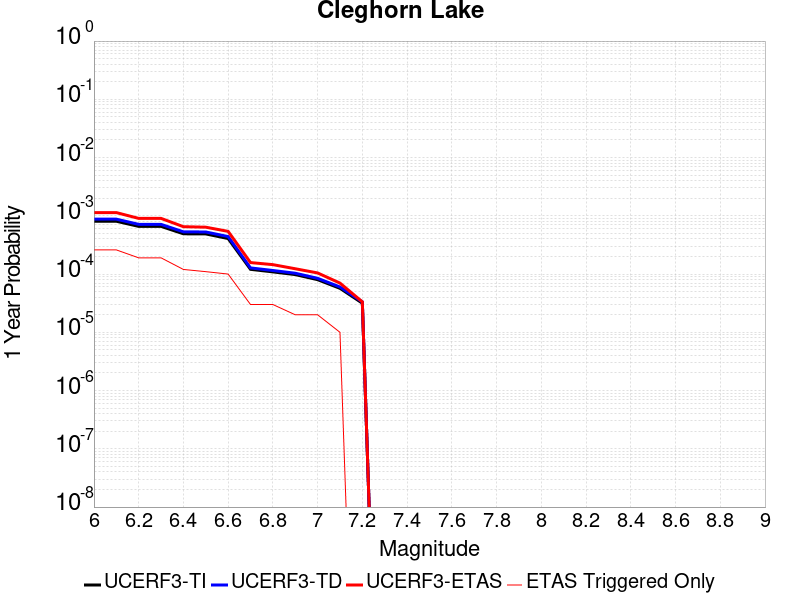 |  |

| Magnitude | 1 wk TI Prob | 1 wk TD Prob | 1 wk ETAS Prob | 1 wk ETAS/TD Gain | 1 wk ETAS Triggered Only | 1 mo TI Prob | 1 mo TD Prob | 1 mo ETAS Prob | 1 mo ETAS/TD Gain | 1 mo ETAS Triggered Only | 1 yr TI Prob | 1 yr TD Prob | 1 yr ETAS Prob | 1 yr ETAS/TD Gain | 1 yr ETAS Triggered Only | 10 yr TI Prob | 10 yr TD Prob | 10 yr ETAS Prob | 10 yr ETAS/TD Gain | 10 yr ETAS Triggered Only |
|-----|-----|-----|-----|-----|-----|-----|-----|-----|-----|-----|-----|-----|-----|-----|-----|-----|-----|-----|-----|-----|
| 6.0 | 1.5467183E-5 | 1.6794203E-5 | 4.1717186E-4 | 24.840227 | 4.0038436E-4 | 6.6286244E-5 | 7.197348E-5 | 4.7232903E-4 | 6.5625424 | 4.0038436E-4 | 8.067362E-4 | 8.759797E-4 | 0.0014360269 | 1.639338 | 5.6053814E-4 | 0.008038137 | 0.008730696 | 0.009365718 | 1.0727344 | 6.40615E-4 |
| 6.1 | 1.5467183E-5 | 1.6794203E-5 | 4.1717186E-4 | 24.840227 | 4.0038436E-4 | 6.6286244E-5 | 7.197348E-5 | 4.7232903E-4 | 6.5625424 | 4.0038436E-4 | 8.067362E-4 | 8.759797E-4 | 0.0014360269 | 1.639338 | 5.6053814E-4 | 0.008038137 | 0.008730696 | 0.009365718 | 1.0727344 | 6.40615E-4 |
| 6.2 | 1.2624631E-5 | 1.3681544E-5 | 2.9394677E-4 | 21.484911 | 2.8026907E-4 | 5.410444E-5 | 5.863415E-5 | 3.3888678E-4 | 5.7796826 | 2.8026907E-4 | 6.585225E-4 | 7.1368564E-4 | 0.0011137843 | 1.5606091 | 4.0038436E-4 | 0.0065657445 | 0.0071187317 | 0.0075560194 | 1.0614277 | 4.404228E-4 |
| 6.3 | 1.2624631E-5 | 1.3681544E-5 | 2.9394677E-4 | 21.484911 | 2.8026907E-4 | 5.410444E-5 | 5.863415E-5 | 3.3888678E-4 | 5.7796826 | 2.8026907E-4 | 6.585225E-4 | 7.1368564E-4 | 0.0011137843 | 1.5606091 | 4.0038436E-4 | 0.0065657445 | 0.0071187317 | 0.0075560194 | 1.0614277 | 4.404228E-4 |
| 6.4 | 9.417684E-6 | 1.0170118E-5 | 2.1036026E-4 | 20.684153 | 2.0019218E-4 | 4.036088E-5 | 4.3585722E-5 | 2.4376919E-4 | 5.592868 | 2.0019218E-4 | 4.912829E-4 | 5.3056807E-4 | 8.507056E-4 | 1.6033864 | 3.203075E-4 | 0.004901982 | 0.005297049 | 0.005655486 | 1.0676674 | 3.6034593E-4 |
| 6.5 | 9.368219E-6 | 1.0117545E-5 | 1.7026968E-4 | 16.82915 | 1.6015375E-4 | 4.014889E-5 | 4.3360415E-5 | 2.0350722E-4 | 4.693387 | 1.6015375E-4 | 4.8870314E-4 | 5.2782625E-4 | 8.0794736E-4 | 1.530707 | 2.8026907E-4 | 0.004876298 | 0.0052697617 | 0.005588381 | 1.0604619 | 3.203075E-4 |
| 6.6 | 7.803798E-6 | 8.441831E-6 | 1.6859423E-4 | 19.971287 | 1.6015375E-4 | 3.3444423E-5 | 3.6179E-5 | 1.9632695E-4 | 5.4265447 | 1.6015375E-4 | 4.0710976E-4 | 4.4043022E-4 | 6.80555E-4 | 1.5452051 | 2.4023063E-4 | 0.0040636472 | 0.0043994905 | 0.0046785264 | 1.0634246 | 2.8026907E-4 |
| 6.7 | 2.3108669E-6 | 2.4438336E-6 | 4.2482174E-5 | 17.383415 | 4.0038438E-5 | 9.903678E-6 | 1.0473532E-5 | 5.051155E-5 | 4.822781 | 4.0038438E-5 | 1.205706E-4 | 1.2750797E-4 | 1.6754131E-4 | 1.3139672 | 4.0038438E-5 | 0.001205052 | 0.0012743667 | 0.0013143542 | 1.0313783 | 4.0038438E-5 |
| 6.8 | 2.0882828E-6 | 2.2062823E-6 | 4.2244632E-5 | 19.147429 | 4.0038438E-5 | 8.949753E-6 | 9.455462E-6 | 4.949352E-5 | 5.234384 | 4.0038438E-5 | 1.08957785E-4 | 1.1511434E-4 | 1.5514817E-4 | 1.3477745 | 4.0038438E-5 | 0.0010890438 | 0.0011505639 | 0.0011905563 | 1.0347589 | 4.0038438E-5 |
| 6.9 | 1.876935E-6 | 1.981051E-6 | 4.201941E-5 | 21.210665 | 4.0038438E-5 | 8.043982E-6 | 8.490192E-6 | 4.8528287E-5 | 5.715806 | 4.0038438E-5 | 9.7931086E-5 | 1.03363345E-4 | 1.4339764E-4 | 1.3873162 | 4.0038438E-5 | 9.788794E-4 | 0.0010331686 | 0.0010731657 | 1.038713 | 4.0038438E-5 |
| 7.0 | 1.5357559E-6 | 1.6202807E-6 | 4.165865E-5 | 25.710762 | 4.0038438E-5 | 6.5817944E-6 | 6.9440425E-6 | 4.69822E-5 | 6.7658286 | 4.0038438E-5 | 8.01304E-5 | 8.454057E-5 | 1.2457561E-4 | 1.4735602 | 4.0038438E-5 | 8.010151E-4 | 8.450965E-4 | 8.851011E-4 | 1.0473373 | 4.0038438E-5 |
| 7.1 | 1.0905424E-6 | 1.1497619E-6 | 1.1497619E-6 | 1.0 | 0.0 | 4.6737446E-6 | 4.9275427E-6 | 4.9275427E-6 | 1.0 | 0.0 | 5.6901354E-5 | 5.999128E-5 | 5.999128E-5 | 1.0 | 0.0 | 5.6886784E-4 | 5.997606E-4 | 5.997606E-4 | 1.0 | 0.0 |
| 7.2 | 6.06668E-7 | 6.387277E-7 | 6.387277E-7 | 1.0 | 0.0 | 2.600003E-6 | 2.7374022E-6 | 2.7374022E-6 | 1.0 | 0.0 | 3.1654577E-5 | 3.3327433E-5 | 3.3327433E-5 | 1.0 | 0.0 | 3.1650066E-4 | 3.3323118E-4 | 3.3323118E-4 | 1.0 | 0.0 |

## San Andreas (Big Bend)
*[(top)](#table-of-contents)*

| 1 Week | 1 Month | 1 Year | 10 Year |
|-----|-----|-----|-----|
|  |  |  |  |

| Magnitude | 1 wk TI Prob | 1 wk TD Prob | 1 wk ETAS Prob | 1 wk ETAS/TD Gain | 1 wk ETAS Triggered Only | 1 mo TI Prob | 1 mo TD Prob | 1 mo ETAS Prob | 1 mo ETAS/TD Gain | 1 mo ETAS Triggered Only | 1 yr TI Prob | 1 yr TD Prob | 1 yr ETAS Prob | 1 yr ETAS/TD Gain | 1 yr ETAS Triggered Only | 10 yr TI Prob | 10 yr TD Prob | 10 yr ETAS Prob | 10 yr ETAS/TD Gain | 10 yr ETAS Triggered Only |
|-----|-----|-----|-----|-----|-----|-----|-----|-----|-----|-----|-----|-----|-----|-----|-----|-----|-----|-----|-----|-----|
| 6.0 | 1.0179969E-4 | 2.0072258E-4 | 3.208138E-4 | 1.5982944 | 1.2011531E-4 | 4.362114E-4 | 8.599571E-4 | 0.0011399852 | 1.3256302 | 2.8026907E-4 | 0.0052979486 | 0.010419999 | 0.010895453 | 1.045629 | 4.8046125E-4 | 0.051734097 | 0.10144902 | 0.101952694 | 1.0049648 | 5.6053814E-4 |
| 6.1 | 1.0179969E-4 | 2.0072258E-4 | 3.208138E-4 | 1.5982944 | 1.2011531E-4 | 4.362114E-4 | 8.599571E-4 | 0.0011399852 | 1.3256302 | 2.8026907E-4 | 0.0052979486 | 0.010419999 | 0.010895453 | 1.045629 | 4.8046125E-4 | 0.051734097 | 0.10144902 | 0.101952694 | 1.0049648 | 5.6053814E-4 |
| 6.2 | 1.0179969E-4 | 2.0072258E-4 | 3.208138E-4 | 1.5982944 | 1.2011531E-4 | 4.362114E-4 | 8.599571E-4 | 0.0011399852 | 1.3256302 | 2.8026907E-4 | 0.0052979486 | 0.010419999 | 0.010895453 | 1.045629 | 4.8046125E-4 | 0.051734097 | 0.10144902 | 0.101952694 | 1.0049648 | 5.6053814E-4 |
| 6.3 | 1.0179969E-4 | 2.0072258E-4 | 3.208138E-4 | 1.5982944 | 1.2011531E-4 | 4.362114E-4 | 8.599571E-4 | 0.0011399852 | 1.3256302 | 2.8026907E-4 | 0.0052979486 | 0.010419999 | 0.010895453 | 1.045629 | 4.8046125E-4 | 0.051734097 | 0.10144902 | 0.101952694 | 1.0049648 | 5.6053814E-4 |
| 6.4 | 9.1639464E-5 | 1.8429532E-4 | 2.6435743E-4 | 1.434423 | 8.0076876E-5 | 3.9268145E-4 | 7.895982E-4 | 0.0010296392 | 1.3040038 | 2.4023063E-4 | 0.0047704205 | 0.009571102 | 0.009967654 | 1.0414323 | 4.0038436E-4 | 0.046693064 | 0.09377527 | 0.09413811 | 1.0038692 | 4.0038436E-4 |
| 6.5 | 9.1639464E-5 | 1.8429532E-4 | 2.6435743E-4 | 1.434423 | 8.0076876E-5 | 3.9268145E-4 | 7.895982E-4 | 0.0010296392 | 1.3040038 | 2.4023063E-4 | 0.0047704205 | 0.009571102 | 0.009967654 | 1.0414323 | 4.0038436E-4 | 0.046693064 | 0.09377527 | 0.09413811 | 1.0038692 | 4.0038436E-4 |
| 6.6 | 9.042622E-5 | 1.823659E-4 | 2.6242816E-4 | 1.4390199 | 8.0076876E-5 | 3.8748336E-4 | 7.8133424E-4 | 9.8137E-4 | 1.2560182 | 2.0019218E-4 | 0.0047074095 | 0.009471365 | 0.009828298 | 1.0376855 | 3.6034593E-4 | 0.046089325 | 0.092869274 | 0.09319615 | 1.0035198 | 3.6034593E-4 |
| 6.7 | 8.9836685E-5 | 1.8150927E-4 | 2.615716E-4 | 1.4410923 | 8.0076876E-5 | 3.8495753E-4 | 7.776651E-4 | 9.3769433E-4 | 1.2057816 | 1.6015375E-4 | 0.00467679 | 0.00942708 | 0.0097443685 | 1.0336571 | 3.203075E-4 | 0.045795817 | 0.09246355 | 0.09275424 | 1.0031438 | 3.203075E-4 |
| 6.8 | 8.9471854E-5 | 1.8097709E-4 | 2.6103947E-4 | 1.4423896 | 8.0076876E-5 | 3.8339442E-4 | 7.7538576E-4 | 9.3541533E-4 | 1.206387 | 1.6015375E-4 | 0.004657841 | 0.009399569 | 0.009716866 | 1.0337565 | 3.203075E-4 | 0.04561414 | 0.092210755 | 0.09250153 | 1.0031533 | 3.203075E-4 |
| 6.9 | 8.858234E-5 | 1.7979681E-4 | 2.1982806E-4 | 1.2226471 | 4.0038438E-5 | 3.7958333E-4 | 7.703304E-4 | 8.903532E-4 | 1.1558069 | 1.2011531E-4 | 0.004611638 | 0.009338548 | 0.009616201 | 1.0297318 | 2.8026907E-4 | 0.04517103 | 0.09165087 | 0.09190545 | 1.0027777 | 2.8026907E-4 |
| 7.0 | 8.7433385E-5 | 1.7818481E-4 | 2.1821611E-4 | 1.2246617 | 4.0038438E-5 | 3.746607E-4 | 7.634259E-4 | 8.834495E-4 | 1.1572171 | 1.2011531E-4 | 0.004551957 | 0.009255203 | 0.009532878 | 1.030002 | 2.8026907E-4 | 0.044598386 | 0.09088532 | 0.091140114 | 1.0028034 | 2.8026907E-4 |
| 7.1 | 8.684964E-5 | 1.7730435E-4 | 2.1733569E-4 | 1.2257775 | 4.0038438E-5 | 3.7215967E-4 | 7.596547E-4 | 8.7967876E-4 | 1.1579982 | 1.2011531E-4 | 0.0045216335 | 0.009209678 | 0.009487365 | 1.0301517 | 2.8026907E-4 | 0.04430731 | 0.09046686 | 0.09072177 | 1.0028177 | 2.8026907E-4 |
| 7.2 | 8.606521E-5 | 1.762105E-4 | 2.1624188E-4 | 1.2271793 | 4.0038438E-5 | 3.6879873E-4 | 7.549695E-4 | 8.349859E-4 | 1.1059862 | 8.0076876E-5 | 0.0044808835 | 0.0091531165 | 0.009391148 | 1.0260055 | 2.4023063E-4 | 0.043916024 | 0.089947365 | 0.09016599 | 1.0024306 | 2.4023063E-4 |
| 7.3 | 8.568266E-5 | 1.7563057E-4 | 2.1566197E-4 | 1.2279296 | 4.0038438E-5 | 3.6715972E-4 | 7.524855E-4 | 8.325021E-4 | 1.1063365 | 8.0076876E-5 | 0.0044610105 | 0.009123127 | 0.009361166 | 1.0260918 | 2.4023063E-4 | 0.043725148 | 0.08966853 | 0.08988722 | 1.0024389 | 2.4023063E-4 |
| 7.4 | 8.5432206E-5 | 1.7525644E-4 | 2.1528786E-4 | 1.2284162 | 4.0038438E-5 | 3.6608664E-4 | 7.50883E-4 | 8.3089975E-4 | 1.1065636 | 8.0076876E-5 | 0.004447999 | 0.009103781 | 0.009341824 | 1.0261477 | 2.4023063E-4 | 0.043600157 | 0.08948871 | 0.08970744 | 1.0024443 | 2.4023063E-4 |
| 7.5 | 8.4791965E-5 | 1.7394972E-4 | 2.139812E-4 | 1.2301325 | 4.0038438E-5 | 3.633435E-4 | 7.4528606E-4 | 8.2530326E-4 | 1.1073644 | 8.0076876E-5 | 0.0044147377 | 0.009036204 | 0.009274264 | 1.0263451 | 2.4023063E-4 | 0.043280575 | 0.088866346 | 0.08908523 | 1.0024631 | 2.4023063E-4 |
| 7.6 | 8.241105E-5 | 1.6840403E-4 | 2.0843573E-4 | 1.2377121 | 4.0038438E-5 | 3.531424E-4 | 7.215321E-4 | 8.015512E-4 | 1.1109016 | 8.0076876E-5 | 0.0042910352 | 0.008749358 | 0.008987487 | 1.0272167 | 2.4023063E-4 | 0.042091176 | 0.086243294 | 0.0864628 | 1.0025452 | 2.4023063E-4 |
| 7.7 | 7.00432E-5 | 1.42045E-4 | 1.8207775E-4 | 1.2818315 | 4.0038438E-5 | 3.001506E-4 | 6.0862233E-4 | 6.8865047E-4 | 1.1314906 | 8.0076876E-5 | 0.0036482112 | 0.0073848404 | 0.0075835544 | 1.0269084 | 2.0019218E-4 | 0.035888977 | 0.07351733 | 0.073702805 | 1.0025228 | 2.0019218E-4 |
| 7.8 | 6.415362E-5 | 1.2968935E-4 | 1.2968935E-4 | 1.0 | 0.0 | 2.749151E-4 | 5.556931E-4 | 5.957093E-4 | 1.0720114 | 4.0038438E-5 | 0.0033419547 | 0.0067446055 | 0.006903679 | 1.0235853 | 1.6015375E-4 | 0.03292141 | 0.06725231 | 0.067401685 | 1.0022212 | 1.6015375E-4 |
| 7.9 | 4.939911E-5 | 9.3411545E-5 | 9.3411545E-5 | 1.0 | 0.0 | 2.116933E-4 | 4.0027377E-4 | 4.402962E-4 | 1.0999876 | 4.0038438E-5 | 0.0025743195 | 0.004862453 | 0.004981984 | 1.0245825 | 1.2011531E-4 | 0.025447013 | 0.048914436 | 0.049028676 | 1.0023355 | 1.2011531E-4 |
| 8.0 | 3.344983E-5 | 5.222685E-5 | 5.222685E-5 | 1.0 | 0.0 | 1.4334853E-4 | 2.2381016E-4 | 2.6383964E-4 | 1.1788546 | 4.0038438E-5 | 0.0017438711 | 0.0027214854 | 0.002841274 | 1.0440158 | 1.2011531E-4 | 0.017302496 | 0.027922187 | 0.028038949 | 1.0041816 | 1.2011531E-4 |
| 8.1 | 1.9104898E-5 | 1.9173063E-5 | 1.9173063E-5 | 1.0 | 0.0 | 8.1875565E-5 | 8.216769E-5 | 1.2220284E-4 | 1.4872371 | 4.0038438E-5 | 9.963791E-4 | 9.999331E-4 | 0.0010399316 | 1.040001 | 4.0038438E-5 | 0.009919235 | 0.010749801 | 0.010789409 | 1.0036845 | 4.0038438E-5 |
| 8.2 | 8.643924E-6 | 5.4748625E-6 | 5.4748625E-6 | 1.0 | 0.0 | 3.704486E-5 | 2.3463486E-5 | 2.3463486E-5 | 1.0 | 0.0 | 4.5092785E-4 | 2.8563058E-4 | 2.8563058E-4 | 1.0 | 0.0 | 0.0045001395 | 0.0032487072 | 0.0032487072 | 1.0 | 0.0 |
| 8.3 | 1.983087E-6 | 7.6599065E-7 | 7.6599065E-7 | 1.0 | 0.0 | 8.498917E-6 | 3.282813E-6 | 3.282813E-6 | 1.0 | 0.0 | 1.034694E-4 | 3.9967534E-5 | 3.9967534E-5 | 1.0 | 0.0 | 0.0010342124 | 4.719687E-4 | 4.719687E-4 | 1.0 | 0.0 |

## Death Valley (Fish Lake Valley)
*[(top)](#table-of-contents)*

| 1 Week | 1 Month | 1 Year | 10 Year |
|-----|-----|-----|-----|
|  |  |  |  |

| Magnitude | 1 wk TI Prob | 1 wk TD Prob | 1 wk ETAS Prob | 1 wk ETAS/TD Gain | 1 wk ETAS Triggered Only | 1 mo TI Prob | 1 mo TD Prob | 1 mo ETAS Prob | 1 mo ETAS/TD Gain | 1 mo ETAS Triggered Only | 1 yr TI Prob | 1 yr TD Prob | 1 yr ETAS Prob | 1 yr ETAS/TD Gain | 1 yr ETAS Triggered Only | 10 yr TI Prob | 10 yr TD Prob | 10 yr ETAS Prob | 10 yr ETAS/TD Gain | 10 yr ETAS Triggered Only |
|-----|-----|-----|-----|-----|-----|-----|-----|-----|-----|-----|-----|-----|-----|-----|-----|-----|-----|-----|-----|-----|
| 6.0 | 3.872328E-5 | 4.7267473E-5 | 2.474502E-4 | 5.2351055 | 2.0019218E-4 | 1.6594635E-4 | 2.0256084E-4 | 4.8277315E-4 | 2.3833487 | 2.8026907E-4 | 0.0020185246 | 0.002463534 | 0.002862932 | 1.162124 | 4.0038436E-4 | 0.02000288 | 0.024388181 | 0.024856925 | 1.0192201 | 4.8046125E-4 |
| 6.1 | 3.872328E-5 | 4.7267473E-5 | 2.474502E-4 | 5.2351055 | 2.0019218E-4 | 1.6594635E-4 | 2.0256084E-4 | 4.8277315E-4 | 2.3833487 | 2.8026907E-4 | 0.0020185246 | 0.002463534 | 0.002862932 | 1.162124 | 4.0038436E-4 | 0.02000288 | 0.024388181 | 0.024856925 | 1.0192201 | 4.8046125E-4 |
| 6.2 | 3.872328E-5 | 4.7267473E-5 | 2.474502E-4 | 5.2351055 | 2.0019218E-4 | 1.6594635E-4 | 2.0256084E-4 | 4.8277315E-4 | 2.3833487 | 2.8026907E-4 | 0.0020185246 | 0.002463534 | 0.002862932 | 1.162124 | 4.0038436E-4 | 0.02000288 | 0.024388181 | 0.024856925 | 1.0192201 | 4.8046125E-4 |
| 6.3 | 2.8356371E-5 | 3.3609853E-5 | 2.337953E-4 | 6.9561543 | 2.0019218E-4 | 1.2152165E-4 | 1.4403471E-4 | 4.2426342E-4 | 2.9455636 | 2.8026907E-4 | 0.0014785219 | 0.0017522911 | 0.0021519738 | 1.2280916 | 4.0038436E-4 | 0.014687235 | 0.017391782 | 0.017863888 | 1.0271453 | 4.8046125E-4 |
| 6.4 | 2.8356371E-5 | 3.3609853E-5 | 2.337953E-4 | 6.9561543 | 2.0019218E-4 | 1.2152165E-4 | 1.4403471E-4 | 4.2426342E-4 | 2.9455636 | 2.8026907E-4 | 0.0014785219 | 0.0017522911 | 0.0021519738 | 1.2280916 | 4.0038436E-4 | 0.014687235 | 0.017391782 | 0.017863888 | 1.0271453 | 4.8046125E-4 |
| 6.5 | 2.4448687E-5 | 2.8607552E-5 | 2.2879402E-4 | 7.9976788 | 2.0019218E-4 | 1.0477588E-4 | 1.2259831E-4 | 4.0283301E-4 | 3.2857957 | 2.8026907E-4 | 0.0012748998 | 0.0014916632 | 0.0018914503 | 1.2680143 | 4.0038436E-4 | 0.012676105 | 0.014821377 | 0.015294717 | 1.0319363 | 4.8046125E-4 |
| 6.6 | 2.1298161E-5 | 2.4660083E-5 | 2.2484733E-4 | 9.117866 | 2.0019218E-4 | 9.127464E-5 | 1.0568198E-4 | 3.8592142E-4 | 3.6517239 | 2.8026907E-4 | 0.0011107022 | 0.0012859525 | 0.001685822 | 1.310952 | 4.0038436E-4 | 0.011051672 | 0.012788526 | 0.013262842 | 1.0370892 | 4.8046125E-4 |
| 6.7 | 1.8959729E-5 | 2.1781025E-5 | 2.2196885E-4 | 10.1909275 | 2.0019218E-4 | 8.125345E-5 | 9.334405E-5 | 3.7358695E-4 | 4.0022573 | 2.8026907E-4 | 9.888117E-4 | 0.001135897 | 0.0015358265 | 1.3520826 | 4.0038436E-4 | 0.009844234 | 0.01130357 | 0.0117786005 | 1.0420249 | 4.8046125E-4 |
| 6.8 | 1.6691629E-5 | 1.9018353E-5 | 2.1920673E-4 | 11.526063 | 2.0019218E-4 | 7.153359E-5 | 8.150477E-5 | 3.6175098E-4 | 4.4384027 | 2.8026907E-4 | 8.7057345E-4 | 9.918857E-4 | 0.0013918729 | 1.4032594 | 4.0038436E-4 | 0.008671708 | 0.009876343 | 0.010352059 | 1.0481672 | 4.8046125E-4 |
| 6.9 | 1.450505E-5 | 1.638954E-5 | 2.1657844E-4 | 13.214431 | 2.0019218E-4 | 6.216302E-5 | 7.0239046E-5 | 3.504884E-4 | 4.9899373 | 2.8026907E-4 | 7.5657194E-4 | 8.5483363E-4 | 0.0012548757 | 1.4679766 | 4.0038436E-4 | 0.007540013 | 0.008516385 | 0.008992755 | 1.0559356 | 4.8046125E-4 |
| 7.0 | 1.2940855E-5 | 1.4537972E-5 | 2.1472725E-4 | 14.770097 | 2.0019218E-4 | 5.545963E-5 | 6.230414E-5 | 3.4255572E-4 | 5.4981217 | 2.8026907E-4 | 6.750118E-4 | 7.5829466E-4 | 0.0011583754 | 1.5276059 | 4.0038436E-4 | 0.006729651 | 0.0075576897 | 0.00803452 | 1.063092 | 4.8046125E-4 |
| 7.1 | 1.2544658E-5 | 1.4078208E-5 | 2.1426758E-4 | 15.219805 | 2.0019218E-4 | 5.3761712E-5 | 6.0333812E-5 | 3.4058595E-4 | 5.645026 | 2.8026907E-4 | 6.5435225E-4 | 7.343222E-4 | 0.0011344126 | 1.5448431 | 4.0038436E-4 | 0.006524288 | 0.007319551 | 0.007796495 | 1.0651604 | 4.8046125E-4 |
| 7.2 | 1.2489416E-5 | 1.4015674E-5 | 2.1420505E-4 | 15.28325 | 2.0019218E-4 | 5.3524967E-5 | 6.0065824E-5 | 3.4031805E-4 | 5.665752 | 2.8026907E-4 | 6.514716E-4 | 7.310616E-4 | 0.0011311533 | 1.5472748 | 4.0038436E-4 | 0.006495651 | 0.0072871596 | 0.0077641197 | 1.0654521 | 4.8046125E-4 |
| 7.3 | 1.2368307E-5 | 1.3879812E-5 | 2.1406922E-4 | 15.423062 | 2.0019218E-4 | 5.3005948E-5 | 5.9483587E-5 | 3.3973597E-4 | 5.711424 | 2.8026907E-4 | 6.451563E-4 | 7.2397763E-4 | 0.0011240721 | 1.5526338 | 4.0038436E-4 | 0.0064328653 | 0.007216782 | 0.0076937755 | 1.0660951 | 4.8046125E-4 |
| 7.4 | 1.2161707E-5 | 1.36478675E-5 | 1.7379943E-4 | 12.734548 | 1.6015375E-4 | 5.212056E-5 | 5.8489582E-5 | 2.9870615E-4 | 5.1069975 | 2.4023063E-4 | 6.3438306E-4 | 7.118836E-4 | 0.001071973 | 1.5058262 | 3.6034593E-4 | 0.006325751 | 0.0070966207 | 0.0075339177 | 1.0616205 | 4.404228E-4 |
| 7.5 | 1.1707948E-5 | 1.3145515E-5 | 1.7329716E-4 | 13.182987 | 1.6015375E-4 | 5.0175953E-5 | 5.6336736E-5 | 2.9655383E-4 | 5.263951 | 2.4023063E-4 | 6.10721E-4 | 6.856895E-4 | 0.0010457883 | 1.5251632 | 3.6034593E-4 | 0.0060904534 | 0.006836321 | 0.007273733 | 1.0639836 | 4.404228E-4 |
| 7.6 | 1.0319538E-5 | 1.1579622E-5 | 1.7173152E-4 | 14.830494 | 1.6015375E-4 | 4.4225842E-5 | 4.9626036E-5 | 2.4980828E-4 | 5.033815 | 2.0019218E-4 | 5.383166E-4 | 6.040347E-4 | 8.8413444E-4 | 1.4637147 | 2.8026907E-4 | 0.0053701443 | 0.0060244603 | 0.0063826353 | 1.0594535 | 3.6034593E-4 |
| 7.7 | 8.937764E-6 | 1.0022779E-5 | 1.7017493E-4 | 16.978815 | 1.6015375E-4 | 3.830414E-5 | 4.295409E-5 | 2.4313768E-4 | 5.660408 | 2.0019218E-4 | 4.6625308E-4 | 5.228456E-4 | 7.629506E-4 | 1.4592274 | 2.4023063E-4 | 0.0046527605 | 0.005216664 | 0.0054954714 | 1.0534455 | 2.8026907E-4 |
| 7.8 | 3.108007E-7 | 3.284654E-7 | 3.284654E-7 | 1.0 | 0.0 | 1.3320023E-6 | 1.407708E-6 | 1.407708E-6 | 1.0 | 0.0 | 1.6217007E-5 | 1.7138715E-5 | 1.7138715E-5 | 1.0 | 0.0 | 1.6215823E-4 | 1.7137431E-4 | 1.7137431E-4 | 1.0 | 0.0 |
| 7.9 | 2.5591178E-9 | 2.6696718E-9 | 2.6696718E-9 | 1.0 | 0.0 | 1.0967647E-8 | 1.14414505E-8 | 1.14414505E-8 | 1.0 | 0.0 | 1.335311E-7 | 1.3929966E-7 | 1.3929966E-7 | 1.0 | 0.0 | 1.3353102E-6 | 1.3929966E-6 | 1.3929966E-6 | 1.0 | 0.0 |

## Sierra Nevada  (No Extension)
*[(top)](#table-of-contents)*

| 1 Week | 1 Month | 1 Year | 10 Year |
|-----|-----|-----|-----|
|  |  |  |  |

| Magnitude | 1 wk TI Prob | 1 wk TD Prob | 1 wk ETAS Prob | 1 wk ETAS/TD Gain | 1 wk ETAS Triggered Only | 1 mo TI Prob | 1 mo TD Prob | 1 mo ETAS Prob | 1 mo ETAS/TD Gain | 1 mo ETAS Triggered Only | 1 yr TI Prob | 1 yr TD Prob | 1 yr ETAS Prob | 1 yr ETAS/TD Gain | 1 yr ETAS Triggered Only | 10 yr TI Prob | 10 yr TD Prob | 10 yr ETAS Prob | 10 yr ETAS/TD Gain | 10 yr ETAS Triggered Only |
|-----|-----|-----|-----|-----|-----|-----|-----|-----|-----|-----|-----|-----|-----|-----|-----|-----|-----|-----|-----|-----|
| 6.0 | 7.7690465E-6 | 6.976322E-6 | 3.272816E-4 | 46.9132 | 3.203075E-4 | 3.329549E-5 | 2.9898381E-5 | 3.9023353E-4 | 13.051995 | 3.6034593E-4 | 4.0529718E-4 | 3.6398784E-4 | 7.642265E-4 | 2.0995934 | 4.0038436E-4 | 0.004045588 | 0.0036374326 | 0.004036361 | 1.1096729 | 4.0038436E-4 |
| 6.1 | 7.7690465E-6 | 6.976322E-6 | 3.272816E-4 | 46.9132 | 3.203075E-4 | 3.329549E-5 | 2.9898381E-5 | 3.9023353E-4 | 13.051995 | 3.6034593E-4 | 4.0529718E-4 | 3.6398784E-4 | 7.642265E-4 | 2.0995934 | 4.0038436E-4 | 0.004045588 | 0.0036374326 | 0.004036361 | 1.1096729 | 4.0038436E-4 |
| 6.2 | 7.7690465E-6 | 6.976322E-6 | 3.272816E-4 | 46.9132 | 3.203075E-4 | 3.329549E-5 | 2.9898381E-5 | 3.9023353E-4 | 13.051995 | 3.6034593E-4 | 4.0529718E-4 | 3.6398784E-4 | 7.642265E-4 | 2.0995934 | 4.0038436E-4 | 0.004045588 | 0.0036374326 | 0.004036361 | 1.1096729 | 4.0038436E-4 |
| 6.3 | 7.7690465E-6 | 6.976322E-6 | 3.272816E-4 | 46.9132 | 3.203075E-4 | 3.329549E-5 | 2.9898381E-5 | 3.9023353E-4 | 13.051995 | 3.6034593E-4 | 4.0529718E-4 | 3.6398784E-4 | 7.642265E-4 | 2.0995934 | 4.0038436E-4 | 0.004045588 | 0.0036374326 | 0.004036361 | 1.1096729 | 4.0038436E-4 |
| 6.4 | 7.7690465E-6 | 6.976322E-6 | 3.272816E-4 | 46.9132 | 3.203075E-4 | 3.329549E-5 | 2.9898381E-5 | 3.9023353E-4 | 13.051995 | 3.6034593E-4 | 4.0529718E-4 | 3.6398784E-4 | 7.642265E-4 | 2.0995934 | 4.0038436E-4 | 0.004045588 | 0.0036374326 | 0.004036361 | 1.1096729 | 4.0038436E-4 |
| 6.5 | 7.7690465E-6 | 6.976322E-6 | 3.272816E-4 | 46.9132 | 3.203075E-4 | 3.329549E-5 | 2.9898381E-5 | 3.9023353E-4 | 13.051995 | 3.6034593E-4 | 4.0529718E-4 | 3.6398784E-4 | 7.642265E-4 | 2.0995934 | 4.0038436E-4 | 0.004045588 | 0.0036374326 | 0.004036361 | 1.1096729 | 4.0038436E-4 |
| 6.6 | 2.653E-6 | 1.614854E-6 | 2.4184509E-4 | 149.76282 | 2.4023063E-4 | 1.136995E-5 | 6.9207845E-6 | 2.871879E-4 | 41.496437 | 2.8026907E-4 | 1.3842035E-4 | 8.425733E-5 | 4.0453783E-4 | 4.8012185 | 3.203075E-4 | 0.0013833415 | 8.422573E-4 | 0.001162295 | 1.3799762 | 3.203075E-4 |
| 6.7 | 2.5902466E-6 | 1.5501876E-6 | 2.4178044E-4 | 155.9685 | 2.4023063E-4 | 1.11010095E-5 | 6.643644E-6 | 2.8691083E-4 | 43.185764 | 2.8026907E-4 | 1.351464E-4 | 8.0883394E-5 | 4.01165E-4 | 4.959794 | 3.203075E-4 | 0.0013506424 | 8.0854254E-4 | 0.001128591 | 1.3958338 | 3.203075E-4 |
| 6.8 | 2.5853892E-6 | 1.5469877E-6 | 2.4177723E-4 | 156.28905 | 2.4023063E-4 | 1.1080193E-5 | 6.629931E-6 | 2.8689712E-4 | 43.27302 | 2.8026907E-4 | 1.34893E-4 | 8.071645E-5 | 4.0099808E-4 | 4.9679847 | 3.203075E-4 | 0.0013481114 | 8.068743E-4 | 0.0011269234 | 1.3966529 | 3.203075E-4 |
| 6.9 | 2.458257E-6 | 1.4220619E-6 | 2.4165233E-4 | 169.93095 | 2.4023063E-4 | 1.0535345E-5 | 6.094537E-6 | 2.863619E-4 | 46.98665 | 2.8026907E-4 | 1.2826028E-4 | 7.4198484E-5 | 3.9448222E-4 | 5.316581 | 3.203075E-4 | 0.0012818627 | 7.4173906E-4 | 0.001061809 | 1.4315128 | 3.203075E-4 |
| 7.0 | 2.4341468E-6 | 1.3990258E-6 | 2.4162931E-4 | 172.71254 | 2.4023063E-4 | 1.0432016E-5 | 5.9958115E-6 | 2.8626318E-4 | 47.743862 | 2.8026907E-4 | 1.270024E-4 | 7.2996576E-5 | 3.932807E-4 | 5.3876595 | 3.203075E-4 | 0.0012692984 | 7.297279E-4 | 0.0010498017 | 1.4386207 | 3.203075E-4 |
| 7.1 | 2.3652476E-6 | 1.3339754E-6 | 2.4156428E-4 | 181.086 | 2.4023063E-4 | 1.0136736E-5 | 5.717025E-6 | 2.8598448E-4 | 50.023304 | 2.8026907E-4 | 1.2340778E-4 | 6.9602575E-5 | 3.8988778E-4 | 5.601629 | 3.203075E-4 | 0.0012333926 | 6.9580943E-4 | 0.0010158941 | 1.4600177 | 3.203075E-4 |
| 7.2 | 2.272158E-6 | 1.2502821E-6 | 2.4148061E-4 | 193.14088 | 2.4023063E-4 | 9.737784E-6 | 5.3583412E-6 | 2.856259E-4 | 53.304913 | 2.8026907E-4 | 1.1855107E-4 | 6.5235865E-5 | 3.8552246E-4 | 5.9096704 | 3.203075E-4 | 0.0011848784 | 6.5216864E-4 | 9.7226724E-4 | 1.4908218 | 3.203075E-4 |
| 7.3 | 2.1382127E-6 | 1.1419703E-6 | 2.4137231E-4 | 211.36479 | 2.4023063E-4 | 9.163737E-6 | 4.8941492E-6 | 2.451236E-4 | 50.085026 | 2.4023063E-4 | 1.1156279E-4 | 5.958465E-5 | 3.3983702E-4 | 5.703432 | 2.8026907E-4 | 0.001115068 | 5.956879E-4 | 8.7579E-4 | 1.4702162 | 2.8026907E-4 |
| 7.4 | 1.9048055E-6 | 9.575242E-7 | 2.0114952E-4 | 210.07251 | 2.0019218E-4 | 8.163426E-6 | 4.1036687E-6 | 2.0429504E-4 | 49.78351 | 2.0019218E-4 | 9.9385186E-5 | 4.996103E-5 | 2.9017965E-4 | 5.80812 | 2.4023063E-4 | 9.934074E-4 | 4.994987E-4 | 7.396093E-4 | 1.4807032 | 2.4023063E-4 |
| 7.5 | 1.5373403E-6 | 7.560042E-7 | 1.6090964E-4 | 212.84224 | 1.6015375E-4 | 6.5885843E-6 | 3.2400142E-6 | 1.6339324E-4 | 50.429794 | 1.6015375E-4 | 8.021306E-5 | 3.9446462E-5 | 2.3963075E-4 | 6.074835 | 2.0019218E-4 | 8.0184115E-4 | 3.943951E-4 | 5.945083E-4 | 1.5073928 | 2.0019218E-4 |
| 7.6 | 1.0680322E-6 | 4.6596554E-7 | 1.2058122E-4 | 258.77713 | 1.2011531E-4 | 4.577273E-6 | 1.9969937E-6 | 1.2211206E-4 | 61.14795 | 1.2011531E-4 | 5.5726876E-5 | 2.4313129E-5 | 1.8446299E-4 | 7.58697 | 1.6015375E-4 | 5.5712904E-4 | 2.4310495E-4 | 4.0321978E-4 | 1.6586242 | 1.6015375E-4 |
| 7.7 | 5.509146E-7 | 1.5580486E-7 | 1.5580486E-7 | 1.0 | 0.0 | 2.3610605E-6 | 6.677349E-7 | 6.677349E-7 | 1.0 | 0.0 | 2.8745531E-5 | 8.129644E-6 | 8.129644E-6 | 1.0 | 0.0 | 2.8741814E-4 | 8.1293576E-5 | 8.1293576E-5 | 1.0 | 0.0 |

## White Wolf (Extension)
*[(top)](#table-of-contents)*

| 1 Week | 1 Month | 1 Year | 10 Year |
|-----|-----|-----|-----|
|  |  |  |  |

| Magnitude | 1 wk TI Prob | 1 wk TD Prob | 1 wk ETAS Prob | 1 wk ETAS/TD Gain | 1 wk ETAS Triggered Only | 1 mo TI Prob | 1 mo TD Prob | 1 mo ETAS Prob | 1 mo ETAS/TD Gain | 1 mo ETAS Triggered Only | 1 yr TI Prob | 1 yr TD Prob | 1 yr ETAS Prob | 1 yr ETAS/TD Gain | 1 yr ETAS Triggered Only | 10 yr TI Prob | 10 yr TD Prob | 10 yr ETAS Prob | 10 yr ETAS/TD Gain | 10 yr ETAS Triggered Only |
|-----|-----|-----|-----|-----|-----|-----|-----|-----|-----|-----|-----|-----|-----|-----|-----|-----|-----|-----|-----|-----|
| 6.0 | 8.222555E-6 | 6.0666657E-6 | 2.8633402E-4 | 47.197926 | 2.8026907E-4 | 3.5239045E-5 | 2.5999774E-5 | 3.0626156E-4 | 11.779392 | 2.8026907E-4 | 4.289509E-4 | 3.1650788E-4 | 7.167655E-4 | 2.2646055 | 4.0038436E-4 | 0.0042812387 | 0.003161223 | 0.0035603417 | 1.1262546 | 4.0038436E-4 |
| 6.1 | 8.222555E-6 | 6.0666657E-6 | 2.8633402E-4 | 47.197926 | 2.8026907E-4 | 3.5239045E-5 | 2.5999774E-5 | 3.0626156E-4 | 11.779392 | 2.8026907E-4 | 4.289509E-4 | 3.1650788E-4 | 7.167655E-4 | 2.2646055 | 4.0038436E-4 | 0.0042812387 | 0.003161223 | 0.0035603417 | 1.1262546 | 4.0038436E-4 |
| 6.2 | 8.222555E-6 | 6.0666657E-6 | 2.8633402E-4 | 47.197926 | 2.8026907E-4 | 3.5239045E-5 | 2.5999774E-5 | 3.0626156E-4 | 11.779392 | 2.8026907E-4 | 4.289509E-4 | 3.1650788E-4 | 7.167655E-4 | 2.2646055 | 4.0038436E-4 | 0.0042812387 | 0.003161223 | 0.0035603417 | 1.1262546 | 4.0038436E-4 |
| 6.3 | 8.222555E-6 | 6.0666657E-6 | 2.8633402E-4 | 47.197926 | 2.8026907E-4 | 3.5239045E-5 | 2.5999774E-5 | 3.0626156E-4 | 11.779392 | 2.8026907E-4 | 4.289509E-4 | 3.1650788E-4 | 7.167655E-4 | 2.2646055 | 4.0038436E-4 | 0.0042812387 | 0.003161223 | 0.0035603417 | 1.1262546 | 4.0038436E-4 |
| 6.4 | 5.821773E-6 | 3.5571766E-6 | 2.0374866E-4 | 57.278194 | 2.0019218E-4 | 2.4950215E-5 | 1.5244959E-5 | 2.1543409E-4 | 14.131496 | 2.0019218E-4 | 3.0372653E-4 | 1.8559267E-4 | 3.857477E-4 | 2.078464 | 2.0019218E-4 | 0.0030331176 | 0.001854485 | 0.002054306 | 1.10775 | 2.0019218E-4 |
| 6.5 | 5.766023E-6 | 3.4991106E-6 | 2.036906E-4 | 58.212105 | 2.0019218E-4 | 2.4711293E-5 | 1.4996108E-5 | 2.151853E-4 | 14.349409 | 2.0019218E-4 | 3.0081844E-4 | 1.8256342E-4 | 3.8271907E-4 | 2.096362 | 2.0019218E-4 | 0.0030041158 | 0.0018242426 | 0.0020240697 | 1.1095397 | 2.0019218E-4 |
| 6.6 | 4.643576E-6 | 2.332624E-6 | 1.2244766E-4 | 52.493523 | 1.2011531E-4 | 1.9900888E-5 | 9.996925E-6 | 1.3011103E-4 | 13.015106 | 1.2011531E-4 | 2.4226638E-4 | 1.2170619E-4 | 2.4180688E-4 | 1.9868084 | 1.2011531E-4 | 0.0024200242 | 0.0012164378 | 0.0013364069 | 1.0986234 | 1.2011531E-4 |
| 6.7 | 3.9529173E-6 | 1.6483477E-6 | 4.168672E-5 | 25.290003 | 4.0038438E-5 | 1.6940963E-5 | 7.0643296E-6 | 4.7102483E-5 | 6.6676507 | 4.0038438E-5 | 2.0623671E-4 | 8.6005006E-5 | 1.2604E-4 | 1.4654961 | 4.0038438E-5 | 0.002060454 | 8.597357E-4 | 8.9973974E-4 | 1.0465306 | 4.0038438E-5 |
| 6.8 | 3.4377522E-6 | 1.2245237E-6 | 4.1262912E-5 | 33.697113 | 4.0038438E-5 | 1.473314E-5 | 5.2479486E-6 | 4.5286175E-5 | 8.62931 | 4.0038438E-5 | 1.7936122E-4 | 6.3891996E-5 | 1.0392787E-4 | 1.626618 | 4.0038438E-5 | 0.0017921652 | 6.387454E-4 | 6.787582E-4 | 1.0626429 | 4.0038438E-5 |
| 6.9 | 3.1367306E-6 | 1.0033783E-6 | 4.1041774E-5 | 40.903587 | 4.0038438E-5 | 1.3443062E-5 | 4.3001864E-6 | 4.4338452E-5 | 10.310821 | 4.0038438E-5 | 1.63657E-4 | 5.235359E-5 | 9.238993E-5 | 1.7647296 | 4.0038438E-5 | 0.0016353652 | 5.2342017E-4 | 5.6343764E-4 | 1.0764538 | 4.0038438E-5 |
| 7.0 | 2.8298145E-6 | 7.4286646E-7 | 4.0781273E-5 | 54.89718 | 4.0038438E-5 | 1.2127721E-5 | 3.1837099E-6 | 4.322202E-5 | 13.575992 | 4.0038438E-5 | 1.47645E-4 | 3.8761027E-5 | 7.8797915E-5 | 2.032916 | 4.0038438E-5 | 0.0014754693 | 3.8754768E-4 | 4.275706E-4 | 1.1032722 | 4.0038438E-5 |
| 7.1 | 2.4091064E-6 | 5.4227525E-7 | 4.058069E-5 | 74.83412 | 4.0038438E-5 | 1.03247E-5 | 2.3240348E-6 | 4.236238E-5 | 18.227945 | 4.0038438E-5 | 1.2569598E-4 | 2.8294799E-5 | 6.8332105E-5 | 2.415006 | 4.0038438E-5 | 0.001256249 | 2.8291598E-4 | 3.2294312E-4 | 1.1414806 | 4.0038438E-5 |
| 7.2 | 1.3875518E-6 | 1.0743063E-7 | 1.0743063E-7 | 1.0 | 0.0 | 5.9466374E-6 | 4.6041689E-7 | 4.6041689E-7 | 1.0 | 0.0 | 7.23979E-5 | 5.6055624E-6 | 5.6055624E-6 | 1.0 | 0.0 | 7.2374323E-4 | 5.6054323E-5 | 5.6054323E-5 | 1.0 | 0.0 |
| 7.3 | 7.056077E-7 | 5.002034E-8 | 5.002034E-8 | 1.0 | 0.0 | 3.0240296E-6 | 2.1437286E-7 | 2.1437286E-7 | 1.0 | 0.0 | 3.681694E-5 | 2.609987E-6 | 2.609987E-6 | 1.0 | 0.0 | 3.681084E-4 | 2.609961E-5 | 2.609961E-5 | 1.0 | 0.0 |
| 7.4 | 5.9334678E-8 | 4.8683537E-9 | 4.8683537E-9 | 1.0 | 0.0 | 2.5429145E-7 | 2.0864372E-8 | 2.0864372E-8 | 1.0 | 0.0 | 3.095994E-6 | 2.5402372E-7 | 2.5402372E-7 | 1.0 | 0.0 | 3.095951E-5 | 2.5402353E-6 | 2.5402353E-6 | 1.0 | 0.0 |

## San Andreas (San Gorgonio Pass-Garnet HIll)
*[(top)](#table-of-contents)*

| 1 Week | 1 Month | 1 Year | 10 Year |
|-----|-----|-----|-----|
|  |  |  |  |

| Magnitude | 1 wk TI Prob | 1 wk TD Prob | 1 wk ETAS Prob | 1 wk ETAS/TD Gain | 1 wk ETAS Triggered Only | 1 mo TI Prob | 1 mo TD Prob | 1 mo ETAS Prob | 1 mo ETAS/TD Gain | 1 mo ETAS Triggered Only | 1 yr TI Prob | 1 yr TD Prob | 1 yr ETAS Prob | 1 yr ETAS/TD Gain | 1 yr ETAS Triggered Only | 10 yr TI Prob | 10 yr TD Prob | 10 yr ETAS Prob | 10 yr ETAS/TD Gain | 10 yr ETAS Triggered Only |
|-----|-----|-----|-----|-----|-----|-----|-----|-----|-----|-----|-----|-----|-----|-----|-----|-----|-----|-----|-----|-----|
| 6.0 | 8.31567E-5 | 2.3382473E-4 | 4.739992E-4 | 2.0271559 | 2.4023063E-4 | 3.5633717E-4 | 0.0010017233 | 0.0013217101 | 1.3194361 | 3.203075E-4 | 0.004329778 | 0.012127888 | 0.012483864 | 1.0293518 | 3.6034593E-4 | 0.042463828 | 0.11257892 | 0.112934224 | 1.0031561 | 4.0038436E-4 |
| 6.1 | 8.31567E-5 | 2.3382473E-4 | 4.739992E-4 | 2.0271559 | 2.4023063E-4 | 3.5633717E-4 | 0.0010017233 | 0.0013217101 | 1.3194361 | 3.203075E-4 | 0.004329778 | 0.012127888 | 0.012483864 | 1.0293518 | 3.6034593E-4 | 0.042463828 | 0.11257892 | 0.112934224 | 1.0031561 | 4.0038436E-4 |
| 6.2 | 8.31567E-5 | 2.3382473E-4 | 4.739992E-4 | 2.0271559 | 2.4023063E-4 | 3.5633717E-4 | 0.0010017233 | 0.0013217101 | 1.3194361 | 3.203075E-4 | 0.004329778 | 0.012127888 | 0.012483864 | 1.0293518 | 3.6034593E-4 | 0.042463828 | 0.11257892 | 0.112934224 | 1.0031561 | 4.0038436E-4 |
| 6.3 | 8.31567E-5 | 2.3382473E-4 | 4.739992E-4 | 2.0271559 | 2.4023063E-4 | 3.5633717E-4 | 0.0010017233 | 0.0013217101 | 1.3194361 | 3.203075E-4 | 0.004329778 | 0.012127888 | 0.012483864 | 1.0293518 | 3.6034593E-4 | 0.042463828 | 0.11257892 | 0.112934224 | 1.0031561 | 4.0038436E-4 |
| 6.4 | 8.059055E-5 | 2.2940808E-4 | 4.6958358E-4 | 2.0469358 | 2.4023063E-4 | 3.4534236E-4 | 9.828096E-4 | 0.0013028022 | 1.3255898 | 3.203075E-4 | 0.0041964394 | 0.011900152 | 0.01225621 | 1.0299205 | 3.6034593E-4 | 0.041180745 | 0.11056015 | 0.110916264 | 1.003221 | 4.0038436E-4 |
| 6.5 | 8.059055E-5 | 2.2940808E-4 | 4.6958358E-4 | 2.0469358 | 2.4023063E-4 | 3.4534236E-4 | 9.828096E-4 | 0.0013028022 | 1.3255898 | 3.203075E-4 | 0.0041964394 | 0.011900152 | 0.01225621 | 1.0299205 | 3.6034593E-4 | 0.041180745 | 0.11056015 | 0.110916264 | 1.003221 | 4.0038436E-4 |
| 6.6 | 7.619237E-5 | 2.218517E-4 | 4.6202904E-4 | 2.082603 | 2.4023063E-4 | 3.2649786E-4 | 9.5044886E-4 | 0.0012704519 | 1.3366863 | 3.203075E-4 | 0.0039678677 | 0.01151087 | 0.011867069 | 1.0309445 | 3.6034593E-4 | 0.03897764 | 0.10709683 | 0.10745433 | 1.0033381 | 4.0038436E-4 |
| 6.7 | 7.440636E-5 | 2.1860997E-4 | 4.5878807E-4 | 2.0986605 | 2.4023063E-4 | 3.188454E-4 | 9.3656575E-4 | 0.0012565732 | 1.3416818 | 3.203075E-4 | 0.0038750346 | 0.011343609 | 0.0116998665 | 1.031406 | 3.6034593E-4 | 0.038081564 | 0.105605274 | 0.105927564 | 1.0030519 | 3.6034593E-4 |
| 6.8 | 7.3735864E-5 | 2.1708169E-4 | 4.5726015E-4 | 2.1063967 | 2.4023063E-4 | 3.1597257E-4 | 9.3002064E-4 | 0.0012500302 | 1.3440887 | 3.203075E-4 | 0.0038401815 | 0.011264749 | 0.011621036 | 1.0316285 | 3.6034593E-4 | 0.03774495 | 0.10490683 | 0.10522937 | 1.0030745 | 3.6034593E-4 |
| 6.9 | 7.27575E-5 | 2.1477141E-4 | 4.5495044E-4 | 2.1183007 | 2.4023063E-4 | 3.117806E-4 | 9.201265E-4 | 0.0012401392 | 1.3477921 | 3.203075E-4 | 0.003789323 | 0.011145527 | 0.011501856 | 1.0319706 | 3.6034593E-4 | 0.037253562 | 0.103854746 | 0.10417767 | 1.0031093 | 3.6034593E-4 |
| 7.0 | 7.102591E-5 | 2.1061185E-4 | 4.5079188E-4 | 2.1403918 | 2.4023063E-4 | 3.0436125E-4 | 9.023122E-4 | 0.0012223307 | 1.3546649 | 3.203075E-4 | 0.003699303 | 0.010930831 | 0.011287238 | 1.0326056 | 3.6034593E-4 | 0.03638325 | 0.10195695 | 0.10228055 | 1.003174 | 3.6034593E-4 |
| 7.1 | 7.028513E-5 | 2.0896831E-4 | 4.4914873E-4 | 2.1493628 | 2.4023063E-4 | 3.0118722E-4 | 8.9527335E-4 | 0.0012152941 | 1.3574558 | 3.203075E-4 | 0.0036607897 | 0.010845989 | 0.011202427 | 1.0328635 | 3.6034593E-4 | 0.036010686 | 0.101199985 | 0.10152386 | 1.0032004 | 3.6034593E-4 |
| 7.2 | 6.8498244E-5 | 2.0504706E-4 | 4.4522842E-4 | 2.1713474 | 2.4023063E-4 | 2.9353087E-4 | 8.784794E-4 | 0.0011985055 | 1.3642955 | 3.203075E-4 | 0.003567883 | 0.010643536 | 0.0110000465 | 1.0334955 | 3.6034593E-4 | 0.035111405 | 0.09939202 | 0.09971655 | 1.0032651 | 3.6034593E-4 |
| 7.3 | 6.622592E-5 | 1.9732013E-4 | 4.3750333E-4 | 2.2172263 | 2.4023063E-4 | 2.8379448E-4 | 8.453858E-4 | 0.0011254179 | 1.3312477 | 2.8026907E-4 | 0.0034497243 | 0.0102444785 | 0.010561505 | 1.030946 | 3.203075E-4 | 0.033966612 | 0.095888525 | 0.09617812 | 1.00302 | 3.203075E-4 |
| 7.4 | 5.1050705E-5 | 1.4689034E-4 | 3.470531E-4 | 2.3626683 | 2.0019218E-4 | 2.1877038E-4 | 6.29379E-4 | 8.694584E-4 | 1.3814545 | 2.4023063E-4 | 0.002660276 | 0.0076359594 | 0.007914089 | 1.0364236 | 2.8026907E-4 | 0.02628654 | 0.07286301 | 0.07312287 | 1.0035663 | 2.8026907E-4 |
| 7.5 | 3.9302922E-5 | 1.1129847E-4 | 3.1146838E-4 | 2.7984965 | 2.0019218E-4 | 1.6843023E-4 | 4.7690657E-4 | 7.1702263E-4 | 1.5034866 | 2.4023063E-4 | 0.0020487092 | 0.005790949 | 0.0060695945 | 1.0481175 | 2.8026907E-4 | 0.020299247 | 0.05600951 | 0.056274083 | 1.0047237 | 2.8026907E-4 |
| 7.6 | 2.9851626E-5 | 8.4949745E-5 | 2.4508988E-4 | 2.8851163 | 1.6015375E-4 | 1.2792926E-4 | 3.6401965E-4 | 5.64139E-4 | 1.5497487 | 2.0019218E-4 | 0.0015564259 | 0.0044229585 | 0.004662127 | 1.0540743 | 2.4023063E-4 | 0.0154556995 | 0.04319374 | 0.043423593 | 1.0053215 | 2.4023063E-4 |
| 7.7 | 2.1135214E-5 | 6.3529005E-5 | 1.8363669E-4 | 2.8905962 | 1.2011531E-4 | 9.0576345E-5 | 2.7223877E-4 | 4.323489E-4 | 1.588124 | 1.6015375E-4 | 0.0011022091 | 0.0033094748 | 0.0035090044 | 1.0602905 | 2.0019218E-4 | 0.010967582 | 0.032582592 | 0.032776263 | 1.0059439 | 2.0019218E-4 |
| 7.8 | 1.883379E-5 | 5.564028E-5 | 1.7574891E-4 | 3.1586633 | 1.2011531E-4 | 8.0713755E-5 | 2.3843657E-4 | 3.9855213E-4 | 1.6715227 | 1.6015375E-4 | 9.822468E-4 | 0.0028991038 | 0.0030987158 | 1.0688529 | 2.0019218E-4 | 0.0097791655 | 0.028695205 | 0.028889654 | 1.0067763 | 2.0019218E-4 |
| 7.9 | 1.5156185E-5 | 4.1658426E-5 | 1.6176874E-4 | 3.8832176 | 1.2011531E-4 | 6.495346E-5 | 1.785239E-4 | 3.3864906E-4 | 1.8969396 | 1.6015375E-4 | 7.9052144E-4 | 0.0021713632 | 0.0023711207 | 1.0919963 | 2.0019218E-4 | 0.007877152 | 0.021759422 | 0.02195526 | 1.0090001 | 2.0019218E-4 |
| 8.0 | 1.1405907E-5 | 2.9974231E-5 | 7.001147E-5 | 2.335722 | 4.0038438E-5 | 4.8881542E-5 | 1.2845467E-4 | 2.0852126E-4 | 1.6233062 | 8.0076876E-5 | 5.9497025E-4 | 0.0015628147 | 0.0016827423 | 1.0767382 | 1.2011531E-4 | 0.005933798 | 0.015772851 | 0.015891071 | 1.0074952 | 1.2011531E-4 |
| 8.1 | 4.3511436E-6 | 7.369219E-6 | 7.369219E-6 | 1.0 | 0.0 | 1.8647626E-5 | 3.1581985E-5 | 3.1581985E-5 | 1.0 | 0.0 | 2.2701119E-4 | 3.8444297E-4 | 3.8444297E-4 | 1.0 | 0.0 | 0.0022677942 | 0.0041163345 | 0.0041163345 | 1.0 | 0.0 |
| 8.2 | 2.3042528E-6 | 2.7329415E-6 | 2.7329415E-6 | 1.0 | 0.0 | 9.875332E-6 | 1.1712554E-5 | 1.1712554E-5 | 1.0 | 0.0 | 1.2022553E-4 | 1.4259106E-4 | 1.4259106E-4 | 1.0 | 0.0 | 0.0012016051 | 0.0015979785 | 0.0015979785 | 1.0 | 0.0 |
| 8.3 | 5.202968E-7 | 3.1598344E-7 | 3.1598344E-7 | 1.0 | 0.0 | 2.2298414E-6 | 1.3542141E-6 | 1.3542141E-6 | 1.0 | 0.0 | 2.714798E-5 | 1.6487444E-5 | 1.6487444E-5 | 1.0 | 0.0 | 2.7144665E-4 | 1.9563142E-4 | 1.9563142E-4 | 1.0 | 0.0 |

## Baker
*[(top)](#table-of-contents)*

| 1 Week | 1 Month | 1 Year | 10 Year |
|-----|-----|-----|-----|
|  |  |  |  |

| Magnitude | 1 wk TI Prob | 1 wk TD Prob | 1 wk ETAS Prob | 1 wk ETAS/TD Gain | 1 wk ETAS Triggered Only | 1 mo TI Prob | 1 mo TD Prob | 1 mo ETAS Prob | 1 mo ETAS/TD Gain | 1 mo ETAS Triggered Only | 1 yr TI Prob | 1 yr TD Prob | 1 yr ETAS Prob | 1 yr ETAS/TD Gain | 1 yr ETAS Triggered Only | 10 yr TI Prob | 10 yr TD Prob | 10 yr ETAS Prob | 10 yr ETAS/TD Gain | 10 yr ETAS Triggered Only |
|-----|-----|-----|-----|-----|-----|-----|-----|-----|-----|-----|-----|-----|-----|-----|-----|-----|-----|-----|-----|-----|
| 6.0 | 5.695525E-6 | 5.8348373E-6 | 2.0602586E-4 | 35.309616 | 2.0019218E-4 | 2.4409164E-5 | 2.5006228E-5 | 3.453057E-4 | 13.808788 | 3.203075E-4 | 2.9714106E-4 | 3.044123E-4 | 6.6464854E-4 | 2.1833827 | 3.6034593E-4 | 0.0029674405 | 0.0030403486 | 0.0034395158 | 1.1312898 | 4.0038436E-4 |
| 6.1 | 5.695525E-6 | 5.8348373E-6 | 2.0602586E-4 | 35.309616 | 2.0019218E-4 | 2.4409164E-5 | 2.5006228E-5 | 3.453057E-4 | 13.808788 | 3.203075E-4 | 2.9714106E-4 | 3.044123E-4 | 6.6464854E-4 | 2.1833827 | 3.6034593E-4 | 0.0029674405 | 0.0030403486 | 0.0034395158 | 1.1312898 | 4.0038436E-4 |
| 6.2 | 5.695525E-6 | 5.8348373E-6 | 2.0602586E-4 | 35.309616 | 2.0019218E-4 | 2.4409164E-5 | 2.5006228E-5 | 3.453057E-4 | 13.808788 | 3.203075E-4 | 2.9714106E-4 | 3.044123E-4 | 6.6464854E-4 | 2.1833827 | 3.6034593E-4 | 0.0029674405 | 0.0030403486 | 0.0034395158 | 1.1312898 | 4.0038436E-4 |
| 6.3 | 3.2995713E-6 | 3.383667E-6 | 1.6353687E-4 | 48.331253 | 1.6015375E-4 | 1.4140943E-5 | 1.4501353E-5 | 2.1469063E-4 | 14.80487 | 2.0019218E-4 | 1.7215237E-4 | 1.7654014E-4 | 4.1672835E-4 | 2.3605304 | 2.4023063E-4 | 0.0017201907 | 0.001764046 | 0.0020438207 | 1.1585983 | 2.8026907E-4 |
| 6.4 | 3.2995713E-6 | 3.383667E-6 | 1.6353687E-4 | 48.331253 | 1.6015375E-4 | 1.4140943E-5 | 1.4501353E-5 | 2.1469063E-4 | 14.80487 | 2.0019218E-4 | 1.7215237E-4 | 1.7654014E-4 | 4.1672835E-4 | 2.3605304 | 2.4023063E-4 | 0.0017201907 | 0.001764046 | 0.0020438207 | 1.1585983 | 2.8026907E-4 |
| 6.5 | 2.782202E-6 | 2.8558404E-6 | 1.2297081E-4 | 43.05941 | 1.2011531E-4 | 1.1923668E-5 | 1.223926E-5 | 1.7239105E-4 | 14.085087 | 1.6015375E-4 | 1.4516099E-4 | 1.4900314E-4 | 3.491655E-4 | 2.3433433 | 2.0019218E-4 | 0.001450662 | 0.0014890651 | 0.001728938 | 1.1610897 | 2.4023063E-4 |
| 6.6 | 2.3163404E-6 | 2.38092E-6 | 8.2457605E-5 | 34.632664 | 8.0076876E-5 | 9.927136E-6 | 1.0203904E-5 | 1.3031799E-4 | 12.771385 | 1.2011531E-4 | 1.20856166E-4 | 1.2422565E-4 | 2.4432605E-4 | 1.9667922 | 1.2011531E-4 | 0.0012079047 | 0.0012415823 | 0.0013615486 | 1.0966237 | 1.2011531E-4 |
| 6.7 | 2.037056E-6 | 2.0965003E-6 | 8.21732E-5 | 39.195415 | 8.0076876E-5 | 8.7302105E-6 | 8.984972E-6 | 1.2909921E-4 | 14.368348 | 1.2011531E-4 | 1.0628513E-4 | 1.093867E-4 | 2.2948887E-4 | 2.0979595 | 1.2011531E-4 | 0.0010623431 | 0.0010933448 | 0.0012133287 | 1.1097403 | 1.2011531E-4 |
| 6.8 | 1.8356744E-6 | 1.8915287E-6 | 8.1968254E-5 | 43.334396 | 8.0076876E-5 | 7.867153E-6 | 8.106527E-6 | 1.2822087E-4 | 15.816991 | 1.2011531E-4 | 9.577837E-5 | 9.869264E-5 | 2.1879609E-4 | 2.2169445 | 1.2011531E-4 | 9.57371E-4 | 9.86502E-4 | 0.0011064989 | 1.1216387 | 1.2011531E-4 |
| 6.9 | 1.6310546E-6 | 1.6832072E-6 | 8.175994E-5 | 48.573906 | 8.0076876E-5 | 6.9902153E-6 | 7.213726E-6 | 1.2732817E-4 | 17.65082 | 1.2011531E-4 | 8.510255E-5 | 8.782368E-5 | 2.0792845E-4 | 2.3675668 | 1.2011531E-4 | 8.5069967E-4 | 8.7790104E-4 | 9.979109E-4 | 1.1367009 | 1.2011531E-4 |
| 7.0 | 1.2058036E-6 | 1.2508665E-6 | 8.132764E-5 | 65.01704 | 8.0076876E-5 | 5.1677193E-6 | 5.3608455E-6 | 1.2547552E-4 | 23.405918 | 1.2011531E-4 | 6.291517E-5 | 6.5266366E-5 | 1.8537384E-4 | 2.840266 | 1.2011531E-4 | 6.289736E-4 | 6.524743E-4 | 7.7251124E-4 | 1.1839719 | 1.2011531E-4 |
| 7.1 | 1.052382E-6 | 1.0951609E-6 | 8.1171944E-5 | 74.118744 | 8.0076876E-5 | 4.5102006E-6 | 4.693538E-6 | 1.2480828E-4 | 26.591515 | 1.2011531E-4 | 5.491031E-5 | 5.7142337E-5 | 1.7725078E-4 | 3.101917 | 1.2011531E-4 | 5.4896745E-4 | 5.7127734E-4 | 6.91324E-4 | 1.2101374 | 1.2011531E-4 |
| 7.2 | 1.0067454E-6 | 1.0487711E-6 | 8.112556E-5 | 77.352974 | 8.0076876E-5 | 4.3146156E-6 | 4.4947255E-6 | 1.2460949E-4 | 27.723495 | 1.2011531E-4 | 5.252918E-5 | 5.4721917E-5 | 1.7483065E-4 | 3.1948926 | 1.2011531E-4 | 5.251676E-4 | 5.470853E-4 | 6.671349E-4 | 1.2194349 | 1.2011531E-4 |
| 7.3 | 9.3596316E-7 | 9.767723E-7 | 8.105357E-5 | 82.981026 | 8.0076876E-5 | 4.0112645E-6 | 4.1861604E-6 | 1.2430098E-4 | 29.693312 | 1.2011531E-4 | 4.8836053E-5 | 5.096532E-5 | 1.7107451E-4 | 3.3566847 | 1.2011531E-4 | 4.8825322E-4 | 5.095371E-4 | 6.2959123E-4 | 1.2356141 | 1.2011531E-4 |
| 7.4 | 8.8117395E-7 | 9.2076635E-7 | 8.099757E-5 | 87.96756 | 8.0076876E-5 | 3.7764542E-6 | 3.9461356E-6 | 1.2406097E-4 | 31.438599 | 1.2011531E-4 | 4.5977362E-5 | 4.8043148E-5 | 1.6815269E-4 | 3.5000348 | 1.2011531E-4 | 4.596785E-4 | 4.8032837E-4 | 6.00386E-4 | 1.249949 | 1.2011531E-4 |
| 7.5 | 8.292386E-7 | 8.6745956E-7 | 8.0944264E-5 | 93.31186 | 8.0076876E-5 | 3.5538749E-6 | 3.7176785E-6 | 1.2383255E-4 | 33.309105 | 1.2011531E-4 | 4.326757E-5 | 4.5261804E-5 | 1.6537168E-4 | 3.6536696 | 1.2011531E-4 | 4.3259145E-4 | 4.5252658E-4 | 5.7258754E-4 | 1.2653124 | 1.2011531E-4 |
| 7.6 | 7.553842E-7 | 7.9144706E-7 | 8.086826E-5 | 102.17772 | 8.0076876E-5 | 3.2373566E-6 | 3.3919116E-6 | 8.346851E-5 | 24.608105 | 8.0076876E-5 | 3.9414106E-5 | 4.129575E-5 | 1.2136932E-4 | 2.9390268 | 8.0076876E-5 | 3.9407116E-4 | 4.1288146E-4 | 4.9292523E-4 | 1.1938664 | 8.0076876E-5 |
| 7.7 | 6.5285366E-7 | 6.852797E-7 | 4.0723688E-5 | 59.426376 | 4.0038438E-5 | 2.797941E-6 | 2.9369096E-6 | 4.297523E-5 | 14.632806 | 4.0038438E-5 | 3.40644E-5 | 3.5756293E-5 | 7.57933E-5 | 2.119719 | 4.0038438E-5 | 3.405918E-4 | 3.5750607E-4 | 3.975302E-4 | 1.1119537 | 4.0038438E-5 |
| 7.8 | 3.4586725E-7 | 3.6482615E-7 | 3.6482615E-7 | 1.0 | 0.0 | 1.4822873E-6 | 1.5635396E-6 | 1.5635396E-6 | 1.0 | 0.0 | 1.80467E-5 | 1.9035933E-5 | 1.9035933E-5 | 1.0 | 0.0 | 1.8045233E-4 | 1.9034347E-4 | 1.9034347E-4 | 1.0 | 0.0 |
| 7.9 | 2.5591178E-9 | 2.6696718E-9 | 2.6696718E-9 | 1.0 | 0.0 | 1.0967647E-8 | 1.14414505E-8 | 1.14414505E-8 | 1.0 | 0.0 | 1.335311E-7 | 1.3929966E-7 | 1.3929966E-7 | 1.0 | 0.0 | 1.3353102E-6 | 1.3929966E-6 | 1.3929966E-6 | 1.0 | 0.0 |

## San Andreas (Coachella) rev
*[(top)](#table-of-contents)*

| 1 Week | 1 Month | 1 Year | 10 Year |
|-----|-----|-----|-----|
|  |  |  |  |

| Magnitude | 1 wk TI Prob | 1 wk TD Prob | 1 wk ETAS Prob | 1 wk ETAS/TD Gain | 1 wk ETAS Triggered Only | 1 mo TI Prob | 1 mo TD Prob | 1 mo ETAS Prob | 1 mo ETAS/TD Gain | 1 mo ETAS Triggered Only | 1 yr TI Prob | 1 yr TD Prob | 1 yr ETAS Prob | 1 yr ETAS/TD Gain | 1 yr ETAS Triggered Only | 10 yr TI Prob | 10 yr TD Prob | 10 yr ETAS Prob | 10 yr ETAS/TD Gain | 10 yr ETAS Triggered Only |
|-----|-----|-----|-----|-----|-----|-----|-----|-----|-----|-----|-----|-----|-----|-----|-----|-----|-----|-----|-----|-----|
| 6.0 | 1.1925945E-4 | 3.2729402E-4 | 5.2742066E-4 | 1.6114584 | 2.0019218E-4 | 5.110118E-4 | 0.0014019393 | 0.0016818155 | 1.199635 | 2.8026907E-4 | 0.0062038354 | 0.016936364 | 0.017251248 | 1.0185921 | 3.203075E-4 | 0.060334753 | 0.15265316 | 0.15292457 | 1.001778 | 3.203075E-4 |
| 6.1 | 1.1925945E-4 | 3.2729402E-4 | 5.2742066E-4 | 1.6114584 | 2.0019218E-4 | 5.110118E-4 | 0.0014019393 | 0.0016818155 | 1.199635 | 2.8026907E-4 | 0.0062038354 | 0.016936364 | 0.017251248 | 1.0185921 | 3.203075E-4 | 0.060334753 | 0.15265316 | 0.15292457 | 1.001778 | 3.203075E-4 |
| 6.2 | 1.07432395E-4 | 3.0230157E-4 | 5.024332E-4 | 1.6620265 | 2.0019218E-4 | 4.603433E-4 | 0.0012949388 | 0.0015748449 | 1.216154 | 2.8026907E-4 | 0.005590286 | 0.015653009 | 0.015968302 | 1.0201427 | 3.203075E-4 | 0.05451731 | 0.14182423 | 0.14209911 | 1.0019382 | 3.203075E-4 |
| 6.3 | 1.0718766E-4 | 3.0175463E-4 | 5.018864E-4 | 1.6632268 | 2.0019218E-4 | 4.592948E-4 | 0.0012925972 | 0.0015725039 | 1.216546 | 2.8026907E-4 | 0.005577586 | 0.015624908 | 0.01594021 | 1.0201795 | 3.203075E-4 | 0.054396555 | 0.14159249 | 0.14186744 | 1.0019419 | 3.203075E-4 |
| 6.4 | 1.0355944E-4 | 2.9383553E-4 | 4.939689E-4 | 1.6811068 | 2.0019218E-4 | 4.4375064E-4 | 0.0012586913 | 0.0015386076 | 1.2223867 | 2.8026907E-4 | 0.0053892885 | 0.015217941 | 0.015533375 | 1.0207278 | 3.203075E-4 | 0.052604496 | 0.13815255 | 0.13842861 | 1.0019982 | 3.203075E-4 |
| 6.5 | 1.0227914E-4 | 2.9102986E-4 | 4.911638E-4 | 1.6876749 | 2.0019218E-4 | 4.382655E-4 | 0.0012466786 | 0.0015265982 | 1.2245324 | 2.8026907E-4 | 0.0053228354 | 0.01507372 | 0.015389199 | 1.0209291 | 3.203075E-4 | 0.051971316 | 0.13693172 | 0.13720816 | 1.0020189 | 3.203075E-4 |
| 6.6 | 1.0116757E-4 | 2.8868738E-4 | 4.8882177E-4 | 1.6932565 | 2.0019218E-4 | 4.3350324E-4 | 0.0012366489 | 0.0015165714 | 1.2263557 | 2.8026907E-4 | 0.0052651367 | 0.01495329 | 0.015268808 | 1.0211003 | 3.203075E-4 | 0.051421247 | 0.1359099 | 0.13618667 | 1.0020365 | 3.203075E-4 |
| 6.7 | 1.0050676E-4 | 2.8727303E-4 | 4.874077E-4 | 1.6966707 | 2.0019218E-4 | 4.3067214E-4 | 0.0012305931 | 0.0015105172 | 1.227471 | 2.8026907E-4 | 0.005230834 | 0.014880571 | 0.015196111 | 1.021205 | 3.203075E-4 | 0.051094085 | 0.13529462 | 0.13557158 | 1.0020472 | 3.203075E-4 |
| 6.8 | 9.976819E-5 | 2.853096E-4 | 4.8544465E-4 | 1.7014663 | 2.0019218E-4 | 4.2750788E-4 | 0.0012221863 | 0.0015021128 | 1.2290375 | 2.8026907E-4 | 0.0051924936 | 0.0147796115 | 0.015095185 | 1.0213519 | 3.203075E-4 | 0.050728295 | 0.13444631 | 0.13472356 | 1.0020621 | 3.203075E-4 |
| 6.9 | 9.77719E-5 | 2.8027873E-4 | 4.804148E-4 | 1.7140609 | 2.0019218E-4 | 4.1895514E-4 | 0.0012006456 | 0.0014805781 | 1.2331517 | 2.8026907E-4 | 0.0050888555 | 0.014520878 | 0.014836534 | 1.021738 | 3.203075E-4 | 0.049738888 | 0.1322748 | 0.13255274 | 1.0021012 | 3.203075E-4 |
| 7.0 | 8.500761E-5 | 2.4762485E-4 | 4.4776747E-4 | 1.8082492 | 2.0019218E-4 | 3.6426744E-4 | 0.001060821 | 0.0013407927 | 1.2639198 | 2.8026907E-4 | 0.0044259406 | 0.012839786 | 0.013155981 | 1.0246261 | 3.203075E-4 | 0.04338823 | 0.11813272 | 0.11841519 | 1.0023911 | 3.203075E-4 |
| 7.1 | 8.319876E-5 | 2.4365232E-4 | 4.4379573E-4 | 1.8214303 | 2.0019218E-4 | 3.5651738E-4 | 0.0010438096 | 0.0013237861 | 1.2682257 | 2.8026907E-4 | 0.004331963 | 0.012635092 | 0.012951353 | 1.0250304 | 3.203075E-4 | 0.042484846 | 0.116353 | 0.11663604 | 1.0024326 | 3.203075E-4 |
| 7.2 | 7.563917E-5 | 2.2413683E-4 | 4.2428414E-4 | 1.8929693 | 2.0019218E-4 | 3.2412758E-4 | 9.602359E-4 | 0.0012402359 | 1.291595 | 2.8026907E-4 | 0.0039391145 | 0.011628893 | 0.011945476 | 1.0272238 | 3.203075E-4 | 0.03870018 | 0.10775925 | 0.10804504 | 1.0026522 | 3.203075E-4 |
| 7.3 | 7.082985E-5 | 2.0729867E-4 | 4.0744935E-4 | 1.9655185 | 2.0019218E-4 | 3.0352117E-4 | 8.881233E-4 | 0.0011681435 | 1.3152943 | 2.8026907E-4 | 0.0036891096 | 0.010759917 | 0.011076778 | 1.0294483 | 3.203075E-4 | 0.03628465 | 0.100282 | 0.10057019 | 1.0028738 | 3.203075E-4 |
| 7.4 | 5.146215E-5 | 1.4273795E-4 | 3.0286884E-4 | 2.1218524 | 1.6015375E-4 | 2.2053342E-4 | 6.115915E-4 | 8.516752E-4 | 1.3925556 | 2.4023063E-4 | 0.0026816884 | 0.0074208933 | 0.0076990826 | 1.0374873 | 2.8026907E-4 | 0.02649557 | 0.070849575 | 0.07110999 | 1.0036756 | 2.8026907E-4 |
| 7.5 | 4.0285166E-5 | 1.09416E-4 | 2.6955223E-4 | 2.463554 | 1.6015375E-4 | 1.7263928E-4 | 4.6884175E-4 | 7.0895976E-4 | 1.5121515 | 2.4023063E-4 | 0.002099857 | 0.0056932783 | 0.0059719514 | 1.0489478 | 2.8026907E-4 | 0.020801254 | 0.055011146 | 0.055276 | 1.0048145 | 2.8026907E-4 |
| 7.6 | 3.1168736E-5 | 8.4389096E-5 | 2.0449427E-4 | 2.423231 | 1.2011531E-4 | 1.3357346E-4 | 3.6161754E-4 | 5.6173734E-4 | 1.5534018 | 2.0019218E-4 | 0.0016250437 | 0.0043938323 | 0.0046330076 | 1.0544343 | 2.4023063E-4 | 0.016132116 | 0.04281005 | 0.043039996 | 1.0053713 | 2.4023063E-4 |
| 7.7 | 2.2100989E-5 | 6.238755E-5 | 1.4245944E-4 | 2.2834592 | 8.0076876E-5 | 9.4715084E-5 | 2.6734784E-4 | 4.2745878E-4 | 1.5988861 | 1.6015375E-4 | 0.001152546 | 0.0032501083 | 0.00344965 | 1.0613954 | 2.0019218E-4 | 0.011465867 | 0.0319002 | 0.032094005 | 1.0060754 | 2.0019218E-4 |
| 7.8 | 1.7484861E-5 | 5.179572E-5 | 1.3186845E-4 | 2.5459332 | 8.0076876E-5 | 7.493296E-5 | 2.2196278E-4 | 3.8208097E-4 | 1.7213742 | 1.6015375E-4 | 9.1192697E-4 | 0.0026990508 | 0.0028987026 | 1.0739712 | 2.0019218E-4 | 0.009081938 | 0.026640115 | 0.026834974 | 1.0073144 | 2.0019218E-4 |
| 7.9 | 1.3967285E-5 | 3.822255E-5 | 1.1829637E-4 | 3.0949364 | 8.0076876E-5 | 5.985842E-5 | 1.6380067E-4 | 3.2392817E-4 | 1.9775755 | 1.6015375E-4 | 7.2853256E-4 | 0.00199245 | 0.0021922435 | 1.1002752 | 2.0019218E-4 | 0.0072614877 | 0.019909438 | 0.020105643 | 1.0098549 | 2.0019218E-4 |
| 8.0 | 1.1887396E-5 | 3.106521E-5 | 1.111396E-4 | 3.5776224 | 8.0076876E-5 | 5.094499E-5 | 1.3312983E-4 | 2.9326224E-4 | 2.2028291 | 1.6015375E-4 | 6.200787E-4 | 0.0016196516 | 0.0018195194 | 1.1234018 | 2.0019218E-4 | 0.006183513 | 0.016279267 | 0.0164762 | 1.0120971 | 2.0019218E-4 |
| 8.1 | 5.100864E-6 | 8.973418E-6 | 8.973418E-6 | 1.0 | 0.0 | 2.1860664E-5 | 3.8456936E-5 | 3.8456936E-5 | 1.0 | 0.0 | 2.6612106E-4 | 4.6811273E-4 | 4.6811273E-4 | 1.0 | 0.0 | 0.002658026 | 0.004917731 | 0.004917731 | 1.0 | 0.0 |
| 8.2 | 2.3004484E-6 | 2.7864487E-6 | 2.7864487E-6 | 1.0 | 0.0 | 9.859027E-6 | 1.1941868E-5 | 1.1941868E-5 | 1.0 | 0.0 | 1.2002704E-4 | 1.4538258E-4 | 1.4538258E-4 | 1.0 | 0.0 | 0.0011996223 | 0.0015973912 | 0.0015973912 | 1.0 | 0.0 |
| 8.3 | 1.0424446E-7 | 5.8161504E-8 | 5.8161504E-8 | 1.0 | 0.0 | 4.4676187E-7 | 2.4926356E-7 | 2.4926356E-7 | 1.0 | 0.0 | 5.439312E-6 | 3.03478E-6 | 3.03478E-6 | 1.0 | 0.0 | 5.4391792E-5 | 3.190716E-5 | 3.190716E-5 | 1.0 | 0.0 |

## Calico-Hidalgo
*[(top)](#table-of-contents)*

| 1 Week | 1 Month | 1 Year | 10 Year |
|-----|-----|-----|-----|
|  |  |  |  |

| Magnitude | 1 wk TI Prob | 1 wk TD Prob | 1 wk ETAS Prob | 1 wk ETAS/TD Gain | 1 wk ETAS Triggered Only | 1 mo TI Prob | 1 mo TD Prob | 1 mo ETAS Prob | 1 mo ETAS/TD Gain | 1 mo ETAS Triggered Only | 1 yr TI Prob | 1 yr TD Prob | 1 yr ETAS Prob | 1 yr ETAS/TD Gain | 1 yr ETAS Triggered Only | 10 yr TI Prob | 10 yr TD Prob | 10 yr ETAS Prob | 10 yr ETAS/TD Gain | 10 yr ETAS Triggered Only |
|-----|-----|-----|-----|-----|-----|-----|-----|-----|-----|-----|-----|-----|-----|-----|-----|-----|-----|-----|-----|-----|
| 6.0 | 4.0906612E-5 | 5.0703686E-5 | 2.1084932E-4 | 4.158461 | 1.6015375E-4 | 1.7530227E-4 | 2.172857E-4 | 4.5746414E-4 | 2.1053576 | 2.4023063E-4 | 0.0021322158 | 0.002642648 | 0.0029621092 | 1.1208867 | 3.203075E-4 | 0.02111873 | 0.026152607 | 0.02650353 | 1.0134182 | 3.6034593E-4 |
| 6.1 | 4.0906612E-5 | 5.0703686E-5 | 2.1084932E-4 | 4.158461 | 1.6015375E-4 | 1.7530227E-4 | 2.172857E-4 | 4.5746414E-4 | 2.1053576 | 2.4023063E-4 | 0.0021322158 | 0.002642648 | 0.0029621092 | 1.1208867 | 3.203075E-4 | 0.02111873 | 0.026152607 | 0.02650353 | 1.0134182 | 3.6034593E-4 |
| 6.2 | 4.0906612E-5 | 5.0703686E-5 | 2.1084932E-4 | 4.158461 | 1.6015375E-4 | 1.7530227E-4 | 2.172857E-4 | 4.5746414E-4 | 2.1053576 | 2.4023063E-4 | 0.0021322158 | 0.002642648 | 0.0029621092 | 1.1208867 | 3.203075E-4 | 0.02111873 | 0.026152607 | 0.02650353 | 1.0134182 | 3.6034593E-4 |
| 6.3 | 2.4242801E-5 | 3.0090669E-5 | 1.5020237E-4 | 4.991659 | 1.2011531E-4 | 1.0389358E-4 | 1.2895382E-4 | 2.8908692E-4 | 2.2417862 | 1.6015375E-4 | 0.0012641704 | 0.0015689151 | 0.0017687932 | 1.127399 | 2.0019218E-4 | 0.01257003 | 0.01558206 | 0.015818547 | 1.0151769 | 2.4023063E-4 |
| 6.4 | 2.4242801E-5 | 3.0090669E-5 | 1.5020237E-4 | 4.991659 | 1.2011531E-4 | 1.0389358E-4 | 1.2895382E-4 | 2.8908692E-4 | 2.2417862 | 1.6015375E-4 | 0.0012641704 | 0.0015689151 | 0.0017687932 | 1.127399 | 2.0019218E-4 | 0.01257003 | 0.01558206 | 0.015818547 | 1.0151769 | 2.4023063E-4 |
| 6.5 | 2.0286952E-5 | 2.5315738E-5 | 1.0539059E-4 | 4.163046 | 8.0076876E-5 | 8.694118E-5 | 1.0849161E-4 | 2.2859388E-4 | 2.1070192 | 1.2011531E-4 | 0.0010579949 | 0.001320102 | 0.0014800443 | 1.1211591 | 1.6015375E-4 | 0.010529719 | 0.013124538 | 0.013322103 | 1.015053 | 2.0019218E-4 |
| 6.6 | 2.0269223E-5 | 2.5296687E-5 | 1.0537154E-4 | 4.165428 | 8.0076876E-5 | 8.6865206E-5 | 1.08409964E-4 | 2.2851226E-4 | 2.107853 | 1.2011531E-4 | 0.0010570707 | 0.0013191093 | 0.0014790518 | 1.1212504 | 1.6015375E-4 | 0.010520565 | 0.013114728 | 0.013312294 | 1.0150645 | 2.0019218E-4 |
| 6.7 | 1.799852E-5 | 2.25406E-5 | 1.0261567E-4 | 4.5524817 | 8.0076876E-5 | 7.713423E-5 | 9.659908E-5 | 2.1670279E-4 | 2.2433214 | 1.2011531E-4 | 9.3870464E-4 | 0.0011754738 | 0.0013354393 | 1.136086 | 1.6015375E-4 | 0.009347493 | 0.011694173 | 0.011892024 | 1.0169188 | 2.0019218E-4 |
| 6.8 | 1.7458793E-5 | 2.184212E-5 | 1.0191724E-4 | 4.6660876 | 8.0076876E-5 | 7.4821255E-5 | 9.3605806E-5 | 2.1370988E-4 | 2.2830834 | 1.2011531E-4 | 9.10568E-4 | 0.0011390693 | 0.0012990407 | 1.1404403 | 1.6015375E-4 | 0.009068459 | 0.011333893 | 0.011531817 | 1.017463 | 2.0019218E-4 |
| 6.9 | 1.542884E-5 | 1.9025927E-5 | 9.910128E-5 | 5.208749 | 8.0076876E-5 | 6.612192E-5 | 8.153721E-5 | 2.0164273E-4 | 2.4730148 | 1.2011531E-4 | 8.04737E-4 | 9.922766E-4 | 0.0011522714 | 1.1612401 | 1.6015375E-4 | 0.008018291 | 0.009879857 | 0.010078072 | 1.0200624 | 2.0019218E-4 |
| 7.0 | 1.468253E-5 | 1.8030598E-5 | 5.8068315E-5 | 3.2205427 | 4.0038438E-5 | 6.292361E-5 | 7.7271776E-5 | 1.5734247E-4 | 2.0362215 | 8.0076876E-5 | 7.658257E-4 | 9.4039086E-4 | 0.0010603932 | 1.127609 | 1.2011531E-4 | 0.0076319184 | 0.009365481 | 0.009524135 | 1.0169402 | 1.6015375E-4 |
| 7.1 | 1.3139281E-5 | 1.6200942E-5 | 5.6238732E-5 | 3.4713247 | 4.0038438E-5 | 5.6309986E-5 | 6.943083E-5 | 1.4950214E-4 | 2.1532528 | 8.0076876E-5 | 6.853584E-4 | 8.4500515E-4 | 9.6501893E-4 | 1.1420273 | 1.2011531E-4 | 0.0068324856 | 0.0084192185 | 0.008578024 | 1.0188622 | 1.6015375E-4 |
| 7.2 | 1.1127404E-5 | 1.3866597E-5 | 5.3904478E-5 | 3.8873618 | 4.0038438E-5 | 4.7688E-5 | 5.942698E-5 | 1.394991E-4 | 2.3474033 | 8.0076876E-5 | 5.8044674E-4 | 7.232942E-4 | 8.4332266E-4 | 1.1659468 | 1.2011531E-4 | 0.0057893298 | 0.0072105085 | 0.0073695076 | 1.022051 | 1.6015375E-4 |
| 7.3 | 9.808154E-6 | 1.2176215E-5 | 5.2214164E-5 | 4.28821 | 4.0038438E-5 | 4.2034266E-5 | 5.2182797E-5 | 1.3225549E-4 | 2.5344653 | 8.0076876E-5 | 5.11647E-4 | 6.3515105E-4 | 7.551901E-4 | 1.1889929 | 1.2011531E-4 | 0.0051047057 | 0.006334433 | 0.006493572 | 1.0251229 | 1.6015375E-4 |
| 7.4 | 7.942452E-6 | 9.792144E-6 | 4.983019E-5 | 5.088793 | 4.0038438E-5 | 3.4038632E-5 | 4.1965708E-5 | 8.2002465E-5 | 1.954035 | 4.0038438E-5 | 4.1434157E-4 | 5.1082217E-4 | 5.9085817E-4 | 1.1566807 | 8.0076876E-5 | 0.0041356985 | 0.005097421 | 0.005216924 | 1.0234438 | 1.2011531E-4 |
| 7.5 | 4.7121216E-6 | 5.772836E-6 | 4.581104E-5 | 7.9356213 | 4.0038438E-5 | 2.019465E-5 | 2.4740535E-5 | 6.477798E-5 | 2.6182935 | 4.0038438E-5 | 2.4584212E-4 | 3.0118204E-4 | 3.4120842E-4 | 1.1328976 | 4.0038438E-5 | 0.0024557032 | 0.0030084911 | 0.0030883271 | 1.0265368 | 8.0076876E-5 |
| 7.6 | 2.21172E-7 | 2.603961E-7 | 2.603961E-7 | 1.0 | 0.0 | 9.478797E-7 | 1.1159829E-6 | 1.1159829E-6 | 1.0 | 0.0 | 1.1540374E-5 | 1.3587036E-5 | 1.3587036E-5 | 1.0 | 0.0 | 1.1539775E-4 | 1.3586486E-4 | 1.3586486E-4 | 1.0 | 0.0 |

## San Andreas (Carrizo) rev
*[(top)](#table-of-contents)*

| 1 Week | 1 Month | 1 Year | 10 Year |
|-----|-----|-----|-----|
|  |  |  |  |

| Magnitude | 1 wk TI Prob | 1 wk TD Prob | 1 wk ETAS Prob | 1 wk ETAS/TD Gain | 1 wk ETAS Triggered Only | 1 mo TI Prob | 1 mo TD Prob | 1 mo ETAS Prob | 1 mo ETAS/TD Gain | 1 mo ETAS Triggered Only | 1 yr TI Prob | 1 yr TD Prob | 1 yr ETAS Prob | 1 yr ETAS/TD Gain | 1 yr ETAS Triggered Only | 10 yr TI Prob | 10 yr TD Prob | 10 yr ETAS Prob | 10 yr ETAS/TD Gain | 10 yr ETAS Triggered Only |
|-----|-----|-----|-----|-----|-----|-----|-----|-----|-----|-----|-----|-----|-----|-----|-----|-----|-----|-----|-----|-----|
| 6.0 | 1.1674632E-4 | 2.432302E-4 | 3.232876E-4 | 1.3291425 | 8.0076876E-5 | 5.002454E-4 | 0.0010420004 | 0.0011619905 | 1.1151537 | 1.2011531E-4 | 0.006073493 | 0.012613042 | 0.01292931 | 1.0250746 | 3.203075E-4 | 0.0591016 | 0.12061418 | 0.12093106 | 1.0026273 | 3.6034593E-4 |
| 6.1 | 1.1674632E-4 | 2.432302E-4 | 3.232876E-4 | 1.3291425 | 8.0076876E-5 | 5.002454E-4 | 0.0010420004 | 0.0011619905 | 1.1151537 | 1.2011531E-4 | 0.006073493 | 0.012613042 | 0.01292931 | 1.0250746 | 3.203075E-4 | 0.0591016 | 0.12061418 | 0.12093106 | 1.0026273 | 3.6034593E-4 |
| 6.2 | 1.1674632E-4 | 2.432302E-4 | 3.232876E-4 | 1.3291425 | 8.0076876E-5 | 5.002454E-4 | 0.0010420004 | 0.0011619905 | 1.1151537 | 1.2011531E-4 | 0.006073493 | 0.012613042 | 0.01292931 | 1.0250746 | 3.203075E-4 | 0.0591016 | 0.12061418 | 0.12093106 | 1.0026273 | 3.6034593E-4 |
| 6.3 | 1.1674632E-4 | 2.432302E-4 | 3.232876E-4 | 1.3291425 | 8.0076876E-5 | 5.002454E-4 | 0.0010420004 | 0.0011619905 | 1.1151537 | 1.2011531E-4 | 0.006073493 | 0.012613042 | 0.01292931 | 1.0250746 | 3.203075E-4 | 0.0591016 | 0.12061418 | 0.12093106 | 1.0026273 | 3.6034593E-4 |
| 6.4 | 1.1674632E-4 | 2.432302E-4 | 3.232876E-4 | 1.3291425 | 8.0076876E-5 | 5.002454E-4 | 0.0010420004 | 0.0011619905 | 1.1151537 | 1.2011531E-4 | 0.006073493 | 0.012613042 | 0.01292931 | 1.0250746 | 3.203075E-4 | 0.0591016 | 0.12061418 | 0.12093106 | 1.0026273 | 3.6034593E-4 |
| 6.5 | 1.13136164E-4 | 2.3643032E-4 | 3.1648827E-4 | 1.3386111 | 8.0076876E-5 | 4.847792E-4 | 0.0010128808 | 0.0011328745 | 1.1184677 | 1.2011531E-4 | 0.0058862255 | 0.012262545 | 0.012578924 | 1.0258005 | 3.203075E-4 | 0.057327334 | 0.117585555 | 0.11790352 | 1.0027041 | 3.6034593E-4 |
| 6.6 | 1.13136164E-4 | 2.3643032E-4 | 3.1648827E-4 | 1.3386111 | 8.0076876E-5 | 4.847792E-4 | 0.0010128808 | 0.0011328745 | 1.1184677 | 1.2011531E-4 | 0.0058862255 | 0.012262545 | 0.012578924 | 1.0258005 | 3.203075E-4 | 0.057327334 | 0.117585555 | 0.11790352 | 1.0027041 | 3.6034593E-4 |
| 6.7 | 1.1149675E-4 | 2.3334254E-4 | 3.1340073E-4 | 1.343093 | 8.0076876E-5 | 4.777557E-4 | 9.996577E-4 | 0.0011196529 | 1.1200364 | 1.2011531E-4 | 0.0058011734 | 0.012103349 | 0.01241978 | 1.026144 | 3.203075E-4 | 0.05652051 | 0.1162071 | 0.11652557 | 1.0027405 | 3.6034593E-4 |
| 6.8 | 1.1103589E-4 | 2.3236412E-4 | 3.124224E-4 | 1.344538 | 8.0076876E-5 | 4.7578133E-4 | 9.954676E-4 | 0.0011154634 | 1.120542 | 1.2011531E-4 | 0.005777263 | 0.012052901 | 0.012369349 | 1.0262548 | 3.203075E-4 | 0.056293584 | 0.1157674 | 0.11608603 | 1.0027523 | 3.6034593E-4 |
| 6.9 | 1.1053259E-4 | 2.3128795E-4 | 3.1134632E-4 | 1.3461415 | 8.0076876E-5 | 4.7362508E-4 | 9.90859E-4 | 0.0011108554 | 1.1211033 | 1.2011531E-4 | 0.0057511497 | 0.01199741 | 0.012313875 | 1.0263778 | 3.203075E-4 | 0.05604569 | 0.11528359 | 0.1156024 | 1.0027654 | 3.6034593E-4 |
| 7.0 | 1.1005377E-4 | 2.3029637E-4 | 3.103548E-4 | 1.3476322 | 8.0076876E-5 | 4.7157376E-4 | 9.866126E-4 | 0.0011066095 | 1.1216251 | 1.2011531E-4 | 0.0057263062 | 0.011946279 | 0.01226276 | 1.026492 | 3.203075E-4 | 0.055809796 | 0.11483591 | 0.11515488 | 1.0027776 | 3.6034593E-4 |
| 7.1 | 1.0308142E-4 | 2.1539345E-4 | 2.9545306E-4 | 1.3716902 | 8.0076876E-5 | 4.417027E-4 | 9.227892E-4 | 0.0010427937 | 1.1300454 | 1.2011531E-4 | 0.0053644776 | 0.011177397 | 0.011454534 | 1.0247943 | 2.8026907E-4 | 0.052368138 | 0.108092256 | 0.10837794 | 1.002643 | 3.203075E-4 |
| 7.2 | 1.0027479E-4 | 2.094724E-4 | 2.4950245E-4 | 1.1910994 | 4.0038438E-5 | 4.296783E-4 | 8.9743105E-4 | 9.774361E-4 | 1.0891489 | 8.0076876E-5 | 0.0052187922 | 0.010871782 | 0.0111094015 | 1.0218564 | 2.4023063E-4 | 0.050979212 | 0.10539625 | 0.105646975 | 1.002379 | 2.8026907E-4 |
| 7.3 | 9.816942E-5 | 2.0422463E-4 | 2.442549E-4 | 1.196011 | 4.0038438E-5 | 4.2065824E-4 | 8.7495585E-4 | 9.549627E-4 | 1.0914409 | 8.0076876E-5 | 0.005109493 | 0.010600842 | 0.010838525 | 1.0224212 | 2.4023063E-4 | 0.049935985 | 0.102979995 | 0.10323141 | 1.0024413 | 2.8026907E-4 |
| 7.4 | 9.5634205E-5 | 1.9791997E-4 | 2.3795047E-4 | 1.2022561 | 4.0038438E-5 | 4.0979648E-4 | 8.479536E-4 | 9.279626E-4 | 1.0943553 | 8.0076876E-5 | 0.0049778637 | 0.010275229 | 0.010512991 | 1.0231394 | 2.4023063E-4 | 0.048678253 | 0.10006632 | 0.10031854 | 1.0025206 | 2.8026907E-4 |
| 7.5 | 8.052417E-5 | 1.611261E-4 | 2.0115808E-4 | 1.2484512 | 4.0038438E-5 | 3.4505792E-4 | 6.903579E-4 | 7.7037944E-4 | 1.1159132 | 8.0076876E-5 | 0.0041929903 | 0.008372796 | 0.008611015 | 1.0284516 | 2.4023063E-4 | 0.04114753 | 0.08281049 | 0.08303083 | 1.0026608 | 2.4023063E-4 |
| 7.6 | 7.897024E-5 | 1.5765853E-4 | 1.9769066E-4 | 1.2539166 | 4.0038438E-5 | 3.384E-4 | 6.755046E-4 | 7.555274E-4 | 1.1184638 | 8.0076876E-5 | 0.0041122385 | 0.008193332 | 0.008431594 | 1.02908 | 2.4023063E-4 | 0.040369697 | 0.08115171 | 0.08137244 | 1.00272 | 2.4023063E-4 |
| 7.7 | 6.707427E-5 | 1.3276102E-4 | 1.7279416E-4 | 1.3015428 | 4.0038438E-5 | 2.8742946E-4 | 5.688518E-4 | 6.488831E-4 | 1.1406893 | 8.0076876E-5 | 0.003493839 | 0.00690381 | 0.0071026203 | 1.0287971 | 2.0019218E-4 | 0.034394164 | 0.069048055 | 0.06923442 | 1.0026991 | 2.0019218E-4 |
| 7.8 | 6.147705E-5 | 1.2197486E-4 | 1.2197486E-4 | 1.0 | 0.0 | 2.6344648E-4 | 5.226447E-4 | 5.6266226E-4 | 1.0765673 | 4.0038438E-5 | 0.0032027436 | 0.006344659 | 0.0065037967 | 1.0250821 | 1.6015375E-4 | 0.031569764 | 0.06351457 | 0.06366455 | 1.0023614 | 1.6015375E-4 |
| 7.9 | 4.7636717E-5 | 8.87977E-5 | 8.87977E-5 | 1.0 | 0.0 | 2.0414138E-4 | 3.8050607E-4 | 4.2052928E-4 | 1.1051841 | 4.0038438E-5 | 0.0024825884 | 0.0046228287 | 0.0047423886 | 1.0258629 | 1.2011531E-4 | 0.024550365 | 0.046628095 | 0.046742607 | 1.002456 | 1.2011531E-4 |
| 8.0 | 3.3554235E-5 | 5.2136907E-5 | 5.2136907E-5 | 1.0 | 0.0 | 1.4379594E-4 | 2.2342477E-4 | 2.6345425E-4 | 1.1791632 | 4.0038438E-5 | 0.0017493097 | 0.002716805 | 0.0028365941 | 1.0440918 | 1.2011531E-4 | 0.017356034 | 0.027880952 | 0.02799772 | 1.0041881 | 1.2011531E-4 |
| 8.1 | 1.9175432E-5 | 1.9184976E-5 | 1.9184976E-5 | 1.0 | 0.0 | 8.217783E-5 | 8.2218736E-5 | 1.2225388E-4 | 1.4869345 | 4.0038438E-5 | 0.0010000558 | 0.0010005541 | 0.0010405524 | 1.0399762 | 4.0038438E-5 | 0.009955673 | 0.0107580265 | 0.010797635 | 1.0036817 | 4.0038438E-5 |
| 8.2 | 8.643924E-6 | 5.4748625E-6 | 5.4748625E-6 | 1.0 | 0.0 | 3.704486E-5 | 2.3463486E-5 | 2.3463486E-5 | 1.0 | 0.0 | 4.5092785E-4 | 2.8563058E-4 | 2.8563058E-4 | 1.0 | 0.0 | 0.0045001395 | 0.0032487072 | 0.0032487072 | 1.0 | 0.0 |
| 8.3 | 1.983087E-6 | 7.6599065E-7 | 7.6599065E-7 | 1.0 | 0.0 | 8.498917E-6 | 3.282813E-6 | 3.282813E-6 | 1.0 | 0.0 | 1.034694E-4 | 3.9967534E-5 | 3.9967534E-5 | 1.0 | 0.0 | 0.0010342124 | 4.719687E-4 | 4.719687E-4 | 1.0 | 0.0 |

## San Andreas (Cholame) rev
*[(top)](#table-of-contents)*

| 1 Week | 1 Month | 1 Year | 10 Year |
|-----|-----|-----|-----|
|  |  |  |  |

| Magnitude | 1 wk TI Prob | 1 wk TD Prob | 1 wk ETAS Prob | 1 wk ETAS/TD Gain | 1 wk ETAS Triggered Only | 1 mo TI Prob | 1 mo TD Prob | 1 mo ETAS Prob | 1 mo ETAS/TD Gain | 1 mo ETAS Triggered Only | 1 yr TI Prob | 1 yr TD Prob | 1 yr ETAS Prob | 1 yr ETAS/TD Gain | 1 yr ETAS Triggered Only | 10 yr TI Prob | 10 yr TD Prob | 10 yr ETAS Prob | 10 yr ETAS/TD Gain | 10 yr ETAS Triggered Only |
|-----|-----|-----|-----|-----|-----|-----|-----|-----|-----|-----|-----|-----|-----|-----|-----|-----|-----|-----|-----|-----|
| 6.0 | 1.2302514E-4 | 2.5204287E-4 | 3.3209956E-4 | 1.3176312 | 8.0076876E-5 | 5.27144E-4 | 0.0010797381 | 0.0011997238 | 1.1111248 | 1.2011531E-4 | 0.0063991086 | 0.0130670825 | 0.013383205 | 1.0241922 | 3.203075E-4 | 0.06217949 | 0.12439073 | 0.12470625 | 1.0025365 | 3.6034593E-4 |
| 6.1 | 1.2302514E-4 | 2.5204287E-4 | 3.3209956E-4 | 1.3176312 | 8.0076876E-5 | 5.27144E-4 | 0.0010797381 | 0.0011997238 | 1.1111248 | 1.2011531E-4 | 0.0063991086 | 0.0130670825 | 0.013383205 | 1.0241922 | 3.203075E-4 | 0.06217949 | 0.12439073 | 0.12470625 | 1.0025365 | 3.6034593E-4 |
| 6.2 | 1.2203569E-4 | 2.5021084E-4 | 3.3026768E-4 | 1.3199575 | 8.0076876E-5 | 5.2290526E-4 | 0.0010718931 | 0.0011918796 | 1.111939 | 1.2011531E-4 | 0.006347804 | 0.01297271 | 0.013288862 | 1.0243706 | 3.203075E-4 | 0.061695136 | 0.12357691 | 0.123892725 | 1.0025556 | 3.6034593E-4 |
| 6.3 | 1.2142645E-4 | 2.4907055E-4 | 3.2912748E-4 | 1.3214227 | 8.0076876E-5 | 5.202953E-4 | 0.0010670102 | 0.0011869974 | 1.1124518 | 1.2011531E-4 | 0.006316212 | 0.012913967 | 0.0132301375 | 1.0244828 | 3.203075E-4 | 0.06139677 | 0.12307103 | 0.12338703 | 1.0025676 | 3.6034593E-4 |
| 6.4 | 1.1865206E-4 | 2.44126E-4 | 3.2418332E-4 | 1.3279344 | 8.0076876E-5 | 5.0840975E-4 | 0.0010458364 | 0.0011658261 | 1.1147308 | 1.2011531E-4 | 0.006172335 | 0.012659196 | 0.012975449 | 1.0249821 | 3.203075E-4 | 0.060036868 | 0.1208638 | 0.121180594 | 1.002621 | 3.6034593E-4 |
| 6.5 | 1.17443946E-4 | 2.4205919E-4 | 3.2211668E-4 | 1.3307352 | 8.0076876E-5 | 5.032341E-4 | 0.0010369857 | 0.0011569764 | 1.1157111 | 1.2011531E-4 | 0.006109677 | 0.012552682 | 0.01286897 | 1.0251968 | 3.203075E-4 | 0.059444077 | 0.11993805 | 0.12025518 | 1.0026441 | 3.6034593E-4 |
| 6.6 | 1.13579066E-4 | 2.3514954E-4 | 3.1520758E-4 | 1.3404559 | 8.0076876E-5 | 4.866766E-4 | 0.001007396 | 0.0011273903 | 1.1191133 | 1.2011531E-4 | 0.0059092017 | 0.012196515 | 0.012473365 | 1.0226991 | 2.8026907E-4 | 0.057545185 | 0.11685214 | 0.117135026 | 1.0024208 | 3.203075E-4 |
| 6.7 | 1.1271412E-4 | 2.3359268E-4 | 3.1365085E-4 | 1.3427255 | 8.0076876E-5 | 4.829711E-4 | 0.0010007289 | 0.001120724 | 1.1199077 | 1.2011531E-4 | 0.005864331 | 0.012116249 | 0.012393122 | 1.0228513 | 2.8026907E-4 | 0.057119697 | 0.116155714 | 0.11643881 | 1.0024372 | 3.203075E-4 |
| 6.8 | 1.1217975E-4 | 2.3247694E-4 | 3.125352E-4 | 1.3443707 | 8.0076876E-5 | 4.8068175E-4 | 9.959509E-4 | 0.0011159466 | 1.1204835 | 1.2011531E-4 | 0.005836608 | 0.012058721 | 0.012335611 | 1.0229617 | 2.8026907E-4 | 0.056856725 | 0.11565396 | 0.115937226 | 1.0024493 | 3.203075E-4 |
| 6.9 | 1.1146753E-4 | 2.3096445E-4 | 3.1102283E-4 | 1.3466264 | 8.0076876E-5 | 4.7763053E-4 | 9.894737E-4 | 0.0011094701 | 1.121273 | 1.2011531E-4 | 0.0057996577 | 0.011980731 | 0.012257643 | 1.023113 | 2.8026907E-4 | 0.056506127 | 0.11497439 | 0.11525787 | 1.0024656 | 3.203075E-4 |
| 7.0 | 1.0965793E-4 | 2.2719789E-4 | 3.0725656E-4 | 1.3523742 | 8.0076876E-5 | 4.698779E-4 | 9.733434E-4 | 0.0010933417 | 1.1232847 | 1.2011531E-4 | 0.005705768 | 0.011786487 | 0.012063452 | 1.0234985 | 2.8026907E-4 | 0.055614736 | 0.11327597 | 0.11355999 | 1.0025073 | 3.203075E-4 |
| 7.1 | 9.927982E-5 | 2.0538924E-4 | 2.8544967E-4 | 1.3897985 | 8.0076876E-5 | 4.2541555E-4 | 8.7994366E-4 | 9.999532E-4 | 1.1363833 | 1.2011531E-4 | 0.0051671406 | 0.010660981 | 0.010938263 | 1.026009 | 2.8026907E-4 | 0.05048634 | 0.1033706 | 0.1036578 | 1.0027783 | 3.203075E-4 |
| 7.2 | 9.696786E-5 | 2.0043184E-4 | 2.4046225E-4 | 1.1997209 | 4.0038438E-5 | 4.1551032E-4 | 8.5871184E-4 | 9.3871995E-4 | 1.0931722 | 8.0076876E-5 | 0.00504711 | 0.010404981 | 0.010642712 | 1.0228478 | 2.4023063E-4 | 0.04934009 | 0.1011086 | 0.10136053 | 1.0024917 | 2.8026907E-4 |
| 7.3 | 9.4727984E-5 | 1.9472468E-4 | 2.3475532E-4 | 1.2055756 | 4.0038438E-5 | 4.0591392E-4 | 8.3426846E-4 | 9.142785E-4 | 1.0959045 | 8.0076876E-5 | 0.0049308087 | 0.010110183 | 0.010347985 | 1.0235211 | 2.4023063E-4 | 0.048228268 | 0.09847952 | 0.09873218 | 1.0025657 | 2.8026907E-4 |
| 7.4 | 9.220358E-5 | 1.8843076E-4 | 2.2846165E-4 | 1.2124435 | 4.0038438E-5 | 3.9509835E-4 | 8.073114E-4 | 8.873236E-4 | 1.0991095 | 8.0076876E-5 | 0.004799717 | 0.009784967 | 0.010022846 | 1.0243107 | 2.4023063E-4 | 0.046973653 | 0.095557496 | 0.09581099 | 1.0026528 | 2.8026907E-4 |
| 7.5 | 7.71631E-5 | 1.5177966E-4 | 1.9181203E-4 | 1.2637532 | 4.0038438E-5 | 3.306571E-4 | 6.503223E-4 | 7.3034706E-4 | 1.123054 | 8.0076876E-5 | 0.0040183207 | 0.007889002 | 0.008127336 | 1.0302111 | 2.4023063E-4 | 0.03946433 | 0.07828531 | 0.07850673 | 1.0028285 | 2.4023063E-4 |
| 7.6 | 7.5634416E-5 | 1.483744E-4 | 1.8840689E-4 | 1.2698073 | 4.0038438E-5 | 3.241072E-4 | 6.3573546E-4 | 7.1576145E-4 | 1.1258794 | 8.0076876E-5 | 0.0039388672 | 0.0077126776 | 0.007951056 | 1.0309073 | 2.4023063E-4 | 0.038697794 | 0.07664872 | 0.07687054 | 1.0028939 | 2.4023063E-4 |
| 7.7 | 6.3783E-5 | 1.235872E-4 | 1.636207E-4 | 1.3239291 | 4.0038438E-5 | 2.7332708E-4 | 5.29552E-4 | 6.095864E-4 | 1.1511362 | 8.0076876E-5 | 0.0033226798 | 0.0064282627 | 0.006627168 | 1.0309423 | 2.0019218E-4 | 0.032734364 | 0.06454029 | 0.06472757 | 1.0029017 | 2.0019218E-4 |
| 7.8 | 5.863422E-5 | 1.1416107E-4 | 1.1416107E-4 | 1.0 | 0.0 | 2.512653E-4 | 4.8917E-4 | 5.291889E-4 | 1.0818096 | 4.0038438E-5 | 0.003054864 | 0.0059394026 | 0.006098605 | 1.0268044 | 1.6015375E-4 | 0.030132094 | 0.059659187 | 0.059809785 | 1.0025244 | 1.6015375E-4 |
| 7.9 | 4.595283E-5 | 8.426331E-5 | 8.426331E-5 | 1.0 | 0.0 | 1.9692584E-4 | 3.610785E-4 | 4.011025E-4 | 1.1108457 | 4.0038438E-5 | 0.0023949358 | 0.0043872762 | 0.0045068646 | 1.027258 | 1.2011531E-4 | 0.023692891 | 0.044362005 | 0.044476792 | 1.0025876 | 1.2011531E-4 |
| 8.0 | 3.2950178E-5 | 5.0772942E-5 | 5.0772942E-5 | 1.0 | 0.0 | 1.412074E-4 | 2.1758018E-4 | 2.576099E-4 | 1.1839769 | 4.0038438E-5 | 0.0017178444 | 0.0026458222 | 0.00276562 | 1.045278 | 1.2011531E-4 | 0.017046256 | 0.027180137 | 0.027296988 | 1.0042992 | 1.2011531E-4 |
| 8.1 | 1.9177472E-5 | 1.9185145E-5 | 1.9185145E-5 | 1.0 | 0.0 | 8.218658E-5 | 8.221946E-5 | 1.2225461E-4 | 1.4869303 | 4.0038438E-5 | 0.0010001622 | 0.0010005629 | 0.0010405612 | 1.0399759 | 4.0038438E-5 | 0.009956728 | 0.010758142 | 0.01079775 | 1.0036817 | 4.0038438E-5 |
| 8.2 | 8.643924E-6 | 5.4748625E-6 | 5.4748625E-6 | 1.0 | 0.0 | 3.704486E-5 | 2.3463486E-5 | 2.3463486E-5 | 1.0 | 0.0 | 4.5092785E-4 | 2.8563058E-4 | 2.8563058E-4 | 1.0 | 0.0 | 0.0045001395 | 0.0032487072 | 0.0032487072 | 1.0 | 0.0 |
| 8.3 | 1.983087E-6 | 7.6599065E-7 | 7.6599065E-7 | 1.0 | 0.0 | 8.498917E-6 | 3.282813E-6 | 3.282813E-6 | 1.0 | 0.0 | 1.034694E-4 | 3.9967534E-5 | 3.9967534E-5 | 1.0 | 0.0 | 0.0010342124 | 4.719687E-4 | 4.719687E-4 | 1.0 | 0.0 |

## Owens Valley
*[(top)](#table-of-contents)*

| 1 Week | 1 Month | 1 Year | 10 Year |
|-----|-----|-----|-----|
| 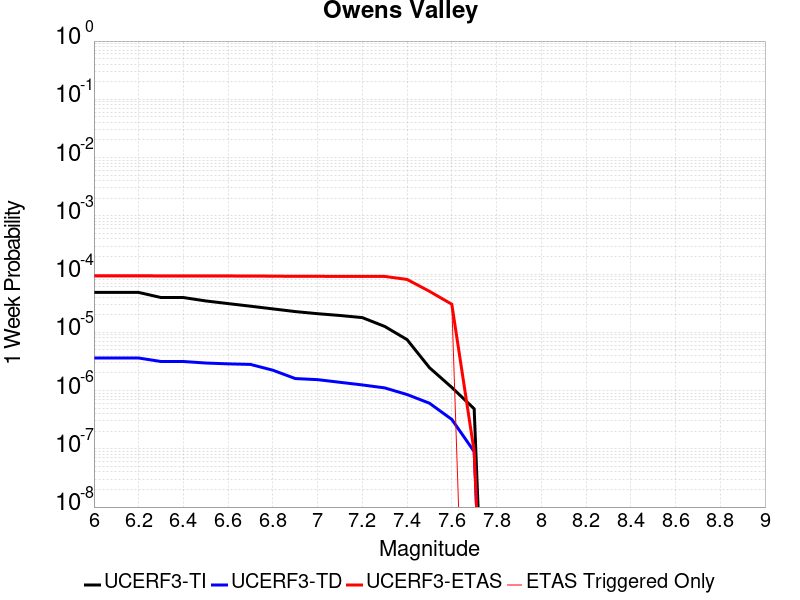 |  |  |  |

| Magnitude | 1 wk TI Prob | 1 wk TD Prob | 1 wk ETAS Prob | 1 wk ETAS/TD Gain | 1 wk ETAS Triggered Only | 1 mo TI Prob | 1 mo TD Prob | 1 mo ETAS Prob | 1 mo ETAS/TD Gain | 1 mo ETAS Triggered Only | 1 yr TI Prob | 1 yr TD Prob | 1 yr ETAS Prob | 1 yr ETAS/TD Gain | 1 yr ETAS Triggered Only | 10 yr TI Prob | 10 yr TD Prob | 10 yr ETAS Prob | 10 yr ETAS/TD Gain | 10 yr ETAS Triggered Only |
|-----|-----|-----|-----|-----|-----|-----|-----|-----|-----|-----|-----|-----|-----|-----|-----|-----|-----|-----|-----|-----|
| 6.0 | 4.83821E-5 | 3.626567E-6 | 2.4385632E-4 | 67.241646 | 2.4023063E-4 | 2.0733538E-4 | 1.5542342E-5 | 2.9580705E-4 | 19.032333 | 2.8026907E-4 | 0.002521386 | 1.8921259E-4 | 4.694286E-4 | 2.4809587 | 2.8026907E-4 | 0.024929691 | 0.001925011 | 0.0022447018 | 1.1660722 | 3.203075E-4 |
| 6.1 | 4.83821E-5 | 3.626567E-6 | 2.4385632E-4 | 67.241646 | 2.4023063E-4 | 2.0733538E-4 | 1.5542342E-5 | 2.9580705E-4 | 19.032333 | 2.8026907E-4 | 0.002521386 | 1.8921259E-4 | 4.694286E-4 | 2.4809587 | 2.8026907E-4 | 0.024929691 | 0.001925011 | 0.0022447018 | 1.1660722 | 3.203075E-4 |
| 6.2 | 4.83821E-5 | 3.626567E-6 | 2.4385632E-4 | 67.241646 | 2.4023063E-4 | 2.0733538E-4 | 1.5542342E-5 | 2.9580705E-4 | 19.032333 | 2.8026907E-4 | 0.002521386 | 1.8921259E-4 | 4.694286E-4 | 2.4809587 | 2.8026907E-4 | 0.024929691 | 0.001925011 | 0.0022447018 | 1.1660722 | 3.203075E-4 |
| 6.3 | 3.953008E-5 | 3.1553948E-6 | 2.4338526E-4 | 77.13306 | 2.4023063E-4 | 1.6940363E-4 | 1.3523055E-5 | 2.9378833E-4 | 21.724997 | 2.8026907E-4 | 0.002060538 | 1.6463149E-4 | 4.448544E-4 | 2.7021222 | 2.8026907E-4 | 0.020415364 | 0.0016592 | 0.001978976 | 1.1927291 | 3.203075E-4 |
| 6.4 | 3.953008E-5 | 3.1553948E-6 | 2.4338526E-4 | 77.13306 | 2.4023063E-4 | 1.6940363E-4 | 1.3523055E-5 | 2.9378833E-4 | 21.724997 | 2.8026907E-4 | 0.002060538 | 1.6463149E-4 | 4.448544E-4 | 2.7021222 | 2.8026907E-4 | 0.020415364 | 0.0016592 | 0.001978976 | 1.1927291 | 3.203075E-4 |
| 6.5 | 3.457342E-5 | 2.9715961E-6 | 2.432015E-4 | 81.84204 | 2.4023063E-4 | 1.4816338E-4 | 1.2735354E-5 | 2.9300083E-4 | 23.006886 | 2.8026907E-4 | 0.0018023965 | 1.550426E-4 | 4.3526822E-4 | 2.8074102 | 2.8026907E-4 | 0.017878477 | 0.001555719 | 0.0018755281 | 1.20557 | 3.203075E-4 |
| 6.6 | 3.1127765E-5 | 2.8744932E-6 | 2.4310443E-4 | 84.57297 | 2.4023063E-4 | 1.3339789E-4 | 1.2319203E-5 | 2.925848E-4 | 23.750303 | 2.8026907E-4 | 0.0016229092 | 1.4997667E-4 | 4.3020368E-4 | 2.868471 | 2.8026907E-4 | 0.016111081 | 0.0015012559 | 0.0017811041 | 1.1864095 | 2.8026907E-4 |
| 6.7 | 2.806885E-5 | 2.8104134E-6 | 2.4304035E-4 | 86.47851 | 2.4023063E-4 | 1.2028952E-4 | 1.20445775E-5 | 2.9231026E-4 | 24.269035 | 2.8026907E-4 | 0.001463541 | 1.4663354E-4 | 4.2686152E-4 | 2.9110768 | 2.8026907E-4 | 0.014539397 | 0.0014657511 | 0.0017456093 | 1.1909317 | 2.8026907E-4 |
| 6.8 | 2.524524E-5 | 2.2353688E-6 | 2.4246545E-4 | 108.467766 | 2.4023063E-4 | 1.0818939E-4 | 9.580118E-6 | 2.898465E-4 | 30.255001 | 2.8026907E-4 | 0.0013164099 | 1.16632E-4 | 3.9686836E-4 | 3.40274 | 2.8026907E-4 | 0.01308639 | 0.0011659812 | 0.0014459235 | 1.2400916 | 2.8026907E-4 |
| 6.9 | 2.2704568E-5 | 1.6081682E-6 | 2.4183841E-4 | 150.38129 | 2.4023063E-4 | 9.730166E-5 | 6.8921313E-6 | 2.8715926E-4 | 41.664795 | 2.8026907E-4 | 0.0011840039 | 8.390849E-5 | 3.6415402E-4 | 4.3398952 | 2.8026907E-4 | 0.011777153 | 8.3897985E-4 | 0.0011190138 | 1.3337791 | 2.8026907E-4 |
| 7.0 | 2.0871712E-5 | 1.5395453E-6 | 2.417698E-4 | 157.03973 | 2.4023063E-4 | 8.944713E-5 | 6.598035E-6 | 2.8686525E-4 | 43.47738 | 2.8026907E-4 | 0.0010884746 | 8.032813E-5 | 3.6057466E-4 | 4.4887724 | 2.8026907E-4 | 0.010831586 | 8.0316263E-4 | 0.0010832066 | 1.3486766 | 2.8026907E-4 |
| 7.1 | 1.944928E-5 | 1.3864178E-6 | 2.4161671E-4 | 174.2741 | 2.4023063E-4 | 8.335139E-5 | 5.941777E-6 | 2.8620916E-4 | 48.168953 | 2.8026907E-4 | 0.0010143308 | 7.233874E-5 | 3.5258752E-4 | 4.8741174 | 2.8026907E-4 | 0.010097133 | 7.2330976E-4 | 0.0010033761 | 1.3872011 | 2.8026907E-4 |
| 7.2 | 1.7876306E-5 | 1.2489141E-6 | 2.4147924E-4 | 193.35135 | 2.4023063E-4 | 7.6610486E-5 | 5.352478E-6 | 2.8562004E-4 | 53.362206 | 2.8026907E-4 | 9.3233347E-4 | 6.516448E-5 | 3.454153E-4 | 5.300668 | 2.8026907E-4 | 0.009284316 | 6.5159105E-4 | 9.3167747E-4 | 1.42985 | 2.8026907E-4 |
| 7.3 | 1.2618672E-5 | 1.1115209E-6 | 2.4134187E-4 | 217.12761 | 2.4023063E-4 | 5.40789E-5 | 4.763652E-6 | 2.4499313E-4 | 51.429684 | 2.4023063E-4 | 6.582117E-4 | 5.799593E-5 | 2.9821263E-4 | 5.1419578 | 2.4023063E-4 | 0.0065626553 | 5.7994033E-4 | 8.200316E-4 | 1.4139931 | 2.4023063E-4 |
| 7.4 | 7.4874442E-6 | 8.5486437E-7 | 2.0104687E-4 | 235.17986 | 2.0019218E-4 | 3.208865E-5 | 3.6636993E-6 | 2.0385515E-4 | 55.641888 | 2.0019218E-4 | 3.906093E-4 | 4.4604632E-5 | 2.447879E-4 | 5.487948 | 2.0019218E-4 | 0.003899234 | 4.4604883E-4 | 6.461517E-4 | 1.4486121 | 2.0019218E-4 |
| 7.5 | 2.4734156E-6 | 6.068616E-7 | 1.6076051E-4 | 264.90475 | 1.6015375E-4 | 1.060031E-5 | 2.6008327E-6 | 1.6275416E-4 | 62.577713 | 1.6015375E-4 | 1.2905113E-4 | 3.166468E-5 | 1.9181336E-4 | 6.0576434 | 1.6015375E-4 | 0.0012897621 | 3.1660203E-4 | 4.7670506E-4 | 1.5056918 | 1.6015375E-4 |
| 7.6 | 1.1328841E-6 | 3.196531E-7 | 1.20434925E-4 | 376.76758 | 1.2011531E-4 | 4.8552088E-6 | 1.3699412E-6 | 1.21485085E-4 | 88.679054 | 1.2011531E-4 | 5.9110564E-5 | 1.6678909E-5 | 1.3679221E-4 | 8.201509 | 1.2011531E-4 | 5.9094845E-4 | 1.6677675E-4 | 2.8687203E-4 | 1.7200961 | 1.2011531E-4 |
| 7.7 | 4.8613185E-7 | 8.964689E-8 | 8.964689E-8 | 1.0 | 0.0 | 2.0834207E-6 | 3.8420092E-7 | 3.8420092E-7 | 1.0 | 0.0 | 2.536535E-5 | 4.6776368E-6 | 4.6776368E-6 | 1.0 | 0.0 | 2.5362454E-4 | 4.677545E-5 | 4.677545E-5 | 1.0 | 0.0 |

## San Jacinto (San Bernardino)
*[(top)](#table-of-contents)*

| 1 Week | 1 Month | 1 Year | 10 Year |
|-----|-----|-----|-----|
|  |  |  |  |

| Magnitude | 1 wk TI Prob | 1 wk TD Prob | 1 wk ETAS Prob | 1 wk ETAS/TD Gain | 1 wk ETAS Triggered Only | 1 mo TI Prob | 1 mo TD Prob | 1 mo ETAS Prob | 1 mo ETAS/TD Gain | 1 mo ETAS Triggered Only | 1 yr TI Prob | 1 yr TD Prob | 1 yr ETAS Prob | 1 yr ETAS/TD Gain | 1 yr ETAS Triggered Only | 10 yr TI Prob | 10 yr TD Prob | 10 yr ETAS Prob | 10 yr ETAS/TD Gain | 10 yr ETAS Triggered Only |
|-----|-----|-----|-----|-----|-----|-----|-----|-----|-----|-----|-----|-----|-----|-----|-----|-----|-----|-----|-----|-----|
| 6.0 | 3.409352E-5 | 3.5986508E-5 | 2.3617149E-4 | 6.5627785 | 2.0019218E-4 | 1.461069E-4 | 1.542188E-4 | 3.9441237E-4 | 2.5574858 | 2.4023063E-4 | 0.0017774 | 0.0018759987 | 0.002155742 | 1.149117 | 2.8026907E-4 | 0.01763251 | 0.019349935 | 0.019664045 | 1.0162331 | 3.203075E-4 |
| 6.1 | 3.409352E-5 | 3.5986508E-5 | 2.3617149E-4 | 6.5627785 | 2.0019218E-4 | 1.461069E-4 | 1.542188E-4 | 3.9441237E-4 | 2.5574858 | 2.4023063E-4 | 0.0017774 | 0.0018759987 | 0.002155742 | 1.149117 | 2.8026907E-4 | 0.01763251 | 0.019349935 | 0.019664045 | 1.0162331 | 3.203075E-4 |
| 6.2 | 3.409352E-5 | 3.5986508E-5 | 2.3617149E-4 | 6.5627785 | 2.0019218E-4 | 1.461069E-4 | 1.542188E-4 | 3.9441237E-4 | 2.5574858 | 2.4023063E-4 | 0.0017774 | 0.0018759987 | 0.002155742 | 1.149117 | 2.8026907E-4 | 0.01763251 | 0.019349935 | 0.019664045 | 1.0162331 | 3.203075E-4 |
| 6.3 | 3.409352E-5 | 3.5986508E-5 | 2.3617149E-4 | 6.5627785 | 2.0019218E-4 | 1.461069E-4 | 1.542188E-4 | 3.9441237E-4 | 2.5574858 | 2.4023063E-4 | 0.0017774 | 0.0018759987 | 0.002155742 | 1.149117 | 2.8026907E-4 | 0.01763251 | 0.019349935 | 0.019664045 | 1.0162331 | 3.203075E-4 |
| 6.4 | 3.400795E-5 | 3.5879173E-5 | 2.3606418E-4 | 6.579421 | 2.0019218E-4 | 1.4574021E-4 | 1.5375883E-4 | 3.939525E-4 | 2.5621457 | 2.4023063E-4 | 0.0017729428 | 0.0018704084 | 0.0021501533 | 1.1495636 | 2.8026907E-4 | 0.017588645 | 0.019295016 | 0.019609144 | 1.0162802 | 3.203075E-4 |
| 6.5 | 3.341482E-5 | 3.5139812E-5 | 2.3532496E-4 | 6.6968193 | 2.0019218E-4 | 1.4319851E-4 | 1.5059051E-4 | 3.9078496E-4 | 2.5950172 | 2.4023063E-4 | 0.0017420477 | 0.0018318989 | 0.0021116545 | 1.1527134 | 2.8026907E-4 | 0.017284546 | 0.018916558 | 0.019230807 | 1.0166123 | 3.203075E-4 |
| 6.6 | 3.3364955E-5 | 3.5077028E-5 | 2.352622E-4 | 6.707016 | 2.0019218E-4 | 1.4298483E-4 | 1.5032147E-4 | 3.9051598E-4 | 2.5978723 | 2.4023063E-4 | 0.0017394501 | 0.001828629 | 0.0021083856 | 1.152987 | 2.8026907E-4 | 0.017258976 | 0.018884424 | 0.019198682 | 1.0166411 | 3.203075E-4 |
| 6.7 | 3.335922E-5 | 3.5066805E-5 | 2.3525197E-4 | 6.70868 | 2.0019218E-4 | 1.4296026E-4 | 1.5027766E-4 | 3.9047218E-4 | 2.5983381 | 2.4023063E-4 | 0.0017391514 | 0.0018280965 | 0.002107853 | 1.1530317 | 2.8026907E-4 | 0.017256035 | 0.018879214 | 0.019193476 | 1.0166458 | 3.203075E-4 |
| 6.8 | 3.327683E-5 | 3.496087E-5 | 2.3514606E-4 | 6.7259784 | 2.0019218E-4 | 1.4260718E-4 | 1.498237E-4 | 3.9001834E-4 | 2.6031818 | 2.4023063E-4 | 0.0017348597 | 0.0018225788 | 0.002102337 | 1.1534958 | 2.8026907E-4 | 0.017213784 | 0.018824987 | 0.019139264 | 1.0166947 | 3.203075E-4 |
| 6.9 | 3.3235785E-5 | 3.4901823E-5 | 2.3508702E-4 | 6.735666 | 2.0019218E-4 | 1.4243131E-4 | 1.4957068E-4 | 3.8976537E-4 | 2.6058943 | 2.4023063E-4 | 0.0017327217 | 0.0018195034 | 0.0020992626 | 1.1537558 | 2.8026907E-4 | 0.017192734 | 0.018794855 | 0.019109143 | 1.016722 | 3.203075E-4 |
| 7.0 | 3.3197095E-5 | 3.4841752E-5 | 2.3502696E-4 | 6.745555 | 2.0019218E-4 | 1.422655E-4 | 1.4931326E-4 | 3.8950803E-4 | 2.608663 | 2.4023063E-4 | 0.0017307063 | 0.0018163746 | 0.0020961347 | 1.154021 | 2.8026907E-4 | 0.017172894 | 0.018764233 | 0.01907853 | 1.0167499 | 3.203075E-4 |
| 7.1 | 3.3129716E-5 | 3.4721965E-5 | 2.349072E-4 | 6.7653775 | 2.0019218E-4 | 1.4197677E-4 | 1.4879994E-4 | 3.889948E-4 | 2.6142135 | 2.4023063E-4 | 0.0017271966 | 0.0018101353 | 0.0020898972 | 1.1545529 | 2.8026907E-4 | 0.017138338 | 0.018703312 | 0.01901763 | 1.0168054 | 3.203075E-4 |
| 7.2 | 3.3034008E-5 | 3.458941E-5 | 2.3477468E-4 | 6.7874722 | 2.0019218E-4 | 1.4156665E-4 | 1.4823192E-4 | 3.8842694E-4 | 2.6204 | 2.4023063E-4 | 0.0017222111 | 0.0018032312 | 0.002082995 | 1.1551458 | 2.8026907E-4 | 0.017089253 | 0.018635705 | 0.018950043 | 1.0168675 | 3.203075E-4 |
| 7.3 | 3.2956614E-5 | 3.445717E-5 | 2.3464246E-4 | 6.8096848 | 2.0019218E-4 | 1.4123498E-4 | 1.4766524E-4 | 3.8786037E-4 | 2.6266196 | 2.4023063E-4 | 0.0017181796 | 0.0017963431 | 0.0020761087 | 1.1557417 | 2.8026907E-4 | 0.017049557 | 0.018568452 | 0.018882813 | 1.0169297 | 3.203075E-4 |
| 7.4 | 3.2915937E-5 | 3.4378863E-5 | 2.3456417E-4 | 6.822918 | 2.0019218E-4 | 1.4106068E-4 | 1.4732967E-4 | 3.875249E-4 | 2.6303248 | 2.4023063E-4 | 0.0017160608 | 0.0017922645 | 0.0020720311 | 1.1560968 | 2.8026907E-4 | 0.017028693 | 0.018528719 | 0.01884309 | 1.0169668 | 3.203075E-4 |
| 7.5 | 3.281791E-5 | 3.4243778E-5 | 2.3442911E-4 | 6.845889 | 2.0019218E-4 | 1.406406E-4 | 1.4675081E-4 | 3.8694617E-4 | 2.6367567 | 2.4023063E-4 | 0.0017109542 | 0.0017852283 | 0.002064997 | 1.1567131 | 2.8026907E-4 | 0.016978411 | 0.018459605 | 0.018774 | 1.0170316 | 3.203075E-4 |
| 7.6 | 3.2521442E-5 | 3.396873E-5 | 2.3415411E-4 | 6.8932257 | 2.0019218E-4 | 1.3937015E-4 | 1.4557215E-4 | 3.857678E-4 | 2.650011 | 2.4023063E-4 | 0.0016955109 | 0.0017709016 | 0.0020506743 | 1.1579832 | 2.8026907E-4 | 0.016826328 | 0.018317232 | 0.018631672 | 1.0171664 | 3.203075E-4 |
| 7.7 | 3.0287873E-5 | 3.245276E-5 | 2.3263846E-4 | 7.168525 | 2.0019218E-4 | 1.297987E-4 | 1.3907586E-4 | 3.7927306E-4 | 2.727095 | 2.4023063E-4 | 0.0015791537 | 0.0016919347 | 0.0019717296 | 1.1653697 | 2.8026907E-4 | 0.01567979 | 0.01752809 | 0.017842783 | 1.0179536 | 3.203075E-4 |
| 7.8 | 2.6316151E-5 | 2.9663592E-5 | 2.2984984E-4 | 7.7485504 | 2.0019218E-4 | 1.1277862E-4 | 1.2712348E-4 | 3.6732358E-4 | 2.889502 | 2.4023063E-4 | 0.0013722149 | 0.0015466306 | 0.0018264662 | 1.1809324 | 2.8026907E-4 | 0.013637724 | 0.016069634 | 0.016384793 | 1.0196122 | 3.203075E-4 |
| 7.9 | 2.0761147E-5 | 2.34181E-5 | 1.034931E-4 | 4.4193635 | 8.0076876E-5 | 8.897331E-5 | 1.0035944E-4 | 2.204627E-4 | 2.196731 | 1.2011531E-4 | 0.0010827117 | 0.0012211921 | 0.0013811502 | 1.1309853 | 1.6015375E-4 | 0.010774517 | 0.012793174 | 0.012990805 | 1.0154482 | 2.0019218E-4 |
| 8.0 | 1.5738568E-5 | 1.6033575E-5 | 9.6109165E-5 | 5.994244 | 8.0076876E-5 | 6.744926E-5 | 6.871352E-5 | 1.487849E-4 | 2.165293 | 8.0076876E-5 | 8.2088535E-4 | 8.3626667E-4 | 9.562815E-4 | 1.1435127 | 1.2011531E-4 | 0.008178596 | 0.008865921 | 0.008984971 | 1.0134279 | 1.2011531E-4 |
| 8.1 | 1.0105832E-5 | 8.3304985E-6 | 8.3304985E-6 | 1.0 | 0.0 | 4.3309992E-5 | 3.570165E-5 | 3.570165E-5 | 1.0 | 0.0 | 5.2717153E-4 | 4.345814E-4 | 4.345814E-4 | 1.0 | 0.0 | 0.005259227 | 0.004677232 | 0.004677232 | 1.0 | 0.0 |
| 8.2 | 4.189207E-6 | 1.5784357E-6 | 1.5784357E-6 | 1.0 | 0.0 | 1.7953622E-5 | 6.7647065E-6 | 6.7647065E-6 | 1.0 | 0.0 | 2.1856341E-4 | 8.235722E-5 | 8.235722E-5 | 1.0 | 0.0 | 0.0021834858 | 9.565867E-4 | 9.565867E-4 | 1.0 | 0.0 |
| 8.3 | 1.2758221E-6 | 3.6149942E-7 | 3.6149942E-7 | 1.0 | 0.0 | 5.4677976E-6 | 1.5492824E-6 | 1.5492824E-6 | 1.0 | 0.0 | 6.65684E-5 | 1.8862354E-5 | 1.8862354E-5 | 1.0 | 0.0 | 6.6548464E-4 | 2.2751294E-4 | 2.2751294E-4 | 1.0 | 0.0 |

## Santa Ynez (West)
*[(top)](#table-of-contents)*

| 1 Week | 1 Month | 1 Year | 10 Year |
|-----|-----|-----|-----|
|  |  |  |  |

| Magnitude | 1 wk TI Prob | 1 wk TD Prob | 1 wk ETAS Prob | 1 wk ETAS/TD Gain | 1 wk ETAS Triggered Only | 1 mo TI Prob | 1 mo TD Prob | 1 mo ETAS Prob | 1 mo ETAS/TD Gain | 1 mo ETAS Triggered Only | 1 yr TI Prob | 1 yr TD Prob | 1 yr ETAS Prob | 1 yr ETAS/TD Gain | 1 yr ETAS Triggered Only | 10 yr TI Prob | 10 yr TD Prob | 10 yr ETAS Prob | 10 yr ETAS/TD Gain | 10 yr ETAS Triggered Only |
|-----|-----|-----|-----|-----|-----|-----|-----|-----|-----|-----|-----|-----|-----|-----|-----|-----|-----|-----|-----|-----|
| 6.0 | 4.7352758E-5 | 5.4972126E-5 | 1.7508083E-4 | 3.184902 | 1.2011531E-4 | 2.0292461E-4 | 2.3557522E-4 | 4.3572023E-4 | 1.8496014 | 2.0019218E-4 | 0.0024678076 | 0.0028645284 | 0.003104071 | 1.0836236 | 2.4023063E-4 | 0.024405818 | 0.028304417 | 0.028537849 | 1.0082471 | 2.4023063E-4 |
| 6.1 | 4.7352758E-5 | 5.4972126E-5 | 1.7508083E-4 | 3.184902 | 1.2011531E-4 | 2.0292461E-4 | 2.3557522E-4 | 4.3572023E-4 | 1.8496014 | 2.0019218E-4 | 0.0024678076 | 0.0028645284 | 0.003104071 | 1.0836236 | 2.4023063E-4 | 0.024405818 | 0.028304417 | 0.028537849 | 1.0082471 | 2.4023063E-4 |
| 6.2 | 3.0415853E-5 | 3.392511E-5 | 1.1399927E-4 | 3.3603213 | 8.0076876E-5 | 1.3034715E-4 | 1.4538545E-4 | 3.0551592E-4 | 2.1014202 | 1.6015375E-4 | 0.0015858212 | 0.0017686661 | 0.0019685042 | 1.112988 | 2.0019218E-4 | 0.015745522 | 0.017549807 | 0.017746486 | 1.0112069 | 2.0019218E-4 |
| 6.3 | 3.0415853E-5 | 3.392511E-5 | 1.1399927E-4 | 3.3603213 | 8.0076876E-5 | 1.3034715E-4 | 1.4538545E-4 | 3.0551592E-4 | 2.1014202 | 1.6015375E-4 | 0.0015858212 | 0.0017686661 | 0.0019685042 | 1.112988 | 2.0019218E-4 | 0.015745522 | 0.017549807 | 0.017746486 | 1.0112069 | 2.0019218E-4 |
| 6.4 | 2.5452082E-5 | 2.7912422E-5 | 6.794974E-5 | 2.4343908 | 4.0038438E-5 | 1.09075794E-4 | 1.196193E-4 | 2.3972023E-4 | 2.0040264 | 1.2011531E-4 | 0.0013271887 | 0.0014554089 | 0.0016553097 | 1.1373503 | 2.0019218E-4 | 0.013192902 | 0.014460951 | 0.014658248 | 1.0136435 | 2.0019218E-4 |
| 6.5 | 2.3143784E-5 | 2.5128256E-5 | 6.516569E-5 | 2.593323 | 4.0038438E-5 | 9.9183875E-5 | 1.0768817E-4 | 2.2779054E-4 | 2.1152792 | 1.2011531E-4 | 0.0012068948 | 0.0013103267 | 0.0015102567 | 1.1525801 | 2.0019218E-4 | 0.012003611 | 0.01302768 | 0.013225264 | 1.0151665 | 2.0019218E-4 |
| 6.6 | 1.9118515E-5 | 2.035434E-5 | 6.039196E-5 | 2.9670312 | 4.0038438E-5 | 8.193392E-5 | 8.7230015E-5 | 2.0733484E-4 | 2.3768752 | 1.2011531E-4 | 9.97089E-4 | 0.001061516 | 0.0012214998 | 1.1507125 | 1.6015375E-4 | 0.00992627 | 0.010565365 | 0.0107238265 | 1.0149982 | 1.6015375E-4 |
| 6.7 | 1.722807E-5 | 1.8146347E-5 | 1.8146347E-5 | 1.0 | 0.0 | 7.3832496E-5 | 7.776777E-5 | 1.17803094E-4 | 1.5148062 | 4.0038438E-5 | 8.985399E-4 | 9.464169E-4 | 0.0010264181 | 1.0845305 | 8.0076876E-5 | 0.008949154 | 0.0094245095 | 0.009503832 | 1.0084165 | 8.0076876E-5 |
| 6.8 | 1.5317364E-5 | 1.5926486E-5 | 1.5926486E-5 | 1.0 | 0.0 | 6.56442E-5 | 6.82546E-5 | 1.0829031E-4 | 1.5865642 | 4.0038438E-5 | 7.98925E-4 | 8.306873E-4 | 9.106976E-4 | 1.0963182 | 8.0076876E-5 | 0.007960589 | 0.00827631 | 0.008355724 | 1.0095954 | 8.0076876E-5 |
| 6.9 | 1.3071226E-5 | 1.3329624E-5 | 1.3329624E-5 | 1.0 | 0.0 | 5.6018336E-5 | 5.7125722E-5 | 9.716187E-5 | 1.7008427 | 4.0038438E-5 | 6.8180985E-4 | 6.9528597E-4 | 7.753072E-4 | 1.1150911 | 8.0076876E-5 | 0.0067972173 | 0.006931367 | 0.007010889 | 1.0114727 | 8.0076876E-5 |
| 7.0 | 1.1836986E-5 | 1.19327815E-5 | 1.19327815E-5 | 1.0 | 0.0 | 5.0728955E-5 | 5.11395E-5 | 9.117589E-5 | 1.7828858 | 4.0038438E-5 | 6.1745E-4 | 6.2244723E-4 | 7.0247427E-4 | 1.1285684 | 8.0076876E-5 | 0.006157372 | 0.006207231 | 0.006286811 | 1.0128205 | 8.0076876E-5 |
| 7.1 | 1.0597169E-5 | 1.0542201E-5 | 1.0542201E-5 | 1.0 | 0.0 | 4.541565E-5 | 4.5180084E-5 | 8.5216714E-5 | 1.8861566 | 4.0038438E-5 | 5.5279525E-4 | 5.4992986E-4 | 6.2996265E-4 | 1.1455328 | 8.0076876E-5 | 0.0055142213 | 0.005485821 | 0.0055654584 | 1.014517 | 8.0076876E-5 |
| 7.2 | 9.59113E-6 | 9.459144E-6 | 9.459144E-6 | 1.0 | 0.0 | 4.11042E-5 | 4.0538565E-5 | 8.057538E-5 | 1.9876229 | 4.0038438E-5 | 5.0032866E-4 | 4.934463E-4 | 5.734837E-4 | 1.1622007 | 8.0076876E-5 | 0.004992037 | 0.0049236254 | 0.005003308 | 1.0161837 | 8.0076876E-5 |
| 7.3 | 8.586084E-6 | 8.379583E-6 | 8.379583E-6 | 1.0 | 0.0 | 3.679698E-5 | 3.5912013E-5 | 7.5949014E-5 | 2.1148636 | 4.0038438E-5 | 4.4791115E-4 | 4.3714207E-4 | 5.171839E-4 | 1.1831026 | 8.0076876E-5 | 0.004470094 | 0.004362933 | 0.0044426606 | 1.0182738 | 8.0076876E-5 |
| 7.4 | 7.2622997E-6 | 6.9515427E-6 | 6.9515427E-6 | 1.0 | 0.0 | 3.112377E-5 | 2.979199E-5 | 6.9829235E-5 | 2.3438928 | 4.0038438E-5 | 3.78866E-4 | 3.626581E-4 | 4.4270593E-4 | 1.2207253 | 8.0076876E-5 | 0.0037822074 | 0.0036207628 | 0.00370055 | 1.022036 | 8.0076876E-5 |
| 7.5 | 5.627296E-6 | 5.251588E-6 | 5.251588E-6 | 1.0 | 0.0 | 2.411676E-5 | 2.2506614E-5 | 2.2506614E-5 | 1.0 | 0.0 | 2.9358198E-4 | 2.739843E-4 | 3.1401176E-4 | 1.146094 | 4.0038438E-5 | 0.0029319443 | 0.002736537 | 0.0027764658 | 1.014591 | 4.0038438E-5 |
| 7.6 | 2.265244E-6 | 2.0608625E-6 | 2.0608625E-6 | 1.0 | 0.0 | 9.708152E-6 | 8.832238E-6 | 8.832238E-6 | 1.0 | 0.0 | 1.18190335E-4 | 1.0752728E-4 | 1.0752728E-4 | 1.0 | 0.0 | 0.001181275 | 0.0010747612 | 0.0010747612 | 1.0 | 0.0 |
| 7.7 | 1.3099874E-6 | 1.1016252E-6 | 1.1016252E-6 | 1.0 | 0.0 | 5.61422E-6 | 4.7212425E-6 | 4.7212425E-6 | 1.0 | 0.0 | 6.8350986E-5 | 5.7479636E-5 | 5.7479636E-5 | 1.0 | 0.0 | 6.832996E-4 | 5.7465007E-4 | 5.7465007E-4 | 1.0 | 0.0 |
| 7.8 | 7.903951E-7 | 6.0711415E-7 | 6.0711415E-7 | 1.0 | 0.0 | 3.3874032E-6 | 2.6019152E-6 | 2.6019152E-6 | 1.0 | 0.0 | 4.1240855E-5 | 3.167787E-5 | 3.167787E-5 | 1.0 | 0.0 | 4.12332E-4 | 3.167349E-4 | 3.167349E-4 | 1.0 | 0.0 |
| 7.9 | 7.0753297E-9 | 5.0899476E-9 | 5.0899476E-9 | 1.0 | 0.0 | 3.032284E-8 | 2.181406E-8 | 2.181406E-8 | 1.0 | 0.0 | 3.6918053E-7 | 2.6558615E-7 | 2.6558615E-7 | 1.0 | 0.0 | 3.691799E-6 | 2.6558594E-6 | 2.6558594E-6 | 1.0 | 0.0 |

## Scodie Lineament
*[(top)](#table-of-contents)*

| 1 Week | 1 Month | 1 Year | 10 Year |
|-----|-----|-----|-----|
|  |  |  |  |

| Magnitude | 1 wk TI Prob | 1 wk TD Prob | 1 wk ETAS Prob | 1 wk ETAS/TD Gain | 1 wk ETAS Triggered Only | 1 mo TI Prob | 1 mo TD Prob | 1 mo ETAS Prob | 1 mo ETAS/TD Gain | 1 mo ETAS Triggered Only | 1 yr TI Prob | 1 yr TD Prob | 1 yr ETAS Prob | 1 yr ETAS/TD Gain | 1 yr ETAS Triggered Only | 10 yr TI Prob | 10 yr TD Prob | 10 yr ETAS Prob | 10 yr ETAS/TD Gain | 10 yr ETAS Triggered Only |
|-----|-----|-----|-----|-----|-----|-----|-----|-----|-----|-----|-----|-----|-----|-----|-----|-----|-----|-----|-----|-----|
| 6.0 | 3.2919327E-6 | 3.0133422E-6 | 2.4324324E-4 | 80.72208 | 2.4023063E-4 | 1.4108206E-5 | 1.2914278E-5 | 2.531418E-4 | 19.6017 | 2.4023063E-4 | 1.7175387E-4 | 1.5722317E-4 | 4.3744815E-4 | 2.782339 | 2.8026907E-4 | 0.0017162118 | 0.0015714309 | 0.0018512595 | 1.1780725 | 2.8026907E-4 |
| 6.1 | 1.8663811E-6 | 1.5490499E-6 | 1.6170256E-4 | 104.38821 | 1.6015375E-4 | 7.998751E-6 | 6.6387715E-6 | 1.6679146E-4 | 25.123844 | 1.6015375E-4 | 9.738045E-5 | 8.082454E-5 | 2.4096534E-4 | 2.981339 | 1.6015375E-4 | 9.7337784E-4 | 8.080003E-4 | 9.680246E-4 | 1.1980499 | 1.6015375E-4 |
| 6.2 | 1.8663811E-6 | 1.5490499E-6 | 1.6170256E-4 | 104.38821 | 1.6015375E-4 | 7.998751E-6 | 6.6387715E-6 | 1.6679146E-4 | 25.123844 | 1.6015375E-4 | 9.738045E-5 | 8.082454E-5 | 2.4096534E-4 | 2.981339 | 1.6015375E-4 | 9.7337784E-4 | 8.080003E-4 | 9.680246E-4 | 1.1980499 | 1.6015375E-4 |
| 6.3 | 1.8663811E-6 | 1.5490499E-6 | 1.6170256E-4 | 104.38821 | 1.6015375E-4 | 7.998751E-6 | 6.6387715E-6 | 1.6679146E-4 | 25.123844 | 1.6015375E-4 | 9.738045E-5 | 8.082454E-5 | 2.4096534E-4 | 2.981339 | 1.6015375E-4 | 9.7337784E-4 | 8.080003E-4 | 9.680246E-4 | 1.1980499 | 1.6015375E-4 |
| 6.4 | 1.8663811E-6 | 1.5490499E-6 | 1.6170256E-4 | 104.38821 | 1.6015375E-4 | 7.998751E-6 | 6.6387715E-6 | 1.6679146E-4 | 25.123844 | 1.6015375E-4 | 9.738045E-5 | 8.082454E-5 | 2.4096534E-4 | 2.981339 | 1.6015375E-4 | 9.7337784E-4 | 8.080003E-4 | 9.680246E-4 | 1.1980499 | 1.6015375E-4 |
| 6.5 | 1.8106311E-6 | 1.4909839E-6 | 1.616445E-4 | 108.41464 | 1.6015375E-4 | 7.759824E-6 | 6.3899183E-6 | 1.6654264E-4 | 26.063345 | 1.6015375E-4 | 9.447177E-5 | 7.7794975E-5 | 2.3793626E-4 | 3.0585043 | 1.6015375E-4 | 9.4431615E-4 | 7.7772606E-4 | 9.377553E-4 | 1.2057655 | 1.6015375E-4 |
| 6.6 | 1.2414679E-6 | 8.997558E-7 | 8.0976555E-5 | 89.998375 | 8.0076876E-5 | 5.320566E-6 | 3.856091E-6 | 8.393265E-5 | 21.766254 | 8.0076876E-5 | 6.477596E-5 | 4.6946985E-5 | 1.270201E-4 | 2.7056072 | 8.0076876E-5 | 6.475708E-4 | 4.693793E-4 | 5.494186E-4 | 1.1705215 | 8.0076876E-5 |
| 6.7 | 1.1062215E-6 | 7.594311E-7 | 7.594311E-7 | 1.0 | 0.0 | 4.7409408E-6 | 3.2547011E-6 | 3.2547011E-6 | 1.0 | 0.0 | 5.7719422E-5 | 3.9625334E-5 | 3.9625334E-5 | 1.0 | 0.0 | 5.770443E-4 | 3.961897E-4 | 3.961897E-4 | 1.0 | 0.0 |
| 6.8 | 1.0006736E-6 | 6.500397E-7 | 6.500397E-7 | 1.0 | 0.0 | 4.288594E-6 | 2.7858816E-6 | 2.7858816E-6 | 1.0 | 0.0 | 5.221238E-5 | 3.3917644E-5 | 3.3917644E-5 | 1.0 | 0.0 | 5.220012E-4 | 3.3913075E-4 | 3.3913075E-4 | 1.0 | 0.0 |
| 6.9 | 9.167364E-7 | 5.631625E-7 | 5.631625E-7 | 1.0 | 0.0 | 3.9288643E-6 | 2.4135516E-6 | 2.4135516E-6 | 1.0 | 0.0 | 4.7832873E-5 | 2.9384651E-5 | 2.9384651E-5 | 1.0 | 0.0 | 4.782258E-4 | 2.9381333E-4 | 2.9381333E-4 | 1.0 | 0.0 |
| 7.0 | 7.6987664E-7 | 4.113383E-7 | 4.113383E-7 | 1.0 | 0.0 | 3.2994672E-6 | 1.7628774E-6 | 1.7628774E-6 | 1.0 | 0.0 | 4.0170275E-5 | 2.1462862E-5 | 2.1462862E-5 | 1.0 | 0.0 | 4.0163012E-4 | 2.1461173E-4 | 2.1461173E-4 | 1.0 | 0.0 |
| 7.1 | 7.1038727E-7 | 3.5211494E-7 | 3.5211494E-7 | 1.0 | 0.0 | 3.0445133E-6 | 1.5090633E-6 | 1.5090633E-6 | 1.0 | 0.0 | 3.706632E-5 | 1.8372726E-5 | 1.8372726E-5 | 1.0 | 0.0 | 3.7060137E-4 | 1.8371557E-4 | 1.8371557E-4 | 1.0 | 0.0 |
| 7.2 | 2.0799602E-7 | 3.1186854E-8 | 3.1186854E-8 | 1.0 | 0.0 | 8.914113E-7 | 1.3365793E-7 | 1.3365793E-7 | 1.0 | 0.0 | 1.0852878E-5 | 1.6272843E-6 | 1.6272843E-6 | 1.0 | 0.0 | 1.08523476E-4 | 1.627273E-5 | 1.627273E-5 | 1.0 | 0.0 |
| 7.3 | 1.5048182E-7 | 1.5945696E-8 | 1.5945696E-8 | 1.0 | 0.0 | 6.449219E-7 | 6.83387E-8 | 6.83387E-8 | 1.0 | 0.0 | 7.851896E-6 | 8.320234E-7 | 8.320234E-7 | 1.0 | 0.0 | 7.851618E-5 | 8.320206E-6 | 8.320206E-6 | 1.0 | 0.0 |
| 7.4 | 5.9334678E-8 | 4.8683537E-9 | 4.8683537E-9 | 1.0 | 0.0 | 2.5429145E-7 | 2.0864372E-8 | 2.0864372E-8 | 1.0 | 0.0 | 3.095994E-6 | 2.5402372E-7 | 2.5402372E-7 | 1.0 | 0.0 | 3.095951E-5 | 2.5402353E-6 | 2.5402353E-6 | 1.0 | 0.0 |

## Elsinore (Glen Ivy) rev
*[(top)](#table-of-contents)*

| 1 Week | 1 Month | 1 Year | 10 Year |
|-----|-----|-----|-----|
|  |  |  |  |

| Magnitude | 1 wk TI Prob | 1 wk TD Prob | 1 wk ETAS Prob | 1 wk ETAS/TD Gain | 1 wk ETAS Triggered Only | 1 mo TI Prob | 1 mo TD Prob | 1 mo ETAS Prob | 1 mo ETAS/TD Gain | 1 mo ETAS Triggered Only | 1 yr TI Prob | 1 yr TD Prob | 1 yr ETAS Prob | 1 yr ETAS/TD Gain | 1 yr ETAS Triggered Only | 10 yr TI Prob | 10 yr TD Prob | 10 yr ETAS Prob | 10 yr ETAS/TD Gain | 10 yr ETAS Triggered Only |
|-----|-----|-----|-----|-----|-----|-----|-----|-----|-----|-----|-----|-----|-----|-----|-----|-----|-----|-----|-----|-----|
| 6.0 | 1.6204086E-4 | 2.9360707E-4 | 4.537138E-4 | 1.5453095 | 1.6015375E-4 | 6.94276E-4 | 0.0012578638 | 0.0014178162 | 1.1271619 | 1.6015375E-4 | 0.008420097 | 0.015234485 | 0.015431628 | 1.0129405 | 2.0019218E-4 | 0.081081145 | 0.13969168 | 0.13989834 | 1.0014795 | 2.4023063E-4 |
| 6.1 | 1.6204086E-4 | 2.9360707E-4 | 4.537138E-4 | 1.5453095 | 1.6015375E-4 | 6.94276E-4 | 0.0012578638 | 0.0014178162 | 1.1271619 | 1.6015375E-4 | 0.008420097 | 0.015234485 | 0.015431628 | 1.0129405 | 2.0019218E-4 | 0.081081145 | 0.13969168 | 0.13989834 | 1.0014795 | 2.4023063E-4 |
| 6.2 | 1.6204086E-4 | 2.9360707E-4 | 4.537138E-4 | 1.5453095 | 1.6015375E-4 | 6.94276E-4 | 0.0012578638 | 0.0014178162 | 1.1271619 | 1.6015375E-4 | 0.008420097 | 0.015234485 | 0.015431628 | 1.0129405 | 2.0019218E-4 | 0.081081145 | 0.13969168 | 0.13989834 | 1.0014795 | 2.4023063E-4 |
| 6.3 | 1.0111737E-4 | 1.7703383E-4 | 1.7703383E-4 | 1.0 | 0.0 | 4.332882E-4 | 7.5861247E-4 | 7.5861247E-4 | 1.0 | 0.0 | 0.005262531 | 0.009217682 | 0.009257352 | 1.0043036 | 4.0038438E-5 | 0.0513964 | 0.0870191 | 0.087092206 | 1.0008402 | 8.0076876E-5 |
| 6.4 | 1.0111737E-4 | 1.7703383E-4 | 1.7703383E-4 | 1.0 | 0.0 | 4.332882E-4 | 7.5861247E-4 | 7.5861247E-4 | 1.0 | 0.0 | 0.005262531 | 0.009217682 | 0.009257352 | 1.0043036 | 4.0038438E-5 | 0.0513964 | 0.0870191 | 0.087092206 | 1.0008402 | 8.0076876E-5 |
| 6.5 | 3.6624708E-5 | 4.6391084E-5 | 4.6391084E-5 | 1.0 | 0.0 | 1.569536E-4 | 1.9880582E-4 | 1.9880582E-4 | 1.0 | 0.0 | 0.001909235 | 0.0024181372 | 0.0024181372 | 1.0 | 0.0 | 0.01892915 | 0.023739954 | 0.023779042 | 1.0016465 | 4.0038438E-5 |
| 6.6 | 2.5051324E-5 | 2.614772E-5 | 2.614772E-5 | 1.0 | 0.0 | 1.073584E-4 | 1.12057096E-4 | 1.12057096E-4 | 1.0 | 0.0 | 0.0013063047 | 0.0013634858 | 0.0013634858 | 1.0 | 0.0 | 0.012986525 | 0.013564618 | 0.013604114 | 1.0029117 | 4.0038438E-5 |
| 6.7 | 2.2189772E-5 | 2.2072849E-5 | 2.2072849E-5 | 1.0 | 0.0 | 9.509556E-5 | 9.4594696E-5 | 9.4594696E-5 | 1.0 | 0.0 | 0.0011571734 | 0.0011511183 | 0.0011511183 | 1.0 | 0.0 | 0.011511663 | 0.011465415 | 0.011504995 | 1.0034521 | 4.0038438E-5 |
| 6.8 | 1.6654378E-5 | 1.4437705E-5 | 1.4437705E-5 | 1.0 | 0.0 | 7.137396E-5 | 6.187444E-5 | 6.187444E-5 | 1.0 | 0.0 | 8.686314E-4 | 7.530661E-4 | 7.530661E-4 | 1.0 | 0.0 | 0.008652439 | 0.00751048 | 0.007550218 | 1.005291 | 4.0038438E-5 |
| 6.9 | 1.5042909E-5 | 1.2332022E-5 | 1.2332022E-5 | 1.0 | 0.0 | 6.446802E-5 | 5.285047E-5 | 5.285047E-5 | 1.0 | 0.0 | 7.8461546E-4 | 6.4326765E-4 | 6.4326765E-4 | 1.0 | 0.0 | 0.007818509 | 0.00641828 | 0.0064580613 | 1.0061982 | 4.0038438E-5 |
| 7.0 | 1.4361385E-5 | 1.1451324E-5 | 1.1451324E-5 | 1.0 | 0.0 | 6.154734E-5 | 4.9076196E-5 | 4.9076196E-5 | 1.0 | 0.0 | 7.490812E-4 | 5.973418E-4 | 5.973418E-4 | 1.0 | 0.0 | 0.007465612 | 0.0059613534 | 0.006001153 | 1.0066763 | 4.0038438E-5 |
| 7.1 | 1.3265571E-5 | 1.0244926E-5 | 1.0244926E-5 | 1.0 | 0.0 | 5.6851208E-5 | 4.39061E-5 | 4.39061E-5 | 1.0 | 0.0 | 6.919436E-4 | 5.344282E-4 | 5.344282E-4 | 1.0 | 0.0 | 0.006897931 | 0.0053347866 | 0.0053746114 | 1.0074651 | 4.0038438E-5 |
| 7.2 | 1.1596403E-5 | 8.505067E-6 | 8.505067E-6 | 1.0 | 0.0 | 4.9697923E-5 | 3.6449786E-5 | 3.6449786E-5 | 1.0 | 0.0 | 6.049042E-4 | 4.436875E-4 | 4.436875E-4 | 1.0 | 0.0 | 0.006032603 | 0.0044294316 | 0.0044294316 | 1.0 | 0.0 |
| 7.3 | 1.0150827E-5 | 7.2387597E-6 | 7.2387597E-6 | 1.0 | 0.0 | 4.3502816E-5 | 3.1022897E-5 | 3.1022897E-5 | 1.0 | 0.0 | 5.2951806E-4 | 3.7763975E-4 | 3.7763975E-4 | 1.0 | 0.0 | 0.005282581 | 0.0037703665 | 0.0037703665 | 1.0 | 0.0 |
| 7.4 | 9.080705E-6 | 6.352519E-6 | 6.352519E-6 | 1.0 | 0.0 | 3.8916725E-5 | 2.7224805E-5 | 2.7224805E-5 | 1.0 | 0.0 | 4.7370812E-4 | 3.3141294E-4 | 3.3141294E-4 | 1.0 | 0.0 | 0.004726996 | 0.0033093381 | 0.0033093381 | 1.0 | 0.0 |
| 7.5 | 7.671649E-6 | 5.2256332E-6 | 5.2256332E-6 | 1.0 | 0.0 | 3.287808E-5 | 2.2395385E-5 | 2.2395385E-5 | 1.0 | 0.0 | 4.0021708E-4 | 2.7263095E-4 | 2.7263095E-4 | 1.0 | 0.0 | 0.0039949706 | 0.00272309 | 0.00272309 | 1.0 | 0.0 |
| 7.6 | 6.990086E-6 | 4.687545E-6 | 4.687545E-6 | 1.0 | 0.0 | 2.9957167E-5 | 2.008933E-5 | 2.008933E-5 | 1.0 | 0.0 | 3.6466747E-4 | 2.445613E-4 | 2.445613E-4 | 1.0 | 0.0 | 0.0036406964 | 0.002443038 | 0.002443038 | 1.0 | 0.0 |
| 7.7 | 4.163505E-6 | 2.3295343E-6 | 2.3295343E-6 | 1.0 | 0.0 | 1.7843471E-5 | 9.983683E-6 | 9.983683E-6 | 1.0 | 0.0 | 2.172226E-4 | 1.21545316E-4 | 1.21545316E-4 | 1.0 | 0.0 | 0.0021701038 | 0.0012148614 | 0.0012148614 | 1.0 | 0.0 |
| 7.8 | 2.2692414E-7 | 9.3854695E-8 | 9.3854695E-8 | 1.0 | 0.0 | 9.725317E-7 | 4.0223435E-7 | 4.0223435E-7 | 1.0 | 0.0 | 1.1840509E-5 | 4.8971956E-6 | 4.8971956E-6 | 1.0 | 0.0 | 1.1839878E-4 | 4.8971204E-5 | 4.8971204E-5 | 1.0 | 0.0 |
| 7.9 | 6.676829E-9 | 3.439853E-9 | 3.439853E-9 | 1.0 | 0.0 | 2.861498E-8 | 1.4742227E-8 | 1.4742227E-8 | 1.0 | 0.0 | 3.4838732E-7 | 1.7948659E-7 | 1.7948659E-7 | 1.0 | 0.0 | 3.4838679E-6 | 1.7948646E-6 | 1.7948646E-6 | 1.0 | 0.0 |

## Palos Verdes
*[(top)](#table-of-contents)*

| 1 Week | 1 Month | 1 Year | 10 Year |
|-----|-----|-----|-----|
|  |  |  |  |

| Magnitude | 1 wk TI Prob | 1 wk TD Prob | 1 wk ETAS Prob | 1 wk ETAS/TD Gain | 1 wk ETAS Triggered Only | 1 mo TI Prob | 1 mo TD Prob | 1 mo ETAS Prob | 1 mo ETAS/TD Gain | 1 mo ETAS Triggered Only | 1 yr TI Prob | 1 yr TD Prob | 1 yr ETAS Prob | 1 yr ETAS/TD Gain | 1 yr ETAS Triggered Only | 10 yr TI Prob | 10 yr TD Prob | 10 yr ETAS Prob | 10 yr ETAS/TD Gain | 10 yr ETAS Triggered Only |
|-----|-----|-----|-----|-----|-----|-----|-----|-----|-----|-----|-----|-----|-----|-----|-----|-----|-----|-----|-----|-----|
| 6.0 | 6.126063E-5 | 7.622612E-5 | 1.5629688E-4 | 2.0504375 | 8.0076876E-5 | 2.6251914E-4 | 3.2664582E-4 | 5.66798E-4 | 1.7352066 | 2.4023063E-4 | 0.0031914865 | 0.003970174 | 0.004209451 | 1.0602686 | 2.4023063E-4 | 0.031460393 | 0.039048895 | 0.039279748 | 1.0059118 | 2.4023063E-4 |
| 6.1 | 6.126063E-5 | 7.622612E-5 | 1.5629688E-4 | 2.0504375 | 8.0076876E-5 | 2.6251914E-4 | 3.2664582E-4 | 5.66798E-4 | 1.7352066 | 2.4023063E-4 | 0.0031914865 | 0.003970174 | 0.004209451 | 1.0602686 | 2.4023063E-4 | 0.031460393 | 0.039048895 | 0.039279748 | 1.0059118 | 2.4023063E-4 |
| 6.2 | 6.126063E-5 | 7.622612E-5 | 1.5629688E-4 | 2.0504375 | 8.0076876E-5 | 2.6251914E-4 | 3.2664582E-4 | 5.66798E-4 | 1.7352066 | 2.4023063E-4 | 0.0031914865 | 0.003970174 | 0.004209451 | 1.0602686 | 2.4023063E-4 | 0.031460393 | 0.039048895 | 0.039279748 | 1.0059118 | 2.4023063E-4 |
| 6.3 | 4.0838047E-5 | 4.9749437E-5 | 8.978588E-5 | 1.8047618 | 4.0038438E-5 | 1.7500846E-4 | 2.1319572E-4 | 3.3328542E-4 | 1.5632838 | 1.2011531E-4 | 0.0021286458 | 0.0025927818 | 0.0027125857 | 1.0462067 | 1.2011531E-4 | 0.021083709 | 0.025646681 | 0.025763715 | 1.0045633 | 1.2011531E-4 |
| 6.4 | 4.0838047E-5 | 4.9749437E-5 | 8.978588E-5 | 1.8047618 | 4.0038438E-5 | 1.7500846E-4 | 2.1319572E-4 | 3.3328542E-4 | 1.5632838 | 1.2011531E-4 | 0.0021286458 | 0.0025927818 | 0.0027125857 | 1.0462067 | 1.2011531E-4 | 0.021083709 | 0.025646681 | 0.025763715 | 1.0045633 | 1.2011531E-4 |
| 6.5 | 3.0512005E-5 | 3.656162E-5 | 3.656162E-5 | 1.0 | 0.0 | 1.3075917E-4 | 1.5668393E-4 | 2.3674825E-4 | 1.5109925 | 8.0076876E-5 | 0.0015908304 | 0.0019060767 | 0.001986001 | 1.0419313 | 8.0076876E-5 | 0.015794903 | 0.018909154 | 0.018987717 | 1.0041548 | 8.0076876E-5 |
| 6.6 | 2.9255087E-5 | 3.515442E-5 | 3.515442E-5 | 1.0 | 0.0 | 1.2537291E-4 | 1.5065377E-4 | 2.3071856E-4 | 1.5314491 | 8.0076876E-5 | 0.0015253464 | 0.0018327828 | 0.0019127129 | 1.0436113 | 8.0076876E-5 | 0.015149189 | 0.018188225 | 0.018266845 | 1.0043226 | 8.0076876E-5 |
| 6.7 | 2.287198E-5 | 2.7248278E-5 | 2.7248278E-5 | 1.0 | 0.0 | 9.801909E-5 | 1.16773626E-4 | 1.9684115E-4 | 1.6856644 | 8.0076876E-5 | 0.001192729 | 0.0014208833 | 0.0015008465 | 1.056277 | 8.0076876E-5 | 0.011863477 | 0.014127217 | 0.014206163 | 1.0055882 | 8.0076876E-5 |
| 6.8 | 2.1325764E-5 | 2.5431877E-5 | 2.5431877E-5 | 1.0 | 0.0 | 9.139293E-5 | 1.0898971E-4 | 1.8905786E-4 | 1.7346395 | 8.0076876E-5 | 0.001112141 | 0.0013262323 | 0.0014062029 | 1.0602992 | 8.0076876E-5 | 0.011065915 | 0.013192211 | 0.013271231 | 1.0059899 | 8.0076876E-5 |
| 6.9 | 1.9009392E-5 | 2.2613547E-5 | 2.2613547E-5 | 1.0 | 0.0 | 8.1466285E-5 | 9.6912096E-5 | 1.7698121E-4 | 1.8262035 | 8.0076876E-5 | 9.914007E-4 | 0.0011793535 | 0.0012593359 | 1.0678189 | 8.0076876E-5 | 0.009869894 | 0.011739632 | 0.011818769 | 1.006741 | 8.0076876E-5 |
| 7.0 | 1.7098473E-5 | 2.0319356E-5 | 2.0319356E-5 | 1.0 | 0.0 | 7.3277115E-5 | 8.708052E-5 | 1.6715043E-4 | 1.9194926 | 8.0076876E-5 | 8.917837E-4 | 0.001059775 | 0.001139767 | 1.0754802 | 8.0076876E-5 | 0.008882134 | 0.010555646 | 0.010634878 | 1.0075061 | 8.0076876E-5 |
| 7.1 | 1.5982785E-5 | 1.899476E-5 | 1.899476E-5 | 1.0 | 0.0 | 6.849585E-5 | 8.1404054E-5 | 1.6147441E-4 | 1.9836164 | 8.0076876E-5 | 8.336179E-4 | 9.907284E-4 | 0.001070726 | 1.0807462 | 8.0076876E-5 | 0.008304977 | 0.009871479 | 0.009950766 | 1.0080318 | 8.0076876E-5 |
| 7.2 | 1.4468002E-5 | 1.7197237E-5 | 1.7197237E-5 | 1.0 | 0.0 | 6.200425E-5 | 7.370083E-5 | 1.537718E-4 | 2.0864325 | 8.0076876E-5 | 7.546402E-4 | 8.970222E-4 | 9.770272E-4 | 1.0891896 | 8.0076876E-5 | 0.007520827 | 0.008942284 | 0.0090216445 | 1.0088748 | 8.0076876E-5 |
| 7.3 | 5.288233E-6 | 6.2036747E-6 | 6.2036747E-6 | 1.0 | 0.0 | 2.2663658E-5 | 2.6587102E-5 | 2.6587102E-5 | 1.0 | 0.0 | 2.7589512E-4 | 3.236848E-4 | 3.236848E-4 | 1.0 | 0.0 | 0.0027555283 | 0.0032355562 | 0.0032355562 | 1.0 | 0.0 |
| 7.4 | 8.279556E-7 | 8.408347E-7 | 8.408347E-7 | 1.0 | 0.0 | 3.5483763E-6 | 3.6035726E-6 | 3.6035726E-6 | 1.0 | 0.0 | 4.3200624E-5 | 4.3872686E-5 | 4.3872686E-5 | 1.0 | 0.0 | 4.3192226E-4 | 4.3864746E-4 | 4.3864746E-4 | 1.0 | 0.0 |
| 7.5 | 6.559831E-7 | 6.667229E-7 | 6.667229E-7 | 1.0 | 0.0 | 2.8113532E-6 | 2.857381E-6 | 2.857381E-6 | 1.0 | 0.0 | 3.4227687E-5 | 3.4788125E-5 | 3.4788125E-5 | 1.0 | 0.0 | 3.4222414E-4 | 3.4783344E-4 | 3.4783344E-4 | 1.0 | 0.0 |
| 7.6 | 3.5018968E-7 | 3.5620027E-7 | 3.5620027E-7 | 1.0 | 0.0 | 1.500812E-6 | 1.526572E-6 | 1.526572E-6 | 1.0 | 0.0 | 1.8272232E-5 | 1.8585903E-5 | 1.8585903E-5 | 1.0 | 0.0 | 1.8270731E-4 | 1.8584808E-4 | 1.8584808E-4 | 1.0 | 0.0 |
| 7.7 | 1.1986104E-7 | 1.2198376E-7 | 1.2198376E-7 | 1.0 | 0.0 | 5.1369005E-7 | 5.2278745E-7 | 5.2278745E-7 | 1.0 | 0.0 | 6.2541585E-6 | 6.364919E-6 | 6.364919E-6 | 1.0 | 0.0 | 6.2539824E-5 | 6.364741E-5 | 6.364741E-5 | 1.0 | 0.0 |
| 7.8 | 3.0445005E-8 | 3.1027582E-8 | 3.1027582E-8 | 1.0 | 0.0 | 1.3047858E-7 | 1.3297536E-7 | 1.3297536E-7 | 1.0 | 0.0 | 1.5885756E-6 | 1.6189739E-6 | 1.6189739E-6 | 1.0 | 0.0 | 1.5885644E-5 | 1.6189642E-5 | 1.6189642E-5 | 1.0 | 0.0 |

## Ludlow
*[(top)](#table-of-contents)*

| 1 Week | 1 Month | 1 Year | 10 Year |
|-----|-----|-----|-----|
|  |  |  |  |

| Magnitude | 1 wk TI Prob | 1 wk TD Prob | 1 wk ETAS Prob | 1 wk ETAS/TD Gain | 1 wk ETAS Triggered Only | 1 mo TI Prob | 1 mo TD Prob | 1 mo ETAS Prob | 1 mo ETAS/TD Gain | 1 mo ETAS Triggered Only | 1 yr TI Prob | 1 yr TD Prob | 1 yr ETAS Prob | 1 yr ETAS/TD Gain | 1 yr ETAS Triggered Only | 10 yr TI Prob | 10 yr TD Prob | 10 yr ETAS Prob | 10 yr ETAS/TD Gain | 10 yr ETAS Triggered Only |
|-----|-----|-----|-----|-----|-----|-----|-----|-----|-----|-----|-----|-----|-----|-----|-----|-----|-----|-----|-----|-----|
| 6.0 | 2.2407607E-5 | 2.3657254E-5 | 1.838072E-4 | 7.7695923 | 1.6015375E-4 | 9.602906E-5 | 1.0138454E-4 | 3.0155643E-4 | 2.9743829 | 2.0019218E-4 | 0.0011685267 | 0.001233702 | 0.0014336471 | 1.1620693 | 2.0019218E-4 | 0.011624013 | 0.012273042 | 0.012510324 | 1.0193336 | 2.4023063E-4 |
| 6.1 | 2.2407607E-5 | 2.3657254E-5 | 1.838072E-4 | 7.7695923 | 1.6015375E-4 | 9.602906E-5 | 1.0138454E-4 | 3.0155643E-4 | 2.9743829 | 2.0019218E-4 | 0.0011685267 | 0.001233702 | 0.0014336471 | 1.1620693 | 2.0019218E-4 | 0.011624013 | 0.012273042 | 0.012510324 | 1.0193336 | 2.4023063E-4 |
| 6.2 | 1.0781252E-5 | 1.1365663E-5 | 1.3147961E-4 | 11.568142 | 1.2011531E-4 | 4.620455E-5 | 4.8709102E-5 | 1.6881856E-4 | 3.4658525 | 1.2011531E-4 | 5.623952E-4 | 5.9287593E-4 | 7.1292004E-4 | 1.2024776 | 1.2011531E-4 | 0.00560974 | 0.0059133614 | 0.006072568 | 1.0269232 | 1.6015375E-4 |
| 6.3 | 1.0781252E-5 | 1.1365663E-5 | 1.3147961E-4 | 11.568142 | 1.2011531E-4 | 4.620455E-5 | 4.8709102E-5 | 1.6881856E-4 | 3.4658525 | 1.2011531E-4 | 5.623952E-4 | 5.9287593E-4 | 7.1292004E-4 | 1.2024776 | 1.2011531E-4 | 0.00560974 | 0.0059133614 | 0.006072568 | 1.0269232 | 1.6015375E-4 |
| 6.4 | 7.814439E-6 | 8.237729E-6 | 4.8275837E-5 | 5.8603334 | 4.0038438E-5 | 3.3490025E-5 | 3.530408E-5 | 7.534111E-5 | 2.134062 | 4.0038438E-5 | 4.0766477E-4 | 4.2974384E-4 | 4.6976507E-4 | 1.0931281 | 4.0038438E-5 | 0.0040691774 | 0.0042892746 | 0.004329141 | 1.0092945 | 4.0038438E-5 |
| 6.5 | 6.4986366E-6 | 6.85092E-6 | 4.6889083E-5 | 6.8442025 | 4.0038438E-5 | 2.7851002E-5 | 2.9360759E-5 | 6.939802E-5 | 2.3636317 | 4.0038438E-5 | 3.390332E-4 | 3.5740953E-4 | 3.9743364E-4 | 1.1119839 | 4.0038438E-5 | 0.003385164 | 0.0035684432 | 0.0036083388 | 1.01118 | 4.0038438E-5 |
| 6.6 | 5.582177E-6 | 5.8860055E-6 | 4.5924207E-5 | 7.8022704 | 4.0038438E-5 | 2.3923398E-5 | 2.5225498E-5 | 6.5262924E-5 | 2.5871809 | 4.0038438E-5 | 2.9122844E-4 | 3.0707786E-4 | 3.47104E-4 | 1.1303452 | 4.0038438E-5 | 0.0029084706 | 0.003066609 | 0.0031065245 | 1.0130162 | 4.0038438E-5 |
| 6.7 | 4.6858763E-6 | 4.940427E-6 | 4.4978668E-5 | 9.104206 | 4.0038438E-5 | 2.0082172E-5 | 2.1173091E-5 | 6.121068E-5 | 2.8909657 | 4.0038438E-5 | 2.4447302E-4 | 2.5775246E-4 | 2.9778056E-4 | 1.1552968 | 4.0038438E-5 | 0.0024420423 | 0.0025745912 | 0.0026145265 | 1.0155114 | 4.0038438E-5 |
| 6.8 | 3.5584908E-6 | 3.7520183E-6 | 4.3790304E-5 | 11.671133 | 4.0038438E-5 | 1.5250586E-5 | 1.6079981E-5 | 5.6117773E-5 | 3.4899154 | 4.0038438E-5 | 1.8566006E-4 | 1.957566E-4 | 2.357872E-4 | 1.2044917 | 4.0038438E-5 | 0.0018550502 | 0.0019558826 | 0.001995843 | 1.0204307 | 4.0038438E-5 |
| 6.9 | 2.532834E-6 | 2.6710034E-6 | 4.2709333E-5 | 15.989996 | 4.0038438E-5 | 1.0854958E-5 | 1.1447109E-5 | 5.1485087E-5 | 4.4976497 | 4.0038438E-5 | 1.3215111E-4 | 1.3935992E-4 | 1.7939278E-4 | 1.2872623 | 4.0038438E-5 | 0.0013207254 | 0.0013927529 | 0.0014327355 | 1.0287076 | 4.0038438E-5 |
| 7.0 | 1.7083285E-6 | 1.8019439E-6 | 4.1840307E-5 | 23.219542 | 4.0038438E-5 | 7.3213873E-6 | 7.722595E-6 | 4.776072E-5 | 6.1845436 | 4.0038438E-5 | 8.913424E-5 | 9.40187E-5 | 1.3405338E-4 | 1.425816 | 4.0038438E-5 | 8.9098496E-4 | 9.3980576E-4 | 9.798065E-4 | 1.0425628 | 4.0038438E-5 |
| 7.1 | 1.0905424E-6 | 1.1497619E-6 | 1.1497619E-6 | 1.0 | 0.0 | 4.6737446E-6 | 4.9275427E-6 | 4.9275427E-6 | 1.0 | 0.0 | 5.6901354E-5 | 5.999128E-5 | 5.999128E-5 | 1.0 | 0.0 | 5.6886784E-4 | 5.997606E-4 | 5.997606E-4 | 1.0 | 0.0 |
| 7.2 | 6.06668E-7 | 6.387277E-7 | 6.387277E-7 | 1.0 | 0.0 | 2.600003E-6 | 2.7374022E-6 | 2.7374022E-6 | 1.0 | 0.0 | 3.1654577E-5 | 3.3327433E-5 | 3.3327433E-5 | 1.0 | 0.0 | 3.1650066E-4 | 3.3323118E-4 | 3.3323118E-4 | 1.0 | 0.0 |

## Kern Canyon (North Kern) 2011
*[(top)](#table-of-contents)*

| 1 Week | 1 Month | 1 Year | 10 Year |
|-----|-----|-----|-----|
|  |  |  |  |

| Magnitude | 1 wk TI Prob | 1 wk TD Prob | 1 wk ETAS Prob | 1 wk ETAS/TD Gain | 1 wk ETAS Triggered Only | 1 mo TI Prob | 1 mo TD Prob | 1 mo ETAS Prob | 1 mo ETAS/TD Gain | 1 mo ETAS Triggered Only | 1 yr TI Prob | 1 yr TD Prob | 1 yr ETAS Prob | 1 yr ETAS/TD Gain | 1 yr ETAS Triggered Only | 10 yr TI Prob | 10 yr TD Prob | 10 yr ETAS Prob | 10 yr ETAS/TD Gain | 10 yr ETAS Triggered Only |
|-----|-----|-----|-----|-----|-----|-----|-----|-----|-----|-----|-----|-----|-----|-----|-----|-----|-----|-----|-----|-----|
| 6.0 | 6.6264497E-6 | 6.75733E-6 | 4.6795496E-5 | 6.925146 | 4.0038438E-5 | 2.8398761E-5 | 2.895971E-5 | 1.0903426E-4 | 3.765033 | 8.0076876E-5 | 3.4570007E-4 | 3.5253543E-4 | 5.5265706E-4 | 1.5676638 | 2.0019218E-4 | 0.0034516277 | 0.0035205502 | 0.003759935 | 1.0679964 | 2.4023063E-4 |
| 6.1 | 6.6264497E-6 | 6.75733E-6 | 4.6795496E-5 | 6.925146 | 4.0038438E-5 | 2.8398761E-5 | 2.895971E-5 | 1.0903426E-4 | 3.765033 | 8.0076876E-5 | 3.4570007E-4 | 3.5253543E-4 | 5.5265706E-4 | 1.5676638 | 2.0019218E-4 | 0.0034516277 | 0.0035205502 | 0.003759935 | 1.0679964 | 2.4023063E-4 |
| 6.2 | 6.6264497E-6 | 6.75733E-6 | 4.6795496E-5 | 6.925146 | 4.0038438E-5 | 2.8398761E-5 | 2.895971E-5 | 1.0903426E-4 | 3.765033 | 8.0076876E-5 | 3.4570007E-4 | 3.5253543E-4 | 5.5265706E-4 | 1.5676638 | 2.0019218E-4 | 0.0034516277 | 0.0035205502 | 0.003759935 | 1.0679964 | 2.4023063E-4 |
| 6.3 | 6.6264497E-6 | 6.75733E-6 | 4.6795496E-5 | 6.925146 | 4.0038438E-5 | 2.8398761E-5 | 2.895971E-5 | 1.0903426E-4 | 3.765033 | 8.0076876E-5 | 3.4570007E-4 | 3.5253543E-4 | 5.5265706E-4 | 1.5676638 | 2.0019218E-4 | 0.0034516277 | 0.0035205502 | 0.003759935 | 1.0679964 | 2.4023063E-4 |
| 6.4 | 6.6264497E-6 | 6.75733E-6 | 4.6795496E-5 | 6.925146 | 4.0038438E-5 | 2.8398761E-5 | 2.895971E-5 | 1.0903426E-4 | 3.765033 | 8.0076876E-5 | 3.4570007E-4 | 3.5253543E-4 | 5.5265706E-4 | 1.5676638 | 2.0019218E-4 | 0.0034516277 | 0.0035205502 | 0.003759935 | 1.0679964 | 2.4023063E-4 |
| 6.5 | 3.2162225E-6 | 3.2570915E-6 | 3.2570915E-6 | 1.0 | 0.0 | 1.3783738E-5 | 1.3958893E-5 | 1.3958893E-5 | 1.0 | 0.0 | 1.6780409E-4 | 1.6993708E-4 | 2.0996871E-4 | 1.2355673 | 4.0038438E-5 | 0.0016767744 | 0.001698151 | 0.0017780919 | 1.0470753 | 8.0076876E-5 |
| 6.6 | 3.2162225E-6 | 3.2570915E-6 | 3.2570915E-6 | 1.0 | 0.0 | 1.3783738E-5 | 1.3958893E-5 | 1.3958893E-5 | 1.0 | 0.0 | 1.6780409E-4 | 1.6993708E-4 | 2.0996871E-4 | 1.2355673 | 4.0038438E-5 | 0.0016767744 | 0.001698151 | 0.0017780919 | 1.0470753 | 8.0076876E-5 |
| 6.7 | 2.1908265E-6 | 2.2071222E-6 | 2.2071222E-6 | 1.0 | 0.0 | 9.389223E-6 | 9.459061E-6 | 9.459061E-6 | 1.0 | 0.0 | 1.1430779E-4 | 1.1515819E-4 | 1.1515819E-4 | 1.0 | 0.0 | 0.0011424901 | 0.0011510046 | 0.0011909968 | 1.0347456 | 4.0038438E-5 |
| 6.8 | 1.7303895E-6 | 1.7365529E-6 | 1.7365529E-6 | 1.0 | 0.0 | 7.415934E-6 | 7.4423488E-6 | 7.4423488E-6 | 1.0 | 0.0 | 9.028525E-5 | 9.0606925E-5 | 9.0606925E-5 | 1.0 | 0.0 | 9.024858E-4 | 9.057096E-4 | 9.057096E-4 | 1.0 | 0.0 |
| 6.9 | 1.3700314E-6 | 1.3688622E-6 | 1.3688622E-6 | 1.0 | 0.0 | 5.87155E-6 | 5.8665396E-6 | 5.8665396E-6 | 1.0 | 0.0 | 7.148377E-5 | 7.142282E-5 | 7.142282E-5 | 1.0 | 0.0 | 7.146078E-4 | 7.140032E-4 | 7.140032E-4 | 1.0 | 0.0 |
| 7.0 | 1.1467797E-6 | 1.1413804E-6 | 1.1413804E-6 | 1.0 | 0.0 | 4.9147607E-6 | 4.8916213E-6 | 4.8916213E-6 | 1.0 | 0.0 | 5.983557E-5 | 5.9553895E-5 | 5.9553895E-5 | 1.0 | 0.0 | 5.981946E-4 | 5.953825E-4 | 5.953825E-4 | 1.0 | 0.0 |
| 7.1 | 9.3952065E-7 | 9.3026904E-7 | 9.3026904E-7 | 1.0 | 0.0 | 4.026511E-6 | 3.9868614E-6 | 3.9868614E-6 | 1.0 | 0.0 | 4.9021666E-5 | 4.8538972E-5 | 4.8538972E-5 | 1.0 | 0.0 | 4.901085E-4 | 4.8528548E-4 | 4.8528548E-4 | 1.0 | 0.0 |
| 7.2 | 6.858055E-7 | 6.7193E-7 | 6.7193E-7 | 1.0 | 0.0 | 2.939163E-6 | 2.879697E-6 | 2.879697E-6 | 1.0 | 0.0 | 3.5783723E-5 | 3.5059755E-5 | 3.5059755E-5 | 1.0 | 0.0 | 3.5777962E-4 | 3.5054312E-4 | 3.5054312E-4 | 1.0 | 0.0 |
| 7.3 | 5.1101983E-7 | 4.9393E-7 | 4.9393E-7 | 1.0 | 0.0 | 2.1900833E-6 | 2.116841E-6 | 2.116841E-6 | 1.0 | 0.0 | 2.6663936E-5 | 2.5772239E-5 | 2.5772239E-5 | 1.0 | 0.0 | 2.6660739E-4 | 2.57693E-4 | 2.57693E-4 | 1.0 | 0.0 |
| 7.4 | 3.4999414E-7 | 3.2995905E-7 | 3.2995905E-7 | 1.0 | 0.0 | 1.499974E-6 | 1.4141094E-6 | 1.4141094E-6 | 1.0 | 0.0 | 1.8262032E-5 | 1.721665E-5 | 1.721665E-5 | 1.0 | 0.0 | 1.826053E-4 | 1.7215339E-4 | 1.7215339E-4 | 1.0 | 0.0 |
| 7.5 | 1.7021522E-7 | 1.4750044E-7 | 1.4750044E-7 | 1.0 | 0.0 | 7.2949354E-7 | 6.321446E-7 | 6.321446E-7 | 1.0 | 0.0 | 8.881548E-6 | 7.696334E-6 | 7.696334E-6 | 1.0 | 0.0 | 8.8811925E-5 | 7.696076E-5 | 7.696076E-5 | 1.0 | 0.0 |
| 7.6 | 2.572245E-8 | 1.7352555E-8 | 1.7352555E-8 | 1.0 | 0.0 | 1.10239064E-7 | 7.436809E-8 | 7.436809E-8 | 1.0 | 0.0 | 1.3421597E-6 | 9.054312E-7 | 9.054312E-7 | 1.0 | 0.0 | 1.3421517E-5 | 9.05428E-6 | 9.05428E-6 | 1.0 | 0.0 |

## San Jacinto (Stepovers Combined)
*[(top)](#table-of-contents)*

| 1 Week | 1 Month | 1 Year | 10 Year |
|-----|-----|-----|-----|
|  |  |  |  |

| Magnitude | 1 wk TI Prob | 1 wk TD Prob | 1 wk ETAS Prob | 1 wk ETAS/TD Gain | 1 wk ETAS Triggered Only | 1 mo TI Prob | 1 mo TD Prob | 1 mo ETAS Prob | 1 mo ETAS/TD Gain | 1 mo ETAS Triggered Only | 1 yr TI Prob | 1 yr TD Prob | 1 yr ETAS Prob | 1 yr ETAS/TD Gain | 1 yr ETAS Triggered Only | 10 yr TI Prob | 10 yr TD Prob | 10 yr ETAS Prob | 10 yr ETAS/TD Gain | 10 yr ETAS Triggered Only |
|-----|-----|-----|-----|-----|-----|-----|-----|-----|-----|-----|-----|-----|-----|-----|-----|-----|-----|-----|-----|-----|
| 6.0 | 4.0667746E-5 | 3.5272755E-5 | 1.5538382E-4 | 4.405208 | 1.2011531E-4 | 1.742787E-4 | 1.5116022E-4 | 3.1128974E-4 | 2.0593367 | 1.6015375E-4 | 0.0021197782 | 0.0018388226 | 0.0020386467 | 1.1086695 | 2.0019218E-4 | 0.020996714 | 0.018986892 | 0.019222561 | 1.0124122 | 2.4023063E-4 |
| 6.1 | 4.0667746E-5 | 3.5272755E-5 | 1.5538382E-4 | 4.405208 | 1.2011531E-4 | 1.742787E-4 | 1.5116022E-4 | 3.1128974E-4 | 2.0593367 | 1.6015375E-4 | 0.0021197782 | 0.0018388226 | 0.0020386467 | 1.1086695 | 2.0019218E-4 | 0.020996714 | 0.018986892 | 0.019222561 | 1.0124122 | 2.4023063E-4 |
| 6.2 | 4.0667746E-5 | 3.5272755E-5 | 1.5538382E-4 | 4.405208 | 1.2011531E-4 | 1.742787E-4 | 1.5116022E-4 | 3.1128974E-4 | 2.0593367 | 1.6015375E-4 | 0.0021197782 | 0.0018388226 | 0.0020386467 | 1.1086695 | 2.0019218E-4 | 0.020996714 | 0.018986892 | 0.019222561 | 1.0124122 | 2.4023063E-4 |
| 6.3 | 4.0667746E-5 | 3.5272755E-5 | 1.5538382E-4 | 4.405208 | 1.2011531E-4 | 1.742787E-4 | 1.5116022E-4 | 3.1128974E-4 | 2.0593367 | 1.6015375E-4 | 0.0021197782 | 0.0018388226 | 0.0020386467 | 1.1086695 | 2.0019218E-4 | 0.020996714 | 0.018986892 | 0.019222561 | 1.0124122 | 2.4023063E-4 |
| 6.4 | 4.0577226E-5 | 3.5144654E-5 | 1.5525575E-4 | 4.41762 | 1.2011531E-4 | 1.738908E-4 | 1.5061127E-4 | 3.107409E-4 | 2.063198 | 1.6015375E-4 | 0.0021150648 | 0.0018321523 | 0.0020319778 | 1.1090659 | 2.0019218E-4 | 0.020950472 | 0.018921461 | 0.019157145 | 1.0124559 | 2.4023063E-4 |
| 6.5 | 4.0577226E-5 | 3.5144654E-5 | 1.5525575E-4 | 4.41762 | 1.2011531E-4 | 1.738908E-4 | 1.5061127E-4 | 3.107409E-4 | 2.063198 | 1.6015375E-4 | 0.0021150648 | 0.0018321523 | 0.0020319778 | 1.1090659 | 2.0019218E-4 | 0.020950472 | 0.018921461 | 0.019157145 | 1.0124559 | 2.4023063E-4 |
| 6.6 | 4.053861E-5 | 3.509E-5 | 1.552011E-4 | 4.4229436 | 1.2011531E-4 | 1.7372532E-4 | 1.5037706E-4 | 3.1050673E-4 | 2.0648544 | 1.6015375E-4 | 0.0021130538 | 0.0018293057 | 0.0020291316 | 1.109236 | 2.0019218E-4 | 0.020930743 | 0.018893538 | 0.01912923 | 1.0124748 | 2.4023063E-4 |
| 6.7 | 4.0516545E-5 | 3.5059067E-5 | 1.5517017E-4 | 4.425964 | 1.2011531E-4 | 1.7363077E-4 | 1.5024451E-4 | 3.103742E-4 | 2.065794 | 1.6015375E-4 | 0.002111905 | 0.001827695 | 0.0020275214 | 1.1093324 | 2.0019218E-4 | 0.020919468 | 0.018877735 | 0.01911343 | 1.0124854 | 2.4023063E-4 |
| 6.8 | 4.049434E-5 | 3.5030633E-5 | 1.5514174E-4 | 4.4287453 | 1.2011531E-4 | 1.7353562E-4 | 1.5012265E-4 | 3.1025236E-4 | 2.0666592 | 1.6015375E-4 | 0.0021107488 | 0.0018262138 | 0.0020260403 | 1.1094213 | 2.0019218E-4 | 0.020908125 | 0.018863149 | 0.019098848 | 1.0124952 | 2.4023063E-4 |
| 6.9 | 4.046386E-5 | 3.499319E-5 | 1.551043E-4 | 4.4324136 | 1.2011531E-4 | 1.73405E-4 | 1.4996222E-4 | 3.1009194E-4 | 2.0678005 | 1.6015375E-4 | 0.0021091616 | 0.0018242638 | 0.0020240908 | 1.1095384 | 2.0019218E-4 | 0.020892553 | 0.01884392 | 0.019079624 | 1.0125082 | 2.4023063E-4 |
| 7.0 | 4.036382E-5 | 3.487376E-5 | 1.5498488E-4 | 4.444169 | 1.2011531E-4 | 1.7297632E-4 | 1.4945042E-4 | 3.0958024E-4 | 2.0714579 | 1.6015375E-4 | 0.0021039525 | 0.0018180435 | 0.0020178717 | 1.1099138 | 2.0019218E-4 | 0.02084144 | 0.018782536 | 0.019018255 | 1.0125499 | 2.4023063E-4 |
| 7.1 | 4.0343282E-5 | 3.4852223E-5 | 1.5496335E-4 | 4.4462976 | 1.2011531E-4 | 1.7288832E-4 | 1.4935812E-4 | 3.0948795E-4 | 2.07212 | 1.6015375E-4 | 0.002102883 | 0.0018169218 | 0.0020167502 | 1.1099819 | 2.0019218E-4 | 0.020830948 | 0.018771412 | 0.019007133 | 1.0125575 | 2.4023063E-4 |
| 7.2 | 4.0257353E-5 | 3.4756722E-5 | 1.5486786E-4 | 4.455767 | 1.2011531E-4 | 1.725201E-4 | 1.489489E-4 | 3.0907878E-4 | 2.075066 | 1.6015375E-4 | 0.0020984085 | 0.0018119477 | 0.0020117771 | 1.1102843 | 2.0019218E-4 | 0.020787042 | 0.018722152 | 0.018957885 | 1.0125911 | 2.4023063E-4 |
| 7.3 | 3.9940667E-5 | 3.4584376E-5 | 1.5469553E-4 | 4.4729886 | 1.2011531E-4 | 1.7116306E-4 | 1.4821035E-4 | 3.0834036E-4 | 2.0804238 | 1.6015375E-4 | 0.0020819185 | 0.0018029709 | 0.0020028022 | 1.1108345 | 2.0019218E-4 | 0.020625217 | 0.018630784 | 0.018866539 | 1.0126541 | 2.4023063E-4 |
| 7.4 | 3.9721202E-5 | 3.4469766E-5 | 1.5458094E-4 | 4.4845366 | 1.2011531E-4 | 1.7022261E-4 | 1.4771923E-4 | 3.0784932E-4 | 2.0840166 | 1.6015375E-4 | 0.0020704903 | 0.0017970012 | 0.0019968336 | 1.1112033 | 2.0019218E-4 | 0.020513052 | 0.018569905 | 0.018805675 | 1.0126963 | 2.4023063E-4 |
| 7.5 | 3.7036873E-5 | 3.3537188E-5 | 1.5364846E-4 | 4.5814357 | 1.2011531E-4 | 1.5871979E-4 | 1.437229E-4 | 3.0385362E-4 | 2.114163 | 1.6015375E-4 | 0.0019307006 | 0.0017484248 | 0.001948267 | 1.1142983 | 2.0019218E-4 | 0.019140124 | 0.018071463 | 0.018307352 | 1.0130532 | 2.4023063E-4 |
| 7.6 | 3.2940967E-5 | 3.1317984E-5 | 1.5142953E-4 | 4.835226 | 1.2011531E-4 | 1.4116794E-4 | 1.3421304E-4 | 2.943453E-4 | 2.1931198 | 1.6015375E-4 | 0.0017173645 | 0.0016328214 | 0.0018326866 | 1.1224049 | 2.0019218E-4 | 0.01704153 | 0.016904354 | 0.017140523 | 1.013971 | 2.4023063E-4 |
| 7.7 | 2.8236149E-5 | 2.7883889E-5 | 1.4799584E-4 | 5.3075757 | 1.2011531E-4 | 1.2100645E-4 | 1.19496915E-4 | 2.7963152E-4 | 2.340073 | 1.6015375E-4 | 0.0014722579 | 0.001453905 | 0.0016538062 | 1.1374925 | 2.0019218E-4 | 0.014625421 | 0.015115095 | 0.015351695 | 1.0156533 | 2.4023063E-4 |
| 7.8 | 2.4329287E-5 | 2.5207537E-5 | 1.4531982E-4 | 5.7649355 | 1.2011531E-4 | 1.042642E-4 | 1.0802783E-4 | 2.6816427E-4 | 2.482363 | 1.6015375E-4 | 0.0012686774 | 0.0013144462 | 0.0015143752 | 1.1521014 | 2.0019218E-4 | 0.012614589 | 0.013712396 | 0.013949333 | 1.017279 | 2.4023063E-4 |
| 7.9 | 1.9370926E-5 | 2.0421452E-5 | 1.0049669E-4 | 4.9211335 | 8.0076876E-5 | 8.301561E-5 | 8.7517576E-5 | 2.0762238E-4 | 2.3723507 | 1.2011531E-4 | 0.0010102465 | 0.0010650064 | 0.0012249895 | 1.150218 | 1.6015375E-4 | 0.0100566605 | 0.011199483 | 0.011397433 | 1.0176749 | 2.0019218E-4 |
| 8.0 | 1.5583017E-5 | 1.588647E-5 | 9.5962074E-5 | 6.040491 | 8.0076876E-5 | 6.6782646E-5 | 6.808309E-5 | 1.4815452E-4 | 2.1760838 | 8.0076876E-5 | 8.127754E-4 | 8.285971E-4 | 9.4861287E-4 | 1.1448421 | 1.2011531E-4 | 0.008098091 | 0.008781809 | 0.008900871 | 1.0135577 | 1.2011531E-4 |
| 8.1 | 1.0024873E-5 | 8.292404E-6 | 8.292404E-6 | 1.0 | 0.0 | 4.2963035E-5 | 3.5538393E-5 | 3.5538393E-5 | 1.0 | 0.0 | 5.229494E-4 | 4.3259456E-4 | 4.3259456E-4 | 1.0 | 0.0 | 0.0052172043 | 0.0046534105 | 0.0046534105 | 1.0 | 0.0 |
| 8.2 | 4.142796E-6 | 1.5610041E-6 | 1.5610041E-6 | 1.0 | 0.0 | 1.775472E-5 | 6.69E-6 | 6.69E-6 | 1.0 | 0.0 | 2.1614227E-4 | 8.144774E-5 | 8.144774E-5 | 1.0 | 0.0 | 0.0021593217 | 9.454649E-4 | 9.454649E-4 | 1.0 | 0.0 |
| 8.3 | 1.2750878E-6 | 3.612133E-7 | 3.612133E-7 | 1.0 | 0.0 | 5.4646503E-6 | 1.548056E-6 | 1.548056E-6 | 1.0 | 0.0 | 6.653009E-5 | 1.8847424E-5 | 1.8847424E-5 | 1.0 | 0.0 | 6.6510175E-4 | 2.2734253E-4 | 2.2734253E-4 | 1.0 | 0.0 |

## San Andreas (North Branch Mill Creek)
*[(top)](#table-of-contents)*

| 1 Week | 1 Month | 1 Year | 10 Year |
|-----|-----|-----|-----|
|  |  |  |  |

| Magnitude | 1 wk TI Prob | 1 wk TD Prob | 1 wk ETAS Prob | 1 wk ETAS/TD Gain | 1 wk ETAS Triggered Only | 1 mo TI Prob | 1 mo TD Prob | 1 mo ETAS Prob | 1 mo ETAS/TD Gain | 1 mo ETAS Triggered Only | 1 yr TI Prob | 1 yr TD Prob | 1 yr ETAS Prob | 1 yr ETAS/TD Gain | 1 yr ETAS Triggered Only | 10 yr TI Prob | 10 yr TD Prob | 10 yr ETAS Prob | 10 yr ETAS/TD Gain | 10 yr ETAS Triggered Only |
|-----|-----|-----|-----|-----|-----|-----|-----|-----|-----|-----|-----|-----|-----|-----|-----|-----|-----|-----|-----|-----|
| 6.0 | 1.3461156E-5 | 2.3499893E-5 | 1.4361239E-4 | 6.111193 | 1.2011531E-4 | 5.7689394E-5 | 1.00709956E-4 | 3.0088198E-4 | 2.9876091 | 2.0019218E-4 | 7.02142E-4 | 0.0012254574 | 0.0014653936 | 1.1957932 | 2.4023063E-4 | 0.0069992766 | 0.01222957 | 0.012466863 | 1.0194032 | 2.4023063E-4 |
| 6.1 | 1.3461156E-5 | 2.3499893E-5 | 1.4361239E-4 | 6.111193 | 1.2011531E-4 | 5.7689394E-5 | 1.00709956E-4 | 3.0088198E-4 | 2.9876091 | 2.0019218E-4 | 7.02142E-4 | 0.0012254574 | 0.0014653936 | 1.1957932 | 2.4023063E-4 | 0.0069992766 | 0.01222957 | 0.012466863 | 1.0194032 | 2.4023063E-4 |
| 6.2 | 1.3461156E-5 | 2.3499893E-5 | 1.4361239E-4 | 6.111193 | 1.2011531E-4 | 5.7689394E-5 | 1.00709956E-4 | 3.0088198E-4 | 2.9876091 | 2.0019218E-4 | 7.02142E-4 | 0.0012254574 | 0.0014653936 | 1.1957932 | 2.4023063E-4 | 0.0069992766 | 0.01222957 | 0.012466863 | 1.0194032 | 2.4023063E-4 |
| 6.3 | 1.3461156E-5 | 2.3499893E-5 | 1.4361239E-4 | 6.111193 | 1.2011531E-4 | 5.7689394E-5 | 1.00709956E-4 | 3.0088198E-4 | 2.9876091 | 2.0019218E-4 | 7.02142E-4 | 0.0012254574 | 0.0014653936 | 1.1957932 | 2.4023063E-4 | 0.0069992766 | 0.01222957 | 0.012466863 | 1.0194032 | 2.4023063E-4 |
| 6.4 | 1.3461156E-5 | 2.3499893E-5 | 1.4361239E-4 | 6.111193 | 1.2011531E-4 | 5.7689394E-5 | 1.00709956E-4 | 3.0088198E-4 | 2.9876091 | 2.0019218E-4 | 7.02142E-4 | 0.0012254574 | 0.0014653936 | 1.1957932 | 2.4023063E-4 | 0.0069992766 | 0.01222957 | 0.012466863 | 1.0194032 | 2.4023063E-4 |
| 6.5 | 1.3450706E-5 | 2.3488852E-5 | 1.4360134E-4 | 6.1135955 | 1.2011531E-4 | 5.764461E-5 | 1.0066265E-4 | 3.0083468E-4 | 2.9885433 | 2.0019218E-4 | 7.0159714E-4 | 0.001224882 | 0.0014648184 | 1.1958853 | 2.4023063E-4 | 0.006993862 | 0.01222388 | 0.012461173 | 1.0194123 | 2.4023063E-4 |
| 6.6 | 1.3074523E-5 | 2.3103135E-5 | 1.4321567E-4 | 6.1989713 | 1.2011531E-4 | 5.6032466E-5 | 9.9009696E-5 | 2.9918205E-4 | 3.021745 | 2.0019218E-4 | 6.8198174E-4 | 0.0012047797 | 0.0014447209 | 1.1991577 | 2.4023063E-4 | 0.006798926 | 0.012025044 | 0.012262386 | 1.0197372 | 2.4023063E-4 |
| 6.7 | 1.3050216E-5 | 2.3078432E-5 | 1.4319098E-4 | 6.2045364 | 1.2011531E-4 | 5.59283E-5 | 9.890384E-5 | 2.9907623E-4 | 3.0239093 | 2.0019218E-4 | 6.8071426E-4 | 0.0012034923 | 0.0014434338 | 1.1993711 | 2.4023063E-4 | 0.0067863287 | 0.012012309 | 0.012249654 | 1.0197585 | 2.4023063E-4 |
| 6.8 | 1.29049395E-5 | 2.292684E-5 | 1.430394E-4 | 6.2389493 | 1.2011531E-4 | 5.530571E-5 | 9.825421E-5 | 2.9842672E-4 | 3.037292 | 2.0019218E-4 | 6.73139E-4 | 0.0011955918 | 0.0014355351 | 1.20069 | 2.4023063E-4 | 0.0067110364 | 0.011934154 | 0.012171518 | 1.0198895 | 2.4023063E-4 |
| 6.9 | 1.2867369E-5 | 2.2886245E-5 | 1.429988E-4 | 6.2482424 | 1.2011531E-4 | 5.51447E-5 | 9.8080236E-5 | 2.982528E-4 | 3.040906 | 2.0019218E-4 | 6.711799E-4 | 0.0011934759 | 0.0014334199 | 1.2010463 | 2.4023063E-4 | 0.006691564 | 0.011913223 | 0.012150592 | 1.0199248 | 2.4023063E-4 |
| 7.0 | 1.2495996E-5 | 2.2286325E-5 | 1.4239896E-4 | 6.3895216 | 1.2011531E-4 | 5.3553173E-5 | 9.550934E-5 | 2.956824E-4 | 3.095848 | 2.0019218E-4 | 6.518148E-4 | 0.0011622087 | 0.0014021602 | 1.2064615 | 2.4023063E-4 | 0.0064990623 | 0.0116038285 | 0.011841271 | 1.0204625 | 2.4023063E-4 |
| 7.1 | 1.2452067E-5 | 2.2231397E-5 | 1.4234404E-4 | 6.4028378 | 1.2011531E-4 | 5.3364907E-5 | 9.527396E-5 | 2.9544707E-4 | 3.1010265 | 2.0019218E-4 | 6.4952404E-4 | 0.0011593461 | 0.0013992982 | 1.206972 | 2.4023063E-4 | 0.0064762887 | 0.0115755 | 0.01181295 | 1.0205132 | 2.4023063E-4 |
| 7.2 | 1.2002777E-5 | 2.1609963E-5 | 1.4172267E-4 | 6.55821 | 1.2011531E-4 | 5.143946E-5 | 9.2610855E-5 | 2.927845E-4 | 3.161449 | 2.0019218E-4 | 6.2609545E-4 | 0.0011269567 | 0.0013669165 | 1.2129273 | 2.4023063E-4 | 0.006243344 | 0.011254923 | 0.01149245 | 1.0211042 | 2.4023063E-4 |
| 7.3 | 1.1923425E-5 | 2.1479793E-5 | 1.4159252E-4 | 6.591894 | 1.2011531E-4 | 5.109939E-5 | 9.205302E-5 | 2.922268E-4 | 3.1745484 | 2.0019218E-4 | 6.219575E-4 | 0.001120172 | 0.0013601335 | 1.2142185 | 2.4023063E-4 | 0.0062021962 | 0.011187789 | 0.011425332 | 1.0212324 | 2.4023063E-4 |
| 7.4 | 1.16105175E-5 | 2.0853771E-5 | 1.4096657E-4 | 6.759764 | 1.2011531E-4 | 4.975841E-5 | 8.937026E-5 | 2.8954455E-4 | 3.2398312 | 2.0019218E-4 | 6.0564023E-4 | 0.0010875424 | 0.0013275117 | 1.2206529 | 2.4023063E-4 | 0.006039923 | 0.010865397 | 0.011103017 | 1.0218694 | 2.4023063E-4 |
| 7.5 | 1.1037265E-5 | 1.9553907E-5 | 1.3966687E-4 | 7.1426578 | 1.2011531E-4 | 4.7301706E-5 | 8.379978E-5 | 2.8397518E-4 | 3.3887343 | 2.0019218E-4 | 5.757461E-4 | 0.0010197869 | 0.0012597726 | 1.2353292 | 2.4023063E-4 | 0.005742567 | 0.010194898 | 0.010432679 | 1.0233235 | 2.4023063E-4 |
| 7.6 | 1.0720915E-5 | 1.899582E-5 | 1.3910884E-4 | 7.3231297 | 1.2011531E-4 | 4.5945973E-5 | 8.140812E-5 | 2.81584E-4 | 3.4589179 | 2.0019218E-4 | 5.592486E-4 | 9.906954E-4 | 0.0012306881 | 1.2422466 | 2.4023063E-4 | 0.005578433 | 0.009906623 | 0.010144473 | 1.0240092 | 2.4023063E-4 |
| 7.7 | 9.276279E-6 | 1.6441649E-5 | 1.3655498E-4 | 8.305431 | 1.2011531E-4 | 3.9754876E-5 | 7.0462316E-5 | 2.706404E-4 | 3.840924 | 2.0019218E-4 | 4.839081E-4 | 8.575427E-4 | 0.0010975673 | 1.2798982 | 2.4023063E-4 | 0.0048285574 | 0.008586041 | 0.008824209 | 1.0277389 | 2.4023063E-4 |
| 7.8 | 5.8346777E-6 | 1.1155013E-5 | 1.3126899E-4 | 11.767712 | 1.2011531E-4 | 2.5005522E-5 | 4.7806327E-5 | 2.4798894E-4 | 5.187367 | 2.0019218E-4 | 3.043997E-4 | 5.818867E-4 | 8.219775E-4 | 1.4126076 | 2.4023063E-4 | 0.0030398308 | 0.0058469265 | 0.0060857525 | 1.0408465 | 2.4023063E-4 |
| 7.9 | 4.690204E-6 | 8.509093E-6 | 1.2862339E-4 | 15.115992 | 1.2011531E-4 | 2.0100719E-5 | 3.6467034E-5 | 2.3665192E-4 | 6.4894753 | 2.0019218E-4 | 2.4469878E-4 | 4.4389578E-4 | 6.8401976E-4 | 1.5409467 | 2.4023063E-4 | 0.002444295 | 0.0044707474 | 0.0047099036 | 1.0534936 | 2.4023063E-4 |
| 8.0 | 2.9570454E-6 | 4.846947E-6 | 4.488519E-5 | 9.260508 | 4.0038438E-5 | 1.267299E-5 | 2.0772464E-5 | 1.4088528E-4 | 6.7823095 | 1.2011531E-4 | 1.5428272E-4 | 2.5287544E-4 | 4.1298868E-4 | 1.6331705 | 1.6015375E-4 | 0.0015417566 | 0.002549644 | 0.0027093897 | 1.062654 | 1.6015375E-4 |
| 8.1 | 1.6376824E-6 | 2.1968929E-6 | 2.1968929E-6 | 1.0 | 0.0 | 7.01862E-6 | 9.41522E-6 | 9.41522E-6 | 1.0 | 0.0 | 8.544835E-5 | 1.14624294E-4 | 1.14624294E-4 | 1.0 | 0.0 | 8.54155E-4 | 0.0011606582 | 0.0011606582 | 1.0 | 0.0 |
| 8.2 | 6.9631557E-7 | 4.5360213E-7 | 4.5360213E-7 | 1.0 | 0.0 | 2.984206E-6 | 1.9440076E-6 | 1.9440076E-6 | 1.0 | 0.0 | 3.63321E-5 | 2.3668037E-5 | 2.3668037E-5 | 1.0 | 0.0 | 3.6326164E-4 | 2.451564E-4 | 2.451564E-4 | 1.0 | 0.0 |
| 8.3 | 1.7876137E-7 | 8.360375E-8 | 8.360375E-8 | 1.0 | 0.0 | 7.661199E-7 | 3.5830175E-7 | 3.5830175E-7 | 1.0 | 0.0 | 9.32747E-6 | 4.3623154E-6 | 4.3623154E-6 | 1.0 | 0.0 | 9.3270784E-5 | 4.5817014E-5 | 4.5817014E-5 | 1.0 | 0.0 |

## San Jacinto (San Jacinto Valley) rev
*[(top)](#table-of-contents)*

| 1 Week | 1 Month | 1 Year | 10 Year |
|-----|-----|-----|-----|
|  |  |  |  |

| Magnitude | 1 wk TI Prob | 1 wk TD Prob | 1 wk ETAS Prob | 1 wk ETAS/TD Gain | 1 wk ETAS Triggered Only | 1 mo TI Prob | 1 mo TD Prob | 1 mo ETAS Prob | 1 mo ETAS/TD Gain | 1 mo ETAS Triggered Only | 1 yr TI Prob | 1 yr TD Prob | 1 yr ETAS Prob | 1 yr ETAS/TD Gain | 1 yr ETAS Triggered Only | 10 yr TI Prob | 10 yr TD Prob | 10 yr ETAS Prob | 10 yr ETAS/TD Gain | 10 yr ETAS Triggered Only |
|-----|-----|-----|-----|-----|-----|-----|-----|-----|-----|-----|-----|-----|-----|-----|-----|-----|-----|-----|-----|-----|
| 6.0 | 3.652694E-5 | 3.4402394E-5 | 1.5451357E-4 | 4.491361 | 1.2011531E-4 | 1.5653463E-4 | 1.474305E-4 | 3.0756064E-4 | 2.0861397 | 1.6015375E-4 | 0.0019041431 | 0.00179349 | 0.0019933232 | 1.1114213 | 2.0019218E-4 | 0.018879099 | 0.018526595 | 0.018762374 | 1.0127265 | 2.4023063E-4 |
| 6.1 | 3.652694E-5 | 3.4402394E-5 | 1.5451357E-4 | 4.491361 | 1.2011531E-4 | 1.5653463E-4 | 1.474305E-4 | 3.0756064E-4 | 2.0861397 | 1.6015375E-4 | 0.0019041431 | 0.00179349 | 0.0019933232 | 1.1114213 | 2.0019218E-4 | 0.018879099 | 0.018526595 | 0.018762374 | 1.0127265 | 2.4023063E-4 |
| 6.2 | 3.652694E-5 | 3.4402394E-5 | 1.5451357E-4 | 4.491361 | 1.2011531E-4 | 1.5653463E-4 | 1.474305E-4 | 3.0756064E-4 | 2.0861397 | 1.6015375E-4 | 0.0019041431 | 0.00179349 | 0.0019933232 | 1.1114213 | 2.0019218E-4 | 0.018879099 | 0.018526595 | 0.018762374 | 1.0127265 | 2.4023063E-4 |
| 6.3 | 3.652694E-5 | 3.4402394E-5 | 1.5451357E-4 | 4.491361 | 1.2011531E-4 | 1.5653463E-4 | 1.474305E-4 | 3.0756064E-4 | 2.0861397 | 1.6015375E-4 | 0.0019041431 | 0.00179349 | 0.0019933232 | 1.1114213 | 2.0019218E-4 | 0.018879099 | 0.018526595 | 0.018762374 | 1.0127265 | 2.4023063E-4 |
| 6.4 | 3.646941E-5 | 3.432397E-5 | 1.5443515E-4 | 4.4993386 | 1.2011531E-4 | 1.5628811E-4 | 1.4709444E-4 | 3.0722463E-4 | 2.0886216 | 1.6015375E-4 | 0.0019011468 | 0.0017894056 | 0.0019892396 | 1.1116762 | 2.0019218E-4 | 0.018849645 | 0.018486476 | 0.018722266 | 1.0127547 | 2.4023063E-4 |
| 6.5 | 3.646941E-5 | 3.432397E-5 | 1.5443515E-4 | 4.4993386 | 1.2011531E-4 | 1.5628811E-4 | 1.4709444E-4 | 3.0722463E-4 | 2.0886216 | 1.6015375E-4 | 0.0019011468 | 0.0017894056 | 0.0019892396 | 1.1116762 | 2.0019218E-4 | 0.018849645 | 0.018486476 | 0.018722266 | 1.0127547 | 2.4023063E-4 |
| 6.6 | 3.6442503E-5 | 3.4287354E-5 | 1.5439854E-4 | 4.5030756 | 1.2011531E-4 | 1.561728E-4 | 1.4693754E-4 | 3.0706776E-4 | 2.0897841 | 1.6015375E-4 | 0.0018997455 | 0.0017874985 | 0.0019873327 | 1.1117955 | 2.0019218E-4 | 0.018835869 | 0.018467745 | 0.018703539 | 1.0127679 | 2.4023063E-4 |
| 6.7 | 3.6432113E-5 | 3.4272925E-5 | 1.5438412E-4 | 4.5045505 | 1.2011531E-4 | 1.5612828E-4 | 1.4687571E-4 | 3.0700595E-4 | 2.090243 | 1.6015375E-4 | 0.0018992044 | 0.0017867472 | 0.0019865818 | 1.1118426 | 2.0019218E-4 | 0.018830549 | 0.018460369 | 0.018696165 | 1.012773 | 2.4023063E-4 |
| 6.8 | 3.6409598E-5 | 3.424198E-5 | 1.5435318E-4 | 4.5077176 | 1.2011531E-4 | 1.560318E-4 | 1.4674311E-4 | 3.0687335E-4 | 2.0912285 | 1.6015375E-4 | 0.0018980318 | 0.0017851355 | 0.0019849702 | 1.1119438 | 2.0019218E-4 | 0.018819023 | 0.018444523 | 0.018680323 | 1.0127842 | 2.4023063E-4 |
| 6.9 | 3.638078E-5 | 3.4202407E-5 | 1.543136E-4 | 4.5117764 | 1.2011531E-4 | 1.5590832E-4 | 1.4657351E-4 | 3.067038E-4 | 2.0924911 | 1.6015375E-4 | 0.0018965311 | 0.001783074 | 0.0019829094 | 1.1120734 | 2.0019218E-4 | 0.018804269 | 0.018424258 | 0.018660061 | 1.0127985 | 2.4023063E-4 |
| 7.0 | 3.6294874E-5 | 3.408442E-5 | 1.5419563E-4 | 4.523933 | 1.2011531E-4 | 1.5554018E-4 | 1.4606792E-4 | 3.061983E-4 | 2.0962732 | 1.6015375E-4 | 0.0018920569 | 0.001776929 | 0.0019767655 | 1.1124617 | 2.0019218E-4 | 0.018760284 | 0.018363839 | 0.01859966 | 1.0128415 | 2.4023063E-4 |
| 7.1 | 3.6260717E-5 | 3.4040702E-5 | 1.5415193E-4 | 4.528459 | 1.2011531E-4 | 1.5539382E-4 | 1.4588058E-4 | 3.0601097E-4 | 2.0976813 | 1.6015375E-4 | 0.001890278 | 0.0017746518 | 0.0019744888 | 1.1126063 | 2.0019218E-4 | 0.018742796 | 0.018341439 | 0.018577265 | 1.0128574 | 2.4023063E-4 |
| 7.2 | 3.6210204E-5 | 3.397492E-5 | 1.5408616E-4 | 4.5352907 | 1.2011531E-4 | 1.5517735E-4 | 1.455987E-4 | 3.0572913E-4 | 2.0998068 | 1.6015375E-4 | 0.001887647 | 0.0017712255 | 0.001971063 | 1.1128244 | 2.0019218E-4 | 0.01871693 | 0.01830772 | 0.018543553 | 1.0128816 | 2.4023063E-4 |
| 7.3 | 3.6119454E-5 | 3.386321E-5 | 1.5397446E-4 | 4.546954 | 1.2011531E-4 | 1.5478847E-4 | 1.4511998E-4 | 3.052505E-4 | 2.1034353 | 1.6015375E-4 | 0.0018829206 | 0.0017654065 | 0.0019652452 | 1.113197 | 2.0019218E-4 | 0.018670462 | 0.018250274 | 0.01848612 | 1.0129229 | 2.4023063E-4 |
| 7.4 | 3.607848E-5 | 3.381071E-5 | 1.5392195E-4 | 4.5524616 | 1.2011531E-4 | 1.5461289E-4 | 1.44895E-4 | 3.0502555E-4 | 2.1051488 | 1.6015375E-4 | 0.0018807866 | 0.0017626719 | 0.001962511 | 1.1133729 | 2.0019218E-4 | 0.018649481 | 0.018223269 | 0.01845912 | 1.0129424 | 2.4023063E-4 |
| 7.5 | 3.5856774E-5 | 3.3620483E-5 | 1.5373176E-4 | 4.5725627 | 1.2011531E-4 | 1.5366284E-4 | 1.4407984E-4 | 3.042105E-4 | 2.1114023 | 1.6015375E-4 | 0.0018692396 | 0.0017527633 | 0.0019526045 | 1.114015 | 2.0019218E-4 | 0.018535944 | 0.018124366 | 0.018360244 | 1.0130143 | 2.4023063E-4 |
| 7.6 | 3.286655E-5 | 3.2143445E-5 | 1.522549E-4 | 4.736732 | 1.2011531E-4 | 1.4084904E-4 | 1.3775036E-4 | 2.9788204E-4 | 2.1624775 | 1.6015375E-4 | 0.001713488 | 0.0016758227 | 0.0018756792 | 1.1192589 | 2.0019218E-4 | 0.017003361 | 0.017344031 | 0.017580096 | 1.0136107 | 2.4023063E-4 |
| 7.7 | 2.8882527E-5 | 2.9236293E-5 | 1.493481E-4 | 5.108311 | 1.2011531E-4 | 1.237764E-4 | 1.2529238E-4 | 2.8542607E-4 | 2.27808 | 1.6015375E-4 | 0.0015059357 | 0.0015243685 | 0.0017242555 | 1.1311277 | 2.0019218E-4 | 0.014957713 | 0.015830461 | 0.016066888 | 1.014935 | 2.4023063E-4 |
| 7.8 | 2.4950225E-5 | 2.6527203E-5 | 1.4663933E-4 | 5.527885 | 1.2011531E-4 | 1.0692515E-4 | 1.1368306E-4 | 2.7381862E-4 | 2.408614 | 1.6015375E-4 | 0.0013010362 | 0.0013832134 | 0.0015831287 | 1.1445296 | 2.0019218E-4 | 0.012934455 | 0.014411755 | 0.014648523 | 1.0164288 | 2.4023063E-4 |
| 7.9 | 1.9881603E-5 | 2.1507445E-5 | 1.015826E-4 | 4.7231364 | 8.0076876E-5 | 8.520408E-5 | 9.217151E-5 | 2.1227576E-4 | 2.3030517 | 1.2011531E-4 | 0.001036866 | 0.0011216112 | 0.0012815854 | 1.1426288 | 1.6015375E-4 | 0.010320415 | 0.011777027 | 0.011974861 | 1.0167984 | 2.0019218E-4 |
| 8.0 | 1.563292E-5 | 1.5937347E-5 | 9.601294E-5 | 6.0243998 | 8.0076876E-5 | 6.6996516E-5 | 6.8301124E-5 | 1.4837254E-4 | 2.1723292 | 8.0076876E-5 | 8.153773E-4 | 8.3124964E-4 | 9.512651E-4 | 1.1443796 | 1.2011531E-4 | 0.00812392 | 0.008810506 | 0.008929563 | 1.0135131 | 1.2011531E-4 |
| 8.1 | 1.0045313E-5 | 8.301802E-6 | 8.301802E-6 | 1.0 | 0.0 | 4.305063E-5 | 3.5578672E-5 | 3.5578672E-5 | 1.0 | 0.0 | 5.2401534E-4 | 4.3308473E-4 | 4.3308473E-4 | 1.0 | 0.0 | 0.0052278144 | 0.0046591135 | 0.0046591135 | 1.0 | 0.0 |
| 8.2 | 4.1554413E-6 | 1.5655598E-6 | 1.5655598E-6 | 1.0 | 0.0 | 1.7808914E-5 | 6.709525E-6 | 6.709525E-6 | 1.0 | 0.0 | 2.1680194E-4 | 8.168544E-5 | 8.168544E-5 | 1.0 | 0.0 | 0.0021659054 | 9.482903E-4 | 9.482903E-4 | 1.0 | 0.0 |
| 8.3 | 1.2758221E-6 | 3.6149942E-7 | 3.6149942E-7 | 1.0 | 0.0 | 5.4677976E-6 | 1.5492824E-6 | 1.5492824E-6 | 1.0 | 0.0 | 6.65684E-5 | 1.8862354E-5 | 1.8862354E-5 | 1.0 | 0.0 | 6.6548464E-4 | 2.2751294E-4 | 2.2751294E-4 | 1.0 | 0.0 |

## Santa Cruz Island
*[(top)](#table-of-contents)*

| 1 Week | 1 Month | 1 Year | 10 Year |
|-----|-----|-----|-----|
|  |  | 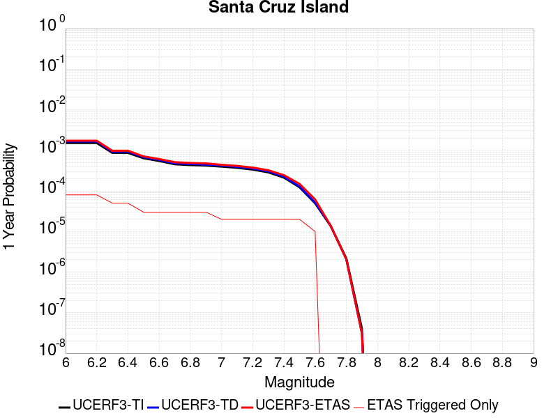 |  |

| Magnitude | 1 wk TI Prob | 1 wk TD Prob | 1 wk ETAS Prob | 1 wk ETAS/TD Gain | 1 wk ETAS Triggered Only | 1 mo TI Prob | 1 mo TD Prob | 1 mo ETAS Prob | 1 mo ETAS/TD Gain | 1 mo ETAS Triggered Only | 1 yr TI Prob | 1 yr TD Prob | 1 yr ETAS Prob | 1 yr ETAS/TD Gain | 1 yr ETAS Triggered Only | 10 yr TI Prob | 10 yr TD Prob | 10 yr ETAS Prob | 10 yr ETAS/TD Gain | 10 yr ETAS Triggered Only |
|-----|-----|-----|-----|-----|-----|-----|-----|-----|-----|-----|-----|-----|-----|-----|-----|-----|-----|-----|-----|-----|
| 6.0 | 2.9164563E-5 | 3.1599742E-5 | 1.1167409E-4 | 3.5340188 | 8.0076876E-5 | 1.2498499E-4 | 1.3542121E-4 | 2.9555327E-4 | 2.182474 | 1.6015375E-4 | 0.0015206301 | 0.0016476426 | 0.0018075324 | 1.0970416 | 1.6015375E-4 | 0.015102667 | 0.016368 | 0.016564915 | 1.0120305 | 2.0019218E-4 |
| 6.1 | 2.9164563E-5 | 3.1599742E-5 | 1.1167409E-4 | 3.5340188 | 8.0076876E-5 | 1.2498499E-4 | 1.3542121E-4 | 2.9555327E-4 | 2.182474 | 1.6015375E-4 | 0.0015206301 | 0.0016476426 | 0.0018075324 | 1.0970416 | 1.6015375E-4 | 0.015102667 | 0.016368 | 0.016564915 | 1.0120305 | 2.0019218E-4 |
| 6.2 | 2.9164563E-5 | 3.1599742E-5 | 1.1167409E-4 | 3.5340188 | 8.0076876E-5 | 1.2498499E-4 | 1.3542121E-4 | 2.9555327E-4 | 2.182474 | 1.6015375E-4 | 0.0015206301 | 0.0016476426 | 0.0018075324 | 1.0970416 | 1.6015375E-4 | 0.015102667 | 0.016368 | 0.016564915 | 1.0120305 | 2.0019218E-4 |
| 6.3 | 1.6635553E-5 | 1.780436E-5 | 9.7879805E-5 | 5.4975195 | 8.0076876E-5 | 7.1293274E-5 | 7.630226E-5 | 1.9640841E-4 | 2.5740836 | 1.2011531E-4 | 8.6765E-4 | 9.2860236E-4 | 0.0010486061 | 1.1292305 | 1.2011531E-4 | 0.008642701 | 0.009249094 | 0.009368098 | 1.0128666 | 1.2011531E-4 |
| 6.4 | 1.6635553E-5 | 1.780436E-5 | 9.7879805E-5 | 5.4975195 | 8.0076876E-5 | 7.1293274E-5 | 7.630226E-5 | 1.9640841E-4 | 2.5740836 | 1.2011531E-4 | 8.6765E-4 | 9.2860236E-4 | 0.0010486061 | 1.1292305 | 1.2011531E-4 | 0.008642701 | 0.009249094 | 0.009368098 | 1.0128666 | 1.2011531E-4 |
| 6.5 | 1.2238748E-5 | 1.3042995E-5 | 5.308091E-5 | 4.069687 | 4.0038438E-5 | 5.2450723E-5 | 5.5897377E-5 | 9.5933574E-5 | 1.7162447 | 4.0038438E-5 | 6.3840044E-4 | 6.8034173E-4 | 7.203529E-4 | 1.0588105 | 4.0038438E-5 | 0.0063656955 | 0.0067829876 | 0.0068227546 | 1.0058627 | 4.0038438E-5 |
| 6.6 | 1.0489767E-5 | 1.1156636E-5 | 5.1194627E-5 | 4.5887156 | 4.0038438E-5 | 4.495537E-5 | 4.781329E-5 | 8.784981E-5 | 1.8373513 | 4.0038438E-5 | 5.4719415E-4 | 5.819735E-4 | 6.219887E-4 | 1.0687577 | 4.0038438E-5 | 0.005458487 | 0.0058047357 | 0.005844542 | 1.0068575 | 4.0038438E-5 |
| 6.7 | 8.699222E-6 | 9.236782E-6 | 4.9274848E-5 | 5.334634 | 4.0038438E-5 | 3.7281847E-5 | 3.958561E-5 | 7.962246E-5 | 2.011399 | 4.0038438E-5 | 4.5381195E-4 | 4.8184878E-4 | 5.2186794E-4 | 1.0830534 | 4.0038438E-5 | 0.0045288634 | 0.004808108 | 0.0048479536 | 1.0082872 | 4.0038438E-5 |
| 6.8 | 8.307732E-6 | 8.8169045E-6 | 4.885499E-5 | 5.541059 | 4.0038438E-5 | 3.560408E-5 | 3.7786187E-5 | 7.782311E-5 | 2.059565 | 4.0038438E-5 | 4.3339343E-4 | 4.5995016E-4 | 4.9997016E-4 | 1.0870094 | 4.0038438E-5 | 0.004325492 | 0.0045900354 | 0.00462989 | 1.0086828 | 4.0038438E-5 |
| 6.9 | 8.073121E-6 | 8.564939E-6 | 4.8603033E-5 | 5.67465 | 4.0038438E-5 | 3.459863E-5 | 3.6706366E-5 | 7.674334E-5 | 2.0907364 | 4.0038438E-5 | 4.2115687E-4 | 4.468088E-4 | 4.8682935E-4 | 1.0895697 | 4.0038438E-5 | 0.004203596 | 0.004459156 | 0.004499016 | 1.0089389 | 4.0038438E-5 |
| 7.0 | 7.617019E-6 | 8.074664E-6 | 4.811278E-5 | 5.9584866 | 4.0038438E-5 | 3.264396E-5 | 3.4605247E-5 | 7.4642296E-5 | 2.1569648 | 4.0038438E-5 | 3.9736772E-4 | 4.212378E-4 | 4.612594E-4 | 1.0950094 | 4.0038438E-5 | 0.003966579 | 0.0042044413 | 0.0042443112 | 1.0094829 | 4.0038438E-5 |
| 7.1 | 7.1224836E-6 | 7.545788E-6 | 4.7583922E-5 | 6.3060246 | 4.0038438E-5 | 3.052457E-5 | 3.2338692E-5 | 7.2375835E-5 | 2.238057 | 4.0038438E-5 | 3.715733E-4 | 3.936528E-4 | 4.3367548E-4 | 1.10167 | 4.0038438E-5 | 0.003709526 | 0.003929598 | 0.003969479 | 1.0101489 | 4.0038438E-5 |
| 7.2 | 6.441115E-6 | 6.8273835E-6 | 4.6865545E-5 | 6.86435 | 4.0038438E-5 | 2.7604487E-5 | 2.9259887E-5 | 6.929715E-5 | 2.3683329 | 4.0038438E-5 | 3.360328E-4 | 3.5618112E-4 | 3.9620532E-4 | 1.1123703 | 4.0038438E-5 | 0.0033552512 | 0.003556131 | 0.0035960271 | 1.0112189 | 4.0038438E-5 |
| 7.3 | 5.494274E-6 | 5.8199944E-6 | 4.58582E-5 | 7.879423 | 4.0038438E-5 | 2.3546674E-5 | 2.4942596E-5 | 6.4980035E-5 | 2.6051834 | 4.0038438E-5 | 2.8664304E-4 | 3.0363398E-4 | 3.4366027E-4 | 1.1318241 | 4.0038438E-5 | 0.002862736 | 0.0030322142 | 0.0030721314 | 1.0131643 | 4.0038438E-5 |
| 7.4 | 4.0802624E-6 | 4.312256E-6 | 4.435052E-5 | 10.28476 | 4.0038438E-5 | 1.7486722E-5 | 1.8480967E-5 | 5.8518664E-5 | 3.1664288 | 4.0038438E-5 | 2.1288003E-4 | 2.2498262E-4 | 2.6501206E-4 | 1.1779224 | 4.0038438E-5 | 0.0021267622 | 0.0022475575 | 0.002287506 | 1.0177741 | 4.0038438E-5 |
| 7.5 | 2.3584746E-6 | 2.4753094E-6 | 4.2513646E-5 | 17.175083 | 4.0038438E-5 | 1.0107709E-5 | 1.0608426E-5 | 5.064644E-5 | 4.774171 | 4.0038438E-5 | 1.2305441E-4 | 1.2915E-4 | 1.6918326E-4 | 1.309975 | 4.0038438E-5 | 0.0012298629 | 0.0012907543 | 0.0013307411 | 1.0309794 | 4.0038438E-5 |
| 7.6 | 9.4981914E-7 | 9.86093E-7 | 4.102449E-5 | 41.60306 | 4.0038438E-5 | 4.0706473E-6 | 4.2261063E-6 | 4.4264372E-5 | 10.474032 | 4.0038438E-5 | 4.9559E-5 | 5.145164E-5 | 9.1488015E-5 | 1.778136 | 4.0038438E-5 | 4.954795E-4 | 5.1439856E-4 | 5.5441645E-4 | 1.0777954 | 4.0038438E-5 |
| 7.7 | 2.6013532E-7 | 2.6416603E-7 | 2.6416603E-7 | 1.0 | 0.0 | 1.1148652E-6 | 1.1321397E-6 | 1.1321397E-6 | 1.0 | 0.0 | 1.3573399E-5 | 1.3783714E-5 | 1.3783714E-5 | 1.0 | 0.0 | 1.357257E-4 | 1.3782867E-4 | 1.3782867E-4 | 1.0 | 0.0 |
| 7.8 | 4.1522263E-8 | 3.965679E-8 | 3.965679E-8 | 1.0 | 0.0 | 1.7795254E-7 | 1.6995766E-7 | 1.6995766E-7 | 1.0 | 0.0 | 2.16657E-6 | 2.0692328E-6 | 2.0692328E-6 | 1.0 | 0.0 | 2.1665488E-5 | 2.0692156E-5 | 2.0692156E-5 | 1.0 | 0.0 |
| 7.9 | 7.7242046E-10 | 5.9468175E-10 | 5.9468175E-10 | 1.0 | 0.0 | 3.3103735E-9 | 2.5486364E-9 | 2.5486364E-9 | 1.0 | 0.0 | 4.0303796E-8 | 3.1029646E-8 | 3.1029646E-8 | 1.0 | 0.0 | 4.030379E-7 | 3.1029643E-7 | 3.1029643E-7 | 1.0 | 0.0 |

## Oceanic - West Huasna
*[(top)](#table-of-contents)*

| 1 Week | 1 Month | 1 Year | 10 Year |
|-----|-----|-----|-----|
|  |  |  |  |

| Magnitude | 1 wk TI Prob | 1 wk TD Prob | 1 wk ETAS Prob | 1 wk ETAS/TD Gain | 1 wk ETAS Triggered Only | 1 mo TI Prob | 1 mo TD Prob | 1 mo ETAS Prob | 1 mo ETAS/TD Gain | 1 mo ETAS Triggered Only | 1 yr TI Prob | 1 yr TD Prob | 1 yr ETAS Prob | 1 yr ETAS/TD Gain | 1 yr ETAS Triggered Only | 10 yr TI Prob | 10 yr TD Prob | 10 yr ETAS Prob | 10 yr ETAS/TD Gain | 10 yr ETAS Triggered Only |
|-----|-----|-----|-----|-----|-----|-----|-----|-----|-----|-----|-----|-----|-----|-----|-----|-----|-----|-----|-----|-----|
| 6.0 | 3.195567E-5 | 2.7926868E-5 | 1.4803883E-4 | 5.300946 | 1.2011531E-4 | 1.3694567E-4 | 1.1968133E-4 | 2.798159E-4 | 2.338008 | 1.6015375E-4 | 0.0016660384 | 0.0014561893 | 0.0016161099 | 1.1098212 | 1.6015375E-4 | 0.016536033 | 0.014471028 | 0.014628864 | 1.010907 | 1.6015375E-4 |
| 6.1 | 2.1156782E-5 | 1.7573486E-5 | 1.3768669E-4 | 7.8349104 | 1.2011531E-4 | 9.066878E-5 | 7.531282E-5 | 1.9541908E-4 | 2.5947652 | 1.2011531E-4 | 0.0011033333 | 9.165572E-4 | 0.0010365625 | 1.1309304 | 1.2011531E-4 | 0.010978713 | 0.009128777 | 0.009247797 | 1.0130378 | 1.2011531E-4 |
| 6.2 | 1.6195117E-5 | 1.3327152E-5 | 9.340296E-5 | 7.0084705 | 8.0076876E-5 | 6.9405796E-5 | 5.7115132E-5 | 1.3718744E-4 | 2.4019454 | 8.0076876E-5 | 8.44688E-4 | 6.9515745E-4 | 7.7517866E-4 | 1.1151123 | 8.0076876E-5 | 0.008414844 | 0.006930123 | 0.007009645 | 1.0114748 | 8.0076876E-5 |
| 6.3 | 1.3559345E-5 | 1.1179142E-5 | 5.1217132E-5 | 4.58149 | 4.0038438E-5 | 5.811018E-5 | 4.7909736E-5 | 8.794625E-5 | 1.8356656 | 4.0038438E-5 | 7.072618E-4 | 5.831459E-4 | 6.23161E-4 | 1.0686194 | 4.0038438E-5 | 0.0070501505 | 0.0058162753 | 0.005856081 | 1.0068438 | 4.0038438E-5 |
| 6.4 | 1.2120619E-5 | 1.0000977E-5 | 5.0039012E-5 | 5.0034122 | 4.0038438E-5 | 5.1944477E-5 | 4.2860633E-5 | 8.289735E-5 | 1.9341141 | 4.0038438E-5 | 6.322405E-4 | 5.2170374E-4 | 5.617213E-4 | 1.0767055 | 4.0038438E-5 | 0.006304447 | 0.0052048573 | 0.0052446877 | 1.0076525 | 4.0038438E-5 |
| 6.5 | 1.13511915E-5 | 9.3674735E-6 | 4.9405535E-5 | 5.274158 | 4.0038438E-5 | 4.8647056E-5 | 4.01457E-5 | 8.018253E-5 | 1.9972881 | 4.0038438E-5 | 5.9211696E-4 | 4.886647E-4 | 5.286836E-4 | 1.0818943 | 4.0038438E-5 | 0.0059054173 | 0.0048759608 | 0.004915804 | 1.0081713 | 4.0038438E-5 |
| 6.6 | 9.850605E-6 | 8.135418E-6 | 4.817353E-5 | 5.9214573 | 4.0038438E-5 | 4.2216197E-5 | 3.4865614E-5 | 7.490265E-5 | 2.1483245 | 4.0038438E-5 | 5.1386096E-4 | 4.2440637E-4 | 4.644278E-4 | 1.0942998 | 4.0038438E-5 | 0.0051267436 | 0.004235991 | 0.00427586 | 1.0094119 | 4.0038438E-5 |
| 6.7 | 8.8558645E-6 | 7.318433E-6 | 4.7356578E-5 | 6.4708633 | 4.0038438E-5 | 3.7953152E-5 | 3.1364336E-5 | 7.140152E-5 | 2.2765193 | 4.0038438E-5 | 4.6198163E-4 | 3.8179406E-4 | 4.218172E-4 | 1.1048292 | 4.0038438E-5 | 0.004610224 | 0.0038114067 | 0.0038512927 | 1.0104649 | 4.0038438E-5 |
| 6.8 | 7.67136E-6 | 6.391756E-6 | 4.6429937E-5 | 7.2640347 | 4.0038438E-5 | 3.2876844E-5 | 2.7392953E-5 | 6.7430294E-5 | 2.4615927 | 4.0038438E-5 | 4.0020206E-4 | 3.3345833E-4 | 3.734834E-4 | 1.1200303 | 4.0038438E-5 | 0.003994821 | 0.0033296007 | 0.0033695058 | 1.011985 | 4.0038438E-5 |
| 6.9 | 6.534529E-6 | 5.4583297E-6 | 4.549655E-5 | 8.335251 | 4.0038438E-5 | 2.8004823E-5 | 2.3392633E-5 | 6.343013E-5 | 2.711543 | 4.0038438E-5 | 3.4090536E-4 | 2.847682E-4 | 3.2479526E-4 | 1.14056 | 4.0038438E-5 | 0.0034038287 | 0.0028440498 | 0.0028839742 | 1.014038 | 4.0038438E-5 |
| 7.0 | 5.460525E-6 | 4.5699517E-6 | 4.4608205E-5 | 9.761198 | 4.0038438E-5 | 2.3402039E-5 | 1.958536E-5 | 5.9623013E-5 | 3.0442643 | 4.0038438E-5 | 2.8488258E-4 | 2.3842578E-4 | 2.7845468E-4 | 1.1678883 | 4.0038438E-5 | 0.0028451765 | 0.0023817138 | 0.0024216569 | 1.0167707 | 4.0038438E-5 |
| 7.1 | 4.4825083E-6 | 3.7524428E-6 | 4.379073E-5 | 11.669926 | 4.0038438E-5 | 1.9210609E-5 | 1.60818E-5 | 5.6119592E-5 | 3.4896338 | 4.0038438E-5 | 2.3386406E-4 | 1.9577841E-4 | 2.3580901E-4 | 1.2044688 | 4.0038438E-5 | 0.002336181 | 0.0019560715 | 0.0019960315 | 1.0204288 | 4.0038438E-5 |
| 7.2 | 2.821708E-6 | 2.4249334E-6 | 4.2463274E-5 | 17.511108 | 4.0038438E-5 | 1.2092979E-5 | 1.039253E-5 | 5.043055E-5 | 4.8525767 | 4.0038438E-5 | 1.4722206E-4 | 1.2652173E-4 | 1.665551E-4 | 1.316415 | 4.0038438E-5 | 0.0014712457 | 0.0012644994 | 0.0013044871 | 1.0316235 | 4.0038438E-5 |
| 7.3 | 2.0644757E-6 | 1.7687412E-6 | 4.1807107E-5 | 23.636644 | 4.0038438E-5 | 8.847723E-6 | 7.5802973E-6 | 4.7618432E-5 | 6.2818685 | 4.0038438E-5 | 1.0771569E-4 | 9.228622E-5 | 1.3232096E-4 | 1.4338106 | 4.0038438E-5 | 0.001076635 | 9.2248066E-4 | 9.624821E-4 | 1.043363 | 4.0038438E-5 |
| 7.4 | 1.6980367E-6 | 1.4379892E-6 | 4.1476367E-5 | 28.843311 | 4.0038438E-5 | 7.27728E-6 | 6.162796E-6 | 4.6200985E-5 | 7.496757 | 4.0038438E-5 | 8.8597284E-5 | 7.5029464E-5 | 1.150649E-4 | 1.5335962 | 4.0038438E-5 | 8.8561967E-4 | 7.500429E-4 | 7.900513E-4 | 1.0533415 | 4.0038438E-5 |
| 7.5 | 1.3637683E-6 | 1.1302635E-6 | 1.1302635E-6 | 1.0 | 0.0 | 5.844708E-6 | 4.8439774E-6 | 4.8439774E-6 | 1.0 | 0.0 | 7.1156996E-5 | 5.897383E-5 | 5.897383E-5 | 1.0 | 0.0 | 7.1134215E-4 | 5.895833E-4 | 5.895833E-4 | 1.0 | 0.0 |
| 7.6 | 9.802994E-7 | 7.677247E-7 | 7.677247E-7 | 1.0 | 0.0 | 4.2012766E-6 | 3.2902446E-6 | 3.2902446E-6 | 1.0 | 0.0 | 5.1149345E-5 | 4.0057992E-5 | 4.0057992E-5 | 1.0 | 0.0 | 5.113757E-4 | 4.0050913E-4 | 4.0050913E-4 | 1.0 | 0.0 |
| 7.7 | 5.986191E-7 | 4.0050548E-7 | 4.0050548E-7 | 1.0 | 0.0 | 2.5655079E-6 | 1.7164509E-6 | 1.7164509E-6 | 1.0 | 0.0 | 3.1234613E-5 | 2.089759E-5 | 2.089759E-5 | 1.0 | 0.0 | 3.123022E-4 | 2.089576E-4 | 2.089576E-4 | 1.0 | 0.0 |
| 7.8 | 2.9189815E-7 | 1.5285792E-7 | 1.5285792E-7 | 1.0 | 0.0 | 1.2509914E-6 | 6.5510517E-7 | 6.5510517E-7 | 1.0 | 0.0 | 1.5230714E-5 | 7.9758765E-6 | 7.9758765E-6 | 1.0 | 0.0 | 1.522967E-4 | 7.9757214E-5 | 7.9757214E-5 | 1.0 | 0.0 |
| 7.9 | 1.2057845E-7 | 4.621248E-8 | 4.621248E-8 | 1.0 | 0.0 | 5.1676466E-7 | 1.9805347E-7 | 1.9805347E-7 | 1.0 | 0.0 | 6.2915915E-6 | 2.4112983E-6 | 2.4112983E-6 | 1.0 | 0.0 | 6.2914136E-5 | 2.4114026E-5 | 2.4114026E-5 | 1.0 | 0.0 |
| 8.0 | 3.3806387E-9 | 9.011393E-10 | 9.011393E-10 | 1.0 | 0.0 | 1.4488451E-8 | 3.8620254E-9 | 3.8620254E-9 | 1.0 | 0.0 | 1.7639688E-7 | 4.702016E-8 | 4.702016E-8 | 1.0 | 0.0 | 1.7639674E-6 | 4.7129527E-7 | 4.7129527E-7 | 1.0 | 0.0 |

## Cleghorn Pass
*[(top)](#table-of-contents)*

| 1 Week | 1 Month | 1 Year | 10 Year |
|-----|-----|-----|-----|
|  |  |  |  |

| Magnitude | 1 wk TI Prob | 1 wk TD Prob | 1 wk ETAS Prob | 1 wk ETAS/TD Gain | 1 wk ETAS Triggered Only | 1 mo TI Prob | 1 mo TD Prob | 1 mo ETAS Prob | 1 mo ETAS/TD Gain | 1 mo ETAS Triggered Only | 1 yr TI Prob | 1 yr TD Prob | 1 yr ETAS Prob | 1 yr ETAS/TD Gain | 1 yr ETAS Triggered Only | 10 yr TI Prob | 10 yr TD Prob | 10 yr ETAS Prob | 10 yr ETAS/TD Gain | 10 yr ETAS Triggered Only |
|-----|-----|-----|-----|-----|-----|-----|-----|-----|-----|-----|-----|-----|-----|-----|-----|-----|-----|-----|-----|-----|
| 6.0 | 1.0522846E-5 | 1.1040642E-5 | 1.3115462E-4 | 11.879257 | 1.2011531E-4 | 4.509713E-5 | 4.7316473E-5 | 1.674261E-4 | 3.5384314 | 1.2011531E-4 | 5.4891926E-4 | 5.759784E-4 | 7.3603995E-4 | 1.277895 | 1.6015375E-4 | 0.0054756533 | 0.005750022 | 0.005909255 | 1.0276926 | 1.6015375E-4 |
| 6.1 | 1.0522846E-5 | 1.1040642E-5 | 1.3115462E-4 | 11.879257 | 1.2011531E-4 | 4.509713E-5 | 4.7316473E-5 | 1.674261E-4 | 3.5384314 | 1.2011531E-4 | 5.4891926E-4 | 5.759784E-4 | 7.3603995E-4 | 1.277895 | 1.6015375E-4 | 0.0054756533 | 0.005750022 | 0.005909255 | 1.0276926 | 1.6015375E-4 |
| 6.2 | 2.1045846E-6 | 2.2082024E-6 | 2.2082024E-6 | 1.0 | 0.0 | 9.019617E-6 | 9.463714E-6 | 9.463714E-6 | 1.0 | 0.0 | 1.098083E-4 | 1.1521882E-4 | 1.1521882E-4 | 1.0 | 0.0 | 0.0010975406 | 0.0011520023 | 0.0011520023 | 1.0 | 0.0 |
| 6.3 | 2.1045846E-6 | 2.2082024E-6 | 2.2082024E-6 | 1.0 | 0.0 | 9.019617E-6 | 9.463714E-6 | 9.463714E-6 | 1.0 | 0.0 | 1.098083E-4 | 1.1521882E-4 | 1.1521882E-4 | 1.0 | 0.0 | 0.0010975406 | 0.0011520023 | 0.0011520023 | 1.0 | 0.0 |
| 6.4 | 1.7259927E-6 | 1.810877E-6 | 1.810877E-6 | 1.0 | 0.0 | 7.3970905E-6 | 7.760902E-6 | 7.760902E-6 | 1.0 | 0.0 | 9.005586E-5 | 9.4488976E-5 | 9.4488976E-5 | 1.0 | 0.0 | 9.001937E-4 | 9.448898E-4 | 9.448898E-4 | 1.0 | 0.0 |

## San Andreas (Creeping Section) 2011 CFM
*[(top)](#table-of-contents)*

| 1 Week | 1 Month | 1 Year | 10 Year |
|-----|-----|-----|-----|
|  |  |  |  |

| Magnitude | 1 wk TI Prob | 1 wk TD Prob | 1 wk ETAS Prob | 1 wk ETAS/TD Gain | 1 wk ETAS Triggered Only | 1 mo TI Prob | 1 mo TD Prob | 1 mo ETAS Prob | 1 mo ETAS/TD Gain | 1 mo ETAS Triggered Only | 1 yr TI Prob | 1 yr TD Prob | 1 yr ETAS Prob | 1 yr ETAS/TD Gain | 1 yr ETAS Triggered Only | 10 yr TI Prob | 10 yr TD Prob | 10 yr ETAS Prob | 10 yr ETAS/TD Gain | 10 yr ETAS Triggered Only |
|-----|-----|-----|-----|-----|-----|-----|-----|-----|-----|-----|-----|-----|-----|-----|-----|-----|-----|-----|-----|-----|
| 6.0 | 5.986481E-4 | 0.001228691 | 0.0012686802 | 1.0325462 | 4.0038438E-5 | 0.0025631124 | 0.005246795 | 0.0053264517 | 1.015182 | 8.0076876E-5 | 0.030762846 | 0.061203245 | 0.061353598 | 1.0024565 | 1.6015375E-4 | 0.26835477 | 0.425928 | 0.42601994 | 1.0002159 | 1.6015375E-4 |
| 6.1 | 5.015945E-4 | 0.0010230356 | 0.0010230356 | 1.0 | 0.0 | 0.00214792 | 0.004369436 | 0.004409299 | 1.0091232 | 4.0038438E-5 | 0.025839351 | 0.051246606 | 0.051360566 | 1.0022237 | 1.2011531E-4 | 0.23032776 | 0.37284943 | 0.37292477 | 1.0002021 | 1.2011531E-4 |
| 6.2 | 4.073338E-4 | 8.1157376E-4 | 8.1157376E-4 | 1.0 | 0.0 | 0.0017445484 | 0.0034683137 | 0.0035082132 | 1.011504 | 4.0038438E-5 | 0.021034058 | 0.04093177 | 0.041046966 | 1.0028144 | 1.2011531E-4 | 0.19150782 | 0.31302592 | 0.31310844 | 1.0002636 | 1.2011531E-4 |
| 6.3 | 3.464099E-4 | 6.7455834E-4 | 6.7455834E-4 | 1.0 | 0.0 | 0.0014837692 | 0.0028832308 | 0.0029231538 | 1.0138466 | 4.0038438E-5 | 0.017915873 | 0.034187846 | 0.034303855 | 1.0033933 | 1.2011531E-4 | 0.16538359 | 0.27130842 | 0.27139595 | 1.0003226 | 1.2011531E-4 |
| 6.4 | 2.935057E-4 | 5.5516965E-4 | 5.5516965E-4 | 1.0 | 0.0 | 0.0012572751 | 0.0023727308 | 0.0024126743 | 1.0168344 | 4.0038438E-5 | 0.015200248 | 0.02826279 | 0.028379511 | 1.0041299 | 1.2011531E-4 | 0.14201577 | 0.23297668 | 0.23306881 | 1.0003954 | 1.2011531E-4 |
| 6.5 | 2.3409708E-4 | 4.2132285E-4 | 4.2132285E-4 | 1.0 | 0.0 | 0.0010028875 | 0.0018017791 | 0.0018417455 | 1.0221816 | 4.0038438E-5 | 0.012141965 | 0.021586355 | 0.021703877 | 1.0054443 | 1.2011531E-4 | 0.11499573 | 0.1868149 | 0.18691258 | 1.0005229 | 1.2011531E-4 |
| 6.6 | 1.5842178E-4 | 2.5068692E-4 | 2.5068692E-4 | 1.0 | 0.0 | 6.7877385E-4 | 0.0010739256 | 0.001113921 | 1.0372423 | 4.0038438E-5 | 0.0082328 | 0.012995283 | 0.013074319 | 1.0060819 | 8.0076876E-5 | 0.07934396 | 0.12313759 | 0.12320781 | 1.0005702 | 8.0076876E-5 |
| 6.7 | 1.5616413E-4 | 2.4605254E-4 | 2.4605254E-4 | 1.0 | 0.0 | 6.691031E-4 | 0.0010540807 | 0.0010940769 | 1.0379442 | 4.0038438E-5 | 0.0081159435 | 0.012757154 | 0.0128362095 | 1.006197 | 8.0076876E-5 | 0.0782586 | 0.12116472 | 0.121235095 | 1.0005808 | 8.0076876E-5 |
| 6.8 | 1.5538467E-4 | 2.442914E-4 | 2.442914E-4 | 1.0 | 0.0 | 6.6576427E-4 | 0.001046539 | 0.0010865356 | 1.0382179 | 4.0038438E-5 | 0.008075596 | 0.012666538 | 0.0127456 | 1.0062418 | 8.0076876E-5 | 0.07788358 | 0.12039561 | 0.12046604 | 1.0005851 | 8.0076876E-5 |
| 6.9 | 1.5153569E-4 | 2.3538464E-4 | 2.3538464E-4 | 1.0 | 0.0 | 6.49277E-4 | 0.0010084033 | 0.0010484013 | 1.0396647 | 4.0038438E-5 | 0.007876333 | 0.012208726 | 0.012287825 | 1.0064789 | 8.0076876E-5 | 0.07602952 | 0.11646574 | 0.11653649 | 1.0006075 | 8.0076876E-5 |
| 7.0 | 1.4588932E-4 | 2.2395732E-4 | 2.2395732E-4 | 1.0 | 0.0 | 6.250901E-4 | 9.59466E-4 | 9.99466E-4 | 1.0416899 | 4.0038438E-5 | 0.0075839474 | 0.011619428 | 0.011698574 | 1.0068116 | 8.0076876E-5 | 0.073302895 | 0.11131206 | 0.11138323 | 1.0006393 | 8.0076876E-5 |
| 7.1 | 1.1565079E-4 | 1.6281323E-4 | 1.6281323E-4 | 1.0 | 0.0 | 4.955521E-4 | 6.9758523E-4 | 7.375957E-4 | 1.0573558 | 4.0038438E-5 | 0.006016669 | 0.008460228 | 0.008539627 | 1.009385 | 8.0076876E-5 | 0.058563538 | 0.08366478 | 0.08373816 | 1.000877 | 8.0076876E-5 |
| 7.2 | 1.0393792E-4 | 1.4615392E-4 | 1.4615392E-4 | 1.0 | 0.0 | 4.4537216E-4 | 6.262243E-4 | 6.662377E-4 | 1.0638962 | 4.0038438E-5 | 0.005408933 | 0.0075977976 | 0.007677266 | 1.0104594 | 8.0076876E-5 | 0.052791595 | 0.07561503 | 0.075689055 | 1.000979 | 8.0076876E-5 |
| 7.3 | 9.332884E-5 | 1.2780601E-4 | 1.2780601E-4 | 1.0 | 0.0 | 3.999194E-4 | 5.4762565E-4 | 5.876422E-4 | 1.0730728 | 4.0038438E-5 | 0.0048581534 | 0.0066470946 | 0.006726639 | 1.0119668 | 8.0076876E-5 | 0.047533102 | 0.06647954 | 0.06655429 | 1.0011245 | 8.0076876E-5 |
| 7.4 | 8.670252E-5 | 1.1702972E-4 | 1.1702972E-4 | 1.0 | 0.0 | 3.715293E-4 | 5.014601E-4 | 5.4147845E-4 | 1.0798037 | 4.0038438E-5 | 0.004513991 | 0.0060883067 | 0.006167896 | 1.0130725 | 8.0076876E-5 | 0.044233937 | 0.061148684 | 0.061223865 | 1.0012295 | 8.0076876E-5 |
| 7.5 | 7.3036405E-5 | 9.005699E-5 | 9.005699E-5 | 1.0 | 0.0 | 3.129756E-4 | 3.859015E-4 | 4.259245E-4 | 1.1037129 | 4.0038438E-5 | 0.0038038217 | 0.0046882504 | 0.004767952 | 1.0170002 | 8.0076876E-5 | 0.03739367 | 0.047875606 | 0.04795185 | 1.0015925 | 8.0076876E-5 |
| 7.6 | 6.3935775E-5 | 8.280209E-5 | 8.280209E-5 | 1.0 | 0.0 | 2.7398168E-4 | 3.5481792E-4 | 3.9484215E-4 | 1.1128021 | 4.0038438E-5 | 0.0033306254 | 0.00431137 | 0.0043911017 | 1.0184933 | 8.0076876E-5 | 0.032811474 | 0.043990135 | 0.04406669 | 1.0017402 | 8.0076876E-5 |
| 7.7 | 5.5050095E-5 | 6.661729E-5 | 6.661729E-5 | 1.0 | 0.0 | 2.3590765E-4 | 2.8547147E-4 | 3.2549846E-4 | 1.1402137 | 4.0038438E-5 | 0.0028683927 | 0.0034700802 | 0.0035498792 | 1.0229963 | 8.0076876E-5 | 0.0283165 | 0.03579509 | 0.0358723 | 1.002157 | 8.0076876E-5 |
| 7.8 | 5.027131E-5 | 6.1627725E-5 | 6.1627725E-5 | 1.0 | 0.0 | 2.1543067E-4 | 2.640921E-4 | 3.0411995E-4 | 1.1515678 | 4.0038438E-5 | 0.0026197135 | 0.003210584 | 0.0032904036 | 1.0248615 | 8.0076876E-5 | 0.025890453 | 0.03312572 | 0.033203144 | 1.0023373 | 8.0076876E-5 |
| 7.9 | 3.7271806E-5 | 5.0224386E-5 | 5.0224386E-5 | 1.0 | 0.0 | 1.5972654E-4 | 2.1522962E-4 | 2.5525945E-4 | 1.1859865 | 4.0038438E-5 | 0.0019429359 | 0.0026172737 | 0.002697141 | 1.0305154 | 8.0076876E-5 | 0.019260362 | 0.027066687 | 0.027144598 | 1.0028784 | 8.0076876E-5 |
| 8.0 | 2.7310243E-5 | 3.1428404E-5 | 3.1428404E-5 | 1.0 | 0.0 | 1.17038646E-4 | 1.3468621E-4 | 1.7471926E-4 | 1.2972319 | 4.0038438E-5 | 0.0014240141 | 0.0016385721 | 0.0017185177 | 1.0487899 | 8.0076876E-5 | 0.014149235 | 0.01721387 | 0.017292567 | 1.0045718 | 8.0076876E-5 |
| 8.1 | 1.7940547E-5 | 1.7400796E-5 | 1.7400796E-5 | 1.0 | 0.0 | 7.688579E-5 | 7.457271E-5 | 1.1460816E-4 | 1.5368646 | 4.0038438E-5 | 9.3568244E-4 | 9.075451E-4 | 9.475472E-4 | 1.0440773 | 4.0038438E-5 | 0.009317525 | 0.009799073 | 0.00983872 | 1.0040458 | 4.0038438E-5 |
| 8.2 | 8.643924E-6 | 5.4748625E-6 | 5.4748625E-6 | 1.0 | 0.0 | 3.704486E-5 | 2.3463486E-5 | 2.3463486E-5 | 1.0 | 0.0 | 4.5092785E-4 | 2.8563058E-4 | 2.8563058E-4 | 1.0 | 0.0 | 0.0045001395 | 0.0032487072 | 0.0032487072 | 1.0 | 0.0 |
| 8.3 | 1.983087E-6 | 7.6599065E-7 | 7.6599065E-7 | 1.0 | 0.0 | 8.498917E-6 | 3.282813E-6 | 3.282813E-6 | 1.0 | 0.0 | 1.034694E-4 | 3.9967534E-5 | 3.9967534E-5 | 1.0 | 0.0 | 0.0010342124 | 4.719687E-4 | 4.719687E-4 | 1.0 | 0.0 |

## Pinto Mtn
*[(top)](#table-of-contents)*

| 1 Week | 1 Month | 1 Year | 10 Year |
|-----|-----|-----|-----|
|  |  |  |  |

| Magnitude | 1 wk TI Prob | 1 wk TD Prob | 1 wk ETAS Prob | 1 wk ETAS/TD Gain | 1 wk ETAS Triggered Only | 1 mo TI Prob | 1 mo TD Prob | 1 mo ETAS Prob | 1 mo ETAS/TD Gain | 1 mo ETAS Triggered Only | 1 yr TI Prob | 1 yr TD Prob | 1 yr ETAS Prob | 1 yr ETAS/TD Gain | 1 yr ETAS Triggered Only | 10 yr TI Prob | 10 yr TD Prob | 10 yr ETAS Prob | 10 yr ETAS/TD Gain | 10 yr ETAS Triggered Only |
|-----|-----|-----|-----|-----|-----|-----|-----|-----|-----|-----|-----|-----|-----|-----|-----|-----|-----|-----|-----|-----|
| 6.0 | 4.4194956E-5 | 4.785362E-5 | 1.6796318E-4 | 3.5099368 | 1.2011531E-4 | 1.893932E-4 | 2.0507174E-4 | 3.6519265E-4 | 1.7808043 | 1.6015375E-4 | 0.0023034236 | 0.0024940541 | 0.0026538086 | 1.064054 | 1.6015375E-4 | 0.022796938 | 0.024678145 | 0.024834346 | 1.0063295 | 1.6015375E-4 |
| 6.1 | 4.4194956E-5 | 4.785362E-5 | 1.6796318E-4 | 3.5099368 | 1.2011531E-4 | 1.893932E-4 | 2.0507174E-4 | 3.6519265E-4 | 1.7808043 | 1.6015375E-4 | 0.0023034236 | 0.0024940541 | 0.0026538086 | 1.064054 | 1.6015375E-4 | 0.022796938 | 0.024678145 | 0.024834346 | 1.0063295 | 1.6015375E-4 |
| 6.2 | 4.4194956E-5 | 4.785362E-5 | 1.6796318E-4 | 3.5099368 | 1.2011531E-4 | 1.893932E-4 | 2.0507174E-4 | 3.6519265E-4 | 1.7808043 | 1.6015375E-4 | 0.0023034236 | 0.0024940541 | 0.0026538086 | 1.064054 | 1.6015375E-4 | 0.022796938 | 0.024678145 | 0.024834346 | 1.0063295 | 1.6015375E-4 |
| 6.3 | 4.4194956E-5 | 4.785362E-5 | 1.6796318E-4 | 3.5099368 | 1.2011531E-4 | 1.893932E-4 | 2.0507174E-4 | 3.6519265E-4 | 1.7808043 | 1.6015375E-4 | 0.0023034236 | 0.0024940541 | 0.0026538086 | 1.064054 | 1.6015375E-4 | 0.022796938 | 0.024678145 | 0.024834346 | 1.0063295 | 1.6015375E-4 |
| 6.4 | 3.729929E-5 | 3.9603186E-5 | 1.5971375E-4 | 4.0328507 | 1.2011531E-4 | 1.5984432E-4 | 1.6971743E-4 | 3.2984398E-4 | 1.9434893 | 1.6015375E-4 | 0.0019443673 | 0.002064445 | 0.0022242682 | 1.077417 | 1.6015375E-4 | 0.019274427 | 0.02046269 | 0.020619567 | 1.0076665 | 1.6015375E-4 |
| 6.5 | 3.729929E-5 | 3.9603186E-5 | 1.5971375E-4 | 4.0328507 | 1.2011531E-4 | 1.5984432E-4 | 1.6971743E-4 | 3.2984398E-4 | 1.9434893 | 1.6015375E-4 | 0.0019443673 | 0.002064445 | 0.0022242682 | 1.077417 | 1.6015375E-4 | 0.019274427 | 0.02046269 | 0.020619567 | 1.0076665 | 1.6015375E-4 |
| 6.6 | 3.0204548E-5 | 3.1205298E-5 | 1.11279674E-4 | 3.5660508 | 8.0076876E-5 | 1.2944164E-4 | 1.3373033E-4 | 2.1379649E-4 | 1.5987136 | 8.0076876E-5 | 0.0015748127 | 0.0016269855 | 0.0017069321 | 1.0491378 | 8.0076876E-5 | 0.015636992 | 0.01615461 | 0.016233392 | 1.0048769 | 8.0076876E-5 |
| 6.7 | 2.9857754E-5 | 3.081468E-5 | 1.1088909E-4 | 3.5985796 | 8.0076876E-5 | 1.2795553E-4 | 1.3205643E-4 | 2.1212273E-4 | 1.6063037 | 8.0076876E-5 | 0.0015567453 | 0.001606636 | 0.0016865842 | 1.0497613 | 8.0076876E-5 | 0.015458848 | 0.01595405 | 0.016032849 | 1.0049392 | 8.0076876E-5 |
| 6.8 | 2.4819734E-5 | 2.5009364E-5 | 1.0508423E-4 | 4.2017956 | 8.0076876E-5 | 1.0636595E-4 | 1.07178705E-4 | 1.8724699E-4 | 1.7470541 | 8.0076876E-5 | 0.0012942362 | 0.0013041412 | 0.0013841137 | 1.061322 | 8.0076876E-5 | 0.012867244 | 0.0129672475 | 0.013046286 | 1.0060953 | 8.0076876E-5 |
| 6.9 | 2.331124E-5 | 2.3337643E-5 | 1.0341265E-4 | 4.4311523 | 8.0076876E-5 | 9.990149E-5 | 1.00014746E-4 | 1.8008362E-4 | 1.8005706 | 8.0076876E-5 | 0.001215622 | 0.0012170197 | 0.0012969992 | 1.0657175 | 8.0076876E-5 | 0.012089936 | 0.012105742 | 0.012184849 | 1.0065347 | 8.0076876E-5 |
| 7.0 | 2.1818534E-5 | 2.1760772E-5 | 6.179834E-5 | 2.8398964 | 4.0038438E-5 | 9.3504656E-5 | 9.325723E-5 | 1.3329193E-4 | 1.4292933 | 4.0038438E-5 | 0.0011378246 | 0.0011348352 | 0.0011748283 | 1.0352412 | 4.0038438E-5 | 0.011320163 | 0.011292503 | 0.01133209 | 1.0035056 | 4.0038438E-5 |
| 7.1 | 2.066081E-5 | 2.0540418E-5 | 6.0578033E-5 | 2.9492114 | 4.0038438E-5 | 8.854332E-5 | 8.8027504E-5 | 1.2806241E-4 | 1.4548 | 4.0038438E-5 | 0.0010774818 | 0.0010712275 | 0.001111223 | 1.0373362 | 4.0038438E-5 | 0.010722724 | 0.010662688 | 0.0107023 | 1.0037149 | 4.0038438E-5 |
| 7.2 | 1.8990233E-5 | 1.9053701E-5 | 5.9091377E-5 | 3.101307 | 4.0038438E-5 | 8.138417E-5 | 8.1656275E-5 | 1.2169144E-4 | 1.490289 | 4.0038438E-5 | 9.904018E-4 | 9.937311E-4 | 0.0010337296 | 1.040251 | 4.0038438E-5 | 0.009859995 | 0.009894874 | 0.009934516 | 1.0040064 | 4.0038438E-5 |
| 7.3 | 1.3335872E-5 | 1.4906372E-5 | 5.4944212E-5 | 3.6859548 | 4.0038438E-5 | 5.7152483E-5 | 6.388296E-5 | 1.03918836E-4 | 1.6267067 | 4.0038438E-5 | 6.956093E-4 | 7.775102E-4 | 8.175175E-4 | 1.0514556 | 4.0038438E-5 | 0.006934359 | 0.0077491994 | 0.0077889273 | 1.0051267 | 4.0038438E-5 |
| 7.4 | 9.414066E-6 | 1.186061E-5 | 5.1898573E-5 | 4.3757086 | 4.0038438E-5 | 4.0345374E-5 | 5.0830247E-5 | 9.086665E-5 | 1.7876492 | 4.0038438E-5 | 4.910942E-4 | 6.1869196E-4 | 6.5870566E-4 | 1.0646746 | 4.0038438E-5 | 0.0049001034 | 0.006170644 | 0.006210435 | 1.0064485 | 4.0038438E-5 |
| 7.5 | 7.2101157E-6 | 9.157893E-6 | 4.9195965E-5 | 5.371974 | 4.0038438E-5 | 3.090013E-5 | 3.924757E-5 | 7.928444E-5 | 2.0201106 | 4.0038438E-5 | 3.7614413E-4 | 4.7774217E-4 | 5.177615E-4 | 1.0837675 | 4.0038438E-5 | 0.0037550807 | 0.004767927 | 0.0048077744 | 1.0083574 | 4.0038438E-5 |
| 7.6 | 3.296375E-6 | 4.5453176E-6 | 4.5453176E-6 | 1.0 | 0.0 | 1.4127245E-5 | 1.9479796E-5 | 1.9479796E-5 | 1.0 | 0.0 | 1.7198564E-4 | 2.3714209E-4 | 2.3714209E-4 | 1.0 | 0.0 | 0.0017185259 | 0.0023690276 | 0.0023690276 | 1.0 | 0.0 |
| 7.7 | 2.5741092E-6 | 3.584251E-6 | 3.584251E-6 | 1.0 | 0.0 | 1.103185E-5 | 1.5360993E-5 | 1.5360993E-5 | 1.0 | 0.0 | 1.3430449E-4 | 1.8700535E-4 | 1.8700535E-4 | 1.0 | 0.0 | 0.0013422335 | 0.0018686098 | 0.0018686098 | 1.0 | 0.0 |

## Channel Islands Thrust
*[(top)](#table-of-contents)*

| 1 Week | 1 Month | 1 Year | 10 Year |
|-----|-----|-----|-----|
|  |  |  |  |

| Magnitude | 1 wk TI Prob | 1 wk TD Prob | 1 wk ETAS Prob | 1 wk ETAS/TD Gain | 1 wk ETAS Triggered Only | 1 mo TI Prob | 1 mo TD Prob | 1 mo ETAS Prob | 1 mo ETAS/TD Gain | 1 mo ETAS Triggered Only | 1 yr TI Prob | 1 yr TD Prob | 1 yr ETAS Prob | 1 yr ETAS/TD Gain | 1 yr ETAS Triggered Only | 10 yr TI Prob | 10 yr TD Prob | 10 yr ETAS Prob | 10 yr ETAS/TD Gain | 10 yr ETAS Triggered Only |
|-----|-----|-----|-----|-----|-----|-----|-----|-----|-----|-----|-----|-----|-----|-----|-----|-----|-----|-----|-----|-----|
| 6.0 | 2.2156251E-5 | 2.4092022E-5 | 6.41295E-5 | 2.661856 | 4.0038438E-5 | 9.495191E-5 | 1.03248036E-4 | 2.2335094E-4 | 2.1632464 | 1.2011531E-4 | 0.0011554264 | 0.0012564264 | 0.0013763909 | 1.0954807 | 1.2011531E-4 | 0.011494373 | 0.0125038205 | 0.012661972 | 1.0126482 | 1.6015375E-4 |
| 6.1 | 2.2156251E-5 | 2.4092022E-5 | 6.41295E-5 | 2.661856 | 4.0038438E-5 | 9.495191E-5 | 1.03248036E-4 | 2.2335094E-4 | 2.1632464 | 1.2011531E-4 | 0.0011554264 | 0.0012564264 | 0.0013763909 | 1.0954807 | 1.2011531E-4 | 0.011494373 | 0.0125038205 | 0.012661972 | 1.0126482 | 1.6015375E-4 |
| 6.2 | 2.2156251E-5 | 2.4092022E-5 | 6.41295E-5 | 2.661856 | 4.0038438E-5 | 9.495191E-5 | 1.03248036E-4 | 2.2335094E-4 | 2.1632464 | 1.2011531E-4 | 0.0011554264 | 0.0012564264 | 0.0013763909 | 1.0954807 | 1.2011531E-4 | 0.011494373 | 0.0125038205 | 0.012661972 | 1.0126482 | 1.6015375E-4 |
| 6.3 | 2.2156251E-5 | 2.4092022E-5 | 6.41295E-5 | 2.661856 | 4.0038438E-5 | 9.495191E-5 | 1.03248036E-4 | 2.2335094E-4 | 2.1632464 | 1.2011531E-4 | 0.0011554264 | 0.0012564264 | 0.0013763909 | 1.0954807 | 1.2011531E-4 | 0.011494373 | 0.0125038205 | 0.012661972 | 1.0126482 | 1.6015375E-4 |
| 6.4 | 2.2156251E-5 | 2.4092022E-5 | 6.41295E-5 | 2.661856 | 4.0038438E-5 | 9.495191E-5 | 1.03248036E-4 | 2.2335094E-4 | 2.1632464 | 1.2011531E-4 | 0.0011554264 | 0.0012564264 | 0.0013763909 | 1.0954807 | 1.2011531E-4 | 0.011494373 | 0.0125038205 | 0.012661972 | 1.0126482 | 1.6015375E-4 |
| 6.5 | 2.2156251E-5 | 2.4092022E-5 | 6.41295E-5 | 2.661856 | 4.0038438E-5 | 9.495191E-5 | 1.03248036E-4 | 2.2335094E-4 | 2.1632464 | 1.2011531E-4 | 0.0011554264 | 0.0012564264 | 0.0013763909 | 1.0954807 | 1.2011531E-4 | 0.011494373 | 0.0125038205 | 0.012661972 | 1.0126482 | 1.6015375E-4 |
| 6.6 | 2.2156251E-5 | 2.4092022E-5 | 6.41295E-5 | 2.661856 | 4.0038438E-5 | 9.495191E-5 | 1.03248036E-4 | 2.2335094E-4 | 2.1632464 | 1.2011531E-4 | 0.0011554264 | 0.0012564264 | 0.0013763909 | 1.0954807 | 1.2011531E-4 | 0.011494373 | 0.0125038205 | 0.012661972 | 1.0126482 | 1.6015375E-4 |
| 6.7 | 1.0601296E-5 | 1.1379544E-5 | 1.1379544E-5 | 1.0 | 0.0 | 4.5433335E-5 | 4.876859E-5 | 8.880507E-5 | 1.8209482 | 4.0038438E-5 | 5.5301044E-4 | 5.936007E-4 | 6.3361536E-4 | 1.0674101 | 4.0038438E-5 | 0.005516363 | 0.005920653 | 0.0059604547 | 1.0067225 | 4.0038438E-5 |
| 6.8 | 1.0246747E-5 | 1.0996669E-5 | 1.0996669E-5 | 1.0 | 0.0 | 4.391389E-5 | 4.7127756E-5 | 8.7164306E-5 | 1.8495322 | 4.0038438E-5 | 5.345204E-4 | 5.7363417E-4 | 6.136496E-4 | 1.0697578 | 4.0038438E-5 | 0.0053323656 | 0.005722025 | 0.0057618343 | 1.0069572 | 4.0038438E-5 |
| 6.9 | 9.049551E-6 | 9.699645E-6 | 9.699645E-6 | 1.0 | 0.0 | 3.878322E-5 | 4.1569267E-5 | 4.1569267E-5 | 1.0 | 0.0 | 4.7208337E-4 | 5.059924E-4 | 5.059924E-4 | 1.0 | 0.0 | 0.0047108172 | 0.0050488203 | 0.0050488203 | 1.0 | 0.0 |
| 7.0 | 8.6542195E-6 | 9.274603E-6 | 9.274603E-6 | 1.0 | 0.0 | 3.7088983E-5 | 3.9747716E-5 | 3.9747716E-5 | 1.0 | 0.0 | 4.5146482E-4 | 4.8382508E-4 | 4.8382508E-4 | 1.0 | 0.0 | 0.004505487 | 0.004828129 | 0.004828129 | 1.0 | 0.0 |
| 7.1 | 8.391028E-6 | 8.992924E-6 | 8.992924E-6 | 1.0 | 0.0 | 3.5961057E-5 | 3.854056E-5 | 3.854056E-5 | 1.0 | 0.0 | 4.3773788E-4 | 4.6913436E-4 | 4.6913436E-4 | 1.0 | 0.0 | 0.004368766 | 0.0046818503 | 0.0046818503 | 1.0 | 0.0 |
| 7.2 | 5.965188E-6 | 6.3716952E-6 | 6.3716952E-6 | 1.0 | 0.0 | 2.556484E-5 | 2.7306982E-5 | 2.7306982E-5 | 1.0 | 0.0 | 3.1120746E-4 | 3.3241234E-4 | 3.3241234E-4 | 1.0 | 0.0 | 0.00310772 | 0.0033192092 | 0.0033192092 | 1.0 | 0.0 |
| 7.3 | 4.877518E-6 | 5.2060063E-6 | 5.2060063E-6 | 1.0 | 0.0 | 2.0903482E-5 | 2.2311267E-5 | 2.2311267E-5 | 1.0 | 0.0 | 2.5447016E-4 | 2.716063E-4 | 2.716063E-4 | 1.0 | 0.0 | 0.0025417898 | 0.0027127895 | 0.0027127895 | 1.0 | 0.0 |
| 7.4 | 3.8829853E-6 | 4.141863E-6 | 4.141863E-6 | 1.0 | 0.0 | 1.664126E-5 | 1.7750723E-5 | 1.7750723E-5 | 1.0 | 0.0 | 2.0258849E-4 | 2.1609402E-4 | 2.1609402E-4 | 1.0 | 0.0 | 0.002024039 | 0.0021588807 | 0.0021588807 | 1.0 | 0.0 |
| 7.5 | 1.3489616E-6 | 1.4277903E-6 | 1.4277903E-6 | 1.0 | 0.0 | 5.7812517E-6 | 6.119087E-6 | 6.119087E-6 | 1.0 | 0.0 | 7.038446E-5 | 7.449738E-5 | 7.449738E-5 | 1.0 | 0.0 | 7.036218E-4 | 7.44728E-4 | 7.44728E-4 | 1.0 | 0.0 |
| 7.6 | 6.058192E-7 | 6.353778E-7 | 6.353778E-7 | 1.0 | 0.0 | 2.5963652E-6 | 2.7230449E-6 | 2.7230449E-6 | 1.0 | 0.0 | 3.161029E-5 | 3.3152584E-5 | 3.3152584E-5 | 1.0 | 0.0 | 3.1605794E-4 | 3.31478E-4 | 3.31478E-4 | 1.0 | 0.0 |
| 7.7 | 2.2170494E-7 | 2.2607902E-7 | 2.2607902E-7 | 1.0 | 0.0 | 9.5016367E-7 | 9.689098E-7 | 9.689098E-7 | 1.0 | 0.0 | 1.1568181E-5 | 1.1796425E-5 | 1.1796425E-5 | 1.0 | 0.0 | 1.1567579E-4 | 1.1795909E-4 | 1.1795909E-4 | 1.0 | 0.0 |
| 7.8 | 2.1613102E-8 | 1.5466682E-8 | 1.5466682E-8 | 1.0 | 0.0 | 9.262757E-8 | 6.628578E-8 | 6.628578E-8 | 1.0 | 0.0 | 1.1277401E-6 | 8.070291E-7 | 8.070291E-7 | 1.0 | 0.0 | 1.1277344E-5 | 8.070269E-6 | 8.070269E-6 | 1.0 | 0.0 |

## Coronado Bank alt1
*[(top)](#table-of-contents)*

| 1 Week | 1 Month | 1 Year | 10 Year |
|-----|-----|-----|-----|
|  |  | 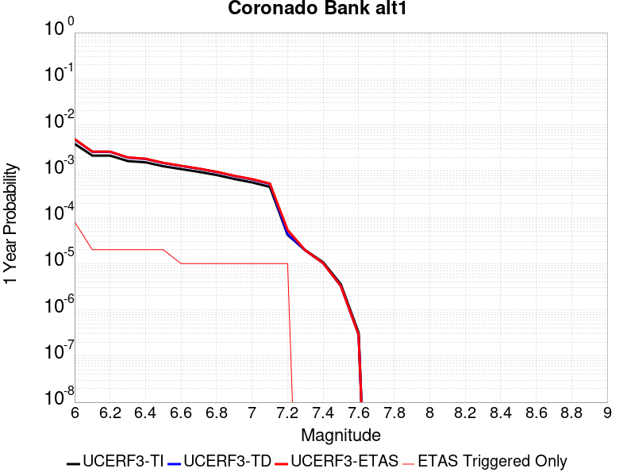 |  |

| Magnitude | 1 wk TI Prob | 1 wk TD Prob | 1 wk ETAS Prob | 1 wk ETAS/TD Gain | 1 wk ETAS Triggered Only | 1 mo TI Prob | 1 mo TD Prob | 1 mo ETAS Prob | 1 mo ETAS/TD Gain | 1 mo ETAS Triggered Only | 1 yr TI Prob | 1 yr TD Prob | 1 yr ETAS Prob | 1 yr ETAS/TD Gain | 1 yr ETAS Triggered Only | 10 yr TI Prob | 10 yr TD Prob | 10 yr ETAS Prob | 10 yr ETAS/TD Gain | 10 yr ETAS Triggered Only |
|-----|-----|-----|-----|-----|-----|-----|-----|-----|-----|-----|-----|-----|-----|-----|-----|-----|-----|-----|-----|-----|
| 6.0 | 7.533492E-5 | 9.394913E-5 | 1.339838E-4 | 1.4261314 | 4.0038438E-5 | 3.22824E-4 | 4.0258127E-4 | 5.626705E-4 | 1.397657 | 1.6015375E-4 | 0.0039233007 | 0.0048909658 | 0.005050336 | 1.0325847 | 1.6015375E-4 | 0.03854755 | 0.04790356 | 0.048056044 | 1.0031831 | 1.6015375E-4 |
| 6.1 | 4.1807285E-5 | 5.049283E-5 | 9.052925E-5 | 1.7929128 | 4.0038438E-5 | 1.7916178E-4 | 2.1638049E-4 | 2.5641025E-4 | 1.1849972 | 4.0038438E-5 | 0.0021791123 | 0.0026313474 | 0.0026712804 | 1.0151759 | 4.0038438E-5 | 0.021578677 | 0.026011046 | 0.026050044 | 1.0014993 | 4.0038438E-5 |
| 6.2 | 4.1807285E-5 | 5.049283E-5 | 9.052925E-5 | 1.7929128 | 4.0038438E-5 | 1.7916178E-4 | 2.1638049E-4 | 2.5641025E-4 | 1.1849972 | 4.0038438E-5 | 0.0021791123 | 0.0026313474 | 0.0026712804 | 1.0151759 | 4.0038438E-5 | 0.021578677 | 0.026011046 | 0.026050044 | 1.0014993 | 4.0038438E-5 |
| 6.3 | 3.1793104E-5 | 3.7711117E-5 | 7.7748045E-5 | 2.0616744 | 4.0038438E-5 | 1.3624904E-4 | 1.6160926E-4 | 2.0164123E-4 | 1.2477083 | 4.0038438E-5 | 0.0016575698 | 0.001965848 | 0.0020058078 | 1.020327 | 4.0038438E-5 | 0.016452603 | 0.019488465 | 0.019527722 | 1.0020144 | 4.0038438E-5 |
| 6.4 | 2.9878007E-5 | 3.5335794E-5 | 7.5372816E-5 | 2.1330442 | 4.0038438E-5 | 1.2804232E-4 | 1.5143053E-4 | 1.9146291E-4 | 1.2643613 | 4.0038438E-5 | 0.0015578003 | 0.0018421387 | 0.0018821034 | 1.0216947 | 4.0038438E-5 | 0.015469253 | 0.01827244 | 0.018311748 | 1.0021511 | 4.0038438E-5 |
| 6.5 | 2.4512565E-5 | 2.8764043E-5 | 6.880133E-5 | 2.3919213 | 4.0038438E-5 | 1.0504962E-4 | 1.2326881E-4 | 1.633023E-4 | 1.3247659 | 4.0038438E-5 | 0.0012782287 | 0.0014997921 | 0.0015397705 | 1.0266559 | 4.0038438E-5 | 0.012709012 | 0.014899683 | 0.014939125 | 1.0026472 | 4.0038438E-5 |
| 6.6 | 2.1317413E-5 | 2.490667E-5 | 2.490667E-5 | 1.0 | 0.0 | 9.135714E-5 | 1.0673863E-4 | 1.0673863E-4 | 1.0 | 0.0 | 0.0011117056 | 0.0012987906 | 0.0012987906 | 1.0 | 0.0 | 0.011061605 | 0.012914404 | 0.012914404 | 1.0 | 0.0 |
| 6.7 | 1.8585655E-5 | 2.163488E-5 | 2.163488E-5 | 1.0 | 0.0 | 7.9650374E-5 | 9.271773E-5 | 9.271773E-5 | 1.0 | 0.0 | 9.6931186E-4 | 0.0011282742 | 0.0011282742 | 1.0 | 0.0 | 0.0096509475 | 0.011227623 | 0.011227623 | 1.0 | 0.0 |
| 6.8 | 1.5862879E-5 | 1.8419474E-5 | 1.8419474E-5 | 1.0 | 0.0 | 6.798199E-5 | 7.893833E-5 | 7.893833E-5 | 1.0 | 0.0 | 8.273665E-4 | 9.6066965E-4 | 9.6066965E-4 | 1.0 | 0.0 | 0.008242928 | 0.00956715 | 0.00956715 | 1.0 | 0.0 |
| 6.9 | 1.3021509E-5 | 1.5095265E-5 | 1.5095265E-5 | 1.0 | 0.0 | 5.5805274E-5 | 6.469249E-5 | 6.469249E-5 | 1.0 | 0.0 | 6.792174E-4 | 7.8736455E-4 | 7.8736455E-4 | 1.0 | 0.0 | 0.006771452 | 0.007847573 | 0.007847573 | 1.0 | 0.0 |
| 7.0 | 1.0974371E-5 | 1.2720104E-5 | 1.2720104E-5 | 1.0 | 0.0 | 4.7032172E-5 | 5.451369E-5 | 5.451369E-5 | 1.0 | 0.0 | 5.7246623E-4 | 6.6351966E-4 | 6.6351966E-4 | 1.0 | 0.0 | 0.0057099373 | 0.006617135 | 0.006617135 | 1.0 | 0.0 |
| 7.1 | 8.766221E-6 | 1.01638325E-5 | 1.01638325E-5 | 1.0 | 0.0 | 3.7568978E-5 | 4.355865E-5 | 4.355865E-5 | 1.0 | 0.0 | 4.573063E-4 | 5.3021475E-4 | 5.3021475E-4 | 1.0 | 0.0 | 0.0045636636 | 0.0052911965 | 0.0052911965 | 1.0 | 0.0 |
| 7.2 | 8.026024E-7 | 8.331765E-7 | 8.331765E-7 | 1.0 | 0.0 | 3.43972E-6 | 3.5707515E-6 | 3.5707515E-6 | 1.0 | 0.0 | 4.1877785E-5 | 4.3473043E-5 | 4.3473043E-5 | 1.0 | 0.0 | 4.1869894E-4 | 4.3464647E-4 | 4.3464647E-4 | 1.0 | 0.0 |
| 7.3 | 3.7293114E-7 | 3.7000953E-7 | 3.7000953E-7 | 1.0 | 0.0 | 1.5982754E-6 | 1.5857541E-6 | 1.5857541E-6 | 1.0 | 0.0 | 1.9458828E-5 | 1.9306386E-5 | 1.9306386E-5 | 1.0 | 0.0 | 1.9457124E-4 | 1.9304715E-4 | 1.9304715E-4 | 1.0 | 0.0 |
| 7.4 | 2.0557036E-7 | 1.9674363E-7 | 1.9674363E-7 | 1.0 | 0.0 | 8.810155E-7 | 8.431867E-7 | 8.431867E-7 | 1.0 | 0.0 | 1.0726311E-5 | 1.026575E-5 | 1.026575E-5 | 1.0 | 0.0 | 1.0725793E-4 | 1.0265279E-4 | 1.0265279E-4 | 1.0 | 0.0 |
| 7.5 | 6.845446E-8 | 6.279369E-8 | 6.279369E-8 | 1.0 | 0.0 | 2.9337625E-7 | 2.691158E-7 | 2.691158E-7 | 1.0 | 0.0 | 3.5718497E-6 | 3.2764797E-6 | 3.2764797E-6 | 1.0 | 0.0 | 3.5717923E-5 | 3.2764325E-5 | 3.2764325E-5 | 1.0 | 0.0 |
| 7.6 | 6.0975145E-9 | 5.53185E-9 | 5.53185E-9 | 1.0 | 0.0 | 2.6132206E-8 | 2.370793E-8 | 2.370793E-8 | 1.0 | 0.0 | 3.1815955E-7 | 2.88644E-7 | 2.88644E-7 | 1.0 | 0.0 | 3.181591E-6 | 2.8864374E-6 | 2.8864374E-6 | 1.0 | 0.0 |

## Oceanside alt1
*[(top)](#table-of-contents)*

| 1 Week | 1 Month | 1 Year | 10 Year |
|-----|-----|-----|-----|
|  |  |  |  |

| Magnitude | 1 wk TI Prob | 1 wk TD Prob | 1 wk ETAS Prob | 1 wk ETAS/TD Gain | 1 wk ETAS Triggered Only | 1 mo TI Prob | 1 mo TD Prob | 1 mo ETAS Prob | 1 mo ETAS/TD Gain | 1 mo ETAS Triggered Only | 1 yr TI Prob | 1 yr TD Prob | 1 yr ETAS Prob | 1 yr ETAS/TD Gain | 1 yr ETAS Triggered Only | 10 yr TI Prob | 10 yr TD Prob | 10 yr ETAS Prob | 10 yr ETAS/TD Gain | 10 yr ETAS Triggered Only |
|-----|-----|-----|-----|-----|-----|-----|-----|-----|-----|-----|-----|-----|-----|-----|-----|-----|-----|-----|-----|-----|
| 6.0 | 1.1617542E-5 | 1.1423493E-5 | 1.3153742E-4 | 11.514643 | 1.2011531E-4 | 4.9788516E-5 | 4.8956997E-5 | 1.6906642E-4 | 3.453366 | 1.2011531E-4 | 6.060066E-4 | 5.9590454E-4 | 7.5596286E-4 | 1.2685972 | 1.6015375E-4 | 0.0060435664 | 0.005944664 | 0.006103866 | 1.0267806 | 1.6015375E-4 |
| 6.1 | 1.1617542E-5 | 1.1423493E-5 | 1.3153742E-4 | 11.514643 | 1.2011531E-4 | 4.9788516E-5 | 4.8956997E-5 | 1.6906642E-4 | 3.453366 | 1.2011531E-4 | 6.060066E-4 | 5.9590454E-4 | 7.5596286E-4 | 1.2685972 | 1.6015375E-4 | 0.0060435664 | 0.005944664 | 0.006103866 | 1.0267806 | 1.6015375E-4 |
| 6.2 | 1.1617542E-5 | 1.1423493E-5 | 1.3153742E-4 | 11.514643 | 1.2011531E-4 | 4.9788516E-5 | 4.8956997E-5 | 1.6906642E-4 | 3.453366 | 1.2011531E-4 | 6.060066E-4 | 5.9590454E-4 | 7.5596286E-4 | 1.2685972 | 1.6015375E-4 | 0.0060435664 | 0.005944664 | 0.006103866 | 1.0267806 | 1.6015375E-4 |
| 6.3 | 1.1617542E-5 | 1.1423493E-5 | 1.3153742E-4 | 11.514643 | 1.2011531E-4 | 4.9788516E-5 | 4.8956997E-5 | 1.6906642E-4 | 3.453366 | 1.2011531E-4 | 6.060066E-4 | 5.9590454E-4 | 7.5596286E-4 | 1.2685972 | 1.6015375E-4 | 0.0060435664 | 0.005944664 | 0.006103866 | 1.0267806 | 1.6015375E-4 |
| 6.4 | 1.1617542E-5 | 1.1423493E-5 | 1.3153742E-4 | 11.514643 | 1.2011531E-4 | 4.9788516E-5 | 4.8956997E-5 | 1.6906642E-4 | 3.453366 | 1.2011531E-4 | 6.060066E-4 | 5.9590454E-4 | 7.5596286E-4 | 1.2685972 | 1.6015375E-4 | 0.0060435664 | 0.005944664 | 0.006103866 | 1.0267806 | 1.6015375E-4 |
| 6.5 | 1.1617542E-5 | 1.1423493E-5 | 1.3153742E-4 | 11.514643 | 1.2011531E-4 | 4.9788516E-5 | 4.8956997E-5 | 1.6906642E-4 | 3.453366 | 1.2011531E-4 | 6.060066E-4 | 5.9590454E-4 | 7.5596286E-4 | 1.2685972 | 1.6015375E-4 | 0.0060435664 | 0.005944664 | 0.006103866 | 1.0267806 | 1.6015375E-4 |
| 6.6 | 7.561768E-6 | 7.1336153E-6 | 8.720992E-5 | 12.225206 | 8.0076876E-5 | 3.2407173E-5 | 3.0572286E-5 | 1.1064671E-4 | 3.6191835 | 8.0076876E-5 | 3.9448592E-4 | 3.7215507E-4 | 4.922257E-4 | 1.322636 | 1.2011531E-4 | 0.0039378637 | 0.00371543 | 0.003835099 | 1.0322087 | 1.2011531E-4 |
| 6.7 | 7.1042605E-6 | 6.6556854E-6 | 8.673203E-5 | 13.031268 | 8.0076876E-5 | 3.0446476E-5 | 2.8524059E-5 | 1.0859865E-4 | 3.8072648 | 8.0076876E-5 | 3.706228E-4 | 3.472259E-4 | 4.6729948E-4 | 1.3458084 | 1.2011531E-4 | 0.0037000529 | 0.003466917 | 0.003586616 | 1.034526 | 1.2011531E-4 |
| 6.8 | 6.285554E-6 | 5.799706E-6 | 4.583791E-5 | 7.903489 | 4.0038438E-5 | 2.693781E-5 | 2.4855648E-5 | 6.489309E-5 | 2.6107986 | 4.0038438E-5 | 3.2791847E-4 | 3.0257605E-4 | 3.826287E-4 | 1.2645704 | 8.0076876E-5 | 0.0032743502 | 0.0030216982 | 0.003101533 | 1.0264206 | 8.0076876E-5 |
| 6.9 | 6.148883E-6 | 5.6565445E-6 | 4.5694756E-5 | 8.07821 | 4.0038438E-5 | 2.635209E-5 | 2.424211E-5 | 6.427958E-5 | 2.6515667 | 4.0038438E-5 | 3.2078946E-4 | 2.9510827E-4 | 3.7516153E-4 | 1.2712674 | 8.0076876E-5 | 0.003203268 | 0.0029472208 | 0.0030270617 | 1.0270902 | 8.0076876E-5 |
| 7.0 | 5.253857E-6 | 4.722404E-6 | 4.476065E-5 | 9.478361 | 4.0038438E-5 | 2.2516335E-5 | 2.0238718E-5 | 6.0276347E-5 | 2.9782689 | 4.0038438E-5 | 2.7410188E-4 | 2.4637886E-4 | 2.8640742E-4 | 1.1624676 | 4.0038438E-5 | 0.0027376404 | 0.0024610884 | 0.0025010284 | 1.0162286 | 4.0038438E-5 |
| 7.1 | 4.730754E-6 | 4.17851E-6 | 4.17851E-6 | 1.0 | 0.0 | 2.0274503E-5 | 1.7907778E-5 | 1.7907778E-5 | 1.0 | 0.0 | 2.468141E-4 | 2.1800565E-4 | 2.1800565E-4 | 1.0 | 0.0 | 0.0024654015 | 0.0021779444 | 0.0021779444 | 1.0 | 0.0 |
| 7.2 | 3.7998386E-6 | 3.214026E-6 | 3.214026E-6 | 1.0 | 0.0 | 1.6284921E-5 | 1.37743245E-5 | 1.37743245E-5 | 1.0 | 0.0 | 1.9825088E-4 | 1.6768962E-4 | 1.6768962E-4 | 1.0 | 0.0 | 0.001980741 | 0.001675643 | 0.001675643 | 1.0 | 0.0 |
| 7.3 | 3.2656465E-6 | 2.698376E-6 | 2.698376E-6 | 1.0 | 0.0 | 1.3995553E-5 | 1.1564418E-5 | 1.1564418E-5 | 1.0 | 0.0 | 1.7038253E-4 | 1.407878E-4 | 1.407878E-4 | 1.0 | 0.0 | 0.0017025196 | 0.0014069972 | 0.0014069972 | 1.0 | 0.0 |
| 7.4 | 2.593703E-6 | 2.0680277E-6 | 2.0680277E-6 | 1.0 | 0.0 | 1.1115822E-5 | 8.862946E-6 | 8.862946E-6 | 1.0 | 0.0 | 1.3532673E-4 | 1.0790111E-4 | 1.0790111E-4 | 1.0 | 0.0 | 0.0013524436 | 0.0010784961 | 0.0010784961 | 1.0 | 0.0 |
| 7.5 | 1.8715585E-6 | 1.4137177E-6 | 1.4137177E-6 | 1.0 | 0.0 | 8.020941E-6 | 6.0587763E-6 | 6.0587763E-6 | 1.0 | 0.0 | 9.7650576E-5 | 7.376316E-5 | 7.376316E-5 | 1.0 | 0.0 | 9.7607676E-4 | 7.3739287E-4 | 7.3739287E-4 | 1.0 | 0.0 |
| 7.6 | 1.2246786E-6 | 8.5268175E-7 | 8.5268175E-7 | 1.0 | 0.0 | 5.248612E-6 | 3.6543456E-6 | 3.6543456E-6 | 1.0 | 0.0 | 6.389998E-5 | 4.4490793E-5 | 4.4490793E-5 | 1.0 | 0.0 | 6.3881604E-4 | 4.4482335E-4 | 4.4482335E-4 | 1.0 | 0.0 |
| 7.7 | 5.140719E-7 | 2.734703E-7 | 2.734703E-7 | 1.0 | 0.0 | 2.2031636E-6 | 1.1720151E-6 | 1.1720151E-6 | 1.0 | 0.0 | 2.6823185E-5 | 1.4269205E-5 | 1.4269205E-5 | 1.0 | 0.0 | 2.6819948E-4 | 1.4268424E-4 | 1.4268424E-4 | 1.0 | 0.0 |
| 7.8 | 1.16056995E-8 | 9.782373E-9 | 9.782373E-9 | 1.0 | 0.0 | 4.9738713E-8 | 4.1924455E-8 | 4.1924455E-8 | 1.0 | 0.0 | 6.0556863E-7 | 5.1043025E-7 | 5.1043025E-7 | 1.0 | 0.0 | 6.05567E-6 | 5.1043025E-6 | 5.1043025E-6 | 1.0 | 0.0 |

## Elysian Park (Upper)
*[(top)](#table-of-contents)*

| 1 Week | 1 Month | 1 Year | 10 Year |
|-----|-----|-----|-----|
|  |  |  |  |

| Magnitude | 1 wk TI Prob | 1 wk TD Prob | 1 wk ETAS Prob | 1 wk ETAS/TD Gain | 1 wk ETAS Triggered Only | 1 mo TI Prob | 1 mo TD Prob | 1 mo ETAS Prob | 1 mo ETAS/TD Gain | 1 mo ETAS Triggered Only | 1 yr TI Prob | 1 yr TD Prob | 1 yr ETAS Prob | 1 yr ETAS/TD Gain | 1 yr ETAS Triggered Only | 10 yr TI Prob | 10 yr TD Prob | 10 yr ETAS Prob | 10 yr ETAS/TD Gain | 10 yr ETAS Triggered Only |
|-----|-----|-----|-----|-----|-----|-----|-----|-----|-----|-----|-----|-----|-----|-----|-----|-----|-----|-----|-----|-----|
| 6.0 | 3.1876025E-5 | 3.7035516E-5 | 7.7072466E-5 | 2.0810423 | 4.0038438E-5 | 1.3660437E-4 | 1.587167E-4 | 2.3878088E-4 | 1.504447 | 8.0076876E-5 | 0.0016618895 | 0.0019311075 | 0.0020110297 | 1.0413867 | 8.0076876E-5 | 0.016495159 | 0.019189782 | 0.019307593 | 1.0061393 | 1.2011531E-4 |
| 6.1 | 3.1876025E-5 | 3.7035516E-5 | 7.7072466E-5 | 2.0810423 | 4.0038438E-5 | 1.3660437E-4 | 1.587167E-4 | 2.3878088E-4 | 1.504447 | 8.0076876E-5 | 0.0016618895 | 0.0019311075 | 0.0020110297 | 1.0413867 | 8.0076876E-5 | 0.016495159 | 0.019189782 | 0.019307593 | 1.0061393 | 1.2011531E-4 |
| 6.2 | 3.1876025E-5 | 3.7035516E-5 | 7.7072466E-5 | 2.0810423 | 4.0038438E-5 | 1.3660437E-4 | 1.587167E-4 | 2.3878088E-4 | 1.504447 | 8.0076876E-5 | 0.0016618895 | 0.0019311075 | 0.0020110297 | 1.0413867 | 8.0076876E-5 | 0.016495159 | 0.019189782 | 0.019307593 | 1.0061393 | 1.2011531E-4 |
| 6.3 | 3.1876025E-5 | 3.7035516E-5 | 7.7072466E-5 | 2.0810423 | 4.0038438E-5 | 1.3660437E-4 | 1.587167E-4 | 2.3878088E-4 | 1.504447 | 8.0076876E-5 | 0.0016618895 | 0.0019311075 | 0.0020110297 | 1.0413867 | 8.0076876E-5 | 0.016495159 | 0.019189782 | 0.019307593 | 1.0061393 | 1.2011531E-4 |
| 6.4 | 1.9273462E-5 | 2.1202266E-5 | 6.123985E-5 | 2.8883636 | 4.0038438E-5 | 8.259794E-5 | 9.086466E-5 | 1.7093426E-4 | 1.8811963 | 8.0076876E-5 | 0.001005166 | 0.0011058892 | 0.0011858776 | 1.0723294 | 8.0076876E-5 | 0.010006315 | 0.011020724 | 0.011139515 | 1.0107789 | 1.2011531E-4 |
| 6.5 | 1.9273462E-5 | 2.1202266E-5 | 6.123985E-5 | 2.8883636 | 4.0038438E-5 | 8.259794E-5 | 9.086466E-5 | 1.7093426E-4 | 1.8811963 | 8.0076876E-5 | 0.001005166 | 0.0011058892 | 0.0011858776 | 1.0723294 | 8.0076876E-5 | 0.010006315 | 0.011020724 | 0.011139515 | 1.0107789 | 1.2011531E-4 |
| 6.6 | 9.813258E-6 | 9.665599E-6 | 4.970365E-5 | 5.142325 | 4.0038438E-5 | 4.205614E-5 | 4.1423376E-5 | 1.2149693E-4 | 2.9330523 | 8.0076876E-5 | 5.119132E-4 | 5.0422014E-4 | 5.8425666E-4 | 1.1587332 | 8.0076876E-5 | 0.005107356 | 0.0050314846 | 0.0051509957 | 1.0237526 | 1.2011531E-4 |
| 6.7 | 9.801478E-6 | 9.653168E-6 | 4.9691218E-5 | 5.1476593 | 4.0038438E-5 | 4.2005657E-5 | 4.1370105E-5 | 1.2144366E-4 | 2.9355416 | 8.0076876E-5 | 5.112989E-4 | 5.035719E-4 | 5.836084E-4 | 1.1589377 | 8.0076876E-5 | 0.0051012407 | 0.0050250315 | 0.005144543 | 1.0237833 | 1.2011531E-4 |
| 6.8 | 8.102489E-6 | 7.773004E-6 | 4.781113E-5 | 6.1509204 | 4.0038438E-5 | 3.4724493E-5 | 3.3312477E-5 | 1.1338668E-4 | 3.4037302 | 8.0076876E-5 | 4.2268867E-4 | 4.055089E-4 | 4.855533E-4 | 1.1973925 | 8.0076876E-5 | 0.004218856 | 0.0040481836 | 0.0041678124 | 1.0295513 | 1.2011531E-4 |
| 6.9 | 6.08275E-6 | 5.4814514E-6 | 5.4814514E-6 | 1.0 | 0.0 | 2.6068668E-5 | 2.3491726E-5 | 6.352922E-5 | 2.7043233 | 4.0038438E-5 | 3.173398E-4 | 2.85975E-4 | 3.26002E-4 | 1.1399667 | 4.0038438E-5 | 0.0031688702 | 0.0028561477 | 0.0029359958 | 1.0279566 | 8.0076876E-5 |
| 7.0 | 5.5995934E-6 | 4.98278E-6 | 4.98278E-6 | 1.0 | 0.0 | 2.3998036E-5 | 2.13546E-5 | 6.139218E-5 | 2.8748925 | 4.0038438E-5 | 2.9213692E-4 | 2.599619E-4 | 2.9998994E-4 | 1.1539766 | 4.0038438E-5 | 0.0029175316 | 0.0025966454 | 0.0026765144 | 1.0307585 | 8.0076876E-5 |
| 7.1 | 4.709881E-6 | 4.0874015E-6 | 4.0874015E-6 | 1.0 | 0.0 | 2.0185047E-5 | 1.7517319E-5 | 5.7555055E-5 | 3.2856085 | 4.0038438E-5 | 2.4572524E-4 | 2.132529E-4 | 2.532828E-4 | 1.1877109 | 4.0038438E-5 | 0.002454537 | 0.002130524 | 0.0022104303 | 1.0375055 | 8.0076876E-5 |
| 7.2 | 3.6063436E-6 | 2.9779544E-6 | 2.9779544E-6 | 1.0 | 0.0 | 1.5455667E-5 | 1.27626E-5 | 1.27626E-5 | 1.0 | 0.0 | 1.881565E-4 | 1.5537368E-4 | 1.5537368E-4 | 1.0 | 0.0 | 0.0018799726 | 0.0015526618 | 0.0015926381 | 1.025747 | 4.0038438E-5 |
| 7.3 | 2.471135E-6 | 2.0954615E-6 | 2.0954615E-6 | 1.0 | 0.0 | 1.0590536E-5 | 8.980519E-6 | 8.980519E-6 | 1.0 | 0.0 | 1.2893214E-4 | 1.093324E-4 | 1.093324E-4 | 1.0 | 0.0 | 0.0012885736 | 0.0010927934 | 0.001132788 | 1.0365986 | 4.0038438E-5 |
| 7.4 | 1.163943E-6 | 1.0275091E-6 | 1.0275091E-6 | 1.0 | 0.0 | 4.988318E-6 | 4.4036033E-6 | 4.4036033E-6 | 1.0 | 0.0 | 6.0731076E-5 | 5.3612584E-5 | 5.3612584E-5 | 1.0 | 0.0 | 6.071448E-4 | 5.359995E-4 | 5.7601643E-4 | 1.0746586 | 4.0038438E-5 |
| 7.5 | 4.99459E-7 | 4.917604E-7 | 4.917604E-7 | 1.0 | 0.0 | 2.140537E-6 | 2.1075427E-6 | 2.1075427E-6 | 1.0 | 0.0 | 2.6060725E-5 | 2.5659048E-5 | 2.5659048E-5 | 1.0 | 0.0 | 2.605767E-4 | 2.5656243E-4 | 2.5656243E-4 | 1.0 | 0.0 |
| 7.6 | 2.4667852E-7 | 2.4778336E-7 | 2.4778336E-7 | 1.0 | 0.0 | 1.0571932E-6 | 1.0619283E-6 | 1.0619283E-6 | 1.0 | 0.0 | 1.2871251E-5 | 1.2928905E-5 | 1.2928905E-5 | 1.0 | 0.0 | 1.2870505E-4 | 1.2928189E-4 | 1.2928189E-4 | 1.0 | 0.0 |
| 7.7 | 8.2312795E-8 | 7.3864456E-8 | 7.3864456E-8 | 1.0 | 0.0 | 3.527691E-7 | 3.165619E-7 | 3.165619E-7 | 1.0 | 0.0 | 4.294955E-6 | 3.8541357E-6 | 3.8541357E-6 | 1.0 | 0.0 | 4.2948723E-5 | 3.8540802E-5 | 3.8540802E-5 | 1.0 | 0.0 |
| 7.8 | 2.7819295E-8 | 1.7566023E-8 | 1.7566023E-8 | 1.0 | 0.0 | 1.1922555E-7 | 7.5282955E-8 | 7.5282955E-8 | 1.0 | 0.0 | 1.45157E-6 | 9.165697E-7 | 9.165697E-7 | 1.0 | 0.0 | 1.45156055E-5 | 9.165675E-6 | 9.165675E-6 | 1.0 | 0.0 |

## San Jacinto (Anza) rev
*[(top)](#table-of-contents)*

| 1 Week | 1 Month | 1 Year | 10 Year |
|-----|-----|-----|-----|
|  |  |  |  |

| Magnitude | 1 wk TI Prob | 1 wk TD Prob | 1 wk ETAS Prob | 1 wk ETAS/TD Gain | 1 wk ETAS Triggered Only | 1 mo TI Prob | 1 mo TD Prob | 1 mo ETAS Prob | 1 mo ETAS/TD Gain | 1 mo ETAS Triggered Only | 1 yr TI Prob | 1 yr TD Prob | 1 yr ETAS Prob | 1 yr ETAS/TD Gain | 1 yr ETAS Triggered Only | 10 yr TI Prob | 10 yr TD Prob | 10 yr ETAS Prob | 10 yr ETAS/TD Gain | 10 yr ETAS Triggered Only |
|-----|-----|-----|-----|-----|-----|-----|-----|-----|-----|-----|-----|-----|-----|-----|-----|-----|-----|-----|-----|-----|
| 6.0 | 6.3015636E-5 | 4.3302647E-5 | 1.6341275E-4 | 3.773736 | 1.2011531E-4 | 2.7003905E-4 | 1.8556965E-4 | 3.0566266E-4 | 1.6471587 | 1.2011531E-4 | 0.0032827691 | 0.0022569813 | 0.0024167735 | 1.0707991 | 1.6015375E-4 | 0.032346968 | 0.023296192 | 0.023452615 | 1.0067145 | 1.6015375E-4 |
| 6.1 | 6.3015636E-5 | 4.3302647E-5 | 1.6341275E-4 | 3.773736 | 1.2011531E-4 | 2.7003905E-4 | 1.8556965E-4 | 3.0566266E-4 | 1.6471587 | 1.2011531E-4 | 0.0032827691 | 0.0022569813 | 0.0024167735 | 1.0707991 | 1.6015375E-4 | 0.032346968 | 0.023296192 | 0.023452615 | 1.0067145 | 1.6015375E-4 |
| 6.2 | 6.3015636E-5 | 4.3302647E-5 | 1.6341275E-4 | 3.773736 | 1.2011531E-4 | 2.7003905E-4 | 1.8556965E-4 | 3.0566266E-4 | 1.6471587 | 1.2011531E-4 | 0.0032827691 | 0.0022569813 | 0.0024167735 | 1.0707991 | 1.6015375E-4 | 0.032346968 | 0.023296192 | 0.023452615 | 1.0067145 | 1.6015375E-4 |
| 6.3 | 6.3015636E-5 | 4.3302647E-5 | 1.6341275E-4 | 3.773736 | 1.2011531E-4 | 2.7003905E-4 | 1.8556965E-4 | 3.0566266E-4 | 1.6471587 | 1.2011531E-4 | 0.0032827691 | 0.0022569813 | 0.0024167735 | 1.0707991 | 1.6015375E-4 | 0.032346968 | 0.023296192 | 0.023452615 | 1.0067145 | 1.6015375E-4 |
| 6.4 | 6.3015636E-5 | 4.3302647E-5 | 1.6341275E-4 | 3.773736 | 1.2011531E-4 | 2.7003905E-4 | 1.8556965E-4 | 3.0566266E-4 | 1.6471587 | 1.2011531E-4 | 0.0032827691 | 0.0022569813 | 0.0024167735 | 1.0707991 | 1.6015375E-4 | 0.032346968 | 0.023296192 | 0.023452615 | 1.0067145 | 1.6015375E-4 |
| 6.5 | 5.811017E-5 | 4.0082516E-5 | 1.6019301E-4 | 3.9965808 | 1.2011531E-4 | 2.4901982E-4 | 1.7177092E-4 | 2.918656E-4 | 1.699156 | 1.2011531E-4 | 0.0030276014 | 0.002089311 | 0.0022491298 | 1.0764937 | 1.6015375E-4 | 0.02986684 | 0.021593736 | 0.021750433 | 1.0072565 | 1.6015375E-4 |
| 6.6 | 5.811017E-5 | 4.0082516E-5 | 1.6019301E-4 | 3.9965808 | 1.2011531E-4 | 2.4901982E-4 | 1.7177092E-4 | 2.918656E-4 | 1.699156 | 1.2011531E-4 | 0.0030276014 | 0.002089311 | 0.0022491298 | 1.0764937 | 1.6015375E-4 | 0.02986684 | 0.021593736 | 0.021750433 | 1.0072565 | 1.6015375E-4 |
| 6.7 | 5.712442E-5 | 3.9505223E-5 | 1.5961578E-4 | 4.040372 | 1.2011531E-4 | 2.4479596E-4 | 1.6929714E-4 | 2.893921E-4 | 1.709374 | 1.2011531E-4 | 0.0029763177 | 0.0020592497 | 0.0022190737 | 1.0776128 | 1.6015375E-4 | 0.029367693 | 0.021285562 | 0.021442307 | 1.0073639 | 1.6015375E-4 |
| 6.8 | 5.6967532E-5 | 3.9361643E-5 | 1.5947223E-4 | 4.0514627 | 1.2011531E-4 | 2.4412372E-4 | 1.6868189E-4 | 2.8877694E-4 | 1.7119617 | 1.2011531E-4 | 0.0029681553 | 0.002051773 | 0.0022115982 | 1.0778961 | 1.6015375E-4 | 0.029288229 | 0.021210281 | 0.021367038 | 1.0073906 | 1.6015375E-4 |
| 6.9 | 5.6211324E-5 | 3.9066435E-5 | 1.5917706E-4 | 4.074522 | 1.2011531E-4 | 2.4088343E-4 | 1.6741687E-4 | 2.8751208E-4 | 1.7173423 | 1.2011531E-4 | 0.0029288116 | 0.0020364004 | 0.002196228 | 1.0784854 | 1.6015375E-4 | 0.028905109 | 0.021049714 | 0.021206496 | 1.0074482 | 1.6015375E-4 |
| 7.0 | 5.4383527E-5 | 3.792697E-5 | 1.5803773E-4 | 4.166896 | 1.2011531E-4 | 2.3305144E-4 | 1.6253405E-4 | 2.8262983E-4 | 1.7388961 | 1.2011531E-4 | 0.0028337094 | 0.001977061 | 0.002136898 | 1.0808458 | 1.6015375E-4 | 0.027978465 | 0.020440677 | 0.020597557 | 1.0076749 | 1.6015375E-4 |
| 7.1 | 5.1393665E-5 | 3.6389913E-5 | 1.5650086E-4 | 4.300666 | 1.2011531E-4 | 2.2023996E-4 | 1.5594746E-4 | 2.7604404E-4 | 1.7701092 | 1.2011531E-4 | 0.0026781242 | 0.0018970112 | 0.002056861 | 1.084264 | 1.6015375E-4 | 0.026460782 | 0.019614287 | 0.019771298 | 1.008005 | 1.6015375E-4 |
| 7.2 | 4.785222E-5 | 3.4741795E-5 | 1.5485294E-4 | 4.457252 | 1.2011531E-4 | 2.0506482E-4 | 1.4888494E-4 | 2.6898237E-4 | 1.806646 | 1.2011531E-4 | 0.0024938055 | 0.0018111705 | 0.001971034 | 1.0882654 | 1.6015375E-4 | 0.024660049 | 0.018728992 | 0.018886145 | 1.0083909 | 1.6015375E-4 |
| 7.3 | 4.2143256E-5 | 3.383628E-5 | 1.5394752E-4 | 4.549777 | 1.2011531E-4 | 1.8060145E-4 | 1.4500458E-4 | 2.6510248E-4 | 1.8282351 | 1.2011531E-4 | 0.002196605 | 0.0017640047 | 0.0019238759 | 1.0906297 | 1.6015375E-4 | 0.02175019 | 0.01823724 | 0.018394474 | 1.0086216 | 1.6015375E-4 |
| 7.4 | 4.0264713E-5 | 3.347446E-5 | 1.5358576E-4 | 4.5881467 | 1.2011531E-4 | 1.7255165E-4 | 1.4345412E-4 | 2.6355218E-4 | 1.8371881 | 1.2011531E-4 | 0.002098792 | 0.0017451581 | 0.0019050323 | 1.0916102 | 1.6015375E-4 | 0.020790804 | 0.018041821 | 0.018199084 | 1.0087167 | 1.6015375E-4 |
| 7.5 | 3.694492E-5 | 3.218847E-5 | 1.5229991E-4 | 4.7315054 | 1.2011531E-4 | 1.5832575E-4 | 1.379433E-4 | 2.5804204E-4 | 1.8706385 | 1.2011531E-4 | 0.0019259118 | 0.001678169 | 0.0018380539 | 1.0952735 | 1.6015375E-4 | 0.01909306 | 0.01735827 | 0.017515644 | 1.0090662 | 1.6015375E-4 |
| 7.6 | 3.200565E-5 | 2.9504106E-5 | 1.4961588E-4 | 5.0710187 | 1.2011531E-4 | 1.3715986E-4 | 1.2644005E-4 | 2.4654018E-4 | 1.9498582 | 1.2011531E-4 | 0.001668642 | 0.0015383229 | 0.0016982303 | 1.1039492 | 1.6015375E-4 | 0.01656168 | 0.0159463 | 0.016103901 | 1.0098832 | 1.6015375E-4 |
| 7.7 | 2.731642E-5 | 2.6092788E-5 | 1.4620497E-4 | 5.603271 | 1.2011531E-4 | 1.1706512E-4 | 1.1182144E-4 | 2.3192333E-4 | 2.0740504 | 1.2011531E-4 | 0.001424336 | 0.0013605768 | 0.0015205127 | 1.11755 | 1.6015375E-4 | 0.014152412 | 0.014167004 | 0.0143248895 | 1.0111445 | 1.6015375E-4 |
| 7.8 | 2.3466424E-5 | 2.3504817E-5 | 1.436173E-4 | 6.110122 | 1.2011531E-4 | 1.0056651E-4 | 1.0073105E-4 | 2.2083426E-4 | 2.1923158 | 1.2011531E-4 | 0.0012237094 | 0.0012257113 | 0.0013856688 | 1.1305017 | 1.6015375E-4 | 0.012169928 | 0.012808893 | 0.012966995 | 1.0123432 | 1.6015375E-4 |
| 7.9 | 1.8611925E-5 | 1.8908117E-5 | 9.898347E-5 | 5.234973 | 8.0076876E-5 | 7.9762955E-5 | 8.1032274E-5 | 1.6110265E-4 | 1.9881296 | 8.0076876E-5 | 9.7068126E-4 | 9.861222E-4 | 0.001106119 | 1.1216856 | 1.2011531E-4 | 0.0096645225 | 0.010393824 | 0.010512691 | 1.0114363 | 1.2011531E-4 |
| 8.0 | 1.5460775E-5 | 1.5740965E-5 | 9.581658E-5 | 6.0870843 | 8.0076876E-5 | 6.6258784E-5 | 6.7459536E-5 | 1.4753101E-4 | 2.1869555 | 8.0076876E-5 | 8.0640207E-4 | 8.21011E-4 | 9.410277E-4 | 1.1461816 | 1.2011531E-4 | 0.008034821 | 0.0087028835 | 0.008821953 | 1.0136817 | 1.2011531E-4 |
| 8.1 | 9.983884E-6 | 8.269952E-6 | 8.269952E-6 | 1.0 | 0.0 | 4.2787375E-5 | 3.544217E-5 | 3.544217E-5 | 1.0 | 0.0 | 5.2081177E-4 | 4.314235E-4 | 4.314235E-4 | 1.0 | 0.0 | 0.0051959283 | 0.004640022 | 0.004640022 | 1.0 | 0.0 |
| 8.2 | 4.1226E-6 | 1.5529788E-6 | 1.5529788E-6 | 1.0 | 0.0 | 1.7668166E-5 | 6.6556063E-6 | 6.6556063E-6 | 1.0 | 0.0 | 2.1508869E-4 | 8.102902E-5 | 8.102902E-5 | 1.0 | 0.0 | 0.0021488064 | 9.4050163E-4 | 9.4050163E-4 | 1.0 | 0.0 |
| 8.3 | 1.2750878E-6 | 3.612133E-7 | 3.612133E-7 | 1.0 | 0.0 | 5.4646503E-6 | 1.548056E-6 | 1.548056E-6 | 1.0 | 0.0 | 6.653009E-5 | 1.8847424E-5 | 1.8847424E-5 | 1.0 | 0.0 | 6.6510175E-4 | 2.2734253E-4 | 2.2734253E-4 | 1.0 | 0.0 |

## Rose Canyon
*[(top)](#table-of-contents)*

| 1 Week | 1 Month | 1 Year | 10 Year |
|-----|-----|-----|-----|
|  |  |  |  |

| Magnitude | 1 wk TI Prob | 1 wk TD Prob | 1 wk ETAS Prob | 1 wk ETAS/TD Gain | 1 wk ETAS Triggered Only | 1 mo TI Prob | 1 mo TD Prob | 1 mo ETAS Prob | 1 mo ETAS/TD Gain | 1 mo ETAS Triggered Only | 1 yr TI Prob | 1 yr TD Prob | 1 yr ETAS Prob | 1 yr ETAS/TD Gain | 1 yr ETAS Triggered Only | 10 yr TI Prob | 10 yr TD Prob | 10 yr ETAS Prob | 10 yr ETAS/TD Gain | 10 yr ETAS Triggered Only |
|-----|-----|-----|-----|-----|-----|-----|-----|-----|-----|-----|-----|-----|-----|-----|-----|-----|-----|-----|-----|-----|
| 6.0 | 4.5923203E-5 | 4.9714225E-5 | 8.975067E-5 | 1.8053318 | 4.0038438E-5 | 1.9679888E-4 | 2.1304491E-4 | 3.7316454E-4 | 1.7515769 | 1.6015375E-4 | 0.0023933933 | 0.0025909345 | 0.0027506733 | 1.061653 | 1.6015375E-4 | 0.023677798 | 0.02563999 | 0.025796039 | 1.0060861 | 1.6015375E-4 |
| 6.1 | 4.5923203E-5 | 4.9714225E-5 | 4.9714225E-5 | 1.0 | 0.0 | 1.9679888E-4 | 2.1304491E-4 | 2.9310473E-4 | 1.3757885 | 8.0076876E-5 | 0.0023933933 | 0.0025909345 | 0.0026708038 | 1.0308264 | 8.0076876E-5 | 0.023677798 | 0.02563999 | 0.025718015 | 1.003043 | 8.0076876E-5 |
| 6.2 | 2.8844734E-5 | 2.9668723E-5 | 2.9668723E-5 | 1.0 | 0.0 | 1.2361443E-4 | 1.2714567E-4 | 2.0721236E-4 | 1.6297241 | 8.0076876E-5 | 0.0015039665 | 0.0015468939 | 0.0016268468 | 1.0516862 | 8.0076876E-5 | 0.0149382865 | 0.015374276 | 0.015453122 | 1.0051284 | 8.0076876E-5 |
| 6.3 | 2.3171577E-5 | 2.3161238E-5 | 2.3161238E-5 | 1.0 | 0.0 | 9.9302975E-5 | 9.9258745E-5 | 1.7932768E-4 | 1.8066688 | 8.0076876E-5 | 0.0012083431 | 0.0012078186 | 0.0012877987 | 1.0662187 | 8.0076876E-5 | 0.012017938 | 0.012022437 | 0.012101551 | 1.0065806 | 8.0076876E-5 |
| 6.4 | 2.0066604E-5 | 1.9667024E-5 | 1.9667024E-5 | 1.0 | 0.0 | 8.599689E-5 | 8.4284584E-5 | 1.643547E-4 | 1.9499973 | 8.0076876E-5 | 0.0010465092 | 0.0010256917 | 0.0011056864 | 1.077991 | 8.0076876E-5 | 0.010415946 | 0.010217559 | 0.010296817 | 1.0077571 | 8.0076876E-5 |
| 6.5 | 1.776989E-5 | 1.7113807E-5 | 1.7113807E-5 | 1.0 | 0.0 | 7.615444E-5 | 7.334287E-5 | 1.5341387E-4 | 2.0917354 | 8.0076876E-5 | 9.267859E-4 | 8.925905E-4 | 9.7259594E-4 | 1.0896329 | 8.0076876E-5 | 0.009229303 | 0.008896211 | 0.008975576 | 1.0089211 | 8.0076876E-5 |
| 6.6 | 1.5227364E-5 | 1.433926E-5 | 1.433926E-5 | 1.0 | 0.0 | 6.52585E-5 | 6.1452556E-5 | 1.415245E-4 | 2.3029883 | 8.0076876E-5 | 7.942326E-4 | 7.479332E-4 | 8.279502E-4 | 1.1069841 | 8.0076876E-5 | 0.007914 | 0.007458359 | 0.007537839 | 1.0106565 | 8.0076876E-5 |
| 6.7 | 1.2703898E-5 | 1.1673274E-5 | 1.1673274E-5 | 1.0 | 0.0 | 5.4444143E-5 | 5.0027378E-5 | 1.3010025E-4 | 2.600581 | 8.0076876E-5 | 6.626558E-4 | 6.089174E-4 | 6.8894547E-4 | 1.1314269 | 8.0076876E-5 | 0.006606833 | 0.0060750856 | 0.006154676 | 1.0131011 | 8.0076876E-5 |
| 6.8 | 1.1554917E-5 | 1.0609337E-5 | 1.0609337E-5 | 1.0 | 0.0 | 4.9520135E-5 | 4.546782E-5 | 1.2554105E-4 | 2.761097 | 8.0076876E-5 | 6.0274085E-4 | 5.5343413E-4 | 6.334667E-4 | 1.1446108 | 8.0076876E-5 | 0.0060110865 | 0.0055225673 | 0.005602202 | 1.0144199 | 8.0076876E-5 |
| 6.9 | 8.732078E-6 | 7.881357E-6 | 7.881357E-6 | 1.0 | 0.0 | 3.7422655E-5 | 3.3776825E-5 | 1.13851E-4 | 3.3706837 | 8.0076876E-5 | 4.5552556E-4 | 4.111582E-4 | 4.9120217E-4 | 1.1946793 | 8.0076876E-5 | 0.0045459294 | 0.0041048084 | 0.0041845567 | 1.019428 | 8.0076876E-5 |
| 7.0 | 5.9337494E-6 | 5.1074853E-6 | 5.1074853E-6 | 1.0 | 0.0 | 2.5430107E-5 | 2.188904E-5 | 2.188904E-5 | 1.0 | 0.0 | 3.0956755E-4 | 2.664666E-4 | 2.664666E-4 | 1.0 | 0.0 | 0.0030913667 | 0.0026614866 | 0.0026614866 | 1.0 | 0.0 |
| 7.1 | 5.013409E-6 | 4.1773833E-6 | 4.1773833E-6 | 1.0 | 0.0 | 2.1485863E-5 | 1.7902948E-5 | 1.7902948E-5 | 1.0 | 0.0 | 2.6155898E-4 | 2.179467E-4 | 2.179467E-4 | 1.0 | 0.0 | 0.0026125133 | 0.0021773411 | 0.0021773411 | 1.0 | 0.0 |
| 7.2 | 4.120763E-6 | 3.2821383E-6 | 3.2821383E-6 | 1.0 | 0.0 | 1.7660293E-5 | 1.4066231E-5 | 1.4066231E-5 | 1.0 | 0.0 | 2.1499286E-4 | 1.7124301E-4 | 1.7124301E-4 | 1.0 | 0.0 | 0.0021478499 | 0.00171112 | 0.00171112 | 1.0 | 0.0 |
| 7.3 | 3.2081239E-6 | 2.4405372E-6 | 2.4405372E-6 | 1.0 | 0.0 | 1.374903E-5 | 1.0459404E-5 | 1.0459404E-5 | 1.0 | 0.0 | 1.6738157E-4 | 1.2733586E-4 | 1.2733586E-4 | 1.0 | 0.0 | 0.0016725556 | 0.001272636 | 0.001272636 | 1.0 | 0.0 |
| 7.4 | 2.4194755E-6 | 1.7680634E-6 | 1.7680634E-6 | 1.0 | 0.0 | 1.0369139E-5 | 7.577393E-6 | 7.577393E-6 | 1.0 | 0.0 | 1.2623696E-4 | 9.2250906E-5 | 9.2250906E-5 | 1.0 | 0.0 | 0.0012616527 | 9.2213147E-4 | 9.2213147E-4 | 1.0 | 0.0 |
| 7.5 | 1.3842889E-6 | 9.3786275E-7 | 9.3786275E-7 | 1.0 | 0.0 | 5.9326535E-6 | 4.019406E-6 | 4.019406E-6 | 1.0 | 0.0 | 7.222766E-5 | 4.8935202E-5 | 4.8935202E-5 | 1.0 | 0.0 | 7.220419E-4 | 4.892478E-4 | 4.892478E-4 | 1.0 | 0.0 |
| 7.6 | 1.0021575E-6 | 6.411463E-7 | 6.411463E-7 | 1.0 | 0.0 | 4.2949537E-6 | 2.7477672E-6 | 2.7477672E-6 | 1.0 | 0.0 | 5.2289808E-5 | 3.3453573E-5 | 3.3453573E-5 | 1.0 | 0.0 | 5.2277505E-4 | 3.344875E-4 | 3.344875E-4 | 1.0 | 0.0 |
| 7.7 | 8.7620116E-8 | 6.4492404E-8 | 6.4492404E-8 | 1.0 | 0.0 | 3.7551473E-7 | 2.76396E-7 | 2.76396E-7 | 1.0 | 0.0 | 4.5718825E-6 | 3.3651165E-6 | 3.3651165E-6 | 1.0 | 0.0 | 4.5717883E-5 | 3.3650686E-5 | 3.3650686E-5 | 1.0 | 0.0 |

## Brawley (Seismic Zone) alt 1
*[(top)](#table-of-contents)*

| 1 Week | 1 Month | 1 Year | 10 Year |
|-----|-----|-----|-----|
|  |  |  |  |

| Magnitude | 1 wk TI Prob | 1 wk TD Prob | 1 wk ETAS Prob | 1 wk ETAS/TD Gain | 1 wk ETAS Triggered Only | 1 mo TI Prob | 1 mo TD Prob | 1 mo ETAS Prob | 1 mo ETAS/TD Gain | 1 mo ETAS Triggered Only | 1 yr TI Prob | 1 yr TD Prob | 1 yr ETAS Prob | 1 yr ETAS/TD Gain | 1 yr ETAS Triggered Only | 10 yr TI Prob | 10 yr TD Prob | 10 yr ETAS Prob | 10 yr ETAS/TD Gain | 10 yr ETAS Triggered Only |
|-----|-----|-----|-----|-----|-----|-----|-----|-----|-----|-----|-----|-----|-----|-----|-----|-----|-----|-----|-----|-----|
| 6.0 | 2.2521618E-4 | 4.7632487E-4 | 5.163442E-4 | 1.0840169 | 4.0038438E-5 | 9.6485513E-4 | 0.0020398323 | 0.002079789 | 1.0195882 | 4.0038438E-5 | 0.011683988 | 0.024546238 | 0.024663404 | 1.0047733 | 1.2011531E-4 | 0.11088423 | 0.21350002 | 0.21362598 | 1.00059 | 1.6015375E-4 |
| 6.1 | 2.2521618E-4 | 4.7632487E-4 | 5.163442E-4 | 1.0840169 | 4.0038438E-5 | 9.6485513E-4 | 0.0020398323 | 0.002079789 | 1.0195882 | 4.0038438E-5 | 0.011683988 | 0.024546238 | 0.024624348 | 1.0031822 | 8.0076876E-5 | 0.11088423 | 0.21350002 | 0.2135945 | 1.0004425 | 1.2011531E-4 |
| 6.2 | 2.198148E-4 | 4.6717093E-4 | 5.0719065E-4 | 1.085664 | 4.0038438E-5 | 9.417233E-4 | 0.0020006616 | 0.00204062 | 1.0199726 | 4.0038438E-5 | 0.011405343 | 0.024080504 | 0.024158651 | 1.0032454 | 8.0076876E-5 | 0.10837428 | 0.20993657 | 0.21003146 | 1.000452 | 1.2011531E-4 |
| 6.3 | 2.1704129E-4 | 4.615278E-4 | 5.015477E-4 | 1.0867119 | 4.0038438E-5 | 9.298453E-4 | 0.0019765133 | 0.0020164726 | 1.0202171 | 4.0038438E-5 | 0.011262234 | 0.02379366 | 0.023871832 | 1.0032854 | 8.0076876E-5 | 0.107082725 | 0.20782755 | 0.2079227 | 1.0004579 | 1.2011531E-4 |
| 6.4 | 1.876142E-4 | 4.00449E-4 | 4.4047143E-4 | 1.0999439 | 4.0038438E-5 | 8.038131E-4 | 0.0017150956 | 0.0017550654 | 1.0233047 | 4.0038438E-5 | 0.00974259 | 0.020680401 | 0.020758823 | 1.003792 | 8.0076876E-5 | 0.093263686 | 0.18457815 | 0.1846761 | 1.0005306 | 1.2011531E-4 |
| 6.5 | 1.7390939E-4 | 3.7477075E-4 | 4.147942E-4 | 1.1067945 | 4.0038438E-5 | 7.45113E-4 | 0.0016051838 | 0.001645158 | 1.0249032 | 4.0038438E-5 | 0.009034078 | 0.019368723 | 0.019447248 | 1.0040543 | 8.0076876E-5 | 0.086755216 | 0.17440031 | 0.17446643 | 1.0003791 | 8.0076876E-5 |
| 6.6 | 1.591791E-4 | 3.4891962E-4 | 3.8894408E-4 | 1.1147097 | 4.0038438E-5 | 6.8201777E-4 | 0.0014945229 | 0.0015345014 | 1.0267501 | 4.0038438E-5 | 0.008271996 | 0.018045569 | 0.018124202 | 1.0043575 | 8.0076876E-5 | 0.07970774 | 0.16380852 | 0.16387549 | 1.0004088 | 8.0076876E-5 |
| 6.7 | 1.4268003E-4 | 3.20582E-4 | 3.606076E-4 | 1.1248529 | 4.0038438E-5 | 6.1134255E-4 | 0.0013732077 | 0.0014131911 | 1.0291169 | 4.0038438E-5 | 0.007417723 | 0.016592601 | 0.01667135 | 1.004746 | 8.0076876E-5 | 0.07174956 | 0.15193306 | 0.15200098 | 1.000447 | 8.0076876E-5 |
| 6.8 | 1.239713E-4 | 2.9053655E-4 | 3.3056337E-4 | 1.1377685 | 4.0038438E-5 | 5.3119735E-4 | 0.0012445687 | 0.0012845573 | 1.0321305 | 4.0038438E-5 | 0.0064481674 | 0.015048777 | 0.015127649 | 1.005241 | 8.0076876E-5 | 0.06264243 | 0.13837762 | 0.13844663 | 1.0004987 | 8.0076876E-5 |
| 6.9 | 1.0180238E-4 | 2.625439E-4 | 3.0257183E-4 | 1.1524619 | 4.0038438E-5 | 4.3622297E-4 | 0.0011247073 | 0.0011647006 | 1.0355589 | 4.0038438E-5 | 0.005298089 | 0.013608336 | 0.013687323 | 1.0058043 | 8.0076876E-5 | 0.05173543 | 0.124961674 | 0.12503174 | 1.0005608 | 8.0076876E-5 |
| 7.0 | 7.6619996E-5 | 2.23993E-4 | 2.6402247E-4 | 1.1787086 | 4.0038438E-5 | 3.283301E-4 | 9.5962E-4 | 9.996201E-4 | 1.0416832 | 4.0038438E-5 | 0.0039900932 | 0.011621496 | 0.011700641 | 1.0068103 | 8.0076876E-5 | 0.039192066 | 0.107266866 | 0.107338354 | 1.0006665 | 8.0076876E-5 |
| 7.1 | 7.5127435E-5 | 2.2082464E-4 | 2.6085423E-4 | 1.1812732 | 4.0038438E-5 | 3.2193496E-4 | 9.4605127E-4 | 9.860517E-4 | 1.0422816 | 4.0038438E-5 | 0.0039125155 | 0.011458045 | 0.011537204 | 1.0069087 | 8.0076876E-5 | 0.038443442 | 0.10583085 | 0.10590245 | 1.0006766 | 8.0076876E-5 |
| 7.2 | 6.788582E-5 | 2.0210193E-4 | 2.4213229E-4 | 1.19807 | 4.0038438E-5 | 2.9090676E-4 | 8.6586666E-4 | 9.0587046E-4 | 1.0462009 | 4.0038438E-5 | 0.0035360386 | 0.0104916105 | 0.010570847 | 1.0075524 | 8.0076876E-5 | 0.034803 | 0.09750131 | 0.09757358 | 1.0007412 | 8.0076876E-5 |
| 7.3 | 6.399602E-5 | 1.8841137E-4 | 2.2844227E-4 | 1.2124654 | 4.0038438E-5 | 2.7423984E-4 | 8.072303E-4 | 8.472364E-4 | 1.0495597 | 4.0038438E-5 | 0.0033337586 | 0.009784332 | 0.009863624 | 1.0081041 | 8.0076876E-5 | 0.03284188 | 0.09139617 | 0.09146892 | 1.0007961 | 8.0076876E-5 |
| 7.4 | 4.506759E-5 | 1.2529209E-4 | 1.653255E-4 | 1.3195207 | 4.0038438E-5 | 1.9313251E-4 | 5.368565E-4 | 5.768734E-4 | 1.0745394 | 4.0038438E-5 | 0.0023488526 | 0.0065168133 | 0.0065963683 | 1.0122076 | 8.0076876E-5 | 0.023241805 | 0.062363707 | 0.06243879 | 1.0012039 | 8.0076876E-5 |
| 7.5 | 3.43289E-5 | 9.33541E-5 | 1.333888E-4 | 1.4288478 | 4.0038438E-5 | 1.4711556E-4 | 4.00028E-4 | 4.4005038E-4 | 1.100049 | 4.0038438E-5 | 0.0017896603 | 0.0048595266 | 0.0049392143 | 1.0163983 | 8.0076876E-5 | 0.01775316 | 0.04705519 | 0.047131497 | 1.0016217 | 8.0076876E-5 |
| 7.6 | 2.5980507E-5 | 7.053101E-5 | 1.1056662E-4 | 1.5676314 | 4.0038438E-5 | 1.1134028E-4 | 3.0224086E-4 | 3.4226722E-4 | 1.1324319 | 4.0038438E-5 | 0.001354725 | 0.003673598 | 0.0037533806 | 1.0217179 | 8.0076876E-5 | 0.013464959 | 0.035840835 | 0.035918042 | 1.0021541 | 8.0076876E-5 |
| 7.7 | 1.7292105E-5 | 4.9407296E-5 | 4.9407296E-5 | 1.0 | 0.0 | 7.4106916E-5 | 2.117284E-4 | 2.117284E-4 | 1.0 | 0.0 | 9.018782E-4 | 0.0025747516 | 0.002614687 | 1.0155103 | 4.0038438E-5 | 0.008982267 | 0.025290398 | 0.025329424 | 1.0015432 | 4.0038438E-5 |
| 7.8 | 1.2927471E-5 | 3.9693266E-5 | 3.9693266E-5 | 1.0 | 0.0 | 5.5402274E-5 | 1.7010293E-4 | 1.7010293E-4 | 1.0 | 0.0 | 6.743139E-4 | 0.0020690386 | 0.0021089942 | 1.0193112 | 4.0038438E-5 | 0.0067227143 | 0.020431727 | 0.020470949 | 1.0019196 | 4.0038438E-5 |
| 7.9 | 1.0200774E-5 | 2.874569E-5 | 2.874569E-5 | 1.0 | 0.0 | 4.371687E-5 | 1.2319001E-4 | 1.2319001E-4 | 1.0 | 0.0 | 5.321229E-4 | 0.0014988075 | 0.0015387859 | 1.0266734 | 4.0038438E-5 | 0.005308505 | 0.014991644 | 0.015031082 | 1.0026307 | 4.0038438E-5 |
| 8.0 | 8.650396E-6 | 2.3277367E-5 | 2.3277367E-5 | 1.0 | 0.0 | 3.70726E-5 | 9.975634E-5 | 9.975634E-5 | 1.0 | 0.0 | 4.5126543E-4 | 0.0012138576 | 0.0012538474 | 1.0329444 | 4.0038438E-5 | 0.0045035016 | 0.012211097 | 0.012250647 | 1.0032388 | 4.0038438E-5 |
| 8.1 | 3.9368224E-6 | 7.3279825E-6 | 7.3279825E-6 | 1.0 | 0.0 | 1.6871985E-5 | 3.140526E-5 | 3.140526E-5 | 1.0 | 0.0 | 2.0539707E-4 | 3.8229208E-4 | 3.8229208E-4 | 1.0 | 0.0 | 0.0020520731 | 0.004001185 | 0.004001185 | 1.0 | 0.0 |
| 8.2 | 1.7101195E-6 | 2.217876E-6 | 2.217876E-6 | 1.0 | 0.0 | 7.329063E-6 | 9.505149E-6 | 9.505149E-6 | 1.0 | 0.0 | 8.922769E-5 | 1.1571907E-4 | 1.1571907E-4 | 1.0 | 0.0 | 8.9191867E-4 | 0.0012666774 | 0.0012666774 | 1.0 | 0.0 |
| 8.3 | 3.0346666E-8 | 1.721586E-8 | 1.721586E-8 | 1.0 | 0.0 | 1.3005713E-7 | 7.378226E-8 | 7.378226E-8 | 1.0 | 0.0 | 1.5834444E-6 | 8.9829894E-7 | 8.9829894E-7 | 1.0 | 0.0 | 1.5834332E-5 | 9.367729E-6 | 9.367729E-6 | 1.0 | 0.0 |

## Pisgah-Bullion Mtn-Mesquite Lk
*[(top)](#table-of-contents)*

| 1 Week | 1 Month | 1 Year | 10 Year |
|-----|-----|-----|-----|
|  |  |  |  |

| Magnitude | 1 wk TI Prob | 1 wk TD Prob | 1 wk ETAS Prob | 1 wk ETAS/TD Gain | 1 wk ETAS Triggered Only | 1 mo TI Prob | 1 mo TD Prob | 1 mo ETAS Prob | 1 mo ETAS/TD Gain | 1 mo ETAS Triggered Only | 1 yr TI Prob | 1 yr TD Prob | 1 yr ETAS Prob | 1 yr ETAS/TD Gain | 1 yr ETAS Triggered Only | 10 yr TI Prob | 10 yr TD Prob | 10 yr ETAS Prob | 10 yr ETAS/TD Gain | 10 yr ETAS Triggered Only |
|-----|-----|-----|-----|-----|-----|-----|-----|-----|-----|-----|-----|-----|-----|-----|-----|-----|-----|-----|-----|-----|
| 6.0 | 3.0240792E-5 | 2.4091114E-5 | 6.412859E-5 | 2.6619186 | 4.0038438E-5 | 1.2959696E-4 | 1.03244114E-4 | 1.8331272E-4 | 1.7755271 | 8.0076876E-5 | 0.0015767008 | 0.0012563728 | 0.0013763371 | 1.0954847 | 1.2011531E-4 | 0.015655609 | 0.012502721 | 0.012660872 | 1.0126494 | 1.6015375E-4 |
| 6.1 | 3.0240792E-5 | 2.4091114E-5 | 6.412859E-5 | 2.6619186 | 4.0038438E-5 | 1.2959696E-4 | 1.03244114E-4 | 1.8331272E-4 | 1.7755271 | 8.0076876E-5 | 0.0015767008 | 0.0012563728 | 0.0013763371 | 1.0954847 | 1.2011531E-4 | 0.015655609 | 0.012502721 | 0.012660872 | 1.0126494 | 1.6015375E-4 |
| 6.2 | 3.0240792E-5 | 2.4091114E-5 | 6.412859E-5 | 2.6619186 | 4.0038438E-5 | 1.2959696E-4 | 1.03244114E-4 | 1.8331272E-4 | 1.7755271 | 8.0076876E-5 | 0.0015767008 | 0.0012563728 | 0.0013763371 | 1.0954847 | 1.2011531E-4 | 0.015655609 | 0.012502721 | 0.012660872 | 1.0126494 | 1.6015375E-4 |
| 6.3 | 2.0498217E-5 | 1.36380695E-5 | 5.367596E-5 | 3.9357448 | 4.0038438E-5 | 8.784654E-5 | 5.844765E-5 | 1.3851984E-4 | 2.3699813 | 8.0076876E-5 | 0.0010690069 | 7.1138405E-4 | 7.9140393E-4 | 1.1124848 | 8.0076876E-5 | 0.01063879 | 0.0070926943 | 0.0072119576 | 1.016815 | 1.2011531E-4 |
| 6.4 | 2.0498217E-5 | 1.36380695E-5 | 5.367596E-5 | 3.9357448 | 4.0038438E-5 | 8.784654E-5 | 5.844765E-5 | 1.3851984E-4 | 2.3699813 | 8.0076876E-5 | 0.0010690069 | 7.1138405E-4 | 7.9140393E-4 | 1.1124848 | 8.0076876E-5 | 0.01063879 | 0.0070926943 | 0.0072119576 | 1.016815 | 1.2011531E-4 |
| 6.5 | 1.7316182E-5 | 1.0477042E-5 | 5.051506E-5 | 4.8215 | 4.0038438E-5 | 7.42101E-5 | 4.4900895E-5 | 1.2497418E-4 | 2.7833338 | 8.0076876E-5 | 9.0313336E-4 | 5.465413E-4 | 6.265744E-4 | 1.1464356 | 8.0076876E-5 | 0.008994718 | 0.0054529672 | 0.0055724275 | 1.0219074 | 1.2011531E-4 |
| 6.6 | 1.5251077E-5 | 8.414273E-6 | 4.8452373E-5 | 5.758355 | 4.0038438E-5 | 6.536012E-5 | 3.6060712E-5 | 7.6097705E-5 | 2.1102662 | 4.0038438E-5 | 7.9546886E-4 | 4.3895794E-4 | 4.7897882E-4 | 1.0911725 | 4.0038438E-5 | 0.007926274 | 0.0043816264 | 0.0044613522 | 1.0181955 | 8.0076876E-5 |
| 6.7 | 1.2997425E-5 | 6.4114965E-6 | 4.6449677E-5 | 7.244748 | 4.0038438E-5 | 5.570206E-5 | 2.7477578E-5 | 6.751491E-5 | 2.457091 | 4.0038438E-5 | 6.7796157E-4 | 3.3449283E-4 | 3.7451787E-4 | 1.119659 | 4.0038438E-5 | 0.0067589693 | 0.0033403537 | 0.0034201632 | 1.0238925 | 8.0076876E-5 |
| 6.8 | 1.035386E-5 | 4.3332193E-6 | 4.437148E-5 | 10.239842 | 4.0038438E-5 | 4.437293E-5 | 1.8570812E-5 | 5.8608508E-5 | 3.1559472 | 4.0038438E-5 | 5.401065E-4 | 2.2607706E-4 | 2.6610645E-4 | 1.1770608 | 4.0038438E-5 | 0.0053879567 | 0.0022585576 | 0.0023384534 | 1.0353748 | 8.0076876E-5 |
| 6.9 | 8.816252E-6 | 3.580638E-6 | 4.3618933E-5 | 12.181889 | 4.0038438E-5 | 3.778339E-5 | 1.5345504E-5 | 5.5383327E-5 | 3.6090915 | 4.0038438E-5 | 4.5991567E-4 | 1.8681608E-4 | 2.2684703E-4 | 1.21428 | 4.0038438E-5 | 0.00458965 | 0.0018666488 | 0.0019066124 | 1.0214093 | 4.0038438E-5 |
| 7.0 | 6.8232207E-6 | 2.5675843E-6 | 2.5675843E-6 | 1.0 | 0.0 | 2.9242048E-5 | 1.1003888E-5 | 1.1003888E-5 | 1.0 | 0.0 | 3.5596377E-4 | 1.3396442E-4 | 1.3396442E-4 | 1.0 | 0.0 | 0.0035539411 | 0.0013388677 | 0.0013388677 | 1.0 | 0.0 |
| 7.1 | 5.837013E-6 | 2.22738E-6 | 2.22738E-6 | 1.0 | 0.0 | 2.501553E-5 | 9.545881E-6 | 9.545881E-6 | 1.0 | 0.0 | 3.045215E-4 | 1.16215204E-4 | 1.16215204E-4 | 1.0 | 0.0 | 0.0030410455 | 0.0011615733 | 0.0011615733 | 1.0 | 0.0 |
| 7.2 | 4.278052E-6 | 1.6275711E-6 | 1.6275711E-6 | 1.0 | 0.0 | 1.833438E-5 | 6.9752873E-6 | 6.9752873E-6 | 1.0 | 0.0 | 2.231982E-4 | 8.492105E-5 | 8.492105E-5 | 1.0 | 0.0 | 0.0022297418 | 8.489092E-4 | 8.489092E-4 | 1.0 | 0.0 |
| 7.3 | 1.8803692E-6 | 8.344926E-7 | 8.344926E-7 | 1.0 | 0.0 | 8.0587E-6 | 3.5763926E-6 | 3.5763926E-6 | 1.0 | 0.0 | 9.811026E-5 | 4.354186E-5 | 4.354186E-5 | 1.0 | 0.0 | 9.806695E-4 | 4.3534773E-4 | 4.3534773E-4 | 1.0 | 0.0 |

## Santa Ynez (East)
*[(top)](#table-of-contents)*

| 1 Week | 1 Month | 1 Year | 10 Year |
|-----|-----|-----|-----|
|  |  |  |  |

| Magnitude | 1 wk TI Prob | 1 wk TD Prob | 1 wk ETAS Prob | 1 wk ETAS/TD Gain | 1 wk ETAS Triggered Only | 1 mo TI Prob | 1 mo TD Prob | 1 mo ETAS Prob | 1 mo ETAS/TD Gain | 1 mo ETAS Triggered Only | 1 yr TI Prob | 1 yr TD Prob | 1 yr ETAS Prob | 1 yr ETAS/TD Gain | 1 yr ETAS Triggered Only | 10 yr TI Prob | 10 yr TD Prob | 10 yr ETAS Prob | 10 yr ETAS/TD Gain | 10 yr ETAS Triggered Only |
|-----|-----|-----|-----|-----|-----|-----|-----|-----|-----|-----|-----|-----|-----|-----|-----|-----|-----|-----|-----|-----|
| 6.0 | 3.2269712E-5 | 3.67505E-5 | 3.67505E-5 | 1.0 | 0.0 | 1.3829143E-4 | 1.5749598E-4 | 2.7759236E-4 | 1.7625363 | 1.2011531E-4 | 0.0016823979 | 0.0019164166 | 0.0020363017 | 1.0625569 | 1.2011531E-4 | 0.016697178 | 0.019056441 | 0.019174268 | 1.006183 | 1.2011531E-4 |
| 6.1 | 3.2269712E-5 | 3.67505E-5 | 3.67505E-5 | 1.0 | 0.0 | 1.3829143E-4 | 1.5749598E-4 | 2.7759236E-4 | 1.7625363 | 1.2011531E-4 | 0.0016823979 | 0.0019164166 | 0.0020363017 | 1.0625569 | 1.2011531E-4 | 0.016697178 | 0.019056441 | 0.019174268 | 1.006183 | 1.2011531E-4 |
| 6.2 | 3.2269712E-5 | 3.67505E-5 | 3.67505E-5 | 1.0 | 0.0 | 1.3829143E-4 | 1.5749598E-4 | 2.7759236E-4 | 1.7625363 | 1.2011531E-4 | 0.0016823979 | 0.0019164166 | 0.0020363017 | 1.0625569 | 1.2011531E-4 | 0.016697178 | 0.019056441 | 0.019174268 | 1.006183 | 1.2011531E-4 |
| 6.3 | 3.2269712E-5 | 3.67505E-5 | 3.67505E-5 | 1.0 | 0.0 | 1.3829143E-4 | 1.5749598E-4 | 2.7759236E-4 | 1.7625363 | 1.2011531E-4 | 0.0016823979 | 0.0019164166 | 0.0020363017 | 1.0625569 | 1.2011531E-4 | 0.016697178 | 0.019056441 | 0.019174268 | 1.006183 | 1.2011531E-4 |
| 6.4 | 1.4404779E-5 | 1.4849382E-5 | 1.4849382E-5 | 1.0 | 0.0 | 6.1733306E-5 | 6.363868E-5 | 1.03674574E-4 | 1.6291125 | 4.0038438E-5 | 7.513438E-4 | 7.745306E-4 | 8.5454545E-4 | 1.1033075 | 8.0076876E-5 | 0.0074880854 | 0.007718862 | 0.0077983206 | 1.0102941 | 8.0076876E-5 |
| 6.5 | 1.4404779E-5 | 1.4849382E-5 | 1.4849382E-5 | 1.0 | 0.0 | 6.1733306E-5 | 6.363868E-5 | 1.03674574E-4 | 1.6291125 | 4.0038438E-5 | 7.513438E-4 | 7.745306E-4 | 8.5454545E-4 | 1.1033075 | 8.0076876E-5 | 0.0074880854 | 0.007718862 | 0.0077983206 | 1.0102941 | 8.0076876E-5 |
| 6.6 | 1.280208E-5 | 1.3011947E-5 | 1.3011947E-5 | 1.0 | 0.0 | 5.4864904E-5 | 5.5764307E-5 | 9.580051E-5 | 1.7179539 | 4.0038438E-5 | 6.6777546E-4 | 6.787207E-4 | 7.587432E-4 | 1.117902 | 8.0076876E-5 | 0.006657724 | 0.0067666885 | 0.0068462235 | 1.0117539 | 8.0076876E-5 |
| 6.7 | 1.2457027E-5 | 1.2628468E-5 | 1.2628468E-5 | 1.0 | 0.0 | 5.3386164E-5 | 5.412089E-5 | 9.415716E-5 | 1.7397563 | 4.0038438E-5 | 6.497827E-4 | 6.587243E-4 | 7.387484E-4 | 1.1214834 | 8.0076876E-5 | 0.00647886 | 0.006567915 | 0.0066474658 | 1.012112 | 8.0076876E-5 |
| 6.8 | 1.2095134E-5 | 1.2230915E-5 | 1.2230915E-5 | 1.0 | 0.0 | 5.1835254E-5 | 5.241716E-5 | 9.24535E-5 | 1.7638022 | 4.0038438E-5 | 6.309115E-4 | 6.379937E-4 | 7.1801944E-4 | 1.1254336 | 8.0076876E-5 | 0.0062912325 | 0.006361809 | 0.0064413766 | 1.0125071 | 8.0076876E-5 |
| 6.9 | 1.1104036E-5 | 1.1157347E-5 | 1.1157347E-5 | 1.0 | 0.0 | 4.758786E-5 | 4.781633E-5 | 8.785285E-5 | 1.837298 | 4.0038438E-5 | 5.7922816E-4 | 5.820096E-4 | 6.6203985E-4 | 1.1375068 | 8.0076876E-5 | 0.005777207 | 0.0058049993 | 0.005884611 | 1.0137144 | 8.0076876E-5 |
| 7.0 | 1.0577444E-5 | 1.058168E-5 | 1.058168E-5 | 1.0 | 0.0 | 4.5331115E-5 | 4.5349276E-5 | 8.5385895E-5 | 1.8828503 | 4.0038438E-5 | 5.5176654E-4 | 5.519888E-4 | 6.3202146E-4 | 1.1449897 | 8.0076876E-5 | 0.0055039856 | 0.0055063153 | 0.0055859513 | 1.0144627 | 8.0076876E-5 |
| 7.1 | 1.0021775E-5 | 9.980988E-6 | 9.980988E-6 | 1.0 | 0.0 | 4.294976E-5 | 4.2774966E-5 | 8.281169E-5 | 1.935985 | 4.0038438E-5 | 5.2278786E-4 | 5.2066194E-4 | 6.006971E-4 | 1.1537181 | 8.0076876E-5 | 0.0052155964 | 0.0051945536 | 0.0052742143 | 1.0153354 | 8.0076876E-5 |
| 7.2 | 8.874109E-6 | 8.748793E-6 | 8.748793E-6 | 1.0 | 0.0 | 3.8031343E-5 | 3.7494297E-5 | 7.753123E-5 | 2.067814 | 4.0038438E-5 | 4.629332E-4 | 4.5639853E-4 | 5.3643883E-4 | 1.1753738 | 8.0076876E-5 | 0.0046197 | 0.0045547304 | 0.0046344423 | 1.017501 | 8.0076876E-5 |
| 7.3 | 7.5504267E-6 | 7.5051175E-6 | 7.5051175E-6 | 1.0 | 0.0 | 3.235857E-5 | 3.21644E-5 | 7.220155E-5 | 2.244766 | 4.0038438E-5 | 3.9389438E-4 | 3.915322E-4 | 4.7157772E-4 | 1.2044418 | 8.0076876E-5 | 0.0039319694 | 0.003908531 | 0.003988295 | 1.0204077 | 8.0076876E-5 |
| 7.4 | 6.309394E-6 | 6.1831556E-6 | 6.1831556E-6 | 1.0 | 0.0 | 2.703998E-5 | 2.6498974E-5 | 6.653635E-5 | 2.510903 | 4.0038438E-5 | 3.2916202E-4 | 3.225782E-4 | 4.0262926E-4 | 1.2481601 | 8.0076876E-5 | 0.003286749 | 0.003221197 | 0.003301016 | 1.0247793 | 8.0076876E-5 |
| 7.5 | 4.6103073E-6 | 4.4408903E-6 | 4.4408903E-6 | 1.0 | 0.0 | 1.975831E-5 | 1.9032252E-5 | 1.9032252E-5 | 1.0 | 0.0 | 2.4053088E-4 | 2.3169373E-4 | 2.7172288E-4 | 1.1727675 | 4.0038438E-5 | 0.002402707 | 0.002314591 | 0.002354537 | 1.0172583 | 4.0038438E-5 |
| 7.6 | 1.2858658E-6 | 1.3008173E-6 | 1.3008173E-6 | 1.0 | 0.0 | 5.5108417E-6 | 5.5749197E-6 | 5.5749197E-6 | 1.0 | 0.0 | 6.7092435E-5 | 6.78726E-5 | 6.78726E-5 | 1.0 | 0.0 | 6.707218E-4 | 6.785256E-4 | 6.785256E-4 | 1.0 | 0.0 |
| 7.7 | 5.3302307E-7 | 5.612138E-7 | 5.612138E-7 | 1.0 | 0.0 | 2.2843826E-6 | 2.4052001E-6 | 2.4052001E-6 | 1.0 | 0.0 | 2.7812002E-5 | 2.9282954E-5 | 2.9282954E-5 | 1.0 | 0.0 | 2.7808524E-4 | 2.9279452E-4 | 2.9279452E-4 | 1.0 | 0.0 |
| 7.8 | 4.613933E-8 | 4.80301E-8 | 4.80301E-8 | 1.0 | 0.0 | 1.9773998E-7 | 2.0584326E-7 | 2.0584326E-7 | 1.0 | 0.0 | 2.4074816E-6 | 2.5061388E-6 | 2.5061388E-6 | 1.0 | 0.0 | 2.4074554E-5 | 2.5061116E-5 | 2.5061116E-5 | 1.0 | 0.0 |

## Great Valley 09 (Laguna Seca)
*[(top)](#table-of-contents)*

| 1 Week | 1 Month | 1 Year | 10 Year |
|-----|-----|-----|-----|
|  |  |  |  |

| Magnitude | 1 wk TI Prob | 1 wk TD Prob | 1 wk ETAS Prob | 1 wk ETAS/TD Gain | 1 wk ETAS Triggered Only | 1 mo TI Prob | 1 mo TD Prob | 1 mo ETAS Prob | 1 mo ETAS/TD Gain | 1 mo ETAS Triggered Only | 1 yr TI Prob | 1 yr TD Prob | 1 yr ETAS Prob | 1 yr ETAS/TD Gain | 1 yr ETAS Triggered Only | 10 yr TI Prob | 10 yr TD Prob | 10 yr ETAS Prob | 10 yr ETAS/TD Gain | 10 yr ETAS Triggered Only |
|-----|-----|-----|-----|-----|-----|-----|-----|-----|-----|-----|-----|-----|-----|-----|-----|-----|-----|-----|-----|-----|
| 6.0 | 5.4353277E-5 | 7.05022E-5 | 1.9060905E-4 | 2.70359 | 1.2011531E-4 | 2.3292181E-4 | 3.0211566E-4 | 4.221947E-4 | 1.3974605 | 1.2011531E-4 | 0.0028321352 | 0.0036721937 | 0.003791868 | 1.0325893 | 1.2011531E-4 | 0.02796312 | 0.03611547 | 0.03626984 | 1.0042744 | 1.6015375E-4 |
| 6.1 | 4.5578287E-5 | 5.822118E-5 | 5.822118E-5 | 1.0 | 0.0 | 1.953209E-4 | 2.4949326E-4 | 2.4949326E-4 | 1.0 | 0.0 | 0.0023754383 | 0.003033432 | 0.003033432 | 1.0 | 0.0 | 0.023502063 | 0.029919548 | 0.029958388 | 1.0012982 | 4.0038438E-5 |
| 6.2 | 2.8536782E-5 | 3.4737273E-5 | 3.4737273E-5 | 1.0 | 0.0 | 1.2229476E-4 | 1.4886224E-4 | 1.4886224E-4 | 1.0 | 0.0 | 0.0014879217 | 0.001810813 | 0.001810813 | 1.0 | 0.0 | 0.014779986 | 0.017958116 | 0.017958116 | 1.0 | 0.0 |
| 6.3 | 2.3698774E-5 | 2.8213295E-5 | 2.8213295E-5 | 1.0 | 0.0 | 1.01562226E-4 | 1.20905075E-4 | 1.20905075E-4 | 1.0 | 0.0 | 0.0012358186 | 0.0014710218 | 0.0014710218 | 1.0 | 0.0 | 0.012289686 | 0.014611342 | 0.014611342 | 1.0 | 0.0 |
| 6.4 | 1.9191197E-5 | 2.2123184E-5 | 2.2123184E-5 | 1.0 | 0.0 | 8.2245395E-5 | 9.4806666E-5 | 9.4806666E-5 | 1.0 | 0.0 | 0.0010008777 | 0.0011536429 | 0.0011536429 | 1.0 | 0.0 | 0.009963818 | 0.011476948 | 0.011476948 | 1.0 | 0.0 |
| 6.5 | 1.5203241E-5 | 1.6802203E-5 | 1.6802203E-5 | 1.0 | 0.0 | 6.5155116E-5 | 7.200386E-5 | 7.200386E-5 | 1.0 | 0.0 | 7.9297484E-4 | 8.7626575E-4 | 8.7626575E-4 | 1.0 | 0.0 | 0.007901512 | 0.0087295165 | 0.0087295165 | 1.0 | 0.0 |
| 6.6 | 1.0984925E-5 | 1.1242595E-5 | 1.1242595E-5 | 1.0 | 0.0 | 4.70774E-5 | 4.8181686E-5 | 4.8181686E-5 | 1.0 | 0.0 | 5.730166E-4 | 5.8645656E-4 | 5.8645656E-4 | 1.0 | 0.0 | 0.005715413 | 0.0058494853 | 0.0058494853 | 1.0 | 0.0 |
| 6.7 | 9.134616E-6 | 9.019894E-6 | 9.019894E-6 | 1.0 | 0.0 | 3.9147766E-5 | 3.865613E-5 | 3.865613E-5 | 1.0 | 0.0 | 4.7651984E-4 | 4.7053912E-4 | 4.7053912E-4 | 1.0 | 0.0 | 0.004754993 | 0.0046956735 | 0.0046956735 | 1.0 | 0.0 |
| 6.8 | 7.785589E-6 | 7.4519444E-6 | 7.4519444E-6 | 1.0 | 0.0 | 3.3366385E-5 | 3.1936524E-5 | 3.1936524E-5 | 1.0 | 0.0 | 4.0616E-4 | 3.8875983E-4 | 3.8875983E-4 | 1.0 | 0.0 | 0.0040541845 | 0.0038810016 | 0.0038810016 | 1.0 | 0.0 |
| 6.9 | 5.579095E-6 | 4.898492E-6 | 4.898492E-6 | 1.0 | 0.0 | 2.3910188E-5 | 2.0993377E-5 | 2.0993377E-5 | 1.0 | 0.0 | 2.9106764E-4 | 2.5556577E-4 | 2.5556577E-4 | 1.0 | 0.0 | 0.002906867 | 0.002552856 | 0.002552856 | 1.0 | 0.0 |
| 7.0 | 2.6816688E-6 | 1.5216126E-6 | 1.5216126E-6 | 1.0 | 0.0 | 1.1492816E-5 | 6.521181E-6 | 6.521181E-6 | 1.0 | 0.0 | 1.3991605E-4 | 7.939258E-5 | 7.939258E-5 | 1.0 | 0.0 | 0.0013982799 | 7.9365086E-4 | 7.9365086E-4 | 1.0 | 0.0 |
| 7.1 | 1.9951021E-6 | 7.453827E-7 | 7.453827E-7 | 1.0 | 0.0 | 8.55041E-6 | 3.1944935E-6 | 3.1944935E-6 | 1.0 | 0.0 | 1.0409627E-4 | 3.8892307E-5 | 3.8892307E-5 | 1.0 | 0.0 | 0.0010404752 | 3.8885913E-4 | 3.8885913E-4 | 1.0 | 0.0 |
| 7.2 | 1.9951021E-6 | 7.453827E-7 | 7.453827E-7 | 1.0 | 0.0 | 8.55041E-6 | 3.1944935E-6 | 3.1944935E-6 | 1.0 | 0.0 | 1.0409627E-4 | 3.8892307E-5 | 3.8892307E-5 | 1.0 | 0.0 | 0.0010404752 | 3.8885913E-4 | 3.8885913E-4 | 1.0 | 0.0 |
| 7.3 | 1.7087556E-6 | 6.578881E-7 | 6.578881E-7 | 1.0 | 0.0 | 7.3232177E-6 | 2.8195177E-6 | 2.8195177E-6 | 1.0 | 0.0 | 8.915652E-5 | 3.4327128E-5 | 3.4327128E-5 | 1.0 | 0.0 | 8.9120766E-4 | 3.432223E-4 | 3.432223E-4 | 1.0 | 0.0 |
| 7.4 | 1.3804846E-6 | 6.073852E-7 | 6.073852E-7 | 1.0 | 0.0 | 5.916349E-6 | 2.6030768E-6 | 2.6030768E-6 | 1.0 | 0.0 | 7.2029165E-5 | 3.169204E-5 | 3.169204E-5 | 1.0 | 0.0 | 7.200583E-4 | 3.1687922E-4 | 3.1687922E-4 | 1.0 | 0.0 |
| 7.5 | 1.3804846E-6 | 6.073852E-7 | 6.073852E-7 | 1.0 | 0.0 | 5.916349E-6 | 2.6030768E-6 | 2.6030768E-6 | 1.0 | 0.0 | 7.2029165E-5 | 3.169204E-5 | 3.169204E-5 | 1.0 | 0.0 | 7.200583E-4 | 3.1687922E-4 | 3.1687922E-4 | 1.0 | 0.0 |

## Lake Isabella (Seismicity)
*[(top)](#table-of-contents)*

| 1 Week | 1 Month | 1 Year | 10 Year |
|-----|-----|-----|-----|
|  |  |  |  |

| Magnitude | 1 wk TI Prob | 1 wk TD Prob | 1 wk ETAS Prob | 1 wk ETAS/TD Gain | 1 wk ETAS Triggered Only | 1 mo TI Prob | 1 mo TD Prob | 1 mo ETAS Prob | 1 mo ETAS/TD Gain | 1 mo ETAS Triggered Only | 1 yr TI Prob | 1 yr TD Prob | 1 yr ETAS Prob | 1 yr ETAS/TD Gain | 1 yr ETAS Triggered Only | 10 yr TI Prob | 10 yr TD Prob | 10 yr ETAS Prob | 10 yr ETAS/TD Gain | 10 yr ETAS Triggered Only |
|-----|-----|-----|-----|-----|-----|-----|-----|-----|-----|-----|-----|-----|-----|-----|-----|-----|-----|-----|-----|-----|
| 6.0 | 9.431637E-6 | 9.741651E-6 | 8.9817746E-5 | 9.219971 | 8.0076876E-5 | 4.0420677E-5 | 4.1749343E-5 | 1.6185964E-4 | 3.8769388 | 1.2011531E-4 | 4.920106E-4 | 5.0819275E-4 | 6.2824704E-4 | 1.2362376 | 1.2011531E-4 | 0.004909227 | 0.005071599 | 0.0052309404 | 1.0314184 | 1.6015375E-4 |
| 6.1 | 9.431637E-6 | 9.741651E-6 | 8.9817746E-5 | 9.219971 | 8.0076876E-5 | 4.0420677E-5 | 4.1749343E-5 | 1.6185964E-4 | 3.8769388 | 1.2011531E-4 | 4.920106E-4 | 5.0819275E-4 | 6.2824704E-4 | 1.2362376 | 1.2011531E-4 | 0.004909227 | 0.005071599 | 0.0052309404 | 1.0314184 | 1.6015375E-4 |
| 6.2 | 9.431637E-6 | 9.741651E-6 | 8.9817746E-5 | 9.219971 | 8.0076876E-5 | 4.0420677E-5 | 4.1749343E-5 | 1.6185964E-4 | 3.8769388 | 1.2011531E-4 | 4.920106E-4 | 5.0819275E-4 | 6.2824704E-4 | 1.2362376 | 1.2011531E-4 | 0.004909227 | 0.005071599 | 0.0052309404 | 1.0314184 | 1.6015375E-4 |
| 6.3 | 9.431637E-6 | 9.741651E-6 | 8.9817746E-5 | 9.219971 | 8.0076876E-5 | 4.0420677E-5 | 4.1749343E-5 | 1.6185964E-4 | 3.8769388 | 1.2011531E-4 | 4.920106E-4 | 5.0819275E-4 | 6.2824704E-4 | 1.2362376 | 1.2011531E-4 | 0.004909227 | 0.005071599 | 0.0052309404 | 1.0314184 | 1.6015375E-4 |
| 6.4 | 5.144063E-6 | 5.3000763E-6 | 4.53383E-5 | 8.554274 | 4.0038438E-5 | 2.2045799E-5 | 2.2714434E-5 | 1.0278949E-4 | 4.525294 | 8.0076876E-5 | 2.6837454E-4 | 2.765166E-4 | 3.565713E-4 | 1.2895114 | 8.0076876E-5 | 0.0026805066 | 0.0027620657 | 0.0028818492 | 1.0433674 | 1.2011531E-4 |
| 6.5 | 5.144063E-6 | 5.3000763E-6 | 4.53383E-5 | 8.554274 | 4.0038438E-5 | 2.2045799E-5 | 2.2714434E-5 | 1.0278949E-4 | 4.525294 | 8.0076876E-5 | 2.6837454E-4 | 2.765166E-4 | 3.565713E-4 | 1.2895114 | 8.0076876E-5 | 0.0026805066 | 0.0027620657 | 0.0028818492 | 1.0433674 | 1.2011531E-4 |
| 6.6 | 3.4009804E-6 | 3.498786E-6 | 3.498786E-6 | 1.0 | 0.0 | 1.4575549E-5 | 1.4994721E-5 | 1.4994721E-5 | 1.0 | 0.0 | 1.7744285E-4 | 1.8254704E-4 | 1.8254704E-4 | 1.0 | 0.0 | 0.0017730123 | 0.0018241286 | 0.0018640939 | 1.0219094 | 4.0038438E-5 |
| 6.7 | 3.3880428E-6 | 3.4856528E-6 | 3.4856528E-6 | 1.0 | 0.0 | 1.4520103E-5 | 1.4938435E-5 | 1.4938435E-5 | 1.0 | 0.0 | 1.767679E-4 | 1.8186188E-4 | 1.8186188E-4 | 1.0 | 0.0 | 0.0017662736 | 0.0018172882 | 0.0018572538 | 1.021992 | 4.0038438E-5 |
| 6.8 | 2.6582E-6 | 2.7337003E-6 | 2.7337003E-6 | 1.0 | 0.0 | 1.1392236E-5 | 1.1715813E-5 | 1.1715813E-5 | 1.0 | 0.0 | 1.3869164E-4 | 1.4263204E-4 | 1.4263204E-4 | 1.0 | 0.0 | 0.0013860512 | 0.0014255369 | 0.0014655183 | 1.0280465 | 4.0038438E-5 |
| 6.9 | 2.406011E-6 | 2.4743288E-6 | 2.4743288E-6 | 1.0 | 0.0 | 1.0311434E-5 | 1.0604231E-5 | 1.0604231E-5 | 1.0 | 0.0 | 1.2553448E-4 | 1.2910018E-4 | 1.2910018E-4 | 1.0 | 0.0 | 0.0012546359 | 0.0012903814 | 0.0013303682 | 1.0309883 | 4.0038438E-5 |
| 7.0 | 1.6953097E-6 | 1.7429371E-6 | 1.7429371E-6 | 1.0 | 0.0 | 7.265593E-6 | 7.469715E-6 | 7.469715E-6 | 1.0 | 0.0 | 8.8455E-5 | 9.094104E-5 | 9.094104E-5 | 1.0 | 0.0 | 8.84198E-4 | 9.09141E-4 | 9.4914297E-4 | 1.0439998 | 4.0038438E-5 |
| 7.1 | 3.5013824E-7 | 3.5714822E-7 | 3.5714822E-7 | 1.0 | 0.0 | 1.5005916E-6 | 1.5306344E-6 | 1.5306344E-6 | 1.0 | 0.0 | 1.826955E-5 | 1.8635317E-5 | 1.8635317E-5 | 1.0 | 0.0 | 1.8268047E-4 | 1.863378E-4 | 1.863378E-4 | 1.0 | 0.0 |
| 7.2 | 2.2321095E-7 | 2.2750574E-7 | 2.2750574E-7 | 1.0 | 0.0 | 9.56618E-7 | 9.750242E-7 | 9.750242E-7 | 1.0 | 0.0 | 1.1646762E-5 | 1.1870856E-5 | 1.1870856E-5 | 1.0 | 0.0 | 1.1646151E-4 | 1.1870232E-4 | 1.1870232E-4 | 1.0 | 0.0 |
| 7.3 | 1.5760406E-7 | 1.6060922E-7 | 1.6060922E-7 | 1.0 | 0.0 | 6.7544585E-7 | 6.8832503E-7 | 6.8832503E-7 | 1.0 | 0.0 | 8.223522E-6 | 8.380326E-6 | 8.380326E-6 | 1.0 | 0.0 | 8.2232174E-5 | 8.3800165E-5 | 8.3800165E-5 | 1.0 | 0.0 |
| 7.4 | 1.1216497E-7 | 1.1431706E-7 | 1.1431706E-7 | 1.0 | 0.0 | 4.8070694E-7 | 4.899302E-7 | 4.899302E-7 | 1.0 | 0.0 | 5.852591E-6 | 5.964884E-6 | 5.964884E-6 | 1.0 | 0.0 | 5.8524372E-5 | 5.9647282E-5 | 5.9647282E-5 | 1.0 | 0.0 |
| 7.5 | 4.885185E-8 | 4.9787737E-8 | 4.9787737E-8 | 1.0 | 0.0 | 2.0936506E-7 | 2.13376E-7 | 2.13376E-7 | 1.0 | 0.0 | 2.5490165E-6 | 2.59785E-6 | 2.59785E-6 | 1.0 | 0.0 | 2.5489873E-5 | 2.5978214E-5 | 2.5978214E-5 | 1.0 | 0.0 |
| 7.6 | 1.504641E-9 | 1.5317903E-9 | 1.5317903E-9 | 1.0 | 0.0 | 6.4484613E-9 | 6.5648154E-9 | 6.5648154E-9 | 1.0 | 0.0 | 7.851001E-8 | 7.992663E-8 | 7.992663E-8 | 1.0 | 0.0 | 7.8509987E-7 | 7.992663E-7 | 7.992663E-7 | 1.0 | 0.0 |

## Manix-Afton Hills
*[(top)](#table-of-contents)*

| 1 Week | 1 Month | 1 Year | 10 Year |
|-----|-----|-----|-----|
|  |  |  |  |

| Magnitude | 1 wk TI Prob | 1 wk TD Prob | 1 wk ETAS Prob | 1 wk ETAS/TD Gain | 1 wk ETAS Triggered Only | 1 mo TI Prob | 1 mo TD Prob | 1 mo ETAS Prob | 1 mo ETAS/TD Gain | 1 mo ETAS Triggered Only | 1 yr TI Prob | 1 yr TD Prob | 1 yr ETAS Prob | 1 yr ETAS/TD Gain | 1 yr ETAS Triggered Only | 10 yr TI Prob | 10 yr TD Prob | 10 yr ETAS Prob | 10 yr ETAS/TD Gain | 10 yr ETAS Triggered Only |
|-----|-----|-----|-----|-----|-----|-----|-----|-----|-----|-----|-----|-----|-----|-----|-----|-----|-----|-----|-----|-----|
| 6.0 | 1.3783202E-5 | 1.47110895E-5 | 5.4748936E-5 | 3.7216098 | 4.0038438E-5 | 5.906953E-5 | 6.30461E-5 | 1.4311793E-4 | 2.270052 | 8.0076876E-5 | 7.189342E-4 | 7.6733343E-4 | 8.873566E-4 | 1.1564159 | 1.2011531E-4 | 0.0071661277 | 0.007648596 | 0.0077677923 | 1.0155841 | 1.2011531E-4 |
| 6.1 | 1.3783202E-5 | 1.47110895E-5 | 5.4748936E-5 | 3.7216098 | 4.0038438E-5 | 5.906953E-5 | 6.30461E-5 | 1.4311793E-4 | 2.270052 | 8.0076876E-5 | 7.189342E-4 | 7.6733343E-4 | 8.873566E-4 | 1.1564159 | 1.2011531E-4 | 0.0071661277 | 0.007648596 | 0.0077677923 | 1.0155841 | 1.2011531E-4 |
| 6.2 | 1.3783202E-5 | 1.47110895E-5 | 5.4748936E-5 | 3.7216098 | 4.0038438E-5 | 5.906953E-5 | 6.30461E-5 | 1.4311793E-4 | 2.270052 | 8.0076876E-5 | 7.189342E-4 | 7.6733343E-4 | 8.873566E-4 | 1.1564159 | 1.2011531E-4 | 0.0071661277 | 0.007648596 | 0.0077677923 | 1.0155841 | 1.2011531E-4 |
| 6.3 | 1.10494875E-5 | 1.1793136E-5 | 5.18311E-5 | 4.395023 | 4.0038438E-5 | 4.7354086E-5 | 5.054109E-5 | 9.05775E-5 | 1.7921557 | 4.0038438E-5 | 5.763835E-4 | 6.151744E-4 | 6.9520203E-4 | 1.1300893 | 8.0076876E-5 | 0.005748908 | 0.0061357557 | 0.006215341 | 1.0129708 | 8.0076876E-5 |
| 6.4 | 1.10494875E-5 | 1.1793136E-5 | 5.18311E-5 | 4.395023 | 4.0038438E-5 | 4.7354086E-5 | 5.054109E-5 | 9.05775E-5 | 1.7921557 | 4.0038438E-5 | 5.763835E-4 | 6.151744E-4 | 6.9520203E-4 | 1.1300893 | 8.0076876E-5 | 0.005748908 | 0.0061357557 | 0.006215341 | 1.0129708 | 8.0076876E-5 |
| 6.5 | 9.788949E-6 | 1.045432E-5 | 5.0492337E-5 | 4.8298063 | 4.0038438E-5 | 4.1951964E-5 | 4.480351E-5 | 8.4840154E-5 | 1.8936051 | 4.0038438E-5 | 5.1064545E-4 | 5.453555E-4 | 6.253887E-4 | 1.1467541 | 8.0076876E-5 | 0.0050947363 | 0.0054410985 | 0.0055207396 | 1.014637 | 8.0076876E-5 |
| 6.6 | 8.810006E-6 | 9.4136285E-6 | 9.4136285E-6 | 1.0 | 0.0 | 3.775662E-5 | 4.0343548E-5 | 4.0343548E-5 | 1.0 | 0.0 | 4.5958988E-4 | 4.9108086E-4 | 5.310996E-4 | 1.0814912 | 4.0038438E-5 | 0.0045864056 | 0.004900839 | 0.004940681 | 1.0081297 | 4.0038438E-5 |
| 6.7 | 8.80128E-6 | 9.404108E-6 | 9.404108E-6 | 1.0 | 0.0 | 3.7719226E-5 | 4.0302748E-5 | 4.0302748E-5 | 1.0 | 0.0 | 4.591348E-4 | 4.9058435E-4 | 5.3060317E-4 | 1.0815737 | 4.0038438E-5 | 0.004581874 | 0.0048958957 | 0.004935738 | 1.008138 | 4.0038438E-5 |
| 6.8 | 6.8994877E-6 | 7.380076E-6 | 7.380076E-6 | 1.0 | 0.0 | 2.9568899E-5 | 3.162856E-5 | 3.162856E-5 | 1.0 | 0.0 | 3.5994186E-4 | 3.8501783E-4 | 4.2504087E-4 | 1.1039511 | 4.0038438E-5 | 0.003593594 | 0.0038443129 | 0.0038841974 | 1.0103749 | 4.0038438E-5 |
| 6.9 | 4.9328037E-6 | 5.2709615E-6 | 5.2709615E-6 | 1.0 | 0.0 | 2.1140417E-5 | 2.2589675E-5 | 2.2589675E-5 | 1.0 | 0.0 | 2.5735417E-4 | 2.7500073E-4 | 3.1502816E-4 | 1.145554 | 4.0038438E-5 | 0.0025705635 | 0.0027472095 | 0.0027871379 | 1.0145342 | 4.0038438E-5 |
| 7.0 | 3.347973E-6 | 3.59003E-6 | 3.59003E-6 | 1.0 | 0.0 | 1.4348378E-5 | 1.5385775E-5 | 1.5385775E-5 | 1.0 | 0.0 | 1.746775E-4 | 1.8730981E-4 | 2.2734074E-4 | 1.2137151 | 4.0038438E-5 | 0.0017454025 | 0.0018719219 | 0.0019118855 | 1.021349 | 4.0038438E-5 |
| 7.1 | 1.2073567E-6 | 1.293482E-6 | 1.293482E-6 | 1.0 | 0.0 | 5.1743755E-6 | 5.543492E-6 | 5.543492E-6 | 1.0 | 0.0 | 6.29962E-5 | 6.749156E-5 | 6.749156E-5 | 1.0 | 0.0 | 6.297835E-4 | 6.7487074E-4 | 6.7487074E-4 | 1.0 | 0.0 |

## San Gabriel
*[(top)](#table-of-contents)*

| 1 Week | 1 Month | 1 Year | 10 Year |
|-----|-----|-----|-----|
|  |  |  |  |

| Magnitude | 1 wk TI Prob | 1 wk TD Prob | 1 wk ETAS Prob | 1 wk ETAS/TD Gain | 1 wk ETAS Triggered Only | 1 mo TI Prob | 1 mo TD Prob | 1 mo ETAS Prob | 1 mo ETAS/TD Gain | 1 mo ETAS Triggered Only | 1 yr TI Prob | 1 yr TD Prob | 1 yr ETAS Prob | 1 yr ETAS/TD Gain | 1 yr ETAS Triggered Only | 10 yr TI Prob | 10 yr TD Prob | 10 yr ETAS Prob | 10 yr ETAS/TD Gain | 10 yr ETAS Triggered Only |
|-----|-----|-----|-----|-----|-----|-----|-----|-----|-----|-----|-----|-----|-----|-----|-----|-----|-----|-----|-----|-----|
| 6.0 | 1.083775E-5 | 1.19851875E-5 | 9.20611E-5 | 7.68124 | 8.0076876E-5 | 4.6446676E-5 | 5.1364143E-5 | 1.7147328E-4 | 3.338385 | 1.2011531E-4 | 5.653415E-4 | 6.251903E-4 | 7.452305E-4 | 1.1920059 | 1.2011531E-4 | 0.0056390543 | 0.006246409 | 0.006365774 | 1.0191094 | 1.2011531E-4 |
| 6.1 | 1.083775E-5 | 1.19851875E-5 | 9.20611E-5 | 7.68124 | 8.0076876E-5 | 4.6446676E-5 | 5.1364143E-5 | 1.7147328E-4 | 3.338385 | 1.2011531E-4 | 5.653415E-4 | 6.251903E-4 | 7.452305E-4 | 1.1920059 | 1.2011531E-4 | 0.0056390543 | 0.006246409 | 0.006365774 | 1.0191094 | 1.2011531E-4 |
| 6.2 | 1.083775E-5 | 1.19851875E-5 | 9.20611E-5 | 7.68124 | 8.0076876E-5 | 4.6446676E-5 | 5.1364143E-5 | 1.7147328E-4 | 3.338385 | 1.2011531E-4 | 5.653415E-4 | 6.251903E-4 | 7.452305E-4 | 1.1920059 | 1.2011531E-4 | 0.0056390543 | 0.006246409 | 0.006365774 | 1.0191094 | 1.2011531E-4 |
| 6.3 | 1.083775E-5 | 1.19851875E-5 | 9.20611E-5 | 7.68124 | 8.0076876E-5 | 4.6446676E-5 | 5.1364143E-5 | 1.7147328E-4 | 3.338385 | 1.2011531E-4 | 5.653415E-4 | 6.251903E-4 | 7.452305E-4 | 1.1920059 | 1.2011531E-4 | 0.0056390543 | 0.006246409 | 0.006365774 | 1.0191094 | 1.2011531E-4 |
| 6.4 | 1.083775E-5 | 1.19851875E-5 | 9.20611E-5 | 7.68124 | 8.0076876E-5 | 4.6446676E-5 | 5.1364143E-5 | 1.7147328E-4 | 3.338385 | 1.2011531E-4 | 5.653415E-4 | 6.251903E-4 | 7.452305E-4 | 1.1920059 | 1.2011531E-4 | 0.0056390543 | 0.006246409 | 0.006365774 | 1.0191094 | 1.2011531E-4 |
| 6.5 | 6.7317824E-6 | 7.716944E-6 | 4.775507E-5 | 6.188339 | 4.0038438E-5 | 2.8850178E-5 | 3.3072207E-5 | 1.1314643E-4 | 3.4211938 | 8.0076876E-5 | 3.511943E-4 | 4.0258077E-4 | 4.8262542E-4 | 1.1988288 | 8.0076876E-5 | 0.003506398 | 0.0040296097 | 0.004109364 | 1.0197921 | 8.0076876E-5 |
| 6.6 | 6.7317824E-6 | 7.716944E-6 | 4.775507E-5 | 6.188339 | 4.0038438E-5 | 2.8850178E-5 | 3.3072207E-5 | 1.1314643E-4 | 3.4211938 | 8.0076876E-5 | 3.511943E-4 | 4.0258077E-4 | 4.8262542E-4 | 1.1988288 | 8.0076876E-5 | 0.003506398 | 0.0040296097 | 0.004109364 | 1.0197921 | 8.0076876E-5 |
| 6.7 | 6.274881E-6 | 7.2458647E-6 | 4.728401E-5 | 6.525655 | 4.0038438E-5 | 2.6892068E-5 | 3.1053343E-5 | 1.1112773E-4 | 3.5786078 | 8.0076876E-5 | 3.2736175E-4 | 3.780098E-4 | 4.5805643E-4 | 1.211758 | 8.0076876E-5 | 0.0032687993 | 0.0037847564 | 0.0038645302 | 1.0210776 | 8.0076876E-5 |
| 6.8 | 5.996209E-6 | 6.958585E-6 | 6.958585E-6 | 1.0 | 0.0 | 2.5697784E-5 | 2.9822171E-5 | 6.9859416E-5 | 2.3425329 | 4.0038438E-5 | 3.128256E-4 | 3.6302538E-4 | 4.030493E-4 | 1.110251 | 4.0038438E-5 | 0.003123856 | 0.0036354093 | 0.0036753023 | 1.0109735 | 4.0038438E-5 |
| 6.9 | 5.686331E-6 | 6.6236316E-6 | 6.6236316E-6 | 1.0 | 0.0 | 2.4369761E-5 | 2.8386688E-5 | 6.8423986E-5 | 2.4104252 | 4.0038438E-5 | 2.9666146E-4 | 3.4555403E-4 | 3.8557863E-4 | 1.1158273 | 4.0038438E-5 | 0.0029626573 | 0.0034612515 | 0.0035011512 | 1.0115275 | 4.0038438E-5 |
| 7.0 | 5.2329838E-6 | 6.147514E-6 | 6.147514E-6 | 1.0 | 0.0 | 2.242688E-5 | 2.6346226E-5 | 6.638361E-5 | 2.5196629 | 4.0038438E-5 | 2.7301308E-4 | 3.2071886E-4 | 3.6074445E-4 | 1.1247996 | 4.0038438E-5 | 0.002726779 | 0.0032136322 | 0.003253542 | 1.0124189 | 4.0038438E-5 |
| 7.1 | 5.135671E-6 | 6.03764E-6 | 6.03764E-6 | 1.0 | 0.0 | 2.2009834E-5 | 2.5875348E-5 | 6.591275E-5 | 2.5473185 | 4.0038438E-5 | 2.6793676E-4 | 3.1498758E-4 | 3.550134E-4 | 1.1270711 | 4.0038438E-5 | 0.0026761394 | 0.0031564834 | 0.0031963955 | 1.0126444 | 4.0038438E-5 |
| 7.2 | 4.989062E-6 | 5.87102E-6 | 5.87102E-6 | 1.0 | 0.0 | 2.1381518E-5 | 2.5161276E-5 | 2.5161276E-5 | 1.0 | 0.0 | 2.6028889E-4 | 3.0629625E-4 | 3.0629625E-4 | 1.0 | 0.0 | 0.0025998424 | 0.003069813 | 0.003069813 | 1.0 | 0.0 |
| 7.3 | 4.8219395E-6 | 5.702574E-6 | 5.702574E-6 | 1.0 | 0.0 | 2.0665291E-5 | 2.443938E-5 | 2.443938E-5 | 1.0 | 0.0 | 2.5157086E-4 | 2.9750957E-4 | 2.9750957E-4 | 1.0 | 0.0 | 0.0025128627 | 0.0029821852 | 0.0029821852 | 1.0 | 0.0 |
| 7.4 | 4.7118383E-6 | 5.5911332E-6 | 5.5911332E-6 | 1.0 | 0.0 | 2.0193436E-5 | 2.3961782E-5 | 2.3961782E-5 | 1.0 | 0.0 | 2.4582737E-4 | 2.916964E-4 | 2.916964E-4 | 1.0 | 0.0 | 0.002455556 | 0.0029242067 | 0.0029242067 | 1.0 | 0.0 |
| 7.5 | 4.5506545E-6 | 5.4365014E-6 | 5.4365014E-6 | 1.0 | 0.0 | 1.9502659E-5 | 2.3299088E-5 | 2.3299088E-5 | 1.0 | 0.0 | 2.37419E-4 | 2.8363022E-4 | 2.8363022E-4 | 1.0 | 0.0 | 0.002371655 | 0.002843753 | 0.002843753 | 1.0 | 0.0 |
| 7.6 | 4.343636E-6 | 5.2293817E-6 | 5.2293817E-6 | 1.0 | 0.0 | 1.861545E-5 | 2.2411448E-5 | 2.2411448E-5 | 1.0 | 0.0 | 2.2661954E-4 | 2.7282597E-4 | 2.7282597E-4 | 1.0 | 0.0 | 0.0022638857 | 0.0027359722 | 0.0027359722 | 1.0 | 0.0 |
| 7.7 | 2.936235E-6 | 2.7440458E-6 | 2.7440458E-6 | 1.0 | 0.0 | 1.2583803E-5 | 1.1760143E-5 | 1.1760143E-5 | 1.0 | 0.0 | 1.5319703E-4 | 1.4317037E-4 | 1.4317037E-4 | 1.0 | 0.0 | 0.0015309147 | 0.0014380751 | 0.0014380751 | 1.0 | 0.0 |
| 7.8 | 1.4541639E-6 | 9.1237047E-7 | 9.1237047E-7 | 1.0 | 0.0 | 6.232116E-6 | 3.9101533E-6 | 3.9101533E-6 | 1.0 | 0.0 | 7.587337E-5 | 4.7605077E-5 | 4.7605077E-5 | 1.0 | 0.0 | 7.584747E-4 | 4.8085177E-4 | 4.8085177E-4 | 1.0 | 0.0 |
| 7.9 | 8.098958E-7 | 2.41753E-7 | 2.41753E-7 | 1.0 | 0.0 | 3.4709774E-6 | 1.0360839E-6 | 1.0360839E-6 | 1.0 | 0.0 | 4.225833E-5 | 1.2614248E-5 | 1.2614248E-5 | 1.0 | 0.0 | 4.2250296E-4 | 1.2921814E-4 | 1.2921814E-4 | 1.0 | 0.0 |
| 8.0 | 5.2473234E-7 | 7.6792055E-8 | 7.6792055E-8 | 1.0 | 0.0 | 2.248851E-6 | 3.2910876E-7 | 3.2910876E-7 | 1.0 | 0.0 | 2.7379416E-5 | 4.0068917E-6 | 4.0068917E-6 | 1.0 | 0.0 | 2.7376044E-4 | 4.21918E-5 | 4.21918E-5 | 1.0 | 0.0 |
| 8.1 | 3.3162388E-7 | 4.1496126E-8 | 4.1496126E-8 | 1.0 | 0.0 | 1.4212444E-6 | 1.7784053E-7 | 1.7784053E-7 | 1.0 | 0.0 | 1.7303513E-5 | 2.1652063E-6 | 2.1652063E-6 | 1.0 | 0.0 | 1.7302166E-4 | 2.2965523E-5 | 2.2965523E-5 | 1.0 | 0.0 |
| 8.2 | 1.0235345E-7 | 1.4043474E-8 | 1.4043474E-8 | 1.0 | 0.0 | 4.3865757E-7 | 6.0186316E-8 | 6.0186316E-8 | 1.0 | 0.0 | 5.340643E-6 | 7.327681E-7 | 7.327681E-7 | 1.0 | 0.0 | 5.3405143E-5 | 7.9273705E-6 | 7.9273705E-6 | 1.0 | 0.0 |

## Lost Hills
*[(top)](#table-of-contents)*

| 1 Week | 1 Month | 1 Year | 10 Year |
|-----|-----|-----|-----|
|  |  |  |  |

| Magnitude | 1 wk TI Prob | 1 wk TD Prob | 1 wk ETAS Prob | 1 wk ETAS/TD Gain | 1 wk ETAS Triggered Only | 1 mo TI Prob | 1 mo TD Prob | 1 mo ETAS Prob | 1 mo ETAS/TD Gain | 1 mo ETAS Triggered Only | 1 yr TI Prob | 1 yr TD Prob | 1 yr ETAS Prob | 1 yr ETAS/TD Gain | 1 yr ETAS Triggered Only | 10 yr TI Prob | 10 yr TD Prob | 10 yr ETAS Prob | 10 yr ETAS/TD Gain | 10 yr ETAS Triggered Only |
|-----|-----|-----|-----|-----|-----|-----|-----|-----|-----|-----|-----|-----|-----|-----|-----|-----|-----|-----|-----|-----|
| 6.0 | 2.233523E-5 | 2.5106583E-5 | 1.0518145E-4 | 4.1893973 | 8.0076876E-5 | 9.571891E-5 | 1.0759615E-4 | 1.8766441E-4 | 1.7441554 | 8.0076876E-5 | 0.0011647546 | 0.001309364 | 0.0013893361 | 1.061077 | 8.0076876E-5 | 0.011586686 | 0.013033091 | 0.013151641 | 1.009096 | 1.2011531E-4 |
| 6.1 | 2.233523E-5 | 2.5106583E-5 | 1.0518145E-4 | 4.1893973 | 8.0076876E-5 | 9.571891E-5 | 1.0759615E-4 | 1.8766441E-4 | 1.7441554 | 8.0076876E-5 | 0.0011647546 | 0.001309364 | 0.0013893361 | 1.061077 | 8.0076876E-5 | 0.011586686 | 0.013033091 | 0.013151641 | 1.009096 | 1.2011531E-4 |
| 6.2 | 2.233523E-5 | 2.5106583E-5 | 1.0518145E-4 | 4.1893973 | 8.0076876E-5 | 9.571891E-5 | 1.0759615E-4 | 1.8766441E-4 | 1.7441554 | 8.0076876E-5 | 0.0011647546 | 0.001309364 | 0.0013893361 | 1.061077 | 8.0076876E-5 | 0.011586686 | 0.013033091 | 0.013151641 | 1.009096 | 1.2011531E-4 |
| 6.3 | 2.233523E-5 | 2.5106583E-5 | 1.0518145E-4 | 4.1893973 | 8.0076876E-5 | 9.571891E-5 | 1.0759615E-4 | 1.8766441E-4 | 1.7441554 | 8.0076876E-5 | 0.0011647546 | 0.001309364 | 0.0013893361 | 1.061077 | 8.0076876E-5 | 0.011586686 | 0.013033091 | 0.013151641 | 1.009096 | 1.2011531E-4 |
| 6.4 | 1.2288092E-5 | 1.3781108E-5 | 1.3781108E-5 | 1.0 | 0.0 | 5.2662188E-5 | 5.906108E-5 | 5.906108E-5 | 1.0 | 0.0 | 6.409735E-4 | 7.189252E-4 | 7.189252E-4 | 1.0 | 0.0 | 0.006391279 | 0.0071752006 | 0.007214952 | 1.0055401 | 4.0038438E-5 |
| 6.5 | 1.2288092E-5 | 1.3781108E-5 | 1.3781108E-5 | 1.0 | 0.0 | 5.2662188E-5 | 5.906108E-5 | 5.906108E-5 | 1.0 | 0.0 | 6.409735E-4 | 7.189252E-4 | 7.189252E-4 | 1.0 | 0.0 | 0.006391279 | 0.0071752006 | 0.007214952 | 1.0055401 | 4.0038438E-5 |
| 6.6 | 8.58281E-6 | 9.63377E-6 | 9.63377E-6 | 1.0 | 0.0 | 3.6782953E-5 | 4.12874E-5 | 4.12874E-5 | 1.0 | 0.0 | 4.4774043E-4 | 5.026414E-4 | 5.026414E-4 | 1.0 | 0.0 | 0.0044683935 | 0.005023205 | 0.0050630425 | 1.0079306 | 4.0038438E-5 |
| 6.7 | 7.205685E-6 | 8.088302E-6 | 8.088302E-6 | 1.0 | 0.0 | 3.088114E-5 | 3.466415E-5 | 3.466415E-5 | 1.0 | 0.0 | 3.7591302E-4 | 4.2203604E-4 | 4.2203604E-4 | 1.0 | 0.0 | 0.0037527776 | 0.0042203604 | 0.00426023 | 1.009447 | 4.0038438E-5 |

## Tin Mountain
*[(top)](#table-of-contents)*

| 1 Week | 1 Month | 1 Year | 10 Year |
|-----|-----|-----|-----|
|  |  |  |  |

| Magnitude | 1 wk TI Prob | 1 wk TD Prob | 1 wk ETAS Prob | 1 wk ETAS/TD Gain | 1 wk ETAS Triggered Only | 1 mo TI Prob | 1 mo TD Prob | 1 mo ETAS Prob | 1 mo ETAS/TD Gain | 1 mo ETAS Triggered Only | 1 yr TI Prob | 1 yr TD Prob | 1 yr ETAS Prob | 1 yr ETAS/TD Gain | 1 yr ETAS Triggered Only | 10 yr TI Prob | 10 yr TD Prob | 10 yr ETAS Prob | 10 yr ETAS/TD Gain | 10 yr ETAS Triggered Only |
|-----|-----|-----|-----|-----|-----|-----|-----|-----|-----|-----|-----|-----|-----|-----|-----|-----|-----|-----|-----|-----|
| 6.0 | 4.083776E-6 | 4.1815365E-6 | 8.425808E-5 | 20.150026 | 8.0076876E-5 | 1.750178E-5 | 1.792077E-5 | 9.7996206E-5 | 5.4683037 | 8.0076876E-5 | 2.1306332E-4 | 2.1816725E-4 | 2.9822666E-4 | 1.3669634 | 8.0076876E-5 | 0.0021285915 | 0.0021798965 | 0.0022997498 | 1.0549812 | 1.2011531E-4 |
| 6.1 | 4.083776E-6 | 4.1815365E-6 | 8.425808E-5 | 20.150026 | 8.0076876E-5 | 1.750178E-5 | 1.792077E-5 | 9.7996206E-5 | 5.4683037 | 8.0076876E-5 | 2.1306332E-4 | 2.1816725E-4 | 2.9822666E-4 | 1.3669634 | 8.0076876E-5 | 0.0021285915 | 0.0021798965 | 0.0022997498 | 1.0549812 | 1.2011531E-4 |
| 6.2 | 4.083776E-6 | 4.1815365E-6 | 8.425808E-5 | 20.150026 | 8.0076876E-5 | 1.750178E-5 | 1.792077E-5 | 9.7996206E-5 | 5.4683037 | 8.0076876E-5 | 2.1306332E-4 | 2.1816725E-4 | 2.9822666E-4 | 1.3669634 | 8.0076876E-5 | 0.0021285915 | 0.0021798965 | 0.0022997498 | 1.0549812 | 1.2011531E-4 |
| 6.3 | 4.083776E-6 | 4.1815365E-6 | 8.425808E-5 | 20.150026 | 8.0076876E-5 | 1.750178E-5 | 1.792077E-5 | 9.7996206E-5 | 5.4683037 | 8.0076876E-5 | 2.1306332E-4 | 2.1816725E-4 | 2.9822666E-4 | 1.3669634 | 8.0076876E-5 | 0.0021285915 | 0.0021798965 | 0.0022997498 | 1.0549812 | 1.2011531E-4 |
| 6.4 | 4.083776E-6 | 4.1815365E-6 | 8.425808E-5 | 20.150026 | 8.0076876E-5 | 1.750178E-5 | 1.792077E-5 | 9.7996206E-5 | 5.4683037 | 8.0076876E-5 | 2.1306332E-4 | 2.1816725E-4 | 2.9822666E-4 | 1.3669634 | 8.0076876E-5 | 0.0021285915 | 0.0021798965 | 0.0022997498 | 1.0549812 | 1.2011531E-4 |
| 6.5 | 2.3143427E-6 | 2.3731573E-6 | 8.244984E-5 | 34.74268 | 8.0076876E-5 | 9.9185745E-6 | 1.0170638E-5 | 9.02467E-5 | 8.873258 | 8.0076876E-5 | 1.2075195E-4 | 1.2382126E-4 | 2.0388822E-4 | 1.6466334 | 8.0076876E-5 | 0.0012068636 | 0.0012375986 | 0.0013175764 | 1.0646234 | 8.0076876E-5 |
| 6.6 | 2.3143427E-6 | 2.3731573E-6 | 8.244984E-5 | 34.74268 | 8.0076876E-5 | 9.9185745E-6 | 1.0170638E-5 | 9.02467E-5 | 8.873258 | 8.0076876E-5 | 1.2075195E-4 | 1.2382126E-4 | 2.0388822E-4 | 1.6466334 | 8.0076876E-5 | 0.0012068636 | 0.0012375986 | 0.0013175764 | 1.0646234 | 8.0076876E-5 |
| 6.7 | 1.7029532E-6 | 1.7497915E-6 | 8.1826525E-5 | 46.763584 | 8.0076876E-5 | 7.2983503E-6 | 7.499088E-6 | 8.757536E-5 | 11.678135 | 8.0076876E-5 | 8.885379E-5 | 9.1298105E-5 | 1.7136768E-4 | 1.8770124 | 8.0076876E-5 | 8.881827E-4 | 9.1265864E-4 | 9.926624E-4 | 1.0876602 | 8.0076876E-5 |
| 6.8 | 1.2914646E-6 | 1.3299378E-6 | 8.14067E-5 | 61.210907 | 8.0076876E-5 | 5.534837E-6 | 5.6997237E-6 | 8.577614E-5 | 15.049175 | 8.0076876E-5 | 6.738455E-5 | 6.939237E-5 | 1.4946368E-4 | 2.1538923 | 8.0076876E-5 | 6.736412E-4 | 6.9375033E-4 | 7.7377167E-4 | 1.115346 | 8.0076876E-5 |
| 6.9 | 5.8708974E-7 | 6.1169936E-7 | 6.1169936E-7 | 1.0 | 0.0 | 2.5160964E-6 | 2.6215664E-6 | 2.6215664E-6 | 1.0 | 0.0 | 3.0633044E-5 | 3.1917145E-5 | 3.1917145E-5 | 1.0 | 0.0 | 3.0628822E-4 | 3.191297E-4 | 3.191297E-4 | 1.0 | 0.0 |
| 7.0 | 4.6248786E-7 | 4.832015E-7 | 4.832015E-7 | 1.0 | 0.0 | 1.9820893E-6 | 2.0708624E-6 | 2.0708624E-6 | 1.0 | 0.0 | 2.413167E-5 | 2.5212494E-5 | 2.5212494E-5 | 1.0 | 0.0 | 2.412905E-4 | 2.5210003E-4 | 2.5210003E-4 | 1.0 | 0.0 |
| 7.1 | 3.804606E-7 | 3.987147E-7 | 3.987147E-7 | 1.0 | 0.0 | 1.6305444E-6 | 1.7087764E-6 | 1.7087764E-6 | 1.0 | 0.0 | 1.9851697E-5 | 2.0804187E-5 | 2.0804187E-5 | 1.0 | 0.0 | 1.9849923E-4 | 2.0802575E-4 | 2.0802575E-4 | 1.0 | 0.0 |
| 7.2 | 3.5864858E-7 | 3.7616863E-7 | 3.7616863E-7 | 1.0 | 0.0 | 1.5370645E-6 | 1.6121504E-6 | 1.6121504E-6 | 1.0 | 0.0 | 1.87136E-5 | 1.9627789E-5 | 1.9627789E-5 | 1.0 | 0.0 | 1.8712023E-4 | 1.9626386E-4 | 1.9626386E-4 | 1.0 | 0.0 |
| 7.3 | 3.342063E-7 | 3.506347E-7 | 3.506347E-7 | 1.0 | 0.0 | 1.4323119E-6 | 1.5027196E-6 | 1.5027196E-6 | 1.0 | 0.0 | 1.7438259E-5 | 1.829549E-5 | 1.829549E-5 | 1.0 | 0.0 | 1.743689E-4 | 1.8294314E-4 | 1.8294314E-4 | 1.0 | 0.0 |
| 7.4 | 2.971242E-7 | 3.1165817E-7 | 3.1165817E-7 | 1.0 | 0.0 | 1.2733886E-6 | 1.3356774E-6 | 1.3356774E-6 | 1.0 | 0.0 | 1.5503398E-5 | 1.6261785E-5 | 1.6261785E-5 | 1.0 | 0.0 | 1.5502315E-4 | 1.6260923E-4 | 1.6260923E-4 | 1.0 | 0.0 |
| 7.5 | 1.4326713E-7 | 1.5012525E-7 | 1.5012525E-7 | 1.0 | 0.0 | 6.140018E-7 | 6.433939E-7 | 6.433939E-7 | 1.0 | 0.0 | 7.4754466E-6 | 7.8333205E-6 | 7.8333205E-6 | 1.0 | 0.0 | 7.475195E-5 | 7.833321E-5 | 7.833321E-5 | 1.0 | 0.0 |

## Santa Monica alt 1
*[(top)](#table-of-contents)*

| 1 Week | 1 Month | 1 Year | 10 Year |
|-----|-----|-----|-----|
|  |  | 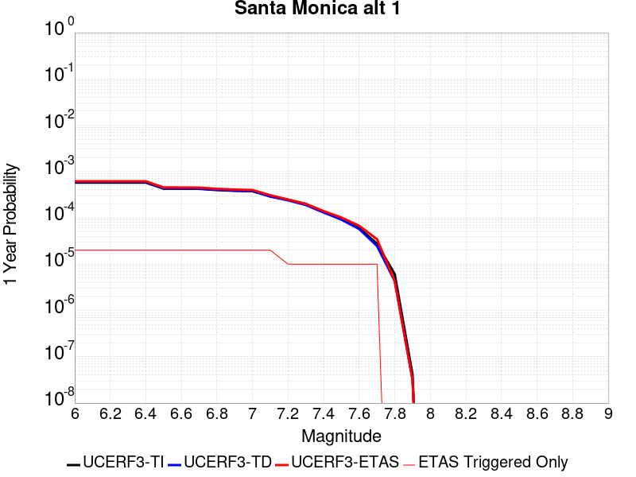 |  |

| Magnitude | 1 wk TI Prob | 1 wk TD Prob | 1 wk ETAS Prob | 1 wk ETAS/TD Gain | 1 wk ETAS Triggered Only | 1 mo TI Prob | 1 mo TD Prob | 1 mo ETAS Prob | 1 mo ETAS/TD Gain | 1 mo ETAS Triggered Only | 1 yr TI Prob | 1 yr TD Prob | 1 yr ETAS Prob | 1 yr ETAS/TD Gain | 1 yr ETAS Triggered Only | 10 yr TI Prob | 10 yr TD Prob | 10 yr ETAS Prob | 10 yr ETAS/TD Gain | 10 yr ETAS Triggered Only |
|-----|-----|-----|-----|-----|-----|-----|-----|-----|-----|-----|-----|-----|-----|-----|-----|-----|-----|-----|-----|-----|
| 6.0 | 1.1066008E-5 | 1.148031E-5 | 5.1518287E-5 | 4.4875345 | 4.0038438E-5 | 4.742488E-5 | 4.920048E-5 | 1.2927341E-4 | 2.627483 | 8.0076876E-5 | 5.7724497E-4 | 5.9886515E-4 | 6.7889405E-4 | 1.1336343 | 8.0076876E-5 | 0.005757478 | 0.0059739 | 0.006093298 | 1.0199865 | 1.2011531E-4 |
| 6.1 | 1.1066008E-5 | 1.148031E-5 | 5.1518287E-5 | 4.4875345 | 4.0038438E-5 | 4.742488E-5 | 4.920048E-5 | 1.2927341E-4 | 2.627483 | 8.0076876E-5 | 5.7724497E-4 | 5.9886515E-4 | 6.7889405E-4 | 1.1336343 | 8.0076876E-5 | 0.005757478 | 0.0059739 | 0.006093298 | 1.0199865 | 1.2011531E-4 |
| 6.2 | 1.1066008E-5 | 1.148031E-5 | 5.1518287E-5 | 4.4875345 | 4.0038438E-5 | 4.742488E-5 | 4.920048E-5 | 1.2927341E-4 | 2.627483 | 8.0076876E-5 | 5.7724497E-4 | 5.9886515E-4 | 6.7889405E-4 | 1.1336343 | 8.0076876E-5 | 0.005757478 | 0.0059739 | 0.006093298 | 1.0199865 | 1.2011531E-4 |
| 6.3 | 1.1066008E-5 | 1.148031E-5 | 5.1518287E-5 | 4.4875345 | 4.0038438E-5 | 4.742488E-5 | 4.920048E-5 | 1.2927341E-4 | 2.627483 | 8.0076876E-5 | 5.7724497E-4 | 5.9886515E-4 | 6.7889405E-4 | 1.1336343 | 8.0076876E-5 | 0.005757478 | 0.0059739 | 0.006093298 | 1.0199865 | 1.2011531E-4 |
| 6.4 | 1.1066008E-5 | 1.148031E-5 | 5.1518287E-5 | 4.4875345 | 4.0038438E-5 | 4.742488E-5 | 4.920048E-5 | 1.2927341E-4 | 2.627483 | 8.0076876E-5 | 5.7724497E-4 | 5.9886515E-4 | 6.7889405E-4 | 1.1336343 | 8.0076876E-5 | 0.005757478 | 0.0059739 | 0.006093298 | 1.0199865 | 1.2011531E-4 |
| 6.5 | 8.183544E-6 | 8.335432E-6 | 4.8373535E-5 | 5.803363 | 4.0038438E-5 | 3.5071862E-5 | 3.57228E-5 | 1.1579681E-4 | 3.2415383 | 8.0076876E-5 | 4.2691626E-4 | 4.3483984E-4 | 5.148819E-4 | 1.1840725 | 8.0076876E-5 | 0.0042609703 | 0.0043400554 | 0.00445965 | 1.0275558 | 1.2011531E-4 |
| 6.6 | 8.1543285E-6 | 8.303646E-6 | 4.834175E-5 | 5.82175 | 4.0038438E-5 | 3.4946657E-5 | 3.5586578E-5 | 1.156606E-4 | 3.2501187 | 8.0076876E-5 | 4.2539247E-4 | 4.3318202E-4 | 5.132242E-4 | 1.1847773 | 8.0076876E-5 | 0.0042457907 | 0.004323542 | 0.004443138 | 1.0276616 | 1.2011531E-4 |
| 6.7 | 8.110878E-6 | 8.257042E-6 | 4.8295147E-5 | 5.8489647 | 4.0038438E-5 | 3.4760444E-5 | 3.5386853E-5 | 1.1546089E-4 | 3.2628188 | 8.0076876E-5 | 4.231262E-4 | 4.3075136E-4 | 5.1079376E-4 | 1.1858203 | 8.0076876E-5 | 0.0042232145 | 0.0042993296 | 0.004418928 | 1.0278181 | 1.2011531E-4 |
| 6.8 | 7.644036E-6 | 7.75106E-6 | 4.7789188E-5 | 6.165503 | 4.0038438E-5 | 3.275974E-5 | 3.3218414E-5 | 1.13292626E-4 | 3.4105368 | 8.0076876E-5 | 3.9877684E-4 | 4.0436056E-4 | 4.8440506E-4 | 1.1979532 | 8.0076876E-5 | 0.00398062 | 0.0040363944 | 0.0041560247 | 1.0296379 | 1.2011531E-4 |
| 6.9 | 7.3698293E-6 | 7.455719E-6 | 4.7493857E-5 | 6.3701243 | 4.0038438E-5 | 3.15846E-5 | 3.19527E-5 | 1.1202701E-4 | 3.5060267 | 8.0076876E-5 | 3.8447464E-4 | 3.8895605E-4 | 4.6900177E-4 | 1.2057964 | 8.0076876E-5 | 0.0038381014 | 0.0038828964 | 0.0040025455 | 1.0308143 | 1.2011531E-4 |
| 7.0 | 7.209872E-6 | 7.2856255E-6 | 4.732377E-5 | 6.4954987 | 4.0038438E-5 | 3.0899086E-5 | 3.1223743E-5 | 1.1129812E-4 | 3.5645347 | 8.0076876E-5 | 3.7613141E-4 | 3.8008415E-4 | 4.601306E-4 | 1.2106019 | 8.0076876E-5 | 0.0037549543 | 0.0037944836 | 0.003914143 | 1.0315351 | 1.2011531E-4 |
| 7.1 | 5.603456E-6 | 5.5238925E-6 | 4.556211E-5 | 8.248189 | 4.0038438E-5 | 2.4014591E-5 | 2.3673612E-5 | 1.0374859E-4 | 4.3824573 | 8.0076876E-5 | 2.923384E-4 | 2.881885E-4 | 3.682423E-4 | 1.2777828 | 8.0076876E-5 | 0.0029195412 | 0.0028781896 | 0.002997959 | 1.0416129 | 1.2011531E-4 |
| 7.2 | 4.7483613E-6 | 4.5911324E-6 | 4.4629385E-5 | 9.720779 | 4.0038438E-5 | 2.0349962E-5 | 1.9676136E-5 | 5.9713784E-5 | 3.034833 | 4.0038438E-5 | 2.4773262E-4 | 2.3953074E-4 | 2.7955958E-4 | 1.1671137 | 4.0038438E-5 | 0.0024745662 | 0.0023927398 | 0.002472625 | 1.0333865 | 8.0076876E-5 |
| 7.3 | 3.829015E-6 | 3.6342253E-6 | 4.3672517E-5 | 12.017009 | 4.0038438E-5 | 1.6409962E-5 | 1.5575159E-5 | 5.561297E-5 | 3.57062 | 4.0038438E-5 | 1.9977297E-4 | 1.8961114E-4 | 2.2964198E-4 | 1.2111207 | 4.0038438E-5 | 0.0019959346 | 0.0018945024 | 0.0019744276 | 1.0421879 | 8.0076876E-5 |
| 7.4 | 2.610755E-6 | 2.4995716E-6 | 4.2537908E-5 | 17.01808 | 4.0038438E-5 | 1.1188902E-5 | 1.0712406E-5 | 5.0750416E-5 | 4.7375364 | 4.0038438E-5 | 1.3621636E-4 | 1.3041578E-4 | 1.70449E-4 | 1.3069661 | 4.0038438E-5 | 0.001361329 | 0.0013033969 | 0.0013833693 | 1.061357 | 8.0076876E-5 |
| 7.5 | 1.792146E-6 | 1.7584184E-6 | 4.1796786E-5 | 23.769533 | 4.0038438E-5 | 7.680603E-6 | 7.536057E-6 | 4.757419E-5 | 6.3128757 | 4.0038438E-5 | 9.3507326E-5 | 9.1747665E-5 | 1.3178244E-4 | 1.4363573 | 4.0038438E-5 | 9.3467993E-4 | 9.1710105E-4 | 9.5710275E-4 | 1.0436176 | 4.0038438E-5 |
| 7.6 | 1.1473018E-6 | 1.1029152E-6 | 4.114131E-5 | 37.30233 | 4.0038438E-5 | 4.9169985E-6 | 4.726771E-6 | 4.476502E-5 | 9.470529 | 4.0038438E-5 | 5.986281E-5 | 5.7546935E-5 | 9.758307E-5 | 1.6957127 | 4.0038438E-5 | 5.984669E-4 | 5.7532196E-4 | 6.153374E-4 | 1.069553 | 4.0038438E-5 |
| 7.7 | 5.330919E-7 | 4.7452556E-7 | 4.0512943E-5 | 85.37568 | 4.0038438E-5 | 2.2846775E-6 | 2.0336795E-6 | 4.2072035E-5 | 20.687643 | 4.0038438E-5 | 2.7815593E-5 | 2.4759778E-5 | 6.479723E-5 | 2.6170356 | 4.0038438E-5 | 2.7812112E-4 | 2.4757133E-4 | 2.8759986E-4 | 1.1616849 | 4.0038438E-5 |
| 7.8 | 1.1668574E-7 | 8.2966224E-8 | 8.2966224E-8 | 1.0 | 0.0 | 5.000816E-7 | 3.5556948E-7 | 3.5556948E-7 | 1.0 | 0.0 | 6.0884768E-6 | 4.32905E-6 | 4.32905E-6 | 1.0 | 0.0 | 6.08831E-5 | 4.3289692E-5 | 4.3289692E-5 | 1.0 | 0.0 |
| 7.9 | 8.007447E-10 | 6.1608785E-10 | 6.1608785E-10 | 1.0 | 0.0 | 3.4317629E-9 | 2.6403764E-9 | 2.6403764E-9 | 1.0 | 0.0 | 4.1781714E-8 | 3.2146584E-8 | 3.2146584E-8 | 1.0 | 0.0 | 4.1781706E-7 | 3.214658E-7 | 3.214658E-7 | 1.0 | 0.0 |

## Santa Ynez River
*[(top)](#table-of-contents)*

| 1 Week | 1 Month | 1 Year | 10 Year |
|-----|-----|-----|-----|
|  |  |  | 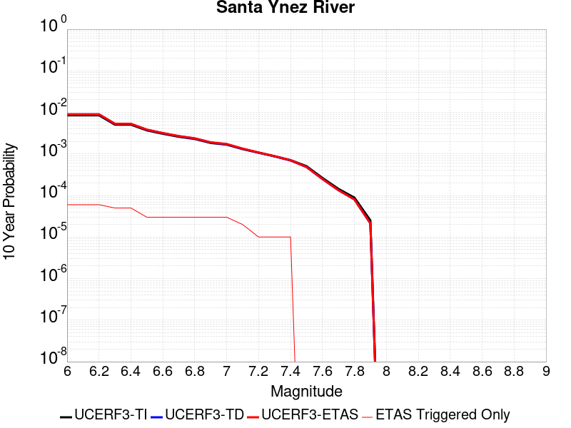 |

| Magnitude | 1 wk TI Prob | 1 wk TD Prob | 1 wk ETAS Prob | 1 wk ETAS/TD Gain | 1 wk ETAS Triggered Only | 1 mo TI Prob | 1 mo TD Prob | 1 mo ETAS Prob | 1 mo ETAS/TD Gain | 1 mo ETAS Triggered Only | 1 yr TI Prob | 1 yr TD Prob | 1 yr ETAS Prob | 1 yr ETAS/TD Gain | 1 yr ETAS Triggered Only | 10 yr TI Prob | 10 yr TD Prob | 10 yr ETAS Prob | 10 yr ETAS/TD Gain | 10 yr ETAS Triggered Only |
|-----|-----|-----|-----|-----|-----|-----|-----|-----|-----|-----|-----|-----|-----|-----|-----|-----|-----|-----|-----|-----|
| 6.0 | 1.6396456E-5 | 1.7209435E-5 | 5.7247184E-5 | 3.3264997 | 4.0038438E-5 | 7.026863E-5 | 7.375284E-5 | 1.1378832E-4 | 1.5428331 | 4.0038438E-5 | 8.551848E-4 | 8.976064E-4 | 9.776114E-4 | 1.0891315 | 8.0076876E-5 | 0.0085190125 | 0.008943358 | 0.009022719 | 1.0088737 | 8.0076876E-5 |
| 6.1 | 1.6396456E-5 | 1.7209435E-5 | 5.7247184E-5 | 3.3264997 | 4.0038438E-5 | 7.026863E-5 | 7.375284E-5 | 1.1378832E-4 | 1.5428331 | 4.0038438E-5 | 8.551848E-4 | 8.976064E-4 | 9.776114E-4 | 1.0891315 | 8.0076876E-5 | 0.0085190125 | 0.008943358 | 0.009022719 | 1.0088737 | 8.0076876E-5 |
| 6.2 | 1.6396456E-5 | 1.7209435E-5 | 5.7247184E-5 | 3.3264997 | 4.0038438E-5 | 7.026863E-5 | 7.375284E-5 | 1.1378832E-4 | 1.5428331 | 4.0038438E-5 | 8.551848E-4 | 8.976064E-4 | 9.776114E-4 | 1.0891315 | 8.0076876E-5 | 0.0085190125 | 0.008943358 | 0.009022719 | 1.0088737 | 8.0076876E-5 |
| 6.3 | 9.736976E-6 | 1.012233E-5 | 5.016036E-5 | 4.9554167 | 4.0038438E-5 | 4.172923E-5 | 4.338072E-5 | 8.341742E-5 | 1.9229145 | 4.0038438E-5 | 5.0793495E-4 | 5.280373E-4 | 6.0807186E-4 | 1.15157 | 8.0076876E-5 | 0.005067755 | 0.005268332 | 0.005347987 | 1.0151196 | 8.0076876E-5 |
| 6.4 | 9.736976E-6 | 1.012233E-5 | 5.016036E-5 | 4.9554167 | 4.0038438E-5 | 4.172923E-5 | 4.338072E-5 | 8.341742E-5 | 1.9229145 | 4.0038438E-5 | 5.0793495E-4 | 5.280373E-4 | 6.0807186E-4 | 1.15157 | 8.0076876E-5 | 0.005067755 | 0.005268332 | 0.005347987 | 1.0151196 | 8.0076876E-5 |
| 6.5 | 7.081964E-6 | 7.3298966E-6 | 4.736804E-5 | 6.462307 | 4.0038438E-5 | 3.035092E-5 | 3.1413474E-5 | 7.145065E-5 | 2.2745225 | 4.0038438E-5 | 3.694598E-4 | 3.8239348E-4 | 4.224166E-4 | 1.1046648 | 4.0038438E-5 | 0.0036884616 | 0.0038175168 | 0.0038574024 | 1.0104481 | 4.0038438E-5 |
| 6.6 | 5.873247E-6 | 6.059743E-6 | 4.609794E-5 | 7.607243 | 4.0038438E-5 | 2.5170815E-5 | 2.5970074E-5 | 6.600747E-5 | 2.5416744 | 4.0038438E-5 | 3.064116E-4 | 3.1614062E-4 | 3.561664E-4 | 1.1266075 | 4.0038438E-5 | 0.0030598943 | 0.0031569963 | 0.0031969084 | 1.0126424 | 4.0038438E-5 |
| 6.7 | 4.973277E-6 | 5.115901E-6 | 4.5154135E-5 | 8.826233 | 4.0038438E-5 | 2.1313872E-5 | 2.1925109E-5 | 6.1962666E-5 | 2.8261054 | 4.0038438E-5 | 2.5946548E-4 | 2.66906E-4 | 3.0693374E-4 | 1.1499695 | 4.0038438E-5 | 0.0025916274 | 0.0026659032 | 0.0027058348 | 1.0149786 | 4.0038438E-5 |
| 6.8 | 4.396492E-6 | 4.5109778E-6 | 4.4549233E-5 | 9.875738 | 4.0038438E-5 | 1.884197E-5 | 1.9332621E-5 | 5.9370283E-5 | 3.0709898 | 4.0038438E-5 | 2.2937685E-4 | 2.3534958E-4 | 2.7537858E-4 | 1.1700832 | 4.0038438E-5 | 0.0022914023 | 0.0023510386 | 0.002390983 | 1.0169901 | 4.0038438E-5 |
| 6.9 | 3.5255632E-6 | 3.6013332E-6 | 4.3639626E-5 | 12.11763 | 4.0038438E-5 | 1.5109469E-5 | 1.5434196E-5 | 5.5472014E-5 | 3.5940983 | 4.0038438E-5 | 1.8394225E-4 | 1.8789528E-4 | 2.279262E-4 | 1.213049 | 4.0038438E-5 | 0.0018379007 | 0.0018773803 | 0.0019173436 | 1.0212867 | 4.0038438E-5 |
| 7.0 | 3.211603E-6 | 3.273654E-6 | 4.331196E-5 | 13.230463 | 4.0038438E-5 | 1.376394E-5 | 1.4029872E-5 | 5.4067747E-5 | 3.8537593 | 4.0038438E-5 | 1.6756308E-4 | 1.7080043E-4 | 2.1083203E-4 | 1.2343764 | 4.0038438E-5 | 0.0016743679 | 0.0017067058 | 0.0017466759 | 1.0234195 | 4.0038438E-5 |
| 7.1 | 2.5094619E-6 | 2.5409204E-6 | 4.2579257E-5 | 16.757414 | 4.0038438E-5 | 1.0754793E-5 | 1.0889614E-5 | 5.0927614E-5 | 4.6767144 | 4.0038438E-5 | 1.3093173E-4 | 1.3257304E-4 | 1.7260617E-4 | 1.3019704 | 4.0038438E-5 | 0.0013085462 | 0.0013249456 | 0.001364931 | 1.0301789 | 4.0038438E-5 |
| 7.2 | 2.0515774E-6 | 2.0619375E-6 | 2.0619375E-6 | 1.0 | 0.0 | 8.792445E-6 | 8.836846E-6 | 8.836846E-6 | 1.0 | 0.0 | 1.0704277E-4 | 1.0758333E-4 | 1.0758333E-4 | 1.0 | 0.0 | 0.0010699122 | 0.0010753168 | 0.0010753168 | 1.0 | 0.0 |
| 7.3 | 1.6845745E-6 | 1.6773907E-6 | 1.6773907E-6 | 1.0 | 0.0 | 7.219585E-6 | 7.1887976E-6 | 7.1887976E-6 | 1.0 | 0.0 | 8.78949E-5 | 8.752012E-5 | 8.752012E-5 | 1.0 | 0.0 | 8.7860145E-4 | 8.7485946E-4 | 8.7485946E-4 | 1.0 | 0.0 |
| 7.4 | 1.3600285E-6 | 1.3333357E-6 | 1.3333357E-6 | 1.0 | 0.0 | 5.82868E-6 | 5.714284E-6 | 5.714284E-6 | 1.0 | 0.0 | 7.096187E-5 | 6.956921E-5 | 6.956921E-5 | 1.0 | 0.0 | 7.0939213E-4 | 6.954765E-4 | 6.954765E-4 | 1.0 | 0.0 |
| 7.5 | 9.735342E-7 | 9.290103E-7 | 9.290103E-7 | 1.0 | 0.0 | 4.172283E-6 | 3.9814668E-6 | 3.9814668E-6 | 1.0 | 0.0 | 5.079636E-5 | 4.8473295E-5 | 4.8473295E-5 | 1.0 | 0.0 | 5.0784746E-4 | 4.8462892E-4 | 4.8462892E-4 | 1.0 | 0.0 |
| 7.6 | 5.067187E-7 | 4.77857E-7 | 4.77857E-7 | 1.0 | 0.0 | 2.1716498E-6 | 2.047957E-6 | 2.047957E-6 | 1.0 | 0.0 | 2.6439517E-5 | 2.4933597E-5 | 2.4933597E-5 | 1.0 | 0.0 | 2.643637E-4 | 2.4930874E-4 | 2.4930874E-4 | 1.0 | 0.0 |
| 7.7 | 2.769089E-7 | 2.5759124E-7 | 2.5759124E-7 | 1.0 | 0.0 | 1.1867519E-6 | 1.1039621E-6 | 1.1039621E-6 | 1.0 | 0.0 | 1.4448608E-5 | 1.34406555E-5 | 1.34406555E-5 | 1.0 | 0.0 | 1.444767E-4 | 1.3439846E-4 | 1.3439846E-4 | 1.0 | 0.0 |
| 7.8 | 1.7044663E-7 | 1.5449015E-7 | 1.5449015E-7 | 1.0 | 0.0 | 7.3048534E-7 | 6.621005E-7 | 6.621005E-7 | 1.0 | 0.0 | 8.893623E-6 | 8.061043E-6 | 8.061043E-6 | 1.0 | 0.0 | 8.893267E-5 | 8.060753E-5 | 8.060753E-5 | 1.0 | 0.0 |
| 7.9 | 4.8344287E-8 | 4.0910923E-8 | 4.0910923E-8 | 1.0 | 0.0 | 2.0718979E-7 | 1.7533252E-7 | 1.7533252E-7 | 1.0 | 0.0 | 2.5225327E-6 | 2.1346711E-6 | 2.1346711E-6 | 1.0 | 0.0 | 2.5225041E-5 | 2.1346512E-5 | 2.1346512E-5 | 1.0 | 0.0 |

## Hollywood
*[(top)](#table-of-contents)*

| 1 Week | 1 Month | 1 Year | 10 Year |
|-----|-----|-----|-----|
|  |  |  |  |

| Magnitude | 1 wk TI Prob | 1 wk TD Prob | 1 wk ETAS Prob | 1 wk ETAS/TD Gain | 1 wk ETAS Triggered Only | 1 mo TI Prob | 1 mo TD Prob | 1 mo ETAS Prob | 1 mo ETAS/TD Gain | 1 mo ETAS Triggered Only | 1 yr TI Prob | 1 yr TD Prob | 1 yr ETAS Prob | 1 yr ETAS/TD Gain | 1 yr ETAS Triggered Only | 10 yr TI Prob | 10 yr TD Prob | 10 yr ETAS Prob | 10 yr ETAS/TD Gain | 10 yr ETAS Triggered Only |
|-----|-----|-----|-----|-----|-----|-----|-----|-----|-----|-----|-----|-----|-----|-----|-----|-----|-----|-----|-----|-----|
| 6.0 | 1.24487615E-5 | 1.2593226E-5 | 5.263116E-5 | 4.179323 | 4.0038438E-5 | 5.3350745E-5 | 5.3969878E-5 | 1.3404244E-4 | 2.4836526 | 8.0076876E-5 | 6.4935174E-4 | 6.568898E-4 | 7.369141E-4 | 1.121823 | 8.0076876E-5 | 0.0064745755 | 0.006549969 | 0.0066692973 | 1.0182182 | 1.2011531E-4 |
| 6.1 | 1.24487615E-5 | 1.2593226E-5 | 5.263116E-5 | 4.179323 | 4.0038438E-5 | 5.3350745E-5 | 5.3969878E-5 | 1.3404244E-4 | 2.4836526 | 8.0076876E-5 | 6.4935174E-4 | 6.568898E-4 | 7.369141E-4 | 1.121823 | 8.0076876E-5 | 0.0064745755 | 0.006549969 | 0.0066692973 | 1.0182182 | 1.2011531E-4 |
| 6.2 | 1.24487615E-5 | 1.2593226E-5 | 5.263116E-5 | 4.179323 | 4.0038438E-5 | 5.3350745E-5 | 5.3969878E-5 | 1.3404244E-4 | 2.4836526 | 8.0076876E-5 | 6.4935174E-4 | 6.568898E-4 | 7.369141E-4 | 1.121823 | 8.0076876E-5 | 0.0064745755 | 0.006549969 | 0.0066692973 | 1.0182182 | 1.2011531E-4 |
| 6.3 | 1.24487615E-5 | 1.2593226E-5 | 5.263116E-5 | 4.179323 | 4.0038438E-5 | 5.3350745E-5 | 5.3969878E-5 | 1.3404244E-4 | 2.4836526 | 8.0076876E-5 | 6.4935174E-4 | 6.568898E-4 | 7.369141E-4 | 1.121823 | 8.0076876E-5 | 0.0064745755 | 0.006549969 | 0.0066692973 | 1.0182182 | 1.2011531E-4 |
| 6.4 | 1.2431024E-5 | 1.2573839E-5 | 5.2611773E-5 | 4.184225 | 4.0038438E-5 | 5.327473E-5 | 5.3886797E-5 | 1.3395936E-4 | 2.4859402 | 8.0076876E-5 | 6.4842677E-4 | 6.558789E-4 | 7.359033E-4 | 1.1220108 | 8.0076876E-5 | 0.0064653796 | 0.0065399194 | 0.0066592493 | 1.0182464 | 1.2011531E-4 |
| 6.5 | 1.1242222E-5 | 1.13178E-5 | 5.1355782E-5 | 4.537612 | 4.0038438E-5 | 4.8180063E-5 | 4.850397E-5 | 1.2857697E-4 | 2.6508543 | 8.0076876E-5 | 5.864344E-4 | 5.9037853E-4 | 6.7040813E-4 | 1.1355565 | 8.0076876E-5 | 0.0058488925 | 0.005888388 | 0.006007796 | 1.0202786 | 1.2011531E-4 |
| 6.6 | 1.1234066E-5 | 1.13089145E-5 | 5.13469E-5 | 4.5403914 | 4.0038438E-5 | 4.8145106E-5 | 4.846589E-5 | 1.2853889E-4 | 2.6521516 | 8.0076876E-5 | 5.86009E-4 | 5.8991514E-4 | 6.6994474E-4 | 1.1356629 | 8.0076876E-5 | 0.005844661 | 0.0058837784 | 0.006003187 | 1.0202945 | 1.2011531E-4 |
| 6.7 | 1.12294E-5 | 1.1303658E-5 | 5.134164E-5 | 4.542038 | 4.0038438E-5 | 4.812511E-5 | 4.8443362E-5 | 1.2851636E-4 | 2.6529198 | 8.0076876E-5 | 5.857657E-4 | 5.89641E-4 | 6.6967064E-4 | 1.1357261 | 8.0076876E-5 | 0.0058422405 | 0.005881052 | 0.0060004606 | 1.020304 | 1.2011531E-4 |
| 6.8 | 1.0252819E-5 | 1.0218445E-5 | 5.0256473E-5 | 4.9182115 | 4.0038438E-5 | 4.3939912E-5 | 4.379261E-5 | 1.2386598E-4 | 2.8284676 | 8.0076876E-5 | 5.3483713E-4 | 5.330467E-4 | 6.130809E-4 | 1.1501448 | 8.0076876E-5 | 0.005335517 | 0.005317908 | 0.005437384 | 1.0224668 | 1.2011531E-4 |
| 6.9 | 9.252289E-6 | 9.110306E-6 | 4.9148377E-5 | 5.3948107 | 4.0038438E-5 | 3.9652066E-5 | 3.9043593E-5 | 1.1911734E-4 | 3.0508807 | 8.0076876E-5 | 4.8265693E-4 | 4.752537E-4 | 5.552925E-4 | 1.1684128 | 8.0076876E-5 | 0.0048161 | 0.004742547 | 0.0048620924 | 1.025207 | 1.2011531E-4 |
| 7.0 | 8.474604E-6 | 8.258257E-6 | 4.8296362E-5 | 5.8482513 | 4.0038438E-5 | 3.6319227E-5 | 3.539206E-5 | 1.154661E-4 | 3.2624862 | 8.0076876E-5 | 4.4209688E-4 | 4.3081454E-4 | 5.108569E-4 | 1.1857932 | 8.0076876E-5 | 0.004412184 | 0.004299944 | 0.004419543 | 1.027814 | 1.2011531E-4 |
| 7.1 | 6.643643E-6 | 6.2683675E-6 | 4.630655E-5 | 7.3873386 | 4.0038438E-5 | 2.8472443E-5 | 2.6864158E-5 | 1.0693888E-4 | 3.980727 | 8.0076876E-5 | 3.4659685E-4 | 3.2702246E-4 | 4.0707315E-4 | 1.2447865 | 8.0076876E-5 | 0.0034605677 | 0.0032654584 | 0.0033851813 | 1.0366635 | 1.2011531E-4 |
| 7.2 | 5.549002E-6 | 5.108709E-6 | 4.5146942E-5 | 8.837251 | 4.0038438E-5 | 2.378122E-5 | 2.1894284E-5 | 6.1931845E-5 | 2.8286762 | 4.0038438E-5 | 2.8949787E-4 | 2.6653046E-4 | 3.065582E-4 | 1.1501808 | 4.0038438E-5 | 0.0028912104 | 0.0026621243 | 0.002741988 | 1.03 | 8.0076876E-5 |
| 7.3 | 4.3059727E-6 | 3.9598885E-6 | 4.3998167E-5 | 11.110961 | 4.0038438E-5 | 1.8454039E-5 | 1.6970842E-5 | 5.7008598E-5 | 3.3592088 | 4.0038438E-5 | 2.2465475E-4 | 2.066005E-4 | 2.4663066E-4 | 1.1937563 | 4.0038438E-5 | 0.0022442779 | 0.0020640944 | 0.0021440058 | 1.0387151 | 8.0076876E-5 |
| 7.4 | 2.8550733E-6 | 2.7012966E-6 | 4.2739626E-5 | 15.821893 | 4.0038438E-5 | 1.2235971E-5 | 1.1576934E-5 | 5.161491E-5 | 4.4584265 | 4.0038438E-5 | 1.4896276E-4 | 1.409401E-4 | 1.809729E-4 | 1.2840412 | 4.0038438E-5 | 0.0014886294 | 0.0014085122 | 0.0014884764 | 1.056772 | 8.0076876E-5 |
| 7.5 | 1.9927045E-6 | 1.8976367E-6 | 4.1935997E-5 | 22.099066 | 4.0038438E-5 | 8.540134E-6 | 8.132703E-6 | 4.8170816E-5 | 5.9231 | 4.0038438E-5 | 1.0397117E-4 | 9.90112E-5 | 1.3904567E-4 | 1.4043429 | 4.0038438E-5 | 0.0010392254 | 9.896745E-4 | 0.0010296733 | 1.0404161 | 4.0038438E-5 |
| 7.6 | 1.345084E-6 | 1.2216007E-6 | 4.1259987E-5 | 33.77535 | 4.0038438E-5 | 5.764633E-6 | 5.235421E-6 | 4.527365E-5 | 8.647566 | 4.0038438E-5 | 7.018215E-5 | 6.3739404E-5 | 1.03775295E-4 | 1.6281183 | 4.0038438E-5 | 7.0159987E-4 | 6.3721323E-4 | 6.7722617E-4 | 1.0627936 | 4.0038438E-5 |
| 7.7 | 7.6835164E-7 | 6.277697E-7 | 4.0666182E-5 | 64.778824 | 4.0038438E-5 | 3.2929315E-6 | 2.6904388E-6 | 4.2728767E-5 | 15.88171 | 4.0038438E-5 | 4.00907E-5 | 3.2755615E-5 | 7.279274E-5 | 2.2222981 | 4.0038438E-5 | 4.0083472E-4 | 3.2750933E-4 | 3.6753467E-4 | 1.1222112 | 4.0038438E-5 |
| 7.8 | 3.6562128E-7 | 2.453479E-7 | 2.453479E-7 | 1.0 | 0.0 | 1.5669474E-6 | 1.0514907E-6 | 1.0514907E-6 | 1.0 | 0.0 | 1.9077417E-5 | 1.2801827E-5 | 1.2801827E-5 | 1.0 | 0.0 | 1.907578E-4 | 1.2801126E-4 | 1.2801126E-4 | 1.0 | 0.0 |
| 7.9 | 7.5024424E-8 | 5.3816795E-8 | 5.3816795E-8 | 1.0 | 0.0 | 3.215332E-7 | 2.306434E-7 | 2.306434E-7 | 1.0 | 0.0 | 3.91466E-6 | 2.808081E-6 | 2.808081E-6 | 1.0 | 0.0 | 3.9145907E-5 | 2.8080585E-5 | 2.8080585E-5 | 1.0 | 0.0 |

## Hosgri
*[(top)](#table-of-contents)*

| 1 Week | 1 Month | 1 Year | 10 Year |
|-----|-----|-----|-----|
|  |  |  |  |

| Magnitude | 1 wk TI Prob | 1 wk TD Prob | 1 wk ETAS Prob | 1 wk ETAS/TD Gain | 1 wk ETAS Triggered Only | 1 mo TI Prob | 1 mo TD Prob | 1 mo ETAS Prob | 1 mo ETAS/TD Gain | 1 mo ETAS Triggered Only | 1 yr TI Prob | 1 yr TD Prob | 1 yr ETAS Prob | 1 yr ETAS/TD Gain | 1 yr ETAS Triggered Only | 10 yr TI Prob | 10 yr TD Prob | 10 yr ETAS Prob | 10 yr ETAS/TD Gain | 10 yr ETAS Triggered Only |
|-----|-----|-----|-----|-----|-----|-----|-----|-----|-----|-----|-----|-----|-----|-----|-----|-----|-----|-----|-----|-----|
| 6.0 | 2.883978E-5 | 2.9128416E-5 | 1.09202956E-4 | 3.749018 | 8.0076876E-5 | 1.235932E-4 | 1.2483024E-4 | 2.0489712E-4 | 1.641406 | 8.0076876E-5 | 0.0015037085 | 0.001518776 | 0.0015987313 | 1.0526445 | 8.0076876E-5 | 0.01493574 | 0.01508774 | 0.015166609 | 1.0052273 | 8.0076876E-5 |
| 6.1 | 2.883978E-5 | 2.9128416E-5 | 1.09202956E-4 | 3.749018 | 8.0076876E-5 | 1.235932E-4 | 1.2483024E-4 | 2.0489712E-4 | 1.641406 | 8.0076876E-5 | 0.0015037085 | 0.001518776 | 0.0015987313 | 1.0526445 | 8.0076876E-5 | 0.01493574 | 0.01508774 | 0.015166609 | 1.0052273 | 8.0076876E-5 |
| 6.2 | 2.883978E-5 | 2.9128416E-5 | 1.09202956E-4 | 3.749018 | 8.0076876E-5 | 1.235932E-4 | 1.2483024E-4 | 2.0489712E-4 | 1.641406 | 8.0076876E-5 | 0.0015037085 | 0.001518776 | 0.0015987313 | 1.0526445 | 8.0076876E-5 | 0.01493574 | 0.01508774 | 0.015166609 | 1.0052273 | 8.0076876E-5 |
| 6.3 | 2.2914428E-5 | 2.2641969E-5 | 1.0271703E-4 | 4.5365767 | 8.0076876E-5 | 9.8200995E-5 | 9.703343E-5 | 1.7710253E-4 | 1.8251703 | 8.0076876E-5 | 0.0011949413 | 0.0011807467 | 0.001260729 | 1.0677388 | 8.0076876E-5 | 0.011885363 | 0.011746133 | 0.011825269 | 1.0067372 | 8.0076876E-5 |
| 6.4 | 2.0195741E-5 | 1.969656E-5 | 9.977186E-5 | 5.065446 | 8.0076876E-5 | 8.65503E-5 | 8.4411105E-5 | 1.6448123E-4 | 1.9485732 | 8.0076876E-5 | 0.0010532405 | 0.0010272227 | 0.0011072173 | 1.0778747 | 8.0076876E-5 | 0.010482626 | 0.010225792 | 0.010305051 | 1.0077507 | 8.0076876E-5 |
| 6.5 | 1.9924333E-5 | 1.940898E-5 | 9.94843E-5 | 5.125684 | 8.0076876E-5 | 8.53872E-5 | 8.3178704E-5 | 1.6324891E-4 | 1.9626287 | 8.0076876E-5 | 0.0010390934 | 0.0010122322 | 0.001092228 | 1.0790291 | 8.0076876E-5 | 0.010342481 | 0.010077253 | 0.010156523 | 1.0078663 | 8.0076876E-5 |
| 6.6 | 1.809694E-5 | 1.74583E-5 | 9.7533775E-5 | 5.586671 | 8.0076876E-5 | 7.7556004E-5 | 7.4819145E-5 | 1.5489003E-4 | 2.0701923 | 8.0076876E-5 | 9.438353E-4 | 9.105437E-4 | 9.905477E-4 | 1.0878639 | 8.0076876E-5 | 0.009398366 | 0.009069073 | 0.009148424 | 1.0087496 | 8.0076876E-5 |
| 6.7 | 1.675989E-5 | 1.6042764E-5 | 9.6118354E-5 | 5.9913836 | 8.0076876E-5 | 7.182612E-5 | 6.87529E-5 | 1.4882427E-4 | 2.1646254 | 8.0076876E-5 | 8.7413215E-4 | 8.3674624E-4 | 9.167561E-4 | 1.0956203 | 8.0076876E-5 | 0.008707017 | 0.0083368635 | 0.008416273 | 1.0095251 | 8.0076876E-5 |
| 6.8 | 1.5401129E-5 | 1.4614083E-5 | 9.4689785E-5 | 6.479352 | 8.0076876E-5 | 6.6003166E-5 | 6.2630286E-5 | 1.4270213E-4 | 2.2784848 | 8.0076876E-5 | 8.032922E-4 | 7.622578E-4 | 8.4227364E-4 | 1.1049721 | 8.0076876E-5 | 0.008003947 | 0.007597296 | 0.007676765 | 1.0104601 | 8.0076876E-5 |
| 6.9 | 1.356559E-5 | 1.2689968E-5 | 9.2765826E-5 | 7.3101707 | 8.0076876E-5 | 5.8136946E-5 | 5.4384444E-5 | 1.3445696E-4 | 2.4723423 | 8.0076876E-5 | 7.0758746E-4 | 6.619299E-4 | 7.419537E-4 | 1.1208948 | 8.0076876E-5 | 0.007053386 | 0.006600388 | 0.0066799363 | 1.012052 | 8.0076876E-5 |
| 7.0 | 1.2030819E-5 | 1.1095962E-5 | 9.117195E-5 | 8.216679 | 8.0076876E-5 | 5.155963E-5 | 4.7553254E-5 | 1.2762632E-4 | 2.683861 | 8.0076876E-5 | 6.275577E-4 | 5.7880714E-4 | 6.588377E-4 | 1.138268 | 8.0076876E-5 | 0.006257884 | 0.005773757 | 0.0058533717 | 1.013789 | 8.0076876E-5 |
| 7.1 | 1.0972698E-5 | 1.0022179E-5 | 1.0022179E-5 | 1.0 | 0.0 | 4.7025E-5 | 4.2951488E-5 | 4.2951488E-5 | 1.0 | 0.0 | 5.72379E-4 | 5.22809E-4 | 5.22809E-4 | 1.0 | 0.0 | 0.0057090693 | 0.005216542 | 0.005216542 | 1.0 | 0.0 |
| 7.2 | 9.961926E-6 | 9.034746E-6 | 9.034746E-6 | 1.0 | 0.0 | 4.2693267E-5 | 3.8719765E-5 | 3.8719765E-5 | 1.0 | 0.0 | 5.1966653E-4 | 4.713112E-4 | 4.713112E-4 | 1.0 | 0.0 | 0.00518453 | 0.0047038626 | 0.0047038626 | 1.0 | 0.0 |
| 7.3 | 8.700929E-6 | 7.8281E-6 | 7.8281E-6 | 1.0 | 0.0 | 3.7289166E-5 | 3.354857E-5 | 3.354857E-5 | 1.0 | 0.0 | 4.53901E-4 | 4.0837732E-4 | 4.0837732E-4 | 1.0 | 0.0 | 0.00452975 | 0.004077008 | 0.004077008 | 1.0 | 0.0 |
| 7.4 | 7.866285E-6 | 6.998739E-6 | 6.998739E-6 | 1.0 | 0.0 | 3.3712215E-5 | 2.9994251E-5 | 2.9994251E-5 | 1.0 | 0.0 | 4.103689E-4 | 3.6511885E-4 | 3.6511885E-4 | 1.0 | 0.0 | 0.004096119 | 0.0036459267 | 0.0036459267 | 1.0 | 0.0 |
| 7.5 | 6.8381305E-6 | 5.9596955E-6 | 5.9596955E-6 | 1.0 | 0.0 | 2.9305946E-5 | 2.5541302E-5 | 2.5541302E-5 | 1.0 | 0.0 | 3.5674145E-4 | 3.10921E-4 | 3.10921E-4 | 1.0 | 0.0 | 0.0035616932 | 0.0031055948 | 0.0031055948 | 1.0 | 0.0 |
| 7.6 | 5.503376E-6 | 4.5952443E-6 | 4.5952443E-6 | 1.0 | 0.0 | 2.3585684E-5 | 1.9693754E-5 | 1.9693754E-5 | 1.0 | 0.0 | 2.8711787E-4 | 2.397451E-4 | 2.397451E-4 | 1.0 | 0.0 | 0.002867472 | 0.0023955975 | 0.0023955975 | 1.0 | 0.0 |
| 7.7 | 3.6144982E-6 | 2.6522112E-6 | 2.6522112E-6 | 1.0 | 0.0 | 1.5490614E-5 | 1.1366569E-5 | 1.1366569E-5 | 1.0 | 0.0 | 1.8858191E-4 | 1.383792E-4 | 1.383792E-4 | 1.0 | 0.0 | 0.0018842196 | 0.0013836613 | 0.0013836613 | 1.0 | 0.0 |
| 7.8 | 1.9853494E-6 | 1.1361129E-6 | 1.1361129E-6 | 1.0 | 0.0 | 8.508612E-6 | 4.8690463E-6 | 4.8690463E-6 | 1.0 | 0.0 | 1.0358743E-4 | 5.9279027E-5 | 5.9279027E-5 | 1.0 | 0.0 | 0.0010353916 | 5.9336185E-4 | 5.9336185E-4 | 1.0 | 0.0 |
| 7.9 | 1.1818757E-6 | 5.2951856E-7 | 5.2951856E-7 | 1.0 | 0.0 | 5.0651715E-6 | 2.2693632E-6 | 2.2693632E-6 | 1.0 | 0.0 | 6.1666724E-5 | 2.7629147E-5 | 2.7629147E-5 | 1.0 | 0.0 | 6.1649614E-4 | 2.7694515E-4 | 2.7694515E-4 | 1.0 | 0.0 |
| 8.0 | 6.962958E-7 | 2.7139782E-7 | 2.7139782E-7 | 1.0 | 0.0 | 2.9841215E-6 | 1.163133E-6 | 1.163133E-6 | 1.0 | 0.0 | 3.6331072E-5 | 1.4161053E-5 | 1.4161053E-5 | 1.0 | 0.0 | 3.6325134E-4 | 1.4217179E-4 | 1.4217179E-4 | 1.0 | 0.0 |
| 8.1 | 1.5033264E-7 | 6.527624E-8 | 6.527624E-8 | 1.0 | 0.0 | 6.442826E-7 | 2.7975528E-7 | 2.7975528E-7 | 1.0 | 0.0 | 7.844113E-6 | 3.4060151E-6 | 3.4060151E-6 | 1.0 | 0.0 | 7.843835E-5 | 3.407693E-5 | 3.407693E-5 | 1.0 | 0.0 |

## Cady
*[(top)](#table-of-contents)*

| 1 Week | 1 Month | 1 Year | 10 Year |
|-----|-----|-----|-----|
|  |  |  |  |

| Magnitude | 1 wk TI Prob | 1 wk TD Prob | 1 wk ETAS Prob | 1 wk ETAS/TD Gain | 1 wk ETAS Triggered Only | 1 mo TI Prob | 1 mo TD Prob | 1 mo ETAS Prob | 1 mo ETAS/TD Gain | 1 mo ETAS Triggered Only | 1 yr TI Prob | 1 yr TD Prob | 1 yr ETAS Prob | 1 yr ETAS/TD Gain | 1 yr ETAS Triggered Only | 10 yr TI Prob | 10 yr TD Prob | 10 yr ETAS Prob | 10 yr ETAS/TD Gain | 10 yr ETAS Triggered Only |
|-----|-----|-----|-----|-----|-----|-----|-----|-----|-----|-----|-----|-----|-----|-----|-----|-----|-----|-----|-----|-----|
| 6.0 | 1.9892565E-5 | 2.1858728E-5 | 1.0193385E-4 | 4.663302 | 8.0076876E-5 | 8.525106E-5 | 9.3677416E-5 | 1.7374678E-4 | 1.854735 | 8.0076876E-5 | 0.0010374374 | 0.0011400167 | 0.0012200023 | 1.0701618 | 8.0076876E-5 | 0.010326075 | 0.011350701 | 0.011469453 | 1.010462 | 1.2011531E-4 |
| 6.1 | 1.9892565E-5 | 2.1858728E-5 | 1.0193385E-4 | 4.663302 | 8.0076876E-5 | 8.525106E-5 | 9.3677416E-5 | 1.7374678E-4 | 1.854735 | 8.0076876E-5 | 0.0010374374 | 0.0011400167 | 0.0012200023 | 1.0701618 | 8.0076876E-5 | 0.010326075 | 0.011350701 | 0.011469453 | 1.010462 | 1.2011531E-4 |
| 6.2 | 1.9892565E-5 | 2.1858728E-5 | 1.0193385E-4 | 4.663302 | 8.0076876E-5 | 8.525106E-5 | 9.3677416E-5 | 1.7374678E-4 | 1.854735 | 8.0076876E-5 | 0.0010374374 | 0.0011400167 | 0.0012200023 | 1.0701618 | 8.0076876E-5 | 0.010326075 | 0.011350701 | 0.011469453 | 1.010462 | 1.2011531E-4 |
| 6.3 | 1.1117327E-5 | 1.2176583E-5 | 5.2214535E-5 | 4.2881103 | 4.0038438E-5 | 4.764482E-5 | 5.2184492E-5 | 9.222084E-5 | 1.7672077 | 4.0038438E-5 | 5.7992124E-4 | 6.351925E-4 | 6.752055E-4 | 1.0629935 | 4.0038438E-5 | 0.0057841022 | 0.0063368753 | 0.0064164447 | 1.0125566 | 8.0076876E-5 |
| 6.4 | 1.1117327E-5 | 1.2176583E-5 | 5.2214535E-5 | 4.2881103 | 4.0038438E-5 | 4.764482E-5 | 5.2184492E-5 | 9.222084E-5 | 1.7672077 | 4.0038438E-5 | 5.7992124E-4 | 6.351925E-4 | 6.752055E-4 | 1.0629935 | 4.0038438E-5 | 0.0057841022 | 0.0063368753 | 0.0064164447 | 1.0125566 | 8.0076876E-5 |
| 6.5 | 6.103093E-6 | 6.672021E-6 | 4.671019E-5 | 7.000906 | 4.0038438E-5 | 2.615585E-5 | 2.8594131E-5 | 6.863142E-5 | 2.4001927 | 4.0038438E-5 | 3.1840094E-4 | 3.480905E-4 | 3.88115E-4 | 1.1149831 | 4.0038438E-5 | 0.0031794512 | 0.0034766865 | 0.003556485 | 1.0229524 | 8.0076876E-5 |
| 6.6 | 5.817237E-6 | 6.3656585E-6 | 6.3656585E-6 | 1.0 | 0.0 | 2.4930776E-5 | 2.728118E-5 | 2.728118E-5 | 1.0 | 0.0 | 3.034899E-4 | 3.3211018E-4 | 3.3211018E-4 | 1.0 | 0.0 | 0.0030307577 | 0.0033173605 | 0.003357266 | 1.0120293 | 4.0038438E-5 |
| 6.7 | 4.8846314E-6 | 5.3405684E-6 | 5.3405684E-6 | 1.0 | 0.0 | 2.0933967E-5 | 2.2888014E-5 | 2.2888014E-5 | 1.0 | 0.0 | 2.5484123E-4 | 2.7863772E-4 | 2.7863772E-4 | 1.0 | 0.0 | 0.0025454918 | 0.0027840391 | 0.002823966 | 1.0143414 | 4.0038438E-5 |
| 6.8 | 1.7788773E-6 | 1.9399079E-6 | 1.9399079E-6 | 1.0 | 0.0 | 7.6237375E-6 | 8.313874E-6 | 8.313874E-6 | 1.0 | 0.0 | 9.281505E-5 | 1.01218284E-4 | 1.01218284E-4 | 1.0 | 0.0 | 9.2776294E-4 | 0.0010118765 | 0.0010118765 | 1.0 | 0.0 |
| 6.9 | 7.5455404E-7 | 8.297092E-7 | 8.297092E-7 | 1.0 | 0.0 | 3.233799E-6 | 3.5558937E-6 | 3.5558937E-6 | 1.0 | 0.0 | 3.937079E-5 | 4.3292483E-5 | 4.3292483E-5 | 1.0 | 0.0 | 3.9363815E-4 | 4.3287344E-4 | 4.3287344E-4 | 1.0 | 0.0 |
| 7.0 | 6.8578805E-7 | 7.541816E-7 | 7.541816E-7 | 1.0 | 0.0 | 2.9390883E-6 | 3.2322048E-6 | 3.2322048E-6 | 1.0 | 0.0 | 3.578281E-5 | 3.9351715E-5 | 3.9351715E-5 | 1.0 | 0.0 | 3.577705E-4 | 3.9347992E-4 | 3.9347992E-4 | 1.0 | 0.0 |

## Red Mountain
*[(top)](#table-of-contents)*

| 1 Week | 1 Month | 1 Year | 10 Year |
|-----|-----|-----|-----|
|  |  |  |  |

| Magnitude | 1 wk TI Prob | 1 wk TD Prob | 1 wk ETAS Prob | 1 wk ETAS/TD Gain | 1 wk ETAS Triggered Only | 1 mo TI Prob | 1 mo TD Prob | 1 mo ETAS Prob | 1 mo ETAS/TD Gain | 1 mo ETAS Triggered Only | 1 yr TI Prob | 1 yr TD Prob | 1 yr ETAS Prob | 1 yr ETAS/TD Gain | 1 yr ETAS Triggered Only | 10 yr TI Prob | 10 yr TD Prob | 10 yr ETAS Prob | 10 yr ETAS/TD Gain | 10 yr ETAS Triggered Only |
|-----|-----|-----|-----|-----|-----|-----|-----|-----|-----|-----|-----|-----|-----|-----|-----|-----|-----|-----|-----|-----|
| 6.0 | 4.1810763E-5 | 4.7589947E-5 | 8.7626475E-5 | 1.8412813 | 4.0038438E-5 | 1.7917668E-4 | 2.039419E-4 | 2.4397217E-4 | 1.1962827 | 4.0038438E-5 | 0.0021792934 | 0.0024803306 | 0.0025602088 | 1.0322046 | 8.0076876E-5 | 0.021580452 | 0.024544092 | 0.024661258 | 1.0047737 | 1.2011531E-4 |
| 6.1 | 4.1810763E-5 | 4.7589947E-5 | 8.7626475E-5 | 1.8412813 | 4.0038438E-5 | 1.7917668E-4 | 2.039419E-4 | 2.4397217E-4 | 1.1962827 | 4.0038438E-5 | 0.0021792934 | 0.0024803306 | 0.0025602088 | 1.0322046 | 8.0076876E-5 | 0.021580452 | 0.024544092 | 0.024661258 | 1.0047737 | 1.2011531E-4 |
| 6.2 | 4.1810763E-5 | 4.7589947E-5 | 8.7626475E-5 | 1.8412813 | 4.0038438E-5 | 1.7917668E-4 | 2.039419E-4 | 2.4397217E-4 | 1.1962827 | 4.0038438E-5 | 0.0021792934 | 0.0024803306 | 0.0025602088 | 1.0322046 | 8.0076876E-5 | 0.021580452 | 0.024544092 | 0.024661258 | 1.0047737 | 1.2011531E-4 |
| 6.3 | 4.1810763E-5 | 4.7589947E-5 | 8.7626475E-5 | 1.8412813 | 4.0038438E-5 | 1.7917668E-4 | 2.039419E-4 | 2.4397217E-4 | 1.1962827 | 4.0038438E-5 | 0.0021792934 | 0.0024803306 | 0.0025602088 | 1.0322046 | 8.0076876E-5 | 0.021580452 | 0.024544092 | 0.024661258 | 1.0047737 | 1.2011531E-4 |
| 6.4 | 4.1810763E-5 | 4.7589947E-5 | 8.7626475E-5 | 1.8412813 | 4.0038438E-5 | 1.7917668E-4 | 2.039419E-4 | 2.4397217E-4 | 1.1962827 | 4.0038438E-5 | 0.0021792934 | 0.0024803306 | 0.0025602088 | 1.0322046 | 8.0076876E-5 | 0.021580452 | 0.024544092 | 0.024661258 | 1.0047737 | 1.2011531E-4 |
| 6.5 | 3.154503E-5 | 3.5359728E-5 | 7.539675E-5 | 2.1322775 | 4.0038438E-5 | 1.3518598E-4 | 1.5153342E-4 | 1.9156578E-4 | 1.2641819 | 4.0038438E-5 | 0.0016446467 | 0.0018434501 | 0.0019233794 | 1.0433586 | 8.0076876E-5 | 0.01632528 | 0.018291233 | 0.018369846 | 1.0042979 | 8.0076876E-5 |
| 6.6 | 3.1535834E-5 | 3.534911E-5 | 7.538613E-5 | 2.1326175 | 4.0038438E-5 | 1.3514658E-4 | 1.5148791E-4 | 1.9152027E-4 | 1.2642611 | 4.0038438E-5 | 0.0016441676 | 0.001842897 | 0.0019228264 | 1.0433716 | 8.0076876E-5 | 0.01632056 | 0.018285794 | 0.018364407 | 1.0042992 | 8.0076876E-5 |
| 6.7 | 2.8267326E-5 | 3.146934E-5 | 7.150652E-5 | 2.27226 | 4.0038438E-5 | 1.2114006E-4 | 1.348621E-4 | 1.7489515E-4 | 1.2968442 | 4.0038438E-5 | 0.0014738824 | 0.0016407946 | 0.00172074 | 1.0487237 | 8.0076876E-5 | 0.014641452 | 0.016295563 | 0.016374335 | 1.0048339 | 8.0076876E-5 |
| 6.8 | 2.8212884E-5 | 3.1407224E-5 | 7.14444E-5 | 2.274776 | 4.0038438E-5 | 1.20906756E-4 | 1.3459593E-4 | 1.7462898E-4 | 1.2974313 | 4.0038438E-5 | 0.0014710457 | 0.0016375587 | 0.0017175045 | 1.04882 | 8.0076876E-5 | 0.014613459 | 0.01626368 | 0.016342454 | 1.0048436 | 8.0076876E-5 |
| 6.9 | 2.4227871E-5 | 2.6706979E-5 | 6.6744346E-5 | 2.499135 | 4.0038438E-5 | 1.03829596E-4 | 1.14453884E-4 | 1.5448775E-4 | 1.3497815 | 4.0038438E-5 | 0.0012633923 | 0.0013926612 | 0.0014726266 | 1.0574191 | 8.0076876E-5 | 0.012562336 | 0.013847026 | 0.013925994 | 1.0057029 | 8.0076876E-5 |
| 7.0 | 2.348524E-5 | 2.5835763E-5 | 6.5873166E-5 | 2.5496893 | 4.0038438E-5 | 1.0064714E-4 | 1.1072042E-4 | 1.5075442E-4 | 1.3615774 | 4.0038438E-5 | 0.0012246901 | 0.0013472632 | 0.0014272322 | 1.0593566 | 8.0076876E-5 | 0.012179627 | 0.01339859 | 0.013477594 | 1.0058964 | 8.0076876E-5 |
| 7.1 | 2.2311642E-5 | 2.4462828E-5 | 6.450029E-5 | 2.636665 | 4.0038438E-5 | 9.561782E-5 | 1.048369E-4 | 1.4487114E-4 | 1.3818716 | 4.0038438E-5 | 0.0011635252 | 0.0012757168 | 0.0013556915 | 1.06269 | 8.0076876E-5 | 0.01157452 | 0.012691451 | 0.012770512 | 1.0062294 | 8.0076876E-5 |
| 7.2 | 1.6533986E-5 | 1.7670347E-5 | 5.7708075E-5 | 3.2658145 | 4.0038438E-5 | 7.085802E-5 | 7.572822E-5 | 1.1576362E-4 | 1.5286722 | 4.0038438E-5 | 8.623549E-4 | 9.216645E-4 | 0.0010016676 | 1.0868028 | 8.0076876E-5 | 0.008590161 | 0.009184699 | 0.00926404 | 1.0086384 | 8.0076876E-5 |
| 7.3 | 1.4703092E-5 | 1.555952E-5 | 5.5597335E-5 | 3.5732036 | 4.0038438E-5 | 6.301173E-5 | 6.66823E-5 | 1.0671807E-4 | 1.6003957 | 4.0038438E-5 | 7.668978E-4 | 8.1161625E-4 | 8.516222E-4 | 1.0492917 | 4.0038438E-5 | 0.0076425658 | 0.008092596 | 0.008132311 | 1.0049075 | 4.0038438E-5 |
| 7.4 | 6.1331984E-6 | 5.528872E-6 | 5.528872E-6 | 1.0 | 0.0 | 2.6284872E-5 | 2.3694953E-5 | 2.3694953E-5 | 1.0 | 0.0 | 3.199713E-4 | 2.8844838E-4 | 2.8844838E-4 | 1.0 | 0.0 | 0.0031951098 | 0.0028807942 | 0.0028807942 | 1.0 | 0.0 |
| 7.5 | 5.954766E-6 | 5.3385015E-6 | 5.3385015E-6 | 1.0 | 0.0 | 2.5520176E-5 | 2.2879094E-5 | 2.2879094E-5 | 1.0 | 0.0 | 3.1066386E-4 | 2.785179E-4 | 2.785179E-4 | 1.0 | 0.0 | 0.003102299 | 0.0027817423 | 0.0027817423 | 1.0 | 0.0 |
| 7.6 | 4.9726646E-6 | 4.315295E-6 | 4.315295E-6 | 1.0 | 0.0 | 2.1311245E-5 | 1.8493993E-5 | 1.8493993E-5 | 1.0 | 0.0 | 2.5943352E-4 | 2.2514143E-4 | 2.2514143E-4 | 1.0 | 0.0 | 0.0025913084 | 0.002249168 | 0.002249168 | 1.0 | 0.0 |
| 7.7 | 3.3613894E-6 | 2.8526642E-6 | 2.8526642E-6 | 1.0 | 0.0 | 1.4405875E-5 | 1.2225649E-5 | 1.2225649E-5 | 1.0 | 0.0 | 1.7537741E-4 | 1.4883737E-4 | 1.4883737E-4 | 1.0 | 0.0 | 0.0017523908 | 0.0014874031 | 0.0014874031 | 1.0 | 0.0 |
| 7.8 | 1.1828961E-6 | 1.0122756E-6 | 1.0122756E-6 | 1.0 | 0.0 | 5.069545E-6 | 4.338317E-6 | 4.338317E-6 | 1.0 | 0.0 | 6.171996E-5 | 5.281776E-5 | 5.281776E-5 | 1.0 | 0.0 | 6.170282E-4 | 5.2805495E-4 | 5.2805495E-4 | 1.0 | 0.0 |
| 7.9 | 2.2967266E-7 | 1.8618952E-7 | 1.8618952E-7 | 1.0 | 0.0 | 9.843111E-7 | 7.9795484E-7 | 7.9795484E-7 | 1.0 | 0.0 | 1.19839215E-5 | 9.7150605E-6 | 9.7150605E-6 | 1.0 | 0.0 | 1.1983275E-4 | 9.714664E-5 | 9.714664E-5 | 1.0 | 0.0 |

## Deep Springs
*[(top)](#table-of-contents)*

| 1 Week | 1 Month | 1 Year | 10 Year |
|-----|-----|-----|-----|
|  |  |  |  |

| Magnitude | 1 wk TI Prob | 1 wk TD Prob | 1 wk ETAS Prob | 1 wk ETAS/TD Gain | 1 wk ETAS Triggered Only | 1 mo TI Prob | 1 mo TD Prob | 1 mo ETAS Prob | 1 mo ETAS/TD Gain | 1 mo ETAS Triggered Only | 1 yr TI Prob | 1 yr TD Prob | 1 yr ETAS Prob | 1 yr ETAS/TD Gain | 1 yr ETAS Triggered Only | 10 yr TI Prob | 10 yr TD Prob | 10 yr ETAS Prob | 10 yr ETAS/TD Gain | 10 yr ETAS Triggered Only |
|-----|-----|-----|-----|-----|-----|-----|-----|-----|-----|-----|-----|-----|-----|-----|-----|-----|-----|-----|-----|-----|
| 6.0 | 1.9810619E-5 | 2.311252E-5 | 6.315003E-5 | 2.7322867 | 4.0038438E-5 | 8.489989E-5 | 9.905276E-5 | 2.1915617E-4 | 2.2125196 | 1.2011531E-4 | 0.001033166 | 0.0012058079 | 0.0013257784 | 1.0994939 | 1.2011531E-4 | 0.010283757 | 0.012042425 | 0.012161094 | 1.0098542 | 1.2011531E-4 |
| 6.1 | 1.9810619E-5 | 2.311252E-5 | 6.315003E-5 | 2.7322867 | 4.0038438E-5 | 8.489989E-5 | 9.905276E-5 | 2.1915617E-4 | 2.2125196 | 1.2011531E-4 | 0.001033166 | 0.0012058079 | 0.0013257784 | 1.0994939 | 1.2011531E-4 | 0.010283757 | 0.012042425 | 0.012161094 | 1.0098542 | 1.2011531E-4 |
| 6.2 | 1.9810619E-5 | 2.311252E-5 | 6.315003E-5 | 2.7322867 | 4.0038438E-5 | 8.489989E-5 | 9.905276E-5 | 2.1915617E-4 | 2.2125196 | 1.2011531E-4 | 0.001033166 | 0.0012058079 | 0.0013257784 | 1.0994939 | 1.2011531E-4 | 0.010283757 | 0.012042425 | 0.012161094 | 1.0098542 | 1.2011531E-4 |
| 6.3 | 1.9810619E-5 | 2.311252E-5 | 6.315003E-5 | 2.7322867 | 4.0038438E-5 | 8.489989E-5 | 9.905276E-5 | 2.1915617E-4 | 2.2125196 | 1.2011531E-4 | 0.001033166 | 0.0012058079 | 0.0013257784 | 1.0994939 | 1.2011531E-4 | 0.010283757 | 0.012042425 | 0.012161094 | 1.0098542 | 1.2011531E-4 |
| 6.4 | 1.9810619E-5 | 2.311252E-5 | 6.315003E-5 | 2.7322867 | 4.0038438E-5 | 8.489989E-5 | 9.905276E-5 | 2.1915617E-4 | 2.2125196 | 1.2011531E-4 | 0.001033166 | 0.0012058079 | 0.0013257784 | 1.0994939 | 1.2011531E-4 | 0.010283757 | 0.012042425 | 0.012161094 | 1.0098542 | 1.2011531E-4 |
| 6.5 | 1.7190405E-5 | 2.0050555E-5 | 6.008819E-5 | 2.996834 | 4.0038438E-5 | 7.367108E-5 | 8.593095E-5 | 2.0603594E-4 | 2.3976917 | 1.2011531E-4 | 8.9657627E-4 | 0.0010462094 | 0.001166199 | 1.11469 | 1.2011531E-4 | 0.008929676 | 0.010462056 | 0.010580915 | 1.0113609 | 1.2011531E-4 |
| 6.6 | 1.7190405E-5 | 2.0050555E-5 | 6.008819E-5 | 2.996834 | 4.0038438E-5 | 7.367108E-5 | 8.593095E-5 | 2.0603594E-4 | 2.3976917 | 1.2011531E-4 | 8.9657627E-4 | 0.0010462094 | 0.001166199 | 1.11469 | 1.2011531E-4 | 0.008929676 | 0.010462056 | 0.010580915 | 1.0113609 | 1.2011531E-4 |

## Imperial
*[(top)](#table-of-contents)*

| 1 Week | 1 Month | 1 Year | 10 Year |
|-----|-----|-----|-----|
|  |  |  |  |

| Magnitude | 1 wk TI Prob | 1 wk TD Prob | 1 wk ETAS Prob | 1 wk ETAS/TD Gain | 1 wk ETAS Triggered Only | 1 mo TI Prob | 1 mo TD Prob | 1 mo ETAS Prob | 1 mo ETAS/TD Gain | 1 mo ETAS Triggered Only | 1 yr TI Prob | 1 yr TD Prob | 1 yr ETAS Prob | 1 yr ETAS/TD Gain | 1 yr ETAS Triggered Only | 10 yr TI Prob | 10 yr TD Prob | 10 yr ETAS Prob | 10 yr ETAS/TD Gain | 10 yr ETAS Triggered Only |
|-----|-----|-----|-----|-----|-----|-----|-----|-----|-----|-----|-----|-----|-----|-----|-----|-----|-----|-----|-----|-----|
| 6.0 | 2.7496446E-4 | 5.0552754E-4 | 5.455457E-4 | 1.0791613 | 4.0038438E-5 | 0.0011778869 | 0.002164787 | 0.0022047388 | 1.0184553 | 4.0038438E-5 | 0.0142467655 | 0.026038699 | 0.02611669 | 1.0029953 | 8.0076876E-5 | 0.13367249 | 0.2280438 | 0.22813651 | 1.0004066 | 1.2011531E-4 |
| 6.1 | 2.5356023E-4 | 4.8656776E-4 | 5.265867E-4 | 1.0822475 | 4.0038438E-5 | 0.001086234 | 0.0020836622 | 0.0021236173 | 1.0191754 | 4.0038438E-5 | 0.013144928 | 0.025071215 | 0.025149284 | 1.0031139 | 8.0076876E-5 | 0.123940155 | 0.21947981 | 0.21957356 | 1.0004271 | 1.2011531E-4 |
| 6.2 | 2.4820742E-4 | 4.7752203E-4 | 5.1754137E-4 | 1.0838063 | 4.0038438E-5 | 0.0010633124 | 0.0020449557 | 0.0020849123 | 1.0195391 | 4.0038438E-5 | 0.01286919 | 0.024611235 | 0.024689341 | 1.0031736 | 8.0076876E-5 | 0.12148927 | 0.21598552 | 0.2160797 | 1.0004361 | 1.2011531E-4 |
| 6.3 | 2.3205351E-4 | 4.5890483E-4 | 4.9892487E-4 | 1.0872078 | 4.0038438E-5 | 9.94136E-4 | 0.0019652895 | 0.0020052493 | 1.0203328 | 4.0038438E-5 | 0.012036599 | 0.02366133 | 0.023739513 | 1.0033042 | 8.0076876E-5 | 0.11405133 | 0.20793462 | 0.20802976 | 1.0004575 | 1.2011531E-4 |
| 6.4 | 2.0304754E-4 | 3.987652E-4 | 4.3878765E-4 | 1.100366 | 4.0038438E-5 | 8.6991355E-4 | 0.0017078889 | 0.0017478591 | 1.0234032 | 4.0038438E-5 | 0.010539869 | 0.020595672 | 0.020674098 | 1.003808 | 8.0076876E-5 | 0.100537635 | 0.1850669 | 0.18516478 | 1.0005289 | 1.2011531E-4 |
| 6.5 | 1.854992E-4 | 3.6988858E-4 | 4.099122E-4 | 1.1082046 | 4.0038438E-5 | 7.9475436E-4 | 0.0015842861 | 0.001624261 | 1.0252322 | 4.0038438E-5 | 0.009633281 | 0.01911948 | 0.019198027 | 1.0041082 | 8.0076876E-5 | 0.0922623 | 0.173298 | 0.1733642 | 1.000382 | 8.0076876E-5 |
| 6.6 | 1.6586106E-4 | 3.403506E-4 | 3.8037542E-4 | 1.1175988 | 4.0038438E-5 | 7.106394E-4 | 0.0014578402 | 0.0014978204 | 1.0274242 | 4.0038438E-5 | 0.008617763 | 0.01760642 | 0.017685087 | 1.0044681 | 8.0076876E-5 | 0.08291132 | 0.16077545 | 0.16084264 | 1.000418 | 8.0076876E-5 |
| 6.7 | 1.4224656E-4 | 3.076692E-4 | 3.4769528E-4 | 1.1300946 | 4.0038438E-5 | 6.094856E-4 | 0.001317924 | 0.0013579098 | 1.0303398 | 4.0038438E-5 | 0.0073952693 | 0.015929576 | 0.016008379 | 1.0049468 | 8.0076876E-5 | 0.07153955 | 0.14648417 | 0.1465525 | 1.0004666 | 8.0076876E-5 |
| 6.8 | 1.2317259E-4 | 2.779122E-4 | 3.179395E-4 | 1.1440287 | 4.0038438E-5 | 5.2777573E-4 | 0.0011905148 | 0.0012305055 | 1.0335912 | 4.0038438E-5 | 0.0064067547 | 0.0143995695 | 0.0144784935 | 1.005481 | 8.0076876E-5 | 0.06225166 | 0.13293684 | 0.13300626 | 1.0005223 | 8.0076876E-5 |
| 6.9 | 9.859898E-5 | 2.5014306E-4 | 2.9017148E-4 | 1.1600221 | 4.0038438E-5 | 4.2249862E-4 | 0.0010716055 | 0.001111601 | 1.037323 | 4.0038438E-5 | 0.0051317946 | 0.012969712 | 0.01304875 | 1.0060941 | 8.0076876E-5 | 0.05014893 | 0.11940631 | 0.11947683 | 1.0005906 | 8.0076876E-5 |
| 7.0 | 7.3191884E-5 | 2.1266776E-4 | 2.5269768E-4 | 1.1882275 | 4.0038438E-5 | 3.136418E-4 | 9.1111806E-4 | 9.5112005E-4 | 1.0439043 | 4.0038438E-5 | 0.003811904 | 0.011037128 | 0.01111632 | 1.0071752 | 8.0076876E-5 | 0.037471764 | 0.10206493 | 0.10213683 | 1.0007045 | 8.0076876E-5 |
| 7.1 | 7.1760296E-5 | 2.0968143E-4 | 2.4971148E-4 | 1.1909089 | 4.0038438E-5 | 3.0750787E-4 | 8.983284E-4 | 9.3833084E-4 | 1.0445299 | 4.0038438E-5 | 0.003737482 | 0.010882978 | 0.010962184 | 1.007278 | 8.0076876E-5 | 0.03675245 | 0.10070146 | 0.10077347 | 1.0007151 | 8.0076876E-5 |
| 7.2 | 6.46614E-5 | 1.9136685E-4 | 2.3139763E-4 | 1.2091835 | 4.0038438E-5 | 2.7709085E-4 | 8.1988896E-4 | 8.5989456E-4 | 1.0487939 | 4.0038438E-5 | 0.0033683628 | 0.0099370815 | 0.010016363 | 1.0079783 | 8.0076876E-5 | 0.033177625 | 0.09250898 | 0.092581645 | 1.0007856 | 8.0076876E-5 |
| 7.3 | 6.088115E-5 | 1.78084E-4 | 2.181153E-4 | 1.2247889 | 4.0038438E-5 | 2.6089314E-4 | 7.6299673E-4 | 8.030046E-4 | 1.0524352 | 4.0038438E-5 | 0.0031717476 | 0.009250494 | 0.009329829 | 1.0085764 | 8.0076876E-5 | 0.031268585 | 0.08655989 | 0.08663304 | 1.0008451 | 8.0076876E-5 |
| 7.4 | 4.199346E-5 | 1.1510366E-4 | 1.5513749E-4 | 1.3478067 | 4.0038438E-5 | 1.7995955E-4 | 4.9320905E-4 | 5.3322775E-4 | 1.0811394 | 4.0038438E-5 | 0.0021888057 | 0.0059884563 | 0.0060680537 | 1.0132918 | 8.0076876E-5 | 0.02167372 | 0.057439793 | 0.05751527 | 1.001314 | 8.0076876E-5 |
| 7.5 | 3.130448E-5 | 8.33328E-5 | 1.233679E-4 | 1.4804243 | 4.0038438E-5 | 1.3415517E-4 | 3.57092E-4 | 3.9711615E-4 | 1.1120836 | 4.0038438E-5 | 0.0016321153 | 0.004338988 | 0.0044187177 | 1.0183752 | 8.0076876E-5 | 0.016201803 | 0.04213201 | 0.042208713 | 1.0018206 | 8.0076876E-5 |
| 7.6 | 2.3074248E-5 | 6.0844646E-5 | 1.0088065E-4 | 1.6580037 | 4.0038438E-5 | 9.888588E-5 | 2.6073685E-4 | 3.0076483E-4 | 1.1535188 | 4.0038438E-5 | 0.0012032706 | 0.0031698733 | 0.0032496965 | 1.0251818 | 8.0076876E-5 | 0.011967761 | 0.031026395 | 0.031103987 | 1.0025009 | 8.0076876E-5 |
| 7.7 | 1.45864815E-5 | 4.0124698E-5 | 4.0124698E-5 | 1.0 | 0.0 | 6.2511994E-5 | 1.7195169E-4 | 1.7195169E-4 | 1.0 | 0.0 | 7.608177E-4 | 0.0020915072 | 0.0021314619 | 1.0191033 | 4.0038438E-5 | 0.007582182 | 0.020627763 | 0.020666976 | 1.0019009 | 4.0038438E-5 |
| 7.8 | 1.0352979E-5 | 3.0960902E-5 | 3.0960902E-5 | 1.0 | 0.0 | 4.4369157E-5 | 1.3268284E-4 | 1.3268284E-4 | 1.0 | 0.0 | 5.400606E-4 | 0.0016142189 | 0.0016541928 | 1.0247636 | 4.0038438E-5 | 0.0053875 | 0.016016833 | 0.01605623 | 1.0024598 | 4.0038438E-5 |
| 7.9 | 8.137906E-6 | 2.2149103E-5 | 2.2149103E-5 | 1.0 | 0.0 | 3.4876273E-5 | 9.492128E-5 | 9.492128E-5 | 1.0 | 0.0 | 4.2453592E-4 | 0.0011550548 | 0.0011950469 | 1.0346236 | 4.0038438E-5 | 0.004237258 | 0.011617903 | 0.0116574755 | 1.0034063 | 4.0038438E-5 |
| 8.0 | 6.93792E-6 | 1.8008766E-5 | 1.8008766E-5 | 1.0 | 0.0 | 2.9733603E-5 | 7.717814E-5 | 7.717814E-5 | 1.0 | 0.0 | 3.6194647E-4 | 9.3923963E-4 | 9.792404E-4 | 1.0425885 | 4.0038438E-5 | 0.0036135751 | 0.00950155 | 0.009541209 | 1.0041739 | 4.0038438E-5 |
| 8.1 | 3.4286315E-6 | 6.379872E-6 | 6.379872E-6 | 1.0 | 0.0 | 1.4694053E-5 | 2.7342023E-5 | 2.7342023E-5 | 1.0 | 0.0 | 1.7888541E-4 | 3.328384E-4 | 3.328384E-4 | 1.0 | 0.0 | 0.0017874148 | 0.003486031 | 0.003486031 | 1.0 | 0.0 |
| 8.2 | 1.4906886E-6 | 1.9366646E-6 | 1.9366646E-6 | 1.0 | 0.0 | 6.3886496E-6 | 8.299965E-6 | 8.299965E-6 | 1.0 | 0.0 | 7.7779034E-5 | 1.0104742E-4 | 1.0104742E-4 | 1.0 | 0.0 | 7.775182E-4 | 0.0011075331 | 0.0011075331 | 1.0 | 0.0 |
| 8.3 | 2.5758007E-8 | 1.4500102E-8 | 1.4500102E-8 | 1.0 | 0.0 | 1.10391454E-7 | 6.214329E-8 | 6.214329E-8 | 1.0 | 0.0 | 1.3440151E-6 | 7.565946E-7 | 7.565946E-7 | 1.0 | 0.0 | 1.344007E-5 | 7.887763E-6 | 7.887763E-6 | 1.0 | 0.0 |

## Cedar Mtn-Mahogany Mtn
*[(top)](#table-of-contents)*

| 1 Week | 1 Month | 1 Year | 10 Year |
|-----|-----|-----|-----|
|  |  |  |  |

| Magnitude | 1 wk TI Prob | 1 wk TD Prob | 1 wk ETAS Prob | 1 wk ETAS/TD Gain | 1 wk ETAS Triggered Only | 1 mo TI Prob | 1 mo TD Prob | 1 mo ETAS Prob | 1 mo ETAS/TD Gain | 1 mo ETAS Triggered Only | 1 yr TI Prob | 1 yr TD Prob | 1 yr ETAS Prob | 1 yr ETAS/TD Gain | 1 yr ETAS Triggered Only | 10 yr TI Prob | 10 yr TD Prob | 10 yr ETAS Prob | 10 yr ETAS/TD Gain | 10 yr ETAS Triggered Only |
|-----|-----|-----|-----|-----|-----|-----|-----|-----|-----|-----|-----|-----|-----|-----|-----|-----|-----|-----|-----|-----|
| 6.0 | 2.7763876E-5 | 2.9588866E-5 | 1.4970062E-4 | 5.0593567 | 1.2011531E-4 | 1.1898261E-4 | 1.2680366E-4 | 2.4690374E-4 | 1.9471343 | 1.2011531E-4 | 0.0014476506 | 0.0015428112 | 0.0016627412 | 1.0777347 | 1.2011531E-4 | 0.0143825635 | 0.015328225 | 0.015446499 | 1.0077161 | 1.2011531E-4 |
| 6.1 | 1.6162443E-5 | 1.7142966E-5 | 9.7218464E-5 | 5.6710415 | 8.0076876E-5 | 6.926578E-5 | 7.346788E-5 | 1.5353887E-4 | 2.0898774 | 8.0076876E-5 | 8.4298453E-4 | 8.941221E-4 | 9.7412744E-4 | 1.0894791 | 8.0076876E-5 | 0.008397939 | 0.008907059 | 0.008986423 | 1.0089102 | 8.0076876E-5 |
| 6.2 | 1.6162443E-5 | 1.7142966E-5 | 9.7218464E-5 | 5.6710415 | 8.0076876E-5 | 6.926578E-5 | 7.346788E-5 | 1.5353887E-4 | 2.0898774 | 8.0076876E-5 | 8.4298453E-4 | 8.941221E-4 | 9.7412744E-4 | 1.0894791 | 8.0076876E-5 | 0.008397939 | 0.008907059 | 0.008986423 | 1.0089102 | 8.0076876E-5 |
| 6.3 | 9.746053E-6 | 1.0303152E-5 | 9.03792E-5 | 8.771996 | 8.0076876E-5 | 4.1768133E-5 | 4.415564E-5 | 1.2422897E-4 | 2.813434 | 8.0076876E-5 | 5.0840835E-4 | 5.3746643E-4 | 6.175002E-4 | 1.1489094 | 8.0076876E-5 | 0.0050724675 | 0.005362084 | 0.005441732 | 1.0148538 | 8.0076876E-5 |
| 6.4 | 9.746053E-6 | 1.0303152E-5 | 9.03792E-5 | 8.771996 | 8.0076876E-5 | 4.1768133E-5 | 4.415564E-5 | 1.2422897E-4 | 2.813434 | 8.0076876E-5 | 5.0840835E-4 | 5.3746643E-4 | 6.175002E-4 | 1.1489094 | 8.0076876E-5 | 0.0050724675 | 0.005362084 | 0.005441732 | 1.0148538 | 8.0076876E-5 |
| 6.5 | 7.290083E-6 | 7.695325E-6 | 4.7733454E-5 | 6.202916 | 4.0038438E-5 | 3.124284E-5 | 3.297956E-5 | 7.301667E-5 | 2.213998 | 4.0038438E-5 | 3.8031515E-4 | 4.014543E-4 | 4.4147667E-4 | 1.0996934 | 4.0038438E-5 | 0.0037966494 | 0.004007511 | 0.004047389 | 1.0099508 | 4.0038438E-5 |
| 6.6 | 5.67907E-6 | 5.9891527E-6 | 4.602735E-5 | 7.6851187 | 4.0038438E-5 | 2.4338644E-5 | 2.5667552E-5 | 6.570496E-5 | 2.5598452 | 4.0038438E-5 | 2.962827E-4 | 3.12459E-4 | 3.5248493E-4 | 1.1280998 | 4.0038438E-5 | 0.0029588798 | 0.003120333 | 0.0031602464 | 1.0127914 | 4.0038438E-5 |
| 6.7 | 3.4853963E-6 | 3.672631E-6 | 4.371092E-5 | 11.9018 | 4.0038438E-5 | 1.4937327E-5 | 1.5739755E-5 | 5.5777564E-5 | 3.5437374 | 4.0038438E-5 | 1.8184677E-4 | 1.916153E-4 | 2.3164606E-4 | 1.2089121 | 4.0038438E-5 | 0.0018169804 | 0.0019145629 | 0.0019545245 | 1.0208726 | 4.0038438E-5 |
| 6.8 | 2.7535168E-6 | 2.9015764E-6 | 4.2939897E-5 | 14.798817 | 4.0038438E-5 | 1.1800733E-5 | 1.2435271E-5 | 5.247321E-5 | 4.219708 | 4.0038438E-5 | 1.4366445E-4 | 1.5138938E-4 | 1.9142176E-4 | 1.2644331 | 4.0038438E-5 | 0.0014357162 | 0.0015129098 | 0.0015528876 | 1.0264245 | 4.0038438E-5 |
| 6.9 | 1.6594106E-6 | 1.7496985E-6 | 1.7496985E-6 | 1.0 | 0.0 | 7.1117406E-6 | 7.4986883E-6 | 7.4986883E-6 | 1.0 | 0.0 | 8.6582E-5 | 9.129302E-5 | 9.129302E-5 | 1.0 | 0.0 | 8.654827E-4 | 9.125856E-4 | 9.125856E-4 | 1.0 | 0.0 |
| 7.0 | 5.10215E-7 | 5.389254E-7 | 5.389254E-7 | 1.0 | 0.0 | 2.186634E-6 | 2.3096788E-6 | 2.3096788E-6 | 1.0 | 0.0 | 2.6621943E-5 | 2.8120105E-5 | 2.8120105E-5 | 1.0 | 0.0 | 2.6618753E-4 | 2.81178E-4 | 2.81178E-4 | 1.0 | 0.0 |

## San Diego Trough north alt1
*[(top)](#table-of-contents)*

| 1 Week | 1 Month | 1 Year | 10 Year |
|-----|-----|-----|-----|
|  |  |  |  |

| Magnitude | 1 wk TI Prob | 1 wk TD Prob | 1 wk ETAS Prob | 1 wk ETAS/TD Gain | 1 wk ETAS Triggered Only | 1 mo TI Prob | 1 mo TD Prob | 1 mo ETAS Prob | 1 mo ETAS/TD Gain | 1 mo ETAS Triggered Only | 1 yr TI Prob | 1 yr TD Prob | 1 yr ETAS Prob | 1 yr ETAS/TD Gain | 1 yr ETAS Triggered Only | 10 yr TI Prob | 10 yr TD Prob | 10 yr ETAS Prob | 10 yr ETAS/TD Gain | 10 yr ETAS Triggered Only |
|-----|-----|-----|-----|-----|-----|-----|-----|-----|-----|-----|-----|-----|-----|-----|-----|-----|-----|-----|-----|-----|
| 6.0 | 7.329252E-5 | 8.821093E-5 | 2.0831564E-4 | 2.3615627 | 1.2011531E-4 | 3.14073E-4 | 3.7799572E-4 | 4.980656E-4 | 1.3176489 | 1.2011531E-4 | 0.0038171355 | 0.004593027 | 0.0047125905 | 1.0260315 | 1.2011531E-4 | 0.03752231 | 0.045044992 | 0.045159694 | 1.0025464 | 1.2011531E-4 |
| 6.1 | 3.7940346E-5 | 4.4885E-5 | 8.4921645E-5 | 1.8919826 | 4.0038438E-5 | 1.6259136E-4 | 1.9235066E-4 | 2.323814E-4 | 1.2081133 | 4.0038438E-5 | 0.0019777524 | 0.0023394432 | 0.002379388 | 1.0170745 | 4.0038438E-5 | 0.019602431 | 0.023156688 | 0.023195798 | 1.001689 | 4.0038438E-5 |
| 6.2 | 2.8645263E-5 | 3.329678E-5 | 7.333388E-5 | 2.2024317 | 4.0038438E-5 | 1.2275964E-4 | 1.4269284E-4 | 1.8272556E-4 | 1.2805518 | 4.0038438E-5 | 0.0014935739 | 0.0017359189 | 0.0017758878 | 1.0230247 | 4.0038438E-5 | 0.0148357535 | 0.017226247 | 0.017265595 | 1.0022843 | 4.0038438E-5 |
| 6.3 | 2.8645263E-5 | 3.329678E-5 | 7.333388E-5 | 2.2024317 | 4.0038438E-5 | 1.2275964E-4 | 1.4269284E-4 | 1.8272556E-4 | 1.2805518 | 4.0038438E-5 | 0.0014935739 | 0.0017359189 | 0.0017758878 | 1.0230247 | 4.0038438E-5 | 0.0148357535 | 0.017226247 | 0.017265595 | 1.0022843 | 4.0038438E-5 |
| 6.4 | 2.2204576E-5 | 2.5448318E-5 | 6.5485736E-5 | 2.5732834 | 4.0038438E-5 | 9.5159E-5 | 1.0905972E-4 | 1.4909379E-4 | 1.3670839 | 4.0038438E-5 | 0.001157945 | 0.0013270034 | 0.0013669886 | 1.030132 | 4.0038438E-5 | 0.011519298 | 0.013191955 | 0.013231465 | 1.002995 | 4.0038438E-5 |
| 6.5 | 2.1004838E-5 | 2.4024694E-5 | 6.406217E-5 | 2.6665134 | 4.0038438E-5 | 9.0017624E-5 | 1.0295896E-4 | 1.4299327E-4 | 1.3888376 | 4.0038438E-5 | 0.0010954136 | 0.0012528138 | 0.0012928022 | 1.0319188 | 4.0038438E-5 | 0.010900296 | 0.012458589 | 0.012498128 | 1.0031737 | 4.0038438E-5 |
| 6.6 | 1.820557E-5 | 2.0704787E-5 | 6.0742394E-5 | 2.9337368 | 4.0038438E-5 | 7.802154E-5 | 8.873181E-5 | 1.287667E-4 | 1.4511898 | 4.0038438E-5 | 9.4949827E-4 | 0.0010797799 | 0.0011197751 | 1.0370401 | 4.0038438E-5 | 0.009454516 | 0.010746004 | 0.010785612 | 1.0036858 | 4.0038438E-5 |
| 6.7 | 1.5884485E-5 | 1.7983646E-5 | 5.8021364E-5 | 3.2263403 | 4.0038438E-5 | 6.807459E-5 | 7.707051E-5 | 1.1710586E-4 | 1.5194639 | 4.0038438E-5 | 8.284929E-4 | 9.3793223E-4 | 9.779332E-4 | 1.042648 | 4.0038438E-5 | 0.008254109 | 0.009340104 | 0.009379768 | 1.0042467 | 4.0038438E-5 |
| 6.8 | 1.4331171E-5 | 1.6201066E-5 | 5.6238852E-5 | 3.471306 | 4.0038438E-5 | 6.141786E-5 | 6.94313E-5 | 1.0946696E-4 | 1.5766226 | 4.0038438E-5 | 7.4750587E-4 | 8.450002E-4 | 8.850048E-4 | 1.0473427 | 4.0038438E-5 | 0.0074499645 | 0.008418139 | 0.00845784 | 1.0047162 | 4.0038438E-5 |
| 6.9 | 1.2574203E-5 | 1.4205835E-5 | 1.4205835E-5 | 1.0 | 0.0 | 5.3888325E-5 | 6.0880735E-5 | 6.0880735E-5 | 1.0 | 0.0 | 6.558929E-4 | 7.409723E-4 | 7.409723E-4 | 1.0 | 0.0 | 0.0065396037 | 0.007385203 | 0.007385203 | 1.0 | 0.0 |
| 7.0 | 1.0883844E-5 | 1.2289262E-5 | 1.2289262E-5 | 1.0 | 0.0 | 4.664421E-5 | 5.2667205E-5 | 5.2667205E-5 | 1.0 | 0.0 | 5.677453E-4 | 6.4103556E-4 | 6.4103556E-4 | 1.0 | 0.0 | 0.00566297 | 0.006391993 | 0.006391993 | 1.0 | 0.0 |
| 7.1 | 9.393088E-6 | 1.060702E-5 | 1.060702E-5 | 1.0 | 0.0 | 4.025547E-5 | 4.545787E-5 | 4.545787E-5 | 1.0 | 0.0 | 4.900001E-4 | 5.533098E-4 | 5.533098E-4 | 1.0 | 0.0 | 0.0048892107 | 0.005519418 | 0.005519418 | 1.0 | 0.0 |
| 7.2 | 8.190791E-6 | 9.258625E-6 | 9.258625E-6 | 1.0 | 0.0 | 3.510292E-5 | 3.9679224E-5 | 3.9679224E-5 | 1.0 | 0.0 | 4.2729423E-4 | 4.8298817E-4 | 4.8298817E-4 | 1.0 | 0.0 | 0.0042647356 | 0.004819465 | 0.004819465 | 1.0 | 0.0 |
| 7.3 | 6.268162E-6 | 7.089716E-6 | 7.089716E-6 | 1.0 | 0.0 | 2.6863276E-5 | 3.0384144E-5 | 3.0384144E-5 | 1.0 | 0.0 | 3.2701128E-4 | 3.6986457E-4 | 3.6986457E-4 | 1.0 | 0.0 | 0.003265305 | 0.003692536 | 0.003692536 | 1.0 | 0.0 |
| 7.4 | 4.985186E-6 | 5.6426816E-6 | 5.6426816E-6 | 1.0 | 0.0 | 2.1364907E-5 | 2.4182698E-5 | 2.4182698E-5 | 1.0 | 0.0 | 2.600867E-4 | 2.9438498E-4 | 2.9438498E-4 | 1.0 | 0.0 | 0.002597825 | 0.0029399914 | 0.0029399914 | 1.0 | 0.0 |
| 7.5 | 1.7489613E-6 | 1.969678E-6 | 1.969678E-6 | 1.0 | 0.0 | 7.495527E-6 | 8.4414505E-6 | 8.4414505E-6 | 1.0 | 0.0 | 9.125422E-5 | 1.02770035E-4 | 1.02770035E-4 | 1.0 | 0.0 | 9.1216754E-4 | 0.0010272472 | 0.0010272472 | 1.0 | 0.0 |
| 7.6 | 1.6988751E-7 | 1.7533823E-7 | 1.7533823E-7 | 1.0 | 0.0 | 7.2808916E-7 | 7.5144936E-7 | 7.5144936E-7 | 1.0 | 0.0 | 8.864449E-6 | 9.14886E-6 | 9.14886E-6 | 1.0 | 0.0 | 8.8640954E-5 | 9.1485024E-5 | 9.1485024E-5 | 1.0 | 0.0 |

## White Mountains
*[(top)](#table-of-contents)*

| 1 Week | 1 Month | 1 Year | 10 Year |
|-----|-----|-----|-----|
|  |  |  |  |

| Magnitude | 1 wk TI Prob | 1 wk TD Prob | 1 wk ETAS Prob | 1 wk ETAS/TD Gain | 1 wk ETAS Triggered Only | 1 mo TI Prob | 1 mo TD Prob | 1 mo ETAS Prob | 1 mo ETAS/TD Gain | 1 mo ETAS Triggered Only | 1 yr TI Prob | 1 yr TD Prob | 1 yr ETAS Prob | 1 yr ETAS/TD Gain | 1 yr ETAS Triggered Only | 10 yr TI Prob | 10 yr TD Prob | 10 yr ETAS Prob | 10 yr ETAS/TD Gain | 10 yr ETAS Triggered Only |
|-----|-----|-----|-----|-----|-----|-----|-----|-----|-----|-----|-----|-----|-----|-----|-----|-----|-----|-----|-----|-----|
| 6.0 | 3.503579E-5 | 3.378405E-5 | 7.382114E-5 | 2.1850884 | 4.0038438E-5 | 1.5014476E-4 | 1.4478143E-4 | 1.8481408E-4 | 1.2765039 | 4.0038438E-5 | 0.0018264796 | 0.0017614096 | 0.0018013775 | 1.0226909 | 4.0038438E-5 | 0.018115403 | 0.017486818 | 0.017604833 | 1.0067488 | 1.2011531E-4 |
| 6.1 | 3.503579E-5 | 3.378405E-5 | 7.382114E-5 | 2.1850884 | 4.0038438E-5 | 1.5014476E-4 | 1.4478143E-4 | 1.8481408E-4 | 1.2765039 | 4.0038438E-5 | 0.0018264796 | 0.0017614096 | 0.0018013775 | 1.0226909 | 4.0038438E-5 | 0.018115403 | 0.017486818 | 0.017604833 | 1.0067488 | 1.2011531E-4 |
| 6.2 | 3.503579E-5 | 3.378405E-5 | 7.382114E-5 | 2.1850884 | 4.0038438E-5 | 1.5014476E-4 | 1.4478143E-4 | 1.8481408E-4 | 1.2765039 | 4.0038438E-5 | 0.0018264796 | 0.0017614096 | 0.0018013775 | 1.0226909 | 4.0038438E-5 | 0.018115403 | 0.017486818 | 0.017604833 | 1.0067488 | 1.2011531E-4 |
| 6.3 | 1.7818425E-5 | 1.5916074E-5 | 5.5953875E-5 | 3.5155575 | 4.0038438E-5 | 7.636245E-5 | 6.821004E-5 | 1.08245746E-4 | 1.5869473 | 4.0038438E-5 | 9.293162E-4 | 8.301551E-4 | 8.701603E-4 | 1.04819 | 4.0038438E-5 | 0.009254395 | 0.008271999 | 0.0083514135 | 1.0096004 | 8.0076876E-5 |
| 6.4 | 1.7818425E-5 | 1.5916074E-5 | 5.5953875E-5 | 3.5155575 | 4.0038438E-5 | 7.636245E-5 | 6.821004E-5 | 1.08245746E-4 | 1.5869473 | 4.0038438E-5 | 9.293162E-4 | 8.301551E-4 | 8.701603E-4 | 1.04819 | 4.0038438E-5 | 0.009254395 | 0.008271999 | 0.0083514135 | 1.0096004 | 8.0076876E-5 |
| 6.5 | 1.3397557E-5 | 1.13362685E-5 | 5.1374253E-5 | 4.5318484 | 4.0038438E-5 | 5.741684E-5 | 4.858314E-5 | 8.8619636E-5 | 1.824082 | 4.0038438E-5 | 6.988258E-4 | 5.913462E-4 | 6.31361E-4 | 1.0676672 | 4.0038438E-5 | 0.006966323 | 0.005898432 | 0.0059382343 | 1.006748 | 4.0038438E-5 |
| 6.6 | 1.0818695E-5 | 8.625366E-6 | 4.8663456E-5 | 5.6419005 | 4.0038438E-5 | 4.6365014E-5 | 3.6965357E-5 | 7.700231E-5 | 2.0830941 | 4.0038438E-5 | 5.6434784E-4 | 4.4996463E-4 | 4.8998505E-4 | 1.0889412 | 4.0038438E-5 | 0.005629168 | 0.004490972 | 0.004530831 | 1.0088753 | 4.0038438E-5 |
| 6.7 | 9.067908E-6 | 6.802442E-6 | 4.6840607E-5 | 6.885852 | 4.0038438E-5 | 3.8861883E-5 | 2.9153016E-5 | 6.919028E-5 | 2.3733492 | 4.0038438E-5 | 4.7304068E-4 | 3.5488335E-4 | 3.9490758E-4 | 1.1127814 | 4.0038438E-5 | 0.00472035 | 0.0035434833 | 0.00358338 | 1.0112591 | 4.0038438E-5 |
| 6.8 | 7.295947E-6 | 4.936391E-6 | 4.936391E-6 | 1.0 | 0.0 | 3.126797E-5 | 2.1155796E-5 | 2.1155796E-5 | 1.0 | 0.0 | 3.8062103E-4 | 2.575425E-4 | 2.575425E-4 | 1.0 | 0.0 | 0.0037996976 | 0.0025725532 | 0.0025725532 | 1.0 | 0.0 |
| 6.9 | 6.2243444E-6 | 3.832213E-6 | 3.832213E-6 | 1.0 | 0.0 | 2.6675489E-5 | 1.642367E-5 | 1.642367E-5 | 1.0 | 0.0 | 3.2472567E-4 | 1.9994036E-4 | 1.9994036E-4 | 1.0 | 0.0 | 0.0032425157 | 0.0019976576 | 0.0019976576 | 1.0 | 0.0 |
| 7.0 | 4.9878413E-6 | 2.6795342E-6 | 2.6795342E-6 | 1.0 | 0.0 | 2.1376287E-5 | 1.14836685E-5 | 1.14836685E-5 | 1.0 | 0.0 | 2.602252E-4 | 1.3980496E-4 | 1.3980496E-4 | 1.0 | 0.0 | 0.002599207 | 0.0013971963 | 0.0013971963 | 1.0 | 0.0 |
| 7.1 | 4.0252844E-6 | 1.8857575E-6 | 1.8857575E-6 | 1.0 | 0.0 | 1.7251105E-5 | 8.081794E-6 | 8.081794E-6 | 1.0 | 0.0 | 2.1001195E-4 | 9.8391516E-5 | 9.8391516E-5 | 1.0 | 0.0 | 0.0020981359 | 9.834924E-4 | 9.834924E-4 | 1.0 | 0.0 |
| 7.2 | 3.3284066E-6 | 1.281964E-6 | 1.281964E-6 | 1.0 | 0.0 | 1.4264522E-5 | 5.494121E-6 | 5.494121E-6 | 1.0 | 0.0 | 1.736567E-4 | 6.688897E-5 | 6.688897E-5 | 1.0 | 0.0 | 0.0017352107 | 6.6869846E-4 | 6.6869846E-4 | 1.0 | 0.0 |
| 7.3 | 2.458226E-6 | 6.05722E-7 | 6.05722E-7 | 1.0 | 0.0 | 1.0535211E-5 | 2.5959491E-6 | 2.5959491E-6 | 1.0 | 0.0 | 1.2825865E-4 | 3.1605257E-5 | 3.1605257E-5 | 1.0 | 0.0 | 0.0012818464 | 3.160114E-4 | 3.160114E-4 | 1.0 | 0.0 |
| 7.4 | 1.965953E-6 | 3.1089303E-7 | 3.1089303E-7 | 1.0 | 0.0 | 8.425486E-6 | 1.332398E-6 | 1.332398E-6 | 1.0 | 0.0 | 1.0257547E-4 | 1.6221828E-5 | 1.6221828E-5 | 1.0 | 0.0 | 0.0010252813 | 1.6220656E-4 | 1.6220656E-4 | 1.0 | 0.0 |
| 7.5 | 1.2014192E-6 | 1.8244253E-7 | 1.8244253E-7 | 1.0 | 0.0 | 5.148929E-6 | 7.8189635E-7 | 7.8189635E-7 | 1.0 | 0.0 | 6.2686406E-5 | 9.519547E-6 | 9.519547E-6 | 1.0 | 0.0 | 6.266873E-4 | 9.519148E-5 | 9.519148E-5 | 1.0 | 0.0 |
| 7.6 | 2.5612175E-7 | 4.8946475E-8 | 4.8946475E-8 | 1.0 | 0.0 | 1.0976642E-6 | 2.0977059E-7 | 2.0977059E-7 | 1.0 | 0.0 | 1.3363979E-5 | 2.5539543E-6 | 2.5539543E-6 | 1.0 | 0.0 | 1.3363175E-4 | 2.5539286E-5 | 2.5539286E-5 | 1.0 | 0.0 |

## Big Pine (Central)
*[(top)](#table-of-contents)*

| 1 Week | 1 Month | 1 Year | 10 Year |
|-----|-----|-----|-----|
|  |  |  |  |

| Magnitude | 1 wk TI Prob | 1 wk TD Prob | 1 wk ETAS Prob | 1 wk ETAS/TD Gain | 1 wk ETAS Triggered Only | 1 mo TI Prob | 1 mo TD Prob | 1 mo ETAS Prob | 1 mo ETAS/TD Gain | 1 mo ETAS Triggered Only | 1 yr TI Prob | 1 yr TD Prob | 1 yr ETAS Prob | 1 yr ETAS/TD Gain | 1 yr ETAS Triggered Only | 10 yr TI Prob | 10 yr TD Prob | 10 yr ETAS Prob | 10 yr ETAS/TD Gain | 10 yr ETAS Triggered Only |
|-----|-----|-----|-----|-----|-----|-----|-----|-----|-----|-----|-----|-----|-----|-----|-----|-----|-----|-----|-----|-----|
| 6.0 | 1.2706755E-5 | 1.4250529E-5 | 9.4326264E-5 | 6.6191416 | 8.0076876E-5 | 5.4456385E-5 | 6.107247E-5 | 1.4114445E-4 | 2.3110979 | 8.0076876E-5 | 6.628048E-4 | 7.433402E-4 | 8.6336624E-4 | 1.1614685 | 1.2011531E-4 | 0.006608314 | 0.0074135666 | 0.0075327917 | 1.0160819 | 1.2011531E-4 |
| 6.1 | 8.342579E-6 | 9.510762E-6 | 8.958687E-5 | 9.419527 | 8.0076876E-5 | 3.5753423E-5 | 4.0759893E-5 | 1.208335E-4 | 2.9645197 | 8.0076876E-5 | 4.3521097E-4 | 4.961604E-4 | 5.761976E-4 | 1.161313 | 8.0076876E-5 | 0.0043435963 | 0.0049540824 | 0.0050337627 | 1.0160837 | 8.0076876E-5 |
| 6.2 | 6.923899E-6 | 7.967147E-6 | 4.8005266E-5 | 6.025402 | 4.0038438E-5 | 2.9673516E-5 | 3.4144578E-5 | 7.418165E-5 | 2.1725748 | 4.0038438E-5 | 3.6121515E-4 | 4.156502E-4 | 4.5567198E-4 | 1.0962873 | 4.0038438E-5 | 0.003606286 | 0.0041520367 | 0.004191909 | 1.009603 | 4.0038438E-5 |
| 6.3 | 2.728396E-6 | 3.4242908E-6 | 3.4242908E-6 | 1.0 | 0.0 | 1.1693074E-5 | 1.4675454E-5 | 1.4675454E-5 | 1.0 | 0.0 | 1.4235388E-4 | 1.7865987E-4 | 1.7865987E-4 | 1.0 | 0.0 | 0.0014226272 | 0.0017866704 | 0.0017866704 | 1.0 | 0.0 |
| 6.4 | 2.7136944E-6 | 3.408584E-6 | 3.408584E-6 | 1.0 | 0.0 | 1.1630066E-5 | 1.4608141E-5 | 1.4608141E-5 | 1.0 | 0.0 | 1.4158686E-4 | 1.7784047E-4 | 1.7784047E-4 | 1.0 | 0.0 | 0.0014149669 | 0.0017784894 | 0.0017784894 | 1.0 | 0.0 |
| 6.5 | 2.6971882E-6 | 3.3909291E-6 | 3.3909291E-6 | 1.0 | 0.0 | 1.1559327E-5 | 1.45324775E-5 | 1.45324775E-5 | 1.0 | 0.0 | 1.4072572E-4 | 1.7691942E-4 | 1.7691942E-4 | 1.0 | 0.0 | 0.0014063664 | 0.0017692937 | 0.0017692937 | 1.0 | 0.0 |
| 6.6 | 2.669092E-6 | 3.3609497E-6 | 3.3609497E-6 | 1.0 | 0.0 | 1.1438916E-5 | 1.4403995E-5 | 1.4403995E-5 | 1.0 | 0.0 | 1.3925991E-4 | 1.753554E-4 | 1.753554E-4 | 1.0 | 0.0 | 0.0013917267 | 0.0017536782 | 0.0017536782 | 1.0 | 0.0 |
| 6.7 | 2.6408059E-6 | 3.3309752E-6 | 3.3309752E-6 | 1.0 | 0.0 | 1.1317691E-5 | 1.4275535E-5 | 1.4275535E-5 | 1.0 | 0.0 | 1.3778417E-4 | 1.7379165E-4 | 1.7379165E-4 | 1.0 | 0.0 | 0.0013769877 | 0.0017380653 | 0.0017380653 | 1.0 | 0.0 |
| 6.8 | 2.1786943E-6 | 2.8544325E-6 | 2.8544325E-6 | 1.0 | 0.0 | 9.337228E-6 | 1.2233229E-5 | 1.2233229E-5 | 1.0 | 0.0 | 1.1367482E-4 | 1.4893012E-4 | 1.4893012E-4 | 1.0 | 0.0 | 0.0011361669 | 0.0014897975 | 0.0014897975 | 1.0 | 0.0 |
| 6.9 | 1.4411696E-6 | 2.068499E-6 | 2.068499E-6 | 1.0 | 0.0 | 6.1764263E-6 | 8.864968E-6 | 8.864968E-6 | 1.0 | 0.0 | 7.51954E-5 | 1.079259E-4 | 1.079259E-4 | 1.0 | 0.0 | 7.5169955E-4 | 0.0010801847 | 0.0010801847 | 1.0 | 0.0 |
| 7.0 | 1.0073411E-6 | 1.554261E-6 | 1.554261E-6 | 1.0 | 0.0 | 4.317169E-6 | 6.6611024E-6 | 6.6611024E-6 | 1.0 | 0.0 | 5.2560266E-5 | 8.1096056E-5 | 8.1096056E-5 | 1.0 | 0.0 | 5.2547833E-4 | 8.1210316E-4 | 8.1210316E-4 | 1.0 | 0.0 |
| 7.1 | 8.947104E-7 | 1.4302494E-6 | 1.4302494E-6 | 1.0 | 0.0 | 3.834468E-6 | 6.129627E-6 | 6.129627E-6 | 1.0 | 0.0 | 4.6683643E-5 | 7.46258E-5 | 7.46258E-5 | 1.0 | 0.0 | 4.6673836E-4 | 7.474457E-4 | 7.474457E-4 | 1.0 | 0.0 |
| 7.2 | 5.215166E-7 | 1.0111678E-6 | 1.0111678E-6 | 1.0 | 0.0 | 2.2350691E-6 | 4.3335694E-6 | 4.3335694E-6 | 1.0 | 0.0 | 2.7211627E-5 | 5.2759973E-5 | 5.2759973E-5 | 1.0 | 0.0 | 2.7208295E-4 | 5.2890263E-4 | 5.2890263E-4 | 1.0 | 0.0 |
| 7.3 | 4.4024807E-7 | 9.219589E-7 | 9.219589E-7 | 1.0 | 0.0 | 1.8867761E-6 | 3.9512465E-6 | 3.9512465E-6 | 1.0 | 0.0 | 2.2971257E-5 | 4.810541E-5 | 4.810541E-5 | 1.0 | 0.0 | 2.2968883E-4 | 4.8237795E-4 | 4.8237795E-4 | 1.0 | 0.0 |
| 7.4 | 3.6130905E-7 | 8.358523E-7 | 8.358523E-7 | 1.0 | 0.0 | 1.5484665E-6 | 3.5822195E-6 | 3.5822195E-6 | 1.0 | 0.0 | 1.8852415E-5 | 4.3612687E-5 | 4.3612687E-5 | 1.0 | 0.0 | 1.8850817E-4 | 4.374597E-4 | 4.374597E-4 | 1.0 | 0.0 |
| 7.5 | 3.408184E-7 | 8.108147E-7 | 8.108147E-7 | 1.0 | 0.0 | 1.4606494E-6 | 3.4749157E-6 | 3.4749157E-6 | 1.0 | 0.0 | 1.7783263E-5 | 4.2306317E-5 | 4.2306317E-5 | 1.0 | 0.0 | 1.778184E-4 | 4.2437963E-4 | 4.2437963E-4 | 1.0 | 0.0 |
| 7.6 | 3.1428627E-7 | 7.7316E-7 | 7.7316E-7 | 1.0 | 0.0 | 1.3469405E-6 | 3.3135389E-6 | 3.3135389E-6 | 1.0 | 0.0 | 1.6398877E-5 | 4.0341627E-5 | 4.0341627E-5 | 1.0 | 0.0 | 1.6397667E-4 | 4.0471106E-4 | 4.0471106E-4 | 1.0 | 0.0 |
| 7.7 | 1.7972785E-7 | 5.077752E-7 | 5.077752E-7 | 1.0 | 0.0 | 7.70262E-7 | 2.1761778E-6 | 2.1761778E-6 | 1.0 | 0.0 | 9.377899E-6 | 2.6494654E-5 | 2.6494654E-5 | 1.0 | 0.0 | 9.377503E-5 | 2.662899E-4 | 2.662899E-4 | 1.0 | 0.0 |
| 7.8 | 4.9230927E-8 | 1.198079E-7 | 1.198079E-7 | 1.0 | 0.0 | 2.1098968E-7 | 5.134623E-7 | 5.134623E-7 | 1.0 | 0.0 | 2.5687964E-6 | 6.2513873E-6 | 6.2513873E-6 | 1.0 | 0.0 | 2.5687666E-5 | 6.295415E-5 | 6.295415E-5 | 1.0 | 0.0 |
| 7.9 | 3.6805972E-9 | 4.105293E-9 | 4.105293E-9 | 1.0 | 0.0 | 1.5773987E-8 | 1.7594115E-8 | 1.7594115E-8 | 1.0 | 0.0 | 1.9204828E-7 | 2.1420831E-7 | 2.1420831E-7 | 1.0 | 0.0 | 1.920481E-6 | 2.1900614E-6 | 2.1900614E-6 | 1.0 | 0.0 |

## Newport-Inglewood (Offshore)
*[(top)](#table-of-contents)*

| 1 Week | 1 Month | 1 Year | 10 Year |
|-----|-----|-----|-----|
|  |  |  |  |

| Magnitude | 1 wk TI Prob | 1 wk TD Prob | 1 wk ETAS Prob | 1 wk ETAS/TD Gain | 1 wk ETAS Triggered Only | 1 mo TI Prob | 1 mo TD Prob | 1 mo ETAS Prob | 1 mo ETAS/TD Gain | 1 mo ETAS Triggered Only | 1 yr TI Prob | 1 yr TD Prob | 1 yr ETAS Prob | 1 yr ETAS/TD Gain | 1 yr ETAS Triggered Only | 10 yr TI Prob | 10 yr TD Prob | 10 yr ETAS Prob | 10 yr ETAS/TD Gain | 10 yr ETAS Triggered Only |
|-----|-----|-----|-----|-----|-----|-----|-----|-----|-----|-----|-----|-----|-----|-----|-----|-----|-----|-----|-----|-----|
| 6.0 | 1.9626508E-5 | 1.8965357E-5 | 9.904071E-5 | 5.222191 | 8.0076876E-5 | 8.411089E-5 | 8.1277634E-5 | 2.0138318E-4 | 2.4777195 | 1.2011531E-4 | 0.001023569 | 9.891186E-4 | 0.0011091151 | 1.1213166 | 1.2011531E-4 | 0.010188672 | 0.009848503 | 0.009967436 | 1.0120761 | 1.2011531E-4 |
| 6.1 | 1.331886E-5 | 1.2218092E-5 | 9.229399E-5 | 7.553879 | 8.0076876E-5 | 5.707958E-5 | 5.2362207E-5 | 1.7247123E-4 | 3.293811 | 1.2011531E-4 | 6.947222E-4 | 6.3732493E-4 | 7.573637E-4 | 1.1883478 | 1.2011531E-4 | 0.006925544 | 0.006355149 | 0.006474501 | 1.0187804 | 1.2011531E-4 |
| 6.2 | 1.2250852E-5 | 1.1076029E-5 | 9.115202E-5 | 8.229666 | 8.0076876E-5 | 5.2502597E-5 | 4.7467838E-5 | 1.6757745E-4 | 3.5303366 | 1.2011531E-4 | 6.3903164E-4 | 5.777687E-4 | 6.978146E-4 | 1.207775 | 1.2011531E-4 | 0.006371971 | 0.0057627866 | 0.0058822096 | 1.0207231 | 1.2011531E-4 |
| 6.3 | 1.2106258E-5 | 1.0918891E-5 | 9.0994894E-5 | 8.333712 | 8.0076876E-5 | 5.1882926E-5 | 4.6794412E-5 | 1.6690411E-4 | 3.5667527 | 1.2011531E-4 | 6.3149154E-4 | 5.69574E-4 | 6.896209E-4 | 1.2107661 | 1.2011531E-4 | 0.0062970007 | 0.005681259 | 0.005800692 | 1.0210222 | 1.2011531E-4 |
| 6.4 | 1.1348758E-5 | 1.0109362E-5 | 5.0147395E-5 | 4.9604907 | 4.0038438E-5 | 4.8636626E-5 | 4.3325123E-5 | 1.2339852E-4 | 2.848198 | 8.0076876E-5 | 5.919901E-4 | 5.273565E-4 | 6.073911E-4 | 1.1517657 | 8.0076876E-5 | 0.005904155 | 0.0052611465 | 0.005340802 | 1.0151403 | 8.0076876E-5 |
| 6.5 | 1.100837E-5 | 9.7433895E-6 | 4.9781436E-5 | 5.1092525 | 4.0038438E-5 | 4.7177873E-5 | 4.1756717E-5 | 1.2183025E-4 | 2.9176204 | 8.0076876E-5 | 5.7423924E-4 | 5.082702E-4 | 5.883064E-4 | 1.1574677 | 8.0076876E-5 | 0.005727576 | 0.0050711688 | 0.0051508397 | 1.0157106 | 8.0076876E-5 |
| 6.6 | 1.0634696E-5 | 9.345544E-6 | 4.9383605E-5 | 5.284188 | 4.0038438E-5 | 4.557647E-5 | 4.0051716E-5 | 1.2012538E-4 | 2.9992566 | 8.0076876E-5 | 5.5475225E-4 | 4.8752132E-4 | 5.6755915E-4 | 1.164173 | 8.0076876E-5 | 0.0055336943 | 0.0048646047 | 0.004944292 | 1.016381 | 8.0076876E-5 |
| 6.7 | 9.9780855E-6 | 8.667911E-6 | 4.8706002E-5 | 5.6191163 | 4.0038438E-5 | 4.276252E-5 | 3.7147664E-5 | 1.1722156E-4 | 3.1555567 | 8.0076876E-5 | 5.205093E-4 | 4.5217964E-4 | 5.322203E-4 | 1.1770108 | 8.0076876E-5 | 0.0051929182 | 0.004512675 | 0.0045923903 | 1.0176648 | 8.0076876E-5 |
| 6.8 | 9.59546E-6 | 8.27295E-6 | 4.8311056E-5 | 5.8396406 | 4.0038438E-5 | 4.1122752E-5 | 3.5455025E-5 | 1.1552906E-4 | 3.258468 | 8.0076876E-5 | 5.0055445E-4 | 4.315801E-4 | 5.116224E-4 | 1.1854634 | 8.0076876E-5 | 0.004994285 | 0.004307495 | 0.004387227 | 1.0185101 | 8.0076876E-5 |
| 6.9 | 9.000614E-6 | 7.70684E-6 | 4.774497E-5 | 6.195142 | 4.0038438E-5 | 3.857349E-5 | 3.30289E-5 | 1.1310313E-4 | 3.4243686 | 8.0076876E-5 | 4.6953102E-4 | 4.0205332E-4 | 4.82098E-4 | 1.1990898 | 8.0076876E-5 | 0.004685402 | 0.0040133307 | 0.0040930863 | 1.0198727 | 8.0076876E-5 |
| 7.0 | 7.4070194E-6 | 6.148904E-6 | 4.6187095E-5 | 7.5114355 | 4.0038438E-5 | 3.1743984E-5 | 2.635218E-5 | 6.638956E-5 | 2.5193195 | 4.0038438E-5 | 3.8641447E-4 | 3.207907E-4 | 3.608163E-4 | 1.1247717 | 4.0038438E-5 | 0.0038574322 | 0.0032032963 | 0.0032432065 | 1.012459 | 4.0038438E-5 |
| 7.1 | 6.299615E-6 | 5.0565927E-6 | 5.0565927E-6 | 1.0 | 0.0 | 2.699807E-5 | 2.1670932E-5 | 2.1670932E-5 | 1.0 | 0.0 | 3.2865192E-4 | 2.638118E-4 | 2.638118E-4 | 1.0 | 0.0 | 0.003281663 | 0.002635001 | 0.002635001 | 1.0 | 0.0 |
| 7.2 | 5.096653E-6 | 3.892769E-6 | 3.892769E-6 | 1.0 | 0.0 | 2.1842614E-5 | 1.668319E-5 | 1.668319E-5 | 1.0 | 0.0 | 2.6590136E-4 | 2.0309901E-4 | 2.0309901E-4 | 1.0 | 0.0 | 0.0026558342 | 0.0020291451 | 0.0020291451 | 1.0 | 0.0 |
| 7.3 | 3.9753018E-6 | 2.9099103E-6 | 2.9099103E-6 | 1.0 | 0.0 | 1.7036897E-5 | 1.2470985E-5 | 1.2470985E-5 | 1.0 | 0.0 | 2.0740448E-4 | 1.5182374E-4 | 1.5182374E-4 | 1.0 | 0.0 | 0.00207211 | 0.0015172083 | 0.0015172083 | 1.0 | 0.0 |
| 7.4 | 3.0568392E-6 | 2.1449955E-6 | 2.1449955E-6 | 1.0 | 0.0 | 1.3100675E-5 | 9.192806E-6 | 9.192806E-6 | 1.0 | 0.0 | 1.5948903E-4 | 1.1191672E-4 | 1.1191672E-4 | 1.0 | 0.0 | 0.0015937461 | 0.0011186098 | 0.0011186098 | 1.0 | 0.0 |
| 7.5 | 1.7279019E-6 | 1.1469883E-6 | 1.1469883E-6 | 1.0 | 0.0 | 7.405273E-6 | 4.915655E-6 | 4.915655E-6 | 1.0 | 0.0 | 9.015547E-5 | 5.9846494E-5 | 5.9846494E-5 | 1.0 | 0.0 | 9.01189E-4 | 5.9830764E-4 | 5.9830764E-4 | 1.0 | 0.0 |
| 7.6 | 1.1156416E-6 | 7.223012E-7 | 7.223012E-7 | 1.0 | 0.0 | 4.7813123E-6 | 3.095573E-6 | 3.095573E-6 | 1.0 | 0.0 | 5.821092E-5 | 3.7687976E-5 | 3.7687976E-5 | 1.0 | 0.0 | 5.8195676E-4 | 3.7681818E-4 | 3.7681818E-4 | 1.0 | 0.0 |
| 7.7 | 9.117973E-8 | 6.734145E-8 | 6.734145E-8 | 1.0 | 0.0 | 3.907702E-7 | 2.886062E-7 | 2.886062E-7 | 1.0 | 0.0 | 4.757617E-6 | 3.513775E-6 | 3.513775E-6 | 1.0 | 0.0 | 4.7575148E-5 | 3.5137225E-5 | 3.5137225E-5 | 1.0 | 0.0 |

## San Jacinto (Coyote Creek)
*[(top)](#table-of-contents)*

| 1 Week | 1 Month | 1 Year | 10 Year |
|-----|-----|-----|-----|
|  |  |  |  |

| Magnitude | 1 wk TI Prob | 1 wk TD Prob | 1 wk ETAS Prob | 1 wk ETAS/TD Gain | 1 wk ETAS Triggered Only | 1 mo TI Prob | 1 mo TD Prob | 1 mo ETAS Prob | 1 mo ETAS/TD Gain | 1 mo ETAS Triggered Only | 1 yr TI Prob | 1 yr TD Prob | 1 yr ETAS Prob | 1 yr ETAS/TD Gain | 1 yr ETAS Triggered Only | 10 yr TI Prob | 10 yr TD Prob | 10 yr ETAS Prob | 10 yr ETAS/TD Gain | 10 yr ETAS Triggered Only |
|-----|-----|-----|-----|-----|-----|-----|-----|-----|-----|-----|-----|-----|-----|-----|-----|-----|-----|-----|-----|-----|
| 6.0 | 2.7374346E-5 | 2.4145214E-5 | 1.04220155E-4 | 4.3163896 | 8.0076876E-5 | 1.1731335E-4 | 1.034754E-4 | 1.8354399E-4 | 1.7737935 | 8.0076876E-5 | 0.0014273542 | 0.0012590875 | 0.0013790516 | 1.0952786 | 1.2011531E-4 | 0.01418221 | 0.012928318 | 0.01304688 | 1.0091708 | 1.2011531E-4 |
| 6.1 | 2.7374346E-5 | 2.4145214E-5 | 1.04220155E-4 | 4.3163896 | 8.0076876E-5 | 1.1731335E-4 | 1.034754E-4 | 1.8354399E-4 | 1.7737935 | 8.0076876E-5 | 0.0014273542 | 0.0012590875 | 0.0013790516 | 1.0952786 | 1.2011531E-4 | 0.01418221 | 0.012928318 | 0.01304688 | 1.0091708 | 1.2011531E-4 |
| 6.2 | 2.7374346E-5 | 2.4145214E-5 | 1.04220155E-4 | 4.3163896 | 8.0076876E-5 | 1.1731335E-4 | 1.034754E-4 | 1.8354399E-4 | 1.7737935 | 8.0076876E-5 | 0.0014273542 | 0.0012590875 | 0.0013790516 | 1.0952786 | 1.2011531E-4 | 0.01418221 | 0.012928318 | 0.01304688 | 1.0091708 | 1.2011531E-4 |
| 6.3 | 2.7374346E-5 | 2.4145214E-5 | 1.04220155E-4 | 4.3163896 | 8.0076876E-5 | 1.1731335E-4 | 1.034754E-4 | 1.8354399E-4 | 1.7737935 | 8.0076876E-5 | 0.0014273542 | 0.0012590875 | 0.0013790516 | 1.0952786 | 1.2011531E-4 | 0.01418221 | 0.012928318 | 0.01304688 | 1.0091708 | 1.2011531E-4 |
| 6.4 | 2.7374346E-5 | 2.4145214E-5 | 1.04220155E-4 | 4.3163896 | 8.0076876E-5 | 1.1731335E-4 | 1.034754E-4 | 1.8354399E-4 | 1.7737935 | 8.0076876E-5 | 0.0014273542 | 0.0012590875 | 0.0013790516 | 1.0952786 | 1.2011531E-4 | 0.01418221 | 0.012928318 | 0.01304688 | 1.0091708 | 1.2011531E-4 |
| 6.5 | 2.7282445E-5 | 2.4031293E-5 | 1.0410624E-4 | 4.332112 | 8.0076876E-5 | 1.16919524E-4 | 1.029872E-4 | 1.8305583E-4 | 1.7774619 | 8.0076876E-5 | 0.0014225657 | 0.0012531505 | 0.0013731153 | 1.0957305 | 1.2011531E-4 | 0.014134934 | 0.012869646 | 0.012988215 | 1.0092131 | 1.2011531E-4 |
| 6.6 | 2.7282445E-5 | 2.4031293E-5 | 1.0410624E-4 | 4.332112 | 8.0076876E-5 | 1.16919524E-4 | 1.029872E-4 | 1.8305583E-4 | 1.7774619 | 8.0076876E-5 | 0.0014225657 | 0.0012531505 | 0.0013731153 | 1.0957305 | 1.2011531E-4 | 0.014134934 | 0.012869646 | 0.012988215 | 1.0092131 | 1.2011531E-4 |
| 6.7 | 2.7216198E-5 | 2.3956412E-5 | 1.04031365E-4 | 4.342527 | 8.0076876E-5 | 1.1663563E-4 | 1.02666316E-4 | 1.8273496E-4 | 1.7798921 | 8.0076876E-5 | 0.0014191137 | 0.0012492483 | 0.0013692136 | 1.09603 | 1.2011531E-4 | 0.014100855 | 0.0128310565 | 0.012949631 | 1.0092412 | 1.2011531E-4 |
| 6.8 | 2.7078617E-5 | 2.387363E-5 | 1.03948594E-4 | 4.3541174 | 8.0076876E-5 | 1.1604605E-4 | 1.0231156E-4 | 1.8238024E-4 | 1.7825966 | 8.0076876E-5 | 0.001411945 | 0.0012449342 | 0.0013648999 | 1.0963632 | 1.2011531E-4 | 0.014030075 | 0.012788199 | 0.012906778 | 1.0092726 | 1.2011531E-4 |
| 6.9 | 2.6982952E-5 | 2.3793142E-5 | 1.0386811E-4 | 4.365464 | 8.0076876E-5 | 1.15636096E-4 | 1.0196664E-4 | 1.8203535E-4 | 1.7852442 | 8.0076876E-5 | 0.0014069602 | 0.0012407395 | 0.0013607057 | 1.0966893 | 1.2011531E-4 | 0.013980856 | 0.012746515 | 0.012865099 | 1.0093032 | 1.2011531E-4 |
| 7.0 | 2.6449972E-5 | 2.3370165E-5 | 1.0344516E-4 | 4.4263773 | 8.0076876E-5 | 1.1335209E-4 | 1.00154015E-4 | 1.8022287E-4 | 1.7994572 | 8.0076876E-5 | 0.001379188 | 0.0012186957 | 0.0013386646 | 1.0984404 | 1.2011531E-4 | 0.0137065975 | 0.0125278765 | 0.012646488 | 1.0094677 | 1.2011531E-4 |
| 7.1 | 2.6257849E-5 | 2.3196202E-5 | 1.0327122E-4 | 4.4520745 | 8.0076876E-5 | 1.1252879E-4 | 9.940852E-5 | 1.7947743E-4 | 1.8054533 | 8.0076876E-5 | 0.0013691769 | 0.0012096294 | 0.0013295993 | 1.0991791 | 1.2011531E-4 | 0.013607717 | 0.012437741 | 0.012556363 | 1.0095372 | 1.2011531E-4 |
| 7.2 | 2.5270041E-5 | 2.2390966E-5 | 1.02466045E-4 | 4.5762224 | 8.0076876E-5 | 1.0829568E-4 | 9.595777E-5 | 1.7602695E-4 | 1.8344212 | 8.0076876E-5 | 0.0013177024 | 0.0011676621 | 0.0012876372 | 1.1027482 | 1.2011531E-4 | 0.013099162 | 0.012018777 | 0.012137449 | 1.0098739 | 1.2011531E-4 |
| 7.3 | 2.339701E-5 | 2.1122814E-5 | 1.01198E-4 | 4.7909336 | 8.0076876E-5 | 1.0026905E-4 | 9.0523215E-5 | 1.7059284E-4 | 1.8845203 | 8.0076876E-5 | 0.001220092 | 0.0011015651 | 0.0012215481 | 1.1089205 | 1.2011531E-4 | 0.012134149 | 0.011357696 | 0.011476447 | 1.0104556 | 1.2011531E-4 |
| 7.4 | 2.296333E-5 | 2.0853171E-5 | 1.0092837E-4 | 4.8399534 | 8.0076876E-5 | 9.841056E-5 | 8.936768E-5 | 1.694374E-4 | 1.8959583 | 8.0076876E-5 | 0.0011974899 | 0.0010875105 | 0.0012074951 | 1.1103296 | 1.2011531E-4 | 0.011910575 | 0.01121681 | 0.011335578 | 1.0105884 | 1.2011531E-4 |
| 7.5 | 2.2188895E-5 | 2.0376096E-5 | 1.0045134E-4 | 4.929862 | 8.0076876E-5 | 9.50918E-5 | 8.732321E-5 | 1.673931E-4 | 1.916937 | 8.0076876E-5 | 0.0011571277 | 0.0010626436 | 0.0011826312 | 1.1129143 | 1.2011531E-4 | 0.011511209 | 0.010966429 | 0.011085226 | 1.0108329 | 1.2011531E-4 |
| 7.6 | 2.0013189E-5 | 1.8962366E-5 | 9.903772E-5 | 5.222857 | 8.0076876E-5 | 8.5767984E-5 | 8.1264756E-5 | 1.6133512E-4 | 1.9853024 | 8.0076876E-5 | 0.001043725 | 9.889511E-4 | 0.0011089477 | 1.1213372 | 1.2011531E-4 | 0.010388365 | 0.010224434 | 0.010343321 | 1.0116278 | 1.2011531E-4 |
| 7.7 | 1.7230794E-5 | 1.674371E-5 | 9.681924E-5 | 5.782425 | 8.0076876E-5 | 7.384417E-5 | 7.175679E-5 | 1.5182792E-4 | 2.1158683 | 8.0076876E-5 | 8.986819E-4 | 8.7328954E-4 | 9.933E-4 | 1.1374234 | 1.2011531E-4 | 0.008950562 | 0.009062956 | 0.009181983 | 1.0131333 | 1.2011531E-4 |
| 7.8 | 1.4478809E-5 | 1.4990978E-5 | 9.506665E-5 | 6.341591 | 8.0076876E-5 | 6.205057E-5 | 6.424547E-5 | 1.443172E-4 | 2.2463405 | 8.0076876E-5 | 7.552038E-4 | 7.819085E-4 | 9.019299E-4 | 1.1534979 | 1.2011531E-4 | 0.0075264242 | 0.008141387 | 0.008260525 | 1.0146335 | 1.2011531E-4 |
| 7.9 | 1.1114467E-5 | 1.1645102E-5 | 5.1683073E-5 | 4.4381814 | 4.0038438E-5 | 4.7632562E-5 | 4.990663E-5 | 8.994307E-5 | 1.8022269 | 4.0038438E-5 | 5.797721E-4 | 6.074444E-4 | 6.8747264E-4 | 1.1317458 | 8.0076876E-5 | 0.0057826187 | 0.0063803247 | 0.006459891 | 1.0124705 | 8.0076876E-5 |
| 8.0 | 9.327402E-6 | 9.899186E-6 | 4.9937225E-5 | 5.044579 | 4.0038438E-5 | 3.9973966E-5 | 4.2424395E-5 | 8.2461134E-5 | 1.9437196 | 4.0038438E-5 | 4.8657437E-4 | 5.1639514E-4 | 5.964307E-4 | 1.1549889 | 8.0076876E-5 | 0.0048551033 | 0.0054499684 | 0.005529609 | 1.014613 | 8.0076876E-5 |
| 8.1 | 7.0235833E-6 | 6.827495E-6 | 6.827495E-6 | 1.0 | 0.0 | 3.0100724E-5 | 2.9260367E-5 | 2.9260367E-5 | 1.0 | 0.0 | 3.664147E-4 | 3.5618723E-4 | 3.5618723E-4 | 1.0 | 0.0 | 0.003658111 | 0.0037876023 | 0.0037876023 | 1.0 | 0.0 |
| 8.2 | 2.0358202E-6 | 8.994527E-7 | 8.994527E-7 | 1.0 | 0.0 | 8.724915E-6 | 3.854792E-6 | 3.854792E-6 | 1.0 | 0.0 | 1.06220665E-4 | 4.69311E-5 | 4.69311E-5 | 1.0 | 0.0 | 0.001061699 | 5.3254166E-4 | 5.3254166E-4 | 1.0 | 0.0 |
| 8.3 | 2.0051264E-7 | 6.617272E-8 | 6.617272E-8 | 1.0 | 0.0 | 8.5933965E-7 | 2.8359733E-7 | 2.8359733E-7 | 1.0 | 0.0 | 1.046241E-5 | 3.4527925E-6 | 3.4527925E-6 | 1.0 | 0.0 | 1.0461917E-4 | 4.01389E-5 | 4.01389E-5 | 1.0 | 0.0 |

## Santa Rosa Island
*[(top)](#table-of-contents)*

| 1 Week | 1 Month | 1 Year | 10 Year |
|-----|-----|-----|-----|
|  |  |  |  |

| Magnitude | 1 wk TI Prob | 1 wk TD Prob | 1 wk ETAS Prob | 1 wk ETAS/TD Gain | 1 wk ETAS Triggered Only | 1 mo TI Prob | 1 mo TD Prob | 1 mo ETAS Prob | 1 mo ETAS/TD Gain | 1 mo ETAS Triggered Only | 1 yr TI Prob | 1 yr TD Prob | 1 yr ETAS Prob | 1 yr ETAS/TD Gain | 1 yr ETAS Triggered Only | 10 yr TI Prob | 10 yr TD Prob | 10 yr ETAS Prob | 10 yr ETAS/TD Gain | 10 yr ETAS Triggered Only |
|-----|-----|-----|-----|-----|-----|-----|-----|-----|-----|-----|-----|-----|-----|-----|-----|-----|-----|-----|-----|-----|
| 6.0 | 4.1143165E-5 | 4.7091133E-5 | 8.7127686E-5 | 1.850193 | 4.0038438E-5 | 1.7631594E-4 | 2.0180465E-4 | 2.8186536E-4 | 1.3967239 | 8.0076876E-5 | 0.002144533 | 0.0024544 | 0.0025342803 | 1.0325458 | 8.0076876E-5 | 0.021239553 | 0.024293551 | 0.024410749 | 1.0048242 | 1.2011531E-4 |
| 6.1 | 2.1061249E-5 | 2.3864959E-5 | 2.3864959E-5 | 1.0 | 0.0 | 9.0259375E-5 | 1.0227455E-4 | 1.423089E-4 | 1.3914399 | 4.0038438E-5 | 0.0010983539 | 0.0012445104 | 0.001284499 | 1.032132 | 4.0038438E-5 | 0.01092941 | 0.012378449 | 0.012417991 | 1.0031945 | 4.0038438E-5 |
| 6.2 | 2.1061249E-5 | 2.3864959E-5 | 2.3864959E-5 | 1.0 | 0.0 | 9.0259375E-5 | 1.0227455E-4 | 1.423089E-4 | 1.3914399 | 4.0038438E-5 | 0.0010983539 | 0.0012445104 | 0.001284499 | 1.032132 | 4.0038438E-5 | 0.01092941 | 0.012378449 | 0.012417991 | 1.0031945 | 4.0038438E-5 |
| 6.3 | 1.5158236E-5 | 1.7074419E-5 | 1.7074419E-5 | 1.0 | 0.0 | 6.496225E-5 | 7.3174095E-5 | 1.1320961E-4 | 1.5471268 | 4.0038438E-5 | 7.906284E-4 | 8.905424E-4 | 9.305452E-4 | 1.0449196 | 4.0038438E-5 | 0.007878214 | 0.008870989 | 0.008910673 | 1.0044733 | 4.0038438E-5 |
| 6.4 | 1.2341918E-5 | 1.3852917E-5 | 1.3852917E-5 | 1.0 | 0.0 | 5.2892858E-5 | 5.9368336E-5 | 9.9404395E-5 | 1.6743672 | 4.0038438E-5 | 6.437803E-4 | 7.225779E-4 | 7.625874E-4 | 1.0553705 | 4.0038438E-5 | 0.006419184 | 0.007203121 | 0.0072428714 | 1.0055184 | 4.0038438E-5 |
| 6.5 | 9.061158E-6 | 1.0117031E-5 | 1.0117031E-5 | 1.0 | 0.0 | 3.883296E-5 | 4.3358013E-5 | 8.339471E-5 | 1.9233979 | 4.0038438E-5 | 4.726887E-4 | 5.277613E-4 | 5.677786E-4 | 1.0758246 | 4.0038438E-5 | 0.004716845 | 0.0052656173 | 0.005305445 | 1.0075637 | 4.0038438E-5 |
| 6.6 | 7.5461685E-6 | 8.400733E-6 | 8.400733E-6 | 1.0 | 0.0 | 3.2340322E-5 | 3.600267E-5 | 7.6039665E-5 | 2.1120563 | 4.0038438E-5 | 3.936723E-4 | 4.3824865E-4 | 4.7826953E-4 | 1.09132 | 4.0038438E-5 | 0.003929756 | 0.0043742736 | 0.004414137 | 1.0091131 | 4.0038438E-5 |
| 6.7 | 5.5023775E-6 | 6.087381E-6 | 6.087381E-6 | 1.0 | 0.0 | 2.3581404E-5 | 2.6088532E-5 | 6.6125926E-5 | 2.534674 | 4.0038438E-5 | 2.8706578E-4 | 3.1758484E-4 | 3.5761055E-4 | 1.1260316 | 4.0038438E-5 | 0.0028669522 | 0.0031716314 | 0.003211543 | 1.0125839 | 4.0038438E-5 |
| 6.8 | 3.7351679E-6 | 4.0831405E-6 | 4.0831405E-6 | 1.0 | 0.0 | 1.6007763E-5 | 1.749907E-5 | 5.7536807E-5 | 3.2879922 | 4.0038438E-5 | 1.948771E-4 | 2.1303284E-4 | 2.5306275E-4 | 1.1879048 | 4.0038438E-5 | 0.0019470629 | 0.0021285315 | 0.0021684847 | 1.0187703 | 4.0038438E-5 |
| 6.9 | 2.456366E-6 | 2.6292705E-6 | 2.6292705E-6 | 1.0 | 0.0 | 1.0527241E-5 | 1.1268254E-5 | 1.1268254E-5 | 1.0 | 0.0 | 1.2816161E-4 | 1.3718237E-4 | 1.3718237E-4 | 1.0 | 0.0 | 0.0012808773 | 0.0013709799 | 0.0013709799 | 1.0 | 0.0 |
| 7.0 | 2.3245157E-6 | 2.4827782E-6 | 2.4827782E-6 | 1.0 | 0.0 | 9.962172E-6 | 1.0640435E-5 | 1.0640435E-5 | 1.0 | 0.0 | 1.2128269E-4 | 1.2953962E-4 | 1.2953962E-4 | 1.0 | 0.0 | 0.0012121652 | 0.0012946434 | 0.0012946434 | 1.0 | 0.0 |
| 7.1 | 2.2248344E-6 | 2.37325E-6 | 2.37325E-6 | 1.0 | 0.0 | 9.53497E-6 | 1.0171032E-5 | 1.0171032E-5 | 1.0 | 0.0 | 1.1608207E-4 | 1.2382529E-4 | 1.2382529E-4 | 1.0 | 0.0 | 0.0011602144 | 0.001237565 | 0.001237565 | 1.0 | 0.0 |
| 7.2 | 2.1350402E-6 | 2.276154E-6 | 2.276154E-6 | 1.0 | 0.0 | 9.150141E-6 | 9.754909E-6 | 9.754909E-6 | 1.0 | 0.0 | 1.1139726E-4 | 1.1875956E-4 | 1.1875956E-4 | 1.0 | 0.0 | 0.0011134144 | 0.0011869629 | 0.0011869629 | 1.0 | 0.0 |
| 7.3 | 1.9793572E-6 | 2.108719E-6 | 2.108719E-6 | 1.0 | 0.0 | 8.482932E-6 | 9.037336E-6 | 9.037336E-6 | 1.0 | 0.0 | 1.032748E-4 | 1.10024026E-4 | 1.10024026E-4 | 1.0 | 0.0 | 0.0010322682 | 0.0010996973 | 0.0010996973 | 1.0 | 0.0 |
| 7.4 | 1.6951194E-6 | 1.8045733E-6 | 1.8045733E-6 | 1.0 | 0.0 | 7.264777E-6 | 7.733863E-6 | 7.733863E-6 | 1.0 | 0.0 | 8.844508E-5 | 9.415573E-5 | 9.415573E-5 | 1.0 | 0.0 | 8.840988E-4 | 9.4116E-4 | 9.4116E-4 | 1.0 | 0.0 |
| 7.5 | 8.987207E-7 | 9.5122147E-7 | 9.5122147E-7 | 1.0 | 0.0 | 3.8516546E-6 | 4.076657E-6 | 4.076657E-6 | 1.0 | 0.0 | 4.6892885E-5 | 4.963218E-5 | 4.963218E-5 | 1.0 | 0.0 | 4.688299E-4 | 4.9621216E-4 | 4.9621216E-4 | 1.0 | 0.0 |
| 7.6 | 3.8783037E-7 | 4.052932E-7 | 4.052932E-7 | 1.0 | 0.0 | 1.6621291E-6 | 1.7369698E-6 | 1.7369698E-6 | 1.0 | 0.0 | 2.0236233E-5 | 2.1147409E-5 | 2.1147409E-5 | 1.0 | 0.0 | 2.023439E-4 | 2.1145462E-4 | 2.1145462E-4 | 1.0 | 0.0 |
| 7.7 | 6.181804E-8 | 6.339035E-8 | 6.339035E-8 | 1.0 | 0.0 | 2.6493444E-7 | 2.7167292E-7 | 2.7167292E-7 | 1.0 | 0.0 | 3.225572E-6 | 3.3076128E-6 | 3.3076128E-6 | 1.0 | 0.0 | 3.225525E-5 | 3.307564E-5 | 3.307564E-5 | 1.0 | 0.0 |
| 7.8 | 1.3704449E-9 | 1.3964153E-9 | 1.3964153E-9 | 1.0 | 0.0 | 5.873335E-9 | 5.984637E-9 | 5.984637E-9 | 1.0 | 0.0 | 7.1507856E-8 | 7.286295E-8 | 7.286295E-8 | 1.0 | 0.0 | 7.1507833E-7 | 7.286294E-7 | 7.286294E-7 | 1.0 | 0.0 |

## Sheephole
*[(top)](#table-of-contents)*

| 1 Week | 1 Month | 1 Year | 10 Year |
|-----|-----|-----|-----|
|  |  |  |  |

| Magnitude | 1 wk TI Prob | 1 wk TD Prob | 1 wk ETAS Prob | 1 wk ETAS/TD Gain | 1 wk ETAS Triggered Only | 1 mo TI Prob | 1 mo TD Prob | 1 mo ETAS Prob | 1 mo ETAS/TD Gain | 1 mo ETAS Triggered Only | 1 yr TI Prob | 1 yr TD Prob | 1 yr ETAS Prob | 1 yr ETAS/TD Gain | 1 yr ETAS Triggered Only | 10 yr TI Prob | 10 yr TD Prob | 10 yr ETAS Prob | 10 yr ETAS/TD Gain | 10 yr ETAS Triggered Only |
|-----|-----|-----|-----|-----|-----|-----|-----|-----|-----|-----|-----|-----|-----|-----|-----|-----|-----|-----|-----|-----|
| 6.0 | 4.5579695E-6 | 4.7412627E-6 | 4.477951E-5 | 9.444638 | 4.0038438E-5 | 1.9534009E-5 | 2.031957E-5 | 6.0357193E-5 | 2.9703972 | 4.0038438E-5 | 2.3780059E-4 | 2.473682E-4 | 3.6745382E-4 | 1.4854528 | 1.2011531E-4 | 0.0023754628 | 0.002471473 | 0.0025912917 | 1.0484806 | 1.2011531E-4 |
| 6.1 | 4.5579695E-6 | 4.7412627E-6 | 4.477951E-5 | 9.444638 | 4.0038438E-5 | 1.9534009E-5 | 2.031957E-5 | 6.0357193E-5 | 2.9703972 | 4.0038438E-5 | 2.3780059E-4 | 2.473682E-4 | 3.6745382E-4 | 1.4854528 | 1.2011531E-4 | 0.0023754628 | 0.002471473 | 0.0025912917 | 1.0484806 | 1.2011531E-4 |
| 6.2 | 2.6677674E-6 | 2.7873941E-6 | 4.282572E-5 | 15.36407 | 4.0038438E-5 | 1.1433239E-5 | 1.1945926E-5 | 5.1983887E-5 | 4.351599 | 4.0038438E-5 | 1.3919079E-4 | 1.4543302E-4 | 2.6553086E-4 | 1.8257948 | 1.2011531E-4 | 0.0013910364 | 0.0014534844 | 0.0015734251 | 1.0825194 | 1.2011531E-4 |
| 6.3 | 2.6677674E-6 | 2.7873941E-6 | 4.282572E-5 | 15.36407 | 4.0038438E-5 | 1.1433239E-5 | 1.1945926E-5 | 5.1983887E-5 | 4.351599 | 4.0038438E-5 | 1.3919079E-4 | 1.4543302E-4 | 2.6553086E-4 | 1.8257948 | 1.2011531E-4 | 0.0013910364 | 0.0014534844 | 0.0015734251 | 1.0825194 | 1.2011531E-4 |
| 6.4 | 2.2159759E-6 | 2.3228788E-6 | 4.2361222E-5 | 18.236519 | 4.0038438E-5 | 9.497005E-6 | 9.955161E-6 | 4.99932E-5 | 5.021837 | 4.0038438E-5 | 1.156199E-4 | 1.2119815E-4 | 2.4129891E-4 | 1.9909455 | 1.2011531E-4 | 0.0011555976 | 0.0012113999 | 0.0013313697 | 1.0990341 | 1.2011531E-4 |
| 6.5 | 2.1986082E-6 | 2.304759E-6 | 2.304759E-6 | 1.0 | 0.0 | 9.4225725E-6 | 9.877506E-6 | 9.877506E-6 | 1.0 | 0.0 | 1.1471378E-4 | 1.2025281E-4 | 2.0032005E-4 | 1.6658243 | 8.0076876E-5 | 0.0011465458 | 0.0012019566 | 0.0012819372 | 1.066542 | 8.0076876E-5 |
| 6.6 | 1.5232331E-6 | 1.6018919E-6 | 1.6018919E-6 | 1.0 | 0.0 | 6.5281256E-6 | 6.865234E-6 | 6.865234E-6 | 1.0 | 0.0 | 7.947703E-5 | 8.35812E-5 | 8.35812E-5 | 1.0 | 0.0 | 7.9448614E-4 | 8.3551643E-4 | 8.3551643E-4 | 1.0 | 0.0 |
| 6.7 | 1.3137362E-6 | 1.382819E-6 | 1.382819E-6 | 1.0 | 0.0 | 5.6302856E-6 | 5.926355E-6 | 5.926355E-6 | 1.0 | 0.0 | 6.854657E-5 | 7.215112E-5 | 7.215112E-5 | 1.0 | 0.0 | 6.8525434E-4 | 7.212908E-4 | 7.212908E-4 | 1.0 | 0.0 |
| 6.8 | 1.2275751E-6 | 1.2922847E-6 | 1.2922847E-6 | 1.0 | 0.0 | 5.2610258E-6 | 5.5383516E-6 | 5.5383516E-6 | 1.0 | 0.0 | 6.4051106E-5 | 6.7427485E-5 | 6.7427485E-5 | 1.0 | 0.0 | 6.4032647E-4 | 6.740836E-4 | 6.740836E-4 | 1.0 | 0.0 |
| 6.9 | 1.1837088E-6 | 1.246102E-6 | 1.246102E-6 | 1.0 | 0.0 | 5.0730278E-6 | 5.340427E-6 | 5.340427E-6 | 1.0 | 0.0 | 6.176237E-5 | 6.501789E-5 | 6.501789E-5 | 1.0 | 0.0 | 6.17452E-4 | 6.5000186E-4 | 6.5000186E-4 | 1.0 | 0.0 |
| 7.0 | 9.849371E-7 | 1.0366288E-6 | 1.0366288E-6 | 1.0 | 0.0 | 4.2211523E-6 | 4.442688E-6 | 4.442688E-6 | 1.0 | 0.0 | 5.1391315E-5 | 5.4088487E-5 | 5.4088487E-5 | 1.0 | 0.0 | 5.137943E-4 | 5.407633E-4 | 5.407633E-4 | 1.0 | 0.0 |
| 7.1 | 8.1643645E-7 | 8.591669E-7 | 8.591669E-7 | 1.0 | 0.0 | 3.4990085E-6 | 3.682139E-6 | 3.682139E-6 | 1.0 | 0.0 | 4.2599597E-5 | 4.482921E-5 | 4.482921E-5 | 1.0 | 0.0 | 4.259143E-4 | 4.4821028E-4 | 4.4821028E-4 | 1.0 | 0.0 |
| 7.2 | 5.7295756E-7 | 6.029502E-7 | 6.029502E-7 | 1.0 | 0.0 | 2.45553E-6 | 2.58407E-6 | 2.58407E-6 | 1.0 | 0.0 | 2.9895667E-5 | 3.1460666E-5 | 3.1460666E-5 | 1.0 | 0.0 | 2.9891645E-4 | 3.145688E-4 | 3.145688E-4 | 1.0 | 0.0 |

## Kern Canyon (Lake Isabella) 2011
*[(top)](#table-of-contents)*

| 1 Week | 1 Month | 1 Year | 10 Year |
|-----|-----|-----|-----|
|  |  |  |  |

| Magnitude | 1 wk TI Prob | 1 wk TD Prob | 1 wk ETAS Prob | 1 wk ETAS/TD Gain | 1 wk ETAS Triggered Only | 1 mo TI Prob | 1 mo TD Prob | 1 mo ETAS Prob | 1 mo ETAS/TD Gain | 1 mo ETAS Triggered Only | 1 yr TI Prob | 1 yr TD Prob | 1 yr ETAS Prob | 1 yr ETAS/TD Gain | 1 yr ETAS Triggered Only | 10 yr TI Prob | 10 yr TD Prob | 10 yr ETAS Prob | 10 yr ETAS/TD Gain | 10 yr ETAS Triggered Only |
|-----|-----|-----|-----|-----|-----|-----|-----|-----|-----|-----|-----|-----|-----|-----|-----|-----|-----|-----|-----|-----|
| 6.0 | 4.2387383E-6 | 4.001639E-6 | 4.001639E-6 | 1.0 | 0.0 | 1.8165894E-5 | 1.7149778E-5 | 5.7187528E-5 | 3.3345928 | 4.0038438E-5 | 2.2114732E-4 | 2.087804E-4 | 2.8884056E-4 | 1.3834659 | 8.0076876E-5 | 0.0022092736 | 0.0020860266 | 0.0022058913 | 1.0574608 | 1.2011531E-4 |
| 6.1 | 4.2387383E-6 | 4.001639E-6 | 4.001639E-6 | 1.0 | 0.0 | 1.8165894E-5 | 1.7149778E-5 | 5.7187528E-5 | 3.3345928 | 4.0038438E-5 | 2.2114732E-4 | 2.087804E-4 | 2.8884056E-4 | 1.3834659 | 8.0076876E-5 | 0.0022092736 | 0.0020860266 | 0.0022058913 | 1.0574608 | 1.2011531E-4 |
| 6.2 | 4.2387383E-6 | 4.001639E-6 | 4.001639E-6 | 1.0 | 0.0 | 1.8165894E-5 | 1.7149778E-5 | 5.7187528E-5 | 3.3345928 | 4.0038438E-5 | 2.2114732E-4 | 2.087804E-4 | 2.8884056E-4 | 1.3834659 | 8.0076876E-5 | 0.0022092736 | 0.0020860266 | 0.0022058913 | 1.0574608 | 1.2011531E-4 |
| 6.3 | 4.2387383E-6 | 4.001639E-6 | 4.001639E-6 | 1.0 | 0.0 | 1.8165894E-5 | 1.7149778E-5 | 5.7187528E-5 | 3.3345928 | 4.0038438E-5 | 2.2114732E-4 | 2.087804E-4 | 2.8884056E-4 | 1.3834659 | 8.0076876E-5 | 0.0022092736 | 0.0020860266 | 0.0022058913 | 1.0574608 | 1.2011531E-4 |
| 6.4 | 4.2387383E-6 | 4.001639E-6 | 4.001639E-6 | 1.0 | 0.0 | 1.8165894E-5 | 1.7149778E-5 | 5.7187528E-5 | 3.3345928 | 4.0038438E-5 | 2.2114732E-4 | 2.087804E-4 | 2.8884056E-4 | 1.3834659 | 8.0076876E-5 | 0.0022092736 | 0.0020860266 | 0.0022058913 | 1.0574608 | 1.2011531E-4 |
| 6.5 | 2.7857532E-6 | 2.517867E-6 | 2.517867E-6 | 1.0 | 0.0 | 1.1938888E-5 | 1.0790815E-5 | 5.082882E-5 | 4.710378 | 4.0038438E-5 | 1.4534626E-4 | 1.3137059E-4 | 2.1143694E-4 | 1.6094694 | 8.0076876E-5 | 0.0014525123 | 0.001312962 | 0.0014329196 | 1.0913641 | 1.2011531E-4 |
| 6.6 | 2.2233348E-6 | 1.9441236E-6 | 1.9441236E-6 | 1.0 | 0.0 | 9.528543E-6 | 8.331932E-6 | 8.331932E-6 | 1.0 | 0.0 | 1.1600384E-4 | 1.01436635E-4 | 1.01436635E-4 | 1.0 | 0.0 | 0.001159433 | 0.001013912 | 0.0010539099 | 1.039449 | 4.0038438E-5 |
| 6.7 | 2.1635126E-6 | 1.8835036E-6 | 1.8835036E-6 | 1.0 | 0.0 | 9.272164E-6 | 8.072134E-6 | 8.072134E-6 | 1.0 | 0.0 | 1.1288274E-4 | 9.827388E-5 | 9.827388E-5 | 1.0 | 0.0 | 0.0011282542 | 9.823124E-4 | 0.0010223115 | 1.0407194 | 4.0038438E-5 |
| 6.8 | 1.8685711E-6 | 1.5831425E-6 | 1.5831425E-6 | 1.0 | 0.0 | 8.008137E-6 | 6.784879E-6 | 6.784879E-6 | 1.0 | 0.0 | 9.74947E-5 | 8.260282E-5 | 8.260282E-5 | 1.0 | 0.0 | 9.745194E-4 | 8.2572614E-4 | 8.657315E-4 | 1.0484487 | 4.0038438E-5 |
| 6.9 | 1.5815071E-6 | 1.3064928E-6 | 1.3064928E-6 | 1.0 | 0.0 | 6.77787E-6 | 5.599243E-6 | 5.599243E-6 | 1.0 | 0.0 | 8.251744E-5 | 6.816868E-5 | 6.816868E-5 | 1.0 | 0.0 | 8.248681E-4 | 6.8148033E-4 | 7.214915E-4 | 1.0587121 | 4.0038438E-5 |
| 7.0 | 1.3772564E-6 | 1.1210718E-6 | 1.1210718E-6 | 1.0 | 0.0 | 5.9025137E-6 | 4.8045845E-6 | 4.8045845E-6 | 1.0 | 0.0 | 7.186073E-5 | 5.8494268E-5 | 5.8494268E-5 | 1.0 | 0.0 | 7.18375E-4 | 5.847908E-4 | 6.248058E-4 | 1.0684263 | 4.0038438E-5 |
| 7.1 | 1.0916998E-6 | 8.763777E-7 | 8.763777E-7 | 1.0 | 0.0 | 4.678705E-6 | 3.7558991E-6 | 3.7558991E-6 | 1.0 | 0.0 | 5.6961744E-5 | 4.5727127E-5 | 4.5727127E-5 | 1.0 | 0.0 | 5.6947145E-4 | 4.571785E-4 | 4.571785E-4 | 1.0 | 0.0 |
| 7.2 | 7.6277024E-7 | 5.901454E-7 | 5.901454E-7 | 1.0 | 0.0 | 3.2690114E-6 | 2.5291922E-6 | 2.5291922E-6 | 1.0 | 0.0 | 3.9799485E-5 | 3.0792486E-5 | 3.0792486E-5 | 1.0 | 0.0 | 3.9792358E-4 | 3.0788282E-4 | 3.0788282E-4 | 1.0 | 0.0 |
| 7.3 | 5.3265916E-7 | 4.3824414E-7 | 4.3824414E-7 | 1.0 | 0.0 | 2.282823E-6 | 1.878188E-6 | 1.878188E-6 | 1.0 | 0.0 | 2.7793016E-5 | 2.2866701E-5 | 2.2866701E-5 | 1.0 | 0.0 | 2.778954E-4 | 2.2864387E-4 | 2.2864387E-4 | 1.0 | 0.0 |
| 7.4 | 3.4946007E-7 | 3.006571E-7 | 3.006571E-7 | 1.0 | 0.0 | 1.497685E-6 | 1.2885298E-6 | 1.2885298E-6 | 1.0 | 0.0 | 1.8234163E-5 | 1.568774E-5 | 1.568774E-5 | 1.0 | 0.0 | 1.8232666E-4 | 1.5686655E-4 | 1.5686655E-4 | 1.0 | 0.0 |
| 7.5 | 1.8317026E-7 | 1.4244812E-7 | 1.4244812E-7 | 1.0 | 0.0 | 7.850152E-7 | 6.104918E-7 | 6.104918E-7 | 1.0 | 0.0 | 9.557518E-6 | 7.432713E-6 | 7.432713E-6 | 1.0 | 0.0 | 9.5571064E-5 | 7.432472E-5 | 7.432472E-5 | 1.0 | 0.0 |
| 7.6 | 2.572245E-8 | 1.7352555E-8 | 1.7352555E-8 | 1.0 | 0.0 | 1.10239064E-7 | 7.436809E-8 | 7.436809E-8 | 1.0 | 0.0 | 1.3421597E-6 | 9.054312E-7 | 9.054312E-7 | 1.0 | 0.0 | 1.3421517E-5 | 9.05428E-6 | 9.05428E-6 | 1.0 | 0.0 |

## San Jacinto (Superstition Mtn)
*[(top)](#table-of-contents)*

| 1 Week | 1 Month | 1 Year | 10 Year |
|-----|-----|-----|-----|
|  |  |  |  |

| Magnitude | 1 wk TI Prob | 1 wk TD Prob | 1 wk ETAS Prob | 1 wk ETAS/TD Gain | 1 wk ETAS Triggered Only | 1 mo TI Prob | 1 mo TD Prob | 1 mo ETAS Prob | 1 mo ETAS/TD Gain | 1 mo ETAS Triggered Only | 1 yr TI Prob | 1 yr TD Prob | 1 yr ETAS Prob | 1 yr ETAS/TD Gain | 1 yr ETAS Triggered Only | 10 yr TI Prob | 10 yr TD Prob | 10 yr ETAS Prob | 10 yr ETAS/TD Gain | 10 yr ETAS Triggered Only |
|-----|-----|-----|-----|-----|-----|-----|-----|-----|-----|-----|-----|-----|-----|-----|-----|-----|-----|-----|-----|-----|
| 6.0 | 6.4193904E-5 | 9.599367E-5 | 1.3602826E-4 | 1.4170545 | 4.0038438E-5 | 2.7508775E-4 | 4.1134638E-4 | 4.5136834E-4 | 1.097295 | 4.0038438E-5 | 0.0033440501 | 0.0049980893 | 0.0050379275 | 1.0079707 | 4.0038438E-5 | 0.03294174 | 0.048823986 | 0.048900153 | 1.0015601 | 8.0076876E-5 |
| 6.1 | 6.4193904E-5 | 9.599367E-5 | 1.3602826E-4 | 1.4170545 | 4.0038438E-5 | 2.7508775E-4 | 4.1134638E-4 | 4.5136834E-4 | 1.097295 | 4.0038438E-5 | 0.0033440501 | 0.0049980893 | 0.0050379275 | 1.0079707 | 4.0038438E-5 | 0.03294174 | 0.048823986 | 0.048900153 | 1.0015601 | 8.0076876E-5 |
| 6.2 | 5.7023593E-5 | 8.3144434E-5 | 1.2317953E-4 | 1.4815128 | 4.0038438E-5 | 2.4436394E-4 | 3.5629404E-4 | 3.963182E-4 | 1.1123347 | 4.0038438E-5 | 0.002971072 | 0.0043308944 | 0.0043707592 | 1.0092047 | 4.0038438E-5 | 0.029316625 | 0.04250403 | 0.0425807 | 1.0018039 | 8.0076876E-5 |
| 6.3 | 5.6940098E-5 | 8.298979E-5 | 1.230249E-4 | 1.4824101 | 4.0038438E-5 | 2.4400617E-4 | 3.5563146E-4 | 3.9565566E-4 | 1.1125441 | 4.0038438E-5 | 0.002966728 | 0.00432286 | 0.004362725 | 1.009222 | 4.0038438E-5 | 0.029274331 | 0.042427283 | 0.04250396 | 1.0018073 | 8.0076876E-5 |
| 6.4 | 5.4171585E-5 | 7.7483564E-5 | 1.17518895E-4 | 1.5166945 | 4.0038438E-5 | 2.3214328E-4 | 3.3203943E-4 | 3.720646E-4 | 1.1205434 | 4.0038438E-5 | 0.0028226813 | 0.0040367353 | 0.0040766117 | 1.0098785 | 4.0038438E-5 | 0.02787096 | 0.03971653 | 0.039793428 | 1.0019361 | 8.0076876E-5 |
| 6.5 | 4.375144E-5 | 5.642133E-5 | 9.645751E-5 | 1.7095929 | 4.0038438E-5 | 1.874927E-4 | 2.4178992E-4 | 2.8181868E-4 | 1.1655518 | 4.0038438E-5 | 0.0022803338 | 0.002940994 | 0.0029809147 | 1.0135739 | 4.0038438E-5 | 0.022570757 | 0.029236801 | 0.029314537 | 1.0026588 | 8.0076876E-5 |
| 6.6 | 2.772192E-5 | 2.5488358E-5 | 6.5525775E-5 | 2.570812 | 4.0038438E-5 | 1.1880282E-4 | 1.09231354E-4 | 1.4926541E-4 | 1.366507 | 4.0038438E-5 | 0.0014454646 | 0.0013290998 | 0.001369085 | 1.0300845 | 4.0038438E-5 | 0.014360986 | 0.01354049 | 0.013579986 | 1.0029169 | 4.0038438E-5 |
| 6.7 | 2.7124124E-5 | 2.4699386E-5 | 6.4736836E-5 | 2.6209896 | 4.0038438E-5 | 1.1624106E-4 | 1.05850326E-4 | 1.4588452E-4 | 1.3782152 | 4.0038438E-5 | 0.0014143161 | 0.001287985 | 0.0013279719 | 1.031046 | 4.0038438E-5 | 0.014053487 | 0.013133943 | 0.013173456 | 1.0030085 | 4.0038438E-5 |
| 6.8 | 2.5475807E-5 | 2.216446E-5 | 6.220201E-5 | 2.806385 | 4.0038438E-5 | 1.0917746E-4 | 9.4987154E-5 | 1.3502178E-4 | 1.4214742 | 4.0038438E-5 | 0.001328425 | 0.001155867 | 0.0011958592 | 1.0345993 | 4.0038438E-5 | 0.0132051185 | 0.011822182 | 0.011861747 | 1.0033467 | 4.0038438E-5 |
| 6.9 | 2.1162023E-5 | 1.7626244E-5 | 5.7663976E-5 | 3.2714841 | 4.0038438E-5 | 9.069123E-5 | 7.5538876E-5 | 1.1557429E-4 | 1.5299975 | 4.0038438E-5 | 0.0011036064 | 9.193016E-4 | 9.5930323E-4 | 1.0435131 | 4.0038438E-5 | 0.010981417 | 0.00944688 | 0.00948654 | 1.0041982 | 4.0038438E-5 |
| 7.0 | 1.8754288E-5 | 1.6161559E-5 | 5.6199347E-5 | 3.4773471 | 4.0038438E-5 | 8.037304E-5 | 6.9261994E-5 | 1.0929766E-4 | 1.5780321 | 4.0038438E-5 | 9.781026E-4 | 8.4294105E-4 | 8.829457E-4 | 1.0474584 | 4.0038438E-5 | 0.009738087 | 0.008670042 | 0.008709733 | 1.004578 | 4.0038438E-5 |
| 7.1 | 1.8678527E-5 | 1.6086702E-5 | 5.6124492E-5 | 3.4888752 | 4.0038438E-5 | 8.0048376E-5 | 6.89412E-5 | 1.0897688E-4 | 1.5807221 | 4.0038438E-5 | 9.7415317E-4 | 8.3903834E-4 | 8.790432E-4 | 1.0476794 | 4.0038438E-5 | 0.009698939 | 0.008630998 | 0.008670691 | 1.0045989 | 4.0038438E-5 |
| 7.2 | 1.7804578E-5 | 1.5381282E-5 | 5.5419103E-5 | 3.6030226 | 4.0038438E-5 | 7.6303106E-5 | 6.5918124E-5 | 1.0595392E-4 | 1.6073564 | 4.0038438E-5 | 9.285943E-4 | 8.022599E-4 | 8.422662E-4 | 1.049867 | 4.0038438E-5 | 0.009247236 | 0.008262311 | 0.008302019 | 1.0048059 | 4.0038438E-5 |
| 7.3 | 1.6583685E-5 | 1.4530388E-5 | 5.4568245E-5 | 3.7554567 | 4.0038438E-5 | 7.1070994E-5 | 6.227162E-5 | 1.0230756E-4 | 1.6429244 | 4.0038438E-5 | 8.649459E-4 | 7.5789524E-4 | 7.9790334E-4 | 1.0527884 | 4.0038438E-5 | 0.00861587 | 0.007817623 | 0.007857349 | 1.0050815 | 4.0038438E-5 |
| 7.4 | 1.6387552E-5 | 1.4395274E-5 | 5.4433134E-5 | 3.7813199 | 4.0038438E-5 | 7.023047E-5 | 6.169258E-5 | 1.0172855E-4 | 1.6489592 | 4.0038438E-5 | 8.5472054E-4 | 7.5085036E-4 | 7.9085876E-4 | 1.053284 | 4.0038438E-5 | 0.008514405 | 0.0077470057 | 0.007786734 | 1.0051283 | 4.0038438E-5 |
| 7.5 | 1.5790754E-5 | 1.4035962E-5 | 5.4073837E-5 | 3.852521 | 4.0038438E-5 | 6.767291E-5 | 6.0152746E-5 | 1.0018877E-4 | 1.6655728 | 4.0038438E-5 | 8.236062E-4 | 7.321156E-4 | 7.721247E-4 | 1.0546486 | 4.0038438E-5 | 0.008205604 | 0.007557569 | 0.007597305 | 1.0052577 | 4.0038438E-5 |
| 7.6 | 1.4248672E-5 | 1.3054932E-5 | 5.309285E-5 | 4.06688 | 4.0038438E-5 | 6.106431E-5 | 5.594852E-5 | 9.598472E-5 | 1.7155899 | 4.0038438E-5 | 7.432043E-4 | 6.8096205E-4 | 7.2097324E-4 | 1.0587568 | 4.0038438E-5 | 0.007407237 | 0.0070401574 | 0.0070799137 | 1.0056471 | 4.0038438E-5 |
| 7.7 | 1.15449975E-5 | 1.090368E-5 | 5.094168E-5 | 4.6719713 | 4.0038438E-5 | 4.947762E-5 | 4.6729223E-5 | 8.676579E-5 | 1.8567779 | 4.0038438E-5 | 6.022235E-4 | 5.687805E-4 | 6.087962E-4 | 1.0703534 | 4.0038438E-5 | 0.006005941 | 0.0059101824 | 0.005949984 | 1.0067345 | 4.0038438E-5 |
| 7.8 | 9.1391985E-6 | 9.514299E-6 | 4.9552356E-5 | 5.2081985 | 4.0038438E-5 | 3.9167408E-5 | 4.0774932E-5 | 8.081173E-5 | 1.9818975 | 4.0038438E-5 | 4.767588E-4 | 4.963223E-4 | 5.3634087E-4 | 1.0806302 | 4.0038438E-5 | 0.0047573727 | 0.0051766867 | 0.005216518 | 1.0076944 | 4.0038438E-5 |
| 7.9 | 6.973017E-6 | 7.3821784E-6 | 7.3821784E-6 | 1.0 | 0.0 | 2.9884017E-5 | 3.1637526E-5 | 3.1637526E-5 | 1.0 | 0.0 | 3.6377716E-4 | 3.8511935E-4 | 3.8511935E-4 | 1.0 | 0.0 | 0.0036318225 | 0.0040517948 | 0.0040517948 | 1.0 | 0.0 |
| 8.0 | 5.7638235E-6 | 6.259972E-6 | 6.259972E-6 | 1.0 | 0.0 | 2.4701867E-5 | 2.6828178E-5 | 2.6828178E-5 | 1.0 | 0.0 | 3.0070372E-4 | 3.2658462E-4 | 3.2658462E-4 | 1.0 | 0.0 | 0.0030029714 | 0.0034534496 | 0.0034534496 | 1.0 | 0.0 |
| 8.1 | 5.1124434E-6 | 5.4956718E-6 | 5.4956718E-6 | 1.0 | 0.0 | 2.1910288E-5 | 2.355267E-5 | 2.355267E-5 | 1.0 | 0.0 | 2.6672508E-4 | 2.867165E-4 | 2.867165E-4 | 1.0 | 0.0 | 0.0026640517 | 0.003040336 | 0.003040336 | 1.0 | 0.0 |
| 8.2 | 1.1075938E-6 | 5.336568E-7 | 5.336568E-7 | 1.0 | 0.0 | 4.7468216E-6 | 2.2870988E-6 | 2.2870988E-6 | 1.0 | 0.0 | 5.779102E-5 | 2.7845093E-5 | 2.7845093E-5 | 1.0 | 0.0 | 5.777599E-4 | 3.1346595E-4 | 3.1346595E-4 | 1.0 | 0.0 |
| 8.3 | 1.3584393E-8 | 4.473836E-9 | 4.473836E-9 | 1.0 | 0.0 | 5.8218827E-8 | 1.9173582E-8 | 1.9173582E-8 | 1.0 | 0.0 | 7.0881396E-7 | 2.3343837E-7 | 2.3343837E-7 | 1.0 | 0.0 | 7.0881174E-6 | 2.6163038E-6 | 2.6163038E-6 | 1.0 | 0.0 |

## Puente Hills
*[(top)](#table-of-contents)*

| 1 Week | 1 Month | 1 Year | 10 Year |
|-----|-----|-----|-----|
|  |  |  | 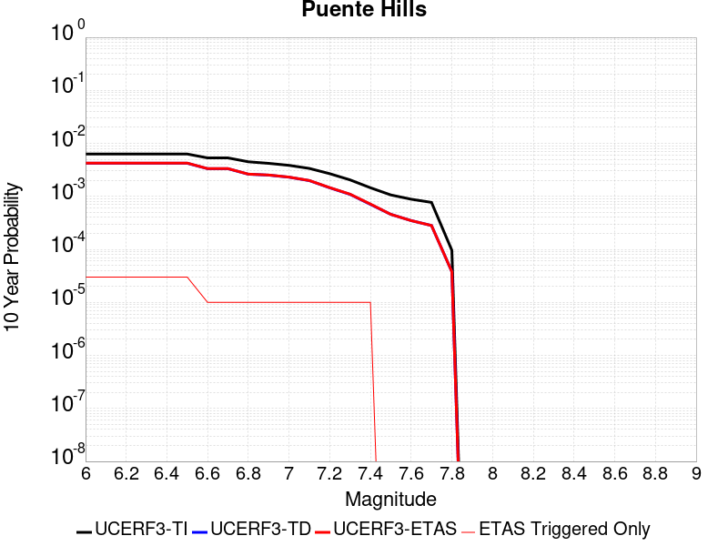 |

| Magnitude | 1 wk TI Prob | 1 wk TD Prob | 1 wk ETAS Prob | 1 wk ETAS/TD Gain | 1 wk ETAS Triggered Only | 1 mo TI Prob | 1 mo TD Prob | 1 mo ETAS Prob | 1 mo ETAS/TD Gain | 1 mo ETAS Triggered Only | 1 yr TI Prob | 1 yr TD Prob | 1 yr ETAS Prob | 1 yr ETAS/TD Gain | 1 yr ETAS Triggered Only | 10 yr TI Prob | 10 yr TD Prob | 10 yr ETAS Prob | 10 yr ETAS/TD Gain | 10 yr ETAS Triggered Only |
|-----|-----|-----|-----|-----|-----|-----|-----|-----|-----|-----|-----|-----|-----|-----|-----|-----|-----|-----|-----|-----|
| 6.0 | 1.2101656E-5 | 8.098625E-6 | 4.813674E-5 | 5.943816 | 4.0038438E-5 | 5.1863204E-5 | 3.4707962E-5 | 7.474501E-5 | 2.1535406 | 4.0038438E-5 | 6.312516E-4 | 4.2249315E-4 | 4.6251467E-4 | 1.094727 | 4.0038438E-5 | 0.0062946146 | 0.0042174594 | 0.0042971987 | 1.018907 | 8.0076876E-5 |
| 6.1 | 1.2101656E-5 | 8.098625E-6 | 4.813674E-5 | 5.943816 | 4.0038438E-5 | 5.1863204E-5 | 3.4707962E-5 | 7.474501E-5 | 2.1535406 | 4.0038438E-5 | 6.312516E-4 | 4.2249315E-4 | 4.6251467E-4 | 1.094727 | 4.0038438E-5 | 0.0062946146 | 0.0042174594 | 0.0042971987 | 1.018907 | 8.0076876E-5 |
| 6.2 | 1.2101656E-5 | 8.098625E-6 | 4.813674E-5 | 5.943816 | 4.0038438E-5 | 5.1863204E-5 | 3.4707962E-5 | 7.474501E-5 | 2.1535406 | 4.0038438E-5 | 6.312516E-4 | 4.2249315E-4 | 4.6251467E-4 | 1.094727 | 4.0038438E-5 | 0.0062946146 | 0.0042174594 | 0.0042971987 | 1.018907 | 8.0076876E-5 |
| 6.3 | 1.2101656E-5 | 8.098625E-6 | 4.813674E-5 | 5.943816 | 4.0038438E-5 | 5.1863204E-5 | 3.4707962E-5 | 7.474501E-5 | 2.1535406 | 4.0038438E-5 | 6.312516E-4 | 4.2249315E-4 | 4.6251467E-4 | 1.094727 | 4.0038438E-5 | 0.0062946146 | 0.0042174594 | 0.0042971987 | 1.018907 | 8.0076876E-5 |
| 6.4 | 1.2101656E-5 | 8.098625E-6 | 4.813674E-5 | 5.943816 | 4.0038438E-5 | 5.1863204E-5 | 3.4707962E-5 | 7.474501E-5 | 2.1535406 | 4.0038438E-5 | 6.312516E-4 | 4.2249315E-4 | 4.6251467E-4 | 1.094727 | 4.0038438E-5 | 0.0062946146 | 0.0042174594 | 0.0042971987 | 1.018907 | 8.0076876E-5 |
| 6.5 | 1.2101656E-5 | 8.098625E-6 | 4.813674E-5 | 5.943816 | 4.0038438E-5 | 5.1863204E-5 | 3.4707962E-5 | 7.474501E-5 | 2.1535406 | 4.0038438E-5 | 6.312516E-4 | 4.2249315E-4 | 4.6251467E-4 | 1.094727 | 4.0038438E-5 | 0.0062946146 | 0.0042174594 | 0.0042971987 | 1.018907 | 8.0076876E-5 |
| 6.6 | 1.0222488E-5 | 6.3991847E-6 | 6.3991847E-6 | 1.0 | 0.0 | 4.3809923E-5 | 2.7424803E-5 | 2.7424803E-5 | 1.0 | 0.0 | 5.332553E-4 | 3.3384826E-4 | 3.3384826E-4 | 1.0 | 0.0 | 0.0053197746 | 0.0033337125 | 0.0033736175 | 1.0119702 | 4.0038438E-5 |
| 6.7 | 1.0222488E-5 | 6.3991847E-6 | 6.3991847E-6 | 1.0 | 0.0 | 4.3809923E-5 | 2.7424803E-5 | 2.7424803E-5 | 1.0 | 0.0 | 5.332553E-4 | 3.3384826E-4 | 3.3384826E-4 | 1.0 | 0.0 | 0.0053197746 | 0.0033337125 | 0.0033736175 | 1.0119702 | 4.0038438E-5 |
| 6.8 | 8.6367845E-6 | 5.0282533E-6 | 5.0282533E-6 | 1.0 | 0.0 | 3.7014266E-5 | 2.1549482E-5 | 2.1549482E-5 | 1.0 | 0.0 | 4.505555E-4 | 2.623339E-4 | 2.623339E-4 | 1.0 | 0.0 | 0.004496431 | 0.0026202986 | 0.0026602321 | 1.0152401 | 4.0038438E-5 |
| 6.9 | 8.066481E-6 | 4.836117E-6 | 4.836117E-6 | 1.0 | 0.0 | 3.4570177E-5 | 2.0726053E-5 | 2.0726053E-5 | 1.0 | 0.0 | 4.2081063E-4 | 2.52311E-4 | 2.52311E-4 | 1.0 | 0.0 | 0.0042001465 | 0.0025202993 | 0.0025602367 | 1.0158464 | 4.0038438E-5 |
| 7.0 | 7.393828E-6 | 4.417296E-6 | 4.417296E-6 | 1.0 | 0.0 | 3.168745E-5 | 1.8931134E-5 | 1.8931134E-5 | 1.0 | 0.0 | 3.857264E-4 | 2.3046264E-4 | 2.3046264E-4 | 1.0 | 0.0 | 0.0038505755 | 0.0023022818 | 0.002342228 | 1.0173507 | 4.0038438E-5 |
| 7.1 | 6.4660953E-6 | 3.8044495E-6 | 3.8044495E-6 | 1.0 | 0.0 | 2.7711543E-5 | 1.6304684E-5 | 1.6304684E-5 | 1.0 | 0.0 | 3.373358E-4 | 1.984918E-4 | 1.984918E-4 | 1.0 | 0.0 | 0.0033682417 | 0.001983181 | 0.00202314 | 1.020149 | 4.0038438E-5 |
| 7.2 | 5.143232E-6 | 2.7865456E-6 | 2.7865456E-6 | 1.0 | 0.0 | 2.2042237E-5 | 1.1942284E-5 | 1.1942284E-5 | 1.0 | 0.0 | 2.6833118E-4 | 1.453877E-4 | 1.453877E-4 | 1.0 | 0.0 | 0.002680074 | 0.0014529356 | 0.0014929158 | 1.0275168 | 4.0038438E-5 |
| 7.3 | 3.928255E-6 | 2.0913774E-6 | 2.0913774E-6 | 1.0 | 0.0 | 1.683527E-5 | 8.963015E-6 | 8.963015E-6 | 1.0 | 0.0 | 2.0495013E-4 | 1.0911931E-4 | 1.0911931E-4 | 1.0 | 0.0 | 0.002047612 | 0.001090664 | 0.0011306588 | 1.0366701 | 4.0038438E-5 |
| 7.4 | 2.7894434E-6 | 1.3546753E-6 | 1.3546753E-6 | 1.0 | 0.0 | 1.1954703E-5 | 5.8057385E-6 | 5.8057385E-6 | 1.0 | 0.0 | 1.4553878E-4 | 7.068262E-5 | 7.068262E-5 | 1.0 | 0.0 | 0.001454435 | 7.066058E-4 | 7.4661593E-4 | 1.056623 | 4.0038438E-5 |
| 7.5 | 2.041735E-6 | 8.787305E-7 | 8.787305E-7 | 1.0 | 0.0 | 8.750263E-6 | 3.7659825E-6 | 3.7659825E-6 | 1.0 | 0.0 | 1.06529245E-4 | 4.5849905E-5 | 4.5849905E-5 | 1.0 | 0.0 | 0.0010647819 | 4.5840783E-4 | 4.5840783E-4 | 1.0 | 0.0 |
| 7.6 | 1.6959062E-6 | 6.6986263E-7 | 6.6986263E-7 | 1.0 | 0.0 | 7.268149E-6 | 2.8708366E-6 | 2.8708366E-6 | 1.0 | 0.0 | 8.848612E-5 | 3.4951907E-5 | 3.4951907E-5 | 1.0 | 0.0 | 8.84509E-4 | 3.4946698E-4 | 3.4946698E-4 | 1.0 | 0.0 |
| 7.7 | 1.4767965E-6 | 5.407607E-7 | 5.407607E-7 | 1.0 | 0.0 | 6.3291122E-6 | 2.317544E-6 | 2.317544E-6 | 1.0 | 0.0 | 7.705422E-5 | 2.8215758E-5 | 2.8215758E-5 | 1.0 | 0.0 | 7.702751E-4 | 2.8212433E-4 | 2.8212433E-4 | 1.0 | 0.0 |
| 7.8 | 1.8432911E-7 | 7.28201E-8 | 7.28201E-8 | 1.0 | 0.0 | 7.8998164E-7 | 3.1208612E-7 | 3.1208612E-7 | 1.0 | 0.0 | 9.617985E-6 | 3.7996451E-6 | 3.7996451E-6 | 1.0 | 0.0 | 9.617568E-5 | 3.7996128E-5 | 3.7996128E-5 | 1.0 | 0.0 |

## Malibu Coast (Extension) alt 1
*[(top)](#table-of-contents)*

| 1 Week | 1 Month | 1 Year | 10 Year |
|-----|-----|-----|-----|
|  |  |  |  |

| Magnitude | 1 wk TI Prob | 1 wk TD Prob | 1 wk ETAS Prob | 1 wk ETAS/TD Gain | 1 wk ETAS Triggered Only | 1 mo TI Prob | 1 mo TD Prob | 1 mo ETAS Prob | 1 mo ETAS/TD Gain | 1 mo ETAS Triggered Only | 1 yr TI Prob | 1 yr TD Prob | 1 yr ETAS Prob | 1 yr ETAS/TD Gain | 1 yr ETAS Triggered Only | 10 yr TI Prob | 10 yr TD Prob | 10 yr ETAS Prob | 10 yr ETAS/TD Gain | 10 yr ETAS Triggered Only |
|-----|-----|-----|-----|-----|-----|-----|-----|-----|-----|-----|-----|-----|-----|-----|-----|-----|-----|-----|-----|-----|
| 6.0 | 8.930738E-6 | 9.329276E-6 | 9.329276E-6 | 1.0 | 0.0 | 3.827403E-5 | 3.998201E-5 | 8.001884E-5 | 2.0013714 | 4.0038438E-5 | 4.6588664E-4 | 4.8667393E-4 | 5.667118E-4 | 1.164459 | 8.0076876E-5 | 0.0046491115 | 0.004856264 | 0.004935952 | 1.0164093 | 8.0076876E-5 |
| 6.1 | 7.199952E-6 | 7.5302964E-6 | 7.5302964E-6 | 1.0 | 0.0 | 3.0856572E-5 | 3.2272303E-5 | 7.230945E-5 | 2.240604 | 4.0038438E-5 | 3.75614E-4 | 3.9284505E-4 | 4.3286776E-4 | 1.1018791 | 4.0038438E-5 | 0.0037497976 | 0.003921572 | 0.0039614537 | 1.0101697 | 4.0038438E-5 |
| 6.2 | 6.3721413E-6 | 6.6667917E-6 | 6.6667917E-6 | 1.0 | 0.0 | 2.7308892E-5 | 2.8571652E-5 | 6.860895E-5 | 2.4012942 | 4.0038438E-5 | 3.3243504E-4 | 3.4780471E-4 | 3.878292E-4 | 1.1150775 | 4.0038438E-5 | 0.0033193815 | 0.0034726437 | 0.0035125432 | 1.0114896 | 4.0038438E-5 |
| 6.3 | 6.016345E-6 | 6.295158E-6 | 6.295158E-6 | 1.0 | 0.0 | 2.578408E-5 | 2.6978973E-5 | 6.701633E-5 | 2.484021 | 4.0038438E-5 | 3.1387596E-4 | 3.2841982E-4 | 3.684451E-4 | 1.1218723 | 4.0038438E-5 | 0.00313433 | 0.0032793807 | 0.003319288 | 1.0121691 | 4.0038438E-5 |
| 6.4 | 5.8104883E-6 | 6.0795446E-6 | 6.0795446E-6 | 1.0 | 0.0 | 2.4901856E-5 | 2.6054933E-5 | 6.6092325E-5 | 2.536653 | 4.0038438E-5 | 3.031379E-4 | 3.1717293E-4 | 3.5719867E-4 | 1.1261953 | 4.0038438E-5 | 0.0030272473 | 0.0031672374 | 0.003207149 | 1.0126014 | 4.0038438E-5 |
| 6.5 | 5.476925E-6 | 5.7275133E-6 | 5.7275133E-6 | 1.0 | 0.0 | 2.3472323E-5 | 2.4546256E-5 | 6.4583706E-5 | 2.6311023 | 4.0038438E-5 | 2.8573806E-4 | 2.9880996E-4 | 3.3883646E-4 | 1.133953 | 4.0038438E-5 | 0.0028537093 | 0.002984114 | 0.0030240328 | 1.0133772 | 4.0038438E-5 |
| 6.6 | 5.222387E-6 | 5.45858E-6 | 5.45858E-6 | 1.0 | 0.0 | 2.2381464E-5 | 2.3393704E-5 | 6.34312E-5 | 2.7114646 | 4.0038438E-5 | 2.7246025E-4 | 2.8478142E-4 | 3.2480844E-4 | 1.1405536 | 4.0038438E-5 | 0.0027212645 | 0.0028441956 | 0.00288412 | 1.0140373 | 4.0038438E-5 |
| 6.7 | 5.0337076E-6 | 5.259103E-6 | 5.259103E-6 | 1.0 | 0.0 | 2.1572854E-5 | 2.253882E-5 | 6.257636E-5 | 2.776381 | 4.0038438E-5 | 2.6261783E-4 | 2.7437587E-4 | 3.1440333E-4 | 1.1458855 | 4.0038438E-5 | 0.002623077 | 0.002740401 | 0.00278033 | 1.0145704 | 4.0038438E-5 |
| 6.8 | 4.5675624E-6 | 4.7587164E-6 | 4.7587164E-6 | 1.0 | 0.0 | 1.9575122E-5 | 2.039434E-5 | 6.043196E-5 | 2.9631732 | 4.0038438E-5 | 2.3830103E-4 | 2.48273E-4 | 2.883015E-4 | 1.1612277 | 4.0038438E-5 | 0.0023804565 | 0.002479976 | 0.002519915 | 1.0161047 | 4.0038438E-5 |
| 6.9 | 4.2802412E-6 | 4.4520207E-6 | 4.4520207E-6 | 1.0 | 0.0 | 1.8343762E-5 | 1.907995E-5 | 1.907995E-5 | 1.0 | 0.0 | 2.2331243E-4 | 2.3227377E-4 | 2.3227377E-4 | 1.0 | 0.0 | 0.0022308815 | 0.0023203269 | 0.0023203269 | 1.0 | 0.0 |
| 7.0 | 3.9794063E-6 | 4.130099E-6 | 4.130099E-6 | 1.0 | 0.0 | 1.7054486E-5 | 1.7700306E-5 | 1.7700306E-5 | 1.0 | 0.0 | 2.0761859E-4 | 2.1548003E-4 | 2.1548003E-4 | 1.0 | 0.0 | 0.0020742472 | 0.0021527244 | 0.0021527244 | 1.0 | 0.0 |
| 7.1 | 3.7730424E-6 | 3.911217E-6 | 3.911217E-6 | 1.0 | 0.0 | 1.6170083E-5 | 1.6762251E-5 | 1.6762251E-5 | 1.0 | 0.0 | 1.9685295E-4 | 2.0406142E-4 | 2.0406142E-4 | 1.0 | 0.0 | 0.0019667868 | 0.0020387534 | 0.0020387534 | 1.0 | 0.0 |
| 7.2 | 3.424985E-6 | 3.541337E-6 | 3.541337E-6 | 1.0 | 0.0 | 1.4678424E-5 | 1.5177071E-5 | 1.5177071E-5 | 1.0 | 0.0 | 1.7869516E-4 | 1.8476529E-4 | 1.8476529E-4 | 1.0 | 0.0 | 0.0017855153 | 0.0018461287 | 0.0018461287 | 1.0 | 0.0 |
| 7.3 | 2.6966375E-6 | 2.7596534E-6 | 2.7596534E-6 | 1.0 | 0.0 | 1.15569665E-5 | 1.1827032E-5 | 1.1827032E-5 | 1.0 | 0.0 | 1.4069698E-4 | 1.4398464E-4 | 1.4398464E-4 | 1.0 | 0.0 | 0.0014060794 | 0.0014389176 | 0.0014389176 | 1.0 | 0.0 |
| 7.4 | 2.215957E-6 | 2.249378E-6 | 2.249378E-6 | 1.0 | 0.0 | 9.496924E-6 | 9.640156E-6 | 9.640156E-6 | 1.0 | 0.0 | 1.1561892E-4 | 1.17362615E-4 | 1.17362615E-4 | 1.0 | 0.0 | 0.0011555878 | 0.0011730101 | 0.0011730101 | 1.0 | 0.0 |
| 7.5 | 1.2040218E-6 | 1.2219067E-6 | 1.2219067E-6 | 1.0 | 0.0 | 5.160083E-6 | 5.2367322E-6 | 5.2367322E-6 | 1.0 | 0.0 | 6.2822204E-5 | 6.375537E-5 | 6.375537E-5 | 1.0 | 0.0 | 6.280445E-4 | 6.3737266E-4 | 6.3737266E-4 | 1.0 | 0.0 |
| 7.6 | 6.6157446E-7 | 6.678975E-7 | 6.678975E-7 | 1.0 | 0.0 | 2.835316E-6 | 2.8624147E-6 | 2.8624147E-6 | 1.0 | 0.0 | 3.4519428E-5 | 3.484936E-5 | 3.484936E-5 | 1.0 | 0.0 | 3.4514067E-4 | 3.4844046E-4 | 3.4844046E-4 | 1.0 | 0.0 |
| 7.7 | 2.6012302E-7 | 2.4357593E-7 | 2.4357593E-7 | 1.0 | 0.0 | 1.1148124E-6 | 1.0438964E-6 | 1.0438964E-6 | 1.0 | 0.0 | 1.3572758E-5 | 1.2709375E-5 | 1.2709375E-5 | 1.0 | 0.0 | 1.3571928E-4 | 1.2708755E-4 | 1.2708755E-4 | 1.0 | 0.0 |
| 7.8 | 2.8323132E-8 | 2.0266649E-8 | 2.0266649E-8 | 1.0 | 0.0 | 1.2138484E-7 | 8.685707E-8 | 8.685707E-8 | 1.0 | 0.0 | 1.4778595E-6 | 1.0574844E-6 | 1.0574844E-6 | 1.0 | 0.0 | 1.4778497E-5 | 1.0574801E-5 | 1.0574801E-5 | 1.0 | 0.0 |

## Carlsbad
*[(top)](#table-of-contents)*

| 1 Week | 1 Month | 1 Year | 10 Year |
|-----|-----|-----|-----|
|  |  |  |  |

| Magnitude | 1 wk TI Prob | 1 wk TD Prob | 1 wk ETAS Prob | 1 wk ETAS/TD Gain | 1 wk ETAS Triggered Only | 1 mo TI Prob | 1 mo TD Prob | 1 mo ETAS Prob | 1 mo ETAS/TD Gain | 1 mo ETAS Triggered Only | 1 yr TI Prob | 1 yr TD Prob | 1 yr ETAS Prob | 1 yr ETAS/TD Gain | 1 yr ETAS Triggered Only | 10 yr TI Prob | 10 yr TD Prob | 10 yr ETAS Prob | 10 yr ETAS/TD Gain | 10 yr ETAS Triggered Only |
|-----|-----|-----|-----|-----|-----|-----|-----|-----|-----|-----|-----|-----|-----|-----|-----|-----|-----|-----|-----|-----|
| 6.0 | 4.9038536E-6 | 4.9872565E-6 | 4.5025492E-5 | 9.028109 | 4.0038438E-5 | 2.1016345E-5 | 2.1373784E-5 | 6.141137E-5 | 2.87321 | 4.0038438E-5 | 2.5584397E-4 | 2.601952E-4 | 3.4025122E-4 | 1.3076768 | 8.0076876E-5 | 0.002555496 | 0.0025989525 | 0.0026788213 | 1.0307311 | 8.0076876E-5 |
| 6.1 | 4.9038536E-6 | 4.9872565E-6 | 4.5025492E-5 | 9.028109 | 4.0038438E-5 | 2.1016345E-5 | 2.1373784E-5 | 6.141137E-5 | 2.87321 | 4.0038438E-5 | 2.5584397E-4 | 2.601952E-4 | 3.4025122E-4 | 1.3076768 | 8.0076876E-5 | 0.002555496 | 0.0025989525 | 0.0026788213 | 1.0307311 | 8.0076876E-5 |
| 6.2 | 4.3820614E-6 | 4.4547687E-6 | 4.4493027E-5 | 9.98773 | 4.0038438E-5 | 1.8780129E-5 | 1.9091729E-5 | 5.91294E-5 | 3.0971215 | 4.0038438E-5 | 2.2862408E-4 | 2.3241735E-4 | 3.124756E-4 | 1.344459 | 8.0076876E-5 | 0.00228389 | 0.0023217786 | 0.0024016695 | 1.0344094 | 8.0076876E-5 |
| 6.3 | 4.302872E-6 | 4.373006E-6 | 4.4411267E-5 | 10.155775 | 4.0038438E-5 | 1.8440749E-5 | 1.8741322E-5 | 5.877901E-5 | 3.136332 | 4.0038438E-5 | 2.24493E-4 | 2.2815206E-4 | 3.0821067E-4 | 1.3509002 | 8.0076876E-5 | 0.0022426634 | 0.0022792136 | 0.0023591078 | 1.0350535 | 8.0076876E-5 |
| 6.4 | 4.0835243E-6 | 4.1476546E-6 | 4.4185927E-5 | 10.653232 | 4.0038438E-5 | 1.75007E-5 | 1.7775543E-5 | 5.7813268E-5 | 3.2524052 | 4.0038438E-5 | 2.1305021E-4 | 2.1639607E-4 | 2.9645563E-4 | 1.3699676 | 8.0076876E-5 | 0.0021284607 | 0.0021618877 | 0.0022417915 | 1.0369601 | 8.0076876E-5 |
| 6.5 | 3.987806E-6 | 4.0488867E-6 | 4.4087163E-5 | 10.888712 | 4.0038438E-5 | 1.7090486E-5 | 1.7352257E-5 | 5.739E-5 | 3.3073506 | 4.0038438E-5 | 2.080568E-4 | 2.1124359E-4 | 2.9130356E-4 | 1.3789935 | 8.0076876E-5 | 0.002078621 | 0.0021104617 | 0.0021903696 | 1.0378628 | 8.0076876E-5 |
| 6.6 | 3.8707576E-6 | 3.927488E-6 | 4.3965767E-5 | 11.194374 | 4.0038438E-5 | 1.6588854E-5 | 1.6831984E-5 | 5.6869747E-5 | 3.3786716 | 4.0038438E-5 | 2.0195059E-4 | 2.0491047E-4 | 2.8497094E-4 | 1.3907095 | 8.0076876E-5 | 0.0020176715 | 0.0020472489 | 0.0021271617 | 1.0390342 | 8.0076876E-5 |
| 6.7 | 3.3093434E-6 | 3.3423917E-6 | 4.3380696E-5 | 12.978938 | 4.0038438E-5 | 1.4182823E-5 | 1.4324457E-5 | 5.436232E-5 | 3.7950702 | 4.0038438E-5 | 1.7266218E-4 | 1.7438637E-4 | 2.5444926E-4 | 1.4591122 | 8.0076876E-5 | 0.001725281 | 0.0017425013 | 0.0018224387 | 1.0458751 | 8.0076876E-5 |
| 6.8 | 3.136983E-6 | 3.1664536E-6 | 4.3204764E-5 | 13.644528 | 4.0038438E-5 | 1.3444143E-5 | 1.3570445E-5 | 5.360834E-5 | 3.9503744 | 4.0038438E-5 | 1.6367015E-4 | 1.6520769E-4 | 2.4527134E-4 | 1.4846241 | 8.0076876E-5 | 0.0016354966 | 0.0016508545 | 0.0017307991 | 1.0484263 | 8.0076876E-5 |
| 6.9 | 2.9056644E-6 | 2.9267585E-6 | 4.296508E-5 | 14.68009 | 4.0038438E-5 | 1.2452788E-5 | 1.2543191E-5 | 5.2581127E-5 | 4.1920056 | 4.0038438E-5 | 1.5160214E-4 | 1.5270269E-4 | 2.3276734E-4 | 1.5243171 | 8.0076876E-5 | 0.0015149876 | 0.001525983 | 0.0016059376 | 1.0523956 | 8.0076876E-5 |
| 7.0 | 2.5071035E-6 | 2.5113977E-6 | 4.2549735E-5 | 16.942652 | 4.0038438E-5 | 1.0744685E-5 | 1.07630885E-5 | 5.0801096E-5 | 4.7199364 | 4.0038438E-5 | 1.308087E-4 | 1.3103275E-4 | 1.7106594E-4 | 1.3055205 | 4.0038438E-5 | 0.0013073172 | 0.0013095582 | 0.0013495442 | 1.0305339 | 4.0038438E-5 |
| 7.1 | 2.1786877E-6 | 2.1678832E-6 | 2.1678832E-6 | 1.0 | 0.0 | 9.3372E-6 | 9.290896E-6 | 9.290896E-6 | 1.0 | 0.0 | 1.13674476E-4 | 1.1311081E-4 | 1.1311081E-4 | 1.0 | 0.0 | 0.0011361635 | 0.0011305353 | 0.0011305353 | 1.0 | 0.0 |
| 7.2 | 1.6628418E-6 | 1.6213872E-6 | 1.6213872E-6 | 1.0 | 0.0 | 7.1264453E-6 | 6.948784E-6 | 6.948784E-6 | 1.0 | 0.0 | 8.676102E-5 | 8.4598185E-5 | 8.4598185E-5 | 1.0 | 0.0 | 8.672715E-4 | 8.45662E-4 | 8.45662E-4 | 1.0 | 0.0 |
| 7.3 | 1.0595926E-6 | 9.816804E-7 | 9.816804E-7 | 1.0 | 0.0 | 4.541103E-6 | 4.2071947E-6 | 4.2071947E-6 | 1.0 | 0.0 | 5.5286528E-5 | 5.1221403E-5 | 5.1221403E-5 | 1.0 | 0.0 | 5.527277E-4 | 5.1209686E-4 | 5.1209686E-4 | 1.0 | 0.0 |
| 7.4 | 7.956623E-7 | 7.1737975E-7 | 7.1737975E-7 | 1.0 | 0.0 | 3.4099767E-6 | 3.074481E-6 | 3.074481E-6 | 1.0 | 0.0 | 4.1515676E-5 | 3.743117E-5 | 3.743117E-5 | 1.0 | 0.0 | 4.150792E-4 | 3.7424936E-4 | 3.7424936E-4 | 1.0 | 0.0 |
| 7.5 | 5.1043804E-7 | 4.4483627E-7 | 4.4483627E-7 | 1.0 | 0.0 | 2.1875896E-6 | 1.9064398E-6 | 1.9064398E-6 | 1.0 | 0.0 | 2.663358E-5 | 2.3210663E-5 | 2.3210663E-5 | 1.0 | 0.0 | 2.6630386E-4 | 2.3208297E-4 | 2.3208297E-4 | 1.0 | 0.0 |
| 7.6 | 2.3723294E-7 | 1.989569E-7 | 1.989569E-7 | 1.0 | 0.0 | 1.0167122E-6 | 8.5267214E-7 | 8.5267214E-7 | 1.0 | 0.0 | 1.2378401E-5 | 1.0381237E-5 | 1.0381237E-5 | 1.0 | 0.0 | 1.237771E-4 | 1.038078E-4 | 1.038078E-4 | 1.0 | 0.0 |
| 7.7 | 1.9992152E-8 | 9.8601785E-9 | 9.8601785E-9 | 1.0 | 0.0 | 8.568065E-8 | 4.225791E-8 | 4.225791E-8 | 1.0 | 0.0 | 1.0431614E-6 | 5.1449E-7 | 5.1449E-7 | 1.0 | 0.0 | 1.0431565E-5 | 5.1449E-6 | 5.1449E-6 | 1.0 | 0.0 |

## Santa Susana alt 1
*[(top)](#table-of-contents)*

| 1 Week | 1 Month | 1 Year | 10 Year |
|-----|-----|-----|-----|
|  |  |  | 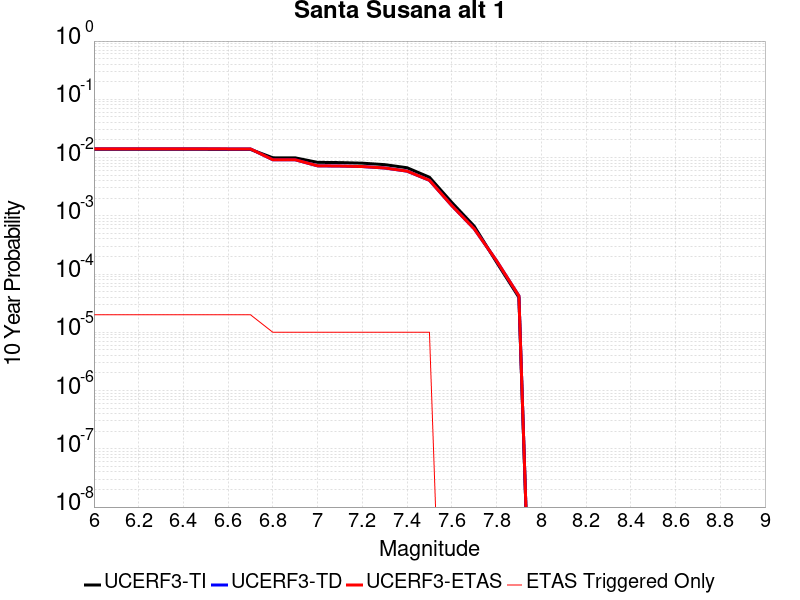 |

| Magnitude | 1 wk TI Prob | 1 wk TD Prob | 1 wk ETAS Prob | 1 wk ETAS/TD Gain | 1 wk ETAS Triggered Only | 1 mo TI Prob | 1 mo TD Prob | 1 mo ETAS Prob | 1 mo ETAS/TD Gain | 1 mo ETAS Triggered Only | 1 yr TI Prob | 1 yr TD Prob | 1 yr ETAS Prob | 1 yr ETAS/TD Gain | 1 yr ETAS Triggered Only | 10 yr TI Prob | 10 yr TD Prob | 10 yr ETAS Prob | 10 yr ETAS/TD Gain | 10 yr ETAS Triggered Only |
|-----|-----|-----|-----|-----|-----|-----|-----|-----|-----|-----|-----|-----|-----|-----|-----|-----|-----|-----|-----|-----|
| 6.0 | 2.674877E-5 | 2.7198023E-5 | 6.723537E-5 | 2.4720683 | 4.0038438E-5 | 1.1463255E-4 | 1.1655839E-4 | 1.5659216E-4 | 1.3434653 | 4.0038438E-5 | 0.0013947578 | 0.0014182882 | 0.0014582699 | 1.02819 | 4.0038438E-5 | 0.013860362 | 0.014104128 | 0.014143601 | 1.0027987 | 4.0038438E-5 |
| 6.1 | 2.674877E-5 | 2.7198023E-5 | 6.723537E-5 | 2.4720683 | 4.0038438E-5 | 1.1463255E-4 | 1.1655839E-4 | 1.5659216E-4 | 1.3434653 | 4.0038438E-5 | 0.0013947578 | 0.0014182882 | 0.0014582699 | 1.02819 | 4.0038438E-5 | 0.013860362 | 0.014104128 | 0.014143601 | 1.0027987 | 4.0038438E-5 |
| 6.2 | 2.674877E-5 | 2.7198023E-5 | 6.723537E-5 | 2.4720683 | 4.0038438E-5 | 1.1463255E-4 | 1.1655839E-4 | 1.5659216E-4 | 1.3434653 | 4.0038438E-5 | 0.0013947578 | 0.0014182882 | 0.0014582699 | 1.02819 | 4.0038438E-5 | 0.013860362 | 0.014104128 | 0.014143601 | 1.0027987 | 4.0038438E-5 |
| 6.3 | 2.674877E-5 | 2.7198023E-5 | 6.723537E-5 | 2.4720683 | 4.0038438E-5 | 1.1463255E-4 | 1.1655839E-4 | 1.5659216E-4 | 1.3434653 | 4.0038438E-5 | 0.0013947578 | 0.0014182882 | 0.0014582699 | 1.02819 | 4.0038438E-5 | 0.013860362 | 0.014104128 | 0.014143601 | 1.0027987 | 4.0038438E-5 |
| 6.4 | 2.674877E-5 | 2.7198023E-5 | 6.723537E-5 | 2.4720683 | 4.0038438E-5 | 1.1463255E-4 | 1.1655839E-4 | 1.5659216E-4 | 1.3434653 | 4.0038438E-5 | 0.0013947578 | 0.0014182882 | 0.0014582699 | 1.02819 | 4.0038438E-5 | 0.013860362 | 0.014104128 | 0.014143601 | 1.0027987 | 4.0038438E-5 |
| 6.5 | 2.674877E-5 | 2.7198023E-5 | 6.723537E-5 | 2.4720683 | 4.0038438E-5 | 1.1463255E-4 | 1.1655839E-4 | 1.5659216E-4 | 1.3434653 | 4.0038438E-5 | 0.0013947578 | 0.0014182882 | 0.0014582699 | 1.02819 | 4.0038438E-5 | 0.013860362 | 0.014104128 | 0.014143601 | 1.0027987 | 4.0038438E-5 |
| 6.6 | 2.6647976E-5 | 2.7074359E-5 | 6.7111716E-5 | 2.4787922 | 4.0038438E-5 | 1.14200615E-4 | 1.1602845E-4 | 1.5606225E-4 | 1.3450342 | 4.0038438E-5 | 0.0013895056 | 0.0014118447 | 0.0014518267 | 1.0283189 | 4.0038438E-5 | 0.013808494 | 0.014040513 | 0.014079989 | 1.0028116 | 4.0038438E-5 |
| 6.7 | 2.6647976E-5 | 2.7074359E-5 | 6.7111716E-5 | 2.4787922 | 4.0038438E-5 | 1.14200615E-4 | 1.1602845E-4 | 1.5606225E-4 | 1.3450342 | 4.0038438E-5 | 0.0013895056 | 0.0014118447 | 0.0014518267 | 1.0283189 | 4.0038438E-5 | 0.013808494 | 0.014040513 | 0.014079989 | 1.0028116 | 4.0038438E-5 |
| 6.8 | 1.9073179E-5 | 1.7637283E-5 | 5.7675014E-5 | 3.2700622 | 4.0038438E-5 | 8.1739636E-5 | 7.558627E-5 | 1.1562168E-4 | 1.5296651 | 4.0038438E-5 | 9.947256E-4 | 9.198925E-4 | 9.598941E-4 | 1.043485 | 4.0038438E-5 | 0.009902848 | 0.009163101 | 0.009202773 | 1.0043294 | 4.0038438E-5 |
| 6.9 | 1.9041876E-5 | 1.7619415E-5 | 5.7657147E-5 | 3.2723644 | 4.0038438E-5 | 8.160549E-5 | 7.55097E-5 | 1.1554511E-4 | 1.5302023 | 4.0038438E-5 | 9.930939E-4 | 9.1896096E-4 | 9.589626E-4 | 1.0435292 | 4.0038438E-5 | 0.0098866755 | 0.0091538625 | 0.009193535 | 1.0043339 | 4.0038438E-5 |
| 7.0 | 1.5917482E-5 | 1.3863864E-5 | 5.3901746E-5 | 3.8879309 | 4.0038438E-5 | 6.8215995E-5 | 5.9415237E-5 | 9.9451296E-5 | 1.6738349 | 4.0038438E-5 | 8.302132E-4 | 7.231451E-4 | 7.6315453E-4 | 1.055327 | 4.0038438E-5 | 0.008271185 | 0.0072088144 | 0.007248564 | 1.005514 | 4.0038438E-5 |
| 7.1 | 1.577788E-5 | 1.3743872E-5 | 5.3781758E-5 | 3.9131446 | 4.0038438E-5 | 6.761774E-5 | 5.8901005E-5 | 9.893708E-5 | 1.6797181 | 4.0038438E-5 | 8.2293496E-4 | 7.1688846E-4 | 7.568982E-4 | 1.0558102 | 4.0038438E-5 | 0.008198941 | 0.007146652 | 0.0071864044 | 1.0055624 | 4.0038438E-5 |
| 7.2 | 1.5416446E-5 | 1.3469944E-5 | 5.3507843E-5 | 3.9723878 | 4.0038438E-5 | 6.606882E-5 | 5.772708E-5 | 9.776321E-5 | 1.6935415 | 4.0038438E-5 | 8.0409093E-4 | 7.026052E-4 | 7.426155E-4 | 1.0569457 | 4.0038438E-5 | 0.008011877 | 0.0070047234 | 0.0070444816 | 1.0056759 | 4.0038438E-5 |
| 7.3 | 1.4534083E-5 | 1.2717879E-5 | 5.2755808E-5 | 4.148161 | 4.0038438E-5 | 6.228744E-5 | 5.4504082E-5 | 9.454034E-5 | 1.7345551 | 4.0038438E-5 | 7.580857E-4 | 6.633896E-4 | 7.0340146E-4 | 1.0603143 | 4.0038438E-5 | 0.007555048 | 0.0066149444 | 0.006654718 | 1.0060127 | 4.0038438E-5 |
| 7.4 | 1.2858995E-5 | 1.1229652E-5 | 5.1267638E-5 | 4.565381 | 4.0038438E-5 | 5.5108816E-5 | 4.8126214E-5 | 8.816273E-5 | 1.8319064 | 4.0038438E-5 | 6.7074323E-4 | 5.857831E-4 | 6.257981E-4 | 1.0683103 | 4.0038438E-5 | 0.0066872234 | 0.005843165 | 0.0058829696 | 1.0068121 | 4.0038438E-5 |
| 7.5 | 8.827668E-6 | 7.805457E-6 | 4.7843583E-5 | 6.129504 | 4.0038438E-5 | 3.7832317E-5 | 3.3451546E-5 | 7.348864E-5 | 2.1968684 | 4.0038438E-5 | 4.605111E-4 | 4.071989E-4 | 4.4722104E-4 | 1.0982864 | 4.0038438E-5 | 0.0045955796 | 0.0040647765 | 0.0041046524 | 1.0098101 | 4.0038438E-5 |
| 7.6 | 3.2533426E-6 | 2.871988E-6 | 2.871988E-6 | 1.0 | 0.0 | 1.3942822E-5 | 1.2308465E-5 | 1.2308465E-5 | 1.0 | 0.0 | 1.6974064E-4 | 1.4984563E-4 | 1.4984563E-4 | 1.0 | 0.0 | 0.0016961104 | 0.0014974826 | 0.0014974826 | 1.0 | 0.0 |
| 7.7 | 1.2751709E-6 | 1.1491089E-6 | 1.1491089E-6 | 1.0 | 0.0 | 5.4650063E-6 | 4.9247437E-6 | 4.9247437E-6 | 1.0 | 0.0 | 6.653442E-5 | 5.9957198E-5 | 5.9957198E-5 | 1.0 | 0.0 | 6.6514505E-4 | 5.994191E-4 | 5.994191E-4 | 1.0 | 0.0 |
| 7.8 | 3.067544E-7 | 3.2400436E-7 | 3.2400436E-7 | 1.0 | 0.0 | 1.3146611E-6 | 1.3885895E-6 | 1.3885895E-6 | 1.0 | 0.0 | 1.600588E-5 | 1.6905957E-5 | 1.6905957E-5 | 1.0 | 0.0 | 1.6004729E-4 | 1.6904772E-4 | 1.6904772E-4 | 1.0 | 0.0 |
| 7.9 | 7.622999E-8 | 8.087964E-8 | 8.087964E-8 | 1.0 | 0.0 | 3.2669993E-7 | 3.4662696E-7 | 3.4662696E-7 | 1.0 | 0.0 | 3.977564E-6 | 4.2201773E-6 | 4.2201773E-6 | 1.0 | 0.0 | 3.977493E-5 | 4.220118E-5 | 4.220118E-5 | 1.0 | 0.0 |

## Hartley Springs 2011 CFM
*[(top)](#table-of-contents)*

| 1 Week | 1 Month | 1 Year | 10 Year |
|-----|-----|-----|-----|
| 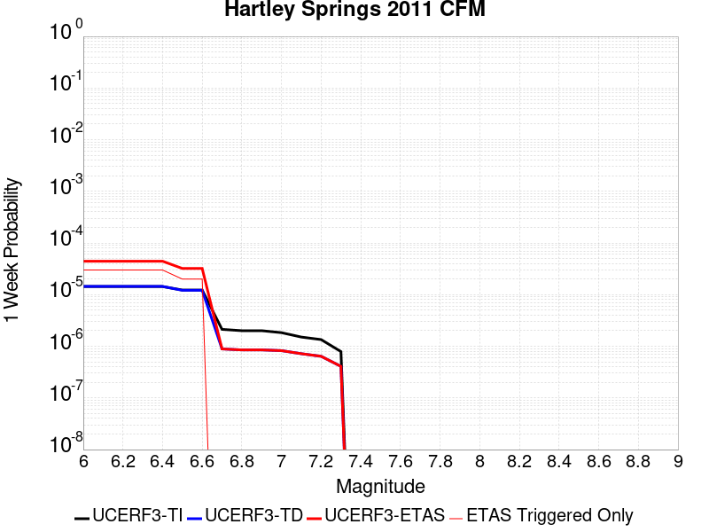 |  |  |  |

| Magnitude | 1 wk TI Prob | 1 wk TD Prob | 1 wk ETAS Prob | 1 wk ETAS/TD Gain | 1 wk ETAS Triggered Only | 1 mo TI Prob | 1 mo TD Prob | 1 mo ETAS Prob | 1 mo ETAS/TD Gain | 1 mo ETAS Triggered Only | 1 yr TI Prob | 1 yr TD Prob | 1 yr ETAS Prob | 1 yr ETAS/TD Gain | 1 yr ETAS Triggered Only | 10 yr TI Prob | 10 yr TD Prob | 10 yr ETAS Prob | 10 yr ETAS/TD Gain | 10 yr ETAS Triggered Only |
|-----|-----|-----|-----|-----|-----|-----|-----|-----|-----|-----|-----|-----|-----|-----|-----|-----|-----|-----|-----|-----|
| 6.0 | 1.4352418E-5 | 1.4434182E-5 | 9.45099E-5 | 6.547645 | 8.0076876E-5 | 6.1508916E-5 | 6.1860235E-5 | 1.4193216E-4 | 2.2944005 | 8.0076876E-5 | 7.486137E-4 | 7.5305253E-4 | 8.330691E-4 | 1.1062562 | 8.0076876E-5 | 0.007460968 | 0.0075211283 | 0.007600603 | 1.0105668 | 8.0076876E-5 |
| 6.1 | 1.4352418E-5 | 1.4434182E-5 | 9.45099E-5 | 6.547645 | 8.0076876E-5 | 6.1508916E-5 | 6.1860235E-5 | 1.4193216E-4 | 2.2944005 | 8.0076876E-5 | 7.486137E-4 | 7.5305253E-4 | 8.330691E-4 | 1.1062562 | 8.0076876E-5 | 0.007460968 | 0.0075211283 | 0.007600603 | 1.0105668 | 8.0076876E-5 |
| 6.2 | 1.4352418E-5 | 1.4434182E-5 | 9.45099E-5 | 6.547645 | 8.0076876E-5 | 6.1508916E-5 | 6.1860235E-5 | 1.4193216E-4 | 2.2944005 | 8.0076876E-5 | 7.486137E-4 | 7.5305253E-4 | 8.330691E-4 | 1.1062562 | 8.0076876E-5 | 0.007460968 | 0.0075211283 | 0.007600603 | 1.0105668 | 8.0076876E-5 |
| 6.3 | 1.4352418E-5 | 1.4434182E-5 | 9.45099E-5 | 6.547645 | 8.0076876E-5 | 6.1508916E-5 | 6.1860235E-5 | 1.4193216E-4 | 2.2944005 | 8.0076876E-5 | 7.486137E-4 | 7.5305253E-4 | 8.330691E-4 | 1.1062562 | 8.0076876E-5 | 0.007460968 | 0.0075211283 | 0.007600603 | 1.0105668 | 8.0076876E-5 |
| 6.4 | 1.4352418E-5 | 1.4434182E-5 | 9.45099E-5 | 6.547645 | 8.0076876E-5 | 6.1508916E-5 | 6.1860235E-5 | 1.4193216E-4 | 2.2944005 | 8.0076876E-5 | 7.486137E-4 | 7.5305253E-4 | 8.330691E-4 | 1.1062562 | 8.0076876E-5 | 0.007460968 | 0.0075211283 | 0.007600603 | 1.0105668 | 8.0076876E-5 |
| 6.5 | 1.2279858E-5 | 1.2133106E-5 | 5.2171057E-5 | 4.299893 | 4.0038438E-5 | 5.26269E-5 | 5.1998883E-5 | 9.203524E-5 | 1.7699465 | 4.0038438E-5 | 6.4054417E-4 | 6.3306064E-4 | 6.7307375E-4 | 1.0632057 | 4.0038438E-5 | 0.0063870098 | 0.006328085 | 0.0063678697 | 1.0062871 | 4.0038438E-5 |
| 6.6 | 1.2279858E-5 | 1.2133106E-5 | 5.2171057E-5 | 4.299893 | 4.0038438E-5 | 5.26269E-5 | 5.1998883E-5 | 9.203524E-5 | 1.7699465 | 4.0038438E-5 | 6.4054417E-4 | 6.3306064E-4 | 6.7307375E-4 | 1.0632057 | 4.0038438E-5 | 0.0063870098 | 0.006328085 | 0.0063678697 | 1.0062871 | 4.0038438E-5 |
| 6.7 | 2.1282601E-6 | 8.8948315E-7 | 8.8948315E-7 | 1.0 | 0.0 | 9.121083E-6 | 3.8120663E-6 | 3.8120663E-6 | 1.0 | 0.0 | 1.11043526E-4 | 4.641118E-5 | 4.641118E-5 | 1.0 | 0.0 | 0.0011098806 | 4.6404017E-4 | 4.6404017E-4 | 1.0 | 0.0 |
| 6.8 | 2.00516E-6 | 8.517597E-7 | 8.517597E-7 | 1.0 | 0.0 | 8.593515E-6 | 3.650395E-6 | 3.650395E-6 | 1.0 | 0.0 | 1.04621024E-4 | 4.444291E-5 | 4.444291E-5 | 1.0 | 0.0 | 0.0010457177 | 4.4436535E-4 | 4.4436535E-4 | 1.0 | 0.0 |
| 6.9 | 2.00516E-6 | 8.517597E-7 | 8.517597E-7 | 1.0 | 0.0 | 8.593515E-6 | 3.650395E-6 | 3.650395E-6 | 1.0 | 0.0 | 1.04621024E-4 | 4.444291E-5 | 4.444291E-5 | 1.0 | 0.0 | 0.0010457177 | 4.4436535E-4 | 4.4436535E-4 | 1.0 | 0.0 |
| 7.0 | 1.8366732E-6 | 8.237307E-7 | 8.237307E-7 | 1.0 | 0.0 | 7.871433E-6 | 3.5302712E-6 | 3.5302712E-6 | 1.0 | 0.0 | 9.583048E-5 | 4.298046E-5 | 4.298046E-5 | 1.0 | 0.0 | 9.5789164E-4 | 4.2974652E-4 | 4.2974652E-4 | 1.0 | 0.0 |
| 7.1 | 1.5097997E-6 | 7.1902616E-7 | 7.1902616E-7 | 1.0 | 0.0 | 6.470554E-6 | 3.0815384E-6 | 3.0815384E-6 | 1.0 | 0.0 | 7.877615E-5 | 3.7517326E-5 | 3.7517326E-5 | 1.0 | 0.0 | 7.874823E-4 | 3.7513362E-4 | 3.7513362E-4 | 1.0 | 0.0 |
| 7.2 | 1.3490993E-6 | 6.405254E-7 | 6.405254E-7 | 1.0 | 0.0 | 5.7818415E-6 | 2.7451074E-6 | 2.7451074E-6 | 1.0 | 0.0 | 7.0391645E-5 | 3.3421402E-5 | 3.3421402E-5 | 1.0 | 0.0 | 7.0369354E-4 | 3.341867E-4 | 3.341867E-4 | 1.0 | 0.0 |
| 7.3 | 7.900015E-7 | 4.0889498E-7 | 4.0889498E-7 | 1.0 | 0.0 | 3.3857161E-6 | 1.752407E-6 | 1.752407E-6 | 1.0 | 0.0 | 4.1220315E-5 | 2.1335554E-5 | 2.1335554E-5 | 1.0 | 0.0 | 4.121267E-4 | 2.1335555E-4 | 2.1335555E-4 | 1.0 | 0.0 |

## San Clemente
*[(top)](#table-of-contents)*

| 1 Week | 1 Month | 1 Year | 10 Year |
|-----|-----|-----|-----|
| 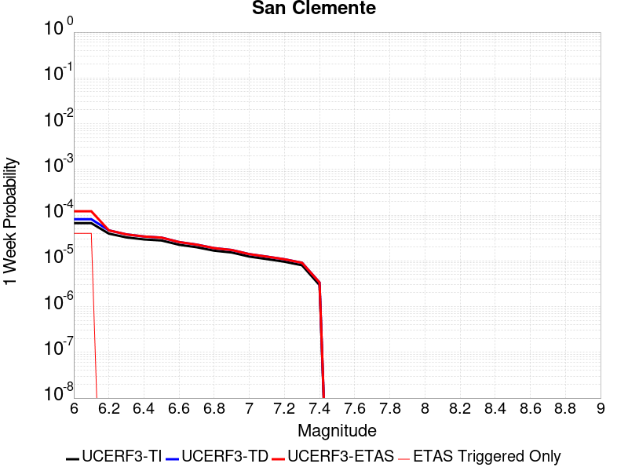 | 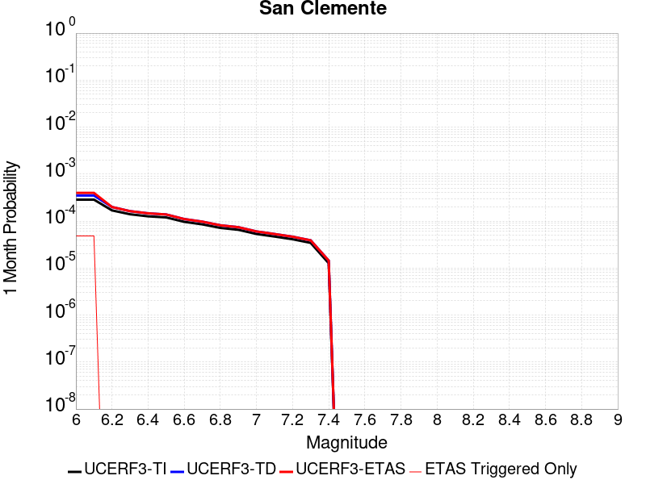 | 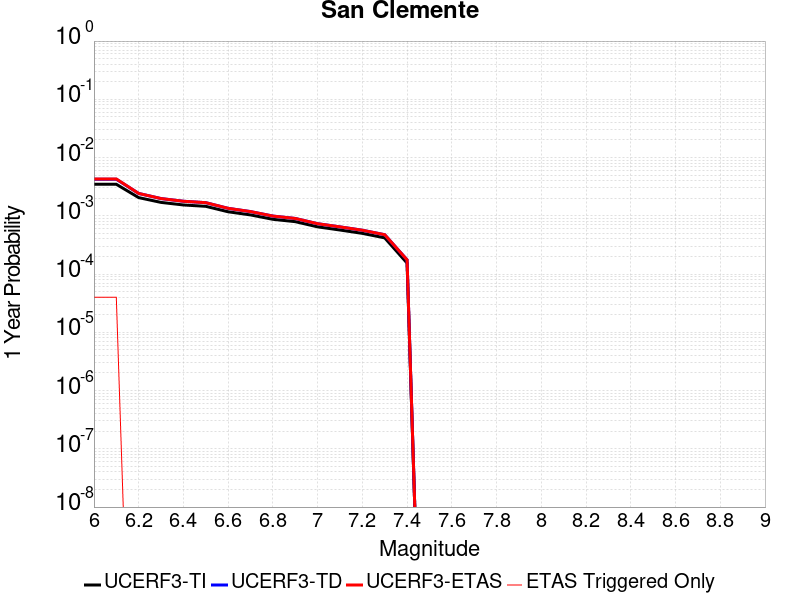 | 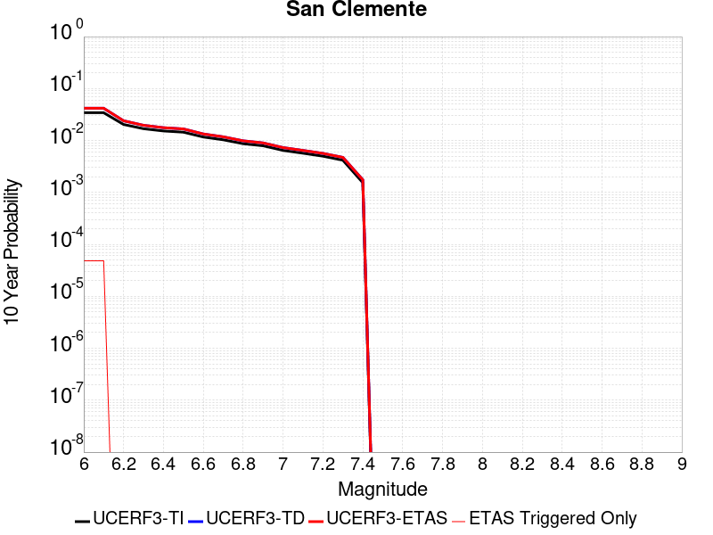 |

| Magnitude | 1 wk TI Prob | 1 wk TD Prob | 1 wk ETAS Prob | 1 wk ETAS/TD Gain | 1 wk ETAS Triggered Only | 1 mo TI Prob | 1 mo TD Prob | 1 mo ETAS Prob | 1 mo ETAS/TD Gain | 1 mo ETAS Triggered Only | 1 yr TI Prob | 1 yr TD Prob | 1 yr ETAS Prob | 1 yr ETAS/TD Gain | 1 yr ETAS Triggered Only | 10 yr TI Prob | 10 yr TD Prob | 10 yr ETAS Prob | 10 yr ETAS/TD Gain | 10 yr ETAS Triggered Only |
|-----|-----|-----|-----|-----|-----|-----|-----|-----|-----|-----|-----|-----|-----|-----|-----|-----|-----|-----|-----|-----|
| 6.0 | 6.681379E-5 | 8.163422E-5 | 1.2166939E-4 | 1.4904214 | 4.0038438E-5 | 2.8631336E-4 | 3.498173E-4 | 3.8984173E-4 | 1.1144153 | 4.0038438E-5 | 0.003480294 | 0.0042512873 | 0.004291156 | 1.009378 | 4.0038438E-5 | 0.03426291 | 0.041755714 | 0.041832447 | 1.0018376 | 8.0076876E-5 |
| 6.1 | 6.681379E-5 | 8.163422E-5 | 1.2166939E-4 | 1.4904214 | 4.0038438E-5 | 2.8631336E-4 | 3.498173E-4 | 3.8984173E-4 | 1.1144153 | 4.0038438E-5 | 0.003480294 | 0.0042512873 | 0.004291156 | 1.009378 | 4.0038438E-5 | 0.03426291 | 0.041755714 | 0.041832447 | 1.0018376 | 8.0076876E-5 |
| 6.2 | 3.9400576E-5 | 4.6451984E-5 | 4.6451984E-5 | 1.0 | 0.0 | 1.6884868E-4 | 1.9906509E-4 | 1.9906509E-4 | 1.0 | 0.0 | 0.0020537945 | 0.002420985 | 0.002420985 | 1.0 | 0.0 | 0.020349167 | 0.02395286 | 0.02395286 | 1.0 | 0.0 |
| 6.3 | 3.2590255E-5 | 3.7929087E-5 | 3.7929087E-5 | 1.0 | 0.0 | 1.3966505E-4 | 1.6254328E-4 | 1.6254328E-4 | 1.0 | 0.0 | 0.0016990956 | 0.0019771985 | 0.0019771985 | 1.0 | 0.0 | 0.01686163 | 0.019599866 | 0.019599866 | 1.0 | 0.0 |
| 6.4 | 2.9454652E-5 | 3.4097775E-5 | 3.4097775E-5 | 1.0 | 0.0 | 1.2622811E-4 | 1.4612528E-4 | 1.4612528E-4 | 1.0 | 0.0 | 0.0015357438 | 0.0017776482 | 0.0017776482 | 1.0 | 0.0 | 0.015251739 | 0.017637458 | 0.017637458 | 1.0 | 0.0 |
| 6.5 | 2.790836E-5 | 3.2247463E-5 | 3.2247463E-5 | 1.0 | 0.0 | 1.1960178E-4 | 1.3819622E-4 | 1.3819622E-4 | 1.0 | 0.0 | 0.001455179 | 0.0016812651 | 0.0016812651 | 1.0 | 0.0 | 0.014456868 | 0.016688475 | 0.016688475 | 1.0 | 0.0 |
| 6.6 | 2.2492153E-5 | 2.5762707E-5 | 2.5762707E-5 | 1.0 | 0.0 | 9.639138E-5 | 1.1040701E-4 | 1.1040701E-4 | 1.0 | 0.0 | 0.0011729331 | 0.0013433908 | 0.0013433908 | 1.0 | 0.0 | 0.011667615 | 0.013354415 | 0.013354415 | 1.0 | 0.0 |
| 6.7 | 1.9862755E-5 | 2.2666423E-5 | 2.2666423E-5 | 1.0 | 0.0 | 8.512331E-5 | 9.713826E-5 | 9.713826E-5 | 1.0 | 0.0 | 0.0010358836 | 0.0011820279 | 0.0011820279 | 1.0 | 0.0 | 0.010310682 | 0.011758701 | 0.011758701 | 1.0 | 0.0 |
| 6.8 | 1.6697575E-5 | 1.897771E-5 | 1.897771E-5 | 1.0 | 0.0 | 7.155907E-5 | 8.133056E-5 | 8.133056E-5 | 1.0 | 0.0 | 8.7088346E-4 | 9.897591E-4 | 9.897591E-4 | 1.0 | 0.0 | 0.008674784 | 0.0098545365 | 0.0098545365 | 1.0 | 0.0 |
| 6.9 | 1.5218415E-5 | 1.72694E-5 | 1.72694E-5 | 1.0 | 0.0 | 6.522015E-5 | 7.4009666E-5 | 7.4009666E-5 | 1.0 | 0.0 | 7.93766E-4 | 9.00704E-4 | 9.00704E-4 | 1.0 | 0.0 | 0.007909367 | 0.008971481 | 0.008971481 | 1.0 | 0.0 |
| 7.0 | 1.2392958E-5 | 1.4033016E-5 | 1.4033016E-5 | 1.0 | 0.0 | 5.3111595E-5 | 6.014015E-5 | 6.014015E-5 | 1.0 | 0.0 | 6.4644177E-4 | 7.319679E-4 | 7.319679E-4 | 1.0 | 0.0 | 0.0064456454 | 0.0072963564 | 0.0072963564 | 1.0 | 0.0 |
| 7.1 | 1.0934128E-5 | 1.2375138E-5 | 1.2375138E-5 | 1.0 | 0.0 | 4.6859706E-5 | 5.303527E-5 | 5.303527E-5 | 1.0 | 0.0 | 5.7036756E-4 | 6.455204E-4 | 6.455204E-4 | 1.0 | 0.0 | 0.0056890585 | 0.0064371997 | 0.0064371997 | 1.0 | 0.0 |
| 7.2 | 9.5798805E-6 | 1.0844935E-5 | 1.0844935E-5 | 1.0 | 0.0 | 4.1055984E-5 | 4.6477508E-5 | 4.6477508E-5 | 1.0 | 0.0 | 4.9974193E-4 | 5.657239E-4 | 5.657239E-4 | 1.0 | 0.0 | 0.0049861963 | 0.0056435615 | 0.0056435615 | 1.0 | 0.0 |
| 7.3 | 8.0167365E-6 | 9.083918E-6 | 9.083918E-6 | 1.0 | 0.0 | 3.4356988E-5 | 3.8930535E-5 | 3.8930535E-5 | 1.0 | 0.0 | 4.1821605E-4 | 4.7388324E-4 | 4.7388324E-4 | 1.0 | 0.0 | 0.0041742986 | 0.0047294297 | 0.0047294297 | 1.0 | 0.0 |
| 7.4 | 2.9581017E-6 | 3.3623792E-6 | 3.3623792E-6 | 1.0 | 0.0 | 1.2677518E-5 | 1.4410146E-5 | 1.4410146E-5 | 1.0 | 0.0 | 1.5433785E-4 | 1.7543444E-4 | 1.7543444E-4 | 1.0 | 0.0 | 0.001542307 | 0.0017534546 | 0.0017534546 | 1.0 | 0.0 |

## Casmalia 2011 CFM
*[(top)](#table-of-contents)*

| 1 Week | 1 Month | 1 Year | 10 Year |
|-----|-----|-----|-----|
|  | 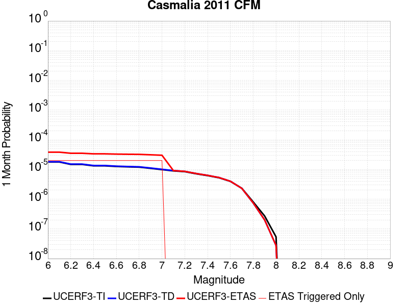 |  |  |

| Magnitude | 1 wk TI Prob | 1 wk TD Prob | 1 wk ETAS Prob | 1 wk ETAS/TD Gain | 1 wk ETAS Triggered Only | 1 mo TI Prob | 1 mo TD Prob | 1 mo ETAS Prob | 1 mo ETAS/TD Gain | 1 mo ETAS Triggered Only | 1 yr TI Prob | 1 yr TD Prob | 1 yr ETAS Prob | 1 yr ETAS/TD Gain | 1 yr ETAS Triggered Only | 10 yr TI Prob | 10 yr TD Prob | 10 yr ETAS Prob | 10 yr ETAS/TD Gain | 10 yr ETAS Triggered Only |
|-----|-----|-----|-----|-----|-----|-----|-----|-----|-----|-----|-----|-----|-----|-----|-----|-----|-----|-----|-----|-----|
| 6.0 | 4.1704893E-6 | 4.262483E-6 | 8.4339015E-5 | 19.78636 | 8.0076876E-5 | 1.7873403E-5 | 1.8267656E-5 | 9.8343065E-5 | 5.383453 | 8.0076876E-5 | 2.1758694E-4 | 2.2238622E-4 | 3.024453E-4 | 1.3600001 | 8.0076876E-5 | 0.0021737402 | 0.0022216577 | 0.0023015568 | 1.0359637 | 8.0076876E-5 |
| 6.1 | 4.1704893E-6 | 4.262483E-6 | 8.4339015E-5 | 19.78636 | 8.0076876E-5 | 1.7873403E-5 | 1.8267656E-5 | 9.8343065E-5 | 5.383453 | 8.0076876E-5 | 2.1758694E-4 | 2.2238622E-4 | 3.024453E-4 | 1.3600001 | 8.0076876E-5 | 0.0021737402 | 0.0022216577 | 0.0023015568 | 1.0359637 | 8.0076876E-5 |
| 6.2 | 3.457312E-6 | 3.5370217E-6 | 8.361361E-5 | 23.639553 | 8.0076876E-5 | 1.4816967E-5 | 1.5158577E-5 | 9.523424E-5 | 6.2825313 | 8.0076876E-5 | 1.8038164E-4 | 1.8454014E-4 | 2.6460222E-4 | 1.4338465 | 8.0076876E-5 | 0.001802353 | 0.0018438784 | 0.0019238075 | 1.0433484 | 8.0076876E-5 |
| 6.3 | 3.457312E-6 | 3.5370217E-6 | 8.361361E-5 | 23.639553 | 8.0076876E-5 | 1.4816967E-5 | 1.5158577E-5 | 9.523424E-5 | 6.2825313 | 8.0076876E-5 | 1.8038164E-4 | 1.8454014E-4 | 2.6460222E-4 | 1.4338465 | 8.0076876E-5 | 0.001802353 | 0.0018438784 | 0.0019238075 | 1.0433484 | 8.0076876E-5 |
| 6.4 | 3.0957337E-6 | 3.1692257E-6 | 8.3245846E-5 | 26.266935 | 8.0076876E-5 | 1.3267363E-5 | 1.3582326E-5 | 9.365811E-5 | 6.8955874 | 8.0076876E-5 | 1.6151817E-4 | 1.6535232E-4 | 2.4541595E-4 | 1.4842002 | 8.0076876E-5 | 0.0016140083 | 0.0016522991 | 0.0017322436 | 1.0483838 | 8.0076876E-5 |
| 6.5 | 3.0957337E-6 | 3.1692257E-6 | 8.3245846E-5 | 26.266935 | 8.0076876E-5 | 1.3267363E-5 | 1.3582326E-5 | 9.365811E-5 | 6.8955874 | 8.0076876E-5 | 1.6151817E-4 | 1.6535232E-4 | 2.4541595E-4 | 1.4842002 | 8.0076876E-5 | 0.0016140083 | 0.0016522991 | 0.0017322436 | 1.0483838 | 8.0076876E-5 |
| 6.6 | 2.9459152E-6 | 3.0165752E-6 | 8.3093204E-5 | 27.545546 | 8.0076876E-5 | 1.262529E-5 | 1.2928115E-5 | 9.300395E-5 | 7.1939297 | 8.0076876E-5 | 1.5370206E-4 | 1.5738848E-4 | 2.3745275E-4 | 1.5087048 | 8.0076876E-5 | 0.0015359579 | 0.0015727758 | 0.0016527268 | 1.0508343 | 8.0076876E-5 |
| 6.7 | 2.8634809E-6 | 2.9324726E-6 | 8.300911E-5 | 28.306868 | 8.0076876E-5 | 1.2272003E-5 | 1.256768E-5 | 9.2643546E-5 | 7.3715715 | 8.0076876E-5 | 1.4940138E-4 | 1.530008E-4 | 2.3306542E-4 | 1.5232954 | 8.0076876E-5 | 0.0014930099 | 0.0015289601 | 0.0016089145 | 1.0522933 | 8.0076876E-5 |
| 6.8 | 2.7999822E-6 | 2.8675968E-6 | 8.294424E-5 | 28.924654 | 8.0076876E-5 | 1.1999869E-5 | 1.2289643E-5 | 9.236553E-5 | 7.515722 | 8.0076876E-5 | 1.460886E-4 | 1.4961617E-4 | 2.2968107E-4 | 1.5351353 | 8.0076876E-5 | 0.001459926 | 0.0014951597 | 0.0015751169 | 1.0534773 | 8.0076876E-5 |
| 6.9 | 2.551052E-6 | 2.6119649E-6 | 8.268863E-5 | 31.657635 | 8.0076876E-5 | 1.0933034E-5 | 1.1194087E-5 | 9.127006E-5 | 8.153418 | 8.0076876E-5 | 1.3310155E-4 | 1.3627953E-4 | 2.1634549E-4 | 1.5875127 | 8.0076876E-5 | 0.0013302186 | 0.0013619636 | 0.0014419314 | 1.0587151 | 8.0076876E-5 |
| 7.0 | 2.3081875E-6 | 2.3624088E-6 | 8.2439095E-5 | 34.896202 | 8.0076876E-5 | 9.892195E-6 | 1.01245705E-5 | 9.0200636E-5 | 8.909082 | 8.0076876E-5 | 1.20430814E-4 | 1.232597E-4 | 2.033267E-4 | 1.6495798 | 8.0076876E-5 | 0.0012036557 | 0.0012319161 | 0.0013118944 | 1.0649219 | 8.0076876E-5 |
| 7.1 | 2.093245E-6 | 2.1417243E-6 | 2.1417243E-6 | 1.0 | 0.0 | 8.971019E-6 | 9.178786E-6 | 9.178786E-6 | 1.0 | 0.0 | 1.09216686E-4 | 1.1174601E-4 | 1.1174601E-4 | 1.0 | 0.0 | 0.0010916302 | 0.0011169002 | 0.0011169002 | 1.0 | 0.0 |
| 7.2 | 1.9714576E-6 | 2.0165091E-6 | 2.0165091E-6 | 1.0 | 0.0 | 8.449076E-6 | 8.642153E-6 | 8.642153E-6 | 1.0 | 0.0 | 1.0286264E-4 | 1.05213156E-4 | 1.05213156E-4 | 1.0 | 0.0 | 0.0010281504 | 0.0010516352 | 0.0010516352 | 1.0 | 0.0 |
| 7.3 | 1.6689512E-6 | 1.7047131E-6 | 1.7047131E-6 | 1.0 | 0.0 | 7.1526288E-6 | 7.3058927E-6 | 7.3058927E-6 | 1.0 | 0.0 | 8.7079774E-5 | 8.894562E-5 | 8.894562E-5 | 1.0 | 0.0 | 8.7045657E-4 | 8.89101E-4 | 8.89101E-4 | 1.0 | 0.0 |
| 7.4 | 1.4490954E-6 | 1.4778908E-6 | 1.4778908E-6 | 1.0 | 0.0 | 6.210394E-6 | 6.333802E-6 | 6.333802E-6 | 1.0 | 0.0 | 7.560892E-5 | 7.711132E-5 | 7.711132E-5 | 1.0 | 0.0 | 7.55832E-4 | 7.7084627E-4 | 7.7084627E-4 | 1.0 | 0.0 |
| 7.5 | 1.226873E-6 | 1.2481701E-6 | 1.2481701E-6 | 1.0 | 0.0 | 5.2580162E-6 | 5.3492895E-6 | 5.3492895E-6 | 1.0 | 0.0 | 6.401447E-5 | 6.5125656E-5 | 6.5125656E-5 | 1.0 | 0.0 | 6.399603E-4 | 6.5106625E-4 | 6.5106625E-4 | 1.0 | 0.0 |
| 7.6 | 9.2561345E-7 | 9.361923E-7 | 9.361923E-7 | 1.0 | 0.0 | 3.966909E-6 | 4.012247E-6 | 4.012247E-6 | 1.0 | 0.0 | 4.8296046E-5 | 4.884801E-5 | 4.884801E-5 | 1.0 | 0.0 | 4.828555E-4 | 4.8837316E-4 | 4.8837316E-4 | 1.0 | 0.0 |
| 7.7 | 5.4367933E-7 | 5.392888E-7 | 5.392888E-7 | 1.0 | 0.0 | 2.3300522E-6 | 2.3112357E-6 | 2.3112357E-6 | 1.0 | 0.0 | 2.8368017E-5 | 2.8138933E-5 | 2.8138933E-5 | 1.0 | 0.0 | 2.8364395E-4 | 2.8135383E-4 | 2.8135383E-4 | 1.0 | 0.0 |
| 7.8 | 1.8825742E-7 | 1.7342276E-7 | 1.7342276E-7 | 1.0 | 0.0 | 8.068173E-7 | 7.4324015E-7 | 7.4324015E-7 | 1.0 | 0.0 | 9.822956E-6 | 9.048912E-6 | 9.048912E-6 | 1.0 | 0.0 | 9.822522E-5 | 9.048546E-5 | 9.048546E-5 | 1.0 | 0.0 |
| 7.9 | 6.342771E-8 | 4.6790706E-8 | 4.6790706E-8 | 1.0 | 0.0 | 2.7183304E-7 | 2.0053157E-7 | 2.0053157E-7 | 1.0 | 0.0 | 3.3095623E-6 | 2.4414692E-6 | 2.4414692E-6 | 1.0 | 0.0 | 3.309513E-5 | 2.4414428E-5 | 2.4414428E-5 | 1.0 | 0.0 |
| 8.0 | 1.2574819E-8 | 6.4733463E-9 | 6.4733463E-9 | 1.0 | 0.0 | 5.3892084E-8 | 2.7742912E-8 | 2.7742912E-8 | 1.0 | 0.0 | 6.561359E-7 | 3.377699E-7 | 3.377699E-7 | 1.0 | 0.0 | 6.56134E-6 | 3.377694E-6 | 3.377694E-6 | 1.0 | 0.0 |

## Los Alamos extension
*[(top)](#table-of-contents)*

| 1 Week | 1 Month | 1 Year | 10 Year |
|-----|-----|-----|-----|
|  |  |  | 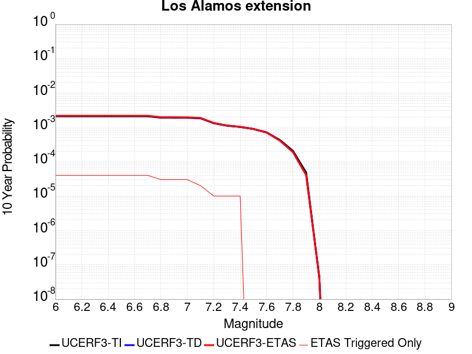 |

| Magnitude | 1 wk TI Prob | 1 wk TD Prob | 1 wk ETAS Prob | 1 wk ETAS/TD Gain | 1 wk ETAS Triggered Only | 1 mo TI Prob | 1 mo TD Prob | 1 mo ETAS Prob | 1 mo ETAS/TD Gain | 1 mo ETAS Triggered Only | 1 yr TI Prob | 1 yr TD Prob | 1 yr ETAS Prob | 1 yr ETAS/TD Gain | 1 yr ETAS Triggered Only | 10 yr TI Prob | 10 yr TD Prob | 10 yr ETAS Prob | 10 yr ETAS/TD Gain | 10 yr ETAS Triggered Only |
|-----|-----|-----|-----|-----|-----|-----|-----|-----|-----|-----|-----|-----|-----|-----|-----|-----|-----|-----|-----|-----|
| 6.0 | 4.0146506E-6 | 4.0861596E-6 | 8.4162704E-5 | 20.59702 | 8.0076876E-5 | 1.7205533E-5 | 1.7512002E-5 | 9.758747E-5 | 5.572605 | 8.0076876E-5 | 2.0945723E-4 | 2.1318886E-4 | 2.9324865E-4 | 1.3755347 | 8.0076876E-5 | 0.0020925992 | 0.0021299527 | 0.002209859 | 1.0375155 | 8.0076876E-5 |
| 6.1 | 4.0146506E-6 | 4.0861596E-6 | 8.4162704E-5 | 20.59702 | 8.0076876E-5 | 1.7205533E-5 | 1.7512002E-5 | 9.758747E-5 | 5.572605 | 8.0076876E-5 | 2.0945723E-4 | 2.1318886E-4 | 2.9324865E-4 | 1.3755347 | 8.0076876E-5 | 0.0020925992 | 0.0021299527 | 0.002209859 | 1.0375155 | 8.0076876E-5 |
| 6.2 | 4.0146506E-6 | 4.0861596E-6 | 8.4162704E-5 | 20.59702 | 8.0076876E-5 | 1.7205533E-5 | 1.7512002E-5 | 9.758747E-5 | 5.572605 | 8.0076876E-5 | 2.0945723E-4 | 2.1318886E-4 | 2.9324865E-4 | 1.3755347 | 8.0076876E-5 | 0.0020925992 | 0.0021299527 | 0.002209859 | 1.0375155 | 8.0076876E-5 |
| 6.3 | 4.0146506E-6 | 4.0861596E-6 | 8.4162704E-5 | 20.59702 | 8.0076876E-5 | 1.7205533E-5 | 1.7512002E-5 | 9.758747E-5 | 5.572605 | 8.0076876E-5 | 2.0945723E-4 | 2.1318886E-4 | 2.9324865E-4 | 1.3755347 | 8.0076876E-5 | 0.0020925992 | 0.0021299527 | 0.002209859 | 1.0375155 | 8.0076876E-5 |
| 6.4 | 4.0146506E-6 | 4.0861596E-6 | 8.4162704E-5 | 20.59702 | 8.0076876E-5 | 1.7205533E-5 | 1.7512002E-5 | 9.758747E-5 | 5.572605 | 8.0076876E-5 | 2.0945723E-4 | 2.1318886E-4 | 2.9324865E-4 | 1.3755347 | 8.0076876E-5 | 0.0020925992 | 0.0021299527 | 0.002209859 | 1.0375155 | 8.0076876E-5 |
| 6.5 | 4.0146506E-6 | 4.0861596E-6 | 8.4162704E-5 | 20.59702 | 8.0076876E-5 | 1.7205533E-5 | 1.7512002E-5 | 9.758747E-5 | 5.572605 | 8.0076876E-5 | 2.0945723E-4 | 2.1318886E-4 | 2.9324865E-4 | 1.3755347 | 8.0076876E-5 | 0.0020925992 | 0.0021299527 | 0.002209859 | 1.0375155 | 8.0076876E-5 |
| 6.6 | 4.0146506E-6 | 4.0861596E-6 | 8.4162704E-5 | 20.59702 | 8.0076876E-5 | 1.7205533E-5 | 1.7512002E-5 | 9.758747E-5 | 5.572605 | 8.0076876E-5 | 2.0945723E-4 | 2.1318886E-4 | 2.9324865E-4 | 1.3755347 | 8.0076876E-5 | 0.0020925992 | 0.0021299527 | 0.002209859 | 1.0375155 | 8.0076876E-5 |
| 6.7 | 4.0146506E-6 | 4.0861596E-6 | 8.4162704E-5 | 20.59702 | 8.0076876E-5 | 1.7205533E-5 | 1.7512002E-5 | 9.758747E-5 | 5.572605 | 8.0076876E-5 | 2.0945723E-4 | 2.1318886E-4 | 2.9324865E-4 | 1.3755347 | 8.0076876E-5 | 0.0020925992 | 0.0021299527 | 0.002209859 | 1.0375155 | 8.0076876E-5 |
| 6.8 | 3.6584688E-6 | 3.7188588E-6 | 8.3795436E-5 | 22.532566 | 8.0076876E-5 | 1.5679057E-5 | 1.5937874E-5 | 9.601347E-5 | 6.0242333 | 8.0076876E-5 | 1.9087581E-4 | 1.9402728E-4 | 2.740886E-4 | 1.4126292 | 8.0076876E-5 | 0.0019071194 | 0.0019386712 | 0.0020185928 | 1.041225 | 8.0076876E-5 |
| 6.9 | 3.644631E-6 | 3.7045688E-6 | 8.3781146E-5 | 22.615627 | 8.0076876E-5 | 1.5619753E-5 | 1.5876632E-5 | 9.595224E-5 | 6.043614 | 8.0076876E-5 | 1.901539E-4 | 1.9328178E-4 | 2.7334318E-4 | 1.4142212 | 8.0076876E-5 | 0.0018999127 | 0.0019312293 | 0.0020111515 | 1.0413841 | 8.0076876E-5 |
| 7.0 | 3.6318522E-6 | 3.6913295E-6 | 8.376791E-5 | 22.693153 | 8.0076876E-5 | 1.5564989E-5 | 1.5819893E-5 | 9.58955E-5 | 6.0617037 | 8.0076876E-5 | 1.8948725E-4 | 1.925911E-4 | 2.7265254E-4 | 1.4157069 | 8.0076876E-5 | 0.0018932576 | 0.0019243343 | 0.0020042572 | 1.0415326 | 8.0076876E-5 |
| 7.1 | 3.5001724E-6 | 3.5554E-6 | 4.3593696E-5 | 12.261263 | 4.0038438E-5 | 1.5000653E-5 | 1.5237345E-5 | 5.5275174E-5 | 3.6276119 | 4.0038438E-5 | 1.8261763E-4 | 1.854998E-4 | 2.255308E-4 | 1.2158009 | 4.0038438E-5 | 0.0018246764 | 0.0018535402 | 0.0018935045 | 1.021561 | 4.0038438E-5 |
| 7.2 | 2.5204702E-6 | 2.5436943E-6 | 2.5436943E-6 | 1.0 | 0.0 | 1.080197E-5 | 1.0901502E-5 | 1.0901502E-5 | 1.0 | 0.0 | 1.3150605E-4 | 1.3271775E-4 | 1.3271775E-4 | 1.0 | 0.0 | 0.0013142825 | 0.0013263905 | 0.0013263905 | 1.0 | 0.0 |
| 7.3 | 2.1399692E-6 | 2.1501316E-6 | 2.1501316E-6 | 1.0 | 0.0 | 9.1712645E-6 | 9.2148175E-6 | 9.2148175E-6 | 1.0 | 0.0 | 1.1165442E-4 | 1.1218466E-4 | 1.1218466E-4 | 1.0 | 0.0 | 0.0011159834 | 0.0011212835 | 0.0011212835 | 1.0 | 0.0 |
| 7.4 | 1.9660122E-6 | 1.9702363E-6 | 1.9702363E-6 | 1.0 | 0.0 | 8.42574E-6 | 8.4438425E-6 | 8.4438425E-6 | 1.0 | 0.0 | 1.0257855E-4 | 1.0279897E-4 | 1.0279897E-4 | 1.0 | 0.0 | 0.0010253121 | 0.0010275173 | 0.0010275173 | 1.0 | 0.0 |
| 7.5 | 1.7204633E-6 | 1.7150983E-6 | 1.7150983E-6 | 1.0 | 0.0 | 7.373393E-6 | 7.3504007E-6 | 7.3504007E-6 | 1.0 | 0.0 | 8.976737E-5 | 8.948748E-5 | 8.948748E-5 | 1.0 | 0.0 | 8.9731114E-4 | 8.9451746E-4 | 8.9451746E-4 | 1.0 | 0.0 |
| 7.6 | 1.3717638E-6 | 1.3535827E-6 | 1.3535827E-6 | 1.0 | 0.0 | 5.878974E-6 | 5.8010555E-6 | 5.8010555E-6 | 1.0 | 0.0 | 7.157416E-5 | 7.062559E-5 | 7.062559E-5 | 1.0 | 0.0 | 7.1551115E-4 | 7.060341E-4 | 7.060341E-4 | 1.0 | 0.0 |
| 7.7 | 8.272564E-7 | 7.957636E-7 | 7.957636E-7 | 1.0 | 0.0 | 3.5453797E-6 | 3.410411E-6 | 3.410411E-6 | 1.0 | 0.0 | 4.3164142E-5 | 4.1520965E-5 | 4.1520965E-5 | 1.0 | 0.0 | 4.315576E-4 | 4.1513226E-4 | 4.1513226E-4 | 1.0 | 0.0 |
| 7.8 | 3.9708277E-7 | 3.6719027E-7 | 3.6719027E-7 | 1.0 | 0.0 | 1.7017821E-6 | 1.5736716E-6 | 1.5736716E-6 | 1.0 | 0.0 | 2.0719E-5 | 1.9159284E-5 | 1.9159284E-5 | 1.0 | 0.0 | 2.071707E-4 | 1.9157639E-4 | 1.9157639E-4 | 1.0 | 0.0 |
| 7.9 | 9.292528E-8 | 7.889087E-8 | 7.889087E-8 | 1.0 | 0.0 | 3.9825116E-7 | 3.381037E-7 | 3.381037E-7 | 1.0 | 0.0 | 4.848697E-6 | 4.116405E-6 | 4.116405E-6 | 1.0 | 0.0 | 4.8485912E-5 | 4.1163294E-5 | 4.1163294E-5 | 1.0 | 0.0 |
| 8.0 | 7.880441E-11 | 8.2353124E-11 | 8.2353124E-11 | 1.0 | 0.0 | 3.3773329E-10 | 3.52942E-10 | 3.52942E-10 | 1.0 | 0.0 | 4.1119033E-9 | 4.2970694E-9 | 4.2970694E-9 | 1.0 | 0.0 | 4.1119034E-8 | 4.2970694E-8 | 4.2970694E-8 | 1.0 | 0.0 |

## Mission Ridge-Arroyo Parida-Santa Ana
*[(top)](#table-of-contents)*

| 1 Week | 1 Month | 1 Year | 10 Year |
|-----|-----|-----|-----|
|  |  |  | 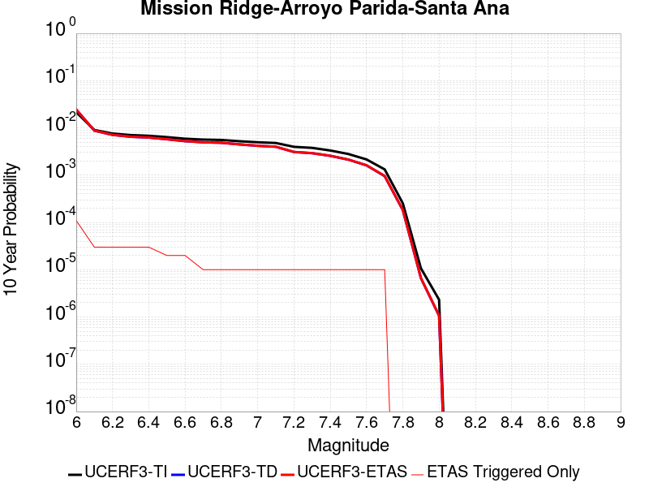 |

| Magnitude | 1 wk TI Prob | 1 wk TD Prob | 1 wk ETAS Prob | 1 wk ETAS/TD Gain | 1 wk ETAS Triggered Only | 1 mo TI Prob | 1 mo TD Prob | 1 mo ETAS Prob | 1 mo ETAS/TD Gain | 1 mo ETAS Triggered Only | 1 yr TI Prob | 1 yr TD Prob | 1 yr ETAS Prob | 1 yr ETAS/TD Gain | 1 yr ETAS Triggered Only | 10 yr TI Prob | 10 yr TD Prob | 10 yr ETAS Prob | 10 yr ETAS/TD Gain | 10 yr ETAS Triggered Only |
|-----|-----|-----|-----|-----|-----|-----|-----|-----|-----|-----|-----|-----|-----|-----|-----|-----|-----|-----|-----|-----|
| 6.0 | 4.169034E-5 | 4.7138263E-5 | 8.717481E-5 | 1.849343 | 4.0038438E-5 | 1.7866064E-4 | 2.0201034E-4 | 2.420407E-4 | 1.1981599 | 4.0038438E-5 | 0.0021730233 | 0.00245745 | 0.0025373301 | 1.0325053 | 8.0076876E-5 | 0.021518968 | 0.024384614 | 0.024462739 | 1.0032039 | 8.0076876E-5 |
| 6.1 | 1.73813E-5 | 1.6854226E-5 | 5.689199E-5 | 3.3755324 | 4.0038438E-5 | 7.4489166E-5 | 7.223046E-5 | 1.12266E-4 | 1.5542752 | 4.0038438E-5 | 9.065282E-4 | 8.790618E-4 | 9.1906503E-4 | 1.0455067 | 4.0038438E-5 | 0.009028391 | 0.008756988 | 0.008796676 | 1.0045321 | 4.0038438E-5 |
| 6.2 | 1.4622182E-5 | 1.367329E-5 | 5.3711177E-5 | 3.9281826 | 4.0038438E-5 | 6.2664985E-5 | 5.8598518E-5 | 9.8634606E-5 | 1.6832271 | 4.0038438E-5 | 7.6267915E-4 | 7.132073E-4 | 7.532172E-4 | 1.0560986 | 4.0038438E-5 | 0.007600669 | 0.007109627 | 0.007149381 | 1.0055915 | 4.0038438E-5 |
| 6.3 | 1.3552434E-5 | 1.2482201E-5 | 5.252014E-5 | 4.2076025 | 4.0038438E-5 | 5.8080568E-5 | 5.3494066E-5 | 9.353036E-5 | 1.748425 | 4.0038438E-5 | 7.069015E-4 | 6.510988E-4 | 6.9111114E-4 | 1.0614536 | 4.0038438E-5 | 0.00704657 | 0.006492275 | 0.0065320535 | 1.006127 | 4.0038438E-5 |
| 6.4 | 1.30977305E-5 | 1.1979156E-5 | 5.2017112E-5 | 4.342302 | 4.0038438E-5 | 5.613192E-5 | 5.1338247E-5 | 9.1374626E-5 | 1.7798549 | 4.0038438E-5 | 6.831918E-4 | 6.248669E-4 | 6.648803E-4 | 1.064035 | 4.0038438E-5 | 0.006810953 | 0.0062314444 | 0.0062712333 | 1.0063852 | 4.0038438E-5 |
| 6.5 | 1.225205E-5 | 1.1048803E-5 | 1.1048803E-5 | 1.0 | 0.0 | 5.2507727E-5 | 4.7351168E-5 | 4.7351168E-5 | 1.0 | 0.0 | 6.3909404E-4 | 5.7635066E-4 | 5.7635066E-4 | 1.0 | 0.0 | 0.006372592 | 0.005748869 | 0.005748869 | 1.0 | 0.0 |
| 6.6 | 1.1352241E-5 | 1.0063535E-5 | 1.0063535E-5 | 1.0 | 0.0 | 4.8651553E-5 | 4.3128734E-5 | 4.3128734E-5 | 1.0 | 0.0 | 5.921717E-4 | 5.2496797E-4 | 5.2496797E-4 | 1.0 | 0.0 | 0.0059059616 | 0.0052375244 | 0.0052375244 | 1.0 | 0.0 |
| 6.7 | 1.0864116E-5 | 9.517027E-6 | 9.517027E-6 | 1.0 | 0.0 | 4.6559664E-5 | 4.0786632E-5 | 4.0786632E-5 | 1.0 | 0.0 | 5.667165E-4 | 4.964661E-4 | 4.964661E-4 | 1.0 | 0.0 | 0.005652734 | 0.004953804 | 0.004953804 | 1.0 | 0.0 |
| 6.8 | 1.0666365E-5 | 9.299779E-6 | 9.299779E-6 | 1.0 | 0.0 | 4.571219E-5 | 3.9855597E-5 | 3.9855597E-5 | 1.0 | 0.0 | 5.564038E-4 | 4.8513585E-4 | 4.8513585E-4 | 1.0 | 0.0 | 0.005550127 | 0.0048410003 | 0.0048410003 | 1.0 | 0.0 |
| 6.9 | 1.0038665E-5 | 8.592046E-6 | 8.592046E-6 | 1.0 | 0.0 | 4.302214E-5 | 3.682254E-5 | 3.682254E-5 | 1.0 | 0.0 | 5.236687E-4 | 4.4822405E-4 | 4.4822405E-4 | 1.0 | 0.0 | 0.005224364 | 0.004473411 | 0.004473411 | 1.0 | 0.0 |
| 7.0 | 9.5379955E-6 | 8.025073E-6 | 8.025073E-6 | 1.0 | 0.0 | 4.0876483E-5 | 3.4392728E-5 | 3.4392728E-5 | 1.0 | 0.0 | 4.975576E-4 | 4.1865272E-4 | 4.1865272E-4 | 1.0 | 0.0 | 0.00496445 | 0.0041788397 | 0.0041788397 | 1.0 | 0.0 |
| 7.1 | 9.207389E-6 | 7.652375E-6 | 7.652375E-6 | 1.0 | 0.0 | 3.945964E-5 | 3.279549E-5 | 3.279549E-5 | 1.0 | 0.0 | 4.803152E-4 | 3.9921363E-4 | 3.9921363E-4 | 1.0 | 0.0 | 0.004792784 | 0.003985161 | 0.003985161 | 1.0 | 0.0 |
| 7.2 | 7.638091E-6 | 5.9311183E-6 | 5.9311183E-6 | 1.0 | 0.0 | 3.2734264E-5 | 2.541883E-5 | 2.541883E-5 | 1.0 | 0.0 | 3.984668E-4 | 3.0943064E-4 | 3.0943064E-4 | 1.0 | 0.0 | 0.0039775306 | 0.0030900547 | 0.0030900547 | 1.0 | 0.0 |
| 7.3 | 7.2500147E-6 | 5.5961527E-6 | 5.5961527E-6 | 1.0 | 0.0 | 3.1071122E-5 | 2.3983293E-5 | 2.3983293E-5 | 1.0 | 0.0 | 3.7822526E-4 | 2.9195778E-4 | 2.9195778E-4 | 1.0 | 0.0 | 0.0037758215 | 0.0029157975 | 0.0029157975 | 1.0 | 0.0 |
| 7.4 | 6.3899715E-6 | 4.9184964E-6 | 4.9184964E-6 | 1.0 | 0.0 | 2.7385306E-5 | 2.10791E-5 | 2.10791E-5 | 1.0 | 0.0 | 3.3336508E-4 | 2.5660804E-4 | 2.5660804E-4 | 1.0 | 0.0 | 0.0033286542 | 0.0025631618 | 0.0025631618 | 1.0 | 0.0 |
| 7.5 | 5.379025E-6 | 4.0838527E-6 | 4.0838527E-6 | 1.0 | 0.0 | 2.305276E-5 | 1.7502109E-5 | 1.7502109E-5 | 1.0 | 0.0 | 2.806312E-4 | 2.1306744E-4 | 2.1306744E-4 | 1.0 | 0.0 | 0.0028027708 | 0.002128643 | 0.002128643 | 1.0 | 0.0 |
| 7.6 | 4.1270696E-6 | 3.0883439E-6 | 3.0883439E-6 | 1.0 | 0.0 | 1.768732E-5 | 1.3235693E-5 | 1.3235693E-5 | 1.0 | 0.0 | 2.1532185E-4 | 1.6113273E-4 | 1.6113273E-4 | 1.0 | 0.0 | 0.0021511333 | 0.001610167 | 0.001610167 | 1.0 | 0.0 |
| 7.7 | 2.5406805E-6 | 1.8282013E-6 | 1.8282013E-6 | 1.0 | 0.0 | 1.0888585E-5 | 7.835125E-6 | 7.835125E-6 | 1.0 | 0.0 | 1.3256045E-4 | 9.538854E-5 | 9.538854E-5 | 1.0 | 0.0 | 0.0013248142 | 9.534821E-4 | 9.534821E-4 | 1.0 | 0.0 |
| 7.8 | 4.8608285E-7 | 3.5098864E-7 | 3.5098864E-7 | 1.0 | 0.0 | 2.0832106E-6 | 1.5042363E-6 | 1.5042363E-6 | 1.0 | 0.0 | 2.5362791E-5 | 1.8313924E-5 | 1.8313924E-5 | 1.0 | 0.0 | 2.5359896E-4 | 1.8312426E-4 | 1.8312426E-4 | 1.0 | 0.0 |
| 7.9 | 2.0472514E-8 | 1.2688783E-8 | 1.2688783E-8 | 1.0 | 0.0 | 8.7739345E-8 | 5.43805E-8 | 5.43805E-8 | 1.0 | 0.0 | 1.068226E-6 | 6.6208236E-7 | 6.6208236E-7 | 1.0 | 0.0 | 1.0682209E-5 | 6.620805E-6 | 6.620805E-6 | 1.0 | 0.0 |
| 8.0 | 4.443582E-9 | 2.0321211E-9 | 2.0321211E-9 | 1.0 | 0.0 | 1.9043922E-8 | 8.70909E-9 | 8.70909E-9 | 1.0 | 0.0 | 2.3185973E-7 | 1.0603316E-7 | 1.0603316E-7 | 1.0 | 0.0 | 2.3185949E-6 | 1.0603312E-6 | 1.0603312E-6 | 1.0 | 0.0 |

## Camp Rock 2011
*[(top)](#table-of-contents)*

| 1 Week | 1 Month | 1 Year | 10 Year |
|-----|-----|-----|-----|
| 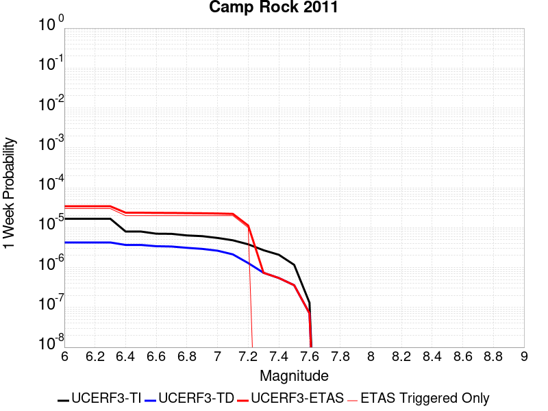 |  |  |  |

| Magnitude | 1 wk TI Prob | 1 wk TD Prob | 1 wk ETAS Prob | 1 wk ETAS/TD Gain | 1 wk ETAS Triggered Only | 1 mo TI Prob | 1 mo TD Prob | 1 mo ETAS Prob | 1 mo ETAS/TD Gain | 1 mo ETAS Triggered Only | 1 yr TI Prob | 1 yr TD Prob | 1 yr ETAS Prob | 1 yr ETAS/TD Gain | 1 yr ETAS Triggered Only | 10 yr TI Prob | 10 yr TD Prob | 10 yr ETAS Prob | 10 yr ETAS/TD Gain | 10 yr ETAS Triggered Only |
|-----|-----|-----|-----|-----|-----|-----|-----|-----|-----|-----|-----|-----|-----|-----|-----|-----|-----|-----|-----|-----|
| 6.0 | 1.6710783E-5 | 4.25026E-6 | 4.428853E-5 | 10.420192 | 4.0038438E-5 | 7.161568E-5 | 1.8215276E-5 | 5.8252983E-5 | 3.198029 | 4.0038438E-5 | 8.7157206E-4 | 2.2174895E-4 | 3.0180806E-4 | 1.3610349 | 8.0076876E-5 | 0.008681616 | 0.0022153298 | 0.0022952291 | 1.0360667 | 8.0076876E-5 |
| 6.1 | 1.6710783E-5 | 4.25026E-6 | 4.428853E-5 | 10.420192 | 4.0038438E-5 | 7.161568E-5 | 1.8215276E-5 | 5.8252983E-5 | 3.198029 | 4.0038438E-5 | 8.7157206E-4 | 2.2174895E-4 | 3.0180806E-4 | 1.3610349 | 8.0076876E-5 | 0.008681616 | 0.0022153298 | 0.0022952291 | 1.0360667 | 8.0076876E-5 |
| 6.2 | 1.6710783E-5 | 4.25026E-6 | 4.428853E-5 | 10.420192 | 4.0038438E-5 | 7.161568E-5 | 1.8215276E-5 | 5.8252983E-5 | 3.198029 | 4.0038438E-5 | 8.7157206E-4 | 2.2174895E-4 | 3.0180806E-4 | 1.3610349 | 8.0076876E-5 | 0.008681616 | 0.0022153298 | 0.0022952291 | 1.0360667 | 8.0076876E-5 |
| 6.3 | 1.6710783E-5 | 4.25026E-6 | 4.428853E-5 | 10.420192 | 4.0038438E-5 | 7.161568E-5 | 1.8215276E-5 | 5.8252983E-5 | 3.198029 | 4.0038438E-5 | 8.7157206E-4 | 2.2174895E-4 | 3.0180806E-4 | 1.3610349 | 8.0076876E-5 | 0.008681616 | 0.0022153298 | 0.0022952291 | 1.0360667 | 8.0076876E-5 |
| 6.4 | 7.982846E-6 | 3.6820884E-6 | 3.6820884E-6 | 1.0 | 0.0 | 3.421175E-5 | 1.5780286E-5 | 1.5780286E-5 | 1.0 | 0.0 | 4.1644843E-4 | 1.9210839E-4 | 2.3213914E-4 | 1.2083758 | 4.0038438E-5 | 0.0041566887 | 0.001919458 | 0.0019594196 | 1.0208192 | 4.0038438E-5 |
| 6.5 | 7.982846E-6 | 3.6820884E-6 | 3.6820884E-6 | 1.0 | 0.0 | 3.421175E-5 | 1.5780286E-5 | 1.5780286E-5 | 1.0 | 0.0 | 4.1644843E-4 | 1.9210839E-4 | 2.3213914E-4 | 1.2083758 | 4.0038438E-5 | 0.0041566887 | 0.001919458 | 0.0019594196 | 1.0208192 | 4.0038438E-5 |
| 6.6 | 7.048869E-6 | 3.4243571E-6 | 3.4243571E-6 | 1.0 | 0.0 | 3.0209088E-5 | 1.4675736E-5 | 1.4675736E-5 | 1.0 | 0.0 | 3.677336E-4 | 1.7866275E-4 | 2.1869403E-4 | 1.2240607 | 4.0038438E-5 | 0.0036712566 | 0.0017852228 | 0.0018251897 | 1.0223876 | 4.0038438E-5 |
| 6.7 | 6.987307E-6 | 3.3623348E-6 | 3.3623348E-6 | 1.0 | 0.0 | 2.9945259E-5 | 1.4409929E-5 | 1.4409929E-5 | 1.0 | 0.0 | 3.6452254E-4 | 1.7542706E-4 | 2.1545848E-4 | 1.228194 | 4.0038438E-5 | 0.0036392517 | 0.001752917 | 0.0017928852 | 1.022801 | 4.0038438E-5 |
| 6.8 | 6.3737602E-6 | 3.1179077E-6 | 3.1179077E-6 | 1.0 | 0.0 | 2.731583E-5 | 1.3362394E-5 | 1.3362394E-5 | 1.0 | 0.0 | 3.3251947E-4 | 1.626753E-4 | 2.0270722E-4 | 1.2460848 | 4.0038438E-5 | 0.0033202237 | 0.0016255907 | 0.0016655641 | 1.02459 | 4.0038438E-5 |
| 6.9 | 6.112211E-6 | 2.9331156E-6 | 2.9331156E-6 | 1.0 | 0.0 | 2.6194928E-5 | 1.2570436E-5 | 1.2570436E-5 | 1.0 | 0.0 | 3.1887658E-4 | 1.5303459E-4 | 1.930669E-4 | 1.2615899 | 4.0038438E-5 | 0.003184194 | 0.0015293199 | 0.001569297 | 1.0261406 | 4.0038438E-5 |
| 7.0 | 5.5140117E-6 | 2.641923E-6 | 2.641923E-6 | 1.0 | 0.0 | 2.3631264E-5 | 1.132248E-5 | 1.132248E-5 | 1.0 | 0.0 | 2.8767265E-4 | 1.3784273E-4 | 1.7787564E-4 | 1.2904246 | 4.0038438E-5 | 0.0028730053 | 0.0013775975 | 0.0014175808 | 1.0290239 | 4.0038438E-5 |
| 7.1 | 4.8151105E-6 | 2.1342705E-6 | 2.1342705E-6 | 1.0 | 0.0 | 2.0636026E-5 | 9.146843E-6 | 9.146843E-6 | 1.0 | 0.0 | 2.5121463E-4 | 1.1135734E-4 | 1.5139132E-4 | 1.3595091 | 4.0038438E-5 | 0.0025093083 | 0.0011130372 | 0.0011530311 | 1.0359322 | 4.0038438E-5 |
| 7.2 | 3.818335E-6 | 1.2937425E-6 | 1.2937425E-6 | 1.0 | 0.0 | 1.6364189E-5 | 5.5445994E-6 | 5.5445994E-6 | 1.0 | 0.0 | 1.9921579E-4 | 6.750349E-5 | 6.750349E-5 | 1.0 | 0.0 | 0.0019903728 | 6.748381E-4 | 6.748381E-4 | 1.0 | 0.0 |
| 7.3 | 2.7166698E-6 | 7.3835776E-7 | 7.3835776E-7 | 1.0 | 0.0 | 1.1642818E-5 | 3.1643867E-6 | 3.1643867E-6 | 1.0 | 0.0 | 1.4174209E-4 | 3.8525748E-5 | 3.8525748E-5 | 1.0 | 0.0 | 0.0014165172 | 3.851927E-4 | 3.851927E-4 | 1.0 | 0.0 |
| 7.4 | 2.0893426E-6 | 5.4618386E-7 | 5.4618386E-7 | 1.0 | 0.0 | 8.954295E-6 | 2.3407858E-6 | 2.3407858E-6 | 1.0 | 0.0 | 1.0901308E-4 | 2.84987E-5 | 2.84987E-5 | 1.0 | 0.0 | 0.0010895962 | 2.84951E-4 | 2.84951E-4 | 1.0 | 0.0 |
| 7.5 | 1.1681728E-6 | 3.6030585E-7 | 3.6030585E-7 | 1.0 | 0.0 | 5.0064455E-6 | 1.544167E-6 | 1.544167E-6 | 1.0 | 0.0 | 6.0951766E-5 | 1.8800076E-5 | 1.8800076E-5 | 1.0 | 0.0 | 6.093505E-4 | 1.8798532E-4 | 1.8798532E-4 | 1.0 | 0.0 |
| 7.6 | 1.3154387E-7 | 7.1197384E-8 | 7.1197384E-8 | 1.0 | 0.0 | 5.6375933E-7 | 3.051316E-7 | 3.051316E-7 | 1.0 | 0.0 | 6.863748E-6 | 3.7149728E-6 | 3.7149728E-6 | 1.0 | 0.0 | 6.863536E-5 | 3.7149264E-5 | 3.7149264E-5 | 1.0 | 0.0 |

## Independence rev 2011
*[(top)](#table-of-contents)*

| 1 Week | 1 Month | 1 Year | 10 Year |
|-----|-----|-----|-----|
|  |  |  |  |

| Magnitude | 1 wk TI Prob | 1 wk TD Prob | 1 wk ETAS Prob | 1 wk ETAS/TD Gain | 1 wk ETAS Triggered Only | 1 mo TI Prob | 1 mo TD Prob | 1 mo ETAS Prob | 1 mo ETAS/TD Gain | 1 mo ETAS Triggered Only | 1 yr TI Prob | 1 yr TD Prob | 1 yr ETAS Prob | 1 yr ETAS/TD Gain | 1 yr ETAS Triggered Only | 10 yr TI Prob | 10 yr TD Prob | 10 yr ETAS Prob | 10 yr ETAS/TD Gain | 10 yr ETAS Triggered Only |
|-----|-----|-----|-----|-----|-----|-----|-----|-----|-----|-----|-----|-----|-----|-----|-----|-----|-----|-----|-----|-----|
| 6.0 | 4.422171E-6 | 4.326227E-6 | 4.436449E-5 | 10.254776 | 4.0038438E-5 | 1.8952025E-5 | 1.8540857E-5 | 5.8578553E-5 | 3.1594305 | 4.0038438E-5 | 2.3071647E-4 | 2.2571455E-4 | 3.0577334E-4 | 1.3546904 | 8.0076876E-5 | 0.0023047708 | 0.0022551466 | 0.002335043 | 1.0354284 | 8.0076876E-5 |
| 6.1 | 4.422171E-6 | 4.326227E-6 | 4.436449E-5 | 10.254776 | 4.0038438E-5 | 1.8952025E-5 | 1.8540857E-5 | 5.8578553E-5 | 3.1594305 | 4.0038438E-5 | 2.3071647E-4 | 2.2571455E-4 | 3.0577334E-4 | 1.3546904 | 8.0076876E-5 | 0.0023047708 | 0.0022551466 | 0.002335043 | 1.0354284 | 8.0076876E-5 |
| 6.2 | 4.422171E-6 | 4.326227E-6 | 4.436449E-5 | 10.254776 | 4.0038438E-5 | 1.8952025E-5 | 1.8540857E-5 | 5.8578553E-5 | 3.1594305 | 4.0038438E-5 | 2.3071647E-4 | 2.2571455E-4 | 3.0577334E-4 | 1.3546904 | 8.0076876E-5 | 0.0023047708 | 0.0022551466 | 0.002335043 | 1.0354284 | 8.0076876E-5 |
| 6.3 | 4.422171E-6 | 4.326227E-6 | 4.436449E-5 | 10.254776 | 4.0038438E-5 | 1.8952025E-5 | 1.8540857E-5 | 5.8578553E-5 | 3.1594305 | 4.0038438E-5 | 2.3071647E-4 | 2.2571455E-4 | 3.0577334E-4 | 1.3546904 | 8.0076876E-5 | 0.0023047708 | 0.0022551466 | 0.002335043 | 1.0354284 | 8.0076876E-5 |
| 6.4 | 4.422171E-6 | 4.326227E-6 | 4.436449E-5 | 10.254776 | 4.0038438E-5 | 1.8952025E-5 | 1.8540857E-5 | 5.8578553E-5 | 3.1594305 | 4.0038438E-5 | 2.3071647E-4 | 2.2571455E-4 | 3.0577334E-4 | 1.3546904 | 8.0076876E-5 | 0.0023047708 | 0.0022551466 | 0.002335043 | 1.0354284 | 8.0076876E-5 |
| 6.5 | 4.422171E-6 | 4.326227E-6 | 4.436449E-5 | 10.254776 | 4.0038438E-5 | 1.8952025E-5 | 1.8540857E-5 | 5.8578553E-5 | 3.1594305 | 4.0038438E-5 | 2.3071647E-4 | 2.2571455E-4 | 3.0577334E-4 | 1.3546904 | 8.0076876E-5 | 0.0023047708 | 0.0022551466 | 0.002335043 | 1.0354284 | 8.0076876E-5 |
| 6.6 | 2.663744E-6 | 2.5319862E-6 | 4.2570322E-5 | 16.813015 | 4.0038438E-5 | 1.1415996E-5 | 1.0851327E-5 | 5.0889328E-5 | 4.6896873 | 4.0038438E-5 | 1.3898089E-4 | 1.3210738E-4 | 2.1217368E-4 | 1.6060698 | 8.0076876E-5 | 0.0013889399 | 0.0013203367 | 0.0014003079 | 1.0605687 | 8.0076876E-5 |
| 6.7 | 2.663744E-6 | 2.5319862E-6 | 4.2570322E-5 | 16.813015 | 4.0038438E-5 | 1.1415996E-5 | 1.0851327E-5 | 5.0889328E-5 | 4.6896873 | 4.0038438E-5 | 1.3898089E-4 | 1.3210738E-4 | 2.1217368E-4 | 1.6060698 | 8.0076876E-5 | 0.0013889399 | 0.0013203367 | 0.0014003079 | 1.0605687 | 8.0076876E-5 |
| 6.8 | 1.9716529E-6 | 1.8322585E-6 | 4.1870622E-5 | 22.85192 | 4.0038438E-5 | 8.449913E-6 | 7.852514E-6 | 4.7890637E-5 | 6.0987654 | 4.0038438E-5 | 1.0287284E-4 | 9.5600284E-5 | 1.756695E-4 | 1.8375416 | 8.0076876E-5 | 0.0010282523 | 9.556045E-4 | 0.0010356049 | 1.083717 | 8.0076876E-5 |
| 6.9 | 1.8788617E-6 | 1.7429993E-6 | 4.1781368E-5 | 23.97096 | 4.0038438E-5 | 8.0522395E-6 | 7.4699765E-6 | 4.7508114E-5 | 6.3598747 | 4.0038438E-5 | 9.80316E-5 | 9.0943286E-5 | 1.7101289E-4 | 1.8804343 | 8.0076876E-5 | 9.798837E-4 | 9.0907275E-4 | 9.890768E-4 | 1.0880063 | 8.0076876E-5 |
| 7.0 | 1.5045488E-6 | 1.3849503E-6 | 4.1423333E-5 | 29.909615 | 4.0038438E-5 | 6.44805E-6 | 5.9354884E-6 | 4.5973688E-5 | 7.745561 | 4.0038438E-5 | 7.8502184E-5 | 7.226223E-5 | 1.5233332E-4 | 2.1080627 | 8.0076876E-5 | 7.8474457E-4 | 7.2239246E-4 | 8.0241146E-4 | 1.1107695 | 8.0076876E-5 |
| 7.1 | 1.272341E-6 | 1.1625096E-6 | 4.12009E-5 | 35.441338 | 4.0038438E-5 | 5.4528787E-6 | 4.982175E-6 | 4.5020413E-5 | 9.036297 | 4.0038438E-5 | 6.6386776E-5 | 6.0656326E-5 | 1.4072834E-4 | 2.3200934 | 8.0076876E-5 | 6.636695E-4 | 6.064009E-4 | 6.864292E-4 | 1.1319727 | 8.0076876E-5 |
| 7.2 | 1.0416892E-6 | 9.4098806E-7 | 9.4098806E-7 | 1.0 | 0.0 | 4.464375E-6 | 4.0328E-6 | 4.0328E-6 | 1.0 | 0.0 | 5.4352407E-5 | 4.909825E-5 | 8.913472E-5 | 1.8154358 | 4.0038438E-5 | 5.4339116E-4 | 4.9087586E-4 | 5.308947E-4 | 1.0815252 | 4.0038438E-5 |
| 7.3 | 7.9450155E-7 | 7.235002E-7 | 7.235002E-7 | 1.0 | 0.0 | 3.4050022E-6 | 3.1007114E-6 | 3.1007114E-6 | 1.0 | 0.0 | 4.1455114E-5 | 3.775052E-5 | 7.7787445E-5 | 2.0605662 | 4.0038438E-5 | 4.144738E-4 | 3.7744216E-4 | 4.174655E-4 | 1.1060383 | 4.0038438E-5 |
| 7.4 | 5.3893444E-7 | 5.019512E-7 | 5.019512E-7 | 1.0 | 0.0 | 2.309717E-6 | 2.1512178E-6 | 2.1512178E-6 | 1.0 | 0.0 | 2.8120441E-5 | 2.6190766E-5 | 6.622815E-5 | 2.5286834 | 4.0038438E-5 | 2.8116882E-4 | 2.6187726E-4 | 3.019052E-4 | 1.15285 | 4.0038438E-5 |
| 7.5 | 3.8852085E-7 | 3.682554E-7 | 3.682554E-7 | 1.0 | 0.0 | 1.6650882E-6 | 1.5782365E-6 | 1.5782365E-6 | 1.0 | 0.0 | 2.027226E-5 | 1.9214862E-5 | 5.925253E-5 | 3.0836823 | 4.0038438E-5 | 2.0270412E-4 | 1.9213221E-4 | 2.3216296E-4 | 1.20835 | 4.0038438E-5 |
| 7.6 | 2.414929E-7 | 2.345755E-7 | 2.345755E-7 | 1.0 | 0.0 | 1.0349692E-6 | 1.0053232E-6 | 1.0053232E-6 | 1.0 | 0.0 | 1.2600677E-5 | 1.2239742E-5 | 5.227769E-5 | 4.271143 | 4.0038438E-5 | 1.2599962E-4 | 1.223908E-4 | 1.6242435E-4 | 1.327096 | 4.0038438E-5 |
| 7.7 | 6.8298014E-8 | 6.85897E-8 | 6.85897E-8 | 1.0 | 0.0 | 2.9270575E-7 | 2.9395582E-7 | 2.9395582E-7 | 1.0 | 0.0 | 3.5636867E-6 | 3.5789067E-6 | 3.5789067E-6 | 1.0 | 0.0 | 3.5636294E-5 | 3.5788536E-5 | 3.5788536E-5 | 1.0 | 0.0 |

## Kern Canyon (South Kern) 2011
*[(top)](#table-of-contents)*

| 1 Week | 1 Month | 1 Year | 10 Year |
|-----|-----|-----|-----|
|  |  |  |  |

| Magnitude | 1 wk TI Prob | 1 wk TD Prob | 1 wk ETAS Prob | 1 wk ETAS/TD Gain | 1 wk ETAS Triggered Only | 1 mo TI Prob | 1 mo TD Prob | 1 mo ETAS Prob | 1 mo ETAS/TD Gain | 1 mo ETAS Triggered Only | 1 yr TI Prob | 1 yr TD Prob | 1 yr ETAS Prob | 1 yr ETAS/TD Gain | 1 yr ETAS Triggered Only | 10 yr TI Prob | 10 yr TD Prob | 10 yr ETAS Prob | 10 yr ETAS/TD Gain | 10 yr ETAS Triggered Only |
|-----|-----|-----|-----|-----|-----|-----|-----|-----|-----|-----|-----|-----|-----|-----|-----|-----|-----|-----|-----|-----|
| 6.0 | 4.105075E-6 | 4.1137264E-6 | 8.419027E-5 | 20.465694 | 8.0076876E-5 | 1.7593058E-5 | 1.763014E-5 | 9.7705604E-5 | 5.541964 | 8.0076876E-5 | 2.1417443E-4 | 2.1462646E-4 | 2.9468615E-4 | 1.3730187 | 8.0076876E-5 | 0.0021396813 | 0.0021442557 | 0.0022241608 | 1.0372647 | 8.0076876E-5 |
| 6.1 | 4.105075E-6 | 4.1137264E-6 | 8.419027E-5 | 20.465694 | 8.0076876E-5 | 1.7593058E-5 | 1.763014E-5 | 9.7705604E-5 | 5.541964 | 8.0076876E-5 | 2.1417443E-4 | 2.1462646E-4 | 2.9468615E-4 | 1.3730187 | 8.0076876E-5 | 0.0021396813 | 0.0021442557 | 0.0022241608 | 1.0372647 | 8.0076876E-5 |
| 6.2 | 4.105075E-6 | 4.1137264E-6 | 8.419027E-5 | 20.465694 | 8.0076876E-5 | 1.7593058E-5 | 1.763014E-5 | 9.7705604E-5 | 5.541964 | 8.0076876E-5 | 2.1417443E-4 | 2.1462646E-4 | 2.9468615E-4 | 1.3730187 | 8.0076876E-5 | 0.0021396813 | 0.0021442557 | 0.0022241608 | 1.0372647 | 8.0076876E-5 |
| 6.3 | 4.105075E-6 | 4.1137264E-6 | 8.419027E-5 | 20.465694 | 8.0076876E-5 | 1.7593058E-5 | 1.763014E-5 | 9.7705604E-5 | 5.541964 | 8.0076876E-5 | 2.1417443E-4 | 2.1462646E-4 | 2.9468615E-4 | 1.3730187 | 8.0076876E-5 | 0.0021396813 | 0.0021442557 | 0.0022241608 | 1.0372647 | 8.0076876E-5 |
| 6.4 | 4.105075E-6 | 4.1137264E-6 | 8.419027E-5 | 20.465694 | 8.0076876E-5 | 1.7593058E-5 | 1.763014E-5 | 9.7705604E-5 | 5.541964 | 8.0076876E-5 | 2.1417443E-4 | 2.1462646E-4 | 2.9468615E-4 | 1.3730187 | 8.0076876E-5 | 0.0021396813 | 0.0021442557 | 0.0022241608 | 1.0372647 | 8.0076876E-5 |
| 6.5 | 2.9849807E-6 | 2.9731548E-6 | 4.3011474E-5 | 14.466611 | 4.0038438E-5 | 1.2792712E-5 | 1.274203E-5 | 5.2779957E-5 | 4.142194 | 4.0038438E-5 | 1.5574014E-4 | 1.5512333E-4 | 1.9515555E-4 | 1.2580671 | 4.0038438E-5 | 0.0015563103 | 0.0015501656 | 0.001590142 | 1.0257884 | 4.0038438E-5 |
| 6.6 | 2.9849807E-6 | 2.9731548E-6 | 4.3011474E-5 | 14.466611 | 4.0038438E-5 | 1.2792712E-5 | 1.274203E-5 | 5.2779957E-5 | 4.142194 | 4.0038438E-5 | 1.5574014E-4 | 1.5512333E-4 | 1.9515555E-4 | 1.2580671 | 4.0038438E-5 | 0.0015563103 | 0.0015501656 | 0.001590142 | 1.0257884 | 4.0038438E-5 |
| 6.7 | 2.6756725E-6 | 2.6582206E-6 | 4.2696553E-5 | 16.062078 | 4.0038438E-5 | 1.1467117E-5 | 1.1392325E-5 | 5.1430306E-5 | 4.5144696 | 4.0038438E-5 | 1.396032E-4 | 1.3869285E-4 | 1.7872572E-4 | 1.2886442 | 4.0038438E-5 | 0.0013951553 | 0.0013860738 | 0.0014260567 | 1.0288461 | 4.0038438E-5 |
| 6.8 | 2.3283721E-6 | 2.3047787E-6 | 4.2343123E-5 | 18.371881 | 4.0038438E-5 | 9.9787E-6 | 9.877586E-6 | 4.9915627E-5 | 5.0534234 | 4.0038438E-5 | 1.214839E-4 | 1.20253055E-4 | 1.6028667E-4 | 1.3329115 | 4.0038438E-5 | 0.001214175 | 0.0012018873 | 0.0012418776 | 1.033273 | 4.0038438E-5 |
| 6.9 | 2.0972677E-6 | 2.0696411E-6 | 4.2107997E-5 | 20.345554 | 4.0038438E-5 | 8.988259E-6 | 8.869861E-6 | 4.8907943E-5 | 5.513947 | 4.0038438E-5 | 1.0942656E-4 | 1.0798526E-4 | 1.4801938E-4 | 1.3707368 | 4.0038438E-5 | 0.0010937268 | 0.0010793337 | 0.0011193289 | 1.0370555 | 4.0038438E-5 |
| 7.0 | 1.7132242E-6 | 1.6787036E-6 | 1.6787036E-6 | 1.0 | 0.0 | 7.3423685E-6 | 7.194424E-6 | 7.194424E-6 | 1.0 | 0.0 | 8.938967E-5 | 8.758863E-5 | 8.758863E-5 | 1.0 | 0.0 | 8.935372E-4 | 8.7554497E-4 | 8.7554497E-4 | 1.0 | 0.0 |
| 7.1 | 1.4215541E-6 | 1.3815752E-6 | 1.3815752E-6 | 1.0 | 0.0 | 6.0923603E-6 | 5.9210233E-6 | 5.9210233E-6 | 1.0 | 0.0 | 7.417196E-5 | 7.20861E-5 | 7.20861E-5 | 1.0 | 0.0 | 7.414721E-4 | 7.206299E-4 | 7.206299E-4 | 1.0 | 0.0 |
| 7.2 | 9.097853E-7 | 8.6037755E-7 | 8.6037755E-7 | 1.0 | 0.0 | 3.899074E-6 | 3.6873273E-6 | 3.6873273E-6 | 1.0 | 0.0 | 4.7470192E-5 | 4.4892295E-5 | 4.4892295E-5 | 1.0 | 0.0 | 4.7460053E-4 | 4.4883334E-4 | 4.4883334E-4 | 1.0 | 0.0 |
| 7.3 | 6.144169E-7 | 5.628206E-7 | 5.628206E-7 | 1.0 | 0.0 | 2.6332125E-6 | 2.4120861E-6 | 2.4120861E-6 | 1.0 | 0.0 | 3.205889E-5 | 2.9366758E-5 | 2.9366758E-5 | 1.0 | 0.0 | 3.2054266E-4 | 2.936293E-4 | 2.936293E-4 | 1.0 | 0.0 |
| 7.4 | 4.049844E-7 | 3.5728314E-7 | 3.5728314E-7 | 1.0 | 0.0 | 1.7356463E-6 | 1.5312125E-6 | 1.5312125E-6 | 1.0 | 0.0 | 2.1131287E-5 | 1.8642357E-5 | 1.8642357E-5 | 1.0 | 0.0 | 2.1129279E-4 | 1.8640817E-4 | 1.8640817E-4 | 1.0 | 0.0 |
| 7.5 | 1.9871162E-7 | 1.583044E-7 | 1.583044E-7 | 1.0 | 0.0 | 8.5162094E-7 | 6.7844724E-7 | 6.7844724E-7 | 1.0 | 0.0 | 1.0368436E-5 | 8.260065E-6 | 8.260065E-6 | 1.0 | 0.0 | 1.0367952E-4 | 8.259767E-5 | 8.259767E-5 | 1.0 | 0.0 |
| 7.6 | 2.572245E-8 | 1.7352555E-8 | 1.7352555E-8 | 1.0 | 0.0 | 1.10239064E-7 | 7.436809E-8 | 7.436809E-8 | 1.0 | 0.0 | 1.3421597E-6 | 9.054312E-7 | 9.054312E-7 | 1.0 | 0.0 | 1.3421517E-5 | 9.05428E-6 | 9.05428E-6 | 1.0 | 0.0 |

## Big Pine (East)
*[(top)](#table-of-contents)*

| 1 Week | 1 Month | 1 Year | 10 Year |
|-----|-----|-----|-----|
|  |  |  |  |

| Magnitude | 1 wk TI Prob | 1 wk TD Prob | 1 wk ETAS Prob | 1 wk ETAS/TD Gain | 1 wk ETAS Triggered Only | 1 mo TI Prob | 1 mo TD Prob | 1 mo ETAS Prob | 1 mo ETAS/TD Gain | 1 mo ETAS Triggered Only | 1 yr TI Prob | 1 yr TD Prob | 1 yr ETAS Prob | 1 yr ETAS/TD Gain | 1 yr ETAS Triggered Only | 10 yr TI Prob | 10 yr TD Prob | 10 yr ETAS Prob | 10 yr ETAS/TD Gain | 10 yr ETAS Triggered Only |
|-----|-----|-----|-----|-----|-----|-----|-----|-----|-----|-----|-----|-----|-----|-----|-----|-----|-----|-----|-----|-----|
| 6.0 | 9.916913E-6 | 1.2816984E-5 | 5.285491E-5 | 4.123818 | 4.0038438E-5 | 4.250036E-5 | 5.49289E-5 | 1.3500138E-4 | 2.4577477 | 8.0076876E-5 | 5.173191E-4 | 6.685763E-4 | 7.485996E-4 | 1.1196922 | 8.0076876E-5 | 0.0051611643 | 0.006670441 | 0.006749984 | 1.0119246 | 8.0076876E-5 |
| 6.1 | 9.916913E-6 | 1.2816984E-5 | 5.285491E-5 | 4.123818 | 4.0038438E-5 | 4.250036E-5 | 5.49289E-5 | 1.3500138E-4 | 2.4577477 | 8.0076876E-5 | 5.173191E-4 | 6.685763E-4 | 7.485996E-4 | 1.1196922 | 8.0076876E-5 | 0.0051611643 | 0.006670441 | 0.006749984 | 1.0119246 | 8.0076876E-5 |
| 6.2 | 9.916913E-6 | 1.2816984E-5 | 5.285491E-5 | 4.123818 | 4.0038438E-5 | 4.250036E-5 | 5.49289E-5 | 1.3500138E-4 | 2.4577477 | 8.0076876E-5 | 5.173191E-4 | 6.685763E-4 | 7.485996E-4 | 1.1196922 | 8.0076876E-5 | 0.0051611643 | 0.006670441 | 0.006749984 | 1.0119246 | 8.0076876E-5 |
| 6.3 | 5.479711E-6 | 8.112951E-6 | 4.8151065E-5 | 5.935086 | 4.0038438E-5 | 2.3484265E-5 | 3.4769346E-5 | 1.1484344E-4 | 3.303008 | 8.0076876E-5 | 2.858834E-4 | 4.2323777E-4 | 5.032807E-4 | 1.1891207 | 8.0076876E-5 | 0.0028551589 | 0.004227244 | 0.004306982 | 1.018863 | 8.0076876E-5 |
| 6.4 | 5.465009E-6 | 8.097245E-6 | 4.8135356E-5 | 5.9446588 | 4.0038438E-5 | 2.3421257E-5 | 3.4702036E-5 | 1.1477613E-4 | 3.3074756 | 8.0076876E-5 | 2.851165E-4 | 4.2241855E-4 | 5.024616E-4 | 1.1894876 | 8.0076876E-5 | 0.0028475097 | 0.0042190826 | 0.0042988216 | 1.0188996 | 8.0076876E-5 |
| 6.5 | 4.826767E-6 | 7.422301E-6 | 4.7460442E-5 | 6.394303 | 4.0038438E-5 | 2.068598E-5 | 3.180949E-5 | 1.1188382E-4 | 3.5173094 | 8.0076876E-5 | 2.518227E-4 | 3.872145E-4 | 4.6726037E-4 | 1.2067223 | 8.0076876E-5 | 0.0025153751 | 0.003868283 | 0.00394805 | 1.0206208 | 8.0076876E-5 |
| 6.6 | 4.3146847E-6 | 6.8822374E-6 | 4.69204E-5 | 6.8176084 | 4.0038438E-5 | 1.8491375E-5 | 2.9494982E-5 | 1.095695E-4 | 3.7148519 | 8.0076876E-5 | 2.2510924E-4 | 3.590447E-4 | 4.390928E-4 | 1.2229475 | 8.0076876E-5 | 0.0022488134 | 0.0035874986 | 0.003667288 | 1.022241 | 8.0076876E-5 |
| 6.7 | 3.6968106E-6 | 5.9954727E-6 | 4.603367E-5 | 7.678072 | 4.0038438E-5 | 1.5843378E-5 | 2.5694639E-5 | 6.573205E-5 | 2.5582008 | 4.0038438E-5 | 1.9287605E-4 | 3.1278885E-4 | 3.5281476E-4 | 1.1279646 | 4.0038438E-5 | 0.0019270873 | 0.0031262483 | 0.0031661615 | 1.0127672 | 4.0038438E-5 |
| 6.8 | 3.4671132E-6 | 5.702177E-6 | 4.5740388E-5 | 8.021565 | 4.0038438E-5 | 1.4858972E-5 | 2.4437682E-5 | 6.447514E-5 | 2.6383493 | 4.0038438E-5 | 1.8089297E-4 | 2.974896E-4 | 3.3751613E-4 | 1.1345476 | 4.0038438E-5 | 0.0018074579 | 0.002973667 | 0.0030135866 | 1.0134243 | 4.0038438E-5 |
| 6.9 | 2.7686972E-6 | 4.825223E-6 | 4.825223E-6 | 1.0 | 0.0 | 1.1865792E-5 | 2.0679368E-5 | 2.0679368E-5 | 1.0 | 0.0 | 1.4445644E-4 | 2.5174298E-4 | 2.5174298E-4 | 1.0 | 0.0 | 0.0014436257 | 0.0025172636 | 0.0025172636 | 1.0 | 0.0 |
| 7.0 | 2.1472624E-6 | 3.9850406E-6 | 3.9850406E-6 | 1.0 | 0.0 | 9.20252E-6 | 1.7078637E-5 | 1.7078637E-5 | 1.0 | 0.0 | 1.12034926E-4 | 2.079131E-4 | 2.079131E-4 | 1.0 | 0.0 | 0.0011197845 | 0.0020798394 | 0.0020798394 | 1.0 | 0.0 |
| 7.1 | 1.7018335E-6 | 3.344876E-6 | 3.344876E-6 | 1.0 | 0.0 | 7.293552E-6 | 1.4335106E-5 | 1.4335106E-5 | 1.0 | 0.0 | 8.879537E-5 | 1.7451629E-4 | 1.7451629E-4 | 1.0 | 0.0 | 8.87599E-4 | 0.0017464145 | 0.0017464145 | 1.0 | 0.0 |
| 7.2 | 1.25603E-6 | 2.794484E-6 | 2.794484E-6 | 1.0 | 0.0 | 5.3829745E-6 | 1.1976307E-5 | 1.1976307E-5 | 1.0 | 0.0 | 6.553574E-5 | 1.4580201E-4 | 1.4580201E-4 | 1.0 | 0.0 | 6.551642E-4 | 0.001459661 | 0.001459661 | 1.0 | 0.0 |
| 7.3 | 1.112297E-6 | 2.610332E-6 | 2.610332E-6 | 1.0 | 0.0 | 4.7669787E-6 | 1.118709E-5 | 1.118709E-5 | 1.0 | 0.0 | 5.803642E-5 | 1.3619453E-4 | 1.3619453E-4 | 1.0 | 0.0 | 5.802127E-4 | 0.0013635408 | 0.0013635408 | 1.0 | 0.0 |
| 7.4 | 1.0137181E-6 | 2.4834917E-6 | 2.4834917E-6 | 1.0 | 0.0 | 4.3444993E-6 | 1.0643494E-5 | 1.0643494E-5 | 1.0 | 0.0 | 5.2892992E-5 | 1.2957705E-4 | 1.2957705E-4 | 1.0 | 0.0 | 5.288041E-4 | 0.0012972289 | 0.0012972289 | 1.0 | 0.0 |
| 7.5 | 9.598608E-7 | 2.4071483E-6 | 2.4071483E-6 | 1.0 | 0.0 | 4.1136827E-6 | 1.031631E-5 | 1.031631E-5 | 1.0 | 0.0 | 5.0082934E-5 | 1.2559404E-4 | 1.2559404E-4 | 1.0 | 0.0 | 5.007165E-4 | 0.0012572526 | 0.0012572526 | 1.0 | 0.0 |
| 7.6 | 7.929459E-7 | 2.0448588E-6 | 2.0448588E-6 | 1.0 | 0.0 | 3.3983351E-6 | 8.763653E-6 | 8.763653E-6 | 1.0 | 0.0 | 4.1373947E-5 | 1.06692416E-4 | 1.06692416E-4 | 1.0 | 0.0 | 4.1366243E-4 | 0.0010685222 | 0.0010685222 | 1.0 | 0.0 |
| 7.7 | 4.155788E-7 | 1.1605589E-6 | 1.1605589E-6 | 1.0 | 0.0 | 1.7810507E-6 | 4.9738146E-6 | 4.9738146E-6 | 1.0 | 0.0 | 2.1684076E-5 | 6.0554554E-5 | 6.0554554E-5 | 1.0 | 0.0 | 2.1681961E-4 | 6.0857297E-4 | 6.0857297E-4 | 1.0 | 0.0 |
| 7.8 | 1.14666925E-7 | 2.592015E-7 | 2.592015E-7 | 1.0 | 0.0 | 4.914296E-7 | 1.1108631E-6 | 1.1108631E-6 | 1.0 | 0.0 | 5.9831386E-6 | 1.3524678E-5 | 1.3524678E-5 | 1.0 | 0.0 | 5.9829777E-5 | 1.3634123E-4 | 1.3634123E-4 | 1.0 | 0.0 |
| 7.9 | 2.9231824E-8 | 4.1463963E-8 | 4.1463963E-8 | 1.0 | 0.0 | 1.2527924E-7 | 1.7770269E-7 | 1.7770269E-7 | 1.0 | 0.0 | 1.5252737E-6 | 2.1635283E-6 | 2.1635283E-6 | 1.0 | 0.0 | 1.5252632E-5 | 2.1967755E-5 | 2.1967755E-5 | 1.0 | 0.0 |

## Malibu Coast alt 1
*[(top)](#table-of-contents)*

| 1 Week | 1 Month | 1 Year | 10 Year |
|-----|-----|-----|-----|
|  |  |  |  |

| Magnitude | 1 wk TI Prob | 1 wk TD Prob | 1 wk ETAS Prob | 1 wk ETAS/TD Gain | 1 wk ETAS Triggered Only | 1 mo TI Prob | 1 mo TD Prob | 1 mo ETAS Prob | 1 mo ETAS/TD Gain | 1 mo ETAS Triggered Only | 1 yr TI Prob | 1 yr TD Prob | 1 yr ETAS Prob | 1 yr ETAS/TD Gain | 1 yr ETAS Triggered Only | 10 yr TI Prob | 10 yr TD Prob | 10 yr ETAS Prob | 10 yr ETAS/TD Gain | 10 yr ETAS Triggered Only |
|-----|-----|-----|-----|-----|-----|-----|-----|-----|-----|-----|-----|-----|-----|-----|-----|-----|-----|-----|-----|-----|
| 6.0 | 1.6572556E-5 | 1.7598066E-5 | 5.76358E-5 | 3.2751212 | 4.0038438E-5 | 7.102331E-5 | 7.541821E-5 | 1.1545363E-4 | 1.5308455 | 4.0038438E-5 | 8.6436566E-4 | 9.178488E-4 | 9.578505E-4 | 1.043582 | 4.0038438E-5 | 0.0086101135 | 0.009142512 | 0.009221857 | 1.0086787 | 8.0076876E-5 |
| 6.1 | 1.6572556E-5 | 1.7598066E-5 | 5.76358E-5 | 3.2751212 | 4.0038438E-5 | 7.102331E-5 | 7.541821E-5 | 1.1545363E-4 | 1.5308455 | 4.0038438E-5 | 8.6436566E-4 | 9.178488E-4 | 9.578505E-4 | 1.043582 | 4.0038438E-5 | 0.0086101135 | 0.009142512 | 0.009221857 | 1.0086787 | 8.0076876E-5 |
| 6.2 | 1.1085717E-5 | 1.1557147E-5 | 5.159512E-5 | 4.4643474 | 4.0038438E-5 | 4.750935E-5 | 4.952971E-5 | 8.9566165E-5 | 1.8083321 | 4.0038438E-5 | 5.782728E-4 | 6.028609E-4 | 6.428752E-4 | 1.0663741 | 4.0038438E-5 | 0.0057677035 | 0.0060126255 | 0.006092221 | 1.0132381 | 8.0076876E-5 |
| 6.3 | 1.0208568E-5 | 1.0592237E-5 | 5.063025E-5 | 4.779939 | 4.0038438E-5 | 4.375027E-5 | 4.539453E-5 | 8.543115E-5 | 1.8819702 | 4.0038438E-5 | 5.325294E-4 | 5.5254117E-4 | 5.9255754E-4 | 1.0724223 | 4.0038438E-5 | 0.0053125503 | 0.0055119814 | 0.005591617 | 1.0144477 | 8.0076876E-5 |
| 6.4 | 9.0682315E-6 | 9.342637E-6 | 4.9380702E-5 | 5.2855206 | 4.0038438E-5 | 3.8863272E-5 | 4.003927E-5 | 8.0076104E-5 | 1.9999391 | 4.0038438E-5 | 4.730576E-4 | 4.8737114E-4 | 5.2739005E-4 | 1.0821118 | 4.0038438E-5 | 0.0047205184 | 0.004863236 | 0.004942924 | 1.0163857 | 8.0076876E-5 |
| 6.5 | 7.605796E-6 | 7.748587E-6 | 4.7786714E-5 | 6.167152 | 4.0038438E-5 | 3.259586E-5 | 3.3207816E-5 | 7.3244926E-5 | 2.2056532 | 4.0038438E-5 | 3.9678233E-4 | 4.0423148E-4 | 4.4425373E-4 | 1.0990082 | 4.0038438E-5 | 0.0039607463 | 0.0040351 | 0.0041148537 | 1.019765 | 8.0076876E-5 |
| 6.6 | 5.889873E-6 | 5.8795385E-6 | 4.591774E-5 | 7.8097525 | 4.0038438E-5 | 2.5242069E-5 | 2.519778E-5 | 6.523521E-5 | 2.5889268 | 4.0038438E-5 | 3.0727885E-4 | 3.0673988E-4 | 3.4676603E-4 | 1.1304889 | 4.0038438E-5 | 0.003068543 | 0.0030631777 | 0.0031430093 | 1.0260617 | 8.0076876E-5 |
| 6.7 | 5.66586E-6 | 5.641641E-6 | 4.567985E-5 | 8.096909 | 4.0038438E-5 | 2.428203E-5 | 2.417824E-5 | 6.421571E-5 | 2.6559298 | 4.0038438E-5 | 2.955936E-4 | 2.9433038E-4 | 3.3435703E-4 | 1.1359923 | 4.0038438E-5 | 0.0029520073 | 0.0029394177 | 0.003019259 | 1.0271623 | 8.0076876E-5 |
| 6.8 | 5.521556E-6 | 5.489427E-6 | 4.5527646E-5 | 8.293697 | 4.0038438E-5 | 2.3663597E-5 | 2.3525903E-5 | 6.35634E-5 | 2.7018473 | 4.0038438E-5 | 2.880662E-4 | 2.8639034E-4 | 3.264173E-4 | 1.1397637 | 4.0038438E-5 | 0.0028769306 | 0.002860224 | 0.002940072 | 1.0279167 | 8.0076876E-5 |
| 6.9 | 5.29752E-6 | 5.2499317E-6 | 4.5288158E-5 | 8.626429 | 4.0038438E-5 | 2.270346E-5 | 2.2499513E-5 | 6.253705E-5 | 2.7794845 | 4.0038438E-5 | 2.7637955E-4 | 2.7389723E-4 | 3.1392468E-4 | 1.1461405 | 4.0038438E-5 | 0.0027603607 | 0.0027356069 | 0.0028154645 | 1.029192 | 8.0076876E-5 |
| 7.0 | 5.106743E-6 | 5.0476788E-6 | 4.5085915E-5 | 8.93201 | 4.0038438E-5 | 2.1885859E-5 | 2.163273E-5 | 6.1670304E-5 | 2.850787 | 4.0038438E-5 | 2.6642776E-4 | 2.6334674E-4 | 3.0337463E-4 | 1.151997 | 4.0038438E-5 | 0.0026610855 | 0.0026303562 | 0.0027102225 | 1.0303633 | 8.0076876E-5 |
| 7.1 | 4.8469647E-6 | 4.770373E-6 | 4.4808618E-5 | 9.3931055 | 4.0038438E-5 | 2.0772539E-5 | 2.0444295E-5 | 6.0481914E-5 | 2.958376 | 4.0038438E-5 | 2.528763E-4 | 2.4888094E-4 | 2.8890942E-4 | 1.1608338 | 4.0038438E-5 | 0.0025258875 | 0.00248603 | 0.002565908 | 1.0321307 | 8.0076876E-5 |
| 7.2 | 4.545514E-6 | 4.4481935E-6 | 4.4486453E-5 | 10.001016 | 4.0038438E-5 | 1.9480629E-5 | 1.9063547E-5 | 5.910122E-5 | 3.1002216 | 4.0038438E-5 | 2.3715083E-4 | 2.3207403E-4 | 2.7210318E-4 | 1.1724844 | 4.0038438E-5 | 0.0023689792 | 0.0023183243 | 0.0023982155 | 1.0344608 | 8.0076876E-5 |
| 7.3 | 3.794097E-6 | 3.6519348E-6 | 4.3690226E-5 | 11.963583 | 4.0038438E-5 | 1.6260314E-5 | 1.5651056E-5 | 5.5688866E-5 | 3.5581539 | 4.0038438E-5 | 1.9795135E-4 | 1.9053498E-4 | 2.3056578E-4 | 1.210097 | 4.0038438E-5 | 0.001977751 | 0.0019037209 | 0.0019836454 | 1.0419832 | 8.0076876E-5 |
| 7.4 | 2.808217E-6 | 2.719077E-6 | 4.2757405E-5 | 15.724971 | 4.0038438E-5 | 1.203516E-5 | 1.1653135E-5 | 5.1691106E-5 | 4.435811 | 4.0038438E-5 | 1.4651821E-4 | 1.418677E-4 | 1.8190045E-4 | 1.2821838 | 4.0038438E-5 | 0.0014642165 | 0.001417774 | 0.0014977374 | 1.0564007 | 8.0076876E-5 |
| 7.5 | 1.83809E-6 | 1.8190691E-6 | 4.1857435E-5 | 23.010359 | 4.0038438E-5 | 7.877505E-6 | 7.795988E-6 | 4.7834114E-5 | 6.135735 | 4.0038438E-5 | 9.59044E-5 | 9.491203E-5 | 1.3494666E-4 | 1.4218078 | 4.0038438E-5 | 9.5863023E-4 | 9.48717E-4 | 9.887174E-4 | 1.0421627 | 4.0038438E-5 |
| 7.6 | 1.1292672E-6 | 1.1001447E-6 | 4.1138537E-5 | 37.393753 | 4.0038438E-5 | 4.839708E-6 | 4.714897E-6 | 4.4753146E-5 | 9.49186 | 4.0038438E-5 | 5.8921847E-5 | 5.7402376E-5 | 9.743852E-5 | 1.6974648 | 4.0038438E-5 | 5.890623E-4 | 5.738771E-4 | 6.138926E-4 | 1.0697283 | 4.0038438E-5 |
| 7.7 | 5.065272E-7 | 4.609151E-7 | 4.0499333E-5 | 87.86723 | 4.0038438E-5 | 2.170829E-6 | 1.975349E-6 | 4.2013708E-5 | 21.269005 | 4.0038438E-5 | 2.6429525E-5 | 2.404962E-5 | 6.408709E-5 | 2.664786 | 4.0038438E-5 | 2.642638E-4 | 2.4047129E-4 | 2.805001E-4 | 1.1664598 | 4.0038438E-5 |
| 7.8 | 8.952991E-8 | 6.707874E-8 | 6.707874E-8 | 1.0 | 0.0 | 3.8369956E-7 | 2.8748025E-7 | 2.8748025E-7 | 1.0 | 0.0 | 4.671532E-6 | 3.5000667E-6 | 3.5000667E-6 | 1.0 | 0.0 | 4.671434E-5 | 3.5000136E-5 | 3.5000136E-5 | 1.0 | 0.0 |
| 7.9 | 8.007447E-10 | 6.1608785E-10 | 6.1608785E-10 | 1.0 | 0.0 | 3.4317629E-9 | 2.6403764E-9 | 2.6403764E-9 | 1.0 | 0.0 | 4.1781714E-8 | 3.2146584E-8 | 3.2146584E-8 | 1.0 | 0.0 | 4.1781706E-7 | 3.214658E-7 | 3.214658E-7 | 1.0 | 0.0 |

## Ventura-Pitas Point
*[(top)](#table-of-contents)*

| 1 Week | 1 Month | 1 Year | 10 Year |
|-----|-----|-----|-----|
|  |  |  |  |

| Magnitude | 1 wk TI Prob | 1 wk TD Prob | 1 wk ETAS Prob | 1 wk ETAS/TD Gain | 1 wk ETAS Triggered Only | 1 mo TI Prob | 1 mo TD Prob | 1 mo ETAS Prob | 1 mo ETAS/TD Gain | 1 mo ETAS Triggered Only | 1 yr TI Prob | 1 yr TD Prob | 1 yr ETAS Prob | 1 yr ETAS/TD Gain | 1 yr ETAS Triggered Only | 10 yr TI Prob | 10 yr TD Prob | 10 yr ETAS Prob | 10 yr ETAS/TD Gain | 10 yr ETAS Triggered Only |
|-----|-----|-----|-----|-----|-----|-----|-----|-----|-----|-----|-----|-----|-----|-----|-----|-----|-----|-----|-----|-----|
| 6.0 | 3.3179622E-5 | 3.3735185E-5 | 7.377227E-5 | 2.186805 | 4.0038438E-5 | 1.4219063E-4 | 1.445728E-4 | 1.8460545E-4 | 1.276903 | 4.0038438E-5 | 0.0017297962 | 0.0017590096 | 0.0017989776 | 1.0227219 | 4.0038438E-5 | 0.017163932 | 0.0174764 | 0.017555078 | 1.0045019 | 8.0076876E-5 |
| 6.1 | 3.3179622E-5 | 3.3735185E-5 | 7.377227E-5 | 2.186805 | 4.0038438E-5 | 1.4219063E-4 | 1.445728E-4 | 1.8460545E-4 | 1.276903 | 4.0038438E-5 | 0.0017297962 | 0.0017590096 | 0.0017989776 | 1.0227219 | 4.0038438E-5 | 0.017163932 | 0.0174764 | 0.017555078 | 1.0045019 | 8.0076876E-5 |
| 6.2 | 3.3179622E-5 | 3.3735185E-5 | 7.377227E-5 | 2.186805 | 4.0038438E-5 | 1.4219063E-4 | 1.445728E-4 | 1.8460545E-4 | 1.276903 | 4.0038438E-5 | 0.0017297962 | 0.0017590096 | 0.0017989776 | 1.0227219 | 4.0038438E-5 | 0.017163932 | 0.0174764 | 0.017555078 | 1.0045019 | 8.0076876E-5 |
| 6.3 | 3.3179622E-5 | 3.3735185E-5 | 7.377227E-5 | 2.186805 | 4.0038438E-5 | 1.4219063E-4 | 1.445728E-4 | 1.8460545E-4 | 1.276903 | 4.0038438E-5 | 0.0017297962 | 0.0017590096 | 0.0017989776 | 1.0227219 | 4.0038438E-5 | 0.017163932 | 0.0174764 | 0.017555078 | 1.0045019 | 8.0076876E-5 |
| 6.4 | 1.8754668E-5 | 1.701961E-5 | 5.7057365E-5 | 3.3524485 | 4.0038438E-5 | 8.037467E-5 | 7.293928E-5 | 1.129748E-4 | 1.5488883 | 4.0038438E-5 | 9.781223E-4 | 8.8769704E-4 | 9.276999E-4 | 1.0450637 | 4.0038438E-5 | 0.009738282 | 0.008843848 | 0.008883532 | 1.0044873 | 4.0038438E-5 |
| 6.5 | 1.8754668E-5 | 1.701961E-5 | 5.7057365E-5 | 3.3524485 | 4.0038438E-5 | 8.037467E-5 | 7.293928E-5 | 1.129748E-4 | 1.5488883 | 4.0038438E-5 | 9.781223E-4 | 8.8769704E-4 | 9.276999E-4 | 1.0450637 | 4.0038438E-5 | 0.009738282 | 0.008843848 | 0.008883532 | 1.0044873 | 4.0038438E-5 |
| 6.6 | 1.4361558E-5 | 1.2122275E-5 | 5.2160227E-5 | 4.3028417 | 4.0038438E-5 | 6.154808E-5 | 5.1951585E-5 | 9.198794E-5 | 1.7706474 | 4.0038438E-5 | 7.490902E-4 | 6.3232926E-4 | 6.723424E-4 | 1.0632789 | 4.0038438E-5 | 0.0074657016 | 0.0063055577 | 0.0063453433 | 1.0063096 | 4.0038438E-5 |
| 6.7 | 1.4361558E-5 | 1.2122275E-5 | 5.2160227E-5 | 4.3028417 | 4.0038438E-5 | 6.154808E-5 | 5.1951585E-5 | 9.198794E-5 | 1.7706474 | 4.0038438E-5 | 7.490902E-4 | 6.3232926E-4 | 6.723424E-4 | 1.0632789 | 4.0038438E-5 | 0.0074657016 | 0.0063055577 | 0.0063453433 | 1.0063096 | 4.0038438E-5 |
| 6.8 | 1.3663846E-5 | 1.13444175E-5 | 5.13824E-5 | 4.529311 | 4.0038438E-5 | 5.8558027E-5 | 4.861804E-5 | 8.865453E-5 | 1.8234905 | 4.0038438E-5 | 7.127108E-4 | 5.917658E-4 | 6.3178054E-4 | 1.0676192 | 4.0038438E-5 | 0.007104293 | 0.005902116 | 0.005941918 | 1.0067437 | 4.0038438E-5 |
| 6.9 | 1.3644157E-5 | 1.1322519E-5 | 5.13605E-5 | 4.5361376 | 4.0038438E-5 | 5.8473648E-5 | 4.8524187E-5 | 8.856068E-5 | 1.8250833 | 4.0038438E-5 | 7.116841E-4 | 5.9062376E-4 | 6.3063856E-4 | 1.0677501 | 4.0038438E-5 | 0.007094092 | 0.0058907564 | 0.0059305592 | 1.0067568 | 4.0038438E-5 |
| 7.0 | 1.3568845E-5 | 1.1242086E-5 | 5.1280073E-5 | 4.5614376 | 4.0038438E-5 | 5.8150898E-5 | 4.817949E-5 | 8.8215995E-5 | 1.8309866 | 4.0038438E-5 | 7.077572E-4 | 5.864293E-4 | 6.264443E-4 | 1.0682349 | 4.0038438E-5 | 0.007055073 | 0.0058490336 | 0.005888838 | 1.0068053 | 4.0038438E-5 |
| 7.1 | 1.306572E-5 | 1.072054E-5 | 5.0758546E-5 | 4.7347007 | 4.0038438E-5 | 5.599474E-5 | 4.5944373E-5 | 8.5980966E-5 | 1.8714147 | 4.0038438E-5 | 6.815227E-4 | 5.5923103E-4 | 5.9924705E-4 | 1.0715555 | 4.0038438E-5 | 0.0067943637 | 0.0055784425 | 0.0056182574 | 1.0071373 | 4.0038438E-5 |
| 7.2 | 1.232604E-5 | 9.995143E-6 | 5.003318E-5 | 5.005749 | 4.0038438E-5 | 5.2824813E-5 | 4.2835632E-5 | 8.287236E-5 | 1.9346592 | 4.0038438E-5 | 6.429523E-4 | 5.214008E-4 | 5.6141836E-4 | 1.07675 | 4.0038438E-5 | 0.0064109527 | 0.005201967 | 0.005241797 | 1.0076567 | 4.0038438E-5 |
| 7.3 | 1.0917261E-5 | 8.84384E-6 | 4.8881924E-5 | 5.527228 | 4.0038438E-5 | 4.678742E-5 | 3.790163E-5 | 7.793855E-5 | 2.0563376 | 4.0038438E-5 | 5.69488E-4 | 4.6135622E-4 | 5.0137617E-4 | 1.0867442 | 4.0038438E-5 | 0.0056803077 | 0.00460415 | 0.004644004 | 1.0086561 | 4.0038438E-5 |
| 7.4 | 1.039959E-5 | 8.423562E-6 | 4.846166E-5 | 5.753108 | 4.0038438E-5 | 4.456891E-5 | 3.610049E-5 | 7.613748E-5 | 2.109043 | 4.0038438E-5 | 5.424914E-4 | 4.3943635E-4 | 4.794572E-4 | 1.0910732 | 4.0038438E-5 | 0.0054116896 | 0.004385836 | 0.004425699 | 1.009089 | 4.0038438E-5 |
| 7.5 | 9.015877E-6 | 7.2975445E-6 | 4.733569E-5 | 6.4865227 | 4.0038438E-5 | 3.86389E-5 | 3.1274823E-5 | 7.131201E-5 | 2.280173 | 4.0038438E-5 | 4.7032707E-4 | 3.8070587E-4 | 4.2072905E-4 | 1.1051289 | 4.0038438E-5 | 0.004693329 | 0.0038006818 | 0.003840568 | 1.0104945 | 4.0038438E-5 |
| 7.6 | 4.900162E-6 | 3.8741155E-6 | 3.8741155E-6 | 1.0 | 0.0 | 2.1000526E-5 | 1.6603248E-5 | 1.6603248E-5 | 1.0 | 0.0 | 2.556514E-4 | 2.0212591E-4 | 2.0212591E-4 | 1.0 | 0.0 | 0.0025535747 | 0.0020194345 | 0.0020194345 | 1.0 | 0.0 |
| 7.7 | 3.8850626E-6 | 3.1267302E-6 | 3.1267302E-6 | 1.0 | 0.0 | 1.6650163E-5 | 1.3400205E-5 | 1.3400205E-5 | 1.0 | 0.0 | 2.0269687E-4 | 1.6313537E-4 | 1.6313537E-4 | 1.0 | 0.0 | 0.002025121 | 0.0016301654 | 0.0016301654 | 1.0 | 0.0 |
| 7.8 | 2.4654719E-6 | 2.029875E-6 | 2.029875E-6 | 1.0 | 0.0 | 1.0566265E-5 | 8.699436E-6 | 8.699436E-6 | 1.0 | 0.0 | 1.2863669E-4 | 1.0591053E-4 | 1.0591053E-4 | 1.0 | 0.0 | 0.0012856225 | 0.0010586053 | 0.0010586053 | 1.0 | 0.0 |
| 7.9 | 4.095894E-7 | 3.2764765E-7 | 3.2764765E-7 | 1.0 | 0.0 | 1.7553821E-6 | 1.4042034E-6 | 1.4042034E-6 | 1.0 | 0.0 | 2.1371567E-5 | 1.7096047E-5 | 1.7096047E-5 | 1.0 | 0.0 | 2.1369511E-4 | 1.7094762E-4 | 1.7094762E-4 | 1.0 | 0.0 |
| 8.0 | 7.791402E-9 | 5.683497E-9 | 5.683497E-9 | 1.0 | 0.0 | 3.3391725E-8 | 2.4357844E-8 | 2.4357844E-8 | 1.0 | 0.0 | 4.0654416E-7 | 2.9655675E-7 | 2.9655675E-7 | 1.0 | 0.0 | 4.065434E-6 | 2.9655655E-6 | 2.9655655E-6 | 1.0 | 0.0 |

## Mission Creek
*[(top)](#table-of-contents)*

| 1 Week | 1 Month | 1 Year | 10 Year |
|-----|-----|-----|-----|
|  |  |  |  |

| Magnitude | 1 wk TI Prob | 1 wk TD Prob | 1 wk ETAS Prob | 1 wk ETAS/TD Gain | 1 wk ETAS Triggered Only | 1 mo TI Prob | 1 mo TD Prob | 1 mo ETAS Prob | 1 mo ETAS/TD Gain | 1 mo ETAS Triggered Only | 1 yr TI Prob | 1 yr TD Prob | 1 yr ETAS Prob | 1 yr ETAS/TD Gain | 1 yr ETAS Triggered Only | 10 yr TI Prob | 10 yr TD Prob | 10 yr ETAS Prob | 10 yr ETAS/TD Gain | 10 yr ETAS Triggered Only |
|-----|-----|-----|-----|-----|-----|-----|-----|-----|-----|-----|-----|-----|-----|-----|-----|-----|-----|-----|-----|-----|
| 6.0 | 1.1549387E-5 | 1.632237E-5 | 1.632237E-5 | 1.0 | 0.0 | 4.9496433E-5 | 6.9951224E-5 | 1.5002249E-4 | 2.1446729 | 8.0076876E-5 | 6.0245243E-4 | 8.513384E-4 | 9.313471E-4 | 1.09398 | 8.0076876E-5 | 0.006008218 | 0.008509998 | 0.008589393 | 1.0093297 | 8.0076876E-5 |
| 6.1 | 1.1549387E-5 | 1.632237E-5 | 1.632237E-5 | 1.0 | 0.0 | 4.9496433E-5 | 6.9951224E-5 | 1.5002249E-4 | 2.1446729 | 8.0076876E-5 | 6.0245243E-4 | 8.513384E-4 | 9.313471E-4 | 1.09398 | 8.0076876E-5 | 0.006008218 | 0.008509998 | 0.008589393 | 1.0093297 | 8.0076876E-5 |
| 6.2 | 1.1549387E-5 | 1.632237E-5 | 1.632237E-5 | 1.0 | 0.0 | 4.9496433E-5 | 6.9951224E-5 | 1.5002249E-4 | 2.1446729 | 8.0076876E-5 | 6.0245243E-4 | 8.513384E-4 | 9.313471E-4 | 1.09398 | 8.0076876E-5 | 0.006008218 | 0.008509998 | 0.008589393 | 1.0093297 | 8.0076876E-5 |
| 6.3 | 1.1549387E-5 | 1.632237E-5 | 1.632237E-5 | 1.0 | 0.0 | 4.9496433E-5 | 6.9951224E-5 | 1.5002249E-4 | 2.1446729 | 8.0076876E-5 | 6.0245243E-4 | 8.513384E-4 | 9.313471E-4 | 1.09398 | 8.0076876E-5 | 0.006008218 | 0.008509998 | 0.008589393 | 1.0093297 | 8.0076876E-5 |
| 6.4 | 1.1549387E-5 | 1.632237E-5 | 1.632237E-5 | 1.0 | 0.0 | 4.9496433E-5 | 6.9951224E-5 | 1.5002249E-4 | 2.1446729 | 8.0076876E-5 | 6.0245243E-4 | 8.513384E-4 | 9.313471E-4 | 1.09398 | 8.0076876E-5 | 0.006008218 | 0.008509998 | 0.008589393 | 1.0093297 | 8.0076876E-5 |
| 6.5 | 1.1549387E-5 | 1.632237E-5 | 1.632237E-5 | 1.0 | 0.0 | 4.9496433E-5 | 6.9951224E-5 | 1.5002249E-4 | 2.1446729 | 8.0076876E-5 | 6.0245243E-4 | 8.513384E-4 | 9.313471E-4 | 1.09398 | 8.0076876E-5 | 0.006008218 | 0.008509998 | 0.008589393 | 1.0093297 | 8.0076876E-5 |
| 6.6 | 9.202681E-6 | 1.3845646E-5 | 1.3845646E-5 | 1.0 | 0.0 | 3.9439463E-5 | 5.9337188E-5 | 9.937325E-5 | 1.6747212 | 4.0038438E-5 | 4.800697E-4 | 7.221998E-4 | 7.6220935E-4 | 1.0553995 | 4.0038438E-5 | 0.004790339 | 0.0072271815 | 0.007266931 | 1.0055 | 4.0038438E-5 |
| 6.7 | 9.019164E-6 | 1.3651316E-5 | 1.3651316E-5 | 1.0 | 0.0 | 3.8652986E-5 | 5.8504378E-5 | 9.854048E-5 | 1.6843264 | 4.0038438E-5 | 4.7049852E-4 | 7.12067E-4 | 7.52077E-4 | 1.0561885 | 4.0038438E-5 | 0.004695036 | 0.007126506 | 0.007166259 | 1.0055782 | 4.0038438E-5 |
| 6.8 | 8.673558E-6 | 1.3273427E-5 | 1.3273427E-5 | 1.0 | 0.0 | 3.717186E-5 | 5.6884925E-5 | 9.692108E-5 | 1.7038096 | 4.0038438E-5 | 4.524734E-4 | 6.923627E-4 | 7.3237345E-4 | 1.0577886 | 4.0038438E-5 | 0.0045155324 | 0.006930694 | 0.006970455 | 1.005737 | 4.0038438E-5 |
| 6.9 | 7.002255E-6 | 1.1477657E-5 | 1.1477657E-5 | 1.0 | 0.0 | 3.000932E-5 | 4.9189068E-5 | 8.9225534E-5 | 1.8139302 | 4.0038438E-5 | 3.653022E-4 | 5.9871917E-4 | 6.387337E-4 | 1.0668335 | 4.0038438E-5 | 0.0036470229 | 0.005999517 | 0.0060393154 | 1.0066335 | 4.0038438E-5 |
| 7.0 | 5.84644E-6 | 9.67498E-6 | 9.67498E-6 | 1.0 | 0.0 | 2.5055931E-5 | 4.1463565E-5 | 8.1500344E-5 | 1.9655893 | 4.0038438E-5 | 3.0501327E-4 | 5.047066E-4 | 5.4472475E-4 | 1.0792902 | 4.0038438E-5 | 0.0030459496 | 0.0050638523 | 0.0051036878 | 1.0078666 | 4.0038438E-5 |
| 7.1 | 5.54703E-6 | 9.329456E-6 | 9.329456E-6 | 1.0 | 0.0 | 2.377277E-5 | 3.9982795E-5 | 8.001963E-5 | 2.0013516 | 4.0038438E-5 | 2.8939504E-4 | 4.8668624E-4 | 5.2670523E-4 | 1.0822275 | 4.0038438E-5 | 0.0028901845 | 0.004884446 | 0.004924289 | 1.0081571 | 4.0038438E-5 |
| 7.2 | 4.384709E-6 | 7.68157E-6 | 7.68157E-6 | 1.0 | 0.0 | 1.8791474E-5 | 3.2920623E-5 | 7.2957744E-5 | 2.2161715 | 4.0038438E-5 | 2.2876218E-4 | 4.0073853E-4 | 4.4076092E-4 | 1.0998716 | 4.0038438E-5 | 0.0022852682 | 0.004028366 | 0.004068243 | 1.0098991 | 4.0038438E-5 |
| 7.3 | 3.7888456E-6 | 6.915452E-6 | 6.915452E-6 | 1.0 | 0.0 | 1.623781E-5 | 2.9637333E-5 | 6.9674585E-5 | 2.350906 | 4.0038438E-5 | 1.9767738E-4 | 3.6077813E-4 | 4.0080212E-4 | 1.110938 | 4.0038438E-5 | 0.0019750162 | 0.0036301152 | 0.0036700082 | 1.0109894 | 4.0038438E-5 |
| 7.4 | 2.1982462E-6 | 5.0237763E-6 | 5.0237763E-6 | 1.0 | 0.0 | 9.421021E-6 | 2.1530293E-5 | 6.1567865E-5 | 2.8595927 | 4.0038438E-5 | 1.1469489E-4 | 2.621E-4 | 3.0212794E-4 | 1.1527201 | 4.0038438E-5 | 0.0011463572 | 0.0026458844 | 0.002685817 | 1.0150923 | 4.0038438E-5 |
| 7.5 | 2.051923E-6 | 4.615016E-6 | 4.615016E-6 | 1.0 | 0.0 | 8.793926E-6 | 1.9778492E-5 | 5.9816135E-5 | 3.0243022 | 4.0038438E-5 | 1.0706078E-4 | 2.4077666E-4 | 2.8080546E-4 | 1.1662487 | 4.0038438E-5 | 0.0010700922 | 0.0024335422 | 0.002473483 | 1.0164127 | 4.0038438E-5 |
| 7.6 | 1.8733427E-6 | 4.1233748E-6 | 4.1233748E-6 | 1.0 | 0.0 | 8.028587E-6 | 1.7671488E-5 | 5.7709218E-5 | 3.2656684 | 4.0038438E-5 | 9.774366E-5 | 2.151292E-4 | 2.5515902E-4 | 1.1860734 | 4.0038438E-5 | 9.770069E-4 | 0.0021780801 | 0.0022180316 | 1.0183424 | 4.0038438E-5 |
| 7.7 | 1.8411953E-6 | 4.0430496E-6 | 4.0430496E-6 | 1.0 | 0.0 | 7.890813E-6 | 1.732724E-5 | 5.7364985E-5 | 3.310682 | 4.0038438E-5 | 9.606641E-5 | 2.1093882E-4 | 2.5096882E-4 | 1.1897706 | 4.0038438E-5 | 9.6024893E-4 | 0.0021363653 | 0.002176318 | 1.0187013 | 4.0038438E-5 |
| 7.8 | 1.7194251E-6 | 3.7104276E-6 | 3.7104276E-6 | 1.0 | 0.0 | 7.368944E-6 | 1.5901736E-5 | 5.5939538E-5 | 3.5178258 | 4.0038438E-5 | 8.97132E-5 | 1.9358651E-4 | 2.3361719E-4 | 1.2067845 | 4.0038438E-5 | 8.967699E-4 | 0.0019623525 | 0.0020023123 | 1.0203632 | 4.0038438E-5 |
| 7.9 | 1.4035052E-6 | 2.9500632E-6 | 2.9500632E-6 | 1.0 | 0.0 | 6.0150082E-6 | 1.2643067E-5 | 5.2680996E-5 | 4.1667895 | 4.0038438E-5 | 7.3230265E-5 | 1.5391852E-4 | 1.939508E-4 | 1.2600875 | 4.0038438E-5 | 7.3206134E-4 | 0.0015631086 | 0.0016030845 | 1.0255746 | 4.0038438E-5 |
| 8.0 | 3.9318823E-7 | 5.528522E-7 | 5.528522E-7 | 1.0 | 0.0 | 1.6850913E-6 | 2.3693647E-6 | 2.3693647E-6 | 1.0 | 0.0 | 2.0515794E-5 | 2.8846638E-5 | 2.8846638E-5 | 1.0 | 0.0 | 2.0513899E-4 | 2.9899E-4 | 2.9899E-4 | 1.0 | 0.0 |
| 8.1 | 1.596793E-7 | 1.1380002E-7 | 1.1380002E-7 | 1.0 | 0.0 | 6.8433974E-7 | 4.877143E-7 | 4.877143E-7 | 1.0 | 0.0 | 8.331805E-6 | 5.937906E-6 | 5.937906E-6 | 1.0 | 0.0 | 8.331492E-5 | 6.549966E-5 | 6.549966E-5 | 1.0 | 0.0 |
| 8.2 | 4.9003038E-8 | 2.5444924E-8 | 2.5444924E-8 | 1.0 | 0.0 | 2.10013E-7 | 1.0904967E-7 | 1.0904967E-7 | 1.0 | 0.0 | 2.5569052E-6 | 1.327679E-6 | 1.327679E-6 | 1.0 | 0.0 | 2.556876E-5 | 1.495635E-5 | 1.495635E-5 | 1.0 | 0.0 |

## Whittier alt 1
*[(top)](#table-of-contents)*

| 1 Week | 1 Month | 1 Year | 10 Year |
|-----|-----|-----|-----|
| 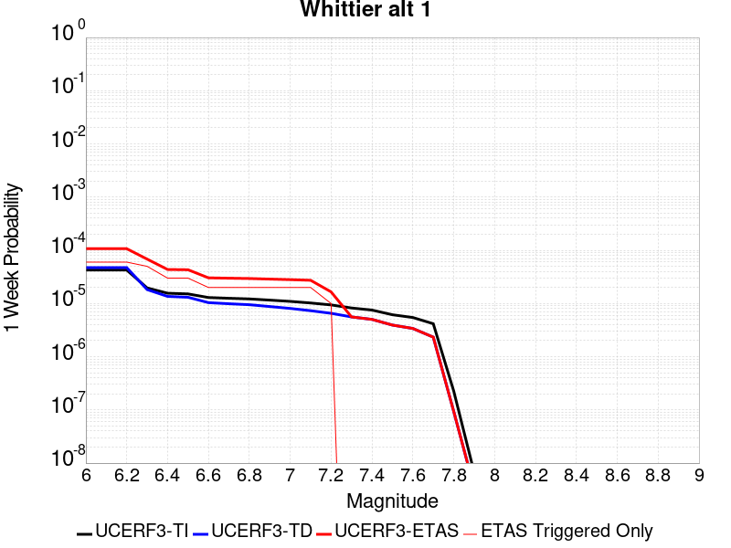 |  |  |  |

| Magnitude | 1 wk TI Prob | 1 wk TD Prob | 1 wk ETAS Prob | 1 wk ETAS/TD Gain | 1 wk ETAS Triggered Only | 1 mo TI Prob | 1 mo TD Prob | 1 mo ETAS Prob | 1 mo ETAS/TD Gain | 1 mo ETAS Triggered Only | 1 yr TI Prob | 1 yr TD Prob | 1 yr ETAS Prob | 1 yr ETAS/TD Gain | 1 yr ETAS Triggered Only | 10 yr TI Prob | 10 yr TD Prob | 10 yr ETAS Prob | 10 yr ETAS/TD Gain | 10 yr ETAS Triggered Only |
|-----|-----|-----|-----|-----|-----|-----|-----|-----|-----|-----|-----|-----|-----|-----|-----|-----|-----|-----|-----|-----|
| 6.0 | 4.2554693E-5 | 4.725218E-5 | 4.725218E-5 | 1.0 | 0.0 | 1.8236451E-4 | 2.0249544E-4 | 2.0249544E-4 | 1.0 | 0.0 | 0.002218027 | 0.0024629154 | 0.0025028551 | 1.0162165 | 4.0038438E-5 | 0.02196019 | 0.024390234 | 0.024468359 | 1.003203 | 8.0076876E-5 |
| 6.1 | 4.2554693E-5 | 4.725218E-5 | 4.725218E-5 | 1.0 | 0.0 | 1.8236451E-4 | 2.0249544E-4 | 2.0249544E-4 | 1.0 | 0.0 | 0.002218027 | 0.0024629154 | 0.0025028551 | 1.0162165 | 4.0038438E-5 | 0.02196019 | 0.024390234 | 0.024468359 | 1.003203 | 8.0076876E-5 |
| 6.2 | 4.2554693E-5 | 4.725218E-5 | 4.725218E-5 | 1.0 | 0.0 | 1.8236451E-4 | 2.0249544E-4 | 2.0249544E-4 | 1.0 | 0.0 | 0.002218027 | 0.0024629154 | 0.0025028551 | 1.0162165 | 4.0038438E-5 | 0.02196019 | 0.024390234 | 0.024468359 | 1.003203 | 8.0076876E-5 |
| 6.3 | 1.9617712E-5 | 1.8268593E-5 | 1.8268593E-5 | 1.0 | 0.0 | 8.40732E-5 | 7.829172E-5 | 7.829172E-5 | 1.0 | 0.0 | 0.0010231105 | 9.52804E-4 | 9.52804E-4 | 1.0 | 0.0 | 0.01018413 | 0.009490474 | 0.009490474 | 1.0 | 0.0 |
| 6.4 | 1.5611336E-5 | 1.3604271E-5 | 1.3604271E-5 | 1.0 | 0.0 | 6.690401E-5 | 5.8302747E-5 | 5.8302747E-5 | 1.0 | 0.0 | 8.142519E-4 | 7.0961076E-4 | 7.0961076E-4 | 1.0 | 0.0 | 0.008112748 | 0.0070754145 | 0.0070754145 | 1.0 | 0.0 |
| 6.5 | 1.5150166E-5 | 1.3100925E-5 | 1.3100925E-5 | 1.0 | 0.0 | 6.492767E-5 | 5.6145647E-5 | 5.6145647E-5 | 1.0 | 0.0 | 7.9020765E-4 | 6.8336475E-4 | 6.8336475E-4 | 1.0 | 0.0 | 0.007874036 | 0.0068145846 | 0.0068145846 | 1.0 | 0.0 |
| 6.6 | 1.295588E-5 | 1.0380725E-5 | 1.0380725E-5 | 1.0 | 0.0 | 5.552402E-5 | 4.4488075E-5 | 4.4488075E-5 | 1.0 | 0.0 | 6.7579525E-4 | 5.4150965E-4 | 5.4150965E-4 | 1.0 | 0.0 | 0.006737438 | 0.0054033357 | 0.0054033357 | 1.0 | 0.0 |
| 6.7 | 1.2542085E-5 | 9.899369E-6 | 9.899369E-6 | 1.0 | 0.0 | 5.3750682E-5 | 4.242519E-5 | 4.242519E-5 | 1.0 | 0.0 | 6.542181E-4 | 5.164061E-4 | 5.164061E-4 | 1.0 | 0.0 | 0.006522954 | 0.0051534795 | 0.0051534795 | 1.0 | 0.0 |
| 6.8 | 1.2195878E-5 | 9.495415E-6 | 9.495415E-6 | 1.0 | 0.0 | 5.2267E-5 | 4.069401E-5 | 4.069401E-5 | 1.0 | 0.0 | 6.36165E-4 | 4.9533875E-4 | 4.9533875E-4 | 1.0 | 0.0 | 0.0063434686 | 0.004943688 | 0.004943688 | 1.0 | 0.0 |
| 6.9 | 1.1580298E-5 | 8.772933E-6 | 8.772933E-6 | 1.0 | 0.0 | 4.9628903E-5 | 3.7597754E-5 | 3.7597754E-5 | 1.0 | 0.0 | 6.040644E-4 | 4.5765814E-4 | 4.5765814E-4 | 1.0 | 0.0 | 0.00602425 | 0.0045684157 | 0.0045684157 | 1.0 | 0.0 |
| 7.0 | 1.0964795E-5 | 8.083994E-6 | 8.083994E-6 | 1.0 | 0.0 | 4.6991136E-5 | 3.4645236E-5 | 3.4645236E-5 | 1.0 | 0.0 | 5.7196687E-4 | 4.2172565E-4 | 4.2172565E-4 | 1.0 | 0.0 | 0.0057049696 | 0.004210462 | 0.004210462 | 1.0 | 0.0 |
| 7.1 | 1.0230601E-5 | 7.3266697E-6 | 7.3266697E-6 | 1.0 | 0.0 | 4.3844695E-5 | 3.1399642E-5 | 3.1399642E-5 | 1.0 | 0.0 | 5.336784E-4 | 3.8222488E-4 | 3.8222488E-4 | 1.0 | 0.0 | 0.005323986 | 0.0038168381 | 0.0038168381 | 1.0 | 0.0 |
| 7.2 | 9.40865E-6 | 6.543289E-6 | 6.543289E-6 | 1.0 | 0.0 | 4.032216E-5 | 2.8042374E-5 | 2.8042374E-5 | 1.0 | 0.0 | 4.908117E-4 | 3.4136363E-4 | 3.4136363E-4 | 1.0 | 0.0 | 0.0048972913 | 0.003409485 | 0.003409485 | 1.0 | 0.0 |
| 7.3 | 8.237384E-6 | 5.5977525E-6 | 5.5977525E-6 | 1.0 | 0.0 | 3.5302593E-5 | 2.3990153E-5 | 2.3990153E-5 | 1.0 | 0.0 | 4.2972428E-4 | 2.92042E-4 | 2.92042E-4 | 1.0 | 0.0 | 0.0042889426 | 0.002916903 | 0.002916903 | 1.0 | 0.0 |
| 7.4 | 7.5316966E-6 | 5.027819E-6 | 5.027819E-6 | 1.0 | 0.0 | 3.2278298E-5 | 2.1547625E-5 | 2.1547625E-5 | 1.0 | 0.0 | 3.9291743E-4 | 2.6231175E-4 | 2.6231175E-4 | 1.0 | 0.0 | 0.0039222343 | 0.0026201333 | 0.0026201333 | 1.0 | 0.0 |
| 7.5 | 6.149649E-6 | 3.933841E-6 | 3.933841E-6 | 1.0 | 0.0 | 2.6355372E-5 | 1.6859214E-5 | 1.6859214E-5 | 1.0 | 0.0 | 3.208294E-4 | 2.052425E-4 | 2.052425E-4 | 1.0 | 0.0 | 0.003203666 | 0.0020506186 | 0.0020506186 | 1.0 | 0.0 |
| 7.6 | 5.457711E-6 | 3.3953788E-6 | 3.3953788E-6 | 1.0 | 0.0 | 2.338998E-5 | 1.4551547E-5 | 1.4551547E-5 | 1.0 | 0.0 | 2.8473578E-4 | 1.771515E-4 | 1.771515E-4 | 1.0 | 0.0 | 0.0028437122 | 0.0017701836 | 0.0017701836 | 1.0 | 0.0 |
| 7.7 | 4.1676276E-6 | 2.3331952E-6 | 2.3331952E-6 | 1.0 | 0.0 | 1.7861139E-5 | 9.999374E-6 | 9.999374E-6 | 1.0 | 0.0 | 2.1743766E-4 | 1.2173632E-4 | 1.2173632E-4 | 1.0 | 0.0 | 0.0021722503 | 0.0012167693 | 0.0012167693 | 1.0 | 0.0 |
| 7.8 | 2.2692414E-7 | 9.3854695E-8 | 9.3854695E-8 | 1.0 | 0.0 | 9.725317E-7 | 4.0223435E-7 | 4.0223435E-7 | 1.0 | 0.0 | 1.1840509E-5 | 4.8971956E-6 | 4.8971956E-6 | 1.0 | 0.0 | 1.1839878E-4 | 4.8971204E-5 | 4.8971204E-5 | 1.0 | 0.0 |
| 7.9 | 6.676829E-9 | 3.439853E-9 | 3.439853E-9 | 1.0 | 0.0 | 2.861498E-8 | 1.4742227E-8 | 1.4742227E-8 | 1.0 | 0.0 | 3.4838732E-7 | 1.7948659E-7 | 1.7948659E-7 | 1.0 | 0.0 | 3.4838679E-6 | 1.7948646E-6 | 1.7948646E-6 | 1.0 | 0.0 |

## Likely 2011 CFM
*[(top)](#table-of-contents)*

| 1 Week | 1 Month | 1 Year | 10 Year |
|-----|-----|-----|-----|
|  | 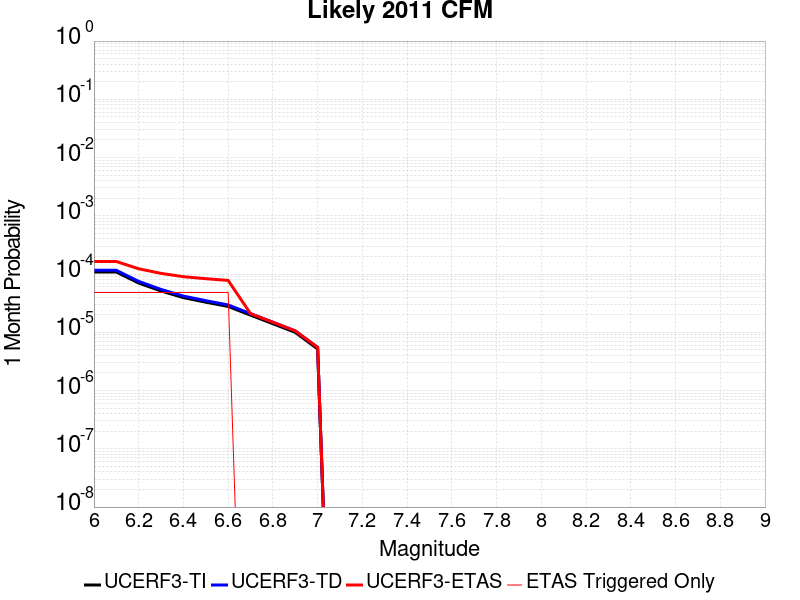 | 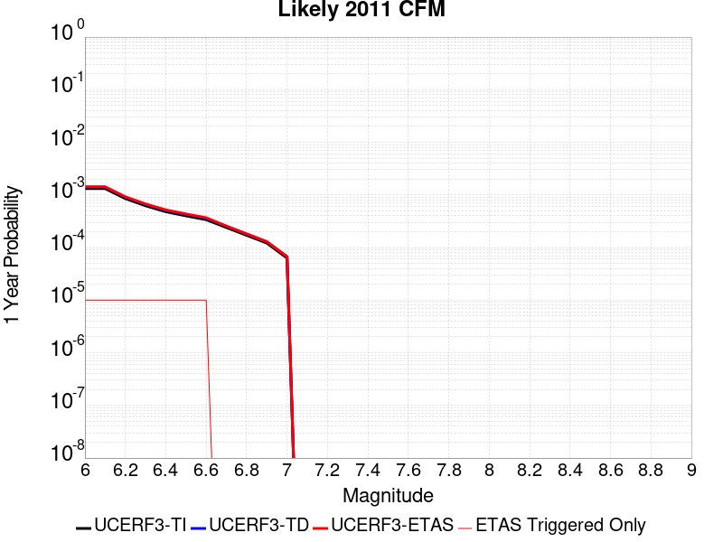 | 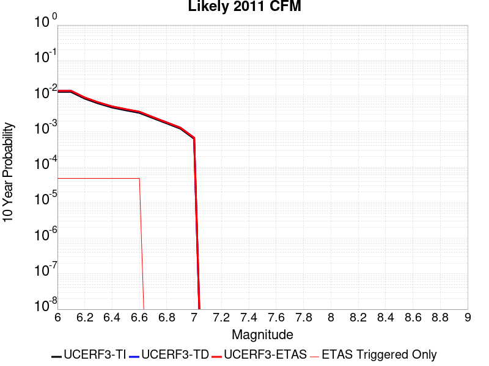 |

| Magnitude | 1 wk TI Prob | 1 wk TD Prob | 1 wk ETAS Prob | 1 wk ETAS/TD Gain | 1 wk ETAS Triggered Only | 1 mo TI Prob | 1 mo TD Prob | 1 mo ETAS Prob | 1 mo ETAS/TD Gain | 1 mo ETAS Triggered Only | 1 yr TI Prob | 1 yr TD Prob | 1 yr ETAS Prob | 1 yr ETAS/TD Gain | 1 yr ETAS Triggered Only | 10 yr TI Prob | 10 yr TD Prob | 10 yr ETAS Prob | 10 yr ETAS/TD Gain | 10 yr ETAS Triggered Only |
|-----|-----|-----|-----|-----|-----|-----|-----|-----|-----|-----|-----|-----|-----|-----|-----|-----|-----|-----|-----|-----|
| 6.0 | 2.5315949E-5 | 2.7104748E-5 | 6.71421E-5 | 2.4771342 | 4.0038438E-5 | 1.0849241E-4 | 1.16158284E-4 | 1.5619207E-4 | 1.3446486 | 4.0038438E-5 | 0.0013200947 | 0.0014133542 | 0.0014533361 | 1.0282886 | 4.0038438E-5 | 0.013122803 | 0.01404831 | 0.014087786 | 1.00281 | 4.0038438E-5 |
| 6.1 | 2.5315949E-5 | 2.7104748E-5 | 6.71421E-5 | 2.4771342 | 4.0038438E-5 | 1.0849241E-4 | 1.16158284E-4 | 1.5619207E-4 | 1.3446486 | 4.0038438E-5 | 0.0013200947 | 0.0014133542 | 0.0014533361 | 1.0282886 | 4.0038438E-5 | 0.013122803 | 0.01404831 | 0.014087786 | 1.00281 | 4.0038438E-5 |
| 6.2 | 1.6375941E-5 | 1.7465842E-5 | 5.750358E-5 | 3.292345 | 4.0038438E-5 | 7.0180715E-5 | 7.485153E-5 | 1.1488697E-4 | 1.5348647 | 4.0038438E-5 | 8.5411523E-4 | 9.109487E-4 | 9.509506E-4 | 1.0439124 | 4.0038438E-5 | 0.008508399 | 0.009073433 | 0.009113108 | 1.0043727 | 4.0038438E-5 |
| 6.3 | 1.1945543E-5 | 1.2712587E-5 | 5.2750514E-5 | 4.1494713 | 4.0038438E-5 | 5.119418E-5 | 5.4481407E-5 | 9.4517665E-5 | 1.7348609 | 4.0038438E-5 | 6.2311086E-4 | 6.631146E-4 | 7.031265E-4 | 1.0603393 | 4.0038438E-5 | 0.0062136655 | 0.0066119144 | 0.006651688 | 1.0060154 | 4.0038438E-5 |
| 6.4 | 9.192729E-6 | 9.768488E-6 | 4.9806535E-5 | 5.0986943 | 4.0038438E-5 | 3.939681E-5 | 4.1864292E-5 | 8.190105E-5 | 1.9563463 | 4.0038438E-5 | 4.7955062E-4 | 5.0958124E-4 | 5.495993E-4 | 1.0785313 | 4.0038438E-5 | 0.004785171 | 0.0050844094 | 0.005124244 | 1.0078347 | 4.0038438E-5 |
| 6.5 | 7.67906E-6 | 8.152622E-6 | 4.8190734E-5 | 5.9110713 | 4.0038438E-5 | 3.2909844E-5 | 3.4939352E-5 | 7.497639E-5 | 2.145901 | 4.0038438E-5 | 4.006037E-4 | 4.2530545E-4 | 4.6532688E-4 | 1.0941004 | 4.0038438E-5 | 0.0039988225 | 0.004245108 | 0.0042849765 | 1.0093917 | 4.0038438E-5 |
| 6.6 | 6.4884057E-6 | 6.8847507E-6 | 4.6922913E-5 | 6.8154845 | 4.0038438E-5 | 2.7807157E-5 | 2.9505749E-5 | 6.9543006E-5 | 2.3569307 | 4.0038438E-5 | 3.3849955E-4 | 3.591747E-4 | 3.9919876E-4 | 1.1114334 | 4.0038438E-5 | 0.003379844 | 0.0035860867 | 0.0036259815 | 1.0111248 | 4.0038438E-5 |
| 6.7 | 4.6060636E-6 | 4.884041E-6 | 4.884041E-6 | 1.0 | 0.0 | 1.9740122E-5 | 2.0931442E-5 | 2.0931442E-5 | 1.0 | 0.0 | 2.403095E-4 | 2.5481134E-4 | 2.5481134E-4 | 1.0 | 0.0 | 0.002400498 | 0.0025452746 | 0.0025452746 | 1.0 | 0.0 |
| 6.8 | 3.2795615E-6 | 3.4773732E-6 | 3.4773732E-6 | 1.0 | 0.0 | 1.4055187E-5 | 1.4902946E-5 | 1.4902946E-5 | 1.0 | 0.0 | 1.7110848E-4 | 1.8142881E-4 | 1.8142881E-4 | 1.0 | 0.0 | 0.0017097679 | 0.0018128622 | 0.0018128622 | 1.0 | 0.0 |
| 6.9 | 2.3289967E-6 | 2.4705569E-6 | 2.4705569E-6 | 1.0 | 0.0 | 9.981376E-6 | 1.058806E-5 | 1.058806E-5 | 1.0 | 0.0 | 1.2151648E-4 | 1.2890245E-4 | 1.2890245E-4 | 1.0 | 0.0 | 0.0012145005 | 0.0012883197 | 0.0012883197 | 1.0 | 0.0 |
| 7.0 | 1.211292E-6 | 1.2863958E-6 | 1.2863958E-6 | 1.0 | 0.0 | 5.1912407E-6 | 5.5131145E-6 | 5.5131145E-6 | 1.0 | 0.0 | 6.320152E-5 | 6.712041E-5 | 6.712041E-5 | 1.0 | 0.0 | 6.3183554E-4 | 6.710312E-4 | 6.710312E-4 | 1.0 | 0.0 |

## San Gorgonio Pass
*[(top)](#table-of-contents)*

| 1 Week | 1 Month | 1 Year | 10 Year |
|-----|-----|-----|-----|
|  |  |  | 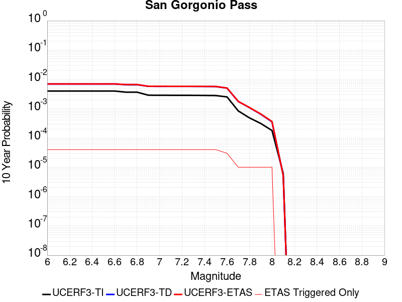 |

| Magnitude | 1 wk TI Prob | 1 wk TD Prob | 1 wk ETAS Prob | 1 wk ETAS/TD Gain | 1 wk ETAS Triggered Only | 1 mo TI Prob | 1 mo TD Prob | 1 mo ETAS Prob | 1 mo ETAS/TD Gain | 1 mo ETAS Triggered Only | 1 yr TI Prob | 1 yr TD Prob | 1 yr ETAS Prob | 1 yr ETAS/TD Gain | 1 yr ETAS Triggered Only | 10 yr TI Prob | 10 yr TD Prob | 10 yr ETAS Prob | 10 yr ETAS/TD Gain | 10 yr ETAS Triggered Only |
|-----|-----|-----|-----|-----|-----|-----|-----|-----|-----|-----|-----|-----|-----|-----|-----|-----|-----|-----|-----|-----|
| 6.0 | 7.644328E-6 | 1.3314231E-5 | 5.3352134E-5 | 4.007151 | 4.0038438E-5 | 3.2760996E-5 | 5.705979E-5 | 9.7095945E-5 | 1.7016526 | 4.0038438E-5 | 3.987921E-4 | 6.944901E-4 | 7.7451137E-4 | 1.115223 | 8.0076876E-5 | 0.003980772 | 0.0069299806 | 0.0070095025 | 1.0114751 | 8.0076876E-5 |
| 6.1 | 7.644328E-6 | 1.3314231E-5 | 5.3352134E-5 | 4.007151 | 4.0038438E-5 | 3.2760996E-5 | 5.705979E-5 | 9.7095945E-5 | 1.7016526 | 4.0038438E-5 | 3.987921E-4 | 6.944901E-4 | 7.7451137E-4 | 1.115223 | 8.0076876E-5 | 0.003980772 | 0.0069299806 | 0.0070095025 | 1.0114751 | 8.0076876E-5 |
| 6.2 | 7.644328E-6 | 1.3314231E-5 | 5.3352134E-5 | 4.007151 | 4.0038438E-5 | 3.2760996E-5 | 5.705979E-5 | 9.7095945E-5 | 1.7016526 | 4.0038438E-5 | 3.987921E-4 | 6.944901E-4 | 7.7451137E-4 | 1.115223 | 8.0076876E-5 | 0.003980772 | 0.0069299806 | 0.0070095025 | 1.0114751 | 8.0076876E-5 |
| 6.3 | 7.644328E-6 | 1.3314231E-5 | 5.3352134E-5 | 4.007151 | 4.0038438E-5 | 3.2760996E-5 | 5.705979E-5 | 9.7095945E-5 | 1.7016526 | 4.0038438E-5 | 3.987921E-4 | 6.944901E-4 | 7.7451137E-4 | 1.115223 | 8.0076876E-5 | 0.003980772 | 0.0069299806 | 0.0070095025 | 1.0114751 | 8.0076876E-5 |
| 6.4 | 7.644328E-6 | 1.3314231E-5 | 5.3352134E-5 | 4.007151 | 4.0038438E-5 | 3.2760996E-5 | 5.705979E-5 | 9.7095945E-5 | 1.7016526 | 4.0038438E-5 | 3.987921E-4 | 6.944901E-4 | 7.7451137E-4 | 1.115223 | 8.0076876E-5 | 0.003980772 | 0.0069299806 | 0.0070095025 | 1.0114751 | 8.0076876E-5 |
| 6.5 | 7.644328E-6 | 1.3314231E-5 | 5.3352134E-5 | 4.007151 | 4.0038438E-5 | 3.2760996E-5 | 5.705979E-5 | 9.7095945E-5 | 1.7016526 | 4.0038438E-5 | 3.987921E-4 | 6.944901E-4 | 7.7451137E-4 | 1.115223 | 8.0076876E-5 | 0.003980772 | 0.0069299806 | 0.0070095025 | 1.0114751 | 8.0076876E-5 |
| 6.6 | 7.644328E-6 | 1.3314231E-5 | 5.3352134E-5 | 4.007151 | 4.0038438E-5 | 3.2760996E-5 | 5.705979E-5 | 9.7095945E-5 | 1.7016526 | 4.0038438E-5 | 3.987921E-4 | 6.944901E-4 | 7.7451137E-4 | 1.115223 | 8.0076876E-5 | 0.003980772 | 0.0069299806 | 0.0070095025 | 1.0114751 | 8.0076876E-5 |
| 6.7 | 6.987586E-6 | 1.2618505E-5 | 5.2656436E-5 | 4.1729536 | 4.0038438E-5 | 2.9946454E-5 | 5.4078235E-5 | 9.4114504E-5 | 1.7403399 | 4.0038438E-5 | 3.645371E-4 | 6.582117E-4 | 7.382359E-4 | 1.1215781 | 8.0076876E-5 | 0.0036393967 | 0.0065693567 | 0.0066489074 | 1.0121094 | 8.0076876E-5 |
| 6.8 | 6.987586E-6 | 1.2618505E-5 | 5.2656436E-5 | 4.1729536 | 4.0038438E-5 | 2.9946454E-5 | 5.4078235E-5 | 9.4114504E-5 | 1.7403399 | 4.0038438E-5 | 3.645371E-4 | 6.582117E-4 | 7.382359E-4 | 1.1215781 | 8.0076876E-5 | 0.0036393967 | 0.0065693567 | 0.0066489074 | 1.0121094 | 8.0076876E-5 |
| 6.9 | 5.504702E-6 | 1.1049368E-5 | 5.108736E-5 | 4.6235547 | 4.0038438E-5 | 2.3591367E-5 | 4.7353606E-5 | 8.7390144E-5 | 1.8454803 | 4.0038438E-5 | 2.8718702E-4 | 5.7638274E-4 | 6.5641344E-4 | 1.13885 | 8.0076876E-5 | 0.0028681618 | 0.005755309 | 0.005834925 | 1.0138335 | 8.0076876E-5 |
| 7.0 | 5.4825764E-6 | 1.102571E-5 | 5.1063704E-5 | 4.6313305 | 4.0038438E-5 | 2.3496545E-5 | 4.7252215E-5 | 8.728876E-5 | 1.8472946 | 4.0038438E-5 | 2.8603288E-4 | 5.751489E-4 | 6.551797E-4 | 1.139148 | 8.0076876E-5 | 0.00285665 | 0.005743035 | 0.005822652 | 1.0138632 | 8.0076876E-5 |
| 7.1 | 5.4692787E-6 | 1.101142E-5 | 5.1049417E-5 | 4.636043 | 4.0038438E-5 | 2.3439556E-5 | 4.7190973E-5 | 8.722752E-5 | 1.8483942 | 4.0038438E-5 | 2.8533922E-4 | 5.744037E-4 | 6.5443455E-4 | 1.1393286 | 8.0076876E-5 | 0.0028497311 | 0.0057356213 | 0.005815239 | 1.0138812 | 8.0076876E-5 |
| 7.2 | 5.453661E-6 | 1.0994446E-5 | 5.1032443E-5 | 4.6416564 | 4.0038438E-5 | 2.3372622E-5 | 4.7118232E-5 | 8.715478E-5 | 1.849704 | 4.0038438E-5 | 2.8452452E-4 | 5.7351857E-4 | 6.535495E-4 | 1.1395438 | 8.0076876E-5 | 0.002841605 | 0.0057268157 | 0.005806434 | 1.0139027 | 8.0076876E-5 |
| 7.3 | 5.4422303E-6 | 1.0981369E-5 | 5.1019368E-5 | 4.645993 | 4.0038438E-5 | 2.3323635E-5 | 4.706219E-5 | 8.709874E-5 | 1.8507159 | 4.0038438E-5 | 2.8392827E-4 | 5.728366E-4 | 6.528676E-4 | 1.13971 | 8.0076876E-5 | 0.0028356577 | 0.005720031 | 0.0057996497 | 1.0139194 | 8.0076876E-5 |
| 7.4 | 5.398595E-6 | 1.0928734E-5 | 5.0966733E-5 | 4.663553 | 4.0038438E-5 | 2.313663E-5 | 4.683662E-5 | 8.687318E-5 | 1.8548132 | 4.0038438E-5 | 2.8165206E-4 | 5.700917E-4 | 6.5012294E-4 | 1.1403831 | 8.0076876E-5 | 0.0028129534 | 0.005692723 | 0.0057723443 | 1.0139865 | 8.0076876E-5 |
| 7.5 | 5.3578788E-6 | 1.0855281E-5 | 5.0893283E-5 | 4.688343 | 4.0038438E-5 | 2.2962136E-5 | 4.6521833E-5 | 8.655841E-5 | 1.8605975 | 4.0038438E-5 | 2.7952815E-4 | 5.662612E-4 | 6.462927E-4 | 1.1413332 | 8.0076876E-5 | 0.002791768 | 0.0056546377 | 0.005734262 | 1.0140812 | 8.0076876E-5 |
| 7.6 | 4.8091474E-6 | 9.60368E-6 | 9.60368E-6 | 1.0 | 0.0 | 2.0610469E-5 | 4.1158008E-5 | 4.1158008E-5 | 1.0 | 0.0 | 2.5090357E-4 | 5.0098833E-4 | 5.410067E-4 | 1.0798788 | 4.0038438E-5 | 0.0025062046 | 0.0050053033 | 0.005045141 | 1.0079591 | 4.0038438E-5 |
| 7.7 | 1.5991155E-6 | 3.352866E-6 | 3.352866E-6 | 1.0 | 0.0 | 6.853334E-6 | 1.4369349E-5 | 1.4369349E-5 | 1.0 | 0.0 | 8.343615E-5 | 1.7493303E-4 | 2.1496446E-4 | 1.2288386 | 4.0038438E-5 | 8.340483E-4 | 0.0017534072 | 0.0017933755 | 1.0227946 | 4.0038438E-5 |
| 7.8 | 9.258398E-7 | 2.0579948E-6 | 2.0579948E-6 | 1.0 | 0.0 | 3.967879E-6 | 8.819949E-6 | 8.819949E-6 | 1.0 | 0.0 | 4.8307855E-5 | 1.073776E-4 | 1.4741173E-4 | 1.3728352 | 4.0038438E-5 | 4.8297356E-4 | 0.001078687 | 0.0011186822 | 1.0370777 | 4.0038438E-5 |
| 7.9 | 5.975575E-7 | 1.2291794E-6 | 1.2291794E-6 | 1.0 | 0.0 | 2.5609581E-6 | 5.2679006E-6 | 5.2679006E-6 | 1.0 | 0.0 | 3.117922E-5 | 6.4134816E-5 | 1.04170686E-4 | 1.6242455 | 4.0038438E-5 | 3.1174847E-4 | 6.463092E-4 | 6.8632176E-4 | 1.0619093 | 4.0038438E-5 |
| 8.0 | 3.4413725E-7 | 6.7148494E-7 | 6.7148494E-7 | 1.0 | 0.0 | 1.4748731E-6 | 2.8777895E-6 | 2.8777895E-6 | 1.0 | 0.0 | 1.7956432E-5 | 3.503653E-5 | 7.507356E-5 | 2.1427226 | 4.0038438E-5 | 1.7954981E-4 | 3.5373896E-4 | 3.937632E-4 | 1.1131463 | 4.0038438E-5 |
| 8.1 | 1.1787731E-8 | 9.634385E-9 | 9.634385E-9 | 1.0 | 0.0 | 5.0518846E-8 | 4.129022E-8 | 4.129022E-8 | 1.0 | 0.0 | 6.1506677E-7 | 5.027083E-7 | 5.027083E-7 | 1.0 | 0.0 | 6.1506507E-6 | 5.2424944E-6 | 5.2424944E-6 | 1.0 | 0.0 |

## Anacapa-Dume alt 1
*[(top)](#table-of-contents)*

| 1 Week | 1 Month | 1 Year | 10 Year |
|-----|-----|-----|-----|
|  | 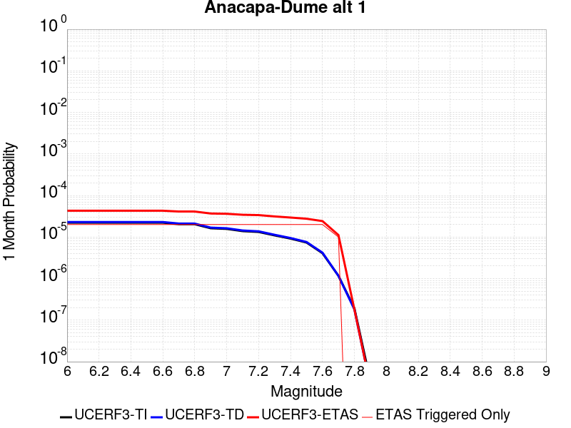 |  |  |

| Magnitude | 1 wk TI Prob | 1 wk TD Prob | 1 wk ETAS Prob | 1 wk ETAS/TD Gain | 1 wk ETAS Triggered Only | 1 mo TI Prob | 1 mo TD Prob | 1 mo ETAS Prob | 1 mo ETAS/TD Gain | 1 mo ETAS Triggered Only | 1 yr TI Prob | 1 yr TD Prob | 1 yr ETAS Prob | 1 yr ETAS/TD Gain | 1 yr ETAS Triggered Only | 10 yr TI Prob | 10 yr TD Prob | 10 yr ETAS Prob | 10 yr ETAS/TD Gain | 10 yr ETAS Triggered Only |
|-----|-----|-----|-----|-----|-----|-----|-----|-----|-----|-----|-----|-----|-----|-----|-----|-----|-----|-----|-----|-----|
| 6.0 | 5.1871802E-6 | 5.3673907E-6 | 8.544383E-5 | 15.919064 | 8.0076876E-5 | 2.2230583E-5 | 2.3002905E-5 | 1.0307794E-4 | 4.4810834 | 8.0076876E-5 | 2.7062374E-4 | 2.8002524E-4 | 3.600797E-4 | 1.285883 | 8.0076876E-5 | 0.002702944 | 0.0027968092 | 0.002876662 | 1.0285515 | 8.0076876E-5 |
| 6.1 | 5.1871802E-6 | 5.3673907E-6 | 8.544383E-5 | 15.919064 | 8.0076876E-5 | 2.2230583E-5 | 2.3002905E-5 | 1.0307794E-4 | 4.4810834 | 8.0076876E-5 | 2.7062374E-4 | 2.8002524E-4 | 3.600797E-4 | 1.285883 | 8.0076876E-5 | 0.002702944 | 0.0027968092 | 0.002876662 | 1.0285515 | 8.0076876E-5 |
| 6.2 | 5.1871802E-6 | 5.3673907E-6 | 8.544383E-5 | 15.919064 | 8.0076876E-5 | 2.2230583E-5 | 2.3002905E-5 | 1.0307794E-4 | 4.4810834 | 8.0076876E-5 | 2.7062374E-4 | 2.8002524E-4 | 3.600797E-4 | 1.285883 | 8.0076876E-5 | 0.002702944 | 0.0027968092 | 0.002876662 | 1.0285515 | 8.0076876E-5 |
| 6.3 | 5.1871802E-6 | 5.3673907E-6 | 8.544383E-5 | 15.919064 | 8.0076876E-5 | 2.2230583E-5 | 2.3002905E-5 | 1.0307794E-4 | 4.4810834 | 8.0076876E-5 | 2.7062374E-4 | 2.8002524E-4 | 3.600797E-4 | 1.285883 | 8.0076876E-5 | 0.002702944 | 0.0027968092 | 0.002876662 | 1.0285515 | 8.0076876E-5 |
| 6.4 | 5.1871802E-6 | 5.3673907E-6 | 8.544383E-5 | 15.919064 | 8.0076876E-5 | 2.2230583E-5 | 2.3002905E-5 | 1.0307794E-4 | 4.4810834 | 8.0076876E-5 | 2.7062374E-4 | 2.8002524E-4 | 3.600797E-4 | 1.285883 | 8.0076876E-5 | 0.002702944 | 0.0027968092 | 0.002876662 | 1.0285515 | 8.0076876E-5 |
| 6.5 | 5.1871802E-6 | 5.3673907E-6 | 8.544383E-5 | 15.919064 | 8.0076876E-5 | 2.2230583E-5 | 2.3002905E-5 | 1.0307794E-4 | 4.4810834 | 8.0076876E-5 | 2.7062374E-4 | 2.8002524E-4 | 3.600797E-4 | 1.285883 | 8.0076876E-5 | 0.002702944 | 0.0027968092 | 0.002876662 | 1.0285515 | 8.0076876E-5 |
| 6.6 | 5.1871802E-6 | 5.3673907E-6 | 8.544383E-5 | 15.919064 | 8.0076876E-5 | 2.2230583E-5 | 2.3002905E-5 | 1.0307794E-4 | 4.4810834 | 8.0076876E-5 | 2.7062374E-4 | 2.8002524E-4 | 3.600797E-4 | 1.285883 | 8.0076876E-5 | 0.002702944 | 0.0027968092 | 0.002876662 | 1.0285515 | 8.0076876E-5 |
| 6.7 | 4.7693475E-6 | 4.9366918E-6 | 8.501317E-5 | 17.220676 | 8.0076876E-5 | 2.04399E-5 | 2.1157082E-5 | 1.0123226E-4 | 4.784793 | 8.0076876E-5 | 2.4882736E-4 | 2.5755778E-4 | 3.3761404E-4 | 1.3108283 | 8.0076876E-5 | 0.0024854892 | 0.002572669 | 0.0026525396 | 1.0310459 | 8.0076876E-5 |
| 6.8 | 4.753408E-6 | 4.92024E-6 | 8.499672E-5 | 17.274914 | 8.0076876E-5 | 2.037159E-5 | 2.1086576E-5 | 1.01161764E-4 | 4.797448 | 8.0076876E-5 | 2.4799586E-4 | 2.5669957E-4 | 3.3675588E-4 | 1.3118677 | 8.0076876E-5 | 0.002477193 | 0.0025641066 | 0.0026439782 | 1.0311499 | 8.0076876E-5 |
| 6.9 | 3.800069E-6 | 3.937126E-6 | 8.4013685E-5 | 21.338835 | 8.0076876E-5 | 1.6285909E-5 | 1.687329E-5 | 9.694881E-5 | 5.745697 | 8.0076876E-5 | 1.9826289E-4 | 2.0541316E-4 | 2.854736E-4 | 1.3897531 | 8.0076876E-5 | 0.001980861 | 0.0020522568 | 0.0021321692 | 1.0389389 | 8.0076876E-5 |
| 7.0 | 3.6671938E-6 | 3.7999182E-6 | 8.387649E-5 | 22.073235 | 8.0076876E-5 | 1.571645E-5 | 1.6285263E-5 | 9.636083E-5 | 5.917057 | 8.0076876E-5 | 1.9133097E-4 | 1.9825528E-4 | 2.7831626E-4 | 1.4038278 | 8.0076876E-5 | 0.0019116632 | 0.0019808074 | 0.0020607256 | 1.0403463 | 8.0076876E-5 |
| 7.1 | 3.2394885E-6 | 3.3587933E-6 | 8.34354E-5 | 24.840885 | 8.0076876E-5 | 1.3883448E-5 | 1.4394749E-5 | 9.447047E-5 | 6.5628424 | 8.0076876E-5 | 1.6901788E-4 | 1.7524208E-4 | 2.553049E-4 | 1.45687 | 8.0076876E-5 | 0.0016888938 | 0.0017510501 | 0.0018309868 | 1.0456507 | 8.0076876E-5 |
| 7.2 | 3.0935948E-6 | 3.2079258E-6 | 8.328454E-5 | 25.962116 | 8.0076876E-5 | 1.3258196E-5 | 1.3748182E-5 | 9.3823954E-5 | 6.824463 | 8.0076876E-5 | 1.6140658E-4 | 1.6737137E-4 | 2.4743483E-4 | 1.4783583 | 8.0076876E-5 | 0.001612894 | 0.0016724641 | 0.001752407 | 1.0477995 | 8.0076876E-5 |
| 7.3 | 2.5604163E-6 | 2.647073E-6 | 8.272374E-5 | 31.25102 | 8.0076876E-5 | 1.0973167E-5 | 1.1344549E-5 | 9.1420516E-5 | 8.05854 | 8.0076876E-5 | 1.3359012E-4 | 1.3811118E-4 | 2.18177E-4 | 1.57972 | 8.0076876E-5 | 0.0013350984 | 0.0013802581 | 0.0014602244 | 1.0579358 | 8.0076876E-5 |
| 7.4 | 2.1429005E-6 | 2.2106028E-6 | 8.22873E-5 | 37.22392 | 8.0076876E-5 | 9.1838265E-6 | 9.473977E-6 | 8.955009E-5 | 9.452217 | 8.0076876E-5 | 1.11807356E-4 | 1.1533959E-4 | 1.9540724E-4 | 1.6941904 | 8.0076876E-5 | 0.0011175112 | 0.0011527999 | 0.0012327845 | 1.0693829 | 8.0076876E-5 |
| 7.5 | 1.7237151E-6 | 1.7761449E-6 | 8.185288E-5 | 46.084568 | 8.0076876E-5 | 7.3873293E-6 | 7.6120277E-6 | 8.768829E-5 | 11.519702 | 8.0076876E-5 | 8.993702E-5 | 9.267252E-5 | 1.7274197E-4 | 1.8640043 | 8.0076876E-5 | 8.990063E-4 | 9.2634105E-4 | 0.0010063438 | 1.0863642 | 8.0076876E-5 |
| 7.6 | 9.541696E-7 | 9.823206E-7 | 8.1059115E-5 | 82.51799 | 8.0076876E-5 | 4.089292E-6 | 4.2099387E-6 | 8.4286476E-5 | 20.020834 | 8.0076876E-5 | 4.9785995E-5 | 5.1254807E-5 | 1.3132757E-4 | 2.562249 | 8.0076876E-5 | 4.9774844E-4 | 5.1243114E-4 | 5.9246697E-4 | 1.1561885 | 8.0076876E-5 |
| 7.7 | 2.7226676E-7 | 2.7172416E-7 | 4.031015E-5 | 148.34952 | 4.0038438E-5 | 1.166857E-6 | 1.1645316E-6 | 4.1202922E-5 | 35.38154 | 4.0038438E-5 | 1.4206392E-5 | 1.4178081E-5 | 5.421595E-5 | 3.8239272 | 4.0038438E-5 | 1.4205484E-4 | 1.4177183E-4 | 1.818046E-4 | 1.2823746 | 4.0038438E-5 |
| 7.8 | 4.5017995E-8 | 4.2157676E-8 | 4.2157676E-8 | 1.0 | 0.0 | 1.9293425E-7 | 1.8067574E-7 | 1.8067574E-7 | 1.0 | 0.0 | 2.348972E-6 | 2.1997253E-6 | 2.1997253E-6 | 1.0 | 0.0 | 2.348947E-5 | 2.1997055E-5 | 2.1997055E-5 | 1.0 | 0.0 |
| 7.9 | 8.007447E-10 | 6.1608785E-10 | 6.1608785E-10 | 1.0 | 0.0 | 3.4317629E-9 | 2.6403764E-9 | 2.6403764E-9 | 1.0 | 0.0 | 4.1781714E-8 | 3.2146584E-8 | 3.2146584E-8 | 1.0 | 0.0 | 4.1781706E-7 | 3.214658E-7 | 3.214658E-7 | 1.0 | 0.0 |

## Raymond
*[(top)](#table-of-contents)*

| 1 Week | 1 Month | 1 Year | 10 Year |
|-----|-----|-----|-----|
| 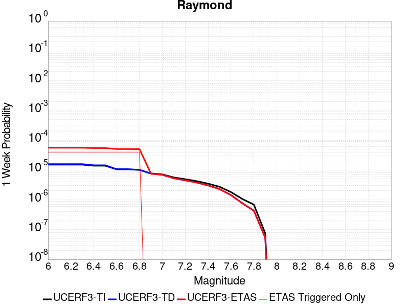 | 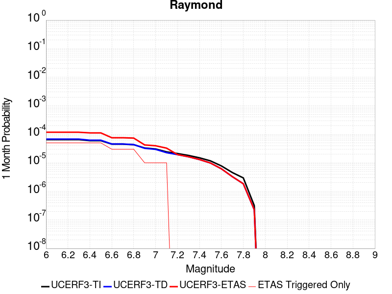 | 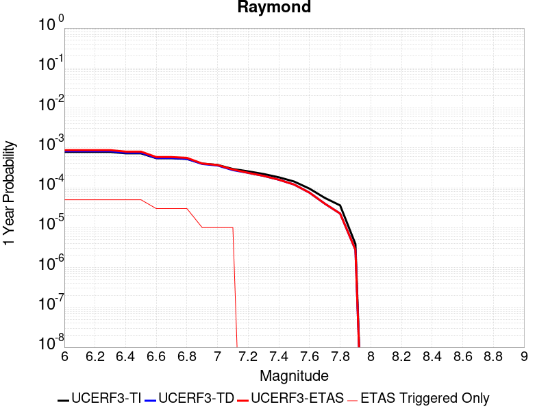 | 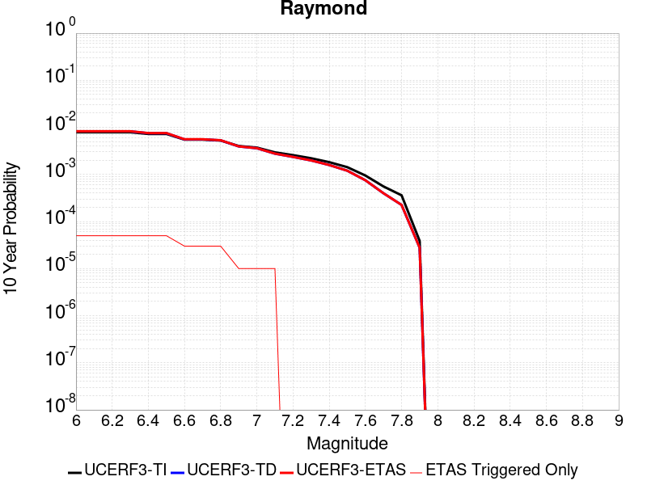 |

| Magnitude | 1 wk TI Prob | 1 wk TD Prob | 1 wk ETAS Prob | 1 wk ETAS/TD Gain | 1 wk ETAS Triggered Only | 1 mo TI Prob | 1 mo TD Prob | 1 mo ETAS Prob | 1 mo ETAS/TD Gain | 1 mo ETAS Triggered Only | 1 yr TI Prob | 1 yr TD Prob | 1 yr ETAS Prob | 1 yr ETAS/TD Gain | 1 yr ETAS Triggered Only | 10 yr TI Prob | 10 yr TD Prob | 10 yr ETAS Prob | 10 yr ETAS/TD Gain | 10 yr ETAS Triggered Only |
|-----|-----|-----|-----|-----|-----|-----|-----|-----|-----|-----|-----|-----|-----|-----|-----|-----|-----|-----|-----|-----|
| 6.0 | 1.5157413E-5 | 1.5810128E-5 | 5.5847933E-5 | 3.532415 | 4.0038438E-5 | 6.4958724E-5 | 6.7756075E-5 | 1.4782752E-4 | 2.1817605 | 8.0076876E-5 | 7.905855E-4 | 8.2464307E-4 | 9.0465386E-4 | 1.0970248 | 8.0076876E-5 | 0.007877788 | 0.008218348 | 0.008297767 | 1.0096636 | 8.0076876E-5 |
| 6.1 | 1.5157413E-5 | 1.5810128E-5 | 5.5847933E-5 | 3.532415 | 4.0038438E-5 | 6.4958724E-5 | 6.7756075E-5 | 1.4782752E-4 | 2.1817605 | 8.0076876E-5 | 7.905855E-4 | 8.2464307E-4 | 9.0465386E-4 | 1.0970248 | 8.0076876E-5 | 0.007877788 | 0.008218348 | 0.008297767 | 1.0096636 | 8.0076876E-5 |
| 6.2 | 1.5157413E-5 | 1.5810128E-5 | 5.5847933E-5 | 3.532415 | 4.0038438E-5 | 6.4958724E-5 | 6.7756075E-5 | 1.4782752E-4 | 2.1817605 | 8.0076876E-5 | 7.905855E-4 | 8.2464307E-4 | 9.0465386E-4 | 1.0970248 | 8.0076876E-5 | 0.007877788 | 0.008218348 | 0.008297767 | 1.0096636 | 8.0076876E-5 |
| 6.3 | 1.5157413E-5 | 1.5810128E-5 | 5.5847933E-5 | 3.532415 | 4.0038438E-5 | 6.4958724E-5 | 6.7756075E-5 | 1.4782752E-4 | 2.1817605 | 8.0076876E-5 | 7.905855E-4 | 8.2464307E-4 | 9.0465386E-4 | 1.0970248 | 8.0076876E-5 | 0.007877788 | 0.008218348 | 0.008297767 | 1.0096636 | 8.0076876E-5 |
| 6.4 | 1.3941944E-5 | 1.445469E-5 | 5.449255E-5 | 3.769887 | 4.0038438E-5 | 5.9749822E-5 | 6.1947336E-5 | 1.4201924E-4 | 2.2925804 | 8.0076876E-5 | 7.2721124E-4 | 7.5397117E-4 | 8.3398767E-4 | 1.1061268 | 8.0076876E-5 | 0.007248361 | 0.0075164647 | 0.0075959396 | 1.0105735 | 8.0076876E-5 |
| 6.5 | 1.3941944E-5 | 1.445469E-5 | 5.449255E-5 | 3.769887 | 4.0038438E-5 | 5.9749822E-5 | 6.1947336E-5 | 1.4201924E-4 | 2.2925804 | 8.0076876E-5 | 7.2721124E-4 | 7.5397117E-4 | 8.3398767E-4 | 1.1061268 | 8.0076876E-5 | 0.007248361 | 0.0075164647 | 0.0075959396 | 1.0105735 | 8.0076876E-5 |
| 6.6 | 1.0542609E-5 | 1.0671113E-5 | 5.070912E-5 | 4.7519994 | 4.0038438E-5 | 4.5181827E-5 | 4.573257E-5 | 1.2580577E-4 | 2.7509012 | 8.0076876E-5 | 5.499499E-4 | 5.5665727E-4 | 6.3668954E-4 | 1.1437731 | 8.0076876E-5 | 0.005485909 | 0.00555319 | 0.0056328224 | 1.0143399 | 8.0076876E-5 |
| 6.7 | 1.0542609E-5 | 1.0671113E-5 | 5.070912E-5 | 4.7519994 | 4.0038438E-5 | 4.5181827E-5 | 4.573257E-5 | 1.2580577E-4 | 2.7509012 | 8.0076876E-5 | 5.499499E-4 | 5.5665727E-4 | 6.3668954E-4 | 1.1437731 | 8.0076876E-5 | 0.005485909 | 0.00555319 | 0.0056328224 | 1.0143399 | 8.0076876E-5 |
| 6.8 | 1.0079132E-5 | 1.0176646E-5 | 5.0214676E-5 | 4.934305 | 4.0038438E-5 | 4.3195567E-5 | 4.3613498E-5 | 1.2368688E-4 | 2.835977 | 8.0076876E-5 | 5.257791E-4 | 5.3087034E-4 | 6.109047E-4 | 1.1507607 | 8.0076876E-5 | 0.0052453685 | 0.005296571 | 0.005376224 | 1.0150385 | 8.0076876E-5 |
| 6.9 | 7.721598E-6 | 7.5489047E-6 | 7.5489047E-6 | 1.0 | 0.0 | 3.3092143E-5 | 3.2352054E-5 | 7.238919E-5 | 2.2375455 | 4.0038438E-5 | 4.0282236E-4 | 3.9381627E-4 | 4.3383896E-4 | 1.1016277 | 4.0038438E-5 | 0.0040209293 | 0.0039313175 | 0.0039711986 | 1.0101445 | 4.0038438E-5 |
| 7.0 | 7.137566E-6 | 6.9113057E-6 | 6.9113057E-6 | 1.0 | 0.0 | 3.058921E-5 | 2.961955E-5 | 6.96568E-5 | 2.351717 | 4.0038438E-5 | 3.7236E-4 | 3.6055944E-4 | 4.0058343E-4 | 1.1110053 | 4.0038438E-5 | 0.0037173668 | 0.0035998628 | 0.003639757 | 1.0110822 | 4.0038438E-5 |
| 7.1 | 5.654976E-6 | 5.29954E-6 | 5.29954E-6 | 1.0 | 0.0 | 2.4235387E-5 | 2.2712118E-5 | 6.274965E-5 | 2.7628267 | 4.0038438E-5 | 2.9502588E-4 | 2.7648517E-4 | 3.1651254E-4 | 1.1447722 | 4.0038438E-5 | 0.0029463451 | 0.002761443 | 0.0028013708 | 1.014459 | 4.0038438E-5 |
| 7.2 | 4.9358455E-6 | 4.5266574E-6 | 4.5266574E-6 | 1.0 | 0.0 | 2.1153453E-5 | 1.9399817E-5 | 1.9399817E-5 | 1.0 | 0.0 | 2.5751285E-4 | 2.3616731E-4 | 2.3616731E-4 | 1.0 | 0.0 | 0.0025721465 | 0.0023591854 | 0.0023591854 | 1.0 | 0.0 |
| 7.3 | 4.2368597E-6 | 3.8056164E-6 | 3.8056164E-6 | 1.0 | 0.0 | 1.8157843E-5 | 1.6309683E-5 | 1.6309683E-5 | 1.0 | 0.0 | 2.2104931E-4 | 1.9855241E-4 | 1.9855241E-4 | 1.0 | 0.0 | 0.0022082955 | 0.0019837688 | 0.0019837688 | 1.0 | 0.0 |
| 7.4 | 3.4999923E-6 | 3.043744E-6 | 3.043744E-6 | 1.0 | 0.0 | 1.49998805E-5 | 1.3044552E-5 | 1.3044552E-5 | 1.0 | 0.0 | 1.8260824E-4 | 1.5880594E-4 | 1.5880594E-4 | 1.0 | 0.0 | 0.0018245826 | 0.0015869403 | 0.0015869403 | 1.0 | 0.0 |
| 7.5 | 2.738017E-6 | 2.3020468E-6 | 2.3020468E-6 | 1.0 | 0.0 | 1.1734306E-5 | 9.865878E-6 | 9.865878E-6 | 1.0 | 0.0 | 1.428558E-4 | 1.2011051E-4 | 1.2011051E-4 | 1.0 | 0.0 | 0.0014276401 | 0.0012004703 | 0.0012004703 | 1.0 | 0.0 |
| 7.6 | 1.8186392E-6 | 1.442312E-6 | 1.442312E-6 | 1.0 | 0.0 | 7.794145E-6 | 6.181323E-6 | 6.181323E-6 | 1.0 | 0.0 | 9.488958E-5 | 7.5255055E-5 | 7.5255055E-5 | 1.0 | 0.0 | 9.4849075E-4 | 7.523072E-4 | 7.523072E-4 | 1.0 | 0.0 |
| 7.7 | 1.0660348E-6 | 7.6438056E-7 | 7.6438056E-7 | 1.0 | 0.0 | 4.5687125E-6 | 3.2759126E-6 | 3.2759126E-6 | 1.0 | 0.0 | 5.5622655E-5 | 3.9883522E-5 | 3.9883522E-5 | 1.0 | 0.0 | 5.5608735E-4 | 3.9877277E-4 | 3.9877277E-4 | 1.0 | 0.0 |
| 7.8 | 6.913602E-7 | 4.3204133E-7 | 4.3204133E-7 | 1.0 | 0.0 | 2.962969E-6 | 1.8516045E-6 | 1.8516045E-6 | 1.0 | 0.0 | 3.607355E-5 | 2.2543056E-5 | 2.2543056E-5 | 1.0 | 0.0 | 3.6067693E-4 | 2.2541556E-4 | 2.2541556E-4 | 1.0 | 0.0 |
| 7.9 | 7.425201E-8 | 5.3222113E-8 | 5.3222113E-8 | 1.0 | 0.0 | 3.1822285E-7 | 2.2809476E-7 | 2.2809476E-7 | 1.0 | 0.0 | 3.874356E-6 | 2.7770516E-6 | 2.7770516E-6 | 1.0 | 0.0 | 3.8742884E-5 | 2.7770298E-5 | 2.7770298E-5 | 1.0 | 0.0 |

## San Cayetano
*[(top)](#table-of-contents)*

| 1 Week | 1 Month | 1 Year | 10 Year |
|-----|-----|-----|-----|
|  |  |  | 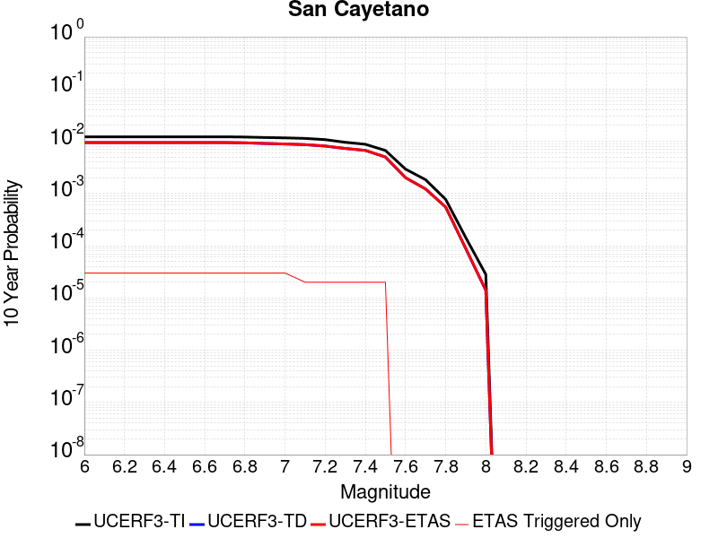 |

| Magnitude | 1 wk TI Prob | 1 wk TD Prob | 1 wk ETAS Prob | 1 wk ETAS/TD Gain | 1 wk ETAS Triggered Only | 1 mo TI Prob | 1 mo TD Prob | 1 mo ETAS Prob | 1 mo ETAS/TD Gain | 1 mo ETAS Triggered Only | 1 yr TI Prob | 1 yr TD Prob | 1 yr ETAS Prob | 1 yr ETAS/TD Gain | 1 yr ETAS Triggered Only | 10 yr TI Prob | 10 yr TD Prob | 10 yr ETAS Prob | 10 yr ETAS/TD Gain | 10 yr ETAS Triggered Only |
|-----|-----|-----|-----|-----|-----|-----|-----|-----|-----|-----|-----|-----|-----|-----|-----|-----|-----|-----|-----|-----|
| 6.0 | 2.3476267E-5 | 1.816928E-5 | 5.8206988E-5 | 3.2035937 | 4.0038438E-5 | 1.0060869E-4 | 7.786603E-5 | 1.17901356E-4 | 1.5141563 | 4.0038438E-5 | 0.0012242225 | 9.476103E-4 | 9.876108E-4 | 1.042212 | 4.0038438E-5 | 0.012175002 | 0.009436584 | 0.009476244 | 1.0042028 | 4.0038438E-5 |
| 6.1 | 2.3476267E-5 | 1.816928E-5 | 5.8206988E-5 | 3.2035937 | 4.0038438E-5 | 1.0060869E-4 | 7.786603E-5 | 1.17901356E-4 | 1.5141563 | 4.0038438E-5 | 0.0012242225 | 9.476103E-4 | 9.876108E-4 | 1.042212 | 4.0038438E-5 | 0.012175002 | 0.009436584 | 0.009476244 | 1.0042028 | 4.0038438E-5 |
| 6.2 | 2.3476267E-5 | 1.816928E-5 | 5.8206988E-5 | 3.2035937 | 4.0038438E-5 | 1.0060869E-4 | 7.786603E-5 | 1.17901356E-4 | 1.5141563 | 4.0038438E-5 | 0.0012242225 | 9.476103E-4 | 9.876108E-4 | 1.042212 | 4.0038438E-5 | 0.012175002 | 0.009436584 | 0.009476244 | 1.0042028 | 4.0038438E-5 |
| 6.3 | 2.3476267E-5 | 1.816928E-5 | 5.8206988E-5 | 3.2035937 | 4.0038438E-5 | 1.0060869E-4 | 7.786603E-5 | 1.17901356E-4 | 1.5141563 | 4.0038438E-5 | 0.0012242225 | 9.476103E-4 | 9.876108E-4 | 1.042212 | 4.0038438E-5 | 0.012175002 | 0.009436584 | 0.009476244 | 1.0042028 | 4.0038438E-5 |
| 6.4 | 2.3476267E-5 | 1.816928E-5 | 5.8206988E-5 | 3.2035937 | 4.0038438E-5 | 1.0060869E-4 | 7.786603E-5 | 1.17901356E-4 | 1.5141563 | 4.0038438E-5 | 0.0012242225 | 9.476103E-4 | 9.876108E-4 | 1.042212 | 4.0038438E-5 | 0.012175002 | 0.009436584 | 0.009476244 | 1.0042028 | 4.0038438E-5 |
| 6.5 | 2.3476267E-5 | 1.816928E-5 | 5.8206988E-5 | 3.2035937 | 4.0038438E-5 | 1.0060869E-4 | 7.786603E-5 | 1.17901356E-4 | 1.5141563 | 4.0038438E-5 | 0.0012242225 | 9.476103E-4 | 9.876108E-4 | 1.042212 | 4.0038438E-5 | 0.012175002 | 0.009436584 | 0.009476244 | 1.0042028 | 4.0038438E-5 |
| 6.6 | 2.3476267E-5 | 1.816928E-5 | 5.8206988E-5 | 3.2035937 | 4.0038438E-5 | 1.0060869E-4 | 7.786603E-5 | 1.17901356E-4 | 1.5141563 | 4.0038438E-5 | 0.0012242225 | 9.476103E-4 | 9.876108E-4 | 1.042212 | 4.0038438E-5 | 0.012175002 | 0.009436584 | 0.009476244 | 1.0042028 | 4.0038438E-5 |
| 6.7 | 2.3476267E-5 | 1.816928E-5 | 5.8206988E-5 | 3.2035937 | 4.0038438E-5 | 1.0060869E-4 | 7.786603E-5 | 1.17901356E-4 | 1.5141563 | 4.0038438E-5 | 0.0012242225 | 9.476103E-4 | 9.876108E-4 | 1.042212 | 4.0038438E-5 | 0.012175002 | 0.009436584 | 0.009476244 | 1.0042028 | 4.0038438E-5 |
| 6.8 | 2.3241924E-5 | 1.7936987E-5 | 5.7974707E-5 | 3.2321317 | 4.0038438E-5 | 9.960445E-5 | 7.687056E-5 | 1.1690592E-4 | 1.5208153 | 4.0038438E-5 | 0.0012120095 | 9.3550084E-4 | 9.755018E-4 | 1.042759 | 4.0038438E-5 | 0.012054204 | 0.009316482 | 0.009356148 | 1.0042576 | 4.0038438E-5 |
| 6.9 | 2.2761007E-5 | 1.7432423E-5 | 5.7470163E-5 | 3.2967398 | 4.0038438E-5 | 9.7543525E-5 | 7.470827E-5 | 1.14743714E-4 | 1.5358905 | 4.0038438E-5 | 0.0011869454 | 9.09197E-4 | 9.491991E-4 | 1.043997 | 4.0038438E-5 | 0.011806256 | 0.009055603 | 0.009095279 | 1.0043814 | 4.0038438E-5 |
| 7.0 | 2.240283E-5 | 1.7066168E-5 | 5.7103924E-5 | 3.3460307 | 4.0038438E-5 | 9.600859E-5 | 7.313869E-5 | 1.131742E-4 | 1.5473917 | 4.0038438E-5 | 0.0011682777 | 8.9010317E-4 | 9.30106E-4 | 1.0449418 | 4.0038438E-5 | 0.011621549 | 0.008866196 | 0.008905878 | 1.0044758 | 4.0038438E-5 |
| 7.1 | 2.1871154E-5 | 1.6586018E-5 | 5.662379E-5 | 3.4139473 | 4.0038438E-5 | 9.373015E-5 | 7.108101E-5 | 1.11116606E-4 | 1.5632389 | 4.0038438E-5 | 0.0011405671 | 8.6507114E-4 | 9.0507494E-4 | 1.0462433 | 4.0038438E-5 | 0.011347309 | 0.008617838 | 0.008657532 | 1.004606 | 4.0038438E-5 |
| 7.2 | 2.0714133E-5 | 1.5564561E-5 | 5.5602373E-5 | 3.5723703 | 4.0038438E-5 | 8.8771834E-5 | 6.670357E-5 | 1.0673934E-4 | 1.6002042 | 4.0038438E-5 | 0.0010802611 | 8.1181666E-4 | 8.518226E-4 | 1.0492796 | 4.0038438E-5 | 0.010750249 | 0.008089285 | 0.008129 | 1.0049095 | 4.0038438E-5 |
| 7.3 | 1.8408395E-5 | 1.3996864E-5 | 5.4034743E-5 | 3.860489 | 4.0038438E-5 | 7.8890735E-5 | 5.99852E-5 | 1.00021236E-4 | 1.6674318 | 4.0038438E-5 | 9.600714E-4 | 7.300781E-4 | 7.700873E-4 | 1.0548012 | 4.0038438E-5 | 0.009559342 | 0.0072775153 | 0.0073172622 | 1.0054616 | 4.0038438E-5 |
| 7.4 | 1.6856795E-5 | 1.28500815E-5 | 5.2888005E-5 | 4.115772 | 4.0038438E-5 | 7.2241404E-5 | 5.5070628E-5 | 9.510686E-5 | 1.7269979 | 4.0038438E-5 | 8.7918417E-4 | 6.7028153E-4 | 7.102931E-4 | 1.0596937 | 4.0038438E-5 | 0.00875714 | 0.0066832784 | 0.006723049 | 1.0059508 | 4.0038438E-5 |
| 7.5 | 1.2822778E-5 | 9.577542E-6 | 4.9615595E-5 | 5.18041 | 4.0038438E-5 | 5.495361E-5 | 4.1045972E-5 | 8.108276E-5 | 1.9754134 | 4.0038438E-5 | 6.688548E-4 | 4.996217E-4 | 5.3964014E-4 | 1.0800974 | 4.0038438E-5 | 0.006668452 | 0.0049851555 | 0.0050249943 | 1.0079916 | 4.0038438E-5 |
| 7.6 | 5.6272684E-6 | 3.854903E-6 | 3.854903E-6 | 1.0 | 0.0 | 2.4116642E-5 | 1.652091E-5 | 1.652091E-5 | 1.0 | 0.0 | 2.9358055E-4 | 2.0112359E-4 | 2.0112359E-4 | 1.0 | 0.0 | 0.0029319301 | 0.0020094267 | 0.0020094267 | 1.0 | 0.0 |
| 7.7 | 3.5261346E-6 | 2.3407013E-6 | 2.3407013E-6 | 1.0 | 0.0 | 1.5111918E-5 | 1.0031539E-5 | 1.0031539E-5 | 1.0 | 0.0 | 1.8397206E-4 | 1.2212721E-4 | 1.2212721E-4 | 1.0 | 0.0 | 0.0018381984 | 0.0012206084 | 0.0012206084 | 1.0 | 0.0 |
| 7.8 | 1.4826929E-6 | 1.056428E-6 | 1.056428E-6 | 1.0 | 0.0 | 6.354383E-6 | 4.5275406E-6 | 4.5275406E-6 | 1.0 | 0.0 | 7.736187E-5 | 5.5121433E-5 | 5.5121433E-5 | 1.0 | 0.0 | 7.733494E-4 | 5.5107963E-4 | 5.5107963E-4 | 1.0 | 0.0 |
| 7.9 | 2.7568166E-7 | 1.6978244E-7 | 1.6978244E-7 | 1.0 | 0.0 | 1.1814923E-6 | 7.2763885E-7 | 7.2763885E-7 | 1.0 | 0.0 | 1.4384574E-5 | 8.858967E-6 | 8.858967E-6 | 1.0 | 0.0 | 1.4383643E-4 | 8.8586174E-5 | 8.8586174E-5 | 1.0 | 0.0 |
| 8.0 | 5.407832E-8 | 2.6887697E-8 | 2.6887697E-8 | 1.0 | 0.0 | 2.3176422E-7 | 1.15232986E-7 | 1.15232986E-7 | 1.0 | 0.0 | 2.8217257E-6 | 1.4029607E-6 | 1.4029607E-6 | 1.0 | 0.0 | 2.8216898E-5 | 1.4029522E-5 | 1.4029522E-5 | 1.0 | 0.0 |

## Hayward (So) 2011 CFM
*[(top)](#table-of-contents)*

| 1 Week | 1 Month | 1 Year | 10 Year |
|-----|-----|-----|-----|
|  |  |  | 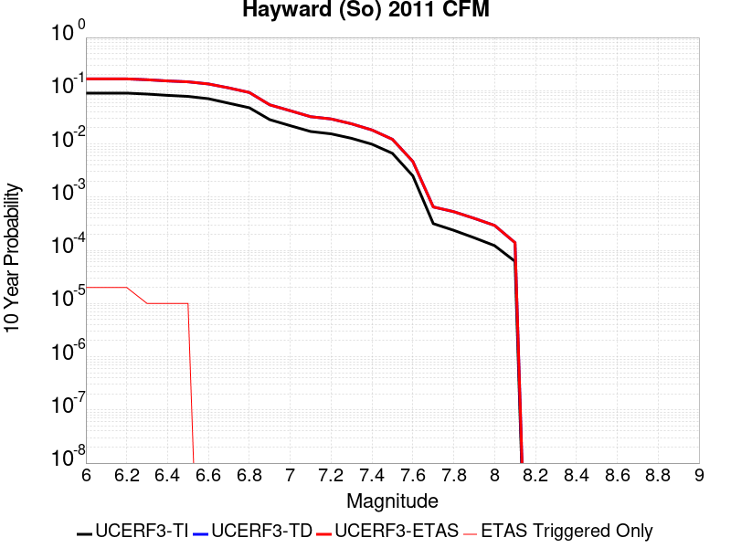 |

| Magnitude | 1 wk TI Prob | 1 wk TD Prob | 1 wk ETAS Prob | 1 wk ETAS/TD Gain | 1 wk ETAS Triggered Only | 1 mo TI Prob | 1 mo TD Prob | 1 mo ETAS Prob | 1 mo ETAS/TD Gain | 1 mo ETAS Triggered Only | 1 yr TI Prob | 1 yr TD Prob | 1 yr ETAS Prob | 1 yr ETAS/TD Gain | 1 yr ETAS Triggered Only | 10 yr TI Prob | 10 yr TD Prob | 10 yr ETAS Prob | 10 yr ETAS/TD Gain | 10 yr ETAS Triggered Only |
|-----|-----|-----|-----|-----|-----|-----|-----|-----|-----|-----|-----|-----|-----|-----|-----|-----|-----|-----|-----|-----|
| 6.0 | 1.8091932E-4 | 3.570541E-4 | 3.570541E-4 | 1.0 | 0.0 | 7.751381E-4 | 0.0015293444 | 0.0015693215 | 1.0261401 | 4.0038438E-5 | 0.00939654 | 0.018463207 | 0.018541807 | 1.0042571 | 8.0076876E-5 | 0.090090066 | 0.16673161 | 0.16679834 | 1.0004002 | 8.0076876E-5 |
| 6.1 | 1.8091932E-4 | 3.570541E-4 | 3.570541E-4 | 1.0 | 0.0 | 7.751381E-4 | 0.0015293444 | 0.0015693215 | 1.0261401 | 4.0038438E-5 | 0.00939654 | 0.018463207 | 0.018541807 | 1.0042571 | 8.0076876E-5 | 0.090090066 | 0.16673161 | 0.16679834 | 1.0004002 | 8.0076876E-5 |
| 6.2 | 1.8091932E-4 | 3.570541E-4 | 3.570541E-4 | 1.0 | 0.0 | 7.751381E-4 | 0.0015293444 | 0.0015693215 | 1.0261401 | 4.0038438E-5 | 0.00939654 | 0.018463207 | 0.018541807 | 1.0042571 | 8.0076876E-5 | 0.090090066 | 0.16673161 | 0.16679834 | 1.0004002 | 8.0076876E-5 |
| 6.3 | 1.7322872E-4 | 3.426234E-4 | 3.426234E-4 | 1.0 | 0.0 | 7.4219756E-4 | 0.0014675693 | 0.001507549 | 1.0272421 | 4.0038438E-5 | 0.0089988755 | 0.017723544 | 0.017762873 | 1.002219 | 4.0038438E-5 | 0.08643075 | 0.16066726 | 0.16070086 | 1.0002092 | 4.0038438E-5 |
| 6.4 | 1.6334097E-4 | 3.234411E-4 | 3.234411E-4 | 1.0 | 0.0 | 6.998449E-4 | 0.0013854484 | 0.0014254313 | 1.0288593 | 4.0038438E-5 | 0.008487372 | 0.016739385 | 0.016778754 | 1.0023519 | 4.0038438E-5 | 0.081704415 | 0.15255594 | 0.15258987 | 1.0002224 | 4.0038438E-5 |
| 6.5 | 1.5600289E-4 | 3.1018828E-4 | 3.1018828E-4 | 1.0 | 0.0 | 6.684125E-4 | 0.0013287093 | 0.0013686946 | 1.0300933 | 4.0038438E-5 | 0.008107598 | 0.016058935 | 0.01609833 | 1.0024532 | 4.0038438E-5 | 0.078181036 | 0.14683272 | 0.14686687 | 1.0002327 | 4.0038438E-5 |
| 6.6 | 1.4046066E-4 | 2.8032906E-4 | 2.8032906E-4 | 1.0 | 0.0 | 6.018354E-4 | 0.0012008639 | 0.0012008639 | 1.0 | 0.0 | 0.0073027555 | 0.014524006 | 0.014524006 | 1.0 | 0.0 | 0.07067384 | 0.13391982 | 0.13391982 | 1.0 | 0.0 |
| 6.7 | 1.14696966E-4 | 2.3271477E-4 | 2.3271477E-4 | 1.0 | 0.0 | 4.914658E-4 | 9.969729E-4 | 9.969729E-4 | 1.0 | 0.0 | 0.0059671924 | 0.012071652 | 0.012071652 | 1.0 | 0.0 | 0.058094822 | 0.11274672 | 0.11274672 | 1.0 | 0.0 |
| 6.8 | 9.3874296E-5 | 1.8861453E-4 | 1.8861453E-4 | 1.0 | 0.0 | 4.0225635E-4 | 8.0810126E-4 | 8.0810126E-4 | 1.0 | 0.0 | 0.0048864787 | 0.009794984 | 0.009794984 | 1.0 | 0.0 | 0.047804173 | 0.09259856 | 0.09259856 | 1.0 | 0.0 |
| 6.9 | 5.551852E-5 | 1.072948E-4 | 1.072948E-4 | 1.0 | 0.0 | 2.3791482E-4 | 4.5975443E-4 | 4.5975443E-4 | 1.0 | 0.0 | 0.0028927654 | 0.0055832625 | 0.0055832625 | 1.0 | 0.0 | 0.028553981 | 0.054245494 | 0.054245494 | 1.0 | 0.0 |
| 7.0 | 4.2662363E-5 | 8.2464416E-5 | 8.2464416E-5 | 1.0 | 0.0 | 1.8282588E-4 | 3.5337146E-4 | 3.5337146E-4 | 1.0 | 0.0 | 0.0022236328 | 0.0042938837 | 0.0042938837 | 1.0 | 0.0 | 0.022015138 | 0.042064495 | 0.042064495 | 1.0 | 0.0 |
| 7.1 | 3.305886E-5 | 6.3019055E-5 | 6.3019055E-5 | 1.0 | 0.0 | 1.4167312E-4 | 2.700538E-4 | 2.700538E-4 | 1.0 | 0.0 | 0.0017235056 | 0.0032829668 | 0.0032829668 | 1.0 | 0.0 | 0.017101998 | 0.032452874 | 0.032452874 | 1.0 | 0.0 |
| 7.2 | 2.9856887E-5 | 5.7013647E-5 | 5.7013647E-5 | 1.0 | 0.0 | 1.2795182E-4 | 2.4432142E-4 | 2.4432142E-4 | 1.0 | 0.0 | 0.0015567001 | 0.0029705726 | 0.0029705726 | 1.0 | 0.0 | 0.015458403 | 0.029453589 | 0.029453589 | 1.0 | 0.0 |
| 7.3 | 2.4559737E-5 | 4.599088E-5 | 4.599088E-5 | 1.0 | 0.0 | 1.0525176E-4 | 1.9708896E-4 | 1.9708896E-4 | 1.0 | 0.0 | 0.0012806869 | 0.0023969305 | 0.0023969305 | 1.0 | 0.0 | 0.012733313 | 0.023857482 | 0.023857482 | 1.0 | 0.0 |
| 7.4 | 1.9002231E-5 | 3.5049303E-5 | 3.5049303E-5 | 1.0 | 0.0 | 8.143559E-5 | 1.502027E-4 | 1.502027E-4 | 1.0 | 0.0 | 9.910273E-4 | 0.0018271938 | 0.0018271938 | 1.0 | 0.0 | 0.009866194 | 0.018258283 | 0.018258283 | 1.0 | 0.0 |
| 7.5 | 1.2783333E-5 | 2.3330069E-5 | 2.3330069E-5 | 1.0 | 0.0 | 5.4784563E-5 | 9.998221E-5 | 9.998221E-5 | 1.0 | 0.0 | 6.667979E-4 | 0.0012166094 | 0.0012166094 | 1.0 | 0.0 | 0.006648007 | 0.012209582 | 0.012209582 | 1.0 | 0.0 |
| 7.6 | 4.8149627E-6 | 8.887544E-6 | 8.887544E-6 | 1.0 | 0.0 | 2.063539E-5 | 3.8088925E-5 | 3.8088925E-5 | 1.0 | 0.0 | 2.5120692E-4 | 4.636352E-4 | 4.636352E-4 | 1.0 | 0.0 | 0.0025092314 | 0.0046812436 | 0.0046812436 | 1.0 | 0.0 |
| 7.7 | 6.0838227E-7 | 1.2056693E-6 | 1.2056693E-6 | 1.0 | 0.0 | 2.6073499E-6 | 5.1671436E-6 | 5.1671436E-6 | 1.0 | 0.0 | 3.174402E-5 | 6.290816E-5 | 6.290816E-5 | 1.0 | 0.0 | 3.1739488E-4 | 6.5293367E-4 | 6.5293367E-4 | 1.0 | 0.0 |
| 7.8 | 4.5542808E-7 | 9.792182E-7 | 9.792182E-7 | 1.0 | 0.0 | 1.9518332E-6 | 4.1966427E-6 | 4.1966427E-6 | 1.0 | 0.0 | 2.376331E-5 | 5.1092928E-5 | 5.1092928E-5 | 1.0 | 0.0 | 2.3760769E-4 | 5.321372E-4 | 5.321372E-4 | 1.0 | 0.0 |
| 7.9 | 3.3016747E-7 | 7.386335E-7 | 7.386335E-7 | 1.0 | 0.0 | 1.4150027E-6 | 3.1655684E-6 | 3.1655684E-6 | 1.0 | 0.0 | 1.7227521E-5 | 3.8540114E-5 | 3.8540114E-5 | 1.0 | 0.0 | 1.7226185E-4 | 3.9930744E-4 | 3.9930744E-4 | 1.0 | 0.0 |
| 8.0 | 2.347038E-7 | 5.4714894E-7 | 5.4714894E-7 | 1.0 | 0.0 | 1.0058731E-6 | 2.344922E-6 | 2.344922E-6 | 1.0 | 0.0 | 1.2246436E-5 | 2.8549053E-5 | 2.8549053E-5 | 1.0 | 0.0 | 1.2245761E-4 | 2.9355253E-4 | 2.9355253E-4 | 1.0 | 0.0 |
| 8.1 | 1.18822804E-7 | 2.6058973E-7 | 2.6058973E-7 | 1.0 | 0.0 | 5.092405E-7 | 1.1168127E-6 | 1.1168127E-6 | 1.0 | 0.0 | 6.1999854E-6 | 1.359711E-5 | 1.359711E-5 | 1.0 | 0.0 | 6.199812E-5 | 1.3917852E-4 | 1.3917852E-4 | 1.0 | 0.0 |

## White Wolf
*[(top)](#table-of-contents)*

| 1 Week | 1 Month | 1 Year | 10 Year |
|-----|-----|-----|-----|
|  |  |  |  |

| Magnitude | 1 wk TI Prob | 1 wk TD Prob | 1 wk ETAS Prob | 1 wk ETAS/TD Gain | 1 wk ETAS Triggered Only | 1 mo TI Prob | 1 mo TD Prob | 1 mo ETAS Prob | 1 mo ETAS/TD Gain | 1 mo ETAS Triggered Only | 1 yr TI Prob | 1 yr TD Prob | 1 yr ETAS Prob | 1 yr ETAS/TD Gain | 1 yr ETAS Triggered Only | 10 yr TI Prob | 10 yr TD Prob | 10 yr ETAS Prob | 10 yr ETAS/TD Gain | 10 yr ETAS Triggered Only |
|-----|-----|-----|-----|-----|-----|-----|-----|-----|-----|-----|-----|-----|-----|-----|-----|-----|-----|-----|-----|-----|
| 6.0 | 2.0037822E-5 | 1.0469162E-6 | 4.108531E-5 | 39.24413 | 4.0038438E-5 | 8.587355E-5 | 4.486776E-6 | 4.4525033E-5 | 9.923614 | 4.0038438E-5 | 0.001045009 | 5.4625183E-5 | 9.466143E-5 | 1.7329266 | 4.0038438E-5 | 0.010401085 | 5.461226E-4 | 5.8613915E-4 | 1.073274 | 4.0038438E-5 |
| 6.1 | 2.0037822E-5 | 1.0469162E-6 | 4.108531E-5 | 39.24413 | 4.0038438E-5 | 8.587355E-5 | 4.486776E-6 | 4.4525033E-5 | 9.923614 | 4.0038438E-5 | 0.001045009 | 5.4625183E-5 | 9.466143E-5 | 1.7329266 | 4.0038438E-5 | 0.010401085 | 5.461226E-4 | 5.8613915E-4 | 1.073274 | 4.0038438E-5 |
| 6.2 | 2.0037822E-5 | 1.0469162E-6 | 4.108531E-5 | 39.24413 | 4.0038438E-5 | 8.587355E-5 | 4.486776E-6 | 4.4525033E-5 | 9.923614 | 4.0038438E-5 | 0.001045009 | 5.4625183E-5 | 9.466143E-5 | 1.7329266 | 4.0038438E-5 | 0.010401085 | 5.461226E-4 | 5.8613915E-4 | 1.073274 | 4.0038438E-5 |
| 6.3 | 2.0037822E-5 | 1.0469162E-6 | 4.108531E-5 | 39.24413 | 4.0038438E-5 | 8.587355E-5 | 4.486776E-6 | 4.4525033E-5 | 9.923614 | 4.0038438E-5 | 0.001045009 | 5.4625183E-5 | 9.466143E-5 | 1.7329266 | 4.0038438E-5 | 0.010401085 | 5.461226E-4 | 5.8613915E-4 | 1.073274 | 4.0038438E-5 |
| 6.4 | 1.132487E-5 | 1.0469162E-6 | 4.108531E-5 | 39.24413 | 4.0038438E-5 | 4.8534253E-5 | 4.486776E-6 | 4.4525033E-5 | 9.923614 | 4.0038438E-5 | 5.907443E-4 | 5.4625183E-5 | 9.466143E-5 | 1.7329266 | 4.0038438E-5 | 0.005891764 | 5.461226E-4 | 5.8613915E-4 | 1.073274 | 4.0038438E-5 |
| 6.5 | 1.132487E-5 | 1.0469162E-6 | 4.108531E-5 | 39.24413 | 4.0038438E-5 | 4.8534253E-5 | 4.486776E-6 | 4.4525033E-5 | 9.923614 | 4.0038438E-5 | 5.907443E-4 | 5.4625183E-5 | 9.466143E-5 | 1.7329266 | 4.0038438E-5 | 0.005891764 | 5.461226E-4 | 5.8613915E-4 | 1.073274 | 4.0038438E-5 |
| 6.6 | 9.347473E-6 | 1.0469162E-6 | 4.108531E-5 | 39.24413 | 4.0038438E-5 | 4.0059982E-5 | 4.486776E-6 | 4.4525033E-5 | 9.923614 | 4.0038438E-5 | 4.8762115E-4 | 5.4625183E-5 | 9.466143E-5 | 1.7329266 | 4.0038438E-5 | 0.0048655253 | 5.461226E-4 | 5.8613915E-4 | 1.073274 | 4.0038438E-5 |
| 6.7 | 7.842647E-6 | 1.0048342E-6 | 4.104323E-5 | 40.845776 | 4.0038438E-5 | 3.361091E-5 | 4.3064256E-6 | 4.434469E-5 | 10.297332 | 4.0038438E-5 | 4.0913603E-4 | 5.2429517E-5 | 9.246585E-5 | 1.763622 | 4.0038438E-5 | 0.004083836 | 5.2417646E-4 | 5.641939E-4 | 1.0763434 | 4.0038438E-5 |
| 6.8 | 6.26597E-6 | 9.734822E-7 | 4.101188E-5 | 42.12905 | 4.0038438E-5 | 2.685388E-5 | 4.17206E-6 | 4.421033E-5 | 10.596763 | 4.0038438E-5 | 3.2689696E-4 | 5.0793697E-5 | 9.08301E-5 | 1.788216 | 4.0038438E-5 | 0.003264165 | 5.078258E-4 | 5.4784387E-4 | 1.0788028 | 4.0038438E-5 |
| 6.9 | 5.258436E-6 | 9.183254E-7 | 4.0956726E-5 | 44.59936 | 4.0038438E-5 | 2.2535958E-5 | 3.9356746E-6 | 4.3973952E-5 | 11.173168 | 4.0038438E-5 | 2.7434074E-4 | 4.7915833E-5 | 8.795235E-5 | 1.8355592 | 4.0038438E-5 | 0.0027400232 | 4.790598E-4 | 5.1907904E-4 | 1.0835371 | 4.0038438E-5 |
| 7.0 | 4.675028E-6 | 8.6611794E-7 | 4.090452E-5 | 47.227425 | 4.0038438E-5 | 2.003568E-5 | 3.7119291E-6 | 4.3750217E-5 | 11.786383 | 4.0038438E-5 | 2.4390711E-4 | 4.5191846E-5 | 8.522847E-5 | 1.8859259 | 4.0038438E-5 | 0.0024363957 | 4.518313E-4 | 4.9185165E-4 | 1.0885737 | 4.0038438E-5 |
| 7.1 | 2.8270078E-6 | 6.8741696E-7 | 4.0725827E-5 | 59.24472 | 4.0038438E-5 | 1.2115692E-5 | 2.9460696E-6 | 4.298439E-5 | 14.590419 | 4.0038438E-5 | 1.4749856E-4 | 3.5867848E-5 | 7.590485E-5 | 2.1162364 | 4.0038438E-5 | 0.001474007 | 3.586247E-4 | 3.9864876E-4 | 1.1116043 | 4.0038438E-5 |
| 7.2 | 1.6881406E-6 | 2.2706382E-7 | 2.2706382E-7 | 1.0 | 0.0 | 7.2348685E-6 | 9.731303E-7 | 9.731303E-7 | 1.0 | 0.0 | 8.808096E-5 | 1.1847799E-5 | 1.1847799E-5 | 1.0 | 0.0 | 8.8046055E-4 | 1.1847183E-4 | 1.1847183E-4 | 1.0 | 0.0 |
| 7.3 | 9.086107E-7 | 1.5266386E-7 | 1.5266386E-7 | 1.0 | 0.0 | 3.8940398E-6 | 6.5427355E-7 | 6.5427355E-7 | 1.0 | 0.0 | 4.7408903E-5 | 7.965752E-6 | 7.965752E-6 | 1.0 | 0.0 | 4.739879E-4 | 7.965475E-5 | 7.965475E-5 | 1.0 | 0.0 |
| 7.4 | 1.9717383E-7 | 9.003913E-8 | 9.003913E-8 | 1.0 | 0.0 | 8.450304E-7 | 3.8588192E-7 | 3.8588192E-7 | 1.0 | 0.0 | 1.0288197E-5 | 4.6981027E-6 | 4.6981027E-6 | 1.0 | 0.0 | 1.028772E-4 | 4.6980065E-5 | 4.6980065E-5 | 1.0 | 0.0 |
| 7.5 | 1.086975E-7 | 6.6597195E-8 | 6.6597195E-8 | 1.0 | 0.0 | 4.6584634E-7 | 2.8541652E-7 | 2.8541652E-7 | 1.0 | 0.0 | 5.6716644E-6 | 3.474941E-6 | 3.474941E-6 | 1.0 | 0.0 | 5.6715195E-5 | 3.474889E-5 | 3.474889E-5 | 1.0 | 0.0 |
| 7.6 | 2.4217808E-8 | 1.5820765E-8 | 1.5820765E-8 | 1.0 | 0.0 | 1.03790605E-7 | 6.780328E-8 | 6.780328E-8 | 1.0 | 0.0 | 1.2636499E-6 | 8.255046E-7 | 8.255046E-7 | 1.0 | 0.0 | 1.2636427E-5 | 8.2550205E-6 | 8.2550205E-6 | 1.0 | 0.0 |

## Earthquake Valley (So Extension)
*[(top)](#table-of-contents)*

| 1 Week | 1 Month | 1 Year | 10 Year |
|-----|-----|-----|-----|
|  |  |  |  |

| Magnitude | 1 wk TI Prob | 1 wk TD Prob | 1 wk ETAS Prob | 1 wk ETAS/TD Gain | 1 wk ETAS Triggered Only | 1 mo TI Prob | 1 mo TD Prob | 1 mo ETAS Prob | 1 mo ETAS/TD Gain | 1 mo ETAS Triggered Only | 1 yr TI Prob | 1 yr TD Prob | 1 yr ETAS Prob | 1 yr ETAS/TD Gain | 1 yr ETAS Triggered Only | 10 yr TI Prob | 10 yr TD Prob | 10 yr ETAS Prob | 10 yr ETAS/TD Gain | 10 yr ETAS Triggered Only |
|-----|-----|-----|-----|-----|-----|-----|-----|-----|-----|-----|-----|-----|-----|-----|-----|-----|-----|-----|-----|-----|
| 6.0 | 3.0194888E-5 | 3.7072114E-5 | 7.710906E-5 | 2.079975 | 4.0038438E-5 | 1.2940024E-4 | 1.5887388E-4 | 1.9890595E-4 | 1.251974 | 4.0038438E-5 | 0.0015743093 | 0.0019331174 | 0.0019730784 | 1.0206718 | 4.0038438E-5 | 0.01563203 | 0.019213019 | 0.019252287 | 1.0020438 | 4.0038438E-5 |
| 6.1 | 3.0194888E-5 | 3.7072114E-5 | 7.710906E-5 | 2.079975 | 4.0038438E-5 | 1.2940024E-4 | 1.5887388E-4 | 1.9890595E-4 | 1.251974 | 4.0038438E-5 | 0.0015743093 | 0.0019331174 | 0.0019730784 | 1.0206718 | 4.0038438E-5 | 0.01563203 | 0.019213019 | 0.019252287 | 1.0020438 | 4.0038438E-5 |
| 6.2 | 3.0194888E-5 | 3.7072114E-5 | 7.710906E-5 | 2.079975 | 4.0038438E-5 | 1.2940024E-4 | 1.5887388E-4 | 1.9890595E-4 | 1.251974 | 4.0038438E-5 | 0.0015743093 | 0.0019331174 | 0.0019730784 | 1.0206718 | 4.0038438E-5 | 0.01563203 | 0.019213019 | 0.019252287 | 1.0020438 | 4.0038438E-5 |
| 6.3 | 1.5795305E-5 | 1.844658E-5 | 1.844658E-5 | 1.0 | 0.0 | 6.769241E-5 | 7.9055004E-5 | 7.9055004E-5 | 1.0 | 0.0 | 8.238434E-4 | 9.6218096E-4 | 9.6218096E-4 | 1.0 | 0.0 | 0.008207959 | 0.009591061 | 0.009591061 | 1.0 | 0.0 |
| 6.4 | 1.5795305E-5 | 1.844658E-5 | 1.844658E-5 | 1.0 | 0.0 | 6.769241E-5 | 7.9055004E-5 | 7.9055004E-5 | 1.0 | 0.0 | 8.238434E-4 | 9.6218096E-4 | 9.6218096E-4 | 1.0 | 0.0 | 0.008207959 | 0.009591061 | 0.009591061 | 1.0 | 0.0 |
| 6.5 | 1.5795305E-5 | 1.844658E-5 | 1.844658E-5 | 1.0 | 0.0 | 6.769241E-5 | 7.9055004E-5 | 7.9055004E-5 | 1.0 | 0.0 | 8.238434E-4 | 9.6218096E-4 | 9.6218096E-4 | 1.0 | 0.0 | 0.008207959 | 0.009591061 | 0.009591061 | 1.0 | 0.0 |
| 6.6 | 1.5795305E-5 | 1.844658E-5 | 1.844658E-5 | 1.0 | 0.0 | 6.769241E-5 | 7.9055004E-5 | 7.9055004E-5 | 1.0 | 0.0 | 8.238434E-4 | 9.6218096E-4 | 9.6218096E-4 | 1.0 | 0.0 | 0.008207959 | 0.009591061 | 0.009591061 | 1.0 | 0.0 |
| 6.7 | 1.1363076E-5 | 1.3138294E-5 | 1.3138294E-5 | 1.0 | 0.0 | 4.8697988E-5 | 5.6306188E-5 | 5.6306188E-5 | 1.0 | 0.0 | 5.927367E-4 | 6.8538834E-4 | 6.8538834E-4 | 1.0 | 0.0 | 0.0059115817 | 0.0068402183 | 0.0068402183 | 1.0 | 0.0 |
| 6.8 | 1.0049611E-5 | 1.1594334E-5 | 1.1594334E-5 | 1.0 | 0.0 | 4.306905E-5 | 4.9689468E-5 | 4.9689468E-5 | 1.0 | 0.0 | 5.242395E-4 | 6.048745E-4 | 6.048745E-4 | 1.0 | 0.0 | 0.0052300454 | 0.006039458 | 0.006039458 | 1.0 | 0.0 |
| 6.9 | 1.0049611E-5 | 1.1594334E-5 | 1.1594334E-5 | 1.0 | 0.0 | 4.306905E-5 | 4.9689468E-5 | 4.9689468E-5 | 1.0 | 0.0 | 5.242395E-4 | 6.048745E-4 | 6.048745E-4 | 1.0 | 0.0 | 0.0052300454 | 0.006039458 | 0.006039458 | 1.0 | 0.0 |
| 7.0 | 1.0049611E-5 | 1.1594334E-5 | 1.1594334E-5 | 1.0 | 0.0 | 4.306905E-5 | 4.9689468E-5 | 4.9689468E-5 | 1.0 | 0.0 | 5.242395E-4 | 6.048745E-4 | 6.048745E-4 | 1.0 | 0.0 | 0.0052300454 | 0.006039458 | 0.006039458 | 1.0 | 0.0 |
| 7.1 | 8.140254E-6 | 9.383458E-6 | 9.383458E-6 | 1.0 | 0.0 | 3.4886336E-5 | 4.0214578E-5 | 4.0214578E-5 | 1.0 | 0.0 | 4.2465836E-4 | 4.8956956E-4 | 4.8956956E-4 | 1.0 | 0.0 | 0.0042384774 | 0.0048914864 | 0.0048914864 | 1.0 | 0.0 |
| 7.2 | 1.673835E-7 | 1.4154125E-7 | 1.4154125E-7 | 1.0 | 0.0 | 7.173577E-7 | 6.066052E-7 | 6.066052E-7 | 1.0 | 0.0 | 8.733795E-6 | 7.385397E-6 | 7.385397E-6 | 1.0 | 0.0 | 8.733451E-5 | 7.385187E-5 | 7.385187E-5 | 1.0 | 0.0 |
| 7.3 | 1.6632116E-7 | 1.4052354E-7 | 1.4052354E-7 | 1.0 | 0.0 | 7.1280476E-7 | 6.0224363E-7 | 6.0224363E-7 | 1.0 | 0.0 | 8.678364E-6 | 7.332295E-6 | 7.332295E-6 | 1.0 | 0.0 | 8.6780245E-5 | 7.332089E-5 | 7.332089E-5 | 1.0 | 0.0 |
| 7.4 | 1.6569169E-7 | 1.3996983E-7 | 1.3996983E-7 | 1.0 | 0.0 | 7.1010703E-7 | 5.9987053E-7 | 5.9987053E-7 | 1.0 | 0.0 | 8.645519E-6 | 7.303403E-6 | 7.303403E-6 | 1.0 | 0.0 | 8.645182E-5 | 7.303199E-5 | 7.303199E-5 | 1.0 | 0.0 |
| 7.5 | 1.1764555E-7 | 1.0095917E-7 | 1.0095917E-7 | 1.0 | 0.0 | 5.041951E-7 | 4.326821E-7 | 4.326821E-7 | 1.0 | 0.0 | 6.138558E-6 | 5.267894E-6 | 5.267894E-6 | 1.0 | 0.0 | 6.1383886E-5 | 5.2677904E-5 | 5.2677904E-5 | 1.0 | 0.0 |
| 7.6 | 1.07927605E-7 | 9.260736E-8 | 9.260736E-8 | 1.0 | 0.0 | 4.6254678E-7 | 3.9688865E-7 | 3.9688865E-7 | 1.0 | 0.0 | 5.6314925E-6 | 4.832111E-6 | 4.832111E-6 | 1.0 | 0.0 | 5.63135E-5 | 4.8320264E-5 | 4.8320264E-5 | 1.0 | 0.0 |
| 7.7 | 2.1826905E-8 | 1.1180516E-8 | 1.1180516E-8 | 1.0 | 0.0 | 9.3543875E-8 | 4.7916494E-8 | 4.7916494E-8 | 1.0 | 0.0 | 1.1388961E-6 | 5.833832E-7 | 5.833832E-7 | 1.0 | 0.0 | 1.1388902E-5 | 5.8338223E-6 | 5.8338223E-6 | 1.0 | 0.0 |
| 7.8 | 2.6169649E-9 | 1.1969472E-9 | 1.1969472E-9 | 1.0 | 0.0 | 1.1215564E-8 | 5.1297735E-9 | 5.1297735E-9 | 1.0 | 0.0 | 1.3654947E-7 | 6.2454994E-8 | 6.2454994E-8 | 1.0 | 0.0 | 1.365494E-6 | 6.245499E-7 | 6.245499E-7 | 1.0 | 0.0 |

## Reliz 2011 CFM
*[(top)](#table-of-contents)*

| 1 Week | 1 Month | 1 Year | 10 Year |
|-----|-----|-----|-----|
|  |  |  |  |

| Magnitude | 1 wk TI Prob | 1 wk TD Prob | 1 wk ETAS Prob | 1 wk ETAS/TD Gain | 1 wk ETAS Triggered Only | 1 mo TI Prob | 1 mo TD Prob | 1 mo ETAS Prob | 1 mo ETAS/TD Gain | 1 mo ETAS Triggered Only | 1 yr TI Prob | 1 yr TD Prob | 1 yr ETAS Prob | 1 yr ETAS/TD Gain | 1 yr ETAS Triggered Only | 10 yr TI Prob | 10 yr TD Prob | 10 yr ETAS Prob | 10 yr ETAS/TD Gain | 10 yr ETAS Triggered Only |
|-----|-----|-----|-----|-----|-----|-----|-----|-----|-----|-----|-----|-----|-----|-----|-----|-----|-----|-----|-----|-----|
| 6.0 | 1.6002472E-5 | 1.6282804E-5 | 5.632059E-5 | 3.4588997 | 4.0038438E-5 | 6.8580215E-5 | 6.9781694E-5 | 1.0981734E-4 | 1.573727 | 4.0038438E-5 | 8.3464425E-4 | 8.4928074E-4 | 8.892852E-4 | 1.0471039 | 4.0038438E-5 | 0.008315164 | 0.008462547 | 0.008502247 | 1.0046912 | 4.0038438E-5 |
| 6.1 | 1.6002472E-5 | 1.6282804E-5 | 5.632059E-5 | 3.4588997 | 4.0038438E-5 | 6.8580215E-5 | 6.9781694E-5 | 1.0981734E-4 | 1.573727 | 4.0038438E-5 | 8.3464425E-4 | 8.4928074E-4 | 8.892852E-4 | 1.0471039 | 4.0038438E-5 | 0.008315164 | 0.008462547 | 0.008502247 | 1.0046912 | 4.0038438E-5 |
| 6.2 | 1.6002472E-5 | 1.6282804E-5 | 5.632059E-5 | 3.4588997 | 4.0038438E-5 | 6.8580215E-5 | 6.9781694E-5 | 1.0981734E-4 | 1.573727 | 4.0038438E-5 | 8.3464425E-4 | 8.4928074E-4 | 8.892852E-4 | 1.0471039 | 4.0038438E-5 | 0.008315164 | 0.008462547 | 0.008502247 | 1.0046912 | 4.0038438E-5 |
| 6.3 | 7.792404E-6 | 7.803802E-6 | 4.7841928E-5 | 6.130592 | 4.0038438E-5 | 3.339559E-5 | 3.344444E-5 | 7.348154E-5 | 2.1971226 | 4.0038438E-5 | 4.0651546E-4 | 4.0711078E-4 | 4.4713292E-4 | 1.0983077 | 4.0038438E-5 | 0.0040577264 | 0.004063926 | 0.004103802 | 1.0098121 | 4.0038438E-5 |
| 6.4 | 7.792404E-6 | 7.803802E-6 | 4.7841928E-5 | 6.130592 | 4.0038438E-5 | 3.339559E-5 | 3.344444E-5 | 7.348154E-5 | 2.1971226 | 4.0038438E-5 | 4.0651546E-4 | 4.0711078E-4 | 4.4713292E-4 | 1.0983077 | 4.0038438E-5 | 0.0040577264 | 0.004063926 | 0.004103802 | 1.0098121 | 4.0038438E-5 |
| 6.5 | 5.9659374E-6 | 5.928738E-6 | 4.596694E-5 | 7.753241 | 4.0038438E-5 | 2.5568053E-5 | 2.5408632E-5 | 6.544605E-5 | 2.5757408 | 4.0038438E-5 | 3.1124658E-4 | 3.093064E-4 | 3.4933246E-4 | 1.1294059 | 4.0038438E-5 | 0.00310811 | 0.0030889767 | 0.0031288916 | 1.0129217 | 4.0038438E-5 |
| 6.6 | 5.2350692E-6 | 5.178986E-6 | 4.5217217E-5 | 8.730901 | 4.0038438E-5 | 2.2435817E-5 | 2.2195467E-5 | 6.223301E-5 | 2.8038616 | 4.0038438E-5 | 2.7312184E-4 | 2.7019644E-4 | 3.1022407E-4 | 1.1481427 | 4.0038438E-5 | 0.002727864 | 0.0026988892 | 0.0027388197 | 1.0147951 | 4.0038438E-5 |
| 6.7 | 4.580206E-6 | 4.5061206E-6 | 4.4544377E-5 | 9.885305 | 4.0038438E-5 | 1.9629308E-5 | 1.9311801E-5 | 5.9349466E-5 | 3.0732226 | 4.0038438E-5 | 2.389606E-4 | 2.350959E-4 | 2.751249E-4 | 1.1702667 | 4.0038438E-5 | 0.002387038 | 0.0023486738 | 0.0023886182 | 1.0170072 | 4.0038438E-5 |
| 6.8 | 4.0765017E-6 | 3.9882384E-6 | 4.4026514E-5 | 11.039089 | 4.0038438E-5 | 1.7470604E-5 | 1.7092338E-5 | 5.713009E-5 | 3.3424387 | 4.0038438E-5 | 2.1268385E-4 | 2.0807938E-4 | 2.4810949E-4 | 1.192379 | 4.0038438E-5 | 0.002124804 | 0.0020790435 | 0.0021189987 | 1.0192181 | 4.0038438E-5 |
| 6.9 | 3.5752896E-6 | 3.4725176E-6 | 4.3510816E-5 | 12.530049 | 4.0038438E-5 | 1.532258E-5 | 1.4882134E-5 | 5.4919976E-5 | 3.6903293 | 4.0038438E-5 | 1.8653645E-4 | 1.8117494E-4 | 2.2120612E-4 | 1.2209532 | 4.0038438E-5 | 0.0018637994 | 0.0018104686 | 0.0018504346 | 1.0220749 | 4.0038438E-5 |
| 7.0 | 3.0259848E-6 | 2.9079417E-6 | 4.2946263E-5 | 14.768612 | 4.0038438E-5 | 1.2968442E-5 | 1.2462548E-5 | 5.2500487E-5 | 4.212661 | 4.0038438E-5 | 1.5787935E-4 | 1.5172097E-4 | 1.9175334E-4 | 1.2638552 | 4.0038438E-5 | 0.0015776722 | 0.001516369 | 0.0015563468 | 1.0263641 | 4.0038438E-5 |
| 7.1 | 2.5861116E-6 | 2.455167E-6 | 4.2493506E-5 | 17.307785 | 4.0038438E-5 | 1.1083288E-5 | 1.05221025E-5 | 5.0560117E-5 | 4.805135 | 4.0038438E-5 | 1.3493067E-4 | 1.2809907E-4 | 1.6813238E-4 | 1.3125184 | 4.0038438E-5 | 0.0013484878 | 0.001280447 | 0.0013204342 | 1.031229 | 4.0038438E-5 |
| 7.2 | 2.1482588E-6 | 2.003237E-6 | 4.2041593E-5 | 20.986832 | 4.0038438E-5 | 9.20679E-6 | 8.585273E-6 | 4.8623366E-5 | 5.6635785 | 4.0038438E-5 | 1.12086906E-4 | 1.0452068E-4 | 1.4455494E-4 | 1.3830271 | 4.0038438E-5 | 0.0011203039 | 0.0010449095 | 0.001084906 | 1.0382776 | 4.0038438E-5 |
| 7.3 | 1.7194744E-6 | 1.5611241E-6 | 4.15995E-5 | 26.647142 | 4.0038438E-5 | 7.3691554E-6 | 6.690515E-6 | 4.6728685E-5 | 6.9843183 | 4.0038438E-5 | 8.971577E-5 | 8.1453974E-5 | 1.2148915E-4 | 1.4915067 | 4.0038438E-5 | 8.967956E-4 | 8.1443513E-4 | 8.5444096E-4 | 1.0491209 | 4.0038438E-5 |
| 7.4 | 1.2755178E-6 | 1.10563E-6 | 4.1144023E-5 | 37.213196 | 4.0038438E-5 | 5.4664933E-6 | 4.7384056E-6 | 4.4776654E-5 | 9.44973 | 4.0038438E-5 | 6.655252E-5 | 5.768856E-5 | 9.772469E-5 | 1.6940047 | 4.0038438E-5 | 6.6532596E-4 | 5.7692965E-4 | 6.16945E-4 | 1.0693592 | 4.0038438E-5 |
| 7.5 | 8.8463224E-7 | 7.0580273E-7 | 7.0580273E-7 | 1.0 | 0.0 | 3.7912755E-6 | 3.0248652E-6 | 3.0248652E-6 | 1.0 | 0.0 | 4.6157802E-5 | 3.6827114E-5 | 3.6827114E-5 | 1.0 | 0.0 | 4.6148215E-4 | 3.684038E-4 | 3.684038E-4 | 1.0 | 0.0 |
| 7.6 | 5.291355E-7 | 3.500777E-7 | 3.500777E-7 | 1.0 | 0.0 | 2.2677216E-6 | 1.5003321E-6 | 1.5003321E-6 | 1.0 | 0.0 | 2.760916E-5 | 1.8266392E-5 | 1.8266392E-5 | 1.0 | 0.0 | 2.760573E-4 | 1.8284164E-4 | 1.8284164E-4 | 1.0 | 0.0 |
| 7.7 | 2.9663357E-7 | 1.351113E-7 | 1.351113E-7 | 1.0 | 0.0 | 1.2712861E-6 | 5.7904833E-7 | 5.7904833E-7 | 1.0 | 0.0 | 1.5477797E-5 | 7.049891E-6 | 7.049891E-6 | 1.0 | 0.0 | 1.547672E-4 | 7.068132E-5 | 7.068132E-5 | 1.0 | 0.0 |
| 7.8 | 1.2509386E-7 | 2.7157126E-8 | 2.7157126E-8 | 1.0 | 0.0 | 5.3611643E-7 | 1.1638769E-7 | 1.1638769E-7 | 1.0 | 0.0 | 6.527198E-6 | 1.4170191E-6 | 1.4170191E-6 | 1.0 | 0.0 | 6.527006E-5 | 1.4326506E-5 | 1.4326506E-5 | 1.0 | 0.0 |
| 7.9 | 6.213493E-8 | 1.1482114E-8 | 1.1482114E-8 | 1.0 | 0.0 | 2.6629255E-7 | 4.920906E-8 | 4.920906E-8 | 1.0 | 0.0 | 3.242107E-6 | 5.9912014E-7 | 5.9912014E-7 | 1.0 | 0.0 | 3.2420594E-5 | 6.1224223E-6 | 6.1224223E-6 | 1.0 | 0.0 |
| 8.0 | 5.92383E-9 | 1.677887E-9 | 1.677887E-9 | 1.0 | 0.0 | 2.5387841E-8 | 7.190944E-9 | 7.190944E-9 | 1.0 | 0.0 | 3.0909692E-7 | 8.754974E-8 | 8.754974E-8 | 1.0 | 0.0 | 3.090965E-6 | 9.003061E-7 | 9.003061E-7 | 1.0 | 0.0 |

## Elmore Ranch
*[(top)](#table-of-contents)*

| 1 Week | 1 Month | 1 Year | 10 Year |
|-----|-----|-----|-----|
|  |  |  |  |

| Magnitude | 1 wk TI Prob | 1 wk TD Prob | 1 wk ETAS Prob | 1 wk ETAS/TD Gain | 1 wk ETAS Triggered Only | 1 mo TI Prob | 1 mo TD Prob | 1 mo ETAS Prob | 1 mo ETAS/TD Gain | 1 mo ETAS Triggered Only | 1 yr TI Prob | 1 yr TD Prob | 1 yr ETAS Prob | 1 yr ETAS/TD Gain | 1 yr ETAS Triggered Only | 10 yr TI Prob | 10 yr TD Prob | 10 yr ETAS Prob | 10 yr ETAS/TD Gain | 10 yr ETAS Triggered Only |
|-----|-----|-----|-----|-----|-----|-----|-----|-----|-----|-----|-----|-----|-----|-----|-----|-----|-----|-----|-----|-----|
| 6.0 | 9.102099E-5 | 8.952015E-5 | 8.952015E-5 | 1.0 | 0.0 | 3.9003167E-4 | 3.8361453E-4 | 3.8361453E-4 | 1.0 | 0.0 | 0.0047383 | 0.004662009 | 0.0047018607 | 1.0085481 | 4.0038438E-5 | 0.046385348 | 0.045870975 | 0.045909178 | 1.0008328 | 4.0038438E-5 |
| 6.1 | 3.8306698E-5 | 4.1498504E-5 | 4.1498504E-5 | 1.0 | 0.0 | 1.6416123E-4 | 1.7784268E-4 | 1.7784268E-4 | 1.0 | 0.0 | 0.0019968306 | 0.0021631396 | 0.0022030915 | 1.0184693 | 4.0038438E-5 | 0.019789828 | 0.021628205 | 0.021667376 | 1.0018111 | 4.0038438E-5 |
| 6.2 | 3.8306698E-5 | 4.1498504E-5 | 4.1498504E-5 | 1.0 | 0.0 | 1.6416123E-4 | 1.7784268E-4 | 1.7784268E-4 | 1.0 | 0.0 | 0.0019968306 | 0.0021631396 | 0.0022030915 | 1.0184693 | 4.0038438E-5 | 0.019789828 | 0.021628205 | 0.021667376 | 1.0018111 | 4.0038438E-5 |
| 6.3 | 3.3197924E-5 | 3.6554302E-5 | 3.6554302E-5 | 1.0 | 0.0 | 1.4226905E-4 | 1.5665586E-4 | 1.5665586E-4 | 1.0 | 0.0 | 0.0017307495 | 0.001905917 | 0.001905917 | 1.0 | 0.0 | 0.017173318 | 0.01908996 | 0.01908996 | 1.0 | 0.0 |
| 6.4 | 2.5148964E-5 | 2.7420487E-5 | 2.7420487E-5 | 1.0 | 0.0 | 1.0777682E-4 | 1.17514726E-4 | 1.17514726E-4 | 1.0 | 0.0 | 0.0013113929 | 0.0014304507 | 0.0014304507 | 1.0 | 0.0 | 0.01303681 | 0.014387194 | 0.014387194 | 1.0 | 0.0 |
| 6.5 | 2.5148964E-5 | 2.7420487E-5 | 2.7420487E-5 | 1.0 | 0.0 | 1.0777682E-4 | 1.17514726E-4 | 1.17514726E-4 | 1.0 | 0.0 | 0.0013113929 | 0.0014304507 | 0.0014304507 | 1.0 | 0.0 | 0.01303681 | 0.014387194 | 0.014387194 | 1.0 | 0.0 |

## Great Valley 07 (Orestimba)
*[(top)](#table-of-contents)*

| 1 Week | 1 Month | 1 Year | 10 Year |
|-----|-----|-----|-----|
| 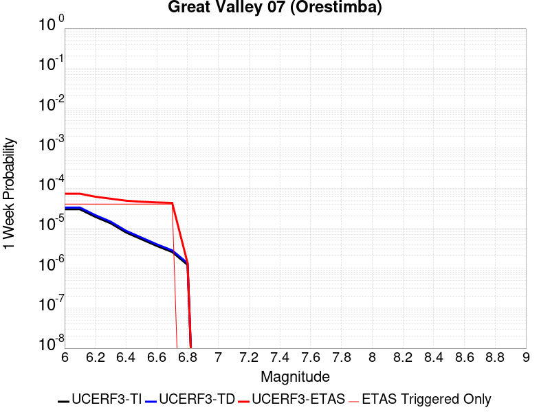 | 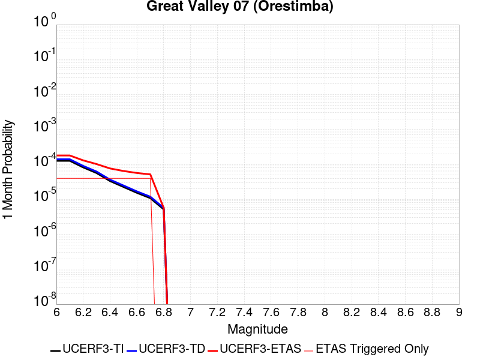 | 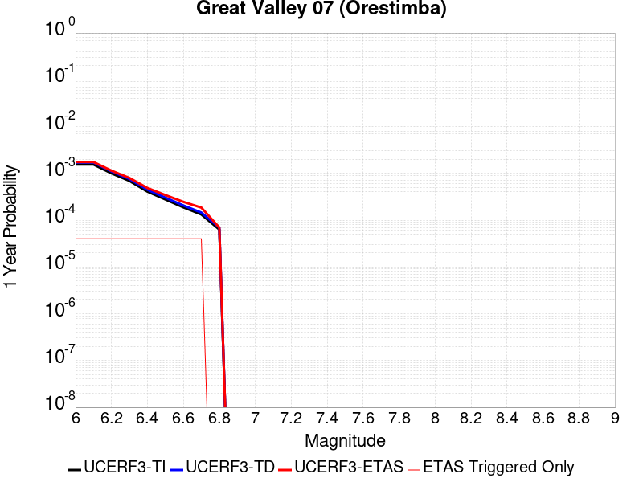 | 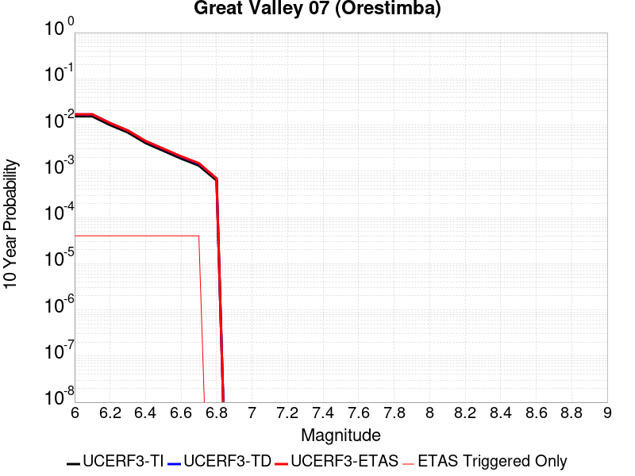 |

| Magnitude | 1 wk TI Prob | 1 wk TD Prob | 1 wk ETAS Prob | 1 wk ETAS/TD Gain | 1 wk ETAS Triggered Only | 1 mo TI Prob | 1 mo TD Prob | 1 mo ETAS Prob | 1 mo ETAS/TD Gain | 1 mo ETAS Triggered Only | 1 yr TI Prob | 1 yr TD Prob | 1 yr ETAS Prob | 1 yr ETAS/TD Gain | 1 yr ETAS Triggered Only | 10 yr TI Prob | 10 yr TD Prob | 10 yr ETAS Prob | 10 yr ETAS/TD Gain | 10 yr ETAS Triggered Only |
|-----|-----|-----|-----|-----|-----|-----|-----|-----|-----|-----|-----|-----|-----|-----|-----|-----|-----|-----|-----|-----|
| 6.0 | 2.9687902E-5 | 3.27575E-5 | 7.2794624E-5 | 2.2222278 | 4.0038438E-5 | 1.2722766E-4 | 1.4038214E-4 | 1.8041495E-4 | 1.2851703 | 4.0038438E-5 | 0.0015478961 | 0.0017078844 | 0.0017478545 | 1.0234033 | 4.0038438E-5 | 0.015371585 | 0.016955135 | 0.016994495 | 1.0023214 | 4.0038438E-5 |
| 6.1 | 2.9687902E-5 | 3.27575E-5 | 7.2794624E-5 | 2.2222278 | 4.0038438E-5 | 1.2722766E-4 | 1.4038214E-4 | 1.8041495E-4 | 1.2851703 | 4.0038438E-5 | 0.0015478961 | 0.0017078844 | 0.0017478545 | 1.0234033 | 4.0038438E-5 | 0.015371585 | 0.016955135 | 0.016994495 | 1.0023214 | 4.0038438E-5 |
| 6.2 | 1.9231524E-5 | 2.1159167E-5 | 6.1196755E-5 | 2.8922102 | 4.0038438E-5 | 8.2418206E-5 | 9.067912E-5 | 1.3071393E-4 | 1.4414997 | 4.0038438E-5 | 0.0010029797 | 0.0011034822 | 0.0011434765 | 1.0362437 | 4.0038438E-5 | 0.00998465 | 0.01098244 | 0.011022039 | 1.0036056 | 4.0038438E-5 |
| 6.3 | 1.324766E-5 | 1.4548534E-5 | 5.4586388E-5 | 3.75202 | 4.0038438E-5 | 5.6774446E-5 | 6.234942E-5 | 1.0238536E-4 | 1.6421221 | 4.0038438E-5 | 6.910097E-4 | 7.5884897E-4 | 7.98857E-4 | 1.052722 | 4.0038438E-5 | 0.006888649 | 0.0075635235 | 0.0076032593 | 1.0052536 | 4.0038438E-5 |
| 6.4 | 7.818645E-6 | 8.57284E-6 | 4.8610935E-5 | 5.670342 | 4.0038438E-5 | 3.3508048E-5 | 3.6740246E-5 | 7.677721E-5 | 2.0897305 | 4.0038438E-5 | 4.078841E-4 | 4.4722404E-4 | 4.8724457E-4 | 1.0894865 | 4.0038438E-5 | 0.004071363 | 0.0044635804 | 0.00450344 | 1.00893 | 4.0038438E-5 |
| 6.5 | 5.3076565E-6 | 5.8178007E-6 | 4.5856006E-5 | 7.882017 | 4.0038438E-5 | 2.27469E-5 | 2.4933206E-5 | 6.497064E-5 | 2.6057878 | 4.0038438E-5 | 2.7690834E-4 | 3.035216E-4 | 3.4354787E-4 | 1.1318729 | 4.0038438E-5 | 0.0027656353 | 0.00303128 | 0.003071197 | 1.0131683 | 4.0038438E-5 |
| 6.6 | 3.6003578E-6 | 3.9484953E-6 | 4.3986773E-5 | 11.140136 | 4.0038438E-5 | 1.5430012E-5 | 1.6922022E-5 | 5.6959783E-5 | 3.366015 | 4.0038438E-5 | 1.8784421E-4 | 2.0600771E-4 | 2.460379E-4 | 1.194314 | 4.0038438E-5 | 0.0018768552 | 0.0020583214 | 0.0020982774 | 1.0194119 | 4.0038438E-5 |
| 6.7 | 2.5361826E-6 | 2.7834678E-6 | 4.2821794E-5 | 15.384332 | 4.0038438E-5 | 1.0869308E-5 | 1.1929101E-5 | 5.196706E-5 | 4.3563266 | 4.0038438E-5 | 1.3232579E-4 | 1.4522845E-4 | 1.8526107E-4 | 1.2756528 | 4.0038438E-5 | 0.0013224703 | 0.0014514653 | 0.0014914457 | 1.0275449 | 4.0038438E-5 |
| 6.8 | 1.2115831E-6 | 1.3313797E-6 | 1.3313797E-6 | 1.0 | 0.0 | 5.1924885E-6 | 5.7059065E-6 | 5.7059065E-6 | 1.0 | 0.0 | 6.3216714E-5 | 6.9468166E-5 | 6.9468166E-5 | 1.0 | 0.0 | 6.3198735E-4 | 6.945596E-4 | 6.945596E-4 | 1.0 | 0.0 |

## Rinconada 2011 CFM
*[(top)](#table-of-contents)*

| 1 Week | 1 Month | 1 Year | 10 Year |
|-----|-----|-----|-----|
|  |  |  |  |

| Magnitude | 1 wk TI Prob | 1 wk TD Prob | 1 wk ETAS Prob | 1 wk ETAS/TD Gain | 1 wk ETAS Triggered Only | 1 mo TI Prob | 1 mo TD Prob | 1 mo ETAS Prob | 1 mo ETAS/TD Gain | 1 mo ETAS Triggered Only | 1 yr TI Prob | 1 yr TD Prob | 1 yr ETAS Prob | 1 yr ETAS/TD Gain | 1 yr ETAS Triggered Only | 10 yr TI Prob | 10 yr TD Prob | 10 yr ETAS Prob | 10 yr ETAS/TD Gain | 10 yr ETAS Triggered Only |
|-----|-----|-----|-----|-----|-----|-----|-----|-----|-----|-----|-----|-----|-----|-----|-----|-----|-----|-----|-----|-----|
| 6.0 | 1.5752368E-5 | 1.6274716E-5 | 5.63125E-5 | 3.4601219 | 4.0038438E-5 | 6.75084E-5 | 6.974694E-5 | 1.0978258E-4 | 1.574013 | 4.0038438E-5 | 8.2160486E-4 | 8.488412E-4 | 8.888457E-4 | 1.0471283 | 4.0038438E-5 | 0.008185739 | 0.00845637 | 0.008496069 | 1.0046947 | 4.0038438E-5 |
| 6.1 | 1.0966133E-5 | 1.1323029E-5 | 5.1361014E-5 | 4.5359783 | 4.0038438E-5 | 4.6996865E-5 | 4.852637E-5 | 8.856286E-5 | 1.8250462 | 4.0038438E-5 | 5.720366E-4 | 5.906491E-4 | 6.306639E-4 | 1.0677471 | 4.0038438E-5 | 0.0057056635 | 0.0058908886 | 0.0059306915 | 1.0067567 | 4.0038438E-5 |
| 6.2 | 1.0966133E-5 | 1.1323029E-5 | 5.1361014E-5 | 4.5359783 | 4.0038438E-5 | 4.6996865E-5 | 4.852637E-5 | 8.856286E-5 | 1.8250462 | 4.0038438E-5 | 5.720366E-4 | 5.906491E-4 | 6.306639E-4 | 1.0677471 | 4.0038438E-5 | 0.0057056635 | 0.0058908886 | 0.0059306915 | 1.0067567 | 4.0038438E-5 |
| 6.3 | 8.926149E-6 | 9.212771E-6 | 4.925084E-5 | 5.345931 | 4.0038438E-5 | 3.8254362E-5 | 3.948271E-5 | 7.951957E-5 | 2.0140352 | 4.0038438E-5 | 4.6564735E-4 | 4.805963E-4 | 5.206155E-4 | 1.0832698 | 4.0038438E-5 | 0.0046467283 | 0.0047956146 | 0.004835461 | 1.0083089 | 4.0038438E-5 |
| 6.4 | 7.676955E-6 | 7.920191E-6 | 4.795831E-5 | 6.0551963 | 4.0038438E-5 | 3.290082E-5 | 3.3943234E-5 | 7.3980314E-5 | 2.1795304 | 4.0038438E-5 | 4.0049385E-4 | 4.1318068E-4 | 4.5320258E-4 | 1.0968629 | 4.0038438E-5 | 0.0039977287 | 0.004124151 | 0.0041640243 | 1.0096682 | 4.0038438E-5 |
| 6.5 | 6.1671026E-6 | 6.3589546E-6 | 4.6397137E-5 | 7.2963467 | 4.0038438E-5 | 2.6430173E-5 | 2.725238E-5 | 6.728972E-5 | 2.4691322 | 4.0038438E-5 | 3.2173982E-4 | 3.317473E-4 | 3.7177242E-4 | 1.1206496 | 4.0038438E-5 | 0.003212744 | 0.0033125326 | 0.0033524383 | 1.0120469 | 4.0038438E-5 |
| 6.6 | 5.553456E-6 | 5.7248126E-6 | 4.576302E-5 | 7.9938025 | 4.0038438E-5 | 2.3800309E-5 | 2.453468E-5 | 6.457214E-5 | 2.631872 | 4.0038438E-5 | 2.897302E-4 | 2.9866883E-4 | 3.3869533E-4 | 1.1340163 | 4.0038438E-5 | 0.0028935277 | 0.002982683 | 0.003022602 | 1.0133836 | 4.0038438E-5 |
| 6.7 | 4.787857E-6 | 4.9333094E-6 | 4.4971548E-5 | 9.115898 | 4.0038438E-5 | 2.0519226E-5 | 2.1142583E-5 | 6.118017E-5 | 2.8936944 | 4.0038438E-5 | 2.4979294E-4 | 2.573806E-4 | 2.9740873E-4 | 1.1555212 | 4.0038438E-5 | 0.0024951235 | 0.0025708308 | 0.0026107663 | 1.015534 | 4.0038438E-5 |
| 6.8 | 3.9955166E-6 | 4.1134763E-6 | 4.4151748E-5 | 10.733439 | 4.0038438E-5 | 1.7123532E-5 | 1.7629065E-5 | 5.7666795E-5 | 3.2711205 | 4.0038438E-5 | 2.0845905E-4 | 2.1461274E-4 | 2.546426E-4 | 1.1865213 | 4.0038438E-5 | 0.002082636 | 0.0021440585 | 0.002184011 | 1.0186341 | 4.0038438E-5 |
| 6.9 | 3.4250072E-6 | 3.5224464E-6 | 4.3560744E-5 | 12.366616 | 4.0038438E-5 | 1.46785205E-5 | 1.5096111E-5 | 5.5133944E-5 | 3.6521952 | 4.0038438E-5 | 1.7869633E-4 | 1.8377967E-4 | 2.2381076E-4 | 1.217821 | 4.0038438E-5 | 0.001785527 | 0.0018362794 | 0.0018762443 | 1.021764 | 4.0038438E-5 |
| 7.0 | 2.7712713E-6 | 2.8467E-6 | 4.288502E-5 | 15.06482 | 4.0038438E-5 | 1.1876823E-5 | 1.2200086E-5 | 5.2238032E-5 | 4.281776 | 4.0038438E-5 | 1.4459073E-4 | 1.4852593E-4 | 1.8855842E-4 | 1.269532 | 4.0038438E-5 | 0.0014449668 | 0.0014842682 | 0.0015242472 | 1.0269352 | 4.0038438E-5 |
| 7.1 | 2.227358E-6 | 2.2856984E-6 | 4.2324045E-5 | 18.516897 | 4.0038438E-5 | 9.545785E-6 | 9.795814E-6 | 4.983386E-5 | 5.0872607 | 4.0038438E-5 | 1.16213734E-4 | 1.19257515E-4 | 1.5929117E-4 | 1.3356909 | 4.0038438E-5 | 0.0011615298 | 0.0011919362 | 0.001231927 | 1.0335511 | 4.0038438E-5 |
| 7.2 | 1.581796E-6 | 1.6209011E-6 | 4.1659274E-5 | 25.701303 | 4.0038438E-5 | 6.779108E-6 | 6.9467005E-6 | 4.698486E-5 | 6.7636223 | 4.0038438E-5 | 8.253252E-5 | 8.457281E-5 | 1.2460786E-4 | 1.4733797 | 4.0038438E-5 | 8.250187E-4 | 8.454067E-4 | 8.8541134E-4 | 1.0473199 | 4.0038438E-5 |
| 7.3 | 1.0306567E-6 | 1.0546477E-6 | 4.109304E-5 | 38.963764 | 4.0038438E-5 | 4.4170924E-6 | 4.519911E-6 | 4.4558168E-5 | 9.858196 | 4.0038438E-5 | 5.3776774E-5 | 5.5028526E-5 | 9.506476E-5 | 1.7275542 | 4.0038438E-5 | 5.376376E-4 | 5.5014924E-4 | 5.9016567E-4 | 1.0727373 | 4.0038438E-5 |
| 7.4 | 6.535541E-7 | 6.682742E-7 | 4.0706684E-5 | 60.913147 | 4.0038438E-5 | 2.800943E-6 | 2.864029E-6 | 4.2902353E-5 | 14.979719 | 4.0038438E-5 | 3.4100947E-5 | 3.4868997E-5 | 7.4906035E-5 | 2.1482131 | 4.0038438E-5 | 3.4095717E-4 | 3.4863537E-4 | 3.8865986E-4 | 1.1148033 | 4.0038438E-5 |
| 7.5 | 3.2656962E-7 | 3.3316687E-7 | 3.3316687E-7 | 1.0 | 0.0 | 1.3995833E-6 | 1.4278572E-6 | 1.4278572E-6 | 1.0 | 0.0 | 1.7039794E-5 | 1.7384024E-5 | 1.7384024E-5 | 1.0 | 0.0 | 1.7038487E-4 | 1.7382667E-4 | 1.7382667E-4 | 1.0 | 0.0 |
| 7.6 | 9.754343E-8 | 9.82099E-8 | 9.82099E-8 | 1.0 | 0.0 | 4.180432E-7 | 4.208995E-7 | 4.208995E-7 | 1.0 | 0.0 | 5.089664E-6 | 5.1244397E-6 | 5.1244397E-6 | 1.0 | 0.0 | 5.0895473E-5 | 5.1243223E-5 | 5.1243223E-5 | 1.0 | 0.0 |
| 7.7 | 6.0001453E-9 | 5.8490435E-9 | 5.8490435E-9 | 1.0 | 0.0 | 2.5714908E-8 | 2.506733E-8 | 2.506733E-8 | 1.0 | 0.0 | 3.1307894E-7 | 3.051947E-7 | 3.051947E-7 | 1.0 | 0.0 | 3.1307852E-6 | 3.051943E-6 | 3.051943E-6 | 1.0 | 0.0 |
| 7.8 | 7.400003E-11 | 7.4654505E-11 | 7.4654505E-11 | 1.0 | 0.0 | 3.171432E-10 | 3.1994773E-10 | 3.1994773E-10 | 1.0 | 0.0 | 3.861218E-9 | 3.895363E-9 | 3.895363E-9 | 1.0 | 0.0 | 3.861218E-8 | 3.895363E-8 | 3.895363E-8 | 1.0 | 0.0 |

## San Pedro Escarpment
*[(top)](#table-of-contents)*

| 1 Week | 1 Month | 1 Year | 10 Year |
|-----|-----|-----|-----|
| 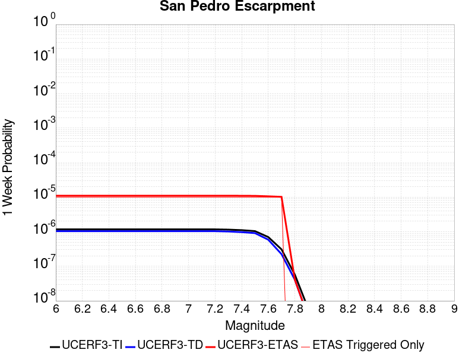 | 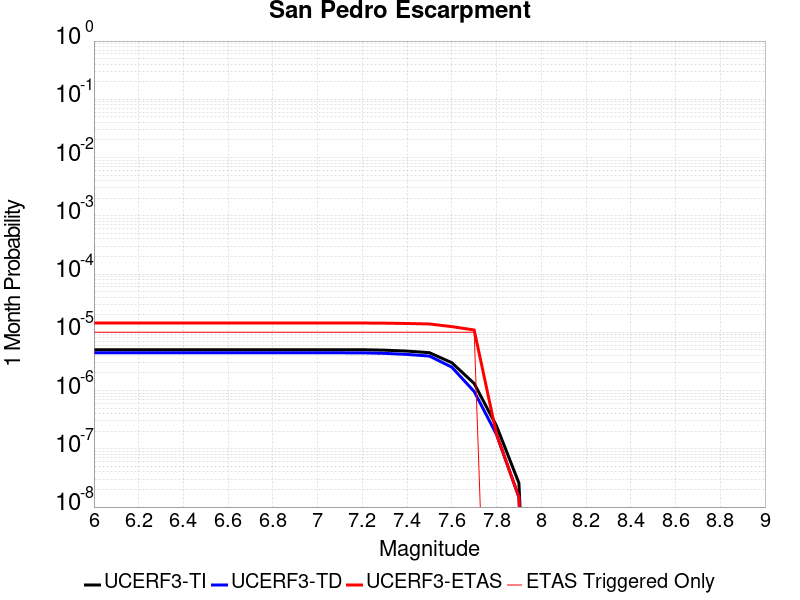 | 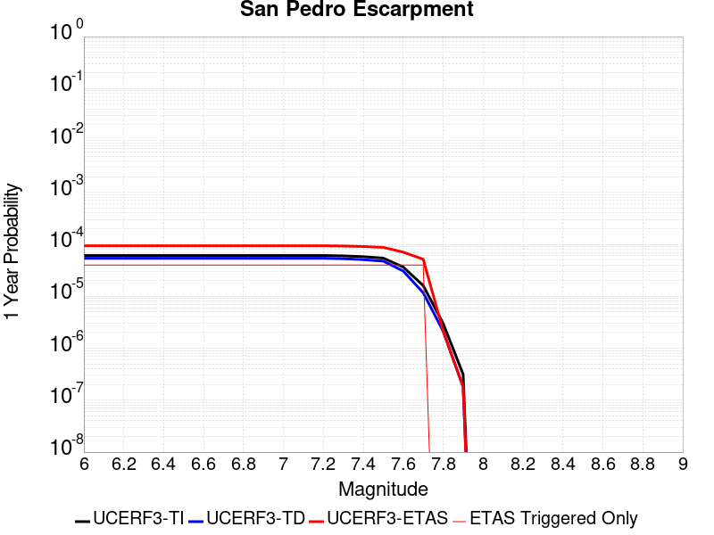 | 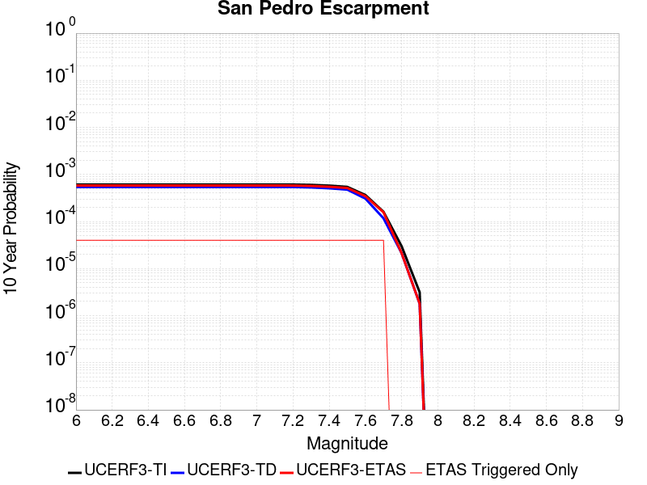 |

| Magnitude | 1 wk TI Prob | 1 wk TD Prob | 1 wk ETAS Prob | 1 wk ETAS/TD Gain | 1 wk ETAS Triggered Only | 1 mo TI Prob | 1 mo TD Prob | 1 mo ETAS Prob | 1 mo ETAS/TD Gain | 1 mo ETAS Triggered Only | 1 yr TI Prob | 1 yr TD Prob | 1 yr ETAS Prob | 1 yr ETAS/TD Gain | 1 yr ETAS Triggered Only | 10 yr TI Prob | 10 yr TD Prob | 10 yr ETAS Prob | 10 yr ETAS/TD Gain | 10 yr ETAS Triggered Only |
|-----|-----|-----|-----|-----|-----|-----|-----|-----|-----|-----|-----|-----|-----|-----|-----|-----|-----|-----|-----|-----|
| 6.0 | 1.1740281E-6 | 1.0380262E-6 | 4.1076422E-5 | 39.571663 | 4.0038438E-5 | 5.031539E-6 | 4.4486765E-6 | 4.4486937E-5 | 10.000039 | 4.0038438E-5 | 6.125726E-5 | 5.416135E-5 | 9.419762E-5 | 1.7392037 | 4.0038438E-5 | 6.124038E-4 | 5.4148794E-4 | 5.8150466E-4 | 1.0739015 | 4.0038438E-5 |
| 6.1 | 1.1740281E-6 | 1.0380262E-6 | 4.1076422E-5 | 39.571663 | 4.0038438E-5 | 5.031539E-6 | 4.4486765E-6 | 4.4486937E-5 | 10.000039 | 4.0038438E-5 | 6.125726E-5 | 5.416135E-5 | 9.419762E-5 | 1.7392037 | 4.0038438E-5 | 6.124038E-4 | 5.4148794E-4 | 5.8150466E-4 | 1.0739015 | 4.0038438E-5 |
| 6.2 | 1.1740281E-6 | 1.0380262E-6 | 4.1076422E-5 | 39.571663 | 4.0038438E-5 | 5.031539E-6 | 4.4486765E-6 | 4.4486937E-5 | 10.000039 | 4.0038438E-5 | 6.125726E-5 | 5.416135E-5 | 9.419762E-5 | 1.7392037 | 4.0038438E-5 | 6.124038E-4 | 5.4148794E-4 | 5.8150466E-4 | 1.0739015 | 4.0038438E-5 |
| 6.3 | 1.1740281E-6 | 1.0380262E-6 | 4.1076422E-5 | 39.571663 | 4.0038438E-5 | 5.031539E-6 | 4.4486765E-6 | 4.4486937E-5 | 10.000039 | 4.0038438E-5 | 6.125726E-5 | 5.416135E-5 | 9.419762E-5 | 1.7392037 | 4.0038438E-5 | 6.124038E-4 | 5.4148794E-4 | 5.8150466E-4 | 1.0739015 | 4.0038438E-5 |
| 6.4 | 1.1740281E-6 | 1.0380262E-6 | 4.1076422E-5 | 39.571663 | 4.0038438E-5 | 5.031539E-6 | 4.4486765E-6 | 4.4486937E-5 | 10.000039 | 4.0038438E-5 | 6.125726E-5 | 5.416135E-5 | 9.419762E-5 | 1.7392037 | 4.0038438E-5 | 6.124038E-4 | 5.4148794E-4 | 5.8150466E-4 | 1.0739015 | 4.0038438E-5 |
| 6.5 | 1.1740281E-6 | 1.0380262E-6 | 4.1076422E-5 | 39.571663 | 4.0038438E-5 | 5.031539E-6 | 4.4486765E-6 | 4.4486937E-5 | 10.000039 | 4.0038438E-5 | 6.125726E-5 | 5.416135E-5 | 9.419762E-5 | 1.7392037 | 4.0038438E-5 | 6.124038E-4 | 5.4148794E-4 | 5.8150466E-4 | 1.0739015 | 4.0038438E-5 |
| 6.6 | 1.1740281E-6 | 1.0380262E-6 | 4.1076422E-5 | 39.571663 | 4.0038438E-5 | 5.031539E-6 | 4.4486765E-6 | 4.4486937E-5 | 10.000039 | 4.0038438E-5 | 6.125726E-5 | 5.416135E-5 | 9.419762E-5 | 1.7392037 | 4.0038438E-5 | 6.124038E-4 | 5.4148794E-4 | 5.8150466E-4 | 1.0739015 | 4.0038438E-5 |
| 6.7 | 1.1740281E-6 | 1.0380262E-6 | 4.1076422E-5 | 39.571663 | 4.0038438E-5 | 5.031539E-6 | 4.4486765E-6 | 4.4486937E-5 | 10.000039 | 4.0038438E-5 | 6.125726E-5 | 5.416135E-5 | 9.419762E-5 | 1.7392037 | 4.0038438E-5 | 6.124038E-4 | 5.4148794E-4 | 5.8150466E-4 | 1.0739015 | 4.0038438E-5 |
| 6.8 | 1.1740281E-6 | 1.0380262E-6 | 4.1076422E-5 | 39.571663 | 4.0038438E-5 | 5.031539E-6 | 4.4486765E-6 | 4.4486937E-5 | 10.000039 | 4.0038438E-5 | 6.125726E-5 | 5.416135E-5 | 9.419762E-5 | 1.7392037 | 4.0038438E-5 | 6.124038E-4 | 5.4148794E-4 | 5.8150466E-4 | 1.0739015 | 4.0038438E-5 |
| 6.9 | 1.1740281E-6 | 1.0380262E-6 | 4.1076422E-5 | 39.571663 | 4.0038438E-5 | 5.031539E-6 | 4.4486765E-6 | 4.4486937E-5 | 10.000039 | 4.0038438E-5 | 6.125726E-5 | 5.416135E-5 | 9.419762E-5 | 1.7392037 | 4.0038438E-5 | 6.124038E-4 | 5.4148794E-4 | 5.8150466E-4 | 1.0739015 | 4.0038438E-5 |
| 7.0 | 1.1740281E-6 | 1.0380262E-6 | 4.1076422E-5 | 39.571663 | 4.0038438E-5 | 5.031539E-6 | 4.4486765E-6 | 4.4486937E-5 | 10.000039 | 4.0038438E-5 | 6.125726E-5 | 5.416135E-5 | 9.419762E-5 | 1.7392037 | 4.0038438E-5 | 6.124038E-4 | 5.4148794E-4 | 5.8150466E-4 | 1.0739015 | 4.0038438E-5 |
| 7.1 | 1.1740281E-6 | 1.0380262E-6 | 4.1076422E-5 | 39.571663 | 4.0038438E-5 | 5.031539E-6 | 4.4486765E-6 | 4.4486937E-5 | 10.000039 | 4.0038438E-5 | 6.125726E-5 | 5.416135E-5 | 9.419762E-5 | 1.7392037 | 4.0038438E-5 | 6.124038E-4 | 5.4148794E-4 | 5.8150466E-4 | 1.0739015 | 4.0038438E-5 |
| 7.2 | 1.1722314E-6 | 1.0362135E-6 | 4.107461E-5 | 39.63914 | 4.0038438E-5 | 5.023839E-6 | 4.4409076E-6 | 4.4479166E-5 | 10.015783 | 4.0038438E-5 | 6.116352E-5 | 5.406677E-5 | 9.4103045E-5 | 1.7404969 | 4.0038438E-5 | 6.114669E-4 | 5.405426E-4 | 5.8055937E-4 | 1.0740308 | 4.0038438E-5 |
| 7.3 | 1.1515234E-6 | 1.0152875E-6 | 4.1053685E-5 | 40.435528 | 4.0038438E-5 | 4.935091E-6 | 4.351225E-6 | 4.438949E-5 | 10.201607 | 4.0038438E-5 | 6.008308E-5 | 5.2974945E-5 | 9.301126E-5 | 1.7557595 | 4.0038438E-5 | 6.0066837E-4 | 5.296295E-4 | 5.6964677E-4 | 1.075557 | 4.0038438E-5 |
| 7.4 | 1.1103637E-6 | 9.736466E-7 | 4.1012045E-5 | 42.122105 | 4.0038438E-5 | 4.7586927E-6 | 4.172765E-6 | 4.4211036E-5 | 10.595141 | 4.0038438E-5 | 5.793554E-5 | 5.0802293E-5 | 9.0838694E-5 | 1.7880826 | 4.0038438E-5 | 5.792044E-4 | 5.079131E-4 | 5.4793124E-4 | 1.0787892 | 4.0038438E-5 |
| 7.5 | 1.0425391E-6 | 9.1189133E-7 | 4.095029E-5 | 44.906986 | 4.0038438E-5 | 4.4680173E-6 | 3.9081E-6 | 4.394638E-5 | 11.244947 | 4.0038438E-5 | 5.439675E-5 | 4.7580146E-5 | 8.761668E-5 | 1.8414546 | 4.0038438E-5 | 5.438344E-4 | 4.7570592E-4 | 5.157253E-4 | 1.0841264 | 4.0038438E-5 |
| 7.6 | 7.0184194E-7 | 5.886514E-7 | 4.0627066E-5 | 69.01719 | 4.0038438E-5 | 3.0078907E-6 | 2.5227896E-6 | 4.2561125E-5 | 16.87066 | 4.0038438E-5 | 3.6620455E-5 | 3.071458E-5 | 7.075178E-5 | 2.3035245 | 4.0038438E-5 | 3.661442E-4 | 3.071081E-4 | 3.4713422E-4 | 1.1303325 | 4.0038438E-5 |
| 7.7 | 3.0871365E-7 | 2.2456044E-7 | 4.026299E-5 | 179.29689 | 4.0038438E-5 | 1.3230577E-6 | 9.624015E-7 | 4.10008E-5 | 42.602592 | 4.0038438E-5 | 1.610811E-5 | 1.1717177E-5 | 5.1755145E-5 | 4.4170322 | 4.0038438E-5 | 1.6106942E-4 | 1.171657E-4 | 1.5719944E-4 | 1.3416848 | 4.0038438E-5 |
| 7.8 | 5.7512665E-8 | 4.1053042E-8 | 4.1053042E-8 | 1.0 | 0.0 | 2.464828E-7 | 1.759416E-7 | 1.759416E-7 | 1.0 | 0.0 | 3.0009242E-6 | 2.142087E-6 | 2.142087E-6 | 1.0 | 0.0 | 3.0008836E-5 | 2.1420683E-5 | 2.1420683E-5 | 1.0 | 0.0 |
| 7.9 | 6.040053E-9 | 3.4534322E-9 | 3.4534322E-9 | 1.0 | 0.0 | 2.5885942E-8 | 1.4800423E-8 | 1.4800423E-8 | 1.0 | 0.0 | 3.151613E-7 | 1.8019513E-7 | 1.8019513E-7 | 1.0 | 0.0 | 3.1516086E-6 | 1.80195E-6 | 1.80195E-6 | 1.0 | 0.0 |

## Ozena
*[(top)](#table-of-contents)*

| 1 Week | 1 Month | 1 Year | 10 Year |
|-----|-----|-----|-----|
|  |  |  |  |

| Magnitude | 1 wk TI Prob | 1 wk TD Prob | 1 wk ETAS Prob | 1 wk ETAS/TD Gain | 1 wk ETAS Triggered Only | 1 mo TI Prob | 1 mo TD Prob | 1 mo ETAS Prob | 1 mo ETAS/TD Gain | 1 mo ETAS Triggered Only | 1 yr TI Prob | 1 yr TD Prob | 1 yr ETAS Prob | 1 yr ETAS/TD Gain | 1 yr ETAS Triggered Only | 10 yr TI Prob | 10 yr TD Prob | 10 yr ETAS Prob | 10 yr ETAS/TD Gain | 10 yr ETAS Triggered Only |
|-----|-----|-----|-----|-----|-----|-----|-----|-----|-----|-----|-----|-----|-----|-----|-----|-----|-----|-----|-----|-----|
| 6.0 | 1.4377547E-6 | 1.4513782E-6 | 1.4513782E-6 | 1.0 | 0.0 | 6.161791E-6 | 6.2201793E-6 | 4.6258367E-5 | 7.436822 | 4.0038438E-5 | 7.5017226E-5 | 7.572832E-5 | 1.1576373E-4 | 1.5286715 | 4.0038438E-5 | 7.4991904E-4 | 7.570518E-4 | 7.970599E-4 | 1.0528473 | 4.0038438E-5 |
| 6.1 | 1.4377547E-6 | 1.4513782E-6 | 1.4513782E-6 | 1.0 | 0.0 | 6.161791E-6 | 6.2201793E-6 | 4.6258367E-5 | 7.436822 | 4.0038438E-5 | 7.5017226E-5 | 7.572832E-5 | 1.1576373E-4 | 1.5286715 | 4.0038438E-5 | 7.4991904E-4 | 7.570518E-4 | 7.970599E-4 | 1.0528473 | 4.0038438E-5 |
| 6.2 | 1.4377547E-6 | 1.4513782E-6 | 1.4513782E-6 | 1.0 | 0.0 | 6.161791E-6 | 6.2201793E-6 | 4.6258367E-5 | 7.436822 | 4.0038438E-5 | 7.5017226E-5 | 7.572832E-5 | 1.1576373E-4 | 1.5286715 | 4.0038438E-5 | 7.4991904E-4 | 7.570518E-4 | 7.970599E-4 | 1.0528473 | 4.0038438E-5 |
| 6.3 | 1.4377547E-6 | 1.4513782E-6 | 1.4513782E-6 | 1.0 | 0.0 | 6.161791E-6 | 6.2201793E-6 | 4.6258367E-5 | 7.436822 | 4.0038438E-5 | 7.5017226E-5 | 7.572832E-5 | 1.1576373E-4 | 1.5286715 | 4.0038438E-5 | 7.4991904E-4 | 7.570518E-4 | 7.970599E-4 | 1.0528473 | 4.0038438E-5 |
| 6.4 | 1.4377547E-6 | 1.4513782E-6 | 1.4513782E-6 | 1.0 | 0.0 | 6.161791E-6 | 6.2201793E-6 | 4.6258367E-5 | 7.436822 | 4.0038438E-5 | 7.5017226E-5 | 7.572832E-5 | 1.1576373E-4 | 1.5286715 | 4.0038438E-5 | 7.4991904E-4 | 7.570518E-4 | 7.970599E-4 | 1.0528473 | 4.0038438E-5 |
| 6.5 | 1.4377547E-6 | 1.4513782E-6 | 1.4513782E-6 | 1.0 | 0.0 | 6.161791E-6 | 6.2201793E-6 | 4.6258367E-5 | 7.436822 | 4.0038438E-5 | 7.5017226E-5 | 7.572832E-5 | 1.1576373E-4 | 1.5286715 | 4.0038438E-5 | 7.4991904E-4 | 7.570518E-4 | 7.970599E-4 | 1.0528473 | 4.0038438E-5 |
| 6.6 | 1.4377547E-6 | 1.4513782E-6 | 1.4513782E-6 | 1.0 | 0.0 | 6.161791E-6 | 6.2201793E-6 | 4.6258367E-5 | 7.436822 | 4.0038438E-5 | 7.5017226E-5 | 7.572832E-5 | 1.1576373E-4 | 1.5286715 | 4.0038438E-5 | 7.4991904E-4 | 7.570518E-4 | 7.970599E-4 | 1.0528473 | 4.0038438E-5 |
| 6.7 | 1.4377547E-6 | 1.4513782E-6 | 1.4513782E-6 | 1.0 | 0.0 | 6.161791E-6 | 6.2201793E-6 | 4.6258367E-5 | 7.436822 | 4.0038438E-5 | 7.5017226E-5 | 7.572832E-5 | 1.1576373E-4 | 1.5286715 | 4.0038438E-5 | 7.4991904E-4 | 7.570518E-4 | 7.970599E-4 | 1.0528473 | 4.0038438E-5 |
| 6.8 | 9.223257E-7 | 9.317624E-7 | 9.317624E-7 | 1.0 | 0.0 | 3.9528186E-6 | 3.9932615E-6 | 4.4031538E-5 | 11.026461 | 4.0038438E-5 | 4.81245E-5 | 4.8616912E-5 | 8.86534E-5 | 1.8235095 | 4.0038438E-5 | 4.811408E-4 | 4.860668E-4 | 5.260858E-4 | 1.0823323 | 4.0038438E-5 |
| 6.9 | 9.141515E-7 | 9.235371E-7 | 9.235371E-7 | 1.0 | 0.0 | 3.917786E-6 | 3.9580104E-6 | 4.399629E-5 | 11.115759 | 4.0038438E-5 | 4.7698002E-5 | 4.818775E-5 | 8.822426E-5 | 1.830844 | 4.0038438E-5 | 4.7687767E-4 | 4.8177704E-4 | 5.217962E-4 | 1.0830657 | 4.0038438E-5 |
| 7.0 | 8.767648E-7 | 8.8585773E-7 | 8.8585773E-7 | 1.0 | 0.0 | 3.757558E-6 | 3.7965276E-6 | 4.3834814E-5 | 11.546027 | 4.0038438E-5 | 4.5747307E-5 | 4.6221783E-5 | 8.625837E-5 | 1.8661844 | 4.0038438E-5 | 4.5737892E-4 | 4.6212564E-4 | 5.0214556E-4 | 1.0865997 | 4.0038438E-5 |
| 7.1 | 8.199402E-7 | 8.2853984E-7 | 8.2853984E-7 | 1.0 | 0.0 | 3.5140247E-6 | 3.5508804E-6 | 4.3589174E-5 | 12.275597 | 4.0038438E-5 | 4.2782412E-5 | 4.323115E-5 | 8.3267856E-5 | 1.9261078 | 4.0038438E-5 | 4.2774176E-4 | 4.322311E-4 | 4.7225226E-4 | 1.092592 | 4.0038438E-5 |
| 7.2 | 7.38705E-7 | 7.464262E-7 | 7.464262E-7 | 1.0 | 0.0 | 3.1658747E-6 | 3.198966E-6 | 4.3237276E-5 | 13.516016 | 4.0038438E-5 | 3.8543843E-5 | 3.894675E-5 | 7.898363E-5 | 2.0279903 | 4.0038438E-5 | 3.853716E-4 | 3.8940276E-4 | 4.294256E-4 | 1.1027801 | 4.0038438E-5 |
| 7.3 | 6.490017E-7 | 6.557802E-7 | 6.557802E-7 | 1.0 | 0.0 | 2.7814328E-6 | 2.8104837E-6 | 4.284881E-5 | 15.246062 | 4.0038438E-5 | 3.386342E-5 | 3.4217133E-5 | 7.42542E-5 | 2.1700883 | 4.0038438E-5 | 3.3858258E-4 | 3.4212202E-4 | 3.8214677E-4 | 1.1169896 | 4.0038438E-5 |
| 7.4 | 5.346736E-7 | 5.4022604E-7 | 5.4022604E-7 | 1.0 | 0.0 | 2.291456E-6 | 2.3152527E-6 | 4.2353597E-5 | 18.293293 | 4.0038438E-5 | 2.789812E-5 | 2.8187867E-5 | 6.822518E-5 | 2.4203737 | 4.0038438E-5 | 2.789462E-4 | 2.8184598E-4 | 3.218731E-4 | 1.1420178 | 4.0038438E-5 |
| 7.5 | 2.939325E-7 | 2.9666057E-7 | 2.9666057E-7 | 1.0 | 0.0 | 1.25971E-6 | 1.271402E-6 | 1.271402E-6 | 1.0 | 0.0 | 1.5336862E-5 | 1.5479225E-5 | 1.5479225E-5 | 1.0 | 0.0 | 1.5335804E-4 | 1.5478309E-4 | 1.5478309E-4 | 1.0 | 0.0 |
| 7.6 | 1.4151905E-7 | 1.4253266E-7 | 1.4253266E-7 | 1.0 | 0.0 | 6.065101E-7 | 6.108541E-7 | 6.108541E-7 | 1.0 | 0.0 | 7.3842357E-6 | 7.4371237E-6 | 7.4371237E-6 | 1.0 | 0.0 | 7.38399E-5 | 7.436883E-5 | 7.436883E-5 | 1.0 | 0.0 |
| 7.7 | 4.4957577E-8 | 4.5252243E-8 | 4.5252243E-8 | 1.0 | 0.0 | 1.9267533E-7 | 1.9393818E-7 | 1.9393818E-7 | 1.0 | 0.0 | 2.3458194E-6 | 2.3611947E-6 | 2.3611947E-6 | 1.0 | 0.0 | 2.3457947E-5 | 2.3611707E-5 | 2.3611707E-5 | 1.0 | 0.0 |
| 7.8 | 5.9993255E-9 | 6.0412972E-9 | 6.0412972E-9 | 1.0 | 0.0 | 2.5711394E-8 | 2.5891273E-8 | 2.5891273E-8 | 1.0 | 0.0 | 3.1303617E-7 | 3.1522623E-7 | 3.1522623E-7 | 1.0 | 0.0 | 3.1303573E-6 | 3.1522588E-6 | 3.1522588E-6 | 1.0 | 0.0 |

## Clamshell-Sawpit
*[(top)](#table-of-contents)*

| 1 Week | 1 Month | 1 Year | 10 Year |
|-----|-----|-----|-----|
|  |  |  |  |

| Magnitude | 1 wk TI Prob | 1 wk TD Prob | 1 wk ETAS Prob | 1 wk ETAS/TD Gain | 1 wk ETAS Triggered Only | 1 mo TI Prob | 1 mo TD Prob | 1 mo ETAS Prob | 1 mo ETAS/TD Gain | 1 mo ETAS Triggered Only | 1 yr TI Prob | 1 yr TD Prob | 1 yr ETAS Prob | 1 yr ETAS/TD Gain | 1 yr ETAS Triggered Only | 10 yr TI Prob | 10 yr TD Prob | 10 yr ETAS Prob | 10 yr ETAS/TD Gain | 10 yr ETAS Triggered Only |
|-----|-----|-----|-----|-----|-----|-----|-----|-----|-----|-----|-----|-----|-----|-----|-----|-----|-----|-----|-----|-----|
| 6.0 | 3.202998E-6 | 3.0127644E-6 | 3.0127644E-6 | 1.0 | 0.0 | 1.3727062E-5 | 1.2911788E-5 | 5.294971E-5 | 4.100881 | 4.0038438E-5 | 1.6711417E-4 | 1.5719049E-4 | 1.9722263E-4 | 1.2546728 | 4.0038438E-5 | 0.0016698855 | 0.0015708724 | 0.0016108479 | 1.025448 | 4.0038438E-5 |
| 6.1 | 3.202998E-6 | 3.0127644E-6 | 3.0127644E-6 | 1.0 | 0.0 | 1.3727062E-5 | 1.2911788E-5 | 5.294971E-5 | 4.100881 | 4.0038438E-5 | 1.6711417E-4 | 1.5719049E-4 | 1.9722263E-4 | 1.2546728 | 4.0038438E-5 | 0.0016698855 | 0.0015708724 | 0.0016108479 | 1.025448 | 4.0038438E-5 |
| 6.2 | 3.202998E-6 | 3.0127644E-6 | 3.0127644E-6 | 1.0 | 0.0 | 1.3727062E-5 | 1.2911788E-5 | 5.294971E-5 | 4.100881 | 4.0038438E-5 | 1.6711417E-4 | 1.5719049E-4 | 1.9722263E-4 | 1.2546728 | 4.0038438E-5 | 0.0016698855 | 0.0015708724 | 0.0016108479 | 1.025448 | 4.0038438E-5 |
| 6.3 | 3.202998E-6 | 3.0127644E-6 | 3.0127644E-6 | 1.0 | 0.0 | 1.3727062E-5 | 1.2911788E-5 | 5.294971E-5 | 4.100881 | 4.0038438E-5 | 1.6711417E-4 | 1.5719049E-4 | 1.9722263E-4 | 1.2546728 | 4.0038438E-5 | 0.0016698855 | 0.0015708724 | 0.0016108479 | 1.025448 | 4.0038438E-5 |
| 6.4 | 3.202998E-6 | 3.0127644E-6 | 3.0127644E-6 | 1.0 | 0.0 | 1.3727062E-5 | 1.2911788E-5 | 5.294971E-5 | 4.100881 | 4.0038438E-5 | 1.6711417E-4 | 1.5719049E-4 | 1.9722263E-4 | 1.2546728 | 4.0038438E-5 | 0.0016698855 | 0.0015708724 | 0.0016108479 | 1.025448 | 4.0038438E-5 |
| 6.5 | 2.5862723E-6 | 2.380775E-6 | 2.380775E-6 | 1.0 | 0.0 | 1.1083977E-5 | 1.0203283E-5 | 1.0203283E-5 | 1.0 | 0.0 | 1.3493907E-4 | 1.2421819E-4 | 1.2421819E-4 | 1.0 | 0.0 | 0.0013485716 | 0.0012415178 | 0.0012415178 | 1.0 | 0.0 |
| 6.6 | 2.5862723E-6 | 2.380775E-6 | 2.380775E-6 | 1.0 | 0.0 | 1.1083977E-5 | 1.0203283E-5 | 1.0203283E-5 | 1.0 | 0.0 | 1.3493907E-4 | 1.2421819E-4 | 1.2421819E-4 | 1.0 | 0.0 | 0.0013485716 | 0.0012415178 | 0.0012415178 | 1.0 | 0.0 |
| 6.7 | 2.5862723E-6 | 2.380775E-6 | 2.380775E-6 | 1.0 | 0.0 | 1.1083977E-5 | 1.0203283E-5 | 1.0203283E-5 | 1.0 | 0.0 | 1.3493907E-4 | 1.2421819E-4 | 1.2421819E-4 | 1.0 | 0.0 | 0.0013485716 | 0.0012415178 | 0.0012415178 | 1.0 | 0.0 |
| 6.8 | 2.4098806E-6 | 2.1977307E-6 | 2.1977307E-6 | 1.0 | 0.0 | 1.0328019E-5 | 9.4188135E-6 | 9.4188135E-6 | 1.0 | 0.0 | 1.2573638E-4 | 1.1466829E-4 | 1.1466829E-4 | 1.0 | 0.0 | 0.0012566525 | 0.0011461178 | 0.0011461178 | 1.0 | 0.0 |
| 6.9 | 2.0073985E-6 | 1.7784248E-6 | 1.7784248E-6 | 1.0 | 0.0 | 8.603109E-6 | 7.621799E-6 | 7.621799E-6 | 1.0 | 0.0 | 1.0473781E-4 | 9.279157E-5 | 9.279157E-5 | 1.0 | 0.0 | 0.0010468846 | 9.275401E-4 | 9.275401E-4 | 1.0 | 0.0 |
| 7.0 | 1.8166766E-6 | 1.5807095E-6 | 1.5807095E-6 | 1.0 | 0.0 | 7.785734E-6 | 6.7744522E-6 | 6.7744522E-6 | 1.0 | 0.0 | 9.478718E-5 | 8.247593E-5 | 8.247593E-5 | 1.0 | 0.0 | 9.4746763E-4 | 8.244633E-4 | 8.244633E-4 | 1.0 | 0.0 |
| 7.1 | 1.5471421E-6 | 1.3052961E-6 | 1.3052961E-6 | 1.0 | 0.0 | 6.6305925E-6 | 5.5941146E-6 | 5.5941146E-6 | 1.0 | 0.0 | 8.072447E-5 | 6.8106274E-5 | 6.8106274E-5 | 1.0 | 0.0 | 8.0695155E-4 | 6.808595E-4 | 6.808595E-4 | 1.0 | 0.0 |
| 7.2 | 1.3608037E-6 | 1.1153443E-6 | 1.1153443E-6 | 1.0 | 0.0 | 5.8320024E-6 | 4.7800386E-6 | 4.7800386E-6 | 1.0 | 0.0 | 7.1002316E-5 | 5.8195463E-5 | 5.8195463E-5 | 1.0 | 0.0 | 7.097964E-4 | 5.818069E-4 | 5.818069E-4 | 1.0 | 0.0 |
| 7.3 | 1.0749634E-6 | 8.384254E-7 | 8.384254E-7 | 1.0 | 0.0 | 4.6069777E-6 | 3.593247E-6 | 3.593247E-6 | 1.0 | 0.0 | 5.608851E-5 | 4.374693E-5 | 4.374693E-5 | 1.0 | 0.0 | 5.6074356E-4 | 4.37386E-4 | 4.37386E-4 | 1.0 | 0.0 |
| 7.4 | 8.416856E-7 | 6.200048E-7 | 6.200048E-7 | 1.0 | 0.0 | 3.607219E-6 | 2.6571608E-6 | 2.6571608E-6 | 1.0 | 0.0 | 4.3917007E-5 | 3.2350472E-5 | 3.2350472E-5 | 1.0 | 0.0 | 4.390833E-4 | 3.2345962E-4 | 3.2345962E-4 | 1.0 | 0.0 |
| 7.5 | 6.2779594E-7 | 4.496886E-7 | 4.496886E-7 | 1.0 | 0.0 | 2.6905511E-6 | 1.9272356E-6 | 1.9272356E-6 | 1.0 | 0.0 | 3.275697E-5 | 2.346386E-5 | 2.346386E-5 | 1.0 | 0.0 | 3.275214E-4 | 2.346157E-4 | 2.346157E-4 | 1.0 | 0.0 |
| 7.6 | 4.3822078E-7 | 3.0595405E-7 | 3.0595405E-7 | 1.0 | 0.0 | 1.8780877E-6 | 1.311231E-6 | 1.311231E-6 | 1.0 | 0.0 | 2.2865479E-5 | 1.5964137E-5 | 1.5964137E-5 | 1.0 | 0.0 | 2.2863125E-4 | 1.5963144E-4 | 1.5963144E-4 | 1.0 | 0.0 |
| 7.7 | 1.8704569E-7 | 1.12379205E-7 | 1.12379205E-7 | 1.0 | 0.0 | 8.0162414E-7 | 4.816251E-7 | 4.816251E-7 | 1.0 | 0.0 | 9.75973E-6 | 5.86377E-6 | 5.86377E-6 | 1.0 | 0.0 | 9.7593016E-5 | 5.863622E-5 | 5.863622E-5 | 1.0 | 0.0 |
| 7.8 | 3.5378733E-8 | 2.1838144E-8 | 2.1838144E-8 | 1.0 | 0.0 | 1.5162313E-7 | 9.359204E-8 | 9.359204E-8 | 1.0 | 0.0 | 1.84601E-6 | 1.1394826E-6 | 1.1394826E-6 | 1.0 | 0.0 | 1.8459947E-5 | 1.139477E-5 | 1.139477E-5 | 1.0 | 0.0 |
| 7.9 | 7.504945E-9 | 5.1920326E-9 | 5.1920326E-9 | 1.0 | 0.0 | 3.2164053E-8 | 2.225157E-8 | 2.225157E-8 | 1.0 | 0.0 | 3.9159727E-7 | 2.7091284E-7 | 2.7091284E-7 | 1.0 | 0.0 | 3.915966E-6 | 2.7091257E-6 | 2.7091257E-6 | 1.0 | 0.0 |
| 8.0 | 1.6554036E-10 | 1.4180768E-10 | 1.4180768E-10 | 1.0 | 0.0 | 7.0945894E-10 | 6.077475E-10 | 6.077475E-10 | 1.0 | 0.0 | 8.637662E-9 | 7.3993256E-9 | 7.3993256E-9 | 1.0 | 0.0 | 8.6376616E-8 | 7.3993256E-8 | 7.3993256E-8 | 1.0 | 0.0 |

## Great Valley 06 (Midland) 2011 CFM alt1
*[(top)](#table-of-contents)*

| 1 Week | 1 Month | 1 Year | 10 Year |
|-----|-----|-----|-----|
|  |  |  |  |

| Magnitude | 1 wk TI Prob | 1 wk TD Prob | 1 wk ETAS Prob | 1 wk ETAS/TD Gain | 1 wk ETAS Triggered Only | 1 mo TI Prob | 1 mo TD Prob | 1 mo ETAS Prob | 1 mo ETAS/TD Gain | 1 mo ETAS Triggered Only | 1 yr TI Prob | 1 yr TD Prob | 1 yr ETAS Prob | 1 yr ETAS/TD Gain | 1 yr ETAS Triggered Only | 10 yr TI Prob | 10 yr TD Prob | 10 yr ETAS Prob | 10 yr ETAS/TD Gain | 10 yr ETAS Triggered Only |
|-----|-----|-----|-----|-----|-----|-----|-----|-----|-----|-----|-----|-----|-----|-----|-----|-----|-----|-----|-----|-----|
| 6.0 | 1.2712525E-5 | 1.3210576E-5 | 1.3210576E-5 | 1.0 | 0.0 | 5.4481112E-5 | 5.6615667E-5 | 5.6615667E-5 | 1.0 | 0.0 | 6.6310563E-4 | 6.8910315E-4 | 7.29114E-4 | 1.0580622 | 4.0038438E-5 | 0.0066113044 | 0.006872179 | 0.0069119423 | 1.0057862 | 4.0038438E-5 |
| 6.1 | 1.2712525E-5 | 1.3210576E-5 | 1.3210576E-5 | 1.0 | 0.0 | 5.4481112E-5 | 5.6615667E-5 | 5.6615667E-5 | 1.0 | 0.0 | 6.6310563E-4 | 6.8910315E-4 | 7.29114E-4 | 1.0580622 | 4.0038438E-5 | 0.0066113044 | 0.006872179 | 0.0069119423 | 1.0057862 | 4.0038438E-5 |
| 6.2 | 1.2712525E-5 | 1.3210576E-5 | 1.3210576E-5 | 1.0 | 0.0 | 5.4481112E-5 | 5.6615667E-5 | 5.6615667E-5 | 1.0 | 0.0 | 6.6310563E-4 | 6.8910315E-4 | 7.29114E-4 | 1.0580622 | 4.0038438E-5 | 0.0066113044 | 0.006872179 | 0.0069119423 | 1.0057862 | 4.0038438E-5 |
| 6.3 | 1.2712525E-5 | 1.3210576E-5 | 1.3210576E-5 | 1.0 | 0.0 | 5.4481112E-5 | 5.6615667E-5 | 5.6615667E-5 | 1.0 | 0.0 | 6.6310563E-4 | 6.8910315E-4 | 7.29114E-4 | 1.0580622 | 4.0038438E-5 | 0.0066113044 | 0.006872179 | 0.0069119423 | 1.0057862 | 4.0038438E-5 |
| 6.4 | 1.2712525E-5 | 1.3210576E-5 | 1.3210576E-5 | 1.0 | 0.0 | 5.4481112E-5 | 5.6615667E-5 | 5.6615667E-5 | 1.0 | 0.0 | 6.6310563E-4 | 6.8910315E-4 | 7.29114E-4 | 1.0580622 | 4.0038438E-5 | 0.0066113044 | 0.006872179 | 0.0069119423 | 1.0057862 | 4.0038438E-5 |
| 6.5 | 1.2712525E-5 | 1.3210576E-5 | 1.3210576E-5 | 1.0 | 0.0 | 5.4481112E-5 | 5.6615667E-5 | 5.6615667E-5 | 1.0 | 0.0 | 6.6310563E-4 | 6.8910315E-4 | 7.29114E-4 | 1.0580622 | 4.0038438E-5 | 0.0066113044 | 0.006872179 | 0.0069119423 | 1.0057862 | 4.0038438E-5 |
| 6.6 | 5.7574384E-6 | 5.9706463E-6 | 5.9706463E-6 | 1.0 | 0.0 | 2.4674504E-5 | 2.5588255E-5 | 2.5588255E-5 | 1.0 | 0.0 | 3.0037065E-4 | 3.1149638E-4 | 3.1149638E-4 | 1.0 | 0.0 | 0.0029996498 | 0.0031109843 | 0.0031109843 | 1.0 | 0.0 |
| 6.7 | 5.7574384E-6 | 5.9706463E-6 | 5.9706463E-6 | 1.0 | 0.0 | 2.4674504E-5 | 2.5588255E-5 | 2.5588255E-5 | 1.0 | 0.0 | 3.0037065E-4 | 3.1149638E-4 | 3.1149638E-4 | 1.0 | 0.0 | 0.0029996498 | 0.0031109843 | 0.0031109843 | 1.0 | 0.0 |
| 6.8 | 3.3474828E-6 | 3.4693849E-6 | 3.4693849E-6 | 1.0 | 0.0 | 1.4346277E-5 | 1.4868716E-5 | 1.4868716E-5 | 1.0 | 0.0 | 1.7465191E-4 | 1.8101306E-4 | 1.8101306E-4 | 1.0 | 0.0 | 0.0017451472 | 0.0018088033 | 0.0018088033 | 1.0 | 0.0 |
| 6.9 | 2.035106E-6 | 2.1090357E-6 | 2.1090357E-6 | 1.0 | 0.0 | 8.721853E-6 | 9.038697E-6 | 9.038697E-6 | 1.0 | 0.0 | 1.0618339E-4 | 1.10041314E-4 | 1.10041314E-4 | 1.0 | 0.0 | 0.0010613267 | 0.0010999405 | 0.0010999405 | 1.0 | 0.0 |
| 7.0 | 1.2424716E-6 | 1.2878762E-6 | 1.2878762E-6 | 1.0 | 0.0 | 5.3248673E-6 | 5.51946E-6 | 5.51946E-6 | 1.0 | 0.0 | 6.482833E-5 | 6.7197805E-5 | 6.7197805E-5 | 1.0 | 0.0 | 6.480942E-4 | 6.718192E-4 | 6.718192E-4 | 1.0 | 0.0 |
| 7.1 | 6.6904556E-7 | 6.939035E-7 | 6.939035E-7 | 1.0 | 0.0 | 2.867335E-6 | 2.97387E-6 | 2.97387E-6 | 1.0 | 0.0 | 3.4909244E-5 | 3.6206526E-5 | 3.6206526E-5 | 1.0 | 0.0 | 3.490376E-4 | 3.6203177E-4 | 3.6203177E-4 | 1.0 | 0.0 |
| 7.2 | 3.948168E-7 | 4.095705E-7 | 4.095705E-7 | 1.0 | 0.0 | 1.6920709E-6 | 1.7553022E-6 | 1.7553022E-6 | 1.0 | 0.0 | 2.0600768E-5 | 2.1370803E-5 | 2.1370803E-5 | 1.0 | 0.0 | 2.0598859E-4 | 2.1370803E-4 | 2.1370803E-4 | 1.0 | 0.0 |

## Monterey Bay-Tularcitos
*[(top)](#table-of-contents)*

| 1 Week | 1 Month | 1 Year | 10 Year |
|-----|-----|-----|-----|
|  | 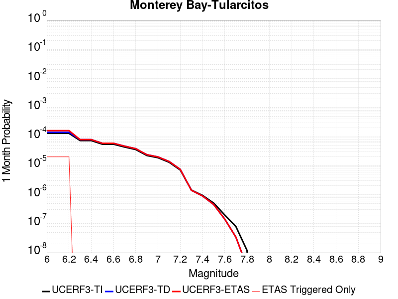 |  |  |

| Magnitude | 1 wk TI Prob | 1 wk TD Prob | 1 wk ETAS Prob | 1 wk ETAS/TD Gain | 1 wk ETAS Triggered Only | 1 mo TI Prob | 1 mo TD Prob | 1 mo ETAS Prob | 1 mo ETAS/TD Gain | 1 mo ETAS Triggered Only | 1 yr TI Prob | 1 yr TD Prob | 1 yr ETAS Prob | 1 yr ETAS/TD Gain | 1 yr ETAS Triggered Only | 10 yr TI Prob | 10 yr TD Prob | 10 yr ETAS Prob | 10 yr ETAS/TD Gain | 10 yr ETAS Triggered Only |
|-----|-----|-----|-----|-----|-----|-----|-----|-----|-----|-----|-----|-----|-----|-----|-----|-----|-----|-----|-----|-----|
| 6.0 | 3.0131365E-5 | 3.279877E-5 | 7.2835894E-5 | 2.2206898 | 4.0038438E-5 | 1.2912804E-4 | 1.4055918E-4 | 1.8059199E-4 | 1.284811 | 4.0038438E-5 | 0.001571 | 0.0017100703 | 0.0017500402 | 1.0233732 | 4.0038438E-5 | 0.015599402 | 0.016979916 | 0.017019276 | 1.0023179 | 4.0038438E-5 |
| 6.1 | 3.0131365E-5 | 3.279877E-5 | 7.2835894E-5 | 2.2206898 | 4.0038438E-5 | 1.2912804E-4 | 1.4055918E-4 | 1.8059199E-4 | 1.284811 | 4.0038438E-5 | 0.001571 | 0.0017100703 | 0.0017500402 | 1.0233732 | 4.0038438E-5 | 0.015599402 | 0.016979916 | 0.017019276 | 1.0023179 | 4.0038438E-5 |
| 6.2 | 3.0131365E-5 | 3.279877E-5 | 7.2835894E-5 | 2.2206898 | 4.0038438E-5 | 1.2912804E-4 | 1.4055918E-4 | 1.8059199E-4 | 1.284811 | 4.0038438E-5 | 0.001571 | 0.0017100703 | 0.0017500402 | 1.0233732 | 4.0038438E-5 | 0.015599402 | 0.016979916 | 0.017019276 | 1.0023179 | 4.0038438E-5 |
| 6.3 | 1.6998249E-5 | 1.8330798E-5 | 1.8330798E-5 | 1.0 | 0.0 | 7.28476E-5 | 7.85583E-5 | 7.85583E-5 | 1.0 | 0.0 | 8.865586E-4 | 9.5604634E-4 | 9.5604634E-4 | 1.0 | 0.0 | 0.0088303005 | 0.009521258 | 0.009521258 | 1.0 | 0.0 |
| 6.4 | 1.6998249E-5 | 1.8330798E-5 | 1.8330798E-5 | 1.0 | 0.0 | 7.28476E-5 | 7.85583E-5 | 7.85583E-5 | 1.0 | 0.0 | 8.865586E-4 | 9.5604634E-4 | 9.5604634E-4 | 1.0 | 0.0 | 0.0088303005 | 0.009521258 | 0.009521258 | 1.0 | 0.0 |
| 6.5 | 1.27470785E-5 | 1.3693312E-5 | 1.3693312E-5 | 1.0 | 0.0 | 5.4629192E-5 | 5.8684363E-5 | 5.8684363E-5 | 1.0 | 0.0 | 6.649074E-4 | 7.1425823E-4 | 7.1425823E-4 | 1.0 | 0.0 | 0.0066292146 | 0.007120678 | 0.007120678 | 1.0 | 0.0 |
| 6.6 | 1.2739422E-5 | 1.36854E-5 | 1.36854E-5 | 1.0 | 0.0 | 5.4596385E-5 | 5.8650454E-5 | 5.8650454E-5 | 1.0 | 0.0 | 6.645082E-4 | 7.1384566E-4 | 7.1384566E-4 | 1.0 | 0.0 | 0.0066252467 | 0.007116579 | 0.007116579 | 1.0 | 0.0 |
| 6.7 | 1.0160109E-5 | 1.0885755E-5 | 1.0885755E-5 | 1.0 | 0.0 | 4.35426E-5 | 4.665244E-5 | 4.665244E-5 | 1.0 | 0.0 | 5.300022E-4 | 5.6785246E-4 | 5.6785246E-4 | 1.0 | 0.0 | 0.005287399 | 0.0056647263 | 0.0056647263 | 1.0 | 0.0 |
| 6.8 | 8.349859E-6 | 8.932587E-6 | 8.932587E-6 | 1.0 | 0.0 | 3.578462E-5 | 3.8281985E-5 | 3.8281985E-5 | 1.0 | 0.0 | 4.3559066E-4 | 4.6598914E-4 | 4.6598914E-4 | 1.0 | 0.0 | 0.004347378 | 0.004650685 | 0.004650685 | 1.0 | 0.0 |
| 6.9 | 5.193639E-6 | 5.53643E-6 | 5.53643E-6 | 1.0 | 0.0 | 2.2258262E-5 | 2.372736E-5 | 2.372736E-5 | 1.0 | 0.0 | 2.7096065E-4 | 2.8884556E-4 | 2.8884556E-4 | 1.0 | 0.0 | 0.0027063051 | 0.0028850222 | 0.0028850222 | 1.0 | 0.0 |
| 7.0 | 4.359381E-6 | 4.643366E-6 | 4.643366E-6 | 1.0 | 0.0 | 1.8682927E-5 | 1.9900004E-5 | 1.9900004E-5 | 1.0 | 0.0 | 2.274409E-4 | 2.422586E-4 | 2.422586E-4 | 1.0 | 0.0 | 0.0022720827 | 0.002420238 | 0.002420238 | 1.0 | 0.0 |
| 7.1 | 3.0398533E-6 | 3.2310427E-6 | 3.2310427E-6 | 1.0 | 0.0 | 1.3027877E-5 | 1.3847267E-5 | 1.3847267E-5 | 1.0 | 0.0 | 1.5860285E-4 | 1.6858005E-4 | 1.6858005E-4 | 1.0 | 0.0 | 0.001584897 | 0.0016847793 | 0.0016847793 | 1.0 | 0.0 |
| 7.2 | 1.642335E-6 | 1.7333153E-6 | 1.7333153E-6 | 1.0 | 0.0 | 7.0385595E-6 | 7.428485E-6 | 7.428485E-6 | 1.0 | 0.0 | 8.569109E-5 | 9.044012E-5 | 9.044012E-5 | 1.0 | 0.0 | 8.5658056E-4 | 9.042358E-4 | 9.042358E-4 | 1.0 | 0.0 |
| 7.3 | 3.356842E-7 | 3.2952389E-7 | 3.2952389E-7 | 1.0 | 0.0 | 1.4386458E-6 | 1.4122444E-6 | 1.4122444E-6 | 1.0 | 0.0 | 1.7515373E-5 | 1.7193941E-5 | 1.7193941E-5 | 1.0 | 0.0 | 1.7513991E-4 | 1.719262E-4 | 1.719262E-4 | 1.0 | 0.0 |
| 7.4 | 2.1973483E-7 | 2.1006413E-7 | 2.1006413E-7 | 1.0 | 0.0 | 9.417204E-7 | 9.0027453E-7 | 9.0027453E-7 | 1.0 | 0.0 | 1.1465385E-5 | 1.0960787E-5 | 1.0960787E-5 | 1.0 | 0.0 | 1.1464794E-4 | 1.096025E-4 | 1.096025E-4 | 1.0 | 0.0 |
| 7.5 | 1.1944135E-7 | 1.0696043E-7 | 1.0696043E-7 | 1.0 | 0.0 | 5.118914E-7 | 4.5840173E-7 | 4.5840173E-7 | 1.0 | 0.0 | 6.23226E-6 | 5.581027E-6 | 5.581027E-6 | 1.0 | 0.0 | 6.2320854E-5 | 5.5808883E-5 | 5.5808883E-5 | 1.0 | 0.0 |
| 7.6 | 4.636058E-8 | 3.336489E-8 | 3.336489E-8 | 1.0 | 0.0 | 1.9868818E-7 | 1.4299238E-7 | 1.4299238E-7 | 1.0 | 0.0 | 2.419026E-6 | 1.7409308E-6 | 1.7409308E-6 | 1.0 | 0.0 | 2.4189996E-5 | 1.7409173E-5 | 1.7409173E-5 | 1.0 | 0.0 |
| 7.7 | 1.8588572E-8 | 8.003744E-9 | 8.003744E-9 | 1.0 | 0.0 | 7.9665305E-8 | 3.430176E-8 | 3.430176E-8 | 1.0 | 0.0 | 9.699246E-7 | 4.1762385E-7 | 4.1762385E-7 | 1.0 | 0.0 | 9.699204E-6 | 4.176231E-6 | 4.176231E-6 | 1.0 | 0.0 |
| 7.8 | 2.7960154E-9 | 7.6099427E-10 | 7.6099427E-10 | 1.0 | 0.0 | 1.1982923E-8 | 3.2614043E-9 | 3.2614043E-9 | 1.0 | 0.0 | 1.4589209E-7 | 3.9707597E-8 | 3.9707597E-8 | 1.0 | 0.0 | 1.4589199E-6 | 3.9707595E-7 | 3.9707595E-7 | 1.0 | 0.0 |

## Shoreline
*[(top)](#table-of-contents)*

| 1 Week | 1 Month | 1 Year | 10 Year |
|-----|-----|-----|-----|
| 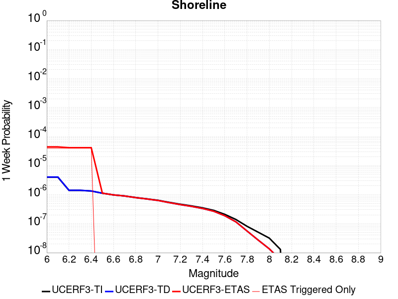 | 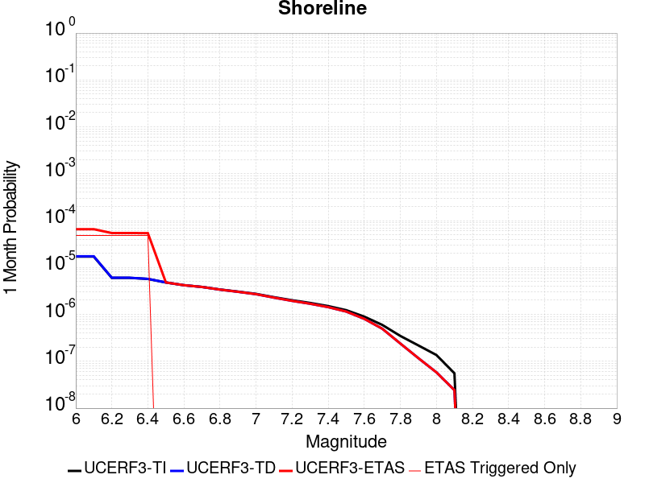 | 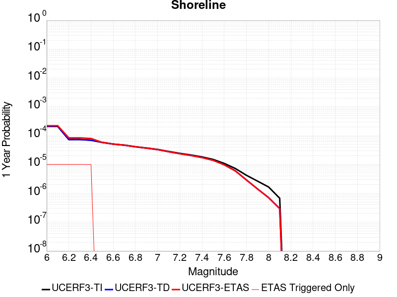 | 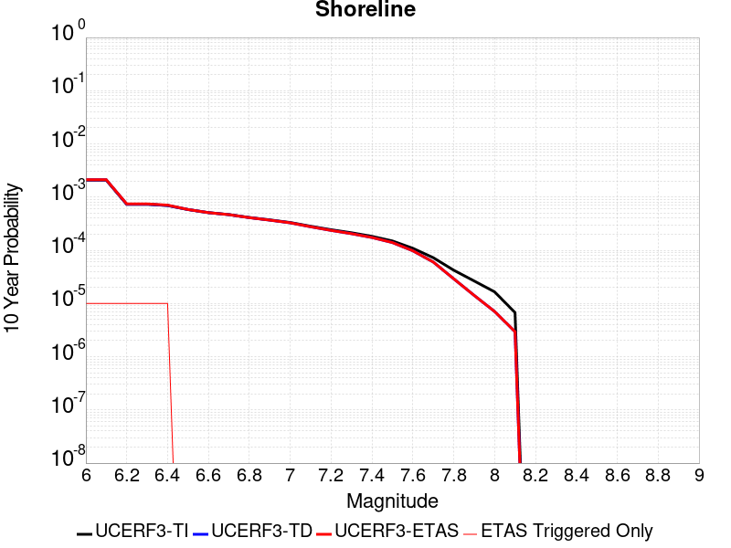 |

| Magnitude | 1 wk TI Prob | 1 wk TD Prob | 1 wk ETAS Prob | 1 wk ETAS/TD Gain | 1 wk ETAS Triggered Only | 1 mo TI Prob | 1 mo TD Prob | 1 mo ETAS Prob | 1 mo ETAS/TD Gain | 1 mo ETAS Triggered Only | 1 yr TI Prob | 1 yr TD Prob | 1 yr ETAS Prob | 1 yr ETAS/TD Gain | 1 yr ETAS Triggered Only | 10 yr TI Prob | 10 yr TD Prob | 10 yr ETAS Prob | 10 yr ETAS/TD Gain | 10 yr ETAS Triggered Only |
|-----|-----|-----|-----|-----|-----|-----|-----|-----|-----|-----|-----|-----|-----|-----|-----|-----|-----|-----|-----|-----|
| 6.0 | 3.9888673E-6 | 4.047929E-6 | 4.4086202E-5 | 10.891051 | 4.0038438E-5 | 1.7095033E-5 | 1.7348184E-5 | 5.7385925E-5 | 3.3078926 | 4.0038438E-5 | 2.0811215E-4 | 2.1119925E-4 | 2.5122924E-4 | 1.1895366 | 4.0038438E-5 | 0.0020791737 | 0.002110534 | 0.002150488 | 1.0189307 | 4.0038438E-5 |
| 6.1 | 3.9888673E-6 | 4.047929E-6 | 4.4086202E-5 | 10.891051 | 4.0038438E-5 | 1.7095033E-5 | 1.7348184E-5 | 5.7385925E-5 | 3.3078926 | 4.0038438E-5 | 2.0811215E-4 | 2.1119925E-4 | 2.5122924E-4 | 1.1895366 | 4.0038438E-5 | 0.0020791737 | 0.002110534 | 0.002150488 | 1.0189307 | 4.0038438E-5 |
| 6.2 | 1.4039653E-6 | 1.4100891E-6 | 4.144847E-5 | 29.39422 | 4.0038438E-5 | 6.0169805E-6 | 6.0432253E-6 | 4.608142E-5 | 7.6253023 | 4.0038438E-5 | 7.325427E-5 | 7.357384E-5 | 1.13609334E-4 | 1.5441538 | 4.0038438E-5 | 7.3230127E-4 | 7.355009E-4 | 7.7550986E-4 | 1.054397 | 4.0038438E-5 |
| 6.3 | 1.4039653E-6 | 1.4100891E-6 | 4.144847E-5 | 29.39422 | 4.0038438E-5 | 6.0169805E-6 | 6.0432253E-6 | 4.608142E-5 | 7.6253023 | 4.0038438E-5 | 7.325427E-5 | 7.357384E-5 | 1.13609334E-4 | 1.5441538 | 4.0038438E-5 | 7.3230127E-4 | 7.355009E-4 | 7.7550986E-4 | 1.054397 | 4.0038438E-5 |
| 6.4 | 1.3314152E-6 | 1.3361605E-6 | 4.1374544E-5 | 30.96525 | 4.0038438E-5 | 5.7060524E-6 | 5.7263896E-6 | 4.57646E-5 | 7.991876 | 4.0038438E-5 | 6.946897E-5 | 6.971662E-5 | 1.0975227E-4 | 1.5742626 | 4.0038438E-5 | 6.9447263E-4 | 6.9695286E-4 | 7.369634E-4 | 1.0574079 | 4.0038438E-5 |
| 6.5 | 1.1187026E-6 | 1.120364E-6 | 1.120364E-6 | 1.0 | 0.0 | 4.794431E-6 | 4.8015513E-6 | 4.8015513E-6 | 1.0 | 0.0 | 5.8370628E-5 | 5.8457343E-5 | 5.8457343E-5 | 1.0 | 0.0 | 5.83553E-4 | 5.844222E-4 | 5.844222E-4 | 1.0 | 0.0 |
| 6.6 | 9.793089E-7 | 9.784919E-7 | 9.784919E-7 | 1.0 | 0.0 | 4.1970316E-6 | 4.1935305E-6 | 4.1935305E-6 | 1.0 | 0.0 | 5.1097657E-5 | 5.105505E-5 | 5.105505E-5 | 1.0 | 0.0 | 5.108591E-4 | 5.1043445E-4 | 5.1043445E-4 | 1.0 | 0.0 |
| 6.7 | 8.995986E-7 | 8.9728E-7 | 8.9728E-7 | 1.0 | 0.0 | 3.8554167E-6 | 3.84548E-6 | 3.84548E-6 | 1.0 | 0.0 | 4.693869E-5 | 4.6817724E-5 | 4.6817724E-5 | 1.0 | 0.0 | 4.6928777E-4 | 4.6807955E-4 | 4.6807955E-4 | 1.0 | 0.0 |
| 6.8 | 7.931612E-7 | 7.8804027E-7 | 7.8804027E-7 | 1.0 | 0.0 | 3.3992578E-6 | 3.377311E-6 | 3.377311E-6 | 1.0 | 0.0 | 4.1385178E-5 | 4.1117994E-5 | 4.1117994E-5 | 1.0 | 0.0 | 4.1377472E-4 | 4.1110438E-4 | 4.1110438E-4 | 1.0 | 0.0 |
| 6.9 | 7.1465956E-7 | 7.078006E-7 | 7.078006E-7 | 1.0 | 0.0 | 3.062823E-6 | 3.0334277E-6 | 3.0334277E-6 | 1.0 | 0.0 | 3.7289232E-5 | 3.6931357E-5 | 3.6931357E-5 | 1.0 | 0.0 | 3.7282976E-4 | 3.6925258E-4 | 3.6925258E-4 | 1.0 | 0.0 |
| 7.0 | 6.389046E-7 | 6.299458E-7 | 6.299458E-7 | 1.0 | 0.0 | 2.7381598E-6 | 2.699765E-6 | 2.699765E-6 | 1.0 | 0.0 | 3.3336586E-5 | 3.2869146E-5 | 3.2869146E-5 | 1.0 | 0.0 | 3.3331584E-4 | 3.2864307E-4 | 3.2864307E-4 | 1.0 | 0.0 |
| 7.1 | 5.4300875E-7 | 5.3111313E-7 | 5.3111313E-7 | 1.0 | 0.0 | 2.3271782E-6 | 2.276197E-6 | 2.276197E-6 | 1.0 | 0.0 | 2.8333026E-5 | 2.7712347E-5 | 2.7712347E-5 | 1.0 | 0.0 | 2.8329415E-4 | 2.77089E-4 | 2.77089E-4 | 1.0 | 0.0 |
| 7.2 | 4.6768855E-7 | 4.5348952E-7 | 4.5348952E-7 | 1.0 | 0.0 | 2.0043778E-6 | 1.9435251E-6 | 1.9435251E-6 | 1.0 | 0.0 | 2.4403027E-5 | 2.3662162E-5 | 2.3662162E-5 | 1.0 | 0.0 | 2.4400349E-4 | 2.3659648E-4 | 2.3659648E-4 | 1.0 | 0.0 |
| 7.3 | 4.0966103E-7 | 3.9385662E-7 | 3.9385662E-7 | 1.0 | 0.0 | 1.7556889E-6 | 1.6879559E-6 | 1.6879559E-6 | 1.0 | 0.0 | 2.1375303E-5 | 2.055067E-5 | 2.055067E-5 | 1.0 | 0.0 | 2.1373246E-4 | 2.0548773E-4 | 2.0548773E-4 | 1.0 | 0.0 |
| 7.4 | 3.5105785E-7 | 3.3363975E-7 | 3.3363975E-7 | 1.0 | 0.0 | 1.5045327E-6 | 1.4298838E-6 | 1.4298838E-6 | 1.0 | 0.0 | 1.8317533E-5 | 1.7408696E-5 | 1.7408696E-5 | 1.0 | 0.0 | 1.8316023E-4 | 1.7407336E-4 | 1.7407336E-4 | 1.0 | 0.0 |
| 7.5 | 2.8737534E-7 | 2.6820038E-7 | 2.6820038E-7 | 1.0 | 0.0 | 1.2316079E-6 | 1.1494297E-6 | 1.1494297E-6 | 1.0 | 0.0 | 1.4994724E-5 | 1.3994217E-5 | 1.3994217E-5 | 1.0 | 0.0 | 1.4993713E-4 | 1.3993339E-4 | 1.3993339E-4 | 1.0 | 0.0 |
| 7.6 | 2.0924051E-7 | 1.8778988E-7 | 1.8778988E-7 | 1.0 | 0.0 | 8.967448E-7 | 8.048135E-7 | 8.048135E-7 | 1.0 | 0.0 | 1.0917813E-5 | 9.79856E-6 | 9.79856E-6 | 1.0 | 0.0 | 1.0917276E-4 | 9.798129E-5 | 9.798129E-5 | 1.0 | 0.0 |
| 7.7 | 1.392265E-7 | 1.15433906E-7 | 1.15433906E-7 | 1.0 | 0.0 | 5.9668486E-7 | 4.9471663E-7 | 4.9471663E-7 | 1.0 | 0.0 | 7.2646135E-6 | 6.023158E-6 | 6.023158E-6 | 1.0 | 0.0 | 7.2643765E-5 | 6.0229955E-5 | 6.0229955E-5 | 1.0 | 0.0 |
| 7.8 | 8.1080074E-8 | 5.586722E-8 | 5.586722E-8 | 1.0 | 0.0 | 3.4748598E-7 | 2.394309E-7 | 2.394309E-7 | 1.0 | 0.0 | 4.2306337E-6 | 2.9150672E-6 | 2.9150672E-6 | 1.0 | 0.0 | 4.230553E-5 | 2.9150291E-5 | 2.9150291E-5 | 1.0 | 0.0 |
| 7.9 | 5.0859036E-8 | 2.7244445E-8 | 2.7244445E-8 | 1.0 | 0.0 | 2.1796728E-7 | 1.16761896E-7 | 1.16761896E-7 | 1.0 | 0.0 | 2.6537484E-6 | 1.4215751E-6 | 1.4215751E-6 | 1.0 | 0.0 | 2.6537167E-5 | 1.4215661E-5 | 1.4215661E-5 | 1.0 | 0.0 |
| 8.0 | 3.1760536E-8 | 1.3577206E-8 | 1.3577206E-8 | 1.0 | 0.0 | 1.3611657E-7 | 5.8188025E-8 | 5.8188025E-8 | 1.0 | 0.0 | 1.6572179E-6 | 7.0843896E-7 | 7.0843896E-7 | 1.0 | 0.0 | 1.6572056E-5 | 7.084367E-6 | 7.084367E-6 | 1.0 | 0.0 |
| 8.1 | 1.2947896E-8 | 5.6628693E-9 | 5.6628693E-9 | 1.0 | 0.0 | 5.5490982E-8 | 2.426944E-8 | 2.426944E-8 | 1.0 | 0.0 | 6.756025E-7 | 2.954804E-7 | 2.954804E-7 | 1.0 | 0.0 | 6.7560045E-6 | 2.9548003E-6 | 2.9548003E-6 | 1.0 | 0.0 |

## Mission Hills 2011
*[(top)](#table-of-contents)*

| 1 Week | 1 Month | 1 Year | 10 Year |
|-----|-----|-----|-----|
|  |  |  |  |

| Magnitude | 1 wk TI Prob | 1 wk TD Prob | 1 wk ETAS Prob | 1 wk ETAS/TD Gain | 1 wk ETAS Triggered Only | 1 mo TI Prob | 1 mo TD Prob | 1 mo ETAS Prob | 1 mo ETAS/TD Gain | 1 mo ETAS Triggered Only | 1 yr TI Prob | 1 yr TD Prob | 1 yr ETAS Prob | 1 yr ETAS/TD Gain | 1 yr ETAS Triggered Only | 10 yr TI Prob | 10 yr TD Prob | 10 yr ETAS Prob | 10 yr ETAS/TD Gain | 10 yr ETAS Triggered Only |
|-----|-----|-----|-----|-----|-----|-----|-----|-----|-----|-----|-----|-----|-----|-----|-----|-----|-----|-----|-----|-----|
| 6.0 | 1.8765717E-5 | 1.9054645E-5 | 1.9054645E-5 | 1.0 | 0.0 | 8.0422025E-5 | 8.166215E-5 | 1.2169732E-4 | 1.4902537 | 4.0038438E-5 | 9.786983E-4 | 9.941267E-4 | 0.0010341252 | 1.0402349 | 4.0038438E-5 | 0.009743992 | 0.009930461 | 0.0099701015 | 1.0039918 | 4.0038438E-5 |
| 6.1 | 1.8765717E-5 | 1.9054645E-5 | 1.9054645E-5 | 1.0 | 0.0 | 8.0422025E-5 | 8.166215E-5 | 1.2169732E-4 | 1.4902537 | 4.0038438E-5 | 9.786983E-4 | 9.941267E-4 | 0.0010341252 | 1.0402349 | 4.0038438E-5 | 0.009743992 | 0.009930461 | 0.0099701015 | 1.0039918 | 4.0038438E-5 |
| 6.2 | 1.8765717E-5 | 1.9054645E-5 | 1.9054645E-5 | 1.0 | 0.0 | 8.0422025E-5 | 8.166215E-5 | 1.2169732E-4 | 1.4902537 | 4.0038438E-5 | 9.786983E-4 | 9.941267E-4 | 0.0010341252 | 1.0402349 | 4.0038438E-5 | 0.009743992 | 0.009930461 | 0.0099701015 | 1.0039918 | 4.0038438E-5 |
| 6.3 | 1.8765717E-5 | 1.9054645E-5 | 1.9054645E-5 | 1.0 | 0.0 | 8.0422025E-5 | 8.166215E-5 | 1.2169732E-4 | 1.4902537 | 4.0038438E-5 | 9.786983E-4 | 9.941267E-4 | 0.0010341252 | 1.0402349 | 4.0038438E-5 | 0.009743992 | 0.009930461 | 0.0099701015 | 1.0039918 | 4.0038438E-5 |
| 6.4 | 4.566357E-6 | 2.5148488E-6 | 2.5148488E-6 | 1.0 | 0.0 | 1.9569954E-5 | 1.0777889E-5 | 5.0815896E-5 | 4.714828 | 4.0038438E-5 | 2.3823815E-4 | 1.3121472E-4 | 1.712479E-4 | 1.3050967 | 4.0038438E-5 | 0.002379829 | 0.0013115506 | 0.0013515366 | 1.0304875 | 4.0038438E-5 |
| 6.5 | 4.566357E-6 | 2.5148488E-6 | 2.5148488E-6 | 1.0 | 0.0 | 1.9569954E-5 | 1.0777889E-5 | 5.0815896E-5 | 4.714828 | 4.0038438E-5 | 2.3823815E-4 | 1.3121472E-4 | 1.712479E-4 | 1.3050967 | 4.0038438E-5 | 0.002379829 | 0.0013115506 | 0.0013515366 | 1.0304875 | 4.0038438E-5 |
| 6.6 | 4.566357E-6 | 2.5148488E-6 | 2.5148488E-6 | 1.0 | 0.0 | 1.9569954E-5 | 1.0777889E-5 | 5.0815896E-5 | 4.714828 | 4.0038438E-5 | 2.3823815E-4 | 1.3121472E-4 | 1.712479E-4 | 1.3050967 | 4.0038438E-5 | 0.002379829 | 0.0013115506 | 0.0013515366 | 1.0304875 | 4.0038438E-5 |
| 6.7 | 2.3266773E-6 | 1.3296187E-6 | 1.3296187E-6 | 1.0 | 0.0 | 9.971435E-6 | 5.698354E-6 | 4.5736564E-5 | 8.026277 | 4.0038438E-5 | 1.2139547E-4 | 6.937531E-5 | 1.0941097E-4 | 1.577088 | 4.0038438E-5 | 0.0012132917 | 6.9354265E-4 | 7.335533E-4 | 1.0576903 | 4.0038438E-5 |
| 6.8 | 2.032735E-6 | 1.1894115E-6 | 1.1894115E-6 | 1.0 | 0.0 | 8.711692E-6 | 5.097468E-6 | 4.51357E-5 | 8.854533 | 4.0038438E-5 | 1.06059684E-4 | 6.205996E-5 | 1.0209591E-4 | 1.6451173 | 4.0038438E-5 | 0.0010600908 | 6.2043115E-4 | 6.604447E-4 | 1.0644932 | 4.0038438E-5 |
| 6.9 | 1.3186259E-6 | 1.0561778E-6 | 1.0561778E-6 | 1.0 | 0.0 | 5.6512413E-6 | 4.5264687E-6 | 4.4564724E-5 | 9.845363 | 4.0038438E-5 | 6.8801695E-5 | 5.5108394E-5 | 9.514462E-5 | 1.7264997 | 4.0038438E-5 | 6.8780396E-4 | 5.5095024E-4 | 5.909666E-4 | 1.0726316 | 4.0038438E-5 |
| 7.0 | 1.2726016E-6 | 1.0159088E-6 | 1.0159088E-6 | 1.0 | 0.0 | 5.4539955E-6 | 4.3538876E-6 | 4.439215E-5 | 10.19598 | 4.0038438E-5 | 6.6400375E-5 | 5.300732E-5 | 9.3043636E-5 | 1.7552979 | 4.0038438E-5 | 6.6380535E-4 | 5.299496E-4 | 5.6996685E-4 | 1.0755113 | 4.0038438E-5 |
| 7.1 | 1.2063913E-6 | 9.570072E-7 | 9.570072E-7 | 1.0 | 0.0 | 5.170238E-6 | 4.101453E-6 | 4.4139724E-5 | 10.761972 | 4.0038438E-5 | 6.294583E-5 | 4.9934075E-5 | 8.997051E-5 | 1.801786 | 4.0038438E-5 | 6.2928005E-4 | 4.992311E-4 | 5.3924957E-4 | 1.0801601 | 4.0038438E-5 |
| 7.2 | 9.105806E-7 | 7.3765557E-7 | 7.3765557E-7 | 1.0 | 0.0 | 3.9024826E-6 | 3.1613772E-6 | 3.1613772E-6 | 1.0 | 0.0 | 4.7511687E-5 | 3.8489103E-5 | 3.8489103E-5 | 1.0 | 0.0 | 4.7501532E-4 | 3.8482592E-4 | 3.8482592E-4 | 1.0 | 0.0 |
| 7.3 | 7.020432E-7 | 5.710089E-7 | 5.710089E-7 | 1.0 | 0.0 | 3.0087533E-6 | 2.447179E-6 | 2.447179E-6 | 1.0 | 0.0 | 3.6630954E-5 | 2.979401E-5 | 2.979401E-5 | 1.0 | 0.0 | 3.6624918E-4 | 2.9790145E-4 | 2.9790145E-4 | 1.0 | 0.0 |
| 7.4 | 5.3900635E-7 | 4.4480825E-7 | 4.4480825E-7 | 1.0 | 0.0 | 2.3100251E-6 | 1.9063198E-6 | 1.9063198E-6 | 1.0 | 0.0 | 2.8124194E-5 | 2.3209208E-5 | 2.3209208E-5 | 1.0 | 0.0 | 2.8120633E-4 | 2.3206905E-4 | 2.3206905E-4 | 1.0 | 0.0 |
| 7.5 | 2.907075E-7 | 2.2875415E-7 | 2.2875415E-7 | 1.0 | 0.0 | 1.2458887E-6 | 9.803746E-7 | 9.803746E-7 | 1.0 | 0.0 | 1.5168589E-5 | 1.1935997E-5 | 1.1935997E-5 | 1.0 | 0.0 | 1.5167553E-4 | 1.1935373E-4 | 1.1935373E-4 | 1.0 | 0.0 |
| 7.6 | 1.6903675E-7 | 1.2353402E-7 | 1.2353402E-7 | 1.0 | 0.0 | 7.2444305E-7 | 5.294314E-7 | 5.294314E-7 | 1.0 | 0.0 | 8.820059E-6 | 6.4458095E-6 | 6.4458095E-6 | 1.0 | 0.0 | 8.8197085E-5 | 6.445635E-5 | 6.445635E-5 | 1.0 | 0.0 |
| 7.7 | 7.168073E-8 | 3.9135116E-8 | 3.9135116E-8 | 1.0 | 0.0 | 3.072031E-7 | 1.6772192E-7 | 1.6772192E-7 | 1.0 | 0.0 | 3.7401915E-6 | 2.0420127E-6 | 2.0420127E-6 | 1.0 | 0.0 | 3.7401285E-5 | 2.041995E-5 | 2.041995E-5 | 1.0 | 0.0 |
| 7.8 | 6.564101E-8 | 3.3835356E-8 | 3.3835356E-8 | 1.0 | 0.0 | 2.813186E-7 | 1.4500866E-7 | 1.4500866E-7 | 1.0 | 0.0 | 3.4250486E-6 | 1.7654792E-6 | 1.7654792E-6 | 1.0 | 0.0 | 3.424996E-5 | 1.7654662E-5 | 1.7654662E-5 | 1.0 | 0.0 |
| 7.9 | 1.0029074E-8 | 3.7292542E-9 | 3.7292542E-9 | 1.0 | 0.0 | 4.2981743E-8 | 1.5982518E-8 | 1.5982518E-8 | 1.0 | 0.0 | 5.2330256E-7 | 1.9458714E-7 | 1.9458714E-7 | 1.0 | 0.0 | 5.2330133E-6 | 1.945871E-6 | 1.945871E-6 | 1.0 | 0.0 |

## Calaveras (So) 2011 CFM
*[(top)](#table-of-contents)*

| 1 Week | 1 Month | 1 Year | 10 Year |
|-----|-----|-----|-----|
| 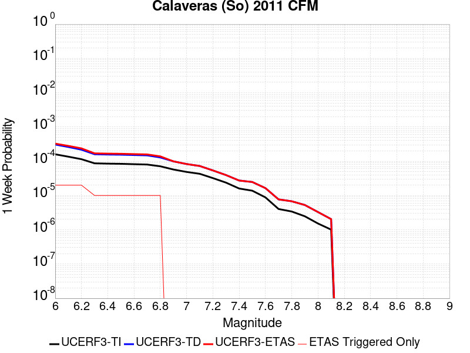 | 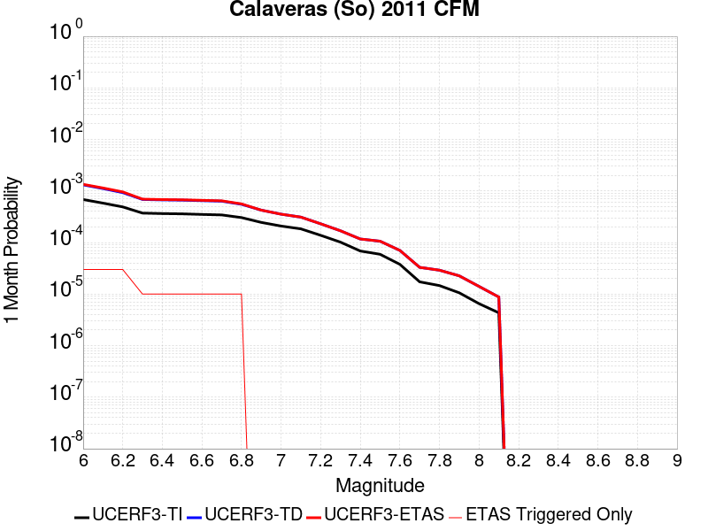 | 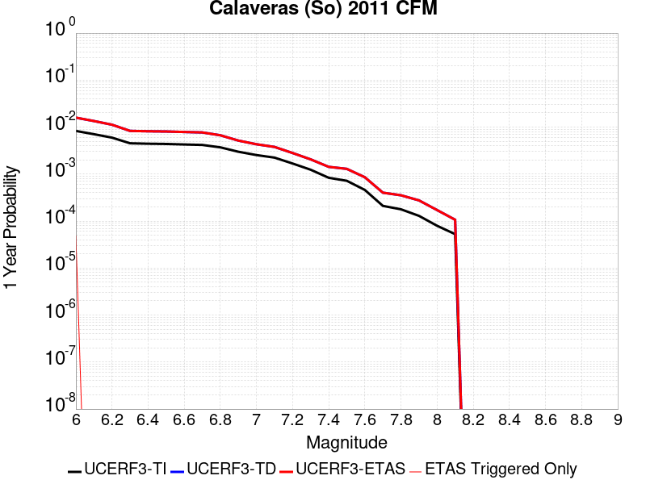 | 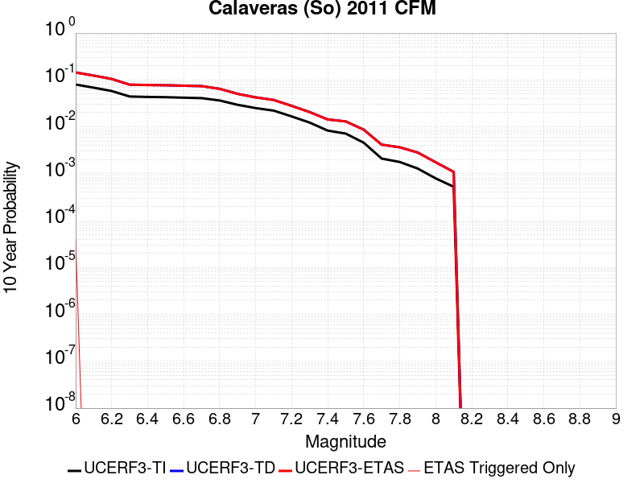 |

| Magnitude | 1 wk TI Prob | 1 wk TD Prob | 1 wk ETAS Prob | 1 wk ETAS/TD Gain | 1 wk ETAS Triggered Only | 1 mo TI Prob | 1 mo TD Prob | 1 mo ETAS Prob | 1 mo ETAS/TD Gain | 1 mo ETAS Triggered Only | 1 yr TI Prob | 1 yr TD Prob | 1 yr ETAS Prob | 1 yr ETAS/TD Gain | 1 yr ETAS Triggered Only | 10 yr TI Prob | 10 yr TD Prob | 10 yr ETAS Prob | 10 yr ETAS/TD Gain | 10 yr ETAS Triggered Only |
|-----|-----|-----|-----|-----|-----|-----|-----|-----|-----|-----|-----|-----|-----|-----|-----|-----|-----|-----|-----|-----|
| 6.0 | 1.5950744E-4 | 3.071188E-4 | 3.071188E-4 | 1.0 | 0.0 | 6.834242E-4 | 0.0013155643 | 0.0013155643 | 1.0 | 0.0 | 0.00828899 | 0.01585904 | 0.015898444 | 1.0024846 | 4.0038438E-5 | 0.079865426 | 0.14440064 | 0.1444349 | 1.0002372 | 4.0038438E-5 |
| 6.1 | 1.3584697E-4 | 2.6036944E-4 | 2.6036944E-4 | 1.0 | 0.0 | 5.8207137E-4 | 0.0011153965 | 0.0011153965 | 1.0 | 0.0 | 0.007063716 | 0.013462106 | 0.013462106 | 1.0 | 0.0 | 0.06843361 | 0.12402854 | 0.12402854 | 1.0 | 0.0 |
| 6.2 | 1.14676266E-4 | 2.1726108E-4 | 2.1726108E-4 | 1.0 | 0.0 | 4.9137714E-4 | 9.307893E-4 | 9.307893E-4 | 1.0 | 0.0 | 0.0059661185 | 0.011245592 | 0.011245592 | 1.0 | 0.0 | 0.058084648 | 0.105019294 | 0.105019294 | 1.0 | 0.0 |
| 6.3 | 8.691518E-5 | 1.5987165E-4 | 1.5987165E-4 | 1.0 | 0.0 | 3.7244044E-4 | 6.8496726E-4 | 6.8496726E-4 | 1.0 | 0.0 | 0.004525038 | 0.008300893 | 0.008300893 | 1.0 | 0.0 | 0.044339992 | 0.0793347 | 0.0793347 | 1.0 | 0.0 |
| 6.4 | 8.50982E-5 | 1.5693568E-4 | 1.5693568E-4 | 1.0 | 0.0 | 3.646556E-4 | 6.7239115E-4 | 6.7239115E-4 | 1.0 | 0.0 | 0.0044306475 | 0.008148931 | 0.008148931 | 1.0 | 0.0 | 0.04343345 | 0.077940844 | 0.077940844 | 1.0 | 0.0 |
| 6.5 | 8.4062965E-5 | 1.5518135E-4 | 1.5518135E-4 | 1.0 | 0.0 | 3.602201E-4 | 6.648764E-4 | 6.648764E-4 | 1.0 | 0.0 | 0.004376863 | 0.008058134 | 0.008058134 | 1.0 | 0.0 | 0.042916555 | 0.077112116 | 0.077112116 | 1.0 | 0.0 |
| 6.6 | 8.194716E-5 | 1.5154095E-4 | 1.5154095E-4 | 1.0 | 0.0 | 3.5115483E-4 | 6.492825E-4 | 6.492825E-4 | 1.0 | 0.0 | 0.0042669317 | 0.007869979 | 0.007869979 | 1.0 | 0.0 | 0.04185927 | 0.07539739 | 0.07539739 | 1.0 | 0.0 |
| 6.7 | 8.012326E-5 | 1.4821833E-4 | 1.4821833E-4 | 1.0 | 0.0 | 3.433402E-4 | 6.350497E-4 | 6.350497E-4 | 1.0 | 0.0 | 0.004172157 | 0.007698474 | 0.007698474 | 1.0 | 0.0 | 0.040946912 | 0.073839515 | 0.073839515 | 1.0 | 0.0 |
| 6.8 | 7.119773E-5 | 1.2880519E-4 | 1.2880519E-4 | 1.0 | 0.0 | 3.0509746E-4 | 5.519001E-4 | 5.519001E-4 | 1.0 | 0.0 | 0.0037082357 | 0.0066958875 | 0.0066958875 | 1.0 | 0.0 | 0.036469642 | 0.06468402 | 0.06468402 | 1.0 | 0.0 |
| 6.9 | 5.7343088E-5 | 9.9189E-5 | 9.9189E-5 | 1.0 | 0.0 | 2.4573295E-4 | 4.2502693E-4 | 4.2502693E-4 | 1.0 | 0.0 | 0.0029876942 | 0.0051625078 | 0.0051625078 | 1.0 | 0.0 | 0.02947844 | 0.050509132 | 0.050509132 | 1.0 | 0.0 |
| 7.0 | 4.8746577E-5 | 8.284751E-5 | 8.284751E-5 | 1.0 | 0.0 | 2.0889717E-4 | 3.550128E-4 | 3.550128E-4 | 1.0 | 0.0 | 0.0025403565 | 0.004313781 | 0.004313781 | 1.0 | 0.0 | 0.025115121 | 0.04248505 | 0.04248505 | 1.0 | 0.0 |
| 7.1 | 4.2998014E-5 | 7.264914E-5 | 7.264914E-5 | 1.0 | 0.0 | 1.8426418E-4 | 3.1131663E-4 | 3.1131663E-4 | 1.0 | 0.0 | 0.002241108 | 0.0037837527 | 0.0037837527 | 1.0 | 0.0 | 0.022186412 | 0.037423246 | 0.037423246 | 1.0 | 0.0 |
| 7.2 | 3.221292E-5 | 5.390566E-5 | 5.390566E-5 | 1.0 | 0.0 | 1.3804805E-4 | 2.3100396E-4 | 2.3100396E-4 | 1.0 | 0.0 | 0.0016794393 | 0.0028088738 | 0.0028088738 | 1.0 | 0.0 | 0.016668037 | 0.028035998 | 0.028035998 | 1.0 | 0.0 |
| 7.3 | 2.3756531E-5 | 3.9471706E-5 | 3.9471706E-5 | 1.0 | 0.0 | 1.0180973E-4 | 1.6915359E-4 | 1.6915359E-4 | 1.0 | 0.0 | 0.0012388286 | 0.0020575167 | 0.0020575167 | 1.0 | 0.0 | 0.012319452 | 0.02064345 | 0.02064345 | 1.0 | 0.0 |
| 7.4 | 1.5997684E-5 | 2.734085E-5 | 2.734085E-5 | 1.0 | 0.0 | 6.8559704E-5 | 1.1716982E-4 | 1.1716982E-4 | 1.0 | 0.0 | 8.343947E-4 | 0.0014256114 | 0.0014256114 | 1.0 | 0.0 | 0.008312687 | 0.014376549 | 0.014376549 | 1.0 | 0.0 |
| 7.5 | 1.3814293E-5 | 2.4782603E-5 | 2.4782603E-5 | 1.0 | 0.0 | 5.9202768E-5 | 1.0620684E-4 | 1.0620684E-4 | 1.0 | 0.0 | 7.205553E-4 | 0.0012923037 | 0.0012923037 | 1.0 | 0.0 | 0.007182234 | 0.013055766 | 0.013055766 | 1.0 | 0.0 |
| 7.6 | 8.817309E-6 | 1.6429829E-5 | 1.6429829E-5 | 1.0 | 0.0 | 3.7787922E-5 | 7.041166E-5 | 7.041166E-5 | 1.0 | 0.0 | 4.5997082E-4 | 8.5692614E-4 | 8.5692614E-4 | 1.0 | 0.0 | 0.004590199 | 0.008719863 | 0.008719863 | 1.0 | 0.0 |
| 7.7 | 4.0352206E-6 | 7.706877E-6 | 7.706877E-6 | 1.0 | 0.0 | 1.7293689E-5 | 3.3029053E-5 | 3.3029053E-5 | 1.0 | 0.0 | 2.1053031E-4 | 4.020546E-4 | 4.020546E-4 | 1.0 | 0.0 | 0.0021033096 | 0.0041649863 | 0.0041649863 | 1.0 | 0.0 |
| 7.8 | 3.413169E-6 | 6.7868646E-6 | 6.7868646E-6 | 1.0 | 0.0 | 1.4627784E-5 | 2.9086239E-5 | 2.9086239E-5 | 1.0 | 0.0 | 1.7807873E-4 | 3.5406748E-4 | 3.5406748E-4 | 1.0 | 0.0 | 0.0017793609 | 0.0036663096 | 0.0036663096 | 1.0 | 0.0 |
| 7.9 | 2.4740732E-6 | 5.278809E-6 | 5.278809E-6 | 1.0 | 0.0 | 1.06031275E-5 | 2.2623271E-5 | 2.2623271E-5 | 1.0 | 0.0 | 1.2908543E-4 | 2.7540355E-4 | 2.7540355E-4 | 1.0 | 0.0 | 0.0012901047 | 0.002834638 | 0.002834638 | 1.0 | 0.0 |
| 8.0 | 1.5231818E-6 | 3.2887135E-6 | 3.2887135E-6 | 1.0 | 0.0 | 6.527906E-6 | 1.409441E-5 | 1.409441E-5 | 1.0 | 0.0 | 7.9474354E-5 | 1.7158597E-4 | 1.7158597E-4 | 1.0 | 0.0 | 7.944594E-4 | 0.001756374 | 0.001756374 | 1.0 | 0.0 |
| 8.1 | 1.0104524E-6 | 2.0456548E-6 | 2.0456548E-6 | 1.0 | 0.0 | 4.330503E-6 | 8.767062E-6 | 8.767062E-6 | 1.0 | 0.0 | 5.2722597E-5 | 1.06733794E-4 | 1.06733794E-4 | 1.0 | 0.0 | 5.271009E-4 | 0.0010929212 | 0.0010929212 | 1.0 | 0.0 |

## Los Alamos 2011 CFM
*[(top)](#table-of-contents)*

| 1 Week | 1 Month | 1 Year | 10 Year |
|-----|-----|-----|-----|
|  |  |  |  |

| Magnitude | 1 wk TI Prob | 1 wk TD Prob | 1 wk ETAS Prob | 1 wk ETAS/TD Gain | 1 wk ETAS Triggered Only | 1 mo TI Prob | 1 mo TD Prob | 1 mo ETAS Prob | 1 mo ETAS/TD Gain | 1 mo ETAS Triggered Only | 1 yr TI Prob | 1 yr TD Prob | 1 yr ETAS Prob | 1 yr ETAS/TD Gain | 1 yr ETAS Triggered Only | 10 yr TI Prob | 10 yr TD Prob | 10 yr ETAS Prob | 10 yr ETAS/TD Gain | 10 yr ETAS Triggered Only |
|-----|-----|-----|-----|-----|-----|-----|-----|-----|-----|-----|-----|-----|-----|-----|-----|-----|-----|-----|-----|-----|
| 6.0 | 4.6284417E-6 | 4.751731E-6 | 4.4789977E-5 | 9.426034 | 4.0038438E-5 | 1.9836029E-5 | 2.0364414E-5 | 6.0402035E-5 | 2.9660583 | 4.0038438E-5 | 2.4147688E-4 | 2.4791027E-4 | 2.879388E-4 | 1.1614637 | 4.0038438E-5 | 0.0024121467 | 0.0024765113 | 0.0025164506 | 1.0161272 | 4.0038438E-5 |
| 6.1 | 4.6284417E-6 | 4.751731E-6 | 4.4789977E-5 | 9.426034 | 4.0038438E-5 | 1.9836029E-5 | 2.0364414E-5 | 6.0402035E-5 | 2.9660583 | 4.0038438E-5 | 2.4147688E-4 | 2.4791027E-4 | 2.879388E-4 | 1.1614637 | 4.0038438E-5 | 0.0024121467 | 0.0024765113 | 0.0025164506 | 1.0161272 | 4.0038438E-5 |
| 6.2 | 4.6284417E-6 | 4.751731E-6 | 4.4789977E-5 | 9.426034 | 4.0038438E-5 | 1.9836029E-5 | 2.0364414E-5 | 6.0402035E-5 | 2.9660583 | 4.0038438E-5 | 2.4147688E-4 | 2.4791027E-4 | 2.879388E-4 | 1.1614637 | 4.0038438E-5 | 0.0024121467 | 0.0024765113 | 0.0025164506 | 1.0161272 | 4.0038438E-5 |
| 6.3 | 4.6284417E-6 | 4.751731E-6 | 4.4789977E-5 | 9.426034 | 4.0038438E-5 | 1.9836029E-5 | 2.0364414E-5 | 6.0402035E-5 | 2.9660583 | 4.0038438E-5 | 2.4147688E-4 | 2.4791027E-4 | 2.879388E-4 | 1.1614637 | 4.0038438E-5 | 0.0024121467 | 0.0024765113 | 0.0025164506 | 1.0161272 | 4.0038438E-5 |
| 6.4 | 4.6284417E-6 | 4.751731E-6 | 4.4789977E-5 | 9.426034 | 4.0038438E-5 | 1.9836029E-5 | 2.0364414E-5 | 6.0402035E-5 | 2.9660583 | 4.0038438E-5 | 2.4147688E-4 | 2.4791027E-4 | 2.879388E-4 | 1.1614637 | 4.0038438E-5 | 0.0024121467 | 0.0024765113 | 0.0025164506 | 1.0161272 | 4.0038438E-5 |
| 6.5 | 4.6284417E-6 | 4.751731E-6 | 4.4789977E-5 | 9.426034 | 4.0038438E-5 | 1.9836029E-5 | 2.0364414E-5 | 6.0402035E-5 | 2.9660583 | 4.0038438E-5 | 2.4147688E-4 | 2.4791027E-4 | 2.879388E-4 | 1.1614637 | 4.0038438E-5 | 0.0024121467 | 0.0024765113 | 0.0025164506 | 1.0161272 | 4.0038438E-5 |
| 6.6 | 4.6284417E-6 | 4.751731E-6 | 4.4789977E-5 | 9.426034 | 4.0038438E-5 | 1.9836029E-5 | 2.0364414E-5 | 6.0402035E-5 | 2.9660583 | 4.0038438E-5 | 2.4147688E-4 | 2.4791027E-4 | 2.879388E-4 | 1.1614637 | 4.0038438E-5 | 0.0024121467 | 0.0024765113 | 0.0025164506 | 1.0161272 | 4.0038438E-5 |
| 6.7 | 4.062321E-6 | 4.166349E-6 | 4.420462E-5 | 10.609918 | 4.0038438E-5 | 1.7409831E-5 | 1.7855667E-5 | 5.789339E-5 | 3.242298 | 4.0038438E-5 | 2.1194408E-4 | 2.1737257E-4 | 2.574023E-4 | 1.1841526 | 4.0038438E-5 | 0.0021174205 | 0.0021717492 | 0.0022117007 | 1.018396 | 4.0038438E-5 |
| 6.8 | 4.062321E-6 | 4.166349E-6 | 4.420462E-5 | 10.609918 | 4.0038438E-5 | 1.7409831E-5 | 1.7855667E-5 | 5.789339E-5 | 3.242298 | 4.0038438E-5 | 2.1194408E-4 | 2.1737257E-4 | 2.574023E-4 | 1.1841526 | 4.0038438E-5 | 0.0021174205 | 0.0021717492 | 0.0022117007 | 1.018396 | 4.0038438E-5 |
| 6.9 | 3.2936077E-6 | 3.372958E-6 | 4.341126E-5 | 12.870383 | 4.0038438E-5 | 1.4115385E-5 | 1.4455459E-5 | 5.4493317E-5 | 3.7697396 | 4.0038438E-5 | 1.7184127E-4 | 1.7598194E-4 | 2.1601333E-4 | 1.2274745 | 4.0038438E-5 | 0.0017170844 | 0.0017585184 | 0.0017984865 | 1.0227282 | 4.0038438E-5 |
| 7.0 | 3.1687898E-6 | 3.2448156E-6 | 4.3283122E-5 | 13.339163 | 4.0038438E-5 | 1.3580457E-5 | 1.3906283E-5 | 5.3944164E-5 | 3.8791215 | 4.0038438E-5 | 1.6532952E-4 | 1.6929678E-4 | 2.0932843E-4 | 1.2364585 | 4.0038438E-5 | 0.0016520657 | 0.0016917696 | 0.0017317403 | 1.0236266 | 4.0038438E-5 |
| 7.1 | 2.9379228E-6 | 3.0073259E-6 | 3.0073259E-6 | 1.0 | 0.0 | 1.25910365E-5 | 1.288848E-5 | 1.288848E-5 | 1.0 | 0.0 | 1.5328509E-4 | 1.5690686E-4 | 1.5690686E-4 | 1.0 | 0.0 | 0.001531794 | 0.0015680499 | 0.0015680499 | 1.0 | 0.0 |
| 7.2 | 2.0020686E-6 | 2.0416298E-6 | 2.0416298E-6 | 1.0 | 0.0 | 8.580266E-6 | 8.749813E-6 | 8.749813E-6 | 1.0 | 0.0 | 1.0445973E-4 | 1.0652381E-4 | 1.0652381E-4 | 1.0 | 0.0 | 0.0010441064 | 0.001064732 | 0.001064732 | 1.0 | 0.0 |
| 7.3 | 1.7364243E-6 | 1.7678802E-6 | 1.7678802E-6 | 1.0 | 0.0 | 7.441797E-6 | 7.576608E-6 | 7.576608E-6 | 1.0 | 0.0 | 9.0600115E-5 | 9.2241324E-5 | 9.2241324E-5 | 1.0 | 0.0 | 9.0563187E-4 | 9.2203356E-4 | 9.2203356E-4 | 1.0 | 0.0 |
| 7.4 | 1.5718434E-6 | 1.5983177E-6 | 1.5983177E-6 | 1.0 | 0.0 | 6.7364545E-6 | 6.849915E-6 | 6.849915E-6 | 1.0 | 0.0 | 8.201325E-5 | 8.339455E-5 | 8.339455E-5 | 1.0 | 0.0 | 8.198299E-4 | 8.3363557E-4 | 8.3363557E-4 | 1.0 | 0.0 |
| 7.5 | 1.3841119E-6 | 1.4042793E-6 | 1.4042793E-6 | 1.0 | 0.0 | 5.9318945E-6 | 6.0183256E-6 | 6.0183256E-6 | 1.0 | 0.0 | 7.221842E-5 | 7.327068E-5 | 7.327068E-5 | 1.0 | 0.0 | 7.2194956E-4 | 7.324681E-4 | 7.324681E-4 | 1.0 | 0.0 |
| 7.6 | 1.0843726E-6 | 1.093442E-6 | 1.093442E-6 | 1.0 | 0.0 | 4.647303E-6 | 4.6861724E-6 | 4.6861724E-6 | 1.0 | 0.0 | 5.6579443E-5 | 5.705268E-5 | 5.705268E-5 | 1.0 | 0.0 | 5.656504E-4 | 5.703829E-4 | 5.703829E-4 | 1.0 | 0.0 |
| 7.7 | 5.544814E-7 | 5.5018705E-7 | 5.5018705E-7 | 1.0 | 0.0 | 2.3763469E-6 | 2.3579425E-6 | 2.3579425E-6 | 1.0 | 0.0 | 2.8931638E-5 | 2.8707573E-5 | 2.8707573E-5 | 1.0 | 0.0 | 2.8927872E-4 | 2.870388E-4 | 2.870388E-4 | 1.0 | 0.0 |
| 7.8 | 2.0707465E-7 | 1.977846E-7 | 1.977846E-7 | 1.0 | 0.0 | 8.874625E-7 | 8.4764804E-7 | 8.4764804E-7 | 1.0 | 0.0 | 1.08048025E-5 | 1.0320066E-5 | 1.0320066E-5 | 1.0 | 0.0 | 1.0804277E-4 | 1.0319592E-4 | 1.0319592E-4 | 1.0 | 0.0 |
| 7.9 | 3.9821284E-8 | 3.433109E-8 | 3.433109E-8 | 1.0 | 0.0 | 1.7066264E-7 | 1.4713324E-7 | 1.4713324E-7 | 1.0 | 0.0 | 2.0778157E-6 | 1.7913457E-6 | 1.7913457E-6 | 1.0 | 0.0 | 2.0777963E-5 | 1.7913319E-5 | 1.7913319E-5 | 1.0 | 0.0 |
| 8.0 | 7.880441E-11 | 8.2353124E-11 | 8.2353124E-11 | 1.0 | 0.0 | 3.3773329E-10 | 3.52942E-10 | 3.52942E-10 | 1.0 | 0.0 | 4.1119033E-9 | 4.2970694E-9 | 4.2970694E-9 | 1.0 | 0.0 | 4.1119034E-8 | 4.2970694E-8 | 4.2970694E-8 | 1.0 | 0.0 |

## Pleito
*[(top)](#table-of-contents)*

| 1 Week | 1 Month | 1 Year | 10 Year |
|-----|-----|-----|-----|
|  |  |  |  |

| Magnitude | 1 wk TI Prob | 1 wk TD Prob | 1 wk ETAS Prob | 1 wk ETAS/TD Gain | 1 wk ETAS Triggered Only | 1 mo TI Prob | 1 mo TD Prob | 1 mo ETAS Prob | 1 mo ETAS/TD Gain | 1 mo ETAS Triggered Only | 1 yr TI Prob | 1 yr TD Prob | 1 yr ETAS Prob | 1 yr ETAS/TD Gain | 1 yr ETAS Triggered Only | 10 yr TI Prob | 10 yr TD Prob | 10 yr ETAS Prob | 10 yr ETAS/TD Gain | 10 yr ETAS Triggered Only |
|-----|-----|-----|-----|-----|-----|-----|-----|-----|-----|-----|-----|-----|-----|-----|-----|-----|-----|-----|-----|-----|
| 6.0 | 1.6763008E-5 | 2.4763838E-5 | 2.4763838E-5 | 1.0 | 0.0 | 7.183948E-5 | 1.0612683E-4 | 1.0612683E-4 | 1.0 | 0.0 | 8.742947E-4 | 0.0012914003 | 0.0013313871 | 1.0309639 | 4.0038438E-5 | 0.00870863 | 0.0129538905 | 0.01299341 | 1.0030508 | 4.0038438E-5 |
| 6.1 | 1.6763008E-5 | 2.4763838E-5 | 2.4763838E-5 | 1.0 | 0.0 | 7.183948E-5 | 1.0612683E-4 | 1.0612683E-4 | 1.0 | 0.0 | 8.742947E-4 | 0.0012914003 | 0.0013313871 | 1.0309639 | 4.0038438E-5 | 0.00870863 | 0.0129538905 | 0.01299341 | 1.0030508 | 4.0038438E-5 |
| 6.2 | 1.6763008E-5 | 2.4763838E-5 | 2.4763838E-5 | 1.0 | 0.0 | 7.183948E-5 | 1.0612683E-4 | 1.0612683E-4 | 1.0 | 0.0 | 8.742947E-4 | 0.0012914003 | 0.0013313871 | 1.0309639 | 4.0038438E-5 | 0.00870863 | 0.0129538905 | 0.01299341 | 1.0030508 | 4.0038438E-5 |
| 6.3 | 1.6763008E-5 | 2.4763838E-5 | 2.4763838E-5 | 1.0 | 0.0 | 7.183948E-5 | 1.0612683E-4 | 1.0612683E-4 | 1.0 | 0.0 | 8.742947E-4 | 0.0012914003 | 0.0013313871 | 1.0309639 | 4.0038438E-5 | 0.00870863 | 0.0129538905 | 0.01299341 | 1.0030508 | 4.0038438E-5 |
| 6.4 | 1.6763008E-5 | 2.4763838E-5 | 2.4763838E-5 | 1.0 | 0.0 | 7.183948E-5 | 1.0612683E-4 | 1.0612683E-4 | 1.0 | 0.0 | 8.742947E-4 | 0.0012914003 | 0.0013313871 | 1.0309639 | 4.0038438E-5 | 0.00870863 | 0.0129538905 | 0.01299341 | 1.0030508 | 4.0038438E-5 |
| 6.5 | 1.6763008E-5 | 2.4763838E-5 | 2.4763838E-5 | 1.0 | 0.0 | 7.183948E-5 | 1.0612683E-4 | 1.0612683E-4 | 1.0 | 0.0 | 8.742947E-4 | 0.0012914003 | 0.0013313871 | 1.0309639 | 4.0038438E-5 | 0.00870863 | 0.0129538905 | 0.01299341 | 1.0030508 | 4.0038438E-5 |
| 6.6 | 9.910213E-6 | 1.7214623E-5 | 1.7214623E-5 | 1.0 | 0.0 | 4.247165E-5 | 7.377489E-5 | 7.377489E-5 | 1.0 | 0.0 | 5.169696E-4 | 8.978429E-4 | 8.978429E-4 | 1.0 | 0.0 | 0.0051576863 | 0.009050702 | 0.009050702 | 1.0 | 0.0 |
| 6.7 | 9.910213E-6 | 1.7214623E-5 | 1.7214623E-5 | 1.0 | 0.0 | 4.247165E-5 | 7.377489E-5 | 7.377489E-5 | 1.0 | 0.0 | 5.169696E-4 | 8.978429E-4 | 8.978429E-4 | 1.0 | 0.0 | 0.0051576863 | 0.009050702 | 0.009050702 | 1.0 | 0.0 |
| 6.8 | 8.300162E-6 | 1.5474232E-5 | 1.5474232E-5 | 1.0 | 0.0 | 3.557164E-5 | 6.631646E-5 | 6.631646E-5 | 1.0 | 0.0 | 4.3299864E-4 | 8.071053E-4 | 8.071053E-4 | 1.0 | 0.0 | 0.004321559 | 0.008150139 | 0.008150139 | 1.0 | 0.0 |
| 6.9 | 8.183114E-6 | 1.5345448E-5 | 1.5345448E-5 | 1.0 | 0.0 | 3.5070017E-5 | 6.576455E-5 | 6.576455E-5 | 1.0 | 0.0 | 4.2689382E-4 | 8.003907E-4 | 8.003907E-4 | 1.0 | 0.0 | 0.0042607468 | 0.008083483 | 0.008083483 | 1.0 | 0.0 |
| 7.0 | 7.1748823E-6 | 1.413244E-5 | 1.413244E-5 | 1.0 | 0.0 | 3.0749135E-5 | 6.0566195E-5 | 6.0566195E-5 | 1.0 | 0.0 | 3.743064E-4 | 7.371445E-4 | 7.371445E-4 | 1.0 | 0.0 | 0.0037367654 | 0.007454939 | 0.007454939 | 1.0 | 0.0 |
| 7.1 | 7.1671807E-6 | 1.412281E-5 | 1.412281E-5 | 1.0 | 0.0 | 3.0716128E-5 | 6.052493E-5 | 6.052493E-5 | 1.0 | 0.0 | 3.7390468E-4 | 7.366424E-4 | 7.366424E-4 | 1.0 | 0.0 | 0.0037327618 | 0.0074499524 | 0.0074499524 | 1.0 | 0.0 |
| 7.2 | 7.0649667E-6 | 1.39701015E-5 | 1.39701015E-5 | 1.0 | 0.0 | 3.0278077E-5 | 5.9870494E-5 | 5.9870494E-5 | 1.0 | 0.0 | 3.6857324E-4 | 7.2868E-4 | 7.2868E-4 | 1.0 | 0.0 | 0.0036796255 | 0.0073707094 | 0.0073707094 | 1.0 | 0.0 |
| 7.3 | 7.02082E-6 | 1.3913556E-5 | 1.3913556E-5 | 1.0 | 0.0 | 3.008888E-5 | 5.9628168E-5 | 5.9628168E-5 | 1.0 | 0.0 | 3.6627054E-4 | 7.2573166E-4 | 7.2573166E-4 | 1.0 | 0.0 | 0.0036566744 | 0.007341209 | 0.007341209 | 1.0 | 0.0 |
| 7.4 | 6.987146E-6 | 1.3873118E-5 | 1.3873118E-5 | 1.0 | 0.0 | 2.9944567E-5 | 5.945487E-5 | 5.945487E-5 | 1.0 | 0.0 | 3.6451413E-4 | 7.2362315E-4 | 7.2362315E-4 | 1.0 | 0.0 | 0.0036391679 | 0.007320144 | 0.007320144 | 1.0 | 0.0 |
| 7.5 | 6.9494554E-6 | 1.3830024E-5 | 1.3830024E-5 | 1.0 | 0.0 | 2.9783041E-5 | 5.9270187E-5 | 5.9270187E-5 | 1.0 | 0.0 | 3.625482E-4 | 7.2137616E-4 | 7.2137616E-4 | 1.0 | 0.0 | 0.0036195726 | 0.0072977724 | 0.0072977724 | 1.0 | 0.0 |
| 7.6 | 6.92694E-6 | 1.3789138E-5 | 1.3789138E-5 | 1.0 | 0.0 | 2.9686547E-5 | 5.909497E-5 | 5.909497E-5 | 1.0 | 0.0 | 3.6137376E-4 | 7.1924424E-4 | 7.1924424E-4 | 1.0 | 0.0 | 0.0036078666 | 0.0072765257 | 0.0072765257 | 1.0 | 0.0 |
| 7.7 | 6.395867E-6 | 1.2668219E-5 | 1.2668219E-5 | 1.0 | 0.0 | 2.741057E-5 | 5.429124E-5 | 5.429124E-5 | 1.0 | 0.0 | 3.336726E-4 | 6.6079566E-4 | 6.6079566E-4 | 1.0 | 0.0 | 0.0033317201 | 0.0066951844 | 0.0066951844 | 1.0 | 0.0 |
| 7.8 | 5.8664327E-6 | 1.153586E-5 | 1.153586E-5 | 1.0 | 0.0 | 2.5141611E-5 | 4.9438466E-5 | 4.9438466E-5 | 1.0 | 0.0 | 3.060561E-4 | 6.017473E-4 | 6.017473E-4 | 1.0 | 0.0 | 0.0030563495 | 0.0061006667 | 0.0061006667 | 1.0 | 0.0 |
| 7.9 | 3.7167474E-6 | 7.1140853E-6 | 7.1140853E-6 | 1.0 | 0.0 | 1.592882E-5 | 3.0488582E-5 | 3.0488582E-5 | 1.0 | 0.0 | 1.9391612E-4 | 3.7113542E-4 | 3.7113542E-4 | 1.0 | 0.0 | 0.0019374699 | 0.0037674906 | 0.0037674906 | 1.0 | 0.0 |
| 8.0 | 1.0903841E-6 | 1.2879392E-6 | 1.2879392E-6 | 1.0 | 0.0 | 4.6730665E-6 | 5.5197274E-6 | 5.5197274E-6 | 1.0 | 0.0 | 5.68931E-5 | 6.720063E-5 | 6.720063E-5 | 1.0 | 0.0 | 5.6878536E-4 | 6.941948E-4 | 6.941948E-4 | 1.0 | 0.0 |
| 8.1 | 2.6894583E-7 | 1.1060341E-7 | 1.1060341E-7 | 1.0 | 0.0 | 1.1526245E-6 | 4.740145E-7 | 4.740145E-7 | 1.0 | 0.0 | 1.4033113E-5 | 5.7711113E-6 | 5.7711113E-6 | 1.0 | 0.0 | 1.4032227E-4 | 6.456908E-5 | 6.456908E-5 | 1.0 | 0.0 |
| 8.2 | 5.2967013E-9 | 2.4578228E-9 | 2.4578228E-9 | 1.0 | 0.0 | 2.2700148E-8 | 1.0533527E-8 | 1.0533527E-8 | 1.0 | 0.0 | 2.7637427E-7 | 1.2824569E-7 | 1.2824569E-7 | 1.0 | 0.0 | 2.7637393E-6 | 1.4592787E-6 | 1.4592787E-6 | 1.0 | 0.0 |

## Northridge Hills
*[(top)](#table-of-contents)*

| 1 Week | 1 Month | 1 Year | 10 Year |
|-----|-----|-----|-----|
|  |  | 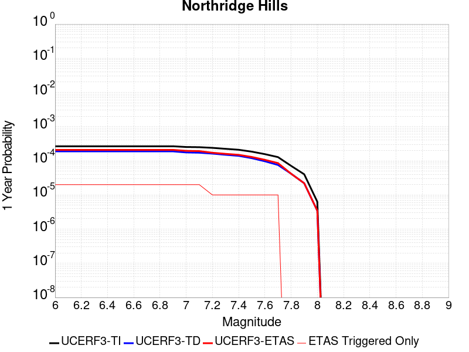 |  |

| Magnitude | 1 wk TI Prob | 1 wk TD Prob | 1 wk ETAS Prob | 1 wk ETAS/TD Gain | 1 wk ETAS Triggered Only | 1 mo TI Prob | 1 mo TD Prob | 1 mo ETAS Prob | 1 mo ETAS/TD Gain | 1 mo ETAS Triggered Only | 1 yr TI Prob | 1 yr TD Prob | 1 yr ETAS Prob | 1 yr ETAS/TD Gain | 1 yr ETAS Triggered Only | 10 yr TI Prob | 10 yr TD Prob | 10 yr ETAS Prob | 10 yr ETAS/TD Gain | 10 yr ETAS Triggered Only |
|-----|-----|-----|-----|-----|-----|-----|-----|-----|-----|-----|-----|-----|-----|-----|-----|-----|-----|-----|-----|-----|
| 6.0 | 5.095982E-6 | 3.6152098E-6 | 3.6152098E-6 | 1.0 | 0.0 | 2.183974E-5 | 1.5493664E-5 | 5.553148E-5 | 3.584141 | 4.0038438E-5 | 2.658664E-4 | 1.8861916E-4 | 2.2865004E-4 | 1.2122313 | 4.0038438E-5 | 0.0026554854 | 0.001884603 | 0.0019245661 | 1.021205 | 4.0038438E-5 |
| 6.1 | 5.095982E-6 | 3.6152098E-6 | 3.6152098E-6 | 1.0 | 0.0 | 2.183974E-5 | 1.5493664E-5 | 5.553148E-5 | 3.584141 | 4.0038438E-5 | 2.658664E-4 | 1.8861916E-4 | 2.2865004E-4 | 1.2122313 | 4.0038438E-5 | 0.0026554854 | 0.001884603 | 0.0019245661 | 1.021205 | 4.0038438E-5 |
| 6.2 | 5.095982E-6 | 3.6152098E-6 | 3.6152098E-6 | 1.0 | 0.0 | 2.183974E-5 | 1.5493664E-5 | 5.553148E-5 | 3.584141 | 4.0038438E-5 | 2.658664E-4 | 1.8861916E-4 | 2.2865004E-4 | 1.2122313 | 4.0038438E-5 | 0.0026554854 | 0.001884603 | 0.0019245661 | 1.021205 | 4.0038438E-5 |
| 6.3 | 5.095982E-6 | 3.6152098E-6 | 3.6152098E-6 | 1.0 | 0.0 | 2.183974E-5 | 1.5493664E-5 | 5.553148E-5 | 3.584141 | 4.0038438E-5 | 2.658664E-4 | 1.8861916E-4 | 2.2865004E-4 | 1.2122313 | 4.0038438E-5 | 0.0026554854 | 0.001884603 | 0.0019245661 | 1.021205 | 4.0038438E-5 |
| 6.4 | 5.095982E-6 | 3.6152098E-6 | 3.6152098E-6 | 1.0 | 0.0 | 2.183974E-5 | 1.5493664E-5 | 5.553148E-5 | 3.584141 | 4.0038438E-5 | 2.658664E-4 | 1.8861916E-4 | 2.2865004E-4 | 1.2122313 | 4.0038438E-5 | 0.0026554854 | 0.001884603 | 0.0019245661 | 1.021205 | 4.0038438E-5 |
| 6.5 | 5.095982E-6 | 3.6152098E-6 | 3.6152098E-6 | 1.0 | 0.0 | 2.183974E-5 | 1.5493664E-5 | 5.553148E-5 | 3.584141 | 4.0038438E-5 | 2.658664E-4 | 1.8861916E-4 | 2.2865004E-4 | 1.2122313 | 4.0038438E-5 | 0.0026554854 | 0.001884603 | 0.0019245661 | 1.021205 | 4.0038438E-5 |
| 6.6 | 5.095982E-6 | 3.6152098E-6 | 3.6152098E-6 | 1.0 | 0.0 | 2.183974E-5 | 1.5493664E-5 | 5.553148E-5 | 3.584141 | 4.0038438E-5 | 2.658664E-4 | 1.8861916E-4 | 2.2865004E-4 | 1.2122313 | 4.0038438E-5 | 0.0026554854 | 0.001884603 | 0.0019245661 | 1.021205 | 4.0038438E-5 |
| 6.7 | 5.095982E-6 | 3.6152098E-6 | 3.6152098E-6 | 1.0 | 0.0 | 2.183974E-5 | 1.5493664E-5 | 5.553148E-5 | 3.584141 | 4.0038438E-5 | 2.658664E-4 | 1.8861916E-4 | 2.2865004E-4 | 1.2122313 | 4.0038438E-5 | 0.0026554854 | 0.001884603 | 0.0019245661 | 1.021205 | 4.0038438E-5 |
| 6.8 | 5.095982E-6 | 3.6152098E-6 | 3.6152098E-6 | 1.0 | 0.0 | 2.183974E-5 | 1.5493664E-5 | 5.553148E-5 | 3.584141 | 4.0038438E-5 | 2.658664E-4 | 1.8861916E-4 | 2.2865004E-4 | 1.2122313 | 4.0038438E-5 | 0.0026554854 | 0.001884603 | 0.0019245661 | 1.021205 | 4.0038438E-5 |
| 6.9 | 5.0942654E-6 | 3.6134247E-6 | 3.6134247E-6 | 1.0 | 0.0 | 2.1832384E-5 | 1.5486015E-5 | 5.5523833E-5 | 3.5854177 | 4.0038438E-5 | 2.6577685E-4 | 1.8852603E-4 | 2.2855692E-4 | 1.2123362 | 4.0038438E-5 | 0.002654592 | 0.0018836735 | 0.0019236364 | 1.0212154 | 4.0038438E-5 |
| 7.0 | 4.851143E-6 | 3.3587396E-6 | 3.3587396E-6 | 1.0 | 0.0 | 2.0790447E-5 | 1.4394519E-5 | 5.443238E-5 | 3.7814655 | 4.0038438E-5 | 2.5309427E-4 | 1.7523921E-4 | 2.1527064E-4 | 1.2284387 | 4.0038438E-5 | 0.0025280623 | 0.0017510147 | 0.0017909831 | 1.0228258 | 4.0038438E-5 |
| 7.1 | 4.7910607E-6 | 3.2970208E-6 | 3.2970208E-6 | 1.0 | 0.0 | 2.0532956E-5 | 1.4130013E-5 | 5.4167886E-5 | 3.833534 | 4.0038438E-5 | 2.4996005E-4 | 1.7201937E-4 | 2.1205092E-4 | 1.2327154 | 4.0038438E-5 | 0.0024967908 | 0.0017188663 | 0.0017588359 | 1.0232534 | 4.0038438E-5 |
| 7.2 | 4.580079E-6 | 3.1067987E-6 | 3.1067987E-6 | 1.0 | 0.0 | 1.9628762E-5 | 1.3314784E-5 | 1.3314784E-5 | 1.0 | 0.0 | 2.3895396E-4 | 1.6209547E-4 | 1.6209547E-4 | 1.0 | 0.0 | 0.0023869718 | 0.0016197758 | 0.0016197758 | 1.0 | 0.0 |
| 7.3 | 4.290062E-6 | 2.8682275E-6 | 2.8682275E-6 | 1.0 | 0.0 | 1.838585E-5 | 1.2292346E-5 | 1.2292346E-5 | 1.0 | 0.0 | 2.2382473E-4 | 1.4964906E-4 | 1.4964906E-4 | 1.0 | 0.0 | 0.0022359942 | 0.0014954859 | 0.0014954859 | 1.0 | 0.0 |
| 7.4 | 4.0259683E-6 | 2.673904E-6 | 2.673904E-6 | 1.0 | 0.0 | 1.7254037E-5 | 1.1459538E-5 | 1.1459538E-5 | 1.0 | 0.0 | 2.1004764E-4 | 1.3951097E-4 | 1.3951097E-4 | 1.0 | 0.0 | 0.002098492 | 0.0013942367 | 0.0013942367 | 1.0 | 0.0 |
| 7.5 | 3.5477108E-6 | 2.285216E-6 | 2.285216E-6 | 1.0 | 0.0 | 1.5204386E-5 | 9.793746E-6 | 9.793746E-6 | 1.0 | 0.0 | 1.8509767E-4 | 1.1923235E-4 | 1.1923235E-4 | 1.0 | 0.0 | 0.0018494357 | 0.0011916853 | 0.0011916853 | 1.0 | 0.0 |
| 7.6 | 2.9990608E-6 | 1.8528339E-6 | 1.8528339E-6 | 1.0 | 0.0 | 1.2853055E-5 | 7.940693E-6 | 7.940693E-6 | 1.0 | 0.0 | 1.564747E-4 | 9.667365E-5 | 9.667365E-5 | 1.0 | 0.0 | 0.0015636457 | 9.663168E-4 | 9.663168E-4 | 1.0 | 0.0 |
| 7.7 | 2.4542855E-6 | 1.4461344E-6 | 1.4461344E-6 | 1.0 | 0.0 | 1.05183235E-5 | 6.197704E-6 | 6.197704E-6 | 1.0 | 0.0 | 1.2805307E-4 | 7.545444E-5 | 7.545444E-5 | 1.0 | 0.0 | 0.001279793 | 7.5428875E-4 | 7.5428875E-4 | 1.0 | 0.0 |
| 7.8 | 1.3623128E-6 | 8.016168E-7 | 8.016168E-7 | 1.0 | 0.0 | 5.8384703E-6 | 3.4354962E-6 | 3.4354962E-6 | 1.0 | 0.0 | 7.108106E-5 | 4.1826366E-5 | 4.1826366E-5 | 1.0 | 0.0 | 7.1058323E-4 | 4.1818514E-4 | 4.1818514E-4 | 1.0 | 0.0 |
| 7.9 | 7.716622E-7 | 4.218757E-7 | 4.218757E-7 | 1.0 | 0.0 | 3.3071194E-6 | 1.8080375E-6 | 1.8080375E-6 | 1.0 | 0.0 | 4.0263436E-5 | 2.2012635E-5 | 2.2012635E-5 | 1.0 | 0.0 | 4.0256142E-4 | 2.2010466E-4 | 2.2010466E-4 | 1.0 | 0.0 |
| 8.0 | 1.2117711E-7 | 6.6220565E-8 | 6.6220565E-8 | 1.0 | 0.0 | 5.1933034E-7 | 2.838024E-7 | 2.838024E-7 | 1.0 | 0.0 | 6.3228285E-6 | 3.4552888E-6 | 3.4552888E-6 | 1.0 | 0.0 | 6.3226486E-5 | 3.455237E-5 | 3.455237E-5 | 1.0 | 0.0 |

## San Andreas (Santa Cruz Mts) 2011 CFM
*[(top)](#table-of-contents)*

| 1 Week | 1 Month | 1 Year | 10 Year |
|-----|-----|-----|-----|
| 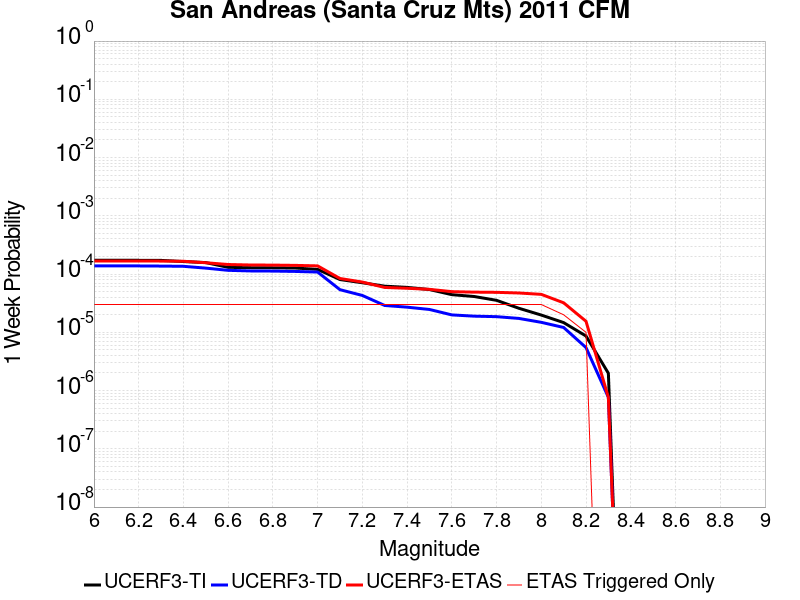 |  |  |  |

| Magnitude | 1 wk TI Prob | 1 wk TD Prob | 1 wk ETAS Prob | 1 wk ETAS/TD Gain | 1 wk ETAS Triggered Only | 1 mo TI Prob | 1 mo TD Prob | 1 mo ETAS Prob | 1 mo ETAS/TD Gain | 1 mo ETAS Triggered Only | 1 yr TI Prob | 1 yr TD Prob | 1 yr ETAS Prob | 1 yr ETAS/TD Gain | 1 yr ETAS Triggered Only | 10 yr TI Prob | 10 yr TD Prob | 10 yr ETAS Prob | 10 yr ETAS/TD Gain | 10 yr ETAS Triggered Only |
|-----|-----|-----|-----|-----|-----|-----|-----|-----|-----|-----|-----|-----|-----|-----|-----|-----|-----|-----|-----|-----|
| 6.0 | 1.7221631E-4 | 1.3793171E-4 | 1.3793171E-4 | 1.0 | 0.0 | 7.378611E-4 | 5.9100403E-4 | 6.310188E-4 | 1.0677065 | 4.0038438E-5 | 0.008946515 | 0.007172124 | 0.007211875 | 1.0055425 | 4.0038438E-5 | 0.08594794 | 0.0705551 | 0.07059231 | 1.0005274 | 4.0038438E-5 |
| 6.1 | 1.7221631E-4 | 1.3793171E-4 | 1.3793171E-4 | 1.0 | 0.0 | 7.378611E-4 | 5.9100403E-4 | 6.310188E-4 | 1.0677065 | 4.0038438E-5 | 0.008946515 | 0.007172124 | 0.007211875 | 1.0055425 | 4.0038438E-5 | 0.08594794 | 0.0705551 | 0.07059231 | 1.0005274 | 4.0038438E-5 |
| 6.2 | 1.7221631E-4 | 1.3793171E-4 | 1.3793171E-4 | 1.0 | 0.0 | 7.378611E-4 | 5.9100403E-4 | 6.310188E-4 | 1.0677065 | 4.0038438E-5 | 0.008946515 | 0.007172124 | 0.007211875 | 1.0055425 | 4.0038438E-5 | 0.08594794 | 0.0705551 | 0.07059231 | 1.0005274 | 4.0038438E-5 |
| 6.3 | 1.716926E-4 | 1.3712609E-4 | 1.3712609E-4 | 1.0 | 0.0 | 7.3561794E-4 | 5.875529E-4 | 6.275678E-4 | 1.0681044 | 4.0038438E-5 | 0.008919428 | 0.0071303817 | 0.007170134 | 1.0055752 | 4.0038438E-5 | 0.08569809 | 0.070167266 | 0.0702045 | 1.0005306 | 4.0038438E-5 |
| 6.4 | 1.6392978E-4 | 1.3588481E-4 | 1.3588481E-4 | 1.0 | 0.0 | 7.02367E-4 | 5.822355E-4 | 6.2225066E-4 | 1.0687267 | 4.0038438E-5 | 0.008517839 | 0.007066063 | 0.0071058185 | 1.0056263 | 4.0038438E-5 | 0.08198654 | 0.06940135 | 0.069438614 | 1.0005369 | 4.0038438E-5 |
| 6.5 | 1.5742714E-4 | 1.2648388E-4 | 1.2648388E-4 | 1.0 | 0.0 | 6.745133E-4 | 5.4196286E-4 | 5.819796E-4 | 1.0738367 | 4.0038438E-5 | 0.00818132 | 0.0065787593 | 0.006618534 | 1.0060459 | 4.0038438E-5 | 0.078865945 | 0.06486309 | 0.06490054 | 1.0005772 | 4.0038438E-5 |
| 6.6 | 1.3038084E-4 | 1.1588213E-4 | 1.1588213E-4 | 1.0 | 0.0 | 5.5865536E-4 | 4.9654447E-4 | 5.3656305E-4 | 1.0805941 | 4.0038438E-5 | 0.006780438 | 0.0060289134 | 0.0060687102 | 1.006601 | 4.0038438E-5 | 0.0657725 | 0.05932738 | 0.05936504 | 1.0006348 | 4.0038438E-5 |
| 6.7 | 1.2867592E-4 | 1.1314701E-4 | 1.1314701E-4 | 1.0 | 0.0 | 5.5135164E-4 | 4.8482692E-4 | 5.2484596E-4 | 1.0825429 | 4.0038438E-5 | 0.0066920654 | 0.00588703 | 0.005926833 | 1.0067611 | 4.0038438E-5 | 0.06494093 | 0.058038417 | 0.058076132 | 1.0006498 | 4.0038438E-5 |
| 6.8 | 1.2801298E-4 | 1.1252261E-4 | 1.1252261E-4 | 1.0 | 0.0 | 5.485117E-4 | 4.8215193E-4 | 5.2217103E-4 | 1.0830011 | 4.0038438E-5 | 0.0066577005 | 0.0058546383 | 0.005894442 | 1.0067987 | 4.0038438E-5 | 0.06461738 | 0.057752274 | 0.05779 | 1.0006533 | 4.0038438E-5 |
| 6.9 | 1.269149E-4 | 1.1094465E-4 | 1.1094465E-4 | 1.0 | 0.0 | 5.4380763E-4 | 4.7539172E-4 | 5.1541114E-4 | 1.0841819 | 4.0038438E-5 | 0.006600777 | 0.005772772 | 0.005812579 | 1.0068957 | 4.0038438E-5 | 0.06408122 | 0.0570241 | 0.05706185 | 1.0006621 | 4.0038438E-5 |
| 7.0 | 1.2030331E-4 | 1.0824504E-4 | 1.0824504E-4 | 1.0 | 0.0 | 5.154837E-4 | 4.638261E-4 | 5.03846E-4 | 1.086282 | 4.0038438E-5 | 0.006257969 | 0.0056326967 | 0.0056725093 | 1.0070682 | 4.0038438E-5 | 0.06084648 | 0.055696685 | 0.055734497 | 1.0006788 | 4.0038438E-5 |
| 7.1 | 8.049617E-5 | 5.3926604E-5 | 5.3926604E-5 | 1.0 | 0.0 | 3.4493793E-4 | 2.3109373E-4 | 2.711229E-4 | 1.1732162 | 4.0038438E-5 | 0.0041915346 | 0.0028099709 | 0.0028498967 | 1.0142087 | 4.0038438E-5 | 0.041133516 | 0.029618956 | 0.029657809 | 1.0013118 | 4.0038438E-5 |
| 7.2 | 7.093979E-5 | 4.2937932E-5 | 4.2937932E-5 | 1.0 | 0.0 | 3.0399222E-4 | 1.8400686E-4 | 2.2403793E-4 | 1.2175521 | 4.0038438E-5 | 0.0036948253 | 0.0022380045 | 0.0022779533 | 1.0178502 | 4.0038438E-5 | 0.03633994 | 0.023941692 | 0.02398077 | 1.0016323 | 4.0038438E-5 |
| 7.3 | 6.193693E-5 | 2.8894141E-5 | 2.8894141E-5 | 1.0 | 0.0 | 2.6541698E-4 | 1.2382616E-4 | 1.6385964E-4 | 1.3233038 | 4.0038438E-5 | 0.0032266637 | 0.0015065427 | 0.0015465209 | 1.0265363 | 4.0038438E-5 | 0.031802133 | 0.016499156 | 0.016538534 | 1.0023867 | 4.0038438E-5 |
| 7.4 | 5.906492E-5 | 2.702346E-5 | 2.702346E-5 | 1.0 | 0.0 | 2.5311083E-4 | 1.1580969E-4 | 1.5584349E-4 | 1.3456861 | 4.0038438E-5 | 0.0030772698 | 0.0014090725 | 0.0014490546 | 1.0283747 | 4.0038438E-5 | 0.030350044 | 0.015471023 | 0.015510442 | 1.002548 | 4.0038438E-5 |
| 7.5 | 5.424296E-5 | 2.4678277E-5 | 2.4678277E-5 | 1.0 | 0.0 | 2.324491E-4 | 1.05759755E-4 | 1.4579397E-4 | 1.3785391 | 4.0038438E-5 | 0.002826395 | 0.0012868657 | 0.0013268526 | 1.0310731 | 4.0038438E-5 | 0.027907165 | 0.014163188 | 0.014202659 | 1.0027869 | 4.0038438E-5 |
| 7.6 | 4.43084E-5 | 1.990431E-5 | 1.990431E-5 | 1.0 | 0.0 | 1.8987931E-4 | 8.53014E-5 | 1.2533642E-4 | 1.469336 | 4.0038438E-5 | 0.0023093296 | 0.0010380499 | 0.0010780469 | 1.0385308 | 4.0038438E-5 | 0.022854783 | 0.011412679 | 0.011452261 | 1.0034682 | 4.0038438E-5 |
| 7.7 | 4.118098E-5 | 1.8936442E-5 | 1.8936442E-5 | 1.0 | 0.0 | 1.7647797E-4 | 8.115366E-5 | 1.21188845E-4 | 1.4933257 | 4.0038438E-5 | 0.002146502 | 9.875982E-4 | 0.001027597 | 1.0405012 | 4.0038438E-5 | 0.021258866 | 0.010870468 | 0.010910071 | 1.0036432 | 4.0038438E-5 |
| 7.8 | 3.5408906E-5 | 1.856446E-5 | 1.856446E-5 | 1.0 | 0.0 | 1.5174363E-4 | 7.955955E-5 | 1.195948E-4 | 1.5032111 | 4.0038438E-5 | 0.0018459131 | 9.682073E-4 | 0.001008207 | 1.0413132 | 4.0038438E-5 | 0.018306552 | 0.010652021 | 0.0106916325 | 1.0037187 | 4.0038438E-5 |
| 7.9 | 2.5860836E-5 | 1.7315993E-5 | 1.7315993E-5 | 1.0 | 0.0 | 1.10827445E-4 | 7.420929E-5 | 1.1424476E-4 | 1.539494 | 4.0038438E-5 | 0.001348489 | 9.031238E-4 | 9.431261E-4 | 1.0442933 | 4.0038438E-5 | 0.013403354 | 0.009907599 | 0.00994724 | 1.0040011 | 4.0038438E-5 |
| 8.0 | 1.9777332E-5 | 1.4839596E-5 | 1.4839596E-5 | 1.0 | 0.0 | 8.4757245E-5 | 6.3596715E-5 | 1.0363261E-4 | 1.6295276 | 4.0038438E-5 | 0.0010314309 | 7.740152E-4 | 8.140226E-4 | 1.0516882 | 4.0038438E-5 | 0.010266567 | 0.008508967 | 0.008548666 | 1.0046654 | 4.0038438E-5 |
| 8.1 | 1.468494E-5 | 1.2107374E-5 | 1.2107374E-5 | 1.0 | 0.0 | 6.293394E-5 | 5.1887713E-5 | 9.192407E-5 | 1.7715962 | 4.0038438E-5 | 7.6595135E-4 | 6.3155E-4 | 6.7156315E-4 | 1.0633571 | 4.0038438E-5 | 0.0076331664 | 0.006969149 | 0.0070089083 | 1.005705 | 4.0038438E-5 |
| 8.2 | 8.63836E-6 | 5.469061E-6 | 5.469061E-6 | 1.0 | 0.0 | 3.7021015E-5 | 2.3438623E-5 | 2.3438623E-5 | 1.0 | 0.0 | 4.5063766E-4 | 2.8532793E-4 | 2.8532793E-4 | 1.0 | 0.0 | 0.004497249 | 0.00324569 | 0.00324569 | 1.0 | 0.0 |
| 8.3 | 1.983087E-6 | 7.6599065E-7 | 7.6599065E-7 | 1.0 | 0.0 | 8.498917E-6 | 3.282813E-6 | 3.282813E-6 | 1.0 | 0.0 | 1.034694E-4 | 3.9967534E-5 | 3.9967534E-5 | 1.0 | 0.0 | 0.0010342124 | 4.719687E-4 | 4.719687E-4 | 1.0 | 0.0 |

## Chino alt 1
*[(top)](#table-of-contents)*

| 1 Week | 1 Month | 1 Year | 10 Year |
|-----|-----|-----|-----|
|  |  |  |  |

| Magnitude | 1 wk TI Prob | 1 wk TD Prob | 1 wk ETAS Prob | 1 wk ETAS/TD Gain | 1 wk ETAS Triggered Only | 1 mo TI Prob | 1 mo TD Prob | 1 mo ETAS Prob | 1 mo ETAS/TD Gain | 1 mo ETAS Triggered Only | 1 yr TI Prob | 1 yr TD Prob | 1 yr ETAS Prob | 1 yr ETAS/TD Gain | 1 yr ETAS Triggered Only | 10 yr TI Prob | 10 yr TD Prob | 10 yr ETAS Prob | 10 yr ETAS/TD Gain | 10 yr ETAS Triggered Only |
|-----|-----|-----|-----|-----|-----|-----|-----|-----|-----|-----|-----|-----|-----|-----|-----|-----|-----|-----|-----|-----|
| 6.0 | 3.939946E-5 | 4.8948554E-5 | 8.8985034E-5 | 1.8179297 | 4.0038438E-5 | 1.6884391E-4 | 2.097656E-4 | 2.4979564E-4 | 1.1908323 | 4.0038438E-5 | 0.0020537362 | 0.0025513945 | 0.0025913308 | 1.0156528 | 4.0038438E-5 | 0.020348595 | 0.025277847 | 0.025316874 | 1.0015439 | 4.0038438E-5 |
| 6.1 | 2.1505624E-5 | 2.6879026E-5 | 6.6916386E-5 | 2.4895391 | 4.0038438E-5 | 9.2163704E-5 | 1.1519137E-4 | 1.5522519E-4 | 1.3475419 | 4.0038438E-5 | 0.0011215154 | 0.001401664 | 0.0014416463 | 1.0285249 | 4.0038438E-5 | 0.011158722 | 0.013945141 | 0.0139846215 | 1.0028311 | 4.0038438E-5 |
| 6.2 | 2.1505624E-5 | 2.6879026E-5 | 6.6916386E-5 | 2.4895391 | 4.0038438E-5 | 9.2163704E-5 | 1.1519137E-4 | 1.5522519E-4 | 1.3475419 | 4.0038438E-5 | 0.0011215154 | 0.001401664 | 0.0014416463 | 1.0285249 | 4.0038438E-5 | 0.011158722 | 0.013945141 | 0.0139846215 | 1.0028311 | 4.0038438E-5 |
| 6.3 | 1.4290785E-5 | 1.8165128E-5 | 1.8165128E-5 | 1.0 | 0.0 | 6.1244784E-5 | 7.784848E-5 | 7.784848E-5 | 1.0 | 0.0 | 7.454001E-4 | 9.4743853E-4 | 9.4743853E-4 | 1.0 | 0.0 | 0.007429048 | 0.0094444575 | 0.0094444575 | 1.0 | 0.0 |
| 6.4 | 1.4290785E-5 | 1.8165128E-5 | 1.8165128E-5 | 1.0 | 0.0 | 6.1244784E-5 | 7.784848E-5 | 7.784848E-5 | 1.0 | 0.0 | 7.454001E-4 | 9.4743853E-4 | 9.4743853E-4 | 1.0 | 0.0 | 0.007429048 | 0.0094444575 | 0.0094444575 | 1.0 | 0.0 |
| 6.5 | 1.3017944E-5 | 1.6652088E-5 | 1.6652088E-5 | 1.0 | 0.0 | 5.5789995E-5 | 7.136439E-5 | 7.136439E-5 | 1.0 | 0.0 | 6.790315E-4 | 8.685589E-4 | 8.685589E-4 | 1.0 | 0.0 | 0.0067696036 | 0.008661949 | 0.008661949 | 1.0 | 0.0 |
| 6.6 | 9.470016E-6 | 1.2039424E-5 | 1.2039424E-5 | 1.0 | 0.0 | 4.058515E-5 | 5.1596704E-5 | 5.1596704E-5 | 1.0 | 0.0 | 4.940122E-4 | 6.280428E-4 | 6.280428E-4 | 1.0 | 0.0 | 0.004929154 | 0.0062718987 | 0.0062718987 | 1.0 | 0.0 |
| 6.7 | 8.314155E-6 | 1.0407736E-5 | 1.0407736E-5 | 1.0 | 0.0 | 3.5631605E-5 | 4.4604003E-5 | 4.4604003E-5 | 1.0 | 0.0 | 4.3372845E-4 | 5.429507E-4 | 5.429507E-4 | 1.0 | 0.0 | 0.004328829 | 0.005425775 | 0.005425775 | 1.0 | 0.0 |
| 6.8 | 3.4856364E-6 | 3.8133708E-6 | 3.8133708E-6 | 1.0 | 0.0 | 1.4938357E-5 | 1.6342927E-5 | 1.6342927E-5 | 1.0 | 0.0 | 1.8185932E-4 | 1.9895904E-4 | 1.9895904E-4 | 1.0 | 0.0 | 0.0018171056 | 0.0019894864 | 0.0019894864 | 1.0 | 0.0 |
| 6.9 | 2.2645952E-6 | 2.1529022E-6 | 2.1529022E-6 | 1.0 | 0.0 | 9.705372E-6 | 9.226692E-6 | 9.226692E-6 | 1.0 | 0.0 | 1.18156495E-4 | 1.123294E-4 | 1.123294E-4 | 1.0 | 0.0 | 0.0011809369 | 0.0011233423 | 0.0011233423 | 1.0 | 0.0 |
| 7.0 | 1.7864003E-6 | 1.5430785E-6 | 1.5430785E-6 | 1.0 | 0.0 | 7.655979E-6 | 6.613177E-6 | 6.613177E-6 | 1.0 | 0.0 | 9.3207556E-5 | 8.051251E-5 | 8.051251E-5 | 1.0 | 0.0 | 9.316847E-4 | 8.0528046E-4 | 8.0528046E-4 | 1.0 | 0.0 |
| 7.1 | 1.7315456E-6 | 1.4733511E-6 | 1.4733511E-6 | 1.0 | 0.0 | 7.420889E-6 | 6.3143466E-6 | 6.3143466E-6 | 1.0 | 0.0 | 9.034557E-5 | 7.6874516E-5 | 7.6874516E-5 | 1.0 | 0.0 | 9.0308854E-4 | 7.6891703E-4 | 7.6891703E-4 | 1.0 | 0.0 |
| 7.2 | 1.6008337E-6 | 1.3574215E-6 | 1.3574215E-6 | 1.0 | 0.0 | 6.860698E-6 | 5.817508E-6 | 5.817508E-6 | 1.0 | 0.0 | 8.352579E-5 | 7.082591E-5 | 7.082591E-5 | 1.0 | 0.0 | 8.34944E-4 | 7.0845755E-4 | 7.0845755E-4 | 1.0 | 0.0 |
| 7.3 | 1.3320939E-6 | 1.121782E-6 | 1.121782E-6 | 1.0 | 0.0 | 5.7089615E-6 | 4.807629E-6 | 4.807629E-6 | 1.0 | 0.0 | 6.9504385E-5 | 5.8531357E-5 | 5.8531357E-5 | 1.0 | 0.0 | 6.9482654E-4 | 5.8530393E-4 | 5.8530393E-4 | 1.0 | 0.0 |
| 7.4 | 1.114294E-6 | 9.237111E-7 | 9.237111E-7 | 1.0 | 0.0 | 4.775537E-6 | 3.958756E-6 | 3.958756E-6 | 1.0 | 0.0 | 5.8140613E-5 | 4.8196827E-5 | 4.8196827E-5 | 1.0 | 0.0 | 5.81254E-4 | 4.8188053E-4 | 4.8188053E-4 | 1.0 | 0.0 |
| 7.5 | 9.354081E-7 | 7.6234323E-7 | 7.6234323E-7 | 1.0 | 0.0 | 4.0088858E-6 | 3.2671815E-6 | 3.2671815E-6 | 1.0 | 0.0 | 4.8807087E-5 | 3.9777242E-5 | 3.9777242E-5 | 1.0 | 0.0 | 4.879637E-4 | 3.977046E-4 | 3.977046E-4 | 1.0 | 0.0 |
| 7.6 | 8.521771E-7 | 6.88071E-7 | 6.88071E-7 | 1.0 | 0.0 | 3.6521824E-6 | 2.9488726E-6 | 2.9488726E-6 | 1.0 | 0.0 | 4.4464414E-5 | 3.5901965E-5 | 3.5901965E-5 | 1.0 | 0.0 | 4.4455516E-4 | 3.589648E-4 | 3.589648E-4 | 1.0 | 0.0 |
| 7.7 | 2.1803626E-7 | 1.418649E-7 | 1.418649E-7 | 1.0 | 0.0 | 9.344408E-7 | 6.079923E-7 | 6.079923E-7 | 1.0 | 0.0 | 1.1376757E-5 | 7.4022914E-6 | 7.4022914E-6 | 1.0 | 0.0 | 1.13761744E-4 | 7.402141E-5 | 7.402141E-5 | 1.0 | 0.0 |

## Yorba Linda
*[(top)](#table-of-contents)*

| 1 Week | 1 Month | 1 Year | 10 Year |
|-----|-----|-----|-----|
| 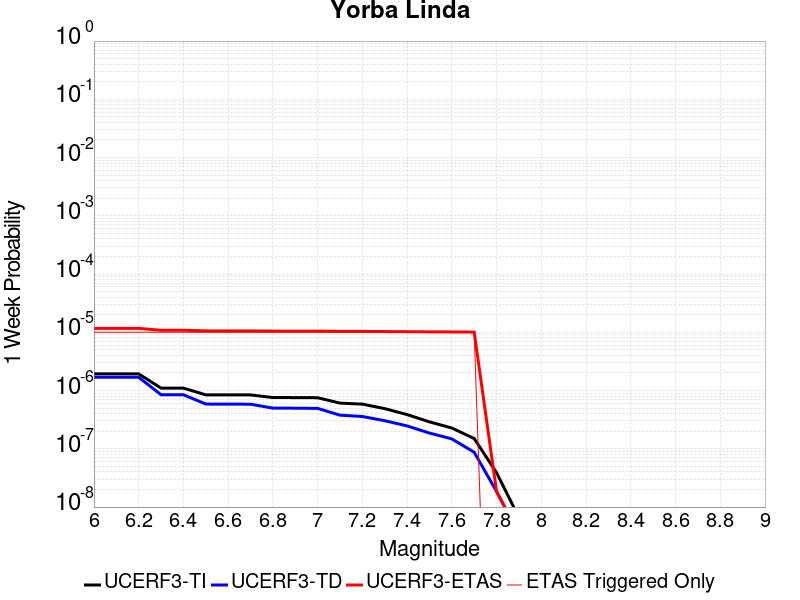 | 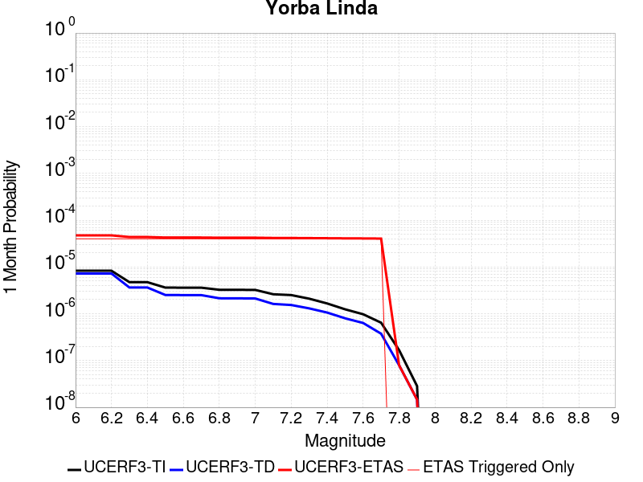 | 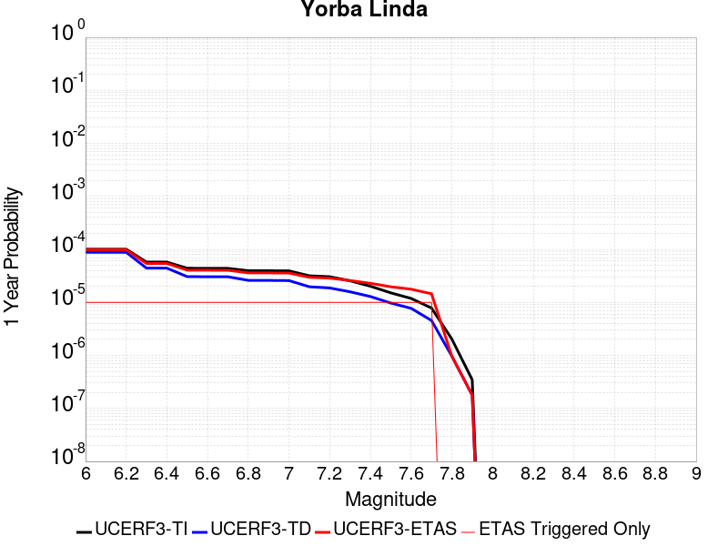 | 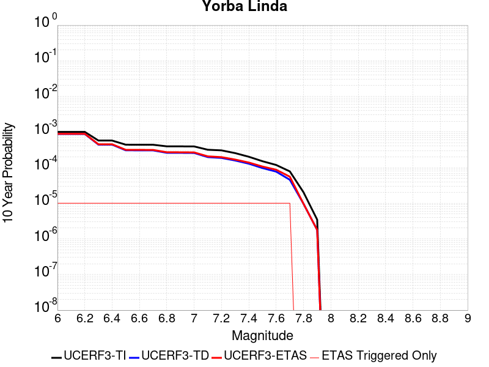 |

| Magnitude | 1 wk TI Prob | 1 wk TD Prob | 1 wk ETAS Prob | 1 wk ETAS/TD Gain | 1 wk ETAS Triggered Only | 1 mo TI Prob | 1 mo TD Prob | 1 mo ETAS Prob | 1 mo ETAS/TD Gain | 1 mo ETAS Triggered Only | 1 yr TI Prob | 1 yr TD Prob | 1 yr ETAS Prob | 1 yr ETAS/TD Gain | 1 yr ETAS Triggered Only | 10 yr TI Prob | 10 yr TD Prob | 10 yr ETAS Prob | 10 yr ETAS/TD Gain | 10 yr ETAS Triggered Only |
|-----|-----|-----|-----|-----|-----|-----|-----|-----|-----|-----|-----|-----|-----|-----|-----|-----|-----|-----|-----|-----|
| 6.0 | 1.9346849E-6 | 1.6909235E-6 | 4.1729294E-5 | 24.678404 | 4.0038438E-5 | 8.29148E-6 | 7.2468E-6 | 4.7284946E-5 | 6.5249414 | 4.0038438E-5 | 1.009441E-4 | 8.822717E-5 | 1.2826208E-4 | 1.4537708 | 4.0038438E-5 | 0.0010089825 | 8.820145E-4 | 9.220176E-4 | 1.0453542 | 4.0038438E-5 |
| 6.1 | 1.9346849E-6 | 1.6909235E-6 | 4.1729294E-5 | 24.678404 | 4.0038438E-5 | 8.29148E-6 | 7.2468E-6 | 4.7284946E-5 | 6.5249414 | 4.0038438E-5 | 1.009441E-4 | 8.822717E-5 | 1.2826208E-4 | 1.4537708 | 4.0038438E-5 | 0.0010089825 | 8.820145E-4 | 9.220176E-4 | 1.0453542 | 4.0038438E-5 |
| 6.2 | 1.9346849E-6 | 1.6909235E-6 | 4.1729294E-5 | 24.678404 | 4.0038438E-5 | 8.29148E-6 | 7.2468E-6 | 4.7284946E-5 | 6.5249414 | 4.0038438E-5 | 1.009441E-4 | 8.822717E-5 | 1.2826208E-4 | 1.4537708 | 4.0038438E-5 | 0.0010089825 | 8.820145E-4 | 9.220176E-4 | 1.0453542 | 4.0038438E-5 |
| 6.3 | 1.1028608E-6 | 8.481986E-7 | 4.08866E-5 | 48.20404 | 4.0038438E-5 | 4.7265376E-6 | 3.6351323E-6 | 4.3673423E-5 | 12.01426 | 4.0038438E-5 | 5.754407E-5 | 4.4256903E-5 | 8.429357E-5 | 1.9046422 | 4.0038438E-5 | 5.7529175E-4 | 4.4248742E-4 | 4.8250813E-4 | 1.0904449 | 4.0038438E-5 |
| 6.4 | 1.1028608E-6 | 8.481986E-7 | 4.08866E-5 | 48.20404 | 4.0038438E-5 | 4.7265376E-6 | 3.6351323E-6 | 4.3673423E-5 | 12.01426 | 4.0038438E-5 | 5.754407E-5 | 4.4256903E-5 | 8.429357E-5 | 1.9046422 | 4.0038438E-5 | 5.7529175E-4 | 4.4248742E-4 | 4.8250813E-4 | 1.0904449 | 4.0038438E-5 |
| 6.5 | 8.4451364E-7 | 5.8692325E-7 | 4.062534E-5 | 69.21746 | 4.0038438E-5 | 3.619339E-6 | 2.5153831E-6 | 4.255372E-5 | 16.91739 | 4.0038438E-5 | 4.406456E-5 | 3.0624382E-5 | 7.066159E-5 | 2.307364 | 4.0038438E-5 | 4.4055824E-4 | 3.0620373E-4 | 3.462299E-4 | 1.1307175 | 4.0038438E-5 |
| 6.6 | 8.422957E-7 | 5.8447665E-7 | 4.062289E-5 | 69.50301 | 4.0038438E-5 | 3.6098338E-6 | 2.5048976E-6 | 4.2543234E-5 | 16.98402 | 4.0038438E-5 | 4.3948843E-5 | 3.0496723E-5 | 7.053394E-5 | 2.3128366 | 4.0038438E-5 | 4.394015E-4 | 3.0492753E-4 | 3.4495376E-4 | 1.1312647 | 4.0038438E-5 |
| 6.7 | 8.4119705E-7 | 5.832608E-7 | 4.0621675E-5 | 69.64581 | 4.0038438E-5 | 3.6051254E-6 | 2.499687E-6 | 4.2538024E-5 | 17.01734 | 4.0038438E-5 | 4.3891516E-5 | 3.0433286E-5 | 7.04705E-5 | 2.3155732 | 4.0038438E-5 | 4.388285E-4 | 3.0429332E-4 | 3.443196E-4 | 1.1315384 | 4.0038438E-5 |
| 6.8 | 7.5919155E-7 | 4.995118E-7 | 4.053793E-5 | 81.1551 | 4.0038438E-5 | 3.253674E-6 | 2.1407632E-6 | 4.2179116E-5 | 19.702839 | 4.0038438E-5 | 3.961276E-5 | 2.6063499E-5 | 6.610089E-5 | 2.536148 | 4.0038438E-5 | 3.9605703E-4 | 2.6060612E-4 | 3.0063413E-4 | 1.1535958 | 4.0038438E-5 |
| 6.9 | 7.5804564E-7 | 4.981302E-7 | 4.0536546E-5 | 81.37742 | 4.0038438E-5 | 3.248763E-6 | 2.134842E-6 | 4.2173193E-5 | 19.754715 | 4.0038438E-5 | 3.955297E-5 | 2.5991409E-5 | 6.6028806E-5 | 2.5404088 | 4.0038438E-5 | 3.9545933E-4 | 2.598854E-4 | 2.9991343E-4 | 1.1540219 | 4.0038438E-5 |
| 7.0 | 7.539293E-7 | 4.943436E-7 | 4.053276E-5 | 81.99309 | 4.0038438E-5 | 3.2311218E-6 | 2.118614E-6 | 4.2156968E-5 | 19.89837 | 4.0038438E-5 | 3.9338196E-5 | 2.5793837E-5 | 6.583124E-5 | 2.5522082 | 4.0038438E-5 | 3.9331234E-4 | 2.5791014E-4 | 2.9793827E-4 | 1.1552018 | 4.0038438E-5 |
| 7.1 | 6.0900885E-7 | 3.781838E-7 | 4.0416606E-5 | 106.87027 | 4.0038438E-5 | 2.6100352E-6 | 1.6207867E-6 | 4.1659157E-5 | 25.703049 | 4.0038438E-5 | 3.1776715E-5 | 1.9732903E-5 | 5.977055E-5 | 3.028979 | 4.0038438E-5 | 3.1772171E-4 | 1.9731186E-4 | 2.373424E-4 | 1.2028795 | 4.0038438E-5 |
| 7.2 | 5.849925E-7 | 3.5880063E-7 | 4.0397223E-5 | 112.58961 | 4.0038438E-5 | 2.5071083E-6 | 1.5377161E-6 | 4.157609E-5 | 27.03756 | 4.0038438E-5 | 3.0523614E-5 | 1.8721537E-5 | 5.8759222E-5 | 3.1385899 | 4.0038438E-5 | 3.0519423E-4 | 1.8719993E-4 | 2.2723086E-4 | 1.2138406 | 4.0038438E-5 |
| 7.3 | 4.89808E-7 | 3.038045E-7 | 4.034223E-5 | 132.79008 | 4.0038438E-5 | 2.0991754E-6 | 1.3020187E-6 | 4.1340405E-5 | 31.751005 | 4.0038438E-5 | 2.5557161E-5 | 1.5851965E-5 | 5.5889766E-5 | 3.525731 | 4.0038438E-5 | 2.5554223E-4 | 1.5850857E-4 | 1.9854067E-4 | 1.2525548 | 4.0038438E-5 |
| 7.4 | 3.8700415E-7 | 2.4723E-7 | 4.0285657E-5 | 162.94809 | 4.0038438E-5 | 1.6585881E-6 | 1.0595568E-6 | 4.1097952E-5 | 38.787872 | 4.0038438E-5 | 2.0193123E-5 | 1.2900028E-5 | 5.2937947E-5 | 4.103708 | 4.0038438E-5 | 2.0191289E-4 | 1.2899292E-4 | 1.690262E-4 | 1.3103524 | 4.0038438E-5 |
| 7.5 | 2.900565E-7 | 1.8637812E-7 | 4.0224808E-5 | 215.82367 | 4.0038438E-5 | 1.2430987E-6 | 7.987631E-7 | 4.0837167E-5 | 51.125507 | 4.0038438E-5 | 1.5134622E-5 | 9.7248985E-6 | 4.9762944E-5 | 5.117066 | 4.0038438E-5 | 1.5133592E-4 | 9.724481E-5 | 1.3727935E-4 | 1.4116882 | 4.0038438E-5 |
| 7.6 | 2.2770318E-7 | 1.4814457E-7 | 4.0186576E-5 | 271.26593 | 4.0038438E-5 | 9.758704E-7 | 6.349051E-7 | 4.0673316E-5 | 64.06204 | 4.0038438E-5 | 1.1881158E-5 | 7.729943E-6 | 4.776807E-5 | 6.179615 | 4.0038438E-5 | 1.1880523E-4 | 7.729679E-5 | 1.17332136E-4 | 1.5179431 | 4.0038438E-5 |
| 7.7 | 1.5017194E-7 | 8.735719E-8 | 4.012579E-5 | 459.33014 | 4.0038438E-5 | 6.4359386E-7 | 3.743879E-7 | 4.041281E-5 | 107.94369 | 4.0038438E-5 | 7.835727E-6 | 4.5581633E-6 | 4.4596418E-5 | 9.783856 | 4.0038438E-5 | 7.835451E-5 | 4.5580728E-5 | 8.5617336E-5 | 1.8783672 | 4.0038438E-5 |
| 7.8 | 3.895753E-8 | 1.8533399E-8 | 1.8533399E-8 | 1.0 | 0.0 | 1.6696083E-7 | 7.9428844E-8 | 7.9428844E-8 | 1.0 | 0.0 | 2.0327461E-6 | 9.670458E-7 | 9.670458E-7 | 1.0 | 0.0 | 2.0327276E-5 | 9.670418E-6 | 9.670418E-6 | 1.0 | 0.0 |
| 7.9 | 6.648505E-9 | 3.4184469E-9 | 3.4184469E-9 | 1.0 | 0.0 | 2.8493591E-8 | 1.4650486E-8 | 1.4650486E-8 | 1.0 | 0.0 | 3.4690942E-7 | 1.7836966E-7 | 1.7836966E-7 | 1.0 | 0.0 | 3.4690888E-6 | 1.7836953E-6 | 1.7836953E-6 | 1.0 | 0.0 |

## Honey Lake 2011 CFM
*[(top)](#table-of-contents)*

| 1 Week | 1 Month | 1 Year | 10 Year |
|-----|-----|-----|-----|
|  |  |  | 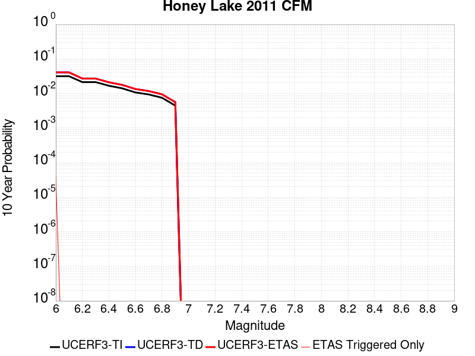 |

| Magnitude | 1 wk TI Prob | 1 wk TD Prob | 1 wk ETAS Prob | 1 wk ETAS/TD Gain | 1 wk ETAS Triggered Only | 1 mo TI Prob | 1 mo TD Prob | 1 mo ETAS Prob | 1 mo ETAS/TD Gain | 1 mo ETAS Triggered Only | 1 yr TI Prob | 1 yr TD Prob | 1 yr ETAS Prob | 1 yr ETAS/TD Gain | 1 yr ETAS Triggered Only | 10 yr TI Prob | 10 yr TD Prob | 10 yr ETAS Prob | 10 yr ETAS/TD Gain | 10 yr ETAS Triggered Only |
|-----|-----|-----|-----|-----|-----|-----|-----|-----|-----|-----|-----|-----|-----|-----|-----|-----|-----|-----|-----|-----|
| 6.0 | 6.155506E-5 | 7.954667E-5 | 7.954667E-5 | 1.0 | 0.0 | 2.6378073E-4 | 3.40873E-4 | 3.40873E-4 | 1.0 | 0.0 | 0.0032068014 | 0.0041427943 | 0.0041427943 | 1.0 | 0.0 | 0.03160919 | 0.040702924 | 0.040741332 | 1.0009437 | 4.0038438E-5 |
| 6.1 | 6.155506E-5 | 7.954667E-5 | 7.954667E-5 | 1.0 | 0.0 | 2.6378073E-4 | 3.40873E-4 | 3.40873E-4 | 1.0 | 0.0 | 0.0032068014 | 0.0041427943 | 0.0041427943 | 1.0 | 0.0 | 0.03160919 | 0.040702924 | 0.040702924 | 1.0 | 0.0 |
| 6.2 | 4.1335024E-5 | 5.257629E-5 | 5.257629E-5 | 1.0 | 0.0 | 1.7713808E-4 | 2.253086E-4 | 2.253086E-4 | 1.0 | 0.0 | 0.0021545228 | 0.0027398595 | 0.0027398595 | 1.0 | 0.0 | 0.021337535 | 0.027076708 | 0.027076708 | 1.0 | 0.0 |
| 6.3 | 4.1335024E-5 | 5.257629E-5 | 5.257629E-5 | 1.0 | 0.0 | 1.7713808E-4 | 2.253086E-4 | 2.253086E-4 | 1.0 | 0.0 | 0.0021545228 | 0.0027398595 | 0.0027398595 | 1.0 | 0.0 | 0.021337535 | 0.027076708 | 0.027076708 | 1.0 | 0.0 |
| 6.4 | 3.2393702E-5 | 4.0887444E-5 | 4.0887444E-5 | 1.0 | 0.0 | 1.3882275E-4 | 1.7522085E-4 | 1.7522085E-4 | 1.0 | 0.0 | 0.0016888566 | 0.002131335 | 0.002131335 | 1.0 | 0.0 | 0.016760793 | 0.02111982 | 0.02111982 | 1.0 | 0.0 |
| 6.5 | 2.7205504E-5 | 3.4211684E-5 | 3.4211684E-5 | 1.0 | 0.0 | 1.1658981E-4 | 1.4661385E-4 | 1.4661385E-4 | 1.0 | 0.0 | 0.0014185566 | 0.0017836588 | 0.0017836588 | 1.0 | 0.0 | 0.014095354 | 0.017702932 | 0.017702932 | 1.0 | 0.0 |
| 6.6 | 2.069265E-5 | 2.5955307E-5 | 2.5955307E-5 | 1.0 | 0.0 | 8.867977E-5 | 1.1123277E-4 | 1.1123277E-4 | 1.0 | 0.0 | 0.0010791414 | 0.0013535038 | 0.0013535038 | 1.0 | 0.0 | 0.010739161 | 0.013461002 | 0.013461002 | 1.0 | 0.0 |
| 6.7 | 1.8060919E-5 | 2.2656828E-5 | 2.2656828E-5 | 1.0 | 0.0 | 7.7401644E-5 | 9.709754E-5 | 9.709754E-5 | 1.0 | 0.0 | 9.419576E-4 | 0.0011816026 | 0.0011816026 | 1.0 | 0.0 | 0.009379748 | 0.011761238 | 0.011761238 | 1.0 | 0.0 |
| 6.8 | 1.4474663E-5 | 1.818127E-5 | 1.818127E-5 | 1.0 | 0.0 | 6.203279E-5 | 7.791784E-5 | 7.791784E-5 | 1.0 | 0.0 | 7.5498753E-4 | 9.483136E-4 | 9.483136E-4 | 1.0 | 0.0 | 0.007524277 | 0.009450192 | 0.009450192 | 1.0 | 0.0 |
| 6.9 | 8.564552E-6 | 1.0802308E-5 | 1.0802308E-5 | 1.0 | 0.0 | 3.6704707E-5 | 4.6295158E-5 | 4.6295158E-5 | 1.0 | 0.0 | 4.4678818E-4 | 5.635644E-4 | 5.635644E-4 | 1.0 | 0.0 | 0.0044589094 | 0.0056278477 | 0.0056278477 | 1.0 | 0.0 |

## San Juan
*[(top)](#table-of-contents)*

| 1 Week | 1 Month | 1 Year | 10 Year |
|-----|-----|-----|-----|
|  |  |  |  |

| Magnitude | 1 wk TI Prob | 1 wk TD Prob | 1 wk ETAS Prob | 1 wk ETAS/TD Gain | 1 wk ETAS Triggered Only | 1 mo TI Prob | 1 mo TD Prob | 1 mo ETAS Prob | 1 mo ETAS/TD Gain | 1 mo ETAS Triggered Only | 1 yr TI Prob | 1 yr TD Prob | 1 yr ETAS Prob | 1 yr ETAS/TD Gain | 1 yr ETAS Triggered Only | 10 yr TI Prob | 10 yr TD Prob | 10 yr ETAS Prob | 10 yr ETAS/TD Gain | 10 yr ETAS Triggered Only |
|-----|-----|-----|-----|-----|-----|-----|-----|-----|-----|-----|-----|-----|-----|-----|-----|-----|-----|-----|-----|-----|
| 6.0 | 8.682808E-6 | 8.7491635E-6 | 4.878725E-5 | 5.5762186 | 4.0038438E-5 | 3.72115E-5 | 3.74959E-5 | 7.753284E-5 | 2.0677683 | 4.0038438E-5 | 4.5295584E-4 | 4.564218E-4 | 4.9644196E-4 | 1.0876824 | 4.0038438E-5 | 0.004520337 | 0.004555385 | 0.004595241 | 1.0087492 | 4.0038438E-5 |
| 6.1 | 8.682808E-6 | 8.7491635E-6 | 4.878725E-5 | 5.5762186 | 4.0038438E-5 | 3.72115E-5 | 3.74959E-5 | 7.753284E-5 | 2.0677683 | 4.0038438E-5 | 4.5295584E-4 | 4.564218E-4 | 4.9644196E-4 | 1.0876824 | 4.0038438E-5 | 0.004520337 | 0.004555385 | 0.004595241 | 1.0087492 | 4.0038438E-5 |
| 6.2 | 8.682808E-6 | 8.7491635E-6 | 4.878725E-5 | 5.5762186 | 4.0038438E-5 | 3.72115E-5 | 3.74959E-5 | 7.753284E-5 | 2.0677683 | 4.0038438E-5 | 4.5295584E-4 | 4.564218E-4 | 4.9644196E-4 | 1.0876824 | 4.0038438E-5 | 0.004520337 | 0.004555385 | 0.004595241 | 1.0087492 | 4.0038438E-5 |
| 6.3 | 6.3054235E-6 | 6.2825848E-6 | 6.2825848E-6 | 1.0 | 0.0 | 2.7022963E-5 | 2.6925094E-5 | 2.6925094E-5 | 1.0 | 0.0 | 3.2895492E-4 | 3.2776513E-4 | 3.2776513E-4 | 1.0 | 0.0 | 0.003284684 | 0.003273017 | 0.003273017 | 1.0 | 0.0 |
| 6.4 | 6.1490473E-6 | 6.1144656E-6 | 6.1144656E-6 | 1.0 | 0.0 | 2.6352795E-5 | 2.6204598E-5 | 2.6204598E-5 | 1.0 | 0.0 | 3.2079802E-4 | 3.1899565E-4 | 3.1899565E-4 | 1.0 | 0.0 | 0.0032033534 | 0.0031855737 | 0.0031855737 | 1.0 | 0.0 |
| 6.5 | 5.204848E-6 | 5.137233E-6 | 5.137233E-6 | 1.0 | 0.0 | 2.23063E-5 | 2.2016533E-5 | 2.2016533E-5 | 1.0 | 0.0 | 2.7154534E-4 | 2.6801927E-4 | 2.6801927E-4 | 1.0 | 0.0 | 0.0027121378 | 0.0026771144 | 0.0026771144 | 1.0 | 0.0 |
| 6.6 | 4.5179986E-6 | 4.4150297E-6 | 4.4150297E-6 | 1.0 | 0.0 | 1.9362706E-5 | 1.8921424E-5 | 1.8921424E-5 | 1.0 | 0.0 | 2.3571544E-4 | 2.3034477E-4 | 2.3034477E-4 | 1.0 | 0.0 | 0.0023546559 | 0.0023011973 | 0.0023011973 | 1.0 | 0.0 |
| 6.7 | 3.9442616E-6 | 3.819828E-6 | 3.819828E-6 | 1.0 | 0.0 | 1.6903869E-5 | 1.6370592E-5 | 1.6370592E-5 | 1.0 | 0.0 | 2.0578515E-4 | 1.992944E-4 | 1.992944E-4 | 1.0 | 0.0 | 0.002055947 | 0.0019912818 | 0.0019912818 | 1.0 | 0.0 |
| 6.8 | 3.4536245E-6 | 3.3163353E-6 | 3.3163353E-6 | 1.0 | 0.0 | 1.4801163E-5 | 1.4212792E-5 | 1.4212792E-5 | 1.0 | 0.0 | 1.8018926E-4 | 1.7302761E-4 | 1.7302761E-4 | 1.0 | 0.0 | 0.0018004322 | 0.0017290477 | 0.0017290477 | 1.0 | 0.0 |
| 6.9 | 3.059865E-6 | 2.9120315E-6 | 2.9120315E-6 | 1.0 | 0.0 | 1.3113641E-5 | 1.2480078E-5 | 1.2480078E-5 | 1.0 | 0.0 | 1.596469E-4 | 1.5193493E-4 | 1.5193493E-4 | 1.0 | 0.0 | 0.0015953224 | 0.0015184252 | 0.0015184252 | 1.0 | 0.0 |
| 7.0 | 2.6504351E-6 | 2.4920002E-6 | 2.4920002E-6 | 1.0 | 0.0 | 1.1358958E-5 | 1.0679961E-5 | 1.0679961E-5 | 1.0 | 0.0 | 1.3828653E-4 | 1.300213E-4 | 1.300213E-4 | 1.0 | 0.0 | 0.0013820052 | 0.0012995641 | 0.0012995641 | 1.0 | 0.0 |
| 7.1 | 2.2039317E-6 | 2.0338296E-6 | 2.0338296E-6 | 1.0 | 0.0 | 9.445387E-6 | 8.716386E-6 | 8.716386E-6 | 1.0 | 0.0 | 1.1499152E-4 | 1.0611736E-4 | 1.0611736E-4 | 1.0 | 0.0 | 0.0011493203 | 0.0010607769 | 0.0010607769 | 1.0 | 0.0 |
| 7.2 | 1.0786707E-6 | 8.7701903E-7 | 8.7701903E-7 | 1.0 | 0.0 | 4.622866E-6 | 3.7586476E-6 | 3.7586476E-6 | 1.0 | 0.0 | 5.628194E-5 | 4.5760586E-5 | 4.5760586E-5 | 1.0 | 0.0 | 5.6267687E-4 | 4.5757066E-4 | 4.5757066E-4 | 1.0 | 0.0 |
| 7.3 | 6.846433E-7 | 4.868805E-7 | 4.868805E-7 | 1.0 | 0.0 | 2.9341822E-6 | 2.086629E-6 | 2.086629E-6 | 1.0 | 0.0 | 3.5723086E-5 | 2.5404412E-5 | 2.5404412E-5 | 1.0 | 0.0 | 3.571734E-4 | 2.540486E-4 | 2.540486E-4 | 1.0 | 0.0 |
| 7.4 | 5.23043E-7 | 3.2628162E-7 | 3.2628162E-7 | 1.0 | 0.0 | 2.2416111E-6 | 1.398349E-6 | 1.398349E-6 | 1.0 | 0.0 | 2.7291273E-5 | 1.7024766E-5 | 1.7024766E-5 | 1.0 | 0.0 | 2.7287923E-4 | 1.7026656E-4 | 1.7026656E-4 | 1.0 | 0.0 |
| 7.5 | 4.648444E-7 | 2.7234944E-7 | 2.7234944E-7 | 1.0 | 0.0 | 1.9921886E-6 | 1.1672114E-6 | 1.1672114E-6 | 1.0 | 0.0 | 2.4254627E-5 | 1.42107065E-5 | 1.42107065E-5 | 1.0 | 0.0 | 2.425198E-4 | 1.421276E-4 | 1.421276E-4 | 1.0 | 0.0 |
| 7.6 | 3.9906567E-7 | 2.2083314E-7 | 2.2083314E-7 | 1.0 | 0.0 | 1.7102802E-6 | 9.464274E-7 | 9.464274E-7 | 1.0 | 0.0 | 2.0822463E-5 | 1.1522693E-5 | 1.1522693E-5 | 1.0 | 0.0 | 2.0820512E-4 | 1.15245566E-4 | 1.15245566E-4 | 1.0 | 0.0 |
| 7.7 | 1.8784601E-7 | 5.3666906E-8 | 5.3666906E-8 | 1.0 | 0.0 | 8.0505407E-7 | 2.30001E-7 | 2.30001E-7 | 1.0 | 0.0 | 9.80149E-6 | 2.8002585E-6 | 2.8002585E-6 | 1.0 | 0.0 | 9.801057E-5 | 2.8011282E-5 | 2.8011282E-5 | 1.0 | 0.0 |
| 7.8 | 1.00154914E-7 | 1.2415832E-8 | 1.2415832E-8 | 1.0 | 0.0 | 4.2923529E-7 | 5.3210716E-8 | 5.3210716E-8 | 1.0 | 0.0 | 5.225927E-6 | 6.4784024E-7 | 6.4784024E-7 | 1.0 | 0.0 | 5.225804E-5 | 6.484273E-6 | 6.484273E-6 | 1.0 | 0.0 |
| 7.9 | 6.171429E-8 | 4.2966155E-9 | 4.2966155E-9 | 1.0 | 0.0 | 2.6448978E-7 | 1.8414067E-8 | 1.8414067E-8 | 1.0 | 0.0 | 3.2201583E-6 | 2.2419121E-7 | 2.2419121E-7 | 1.0 | 0.0 | 3.2201115E-5 | 2.2472002E-6 | 2.2472002E-6 | 1.0 | 0.0 |
| 8.0 | 1.3974572E-8 | 3.3788217E-10 | 3.3788217E-10 | 1.0 | 0.0 | 5.989102E-8 | 1.448067E-9 | 1.448067E-9 | 1.0 | 0.0 | 7.2917294E-7 | 1.763022E-8 | 1.763022E-8 | 1.0 | 0.0 | 7.2917055E-6 | 1.8060365E-7 | 1.8060365E-7 | 1.0 | 0.0 |
| 8.1 | 1.8403477E-9 | 1.1302803E-10 | 1.1302803E-10 | 1.0 | 0.0 | 7.887204E-9 | 4.844063E-10 | 4.844063E-10 | 1.0 | 0.0 | 9.602671E-8 | 5.8976446E-9 | 5.8976446E-9 | 1.0 | 0.0 | 9.602667E-7 | 6.021993E-8 | 6.021993E-8 | 1.0 | 0.0 |

## San Andreas (North Coast) 2011 CFM
*[(top)](#table-of-contents)*

| 1 Week | 1 Month | 1 Year | 10 Year |
|-----|-----|-----|-----|
|  |  |  |  |

| Magnitude | 1 wk TI Prob | 1 wk TD Prob | 1 wk ETAS Prob | 1 wk ETAS/TD Gain | 1 wk ETAS Triggered Only | 1 mo TI Prob | 1 mo TD Prob | 1 mo ETAS Prob | 1 mo ETAS/TD Gain | 1 mo ETAS Triggered Only | 1 yr TI Prob | 1 yr TD Prob | 1 yr ETAS Prob | 1 yr ETAS/TD Gain | 1 yr ETAS Triggered Only | 10 yr TI Prob | 10 yr TD Prob | 10 yr ETAS Prob | 10 yr ETAS/TD Gain | 10 yr ETAS Triggered Only |
|-----|-----|-----|-----|-----|-----|-----|-----|-----|-----|-----|-----|-----|-----|-----|-----|-----|-----|-----|-----|-----|
| 6.0 | 1.5333705E-4 | 7.1106435E-5 | 7.1106435E-5 | 1.0 | 0.0 | 6.5699324E-4 | 3.0470645E-4 | 3.447327E-4 | 1.13136 | 4.0038438E-5 | 0.007969595 | 0.0037035241 | 0.0037434143 | 1.0107709 | 4.0038438E-5 | 0.0768977 | 0.03935284 | 0.039391305 | 1.0009774 | 4.0038438E-5 |
| 6.1 | 1.5333705E-4 | 7.1106435E-5 | 7.1106435E-5 | 1.0 | 0.0 | 6.5699324E-4 | 3.0470645E-4 | 3.447327E-4 | 1.13136 | 4.0038438E-5 | 0.007969595 | 0.0037035241 | 0.0037434143 | 1.0107709 | 4.0038438E-5 | 0.0768977 | 0.03935284 | 0.039391305 | 1.0009774 | 4.0038438E-5 |
| 6.2 | 1.3912938E-4 | 6.050204E-5 | 6.050204E-5 | 1.0 | 0.0 | 5.961325E-4 | 2.5926883E-4 | 2.992969E-4 | 1.1543882 | 4.0038438E-5 | 0.007233787 | 0.003152056 | 0.0031919682 | 1.0126623 | 4.0038438E-5 | 0.07002798 | 0.03369227 | 0.033730958 | 1.0011483 | 4.0038438E-5 |
| 6.3 | 1.3912938E-4 | 6.050204E-5 | 6.050204E-5 | 1.0 | 0.0 | 5.961325E-4 | 2.5926883E-4 | 2.992969E-4 | 1.1543882 | 4.0038438E-5 | 0.007233787 | 0.003152056 | 0.0031919682 | 1.0126623 | 4.0038438E-5 | 0.07002798 | 0.03369227 | 0.033730958 | 1.0011483 | 4.0038438E-5 |
| 6.4 | 1.2623647E-4 | 5.0442024E-5 | 5.0442024E-5 | 1.0 | 0.0 | 5.4090127E-4 | 2.161623E-4 | 2.5619208E-4 | 1.1851839 | 4.0038438E-5 | 0.0065656058 | 0.0026286195 | 0.0026685528 | 1.0151917 | 4.0038438E-5 | 0.06374981 | 0.028303223 | 0.028342128 | 1.0013746 | 4.0038438E-5 |
| 6.5 | 1.1736096E-4 | 4.3523814E-5 | 4.3523814E-5 | 1.0 | 0.0 | 5.028786E-4 | 1.8651738E-4 | 2.2654835E-4 | 1.2146232 | 4.0038438E-5 | 0.006105373 | 0.0022685004 | 0.0023084478 | 1.0176097 | 4.0038438E-5 | 0.05940335 | 0.024579322 | 0.024618376 | 1.001589 | 4.0038438E-5 |
| 6.6 | 1.1586959E-4 | 4.2423668E-5 | 4.2423668E-5 | 1.0 | 0.0 | 4.964894E-4 | 1.8180315E-4 | 2.218343E-4 | 1.2201896 | 4.0038438E-5 | 0.006028018 | 0.0022112224 | 0.0022511724 | 1.0180669 | 4.0038438E-5 | 0.058671024 | 0.023984991 | 0.02402407 | 1.0016292 | 4.0038438E-5 |
| 6.7 | 1.13693764E-4 | 4.073593E-5 | 4.073593E-5 | 1.0 | 0.0 | 4.87168E-4 | 1.7457096E-4 | 2.146024E-4 | 1.2293134 | 4.0038438E-5 | 0.005915152 | 0.0021233456 | 0.002163299 | 1.0188162 | 4.0038438E-5 | 0.057601593 | 0.023076393 | 0.023115506 | 1.001695 | 4.0038438E-5 |
| 6.8 | 1.1204889E-4 | 3.9953447E-5 | 3.9953447E-5 | 1.0 | 0.0 | 4.8012115E-4 | 1.7121792E-4 | 2.112495E-4 | 1.2338048 | 4.0038438E-5 | 0.005829819 | 0.002082601 | 0.002122556 | 1.0191852 | 4.0038438E-5 | 0.05679232 | 0.022636656 | 0.022675786 | 1.0017287 | 4.0038438E-5 |
| 6.9 | 1.1005794E-4 | 3.900957E-5 | 3.900957E-5 | 1.0 | 0.0 | 4.7159163E-4 | 1.6717325E-4 | 2.0720498E-4 | 1.2394626 | 4.0038438E-5 | 0.0057265228 | 0.0020334502 | 0.0020734072 | 1.0196499 | 4.0038438E-5 | 0.055811852 | 0.022102542 | 0.022141695 | 1.0017715 | 4.0038438E-5 |
| 7.0 | 1.0647948E-4 | 3.7166337E-5 | 3.7166337E-5 | 1.0 | 0.0 | 4.562608E-4 | 1.5927466E-4 | 1.9930671E-4 | 1.2513398 | 4.0038438E-5 | 0.0055408357 | 0.0019374598 | 0.0019774206 | 1.0206254 | 4.0038438E-5 | 0.054047033 | 0.021062272 | 0.021101467 | 1.001861 | 4.0038438E-5 |
| 7.1 | 1.04795035E-4 | 3.6215948E-5 | 3.6215948E-5 | 1.0 | 0.0 | 4.4904428E-4 | 1.5520205E-4 | 1.9523429E-4 | 1.2579361 | 4.0038438E-5 | 0.0054534175 | 0.0018879628 | 0.0019279257 | 1.0211672 | 4.0038438E-5 | 0.053215165 | 0.020530313 | 0.02056953 | 1.0019102 | 4.0038438E-5 |
| 7.2 | 1.02724036E-4 | 3.5124547E-5 | 3.5124547E-5 | 1.0 | 0.0 | 4.401716E-4 | 1.5052517E-4 | 1.9055758E-4 | 1.2659516 | 4.0038438E-5 | 0.0053459285 | 0.0018311188 | 0.001871084 | 1.0218256 | 4.0038438E-5 | 0.052191395 | 0.019919246 | 0.019958487 | 1.00197 | 4.0038438E-5 |
| 7.3 | 1.00650694E-4 | 3.4592013E-5 | 3.4592013E-5 | 1.0 | 0.0 | 4.312888E-4 | 1.4824314E-4 | 1.8827565E-4 | 1.2700462 | 4.0038438E-5 | 0.005238306 | 0.0018033815 | 0.0018433477 | 1.0221618 | 4.0038438E-5 | 0.051165357 | 0.019596443 | 0.019635696 | 1.0020031 | 4.0038438E-5 |
| 7.4 | 9.672919E-5 | 3.338123E-5 | 3.338123E-5 | 1.0 | 0.0 | 4.144878E-4 | 1.4305465E-4 | 1.8308737E-4 | 1.279842 | 4.0038438E-5 | 0.005034718 | 0.0017403142 | 0.0017802829 | 1.0229664 | 4.0038438E-5 | 0.049221683 | 0.018869769 | 0.018909052 | 1.0020818 | 4.0038438E-5 |
| 7.5 | 8.7600405E-5 | 2.2700917E-5 | 2.2700917E-5 | 1.0 | 0.0 | 3.753763E-4 | 9.728602E-5 | 1.3732056E-4 | 1.4115138 | 4.0038438E-5 | 0.0045606326 | 0.0011838155 | 0.0012238065 | 1.0337815 | 4.0038438E-5 | 0.04468165 | 0.013130207 | 0.01316972 | 1.0030093 | 4.0038438E-5 |
| 7.6 | 7.9562284E-5 | 1.9226305E-5 | 1.9226305E-5 | 1.0 | 0.0 | 3.4093665E-4 | 8.239586E-5 | 1.22431E-4 | 1.4858878 | 4.0038438E-5 | 0.0041430052 | 0.0010027094 | 0.0010427077 | 1.0398902 | 4.0038438E-5 | 0.040666126 | 0.011221658 | 0.011261247 | 1.0035279 | 4.0038438E-5 |
| 7.7 | 6.3866544E-5 | 1.1941707E-5 | 1.1941707E-5 | 1.0 | 0.0 | 2.7368503E-4 | 5.117774E-5 | 9.1214126E-5 | 1.7823008 | 4.0038438E-5 | 0.0033270244 | 6.2291115E-4 | 6.629246E-4 | 1.0642363 | 4.0038438E-5 | 0.032776527 | 0.007210334 | 0.0072500836 | 1.0055128 | 4.0038438E-5 |
| 7.8 | 4.2543215E-5 | 9.076524E-6 | 9.076524E-6 | 1.0 | 0.0 | 1.8231533E-4 | 3.8898812E-5 | 7.893569E-5 | 2.029257 | 4.0038438E-5 | 0.0022174292 | 4.7349022E-4 | 5.135097E-4 | 1.0845202 | 4.0038438E-5 | 0.021954332 | 0.005490525 | 0.005530344 | 1.0072522 | 4.0038438E-5 |
| 7.9 | 2.2636612E-5 | 7.81435E-6 | 7.81435E-6 | 1.0 | 0.0 | 9.7010445E-5 | 3.3489643E-5 | 7.352674E-5 | 2.1955068 | 4.0038438E-5 | 0.0011804621 | 4.076602E-4 | 4.476823E-4 | 1.0981752 | 4.0038438E-5 | 0.011742111 | 0.0046832846 | 0.0047231354 | 1.0085092 | 4.0038438E-5 |
| 8.0 | 1.5167874E-5 | 7.0494675E-6 | 7.0494675E-6 | 1.0 | 0.0 | 6.500356E-5 | 3.0211655E-5 | 7.024888E-5 | 2.3252246 | 4.0038438E-5 | 7.9113094E-4 | 3.677649E-4 | 4.077886E-4 | 1.1088296 | 4.0038438E-5 | 0.007883203 | 0.004215588 | 0.0042554573 | 1.0094577 | 4.0038438E-5 |
| 8.1 | 1.0681047E-5 | 6.386992E-6 | 6.386992E-6 | 1.0 | 0.0 | 4.5775112E-5 | 2.7372536E-5 | 6.740988E-5 | 2.462683 | 4.0038438E-5 | 5.5716943E-4 | 3.3320975E-4 | 3.7323486E-4 | 1.1201198 | 4.0038438E-5 | 0.0055577457 | 0.003817393 | 0.0038572785 | 1.0104483 | 4.0038438E-5 |
| 8.2 | 8.226114E-6 | 5.1150587E-6 | 5.1150587E-6 | 1.0 | 0.0 | 3.52543E-5 | 2.1921496E-5 | 2.1921496E-5 | 1.0 | 0.0 | 4.2913653E-4 | 2.668616E-4 | 2.668616E-4 | 1.0 | 0.0 | 0.004283088 | 0.0030450926 | 0.0030450926 | 1.0 | 0.0 |
| 8.3 | 1.983087E-6 | 7.6599065E-7 | 7.6599065E-7 | 1.0 | 0.0 | 8.498917E-6 | 3.282813E-6 | 3.282813E-6 | 1.0 | 0.0 | 1.034694E-4 | 3.9967534E-5 | 3.9967534E-5 | 1.0 | 0.0 | 0.0010342124 | 4.719687E-4 | 4.719687E-4 | 1.0 | 0.0 |

## Ortigalita (South)
*[(top)](#table-of-contents)*

| 1 Week | 1 Month | 1 Year | 10 Year |
|-----|-----|-----|-----|
|  |  |  |  |

| Magnitude | 1 wk TI Prob | 1 wk TD Prob | 1 wk ETAS Prob | 1 wk ETAS/TD Gain | 1 wk ETAS Triggered Only | 1 mo TI Prob | 1 mo TD Prob | 1 mo ETAS Prob | 1 mo ETAS/TD Gain | 1 mo ETAS Triggered Only | 1 yr TI Prob | 1 yr TD Prob | 1 yr ETAS Prob | 1 yr ETAS/TD Gain | 1 yr ETAS Triggered Only | 10 yr TI Prob | 10 yr TD Prob | 10 yr ETAS Prob | 10 yr ETAS/TD Gain | 10 yr ETAS Triggered Only |
|-----|-----|-----|-----|-----|-----|-----|-----|-----|-----|-----|-----|-----|-----|-----|-----|-----|-----|-----|-----|-----|
| 6.0 | 3.72394E-5 | 4.325562E-5 | 8.3292325E-5 | 1.925584 | 4.0038438E-5 | 1.5958765E-4 | 1.8536893E-4 | 2.2539994E-4 | 1.2159532 | 4.0038438E-5 | 0.0019412481 | 0.0022546875 | 0.0022946356 | 1.0177178 | 4.0038438E-5 | 0.019243775 | 0.022334497 | 0.02237364 | 1.0017526 | 4.0038438E-5 |
| 6.1 | 2.7299884E-5 | 3.149204E-5 | 3.149204E-5 | 1.0 | 0.0 | 1.16994255E-4 | 1.3495922E-4 | 1.3495922E-4 | 1.0 | 0.0 | 0.0014234743 | 0.0016419457 | 0.0016419457 | 1.0 | 0.0 | 0.014143906 | 0.01630407 | 0.01630407 | 1.0 | 0.0 |
| 6.2 | 2.7299884E-5 | 3.149204E-5 | 3.149204E-5 | 1.0 | 0.0 | 1.16994255E-4 | 1.3495922E-4 | 1.3495922E-4 | 1.0 | 0.0 | 0.0014234743 | 0.0016419457 | 0.0016419457 | 1.0 | 0.0 | 0.014143906 | 0.01630407 | 0.01630407 | 1.0 | 0.0 |
| 6.3 | 2.0546433E-5 | 2.363145E-5 | 2.363145E-5 | 1.0 | 0.0 | 8.805317E-5 | 1.0127382E-4 | 1.0127382E-4 | 1.0 | 0.0 | 0.00107152 | 0.0012323303 | 0.0012323303 | 1.0 | 0.0 | 0.010663681 | 0.01225703 | 0.01225703 | 1.0 | 0.0 |
| 6.4 | 2.0546433E-5 | 2.363145E-5 | 2.363145E-5 | 1.0 | 0.0 | 8.805317E-5 | 1.0127382E-4 | 1.0127382E-4 | 1.0 | 0.0 | 0.00107152 | 0.0012323303 | 0.0012323303 | 1.0 | 0.0 | 0.010663681 | 0.01225703 | 0.01225703 | 1.0 | 0.0 |
| 6.5 | 1.7779594E-5 | 2.0446974E-5 | 2.0446974E-5 | 1.0 | 0.0 | 7.619603E-5 | 8.762702E-5 | 8.762702E-5 | 1.0 | 0.0 | 9.272918E-4 | 0.0010663504 | 0.0010663504 | 1.0 | 0.0 | 0.009234319 | 0.010613803 | 0.010613803 | 1.0 | 0.0 |
| 6.6 | 1.6272212E-5 | 1.8714967E-5 | 1.8714967E-5 | 1.0 | 0.0 | 6.973618E-5 | 8.0204605E-5 | 8.0204605E-5 | 1.0 | 0.0 | 8.487073E-4 | 9.760658E-4 | 9.760658E-4 | 1.0 | 0.0 | 0.008454733 | 0.009719091 | 0.009719091 | 1.0 | 0.0 |
| 6.7 | 1.3051484E-5 | 1.5038758E-5 | 1.5038758E-5 | 1.0 | 0.0 | 5.593373E-5 | 6.445028E-5 | 6.445028E-5 | 1.0 | 0.0 | 6.807804E-4 | 7.844092E-4 | 7.844092E-4 | 1.0 | 0.0 | 0.006786986 | 0.007817388 | 0.007817388 | 1.0 | 0.0 |
| 6.8 | 1.04277415E-5 | 1.1987235E-5 | 1.1987235E-5 | 1.0 | 0.0 | 4.4689557E-5 | 5.1372896E-5 | 5.1372896E-5 | 1.0 | 0.0 | 5.439595E-4 | 6.2529295E-4 | 6.2529295E-4 | 1.0 | 0.0 | 0.0054262993 | 0.00623609 | 0.00623609 | 1.0 | 0.0 |
| 6.9 | 7.639968E-6 | 8.791503E-6 | 8.791503E-6 | 1.0 | 0.0 | 3.274231E-5 | 3.767736E-5 | 3.767736E-5 | 1.0 | 0.0 | 3.9856473E-4 | 4.586312E-4 | 4.586312E-4 | 1.0 | 0.0 | 0.003978506 | 0.004577433 | 0.004577433 | 1.0 | 0.0 |
| 7.0 | 3.919831E-6 | 4.5334014E-6 | 4.5334014E-6 | 1.0 | 0.0 | 1.679917E-5 | 1.942873E-5 | 1.942873E-5 | 1.0 | 0.0 | 2.045107E-4 | 2.3652123E-4 | 2.3652123E-4 | 1.0 | 0.0 | 0.0020432258 | 0.0023629034 | 0.0023629034 | 1.0 | 0.0 |
| 7.1 | 1.6017933E-6 | 1.8570418E-6 | 1.8570418E-6 | 1.0 | 0.0 | 6.8648105E-6 | 7.958732E-6 | 7.958732E-6 | 1.0 | 0.0 | 8.357586E-5 | 9.689432E-5 | 9.689432E-5 | 1.0 | 0.0 | 8.3544437E-4 | 9.686254E-4 | 9.686254E-4 | 1.0 | 0.0 |

## Surprise Valley 2011 CFM
*[(top)](#table-of-contents)*

| 1 Week | 1 Month | 1 Year | 10 Year |
|-----|-----|-----|-----|
|  |  |  |  |

| Magnitude | 1 wk TI Prob | 1 wk TD Prob | 1 wk ETAS Prob | 1 wk ETAS/TD Gain | 1 wk ETAS Triggered Only | 1 mo TI Prob | 1 mo TD Prob | 1 mo ETAS Prob | 1 mo ETAS/TD Gain | 1 mo ETAS Triggered Only | 1 yr TI Prob | 1 yr TD Prob | 1 yr ETAS Prob | 1 yr ETAS/TD Gain | 1 yr ETAS Triggered Only | 10 yr TI Prob | 10 yr TD Prob | 10 yr ETAS Prob | 10 yr ETAS/TD Gain | 10 yr ETAS Triggered Only |
|-----|-----|-----|-----|-----|-----|-----|-----|-----|-----|-----|-----|-----|-----|-----|-----|-----|-----|-----|-----|-----|
| 6.0 | 4.0396248E-5 | 4.485131E-5 | 4.485131E-5 | 1.0 | 0.0 | 1.7311527E-4 | 1.9220692E-4 | 2.3223767E-4 | 1.208269 | 4.0038438E-5 | 0.002105641 | 0.0023378176 | 0.0023777625 | 1.0170864 | 4.0038438E-5 | 0.020858008 | 0.023153966 | 0.023193076 | 1.0016892 | 4.0038438E-5 |
| 6.1 | 4.0396248E-5 | 4.485131E-5 | 4.485131E-5 | 1.0 | 0.0 | 1.7311527E-4 | 1.9220692E-4 | 2.3223767E-4 | 1.208269 | 4.0038438E-5 | 0.002105641 | 0.0023378176 | 0.0023777625 | 1.0170864 | 4.0038438E-5 | 0.020858008 | 0.023153966 | 0.023193076 | 1.0016892 | 4.0038438E-5 |
| 6.2 | 2.2295266E-5 | 2.440125E-5 | 2.440125E-5 | 1.0 | 0.0 | 9.554764E-5 | 1.0457276E-4 | 1.0457276E-4 | 1.0 | 0.0 | 0.0011626717 | 0.0012724606 | 0.0012724606 | 1.0 | 0.0 | 0.011566074 | 0.012654981 | 0.012654981 | 1.0 | 0.0 |
| 6.3 | 1.572643E-5 | 1.7096807E-5 | 1.7096807E-5 | 1.0 | 0.0 | 6.7397246E-5 | 7.327003E-5 | 7.327003E-5 | 1.0 | 0.0 | 8.202525E-4 | 8.91708E-4 | 8.91708E-4 | 1.0 | 0.0 | 0.008172315 | 0.008882407 | 0.008882407 | 1.0 | 0.0 |
| 6.4 | 1.5714395E-5 | 1.7084629E-5 | 1.7084629E-5 | 1.0 | 0.0 | 6.734567E-5 | 7.3217845E-5 | 7.3217845E-5 | 1.0 | 0.0 | 8.1962504E-4 | 8.9107314E-4 | 8.9107314E-4 | 1.0 | 0.0 | 0.008166086 | 0.008876109 | 0.008876109 | 1.0 | 0.0 |
| 6.5 | 1.2733495E-5 | 1.38016E-5 | 1.38016E-5 | 1.0 | 0.0 | 5.457098E-5 | 5.9148413E-5 | 5.9148413E-5 | 1.0 | 0.0 | 6.641992E-4 | 7.1990065E-4 | 7.1990065E-4 | 1.0 | 0.0 | 0.0066221743 | 0.0071763797 | 0.0071763797 | 1.0 | 0.0 |
| 6.6 | 1.0983784E-5 | 1.1886554E-5 | 1.1886554E-5 | 1.0 | 0.0 | 4.7072506E-5 | 5.094141E-5 | 5.094141E-5 | 1.0 | 0.0 | 5.7295704E-4 | 6.200405E-4 | 6.200405E-4 | 1.0 | 0.0 | 0.0057148207 | 0.0061836545 | 0.0061836545 | 1.0 | 0.0 |
| 6.7 | 9.104806E-6 | 9.839491E-6 | 9.839491E-6 | 1.0 | 0.0 | 3.902001E-5 | 4.2168587E-5 | 4.2168587E-5 | 1.0 | 0.0 | 4.7496508E-4 | 5.132855E-4 | 5.132855E-4 | 1.0 | 0.0 | 0.004739512 | 0.005121397 | 0.005121397 | 1.0 | 0.0 |
| 6.8 | 6.2162403E-6 | 6.7041337E-6 | 6.7041337E-6 | 1.0 | 0.0 | 2.6640759E-5 | 2.8731698E-5 | 2.8731698E-5 | 1.0 | 0.0 | 3.2430296E-4 | 3.497545E-4 | 3.497545E-4 | 1.0 | 0.0 | 0.003238301 | 0.0034922638 | 0.0034922638 | 1.0 | 0.0 |
| 6.9 | 4.1792696E-6 | 4.50323E-6 | 4.50323E-6 | 1.0 | 0.0 | 1.7911032E-5 | 1.9299423E-5 | 1.9299423E-5 | 1.0 | 0.0 | 2.1804498E-4 | 2.3494668E-4 | 2.3494668E-4 | 1.0 | 0.0 | 0.0021783116 | 0.0023471361 | 0.0023471361 | 1.0 | 0.0 |
| 7.0 | 2.7478413E-6 | 2.9622424E-6 | 2.9622424E-6 | 1.0 | 0.0 | 1.177641E-5 | 1.269527E-5 | 1.269527E-5 | 1.0 | 0.0 | 1.4336836E-4 | 1.545552E-4 | 1.545552E-4 | 1.0 | 0.0 | 0.001432759 | 0.0015445995 | 0.0015445995 | 1.0 | 0.0 |
| 7.1 | 8.128648E-7 | 8.724922E-7 | 8.724922E-7 | 1.0 | 0.0 | 3.4837017E-6 | 3.7392501E-6 | 3.7392501E-6 | 1.0 | 0.0 | 4.2413245E-5 | 4.552502E-5 | 4.552502E-5 | 1.0 | 0.0 | 4.2405148E-4 | 4.5521575E-4 | 4.5521575E-4 | 1.0 | 0.0 |
| 7.2 | 4.8641045E-8 | 4.9402068E-8 | 4.9402068E-8 | 1.0 | 0.0 | 2.084616E-7 | 2.1172312E-7 | 2.1172312E-7 | 1.0 | 0.0 | 2.538017E-6 | 2.577726E-6 | 2.577726E-6 | 1.0 | 0.0 | 2.537988E-5 | 2.5776973E-5 | 2.5776973E-5 | 1.0 | 0.0 |
| 7.3 | 5.3911844E-9 | 5.4758145E-9 | 5.4758145E-9 | 1.0 | 0.0 | 2.3105075E-8 | 2.3467775E-8 | 2.3467775E-8 | 1.0 | 0.0 | 2.8130427E-7 | 2.8572015E-7 | 2.8572015E-7 | 1.0 | 0.0 | 2.8130391E-6 | 2.8571992E-6 | 2.8571992E-6 | 1.0 | 0.0 |

## Cerro Prieto
*[(top)](#table-of-contents)*

| 1 Week | 1 Month | 1 Year | 10 Year |
|-----|-----|-----|-----|
|  |  |  | 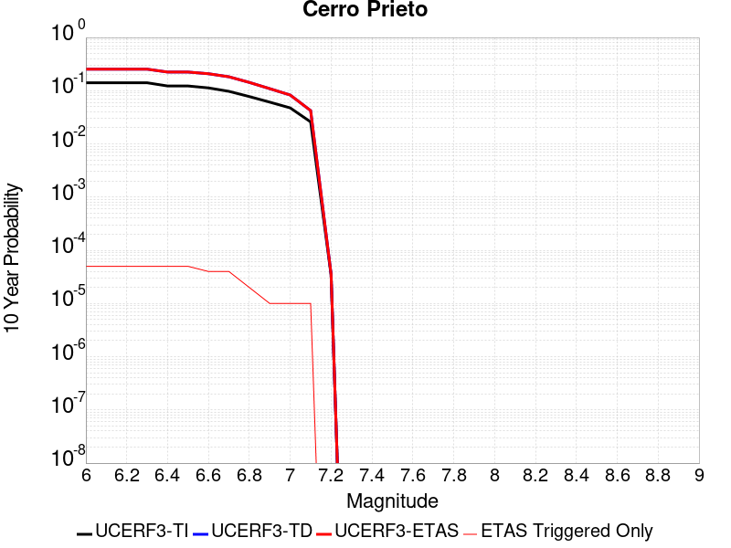 |

| Magnitude | 1 wk TI Prob | 1 wk TD Prob | 1 wk ETAS Prob | 1 wk ETAS/TD Gain | 1 wk ETAS Triggered Only | 1 mo TI Prob | 1 mo TD Prob | 1 mo ETAS Prob | 1 mo ETAS/TD Gain | 1 mo ETAS Triggered Only | 1 yr TI Prob | 1 yr TD Prob | 1 yr ETAS Prob | 1 yr ETAS/TD Gain | 1 yr ETAS Triggered Only | 10 yr TI Prob | 10 yr TD Prob | 10 yr ETAS Prob | 10 yr ETAS/TD Gain | 10 yr ETAS Triggered Only |
|-----|-----|-----|-----|-----|-----|-----|-----|-----|-----|-----|-----|-----|-----|-----|-----|-----|-----|-----|-----|-----|
| 6.0 | 2.9101528E-4 | 5.964804E-4 | 5.964804E-4 | 1.0 | 0.0 | 0.0012466122 | 0.002554082 | 0.002554082 | 1.0 | 0.0 | 0.015072231 | 0.03064807 | 0.03064807 | 1.0 | 0.0 | 0.14089979 | 0.25397858 | 0.25400844 | 1.0001177 | 4.0038438E-5 |
| 6.1 | 2.9101528E-4 | 5.964804E-4 | 5.964804E-4 | 1.0 | 0.0 | 0.0012466122 | 0.002554082 | 0.002554082 | 1.0 | 0.0 | 0.015072231 | 0.03064807 | 0.03064807 | 1.0 | 0.0 | 0.14089979 | 0.25397858 | 0.25400844 | 1.0001177 | 4.0038438E-5 |
| 6.2 | 2.9101528E-4 | 5.964804E-4 | 5.964804E-4 | 1.0 | 0.0 | 0.0012466122 | 0.002554082 | 0.002554082 | 1.0 | 0.0 | 0.015072231 | 0.03064807 | 0.03064807 | 1.0 | 0.0 | 0.14089979 | 0.25397858 | 0.25400844 | 1.0001177 | 4.0038438E-5 |
| 6.3 | 2.9101528E-4 | 5.964804E-4 | 5.964804E-4 | 1.0 | 0.0 | 0.0012466122 | 0.002554082 | 0.002554082 | 1.0 | 0.0 | 0.015072231 | 0.03064807 | 0.03064807 | 1.0 | 0.0 | 0.14089979 | 0.25397858 | 0.25400844 | 1.0001177 | 4.0038438E-5 |
| 6.4 | 2.508648E-4 | 5.1397446E-4 | 5.1397446E-4 | 1.0 | 0.0 | 0.0010746918 | 0.0022010866 | 0.0022010866 | 1.0 | 0.0 | 0.013006088 | 0.026471792 | 0.026471792 | 1.0 | 0.0 | 0.12270685 | 0.22440416 | 0.22443521 | 1.0001384 | 4.0038438E-5 |
| 6.5 | 2.508648E-4 | 5.1397446E-4 | 5.1397446E-4 | 1.0 | 0.0 | 0.0010746918 | 0.0022010866 | 0.0022010866 | 1.0 | 0.0 | 0.013006088 | 0.026471792 | 0.026471792 | 1.0 | 0.0 | 0.12270685 | 0.22440416 | 0.22443521 | 1.0001384 | 4.0038438E-5 |
| 6.6 | 2.294914E-4 | 4.7116808E-4 | 4.7116808E-4 | 1.0 | 0.0 | 9.831638E-4 | 0.0020179166 | 0.0020179166 | 1.0 | 0.0 | 0.011904482 | 0.02429866 | 0.02429866 | 1.0 | 0.0 | 0.11286586 | 0.20858558 | 0.20861726 | 1.0001519 | 4.0038438E-5 |
| 6.7 | 1.9621674E-4 | 4.0419117E-4 | 4.0419117E-4 | 1.0 | 0.0 | 8.4065786E-4 | 0.0017312564 | 0.0017312564 | 1.0 | 0.0 | 0.010187071 | 0.020884845 | 0.020884845 | 1.0 | 0.0 | 0.09732539 | 0.18290249 | 0.18293521 | 1.0001788 | 4.0038438E-5 |
| 6.8 | 1.5476145E-4 | 3.056516E-4 | 3.056516E-4 | 1.0 | 0.0 | 6.6309475E-4 | 0.00130938 | 0.00130938 | 1.0 | 0.0 | 0.008043335 | 0.015836509 | 0.015836509 | 1.0 | 0.0 | 0.07758363 | 0.14336355 | 0.14339785 | 1.0002393 | 4.0038438E-5 |
| 6.9 | 1.20509176E-4 | 2.2582515E-4 | 2.2582515E-4 | 1.0 | 0.0 | 5.1636563E-4 | 9.6752634E-4 | 9.6752634E-4 | 1.0 | 0.0 | 0.006268645 | 0.011726342 | 0.011726342 | 1.0 | 0.0 | 0.060947374 | 0.109451205 | 0.109451205 | 1.0 | 0.0 |
| 7.0 | 9.3269155E-5 | 1.6716642E-4 | 1.6716642E-4 | 1.0 | 0.0 | 3.9966372E-4 | 7.162739E-4 | 7.162739E-4 | 1.0 | 0.0 | 0.0048550544 | 0.008693418 | 0.008693418 | 1.0 | 0.0 | 0.04750344 | 0.08315912 | 0.08315912 | 1.0 | 0.0 |
| 7.1 | 5.029709E-5 | 8.1718936E-5 | 8.1718936E-5 | 1.0 | 0.0 | 2.1554115E-4 | 3.5019626E-4 | 3.5019626E-4 | 1.0 | 0.0 | 0.0026210553 | 0.0042587193 | 0.0042587193 | 1.0 | 0.0 | 0.025903556 | 0.042365108 | 0.042365108 | 1.0 | 0.0 |
| 7.2 | 6.5445185E-8 | 6.814903E-8 | 6.814903E-8 | 1.0 | 0.0 | 2.8047933E-7 | 2.9206726E-7 | 2.9206726E-7 | 1.0 | 0.0 | 3.4148304E-6 | 3.555919E-6 | 3.555919E-6 | 1.0 | 0.0 | 3.414778E-5 | 3.5559187E-5 | 3.5559187E-5 | 1.0 | 0.0 |

## Del Valle
*[(top)](#table-of-contents)*

| 1 Week | 1 Month | 1 Year | 10 Year |
|-----|-----|-----|-----|
|  |  |  | 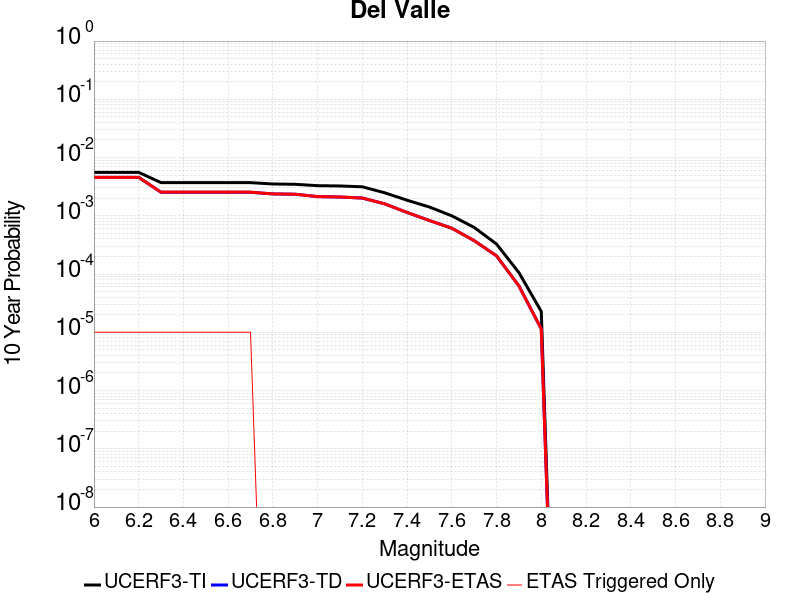 |

| Magnitude | 1 wk TI Prob | 1 wk TD Prob | 1 wk ETAS Prob | 1 wk ETAS/TD Gain | 1 wk ETAS Triggered Only | 1 mo TI Prob | 1 mo TD Prob | 1 mo ETAS Prob | 1 mo ETAS/TD Gain | 1 mo ETAS Triggered Only | 1 yr TI Prob | 1 yr TD Prob | 1 yr ETAS Prob | 1 yr ETAS/TD Gain | 1 yr ETAS Triggered Only | 10 yr TI Prob | 10 yr TD Prob | 10 yr ETAS Prob | 10 yr ETAS/TD Gain | 10 yr ETAS Triggered Only |
|-----|-----|-----|-----|-----|-----|-----|-----|-----|-----|-----|-----|-----|-----|-----|-----|-----|-----|-----|-----|-----|
| 6.0 | 1.0716125E-5 | 8.767882E-6 | 4.8805967E-5 | 5.566449 | 4.0038438E-5 | 4.592544E-5 | 3.7576207E-5 | 7.761314E-5 | 2.0654862 | 4.0038438E-5 | 5.589988E-4 | 4.5741405E-4 | 4.974342E-4 | 1.0874921 | 4.0038438E-5 | 0.0055759475 | 0.00456668 | 0.0046065357 | 1.0087274 | 4.0038438E-5 |
| 6.1 | 1.0716125E-5 | 8.767882E-6 | 4.8805967E-5 | 5.566449 | 4.0038438E-5 | 4.592544E-5 | 3.7576207E-5 | 7.761314E-5 | 2.0654862 | 4.0038438E-5 | 5.589988E-4 | 4.5741405E-4 | 4.974342E-4 | 1.0874921 | 4.0038438E-5 | 0.0055759475 | 0.00456668 | 0.0046065357 | 1.0087274 | 4.0038438E-5 |
| 6.2 | 1.0716125E-5 | 8.767882E-6 | 4.8805967E-5 | 5.566449 | 4.0038438E-5 | 4.592544E-5 | 3.7576207E-5 | 7.761314E-5 | 2.0654862 | 4.0038438E-5 | 5.589988E-4 | 4.5741405E-4 | 4.974342E-4 | 1.0874921 | 4.0038438E-5 | 0.0055759475 | 0.00456668 | 0.0046065357 | 1.0087274 | 4.0038438E-5 |
| 6.3 | 7.1293784E-6 | 4.865823E-6 | 4.4904064E-5 | 9.228462 | 4.0038438E-5 | 3.055412E-5 | 2.0853364E-5 | 6.0890965E-5 | 2.9199588 | 4.0038438E-5 | 3.7193293E-4 | 2.5386087E-4 | 2.9388914E-4 | 1.157678 | 4.0038438E-5 | 0.0037131102 | 0.0025357946 | 0.0025757316 | 1.0157492 | 4.0038438E-5 |
| 6.4 | 7.1293784E-6 | 4.865823E-6 | 4.4904064E-5 | 9.228462 | 4.0038438E-5 | 3.055412E-5 | 2.0853364E-5 | 6.0890965E-5 | 2.9199588 | 4.0038438E-5 | 3.7193293E-4 | 2.5386087E-4 | 2.9388914E-4 | 1.157678 | 4.0038438E-5 | 0.0037131102 | 0.0025357946 | 0.0025757316 | 1.0157492 | 4.0038438E-5 |
| 6.5 | 7.1293784E-6 | 4.865823E-6 | 4.4904064E-5 | 9.228462 | 4.0038438E-5 | 3.055412E-5 | 2.0853364E-5 | 6.0890965E-5 | 2.9199588 | 4.0038438E-5 | 3.7193293E-4 | 2.5386087E-4 | 2.9388914E-4 | 1.157678 | 4.0038438E-5 | 0.0037131102 | 0.0025357946 | 0.0025757316 | 1.0157492 | 4.0038438E-5 |
| 6.6 | 7.1293784E-6 | 4.865823E-6 | 4.4904064E-5 | 9.228462 | 4.0038438E-5 | 3.055412E-5 | 2.0853364E-5 | 6.0890965E-5 | 2.9199588 | 4.0038438E-5 | 3.7193293E-4 | 2.5386087E-4 | 2.9388914E-4 | 1.157678 | 4.0038438E-5 | 0.0037131102 | 0.0025357946 | 0.0025757316 | 1.0157492 | 4.0038438E-5 |
| 6.7 | 7.12272E-6 | 4.8631987E-6 | 4.490144E-5 | 9.232903 | 4.0038438E-5 | 3.0525585E-5 | 2.0842117E-5 | 6.087972E-5 | 2.920995 | 4.0038438E-5 | 3.7158563E-4 | 2.5372396E-4 | 2.9375224E-4 | 1.1577631 | 4.0038438E-5 | 0.003709649 | 0.0025344288 | 0.0025743658 | 1.0157578 | 4.0038438E-5 |
| 6.8 | 6.7558703E-6 | 4.5594015E-6 | 4.5594015E-6 | 1.0 | 0.0 | 2.895341E-5 | 1.9540148E-5 | 1.9540148E-5 | 1.0 | 0.0 | 3.5245073E-4 | 2.3787597E-4 | 2.3787597E-4 | 1.0 | 0.0 | 0.0035189227 | 0.0023762889 | 0.0023762889 | 1.0 | 0.0 |
| 6.9 | 6.6700386E-6 | 4.502539E-6 | 4.502539E-6 | 1.0 | 0.0 | 2.8585566E-5 | 1.9296456E-5 | 1.9296456E-5 | 1.0 | 0.0 | 3.479737E-4 | 2.3490966E-4 | 2.3490966E-4 | 1.0 | 0.0 | 0.003474293 | 0.0023466884 | 0.0023466884 | 1.0 | 0.0 |
| 7.0 | 6.3181424E-6 | 4.0987034E-6 | 4.0987034E-6 | 1.0 | 0.0 | 2.7077473E-5 | 1.7565755E-5 | 1.7565755E-5 | 1.0 | 0.0 | 3.2961834E-4 | 2.1384252E-4 | 2.1384252E-4 | 1.0 | 0.0 | 0.0032912986 | 0.002136422 | 0.002136422 | 1.0 | 0.0 |
| 7.1 | 6.248759E-6 | 4.033895E-6 | 4.033895E-6 | 1.0 | 0.0 | 2.678012E-5 | 1.7288008E-5 | 1.7288008E-5 | 1.0 | 0.0 | 3.2599916E-4 | 2.104616E-4 | 2.104616E-4 | 1.0 | 0.0 | 0.0032552136 | 0.0021026772 | 0.0021026772 | 1.0 | 0.0 |
| 7.2 | 6.0411944E-6 | 3.869888E-6 | 3.869888E-6 | 1.0 | 0.0 | 2.5890577E-5 | 1.658513E-5 | 1.658513E-5 | 1.0 | 0.0 | 3.1517216E-4 | 2.0190567E-4 | 2.0190567E-4 | 1.0 | 0.0 | 0.0031472554 | 0.0020172757 | 0.0020172757 | 1.0 | 0.0 |
| 7.3 | 4.7691183E-6 | 3.0781202E-6 | 3.0781202E-6 | 1.0 | 0.0 | 2.0438918E-5 | 1.3191879E-5 | 1.3191879E-5 | 1.0 | 0.0 | 2.488154E-4 | 1.605995E-4 | 1.605995E-4 | 1.0 | 0.0 | 0.00248537 | 0.0016048603 | 0.0016048603 | 1.0 | 0.0 |
| 7.4 | 3.5524722E-6 | 2.1893363E-6 | 2.1893363E-6 | 1.0 | 0.0 | 1.5224792E-5 | 9.382837E-6 | 9.382837E-6 | 1.0 | 0.0 | 1.8534607E-4 | 1.1423013E-4 | 1.1423013E-4 | 1.0 | 0.0 | 0.0018519156 | 0.0011417224 | 0.0011417224 | 1.0 | 0.0 |
| 7.5 | 2.7133442E-6 | 1.5916097E-6 | 1.5916097E-6 | 1.0 | 0.0 | 1.1628566E-5 | 6.821167E-6 | 6.821167E-6 | 1.0 | 0.0 | 1.415686E-4 | 8.304456E-5 | 8.304456E-5 | 1.0 | 0.0 | 0.0014147845 | 8.301372E-4 | 8.301372E-4 | 1.0 | 0.0 |
| 7.6 | 1.915338E-6 | 1.173914E-6 | 1.173914E-6 | 1.0 | 0.0 | 8.208566E-6 | 5.0310505E-6 | 5.0310505E-6 | 1.0 | 0.0 | 9.993471E-5 | 6.125133E-5 | 6.125133E-5 | 1.0 | 0.0 | 9.988978E-4 | 6.123454E-4 | 6.123454E-4 | 1.0 | 0.0 |
| 7.7 | 1.2120448E-6 | 7.180313E-7 | 7.180313E-7 | 1.0 | 0.0 | 5.194467E-6 | 3.0772733E-6 | 3.0772733E-6 | 1.0 | 0.0 | 6.3240805E-5 | 3.746516E-5 | 3.746516E-5 | 1.0 | 0.0 | 6.322281E-4 | 3.7458882E-4 | 3.7458882E-4 | 1.0 | 0.0 |
| 7.8 | 6.272381E-7 | 3.932549E-7 | 3.932549E-7 | 1.0 | 0.0 | 2.6881603E-6 | 1.6853771E-6 | 1.6853771E-6 | 1.0 | 0.0 | 3.272786E-5 | 2.0519275E-5 | 2.0519275E-5 | 1.0 | 0.0 | 3.272304E-4 | 2.0517396E-4 | 2.0517396E-4 | 1.0 | 0.0 |
| 7.9 | 2.0292627E-7 | 1.2004622E-7 | 1.2004622E-7 | 1.0 | 0.0 | 8.6968373E-7 | 5.1448376E-7 | 5.1448376E-7 | 1.0 | 0.0 | 1.0588348E-5 | 6.263822E-6 | 6.263822E-6 | 1.0 | 0.0 | 1.0587843E-4 | 6.263647E-5 | 6.263647E-5 | 1.0 | 0.0 |
| 8.0 | 4.374492E-8 | 2.189964E-8 | 2.189964E-8 | 1.0 | 0.0 | 1.8747821E-7 | 9.385559E-8 | 9.385559E-8 | 1.0 | 0.0 | 2.2825448E-6 | 1.1426913E-6 | 1.1426913E-6 | 1.0 | 0.0 | 2.2825214E-5 | 1.1426858E-5 | 1.1426858E-5 | 1.0 | 0.0 |

## Great Valley 11
*[(top)](#table-of-contents)*

| 1 Week | 1 Month | 1 Year | 10 Year |
|-----|-----|-----|-----|
| 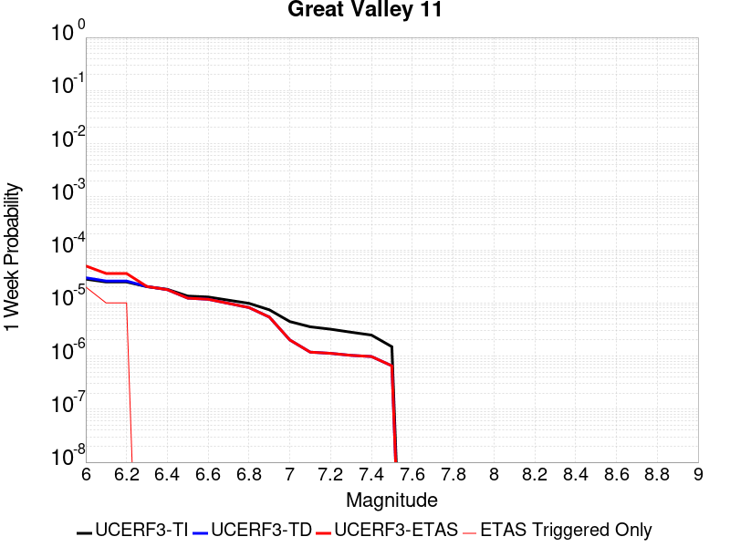 |  |  |  |

| Magnitude | 1 wk TI Prob | 1 wk TD Prob | 1 wk ETAS Prob | 1 wk ETAS/TD Gain | 1 wk ETAS Triggered Only | 1 mo TI Prob | 1 mo TD Prob | 1 mo ETAS Prob | 1 mo ETAS/TD Gain | 1 mo ETAS Triggered Only | 1 yr TI Prob | 1 yr TD Prob | 1 yr ETAS Prob | 1 yr ETAS/TD Gain | 1 yr ETAS Triggered Only | 10 yr TI Prob | 10 yr TD Prob | 10 yr ETAS Prob | 10 yr ETAS/TD Gain | 10 yr ETAS Triggered Only |
|-----|-----|-----|-----|-----|-----|-----|-----|-----|-----|-----|-----|-----|-----|-----|-----|-----|-----|-----|-----|-----|
| 6.0 | 2.8099583E-5 | 2.9832152E-5 | 6.986939E-5 | 2.3420837 | 4.0038438E-5 | 1.20421224E-4 | 1.278462E-4 | 1.6787952E-4 | 1.3131366 | 4.0038438E-5 | 0.0014651422 | 0.0015554909 | 0.0015954671 | 1.0257 | 4.0038438E-5 | 0.0145552 | 0.01545356 | 0.01549298 | 1.0025508 | 4.0038438E-5 |
| 6.1 | 2.483194E-5 | 2.590715E-5 | 2.590715E-5 | 1.0 | 0.0 | 1.0641825E-4 | 1.11026246E-4 | 1.11026246E-4 | 1.0 | 0.0 | 0.0012948721 | 0.0013509706 | 0.0013509706 | 1.0 | 0.0 | 0.012873529 | 0.013433994 | 0.013433994 | 1.0 | 0.0 |
| 6.2 | 2.483194E-5 | 2.590715E-5 | 2.590715E-5 | 1.0 | 0.0 | 1.0641825E-4 | 1.11026246E-4 | 1.11026246E-4 | 1.0 | 0.0 | 0.0012948721 | 0.0013509706 | 0.0013509706 | 1.0 | 0.0 | 0.012873529 | 0.013433994 | 0.013433994 | 1.0 | 0.0 |
| 6.3 | 2.0257901E-5 | 2.0398922E-5 | 2.0398922E-5 | 1.0 | 0.0 | 8.681669E-5 | 8.742122E-5 | 8.742122E-5 | 1.0 | 0.0 | 0.0010564806 | 0.0010638756 | 0.0010638756 | 1.0 | 0.0 | 0.01051472 | 0.010592012 | 0.010592012 | 1.0 | 0.0 |
| 6.4 | 1.8054898E-5 | 1.7780874E-5 | 1.7780874E-5 | 1.0 | 0.0 | 7.737584E-5 | 7.62017E-5 | 7.62017E-5 | 1.0 | 0.0 | 9.416436E-4 | 9.2739856E-4 | 9.2739856E-4 | 1.0 | 0.0 | 0.009376635 | 0.009239036 | 0.009239036 | 1.0 | 0.0 |
| 6.5 | 1.34804895E-5 | 1.2321055E-5 | 1.2321055E-5 | 1.0 | 0.0 | 5.777225E-5 | 5.2803476E-5 | 5.2803476E-5 | 1.0 | 0.0 | 7.031501E-4 | 6.4269686E-4 | 6.4269686E-4 | 1.0 | 0.0 | 0.007009294 | 0.0064088185 | 0.0064088185 | 1.0 | 0.0 |
| 6.6 | 1.294883E-5 | 1.1732312E-5 | 1.1732312E-5 | 1.0 | 0.0 | 5.5493805E-5 | 5.028039E-5 | 5.028039E-5 | 1.0 | 0.0 | 6.754276E-4 | 6.1199587E-4 | 6.1199587E-4 | 1.0 | 0.0 | 0.006733784 | 0.0061035305 | 0.0061035305 | 1.0 | 0.0 |
| 6.7 | 1.1272237E-5 | 9.811886E-6 | 9.811886E-6 | 1.0 | 0.0 | 4.8308695E-5 | 4.2050277E-5 | 4.2050277E-5 | 1.0 | 0.0 | 5.879996E-4 | 5.118446E-4 | 5.118446E-4 | 1.0 | 0.0 | 0.005864462 | 0.0051069413 | 0.0051069413 | 1.0 | 0.0 |
| 6.8 | 9.8337505E-6 | 8.19377E-6 | 8.19377E-6 | 1.0 | 0.0 | 4.2143965E-5 | 3.5115696E-5 | 3.5115696E-5 | 1.0 | 0.0 | 5.1298196E-4 | 4.2745177E-4 | 4.2745177E-4 | 1.0 | 0.0 | 0.005117994 | 0.0042665056 | 0.0042665056 | 1.0 | 0.0 |
| 6.9 | 7.4224813E-6 | 5.4131347E-6 | 5.4131347E-6 | 1.0 | 0.0 | 3.1810247E-5 | 2.319895E-5 | 2.319895E-5 | 1.0 | 0.0 | 3.872209E-4 | 2.8241202E-4 | 2.8241202E-4 | 1.0 | 0.0 | 0.0038654688 | 0.0028206722 | 0.0028206722 | 1.0 | 0.0 |
| 7.0 | 4.4628923E-6 | 2.0110795E-6 | 2.0110795E-6 | 1.0 | 0.0 | 1.912654E-5 | 8.618884E-6 | 8.618884E-6 | 1.0 | 0.0 | 2.3284076E-4 | 1.04929975E-4 | 1.04929975E-4 | 1.0 | 0.0 | 0.0023259693 | 0.0010488159 | 0.0010488159 | 1.0 | 0.0 |
| 7.1 | 3.5546527E-6 | 1.1855836E-6 | 1.1855836E-6 | 1.0 | 0.0 | 1.5234136E-5 | 5.081063E-6 | 5.081063E-6 | 1.0 | 0.0 | 1.8545982E-4 | 6.186026E-5 | 6.186026E-5 | 1.0 | 0.0 | 0.0018530512 | 6.1843713E-4 | 6.1843713E-4 | 1.0 | 0.0 |
| 7.2 | 3.2039936E-6 | 1.1254128E-6 | 1.1254128E-6 | 1.0 | 0.0 | 1.3731329E-5 | 4.823189E-6 | 4.823189E-6 | 1.0 | 0.0 | 1.671661E-4 | 5.8720816E-5 | 5.8720816E-5 | 1.0 | 0.0 | 0.0016704041 | 5.870597E-4 | 5.870597E-4 | 1.0 | 0.0 |
| 7.3 | 2.8120473E-6 | 1.0305612E-6 | 1.0305612E-6 | 1.0 | 0.0 | 1.2051575E-5 | 4.4166836E-6 | 4.4166836E-6 | 1.0 | 0.0 | 1.4671806E-4 | 5.3771862E-5 | 5.3771862E-5 | 1.0 | 0.0 | 0.0014662122 | 5.3759513E-4 | 5.3759513E-4 | 1.0 | 0.0 |
| 7.4 | 2.4837766E-6 | 9.800582E-7 | 9.800582E-7 | 1.0 | 0.0 | 1.0644713E-5 | 4.200243E-6 | 4.200243E-6 | 1.0 | 0.0 | 1.2959167E-4 | 5.1136827E-5 | 5.1136827E-5 | 1.0 | 0.0 | 0.0012951613 | 5.112572E-4 | 5.112572E-4 | 1.0 | 0.0 |
| 7.5 | 1.5002679E-6 | 6.546144E-7 | 6.546144E-7 | 1.0 | 0.0 | 6.4297037E-6 | 2.8054874E-6 | 2.8054874E-6 | 1.0 | 0.0 | 7.827883E-5 | 3.4156317E-5 | 3.4156317E-5 | 1.0 | 0.0 | 7.825126E-4 | 3.4151482E-4 | 3.4151482E-4 | 1.0 | 0.0 |

## Oak Ridge (Onshore)
*[(top)](#table-of-contents)*

| 1 Week | 1 Month | 1 Year | 10 Year |
|-----|-----|-----|-----|
|  |  |  |  |

| Magnitude | 1 wk TI Prob | 1 wk TD Prob | 1 wk ETAS Prob | 1 wk ETAS/TD Gain | 1 wk ETAS Triggered Only | 1 mo TI Prob | 1 mo TD Prob | 1 mo ETAS Prob | 1 mo ETAS/TD Gain | 1 mo ETAS Triggered Only | 1 yr TI Prob | 1 yr TD Prob | 1 yr ETAS Prob | 1 yr ETAS/TD Gain | 1 yr ETAS Triggered Only | 10 yr TI Prob | 10 yr TD Prob | 10 yr ETAS Prob | 10 yr ETAS/TD Gain | 10 yr ETAS Triggered Only |
|-----|-----|-----|-----|-----|-----|-----|-----|-----|-----|-----|-----|-----|-----|-----|-----|-----|-----|-----|-----|-----|
| 6.0 | 3.155064E-5 | 2.9525974E-5 | 6.9563226E-5 | 2.3560011 | 4.0038438E-5 | 1.3521002E-4 | 1.2653397E-4 | 1.6656733E-4 | 1.3163844 | 4.0038438E-5 | 0.001644939 | 0.0015395004 | 0.0015794772 | 1.0259674 | 4.0038438E-5 | 0.01632816 | 0.015292859 | 0.015332285 | 1.002578 | 4.0038438E-5 |
| 6.1 | 3.155064E-5 | 2.9525974E-5 | 6.9563226E-5 | 2.3560011 | 4.0038438E-5 | 1.3521002E-4 | 1.2653397E-4 | 1.6656733E-4 | 1.3163844 | 4.0038438E-5 | 0.001644939 | 0.0015395004 | 0.0015794772 | 1.0259674 | 4.0038438E-5 | 0.01632816 | 0.015292859 | 0.015332285 | 1.002578 | 4.0038438E-5 |
| 6.2 | 3.155064E-5 | 2.9525974E-5 | 6.9563226E-5 | 2.3560011 | 4.0038438E-5 | 1.3521002E-4 | 1.2653397E-4 | 1.6656733E-4 | 1.3163844 | 4.0038438E-5 | 0.001644939 | 0.0015395004 | 0.0015794772 | 1.0259674 | 4.0038438E-5 | 0.01632816 | 0.015292859 | 0.015332285 | 1.002578 | 4.0038438E-5 |
| 6.3 | 3.155064E-5 | 2.9525974E-5 | 6.9563226E-5 | 2.3560011 | 4.0038438E-5 | 1.3521002E-4 | 1.2653397E-4 | 1.6656733E-4 | 1.3163844 | 4.0038438E-5 | 0.001644939 | 0.0015395004 | 0.0015794772 | 1.0259674 | 4.0038438E-5 | 0.01632816 | 0.015292859 | 0.015332285 | 1.002578 | 4.0038438E-5 |
| 6.4 | 3.155064E-5 | 2.9525974E-5 | 6.9563226E-5 | 2.3560011 | 4.0038438E-5 | 1.3521002E-4 | 1.2653397E-4 | 1.6656733E-4 | 1.3163844 | 4.0038438E-5 | 0.001644939 | 0.0015395004 | 0.0015794772 | 1.0259674 | 4.0038438E-5 | 0.01632816 | 0.015292859 | 0.015332285 | 1.002578 | 4.0038438E-5 |
| 6.5 | 3.155064E-5 | 2.9525974E-5 | 6.9563226E-5 | 2.3560011 | 4.0038438E-5 | 1.3521002E-4 | 1.2653397E-4 | 1.6656733E-4 | 1.3163844 | 4.0038438E-5 | 0.001644939 | 0.0015395004 | 0.0015794772 | 1.0259674 | 4.0038438E-5 | 0.01632816 | 0.015292859 | 0.015332285 | 1.002578 | 4.0038438E-5 |
| 6.6 | 3.155064E-5 | 2.9525974E-5 | 6.9563226E-5 | 2.3560011 | 4.0038438E-5 | 1.3521002E-4 | 1.2653397E-4 | 1.6656733E-4 | 1.3163844 | 4.0038438E-5 | 0.001644939 | 0.0015395004 | 0.0015794772 | 1.0259674 | 4.0038438E-5 | 0.01632816 | 0.015292859 | 0.015332285 | 1.002578 | 4.0038438E-5 |
| 6.7 | 3.098897E-5 | 2.8864175E-5 | 6.8901456E-5 | 2.3870926 | 4.0038438E-5 | 1.328031E-4 | 1.2369796E-4 | 1.6373144E-4 | 1.323639 | 4.0038438E-5 | 0.0016156785 | 0.0015050198 | 0.001544998 | 1.0265632 | 4.0038438E-5 | 0.016039822 | 0.014952714 | 0.014992153 | 1.0026376 | 4.0038438E-5 |
| 6.8 | 3.0449872E-5 | 2.8239372E-5 | 6.827668E-5 | 2.4177833 | 4.0038438E-5 | 1.3049292E-4 | 1.2102048E-4 | 1.6105406E-4 | 1.3308002 | 4.0038438E-5 | 0.0015875935 | 0.0014724657 | 0.0015124452 | 1.0271513 | 4.0038438E-5 | 0.015762992 | 0.014631462 | 0.014670914 | 1.0026964 | 4.0038438E-5 |
| 6.9 | 2.697928E-5 | 2.4219773E-5 | 6.425724E-5 | 2.65309 | 4.0038438E-5 | 1.15620365E-4 | 1.0379502E-4 | 1.438293E-4 | 1.3857052 | 4.0038438E-5 | 0.0014067689 | 0.0012629933 | 0.0013029812 | 1.0316612 | 4.0038438E-5 | 0.0139789665 | 0.01256087 | 0.012600405 | 1.0031475 | 4.0038438E-5 |
| 7.0 | 2.4893961E-5 | 2.1862043E-5 | 6.1899605E-5 | 2.8313735 | 4.0038438E-5 | 1.0668404E-4 | 9.3691204E-5 | 1.3372589E-4 | 1.4273046 | 4.0038438E-5 | 0.0012981043 | 0.0011401111 | 0.001180104 | 1.0350779 | 4.0038438E-5 | 0.012905477 | 0.011344905 | 0.01138449 | 1.0034891 | 4.0038438E-5 |
| 7.1 | 2.0945363E-5 | 1.7354487E-5 | 5.739223E-5 | 3.3070543 | 4.0038438E-5 | 8.976275E-5 | 7.437428E-5 | 1.1440974E-4 | 1.538297 | 4.0038438E-5 | 0.0010923136 | 9.051354E-4 | 9.4513764E-4 | 1.0441947 | 4.0038438E-5 | 0.0108696 | 0.009015423 | 0.0090551 | 1.0044011 | 4.0038438E-5 |
| 7.2 | 2.0439404E-5 | 1.6809423E-5 | 5.6847188E-5 | 3.381864 | 4.0038438E-5 | 8.7594504E-5 | 7.203843E-5 | 1.12073976E-4 | 1.5557528 | 4.0038438E-5 | 0.0010659413 | 8.767196E-4 | 9.1672293E-4 | 1.0456284 | 4.0038438E-5 | 0.010608427 | 0.008733526 | 0.008773215 | 1.0045444 | 4.0038438E-5 |
| 7.3 | 1.8463334E-5 | 1.5381811E-5 | 5.541963E-5 | 3.602933 | 4.0038438E-5 | 7.912617E-5 | 6.59204E-5 | 1.059562E-4 | 1.6073354 | 4.0038438E-5 | 9.6293533E-4 | 8.0228975E-4 | 8.4229605E-4 | 1.0498651 | 4.0038438E-5 | 0.009587734 | 0.007994797 | 0.008034515 | 1.004968 | 4.0038438E-5 |
| 7.4 | 1.763139E-5 | 1.451684E-5 | 5.4554694E-5 | 3.7580283 | 4.0038438E-5 | 7.556091E-5 | 6.221356E-5 | 1.0224951E-4 | 1.6435244 | 4.0038438E-5 | 9.1956573E-4 | 7.571909E-4 | 7.97199E-4 | 1.0528376 | 4.0038438E-5 | 0.009157699 | 0.007546914 | 0.00758665 | 1.0052652 | 4.0038438E-5 |
| 7.5 | 1.3594944E-5 | 1.1163356E-5 | 5.1201347E-5 | 4.586555 | 4.0038438E-5 | 5.8262744E-5 | 4.784209E-5 | 8.7878616E-5 | 1.8368472 | 4.0038438E-5 | 7.0911803E-4 | 5.8232434E-4 | 6.2233943E-4 | 1.0687162 | 4.0038438E-5 | 0.007068595 | 0.0058082556 | 0.0058480618 | 1.0068533 | 4.0038438E-5 |
| 7.6 | 6.9889534E-6 | 5.6367144E-6 | 5.6367144E-6 | 1.0 | 0.0 | 2.9952313E-5 | 2.4157125E-5 | 2.4157125E-5 | 1.0 | 0.0 | 3.646084E-4 | 2.9407372E-4 | 2.9407372E-4 | 1.0 | 0.0 | 0.0036401073 | 0.0029368899 | 0.0029368899 | 1.0 | 0.0 |
| 7.7 | 4.0824193E-6 | 3.2832586E-6 | 3.2832586E-6 | 1.0 | 0.0 | 1.7495966E-5 | 1.4071033E-5 | 1.4071033E-5 | 1.0 | 0.0 | 2.1299256E-4 | 1.713015E-4 | 1.713015E-4 | 1.0 | 0.0 | 0.0021278851 | 0.0017117079 | 0.0017117079 | 1.0 | 0.0 |
| 7.8 | 1.7023609E-6 | 1.4370495E-6 | 1.4370495E-6 | 1.0 | 0.0 | 7.295812E-6 | 6.1587693E-6 | 6.1587693E-6 | 1.0 | 0.0 | 8.882289E-5 | 7.498047E-5 | 7.498047E-5 | 1.0 | 0.0 | 8.8787393E-4 | 7.495545E-4 | 7.495545E-4 | 1.0 | 0.0 |
| 7.9 | 2.721225E-7 | 2.2616497E-7 | 2.2616497E-7 | 1.0 | 0.0 | 1.1662388E-6 | 9.692781E-7 | 9.692781E-7 | 1.0 | 0.0 | 1.4198865E-5 | 1.1800899E-5 | 1.1800899E-5 | 1.0 | 0.0 | 1.4197957E-4 | 1.1800301E-4 | 1.1800301E-4 | 1.0 | 0.0 |
| 8.0 | 9.364255E-9 | 5.1206666E-9 | 5.1206666E-9 | 1.0 | 0.0 | 4.0132523E-8 | 2.1945715E-8 | 2.1945715E-8 | 1.0 | 0.0 | 4.8861335E-7 | 2.6718905E-7 | 2.6718905E-7 | 1.0 | 0.0 | 4.8861225E-6 | 2.6718876E-6 | 2.6718876E-6 | 1.0 | 0.0 |

## Pine Mtn
*[(top)](#table-of-contents)*

| 1 Week | 1 Month | 1 Year | 10 Year |
|-----|-----|-----|-----|
|  |  |  |  |

| Magnitude | 1 wk TI Prob | 1 wk TD Prob | 1 wk ETAS Prob | 1 wk ETAS/TD Gain | 1 wk ETAS Triggered Only | 1 mo TI Prob | 1 mo TD Prob | 1 mo ETAS Prob | 1 mo ETAS/TD Gain | 1 mo ETAS Triggered Only | 1 yr TI Prob | 1 yr TD Prob | 1 yr ETAS Prob | 1 yr ETAS/TD Gain | 1 yr ETAS Triggered Only | 10 yr TI Prob | 10 yr TD Prob | 10 yr ETAS Prob | 10 yr ETAS/TD Gain | 10 yr ETAS Triggered Only |
|-----|-----|-----|-----|-----|-----|-----|-----|-----|-----|-----|-----|-----|-----|-----|-----|-----|-----|-----|-----|-----|
| 6.0 | 6.894797E-6 | 7.225461E-6 | 7.225461E-6 | 1.0 | 0.0 | 2.9548795E-5 | 3.096591E-5 | 7.100311E-5 | 2.2929442 | 4.0038438E-5 | 3.596972E-4 | 3.7694772E-4 | 4.1697107E-4 | 1.1061774 | 4.0038438E-5 | 0.0035911554 | 0.003763381 | 0.0038032688 | 1.0105989 | 4.0038438E-5 |
| 6.1 | 6.894797E-6 | 7.225461E-6 | 7.225461E-6 | 1.0 | 0.0 | 2.9548795E-5 | 3.096591E-5 | 7.100311E-5 | 2.2929442 | 4.0038438E-5 | 3.596972E-4 | 3.7694772E-4 | 4.1697107E-4 | 1.1061774 | 4.0038438E-5 | 0.0035911554 | 0.003763381 | 0.0038032688 | 1.0105989 | 4.0038438E-5 |
| 6.2 | 6.894797E-6 | 7.225461E-6 | 7.225461E-6 | 1.0 | 0.0 | 2.9548795E-5 | 3.096591E-5 | 7.100311E-5 | 2.2929442 | 4.0038438E-5 | 3.596972E-4 | 3.7694772E-4 | 4.1697107E-4 | 1.1061774 | 4.0038438E-5 | 0.0035911554 | 0.003763381 | 0.0038032688 | 1.0105989 | 4.0038438E-5 |
| 6.3 | 6.894797E-6 | 7.225461E-6 | 7.225461E-6 | 1.0 | 0.0 | 2.9548795E-5 | 3.096591E-5 | 7.100311E-5 | 2.2929442 | 4.0038438E-5 | 3.596972E-4 | 3.7694772E-4 | 4.1697107E-4 | 1.1061774 | 4.0038438E-5 | 0.0035911554 | 0.003763381 | 0.0038032688 | 1.0105989 | 4.0038438E-5 |
| 6.4 | 6.894797E-6 | 7.225461E-6 | 7.225461E-6 | 1.0 | 0.0 | 2.9548795E-5 | 3.096591E-5 | 7.100311E-5 | 2.2929442 | 4.0038438E-5 | 3.596972E-4 | 3.7694772E-4 | 4.1697107E-4 | 1.1061774 | 4.0038438E-5 | 0.0035911554 | 0.003763381 | 0.0038032688 | 1.0105989 | 4.0038438E-5 |
| 6.5 | 6.894797E-6 | 7.225461E-6 | 7.225461E-6 | 1.0 | 0.0 | 2.9548795E-5 | 3.096591E-5 | 7.100311E-5 | 2.2929442 | 4.0038438E-5 | 3.596972E-4 | 3.7694772E-4 | 4.1697107E-4 | 1.1061774 | 4.0038438E-5 | 0.0035911554 | 0.003763381 | 0.0038032688 | 1.0105989 | 4.0038438E-5 |
| 6.6 | 6.894797E-6 | 7.225461E-6 | 7.225461E-6 | 1.0 | 0.0 | 2.9548795E-5 | 3.096591E-5 | 7.100311E-5 | 2.2929442 | 4.0038438E-5 | 3.596972E-4 | 3.7694772E-4 | 4.1697107E-4 | 1.1061774 | 4.0038438E-5 | 0.0035911554 | 0.003763381 | 0.0038032688 | 1.0105989 | 4.0038438E-5 |
| 6.7 | 6.0867933E-6 | 6.3971133E-6 | 6.3971133E-6 | 1.0 | 0.0 | 2.6085996E-5 | 2.7415923E-5 | 6.7453264E-5 | 2.4603682 | 4.0038438E-5 | 3.1755073E-4 | 3.3373994E-4 | 3.73765E-4 | 1.119929 | 4.0038438E-5 | 0.0031709734 | 0.0033326065 | 0.0033725114 | 1.0119741 | 4.0038438E-5 |
| 6.8 | 5.6530425E-6 | 5.9505956E-6 | 5.9505956E-6 | 1.0 | 0.0 | 2.42271E-5 | 2.5502315E-5 | 6.553973E-5 | 2.5699522 | 4.0038438E-5 | 2.94925E-4 | 3.104485E-4 | 3.504745E-4 | 1.1289296 | 4.0038438E-5 | 0.002945339 | 0.0031003528 | 0.0031402672 | 1.0128741 | 4.0038438E-5 |
| 6.9 | 4.6015225E-6 | 4.863834E-6 | 4.863834E-6 | 1.0 | 0.0 | 1.9720663E-5 | 2.0844845E-5 | 6.088245E-5 | 2.9207437 | 4.0038438E-5 | 2.4007261E-4 | 2.5375787E-4 | 2.9378617E-4 | 1.157742 | 4.0038438E-5 | 0.0023981342 | 0.0025348254 | 0.0025747623 | 1.0157553 | 4.0038438E-5 |
| 7.0 | 4.4875965E-6 | 4.747473E-6 | 4.747473E-6 | 1.0 | 0.0 | 1.9232413E-5 | 2.0346162E-5 | 6.0383783E-5 | 2.9678218 | 4.0038438E-5 | 2.3412947E-4 | 2.4768783E-4 | 2.8771634E-4 | 1.1616087 | 4.0038438E-5 | 0.0023388295 | 0.0024742614 | 0.0025142008 | 1.0161419 | 4.0038438E-5 |
| 7.1 | 3.203907E-6 | 3.4294096E-6 | 3.4294096E-6 | 1.0 | 0.0 | 1.3730958E-5 | 1.4697391E-5 | 5.473524E-5 | 3.7241468 | 4.0038438E-5 | 1.6716159E-4 | 1.789267E-4 | 2.1895798E-4 | 1.22373 | 4.0038438E-5 | 0.0016703589 | 0.0017878925 | 0.0018278594 | 1.0223541 | 4.0038438E-5 |
| 7.2 | 2.2060601E-6 | 2.3784817E-6 | 2.3784817E-6 | 1.0 | 0.0 | 9.4545085E-6 | 1.0193455E-5 | 5.0231483E-5 | 4.9278173 | 4.0038438E-5 | 1.15102564E-4 | 1.240987E-4 | 1.6413217E-4 | 1.3225938 | 4.0038438E-5 | 0.0011504296 | 0.0012403389 | 0.0012803277 | 1.0322402 | 4.0038438E-5 |
| 7.3 | 1.3765207E-6 | 1.5216481E-6 | 1.5216481E-6 | 1.0 | 0.0 | 5.899361E-6 | 6.521333E-6 | 4.6559508E-5 | 7.1395693 | 4.0038438E-5 | 7.182235E-5 | 7.939443E-5 | 1.19429686E-4 | 1.5042578 | 4.0038438E-5 | 7.1799144E-4 | 7.936697E-4 | 8.3367643E-4 | 1.0504072 | 4.0038438E-5 |
| 7.4 | 1.1245983E-6 | 1.2587075E-6 | 1.2587075E-6 | 1.0 | 0.0 | 4.819698E-6 | 5.39445E-6 | 4.5432673E-5 | 8.422113 | 4.0038438E-5 | 5.8678244E-5 | 6.567554E-5 | 1.0571134E-4 | 1.6096001 | 4.0038438E-5 | 5.866275E-4 | 6.5656955E-4 | 6.9658173E-4 | 1.0609412 | 4.0038438E-5 |
| 7.5 | 8.031682E-7 | 9.276951E-7 | 9.276951E-7 | 1.0 | 0.0 | 3.4421448E-6 | 3.9758306E-6 | 3.9758306E-6 | 1.0 | 0.0 | 4.1907308E-5 | 4.840473E-5 | 4.840473E-5 | 1.0 | 0.0 | 4.1899405E-4 | 4.8394862E-4 | 4.8394862E-4 | 1.0 | 0.0 |
| 7.6 | 4.8953444E-7 | 6.003009E-7 | 6.003009E-7 | 1.0 | 0.0 | 2.098003E-6 | 2.5727159E-6 | 2.5727159E-6 | 1.0 | 0.0 | 2.5542888E-5 | 3.1322415E-5 | 3.1322415E-5 | 1.0 | 0.0 | 2.5539953E-4 | 3.1318486E-4 | 3.1318486E-4 | 1.0 | 0.0 |
| 7.7 | 6.634529E-8 | 6.788826E-8 | 6.788826E-8 | 1.0 | 0.0 | 2.843369E-7 | 2.9094966E-7 | 2.9094966E-7 | 1.0 | 0.0 | 3.4617963E-6 | 3.5423066E-6 | 3.5423066E-6 | 1.0 | 0.0 | 3.4617424E-5 | 3.542255E-5 | 3.542255E-5 | 1.0 | 0.0 |
| 7.8 | 9.235578E-9 | 9.488566E-9 | 9.488566E-9 | 1.0 | 0.0 | 3.9581046E-8 | 4.0665284E-8 | 4.0665284E-8 | 1.0 | 0.0 | 4.818991E-7 | 4.950997E-7 | 4.950997E-7 | 1.0 | 0.0 | 4.8189804E-6 | 4.950988E-6 | 4.950988E-6 | 1.0 | 0.0 |

## Quien Sabe 2011 CFM
*[(top)](#table-of-contents)*

| 1 Week | 1 Month | 1 Year | 10 Year |
|-----|-----|-----|-----|
| 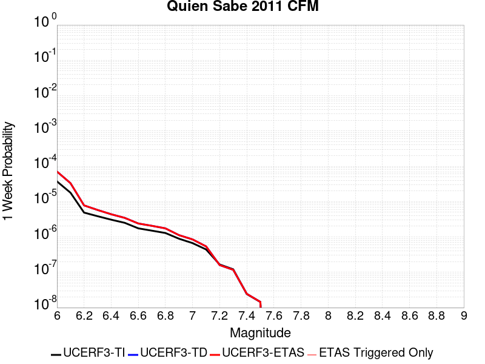 | 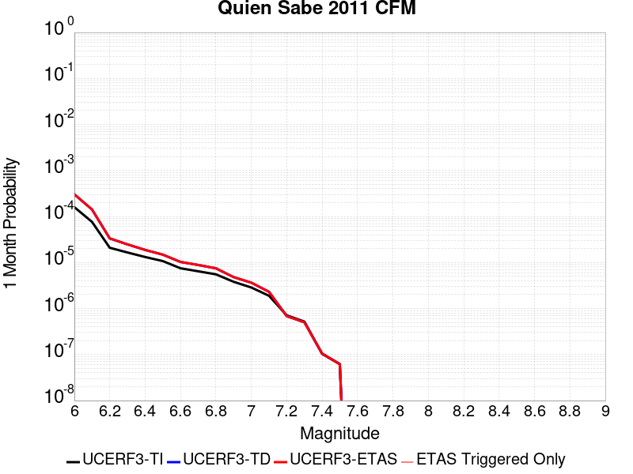 | 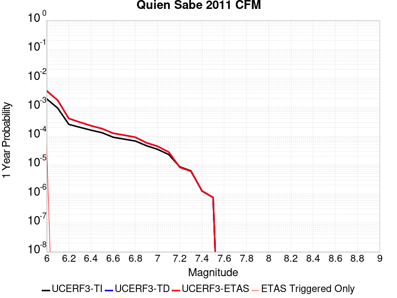 | 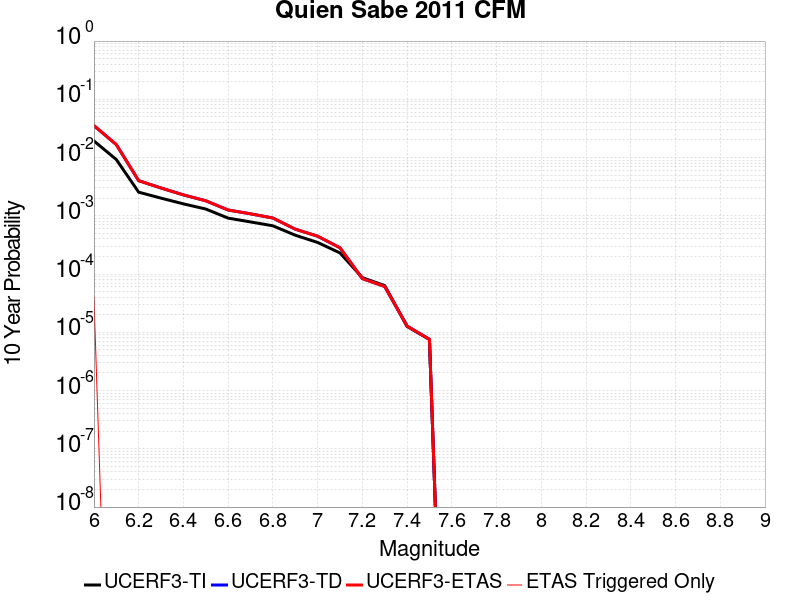 |

| Magnitude | 1 wk TI Prob | 1 wk TD Prob | 1 wk ETAS Prob | 1 wk ETAS/TD Gain | 1 wk ETAS Triggered Only | 1 mo TI Prob | 1 mo TD Prob | 1 mo ETAS Prob | 1 mo ETAS/TD Gain | 1 mo ETAS Triggered Only | 1 yr TI Prob | 1 yr TD Prob | 1 yr ETAS Prob | 1 yr ETAS/TD Gain | 1 yr ETAS Triggered Only | 10 yr TI Prob | 10 yr TD Prob | 10 yr ETAS Prob | 10 yr ETAS/TD Gain | 10 yr ETAS Triggered Only |
|-----|-----|-----|-----|-----|-----|-----|-----|-----|-----|-----|-----|-----|-----|-----|-----|-----|-----|-----|-----|-----|
| 6.0 | 3.729899E-5 | 7.087805E-5 | 7.087805E-5 | 1.0 | 0.0 | 1.5984301E-4 | 3.037322E-4 | 3.037322E-4 | 1.0 | 0.0 | 0.0019443515 | 0.0036852323 | 0.0037251231 | 1.0108246 | 4.0038438E-5 | 0.019274272 | 0.035349756 | 0.03538838 | 1.0010926 | 4.0038438E-5 |
| 6.1 | 1.7825725E-5 | 3.31456E-5 | 3.31456E-5 | 1.0 | 0.0 | 7.639373E-5 | 1.4204586E-4 | 1.4204586E-4 | 1.0 | 0.0 | 9.296967E-4 | 0.0017267246 | 0.0017267246 | 1.0 | 0.0 | 0.009258169 | 0.016698597 | 0.016698597 | 1.0 | 0.0 |
| 6.2 | 4.8865336E-6 | 7.804963E-6 | 7.804963E-6 | 1.0 | 0.0 | 2.0942118E-5 | 3.344947E-5 | 3.344947E-5 | 1.0 | 0.0 | 2.5494045E-4 | 4.0691497E-4 | 4.0691497E-4 | 1.0 | 0.0 | 0.0025464818 | 0.0040135453 | 0.0040135453 | 1.0 | 0.0 |
| 6.3 | 3.858491E-6 | 5.789573E-6 | 5.789573E-6 | 1.0 | 0.0 | 1.6536285E-5 | 2.4812247E-5 | 2.4812247E-5 | 1.0 | 0.0 | 2.0131067E-4 | 3.0205192E-4 | 3.0205192E-4 | 1.0 | 0.0 | 0.002011284 | 0.0030019816 | 0.0030019816 | 1.0 | 0.0 |
| 6.4 | 3.0771805E-6 | 4.384806E-6 | 4.384806E-6 | 1.0 | 0.0 | 1.318785E-5 | 1.8791905E-5 | 1.8791905E-5 | 1.0 | 0.0 | 1.6055023E-4 | 2.2876984E-4 | 2.2876984E-4 | 1.0 | 0.0 | 0.001604343 | 0.002286477 | 0.002286477 | 1.0 | 0.0 |
| 6.5 | 2.5081235E-6 | 3.463511E-6 | 3.463511E-6 | 1.0 | 0.0 | 1.0749056E-5 | 1.4843542E-5 | 1.4843542E-5 | 1.0 | 0.0 | 1.308619E-4 | 1.807066E-4 | 1.807066E-4 | 1.0 | 0.0 | 0.0013078486 | 0.0018123116 | 0.0018123116 | 1.0 | 0.0 |
| 6.6 | 1.7505364E-6 | 2.4023168E-6 | 2.4023168E-6 | 1.0 | 0.0 | 7.502277E-6 | 1.0295607E-5 | 1.0295607E-5 | 1.0 | 0.0 | 9.13364E-5 | 1.2534253E-4 | 1.2534253E-4 | 1.0 | 0.0 | 9.129886E-4 | 0.0012582915 | 0.0012582915 | 1.0 | 0.0 |
| 6.7 | 1.505737E-6 | 2.0637349E-6 | 2.0637349E-6 | 1.0 | 0.0 | 6.4531428E-6 | 8.844551E-6 | 8.844551E-6 | 1.0 | 0.0 | 7.8564175E-5 | 1.0767768E-4 | 1.0767768E-4 | 1.0 | 0.0 | 7.853641E-4 | 0.0010818138 | 0.0010818138 | 1.0 | 0.0 |
| 6.8 | 1.2924105E-6 | 1.7484025E-6 | 1.7484025E-6 | 1.0 | 0.0 | 5.5388905E-6 | 7.4931354E-6 | 7.4931354E-6 | 1.0 | 0.0 | 6.74339E-5 | 9.122565E-5 | 9.122565E-5 | 1.0 | 0.0 | 6.741344E-4 | 9.1609603E-4 | 9.1609603E-4 | 1.0 | 0.0 |
| 6.9 | 8.9075286E-7 | 1.1249955E-6 | 1.1249955E-6 | 1.0 | 0.0 | 3.8175067E-6 | 4.8214015E-6 | 4.8214015E-6 | 1.0 | 0.0 | 4.6477155E-5 | 5.8699206E-5 | 5.8699206E-5 | 1.0 | 0.0 | 4.6467435E-4 | 5.903947E-4 | 5.903947E-4 | 1.0 | 0.0 |
| 7.0 | 6.6891175E-7 | 8.51663E-7 | 8.51663E-7 | 1.0 | 0.0 | 2.8667614E-6 | 3.6499803E-6 | 3.6499803E-6 | 1.0 | 0.0 | 3.4902263E-5 | 4.44378E-5 | 4.44378E-5 | 1.0 | 0.0 | 3.4896782E-4 | 4.4678617E-4 | 4.4678617E-4 | 1.0 | 0.0 |
| 7.1 | 4.4205015E-7 | 5.3919683E-7 | 5.3919683E-7 | 1.0 | 0.0 | 1.8944993E-6 | 2.3108425E-6 | 2.3108425E-6 | 1.0 | 0.0 | 2.3065284E-5 | 2.8134315E-5 | 2.8134315E-5 | 1.0 | 0.0 | 2.3062891E-4 | 2.826926E-4 | 2.826926E-4 | 1.0 | 0.0 |
| 7.2 | 1.6620965E-7 | 1.5987598E-7 | 1.5987598E-7 | 1.0 | 0.0 | 7.123269E-7 | 6.851826E-7 | 6.851826E-7 | 1.0 | 0.0 | 8.672545E-6 | 8.34207E-6 | 8.34207E-6 | 1.0 | 0.0 | 8.6722066E-5 | 8.3573126E-5 | 8.3573126E-5 | 1.0 | 0.0 |
| 7.3 | 1.2142488E-7 | 1.1726492E-7 | 1.1726492E-7 | 1.0 | 0.0 | 5.2039223E-7 | 5.0256386E-7 | 5.0256386E-7 | 1.0 | 0.0 | 6.335757E-6 | 6.118701E-6 | 6.118701E-6 | 1.0 | 0.0 | 6.3355765E-5 | 6.124848E-5 | 6.124848E-5 | 1.0 | 0.0 |
| 7.4 | 2.4192937E-8 | 2.4543448E-8 | 2.4543448E-8 | 1.0 | 0.0 | 1.0368401E-7 | 1.051862E-7 | 1.051862E-7 | 1.0 | 0.0 | 1.2623522E-6 | 1.2806413E-6 | 1.2806413E-6 | 1.0 | 0.0 | 1.2623449E-5 | 1.2812683E-5 | 1.2812683E-5 | 1.0 | 0.0 |
| 7.5 | 1.4432802E-8 | 1.4506471E-8 | 1.4506471E-8 | 1.0 | 0.0 | 6.185486E-8 | 6.2170585E-8 | 6.2170585E-8 | 1.0 | 0.0 | 7.530827E-7 | 7.5692674E-7 | 7.5692674E-7 | 1.0 | 0.0 | 7.530801E-6 | 7.5735175E-6 | 7.5735175E-6 | 1.0 | 0.0 |

## Northridge
*[(top)](#table-of-contents)*

| 1 Week | 1 Month | 1 Year | 10 Year |
|-----|-----|-----|-----|
|  |  |  | 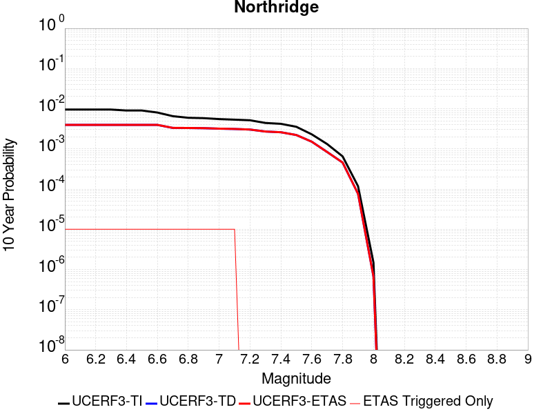 |

| Magnitude | 1 wk TI Prob | 1 wk TD Prob | 1 wk ETAS Prob | 1 wk ETAS/TD Gain | 1 wk ETAS Triggered Only | 1 mo TI Prob | 1 mo TD Prob | 1 mo ETAS Prob | 1 mo ETAS/TD Gain | 1 mo ETAS Triggered Only | 1 yr TI Prob | 1 yr TD Prob | 1 yr ETAS Prob | 1 yr ETAS/TD Gain | 1 yr ETAS Triggered Only | 10 yr TI Prob | 10 yr TD Prob | 10 yr ETAS Prob | 10 yr ETAS/TD Gain | 10 yr ETAS Triggered Only |
|-----|-----|-----|-----|-----|-----|-----|-----|-----|-----|-----|-----|-----|-----|-----|-----|-----|-----|-----|-----|-----|
| 6.0 | 1.8340852E-5 | 7.5880193E-6 | 7.5880193E-6 | 1.0 | 0.0 | 7.860128E-5 | 3.251969E-5 | 7.2556824E-5 | 2.231166 | 4.0038438E-5 | 9.565505E-4 | 3.958575E-4 | 4.358801E-4 | 1.1011035 | 4.0038438E-5 | 0.009524435 | 0.003951746 | 0.003991626 | 1.0100918 | 4.0038438E-5 |
| 6.1 | 1.8340852E-5 | 7.5880193E-6 | 7.5880193E-6 | 1.0 | 0.0 | 7.860128E-5 | 3.251969E-5 | 7.2556824E-5 | 2.231166 | 4.0038438E-5 | 9.565505E-4 | 3.958575E-4 | 4.358801E-4 | 1.1011035 | 4.0038438E-5 | 0.009524435 | 0.003951746 | 0.003991626 | 1.0100918 | 4.0038438E-5 |
| 6.2 | 1.8340852E-5 | 7.5880193E-6 | 7.5880193E-6 | 1.0 | 0.0 | 7.860128E-5 | 3.251969E-5 | 7.2556824E-5 | 2.231166 | 4.0038438E-5 | 9.565505E-4 | 3.958575E-4 | 4.358801E-4 | 1.1011035 | 4.0038438E-5 | 0.009524435 | 0.003951746 | 0.003991626 | 1.0100918 | 4.0038438E-5 |
| 6.3 | 1.8340852E-5 | 7.5880193E-6 | 7.5880193E-6 | 1.0 | 0.0 | 7.860128E-5 | 3.251969E-5 | 7.2556824E-5 | 2.231166 | 4.0038438E-5 | 9.565505E-4 | 3.958575E-4 | 4.358801E-4 | 1.1011035 | 4.0038438E-5 | 0.009524435 | 0.003951746 | 0.003991626 | 1.0100918 | 4.0038438E-5 |
| 6.4 | 1.7361892E-5 | 7.5880193E-6 | 7.5880193E-6 | 1.0 | 0.0 | 7.440598E-5 | 3.251969E-5 | 7.2556824E-5 | 2.231166 | 4.0038438E-5 | 9.055163E-4 | 3.958575E-4 | 4.358801E-4 | 1.1011035 | 4.0038438E-5 | 0.009018354 | 0.003951746 | 0.003991626 | 1.0100918 | 4.0038438E-5 |
| 6.5 | 1.7361892E-5 | 7.5880193E-6 | 7.5880193E-6 | 1.0 | 0.0 | 7.440598E-5 | 3.251969E-5 | 7.2556824E-5 | 2.231166 | 4.0038438E-5 | 9.055163E-4 | 3.958575E-4 | 4.358801E-4 | 1.1011035 | 4.0038438E-5 | 0.009018354 | 0.003951746 | 0.003991626 | 1.0100918 | 4.0038438E-5 |
| 6.6 | 1.5458201E-5 | 7.5880193E-6 | 7.5880193E-6 | 1.0 | 0.0 | 6.624775E-5 | 3.251969E-5 | 7.2556824E-5 | 2.231166 | 4.0038438E-5 | 8.0626784E-4 | 3.958575E-4 | 4.358801E-4 | 1.1011035 | 4.0038438E-5 | 0.008033488 | 0.003951746 | 0.003991626 | 1.0100918 | 4.0038438E-5 |
| 6.7 | 1.2538368E-5 | 6.381603E-6 | 6.381603E-6 | 1.0 | 0.0 | 5.3734755E-5 | 2.7349442E-5 | 6.738678E-5 | 2.463918 | 4.0038438E-5 | 6.5402425E-4 | 3.3292902E-4 | 3.7295412E-4 | 1.1202211 | 4.0038438E-5 | 0.0065210275 | 0.0033243506 | 0.003364256 | 1.0120039 | 4.0038438E-5 |
| 6.8 | 1.1438097E-5 | 6.3502566E-6 | 6.3502566E-6 | 1.0 | 0.0 | 4.9019498E-5 | 2.7215105E-5 | 6.7252455E-5 | 2.4711444 | 4.0038438E-5 | 5.9664896E-4 | 3.3129397E-4 | 3.7131913E-4 | 1.1208147 | 4.0038438E-5 | 0.005950495 | 0.0033080487 | 0.0033479547 | 1.0120633 | 4.0038438E-5 |
| 6.9 | 1.1204891E-5 | 6.2867084E-6 | 6.2867084E-6 | 1.0 | 0.0 | 4.8020076E-5 | 2.694276E-5 | 6.6980116E-5 | 2.4860153 | 4.0038438E-5 | 5.8448757E-4 | 3.2797916E-4 | 3.680045E-4 | 1.1220361 | 4.0038438E-5 | 0.0058295266 | 0.0032749989 | 0.0033149063 | 1.0121855 | 4.0038438E-5 |
| 7.0 | 1.061046E-5 | 6.115359E-6 | 6.115359E-6 | 1.0 | 0.0 | 4.5472607E-5 | 2.6208421E-5 | 6.624581E-5 | 2.5276535 | 4.0038438E-5 | 5.534883E-4 | 3.1904122E-4 | 3.590669E-4 | 1.1254561 | 4.0038438E-5 | 0.0055211177 | 0.0031858785 | 0.0032257894 | 1.0125275 | 4.0038438E-5 |
| 7.1 | 1.0266979E-5 | 6.004274E-6 | 6.004274E-6 | 1.0 | 0.0 | 4.40006E-5 | 2.5732352E-5 | 6.576976E-5 | 2.555917 | 4.0038438E-5 | 5.355756E-4 | 3.1324677E-4 | 3.5327266E-4 | 1.1277776 | 4.0038438E-5 | 0.0053428668 | 0.003128098 | 0.0031680113 | 1.0127596 | 4.0038438E-5 |
| 7.2 | 9.91273E-6 | 5.819984E-6 | 5.819984E-6 | 1.0 | 0.0 | 4.248244E-5 | 2.4942554E-5 | 2.4942554E-5 | 1.0 | 0.0 | 5.171009E-4 | 3.036337E-4 | 3.036337E-4 | 1.0 | 0.0 | 0.0051589934 | 0.0030322333 | 0.0030322333 | 1.0 | 0.0 |
| 7.3 | 8.4959265E-6 | 5.193062E-6 | 5.193062E-6 | 1.0 | 0.0 | 3.6410605E-5 | 2.225579E-5 | 2.225579E-5 | 1.0 | 0.0 | 4.4320893E-4 | 2.709308E-4 | 2.709308E-4 | 1.0 | 0.0 | 0.00442326 | 0.0027060313 | 0.0027060313 | 1.0 | 0.0 |
| 7.4 | 8.0847185E-6 | 4.9819355E-6 | 4.9819355E-6 | 1.0 | 0.0 | 3.4648332E-5 | 2.135098E-5 | 2.135098E-5 | 1.0 | 0.0 | 4.2176177E-4 | 2.599174E-4 | 2.599174E-4 | 1.0 | 0.0 | 0.0042096223 | 0.00259616 | 0.00259616 | 1.0 | 0.0 |
| 7.5 | 6.8220684E-6 | 4.2533075E-6 | 4.2533075E-6 | 1.0 | 0.0 | 2.9237108E-5 | 1.8228335E-5 | 1.8228335E-5 | 1.0 | 0.0 | 3.5590364E-4 | 2.2190758E-4 | 2.2190758E-4 | 1.0 | 0.0 | 0.0035533418 | 0.002216881 | 0.002216881 | 1.0 | 0.0 |
| 7.6 | 4.4224143E-6 | 2.8999582E-6 | 2.8999582E-6 | 1.0 | 0.0 | 1.8953066E-5 | 1.2428334E-5 | 1.2428334E-5 | 1.0 | 0.0 | 2.3072914E-4 | 1.5130457E-4 | 1.5130457E-4 | 1.0 | 0.0 | 0.0023048974 | 0.0015120271 | 0.0015120271 | 1.0 | 0.0 |
| 7.7 | 2.5297056E-6 | 1.6045905E-6 | 1.6045905E-6 | 1.0 | 0.0 | 1.0841551E-5 | 6.8767986E-6 | 6.8767986E-6 | 1.0 | 0.0 | 1.319879E-4 | 8.3721854E-5 | 8.3721854E-5 | 1.0 | 0.0 | 0.0013190953 | 8.369078E-4 | 8.369078E-4 | 1.0 | 0.0 |
| 7.8 | 1.2508156E-6 | 8.780076E-7 | 8.780076E-7 | 1.0 | 0.0 | 5.3606273E-6 | 3.7628845E-6 | 3.7628845E-6 | 1.0 | 0.0 | 6.526368E-5 | 4.581217E-5 | 4.581217E-5 | 1.0 | 0.0 | 6.524452E-4 | 4.5802852E-4 | 4.5802852E-4 | 1.0 | 0.0 |
| 7.9 | 2.262199E-7 | 1.4664671E-7 | 1.4664671E-7 | 1.0 | 0.0 | 9.695135E-7 | 6.284858E-7 | 6.284858E-7 | 1.0 | 0.0 | 1.1803763E-5 | 7.651788E-6 | 7.651788E-6 | 1.0 | 0.0 | 1.1803136E-4 | 7.651533E-5 | 7.651533E-5 | 1.0 | 0.0 |
| 8.0 | 2.865362E-9 | 1.2753101E-9 | 1.2753101E-9 | 1.0 | 0.0 | 1.2280123E-8 | 5.4656146E-9 | 5.4656146E-9 | 1.0 | 0.0 | 1.4951048E-7 | 6.654386E-8 | 6.654386E-8 | 1.0 | 0.0 | 1.4951038E-6 | 6.654386E-7 | 6.654386E-7 | 1.0 | 0.0 |

## San Luis Range 2011 CFM
*[(top)](#table-of-contents)*

| 1 Week | 1 Month | 1 Year | 10 Year |
|-----|-----|-----|-----|
| 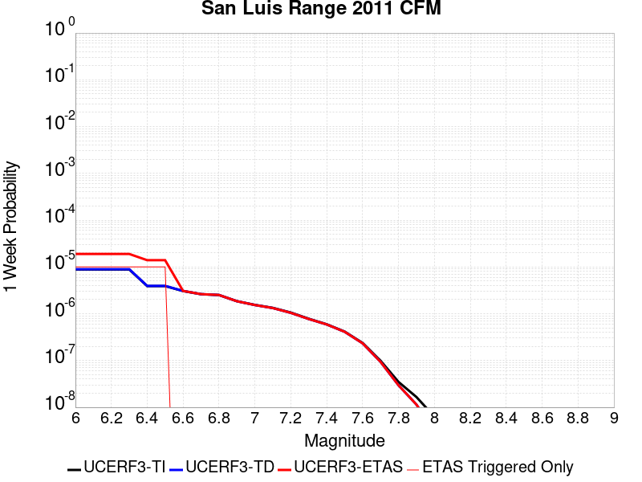 | 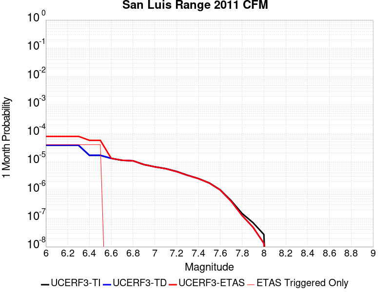 | 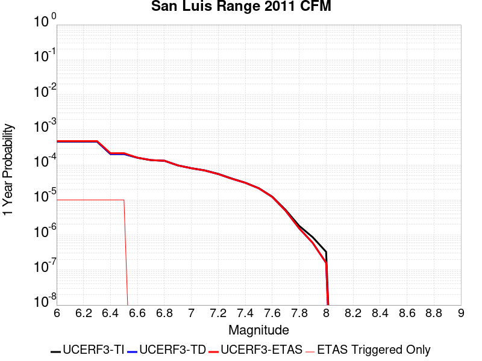 | 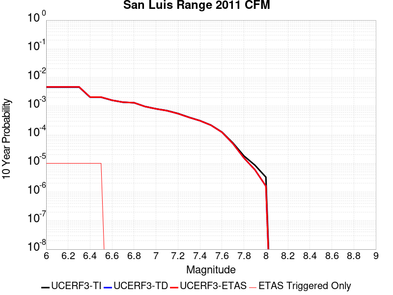 |

| Magnitude | 1 wk TI Prob | 1 wk TD Prob | 1 wk ETAS Prob | 1 wk ETAS/TD Gain | 1 wk ETAS Triggered Only | 1 mo TI Prob | 1 mo TD Prob | 1 mo ETAS Prob | 1 mo ETAS/TD Gain | 1 mo ETAS Triggered Only | 1 yr TI Prob | 1 yr TD Prob | 1 yr ETAS Prob | 1 yr ETAS/TD Gain | 1 yr ETAS Triggered Only | 10 yr TI Prob | 10 yr TD Prob | 10 yr ETAS Prob | 10 yr ETAS/TD Gain | 10 yr ETAS Triggered Only |
|-----|-----|-----|-----|-----|-----|-----|-----|-----|-----|-----|-----|-----|-----|-----|-----|-----|-----|-----|-----|-----|
| 6.0 | 8.8368415E-6 | 8.965454E-6 | 4.900353E-5 | 5.4658175 | 4.0038438E-5 | 3.787163E-5 | 3.842285E-5 | 7.845975E-5 | 2.0420074 | 4.0038438E-5 | 4.609895E-4 | 4.677057E-4 | 5.077254E-4 | 1.085566 | 4.0038438E-5 | 0.0046003438 | 0.0046679964 | 0.0047078477 | 1.0085372 | 4.0038438E-5 |
| 6.1 | 8.8368415E-6 | 8.965454E-6 | 4.900353E-5 | 5.4658175 | 4.0038438E-5 | 3.787163E-5 | 3.842285E-5 | 7.845975E-5 | 2.0420074 | 4.0038438E-5 | 4.609895E-4 | 4.677057E-4 | 5.077254E-4 | 1.085566 | 4.0038438E-5 | 0.0046003438 | 0.0046679964 | 0.0047078477 | 1.0085372 | 4.0038438E-5 |
| 6.2 | 8.8368415E-6 | 8.965454E-6 | 4.900353E-5 | 5.4658175 | 4.0038438E-5 | 3.787163E-5 | 3.842285E-5 | 7.845975E-5 | 2.0420074 | 4.0038438E-5 | 4.609895E-4 | 4.677057E-4 | 5.077254E-4 | 1.085566 | 4.0038438E-5 | 0.0046003438 | 0.0046679964 | 0.0047078477 | 1.0085372 | 4.0038438E-5 |
| 6.3 | 8.8368415E-6 | 8.965454E-6 | 4.900353E-5 | 5.4658175 | 4.0038438E-5 | 3.787163E-5 | 3.842285E-5 | 7.845975E-5 | 2.0420074 | 4.0038438E-5 | 4.609895E-4 | 4.677057E-4 | 5.077254E-4 | 1.085566 | 4.0038438E-5 | 0.0046003438 | 0.0046679964 | 0.0047078477 | 1.0085372 | 4.0038438E-5 |
| 6.4 | 3.9094193E-6 | 3.9412025E-6 | 4.3979482E-5 | 11.158898 | 4.0038438E-5 | 1.6754546E-5 | 1.689076E-5 | 5.6928522E-5 | 3.3703942 | 4.0038438E-5 | 2.039675E-4 | 2.056259E-4 | 2.456561E-4 | 1.194675 | 4.0038438E-5 | 0.0020378039 | 0.0020543851 | 0.0020943412 | 1.0194492 | 4.0038438E-5 |
| 6.5 | 3.9094193E-6 | 3.9412025E-6 | 4.3979482E-5 | 11.158898 | 4.0038438E-5 | 1.6754546E-5 | 1.689076E-5 | 5.6928522E-5 | 3.3703942 | 4.0038438E-5 | 2.039675E-4 | 2.056259E-4 | 2.456561E-4 | 1.194675 | 4.0038438E-5 | 0.0020378039 | 0.0020543851 | 0.0020943412 | 1.0194492 | 4.0038438E-5 |
| 6.6 | 3.0587726E-6 | 3.0753883E-6 | 3.0753883E-6 | 1.0 | 0.0 | 1.3108959E-5 | 1.318017E-5 | 1.318017E-5 | 1.0 | 0.0 | 1.595899E-4 | 1.6045687E-4 | 1.6045687E-4 | 1.0 | 0.0 | 0.0015947534 | 0.0016034221 | 0.0016034221 | 1.0 | 0.0 |
| 6.7 | 2.6160574E-6 | 2.6251273E-6 | 2.6251273E-6 | 1.0 | 0.0 | 1.1211626E-5 | 1.1250498E-5 | 1.1250498E-5 | 1.0 | 0.0 | 1.3649299E-4 | 1.3696625E-4 | 1.3696625E-4 | 1.0 | 0.0 | 0.0013640919 | 0.0013688246 | 0.0013688246 | 1.0 | 0.0 |
| 6.8 | 2.5110312E-6 | 2.51814E-6 | 2.51814E-6 | 1.0 | 0.0 | 1.0761518E-5 | 1.0791985E-5 | 1.0791985E-5 | 1.0 | 0.0 | 1.310136E-4 | 1.3138456E-4 | 1.3138456E-4 | 1.0 | 0.0 | 0.0013093639 | 0.0013130746 | 0.0013130746 | 1.0 | 0.0 |
| 6.9 | 1.8564405E-6 | 1.852487E-6 | 1.852487E-6 | 1.0 | 0.0 | 7.95615E-6 | 7.939206E-6 | 7.939206E-6 | 1.0 | 0.0 | 9.686181E-5 | 9.665557E-5 | 9.665557E-5 | 1.0 | 0.0 | 9.68196E-4 | 9.661373E-4 | 9.661373E-4 | 1.0 | 0.0 |
| 7.0 | 1.546127E-6 | 1.5369537E-6 | 1.5369537E-6 | 1.0 | 0.0 | 6.626242E-6 | 6.586928E-6 | 6.586928E-6 | 1.0 | 0.0 | 8.06715E-5 | 8.0192905E-5 | 8.0192905E-5 | 1.0 | 0.0 | 8.0642226E-4 | 8.016404E-4 | 8.016404E-4 | 1.0 | 0.0 |
| 7.1 | 1.3368208E-6 | 1.3235326E-6 | 1.3235326E-6 | 1.0 | 0.0 | 5.7292195E-6 | 5.67227E-6 | 5.67227E-6 | 1.0 | 0.0 | 6.975101E-5 | 6.905771E-5 | 6.905771E-5 | 1.0 | 0.0 | 6.972912E-4 | 6.9036294E-4 | 6.9036294E-4 | 1.0 | 0.0 |
| 7.2 | 1.0623363E-6 | 1.0454368E-6 | 1.0454368E-6 | 1.0 | 0.0 | 4.5528623E-6 | 4.4804356E-6 | 4.4804356E-6 | 1.0 | 0.0 | 5.5429686E-5 | 5.4547938E-5 | 5.4547938E-5 | 1.0 | 0.0 | 5.5415864E-4 | 5.4534577E-4 | 5.4534577E-4 | 1.0 | 0.0 |
| 7.3 | 7.831679E-7 | 7.7273904E-7 | 7.7273904E-7 | 1.0 | 0.0 | 3.3564295E-6 | 3.3117344E-6 | 3.3117344E-6 | 1.0 | 0.0 | 4.086376E-5 | 4.0319625E-5 | 4.0319625E-5 | 1.0 | 0.0 | 4.0856248E-4 | 4.031232E-4 | 4.031232E-4 | 1.0 | 0.0 |
| 7.4 | 5.9558846E-7 | 5.910636E-7 | 5.910636E-7 | 1.0 | 0.0 | 2.5525194E-6 | 2.5331274E-6 | 2.5331274E-6 | 1.0 | 0.0 | 3.107648E-5 | 3.084039E-5 | 3.084039E-5 | 1.0 | 0.0 | 3.1072134E-4 | 3.083612E-4 | 3.083612E-4 | 1.0 | 0.0 |
| 7.5 | 4.1616502E-7 | 4.119631E-7 | 4.119631E-7 | 1.0 | 0.0 | 1.7835631E-6 | 1.7655549E-6 | 1.7655549E-6 | 1.0 | 0.0 | 2.1714664E-5 | 2.149542E-5 | 2.149542E-5 | 1.0 | 0.0 | 2.1712543E-4 | 2.1493346E-4 | 2.1493346E-4 | 1.0 | 0.0 |
| 7.6 | 2.3816014E-7 | 2.3376548E-7 | 2.3376548E-7 | 1.0 | 0.0 | 1.0206859E-6 | 1.0018516E-6 | 1.0018516E-6 | 1.0 | 0.0 | 1.242678E-5 | 1.2197475E-5 | 1.2197475E-5 | 1.0 | 0.0 | 1.2426086E-4 | 1.2196808E-4 | 1.2196808E-4 | 1.0 | 0.0 |
| 7.7 | 9.918777E-8 | 9.3867584E-8 | 9.3867584E-8 | 1.0 | 0.0 | 4.2509038E-7 | 4.0228957E-7 | 4.0228957E-7 | 1.0 | 0.0 | 5.1754632E-6 | 4.8978645E-6 | 4.8978645E-6 | 1.0 | 0.0 | 5.1753424E-5 | 4.897757E-5 | 4.897757E-5 | 1.0 | 0.0 |
| 7.8 | 3.4982556E-8 | 2.968655E-8 | 2.968655E-8 | 1.0 | 0.0 | 1.4992524E-7 | 1.2722806E-7 | 1.2722806E-7 | 1.0 | 0.0 | 1.8253382E-6 | 1.5490006E-6 | 1.5490006E-6 | 1.0 | 0.0 | 1.8253233E-5 | 1.5489897E-5 | 1.5489897E-5 | 1.0 | 0.0 |
| 7.9 | 1.6624908E-8 | 1.1477036E-8 | 1.1477036E-8 | 1.0 | 0.0 | 7.12496E-8 | 4.91873E-8 | 4.91873E-8 | 1.0 | 0.0 | 8.6746354E-7 | 5.988552E-7 | 5.988552E-7 | 1.0 | 0.0 | 8.674601E-6 | 5.988536E-6 | 5.988536E-6 | 1.0 | 0.0 |
| 8.0 | 6.3352315E-9 | 3.0888412E-9 | 3.0888412E-9 | 1.0 | 0.0 | 2.715099E-8 | 1.3237893E-8 | 1.3237893E-8 | 1.0 | 0.0 | 3.3056327E-7 | 1.6117131E-7 | 1.6117131E-7 | 1.0 | 0.0 | 3.3056278E-6 | 1.611712E-6 | 1.611712E-6 | 1.0 | 0.0 |

## Cucamonga
*[(top)](#table-of-contents)*

| 1 Week | 1 Month | 1 Year | 10 Year |
|-----|-----|-----|-----|
|  |  |  |  |

| Magnitude | 1 wk TI Prob | 1 wk TD Prob | 1 wk ETAS Prob | 1 wk ETAS/TD Gain | 1 wk ETAS Triggered Only | 1 mo TI Prob | 1 mo TD Prob | 1 mo ETAS Prob | 1 mo ETAS/TD Gain | 1 mo ETAS Triggered Only | 1 yr TI Prob | 1 yr TD Prob | 1 yr ETAS Prob | 1 yr ETAS/TD Gain | 1 yr ETAS Triggered Only | 10 yr TI Prob | 10 yr TD Prob | 10 yr ETAS Prob | 10 yr ETAS/TD Gain | 10 yr ETAS Triggered Only |
|-----|-----|-----|-----|-----|-----|-----|-----|-----|-----|-----|-----|-----|-----|-----|-----|-----|-----|-----|-----|-----|
| 6.0 | 1.1848348E-5 | 1.1737008E-5 | 5.1774976E-5 | 4.411258 | 4.0038438E-5 | 5.0777642E-5 | 5.030051E-5 | 9.033693E-5 | 1.7959447 | 4.0038438E-5 | 6.180424E-4 | 6.1223935E-4 | 6.522532E-4 | 1.0653566 | 4.0038438E-5 | 0.0061632637 | 0.0061067017 | 0.0061464957 | 1.0065165 | 4.0038438E-5 |
| 6.1 | 1.1848348E-5 | 1.1737008E-5 | 5.1774976E-5 | 4.411258 | 4.0038438E-5 | 5.0777642E-5 | 5.030051E-5 | 9.033693E-5 | 1.7959447 | 4.0038438E-5 | 6.180424E-4 | 6.1223935E-4 | 6.522532E-4 | 1.0653566 | 4.0038438E-5 | 0.0061632637 | 0.0061067017 | 0.0061464957 | 1.0065165 | 4.0038438E-5 |
| 6.2 | 1.1848348E-5 | 1.1737008E-5 | 5.1774976E-5 | 4.411258 | 4.0038438E-5 | 5.0777642E-5 | 5.030051E-5 | 9.033693E-5 | 1.7959447 | 4.0038438E-5 | 6.180424E-4 | 6.1223935E-4 | 6.522532E-4 | 1.0653566 | 4.0038438E-5 | 0.0061632637 | 0.0061067017 | 0.0061464957 | 1.0065165 | 4.0038438E-5 |
| 6.3 | 1.1848348E-5 | 1.1737008E-5 | 5.1774976E-5 | 4.411258 | 4.0038438E-5 | 5.0777642E-5 | 5.030051E-5 | 9.033693E-5 | 1.7959447 | 4.0038438E-5 | 6.180424E-4 | 6.1223935E-4 | 6.522532E-4 | 1.0653566 | 4.0038438E-5 | 0.0061632637 | 0.0061067017 | 0.0061464957 | 1.0065165 | 4.0038438E-5 |
| 6.4 | 1.1848348E-5 | 1.1737008E-5 | 5.1774976E-5 | 4.411258 | 4.0038438E-5 | 5.0777642E-5 | 5.030051E-5 | 9.033693E-5 | 1.7959447 | 4.0038438E-5 | 6.180424E-4 | 6.1223935E-4 | 6.522532E-4 | 1.0653566 | 4.0038438E-5 | 0.0061632637 | 0.0061067017 | 0.0061464957 | 1.0065165 | 4.0038438E-5 |
| 6.5 | 1.16988695E-5 | 1.15760395E-5 | 5.1614014E-5 | 4.4586935 | 4.0038438E-5 | 5.013705E-5 | 4.9610666E-5 | 8.964712E-5 | 1.8070129 | 4.0038438E-5 | 6.102476E-4 | 6.0384517E-4 | 6.4385944E-4 | 1.0662657 | 4.0038438E-5 | 0.006085745 | 0.006023216 | 0.0060630133 | 1.0066073 | 4.0038438E-5 |
| 6.6 | 1.16988695E-5 | 1.15760395E-5 | 5.1614014E-5 | 4.4586935 | 4.0038438E-5 | 5.013705E-5 | 4.9610666E-5 | 8.964712E-5 | 1.8070129 | 4.0038438E-5 | 6.102476E-4 | 6.0384517E-4 | 6.4385944E-4 | 1.0662657 | 4.0038438E-5 | 0.006085745 | 0.006023216 | 0.0060630133 | 1.0066073 | 4.0038438E-5 |
| 6.7 | 1.1397107E-5 | 1.11149475E-5 | 5.115294E-5 | 4.6021757 | 4.0038438E-5 | 4.884383E-5 | 4.7634636E-5 | 8.7671164E-5 | 1.840492 | 4.0038438E-5 | 5.9451134E-4 | 5.797998E-4 | 6.198151E-4 | 1.0690156 | 4.0038438E-5 | 0.005929234 | 0.0057840226 | 0.0058238297 | 1.0068822 | 4.0038438E-5 |
| 6.8 | 1.058387E-5 | 9.784992E-6 | 9.784992E-6 | 1.0 | 0.0 | 4.5358654E-5 | 4.193501E-5 | 4.193501E-5 | 1.0 | 0.0 | 5.521017E-4 | 5.1044027E-4 | 5.1044027E-4 | 1.0 | 0.0 | 0.00550732 | 0.0050936877 | 0.0050936877 | 1.0 | 0.0 |
| 6.9 | 9.690046E-6 | 8.57948E-6 | 8.57948E-6 | 1.0 | 0.0 | 4.1528107E-5 | 3.6768684E-5 | 3.6768684E-5 | 1.0 | 0.0 | 5.054874E-4 | 4.475672E-4 | 4.475672E-4 | 1.0 | 0.0 | 0.005043391 | 0.004467594 | 0.004467594 | 1.0 | 0.0 |
| 7.0 | 9.381461E-6 | 8.187101E-6 | 8.187101E-6 | 1.0 | 0.0 | 4.020564E-5 | 3.5087105E-5 | 3.5087105E-5 | 1.0 | 0.0 | 4.893937E-4 | 4.2710215E-4 | 4.2710215E-4 | 1.0 | 0.0 | 0.0048831734 | 0.0042637475 | 0.0042637475 | 1.0 | 0.0 |
| 7.1 | 8.946492E-6 | 7.781886E-6 | 7.781886E-6 | 1.0 | 0.0 | 3.8341543E-5 | 3.3350516E-5 | 3.3350516E-5 | 1.0 | 0.0 | 4.667083E-4 | 4.0596718E-4 | 4.0596718E-4 | 1.0 | 0.0 | 0.0046572937 | 0.004053192 | 0.004053192 | 1.0 | 0.0 |
| 7.2 | 8.251016E-6 | 6.9752796E-6 | 6.9752796E-6 | 1.0 | 0.0 | 3.5361016E-5 | 2.9893714E-5 | 2.9893714E-5 | 1.0 | 0.0 | 4.3043532E-4 | 3.6389544E-4 | 3.6389544E-4 | 1.0 | 0.0 | 0.0042960253 | 0.0036339292 | 0.0036339292 | 1.0 | 0.0 |
| 7.3 | 7.717881E-6 | 6.4863502E-6 | 6.4863502E-6 | 1.0 | 0.0 | 3.3076216E-5 | 2.7798349E-5 | 2.7798349E-5 | 1.0 | 0.0 | 4.026285E-4 | 3.3839257E-4 | 3.3839257E-4 | 1.0 | 0.0 | 0.004018998 | 0.00337971 | 0.00337971 | 1.0 | 0.0 |
| 7.4 | 7.275623E-6 | 6.031997E-6 | 6.031997E-6 | 1.0 | 0.0 | 3.118087E-5 | 2.585116E-5 | 2.585116E-5 | 1.0 | 0.0 | 3.7956095E-4 | 3.1469265E-4 | 3.1469265E-4 | 1.0 | 0.0 | 0.0037891332 | 0.0031434062 | 0.0031434062 | 1.0 | 0.0 |
| 7.5 | 6.5109502E-6 | 5.1006014E-6 | 5.1006014E-6 | 1.0 | 0.0 | 2.7903774E-5 | 2.1859538E-5 | 2.1859538E-5 | 1.0 | 0.0 | 3.3967546E-4 | 2.661075E-4 | 2.661075E-4 | 1.0 | 0.0 | 0.0033915674 | 0.002658813 | 0.002658813 | 1.0 | 0.0 |
| 7.6 | 5.4495326E-6 | 3.90857E-6 | 3.90857E-6 | 1.0 | 0.0 | 2.335493E-5 | 1.6750908E-5 | 1.6750908E-5 | 1.0 | 0.0 | 2.8430918E-4 | 2.0392328E-4 | 2.0392328E-4 | 1.0 | 0.0 | 0.0028394572 | 0.002038282 | 0.002038282 | 1.0 | 0.0 |
| 7.7 | 4.7997164E-6 | 3.2002547E-6 | 3.2002547E-6 | 1.0 | 0.0 | 2.057005E-5 | 1.3715306E-5 | 1.3715306E-5 | 1.0 | 0.0 | 2.504116E-4 | 1.6697108E-4 | 1.6697108E-4 | 1.0 | 0.0 | 0.002501296 | 0.0016693877 | 0.0016693877 | 1.0 | 0.0 |
| 7.8 | 3.3941733E-6 | 2.0641899E-6 | 2.0641899E-6 | 1.0 | 0.0 | 1.4546376E-5 | 8.846498E-6 | 8.846498E-6 | 1.0 | 0.0 | 1.7708774E-4 | 1.07700806E-4 | 1.07700806E-4 | 1.0 | 0.0 | 0.0017694668 | 0.001076723 | 0.001076723 | 1.0 | 0.0 |
| 7.9 | 9.750552E-7 | 5.155946E-7 | 5.155946E-7 | 1.0 | 0.0 | 4.178801E-6 | 2.2096892E-6 | 2.2096892E-6 | 1.0 | 0.0 | 5.0875715E-5 | 2.690264E-5 | 2.690264E-5 | 1.0 | 0.0 | 5.086407E-4 | 2.6899425E-4 | 2.6899425E-4 | 1.0 | 0.0 |
| 8.0 | 1.133857E-7 | 6.053707E-8 | 6.053707E-8 | 1.0 | 0.0 | 4.8593864E-7 | 2.5944456E-7 | 2.5944456E-7 | 1.0 | 0.0 | 5.9162867E-6 | 3.158733E-6 | 3.158733E-6 | 1.0 | 0.0 | 5.916129E-5 | 3.1586897E-5 | 3.1586897E-5 | 1.0 | 0.0 |

## Dry Mountain
*[(top)](#table-of-contents)*

| 1 Week | 1 Month | 1 Year | 10 Year |
|-----|-----|-----|-----|
|  |  |  |  |

| Magnitude | 1 wk TI Prob | 1 wk TD Prob | 1 wk ETAS Prob | 1 wk ETAS/TD Gain | 1 wk ETAS Triggered Only | 1 mo TI Prob | 1 mo TD Prob | 1 mo ETAS Prob | 1 mo ETAS/TD Gain | 1 mo ETAS Triggered Only | 1 yr TI Prob | 1 yr TD Prob | 1 yr ETAS Prob | 1 yr ETAS/TD Gain | 1 yr ETAS Triggered Only | 10 yr TI Prob | 10 yr TD Prob | 10 yr ETAS Prob | 10 yr ETAS/TD Gain | 10 yr ETAS Triggered Only |
|-----|-----|-----|-----|-----|-----|-----|-----|-----|-----|-----|-----|-----|-----|-----|-----|-----|-----|-----|-----|-----|
| 6.0 | 6.222801E-6 | 6.439381E-6 | 6.439381E-6 | 1.0 | 0.0 | 2.6668875E-5 | 2.7597147E-5 | 2.7597147E-5 | 1.0 | 0.0 | 3.2464517E-4 | 3.3595937E-4 | 3.7598435E-4 | 1.1191363 | 4.0038438E-5 | 0.0032417132 | 0.0033560768 | 0.003395981 | 1.01189 | 4.0038438E-5 |
| 6.1 | 6.222801E-6 | 6.439381E-6 | 6.439381E-6 | 1.0 | 0.0 | 2.6668875E-5 | 2.7597147E-5 | 2.7597147E-5 | 1.0 | 0.0 | 3.2464517E-4 | 3.3595937E-4 | 3.7598435E-4 | 1.1191363 | 4.0038438E-5 | 0.0032417132 | 0.0033560768 | 0.003395981 | 1.01189 | 4.0038438E-5 |
| 6.2 | 6.222801E-6 | 6.439381E-6 | 6.439381E-6 | 1.0 | 0.0 | 2.6668875E-5 | 2.7597147E-5 | 2.7597147E-5 | 1.0 | 0.0 | 3.2464517E-4 | 3.3595937E-4 | 3.7598435E-4 | 1.1191363 | 4.0038438E-5 | 0.0032417132 | 0.0033560768 | 0.003395981 | 1.01189 | 4.0038438E-5 |
| 6.3 | 6.222801E-6 | 6.439381E-6 | 6.439381E-6 | 1.0 | 0.0 | 2.6668875E-5 | 2.7597147E-5 | 2.7597147E-5 | 1.0 | 0.0 | 3.2464517E-4 | 3.3595937E-4 | 3.7598435E-4 | 1.1191363 | 4.0038438E-5 | 0.0032417132 | 0.0033560768 | 0.003395981 | 1.01189 | 4.0038438E-5 |
| 6.4 | 6.222801E-6 | 6.439381E-6 | 6.439381E-6 | 1.0 | 0.0 | 2.6668875E-5 | 2.7597147E-5 | 2.7597147E-5 | 1.0 | 0.0 | 3.2464517E-4 | 3.3595937E-4 | 3.7598435E-4 | 1.1191363 | 4.0038438E-5 | 0.0032417132 | 0.0033560768 | 0.003395981 | 1.01189 | 4.0038438E-5 |
| 6.5 | 2.8528623E-6 | 2.9521684E-6 | 2.9521684E-6 | 1.0 | 0.0 | 1.22264955E-5 | 1.2652138E-5 | 1.2652138E-5 | 1.0 | 0.0 | 1.4884741E-4 | 1.540376E-4 | 1.540376E-4 | 1.0 | 0.0 | 0.0014874774 | 0.0015401616 | 0.0015401616 | 1.0 | 0.0 |
| 6.6 | 2.8528623E-6 | 2.9521684E-6 | 2.9521684E-6 | 1.0 | 0.0 | 1.22264955E-5 | 1.2652138E-5 | 1.2652138E-5 | 1.0 | 0.0 | 1.4884741E-4 | 1.540376E-4 | 1.540376E-4 | 1.0 | 0.0 | 0.0014874774 | 0.0015401616 | 0.0015401616 | 1.0 | 0.0 |
| 6.7 | 2.541E-6 | 2.6293578E-6 | 2.6293578E-6 | 1.0 | 0.0 | 1.0889954E-5 | 1.1268677E-5 | 1.1268677E-5 | 1.0 | 0.0 | 1.3257713E-4 | 1.3719614E-4 | 1.3719614E-4 | 1.0 | 0.0 | 0.0013249806 | 0.0013719613 | 0.0013719613 | 1.0 | 0.0 |

## Elsinore (Temecula) rev
*[(top)](#table-of-contents)*

| 1 Week | 1 Month | 1 Year | 10 Year |
|-----|-----|-----|-----|
| 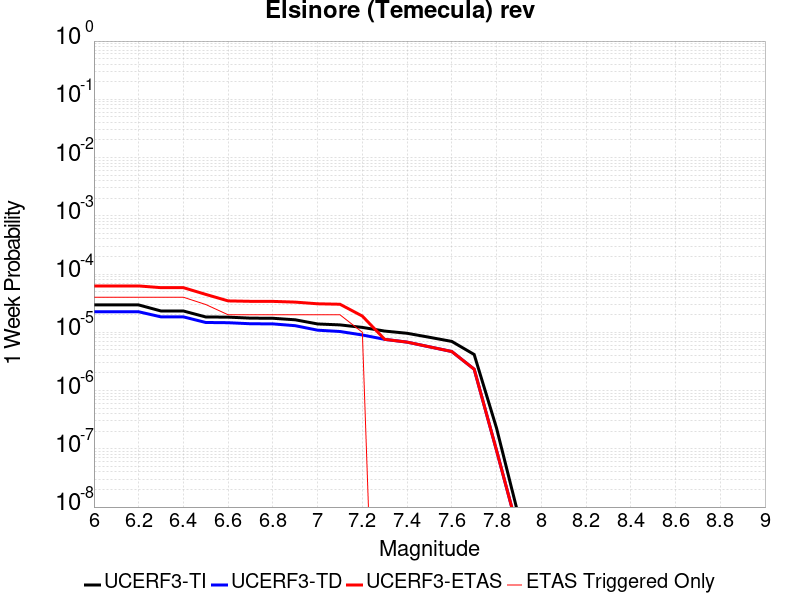 | 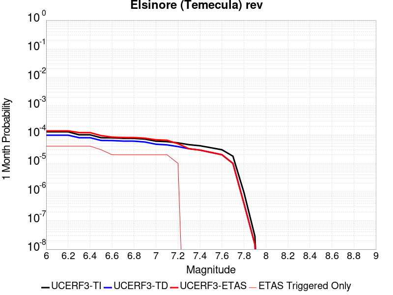 | 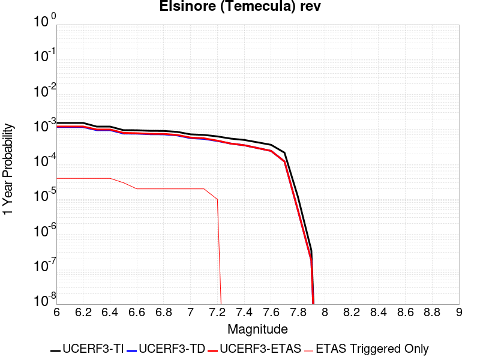 | 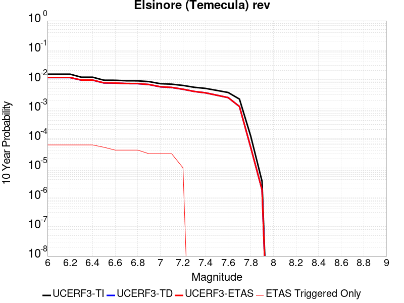 |

| Magnitude | 1 wk TI Prob | 1 wk TD Prob | 1 wk ETAS Prob | 1 wk ETAS/TD Gain | 1 wk ETAS Triggered Only | 1 mo TI Prob | 1 mo TD Prob | 1 mo ETAS Prob | 1 mo ETAS/TD Gain | 1 mo ETAS Triggered Only | 1 yr TI Prob | 1 yr TD Prob | 1 yr ETAS Prob | 1 yr ETAS/TD Gain | 1 yr ETAS Triggered Only | 10 yr TI Prob | 10 yr TD Prob | 10 yr ETAS Prob | 10 yr ETAS/TD Gain | 10 yr ETAS Triggered Only |
|-----|-----|-----|-----|-----|-----|-----|-----|-----|-----|-----|-----|-----|-----|-----|-----|-----|-----|-----|-----|-----|
| 6.0 | 2.9514995E-5 | 2.2517117E-5 | 2.2517117E-5 | 1.0 | 0.0 | 1.264867E-4 | 9.649849E-5 | 9.649849E-5 | 1.0 | 0.0 | 0.0015388876 | 0.0011742581 | 0.0011742581 | 1.0 | 0.0 | 0.015282745 | 0.011696897 | 0.0117364675 | 1.0033829 | 4.0038438E-5 |
| 6.1 | 2.9514995E-5 | 2.2517117E-5 | 2.2517117E-5 | 1.0 | 0.0 | 1.264867E-4 | 9.649849E-5 | 9.649849E-5 | 1.0 | 0.0 | 0.0015388876 | 0.0011742581 | 0.0011742581 | 1.0 | 0.0 | 0.015282745 | 0.011696897 | 0.0117364675 | 1.0033829 | 4.0038438E-5 |
| 6.2 | 2.9514995E-5 | 2.2517117E-5 | 2.2517117E-5 | 1.0 | 0.0 | 1.264867E-4 | 9.649849E-5 | 9.649849E-5 | 1.0 | 0.0 | 0.0015388876 | 0.0011742581 | 0.0011742581 | 1.0 | 0.0 | 0.015282745 | 0.011696897 | 0.0117364675 | 1.0033829 | 4.0038438E-5 |
| 6.3 | 2.3223649E-5 | 1.8406454E-5 | 1.8406454E-5 | 1.0 | 0.0 | 9.952613E-5 | 7.888251E-5 | 7.888251E-5 | 1.0 | 0.0 | 0.001211057 | 9.599888E-4 | 9.599888E-4 | 1.0 | 0.0 | 0.012044783 | 0.009569948 | 0.009609603 | 1.0041437 | 4.0038438E-5 |
| 6.4 | 2.3223649E-5 | 1.8406454E-5 | 1.8406454E-5 | 1.0 | 0.0 | 9.952613E-5 | 7.888251E-5 | 7.888251E-5 | 1.0 | 0.0 | 0.001211057 | 9.599888E-4 | 9.599888E-4 | 1.0 | 0.0 | 0.012044783 | 0.009569948 | 0.009609603 | 1.0041437 | 4.0038438E-5 |
| 6.5 | 1.8338875E-5 | 1.4750118E-5 | 1.4750118E-5 | 1.0 | 0.0 | 7.8592806E-5 | 6.321331E-5 | 6.321331E-5 | 1.0 | 0.0 | 9.5644733E-4 | 7.69359E-4 | 7.69359E-4 | 1.0 | 0.0 | 0.009523412 | 0.0076739118 | 0.007713643 | 1.0051774 | 4.0038438E-5 |
| 6.6 | 1.8223333E-5 | 1.4612673E-5 | 1.4612673E-5 | 1.0 | 0.0 | 7.809766E-5 | 6.262429E-5 | 6.262429E-5 | 1.0 | 0.0 | 9.504242E-4 | 7.6219277E-4 | 7.6219277E-4 | 1.0 | 0.0 | 0.009463696 | 0.0076027405 | 0.0076424745 | 1.0052263 | 4.0038438E-5 |
| 6.7 | 1.7512752E-5 | 1.402721E-5 | 1.402721E-5 | 1.0 | 0.0 | 7.505249E-5 | 6.011528E-5 | 6.011528E-5 | 1.0 | 0.0 | 9.13381E-4 | 7.3166634E-4 | 7.3166634E-4 | 1.0 | 0.0 | 0.00909636 | 0.00729892 | 0.007338666 | 1.0054455 | 4.0038438E-5 |
| 6.8 | 1.7417142E-5 | 1.3951195E-5 | 1.3951195E-5 | 1.0 | 0.0 | 7.4642754E-5 | 5.9789512E-5 | 5.9789512E-5 | 1.0 | 0.0 | 9.083966E-4 | 7.277028E-4 | 7.277028E-4 | 1.0 | 0.0 | 0.009046922 | 0.0072594886 | 0.0072992365 | 1.0054753 | 4.0038438E-5 |
| 6.9 | 1.6402591E-5 | 1.2988613E-5 | 1.2988613E-5 | 1.0 | 0.0 | 7.0294926E-5 | 5.5664343E-5 | 5.5664343E-5 | 1.0 | 0.0 | 8.5550465E-4 | 6.775103E-4 | 6.775103E-4 | 1.0 | 0.0 | 0.008522186 | 0.006760169 | 0.0067999368 | 1.0058826 | 4.0038438E-5 |
| 7.0 | 1.3912486E-5 | 1.0878233E-5 | 1.0878233E-5 | 1.0 | 0.0 | 5.9623577E-5 | 4.6620182E-5 | 4.6620182E-5 | 1.0 | 0.0 | 7.2567526E-4 | 5.674556E-4 | 5.674556E-4 | 1.0 | 0.0 | 0.0072331014 | 0.005663986 | 0.0057037976 | 1.0070289 | 4.0038438E-5 |
| 7.1 | 1.3405147E-5 | 1.03274215E-5 | 1.03274215E-5 | 1.0 | 0.0 | 5.7449364E-5 | 4.425964E-5 | 4.425964E-5 | 1.0 | 0.0 | 6.9922156E-4 | 5.3873047E-4 | 5.3873047E-4 | 1.0 | 0.0 | 0.0069702556 | 0.005377577 | 0.0054174 | 1.0074054 | 4.0038438E-5 |
| 7.2 | 1.21402E-5 | 8.996737E-6 | 8.996737E-6 | 1.0 | 0.0 | 5.202839E-5 | 3.8556886E-5 | 3.8556886E-5 | 1.0 | 0.0 | 6.332616E-4 | 4.6933076E-4 | 4.6933076E-4 | 1.0 | 0.0 | 0.0063146 | 0.004684821 | 0.004684821 | 1.0 | 0.0 |
| 7.3 | 1.05047775E-5 | 7.571771E-6 | 7.571771E-6 | 1.0 | 0.0 | 4.5019697E-5 | 3.245005E-5 | 3.245005E-5 | 1.0 | 0.0 | 5.4797693E-4 | 3.950092E-4 | 3.950092E-4 | 1.0 | 0.0 | 0.005466277 | 0.00394346 | 0.00394346 | 1.0 | 0.0 |
| 7.4 | 9.624483E-6 | 6.7868696E-6 | 6.7868696E-6 | 1.0 | 0.0 | 4.124713E-5 | 2.9086266E-5 | 2.9086266E-5 | 1.0 | 0.0 | 5.0206814E-4 | 3.5406914E-4 | 3.5406914E-4 | 1.0 | 0.0 | 0.005009353 | 0.003535204 | 0.003535204 | 1.0 | 0.0 |
| 7.5 | 8.215151E-6 | 5.635538E-6 | 5.635538E-6 | 1.0 | 0.0 | 3.5207315E-5 | 2.4152088E-5 | 2.4152088E-5 | 1.0 | 0.0 | 4.2856473E-4 | 2.9401327E-4 | 2.9401327E-4 | 1.0 | 0.0 | 0.004277392 | 0.002936371 | 0.002936371 | 1.0 | 0.0 |
| 7.6 | 6.975058E-6 | 4.676045E-6 | 4.676045E-6 | 1.0 | 0.0 | 2.9892764E-5 | 2.0040046E-5 | 2.0040046E-5 | 1.0 | 0.0 | 3.6388362E-4 | 2.439614E-4 | 2.439614E-4 | 1.0 | 0.0 | 0.0036328835 | 0.002437052 | 0.002437052 | 1.0 | 0.0 |
| 7.7 | 4.159604E-6 | 2.3269924E-6 | 2.3269924E-6 | 1.0 | 0.0 | 1.7826753E-5 | 9.97279E-6 | 9.97279E-6 | 1.0 | 0.0 | 2.1701909E-4 | 1.21412704E-4 | 1.21412704E-4 | 1.0 | 0.0 | 0.0021680726 | 0.0012135367 | 0.0012135367 | 1.0 | 0.0 |
| 7.8 | 2.2692414E-7 | 9.3854695E-8 | 9.3854695E-8 | 1.0 | 0.0 | 9.725317E-7 | 4.0223435E-7 | 4.0223435E-7 | 1.0 | 0.0 | 1.1840509E-5 | 4.8971956E-6 | 4.8971956E-6 | 1.0 | 0.0 | 1.1839878E-4 | 4.8971204E-5 | 4.8971204E-5 | 1.0 | 0.0 |
| 7.9 | 6.676829E-9 | 3.439853E-9 | 3.439853E-9 | 1.0 | 0.0 | 2.861498E-8 | 1.4742227E-8 | 1.4742227E-8 | 1.0 | 0.0 | 3.4838732E-7 | 1.7948659E-7 | 1.7948659E-7 | 1.0 | 0.0 | 3.4838679E-6 | 1.7948646E-6 | 1.7948646E-6 | 1.0 | 0.0 |

## San Diego Trough south
*[(top)](#table-of-contents)*

| 1 Week | 1 Month | 1 Year | 10 Year |
|-----|-----|-----|-----|
|  |  |  | 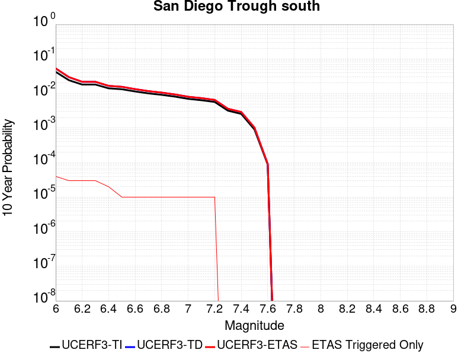 |

| Magnitude | 1 wk TI Prob | 1 wk TD Prob | 1 wk ETAS Prob | 1 wk ETAS/TD Gain | 1 wk ETAS Triggered Only | 1 mo TI Prob | 1 mo TD Prob | 1 mo ETAS Prob | 1 mo ETAS/TD Gain | 1 mo ETAS Triggered Only | 1 yr TI Prob | 1 yr TD Prob | 1 yr ETAS Prob | 1 yr ETAS/TD Gain | 1 yr ETAS Triggered Only | 10 yr TI Prob | 10 yr TD Prob | 10 yr ETAS Prob | 10 yr ETAS/TD Gain | 10 yr ETAS Triggered Only |
|-----|-----|-----|-----|-----|-----|-----|-----|-----|-----|-----|-----|-----|-----|-----|-----|-----|-----|-----|-----|-----|
| 6.0 | 8.279495E-5 | 1.04241306E-4 | 1.4427557E-4 | 1.3840537 | 4.0038438E-5 | 3.5478722E-4 | 4.4667677E-4 | 4.8669733E-4 | 1.0895963 | 4.0038438E-5 | 0.004310982 | 0.0054256152 | 0.0054654367 | 1.0073395 | 4.0038438E-5 | 0.042283054 | 0.05299221 | 0.053030126 | 1.0007155 | 4.0038438E-5 |
| 6.1 | 4.6961468E-5 | 5.772944E-5 | 9.7765565E-5 | 1.6935132 | 4.0038438E-5 | 2.0124791E-4 | 2.473894E-4 | 2.8741793E-4 | 1.1618037 | 4.0038438E-5 | 0.00244744 | 0.0030079768 | 0.0030478947 | 1.0132707 | 4.0038438E-5 | 0.024206603 | 0.029679462 | 0.029718312 | 1.001309 | 4.0038438E-5 |
| 6.2 | 3.5079658E-5 | 4.214154E-5 | 8.217829E-5 | 1.9500543 | 4.0038438E-5 | 1.5033272E-4 | 1.8059435E-4 | 2.2062556E-4 | 1.2216637 | 4.0038438E-5 | 0.0018287642 | 0.0021965632 | 0.0022365137 | 1.0181878 | 4.0038438E-5 | 0.018137876 | 0.021751117 | 0.021790285 | 1.0018007 | 4.0038438E-5 |
| 6.3 | 3.5079658E-5 | 4.214154E-5 | 8.217829E-5 | 1.9500543 | 4.0038438E-5 | 1.5033272E-4 | 1.8059435E-4 | 2.2062556E-4 | 1.2216637 | 4.0038438E-5 | 0.0018287642 | 0.0021965632 | 0.0022365137 | 1.0181878 | 4.0038438E-5 | 0.018137876 | 0.021751117 | 0.021790285 | 1.0018007 | 4.0038438E-5 |
| 6.4 | 2.7196904E-5 | 3.2087162E-5 | 3.2087162E-5 | 1.0 | 0.0 | 1.16552954E-4 | 1.3750927E-4 | 1.3750927E-4 | 1.0 | 0.0 | 0.0014181085 | 0.0016729041 | 0.0016729041 | 1.0 | 0.0 | 0.014090929 | 0.016604643 | 0.016604643 | 1.0 | 0.0 |
| 6.5 | 2.5584688E-5 | 3.010164E-5 | 3.010164E-5 | 1.0 | 0.0 | 1.0964406E-4 | 1.2900073E-4 | 1.2900073E-4 | 1.0 | 0.0 | 0.0013340989 | 0.0015694655 | 0.0015694655 | 1.0 | 0.0 | 0.013261181 | 0.015585314 | 0.015585314 | 1.0 | 0.0 |
| 6.6 | 2.2034688E-5 | 2.5742738E-5 | 2.5742738E-5 | 1.0 | 0.0 | 9.443096E-5 | 1.1032141E-4 | 1.1032141E-4 | 1.0 | 0.0 | 0.0011490905 | 0.0013423424 | 0.0013423424 | 1.0 | 0.0 | 0.011431668 | 0.013343317 | 0.013343317 | 1.0 | 0.0 |
| 6.7 | 1.9394853E-5 | 2.254176E-5 | 2.254176E-5 | 1.0 | 0.0 | 8.311815E-5 | 9.6603995E-5 | 9.6603995E-5 | 1.0 | 0.0 | 0.0010114936 | 0.0011755243 | 0.0011755243 | 1.0 | 0.0 | 0.01006902 | 0.011693766 | 0.011693766 | 1.0 | 0.0 |
| 6.8 | 1.7615313E-5 | 2.0403182E-5 | 2.0403182E-5 | 1.0 | 0.0 | 7.549201E-5 | 8.74393E-5 | 8.74393E-5 | 1.0 | 0.0 | 9.1872766E-4 | 0.0010640579 | 0.0010640579 | 1.0 | 0.0 | 0.009149387 | 0.010590198 | 0.010590198 | 1.0 | 0.0 |
| 6.9 | 1.5621423E-5 | 1.8026114E-5 | 1.8026114E-5 | 1.0 | 0.0 | 6.6947236E-5 | 7.725251E-5 | 7.725251E-5 | 1.0 | 0.0 | 8.147778E-4 | 9.40147E-4 | 9.40147E-4 | 1.0 | 0.0 | 0.008117969 | 0.009362142 | 0.009362142 | 1.0 | 0.0 |
| 7.0 | 1.3444376E-5 | 1.544809E-5 | 1.544809E-5 | 1.0 | 0.0 | 5.7617483E-5 | 6.620443E-5 | 6.620443E-5 | 1.0 | 0.0 | 7.0126704E-4 | 8.057436E-4 | 8.057436E-4 | 1.0 | 0.0 | 0.006990582 | 0.008028555 | 0.008028555 | 1.0 | 0.0 |
| 7.1 | 1.2268361E-5 | 1.407303E-5 | 1.407303E-5 | 1.0 | 0.0 | 5.2577634E-5 | 6.0311606E-5 | 6.0311606E-5 | 1.0 | 0.0 | 6.399447E-4 | 7.3404907E-4 | 7.3404907E-4 | 1.0 | 0.0 | 0.0063810493 | 0.0073165493 | 0.0073165493 | 1.0 | 0.0 |
| 7.2 | 1.0922655E-5 | 1.2513563E-5 | 1.2513563E-5 | 1.0 | 0.0 | 4.681054E-5 | 5.3628468E-5 | 5.3628468E-5 | 1.0 | 0.0 | 5.697693E-4 | 6.5273355E-4 | 6.5273355E-4 | 1.0 | 0.0 | 0.0056831064 | 0.0065084435 | 0.0065084435 | 1.0 | 0.0 |
| 7.3 | 6.1106753E-6 | 6.928925E-6 | 6.928925E-6 | 1.0 | 0.0 | 2.6188345E-5 | 2.9695057E-5 | 2.9695057E-5 | 1.0 | 0.0 | 3.1879646E-4 | 3.6147775E-4 | 3.6147775E-4 | 1.0 | 0.0 | 0.0031833951 | 0.003608943 | 0.003608943 | 1.0 | 0.0 |
| 7.4 | 4.933187E-6 | 5.5895525E-6 | 5.5895525E-6 | 1.0 | 0.0 | 2.114206E-5 | 2.3955008E-5 | 2.3955008E-5 | 1.0 | 0.0 | 2.5737417E-4 | 2.9161357E-4 | 2.9161357E-4 | 1.0 | 0.0 | 0.002570763 | 0.0029123505 | 0.0029123505 | 1.0 | 0.0 |
| 7.5 | 1.7489613E-6 | 1.969678E-6 | 1.969678E-6 | 1.0 | 0.0 | 7.495527E-6 | 8.4414505E-6 | 8.4414505E-6 | 1.0 | 0.0 | 9.125422E-5 | 1.02770035E-4 | 1.02770035E-4 | 1.0 | 0.0 | 9.1216754E-4 | 0.0010272472 | 0.0010272472 | 1.0 | 0.0 |
| 7.6 | 1.6988751E-7 | 1.7533823E-7 | 1.7533823E-7 | 1.0 | 0.0 | 7.2808916E-7 | 7.5144936E-7 | 7.5144936E-7 | 1.0 | 0.0 | 8.864449E-6 | 9.14886E-6 | 9.14886E-6 | 1.0 | 0.0 | 8.8640954E-5 | 9.1485024E-5 | 9.1485024E-5 | 1.0 | 0.0 |

## San Andreas (Peninsula) 2011 CFM
*[(top)](#table-of-contents)*

| 1 Week | 1 Month | 1 Year | 10 Year |
|-----|-----|-----|-----|
|  |  |  |  |

| Magnitude | 1 wk TI Prob | 1 wk TD Prob | 1 wk ETAS Prob | 1 wk ETAS/TD Gain | 1 wk ETAS Triggered Only | 1 mo TI Prob | 1 mo TD Prob | 1 mo ETAS Prob | 1 mo ETAS/TD Gain | 1 mo ETAS Triggered Only | 1 yr TI Prob | 1 yr TD Prob | 1 yr ETAS Prob | 1 yr ETAS/TD Gain | 1 yr ETAS Triggered Only | 10 yr TI Prob | 10 yr TD Prob | 10 yr ETAS Prob | 10 yr ETAS/TD Gain | 10 yr ETAS Triggered Only |
|-----|-----|-----|-----|-----|-----|-----|-----|-----|-----|-----|-----|-----|-----|-----|-----|-----|-----|-----|-----|-----|
| 6.0 | 8.6200685E-5 | 2.52136E-5 | 2.52136E-5 | 1.0 | 0.0 | 3.6937918E-4 | 1.0805382E-4 | 1.4808793E-4 | 1.3705015 | 4.0038438E-5 | 0.0044879215 | 0.001314763 | 0.0013547487 | 1.0304129 | 4.0038438E-5 | 0.043983612 | 0.014774441 | 0.014813888 | 1.0026699 | 4.0038438E-5 |
| 6.1 | 8.6200685E-5 | 2.52136E-5 | 2.52136E-5 | 1.0 | 0.0 | 3.6937918E-4 | 1.0805382E-4 | 1.4808793E-4 | 1.3705015 | 4.0038438E-5 | 0.0044879215 | 0.001314763 | 0.0013547487 | 1.0304129 | 4.0038438E-5 | 0.043983612 | 0.014774441 | 0.014813888 | 1.0026699 | 4.0038438E-5 |
| 6.2 | 8.6200685E-5 | 2.52136E-5 | 2.52136E-5 | 1.0 | 0.0 | 3.6937918E-4 | 1.0805382E-4 | 1.4808793E-4 | 1.3705015 | 4.0038438E-5 | 0.0044879215 | 0.001314763 | 0.0013547487 | 1.0304129 | 4.0038438E-5 | 0.043983612 | 0.014774441 | 0.014813888 | 1.0026699 | 4.0038438E-5 |
| 6.3 | 8.551163E-5 | 2.490552E-5 | 2.490552E-5 | 1.0 | 0.0 | 3.6642692E-4 | 1.06733576E-4 | 1.4676774E-4 | 1.375085 | 4.0038438E-5 | 0.004452125 | 0.0012987083 | 0.0013386947 | 1.0307894 | 4.0038438E-5 | 0.043639794 | 0.014601416 | 0.01464087 | 1.002702 | 4.0038438E-5 |
| 6.4 | 8.551163E-5 | 2.490552E-5 | 2.490552E-5 | 1.0 | 0.0 | 3.6642692E-4 | 1.06733576E-4 | 1.4676774E-4 | 1.375085 | 4.0038438E-5 | 0.004452125 | 0.0012987083 | 0.0013386947 | 1.0307894 | 4.0038438E-5 | 0.043639794 | 0.014601416 | 0.01464087 | 1.002702 | 4.0038438E-5 |
| 6.5 | 8.511146E-5 | 2.4726973E-5 | 2.4726973E-5 | 1.0 | 0.0 | 3.647124E-4 | 1.05968444E-4 | 1.4600264E-4 | 1.3777936 | 4.0038438E-5 | 0.004431336 | 0.0012894038 | 0.0013293906 | 1.0310118 | 4.0038438E-5 | 0.04344007 | 0.0145011945 | 0.014540652 | 1.002721 | 4.0038438E-5 |
| 6.6 | 8.4985084E-5 | 2.4657606E-5 | 2.4657606E-5 | 1.0 | 0.0 | 3.6417096E-4 | 1.05671184E-4 | 1.4570539E-4 | 1.3788564 | 4.0038438E-5 | 0.0044247704 | 0.001285789 | 0.0013257759 | 1.0310992 | 4.0038438E-5 | 0.043376986 | 0.014463263 | 0.014502722 | 1.0027282 | 4.0038438E-5 |
| 6.7 | 8.462618E-5 | 2.4486113E-5 | 2.4486113E-5 | 1.0 | 0.0 | 3.6263323E-4 | 1.0493627E-4 | 1.449705E-4 | 1.38151 | 4.0038438E-5 | 0.004406125 | 0.0012768519 | 0.0013168392 | 1.0313171 | 4.0038438E-5 | 0.043197807 | 0.01436807 | 0.014407533 | 1.0027466 | 4.0038438E-5 |
| 6.8 | 8.42337E-5 | 2.438192E-5 | 2.438192E-5 | 1.0 | 0.0 | 3.6095164E-4 | 1.04489765E-4 | 1.4452402E-4 | 1.3831404 | 4.0038438E-5 | 0.004385734 | 0.0012714221 | 0.0013114096 | 1.031451 | 4.0038438E-5 | 0.043001823 | 0.014308756 | 0.014348222 | 1.0027581 | 4.0038438E-5 |
| 6.9 | 8.365989E-5 | 2.4186513E-5 | 2.4186513E-5 | 1.0 | 0.0 | 3.5849313E-4 | 1.03652375E-4 | 1.4368666E-4 | 1.3862361 | 4.0038438E-5 | 0.004355922 | 0.0012612387 | 0.0013012267 | 1.0317053 | 4.0038438E-5 | 0.04271523 | 0.014201242 | 0.014240711 | 1.0027794 | 4.0038438E-5 |
| 7.0 | 8.30936E-5 | 2.3948E-5 | 2.3948E-5 | 1.0 | 0.0 | 3.560668E-4 | 1.02630256E-4 | 1.4266458E-4 | 1.3900831 | 4.0038438E-5 | 0.004326499 | 0.0012488087 | 0.0012887971 | 1.0320213 | 4.0038438E-5 | 0.042432297 | 0.014072227 | 0.014111702 | 1.0028051 | 4.0038438E-5 |
| 7.1 | 8.041264E-5 | 2.3634402E-5 | 2.3634402E-5 | 1.0 | 0.0 | 3.4458007E-4 | 1.0128637E-4 | 1.4132075E-4 | 1.3952593 | 4.0038438E-5 | 0.0041871946 | 0.0012324656 | 0.0012724546 | 1.0324464 | 4.0038438E-5 | 0.041091725 | 0.013895032 | 0.013934514 | 1.0028415 | 4.0038438E-5 |
| 7.2 | 7.8427016E-5 | 2.3058019E-5 | 2.3058019E-5 | 1.0 | 0.0 | 3.3607247E-4 | 9.8816345E-5 | 1.3885082E-4 | 1.4051403 | 4.0038438E-5 | 0.004084008 | 0.0012024266 | 0.0012424169 | 1.033258 | 4.0038438E-5 | 0.040097635 | 0.013579085 | 0.013618579 | 1.0029085 | 4.0038438E-5 |
| 7.3 | 7.721087E-5 | 2.2842805E-5 | 2.2842805E-5 | 1.0 | 0.0 | 3.3086175E-4 | 9.7894066E-5 | 1.3792858E-4 | 1.4089575 | 4.0038438E-5 | 0.004020803 | 0.0011912102 | 0.001231201 | 1.0335715 | 4.0038438E-5 | 0.03948827 | 0.013462781 | 0.01350228 | 1.002934 | 4.0038438E-5 |
| 7.4 | 7.3536525E-5 | 2.0960428E-5 | 2.0960428E-5 | 1.0 | 0.0 | 3.1511846E-4 | 8.982732E-5 | 1.2986216E-4 | 1.4456867 | 4.0038438E-5 | 0.0038298194 | 0.0010931002 | 0.0011330949 | 1.0365883 | 4.0038438E-5 | 0.037644852 | 0.012419564 | 0.012459105 | 1.0031837 | 4.0038438E-5 |
| 7.5 | 6.806207E-5 | 1.876674E-5 | 1.876674E-5 | 1.0 | 0.0 | 2.9166197E-4 | 8.042641E-5 | 1.2046163E-4 | 1.497787 | 4.0038438E-5 | 0.0035452035 | 9.787527E-4 | 0.001018752 | 1.0408676 | 4.0038438E-5 | 0.034891766 | 0.01117254 | 0.01121213 | 1.0035436 | 4.0038438E-5 |
| 7.6 | 5.6731416E-5 | 1.4177827E-5 | 1.4177827E-5 | 1.0 | 0.0 | 2.43112E-4 | 6.07607E-5 | 1.0079671E-4 | 1.6589128 | 4.0038438E-5 | 0.0029558712 | 7.395106E-4 | 7.7951944E-4 | 1.0541017 | 4.0038438E-5 | 0.02916862 | 0.008485565 | 0.0085252635 | 1.0046784 | 4.0038438E-5 |
| 7.7 | 4.946994E-5 | 1.3246218E-5 | 1.3246218E-5 | 1.0 | 0.0 | 2.1199681E-4 | 5.6768273E-5 | 9.680443E-5 | 1.705256 | 4.0038438E-5 | 0.002578006 | 6.9093466E-4 | 7.3094544E-4 | 1.0579082 | 4.0038438E-5 | 0.02548303 | 0.0079078935 | 0.007947615 | 1.005023 | 4.0038438E-5 |
| 7.8 | 3.9718198E-5 | 1.2982541E-5 | 1.2982541E-5 | 1.0 | 0.0 | 1.7020974E-4 | 5.5638273E-5 | 9.5674484E-5 | 1.7195804 | 4.0038438E-5 | 0.0020703338 | 6.771856E-4 | 7.171969E-4 | 1.0590848 | 4.0038438E-5 | 0.020511515 | 0.0077184658 | 0.0077581955 | 1.0051473 | 4.0038438E-5 |
| 7.9 | 2.4115114E-5 | 1.218559E-5 | 1.218559E-5 | 1.0 | 0.0 | 1.0334639E-4 | 5.2222913E-5 | 9.225926E-5 | 1.7666433 | 4.0038438E-5 | 0.001257516 | 6.3562865E-4 | 6.7564164E-4 | 1.0629503 | 4.0038438E-5 | 0.012504238 | 0.007159044 | 0.0071987957 | 1.0055526 | 4.0038438E-5 |
| 8.0 | 1.7756569E-5 | 1.1410005E-5 | 1.1410005E-5 | 1.0 | 0.0 | 7.6097356E-5 | 4.8899106E-5 | 8.893559E-5 | 1.8187569 | 4.0038438E-5 | 9.260915E-4 | 5.951841E-4 | 6.351987E-4 | 1.0672306 | 4.0038438E-5 | 0.009222416 | 0.006659493 | 0.0066992645 | 1.0059721 | 4.0038438E-5 |
| 8.1 | 1.3159258E-5 | 9.746194E-6 | 9.746194E-6 | 1.0 | 0.0 | 5.6395602E-5 | 4.1768737E-5 | 8.1805505E-5 | 1.9585342 | 4.0038438E-5 | 6.864001E-4 | 5.0841586E-4 | 5.484339E-4 | 1.0787113 | 4.0038438E-5 | 0.0068428386 | 0.005689538 | 0.0057293484 | 1.0069971 | 4.0038438E-5 |
| 8.2 | 8.635426E-6 | 5.466912E-6 | 5.466912E-6 | 1.0 | 0.0 | 3.700844E-5 | 2.3429413E-5 | 2.3429413E-5 | 1.0 | 0.0 | 4.5048463E-4 | 2.8521585E-4 | 2.8521585E-4 | 1.0 | 0.0 | 0.004495725 | 0.0032445018 | 0.0032445018 | 1.0 | 0.0 |
| 8.3 | 1.983087E-6 | 7.6599065E-7 | 7.6599065E-7 | 1.0 | 0.0 | 8.498917E-6 | 3.282813E-6 | 3.282813E-6 | 1.0 | 0.0 | 1.034694E-4 | 3.9967534E-5 | 3.9967534E-5 | 1.0 | 0.0 | 0.0010342124 | 4.719687E-4 | 4.719687E-4 | 1.0 | 0.0 |

## Sierra Madre
*[(top)](#table-of-contents)*

| 1 Week | 1 Month | 1 Year | 10 Year |
|-----|-----|-----|-----|
| 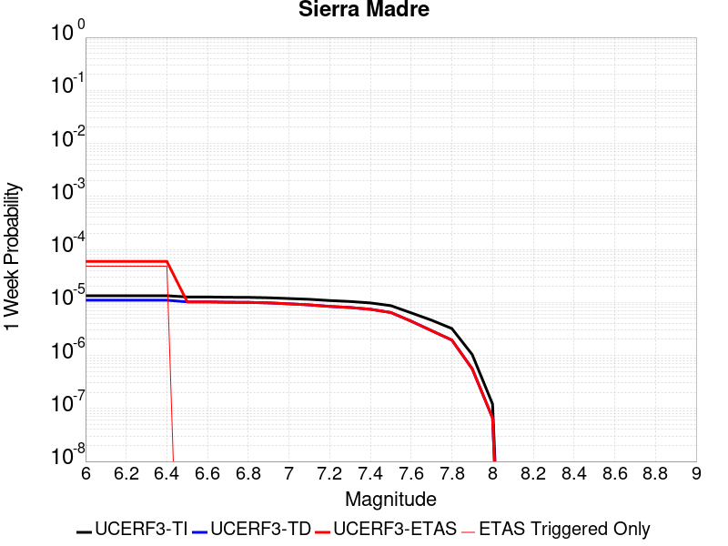 | 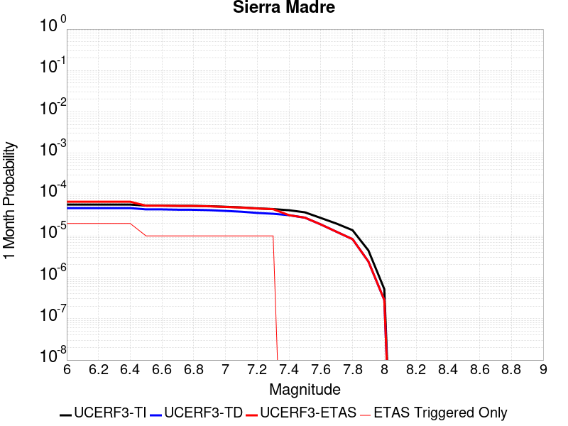 | 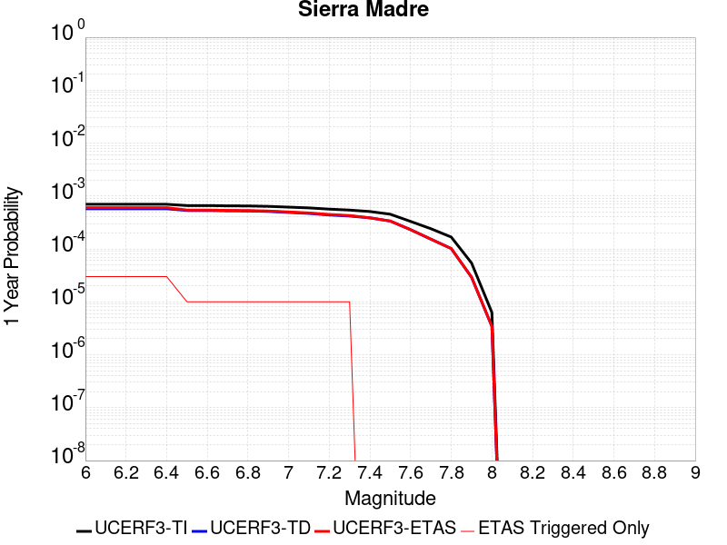 | 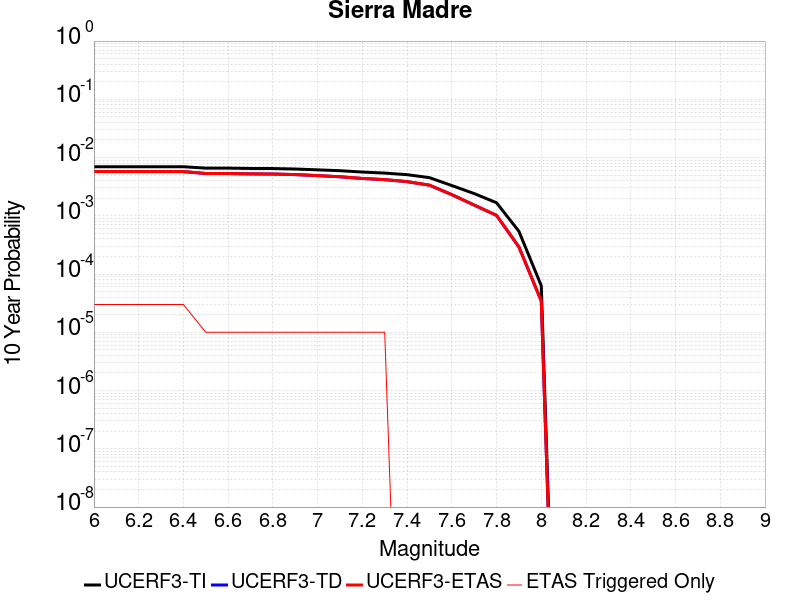 |

| Magnitude | 1 wk TI Prob | 1 wk TD Prob | 1 wk ETAS Prob | 1 wk ETAS/TD Gain | 1 wk ETAS Triggered Only | 1 mo TI Prob | 1 mo TD Prob | 1 mo ETAS Prob | 1 mo ETAS/TD Gain | 1 mo ETAS Triggered Only | 1 yr TI Prob | 1 yr TD Prob | 1 yr ETAS Prob | 1 yr ETAS/TD Gain | 1 yr ETAS Triggered Only | 10 yr TI Prob | 10 yr TD Prob | 10 yr ETAS Prob | 10 yr ETAS/TD Gain | 10 yr ETAS Triggered Only |
|-----|-----|-----|-----|-----|-----|-----|-----|-----|-----|-----|-----|-----|-----|-----|-----|-----|-----|-----|-----|-----|
| 6.0 | 1.3379373E-5 | 1.10007395E-5 | 5.1038736E-5 | 4.639573 | 4.0038438E-5 | 5.7338908E-5 | 4.7145186E-5 | 8.718173E-5 | 1.8492182 | 4.0038438E-5 | 6.978776E-4 | 5.738429E-4 | 6.138584E-4 | 1.0697324 | 4.0038438E-5 | 0.0069569005 | 0.0057239756 | 0.005763785 | 1.0069548 | 4.0038438E-5 |
| 6.1 | 1.3379373E-5 | 1.10007395E-5 | 5.1038736E-5 | 4.639573 | 4.0038438E-5 | 5.7338908E-5 | 4.7145186E-5 | 8.718173E-5 | 1.8492182 | 4.0038438E-5 | 6.978776E-4 | 5.738429E-4 | 6.138584E-4 | 1.0697324 | 4.0038438E-5 | 0.0069569005 | 0.0057239756 | 0.005763785 | 1.0069548 | 4.0038438E-5 |
| 6.2 | 1.3379373E-5 | 1.10007395E-5 | 5.1038736E-5 | 4.639573 | 4.0038438E-5 | 5.7338908E-5 | 4.7145186E-5 | 8.718173E-5 | 1.8492182 | 4.0038438E-5 | 6.978776E-4 | 5.738429E-4 | 6.138584E-4 | 1.0697324 | 4.0038438E-5 | 0.0069569005 | 0.0057239756 | 0.005763785 | 1.0069548 | 4.0038438E-5 |
| 6.3 | 1.3379373E-5 | 1.10007395E-5 | 5.1038736E-5 | 4.639573 | 4.0038438E-5 | 5.7338908E-5 | 4.7145186E-5 | 8.718173E-5 | 1.8492182 | 4.0038438E-5 | 6.978776E-4 | 5.738429E-4 | 6.138584E-4 | 1.0697324 | 4.0038438E-5 | 0.0069569005 | 0.0057239756 | 0.005763785 | 1.0069548 | 4.0038438E-5 |
| 6.4 | 1.3379373E-5 | 1.10007395E-5 | 5.1038736E-5 | 4.639573 | 4.0038438E-5 | 5.7338908E-5 | 4.7145186E-5 | 8.718173E-5 | 1.8492182 | 4.0038438E-5 | 6.978776E-4 | 5.738429E-4 | 6.138584E-4 | 1.0697324 | 4.0038438E-5 | 0.0069569005 | 0.0057239756 | 0.005763785 | 1.0069548 | 4.0038438E-5 |
| 6.5 | 1.26563245E-5 | 1.0230196E-5 | 1.0230196E-5 | 1.0 | 0.0 | 5.4240263E-5 | 4.3842967E-5 | 4.3842967E-5 | 1.0 | 0.0 | 6.601751E-4 | 5.336584E-4 | 5.336584E-4 | 1.0 | 0.0 | 0.006582173 | 0.0053240913 | 0.0053240913 | 1.0 | 0.0 |
| 6.6 | 1.26563245E-5 | 1.0230196E-5 | 1.0230196E-5 | 1.0 | 0.0 | 5.4240263E-5 | 4.3842967E-5 | 4.3842967E-5 | 1.0 | 0.0 | 6.601751E-4 | 5.336584E-4 | 5.336584E-4 | 1.0 | 0.0 | 0.006582173 | 0.0053240913 | 0.0053240913 | 1.0 | 0.0 |
| 6.7 | 1.2502474E-5 | 1.006634E-5 | 1.006634E-5 | 1.0 | 0.0 | 5.3580934E-5 | 4.314075E-5 | 4.314075E-5 | 1.0 | 0.0 | 6.521526E-4 | 5.251131E-4 | 5.251131E-4 | 1.0 | 0.0 | 0.0065024206 | 0.0052390425 | 0.0052390425 | 1.0 | 0.0 |
| 6.8 | 1.2454966E-5 | 1.0018625E-5 | 1.0018625E-5 | 1.0 | 0.0 | 5.3377335E-5 | 4.2936266E-5 | 4.2936266E-5 | 1.0 | 0.0 | 6.4967526E-4 | 5.226247E-4 | 5.226247E-4 | 1.0 | 0.0 | 0.006477792 | 0.0052142753 | 0.0052142753 | 1.0 | 0.0 |
| 6.9 | 1.2225574E-5 | 9.792602E-6 | 9.792602E-6 | 1.0 | 0.0 | 5.2394265E-5 | 4.1967625E-5 | 4.1967625E-5 | 1.0 | 0.0 | 6.3771347E-4 | 5.108371E-4 | 5.108371E-4 | 1.0 | 0.0 | 0.006358865 | 0.0050969445 | 0.0050969445 | 1.0 | 0.0 |
| 7.0 | 1.182946E-5 | 9.399144E-6 | 9.399144E-6 | 1.0 | 0.0 | 5.06967E-5 | 4.0281426E-5 | 4.0281426E-5 | 1.0 | 0.0 | 6.1705755E-4 | 4.9031706E-4 | 4.9031706E-4 | 1.0 | 0.0 | 0.006153469 | 0.004892664 | 0.004892664 | 1.0 | 0.0 |
| 7.1 | 1.14369095E-5 | 8.986159E-6 | 8.986159E-6 | 1.0 | 0.0 | 4.9014405E-5 | 3.8511545E-5 | 3.8511545E-5 | 1.0 | 0.0 | 5.9658696E-4 | 4.687782E-4 | 4.687782E-4 | 1.0 | 0.0 | 0.005949879 | 0.004678199 | 0.004678199 | 1.0 | 0.0 |
| 7.2 | 1.0836419E-5 | 8.3995565E-6 | 8.3995565E-6 | 1.0 | 0.0 | 4.644097E-5 | 3.5997607E-5 | 3.5997607E-5 | 1.0 | 0.0 | 5.652721E-4 | 4.3818366E-4 | 4.3818366E-4 | 1.0 | 0.0 | 0.0056383642 | 0.004373494 | 0.004373494 | 1.0 | 0.0 |
| 7.3 | 1.0403439E-5 | 8.02082E-6 | 8.02082E-6 | 1.0 | 0.0 | 4.4585406E-5 | 3.4374494E-5 | 3.4374494E-5 | 1.0 | 0.0 | 5.426921E-4 | 4.1843E-4 | 4.1843E-4 | 1.0 | 0.0 | 0.005413687 | 0.004176717 | 0.004176717 | 1.0 | 0.0 |
| 7.4 | 9.768864E-6 | 7.414448E-6 | 7.414448E-6 | 1.0 | 0.0 | 4.186589E-5 | 3.1775824E-5 | 3.1775824E-5 | 1.0 | 0.0 | 5.09598E-4 | 3.868029E-4 | 3.868029E-4 | 1.0 | 0.0 | 0.0050843097 | 0.0038615882 | 0.0038615882 | 1.0 | 0.0 |
| 7.5 | 8.687089E-6 | 6.4501564E-6 | 6.4501564E-6 | 1.0 | 0.0 | 3.722985E-5 | 2.764324E-5 | 2.764324E-5 | 1.0 | 0.0 | 4.5317915E-4 | 3.3650533E-4 | 3.3650533E-4 | 1.0 | 0.0 | 0.004522561 | 0.0033602451 | 0.0033602451 | 1.0 | 0.0 |
| 7.6 | 6.3506063E-6 | 4.4303215E-6 | 4.4303215E-6 | 1.0 | 0.0 | 2.72166E-5 | 1.8986955E-5 | 1.8986955E-5 | 1.0 | 0.0 | 3.3131172E-4 | 2.3114192E-4 | 2.3114192E-4 | 1.0 | 0.0 | 0.003308182 | 0.0023092402 | 0.0023092402 | 1.0 | 0.0 |
| 7.7 | 4.62223E-6 | 2.932967E-6 | 2.932967E-6 | 1.0 | 0.0 | 1.9809406E-5 | 1.2569798E-5 | 1.2569798E-5 | 1.0 | 0.0 | 2.4115283E-4 | 1.5302657E-4 | 1.5302657E-4 | 1.0 | 0.0 | 0.0024089129 | 0.001529413 | 0.001529413 | 1.0 | 0.0 |
| 7.8 | 3.2145008E-6 | 1.9494332E-6 | 1.9494332E-6 | 1.0 | 0.0 | 1.3776359E-5 | 8.3546865E-6 | 8.3546865E-6 | 1.0 | 0.0 | 1.6771426E-4 | 1.0171358E-4 | 1.0171358E-4 | 1.0 | 0.0 | 0.0016758774 | 0.0010168145 | 0.0010168145 | 1.0 | 0.0 |
| 7.9 | 1.0391769E-6 | 5.6026335E-7 | 5.6026335E-7 | 1.0 | 0.0 | 4.4536077E-6 | 2.4011265E-6 | 2.4011265E-6 | 1.0 | 0.0 | 5.4221324E-5 | 2.9233326E-5 | 2.9233326E-5 | 1.0 | 0.0 | 5.4208096E-4 | 2.9229524E-4 | 2.9229524E-4 | 1.0 | 0.0 |
| 8.0 | 1.210983E-7 | 6.613821E-8 | 6.613821E-8 | 1.0 | 0.0 | 5.1899264E-7 | 2.8344945E-7 | 2.8344945E-7 | 1.0 | 0.0 | 6.3187167E-6 | 3.4509917E-6 | 3.4509917E-6 | 1.0 | 0.0 | 6.318537E-5 | 3.45094E-5 | 3.45094E-5 | 1.0 | 0.0 |

## Blue Cut
*[(top)](#table-of-contents)*

| 1 Week | 1 Month | 1 Year | 10 Year |
|-----|-----|-----|-----|
|  |  |  |  |

| Magnitude | 1 wk TI Prob | 1 wk TD Prob | 1 wk ETAS Prob | 1 wk ETAS/TD Gain | 1 wk ETAS Triggered Only | 1 mo TI Prob | 1 mo TD Prob | 1 mo ETAS Prob | 1 mo ETAS/TD Gain | 1 mo ETAS Triggered Only | 1 yr TI Prob | 1 yr TD Prob | 1 yr ETAS Prob | 1 yr ETAS/TD Gain | 1 yr ETAS Triggered Only | 10 yr TI Prob | 10 yr TD Prob | 10 yr ETAS Prob | 10 yr ETAS/TD Gain | 10 yr ETAS Triggered Only |
|-----|-----|-----|-----|-----|-----|-----|-----|-----|-----|-----|-----|-----|-----|-----|-----|-----|-----|-----|-----|-----|
| 6.0 | 2.1227985E-5 | 2.2719574E-5 | 6.27571E-5 | 2.762248 | 4.0038438E-5 | 9.097391E-5 | 9.73663E-5 | 1.3740084E-4 | 1.4111745 | 4.0038438E-5 | 0.0011070445 | 0.0011848481 | 0.0012248391 | 1.033752 | 4.0038438E-5 | 0.011015458 | 0.011791152 | 0.011830718 | 1.0033556 | 4.0038438E-5 |
| 6.1 | 2.1227985E-5 | 2.2719574E-5 | 6.27571E-5 | 2.762248 | 4.0038438E-5 | 9.097391E-5 | 9.73663E-5 | 1.3740084E-4 | 1.4111745 | 4.0038438E-5 | 0.0011070445 | 0.0011848481 | 0.0012248391 | 1.033752 | 4.0038438E-5 | 0.011015458 | 0.011791152 | 0.011830718 | 1.0033556 | 4.0038438E-5 |
| 6.2 | 2.1227985E-5 | 2.2719574E-5 | 6.27571E-5 | 2.762248 | 4.0038438E-5 | 9.097391E-5 | 9.73663E-5 | 1.3740084E-4 | 1.4111745 | 4.0038438E-5 | 0.0011070445 | 0.0011848481 | 0.0012248391 | 1.033752 | 4.0038438E-5 | 0.011015458 | 0.011791152 | 0.011830718 | 1.0033556 | 4.0038438E-5 |
| 6.3 | 1.1613981E-5 | 1.2353542E-5 | 1.2353542E-5 | 1.0 | 0.0 | 4.9773254E-5 | 5.2942745E-5 | 5.2942745E-5 | 1.0 | 0.0 | 6.0582085E-4 | 6.443998E-4 | 6.443998E-4 | 1.0 | 0.0 | 0.0060417196 | 0.0064265593 | 0.0064265593 | 1.0 | 0.0 |
| 6.4 | 1.1613981E-5 | 1.2353542E-5 | 1.2353542E-5 | 1.0 | 0.0 | 4.9773254E-5 | 5.2942745E-5 | 5.2942745E-5 | 1.0 | 0.0 | 6.0582085E-4 | 6.443998E-4 | 6.443998E-4 | 1.0 | 0.0 | 0.0060417196 | 0.0064265593 | 0.0064265593 | 1.0 | 0.0 |
| 6.5 | 8.931326E-6 | 9.4816E-6 | 9.4816E-6 | 1.0 | 0.0 | 3.8276554E-5 | 4.0634844E-5 | 4.0634844E-5 | 1.0 | 0.0 | 4.6591737E-4 | 4.946261E-4 | 4.946261E-4 | 1.0 | 0.0 | 0.0046494175 | 0.004936161 | 0.004936161 | 1.0 | 0.0 |
| 6.6 | 7.345353E-6 | 7.79028E-6 | 7.79028E-6 | 1.0 | 0.0 | 3.1479703E-5 | 3.338653E-5 | 3.338653E-5 | 1.0 | 0.0 | 3.83198E-4 | 4.064132E-4 | 4.064132E-4 | 1.0 | 0.0 | 0.0038253788 | 0.0040574907 | 0.0040574907 | 1.0 | 0.0 |
| 6.7 | 6.2775666E-6 | 6.655149E-6 | 6.655149E-6 | 1.0 | 0.0 | 2.690358E-5 | 2.8521798E-5 | 2.8521798E-5 | 1.0 | 0.0 | 3.2750185E-4 | 3.472051E-4 | 3.472051E-4 | 1.0 | 0.0 | 0.0032701963 | 0.003467367 | 0.003467367 | 1.0 | 0.0 |
| 6.8 | 5.5234095E-6 | 5.8551113E-6 | 5.8551113E-6 | 1.0 | 0.0 | 2.367154E-5 | 2.5093133E-5 | 2.5093133E-5 | 1.0 | 0.0 | 2.8816288E-4 | 3.0547334E-4 | 3.0547334E-4 | 1.0 | 0.0 | 0.002877895 | 0.0030512505 | 0.0030512505 | 1.0 | 0.0 |
| 6.9 | 4.7780054E-6 | 5.0654203E-6 | 5.0654203E-6 | 1.0 | 0.0 | 2.0477004E-5 | 2.1708804E-5 | 2.1708804E-5 | 1.0 | 0.0 | 2.4927902E-4 | 2.642797E-4 | 2.642797E-4 | 1.0 | 0.0 | 0.0024899957 | 0.002640346 | 0.002640346 | 1.0 | 0.0 |
| 7.0 | 3.883171E-6 | 4.118487E-6 | 4.118487E-6 | 1.0 | 0.0 | 1.6642054E-5 | 1.7650578E-5 | 1.7650578E-5 | 1.0 | 0.0 | 2.0259817E-4 | 2.1488148E-4 | 2.1488148E-4 | 1.0 | 0.0 | 0.0020241356 | 0.0021474129 | 0.0021474129 | 1.0 | 0.0 |
| 7.1 | 2.8358215E-6 | 3.0097158E-6 | 3.0097158E-6 | 1.0 | 0.0 | 1.2153464E-5 | 1.2898756E-5 | 1.2898756E-5 | 1.0 | 0.0 | 1.4795837E-4 | 1.5703762E-4 | 1.5703762E-4 | 1.0 | 0.0 | 0.001478599 | 0.0015699116 | 0.0015699116 | 1.0 | 0.0 |

## Compton
*[(top)](#table-of-contents)*

| 1 Week | 1 Month | 1 Year | 10 Year |
|-----|-----|-----|-----|
| 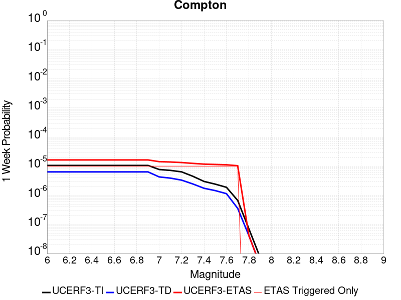 | 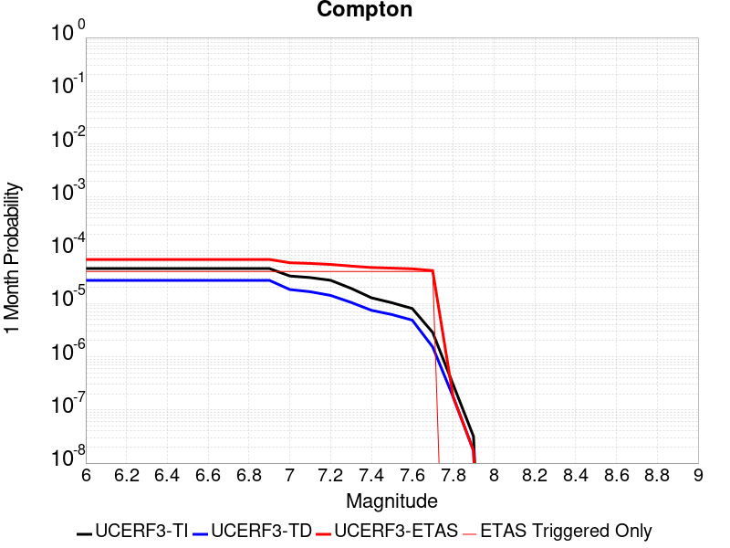 | 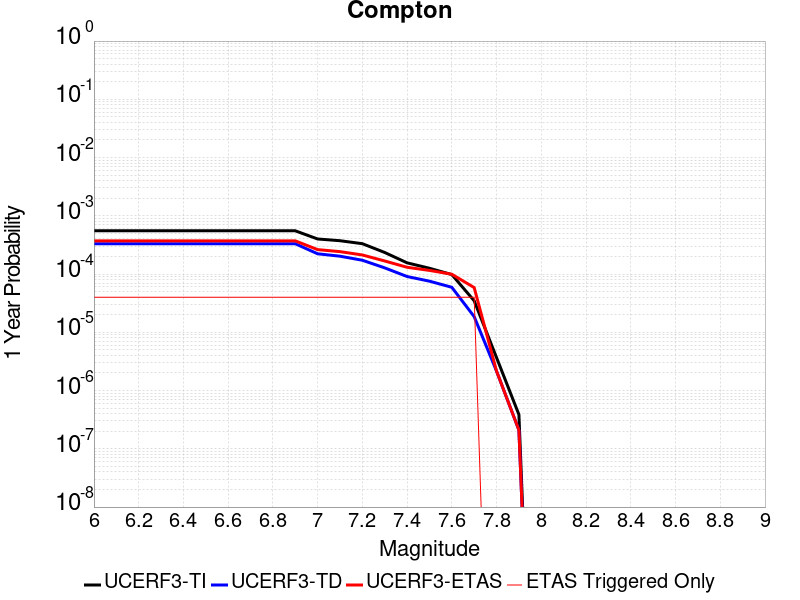 | 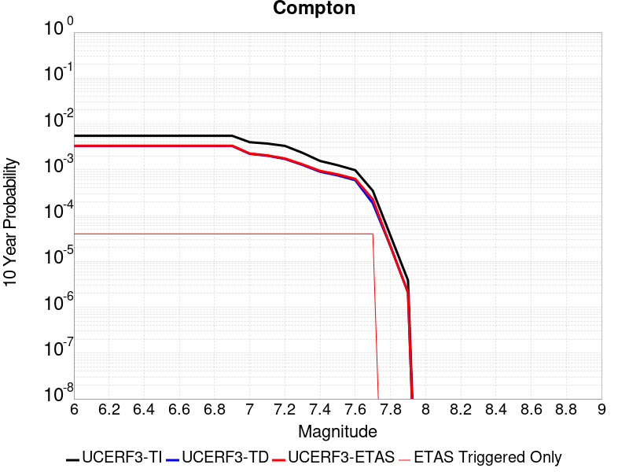 |

| Magnitude | 1 wk TI Prob | 1 wk TD Prob | 1 wk ETAS Prob | 1 wk ETAS/TD Gain | 1 wk ETAS Triggered Only | 1 mo TI Prob | 1 mo TD Prob | 1 mo ETAS Prob | 1 mo ETAS/TD Gain | 1 mo ETAS Triggered Only | 1 yr TI Prob | 1 yr TD Prob | 1 yr ETAS Prob | 1 yr ETAS/TD Gain | 1 yr ETAS Triggered Only | 10 yr TI Prob | 10 yr TD Prob | 10 yr ETAS Prob | 10 yr ETAS/TD Gain | 10 yr ETAS Triggered Only |
|-----|-----|-----|-----|-----|-----|-----|-----|-----|-----|-----|-----|-----|-----|-----|-----|-----|-----|-----|-----|-----|
| 6.0 | 1.06050875E-5 | 6.358671E-6 | 4.6396854E-5 | 7.296628 | 4.0038438E-5 | 4.5449582E-5 | 2.7251177E-5 | 6.728852E-5 | 2.469197 | 4.0038438E-5 | 5.5320817E-4 | 3.317354E-4 | 3.7176057E-4 | 1.1206539 | 4.0038438E-5 | 0.0055183303 | 0.0033126862 | 0.003352592 | 1.0120463 | 4.0038438E-5 |
| 6.1 | 1.06050875E-5 | 6.358671E-6 | 4.6396854E-5 | 7.296628 | 4.0038438E-5 | 4.5449582E-5 | 2.7251177E-5 | 6.728852E-5 | 2.469197 | 4.0038438E-5 | 5.5320817E-4 | 3.317354E-4 | 3.7176057E-4 | 1.1206539 | 4.0038438E-5 | 0.0055183303 | 0.0033126862 | 0.003352592 | 1.0120463 | 4.0038438E-5 |
| 6.2 | 1.06050875E-5 | 6.358671E-6 | 4.6396854E-5 | 7.296628 | 4.0038438E-5 | 4.5449582E-5 | 2.7251177E-5 | 6.728852E-5 | 2.469197 | 4.0038438E-5 | 5.5320817E-4 | 3.317354E-4 | 3.7176057E-4 | 1.1206539 | 4.0038438E-5 | 0.0055183303 | 0.0033126862 | 0.003352592 | 1.0120463 | 4.0038438E-5 |
| 6.3 | 1.06050875E-5 | 6.358671E-6 | 4.6396854E-5 | 7.296628 | 4.0038438E-5 | 4.5449582E-5 | 2.7251177E-5 | 6.728852E-5 | 2.469197 | 4.0038438E-5 | 5.5320817E-4 | 3.317354E-4 | 3.7176057E-4 | 1.1206539 | 4.0038438E-5 | 0.0055183303 | 0.0033126862 | 0.003352592 | 1.0120463 | 4.0038438E-5 |
| 6.4 | 1.06050875E-5 | 6.358671E-6 | 4.6396854E-5 | 7.296628 | 4.0038438E-5 | 4.5449582E-5 | 2.7251177E-5 | 6.728852E-5 | 2.469197 | 4.0038438E-5 | 5.5320817E-4 | 3.317354E-4 | 3.7176057E-4 | 1.1206539 | 4.0038438E-5 | 0.0055183303 | 0.0033126862 | 0.003352592 | 1.0120463 | 4.0038438E-5 |
| 6.5 | 1.06050875E-5 | 6.358671E-6 | 4.6396854E-5 | 7.296628 | 4.0038438E-5 | 4.5449582E-5 | 2.7251177E-5 | 6.728852E-5 | 2.469197 | 4.0038438E-5 | 5.5320817E-4 | 3.317354E-4 | 3.7176057E-4 | 1.1206539 | 4.0038438E-5 | 0.0055183303 | 0.0033126862 | 0.003352592 | 1.0120463 | 4.0038438E-5 |
| 6.6 | 1.06050875E-5 | 6.358671E-6 | 4.6396854E-5 | 7.296628 | 4.0038438E-5 | 4.5449582E-5 | 2.7251177E-5 | 6.728852E-5 | 2.469197 | 4.0038438E-5 | 5.5320817E-4 | 3.317354E-4 | 3.7176057E-4 | 1.1206539 | 4.0038438E-5 | 0.0055183303 | 0.0033126862 | 0.003352592 | 1.0120463 | 4.0038438E-5 |
| 6.7 | 1.06050875E-5 | 6.358671E-6 | 4.6396854E-5 | 7.296628 | 4.0038438E-5 | 4.5449582E-5 | 2.7251177E-5 | 6.728852E-5 | 2.469197 | 4.0038438E-5 | 5.5320817E-4 | 3.317354E-4 | 3.7176057E-4 | 1.1206539 | 4.0038438E-5 | 0.0055183303 | 0.0033126862 | 0.003352592 | 1.0120463 | 4.0038438E-5 |
| 6.8 | 1.06050875E-5 | 6.358671E-6 | 4.6396854E-5 | 7.296628 | 4.0038438E-5 | 4.5449582E-5 | 2.7251177E-5 | 6.728852E-5 | 2.469197 | 4.0038438E-5 | 5.5320817E-4 | 3.317354E-4 | 3.7176057E-4 | 1.1206539 | 4.0038438E-5 | 0.0055183303 | 0.0033126862 | 0.003352592 | 1.0120463 | 4.0038438E-5 |
| 6.9 | 1.06050875E-5 | 6.358671E-6 | 4.6396854E-5 | 7.296628 | 4.0038438E-5 | 4.5449582E-5 | 2.7251177E-5 | 6.728852E-5 | 2.469197 | 4.0038438E-5 | 5.5320817E-4 | 3.317354E-4 | 3.7176057E-4 | 1.1206539 | 4.0038438E-5 | 0.0055183303 | 0.0033126862 | 0.003352592 | 1.0120463 | 4.0038438E-5 |
| 7.0 | 7.672486E-6 | 4.2720512E-6 | 4.4310316E-5 | 10.372141 | 4.0038438E-5 | 3.288167E-5 | 1.8308665E-5 | 5.834637E-5 | 3.1868172 | 4.0038438E-5 | 4.0026082E-4 | 2.2288582E-4 | 2.6291533E-4 | 1.1795965 | 4.0038438E-5 | 0.0039954064 | 0.002226685 | 0.0022666343 | 1.0179411 | 4.0038438E-5 |
| 7.1 | 7.163992E-6 | 3.883762E-6 | 4.3922042E-5 | 11.30915 | 4.0038438E-5 | 3.0702464E-5 | 1.6644592E-5 | 5.6682362E-5 | 3.4054523 | 4.0038438E-5 | 3.7373835E-4 | 2.0262963E-4 | 2.4265995E-4 | 1.1975541 | 4.0038438E-5 | 0.0037311043 | 0.0020245055 | 0.002064463 | 1.0197369 | 4.0038438E-5 |
| 7.2 | 6.3689185E-6 | 3.3102428E-6 | 4.3348547E-5 | 13.095277 | 4.0038438E-5 | 2.729508E-5 | 1.418668E-5 | 5.422455E-5 | 3.8222156 | 4.0038438E-5 | 3.322669E-4 | 1.7270957E-4 | 2.1274108E-4 | 1.2317852 | 4.0038438E-5 | 0.0033177056 | 0.0017257951 | 0.0017657644 | 1.02316 | 4.0038438E-5 |
| 7.3 | 4.4987873E-6 | 2.4480942E-6 | 4.2486434E-5 | 17.3549 | 4.0038438E-5 | 1.9280375E-5 | 1.0491792E-5 | 5.052981E-5 | 4.816128 | 4.0038438E-5 | 2.3471327E-4 | 1.2773038E-4 | 1.677637E-4 | 1.3134205 | 4.0038438E-5 | 0.002344655 | 0.0012765999 | 0.0013165872 | 1.0313233 | 4.0038438E-5 |
| 7.4 | 2.987296E-6 | 1.7394335E-6 | 4.17778E-5 | 24.01805 | 4.0038438E-5 | 1.2802635E-5 | 7.454694E-6 | 4.749283E-5 | 6.370863 | 4.0038438E-5 | 1.5586092E-4 | 9.0757174E-5 | 1.3079197E-4 | 1.44112 | 4.0038438E-5 | 0.0015575165 | 9.072069E-4 | 9.47209E-4 | 1.0440937 | 4.0038438E-5 |
| 7.5 | 2.4111696E-6 | 1.4472155E-6 | 4.1485593E-5 | 28.665802 | 4.0038438E-5 | 1.0333543E-5 | 6.2023378E-6 | 4.6240526E-5 | 7.4553385 | 4.0038438E-5 | 1.2580362E-4 | 7.551089E-5 | 1.155463E-4 | 1.5301939 | 4.0038438E-5 | 0.0012573242 | 7.54857E-4 | 7.9486525E-4 | 1.053001 | 4.0038438E-5 |
| 7.6 | 1.8783096E-6 | 1.1360459E-6 | 4.1174437E-5 | 36.24364 | 4.0038438E-5 | 8.049874E-6 | 4.8687593E-6 | 4.4907E-5 | 9.2235 | 4.0038438E-5 | 9.8002805E-5 | 5.927557E-5 | 9.9311634E-5 | 1.6754227 | 4.0038438E-5 | 9.795959E-4 | 5.926016E-4 | 6.326163E-4 | 1.0675238 | 4.0038438E-5 |
| 7.7 | 6.6646817E-7 | 3.560237E-7 | 4.0394447E-5 | 113.45999 | 4.0038438E-5 | 2.856289E-6 | 1.525815E-6 | 4.156419E-5 | 27.240648 | 4.0038438E-5 | 3.4774763E-5 | 1.8576653E-5 | 5.8614347E-5 | 3.1552694 | 4.0038438E-5 | 3.4769322E-4 | 1.8575235E-4 | 2.2578335E-4 | 1.2155074 | 4.0038438E-5 |
| 7.8 | 7.054689E-8 | 4.1342968E-8 | 4.1342968E-8 | 1.0 | 0.0 | 3.0234378E-7 | 1.7718413E-7 | 1.7718413E-7 | 1.0 | 0.0 | 3.6810293E-6 | 2.1572148E-6 | 2.1572148E-6 | 1.0 | 0.0 | 3.6809684E-5 | 2.1571948E-5 | 2.1571948E-5 | 1.0 | 0.0 |
| 7.9 | 7.420925E-9 | 4.0131285E-9 | 4.0131285E-9 | 1.0 | 0.0 | 3.1803964E-8 | 1.7199122E-8 | 1.7199122E-8 | 1.0 | 0.0 | 3.872132E-7 | 2.093993E-7 | 2.093993E-7 | 1.0 | 0.0 | 3.872125E-6 | 2.0939913E-6 | 2.0939913E-6 | 1.0 | 0.0 |

## San Pedro Basin
*[(top)](#table-of-contents)*

| 1 Week | 1 Month | 1 Year | 10 Year |
|-----|-----|-----|-----|
|  |  |  |  |

| Magnitude | 1 wk TI Prob | 1 wk TD Prob | 1 wk ETAS Prob | 1 wk ETAS/TD Gain | 1 wk ETAS Triggered Only | 1 mo TI Prob | 1 mo TD Prob | 1 mo ETAS Prob | 1 mo ETAS/TD Gain | 1 mo ETAS Triggered Only | 1 yr TI Prob | 1 yr TD Prob | 1 yr ETAS Prob | 1 yr ETAS/TD Gain | 1 yr ETAS Triggered Only | 10 yr TI Prob | 10 yr TD Prob | 10 yr ETAS Prob | 10 yr ETAS/TD Gain | 10 yr ETAS Triggered Only |
|-----|-----|-----|-----|-----|-----|-----|-----|-----|-----|-----|-----|-----|-----|-----|-----|-----|-----|-----|-----|-----|
| 6.0 | 5.3449043E-5 | 6.336954E-5 | 1.0340544E-4 | 1.6317847 | 4.0038438E-5 | 2.2904722E-4 | 2.715589E-4 | 3.1158648E-4 | 1.1473992 | 4.0038438E-5 | 0.0027850836 | 0.0033018254 | 0.0033417316 | 1.0120862 | 4.0038438E-5 | 0.027504366 | 0.03258945 | 0.032628186 | 1.0011885 | 4.0038438E-5 |
| 6.1 | 5.3449043E-5 | 6.336954E-5 | 1.0340544E-4 | 1.6317847 | 4.0038438E-5 | 2.2904722E-4 | 2.715589E-4 | 3.1158648E-4 | 1.1473992 | 4.0038438E-5 | 0.0027850836 | 0.0033018254 | 0.0033417316 | 1.0120862 | 4.0038438E-5 | 0.027504366 | 0.03258945 | 0.032628186 | 1.0011885 | 4.0038438E-5 |
| 6.2 | 2.3189454E-5 | 2.6642796E-5 | 6.6680164E-5 | 2.5027466 | 4.0038438E-5 | 9.9379584E-5 | 1.14178685E-4 | 1.5421255E-4 | 1.3506247 | 4.0038438E-5 | 0.0012092749 | 0.0013892864 | 0.0014292692 | 1.0287794 | 4.0038438E-5 | 0.012027155 | 0.013810883 | 0.0138503695 | 1.002859 | 4.0038438E-5 |
| 6.3 | 2.3189454E-5 | 2.6642796E-5 | 6.6680164E-5 | 2.5027466 | 4.0038438E-5 | 9.9379584E-5 | 1.14178685E-4 | 1.5421255E-4 | 1.3506247 | 4.0038438E-5 | 0.0012092749 | 0.0013892864 | 0.0014292692 | 1.0287794 | 4.0038438E-5 | 0.012027155 | 0.013810883 | 0.0138503695 | 1.002859 | 4.0038438E-5 |
| 6.4 | 1.966056E-5 | 2.2463413E-5 | 6.250095E-5 | 2.7823443 | 4.0038438E-5 | 8.425682E-5 | 9.626844E-5 | 1.3630303E-4 | 1.415864 | 4.0038438E-5 | 0.001025344 | 0.0011714783 | 0.0012114699 | 1.0341376 | 4.0038438E-5 | 0.010206259 | 0.011657117 | 0.011696688 | 1.0033946 | 4.0038438E-5 |
| 6.5 | 1.7342953E-5 | 1.9745148E-5 | 5.9782793E-5 | 3.0277207 | 4.0038438E-5 | 7.4324824E-5 | 8.4619525E-5 | 1.2465457E-4 | 1.4731183 | 4.0038438E-5 | 9.04529E-4 | 0.0010297928 | 0.00106979 | 1.03884 | 4.0038438E-5 | 0.009008561 | 0.010253931 | 0.010293559 | 1.0038646 | 4.0038438E-5 |
| 6.6 | 1.439804E-5 | 1.6322716E-5 | 5.63605E-5 | 3.4528873 | 4.0038438E-5 | 6.170443E-5 | 6.99528E-5 | 1.0998844E-4 | 1.5723236 | 4.0038438E-5 | 7.509924E-4 | 8.513747E-4 | 8.91379E-4 | 1.0469879 | 4.0038438E-5 | 0.0074845953 | 0.008484332 | 0.008524031 | 1.0046791 | 4.0038438E-5 |
| 6.7 | 1.2634884E-5 | 1.4285297E-5 | 5.432316E-5 | 3.8027325 | 4.0038438E-5 | 5.414838E-5 | 6.1221435E-5 | 1.0125742E-4 | 1.6539537 | 4.0038438E-5 | 6.590571E-4 | 7.4514654E-4 | 7.8515516E-4 | 1.0536922 | 4.0038438E-5 | 0.006571059 | 0.007429501 | 0.007469242 | 1.005349 | 4.0038438E-5 |
| 6.8 | 1.146091E-5 | 1.2933192E-5 | 5.297111E-5 | 4.0957494 | 4.0038438E-5 | 4.911726E-5 | 5.5426954E-5 | 9.546317E-5 | 1.722324 | 4.0038438E-5 | 5.9783855E-4 | 6.7464396E-4 | 7.146554E-4 | 1.0593075 | 4.0038438E-5 | 0.0059623276 | 0.006728899 | 0.006768668 | 1.0059102 | 4.0038438E-5 |
| 6.9 | 9.109035E-6 | 1.0235011E-5 | 5.027304E-5 | 4.911869 | 4.0038438E-5 | 3.9038136E-5 | 4.3863754E-5 | 8.3900435E-5 | 1.9127508 | 4.0038438E-5 | 4.7518566E-4 | 5.3393835E-4 | 5.739554E-4 | 1.074947 | 4.0038438E-5 | 0.0047417083 | 0.005329309 | 0.005369134 | 1.0074729 | 4.0038438E-5 |
| 7.0 | 5.9351028E-6 | 6.583964E-6 | 4.662214E-5 | 7.0811653 | 4.0038438E-5 | 2.5435906E-5 | 2.8216817E-5 | 6.825412E-5 | 2.4189165 | 4.0038438E-5 | 3.0963816E-4 | 3.435092E-4 | 3.835339E-4 | 1.1165171 | 4.0038438E-5 | 0.0030920706 | 0.0034320992 | 0.0034720001 | 1.0116259 | 4.0038438E-5 |
| 7.1 | 2.1557585E-6 | 2.209648E-6 | 4.2247997E-5 | 19.119785 | 4.0038438E-5 | 9.238933E-6 | 9.469887E-6 | 4.9507944E-5 | 5.227934 | 4.0038438E-5 | 1.1247819E-4 | 1.1528993E-4 | 1.5532375E-4 | 1.3472447 | 4.0038438E-5 | 0.0011242128 | 0.0011523166 | 0.0011923088 | 1.034706 | 4.0038438E-5 |
| 7.2 | 2.1251979E-6 | 2.1779945E-6 | 4.2216343E-5 | 19.383127 | 4.0038438E-5 | 9.107958E-6 | 9.334229E-6 | 4.937229E-5 | 5.289381 | 4.0038438E-5 | 1.1088375E-4 | 1.1363847E-4 | 1.5367236E-4 | 1.3522917 | 4.0038438E-5 | 0.0011082845 | 0.0011358189 | 0.0011758119 | 1.0352107 | 4.0038438E-5 |
| 7.3 | 1.7145798E-6 | 1.7442874E-6 | 4.1782656E-5 | 23.953997 | 4.0038438E-5 | 7.3481783E-6 | 7.4754967E-6 | 4.7513633E-5 | 6.355917 | 4.0038438E-5 | 8.94604E-5 | 9.1010465E-5 | 1.3104525E-4 | 1.4398922 | 4.0038438E-5 | 8.9424395E-4 | 9.0974104E-4 | 9.4974303E-4 | 1.0439708 | 4.0038438E-5 |
| 7.4 | 1.4467993E-6 | 1.4641868E-6 | 4.1502564E-5 | 28.34513 | 4.0038438E-5 | 6.200554E-6 | 6.2750714E-6 | 4.6313256E-5 | 7.380515 | 4.0038438E-5 | 7.548913E-5 | 7.639639E-5 | 1.16431765E-4 | 1.5240481 | 4.0038438E-5 | 7.546349E-4 | 7.6370855E-4 | 8.0371636E-4 | 1.0523863 | 4.0038438E-5 |
| 7.5 | 1.2803735E-6 | 1.2931497E-6 | 4.1331536E-5 | 31.961912 | 4.0038438E-5 | 5.487303E-6 | 5.5420587E-6 | 4.5580273E-5 | 8.22443 | 4.0038438E-5 | 6.680587E-5 | 6.7472545E-5 | 1.07508284E-4 | 1.5933633 | 4.0038438E-5 | 6.678579E-4 | 6.7452766E-4 | 7.145391E-4 | 1.0593177 | 4.0038438E-5 |
| 7.6 | 6.755009E-7 | 6.769465E-7 | 4.0715357E-5 | 60.1456 | 4.0038438E-5 | 2.8950008E-6 | 2.9011965E-6 | 4.293952E-5 | 14.800623 | 4.0038438E-5 | 3.5246063E-5 | 3.5321555E-5 | 7.535858E-5 | 2.1335013 | 4.0038438E-5 | 3.5240475E-4 | 3.5316512E-4 | 3.931894E-4 | 1.1133302 | 4.0038438E-5 |
| 7.7 | 6.211885E-8 | 4.569953E-8 | 4.569953E-8 | 1.0 | 0.0 | 2.6622362E-7 | 1.9585512E-7 | 1.9585512E-7 | 1.0 | 0.0 | 3.2412677E-6 | 2.3845337E-6 | 2.3845337E-6 | 1.0 | 0.0 | 3.2412205E-5 | 2.3845101E-5 | 2.3845101E-5 | 1.0 | 0.0 |
| 7.8 | 2.6580573E-9 | 1.5138163E-9 | 1.5138163E-9 | 1.0 | 0.0 | 1.1391674E-8 | 6.487784E-9 | 6.487784E-9 | 1.0 | 0.0 | 1.3869362E-7 | 7.898877E-8 | 7.898877E-8 | 1.0 | 0.0 | 1.3869354E-6 | 7.898877E-7 | 7.898877E-7 | 1.0 | 0.0 |

## Simi-Santa Rosa
*[(top)](#table-of-contents)*

| 1 Week | 1 Month | 1 Year | 10 Year |
|-----|-----|-----|-----|
| 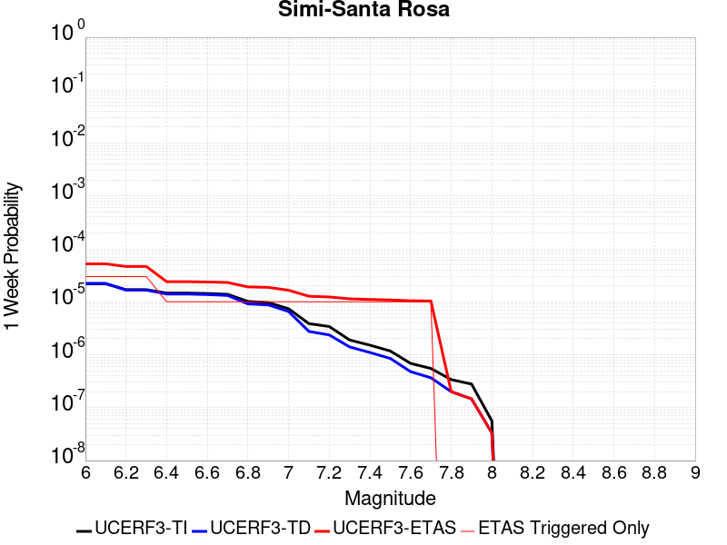 |  |  |  |

| Magnitude | 1 wk TI Prob | 1 wk TD Prob | 1 wk ETAS Prob | 1 wk ETAS/TD Gain | 1 wk ETAS Triggered Only | 1 mo TI Prob | 1 mo TD Prob | 1 mo ETAS Prob | 1 mo ETAS/TD Gain | 1 mo ETAS Triggered Only | 1 yr TI Prob | 1 yr TD Prob | 1 yr ETAS Prob | 1 yr ETAS/TD Gain | 1 yr ETAS Triggered Only | 10 yr TI Prob | 10 yr TD Prob | 10 yr ETAS Prob | 10 yr ETAS/TD Gain | 10 yr ETAS Triggered Only |
|-----|-----|-----|-----|-----|-----|-----|-----|-----|-----|-----|-----|-----|-----|-----|-----|-----|-----|-----|-----|-----|
| 6.0 | 2.198912E-5 | 2.2275442E-5 | 6.231299E-5 | 2.797385 | 4.0038438E-5 | 9.4235686E-5 | 9.5462936E-5 | 1.3549755E-4 | 1.4193734 | 4.0038438E-5 | 0.0011467156 | 0.0011616853 | 0.0012016773 | 1.0344257 | 4.0038438E-5 | 0.011408163 | 0.011560575 | 0.011600151 | 1.0034233 | 4.0038438E-5 |
| 6.1 | 2.198912E-5 | 2.2275442E-5 | 6.231299E-5 | 2.797385 | 4.0038438E-5 | 9.4235686E-5 | 9.5462936E-5 | 1.3549755E-4 | 1.4193734 | 4.0038438E-5 | 0.0011467156 | 0.0011616853 | 0.0012016773 | 1.0344257 | 4.0038438E-5 | 0.011408163 | 0.011560575 | 0.011600151 | 1.0034233 | 4.0038438E-5 |
| 6.2 | 1.69983E-5 | 1.6668559E-5 | 5.670633E-5 | 3.4019935 | 4.0038438E-5 | 7.284782E-5 | 7.143489E-5 | 1.11470465E-4 | 1.5604485 | 4.0038438E-5 | 8.865613E-4 | 8.6940196E-4 | 9.094056E-4 | 1.0460128 | 4.0038438E-5 | 0.008830327 | 0.008662928 | 0.008702619 | 1.0045818 | 4.0038438E-5 |
| 6.3 | 1.69983E-5 | 1.6668559E-5 | 5.670633E-5 | 3.4019935 | 4.0038438E-5 | 7.284782E-5 | 7.143489E-5 | 1.11470465E-4 | 1.5604485 | 4.0038438E-5 | 8.865613E-4 | 8.6940196E-4 | 9.094056E-4 | 1.0460128 | 4.0038438E-5 | 0.008830327 | 0.008662928 | 0.008702619 | 1.0045818 | 4.0038438E-5 |
| 6.4 | 1.4666188E-5 | 1.4052543E-5 | 1.4052543E-5 | 1.0 | 0.0 | 6.285358E-5 | 6.0223934E-5 | 6.0223934E-5 | 1.0 | 0.0 | 7.6497364E-4 | 7.3300465E-4 | 7.3300465E-4 | 1.0 | 0.0 | 0.0076234564 | 0.007308344 | 0.007308344 | 1.0 | 0.0 |
| 6.5 | 1.4666188E-5 | 1.4052543E-5 | 1.4052543E-5 | 1.0 | 0.0 | 6.285358E-5 | 6.0223934E-5 | 6.0223934E-5 | 1.0 | 0.0 | 7.6497364E-4 | 7.3300465E-4 | 7.3300465E-4 | 1.0 | 0.0 | 0.0076234564 | 0.007308344 | 0.007308344 | 1.0 | 0.0 |
| 6.6 | 1.4377586E-5 | 1.3729583E-5 | 1.3729583E-5 | 1.0 | 0.0 | 6.1616774E-5 | 5.883988E-5 | 5.883988E-5 | 1.0 | 0.0 | 7.4992597E-4 | 7.1616494E-4 | 7.1616494E-4 | 1.0 | 0.0 | 0.007474003 | 0.0071410383 | 0.0071410383 | 1.0 | 0.0 |
| 6.7 | 1.3881404E-5 | 1.320755E-5 | 1.320755E-5 | 1.0 | 0.0 | 5.9490372E-5 | 5.66027E-5 | 5.66027E-5 | 1.0 | 0.0 | 7.240546E-4 | 6.8894465E-4 | 6.8894465E-4 | 1.0 | 0.0 | 0.007217 | 0.006870538 | 0.006870538 | 1.0 | 0.0 |
| 6.8 | 1.0176516E-5 | 9.154151E-6 | 9.154151E-6 | 1.0 | 0.0 | 4.3612912E-5 | 3.9231574E-5 | 3.9231574E-5 | 1.0 | 0.0 | 5.308578E-4 | 4.7755634E-4 | 4.7755634E-4 | 1.0 | 0.0 | 0.0052959146 | 0.004766934 | 0.004766934 | 1.0 | 0.0 |
| 6.9 | 9.699797E-6 | 8.774719E-6 | 8.774719E-6 | 1.0 | 0.0 | 4.15699E-5 | 3.7605492E-5 | 3.7605492E-5 | 1.0 | 0.0 | 5.05996E-4 | 4.577671E-4 | 4.577671E-4 | 1.0 | 0.0 | 0.005048454 | 0.0045698597 | 0.0045698597 | 1.0 | 0.0 |
| 7.0 | 7.4049476E-6 | 6.559333E-6 | 6.559333E-6 | 1.0 | 0.0 | 3.1735104E-5 | 2.8111197E-5 | 2.8111197E-5 | 1.0 | 0.0 | 3.8630638E-4 | 3.422127E-4 | 3.422127E-4 | 1.0 | 0.0 | 0.0038563553 | 0.0034180996 | 0.0034180996 | 1.0 | 0.0 |
| 7.1 | 3.873439E-6 | 2.7595095E-6 | 2.7595095E-6 | 1.0 | 0.0 | 1.6600346E-5 | 1.1826417E-5 | 1.1826417E-5 | 1.0 | 0.0 | 2.0209046E-4 | 1.4397735E-4 | 1.4397735E-4 | 1.0 | 0.0 | 0.0020190678 | 0.0014388643 | 0.0014388643 | 1.0 | 0.0 |
| 7.2 | 3.417706E-6 | 2.3676484E-6 | 2.3676484E-6 | 1.0 | 0.0 | 1.4647229E-5 | 1.0147027E-5 | 1.0147027E-5 | 1.0 | 0.0 | 1.7831543E-4 | 1.2353327E-4 | 1.2353327E-4 | 1.0 | 0.0 | 0.0017817242 | 0.0012346683 | 0.0012346683 | 1.0 | 0.0 |
| 7.3 | 1.90225E-6 | 1.4073753E-6 | 1.4073753E-6 | 1.0 | 0.0 | 8.152474E-6 | 6.0315947E-6 | 6.0315947E-6 | 1.0 | 0.0 | 9.9251854E-5 | 7.343221E-5 | 7.343221E-5 | 1.0 | 0.0 | 9.920754E-4 | 7.340817E-4 | 7.340817E-4 | 1.0 | 0.0 |
| 7.4 | 1.5170556E-6 | 1.1024773E-6 | 1.1024773E-6 | 1.0 | 0.0 | 6.5016507E-6 | 4.724894E-6 | 4.724894E-6 | 1.0 | 0.0 | 7.915472E-5 | 5.7524077E-5 | 5.7524077E-5 | 1.0 | 0.0 | 7.9126534E-4 | 5.7509297E-4 | 5.7509297E-4 | 1.0 | 0.0 |
| 7.5 | 1.178732E-6 | 8.535102E-7 | 8.535102E-7 | 1.0 | 0.0 | 5.0516987E-6 | 3.6578958E-6 | 3.6578958E-6 | 1.0 | 0.0 | 6.1502695E-5 | 4.453398E-5 | 4.453398E-5 | 1.0 | 0.0 | 6.148568E-4 | 4.452515E-4 | 4.452515E-4 | 1.0 | 0.0 |
| 7.6 | 6.8722386E-7 | 4.793198E-7 | 4.793198E-7 | 1.0 | 0.0 | 2.9452417E-6 | 2.054226E-6 | 2.054226E-6 | 1.0 | 0.0 | 3.5857727E-5 | 2.5009915E-5 | 2.5009915E-5 | 1.0 | 0.0 | 3.5851944E-4 | 2.5007114E-4 | 2.5007114E-4 | 1.0 | 0.0 |
| 7.7 | 5.5126515E-7 | 3.6731157E-7 | 3.6731157E-7 | 1.0 | 0.0 | 2.3625628E-6 | 1.5741915E-6 | 1.5741915E-6 | 1.0 | 0.0 | 2.8763823E-5 | 1.9165615E-5 | 1.9165615E-5 | 1.0 | 0.0 | 2.87601E-4 | 1.9163972E-4 | 1.9163972E-4 | 1.0 | 0.0 |
| 7.8 | 3.3860243E-7 | 2.0075942E-7 | 2.0075942E-7 | 1.0 | 0.0 | 1.4511525E-6 | 8.6039717E-7 | 8.6039717E-7 | 1.0 | 0.0 | 1.7667637E-5 | 1.0475286E-5 | 1.0475286E-5 | 1.0 | 0.0 | 1.7666233E-4 | 1.04747975E-4 | 1.04747975E-4 | 1.0 | 0.0 |
| 7.9 | 2.7955386E-7 | 1.4649108E-7 | 1.4649108E-7 | 1.0 | 0.0 | 1.1980875E-6 | 6.278188E-7 | 6.278188E-7 | 1.0 | 0.0 | 1.4586617E-5 | 7.643667E-6 | 7.643667E-6 | 1.0 | 0.0 | 1.458566E-4 | 7.643409E-5 | 7.643409E-5 | 1.0 | 0.0 |
| 8.0 | 5.6259015E-8 | 3.3355324E-8 | 3.3355324E-8 | 1.0 | 0.0 | 2.4111003E-7 | 1.4295138E-7 | 1.4295138E-7 | 1.0 | 0.0 | 2.9355108E-6 | 1.7404317E-6 | 1.7404317E-6 | 1.0 | 0.0 | 2.935472E-5 | 1.7404194E-5 | 1.7404194E-5 | 1.0 | 0.0 |

## San Jacinto (Clark) rev
*[(top)](#table-of-contents)*

| 1 Week | 1 Month | 1 Year | 10 Year |
|-----|-----|-----|-----|
|  |  |  |  |

| Magnitude | 1 wk TI Prob | 1 wk TD Prob | 1 wk ETAS Prob | 1 wk ETAS/TD Gain | 1 wk ETAS Triggered Only | 1 mo TI Prob | 1 mo TD Prob | 1 mo ETAS Prob | 1 mo ETAS/TD Gain | 1 mo ETAS Triggered Only | 1 yr TI Prob | 1 yr TD Prob | 1 yr ETAS Prob | 1 yr ETAS/TD Gain | 1 yr ETAS Triggered Only | 10 yr TI Prob | 10 yr TD Prob | 10 yr ETAS Prob | 10 yr ETAS/TD Gain | 10 yr ETAS Triggered Only |
|-----|-----|-----|-----|-----|-----|-----|-----|-----|-----|-----|-----|-----|-----|-----|-----|-----|-----|-----|-----|-----|
| 6.0 | 4.482615E-5 | 2.1154196E-5 | 6.1191786E-5 | 2.892655 | 4.0038438E-5 | 1.9209793E-4 | 9.065773E-5 | 1.3069254E-4 | 1.4416039 | 4.0038438E-5 | 0.0023362834 | 0.0011032083 | 0.0011432025 | 1.0362527 | 4.0038438E-5 | 0.02311874 | 0.011503847 | 0.011543425 | 1.0034404 | 4.0038438E-5 |
| 6.1 | 4.482615E-5 | 2.1154196E-5 | 6.1191786E-5 | 2.892655 | 4.0038438E-5 | 1.9209793E-4 | 9.065773E-5 | 1.3069254E-4 | 1.4416039 | 4.0038438E-5 | 0.0023362834 | 0.0011032083 | 0.0011432025 | 1.0362527 | 4.0038438E-5 | 0.02311874 | 0.011503847 | 0.011543425 | 1.0034404 | 4.0038438E-5 |
| 6.2 | 4.482615E-5 | 2.1154196E-5 | 6.1191786E-5 | 2.892655 | 4.0038438E-5 | 1.9209793E-4 | 9.065773E-5 | 1.3069254E-4 | 1.4416039 | 4.0038438E-5 | 0.0023362834 | 0.0011032083 | 0.0011432025 | 1.0362527 | 4.0038438E-5 | 0.02311874 | 0.011503847 | 0.011543425 | 1.0034404 | 4.0038438E-5 |
| 6.3 | 4.482615E-5 | 2.1154196E-5 | 6.1191786E-5 | 2.892655 | 4.0038438E-5 | 1.9209793E-4 | 9.065773E-5 | 1.3069254E-4 | 1.4416039 | 4.0038438E-5 | 0.0023362834 | 0.0011032083 | 0.0011432025 | 1.0362527 | 4.0038438E-5 | 0.02311874 | 0.011503847 | 0.011543425 | 1.0034404 | 4.0038438E-5 |
| 6.4 | 4.482615E-5 | 2.1154196E-5 | 6.1191786E-5 | 2.892655 | 4.0038438E-5 | 1.9209793E-4 | 9.065773E-5 | 1.3069254E-4 | 1.4416039 | 4.0038438E-5 | 0.0023362834 | 0.0011032083 | 0.0011432025 | 1.0362527 | 4.0038438E-5 | 0.02311874 | 0.011503847 | 0.011543425 | 1.0034404 | 4.0038438E-5 |
| 6.5 | 3.7294863E-5 | 1.7356087E-5 | 5.739383E-5 | 3.3068414 | 4.0038438E-5 | 1.5982533E-4 | 7.438113E-5 | 1.14416594E-4 | 1.5382475 | 4.0038438E-5 | 0.0019441366 | 9.052186E-4 | 9.4522076E-4 | 1.0441906 | 4.0038438E-5 | 0.01927216 | 0.0094941035 | 0.009533762 | 1.0041771 | 4.0038438E-5 |
| 6.6 | 3.7294863E-5 | 1.7356087E-5 | 5.739383E-5 | 3.3068414 | 4.0038438E-5 | 1.5982533E-4 | 7.438113E-5 | 1.14416594E-4 | 1.5382475 | 4.0038438E-5 | 0.0019441366 | 9.052186E-4 | 9.4522076E-4 | 1.0441906 | 4.0038438E-5 | 0.01927216 | 0.0094941035 | 0.009533762 | 1.0041771 | 4.0038438E-5 |
| 6.7 | 3.6039248E-5 | 1.6604314E-5 | 5.6642086E-5 | 3.4112875 | 4.0038438E-5 | 1.5444479E-4 | 7.1159426E-5 | 1.1119501E-4 | 1.5626183 | 4.0038438E-5 | 0.0018787434 | 8.6602574E-4 | 9.0602954E-4 | 1.0461923 | 4.0038438E-5 | 0.01862939 | 0.009096047 | 0.009135721 | 1.0043617 | 4.0038438E-5 |
| 6.8 | 3.5031844E-5 | 1.6232942E-5 | 5.627073E-5 | 3.466453 | 4.0038438E-5 | 1.5012783E-4 | 6.956792E-5 | 1.0960357E-4 | 1.5754901 | 4.0038438E-5 | 0.0018262739 | 8.4666436E-4 | 8.8666886E-4 | 1.0472496 | 4.0038438E-5 | 0.01811338 | 0.008895969 | 0.008935652 | 1.0044607 | 4.0038438E-5 |
| 6.9 | 3.435112E-5 | 1.6063195E-5 | 5.6100987E-5 | 3.4925175 | 4.0038438E-5 | 1.4721078E-4 | 6.884047E-5 | 1.0887615E-4 | 1.5815719 | 4.0038438E-5 | 0.0017908178 | 8.3781447E-4 | 8.778194E-4 | 1.0477492 | 4.0038438E-5 | 0.017764548 | 0.008804181 | 0.008843866 | 1.0045077 | 4.0038438E-5 |
| 7.0 | 2.8959772E-5 | 1.4336745E-5 | 5.4374606E-5 | 3.7926745 | 4.0038438E-5 | 1.241074E-4 | 6.144176E-5 | 1.0147774E-4 | 1.6516086 | 4.0038438E-5 | 0.0015099603 | 7.477995E-4 | 7.87808E-4 | 1.0535016 | 4.0038438E-5 | 0.014997416 | 0.007868037 | 0.007907759 | 1.0050488 | 4.0038438E-5 |
| 7.1 | 2.6002877E-5 | 1.2829002E-5 | 5.2866926E-5 | 4.1208916 | 4.0038438E-5 | 1.11436144E-4 | 5.498029E-5 | 9.501653E-5 | 1.7281926 | 4.0038438E-5 | 0.0013558907 | 6.691816E-4 | 7.091932E-4 | 1.0597919 | 4.0038438E-5 | 0.013476475 | 0.0070465137 | 0.00708627 | 1.0056419 | 4.0038438E-5 |
| 7.2 | 2.2544838E-5 | 1.1262543E-5 | 5.130053E-5 | 4.5549684 | 4.0038438E-5 | 9.661716E-5 | 4.8267157E-5 | 8.830366E-5 | 1.8294772 | 4.0038438E-5 | 0.001175679 | 5.874956E-4 | 6.2751054E-4 | 1.068111 | 4.0038438E-5 | 0.011694785 | 0.0061927503 | 0.0062325406 | 1.0064254 | 4.0038438E-5 |
| 7.3 | 1.75334E-5 | 1.0811715E-5 | 5.0849718E-5 | 4.7032056 | 4.0038438E-5 | 7.514098E-5 | 4.6335106E-5 | 8.6371685E-5 | 1.8640659 | 4.0038438E-5 | 9.144575E-4 | 5.6398526E-4 | 6.040011E-4 | 1.0709519 | 4.0038438E-5 | 0.009107036 | 0.0059337732 | 0.0059735742 | 1.0067075 | 4.0038438E-5 |
| 7.4 | 1.5924552E-5 | 1.0611516E-5 | 5.0649527E-5 | 4.773072 | 4.0038438E-5 | 6.82463E-5 | 4.547714E-5 | 8.5513755E-5 | 1.8803679 | 4.0038438E-5 | 8.305819E-4 | 5.535449E-4 | 5.9356116E-4 | 1.0722909 | 4.0038438E-5 | 0.008274844 | 0.0058210334 | 0.0058608386 | 1.0068382 | 4.0038438E-5 |
| 7.5 | 1.3428931E-5 | 9.8519E-6 | 4.9889943E-5 | 5.063992 | 4.0038438E-5 | 5.7551293E-5 | 4.2221753E-5 | 8.22585E-5 | 1.9482493 | 4.0038438E-5 | 7.004617E-4 | 5.1392964E-4 | 5.539475E-4 | 1.0778664 | 4.0038438E-5 | 0.006982579 | 0.0054066023 | 0.0054464242 | 1.0073655 | 4.0038438E-5 |
| 7.6 | 1.0688787E-5 | 8.614839E-6 | 4.865293E-5 | 5.6475725 | 4.0038438E-5 | 4.5808283E-5 | 3.692022E-5 | 7.695718E-5 | 2.084418 | 4.0038438E-5 | 5.5757316E-4 | 4.4941145E-4 | 4.894319E-4 | 1.0890508 | 4.0038438E-5 | 0.005561762 | 0.0047416524 | 0.004781501 | 1.0084039 | 4.0038438E-5 |
| 7.7 | 8.81236E-6 | 7.4680274E-6 | 4.7506164E-5 | 6.3612733 | 4.0038438E-5 | 3.776671E-5 | 3.2005442E-5 | 7.2042596E-5 | 2.2509484 | 4.0038438E-5 | 4.597127E-4 | 3.8959677E-4 | 4.296196E-4 | 1.1027288 | 4.0038438E-5 | 0.0045876284 | 0.0041346536 | 0.0041745263 | 1.0096436 | 4.0038438E-5 |
| 7.8 | 7.780431E-6 | 6.696579E-6 | 4.673475E-5 | 6.978899 | 4.0038438E-5 | 3.3344273E-5 | 2.8699309E-5 | 6.87366E-5 | 2.395061 | 4.0038438E-5 | 4.0589093E-4 | 3.4935825E-4 | 3.893827E-4 | 1.1145656 | 4.0038438E-5 | 0.0040515037 | 0.0037227906 | 0.00376268 | 1.0107149 | 4.0038438E-5 |
| 7.9 | 6.5437994E-6 | 5.780382E-6 | 4.5818586E-5 | 7.9265676 | 4.0038438E-5 | 2.8044553E-5 | 2.477283E-5 | 6.481027E-5 | 2.6161838 | 4.0038438E-5 | 3.4138895E-4 | 3.0156763E-4 | 3.41594E-4 | 1.1327276 | 4.0038438E-5 | 0.0034086495 | 0.0032344845 | 0.0032743935 | 1.0123385 | 4.0038438E-5 |
| 8.0 | 5.4488164E-6 | 4.8133406E-6 | 4.4851586E-5 | 9.318182 | 4.0038438E-5 | 2.3351862E-5 | 2.062844E-5 | 6.066605E-5 | 2.9408937 | 4.0038438E-5 | 2.8427184E-4 | 2.5112246E-4 | 2.9115085E-4 | 1.1593978 | 4.0038438E-5 | 0.0028390845 | 0.002710839 | 0.002750769 | 1.0147297 | 4.0038438E-5 |
| 8.1 | 2.8397242E-6 | 1.3670389E-6 | 1.3670389E-6 | 1.0 | 0.0 | 1.217019E-5 | 5.858725E-6 | 5.858725E-6 | 1.0 | 0.0 | 1.4816198E-4 | 7.132765E-5 | 7.132765E-5 | 1.0 | 0.0 | 0.0014806325 | 8.115382E-4 | 8.115382E-4 | 1.0 | 0.0 |
| 8.2 | 2.030244E-6 | 6.318974E-7 | 6.318974E-7 | 1.0 | 0.0 | 8.701017E-6 | 2.708129E-6 | 2.708129E-6 | 1.0 | 0.0 | 1.05929736E-4 | 3.2970976E-5 | 3.2970976E-5 | 1.0 | 0.0 | 0.0010587925 | 3.9486602E-4 | 3.9486602E-4 | 1.0 | 0.0 |
| 8.3 | 1.0659804E-6 | 2.9250086E-7 | 2.9250086E-7 | 1.0 | 0.0 | 4.568479E-6 | 1.2535745E-6 | 1.2535745E-6 | 1.0 | 0.0 | 5.5619817E-5 | 1.5262167E-5 | 1.5262167E-5 | 1.0 | 0.0 | 5.5605895E-4 | 1.8566217E-4 | 1.8566217E-4 | 1.0 | 0.0 |

## Santa Cruz Catalina Ridge alt1
*[(top)](#table-of-contents)*

| 1 Week | 1 Month | 1 Year | 10 Year |
|-----|-----|-----|-----|
|  |  |  |  |

| Magnitude | 1 wk TI Prob | 1 wk TD Prob | 1 wk ETAS Prob | 1 wk ETAS/TD Gain | 1 wk ETAS Triggered Only | 1 mo TI Prob | 1 mo TD Prob | 1 mo ETAS Prob | 1 mo ETAS/TD Gain | 1 mo ETAS Triggered Only | 1 yr TI Prob | 1 yr TD Prob | 1 yr ETAS Prob | 1 yr ETAS/TD Gain | 1 yr ETAS Triggered Only | 10 yr TI Prob | 10 yr TD Prob | 10 yr ETAS Prob | 10 yr ETAS/TD Gain | 10 yr ETAS Triggered Only |
|-----|-----|-----|-----|-----|-----|-----|-----|-----|-----|-----|-----|-----|-----|-----|-----|-----|-----|-----|-----|-----|
| 6.0 | 3.2833184E-5 | 3.65584E-5 | 3.65584E-5 | 1.0 | 0.0 | 1.4070606E-4 | 1.5667039E-4 | 1.5667039E-4 | 1.0 | 0.0 | 0.00171175 | 0.0019059596 | 0.0019059596 | 1.0 | 0.0 | 0.016986247 | 0.018913029 | 0.01895231 | 1.002077 | 4.0038438E-5 |
| 6.1 | 1.9835548E-5 | 2.1659505E-5 | 2.1659505E-5 | 1.0 | 0.0 | 8.500672E-5 | 9.282326E-5 | 9.282326E-5 | 1.0 | 0.0 | 0.0010344655 | 0.0011295575 | 0.0011295575 | 1.0 | 0.0 | 0.010296632 | 0.011240295 | 0.011279884 | 1.003522 | 4.0038438E-5 |
| 6.2 | 1.9835548E-5 | 2.1659505E-5 | 2.1659505E-5 | 1.0 | 0.0 | 8.500672E-5 | 9.282326E-5 | 9.282326E-5 | 1.0 | 0.0 | 0.0010344655 | 0.0011295575 | 0.0011295575 | 1.0 | 0.0 | 0.010296632 | 0.011240295 | 0.011279884 | 1.003522 | 4.0038438E-5 |
| 6.3 | 1.5728183E-5 | 1.703395E-5 | 1.703395E-5 | 1.0 | 0.0 | 6.7404755E-5 | 7.300063E-5 | 7.300063E-5 | 1.0 | 0.0 | 8.2034385E-4 | 8.884264E-4 | 8.884264E-4 | 1.0 | 0.0 | 0.008173222 | 0.008849427 | 0.008889111 | 1.0044844 | 4.0038438E-5 |
| 6.4 | 1.5728183E-5 | 1.703395E-5 | 1.703395E-5 | 1.0 | 0.0 | 6.7404755E-5 | 7.300063E-5 | 7.300063E-5 | 1.0 | 0.0 | 8.2034385E-4 | 8.884264E-4 | 8.884264E-4 | 1.0 | 0.0 | 0.008173222 | 0.008849427 | 0.008889111 | 1.0044844 | 4.0038438E-5 |
| 6.5 | 1.3707734E-5 | 1.4794522E-5 | 1.4794522E-5 | 1.0 | 0.0 | 5.8746107E-5 | 6.3403575E-5 | 6.3403575E-5 | 1.0 | 0.0 | 7.1499916E-4 | 7.716686E-4 | 7.716686E-4 | 1.0 | 0.0 | 0.0071270303 | 0.0076902895 | 0.00773002 | 1.0051663 | 4.0038438E-5 |
| 6.6 | 1.2539813E-5 | 1.3510219E-5 | 1.3510219E-5 | 1.0 | 0.0 | 5.3740947E-5 | 5.789967E-5 | 5.789967E-5 | 1.0 | 0.0 | 6.540996E-4 | 7.0470315E-4 | 7.0470315E-4 | 1.0 | 0.0 | 0.0065217763 | 0.0070249885 | 0.0070647458 | 1.0056593 | 4.0038438E-5 |
| 6.7 | 1.1504083E-5 | 1.2377375E-5 | 1.2377375E-5 | 1.0 | 0.0 | 4.930228E-5 | 5.3044827E-5 | 5.3044827E-5 | 1.0 | 0.0 | 6.0008996E-4 | 6.456314E-4 | 6.456314E-4 | 1.0 | 0.0 | 0.005984721 | 0.006437786 | 0.0064775664 | 1.0061792 | 4.0038438E-5 |
| 6.8 | 1.012739E-5 | 1.0877071E-5 | 1.0877071E-5 | 1.0 | 0.0 | 4.340238E-5 | 4.6615194E-5 | 4.6615194E-5 | 1.0 | 0.0 | 5.282958E-4 | 5.673937E-4 | 5.673937E-4 | 1.0 | 0.0 | 0.0052704164 | 0.0056596193 | 0.0056994315 | 1.0070344 | 4.0038438E-5 |
| 6.9 | 8.9607865E-6 | 9.609117E-6 | 9.609117E-6 | 1.0 | 0.0 | 3.8402806E-5 | 4.1181287E-5 | 4.1181287E-5 | 1.0 | 0.0 | 4.6745385E-4 | 5.012679E-4 | 5.012679E-4 | 1.0 | 0.0 | 0.0046647177 | 0.005001492 | 0.005001492 | 1.0 | 0.0 |
| 7.0 | 8.046829E-6 | 8.619746E-6 | 8.619746E-6 | 1.0 | 0.0 | 3.4485955E-5 | 3.694125E-5 | 3.694125E-5 | 1.0 | 0.0 | 4.1978562E-4 | 4.496677E-4 | 4.496677E-4 | 1.0 | 0.0 | 0.004189935 | 0.0044876686 | 0.0044876686 | 1.0 | 0.0 |
| 7.1 | 7.136131E-6 | 7.637656E-6 | 7.637656E-6 | 1.0 | 0.0 | 3.0583058E-5 | 3.2732405E-5 | 3.2732405E-5 | 1.0 | 0.0 | 3.7228514E-4 | 3.9844486E-4 | 3.9844486E-4 | 1.0 | 0.0 | 0.0037166206 | 0.003977381 | 0.003977381 | 1.0 | 0.0 |
| 7.2 | 6.362014E-6 | 6.8049585E-6 | 6.8049585E-6 | 1.0 | 0.0 | 2.726549E-5 | 2.9163786E-5 | 2.9163786E-5 | 1.0 | 0.0 | 3.3190678E-4 | 3.550119E-4 | 3.550119E-4 | 1.0 | 0.0 | 0.0033141149 | 0.003544516 | 0.003544516 | 1.0 | 0.0 |
| 7.3 | 5.004101E-6 | 5.351715E-6 | 5.351715E-6 | 1.0 | 0.0 | 2.1445969E-5 | 2.2935723E-5 | 2.2935723E-5 | 1.0 | 0.0 | 2.6107338E-4 | 2.792072E-4 | 2.792072E-4 | 1.0 | 0.0 | 0.002607669 | 0.0027886187 | 0.0027886187 | 1.0 | 0.0 |
| 7.4 | 3.4901443E-6 | 3.7320526E-6 | 3.7320526E-6 | 1.0 | 0.0 | 1.4957676E-5 | 1.5994416E-5 | 1.5994416E-5 | 1.0 | 0.0 | 1.8209449E-4 | 1.9471499E-4 | 1.9471499E-4 | 1.0 | 0.0 | 0.0018194534 | 0.0019454823 | 0.0019454823 | 1.0 | 0.0 |
| 7.5 | 1.1215045E-6 | 1.189387E-6 | 1.189387E-6 | 1.0 | 0.0 | 4.806439E-6 | 5.097363E-6 | 5.097363E-6 | 1.0 | 0.0 | 5.851682E-5 | 6.205866E-5 | 6.205866E-5 | 1.0 | 0.0 | 5.850142E-4 | 6.2041637E-4 | 6.2041637E-4 | 1.0 | 0.0 |
| 7.6 | 2.8599047E-7 | 2.9951994E-7 | 2.9951994E-7 | 1.0 | 0.0 | 1.2256729E-6 | 1.2836562E-6 | 1.2836562E-6 | 1.0 | 0.0 | 1.4922465E-5 | 1.5628404E-5 | 1.5628404E-5 | 1.0 | 0.0 | 1.4921463E-4 | 1.5627318E-4 | 1.5627318E-4 | 1.0 | 0.0 |
| 7.7 | 2.0781519E-7 | 2.1744323E-7 | 2.1744323E-7 | 1.0 | 0.0 | 8.906362E-7 | 9.3189925E-7 | 9.3189925E-7 | 1.0 | 0.0 | 1.08434415E-5 | 1.13458145E-5 | 1.13458145E-5 | 1.0 | 0.0 | 1.0842913E-4 | 1.1345245E-4 | 1.1345245E-4 | 1.0 | 0.0 |
| 7.8 | 3.614776E-8 | 3.764102E-8 | 3.764102E-8 | 1.0 | 0.0 | 1.5491896E-7 | 1.6131864E-7 | 1.6131864E-7 | 1.0 | 0.0 | 1.8861368E-6 | 1.9640527E-6 | 1.9640527E-6 | 1.0 | 0.0 | 1.8861208E-5 | 1.9640367E-5 | 1.9640367E-5 | 1.0 | 0.0 |

## San Jacinto (Lytle Creek connector)
*[(top)](#table-of-contents)*

| 1 Week | 1 Month | 1 Year | 10 Year |
|-----|-----|-----|-----|
|  |  |  |  |

| Magnitude | 1 wk TI Prob | 1 wk TD Prob | 1 wk ETAS Prob | 1 wk ETAS/TD Gain | 1 wk ETAS Triggered Only | 1 mo TI Prob | 1 mo TD Prob | 1 mo ETAS Prob | 1 mo ETAS/TD Gain | 1 mo ETAS Triggered Only | 1 yr TI Prob | 1 yr TD Prob | 1 yr ETAS Prob | 1 yr ETAS/TD Gain | 1 yr ETAS Triggered Only | 10 yr TI Prob | 10 yr TD Prob | 10 yr ETAS Prob | 10 yr ETAS/TD Gain | 10 yr ETAS Triggered Only |
|-----|-----|-----|-----|-----|-----|-----|-----|-----|-----|-----|-----|-----|-----|-----|-----|-----|-----|-----|-----|-----|
| 6.0 | 6.693995E-6 | 6.660216E-6 | 4.6698387E-5 | 7.0115423 | 4.0038438E-5 | 2.8688235E-5 | 2.854347E-5 | 6.858077E-5 | 2.4026778 | 4.0038438E-5 | 3.492233E-4 | 3.4746144E-4 | 3.8748595E-4 | 1.1151912 | 4.0038438E-5 | 0.00348675 | 0.0035493854 | 0.0035892816 | 1.0112404 | 4.0038438E-5 |
| 6.1 | 6.693995E-6 | 6.660216E-6 | 4.6698387E-5 | 7.0115423 | 4.0038438E-5 | 2.8688235E-5 | 2.854347E-5 | 6.858077E-5 | 2.4026778 | 4.0038438E-5 | 3.492233E-4 | 3.4746144E-4 | 3.8748595E-4 | 1.1151912 | 4.0038438E-5 | 0.00348675 | 0.0035493854 | 0.0035892816 | 1.0112404 | 4.0038438E-5 |
| 6.2 | 6.693995E-6 | 6.660216E-6 | 4.6698387E-5 | 7.0115423 | 4.0038438E-5 | 2.8688235E-5 | 2.854347E-5 | 6.858077E-5 | 2.4026778 | 4.0038438E-5 | 3.492233E-4 | 3.4746144E-4 | 3.8748595E-4 | 1.1151912 | 4.0038438E-5 | 0.00348675 | 0.0035493854 | 0.0035892816 | 1.0112404 | 4.0038438E-5 |
| 6.3 | 6.693995E-6 | 6.660216E-6 | 4.6698387E-5 | 7.0115423 | 4.0038438E-5 | 2.8688235E-5 | 2.854347E-5 | 6.858077E-5 | 2.4026778 | 4.0038438E-5 | 3.492233E-4 | 3.4746144E-4 | 3.8748595E-4 | 1.1151912 | 4.0038438E-5 | 0.00348675 | 0.0035493854 | 0.0035892816 | 1.0112404 | 4.0038438E-5 |
| 6.4 | 6.693995E-6 | 6.660216E-6 | 4.6698387E-5 | 7.0115423 | 4.0038438E-5 | 2.8688235E-5 | 2.854347E-5 | 6.858077E-5 | 2.4026778 | 4.0038438E-5 | 3.492233E-4 | 3.4746144E-4 | 3.8748595E-4 | 1.1151912 | 4.0038438E-5 | 0.00348675 | 0.0035493854 | 0.0035892816 | 1.0112404 | 4.0038438E-5 |
| 6.5 | 6.6561875E-6 | 6.6204343E-6 | 4.6658606E-5 | 7.0476656 | 4.0038438E-5 | 2.8526205E-5 | 2.837298E-5 | 6.8410285E-5 | 2.4111066 | 4.0038438E-5 | 3.472512E-4 | 3.4538636E-4 | 3.8541097E-4 | 1.1158836 | 4.0038438E-5 | 0.0034670907 | 0.003528701 | 0.003568598 | 1.0113065 | 4.0038438E-5 |
| 6.6 | 6.6561875E-6 | 6.6204343E-6 | 4.6658606E-5 | 7.0476656 | 4.0038438E-5 | 2.8526205E-5 | 2.837298E-5 | 6.8410285E-5 | 2.4111066 | 4.0038438E-5 | 3.472512E-4 | 3.4538636E-4 | 3.8541097E-4 | 1.1158836 | 4.0038438E-5 | 0.0034670907 | 0.003528701 | 0.003568598 | 1.0113065 | 4.0038438E-5 |
| 6.7 | 6.5802237E-6 | 6.539611E-6 | 4.6577785E-5 | 7.1224093 | 4.0038438E-5 | 2.8200653E-5 | 2.8026603E-5 | 6.806392E-5 | 2.428547 | 4.0038438E-5 | 3.4328885E-4 | 3.4117055E-4 | 3.8119534E-4 | 1.117316 | 4.0038438E-5 | 0.0034275902 | 0.0034866752 | 0.003526574 | 1.0114433 | 4.0038438E-5 |
| 6.8 | 6.575632E-6 | 6.5341005E-6 | 4.6572277E-5 | 7.1275725 | 4.0038438E-5 | 2.8180975E-5 | 2.8002989E-5 | 6.80403E-5 | 2.4297516 | 4.0038438E-5 | 3.4304935E-4 | 3.4088313E-4 | 3.809079E-4 | 1.117415 | 4.0038438E-5 | 0.0034252026 | 0.00348381 | 0.003523709 | 1.0114527 | 4.0038438E-5 |
| 6.9 | 6.570433E-6 | 6.525495E-6 | 4.656367E-5 | 7.1356535 | 4.0038438E-5 | 2.8158694E-5 | 2.7966107E-5 | 6.800342E-5 | 2.431637 | 4.0038438E-5 | 3.4277816E-4 | 3.4043423E-4 | 3.8045904E-4 | 1.1175699 | 4.0038438E-5 | 0.0034224992 | 0.0034793352 | 0.0035192342 | 1.0114675 | 4.0038438E-5 |
| 7.0 | 6.5643826E-6 | 6.515616E-6 | 4.6553792E-5 | 7.1449566 | 4.0038438E-5 | 2.8132765E-5 | 2.792377E-5 | 6.796109E-5 | 2.4338078 | 4.0038438E-5 | 3.424626E-4 | 3.3991894E-4 | 3.7994375E-4 | 1.1177481 | 4.0038438E-5 | 0.0034193532 | 0.0034741985 | 0.0035140978 | 1.0114845 | 4.0038438E-5 |
| 7.1 | 6.557402E-6 | 6.5043278E-6 | 4.6542504E-5 | 7.155621 | 4.0038438E-5 | 2.8102848E-5 | 2.7875392E-5 | 6.791271E-5 | 2.4362962 | 4.0038438E-5 | 3.4209844E-4 | 3.3933012E-4 | 3.7935498E-4 | 1.1179526 | 4.0038438E-5 | 0.0034157229 | 0.0034683298 | 0.0035082293 | 1.0115039 | 4.0038438E-5 |
| 7.2 | 6.546394E-6 | 6.4862943E-6 | 4.652447E-5 | 7.172735 | 4.0038438E-5 | 2.8055672E-5 | 2.7798109E-5 | 6.783543E-5 | 2.4402895 | 4.0038438E-5 | 3.4152428E-4 | 3.3838948E-4 | 3.7841438E-4 | 1.1182805 | 4.0038438E-5 | 0.0034099987 | 0.0034589572 | 0.0034988571 | 1.0115353 | 4.0038438E-5 |
| 7.3 | 6.5364216E-6 | 6.4670803E-6 | 4.6505258E-5 | 7.191075 | 4.0038438E-5 | 2.8012933E-5 | 2.7715765E-5 | 6.775309E-5 | 2.4445686 | 4.0038438E-5 | 3.4100408E-4 | 3.3738726E-4 | 3.774122E-4 | 1.118632 | 4.0038438E-5 | 0.003404813 | 0.0034489788 | 0.0034888792 | 1.0115688 | 4.0038438E-5 |
| 7.4 | 6.5269523E-6 | 6.4481674E-6 | 4.6486348E-5 | 7.2092338 | 4.0038438E-5 | 2.7972354E-5 | 2.7634711E-5 | 6.7672045E-5 | 2.4488058 | 4.0038438E-5 | 3.4051016E-4 | 3.3640073E-4 | 3.764257E-4 | 1.11898 | 4.0038438E-5 | 0.0033998888 | 0.003439161 | 0.0034790616 | 1.0116019 | 4.0038438E-5 |
| 7.5 | 6.5111835E-6 | 6.424442E-6 | 4.646262E-5 | 7.232165 | 4.0038438E-5 | 2.7904773E-5 | 2.7533031E-5 | 6.757036E-5 | 2.4541564 | 4.0038438E-5 | 3.3968766E-4 | 3.3516317E-4 | 3.751882E-4 | 1.1194195 | 4.0038438E-5 | 0.0033916887 | 0.003426834 | 0.0034667354 | 1.0116438 | 4.0038438E-5 |
| 7.6 | 6.4768806E-6 | 6.383551E-6 | 4.6421734E-5 | 7.272086 | 4.0038438E-5 | 2.7757764E-5 | 2.735779E-5 | 6.739513E-5 | 2.4634714 | 4.0038438E-5 | 3.3789838E-4 | 3.3303024E-4 | 3.7305534E-4 | 1.1201845 | 4.0038438E-5 | 0.0033738504 | 0.0034055663 | 0.0034454684 | 1.0117167 | 4.0038438E-5 |
| 7.7 | 6.1655364E-6 | 6.1760365E-6 | 4.6214227E-5 | 7.482829 | 4.0038438E-5 | 2.642346E-5 | 2.646846E-5 | 6.650584E-5 | 2.5126448 | 4.0038438E-5 | 3.2165812E-4 | 3.2220592E-4 | 3.6223145E-4 | 1.1242235 | 4.0038438E-5 | 0.0032119295 | 0.0032971818 | 0.003337088 | 1.0121032 | 4.0038438E-5 |
| 7.8 | 5.5043524E-6 | 5.737097E-6 | 4.5775305E-5 | 7.978827 | 4.0038438E-5 | 2.3589868E-5 | 2.4587327E-5 | 6.462478E-5 | 2.6283777 | 4.0038438E-5 | 2.871688E-4 | 2.9930964E-4 | 3.3933608E-4 | 1.1337292 | 4.0038438E-5 | 0.0028679797 | 0.0030672832 | 0.003107199 | 1.0130134 | 4.0038438E-5 |
| 7.9 | 3.889249E-6 | 4.076761E-6 | 4.4115033E-5 | 10.821099 | 4.0038438E-5 | 1.6668104E-5 | 1.7471715E-5 | 5.7509453E-5 | 3.2915745 | 4.0038438E-5 | 2.0291525E-4 | 2.1269741E-4 | 2.5272733E-4 | 1.1882013 | 4.0038438E-5 | 0.0020273007 | 0.0021943315 | 0.002234282 | 1.0182062 | 4.0038438E-5 |
| 8.0 | 2.668535E-6 | 2.5315155E-6 | 4.2569853E-5 | 16.815956 | 4.0038438E-5 | 1.1436528E-5 | 1.0849307E-5 | 5.088731E-5 | 4.6903744 | 4.0038438E-5 | 1.3923083E-4 | 1.3208234E-4 | 1.7211548E-4 | 1.3030924 | 4.0038438E-5 | 0.0013914363 | 0.0013757964 | 0.0014157797 | 1.0290619 | 4.0038438E-5 |
| 8.1 | 1.5911459E-6 | 1.218661E-6 | 1.218661E-6 | 1.0 | 0.0 | 6.8191785E-6 | 5.2228224E-6 | 5.2228224E-6 | 1.0 | 0.0 | 8.3020335E-5 | 6.3586034E-5 | 6.3586034E-5 | 1.0 | 0.0 | 8.298933E-4 | 6.6932244E-4 | 6.6932244E-4 | 1.0 | 0.0 |
| 8.2 | 6.1294963E-7 | 2.1812275E-7 | 2.1812275E-7 | 1.0 | 0.0 | 2.6269242E-6 | 9.3481145E-7 | 9.3481145E-7 | 1.0 | 0.0 | 3.1982334E-5 | 1.138127E-5 | 1.138127E-5 | 1.0 | 0.0 | 3.1977732E-4 | 1.2784546E-4 | 1.2784546E-4 | 1.0 | 0.0 |
| 8.3 | 1.762871E-7 | 4.7546838E-8 | 4.7546838E-8 | 1.0 | 0.0 | 7.5551594E-7 | 2.0377215E-7 | 2.0377215E-7 | 1.0 | 0.0 | 9.1983675E-6 | 2.480923E-6 | 2.480923E-6 | 1.0 | 0.0 | 9.197987E-5 | 2.868753E-5 | 2.868753E-5 | 1.0 | 0.0 |

## Earthquake Valley (No  Extension)
*[(top)](#table-of-contents)*

| 1 Week | 1 Month | 1 Year | 10 Year |
|-----|-----|-----|-----|
|  |  |  |  |

| Magnitude | 1 wk TI Prob | 1 wk TD Prob | 1 wk ETAS Prob | 1 wk ETAS/TD Gain | 1 wk ETAS Triggered Only | 1 mo TI Prob | 1 mo TD Prob | 1 mo ETAS Prob | 1 mo ETAS/TD Gain | 1 mo ETAS Triggered Only | 1 yr TI Prob | 1 yr TD Prob | 1 yr ETAS Prob | 1 yr ETAS/TD Gain | 1 yr ETAS Triggered Only | 10 yr TI Prob | 10 yr TD Prob | 10 yr ETAS Prob | 10 yr ETAS/TD Gain | 10 yr ETAS Triggered Only |
|-----|-----|-----|-----|-----|-----|-----|-----|-----|-----|-----|-----|-----|-----|-----|-----|-----|-----|-----|-----|-----|
| 6.0 | 2.1859703E-5 | 2.5198362E-5 | 6.523579E-5 | 2.58889 | 4.0038438E-5 | 9.3681076E-5 | 1.07989326E-4 | 1.4802344E-4 | 1.3707229 | 4.0038438E-5 | 0.0011399703 | 0.001314122 | 0.0013541079 | 1.0304278 | 4.0038438E-5 | 0.011341401 | 0.013077871 | 0.013117386 | 1.0030215 | 4.0038438E-5 |
| 6.1 | 2.1859703E-5 | 2.5198362E-5 | 6.523579E-5 | 2.58889 | 4.0038438E-5 | 9.3681076E-5 | 1.07989326E-4 | 1.4802344E-4 | 1.3707229 | 4.0038438E-5 | 0.0011399703 | 0.001314122 | 0.0013541079 | 1.0304278 | 4.0038438E-5 | 0.011341401 | 0.013077871 | 0.013117386 | 1.0030215 | 4.0038438E-5 |
| 6.2 | 2.1859703E-5 | 2.5198362E-5 | 6.523579E-5 | 2.58889 | 4.0038438E-5 | 9.3681076E-5 | 1.07989326E-4 | 1.4802344E-4 | 1.3707229 | 4.0038438E-5 | 0.0011399703 | 0.001314122 | 0.0013541079 | 1.0304278 | 4.0038438E-5 | 0.011341401 | 0.013077871 | 0.013117386 | 1.0030215 | 4.0038438E-5 |
| 6.3 | 2.1859703E-5 | 2.5198362E-5 | 6.523579E-5 | 2.58889 | 4.0038438E-5 | 9.3681076E-5 | 1.07989326E-4 | 1.4802344E-4 | 1.3707229 | 4.0038438E-5 | 0.0011399703 | 0.001314122 | 0.0013541079 | 1.0304278 | 4.0038438E-5 | 0.011341401 | 0.013077871 | 0.013117386 | 1.0030215 | 4.0038438E-5 |
| 6.4 | 2.1859703E-5 | 2.5198362E-5 | 6.523579E-5 | 2.58889 | 4.0038438E-5 | 9.3681076E-5 | 1.07989326E-4 | 1.4802344E-4 | 1.3707229 | 4.0038438E-5 | 0.0011399703 | 0.001314122 | 0.0013541079 | 1.0304278 | 4.0038438E-5 | 0.011341401 | 0.013077871 | 0.013117386 | 1.0030215 | 4.0038438E-5 |
| 6.5 | 2.1859703E-5 | 2.5198362E-5 | 6.523579E-5 | 2.58889 | 4.0038438E-5 | 9.3681076E-5 | 1.07989326E-4 | 1.4802344E-4 | 1.3707229 | 4.0038438E-5 | 0.0011399703 | 0.001314122 | 0.0013541079 | 1.0304278 | 4.0038438E-5 | 0.011341401 | 0.013077871 | 0.013117386 | 1.0030215 | 4.0038438E-5 |
| 6.6 | 1.597E-5 | 1.8356275E-5 | 5.8393976E-5 | 3.1811452 | 4.0038438E-5 | 6.8441055E-5 | 7.866787E-5 | 1.1870316E-4 | 1.5089153 | 4.0038438E-5 | 8.329513E-4 | 9.574478E-4 | 9.974479E-4 | 1.0417778 | 4.0038438E-5 | 0.008298361 | 0.009541836 | 0.009581492 | 1.0041561 | 4.0038438E-5 |
| 6.7 | 1.597E-5 | 1.8356275E-5 | 5.8393976E-5 | 3.1811452 | 4.0038438E-5 | 6.8441055E-5 | 7.866787E-5 | 1.1870316E-4 | 1.5089153 | 4.0038438E-5 | 8.329513E-4 | 9.574478E-4 | 9.974479E-4 | 1.0417778 | 4.0038438E-5 | 0.008298361 | 0.009541836 | 0.009581492 | 1.0041561 | 4.0038438E-5 |
| 6.8 | 1.5315149E-5 | 1.7602091E-5 | 5.7639823E-5 | 3.2746007 | 4.0038438E-5 | 6.5634704E-5 | 7.543584E-5 | 1.1547126E-4 | 1.5307214 | 4.0038438E-5 | 7.988095E-4 | 9.181311E-4 | 9.581328E-4 | 1.0435686 | 4.0038438E-5 | 0.007959441 | 0.009151919 | 0.009191591 | 1.0043348 | 4.0038438E-5 |
| 6.9 | 1.3634728E-5 | 1.5675821E-5 | 1.5675821E-5 | 1.0 | 0.0 | 5.8433237E-5 | 6.718082E-5 | 6.718082E-5 | 1.0 | 0.0 | 7.1119244E-4 | 8.177017E-4 | 8.177017E-4 | 1.0 | 0.0 | 0.007089207 | 0.008155 | 0.008155 | 1.0 | 0.0 |
| 7.0 | 1.3496271E-5 | 1.5517853E-5 | 1.5517853E-5 | 1.0 | 0.0 | 5.783988E-5 | 6.650385E-5 | 6.650385E-5 | 1.0 | 0.0 | 7.03973E-4 | 8.094657E-4 | 8.094657E-4 | 1.0 | 0.0 | 0.007017471 | 0.0080732405 | 0.0080732405 | 1.0 | 0.0 |
| 7.1 | 8.242798E-6 | 9.4726E-6 | 9.4726E-6 | 1.0 | 0.0 | 3.53258E-5 | 4.0596606E-5 | 4.0596606E-5 | 1.0 | 0.0 | 4.300067E-4 | 4.9421866E-4 | 4.9421866E-4 | 1.0 | 0.0 | 0.004291756 | 0.0049377717 | 0.0049377717 | 1.0 | 0.0 |
| 7.2 | 2.6506527E-7 | 2.2560312E-7 | 2.2560312E-7 | 1.0 | 0.0 | 1.1359936E-6 | 9.668702E-7 | 9.668702E-7 | 1.0 | 0.0 | 1.3830633E-5 | 1.17715845E-5 | 1.17715845E-5 | 1.0 | 0.0 | 1.3829772E-4 | 1.1771003E-4 | 1.1771003E-4 | 1.0 | 0.0 |
| 7.3 | 2.5810488E-7 | 2.1955442E-7 | 2.1955442E-7 | 1.0 | 0.0 | 1.1061633E-6 | 9.409472E-7 | 9.409472E-7 | 1.0 | 0.0 | 1.3467455E-5 | 1.1455976E-5 | 1.1455976E-5 | 1.0 | 0.0 | 1.3466639E-4 | 1.1455427E-4 | 1.1455427E-4 | 1.0 | 0.0 |
| 7.4 | 2.2676066E-7 | 1.9110601E-7 | 1.9110601E-7 | 1.0 | 0.0 | 9.71831E-7 | 8.190255E-7 | 8.190255E-7 | 1.0 | 0.0 | 1.1831979E-5 | 9.9715935E-6 | 9.9715935E-6 | 1.0 | 0.0 | 1.1831349E-4 | 9.9711855E-5 | 9.9711855E-5 | 1.0 | 0.0 |
| 7.5 | 1.5553917E-7 | 1.3112096E-7 | 1.3112096E-7 | 1.0 | 0.0 | 6.6659624E-7 | 5.619469E-7 | 5.619469E-7 | 1.0 | 0.0 | 8.115779E-6 | 6.8416834E-6 | 6.8416834E-6 | 1.0 | 0.0 | 8.115482E-5 | 6.841495E-5 | 6.841495E-5 | 1.0 | 0.0 |
| 7.6 | 1.3448629E-7 | 1.1288419E-7 | 1.1288419E-7 | 1.0 | 0.0 | 5.7636964E-7 | 4.837893E-7 | 4.837893E-7 | 1.0 | 0.0 | 7.017278E-6 | 5.890121E-6 | 5.890121E-6 | 1.0 | 0.0 | 7.0170565E-5 | 5.889986E-5 | 5.889986E-5 | 1.0 | 0.0 |
| 7.7 | 2.9719402E-8 | 1.458206E-8 | 1.458206E-8 | 1.0 | 0.0 | 1.2736886E-7 | 6.249454E-8 | 6.249454E-8 | 1.0 | 0.0 | 1.5507147E-6 | 7.608708E-7 | 7.608708E-7 | 1.0 | 0.0 | 1.550704E-5 | 7.6086876E-6 | 7.6086876E-6 | 1.0 | 0.0 |
| 7.8 | 7.4390196E-9 | 3.2502152E-9 | 3.2502152E-9 | 1.0 | 0.0 | 3.1881513E-8 | 1.3929493E-8 | 1.3929493E-8 | 1.0 | 0.0 | 3.8815733E-7 | 1.6959156E-7 | 1.6959156E-7 | 1.0 | 0.0 | 3.8815665E-6 | 1.6959145E-6 | 1.6959145E-6 | 1.0 | 0.0 |
| 7.9 | 1.5373532E-9 | 8.440161E-10 | 8.440161E-10 | 1.0 | 0.0 | 6.5886567E-9 | 3.6172119E-9 | 3.6172119E-9 | 1.0 | 0.0 | 8.021689E-8 | 4.4039556E-8 | 4.4039556E-8 | 1.0 | 0.0 | 8.0216864E-7 | 4.4039552E-7 | 4.4039552E-7 | 1.0 | 0.0 |

## Point Reyes 2011 CFM
*[(top)](#table-of-contents)*

| 1 Week | 1 Month | 1 Year | 10 Year |
|-----|-----|-----|-----|
| 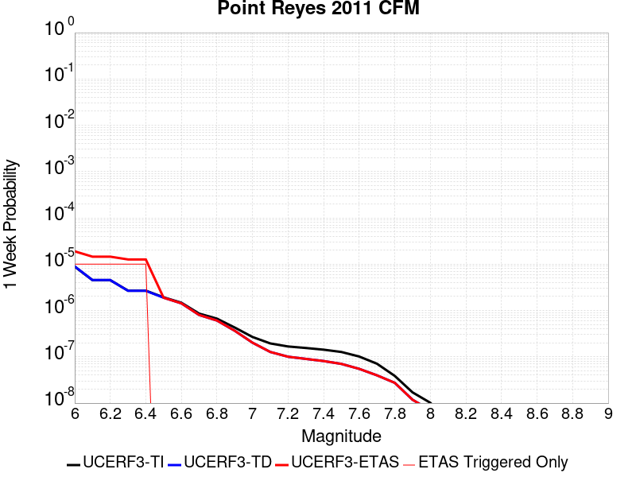 |  |  |  |

| Magnitude | 1 wk TI Prob | 1 wk TD Prob | 1 wk ETAS Prob | 1 wk ETAS/TD Gain | 1 wk ETAS Triggered Only | 1 mo TI Prob | 1 mo TD Prob | 1 mo ETAS Prob | 1 mo ETAS/TD Gain | 1 mo ETAS Triggered Only | 1 yr TI Prob | 1 yr TD Prob | 1 yr ETAS Prob | 1 yr ETAS/TD Gain | 1 yr ETAS Triggered Only | 10 yr TI Prob | 10 yr TD Prob | 10 yr ETAS Prob | 10 yr ETAS/TD Gain | 10 yr ETAS Triggered Only |
|-----|-----|-----|-----|-----|-----|-----|-----|-----|-----|-----|-----|-----|-----|-----|-----|-----|-----|-----|-----|-----|
| 6.0 | 8.8644965E-6 | 8.967163E-6 | 4.900524E-5 | 5.464966 | 4.0038438E-5 | 3.7990147E-5 | 3.843017E-5 | 7.846707E-5 | 2.041809 | 4.0038438E-5 | 4.624319E-4 | 4.6779314E-4 | 5.0781283E-4 | 1.08555 | 4.0038438E-5 | 0.0046147075 | 0.004668713 | 0.0047085644 | 1.0085359 | 4.0038438E-5 |
| 6.1 | 4.526405E-6 | 4.5392185E-6 | 4.4577475E-5 | 9.820518 | 4.0038438E-5 | 1.9398734E-5 | 1.9453653E-5 | 5.949131E-5 | 3.0581048 | 4.0038438E-5 | 2.36154E-4 | 2.3682354E-4 | 2.768525E-4 | 1.1690243 | 4.0038438E-5 | 0.002359032 | 0.0023658178 | 0.0024057615 | 1.0168837 | 4.0038438E-5 |
| 6.2 | 4.526405E-6 | 4.5392185E-6 | 4.4577475E-5 | 9.820518 | 4.0038438E-5 | 1.9398734E-5 | 1.9453653E-5 | 5.949131E-5 | 3.0581048 | 4.0038438E-5 | 2.36154E-4 | 2.3682354E-4 | 2.768525E-4 | 1.1690243 | 4.0038438E-5 | 0.002359032 | 0.0023658178 | 0.0024057615 | 1.0168837 | 4.0038438E-5 |
| 6.3 | 2.6842322E-6 | 2.660676E-6 | 4.269901E-5 | 16.04818 | 4.0038438E-5 | 1.1503801E-5 | 1.1402849E-5 | 5.1440828E-5 | 4.511226 | 4.0038438E-5 | 1.4004979E-4 | 1.3882104E-4 | 1.7885391E-4 | 1.2883776 | 4.0038438E-5 | 0.0013996155 | 0.0013873649 | 0.0014273479 | 1.0288193 | 4.0038438E-5 |
| 6.4 | 2.6842322E-6 | 2.660676E-6 | 4.269901E-5 | 16.04818 | 4.0038438E-5 | 1.1503801E-5 | 1.1402849E-5 | 5.1440828E-5 | 4.511226 | 4.0038438E-5 | 1.4004979E-4 | 1.3882104E-4 | 1.7885391E-4 | 1.2883776 | 4.0038438E-5 | 0.0013996155 | 0.0013873649 | 0.0014273479 | 1.0288193 | 4.0038438E-5 |
| 6.5 | 1.9281833E-6 | 1.8906262E-6 | 1.8906262E-6 | 1.0 | 0.0 | 8.263617E-6 | 8.102659E-6 | 8.102659E-6 | 1.0 | 0.0 | 1.0060489E-4 | 9.86455E-5 | 9.86455E-5 | 1.0 | 0.0 | 0.0010055936 | 9.860279E-4 | 9.860279E-4 | 1.0 | 0.0 |
| 6.6 | 1.4726726E-6 | 1.4269577E-6 | 1.4269577E-6 | 1.0 | 0.0 | 6.3114385E-6 | 6.1155188E-6 | 6.1155188E-6 | 1.0 | 0.0 | 7.683905E-5 | 7.445395E-5 | 7.445395E-5 | 1.0 | 0.0 | 7.6812494E-4 | 7.4429717E-4 | 7.4429717E-4 | 1.0 | 0.0 |
| 6.7 | 8.572307E-7 | 8.007212E-7 | 8.007212E-7 | 1.0 | 0.0 | 3.6738406E-6 | 3.431658E-6 | 3.431658E-6 | 1.0 | 0.0 | 4.472809E-5 | 4.1779647E-5 | 4.1779647E-5 | 1.0 | 0.0 | 4.471909E-4 | 4.1772184E-4 | 4.1772184E-4 | 1.0 | 0.0 |
| 6.8 | 6.6745434E-7 | 6.0773E-7 | 6.0773E-7 | 1.0 | 0.0 | 2.8605155E-6 | 2.6045543E-6 | 2.6045543E-6 | 1.0 | 0.0 | 3.482622E-5 | 3.171E-5 | 3.171E-5 | 1.0 | 0.0 | 3.4820763E-4 | 3.1705803E-4 | 3.1705803E-4 | 1.0 | 0.0 |
| 6.9 | 4.291521E-7 | 3.6535937E-7 | 3.6535937E-7 | 1.0 | 0.0 | 1.839222E-6 | 1.565825E-6 | 1.565825E-6 | 1.0 | 0.0 | 2.2392298E-5 | 1.9063755E-5 | 1.9063755E-5 | 1.0 | 0.0 | 2.2390042E-4 | 1.9062385E-4 | 1.9062385E-4 | 1.0 | 0.0 |
| 7.0 | 2.6812808E-7 | 2.0187414E-7 | 2.0187414E-7 | 1.0 | 0.0 | 1.1491198E-6 | 8.651746E-7 | 8.651746E-7 | 1.0 | 0.0 | 1.3990444E-5 | 1.0533451E-5 | 1.0533451E-5 | 1.0 | 0.0 | 1.3989564E-4 | 1.0533186E-4 | 1.0533186E-4 | 1.0 | 0.0 |
| 7.1 | 1.9451231E-7 | 1.2725499E-7 | 1.2725499E-7 | 1.0 | 0.0 | 8.336239E-7 | 5.453784E-7 | 5.453784E-7 | 1.0 | 0.0 | 1.0149324E-5 | 6.6399616E-6 | 6.6399616E-6 | 1.0 | 0.0 | 1.014886E-4 | 6.639991E-5 | 6.639991E-5 | 1.0 | 0.0 |
| 7.2 | 1.6715143E-7 | 1.00428394E-7 | 1.00428394E-7 | 1.0 | 0.0 | 7.1636305E-7 | 4.3040734E-7 | 4.3040734E-7 | 1.0 | 0.0 | 8.721685E-6 | 5.2401965E-6 | 5.2401965E-6 | 1.0 | 0.0 | 8.721343E-5 | 5.2402997E-5 | 5.2402997E-5 | 1.0 | 0.0 |
| 7.3 | 1.5503173E-7 | 9.0131024E-8 | 9.0131024E-8 | 1.0 | 0.0 | 6.644215E-7 | 3.8627576E-7 | 3.8627576E-7 | 1.0 | 0.0 | 8.089301E-6 | 4.702897E-6 | 4.702897E-6 | 1.0 | 0.0 | 8.089007E-5 | 4.7030244E-5 | 4.7030244E-5 | 1.0 | 0.0 |
| 7.4 | 1.4251614E-7 | 8.097624E-8 | 8.097624E-8 | 1.0 | 0.0 | 6.1078333E-7 | 3.47041E-7 | 3.47041E-7 | 1.0 | 0.0 | 7.4362615E-6 | 4.225216E-6 | 4.225216E-6 | 1.0 | 0.0 | 7.436013E-5 | 4.2253625E-5 | 4.2253625E-5 | 1.0 | 0.0 |
| 7.5 | 1.2710186E-7 | 7.0296394E-8 | 7.0296394E-8 | 1.0 | 0.0 | 5.447221E-7 | 3.0127023E-7 | 3.0127023E-7 | 1.0 | 0.0 | 6.6319717E-6 | 3.667959E-6 | 3.667959E-6 | 1.0 | 0.0 | 6.6317734E-5 | 3.6681253E-5 | 3.6681253E-5 | 1.0 | 0.0 |
| 7.6 | 1.0144708E-7 | 5.4952274E-8 | 5.4952274E-8 | 1.0 | 0.0 | 4.347731E-7 | 2.3550973E-7 | 2.3550973E-7 | 1.0 | 0.0 | 5.2933497E-6 | 2.8673273E-6 | 2.8673273E-6 | 1.0 | 0.0 | 5.293224E-5 | 2.8675171E-5 | 2.8675171E-5 | 1.0 | 0.0 |
| 7.7 | 7.090527E-8 | 3.98231E-8 | 3.98231E-8 | 1.0 | 0.0 | 3.038797E-7 | 1.7067042E-7 | 1.7067042E-7 | 1.0 | 0.0 | 3.699729E-6 | 2.0779103E-6 | 2.0779103E-6 | 1.0 | 0.0 | 3.6996673E-5 | 2.0781177E-5 | 2.0781177E-5 | 1.0 | 0.0 |
| 7.8 | 3.8712045E-8 | 2.7440025E-8 | 2.7440025E-8 | 1.0 | 0.0 | 1.6590876E-7 | 1.176001E-7 | 1.176001E-7 | 1.0 | 0.0 | 2.0199373E-6 | 1.4317802E-6 | 1.4317802E-6 | 1.0 | 0.0 | 2.0199188E-5 | 1.4319979E-5 | 1.4319979E-5 | 1.0 | 0.0 |
| 7.9 | 1.7068782E-8 | 1.1833354E-8 | 1.1833354E-8 | 1.0 | 0.0 | 7.315192E-8 | 5.0714362E-8 | 5.0714362E-8 | 1.0 | 0.0 | 8.906242E-7 | 6.174472E-7 | 6.174472E-7 | 1.0 | 0.0 | 8.906207E-6 | 6.1767228E-6 | 6.1767228E-6 | 1.0 | 0.0 |
| 8.0 | 1.0172592E-8 | 7.0280843E-9 | 7.0280843E-9 | 1.0 | 0.0 | 4.359682E-8 | 3.0120354E-8 | 3.0120354E-8 | 1.0 | 0.0 | 5.3079117E-7 | 3.6671526E-7 | 3.6671526E-7 | 1.0 | 0.0 | 5.307899E-6 | 3.6694146E-6 | 3.6694146E-6 | 1.0 | 0.0 |
| 8.1 | 3.7861243E-9 | 3.5452439E-9 | 3.5452439E-9 | 1.0 | 0.0 | 1.6226247E-8 | 1.5193901E-8 | 1.5193901E-8 | 1.0 | 0.0 | 1.9755454E-7 | 1.8498575E-7 | 1.8498575E-7 | 1.0 | 0.0 | 1.9755437E-6 | 1.8518531E-6 | 1.8518531E-6 | 1.0 | 0.0 |

## Calaveras (No) 2011 CFM
*[(top)](#table-of-contents)*

| 1 Week | 1 Month | 1 Year | 10 Year |
|-----|-----|-----|-----|
|  |  |  |  |

| Magnitude | 1 wk TI Prob | 1 wk TD Prob | 1 wk ETAS Prob | 1 wk ETAS/TD Gain | 1 wk ETAS Triggered Only | 1 mo TI Prob | 1 mo TD Prob | 1 mo ETAS Prob | 1 mo ETAS/TD Gain | 1 mo ETAS Triggered Only | 1 yr TI Prob | 1 yr TD Prob | 1 yr ETAS Prob | 1 yr ETAS/TD Gain | 1 yr ETAS Triggered Only | 10 yr TI Prob | 10 yr TD Prob | 10 yr ETAS Prob | 10 yr ETAS/TD Gain | 10 yr ETAS Triggered Only |
|-----|-----|-----|-----|-----|-----|-----|-----|-----|-----|-----|-----|-----|-----|-----|-----|-----|-----|-----|-----|-----|
| 6.0 | 4.8694856E-5 | 6.747121E-5 | 6.747121E-5 | 1.0 | 0.0 | 2.0867554E-4 | 2.8913133E-4 | 2.8913133E-4 | 1.0 | 0.0 | 0.0025376645 | 0.003514627 | 0.0035545246 | 1.011352 | 4.0038438E-5 | 0.02508881 | 0.034771245 | 0.03480989 | 1.0011114 | 4.0038438E-5 |
| 6.1 | 4.8694856E-5 | 6.747121E-5 | 6.747121E-5 | 1.0 | 0.0 | 2.0867554E-4 | 2.8913133E-4 | 2.8913133E-4 | 1.0 | 0.0 | 0.0025376645 | 0.003514627 | 0.0035545246 | 1.011352 | 4.0038438E-5 | 0.02508881 | 0.034771245 | 0.03480989 | 1.0011114 | 4.0038438E-5 |
| 6.2 | 4.7541962E-5 | 6.580218E-5 | 6.580218E-5 | 1.0 | 0.0 | 2.0373536E-4 | 2.8197994E-4 | 2.8197994E-4 | 1.0 | 0.0 | 0.0024776561 | 0.003427859 | 0.00346776 | 1.0116403 | 4.0038438E-5 | 0.024502134 | 0.033932675 | 0.033971354 | 1.0011399 | 4.0038438E-5 |
| 6.3 | 4.6717287E-5 | 6.4635555E-5 | 6.4635555E-5 | 1.0 | 0.0 | 2.0020158E-4 | 2.7698115E-4 | 2.7698115E-4 | 1.0 | 0.0 | 0.0024347296 | 0.0033672103 | 0.003407114 | 1.0118506 | 4.0038438E-5 | 0.024082264 | 0.033345193 | 0.033383895 | 1.0011607 | 4.0038438E-5 |
| 6.4 | 4.6276386E-5 | 6.399742E-5 | 6.399742E-5 | 1.0 | 0.0 | 1.983123E-4 | 2.7424688E-4 | 2.7424688E-4 | 1.0 | 0.0 | 0.0024117786 | 0.0033340224 | 0.0033340224 | 1.0 | 0.0 | 0.02385771 | 0.033024073 | 0.033024073 | 1.0 | 0.0 |
| 6.5 | 4.5720994E-5 | 6.319881E-5 | 6.319881E-5 | 1.0 | 0.0 | 1.9593239E-4 | 2.70825E-4 | 2.70825E-4 | 1.0 | 0.0 | 0.002382867 | 0.0032924965 | 0.0032924965 | 1.0 | 0.0 | 0.023574775 | 0.032622032 | 0.032622032 | 1.0 | 0.0 |
| 6.6 | 4.549134E-5 | 6.28519E-5 | 6.28519E-5 | 1.0 | 0.0 | 1.949483E-4 | 2.6933852E-4 | 2.6933852E-4 | 1.0 | 0.0 | 0.0023709119 | 0.0032744533 | 0.0032744533 | 1.0 | 0.0 | 0.023457756 | 0.032447387 | 0.032447387 | 1.0 | 0.0 |
| 6.7 | 3.701047E-5 | 5.0359427E-5 | 5.0359427E-5 | 1.0 | 0.0 | 1.5860666E-4 | 2.1580851E-4 | 2.1580851E-4 | 1.0 | 0.0 | 0.0019293258 | 0.002624346 | 0.002624346 | 1.0 | 0.0 | 0.019126613 | 0.026125323 | 0.026125323 | 1.0 | 0.0 |
| 6.8 | 3.5523568E-5 | 4.8341022E-5 | 4.8341022E-5 | 1.0 | 0.0 | 1.5223498E-4 | 2.071596E-4 | 2.071596E-4 | 1.0 | 0.0 | 0.0018518851 | 0.0025192937 | 0.0025192937 | 1.0 | 0.0 | 0.018365284 | 0.025097553 | 0.025097553 | 1.0 | 0.0 |
| 6.9 | 3.2946147E-5 | 4.466269E-5 | 4.466269E-5 | 1.0 | 0.0 | 1.4119013E-4 | 1.9139773E-4 | 1.9139773E-4 | 1.0 | 0.0 | 0.0017176344 | 0.0023278191 | 0.0023278191 | 1.0 | 0.0 | 0.017044188 | 0.023219598 | 0.023219598 | 1.0 | 0.0 |
| 7.0 | 2.7682381E-5 | 3.702223E-5 | 3.702223E-5 | 1.0 | 0.0 | 1.1863338E-4 | 1.5865723E-4 | 1.5865723E-4 | 1.0 | 0.0 | 0.0014434044 | 0.0019299705 | 0.0019299705 | 1.0 | 0.0 | 0.01434065 | 0.01931092 | 0.01931092 | 1.0 | 0.0 |
| 7.1 | 2.471967E-5 | 3.328669E-5 | 3.328669E-5 | 1.0 | 0.0 | 1.05937135E-4 | 1.4264962E-4 | 1.4264962E-4 | 1.0 | 0.0 | 0.0012890215 | 0.0017354045 | 0.0017354045 | 1.0 | 0.0 | 0.0128157 | 0.017385952 | 0.017385952 | 1.0 | 0.0 |
| 7.2 | 1.9748062E-5 | 2.6774684E-5 | 2.6774684E-5 | 1.0 | 0.0 | 8.463181E-5 | 1.1474373E-4 | 1.1474373E-4 | 1.0 | 0.0 | 0.0010299052 | 0.0013961331 | 0.0013961331 | 1.0 | 0.0 | 0.01025145 | 0.014030739 | 0.014030739 | 1.0 | 0.0 |
| 7.3 | 1.1603734E-5 | 1.5783844E-5 | 1.5783844E-5 | 1.0 | 0.0 | 4.9729337E-5 | 6.764337E-5 | 6.764337E-5 | 1.0 | 0.0 | 6.052865E-4 | 8.232611E-4 | 8.232611E-4 | 1.0 | 0.0 | 0.0060364045 | 0.008308666 | 0.008308666 | 1.0 | 0.0 |
| 7.4 | 4.885381E-6 | 6.0349853E-6 | 6.0349853E-6 | 1.0 | 0.0 | 2.0937177E-5 | 2.5863968E-5 | 2.5863968E-5 | 1.0 | 0.0 | 2.5488032E-4 | 3.148485E-4 | 3.148485E-4 | 1.0 | 0.0 | 0.0025458818 | 0.0032010598 | 0.0032010598 | 1.0 | 0.0 |
| 7.5 | 3.0571264E-6 | 4.155299E-6 | 4.155299E-6 | 1.0 | 0.0 | 1.3101904E-5 | 1.7808303E-5 | 1.7808303E-5 | 1.0 | 0.0 | 1.5950401E-4 | 2.1679462E-4 | 2.1679462E-4 | 1.0 | 0.0 | 0.0015938957 | 0.002221121 | 0.002221121 | 1.0 | 0.0 |
| 7.6 | 1.764948E-6 | 2.7955498E-6 | 2.7955498E-6 | 1.0 | 0.0 | 7.564041E-6 | 1.1980874E-5 | 1.1980874E-5 | 1.0 | 0.0 | 9.208831E-5 | 1.4585744E-4 | 1.4585744E-4 | 1.0 | 0.0 | 9.205016E-4 | 0.0015123509 | 0.0015123509 | 1.0 | 0.0 |
| 7.7 | 1.3173734E-6 | 2.058471E-6 | 2.058471E-6 | 1.0 | 0.0 | 5.645874E-6 | 8.8219895E-6 | 8.8219895E-6 | 1.0 | 0.0 | 6.873634E-5 | 1.0740245E-4 | 1.0740245E-4 | 1.0 | 0.0 | 6.8715087E-4 | 0.0011261401 | 0.0011261401 | 1.0 | 0.0 |
| 7.8 | 9.4429885E-7 | 1.5489635E-6 | 1.5489635E-6 | 1.0 | 0.0 | 4.0469886E-6 | 6.638398E-6 | 6.638398E-6 | 1.0 | 0.0 | 4.9270973E-5 | 8.081952E-5 | 8.081952E-5 | 1.0 | 0.0 | 4.926005E-4 | 8.5014524E-4 | 8.5014524E-4 | 1.0 | 0.0 |
| 7.9 | 6.388233E-7 | 1.1148749E-6 | 1.1148749E-6 | 1.0 | 0.0 | 2.7378112E-6 | 4.7780263E-6 | 4.7780263E-6 | 1.0 | 0.0 | 3.3332344E-5 | 5.817093E-5 | 5.817093E-5 | 1.0 | 0.0 | 3.3327343E-4 | 6.0963054E-4 | 6.0963054E-4 | 1.0 | 0.0 |
| 8.0 | 3.087986E-7 | 5.7543696E-7 | 5.7543696E-7 | 1.0 | 0.0 | 1.323422E-6 | 2.466156E-6 | 2.466156E-6 | 1.0 | 0.0 | 1.6112543E-5 | 3.002504E-5 | 3.002504E-5 | 1.0 | 0.0 | 1.6111376E-4 | 3.110302E-4 | 3.110302E-4 | 1.0 | 0.0 |
| 8.1 | 1.6725647E-7 | 2.7410047E-7 | 2.7410047E-7 | 1.0 | 0.0 | 7.168133E-7 | 1.1747159E-6 | 1.1747159E-6 | 1.0 | 0.0 | 8.7271665E-6 | 1.4302073E-5 | 1.4302073E-5 | 1.0 | 0.0 | 8.726824E-5 | 1.48486E-4 | 1.48486E-4 | 1.0 | 0.0 |

## Bullion Mountains
*[(top)](#table-of-contents)*

| 1 Week | 1 Month | 1 Year | 10 Year |
|-----|-----|-----|-----|
|  | 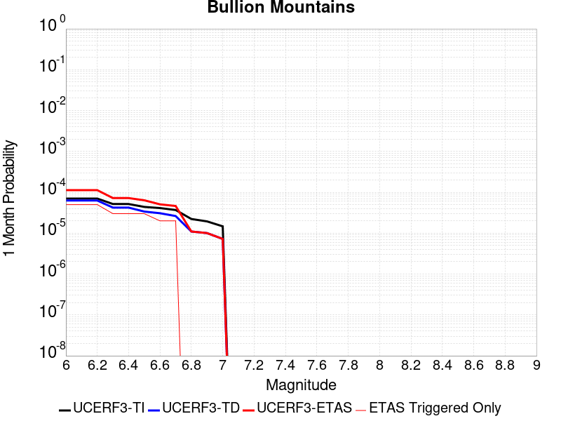 | 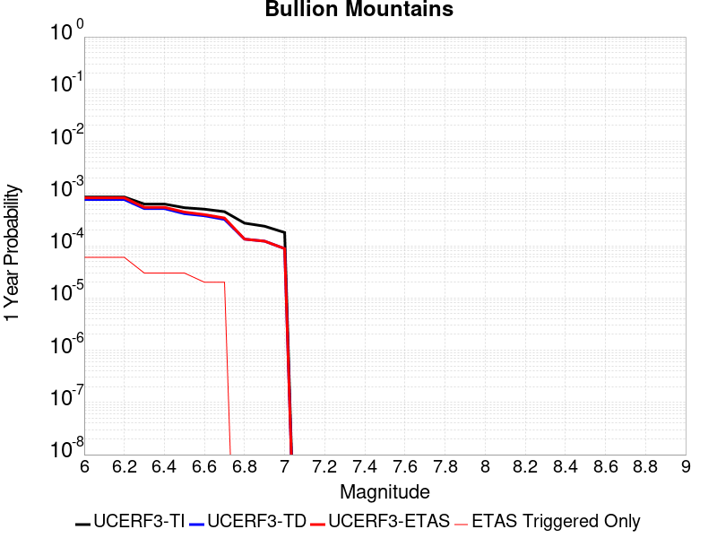 |  |

| Magnitude | 1 wk TI Prob | 1 wk TD Prob | 1 wk ETAS Prob | 1 wk ETAS/TD Gain | 1 wk ETAS Triggered Only | 1 mo TI Prob | 1 mo TD Prob | 1 mo ETAS Prob | 1 mo ETAS/TD Gain | 1 mo ETAS Triggered Only | 1 yr TI Prob | 1 yr TD Prob | 1 yr ETAS Prob | 1 yr ETAS/TD Gain | 1 yr ETAS Triggered Only | 10 yr TI Prob | 10 yr TD Prob | 10 yr ETAS Prob | 10 yr ETAS/TD Gain | 10 yr ETAS Triggered Only |
|-----|-----|-----|-----|-----|-----|-----|-----|-----|-----|-----|-----|-----|-----|-----|-----|-----|-----|-----|-----|-----|
| 6.0 | 1.6420427E-5 | 1.4692089E-5 | 1.4692089E-5 | 1.0 | 0.0 | 7.037136E-5 | 6.296479E-5 | 6.296479E-5 | 1.0 | 0.0 | 8.5643446E-4 | 7.663651E-4 | 8.0637285E-4 | 1.0522046 | 4.0038438E-5 | 0.008531413 | 0.007641016 | 0.0076807486 | 1.0051999 | 4.0038438E-5 |
| 6.1 | 1.6420427E-5 | 1.4692089E-5 | 1.4692089E-5 | 1.0 | 0.0 | 7.037136E-5 | 6.296479E-5 | 6.296479E-5 | 1.0 | 0.0 | 8.5643446E-4 | 7.663651E-4 | 8.0637285E-4 | 1.0522046 | 4.0038438E-5 | 0.008531413 | 0.007641016 | 0.0076807486 | 1.0051999 | 4.0038438E-5 |
| 6.2 | 1.6420427E-5 | 1.4692089E-5 | 1.4692089E-5 | 1.0 | 0.0 | 7.037136E-5 | 6.296479E-5 | 6.296479E-5 | 1.0 | 0.0 | 8.5643446E-4 | 7.663651E-4 | 8.0637285E-4 | 1.0522046 | 4.0038438E-5 | 0.008531413 | 0.007641016 | 0.0076807486 | 1.0051999 | 4.0038438E-5 |
| 6.3 | 1.2046778E-5 | 9.862335E-6 | 9.862335E-6 | 1.0 | 0.0 | 5.1628023E-5 | 4.2266598E-5 | 4.2266598E-5 | 1.0 | 0.0 | 6.283899E-4 | 5.144975E-4 | 5.144975E-4 | 1.0 | 0.0 | 0.0062661595 | 0.005135345 | 0.005135345 | 1.0 | 0.0 |
| 6.4 | 1.2046778E-5 | 9.862335E-6 | 9.862335E-6 | 1.0 | 0.0 | 5.1628023E-5 | 4.2266598E-5 | 4.2266598E-5 | 1.0 | 0.0 | 6.283899E-4 | 5.144975E-4 | 5.144975E-4 | 1.0 | 0.0 | 0.0062661595 | 0.005135345 | 0.005135345 | 1.0 | 0.0 |
| 6.5 | 1.0244343E-5 | 7.879458E-6 | 7.879458E-6 | 1.0 | 0.0 | 4.390359E-5 | 3.3768785E-5 | 3.3768785E-5 | 1.0 | 0.0 | 5.343951E-4 | 4.110781E-4 | 4.110781E-4 | 1.0 | 0.0 | 0.005331118 | 0.004105208 | 0.004105208 | 1.0 | 0.0 |
| 6.6 | 9.605408E-6 | 7.1774966E-6 | 7.1774966E-6 | 1.0 | 0.0 | 4.1165385E-5 | 3.076045E-5 | 3.076045E-5 | 1.0 | 0.0 | 5.010733E-4 | 3.744645E-4 | 3.744645E-4 | 1.0 | 0.0 | 0.00499945 | 0.003740332 | 0.003740332 | 1.0 | 0.0 |
| 6.7 | 8.60418E-6 | 6.1240044E-6 | 6.1240044E-6 | 1.0 | 0.0 | 3.687454E-5 | 2.624558E-5 | 2.624558E-5 | 1.0 | 0.0 | 4.48855E-4 | 3.1951256E-4 | 3.1951256E-4 | 1.0 | 0.0 | 0.004479495 | 0.0031924439 | 0.0031924439 | 1.0 | 0.0 |
| 6.8 | 5.187994E-6 | 2.5631666E-6 | 2.5631666E-6 | 1.0 | 0.0 | 2.223407E-5 | 1.0984976E-5 | 1.0984976E-5 | 1.0 | 0.0 | 2.7066618E-4 | 1.3373788E-4 | 1.3373788E-4 | 1.0 | 0.0 | 0.0027033675 | 0.0013369655 | 0.0013369655 | 1.0 | 0.0 |
| 6.9 | 4.5302368E-6 | 2.3443165E-6 | 2.3443165E-6 | 1.0 | 0.0 | 1.9415156E-5 | 1.0047055E-5 | 1.0047055E-5 | 1.0 | 0.0 | 2.3635388E-4 | 1.2232E-4 | 1.2232E-4 | 1.0 | 0.0 | 0.0023610266 | 0.0012229157 | 0.0012229157 | 1.0 | 0.0 |
| 7.0 | 3.431668E-6 | 1.6882402E-6 | 1.6882402E-6 | 1.0 | 0.0 | 1.4707065E-5 | 7.235315E-6 | 7.235315E-6 | 1.0 | 0.0 | 1.7904381E-4 | 8.808996E-5 | 8.808996E-5 | 1.0 | 0.0 | 0.0017889962 | 8.808996E-4 | 8.808996E-4 | 1.0 | 0.0 |

## San Jacinto (Borrego)
*[(top)](#table-of-contents)*

| 1 Week | 1 Month | 1 Year | 10 Year |
|-----|-----|-----|-----|
|  |  |  |  |

| Magnitude | 1 wk TI Prob | 1 wk TD Prob | 1 wk ETAS Prob | 1 wk ETAS/TD Gain | 1 wk ETAS Triggered Only | 1 mo TI Prob | 1 mo TD Prob | 1 mo ETAS Prob | 1 mo ETAS/TD Gain | 1 mo ETAS Triggered Only | 1 yr TI Prob | 1 yr TD Prob | 1 yr ETAS Prob | 1 yr ETAS/TD Gain | 1 yr ETAS Triggered Only | 10 yr TI Prob | 10 yr TD Prob | 10 yr ETAS Prob | 10 yr ETAS/TD Gain | 10 yr ETAS Triggered Only |
|-----|-----|-----|-----|-----|-----|-----|-----|-----|-----|-----|-----|-----|-----|-----|-----|-----|-----|-----|-----|-----|
| 6.0 | 3.543992E-5 | 2.7926513E-5 | 6.796383E-5 | 2.433667 | 4.0038438E-5 | 1.5187653E-4 | 1.1967963E-4 | 1.5971328E-4 | 1.3345068 | 4.0038438E-5 | 0.0018475284 | 0.0014561379 | 0.001496118 | 1.0274563 | 4.0038438E-5 | 0.018322436 | 0.014869647 | 0.0149090905 | 1.0026526 | 4.0038438E-5 |
| 6.1 | 3.542281E-5 | 2.7926513E-5 | 6.796383E-5 | 2.433667 | 4.0038438E-5 | 1.5180321E-4 | 1.1967963E-4 | 1.5971328E-4 | 1.3345068 | 4.0038438E-5 | 0.0018466372 | 0.0014561379 | 0.001496118 | 1.0274563 | 4.0038438E-5 | 0.018313672 | 0.014869647 | 0.0149090905 | 1.0026526 | 4.0038438E-5 |
| 6.2 | 3.4688688E-5 | 2.7926511E-5 | 6.796383E-5 | 2.433667 | 4.0038438E-5 | 1.4865733E-4 | 1.1967963E-4 | 1.5971328E-4 | 1.3345068 | 4.0038438E-5 | 0.0018084005 | 0.0014561379 | 0.0014961179 | 1.0274563 | 4.0038438E-5 | 0.017937548 | 0.014869647 | 0.01490909 | 1.0026526 | 4.0038438E-5 |
| 6.3 | 3.2087122E-5 | 2.7771865E-5 | 6.780919E-5 | 2.4416506 | 4.0038438E-5 | 1.3750899E-4 | 1.1901691E-4 | 1.5905059E-4 | 1.3363696 | 4.0038438E-5 | 0.0016728862 | 0.00144808 | 0.0014880605 | 1.0276093 | 4.0038438E-5 | 0.016603488 | 0.014790683 | 0.014830129 | 1.002667 | 4.0038438E-5 |
| 6.4 | 3.1828724E-5 | 2.7738852E-5 | 6.777618E-5 | 2.4433665 | 4.0038438E-5 | 1.364017E-4 | 1.1887544E-4 | 1.5890911E-4 | 1.3367699 | 4.0038438E-5 | 0.0016594254 | 0.0014463598 | 0.0014863403 | 1.0276421 | 4.0038438E-5 | 0.016470885 | 0.014773762 | 0.014813209 | 1.00267 | 4.0038438E-5 |
| 6.5 | 3.1563577E-5 | 2.747857E-5 | 6.751591E-5 | 2.4570386 | 4.0038438E-5 | 1.3526545E-4 | 1.1776006E-4 | 1.5779378E-4 | 1.3399601 | 4.0038438E-5 | 0.0016456128 | 0.0014327979 | 0.001472779 | 1.0279042 | 4.0038438E-5 | 0.0163348 | 0.014640348 | 0.0146798 | 1.0026947 | 4.0038438E-5 |
| 6.6 | 3.1467625E-5 | 2.7322796E-5 | 6.736014E-5 | 2.4653459 | 4.0038438E-5 | 1.3485427E-4 | 1.1709251E-4 | 1.5712625E-4 | 1.3418984 | 4.0038438E-5 | 0.0016406142 | 0.0014246812 | 0.0014646626 | 1.0280634 | 4.0038438E-5 | 0.016285548 | 0.014560594 | 0.01460005 | 1.0027097 | 4.0038438E-5 |
| 6.7 | 3.1223695E-5 | 2.6940816E-5 | 6.697817E-5 | 2.4861228 | 4.0038438E-5 | 1.3380898E-4 | 1.15455594E-4 | 1.5548941E-4 | 1.3467464 | 4.0038438E-5 | 0.0016279068 | 0.0014047775 | 0.0014447598 | 1.0284616 | 4.0038438E-5 | 0.01616033 | 0.014364966 | 0.014404429 | 1.0027472 | 4.0038438E-5 |
| 6.8 | 3.1015585E-5 | 2.6761822E-5 | 6.6799184E-5 | 2.4960628 | 4.0038438E-5 | 1.3291716E-4 | 1.1468855E-4 | 1.547224E-4 | 1.3490658 | 4.0038438E-5 | 0.001617065 | 0.0013954508 | 0.0014354334 | 1.0286521 | 4.0038438E-5 | 0.016053487 | 0.014272246 | 0.014311713 | 1.0027653 | 4.0038438E-5 |
| 6.9 | 2.6641965E-5 | 2.2184247E-5 | 6.222179E-5 | 2.8047738 | 4.0038438E-5 | 1.1417485E-4 | 9.50719E-5 | 1.3510653E-4 | 1.4210985 | 4.0038438E-5 | 0.0013891924 | 0.0011568897 | 0.0011968818 | 1.0345687 | 4.0038438E-5 | 0.0138054015 | 0.011882438 | 0.011922001 | 1.0033295 | 4.0038438E-5 |
| 7.0 | 2.3854353E-5 | 2.0479023E-5 | 6.051664E-5 | 2.955055 | 4.0038438E-5 | 1.02228936E-4 | 8.77643E-5 | 1.2779923E-4 | 1.4561641 | 4.0038438E-5 | 0.0012439266 | 0.0010680092 | 0.0011080048 | 1.0374488 | 4.0038438E-5 | 0.012369866 | 0.0109828 | 0.011022399 | 1.0036055 | 4.0038438E-5 |
| 7.1 | 2.3672901E-5 | 2.031551E-5 | 6.0353133E-5 | 2.9707909 | 4.0038438E-5 | 1.0145135E-4 | 8.7063585E-5 | 1.2709854E-4 | 1.4598358 | 4.0038438E-5 | 0.0012344702 | 0.0010594862 | 0.0010994823 | 1.0377504 | 4.0038438E-5 | 0.0122763505 | 0.010897976 | 0.010937578 | 1.0036339 | 4.0038438E-5 |
| 7.2 | 2.2717244E-5 | 1.9542893E-5 | 5.9580547E-5 | 3.0487068 | 4.0038438E-5 | 9.735599E-5 | 8.375258E-5 | 1.2378766E-4 | 1.4780161 | 4.0038438E-5 | 0.0011846646 | 0.001019213 | 0.0010592106 | 1.0392437 | 4.0038438E-5 | 0.01178369 | 0.010495341 | 0.01053496 | 1.0037749 | 4.0038438E-5 |
| 7.3 | 2.1016205E-5 | 1.8384526E-5 | 5.8422225E-5 | 3.1777935 | 4.0038438E-5 | 9.006634E-5 | 7.878846E-5 | 1.1882374E-4 | 1.5081364 | 4.0038438E-5 | 0.001096006 | 9.5882936E-4 | 9.988294E-4 | 1.0417175 | 4.0038438E-5 | 0.010906163 | 0.009890967 | 0.009930609 | 1.0040079 | 4.0038438E-5 |
| 7.4 | 2.0683625E-5 | 1.8187047E-5 | 5.8224756E-5 | 3.2014408 | 4.0038438E-5 | 8.86411E-5 | 7.794217E-5 | 1.17977484E-4 | 1.5136541 | 4.0038438E-5 | 0.001078671 | 9.485349E-4 | 9.885354E-4 | 1.0421708 | 4.0038438E-5 | 0.010734501 | 0.009787692 | 0.009827338 | 1.0040506 | 4.0038438E-5 |
| 7.5 | 1.9993966E-5 | 1.7782075E-5 | 5.7819798E-5 | 3.2515779 | 4.0038438E-5 | 8.568561E-5 | 7.620667E-5 | 1.1624206E-4 | 1.5253527 | 4.0038438E-5 | 0.001042723 | 9.2742336E-4 | 9.6742465E-4 | 1.0431317 | 4.0038438E-5 | 0.010378438 | 0.009574614 | 0.009614269 | 1.0041417 | 4.0038438E-5 |
| 7.6 | 1.788966E-5 | 1.6435291E-5 | 5.647307E-5 | 3.436086 | 4.0038438E-5 | 7.666772E-5 | 7.043507E-5 | 1.1047068E-4 | 1.5684046 | 4.0038438E-5 | 9.3302975E-4 | 8.572113E-4 | 8.9721545E-4 | 1.0466677 | 4.0038438E-5 | 0.00929122 | 0.008866487 | 0.00890617 | 1.0044757 | 4.0038438E-5 |
| 7.7 | 1.5125781E-5 | 1.4237377E-5 | 5.4275246E-5 | 3.812166 | 4.0038438E-5 | 6.4823165E-5 | 6.1015908E-5 | 1.01051904E-4 | 1.6561567 | 4.0038438E-5 | 7.889362E-4 | 7.426163E-4 | 7.82625E-4 | 1.0538753 | 4.0038438E-5 | 0.007861412 | 0.0077142045 | 0.007753934 | 1.0051502 | 4.0038438E-5 |
| 7.8 | 1.250089E-5 | 1.26304985E-5 | 5.266843E-5 | 4.169941 | 4.0038438E-5 | 5.3574146E-5 | 5.412959E-5 | 9.416586E-5 | 1.7396375 | 4.0038438E-5 | 6.5207E-4 | 6.588291E-4 | 6.988411E-4 | 1.0607321 | 4.0038438E-5 | 0.006501599 | 0.0068677636 | 0.0069075273 | 1.0057899 | 4.0038438E-5 |
| 7.9 | 9.561E-6 | 9.754616E-6 | 9.754616E-6 | 1.0 | 0.0 | 4.0975072E-5 | 4.1804833E-5 | 4.1804833E-5 | 1.0 | 0.0 | 4.987573E-4 | 5.088555E-4 | 5.088555E-4 | 1.0 | 0.0 | 0.0049763937 | 0.0053523467 | 0.0053523467 | 1.0 | 0.0 |
| 8.0 | 8.01699E-6 | 8.293488E-6 | 8.293488E-6 | 1.0 | 0.0 | 3.4358076E-5 | 3.554304E-5 | 3.554304E-5 | 1.0 | 0.0 | 4.1822926E-4 | 4.3265108E-4 | 4.3265108E-4 | 1.0 | 0.0 | 0.0041744304 | 0.004573375 | 0.004573375 | 1.0 | 0.0 |
| 8.1 | 6.541947E-6 | 6.4622354E-6 | 6.4622354E-6 | 1.0 | 0.0 | 2.8036617E-5 | 2.7695003E-5 | 2.7695003E-5 | 1.0 | 0.0 | 3.4129233E-4 | 3.37135E-4 | 3.37135E-4 | 1.0 | 0.0 | 0.0034076865 | 0.0035806994 | 0.0035806994 | 1.0 | 0.0 |
| 8.2 | 1.7968189E-6 | 7.9713476E-7 | 7.9713476E-7 | 1.0 | 0.0 | 7.70063E-6 | 3.4162877E-6 | 3.4162877E-6 | 1.0 | 0.0 | 9.3751136E-5 | 4.159253E-5 | 4.159253E-5 | 1.0 | 0.0 | 9.371159E-4 | 4.712058E-4 | 4.712058E-4 | 1.0 | 0.0 |
| 8.3 | 1.5167889E-7 | 4.897714E-8 | 4.897714E-8 | 1.0 | 0.0 | 6.500522E-7 | 2.09902E-7 | 2.09902E-7 | 1.0 | 0.0 | 7.9143565E-6 | 2.5555544E-6 | 2.5555544E-6 | 1.0 | 0.0 | 7.914075E-5 | 2.969505E-5 | 2.969505E-5 | 1.0 | 0.0 |

## Elsinore (Stepovers Combined)
*[(top)](#table-of-contents)*

| 1 Week | 1 Month | 1 Year | 10 Year |
|-----|-----|-----|-----|
| 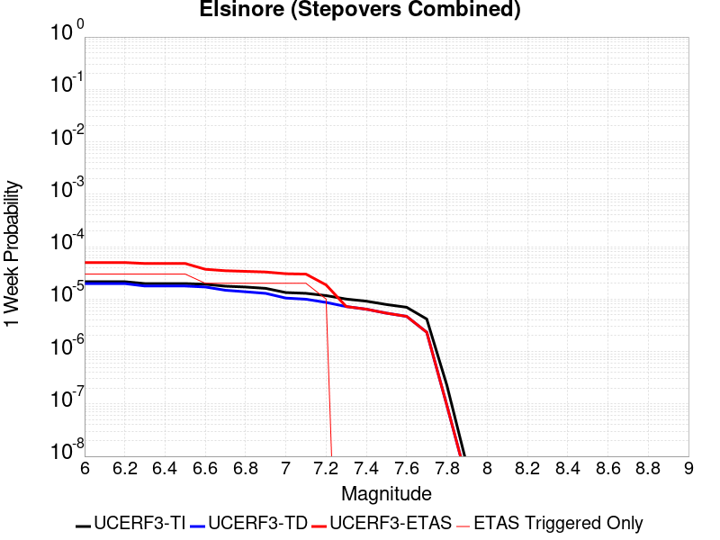 | 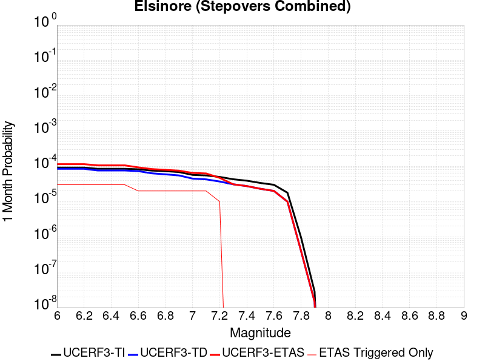 | 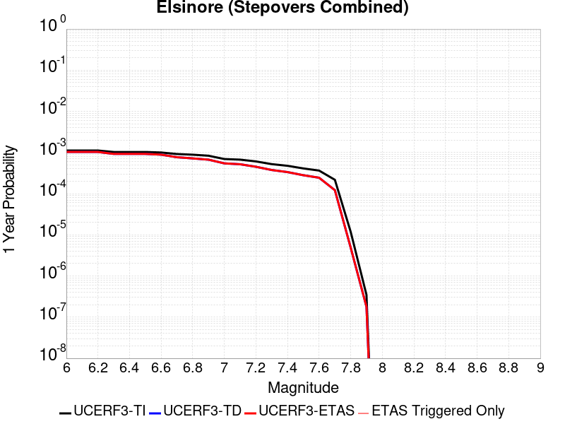 | 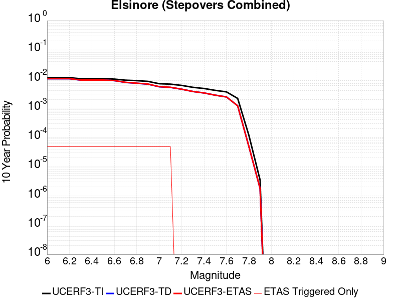 |

| Magnitude | 1 wk TI Prob | 1 wk TD Prob | 1 wk ETAS Prob | 1 wk ETAS/TD Gain | 1 wk ETAS Triggered Only | 1 mo TI Prob | 1 mo TD Prob | 1 mo ETAS Prob | 1 mo ETAS/TD Gain | 1 mo ETAS Triggered Only | 1 yr TI Prob | 1 yr TD Prob | 1 yr ETAS Prob | 1 yr ETAS/TD Gain | 1 yr ETAS Triggered Only | 10 yr TI Prob | 10 yr TD Prob | 10 yr ETAS Prob | 10 yr ETAS/TD Gain | 10 yr ETAS Triggered Only |
|-----|-----|-----|-----|-----|-----|-----|-----|-----|-----|-----|-----|-----|-----|-----|-----|-----|-----|-----|-----|-----|
| 6.0 | 2.144392E-5 | 1.9760193E-5 | 1.9760193E-5 | 1.0 | 0.0 | 9.189928E-5 | 8.468392E-5 | 8.468392E-5 | 1.0 | 0.0 | 0.0011182994 | 0.0010305607 | 0.0010305607 | 1.0 | 0.0 | 0.011126885 | 0.010264917 | 0.010304545 | 1.0038605 | 4.0038438E-5 |
| 6.1 | 2.144392E-5 | 1.9760193E-5 | 1.9760193E-5 | 1.0 | 0.0 | 9.189928E-5 | 8.468392E-5 | 8.468392E-5 | 1.0 | 0.0 | 0.0011182994 | 0.0010305607 | 0.0010305607 | 1.0 | 0.0 | 0.011126885 | 0.010264917 | 0.010304545 | 1.0038605 | 4.0038438E-5 |
| 6.2 | 2.144392E-5 | 1.9760193E-5 | 1.9760193E-5 | 1.0 | 0.0 | 9.189928E-5 | 8.468392E-5 | 8.468392E-5 | 1.0 | 0.0 | 0.0011182994 | 0.0010305607 | 0.0010305607 | 1.0 | 0.0 | 0.011126885 | 0.010264917 | 0.010304545 | 1.0038605 | 4.0038438E-5 |
| 6.3 | 1.9751555E-5 | 1.7741453E-5 | 1.7741453E-5 | 1.0 | 0.0 | 8.4646774E-5 | 7.603267E-5 | 7.603267E-5 | 1.0 | 0.0 | 0.0010300872 | 9.253213E-4 | 9.253213E-4 | 1.0 | 0.0 | 0.010253254 | 0.009221276 | 0.009260946 | 1.0043019 | 4.0038438E-5 |
| 6.4 | 1.9751555E-5 | 1.7741453E-5 | 1.7741453E-5 | 1.0 | 0.0 | 8.4646774E-5 | 7.603267E-5 | 7.603267E-5 | 1.0 | 0.0 | 0.0010300872 | 9.253213E-4 | 9.253213E-4 | 1.0 | 0.0 | 0.010253254 | 0.009221276 | 0.009260946 | 1.0043019 | 4.0038438E-5 |
| 6.5 | 1.9751555E-5 | 1.7741453E-5 | 1.7741453E-5 | 1.0 | 0.0 | 8.4646774E-5 | 7.603267E-5 | 7.603267E-5 | 1.0 | 0.0 | 0.0010300872 | 9.253213E-4 | 9.253213E-4 | 1.0 | 0.0 | 0.010253254 | 0.009221276 | 0.009260946 | 1.0043019 | 4.0038438E-5 |
| 6.6 | 1.9188685E-5 | 1.7003393E-5 | 1.7003393E-5 | 1.0 | 0.0 | 8.2234634E-5 | 7.286974E-5 | 7.286974E-5 | 1.0 | 0.0 | 0.0010007467 | 8.868442E-4 | 8.868442E-4 | 1.0 | 0.0 | 0.00996252 | 0.0088398475 | 0.008879532 | 1.0044893 | 4.0038438E-5 |
| 6.7 | 1.7608272E-5 | 1.4732616E-5 | 1.4732616E-5 | 1.0 | 0.0 | 7.546184E-5 | 6.3138315E-5 | 6.3138315E-5 | 1.0 | 0.0 | 9.183606E-4 | 7.684476E-4 | 7.684476E-4 | 1.0 | 0.0 | 0.009145746 | 0.00766491 | 0.0077046417 | 1.0051836 | 4.0038438E-5 |
| 6.8 | 1.697165E-5 | 1.3783365E-5 | 1.3783365E-5 | 1.0 | 0.0 | 7.273361E-5 | 5.9070277E-5 | 5.9070277E-5 | 1.0 | 0.0 | 8.8517193E-4 | 7.18952E-4 | 7.18952E-4 | 1.0 | 0.0 | 0.008816543 | 0.007172675 | 0.007212426 | 1.005542 | 4.0038438E-5 |
| 6.9 | 1.600365E-5 | 1.2846671E-5 | 1.2846671E-5 | 1.0 | 0.0 | 6.858527E-5 | 5.5056043E-5 | 5.5056043E-5 | 1.0 | 0.0 | 8.347058E-4 | 6.7010894E-4 | 6.7010894E-4 | 1.0 | 0.0 | 0.008315775 | 0.0066867657 | 0.0067265364 | 1.0059477 | 4.0038438E-5 |
| 7.0 | 1.3314581E-5 | 1.0447548E-5 | 1.0447548E-5 | 1.0 | 0.0 | 5.7061243E-5 | 4.4774453E-5 | 4.4774453E-5 | 1.0 | 0.0 | 6.944992E-4 | 5.449953E-4 | 5.449953E-4 | 1.0 | 0.0 | 0.006923327 | 0.0054405155 | 0.005480336 | 1.0073192 | 4.0038438E-5 |
| 7.1 | 1.2865345E-5 | 9.937536E-6 | 9.937536E-6 | 1.0 | 0.0 | 5.5136024E-5 | 4.258876E-5 | 4.258876E-5 | 1.0 | 0.0 | 6.710743E-4 | 5.183973E-4 | 5.183973E-4 | 1.0 | 0.0 | 0.0066905143 | 0.0051752133 | 0.0052150446 | 1.0076965 | 4.0038438E-5 |
| 7.2 | 1.1650051E-5 | 8.633809E-6 | 8.633809E-6 | 1.0 | 0.0 | 4.9927836E-5 | 3.7001522E-5 | 3.7001522E-5 | 1.0 | 0.0 | 6.0770183E-4 | 4.504022E-4 | 4.504022E-4 | 1.0 | 0.0 | 0.0060604266 | 0.0044963174 | 0.0044963174 | 1.0 | 0.0 |
| 7.3 | 1.0008533E-5 | 7.2010425E-6 | 7.2010425E-6 | 1.0 | 0.0 | 4.2893007E-5 | 3.0861254E-5 | 3.0861254E-5 | 1.0 | 0.0 | 5.220972E-4 | 3.7567242E-4 | 3.7567242E-4 | 1.0 | 0.0 | 0.005208723 | 0.003750761 | 0.003750761 | 1.0 | 0.0 |
| 7.4 | 9.116759E-6 | 6.410068E-6 | 6.410068E-6 | 1.0 | 0.0 | 3.907124E-5 | 2.747144E-5 | 2.747144E-5 | 1.0 | 0.0 | 4.7558855E-4 | 3.3441483E-4 | 3.3441483E-4 | 1.0 | 0.0 | 0.00474572 | 0.0033392678 | 0.0033392678 | 1.0 | 0.0 |
| 7.5 | 7.870524E-6 | 5.3825365E-6 | 5.3825365E-6 | 1.0 | 0.0 | 3.3730383E-5 | 2.3067816E-5 | 2.3067816E-5 | 1.0 | 0.0 | 4.1059E-4 | 2.8081573E-4 | 2.8081573E-4 | 1.0 | 0.0 | 0.0040983222 | 0.0028047354 | 0.0028047354 | 1.0 | 0.0 |
| 7.6 | 6.9774537E-6 | 4.6776067E-6 | 4.6776067E-6 | 1.0 | 0.0 | 2.990303E-5 | 2.0046738E-5 | 2.0046738E-5 | 1.0 | 0.0 | 3.640086E-4 | 2.4404288E-4 | 2.4404288E-4 | 1.0 | 0.0 | 0.003634129 | 0.0024378651 | 0.0024378651 | 1.0 | 0.0 |
| 7.7 | 4.1616954E-6 | 2.32834E-6 | 2.32834E-6 | 1.0 | 0.0 | 1.7835715E-5 | 9.978567E-6 | 9.978567E-6 | 1.0 | 0.0 | 2.171282E-4 | 1.2148302E-4 | 1.2148302E-4 | 1.0 | 0.0 | 0.0021691616 | 0.0012142392 | 0.0012142392 | 1.0 | 0.0 |
| 7.8 | 2.2692414E-7 | 9.3854695E-8 | 9.3854695E-8 | 1.0 | 0.0 | 9.725317E-7 | 4.0223435E-7 | 4.0223435E-7 | 1.0 | 0.0 | 1.1840509E-5 | 4.8971956E-6 | 4.8971956E-6 | 1.0 | 0.0 | 1.1839878E-4 | 4.8971204E-5 | 4.8971204E-5 | 1.0 | 0.0 |
| 7.9 | 6.676829E-9 | 3.439853E-9 | 3.439853E-9 | 1.0 | 0.0 | 2.861498E-8 | 1.4742227E-8 | 1.4742227E-8 | 1.0 | 0.0 | 3.4838732E-7 | 1.7948659E-7 | 1.7948659E-7 | 1.0 | 0.0 | 3.4838679E-6 | 1.7948646E-6 | 1.7948646E-6 | 1.0 | 0.0 |

