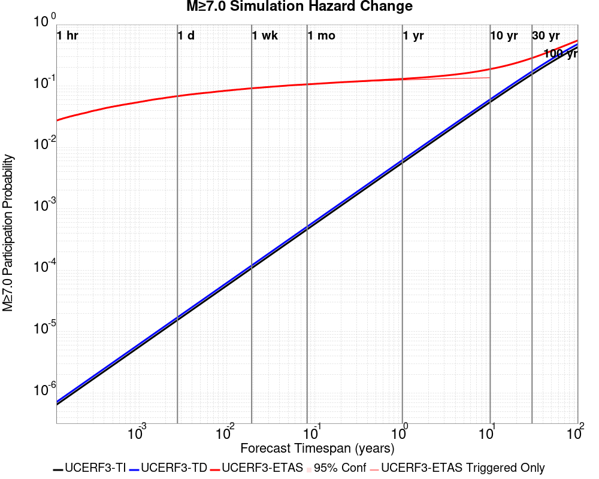
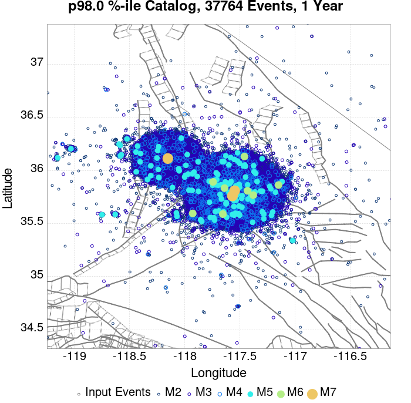
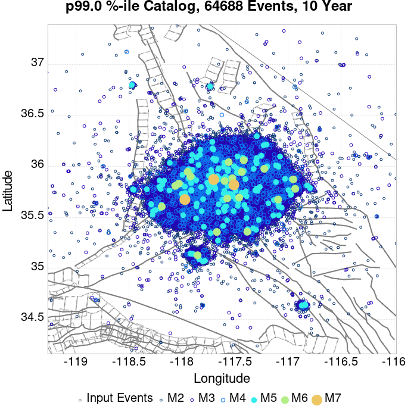
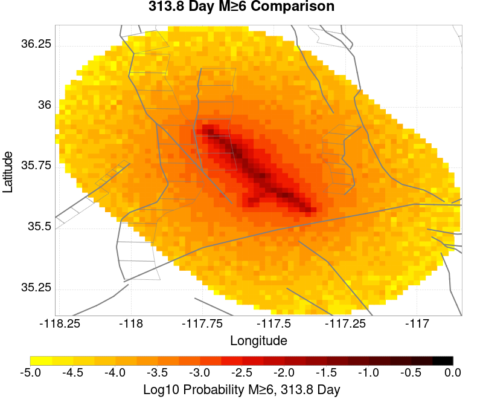
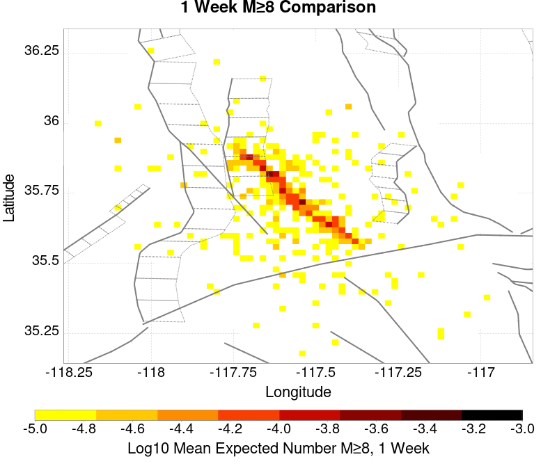
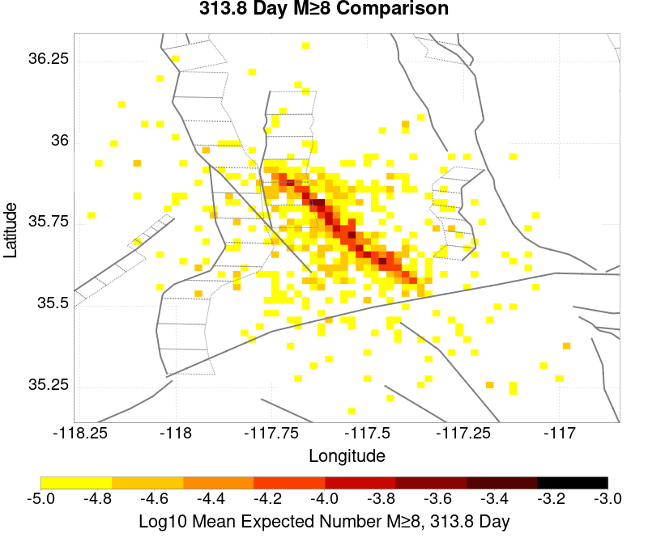

# ComCat M7.1 (ci38457511), ShakeMap Surfaces, Log10(k)=-2.3856, p=1.2164, c=0.0068906, No Faults Results

|   | ComCat M7.1 (ci38457511), ShakeMap Surfaces, Log10(k)=-2.3856, p=1.2164, c=0.0068906, No Faults |
|-----|-----|
| Num Simulations | 962 (incomplete) |
| Start Time | 2019/07/06 03:19:54 UTC |
| Start Time Epoch Milliseconds | 1562383194040 |
| Duration | 10 Years |
| Includes Spontaneous? | false |
| Trigger Ruptures | 270 Trigger Ruptures |
|   | First: M3.98 at 2019/07/04 17:02:55 UTC |
|   | Last: M7.1 at 2019/07/06 03:19:53 UTC |
|   | Largest: M7.1 at 2019/07/06 03:19:53 UTC |
| Historical Ruptures | *(none)* |
| Config Generated With | u3etas_comcat_event_config_builder.sh --event-id ci38457511 --num-simulations 100000 --days-before 7 --gridded-only --mag-complete 3.5 --etas-k -2.3856 --etas-p 1.2164 --etas-c 0.0068906 --finite-surf-shakemap --finite-surf-shakemap-min-mag 5 --hpc-site USC_HPC --nodes 36 --hours 24 --queue scec |

## Table Of Contents

* [Probabilities Summary Table](#probabilities-summary-table)
* [Magnitude Number Distribution](#magnitude-number-distribution)
  * [10 Year Magnitude Number Distribution](#10-year-magnitude-number-distribution)
  * [1 Year Magnitude Number Distribution](#1-year-magnitude-number-distribution)
  * [1 Month Magnitude Number Distribution](#1-month-magnitude-number-distribution)
  * [1 Week Magnitude Number Distribution](#1-week-magnitude-number-distribution)
  * [1 Day Magnitude Number Distribution](#1-day-magnitude-number-distribution)
  * [1 Hour Magnitude Number Distribution](#1-hour-magnitude-number-distribution)
* [Hazard Change Over Time](#hazard-change-over-time)
  * [M&ge;5.0 Hazard Change Over Time](#m50-hazard-change-over-time)
  * [M&ge;6.0 Hazard Change Over Time](#m60-hazard-change-over-time)
  * [M&ge;7.0 Hazard Change Over Time](#m70-hazard-change-over-time)
  * [M&ge;8.0 Hazard Change Over Time](#m80-hazard-change-over-time)
* [Trigger Rupture Fault Map](#trigger-rupture-fault-map)
* [Trigger Rupture Depth Map](#trigger-rupture-depth-map)
* [Fault Distances To Triggers](#fault-distances-to-triggers)
* [Individual Simulated Catalog Maps](#individual-simulated-catalog-maps)
* [ComCat Data Comparisons](#comcat-data-comparisons)
  * [ComCat Magnitude-Number Distributions](#comcat-magnitude-number-distributions)
  * [ComCat Time-Dependent Mc](#comcat-time-dependent-mc)
  * [ComCat Cumulative Number Vs Time](#comcat-cumulative-number-vs-time)
  * [ComCat Cumulative Number Simulation Percentiles](#comcat-cumulative-number-simulation-percentiles)
  * [ComCat Probability Spatial Distribution](#comcat-probability-spatial-distribution)
  * [ComCat Mean Expectation Spatial Distribution](#comcat-mean-expectation-spatial-distribution)
  * [ComCat Depth Distribution](#comcat-depth-distribution)
* [Gridded Nucleation](#gridded-nucleation)
* [JSON Input File](#json-input-file)

## Probabilities Summary Table
*[(top)](#table-of-contents)*

| Magnitude | 1 Hour Prob | 1 Day Prob | 1 Week Prob | 1 Month Prob | 1 Year Prob | 10 Year Prob |
|-----|-----|-----|-----|-----|-----|-----|
| **M&ge;4** | 1.000 (100.00%) | 1.000 (100.00%) | 1.000 (100.00%) | 1.000 (100.00%) | 1.000 (100.00%) | 1.000 (100.00%) |
| **M&ge;4.5** | 1.000 (100.00%) | 1.000 (100.00%) | 1.000 (100.00%) | 1.000 (100.00%) | 1.000 (100.00%) | 1.000 (100.00%) |
| **M&ge;5** | 0.924 (92.41%) | 0.998 (99.79%) | 0.998 (99.79%) | 0.999 (99.90%) | 1.000 (100.00%) | 1.000 (100.00%) |
| **M&ge;5.5** | 0.571 (57.07%) | 0.859 (85.86%) | 0.926 (92.62%) | 0.941 (94.07%) | 0.966 (96.57%) | 0.971 (97.09%) |
| **M&ge;6** | 0.237 (23.70%) | 0.482 (48.23%) | 0.573 (57.28%) | 0.628 (62.79%) | 0.673 (67.26%) | 0.689 (68.92%) |
| **M&ge;6.5** | 0.086 (8.63%) | 0.183 (18.30%) | 0.239 (23.91%) | 0.264 (26.40%) | 0.301 (30.15%) | 0.322 (32.22%) |
| **M&ge;7** | 0.026 (2.60%) | 0.059 (5.93%) | 0.078 (7.80%) | 0.090 (9.04%) | 0.110 (11.02%) | 0.123 (12.27%) |
| **M&ge;7.1** | 0.023 (2.29%) | 0.050 (4.99%) | 0.064 (6.44%) | 0.075 (7.48%) | 0.093 (9.25%) | 0.103 (10.29%) |
| **M&ge;7.5** | 3.12E-3 (0.31%) | 8.32E-3 (0.83%) | 0.016 (1.56%) | 0.019 (1.87%) | 0.031 (3.12%) | 0.034 (3.43%) |
| **M&ge;8** | 0.000 (0.00%) | 0.000 (0.00%) | 2.08E-3 (0.21%) | 2.08E-3 (0.21%) | 5.20E-3 (0.52%) | 7.28E-3 (0.73%) |

## Magnitude Number Distribution
*[(top)](#table-of-contents)*

### 10 Year Magnitude Number Distribution
*[(top)](#table-of-contents)*

**Legend**
* **Mean** (thick black line): mean expected number across all 962 catalogs
* **2.5%,97.5%** (thin black lines): expected number percentiles across all 962 catalogs
* **Median** (thin blue line): median expected number across all 962 catalogs
* **Mode** (thin cyan line): modal expected number across all 962 catalogs
* **10 yr Probability** (thin red line): 10 year probability calculated as the fraction of catalogs with at least 1 occurrence
* **10 yr Supraseismogenic Probability** (thin dashed red line): same as above, but only for supraseismogenic ruptures on explicitly modeled UCERF3 faults
* **95% Conf** (light red shaded region): binomial 95% confidence bounds on probability
* **Primary** (thin green line): mean expected number from primary triggered aftershocks only (no secondary, tertiary, etc...) across all 962 catalogs


| Mag | Mean | 2.5 %ile | 97.5 %ile | Median | Mode | 10 yr Probability | 10 yr Supra-Seis Prob | Primary Aftershocks Mean |
|-----|-----|-----|-----|-----|-----|-----|-----|-----|
| **M&ge;2.5** | 7129.734 | 3506.000 | 26222.000 | 4672.000 | 4104.000 | 1.000 (100.00%) | 0.000 (0.00%) | 2267.698 |
| **M&ge;2.6** | 5664.685 | 2787.000 | 20892.000 | 3717.000 | 3259.000 | 1.000 (100.00%) | 0.000 (0.00%) | 1802.246 |
| **M&ge;2.7** | 4501.422 | 2198.000 | 16588.000 | 2957.000 | 2967.000 | 1.000 (100.00%) | 0.000 (0.00%) | 1432.223 |
| **M&ge;2.8** | 3574.281 | 1739.000 | 13151.000 | 2344.000 | 2063.000 | 1.000 (100.00%) | 0.000 (0.00%) | 1136.614 |
| **M&ge;2.9** | 2839.100 | 1378.000 | 10398.000 | 1864.000 | 1570.000 | 1.000 (100.00%) | 0.000 (0.00%) | 902.775 |
| **M&ge;3** | 2255.523 | 1096.000 | 8277.000 | 1477.000 | 1412.000 | 1.000 (100.00%) | 0.000 (0.00%) | 717.296 |
| **M&ge;3.1** | 1790.615 | 861.000 | 6535.000 | 1173.000 | 1008.000 | 1.000 (100.00%) | 0.000 (0.00%) | 569.446 |
| **M&ge;3.2** | 1421.636 | 681.000 | 5200.000 | 934.000 | 842.000 | 1.000 (100.00%) | 0.000 (0.00%) | 451.351 |
| **M&ge;3.3** | 1128.641 | 538.000 | 4114.000 | 743.000 | 645.000 | 1.000 (100.00%) | 0.000 (0.00%) | 358.396 |
| **M&ge;3.4** | 897.025 | 425.000 | 3256.000 | 588.000 | 548.000 | 1.000 (100.00%) | 0.000 (0.00%) | 284.875 |
| **M&ge;3.5** | 712.198 | 331.000 | 2600.000 | 467.000 | 441.000 | 1.000 (100.00%) | 0.000 (0.00%) | 226.023 |
| **M&ge;3.6** | 565.648 | 263.000 | 2053.000 | 372.000 | 323.000 | 1.000 (100.00%) | 0.000 (0.00%) | 179.713 |
| **M&ge;3.7** | 449.086 | 203.000 | 1626.000 | 295.000 | 295.000 | 1.000 (100.00%) | 0.000 (0.00%) | 142.551 |
| **M&ge;3.8** | 356.984 | 158.000 | 1284.000 | 236.000 | 210.000 | 1.000 (100.00%) | 0.000 (0.00%) | 113.577 |
| **M&ge;3.9** | 283.546 | 126.000 | 1037.000 | 187.000 | 180.000 | 1.000 (100.00%) | 0.000 (0.00%) | 90.342 |
| **M&ge;4** | 225.693 | 98.000 | 807.000 | 150.000 | 124.000 | 1.000 (100.00%) | 0.000 (0.00%) | 71.994 |
| **M&ge;4.1** | 179.344 | 77.000 | 668.000 | 120.000 | 106.000 | 1.000 (100.00%) | 0.000 (0.00%) | 57.311 |
| **M&ge;4.2** | 142.529 | 59.000 | 527.000 | 95.000 | 91.000 | 1.000 (100.00%) | 0.000 (0.00%) | 45.588 |
| **M&ge;4.3** | 113.059 | 45.000 | 409.000 | 76.000 | 66.000 | 1.000 (100.00%) | 0.000 (0.00%) | 36.128 |
| **M&ge;4.4** | 89.796 | 33.000 | 327.000 | 60.000 | 49.000 | 1.000 (100.00%) | 0.000 (0.00%) | 28.669 |
| **M&ge;4.5** | 71.464 | 26.000 | 261.000 | 48.000 | 43.000 | 1.000 (100.00%) | 0.000 (0.00%) | 22.814 |
| **M&ge;4.6** | 56.626 | 19.000 | 202.000 | 38.000 | 35.000 | 1.000 (100.00%) | 0.000 (0.00%) | 18.140 |
| **M&ge;4.7** | 44.977 | 14.000 | 161.000 | 31.000 | 26.000 | 1.000 (100.00%) | 0.000 (0.00%) | 14.418 |
| **M&ge;4.8** | 35.822 | 11.000 | 126.000 | 25.000 | 19.000 | 1.000 (100.00%) | 0.000 (0.00%) | 11.462 |
| **M&ge;4.9** | 28.494 | 8.000 | 102.000 | 20.000 | 16.000 | 1.000 (100.00%) | 0.000 (0.00%) | 9.100 |
| **M&ge;5** | 22.672 | 5.000 | 82.000 | 16.000 | 14.000 | 1.000 (100.00%) | 0.000 (0.00%) | 7.254 |
| **M&ge;5.1** | 17.945 | 4.000 | 66.000 | 12.000 | 9.000 | 1.000 (100.00%) | 0.000 (0.00%) | 5.686 |
| **M&ge;5.2** | 14.278 | 2.000 | 51.000 | 10.000 | 7.000 | 0.999 (99.90%) | 0.000 (0.00%) | 4.517 |
| **M&ge;5.3** | 11.262 | 2.000 | 39.000 | 8.000 | 5.000 | 0.998 (99.79%) | 0.000 (0.00%) | 3.567 |
| **M&ge;5.4** | 8.912 | 1.000 | 33.000 | 6.000 | 4.000 | 0.988 (98.75%) | 0.000 (0.00%) | 2.814 |
| **M&ge;5.5** | 7.062 | 0.000 | 28.000 | 5.000 | 4.000 | 0.971 (97.09%) | 0.000 (0.00%) | 2.219 |
| **M&ge;5.6** | 5.574 | 0.000 | 23.000 | 4.000 | 3.000 | 0.941 (94.07%) | 0.000 (0.00%) | 1.729 |
| **M&ge;5.7** | 4.400 | 0.000 | 19.000 | 3.000 | 1.000 | 0.895 (89.50%) | 0.000 (0.00%) | 1.380 |
| **M&ge;5.8** | 3.491 | 0.000 | 14.000 | 2.000 | 1.000 | 0.837 (83.68%) | 0.000 (0.00%) | 1.104 |
| **M&ge;5.9** | 2.787 | 0.000 | 13.000 | 2.000 | 1.000 | 0.761 (76.09%) | 0.000 (0.00%) | 0.876 |
| **M&ge;6** | 2.213 | 0.000 | 10.000 | 1.000 | 0.000 | 0.689 (68.92%) | 0.000 (0.00%) | 0.687 |
| **M&ge;6.1** | 1.767 | 0.000 | 9.000 | 1.000 | 0.000 | 0.623 (62.27%) | 0.000 (0.00%) | 0.550 |
| **M&ge;6.2** | 1.385 | 0.000 | 7.000 | 1.000 | 0.000 | 0.535 (53.53%) | 0.000 (0.00%) | 0.431 |
| **M&ge;6.3** | 1.074 | 0.000 | 6.000 | 0.000 | 0.000 | 0.460 (46.05%) | 0.000 (0.00%) | 0.331 |
| **M&ge;6.4** | 0.857 | 0.000 | 5.000 | 0.000 | 0.000 | 0.396 (39.60%) | 0.000 (0.00%) | 0.270 |
| **M&ge;6.5** | 0.664 | 0.000 | 4.000 | 0.000 | 0.000 | 0.322 (32.22%) | 0.000 (0.00%) | 0.202 |
| **M&ge;6.6** | 0.542 | 0.000 | 4.000 | 0.000 | 0.000 | 0.277 (27.65%) | 0.000 (0.00%) | 0.161 |
| **M&ge;6.7** | 0.407 | 0.000 | 3.000 | 0.000 | 0.000 | 0.232 (23.18%) | 0.000 (0.00%) | 0.121 |
| **M&ge;6.8** | 0.331 | 0.000 | 2.000 | 0.000 | 0.000 | 0.199 (19.85%) | 0.000 (0.00%) | 0.099 |
| **M&ge;6.9** | 0.248 | 0.000 | 2.000 | 0.000 | 0.000 | 0.156 (15.59%) | 0.000 (0.00%) | 0.073 |
| **M&ge;7** | 0.190 | 0.000 | 2.000 | 0.000 | 0.000 | 0.123 (12.27%) | 0.000 (0.00%) | 0.052 |
| **M&ge;7.1** | 0.155 | 0.000 | 2.000 | 0.000 | 0.000 | 0.103 (10.29%) | 0.000 (0.00%) | 0.044 |
| **M&ge;7.2** | 0.117 | 0.000 | 1.000 | 0.000 | 0.000 | 0.077 (7.69%) | 0.000 (0.00%) | 0.031 |
| **M&ge;7.3** | 0.094 | 0.000 | 1.000 | 0.000 | 0.000 | 0.063 (6.34%) | 0.000 (0.00%) | 0.026 |
| **M&ge;7.4** | 0.067 | 0.000 | 1.000 | 0.000 | 0.000 | 0.047 (4.68%) | 0.000 (0.00%) | 0.017 |
| **M&ge;7.5** | 0.050 | 0.000 | 1.000 | 0.000 | 0.000 | 0.034 (3.43%) | 0.000 (0.00%) | 9.36E-3 |
| **M&ge;7.6** | 0.036 | 0.000 | 0.000 | 0.000 | 0.000 | 0.025 (2.49%) | 0.000 (0.00%) | 8.32E-3 |
| **M&ge;7.7** | 0.032 | 0.000 | 0.000 | 0.000 | 0.000 | 0.022 (2.18%) | 0.000 (0.00%) | 6.24E-3 |
| **M&ge;7.8** | 0.022 | 0.000 | 0.000 | 0.000 | 0.000 | 0.015 (1.46%) | 0.000 (0.00%) | 3.12E-3 |
| **M&ge;7.9** | 0.018 | 0.000 | 0.000 | 0.000 | 0.000 | 0.014 (1.35%) | 0.000 (0.00%) | 3.12E-3 |
| **M&ge;8** | 8.32E-3 | 0.000 | 0.000 | 0.000 | 0.000 | 7.28E-3 (0.73%) | 0.000 (0.00%) | 2.08E-3 |
| **M&ge;8.1** | 3.12E-3 | 0.000 | 0.000 | 0.000 | 0.000 | 3.12E-3 (0.31%) | 0.000 (0.00%) | 2.08E-3 |
| **M&ge;8.2** | 2.08E-3 | 0.000 | 0.000 | 0.000 | 0.000 | 2.08E-3 (0.21%) | 0.000 (0.00%) | 1.04E-3 |
| **M&ge;8.3** | 0.000 | 0.000 | 0.000 | 0.000 | 0.000 | 0.000 (0.00%) | 0.000 (0.00%) | 0.000 |
| **M&ge;8.4** | 0.000 | 0.000 | 0.000 | 0.000 | 0.000 | 0.000 (0.00%) | 0.000 (0.00%) | 0.000 |
| **M&ge;8.5** | 0.000 | 0.000 | 0.000 | 0.000 | 0.000 | 0.000 (0.00%) | 0.000 (0.00%) | 0.000 |
| **M&ge;8.6** | 0.000 | 0.000 | 0.000 | 0.000 | 0.000 | 0.000 (0.00%) | 0.000 (0.00%) | 0.000 |
| **M&ge;8.7** | 0.000 | 0.000 | 0.000 | 0.000 | 0.000 | 0.000 (0.00%) | 0.000 (0.00%) | 0.000 |
| **M&ge;8.8** | 0.000 | 0.000 | 0.000 | 0.000 | 0.000 | 0.000 (0.00%) | 0.000 (0.00%) | 0.000 |
| **M&ge;8.9** | 0.000 | 0.000 | 0.000 | 0.000 | 0.000 | 0.000 (0.00%) | 0.000 (0.00%) | 0.000 |
| **M&ge;9** | 0.000 | 0.000 | 0.000 | 0.000 | 0.000 | 0.000 (0.00%) | 0.000 (0.00%) | 0.000 |

### 1 Year Magnitude Number Distribution
*[(top)](#table-of-contents)*

**Legend**
* **Mean** (thick black line): mean expected number across all 962 catalogs
* **2.5%,97.5%** (thin black lines): expected number percentiles across all 962 catalogs
* **Median** (thin blue line): median expected number across all 962 catalogs
* **Mode** (thin cyan line): modal expected number across all 962 catalogs
* **1 yr Probability** (thin red line): 1 year probability calculated as the fraction of catalogs with at least 1 occurrence
* **1 yr Supraseismogenic Probability** (thin dashed red line): same as above, but only for supraseismogenic ruptures on explicitly modeled UCERF3 faults
* **95% Conf** (light red shaded region): binomial 95% confidence bounds on probability
* **Primary** (thin green line): mean expected number from primary triggered aftershocks only (no secondary, tertiary, etc...) across all 962 catalogs


| Mag | Mean | 2.5 %ile | 97.5 %ile | Median | Mode | 1 yr Probability | 1 yr Supra-Seis Prob | Primary Aftershocks Mean |
|-----|-----|-----|-----|-----|-----|-----|-----|-----|
| **M&ge;2.5** | 6056.807 | 3256.000 | 18507.000 | 4263.000 | 3941.000 | 1.000 (100.00%) | 0.000 (0.00%) | 2161.332 |
| **M&ge;2.6** | 4812.179 | 2598.000 | 14760.000 | 3392.000 | 3441.000 | 1.000 (100.00%) | 0.000 (0.00%) | 1717.571 |
| **M&ge;2.7** | 3824.105 | 2052.000 | 11768.000 | 2693.000 | 2393.000 | 1.000 (100.00%) | 0.000 (0.00%) | 1365.104 |
| **M&ge;2.8** | 3036.397 | 1624.000 | 9307.000 | 2137.000 | 1929.000 | 1.000 (100.00%) | 0.000 (0.00%) | 1083.317 |
| **M&ge;2.9** | 2411.868 | 1283.000 | 7435.000 | 1696.000 | 1536.000 | 1.000 (100.00%) | 0.000 (0.00%) | 860.341 |
| **M&ge;3** | 1916.059 | 1021.000 | 5912.000 | 1346.000 | 1138.000 | 1.000 (100.00%) | 0.000 (0.00%) | 683.602 |
| **M&ge;3.1** | 1520.917 | 807.000 | 4676.000 | 1068.000 | 947.000 | 1.000 (100.00%) | 0.000 (0.00%) | 542.643 |
| **M&ge;3.2** | 1207.161 | 634.000 | 3680.000 | 847.000 | 793.000 | 1.000 (100.00%) | 0.000 (0.00%) | 430.189 |
| **M&ge;3.3** | 958.644 | 501.000 | 2933.000 | 677.000 | 603.000 | 1.000 (100.00%) | 0.000 (0.00%) | 341.551 |
| **M&ge;3.4** | 761.717 | 393.000 | 2330.000 | 537.000 | 500.000 | 1.000 (100.00%) | 0.000 (0.00%) | 271.548 |
| **M&ge;3.5** | 604.896 | 308.000 | 1856.000 | 429.000 | 369.000 | 1.000 (100.00%) | 0.000 (0.00%) | 215.503 |
| **M&ge;3.6** | 480.521 | 242.000 | 1490.000 | 340.000 | 322.000 | 1.000 (100.00%) | 0.000 (0.00%) | 171.365 |
| **M&ge;3.7** | 381.518 | 187.000 | 1188.000 | 270.000 | 269.000 | 1.000 (100.00%) | 0.000 (0.00%) | 135.949 |
| **M&ge;3.8** | 303.440 | 148.000 | 936.000 | 216.000 | 205.000 | 1.000 (100.00%) | 0.000 (0.00%) | 108.375 |
| **M&ge;3.9** | 241.047 | 117.000 | 737.000 | 172.000 | 157.000 | 1.000 (100.00%) | 0.000 (0.00%) | 86.231 |
| **M&ge;4** | 192.021 | 92.000 | 589.000 | 137.000 | 129.000 | 1.000 (100.00%) | 0.000 (0.00%) | 68.749 |
| **M&ge;4.1** | 152.661 | 71.000 | 477.000 | 109.000 | 106.000 | 1.000 (100.00%) | 0.000 (0.00%) | 54.769 |
| **M&ge;4.2** | 121.338 | 55.000 | 378.000 | 87.000 | 90.000 | 1.000 (100.00%) | 0.000 (0.00%) | 43.560 |
| **M&ge;4.3** | 96.279 | 42.000 | 308.000 | 69.000 | 57.000 | 1.000 (100.00%) | 0.000 (0.00%) | 34.529 |
| **M&ge;4.4** | 76.479 | 31.000 | 239.000 | 55.000 | 46.000 | 1.000 (100.00%) | 0.000 (0.00%) | 27.385 |
| **M&ge;4.5** | 60.815 | 25.000 | 190.000 | 44.000 | 39.000 | 1.000 (100.00%) | 0.000 (0.00%) | 21.791 |
| **M&ge;4.6** | 48.164 | 18.000 | 153.000 | 35.000 | 28.000 | 1.000 (100.00%) | 0.000 (0.00%) | 17.324 |
| **M&ge;4.7** | 38.315 | 13.000 | 128.000 | 28.000 | 25.000 | 1.000 (100.00%) | 0.000 (0.00%) | 13.769 |
| **M&ge;4.8** | 30.484 | 10.000 | 102.000 | 23.000 | 19.000 | 1.000 (100.00%) | 0.000 (0.00%) | 10.954 |
| **M&ge;4.9** | 24.229 | 7.000 | 76.000 | 18.000 | 13.000 | 1.000 (100.00%) | 0.000 (0.00%) | 8.701 |
| **M&ge;5** | 19.322 | 5.000 | 62.000 | 14.000 | 10.000 | 1.000 (100.00%) | 0.000 (0.00%) | 6.937 |
| **M&ge;5.1** | 15.322 | 3.000 | 51.000 | 11.000 | 8.000 | 1.000 (100.00%) | 0.000 (0.00%) | 5.447 |
| **M&ge;5.2** | 12.150 | 2.000 | 40.000 | 9.000 | 7.000 | 0.999 (99.90%) | 0.000 (0.00%) | 4.328 |
| **M&ge;5.3** | 9.547 | 1.000 | 33.000 | 7.000 | 6.000 | 0.997 (99.69%) | 0.000 (0.00%) | 3.420 |
| **M&ge;5.4** | 7.545 | 1.000 | 26.000 | 5.000 | 4.000 | 0.985 (98.54%) | 0.000 (0.00%) | 2.692 |
| **M&ge;5.5** | 5.953 | 0.000 | 22.000 | 4.000 | 4.000 | 0.966 (96.57%) | 0.000 (0.00%) | 2.126 |
| **M&ge;5.6** | 4.682 | 0.000 | 18.000 | 3.000 | 3.000 | 0.928 (92.83%) | 0.000 (0.00%) | 1.656 |
| **M&ge;5.7** | 3.682 | 0.000 | 15.000 | 2.000 | 1.000 | 0.872 (87.21%) | 0.000 (0.00%) | 1.320 |
| **M&ge;5.8** | 2.930 | 0.000 | 12.000 | 2.000 | 1.000 | 0.812 (81.19%) | 0.000 (0.00%) | 1.055 |
| **M&ge;5.9** | 2.324 | 0.000 | 10.000 | 1.000 | 0.000 | 0.739 (73.91%) | 0.000 (0.00%) | 0.837 |
| **M&ge;6** | 1.852 | 0.000 | 8.000 | 1.000 | 0.000 | 0.673 (67.26%) | 0.000 (0.00%) | 0.660 |
| **M&ge;6.1** | 1.479 | 0.000 | 7.000 | 1.000 | 0.000 | 0.600 (59.98%) | 0.000 (0.00%) | 0.527 |
| **M&ge;6.2** | 1.162 | 0.000 | 6.000 | 1.000 | 0.000 | 0.511 (51.14%) | 0.000 (0.00%) | 0.412 |
| **M&ge;6.3** | 0.905 | 0.000 | 5.000 | 0.000 | 0.000 | 0.436 (43.56%) | 0.000 (0.00%) | 0.319 |
| **M&ge;6.4** | 0.725 | 0.000 | 4.000 | 0.000 | 0.000 | 0.372 (37.21%) | 0.000 (0.00%) | 0.261 |
| **M&ge;6.5** | 0.561 | 0.000 | 4.000 | 0.000 | 0.000 | 0.301 (30.15%) | 0.000 (0.00%) | 0.193 |
| **M&ge;6.6** | 0.457 | 0.000 | 3.000 | 0.000 | 0.000 | 0.258 (25.78%) | 0.000 (0.00%) | 0.155 |
| **M&ge;6.7** | 0.343 | 0.000 | 3.000 | 0.000 | 0.000 | 0.212 (21.21%) | 0.000 (0.00%) | 0.114 |
| **M&ge;6.8** | 0.279 | 0.000 | 2.000 | 0.000 | 0.000 | 0.180 (17.98%) | 0.000 (0.00%) | 0.093 |
| **M&ge;6.9** | 0.207 | 0.000 | 2.000 | 0.000 | 0.000 | 0.140 (14.03%) | 0.000 (0.00%) | 0.069 |
| **M&ge;7** | 0.158 | 0.000 | 2.000 | 0.000 | 0.000 | 0.110 (11.02%) | 0.000 (0.00%) | 0.049 |
| **M&ge;7.1** | 0.131 | 0.000 | 1.000 | 0.000 | 0.000 | 0.093 (9.25%) | 0.000 (0.00%) | 0.041 |
| **M&ge;7.2** | 0.097 | 0.000 | 1.000 | 0.000 | 0.000 | 0.069 (6.86%) | 0.000 (0.00%) | 0.029 |
| **M&ge;7.3** | 0.076 | 0.000 | 1.000 | 0.000 | 0.000 | 0.055 (5.51%) | 0.000 (0.00%) | 0.025 |
| **M&ge;7.4** | 0.054 | 0.000 | 1.000 | 0.000 | 0.000 | 0.043 (4.26%) | 0.000 (0.00%) | 0.016 |
| **M&ge;7.5** | 0.041 | 0.000 | 1.000 | 0.000 | 0.000 | 0.031 (3.12%) | 0.000 (0.00%) | 8.32E-3 |
| **M&ge;7.6** | 0.029 | 0.000 | 0.000 | 0.000 | 0.000 | 0.023 (2.29%) | 0.000 (0.00%) | 7.28E-3 |
| **M&ge;7.7** | 0.025 | 0.000 | 0.000 | 0.000 | 0.000 | 0.019 (1.87%) | 0.000 (0.00%) | 5.20E-3 |
| **M&ge;7.8** | 0.017 | 0.000 | 0.000 | 0.000 | 0.000 | 0.011 (1.14%) | 0.000 (0.00%) | 2.08E-3 |
| **M&ge;7.9** | 0.012 | 0.000 | 0.000 | 0.000 | 0.000 | 0.010 (1.04%) | 0.000 (0.00%) | 2.08E-3 |
| **M&ge;8** | 6.24E-3 | 0.000 | 0.000 | 0.000 | 0.000 | 5.20E-3 (0.52%) | 0.000 (0.00%) | 1.04E-3 |
| **M&ge;8.1** | 1.04E-3 | 0.000 | 0.000 | 0.000 | 0.000 | 1.04E-3 (0.10%) | 0.000 (0.00%) | 1.04E-3 |
| **M&ge;8.2** | 0.000 | 0.000 | 0.000 | 0.000 | 0.000 | 0.000 (0.00%) | 0.000 (0.00%) | 0.000 |
| **M&ge;8.3** | 0.000 | 0.000 | 0.000 | 0.000 | 0.000 | 0.000 (0.00%) | 0.000 (0.00%) | 0.000 |
| **M&ge;8.4** | 0.000 | 0.000 | 0.000 | 0.000 | 0.000 | 0.000 (0.00%) | 0.000 (0.00%) | 0.000 |
| **M&ge;8.5** | 0.000 | 0.000 | 0.000 | 0.000 | 0.000 | 0.000 (0.00%) | 0.000 (0.00%) | 0.000 |
| **M&ge;8.6** | 0.000 | 0.000 | 0.000 | 0.000 | 0.000 | 0.000 (0.00%) | 0.000 (0.00%) | 0.000 |
| **M&ge;8.7** | 0.000 | 0.000 | 0.000 | 0.000 | 0.000 | 0.000 (0.00%) | 0.000 (0.00%) | 0.000 |
| **M&ge;8.8** | 0.000 | 0.000 | 0.000 | 0.000 | 0.000 | 0.000 (0.00%) | 0.000 (0.00%) | 0.000 |
| **M&ge;8.9** | 0.000 | 0.000 | 0.000 | 0.000 | 0.000 | 0.000 (0.00%) | 0.000 (0.00%) | 0.000 |
| **M&ge;9** | 0.000 | 0.000 | 0.000 | 0.000 | 0.000 | 0.000 (0.00%) | 0.000 (0.00%) | 0.000 |

### 1 Month Magnitude Number Distribution
*[(top)](#table-of-contents)*

**Legend**
* **Mean** (thick black line): mean expected number across all 962 catalogs
* **2.5%,97.5%** (thin black lines): expected number percentiles across all 962 catalogs
* **Median** (thin blue line): median expected number across all 962 catalogs
* **Mode** (thin cyan line): modal expected number across all 962 catalogs
* **1 mo Probability** (thin red line): 1 month probability calculated as the fraction of catalogs with at least 1 occurrence
* **1 mo Supraseismogenic Probability** (thin dashed red line): same as above, but only for supraseismogenic ruptures on explicitly modeled UCERF3 faults
* **95% Conf** (light red shaded region): binomial 95% confidence bounds on probability
* **Primary** (thin green line): mean expected number from primary triggered aftershocks only (no secondary, tertiary, etc...) across all 962 catalogs


| Mag | Mean | 2.5 %ile | 97.5 %ile | Median | Mode | 1 mo Probability | 1 mo Supra-Seis Prob | Primary Aftershocks Mean |
|-----|-----|-----|-----|-----|-----|-----|-----|-----|
| **M&ge;2.5** | 4569.012 | 2795.000 | 12546.000 | 3566.000 | 3334.000 | 1.000 (100.00%) | 0.000 (0.00%) | 1967.393 |
| **M&ge;2.6** | 3630.456 | 2225.000 | 9930.000 | 2841.000 | 2505.000 | 1.000 (100.00%) | 0.000 (0.00%) | 1563.677 |
| **M&ge;2.7** | 2884.823 | 1770.000 | 7878.000 | 2260.000 | 2068.000 | 1.000 (100.00%) | 0.000 (0.00%) | 1242.737 |
| **M&ge;2.8** | 2290.495 | 1393.000 | 6221.000 | 1796.000 | 1659.000 | 1.000 (100.00%) | 0.000 (0.00%) | 986.159 |
| **M&ge;2.9** | 1819.616 | 1104.000 | 4974.000 | 1430.000 | 1297.000 | 1.000 (100.00%) | 0.000 (0.00%) | 783.333 |
| **M&ge;3** | 1445.076 | 875.000 | 3932.000 | 1137.000 | 1067.000 | 1.000 (100.00%) | 0.000 (0.00%) | 622.358 |
| **M&ge;3.1** | 1147.202 | 691.000 | 3101.000 | 899.000 | 955.000 | 1.000 (100.00%) | 0.000 (0.00%) | 494.093 |
| **M&ge;3.2** | 910.684 | 545.000 | 2434.000 | 716.000 | 646.000 | 1.000 (100.00%) | 0.000 (0.00%) | 391.714 |
| **M&ge;3.3** | 723.361 | 428.000 | 1936.000 | 573.000 | 524.000 | 1.000 (100.00%) | 0.000 (0.00%) | 310.913 |
| **M&ge;3.4** | 574.795 | 341.000 | 1545.000 | 454.000 | 390.000 | 1.000 (100.00%) | 0.000 (0.00%) | 247.109 |
| **M&ge;3.5** | 456.257 | 267.000 | 1221.000 | 361.000 | 340.000 | 1.000 (100.00%) | 0.000 (0.00%) | 196.137 |
| **M&ge;3.6** | 362.530 | 211.000 | 972.000 | 287.000 | 252.000 | 1.000 (100.00%) | 0.000 (0.00%) | 155.986 |
| **M&ge;3.7** | 287.878 | 163.000 | 788.000 | 228.000 | 200.000 | 1.000 (100.00%) | 0.000 (0.00%) | 123.798 |
| **M&ge;3.8** | 229.069 | 129.000 | 620.000 | 182.000 | 170.000 | 1.000 (100.00%) | 0.000 (0.00%) | 98.746 |
| **M&ge;3.9** | 182.115 | 101.000 | 509.000 | 145.000 | 140.000 | 1.000 (100.00%) | 0.000 (0.00%) | 78.554 |
| **M&ge;4** | 145.081 | 79.000 | 406.000 | 116.000 | 96.000 | 1.000 (100.00%) | 0.000 (0.00%) | 62.664 |
| **M&ge;4.1** | 115.446 | 60.000 | 318.000 | 93.000 | 83.000 | 1.000 (100.00%) | 0.000 (0.00%) | 49.986 |
| **M&ge;4.2** | 91.819 | 47.000 | 259.000 | 73.000 | 60.000 | 1.000 (100.00%) | 0.000 (0.00%) | 39.756 |
| **M&ge;4.3** | 72.932 | 35.000 | 196.000 | 59.000 | 50.000 | 1.000 (100.00%) | 0.000 (0.00%) | 31.496 |
| **M&ge;4.4** | 58.007 | 27.000 | 160.000 | 47.000 | 42.000 | 1.000 (100.00%) | 0.000 (0.00%) | 24.996 |
| **M&ge;4.5** | 46.086 | 21.000 | 125.000 | 38.000 | 38.000 | 1.000 (100.00%) | 0.000 (0.00%) | 19.896 |
| **M&ge;4.6** | 36.533 | 15.000 | 104.000 | 30.000 | 24.000 | 1.000 (100.00%) | 0.000 (0.00%) | 15.816 |
| **M&ge;4.7** | 29.054 | 11.000 | 81.000 | 24.000 | 21.000 | 1.000 (100.00%) | 0.000 (0.00%) | 12.563 |
| **M&ge;4.8** | 23.077 | 8.000 | 65.000 | 19.000 | 18.000 | 1.000 (100.00%) | 0.000 (0.00%) | 10.007 |
| **M&ge;4.9** | 18.350 | 6.000 | 51.000 | 15.000 | 12.000 | 1.000 (100.00%) | 0.000 (0.00%) | 7.984 |
| **M&ge;5** | 14.636 | 4.000 | 41.000 | 12.000 | 10.000 | 0.999 (99.90%) | 0.000 (0.00%) | 6.379 |
| **M&ge;5.1** | 11.574 | 3.000 | 34.000 | 9.000 | 7.000 | 0.998 (99.79%) | 0.000 (0.00%) | 4.996 |
| **M&ge;5.2** | 9.182 | 2.000 | 26.000 | 7.000 | 6.000 | 0.996 (99.58%) | 0.000 (0.00%) | 3.971 |
| **M&ge;5.3** | 7.184 | 1.000 | 23.000 | 6.000 | 4.000 | 0.986 (98.65%) | 0.000 (0.00%) | 3.128 |
| **M&ge;5.4** | 5.650 | 0.000 | 19.000 | 4.000 | 3.000 | 0.974 (97.40%) | 0.000 (0.00%) | 2.463 |
| **M&ge;5.5** | 4.450 | 0.000 | 15.000 | 3.000 | 3.000 | 0.941 (94.07%) | 0.000 (0.00%) | 1.949 |
| **M&ge;5.6** | 3.473 | 0.000 | 12.000 | 3.000 | 2.000 | 0.893 (89.29%) | 0.000 (0.00%) | 1.514 |
| **M&ge;5.7** | 2.739 | 0.000 | 10.000 | 2.000 | 1.000 | 0.831 (83.06%) | 0.000 (0.00%) | 1.208 |
| **M&ge;5.8** | 2.195 | 0.000 | 8.000 | 2.000 | 1.000 | 0.772 (77.23%) | 0.000 (0.00%) | 0.976 |
| **M&ge;5.9** | 1.733 | 0.000 | 7.000 | 1.000 | 0.000 | 0.701 (70.06%) | 0.000 (0.00%) | 0.770 |
| **M&ge;6** | 1.374 | 0.000 | 6.000 | 1.000 | 0.000 | 0.628 (62.79%) | 0.000 (0.00%) | 0.607 |
| **M&ge;6.1** | 1.097 | 0.000 | 5.000 | 1.000 | 0.000 | 0.550 (54.99%) | 0.000 (0.00%) | 0.484 |
| **M&ge;6.2** | 0.866 | 0.000 | 4.000 | 0.000 | 0.000 | 0.464 (46.36%) | 0.000 (0.00%) | 0.379 |
| **M&ge;6.3** | 0.680 | 0.000 | 4.000 | 0.000 | 0.000 | 0.389 (38.88%) | 0.000 (0.00%) | 0.296 |
| **M&ge;6.4** | 0.553 | 0.000 | 3.000 | 0.000 | 0.000 | 0.331 (33.06%) | 0.000 (0.00%) | 0.246 |
| **M&ge;6.5** | 0.425 | 0.000 | 3.000 | 0.000 | 0.000 | 0.264 (26.40%) | 0.000 (0.00%) | 0.183 |
| **M&ge;6.6** | 0.343 | 0.000 | 2.000 | 0.000 | 0.000 | 0.225 (22.45%) | 0.000 (0.00%) | 0.150 |
| **M&ge;6.7** | 0.254 | 0.000 | 2.000 | 0.000 | 0.000 | 0.183 (18.30%) | 0.000 (0.00%) | 0.109 |
| **M&ge;6.8** | 0.200 | 0.000 | 2.000 | 0.000 | 0.000 | 0.153 (15.28%) | 0.000 (0.00%) | 0.087 |
| **M&ge;6.9** | 0.147 | 0.000 | 1.000 | 0.000 | 0.000 | 0.117 (11.75%) | 0.000 (0.00%) | 0.064 |
| **M&ge;7** | 0.110 | 0.000 | 1.000 | 0.000 | 0.000 | 0.090 (9.04%) | 0.000 (0.00%) | 0.047 |
| **M&ge;7.1** | 0.089 | 0.000 | 1.000 | 0.000 | 0.000 | 0.075 (7.48%) | 0.000 (0.00%) | 0.038 |
| **M&ge;7.2** | 0.064 | 0.000 | 1.000 | 0.000 | 0.000 | 0.053 (5.30%) | 0.000 (0.00%) | 0.028 |
| **M&ge;7.3** | 0.048 | 0.000 | 1.000 | 0.000 | 0.000 | 0.042 (4.16%) | 0.000 (0.00%) | 0.025 |
| **M&ge;7.4** | 0.033 | 0.000 | 1.000 | 0.000 | 0.000 | 0.030 (3.01%) | 0.000 (0.00%) | 0.016 |
| **M&ge;7.5** | 0.021 | 0.000 | 0.000 | 0.000 | 0.000 | 0.019 (1.87%) | 0.000 (0.00%) | 8.32E-3 |
| **M&ge;7.6** | 0.015 | 0.000 | 0.000 | 0.000 | 0.000 | 0.014 (1.35%) | 0.000 (0.00%) | 7.28E-3 |
| **M&ge;7.7** | 0.011 | 0.000 | 0.000 | 0.000 | 0.000 | 0.010 (1.04%) | 0.000 (0.00%) | 5.20E-3 |
| **M&ge;7.8** | 4.16E-3 | 0.000 | 0.000 | 0.000 | 0.000 | 4.16E-3 (0.42%) | 0.000 (0.00%) | 2.08E-3 |
| **M&ge;7.9** | 4.16E-3 | 0.000 | 0.000 | 0.000 | 0.000 | 4.16E-3 (0.42%) | 0.000 (0.00%) | 2.08E-3 |
| **M&ge;8** | 2.08E-3 | 0.000 | 0.000 | 0.000 | 0.000 | 2.08E-3 (0.21%) | 0.000 (0.00%) | 1.04E-3 |
| **M&ge;8.1** | 1.04E-3 | 0.000 | 0.000 | 0.000 | 0.000 | 1.04E-3 (0.10%) | 0.000 (0.00%) | 1.04E-3 |
| **M&ge;8.2** | 0.000 | 0.000 | 0.000 | 0.000 | 0.000 | 0.000 (0.00%) | 0.000 (0.00%) | 0.000 |
| **M&ge;8.3** | 0.000 | 0.000 | 0.000 | 0.000 | 0.000 | 0.000 (0.00%) | 0.000 (0.00%) | 0.000 |
| **M&ge;8.4** | 0.000 | 0.000 | 0.000 | 0.000 | 0.000 | 0.000 (0.00%) | 0.000 (0.00%) | 0.000 |
| **M&ge;8.5** | 0.000 | 0.000 | 0.000 | 0.000 | 0.000 | 0.000 (0.00%) | 0.000 (0.00%) | 0.000 |
| **M&ge;8.6** | 0.000 | 0.000 | 0.000 | 0.000 | 0.000 | 0.000 (0.00%) | 0.000 (0.00%) | 0.000 |
| **M&ge;8.7** | 0.000 | 0.000 | 0.000 | 0.000 | 0.000 | 0.000 (0.00%) | 0.000 (0.00%) | 0.000 |
| **M&ge;8.8** | 0.000 | 0.000 | 0.000 | 0.000 | 0.000 | 0.000 (0.00%) | 0.000 (0.00%) | 0.000 |
| **M&ge;8.9** | 0.000 | 0.000 | 0.000 | 0.000 | 0.000 | 0.000 (0.00%) | 0.000 (0.00%) | 0.000 |
| **M&ge;9** | 0.000 | 0.000 | 0.000 | 0.000 | 0.000 | 0.000 (0.00%) | 0.000 (0.00%) | 0.000 |

### 1 Week Magnitude Number Distribution
*[(top)](#table-of-contents)*

**Legend**
* **Mean** (thick black line): mean expected number across all 962 catalogs
* **2.5%,97.5%** (thin black lines): expected number percentiles across all 962 catalogs
* **Median** (thin blue line): median expected number across all 962 catalogs
* **Mode** (thin cyan line): modal expected number across all 962 catalogs
* **1 wk Probability** (thin red line): 1 week probability calculated as the fraction of catalogs with at least 1 occurrence
* **1 wk Supraseismogenic Probability** (thin dashed red line): same as above, but only for supraseismogenic ruptures on explicitly modeled UCERF3 faults
* **95% Conf** (light red shaded region): binomial 95% confidence bounds on probability
* **Primary** (thin green line): mean expected number from primary triggered aftershocks only (no secondary, tertiary, etc...) across all 962 catalogs


| Mag | Mean | 2.5 %ile | 97.5 %ile | Median | Mode | 1 wk Probability | 1 wk Supra-Seis Prob | Primary Aftershocks Mean |
|-----|-----|-----|-----|-----|-----|-----|-----|-----|
| **M&ge;2.5** | 3769.061 | 2459.000 | 9801.000 | 3042.000 | 2771.000 | 1.000 (100.00%) | 0.000 (0.00%) | 1799.302 |
| **M&ge;2.6** | 2994.999 | 1963.000 | 7766.000 | 2414.000 | 2300.000 | 1.000 (100.00%) | 0.000 (0.00%) | 1430.061 |
| **M&ge;2.7** | 2379.644 | 1555.000 | 6179.000 | 1924.000 | 1761.000 | 1.000 (100.00%) | 0.000 (0.00%) | 1136.805 |
| **M&ge;2.8** | 1889.294 | 1227.000 | 4881.000 | 1528.000 | 1427.000 | 1.000 (100.00%) | 0.000 (0.00%) | 902.238 |
| **M&ge;2.9** | 1500.579 | 966.000 | 3880.000 | 1212.000 | 1053.000 | 1.000 (100.00%) | 0.000 (0.00%) | 716.497 |
| **M&ge;3** | 1191.470 | 767.000 | 3079.000 | 962.000 | 873.000 | 1.000 (100.00%) | 0.000 (0.00%) | 569.161 |
| **M&ge;3.1** | 945.904 | 608.000 | 2439.000 | 767.000 | 702.000 | 1.000 (100.00%) | 0.000 (0.00%) | 451.794 |
| **M&ge;3.2** | 750.781 | 476.000 | 1998.000 | 607.000 | 569.000 | 1.000 (100.00%) | 0.000 (0.00%) | 358.160 |
| **M&ge;3.3** | 596.526 | 374.000 | 1583.000 | 484.000 | 436.000 | 1.000 (100.00%) | 0.000 (0.00%) | 284.325 |
| **M&ge;3.4** | 474.143 | 294.000 | 1246.000 | 385.000 | 368.000 | 1.000 (100.00%) | 0.000 (0.00%) | 226.091 |
| **M&ge;3.5** | 376.533 | 229.000 | 1001.000 | 307.000 | 298.000 | 1.000 (100.00%) | 0.000 (0.00%) | 179.466 |
| **M&ge;3.6** | 299.191 | 182.000 | 792.000 | 243.000 | 242.000 | 1.000 (100.00%) | 0.000 (0.00%) | 142.759 |
| **M&ge;3.7** | 237.681 | 140.000 | 607.000 | 194.000 | 167.000 | 1.000 (100.00%) | 0.000 (0.00%) | 113.294 |
| **M&ge;3.8** | 189.149 | 110.000 | 485.000 | 155.000 | 147.000 | 1.000 (100.00%) | 0.000 (0.00%) | 90.309 |
| **M&ge;3.9** | 150.435 | 86.000 | 390.000 | 123.000 | 116.000 | 1.000 (100.00%) | 0.000 (0.00%) | 71.819 |
| **M&ge;4** | 119.893 | 64.000 | 312.000 | 99.000 | 86.000 | 1.000 (100.00%) | 0.000 (0.00%) | 57.325 |
| **M&ge;4.1** | 95.420 | 50.000 | 245.000 | 79.000 | 69.000 | 1.000 (100.00%) | 0.000 (0.00%) | 45.741 |
| **M&ge;4.2** | 75.926 | 40.000 | 194.000 | 63.000 | 55.000 | 1.000 (100.00%) | 0.000 (0.00%) | 36.394 |
| **M&ge;4.3** | 60.351 | 30.000 | 158.000 | 50.000 | 45.000 | 1.000 (100.00%) | 0.000 (0.00%) | 28.865 |
| **M&ge;4.4** | 47.988 | 22.000 | 125.000 | 40.000 | 35.000 | 1.000 (100.00%) | 0.000 (0.00%) | 22.881 |
| **M&ge;4.5** | 38.107 | 17.000 | 106.000 | 32.000 | 29.000 | 1.000 (100.00%) | 0.000 (0.00%) | 18.195 |
| **M&ge;4.6** | 30.269 | 12.000 | 82.000 | 25.000 | 22.000 | 1.000 (100.00%) | 0.000 (0.00%) | 14.475 |
| **M&ge;4.7** | 24.043 | 9.000 | 65.000 | 20.000 | 18.000 | 1.000 (100.00%) | 0.000 (0.00%) | 11.494 |
| **M&ge;4.8** | 19.100 | 7.000 | 53.000 | 16.000 | 14.000 | 1.000 (100.00%) | 0.000 (0.00%) | 9.149 |
| **M&ge;4.9** | 15.201 | 4.000 | 43.000 | 13.000 | 11.000 | 1.000 (100.00%) | 0.000 (0.00%) | 7.305 |
| **M&ge;5** | 12.129 | 3.000 | 34.000 | 10.000 | 8.000 | 0.998 (99.79%) | 0.000 (0.00%) | 5.835 |
| **M&ge;5.1** | 9.578 | 2.000 | 26.000 | 8.000 | 6.000 | 0.997 (99.69%) | 0.000 (0.00%) | 4.561 |
| **M&ge;5.2** | 7.615 | 1.000 | 21.000 | 6.000 | 6.000 | 0.994 (99.38%) | 0.000 (0.00%) | 3.632 |
| **M&ge;5.3** | 5.963 | 1.000 | 17.000 | 5.000 | 4.000 | 0.981 (98.13%) | 0.000 (0.00%) | 2.868 |
| **M&ge;5.4** | 4.661 | 0.000 | 15.000 | 4.000 | 3.000 | 0.965 (96.47%) | 0.000 (0.00%) | 2.255 |
| **M&ge;5.5** | 3.673 | 0.000 | 12.000 | 3.000 | 1.000 | 0.926 (92.62%) | 0.000 (0.00%) | 1.783 |
| **M&ge;5.6** | 2.876 | 0.000 | 10.000 | 2.000 | 1.000 | 0.869 (86.90%) | 0.000 (0.00%) | 1.377 |
| **M&ge;5.7** | 2.277 | 0.000 | 8.000 | 2.000 | 1.000 | 0.789 (78.90%) | 0.000 (0.00%) | 1.101 |
| **M&ge;5.8** | 1.830 | 0.000 | 7.000 | 1.000 | 0.000 | 0.719 (71.93%) | 0.000 (0.00%) | 0.888 |
| **M&ge;5.9** | 1.441 | 0.000 | 6.000 | 1.000 | 0.000 | 0.649 (64.86%) | 0.000 (0.00%) | 0.698 |
| **M&ge;6** | 1.150 | 0.000 | 5.000 | 1.000 | 0.000 | 0.573 (57.28%) | 0.000 (0.00%) | 0.558 |
| **M&ge;6.1** | 0.916 | 0.000 | 5.000 | 0.000 | 0.000 | 0.499 (49.90%) | 0.000 (0.00%) | 0.442 |
| **M&ge;6.2** | 0.712 | 0.000 | 4.000 | 0.000 | 0.000 | 0.410 (40.96%) | 0.000 (0.00%) | 0.342 |
| **M&ge;6.3** | 0.561 | 0.000 | 3.000 | 0.000 | 0.000 | 0.345 (34.51%) | 0.000 (0.00%) | 0.269 |
| **M&ge;6.4** | 0.456 | 0.000 | 3.000 | 0.000 | 0.000 | 0.297 (29.73%) | 0.000 (0.00%) | 0.226 |
| **M&ge;6.5** | 0.350 | 0.000 | 2.000 | 0.000 | 0.000 | 0.239 (23.91%) | 0.000 (0.00%) | 0.166 |
| **M&ge;6.6** | 0.274 | 0.000 | 2.000 | 0.000 | 0.000 | 0.195 (19.54%) | 0.000 (0.00%) | 0.133 |
| **M&ge;6.7** | 0.204 | 0.000 | 2.000 | 0.000 | 0.000 | 0.160 (16.01%) | 0.000 (0.00%) | 0.100 |
| **M&ge;6.8** | 0.161 | 0.000 | 1.000 | 0.000 | 0.000 | 0.133 (13.31%) | 0.000 (0.00%) | 0.080 |
| **M&ge;6.9** | 0.116 | 0.000 | 1.000 | 0.000 | 0.000 | 0.100 (9.98%) | 0.000 (0.00%) | 0.057 |
| **M&ge;7** | 0.090 | 0.000 | 1.000 | 0.000 | 0.000 | 0.078 (7.80%) | 0.000 (0.00%) | 0.042 |
| **M&ge;7.1** | 0.074 | 0.000 | 1.000 | 0.000 | 0.000 | 0.064 (6.44%) | 0.000 (0.00%) | 0.034 |
| **M&ge;7.2** | 0.050 | 0.000 | 1.000 | 0.000 | 0.000 | 0.044 (4.37%) | 0.000 (0.00%) | 0.024 |
| **M&ge;7.3** | 0.036 | 0.000 | 1.000 | 0.000 | 0.000 | 0.035 (3.53%) | 0.000 (0.00%) | 0.022 |
| **M&ge;7.4** | 0.026 | 0.000 | 1.000 | 0.000 | 0.000 | 0.026 (2.60%) | 0.000 (0.00%) | 0.014 |
| **M&ge;7.5** | 0.016 | 0.000 | 0.000 | 0.000 | 0.000 | 0.016 (1.56%) | 0.000 (0.00%) | 8.32E-3 |
| **M&ge;7.6** | 0.011 | 0.000 | 0.000 | 0.000 | 0.000 | 0.011 (1.14%) | 0.000 (0.00%) | 7.28E-3 |
| **M&ge;7.7** | 9.36E-3 | 0.000 | 0.000 | 0.000 | 0.000 | 9.36E-3 (0.94%) | 0.000 (0.00%) | 5.20E-3 |
| **M&ge;7.8** | 4.16E-3 | 0.000 | 0.000 | 0.000 | 0.000 | 4.16E-3 (0.42%) | 0.000 (0.00%) | 2.08E-3 |
| **M&ge;7.9** | 4.16E-3 | 0.000 | 0.000 | 0.000 | 0.000 | 4.16E-3 (0.42%) | 0.000 (0.00%) | 2.08E-3 |
| **M&ge;8** | 2.08E-3 | 0.000 | 0.000 | 0.000 | 0.000 | 2.08E-3 (0.21%) | 0.000 (0.00%) | 1.04E-3 |
| **M&ge;8.1** | 1.04E-3 | 0.000 | 0.000 | 0.000 | 0.000 | 1.04E-3 (0.10%) | 0.000 (0.00%) | 1.04E-3 |
| **M&ge;8.2** | 0.000 | 0.000 | 0.000 | 0.000 | 0.000 | 0.000 (0.00%) | 0.000 (0.00%) | 0.000 |
| **M&ge;8.3** | 0.000 | 0.000 | 0.000 | 0.000 | 0.000 | 0.000 (0.00%) | 0.000 (0.00%) | 0.000 |
| **M&ge;8.4** | 0.000 | 0.000 | 0.000 | 0.000 | 0.000 | 0.000 (0.00%) | 0.000 (0.00%) | 0.000 |
| **M&ge;8.5** | 0.000 | 0.000 | 0.000 | 0.000 | 0.000 | 0.000 (0.00%) | 0.000 (0.00%) | 0.000 |
| **M&ge;8.6** | 0.000 | 0.000 | 0.000 | 0.000 | 0.000 | 0.000 (0.00%) | 0.000 (0.00%) | 0.000 |
| **M&ge;8.7** | 0.000 | 0.000 | 0.000 | 0.000 | 0.000 | 0.000 (0.00%) | 0.000 (0.00%) | 0.000 |
| **M&ge;8.8** | 0.000 | 0.000 | 0.000 | 0.000 | 0.000 | 0.000 (0.00%) | 0.000 (0.00%) | 0.000 |
| **M&ge;8.9** | 0.000 | 0.000 | 0.000 | 0.000 | 0.000 | 0.000 (0.00%) | 0.000 (0.00%) | 0.000 |
| **M&ge;9** | 0.000 | 0.000 | 0.000 | 0.000 | 0.000 | 0.000 (0.00%) | 0.000 (0.00%) | 0.000 |

### 1 Day Magnitude Number Distribution
*[(top)](#table-of-contents)*

**Legend**
* **Mean** (thick black line): mean expected number across all 962 catalogs
* **2.5%,97.5%** (thin black lines): expected number percentiles across all 962 catalogs
* **Median** (thin blue line): median expected number across all 962 catalogs
* **Mode** (thin cyan line): modal expected number across all 962 catalogs
* **1 d Probability** (thin red line): 1 day probability calculated as the fraction of catalogs with at least 1 occurrence
* **1 d Supraseismogenic Probability** (thin dashed red line): same as above, but only for supraseismogenic ruptures on explicitly modeled UCERF3 faults
* **95% Conf** (light red shaded region): binomial 95% confidence bounds on probability
* **Primary** (thin green line): mean expected number from primary triggered aftershocks only (no secondary, tertiary, etc...) across all 962 catalogs


| Mag | Mean | 2.5 %ile | 97.5 %ile | Median | Mode | 1 d Probability | 1 d Supra-Seis Prob | Primary Aftershocks Mean |
|-----|-----|-----|-----|-----|-----|-----|-----|-----|
| **M&ge;2.5** | 2609.977 | 1879.000 | 6460.000 | 2244.000 | 1999.000 | 1.000 (100.00%) | 0.000 (0.00%) | 1496.098 |
| **M&ge;2.6** | 2074.027 | 1495.000 | 5085.000 | 1786.000 | 1737.000 | 1.000 (100.00%) | 0.000 (0.00%) | 1189.269 |
| **M&ge;2.7** | 1648.193 | 1183.000 | 3987.000 | 1424.000 | 1327.000 | 1.000 (100.00%) | 0.000 (0.00%) | 945.426 |
| **M&ge;2.8** | 1308.284 | 934.000 | 3177.000 | 1132.000 | 992.000 | 1.000 (100.00%) | 0.000 (0.00%) | 750.207 |
| **M&ge;2.9** | 1038.706 | 736.000 | 2531.000 | 896.000 | 791.000 | 1.000 (100.00%) | 0.000 (0.00%) | 595.699 |
| **M&ge;3** | 824.664 | 578.000 | 2006.000 | 711.000 | 680.000 | 1.000 (100.00%) | 0.000 (0.00%) | 473.151 |
| **M&ge;3.1** | 655.042 | 456.000 | 1587.000 | 567.000 | 501.000 | 1.000 (100.00%) | 0.000 (0.00%) | 375.786 |
| **M&ge;3.2** | 519.930 | 359.000 | 1242.000 | 450.000 | 404.000 | 1.000 (100.00%) | 0.000 (0.00%) | 297.822 |
| **M&ge;3.3** | 413.125 | 283.000 | 987.000 | 356.000 | 332.000 | 1.000 (100.00%) | 0.000 (0.00%) | 236.578 |
| **M&ge;3.4** | 328.405 | 222.000 | 786.000 | 284.000 | 272.000 | 1.000 (100.00%) | 0.000 (0.00%) | 188.015 |
| **M&ge;3.5** | 260.930 | 174.000 | 640.000 | 225.000 | 213.000 | 1.000 (100.00%) | 0.000 (0.00%) | 149.262 |
| **M&ge;3.6** | 207.261 | 136.000 | 502.000 | 180.000 | 161.000 | 1.000 (100.00%) | 0.000 (0.00%) | 118.653 |
| **M&ge;3.7** | 164.629 | 104.000 | 393.000 | 143.000 | 128.000 | 1.000 (100.00%) | 0.000 (0.00%) | 94.137 |
| **M&ge;3.8** | 130.799 | 81.000 | 312.000 | 114.000 | 105.000 | 1.000 (100.00%) | 0.000 (0.00%) | 74.892 |
| **M&ge;3.9** | 103.945 | 62.000 | 250.000 | 91.000 | 87.000 | 1.000 (100.00%) | 0.000 (0.00%) | 59.586 |
| **M&ge;4** | 82.906 | 49.000 | 190.000 | 73.000 | 76.000 | 1.000 (100.00%) | 0.000 (0.00%) | 47.603 |
| **M&ge;4.1** | 66.090 | 37.000 | 157.000 | 58.000 | 49.000 | 1.000 (100.00%) | 0.000 (0.00%) | 37.979 |
| **M&ge;4.2** | 52.596 | 28.000 | 125.000 | 46.000 | 42.000 | 1.000 (100.00%) | 0.000 (0.00%) | 30.220 |
| **M&ge;4.3** | 41.835 | 22.000 | 97.000 | 37.000 | 34.000 | 1.000 (100.00%) | 0.000 (0.00%) | 23.953 |
| **M&ge;4.4** | 33.256 | 16.000 | 78.000 | 30.000 | 29.000 | 1.000 (100.00%) | 0.000 (0.00%) | 18.986 |
| **M&ge;4.5** | 26.450 | 12.000 | 62.000 | 23.000 | 19.000 | 1.000 (100.00%) | 0.000 (0.00%) | 15.111 |
| **M&ge;4.6** | 20.940 | 9.000 | 52.000 | 19.000 | 17.000 | 1.000 (100.00%) | 0.000 (0.00%) | 11.993 |
| **M&ge;4.7** | 16.631 | 6.000 | 40.000 | 15.000 | 14.000 | 1.000 (100.00%) | 0.000 (0.00%) | 9.543 |
| **M&ge;4.8** | 13.187 | 4.000 | 34.000 | 12.000 | 10.000 | 1.000 (100.00%) | 0.000 (0.00%) | 7.578 |
| **M&ge;4.9** | 10.510 | 3.000 | 27.000 | 9.000 | 8.000 | 1.000 (100.00%) | 0.000 (0.00%) | 6.047 |
| **M&ge;5** | 8.364 | 2.000 | 22.000 | 7.000 | 6.000 | 0.998 (99.79%) | 0.000 (0.00%) | 4.823 |
| **M&ge;5.1** | 6.577 | 1.000 | 18.000 | 6.000 | 5.000 | 0.991 (99.06%) | 0.000 (0.00%) | 3.764 |
| **M&ge;5.2** | 5.222 | 1.000 | 15.000 | 4.000 | 4.000 | 0.979 (97.92%) | 0.000 (0.00%) | 2.988 |
| **M&ge;5.3** | 4.101 | 0.000 | 12.000 | 3.000 | 3.000 | 0.962 (96.15%) | 0.000 (0.00%) | 2.368 |
| **M&ge;5.4** | 3.201 | 0.000 | 10.000 | 3.000 | 2.000 | 0.926 (92.62%) | 0.000 (0.00%) | 1.853 |
| **M&ge;5.5** | 2.525 | 0.000 | 8.000 | 2.000 | 1.000 | 0.859 (85.86%) | 0.000 (0.00%) | 1.472 |
| **M&ge;5.6** | 1.974 | 0.000 | 7.000 | 2.000 | 1.000 | 0.793 (79.31%) | 0.000 (0.00%) | 1.139 |
| **M&ge;5.7** | 1.572 | 0.000 | 6.000 | 1.000 | 0.000 | 0.700 (69.96%) | 0.000 (0.00%) | 0.912 |
| **M&ge;5.8** | 1.259 | 0.000 | 5.000 | 1.000 | 0.000 | 0.626 (62.58%) | 0.000 (0.00%) | 0.733 |
| **M&ge;5.9** | 0.996 | 0.000 | 4.000 | 1.000 | 0.000 | 0.556 (55.61%) | 0.000 (0.00%) | 0.570 |
| **M&ge;6** | 0.808 | 0.000 | 4.000 | 0.000 | 0.000 | 0.482 (48.23%) | 0.000 (0.00%) | 0.462 |
| **M&ge;6.1** | 0.653 | 0.000 | 3.000 | 0.000 | 0.000 | 0.416 (41.58%) | 0.000 (0.00%) | 0.367 |
| **M&ge;6.2** | 0.504 | 0.000 | 3.000 | 0.000 | 0.000 | 0.331 (33.06%) | 0.000 (0.00%) | 0.279 |
| **M&ge;6.3** | 0.401 | 0.000 | 3.000 | 0.000 | 0.000 | 0.277 (27.65%) | 0.000 (0.00%) | 0.221 |
| **M&ge;6.4** | 0.323 | 0.000 | 2.000 | 0.000 | 0.000 | 0.232 (23.18%) | 0.000 (0.00%) | 0.182 |
| **M&ge;6.5** | 0.242 | 0.000 | 2.000 | 0.000 | 0.000 | 0.183 (18.30%) | 0.000 (0.00%) | 0.131 |
| **M&ge;6.6** | 0.188 | 0.000 | 2.000 | 0.000 | 0.000 | 0.147 (14.66%) | 0.000 (0.00%) | 0.102 |
| **M&ge;6.7** | 0.147 | 0.000 | 1.000 | 0.000 | 0.000 | 0.120 (11.95%) | 0.000 (0.00%) | 0.080 |
| **M&ge;6.8** | 0.115 | 0.000 | 1.000 | 0.000 | 0.000 | 0.095 (9.46%) | 0.000 (0.00%) | 0.063 |
| **M&ge;6.9** | 0.081 | 0.000 | 1.000 | 0.000 | 0.000 | 0.072 (7.17%) | 0.000 (0.00%) | 0.046 |
| **M&ge;7** | 0.065 | 0.000 | 1.000 | 0.000 | 0.000 | 0.059 (5.93%) | 0.000 (0.00%) | 0.035 |
| **M&ge;7.1** | 0.053 | 0.000 | 1.000 | 0.000 | 0.000 | 0.050 (4.99%) | 0.000 (0.00%) | 0.030 |
| **M&ge;7.2** | 0.031 | 0.000 | 1.000 | 0.000 | 0.000 | 0.030 (3.01%) | 0.000 (0.00%) | 0.020 |
| **M&ge;7.3** | 0.026 | 0.000 | 1.000 | 0.000 | 0.000 | 0.026 (2.60%) | 0.000 (0.00%) | 0.018 |
| **M&ge;7.4** | 0.018 | 0.000 | 0.000 | 0.000 | 0.000 | 0.018 (1.77%) | 0.000 (0.00%) | 9.36E-3 |
| **M&ge;7.5** | 8.32E-3 | 0.000 | 0.000 | 0.000 | 0.000 | 8.32E-3 (0.83%) | 0.000 (0.00%) | 5.20E-3 |
| **M&ge;7.6** | 6.24E-3 | 0.000 | 0.000 | 0.000 | 0.000 | 6.24E-3 (0.62%) | 0.000 (0.00%) | 4.16E-3 |
| **M&ge;7.7** | 5.20E-3 | 0.000 | 0.000 | 0.000 | 0.000 | 5.20E-3 (0.52%) | 0.000 (0.00%) | 3.12E-3 |
| **M&ge;7.8** | 1.04E-3 | 0.000 | 0.000 | 0.000 | 0.000 | 1.04E-3 (0.10%) | 0.000 (0.00%) | 0.000 |
| **M&ge;7.9** | 1.04E-3 | 0.000 | 0.000 | 0.000 | 0.000 | 1.04E-3 (0.10%) | 0.000 (0.00%) | 0.000 |
| **M&ge;8** | 0.000 | 0.000 | 0.000 | 0.000 | 0.000 | 0.000 (0.00%) | 0.000 (0.00%) | 0.000 |
| **M&ge;8.1** | 0.000 | 0.000 | 0.000 | 0.000 | 0.000 | 0.000 (0.00%) | 0.000 (0.00%) | 0.000 |
| **M&ge;8.2** | 0.000 | 0.000 | 0.000 | 0.000 | 0.000 | 0.000 (0.00%) | 0.000 (0.00%) | 0.000 |
| **M&ge;8.3** | 0.000 | 0.000 | 0.000 | 0.000 | 0.000 | 0.000 (0.00%) | 0.000 (0.00%) | 0.000 |
| **M&ge;8.4** | 0.000 | 0.000 | 0.000 | 0.000 | 0.000 | 0.000 (0.00%) | 0.000 (0.00%) | 0.000 |
| **M&ge;8.5** | 0.000 | 0.000 | 0.000 | 0.000 | 0.000 | 0.000 (0.00%) | 0.000 (0.00%) | 0.000 |
| **M&ge;8.6** | 0.000 | 0.000 | 0.000 | 0.000 | 0.000 | 0.000 (0.00%) | 0.000 (0.00%) | 0.000 |
| **M&ge;8.7** | 0.000 | 0.000 | 0.000 | 0.000 | 0.000 | 0.000 (0.00%) | 0.000 (0.00%) | 0.000 |
| **M&ge;8.8** | 0.000 | 0.000 | 0.000 | 0.000 | 0.000 | 0.000 (0.00%) | 0.000 (0.00%) | 0.000 |
| **M&ge;8.9** | 0.000 | 0.000 | 0.000 | 0.000 | 0.000 | 0.000 (0.00%) | 0.000 (0.00%) | 0.000 |
| **M&ge;9** | 0.000 | 0.000 | 0.000 | 0.000 | 0.000 | 0.000 (0.00%) | 0.000 (0.00%) | 0.000 |

### 1 Hour Magnitude Number Distribution
*[(top)](#table-of-contents)*

**Legend**
* **Mean** (thick black line): mean expected number across all 962 catalogs
* **2.5%,97.5%** (thin black lines): expected number percentiles across all 962 catalogs
* **Median** (thin blue line): median expected number across all 962 catalogs
* **Mode** (thin cyan line): modal expected number across all 962 catalogs
* **1 hr Probability** (thin red line): 1 hour probability calculated as the fraction of catalogs with at least 1 occurrence
* **1 hr Supraseismogenic Probability** (thin dashed red line): same as above, but only for supraseismogenic ruptures on explicitly modeled UCERF3 faults
* **95% Conf** (light red shaded region): binomial 95% confidence bounds on probability
* **Primary** (thin green line): mean expected number from primary triggered aftershocks only (no secondary, tertiary, etc...) across all 962 catalogs


| Mag | Mean | 2.5 %ile | 97.5 %ile | Median | Mode | 1 hr Probability | 1 hr Supra-Seis Prob | Primary Aftershocks Mean |
|-----|-----|-----|-----|-----|-----|-----|-----|-----|
| **M&ge;2.5** | 945.688 | 804.000 | 1447.000 | 894.000 | 881.000 | 1.000 (100.00%) | 0.000 (0.00%) | 770.094 |
| **M&ge;2.6** | 751.726 | 633.000 | 1145.000 | 711.000 | 691.000 | 1.000 (100.00%) | 0.000 (0.00%) | 612.049 |
| **M&ge;2.7** | 597.160 | 498.000 | 940.000 | 565.000 | 560.000 | 1.000 (100.00%) | 0.000 (0.00%) | 486.149 |
| **M&ge;2.8** | 473.848 | 393.000 | 756.000 | 449.000 | 422.000 | 1.000 (100.00%) | 0.000 (0.00%) | 385.636 |
| **M&ge;2.9** | 376.356 | 309.000 | 599.000 | 357.000 | 353.000 | 1.000 (100.00%) | 0.000 (0.00%) | 306.391 |
| **M&ge;3** | 299.195 | 241.000 | 472.000 | 284.000 | 278.000 | 1.000 (100.00%) | 0.000 (0.00%) | 243.685 |
| **M&ge;3.1** | 237.925 | 189.000 | 373.000 | 226.000 | 209.000 | 1.000 (100.00%) | 0.000 (0.00%) | 193.784 |
| **M&ge;3.2** | 188.636 | 148.000 | 300.000 | 179.000 | 180.000 | 1.000 (100.00%) | 0.000 (0.00%) | 153.486 |
| **M&ge;3.3** | 149.753 | 114.000 | 237.000 | 142.000 | 142.000 | 1.000 (100.00%) | 0.000 (0.00%) | 121.841 |
| **M&ge;3.4** | 118.930 | 89.000 | 193.000 | 113.000 | 107.000 | 1.000 (100.00%) | 0.000 (0.00%) | 96.719 |
| **M&ge;3.5** | 94.526 | 69.000 | 154.000 | 90.000 | 89.000 | 1.000 (100.00%) | 0.000 (0.00%) | 76.781 |
| **M&ge;3.6** | 74.977 | 53.000 | 120.000 | 71.000 | 65.000 | 1.000 (100.00%) | 0.000 (0.00%) | 60.906 |
| **M&ge;3.7** | 59.647 | 41.000 | 95.000 | 57.000 | 54.000 | 1.000 (100.00%) | 0.000 (0.00%) | 48.412 |
| **M&ge;3.8** | 47.529 | 31.000 | 77.000 | 45.000 | 45.000 | 1.000 (100.00%) | 0.000 (0.00%) | 38.579 |
| **M&ge;3.9** | 37.718 | 23.000 | 61.000 | 36.000 | 33.000 | 1.000 (100.00%) | 0.000 (0.00%) | 30.613 |
| **M&ge;4** | 30.053 | 17.000 | 51.000 | 29.000 | 25.000 | 1.000 (100.00%) | 0.000 (0.00%) | 24.405 |
| **M&ge;4.1** | 23.921 | 13.000 | 40.000 | 23.000 | 22.000 | 1.000 (100.00%) | 0.000 (0.00%) | 19.444 |
| **M&ge;4.2** | 19.032 | 9.000 | 33.000 | 18.000 | 16.000 | 1.000 (100.00%) | 0.000 (0.00%) | 15.463 |
| **M&ge;4.3** | 15.160 | 7.000 | 27.000 | 14.000 | 15.000 | 1.000 (100.00%) | 0.000 (0.00%) | 12.286 |
| **M&ge;4.4** | 12.022 | 5.000 | 22.000 | 11.000 | 12.000 | 1.000 (100.00%) | 0.000 (0.00%) | 9.757 |
| **M&ge;4.5** | 9.509 | 4.000 | 18.000 | 9.000 | 9.000 | 1.000 (100.00%) | 0.000 (0.00%) | 7.714 |
| **M&ge;4.6** | 7.488 | 2.000 | 15.000 | 7.000 | 6.000 | 1.000 (100.00%) | 0.000 (0.00%) | 6.093 |
| **M&ge;4.7** | 5.992 | 1.000 | 13.000 | 6.000 | 6.000 | 0.996 (99.58%) | 0.000 (0.00%) | 4.888 |
| **M&ge;4.8** | 4.777 | 1.000 | 11.000 | 4.000 | 4.000 | 0.986 (98.65%) | 0.000 (0.00%) | 3.915 |
| **M&ge;4.9** | 3.813 | 0.000 | 9.000 | 3.000 | 3.000 | 0.968 (96.78%) | 0.000 (0.00%) | 3.135 |
| **M&ge;5** | 3.009 | 0.000 | 8.000 | 3.000 | 2.000 | 0.924 (92.41%) | 0.000 (0.00%) | 2.469 |
| **M&ge;5.1** | 2.358 | 0.000 | 6.000 | 2.000 | 2.000 | 0.869 (86.90%) | 0.000 (0.00%) | 1.930 |
| **M&ge;5.2** | 1.847 | 0.000 | 5.000 | 2.000 | 1.000 | 0.796 (79.63%) | 0.000 (0.00%) | 1.515 |
| **M&ge;5.3** | 1.451 | 0.000 | 4.000 | 1.000 | 1.000 | 0.732 (73.18%) | 0.000 (0.00%) | 1.204 |
| **M&ge;5.4** | 1.157 | 0.000 | 4.000 | 1.000 | 0.000 | 0.655 (65.49%) | 0.000 (0.00%) | 0.959 |
| **M&ge;5.5** | 0.912 | 0.000 | 3.000 | 1.000 | 0.000 | 0.571 (57.07%) | 0.000 (0.00%) | 0.756 |
| **M&ge;5.6** | 0.700 | 0.000 | 3.000 | 0.000 | 0.000 | 0.492 (49.17%) | 0.000 (0.00%) | 0.570 |
| **M&ge;5.7** | 0.556 | 0.000 | 3.000 | 0.000 | 0.000 | 0.414 (41.37%) | 0.000 (0.00%) | 0.452 |
| **M&ge;5.8** | 0.453 | 0.000 | 2.000 | 0.000 | 0.000 | 0.352 (35.24%) | 0.000 (0.00%) | 0.371 |
| **M&ge;5.9** | 0.351 | 0.000 | 2.000 | 0.000 | 0.000 | 0.285 (28.48%) | 0.000 (0.00%) | 0.280 |
| **M&ge;6** | 0.285 | 0.000 | 2.000 | 0.000 | 0.000 | 0.237 (23.70%) | 0.000 (0.00%) | 0.231 |
| **M&ge;6.1** | 0.221 | 0.000 | 1.000 | 0.000 | 0.000 | 0.190 (19.02%) | 0.000 (0.00%) | 0.178 |
| **M&ge;6.2** | 0.179 | 0.000 | 1.000 | 0.000 | 0.000 | 0.154 (15.38%) | 0.000 (0.00%) | 0.142 |
| **M&ge;6.3** | 0.149 | 0.000 | 1.000 | 0.000 | 0.000 | 0.131 (13.10%) | 0.000 (0.00%) | 0.114 |
| **M&ge;6.4** | 0.128 | 0.000 | 1.000 | 0.000 | 0.000 | 0.114 (11.43%) | 0.000 (0.00%) | 0.098 |
| **M&ge;6.5** | 0.096 | 0.000 | 1.000 | 0.000 | 0.000 | 0.086 (8.63%) | 0.000 (0.00%) | 0.072 |
| **M&ge;6.6** | 0.072 | 0.000 | 1.000 | 0.000 | 0.000 | 0.068 (6.76%) | 0.000 (0.00%) | 0.054 |
| **M&ge;6.7** | 0.057 | 0.000 | 1.000 | 0.000 | 0.000 | 0.056 (5.61%) | 0.000 (0.00%) | 0.043 |
| **M&ge;6.8** | 0.043 | 0.000 | 1.000 | 0.000 | 0.000 | 0.042 (4.16%) | 0.000 (0.00%) | 0.035 |
| **M&ge;6.9** | 0.031 | 0.000 | 1.000 | 0.000 | 0.000 | 0.031 (3.12%) | 0.000 (0.00%) | 0.025 |
| **M&ge;7** | 0.026 | 0.000 | 1.000 | 0.000 | 0.000 | 0.026 (2.60%) | 0.000 (0.00%) | 0.020 |
| **M&ge;7.1** | 0.023 | 0.000 | 0.000 | 0.000 | 0.000 | 0.023 (2.29%) | 0.000 (0.00%) | 0.017 |
| **M&ge;7.2** | 0.011 | 0.000 | 0.000 | 0.000 | 0.000 | 0.011 (1.14%) | 0.000 (0.00%) | 8.32E-3 |
| **M&ge;7.3** | 0.010 | 0.000 | 0.000 | 0.000 | 0.000 | 0.010 (1.04%) | 0.000 (0.00%) | 8.32E-3 |
| **M&ge;7.4** | 6.24E-3 | 0.000 | 0.000 | 0.000 | 0.000 | 6.24E-3 (0.62%) | 0.000 (0.00%) | 4.16E-3 |
| **M&ge;7.5** | 3.12E-3 | 0.000 | 0.000 | 0.000 | 0.000 | 3.12E-3 (0.31%) | 0.000 (0.00%) | 3.12E-3 |
| **M&ge;7.6** | 3.12E-3 | 0.000 | 0.000 | 0.000 | 0.000 | 3.12E-3 (0.31%) | 0.000 (0.00%) | 3.12E-3 |
| **M&ge;7.7** | 2.08E-3 | 0.000 | 0.000 | 0.000 | 0.000 | 2.08E-3 (0.21%) | 0.000 (0.00%) | 2.08E-3 |
| **M&ge;7.8** | 0.000 | 0.000 | 0.000 | 0.000 | 0.000 | 0.000 (0.00%) | 0.000 (0.00%) | 0.000 |
| **M&ge;7.9** | 0.000 | 0.000 | 0.000 | 0.000 | 0.000 | 0.000 (0.00%) | 0.000 (0.00%) | 0.000 |
| **M&ge;8** | 0.000 | 0.000 | 0.000 | 0.000 | 0.000 | 0.000 (0.00%) | 0.000 (0.00%) | 0.000 |
| **M&ge;8.1** | 0.000 | 0.000 | 0.000 | 0.000 | 0.000 | 0.000 (0.00%) | 0.000 (0.00%) | 0.000 |
| **M&ge;8.2** | 0.000 | 0.000 | 0.000 | 0.000 | 0.000 | 0.000 (0.00%) | 0.000 (0.00%) | 0.000 |
| **M&ge;8.3** | 0.000 | 0.000 | 0.000 | 0.000 | 0.000 | 0.000 (0.00%) | 0.000 (0.00%) | 0.000 |
| **M&ge;8.4** | 0.000 | 0.000 | 0.000 | 0.000 | 0.000 | 0.000 (0.00%) | 0.000 (0.00%) | 0.000 |
| **M&ge;8.5** | 0.000 | 0.000 | 0.000 | 0.000 | 0.000 | 0.000 (0.00%) | 0.000 (0.00%) | 0.000 |
| **M&ge;8.6** | 0.000 | 0.000 | 0.000 | 0.000 | 0.000 | 0.000 (0.00%) | 0.000 (0.00%) | 0.000 |
| **M&ge;8.7** | 0.000 | 0.000 | 0.000 | 0.000 | 0.000 | 0.000 (0.00%) | 0.000 (0.00%) | 0.000 |
| **M&ge;8.8** | 0.000 | 0.000 | 0.000 | 0.000 | 0.000 | 0.000 (0.00%) | 0.000 (0.00%) | 0.000 |
| **M&ge;8.9** | 0.000 | 0.000 | 0.000 | 0.000 | 0.000 | 0.000 (0.00%) | 0.000 (0.00%) | 0.000 |
| **M&ge;9** | 0.000 | 0.000 | 0.000 | 0.000 | 0.000 | 0.000 (0.00%) | 0.000 (0.00%) | 0.000 |


## Hazard Change Over Time
*[(top)](#table-of-contents)*

These plots show how the probability of ruptures of various magnitudes within 100km of any scenario rupture changes over time

### M&ge;5.0 Hazard Change Over Time
*[(top)](#table-of-contents)*


| Forecast Duration | UCERF3-ETAS [95% Conf] | UCERF3-ETAS Triggered Only | UCERF3-TD | UCERF3-ETAS/TD Gain | UCERF3-TI |
|-----|-----|-----|-----|-----|-----|
| 1 Hour | 0.923 [0.904 - 0.939] | 0.923 | 6.72E-5 | 13729.84 | 6.67E-5 |
| 1 Day | 0.998 [0.992 - 1.000] | 0.998 | 1.61E-3 | 618.94 | 1.60E-3 |
| 1 Week | 0.998 [0.992 - 1.000] | 0.998 | 0.011 | 88.85 | 0.011 |
| 1 Month | 0.999 [0.994 - 1.000] | 0.999 | 0.047 | 21.14 | 0.047 |
| 1 Year | 1.000 [0.997 - 1.000] | 1.000 | 0.445 | 2.25 | 0.443 |
| 10 Years | 1.000 [1.000 - 1.000] | 1.000 | 0.997 | 1 | 0.997 |
| 30 Years | 1.000 [1.000 - 1.000] \* | \* | 1.000 | 1 \* | 1.000 |
| 100 Years | 1.000 [1.000 - 1.000] \* | \* | 1.000 | 1 \* | 1.000 |

\* *forecast duration is longer than simulation length, only ETAS ruptures from the first 10 years are included*
### M&ge;6.0 Hazard Change Over Time
*[(top)](#table-of-contents)*


| Forecast Duration | UCERF3-ETAS [95% Conf] | UCERF3-ETAS Triggered Only | UCERF3-TD | UCERF3-ETAS/TD Gain | UCERF3-TI |
|-----|-----|-----|-----|-----|-----|
| 1 Hour | 0.236 [0.210 - 0.264] | 0.236 | 7.68E-6 | 30730 | 7.18E-6 |
| 1 Day | 0.480 [0.448 - 0.512] | 0.480 | 1.84E-4 | 2606.64 | 1.72E-4 |
| 1 Week | 0.572 [0.540 - 0.604] | 0.572 | 1.29E-3 | 443.89 | 1.21E-3 |
| 1 Month | 0.629 [0.598 - 0.659] | 0.627 | 5.51E-3 | 114.06 | 5.16E-3 |
| 1 Year | 0.693 [0.664 - 0.720] | 0.672 | 0.065 | 10.64 | 0.061 |
| 10 Years | 0.841 [0.825 - 0.856] | 0.688 | 0.490 | 1.72 | 0.467 |
| 30 Years | 0.959 [0.955 - 0.963] \* | \* | 0.868 | 1.1 \* | 0.849 |
| 100 Years | 1.000 [1.000 - 1.000] \* | \* | 0.999 | 1 \* | 0.998 |

\* *forecast duration is longer than simulation length, only ETAS ruptures from the first 10 years are included*
### M&ge;7.0 Hazard Change Over Time
*[(top)](#table-of-contents)*



| Forecast Duration | UCERF3-ETAS [95% Conf] | UCERF3-ETAS Triggered Only | UCERF3-TD | UCERF3-ETAS/TD Gain | UCERF3-TI |
|-----|-----|-----|-----|-----|-----|
| 1 Hour | 0.026 [0.017 - 0.039] | 0.026 | 7.11E-7 | 36526.2 | 6.43E-7 |
| 1 Day | 0.058 [0.045 - 0.075] | 0.058 | 1.71E-5 | 3409.99 | 1.54E-5 |
| 1 Week | 0.077 [0.061 - 0.096] | 0.077 | 1.20E-4 | 644.5 | 1.08E-4 |
| 1 Month | 0.090 [0.073 - 0.110] | 0.089 | 5.12E-4 | 175.46 | 4.63E-4 |
| 1 Year | 0.115 [0.096 - 0.136] | 0.109 | 6.22E-3 | 18.45 | 5.62E-3 |
| 10 Years | 0.175 [0.156 - 0.196] | 0.122 | 0.061 | 2.89 | 0.055 |
| 30 Years | 0.274 [0.257 - 0.292] \* | \* | 0.173 | 1.58 \* | 0.156 |
| 100 Years | 0.546 [0.535 - 0.557] \* | \* | 0.483 | 1.13 \* | 0.431 |

\* *forecast duration is longer than simulation length, only ETAS ruptures from the first 10 years are included*
### M&ge;8.0 Hazard Change Over Time
*[(top)](#table-of-contents)*


| Forecast Duration | UCERF3-ETAS [95% Conf] | UCERF3-ETAS Triggered Only | UCERF3-TD | UCERF3-ETAS/TD Gain | UCERF3-TI |
|-----|-----|-----|-----|-----|-----|
| 1 Hour | 1.24E-8 [1.24E-8 - 4.96E-3] | 0.000 | 1.24E-8 | 1 | 1.06E-8 |
| 1 Day | 2.97E-7 [2.97E-7 - 4.96E-3] | 0.000 | 2.97E-7 | 1 | 2.54E-7 |
| 1 Week | 2.08E-3 [3.62E-4 - 8.35E-3] | 2.08E-3 | 2.08E-6 | 1001.71 | 1.78E-6 |
| 1 Month | 2.09E-3 [3.69E-4 - 8.36E-3] | 2.08E-3 | 8.90E-6 | 234.5 | 7.63E-6 |
| 1 Year | 5.31E-3 [2.02E-3 - 0.013] | 5.20E-3 | 1.08E-4 | 48.94 | 9.29E-5 |
| 10 Years | 8.37E-3 [4.29E-3 - 0.017] | 7.28E-3 | 1.10E-3 | 7.63 | 9.29E-4 |
| 30 Years | 0.011 [6.68E-3 - 0.019] \* | \* | 3.50E-3 | 3.07 \* | 2.78E-3 |
| 100 Years | 0.021 [0.017 - 0.029] \* | \* | 0.014 | 1.52 \* | 9.25E-3 |

\* *forecast duration is longer than simulation length, only ETAS ruptures from the first 10 years are included*

## Trigger Rupture Fault Map
*[(top)](#table-of-contents)*


## Trigger Rupture Depth Map
*[(top)](#table-of-contents)*


## Fault Distances To Triggers
*[(top)](#table-of-contents)*

| Section Name | Strike, Dip, Rake | # Hypos In Poly | Max Mag w/ Hypo In Poly | # Surfs In Poly | Max Mag w/ Surf In Poly | Min Dist To Any (km) | Min Poly Dist To Any (km) | Min Dist To Largest (km) | Min Poly Dist To Largest (km) | Min Hypo Dist To Largest (km) | Min Hypo Poly Dist To Largest (km) |
|-----|-----|-----|-----|-----|-----|-----|-----|-----|-----|-----|-----|
| Airport Lake | 359, 50, -90 | 91 | 7.1 | 91 | 7.1 | 0.036 | 0.000 | 0.036 | 0.000 | 5.612 | 0.000 |
| Little Lake | 327, 90, 180 | 15 | 3.75 | 16 | 7.1 | 2.268 | 0.000 | 11.284 | 0.000 | 13.471 | 1.469 |
| Garlock (Central) | 71, 90, 0 | 2 | 2.76 | 3 | 7.1 | 5.600 | 0.000 | 5.600 | 0.000 | 22.766 | 10.797 |
| So Sierra Nevada | 2, 50, -90 | 0 |  | 0 |  | 4.248 | 4.233 | 4.248 | 4.233 | 16.191 | 15.188 |
| Tank Canyon | 189, 50, -90 | 0 |  | 0 |  | 9.015 | 9.011 | 9.015 | 9.011 | 17.039 | 16.895 |
| Blackwater | 323, 90, 180 | 0 |  | 0 |  | 14.394 | 8.726 | 14.394 | 8.726 | 29.622 | 27.613 |

## Individual Simulated Catalog Maps
*[(top)](#table-of-contents)*

These are map plots of individual catalogs from the simulations, selected as the closest catalog to each of the given percentiles in terms of total number of events.

| Duration | p0.0 %-ile | p25.0 %-ile | p50.0 %-ile | p75.0 %-ile | p90.0 %-ile | p95.0 %-ile | p97.5 %-ile | p98.0 %-ile | p99.0 %-ile | p99.5 %-ile | p99.9 %-ile | p99.89605 %-ile |
|-----|-----|-----|-----|-----|-----|-----|-----|-----|-----|-----|-----|-----|
| **1 Week** |  |  |  |  |  |  |  |  |  |  |  |  |
| **1 Month** |  |  |  |  |  |  |  |  |  |  |  |  |
| **1 Year** |  |  |  |  |  |  |  |  |  |  |  |  |
| **10 Year** |  |  |  |  |  |  |  |  |  |  |  |  |

## ComCat Data Comparisons
*[(top)](#table-of-contents)*

These plots compare simulated sequences with data from ComCat. All plots only consider events with hypocenters inside the ComCat region defined in the JSON input file.

Last updated at 2019/10/03 19:51:49 UTC, 89.7 d after the simulation start time

### ComCat Magnitude-Number Distributions
*[(top)](#table-of-contents)*

| Incremental MND | Cumulative MND |
|-----|-----|
|  |  |

### ComCat Time-Dependent Mc
*[(top)](#table-of-contents)*

The following plots compare simulation results with ComCat data above a magnitude threshold. Plots labeled as *M&ge;Mc(t)* use the time-dependent magnitude of completeness (Mc) defined in Helmstetter et al. (2006), which is plotted below. In the case of multiple M&ge5 ruptures, either as input to the simulation or in the comparison data, the maximum calculated time-dependent Mc is used. This time-dependent Mc function is plotted below.


### ComCat Cumulative Number Vs Time
*[(top)](#table-of-contents)*

| M&ge;Mc(t) | M&ge;3.5 | M&ge;4 | M&ge;5 | M&ge;6 | M&ge;7 |
|-----|-----|-----|-----|-----|-----|
|  |  |  |  |  |  |

### ComCat Cumulative Number Simulation Percentiles
*[(top)](#table-of-contents)*


### ComCat Probability Spatial Distribution
*[(top)](#table-of-contents)*

|  | 1 Day | 1 Week | 1 Month | Current (89.7 Day) |
|-----|-----|-----|-----|-----|
| **M&ge;Mc(t)** |  |  |  |  |
| **M&ge;3.5** |  |  |  |  |
| **M&ge;4** |  |  |  |  |
| **M&ge;5** |  |  |  |  |
| **M&ge;6** |  |  |  |  |
| **M&ge;7** |  |  |  |  |
| **M&ge;8** |  |  |  |  |

### ComCat Mean Expectation Spatial Distribution
*[(top)](#table-of-contents)*

|  | 1 Day | 1 Week | 1 Month | Current (89.7 Day) |
|-----|-----|-----|-----|-----|
| **M&ge;Mc(t)** |  |  |  |  |
| **M&ge;3.5** |  |  |  |  |
| **M&ge;4** |  |  |  |  |
| **M&ge;5** |  |  |  |  |
| **M&ge;6** |  |  |  |  |
| **M&ge;7** |  |  |  |  |
| **M&ge;8** |  |  |  |  |

### ComCat Depth Distribution
*[(top)](#table-of-contents)*

| M&ge;Mc(t) | M&ge;3.5 | M&ge;4 | M&ge;5 | M&ge;6 | M&ge;7 | M&ge;8 |
|-----|-----|-----|-----|-----|-----|-----|
|  |  |  |  |  |  |  |

## Gridded Nucleation
*[(top)](#table-of-contents)*

| Min Mag | Triggered Ruptures (no spontaneous) | Triggered Ruptures (primary aftershocks only) |
|-----|-----|-----|
| **M&ge;2.5** |  |  |
| **M&ge;5** |  |  |
| **M&ge;6** |  |  |
| **M&ge;7** |  |  |


## JSON Input File
*[(top)](#table-of-contents)*

```
{
  "numSimulations": 100000,
  "duration": 10.0,
  "startTimeMillis": 1562383194040,
  "includeSpontaneous": false,
  "randomSeed": 1569885243265,
  "binaryOutput": true,
  "binaryOutputFilters": [
    {
      "prefix": "results_complete",
      "descendantsOnly": false
    },
    {
      "prefix": "results_m5_preserve_chain",
      "minMag": 5.0,
      "preserveChainBelowMag": true,
      "descendantsOnly": false
    }
  ],
  "forceRecalc": false,
  "simulationName": "ComCat M7.1 (ci38457511), ShakeMap Surfaces, Log10(k)\u003d-2.3856, p\u003d1.2164, c\u003d0.0068906, No Faults",
  "numRetries": 3,
  "outputDir": "/home/scec-02/kmilner/ucerf3/etas_sim/2019_09_30-ComCatM7p1_ci38457511_ShakeMapSurfaces_Log10_k_2p3856_p1p2164_c0p0068906_NoFaults",
  "triggerRuptures": [
    "omitted due to length, see original input file"
  ],
  "cacheDir": "/home/scec-02/kmilner/ucerf3/ucerf3-etas-launcher/inputs/cache_fm3p1_ba",
  "fssFile": "/home/scec-02/kmilner/ucerf3/ucerf3-etas-launcher/inputs/2013_05_10-ucerf3p3-production-10runs_COMPOUND_SOL_FM3_1_SpatSeisU3_MEAN_BRANCH_AVG_SOL.zip",
  "probModel": "POISSON",
  "applySubSeisForSupraNucl": true,
  "totRateScaleFactor": 1.0,
  "gridSeisCorr": true,
  "timeIndependentERF": false,
  "griddedOnly": true,
  "imposeGR": false,
  "includeIndirectTriggering": true,
  "gridSeisDiscr": 0.1,
  "catalogCompletenessModel": "RELAXED",
  "etas_p": 1.2164,
  "etas_c": 0.0068906,
  "etas_log10_k": -2.3856,
  "configCommand": "u3etas_comcat_event_config_builder.sh --event-id ci38457511 --num-simulations 100000 --days-before 7 --gridded-only --mag-complete 3.5 --etas-k -2.3856 --etas-p 1.2164 --etas-c 0.0068906 --finite-surf-shakemap --finite-surf-shakemap-min-mag 5 --hpc-site USC_HPC --nodes 36 --hours 24 --queue scec",
  "configTime": 1569885243265,
  "comcatMetadata": {
    "region": {
      "border": [
        {
          "latitude": 35.15123745324938,
          "longitude": -117.46198765392752
        },
        {
          "latitude": 35.170513097218205,
          "longitude": -117.55046477274733
        },
        {
          "latitude": 35.201997575622634,
          "longitude": -117.63356287896195
        },
        {
          "latitude": 35.24474776584818,
          "longitude": -117.70878534540662
        },
        {
          "latitude": 35.2893890362986,
          "longitude": -117.76387551603122
        },
        {
          "latitude": 35.288830898189985,
          "longitude": -117.76465036296011
        },
        {
          "latitude": 35.62116745212862,
          "longitude": -118.13026990137416
        },
        {
          "latitude": 35.621789874646055,
          "longitude": -118.12940866580139
        },
        {
          "latitude": 35.621789874646055,
          "longitude": -118.12940866580136
        },
        {
          "latitude": 35.63100857737423,
          "longitude": -118.14083341711117
        },
        {
          "latitude": 35.69213881200874,
          "longitude": -118.19401186444136
        },
        {
          "latitude": 35.759827796433385,
          "longitude": -118.23338865654299
        },
        {
          "latitude": 35.8320329014668,
          "longitude": -118.25773927868946
        },
        {
          "latitude": 35.906569563076914,
          "longitude": -118.26628547708222
        },
        {
          "latitude": 35.9811764992231,
          "longitude": -118.25872343341653
        },
        {
          "latitude": 36.05358395358725,
          "longitude": -118.23523828089384
        },
        {
          "latitude": 36.12158296055357,
          "longitude": -118.19650389473806
        },
        {
          "latitude": 36.18309350302806,
          "longitude": -118.14366730262441
        },
        {
          "latitude": 36.23622937613509,
          "longitude": -118.07831757407638
        },
        {
          "latitude": 36.279357589115186,
          "longitude": -118.00243964650828
        },
        {
          "latitude": 36.31115024550475,
          "longitude": -117.91835419890715
        },
        {
          "latitude": 36.33062704347584,
          "longitude": -117.82864534929934
        },
        {
          "latitude": 36.337186832826475,
          "longitude": -117.7360785775
        },
        {
          "latitude": 36.33062704347584,
          "longitude": -117.64351180570065
        },
        {
          "latitude": 36.31115024550475,
          "longitude": -117.55380295609284
        },
        {
          "latitude": 36.279357589115186,
          "longitude": -117.46971750849171
        },
        {
          "latitude": 36.23622937613509,
          "longitude": -117.39383958092363
        },
        {
          "latitude": 36.19237301765921,
          "longitude": -117.33990236386252
        },
        {
          "latitude": 36.19237301765921,
          "longitude": -117.3399023638625
        },
        {
          "latitude": 36.19300476664728,
          "longitude": -117.33902822340912
        },
        {
          "latitude": 35.858277657147454,
          "longitude": -116.97410396317103
        },
        {
          "latitude": 35.85771127553969,
          "longitude": -116.97489025431044
        },
        {
          "latitude": 35.849566414597014,
          "longitude": -116.96491461360324
        },
        {
          "latitude": 35.78805819220281,
          "longitude": -116.9122967694479
        },
        {
          "latitude": 35.72006106557635,
          "longitude": -116.87372034968973
        },
        {
          "latitude": 35.64765482528862,
          "longitude": -116.85032807444419
        },
        {
          "latitude": 35.57304829206068,
          "longitude": -116.8427916482061
        },
        {
          "latitude": 35.49851117585832,
          "longitude": -116.8512961557198
        },
        {
          "latitude": 35.42630481575459,
          "longitude": -116.87553976530553
        },
        {
          "latitude": 35.35861392859174,
          "longitude": -116.91474809853695
        },
        {
          "latitude": 35.29748137319737,
          "longitude": -116.96770221389164
        },
        {
          "latitude": 35.24474776584818,
          "longitude": -117.03277884359336
        },
        {
          "latitude": 35.201997575622634,
          "longitude": -117.10800131003803
        },
        {
          "latitude": 35.170513097218205,
          "longitude": -117.19109941625265
        },
        {
          "latitude": 35.15123745324938,
          "longitude": -117.27957653507247
        },
        {
          "latitude": 35.14474752487352,
          "longitude": -117.3707820945
        }
      ]
    },
    "eventID": "ci38457511",
    "minDepth": -10.0,
    "maxDepth": 24.0,
    "minMag": 2.5,
    "startTime": 1561778393040,
    "endTime": 1562383193041,
    "magComplete": 3.5
  }
}
```

