# ComCat M7.1 (ci38457511), ShakeMap Surfaces, Log10(k)=-2.3856, p=1.2164, c=0.0068906, No Faults Results

|   | ComCat M7.1 (ci38457511), ShakeMap Surfaces, Log10(k)=-2.3856, p=1.2164, c=0.0068906, No Faults |
|-----|-----|
| Num Simulations | 1884 (incomplete) |
| Start Time | 2019/07/06 03:19:54 UTC |
| Start Time Epoch Milliseconds | 1562383194040 |
| Duration | 10 Years |
| Includes Spontaneous? | false |
| Trigger Ruptures | 270 Trigger Ruptures |
|   | First: M3.98 at 2019/07/04 17:02:55 UTC |
|   | Last: M7.1 at 2019/07/06 03:19:53 UTC |
|   | Largest: M7.1 at 2019/07/06 03:19:53 UTC |
| Historical Ruptures | *(none)* |
| Config Generated With | u3etas_comcat_event_config_builder.sh --event-id ci38457511 --num-simulations 100000 --days-before 7 --gridded-only --mag-complete 3.5 --etas-k -2.3856 --etas-p 1.2164 --etas-c 0.0068906 --finite-surf-shakemap --finite-surf-shakemap-min-mag 5 --hpc-site USC_HPC --nodes 36 --hours 24 --queue scec |

## Table Of Contents

* [Probabilities Summary Table](#probabilities-summary-table)
* [Magnitude Number Distribution](#magnitude-number-distribution)
  * [10 Year Magnitude Number Distribution](#10-year-magnitude-number-distribution)
  * [1 Year Magnitude Number Distribution](#1-year-magnitude-number-distribution)
  * [1 Month Magnitude Number Distribution](#1-month-magnitude-number-distribution)
  * [1 Week Magnitude Number Distribution](#1-week-magnitude-number-distribution)
  * [1 Day Magnitude Number Distribution](#1-day-magnitude-number-distribution)
  * [1 Hour Magnitude Number Distribution](#1-hour-magnitude-number-distribution)
* [Hazard Change Over Time](#hazard-change-over-time)
  * [M&ge;5.0 Hazard Change Over Time](#m50-hazard-change-over-time)
  * [M&ge;6.0 Hazard Change Over Time](#m60-hazard-change-over-time)
  * [M&ge;7.0 Hazard Change Over Time](#m70-hazard-change-over-time)
  * [M&ge;8.0 Hazard Change Over Time](#m80-hazard-change-over-time)
* [Trigger Rupture Fault Map](#trigger-rupture-fault-map)
* [Trigger Rupture Depth Map](#trigger-rupture-depth-map)
* [Fault Distances To Triggers](#fault-distances-to-triggers)
* [Individual Simulated Catalog Maps](#individual-simulated-catalog-maps)
* [ComCat Data Comparisons](#comcat-data-comparisons)
  * [ComCat Magnitude-Number Distributions](#comcat-magnitude-number-distributions)
  * [ComCat Time-Dependent Mc](#comcat-time-dependent-mc)
  * [ComCat Cumulative Number Vs Time](#comcat-cumulative-number-vs-time)
  * [ComCat Cumulative Number Simulation Percentiles](#comcat-cumulative-number-simulation-percentiles)
  * [ComCat Probability Spatial Distribution](#comcat-probability-spatial-distribution)
  * [ComCat Mean Expectation Spatial Distribution](#comcat-mean-expectation-spatial-distribution)
  * [ComCat Depth Distribution](#comcat-depth-distribution)
* [Gridded Nucleation](#gridded-nucleation)
* [JSON Input File](#json-input-file)

## Probabilities Summary Table
*[(top)](#table-of-contents)*

| Magnitude | 1 Hour Prob | 1 Day Prob | 1 Week Prob | 1 Month Prob | 1 Year Prob | 10 Year Prob |
|-----|-----|-----|-----|-----|-----|-----|
| **M&ge;4** | 1.000 (100.00%) | 1.000 (100.00%) | 1.000 (100.00%) | 1.000 (100.00%) | 1.000 (100.00%) | 1.000 (100.00%) |
| **M&ge;4.5** | 1.000 (100.00%) | 1.000 (100.00%) | 1.000 (100.00%) | 1.000 (100.00%) | 1.000 (100.00%) | 1.000 (100.00%) |
| **M&ge;5** | 0.927 (92.68%) | 0.997 (99.73%) | 0.998 (99.84%) | 0.999 (99.89%) | 1.000 (100.00%) | 1.000 (100.00%) |
| **M&ge;5.5** | 0.584 (58.39%) | 0.861 (86.09%) | 0.925 (92.46%) | 0.948 (94.80%) | 0.968 (96.82%) | 0.973 (97.35%) |
| **M&ge;6** | 0.248 (24.84%) | 0.489 (48.89%) | 0.590 (59.02%) | 0.639 (63.85%) | 0.683 (68.31%) | 0.707 (70.70%) |
| **M&ge;6.5** | 0.103 (10.30%) | 0.213 (21.28%) | 0.276 (27.60%) | 0.305 (30.52%) | 0.341 (34.13%) | 0.365 (36.46%) |
| **M&ge;7** | 0.034 (3.40%) | 0.074 (7.43%) | 0.098 (9.82%) | 0.113 (11.31%) | 0.128 (12.85%) | 0.141 (14.12%) |
| **M&ge;7.1** | 0.029 (2.92%) | 0.061 (6.05%) | 0.081 (8.12%) | 0.092 (9.24%) | 0.106 (10.56%) | 0.117 (11.73%) |
| **M&ge;7.5** | 7.96E-3 (0.80%) | 0.018 (1.80%) | 0.032 (3.18%) | 0.036 (3.61%) | 0.047 (4.67%) | 0.053 (5.25%) |
| **M&ge;8** | 1.59E-3 (0.16%) | 3.18E-3 (0.32%) | 6.37E-3 (0.64%) | 6.37E-3 (0.64%) | 0.011 (1.11%) | 0.013 (1.27%) |

## Magnitude Number Distribution
*[(top)](#table-of-contents)*

### 10 Year Magnitude Number Distribution
*[(top)](#table-of-contents)*

**Legend**
* **Mean** (thick black line): mean expected number across all 1884 catalogs
* **2.5%,97.5%** (thin black lines): expected number percentiles across all 1884 catalogs
* **Median** (thin blue line): median expected number across all 1884 catalogs
* **Mode** (thin cyan line): modal expected number across all 1884 catalogs
* **10 yr Probability** (thin red line): 10 year probability calculated as the fraction of catalogs with at least 1 occurrence
* **10 yr Supraseismogenic Probability** (thin dashed red line): same as above, but only for supraseismogenic ruptures on explicitly modeled UCERF3 faults
* **95% Conf** (light red shaded region): binomial 95% confidence bounds on probability
* **Primary** (thin green line): mean expected number from primary triggered aftershocks only (no secondary, tertiary, etc...) across all 1884 catalogs

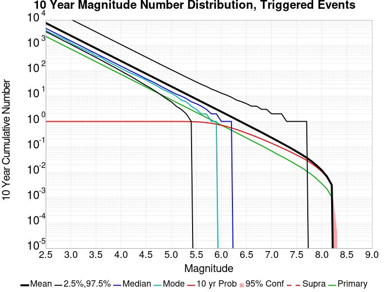

| Mag | Mean | 2.5 %ile | 97.5 %ile | Median | Mode | 10 yr Probability | 10 yr Supra-Seis Prob | Primary Aftershocks Mean |
|-----|-----|-----|-----|-----|-----|-----|-----|-----|
| **M&ge;2.5** | 7863.193 | 3490.000 | 31143.000 | 4764.000 | 3916.000 | 1.000 (100.00%) | 0.000 (0.00%) | 2268.760 |
| **M&ge;2.6** | 6246.406 | 2772.000 | 24682.000 | 3786.000 | 3133.000 | 1.000 (100.00%) | 0.000 (0.00%) | 1801.796 |
| **M&ge;2.7** | 4962.253 | 2196.000 | 19666.000 | 3016.000 | 2647.000 | 1.000 (100.00%) | 0.000 (0.00%) | 1431.314 |
| **M&ge;2.8** | 3942.154 | 1741.000 | 15638.000 | 2395.000 | 2058.000 | 1.000 (100.00%) | 0.000 (0.00%) | 1137.045 |
| **M&ge;2.9** | 3131.292 | 1384.000 | 12406.000 | 1897.000 | 1679.000 | 1.000 (100.00%) | 0.000 (0.00%) | 902.946 |
| **M&ge;3** | 2487.591 | 1099.000 | 9869.000 | 1510.000 | 1449.000 | 1.000 (100.00%) | 0.000 (0.00%) | 717.333 |
| **M&ge;3.1** | 1975.920 | 866.000 | 7896.000 | 1199.000 | 1047.000 | 1.000 (100.00%) | 0.000 (0.00%) | 569.912 |
| **M&ge;3.2** | 1570.162 | 685.000 | 6313.000 | 954.000 | 785.000 | 1.000 (100.00%) | 0.000 (0.00%) | 452.661 |
| **M&ge;3.3** | 1247.638 | 537.000 | 5007.000 | 757.000 | 657.000 | 1.000 (100.00%) | 0.000 (0.00%) | 359.553 |
| **M&ge;3.4** | 990.795 | 425.000 | 4001.000 | 600.000 | 548.000 | 1.000 (100.00%) | 0.000 (0.00%) | 285.531 |
| **M&ge;3.5** | 786.602 | 333.000 | 3193.000 | 478.000 | 394.000 | 1.000 (100.00%) | 0.000 (0.00%) | 226.479 |
| **M&ge;3.6** | 624.778 | 262.000 | 2509.000 | 382.000 | 321.000 | 1.000 (100.00%) | 0.000 (0.00%) | 179.948 |
| **M&ge;3.7** | 496.259 | 205.000 | 2009.000 | 304.000 | 261.000 | 1.000 (100.00%) | 0.000 (0.00%) | 142.954 |
| **M&ge;3.8** | 394.196 | 159.000 | 1569.000 | 240.000 | 187.000 | 1.000 (100.00%) | 0.000 (0.00%) | 113.706 |
| **M&ge;3.9** | 313.201 | 126.000 | 1246.000 | 192.000 | 152.000 | 1.000 (100.00%) | 0.000 (0.00%) | 90.449 |
| **M&ge;4** | 248.832 | 99.000 | 981.000 | 153.000 | 124.000 | 1.000 (100.00%) | 0.000 (0.00%) | 71.937 |
| **M&ge;4.1** | 197.521 | 77.000 | 808.000 | 121.000 | 105.000 | 1.000 (100.00%) | 0.000 (0.00%) | 57.214 |
| **M&ge;4.2** | 157.025 | 59.000 | 656.000 | 97.000 | 86.000 | 1.000 (100.00%) | 0.000 (0.00%) | 45.529 |
| **M&ge;4.3** | 124.412 | 45.000 | 518.000 | 77.000 | 66.000 | 1.000 (100.00%) | 0.000 (0.00%) | 36.044 |
| **M&ge;4.4** | 98.873 | 34.000 | 408.000 | 61.000 | 49.000 | 1.000 (100.00%) | 0.000 (0.00%) | 28.649 |
| **M&ge;4.5** | 78.636 | 26.000 | 322.000 | 49.000 | 43.000 | 1.000 (100.00%) | 0.000 (0.00%) | 22.766 |
| **M&ge;4.6** | 62.410 | 19.000 | 260.000 | 39.000 | 32.000 | 1.000 (100.00%) | 0.000 (0.00%) | 18.070 |
| **M&ge;4.7** | 49.555 | 15.000 | 199.000 | 31.000 | 23.000 | 1.000 (100.00%) | 0.000 (0.00%) | 14.364 |
| **M&ge;4.8** | 39.371 | 11.000 | 161.000 | 25.000 | 20.000 | 1.000 (100.00%) | 0.000 (0.00%) | 11.429 |
| **M&ge;4.9** | 31.269 | 8.000 | 131.000 | 20.000 | 16.000 | 1.000 (100.00%) | 0.000 (0.00%) | 9.094 |
| **M&ge;5** | 24.828 | 5.000 | 105.000 | 16.000 | 13.000 | 1.000 (100.00%) | 0.000 (0.00%) | 7.234 |
| **M&ge;5.1** | 19.726 | 4.000 | 82.000 | 12.000 | 9.000 | 1.000 (100.00%) | 0.000 (0.00%) | 5.726 |
| **M&ge;5.2** | 15.683 | 3.000 | 66.000 | 10.000 | 7.000 | 0.999 (99.95%) | 0.000 (0.00%) | 4.548 |
| **M&ge;5.3** | 12.444 | 2.000 | 55.000 | 8.000 | 7.000 | 0.996 (99.63%) | 0.000 (0.00%) | 3.581 |
| **M&ge;5.4** | 9.910 | 1.000 | 45.000 | 6.000 | 4.000 | 0.989 (98.94%) | 0.000 (0.00%) | 2.869 |
| **M&ge;5.5** | 7.850 | 0.000 | 35.000 | 5.000 | 4.000 | 0.973 (97.35%) | 0.000 (0.00%) | 2.266 |
| **M&ge;5.6** | 6.218 | 0.000 | 28.000 | 4.000 | 3.000 | 0.941 (94.11%) | 0.000 (0.00%) | 1.772 |
| **M&ge;5.7** | 4.928 | 0.000 | 22.000 | 3.000 | 2.000 | 0.900 (90.02%) | 0.000 (0.00%) | 1.407 |
| **M&ge;5.8** | 3.892 | 0.000 | 18.000 | 2.000 | 1.000 | 0.845 (84.50%) | 0.000 (0.00%) | 1.111 |
| **M&ge;5.9** | 3.094 | 0.000 | 14.000 | 2.000 | 1.000 | 0.773 (77.34%) | 0.000 (0.00%) | 0.881 |
| **M&ge;6** | 2.465 | 0.000 | 12.000 | 1.000 | 0.000 | 0.707 (70.70%) | 0.000 (0.00%) | 0.704 |
| **M&ge;6.1** | 1.973 | 0.000 | 10.000 | 1.000 | 0.000 | 0.637 (63.75%) | 0.000 (0.00%) | 0.578 |
| **M&ge;6.2** | 1.571 | 0.000 | 8.000 | 1.000 | 0.000 | 0.563 (56.32%) | 0.000 (0.00%) | 0.469 |
| **M&ge;6.3** | 1.249 | 0.000 | 7.000 | 0.000 | 0.000 | 0.488 (48.83%) | 0.000 (0.00%) | 0.372 |
| **M&ge;6.4** | 0.994 | 0.000 | 5.000 | 0.000 | 0.000 | 0.428 (42.78%) | 0.000 (0.00%) | 0.308 |
| **M&ge;6.5** | 0.790 | 0.000 | 5.000 | 0.000 | 0.000 | 0.365 (36.46%) | 0.000 (0.00%) | 0.248 |
| **M&ge;6.6** | 0.633 | 0.000 | 4.000 | 0.000 | 0.000 | 0.315 (31.53%) | 0.000 (0.00%) | 0.200 |
| **M&ge;6.7** | 0.488 | 0.000 | 3.000 | 0.000 | 0.000 | 0.262 (26.17%) | 0.000 (0.00%) | 0.153 |
| **M&ge;6.8** | 0.384 | 0.000 | 3.000 | 0.000 | 0.000 | 0.220 (21.97%) | 0.000 (0.00%) | 0.122 |
| **M&ge;6.9** | 0.293 | 0.000 | 2.000 | 0.000 | 0.000 | 0.174 (17.41%) | 0.000 (0.00%) | 0.089 |
| **M&ge;7** | 0.234 | 0.000 | 2.000 | 0.000 | 0.000 | 0.141 (14.12%) | 0.000 (0.00%) | 0.070 |
| **M&ge;7.1** | 0.185 | 0.000 | 2.000 | 0.000 | 0.000 | 0.117 (11.73%) | 0.000 (0.00%) | 0.055 |
| **M&ge;7.2** | 0.144 | 0.000 | 2.000 | 0.000 | 0.000 | 0.092 (9.24%) | 0.000 (0.00%) | 0.042 |
| **M&ge;7.3** | 0.113 | 0.000 | 1.000 | 0.000 | 0.000 | 0.077 (7.70%) | 0.000 (0.00%) | 0.032 |
| **M&ge;7.4** | 0.090 | 0.000 | 1.000 | 0.000 | 0.000 | 0.065 (6.48%) | 0.000 (0.00%) | 0.023 |
| **M&ge;7.5** | 0.070 | 0.000 | 1.000 | 0.000 | 0.000 | 0.053 (5.25%) | 0.000 (0.00%) | 0.019 |
| **M&ge;7.6** | 0.051 | 0.000 | 1.000 | 0.000 | 0.000 | 0.040 (3.98%) | 0.000 (0.00%) | 0.014 |
| **M&ge;7.7** | 0.043 | 0.000 | 1.000 | 0.000 | 0.000 | 0.034 (3.40%) | 0.000 (0.00%) | 0.012 |
| **M&ge;7.8** | 0.031 | 0.000 | 0.000 | 0.000 | 0.000 | 0.024 (2.44%) | 0.000 (0.00%) | 9.55E-3 |
| **M&ge;7.9** | 0.024 | 0.000 | 0.000 | 0.000 | 0.000 | 0.019 (1.91%) | 0.000 (0.00%) | 6.90E-3 |
| **M&ge;8** | 0.015 | 0.000 | 0.000 | 0.000 | 0.000 | 0.013 (1.27%) | 0.000 (0.00%) | 5.31E-3 |
| **M&ge;8.1** | 8.49E-3 | 0.000 | 0.000 | 0.000 | 0.000 | 6.90E-3 (0.69%) | 0.000 (0.00%) | 3.18E-3 |
| **M&ge;8.2** | 4.25E-3 | 0.000 | 0.000 | 0.000 | 0.000 | 3.72E-3 (0.37%) | 0.000 (0.00%) | 1.59E-3 |
| **M&ge;8.3** | 0.000 | 0.000 | 0.000 | 0.000 | 0.000 | 0.000 (0.00%) | 0.000 (0.00%) | 0.000 |
| **M&ge;8.4** | 0.000 | 0.000 | 0.000 | 0.000 | 0.000 | 0.000 (0.00%) | 0.000 (0.00%) | 0.000 |
| **M&ge;8.5** | 0.000 | 0.000 | 0.000 | 0.000 | 0.000 | 0.000 (0.00%) | 0.000 (0.00%) | 0.000 |
| **M&ge;8.6** | 0.000 | 0.000 | 0.000 | 0.000 | 0.000 | 0.000 (0.00%) | 0.000 (0.00%) | 0.000 |
| **M&ge;8.7** | 0.000 | 0.000 | 0.000 | 0.000 | 0.000 | 0.000 (0.00%) | 0.000 (0.00%) | 0.000 |
| **M&ge;8.8** | 0.000 | 0.000 | 0.000 | 0.000 | 0.000 | 0.000 (0.00%) | 0.000 (0.00%) | 0.000 |
| **M&ge;8.9** | 0.000 | 0.000 | 0.000 | 0.000 | 0.000 | 0.000 (0.00%) | 0.000 (0.00%) | 0.000 |
| **M&ge;9** | 0.000 | 0.000 | 0.000 | 0.000 | 0.000 | 0.000 (0.00%) | 0.000 (0.00%) | 0.000 |

### 1 Year Magnitude Number Distribution
*[(top)](#table-of-contents)*

**Legend**
* **Mean** (thick black line): mean expected number across all 1884 catalogs
* **2.5%,97.5%** (thin black lines): expected number percentiles across all 1884 catalogs
* **Median** (thin blue line): median expected number across all 1884 catalogs
* **Mode** (thin cyan line): modal expected number across all 1884 catalogs
* **1 yr Probability** (thin red line): 1 year probability calculated as the fraction of catalogs with at least 1 occurrence
* **1 yr Supraseismogenic Probability** (thin dashed red line): same as above, but only for supraseismogenic ruptures on explicitly modeled UCERF3 faults
* **95% Conf** (light red shaded region): binomial 95% confidence bounds on probability
* **Primary** (thin green line): mean expected number from primary triggered aftershocks only (no secondary, tertiary, etc...) across all 1884 catalogs


| Mag | Mean | 2.5 %ile | 97.5 %ile | Median | Mode | 1 yr Probability | 1 yr Supra-Seis Prob | Primary Aftershocks Mean |
|-----|-----|-----|-----|-----|-----|-----|-----|-----|
| **M&ge;2.5** | 6637.055 | 3243.000 | 26963.000 | 4328.000 | 3766.000 | 1.000 (100.00%) | 0.000 (0.00%) | 2162.459 |
| **M&ge;2.6** | 5272.323 | 2572.000 | 21447.000 | 3441.000 | 2875.000 | 1.000 (100.00%) | 0.000 (0.00%) | 1717.451 |
| **M&ge;2.7** | 4188.213 | 2043.000 | 17000.000 | 2736.000 | 2414.000 | 1.000 (100.00%) | 0.000 (0.00%) | 1364.192 |
| **M&ge;2.8** | 3327.223 | 1617.000 | 13550.000 | 2172.000 | 1806.000 | 1.000 (100.00%) | 0.000 (0.00%) | 1083.696 |
| **M&ge;2.9** | 2642.714 | 1282.000 | 10767.000 | 1719.000 | 1651.000 | 1.000 (100.00%) | 0.000 (0.00%) | 860.542 |
| **M&ge;3** | 2099.599 | 1021.000 | 8550.000 | 1371.000 | 1138.000 | 1.000 (100.00%) | 0.000 (0.00%) | 683.724 |
| **M&ge;3.1** | 1667.608 | 807.000 | 6725.000 | 1087.000 | 913.000 | 1.000 (100.00%) | 0.000 (0.00%) | 543.300 |
| **M&ge;3.2** | 1325.116 | 635.000 | 5348.000 | 865.000 | 735.000 | 1.000 (100.00%) | 0.000 (0.00%) | 431.619 |
| **M&ge;3.3** | 1052.796 | 499.000 | 4242.000 | 686.000 | 586.000 | 1.000 (100.00%) | 0.000 (0.00%) | 342.851 |
| **M&ge;3.4** | 836.031 | 393.000 | 3370.000 | 546.000 | 494.000 | 1.000 (100.00%) | 0.000 (0.00%) | 272.320 |
| **M&ge;3.5** | 663.761 | 308.000 | 2684.000 | 434.000 | 395.000 | 1.000 (100.00%) | 0.000 (0.00%) | 216.001 |
| **M&ge;3.6** | 527.263 | 242.000 | 2136.000 | 346.000 | 302.000 | 1.000 (100.00%) | 0.000 (0.00%) | 171.646 |
| **M&ge;3.7** | 418.742 | 187.000 | 1683.000 | 275.000 | 238.000 | 1.000 (100.00%) | 0.000 (0.00%) | 136.385 |
| **M&ge;3.8** | 332.643 | 148.000 | 1345.000 | 220.000 | 179.000 | 1.000 (100.00%) | 0.000 (0.00%) | 108.508 |
| **M&ge;3.9** | 264.300 | 116.000 | 1071.000 | 175.000 | 143.000 | 1.000 (100.00%) | 0.000 (0.00%) | 86.328 |
| **M&ge;4** | 210.066 | 91.000 | 855.000 | 139.000 | 113.000 | 1.000 (100.00%) | 0.000 (0.00%) | 68.661 |
| **M&ge;4.1** | 166.795 | 69.000 | 675.000 | 111.000 | 94.000 | 1.000 (100.00%) | 0.000 (0.00%) | 54.606 |
| **M&ge;4.2** | 132.641 | 54.000 | 545.000 | 88.000 | 76.000 | 1.000 (100.00%) | 0.000 (0.00%) | 43.464 |
| **M&ge;4.3** | 105.049 | 41.000 | 428.000 | 70.000 | 57.000 | 1.000 (100.00%) | 0.000 (0.00%) | 34.397 |
| **M&ge;4.4** | 83.426 | 31.000 | 340.000 | 56.000 | 46.000 | 1.000 (100.00%) | 0.000 (0.00%) | 27.315 |
| **M&ge;4.5** | 66.357 | 23.000 | 272.000 | 44.000 | 39.000 | 1.000 (100.00%) | 0.000 (0.00%) | 21.708 |
| **M&ge;4.6** | 52.633 | 17.000 | 216.000 | 36.000 | 29.000 | 1.000 (100.00%) | 0.000 (0.00%) | 17.231 |
| **M&ge;4.7** | 41.811 | 13.000 | 171.000 | 28.000 | 25.000 | 1.000 (100.00%) | 0.000 (0.00%) | 13.692 |
| **M&ge;4.8** | 33.168 | 10.000 | 136.000 | 22.000 | 17.000 | 1.000 (100.00%) | 0.000 (0.00%) | 10.893 |
| **M&ge;4.9** | 26.352 | 7.000 | 111.000 | 18.000 | 14.000 | 1.000 (100.00%) | 0.000 (0.00%) | 8.678 |
| **M&ge;5** | 20.934 | 5.000 | 88.000 | 14.000 | 10.000 | 1.000 (100.00%) | 0.000 (0.00%) | 6.891 |
| **M&ge;5.1** | 16.651 | 4.000 | 67.000 | 11.000 | 10.000 | 1.000 (100.00%) | 0.000 (0.00%) | 5.453 |
| **M&ge;5.2** | 13.212 | 2.000 | 54.000 | 9.000 | 7.000 | 0.999 (99.95%) | 0.000 (0.00%) | 4.328 |
| **M&ge;5.3** | 10.462 | 1.000 | 44.000 | 7.000 | 6.000 | 0.995 (99.47%) | 0.000 (0.00%) | 3.409 |
| **M&ge;5.4** | 8.335 | 1.000 | 35.000 | 6.000 | 4.000 | 0.985 (98.46%) | 0.000 (0.00%) | 2.728 |
| **M&ge;5.5** | 6.598 | 0.000 | 28.000 | 4.000 | 3.000 | 0.968 (96.82%) | 0.000 (0.00%) | 2.156 |
| **M&ge;5.6** | 5.212 | 0.000 | 22.000 | 3.000 | 2.000 | 0.930 (93.05%) | 0.000 (0.00%) | 1.686 |
| **M&ge;5.7** | 4.136 | 0.000 | 18.000 | 3.000 | 2.000 | 0.883 (88.32%) | 0.000 (0.00%) | 1.338 |
| **M&ge;5.8** | 3.257 | 0.000 | 14.000 | 2.000 | 1.000 | 0.821 (82.11%) | 0.000 (0.00%) | 1.056 |
| **M&ge;5.9** | 2.573 | 0.000 | 12.000 | 2.000 | 0.000 | 0.751 (75.05%) | 0.000 (0.00%) | 0.835 |
| **M&ge;6** | 2.051 | 0.000 | 10.000 | 1.000 | 0.000 | 0.683 (68.31%) | 0.000 (0.00%) | 0.668 |
| **M&ge;6.1** | 1.641 | 0.000 | 8.000 | 1.000 | 0.000 | 0.613 (61.31%) | 0.000 (0.00%) | 0.550 |
| **M&ge;6.2** | 1.311 | 0.000 | 7.000 | 1.000 | 0.000 | 0.537 (53.66%) | 0.000 (0.00%) | 0.445 |
| **M&ge;6.3** | 1.041 | 0.000 | 6.000 | 0.000 | 0.000 | 0.459 (45.86%) | 0.000 (0.00%) | 0.354 |
| **M&ge;6.4** | 0.834 | 0.000 | 5.000 | 0.000 | 0.000 | 0.401 (40.07%) | 0.000 (0.00%) | 0.294 |
| **M&ge;6.5** | 0.661 | 0.000 | 4.000 | 0.000 | 0.000 | 0.341 (34.13%) | 0.000 (0.00%) | 0.236 |
| **M&ge;6.6** | 0.529 | 0.000 | 4.000 | 0.000 | 0.000 | 0.293 (29.30%) | 0.000 (0.00%) | 0.190 |
| **M&ge;6.7** | 0.414 | 0.000 | 3.000 | 0.000 | 0.000 | 0.243 (24.26%) | 0.000 (0.00%) | 0.148 |
| **M&ge;6.8** | 0.327 | 0.000 | 3.000 | 0.000 | 0.000 | 0.202 (20.22%) | 0.000 (0.00%) | 0.116 |
| **M&ge;6.9** | 0.249 | 0.000 | 2.000 | 0.000 | 0.000 | 0.160 (15.98%) | 0.000 (0.00%) | 0.084 |
| **M&ge;7** | 0.197 | 0.000 | 2.000 | 0.000 | 0.000 | 0.128 (12.85%) | 0.000 (0.00%) | 0.066 |
| **M&ge;7.1** | 0.156 | 0.000 | 2.000 | 0.000 | 0.000 | 0.106 (10.56%) | 0.000 (0.00%) | 0.052 |
| **M&ge;7.2** | 0.120 | 0.000 | 1.000 | 0.000 | 0.000 | 0.082 (8.23%) | 0.000 (0.00%) | 0.040 |
| **M&ge;7.3** | 0.092 | 0.000 | 1.000 | 0.000 | 0.000 | 0.067 (6.74%) | 0.000 (0.00%) | 0.031 |
| **M&ge;7.4** | 0.074 | 0.000 | 1.000 | 0.000 | 0.000 | 0.057 (5.73%) | 0.000 (0.00%) | 0.022 |
| **M&ge;7.5** | 0.057 | 0.000 | 1.000 | 0.000 | 0.000 | 0.047 (4.67%) | 0.000 (0.00%) | 0.017 |
| **M&ge;7.6** | 0.041 | 0.000 | 1.000 | 0.000 | 0.000 | 0.036 (3.56%) | 0.000 (0.00%) | 0.012 |
| **M&ge;7.7** | 0.035 | 0.000 | 1.000 | 0.000 | 0.000 | 0.031 (3.13%) | 0.000 (0.00%) | 0.011 |
| **M&ge;7.8** | 0.024 | 0.000 | 0.000 | 0.000 | 0.000 | 0.022 (2.18%) | 0.000 (0.00%) | 8.49E-3 |
| **M&ge;7.9** | 0.018 | 0.000 | 0.000 | 0.000 | 0.000 | 0.017 (1.70%) | 0.000 (0.00%) | 5.84E-3 |
| **M&ge;8** | 0.012 | 0.000 | 0.000 | 0.000 | 0.000 | 0.011 (1.11%) | 0.000 (0.00%) | 4.25E-3 |
| **M&ge;8.1** | 5.84E-3 | 0.000 | 0.000 | 0.000 | 0.000 | 5.31E-3 (0.53%) | 0.000 (0.00%) | 2.12E-3 |
| **M&ge;8.2** | 2.12E-3 | 0.000 | 0.000 | 0.000 | 0.000 | 2.12E-3 (0.21%) | 0.000 (0.00%) | 5.31E-4 |
| **M&ge;8.3** | 0.000 | 0.000 | 0.000 | 0.000 | 0.000 | 0.000 (0.00%) | 0.000 (0.00%) | 0.000 |
| **M&ge;8.4** | 0.000 | 0.000 | 0.000 | 0.000 | 0.000 | 0.000 (0.00%) | 0.000 (0.00%) | 0.000 |
| **M&ge;8.5** | 0.000 | 0.000 | 0.000 | 0.000 | 0.000 | 0.000 (0.00%) | 0.000 (0.00%) | 0.000 |
| **M&ge;8.6** | 0.000 | 0.000 | 0.000 | 0.000 | 0.000 | 0.000 (0.00%) | 0.000 (0.00%) | 0.000 |
| **M&ge;8.7** | 0.000 | 0.000 | 0.000 | 0.000 | 0.000 | 0.000 (0.00%) | 0.000 (0.00%) | 0.000 |
| **M&ge;8.8** | 0.000 | 0.000 | 0.000 | 0.000 | 0.000 | 0.000 (0.00%) | 0.000 (0.00%) | 0.000 |
| **M&ge;8.9** | 0.000 | 0.000 | 0.000 | 0.000 | 0.000 | 0.000 (0.00%) | 0.000 (0.00%) | 0.000 |
| **M&ge;9** | 0.000 | 0.000 | 0.000 | 0.000 | 0.000 | 0.000 (0.00%) | 0.000 (0.00%) | 0.000 |

### 1 Month Magnitude Number Distribution
*[(top)](#table-of-contents)*

**Legend**
* **Mean** (thick black line): mean expected number across all 1884 catalogs
* **2.5%,97.5%** (thin black lines): expected number percentiles across all 1884 catalogs
* **Median** (thin blue line): median expected number across all 1884 catalogs
* **Mode** (thin cyan line): modal expected number across all 1884 catalogs
* **1 mo Probability** (thin red line): 1 month probability calculated as the fraction of catalogs with at least 1 occurrence
* **1 mo Supraseismogenic Probability** (thin dashed red line): same as above, but only for supraseismogenic ruptures on explicitly modeled UCERF3 faults
* **95% Conf** (light red shaded region): binomial 95% confidence bounds on probability
* **Primary** (thin green line): mean expected number from primary triggered aftershocks only (no secondary, tertiary, etc...) across all 1884 catalogs


| Mag | Mean | 2.5 %ile | 97.5 %ile | Median | Mode | 1 mo Probability | 1 mo Supra-Seis Prob | Primary Aftershocks Mean |
|-----|-----|-----|-----|-----|-----|-----|-----|-----|
| **M&ge;2.5** | 5161.270 | 2815.000 | 19365.000 | 3587.000 | 3106.000 | 1.000 (100.00%) | 0.000 (0.00%) | 1968.751 |
| **M&ge;2.6** | 4099.682 | 2231.000 | 15288.000 | 2853.000 | 2560.000 | 1.000 (100.00%) | 0.000 (0.00%) | 1563.858 |
| **M&ge;2.7** | 3256.589 | 1760.000 | 12143.000 | 2274.000 | 1911.000 | 1.000 (100.00%) | 0.000 (0.00%) | 1242.156 |
| **M&ge;2.8** | 2587.296 | 1393.000 | 9757.000 | 1809.000 | 1734.000 | 1.000 (100.00%) | 0.000 (0.00%) | 986.794 |
| **M&ge;2.9** | 2055.279 | 1102.000 | 7756.000 | 1443.000 | 1267.000 | 1.000 (100.00%) | 0.000 (0.00%) | 783.652 |
| **M&ge;3** | 1632.745 | 876.000 | 6113.000 | 1144.000 | 987.000 | 1.000 (100.00%) | 0.000 (0.00%) | 622.638 |
| **M&ge;3.1** | 1296.775 | 696.000 | 4872.000 | 911.000 | 822.000 | 1.000 (100.00%) | 0.000 (0.00%) | 494.877 |
| **M&ge;3.2** | 1030.265 | 548.000 | 3878.000 | 724.000 | 649.000 | 1.000 (100.00%) | 0.000 (0.00%) | 393.125 |
| **M&ge;3.3** | 818.670 | 433.000 | 3056.000 | 577.000 | 501.000 | 1.000 (100.00%) | 0.000 (0.00%) | 312.279 |
| **M&ge;3.4** | 650.160 | 341.000 | 2427.000 | 459.000 | 390.000 | 1.000 (100.00%) | 0.000 (0.00%) | 248.036 |
| **M&ge;3.5** | 516.140 | 265.000 | 1921.000 | 364.000 | 340.000 | 1.000 (100.00%) | 0.000 (0.00%) | 196.791 |
| **M&ge;3.6** | 410.166 | 207.000 | 1508.000 | 290.000 | 248.000 | 1.000 (100.00%) | 0.000 (0.00%) | 156.464 |
| **M&ge;3.7** | 325.832 | 161.000 | 1204.000 | 231.000 | 212.000 | 1.000 (100.00%) | 0.000 (0.00%) | 124.350 |
| **M&ge;3.8** | 258.788 | 127.000 | 959.000 | 184.000 | 162.000 | 1.000 (100.00%) | 0.000 (0.00%) | 98.981 |
| **M&ge;3.9** | 205.559 | 99.000 | 779.000 | 147.000 | 125.000 | 1.000 (100.00%) | 0.000 (0.00%) | 78.723 |
| **M&ge;4** | 163.396 | 78.000 | 617.000 | 116.000 | 98.000 | 1.000 (100.00%) | 0.000 (0.00%) | 62.649 |
| **M&ge;4.1** | 129.704 | 59.000 | 483.000 | 92.000 | 89.000 | 1.000 (100.00%) | 0.000 (0.00%) | 49.846 |
| **M&ge;4.2** | 103.145 | 46.000 | 383.000 | 74.000 | 67.000 | 1.000 (100.00%) | 0.000 (0.00%) | 39.662 |
| **M&ge;4.3** | 81.658 | 35.000 | 304.000 | 58.000 | 50.000 | 1.000 (100.00%) | 0.000 (0.00%) | 31.370 |
| **M&ge;4.4** | 64.878 | 26.000 | 244.000 | 47.000 | 43.000 | 1.000 (100.00%) | 0.000 (0.00%) | 24.906 |
| **M&ge;4.5** | 51.610 | 20.000 | 188.000 | 38.000 | 31.000 | 1.000 (100.00%) | 0.000 (0.00%) | 19.803 |
| **M&ge;4.6** | 40.958 | 14.000 | 149.000 | 30.000 | 27.000 | 1.000 (100.00%) | 0.000 (0.00%) | 15.717 |
| **M&ge;4.7** | 32.548 | 11.000 | 122.000 | 24.000 | 19.000 | 1.000 (100.00%) | 0.000 (0.00%) | 12.479 |
| **M&ge;4.8** | 25.824 | 8.000 | 96.000 | 19.000 | 17.000 | 1.000 (100.00%) | 0.000 (0.00%) | 9.941 |
| **M&ge;4.9** | 20.543 | 6.000 | 77.000 | 15.000 | 11.000 | 1.000 (100.00%) | 0.000 (0.00%) | 7.928 |
| **M&ge;5** | 16.337 | 4.000 | 59.000 | 12.000 | 10.000 | 0.999 (99.89%) | 0.000 (0.00%) | 6.305 |
| **M&ge;5.1** | 12.996 | 3.000 | 45.000 | 9.000 | 8.000 | 0.998 (99.84%) | 0.000 (0.00%) | 4.976 |
| **M&ge;5.2** | 10.335 | 2.000 | 37.000 | 7.000 | 6.000 | 0.997 (99.68%) | 0.000 (0.00%) | 3.959 |
| **M&ge;5.3** | 8.188 | 1.000 | 31.000 | 6.000 | 6.000 | 0.988 (98.78%) | 0.000 (0.00%) | 3.117 |
| **M&ge;5.4** | 6.538 | 1.000 | 23.000 | 5.000 | 3.000 | 0.976 (97.61%) | 0.000 (0.00%) | 2.498 |
| **M&ge;5.5** | 5.158 | 0.000 | 19.000 | 4.000 | 3.000 | 0.948 (94.80%) | 0.000 (0.00%) | 1.970 |
| **M&ge;5.6** | 4.079 | 0.000 | 15.000 | 3.000 | 2.000 | 0.903 (90.34%) | 0.000 (0.00%) | 1.546 |
| **M&ge;5.7** | 3.240 | 0.000 | 13.000 | 2.000 | 1.000 | 0.848 (84.77%) | 0.000 (0.00%) | 1.227 |
| **M&ge;5.8** | 2.556 | 0.000 | 11.000 | 2.000 | 1.000 | 0.782 (78.18%) | 0.000 (0.00%) | 0.974 |
| **M&ge;5.9** | 2.024 | 0.000 | 9.000 | 1.000 | 0.000 | 0.710 (71.02%) | 0.000 (0.00%) | 0.772 |
| **M&ge;6** | 1.613 | 0.000 | 8.000 | 1.000 | 0.000 | 0.639 (63.85%) | 0.000 (0.00%) | 0.616 |
| **M&ge;6.1** | 1.294 | 0.000 | 6.000 | 1.000 | 0.000 | 0.567 (56.74%) | 0.000 (0.00%) | 0.510 |
| **M&ge;6.2** | 1.036 | 0.000 | 5.000 | 0.000 | 0.000 | 0.492 (49.15%) | 0.000 (0.00%) | 0.413 |
| **M&ge;6.3** | 0.824 | 0.000 | 4.000 | 0.000 | 0.000 | 0.416 (41.56%) | 0.000 (0.00%) | 0.331 |
| **M&ge;6.4** | 0.662 | 0.000 | 4.000 | 0.000 | 0.000 | 0.360 (36.04%) | 0.000 (0.00%) | 0.274 |
| **M&ge;6.5** | 0.531 | 0.000 | 3.000 | 0.000 | 0.000 | 0.305 (30.52%) | 0.000 (0.00%) | 0.220 |
| **M&ge;6.6** | 0.425 | 0.000 | 3.000 | 0.000 | 0.000 | 0.259 (25.90%) | 0.000 (0.00%) | 0.177 |
| **M&ge;6.7** | 0.329 | 0.000 | 2.000 | 0.000 | 0.000 | 0.213 (21.28%) | 0.000 (0.00%) | 0.137 |
| **M&ge;6.8** | 0.261 | 0.000 | 2.000 | 0.000 | 0.000 | 0.178 (17.78%) | 0.000 (0.00%) | 0.108 |
| **M&ge;6.9** | 0.195 | 0.000 | 2.000 | 0.000 | 0.000 | 0.139 (13.91%) | 0.000 (0.00%) | 0.077 |
| **M&ge;7** | 0.156 | 0.000 | 1.000 | 0.000 | 0.000 | 0.113 (11.31%) | 0.000 (0.00%) | 0.062 |
| **M&ge;7.1** | 0.124 | 0.000 | 1.000 | 0.000 | 0.000 | 0.092 (9.24%) | 0.000 (0.00%) | 0.048 |
| **M&ge;7.2** | 0.094 | 0.000 | 1.000 | 0.000 | 0.000 | 0.071 (7.06%) | 0.000 (0.00%) | 0.037 |
| **M&ge;7.3** | 0.072 | 0.000 | 1.000 | 0.000 | 0.000 | 0.057 (5.68%) | 0.000 (0.00%) | 0.029 |
| **M&ge;7.4** | 0.057 | 0.000 | 1.000 | 0.000 | 0.000 | 0.047 (4.72%) | 0.000 (0.00%) | 0.020 |
| **M&ge;7.5** | 0.042 | 0.000 | 1.000 | 0.000 | 0.000 | 0.036 (3.61%) | 0.000 (0.00%) | 0.015 |
| **M&ge;7.6** | 0.030 | 0.000 | 1.000 | 0.000 | 0.000 | 0.027 (2.71%) | 0.000 (0.00%) | 0.011 |
| **M&ge;7.7** | 0.027 | 0.000 | 0.000 | 0.000 | 0.000 | 0.024 (2.39%) | 0.000 (0.00%) | 9.55E-3 |
| **M&ge;7.8** | 0.016 | 0.000 | 0.000 | 0.000 | 0.000 | 0.015 (1.54%) | 0.000 (0.00%) | 7.43E-3 |
| **M&ge;7.9** | 0.012 | 0.000 | 0.000 | 0.000 | 0.000 | 0.011 (1.06%) | 0.000 (0.00%) | 4.78E-3 |
| **M&ge;8** | 6.90E-3 | 0.000 | 0.000 | 0.000 | 0.000 | 6.37E-3 (0.64%) | 0.000 (0.00%) | 3.18E-3 |
| **M&ge;8.1** | 4.25E-3 | 0.000 | 0.000 | 0.000 | 0.000 | 3.72E-3 (0.37%) | 0.000 (0.00%) | 1.59E-3 |
| **M&ge;8.2** | 1.59E-3 | 0.000 | 0.000 | 0.000 | 0.000 | 1.59E-3 (0.16%) | 0.000 (0.00%) | 5.31E-4 |
| **M&ge;8.3** | 0.000 | 0.000 | 0.000 | 0.000 | 0.000 | 0.000 (0.00%) | 0.000 (0.00%) | 0.000 |
| **M&ge;8.4** | 0.000 | 0.000 | 0.000 | 0.000 | 0.000 | 0.000 (0.00%) | 0.000 (0.00%) | 0.000 |
| **M&ge;8.5** | 0.000 | 0.000 | 0.000 | 0.000 | 0.000 | 0.000 (0.00%) | 0.000 (0.00%) | 0.000 |
| **M&ge;8.6** | 0.000 | 0.000 | 0.000 | 0.000 | 0.000 | 0.000 (0.00%) | 0.000 (0.00%) | 0.000 |
| **M&ge;8.7** | 0.000 | 0.000 | 0.000 | 0.000 | 0.000 | 0.000 (0.00%) | 0.000 (0.00%) | 0.000 |
| **M&ge;8.8** | 0.000 | 0.000 | 0.000 | 0.000 | 0.000 | 0.000 (0.00%) | 0.000 (0.00%) | 0.000 |
| **M&ge;8.9** | 0.000 | 0.000 | 0.000 | 0.000 | 0.000 | 0.000 (0.00%) | 0.000 (0.00%) | 0.000 |
| **M&ge;9** | 0.000 | 0.000 | 0.000 | 0.000 | 0.000 | 0.000 (0.00%) | 0.000 (0.00%) | 0.000 |

### 1 Week Magnitude Number Distribution
*[(top)](#table-of-contents)*

**Legend**
* **Mean** (thick black line): mean expected number across all 1884 catalogs
* **2.5%,97.5%** (thin black lines): expected number percentiles across all 1884 catalogs
* **Median** (thin blue line): median expected number across all 1884 catalogs
* **Mode** (thin cyan line): modal expected number across all 1884 catalogs
* **1 wk Probability** (thin red line): 1 week probability calculated as the fraction of catalogs with at least 1 occurrence
* **1 wk Supraseismogenic Probability** (thin dashed red line): same as above, but only for supraseismogenic ruptures on explicitly modeled UCERF3 faults
* **95% Conf** (light red shaded region): binomial 95% confidence bounds on probability
* **Primary** (thin green line): mean expected number from primary triggered aftershocks only (no secondary, tertiary, etc...) across all 1884 catalogs


| Mag | Mean | 2.5 %ile | 97.5 %ile | Median | Mode | 1 wk Probability | 1 wk Supra-Seis Prob | Primary Aftershocks Mean |
|-----|-----|-----|-----|-----|-----|-----|-----|-----|
| **M&ge;2.5** | 4222.867 | 2460.000 | 14080.000 | 3061.000 | 2794.000 | 1.000 (100.00%) | 0.000 (0.00%) | 1800.988 |
| **M&ge;2.6** | 3354.382 | 1953.000 | 11211.000 | 2431.000 | 2233.000 | 1.000 (100.00%) | 0.000 (0.00%) | 1430.471 |
| **M&ge;2.7** | 2664.289 | 1549.000 | 8880.000 | 1935.000 | 1886.000 | 1.000 (100.00%) | 0.000 (0.00%) | 1136.302 |
| **M&ge;2.8** | 2116.743 | 1227.000 | 7086.000 | 1537.000 | 1392.000 | 1.000 (100.00%) | 0.000 (0.00%) | 902.870 |
| **M&ge;2.9** | 1681.302 | 971.000 | 5656.000 | 1221.000 | 1120.000 | 1.000 (100.00%) | 0.000 (0.00%) | 716.930 |
| **M&ge;3** | 1335.627 | 770.000 | 4483.000 | 971.000 | 890.000 | 1.000 (100.00%) | 0.000 (0.00%) | 569.573 |
| **M&ge;3.1** | 1060.797 | 611.000 | 3570.000 | 772.000 | 701.000 | 1.000 (100.00%) | 0.000 (0.00%) | 452.735 |
| **M&ge;3.2** | 842.676 | 480.000 | 2825.000 | 614.000 | 569.000 | 1.000 (100.00%) | 0.000 (0.00%) | 359.637 |
| **M&ge;3.3** | 669.496 | 377.000 | 2242.000 | 488.000 | 435.000 | 1.000 (100.00%) | 0.000 (0.00%) | 285.661 |
| **M&ge;3.4** | 531.886 | 296.000 | 1786.000 | 388.000 | 348.000 | 1.000 (100.00%) | 0.000 (0.00%) | 226.945 |
| **M&ge;3.5** | 422.345 | 232.000 | 1435.000 | 308.000 | 279.000 | 1.000 (100.00%) | 0.000 (0.00%) | 180.052 |
| **M&ge;3.6** | 335.729 | 183.000 | 1150.000 | 246.000 | 242.000 | 1.000 (100.00%) | 0.000 (0.00%) | 143.240 |
| **M&ge;3.7** | 266.828 | 140.000 | 909.000 | 196.000 | 184.000 | 1.000 (100.00%) | 0.000 (0.00%) | 113.908 |
| **M&ge;3.8** | 212.081 | 110.000 | 734.000 | 157.000 | 153.000 | 1.000 (100.00%) | 0.000 (0.00%) | 90.708 |
| **M&ge;3.9** | 168.545 | 86.000 | 591.000 | 125.000 | 112.000 | 1.000 (100.00%) | 0.000 (0.00%) | 72.127 |
| **M&ge;4** | 134.023 | 67.000 | 457.000 | 99.000 | 91.000 | 1.000 (100.00%) | 0.000 (0.00%) | 57.419 |
| **M&ge;4.1** | 106.428 | 52.000 | 369.000 | 79.000 | 70.000 | 1.000 (100.00%) | 0.000 (0.00%) | 45.722 |
| **M&ge;4.2** | 84.718 | 40.000 | 292.000 | 63.000 | 55.000 | 1.000 (100.00%) | 0.000 (0.00%) | 36.412 |
| **M&ge;4.3** | 67.101 | 31.000 | 235.000 | 50.000 | 43.000 | 1.000 (100.00%) | 0.000 (0.00%) | 28.822 |
| **M&ge;4.4** | 53.270 | 23.000 | 184.000 | 40.000 | 40.000 | 1.000 (100.00%) | 0.000 (0.00%) | 22.869 |
| **M&ge;4.5** | 42.360 | 17.000 | 143.000 | 32.000 | 29.000 | 1.000 (100.00%) | 0.000 (0.00%) | 18.168 |
| **M&ge;4.6** | 33.628 | 12.000 | 115.000 | 26.000 | 23.000 | 1.000 (100.00%) | 0.000 (0.00%) | 14.418 |
| **M&ge;4.7** | 26.727 | 9.000 | 90.000 | 20.000 | 16.000 | 1.000 (100.00%) | 0.000 (0.00%) | 11.453 |
| **M&ge;4.8** | 21.226 | 7.000 | 73.000 | 16.000 | 12.000 | 1.000 (100.00%) | 0.000 (0.00%) | 9.120 |
| **M&ge;4.9** | 16.877 | 5.000 | 55.000 | 13.000 | 11.000 | 1.000 (100.00%) | 0.000 (0.00%) | 7.276 |
| **M&ge;5** | 13.423 | 3.000 | 44.000 | 10.000 | 9.000 | 0.998 (99.84%) | 0.000 (0.00%) | 5.772 |
| **M&ge;5.1** | 10.679 | 2.000 | 36.000 | 8.000 | 7.000 | 0.998 (99.79%) | 0.000 (0.00%) | 4.556 |
| **M&ge;5.2** | 8.487 | 1.000 | 29.000 | 6.000 | 6.000 | 0.995 (99.47%) | 0.000 (0.00%) | 3.622 |
| **M&ge;5.3** | 6.744 | 1.000 | 23.000 | 5.000 | 3.000 | 0.981 (98.09%) | 0.000 (0.00%) | 2.859 |
| **M&ge;5.4** | 5.404 | 0.000 | 19.000 | 4.000 | 3.000 | 0.962 (96.18%) | 0.000 (0.00%) | 2.291 |
| **M&ge;5.5** | 4.270 | 0.000 | 16.000 | 3.000 | 2.000 | 0.925 (92.46%) | 0.000 (0.00%) | 1.804 |
| **M&ge;5.6** | 3.393 | 0.000 | 12.000 | 2.000 | 1.000 | 0.873 (87.26%) | 0.000 (0.00%) | 1.417 |
| **M&ge;5.7** | 2.704 | 0.000 | 10.000 | 2.000 | 1.000 | 0.810 (81.00%) | 0.000 (0.00%) | 1.126 |
| **M&ge;5.8** | 2.134 | 0.000 | 9.000 | 1.000 | 0.000 | 0.738 (73.78%) | 0.000 (0.00%) | 0.893 |
| **M&ge;5.9** | 1.691 | 0.000 | 7.000 | 1.000 | 0.000 | 0.666 (66.61%) | 0.000 (0.00%) | 0.710 |
| **M&ge;6** | 1.344 | 0.000 | 6.000 | 1.000 | 0.000 | 0.590 (59.02%) | 0.000 (0.00%) | 0.567 |
| **M&ge;6.1** | 1.076 | 0.000 | 5.000 | 1.000 | 0.000 | 0.519 (51.86%) | 0.000 (0.00%) | 0.468 |
| **M&ge;6.2** | 0.860 | 0.000 | 4.000 | 0.000 | 0.000 | 0.442 (44.21%) | 0.000 (0.00%) | 0.378 |
| **M&ge;6.3** | 0.688 | 0.000 | 4.000 | 0.000 | 0.000 | 0.374 (37.37%) | 0.000 (0.00%) | 0.303 |
| **M&ge;6.4** | 0.551 | 0.000 | 3.000 | 0.000 | 0.000 | 0.323 (32.27%) | 0.000 (0.00%) | 0.252 |
| **M&ge;6.5** | 0.446 | 0.000 | 3.000 | 0.000 | 0.000 | 0.276 (27.60%) | 0.000 (0.00%) | 0.203 |
| **M&ge;6.6** | 0.358 | 0.000 | 2.000 | 0.000 | 0.000 | 0.231 (23.09%) | 0.000 (0.00%) | 0.163 |
| **M&ge;6.7** | 0.278 | 0.000 | 2.000 | 0.000 | 0.000 | 0.188 (18.84%) | 0.000 (0.00%) | 0.127 |
| **M&ge;6.8** | 0.222 | 0.000 | 2.000 | 0.000 | 0.000 | 0.158 (15.76%) | 0.000 (0.00%) | 0.099 |
| **M&ge;6.9** | 0.164 | 0.000 | 1.000 | 0.000 | 0.000 | 0.122 (12.21%) | 0.000 (0.00%) | 0.071 |
| **M&ge;7** | 0.132 | 0.000 | 1.000 | 0.000 | 0.000 | 0.098 (9.82%) | 0.000 (0.00%) | 0.056 |
| **M&ge;7.1** | 0.106 | 0.000 | 1.000 | 0.000 | 0.000 | 0.081 (8.12%) | 0.000 (0.00%) | 0.044 |
| **M&ge;7.2** | 0.079 | 0.000 | 1.000 | 0.000 | 0.000 | 0.061 (6.10%) | 0.000 (0.00%) | 0.033 |
| **M&ge;7.3** | 0.059 | 0.000 | 1.000 | 0.000 | 0.000 | 0.048 (4.83%) | 0.000 (0.00%) | 0.025 |
| **M&ge;7.4** | 0.050 | 0.000 | 1.000 | 0.000 | 0.000 | 0.042 (4.19%) | 0.000 (0.00%) | 0.019 |
| **M&ge;7.5** | 0.038 | 0.000 | 1.000 | 0.000 | 0.000 | 0.032 (3.18%) | 0.000 (0.00%) | 0.015 |
| **M&ge;7.6** | 0.027 | 0.000 | 0.000 | 0.000 | 0.000 | 0.023 (2.34%) | 0.000 (0.00%) | 0.011 |
| **M&ge;7.7** | 0.023 | 0.000 | 0.000 | 0.000 | 0.000 | 0.021 (2.07%) | 0.000 (0.00%) | 9.55E-3 |
| **M&ge;7.8** | 0.016 | 0.000 | 0.000 | 0.000 | 0.000 | 0.015 (1.49%) | 0.000 (0.00%) | 7.43E-3 |
| **M&ge;7.9** | 0.011 | 0.000 | 0.000 | 0.000 | 0.000 | 0.010 (1.01%) | 0.000 (0.00%) | 4.78E-3 |
| **M&ge;8** | 6.90E-3 | 0.000 | 0.000 | 0.000 | 0.000 | 6.37E-3 (0.64%) | 0.000 (0.00%) | 3.18E-3 |
| **M&ge;8.1** | 4.25E-3 | 0.000 | 0.000 | 0.000 | 0.000 | 3.72E-3 (0.37%) | 0.000 (0.00%) | 1.59E-3 |
| **M&ge;8.2** | 1.59E-3 | 0.000 | 0.000 | 0.000 | 0.000 | 1.59E-3 (0.16%) | 0.000 (0.00%) | 5.31E-4 |
| **M&ge;8.3** | 0.000 | 0.000 | 0.000 | 0.000 | 0.000 | 0.000 (0.00%) | 0.000 (0.00%) | 0.000 |
| **M&ge;8.4** | 0.000 | 0.000 | 0.000 | 0.000 | 0.000 | 0.000 (0.00%) | 0.000 (0.00%) | 0.000 |
| **M&ge;8.5** | 0.000 | 0.000 | 0.000 | 0.000 | 0.000 | 0.000 (0.00%) | 0.000 (0.00%) | 0.000 |
| **M&ge;8.6** | 0.000 | 0.000 | 0.000 | 0.000 | 0.000 | 0.000 (0.00%) | 0.000 (0.00%) | 0.000 |
| **M&ge;8.7** | 0.000 | 0.000 | 0.000 | 0.000 | 0.000 | 0.000 (0.00%) | 0.000 (0.00%) | 0.000 |
| **M&ge;8.8** | 0.000 | 0.000 | 0.000 | 0.000 | 0.000 | 0.000 (0.00%) | 0.000 (0.00%) | 0.000 |
| **M&ge;8.9** | 0.000 | 0.000 | 0.000 | 0.000 | 0.000 | 0.000 (0.00%) | 0.000 (0.00%) | 0.000 |
| **M&ge;9** | 0.000 | 0.000 | 0.000 | 0.000 | 0.000 | 0.000 (0.00%) | 0.000 (0.00%) | 0.000 |

### 1 Day Magnitude Number Distribution
*[(top)](#table-of-contents)*

**Legend**
* **Mean** (thick black line): mean expected number across all 1884 catalogs
* **2.5%,97.5%** (thin black lines): expected number percentiles across all 1884 catalogs
* **Median** (thin blue line): median expected number across all 1884 catalogs
* **Mode** (thin cyan line): modal expected number across all 1884 catalogs
* **1 d Probability** (thin red line): 1 day probability calculated as the fraction of catalogs with at least 1 occurrence
* **1 d Supraseismogenic Probability** (thin dashed red line): same as above, but only for supraseismogenic ruptures on explicitly modeled UCERF3 faults
* **95% Conf** (light red shaded region): binomial 95% confidence bounds on probability
* **Primary** (thin green line): mean expected number from primary triggered aftershocks only (no secondary, tertiary, etc...) across all 1884 catalogs


| Mag | Mean | 2.5 %ile | 97.5 %ile | Median | Mode | 1 d Probability | 1 d Supra-Seis Prob | Primary Aftershocks Mean |
|-----|-----|-----|-----|-----|-----|-----|-----|-----|
| **M&ge;2.5** | 2796.507 | 1895.000 | 7046.000 | 2247.000 | 1999.000 | 1.000 (100.00%) | 0.000 (0.00%) | 1498.200 |
| **M&ge;2.6** | 2221.122 | 1503.000 | 5654.000 | 1786.000 | 1717.000 | 1.000 (100.00%) | 0.000 (0.00%) | 1190.146 |
| **M&ge;2.7** | 1764.689 | 1189.000 | 4517.000 | 1423.000 | 1342.000 | 1.000 (100.00%) | 0.000 (0.00%) | 945.449 |
| **M&ge;2.8** | 1401.861 | 938.000 | 3551.000 | 1129.000 | 992.000 | 1.000 (100.00%) | 0.000 (0.00%) | 751.125 |
| **M&ge;2.9** | 1113.322 | 741.000 | 2798.000 | 897.000 | 825.000 | 1.000 (100.00%) | 0.000 (0.00%) | 596.423 |
| **M&ge;3** | 884.383 | 587.000 | 2256.000 | 713.000 | 675.000 | 1.000 (100.00%) | 0.000 (0.00%) | 473.821 |
| **M&ge;3.1** | 702.686 | 462.000 | 1791.000 | 568.000 | 550.000 | 1.000 (100.00%) | 0.000 (0.00%) | 376.727 |
| **M&ge;3.2** | 558.099 | 365.000 | 1421.000 | 451.000 | 414.000 | 1.000 (100.00%) | 0.000 (0.00%) | 299.201 |
| **M&ge;3.3** | 443.262 | 287.000 | 1137.000 | 359.000 | 318.000 | 1.000 (100.00%) | 0.000 (0.00%) | 237.665 |
| **M&ge;3.4** | 352.282 | 224.000 | 903.000 | 286.000 | 271.000 | 1.000 (100.00%) | 0.000 (0.00%) | 188.901 |
| **M&ge;3.5** | 279.729 | 174.000 | 720.000 | 228.000 | 199.000 | 1.000 (100.00%) | 0.000 (0.00%) | 149.870 |
| **M&ge;3.6** | 222.331 | 136.000 | 583.000 | 181.000 | 180.000 | 1.000 (100.00%) | 0.000 (0.00%) | 119.196 |
| **M&ge;3.7** | 176.789 | 105.000 | 453.000 | 145.000 | 126.000 | 1.000 (100.00%) | 0.000 (0.00%) | 94.770 |
| **M&ge;3.8** | 140.447 | 82.000 | 364.000 | 116.000 | 99.000 | 1.000 (100.00%) | 0.000 (0.00%) | 75.373 |
| **M&ge;3.9** | 111.689 | 63.000 | 289.000 | 92.000 | 93.000 | 1.000 (100.00%) | 0.000 (0.00%) | 60.027 |
| **M&ge;4** | 88.825 | 49.000 | 229.000 | 73.000 | 66.000 | 1.000 (100.00%) | 0.000 (0.00%) | 47.782 |
| **M&ge;4.1** | 70.472 | 38.000 | 183.000 | 58.000 | 49.000 | 1.000 (100.00%) | 0.000 (0.00%) | 37.986 |
| **M&ge;4.2** | 56.119 | 29.000 | 145.000 | 47.000 | 40.000 | 1.000 (100.00%) | 0.000 (0.00%) | 30.267 |
| **M&ge;4.3** | 44.484 | 22.000 | 116.000 | 37.000 | 33.000 | 1.000 (100.00%) | 0.000 (0.00%) | 23.947 |
| **M&ge;4.4** | 35.318 | 16.000 | 91.000 | 29.000 | 29.000 | 1.000 (100.00%) | 0.000 (0.00%) | 18.990 |
| **M&ge;4.5** | 28.083 | 12.000 | 73.000 | 23.000 | 23.000 | 1.000 (100.00%) | 0.000 (0.00%) | 15.082 |
| **M&ge;4.6** | 22.254 | 8.000 | 60.000 | 19.000 | 17.000 | 1.000 (100.00%) | 0.000 (0.00%) | 11.945 |
| **M&ge;4.7** | 17.689 | 6.000 | 49.000 | 15.000 | 14.000 | 1.000 (100.00%) | 0.000 (0.00%) | 9.506 |
| **M&ge;4.8** | 14.028 | 4.000 | 40.000 | 12.000 | 10.000 | 1.000 (100.00%) | 0.000 (0.00%) | 7.558 |
| **M&ge;4.9** | 11.139 | 3.000 | 33.000 | 9.000 | 7.000 | 0.999 (99.95%) | 0.000 (0.00%) | 6.029 |
| **M&ge;5** | 8.832 | 2.000 | 24.000 | 7.000 | 7.000 | 0.997 (99.73%) | 0.000 (0.00%) | 4.776 |
| **M&ge;5.1** | 7.019 | 1.000 | 20.000 | 6.000 | 5.000 | 0.992 (99.20%) | 0.000 (0.00%) | 3.767 |
| **M&ge;5.2** | 5.594 | 1.000 | 16.000 | 5.000 | 4.000 | 0.981 (98.09%) | 0.000 (0.00%) | 3.001 |
| **M&ge;5.3** | 4.432 | 0.000 | 13.000 | 4.000 | 3.000 | 0.963 (96.28%) | 0.000 (0.00%) | 2.373 |
| **M&ge;5.4** | 3.537 | 0.000 | 11.000 | 3.000 | 2.000 | 0.924 (92.36%) | 0.000 (0.00%) | 1.907 |
| **M&ge;5.5** | 2.789 | 0.000 | 9.000 | 2.000 | 1.000 | 0.861 (86.09%) | 0.000 (0.00%) | 1.501 |
| **M&ge;5.6** | 2.206 | 0.000 | 8.000 | 2.000 | 1.000 | 0.798 (79.83%) | 0.000 (0.00%) | 1.180 |
| **M&ge;5.7** | 1.765 | 0.000 | 7.000 | 1.000 | 1.000 | 0.718 (71.82%) | 0.000 (0.00%) | 0.939 |
| **M&ge;5.8** | 1.403 | 0.000 | 6.000 | 1.000 | 0.000 | 0.639 (63.91%) | 0.000 (0.00%) | 0.749 |
| **M&ge;5.9** | 1.126 | 0.000 | 5.000 | 1.000 | 0.000 | 0.565 (56.48%) | 0.000 (0.00%) | 0.599 |
| **M&ge;6** | 0.900 | 0.000 | 4.000 | 0.000 | 0.000 | 0.489 (48.89%) | 0.000 (0.00%) | 0.477 |
| **M&ge;6.1** | 0.726 | 0.000 | 4.000 | 0.000 | 0.000 | 0.426 (42.57%) | 0.000 (0.00%) | 0.392 |
| **M&ge;6.2** | 0.574 | 0.000 | 3.000 | 0.000 | 0.000 | 0.355 (35.46%) | 0.000 (0.00%) | 0.314 |
| **M&ge;6.3** | 0.456 | 0.000 | 3.000 | 0.000 | 0.000 | 0.297 (29.67%) | 0.000 (0.00%) | 0.247 |
| **M&ge;6.4** | 0.363 | 0.000 | 2.000 | 0.000 | 0.000 | 0.248 (24.84%) | 0.000 (0.00%) | 0.202 |
| **M&ge;6.5** | 0.291 | 0.000 | 2.000 | 0.000 | 0.000 | 0.213 (21.28%) | 0.000 (0.00%) | 0.163 |
| **M&ge;6.6** | 0.234 | 0.000 | 2.000 | 0.000 | 0.000 | 0.175 (17.52%) | 0.000 (0.00%) | 0.128 |
| **M&ge;6.7** | 0.181 | 0.000 | 2.000 | 0.000 | 0.000 | 0.141 (14.12%) | 0.000 (0.00%) | 0.101 |
| **M&ge;6.8** | 0.146 | 0.000 | 1.000 | 0.000 | 0.000 | 0.116 (11.57%) | 0.000 (0.00%) | 0.078 |
| **M&ge;6.9** | 0.105 | 0.000 | 1.000 | 0.000 | 0.000 | 0.088 (8.76%) | 0.000 (0.00%) | 0.055 |
| **M&ge;7** | 0.085 | 0.000 | 1.000 | 0.000 | 0.000 | 0.074 (7.43%) | 0.000 (0.00%) | 0.045 |
| **M&ge;7.1** | 0.067 | 0.000 | 1.000 | 0.000 | 0.000 | 0.061 (6.05%) | 0.000 (0.00%) | 0.036 |
| **M&ge;7.2** | 0.047 | 0.000 | 1.000 | 0.000 | 0.000 | 0.042 (4.19%) | 0.000 (0.00%) | 0.027 |
| **M&ge;7.3** | 0.035 | 0.000 | 1.000 | 0.000 | 0.000 | 0.032 (3.18%) | 0.000 (0.00%) | 0.019 |
| **M&ge;7.4** | 0.027 | 0.000 | 1.000 | 0.000 | 0.000 | 0.026 (2.60%) | 0.000 (0.00%) | 0.013 |
| **M&ge;7.5** | 0.019 | 0.000 | 0.000 | 0.000 | 0.000 | 0.018 (1.80%) | 0.000 (0.00%) | 0.010 |
| **M&ge;7.6** | 0.013 | 0.000 | 0.000 | 0.000 | 0.000 | 0.013 (1.27%) | 0.000 (0.00%) | 6.90E-3 |
| **M&ge;7.7** | 0.012 | 0.000 | 0.000 | 0.000 | 0.000 | 0.012 (1.17%) | 0.000 (0.00%) | 6.37E-3 |
| **M&ge;7.8** | 9.02E-3 | 0.000 | 0.000 | 0.000 | 0.000 | 8.49E-3 (0.85%) | 0.000 (0.00%) | 4.78E-3 |
| **M&ge;7.9** | 5.31E-3 | 0.000 | 0.000 | 0.000 | 0.000 | 4.78E-3 (0.48%) | 0.000 (0.00%) | 2.12E-3 |
| **M&ge;8** | 3.18E-3 | 0.000 | 0.000 | 0.000 | 0.000 | 3.18E-3 (0.32%) | 0.000 (0.00%) | 1.59E-3 |
| **M&ge;8.1** | 1.59E-3 | 0.000 | 0.000 | 0.000 | 0.000 | 1.59E-3 (0.16%) | 0.000 (0.00%) | 5.31E-4 |
| **M&ge;8.2** | 5.31E-4 | 0.000 | 0.000 | 0.000 | 0.000 | 5.31E-4 (0.05%) | 0.000 (0.00%) | 0.000 |
| **M&ge;8.3** | 0.000 | 0.000 | 0.000 | 0.000 | 0.000 | 0.000 (0.00%) | 0.000 (0.00%) | 0.000 |
| **M&ge;8.4** | 0.000 | 0.000 | 0.000 | 0.000 | 0.000 | 0.000 (0.00%) | 0.000 (0.00%) | 0.000 |
| **M&ge;8.5** | 0.000 | 0.000 | 0.000 | 0.000 | 0.000 | 0.000 (0.00%) | 0.000 (0.00%) | 0.000 |
| **M&ge;8.6** | 0.000 | 0.000 | 0.000 | 0.000 | 0.000 | 0.000 (0.00%) | 0.000 (0.00%) | 0.000 |
| **M&ge;8.7** | 0.000 | 0.000 | 0.000 | 0.000 | 0.000 | 0.000 (0.00%) | 0.000 (0.00%) | 0.000 |
| **M&ge;8.8** | 0.000 | 0.000 | 0.000 | 0.000 | 0.000 | 0.000 (0.00%) | 0.000 (0.00%) | 0.000 |
| **M&ge;8.9** | 0.000 | 0.000 | 0.000 | 0.000 | 0.000 | 0.000 (0.00%) | 0.000 (0.00%) | 0.000 |
| **M&ge;9** | 0.000 | 0.000 | 0.000 | 0.000 | 0.000 | 0.000 (0.00%) | 0.000 (0.00%) | 0.000 |

### 1 Hour Magnitude Number Distribution
*[(top)](#table-of-contents)*

**Legend**
* **Mean** (thick black line): mean expected number across all 1884 catalogs
* **2.5%,97.5%** (thin black lines): expected number percentiles across all 1884 catalogs
* **Median** (thin blue line): median expected number across all 1884 catalogs
* **Mode** (thin cyan line): modal expected number across all 1884 catalogs
* **1 hr Probability** (thin red line): 1 hour probability calculated as the fraction of catalogs with at least 1 occurrence
* **1 hr Supraseismogenic Probability** (thin dashed red line): same as above, but only for supraseismogenic ruptures on explicitly modeled UCERF3 faults
* **95% Conf** (light red shaded region): binomial 95% confidence bounds on probability
* **Primary** (thin green line): mean expected number from primary triggered aftershocks only (no secondary, tertiary, etc...) across all 1884 catalogs


| Mag | Mean | 2.5 %ile | 97.5 %ile | Median | Mode | 1 hr Probability | 1 hr Supra-Seis Prob | Primary Aftershocks Mean |
|-----|-----|-----|-----|-----|-----|-----|-----|-----|
| **M&ge;2.5** | 982.467 | 803.000 | 1655.000 | 895.000 | 872.000 | 1.000 (100.00%) | 0.000 (0.00%) | 770.290 |
| **M&ge;2.6** | 780.554 | 637.000 | 1318.000 | 713.000 | 682.000 | 1.000 (100.00%) | 0.000 (0.00%) | 612.011 |
| **M&ge;2.7** | 620.033 | 501.000 | 1059.000 | 568.000 | 549.000 | 1.000 (100.00%) | 0.000 (0.00%) | 486.134 |
| **M&ge;2.8** | 492.322 | 393.000 | 837.000 | 451.000 | 447.000 | 1.000 (100.00%) | 0.000 (0.00%) | 386.133 |
| **M&ge;2.9** | 391.243 | 309.000 | 671.000 | 359.000 | 351.000 | 1.000 (100.00%) | 0.000 (0.00%) | 306.735 |
| **M&ge;3** | 310.795 | 242.000 | 533.000 | 286.000 | 278.000 | 1.000 (100.00%) | 0.000 (0.00%) | 243.534 |
| **M&ge;3.1** | 247.309 | 188.000 | 427.000 | 228.000 | 219.000 | 1.000 (100.00%) | 0.000 (0.00%) | 193.771 |
| **M&ge;3.2** | 196.438 | 146.000 | 340.000 | 181.000 | 175.000 | 1.000 (100.00%) | 0.000 (0.00%) | 153.830 |
| **M&ge;3.3** | 155.935 | 114.000 | 271.000 | 143.000 | 137.000 | 1.000 (100.00%) | 0.000 (0.00%) | 122.185 |
| **M&ge;3.4** | 123.851 | 89.000 | 213.000 | 114.000 | 105.000 | 1.000 (100.00%) | 0.000 (0.00%) | 97.075 |
| **M&ge;3.5** | 98.312 | 68.000 | 171.000 | 90.000 | 89.000 | 1.000 (100.00%) | 0.000 (0.00%) | 76.988 |
| **M&ge;3.6** | 78.103 | 53.000 | 134.000 | 72.000 | 65.000 | 1.000 (100.00%) | 0.000 (0.00%) | 61.209 |
| **M&ge;3.7** | 62.204 | 40.000 | 110.000 | 58.000 | 59.000 | 1.000 (100.00%) | 0.000 (0.00%) | 48.746 |
| **M&ge;3.8** | 49.459 | 31.000 | 87.000 | 46.000 | 45.000 | 1.000 (100.00%) | 0.000 (0.00%) | 38.750 |
| **M&ge;3.9** | 39.367 | 24.000 | 70.000 | 36.000 | 35.000 | 1.000 (100.00%) | 0.000 (0.00%) | 30.809 |
| **M&ge;4** | 31.277 | 18.000 | 57.000 | 29.000 | 26.000 | 1.000 (100.00%) | 0.000 (0.00%) | 24.504 |
| **M&ge;4.1** | 24.831 | 13.000 | 46.000 | 23.000 | 20.000 | 1.000 (100.00%) | 0.000 (0.00%) | 19.477 |
| **M&ge;4.2** | 19.796 | 9.000 | 38.000 | 18.000 | 15.000 | 1.000 (100.00%) | 0.000 (0.00%) | 15.516 |
| **M&ge;4.3** | 15.755 | 7.000 | 31.000 | 15.000 | 14.000 | 1.000 (100.00%) | 0.000 (0.00%) | 12.342 |
| **M&ge;4.4** | 12.496 | 5.000 | 24.000 | 12.000 | 10.000 | 1.000 (100.00%) | 0.000 (0.00%) | 9.790 |
| **M&ge;4.5** | 9.931 | 3.000 | 20.000 | 9.000 | 9.000 | 1.000 (100.00%) | 0.000 (0.00%) | 7.767 |
| **M&ge;4.6** | 7.861 | 2.000 | 17.000 | 7.000 | 6.000 | 0.999 (99.95%) | 0.000 (0.00%) | 6.145 |
| **M&ge;4.7** | 6.264 | 1.000 | 15.000 | 6.000 | 4.000 | 0.996 (99.63%) | 0.000 (0.00%) | 4.907 |
| **M&ge;4.8** | 4.993 | 1.000 | 12.000 | 4.000 | 4.000 | 0.987 (98.73%) | 0.000 (0.00%) | 3.911 |
| **M&ge;4.9** | 3.995 | 0.000 | 10.000 | 4.000 | 3.000 | 0.965 (96.55%) | 0.000 (0.00%) | 3.134 |
| **M&ge;5** | 3.157 | 0.000 | 8.000 | 3.000 | 2.000 | 0.927 (92.68%) | 0.000 (0.00%) | 2.471 |
| **M&ge;5.1** | 2.509 | 0.000 | 7.000 | 2.000 | 2.000 | 0.877 (87.69%) | 0.000 (0.00%) | 1.951 |
| **M&ge;5.2** | 1.982 | 0.000 | 6.000 | 2.000 | 1.000 | 0.814 (81.37%) | 0.000 (0.00%) | 1.542 |
| **M&ge;5.3** | 1.572 | 0.000 | 5.000 | 1.000 | 1.000 | 0.757 (75.69%) | 0.000 (0.00%) | 1.224 |
| **M&ge;5.4** | 1.268 | 0.000 | 4.000 | 1.000 | 1.000 | 0.676 (67.62%) | 0.000 (0.00%) | 0.986 |
| **M&ge;5.5** | 1.005 | 0.000 | 4.000 | 1.000 | 0.000 | 0.584 (58.39%) | 0.000 (0.00%) | 0.778 |
| **M&ge;5.6** | 0.794 | 0.000 | 3.000 | 1.000 | 0.000 | 0.502 (50.21%) | 0.000 (0.00%) | 0.601 |
| **M&ge;5.7** | 0.631 | 0.000 | 3.000 | 0.000 | 0.000 | 0.426 (42.57%) | 0.000 (0.00%) | 0.479 |
| **M&ge;5.8** | 0.505 | 0.000 | 3.000 | 0.000 | 0.000 | 0.360 (36.04%) | 0.000 (0.00%) | 0.383 |
| **M&ge;5.9** | 0.407 | 0.000 | 2.000 | 0.000 | 0.000 | 0.303 (30.31%) | 0.000 (0.00%) | 0.308 |
| **M&ge;6** | 0.322 | 0.000 | 2.000 | 0.000 | 0.000 | 0.248 (24.84%) | 0.000 (0.00%) | 0.244 |
| **M&ge;6.1** | 0.258 | 0.000 | 2.000 | 0.000 | 0.000 | 0.208 (20.75%) | 0.000 (0.00%) | 0.199 |
| **M&ge;6.2** | 0.212 | 0.000 | 2.000 | 0.000 | 0.000 | 0.173 (17.30%) | 0.000 (0.00%) | 0.162 |
| **M&ge;6.3** | 0.173 | 0.000 | 1.000 | 0.000 | 0.000 | 0.145 (14.49%) | 0.000 (0.00%) | 0.130 |
| **M&ge;6.4** | 0.142 | 0.000 | 1.000 | 0.000 | 0.000 | 0.122 (12.15%) | 0.000 (0.00%) | 0.107 |
| **M&ge;6.5** | 0.118 | 0.000 | 1.000 | 0.000 | 0.000 | 0.103 (10.30%) | 0.000 (0.00%) | 0.089 |
| **M&ge;6.6** | 0.091 | 0.000 | 1.000 | 0.000 | 0.000 | 0.081 (8.07%) | 0.000 (0.00%) | 0.067 |
| **M&ge;6.7** | 0.072 | 0.000 | 1.000 | 0.000 | 0.000 | 0.065 (6.53%) | 0.000 (0.00%) | 0.053 |
| **M&ge;6.8** | 0.057 | 0.000 | 1.000 | 0.000 | 0.000 | 0.052 (5.20%) | 0.000 (0.00%) | 0.044 |
| **M&ge;6.9** | 0.042 | 0.000 | 1.000 | 0.000 | 0.000 | 0.039 (3.93%) | 0.000 (0.00%) | 0.032 |
| **M&ge;7** | 0.037 | 0.000 | 1.000 | 0.000 | 0.000 | 0.034 (3.40%) | 0.000 (0.00%) | 0.027 |
| **M&ge;7.1** | 0.031 | 0.000 | 1.000 | 0.000 | 0.000 | 0.029 (2.92%) | 0.000 (0.00%) | 0.022 |
| **M&ge;7.2** | 0.022 | 0.000 | 0.000 | 0.000 | 0.000 | 0.020 (2.02%) | 0.000 (0.00%) | 0.016 |
| **M&ge;7.3** | 0.015 | 0.000 | 0.000 | 0.000 | 0.000 | 0.014 (1.43%) | 0.000 (0.00%) | 0.011 |
| **M&ge;7.4** | 0.012 | 0.000 | 0.000 | 0.000 | 0.000 | 0.011 (1.11%) | 0.000 (0.00%) | 7.43E-3 |
| **M&ge;7.5** | 8.49E-3 | 0.000 | 0.000 | 0.000 | 0.000 | 7.96E-3 (0.80%) | 0.000 (0.00%) | 6.37E-3 |
| **M&ge;7.6** | 6.37E-3 | 0.000 | 0.000 | 0.000 | 0.000 | 5.84E-3 (0.58%) | 0.000 (0.00%) | 4.78E-3 |
| **M&ge;7.7** | 5.31E-3 | 0.000 | 0.000 | 0.000 | 0.000 | 4.78E-3 (0.48%) | 0.000 (0.00%) | 4.25E-3 |
| **M&ge;7.8** | 4.25E-3 | 0.000 | 0.000 | 0.000 | 0.000 | 3.72E-3 (0.37%) | 0.000 (0.00%) | 3.18E-3 |
| **M&ge;7.9** | 3.18E-3 | 0.000 | 0.000 | 0.000 | 0.000 | 2.65E-3 (0.27%) | 0.000 (0.00%) | 2.12E-3 |
| **M&ge;8** | 1.59E-3 | 0.000 | 0.000 | 0.000 | 0.000 | 1.59E-3 (0.16%) | 0.000 (0.00%) | 1.59E-3 |
| **M&ge;8.1** | 5.31E-4 | 0.000 | 0.000 | 0.000 | 0.000 | 5.31E-4 (0.05%) | 0.000 (0.00%) | 5.31E-4 |
| **M&ge;8.2** | 0.000 | 0.000 | 0.000 | 0.000 | 0.000 | 0.000 (0.00%) | 0.000 (0.00%) | 0.000 |
| **M&ge;8.3** | 0.000 | 0.000 | 0.000 | 0.000 | 0.000 | 0.000 (0.00%) | 0.000 (0.00%) | 0.000 |
| **M&ge;8.4** | 0.000 | 0.000 | 0.000 | 0.000 | 0.000 | 0.000 (0.00%) | 0.000 (0.00%) | 0.000 |
| **M&ge;8.5** | 0.000 | 0.000 | 0.000 | 0.000 | 0.000 | 0.000 (0.00%) | 0.000 (0.00%) | 0.000 |
| **M&ge;8.6** | 0.000 | 0.000 | 0.000 | 0.000 | 0.000 | 0.000 (0.00%) | 0.000 (0.00%) | 0.000 |
| **M&ge;8.7** | 0.000 | 0.000 | 0.000 | 0.000 | 0.000 | 0.000 (0.00%) | 0.000 (0.00%) | 0.000 |
| **M&ge;8.8** | 0.000 | 0.000 | 0.000 | 0.000 | 0.000 | 0.000 (0.00%) | 0.000 (0.00%) | 0.000 |
| **M&ge;8.9** | 0.000 | 0.000 | 0.000 | 0.000 | 0.000 | 0.000 (0.00%) | 0.000 (0.00%) | 0.000 |
| **M&ge;9** | 0.000 | 0.000 | 0.000 | 0.000 | 0.000 | 0.000 (0.00%) | 0.000 (0.00%) | 0.000 |


## Hazard Change Over Time
*[(top)](#table-of-contents)*

These plots show how the probability of ruptures of various magnitudes within 100km of any scenario rupture changes over time

### M&ge;5.0 Hazard Change Over Time
*[(top)](#table-of-contents)*


| Forecast Duration | UCERF3-ETAS [95% Conf] | UCERF3-ETAS Triggered Only | UCERF3-TD | UCERF3-ETAS/TD Gain | UCERF3-TI |
|-----|-----|-----|-----|-----|-----|
| 1 Hour | 0.926 [0.913 - 0.937] | 0.926 | 6.72E-5 | 13776.6 | 6.67E-5 |
| 1 Day | 0.997 [0.993 - 0.999] | 0.997 | 1.61E-3 | 618.58 | 1.60E-3 |
| 1 Week | 0.998 [0.995 - 1.000] | 0.998 | 0.011 | 88.89 | 0.011 |
| 1 Month | 0.999 [0.996 - 1.000] | 0.999 | 0.047 | 21.14 | 0.047 |
| 1 Year | 1.000 [0.999 - 1.000] | 1.000 | 0.445 | 2.25 | 0.443 |
| 10 Years | 1.000 [1.000 - 1.000] | 1.000 | 0.997 | 1 | 0.997 |
| 30 Years | 1.000 [1.000 - 1.000] \* | \* | 1.000 | 1 \* | 1.000 |
| 100 Years | 1.000 [1.000 - 1.000] \* | \* | 1.000 | 1 \* | 1.000 |

\* *forecast duration is longer than simulation length, only ETAS ruptures from the first 10 years are included*
### M&ge;6.0 Hazard Change Over Time
*[(top)](#table-of-contents)*


| Forecast Duration | UCERF3-ETAS [95% Conf] | UCERF3-ETAS Triggered Only | UCERF3-TD | UCERF3-ETAS/TD Gain | UCERF3-TI |
|-----|-----|-----|-----|-----|-----|
| 1 Hour | 0.247 [0.228 - 0.267] | 0.247 | 7.68E-6 | 32142.77 | 7.18E-6 |
| 1 Day | 0.487 [0.465 - 0.510] | 0.487 | 1.84E-4 | 2644.69 | 1.72E-4 |
| 1 Week | 0.589 [0.567 - 0.611] | 0.589 | 1.29E-3 | 456.99 | 1.21E-3 |
| 1 Month | 0.638 [0.616 - 0.660] | 0.636 | 5.51E-3 | 115.79 | 5.16E-3 |
| 1 Year | 0.702 [0.682 - 0.721] | 0.681 | 0.065 | 10.78 | 0.061 |
| 10 Years | 0.850 [0.839 - 0.860] | 0.705 | 0.490 | 1.73 | 0.467 |
| 30 Years | 0.961 [0.958 - 0.964] \* | \* | 0.868 | 1.11 \* | 0.849 |
| 100 Years | 1.000 [1.000 - 1.000] \* | \* | 0.999 | 1 \* | 0.998 |

\* *forecast duration is longer than simulation length, only ETAS ruptures from the first 10 years are included*
### M&ge;7.0 Hazard Change Over Time
*[(top)](#table-of-contents)*


| Forecast Duration | UCERF3-ETAS [95% Conf] | UCERF3-ETAS Triggered Only | UCERF3-TD | UCERF3-ETAS/TD Gain | UCERF3-TI |
|-----|-----|-----|-----|-----|-----|
| 1 Hour | 0.033 [0.026 - 0.042] | 0.033 | 7.11E-7 | 46253.85 | 6.43E-7 |
| 1 Day | 0.073 [0.062 - 0.086] | 0.073 | 1.71E-5 | 4290.54 | 1.54E-5 |
| 1 Week | 0.097 [0.084 - 0.112] | 0.097 | 1.20E-4 | 813.57 | 1.08E-4 |
| 1 Month | 0.112 [0.098 - 0.127] | 0.111 | 5.12E-4 | 218.53 | 4.63E-4 |
| 1 Year | 0.132 [0.118 - 0.148] | 0.127 | 6.22E-3 | 21.28 | 5.62E-3 |
| 10 Years | 0.192 [0.177 - 0.207] | 0.140 | 0.061 | 3.17 | 0.055 |
| 30 Years | 0.288 [0.276 - 0.302] \* | \* | 0.173 | 1.67 \* | 0.156 |
| 100 Years | 0.555 [0.547 - 0.564] \* | \* | 0.483 | 1.15 \* | 0.431 |

\* *forecast duration is longer than simulation length, only ETAS ruptures from the first 10 years are included*
### M&ge;8.0 Hazard Change Over Time
*[(top)](#table-of-contents)*

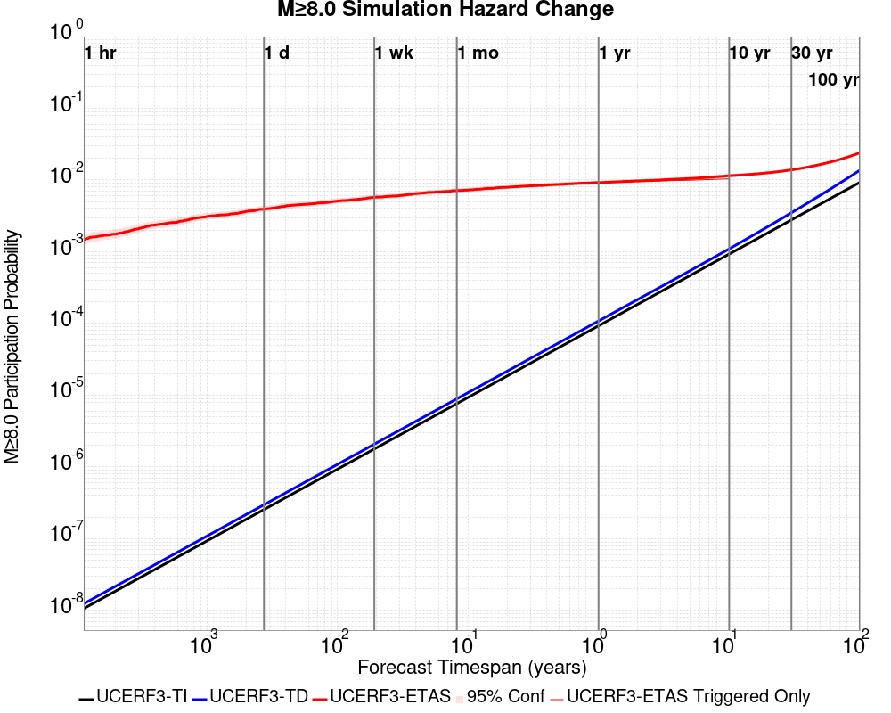

| Forecast Duration | UCERF3-ETAS [95% Conf] | UCERF3-ETAS Triggered Only | UCERF3-TD | UCERF3-ETAS/TD Gain | UCERF3-TI |
|-----|-----|-----|-----|-----|-----|
| 1 Hour | 1.59E-3 [4.11E-4 - 5.06E-3] | 1.59E-3 | 1.24E-8 | 128768.17 | 1.06E-8 |
| 1 Day | 3.19E-3 [1.30E-3 - 7.29E-3] | 3.18E-3 | 2.97E-7 | 10731.6 | 2.54E-7 |
| 1 Week | 6.37E-3 [3.46E-3 - 0.011] | 6.37E-3 | 2.08E-6 | 3066.88 | 1.78E-6 |
| 1 Month | 6.38E-3 [3.46E-3 - 0.011] | 6.37E-3 | 8.90E-6 | 716.37 | 7.63E-6 |
| 1 Year | 0.011 [7.20E-3 - 0.017] | 0.011 | 1.08E-4 | 103.82 | 9.29E-5 |
| 10 Years | 0.014 [9.45E-3 - 0.020] | 0.013 | 1.10E-3 | 12.6 | 9.29E-4 |
| 30 Years | 0.016 [0.012 - 0.023] \* | \* | 3.50E-3 | 4.62 \* | 2.78E-3 |
| 100 Years | 0.026 [0.022 - 0.033] \* | \* | 0.014 | 1.92 \* | 9.25E-3 |

\* *forecast duration is longer than simulation length, only ETAS ruptures from the first 10 years are included*

## Trigger Rupture Fault Map
*[(top)](#table-of-contents)*


## Trigger Rupture Depth Map
*[(top)](#table-of-contents)*


## Fault Distances To Triggers
*[(top)](#table-of-contents)*

| Section Name | Strike, Dip, Rake | # Hypos In Poly | Max Mag w/ Hypo In Poly | # Surfs In Poly | Max Mag w/ Surf In Poly | Min Dist To Any (km) | Min Poly Dist To Any (km) | Min Dist To Largest (km) | Min Poly Dist To Largest (km) | Min Hypo Dist To Largest (km) | Min Hypo Poly Dist To Largest (km) |
|-----|-----|-----|-----|-----|-----|-----|-----|-----|-----|-----|-----|
| Airport Lake | 359, 50, -90 | 91 | 7.1 | 91 | 7.1 | 0.036 | 0.000 | 0.036 | 0.000 | 5.612 | 0.000 |
| Little Lake | 327, 90, 180 | 15 | 3.75 | 16 | 7.1 | 2.268 | 0.000 | 11.284 | 0.000 | 13.471 | 1.469 |
| Garlock (Central) | 71, 90, 0 | 2 | 2.76 | 3 | 7.1 | 5.600 | 0.000 | 5.600 | 0.000 | 22.766 | 10.797 |
| So Sierra Nevada | 2, 50, -90 | 0 |  | 0 |  | 4.248 | 4.233 | 4.248 | 4.233 | 16.191 | 15.188 |
| Tank Canyon | 189, 50, -90 | 0 |  | 0 |  | 9.015 | 9.011 | 9.015 | 9.011 | 17.039 | 16.895 |
| Blackwater | 323, 90, 180 | 0 |  | 0 |  | 14.394 | 8.726 | 14.394 | 8.726 | 29.622 | 27.613 |

## Individual Simulated Catalog Maps
*[(top)](#table-of-contents)*

These are map plots of individual catalogs from the simulations, selected as the closest catalog to each of the given percentiles in terms of total number of events.

| Duration | p0.0 %-ile | p25.0 %-ile | p50.0 %-ile | p75.0 %-ile | p90.0 %-ile | p95.0 %-ile | p97.5 %-ile | p98.0 %-ile | p99.0 %-ile | p99.5 %-ile | p99.9 %-ile | p99.946921 %-ile |
|-----|-----|-----|-----|-----|-----|-----|-----|-----|-----|-----|-----|-----|
| **1 Week** |  |  |  |  |  |  |  |  |  | 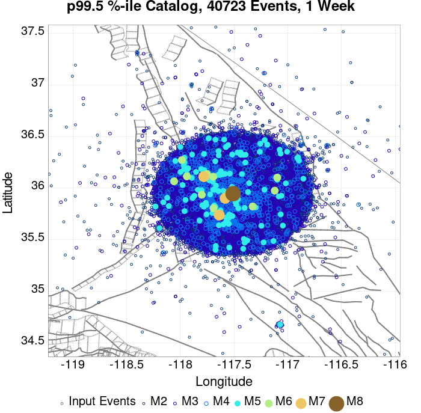 | 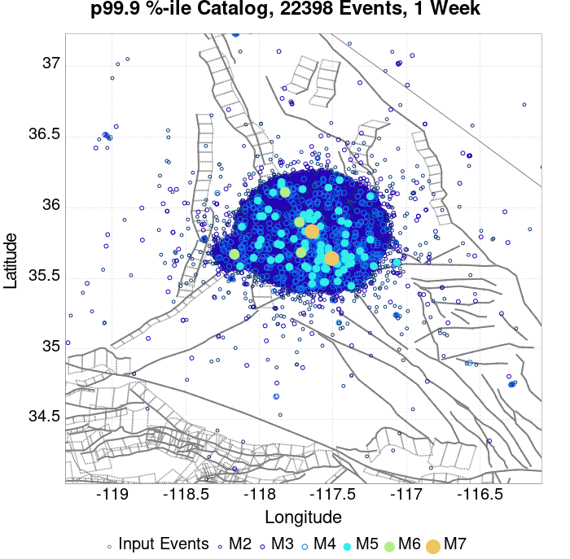 |  |
| **1 Month** |  |  | 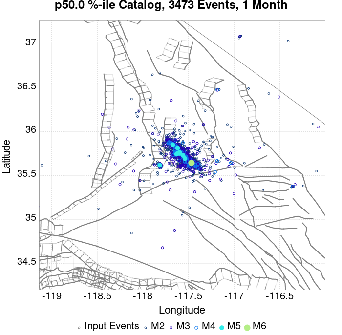 |  |  |  | 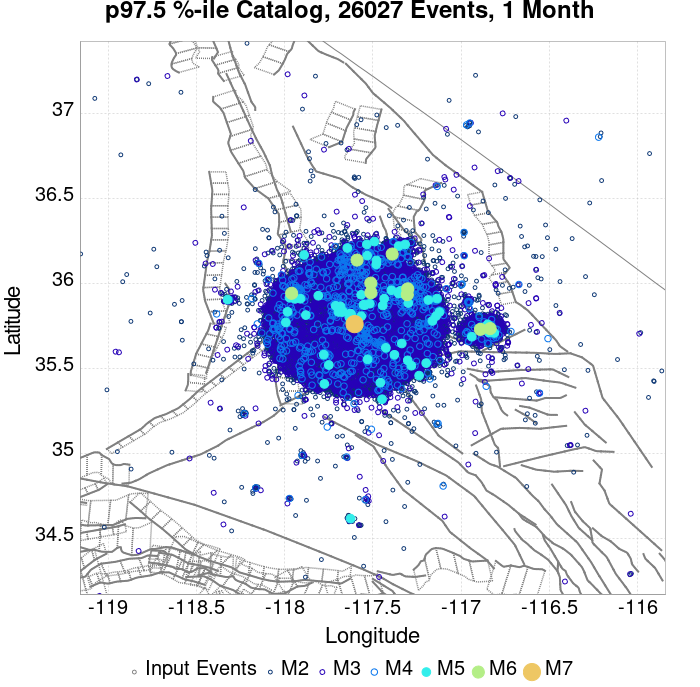 |  |  |  | 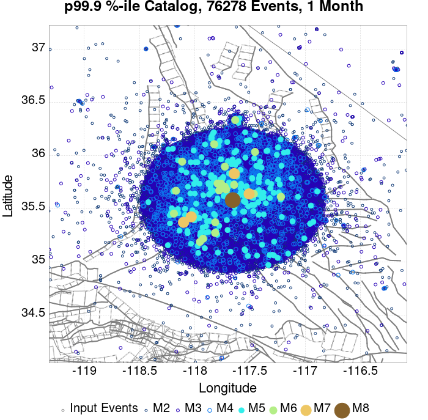 |  |
| **1 Year** |  |  |  |  |  |  |  |  |  |  | 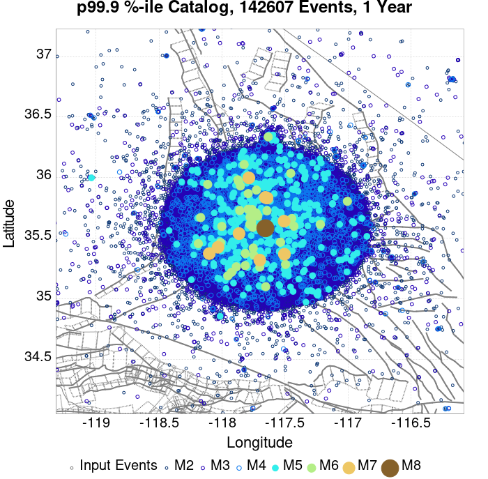 |  |
| **10 Year** |  |  | 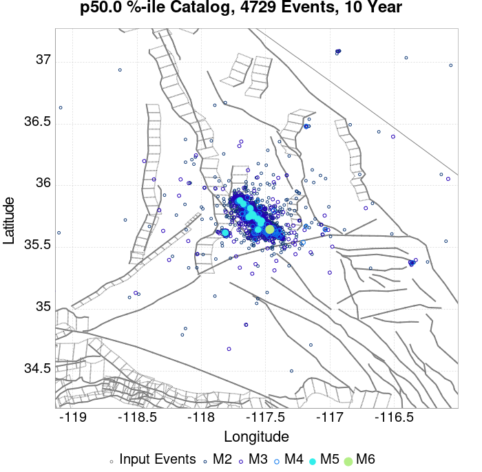 |  |  |  | 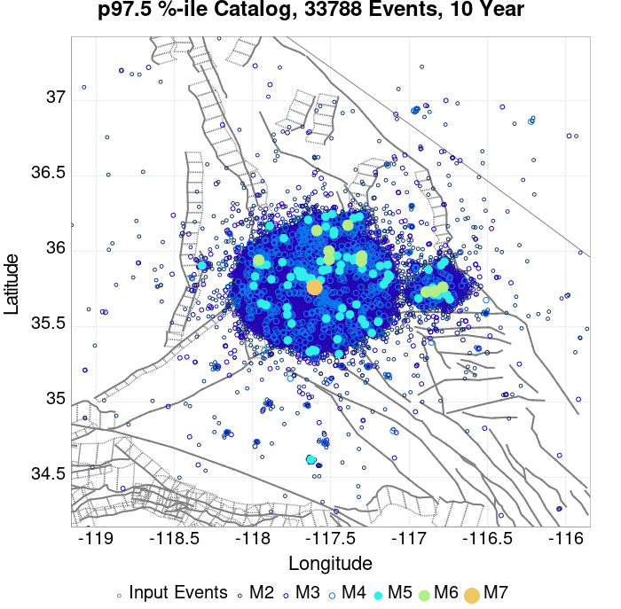 |  |  |  |  |  |

## ComCat Data Comparisons
*[(top)](#table-of-contents)*

These plots compare simulated sequences with data from ComCat. All plots only consider events with hypocenters inside the ComCat region defined in the JSON input file.

Last updated at 2019/10/05 05:33:28 UTC, 3 mo after the simulation start time

### ComCat Magnitude-Number Distributions
*[(top)](#table-of-contents)*

| Incremental MND | Cumulative MND |
|-----|-----|
|  | 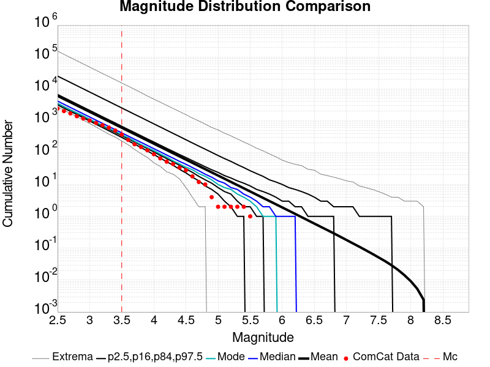 |

### ComCat Time-Dependent Mc
*[(top)](#table-of-contents)*

The following plots compare simulation results with ComCat data above a magnitude threshold. Plots labeled as *M&ge;Mc(t)* use the time-dependent magnitude of completeness (Mc) defined in Helmstetter et al. (2006), which is plotted below. In the case of multiple M&ge5 ruptures, either as input to the simulation or in the comparison data, the maximum calculated time-dependent Mc is used. This time-dependent Mc function is plotted below.


### ComCat Cumulative Number Vs Time
*[(top)](#table-of-contents)*

| M&ge;Mc(t) | M&ge;3.5 | M&ge;4 | M&ge;5 | M&ge;6 | M&ge;7 |
|-----|-----|-----|-----|-----|-----|
|  |  |  |  |  |  |

### ComCat Cumulative Number Simulation Percentiles
*[(top)](#table-of-contents)*


### ComCat Probability Spatial Distribution
*[(top)](#table-of-contents)*

|  | 1 Day | 1 Week | 1 Month | Current (3 Month) |
|-----|-----|-----|-----|-----|
| **M&ge;Mc(t)** |  |  |  |  |
| **M&ge;3.5** |  |  |  |  |
| **M&ge;4** |  |  |  |  |
| **M&ge;5** |  |  |  |  |
| **M&ge;6** |  |  |  |  |
| **M&ge;7** |  |  |  |  |
| **M&ge;8** |  |  |  |  |

### ComCat Mean Expectation Spatial Distribution
*[(top)](#table-of-contents)*

|  | 1 Day | 1 Week | 1 Month | Current (3 Month) |
|-----|-----|-----|-----|-----|
| **M&ge;Mc(t)** |  |  |  |  |
| **M&ge;3.5** |  |  |  |  |
| **M&ge;4** |  |  |  | 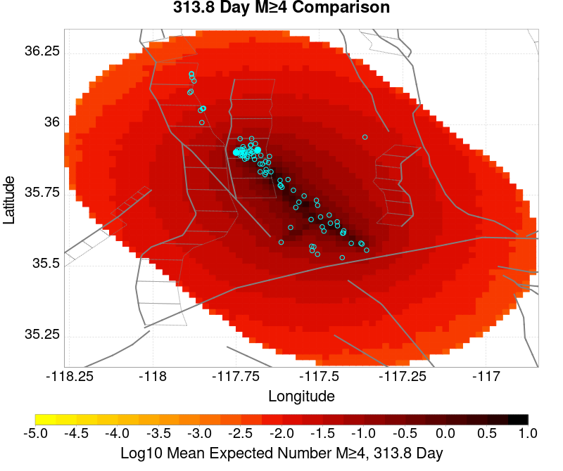 |
| **M&ge;5** |  |  |  |  |
| **M&ge;6** |  |  |  |  |
| **M&ge;7** |  |  |  | 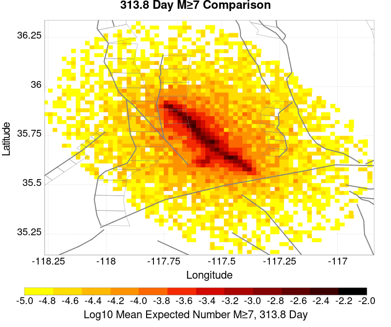 |
| **M&ge;8** |  |  |  |  |

### ComCat Depth Distribution
*[(top)](#table-of-contents)*

| M&ge;Mc(t) | M&ge;3.5 | M&ge;4 | M&ge;5 | M&ge;6 | M&ge;7 | M&ge;8 |
|-----|-----|-----|-----|-----|-----|-----|
|  |  |  |  |  |  |  |

## Gridded Nucleation
*[(top)](#table-of-contents)*

| Min Mag | Triggered Ruptures (no spontaneous) | Triggered Ruptures (primary aftershocks only) |
|-----|-----|-----|
| **M&ge;2.5** |  |  |
| **M&ge;5** |  |  |
| **M&ge;6** |  |  |
| **M&ge;7** |  |  |


## JSON Input File
*[(top)](#table-of-contents)*

```
{
  "numSimulations": 100000,
  "duration": 10.0,
  "startTimeMillis": 1562383194040,
  "includeSpontaneous": false,
  "randomSeed": 1569885243265,
  "binaryOutput": true,
  "binaryOutputFilters": [
    {
      "prefix": "results_complete",
      "descendantsOnly": false
    },
    {
      "prefix": "results_m5_preserve_chain",
      "minMag": 5.0,
      "preserveChainBelowMag": true,
      "descendantsOnly": false
    }
  ],
  "forceRecalc": false,
  "simulationName": "ComCat M7.1 (ci38457511), ShakeMap Surfaces, Log10(k)\u003d-2.3856, p\u003d1.2164, c\u003d0.0068906, No Faults",
  "numRetries": 3,
  "outputDir": "/home/scec-02/kmilner/ucerf3/etas_sim/2019_09_30-ComCatM7p1_ci38457511_ShakeMapSurfaces_Log10_k_2p3856_p1p2164_c0p0068906_NoFaults",
  "triggerRuptures": [
    "omitted due to length, see original input file"
  ],
  "cacheDir": "/home/scec-02/kmilner/ucerf3/ucerf3-etas-launcher/inputs/cache_fm3p1_ba",
  "fssFile": "/home/scec-02/kmilner/ucerf3/ucerf3-etas-launcher/inputs/2013_05_10-ucerf3p3-production-10runs_COMPOUND_SOL_FM3_1_SpatSeisU3_MEAN_BRANCH_AVG_SOL.zip",
  "probModel": "POISSON",
  "applySubSeisForSupraNucl": true,
  "totRateScaleFactor": 1.0,
  "gridSeisCorr": true,
  "timeIndependentERF": false,
  "griddedOnly": true,
  "imposeGR": false,
  "includeIndirectTriggering": true,
  "gridSeisDiscr": 0.1,
  "catalogCompletenessModel": "RELAXED",
  "etas_p": 1.2164,
  "etas_c": 0.0068906,
  "etas_log10_k": -2.3856,
  "configCommand": "u3etas_comcat_event_config_builder.sh --event-id ci38457511 --num-simulations 100000 --days-before 7 --gridded-only --mag-complete 3.5 --etas-k -2.3856 --etas-p 1.2164 --etas-c 0.0068906 --finite-surf-shakemap --finite-surf-shakemap-min-mag 5 --hpc-site USC_HPC --nodes 36 --hours 24 --queue scec",
  "configTime": 1569885243265,
  "comcatMetadata": {
    "region": {
      "border": [
        {
          "latitude": 35.15123745324938,
          "longitude": -117.46198765392752
        },
        {
          "latitude": 35.170513097218205,
          "longitude": -117.55046477274733
        },
        {
          "latitude": 35.201997575622634,
          "longitude": -117.63356287896195
        },
        {
          "latitude": 35.24474776584818,
          "longitude": -117.70878534540662
        },
        {
          "latitude": 35.2893890362986,
          "longitude": -117.76387551603122
        },
        {
          "latitude": 35.288830898189985,
          "longitude": -117.76465036296011
        },
        {
          "latitude": 35.62116745212862,
          "longitude": -118.13026990137416
        },
        {
          "latitude": 35.621789874646055,
          "longitude": -118.12940866580139
        },
        {
          "latitude": 35.621789874646055,
          "longitude": -118.12940866580136
        },
        {
          "latitude": 35.63100857737423,
          "longitude": -118.14083341711117
        },
        {
          "latitude": 35.69213881200874,
          "longitude": -118.19401186444136
        },
        {
          "latitude": 35.759827796433385,
          "longitude": -118.23338865654299
        },
        {
          "latitude": 35.8320329014668,
          "longitude": -118.25773927868946
        },
        {
          "latitude": 35.906569563076914,
          "longitude": -118.26628547708222
        },
        {
          "latitude": 35.9811764992231,
          "longitude": -118.25872343341653
        },
        {
          "latitude": 36.05358395358725,
          "longitude": -118.23523828089384
        },
        {
          "latitude": 36.12158296055357,
          "longitude": -118.19650389473806
        },
        {
          "latitude": 36.18309350302806,
          "longitude": -118.14366730262441
        },
        {
          "latitude": 36.23622937613509,
          "longitude": -118.07831757407638
        },
        {
          "latitude": 36.279357589115186,
          "longitude": -118.00243964650828
        },
        {
          "latitude": 36.31115024550475,
          "longitude": -117.91835419890715
        },
        {
          "latitude": 36.33062704347584,
          "longitude": -117.82864534929934
        },
        {
          "latitude": 36.337186832826475,
          "longitude": -117.7360785775
        },
        {
          "latitude": 36.33062704347584,
          "longitude": -117.64351180570065
        },
        {
          "latitude": 36.31115024550475,
          "longitude": -117.55380295609284
        },
        {
          "latitude": 36.279357589115186,
          "longitude": -117.46971750849171
        },
        {
          "latitude": 36.23622937613509,
          "longitude": -117.39383958092363
        },
        {
          "latitude": 36.19237301765921,
          "longitude": -117.33990236386252
        },
        {
          "latitude": 36.19237301765921,
          "longitude": -117.3399023638625
        },
        {
          "latitude": 36.19300476664728,
          "longitude": -117.33902822340912
        },
        {
          "latitude": 35.858277657147454,
          "longitude": -116.97410396317103
        },
        {
          "latitude": 35.85771127553969,
          "longitude": -116.97489025431044
        },
        {
          "latitude": 35.849566414597014,
          "longitude": -116.96491461360324
        },
        {
          "latitude": 35.78805819220281,
          "longitude": -116.9122967694479
        },
        {
          "latitude": 35.72006106557635,
          "longitude": -116.87372034968973
        },
        {
          "latitude": 35.64765482528862,
          "longitude": -116.85032807444419
        },
        {
          "latitude": 35.57304829206068,
          "longitude": -116.8427916482061
        },
        {
          "latitude": 35.49851117585832,
          "longitude": -116.8512961557198
        },
        {
          "latitude": 35.42630481575459,
          "longitude": -116.87553976530553
        },
        {
          "latitude": 35.35861392859174,
          "longitude": -116.91474809853695
        },
        {
          "latitude": 35.29748137319737,
          "longitude": -116.96770221389164
        },
        {
          "latitude": 35.24474776584818,
          "longitude": -117.03277884359336
        },
        {
          "latitude": 35.201997575622634,
          "longitude": -117.10800131003803
        },
        {
          "latitude": 35.170513097218205,
          "longitude": -117.19109941625265
        },
        {
          "latitude": 35.15123745324938,
          "longitude": -117.27957653507247
        },
        {
          "latitude": 35.14474752487352,
          "longitude": -117.3707820945
        }
      ]
    },
    "eventID": "ci38457511",
    "minDepth": -10.0,
    "maxDepth": 24.0,
    "minMag": 2.5,
    "startTime": 1561778393040,
    "endTime": 1562383193041,
    "magComplete": 3.5
  }
}
```

