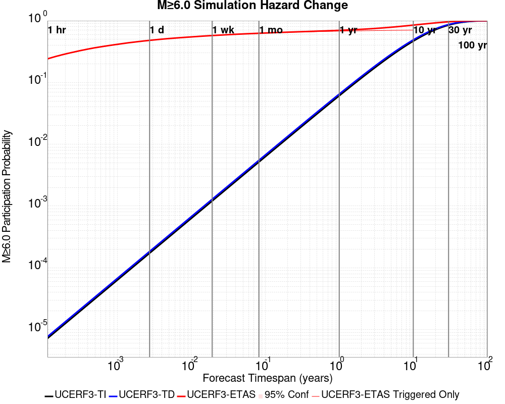
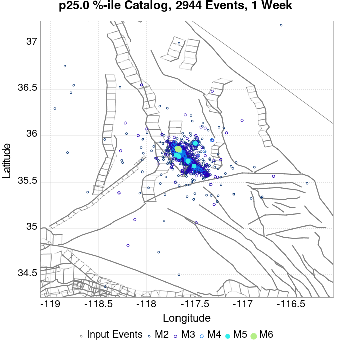
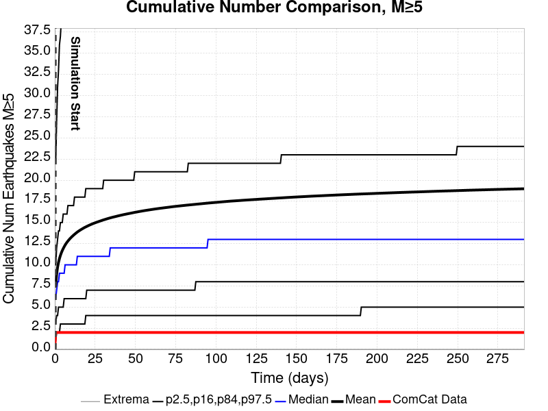
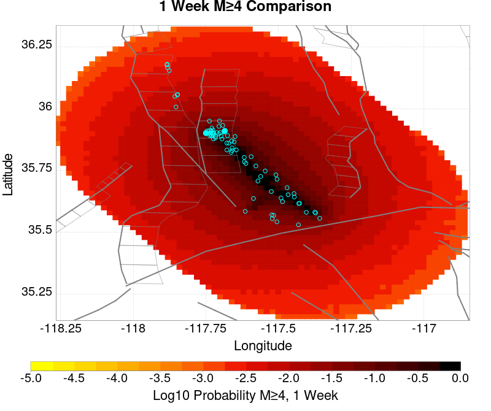
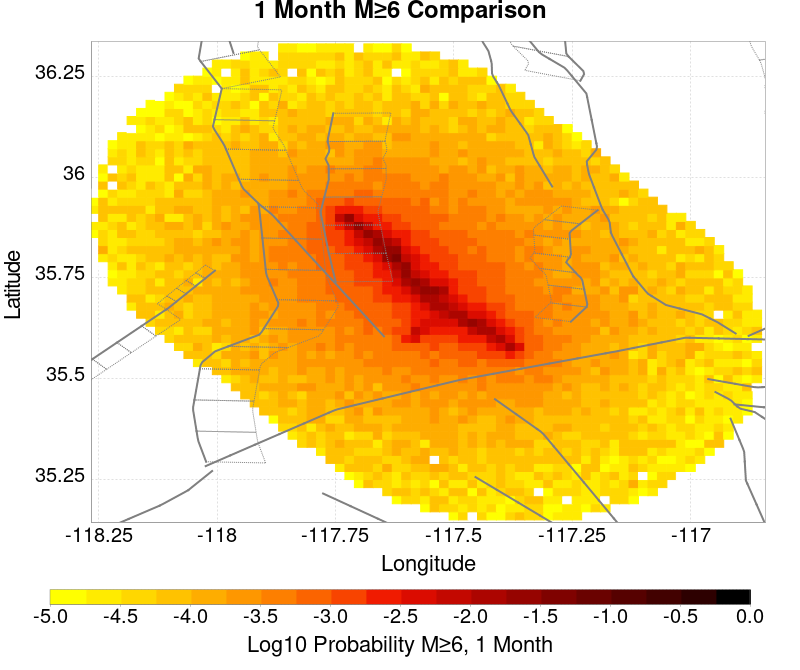
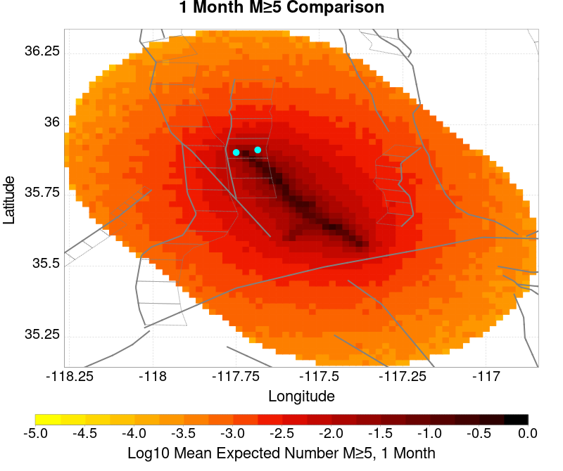
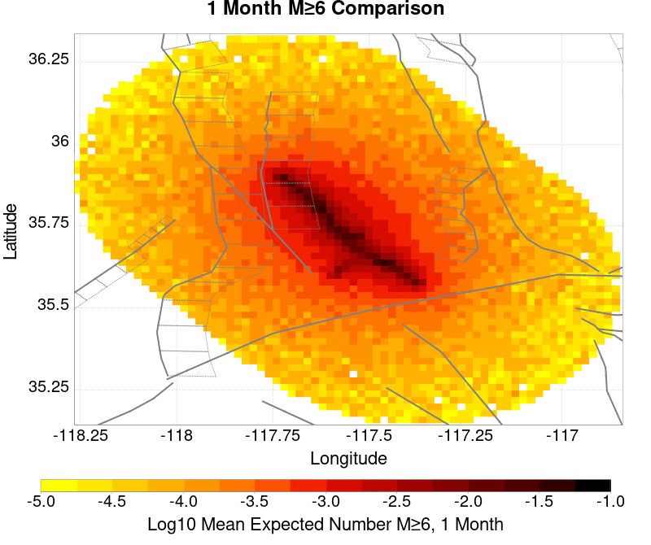
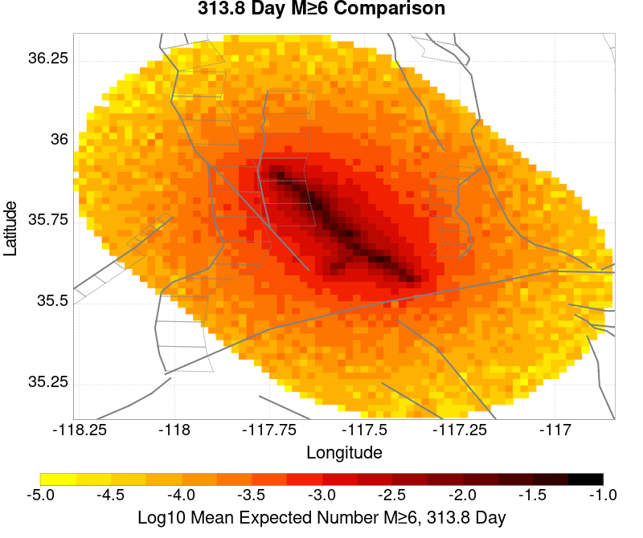
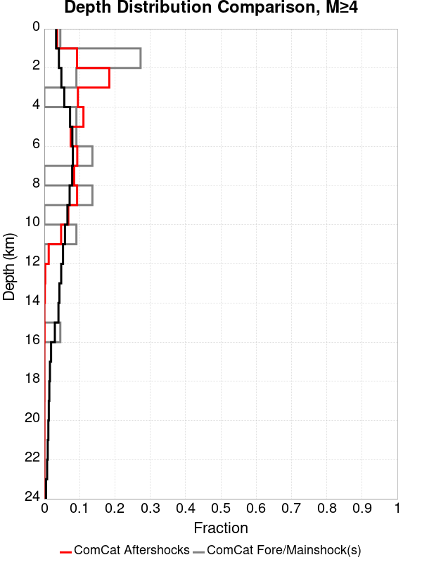

# ComCat M7.1 (ci38457511), ShakeMap Surfaces, Log10(k)=-2.3856, p=1.2164, c=0.0068906, No Faults Results

|   | ComCat M7.1 (ci38457511), ShakeMap Surfaces, Log10(k)=-2.3856, p=1.2164, c=0.0068906, No Faults |
|-----|-----|
| Num Simulations | 1219 (incomplete) |
| Start Time | 2019/07/06 03:19:54 UTC |
| Start Time Epoch Milliseconds | 1562383194040 |
| Duration | 10 Years |
| Includes Spontaneous? | false |
| Trigger Ruptures | 270 Trigger Ruptures |
|   | First: M3.98 at 2019/07/04 17:02:55 UTC |
|   | Last: M7.1 at 2019/07/06 03:19:53 UTC |
|   | Largest: M7.1 at 2019/07/06 03:19:53 UTC |
| Historical Ruptures | *(none)* |
| Config Generated With | u3etas_comcat_event_config_builder.sh --event-id ci38457511 --num-simulations 100000 --days-before 7 --gridded-only --mag-complete 3.5 --etas-k -2.3856 --etas-p 1.2164 --etas-c 0.0068906 --finite-surf-shakemap --finite-surf-shakemap-min-mag 5 --hpc-site USC_HPC --nodes 36 --hours 24 --queue scec |

## Table Of Contents

* [Probabilities Summary Table](#probabilities-summary-table)
* [Magnitude Number Distribution](#magnitude-number-distribution)
  * [10 Year Magnitude Number Distribution](#10-year-magnitude-number-distribution)
  * [1 Year Magnitude Number Distribution](#1-year-magnitude-number-distribution)
  * [1 Month Magnitude Number Distribution](#1-month-magnitude-number-distribution)
  * [1 Week Magnitude Number Distribution](#1-week-magnitude-number-distribution)
  * [1 Day Magnitude Number Distribution](#1-day-magnitude-number-distribution)
  * [1 Hour Magnitude Number Distribution](#1-hour-magnitude-number-distribution)
* [Hazard Change Over Time](#hazard-change-over-time)
  * [M&ge;5.0 Hazard Change Over Time](#m50-hazard-change-over-time)
  * [M&ge;6.0 Hazard Change Over Time](#m60-hazard-change-over-time)
  * [M&ge;7.0 Hazard Change Over Time](#m70-hazard-change-over-time)
  * [M&ge;8.0 Hazard Change Over Time](#m80-hazard-change-over-time)
* [Trigger Rupture Fault Map](#trigger-rupture-fault-map)
* [Trigger Rupture Depth Map](#trigger-rupture-depth-map)
* [Fault Distances To Triggers](#fault-distances-to-triggers)
* [Individual Simulated Catalog Maps](#individual-simulated-catalog-maps)
* [ComCat Data Comparisons](#comcat-data-comparisons)
  * [ComCat Magnitude-Number Distributions](#comcat-magnitude-number-distributions)
  * [ComCat Time-Dependent Mc](#comcat-time-dependent-mc)
  * [ComCat Cumulative Number Vs Time](#comcat-cumulative-number-vs-time)
  * [ComCat Cumulative Number Simulation Percentiles](#comcat-cumulative-number-simulation-percentiles)
  * [ComCat Probability Spatial Distribution](#comcat-probability-spatial-distribution)
  * [ComCat Mean Expectation Spatial Distribution](#comcat-mean-expectation-spatial-distribution)
  * [ComCat Depth Distribution](#comcat-depth-distribution)
* [Gridded Nucleation](#gridded-nucleation)
* [JSON Input File](#json-input-file)

## Probabilities Summary Table
*[(top)](#table-of-contents)*

| Magnitude | 1 Hour Prob | 1 Day Prob | 1 Week Prob | 1 Month Prob | 1 Year Prob | 10 Year Prob |
|-----|-----|-----|-----|-----|-----|-----|
| **M&ge;4** | 1.000 (100.00%) | 1.000 (100.00%) | 1.000 (100.00%) | 1.000 (100.00%) | 1.000 (100.00%) | 1.000 (100.00%) |
| **M&ge;4.5** | 1.000 (100.00%) | 1.000 (100.00%) | 1.000 (100.00%) | 1.000 (100.00%) | 1.000 (100.00%) | 1.000 (100.00%) |
| **M&ge;5** | 0.931 (93.11%) | 0.998 (99.75%) | 0.998 (99.84%) | 0.998 (99.84%) | 1.000 (100.00%) | 1.000 (100.00%) |
| **M&ge;5.5** | 0.590 (58.98%) | 0.864 (86.38%) | 0.926 (92.62%) | 0.947 (94.67%) | 0.969 (96.88%) | 0.971 (97.13%) |
| **M&ge;6** | 0.246 (24.61%) | 0.494 (49.38%) | 0.596 (59.64%) | 0.645 (64.48%) | 0.686 (68.58%) | 0.713 (71.29%) |
| **M&ge;6.5** | 0.100 (10.01%) | 0.209 (20.92%) | 0.273 (27.32%) | 0.300 (30.02%) | 0.338 (33.80%) | 0.364 (36.42%) |
| **M&ge;7** | 0.033 (3.28%) | 0.071 (7.14%) | 0.092 (9.19%) | 0.107 (10.66%) | 0.121 (12.14%) | 0.135 (13.54%) |
| **M&ge;7.1** | 0.027 (2.71%) | 0.060 (5.99%) | 0.077 (7.71%) | 0.089 (8.94%) | 0.102 (10.17%) | 0.115 (11.48%) |
| **M&ge;7.5** | 7.38E-3 (0.74%) | 0.020 (1.97%) | 0.031 (3.12%) | 0.035 (3.53%) | 0.046 (4.59%) | 0.053 (5.33%) |
| **M&ge;8** | 1.64E-3 (0.16%) | 4.10E-3 (0.41%) | 5.74E-3 (0.57%) | 5.74E-3 (0.57%) | 9.84E-3 (0.98%) | 0.012 (1.23%) |

## Magnitude Number Distribution
*[(top)](#table-of-contents)*

### 10 Year Magnitude Number Distribution
*[(top)](#table-of-contents)*

**Legend**
* **Mean** (thick black line): mean expected number across all 1219 catalogs
* **2.5%,97.5%** (thin black lines): expected number percentiles across all 1219 catalogs
* **Median** (thin blue line): median expected number across all 1219 catalogs
* **Mode** (thin cyan line): modal expected number across all 1219 catalogs
* **10 yr Probability** (thin red line): 10 year probability calculated as the fraction of catalogs with at least 1 occurrence
* **10 yr Supraseismogenic Probability** (thin dashed red line): same as above, but only for supraseismogenic ruptures on explicitly modeled UCERF3 faults
* **95% Conf** (light red shaded region): binomial 95% confidence bounds on probability
* **Primary** (thin green line): mean expected number from primary triggered aftershocks only (no secondary, tertiary, etc...) across all 1219 catalogs


| Mag | Mean | 2.5 %ile | 97.5 %ile | Median | Mode | 10 yr Probability | 10 yr Supra-Seis Prob | Primary Aftershocks Mean |
|-----|-----|-----|-----|-----|-----|-----|-----|-----|
| **M&ge;2.5** | 7828.965 | 3475.000 | 30491.000 | 4764.000 | 3904.000 | 1.000 (100.00%) | 0.000 (0.00%) | 2268.737 |
| **M&ge;2.6** | 6219.022 | 2763.000 | 24229.000 | 3784.000 | 3133.000 | 1.000 (100.00%) | 0.000 (0.00%) | 1801.724 |
| **M&ge;2.7** | 4939.939 | 2197.000 | 19097.000 | 3016.000 | 2471.000 | 1.000 (100.00%) | 0.000 (0.00%) | 1431.005 |
| **M&ge;2.8** | 3925.369 | 1741.000 | 15130.000 | 2396.000 | 2542.000 | 1.000 (100.00%) | 0.000 (0.00%) | 1137.486 |
| **M&ge;2.9** | 3118.889 | 1386.000 | 12015.000 | 1908.000 | 1576.000 | 1.000 (100.00%) | 0.000 (0.00%) | 903.568 |
| **M&ge;3** | 2477.010 | 1097.000 | 9538.000 | 1517.000 | 1226.000 | 1.000 (100.00%) | 0.000 (0.00%) | 717.722 |
| **M&ge;3.1** | 1966.550 | 866.000 | 7649.000 | 1205.000 | 1047.000 | 1.000 (100.00%) | 0.000 (0.00%) | 570.005 |
| **M&ge;3.2** | 1562.724 | 685.000 | 6039.000 | 957.000 | 803.000 | 1.000 (100.00%) | 0.000 (0.00%) | 452.741 |
| **M&ge;3.3** | 1241.947 | 537.000 | 4828.000 | 761.000 | 636.000 | 1.000 (100.00%) | 0.000 (0.00%) | 359.632 |
| **M&ge;3.4** | 986.481 | 427.000 | 3848.000 | 601.000 | 509.000 | 1.000 (100.00%) | 0.000 (0.00%) | 285.638 |
| **M&ge;3.5** | 783.131 | 333.000 | 3038.000 | 480.000 | 397.000 | 1.000 (100.00%) | 0.000 (0.00%) | 226.511 |
| **M&ge;3.6** | 622.142 | 261.000 | 2398.000 | 384.000 | 321.000 | 1.000 (100.00%) | 0.000 (0.00%) | 180.076 |
| **M&ge;3.7** | 494.263 | 206.000 | 1905.000 | 304.000 | 255.000 | 1.000 (100.00%) | 0.000 (0.00%) | 143.088 |
| **M&ge;3.8** | 392.397 | 160.000 | 1529.000 | 240.000 | 191.000 | 1.000 (100.00%) | 0.000 (0.00%) | 113.619 |
| **M&ge;3.9** | 311.831 | 126.000 | 1226.000 | 192.000 | 152.000 | 1.000 (100.00%) | 0.000 (0.00%) | 90.288 |
| **M&ge;4** | 248.064 | 99.000 | 975.000 | 154.000 | 124.000 | 1.000 (100.00%) | 0.000 (0.00%) | 71.902 |
| **M&ge;4.1** | 196.931 | 78.000 | 785.000 | 123.000 | 105.000 | 1.000 (100.00%) | 0.000 (0.00%) | 57.129 |
| **M&ge;4.2** | 156.578 | 59.000 | 634.000 | 98.000 | 74.000 | 1.000 (100.00%) | 0.000 (0.00%) | 45.470 |
| **M&ge;4.3** | 124.019 | 45.000 | 507.000 | 78.000 | 66.000 | 1.000 (100.00%) | 0.000 (0.00%) | 35.936 |
| **M&ge;4.4** | 98.445 | 34.000 | 401.000 | 61.000 | 49.000 | 1.000 (100.00%) | 0.000 (0.00%) | 28.584 |
| **M&ge;4.5** | 78.326 | 26.000 | 320.000 | 49.000 | 36.000 | 1.000 (100.00%) | 0.000 (0.00%) | 22.706 |
| **M&ge;4.6** | 62.202 | 19.000 | 257.000 | 39.000 | 32.000 | 1.000 (100.00%) | 0.000 (0.00%) | 17.990 |
| **M&ge;4.7** | 49.412 | 14.000 | 196.000 | 31.000 | 28.000 | 1.000 (100.00%) | 0.000 (0.00%) | 14.338 |
| **M&ge;4.8** | 39.250 | 11.000 | 160.000 | 25.000 | 20.000 | 1.000 (100.00%) | 0.000 (0.00%) | 11.401 |
| **M&ge;4.9** | 31.216 | 8.000 | 129.000 | 20.000 | 17.000 | 1.000 (100.00%) | 0.000 (0.00%) | 9.095 |
| **M&ge;5** | 24.879 | 5.000 | 101.000 | 16.000 | 13.000 | 1.000 (100.00%) | 0.000 (0.00%) | 7.254 |
| **M&ge;5.1** | 19.737 | 4.000 | 77.000 | 13.000 | 9.000 | 1.000 (100.00%) | 0.000 (0.00%) | 5.747 |
| **M&ge;5.2** | 15.641 | 3.000 | 63.000 | 10.000 | 7.000 | 0.999 (99.92%) | 0.000 (0.00%) | 4.548 |
| **M&ge;5.3** | 12.415 | 2.000 | 49.000 | 8.000 | 7.000 | 0.996 (99.59%) | 0.000 (0.00%) | 3.566 |
| **M&ge;5.4** | 9.934 | 1.000 | 44.000 | 6.000 | 4.000 | 0.989 (98.85%) | 0.000 (0.00%) | 2.877 |
| **M&ge;5.5** | 7.882 | 0.000 | 33.000 | 5.000 | 4.000 | 0.971 (97.13%) | 0.000 (0.00%) | 2.265 |
| **M&ge;5.6** | 6.241 | 0.000 | 27.000 | 4.000 | 3.000 | 0.940 (94.01%) | 0.000 (0.00%) | 1.778 |
| **M&ge;5.7** | 4.939 | 0.000 | 22.000 | 3.000 | 2.000 | 0.896 (89.58%) | 0.000 (0.00%) | 1.409 |
| **M&ge;5.8** | 3.881 | 0.000 | 18.000 | 2.000 | 2.000 | 0.838 (83.84%) | 0.000 (0.00%) | 1.106 |
| **M&ge;5.9** | 3.110 | 0.000 | 14.000 | 2.000 | 1.000 | 0.779 (77.93%) | 0.000 (0.00%) | 0.893 |
| **M&ge;6** | 2.484 | 0.000 | 11.000 | 1.000 | 0.000 | 0.713 (71.29%) | 0.000 (0.00%) | 0.725 |
| **M&ge;6.1** | 1.971 | 0.000 | 9.000 | 1.000 | 0.000 | 0.647 (64.73%) | 0.000 (0.00%) | 0.600 |
| **M&ge;6.2** | 1.549 | 0.000 | 8.000 | 1.000 | 0.000 | 0.564 (56.36%) | 0.000 (0.00%) | 0.481 |
| **M&ge;6.3** | 1.235 | 0.000 | 7.000 | 0.000 | 0.000 | 0.493 (49.30%) | 0.000 (0.00%) | 0.380 |
| **M&ge;6.4** | 0.996 | 0.000 | 5.000 | 0.000 | 0.000 | 0.432 (43.15%) | 0.000 (0.00%) | 0.319 |
| **M&ge;6.5** | 0.788 | 0.000 | 4.000 | 0.000 | 0.000 | 0.364 (36.42%) | 0.000 (0.00%) | 0.253 |
| **M&ge;6.6** | 0.629 | 0.000 | 4.000 | 0.000 | 0.000 | 0.317 (31.75%) | 0.000 (0.00%) | 0.202 |
| **M&ge;6.7** | 0.472 | 0.000 | 3.000 | 0.000 | 0.000 | 0.255 (25.51%) | 0.000 (0.00%) | 0.146 |
| **M&ge;6.8** | 0.364 | 0.000 | 3.000 | 0.000 | 0.000 | 0.210 (21.00%) | 0.000 (0.00%) | 0.114 |
| **M&ge;6.9** | 0.283 | 0.000 | 2.000 | 0.000 | 0.000 | 0.167 (16.74%) | 0.000 (0.00%) | 0.089 |
| **M&ge;7** | 0.224 | 0.000 | 2.000 | 0.000 | 0.000 | 0.135 (13.54%) | 0.000 (0.00%) | 0.069 |
| **M&ge;7.1** | 0.180 | 0.000 | 2.000 | 0.000 | 0.000 | 0.115 (11.48%) | 0.000 (0.00%) | 0.057 |
| **M&ge;7.2** | 0.135 | 0.000 | 1.000 | 0.000 | 0.000 | 0.089 (8.86%) | 0.000 (0.00%) | 0.040 |
| **M&ge;7.3** | 0.108 | 0.000 | 1.000 | 0.000 | 0.000 | 0.077 (7.71%) | 0.000 (0.00%) | 0.031 |
| **M&ge;7.4** | 0.089 | 0.000 | 1.000 | 0.000 | 0.000 | 0.066 (6.64%) | 0.000 (0.00%) | 0.023 |
| **M&ge;7.5** | 0.069 | 0.000 | 1.000 | 0.000 | 0.000 | 0.053 (5.33%) | 0.000 (0.00%) | 0.018 |
| **M&ge;7.6** | 0.051 | 0.000 | 1.000 | 0.000 | 0.000 | 0.039 (3.94%) | 0.000 (0.00%) | 0.012 |
| **M&ge;7.7** | 0.045 | 0.000 | 1.000 | 0.000 | 0.000 | 0.035 (3.53%) | 0.000 (0.00%) | 0.011 |
| **M&ge;7.8** | 0.032 | 0.000 | 0.000 | 0.000 | 0.000 | 0.024 (2.38%) | 0.000 (0.00%) | 8.20E-3 |
| **M&ge;7.9** | 0.025 | 0.000 | 0.000 | 0.000 | 0.000 | 0.018 (1.80%) | 0.000 (0.00%) | 5.74E-3 |
| **M&ge;8** | 0.016 | 0.000 | 0.000 | 0.000 | 0.000 | 0.012 (1.23%) | 0.000 (0.00%) | 4.10E-3 |
| **M&ge;8.1** | 8.20E-3 | 0.000 | 0.000 | 0.000 | 0.000 | 5.74E-3 (0.57%) | 0.000 (0.00%) | 2.46E-3 |
| **M&ge;8.2** | 4.10E-3 | 0.000 | 0.000 | 0.000 | 0.000 | 3.28E-3 (0.33%) | 0.000 (0.00%) | 1.64E-3 |
| **M&ge;8.3** | 0.000 | 0.000 | 0.000 | 0.000 | 0.000 | 0.000 (0.00%) | 0.000 (0.00%) | 0.000 |
| **M&ge;8.4** | 0.000 | 0.000 | 0.000 | 0.000 | 0.000 | 0.000 (0.00%) | 0.000 (0.00%) | 0.000 |
| **M&ge;8.5** | 0.000 | 0.000 | 0.000 | 0.000 | 0.000 | 0.000 (0.00%) | 0.000 (0.00%) | 0.000 |
| **M&ge;8.6** | 0.000 | 0.000 | 0.000 | 0.000 | 0.000 | 0.000 (0.00%) | 0.000 (0.00%) | 0.000 |
| **M&ge;8.7** | 0.000 | 0.000 | 0.000 | 0.000 | 0.000 | 0.000 (0.00%) | 0.000 (0.00%) | 0.000 |
| **M&ge;8.8** | 0.000 | 0.000 | 0.000 | 0.000 | 0.000 | 0.000 (0.00%) | 0.000 (0.00%) | 0.000 |
| **M&ge;8.9** | 0.000 | 0.000 | 0.000 | 0.000 | 0.000 | 0.000 (0.00%) | 0.000 (0.00%) | 0.000 |
| **M&ge;9** | 0.000 | 0.000 | 0.000 | 0.000 | 0.000 | 0.000 (0.00%) | 0.000 (0.00%) | 0.000 |

### 1 Year Magnitude Number Distribution
*[(top)](#table-of-contents)*

**Legend**
* **Mean** (thick black line): mean expected number across all 1219 catalogs
* **2.5%,97.5%** (thin black lines): expected number percentiles across all 1219 catalogs
* **Median** (thin blue line): median expected number across all 1219 catalogs
* **Mode** (thin cyan line): modal expected number across all 1219 catalogs
* **1 yr Probability** (thin red line): 1 year probability calculated as the fraction of catalogs with at least 1 occurrence
* **1 yr Supraseismogenic Probability** (thin dashed red line): same as above, but only for supraseismogenic ruptures on explicitly modeled UCERF3 faults
* **95% Conf** (light red shaded region): binomial 95% confidence bounds on probability
* **Primary** (thin green line): mean expected number from primary triggered aftershocks only (no secondary, tertiary, etc...) across all 1219 catalogs


| Mag | Mean | 2.5 %ile | 97.5 %ile | Median | Mode | 1 yr Probability | 1 yr Supra-Seis Prob | Primary Aftershocks Mean |
|-----|-----|-----|-----|-----|-----|-----|-----|-----|
| **M&ge;2.5** | 6507.401 | 3242.000 | 26664.000 | 4333.000 | 3618.000 | 1.000 (100.00%) | 0.000 (0.00%) | 2162.348 |
| **M&ge;2.6** | 5169.282 | 2572.000 | 21146.000 | 3443.000 | 2838.000 | 1.000 (100.00%) | 0.000 (0.00%) | 1717.279 |
| **M&ge;2.7** | 4105.710 | 2042.000 | 16866.000 | 2736.000 | 2309.000 | 1.000 (100.00%) | 0.000 (0.00%) | 1363.790 |
| **M&ge;2.8** | 3262.197 | 1617.000 | 13423.000 | 2172.000 | 1806.000 | 1.000 (100.00%) | 0.000 (0.00%) | 1083.968 |
| **M&ge;2.9** | 2592.007 | 1286.000 | 10767.000 | 1722.000 | 1449.000 | 1.000 (100.00%) | 0.000 (0.00%) | 861.031 |
| **M&ge;3** | 2058.612 | 1017.000 | 8550.000 | 1372.000 | 1245.000 | 1.000 (100.00%) | 0.000 (0.00%) | 683.904 |
| **M&ge;3.1** | 1634.380 | 807.000 | 6694.000 | 1091.000 | 913.000 | 1.000 (100.00%) | 0.000 (0.00%) | 543.219 |
| **M&ge;3.2** | 1298.614 | 634.000 | 5348.000 | 866.000 | 735.000 | 1.000 (100.00%) | 0.000 (0.00%) | 431.578 |
| **M&ge;3.3** | 1031.984 | 499.000 | 4242.000 | 686.000 | 586.000 | 1.000 (100.00%) | 0.000 (0.00%) | 342.813 |
| **M&ge;3.4** | 819.666 | 391.000 | 3370.000 | 546.000 | 494.000 | 1.000 (100.00%) | 0.000 (0.00%) | 272.339 |
| **M&ge;3.5** | 650.759 | 308.000 | 2684.000 | 434.000 | 372.000 | 1.000 (100.00%) | 0.000 (0.00%) | 215.986 |
| **M&ge;3.6** | 517.057 | 242.000 | 2136.000 | 346.000 | 302.000 | 1.000 (100.00%) | 0.000 (0.00%) | 171.747 |
| **M&ge;3.7** | 410.774 | 188.000 | 1675.000 | 276.000 | 227.000 | 1.000 (100.00%) | 0.000 (0.00%) | 136.495 |
| **M&ge;3.8** | 326.135 | 148.000 | 1312.000 | 221.000 | 179.000 | 1.000 (100.00%) | 0.000 (0.00%) | 108.392 |
| **M&ge;3.9** | 259.210 | 116.000 | 1071.000 | 176.000 | 143.000 | 1.000 (100.00%) | 0.000 (0.00%) | 86.171 |
| **M&ge;4** | 206.290 | 92.000 | 845.000 | 140.000 | 113.000 | 1.000 (100.00%) | 0.000 (0.00%) | 68.609 |
| **M&ge;4.1** | 163.769 | 70.000 | 663.000 | 111.000 | 94.000 | 1.000 (100.00%) | 0.000 (0.00%) | 54.533 |
| **M&ge;4.2** | 130.235 | 54.000 | 545.000 | 88.000 | 70.000 | 1.000 (100.00%) | 0.000 (0.00%) | 43.403 |
| **M&ge;4.3** | 103.089 | 40.000 | 428.000 | 70.000 | 55.000 | 1.000 (100.00%) | 0.000 (0.00%) | 34.283 |
| **M&ge;4.4** | 81.835 | 31.000 | 340.000 | 56.000 | 46.000 | 1.000 (100.00%) | 0.000 (0.00%) | 27.255 |
| **M&ge;4.5** | 65.135 | 23.000 | 272.000 | 45.000 | 39.000 | 1.000 (100.00%) | 0.000 (0.00%) | 21.664 |
| **M&ge;4.6** | 51.687 | 17.000 | 215.000 | 36.000 | 29.000 | 1.000 (100.00%) | 0.000 (0.00%) | 17.159 |
| **M&ge;4.7** | 41.108 | 13.000 | 169.000 | 29.000 | 23.000 | 1.000 (100.00%) | 0.000 (0.00%) | 13.669 |
| **M&ge;4.8** | 32.624 | 10.000 | 136.000 | 23.000 | 17.000 | 1.000 (100.00%) | 0.000 (0.00%) | 10.862 |
| **M&ge;4.9** | 25.954 | 7.000 | 110.000 | 18.000 | 14.000 | 1.000 (100.00%) | 0.000 (0.00%) | 8.672 |
| **M&ge;5** | 20.692 | 5.000 | 88.000 | 15.000 | 13.000 | 1.000 (100.00%) | 0.000 (0.00%) | 6.897 |
| **M&ge;5.1** | 16.432 | 4.000 | 67.000 | 12.000 | 12.000 | 1.000 (100.00%) | 0.000 (0.00%) | 5.462 |
| **M&ge;5.2** | 12.999 | 2.000 | 54.000 | 9.000 | 6.000 | 0.999 (99.92%) | 0.000 (0.00%) | 4.313 |
| **M&ge;5.3** | 10.305 | 1.000 | 43.000 | 7.000 | 6.000 | 0.993 (99.34%) | 0.000 (0.00%) | 3.382 |
| **M&ge;5.4** | 8.262 | 1.000 | 34.000 | 6.000 | 4.000 | 0.984 (98.44%) | 0.000 (0.00%) | 2.725 |
| **M&ge;5.5** | 6.540 | 0.000 | 28.000 | 4.000 | 4.000 | 0.969 (96.88%) | 0.000 (0.00%) | 2.144 |
| **M&ge;5.6** | 5.163 | 0.000 | 22.000 | 3.000 | 2.000 | 0.932 (93.19%) | 0.000 (0.00%) | 1.680 |
| **M&ge;5.7** | 4.092 | 0.000 | 17.000 | 3.000 | 2.000 | 0.881 (88.11%) | 0.000 (0.00%) | 1.331 |
| **M&ge;5.8** | 3.212 | 0.000 | 13.000 | 2.000 | 2.000 | 0.815 (81.54%) | 0.000 (0.00%) | 1.048 |
| **M&ge;5.9** | 2.554 | 0.000 | 11.000 | 2.000 | 0.000 | 0.753 (75.31%) | 0.000 (0.00%) | 0.841 |
| **M&ge;6** | 2.043 | 0.000 | 9.000 | 1.000 | 0.000 | 0.686 (68.58%) | 0.000 (0.00%) | 0.683 |
| **M&ge;6.1** | 1.623 | 0.000 | 8.000 | 1.000 | 0.000 | 0.619 (61.94%) | 0.000 (0.00%) | 0.568 |
| **M&ge;6.2** | 1.281 | 0.000 | 6.000 | 1.000 | 0.000 | 0.536 (53.57%) | 0.000 (0.00%) | 0.454 |
| **M&ge;6.3** | 1.019 | 0.000 | 5.000 | 0.000 | 0.000 | 0.461 (46.10%) | 0.000 (0.00%) | 0.360 |
| **M&ge;6.4** | 0.828 | 0.000 | 5.000 | 0.000 | 0.000 | 0.403 (40.28%) | 0.000 (0.00%) | 0.303 |
| **M&ge;6.5** | 0.649 | 0.000 | 4.000 | 0.000 | 0.000 | 0.338 (33.80%) | 0.000 (0.00%) | 0.239 |
| **M&ge;6.6** | 0.516 | 0.000 | 3.000 | 0.000 | 0.000 | 0.292 (29.20%) | 0.000 (0.00%) | 0.190 |
| **M&ge;6.7** | 0.390 | 0.000 | 3.000 | 0.000 | 0.000 | 0.235 (23.46%) | 0.000 (0.00%) | 0.139 |
| **M&ge;6.8** | 0.300 | 0.000 | 2.000 | 0.000 | 0.000 | 0.192 (19.20%) | 0.000 (0.00%) | 0.107 |
| **M&ge;6.9** | 0.234 | 0.000 | 2.000 | 0.000 | 0.000 | 0.152 (15.18%) | 0.000 (0.00%) | 0.082 |
| **M&ge;7** | 0.183 | 0.000 | 2.000 | 0.000 | 0.000 | 0.121 (12.14%) | 0.000 (0.00%) | 0.064 |
| **M&ge;7.1** | 0.147 | 0.000 | 2.000 | 0.000 | 0.000 | 0.102 (10.17%) | 0.000 (0.00%) | 0.052 |
| **M&ge;7.2** | 0.109 | 0.000 | 1.000 | 0.000 | 0.000 | 0.078 (7.79%) | 0.000 (0.00%) | 0.037 |
| **M&ge;7.3** | 0.085 | 0.000 | 1.000 | 0.000 | 0.000 | 0.066 (6.64%) | 0.000 (0.00%) | 0.029 |
| **M&ge;7.4** | 0.070 | 0.000 | 1.000 | 0.000 | 0.000 | 0.057 (5.74%) | 0.000 (0.00%) | 0.021 |
| **M&ge;7.5** | 0.053 | 0.000 | 1.000 | 0.000 | 0.000 | 0.046 (4.59%) | 0.000 (0.00%) | 0.016 |
| **M&ge;7.6** | 0.039 | 0.000 | 1.000 | 0.000 | 0.000 | 0.034 (3.45%) | 0.000 (0.00%) | 9.84E-3 |
| **M&ge;7.7** | 0.036 | 0.000 | 1.000 | 0.000 | 0.000 | 0.033 (3.28%) | 0.000 (0.00%) | 9.02E-3 |
| **M&ge;7.8** | 0.023 | 0.000 | 0.000 | 0.000 | 0.000 | 0.021 (2.13%) | 0.000 (0.00%) | 6.56E-3 |
| **M&ge;7.9** | 0.016 | 0.000 | 0.000 | 0.000 | 0.000 | 0.016 (1.56%) | 0.000 (0.00%) | 4.10E-3 |
| **M&ge;8** | 0.011 | 0.000 | 0.000 | 0.000 | 0.000 | 9.84E-3 (0.98%) | 0.000 (0.00%) | 2.46E-3 |
| **M&ge;8.1** | 4.10E-3 | 0.000 | 0.000 | 0.000 | 0.000 | 3.28E-3 (0.33%) | 0.000 (0.00%) | 8.20E-4 |
| **M&ge;8.2** | 8.20E-4 | 0.000 | 0.000 | 0.000 | 0.000 | 8.20E-4 (0.08%) | 0.000 (0.00%) | 0.000 |
| **M&ge;8.3** | 0.000 | 0.000 | 0.000 | 0.000 | 0.000 | 0.000 (0.00%) | 0.000 (0.00%) | 0.000 |
| **M&ge;8.4** | 0.000 | 0.000 | 0.000 | 0.000 | 0.000 | 0.000 (0.00%) | 0.000 (0.00%) | 0.000 |
| **M&ge;8.5** | 0.000 | 0.000 | 0.000 | 0.000 | 0.000 | 0.000 (0.00%) | 0.000 (0.00%) | 0.000 |
| **M&ge;8.6** | 0.000 | 0.000 | 0.000 | 0.000 | 0.000 | 0.000 (0.00%) | 0.000 (0.00%) | 0.000 |
| **M&ge;8.7** | 0.000 | 0.000 | 0.000 | 0.000 | 0.000 | 0.000 (0.00%) | 0.000 (0.00%) | 0.000 |
| **M&ge;8.8** | 0.000 | 0.000 | 0.000 | 0.000 | 0.000 | 0.000 (0.00%) | 0.000 (0.00%) | 0.000 |
| **M&ge;8.9** | 0.000 | 0.000 | 0.000 | 0.000 | 0.000 | 0.000 (0.00%) | 0.000 (0.00%) | 0.000 |
| **M&ge;9** | 0.000 | 0.000 | 0.000 | 0.000 | 0.000 | 0.000 (0.00%) | 0.000 (0.00%) | 0.000 |

### 1 Month Magnitude Number Distribution
*[(top)](#table-of-contents)*

**Legend**
* **Mean** (thick black line): mean expected number across all 1219 catalogs
* **2.5%,97.5%** (thin black lines): expected number percentiles across all 1219 catalogs
* **Median** (thin blue line): median expected number across all 1219 catalogs
* **Mode** (thin cyan line): modal expected number across all 1219 catalogs
* **1 mo Probability** (thin red line): 1 month probability calculated as the fraction of catalogs with at least 1 occurrence
* **1 mo Supraseismogenic Probability** (thin dashed red line): same as above, but only for supraseismogenic ruptures on explicitly modeled UCERF3 faults
* **95% Conf** (light red shaded region): binomial 95% confidence bounds on probability
* **Primary** (thin green line): mean expected number from primary triggered aftershocks only (no secondary, tertiary, etc...) across all 1219 catalogs


| Mag | Mean | 2.5 %ile | 97.5 %ile | Median | Mode | 1 mo Probability | 1 mo Supra-Seis Prob | Primary Aftershocks Mean |
|-----|-----|-----|-----|-----|-----|-----|-----|-----|
| **M&ge;2.5** | 5091.050 | 2815.000 | 18779.000 | 3586.000 | 3273.000 | 1.000 (100.00%) | 0.000 (0.00%) | 1968.712 |
| **M&ge;2.6** | 4043.861 | 2234.000 | 14936.000 | 2854.000 | 2560.000 | 1.000 (100.00%) | 0.000 (0.00%) | 1563.713 |
| **M&ge;2.7** | 3211.449 | 1760.000 | 11908.000 | 2274.000 | 1911.000 | 1.000 (100.00%) | 0.000 (0.00%) | 1241.760 |
| **M&ge;2.8** | 2551.980 | 1393.000 | 9448.000 | 1807.000 | 1578.000 | 1.000 (100.00%) | 0.000 (0.00%) | 987.033 |
| **M&ge;2.9** | 2027.838 | 1104.000 | 7493.000 | 1443.000 | 1225.000 | 1.000 (100.00%) | 0.000 (0.00%) | 784.164 |
| **M&ge;3** | 1610.454 | 879.000 | 5990.000 | 1144.000 | 987.000 | 1.000 (100.00%) | 0.000 (0.00%) | 622.970 |
| **M&ge;3.1** | 1278.434 | 695.000 | 4730.000 | 912.000 | 822.000 | 1.000 (100.00%) | 0.000 (0.00%) | 494.931 |
| **M&ge;3.2** | 1015.423 | 546.000 | 3778.000 | 722.000 | 649.000 | 1.000 (100.00%) | 0.000 (0.00%) | 393.135 |
| **M&ge;3.3** | 807.084 | 433.000 | 2977.000 | 575.000 | 502.000 | 1.000 (100.00%) | 0.000 (0.00%) | 312.293 |
| **M&ge;3.4** | 640.990 | 340.000 | 2367.000 | 457.000 | 390.000 | 1.000 (100.00%) | 0.000 (0.00%) | 248.090 |
| **M&ge;3.5** | 508.824 | 266.000 | 1870.000 | 362.000 | 299.000 | 1.000 (100.00%) | 0.000 (0.00%) | 196.847 |
| **M&ge;3.6** | 404.293 | 207.000 | 1489.000 | 290.000 | 236.000 | 1.000 (100.00%) | 0.000 (0.00%) | 156.601 |
| **M&ge;3.7** | 321.253 | 161.000 | 1179.000 | 230.000 | 212.000 | 1.000 (100.00%) | 0.000 (0.00%) | 124.504 |
| **M&ge;3.8** | 254.880 | 128.000 | 899.000 | 183.000 | 170.000 | 1.000 (100.00%) | 0.000 (0.00%) | 98.911 |
| **M&ge;3.9** | 202.495 | 100.000 | 720.000 | 146.000 | 125.000 | 1.000 (100.00%) | 0.000 (0.00%) | 78.592 |
| **M&ge;4** | 161.266 | 78.000 | 592.000 | 116.000 | 98.000 | 1.000 (100.00%) | 0.000 (0.00%) | 62.637 |
| **M&ge;4.1** | 128.052 | 59.000 | 471.000 | 92.000 | 89.000 | 1.000 (100.00%) | 0.000 (0.00%) | 49.818 |
| **M&ge;4.2** | 101.851 | 46.000 | 365.000 | 73.000 | 67.000 | 1.000 (100.00%) | 0.000 (0.00%) | 39.640 |
| **M&ge;4.3** | 80.540 | 35.000 | 285.000 | 58.000 | 50.000 | 1.000 (100.00%) | 0.000 (0.00%) | 31.299 |
| **M&ge;4.4** | 64.016 | 26.000 | 227.000 | 46.000 | 43.000 | 1.000 (100.00%) | 0.000 (0.00%) | 24.873 |
| **M&ge;4.5** | 50.983 | 20.000 | 183.000 | 38.000 | 31.000 | 1.000 (100.00%) | 0.000 (0.00%) | 19.794 |
| **M&ge;4.6** | 40.503 | 15.000 | 148.000 | 30.000 | 24.000 | 1.000 (100.00%) | 0.000 (0.00%) | 15.682 |
| **M&ge;4.7** | 32.182 | 11.000 | 122.000 | 24.000 | 23.000 | 1.000 (100.00%) | 0.000 (0.00%) | 12.468 |
| **M&ge;4.8** | 25.555 | 8.000 | 95.000 | 19.000 | 15.000 | 1.000 (100.00%) | 0.000 (0.00%) | 9.916 |
| **M&ge;4.9** | 20.367 | 6.000 | 76.000 | 15.000 | 14.000 | 1.000 (100.00%) | 0.000 (0.00%) | 7.936 |
| **M&ge;5** | 16.263 | 4.000 | 60.000 | 12.000 | 10.000 | 0.998 (99.84%) | 0.000 (0.00%) | 6.323 |
| **M&ge;5.1** | 12.927 | 3.000 | 47.000 | 9.000 | 7.000 | 0.998 (99.84%) | 0.000 (0.00%) | 4.989 |
| **M&ge;5.2** | 10.244 | 2.000 | 39.000 | 7.000 | 6.000 | 0.997 (99.67%) | 0.000 (0.00%) | 3.947 |
| **M&ge;5.3** | 8.114 | 1.000 | 30.000 | 6.000 | 5.000 | 0.988 (98.77%) | 0.000 (0.00%) | 3.089 |
| **M&ge;5.4** | 6.504 | 1.000 | 24.000 | 4.000 | 4.000 | 0.975 (97.54%) | 0.000 (0.00%) | 2.490 |
| **M&ge;5.5** | 5.130 | 0.000 | 20.000 | 4.000 | 3.000 | 0.947 (94.67%) | 0.000 (0.00%) | 1.959 |
| **M&ge;5.6** | 4.048 | 0.000 | 15.000 | 3.000 | 2.000 | 0.902 (90.16%) | 0.000 (0.00%) | 1.540 |
| **M&ge;5.7** | 3.211 | 0.000 | 13.000 | 2.000 | 1.000 | 0.847 (84.74%) | 0.000 (0.00%) | 1.220 |
| **M&ge;5.8** | 2.526 | 0.000 | 11.000 | 2.000 | 1.000 | 0.777 (77.69%) | 0.000 (0.00%) | 0.966 |
| **M&ge;5.9** | 2.018 | 0.000 | 9.000 | 1.000 | 0.000 | 0.715 (71.53%) | 0.000 (0.00%) | 0.776 |
| **M&ge;6** | 1.610 | 0.000 | 8.000 | 1.000 | 0.000 | 0.645 (64.48%) | 0.000 (0.00%) | 0.628 |
| **M&ge;6.1** | 1.284 | 0.000 | 6.000 | 1.000 | 0.000 | 0.571 (57.10%) | 0.000 (0.00%) | 0.524 |
| **M&ge;6.2** | 1.013 | 0.000 | 5.000 | 0.000 | 0.000 | 0.488 (48.81%) | 0.000 (0.00%) | 0.419 |
| **M&ge;6.3** | 0.812 | 0.000 | 4.000 | 0.000 | 0.000 | 0.415 (41.51%) | 0.000 (0.00%) | 0.336 |
| **M&ge;6.4** | 0.667 | 0.000 | 4.000 | 0.000 | 0.000 | 0.360 (36.01%) | 0.000 (0.00%) | 0.282 |
| **M&ge;6.5** | 0.527 | 0.000 | 3.000 | 0.000 | 0.000 | 0.300 (30.02%) | 0.000 (0.00%) | 0.221 |
| **M&ge;6.6** | 0.418 | 0.000 | 3.000 | 0.000 | 0.000 | 0.257 (25.68%) | 0.000 (0.00%) | 0.176 |
| **M&ge;6.7** | 0.311 | 0.000 | 2.000 | 0.000 | 0.000 | 0.203 (20.34%) | 0.000 (0.00%) | 0.128 |
| **M&ge;6.8** | 0.240 | 0.000 | 2.000 | 0.000 | 0.000 | 0.168 (16.82%) | 0.000 (0.00%) | 0.100 |
| **M&ge;6.9** | 0.184 | 0.000 | 2.000 | 0.000 | 0.000 | 0.132 (13.21%) | 0.000 (0.00%) | 0.076 |
| **M&ge;7** | 0.145 | 0.000 | 1.000 | 0.000 | 0.000 | 0.107 (10.66%) | 0.000 (0.00%) | 0.061 |
| **M&ge;7.1** | 0.119 | 0.000 | 1.000 | 0.000 | 0.000 | 0.089 (8.94%) | 0.000 (0.00%) | 0.049 |
| **M&ge;7.2** | 0.089 | 0.000 | 1.000 | 0.000 | 0.000 | 0.068 (6.81%) | 0.000 (0.00%) | 0.036 |
| **M&ge;7.3** | 0.068 | 0.000 | 1.000 | 0.000 | 0.000 | 0.057 (5.66%) | 0.000 (0.00%) | 0.028 |
| **M&ge;7.4** | 0.054 | 0.000 | 1.000 | 0.000 | 0.000 | 0.048 (4.76%) | 0.000 (0.00%) | 0.020 |
| **M&ge;7.5** | 0.040 | 0.000 | 1.000 | 0.000 | 0.000 | 0.035 (3.53%) | 0.000 (0.00%) | 0.015 |
| **M&ge;7.6** | 0.028 | 0.000 | 1.000 | 0.000 | 0.000 | 0.025 (2.54%) | 0.000 (0.00%) | 9.84E-3 |
| **M&ge;7.7** | 0.027 | 0.000 | 0.000 | 0.000 | 0.000 | 0.025 (2.46%) | 0.000 (0.00%) | 9.02E-3 |
| **M&ge;7.8** | 0.016 | 0.000 | 0.000 | 0.000 | 0.000 | 0.015 (1.48%) | 0.000 (0.00%) | 6.56E-3 |
| **M&ge;7.9** | 0.011 | 0.000 | 0.000 | 0.000 | 0.000 | 9.84E-3 (0.98%) | 0.000 (0.00%) | 4.10E-3 |
| **M&ge;8** | 6.56E-3 | 0.000 | 0.000 | 0.000 | 0.000 | 5.74E-3 (0.57%) | 0.000 (0.00%) | 2.46E-3 |
| **M&ge;8.1** | 3.28E-3 | 0.000 | 0.000 | 0.000 | 0.000 | 2.46E-3 (0.25%) | 0.000 (0.00%) | 8.20E-4 |
| **M&ge;8.2** | 8.20E-4 | 0.000 | 0.000 | 0.000 | 0.000 | 8.20E-4 (0.08%) | 0.000 (0.00%) | 0.000 |
| **M&ge;8.3** | 0.000 | 0.000 | 0.000 | 0.000 | 0.000 | 0.000 (0.00%) | 0.000 (0.00%) | 0.000 |
| **M&ge;8.4** | 0.000 | 0.000 | 0.000 | 0.000 | 0.000 | 0.000 (0.00%) | 0.000 (0.00%) | 0.000 |
| **M&ge;8.5** | 0.000 | 0.000 | 0.000 | 0.000 | 0.000 | 0.000 (0.00%) | 0.000 (0.00%) | 0.000 |
| **M&ge;8.6** | 0.000 | 0.000 | 0.000 | 0.000 | 0.000 | 0.000 (0.00%) | 0.000 (0.00%) | 0.000 |
| **M&ge;8.7** | 0.000 | 0.000 | 0.000 | 0.000 | 0.000 | 0.000 (0.00%) | 0.000 (0.00%) | 0.000 |
| **M&ge;8.8** | 0.000 | 0.000 | 0.000 | 0.000 | 0.000 | 0.000 (0.00%) | 0.000 (0.00%) | 0.000 |
| **M&ge;8.9** | 0.000 | 0.000 | 0.000 | 0.000 | 0.000 | 0.000 (0.00%) | 0.000 (0.00%) | 0.000 |
| **M&ge;9** | 0.000 | 0.000 | 0.000 | 0.000 | 0.000 | 0.000 (0.00%) | 0.000 (0.00%) | 0.000 |

### 1 Week Magnitude Number Distribution
*[(top)](#table-of-contents)*

**Legend**
* **Mean** (thick black line): mean expected number across all 1219 catalogs
* **2.5%,97.5%** (thin black lines): expected number percentiles across all 1219 catalogs
* **Median** (thin blue line): median expected number across all 1219 catalogs
* **Mode** (thin cyan line): modal expected number across all 1219 catalogs
* **1 wk Probability** (thin red line): 1 week probability calculated as the fraction of catalogs with at least 1 occurrence
* **1 wk Supraseismogenic Probability** (thin dashed red line): same as above, but only for supraseismogenic ruptures on explicitly modeled UCERF3 faults
* **95% Conf** (light red shaded region): binomial 95% confidence bounds on probability
* **Primary** (thin green line): mean expected number from primary triggered aftershocks only (no secondary, tertiary, etc...) across all 1219 catalogs


| Mag | Mean | 2.5 %ile | 97.5 %ile | Median | Mode | 1 wk Probability | 1 wk Supra-Seis Prob | Primary Aftershocks Mean |
|-----|-----|-----|-----|-----|-----|-----|-----|-----|
| **M&ge;2.5** | 4177.351 | 2471.000 | 13768.000 | 3061.000 | 2794.000 | 1.000 (100.00%) | 0.000 (0.00%) | 1801.237 |
| **M&ge;2.6** | 3318.497 | 1960.000 | 10941.000 | 2431.000 | 2002.000 | 1.000 (100.00%) | 0.000 (0.00%) | 1430.636 |
| **M&ge;2.7** | 2635.105 | 1546.000 | 8751.000 | 1935.000 | 1886.000 | 1.000 (100.00%) | 0.000 (0.00%) | 1136.179 |
| **M&ge;2.8** | 2094.136 | 1225.000 | 6887.000 | 1537.000 | 1392.000 | 1.000 (100.00%) | 0.000 (0.00%) | 903.217 |
| **M&ge;2.9** | 1663.884 | 970.000 | 5538.000 | 1221.000 | 1097.000 | 1.000 (100.00%) | 0.000 (0.00%) | 717.438 |
| **M&ge;3** | 1321.324 | 770.000 | 4416.000 | 971.000 | 890.000 | 1.000 (100.00%) | 0.000 (0.00%) | 569.893 |
| **M&ge;3.1** | 1048.834 | 610.000 | 3526.000 | 772.000 | 707.000 | 1.000 (100.00%) | 0.000 (0.00%) | 452.807 |
| **M&ge;3.2** | 832.963 | 480.000 | 2795.000 | 613.000 | 569.000 | 1.000 (100.00%) | 0.000 (0.00%) | 359.624 |
| **M&ge;3.3** | 662.027 | 377.000 | 2218.000 | 487.000 | 452.000 | 1.000 (100.00%) | 0.000 (0.00%) | 285.755 |
| **M&ge;3.4** | 526.056 | 296.000 | 1755.000 | 387.000 | 348.000 | 1.000 (100.00%) | 0.000 (0.00%) | 227.103 |
| **M&ge;3.5** | 417.749 | 232.000 | 1396.000 | 309.000 | 286.000 | 1.000 (100.00%) | 0.000 (0.00%) | 180.258 |
| **M&ge;3.6** | 332.042 | 183.000 | 1107.000 | 246.000 | 242.000 | 1.000 (100.00%) | 0.000 (0.00%) | 143.494 |
| **M&ge;3.7** | 263.975 | 140.000 | 886.000 | 197.000 | 184.000 | 1.000 (100.00%) | 0.000 (0.00%) | 114.166 |
| **M&ge;3.8** | 209.568 | 110.000 | 707.000 | 156.000 | 153.000 | 1.000 (100.00%) | 0.000 (0.00%) | 90.717 |
| **M&ge;3.9** | 166.600 | 86.000 | 569.000 | 125.000 | 108.000 | 1.000 (100.00%) | 0.000 (0.00%) | 72.076 |
| **M&ge;4** | 132.718 | 67.000 | 448.000 | 99.000 | 91.000 | 1.000 (100.00%) | 0.000 (0.00%) | 57.496 |
| **M&ge;4.1** | 105.395 | 52.000 | 356.000 | 78.000 | 70.000 | 1.000 (100.00%) | 0.000 (0.00%) | 45.768 |
| **M&ge;4.2** | 83.925 | 40.000 | 288.000 | 63.000 | 57.000 | 1.000 (100.00%) | 0.000 (0.00%) | 36.456 |
| **M&ge;4.3** | 66.405 | 31.000 | 228.000 | 50.000 | 45.000 | 1.000 (100.00%) | 0.000 (0.00%) | 28.822 |
| **M&ge;4.4** | 52.697 | 23.000 | 178.000 | 40.000 | 40.000 | 1.000 (100.00%) | 0.000 (0.00%) | 22.874 |
| **M&ge;4.5** | 41.965 | 17.000 | 141.000 | 32.000 | 27.000 | 1.000 (100.00%) | 0.000 (0.00%) | 18.190 |
| **M&ge;4.6** | 33.326 | 12.000 | 112.000 | 26.000 | 22.000 | 1.000 (100.00%) | 0.000 (0.00%) | 14.409 |
| **M&ge;4.7** | 26.496 | 10.000 | 87.000 | 20.000 | 19.000 | 1.000 (100.00%) | 0.000 (0.00%) | 11.468 |
| **M&ge;4.8** | 21.041 | 7.000 | 69.000 | 16.000 | 12.000 | 1.000 (100.00%) | 0.000 (0.00%) | 9.121 |
| **M&ge;4.9** | 16.769 | 5.000 | 54.000 | 13.000 | 11.000 | 1.000 (100.00%) | 0.000 (0.00%) | 7.309 |
| **M&ge;5** | 13.390 | 3.000 | 44.000 | 10.000 | 9.000 | 0.998 (99.84%) | 0.000 (0.00%) | 5.809 |
| **M&ge;5.1** | 10.652 | 2.000 | 36.000 | 8.000 | 8.000 | 0.998 (99.84%) | 0.000 (0.00%) | 4.579 |
| **M&ge;5.2** | 8.446 | 1.000 | 29.000 | 6.000 | 6.000 | 0.995 (99.51%) | 0.000 (0.00%) | 3.625 |
| **M&ge;5.3** | 6.711 | 1.000 | 25.000 | 5.000 | 3.000 | 0.982 (98.20%) | 0.000 (0.00%) | 2.840 |
| **M&ge;5.4** | 5.390 | 0.000 | 19.000 | 4.000 | 3.000 | 0.962 (96.23%) | 0.000 (0.00%) | 2.288 |
| **M&ge;5.5** | 4.258 | 0.000 | 16.000 | 3.000 | 2.000 | 0.926 (92.62%) | 0.000 (0.00%) | 1.801 |
| **M&ge;5.6** | 3.372 | 0.000 | 12.000 | 2.000 | 1.000 | 0.871 (87.12%) | 0.000 (0.00%) | 1.422 |
| **M&ge;5.7** | 2.692 | 0.000 | 10.000 | 2.000 | 1.000 | 0.812 (81.21%) | 0.000 (0.00%) | 1.128 |
| **M&ge;5.8** | 2.116 | 0.000 | 9.000 | 1.000 | 0.000 | 0.737 (73.67%) | 0.000 (0.00%) | 0.889 |
| **M&ge;5.9** | 1.696 | 0.000 | 7.000 | 1.000 | 0.000 | 0.674 (67.35%) | 0.000 (0.00%) | 0.716 |
| **M&ge;6** | 1.349 | 0.000 | 6.000 | 1.000 | 0.000 | 0.596 (59.64%) | 0.000 (0.00%) | 0.580 |
| **M&ge;6.1** | 1.073 | 0.000 | 5.000 | 1.000 | 0.000 | 0.523 (52.26%) | 0.000 (0.00%) | 0.482 |
| **M&ge;6.2** | 0.844 | 0.000 | 4.000 | 0.000 | 0.000 | 0.439 (43.89%) | 0.000 (0.00%) | 0.384 |
| **M&ge;6.3** | 0.684 | 0.000 | 4.000 | 0.000 | 0.000 | 0.375 (37.49%) | 0.000 (0.00%) | 0.309 |
| **M&ge;6.4** | 0.560 | 0.000 | 3.000 | 0.000 | 0.000 | 0.326 (32.57%) | 0.000 (0.00%) | 0.260 |
| **M&ge;6.5** | 0.446 | 0.000 | 3.000 | 0.000 | 0.000 | 0.273 (27.32%) | 0.000 (0.00%) | 0.204 |
| **M&ge;6.6** | 0.353 | 0.000 | 2.000 | 0.000 | 0.000 | 0.229 (22.89%) | 0.000 (0.00%) | 0.162 |
| **M&ge;6.7** | 0.266 | 0.000 | 2.000 | 0.000 | 0.000 | 0.182 (18.21%) | 0.000 (0.00%) | 0.119 |
| **M&ge;6.8** | 0.208 | 0.000 | 2.000 | 0.000 | 0.000 | 0.151 (15.09%) | 0.000 (0.00%) | 0.092 |
| **M&ge;6.9** | 0.157 | 0.000 | 2.000 | 0.000 | 0.000 | 0.115 (11.48%) | 0.000 (0.00%) | 0.069 |
| **M&ge;7** | 0.123 | 0.000 | 1.000 | 0.000 | 0.000 | 0.092 (9.19%) | 0.000 (0.00%) | 0.055 |
| **M&ge;7.1** | 0.100 | 0.000 | 1.000 | 0.000 | 0.000 | 0.077 (7.71%) | 0.000 (0.00%) | 0.043 |
| **M&ge;7.2** | 0.074 | 0.000 | 1.000 | 0.000 | 0.000 | 0.058 (5.82%) | 0.000 (0.00%) | 0.031 |
| **M&ge;7.3** | 0.056 | 0.000 | 1.000 | 0.000 | 0.000 | 0.048 (4.76%) | 0.000 (0.00%) | 0.024 |
| **M&ge;7.4** | 0.049 | 0.000 | 1.000 | 0.000 | 0.000 | 0.043 (4.27%) | 0.000 (0.00%) | 0.019 |
| **M&ge;7.5** | 0.036 | 0.000 | 1.000 | 0.000 | 0.000 | 0.031 (3.12%) | 0.000 (0.00%) | 0.014 |
| **M&ge;7.6** | 0.025 | 0.000 | 0.000 | 0.000 | 0.000 | 0.022 (2.21%) | 0.000 (0.00%) | 9.84E-3 |
| **M&ge;7.7** | 0.024 | 0.000 | 0.000 | 0.000 | 0.000 | 0.021 (2.13%) | 0.000 (0.00%) | 9.02E-3 |
| **M&ge;7.8** | 0.016 | 0.000 | 0.000 | 0.000 | 0.000 | 0.015 (1.48%) | 0.000 (0.00%) | 6.56E-3 |
| **M&ge;7.9** | 0.011 | 0.000 | 0.000 | 0.000 | 0.000 | 9.84E-3 (0.98%) | 0.000 (0.00%) | 4.10E-3 |
| **M&ge;8** | 6.56E-3 | 0.000 | 0.000 | 0.000 | 0.000 | 5.74E-3 (0.57%) | 0.000 (0.00%) | 2.46E-3 |
| **M&ge;8.1** | 3.28E-3 | 0.000 | 0.000 | 0.000 | 0.000 | 2.46E-3 (0.25%) | 0.000 (0.00%) | 8.20E-4 |
| **M&ge;8.2** | 8.20E-4 | 0.000 | 0.000 | 0.000 | 0.000 | 8.20E-4 (0.08%) | 0.000 (0.00%) | 0.000 |
| **M&ge;8.3** | 0.000 | 0.000 | 0.000 | 0.000 | 0.000 | 0.000 (0.00%) | 0.000 (0.00%) | 0.000 |
| **M&ge;8.4** | 0.000 | 0.000 | 0.000 | 0.000 | 0.000 | 0.000 (0.00%) | 0.000 (0.00%) | 0.000 |
| **M&ge;8.5** | 0.000 | 0.000 | 0.000 | 0.000 | 0.000 | 0.000 (0.00%) | 0.000 (0.00%) | 0.000 |
| **M&ge;8.6** | 0.000 | 0.000 | 0.000 | 0.000 | 0.000 | 0.000 (0.00%) | 0.000 (0.00%) | 0.000 |
| **M&ge;8.7** | 0.000 | 0.000 | 0.000 | 0.000 | 0.000 | 0.000 (0.00%) | 0.000 (0.00%) | 0.000 |
| **M&ge;8.8** | 0.000 | 0.000 | 0.000 | 0.000 | 0.000 | 0.000 (0.00%) | 0.000 (0.00%) | 0.000 |
| **M&ge;8.9** | 0.000 | 0.000 | 0.000 | 0.000 | 0.000 | 0.000 (0.00%) | 0.000 (0.00%) | 0.000 |
| **M&ge;9** | 0.000 | 0.000 | 0.000 | 0.000 | 0.000 | 0.000 (0.00%) | 0.000 (0.00%) | 0.000 |

### 1 Day Magnitude Number Distribution
*[(top)](#table-of-contents)*

**Legend**
* **Mean** (thick black line): mean expected number across all 1219 catalogs
* **2.5%,97.5%** (thin black lines): expected number percentiles across all 1219 catalogs
* **Median** (thin blue line): median expected number across all 1219 catalogs
* **Mode** (thin cyan line): modal expected number across all 1219 catalogs
* **1 d Probability** (thin red line): 1 day probability calculated as the fraction of catalogs with at least 1 occurrence
* **1 d Supraseismogenic Probability** (thin dashed red line): same as above, but only for supraseismogenic ruptures on explicitly modeled UCERF3 faults
* **95% Conf** (light red shaded region): binomial 95% confidence bounds on probability
* **Primary** (thin green line): mean expected number from primary triggered aftershocks only (no secondary, tertiary, etc...) across all 1219 catalogs


| Mag | Mean | 2.5 %ile | 97.5 %ile | Median | Mode | 1 d Probability | 1 d Supra-Seis Prob | Primary Aftershocks Mean |
|-----|-----|-----|-----|-----|-----|-----|-----|-----|
| **M&ge;2.5** | 2807.136 | 1894.000 | 7623.000 | 2250.000 | 2036.000 | 1.000 (100.00%) | 0.000 (0.00%) | 1498.061 |
| **M&ge;2.6** | 2229.416 | 1503.000 | 6026.000 | 1786.000 | 1717.000 | 1.000 (100.00%) | 0.000 (0.00%) | 1189.785 |
| **M&ge;2.7** | 1770.970 | 1192.000 | 4786.000 | 1423.000 | 1334.000 | 1.000 (100.00%) | 0.000 (0.00%) | 945.046 |
| **M&ge;2.8** | 1407.069 | 937.000 | 3761.000 | 1130.000 | 1036.000 | 1.000 (100.00%) | 0.000 (0.00%) | 751.104 |
| **M&ge;2.9** | 1117.663 | 740.000 | 2977.000 | 897.000 | 825.000 | 1.000 (100.00%) | 0.000 (0.00%) | 596.617 |
| **M&ge;3** | 887.699 | 585.000 | 2317.000 | 714.000 | 699.000 | 1.000 (100.00%) | 0.000 (0.00%) | 473.938 |
| **M&ge;3.1** | 704.999 | 461.000 | 1859.000 | 568.000 | 550.000 | 1.000 (100.00%) | 0.000 (0.00%) | 376.692 |
| **M&ge;3.2** | 559.693 | 364.000 | 1459.000 | 450.000 | 439.000 | 1.000 (100.00%) | 0.000 (0.00%) | 299.056 |
| **M&ge;3.3** | 444.689 | 287.000 | 1166.000 | 358.000 | 342.000 | 1.000 (100.00%) | 0.000 (0.00%) | 237.692 |
| **M&ge;3.4** | 353.482 | 222.000 | 929.000 | 286.000 | 271.000 | 1.000 (100.00%) | 0.000 (0.00%) | 188.956 |
| **M&ge;3.5** | 280.776 | 174.000 | 738.000 | 227.000 | 211.000 | 1.000 (100.00%) | 0.000 (0.00%) | 149.998 |
| **M&ge;3.6** | 223.219 | 137.000 | 592.000 | 181.000 | 180.000 | 1.000 (100.00%) | 0.000 (0.00%) | 119.397 |
| **M&ge;3.7** | 177.508 | 105.000 | 462.000 | 145.000 | 133.000 | 1.000 (100.00%) | 0.000 (0.00%) | 94.960 |
| **M&ge;3.8** | 140.904 | 82.000 | 375.000 | 116.000 | 105.000 | 1.000 (100.00%) | 0.000 (0.00%) | 75.386 |
| **M&ge;3.9** | 112.112 | 63.000 | 304.000 | 92.000 | 93.000 | 1.000 (100.00%) | 0.000 (0.00%) | 60.028 |
| **M&ge;4** | 89.356 | 49.000 | 245.000 | 73.000 | 66.000 | 1.000 (100.00%) | 0.000 (0.00%) | 47.910 |
| **M&ge;4.1** | 70.884 | 38.000 | 190.000 | 59.000 | 49.000 | 1.000 (100.00%) | 0.000 (0.00%) | 38.044 |
| **M&ge;4.2** | 56.429 | 28.000 | 147.000 | 47.000 | 45.000 | 1.000 (100.00%) | 0.000 (0.00%) | 30.322 |
| **M&ge;4.3** | 44.660 | 22.000 | 118.000 | 37.000 | 34.000 | 1.000 (100.00%) | 0.000 (0.00%) | 23.966 |
| **M&ge;4.4** | 35.449 | 16.000 | 95.000 | 29.000 | 29.000 | 1.000 (100.00%) | 0.000 (0.00%) | 19.007 |
| **M&ge;4.5** | 28.271 | 12.000 | 77.000 | 23.000 | 23.000 | 1.000 (100.00%) | 0.000 (0.00%) | 15.130 |
| **M&ge;4.6** | 22.405 | 9.000 | 60.000 | 19.000 | 17.000 | 1.000 (100.00%) | 0.000 (0.00%) | 11.978 |
| **M&ge;4.7** | 17.834 | 6.000 | 51.000 | 15.000 | 13.000 | 1.000 (100.00%) | 0.000 (0.00%) | 9.547 |
| **M&ge;4.8** | 14.151 | 4.000 | 40.000 | 12.000 | 10.000 | 1.000 (100.00%) | 0.000 (0.00%) | 7.582 |
| **M&ge;4.9** | 11.271 | 3.000 | 33.000 | 9.000 | 9.000 | 0.999 (99.92%) | 0.000 (0.00%) | 6.065 |
| **M&ge;5** | 8.983 | 2.000 | 25.000 | 7.000 | 7.000 | 0.998 (99.75%) | 0.000 (0.00%) | 4.806 |
| **M&ge;5.1** | 7.152 | 1.000 | 19.000 | 6.000 | 5.000 | 0.993 (99.26%) | 0.000 (0.00%) | 3.788 |
| **M&ge;5.2** | 5.678 | 1.000 | 16.000 | 5.000 | 4.000 | 0.982 (98.20%) | 0.000 (0.00%) | 3.005 |
| **M&ge;5.3** | 4.495 | 0.000 | 13.000 | 4.000 | 3.000 | 0.967 (96.72%) | 0.000 (0.00%) | 2.360 |
| **M&ge;5.4** | 3.602 | 0.000 | 11.000 | 3.000 | 2.000 | 0.931 (93.11%) | 0.000 (0.00%) | 1.910 |
| **M&ge;5.5** | 2.838 | 0.000 | 10.000 | 2.000 | 1.000 | 0.864 (86.38%) | 0.000 (0.00%) | 1.505 |
| **M&ge;5.6** | 2.242 | 0.000 | 8.000 | 2.000 | 1.000 | 0.801 (80.07%) | 0.000 (0.00%) | 1.190 |
| **M&ge;5.7** | 1.792 | 0.000 | 7.000 | 1.000 | 1.000 | 0.724 (72.35%) | 0.000 (0.00%) | 0.941 |
| **M&ge;5.8** | 1.409 | 0.000 | 6.000 | 1.000 | 0.000 | 0.639 (63.90%) | 0.000 (0.00%) | 0.742 |
| **M&ge;5.9** | 1.140 | 0.000 | 5.000 | 1.000 | 0.000 | 0.571 (57.10%) | 0.000 (0.00%) | 0.598 |
| **M&ge;6** | 0.913 | 0.000 | 4.000 | 0.000 | 0.000 | 0.494 (49.38%) | 0.000 (0.00%) | 0.481 |
| **M&ge;6.1** | 0.740 | 0.000 | 4.000 | 0.000 | 0.000 | 0.431 (43.07%) | 0.000 (0.00%) | 0.400 |
| **M&ge;6.2** | 0.573 | 0.000 | 3.000 | 0.000 | 0.000 | 0.349 (34.95%) | 0.000 (0.00%) | 0.314 |
| **M&ge;6.3** | 0.459 | 0.000 | 3.000 | 0.000 | 0.000 | 0.299 (29.86%) | 0.000 (0.00%) | 0.251 |
| **M&ge;6.4** | 0.368 | 0.000 | 2.000 | 0.000 | 0.000 | 0.251 (25.10%) | 0.000 (0.00%) | 0.208 |
| **M&ge;6.5** | 0.286 | 0.000 | 2.000 | 0.000 | 0.000 | 0.209 (20.92%) | 0.000 (0.00%) | 0.161 |
| **M&ge;6.6** | 0.227 | 0.000 | 2.000 | 0.000 | 0.000 | 0.171 (17.15%) | 0.000 (0.00%) | 0.125 |
| **M&ge;6.7** | 0.172 | 0.000 | 2.000 | 0.000 | 0.000 | 0.137 (13.70%) | 0.000 (0.00%) | 0.095 |
| **M&ge;6.8** | 0.137 | 0.000 | 1.000 | 0.000 | 0.000 | 0.112 (11.16%) | 0.000 (0.00%) | 0.073 |
| **M&ge;6.9** | 0.099 | 0.000 | 1.000 | 0.000 | 0.000 | 0.082 (8.20%) | 0.000 (0.00%) | 0.053 |
| **M&ge;7** | 0.081 | 0.000 | 1.000 | 0.000 | 0.000 | 0.071 (7.14%) | 0.000 (0.00%) | 0.044 |
| **M&ge;7.1** | 0.067 | 0.000 | 1.000 | 0.000 | 0.000 | 0.060 (5.99%) | 0.000 (0.00%) | 0.037 |
| **M&ge;7.2** | 0.047 | 0.000 | 1.000 | 0.000 | 0.000 | 0.042 (4.18%) | 0.000 (0.00%) | 0.026 |
| **M&ge;7.3** | 0.036 | 0.000 | 1.000 | 0.000 | 0.000 | 0.034 (3.36%) | 0.000 (0.00%) | 0.019 |
| **M&ge;7.4** | 0.030 | 0.000 | 1.000 | 0.000 | 0.000 | 0.030 (2.95%) | 0.000 (0.00%) | 0.015 |
| **M&ge;7.5** | 0.021 | 0.000 | 0.000 | 0.000 | 0.000 | 0.020 (1.97%) | 0.000 (0.00%) | 0.011 |
| **M&ge;7.6** | 0.013 | 0.000 | 0.000 | 0.000 | 0.000 | 0.013 (1.31%) | 0.000 (0.00%) | 7.38E-3 |
| **M&ge;7.7** | 0.012 | 0.000 | 0.000 | 0.000 | 0.000 | 0.012 (1.23%) | 0.000 (0.00%) | 6.56E-3 |
| **M&ge;7.8** | 9.02E-3 | 0.000 | 0.000 | 0.000 | 0.000 | 9.02E-3 (0.90%) | 0.000 (0.00%) | 4.92E-3 |
| **M&ge;7.9** | 5.74E-3 | 0.000 | 0.000 | 0.000 | 0.000 | 5.74E-3 (0.57%) | 0.000 (0.00%) | 2.46E-3 |
| **M&ge;8** | 4.10E-3 | 0.000 | 0.000 | 0.000 | 0.000 | 4.10E-3 (0.41%) | 0.000 (0.00%) | 1.64E-3 |
| **M&ge;8.1** | 2.46E-3 | 0.000 | 0.000 | 0.000 | 0.000 | 2.46E-3 (0.25%) | 0.000 (0.00%) | 8.20E-4 |
| **M&ge;8.2** | 8.20E-4 | 0.000 | 0.000 | 0.000 | 0.000 | 8.20E-4 (0.08%) | 0.000 (0.00%) | 0.000 |
| **M&ge;8.3** | 0.000 | 0.000 | 0.000 | 0.000 | 0.000 | 0.000 (0.00%) | 0.000 (0.00%) | 0.000 |
| **M&ge;8.4** | 0.000 | 0.000 | 0.000 | 0.000 | 0.000 | 0.000 (0.00%) | 0.000 (0.00%) | 0.000 |
| **M&ge;8.5** | 0.000 | 0.000 | 0.000 | 0.000 | 0.000 | 0.000 (0.00%) | 0.000 (0.00%) | 0.000 |
| **M&ge;8.6** | 0.000 | 0.000 | 0.000 | 0.000 | 0.000 | 0.000 (0.00%) | 0.000 (0.00%) | 0.000 |
| **M&ge;8.7** | 0.000 | 0.000 | 0.000 | 0.000 | 0.000 | 0.000 (0.00%) | 0.000 (0.00%) | 0.000 |
| **M&ge;8.8** | 0.000 | 0.000 | 0.000 | 0.000 | 0.000 | 0.000 (0.00%) | 0.000 (0.00%) | 0.000 |
| **M&ge;8.9** | 0.000 | 0.000 | 0.000 | 0.000 | 0.000 | 0.000 (0.00%) | 0.000 (0.00%) | 0.000 |
| **M&ge;9** | 0.000 | 0.000 | 0.000 | 0.000 | 0.000 | 0.000 (0.00%) | 0.000 (0.00%) | 0.000 |

### 1 Hour Magnitude Number Distribution
*[(top)](#table-of-contents)*

**Legend**
* **Mean** (thick black line): mean expected number across all 1219 catalogs
* **2.5%,97.5%** (thin black lines): expected number percentiles across all 1219 catalogs
* **Median** (thin blue line): median expected number across all 1219 catalogs
* **Mode** (thin cyan line): modal expected number across all 1219 catalogs
* **1 hr Probability** (thin red line): 1 hour probability calculated as the fraction of catalogs with at least 1 occurrence
* **1 hr Supraseismogenic Probability** (thin dashed red line): same as above, but only for supraseismogenic ruptures on explicitly modeled UCERF3 faults
* **95% Conf** (light red shaded region): binomial 95% confidence bounds on probability
* **Primary** (thin green line): mean expected number from primary triggered aftershocks only (no secondary, tertiary, etc...) across all 1219 catalogs


| Mag | Mean | 2.5 %ile | 97.5 %ile | Median | Mode | 1 hr Probability | 1 hr Supra-Seis Prob | Primary Aftershocks Mean |
|-----|-----|-----|-----|-----|-----|-----|-----|-----|
| **M&ge;2.5** | 979.713 | 803.000 | 1636.000 | 896.000 | 872.000 | 1.000 (100.00%) | 0.000 (0.00%) | 770.825 |
| **M&ge;2.6** | 778.642 | 636.000 | 1291.000 | 715.000 | 682.000 | 1.000 (100.00%) | 0.000 (0.00%) | 612.442 |
| **M&ge;2.7** | 618.549 | 500.000 | 1041.000 | 568.000 | 549.000 | 1.000 (100.00%) | 0.000 (0.00%) | 486.471 |
| **M&ge;2.8** | 491.336 | 391.000 | 850.000 | 452.000 | 447.000 | 1.000 (100.00%) | 0.000 (0.00%) | 386.601 |
| **M&ge;2.9** | 390.433 | 308.000 | 671.000 | 360.000 | 351.000 | 1.000 (100.00%) | 0.000 (0.00%) | 307.035 |
| **M&ge;3** | 310.112 | 243.000 | 532.000 | 286.000 | 279.000 | 1.000 (100.00%) | 0.000 (0.00%) | 243.763 |
| **M&ge;3.1** | 246.661 | 189.000 | 419.000 | 228.000 | 220.000 | 1.000 (100.00%) | 0.000 (0.00%) | 193.967 |
| **M&ge;3.2** | 195.970 | 147.000 | 337.000 | 181.000 | 175.000 | 1.000 (100.00%) | 0.000 (0.00%) | 153.975 |
| **M&ge;3.3** | 155.764 | 115.000 | 270.000 | 143.000 | 142.000 | 1.000 (100.00%) | 0.000 (0.00%) | 122.450 |
| **M&ge;3.4** | 123.800 | 89.000 | 211.000 | 115.000 | 112.000 | 1.000 (100.00%) | 0.000 (0.00%) | 97.319 |
| **M&ge;3.5** | 98.336 | 69.000 | 163.000 | 91.000 | 89.000 | 1.000 (100.00%) | 0.000 (0.00%) | 77.283 |
| **M&ge;3.6** | 78.098 | 53.000 | 129.000 | 72.000 | 65.000 | 1.000 (100.00%) | 0.000 (0.00%) | 61.491 |
| **M&ge;3.7** | 62.094 | 40.000 | 104.000 | 58.000 | 59.000 | 1.000 (100.00%) | 0.000 (0.00%) | 48.904 |
| **M&ge;3.8** | 49.284 | 31.000 | 86.000 | 45.000 | 45.000 | 1.000 (100.00%) | 0.000 (0.00%) | 38.806 |
| **M&ge;3.9** | 39.290 | 24.000 | 70.000 | 36.000 | 33.000 | 1.000 (100.00%) | 0.000 (0.00%) | 30.891 |
| **M&ge;4** | 31.287 | 18.000 | 58.000 | 29.000 | 25.000 | 1.000 (100.00%) | 0.000 (0.00%) | 24.608 |
| **M&ge;4.1** | 24.797 | 13.000 | 46.000 | 23.000 | 24.000 | 1.000 (100.00%) | 0.000 (0.00%) | 19.506 |
| **M&ge;4.2** | 19.750 | 9.000 | 39.000 | 18.000 | 16.000 | 1.000 (100.00%) | 0.000 (0.00%) | 15.550 |
| **M&ge;4.3** | 15.710 | 7.000 | 31.000 | 15.000 | 14.000 | 1.000 (100.00%) | 0.000 (0.00%) | 12.368 |
| **M&ge;4.4** | 12.476 | 5.000 | 24.000 | 11.000 | 10.000 | 1.000 (100.00%) | 0.000 (0.00%) | 9.812 |
| **M&ge;4.5** | 9.938 | 3.000 | 20.000 | 9.000 | 9.000 | 1.000 (100.00%) | 0.000 (0.00%) | 7.792 |
| **M&ge;4.6** | 7.870 | 2.000 | 17.000 | 7.000 | 6.000 | 0.999 (99.92%) | 0.000 (0.00%) | 6.168 |
| **M&ge;4.7** | 6.278 | 1.000 | 15.000 | 6.000 | 5.000 | 0.996 (99.59%) | 0.000 (0.00%) | 4.944 |
| **M&ge;4.8** | 4.986 | 1.000 | 12.000 | 4.000 | 4.000 | 0.990 (99.02%) | 0.000 (0.00%) | 3.928 |
| **M&ge;4.9** | 3.983 | 0.000 | 10.000 | 4.000 | 3.000 | 0.970 (96.96%) | 0.000 (0.00%) | 3.138 |
| **M&ge;5** | 3.167 | 0.000 | 8.000 | 3.000 | 3.000 | 0.931 (93.11%) | 0.000 (0.00%) | 2.483 |
| **M&ge;5.1** | 2.515 | 0.000 | 7.000 | 2.000 | 2.000 | 0.878 (87.78%) | 0.000 (0.00%) | 1.952 |
| **M&ge;5.2** | 1.989 | 0.000 | 6.000 | 2.000 | 1.000 | 0.822 (82.20%) | 0.000 (0.00%) | 1.542 |
| **M&ge;5.3** | 1.567 | 0.000 | 5.000 | 1.000 | 1.000 | 0.757 (75.72%) | 0.000 (0.00%) | 1.216 |
| **M&ge;5.4** | 1.268 | 0.000 | 4.000 | 1.000 | 1.000 | 0.682 (68.17%) | 0.000 (0.00%) | 0.979 |
| **M&ge;5.5** | 1.007 | 0.000 | 4.000 | 1.000 | 0.000 | 0.590 (58.98%) | 0.000 (0.00%) | 0.774 |
| **M&ge;5.6** | 0.798 | 0.000 | 3.000 | 1.000 | 0.000 | 0.508 (50.78%) | 0.000 (0.00%) | 0.600 |
| **M&ge;5.7** | 0.631 | 0.000 | 3.000 | 0.000 | 0.000 | 0.432 (43.15%) | 0.000 (0.00%) | 0.473 |
| **M&ge;5.8** | 0.501 | 0.000 | 3.000 | 0.000 | 0.000 | 0.369 (36.92%) | 0.000 (0.00%) | 0.377 |
| **M&ge;5.9** | 0.402 | 0.000 | 2.000 | 0.000 | 0.000 | 0.309 (30.93%) | 0.000 (0.00%) | 0.299 |
| **M&ge;6** | 0.313 | 0.000 | 2.000 | 0.000 | 0.000 | 0.246 (24.61%) | 0.000 (0.00%) | 0.234 |
| **M&ge;6.1** | 0.256 | 0.000 | 2.000 | 0.000 | 0.000 | 0.210 (21.00%) | 0.000 (0.00%) | 0.194 |
| **M&ge;6.2** | 0.206 | 0.000 | 2.000 | 0.000 | 0.000 | 0.171 (17.06%) | 0.000 (0.00%) | 0.157 |
| **M&ge;6.3** | 0.171 | 0.000 | 1.000 | 0.000 | 0.000 | 0.144 (14.44%) | 0.000 (0.00%) | 0.127 |
| **M&ge;6.4** | 0.141 | 0.000 | 1.000 | 0.000 | 0.000 | 0.121 (12.14%) | 0.000 (0.00%) | 0.106 |
| **M&ge;6.5** | 0.115 | 0.000 | 1.000 | 0.000 | 0.000 | 0.100 (10.01%) | 0.000 (0.00%) | 0.084 |
| **M&ge;6.6** | 0.088 | 0.000 | 1.000 | 0.000 | 0.000 | 0.077 (7.71%) | 0.000 (0.00%) | 0.062 |
| **M&ge;6.7** | 0.071 | 0.000 | 1.000 | 0.000 | 0.000 | 0.064 (6.40%) | 0.000 (0.00%) | 0.048 |
| **M&ge;6.8** | 0.053 | 0.000 | 1.000 | 0.000 | 0.000 | 0.048 (4.84%) | 0.000 (0.00%) | 0.039 |
| **M&ge;6.9** | 0.039 | 0.000 | 1.000 | 0.000 | 0.000 | 0.036 (3.61%) | 0.000 (0.00%) | 0.029 |
| **M&ge;7** | 0.036 | 0.000 | 1.000 | 0.000 | 0.000 | 0.033 (3.28%) | 0.000 (0.00%) | 0.025 |
| **M&ge;7.1** | 0.029 | 0.000 | 1.000 | 0.000 | 0.000 | 0.027 (2.71%) | 0.000 (0.00%) | 0.020 |
| **M&ge;7.2** | 0.019 | 0.000 | 0.000 | 0.000 | 0.000 | 0.017 (1.72%) | 0.000 (0.00%) | 0.013 |
| **M&ge;7.3** | 0.013 | 0.000 | 0.000 | 0.000 | 0.000 | 0.013 (1.31%) | 0.000 (0.00%) | 8.20E-3 |
| **M&ge;7.4** | 0.012 | 0.000 | 0.000 | 0.000 | 0.000 | 0.012 (1.23%) | 0.000 (0.00%) | 7.38E-3 |
| **M&ge;7.5** | 7.38E-3 | 0.000 | 0.000 | 0.000 | 0.000 | 7.38E-3 (0.74%) | 0.000 (0.00%) | 5.74E-3 |
| **M&ge;7.6** | 4.92E-3 | 0.000 | 0.000 | 0.000 | 0.000 | 4.92E-3 (0.49%) | 0.000 (0.00%) | 4.10E-3 |
| **M&ge;7.7** | 4.10E-3 | 0.000 | 0.000 | 0.000 | 0.000 | 4.10E-3 (0.41%) | 0.000 (0.00%) | 3.28E-3 |
| **M&ge;7.8** | 3.28E-3 | 0.000 | 0.000 | 0.000 | 0.000 | 3.28E-3 (0.33%) | 0.000 (0.00%) | 2.46E-3 |
| **M&ge;7.9** | 3.28E-3 | 0.000 | 0.000 | 0.000 | 0.000 | 3.28E-3 (0.33%) | 0.000 (0.00%) | 2.46E-3 |
| **M&ge;8** | 1.64E-3 | 0.000 | 0.000 | 0.000 | 0.000 | 1.64E-3 (0.16%) | 0.000 (0.00%) | 1.64E-3 |
| **M&ge;8.1** | 8.20E-4 | 0.000 | 0.000 | 0.000 | 0.000 | 8.20E-4 (0.08%) | 0.000 (0.00%) | 8.20E-4 |
| **M&ge;8.2** | 0.000 | 0.000 | 0.000 | 0.000 | 0.000 | 0.000 (0.00%) | 0.000 (0.00%) | 0.000 |
| **M&ge;8.3** | 0.000 | 0.000 | 0.000 | 0.000 | 0.000 | 0.000 (0.00%) | 0.000 (0.00%) | 0.000 |
| **M&ge;8.4** | 0.000 | 0.000 | 0.000 | 0.000 | 0.000 | 0.000 (0.00%) | 0.000 (0.00%) | 0.000 |
| **M&ge;8.5** | 0.000 | 0.000 | 0.000 | 0.000 | 0.000 | 0.000 (0.00%) | 0.000 (0.00%) | 0.000 |
| **M&ge;8.6** | 0.000 | 0.000 | 0.000 | 0.000 | 0.000 | 0.000 (0.00%) | 0.000 (0.00%) | 0.000 |
| **M&ge;8.7** | 0.000 | 0.000 | 0.000 | 0.000 | 0.000 | 0.000 (0.00%) | 0.000 (0.00%) | 0.000 |
| **M&ge;8.8** | 0.000 | 0.000 | 0.000 | 0.000 | 0.000 | 0.000 (0.00%) | 0.000 (0.00%) | 0.000 |
| **M&ge;8.9** | 0.000 | 0.000 | 0.000 | 0.000 | 0.000 | 0.000 (0.00%) | 0.000 (0.00%) | 0.000 |
| **M&ge;9** | 0.000 | 0.000 | 0.000 | 0.000 | 0.000 | 0.000 (0.00%) | 0.000 (0.00%) | 0.000 |


## Hazard Change Over Time
*[(top)](#table-of-contents)*

These plots show how the probability of ruptures of various magnitudes within 100km of any scenario rupture changes over time

### M&ge;5.0 Hazard Change Over Time
*[(top)](#table-of-contents)*


| Forecast Duration | UCERF3-ETAS [95% Conf] | UCERF3-ETAS Triggered Only | UCERF3-TD | UCERF3-ETAS/TD Gain | UCERF3-TI |
|-----|-----|-----|-----|-----|-----|
| 1 Hour | 0.930 [0.914 - 0.944] | 0.930 | 6.72E-5 | 13836.83 | 6.67E-5 |
| 1 Day | 0.998 [0.992 - 0.999] | 0.998 | 1.61E-3 | 618.7 | 1.60E-3 |
| 1 Week | 0.998 [0.993 - 1.000] | 0.998 | 0.011 | 88.89 | 0.011 |
| 1 Month | 0.998 [0.994 - 1.000] | 0.998 | 0.047 | 21.13 | 0.047 |
| 1 Year | 1.000 [0.998 - 1.000] | 1.000 | 0.445 | 2.25 | 0.443 |
| 10 Years | 1.000 [1.000 - 1.000] | 1.000 | 0.997 | 1 | 0.997 |
| 30 Years | 1.000 [1.000 - 1.000] \* | \* | 1.000 | 1 \* | 1.000 |
| 100 Years | 1.000 [1.000 - 1.000] \* | \* | 1.000 | 1 \* | 1.000 |

\* *forecast duration is longer than simulation length, only ETAS ruptures from the first 10 years are included*
### M&ge;6.0 Hazard Change Over Time
*[(top)](#table-of-contents)*



| Forecast Duration | UCERF3-ETAS [95% Conf] | UCERF3-ETAS Triggered Only | UCERF3-TD | UCERF3-ETAS/TD Gain | UCERF3-TI |
|-----|-----|-----|-----|-----|-----|
| 1 Hour | 0.244 [0.220 - 0.269] | 0.244 | 7.68E-6 | 31729.57 | 7.18E-6 |
| 1 Day | 0.491 [0.463 - 0.520] | 0.491 | 1.84E-4 | 2667.07 | 1.72E-4 |
| 1 Week | 0.594 [0.566 - 0.622] | 0.594 | 1.29E-3 | 461.09 | 1.21E-3 |
| 1 Month | 0.643 [0.616 - 0.670] | 0.642 | 5.51E-3 | 116.71 | 5.16E-3 |
| 1 Year | 0.703 [0.678 - 0.727] | 0.683 | 0.065 | 10.8 | 0.061 |
| 10 Years | 0.852 [0.838 - 0.865] | 0.710 | 0.490 | 1.74 | 0.467 |
| 30 Years | 0.962 [0.958 - 0.965] \* | \* | 0.868 | 1.11 \* | 0.849 |
| 100 Years | 1.000 [1.000 - 1.000] \* | \* | 0.999 | 1 \* | 0.998 |

\* *forecast duration is longer than simulation length, only ETAS ruptures from the first 10 years are included*
### M&ge;7.0 Hazard Change Over Time
*[(top)](#table-of-contents)*


| Forecast Duration | UCERF3-ETAS [95% Conf] | UCERF3-ETAS Triggered Only | UCERF3-TD | UCERF3-ETAS/TD Gain | UCERF3-TI |
|-----|-----|-----|-----|-----|-----|
| 1 Hour | 0.031 [0.022 - 0.043] | 0.031 | 7.11E-7 | 43814.46 | 6.43E-7 |
| 1 Day | 0.070 [0.056 - 0.086] | 0.070 | 1.71E-5 | 4084.46 | 1.54E-5 |
| 1 Week | 0.090 [0.075 - 0.108] | 0.090 | 1.20E-4 | 755.89 | 1.08E-4 |
| 1 Month | 0.105 [0.088 - 0.123] | 0.104 | 5.12E-4 | 204.32 | 4.63E-4 |
| 1 Year | 0.124 [0.107 - 0.144] | 0.119 | 6.22E-3 | 20.01 | 5.62E-3 |
| 10 Years | 0.185 [0.168 - 0.205] | 0.133 | 0.061 | 3.06 | 0.055 |
| 30 Years | 0.283 [0.268 - 0.300] \* | \* | 0.173 | 1.64 \* | 0.156 |
| 100 Years | 0.551 [0.542 - 0.562] \* | \* | 0.483 | 1.14 \* | 0.431 |

\* *forecast duration is longer than simulation length, only ETAS ruptures from the first 10 years are included*
### M&ge;8.0 Hazard Change Over Time
*[(top)](#table-of-contents)*


| Forecast Duration | UCERF3-ETAS [95% Conf] | UCERF3-ETAS Triggered Only | UCERF3-TD | UCERF3-ETAS/TD Gain | UCERF3-TI |
|-----|-----|-----|-----|-----|-----|
| 1 Hour | 1.64E-3 [2.84E-4 - 6.59E-3] | 1.64E-3 | 1.24E-8 | 132676.61 | 1.06E-8 |
| 1 Day | 4.10E-3 [1.51E-3 - 0.010] | 4.10E-3 | 2.97E-7 | 13821.37 | 2.54E-7 |
| 1 Week | 5.74E-3 [2.52E-3 - 0.012] | 5.74E-3 | 2.08E-6 | 2765.07 | 1.78E-6 |
| 1 Month | 5.75E-3 [2.53E-3 - 0.012] | 5.74E-3 | 8.90E-6 | 645.95 | 7.63E-6 |
| 1 Year | 9.95E-3 [5.45E-3 - 0.018] | 9.84E-3 | 1.08E-4 | 91.81 | 9.29E-5 |
| 10 Years | 0.013 [8.25E-3 - 0.022] | 0.012 | 1.10E-3 | 12.21 | 9.29E-4 |
| 30 Years | 0.016 [0.011 - 0.024] \* | \* | 3.50E-3 | 4.5 \* | 2.78E-3 |
| 100 Years | 0.026 [0.021 - 0.034] \* | \* | 0.014 | 1.89 \* | 9.25E-3 |

\* *forecast duration is longer than simulation length, only ETAS ruptures from the first 10 years are included*

## Trigger Rupture Fault Map
*[(top)](#table-of-contents)*


## Trigger Rupture Depth Map
*[(top)](#table-of-contents)*


## Fault Distances To Triggers
*[(top)](#table-of-contents)*

| Section Name | Strike, Dip, Rake | # Hypos In Poly | Max Mag w/ Hypo In Poly | # Surfs In Poly | Max Mag w/ Surf In Poly | Min Dist To Any (km) | Min Poly Dist To Any (km) | Min Dist To Largest (km) | Min Poly Dist To Largest (km) | Min Hypo Dist To Largest (km) | Min Hypo Poly Dist To Largest (km) |
|-----|-----|-----|-----|-----|-----|-----|-----|-----|-----|-----|-----|
| Airport Lake | 359, 50, -90 | 91 | 7.1 | 91 | 7.1 | 0.036 | 0.000 | 0.036 | 0.000 | 5.612 | 0.000 |
| Little Lake | 327, 90, 180 | 15 | 3.75 | 16 | 7.1 | 2.268 | 0.000 | 11.284 | 0.000 | 13.471 | 1.469 |
| Garlock (Central) | 71, 90, 0 | 2 | 2.76 | 3 | 7.1 | 5.600 | 0.000 | 5.600 | 0.000 | 22.766 | 10.797 |
| So Sierra Nevada | 2, 50, -90 | 0 |  | 0 |  | 4.248 | 4.233 | 4.248 | 4.233 | 16.191 | 15.188 |
| Tank Canyon | 189, 50, -90 | 0 |  | 0 |  | 9.015 | 9.011 | 9.015 | 9.011 | 17.039 | 16.895 |
| Blackwater | 323, 90, 180 | 0 |  | 0 |  | 14.394 | 8.726 | 14.394 | 8.726 | 29.622 | 27.613 |

## Individual Simulated Catalog Maps
*[(top)](#table-of-contents)*

These are map plots of individual catalogs from the simulations, selected as the closest catalog to each of the given percentiles in terms of total number of events.

| Duration | p0.0 %-ile | p25.0 %-ile | p50.0 %-ile | p75.0 %-ile | p90.0 %-ile | p95.0 %-ile | p97.5 %-ile | p98.0 %-ile | p99.0 %-ile | p99.5 %-ile | p99.9 %-ile | p99.917966 %-ile |
|-----|-----|-----|-----|-----|-----|-----|-----|-----|-----|-----|-----|-----|
| **1 Week** |  |  |  |  |  |  |  |  |  |  |  |  |
| **1 Month** |  |  |  |  |  |  |  |  |  |  |  |  |
| **1 Year** |  |  |  |  |  |  |  |  |  |  |  |  |
| **10 Year** |  |  |  |  |  |  |  |  |  |  |  |  |

## ComCat Data Comparisons
*[(top)](#table-of-contents)*

These plots compare simulated sequences with data from ComCat. All plots only consider events with hypocenters inside the ComCat region defined in the JSON input file.

Last updated at 2019/10/04 21:33:42 UTC, 3 mo after the simulation start time

### ComCat Magnitude-Number Distributions
*[(top)](#table-of-contents)*

| Incremental MND | Cumulative MND |
|-----|-----|
|  |  |

### ComCat Time-Dependent Mc
*[(top)](#table-of-contents)*

The following plots compare simulation results with ComCat data above a magnitude threshold. Plots labeled as *M&ge;Mc(t)* use the time-dependent magnitude of completeness (Mc) defined in Helmstetter et al. (2006), which is plotted below. In the case of multiple M&ge5 ruptures, either as input to the simulation or in the comparison data, the maximum calculated time-dependent Mc is used. This time-dependent Mc function is plotted below.


### ComCat Cumulative Number Vs Time
*[(top)](#table-of-contents)*

| M&ge;Mc(t) | M&ge;3.5 | M&ge;4 | M&ge;5 | M&ge;6 | M&ge;7 |
|-----|-----|-----|-----|-----|-----|
|  |  |  |  |  |  |

### ComCat Cumulative Number Simulation Percentiles
*[(top)](#table-of-contents)*


### ComCat Probability Spatial Distribution
*[(top)](#table-of-contents)*

|  | 1 Day | 1 Week | 1 Month | Current (3 Month) |
|-----|-----|-----|-----|-----|
| **M&ge;Mc(t)** |  |  |  |  |
| **M&ge;3.5** |  |  |  |  |
| **M&ge;4** |  |  |  |  |
| **M&ge;5** |  |  |  |  |
| **M&ge;6** |  |  |  |  |
| **M&ge;7** |  |  |  |  |
| **M&ge;8** |  |  |  |  |

### ComCat Mean Expectation Spatial Distribution
*[(top)](#table-of-contents)*

|  | 1 Day | 1 Week | 1 Month | Current (3 Month) |
|-----|-----|-----|-----|-----|
| **M&ge;Mc(t)** |  |  |  |  |
| **M&ge;3.5** |  |  |  |  |
| **M&ge;4** |  |  |  |  |
| **M&ge;5** |  |  |  |  |
| **M&ge;6** |  |  |  |  |
| **M&ge;7** |  |  |  |  |
| **M&ge;8** |  |  |  |  |

### ComCat Depth Distribution
*[(top)](#table-of-contents)*

| M&ge;Mc(t) | M&ge;3.5 | M&ge;4 | M&ge;5 | M&ge;6 | M&ge;7 | M&ge;8 |
|-----|-----|-----|-----|-----|-----|-----|
|  |  |  |  |  |  |  |

## Gridded Nucleation
*[(top)](#table-of-contents)*

| Min Mag | Triggered Ruptures (no spontaneous) | Triggered Ruptures (primary aftershocks only) |
|-----|-----|-----|
| **M&ge;2.5** |  |  |
| **M&ge;5** |  |  |
| **M&ge;6** |  |  |
| **M&ge;7** |  |  |


## JSON Input File
*[(top)](#table-of-contents)*

```
{
  "numSimulations": 100000,
  "duration": 10.0,
  "startTimeMillis": 1562383194040,
  "includeSpontaneous": false,
  "randomSeed": 1569885243265,
  "binaryOutput": true,
  "binaryOutputFilters": [
    {
      "prefix": "results_complete",
      "descendantsOnly": false
    },
    {
      "prefix": "results_m5_preserve_chain",
      "minMag": 5.0,
      "preserveChainBelowMag": true,
      "descendantsOnly": false
    }
  ],
  "forceRecalc": false,
  "simulationName": "ComCat M7.1 (ci38457511), ShakeMap Surfaces, Log10(k)\u003d-2.3856, p\u003d1.2164, c\u003d0.0068906, No Faults",
  "numRetries": 3,
  "outputDir": "/home/scec-02/kmilner/ucerf3/etas_sim/2019_09_30-ComCatM7p1_ci38457511_ShakeMapSurfaces_Log10_k_2p3856_p1p2164_c0p0068906_NoFaults",
  "triggerRuptures": [
    "omitted due to length, see original input file"
  ],
  "cacheDir": "/home/scec-02/kmilner/ucerf3/ucerf3-etas-launcher/inputs/cache_fm3p1_ba",
  "fssFile": "/home/scec-02/kmilner/ucerf3/ucerf3-etas-launcher/inputs/2013_05_10-ucerf3p3-production-10runs_COMPOUND_SOL_FM3_1_SpatSeisU3_MEAN_BRANCH_AVG_SOL.zip",
  "probModel": "POISSON",
  "applySubSeisForSupraNucl": true,
  "totRateScaleFactor": 1.0,
  "gridSeisCorr": true,
  "timeIndependentERF": false,
  "griddedOnly": true,
  "imposeGR": false,
  "includeIndirectTriggering": true,
  "gridSeisDiscr": 0.1,
  "catalogCompletenessModel": "RELAXED",
  "etas_p": 1.2164,
  "etas_c": 0.0068906,
  "etas_log10_k": -2.3856,
  "configCommand": "u3etas_comcat_event_config_builder.sh --event-id ci38457511 --num-simulations 100000 --days-before 7 --gridded-only --mag-complete 3.5 --etas-k -2.3856 --etas-p 1.2164 --etas-c 0.0068906 --finite-surf-shakemap --finite-surf-shakemap-min-mag 5 --hpc-site USC_HPC --nodes 36 --hours 24 --queue scec",
  "configTime": 1569885243265,
  "comcatMetadata": {
    "region": {
      "border": [
        {
          "latitude": 35.15123745324938,
          "longitude": -117.46198765392752
        },
        {
          "latitude": 35.170513097218205,
          "longitude": -117.55046477274733
        },
        {
          "latitude": 35.201997575622634,
          "longitude": -117.63356287896195
        },
        {
          "latitude": 35.24474776584818,
          "longitude": -117.70878534540662
        },
        {
          "latitude": 35.2893890362986,
          "longitude": -117.76387551603122
        },
        {
          "latitude": 35.288830898189985,
          "longitude": -117.76465036296011
        },
        {
          "latitude": 35.62116745212862,
          "longitude": -118.13026990137416
        },
        {
          "latitude": 35.621789874646055,
          "longitude": -118.12940866580139
        },
        {
          "latitude": 35.621789874646055,
          "longitude": -118.12940866580136
        },
        {
          "latitude": 35.63100857737423,
          "longitude": -118.14083341711117
        },
        {
          "latitude": 35.69213881200874,
          "longitude": -118.19401186444136
        },
        {
          "latitude": 35.759827796433385,
          "longitude": -118.23338865654299
        },
        {
          "latitude": 35.8320329014668,
          "longitude": -118.25773927868946
        },
        {
          "latitude": 35.906569563076914,
          "longitude": -118.26628547708222
        },
        {
          "latitude": 35.9811764992231,
          "longitude": -118.25872343341653
        },
        {
          "latitude": 36.05358395358725,
          "longitude": -118.23523828089384
        },
        {
          "latitude": 36.12158296055357,
          "longitude": -118.19650389473806
        },
        {
          "latitude": 36.18309350302806,
          "longitude": -118.14366730262441
        },
        {
          "latitude": 36.23622937613509,
          "longitude": -118.07831757407638
        },
        {
          "latitude": 36.279357589115186,
          "longitude": -118.00243964650828
        },
        {
          "latitude": 36.31115024550475,
          "longitude": -117.91835419890715
        },
        {
          "latitude": 36.33062704347584,
          "longitude": -117.82864534929934
        },
        {
          "latitude": 36.337186832826475,
          "longitude": -117.7360785775
        },
        {
          "latitude": 36.33062704347584,
          "longitude": -117.64351180570065
        },
        {
          "latitude": 36.31115024550475,
          "longitude": -117.55380295609284
        },
        {
          "latitude": 36.279357589115186,
          "longitude": -117.46971750849171
        },
        {
          "latitude": 36.23622937613509,
          "longitude": -117.39383958092363
        },
        {
          "latitude": 36.19237301765921,
          "longitude": -117.33990236386252
        },
        {
          "latitude": 36.19237301765921,
          "longitude": -117.3399023638625
        },
        {
          "latitude": 36.19300476664728,
          "longitude": -117.33902822340912
        },
        {
          "latitude": 35.858277657147454,
          "longitude": -116.97410396317103
        },
        {
          "latitude": 35.85771127553969,
          "longitude": -116.97489025431044
        },
        {
          "latitude": 35.849566414597014,
          "longitude": -116.96491461360324
        },
        {
          "latitude": 35.78805819220281,
          "longitude": -116.9122967694479
        },
        {
          "latitude": 35.72006106557635,
          "longitude": -116.87372034968973
        },
        {
          "latitude": 35.64765482528862,
          "longitude": -116.85032807444419
        },
        {
          "latitude": 35.57304829206068,
          "longitude": -116.8427916482061
        },
        {
          "latitude": 35.49851117585832,
          "longitude": -116.8512961557198
        },
        {
          "latitude": 35.42630481575459,
          "longitude": -116.87553976530553
        },
        {
          "latitude": 35.35861392859174,
          "longitude": -116.91474809853695
        },
        {
          "latitude": 35.29748137319737,
          "longitude": -116.96770221389164
        },
        {
          "latitude": 35.24474776584818,
          "longitude": -117.03277884359336
        },
        {
          "latitude": 35.201997575622634,
          "longitude": -117.10800131003803
        },
        {
          "latitude": 35.170513097218205,
          "longitude": -117.19109941625265
        },
        {
          "latitude": 35.15123745324938,
          "longitude": -117.27957653507247
        },
        {
          "latitude": 35.14474752487352,
          "longitude": -117.3707820945
        }
      ]
    },
    "eventID": "ci38457511",
    "minDepth": -10.0,
    "maxDepth": 24.0,
    "minMag": 2.5,
    "startTime": 1561778393040,
    "endTime": 1562383193041,
    "magComplete": 3.5
  }
}
```

