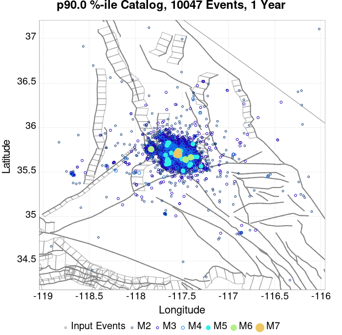
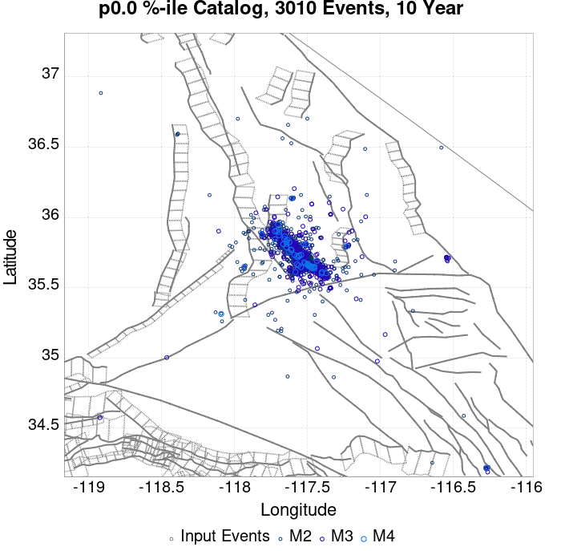
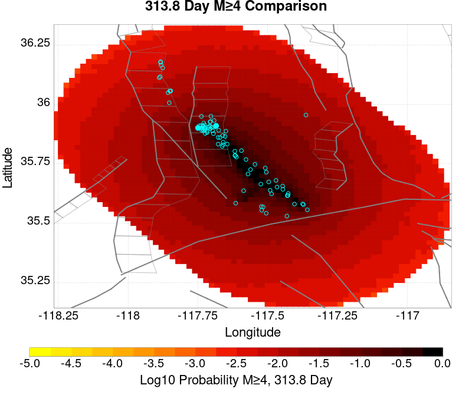
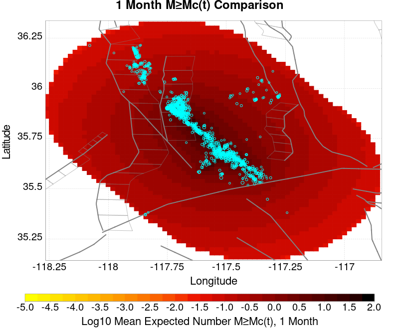

# ComCat M7.1 (ci38457511), ShakeMap Surfaces, Log10(k)=-2.3856, p=1.2164, c=0.0068906, No Faults Results

|   | ComCat M7.1 (ci38457511), ShakeMap Surfaces, Log10(k)=-2.3856, p=1.2164, c=0.0068906, No Faults |
|-----|-----|
| Num Simulations | 1828 (incomplete) |
| Start Time | 2019/07/06 03:19:54 UTC |
| Start Time Epoch Milliseconds | 1562383194040 |
| Duration | 10 Years |
| Includes Spontaneous? | false |
| Trigger Ruptures | 270 Trigger Ruptures |
|   | First: M3.98 at 2019/07/04 17:02:55 UTC |
|   | Last: M7.1 at 2019/07/06 03:19:53 UTC |
|   | Largest: M7.1 at 2019/07/06 03:19:53 UTC |
| Historical Ruptures | *(none)* |
| Config Generated With | u3etas_comcat_event_config_builder.sh --event-id ci38457511 --num-simulations 100000 --days-before 7 --gridded-only --mag-complete 3.5 --etas-k -2.3856 --etas-p 1.2164 --etas-c 0.0068906 --finite-surf-shakemap --finite-surf-shakemap-min-mag 5 --hpc-site USC_HPC --nodes 36 --hours 24 --queue scec |

## Table Of Contents

* [Probabilities Summary Table](#probabilities-summary-table)
* [Magnitude Number Distribution](#magnitude-number-distribution)
  * [10 Year Magnitude Number Distribution](#10-year-magnitude-number-distribution)
  * [1 Year Magnitude Number Distribution](#1-year-magnitude-number-distribution)
  * [1 Month Magnitude Number Distribution](#1-month-magnitude-number-distribution)
  * [1 Week Magnitude Number Distribution](#1-week-magnitude-number-distribution)
  * [1 Day Magnitude Number Distribution](#1-day-magnitude-number-distribution)
  * [1 Hour Magnitude Number Distribution](#1-hour-magnitude-number-distribution)
* [Hazard Change Over Time](#hazard-change-over-time)
  * [M&ge;5.0 Hazard Change Over Time](#m50-hazard-change-over-time)
  * [M&ge;6.0 Hazard Change Over Time](#m60-hazard-change-over-time)
  * [M&ge;7.0 Hazard Change Over Time](#m70-hazard-change-over-time)
  * [M&ge;8.0 Hazard Change Over Time](#m80-hazard-change-over-time)
* [Trigger Rupture Fault Map](#trigger-rupture-fault-map)
* [Trigger Rupture Depth Map](#trigger-rupture-depth-map)
* [Fault Distances To Triggers](#fault-distances-to-triggers)
* [Individual Simulated Catalog Maps](#individual-simulated-catalog-maps)
* [ComCat Data Comparisons](#comcat-data-comparisons)
  * [ComCat Magnitude-Number Distributions](#comcat-magnitude-number-distributions)
  * [ComCat Time-Dependent Mc](#comcat-time-dependent-mc)
  * [ComCat Cumulative Number Vs Time](#comcat-cumulative-number-vs-time)
  * [ComCat Cumulative Number Simulation Percentiles](#comcat-cumulative-number-simulation-percentiles)
  * [ComCat Probability Spatial Distribution](#comcat-probability-spatial-distribution)
  * [ComCat Mean Expectation Spatial Distribution](#comcat-mean-expectation-spatial-distribution)
  * [ComCat Depth Distribution](#comcat-depth-distribution)
* [Gridded Nucleation](#gridded-nucleation)
* [JSON Input File](#json-input-file)

## Probabilities Summary Table
*[(top)](#table-of-contents)*

| Magnitude | 1 Hour Prob | 1 Day Prob | 1 Week Prob | 1 Month Prob | 1 Year Prob | 10 Year Prob |
|-----|-----|-----|-----|-----|-----|-----|
| **M&ge;4** | 1.000 (100.00%) | 1.000 (100.00%) | 1.000 (100.00%) | 1.000 (100.00%) | 1.000 (100.00%) | 1.000 (100.00%) |
| **M&ge;4.5** | 1.000 (100.00%) | 1.000 (100.00%) | 1.000 (100.00%) | 1.000 (100.00%) | 1.000 (100.00%) | 1.000 (100.00%) |
| **M&ge;5** | 0.927 (92.67%) | 0.997 (99.73%) | 0.998 (99.84%) | 0.999 (99.89%) | 1.000 (100.00%) | 1.000 (100.00%) |
| **M&ge;5.5** | 0.585 (58.53%) | 0.861 (86.05%) | 0.924 (92.40%) | 0.948 (94.80%) | 0.968 (96.83%) | 0.973 (97.26%) |
| **M&ge;6** | 0.249 (24.89%) | 0.486 (48.63%) | 0.586 (58.64%) | 0.635 (63.51%) | 0.681 (68.05%) | 0.704 (70.40%) |
| **M&ge;6.5** | 0.103 (10.34%) | 0.211 (21.06%) | 0.274 (27.41%) | 0.303 (30.31%) | 0.340 (34.03%) | 0.364 (36.38%) |
| **M&ge;7** | 0.034 (3.39%) | 0.073 (7.33%) | 0.097 (9.68%) | 0.112 (11.16%) | 0.127 (12.69%) | 0.139 (13.95%) |
| **M&ge;7.1** | 0.029 (2.90%) | 0.060 (5.96%) | 0.080 (8.04%) | 0.092 (9.19%) | 0.105 (10.50%) | 0.117 (11.65%) |
| **M&ge;7.5** | 7.66E-3 (0.77%) | 0.018 (1.75%) | 0.032 (3.17%) | 0.036 (3.61%) | 0.046 (4.65%) | 0.053 (5.25%) |
| **M&ge;8** | 1.64E-3 (0.16%) | 3.28E-3 (0.33%) | 6.56E-3 (0.66%) | 6.56E-3 (0.66%) | 0.011 (1.15%) | 0.013 (1.31%) |

## Magnitude Number Distribution
*[(top)](#table-of-contents)*

### 10 Year Magnitude Number Distribution
*[(top)](#table-of-contents)*

**Legend**
* **Mean** (thick black line): mean expected number across all 1828 catalogs
* **2.5%,97.5%** (thin black lines): expected number percentiles across all 1828 catalogs
* **Median** (thin blue line): median expected number across all 1828 catalogs
* **Mode** (thin cyan line): modal expected number across all 1828 catalogs
* **10 yr Probability** (thin red line): 10 year probability calculated as the fraction of catalogs with at least 1 occurrence
* **10 yr Supraseismogenic Probability** (thin dashed red line): same as above, but only for supraseismogenic ruptures on explicitly modeled UCERF3 faults
* **95% Conf** (light red shaded region): binomial 95% confidence bounds on probability
* **Primary** (thin green line): mean expected number from primary triggered aftershocks only (no secondary, tertiary, etc...) across all 1828 catalogs


| Mag | Mean | 2.5 %ile | 97.5 %ile | Median | Mode | 10 yr Probability | 10 yr Supra-Seis Prob | Primary Aftershocks Mean |
|-----|-----|-----|-----|-----|-----|-----|-----|-----|
| **M&ge;2.5** | 7883.130 | 3478.000 | 32085.000 | 4752.000 | 3916.000 | 1.000 (100.00%) | 0.000 (0.00%) | 2268.876 |
| **M&ge;2.6** | 6262.296 | 2766.000 | 25395.000 | 3775.000 | 3133.000 | 1.000 (100.00%) | 0.000 (0.00%) | 1801.906 |
| **M&ge;2.7** | 4974.870 | 2194.000 | 20229.000 | 3006.000 | 2647.000 | 1.000 (100.00%) | 0.000 (0.00%) | 1431.391 |
| **M&ge;2.8** | 3952.263 | 1739.000 | 16220.000 | 2392.000 | 2058.000 | 1.000 (100.00%) | 0.000 (0.00%) | 1137.077 |
| **M&ge;2.9** | 3139.341 | 1383.000 | 12906.000 | 1895.000 | 1679.000 | 1.000 (100.00%) | 0.000 (0.00%) | 903.087 |
| **M&ge;3** | 2493.847 | 1097.000 | 10269.000 | 1506.000 | 1337.000 | 1.000 (100.00%) | 0.000 (0.00%) | 717.396 |
| **M&ge;3.1** | 1980.667 | 865.000 | 8153.000 | 1198.000 | 1047.000 | 1.000 (100.00%) | 0.000 (0.00%) | 569.862 |
| **M&ge;3.2** | 1573.836 | 685.000 | 6429.000 | 951.000 | 785.000 | 1.000 (100.00%) | 0.000 (0.00%) | 452.600 |
| **M&ge;3.3** | 1250.461 | 537.000 | 5093.000 | 754.000 | 657.000 | 1.000 (100.00%) | 0.000 (0.00%) | 359.464 |
| **M&ge;3.4** | 993.080 | 424.000 | 4092.000 | 598.000 | 535.000 | 1.000 (100.00%) | 0.000 (0.00%) | 285.457 |
| **M&ge;3.5** | 788.435 | 332.000 | 3248.000 | 476.000 | 394.000 | 1.000 (100.00%) | 0.000 (0.00%) | 226.371 |
| **M&ge;3.6** | 626.189 | 261.000 | 2596.000 | 381.000 | 321.000 | 1.000 (100.00%) | 0.000 (0.00%) | 179.863 |
| **M&ge;3.7** | 497.411 | 205.000 | 2088.000 | 303.000 | 249.000 | 1.000 (100.00%) | 0.000 (0.00%) | 142.874 |
| **M&ge;3.8** | 395.092 | 159.000 | 1655.000 | 240.000 | 187.000 | 1.000 (100.00%) | 0.000 (0.00%) | 113.613 |
| **M&ge;3.9** | 313.876 | 126.000 | 1313.000 | 191.000 | 152.000 | 1.000 (100.00%) | 0.000 (0.00%) | 90.369 |
| **M&ge;4** | 249.391 | 99.000 | 1034.000 | 152.000 | 124.000 | 1.000 (100.00%) | 0.000 (0.00%) | 71.895 |
| **M&ge;4.1** | 197.943 | 76.000 | 821.000 | 121.000 | 105.000 | 1.000 (100.00%) | 0.000 (0.00%) | 57.183 |
| **M&ge;4.2** | 157.335 | 59.000 | 658.000 | 97.000 | 86.000 | 1.000 (100.00%) | 0.000 (0.00%) | 45.498 |
| **M&ge;4.3** | 124.637 | 45.000 | 525.000 | 77.000 | 66.000 | 1.000 (100.00%) | 0.000 (0.00%) | 36.025 |
| **M&ge;4.4** | 99.048 | 34.000 | 413.000 | 61.000 | 49.000 | 1.000 (100.00%) | 0.000 (0.00%) | 28.635 |
| **M&ge;4.5** | 78.776 | 26.000 | 324.000 | 49.000 | 43.000 | 1.000 (100.00%) | 0.000 (0.00%) | 22.751 |
| **M&ge;4.6** | 62.520 | 19.000 | 260.000 | 39.000 | 32.000 | 1.000 (100.00%) | 0.000 (0.00%) | 18.053 |
| **M&ge;4.7** | 49.652 | 15.000 | 200.000 | 31.000 | 23.000 | 1.000 (100.00%) | 0.000 (0.00%) | 14.355 |
| **M&ge;4.8** | 39.417 | 11.000 | 161.000 | 25.000 | 20.000 | 1.000 (100.00%) | 0.000 (0.00%) | 11.414 |
| **M&ge;4.9** | 31.303 | 8.000 | 132.000 | 20.000 | 16.000 | 1.000 (100.00%) | 0.000 (0.00%) | 9.072 |
| **M&ge;5** | 24.859 | 5.000 | 106.000 | 16.000 | 13.000 | 1.000 (100.00%) | 0.000 (0.00%) | 7.226 |
| **M&ge;5.1** | 19.745 | 4.000 | 84.000 | 12.000 | 9.000 | 1.000 (100.00%) | 0.000 (0.00%) | 5.714 |
| **M&ge;5.2** | 15.694 | 3.000 | 66.000 | 10.000 | 7.000 | 0.999 (99.95%) | 0.000 (0.00%) | 4.538 |
| **M&ge;5.3** | 12.455 | 2.000 | 55.000 | 8.000 | 7.000 | 0.996 (99.62%) | 0.000 (0.00%) | 3.571 |
| **M&ge;5.4** | 9.923 | 1.000 | 47.000 | 6.000 | 4.000 | 0.989 (98.91%) | 0.000 (0.00%) | 2.867 |
| **M&ge;5.5** | 7.848 | 0.000 | 35.000 | 5.000 | 4.000 | 0.973 (97.26%) | 0.000 (0.00%) | 2.261 |
| **M&ge;5.6** | 6.216 | 0.000 | 28.000 | 4.000 | 3.000 | 0.940 (93.98%) | 0.000 (0.00%) | 1.768 |
| **M&ge;5.7** | 4.921 | 0.000 | 22.000 | 3.000 | 2.000 | 0.899 (89.88%) | 0.000 (0.00%) | 1.408 |
| **M&ge;5.8** | 3.887 | 0.000 | 18.000 | 2.000 | 1.000 | 0.844 (84.35%) | 0.000 (0.00%) | 1.109 |
| **M&ge;5.9** | 3.092 | 0.000 | 15.000 | 2.000 | 1.000 | 0.772 (77.19%) | 0.000 (0.00%) | 0.880 |
| **M&ge;6** | 2.464 | 0.000 | 13.000 | 1.000 | 0.000 | 0.704 (70.40%) | 0.000 (0.00%) | 0.707 |
| **M&ge;6.1** | 1.974 | 0.000 | 10.000 | 1.000 | 0.000 | 0.635 (63.51%) | 0.000 (0.00%) | 0.580 |
| **M&ge;6.2** | 1.573 | 0.000 | 8.000 | 1.000 | 0.000 | 0.561 (56.07%) | 0.000 (0.00%) | 0.471 |
| **M&ge;6.3** | 1.251 | 0.000 | 7.000 | 0.000 | 0.000 | 0.488 (48.80%) | 0.000 (0.00%) | 0.373 |
| **M&ge;6.4** | 0.997 | 0.000 | 6.000 | 0.000 | 0.000 | 0.428 (42.78%) | 0.000 (0.00%) | 0.310 |
| **M&ge;6.5** | 0.792 | 0.000 | 5.000 | 0.000 | 0.000 | 0.364 (36.38%) | 0.000 (0.00%) | 0.249 |
| **M&ge;6.6** | 0.636 | 0.000 | 4.000 | 0.000 | 0.000 | 0.315 (31.51%) | 0.000 (0.00%) | 0.201 |
| **M&ge;6.7** | 0.492 | 0.000 | 3.000 | 0.000 | 0.000 | 0.261 (26.15%) | 0.000 (0.00%) | 0.154 |
| **M&ge;6.8** | 0.387 | 0.000 | 3.000 | 0.000 | 0.000 | 0.218 (21.83%) | 0.000 (0.00%) | 0.123 |
| **M&ge;6.9** | 0.295 | 0.000 | 2.000 | 0.000 | 0.000 | 0.173 (17.29%) | 0.000 (0.00%) | 0.090 |
| **M&ge;7** | 0.234 | 0.000 | 2.000 | 0.000 | 0.000 | 0.139 (13.95%) | 0.000 (0.00%) | 0.071 |
| **M&ge;7.1** | 0.185 | 0.000 | 2.000 | 0.000 | 0.000 | 0.117 (11.65%) | 0.000 (0.00%) | 0.057 |
| **M&ge;7.2** | 0.144 | 0.000 | 2.000 | 0.000 | 0.000 | 0.091 (9.14%) | 0.000 (0.00%) | 0.043 |
| **M&ge;7.3** | 0.114 | 0.000 | 1.000 | 0.000 | 0.000 | 0.077 (7.71%) | 0.000 (0.00%) | 0.033 |
| **M&ge;7.4** | 0.091 | 0.000 | 1.000 | 0.000 | 0.000 | 0.065 (6.46%) | 0.000 (0.00%) | 0.024 |
| **M&ge;7.5** | 0.071 | 0.000 | 1.000 | 0.000 | 0.000 | 0.053 (5.25%) | 0.000 (0.00%) | 0.019 |
| **M&ge;7.6** | 0.052 | 0.000 | 1.000 | 0.000 | 0.000 | 0.040 (3.99%) | 0.000 (0.00%) | 0.014 |
| **M&ge;7.7** | 0.044 | 0.000 | 1.000 | 0.000 | 0.000 | 0.034 (3.45%) | 0.000 (0.00%) | 0.012 |
| **M&ge;7.8** | 0.032 | 0.000 | 0.000 | 0.000 | 0.000 | 0.025 (2.46%) | 0.000 (0.00%) | 9.85E-3 |
| **M&ge;7.9** | 0.024 | 0.000 | 0.000 | 0.000 | 0.000 | 0.019 (1.91%) | 0.000 (0.00%) | 7.11E-3 |
| **M&ge;8** | 0.015 | 0.000 | 0.000 | 0.000 | 0.000 | 0.013 (1.31%) | 0.000 (0.00%) | 5.47E-3 |
| **M&ge;8.1** | 8.75E-3 | 0.000 | 0.000 | 0.000 | 0.000 | 7.11E-3 (0.71%) | 0.000 (0.00%) | 3.28E-3 |
| **M&ge;8.2** | 4.38E-3 | 0.000 | 0.000 | 0.000 | 0.000 | 3.83E-3 (0.38%) | 0.000 (0.00%) | 1.64E-3 |
| **M&ge;8.3** | 0.000 | 0.000 | 0.000 | 0.000 | 0.000 | 0.000 (0.00%) | 0.000 (0.00%) | 0.000 |
| **M&ge;8.4** | 0.000 | 0.000 | 0.000 | 0.000 | 0.000 | 0.000 (0.00%) | 0.000 (0.00%) | 0.000 |
| **M&ge;8.5** | 0.000 | 0.000 | 0.000 | 0.000 | 0.000 | 0.000 (0.00%) | 0.000 (0.00%) | 0.000 |
| **M&ge;8.6** | 0.000 | 0.000 | 0.000 | 0.000 | 0.000 | 0.000 (0.00%) | 0.000 (0.00%) | 0.000 |
| **M&ge;8.7** | 0.000 | 0.000 | 0.000 | 0.000 | 0.000 | 0.000 (0.00%) | 0.000 (0.00%) | 0.000 |
| **M&ge;8.8** | 0.000 | 0.000 | 0.000 | 0.000 | 0.000 | 0.000 (0.00%) | 0.000 (0.00%) | 0.000 |
| **M&ge;8.9** | 0.000 | 0.000 | 0.000 | 0.000 | 0.000 | 0.000 (0.00%) | 0.000 (0.00%) | 0.000 |
| **M&ge;9** | 0.000 | 0.000 | 0.000 | 0.000 | 0.000 | 0.000 (0.00%) | 0.000 (0.00%) | 0.000 |

### 1 Year Magnitude Number Distribution
*[(top)](#table-of-contents)*

**Legend**
* **Mean** (thick black line): mean expected number across all 1828 catalogs
* **2.5%,97.5%** (thin black lines): expected number percentiles across all 1828 catalogs
* **Median** (thin blue line): median expected number across all 1828 catalogs
* **Mode** (thin cyan line): modal expected number across all 1828 catalogs
* **1 yr Probability** (thin red line): 1 year probability calculated as the fraction of catalogs with at least 1 occurrence
* **1 yr Supraseismogenic Probability** (thin dashed red line): same as above, but only for supraseismogenic ruptures on explicitly modeled UCERF3 faults
* **95% Conf** (light red shaded region): binomial 95% confidence bounds on probability
* **Primary** (thin green line): mean expected number from primary triggered aftershocks only (no secondary, tertiary, etc...) across all 1828 catalogs


| Mag | Mean | 2.5 %ile | 97.5 %ile | Median | Mode | 1 yr Probability | 1 yr Supra-Seis Prob | Primary Aftershocks Mean |
|-----|-----|-----|-----|-----|-----|-----|-----|-----|
| **M&ge;2.5** | 6647.892 | 3240.000 | 27392.000 | 4316.000 | 3766.000 | 1.000 (100.00%) | 0.000 (0.00%) | 2162.575 |
| **M&ge;2.6** | 5281.022 | 2572.000 | 21779.000 | 3437.000 | 2875.000 | 1.000 (100.00%) | 0.000 (0.00%) | 1717.554 |
| **M&ge;2.7** | 4195.184 | 2041.000 | 17161.000 | 2728.000 | 2324.000 | 1.000 (100.00%) | 0.000 (0.00%) | 1364.288 |
| **M&ge;2.8** | 3332.810 | 1617.000 | 13575.000 | 2168.000 | 1806.000 | 1.000 (100.00%) | 0.000 (0.00%) | 1083.755 |
| **M&ge;2.9** | 2647.232 | 1282.000 | 10773.000 | 1716.000 | 1651.000 | 1.000 (100.00%) | 0.000 (0.00%) | 860.707 |
| **M&ge;3** | 2103.057 | 1021.000 | 8577.000 | 1370.000 | 1138.000 | 1.000 (100.00%) | 0.000 (0.00%) | 683.787 |
| **M&ge;3.1** | 1670.137 | 807.000 | 6845.000 | 1084.000 | 923.000 | 1.000 (100.00%) | 0.000 (0.00%) | 543.248 |
| **M&ge;3.2** | 1327.032 | 634.000 | 5426.000 | 862.000 | 735.000 | 1.000 (100.00%) | 0.000 (0.00%) | 431.557 |
| **M&ge;3.3** | 1054.240 | 499.000 | 4318.000 | 684.000 | 586.000 | 1.000 (100.00%) | 0.000 (0.00%) | 342.775 |
| **M&ge;3.4** | 837.241 | 393.000 | 3415.000 | 546.000 | 494.000 | 1.000 (100.00%) | 0.000 (0.00%) | 272.252 |
| **M&ge;3.5** | 664.722 | 308.000 | 2689.000 | 434.000 | 395.000 | 1.000 (100.00%) | 0.000 (0.00%) | 215.897 |
| **M&ge;3.6** | 528.002 | 241.000 | 2138.000 | 346.000 | 314.000 | 1.000 (100.00%) | 0.000 (0.00%) | 171.570 |
| **M&ge;3.7** | 419.338 | 187.000 | 1715.000 | 275.000 | 238.000 | 1.000 (100.00%) | 0.000 (0.00%) | 136.312 |
| **M&ge;3.8** | 333.078 | 148.000 | 1367.000 | 220.000 | 179.000 | 1.000 (100.00%) | 0.000 (0.00%) | 108.413 |
| **M&ge;3.9** | 264.628 | 116.000 | 1089.000 | 175.000 | 147.000 | 1.000 (100.00%) | 0.000 (0.00%) | 86.248 |
| **M&ge;4** | 210.353 | 91.000 | 865.000 | 139.000 | 113.000 | 1.000 (100.00%) | 0.000 (0.00%) | 68.617 |
| **M&ge;4.1** | 167.007 | 69.000 | 689.000 | 110.000 | 94.000 | 1.000 (100.00%) | 0.000 (0.00%) | 54.573 |
| **M&ge;4.2** | 132.800 | 54.000 | 548.000 | 88.000 | 76.000 | 1.000 (100.00%) | 0.000 (0.00%) | 43.432 |
| **M&ge;4.3** | 105.156 | 40.000 | 443.000 | 70.000 | 57.000 | 1.000 (100.00%) | 0.000 (0.00%) | 34.377 |
| **M&ge;4.4** | 83.516 | 31.000 | 354.000 | 56.000 | 45.000 | 1.000 (100.00%) | 0.000 (0.00%) | 27.300 |
| **M&ge;4.5** | 66.438 | 23.000 | 272.000 | 44.000 | 39.000 | 1.000 (100.00%) | 0.000 (0.00%) | 21.694 |
| **M&ge;4.6** | 52.689 | 17.000 | 216.000 | 36.000 | 29.000 | 1.000 (100.00%) | 0.000 (0.00%) | 17.217 |
| **M&ge;4.7** | 41.868 | 13.000 | 171.000 | 28.000 | 25.000 | 1.000 (100.00%) | 0.000 (0.00%) | 13.684 |
| **M&ge;4.8** | 33.187 | 10.000 | 136.000 | 22.000 | 17.000 | 1.000 (100.00%) | 0.000 (0.00%) | 10.881 |
| **M&ge;4.9** | 26.361 | 7.000 | 114.000 | 18.000 | 14.000 | 1.000 (100.00%) | 0.000 (0.00%) | 8.658 |
| **M&ge;5** | 20.951 | 5.000 | 89.000 | 14.000 | 10.000 | 1.000 (100.00%) | 0.000 (0.00%) | 6.885 |
| **M&ge;5.1** | 16.661 | 3.000 | 69.000 | 11.000 | 10.000 | 1.000 (100.00%) | 0.000 (0.00%) | 5.443 |
| **M&ge;5.2** | 13.222 | 2.000 | 55.000 | 9.000 | 7.000 | 0.999 (99.95%) | 0.000 (0.00%) | 4.320 |
| **M&ge;5.3** | 10.472 | 1.000 | 45.000 | 7.000 | 6.000 | 0.995 (99.45%) | 0.000 (0.00%) | 3.401 |
| **M&ge;5.4** | 8.351 | 1.000 | 36.000 | 6.000 | 4.000 | 0.985 (98.47%) | 0.000 (0.00%) | 2.726 |
| **M&ge;5.5** | 6.601 | 0.000 | 29.000 | 4.000 | 3.000 | 0.968 (96.83%) | 0.000 (0.00%) | 2.151 |
| **M&ge;5.6** | 5.211 | 0.000 | 22.000 | 3.000 | 2.000 | 0.930 (93.00%) | 0.000 (0.00%) | 1.682 |
| **M&ge;5.7** | 4.131 | 0.000 | 18.000 | 3.000 | 2.000 | 0.883 (88.29%) | 0.000 (0.00%) | 1.339 |
| **M&ge;5.8** | 3.255 | 0.000 | 14.000 | 2.000 | 1.000 | 0.821 (82.06%) | 0.000 (0.00%) | 1.054 |
| **M&ge;5.9** | 2.571 | 0.000 | 12.000 | 2.000 | 0.000 | 0.749 (74.95%) | 0.000 (0.00%) | 0.834 |
| **M&ge;6** | 2.050 | 0.000 | 10.000 | 1.000 | 0.000 | 0.681 (68.05%) | 0.000 (0.00%) | 0.670 |
| **M&ge;6.1** | 1.641 | 0.000 | 8.000 | 1.000 | 0.000 | 0.611 (61.05%) | 0.000 (0.00%) | 0.552 |
| **M&ge;6.2** | 1.314 | 0.000 | 7.000 | 1.000 | 0.000 | 0.534 (53.45%) | 0.000 (0.00%) | 0.447 |
| **M&ge;6.3** | 1.044 | 0.000 | 6.000 | 0.000 | 0.000 | 0.458 (45.79%) | 0.000 (0.00%) | 0.355 |
| **M&ge;6.4** | 0.837 | 0.000 | 5.000 | 0.000 | 0.000 | 0.400 (40.04%) | 0.000 (0.00%) | 0.295 |
| **M&ge;6.5** | 0.663 | 0.000 | 4.000 | 0.000 | 0.000 | 0.340 (34.03%) | 0.000 (0.00%) | 0.237 |
| **M&ge;6.6** | 0.531 | 0.000 | 4.000 | 0.000 | 0.000 | 0.293 (29.32%) | 0.000 (0.00%) | 0.191 |
| **M&ge;6.7** | 0.416 | 0.000 | 3.000 | 0.000 | 0.000 | 0.243 (24.29%) | 0.000 (0.00%) | 0.149 |
| **M&ge;6.8** | 0.329 | 0.000 | 3.000 | 0.000 | 0.000 | 0.201 (20.13%) | 0.000 (0.00%) | 0.117 |
| **M&ge;6.9** | 0.250 | 0.000 | 2.000 | 0.000 | 0.000 | 0.159 (15.86%) | 0.000 (0.00%) | 0.085 |
| **M&ge;7** | 0.197 | 0.000 | 2.000 | 0.000 | 0.000 | 0.127 (12.69%) | 0.000 (0.00%) | 0.067 |
| **M&ge;7.1** | 0.156 | 0.000 | 2.000 | 0.000 | 0.000 | 0.105 (10.50%) | 0.000 (0.00%) | 0.054 |
| **M&ge;7.2** | 0.120 | 0.000 | 1.000 | 0.000 | 0.000 | 0.082 (8.15%) | 0.000 (0.00%) | 0.041 |
| **M&ge;7.3** | 0.093 | 0.000 | 1.000 | 0.000 | 0.000 | 0.067 (6.73%) | 0.000 (0.00%) | 0.032 |
| **M&ge;7.4** | 0.074 | 0.000 | 1.000 | 0.000 | 0.000 | 0.057 (5.69%) | 0.000 (0.00%) | 0.022 |
| **M&ge;7.5** | 0.057 | 0.000 | 1.000 | 0.000 | 0.000 | 0.046 (4.65%) | 0.000 (0.00%) | 0.018 |
| **M&ge;7.6** | 0.041 | 0.000 | 1.000 | 0.000 | 0.000 | 0.036 (3.56%) | 0.000 (0.00%) | 0.013 |
| **M&ge;7.7** | 0.036 | 0.000 | 1.000 | 0.000 | 0.000 | 0.032 (3.17%) | 0.000 (0.00%) | 0.011 |
| **M&ge;7.8** | 0.024 | 0.000 | 0.000 | 0.000 | 0.000 | 0.022 (2.19%) | 0.000 (0.00%) | 8.75E-3 |
| **M&ge;7.9** | 0.018 | 0.000 | 0.000 | 0.000 | 0.000 | 0.017 (1.70%) | 0.000 (0.00%) | 6.02E-3 |
| **M&ge;8** | 0.012 | 0.000 | 0.000 | 0.000 | 0.000 | 0.011 (1.15%) | 0.000 (0.00%) | 4.38E-3 |
| **M&ge;8.1** | 6.02E-3 | 0.000 | 0.000 | 0.000 | 0.000 | 5.47E-3 (0.55%) | 0.000 (0.00%) | 2.19E-3 |
| **M&ge;8.2** | 2.19E-3 | 0.000 | 0.000 | 0.000 | 0.000 | 2.19E-3 (0.22%) | 0.000 (0.00%) | 5.47E-4 |
| **M&ge;8.3** | 0.000 | 0.000 | 0.000 | 0.000 | 0.000 | 0.000 (0.00%) | 0.000 (0.00%) | 0.000 |
| **M&ge;8.4** | 0.000 | 0.000 | 0.000 | 0.000 | 0.000 | 0.000 (0.00%) | 0.000 (0.00%) | 0.000 |
| **M&ge;8.5** | 0.000 | 0.000 | 0.000 | 0.000 | 0.000 | 0.000 (0.00%) | 0.000 (0.00%) | 0.000 |
| **M&ge;8.6** | 0.000 | 0.000 | 0.000 | 0.000 | 0.000 | 0.000 (0.00%) | 0.000 (0.00%) | 0.000 |
| **M&ge;8.7** | 0.000 | 0.000 | 0.000 | 0.000 | 0.000 | 0.000 (0.00%) | 0.000 (0.00%) | 0.000 |
| **M&ge;8.8** | 0.000 | 0.000 | 0.000 | 0.000 | 0.000 | 0.000 (0.00%) | 0.000 (0.00%) | 0.000 |
| **M&ge;8.9** | 0.000 | 0.000 | 0.000 | 0.000 | 0.000 | 0.000 (0.00%) | 0.000 (0.00%) | 0.000 |
| **M&ge;9** | 0.000 | 0.000 | 0.000 | 0.000 | 0.000 | 0.000 (0.00%) | 0.000 (0.00%) | 0.000 |

### 1 Month Magnitude Number Distribution
*[(top)](#table-of-contents)*

**Legend**
* **Mean** (thick black line): mean expected number across all 1828 catalogs
* **2.5%,97.5%** (thin black lines): expected number percentiles across all 1828 catalogs
* **Median** (thin blue line): median expected number across all 1828 catalogs
* **Mode** (thin cyan line): modal expected number across all 1828 catalogs
* **1 mo Probability** (thin red line): 1 month probability calculated as the fraction of catalogs with at least 1 occurrence
* **1 mo Supraseismogenic Probability** (thin dashed red line): same as above, but only for supraseismogenic ruptures on explicitly modeled UCERF3 faults
* **95% Conf** (light red shaded region): binomial 95% confidence bounds on probability
* **Primary** (thin green line): mean expected number from primary triggered aftershocks only (no secondary, tertiary, etc...) across all 1828 catalogs


| Mag | Mean | 2.5 %ile | 97.5 %ile | Median | Mode | 1 mo Probability | 1 mo Supra-Seis Prob | Primary Aftershocks Mean |
|-----|-----|-----|-----|-----|-----|-----|-----|-----|
| **M&ge;2.5** | 5163.090 | 2814.000 | 19397.000 | 3578.000 | 3106.000 | 1.000 (100.00%) | 0.000 (0.00%) | 1968.862 |
| **M&ge;2.6** | 4101.154 | 2229.000 | 15456.000 | 2847.000 | 2560.000 | 1.000 (100.00%) | 0.000 (0.00%) | 1563.932 |
| **M&ge;2.7** | 3257.793 | 1760.000 | 12311.000 | 2266.000 | 1911.000 | 1.000 (100.00%) | 0.000 (0.00%) | 1242.229 |
| **M&ge;2.8** | 2588.319 | 1393.000 | 9795.000 | 1802.000 | 1586.000 | 1.000 (100.00%) | 0.000 (0.00%) | 986.836 |
| **M&ge;2.9** | 2056.232 | 1101.000 | 7799.000 | 1437.000 | 1267.000 | 1.000 (100.00%) | 0.000 (0.00%) | 783.794 |
| **M&ge;3** | 1633.385 | 876.000 | 6164.000 | 1143.000 | 987.000 | 1.000 (100.00%) | 0.000 (0.00%) | 622.684 |
| **M&ge;3.1** | 1297.138 | 695.000 | 4878.000 | 907.000 | 822.000 | 1.000 (100.00%) | 0.000 (0.00%) | 494.811 |
| **M&ge;3.2** | 1030.504 | 547.000 | 3895.000 | 721.000 | 649.000 | 1.000 (100.00%) | 0.000 (0.00%) | 393.051 |
| **M&ge;3.3** | 818.797 | 433.000 | 3086.000 | 575.000 | 501.000 | 1.000 (100.00%) | 0.000 (0.00%) | 312.169 |
| **M&ge;3.4** | 650.330 | 340.000 | 2433.000 | 456.000 | 390.000 | 1.000 (100.00%) | 0.000 (0.00%) | 247.964 |
| **M&ge;3.5** | 516.249 | 265.000 | 1949.000 | 362.000 | 340.000 | 1.000 (100.00%) | 0.000 (0.00%) | 196.682 |
| **M&ge;3.6** | 410.230 | 207.000 | 1541.000 | 289.000 | 248.000 | 1.000 (100.00%) | 0.000 (0.00%) | 156.385 |
| **M&ge;3.7** | 325.874 | 161.000 | 1238.000 | 230.000 | 212.000 | 1.000 (100.00%) | 0.000 (0.00%) | 124.277 |
| **M&ge;3.8** | 258.774 | 127.000 | 969.000 | 183.000 | 162.000 | 1.000 (100.00%) | 0.000 (0.00%) | 98.879 |
| **M&ge;3.9** | 205.534 | 99.000 | 781.000 | 146.000 | 125.000 | 1.000 (100.00%) | 0.000 (0.00%) | 78.635 |
| **M&ge;4** | 163.405 | 78.000 | 617.000 | 116.000 | 98.000 | 1.000 (100.00%) | 0.000 (0.00%) | 62.598 |
| **M&ge;4.1** | 129.718 | 59.000 | 484.000 | 92.000 | 89.000 | 1.000 (100.00%) | 0.000 (0.00%) | 49.812 |
| **M&ge;4.2** | 103.143 | 46.000 | 388.000 | 73.000 | 67.000 | 1.000 (100.00%) | 0.000 (0.00%) | 39.623 |
| **M&ge;4.3** | 81.640 | 35.000 | 305.000 | 58.000 | 50.000 | 1.000 (100.00%) | 0.000 (0.00%) | 31.343 |
| **M&ge;4.4** | 64.874 | 26.000 | 246.000 | 46.000 | 43.000 | 1.000 (100.00%) | 0.000 (0.00%) | 24.885 |
| **M&ge;4.5** | 51.613 | 20.000 | 191.000 | 37.000 | 31.000 | 1.000 (100.00%) | 0.000 (0.00%) | 19.786 |
| **M&ge;4.6** | 40.965 | 14.000 | 151.000 | 30.000 | 27.000 | 1.000 (100.00%) | 0.000 (0.00%) | 15.699 |
| **M&ge;4.7** | 32.558 | 11.000 | 124.000 | 24.000 | 19.000 | 1.000 (100.00%) | 0.000 (0.00%) | 12.468 |
| **M&ge;4.8** | 25.799 | 8.000 | 96.000 | 19.000 | 17.000 | 1.000 (100.00%) | 0.000 (0.00%) | 9.924 |
| **M&ge;4.9** | 20.512 | 6.000 | 77.000 | 15.000 | 12.000 | 1.000 (100.00%) | 0.000 (0.00%) | 7.908 |
| **M&ge;5** | 16.319 | 4.000 | 59.000 | 12.000 | 10.000 | 0.999 (99.89%) | 0.000 (0.00%) | 6.297 |
| **M&ge;5.1** | 12.978 | 3.000 | 46.000 | 9.000 | 8.000 | 0.998 (99.84%) | 0.000 (0.00%) | 4.962 |
| **M&ge;5.2** | 10.325 | 2.000 | 38.000 | 7.000 | 6.000 | 0.997 (99.67%) | 0.000 (0.00%) | 3.948 |
| **M&ge;5.3** | 8.180 | 1.000 | 31.000 | 6.000 | 6.000 | 0.987 (98.74%) | 0.000 (0.00%) | 3.107 |
| **M&ge;5.4** | 6.537 | 1.000 | 24.000 | 5.000 | 3.000 | 0.976 (97.59%) | 0.000 (0.00%) | 2.493 |
| **M&ge;5.5** | 5.149 | 0.000 | 20.000 | 4.000 | 3.000 | 0.948 (94.80%) | 0.000 (0.00%) | 1.963 |
| **M&ge;5.6** | 4.067 | 0.000 | 15.000 | 3.000 | 2.000 | 0.903 (90.26%) | 0.000 (0.00%) | 1.540 |
| **M&ge;5.7** | 3.228 | 0.000 | 13.000 | 2.000 | 1.000 | 0.847 (84.68%) | 0.000 (0.00%) | 1.226 |
| **M&ge;5.8** | 2.547 | 0.000 | 11.000 | 2.000 | 1.000 | 0.781 (78.06%) | 0.000 (0.00%) | 0.971 |
| **M&ge;5.9** | 2.016 | 0.000 | 9.000 | 1.000 | 0.000 | 0.708 (70.84%) | 0.000 (0.00%) | 0.769 |
| **M&ge;6** | 1.609 | 0.000 | 8.000 | 1.000 | 0.000 | 0.635 (63.51%) | 0.000 (0.00%) | 0.617 |
| **M&ge;6.1** | 1.289 | 0.000 | 6.000 | 1.000 | 0.000 | 0.563 (56.35%) | 0.000 (0.00%) | 0.510 |
| **M&ge;6.2** | 1.036 | 0.000 | 5.000 | 0.000 | 0.000 | 0.489 (48.91%) | 0.000 (0.00%) | 0.414 |
| **M&ge;6.3** | 0.824 | 0.000 | 4.000 | 0.000 | 0.000 | 0.414 (41.41%) | 0.000 (0.00%) | 0.332 |
| **M&ge;6.4** | 0.664 | 0.000 | 4.000 | 0.000 | 0.000 | 0.359 (35.89%) | 0.000 (0.00%) | 0.276 |
| **M&ge;6.5** | 0.532 | 0.000 | 3.000 | 0.000 | 0.000 | 0.303 (30.31%) | 0.000 (0.00%) | 0.221 |
| **M&ge;6.6** | 0.426 | 0.000 | 3.000 | 0.000 | 0.000 | 0.258 (25.82%) | 0.000 (0.00%) | 0.178 |
| **M&ge;6.7** | 0.331 | 0.000 | 2.000 | 0.000 | 0.000 | 0.212 (21.23%) | 0.000 (0.00%) | 0.137 |
| **M&ge;6.8** | 0.263 | 0.000 | 2.000 | 0.000 | 0.000 | 0.177 (17.67%) | 0.000 (0.00%) | 0.108 |
| **M&ge;6.9** | 0.195 | 0.000 | 2.000 | 0.000 | 0.000 | 0.138 (13.79%) | 0.000 (0.00%) | 0.078 |
| **M&ge;7** | 0.156 | 0.000 | 1.000 | 0.000 | 0.000 | 0.112 (11.16%) | 0.000 (0.00%) | 0.062 |
| **M&ge;7.1** | 0.125 | 0.000 | 1.000 | 0.000 | 0.000 | 0.092 (9.19%) | 0.000 (0.00%) | 0.050 |
| **M&ge;7.2** | 0.095 | 0.000 | 1.000 | 0.000 | 0.000 | 0.071 (7.06%) | 0.000 (0.00%) | 0.038 |
| **M&ge;7.3** | 0.072 | 0.000 | 1.000 | 0.000 | 0.000 | 0.057 (5.69%) | 0.000 (0.00%) | 0.030 |
| **M&ge;7.4** | 0.057 | 0.000 | 1.000 | 0.000 | 0.000 | 0.047 (4.70%) | 0.000 (0.00%) | 0.021 |
| **M&ge;7.5** | 0.043 | 0.000 | 1.000 | 0.000 | 0.000 | 0.036 (3.61%) | 0.000 (0.00%) | 0.016 |
| **M&ge;7.6** | 0.030 | 0.000 | 1.000 | 0.000 | 0.000 | 0.027 (2.68%) | 0.000 (0.00%) | 0.011 |
| **M&ge;7.7** | 0.027 | 0.000 | 0.000 | 0.000 | 0.000 | 0.024 (2.41%) | 0.000 (0.00%) | 9.85E-3 |
| **M&ge;7.8** | 0.016 | 0.000 | 0.000 | 0.000 | 0.000 | 0.015 (1.53%) | 0.000 (0.00%) | 7.66E-3 |
| **M&ge;7.9** | 0.011 | 0.000 | 0.000 | 0.000 | 0.000 | 0.010 (1.04%) | 0.000 (0.00%) | 4.92E-3 |
| **M&ge;8** | 7.11E-3 | 0.000 | 0.000 | 0.000 | 0.000 | 6.56E-3 (0.66%) | 0.000 (0.00%) | 3.28E-3 |
| **M&ge;8.1** | 4.38E-3 | 0.000 | 0.000 | 0.000 | 0.000 | 3.83E-3 (0.38%) | 0.000 (0.00%) | 1.64E-3 |
| **M&ge;8.2** | 1.64E-3 | 0.000 | 0.000 | 0.000 | 0.000 | 1.64E-3 (0.16%) | 0.000 (0.00%) | 5.47E-4 |
| **M&ge;8.3** | 0.000 | 0.000 | 0.000 | 0.000 | 0.000 | 0.000 (0.00%) | 0.000 (0.00%) | 0.000 |
| **M&ge;8.4** | 0.000 | 0.000 | 0.000 | 0.000 | 0.000 | 0.000 (0.00%) | 0.000 (0.00%) | 0.000 |
| **M&ge;8.5** | 0.000 | 0.000 | 0.000 | 0.000 | 0.000 | 0.000 (0.00%) | 0.000 (0.00%) | 0.000 |
| **M&ge;8.6** | 0.000 | 0.000 | 0.000 | 0.000 | 0.000 | 0.000 (0.00%) | 0.000 (0.00%) | 0.000 |
| **M&ge;8.7** | 0.000 | 0.000 | 0.000 | 0.000 | 0.000 | 0.000 (0.00%) | 0.000 (0.00%) | 0.000 |
| **M&ge;8.8** | 0.000 | 0.000 | 0.000 | 0.000 | 0.000 | 0.000 (0.00%) | 0.000 (0.00%) | 0.000 |
| **M&ge;8.9** | 0.000 | 0.000 | 0.000 | 0.000 | 0.000 | 0.000 (0.00%) | 0.000 (0.00%) | 0.000 |
| **M&ge;9** | 0.000 | 0.000 | 0.000 | 0.000 | 0.000 | 0.000 (0.00%) | 0.000 (0.00%) | 0.000 |

### 1 Week Magnitude Number Distribution
*[(top)](#table-of-contents)*

**Legend**
* **Mean** (thick black line): mean expected number across all 1828 catalogs
* **2.5%,97.5%** (thin black lines): expected number percentiles across all 1828 catalogs
* **Median** (thin blue line): median expected number across all 1828 catalogs
* **Mode** (thin cyan line): modal expected number across all 1828 catalogs
* **1 wk Probability** (thin red line): 1 week probability calculated as the fraction of catalogs with at least 1 occurrence
* **1 wk Supraseismogenic Probability** (thin dashed red line): same as above, but only for supraseismogenic ruptures on explicitly modeled UCERF3 faults
* **95% Conf** (light red shaded region): binomial 95% confidence bounds on probability
* **Primary** (thin green line): mean expected number from primary triggered aftershocks only (no secondary, tertiary, etc...) across all 1828 catalogs


| Mag | Mean | 2.5 %ile | 97.5 %ile | Median | Mode | 1 wk Probability | 1 wk Supra-Seis Prob | Primary Aftershocks Mean |
|-----|-----|-----|-----|-----|-----|-----|-----|-----|
| **M&ge;2.5** | 4219.437 | 2457.000 | 14228.000 | 3055.000 | 2794.000 | 1.000 (100.00%) | 0.000 (0.00%) | 1801.122 |
| **M&ge;2.6** | 3351.690 | 1951.000 | 11289.000 | 2428.000 | 2233.000 | 1.000 (100.00%) | 0.000 (0.00%) | 1430.575 |
| **M&ge;2.7** | 2662.197 | 1546.000 | 8936.000 | 1930.000 | 1886.000 | 1.000 (100.00%) | 0.000 (0.00%) | 1136.406 |
| **M&ge;2.8** | 2115.150 | 1227.000 | 7130.000 | 1534.000 | 1392.000 | 1.000 (100.00%) | 0.000 (0.00%) | 902.927 |
| **M&ge;2.9** | 1680.136 | 970.000 | 5678.000 | 1220.000 | 1120.000 | 1.000 (100.00%) | 0.000 (0.00%) | 717.066 |
| **M&ge;3** | 1334.566 | 769.000 | 4517.000 | 970.000 | 890.000 | 1.000 (100.00%) | 0.000 (0.00%) | 569.624 |
| **M&ge;3.1** | 1059.891 | 610.000 | 3632.000 | 771.000 | 701.000 | 1.000 (100.00%) | 0.000 (0.00%) | 452.695 |
| **M&ge;3.2** | 841.929 | 480.000 | 2864.000 | 613.000 | 569.000 | 1.000 (100.00%) | 0.000 (0.00%) | 359.589 |
| **M&ge;3.3** | 668.845 | 376.000 | 2281.000 | 488.000 | 435.000 | 1.000 (100.00%) | 0.000 (0.00%) | 285.571 |
| **M&ge;3.4** | 531.440 | 296.000 | 1809.000 | 387.000 | 348.000 | 1.000 (100.00%) | 0.000 (0.00%) | 226.906 |
| **M&ge;3.5** | 421.998 | 232.000 | 1447.000 | 308.000 | 291.000 | 1.000 (100.00%) | 0.000 (0.00%) | 179.984 |
| **M&ge;3.6** | 335.426 | 182.000 | 1151.000 | 246.000 | 242.000 | 1.000 (100.00%) | 0.000 (0.00%) | 143.185 |
| **M&ge;3.7** | 266.585 | 139.000 | 931.000 | 196.000 | 184.000 | 1.000 (100.00%) | 0.000 (0.00%) | 113.856 |
| **M&ge;3.8** | 211.833 | 110.000 | 740.000 | 156.000 | 153.000 | 1.000 (100.00%) | 0.000 (0.00%) | 90.626 |
| **M&ge;3.9** | 168.333 | 86.000 | 595.000 | 125.000 | 112.000 | 1.000 (100.00%) | 0.000 (0.00%) | 72.053 |
| **M&ge;4** | 133.885 | 67.000 | 468.000 | 99.000 | 91.000 | 1.000 (100.00%) | 0.000 (0.00%) | 57.381 |
| **M&ge;4.1** | 106.317 | 52.000 | 371.000 | 78.000 | 70.000 | 1.000 (100.00%) | 0.000 (0.00%) | 45.696 |
| **M&ge;4.2** | 84.621 | 40.000 | 301.000 | 63.000 | 55.000 | 1.000 (100.00%) | 0.000 (0.00%) | 36.379 |
| **M&ge;4.3** | 67.013 | 31.000 | 239.000 | 50.000 | 43.000 | 1.000 (100.00%) | 0.000 (0.00%) | 28.800 |
| **M&ge;4.4** | 53.200 | 23.000 | 186.000 | 40.000 | 40.000 | 1.000 (100.00%) | 0.000 (0.00%) | 22.852 |
| **M&ge;4.5** | 42.296 | 17.000 | 143.000 | 32.000 | 29.000 | 1.000 (100.00%) | 0.000 (0.00%) | 18.151 |
| **M&ge;4.6** | 33.579 | 12.000 | 116.000 | 25.000 | 23.000 | 1.000 (100.00%) | 0.000 (0.00%) | 14.400 |
| **M&ge;4.7** | 26.686 | 9.000 | 95.000 | 20.000 | 17.000 | 1.000 (100.00%) | 0.000 (0.00%) | 11.439 |
| **M&ge;4.8** | 21.165 | 7.000 | 73.000 | 16.000 | 12.000 | 1.000 (100.00%) | 0.000 (0.00%) | 9.104 |
| **M&ge;4.9** | 16.823 | 5.000 | 55.000 | 13.000 | 11.000 | 1.000 (100.00%) | 0.000 (0.00%) | 7.258 |
| **M&ge;5** | 13.384 | 3.000 | 44.000 | 10.000 | 9.000 | 0.998 (99.84%) | 0.000 (0.00%) | 5.765 |
| **M&ge;5.1** | 10.641 | 2.000 | 36.000 | 8.000 | 7.000 | 0.998 (99.78%) | 0.000 (0.00%) | 4.542 |
| **M&ge;5.2** | 8.462 | 1.000 | 29.000 | 6.000 | 6.000 | 0.995 (99.45%) | 0.000 (0.00%) | 3.611 |
| **M&ge;5.3** | 6.725 | 1.000 | 23.000 | 5.000 | 3.000 | 0.981 (98.09%) | 0.000 (0.00%) | 2.851 |
| **M&ge;5.4** | 5.392 | 0.000 | 19.000 | 4.000 | 3.000 | 0.962 (96.17%) | 0.000 (0.00%) | 2.287 |
| **M&ge;5.5** | 4.253 | 0.000 | 16.000 | 3.000 | 2.000 | 0.924 (92.40%) | 0.000 (0.00%) | 1.798 |
| **M&ge;5.6** | 3.375 | 0.000 | 12.000 | 2.000 | 1.000 | 0.872 (87.20%) | 0.000 (0.00%) | 1.412 |
| **M&ge;5.7** | 2.687 | 0.000 | 10.000 | 2.000 | 1.000 | 0.809 (80.85%) | 0.000 (0.00%) | 1.124 |
| **M&ge;5.8** | 2.122 | 0.000 | 9.000 | 1.000 | 0.000 | 0.736 (73.58%) | 0.000 (0.00%) | 0.890 |
| **M&ge;5.9** | 1.681 | 0.000 | 7.000 | 1.000 | 0.000 | 0.664 (66.36%) | 0.000 (0.00%) | 0.707 |
| **M&ge;6** | 1.338 | 0.000 | 6.000 | 1.000 | 0.000 | 0.586 (58.64%) | 0.000 (0.00%) | 0.568 |
| **M&ge;6.1** | 1.070 | 0.000 | 5.000 | 1.000 | 0.000 | 0.514 (51.42%) | 0.000 (0.00%) | 0.468 |
| **M&ge;6.2** | 0.858 | 0.000 | 4.000 | 0.000 | 0.000 | 0.440 (43.98%) | 0.000 (0.00%) | 0.379 |
| **M&ge;6.3** | 0.687 | 0.000 | 4.000 | 0.000 | 0.000 | 0.373 (37.25%) | 0.000 (0.00%) | 0.304 |
| **M&ge;6.4** | 0.552 | 0.000 | 3.000 | 0.000 | 0.000 | 0.322 (32.17%) | 0.000 (0.00%) | 0.253 |
| **M&ge;6.5** | 0.446 | 0.000 | 3.000 | 0.000 | 0.000 | 0.274 (27.41%) | 0.000 (0.00%) | 0.204 |
| **M&ge;6.6** | 0.358 | 0.000 | 2.000 | 0.000 | 0.000 | 0.230 (22.98%) | 0.000 (0.00%) | 0.164 |
| **M&ge;6.7** | 0.278 | 0.000 | 2.000 | 0.000 | 0.000 | 0.188 (18.76%) | 0.000 (0.00%) | 0.127 |
| **M&ge;6.8** | 0.223 | 0.000 | 2.000 | 0.000 | 0.000 | 0.156 (15.65%) | 0.000 (0.00%) | 0.100 |
| **M&ge;6.9** | 0.164 | 0.000 | 1.000 | 0.000 | 0.000 | 0.121 (12.09%) | 0.000 (0.00%) | 0.072 |
| **M&ge;7** | 0.131 | 0.000 | 1.000 | 0.000 | 0.000 | 0.097 (9.68%) | 0.000 (0.00%) | 0.057 |
| **M&ge;7.1** | 0.106 | 0.000 | 1.000 | 0.000 | 0.000 | 0.080 (8.04%) | 0.000 (0.00%) | 0.045 |
| **M&ge;7.2** | 0.079 | 0.000 | 1.000 | 0.000 | 0.000 | 0.061 (6.07%) | 0.000 (0.00%) | 0.034 |
| **M&ge;7.3** | 0.059 | 0.000 | 1.000 | 0.000 | 0.000 | 0.048 (4.81%) | 0.000 (0.00%) | 0.026 |
| **M&ge;7.4** | 0.050 | 0.000 | 1.000 | 0.000 | 0.000 | 0.042 (4.16%) | 0.000 (0.00%) | 0.020 |
| **M&ge;7.5** | 0.038 | 0.000 | 1.000 | 0.000 | 0.000 | 0.032 (3.17%) | 0.000 (0.00%) | 0.015 |
| **M&ge;7.6** | 0.026 | 0.000 | 0.000 | 0.000 | 0.000 | 0.023 (2.30%) | 0.000 (0.00%) | 0.011 |
| **M&ge;7.7** | 0.024 | 0.000 | 0.000 | 0.000 | 0.000 | 0.021 (2.08%) | 0.000 (0.00%) | 9.85E-3 |
| **M&ge;7.8** | 0.016 | 0.000 | 0.000 | 0.000 | 0.000 | 0.015 (1.48%) | 0.000 (0.00%) | 7.66E-3 |
| **M&ge;7.9** | 0.011 | 0.000 | 0.000 | 0.000 | 0.000 | 9.85E-3 (0.98%) | 0.000 (0.00%) | 4.92E-3 |
| **M&ge;8** | 7.11E-3 | 0.000 | 0.000 | 0.000 | 0.000 | 6.56E-3 (0.66%) | 0.000 (0.00%) | 3.28E-3 |
| **M&ge;8.1** | 4.38E-3 | 0.000 | 0.000 | 0.000 | 0.000 | 3.83E-3 (0.38%) | 0.000 (0.00%) | 1.64E-3 |
| **M&ge;8.2** | 1.64E-3 | 0.000 | 0.000 | 0.000 | 0.000 | 1.64E-3 (0.16%) | 0.000 (0.00%) | 5.47E-4 |
| **M&ge;8.3** | 0.000 | 0.000 | 0.000 | 0.000 | 0.000 | 0.000 (0.00%) | 0.000 (0.00%) | 0.000 |
| **M&ge;8.4** | 0.000 | 0.000 | 0.000 | 0.000 | 0.000 | 0.000 (0.00%) | 0.000 (0.00%) | 0.000 |
| **M&ge;8.5** | 0.000 | 0.000 | 0.000 | 0.000 | 0.000 | 0.000 (0.00%) | 0.000 (0.00%) | 0.000 |
| **M&ge;8.6** | 0.000 | 0.000 | 0.000 | 0.000 | 0.000 | 0.000 (0.00%) | 0.000 (0.00%) | 0.000 |
| **M&ge;8.7** | 0.000 | 0.000 | 0.000 | 0.000 | 0.000 | 0.000 (0.00%) | 0.000 (0.00%) | 0.000 |
| **M&ge;8.8** | 0.000 | 0.000 | 0.000 | 0.000 | 0.000 | 0.000 (0.00%) | 0.000 (0.00%) | 0.000 |
| **M&ge;8.9** | 0.000 | 0.000 | 0.000 | 0.000 | 0.000 | 0.000 (0.00%) | 0.000 (0.00%) | 0.000 |
| **M&ge;9** | 0.000 | 0.000 | 0.000 | 0.000 | 0.000 | 0.000 (0.00%) | 0.000 (0.00%) | 0.000 |

### 1 Day Magnitude Number Distribution
*[(top)](#table-of-contents)*

**Legend**
* **Mean** (thick black line): mean expected number across all 1828 catalogs
* **2.5%,97.5%** (thin black lines): expected number percentiles across all 1828 catalogs
* **Median** (thin blue line): median expected number across all 1828 catalogs
* **Mode** (thin cyan line): modal expected number across all 1828 catalogs
* **1 d Probability** (thin red line): 1 day probability calculated as the fraction of catalogs with at least 1 occurrence
* **1 d Supraseismogenic Probability** (thin dashed red line): same as above, but only for supraseismogenic ruptures on explicitly modeled UCERF3 faults
* **95% Conf** (light red shaded region): binomial 95% confidence bounds on probability
* **Primary** (thin green line): mean expected number from primary triggered aftershocks only (no secondary, tertiary, etc...) across all 1828 catalogs


| Mag | Mean | 2.5 %ile | 97.5 %ile | Median | Mode | 1 d Probability | 1 d Supra-Seis Prob | Primary Aftershocks Mean |
|-----|-----|-----|-----|-----|-----|-----|-----|-----|
| **M&ge;2.5** | 2787.671 | 1894.000 | 7046.000 | 2246.000 | 2081.000 | 1.000 (100.00%) | 0.000 (0.00%) | 1498.248 |
| **M&ge;2.6** | 2214.158 | 1503.000 | 5654.000 | 1785.000 | 1717.000 | 1.000 (100.00%) | 0.000 (0.00%) | 1190.222 |
| **M&ge;2.7** | 1759.236 | 1189.000 | 4517.000 | 1421.000 | 1342.000 | 1.000 (100.00%) | 0.000 (0.00%) | 945.553 |
| **M&ge;2.8** | 1397.585 | 938.000 | 3551.000 | 1127.000 | 992.000 | 1.000 (100.00%) | 0.000 (0.00%) | 751.188 |
| **M&ge;2.9** | 1109.982 | 741.000 | 2798.000 | 897.000 | 825.000 | 1.000 (100.00%) | 0.000 (0.00%) | 596.544 |
| **M&ge;3** | 881.653 | 587.000 | 2256.000 | 713.000 | 675.000 | 1.000 (100.00%) | 0.000 (0.00%) | 473.898 |
| **M&ge;3.1** | 700.493 | 462.000 | 1791.000 | 567.000 | 550.000 | 1.000 (100.00%) | 0.000 (0.00%) | 376.731 |
| **M&ge;3.2** | 556.321 | 365.000 | 1421.000 | 451.000 | 414.000 | 1.000 (100.00%) | 0.000 (0.00%) | 299.188 |
| **M&ge;3.3** | 441.803 | 287.000 | 1137.000 | 358.000 | 318.000 | 1.000 (100.00%) | 0.000 (0.00%) | 237.631 |
| **M&ge;3.4** | 351.190 | 224.000 | 903.000 | 286.000 | 271.000 | 1.000 (100.00%) | 0.000 (0.00%) | 188.902 |
| **M&ge;3.5** | 278.876 | 174.000 | 720.000 | 227.000 | 199.000 | 1.000 (100.00%) | 0.000 (0.00%) | 149.842 |
| **M&ge;3.6** | 221.667 | 136.000 | 583.000 | 181.000 | 180.000 | 1.000 (100.00%) | 0.000 (0.00%) | 119.193 |
| **M&ge;3.7** | 176.265 | 105.000 | 453.000 | 145.000 | 133.000 | 1.000 (100.00%) | 0.000 (0.00%) | 94.764 |
| **M&ge;3.8** | 139.986 | 82.000 | 364.000 | 116.000 | 99.000 | 1.000 (100.00%) | 0.000 (0.00%) | 75.337 |
| **M&ge;3.9** | 111.324 | 63.000 | 289.000 | 92.000 | 93.000 | 1.000 (100.00%) | 0.000 (0.00%) | 59.990 |
| **M&ge;4** | 88.563 | 49.000 | 229.000 | 73.000 | 66.000 | 1.000 (100.00%) | 0.000 (0.00%) | 47.775 |
| **M&ge;4.1** | 70.257 | 38.000 | 183.000 | 58.000 | 49.000 | 1.000 (100.00%) | 0.000 (0.00%) | 37.973 |
| **M&ge;4.2** | 55.932 | 28.000 | 145.000 | 46.000 | 45.000 | 1.000 (100.00%) | 0.000 (0.00%) | 30.247 |
| **M&ge;4.3** | 44.329 | 22.000 | 116.000 | 37.000 | 33.000 | 1.000 (100.00%) | 0.000 (0.00%) | 23.938 |
| **M&ge;4.4** | 35.192 | 16.000 | 91.000 | 29.000 | 29.000 | 1.000 (100.00%) | 0.000 (0.00%) | 18.978 |
| **M&ge;4.5** | 27.981 | 12.000 | 73.000 | 23.000 | 23.000 | 1.000 (100.00%) | 0.000 (0.00%) | 15.074 |
| **M&ge;4.6** | 22.162 | 8.000 | 60.000 | 19.000 | 17.000 | 1.000 (100.00%) | 0.000 (0.00%) | 11.936 |
| **M&ge;4.7** | 17.617 | 6.000 | 49.000 | 15.000 | 14.000 | 1.000 (100.00%) | 0.000 (0.00%) | 9.502 |
| **M&ge;4.8** | 13.949 | 4.000 | 40.000 | 12.000 | 10.000 | 1.000 (100.00%) | 0.000 (0.00%) | 7.550 |
| **M&ge;4.9** | 11.074 | 3.000 | 33.000 | 9.000 | 7.000 | 0.999 (99.95%) | 0.000 (0.00%) | 6.021 |
| **M&ge;5** | 8.788 | 2.000 | 24.000 | 7.000 | 7.000 | 0.997 (99.73%) | 0.000 (0.00%) | 4.778 |
| **M&ge;5.1** | 6.974 | 1.000 | 20.000 | 6.000 | 5.000 | 0.992 (99.18%) | 0.000 (0.00%) | 3.760 |
| **M&ge;5.2** | 5.555 | 1.000 | 16.000 | 5.000 | 4.000 | 0.981 (98.09%) | 0.000 (0.00%) | 2.996 |
| **M&ge;5.3** | 4.401 | 0.000 | 13.000 | 4.000 | 3.000 | 0.963 (96.28%) | 0.000 (0.00%) | 2.369 |
| **M&ge;5.4** | 3.513 | 0.000 | 11.000 | 3.000 | 2.000 | 0.923 (92.29%) | 0.000 (0.00%) | 1.905 |
| **M&ge;5.5** | 2.765 | 0.000 | 9.000 | 2.000 | 1.000 | 0.861 (86.05%) | 0.000 (0.00%) | 1.499 |
| **M&ge;5.6** | 2.182 | 0.000 | 8.000 | 2.000 | 1.000 | 0.799 (79.87%) | 0.000 (0.00%) | 1.178 |
| **M&ge;5.7** | 1.742 | 0.000 | 7.000 | 1.000 | 1.000 | 0.717 (71.72%) | 0.000 (0.00%) | 0.938 |
| **M&ge;5.8** | 1.382 | 0.000 | 6.000 | 1.000 | 0.000 | 0.637 (63.73%) | 0.000 (0.00%) | 0.745 |
| **M&ge;5.9** | 1.109 | 0.000 | 5.000 | 1.000 | 0.000 | 0.563 (56.29%) | 0.000 (0.00%) | 0.595 |
| **M&ge;6** | 0.889 | 0.000 | 4.000 | 0.000 | 0.000 | 0.486 (48.63%) | 0.000 (0.00%) | 0.478 |
| **M&ge;6.1** | 0.717 | 0.000 | 4.000 | 0.000 | 0.000 | 0.422 (42.23%) | 0.000 (0.00%) | 0.393 |
| **M&ge;6.2** | 0.571 | 0.000 | 3.000 | 0.000 | 0.000 | 0.353 (35.34%) | 0.000 (0.00%) | 0.315 |
| **M&ge;6.3** | 0.452 | 0.000 | 3.000 | 0.000 | 0.000 | 0.296 (29.60%) | 0.000 (0.00%) | 0.248 |
| **M&ge;6.4** | 0.361 | 0.000 | 2.000 | 0.000 | 0.000 | 0.247 (24.73%) | 0.000 (0.00%) | 0.204 |
| **M&ge;6.5** | 0.289 | 0.000 | 2.000 | 0.000 | 0.000 | 0.211 (21.06%) | 0.000 (0.00%) | 0.164 |
| **M&ge;6.6** | 0.232 | 0.000 | 2.000 | 0.000 | 0.000 | 0.173 (17.34%) | 0.000 (0.00%) | 0.129 |
| **M&ge;6.7** | 0.181 | 0.000 | 2.000 | 0.000 | 0.000 | 0.140 (14.00%) | 0.000 (0.00%) | 0.101 |
| **M&ge;6.8** | 0.146 | 0.000 | 1.000 | 0.000 | 0.000 | 0.114 (11.43%) | 0.000 (0.00%) | 0.079 |
| **M&ge;6.9** | 0.104 | 0.000 | 1.000 | 0.000 | 0.000 | 0.086 (8.64%) | 0.000 (0.00%) | 0.056 |
| **M&ge;7** | 0.084 | 0.000 | 1.000 | 0.000 | 0.000 | 0.073 (7.33%) | 0.000 (0.00%) | 0.046 |
| **M&ge;7.1** | 0.067 | 0.000 | 1.000 | 0.000 | 0.000 | 0.060 (5.96%) | 0.000 (0.00%) | 0.037 |
| **M&ge;7.2** | 0.046 | 0.000 | 1.000 | 0.000 | 0.000 | 0.042 (4.16%) | 0.000 (0.00%) | 0.027 |
| **M&ge;7.3** | 0.034 | 0.000 | 1.000 | 0.000 | 0.000 | 0.032 (3.17%) | 0.000 (0.00%) | 0.019 |
| **M&ge;7.4** | 0.027 | 0.000 | 1.000 | 0.000 | 0.000 | 0.026 (2.57%) | 0.000 (0.00%) | 0.013 |
| **M&ge;7.5** | 0.019 | 0.000 | 0.000 | 0.000 | 0.000 | 0.018 (1.75%) | 0.000 (0.00%) | 0.010 |
| **M&ge;7.6** | 0.013 | 0.000 | 0.000 | 0.000 | 0.000 | 0.012 (1.20%) | 0.000 (0.00%) | 7.11E-3 |
| **M&ge;7.7** | 0.012 | 0.000 | 0.000 | 0.000 | 0.000 | 0.011 (1.15%) | 0.000 (0.00%) | 6.56E-3 |
| **M&ge;7.8** | 8.75E-3 | 0.000 | 0.000 | 0.000 | 0.000 | 8.21E-3 (0.82%) | 0.000 (0.00%) | 4.92E-3 |
| **M&ge;7.9** | 4.92E-3 | 0.000 | 0.000 | 0.000 | 0.000 | 4.38E-3 (0.44%) | 0.000 (0.00%) | 2.19E-3 |
| **M&ge;8** | 3.28E-3 | 0.000 | 0.000 | 0.000 | 0.000 | 3.28E-3 (0.33%) | 0.000 (0.00%) | 1.64E-3 |
| **M&ge;8.1** | 1.64E-3 | 0.000 | 0.000 | 0.000 | 0.000 | 1.64E-3 (0.16%) | 0.000 (0.00%) | 5.47E-4 |
| **M&ge;8.2** | 5.47E-4 | 0.000 | 0.000 | 0.000 | 0.000 | 5.47E-4 (0.05%) | 0.000 (0.00%) | 0.000 |
| **M&ge;8.3** | 0.000 | 0.000 | 0.000 | 0.000 | 0.000 | 0.000 (0.00%) | 0.000 (0.00%) | 0.000 |
| **M&ge;8.4** | 0.000 | 0.000 | 0.000 | 0.000 | 0.000 | 0.000 (0.00%) | 0.000 (0.00%) | 0.000 |
| **M&ge;8.5** | 0.000 | 0.000 | 0.000 | 0.000 | 0.000 | 0.000 (0.00%) | 0.000 (0.00%) | 0.000 |
| **M&ge;8.6** | 0.000 | 0.000 | 0.000 | 0.000 | 0.000 | 0.000 (0.00%) | 0.000 (0.00%) | 0.000 |
| **M&ge;8.7** | 0.000 | 0.000 | 0.000 | 0.000 | 0.000 | 0.000 (0.00%) | 0.000 (0.00%) | 0.000 |
| **M&ge;8.8** | 0.000 | 0.000 | 0.000 | 0.000 | 0.000 | 0.000 (0.00%) | 0.000 (0.00%) | 0.000 |
| **M&ge;8.9** | 0.000 | 0.000 | 0.000 | 0.000 | 0.000 | 0.000 (0.00%) | 0.000 (0.00%) | 0.000 |
| **M&ge;9** | 0.000 | 0.000 | 0.000 | 0.000 | 0.000 | 0.000 (0.00%) | 0.000 (0.00%) | 0.000 |

### 1 Hour Magnitude Number Distribution
*[(top)](#table-of-contents)*

**Legend**
* **Mean** (thick black line): mean expected number across all 1828 catalogs
* **2.5%,97.5%** (thin black lines): expected number percentiles across all 1828 catalogs
* **Median** (thin blue line): median expected number across all 1828 catalogs
* **Mode** (thin cyan line): modal expected number across all 1828 catalogs
* **1 hr Probability** (thin red line): 1 hour probability calculated as the fraction of catalogs with at least 1 occurrence
* **1 hr Supraseismogenic Probability** (thin dashed red line): same as above, but only for supraseismogenic ruptures on explicitly modeled UCERF3 faults
* **95% Conf** (light red shaded region): binomial 95% confidence bounds on probability
* **Primary** (thin green line): mean expected number from primary triggered aftershocks only (no secondary, tertiary, etc...) across all 1828 catalogs


| Mag | Mean | 2.5 %ile | 97.5 %ile | Median | Mode | 1 hr Probability | 1 hr Supra-Seis Prob | Primary Aftershocks Mean |
|-----|-----|-----|-----|-----|-----|-----|-----|-----|
| **M&ge;2.5** | 982.452 | 803.000 | 1655.000 | 895.000 | 872.000 | 1.000 (100.00%) | 0.000 (0.00%) | 770.277 |
| **M&ge;2.6** | 780.637 | 636.000 | 1318.000 | 713.000 | 682.000 | 1.000 (100.00%) | 0.000 (0.00%) | 612.050 |
| **M&ge;2.7** | 620.153 | 501.000 | 1059.000 | 568.000 | 549.000 | 1.000 (100.00%) | 0.000 (0.00%) | 486.213 |
| **M&ge;2.8** | 492.458 | 393.000 | 850.000 | 451.000 | 447.000 | 1.000 (100.00%) | 0.000 (0.00%) | 386.226 |
| **M&ge;2.9** | 391.356 | 309.000 | 672.000 | 359.000 | 351.000 | 1.000 (100.00%) | 0.000 (0.00%) | 306.820 |
| **M&ge;3** | 310.848 | 242.000 | 544.000 | 286.000 | 269.000 | 1.000 (100.00%) | 0.000 (0.00%) | 243.573 |
| **M&ge;3.1** | 247.286 | 188.000 | 435.000 | 228.000 | 211.000 | 1.000 (100.00%) | 0.000 (0.00%) | 193.761 |
| **M&ge;3.2** | 196.399 | 146.000 | 341.000 | 181.000 | 175.000 | 1.000 (100.00%) | 0.000 (0.00%) | 153.818 |
| **M&ge;3.3** | 155.905 | 114.000 | 273.000 | 143.000 | 137.000 | 1.000 (100.00%) | 0.000 (0.00%) | 122.172 |
| **M&ge;3.4** | 123.837 | 89.000 | 216.000 | 114.000 | 105.000 | 1.000 (100.00%) | 0.000 (0.00%) | 97.070 |
| **M&ge;3.5** | 98.287 | 68.000 | 171.000 | 90.000 | 89.000 | 1.000 (100.00%) | 0.000 (0.00%) | 76.962 |
| **M&ge;3.6** | 78.086 | 53.000 | 134.000 | 72.000 | 65.000 | 1.000 (100.00%) | 0.000 (0.00%) | 61.188 |
| **M&ge;3.7** | 62.188 | 40.000 | 111.000 | 58.000 | 59.000 | 1.000 (100.00%) | 0.000 (0.00%) | 48.723 |
| **M&ge;3.8** | 49.421 | 31.000 | 89.000 | 46.000 | 45.000 | 1.000 (100.00%) | 0.000 (0.00%) | 38.716 |
| **M&ge;3.9** | 39.332 | 23.000 | 70.000 | 36.000 | 35.000 | 1.000 (100.00%) | 0.000 (0.00%) | 30.780 |
| **M&ge;4** | 31.269 | 18.000 | 57.000 | 29.000 | 26.000 | 1.000 (100.00%) | 0.000 (0.00%) | 24.494 |
| **M&ge;4.1** | 24.818 | 13.000 | 47.000 | 23.000 | 20.000 | 1.000 (100.00%) | 0.000 (0.00%) | 19.463 |
| **M&ge;4.2** | 19.787 | 9.000 | 38.000 | 18.000 | 15.000 | 1.000 (100.00%) | 0.000 (0.00%) | 15.508 |
| **M&ge;4.3** | 15.760 | 7.000 | 31.000 | 15.000 | 14.000 | 1.000 (100.00%) | 0.000 (0.00%) | 12.347 |
| **M&ge;4.4** | 12.499 | 5.000 | 24.000 | 12.000 | 10.000 | 1.000 (100.00%) | 0.000 (0.00%) | 9.792 |
| **M&ge;4.5** | 9.937 | 3.000 | 20.000 | 9.000 | 9.000 | 1.000 (100.00%) | 0.000 (0.00%) | 7.770 |
| **M&ge;4.6** | 7.861 | 2.000 | 17.000 | 7.000 | 6.000 | 0.999 (99.95%) | 0.000 (0.00%) | 6.144 |
| **M&ge;4.7** | 6.263 | 1.000 | 15.000 | 6.000 | 4.000 | 0.996 (99.62%) | 0.000 (0.00%) | 4.910 |
| **M&ge;4.8** | 4.986 | 1.000 | 12.000 | 4.000 | 4.000 | 0.988 (98.80%) | 0.000 (0.00%) | 3.910 |
| **M&ge;4.9** | 3.987 | 0.000 | 10.000 | 3.000 | 3.000 | 0.966 (96.55%) | 0.000 (0.00%) | 3.132 |
| **M&ge;5** | 3.154 | 0.000 | 8.000 | 3.000 | 2.000 | 0.927 (92.67%) | 0.000 (0.00%) | 2.475 |
| **M&ge;5.1** | 2.502 | 0.000 | 7.000 | 2.000 | 2.000 | 0.876 (87.64%) | 0.000 (0.00%) | 1.950 |
| **M&ge;5.2** | 1.980 | 0.000 | 6.000 | 2.000 | 1.000 | 0.815 (81.46%) | 0.000 (0.00%) | 1.545 |
| **M&ge;5.3** | 1.567 | 0.000 | 5.000 | 1.000 | 1.000 | 0.758 (75.77%) | 0.000 (0.00%) | 1.225 |
| **M&ge;5.4** | 1.267 | 0.000 | 4.000 | 1.000 | 1.000 | 0.678 (67.78%) | 0.000 (0.00%) | 0.990 |
| **M&ge;5.5** | 1.002 | 0.000 | 4.000 | 1.000 | 0.000 | 0.585 (58.53%) | 0.000 (0.00%) | 0.780 |
| **M&ge;5.6** | 0.792 | 0.000 | 3.000 | 1.000 | 0.000 | 0.504 (50.44%) | 0.000 (0.00%) | 0.604 |
| **M&ge;5.7** | 0.628 | 0.000 | 3.000 | 0.000 | 0.000 | 0.428 (42.78%) | 0.000 (0.00%) | 0.481 |
| **M&ge;5.8** | 0.501 | 0.000 | 3.000 | 0.000 | 0.000 | 0.362 (36.16%) | 0.000 (0.00%) | 0.382 |
| **M&ge;5.9** | 0.404 | 0.000 | 2.000 | 0.000 | 0.000 | 0.304 (30.42%) | 0.000 (0.00%) | 0.309 |
| **M&ge;6** | 0.322 | 0.000 | 2.000 | 0.000 | 0.000 | 0.249 (24.89%) | 0.000 (0.00%) | 0.246 |
| **M&ge;6.1** | 0.258 | 0.000 | 2.000 | 0.000 | 0.000 | 0.208 (20.84%) | 0.000 (0.00%) | 0.200 |
| **M&ge;6.2** | 0.213 | 0.000 | 2.000 | 0.000 | 0.000 | 0.175 (17.45%) | 0.000 (0.00%) | 0.164 |
| **M&ge;6.3** | 0.175 | 0.000 | 1.000 | 0.000 | 0.000 | 0.147 (14.66%) | 0.000 (0.00%) | 0.132 |
| **M&ge;6.4** | 0.143 | 0.000 | 1.000 | 0.000 | 0.000 | 0.123 (12.25%) | 0.000 (0.00%) | 0.109 |
| **M&ge;6.5** | 0.118 | 0.000 | 1.000 | 0.000 | 0.000 | 0.103 (10.34%) | 0.000 (0.00%) | 0.090 |
| **M&ge;6.6** | 0.091 | 0.000 | 1.000 | 0.000 | 0.000 | 0.081 (8.10%) | 0.000 (0.00%) | 0.068 |
| **M&ge;6.7** | 0.072 | 0.000 | 1.000 | 0.000 | 0.000 | 0.066 (6.56%) | 0.000 (0.00%) | 0.054 |
| **M&ge;6.8** | 0.057 | 0.000 | 1.000 | 0.000 | 0.000 | 0.053 (5.25%) | 0.000 (0.00%) | 0.045 |
| **M&ge;6.9** | 0.042 | 0.000 | 1.000 | 0.000 | 0.000 | 0.039 (3.94%) | 0.000 (0.00%) | 0.033 |
| **M&ge;7** | 0.037 | 0.000 | 1.000 | 0.000 | 0.000 | 0.034 (3.39%) | 0.000 (0.00%) | 0.028 |
| **M&ge;7.1** | 0.031 | 0.000 | 1.000 | 0.000 | 0.000 | 0.029 (2.90%) | 0.000 (0.00%) | 0.023 |
| **M&ge;7.2** | 0.021 | 0.000 | 0.000 | 0.000 | 0.000 | 0.020 (1.97%) | 0.000 (0.00%) | 0.016 |
| **M&ge;7.3** | 0.015 | 0.000 | 0.000 | 0.000 | 0.000 | 0.014 (1.42%) | 0.000 (0.00%) | 0.011 |
| **M&ge;7.4** | 0.011 | 0.000 | 0.000 | 0.000 | 0.000 | 0.011 (1.09%) | 0.000 (0.00%) | 7.66E-3 |
| **M&ge;7.5** | 8.21E-3 | 0.000 | 0.000 | 0.000 | 0.000 | 7.66E-3 (0.77%) | 0.000 (0.00%) | 6.56E-3 |
| **M&ge;7.6** | 6.02E-3 | 0.000 | 0.000 | 0.000 | 0.000 | 5.47E-3 (0.55%) | 0.000 (0.00%) | 4.92E-3 |
| **M&ge;7.7** | 5.47E-3 | 0.000 | 0.000 | 0.000 | 0.000 | 4.92E-3 (0.49%) | 0.000 (0.00%) | 4.38E-3 |
| **M&ge;7.8** | 4.38E-3 | 0.000 | 0.000 | 0.000 | 0.000 | 3.83E-3 (0.38%) | 0.000 (0.00%) | 3.28E-3 |
| **M&ge;7.9** | 3.28E-3 | 0.000 | 0.000 | 0.000 | 0.000 | 2.74E-3 (0.27%) | 0.000 (0.00%) | 2.19E-3 |
| **M&ge;8** | 1.64E-3 | 0.000 | 0.000 | 0.000 | 0.000 | 1.64E-3 (0.16%) | 0.000 (0.00%) | 1.64E-3 |
| **M&ge;8.1** | 5.47E-4 | 0.000 | 0.000 | 0.000 | 0.000 | 5.47E-4 (0.05%) | 0.000 (0.00%) | 5.47E-4 |
| **M&ge;8.2** | 0.000 | 0.000 | 0.000 | 0.000 | 0.000 | 0.000 (0.00%) | 0.000 (0.00%) | 0.000 |
| **M&ge;8.3** | 0.000 | 0.000 | 0.000 | 0.000 | 0.000 | 0.000 (0.00%) | 0.000 (0.00%) | 0.000 |
| **M&ge;8.4** | 0.000 | 0.000 | 0.000 | 0.000 | 0.000 | 0.000 (0.00%) | 0.000 (0.00%) | 0.000 |
| **M&ge;8.5** | 0.000 | 0.000 | 0.000 | 0.000 | 0.000 | 0.000 (0.00%) | 0.000 (0.00%) | 0.000 |
| **M&ge;8.6** | 0.000 | 0.000 | 0.000 | 0.000 | 0.000 | 0.000 (0.00%) | 0.000 (0.00%) | 0.000 |
| **M&ge;8.7** | 0.000 | 0.000 | 0.000 | 0.000 | 0.000 | 0.000 (0.00%) | 0.000 (0.00%) | 0.000 |
| **M&ge;8.8** | 0.000 | 0.000 | 0.000 | 0.000 | 0.000 | 0.000 (0.00%) | 0.000 (0.00%) | 0.000 |
| **M&ge;8.9** | 0.000 | 0.000 | 0.000 | 0.000 | 0.000 | 0.000 (0.00%) | 0.000 (0.00%) | 0.000 |
| **M&ge;9** | 0.000 | 0.000 | 0.000 | 0.000 | 0.000 | 0.000 (0.00%) | 0.000 (0.00%) | 0.000 |


## Hazard Change Over Time
*[(top)](#table-of-contents)*

These plots show how the probability of ruptures of various magnitudes within 100km of any scenario rupture changes over time

### M&ge;5.0 Hazard Change Over Time
*[(top)](#table-of-contents)*


| Forecast Duration | UCERF3-ETAS [95% Conf] | UCERF3-ETAS Triggered Only | UCERF3-TD | UCERF3-ETAS/TD Gain | UCERF3-TI |
|-----|-----|-----|-----|-----|-----|
| 1 Hour | 0.926 [0.913 - 0.938] | 0.926 | 6.72E-5 | 13775.53 | 6.67E-5 |
| 1 Day | 0.997 [0.993 - 0.999] | 0.997 | 1.61E-3 | 618.53 | 1.60E-3 |
| 1 Week | 0.998 [0.995 - 1.000] | 0.998 | 0.011 | 88.89 | 0.011 |
| 1 Month | 0.999 [0.996 - 1.000] | 0.999 | 0.047 | 21.14 | 0.047 |
| 1 Year | 1.000 [0.999 - 1.000] | 1.000 | 0.445 | 2.25 | 0.443 |
| 10 Years | 1.000 [1.000 - 1.000] | 1.000 | 0.997 | 1 | 0.997 |
| 30 Years | 1.000 [1.000 - 1.000] \* | \* | 1.000 | 1 \* | 1.000 |
| 100 Years | 1.000 [1.000 - 1.000] \* | \* | 1.000 | 1 \* | 1.000 |

\* *forecast duration is longer than simulation length, only ETAS ruptures from the first 10 years are included*
### M&ge;6.0 Hazard Change Over Time
*[(top)](#table-of-contents)*


| Forecast Duration | UCERF3-ETAS [95% Conf] | UCERF3-ETAS Triggered Only | UCERF3-TD | UCERF3-ETAS/TD Gain | UCERF3-TI |
|-----|-----|-----|-----|-----|-----|
| 1 Hour | 0.247 [0.228 - 0.268] | 0.247 | 7.68E-6 | 32201.3 | 7.18E-6 |
| 1 Day | 0.485 [0.462 - 0.508] | 0.485 | 1.84E-4 | 2630.7 | 1.72E-4 |
| 1 Week | 0.585 [0.562 - 0.608] | 0.585 | 1.29E-3 | 454.01 | 1.21E-3 |
| 1 Month | 0.635 [0.612 - 0.657] | 0.633 | 5.51E-3 | 115.16 | 5.16E-3 |
| 1 Year | 0.699 [0.679 - 0.719] | 0.678 | 0.065 | 10.74 | 0.061 |
| 10 Years | 0.848 [0.837 - 0.859] | 0.702 | 0.490 | 1.73 | 0.467 |
| 30 Years | 0.961 [0.958 - 0.963] \* | \* | 0.868 | 1.11 \* | 0.849 |
| 100 Years | 1.000 [1.000 - 1.000] \* | \* | 0.999 | 1 \* | 0.998 |

\* *forecast duration is longer than simulation length, only ETAS ruptures from the first 10 years are included*
### M&ge;7.0 Hazard Change Over Time
*[(top)](#table-of-contents)*


| Forecast Duration | UCERF3-ETAS [95% Conf] | UCERF3-ETAS Triggered Only | UCERF3-TD | UCERF3-ETAS/TD Gain | UCERF3-TI |
|-----|-----|-----|-----|-----|-----|
| 1 Hour | 0.033 [0.025 - 0.042] | 0.033 | 7.11E-7 | 46133.05 | 6.43E-7 |
| 1 Day | 0.072 [0.061 - 0.085] | 0.072 | 1.71E-5 | 4229.74 | 1.54E-5 |
| 1 Week | 0.096 [0.083 - 0.110] | 0.096 | 1.20E-4 | 801.86 | 1.08E-4 |
| 1 Month | 0.110 [0.097 - 0.126] | 0.110 | 5.12E-4 | 215.59 | 4.63E-4 |
| 1 Year | 0.131 [0.116 - 0.147] | 0.125 | 6.22E-3 | 21.02 | 5.62E-3 |
| 10 Years | 0.190 [0.176 - 0.206] | 0.138 | 0.061 | 3.14 | 0.055 |
| 30 Years | 0.287 [0.274 - 0.301] \* | \* | 0.173 | 1.66 \* | 0.156 |
| 100 Years | 0.554 [0.546 - 0.563] \* | \* | 0.483 | 1.15 \* | 0.431 |

\* *forecast duration is longer than simulation length, only ETAS ruptures from the first 10 years are included*
### M&ge;8.0 Hazard Change Over Time
*[(top)](#table-of-contents)*


| Forecast Duration | UCERF3-ETAS [95% Conf] | UCERF3-ETAS Triggered Only | UCERF3-TD | UCERF3-ETAS/TD Gain | UCERF3-TI |
|-----|-----|-----|-----|-----|-----|
| 1 Hour | 1.64E-3 [4.24E-4 - 5.22E-3] | 1.64E-3 | 1.24E-8 | 132712.89 | 1.06E-8 |
| 1 Day | 3.28E-3 [1.34E-3 - 7.52E-3] | 3.28E-3 | 2.97E-7 | 11060.32 | 2.54E-7 |
| 1 Week | 6.57E-3 [3.56E-3 - 0.012] | 6.56E-3 | 2.08E-6 | 3160.8 | 1.78E-6 |
| 1 Month | 6.57E-3 [3.57E-3 - 0.012] | 6.56E-3 | 8.90E-6 | 738.29 | 7.63E-6 |
| 1 Year | 0.012 [7.42E-3 - 0.018] | 0.011 | 1.08E-4 | 106.97 | 9.29E-5 |
| 10 Years | 0.014 [9.71E-3 - 0.021] | 0.013 | 1.10E-3 | 12.96 | 9.29E-4 |
| 30 Years | 0.017 [0.012 - 0.023] \* | \* | 3.50E-3 | 4.74 \* | 2.78E-3 |
| 100 Years | 0.027 [0.022 - 0.033] \* | \* | 0.014 | 1.95 \* | 9.25E-3 |

\* *forecast duration is longer than simulation length, only ETAS ruptures from the first 10 years are included*

## Trigger Rupture Fault Map
*[(top)](#table-of-contents)*


## Trigger Rupture Depth Map
*[(top)](#table-of-contents)*


## Fault Distances To Triggers
*[(top)](#table-of-contents)*

| Section Name | Strike, Dip, Rake | # Hypos In Poly | Max Mag w/ Hypo In Poly | # Surfs In Poly | Max Mag w/ Surf In Poly | Min Dist To Any (km) | Min Poly Dist To Any (km) | Min Dist To Largest (km) | Min Poly Dist To Largest (km) | Min Hypo Dist To Largest (km) | Min Hypo Poly Dist To Largest (km) |
|-----|-----|-----|-----|-----|-----|-----|-----|-----|-----|-----|-----|
| Airport Lake | 359, 50, -90 | 91 | 7.1 | 91 | 7.1 | 0.036 | 0.000 | 0.036 | 0.000 | 5.612 | 0.000 |
| Little Lake | 327, 90, 180 | 15 | 3.75 | 16 | 7.1 | 2.268 | 0.000 | 11.284 | 0.000 | 13.471 | 1.469 |
| Garlock (Central) | 71, 90, 0 | 2 | 2.76 | 3 | 7.1 | 5.600 | 0.000 | 5.600 | 0.000 | 22.766 | 10.797 |
| So Sierra Nevada | 2, 50, -90 | 0 |  | 0 |  | 4.248 | 4.233 | 4.248 | 4.233 | 16.191 | 15.188 |
| Tank Canyon | 189, 50, -90 | 0 |  | 0 |  | 9.015 | 9.011 | 9.015 | 9.011 | 17.039 | 16.895 |
| Blackwater | 323, 90, 180 | 0 |  | 0 |  | 14.394 | 8.726 | 14.394 | 8.726 | 29.622 | 27.613 |

## Individual Simulated Catalog Maps
*[(top)](#table-of-contents)*

These are map plots of individual catalogs from the simulations, selected as the closest catalog to each of the given percentiles in terms of total number of events.

| Duration | p0.0 %-ile | p25.0 %-ile | p50.0 %-ile | p75.0 %-ile | p90.0 %-ile | p95.0 %-ile | p97.5 %-ile | p98.0 %-ile | p99.0 %-ile | p99.5 %-ile | p99.9 %-ile | p99.945295 %-ile |
|-----|-----|-----|-----|-----|-----|-----|-----|-----|-----|-----|-----|-----|
| **1 Week** |  |  |  |  |  |  |  |  |  |  |  |  |
| **1 Month** |  |  |  |  |  |  |  |  |  |  |  |  |
| **1 Year** |  |  |  |  |  |  |  |  |  |  |  |  |
| **10 Year** |  |  |  |  |  |  |  |  |  |  |  |  |

## ComCat Data Comparisons
*[(top)](#table-of-contents)*

These plots compare simulated sequences with data from ComCat. All plots only consider events with hypocenters inside the ComCat region defined in the JSON input file.

Last updated at 2019/10/05 04:33:33 UTC, 3 mo after the simulation start time

### ComCat Magnitude-Number Distributions
*[(top)](#table-of-contents)*

| Incremental MND | Cumulative MND |
|-----|-----|
|  |  |

### ComCat Time-Dependent Mc
*[(top)](#table-of-contents)*

The following plots compare simulation results with ComCat data above a magnitude threshold. Plots labeled as *M&ge;Mc(t)* use the time-dependent magnitude of completeness (Mc) defined in Helmstetter et al. (2006), which is plotted below. In the case of multiple M&ge5 ruptures, either as input to the simulation or in the comparison data, the maximum calculated time-dependent Mc is used. This time-dependent Mc function is plotted below.


### ComCat Cumulative Number Vs Time
*[(top)](#table-of-contents)*

| M&ge;Mc(t) | M&ge;3.5 | M&ge;4 | M&ge;5 | M&ge;6 | M&ge;7 |
|-----|-----|-----|-----|-----|-----|
|  |  |  |  |  |  |

### ComCat Cumulative Number Simulation Percentiles
*[(top)](#table-of-contents)*


### ComCat Probability Spatial Distribution
*[(top)](#table-of-contents)*

|  | 1 Day | 1 Week | 1 Month | Current (3 Month) |
|-----|-----|-----|-----|-----|
| **M&ge;Mc(t)** |  |  |  |  |
| **M&ge;3.5** |  |  |  |  |
| **M&ge;4** |  |  |  |  |
| **M&ge;5** |  |  |  |  |
| **M&ge;6** |  |  |  |  |
| **M&ge;7** |  |  |  |  |
| **M&ge;8** |  |  |  |  |

### ComCat Mean Expectation Spatial Distribution
*[(top)](#table-of-contents)*

|  | 1 Day | 1 Week | 1 Month | Current (3 Month) |
|-----|-----|-----|-----|-----|
| **M&ge;Mc(t)** |  |  |  |  |
| **M&ge;3.5** |  |  |  |  |
| **M&ge;4** |  |  |  |  |
| **M&ge;5** |  |  |  |  |
| **M&ge;6** |  |  |  |  |
| **M&ge;7** |  |  |  |  |
| **M&ge;8** |  |  |  |  |

### ComCat Depth Distribution
*[(top)](#table-of-contents)*

| M&ge;Mc(t) | M&ge;3.5 | M&ge;4 | M&ge;5 | M&ge;6 | M&ge;7 | M&ge;8 |
|-----|-----|-----|-----|-----|-----|-----|
|  |  |  |  |  |  |  |

## Gridded Nucleation
*[(top)](#table-of-contents)*

| Min Mag | Triggered Ruptures (no spontaneous) | Triggered Ruptures (primary aftershocks only) |
|-----|-----|-----|
| **M&ge;2.5** |  |  |
| **M&ge;5** |  |  |
| **M&ge;6** |  |  |
| **M&ge;7** |  |  |


## JSON Input File
*[(top)](#table-of-contents)*

```
{
  "numSimulations": 100000,
  "duration": 10.0,
  "startTimeMillis": 1562383194040,
  "includeSpontaneous": false,
  "randomSeed": 1569885243265,
  "binaryOutput": true,
  "binaryOutputFilters": [
    {
      "prefix": "results_complete",
      "descendantsOnly": false
    },
    {
      "prefix": "results_m5_preserve_chain",
      "minMag": 5.0,
      "preserveChainBelowMag": true,
      "descendantsOnly": false
    }
  ],
  "forceRecalc": false,
  "simulationName": "ComCat M7.1 (ci38457511), ShakeMap Surfaces, Log10(k)\u003d-2.3856, p\u003d1.2164, c\u003d0.0068906, No Faults",
  "numRetries": 3,
  "outputDir": "/home/scec-02/kmilner/ucerf3/etas_sim/2019_09_30-ComCatM7p1_ci38457511_ShakeMapSurfaces_Log10_k_2p3856_p1p2164_c0p0068906_NoFaults",
  "triggerRuptures": [
    "omitted due to length, see original input file"
  ],
  "cacheDir": "/home/scec-02/kmilner/ucerf3/ucerf3-etas-launcher/inputs/cache_fm3p1_ba",
  "fssFile": "/home/scec-02/kmilner/ucerf3/ucerf3-etas-launcher/inputs/2013_05_10-ucerf3p3-production-10runs_COMPOUND_SOL_FM3_1_SpatSeisU3_MEAN_BRANCH_AVG_SOL.zip",
  "probModel": "POISSON",
  "applySubSeisForSupraNucl": true,
  "totRateScaleFactor": 1.0,
  "gridSeisCorr": true,
  "timeIndependentERF": false,
  "griddedOnly": true,
  "imposeGR": false,
  "includeIndirectTriggering": true,
  "gridSeisDiscr": 0.1,
  "catalogCompletenessModel": "RELAXED",
  "etas_p": 1.2164,
  "etas_c": 0.0068906,
  "etas_log10_k": -2.3856,
  "configCommand": "u3etas_comcat_event_config_builder.sh --event-id ci38457511 --num-simulations 100000 --days-before 7 --gridded-only --mag-complete 3.5 --etas-k -2.3856 --etas-p 1.2164 --etas-c 0.0068906 --finite-surf-shakemap --finite-surf-shakemap-min-mag 5 --hpc-site USC_HPC --nodes 36 --hours 24 --queue scec",
  "configTime": 1569885243265,
  "comcatMetadata": {
    "region": {
      "border": [
        {
          "latitude": 35.15123745324938,
          "longitude": -117.46198765392752
        },
        {
          "latitude": 35.170513097218205,
          "longitude": -117.55046477274733
        },
        {
          "latitude": 35.201997575622634,
          "longitude": -117.63356287896195
        },
        {
          "latitude": 35.24474776584818,
          "longitude": -117.70878534540662
        },
        {
          "latitude": 35.2893890362986,
          "longitude": -117.76387551603122
        },
        {
          "latitude": 35.288830898189985,
          "longitude": -117.76465036296011
        },
        {
          "latitude": 35.62116745212862,
          "longitude": -118.13026990137416
        },
        {
          "latitude": 35.621789874646055,
          "longitude": -118.12940866580139
        },
        {
          "latitude": 35.621789874646055,
          "longitude": -118.12940866580136
        },
        {
          "latitude": 35.63100857737423,
          "longitude": -118.14083341711117
        },
        {
          "latitude": 35.69213881200874,
          "longitude": -118.19401186444136
        },
        {
          "latitude": 35.759827796433385,
          "longitude": -118.23338865654299
        },
        {
          "latitude": 35.8320329014668,
          "longitude": -118.25773927868946
        },
        {
          "latitude": 35.906569563076914,
          "longitude": -118.26628547708222
        },
        {
          "latitude": 35.9811764992231,
          "longitude": -118.25872343341653
        },
        {
          "latitude": 36.05358395358725,
          "longitude": -118.23523828089384
        },
        {
          "latitude": 36.12158296055357,
          "longitude": -118.19650389473806
        },
        {
          "latitude": 36.18309350302806,
          "longitude": -118.14366730262441
        },
        {
          "latitude": 36.23622937613509,
          "longitude": -118.07831757407638
        },
        {
          "latitude": 36.279357589115186,
          "longitude": -118.00243964650828
        },
        {
          "latitude": 36.31115024550475,
          "longitude": -117.91835419890715
        },
        {
          "latitude": 36.33062704347584,
          "longitude": -117.82864534929934
        },
        {
          "latitude": 36.337186832826475,
          "longitude": -117.7360785775
        },
        {
          "latitude": 36.33062704347584,
          "longitude": -117.64351180570065
        },
        {
          "latitude": 36.31115024550475,
          "longitude": -117.55380295609284
        },
        {
          "latitude": 36.279357589115186,
          "longitude": -117.46971750849171
        },
        {
          "latitude": 36.23622937613509,
          "longitude": -117.39383958092363
        },
        {
          "latitude": 36.19237301765921,
          "longitude": -117.33990236386252
        },
        {
          "latitude": 36.19237301765921,
          "longitude": -117.3399023638625
        },
        {
          "latitude": 36.19300476664728,
          "longitude": -117.33902822340912
        },
        {
          "latitude": 35.858277657147454,
          "longitude": -116.97410396317103
        },
        {
          "latitude": 35.85771127553969,
          "longitude": -116.97489025431044
        },
        {
          "latitude": 35.849566414597014,
          "longitude": -116.96491461360324
        },
        {
          "latitude": 35.78805819220281,
          "longitude": -116.9122967694479
        },
        {
          "latitude": 35.72006106557635,
          "longitude": -116.87372034968973
        },
        {
          "latitude": 35.64765482528862,
          "longitude": -116.85032807444419
        },
        {
          "latitude": 35.57304829206068,
          "longitude": -116.8427916482061
        },
        {
          "latitude": 35.49851117585832,
          "longitude": -116.8512961557198
        },
        {
          "latitude": 35.42630481575459,
          "longitude": -116.87553976530553
        },
        {
          "latitude": 35.35861392859174,
          "longitude": -116.91474809853695
        },
        {
          "latitude": 35.29748137319737,
          "longitude": -116.96770221389164
        },
        {
          "latitude": 35.24474776584818,
          "longitude": -117.03277884359336
        },
        {
          "latitude": 35.201997575622634,
          "longitude": -117.10800131003803
        },
        {
          "latitude": 35.170513097218205,
          "longitude": -117.19109941625265
        },
        {
          "latitude": 35.15123745324938,
          "longitude": -117.27957653507247
        },
        {
          "latitude": 35.14474752487352,
          "longitude": -117.3707820945
        }
      ]
    },
    "eventID": "ci38457511",
    "minDepth": -10.0,
    "maxDepth": 24.0,
    "minMag": 2.5,
    "startTime": 1561778393040,
    "endTime": 1562383193041,
    "magComplete": 3.5
  }
}
```

