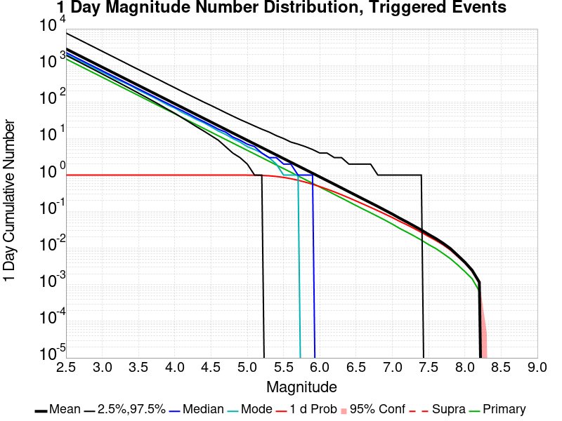
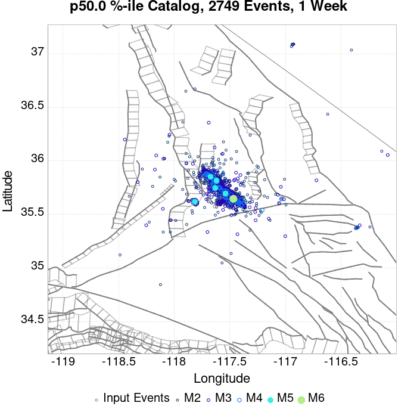
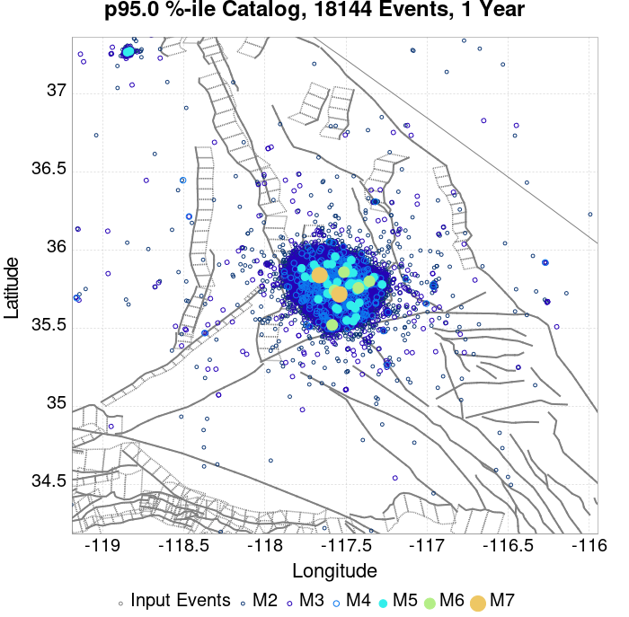
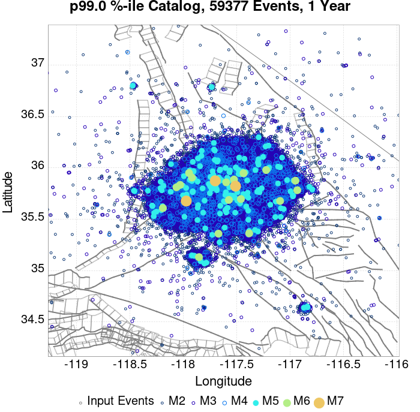
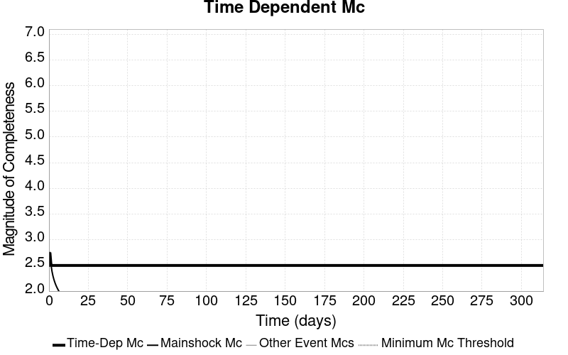
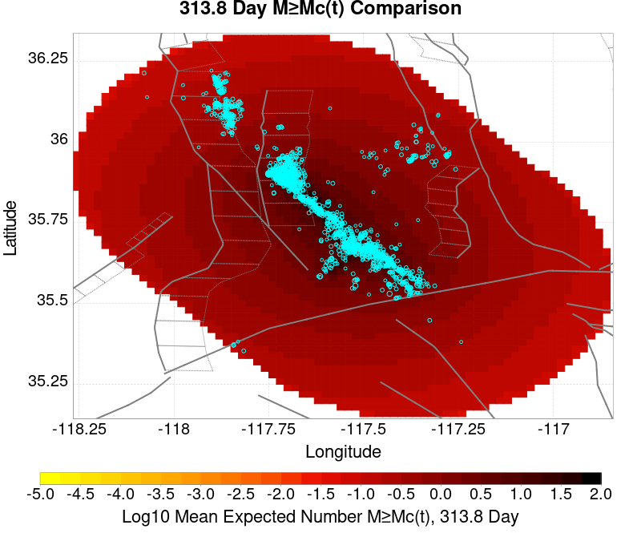
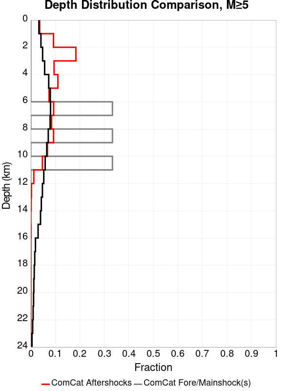
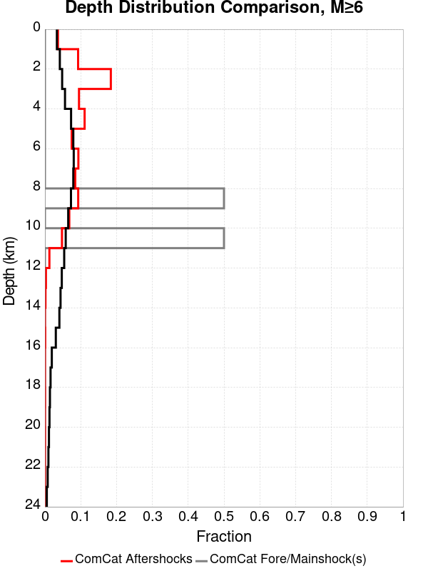
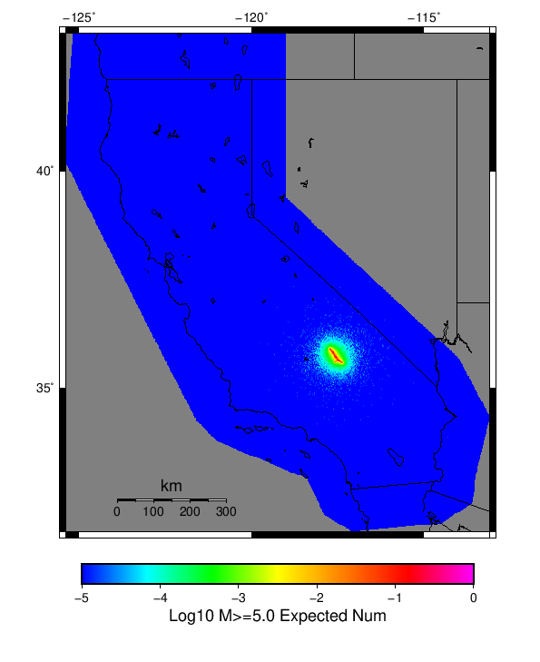

# ComCat M7.1 (ci38457511), ShakeMap Surfaces, Log10(k)=-2.3856, p=1.2164, c=0.0068906, No Faults Results

|   | ComCat M7.1 (ci38457511), ShakeMap Surfaces, Log10(k)=-2.3856, p=1.2164, c=0.0068906, No Faults |
|-----|-----|
| Num Simulations | 2083 (incomplete) |
| Start Time | 2019/07/06 03:19:54 UTC |
| Start Time Epoch Milliseconds | 1562383194040 |
| Duration | 10 Years |
| Includes Spontaneous? | false |
| Trigger Ruptures | 270 Trigger Ruptures |
|   | First: M3.98 at 2019/07/04 17:02:55 UTC |
|   | Last: M7.1 at 2019/07/06 03:19:53 UTC |
|   | Largest: M7.1 at 2019/07/06 03:19:53 UTC |
| Historical Ruptures | *(none)* |
| Config Generated With | u3etas_comcat_event_config_builder.sh --event-id ci38457511 --num-simulations 100000 --days-before 7 --gridded-only --mag-complete 3.5 --etas-k -2.3856 --etas-p 1.2164 --etas-c 0.0068906 --finite-surf-shakemap --finite-surf-shakemap-min-mag 5 --hpc-site USC_HPC --nodes 36 --hours 24 --queue scec |

## Table Of Contents

* [Probabilities Summary Table](#probabilities-summary-table)
* [Magnitude Number Distribution](#magnitude-number-distribution)
  * [10 Year Magnitude Number Distribution](#10-year-magnitude-number-distribution)
  * [1 Year Magnitude Number Distribution](#1-year-magnitude-number-distribution)
  * [1 Month Magnitude Number Distribution](#1-month-magnitude-number-distribution)
  * [1 Week Magnitude Number Distribution](#1-week-magnitude-number-distribution)
  * [1 Day Magnitude Number Distribution](#1-day-magnitude-number-distribution)
  * [1 Hour Magnitude Number Distribution](#1-hour-magnitude-number-distribution)
* [Hazard Change Over Time](#hazard-change-over-time)
  * [M&ge;5.0 Hazard Change Over Time](#m50-hazard-change-over-time)
  * [M&ge;6.0 Hazard Change Over Time](#m60-hazard-change-over-time)
  * [M&ge;7.0 Hazard Change Over Time](#m70-hazard-change-over-time)
  * [M&ge;8.0 Hazard Change Over Time](#m80-hazard-change-over-time)
* [Trigger Rupture Fault Map](#trigger-rupture-fault-map)
* [Trigger Rupture Depth Map](#trigger-rupture-depth-map)
* [Fault Distances To Triggers](#fault-distances-to-triggers)
* [Individual Simulated Catalog Maps](#individual-simulated-catalog-maps)
* [ComCat Data Comparisons](#comcat-data-comparisons)
  * [ComCat Magnitude-Number Distributions](#comcat-magnitude-number-distributions)
  * [ComCat Time-Dependent Mc](#comcat-time-dependent-mc)
  * [ComCat Cumulative Number Vs Time](#comcat-cumulative-number-vs-time)
  * [ComCat Cumulative Number Simulation Percentiles](#comcat-cumulative-number-simulation-percentiles)
  * [ComCat Probability Spatial Distribution](#comcat-probability-spatial-distribution)
  * [ComCat Mean Expectation Spatial Distribution](#comcat-mean-expectation-spatial-distribution)
  * [ComCat Depth Distribution](#comcat-depth-distribution)
* [Gridded Nucleation](#gridded-nucleation)
* [JSON Input File](#json-input-file)

## Probabilities Summary Table
*[(top)](#table-of-contents)*

| Magnitude | 1 Hour Prob | 1 Day Prob | 1 Week Prob | 1 Month Prob | 1 Year Prob | 10 Year Prob |
|-----|-----|-----|-----|-----|-----|-----|
| **M&ge;4** | 1.000 (100.00%) | 1.000 (100.00%) | 1.000 (100.00%) | 1.000 (100.00%) | 1.000 (100.00%) | 1.000 (100.00%) |
| **M&ge;4.5** | 1.000 (100.00%) | 1.000 (100.00%) | 1.000 (100.00%) | 1.000 (100.00%) | 1.000 (100.00%) | 1.000 (100.00%) |
| **M&ge;5** | 0.926 (92.61%) | 0.997 (99.71%) | 0.999 (99.86%) | 0.999 (99.90%) | 1.000 (100.00%) | 1.000 (100.00%) |
| **M&ge;5.5** | 0.582 (58.23%) | 0.859 (85.89%) | 0.922 (92.17%) | 0.946 (94.58%) | 0.967 (96.69%) | 0.973 (97.26%) |
| **M&ge;6** | 0.248 (24.82%) | 0.489 (48.92%) | 0.590 (59.05%) | 0.639 (63.85%) | 0.682 (68.17%) | 0.706 (70.62%) |
| **M&ge;6.5** | 0.103 (10.32%) | 0.216 (21.60%) | 0.277 (27.75%) | 0.306 (30.58%) | 0.340 (33.99%) | 0.363 (36.34%) |
| **M&ge;7** | 0.034 (3.36%) | 0.075 (7.54%) | 0.098 (9.84%) | 0.113 (11.28%) | 0.129 (12.91%) | 0.143 (14.26%) |
| **M&ge;7.1** | 0.028 (2.78%) | 0.060 (5.95%) | 0.080 (8.02%) | 0.091 (9.07%) | 0.105 (10.51%) | 0.118 (11.76%) |
| **M&ge;7.5** | 7.20E-3 (0.72%) | 0.017 (1.73%) | 0.030 (2.98%) | 0.034 (3.41%) | 0.044 (4.42%) | 0.050 (5.04%) |
| **M&ge;8** | 1.44E-3 (0.14%) | 2.88E-3 (0.29%) | 5.76E-3 (0.58%) | 5.76E-3 (0.58%) | 0.010 (1.01%) | 0.012 (1.20%) |

## Magnitude Number Distribution
*[(top)](#table-of-contents)*

### 10 Year Magnitude Number Distribution
*[(top)](#table-of-contents)*

**Legend**
* **Mean** (thick black line): mean expected number across all 2083 catalogs
* **2.5%,97.5%** (thin black lines): expected number percentiles across all 2083 catalogs
* **Median** (thin blue line): median expected number across all 2083 catalogs
* **Mode** (thin cyan line): modal expected number across all 2083 catalogs
* **10 yr Probability** (thin red line): 10 year probability calculated as the fraction of catalogs with at least 1 occurrence
* **10 yr Supraseismogenic Probability** (thin dashed red line): same as above, but only for supraseismogenic ruptures on explicitly modeled UCERF3 faults
* **95% Conf** (light red shaded region): binomial 95% confidence bounds on probability
* **Primary** (thin green line): mean expected number from primary triggered aftershocks only (no secondary, tertiary, etc...) across all 2083 catalogs


| Mag | Mean | 2.5 %ile | 97.5 %ile | Median | Mode | 10 yr Probability | 10 yr Supra-Seis Prob | Primary Aftershocks Mean |
|-----|-----|-----|-----|-----|-----|-----|-----|-----|
| **M&ge;2.5** | 7752.122 | 3481.000 | 29809.000 | 4764.000 | 3916.000 | 1.000 (100.00%) | 0.000 (0.00%) | 2268.170 |
| **M&ge;2.6** | 6158.072 | 2769.000 | 23659.000 | 3786.000 | 3133.000 | 1.000 (100.00%) | 0.000 (0.00%) | 1801.393 |
| **M&ge;2.7** | 4892.049 | 2194.000 | 18834.000 | 3011.000 | 2647.000 | 1.000 (100.00%) | 0.000 (0.00%) | 1430.875 |
| **M&ge;2.8** | 3886.031 | 1740.000 | 14989.000 | 2394.000 | 2058.000 | 1.000 (100.00%) | 0.000 (0.00%) | 1136.496 |
| **M&ge;2.9** | 3086.839 | 1382.000 | 11916.000 | 1895.000 | 1679.000 | 1.000 (100.00%) | 0.000 (0.00%) | 902.449 |
| **M&ge;3** | 2452.128 | 1097.000 | 9429.000 | 1509.000 | 1449.000 | 1.000 (100.00%) | 0.000 (0.00%) | 716.928 |
| **M&ge;3.1** | 1947.719 | 866.000 | 7451.000 | 1199.000 | 1047.000 | 1.000 (100.00%) | 0.000 (0.00%) | 569.572 |
| **M&ge;3.2** | 1547.571 | 685.000 | 5911.000 | 952.000 | 785.000 | 1.000 (100.00%) | 0.000 (0.00%) | 452.303 |
| **M&ge;3.3** | 1229.545 | 538.000 | 4719.000 | 757.000 | 636.000 | 1.000 (100.00%) | 0.000 (0.00%) | 359.294 |
| **M&ge;3.4** | 976.656 | 424.000 | 3751.000 | 600.000 | 548.000 | 1.000 (100.00%) | 0.000 (0.00%) | 285.433 |
| **M&ge;3.5** | 775.383 | 333.000 | 2979.000 | 478.000 | 397.000 | 1.000 (100.00%) | 0.000 (0.00%) | 226.517 |
| **M&ge;3.6** | 615.894 | 261.000 | 2373.000 | 382.000 | 321.000 | 1.000 (100.00%) | 0.000 (0.00%) | 179.990 |
| **M&ge;3.7** | 489.158 | 205.000 | 1886.000 | 303.000 | 261.000 | 1.000 (100.00%) | 0.000 (0.00%) | 142.934 |
| **M&ge;3.8** | 388.486 | 158.000 | 1487.000 | 240.000 | 187.000 | 1.000 (100.00%) | 0.000 (0.00%) | 113.579 |
| **M&ge;3.9** | 308.689 | 126.000 | 1199.000 | 192.000 | 152.000 | 1.000 (100.00%) | 0.000 (0.00%) | 90.352 |
| **M&ge;4** | 245.319 | 99.000 | 971.000 | 152.000 | 122.000 | 1.000 (100.00%) | 0.000 (0.00%) | 71.856 |
| **M&ge;4.1** | 194.745 | 76.000 | 774.000 | 121.000 | 98.000 | 1.000 (100.00%) | 0.000 (0.00%) | 57.161 |
| **M&ge;4.2** | 154.824 | 59.000 | 617.000 | 97.000 | 86.000 | 1.000 (100.00%) | 0.000 (0.00%) | 45.480 |
| **M&ge;4.3** | 122.666 | 45.000 | 490.000 | 77.000 | 66.000 | 1.000 (100.00%) | 0.000 (0.00%) | 36.025 |
| **M&ge;4.4** | 97.465 | 34.000 | 376.000 | 61.000 | 49.000 | 1.000 (100.00%) | 0.000 (0.00%) | 28.601 |
| **M&ge;4.5** | 77.486 | 26.000 | 308.000 | 49.000 | 43.000 | 1.000 (100.00%) | 0.000 (0.00%) | 22.716 |
| **M&ge;4.6** | 61.536 | 19.000 | 248.000 | 39.000 | 32.000 | 1.000 (100.00%) | 0.000 (0.00%) | 18.035 |
| **M&ge;4.7** | 48.911 | 15.000 | 193.000 | 31.000 | 23.000 | 1.000 (100.00%) | 0.000 (0.00%) | 14.339 |
| **M&ge;4.8** | 38.848 | 11.000 | 155.000 | 25.000 | 20.000 | 1.000 (100.00%) | 0.000 (0.00%) | 11.406 |
| **M&ge;4.9** | 30.864 | 8.000 | 122.000 | 20.000 | 16.000 | 1.000 (100.00%) | 0.000 (0.00%) | 9.068 |
| **M&ge;5** | 24.495 | 5.000 | 99.000 | 16.000 | 13.000 | 1.000 (100.00%) | 0.000 (0.00%) | 7.206 |
| **M&ge;5.1** | 19.479 | 4.000 | 77.000 | 13.000 | 9.000 | 1.000 (100.00%) | 0.000 (0.00%) | 5.711 |
| **M&ge;5.2** | 15.487 | 3.000 | 64.000 | 10.000 | 7.000 | 1.000 (99.95%) | 0.000 (0.00%) | 4.537 |
| **M&ge;5.3** | 12.276 | 2.000 | 49.000 | 8.000 | 7.000 | 0.996 (99.62%) | 0.000 (0.00%) | 3.573 |
| **M&ge;5.4** | 9.775 | 1.000 | 42.000 | 6.000 | 4.000 | 0.988 (98.85%) | 0.000 (0.00%) | 2.859 |
| **M&ge;5.5** | 7.746 | 0.000 | 33.000 | 5.000 | 4.000 | 0.973 (97.26%) | 0.000 (0.00%) | 2.255 |
| **M&ge;5.6** | 6.132 | 0.000 | 26.000 | 4.000 | 3.000 | 0.940 (94.00%) | 0.000 (0.00%) | 1.770 |
| **M&ge;5.7** | 4.862 | 0.000 | 22.000 | 3.000 | 2.000 | 0.900 (90.01%) | 0.000 (0.00%) | 1.404 |
| **M&ge;5.8** | 3.842 | 0.000 | 17.000 | 2.000 | 1.000 | 0.844 (84.40%) | 0.000 (0.00%) | 1.108 |
| **M&ge;5.9** | 3.054 | 0.000 | 14.000 | 2.000 | 1.000 | 0.773 (77.29%) | 0.000 (0.00%) | 0.883 |
| **M&ge;6** | 2.429 | 0.000 | 11.000 | 1.000 | 0.000 | 0.706 (70.62%) | 0.000 (0.00%) | 0.707 |
| **M&ge;6.1** | 1.947 | 0.000 | 9.000 | 1.000 | 0.000 | 0.639 (63.85%) | 0.000 (0.00%) | 0.581 |
| **M&ge;6.2** | 1.547 | 0.000 | 8.000 | 1.000 | 0.000 | 0.563 (56.31%) | 0.000 (0.00%) | 0.470 |
| **M&ge;6.3** | 1.229 | 0.000 | 7.000 | 0.000 | 0.000 | 0.487 (48.73%) | 0.000 (0.00%) | 0.373 |
| **M&ge;6.4** | 0.976 | 0.000 | 5.000 | 0.000 | 0.000 | 0.427 (42.73%) | 0.000 (0.00%) | 0.309 |
| **M&ge;6.5** | 0.776 | 0.000 | 5.000 | 0.000 | 0.000 | 0.363 (36.34%) | 0.000 (0.00%) | 0.251 |
| **M&ge;6.6** | 0.615 | 0.000 | 4.000 | 0.000 | 0.000 | 0.312 (31.16%) | 0.000 (0.00%) | 0.200 |
| **M&ge;6.7** | 0.478 | 0.000 | 3.000 | 0.000 | 0.000 | 0.260 (25.97%) | 0.000 (0.00%) | 0.155 |
| **M&ge;6.8** | 0.379 | 0.000 | 3.000 | 0.000 | 0.000 | 0.220 (21.99%) | 0.000 (0.00%) | 0.125 |
| **M&ge;6.9** | 0.289 | 0.000 | 2.000 | 0.000 | 0.000 | 0.174 (17.43%) | 0.000 (0.00%) | 0.092 |
| **M&ge;7** | 0.231 | 0.000 | 2.000 | 0.000 | 0.000 | 0.143 (14.26%) | 0.000 (0.00%) | 0.071 |
| **M&ge;7.1** | 0.181 | 0.000 | 2.000 | 0.000 | 0.000 | 0.118 (11.76%) | 0.000 (0.00%) | 0.055 |
| **M&ge;7.2** | 0.141 | 0.000 | 1.000 | 0.000 | 0.000 | 0.093 (9.31%) | 0.000 (0.00%) | 0.041 |
| **M&ge;7.3** | 0.110 | 0.000 | 1.000 | 0.000 | 0.000 | 0.076 (7.63%) | 0.000 (0.00%) | 0.032 |
| **M&ge;7.4** | 0.086 | 0.000 | 1.000 | 0.000 | 0.000 | 0.063 (6.29%) | 0.000 (0.00%) | 0.022 |
| **M&ge;7.5** | 0.067 | 0.000 | 1.000 | 0.000 | 0.000 | 0.050 (5.04%) | 0.000 (0.00%) | 0.017 |
| **M&ge;7.6** | 0.048 | 0.000 | 1.000 | 0.000 | 0.000 | 0.037 (3.74%) | 0.000 (0.00%) | 0.012 |
| **M&ge;7.7** | 0.039 | 0.000 | 1.000 | 0.000 | 0.000 | 0.031 (3.12%) | 0.000 (0.00%) | 0.011 |
| **M&ge;7.8** | 0.029 | 0.000 | 0.000 | 0.000 | 0.000 | 0.023 (2.26%) | 0.000 (0.00%) | 8.64E-3 |
| **M&ge;7.9** | 0.022 | 0.000 | 0.000 | 0.000 | 0.000 | 0.018 (1.78%) | 0.000 (0.00%) | 6.24E-3 |
| **M&ge;8** | 0.014 | 0.000 | 0.000 | 0.000 | 0.000 | 0.012 (1.20%) | 0.000 (0.00%) | 4.80E-3 |
| **M&ge;8.1** | 8.16E-3 | 0.000 | 0.000 | 0.000 | 0.000 | 6.72E-3 (0.67%) | 0.000 (0.00%) | 2.88E-3 |
| **M&ge;8.2** | 4.32E-3 | 0.000 | 0.000 | 0.000 | 0.000 | 3.84E-3 (0.38%) | 0.000 (0.00%) | 1.44E-3 |
| **M&ge;8.3** | 0.000 | 0.000 | 0.000 | 0.000 | 0.000 | 0.000 (0.00%) | 0.000 (0.00%) | 0.000 |
| **M&ge;8.4** | 0.000 | 0.000 | 0.000 | 0.000 | 0.000 | 0.000 (0.00%) | 0.000 (0.00%) | 0.000 |
| **M&ge;8.5** | 0.000 | 0.000 | 0.000 | 0.000 | 0.000 | 0.000 (0.00%) | 0.000 (0.00%) | 0.000 |
| **M&ge;8.6** | 0.000 | 0.000 | 0.000 | 0.000 | 0.000 | 0.000 (0.00%) | 0.000 (0.00%) | 0.000 |
| **M&ge;8.7** | 0.000 | 0.000 | 0.000 | 0.000 | 0.000 | 0.000 (0.00%) | 0.000 (0.00%) | 0.000 |
| **M&ge;8.8** | 0.000 | 0.000 | 0.000 | 0.000 | 0.000 | 0.000 (0.00%) | 0.000 (0.00%) | 0.000 |
| **M&ge;8.9** | 0.000 | 0.000 | 0.000 | 0.000 | 0.000 | 0.000 (0.00%) | 0.000 (0.00%) | 0.000 |
| **M&ge;9** | 0.000 | 0.000 | 0.000 | 0.000 | 0.000 | 0.000 (0.00%) | 0.000 (0.00%) | 0.000 |

### 1 Year Magnitude Number Distribution
*[(top)](#table-of-contents)*

**Legend**
* **Mean** (thick black line): mean expected number across all 2083 catalogs
* **2.5%,97.5%** (thin black lines): expected number percentiles across all 2083 catalogs
* **Median** (thin blue line): median expected number across all 2083 catalogs
* **Mode** (thin cyan line): modal expected number across all 2083 catalogs
* **1 yr Probability** (thin red line): 1 year probability calculated as the fraction of catalogs with at least 1 occurrence
* **1 yr Supraseismogenic Probability** (thin dashed red line): same as above, but only for supraseismogenic ruptures on explicitly modeled UCERF3 faults
* **95% Conf** (light red shaded region): binomial 95% confidence bounds on probability
* **Primary** (thin green line): mean expected number from primary triggered aftershocks only (no secondary, tertiary, etc...) across all 2083 catalogs


| Mag | Mean | 2.5 %ile | 97.5 %ile | Median | Mode | 1 yr Probability | 1 yr Supra-Seis Prob | Primary Aftershocks Mean |
|-----|-----|-----|-----|-----|-----|-----|-----|-----|
| **M&ge;2.5** | 6539.225 | 3242.000 | 25326.000 | 4319.000 | 3766.000 | 1.000 (100.00%) | 0.000 (0.00%) | 2161.909 |
| **M&ge;2.6** | 5194.640 | 2572.000 | 20035.000 | 3437.000 | 3020.000 | 1.000 (100.00%) | 0.000 (0.00%) | 1717.085 |
| **M&ge;2.7** | 4126.493 | 2042.000 | 16013.000 | 2729.000 | 2425.000 | 1.000 (100.00%) | 0.000 (0.00%) | 1363.805 |
| **M&ge;2.8** | 3277.893 | 1616.000 | 12734.000 | 2167.000 | 1806.000 | 1.000 (100.00%) | 0.000 (0.00%) | 1083.230 |
| **M&ge;2.9** | 2603.683 | 1280.000 | 10123.000 | 1719.000 | 1548.000 | 1.000 (100.00%) | 0.000 (0.00%) | 860.098 |
| **M&ge;3** | 2068.415 | 1020.000 | 7964.000 | 1371.000 | 1138.000 | 1.000 (100.00%) | 0.000 (0.00%) | 683.364 |
| **M&ge;3.1** | 1642.855 | 806.000 | 6304.000 | 1087.000 | 913.000 | 1.000 (100.00%) | 0.000 (0.00%) | 542.957 |
| **M&ge;3.2** | 1305.337 | 634.000 | 5043.000 | 864.000 | 735.000 | 1.000 (100.00%) | 0.000 (0.00%) | 431.257 |
| **M&ge;3.3** | 1037.040 | 499.000 | 4036.000 | 685.000 | 586.000 | 1.000 (100.00%) | 0.000 (0.00%) | 342.603 |
| **M&ge;3.4** | 823.773 | 392.000 | 3234.000 | 546.000 | 493.000 | 1.000 (100.00%) | 0.000 (0.00%) | 272.233 |
| **M&ge;3.5** | 654.065 | 308.000 | 2560.000 | 434.000 | 395.000 | 1.000 (100.00%) | 0.000 (0.00%) | 216.059 |
| **M&ge;3.6** | 519.586 | 241.000 | 2025.000 | 346.000 | 302.000 | 1.000 (100.00%) | 0.000 (0.00%) | 171.696 |
| **M&ge;3.7** | 412.614 | 187.000 | 1620.000 | 275.000 | 238.000 | 1.000 (100.00%) | 0.000 (0.00%) | 136.360 |
| **M&ge;3.8** | 327.672 | 148.000 | 1290.000 | 220.000 | 179.000 | 1.000 (100.00%) | 0.000 (0.00%) | 108.383 |
| **M&ge;3.9** | 260.381 | 115.000 | 1014.000 | 175.000 | 143.000 | 1.000 (100.00%) | 0.000 (0.00%) | 86.238 |
| **M&ge;4** | 207.037 | 91.000 | 806.000 | 139.000 | 113.000 | 1.000 (100.00%) | 0.000 (0.00%) | 68.596 |
| **M&ge;4.1** | 164.428 | 69.000 | 639.000 | 111.000 | 101.000 | 1.000 (100.00%) | 0.000 (0.00%) | 54.568 |
| **M&ge;4.2** | 130.768 | 54.000 | 506.000 | 88.000 | 76.000 | 1.000 (100.00%) | 0.000 (0.00%) | 43.425 |
| **M&ge;4.3** | 103.578 | 41.000 | 404.000 | 70.000 | 57.000 | 1.000 (100.00%) | 0.000 (0.00%) | 34.392 |
| **M&ge;4.4** | 82.250 | 31.000 | 326.000 | 56.000 | 45.000 | 1.000 (100.00%) | 0.000 (0.00%) | 27.282 |
| **M&ge;4.5** | 65.385 | 23.000 | 264.000 | 44.000 | 39.000 | 1.000 (100.00%) | 0.000 (0.00%) | 21.674 |
| **M&ge;4.6** | 51.913 | 18.000 | 212.000 | 36.000 | 29.000 | 1.000 (100.00%) | 0.000 (0.00%) | 17.213 |
| **M&ge;4.7** | 41.278 | 13.000 | 164.000 | 28.000 | 25.000 | 1.000 (100.00%) | 0.000 (0.00%) | 13.680 |
| **M&ge;4.8** | 32.730 | 10.000 | 127.000 | 23.000 | 18.000 | 1.000 (100.00%) | 0.000 (0.00%) | 10.880 |
| **M&ge;4.9** | 26.012 | 7.000 | 103.000 | 18.000 | 14.000 | 1.000 (100.00%) | 0.000 (0.00%) | 8.658 |
| **M&ge;5** | 20.651 | 5.000 | 82.000 | 14.000 | 13.000 | 1.000 (100.00%) | 0.000 (0.00%) | 6.868 |
| **M&ge;5.1** | 16.439 | 3.000 | 65.000 | 11.000 | 10.000 | 1.000 (100.00%) | 0.000 (0.00%) | 5.442 |
| **M&ge;5.2** | 13.048 | 2.000 | 53.000 | 9.000 | 7.000 | 1.000 (99.95%) | 0.000 (0.00%) | 4.324 |
| **M&ge;5.3** | 10.324 | 1.000 | 39.000 | 7.000 | 5.000 | 0.995 (99.47%) | 0.000 (0.00%) | 3.405 |
| **M&ge;5.4** | 8.221 | 1.000 | 32.000 | 6.000 | 4.000 | 0.984 (98.37%) | 0.000 (0.00%) | 2.721 |
| **M&ge;5.5** | 6.511 | 0.000 | 26.000 | 4.000 | 3.000 | 0.967 (96.69%) | 0.000 (0.00%) | 2.148 |
| **M&ge;5.6** | 5.147 | 0.000 | 22.000 | 3.000 | 2.000 | 0.929 (92.89%) | 0.000 (0.00%) | 1.687 |
| **M&ge;5.7** | 4.087 | 0.000 | 17.000 | 3.000 | 2.000 | 0.883 (88.29%) | 0.000 (0.00%) | 1.338 |
| **M&ge;5.8** | 3.219 | 0.000 | 14.000 | 2.000 | 1.000 | 0.820 (82.00%) | 0.000 (0.00%) | 1.055 |
| **M&ge;5.9** | 2.542 | 0.000 | 12.000 | 2.000 | 0.000 | 0.750 (74.99%) | 0.000 (0.00%) | 0.839 |
| **M&ge;6** | 2.023 | 0.000 | 10.000 | 1.000 | 0.000 | 0.682 (68.17%) | 0.000 (0.00%) | 0.672 |
| **M&ge;6.1** | 1.621 | 0.000 | 8.000 | 1.000 | 0.000 | 0.613 (61.31%) | 0.000 (0.00%) | 0.554 |
| **M&ge;6.2** | 1.292 | 0.000 | 7.000 | 1.000 | 0.000 | 0.536 (53.58%) | 0.000 (0.00%) | 0.447 |
| **M&ge;6.3** | 1.026 | 0.000 | 6.000 | 0.000 | 0.000 | 0.457 (45.66%) | 0.000 (0.00%) | 0.355 |
| **M&ge;6.4** | 0.819 | 0.000 | 5.000 | 0.000 | 0.000 | 0.399 (39.94%) | 0.000 (0.00%) | 0.295 |
| **M&ge;6.5** | 0.650 | 0.000 | 4.000 | 0.000 | 0.000 | 0.340 (33.99%) | 0.000 (0.00%) | 0.239 |
| **M&ge;6.6** | 0.516 | 0.000 | 3.000 | 0.000 | 0.000 | 0.289 (28.90%) | 0.000 (0.00%) | 0.190 |
| **M&ge;6.7** | 0.406 | 0.000 | 3.000 | 0.000 | 0.000 | 0.241 (24.05%) | 0.000 (0.00%) | 0.149 |
| **M&ge;6.8** | 0.323 | 0.000 | 3.000 | 0.000 | 0.000 | 0.202 (20.21%) | 0.000 (0.00%) | 0.120 |
| **M&ge;6.9** | 0.246 | 0.000 | 2.000 | 0.000 | 0.000 | 0.160 (15.99%) | 0.000 (0.00%) | 0.087 |
| **M&ge;7** | 0.195 | 0.000 | 2.000 | 0.000 | 0.000 | 0.129 (12.91%) | 0.000 (0.00%) | 0.067 |
| **M&ge;7.1** | 0.153 | 0.000 | 2.000 | 0.000 | 0.000 | 0.105 (10.51%) | 0.000 (0.00%) | 0.051 |
| **M&ge;7.2** | 0.117 | 0.000 | 1.000 | 0.000 | 0.000 | 0.082 (8.21%) | 0.000 (0.00%) | 0.038 |
| **M&ge;7.3** | 0.089 | 0.000 | 1.000 | 0.000 | 0.000 | 0.066 (6.58%) | 0.000 (0.00%) | 0.029 |
| **M&ge;7.4** | 0.070 | 0.000 | 1.000 | 0.000 | 0.000 | 0.055 (5.52%) | 0.000 (0.00%) | 0.020 |
| **M&ge;7.5** | 0.053 | 0.000 | 1.000 | 0.000 | 0.000 | 0.044 (4.42%) | 0.000 (0.00%) | 0.016 |
| **M&ge;7.6** | 0.037 | 0.000 | 1.000 | 0.000 | 0.000 | 0.033 (3.26%) | 0.000 (0.00%) | 0.011 |
| **M&ge;7.7** | 0.032 | 0.000 | 1.000 | 0.000 | 0.000 | 0.028 (2.83%) | 0.000 (0.00%) | 9.60E-3 |
| **M&ge;7.8** | 0.022 | 0.000 | 0.000 | 0.000 | 0.000 | 0.020 (1.97%) | 0.000 (0.00%) | 7.68E-3 |
| **M&ge;7.9** | 0.016 | 0.000 | 0.000 | 0.000 | 0.000 | 0.015 (1.54%) | 0.000 (0.00%) | 5.28E-3 |
| **M&ge;8** | 0.011 | 0.000 | 0.000 | 0.000 | 0.000 | 0.010 (1.01%) | 0.000 (0.00%) | 3.84E-3 |
| **M&ge;8.1** | 5.28E-3 | 0.000 | 0.000 | 0.000 | 0.000 | 4.80E-3 (0.48%) | 0.000 (0.00%) | 1.92E-3 |
| **M&ge;8.2** | 1.92E-3 | 0.000 | 0.000 | 0.000 | 0.000 | 1.92E-3 (0.19%) | 0.000 (0.00%) | 4.80E-4 |
| **M&ge;8.3** | 0.000 | 0.000 | 0.000 | 0.000 | 0.000 | 0.000 (0.00%) | 0.000 (0.00%) | 0.000 |
| **M&ge;8.4** | 0.000 | 0.000 | 0.000 | 0.000 | 0.000 | 0.000 (0.00%) | 0.000 (0.00%) | 0.000 |
| **M&ge;8.5** | 0.000 | 0.000 | 0.000 | 0.000 | 0.000 | 0.000 (0.00%) | 0.000 (0.00%) | 0.000 |
| **M&ge;8.6** | 0.000 | 0.000 | 0.000 | 0.000 | 0.000 | 0.000 (0.00%) | 0.000 (0.00%) | 0.000 |
| **M&ge;8.7** | 0.000 | 0.000 | 0.000 | 0.000 | 0.000 | 0.000 (0.00%) | 0.000 (0.00%) | 0.000 |
| **M&ge;8.8** | 0.000 | 0.000 | 0.000 | 0.000 | 0.000 | 0.000 (0.00%) | 0.000 (0.00%) | 0.000 |
| **M&ge;8.9** | 0.000 | 0.000 | 0.000 | 0.000 | 0.000 | 0.000 (0.00%) | 0.000 (0.00%) | 0.000 |
| **M&ge;9** | 0.000 | 0.000 | 0.000 | 0.000 | 0.000 | 0.000 (0.00%) | 0.000 (0.00%) | 0.000 |

### 1 Month Magnitude Number Distribution
*[(top)](#table-of-contents)*

**Legend**
* **Mean** (thick black line): mean expected number across all 2083 catalogs
* **2.5%,97.5%** (thin black lines): expected number percentiles across all 2083 catalogs
* **Median** (thin blue line): median expected number across all 2083 catalogs
* **Mode** (thin cyan line): modal expected number across all 2083 catalogs
* **1 mo Probability** (thin red line): 1 month probability calculated as the fraction of catalogs with at least 1 occurrence
* **1 mo Supraseismogenic Probability** (thin dashed red line): same as above, but only for supraseismogenic ruptures on explicitly modeled UCERF3 faults
* **95% Conf** (light red shaded region): binomial 95% confidence bounds on probability
* **Primary** (thin green line): mean expected number from primary triggered aftershocks only (no secondary, tertiary, etc...) across all 2083 catalogs


| Mag | Mean | 2.5 %ile | 97.5 %ile | Median | Mode | 1 mo Probability | 1 mo Supra-Seis Prob | Primary Aftershocks Mean |
|-----|-----|-----|-----|-----|-----|-----|-----|-----|
| **M&ge;2.5** | 5098.611 | 2805.000 | 17995.000 | 3591.000 | 3090.000 | 1.000 (100.00%) | 0.000 (0.00%) | 1968.118 |
| **M&ge;2.6** | 4050.026 | 2227.000 | 14253.000 | 2859.000 | 2560.000 | 1.000 (100.00%) | 0.000 (0.00%) | 1563.412 |
| **M&ge;2.7** | 3217.198 | 1758.000 | 11335.000 | 2275.000 | 1911.000 | 1.000 (100.00%) | 0.000 (0.00%) | 1241.739 |
| **M&ge;2.8** | 2555.699 | 1390.000 | 9060.000 | 1809.000 | 1623.000 | 1.000 (100.00%) | 0.000 (0.00%) | 986.358 |
| **M&ge;2.9** | 2030.333 | 1101.000 | 7207.000 | 1443.000 | 1267.000 | 1.000 (100.00%) | 0.000 (0.00%) | 783.317 |
| **M&ge;3** | 1612.803 | 876.000 | 5777.000 | 1146.000 | 1021.000 | 1.000 (100.00%) | 0.000 (0.00%) | 622.366 |
| **M&ge;3.1** | 1281.019 | 694.000 | 4603.000 | 911.000 | 822.000 | 1.000 (100.00%) | 0.000 (0.00%) | 494.627 |
| **M&ge;3.2** | 1017.655 | 546.000 | 3621.000 | 724.000 | 649.000 | 1.000 (100.00%) | 0.000 (0.00%) | 392.852 |
| **M&ge;3.3** | 808.610 | 432.000 | 2878.000 | 578.000 | 501.000 | 1.000 (100.00%) | 0.000 (0.00%) | 312.097 |
| **M&ge;3.4** | 642.373 | 340.000 | 2252.000 | 459.000 | 437.000 | 1.000 (100.00%) | 0.000 (0.00%) | 247.989 |
| **M&ge;3.5** | 510.038 | 265.000 | 1760.000 | 364.000 | 340.000 | 1.000 (100.00%) | 0.000 (0.00%) | 196.883 |
| **M&ge;3.6** | 405.299 | 207.000 | 1385.000 | 290.000 | 248.000 | 1.000 (100.00%) | 0.000 (0.00%) | 156.512 |
| **M&ge;3.7** | 321.909 | 161.000 | 1110.000 | 231.000 | 212.000 | 1.000 (100.00%) | 0.000 (0.00%) | 124.302 |
| **M&ge;3.8** | 255.578 | 126.000 | 888.000 | 184.000 | 170.000 | 1.000 (100.00%) | 0.000 (0.00%) | 98.848 |
| **M&ge;3.9** | 203.043 | 98.000 | 718.000 | 147.000 | 125.000 | 1.000 (100.00%) | 0.000 (0.00%) | 78.635 |
| **M&ge;4** | 161.415 | 77.000 | 560.000 | 117.000 | 95.000 | 1.000 (100.00%) | 0.000 (0.00%) | 62.582 |
| **M&ge;4.1** | 128.166 | 59.000 | 439.000 | 93.000 | 82.000 | 1.000 (100.00%) | 0.000 (0.00%) | 49.800 |
| **M&ge;4.2** | 101.932 | 45.000 | 357.000 | 74.000 | 67.000 | 1.000 (100.00%) | 0.000 (0.00%) | 39.615 |
| **M&ge;4.3** | 80.721 | 35.000 | 284.000 | 58.000 | 50.000 | 1.000 (100.00%) | 0.000 (0.00%) | 31.362 |
| **M&ge;4.4** | 64.119 | 26.000 | 224.000 | 47.000 | 43.000 | 1.000 (100.00%) | 0.000 (0.00%) | 24.875 |
| **M&ge;4.5** | 50.976 | 20.000 | 176.000 | 38.000 | 31.000 | 1.000 (100.00%) | 0.000 (0.00%) | 19.770 |
| **M&ge;4.6** | 40.485 | 15.000 | 146.000 | 30.000 | 24.000 | 1.000 (100.00%) | 0.000 (0.00%) | 15.700 |
| **M&ge;4.7** | 32.202 | 11.000 | 115.000 | 24.000 | 19.000 | 1.000 (100.00%) | 0.000 (0.00%) | 12.469 |
| **M&ge;4.8** | 25.535 | 8.000 | 94.000 | 19.000 | 17.000 | 1.000 (100.00%) | 0.000 (0.00%) | 9.929 |
| **M&ge;4.9** | 20.319 | 6.000 | 75.000 | 15.000 | 14.000 | 1.000 (100.00%) | 0.000 (0.00%) | 7.908 |
| **M&ge;5** | 16.145 | 4.000 | 57.000 | 12.000 | 10.000 | 0.999 (99.90%) | 0.000 (0.00%) | 6.280 |
| **M&ge;5.1** | 12.852 | 3.000 | 44.000 | 9.000 | 8.000 | 0.999 (99.86%) | 0.000 (0.00%) | 4.964 |
| **M&ge;5.2** | 10.226 | 2.000 | 36.000 | 7.000 | 6.000 | 0.997 (99.66%) | 0.000 (0.00%) | 3.951 |
| **M&ge;5.3** | 8.101 | 1.000 | 29.000 | 6.000 | 6.000 | 0.988 (98.75%) | 0.000 (0.00%) | 3.113 |
| **M&ge;5.4** | 6.463 | 0.000 | 22.000 | 5.000 | 3.000 | 0.975 (97.46%) | 0.000 (0.00%) | 2.491 |
| **M&ge;5.5** | 5.102 | 0.000 | 18.000 | 4.000 | 3.000 | 0.946 (94.58%) | 0.000 (0.00%) | 1.961 |
| **M&ge;5.6** | 4.037 | 0.000 | 15.000 | 3.000 | 2.000 | 0.901 (90.06%) | 0.000 (0.00%) | 1.545 |
| **M&ge;5.7** | 3.207 | 0.000 | 13.000 | 2.000 | 1.000 | 0.846 (84.64%) | 0.000 (0.00%) | 1.226 |
| **M&ge;5.8** | 2.530 | 0.000 | 10.000 | 2.000 | 1.000 | 0.781 (78.11%) | 0.000 (0.00%) | 0.972 |
| **M&ge;5.9** | 2.006 | 0.000 | 9.000 | 1.000 | 0.000 | 0.711 (71.05%) | 0.000 (0.00%) | 0.774 |
| **M&ge;6** | 1.596 | 0.000 | 8.000 | 1.000 | 0.000 | 0.639 (63.85%) | 0.000 (0.00%) | 0.619 |
| **M&ge;6.1** | 1.282 | 0.000 | 6.000 | 1.000 | 0.000 | 0.568 (56.79%) | 0.000 (0.00%) | 0.514 |
| **M&ge;6.2** | 1.026 | 0.000 | 5.000 | 0.000 | 0.000 | 0.493 (49.26%) | 0.000 (0.00%) | 0.415 |
| **M&ge;6.3** | 0.816 | 0.000 | 4.000 | 0.000 | 0.000 | 0.416 (41.62%) | 0.000 (0.00%) | 0.333 |
| **M&ge;6.4** | 0.655 | 0.000 | 4.000 | 0.000 | 0.000 | 0.361 (36.15%) | 0.000 (0.00%) | 0.277 |
| **M&ge;6.5** | 0.525 | 0.000 | 3.000 | 0.000 | 0.000 | 0.306 (30.58%) | 0.000 (0.00%) | 0.224 |
| **M&ge;6.6** | 0.415 | 0.000 | 3.000 | 0.000 | 0.000 | 0.257 (25.68%) | 0.000 (0.00%) | 0.178 |
| **M&ge;6.7** | 0.324 | 0.000 | 2.000 | 0.000 | 0.000 | 0.212 (21.22%) | 0.000 (0.00%) | 0.138 |
| **M&ge;6.8** | 0.259 | 0.000 | 2.000 | 0.000 | 0.000 | 0.179 (17.86%) | 0.000 (0.00%) | 0.111 |
| **M&ge;6.9** | 0.193 | 0.000 | 2.000 | 0.000 | 0.000 | 0.140 (14.02%) | 0.000 (0.00%) | 0.080 |
| **M&ge;7** | 0.154 | 0.000 | 1.000 | 0.000 | 0.000 | 0.113 (11.28%) | 0.000 (0.00%) | 0.062 |
| **M&ge;7.1** | 0.121 | 0.000 | 1.000 | 0.000 | 0.000 | 0.091 (9.07%) | 0.000 (0.00%) | 0.047 |
| **M&ge;7.2** | 0.091 | 0.000 | 1.000 | 0.000 | 0.000 | 0.069 (6.91%) | 0.000 (0.00%) | 0.035 |
| **M&ge;7.3** | 0.068 | 0.000 | 1.000 | 0.000 | 0.000 | 0.055 (5.47%) | 0.000 (0.00%) | 0.027 |
| **M&ge;7.4** | 0.053 | 0.000 | 1.000 | 0.000 | 0.000 | 0.045 (4.46%) | 0.000 (0.00%) | 0.018 |
| **M&ge;7.5** | 0.040 | 0.000 | 1.000 | 0.000 | 0.000 | 0.034 (3.41%) | 0.000 (0.00%) | 0.014 |
| **M&ge;7.6** | 0.028 | 0.000 | 0.000 | 0.000 | 0.000 | 0.025 (2.50%) | 0.000 (0.00%) | 0.010 |
| **M&ge;7.7** | 0.024 | 0.000 | 0.000 | 0.000 | 0.000 | 0.022 (2.16%) | 0.000 (0.00%) | 8.64E-3 |
| **M&ge;7.8** | 0.015 | 0.000 | 0.000 | 0.000 | 0.000 | 0.014 (1.39%) | 0.000 (0.00%) | 6.72E-3 |
| **M&ge;7.9** | 0.011 | 0.000 | 0.000 | 0.000 | 0.000 | 9.60E-3 (0.96%) | 0.000 (0.00%) | 4.32E-3 |
| **M&ge;8** | 6.24E-3 | 0.000 | 0.000 | 0.000 | 0.000 | 5.76E-3 (0.58%) | 0.000 (0.00%) | 2.88E-3 |
| **M&ge;8.1** | 3.84E-3 | 0.000 | 0.000 | 0.000 | 0.000 | 3.36E-3 (0.34%) | 0.000 (0.00%) | 1.44E-3 |
| **M&ge;8.2** | 1.44E-3 | 0.000 | 0.000 | 0.000 | 0.000 | 1.44E-3 (0.14%) | 0.000 (0.00%) | 4.80E-4 |
| **M&ge;8.3** | 0.000 | 0.000 | 0.000 | 0.000 | 0.000 | 0.000 (0.00%) | 0.000 (0.00%) | 0.000 |
| **M&ge;8.4** | 0.000 | 0.000 | 0.000 | 0.000 | 0.000 | 0.000 (0.00%) | 0.000 (0.00%) | 0.000 |
| **M&ge;8.5** | 0.000 | 0.000 | 0.000 | 0.000 | 0.000 | 0.000 (0.00%) | 0.000 (0.00%) | 0.000 |
| **M&ge;8.6** | 0.000 | 0.000 | 0.000 | 0.000 | 0.000 | 0.000 (0.00%) | 0.000 (0.00%) | 0.000 |
| **M&ge;8.7** | 0.000 | 0.000 | 0.000 | 0.000 | 0.000 | 0.000 (0.00%) | 0.000 (0.00%) | 0.000 |
| **M&ge;8.8** | 0.000 | 0.000 | 0.000 | 0.000 | 0.000 | 0.000 (0.00%) | 0.000 (0.00%) | 0.000 |
| **M&ge;8.9** | 0.000 | 0.000 | 0.000 | 0.000 | 0.000 | 0.000 (0.00%) | 0.000 (0.00%) | 0.000 |
| **M&ge;9** | 0.000 | 0.000 | 0.000 | 0.000 | 0.000 | 0.000 (0.00%) | 0.000 (0.00%) | 0.000 |

### 1 Week Magnitude Number Distribution
*[(top)](#table-of-contents)*

**Legend**
* **Mean** (thick black line): mean expected number across all 2083 catalogs
* **2.5%,97.5%** (thin black lines): expected number percentiles across all 2083 catalogs
* **Median** (thin blue line): median expected number across all 2083 catalogs
* **Mode** (thin cyan line): modal expected number across all 2083 catalogs
* **1 wk Probability** (thin red line): 1 week probability calculated as the fraction of catalogs with at least 1 occurrence
* **1 wk Supraseismogenic Probability** (thin dashed red line): same as above, but only for supraseismogenic ruptures on explicitly modeled UCERF3 faults
* **95% Conf** (light red shaded region): binomial 95% confidence bounds on probability
* **Primary** (thin green line): mean expected number from primary triggered aftershocks only (no secondary, tertiary, etc...) across all 2083 catalogs


| Mag | Mean | 2.5 %ile | 97.5 %ile | Median | Mode | 1 wk Probability | 1 wk Supra-Seis Prob | Primary Aftershocks Mean |
|-----|-----|-----|-----|-----|-----|-----|-----|-----|
| **M&ge;2.5** | 4177.542 | 2449.000 | 13768.000 | 3065.000 | 2794.000 | 1.000 (100.00%) | 0.000 (0.00%) | 1800.296 |
| **M&ge;2.6** | 3318.464 | 1948.000 | 10900.000 | 2436.000 | 2233.000 | 1.000 (100.00%) | 0.000 (0.00%) | 1430.048 |
| **M&ge;2.7** | 2635.840 | 1545.000 | 8634.000 | 1937.000 | 1817.000 | 1.000 (100.00%) | 0.000 (0.00%) | 1135.863 |
| **M&ge;2.8** | 2093.852 | 1225.000 | 6845.000 | 1539.000 | 1392.000 | 1.000 (100.00%) | 0.000 (0.00%) | 902.414 |
| **M&ge;2.9** | 1663.278 | 966.000 | 5434.000 | 1223.000 | 1120.000 | 1.000 (100.00%) | 0.000 (0.00%) | 716.623 |
| **M&ge;3** | 1321.256 | 767.000 | 4355.000 | 973.000 | 890.000 | 1.000 (100.00%) | 0.000 (0.00%) | 569.329 |
| **M&ge;3.1** | 1049.449 | 609.000 | 3418.000 | 772.000 | 701.000 | 1.000 (100.00%) | 0.000 (0.00%) | 452.527 |
| **M&ge;3.2** | 833.553 | 480.000 | 2735.000 | 614.000 | 569.000 | 1.000 (100.00%) | 0.000 (0.00%) | 359.415 |
| **M&ge;3.3** | 662.227 | 376.000 | 2208.000 | 488.000 | 435.000 | 1.000 (100.00%) | 0.000 (0.00%) | 285.501 |
| **M&ge;3.4** | 526.292 | 296.000 | 1751.000 | 388.000 | 348.000 | 1.000 (100.00%) | 0.000 (0.00%) | 226.893 |
| **M&ge;3.5** | 417.961 | 232.000 | 1389.000 | 309.000 | 273.000 | 1.000 (100.00%) | 0.000 (0.00%) | 180.137 |
| **M&ge;3.6** | 332.234 | 182.000 | 1105.000 | 246.000 | 242.000 | 1.000 (100.00%) | 0.000 (0.00%) | 143.288 |
| **M&ge;3.7** | 264.003 | 140.000 | 867.000 | 197.000 | 184.000 | 1.000 (100.00%) | 0.000 (0.00%) | 113.862 |
| **M&ge;3.8** | 209.733 | 109.000 | 703.000 | 157.000 | 140.000 | 1.000 (100.00%) | 0.000 (0.00%) | 90.576 |
| **M&ge;3.9** | 166.687 | 86.000 | 565.000 | 125.000 | 108.000 | 1.000 (100.00%) | 0.000 (0.00%) | 72.040 |
| **M&ge;4** | 132.570 | 67.000 | 445.000 | 99.000 | 91.000 | 1.000 (100.00%) | 0.000 (0.00%) | 57.349 |
| **M&ge;4.1** | 105.284 | 51.000 | 354.000 | 79.000 | 67.000 | 1.000 (100.00%) | 0.000 (0.00%) | 45.671 |
| **M&ge;4.2** | 83.801 | 40.000 | 285.000 | 63.000 | 55.000 | 1.000 (100.00%) | 0.000 (0.00%) | 36.356 |
| **M&ge;4.3** | 66.382 | 31.000 | 227.000 | 50.000 | 43.000 | 1.000 (100.00%) | 0.000 (0.00%) | 28.801 |
| **M&ge;4.4** | 52.692 | 23.000 | 174.000 | 40.000 | 40.000 | 1.000 (100.00%) | 0.000 (0.00%) | 22.832 |
| **M&ge;4.5** | 41.869 | 17.000 | 139.000 | 32.000 | 29.000 | 1.000 (100.00%) | 0.000 (0.00%) | 18.128 |
| **M&ge;4.6** | 33.252 | 12.000 | 110.000 | 26.000 | 23.000 | 1.000 (100.00%) | 0.000 (0.00%) | 14.392 |
| **M&ge;4.7** | 26.461 | 9.000 | 87.000 | 20.000 | 18.000 | 1.000 (100.00%) | 0.000 (0.00%) | 11.435 |
| **M&ge;4.8** | 21.001 | 7.000 | 68.000 | 16.000 | 14.000 | 1.000 (100.00%) | 0.000 (0.00%) | 9.103 |
| **M&ge;4.9** | 16.692 | 5.000 | 54.000 | 13.000 | 11.000 | 1.000 (100.00%) | 0.000 (0.00%) | 7.246 |
| **M&ge;5** | 13.264 | 3.000 | 42.000 | 10.000 | 9.000 | 0.999 (99.86%) | 0.000 (0.00%) | 5.743 |
| **M&ge;5.1** | 10.560 | 2.000 | 34.000 | 8.000 | 7.000 | 0.998 (99.76%) | 0.000 (0.00%) | 4.543 |
| **M&ge;5.2** | 8.404 | 1.000 | 28.000 | 6.000 | 6.000 | 0.994 (99.38%) | 0.000 (0.00%) | 3.614 |
| **M&ge;5.3** | 6.676 | 1.000 | 23.000 | 5.000 | 3.000 | 0.980 (98.03%) | 0.000 (0.00%) | 2.854 |
| **M&ge;5.4** | 5.341 | 0.000 | 19.000 | 4.000 | 3.000 | 0.959 (95.92%) | 0.000 (0.00%) | 2.284 |
| **M&ge;5.5** | 4.222 | 0.000 | 15.000 | 3.000 | 2.000 | 0.922 (92.17%) | 0.000 (0.00%) | 1.797 |
| **M&ge;5.6** | 3.356 | 0.000 | 12.000 | 2.000 | 1.000 | 0.870 (86.99%) | 0.000 (0.00%) | 1.417 |
| **M&ge;5.7** | 2.676 | 0.000 | 10.000 | 2.000 | 1.000 | 0.809 (80.89%) | 0.000 (0.00%) | 1.124 |
| **M&ge;5.8** | 2.112 | 0.000 | 8.000 | 1.000 | 0.000 | 0.736 (73.64%) | 0.000 (0.00%) | 0.891 |
| **M&ge;5.9** | 1.678 | 0.000 | 7.000 | 1.000 | 0.000 | 0.666 (66.63%) | 0.000 (0.00%) | 0.712 |
| **M&ge;6** | 1.334 | 0.000 | 6.000 | 1.000 | 0.000 | 0.590 (59.05%) | 0.000 (0.00%) | 0.571 |
| **M&ge;6.1** | 1.070 | 0.000 | 5.000 | 1.000 | 0.000 | 0.519 (51.94%) | 0.000 (0.00%) | 0.472 |
| **M&ge;6.2** | 0.853 | 0.000 | 4.000 | 0.000 | 0.000 | 0.444 (44.36%) | 0.000 (0.00%) | 0.380 |
| **M&ge;6.3** | 0.682 | 0.000 | 4.000 | 0.000 | 0.000 | 0.374 (37.45%) | 0.000 (0.00%) | 0.305 |
| **M&ge;6.4** | 0.545 | 0.000 | 3.000 | 0.000 | 0.000 | 0.324 (32.36%) | 0.000 (0.00%) | 0.253 |
| **M&ge;6.5** | 0.441 | 0.000 | 3.000 | 0.000 | 0.000 | 0.277 (27.75%) | 0.000 (0.00%) | 0.206 |
| **M&ge;6.6** | 0.350 | 0.000 | 2.000 | 0.000 | 0.000 | 0.229 (22.95%) | 0.000 (0.00%) | 0.163 |
| **M&ge;6.7** | 0.273 | 0.000 | 2.000 | 0.000 | 0.000 | 0.188 (18.82%) | 0.000 (0.00%) | 0.128 |
| **M&ge;6.8** | 0.220 | 0.000 | 2.000 | 0.000 | 0.000 | 0.159 (15.94%) | 0.000 (0.00%) | 0.102 |
| **M&ge;6.9** | 0.164 | 0.000 | 1.000 | 0.000 | 0.000 | 0.124 (12.39%) | 0.000 (0.00%) | 0.074 |
| **M&ge;7** | 0.131 | 0.000 | 1.000 | 0.000 | 0.000 | 0.098 (9.84%) | 0.000 (0.00%) | 0.057 |
| **M&ge;7.1** | 0.103 | 0.000 | 1.000 | 0.000 | 0.000 | 0.080 (8.02%) | 0.000 (0.00%) | 0.043 |
| **M&ge;7.2** | 0.075 | 0.000 | 1.000 | 0.000 | 0.000 | 0.060 (5.95%) | 0.000 (0.00%) | 0.032 |
| **M&ge;7.3** | 0.056 | 0.000 | 1.000 | 0.000 | 0.000 | 0.047 (4.66%) | 0.000 (0.00%) | 0.024 |
| **M&ge;7.4** | 0.047 | 0.000 | 1.000 | 0.000 | 0.000 | 0.039 (3.94%) | 0.000 (0.00%) | 0.017 |
| **M&ge;7.5** | 0.036 | 0.000 | 1.000 | 0.000 | 0.000 | 0.030 (2.98%) | 0.000 (0.00%) | 0.013 |
| **M&ge;7.6** | 0.024 | 0.000 | 0.000 | 0.000 | 0.000 | 0.022 (2.16%) | 0.000 (0.00%) | 0.010 |
| **M&ge;7.7** | 0.021 | 0.000 | 0.000 | 0.000 | 0.000 | 0.019 (1.87%) | 0.000 (0.00%) | 8.64E-3 |
| **M&ge;7.8** | 0.014 | 0.000 | 0.000 | 0.000 | 0.000 | 0.013 (1.34%) | 0.000 (0.00%) | 6.72E-3 |
| **M&ge;7.9** | 0.010 | 0.000 | 0.000 | 0.000 | 0.000 | 9.12E-3 (0.91%) | 0.000 (0.00%) | 4.32E-3 |
| **M&ge;8** | 6.24E-3 | 0.000 | 0.000 | 0.000 | 0.000 | 5.76E-3 (0.58%) | 0.000 (0.00%) | 2.88E-3 |
| **M&ge;8.1** | 3.84E-3 | 0.000 | 0.000 | 0.000 | 0.000 | 3.36E-3 (0.34%) | 0.000 (0.00%) | 1.44E-3 |
| **M&ge;8.2** | 1.44E-3 | 0.000 | 0.000 | 0.000 | 0.000 | 1.44E-3 (0.14%) | 0.000 (0.00%) | 4.80E-4 |
| **M&ge;8.3** | 0.000 | 0.000 | 0.000 | 0.000 | 0.000 | 0.000 (0.00%) | 0.000 (0.00%) | 0.000 |
| **M&ge;8.4** | 0.000 | 0.000 | 0.000 | 0.000 | 0.000 | 0.000 (0.00%) | 0.000 (0.00%) | 0.000 |
| **M&ge;8.5** | 0.000 | 0.000 | 0.000 | 0.000 | 0.000 | 0.000 (0.00%) | 0.000 (0.00%) | 0.000 |
| **M&ge;8.6** | 0.000 | 0.000 | 0.000 | 0.000 | 0.000 | 0.000 (0.00%) | 0.000 (0.00%) | 0.000 |
| **M&ge;8.7** | 0.000 | 0.000 | 0.000 | 0.000 | 0.000 | 0.000 (0.00%) | 0.000 (0.00%) | 0.000 |
| **M&ge;8.8** | 0.000 | 0.000 | 0.000 | 0.000 | 0.000 | 0.000 (0.00%) | 0.000 (0.00%) | 0.000 |
| **M&ge;8.9** | 0.000 | 0.000 | 0.000 | 0.000 | 0.000 | 0.000 (0.00%) | 0.000 (0.00%) | 0.000 |
| **M&ge;9** | 0.000 | 0.000 | 0.000 | 0.000 | 0.000 | 0.000 (0.00%) | 0.000 (0.00%) | 0.000 |

### 1 Day Magnitude Number Distribution
*[(top)](#table-of-contents)*

**Legend**
* **Mean** (thick black line): mean expected number across all 2083 catalogs
* **2.5%,97.5%** (thin black lines): expected number percentiles across all 2083 catalogs
* **Median** (thin blue line): median expected number across all 2083 catalogs
* **Mode** (thin cyan line): modal expected number across all 2083 catalogs
* **1 d Probability** (thin red line): 1 day probability calculated as the fraction of catalogs with at least 1 occurrence
* **1 d Supraseismogenic Probability** (thin dashed red line): same as above, but only for supraseismogenic ruptures on explicitly modeled UCERF3 faults
* **95% Conf** (light red shaded region): binomial 95% confidence bounds on probability
* **Primary** (thin green line): mean expected number from primary triggered aftershocks only (no secondary, tertiary, etc...) across all 2083 catalogs



| Mag | Mean | 2.5 %ile | 97.5 %ile | Median | Mode | 1 d Probability | 1 d Supra-Seis Prob | Primary Aftershocks Mean |
|-----|-----|-----|-----|-----|-----|-----|-----|-----|
| **M&ge;2.5** | 2783.778 | 1895.000 | 6805.000 | 2247.000 | 1999.000 | 1.000 (100.00%) | 0.000 (0.00%) | 1497.670 |
| **M&ge;2.6** | 2211.119 | 1503.000 | 5388.000 | 1786.000 | 1737.000 | 1.000 (100.00%) | 0.000 (0.00%) | 1189.866 |
| **M&ge;2.7** | 1756.729 | 1190.000 | 4266.000 | 1423.000 | 1342.000 | 1.000 (100.00%) | 0.000 (0.00%) | 945.160 |
| **M&ge;2.8** | 1395.305 | 939.000 | 3371.000 | 1127.000 | 992.000 | 1.000 (100.00%) | 0.000 (0.00%) | 750.761 |
| **M&ge;2.9** | 1108.193 | 741.000 | 2693.000 | 897.000 | 825.000 | 1.000 (100.00%) | 0.000 (0.00%) | 596.177 |
| **M&ge;3** | 880.263 | 587.000 | 2136.000 | 713.000 | 675.000 | 1.000 (100.00%) | 0.000 (0.00%) | 473.639 |
| **M&ge;3.1** | 699.380 | 462.000 | 1693.000 | 568.000 | 550.000 | 1.000 (100.00%) | 0.000 (0.00%) | 376.535 |
| **M&ge;3.2** | 555.369 | 365.000 | 1358.000 | 451.000 | 414.000 | 1.000 (100.00%) | 0.000 (0.00%) | 299.008 |
| **M&ge;3.3** | 441.070 | 287.000 | 1094.000 | 358.000 | 318.000 | 1.000 (100.00%) | 0.000 (0.00%) | 237.526 |
| **M&ge;3.4** | 350.655 | 224.000 | 874.000 | 286.000 | 271.000 | 1.000 (100.00%) | 0.000 (0.00%) | 188.849 |
| **M&ge;3.5** | 278.520 | 175.000 | 696.000 | 228.000 | 199.000 | 1.000 (100.00%) | 0.000 (0.00%) | 149.935 |
| **M&ge;3.6** | 221.390 | 137.000 | 556.000 | 182.000 | 171.000 | 1.000 (100.00%) | 0.000 (0.00%) | 119.224 |
| **M&ge;3.7** | 175.999 | 105.000 | 449.000 | 145.000 | 126.000 | 1.000 (100.00%) | 0.000 (0.00%) | 94.733 |
| **M&ge;3.8** | 139.745 | 82.000 | 352.000 | 116.000 | 105.000 | 1.000 (100.00%) | 0.000 (0.00%) | 75.278 |
| **M&ge;3.9** | 111.135 | 63.000 | 283.000 | 92.000 | 93.000 | 1.000 (100.00%) | 0.000 (0.00%) | 59.957 |
| **M&ge;4** | 88.398 | 49.000 | 224.000 | 73.000 | 72.000 | 1.000 (100.00%) | 0.000 (0.00%) | 47.731 |
| **M&ge;4.1** | 70.151 | 38.000 | 178.000 | 59.000 | 49.000 | 1.000 (100.00%) | 0.000 (0.00%) | 37.957 |
| **M&ge;4.2** | 55.848 | 29.000 | 143.000 | 47.000 | 40.000 | 1.000 (100.00%) | 0.000 (0.00%) | 30.228 |
| **M&ge;4.3** | 44.277 | 22.000 | 112.000 | 37.000 | 33.000 | 1.000 (100.00%) | 0.000 (0.00%) | 23.940 |
| **M&ge;4.4** | 35.157 | 16.000 | 89.000 | 29.000 | 29.000 | 1.000 (100.00%) | 0.000 (0.00%) | 18.974 |
| **M&ge;4.5** | 27.942 | 12.000 | 72.000 | 23.000 | 23.000 | 1.000 (100.00%) | 0.000 (0.00%) | 15.061 |
| **M&ge;4.6** | 22.157 | 9.000 | 59.000 | 19.000 | 16.000 | 1.000 (100.00%) | 0.000 (0.00%) | 11.939 |
| **M&ge;4.7** | 17.631 | 6.000 | 47.000 | 15.000 | 14.000 | 1.000 (100.00%) | 0.000 (0.00%) | 9.500 |
| **M&ge;4.8** | 13.982 | 4.000 | 39.000 | 12.000 | 10.000 | 1.000 (100.00%) | 0.000 (0.00%) | 7.557 |
| **M&ge;4.9** | 11.098 | 3.000 | 31.000 | 9.000 | 7.000 | 1.000 (99.95%) | 0.000 (0.00%) | 6.016 |
| **M&ge;5** | 8.791 | 2.000 | 24.000 | 7.000 | 7.000 | 0.997 (99.71%) | 0.000 (0.00%) | 4.765 |
| **M&ge;5.1** | 6.994 | 1.000 | 20.000 | 6.000 | 5.000 | 0.992 (99.18%) | 0.000 (0.00%) | 3.767 |
| **M&ge;5.2** | 5.583 | 1.000 | 16.000 | 5.000 | 4.000 | 0.980 (98.03%) | 0.000 (0.00%) | 3.003 |
| **M&ge;5.3** | 4.426 | 0.000 | 13.000 | 4.000 | 3.000 | 0.961 (96.06%) | 0.000 (0.00%) | 2.376 |
| **M&ge;5.4** | 3.530 | 0.000 | 11.000 | 3.000 | 2.000 | 0.922 (92.17%) | 0.000 (0.00%) | 1.910 |
| **M&ge;5.5** | 2.784 | 0.000 | 9.000 | 2.000 | 1.000 | 0.859 (85.89%) | 0.000 (0.00%) | 1.502 |
| **M&ge;5.6** | 2.205 | 0.000 | 8.000 | 2.000 | 1.000 | 0.796 (79.60%) | 0.000 (0.00%) | 1.186 |
| **M&ge;5.7** | 1.763 | 0.000 | 7.000 | 1.000 | 1.000 | 0.716 (71.63%) | 0.000 (0.00%) | 0.941 |
| **M&ge;5.8** | 1.399 | 0.000 | 6.000 | 1.000 | 0.000 | 0.637 (63.66%) | 0.000 (0.00%) | 0.748 |
| **M&ge;5.9** | 1.125 | 0.000 | 5.000 | 1.000 | 0.000 | 0.565 (56.46%) | 0.000 (0.00%) | 0.602 |
| **M&ge;6** | 0.899 | 0.000 | 4.000 | 0.000 | 0.000 | 0.489 (48.92%) | 0.000 (0.00%) | 0.481 |
| **M&ge;6.1** | 0.725 | 0.000 | 4.000 | 0.000 | 0.000 | 0.427 (42.73%) | 0.000 (0.00%) | 0.396 |
| **M&ge;6.2** | 0.571 | 0.000 | 3.000 | 0.000 | 0.000 | 0.357 (35.67%) | 0.000 (0.00%) | 0.315 |
| **M&ge;6.3** | 0.453 | 0.000 | 3.000 | 0.000 | 0.000 | 0.298 (29.81%) | 0.000 (0.00%) | 0.250 |
| **M&ge;6.4** | 0.362 | 0.000 | 2.000 | 0.000 | 0.000 | 0.252 (25.16%) | 0.000 (0.00%) | 0.206 |
| **M&ge;6.5** | 0.291 | 0.000 | 2.000 | 0.000 | 0.000 | 0.216 (21.60%) | 0.000 (0.00%) | 0.167 |
| **M&ge;6.6** | 0.233 | 0.000 | 2.000 | 0.000 | 0.000 | 0.177 (17.71%) | 0.000 (0.00%) | 0.131 |
| **M&ge;6.7** | 0.182 | 0.000 | 2.000 | 0.000 | 0.000 | 0.144 (14.40%) | 0.000 (0.00%) | 0.103 |
| **M&ge;6.8** | 0.149 | 0.000 | 1.000 | 0.000 | 0.000 | 0.120 (12.00%) | 0.000 (0.00%) | 0.082 |
| **M&ge;6.9** | 0.108 | 0.000 | 1.000 | 0.000 | 0.000 | 0.091 (9.12%) | 0.000 (0.00%) | 0.059 |
| **M&ge;7** | 0.086 | 0.000 | 1.000 | 0.000 | 0.000 | 0.075 (7.54%) | 0.000 (0.00%) | 0.046 |
| **M&ge;7.1** | 0.066 | 0.000 | 1.000 | 0.000 | 0.000 | 0.060 (5.95%) | 0.000 (0.00%) | 0.035 |
| **M&ge;7.2** | 0.046 | 0.000 | 1.000 | 0.000 | 0.000 | 0.041 (4.13%) | 0.000 (0.00%) | 0.025 |
| **M&ge;7.3** | 0.034 | 0.000 | 1.000 | 0.000 | 0.000 | 0.031 (3.12%) | 0.000 (0.00%) | 0.017 |
| **M&ge;7.4** | 0.026 | 0.000 | 0.000 | 0.000 | 0.000 | 0.025 (2.50%) | 0.000 (0.00%) | 0.012 |
| **M&ge;7.5** | 0.018 | 0.000 | 0.000 | 0.000 | 0.000 | 0.017 (1.73%) | 0.000 (0.00%) | 9.12E-3 |
| **M&ge;7.6** | 0.012 | 0.000 | 0.000 | 0.000 | 0.000 | 0.012 (1.20%) | 0.000 (0.00%) | 6.24E-3 |
| **M&ge;7.7** | 0.011 | 0.000 | 0.000 | 0.000 | 0.000 | 0.011 (1.06%) | 0.000 (0.00%) | 5.76E-3 |
| **M&ge;7.8** | 8.16E-3 | 0.000 | 0.000 | 0.000 | 0.000 | 7.68E-3 (0.77%) | 0.000 (0.00%) | 4.32E-3 |
| **M&ge;7.9** | 4.80E-3 | 0.000 | 0.000 | 0.000 | 0.000 | 4.32E-3 (0.43%) | 0.000 (0.00%) | 1.92E-3 |
| **M&ge;8** | 2.88E-3 | 0.000 | 0.000 | 0.000 | 0.000 | 2.88E-3 (0.29%) | 0.000 (0.00%) | 1.44E-3 |
| **M&ge;8.1** | 1.44E-3 | 0.000 | 0.000 | 0.000 | 0.000 | 1.44E-3 (0.14%) | 0.000 (0.00%) | 4.80E-4 |
| **M&ge;8.2** | 4.80E-4 | 0.000 | 0.000 | 0.000 | 0.000 | 4.80E-4 (0.05%) | 0.000 (0.00%) | 0.000 |
| **M&ge;8.3** | 0.000 | 0.000 | 0.000 | 0.000 | 0.000 | 0.000 (0.00%) | 0.000 (0.00%) | 0.000 |
| **M&ge;8.4** | 0.000 | 0.000 | 0.000 | 0.000 | 0.000 | 0.000 (0.00%) | 0.000 (0.00%) | 0.000 |
| **M&ge;8.5** | 0.000 | 0.000 | 0.000 | 0.000 | 0.000 | 0.000 (0.00%) | 0.000 (0.00%) | 0.000 |
| **M&ge;8.6** | 0.000 | 0.000 | 0.000 | 0.000 | 0.000 | 0.000 (0.00%) | 0.000 (0.00%) | 0.000 |
| **M&ge;8.7** | 0.000 | 0.000 | 0.000 | 0.000 | 0.000 | 0.000 (0.00%) | 0.000 (0.00%) | 0.000 |
| **M&ge;8.8** | 0.000 | 0.000 | 0.000 | 0.000 | 0.000 | 0.000 (0.00%) | 0.000 (0.00%) | 0.000 |
| **M&ge;8.9** | 0.000 | 0.000 | 0.000 | 0.000 | 0.000 | 0.000 (0.00%) | 0.000 (0.00%) | 0.000 |
| **M&ge;9** | 0.000 | 0.000 | 0.000 | 0.000 | 0.000 | 0.000 (0.00%) | 0.000 (0.00%) | 0.000 |

### 1 Hour Magnitude Number Distribution
*[(top)](#table-of-contents)*

**Legend**
* **Mean** (thick black line): mean expected number across all 2083 catalogs
* **2.5%,97.5%** (thin black lines): expected number percentiles across all 2083 catalogs
* **Median** (thin blue line): median expected number across all 2083 catalogs
* **Mode** (thin cyan line): modal expected number across all 2083 catalogs
* **1 hr Probability** (thin red line): 1 hour probability calculated as the fraction of catalogs with at least 1 occurrence
* **1 hr Supraseismogenic Probability** (thin dashed red line): same as above, but only for supraseismogenic ruptures on explicitly modeled UCERF3 faults
* **95% Conf** (light red shaded region): binomial 95% confidence bounds on probability
* **Primary** (thin green line): mean expected number from primary triggered aftershocks only (no secondary, tertiary, etc...) across all 2083 catalogs


| Mag | Mean | 2.5 %ile | 97.5 %ile | Median | Mode | 1 hr Probability | 1 hr Supra-Seis Prob | Primary Aftershocks Mean |
|-----|-----|-----|-----|-----|-----|-----|-----|-----|
| **M&ge;2.5** | 979.500 | 802.000 | 1636.000 | 895.000 | 872.000 | 1.000 (100.00%) | 0.000 (0.00%) | 770.161 |
| **M&ge;2.6** | 778.264 | 636.000 | 1291.000 | 713.000 | 682.000 | 1.000 (100.00%) | 0.000 (0.00%) | 612.001 |
| **M&ge;2.7** | 618.212 | 501.000 | 1041.000 | 567.000 | 549.000 | 1.000 (100.00%) | 0.000 (0.00%) | 486.124 |
| **M&ge;2.8** | 490.870 | 393.000 | 837.000 | 451.000 | 447.000 | 1.000 (100.00%) | 0.000 (0.00%) | 386.108 |
| **M&ge;2.9** | 390.043 | 309.000 | 671.000 | 358.000 | 351.000 | 1.000 (100.00%) | 0.000 (0.00%) | 306.698 |
| **M&ge;3** | 309.828 | 242.000 | 533.000 | 286.000 | 269.000 | 1.000 (100.00%) | 0.000 (0.00%) | 243.527 |
| **M&ge;3.1** | 246.496 | 188.000 | 427.000 | 228.000 | 220.000 | 1.000 (100.00%) | 0.000 (0.00%) | 193.770 |
| **M&ge;3.2** | 195.734 | 146.000 | 340.000 | 181.000 | 172.000 | 1.000 (100.00%) | 0.000 (0.00%) | 153.779 |
| **M&ge;3.3** | 155.428 | 114.000 | 273.000 | 143.000 | 137.000 | 1.000 (100.00%) | 0.000 (0.00%) | 122.176 |
| **M&ge;3.4** | 123.506 | 89.000 | 214.000 | 114.000 | 105.000 | 1.000 (100.00%) | 0.000 (0.00%) | 97.107 |
| **M&ge;3.5** | 98.077 | 69.000 | 171.000 | 90.000 | 89.000 | 1.000 (100.00%) | 0.000 (0.00%) | 77.059 |
| **M&ge;3.6** | 77.886 | 53.000 | 134.000 | 72.000 | 65.000 | 1.000 (100.00%) | 0.000 (0.00%) | 61.218 |
| **M&ge;3.7** | 61.982 | 40.000 | 110.000 | 57.000 | 59.000 | 1.000 (100.00%) | 0.000 (0.00%) | 48.705 |
| **M&ge;3.8** | 49.239 | 31.000 | 87.000 | 46.000 | 45.000 | 1.000 (100.00%) | 0.000 (0.00%) | 38.675 |
| **M&ge;3.9** | 39.183 | 23.000 | 70.000 | 36.000 | 35.000 | 1.000 (100.00%) | 0.000 (0.00%) | 30.752 |
| **M&ge;4** | 31.138 | 18.000 | 56.000 | 29.000 | 26.000 | 1.000 (100.00%) | 0.000 (0.00%) | 24.463 |
| **M&ge;4.1** | 24.713 | 13.000 | 46.000 | 23.000 | 20.000 | 1.000 (100.00%) | 0.000 (0.00%) | 19.454 |
| **M&ge;4.2** | 19.701 | 9.000 | 38.000 | 18.000 | 16.000 | 1.000 (100.00%) | 0.000 (0.00%) | 15.502 |
| **M&ge;4.3** | 15.690 | 7.000 | 31.000 | 14.000 | 14.000 | 1.000 (100.00%) | 0.000 (0.00%) | 12.340 |
| **M&ge;4.4** | 12.440 | 5.000 | 24.000 | 11.000 | 10.000 | 1.000 (100.00%) | 0.000 (0.00%) | 9.788 |
| **M&ge;4.5** | 9.882 | 3.000 | 20.000 | 9.000 | 9.000 | 1.000 (100.00%) | 0.000 (0.00%) | 7.766 |
| **M&ge;4.6** | 7.833 | 2.000 | 17.000 | 7.000 | 6.000 | 1.000 (99.95%) | 0.000 (0.00%) | 6.151 |
| **M&ge;4.7** | 6.245 | 1.000 | 14.000 | 6.000 | 4.000 | 0.997 (99.66%) | 0.000 (0.00%) | 4.911 |
| **M&ge;4.8** | 4.979 | 1.000 | 12.000 | 4.000 | 4.000 | 0.988 (98.75%) | 0.000 (0.00%) | 3.916 |
| **M&ge;4.9** | 3.975 | 0.000 | 10.000 | 4.000 | 3.000 | 0.965 (96.54%) | 0.000 (0.00%) | 3.130 |
| **M&ge;5** | 3.140 | 0.000 | 8.000 | 3.000 | 2.000 | 0.926 (92.61%) | 0.000 (0.00%) | 2.467 |
| **M&ge;5.1** | 2.501 | 0.000 | 7.000 | 2.000 | 2.000 | 0.877 (87.66%) | 0.000 (0.00%) | 1.955 |
| **M&ge;5.2** | 1.978 | 0.000 | 6.000 | 2.000 | 1.000 | 0.813 (81.33%) | 0.000 (0.00%) | 1.547 |
| **M&ge;5.3** | 1.567 | 0.000 | 5.000 | 1.000 | 1.000 | 0.755 (75.47%) | 0.000 (0.00%) | 1.227 |
| **M&ge;5.4** | 1.263 | 0.000 | 4.000 | 1.000 | 1.000 | 0.673 (67.31%) | 0.000 (0.00%) | 0.988 |
| **M&ge;5.5** | 0.998 | 0.000 | 4.000 | 1.000 | 0.000 | 0.582 (58.23%) | 0.000 (0.00%) | 0.777 |
| **M&ge;5.6** | 0.789 | 0.000 | 3.000 | 0.000 | 0.000 | 0.498 (49.83%) | 0.000 (0.00%) | 0.602 |
| **M&ge;5.7** | 0.626 | 0.000 | 3.000 | 0.000 | 0.000 | 0.424 (42.44%) | 0.000 (0.00%) | 0.479 |
| **M&ge;5.8** | 0.500 | 0.000 | 3.000 | 0.000 | 0.000 | 0.358 (35.81%) | 0.000 (0.00%) | 0.382 |
| **M&ge;5.9** | 0.404 | 0.000 | 2.000 | 0.000 | 0.000 | 0.302 (30.20%) | 0.000 (0.00%) | 0.308 |
| **M&ge;6** | 0.321 | 0.000 | 2.000 | 0.000 | 0.000 | 0.248 (24.82%) | 0.000 (0.00%) | 0.245 |
| **M&ge;6.1** | 0.257 | 0.000 | 2.000 | 0.000 | 0.000 | 0.208 (20.84%) | 0.000 (0.00%) | 0.199 |
| **M&ge;6.2** | 0.209 | 0.000 | 2.000 | 0.000 | 0.000 | 0.172 (17.19%) | 0.000 (0.00%) | 0.161 |
| **M&ge;6.3** | 0.171 | 0.000 | 1.000 | 0.000 | 0.000 | 0.145 (14.45%) | 0.000 (0.00%) | 0.130 |
| **M&ge;6.4** | 0.141 | 0.000 | 1.000 | 0.000 | 0.000 | 0.122 (12.19%) | 0.000 (0.00%) | 0.108 |
| **M&ge;6.5** | 0.117 | 0.000 | 1.000 | 0.000 | 0.000 | 0.103 (10.32%) | 0.000 (0.00%) | 0.090 |
| **M&ge;6.6** | 0.091 | 0.000 | 1.000 | 0.000 | 0.000 | 0.081 (8.11%) | 0.000 (0.00%) | 0.068 |
| **M&ge;6.7** | 0.072 | 0.000 | 1.000 | 0.000 | 0.000 | 0.066 (6.63%) | 0.000 (0.00%) | 0.055 |
| **M&ge;6.8** | 0.059 | 0.000 | 1.000 | 0.000 | 0.000 | 0.054 (5.38%) | 0.000 (0.00%) | 0.046 |
| **M&ge;6.9** | 0.044 | 0.000 | 1.000 | 0.000 | 0.000 | 0.041 (4.13%) | 0.000 (0.00%) | 0.034 |
| **M&ge;7** | 0.036 | 0.000 | 1.000 | 0.000 | 0.000 | 0.034 (3.36%) | 0.000 (0.00%) | 0.027 |
| **M&ge;7.1** | 0.029 | 0.000 | 1.000 | 0.000 | 0.000 | 0.028 (2.78%) | 0.000 (0.00%) | 0.021 |
| **M&ge;7.2** | 0.020 | 0.000 | 0.000 | 0.000 | 0.000 | 0.019 (1.87%) | 0.000 (0.00%) | 0.015 |
| **M&ge;7.3** | 0.014 | 0.000 | 0.000 | 0.000 | 0.000 | 0.013 (1.34%) | 0.000 (0.00%) | 0.010 |
| **M&ge;7.4** | 0.011 | 0.000 | 0.000 | 0.000 | 0.000 | 0.010 (1.01%) | 0.000 (0.00%) | 6.72E-3 |
| **M&ge;7.5** | 7.68E-3 | 0.000 | 0.000 | 0.000 | 0.000 | 7.20E-3 (0.72%) | 0.000 (0.00%) | 5.76E-3 |
| **M&ge;7.6** | 5.76E-3 | 0.000 | 0.000 | 0.000 | 0.000 | 5.28E-3 (0.53%) | 0.000 (0.00%) | 4.32E-3 |
| **M&ge;7.7** | 4.80E-3 | 0.000 | 0.000 | 0.000 | 0.000 | 4.32E-3 (0.43%) | 0.000 (0.00%) | 3.84E-3 |
| **M&ge;7.8** | 3.84E-3 | 0.000 | 0.000 | 0.000 | 0.000 | 3.36E-3 (0.34%) | 0.000 (0.00%) | 2.88E-3 |
| **M&ge;7.9** | 2.88E-3 | 0.000 | 0.000 | 0.000 | 0.000 | 2.40E-3 (0.24%) | 0.000 (0.00%) | 1.92E-3 |
| **M&ge;8** | 1.44E-3 | 0.000 | 0.000 | 0.000 | 0.000 | 1.44E-3 (0.14%) | 0.000 (0.00%) | 1.44E-3 |
| **M&ge;8.1** | 4.80E-4 | 0.000 | 0.000 | 0.000 | 0.000 | 4.80E-4 (0.05%) | 0.000 (0.00%) | 4.80E-4 |
| **M&ge;8.2** | 0.000 | 0.000 | 0.000 | 0.000 | 0.000 | 0.000 (0.00%) | 0.000 (0.00%) | 0.000 |
| **M&ge;8.3** | 0.000 | 0.000 | 0.000 | 0.000 | 0.000 | 0.000 (0.00%) | 0.000 (0.00%) | 0.000 |
| **M&ge;8.4** | 0.000 | 0.000 | 0.000 | 0.000 | 0.000 | 0.000 (0.00%) | 0.000 (0.00%) | 0.000 |
| **M&ge;8.5** | 0.000 | 0.000 | 0.000 | 0.000 | 0.000 | 0.000 (0.00%) | 0.000 (0.00%) | 0.000 |
| **M&ge;8.6** | 0.000 | 0.000 | 0.000 | 0.000 | 0.000 | 0.000 (0.00%) | 0.000 (0.00%) | 0.000 |
| **M&ge;8.7** | 0.000 | 0.000 | 0.000 | 0.000 | 0.000 | 0.000 (0.00%) | 0.000 (0.00%) | 0.000 |
| **M&ge;8.8** | 0.000 | 0.000 | 0.000 | 0.000 | 0.000 | 0.000 (0.00%) | 0.000 (0.00%) | 0.000 |
| **M&ge;8.9** | 0.000 | 0.000 | 0.000 | 0.000 | 0.000 | 0.000 (0.00%) | 0.000 (0.00%) | 0.000 |
| **M&ge;9** | 0.000 | 0.000 | 0.000 | 0.000 | 0.000 | 0.000 (0.00%) | 0.000 (0.00%) | 0.000 |


## Hazard Change Over Time
*[(top)](#table-of-contents)*

These plots show how the probability of ruptures of various magnitudes within 100km of any scenario rupture changes over time

### M&ge;5.0 Hazard Change Over Time
*[(top)](#table-of-contents)*


| Forecast Duration | UCERF3-ETAS [95% Conf] | UCERF3-ETAS Triggered Only | UCERF3-TD | UCERF3-ETAS/TD Gain | UCERF3-TI |
|-----|-----|-----|-----|-----|-----|
| 1 Hour | 0.926 [0.913 - 0.936] | 0.926 | 6.72E-5 | 13767.19 | 6.67E-5 |
| 1 Day | 0.997 [0.993 - 0.999] | 0.997 | 1.61E-3 | 618.44 | 1.60E-3 |
| 1 Week | 0.999 [0.995 - 1.000] | 0.999 | 0.011 | 88.91 | 0.011 |
| 1 Month | 0.999 [0.996 - 1.000] | 0.999 | 0.047 | 21.14 | 0.047 |
| 1 Year | 1.000 [0.999 - 1.000] | 1.000 | 0.445 | 2.25 | 0.443 |
| 10 Years | 1.000 [1.000 - 1.000] | 1.000 | 0.997 | 1 | 0.997 |
| 30 Years | 1.000 [1.000 - 1.000] \* | \* | 1.000 | 1 \* | 1.000 |
| 100 Years | 1.000 [1.000 - 1.000] \* | \* | 1.000 | 1 \* | 1.000 |

\* *forecast duration is longer than simulation length, only ETAS ruptures from the first 10 years are included*
### M&ge;6.0 Hazard Change Over Time
*[(top)](#table-of-contents)*


| Forecast Duration | UCERF3-ETAS [95% Conf] | UCERF3-ETAS Triggered Only | UCERF3-TD | UCERF3-ETAS/TD Gain | UCERF3-TI |
|-----|-----|-----|-----|-----|-----|
| 1 Hour | 0.246 [0.228 - 0.265] | 0.246 | 7.68E-6 | 32072.98 | 7.18E-6 |
| 1 Day | 0.487 [0.466 - 0.509] | 0.487 | 1.84E-4 | 2644.78 | 1.72E-4 |
| 1 Week | 0.589 [0.568 - 0.610] | 0.589 | 1.29E-3 | 456.94 | 1.21E-3 |
| 1 Month | 0.638 [0.617 - 0.659] | 0.636 | 5.51E-3 | 115.73 | 5.16E-3 |
| 1 Year | 0.700 [0.680 - 0.718] | 0.679 | 0.065 | 10.75 | 0.061 |
| 10 Years | 0.849 [0.838 - 0.859] | 0.703 | 0.490 | 1.73 | 0.467 |
| 30 Years | 0.961 [0.958 - 0.963] \* | \* | 0.868 | 1.11 \* | 0.849 |
| 100 Years | 1.000 [1.000 - 1.000] \* | \* | 0.999 | 1 \* | 0.998 |

\* *forecast duration is longer than simulation length, only ETAS ruptures from the first 10 years are included*
### M&ge;7.0 Hazard Change Over Time
*[(top)](#table-of-contents)*


| Forecast Duration | UCERF3-ETAS [95% Conf] | UCERF3-ETAS Triggered Only | UCERF3-TD | UCERF3-ETAS/TD Gain | UCERF3-TI |
|-----|-----|-----|-----|-----|-----|
| 1 Hour | 0.033 [0.026 - 0.041] | 0.033 | 7.11E-7 | 45883.53 | 6.43E-7 |
| 1 Day | 0.074 [0.064 - 0.087] | 0.074 | 1.71E-5 | 4358.68 | 1.54E-5 |
| 1 Week | 0.098 [0.085 - 0.111] | 0.097 | 1.20E-4 | 816.27 | 1.08E-4 |
| 1 Month | 0.112 [0.099 - 0.126] | 0.111 | 5.12E-4 | 218.36 | 4.63E-4 |
| 1 Year | 0.133 [0.119 - 0.148] | 0.128 | 6.22E-3 | 21.41 | 5.62E-3 |
| 10 Years | 0.193 [0.180 - 0.208] | 0.141 | 0.061 | 3.19 | 0.055 |
| 30 Years | 0.290 [0.278 - 0.303] \* | \* | 0.173 | 1.67 \* | 0.156 |
| 100 Years | 0.556 [0.548 - 0.564] \* | \* | 0.483 | 1.15 \* | 0.431 |

\* *forecast duration is longer than simulation length, only ETAS ruptures from the first 10 years are included*
### M&ge;8.0 Hazard Change Over Time
*[(top)](#table-of-contents)*


| Forecast Duration | UCERF3-ETAS [95% Conf] | UCERF3-ETAS Triggered Only | UCERF3-TD | UCERF3-ETAS/TD Gain | UCERF3-TI |
|-----|-----|-----|-----|-----|-----|
| 1 Hour | 1.44E-3 [3.72E-4 - 4.58E-3] | 1.44E-3 | 1.24E-8 | 116466.36 | 1.06E-8 |
| 1 Day | 2.88E-3 [1.17E-3 - 6.60E-3] | 2.88E-3 | 2.97E-7 | 9706.45 | 2.54E-7 |
| 1 Week | 5.76E-3 [3.13E-3 - 0.010] | 5.76E-3 | 2.08E-6 | 2773.98 | 1.78E-6 |
| 1 Month | 5.77E-3 [3.13E-3 - 0.010] | 5.76E-3 | 8.90E-6 | 648.03 | 7.63E-6 |
| 1 Year | 0.010 [6.52E-3 - 0.016] | 0.010 | 1.08E-4 | 94 | 9.29E-5 |
| 10 Years | 0.013 [9.04E-3 - 0.019] | 0.012 | 1.10E-3 | 11.93 | 9.29E-4 |
| 30 Years | 0.015 [0.011 - 0.021] \* | \* | 3.50E-3 | 4.41 \* | 2.78E-3 |
| 100 Years | 0.026 [0.022 - 0.031] \* | \* | 0.014 | 1.87 \* | 9.25E-3 |

\* *forecast duration is longer than simulation length, only ETAS ruptures from the first 10 years are included*

## Trigger Rupture Fault Map
*[(top)](#table-of-contents)*


## Trigger Rupture Depth Map
*[(top)](#table-of-contents)*


## Fault Distances To Triggers
*[(top)](#table-of-contents)*

| Section Name | Strike, Dip, Rake | # Hypos In Poly | Max Mag w/ Hypo In Poly | # Surfs In Poly | Max Mag w/ Surf In Poly | Min Dist To Any (km) | Min Poly Dist To Any (km) | Min Dist To Largest (km) | Min Poly Dist To Largest (km) | Min Hypo Dist To Largest (km) | Min Hypo Poly Dist To Largest (km) |
|-----|-----|-----|-----|-----|-----|-----|-----|-----|-----|-----|-----|
| Airport Lake | 359, 50, -90 | 91 | 7.1 | 91 | 7.1 | 0.036 | 0.000 | 0.036 | 0.000 | 5.612 | 0.000 |
| Little Lake | 327, 90, 180 | 15 | 3.75 | 16 | 7.1 | 2.268 | 0.000 | 11.284 | 0.000 | 13.471 | 1.469 |
| Garlock (Central) | 71, 90, 0 | 2 | 2.76 | 3 | 7.1 | 5.600 | 0.000 | 5.600 | 0.000 | 22.766 | 10.797 |
| So Sierra Nevada | 2, 50, -90 | 0 |  | 0 |  | 4.248 | 4.233 | 4.248 | 4.233 | 16.191 | 15.188 |
| Tank Canyon | 189, 50, -90 | 0 |  | 0 |  | 9.015 | 9.011 | 9.015 | 9.011 | 17.039 | 16.895 |
| Blackwater | 323, 90, 180 | 0 |  | 0 |  | 14.394 | 8.726 | 14.394 | 8.726 | 29.622 | 27.613 |

## Individual Simulated Catalog Maps
*[(top)](#table-of-contents)*

These are map plots of individual catalogs from the simulations, selected as the closest catalog to each of the given percentiles in terms of total number of events.

| Duration | p0.0 %-ile | p25.0 %-ile | p50.0 %-ile | p75.0 %-ile | p90.0 %-ile | p95.0 %-ile | p97.5 %-ile | p98.0 %-ile | p99.0 %-ile | p99.5 %-ile | p99.9 %-ile | p99.951992 %-ile |
|-----|-----|-----|-----|-----|-----|-----|-----|-----|-----|-----|-----|-----|
| **1 Week** |  |  |  |  |  |  |  |  |  |  |  |  |
| **1 Month** |  |  |  |  |  |  |  |  |  |  |  |  |
| **1 Year** |  |  |  |  |  |  |  |  |  |  |  |  |
| **10 Year** |  |  |  |  |  |  |  |  |  |  |  |  |

## ComCat Data Comparisons
*[(top)](#table-of-contents)*

These plots compare simulated sequences with data from ComCat. All plots only consider events with hypocenters inside the ComCat region defined in the JSON input file.

Last updated at 2019/10/05 08:33:36 UTC, 3 mo after the simulation start time

### ComCat Magnitude-Number Distributions
*[(top)](#table-of-contents)*

| Incremental MND | Cumulative MND |
|-----|-----|
|  |  |

### ComCat Time-Dependent Mc
*[(top)](#table-of-contents)*

The following plots compare simulation results with ComCat data above a magnitude threshold. Plots labeled as *M&ge;Mc(t)* use the time-dependent magnitude of completeness (Mc) defined in Helmstetter et al. (2006), which is plotted below. In the case of multiple M&ge5 ruptures, either as input to the simulation or in the comparison data, the maximum calculated time-dependent Mc is used. This time-dependent Mc function is plotted below.



### ComCat Cumulative Number Vs Time
*[(top)](#table-of-contents)*

| M&ge;Mc(t) | M&ge;3.5 | M&ge;4 | M&ge;5 | M&ge;6 | M&ge;7 |
|-----|-----|-----|-----|-----|-----|
|  |  |  |  |  |  |

### ComCat Cumulative Number Simulation Percentiles
*[(top)](#table-of-contents)*


### ComCat Probability Spatial Distribution
*[(top)](#table-of-contents)*

|  | 1 Day | 1 Week | 1 Month | Current (3 Month) |
|-----|-----|-----|-----|-----|
| **M&ge;Mc(t)** |  |  |  |  |
| **M&ge;3.5** |  |  |  |  |
| **M&ge;4** |  |  |  |  |
| **M&ge;5** |  |  |  |  |
| **M&ge;6** |  |  |  |  |
| **M&ge;7** |  |  |  |  |
| **M&ge;8** |  |  |  |  |

### ComCat Mean Expectation Spatial Distribution
*[(top)](#table-of-contents)*

|  | 1 Day | 1 Week | 1 Month | Current (3 Month) |
|-----|-----|-----|-----|-----|
| **M&ge;Mc(t)** |  |  |  |  |
| **M&ge;3.5** |  |  |  |  |
| **M&ge;4** |  |  |  |  |
| **M&ge;5** |  |  |  |  |
| **M&ge;6** |  |  |  |  |
| **M&ge;7** |  |  |  |  |
| **M&ge;8** |  |  |  |  |

### ComCat Depth Distribution
*[(top)](#table-of-contents)*

| M&ge;Mc(t) | M&ge;3.5 | M&ge;4 | M&ge;5 | M&ge;6 | M&ge;7 | M&ge;8 |
|-----|-----|-----|-----|-----|-----|-----|
|  |  |  |  |  |  |  |

## Gridded Nucleation
*[(top)](#table-of-contents)*

| Min Mag | Triggered Ruptures (no spontaneous) | Triggered Ruptures (primary aftershocks only) |
|-----|-----|-----|
| **M&ge;2.5** |  |  |
| **M&ge;5** |  |  |
| **M&ge;6** |  |  |
| **M&ge;7** |  |  |


## JSON Input File
*[(top)](#table-of-contents)*

```
{
  "numSimulations": 100000,
  "duration": 10.0,
  "startTimeMillis": 1562383194040,
  "includeSpontaneous": false,
  "randomSeed": 1569885243265,
  "binaryOutput": true,
  "binaryOutputFilters": [
    {
      "prefix": "results_complete",
      "descendantsOnly": false
    },
    {
      "prefix": "results_m5_preserve_chain",
      "minMag": 5.0,
      "preserveChainBelowMag": true,
      "descendantsOnly": false
    }
  ],
  "forceRecalc": false,
  "simulationName": "ComCat M7.1 (ci38457511), ShakeMap Surfaces, Log10(k)\u003d-2.3856, p\u003d1.2164, c\u003d0.0068906, No Faults",
  "numRetries": 3,
  "outputDir": "/home/scec-02/kmilner/ucerf3/etas_sim/2019_09_30-ComCatM7p1_ci38457511_ShakeMapSurfaces_Log10_k_2p3856_p1p2164_c0p0068906_NoFaults",
  "triggerRuptures": [
    "omitted due to length, see original input file"
  ],
  "cacheDir": "/home/scec-02/kmilner/ucerf3/ucerf3-etas-launcher/inputs/cache_fm3p1_ba",
  "fssFile": "/home/scec-02/kmilner/ucerf3/ucerf3-etas-launcher/inputs/2013_05_10-ucerf3p3-production-10runs_COMPOUND_SOL_FM3_1_SpatSeisU3_MEAN_BRANCH_AVG_SOL.zip",
  "probModel": "POISSON",
  "applySubSeisForSupraNucl": true,
  "totRateScaleFactor": 1.0,
  "gridSeisCorr": true,
  "timeIndependentERF": false,
  "griddedOnly": true,
  "imposeGR": false,
  "includeIndirectTriggering": true,
  "gridSeisDiscr": 0.1,
  "catalogCompletenessModel": "RELAXED",
  "etas_p": 1.2164,
  "etas_c": 0.0068906,
  "etas_log10_k": -2.3856,
  "configCommand": "u3etas_comcat_event_config_builder.sh --event-id ci38457511 --num-simulations 100000 --days-before 7 --gridded-only --mag-complete 3.5 --etas-k -2.3856 --etas-p 1.2164 --etas-c 0.0068906 --finite-surf-shakemap --finite-surf-shakemap-min-mag 5 --hpc-site USC_HPC --nodes 36 --hours 24 --queue scec",
  "configTime": 1569885243265,
  "comcatMetadata": {
    "region": {
      "border": [
        {
          "latitude": 35.15123745324938,
          "longitude": -117.46198765392752
        },
        {
          "latitude": 35.170513097218205,
          "longitude": -117.55046477274733
        },
        {
          "latitude": 35.201997575622634,
          "longitude": -117.63356287896195
        },
        {
          "latitude": 35.24474776584818,
          "longitude": -117.70878534540662
        },
        {
          "latitude": 35.2893890362986,
          "longitude": -117.76387551603122
        },
        {
          "latitude": 35.288830898189985,
          "longitude": -117.76465036296011
        },
        {
          "latitude": 35.62116745212862,
          "longitude": -118.13026990137416
        },
        {
          "latitude": 35.621789874646055,
          "longitude": -118.12940866580139
        },
        {
          "latitude": 35.621789874646055,
          "longitude": -118.12940866580136
        },
        {
          "latitude": 35.63100857737423,
          "longitude": -118.14083341711117
        },
        {
          "latitude": 35.69213881200874,
          "longitude": -118.19401186444136
        },
        {
          "latitude": 35.759827796433385,
          "longitude": -118.23338865654299
        },
        {
          "latitude": 35.8320329014668,
          "longitude": -118.25773927868946
        },
        {
          "latitude": 35.906569563076914,
          "longitude": -118.26628547708222
        },
        {
          "latitude": 35.9811764992231,
          "longitude": -118.25872343341653
        },
        {
          "latitude": 36.05358395358725,
          "longitude": -118.23523828089384
        },
        {
          "latitude": 36.12158296055357,
          "longitude": -118.19650389473806
        },
        {
          "latitude": 36.18309350302806,
          "longitude": -118.14366730262441
        },
        {
          "latitude": 36.23622937613509,
          "longitude": -118.07831757407638
        },
        {
          "latitude": 36.279357589115186,
          "longitude": -118.00243964650828
        },
        {
          "latitude": 36.31115024550475,
          "longitude": -117.91835419890715
        },
        {
          "latitude": 36.33062704347584,
          "longitude": -117.82864534929934
        },
        {
          "latitude": 36.337186832826475,
          "longitude": -117.7360785775
        },
        {
          "latitude": 36.33062704347584,
          "longitude": -117.64351180570065
        },
        {
          "latitude": 36.31115024550475,
          "longitude": -117.55380295609284
        },
        {
          "latitude": 36.279357589115186,
          "longitude": -117.46971750849171
        },
        {
          "latitude": 36.23622937613509,
          "longitude": -117.39383958092363
        },
        {
          "latitude": 36.19237301765921,
          "longitude": -117.33990236386252
        },
        {
          "latitude": 36.19237301765921,
          "longitude": -117.3399023638625
        },
        {
          "latitude": 36.19300476664728,
          "longitude": -117.33902822340912
        },
        {
          "latitude": 35.858277657147454,
          "longitude": -116.97410396317103
        },
        {
          "latitude": 35.85771127553969,
          "longitude": -116.97489025431044
        },
        {
          "latitude": 35.849566414597014,
          "longitude": -116.96491461360324
        },
        {
          "latitude": 35.78805819220281,
          "longitude": -116.9122967694479
        },
        {
          "latitude": 35.72006106557635,
          "longitude": -116.87372034968973
        },
        {
          "latitude": 35.64765482528862,
          "longitude": -116.85032807444419
        },
        {
          "latitude": 35.57304829206068,
          "longitude": -116.8427916482061
        },
        {
          "latitude": 35.49851117585832,
          "longitude": -116.8512961557198
        },
        {
          "latitude": 35.42630481575459,
          "longitude": -116.87553976530553
        },
        {
          "latitude": 35.35861392859174,
          "longitude": -116.91474809853695
        },
        {
          "latitude": 35.29748137319737,
          "longitude": -116.96770221389164
        },
        {
          "latitude": 35.24474776584818,
          "longitude": -117.03277884359336
        },
        {
          "latitude": 35.201997575622634,
          "longitude": -117.10800131003803
        },
        {
          "latitude": 35.170513097218205,
          "longitude": -117.19109941625265
        },
        {
          "latitude": 35.15123745324938,
          "longitude": -117.27957653507247
        },
        {
          "latitude": 35.14474752487352,
          "longitude": -117.3707820945
        }
      ]
    },
    "eventID": "ci38457511",
    "minDepth": -10.0,
    "maxDepth": 24.0,
    "minMag": 2.5,
    "startTime": 1561778393040,
    "endTime": 1562383193041,
    "magComplete": 3.5
  }
}
```

