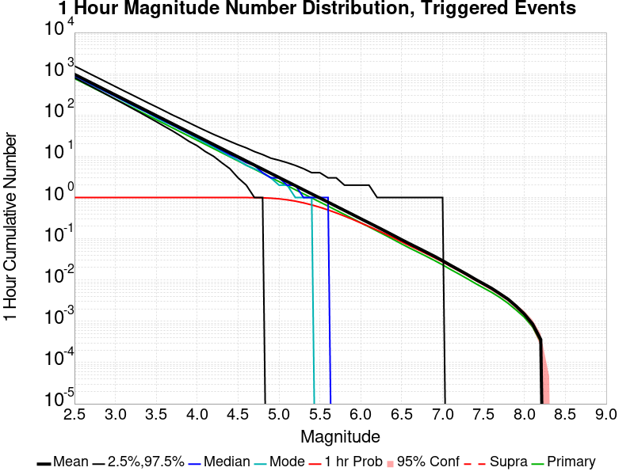
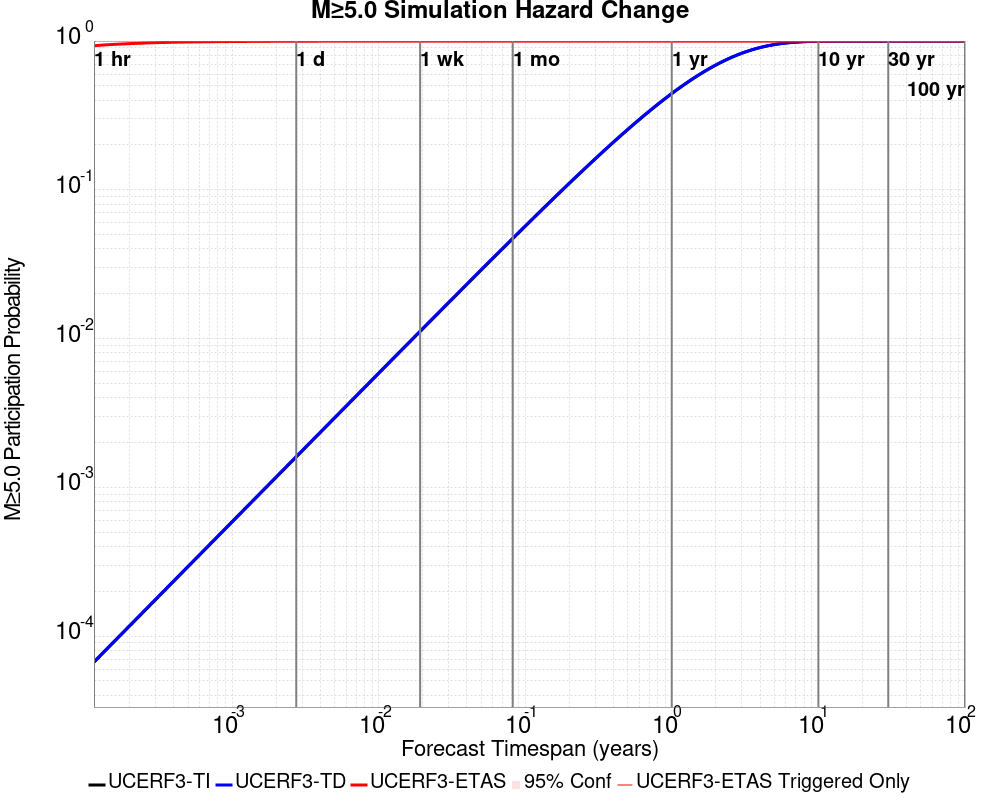
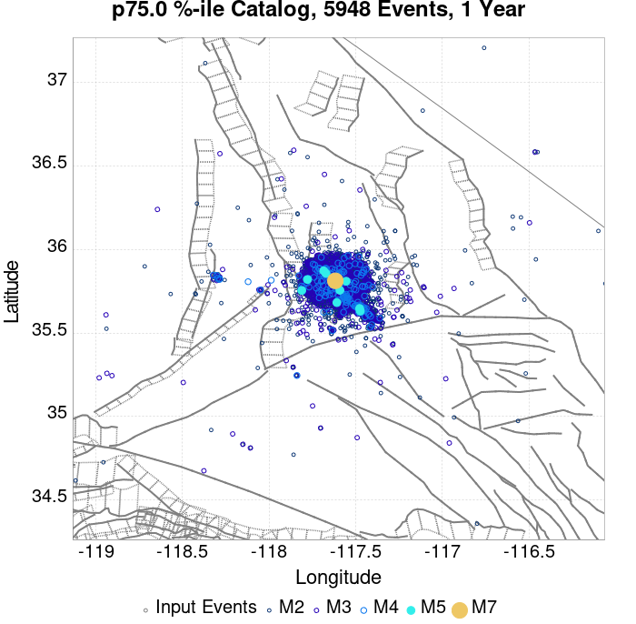

# ComCat M7.1 (ci38457511), ShakeMap Surfaces, Log10(k)=-2.3856, p=1.2164, c=0.0068906, No Faults Results

|   | ComCat M7.1 (ci38457511), ShakeMap Surfaces, Log10(k)=-2.3856, p=1.2164, c=0.0068906, No Faults |
|-----|-----|
| Num Simulations | 1375 (incomplete) |
| Start Time | 2019/07/06 03:19:54 UTC |
| Start Time Epoch Milliseconds | 1562383194040 |
| Duration | 10 Years |
| Includes Spontaneous? | false |
| Trigger Ruptures | 270 Trigger Ruptures |
|   | First: M3.98 at 2019/07/04 17:02:55 UTC |
|   | Last: M7.1 at 2019/07/06 03:19:53 UTC |
|   | Largest: M7.1 at 2019/07/06 03:19:53 UTC |
| Historical Ruptures | *(none)* |
| Config Generated With | u3etas_comcat_event_config_builder.sh --event-id ci38457511 --num-simulations 100000 --days-before 7 --gridded-only --mag-complete 3.5 --etas-k -2.3856 --etas-p 1.2164 --etas-c 0.0068906 --finite-surf-shakemap --finite-surf-shakemap-min-mag 5 --hpc-site USC_HPC --nodes 36 --hours 24 --queue scec |

## Table Of Contents

* [Probabilities Summary Table](#probabilities-summary-table)
* [Magnitude Number Distribution](#magnitude-number-distribution)
  * [10 Year Magnitude Number Distribution](#10-year-magnitude-number-distribution)
  * [1 Year Magnitude Number Distribution](#1-year-magnitude-number-distribution)
  * [1 Month Magnitude Number Distribution](#1-month-magnitude-number-distribution)
  * [1 Week Magnitude Number Distribution](#1-week-magnitude-number-distribution)
  * [1 Day Magnitude Number Distribution](#1-day-magnitude-number-distribution)
  * [1 Hour Magnitude Number Distribution](#1-hour-magnitude-number-distribution)
* [Hazard Change Over Time](#hazard-change-over-time)
  * [M&ge;5.0 Hazard Change Over Time](#m50-hazard-change-over-time)
  * [M&ge;6.0 Hazard Change Over Time](#m60-hazard-change-over-time)
  * [M&ge;7.0 Hazard Change Over Time](#m70-hazard-change-over-time)
  * [M&ge;8.0 Hazard Change Over Time](#m80-hazard-change-over-time)
* [Trigger Rupture Fault Map](#trigger-rupture-fault-map)
* [Trigger Rupture Depth Map](#trigger-rupture-depth-map)
* [Fault Distances To Triggers](#fault-distances-to-triggers)
* [Individual Simulated Catalog Maps](#individual-simulated-catalog-maps)
* [ComCat Data Comparisons](#comcat-data-comparisons)
  * [ComCat Magnitude-Number Distributions](#comcat-magnitude-number-distributions)
  * [ComCat Time-Dependent Mc](#comcat-time-dependent-mc)
  * [ComCat Cumulative Number Vs Time](#comcat-cumulative-number-vs-time)
  * [ComCat Cumulative Number Simulation Percentiles](#comcat-cumulative-number-simulation-percentiles)
  * [ComCat Probability Spatial Distribution](#comcat-probability-spatial-distribution)
  * [ComCat Mean Expectation Spatial Distribution](#comcat-mean-expectation-spatial-distribution)
  * [ComCat Depth Distribution](#comcat-depth-distribution)
* [Gridded Nucleation](#gridded-nucleation)
* [JSON Input File](#json-input-file)

## Probabilities Summary Table
*[(top)](#table-of-contents)*

| Magnitude | 1 Hour Prob | 1 Day Prob | 1 Week Prob | 1 Month Prob | 1 Year Prob | 10 Year Prob |
|-----|-----|-----|-----|-----|-----|-----|
| **M&ge;4** | 1.000 (100.00%) | 1.000 (100.00%) | 1.000 (100.00%) | 1.000 (100.00%) | 1.000 (100.00%) | 1.000 (100.00%) |
| **M&ge;4.5** | 1.000 (100.00%) | 1.000 (100.00%) | 1.000 (100.00%) | 1.000 (100.00%) | 1.000 (100.00%) | 1.000 (100.00%) |
| **M&ge;5** | 0.932 (93.24%) | 0.998 (99.78%) | 0.999 (99.85%) | 0.999 (99.85%) | 1.000 (100.00%) | 1.000 (100.00%) |
| **M&ge;5.5** | 0.593 (59.27%) | 0.866 (86.62%) | 0.928 (92.80%) | 0.949 (94.91%) | 0.970 (97.02%) | 0.973 (97.31%) |
| **M&ge;6** | 0.247 (24.73%) | 0.497 (49.67%) | 0.599 (59.93%) | 0.648 (64.80%) | 0.691 (69.09%) | 0.716 (71.64%) |
| **M&ge;6.5** | 0.100 (10.04%) | 0.208 (20.80%) | 0.273 (27.27%) | 0.299 (29.89%) | 0.336 (33.60%) | 0.361 (36.07%) |
| **M&ge;7** | 0.034 (3.42%) | 0.070 (6.98%) | 0.090 (9.02%) | 0.104 (10.40%) | 0.119 (11.93%) | 0.133 (13.31%) |
| **M&ge;7.1** | 0.028 (2.84%) | 0.057 (5.75%) | 0.075 (7.49%) | 0.086 (8.58%) | 0.099 (9.89%) | 0.112 (11.20%) |
| **M&ge;7.5** | 7.27E-3 (0.73%) | 0.018 (1.82%) | 0.030 (2.98%) | 0.033 (3.35%) | 0.044 (4.36%) | 0.051 (5.09%) |
| **M&ge;8** | 2.18E-3 (0.22%) | 4.36E-3 (0.44%) | 5.82E-3 (0.58%) | 5.82E-3 (0.58%) | 0.010 (1.02%) | 0.012 (1.24%) |

## Magnitude Number Distribution
*[(top)](#table-of-contents)*

### 10 Year Magnitude Number Distribution
*[(top)](#table-of-contents)*

**Legend**
* **Mean** (thick black line): mean expected number across all 1375 catalogs
* **2.5%,97.5%** (thin black lines): expected number percentiles across all 1375 catalogs
* **Median** (thin blue line): median expected number across all 1375 catalogs
* **Mode** (thin cyan line): modal expected number across all 1375 catalogs
* **10 yr Probability** (thin red line): 10 year probability calculated as the fraction of catalogs with at least 1 occurrence
* **10 yr Supraseismogenic Probability** (thin dashed red line): same as above, but only for supraseismogenic ruptures on explicitly modeled UCERF3 faults
* **95% Conf** (light red shaded region): binomial 95% confidence bounds on probability
* **Primary** (thin green line): mean expected number from primary triggered aftershocks only (no secondary, tertiary, etc...) across all 1375 catalogs


| Mag | Mean | 2.5 %ile | 97.5 %ile | Median | Mode | 10 yr Probability | 10 yr Supra-Seis Prob | Primary Aftershocks Mean |
|-----|-----|-----|-----|-----|-----|-----|-----|-----|
| **M&ge;2.5** | 7744.957 | 3481.000 | 30491.000 | 4763.000 | 3913.000 | 1.000 (100.00%) | 0.000 (0.00%) | 2268.949 |
| **M&ge;2.6** | 6152.272 | 2771.000 | 24229.000 | 3782.000 | 3133.000 | 1.000 (100.00%) | 0.000 (0.00%) | 1801.889 |
| **M&ge;2.7** | 4886.913 | 2198.000 | 19097.000 | 3017.000 | 2608.000 | 1.000 (100.00%) | 0.000 (0.00%) | 1431.226 |
| **M&ge;2.8** | 3882.957 | 1742.000 | 15130.000 | 2396.000 | 2542.000 | 1.000 (100.00%) | 0.000 (0.00%) | 1137.579 |
| **M&ge;2.9** | 3084.975 | 1386.000 | 12015.000 | 1898.000 | 1576.000 | 1.000 (100.00%) | 0.000 (0.00%) | 903.623 |
| **M&ge;3** | 2449.945 | 1099.000 | 9538.000 | 1511.000 | 1226.000 | 1.000 (100.00%) | 0.000 (0.00%) | 717.651 |
| **M&ge;3.1** | 1945.239 | 870.000 | 7649.000 | 1201.000 | 1047.000 | 1.000 (100.00%) | 0.000 (0.00%) | 569.917 |
| **M&ge;3.2** | 1545.703 | 685.000 | 6039.000 | 955.000 | 797.000 | 1.000 (100.00%) | 0.000 (0.00%) | 452.788 |
| **M&ge;3.3** | 1228.522 | 538.000 | 4828.000 | 760.000 | 636.000 | 1.000 (100.00%) | 0.000 (0.00%) | 359.801 |
| **M&ge;3.4** | 975.571 | 428.000 | 3848.000 | 600.000 | 677.000 | 1.000 (100.00%) | 0.000 (0.00%) | 285.651 |
| **M&ge;3.5** | 774.619 | 334.000 | 3038.000 | 479.000 | 397.000 | 1.000 (100.00%) | 0.000 (0.00%) | 226.628 |
| **M&ge;3.6** | 615.367 | 262.000 | 2398.000 | 383.000 | 321.000 | 1.000 (100.00%) | 0.000 (0.00%) | 180.152 |
| **M&ge;3.7** | 488.751 | 206.000 | 1905.000 | 304.000 | 261.000 | 1.000 (100.00%) | 0.000 (0.00%) | 143.012 |
| **M&ge;3.8** | 388.102 | 160.000 | 1529.000 | 241.000 | 191.000 | 1.000 (100.00%) | 0.000 (0.00%) | 113.561 |
| **M&ge;3.9** | 308.287 | 127.000 | 1226.000 | 192.000 | 152.000 | 1.000 (100.00%) | 0.000 (0.00%) | 90.250 |
| **M&ge;4** | 245.084 | 99.000 | 975.000 | 153.000 | 124.000 | 1.000 (100.00%) | 0.000 (0.00%) | 71.819 |
| **M&ge;4.1** | 194.649 | 78.000 | 785.000 | 122.000 | 105.000 | 1.000 (100.00%) | 0.000 (0.00%) | 57.151 |
| **M&ge;4.2** | 154.786 | 59.000 | 634.000 | 97.000 | 77.000 | 1.000 (100.00%) | 0.000 (0.00%) | 45.488 |
| **M&ge;4.3** | 122.620 | 45.000 | 507.000 | 77.000 | 66.000 | 1.000 (100.00%) | 0.000 (0.00%) | 35.983 |
| **M&ge;4.4** | 97.420 | 34.000 | 401.000 | 61.000 | 60.000 | 1.000 (100.00%) | 0.000 (0.00%) | 28.617 |
| **M&ge;4.5** | 77.495 | 26.000 | 320.000 | 49.000 | 41.000 | 1.000 (100.00%) | 0.000 (0.00%) | 22.732 |
| **M&ge;4.6** | 61.534 | 19.000 | 257.000 | 39.000 | 32.000 | 1.000 (100.00%) | 0.000 (0.00%) | 18.001 |
| **M&ge;4.7** | 48.871 | 15.000 | 196.000 | 31.000 | 23.000 | 1.000 (100.00%) | 0.000 (0.00%) | 14.324 |
| **M&ge;4.8** | 38.750 | 11.000 | 160.000 | 25.000 | 20.000 | 1.000 (100.00%) | 0.000 (0.00%) | 11.370 |
| **M&ge;4.9** | 30.804 | 8.000 | 127.000 | 20.000 | 17.000 | 1.000 (100.00%) | 0.000 (0.00%) | 9.065 |
| **M&ge;5** | 24.540 | 5.000 | 99.000 | 16.000 | 14.000 | 1.000 (100.00%) | 0.000 (0.00%) | 7.228 |
| **M&ge;5.1** | 19.460 | 4.000 | 77.000 | 13.000 | 9.000 | 1.000 (100.00%) | 0.000 (0.00%) | 5.725 |
| **M&ge;5.2** | 15.420 | 3.000 | 63.000 | 10.000 | 7.000 | 0.999 (99.93%) | 0.000 (0.00%) | 4.527 |
| **M&ge;5.3** | 12.241 | 2.000 | 49.000 | 8.000 | 7.000 | 0.996 (99.56%) | 0.000 (0.00%) | 3.554 |
| **M&ge;5.4** | 9.782 | 1.000 | 44.000 | 6.000 | 4.000 | 0.989 (98.91%) | 0.000 (0.00%) | 2.860 |
| **M&ge;5.5** | 7.767 | 0.000 | 33.000 | 5.000 | 4.000 | 0.973 (97.31%) | 0.000 (0.00%) | 2.266 |
| **M&ge;5.6** | 6.149 | 0.000 | 27.000 | 4.000 | 3.000 | 0.943 (94.25%) | 0.000 (0.00%) | 1.782 |
| **M&ge;5.7** | 4.867 | 0.000 | 22.000 | 3.000 | 2.000 | 0.899 (89.89%) | 0.000 (0.00%) | 1.412 |
| **M&ge;5.8** | 3.840 | 0.000 | 18.000 | 2.000 | 2.000 | 0.844 (84.36%) | 0.000 (0.00%) | 1.108 |
| **M&ge;5.9** | 3.069 | 0.000 | 14.000 | 2.000 | 1.000 | 0.785 (78.47%) | 0.000 (0.00%) | 0.890 |
| **M&ge;6** | 2.449 | 0.000 | 11.000 | 1.000 | 0.000 | 0.716 (71.64%) | 0.000 (0.00%) | 0.724 |
| **M&ge;6.1** | 1.947 | 0.000 | 9.000 | 1.000 | 0.000 | 0.649 (64.87%) | 0.000 (0.00%) | 0.596 |
| **M&ge;6.2** | 1.535 | 0.000 | 8.000 | 1.000 | 0.000 | 0.569 (56.87%) | 0.000 (0.00%) | 0.481 |
| **M&ge;6.3** | 1.222 | 0.000 | 7.000 | 0.000 | 0.000 | 0.489 (48.87%) | 0.000 (0.00%) | 0.380 |
| **M&ge;6.4** | 0.980 | 0.000 | 5.000 | 0.000 | 0.000 | 0.425 (42.47%) | 0.000 (0.00%) | 0.319 |
| **M&ge;6.5** | 0.778 | 0.000 | 4.000 | 0.000 | 0.000 | 0.361 (36.07%) | 0.000 (0.00%) | 0.254 |
| **M&ge;6.6** | 0.623 | 0.000 | 4.000 | 0.000 | 0.000 | 0.316 (31.64%) | 0.000 (0.00%) | 0.207 |
| **M&ge;6.7** | 0.471 | 0.000 | 3.000 | 0.000 | 0.000 | 0.255 (25.53%) | 0.000 (0.00%) | 0.152 |
| **M&ge;6.8** | 0.359 | 0.000 | 3.000 | 0.000 | 0.000 | 0.209 (20.87%) | 0.000 (0.00%) | 0.118 |
| **M&ge;6.9** | 0.279 | 0.000 | 2.000 | 0.000 | 0.000 | 0.165 (16.51%) | 0.000 (0.00%) | 0.089 |
| **M&ge;7** | 0.221 | 0.000 | 2.000 | 0.000 | 0.000 | 0.133 (13.31%) | 0.000 (0.00%) | 0.070 |
| **M&ge;7.1** | 0.175 | 0.000 | 2.000 | 0.000 | 0.000 | 0.112 (11.20%) | 0.000 (0.00%) | 0.057 |
| **M&ge;7.2** | 0.133 | 0.000 | 1.000 | 0.000 | 0.000 | 0.087 (8.65%) | 0.000 (0.00%) | 0.041 |
| **M&ge;7.3** | 0.106 | 0.000 | 1.000 | 0.000 | 0.000 | 0.074 (7.42%) | 0.000 (0.00%) | 0.031 |
| **M&ge;7.4** | 0.086 | 0.000 | 1.000 | 0.000 | 0.000 | 0.063 (6.33%) | 0.000 (0.00%) | 0.023 |
| **M&ge;7.5** | 0.066 | 0.000 | 1.000 | 0.000 | 0.000 | 0.051 (5.09%) | 0.000 (0.00%) | 0.018 |
| **M&ge;7.6** | 0.049 | 0.000 | 1.000 | 0.000 | 0.000 | 0.038 (3.78%) | 0.000 (0.00%) | 0.012 |
| **M&ge;7.7** | 0.044 | 0.000 | 1.000 | 0.000 | 0.000 | 0.034 (3.42%) | 0.000 (0.00%) | 0.011 |
| **M&ge;7.8** | 0.031 | 0.000 | 0.000 | 0.000 | 0.000 | 0.023 (2.33%) | 0.000 (0.00%) | 8.73E-3 |
| **M&ge;7.9** | 0.024 | 0.000 | 0.000 | 0.000 | 0.000 | 0.017 (1.75%) | 0.000 (0.00%) | 6.55E-3 |
| **M&ge;8** | 0.015 | 0.000 | 0.000 | 0.000 | 0.000 | 0.012 (1.24%) | 0.000 (0.00%) | 5.09E-3 |
| **M&ge;8.1** | 7.27E-3 | 0.000 | 0.000 | 0.000 | 0.000 | 5.09E-3 (0.51%) | 0.000 (0.00%) | 2.18E-3 |
| **M&ge;8.2** | 3.64E-3 | 0.000 | 0.000 | 0.000 | 0.000 | 2.91E-3 (0.29%) | 0.000 (0.00%) | 1.45E-3 |
| **M&ge;8.3** | 0.000 | 0.000 | 0.000 | 0.000 | 0.000 | 0.000 (0.00%) | 0.000 (0.00%) | 0.000 |
| **M&ge;8.4** | 0.000 | 0.000 | 0.000 | 0.000 | 0.000 | 0.000 (0.00%) | 0.000 (0.00%) | 0.000 |
| **M&ge;8.5** | 0.000 | 0.000 | 0.000 | 0.000 | 0.000 | 0.000 (0.00%) | 0.000 (0.00%) | 0.000 |
| **M&ge;8.6** | 0.000 | 0.000 | 0.000 | 0.000 | 0.000 | 0.000 (0.00%) | 0.000 (0.00%) | 0.000 |
| **M&ge;8.7** | 0.000 | 0.000 | 0.000 | 0.000 | 0.000 | 0.000 (0.00%) | 0.000 (0.00%) | 0.000 |
| **M&ge;8.8** | 0.000 | 0.000 | 0.000 | 0.000 | 0.000 | 0.000 (0.00%) | 0.000 (0.00%) | 0.000 |
| **M&ge;8.9** | 0.000 | 0.000 | 0.000 | 0.000 | 0.000 | 0.000 (0.00%) | 0.000 (0.00%) | 0.000 |
| **M&ge;9** | 0.000 | 0.000 | 0.000 | 0.000 | 0.000 | 0.000 (0.00%) | 0.000 (0.00%) | 0.000 |

### 1 Year Magnitude Number Distribution
*[(top)](#table-of-contents)*

**Legend**
* **Mean** (thick black line): mean expected number across all 1375 catalogs
* **2.5%,97.5%** (thin black lines): expected number percentiles across all 1375 catalogs
* **Median** (thin blue line): median expected number across all 1375 catalogs
* **Mode** (thin cyan line): modal expected number across all 1375 catalogs
* **1 yr Probability** (thin red line): 1 year probability calculated as the fraction of catalogs with at least 1 occurrence
* **1 yr Supraseismogenic Probability** (thin dashed red line): same as above, but only for supraseismogenic ruptures on explicitly modeled UCERF3 faults
* **95% Conf** (light red shaded region): binomial 95% confidence bounds on probability
* **Primary** (thin green line): mean expected number from primary triggered aftershocks only (no secondary, tertiary, etc...) across all 1375 catalogs


| Mag | Mean | 2.5 %ile | 97.5 %ile | Median | Mode | 1 yr Probability | 1 yr Supra-Seis Prob | Primary Aftershocks Mean |
|-----|-----|-----|-----|-----|-----|-----|-----|-----|
| **M&ge;2.5** | 6457.925 | 3247.000 | 25823.000 | 4341.000 | 3618.000 | 1.000 (100.00%) | 0.000 (0.00%) | 2162.543 |
| **M&ge;2.6** | 5129.932 | 2573.000 | 20440.000 | 3448.000 | 2884.000 | 1.000 (100.00%) | 0.000 (0.00%) | 1717.499 |
| **M&ge;2.7** | 4074.700 | 2044.000 | 16288.000 | 2741.000 | 2309.000 | 1.000 (100.00%) | 0.000 (0.00%) | 1364.052 |
| **M&ge;2.8** | 3237.271 | 1618.000 | 12994.000 | 2173.000 | 1806.000 | 1.000 (100.00%) | 0.000 (0.00%) | 1084.100 |
| **M&ge;2.9** | 2572.002 | 1291.000 | 10265.000 | 1722.000 | 1449.000 | 1.000 (100.00%) | 0.000 (0.00%) | 861.116 |
| **M&ge;3** | 2042.653 | 1021.000 | 8184.000 | 1373.000 | 1198.000 | 1.000 (100.00%) | 0.000 (0.00%) | 683.895 |
| **M&ge;3.1** | 1621.829 | 809.000 | 6472.000 | 1092.000 | 896.000 | 1.000 (100.00%) | 0.000 (0.00%) | 543.196 |
| **M&ge;3.2** | 1288.658 | 637.000 | 5176.000 | 866.000 | 735.000 | 1.000 (100.00%) | 0.000 (0.00%) | 431.677 |
| **M&ge;3.3** | 1024.107 | 499.000 | 4080.000 | 686.000 | 586.000 | 1.000 (100.00%) | 0.000 (0.00%) | 343.040 |
| **M&ge;3.4** | 813.166 | 393.000 | 3244.000 | 547.000 | 494.000 | 1.000 (100.00%) | 0.000 (0.00%) | 272.374 |
| **M&ge;3.5** | 645.706 | 309.000 | 2591.000 | 435.000 | 395.000 | 1.000 (100.00%) | 0.000 (0.00%) | 216.115 |
| **M&ge;3.6** | 513.013 | 243.000 | 2057.000 | 346.000 | 302.000 | 1.000 (100.00%) | 0.000 (0.00%) | 171.812 |
| **M&ge;3.7** | 407.400 | 189.000 | 1642.000 | 276.000 | 238.000 | 1.000 (100.00%) | 0.000 (0.00%) | 136.420 |
| **M&ge;3.8** | 323.471 | 149.000 | 1296.000 | 222.000 | 179.000 | 1.000 (100.00%) | 0.000 (0.00%) | 108.340 |
| **M&ge;3.9** | 256.973 | 116.000 | 1024.000 | 176.000 | 143.000 | 1.000 (100.00%) | 0.000 (0.00%) | 86.137 |
| **M&ge;4** | 204.369 | 92.000 | 814.000 | 139.000 | 110.000 | 1.000 (100.00%) | 0.000 (0.00%) | 68.537 |
| **M&ge;4.1** | 162.352 | 71.000 | 656.000 | 111.000 | 94.000 | 1.000 (100.00%) | 0.000 (0.00%) | 54.552 |
| **M&ge;4.2** | 129.156 | 54.000 | 534.000 | 88.000 | 70.000 | 1.000 (100.00%) | 0.000 (0.00%) | 43.421 |
| **M&ge;4.3** | 102.256 | 41.000 | 413.000 | 70.000 | 55.000 | 1.000 (100.00%) | 0.000 (0.00%) | 34.335 |
| **M&ge;4.4** | 81.232 | 31.000 | 335.000 | 56.000 | 46.000 | 1.000 (100.00%) | 0.000 (0.00%) | 27.291 |
| **M&ge;4.5** | 64.624 | 23.000 | 269.000 | 45.000 | 39.000 | 1.000 (100.00%) | 0.000 (0.00%) | 21.689 |
| **M&ge;4.6** | 51.263 | 17.000 | 213.000 | 36.000 | 29.000 | 1.000 (100.00%) | 0.000 (0.00%) | 17.172 |
| **M&ge;4.7** | 40.753 | 13.000 | 166.000 | 29.000 | 23.000 | 1.000 (100.00%) | 0.000 (0.00%) | 13.659 |
| **M&ge;4.8** | 32.268 | 10.000 | 131.000 | 22.000 | 20.000 | 1.000 (100.00%) | 0.000 (0.00%) | 10.838 |
| **M&ge;4.9** | 25.666 | 7.000 | 108.000 | 18.000 | 14.000 | 1.000 (100.00%) | 0.000 (0.00%) | 8.646 |
| **M&ge;5** | 20.453 | 5.000 | 82.000 | 14.000 | 13.000 | 1.000 (100.00%) | 0.000 (0.00%) | 6.876 |
| **M&ge;5.1** | 16.234 | 4.000 | 63.000 | 11.000 | 10.000 | 1.000 (100.00%) | 0.000 (0.00%) | 5.444 |
| **M&ge;5.2** | 12.836 | 2.000 | 53.000 | 9.000 | 6.000 | 0.999 (99.93%) | 0.000 (0.00%) | 4.298 |
| **M&ge;5.3** | 10.186 | 1.000 | 41.000 | 7.000 | 6.000 | 0.993 (99.35%) | 0.000 (0.00%) | 3.378 |
| **M&ge;5.4** | 8.152 | 1.000 | 33.000 | 6.000 | 4.000 | 0.985 (98.55%) | 0.000 (0.00%) | 2.713 |
| **M&ge;5.5** | 6.467 | 0.000 | 27.000 | 4.000 | 3.000 | 0.970 (97.02%) | 0.000 (0.00%) | 2.151 |
| **M&ge;5.6** | 5.104 | 0.000 | 22.000 | 3.000 | 2.000 | 0.935 (93.45%) | 0.000 (0.00%) | 1.689 |
| **M&ge;5.7** | 4.049 | 0.000 | 17.000 | 3.000 | 2.000 | 0.885 (88.51%) | 0.000 (0.00%) | 1.338 |
| **M&ge;5.8** | 3.191 | 0.000 | 13.000 | 2.000 | 2.000 | 0.822 (82.18%) | 0.000 (0.00%) | 1.052 |
| **M&ge;5.9** | 2.532 | 0.000 | 11.000 | 2.000 | 1.000 | 0.761 (76.07%) | 0.000 (0.00%) | 0.840 |
| **M&ge;6** | 2.018 | 0.000 | 9.000 | 1.000 | 0.000 | 0.691 (69.09%) | 0.000 (0.00%) | 0.684 |
| **M&ge;6.1** | 1.604 | 0.000 | 8.000 | 1.000 | 0.000 | 0.623 (62.25%) | 0.000 (0.00%) | 0.565 |
| **M&ge;6.2** | 1.267 | 0.000 | 6.000 | 1.000 | 0.000 | 0.542 (54.18%) | 0.000 (0.00%) | 0.455 |
| **M&ge;6.3** | 1.005 | 0.000 | 5.000 | 0.000 | 0.000 | 0.459 (45.89%) | 0.000 (0.00%) | 0.361 |
| **M&ge;6.4** | 0.811 | 0.000 | 5.000 | 0.000 | 0.000 | 0.398 (39.78%) | 0.000 (0.00%) | 0.303 |
| **M&ge;6.5** | 0.639 | 0.000 | 4.000 | 0.000 | 0.000 | 0.336 (33.60%) | 0.000 (0.00%) | 0.241 |
| **M&ge;6.6** | 0.512 | 0.000 | 3.000 | 0.000 | 0.000 | 0.292 (29.24%) | 0.000 (0.00%) | 0.196 |
| **M&ge;6.7** | 0.391 | 0.000 | 3.000 | 0.000 | 0.000 | 0.236 (23.56%) | 0.000 (0.00%) | 0.146 |
| **M&ge;6.8** | 0.297 | 0.000 | 2.000 | 0.000 | 0.000 | 0.191 (19.13%) | 0.000 (0.00%) | 0.112 |
| **M&ge;6.9** | 0.231 | 0.000 | 2.000 | 0.000 | 0.000 | 0.150 (14.98%) | 0.000 (0.00%) | 0.084 |
| **M&ge;7** | 0.180 | 0.000 | 2.000 | 0.000 | 0.000 | 0.119 (11.93%) | 0.000 (0.00%) | 0.065 |
| **M&ge;7.1** | 0.143 | 0.000 | 1.000 | 0.000 | 0.000 | 0.099 (9.89%) | 0.000 (0.00%) | 0.052 |
| **M&ge;7.2** | 0.107 | 0.000 | 1.000 | 0.000 | 0.000 | 0.076 (7.56%) | 0.000 (0.00%) | 0.039 |
| **M&ge;7.3** | 0.083 | 0.000 | 1.000 | 0.000 | 0.000 | 0.063 (6.33%) | 0.000 (0.00%) | 0.029 |
| **M&ge;7.4** | 0.067 | 0.000 | 1.000 | 0.000 | 0.000 | 0.054 (5.38%) | 0.000 (0.00%) | 0.020 |
| **M&ge;7.5** | 0.052 | 0.000 | 1.000 | 0.000 | 0.000 | 0.044 (4.36%) | 0.000 (0.00%) | 0.016 |
| **M&ge;7.6** | 0.038 | 0.000 | 1.000 | 0.000 | 0.000 | 0.033 (3.27%) | 0.000 (0.00%) | 0.010 |
| **M&ge;7.7** | 0.035 | 0.000 | 1.000 | 0.000 | 0.000 | 0.031 (3.13%) | 0.000 (0.00%) | 9.45E-3 |
| **M&ge;7.8** | 0.023 | 0.000 | 0.000 | 0.000 | 0.000 | 0.020 (2.04%) | 0.000 (0.00%) | 7.27E-3 |
| **M&ge;7.9** | 0.017 | 0.000 | 0.000 | 0.000 | 0.000 | 0.015 (1.53%) | 0.000 (0.00%) | 5.09E-3 |
| **M&ge;8** | 0.011 | 0.000 | 0.000 | 0.000 | 0.000 | 0.010 (1.02%) | 0.000 (0.00%) | 3.64E-3 |
| **M&ge;8.1** | 3.64E-3 | 0.000 | 0.000 | 0.000 | 0.000 | 2.91E-3 (0.29%) | 0.000 (0.00%) | 7.27E-4 |
| **M&ge;8.2** | 7.27E-4 | 0.000 | 0.000 | 0.000 | 0.000 | 7.27E-4 (0.07%) | 0.000 (0.00%) | 0.000 |
| **M&ge;8.3** | 0.000 | 0.000 | 0.000 | 0.000 | 0.000 | 0.000 (0.00%) | 0.000 (0.00%) | 0.000 |
| **M&ge;8.4** | 0.000 | 0.000 | 0.000 | 0.000 | 0.000 | 0.000 (0.00%) | 0.000 (0.00%) | 0.000 |
| **M&ge;8.5** | 0.000 | 0.000 | 0.000 | 0.000 | 0.000 | 0.000 (0.00%) | 0.000 (0.00%) | 0.000 |
| **M&ge;8.6** | 0.000 | 0.000 | 0.000 | 0.000 | 0.000 | 0.000 (0.00%) | 0.000 (0.00%) | 0.000 |
| **M&ge;8.7** | 0.000 | 0.000 | 0.000 | 0.000 | 0.000 | 0.000 (0.00%) | 0.000 (0.00%) | 0.000 |
| **M&ge;8.8** | 0.000 | 0.000 | 0.000 | 0.000 | 0.000 | 0.000 (0.00%) | 0.000 (0.00%) | 0.000 |
| **M&ge;8.9** | 0.000 | 0.000 | 0.000 | 0.000 | 0.000 | 0.000 (0.00%) | 0.000 (0.00%) | 0.000 |
| **M&ge;9** | 0.000 | 0.000 | 0.000 | 0.000 | 0.000 | 0.000 (0.00%) | 0.000 (0.00%) | 0.000 |

### 1 Month Magnitude Number Distribution
*[(top)](#table-of-contents)*

**Legend**
* **Mean** (thick black line): mean expected number across all 1375 catalogs
* **2.5%,97.5%** (thin black lines): expected number percentiles across all 1375 catalogs
* **Median** (thin blue line): median expected number across all 1375 catalogs
* **Mode** (thin cyan line): modal expected number across all 1375 catalogs
* **1 mo Probability** (thin red line): 1 month probability calculated as the fraction of catalogs with at least 1 occurrence
* **1 mo Supraseismogenic Probability** (thin dashed red line): same as above, but only for supraseismogenic ruptures on explicitly modeled UCERF3 faults
* **95% Conf** (light red shaded region): binomial 95% confidence bounds on probability
* **Primary** (thin green line): mean expected number from primary triggered aftershocks only (no secondary, tertiary, etc...) across all 1375 catalogs


| Mag | Mean | 2.5 %ile | 97.5 %ile | Median | Mode | 1 mo Probability | 1 mo Supra-Seis Prob | Primary Aftershocks Mean |
|-----|-----|-----|-----|-----|-----|-----|-----|-----|
| **M&ge;2.5** | 5040.971 | 2816.000 | 16685.000 | 3581.000 | 3215.000 | 1.000 (100.00%) | 0.000 (0.00%) | 1968.906 |
| **M&ge;2.6** | 4004.044 | 2234.000 | 13172.000 | 2852.000 | 2560.000 | 1.000 (100.00%) | 0.000 (0.00%) | 1563.928 |
| **M&ge;2.7** | 3180.041 | 1762.000 | 10438.000 | 2272.000 | 1911.000 | 1.000 (100.00%) | 0.000 (0.00%) | 1242.026 |
| **M&ge;2.8** | 2526.849 | 1393.000 | 8266.000 | 1805.000 | 1674.000 | 1.000 (100.00%) | 0.000 (0.00%) | 987.217 |
| **M&ge;2.9** | 2007.777 | 1105.000 | 6561.000 | 1441.000 | 1225.000 | 1.000 (100.00%) | 0.000 (0.00%) | 784.302 |
| **M&ge;3** | 1594.383 | 879.000 | 5304.000 | 1144.000 | 987.000 | 1.000 (100.00%) | 0.000 (0.00%) | 622.984 |
| **M&ge;3.1** | 1265.796 | 697.000 | 4211.000 | 911.000 | 822.000 | 1.000 (100.00%) | 0.000 (0.00%) | 494.911 |
| **M&ge;3.2** | 1005.442 | 547.000 | 3389.000 | 721.000 | 649.000 | 1.000 (100.00%) | 0.000 (0.00%) | 393.194 |
| **M&ge;3.3** | 799.244 | 433.000 | 2695.000 | 574.000 | 519.000 | 1.000 (100.00%) | 0.000 (0.00%) | 312.468 |
| **M&ge;3.4** | 634.544 | 340.000 | 2141.000 | 457.000 | 437.000 | 1.000 (100.00%) | 0.000 (0.00%) | 248.107 |
| **M&ge;3.5** | 503.763 | 266.000 | 1685.000 | 362.000 | 327.000 | 1.000 (100.00%) | 0.000 (0.00%) | 196.928 |
| **M&ge;3.6** | 400.277 | 207.000 | 1346.000 | 289.000 | 248.000 | 1.000 (100.00%) | 0.000 (0.00%) | 156.631 |
| **M&ge;3.7** | 317.982 | 161.000 | 1068.000 | 230.000 | 212.000 | 1.000 (100.00%) | 0.000 (0.00%) | 124.413 |
| **M&ge;3.8** | 252.292 | 128.000 | 820.000 | 183.000 | 170.000 | 1.000 (100.00%) | 0.000 (0.00%) | 98.820 |
| **M&ge;3.9** | 200.326 | 100.000 | 672.000 | 146.000 | 125.000 | 1.000 (100.00%) | 0.000 (0.00%) | 78.529 |
| **M&ge;4** | 159.385 | 78.000 | 525.000 | 116.000 | 98.000 | 1.000 (100.00%) | 0.000 (0.00%) | 62.548 |
| **M&ge;4.1** | 126.625 | 59.000 | 430.000 | 92.000 | 83.000 | 1.000 (100.00%) | 0.000 (0.00%) | 49.812 |
| **M&ge;4.2** | 100.745 | 46.000 | 340.000 | 74.000 | 67.000 | 1.000 (100.00%) | 0.000 (0.00%) | 39.642 |
| **M&ge;4.3** | 79.697 | 35.000 | 269.000 | 58.000 | 50.000 | 1.000 (100.00%) | 0.000 (0.00%) | 31.340 |
| **M&ge;4.4** | 63.393 | 27.000 | 207.000 | 46.000 | 43.000 | 1.000 (100.00%) | 0.000 (0.00%) | 24.905 |
| **M&ge;4.5** | 50.451 | 20.000 | 164.000 | 38.000 | 31.000 | 1.000 (100.00%) | 0.000 (0.00%) | 19.813 |
| **M&ge;4.6** | 40.055 | 15.000 | 133.000 | 30.000 | 24.000 | 1.000 (100.00%) | 0.000 (0.00%) | 15.685 |
| **M&ge;4.7** | 31.822 | 11.000 | 107.000 | 24.000 | 23.000 | 1.000 (100.00%) | 0.000 (0.00%) | 12.453 |
| **M&ge;4.8** | 25.222 | 8.000 | 90.000 | 19.000 | 15.000 | 1.000 (100.00%) | 0.000 (0.00%) | 9.889 |
| **M&ge;4.9** | 20.095 | 6.000 | 70.000 | 15.000 | 12.000 | 1.000 (100.00%) | 0.000 (0.00%) | 7.907 |
| **M&ge;5** | 16.018 | 4.000 | 55.000 | 12.000 | 10.000 | 0.999 (99.85%) | 0.000 (0.00%) | 6.298 |
| **M&ge;5.1** | 12.715 | 3.000 | 45.000 | 9.000 | 7.000 | 0.999 (99.85%) | 0.000 (0.00%) | 4.971 |
| **M&ge;5.2** | 10.075 | 2.000 | 36.000 | 7.000 | 6.000 | 0.996 (99.64%) | 0.000 (0.00%) | 3.929 |
| **M&ge;5.3** | 7.986 | 1.000 | 29.000 | 6.000 | 6.000 | 0.988 (98.84%) | 0.000 (0.00%) | 3.082 |
| **M&ge;5.4** | 6.404 | 1.000 | 22.000 | 4.000 | 4.000 | 0.977 (97.67%) | 0.000 (0.00%) | 2.479 |
| **M&ge;5.5** | 5.065 | 0.000 | 20.000 | 4.000 | 3.000 | 0.949 (94.91%) | 0.000 (0.00%) | 1.962 |
| **M&ge;5.6** | 3.996 | 0.000 | 15.000 | 3.000 | 2.000 | 0.906 (90.62%) | 0.000 (0.00%) | 1.545 |
| **M&ge;5.7** | 3.173 | 0.000 | 12.000 | 2.000 | 1.000 | 0.852 (85.16%) | 0.000 (0.00%) | 1.223 |
| **M&ge;5.8** | 2.504 | 0.000 | 10.000 | 2.000 | 1.000 | 0.785 (78.47%) | 0.000 (0.00%) | 0.969 |
| **M&ge;5.9** | 1.997 | 0.000 | 9.000 | 1.000 | 1.000 | 0.721 (72.15%) | 0.000 (0.00%) | 0.775 |
| **M&ge;6** | 1.587 | 0.000 | 8.000 | 1.000 | 0.000 | 0.648 (64.80%) | 0.000 (0.00%) | 0.628 |
| **M&ge;6.1** | 1.263 | 0.000 | 6.000 | 1.000 | 0.000 | 0.575 (57.45%) | 0.000 (0.00%) | 0.521 |
| **M&ge;6.2** | 1.001 | 0.000 | 5.000 | 0.000 | 0.000 | 0.495 (49.45%) | 0.000 (0.00%) | 0.420 |
| **M&ge;6.3** | 0.796 | 0.000 | 4.000 | 0.000 | 0.000 | 0.414 (41.38%) | 0.000 (0.00%) | 0.336 |
| **M&ge;6.4** | 0.647 | 0.000 | 4.000 | 0.000 | 0.000 | 0.356 (35.64%) | 0.000 (0.00%) | 0.281 |
| **M&ge;6.5** | 0.516 | 0.000 | 3.000 | 0.000 | 0.000 | 0.299 (29.89%) | 0.000 (0.00%) | 0.223 |
| **M&ge;6.6** | 0.413 | 0.000 | 3.000 | 0.000 | 0.000 | 0.258 (25.82%) | 0.000 (0.00%) | 0.181 |
| **M&ge;6.7** | 0.309 | 0.000 | 2.000 | 0.000 | 0.000 | 0.205 (20.51%) | 0.000 (0.00%) | 0.134 |
| **M&ge;6.8** | 0.236 | 0.000 | 2.000 | 0.000 | 0.000 | 0.168 (16.80%) | 0.000 (0.00%) | 0.103 |
| **M&ge;6.9** | 0.179 | 0.000 | 2.000 | 0.000 | 0.000 | 0.130 (13.02%) | 0.000 (0.00%) | 0.076 |
| **M&ge;7** | 0.140 | 0.000 | 1.000 | 0.000 | 0.000 | 0.104 (10.40%) | 0.000 (0.00%) | 0.060 |
| **M&ge;7.1** | 0.113 | 0.000 | 1.000 | 0.000 | 0.000 | 0.086 (8.58%) | 0.000 (0.00%) | 0.049 |
| **M&ge;7.2** | 0.085 | 0.000 | 1.000 | 0.000 | 0.000 | 0.065 (6.55%) | 0.000 (0.00%) | 0.036 |
| **M&ge;7.3** | 0.065 | 0.000 | 1.000 | 0.000 | 0.000 | 0.053 (5.31%) | 0.000 (0.00%) | 0.027 |
| **M&ge;7.4** | 0.051 | 0.000 | 1.000 | 0.000 | 0.000 | 0.044 (4.44%) | 0.000 (0.00%) | 0.019 |
| **M&ge;7.5** | 0.039 | 0.000 | 1.000 | 0.000 | 0.000 | 0.033 (3.35%) | 0.000 (0.00%) | 0.015 |
| **M&ge;7.6** | 0.027 | 0.000 | 0.000 | 0.000 | 0.000 | 0.024 (2.40%) | 0.000 (0.00%) | 9.45E-3 |
| **M&ge;7.7** | 0.026 | 0.000 | 0.000 | 0.000 | 0.000 | 0.023 (2.33%) | 0.000 (0.00%) | 8.73E-3 |
| **M&ge;7.8** | 0.015 | 0.000 | 0.000 | 0.000 | 0.000 | 0.014 (1.38%) | 0.000 (0.00%) | 6.55E-3 |
| **M&ge;7.9** | 0.011 | 0.000 | 0.000 | 0.000 | 0.000 | 9.45E-3 (0.95%) | 0.000 (0.00%) | 4.36E-3 |
| **M&ge;8** | 6.55E-3 | 0.000 | 0.000 | 0.000 | 0.000 | 5.82E-3 (0.58%) | 0.000 (0.00%) | 2.91E-3 |
| **M&ge;8.1** | 2.91E-3 | 0.000 | 0.000 | 0.000 | 0.000 | 2.18E-3 (0.22%) | 0.000 (0.00%) | 7.27E-4 |
| **M&ge;8.2** | 7.27E-4 | 0.000 | 0.000 | 0.000 | 0.000 | 7.27E-4 (0.07%) | 0.000 (0.00%) | 0.000 |
| **M&ge;8.3** | 0.000 | 0.000 | 0.000 | 0.000 | 0.000 | 0.000 (0.00%) | 0.000 (0.00%) | 0.000 |
| **M&ge;8.4** | 0.000 | 0.000 | 0.000 | 0.000 | 0.000 | 0.000 (0.00%) | 0.000 (0.00%) | 0.000 |
| **M&ge;8.5** | 0.000 | 0.000 | 0.000 | 0.000 | 0.000 | 0.000 (0.00%) | 0.000 (0.00%) | 0.000 |
| **M&ge;8.6** | 0.000 | 0.000 | 0.000 | 0.000 | 0.000 | 0.000 (0.00%) | 0.000 (0.00%) | 0.000 |
| **M&ge;8.7** | 0.000 | 0.000 | 0.000 | 0.000 | 0.000 | 0.000 (0.00%) | 0.000 (0.00%) | 0.000 |
| **M&ge;8.8** | 0.000 | 0.000 | 0.000 | 0.000 | 0.000 | 0.000 (0.00%) | 0.000 (0.00%) | 0.000 |
| **M&ge;8.9** | 0.000 | 0.000 | 0.000 | 0.000 | 0.000 | 0.000 (0.00%) | 0.000 (0.00%) | 0.000 |
| **M&ge;9** | 0.000 | 0.000 | 0.000 | 0.000 | 0.000 | 0.000 (0.00%) | 0.000 (0.00%) | 0.000 |

### 1 Week Magnitude Number Distribution
*[(top)](#table-of-contents)*

**Legend**
* **Mean** (thick black line): mean expected number across all 1375 catalogs
* **2.5%,97.5%** (thin black lines): expected number percentiles across all 1375 catalogs
* **Median** (thin blue line): median expected number across all 1375 catalogs
* **Mode** (thin cyan line): modal expected number across all 1375 catalogs
* **1 wk Probability** (thin red line): 1 week probability calculated as the fraction of catalogs with at least 1 occurrence
* **1 wk Supraseismogenic Probability** (thin dashed red line): same as above, but only for supraseismogenic ruptures on explicitly modeled UCERF3 faults
* **95% Conf** (light red shaded region): binomial 95% confidence bounds on probability
* **Primary** (thin green line): mean expected number from primary triggered aftershocks only (no secondary, tertiary, etc...) across all 1375 catalogs


| Mag | Mean | 2.5 %ile | 97.5 %ile | Median | Mode | 1 wk Probability | 1 wk Supra-Seis Prob | Primary Aftershocks Mean |
|-----|-----|-----|-----|-----|-----|-----|-----|-----|
| **M&ge;2.5** | 4151.549 | 2474.000 | 13555.000 | 3061.000 | 2794.000 | 1.000 (100.00%) | 0.000 (0.00%) | 1801.324 |
| **M&ge;2.6** | 3297.665 | 1962.000 | 10764.000 | 2431.000 | 2172.000 | 1.000 (100.00%) | 0.000 (0.00%) | 1430.703 |
| **M&ge;2.7** | 2618.674 | 1549.000 | 8522.000 | 1935.000 | 1817.000 | 1.000 (100.00%) | 0.000 (0.00%) | 1136.246 |
| **M&ge;2.8** | 2081.020 | 1227.000 | 6774.000 | 1538.000 | 1392.000 | 1.000 (100.00%) | 0.000 (0.00%) | 903.288 |
| **M&ge;2.9** | 1653.454 | 973.000 | 5414.000 | 1223.000 | 1097.000 | 1.000 (100.00%) | 0.000 (0.00%) | 717.508 |
| **M&ge;3** | 1312.821 | 771.000 | 4273.000 | 971.000 | 890.000 | 1.000 (100.00%) | 0.000 (0.00%) | 569.825 |
| **M&ge;3.1** | 1042.268 | 611.000 | 3403.000 | 772.000 | 707.000 | 1.000 (100.00%) | 0.000 (0.00%) | 452.757 |
| **M&ge;3.2** | 827.824 | 480.000 | 2672.000 | 613.000 | 569.000 | 1.000 (100.00%) | 0.000 (0.00%) | 359.665 |
| **M&ge;3.3** | 657.971 | 377.000 | 2115.000 | 487.000 | 435.000 | 1.000 (100.00%) | 0.000 (0.00%) | 285.865 |
| **M&ge;3.4** | 522.599 | 296.000 | 1666.000 | 387.000 | 348.000 | 1.000 (100.00%) | 0.000 (0.00%) | 227.046 |
| **M&ge;3.5** | 415.065 | 232.000 | 1320.000 | 308.000 | 279.000 | 1.000 (100.00%) | 0.000 (0.00%) | 180.229 |
| **M&ge;3.6** | 329.890 | 183.000 | 1064.000 | 246.000 | 242.000 | 1.000 (100.00%) | 0.000 (0.00%) | 143.436 |
| **M&ge;3.7** | 262.161 | 141.000 | 848.000 | 196.000 | 184.000 | 1.000 (100.00%) | 0.000 (0.00%) | 114.008 |
| **M&ge;3.8** | 208.073 | 110.000 | 685.000 | 156.000 | 145.000 | 1.000 (100.00%) | 0.000 (0.00%) | 90.564 |
| **M&ge;3.9** | 165.319 | 87.000 | 546.000 | 125.000 | 112.000 | 1.000 (100.00%) | 0.000 (0.00%) | 71.962 |
| **M&ge;4** | 131.559 | 67.000 | 443.000 | 99.000 | 91.000 | 1.000 (100.00%) | 0.000 (0.00%) | 57.362 |
| **M&ge;4.1** | 104.536 | 53.000 | 352.000 | 78.000 | 70.000 | 1.000 (100.00%) | 0.000 (0.00%) | 45.711 |
| **M&ge;4.2** | 83.257 | 40.000 | 284.000 | 63.000 | 57.000 | 1.000 (100.00%) | 0.000 (0.00%) | 36.420 |
| **M&ge;4.3** | 65.920 | 31.000 | 226.000 | 50.000 | 47.000 | 1.000 (100.00%) | 0.000 (0.00%) | 28.827 |
| **M&ge;4.4** | 52.380 | 23.000 | 174.000 | 40.000 | 40.000 | 1.000 (100.00%) | 0.000 (0.00%) | 22.889 |
| **M&ge;4.5** | 41.678 | 17.000 | 139.000 | 32.000 | 29.000 | 1.000 (100.00%) | 0.000 (0.00%) | 18.196 |
| **M&ge;4.6** | 33.078 | 13.000 | 109.000 | 26.000 | 23.000 | 1.000 (100.00%) | 0.000 (0.00%) | 14.402 |
| **M&ge;4.7** | 26.285 | 10.000 | 85.000 | 20.000 | 19.000 | 1.000 (100.00%) | 0.000 (0.00%) | 11.439 |
| **M&ge;4.8** | 20.831 | 7.000 | 68.000 | 16.000 | 12.000 | 1.000 (100.00%) | 0.000 (0.00%) | 9.080 |
| **M&ge;4.9** | 16.598 | 5.000 | 53.000 | 13.000 | 11.000 | 1.000 (100.00%) | 0.000 (0.00%) | 7.264 |
| **M&ge;5** | 13.234 | 3.000 | 42.000 | 10.000 | 10.000 | 0.999 (99.85%) | 0.000 (0.00%) | 5.775 |
| **M&ge;5.1** | 10.517 | 2.000 | 35.000 | 8.000 | 7.000 | 0.999 (99.85%) | 0.000 (0.00%) | 4.554 |
| **M&ge;5.2** | 8.335 | 1.000 | 27.000 | 6.000 | 6.000 | 0.995 (99.49%) | 0.000 (0.00%) | 3.600 |
| **M&ge;5.3** | 6.628 | 1.000 | 23.000 | 5.000 | 3.000 | 0.983 (98.25%) | 0.000 (0.00%) | 2.828 |
| **M&ge;5.4** | 5.329 | 0.000 | 19.000 | 4.000 | 3.000 | 0.963 (96.29%) | 0.000 (0.00%) | 2.274 |
| **M&ge;5.5** | 4.220 | 0.000 | 15.000 | 3.000 | 2.000 | 0.928 (92.80%) | 0.000 (0.00%) | 1.800 |
| **M&ge;5.6** | 3.340 | 0.000 | 12.000 | 2.000 | 2.000 | 0.873 (87.35%) | 0.000 (0.00%) | 1.421 |
| **M&ge;5.7** | 2.669 | 0.000 | 10.000 | 2.000 | 1.000 | 0.814 (81.38%) | 0.000 (0.00%) | 1.127 |
| **M&ge;5.8** | 2.105 | 0.000 | 8.000 | 1.000 | 0.000 | 0.743 (74.25%) | 0.000 (0.00%) | 0.889 |
| **M&ge;5.9** | 1.685 | 0.000 | 7.000 | 1.000 | 0.000 | 0.679 (67.85%) | 0.000 (0.00%) | 0.712 |
| **M&ge;6** | 1.336 | 0.000 | 6.000 | 1.000 | 0.000 | 0.599 (59.93%) | 0.000 (0.00%) | 0.577 |
| **M&ge;6.1** | 1.058 | 0.000 | 5.000 | 1.000 | 0.000 | 0.525 (52.51%) | 0.000 (0.00%) | 0.477 |
| **M&ge;6.2** | 0.836 | 0.000 | 4.000 | 0.000 | 0.000 | 0.444 (44.44%) | 0.000 (0.00%) | 0.383 |
| **M&ge;6.3** | 0.671 | 0.000 | 4.000 | 0.000 | 0.000 | 0.372 (37.24%) | 0.000 (0.00%) | 0.307 |
| **M&ge;6.4** | 0.545 | 0.000 | 3.000 | 0.000 | 0.000 | 0.321 (32.15%) | 0.000 (0.00%) | 0.258 |
| **M&ge;6.5** | 0.439 | 0.000 | 3.000 | 0.000 | 0.000 | 0.273 (27.27%) | 0.000 (0.00%) | 0.206 |
| **M&ge;6.6** | 0.351 | 0.000 | 2.000 | 0.000 | 0.000 | 0.231 (23.05%) | 0.000 (0.00%) | 0.167 |
| **M&ge;6.7** | 0.265 | 0.000 | 2.000 | 0.000 | 0.000 | 0.183 (18.33%) | 0.000 (0.00%) | 0.124 |
| **M&ge;6.8** | 0.204 | 0.000 | 2.000 | 0.000 | 0.000 | 0.150 (14.98%) | 0.000 (0.00%) | 0.095 |
| **M&ge;6.9** | 0.153 | 0.000 | 1.000 | 0.000 | 0.000 | 0.113 (11.35%) | 0.000 (0.00%) | 0.070 |
| **M&ge;7** | 0.120 | 0.000 | 1.000 | 0.000 | 0.000 | 0.090 (9.02%) | 0.000 (0.00%) | 0.055 |
| **M&ge;7.1** | 0.097 | 0.000 | 1.000 | 0.000 | 0.000 | 0.075 (7.49%) | 0.000 (0.00%) | 0.044 |
| **M&ge;7.2** | 0.072 | 0.000 | 1.000 | 0.000 | 0.000 | 0.057 (5.67%) | 0.000 (0.00%) | 0.032 |
| **M&ge;7.3** | 0.054 | 0.000 | 1.000 | 0.000 | 0.000 | 0.045 (4.51%) | 0.000 (0.00%) | 0.023 |
| **M&ge;7.4** | 0.047 | 0.000 | 1.000 | 0.000 | 0.000 | 0.040 (4.00%) | 0.000 (0.00%) | 0.018 |
| **M&ge;7.5** | 0.035 | 0.000 | 1.000 | 0.000 | 0.000 | 0.030 (2.98%) | 0.000 (0.00%) | 0.014 |
| **M&ge;7.6** | 0.024 | 0.000 | 0.000 | 0.000 | 0.000 | 0.021 (2.11%) | 0.000 (0.00%) | 9.45E-3 |
| **M&ge;7.7** | 0.023 | 0.000 | 0.000 | 0.000 | 0.000 | 0.020 (2.04%) | 0.000 (0.00%) | 8.73E-3 |
| **M&ge;7.8** | 0.015 | 0.000 | 0.000 | 0.000 | 0.000 | 0.014 (1.38%) | 0.000 (0.00%) | 6.55E-3 |
| **M&ge;7.9** | 0.011 | 0.000 | 0.000 | 0.000 | 0.000 | 9.45E-3 (0.95%) | 0.000 (0.00%) | 4.36E-3 |
| **M&ge;8** | 6.55E-3 | 0.000 | 0.000 | 0.000 | 0.000 | 5.82E-3 (0.58%) | 0.000 (0.00%) | 2.91E-3 |
| **M&ge;8.1** | 2.91E-3 | 0.000 | 0.000 | 0.000 | 0.000 | 2.18E-3 (0.22%) | 0.000 (0.00%) | 7.27E-4 |
| **M&ge;8.2** | 7.27E-4 | 0.000 | 0.000 | 0.000 | 0.000 | 7.27E-4 (0.07%) | 0.000 (0.00%) | 0.000 |
| **M&ge;8.3** | 0.000 | 0.000 | 0.000 | 0.000 | 0.000 | 0.000 (0.00%) | 0.000 (0.00%) | 0.000 |
| **M&ge;8.4** | 0.000 | 0.000 | 0.000 | 0.000 | 0.000 | 0.000 (0.00%) | 0.000 (0.00%) | 0.000 |
| **M&ge;8.5** | 0.000 | 0.000 | 0.000 | 0.000 | 0.000 | 0.000 (0.00%) | 0.000 (0.00%) | 0.000 |
| **M&ge;8.6** | 0.000 | 0.000 | 0.000 | 0.000 | 0.000 | 0.000 (0.00%) | 0.000 (0.00%) | 0.000 |
| **M&ge;8.7** | 0.000 | 0.000 | 0.000 | 0.000 | 0.000 | 0.000 (0.00%) | 0.000 (0.00%) | 0.000 |
| **M&ge;8.8** | 0.000 | 0.000 | 0.000 | 0.000 | 0.000 | 0.000 (0.00%) | 0.000 (0.00%) | 0.000 |
| **M&ge;8.9** | 0.000 | 0.000 | 0.000 | 0.000 | 0.000 | 0.000 (0.00%) | 0.000 (0.00%) | 0.000 |
| **M&ge;9** | 0.000 | 0.000 | 0.000 | 0.000 | 0.000 | 0.000 (0.00%) | 0.000 (0.00%) | 0.000 |

### 1 Day Magnitude Number Distribution
*[(top)](#table-of-contents)*

**Legend**
* **Mean** (thick black line): mean expected number across all 1375 catalogs
* **2.5%,97.5%** (thin black lines): expected number percentiles across all 1375 catalogs
* **Median** (thin blue line): median expected number across all 1375 catalogs
* **Mode** (thin cyan line): modal expected number across all 1375 catalogs
* **1 d Probability** (thin red line): 1 day probability calculated as the fraction of catalogs with at least 1 occurrence
* **1 d Supraseismogenic Probability** (thin dashed red line): same as above, but only for supraseismogenic ruptures on explicitly modeled UCERF3 faults
* **95% Conf** (light red shaded region): binomial 95% confidence bounds on probability
* **Primary** (thin green line): mean expected number from primary triggered aftershocks only (no secondary, tertiary, etc...) across all 1375 catalogs


| Mag | Mean | 2.5 %ile | 97.5 %ile | Median | Mode | 1 d Probability | 1 d Supra-Seis Prob | Primary Aftershocks Mean |
|-----|-----|-----|-----|-----|-----|-----|-----|-----|
| **M&ge;2.5** | 2802.999 | 1897.000 | 7046.000 | 2250.000 | 2010.000 | 1.000 (100.00%) | 0.000 (0.00%) | 1498.391 |
| **M&ge;2.6** | 2226.091 | 1504.000 | 5654.000 | 1786.000 | 1717.000 | 1.000 (100.00%) | 0.000 (0.00%) | 1190.129 |
| **M&ge;2.7** | 1768.439 | 1192.000 | 4517.000 | 1423.000 | 1334.000 | 1.000 (100.00%) | 0.000 (0.00%) | 945.327 |
| **M&ge;2.8** | 1405.060 | 938.000 | 3551.000 | 1129.000 | 1036.000 | 1.000 (100.00%) | 0.000 (0.00%) | 751.383 |
| **M&ge;2.9** | 1116.095 | 740.000 | 2798.000 | 897.000 | 825.000 | 1.000 (100.00%) | 0.000 (0.00%) | 596.863 |
| **M&ge;3** | 886.308 | 586.000 | 2256.000 | 713.000 | 672.000 | 1.000 (100.00%) | 0.000 (0.00%) | 474.057 |
| **M&ge;3.1** | 704.044 | 462.000 | 1791.000 | 567.000 | 550.000 | 1.000 (100.00%) | 0.000 (0.00%) | 376.791 |
| **M&ge;3.2** | 559.117 | 364.000 | 1421.000 | 451.000 | 414.000 | 1.000 (100.00%) | 0.000 (0.00%) | 299.273 |
| **M&ge;3.3** | 444.272 | 287.000 | 1137.000 | 359.000 | 342.000 | 1.000 (100.00%) | 0.000 (0.00%) | 237.897 |
| **M&ge;3.4** | 352.958 | 222.000 | 903.000 | 286.000 | 271.000 | 1.000 (100.00%) | 0.000 (0.00%) | 188.983 |
| **M&ge;3.5** | 280.417 | 174.000 | 720.000 | 227.000 | 222.000 | 1.000 (100.00%) | 0.000 (0.00%) | 150.053 |
| **M&ge;3.6** | 222.935 | 137.000 | 569.000 | 181.000 | 162.000 | 1.000 (100.00%) | 0.000 (0.00%) | 119.446 |
| **M&ge;3.7** | 177.252 | 105.000 | 453.000 | 145.000 | 133.000 | 1.000 (100.00%) | 0.000 (0.00%) | 94.926 |
| **M&ge;3.8** | 140.667 | 82.000 | 364.000 | 115.000 | 105.000 | 1.000 (100.00%) | 0.000 (0.00%) | 75.349 |
| **M&ge;3.9** | 111.844 | 64.000 | 289.000 | 92.000 | 93.000 | 1.000 (100.00%) | 0.000 (0.00%) | 59.989 |
| **M&ge;4** | 89.074 | 50.000 | 229.000 | 73.000 | 66.000 | 1.000 (100.00%) | 0.000 (0.00%) | 47.846 |
| **M&ge;4.1** | 70.710 | 38.000 | 183.000 | 58.000 | 49.000 | 1.000 (100.00%) | 0.000 (0.00%) | 38.036 |
| **M&ge;4.2** | 56.321 | 28.000 | 145.000 | 46.000 | 45.000 | 1.000 (100.00%) | 0.000 (0.00%) | 30.327 |
| **M&ge;4.3** | 44.612 | 22.000 | 114.000 | 37.000 | 34.000 | 1.000 (100.00%) | 0.000 (0.00%) | 23.991 |
| **M&ge;4.4** | 35.450 | 16.000 | 89.000 | 29.000 | 29.000 | 1.000 (100.00%) | 0.000 (0.00%) | 19.031 |
| **M&ge;4.5** | 28.215 | 12.000 | 72.000 | 23.000 | 23.000 | 1.000 (100.00%) | 0.000 (0.00%) | 15.127 |
| **M&ge;4.6** | 22.345 | 9.000 | 60.000 | 19.000 | 17.000 | 1.000 (100.00%) | 0.000 (0.00%) | 11.961 |
| **M&ge;4.7** | 17.761 | 6.000 | 48.000 | 15.000 | 13.000 | 1.000 (100.00%) | 0.000 (0.00%) | 9.511 |
| **M&ge;4.8** | 14.069 | 4.000 | 39.000 | 12.000 | 10.000 | 1.000 (100.00%) | 0.000 (0.00%) | 7.539 |
| **M&ge;4.9** | 11.214 | 3.000 | 31.000 | 9.000 | 8.000 | 0.999 (99.93%) | 0.000 (0.00%) | 6.028 |
| **M&ge;5** | 8.928 | 2.000 | 23.000 | 7.000 | 7.000 | 0.998 (99.78%) | 0.000 (0.00%) | 4.784 |
| **M&ge;5.1** | 7.093 | 1.000 | 19.000 | 6.000 | 5.000 | 0.993 (99.27%) | 0.000 (0.00%) | 3.767 |
| **M&ge;5.2** | 5.630 | 1.000 | 15.000 | 5.000 | 4.000 | 0.983 (98.33%) | 0.000 (0.00%) | 2.986 |
| **M&ge;5.3** | 4.461 | 0.000 | 13.000 | 4.000 | 3.000 | 0.967 (96.73%) | 0.000 (0.00%) | 2.349 |
| **M&ge;5.4** | 3.575 | 0.000 | 11.000 | 3.000 | 2.000 | 0.929 (92.87%) | 0.000 (0.00%) | 1.895 |
| **M&ge;5.5** | 2.828 | 0.000 | 9.000 | 2.000 | 1.000 | 0.866 (86.62%) | 0.000 (0.00%) | 1.500 |
| **M&ge;5.6** | 2.231 | 0.000 | 8.000 | 2.000 | 1.000 | 0.803 (80.29%) | 0.000 (0.00%) | 1.184 |
| **M&ge;5.7** | 1.785 | 0.000 | 7.000 | 1.000 | 1.000 | 0.724 (72.36%) | 0.000 (0.00%) | 0.937 |
| **M&ge;5.8** | 1.408 | 0.000 | 5.000 | 1.000 | 0.000 | 0.642 (64.22%) | 0.000 (0.00%) | 0.740 |
| **M&ge;5.9** | 1.140 | 0.000 | 5.000 | 1.000 | 0.000 | 0.572 (57.24%) | 0.000 (0.00%) | 0.595 |
| **M&ge;6** | 0.913 | 0.000 | 4.000 | 0.000 | 0.000 | 0.497 (49.67%) | 0.000 (0.00%) | 0.480 |
| **M&ge;6.1** | 0.733 | 0.000 | 4.000 | 0.000 | 0.000 | 0.432 (43.20%) | 0.000 (0.00%) | 0.397 |
| **M&ge;6.2** | 0.571 | 0.000 | 3.000 | 0.000 | 0.000 | 0.355 (35.49%) | 0.000 (0.00%) | 0.314 |
| **M&ge;6.3** | 0.452 | 0.000 | 3.000 | 0.000 | 0.000 | 0.297 (29.67%) | 0.000 (0.00%) | 0.249 |
| **M&ge;6.4** | 0.359 | 0.000 | 2.000 | 0.000 | 0.000 | 0.247 (24.73%) | 0.000 (0.00%) | 0.207 |
| **M&ge;6.5** | 0.282 | 0.000 | 2.000 | 0.000 | 0.000 | 0.208 (20.80%) | 0.000 (0.00%) | 0.162 |
| **M&ge;6.6** | 0.228 | 0.000 | 2.000 | 0.000 | 0.000 | 0.173 (17.31%) | 0.000 (0.00%) | 0.129 |
| **M&ge;6.7** | 0.173 | 0.000 | 2.000 | 0.000 | 0.000 | 0.137 (13.75%) | 0.000 (0.00%) | 0.099 |
| **M&ge;6.8** | 0.136 | 0.000 | 1.000 | 0.000 | 0.000 | 0.110 (10.98%) | 0.000 (0.00%) | 0.075 |
| **M&ge;6.9** | 0.099 | 0.000 | 1.000 | 0.000 | 0.000 | 0.081 (8.07%) | 0.000 (0.00%) | 0.055 |
| **M&ge;7** | 0.081 | 0.000 | 1.000 | 0.000 | 0.000 | 0.070 (6.98%) | 0.000 (0.00%) | 0.045 |
| **M&ge;7.1** | 0.065 | 0.000 | 1.000 | 0.000 | 0.000 | 0.057 (5.75%) | 0.000 (0.00%) | 0.037 |
| **M&ge;7.2** | 0.047 | 0.000 | 1.000 | 0.000 | 0.000 | 0.041 (4.07%) | 0.000 (0.00%) | 0.027 |
| **M&ge;7.3** | 0.035 | 0.000 | 1.000 | 0.000 | 0.000 | 0.031 (3.13%) | 0.000 (0.00%) | 0.018 |
| **M&ge;7.4** | 0.028 | 0.000 | 1.000 | 0.000 | 0.000 | 0.027 (2.69%) | 0.000 (0.00%) | 0.014 |
| **M&ge;7.5** | 0.020 | 0.000 | 0.000 | 0.000 | 0.000 | 0.018 (1.82%) | 0.000 (0.00%) | 0.011 |
| **M&ge;7.6** | 0.013 | 0.000 | 0.000 | 0.000 | 0.000 | 0.012 (1.24%) | 0.000 (0.00%) | 7.27E-3 |
| **M&ge;7.7** | 0.012 | 0.000 | 0.000 | 0.000 | 0.000 | 0.012 (1.16%) | 0.000 (0.00%) | 6.55E-3 |
| **M&ge;7.8** | 9.45E-3 | 0.000 | 0.000 | 0.000 | 0.000 | 8.73E-3 (0.87%) | 0.000 (0.00%) | 5.09E-3 |
| **M&ge;7.9** | 6.55E-3 | 0.000 | 0.000 | 0.000 | 0.000 | 5.82E-3 (0.58%) | 0.000 (0.00%) | 2.91E-3 |
| **M&ge;8** | 4.36E-3 | 0.000 | 0.000 | 0.000 | 0.000 | 4.36E-3 (0.44%) | 0.000 (0.00%) | 2.18E-3 |
| **M&ge;8.1** | 2.18E-3 | 0.000 | 0.000 | 0.000 | 0.000 | 2.18E-3 (0.22%) | 0.000 (0.00%) | 7.27E-4 |
| **M&ge;8.2** | 7.27E-4 | 0.000 | 0.000 | 0.000 | 0.000 | 7.27E-4 (0.07%) | 0.000 (0.00%) | 0.000 |
| **M&ge;8.3** | 0.000 | 0.000 | 0.000 | 0.000 | 0.000 | 0.000 (0.00%) | 0.000 (0.00%) | 0.000 |
| **M&ge;8.4** | 0.000 | 0.000 | 0.000 | 0.000 | 0.000 | 0.000 (0.00%) | 0.000 (0.00%) | 0.000 |
| **M&ge;8.5** | 0.000 | 0.000 | 0.000 | 0.000 | 0.000 | 0.000 (0.00%) | 0.000 (0.00%) | 0.000 |
| **M&ge;8.6** | 0.000 | 0.000 | 0.000 | 0.000 | 0.000 | 0.000 (0.00%) | 0.000 (0.00%) | 0.000 |
| **M&ge;8.7** | 0.000 | 0.000 | 0.000 | 0.000 | 0.000 | 0.000 (0.00%) | 0.000 (0.00%) | 0.000 |
| **M&ge;8.8** | 0.000 | 0.000 | 0.000 | 0.000 | 0.000 | 0.000 (0.00%) | 0.000 (0.00%) | 0.000 |
| **M&ge;8.9** | 0.000 | 0.000 | 0.000 | 0.000 | 0.000 | 0.000 (0.00%) | 0.000 (0.00%) | 0.000 |
| **M&ge;9** | 0.000 | 0.000 | 0.000 | 0.000 | 0.000 | 0.000 (0.00%) | 0.000 (0.00%) | 0.000 |

### 1 Hour Magnitude Number Distribution
*[(top)](#table-of-contents)*

**Legend**
* **Mean** (thick black line): mean expected number across all 1375 catalogs
* **2.5%,97.5%** (thin black lines): expected number percentiles across all 1375 catalogs
* **Median** (thin blue line): median expected number across all 1375 catalogs
* **Mode** (thin cyan line): modal expected number across all 1375 catalogs
* **1 hr Probability** (thin red line): 1 hour probability calculated as the fraction of catalogs with at least 1 occurrence
* **1 hr Supraseismogenic Probability** (thin dashed red line): same as above, but only for supraseismogenic ruptures on explicitly modeled UCERF3 faults
* **95% Conf** (light red shaded region): binomial 95% confidence bounds on probability
* **Primary** (thin green line): mean expected number from primary triggered aftershocks only (no secondary, tertiary, etc...) across all 1375 catalogs



| Mag | Mean | 2.5 %ile | 97.5 %ile | Median | Mode | 1 hr Probability | 1 hr Supra-Seis Prob | Primary Aftershocks Mean |
|-----|-----|-----|-----|-----|-----|-----|-----|-----|
| **M&ge;2.5** | 984.981 | 803.000 | 1655.000 | 896.000 | 878.000 | 1.000 (100.00%) | 0.000 (0.00%) | 770.668 |
| **M&ge;2.6** | 782.764 | 637.000 | 1318.000 | 714.000 | 682.000 | 1.000 (100.00%) | 0.000 (0.00%) | 612.305 |
| **M&ge;2.7** | 621.940 | 501.000 | 1059.000 | 569.000 | 549.000 | 1.000 (100.00%) | 0.000 (0.00%) | 486.408 |
| **M&ge;2.8** | 493.961 | 392.000 | 850.000 | 451.000 | 439.000 | 1.000 (100.00%) | 0.000 (0.00%) | 386.499 |
| **M&ge;2.9** | 392.571 | 309.000 | 672.000 | 359.000 | 351.000 | 1.000 (100.00%) | 0.000 (0.00%) | 307.038 |
| **M&ge;3** | 311.733 | 243.000 | 544.000 | 286.000 | 278.000 | 1.000 (100.00%) | 0.000 (0.00%) | 243.662 |
| **M&ge;3.1** | 248.023 | 189.000 | 435.000 | 228.000 | 220.000 | 1.000 (100.00%) | 0.000 (0.00%) | 193.868 |
| **M&ge;3.2** | 197.130 | 147.000 | 340.000 | 181.000 | 165.000 | 1.000 (100.00%) | 0.000 (0.00%) | 153.991 |
| **M&ge;3.3** | 156.689 | 115.000 | 271.000 | 144.000 | 142.000 | 1.000 (100.00%) | 0.000 (0.00%) | 122.482 |
| **M&ge;3.4** | 124.451 | 89.000 | 213.000 | 114.000 | 113.000 | 1.000 (100.00%) | 0.000 (0.00%) | 97.270 |
| **M&ge;3.5** | 98.916 | 69.000 | 164.000 | 91.000 | 88.000 | 1.000 (100.00%) | 0.000 (0.00%) | 77.260 |
| **M&ge;3.6** | 78.591 | 53.000 | 134.000 | 72.000 | 65.000 | 1.000 (100.00%) | 0.000 (0.00%) | 61.471 |
| **M&ge;3.7** | 62.495 | 40.000 | 105.000 | 58.000 | 59.000 | 1.000 (100.00%) | 0.000 (0.00%) | 48.870 |
| **M&ge;3.8** | 49.599 | 31.000 | 87.000 | 46.000 | 45.000 | 1.000 (100.00%) | 0.000 (0.00%) | 38.772 |
| **M&ge;3.9** | 39.516 | 24.000 | 71.000 | 36.000 | 34.000 | 1.000 (100.00%) | 0.000 (0.00%) | 30.875 |
| **M&ge;4** | 31.435 | 18.000 | 58.000 | 29.000 | 26.000 | 1.000 (100.00%) | 0.000 (0.00%) | 24.588 |
| **M&ge;4.1** | 24.942 | 13.000 | 47.000 | 23.000 | 20.000 | 1.000 (100.00%) | 0.000 (0.00%) | 19.519 |
| **M&ge;4.2** | 19.876 | 9.000 | 39.000 | 18.000 | 15.000 | 1.000 (100.00%) | 0.000 (0.00%) | 15.556 |
| **M&ge;4.3** | 15.827 | 7.000 | 31.000 | 15.000 | 14.000 | 1.000 (100.00%) | 0.000 (0.00%) | 12.393 |
| **M&ge;4.4** | 12.580 | 5.000 | 24.000 | 11.000 | 10.000 | 1.000 (100.00%) | 0.000 (0.00%) | 9.844 |
| **M&ge;4.5** | 10.012 | 3.000 | 20.000 | 9.000 | 9.000 | 1.000 (100.00%) | 0.000 (0.00%) | 7.814 |
| **M&ge;4.6** | 7.911 | 2.000 | 17.000 | 7.000 | 6.000 | 0.999 (99.93%) | 0.000 (0.00%) | 6.164 |
| **M&ge;4.7** | 6.293 | 1.000 | 15.000 | 6.000 | 5.000 | 0.996 (99.56%) | 0.000 (0.00%) | 4.922 |
| **M&ge;4.8** | 4.993 | 1.000 | 13.000 | 4.000 | 4.000 | 0.989 (98.91%) | 0.000 (0.00%) | 3.903 |
| **M&ge;4.9** | 3.996 | 0.000 | 10.000 | 3.000 | 3.000 | 0.969 (96.87%) | 0.000 (0.00%) | 3.122 |
| **M&ge;5** | 3.175 | 0.000 | 8.000 | 3.000 | 3.000 | 0.932 (93.24%) | 0.000 (0.00%) | 2.474 |
| **M&ge;5.1** | 2.520 | 0.000 | 7.000 | 2.000 | 2.000 | 0.879 (87.85%) | 0.000 (0.00%) | 1.947 |
| **M&ge;5.2** | 1.994 | 0.000 | 6.000 | 2.000 | 1.000 | 0.822 (82.18%) | 0.000 (0.00%) | 1.537 |
| **M&ge;5.3** | 1.575 | 0.000 | 5.000 | 1.000 | 1.000 | 0.760 (76.00%) | 0.000 (0.00%) | 1.212 |
| **M&ge;5.4** | 1.279 | 0.000 | 4.000 | 1.000 | 1.000 | 0.682 (68.22%) | 0.000 (0.00%) | 0.980 |
| **M&ge;5.5** | 1.020 | 0.000 | 4.000 | 1.000 | 0.000 | 0.593 (59.27%) | 0.000 (0.00%) | 0.780 |
| **M&ge;5.6** | 0.807 | 0.000 | 3.000 | 1.000 | 0.000 | 0.510 (50.98%) | 0.000 (0.00%) | 0.604 |
| **M&ge;5.7** | 0.634 | 0.000 | 3.000 | 0.000 | 0.000 | 0.431 (43.05%) | 0.000 (0.00%) | 0.476 |
| **M&ge;5.8** | 0.503 | 0.000 | 3.000 | 0.000 | 0.000 | 0.366 (36.58%) | 0.000 (0.00%) | 0.375 |
| **M&ge;5.9** | 0.406 | 0.000 | 2.000 | 0.000 | 0.000 | 0.307 (30.69%) | 0.000 (0.00%) | 0.301 |
| **M&ge;6** | 0.319 | 0.000 | 2.000 | 0.000 | 0.000 | 0.247 (24.73%) | 0.000 (0.00%) | 0.237 |
| **M&ge;6.1** | 0.258 | 0.000 | 2.000 | 0.000 | 0.000 | 0.207 (20.73%) | 0.000 (0.00%) | 0.194 |
| **M&ge;6.2** | 0.211 | 0.000 | 2.000 | 0.000 | 0.000 | 0.172 (17.16%) | 0.000 (0.00%) | 0.159 |
| **M&ge;6.3** | 0.173 | 0.000 | 1.000 | 0.000 | 0.000 | 0.144 (14.40%) | 0.000 (0.00%) | 0.128 |
| **M&ge;6.4** | 0.140 | 0.000 | 1.000 | 0.000 | 0.000 | 0.119 (11.93%) | 0.000 (0.00%) | 0.106 |
| **M&ge;6.5** | 0.115 | 0.000 | 1.000 | 0.000 | 0.000 | 0.100 (10.04%) | 0.000 (0.00%) | 0.087 |
| **M&ge;6.6** | 0.091 | 0.000 | 1.000 | 0.000 | 0.000 | 0.080 (8.00%) | 0.000 (0.00%) | 0.067 |
| **M&ge;6.7** | 0.073 | 0.000 | 1.000 | 0.000 | 0.000 | 0.065 (6.55%) | 0.000 (0.00%) | 0.052 |
| **M&ge;6.8** | 0.055 | 0.000 | 1.000 | 0.000 | 0.000 | 0.049 (4.95%) | 0.000 (0.00%) | 0.042 |
| **M&ge;6.9** | 0.041 | 0.000 | 1.000 | 0.000 | 0.000 | 0.038 (3.78%) | 0.000 (0.00%) | 0.031 |
| **M&ge;7** | 0.038 | 0.000 | 1.000 | 0.000 | 0.000 | 0.034 (3.42%) | 0.000 (0.00%) | 0.028 |
| **M&ge;7.1** | 0.031 | 0.000 | 1.000 | 0.000 | 0.000 | 0.028 (2.84%) | 0.000 (0.00%) | 0.022 |
| **M&ge;7.2** | 0.021 | 0.000 | 0.000 | 0.000 | 0.000 | 0.019 (1.89%) | 0.000 (0.00%) | 0.015 |
| **M&ge;7.3** | 0.014 | 0.000 | 0.000 | 0.000 | 0.000 | 0.013 (1.31%) | 0.000 (0.00%) | 8.73E-3 |
| **M&ge;7.4** | 0.012 | 0.000 | 0.000 | 0.000 | 0.000 | 0.012 (1.16%) | 0.000 (0.00%) | 7.27E-3 |
| **M&ge;7.5** | 8.00E-3 | 0.000 | 0.000 | 0.000 | 0.000 | 7.27E-3 (0.73%) | 0.000 (0.00%) | 5.82E-3 |
| **M&ge;7.6** | 5.82E-3 | 0.000 | 0.000 | 0.000 | 0.000 | 5.09E-3 (0.51%) | 0.000 (0.00%) | 4.36E-3 |
| **M&ge;7.7** | 5.09E-3 | 0.000 | 0.000 | 0.000 | 0.000 | 4.36E-3 (0.44%) | 0.000 (0.00%) | 3.64E-3 |
| **M&ge;7.8** | 4.36E-3 | 0.000 | 0.000 | 0.000 | 0.000 | 3.64E-3 (0.36%) | 0.000 (0.00%) | 2.91E-3 |
| **M&ge;7.9** | 4.36E-3 | 0.000 | 0.000 | 0.000 | 0.000 | 3.64E-3 (0.36%) | 0.000 (0.00%) | 2.91E-3 |
| **M&ge;8** | 2.18E-3 | 0.000 | 0.000 | 0.000 | 0.000 | 2.18E-3 (0.22%) | 0.000 (0.00%) | 2.18E-3 |
| **M&ge;8.1** | 7.27E-4 | 0.000 | 0.000 | 0.000 | 0.000 | 7.27E-4 (0.07%) | 0.000 (0.00%) | 7.27E-4 |
| **M&ge;8.2** | 0.000 | 0.000 | 0.000 | 0.000 | 0.000 | 0.000 (0.00%) | 0.000 (0.00%) | 0.000 |
| **M&ge;8.3** | 0.000 | 0.000 | 0.000 | 0.000 | 0.000 | 0.000 (0.00%) | 0.000 (0.00%) | 0.000 |
| **M&ge;8.4** | 0.000 | 0.000 | 0.000 | 0.000 | 0.000 | 0.000 (0.00%) | 0.000 (0.00%) | 0.000 |
| **M&ge;8.5** | 0.000 | 0.000 | 0.000 | 0.000 | 0.000 | 0.000 (0.00%) | 0.000 (0.00%) | 0.000 |
| **M&ge;8.6** | 0.000 | 0.000 | 0.000 | 0.000 | 0.000 | 0.000 (0.00%) | 0.000 (0.00%) | 0.000 |
| **M&ge;8.7** | 0.000 | 0.000 | 0.000 | 0.000 | 0.000 | 0.000 (0.00%) | 0.000 (0.00%) | 0.000 |
| **M&ge;8.8** | 0.000 | 0.000 | 0.000 | 0.000 | 0.000 | 0.000 (0.00%) | 0.000 (0.00%) | 0.000 |
| **M&ge;8.9** | 0.000 | 0.000 | 0.000 | 0.000 | 0.000 | 0.000 (0.00%) | 0.000 (0.00%) | 0.000 |
| **M&ge;9** | 0.000 | 0.000 | 0.000 | 0.000 | 0.000 | 0.000 (0.00%) | 0.000 (0.00%) | 0.000 |


## Hazard Change Over Time
*[(top)](#table-of-contents)*

These plots show how the probability of ruptures of various magnitudes within 100km of any scenario rupture changes over time

### M&ge;5.0 Hazard Change Over Time
*[(top)](#table-of-contents)*



| Forecast Duration | UCERF3-ETAS [95% Conf] | UCERF3-ETAS Triggered Only | UCERF3-TD | UCERF3-ETAS/TD Gain | UCERF3-TI |
|-----|-----|-----|-----|-----|-----|
| 1 Hour | 0.932 [0.917 - 0.944] | 0.932 | 6.72E-5 | 13857.15 | 6.67E-5 |
| 1 Day | 0.998 [0.993 - 0.999] | 0.998 | 1.61E-3 | 618.87 | 1.60E-3 |
| 1 Week | 0.999 [0.994 - 1.000] | 0.999 | 0.011 | 88.91 | 0.011 |
| 1 Month | 0.999 [0.994 - 1.000] | 0.999 | 0.047 | 21.13 | 0.047 |
| 1 Year | 1.000 [0.998 - 1.000] | 1.000 | 0.445 | 2.25 | 0.443 |
| 10 Years | 1.000 [1.000 - 1.000] | 1.000 | 0.997 | 1 | 0.997 |
| 30 Years | 1.000 [1.000 - 1.000] \* | \* | 1.000 | 1 \* | 1.000 |
| 100 Years | 1.000 [1.000 - 1.000] \* | \* | 1.000 | 1 \* | 1.000 |

\* *forecast duration is longer than simulation length, only ETAS ruptures from the first 10 years are included*
### M&ge;6.0 Hazard Change Over Time
*[(top)](#table-of-contents)*


| Forecast Duration | UCERF3-ETAS [95% Conf] | UCERF3-ETAS Triggered Only | UCERF3-TD | UCERF3-ETAS/TD Gain | UCERF3-TI |
|-----|-----|-----|-----|-----|-----|
| 1 Hour | 0.245 [0.223 - 0.269] | 0.245 | 7.68E-6 | 31918.21 | 7.18E-6 |
| 1 Day | 0.495 [0.468 - 0.521] | 0.495 | 1.84E-4 | 2684.21 | 1.72E-4 |
| 1 Week | 0.598 [0.571 - 0.624] | 0.597 | 1.29E-3 | 463.54 | 1.21E-3 |
| 1 Month | 0.647 [0.621 - 0.672] | 0.645 | 5.51E-3 | 117.35 | 5.16E-3 |
| 1 Year | 0.708 [0.685 - 0.731] | 0.688 | 0.065 | 10.88 | 0.061 |
| 10 Years | 0.854 [0.841 - 0.866] | 0.713 | 0.490 | 1.74 | 0.467 |
| 30 Years | 0.962 [0.959 - 0.965] \* | \* | 0.868 | 1.11 \* | 0.849 |
| 100 Years | 1.000 [1.000 - 1.000] \* | \* | 0.999 | 1 \* | 0.998 |

\* *forecast duration is longer than simulation length, only ETAS ruptures from the first 10 years are included*
### M&ge;7.0 Hazard Change Over Time
*[(top)](#table-of-contents)*


| Forecast Duration | UCERF3-ETAS [95% Conf] | UCERF3-ETAS Triggered Only | UCERF3-TD | UCERF3-ETAS/TD Gain | UCERF3-TI |
|-----|-----|-----|-----|-----|-----|
| 1 Hour | 0.033 [0.024 - 0.044] | 0.033 | 7.11E-7 | 45998.84 | 6.43E-7 |
| 1 Day | 0.068 [0.056 - 0.083] | 0.068 | 1.71E-5 | 4004.48 | 1.54E-5 |
| 1 Week | 0.089 [0.075 - 0.105] | 0.089 | 1.20E-4 | 743.25 | 1.08E-4 |
| 1 Month | 0.102 [0.087 - 0.120] | 0.102 | 5.12E-4 | 199.71 | 4.63E-4 |
| 1 Year | 0.123 [0.106 - 0.141] | 0.117 | 6.22E-3 | 19.72 | 5.62E-3 |
| 10 Years | 0.184 [0.167 - 0.202] | 0.131 | 0.061 | 3.03 | 0.055 |
| 30 Years | 0.281 [0.267 - 0.297] \* | \* | 0.173 | 1.63 \* | 0.156 |
| 100 Years | 0.550 [0.542 - 0.560] \* | \* | 0.483 | 1.14 \* | 0.431 |

\* *forecast duration is longer than simulation length, only ETAS ruptures from the first 10 years are included*
### M&ge;8.0 Hazard Change Over Time
*[(top)](#table-of-contents)*


| Forecast Duration | UCERF3-ETAS [95% Conf] | UCERF3-ETAS Triggered Only | UCERF3-TD | UCERF3-ETAS/TD Gain | UCERF3-TI |
|-----|-----|-----|-----|-----|-----|
| 1 Hour | 2.18E-3 [5.64E-4 - 6.93E-3] | 2.18E-3 | 1.24E-8 | 176435.43 | 1.06E-8 |
| 1 Day | 4.36E-3 [1.78E-3 - 9.98E-3] | 4.36E-3 | 2.97E-7 | 14703.87 | 2.54E-7 |
| 1 Week | 5.82E-3 [2.71E-3 - 0.012] | 5.82E-3 | 2.08E-6 | 2801.54 | 1.78E-6 |
| 1 Month | 5.83E-3 [2.72E-3 - 0.012] | 5.82E-3 | 8.90E-6 | 654.46 | 7.63E-6 |
| 1 Year | 0.010 [5.91E-3 - 0.018] | 0.010 | 1.08E-4 | 94.92 | 9.29E-5 |
| 10 Years | 0.013 [8.54E-3 - 0.021] | 0.012 | 1.10E-3 | 12.26 | 9.29E-4 |
| 30 Years | 0.016 [0.011 - 0.024] \* | \* | 3.50E-3 | 4.52 \* | 2.78E-3 |
| 100 Years | 0.026 [0.021 - 0.034] \* | \* | 0.014 | 1.89 \* | 9.25E-3 |

\* *forecast duration is longer than simulation length, only ETAS ruptures from the first 10 years are included*

## Trigger Rupture Fault Map
*[(top)](#table-of-contents)*


## Trigger Rupture Depth Map
*[(top)](#table-of-contents)*


## Fault Distances To Triggers
*[(top)](#table-of-contents)*

| Section Name | Strike, Dip, Rake | # Hypos In Poly | Max Mag w/ Hypo In Poly | # Surfs In Poly | Max Mag w/ Surf In Poly | Min Dist To Any (km) | Min Poly Dist To Any (km) | Min Dist To Largest (km) | Min Poly Dist To Largest (km) | Min Hypo Dist To Largest (km) | Min Hypo Poly Dist To Largest (km) |
|-----|-----|-----|-----|-----|-----|-----|-----|-----|-----|-----|-----|
| Airport Lake | 359, 50, -90 | 91 | 7.1 | 91 | 7.1 | 0.036 | 0.000 | 0.036 | 0.000 | 5.612 | 0.000 |
| Little Lake | 327, 90, 180 | 15 | 3.75 | 16 | 7.1 | 2.268 | 0.000 | 11.284 | 0.000 | 13.471 | 1.469 |
| Garlock (Central) | 71, 90, 0 | 2 | 2.76 | 3 | 7.1 | 5.600 | 0.000 | 5.600 | 0.000 | 22.766 | 10.797 |
| So Sierra Nevada | 2, 50, -90 | 0 |  | 0 |  | 4.248 | 4.233 | 4.248 | 4.233 | 16.191 | 15.188 |
| Tank Canyon | 189, 50, -90 | 0 |  | 0 |  | 9.015 | 9.011 | 9.015 | 9.011 | 17.039 | 16.895 |
| Blackwater | 323, 90, 180 | 0 |  | 0 |  | 14.394 | 8.726 | 14.394 | 8.726 | 29.622 | 27.613 |

## Individual Simulated Catalog Maps
*[(top)](#table-of-contents)*

These are map plots of individual catalogs from the simulations, selected as the closest catalog to each of the given percentiles in terms of total number of events.

| Duration | p0.0 %-ile | p25.0 %-ile | p50.0 %-ile | p75.0 %-ile | p90.0 %-ile | p95.0 %-ile | p97.5 %-ile | p98.0 %-ile | p99.0 %-ile | p99.5 %-ile | p99.9 %-ile | p99.927273 %-ile |
|-----|-----|-----|-----|-----|-----|-----|-----|-----|-----|-----|-----|-----|
| **1 Week** |  |  |  |  |  |  |  |  |  |  |  |  |
| **1 Month** |  |  |  |  |  |  |  |  |  |  |  |  |
| **1 Year** |  |  |  |  |  |  |  |  |  |  |  |  |
| **10 Year** |  |  |  |  |  |  |  |  |  |  |  |  |

## ComCat Data Comparisons
*[(top)](#table-of-contents)*

These plots compare simulated sequences with data from ComCat. All plots only consider events with hypocenters inside the ComCat region defined in the JSON input file.

Last updated at 2019/10/04 23:33:41 UTC, 3 mo after the simulation start time

### ComCat Magnitude-Number Distributions
*[(top)](#table-of-contents)*

| Incremental MND | Cumulative MND |
|-----|-----|
|  |  |

### ComCat Time-Dependent Mc
*[(top)](#table-of-contents)*

The following plots compare simulation results with ComCat data above a magnitude threshold. Plots labeled as *M&ge;Mc(t)* use the time-dependent magnitude of completeness (Mc) defined in Helmstetter et al. (2006), which is plotted below. In the case of multiple M&ge5 ruptures, either as input to the simulation or in the comparison data, the maximum calculated time-dependent Mc is used. This time-dependent Mc function is plotted below.


### ComCat Cumulative Number Vs Time
*[(top)](#table-of-contents)*

| M&ge;Mc(t) | M&ge;3.5 | M&ge;4 | M&ge;5 | M&ge;6 | M&ge;7 |
|-----|-----|-----|-----|-----|-----|
|  |  |  |  |  |  |

### ComCat Cumulative Number Simulation Percentiles
*[(top)](#table-of-contents)*


### ComCat Probability Spatial Distribution
*[(top)](#table-of-contents)*

|  | 1 Day | 1 Week | 1 Month | Current (3 Month) |
|-----|-----|-----|-----|-----|
| **M&ge;Mc(t)** |  |  |  |  |
| **M&ge;3.5** |  |  |  |  |
| **M&ge;4** |  |  |  |  |
| **M&ge;5** |  |  |  |  |
| **M&ge;6** |  |  |  |  |
| **M&ge;7** |  |  |  |  |
| **M&ge;8** |  |  |  |  |

### ComCat Mean Expectation Spatial Distribution
*[(top)](#table-of-contents)*

|  | 1 Day | 1 Week | 1 Month | Current (3 Month) |
|-----|-----|-----|-----|-----|
| **M&ge;Mc(t)** |  |  |  |  |
| **M&ge;3.5** |  |  |  |  |
| **M&ge;4** |  |  |  |  |
| **M&ge;5** |  |  |  |  |
| **M&ge;6** |  |  |  |  |
| **M&ge;7** |  |  |  |  |
| **M&ge;8** |  |  |  |  |

### ComCat Depth Distribution
*[(top)](#table-of-contents)*

| M&ge;Mc(t) | M&ge;3.5 | M&ge;4 | M&ge;5 | M&ge;6 | M&ge;7 | M&ge;8 |
|-----|-----|-----|-----|-----|-----|-----|
|  |  |  |  |  |  |  |

## Gridded Nucleation
*[(top)](#table-of-contents)*

| Min Mag | Triggered Ruptures (no spontaneous) | Triggered Ruptures (primary aftershocks only) |
|-----|-----|-----|
| **M&ge;2.5** |  |  |
| **M&ge;5** |  |  |
| **M&ge;6** |  |  |
| **M&ge;7** |  |  |


## JSON Input File
*[(top)](#table-of-contents)*

```
{
  "numSimulations": 100000,
  "duration": 10.0,
  "startTimeMillis": 1562383194040,
  "includeSpontaneous": false,
  "randomSeed": 1569885243265,
  "binaryOutput": true,
  "binaryOutputFilters": [
    {
      "prefix": "results_complete",
      "descendantsOnly": false
    },
    {
      "prefix": "results_m5_preserve_chain",
      "minMag": 5.0,
      "preserveChainBelowMag": true,
      "descendantsOnly": false
    }
  ],
  "forceRecalc": false,
  "simulationName": "ComCat M7.1 (ci38457511), ShakeMap Surfaces, Log10(k)\u003d-2.3856, p\u003d1.2164, c\u003d0.0068906, No Faults",
  "numRetries": 3,
  "outputDir": "/home/scec-02/kmilner/ucerf3/etas_sim/2019_09_30-ComCatM7p1_ci38457511_ShakeMapSurfaces_Log10_k_2p3856_p1p2164_c0p0068906_NoFaults",
  "triggerRuptures": [
    "omitted due to length, see original input file"
  ],
  "cacheDir": "/home/scec-02/kmilner/ucerf3/ucerf3-etas-launcher/inputs/cache_fm3p1_ba",
  "fssFile": "/home/scec-02/kmilner/ucerf3/ucerf3-etas-launcher/inputs/2013_05_10-ucerf3p3-production-10runs_COMPOUND_SOL_FM3_1_SpatSeisU3_MEAN_BRANCH_AVG_SOL.zip",
  "probModel": "POISSON",
  "applySubSeisForSupraNucl": true,
  "totRateScaleFactor": 1.0,
  "gridSeisCorr": true,
  "timeIndependentERF": false,
  "griddedOnly": true,
  "imposeGR": false,
  "includeIndirectTriggering": true,
  "gridSeisDiscr": 0.1,
  "catalogCompletenessModel": "RELAXED",
  "etas_p": 1.2164,
  "etas_c": 0.0068906,
  "etas_log10_k": -2.3856,
  "configCommand": "u3etas_comcat_event_config_builder.sh --event-id ci38457511 --num-simulations 100000 --days-before 7 --gridded-only --mag-complete 3.5 --etas-k -2.3856 --etas-p 1.2164 --etas-c 0.0068906 --finite-surf-shakemap --finite-surf-shakemap-min-mag 5 --hpc-site USC_HPC --nodes 36 --hours 24 --queue scec",
  "configTime": 1569885243265,
  "comcatMetadata": {
    "region": {
      "border": [
        {
          "latitude": 35.15123745324938,
          "longitude": -117.46198765392752
        },
        {
          "latitude": 35.170513097218205,
          "longitude": -117.55046477274733
        },
        {
          "latitude": 35.201997575622634,
          "longitude": -117.63356287896195
        },
        {
          "latitude": 35.24474776584818,
          "longitude": -117.70878534540662
        },
        {
          "latitude": 35.2893890362986,
          "longitude": -117.76387551603122
        },
        {
          "latitude": 35.288830898189985,
          "longitude": -117.76465036296011
        },
        {
          "latitude": 35.62116745212862,
          "longitude": -118.13026990137416
        },
        {
          "latitude": 35.621789874646055,
          "longitude": -118.12940866580139
        },
        {
          "latitude": 35.621789874646055,
          "longitude": -118.12940866580136
        },
        {
          "latitude": 35.63100857737423,
          "longitude": -118.14083341711117
        },
        {
          "latitude": 35.69213881200874,
          "longitude": -118.19401186444136
        },
        {
          "latitude": 35.759827796433385,
          "longitude": -118.23338865654299
        },
        {
          "latitude": 35.8320329014668,
          "longitude": -118.25773927868946
        },
        {
          "latitude": 35.906569563076914,
          "longitude": -118.26628547708222
        },
        {
          "latitude": 35.9811764992231,
          "longitude": -118.25872343341653
        },
        {
          "latitude": 36.05358395358725,
          "longitude": -118.23523828089384
        },
        {
          "latitude": 36.12158296055357,
          "longitude": -118.19650389473806
        },
        {
          "latitude": 36.18309350302806,
          "longitude": -118.14366730262441
        },
        {
          "latitude": 36.23622937613509,
          "longitude": -118.07831757407638
        },
        {
          "latitude": 36.279357589115186,
          "longitude": -118.00243964650828
        },
        {
          "latitude": 36.31115024550475,
          "longitude": -117.91835419890715
        },
        {
          "latitude": 36.33062704347584,
          "longitude": -117.82864534929934
        },
        {
          "latitude": 36.337186832826475,
          "longitude": -117.7360785775
        },
        {
          "latitude": 36.33062704347584,
          "longitude": -117.64351180570065
        },
        {
          "latitude": 36.31115024550475,
          "longitude": -117.55380295609284
        },
        {
          "latitude": 36.279357589115186,
          "longitude": -117.46971750849171
        },
        {
          "latitude": 36.23622937613509,
          "longitude": -117.39383958092363
        },
        {
          "latitude": 36.19237301765921,
          "longitude": -117.33990236386252
        },
        {
          "latitude": 36.19237301765921,
          "longitude": -117.3399023638625
        },
        {
          "latitude": 36.19300476664728,
          "longitude": -117.33902822340912
        },
        {
          "latitude": 35.858277657147454,
          "longitude": -116.97410396317103
        },
        {
          "latitude": 35.85771127553969,
          "longitude": -116.97489025431044
        },
        {
          "latitude": 35.849566414597014,
          "longitude": -116.96491461360324
        },
        {
          "latitude": 35.78805819220281,
          "longitude": -116.9122967694479
        },
        {
          "latitude": 35.72006106557635,
          "longitude": -116.87372034968973
        },
        {
          "latitude": 35.64765482528862,
          "longitude": -116.85032807444419
        },
        {
          "latitude": 35.57304829206068,
          "longitude": -116.8427916482061
        },
        {
          "latitude": 35.49851117585832,
          "longitude": -116.8512961557198
        },
        {
          "latitude": 35.42630481575459,
          "longitude": -116.87553976530553
        },
        {
          "latitude": 35.35861392859174,
          "longitude": -116.91474809853695
        },
        {
          "latitude": 35.29748137319737,
          "longitude": -116.96770221389164
        },
        {
          "latitude": 35.24474776584818,
          "longitude": -117.03277884359336
        },
        {
          "latitude": 35.201997575622634,
          "longitude": -117.10800131003803
        },
        {
          "latitude": 35.170513097218205,
          "longitude": -117.19109941625265
        },
        {
          "latitude": 35.15123745324938,
          "longitude": -117.27957653507247
        },
        {
          "latitude": 35.14474752487352,
          "longitude": -117.3707820945
        }
      ]
    },
    "eventID": "ci38457511",
    "minDepth": -10.0,
    "maxDepth": 24.0,
    "minMag": 2.5,
    "startTime": 1561778393040,
    "endTime": 1562383193041,
    "magComplete": 3.5
  }
}
```

