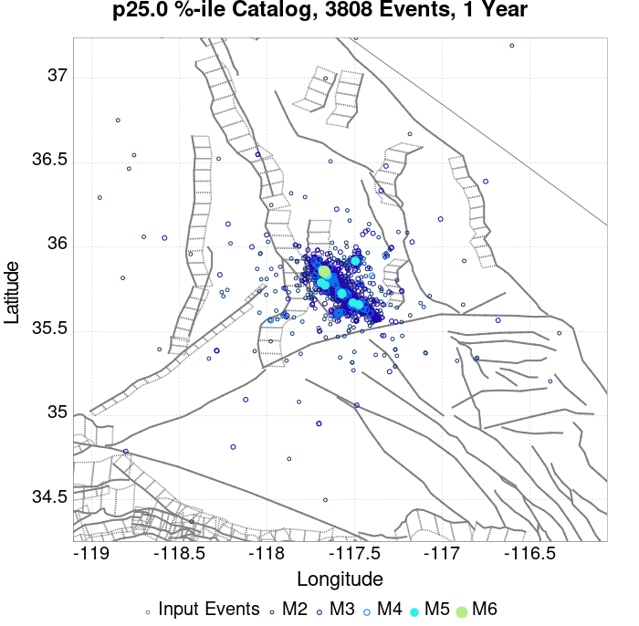
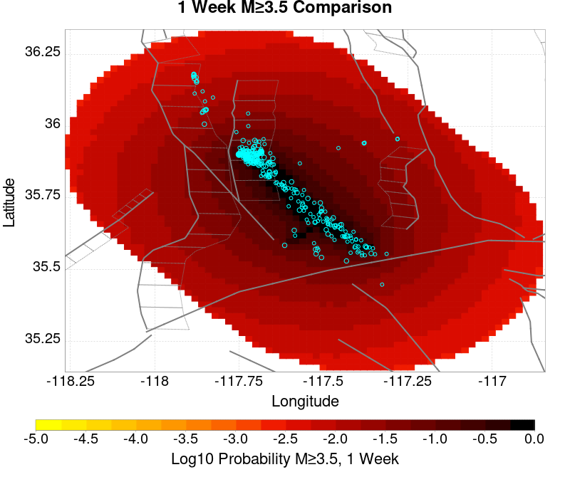
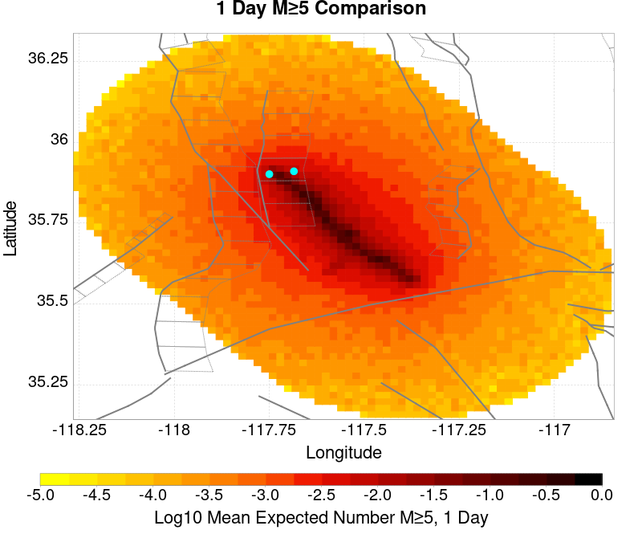
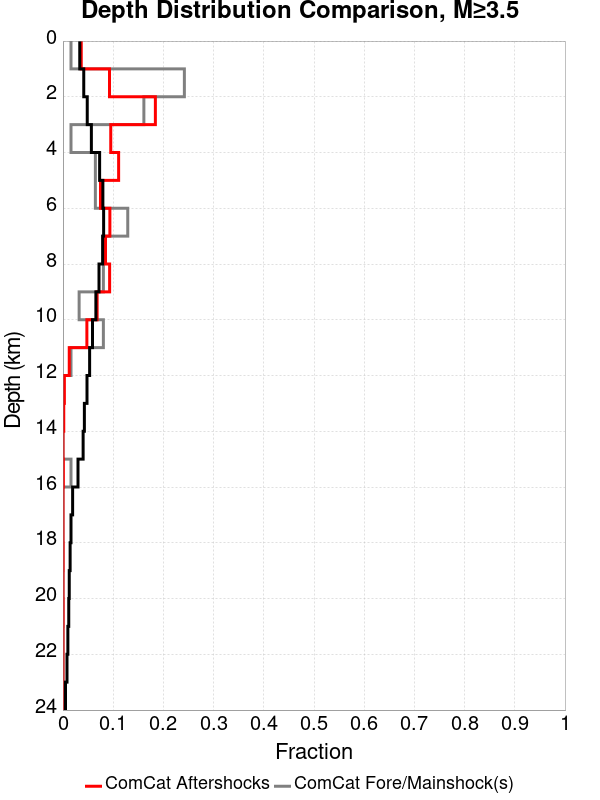

# ComCat M7.1 (ci38457511), ShakeMap Surfaces, Log10(k)=-2.3856, p=1.2164, c=0.0068906, No Faults Results

|   | ComCat M7.1 (ci38457511), ShakeMap Surfaces, Log10(k)=-2.3856, p=1.2164, c=0.0068906, No Faults |
|-----|-----|
| Num Simulations | 1661 (incomplete) |
| Start Time | 2019/07/06 03:19:54 UTC |
| Start Time Epoch Milliseconds | 1562383194040 |
| Duration | 10 Years |
| Includes Spontaneous? | false |
| Trigger Ruptures | 270 Trigger Ruptures |
|   | First: M3.98 at 2019/07/04 17:02:55 UTC |
|   | Last: M7.1 at 2019/07/06 03:19:53 UTC |
|   | Largest: M7.1 at 2019/07/06 03:19:53 UTC |
| Historical Ruptures | *(none)* |
| Config Generated With | u3etas_comcat_event_config_builder.sh --event-id ci38457511 --num-simulations 100000 --days-before 7 --gridded-only --mag-complete 3.5 --etas-k -2.3856 --etas-p 1.2164 --etas-c 0.0068906 --finite-surf-shakemap --finite-surf-shakemap-min-mag 5 --hpc-site USC_HPC --nodes 36 --hours 24 --queue scec |

## Table Of Contents

* [Probabilities Summary Table](#probabilities-summary-table)
* [Magnitude Number Distribution](#magnitude-number-distribution)
  * [10 Year Magnitude Number Distribution](#10-year-magnitude-number-distribution)
  * [1 Year Magnitude Number Distribution](#1-year-magnitude-number-distribution)
  * [1 Month Magnitude Number Distribution](#1-month-magnitude-number-distribution)
  * [1 Week Magnitude Number Distribution](#1-week-magnitude-number-distribution)
  * [1 Day Magnitude Number Distribution](#1-day-magnitude-number-distribution)
  * [1 Hour Magnitude Number Distribution](#1-hour-magnitude-number-distribution)
* [Hazard Change Over Time](#hazard-change-over-time)
  * [M&ge;5.0 Hazard Change Over Time](#m50-hazard-change-over-time)
  * [M&ge;6.0 Hazard Change Over Time](#m60-hazard-change-over-time)
  * [M&ge;7.0 Hazard Change Over Time](#m70-hazard-change-over-time)
  * [M&ge;8.0 Hazard Change Over Time](#m80-hazard-change-over-time)
* [Trigger Rupture Fault Map](#trigger-rupture-fault-map)
* [Trigger Rupture Depth Map](#trigger-rupture-depth-map)
* [Fault Distances To Triggers](#fault-distances-to-triggers)
* [Individual Simulated Catalog Maps](#individual-simulated-catalog-maps)
* [ComCat Data Comparisons](#comcat-data-comparisons)
  * [ComCat Magnitude-Number Distributions](#comcat-magnitude-number-distributions)
  * [ComCat Time-Dependent Mc](#comcat-time-dependent-mc)
  * [ComCat Cumulative Number Vs Time](#comcat-cumulative-number-vs-time)
  * [ComCat Cumulative Number Simulation Percentiles](#comcat-cumulative-number-simulation-percentiles)
  * [ComCat Probability Spatial Distribution](#comcat-probability-spatial-distribution)
  * [ComCat Mean Expectation Spatial Distribution](#comcat-mean-expectation-spatial-distribution)
  * [ComCat Depth Distribution](#comcat-depth-distribution)
* [Gridded Nucleation](#gridded-nucleation)
* [JSON Input File](#json-input-file)

## Probabilities Summary Table
*[(top)](#table-of-contents)*

| Magnitude | 1 Hour Prob | 1 Day Prob | 1 Week Prob | 1 Month Prob | 1 Year Prob | 10 Year Prob |
|-----|-----|-----|-----|-----|-----|-----|
| **M&ge;4** | 1.000 (100.00%) | 1.000 (100.00%) | 1.000 (100.00%) | 1.000 (100.00%) | 1.000 (100.00%) | 1.000 (100.00%) |
| **M&ge;4.5** | 1.000 (100.00%) | 1.000 (100.00%) | 1.000 (100.00%) | 1.000 (100.00%) | 1.000 (100.00%) | 1.000 (100.00%) |
| **M&ge;5** | 0.931 (93.14%) | 0.998 (99.82%) | 0.999 (99.88%) | 0.999 (99.88%) | 1.000 (100.00%) | 1.000 (100.00%) |
| **M&ge;5.5** | 0.590 (59.00%) | 0.863 (86.27%) | 0.926 (92.59%) | 0.950 (95.00%) | 0.970 (97.05%) | 0.975 (97.47%) |
| **M&ge;6** | 0.250 (24.98%) | 0.490 (49.01%) | 0.592 (59.18%) | 0.642 (64.18%) | 0.686 (68.63%) | 0.710 (70.98%) |
| **M&ge;6.5** | 0.105 (10.54%) | 0.210 (20.95%) | 0.274 (27.39%) | 0.302 (30.22%) | 0.340 (33.96%) | 0.362 (36.24%) |
| **M&ge;7** | 0.034 (3.43%) | 0.071 (7.10%) | 0.094 (9.39%) | 0.109 (10.90%) | 0.123 (12.34%) | 0.136 (13.61%) |
| **M&ge;7.1** | 0.029 (2.89%) | 0.057 (5.72%) | 0.077 (7.71%) | 0.089 (8.85%) | 0.101 (10.11%) | 0.113 (11.26%) |
| **M&ge;7.5** | 7.22E-3 (0.72%) | 0.017 (1.75%) | 0.031 (3.07%) | 0.036 (3.55%) | 0.046 (4.58%) | 0.052 (5.24%) |
| **M&ge;8** | 1.81E-3 (0.18%) | 3.61E-3 (0.36%) | 7.22E-3 (0.72%) | 7.22E-3 (0.72%) | 0.013 (1.26%) | 0.014 (1.44%) |

## Magnitude Number Distribution
*[(top)](#table-of-contents)*

### 10 Year Magnitude Number Distribution
*[(top)](#table-of-contents)*

**Legend**
* **Mean** (thick black line): mean expected number across all 1661 catalogs
* **2.5%,97.5%** (thin black lines): expected number percentiles across all 1661 catalogs
* **Median** (thin blue line): median expected number across all 1661 catalogs
* **Mode** (thin cyan line): modal expected number across all 1661 catalogs
* **10 yr Probability** (thin red line): 10 year probability calculated as the fraction of catalogs with at least 1 occurrence
* **10 yr Supraseismogenic Probability** (thin dashed red line): same as above, but only for supraseismogenic ruptures on explicitly modeled UCERF3 faults
* **95% Conf** (light red shaded region): binomial 95% confidence bounds on probability
* **Primary** (thin green line): mean expected number from primary triggered aftershocks only (no secondary, tertiary, etc...) across all 1661 catalogs


| Mag | Mean | 2.5 %ile | 97.5 %ile | Median | Mode | 10 yr Probability | 10 yr Supra-Seis Prob | Primary Aftershocks Mean |
|-----|-----|-----|-----|-----|-----|-----|-----|-----|
| **M&ge;2.5** | 7919.373 | 3481.000 | 32085.000 | 4762.000 | 3916.000 | 1.000 (100.00%) | 0.000 (0.00%) | 2269.473 |
| **M&ge;2.6** | 6291.096 | 2771.000 | 25395.000 | 3782.000 | 3133.000 | 1.000 (100.00%) | 0.000 (0.00%) | 1802.409 |
| **M&ge;2.7** | 4997.682 | 2196.000 | 20229.000 | 3008.000 | 2532.000 | 1.000 (100.00%) | 0.000 (0.00%) | 1431.753 |
| **M&ge;2.8** | 3970.536 | 1741.000 | 16220.000 | 2395.000 | 2058.000 | 1.000 (100.00%) | 0.000 (0.00%) | 1137.567 |
| **M&ge;2.9** | 3154.137 | 1384.000 | 12906.000 | 1896.000 | 1679.000 | 1.000 (100.00%) | 0.000 (0.00%) | 903.567 |
| **M&ge;3** | 2505.606 | 1099.000 | 10269.000 | 1507.000 | 1387.000 | 1.000 (100.00%) | 0.000 (0.00%) | 717.757 |
| **M&ge;3.1** | 1989.862 | 866.000 | 8153.000 | 1199.000 | 1047.000 | 1.000 (100.00%) | 0.000 (0.00%) | 570.008 |
| **M&ge;3.2** | 1581.137 | 685.000 | 6429.000 | 951.000 | 811.000 | 1.000 (100.00%) | 0.000 (0.00%) | 452.923 |
| **M&ge;3.3** | 1256.163 | 537.000 | 5093.000 | 756.000 | 636.000 | 1.000 (100.00%) | 0.000 (0.00%) | 359.720 |
| **M&ge;3.4** | 997.548 | 425.000 | 4092.000 | 599.000 | 535.000 | 1.000 (100.00%) | 0.000 (0.00%) | 285.611 |
| **M&ge;3.5** | 791.990 | 333.000 | 3248.000 | 478.000 | 397.000 | 1.000 (100.00%) | 0.000 (0.00%) | 226.509 |
| **M&ge;3.6** | 629.102 | 262.000 | 2596.000 | 382.000 | 321.000 | 1.000 (100.00%) | 0.000 (0.00%) | 179.967 |
| **M&ge;3.7** | 499.678 | 206.000 | 2088.000 | 304.000 | 261.000 | 1.000 (100.00%) | 0.000 (0.00%) | 142.938 |
| **M&ge;3.8** | 396.896 | 160.000 | 1655.000 | 240.000 | 191.000 | 1.000 (100.00%) | 0.000 (0.00%) | 113.603 |
| **M&ge;3.9** | 315.344 | 127.000 | 1313.000 | 192.000 | 152.000 | 1.000 (100.00%) | 0.000 (0.00%) | 90.352 |
| **M&ge;4** | 250.607 | 99.000 | 1034.000 | 152.000 | 124.000 | 1.000 (100.00%) | 0.000 (0.00%) | 71.890 |
| **M&ge;4.1** | 198.927 | 76.000 | 821.000 | 121.000 | 105.000 | 1.000 (100.00%) | 0.000 (0.00%) | 57.166 |
| **M&ge;4.2** | 158.170 | 59.000 | 658.000 | 97.000 | 86.000 | 1.000 (100.00%) | 0.000 (0.00%) | 45.506 |
| **M&ge;4.3** | 125.370 | 45.000 | 525.000 | 77.000 | 66.000 | 1.000 (100.00%) | 0.000 (0.00%) | 36.033 |
| **M&ge;4.4** | 99.600 | 34.000 | 413.000 | 61.000 | 49.000 | 1.000 (100.00%) | 0.000 (0.00%) | 28.638 |
| **M&ge;4.5** | 79.272 | 26.000 | 324.000 | 49.000 | 41.000 | 1.000 (100.00%) | 0.000 (0.00%) | 22.771 |
| **M&ge;4.6** | 62.942 | 19.000 | 260.000 | 39.000 | 32.000 | 1.000 (100.00%) | 0.000 (0.00%) | 18.064 |
| **M&ge;4.7** | 50.030 | 15.000 | 199.000 | 31.000 | 23.000 | 1.000 (100.00%) | 0.000 (0.00%) | 14.384 |
| **M&ge;4.8** | 39.701 | 11.000 | 161.000 | 25.000 | 20.000 | 1.000 (100.00%) | 0.000 (0.00%) | 11.439 |
| **M&ge;4.9** | 31.553 | 8.000 | 132.000 | 20.000 | 17.000 | 1.000 (100.00%) | 0.000 (0.00%) | 9.096 |
| **M&ge;5** | 25.082 | 5.000 | 105.000 | 16.000 | 13.000 | 1.000 (100.00%) | 0.000 (0.00%) | 7.252 |
| **M&ge;5.1** | 19.916 | 4.000 | 82.000 | 12.000 | 9.000 | 1.000 (100.00%) | 0.000 (0.00%) | 5.745 |
| **M&ge;5.2** | 15.827 | 3.000 | 66.000 | 10.000 | 7.000 | 0.999 (99.94%) | 0.000 (0.00%) | 4.555 |
| **M&ge;5.3** | 12.575 | 2.000 | 55.000 | 8.000 | 7.000 | 0.996 (99.64%) | 0.000 (0.00%) | 3.584 |
| **M&ge;5.4** | 10.034 | 1.000 | 48.000 | 6.000 | 4.000 | 0.990 (98.98%) | 0.000 (0.00%) | 2.881 |
| **M&ge;5.5** | 7.940 | 0.000 | 35.000 | 5.000 | 4.000 | 0.975 (97.47%) | 0.000 (0.00%) | 2.269 |
| **M&ge;5.6** | 6.289 | 0.000 | 28.000 | 4.000 | 3.000 | 0.943 (94.34%) | 0.000 (0.00%) | 1.777 |
| **M&ge;5.7** | 4.981 | 0.000 | 22.000 | 3.000 | 2.000 | 0.903 (90.31%) | 0.000 (0.00%) | 1.417 |
| **M&ge;5.8** | 3.918 | 0.000 | 18.000 | 2.000 | 1.000 | 0.846 (84.59%) | 0.000 (0.00%) | 1.110 |
| **M&ge;5.9** | 3.115 | 0.000 | 15.000 | 2.000 | 1.000 | 0.780 (77.97%) | 0.000 (0.00%) | 0.884 |
| **M&ge;6** | 2.483 | 0.000 | 13.000 | 1.000 | 0.000 | 0.710 (70.98%) | 0.000 (0.00%) | 0.711 |
| **M&ge;6.1** | 1.985 | 0.000 | 10.000 | 1.000 | 0.000 | 0.640 (64.00%) | 0.000 (0.00%) | 0.583 |
| **M&ge;6.2** | 1.573 | 0.000 | 8.000 | 1.000 | 0.000 | 0.563 (56.29%) | 0.000 (0.00%) | 0.471 |
| **M&ge;6.3** | 1.253 | 0.000 | 7.000 | 0.000 | 0.000 | 0.488 (48.83%) | 0.000 (0.00%) | 0.374 |
| **M&ge;6.4** | 0.998 | 0.000 | 6.000 | 0.000 | 0.000 | 0.426 (42.62%) | 0.000 (0.00%) | 0.312 |
| **M&ge;6.5** | 0.795 | 0.000 | 5.000 | 0.000 | 0.000 | 0.362 (36.24%) | 0.000 (0.00%) | 0.250 |
| **M&ge;6.6** | 0.637 | 0.000 | 4.000 | 0.000 | 0.000 | 0.313 (31.31%) | 0.000 (0.00%) | 0.201 |
| **M&ge;6.7** | 0.488 | 0.000 | 3.000 | 0.000 | 0.000 | 0.257 (25.71%) | 0.000 (0.00%) | 0.152 |
| **M&ge;6.8** | 0.383 | 0.000 | 3.000 | 0.000 | 0.000 | 0.216 (21.61%) | 0.000 (0.00%) | 0.121 |
| **M&ge;6.9** | 0.294 | 0.000 | 2.000 | 0.000 | 0.000 | 0.172 (17.16%) | 0.000 (0.00%) | 0.090 |
| **M&ge;7** | 0.232 | 0.000 | 2.000 | 0.000 | 0.000 | 0.136 (13.61%) | 0.000 (0.00%) | 0.070 |
| **M&ge;7.1** | 0.182 | 0.000 | 2.000 | 0.000 | 0.000 | 0.113 (11.26%) | 0.000 (0.00%) | 0.056 |
| **M&ge;7.2** | 0.140 | 0.000 | 1.000 | 0.000 | 0.000 | 0.087 (8.73%) | 0.000 (0.00%) | 0.042 |
| **M&ge;7.3** | 0.111 | 0.000 | 1.000 | 0.000 | 0.000 | 0.074 (7.41%) | 0.000 (0.00%) | 0.031 |
| **M&ge;7.4** | 0.090 | 0.000 | 1.000 | 0.000 | 0.000 | 0.064 (6.38%) | 0.000 (0.00%) | 0.023 |
| **M&ge;7.5** | 0.071 | 0.000 | 1.000 | 0.000 | 0.000 | 0.052 (5.24%) | 0.000 (0.00%) | 0.019 |
| **M&ge;7.6** | 0.052 | 0.000 | 1.000 | 0.000 | 0.000 | 0.040 (4.03%) | 0.000 (0.00%) | 0.014 |
| **M&ge;7.7** | 0.045 | 0.000 | 1.000 | 0.000 | 0.000 | 0.035 (3.49%) | 0.000 (0.00%) | 0.012 |
| **M&ge;7.8** | 0.033 | 0.000 | 1.000 | 0.000 | 0.000 | 0.025 (2.53%) | 0.000 (0.00%) | 0.010 |
| **M&ge;7.9** | 0.025 | 0.000 | 0.000 | 0.000 | 0.000 | 0.019 (1.93%) | 0.000 (0.00%) | 7.22E-3 |
| **M&ge;8** | 0.017 | 0.000 | 0.000 | 0.000 | 0.000 | 0.014 (1.44%) | 0.000 (0.00%) | 6.02E-3 |
| **M&ge;8.1** | 9.63E-3 | 0.000 | 0.000 | 0.000 | 0.000 | 7.83E-3 (0.78%) | 0.000 (0.00%) | 3.61E-3 |
| **M&ge;8.2** | 4.82E-3 | 0.000 | 0.000 | 0.000 | 0.000 | 4.21E-3 (0.42%) | 0.000 (0.00%) | 1.81E-3 |
| **M&ge;8.3** | 0.000 | 0.000 | 0.000 | 0.000 | 0.000 | 0.000 (0.00%) | 0.000 (0.00%) | 0.000 |
| **M&ge;8.4** | 0.000 | 0.000 | 0.000 | 0.000 | 0.000 | 0.000 (0.00%) | 0.000 (0.00%) | 0.000 |
| **M&ge;8.5** | 0.000 | 0.000 | 0.000 | 0.000 | 0.000 | 0.000 (0.00%) | 0.000 (0.00%) | 0.000 |
| **M&ge;8.6** | 0.000 | 0.000 | 0.000 | 0.000 | 0.000 | 0.000 (0.00%) | 0.000 (0.00%) | 0.000 |
| **M&ge;8.7** | 0.000 | 0.000 | 0.000 | 0.000 | 0.000 | 0.000 (0.00%) | 0.000 (0.00%) | 0.000 |
| **M&ge;8.8** | 0.000 | 0.000 | 0.000 | 0.000 | 0.000 | 0.000 (0.00%) | 0.000 (0.00%) | 0.000 |
| **M&ge;8.9** | 0.000 | 0.000 | 0.000 | 0.000 | 0.000 | 0.000 (0.00%) | 0.000 (0.00%) | 0.000 |
| **M&ge;9** | 0.000 | 0.000 | 0.000 | 0.000 | 0.000 | 0.000 (0.00%) | 0.000 (0.00%) | 0.000 |

### 1 Year Magnitude Number Distribution
*[(top)](#table-of-contents)*

**Legend**
* **Mean** (thick black line): mean expected number across all 1661 catalogs
* **2.5%,97.5%** (thin black lines): expected number percentiles across all 1661 catalogs
* **Median** (thin blue line): median expected number across all 1661 catalogs
* **Mode** (thin cyan line): modal expected number across all 1661 catalogs
* **1 yr Probability** (thin red line): 1 year probability calculated as the fraction of catalogs with at least 1 occurrence
* **1 yr Supraseismogenic Probability** (thin dashed red line): same as above, but only for supraseismogenic ruptures on explicitly modeled UCERF3 faults
* **95% Conf** (light red shaded region): binomial 95% confidence bounds on probability
* **Primary** (thin green line): mean expected number from primary triggered aftershocks only (no secondary, tertiary, etc...) across all 1661 catalogs


| Mag | Mean | 2.5 %ile | 97.5 %ile | Median | Mode | 1 yr Probability | 1 yr Supra-Seis Prob | Primary Aftershocks Mean |
|-----|-----|-----|-----|-----|-----|-----|-----|-----|
| **M&ge;2.5** | 6672.681 | 3245.000 | 27392.000 | 4333.000 | 3618.000 | 1.000 (100.00%) | 0.000 (0.00%) | 2163.069 |
| **M&ge;2.6** | 5300.690 | 2572.000 | 21779.000 | 3443.000 | 3020.000 | 1.000 (100.00%) | 0.000 (0.00%) | 1717.997 |
| **M&ge;2.7** | 4210.777 | 2043.000 | 17161.000 | 2738.000 | 2324.000 | 1.000 (100.00%) | 0.000 (0.00%) | 1364.600 |
| **M&ge;2.8** | 3345.201 | 1618.000 | 13575.000 | 2173.000 | 1806.000 | 1.000 (100.00%) | 0.000 (0.00%) | 1084.168 |
| **M&ge;2.9** | 2657.276 | 1286.000 | 10773.000 | 1721.000 | 1651.000 | 1.000 (100.00%) | 0.000 (0.00%) | 861.099 |
| **M&ge;3** | 2111.055 | 1021.000 | 8577.000 | 1372.000 | 1110.000 | 1.000 (100.00%) | 0.000 (0.00%) | 684.071 |
| **M&ge;3.1** | 1676.384 | 808.000 | 6845.000 | 1088.000 | 917.000 | 1.000 (100.00%) | 0.000 (0.00%) | 543.316 |
| **M&ge;3.2** | 1332.091 | 637.000 | 5426.000 | 864.000 | 735.000 | 1.000 (100.00%) | 0.000 (0.00%) | 431.827 |
| **M&ge;3.3** | 1058.225 | 499.000 | 4318.000 | 686.000 | 586.000 | 1.000 (100.00%) | 0.000 (0.00%) | 343.010 |
| **M&ge;3.4** | 840.303 | 392.000 | 3415.000 | 546.000 | 452.000 | 1.000 (100.00%) | 0.000 (0.00%) | 272.385 |
| **M&ge;3.5** | 667.145 | 308.000 | 2689.000 | 434.000 | 395.000 | 1.000 (100.00%) | 0.000 (0.00%) | 216.036 |
| **M&ge;3.6** | 530.016 | 242.000 | 2138.000 | 346.000 | 300.000 | 1.000 (100.00%) | 0.000 (0.00%) | 171.677 |
| **M&ge;3.7** | 420.881 | 189.000 | 1715.000 | 276.000 | 238.000 | 1.000 (100.00%) | 0.000 (0.00%) | 136.375 |
| **M&ge;3.8** | 334.271 | 148.000 | 1367.000 | 221.000 | 179.000 | 1.000 (100.00%) | 0.000 (0.00%) | 108.401 |
| **M&ge;3.9** | 265.615 | 116.000 | 1089.000 | 176.000 | 143.000 | 1.000 (100.00%) | 0.000 (0.00%) | 86.240 |
| **M&ge;4** | 211.155 | 92.000 | 865.000 | 139.000 | 113.000 | 1.000 (100.00%) | 0.000 (0.00%) | 68.614 |
| **M&ge;4.1** | 167.651 | 70.000 | 689.000 | 111.000 | 94.000 | 1.000 (100.00%) | 0.000 (0.00%) | 54.566 |
| **M&ge;4.2** | 133.385 | 54.000 | 548.000 | 88.000 | 76.000 | 1.000 (100.00%) | 0.000 (0.00%) | 43.446 |
| **M&ge;4.3** | 105.676 | 40.000 | 443.000 | 70.000 | 57.000 | 1.000 (100.00%) | 0.000 (0.00%) | 34.385 |
| **M&ge;4.4** | 83.918 | 31.000 | 354.000 | 56.000 | 46.000 | 1.000 (100.00%) | 0.000 (0.00%) | 27.303 |
| **M&ge;4.5** | 66.800 | 23.000 | 272.000 | 44.000 | 39.000 | 1.000 (100.00%) | 0.000 (0.00%) | 21.716 |
| **M&ge;4.6** | 52.994 | 17.000 | 216.000 | 36.000 | 29.000 | 1.000 (100.00%) | 0.000 (0.00%) | 17.225 |
| **M&ge;4.7** | 42.134 | 13.000 | 173.000 | 29.000 | 25.000 | 1.000 (100.00%) | 0.000 (0.00%) | 13.710 |
| **M&ge;4.8** | 33.391 | 10.000 | 136.000 | 22.000 | 17.000 | 1.000 (100.00%) | 0.000 (0.00%) | 10.904 |
| **M&ge;4.9** | 26.547 | 7.000 | 114.000 | 18.000 | 14.000 | 1.000 (100.00%) | 0.000 (0.00%) | 8.679 |
| **M&ge;5** | 21.107 | 5.000 | 89.000 | 14.000 | 13.000 | 1.000 (100.00%) | 0.000 (0.00%) | 6.904 |
| **M&ge;5.1** | 16.780 | 4.000 | 67.000 | 11.000 | 10.000 | 1.000 (100.00%) | 0.000 (0.00%) | 5.467 |
| **M&ge;5.2** | 13.314 | 2.000 | 54.000 | 9.000 | 7.000 | 0.999 (99.94%) | 0.000 (0.00%) | 4.331 |
| **M&ge;5.3** | 10.570 | 1.000 | 45.000 | 7.000 | 6.000 | 0.995 (99.46%) | 0.000 (0.00%) | 3.412 |
| **M&ge;5.4** | 8.442 | 1.000 | 36.000 | 6.000 | 4.000 | 0.986 (98.62%) | 0.000 (0.00%) | 2.738 |
| **M&ge;5.5** | 6.670 | 0.000 | 29.000 | 4.000 | 3.000 | 0.970 (97.05%) | 0.000 (0.00%) | 2.156 |
| **M&ge;5.6** | 5.264 | 0.000 | 22.000 | 3.000 | 2.000 | 0.934 (93.38%) | 0.000 (0.00%) | 1.688 |
| **M&ge;5.7** | 4.176 | 0.000 | 18.000 | 3.000 | 2.000 | 0.888 (88.80%) | 0.000 (0.00%) | 1.346 |
| **M&ge;5.8** | 3.279 | 0.000 | 14.000 | 2.000 | 1.000 | 0.823 (82.30%) | 0.000 (0.00%) | 1.054 |
| **M&ge;5.9** | 2.589 | 0.000 | 12.000 | 2.000 | 1.000 | 0.757 (75.68%) | 0.000 (0.00%) | 0.837 |
| **M&ge;6** | 2.064 | 0.000 | 10.000 | 1.000 | 0.000 | 0.686 (68.63%) | 0.000 (0.00%) | 0.674 |
| **M&ge;6.1** | 1.649 | 0.000 | 8.000 | 1.000 | 0.000 | 0.615 (61.53%) | 0.000 (0.00%) | 0.556 |
| **M&ge;6.2** | 1.311 | 0.000 | 7.000 | 1.000 | 0.000 | 0.536 (53.64%) | 0.000 (0.00%) | 0.448 |
| **M&ge;6.3** | 1.044 | 0.000 | 6.000 | 0.000 | 0.000 | 0.459 (45.94%) | 0.000 (0.00%) | 0.357 |
| **M&ge;6.4** | 0.837 | 0.000 | 5.000 | 0.000 | 0.000 | 0.400 (40.04%) | 0.000 (0.00%) | 0.297 |
| **M&ge;6.5** | 0.663 | 0.000 | 4.000 | 0.000 | 0.000 | 0.340 (33.96%) | 0.000 (0.00%) | 0.238 |
| **M&ge;6.6** | 0.530 | 0.000 | 4.000 | 0.000 | 0.000 | 0.292 (29.20%) | 0.000 (0.00%) | 0.191 |
| **M&ge;6.7** | 0.412 | 0.000 | 3.000 | 0.000 | 0.000 | 0.239 (23.90%) | 0.000 (0.00%) | 0.146 |
| **M&ge;6.8** | 0.325 | 0.000 | 3.000 | 0.000 | 0.000 | 0.200 (19.99%) | 0.000 (0.00%) | 0.116 |
| **M&ge;6.9** | 0.249 | 0.000 | 2.000 | 0.000 | 0.000 | 0.157 (15.71%) | 0.000 (0.00%) | 0.085 |
| **M&ge;7** | 0.194 | 0.000 | 2.000 | 0.000 | 0.000 | 0.123 (12.34%) | 0.000 (0.00%) | 0.066 |
| **M&ge;7.1** | 0.153 | 0.000 | 2.000 | 0.000 | 0.000 | 0.101 (10.11%) | 0.000 (0.00%) | 0.052 |
| **M&ge;7.2** | 0.116 | 0.000 | 1.000 | 0.000 | 0.000 | 0.078 (7.77%) | 0.000 (0.00%) | 0.039 |
| **M&ge;7.3** | 0.090 | 0.000 | 1.000 | 0.000 | 0.000 | 0.064 (6.44%) | 0.000 (0.00%) | 0.029 |
| **M&ge;7.4** | 0.073 | 0.000 | 1.000 | 0.000 | 0.000 | 0.055 (5.54%) | 0.000 (0.00%) | 0.021 |
| **M&ge;7.5** | 0.057 | 0.000 | 1.000 | 0.000 | 0.000 | 0.046 (4.58%) | 0.000 (0.00%) | 0.017 |
| **M&ge;7.6** | 0.042 | 0.000 | 1.000 | 0.000 | 0.000 | 0.036 (3.55%) | 0.000 (0.00%) | 0.012 |
| **M&ge;7.7** | 0.037 | 0.000 | 1.000 | 0.000 | 0.000 | 0.033 (3.25%) | 0.000 (0.00%) | 0.011 |
| **M&ge;7.8** | 0.025 | 0.000 | 0.000 | 0.000 | 0.000 | 0.023 (2.29%) | 0.000 (0.00%) | 9.03E-3 |
| **M&ge;7.9** | 0.019 | 0.000 | 0.000 | 0.000 | 0.000 | 0.017 (1.75%) | 0.000 (0.00%) | 6.02E-3 |
| **M&ge;8** | 0.013 | 0.000 | 0.000 | 0.000 | 0.000 | 0.013 (1.26%) | 0.000 (0.00%) | 4.82E-3 |
| **M&ge;8.1** | 6.62E-3 | 0.000 | 0.000 | 0.000 | 0.000 | 6.02E-3 (0.60%) | 0.000 (0.00%) | 2.41E-3 |
| **M&ge;8.2** | 2.41E-3 | 0.000 | 0.000 | 0.000 | 0.000 | 2.41E-3 (0.24%) | 0.000 (0.00%) | 6.02E-4 |
| **M&ge;8.3** | 0.000 | 0.000 | 0.000 | 0.000 | 0.000 | 0.000 (0.00%) | 0.000 (0.00%) | 0.000 |
| **M&ge;8.4** | 0.000 | 0.000 | 0.000 | 0.000 | 0.000 | 0.000 (0.00%) | 0.000 (0.00%) | 0.000 |
| **M&ge;8.5** | 0.000 | 0.000 | 0.000 | 0.000 | 0.000 | 0.000 (0.00%) | 0.000 (0.00%) | 0.000 |
| **M&ge;8.6** | 0.000 | 0.000 | 0.000 | 0.000 | 0.000 | 0.000 (0.00%) | 0.000 (0.00%) | 0.000 |
| **M&ge;8.7** | 0.000 | 0.000 | 0.000 | 0.000 | 0.000 | 0.000 (0.00%) | 0.000 (0.00%) | 0.000 |
| **M&ge;8.8** | 0.000 | 0.000 | 0.000 | 0.000 | 0.000 | 0.000 (0.00%) | 0.000 (0.00%) | 0.000 |
| **M&ge;8.9** | 0.000 | 0.000 | 0.000 | 0.000 | 0.000 | 0.000 (0.00%) | 0.000 (0.00%) | 0.000 |
| **M&ge;9** | 0.000 | 0.000 | 0.000 | 0.000 | 0.000 | 0.000 (0.00%) | 0.000 (0.00%) | 0.000 |

### 1 Month Magnitude Number Distribution
*[(top)](#table-of-contents)*

**Legend**
* **Mean** (thick black line): mean expected number across all 1661 catalogs
* **2.5%,97.5%** (thin black lines): expected number percentiles across all 1661 catalogs
* **Median** (thin blue line): median expected number across all 1661 catalogs
* **Mode** (thin cyan line): modal expected number across all 1661 catalogs
* **1 mo Probability** (thin red line): 1 month probability calculated as the fraction of catalogs with at least 1 occurrence
* **1 mo Supraseismogenic Probability** (thin dashed red line): same as above, but only for supraseismogenic ruptures on explicitly modeled UCERF3 faults
* **95% Conf** (light red shaded region): binomial 95% confidence bounds on probability
* **Primary** (thin green line): mean expected number from primary triggered aftershocks only (no secondary, tertiary, etc...) across all 1661 catalogs


| Mag | Mean | 2.5 %ile | 97.5 %ile | Median | Mode | 1 mo Probability | 1 mo Supra-Seis Prob | Primary Aftershocks Mean |
|-----|-----|-----|-----|-----|-----|-----|-----|-----|
| **M&ge;2.5** | 5174.701 | 2816.000 | 19365.000 | 3581.000 | 3106.000 | 1.000 (100.00%) | 0.000 (0.00%) | 1969.426 |
| **M&ge;2.6** | 4110.211 | 2234.000 | 15456.000 | 2848.000 | 2560.000 | 1.000 (100.00%) | 0.000 (0.00%) | 1564.373 |
| **M&ge;2.7** | 3264.895 | 1762.000 | 12311.000 | 2268.000 | 1911.000 | 1.000 (100.00%) | 0.000 (0.00%) | 1242.532 |
| **M&ge;2.8** | 2593.963 | 1393.000 | 9757.000 | 1805.000 | 1674.000 | 1.000 (100.00%) | 0.000 (0.00%) | 987.280 |
| **M&ge;2.9** | 2060.856 | 1104.000 | 7756.000 | 1441.000 | 1225.000 | 1.000 (100.00%) | 0.000 (0.00%) | 784.232 |
| **M&ge;3** | 1637.067 | 879.000 | 6113.000 | 1144.000 | 987.000 | 1.000 (100.00%) | 0.000 (0.00%) | 623.000 |
| **M&ge;3.1** | 1299.958 | 697.000 | 4872.000 | 910.000 | 822.000 | 1.000 (100.00%) | 0.000 (0.00%) | 494.952 |
| **M&ge;3.2** | 1032.728 | 548.000 | 3878.000 | 722.000 | 649.000 | 1.000 (100.00%) | 0.000 (0.00%) | 393.334 |
| **M&ge;3.3** | 820.543 | 433.000 | 3056.000 | 575.000 | 519.000 | 1.000 (100.00%) | 0.000 (0.00%) | 312.438 |
| **M&ge;3.4** | 651.605 | 341.000 | 2427.000 | 457.000 | 437.000 | 1.000 (100.00%) | 0.000 (0.00%) | 248.129 |
| **M&ge;3.5** | 517.275 | 265.000 | 1921.000 | 362.000 | 340.000 | 1.000 (100.00%) | 0.000 (0.00%) | 196.846 |
| **M&ge;3.6** | 411.075 | 208.000 | 1508.000 | 289.000 | 248.000 | 1.000 (100.00%) | 0.000 (0.00%) | 156.502 |
| **M&ge;3.7** | 326.562 | 161.000 | 1204.000 | 230.000 | 212.000 | 1.000 (100.00%) | 0.000 (0.00%) | 124.366 |
| **M&ge;3.8** | 259.270 | 128.000 | 959.000 | 183.000 | 170.000 | 1.000 (100.00%) | 0.000 (0.00%) | 98.887 |
| **M&ge;3.9** | 205.954 | 100.000 | 779.000 | 146.000 | 125.000 | 1.000 (100.00%) | 0.000 (0.00%) | 78.636 |
| **M&ge;4** | 163.757 | 78.000 | 617.000 | 116.000 | 98.000 | 1.000 (100.00%) | 0.000 (0.00%) | 62.612 |
| **M&ge;4.1** | 130.018 | 59.000 | 484.000 | 92.000 | 77.000 | 1.000 (100.00%) | 0.000 (0.00%) | 49.813 |
| **M&ge;4.2** | 103.421 | 46.000 | 383.000 | 73.000 | 67.000 | 1.000 (100.00%) | 0.000 (0.00%) | 39.649 |
| **M&ge;4.3** | 81.895 | 35.000 | 304.000 | 58.000 | 50.000 | 1.000 (100.00%) | 0.000 (0.00%) | 31.367 |
| **M&ge;4.4** | 65.056 | 26.000 | 246.000 | 47.000 | 43.000 | 1.000 (100.00%) | 0.000 (0.00%) | 24.896 |
| **M&ge;4.5** | 51.805 | 20.000 | 191.000 | 38.000 | 31.000 | 1.000 (100.00%) | 0.000 (0.00%) | 19.819 |
| **M&ge;4.6** | 41.129 | 14.000 | 149.000 | 30.000 | 27.000 | 1.000 (100.00%) | 0.000 (0.00%) | 15.720 |
| **M&ge;4.7** | 32.703 | 11.000 | 122.000 | 24.000 | 19.000 | 1.000 (100.00%) | 0.000 (0.00%) | 12.491 |
| **M&ge;4.8** | 25.921 | 8.000 | 96.000 | 19.000 | 17.000 | 1.000 (100.00%) | 0.000 (0.00%) | 9.943 |
| **M&ge;4.9** | 20.639 | 6.000 | 76.000 | 15.000 | 11.000 | 1.000 (100.00%) | 0.000 (0.00%) | 7.930 |
| **M&ge;5** | 16.424 | 4.000 | 59.000 | 12.000 | 10.000 | 0.999 (99.88%) | 0.000 (0.00%) | 6.317 |
| **M&ge;5.1** | 13.064 | 3.000 | 46.000 | 9.000 | 8.000 | 0.999 (99.88%) | 0.000 (0.00%) | 4.989 |
| **M&ge;5.2** | 10.384 | 2.000 | 38.000 | 7.000 | 6.000 | 0.997 (99.70%) | 0.000 (0.00%) | 3.960 |
| **M&ge;5.3** | 8.242 | 1.000 | 31.000 | 6.000 | 6.000 | 0.989 (98.92%) | 0.000 (0.00%) | 3.116 |
| **M&ge;5.4** | 6.594 | 1.000 | 24.000 | 5.000 | 3.000 | 0.978 (97.77%) | 0.000 (0.00%) | 2.504 |
| **M&ge;5.5** | 5.195 | 0.000 | 20.000 | 4.000 | 3.000 | 0.950 (95.00%) | 0.000 (0.00%) | 1.970 |
| **M&ge;5.6** | 4.102 | 0.000 | 15.000 | 3.000 | 2.000 | 0.905 (90.55%) | 0.000 (0.00%) | 1.547 |
| **M&ge;5.7** | 3.258 | 0.000 | 13.000 | 2.000 | 1.000 | 0.852 (85.25%) | 0.000 (0.00%) | 1.232 |
| **M&ge;5.8** | 2.563 | 0.000 | 11.000 | 2.000 | 1.000 | 0.785 (78.51%) | 0.000 (0.00%) | 0.972 |
| **M&ge;5.9** | 2.033 | 0.000 | 9.000 | 1.000 | 1.000 | 0.717 (71.70%) | 0.000 (0.00%) | 0.772 |
| **M&ge;6** | 1.620 | 0.000 | 8.000 | 1.000 | 0.000 | 0.642 (64.18%) | 0.000 (0.00%) | 0.620 |
| **M&ge;6.1** | 1.294 | 0.000 | 6.000 | 1.000 | 0.000 | 0.569 (56.89%) | 0.000 (0.00%) | 0.513 |
| **M&ge;6.2** | 1.031 | 0.000 | 5.000 | 0.000 | 0.000 | 0.491 (49.07%) | 0.000 (0.00%) | 0.413 |
| **M&ge;6.3** | 0.824 | 0.000 | 4.000 | 0.000 | 0.000 | 0.415 (41.54%) | 0.000 (0.00%) | 0.332 |
| **M&ge;6.4** | 0.665 | 0.000 | 4.000 | 0.000 | 0.000 | 0.359 (35.88%) | 0.000 (0.00%) | 0.277 |
| **M&ge;6.5** | 0.533 | 0.000 | 3.000 | 0.000 | 0.000 | 0.302 (30.22%) | 0.000 (0.00%) | 0.220 |
| **M&ge;6.6** | 0.427 | 0.000 | 3.000 | 0.000 | 0.000 | 0.258 (25.77%) | 0.000 (0.00%) | 0.176 |
| **M&ge;6.7** | 0.326 | 0.000 | 2.000 | 0.000 | 0.000 | 0.208 (20.83%) | 0.000 (0.00%) | 0.134 |
| **M&ge;6.8** | 0.259 | 0.000 | 2.000 | 0.000 | 0.000 | 0.175 (17.52%) | 0.000 (0.00%) | 0.106 |
| **M&ge;6.9** | 0.194 | 0.000 | 2.000 | 0.000 | 0.000 | 0.137 (13.73%) | 0.000 (0.00%) | 0.078 |
| **M&ge;7** | 0.153 | 0.000 | 1.000 | 0.000 | 0.000 | 0.109 (10.90%) | 0.000 (0.00%) | 0.061 |
| **M&ge;7.1** | 0.121 | 0.000 | 1.000 | 0.000 | 0.000 | 0.089 (8.85%) | 0.000 (0.00%) | 0.048 |
| **M&ge;7.2** | 0.091 | 0.000 | 1.000 | 0.000 | 0.000 | 0.067 (6.74%) | 0.000 (0.00%) | 0.036 |
| **M&ge;7.3** | 0.069 | 0.000 | 1.000 | 0.000 | 0.000 | 0.054 (5.42%) | 0.000 (0.00%) | 0.026 |
| **M&ge;7.4** | 0.055 | 0.000 | 1.000 | 0.000 | 0.000 | 0.046 (4.58%) | 0.000 (0.00%) | 0.019 |
| **M&ge;7.5** | 0.043 | 0.000 | 1.000 | 0.000 | 0.000 | 0.036 (3.55%) | 0.000 (0.00%) | 0.015 |
| **M&ge;7.6** | 0.031 | 0.000 | 1.000 | 0.000 | 0.000 | 0.027 (2.71%) | 0.000 (0.00%) | 0.011 |
| **M&ge;7.7** | 0.028 | 0.000 | 0.000 | 0.000 | 0.000 | 0.025 (2.47%) | 0.000 (0.00%) | 9.63E-3 |
| **M&ge;7.8** | 0.017 | 0.000 | 0.000 | 0.000 | 0.000 | 0.016 (1.63%) | 0.000 (0.00%) | 7.83E-3 |
| **M&ge;7.9** | 0.012 | 0.000 | 0.000 | 0.000 | 0.000 | 0.011 (1.08%) | 0.000 (0.00%) | 4.82E-3 |
| **M&ge;8** | 7.83E-3 | 0.000 | 0.000 | 0.000 | 0.000 | 7.22E-3 (0.72%) | 0.000 (0.00%) | 3.61E-3 |
| **M&ge;8.1** | 4.82E-3 | 0.000 | 0.000 | 0.000 | 0.000 | 4.21E-3 (0.42%) | 0.000 (0.00%) | 1.81E-3 |
| **M&ge;8.2** | 1.81E-3 | 0.000 | 0.000 | 0.000 | 0.000 | 1.81E-3 (0.18%) | 0.000 (0.00%) | 6.02E-4 |
| **M&ge;8.3** | 0.000 | 0.000 | 0.000 | 0.000 | 0.000 | 0.000 (0.00%) | 0.000 (0.00%) | 0.000 |
| **M&ge;8.4** | 0.000 | 0.000 | 0.000 | 0.000 | 0.000 | 0.000 (0.00%) | 0.000 (0.00%) | 0.000 |
| **M&ge;8.5** | 0.000 | 0.000 | 0.000 | 0.000 | 0.000 | 0.000 (0.00%) | 0.000 (0.00%) | 0.000 |
| **M&ge;8.6** | 0.000 | 0.000 | 0.000 | 0.000 | 0.000 | 0.000 (0.00%) | 0.000 (0.00%) | 0.000 |
| **M&ge;8.7** | 0.000 | 0.000 | 0.000 | 0.000 | 0.000 | 0.000 (0.00%) | 0.000 (0.00%) | 0.000 |
| **M&ge;8.8** | 0.000 | 0.000 | 0.000 | 0.000 | 0.000 | 0.000 (0.00%) | 0.000 (0.00%) | 0.000 |
| **M&ge;8.9** | 0.000 | 0.000 | 0.000 | 0.000 | 0.000 | 0.000 (0.00%) | 0.000 (0.00%) | 0.000 |
| **M&ge;9** | 0.000 | 0.000 | 0.000 | 0.000 | 0.000 | 0.000 (0.00%) | 0.000 (0.00%) | 0.000 |

### 1 Week Magnitude Number Distribution
*[(top)](#table-of-contents)*

**Legend**
* **Mean** (thick black line): mean expected number across all 1661 catalogs
* **2.5%,97.5%** (thin black lines): expected number percentiles across all 1661 catalogs
* **Median** (thin blue line): median expected number across all 1661 catalogs
* **Mode** (thin cyan line): modal expected number across all 1661 catalogs
* **1 wk Probability** (thin red line): 1 week probability calculated as the fraction of catalogs with at least 1 occurrence
* **1 wk Supraseismogenic Probability** (thin dashed red line): same as above, but only for supraseismogenic ruptures on explicitly modeled UCERF3 faults
* **95% Conf** (light red shaded region): binomial 95% confidence bounds on probability
* **Primary** (thin green line): mean expected number from primary triggered aftershocks only (no secondary, tertiary, etc...) across all 1661 catalogs


| Mag | Mean | 2.5 %ile | 97.5 %ile | Median | Mode | 1 wk Probability | 1 wk Supra-Seis Prob | Primary Aftershocks Mean |
|-----|-----|-----|-----|-----|-----|-----|-----|-----|
| **M&ge;2.5** | 4229.899 | 2464.000 | 14228.000 | 3057.000 | 2794.000 | 1.000 (100.00%) | 0.000 (0.00%) | 1801.715 |
| **M&ge;2.6** | 3359.763 | 1960.000 | 11289.000 | 2430.000 | 2233.000 | 1.000 (100.00%) | 0.000 (0.00%) | 1430.979 |
| **M&ge;2.7** | 2668.596 | 1552.000 | 8936.000 | 1932.000 | 1886.000 | 1.000 (100.00%) | 0.000 (0.00%) | 1136.667 |
| **M&ge;2.8** | 2120.297 | 1227.000 | 7130.000 | 1536.000 | 1392.000 | 1.000 (100.00%) | 0.000 (0.00%) | 903.312 |
| **M&ge;2.9** | 1684.321 | 971.000 | 5656.000 | 1221.000 | 1097.000 | 1.000 (100.00%) | 0.000 (0.00%) | 717.439 |
| **M&ge;3** | 1337.895 | 771.000 | 4483.000 | 971.000 | 890.000 | 1.000 (100.00%) | 0.000 (0.00%) | 569.896 |
| **M&ge;3.1** | 1062.368 | 611.000 | 3570.000 | 772.000 | 688.000 | 1.000 (100.00%) | 0.000 (0.00%) | 452.827 |
| **M&ge;3.2** | 843.927 | 480.000 | 2825.000 | 613.000 | 569.000 | 1.000 (100.00%) | 0.000 (0.00%) | 359.833 |
| **M&ge;3.3** | 670.384 | 377.000 | 2281.000 | 488.000 | 435.000 | 1.000 (100.00%) | 0.000 (0.00%) | 285.806 |
| **M&ge;3.4** | 532.548 | 296.000 | 1809.000 | 388.000 | 348.000 | 1.000 (100.00%) | 0.000 (0.00%) | 227.065 |
| **M&ge;3.5** | 422.939 | 232.000 | 1447.000 | 308.000 | 291.000 | 1.000 (100.00%) | 0.000 (0.00%) | 180.138 |
| **M&ge;3.6** | 336.220 | 183.000 | 1150.000 | 246.000 | 242.000 | 1.000 (100.00%) | 0.000 (0.00%) | 143.319 |
| **M&ge;3.7** | 267.222 | 140.000 | 931.000 | 196.000 | 184.000 | 1.000 (100.00%) | 0.000 (0.00%) | 113.969 |
| **M&ge;3.8** | 212.302 | 110.000 | 740.000 | 156.000 | 153.000 | 1.000 (100.00%) | 0.000 (0.00%) | 90.653 |
| **M&ge;3.9** | 168.728 | 86.000 | 595.000 | 125.000 | 108.000 | 1.000 (100.00%) | 0.000 (0.00%) | 72.075 |
| **M&ge;4** | 134.187 | 67.000 | 457.000 | 99.000 | 91.000 | 1.000 (100.00%) | 0.000 (0.00%) | 57.415 |
| **M&ge;4.1** | 106.583 | 52.000 | 369.000 | 78.000 | 70.000 | 1.000 (100.00%) | 0.000 (0.00%) | 45.713 |
| **M&ge;4.2** | 84.874 | 40.000 | 292.000 | 63.000 | 55.000 | 1.000 (100.00%) | 0.000 (0.00%) | 36.426 |
| **M&ge;4.3** | 67.246 | 31.000 | 235.000 | 50.000 | 45.000 | 1.000 (100.00%) | 0.000 (0.00%) | 28.849 |
| **M&ge;4.4** | 53.368 | 23.000 | 184.000 | 40.000 | 40.000 | 1.000 (100.00%) | 0.000 (0.00%) | 22.884 |
| **M&ge;4.5** | 42.468 | 17.000 | 143.000 | 32.000 | 29.000 | 1.000 (100.00%) | 0.000 (0.00%) | 18.200 |
| **M&ge;4.6** | 33.721 | 12.000 | 116.000 | 26.000 | 23.000 | 1.000 (100.00%) | 0.000 (0.00%) | 14.434 |
| **M&ge;4.7** | 26.806 | 9.000 | 89.000 | 20.000 | 17.000 | 1.000 (100.00%) | 0.000 (0.00%) | 11.470 |
| **M&ge;4.8** | 21.266 | 7.000 | 72.000 | 16.000 | 13.000 | 1.000 (100.00%) | 0.000 (0.00%) | 9.127 |
| **M&ge;4.9** | 16.930 | 5.000 | 55.000 | 13.000 | 11.000 | 1.000 (100.00%) | 0.000 (0.00%) | 7.285 |
| **M&ge;5** | 13.473 | 3.000 | 44.000 | 10.000 | 9.000 | 0.999 (99.88%) | 0.000 (0.00%) | 5.788 |
| **M&ge;5.1** | 10.724 | 2.000 | 36.000 | 8.000 | 7.000 | 0.999 (99.88%) | 0.000 (0.00%) | 4.571 |
| **M&ge;5.2** | 8.519 | 1.000 | 29.000 | 6.000 | 6.000 | 0.996 (99.58%) | 0.000 (0.00%) | 3.626 |
| **M&ge;5.3** | 6.787 | 1.000 | 23.000 | 5.000 | 3.000 | 0.983 (98.31%) | 0.000 (0.00%) | 2.861 |
| **M&ge;5.4** | 5.453 | 0.000 | 19.000 | 4.000 | 3.000 | 0.963 (96.33%) | 0.000 (0.00%) | 2.299 |
| **M&ge;5.5** | 4.305 | 0.000 | 16.000 | 3.000 | 2.000 | 0.926 (92.59%) | 0.000 (0.00%) | 1.809 |
| **M&ge;5.6** | 3.417 | 0.000 | 12.000 | 2.000 | 1.000 | 0.873 (87.30%) | 0.000 (0.00%) | 1.422 |
| **M&ge;5.7** | 2.724 | 0.000 | 10.000 | 2.000 | 1.000 | 0.814 (81.40%) | 0.000 (0.00%) | 1.133 |
| **M&ge;5.8** | 2.141 | 0.000 | 8.000 | 1.000 | 1.000 | 0.740 (73.99%) | 0.000 (0.00%) | 0.890 |
| **M&ge;5.9** | 1.703 | 0.000 | 7.000 | 1.000 | 0.000 | 0.671 (67.13%) | 0.000 (0.00%) | 0.708 |
| **M&ge;6** | 1.352 | 0.000 | 6.000 | 1.000 | 0.000 | 0.592 (59.18%) | 0.000 (0.00%) | 0.570 |
| **M&ge;6.1** | 1.079 | 0.000 | 5.000 | 1.000 | 0.000 | 0.518 (51.84%) | 0.000 (0.00%) | 0.469 |
| **M&ge;6.2** | 0.859 | 0.000 | 4.000 | 0.000 | 0.000 | 0.440 (44.01%) | 0.000 (0.00%) | 0.377 |
| **M&ge;6.3** | 0.690 | 0.000 | 4.000 | 0.000 | 0.000 | 0.373 (37.27%) | 0.000 (0.00%) | 0.303 |
| **M&ge;6.4** | 0.556 | 0.000 | 3.000 | 0.000 | 0.000 | 0.322 (32.21%) | 0.000 (0.00%) | 0.254 |
| **M&ge;6.5** | 0.449 | 0.000 | 3.000 | 0.000 | 0.000 | 0.274 (27.39%) | 0.000 (0.00%) | 0.203 |
| **M&ge;6.6** | 0.361 | 0.000 | 2.000 | 0.000 | 0.000 | 0.229 (22.94%) | 0.000 (0.00%) | 0.163 |
| **M&ge;6.7** | 0.277 | 0.000 | 2.000 | 0.000 | 0.000 | 0.184 (18.42%) | 0.000 (0.00%) | 0.125 |
| **M&ge;6.8** | 0.222 | 0.000 | 2.000 | 0.000 | 0.000 | 0.155 (15.47%) | 0.000 (0.00%) | 0.098 |
| **M&ge;6.9** | 0.166 | 0.000 | 2.000 | 0.000 | 0.000 | 0.120 (11.98%) | 0.000 (0.00%) | 0.072 |
| **M&ge;7** | 0.130 | 0.000 | 1.000 | 0.000 | 0.000 | 0.094 (9.39%) | 0.000 (0.00%) | 0.056 |
| **M&ge;7.1** | 0.103 | 0.000 | 1.000 | 0.000 | 0.000 | 0.077 (7.71%) | 0.000 (0.00%) | 0.044 |
| **M&ge;7.2** | 0.076 | 0.000 | 1.000 | 0.000 | 0.000 | 0.058 (5.78%) | 0.000 (0.00%) | 0.033 |
| **M&ge;7.3** | 0.057 | 0.000 | 1.000 | 0.000 | 0.000 | 0.045 (4.52%) | 0.000 (0.00%) | 0.023 |
| **M&ge;7.4** | 0.049 | 0.000 | 1.000 | 0.000 | 0.000 | 0.040 (4.03%) | 0.000 (0.00%) | 0.019 |
| **M&ge;7.5** | 0.038 | 0.000 | 1.000 | 0.000 | 0.000 | 0.031 (3.07%) | 0.000 (0.00%) | 0.014 |
| **M&ge;7.6** | 0.026 | 0.000 | 0.000 | 0.000 | 0.000 | 0.023 (2.29%) | 0.000 (0.00%) | 0.011 |
| **M&ge;7.7** | 0.024 | 0.000 | 0.000 | 0.000 | 0.000 | 0.021 (2.11%) | 0.000 (0.00%) | 9.63E-3 |
| **M&ge;7.8** | 0.017 | 0.000 | 0.000 | 0.000 | 0.000 | 0.016 (1.57%) | 0.000 (0.00%) | 7.83E-3 |
| **M&ge;7.9** | 0.011 | 0.000 | 0.000 | 0.000 | 0.000 | 0.010 (1.02%) | 0.000 (0.00%) | 4.82E-3 |
| **M&ge;8** | 7.83E-3 | 0.000 | 0.000 | 0.000 | 0.000 | 7.22E-3 (0.72%) | 0.000 (0.00%) | 3.61E-3 |
| **M&ge;8.1** | 4.82E-3 | 0.000 | 0.000 | 0.000 | 0.000 | 4.21E-3 (0.42%) | 0.000 (0.00%) | 1.81E-3 |
| **M&ge;8.2** | 1.81E-3 | 0.000 | 0.000 | 0.000 | 0.000 | 1.81E-3 (0.18%) | 0.000 (0.00%) | 6.02E-4 |
| **M&ge;8.3** | 0.000 | 0.000 | 0.000 | 0.000 | 0.000 | 0.000 (0.00%) | 0.000 (0.00%) | 0.000 |
| **M&ge;8.4** | 0.000 | 0.000 | 0.000 | 0.000 | 0.000 | 0.000 (0.00%) | 0.000 (0.00%) | 0.000 |
| **M&ge;8.5** | 0.000 | 0.000 | 0.000 | 0.000 | 0.000 | 0.000 (0.00%) | 0.000 (0.00%) | 0.000 |
| **M&ge;8.6** | 0.000 | 0.000 | 0.000 | 0.000 | 0.000 | 0.000 (0.00%) | 0.000 (0.00%) | 0.000 |
| **M&ge;8.7** | 0.000 | 0.000 | 0.000 | 0.000 | 0.000 | 0.000 (0.00%) | 0.000 (0.00%) | 0.000 |
| **M&ge;8.8** | 0.000 | 0.000 | 0.000 | 0.000 | 0.000 | 0.000 (0.00%) | 0.000 (0.00%) | 0.000 |
| **M&ge;8.9** | 0.000 | 0.000 | 0.000 | 0.000 | 0.000 | 0.000 (0.00%) | 0.000 (0.00%) | 0.000 |
| **M&ge;9** | 0.000 | 0.000 | 0.000 | 0.000 | 0.000 | 0.000 (0.00%) | 0.000 (0.00%) | 0.000 |

### 1 Day Magnitude Number Distribution
*[(top)](#table-of-contents)*

**Legend**
* **Mean** (thick black line): mean expected number across all 1661 catalogs
* **2.5%,97.5%** (thin black lines): expected number percentiles across all 1661 catalogs
* **Median** (thin blue line): median expected number across all 1661 catalogs
* **Mode** (thin cyan line): modal expected number across all 1661 catalogs
* **1 d Probability** (thin red line): 1 day probability calculated as the fraction of catalogs with at least 1 occurrence
* **1 d Supraseismogenic Probability** (thin dashed red line): same as above, but only for supraseismogenic ruptures on explicitly modeled UCERF3 faults
* **95% Conf** (light red shaded region): binomial 95% confidence bounds on probability
* **Primary** (thin green line): mean expected number from primary triggered aftershocks only (no secondary, tertiary, etc...) across all 1661 catalogs


| Mag | Mean | 2.5 %ile | 97.5 %ile | Median | Mode | 1 d Probability | 1 d Supra-Seis Prob | Primary Aftershocks Mean |
|-----|-----|-----|-----|-----|-----|-----|-----|-----|
| **M&ge;2.5** | 2794.562 | 1898.000 | 7046.000 | 2248.000 | 2010.000 | 1.000 (100.00%) | 0.000 (0.00%) | 1498.580 |
| **M&ge;2.6** | 2219.525 | 1506.000 | 5654.000 | 1786.000 | 1657.000 | 1.000 (100.00%) | 0.000 (0.00%) | 1190.379 |
| **M&ge;2.7** | 1763.447 | 1192.000 | 4517.000 | 1423.000 | 1342.000 | 1.000 (100.00%) | 0.000 (0.00%) | 945.615 |
| **M&ge;2.8** | 1401.023 | 940.000 | 3551.000 | 1129.000 | 1036.000 | 1.000 (100.00%) | 0.000 (0.00%) | 751.431 |
| **M&ge;2.9** | 1112.808 | 742.000 | 2798.000 | 899.000 | 825.000 | 1.000 (100.00%) | 0.000 (0.00%) | 596.809 |
| **M&ge;3** | 884.011 | 587.000 | 2256.000 | 713.000 | 672.000 | 1.000 (100.00%) | 0.000 (0.00%) | 474.117 |
| **M&ge;3.1** | 702.349 | 462.000 | 1791.000 | 568.000 | 550.000 | 1.000 (100.00%) | 0.000 (0.00%) | 376.886 |
| **M&ge;3.2** | 557.905 | 366.000 | 1421.000 | 451.000 | 414.000 | 1.000 (100.00%) | 0.000 (0.00%) | 299.465 |
| **M&ge;3.3** | 443.053 | 287.000 | 1137.000 | 359.000 | 355.000 | 1.000 (100.00%) | 0.000 (0.00%) | 237.876 |
| **M&ge;3.4** | 352.119 | 224.000 | 903.000 | 286.000 | 271.000 | 1.000 (100.00%) | 0.000 (0.00%) | 189.063 |
| **M&ge;3.5** | 279.666 | 174.000 | 720.000 | 228.000 | 199.000 | 1.000 (100.00%) | 0.000 (0.00%) | 150.004 |
| **M&ge;3.6** | 222.368 | 137.000 | 583.000 | 181.000 | 162.000 | 1.000 (100.00%) | 0.000 (0.00%) | 119.374 |
| **M&ge;3.7** | 176.836 | 105.000 | 453.000 | 145.000 | 133.000 | 1.000 (100.00%) | 0.000 (0.00%) | 94.913 |
| **M&ge;3.8** | 140.450 | 83.000 | 364.000 | 116.000 | 99.000 | 1.000 (100.00%) | 0.000 (0.00%) | 75.418 |
| **M&ge;3.9** | 111.720 | 64.000 | 289.000 | 92.000 | 93.000 | 1.000 (100.00%) | 0.000 (0.00%) | 60.079 |
| **M&ge;4** | 88.884 | 50.000 | 229.000 | 73.000 | 66.000 | 1.000 (100.00%) | 0.000 (0.00%) | 47.871 |
| **M&ge;4.1** | 70.517 | 38.000 | 183.000 | 58.000 | 49.000 | 1.000 (100.00%) | 0.000 (0.00%) | 38.034 |
| **M&ge;4.2** | 56.184 | 29.000 | 145.000 | 47.000 | 45.000 | 1.000 (100.00%) | 0.000 (0.00%) | 30.334 |
| **M&ge;4.3** | 44.559 | 22.000 | 115.000 | 37.000 | 33.000 | 1.000 (100.00%) | 0.000 (0.00%) | 24.021 |
| **M&ge;4.4** | 35.365 | 16.000 | 90.000 | 30.000 | 29.000 | 1.000 (100.00%) | 0.000 (0.00%) | 19.031 |
| **M&ge;4.5** | 28.157 | 12.000 | 73.000 | 23.000 | 23.000 | 1.000 (100.00%) | 0.000 (0.00%) | 15.139 |
| **M&ge;4.6** | 22.304 | 9.000 | 60.000 | 19.000 | 18.000 | 1.000 (100.00%) | 0.000 (0.00%) | 11.984 |
| **M&ge;4.7** | 17.738 | 6.000 | 49.000 | 15.000 | 14.000 | 1.000 (100.00%) | 0.000 (0.00%) | 9.543 |
| **M&ge;4.8** | 14.065 | 4.000 | 40.000 | 12.000 | 10.000 | 1.000 (100.00%) | 0.000 (0.00%) | 7.584 |
| **M&ge;4.9** | 11.187 | 3.000 | 33.000 | 9.000 | 9.000 | 0.999 (99.94%) | 0.000 (0.00%) | 6.054 |
| **M&ge;5** | 8.886 | 2.000 | 24.000 | 7.000 | 7.000 | 0.998 (99.82%) | 0.000 (0.00%) | 4.804 |
| **M&ge;5.1** | 7.063 | 1.000 | 19.000 | 6.000 | 5.000 | 0.993 (99.28%) | 0.000 (0.00%) | 3.792 |
| **M&ge;5.2** | 5.621 | 1.000 | 16.000 | 5.000 | 4.000 | 0.984 (98.37%) | 0.000 (0.00%) | 3.014 |
| **M&ge;5.3** | 4.458 | 0.000 | 13.000 | 4.000 | 3.000 | 0.966 (96.63%) | 0.000 (0.00%) | 2.382 |
| **M&ge;5.4** | 3.562 | 0.000 | 11.000 | 3.000 | 2.000 | 0.927 (92.66%) | 0.000 (0.00%) | 1.920 |
| **M&ge;5.5** | 2.806 | 0.000 | 9.000 | 2.000 | 1.000 | 0.863 (86.27%) | 0.000 (0.00%) | 1.510 |
| **M&ge;5.6** | 2.213 | 0.000 | 8.000 | 2.000 | 1.000 | 0.801 (80.13%) | 0.000 (0.00%) | 1.187 |
| **M&ge;5.7** | 1.772 | 0.000 | 7.000 | 1.000 | 1.000 | 0.723 (72.31%) | 0.000 (0.00%) | 0.945 |
| **M&ge;5.8** | 1.396 | 0.000 | 6.000 | 1.000 | 0.000 | 0.642 (64.24%) | 0.000 (0.00%) | 0.745 |
| **M&ge;5.9** | 1.123 | 0.000 | 5.000 | 1.000 | 0.000 | 0.569 (56.89%) | 0.000 (0.00%) | 0.595 |
| **M&ge;6** | 0.898 | 0.000 | 4.000 | 0.000 | 0.000 | 0.490 (49.01%) | 0.000 (0.00%) | 0.477 |
| **M&ge;6.1** | 0.721 | 0.000 | 4.000 | 0.000 | 0.000 | 0.425 (42.50%) | 0.000 (0.00%) | 0.393 |
| **M&ge;6.2** | 0.570 | 0.000 | 3.000 | 0.000 | 0.000 | 0.353 (35.28%) | 0.000 (0.00%) | 0.313 |
| **M&ge;6.3** | 0.453 | 0.000 | 3.000 | 0.000 | 0.000 | 0.296 (29.62%) | 0.000 (0.00%) | 0.248 |
| **M&ge;6.4** | 0.362 | 0.000 | 2.000 | 0.000 | 0.000 | 0.247 (24.74%) | 0.000 (0.00%) | 0.205 |
| **M&ge;6.5** | 0.288 | 0.000 | 2.000 | 0.000 | 0.000 | 0.210 (20.95%) | 0.000 (0.00%) | 0.162 |
| **M&ge;6.6** | 0.232 | 0.000 | 2.000 | 0.000 | 0.000 | 0.172 (17.22%) | 0.000 (0.00%) | 0.127 |
| **M&ge;6.7** | 0.178 | 0.000 | 2.000 | 0.000 | 0.000 | 0.137 (13.73%) | 0.000 (0.00%) | 0.099 |
| **M&ge;6.8** | 0.144 | 0.000 | 1.000 | 0.000 | 0.000 | 0.113 (11.26%) | 0.000 (0.00%) | 0.077 |
| **M&ge;6.9** | 0.104 | 0.000 | 1.000 | 0.000 | 0.000 | 0.085 (8.49%) | 0.000 (0.00%) | 0.055 |
| **M&ge;7** | 0.082 | 0.000 | 1.000 | 0.000 | 0.000 | 0.071 (7.10%) | 0.000 (0.00%) | 0.045 |
| **M&ge;7.1** | 0.064 | 0.000 | 1.000 | 0.000 | 0.000 | 0.057 (5.72%) | 0.000 (0.00%) | 0.036 |
| **M&ge;7.2** | 0.045 | 0.000 | 1.000 | 0.000 | 0.000 | 0.040 (3.97%) | 0.000 (0.00%) | 0.026 |
| **M&ge;7.3** | 0.033 | 0.000 | 1.000 | 0.000 | 0.000 | 0.030 (2.95%) | 0.000 (0.00%) | 0.017 |
| **M&ge;7.4** | 0.026 | 0.000 | 1.000 | 0.000 | 0.000 | 0.025 (2.53%) | 0.000 (0.00%) | 0.013 |
| **M&ge;7.5** | 0.019 | 0.000 | 0.000 | 0.000 | 0.000 | 0.017 (1.75%) | 0.000 (0.00%) | 0.010 |
| **M&ge;7.6** | 0.013 | 0.000 | 0.000 | 0.000 | 0.000 | 0.012 (1.20%) | 0.000 (0.00%) | 7.22E-3 |
| **M&ge;7.7** | 0.012 | 0.000 | 0.000 | 0.000 | 0.000 | 0.011 (1.14%) | 0.000 (0.00%) | 6.62E-3 |
| **M&ge;7.8** | 9.63E-3 | 0.000 | 0.000 | 0.000 | 0.000 | 9.03E-3 (0.90%) | 0.000 (0.00%) | 5.42E-3 |
| **M&ge;7.9** | 5.42E-3 | 0.000 | 0.000 | 0.000 | 0.000 | 4.82E-3 (0.48%) | 0.000 (0.00%) | 2.41E-3 |
| **M&ge;8** | 3.61E-3 | 0.000 | 0.000 | 0.000 | 0.000 | 3.61E-3 (0.36%) | 0.000 (0.00%) | 1.81E-3 |
| **M&ge;8.1** | 1.81E-3 | 0.000 | 0.000 | 0.000 | 0.000 | 1.81E-3 (0.18%) | 0.000 (0.00%) | 6.02E-4 |
| **M&ge;8.2** | 6.02E-4 | 0.000 | 0.000 | 0.000 | 0.000 | 6.02E-4 (0.06%) | 0.000 (0.00%) | 0.000 |
| **M&ge;8.3** | 0.000 | 0.000 | 0.000 | 0.000 | 0.000 | 0.000 (0.00%) | 0.000 (0.00%) | 0.000 |
| **M&ge;8.4** | 0.000 | 0.000 | 0.000 | 0.000 | 0.000 | 0.000 (0.00%) | 0.000 (0.00%) | 0.000 |
| **M&ge;8.5** | 0.000 | 0.000 | 0.000 | 0.000 | 0.000 | 0.000 (0.00%) | 0.000 (0.00%) | 0.000 |
| **M&ge;8.6** | 0.000 | 0.000 | 0.000 | 0.000 | 0.000 | 0.000 (0.00%) | 0.000 (0.00%) | 0.000 |
| **M&ge;8.7** | 0.000 | 0.000 | 0.000 | 0.000 | 0.000 | 0.000 (0.00%) | 0.000 (0.00%) | 0.000 |
| **M&ge;8.8** | 0.000 | 0.000 | 0.000 | 0.000 | 0.000 | 0.000 (0.00%) | 0.000 (0.00%) | 0.000 |
| **M&ge;8.9** | 0.000 | 0.000 | 0.000 | 0.000 | 0.000 | 0.000 (0.00%) | 0.000 (0.00%) | 0.000 |
| **M&ge;9** | 0.000 | 0.000 | 0.000 | 0.000 | 0.000 | 0.000 (0.00%) | 0.000 (0.00%) | 0.000 |

### 1 Hour Magnitude Number Distribution
*[(top)](#table-of-contents)*

**Legend**
* **Mean** (thick black line): mean expected number across all 1661 catalogs
* **2.5%,97.5%** (thin black lines): expected number percentiles across all 1661 catalogs
* **Median** (thin blue line): median expected number across all 1661 catalogs
* **Mode** (thin cyan line): modal expected number across all 1661 catalogs
* **1 hr Probability** (thin red line): 1 hour probability calculated as the fraction of catalogs with at least 1 occurrence
* **1 hr Supraseismogenic Probability** (thin dashed red line): same as above, but only for supraseismogenic ruptures on explicitly modeled UCERF3 faults
* **95% Conf** (light red shaded region): binomial 95% confidence bounds on probability
* **Primary** (thin green line): mean expected number from primary triggered aftershocks only (no secondary, tertiary, etc...) across all 1661 catalogs


| Mag | Mean | 2.5 %ile | 97.5 %ile | Median | Mode | 1 hr Probability | 1 hr Supra-Seis Prob | Primary Aftershocks Mean |
|-----|-----|-----|-----|-----|-----|-----|-----|-----|
| **M&ge;2.5** | 984.718 | 803.000 | 1655.000 | 896.000 | 878.000 | 1.000 (100.00%) | 0.000 (0.00%) | 770.583 |
| **M&ge;2.6** | 782.527 | 637.000 | 1318.000 | 715.000 | 682.000 | 1.000 (100.00%) | 0.000 (0.00%) | 612.353 |
| **M&ge;2.7** | 621.685 | 501.000 | 1059.000 | 569.000 | 544.000 | 1.000 (100.00%) | 0.000 (0.00%) | 486.454 |
| **M&ge;2.8** | 493.620 | 393.000 | 850.000 | 452.000 | 439.000 | 1.000 (100.00%) | 0.000 (0.00%) | 386.424 |
| **M&ge;2.9** | 392.279 | 309.000 | 672.000 | 359.000 | 351.000 | 1.000 (100.00%) | 0.000 (0.00%) | 306.955 |
| **M&ge;3** | 311.626 | 242.000 | 544.000 | 286.000 | 269.000 | 1.000 (100.00%) | 0.000 (0.00%) | 243.685 |
| **M&ge;3.1** | 247.915 | 189.000 | 435.000 | 228.000 | 211.000 | 1.000 (100.00%) | 0.000 (0.00%) | 193.863 |
| **M&ge;3.2** | 196.970 | 147.000 | 341.000 | 181.000 | 175.000 | 1.000 (100.00%) | 0.000 (0.00%) | 153.982 |
| **M&ge;3.3** | 156.458 | 115.000 | 273.000 | 143.000 | 137.000 | 1.000 (100.00%) | 0.000 (0.00%) | 122.365 |
| **M&ge;3.4** | 124.318 | 89.000 | 216.000 | 114.000 | 105.000 | 1.000 (100.00%) | 0.000 (0.00%) | 97.235 |
| **M&ge;3.5** | 98.723 | 69.000 | 171.000 | 91.000 | 89.000 | 1.000 (100.00%) | 0.000 (0.00%) | 77.135 |
| **M&ge;3.6** | 78.470 | 53.000 | 134.000 | 72.000 | 65.000 | 1.000 (100.00%) | 0.000 (0.00%) | 61.369 |
| **M&ge;3.7** | 62.473 | 40.000 | 112.000 | 58.000 | 59.000 | 1.000 (100.00%) | 0.000 (0.00%) | 48.856 |
| **M&ge;3.8** | 49.620 | 31.000 | 90.000 | 46.000 | 45.000 | 1.000 (100.00%) | 0.000 (0.00%) | 38.796 |
| **M&ge;3.9** | 39.525 | 24.000 | 71.000 | 36.000 | 35.000 | 1.000 (100.00%) | 0.000 (0.00%) | 30.880 |
| **M&ge;4** | 31.424 | 18.000 | 58.000 | 29.000 | 26.000 | 1.000 (100.00%) | 0.000 (0.00%) | 24.580 |
| **M&ge;4.1** | 24.952 | 13.000 | 47.000 | 23.000 | 20.000 | 1.000 (100.00%) | 0.000 (0.00%) | 19.532 |
| **M&ge;4.2** | 19.918 | 9.000 | 38.000 | 18.000 | 15.000 | 1.000 (100.00%) | 0.000 (0.00%) | 15.586 |
| **M&ge;4.3** | 15.869 | 7.000 | 31.000 | 15.000 | 14.000 | 1.000 (100.00%) | 0.000 (0.00%) | 12.411 |
| **M&ge;4.4** | 12.579 | 5.000 | 24.000 | 12.000 | 10.000 | 1.000 (100.00%) | 0.000 (0.00%) | 9.835 |
| **M&ge;4.5** | 10.005 | 3.000 | 20.000 | 9.000 | 9.000 | 1.000 (100.00%) | 0.000 (0.00%) | 7.809 |
| **M&ge;4.6** | 7.919 | 2.000 | 17.000 | 7.000 | 6.000 | 0.999 (99.94%) | 0.000 (0.00%) | 6.181 |
| **M&ge;4.7** | 6.311 | 1.000 | 15.000 | 6.000 | 5.000 | 0.996 (99.64%) | 0.000 (0.00%) | 4.947 |
| **M&ge;4.8** | 5.025 | 1.000 | 12.000 | 4.000 | 4.000 | 0.989 (98.86%) | 0.000 (0.00%) | 3.936 |
| **M&ge;4.9** | 4.018 | 0.000 | 10.000 | 4.000 | 3.000 | 0.967 (96.75%) | 0.000 (0.00%) | 3.149 |
| **M&ge;5** | 3.185 | 0.000 | 8.000 | 3.000 | 3.000 | 0.931 (93.14%) | 0.000 (0.00%) | 2.492 |
| **M&ge;5.1** | 2.536 | 0.000 | 7.000 | 2.000 | 2.000 | 0.881 (88.08%) | 0.000 (0.00%) | 1.971 |
| **M&ge;5.2** | 2.000 | 0.000 | 6.000 | 2.000 | 1.000 | 0.822 (82.18%) | 0.000 (0.00%) | 1.554 |
| **M&ge;5.3** | 1.582 | 0.000 | 5.000 | 1.000 | 1.000 | 0.762 (76.16%) | 0.000 (0.00%) | 1.231 |
| **M&ge;5.4** | 1.280 | 0.000 | 4.000 | 1.000 | 1.000 | 0.683 (68.33%) | 0.000 (0.00%) | 0.998 |
| **M&ge;5.5** | 1.016 | 0.000 | 4.000 | 1.000 | 0.000 | 0.590 (59.00%) | 0.000 (0.00%) | 0.787 |
| **M&ge;5.6** | 0.806 | 0.000 | 3.000 | 1.000 | 0.000 | 0.510 (50.99%) | 0.000 (0.00%) | 0.610 |
| **M&ge;5.7** | 0.639 | 0.000 | 3.000 | 0.000 | 0.000 | 0.430 (43.05%) | 0.000 (0.00%) | 0.484 |
| **M&ge;5.8** | 0.505 | 0.000 | 3.000 | 0.000 | 0.000 | 0.362 (36.24%) | 0.000 (0.00%) | 0.380 |
| **M&ge;5.9** | 0.410 | 0.000 | 2.000 | 0.000 | 0.000 | 0.306 (30.64%) | 0.000 (0.00%) | 0.308 |
| **M&ge;6** | 0.326 | 0.000 | 2.000 | 0.000 | 0.000 | 0.250 (24.98%) | 0.000 (0.00%) | 0.244 |
| **M&ge;6.1** | 0.263 | 0.000 | 2.000 | 0.000 | 0.000 | 0.211 (21.07%) | 0.000 (0.00%) | 0.201 |
| **M&ge;6.2** | 0.216 | 0.000 | 2.000 | 0.000 | 0.000 | 0.176 (17.58%) | 0.000 (0.00%) | 0.164 |
| **M&ge;6.3** | 0.179 | 0.000 | 1.000 | 0.000 | 0.000 | 0.150 (14.99%) | 0.000 (0.00%) | 0.134 |
| **M&ge;6.4** | 0.147 | 0.000 | 1.000 | 0.000 | 0.000 | 0.125 (12.52%) | 0.000 (0.00%) | 0.111 |
| **M&ge;6.5** | 0.121 | 0.000 | 1.000 | 0.000 | 0.000 | 0.105 (10.54%) | 0.000 (0.00%) | 0.091 |
| **M&ge;6.6** | 0.093 | 0.000 | 1.000 | 0.000 | 0.000 | 0.082 (8.25%) | 0.000 (0.00%) | 0.069 |
| **M&ge;6.7** | 0.075 | 0.000 | 1.000 | 0.000 | 0.000 | 0.067 (6.74%) | 0.000 (0.00%) | 0.055 |
| **M&ge;6.8** | 0.059 | 0.000 | 1.000 | 0.000 | 0.000 | 0.054 (5.36%) | 0.000 (0.00%) | 0.046 |
| **M&ge;6.9** | 0.043 | 0.000 | 1.000 | 0.000 | 0.000 | 0.040 (4.03%) | 0.000 (0.00%) | 0.033 |
| **M&ge;7** | 0.037 | 0.000 | 1.000 | 0.000 | 0.000 | 0.034 (3.43%) | 0.000 (0.00%) | 0.028 |
| **M&ge;7.1** | 0.031 | 0.000 | 1.000 | 0.000 | 0.000 | 0.029 (2.89%) | 0.000 (0.00%) | 0.022 |
| **M&ge;7.2** | 0.020 | 0.000 | 0.000 | 0.000 | 0.000 | 0.019 (1.87%) | 0.000 (0.00%) | 0.015 |
| **M&ge;7.3** | 0.013 | 0.000 | 0.000 | 0.000 | 0.000 | 0.013 (1.26%) | 0.000 (0.00%) | 9.03E-3 |
| **M&ge;7.4** | 0.011 | 0.000 | 0.000 | 0.000 | 0.000 | 0.011 (1.08%) | 0.000 (0.00%) | 7.22E-3 |
| **M&ge;7.5** | 7.83E-3 | 0.000 | 0.000 | 0.000 | 0.000 | 7.22E-3 (0.72%) | 0.000 (0.00%) | 6.02E-3 |
| **M&ge;7.6** | 6.02E-3 | 0.000 | 0.000 | 0.000 | 0.000 | 5.42E-3 (0.54%) | 0.000 (0.00%) | 4.82E-3 |
| **M&ge;7.7** | 5.42E-3 | 0.000 | 0.000 | 0.000 | 0.000 | 4.82E-3 (0.48%) | 0.000 (0.00%) | 4.21E-3 |
| **M&ge;7.8** | 4.82E-3 | 0.000 | 0.000 | 0.000 | 0.000 | 4.21E-3 (0.42%) | 0.000 (0.00%) | 3.61E-3 |
| **M&ge;7.9** | 3.61E-3 | 0.000 | 0.000 | 0.000 | 0.000 | 3.01E-3 (0.30%) | 0.000 (0.00%) | 2.41E-3 |
| **M&ge;8** | 1.81E-3 | 0.000 | 0.000 | 0.000 | 0.000 | 1.81E-3 (0.18%) | 0.000 (0.00%) | 1.81E-3 |
| **M&ge;8.1** | 6.02E-4 | 0.000 | 0.000 | 0.000 | 0.000 | 6.02E-4 (0.06%) | 0.000 (0.00%) | 6.02E-4 |
| **M&ge;8.2** | 0.000 | 0.000 | 0.000 | 0.000 | 0.000 | 0.000 (0.00%) | 0.000 (0.00%) | 0.000 |
| **M&ge;8.3** | 0.000 | 0.000 | 0.000 | 0.000 | 0.000 | 0.000 (0.00%) | 0.000 (0.00%) | 0.000 |
| **M&ge;8.4** | 0.000 | 0.000 | 0.000 | 0.000 | 0.000 | 0.000 (0.00%) | 0.000 (0.00%) | 0.000 |
| **M&ge;8.5** | 0.000 | 0.000 | 0.000 | 0.000 | 0.000 | 0.000 (0.00%) | 0.000 (0.00%) | 0.000 |
| **M&ge;8.6** | 0.000 | 0.000 | 0.000 | 0.000 | 0.000 | 0.000 (0.00%) | 0.000 (0.00%) | 0.000 |
| **M&ge;8.7** | 0.000 | 0.000 | 0.000 | 0.000 | 0.000 | 0.000 (0.00%) | 0.000 (0.00%) | 0.000 |
| **M&ge;8.8** | 0.000 | 0.000 | 0.000 | 0.000 | 0.000 | 0.000 (0.00%) | 0.000 (0.00%) | 0.000 |
| **M&ge;8.9** | 0.000 | 0.000 | 0.000 | 0.000 | 0.000 | 0.000 (0.00%) | 0.000 (0.00%) | 0.000 |
| **M&ge;9** | 0.000 | 0.000 | 0.000 | 0.000 | 0.000 | 0.000 (0.00%) | 0.000 (0.00%) | 0.000 |


## Hazard Change Over Time
*[(top)](#table-of-contents)*

These plots show how the probability of ruptures of various magnitudes within 100km of any scenario rupture changes over time

### M&ge;5.0 Hazard Change Over Time
*[(top)](#table-of-contents)*


| Forecast Duration | UCERF3-ETAS [95% Conf] | UCERF3-ETAS Triggered Only | UCERF3-TD | UCERF3-ETAS/TD Gain | UCERF3-TI |
|-----|-----|-----|-----|-----|-----|
| 1 Hour | 0.931 [0.917 - 0.942] | 0.931 | 6.72E-5 | 13844.18 | 6.67E-5 |
| 1 Day | 0.998 [0.994 - 1.000] | 0.998 | 1.61E-3 | 619.11 | 1.60E-3 |
| 1 Week | 0.999 [0.995 - 1.000] | 0.999 | 0.011 | 88.93 | 0.011 |
| 1 Month | 0.999 [0.995 - 1.000] | 0.999 | 0.047 | 21.14 | 0.047 |
| 1 Year | 1.000 [0.998 - 1.000] | 1.000 | 0.445 | 2.25 | 0.443 |
| 10 Years | 1.000 [1.000 - 1.000] | 1.000 | 0.997 | 1 | 0.997 |
| 30 Years | 1.000 [1.000 - 1.000] \* | \* | 1.000 | 1 \* | 1.000 |
| 100 Years | 1.000 [1.000 - 1.000] \* | \* | 1.000 | 1 \* | 1.000 |

\* *forecast duration is longer than simulation length, only ETAS ruptures from the first 10 years are included*
### M&ge;6.0 Hazard Change Over Time
*[(top)](#table-of-contents)*


| Forecast Duration | UCERF3-ETAS [95% Conf] | UCERF3-ETAS Triggered Only | UCERF3-TD | UCERF3-ETAS/TD Gain | UCERF3-TI |
|-----|-----|-----|-----|-----|-----|
| 1 Hour | 0.248 [0.228 - 0.270] | 0.248 | 7.68E-6 | 32302.69 | 7.18E-6 |
| 1 Day | 0.488 [0.464 - 0.513] | 0.488 | 1.84E-4 | 2650.11 | 1.72E-4 |
| 1 Week | 0.591 [0.566 - 0.614] | 0.590 | 1.29E-3 | 458.05 | 1.21E-3 |
| 1 Month | 0.641 [0.618 - 0.664] | 0.639 | 5.51E-3 | 116.32 | 5.16E-3 |
| 1 Year | 0.705 [0.683 - 0.725] | 0.684 | 0.065 | 10.82 | 0.061 |
| 10 Years | 0.851 [0.839 - 0.862] | 0.707 | 0.490 | 1.74 | 0.467 |
| 30 Years | 0.961 [0.958 - 0.964] \* | \* | 0.868 | 1.11 \* | 0.849 |
| 100 Years | 1.000 [1.000 - 1.000] \* | \* | 0.999 | 1 \* | 0.998 |

\* *forecast duration is longer than simulation length, only ETAS ruptures from the first 10 years are included*
### M&ge;7.0 Hazard Change Over Time
*[(top)](#table-of-contents)*


| Forecast Duration | UCERF3-ETAS [95% Conf] | UCERF3-ETAS Triggered Only | UCERF3-TD | UCERF3-ETAS/TD Gain | UCERF3-TI |
|-----|-----|-----|-----|-----|-----|
| 1 Hour | 0.033 [0.025 - 0.043] | 0.033 | 7.11E-7 | 46540.39 | 6.43E-7 |
| 1 Day | 0.070 [0.058 - 0.083] | 0.070 | 1.71E-5 | 4090.79 | 1.54E-5 |
| 1 Week | 0.093 [0.080 - 0.108] | 0.093 | 1.20E-4 | 776.61 | 1.08E-4 |
| 1 Month | 0.108 [0.093 - 0.124] | 0.107 | 5.12E-4 | 210.14 | 4.63E-4 |
| 1 Year | 0.127 [0.112 - 0.144] | 0.122 | 6.22E-3 | 20.44 | 5.62E-3 |
| 10 Years | 0.187 [0.172 - 0.203] | 0.134 | 0.061 | 3.08 | 0.055 |
| 30 Years | 0.284 [0.271 - 0.299] \* | \* | 0.173 | 1.64 \* | 0.156 |
| 100 Years | 0.552 [0.544 - 0.561] \* | \* | 0.483 | 1.14 \* | 0.431 |

\* *forecast duration is longer than simulation length, only ETAS ruptures from the first 10 years are included*
### M&ge;8.0 Hazard Change Over Time
*[(top)](#table-of-contents)*


| Forecast Duration | UCERF3-ETAS [95% Conf] | UCERF3-ETAS Triggered Only | UCERF3-TD | UCERF3-ETAS/TD Gain | UCERF3-TI |
|-----|-----|-----|-----|-----|-----|
| 1 Hour | 1.81E-3 [4.67E-4 - 5.74E-3] | 1.81E-3 | 1.24E-8 | 146055.99 | 1.06E-8 |
| 1 Day | 3.61E-3 [1.47E-3 - 8.27E-3] | 3.61E-3 | 2.97E-7 | 12172.25 | 2.54E-7 |
| 1 Week | 7.23E-3 [3.92E-3 - 0.013] | 7.22E-3 | 2.08E-6 | 3478.5 | 1.78E-6 |
| 1 Month | 7.23E-3 [3.93E-3 - 0.013] | 7.22E-3 | 8.90E-6 | 812.41 | 7.63E-6 |
| 1 Year | 0.013 [8.15E-3 - 0.020] | 0.013 | 1.08E-4 | 117.62 | 9.29E-5 |
| 10 Years | 0.016 [0.011 - 0.023] | 0.014 | 1.10E-3 | 14.16 | 9.29E-4 |
| 30 Years | 0.018 [0.013 - 0.025] \* | \* | 3.50E-3 | 5.11 \* | 2.78E-3 |
| 100 Years | 0.028 [0.023 - 0.035] \* | \* | 0.014 | 2.04 \* | 9.25E-3 |

\* *forecast duration is longer than simulation length, only ETAS ruptures from the first 10 years are included*

## Trigger Rupture Fault Map
*[(top)](#table-of-contents)*


## Trigger Rupture Depth Map
*[(top)](#table-of-contents)*


## Fault Distances To Triggers
*[(top)](#table-of-contents)*

| Section Name | Strike, Dip, Rake | # Hypos In Poly | Max Mag w/ Hypo In Poly | # Surfs In Poly | Max Mag w/ Surf In Poly | Min Dist To Any (km) | Min Poly Dist To Any (km) | Min Dist To Largest (km) | Min Poly Dist To Largest (km) | Min Hypo Dist To Largest (km) | Min Hypo Poly Dist To Largest (km) |
|-----|-----|-----|-----|-----|-----|-----|-----|-----|-----|-----|-----|
| Airport Lake | 359, 50, -90 | 91 | 7.1 | 91 | 7.1 | 0.036 | 0.000 | 0.036 | 0.000 | 5.612 | 0.000 |
| Little Lake | 327, 90, 180 | 15 | 3.75 | 16 | 7.1 | 2.268 | 0.000 | 11.284 | 0.000 | 13.471 | 1.469 |
| Garlock (Central) | 71, 90, 0 | 2 | 2.76 | 3 | 7.1 | 5.600 | 0.000 | 5.600 | 0.000 | 22.766 | 10.797 |
| So Sierra Nevada | 2, 50, -90 | 0 |  | 0 |  | 4.248 | 4.233 | 4.248 | 4.233 | 16.191 | 15.188 |
| Tank Canyon | 189, 50, -90 | 0 |  | 0 |  | 9.015 | 9.011 | 9.015 | 9.011 | 17.039 | 16.895 |
| Blackwater | 323, 90, 180 | 0 |  | 0 |  | 14.394 | 8.726 | 14.394 | 8.726 | 29.622 | 27.613 |

## Individual Simulated Catalog Maps
*[(top)](#table-of-contents)*

These are map plots of individual catalogs from the simulations, selected as the closest catalog to each of the given percentiles in terms of total number of events.

| Duration | p0.0 %-ile | p25.0 %-ile | p50.0 %-ile | p75.0 %-ile | p90.0 %-ile | p95.0 %-ile | p97.5 %-ile | p98.0 %-ile | p99.0 %-ile | p99.5 %-ile | p99.9 %-ile | p99.939795 %-ile |
|-----|-----|-----|-----|-----|-----|-----|-----|-----|-----|-----|-----|-----|
| **1 Week** |  |  |  |  |  |  |  |  |  |  |  |  |
| **1 Month** |  |  |  |  |  |  |  |  |  |  |  |  |
| **1 Year** |  |  |  |  |  |  |  |  |  |  |  |  |
| **10 Year** |  |  |  |  |  |  |  |  |  |  |  |  |

## ComCat Data Comparisons
*[(top)](#table-of-contents)*

These plots compare simulated sequences with data from ComCat. All plots only consider events with hypocenters inside the ComCat region defined in the JSON input file.

Last updated at 2019/10/05 01:33:36 UTC, 3 mo after the simulation start time

### ComCat Magnitude-Number Distributions
*[(top)](#table-of-contents)*

| Incremental MND | Cumulative MND |
|-----|-----|
|  |  |

### ComCat Time-Dependent Mc
*[(top)](#table-of-contents)*

The following plots compare simulation results with ComCat data above a magnitude threshold. Plots labeled as *M&ge;Mc(t)* use the time-dependent magnitude of completeness (Mc) defined in Helmstetter et al. (2006), which is plotted below. In the case of multiple M&ge5 ruptures, either as input to the simulation or in the comparison data, the maximum calculated time-dependent Mc is used. This time-dependent Mc function is plotted below.


### ComCat Cumulative Number Vs Time
*[(top)](#table-of-contents)*

| M&ge;Mc(t) | M&ge;3.5 | M&ge;4 | M&ge;5 | M&ge;6 | M&ge;7 |
|-----|-----|-----|-----|-----|-----|
|  |  |  |  |  |  |

### ComCat Cumulative Number Simulation Percentiles
*[(top)](#table-of-contents)*


### ComCat Probability Spatial Distribution
*[(top)](#table-of-contents)*

|  | 1 Day | 1 Week | 1 Month | Current (3 Month) |
|-----|-----|-----|-----|-----|
| **M&ge;Mc(t)** |  |  |  |  |
| **M&ge;3.5** |  |  |  |  |
| **M&ge;4** |  |  |  |  |
| **M&ge;5** |  |  |  |  |
| **M&ge;6** |  |  |  |  |
| **M&ge;7** |  |  |  |  |
| **M&ge;8** |  |  |  |  |

### ComCat Mean Expectation Spatial Distribution
*[(top)](#table-of-contents)*

|  | 1 Day | 1 Week | 1 Month | Current (3 Month) |
|-----|-----|-----|-----|-----|
| **M&ge;Mc(t)** |  |  |  |  |
| **M&ge;3.5** |  |  |  |  |
| **M&ge;4** |  |  |  |  |
| **M&ge;5** |  |  |  |  |
| **M&ge;6** |  |  |  |  |
| **M&ge;7** |  |  |  |  |
| **M&ge;8** |  |  |  |  |

### ComCat Depth Distribution
*[(top)](#table-of-contents)*

| M&ge;Mc(t) | M&ge;3.5 | M&ge;4 | M&ge;5 | M&ge;6 | M&ge;7 | M&ge;8 |
|-----|-----|-----|-----|-----|-----|-----|
|  |  |  |  |  |  |  |

## Gridded Nucleation
*[(top)](#table-of-contents)*

| Min Mag | Triggered Ruptures (no spontaneous) | Triggered Ruptures (primary aftershocks only) |
|-----|-----|-----|
| **M&ge;2.5** |  |  |
| **M&ge;5** |  |  |
| **M&ge;6** |  |  |
| **M&ge;7** |  |  |


## JSON Input File
*[(top)](#table-of-contents)*

```
{
  "numSimulations": 100000,
  "duration": 10.0,
  "startTimeMillis": 1562383194040,
  "includeSpontaneous": false,
  "randomSeed": 1569885243265,
  "binaryOutput": true,
  "binaryOutputFilters": [
    {
      "prefix": "results_complete",
      "descendantsOnly": false
    },
    {
      "prefix": "results_m5_preserve_chain",
      "minMag": 5.0,
      "preserveChainBelowMag": true,
      "descendantsOnly": false
    }
  ],
  "forceRecalc": false,
  "simulationName": "ComCat M7.1 (ci38457511), ShakeMap Surfaces, Log10(k)\u003d-2.3856, p\u003d1.2164, c\u003d0.0068906, No Faults",
  "numRetries": 3,
  "outputDir": "/home/scec-02/kmilner/ucerf3/etas_sim/2019_09_30-ComCatM7p1_ci38457511_ShakeMapSurfaces_Log10_k_2p3856_p1p2164_c0p0068906_NoFaults",
  "triggerRuptures": [
    "omitted due to length, see original input file"
  ],
  "cacheDir": "/home/scec-02/kmilner/ucerf3/ucerf3-etas-launcher/inputs/cache_fm3p1_ba",
  "fssFile": "/home/scec-02/kmilner/ucerf3/ucerf3-etas-launcher/inputs/2013_05_10-ucerf3p3-production-10runs_COMPOUND_SOL_FM3_1_SpatSeisU3_MEAN_BRANCH_AVG_SOL.zip",
  "probModel": "POISSON",
  "applySubSeisForSupraNucl": true,
  "totRateScaleFactor": 1.0,
  "gridSeisCorr": true,
  "timeIndependentERF": false,
  "griddedOnly": true,
  "imposeGR": false,
  "includeIndirectTriggering": true,
  "gridSeisDiscr": 0.1,
  "catalogCompletenessModel": "RELAXED",
  "etas_p": 1.2164,
  "etas_c": 0.0068906,
  "etas_log10_k": -2.3856,
  "configCommand": "u3etas_comcat_event_config_builder.sh --event-id ci38457511 --num-simulations 100000 --days-before 7 --gridded-only --mag-complete 3.5 --etas-k -2.3856 --etas-p 1.2164 --etas-c 0.0068906 --finite-surf-shakemap --finite-surf-shakemap-min-mag 5 --hpc-site USC_HPC --nodes 36 --hours 24 --queue scec",
  "configTime": 1569885243265,
  "comcatMetadata": {
    "region": {
      "border": [
        {
          "latitude": 35.15123745324938,
          "longitude": -117.46198765392752
        },
        {
          "latitude": 35.170513097218205,
          "longitude": -117.55046477274733
        },
        {
          "latitude": 35.201997575622634,
          "longitude": -117.63356287896195
        },
        {
          "latitude": 35.24474776584818,
          "longitude": -117.70878534540662
        },
        {
          "latitude": 35.2893890362986,
          "longitude": -117.76387551603122
        },
        {
          "latitude": 35.288830898189985,
          "longitude": -117.76465036296011
        },
        {
          "latitude": 35.62116745212862,
          "longitude": -118.13026990137416
        },
        {
          "latitude": 35.621789874646055,
          "longitude": -118.12940866580139
        },
        {
          "latitude": 35.621789874646055,
          "longitude": -118.12940866580136
        },
        {
          "latitude": 35.63100857737423,
          "longitude": -118.14083341711117
        },
        {
          "latitude": 35.69213881200874,
          "longitude": -118.19401186444136
        },
        {
          "latitude": 35.759827796433385,
          "longitude": -118.23338865654299
        },
        {
          "latitude": 35.8320329014668,
          "longitude": -118.25773927868946
        },
        {
          "latitude": 35.906569563076914,
          "longitude": -118.26628547708222
        },
        {
          "latitude": 35.9811764992231,
          "longitude": -118.25872343341653
        },
        {
          "latitude": 36.05358395358725,
          "longitude": -118.23523828089384
        },
        {
          "latitude": 36.12158296055357,
          "longitude": -118.19650389473806
        },
        {
          "latitude": 36.18309350302806,
          "longitude": -118.14366730262441
        },
        {
          "latitude": 36.23622937613509,
          "longitude": -118.07831757407638
        },
        {
          "latitude": 36.279357589115186,
          "longitude": -118.00243964650828
        },
        {
          "latitude": 36.31115024550475,
          "longitude": -117.91835419890715
        },
        {
          "latitude": 36.33062704347584,
          "longitude": -117.82864534929934
        },
        {
          "latitude": 36.337186832826475,
          "longitude": -117.7360785775
        },
        {
          "latitude": 36.33062704347584,
          "longitude": -117.64351180570065
        },
        {
          "latitude": 36.31115024550475,
          "longitude": -117.55380295609284
        },
        {
          "latitude": 36.279357589115186,
          "longitude": -117.46971750849171
        },
        {
          "latitude": 36.23622937613509,
          "longitude": -117.39383958092363
        },
        {
          "latitude": 36.19237301765921,
          "longitude": -117.33990236386252
        },
        {
          "latitude": 36.19237301765921,
          "longitude": -117.3399023638625
        },
        {
          "latitude": 36.19300476664728,
          "longitude": -117.33902822340912
        },
        {
          "latitude": 35.858277657147454,
          "longitude": -116.97410396317103
        },
        {
          "latitude": 35.85771127553969,
          "longitude": -116.97489025431044
        },
        {
          "latitude": 35.849566414597014,
          "longitude": -116.96491461360324
        },
        {
          "latitude": 35.78805819220281,
          "longitude": -116.9122967694479
        },
        {
          "latitude": 35.72006106557635,
          "longitude": -116.87372034968973
        },
        {
          "latitude": 35.64765482528862,
          "longitude": -116.85032807444419
        },
        {
          "latitude": 35.57304829206068,
          "longitude": -116.8427916482061
        },
        {
          "latitude": 35.49851117585832,
          "longitude": -116.8512961557198
        },
        {
          "latitude": 35.42630481575459,
          "longitude": -116.87553976530553
        },
        {
          "latitude": 35.35861392859174,
          "longitude": -116.91474809853695
        },
        {
          "latitude": 35.29748137319737,
          "longitude": -116.96770221389164
        },
        {
          "latitude": 35.24474776584818,
          "longitude": -117.03277884359336
        },
        {
          "latitude": 35.201997575622634,
          "longitude": -117.10800131003803
        },
        {
          "latitude": 35.170513097218205,
          "longitude": -117.19109941625265
        },
        {
          "latitude": 35.15123745324938,
          "longitude": -117.27957653507247
        },
        {
          "latitude": 35.14474752487352,
          "longitude": -117.3707820945
        }
      ]
    },
    "eventID": "ci38457511",
    "minDepth": -10.0,
    "maxDepth": 24.0,
    "minMag": 2.5,
    "startTime": 1561778393040,
    "endTime": 1562383193041,
    "magComplete": 3.5
  }
}
```

