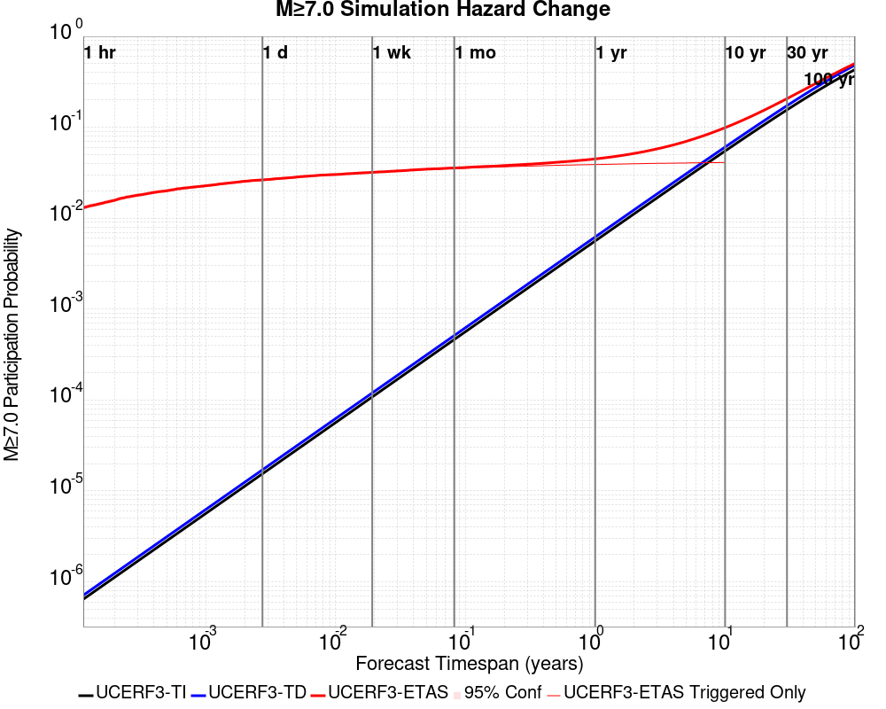
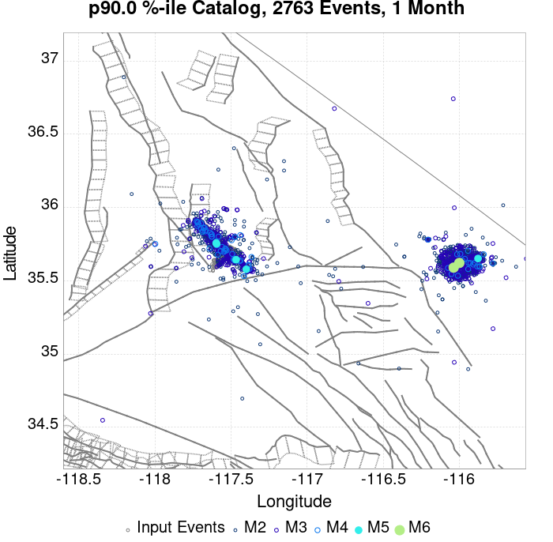
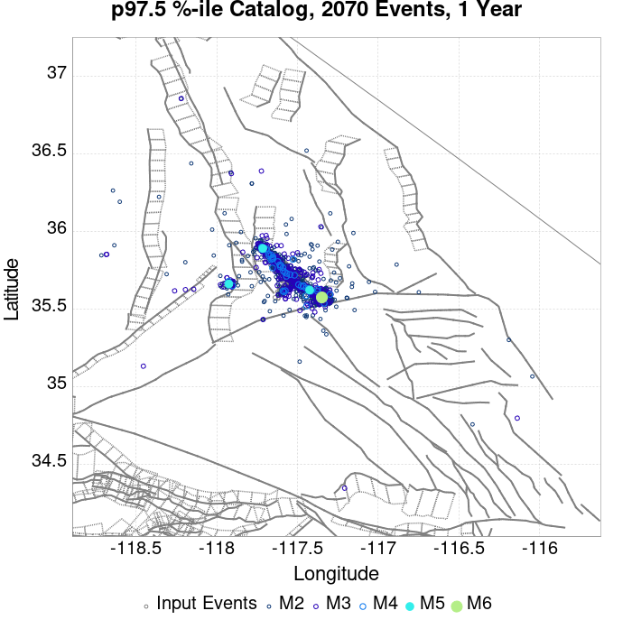
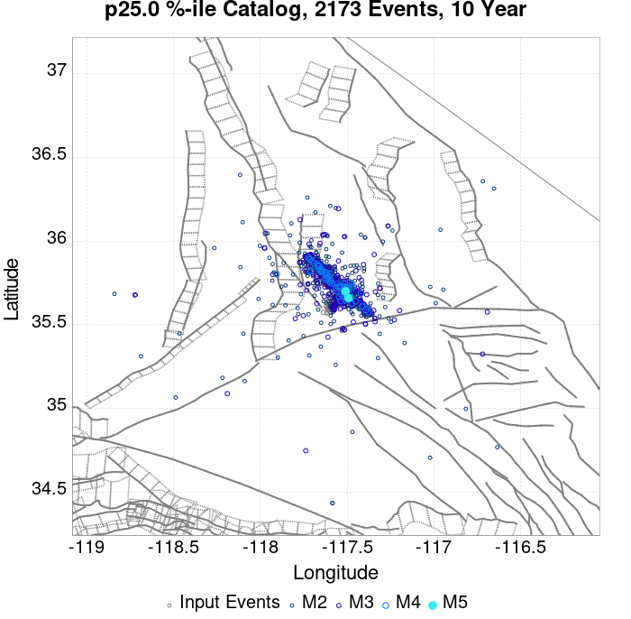
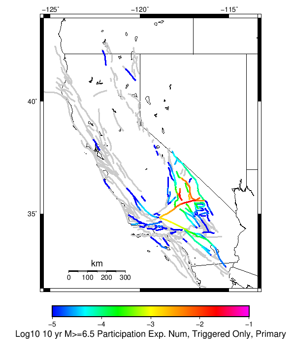

# ComCat M7.1 (ci38457511), ShakeMap Surfaces, Log10(k)=-2.5807, p=1.2481, c=0.0057006 Results

|   | ComCat M7.1 (ci38457511), ShakeMap Surfaces, Log10(k)=-2.5807, p=1.2481, c=0.0057006 |
|-----|-----|
| Num Simulations | 27605 (incomplete) |
| Start Time | 2019/07/06 03:19:54 UTC |
| Start Time Epoch Milliseconds | 1562383194040 |
| Duration | 10 Years |
| Includes Spontaneous? | false |
| Trigger Ruptures | 270 Trigger Ruptures |
|   | First: M3.98 at 2019/07/04 17:02:55 UTC |
|   | Last: M7.1 at 2019/07/06 03:19:53 UTC |
|   | Largest: M7.1 at 2019/07/06 03:19:53 UTC |
| Historical Ruptures | *(none)* |
| Config Generated With | u3etas_comcat_event_config_builder.sh --event-id ci38457511 --num-simulations 100000 --days-before 7 --mag-complete 3.7 --etas-k -2.5807 --etas-p 1.2481 --etas-c 0.0057006 --finite-surf-shakemap --finite-surf-shakemap-min-mag 5 --hpc-site USC_HPC --nodes 36 --hours 24 --queue scec |

## Table Of Contents

* [Probabilities Summary Table](#probabilities-summary-table)
* [Magnitude Number Distribution](#magnitude-number-distribution)
  * [10 Year Magnitude Number Distribution](#10-year-magnitude-number-distribution)
  * [1 Year Magnitude Number Distribution](#1-year-magnitude-number-distribution)
  * [1 Month Magnitude Number Distribution](#1-month-magnitude-number-distribution)
  * [1 Week Magnitude Number Distribution](#1-week-magnitude-number-distribution)
  * [1 Day Magnitude Number Distribution](#1-day-magnitude-number-distribution)
  * [1 Hour Magnitude Number Distribution](#1-hour-magnitude-number-distribution)
* [Hazard Change Over Time](#hazard-change-over-time)
  * [M&ge;5.0 Hazard Change Over Time](#m50-hazard-change-over-time)
  * [M&ge;6.0 Hazard Change Over Time](#m60-hazard-change-over-time)
  * [M&ge;7.0 Hazard Change Over Time](#m70-hazard-change-over-time)
  * [M&ge;8.0 Hazard Change Over Time](#m80-hazard-change-over-time)
* [Trigger Rupture Fault Map](#trigger-rupture-fault-map)
* [Trigger Rupture Depth Map](#trigger-rupture-depth-map)
* [Fault Distances To Triggers](#fault-distances-to-triggers)
* [Individual Simulated Catalog Maps](#individual-simulated-catalog-maps)
* [ComCat Data Comparisons](#comcat-data-comparisons)
* [Section Participation](#section-participation)
  * [Section Participation Plots](#section-participation-plots)
  * [Supra-Seismogenic Parent Sections Table](#supra-seismogenic-parent-sections-table)
  * [M≥6.5 Parent Sections Table](#m65-parent-sections-table)
  * [M≥7 Parent Sections Table](#m7-parent-sections-table)
  * [M≥7.5 Parent Sections Table](#m75-parent-sections-table)
  * [M≥8 Parent Sections Table](#m8-parent-sections-table)
  * [Fault Magnitude-Probability Distributions](#fault-magnitude-probability-distributions)
* [Gridded Nucleation](#gridded-nucleation)
* [JSON Input File](#json-input-file)

## Probabilities Summary Table
*[(top)](#table-of-contents)*

| Magnitude | 1 Hour Prob | 1 Day Prob | 1 Week Prob | 1 Month Prob | 1 Year Prob | 10 Year Prob |
|-----|-----|-----|-----|-----|-----|-----|
| **M&ge;4** | 1.000 (100.00%) | 1.000 (100.00%) | 1.000 (100.00%) | 1.000 (100.00%) | 1.000 (100.00%) | 1.000 (100.00%) |
| **M&ge;4.5** | 0.999 (99.88%) | 1.000 (100.00%) | 1.000 (100.00%) | 1.000 (100.00%) | 1.000 (100.00%) | 1.000 (100.00%) |
| **M&ge;5** | 0.873 (87.32%) | 0.981 (98.15%) | 0.991 (99.12%) | 0.994 (99.43%) | 0.997 (99.67%) | 0.997 (99.74%) |
| **M&ge;5.5** | 0.469 (46.92%) | 0.721 (72.05%) | 0.786 (78.63%) | 0.816 (81.57%) | 0.844 (84.42%) | 0.857 (85.70%) |
| **M&ge;6** | 0.153 (15.29%) | 0.289 (28.94%) | 0.342 (34.16%) | 0.370 (37.04%) | 0.401 (40.12%) | 0.417 (41.65%) |
| **M&ge;6.5** | 0.036 (3.56%) | 0.073 (7.26%) | 0.087 (8.68%) | 0.094 (9.43%) | 0.104 (10.41%) | 0.109 (10.90%) |
| **M&ge;7** | 0.013 (1.31%) | 0.027 (2.66%) | 0.032 (3.16%) | 0.035 (3.48%) | 0.039 (3.87%) | 0.041 (4.06%) |
| **M&ge;7.1** | 0.011 (1.12%) | 0.023 (2.26%) | 0.027 (2.69%) | 0.029 (2.93%) | 0.032 (3.25%) | 0.034 (3.42%) |
| **M&ge;7.5** | 4.53E-3 (0.45%) | 8.44E-3 (0.84%) | 0.010 (1.01%) | 0.011 (1.09%) | 0.012 (1.19%) | 0.012 (1.25%) |
| **M&ge;8** | 1.09E-4 (0.01%) | 2.17E-4 (0.02%) | 2.54E-4 (0.03%) | 2.54E-4 (0.03%) | 2.54E-4 (0.03%) | 2.54E-4 (0.03%) |

## Magnitude Number Distribution
*[(top)](#table-of-contents)*

### 10 Year Magnitude Number Distribution
*[(top)](#table-of-contents)*

**Legend**
* **Mean** (thick black line): mean expected number across all 27605 catalogs
* **2.5%,97.5%** (thin black lines): expected number percentiles across all 27605 catalogs
* **Median** (thin blue line): median expected number across all 27605 catalogs
* **Mode** (thin cyan line): modal expected number across all 27605 catalogs
* **10 yr Probability** (thin red line): 10 year probability calculated as the fraction of catalogs with at least 1 occurrence
* **10 yr Supraseismogenic Probability** (thin dashed red line): same as above, but only for supraseismogenic ruptures on explicitly modeled UCERF3 faults
* **95% Conf** (light red shaded region): binomial 95% confidence bounds on probability
* **Primary** (thin green line): mean expected number from primary triggered aftershocks only (no secondary, tertiary, etc...) across all 27605 catalogs


| Mag | Mean | 2.5 %ile | 97.5 %ile | Median | Mode | 10 yr Probability | 10 yr Supra-Seis Prob | Primary Aftershocks Mean |
|-----|-----|-----|-----|-----|-----|-----|-----|-----|
| **M&ge;2.5** | 2599.336 | 1995.000 | 5268.000 | 2323.000 | 2234.000 | 1.000 (100.00%) | 0.176 (17.63%) | 1565.048 |
| **M&ge;2.6** | 2064.699 | 1580.000 | 4188.000 | 1846.000 | 1797.000 | 1.000 (100.00%) | 0.176 (17.63%) | 1243.170 |
| **M&ge;2.7** | 1639.863 | 1250.000 | 3321.000 | 1467.000 | 1417.000 | 1.000 (100.00%) | 0.176 (17.63%) | 987.335 |
| **M&ge;2.8** | 1302.384 | 988.000 | 2645.000 | 1166.000 | 1159.000 | 1.000 (100.00%) | 0.176 (17.63%) | 784.145 |
| **M&ge;2.9** | 1034.330 | 780.000 | 2103.000 | 927.000 | 857.000 | 1.000 (100.00%) | 0.176 (17.63%) | 622.848 |
| **M&ge;3** | 821.574 | 615.000 | 1676.000 | 736.000 | 704.000 | 1.000 (100.00%) | 0.176 (17.63%) | 494.772 |
| **M&ge;3.1** | 652.448 | 485.000 | 1329.000 | 585.000 | 547.000 | 1.000 (100.00%) | 0.176 (17.63%) | 392.921 |
| **M&ge;3.2** | 518.221 | 381.000 | 1050.000 | 465.000 | 438.000 | 1.000 (100.00%) | 0.176 (17.63%) | 312.070 |
| **M&ge;3.3** | 411.648 | 300.000 | 839.000 | 370.000 | 356.000 | 1.000 (100.00%) | 0.176 (17.63%) | 247.912 |
| **M&ge;3.4** | 326.913 | 235.000 | 667.000 | 294.000 | 282.000 | 1.000 (100.00%) | 0.176 (17.63%) | 196.873 |
| **M&ge;3.5** | 259.583 | 184.000 | 528.000 | 234.000 | 230.000 | 1.000 (100.00%) | 0.176 (17.63%) | 156.312 |
| **M&ge;3.6** | 206.151 | 143.000 | 420.000 | 186.000 | 181.000 | 1.000 (100.00%) | 0.176 (17.63%) | 124.148 |
| **M&ge;3.7** | 163.747 | 111.000 | 336.000 | 148.000 | 142.000 | 1.000 (100.00%) | 0.176 (17.63%) | 98.607 |
| **M&ge;3.8** | 130.023 | 87.000 | 267.000 | 118.000 | 111.000 | 1.000 (100.00%) | 0.176 (17.63%) | 78.286 |
| **M&ge;3.9** | 103.251 | 66.000 | 214.000 | 94.000 | 92.000 | 1.000 (100.00%) | 0.176 (17.63%) | 62.159 |
| **M&ge;4** | 81.951 | 51.000 | 171.000 | 74.000 | 71.000 | 1.000 (100.00%) | 0.176 (17.63%) | 49.347 |
| **M&ge;4.1** | 65.059 | 39.000 | 136.000 | 59.000 | 54.000 | 1.000 (100.00%) | 0.176 (17.63%) | 39.158 |
| **M&ge;4.2** | 51.641 | 30.000 | 109.000 | 47.000 | 43.000 | 1.000 (100.00%) | 0.176 (17.63%) | 31.077 |
| **M&ge;4.3** | 40.968 | 22.000 | 88.000 | 37.000 | 35.000 | 1.000 (100.00%) | 0.176 (17.63%) | 24.647 |
| **M&ge;4.4** | 32.507 | 17.000 | 70.000 | 29.000 | 29.000 | 1.000 (100.00%) | 0.176 (17.63%) | 19.551 |
| **M&ge;4.5** | 25.776 | 12.000 | 56.000 | 23.000 | 23.000 | 1.000 (100.00%) | 0.176 (17.63%) | 15.505 |
| **M&ge;4.6** | 20.424 | 9.000 | 45.000 | 19.000 | 16.000 | 1.000 (100.00%) | 0.176 (17.63%) | 12.282 |
| **M&ge;4.7** | 16.177 | 6.000 | 36.000 | 15.000 | 13.000 | 1.000 (100.00%) | 0.176 (17.63%) | 9.724 |
| **M&ge;4.8** | 12.779 | 4.000 | 29.000 | 12.000 | 10.000 | 1.000 (99.99%) | 0.176 (17.63%) | 7.683 |
| **M&ge;4.9** | 10.113 | 3.000 | 24.000 | 9.000 | 8.000 | 0.999 (99.94%) | 0.176 (17.63%) | 6.075 |
| **M&ge;5** | 7.981 | 2.000 | 20.000 | 7.000 | 6.000 | 0.997 (99.74%) | 0.176 (17.63%) | 4.794 |
| **M&ge;5.1** | 6.305 | 1.000 | 16.000 | 6.000 | 5.000 | 0.992 (99.22%) | 0.176 (17.63%) | 3.791 |
| **M&ge;5.2** | 4.963 | 1.000 | 13.000 | 4.000 | 3.000 | 0.979 (97.87%) | 0.176 (17.63%) | 2.987 |
| **M&ge;5.3** | 3.894 | 0.000 | 11.000 | 3.000 | 3.000 | 0.953 (95.34%) | 0.176 (17.63%) | 2.345 |
| **M&ge;5.4** | 3.044 | 0.000 | 9.000 | 3.000 | 2.000 | 0.913 (91.33%) | 0.176 (17.63%) | 1.832 |
| **M&ge;5.5** | 2.373 | 0.000 | 7.000 | 2.000 | 1.000 | 0.857 (85.70%) | 0.176 (17.63%) | 1.429 |
| **M&ge;5.6** | 1.838 | 0.000 | 6.000 | 1.000 | 1.000 | 0.782 (78.23%) | 0.176 (17.63%) | 1.109 |
| **M&ge;5.7** | 1.410 | 0.000 | 5.000 | 1.000 | 1.000 | 0.695 (69.53%) | 0.176 (17.63%) | 0.851 |
| **M&ge;5.8** | 1.075 | 0.000 | 4.000 | 1.000 | 0.000 | 0.600 (60.04%) | 0.176 (17.63%) | 0.648 |
| **M&ge;5.9** | 0.811 | 0.000 | 3.000 | 1.000 | 0.000 | 0.505 (50.51%) | 0.176 (17.63%) | 0.489 |
| **M&ge;6** | 0.620 | 0.000 | 3.000 | 0.000 | 0.000 | 0.417 (41.65%) | 0.176 (17.61%) | 0.371 |
| **M&ge;6.1** | 0.448 | 0.000 | 2.000 | 0.000 | 0.000 | 0.326 (32.57%) | 0.153 (15.26%) | 0.272 |
| **M&ge;6.2** | 0.292 | 0.000 | 2.000 | 0.000 | 0.000 | 0.231 (23.14%) | 0.117 (11.73%) | 0.178 |
| **M&ge;6.3** | 0.219 | 0.000 | 2.000 | 0.000 | 0.000 | 0.181 (18.14%) | 0.099 (9.92%) | 0.136 |
| **M&ge;6.4** | 0.164 | 0.000 | 1.000 | 0.000 | 0.000 | 0.139 (13.94%) | 0.085 (8.48%) | 0.101 |
| **M&ge;6.5** | 0.126 | 0.000 | 1.000 | 0.000 | 0.000 | 0.109 (10.90%) | 0.074 (7.41%) | 0.078 |
| **M&ge;6.6** | 0.104 | 0.000 | 1.000 | 0.000 | 0.000 | 0.094 (9.38%) | 0.069 (6.90%) | 0.067 |
| **M&ge;6.7** | 0.085 | 0.000 | 1.000 | 0.000 | 0.000 | 0.077 (7.71%) | 0.060 (5.98%) | 0.054 |
| **M&ge;6.8** | 0.068 | 0.000 | 1.000 | 0.000 | 0.000 | 0.063 (6.30%) | 0.052 (5.18%) | 0.044 |
| **M&ge;6.9** | 0.053 | 0.000 | 1.000 | 0.000 | 0.000 | 0.051 (5.06%) | 0.043 (4.32%) | 0.036 |
| **M&ge;7** | 0.042 | 0.000 | 1.000 | 0.000 | 0.000 | 0.041 (4.06%) | 0.036 (3.58%) | 0.028 |
| **M&ge;7.1** | 0.035 | 0.000 | 1.000 | 0.000 | 0.000 | 0.034 (3.42%) | 0.031 (3.11%) | 0.023 |
| **M&ge;7.2** | 0.026 | 0.000 | 1.000 | 0.000 | 0.000 | 0.026 (2.58%) | 0.024 (2.44%) | 0.018 |
| **M&ge;7.3** | 0.018 | 0.000 | 0.000 | 0.000 | 0.000 | 0.018 (1.76%) | 0.017 (1.71%) | 0.012 |
| **M&ge;7.4** | 0.016 | 0.000 | 0.000 | 0.000 | 0.000 | 0.016 (1.55%) | 0.015 (1.54%) | 0.011 |
| **M&ge;7.5** | 0.013 | 0.000 | 0.000 | 0.000 | 0.000 | 0.012 (1.25%) | 0.012 (1.24%) | 8.44E-3 |
| **M&ge;7.6** | 6.70E-3 | 0.000 | 0.000 | 0.000 | 0.000 | 6.67E-3 (0.67%) | 6.59E-3 (0.66%) | 4.49E-3 |
| **M&ge;7.7** | 2.25E-3 | 0.000 | 0.000 | 0.000 | 0.000 | 2.25E-3 (0.22%) | 2.25E-3 (0.22%) | 1.49E-3 |
| **M&ge;7.8** | 1.38E-3 | 0.000 | 0.000 | 0.000 | 0.000 | 1.38E-3 (0.14%) | 1.38E-3 (0.14%) | 7.97E-4 |
| **M&ge;7.9** | 6.88E-4 | 0.000 | 0.000 | 0.000 | 0.000 | 6.88E-4 (0.07%) | 6.88E-4 (0.07%) | 3.98E-4 |
| **M&ge;8** | 2.54E-4 | 0.000 | 0.000 | 0.000 | 0.000 | 2.54E-4 (0.03%) | 2.54E-4 (0.03%) | 2.17E-4 |
| **M&ge;8.1** | 0.000 | 0.000 | 0.000 | 0.000 | 0.000 | 0.000 (0.00%) | 0.000 (0.00%) | 0.000 |
| **M&ge;8.2** | 0.000 | 0.000 | 0.000 | 0.000 | 0.000 | 0.000 (0.00%) | 0.000 (0.00%) | 0.000 |
| **M&ge;8.3** | 0.000 | 0.000 | 0.000 | 0.000 | 0.000 | 0.000 (0.00%) | 0.000 (0.00%) | 0.000 |
| **M&ge;8.4** | 0.000 | 0.000 | 0.000 | 0.000 | 0.000 | 0.000 (0.00%) | 0.000 (0.00%) | 0.000 |
| **M&ge;8.5** | 0.000 | 0.000 | 0.000 | 0.000 | 0.000 | 0.000 (0.00%) | 0.000 (0.00%) | 0.000 |
| **M&ge;8.6** | 0.000 | 0.000 | 0.000 | 0.000 | 0.000 | 0.000 (0.00%) | 0.000 (0.00%) | 0.000 |
| **M&ge;8.7** | 0.000 | 0.000 | 0.000 | 0.000 | 0.000 | 0.000 (0.00%) | 0.000 (0.00%) | 0.000 |
| **M&ge;8.8** | 0.000 | 0.000 | 0.000 | 0.000 | 0.000 | 0.000 (0.00%) | 0.000 (0.00%) | 0.000 |
| **M&ge;8.9** | 0.000 | 0.000 | 0.000 | 0.000 | 0.000 | 0.000 (0.00%) | 0.000 (0.00%) | 0.000 |
| **M&ge;9** | 0.000 | 0.000 | 0.000 | 0.000 | 0.000 | 0.000 (0.00%) | 0.000 (0.00%) | 0.000 |

### 1 Year Magnitude Number Distribution
*[(top)](#table-of-contents)*

**Legend**
* **Mean** (thick black line): mean expected number across all 27605 catalogs
* **2.5%,97.5%** (thin black lines): expected number percentiles across all 27605 catalogs
* **Median** (thin blue line): median expected number across all 27605 catalogs
* **Mode** (thin cyan line): modal expected number across all 27605 catalogs
* **1 yr Probability** (thin red line): 1 year probability calculated as the fraction of catalogs with at least 1 occurrence
* **1 yr Supraseismogenic Probability** (thin dashed red line): same as above, but only for supraseismogenic ruptures on explicitly modeled UCERF3 faults
* **95% Conf** (light red shaded region): binomial 95% confidence bounds on probability
* **Primary** (thin green line): mean expected number from primary triggered aftershocks only (no secondary, tertiary, etc...) across all 27605 catalogs


| Mag | Mean | 2.5 %ile | 97.5 %ile | Median | Mode | 1 yr Probability | 1 yr Supra-Seis Prob | Primary Aftershocks Mean |
|-----|-----|-----|-----|-----|-----|-----|-----|-----|
| **M&ge;2.5** | 2462.037 | 1903.000 | 4947.000 | 2208.000 | 2063.000 | 1.000 (100.00%) | 0.169 (16.89%) | 1510.661 |
| **M&ge;2.6** | 1955.651 | 1507.000 | 3925.000 | 1754.000 | 1688.000 | 1.000 (100.00%) | 0.169 (16.89%) | 1199.951 |
| **M&ge;2.7** | 1553.280 | 1192.000 | 3120.000 | 1395.000 | 1340.000 | 1.000 (100.00%) | 0.169 (16.89%) | 953.028 |
| **M&ge;2.8** | 1233.618 | 942.000 | 2475.000 | 1109.000 | 1039.000 | 1.000 (100.00%) | 0.169 (16.89%) | 756.903 |
| **M&ge;2.9** | 979.740 | 743.000 | 1971.000 | 881.000 | 839.000 | 1.000 (100.00%) | 0.169 (16.89%) | 601.213 |
| **M&ge;3** | 778.210 | 587.000 | 1568.000 | 700.000 | 652.000 | 1.000 (100.00%) | 0.169 (16.89%) | 477.578 |
| **M&ge;3.1** | 618.008 | 462.000 | 1250.000 | 557.000 | 539.000 | 1.000 (100.00%) | 0.169 (16.89%) | 379.261 |
| **M&ge;3.2** | 490.866 | 363.000 | 989.000 | 443.000 | 422.000 | 1.000 (100.00%) | 0.169 (16.89%) | 301.221 |
| **M&ge;3.3** | 389.916 | 285.000 | 786.000 | 352.000 | 345.000 | 1.000 (100.00%) | 0.169 (16.89%) | 239.300 |
| **M&ge;3.4** | 309.653 | 224.000 | 625.000 | 280.000 | 264.000 | 1.000 (100.00%) | 0.169 (16.89%) | 190.035 |
| **M&ge;3.5** | 245.883 | 175.000 | 497.000 | 222.000 | 208.000 | 1.000 (100.00%) | 0.169 (16.89%) | 150.881 |
| **M&ge;3.6** | 195.273 | 136.000 | 395.000 | 177.000 | 167.000 | 1.000 (100.00%) | 0.169 (16.89%) | 119.841 |
| **M&ge;3.7** | 155.102 | 106.000 | 314.000 | 141.000 | 137.000 | 1.000 (100.00%) | 0.169 (16.89%) | 95.184 |
| **M&ge;3.8** | 123.133 | 82.000 | 250.000 | 112.000 | 108.000 | 1.000 (100.00%) | 0.169 (16.89%) | 75.567 |
| **M&ge;3.9** | 97.776 | 63.000 | 201.000 | 89.000 | 83.000 | 1.000 (100.00%) | 0.169 (16.89%) | 60.000 |
| **M&ge;4** | 77.602 | 49.000 | 160.000 | 71.000 | 65.000 | 1.000 (100.00%) | 0.169 (16.89%) | 47.634 |
| **M&ge;4.1** | 61.607 | 37.000 | 128.000 | 56.000 | 56.000 | 1.000 (100.00%) | 0.169 (16.89%) | 37.794 |
| **M&ge;4.2** | 48.899 | 28.000 | 102.000 | 45.000 | 41.000 | 1.000 (100.00%) | 0.169 (16.89%) | 29.993 |
| **M&ge;4.3** | 38.795 | 21.000 | 82.000 | 35.000 | 35.000 | 1.000 (100.00%) | 0.169 (16.89%) | 23.788 |
| **M&ge;4.4** | 30.782 | 16.000 | 66.000 | 28.000 | 27.000 | 1.000 (100.00%) | 0.169 (16.89%) | 18.868 |
| **M&ge;4.5** | 24.410 | 12.000 | 52.000 | 22.000 | 21.000 | 1.000 (100.00%) | 0.169 (16.89%) | 14.964 |
| **M&ge;4.6** | 19.342 | 8.000 | 42.000 | 18.000 | 16.000 | 1.000 (100.00%) | 0.169 (16.89%) | 11.856 |
| **M&ge;4.7** | 15.322 | 6.000 | 34.000 | 14.000 | 13.000 | 1.000 (100.00%) | 0.169 (16.89%) | 9.390 |
| **M&ge;4.8** | 12.103 | 4.000 | 28.000 | 11.000 | 10.000 | 1.000 (99.99%) | 0.169 (16.89%) | 7.418 |
| **M&ge;4.9** | 9.577 | 3.000 | 23.000 | 9.000 | 8.000 | 0.999 (99.92%) | 0.169 (16.89%) | 5.864 |
| **M&ge;5** | 7.560 | 2.000 | 18.000 | 7.000 | 6.000 | 0.997 (99.67%) | 0.169 (16.89%) | 4.629 |
| **M&ge;5.1** | 5.975 | 1.000 | 15.000 | 5.000 | 4.000 | 0.991 (99.07%) | 0.169 (16.89%) | 3.661 |
| **M&ge;5.2** | 4.701 | 1.000 | 12.000 | 4.000 | 3.000 | 0.975 (97.51%) | 0.169 (16.89%) | 2.884 |
| **M&ge;5.3** | 3.690 | 0.000 | 10.000 | 3.000 | 3.000 | 0.947 (94.70%) | 0.169 (16.89%) | 2.265 |
| **M&ge;5.4** | 2.885 | 0.000 | 9.000 | 2.000 | 2.000 | 0.904 (90.42%) | 0.169 (16.89%) | 1.771 |
| **M&ge;5.5** | 2.250 | 0.000 | 7.000 | 2.000 | 1.000 | 0.844 (84.42%) | 0.169 (16.89%) | 1.382 |
| **M&ge;5.6** | 1.742 | 0.000 | 6.000 | 1.000 | 1.000 | 0.767 (76.73%) | 0.169 (16.89%) | 1.073 |
| **M&ge;5.7** | 1.337 | 0.000 | 5.000 | 1.000 | 1.000 | 0.678 (67.82%) | 0.169 (16.89%) | 0.822 |
| **M&ge;5.8** | 1.019 | 0.000 | 4.000 | 1.000 | 0.000 | 0.583 (58.33%) | 0.169 (16.89%) | 0.626 |
| **M&ge;5.9** | 0.769 | 0.000 | 3.000 | 0.000 | 0.000 | 0.488 (48.83%) | 0.169 (16.88%) | 0.473 |
| **M&ge;6** | 0.586 | 0.000 | 3.000 | 0.000 | 0.000 | 0.401 (40.12%) | 0.169 (16.87%) | 0.358 |
| **M&ge;6.1** | 0.424 | 0.000 | 2.000 | 0.000 | 0.000 | 0.313 (31.31%) | 0.147 (14.67%) | 0.262 |
| **M&ge;6.2** | 0.277 | 0.000 | 2.000 | 0.000 | 0.000 | 0.221 (22.14%) | 0.113 (11.30%) | 0.172 |
| **M&ge;6.3** | 0.208 | 0.000 | 2.000 | 0.000 | 0.000 | 0.173 (17.33%) | 0.095 (9.54%) | 0.131 |
| **M&ge;6.4** | 0.155 | 0.000 | 1.000 | 0.000 | 0.000 | 0.133 (13.31%) | 0.082 (8.16%) | 0.098 |
| **M&ge;6.5** | 0.120 | 0.000 | 1.000 | 0.000 | 0.000 | 0.104 (10.41%) | 0.071 (7.13%) | 0.076 |
| **M&ge;6.6** | 0.099 | 0.000 | 1.000 | 0.000 | 0.000 | 0.090 (8.95%) | 0.066 (6.63%) | 0.065 |
| **M&ge;6.7** | 0.081 | 0.000 | 1.000 | 0.000 | 0.000 | 0.073 (7.34%) | 0.057 (5.73%) | 0.052 |
| **M&ge;6.8** | 0.065 | 0.000 | 1.000 | 0.000 | 0.000 | 0.060 (6.02%) | 0.050 (4.97%) | 0.043 |
| **M&ge;6.9** | 0.051 | 0.000 | 1.000 | 0.000 | 0.000 | 0.048 (4.84%) | 0.041 (4.14%) | 0.035 |
| **M&ge;7** | 0.040 | 0.000 | 1.000 | 0.000 | 0.000 | 0.039 (3.87%) | 0.034 (3.41%) | 0.027 |
| **M&ge;7.1** | 0.033 | 0.000 | 1.000 | 0.000 | 0.000 | 0.032 (3.25%) | 0.030 (2.96%) | 0.023 |
| **M&ge;7.2** | 0.025 | 0.000 | 0.000 | 0.000 | 0.000 | 0.025 (2.47%) | 0.023 (2.33%) | 0.017 |
| **M&ge;7.3** | 0.017 | 0.000 | 0.000 | 0.000 | 0.000 | 0.017 (1.69%) | 0.016 (1.64%) | 0.012 |
| **M&ge;7.4** | 0.015 | 0.000 | 0.000 | 0.000 | 0.000 | 0.015 (1.49%) | 0.015 (1.47%) | 0.010 |
| **M&ge;7.5** | 0.012 | 0.000 | 0.000 | 0.000 | 0.000 | 0.012 (1.19%) | 0.012 (1.18%) | 8.19E-3 |
| **M&ge;7.6** | 6.34E-3 | 0.000 | 0.000 | 0.000 | 0.000 | 6.30E-3 (0.63%) | 6.23E-3 (0.62%) | 4.35E-3 |
| **M&ge;7.7** | 2.10E-3 | 0.000 | 0.000 | 0.000 | 0.000 | 2.10E-3 (0.21%) | 2.10E-3 (0.21%) | 1.41E-3 |
| **M&ge;7.8** | 1.34E-3 | 0.000 | 0.000 | 0.000 | 0.000 | 1.34E-3 (0.13%) | 1.34E-3 (0.13%) | 7.97E-4 |
| **M&ge;7.9** | 6.52E-4 | 0.000 | 0.000 | 0.000 | 0.000 | 6.52E-4 (0.07%) | 6.52E-4 (0.07%) | 3.98E-4 |
| **M&ge;8** | 2.54E-4 | 0.000 | 0.000 | 0.000 | 0.000 | 2.54E-4 (0.03%) | 2.54E-4 (0.03%) | 2.17E-4 |
| **M&ge;8.1** | 0.000 | 0.000 | 0.000 | 0.000 | 0.000 | 0.000 (0.00%) | 0.000 (0.00%) | 0.000 |
| **M&ge;8.2** | 0.000 | 0.000 | 0.000 | 0.000 | 0.000 | 0.000 (0.00%) | 0.000 (0.00%) | 0.000 |
| **M&ge;8.3** | 0.000 | 0.000 | 0.000 | 0.000 | 0.000 | 0.000 (0.00%) | 0.000 (0.00%) | 0.000 |
| **M&ge;8.4** | 0.000 | 0.000 | 0.000 | 0.000 | 0.000 | 0.000 (0.00%) | 0.000 (0.00%) | 0.000 |
| **M&ge;8.5** | 0.000 | 0.000 | 0.000 | 0.000 | 0.000 | 0.000 (0.00%) | 0.000 (0.00%) | 0.000 |
| **M&ge;8.6** | 0.000 | 0.000 | 0.000 | 0.000 | 0.000 | 0.000 (0.00%) | 0.000 (0.00%) | 0.000 |
| **M&ge;8.7** | 0.000 | 0.000 | 0.000 | 0.000 | 0.000 | 0.000 (0.00%) | 0.000 (0.00%) | 0.000 |
| **M&ge;8.8** | 0.000 | 0.000 | 0.000 | 0.000 | 0.000 | 0.000 (0.00%) | 0.000 (0.00%) | 0.000 |
| **M&ge;8.9** | 0.000 | 0.000 | 0.000 | 0.000 | 0.000 | 0.000 (0.00%) | 0.000 (0.00%) | 0.000 |
| **M&ge;9** | 0.000 | 0.000 | 0.000 | 0.000 | 0.000 | 0.000 (0.00%) | 0.000 (0.00%) | 0.000 |

### 1 Month Magnitude Number Distribution
*[(top)](#table-of-contents)*

**Legend**
* **Mean** (thick black line): mean expected number across all 27605 catalogs
* **2.5%,97.5%** (thin black lines): expected number percentiles across all 27605 catalogs
* **Median** (thin blue line): median expected number across all 27605 catalogs
* **Mode** (thin cyan line): modal expected number across all 27605 catalogs
* **1 mo Probability** (thin red line): 1 month probability calculated as the fraction of catalogs with at least 1 occurrence
* **1 mo Supraseismogenic Probability** (thin dashed red line): same as above, but only for supraseismogenic ruptures on explicitly modeled UCERF3 faults
* **95% Conf** (light red shaded region): binomial 95% confidence bounds on probability
* **Primary** (thin green line): mean expected number from primary triggered aftershocks only (no secondary, tertiary, etc...) across all 27605 catalogs


| Mag | Mean | 2.5 %ile | 97.5 %ile | Median | Mode | 1 mo Probability | 1 mo Supra-Seis Prob | Primary Aftershocks Mean |
|-----|-----|-----|-----|-----|-----|-----|-----|-----|
| **M&ge;2.5** | 2202.904 | 1729.000 | 4312.000 | 1989.000 | 1854.000 | 1.000 (100.00%) | 0.154 (15.37%) | 1403.618 |
| **M&ge;2.6** | 1749.849 | 1368.000 | 3420.000 | 1581.000 | 1480.000 | 1.000 (100.00%) | 0.154 (15.37%) | 1114.948 |
| **M&ge;2.7** | 1389.793 | 1082.000 | 2720.000 | 1256.000 | 1209.000 | 1.000 (100.00%) | 0.154 (15.37%) | 885.519 |
| **M&ge;2.8** | 1103.782 | 855.000 | 2160.000 | 999.000 | 962.000 | 1.000 (100.00%) | 0.154 (15.37%) | 703.273 |
| **M&ge;2.9** | 876.662 | 674.000 | 1715.000 | 793.000 | 769.000 | 1.000 (100.00%) | 0.154 (15.37%) | 558.612 |
| **M&ge;3** | 696.351 | 531.000 | 1365.000 | 631.000 | 608.000 | 1.000 (100.00%) | 0.154 (15.37%) | 443.758 |
| **M&ge;3.1** | 553.012 | 418.000 | 1081.000 | 501.000 | 480.000 | 1.000 (100.00%) | 0.154 (15.37%) | 352.404 |
| **M&ge;3.2** | 439.191 | 329.000 | 860.000 | 399.000 | 376.000 | 1.000 (100.00%) | 0.154 (15.37%) | 279.869 |
| **M&ge;3.3** | 348.893 | 258.000 | 684.000 | 317.000 | 303.000 | 1.000 (100.00%) | 0.154 (15.37%) | 222.343 |
| **M&ge;3.4** | 277.086 | 202.000 | 544.000 | 252.000 | 247.000 | 1.000 (100.00%) | 0.154 (15.37%) | 176.574 |
| **M&ge;3.5** | 220.040 | 157.000 | 434.000 | 201.000 | 193.000 | 1.000 (100.00%) | 0.154 (15.37%) | 140.203 |
| **M&ge;3.6** | 174.746 | 122.000 | 344.000 | 159.000 | 154.000 | 1.000 (100.00%) | 0.154 (15.37%) | 111.354 |
| **M&ge;3.7** | 138.795 | 95.000 | 274.000 | 127.000 | 120.000 | 1.000 (100.00%) | 0.154 (15.37%) | 88.437 |
| **M&ge;3.8** | 110.176 | 74.000 | 217.000 | 101.000 | 95.000 | 1.000 (100.00%) | 0.154 (15.37%) | 70.211 |
| **M&ge;3.9** | 87.485 | 57.000 | 173.000 | 80.000 | 78.000 | 1.000 (100.00%) | 0.154 (15.37%) | 55.751 |
| **M&ge;4** | 69.429 | 43.000 | 138.000 | 64.000 | 61.000 | 1.000 (100.00%) | 0.154 (15.37%) | 44.259 |
| **M&ge;4.1** | 55.118 | 33.000 | 111.000 | 50.000 | 48.000 | 1.000 (100.00%) | 0.154 (15.37%) | 35.112 |
| **M&ge;4.2** | 43.753 | 25.000 | 89.000 | 40.000 | 39.000 | 1.000 (100.00%) | 0.154 (15.37%) | 27.872 |
| **M&ge;4.3** | 34.716 | 19.000 | 71.000 | 32.000 | 29.000 | 1.000 (100.00%) | 0.154 (15.37%) | 22.107 |
| **M&ge;4.4** | 27.539 | 14.000 | 58.000 | 25.000 | 24.000 | 1.000 (100.00%) | 0.154 (15.37%) | 17.533 |
| **M&ge;4.5** | 21.834 | 10.000 | 46.000 | 20.000 | 18.000 | 1.000 (100.00%) | 0.154 (15.37%) | 13.902 |
| **M&ge;4.6** | 17.304 | 7.000 | 37.000 | 16.000 | 16.000 | 1.000 (100.00%) | 0.154 (15.37%) | 11.016 |
| **M&ge;4.7** | 13.703 | 5.000 | 30.000 | 12.000 | 12.000 | 1.000 (99.99%) | 0.154 (15.37%) | 8.722 |
| **M&ge;4.8** | 10.826 | 4.000 | 24.000 | 10.000 | 8.000 | 1.000 (99.97%) | 0.154 (15.37%) | 6.890 |
| **M&ge;4.9** | 8.568 | 2.000 | 20.000 | 8.000 | 7.000 | 0.999 (99.86%) | 0.154 (15.37%) | 5.449 |
| **M&ge;5** | 6.763 | 1.000 | 17.000 | 6.000 | 5.000 | 0.994 (99.43%) | 0.154 (15.37%) | 4.302 |
| **M&ge;5.1** | 5.341 | 1.000 | 14.000 | 5.000 | 4.000 | 0.985 (98.54%) | 0.154 (15.37%) | 3.402 |
| **M&ge;5.2** | 4.204 | 0.000 | 11.000 | 4.000 | 3.000 | 0.966 (96.58%) | 0.154 (15.37%) | 2.679 |
| **M&ge;5.3** | 3.298 | 0.000 | 9.000 | 3.000 | 2.000 | 0.931 (93.15%) | 0.154 (15.37%) | 2.105 |
| **M&ge;5.4** | 2.579 | 0.000 | 8.000 | 2.000 | 2.000 | 0.882 (88.21%) | 0.154 (15.37%) | 1.645 |
| **M&ge;5.5** | 2.012 | 0.000 | 6.000 | 2.000 | 1.000 | 0.816 (81.57%) | 0.154 (15.37%) | 1.283 |
| **M&ge;5.6** | 1.557 | 0.000 | 5.000 | 1.000 | 1.000 | 0.733 (73.35%) | 0.154 (15.37%) | 0.995 |
| **M&ge;5.7** | 1.195 | 0.000 | 4.000 | 1.000 | 0.000 | 0.642 (64.21%) | 0.154 (15.37%) | 0.763 |
| **M&ge;5.8** | 0.912 | 0.000 | 4.000 | 1.000 | 0.000 | 0.548 (54.79%) | 0.154 (15.37%) | 0.581 |
| **M&ge;5.9** | 0.688 | 0.000 | 3.000 | 0.000 | 0.000 | 0.454 (45.37%) | 0.154 (15.36%) | 0.438 |
| **M&ge;6** | 0.525 | 0.000 | 3.000 | 0.000 | 0.000 | 0.370 (37.04%) | 0.154 (15.36%) | 0.332 |
| **M&ge;6.1** | 0.380 | 0.000 | 2.000 | 0.000 | 0.000 | 0.287 (28.71%) | 0.134 (13.37%) | 0.243 |
| **M&ge;6.2** | 0.249 | 0.000 | 2.000 | 0.000 | 0.000 | 0.202 (20.24%) | 0.103 (10.31%) | 0.160 |
| **M&ge;6.3** | 0.186 | 0.000 | 1.000 | 0.000 | 0.000 | 0.158 (15.82%) | 0.087 (8.69%) | 0.122 |
| **M&ge;6.4** | 0.139 | 0.000 | 1.000 | 0.000 | 0.000 | 0.121 (12.10%) | 0.074 (7.44%) | 0.090 |
| **M&ge;6.5** | 0.107 | 0.000 | 1.000 | 0.000 | 0.000 | 0.094 (9.43%) | 0.065 (6.51%) | 0.070 |
| **M&ge;6.6** | 0.089 | 0.000 | 1.000 | 0.000 | 0.000 | 0.081 (8.11%) | 0.060 (6.05%) | 0.060 |
| **M&ge;6.7** | 0.073 | 0.000 | 1.000 | 0.000 | 0.000 | 0.067 (6.65%) | 0.052 (5.25%) | 0.049 |
| **M&ge;6.8** | 0.058 | 0.000 | 1.000 | 0.000 | 0.000 | 0.055 (5.46%) | 0.045 (4.55%) | 0.040 |
| **M&ge;6.9** | 0.045 | 0.000 | 1.000 | 0.000 | 0.000 | 0.044 (4.35%) | 0.038 (3.75%) | 0.032 |
| **M&ge;7** | 0.036 | 0.000 | 1.000 | 0.000 | 0.000 | 0.035 (3.48%) | 0.031 (3.08%) | 0.025 |
| **M&ge;7.1** | 0.030 | 0.000 | 1.000 | 0.000 | 0.000 | 0.029 (2.93%) | 0.027 (2.68%) | 0.021 |
| **M&ge;7.2** | 0.023 | 0.000 | 0.000 | 0.000 | 0.000 | 0.022 (2.23%) | 0.021 (2.11%) | 0.016 |
| **M&ge;7.3** | 0.016 | 0.000 | 0.000 | 0.000 | 0.000 | 0.015 (1.54%) | 0.015 (1.49%) | 0.011 |
| **M&ge;7.4** | 0.014 | 0.000 | 0.000 | 0.000 | 0.000 | 0.014 (1.35%) | 0.013 (1.34%) | 9.60E-3 |
| **M&ge;7.5** | 0.011 | 0.000 | 0.000 | 0.000 | 0.000 | 0.011 (1.09%) | 0.011 (1.08%) | 7.68E-3 |
| **M&ge;7.6** | 5.72E-3 | 0.000 | 0.000 | 0.000 | 0.000 | 5.72E-3 (0.57%) | 5.65E-3 (0.57%) | 4.06E-3 |
| **M&ge;7.7** | 1.92E-3 | 0.000 | 0.000 | 0.000 | 0.000 | 1.92E-3 (0.19%) | 1.92E-3 (0.19%) | 1.34E-3 |
| **M&ge;7.8** | 1.23E-3 | 0.000 | 0.000 | 0.000 | 0.000 | 1.23E-3 (0.12%) | 1.23E-3 (0.12%) | 7.61E-4 |
| **M&ge;7.9** | 6.16E-4 | 0.000 | 0.000 | 0.000 | 0.000 | 6.16E-4 (0.06%) | 6.16E-4 (0.06%) | 3.98E-4 |
| **M&ge;8** | 2.54E-4 | 0.000 | 0.000 | 0.000 | 0.000 | 2.54E-4 (0.03%) | 2.54E-4 (0.03%) | 2.17E-4 |
| **M&ge;8.1** | 0.000 | 0.000 | 0.000 | 0.000 | 0.000 | 0.000 (0.00%) | 0.000 (0.00%) | 0.000 |
| **M&ge;8.2** | 0.000 | 0.000 | 0.000 | 0.000 | 0.000 | 0.000 (0.00%) | 0.000 (0.00%) | 0.000 |
| **M&ge;8.3** | 0.000 | 0.000 | 0.000 | 0.000 | 0.000 | 0.000 (0.00%) | 0.000 (0.00%) | 0.000 |
| **M&ge;8.4** | 0.000 | 0.000 | 0.000 | 0.000 | 0.000 | 0.000 (0.00%) | 0.000 (0.00%) | 0.000 |
| **M&ge;8.5** | 0.000 | 0.000 | 0.000 | 0.000 | 0.000 | 0.000 (0.00%) | 0.000 (0.00%) | 0.000 |
| **M&ge;8.6** | 0.000 | 0.000 | 0.000 | 0.000 | 0.000 | 0.000 (0.00%) | 0.000 (0.00%) | 0.000 |
| **M&ge;8.7** | 0.000 | 0.000 | 0.000 | 0.000 | 0.000 | 0.000 (0.00%) | 0.000 (0.00%) | 0.000 |
| **M&ge;8.8** | 0.000 | 0.000 | 0.000 | 0.000 | 0.000 | 0.000 (0.00%) | 0.000 (0.00%) | 0.000 |
| **M&ge;8.9** | 0.000 | 0.000 | 0.000 | 0.000 | 0.000 | 0.000 (0.00%) | 0.000 (0.00%) | 0.000 |
| **M&ge;9** | 0.000 | 0.000 | 0.000 | 0.000 | 0.000 | 0.000 (0.00%) | 0.000 (0.00%) | 0.000 |

### 1 Week Magnitude Number Distribution
*[(top)](#table-of-contents)*

**Legend**
* **Mean** (thick black line): mean expected number across all 27605 catalogs
* **2.5%,97.5%** (thin black lines): expected number percentiles across all 27605 catalogs
* **Median** (thin blue line): median expected number across all 27605 catalogs
* **Mode** (thin cyan line): modal expected number across all 27605 catalogs
* **1 wk Probability** (thin red line): 1 week probability calculated as the fraction of catalogs with at least 1 occurrence
* **1 wk Supraseismogenic Probability** (thin dashed red line): same as above, but only for supraseismogenic ruptures on explicitly modeled UCERF3 faults
* **95% Conf** (light red shaded region): binomial 95% confidence bounds on probability
* **Primary** (thin green line): mean expected number from primary triggered aftershocks only (no secondary, tertiary, etc...) across all 27605 catalogs


| Mag | Mean | 2.5 %ile | 97.5 %ile | Median | Mode | 1 wk Probability | 1 wk Supra-Seis Prob | Primary Aftershocks Mean |
|-----|-----|-----|-----|-----|-----|-----|-----|-----|
| **M&ge;2.5** | 1979.227 | 1574.000 | 3798.000 | 1798.000 | 1686.000 | 1.000 (100.00%) | 0.141 (14.06%) | 1305.031 |
| **M&ge;2.6** | 1572.204 | 1243.000 | 3018.000 | 1429.000 | 1357.000 | 1.000 (100.00%) | 0.141 (14.06%) | 1036.661 |
| **M&ge;2.7** | 1248.682 | 983.000 | 2398.000 | 1135.000 | 1097.000 | 1.000 (100.00%) | 0.141 (14.06%) | 823.357 |
| **M&ge;2.8** | 991.723 | 776.000 | 1901.000 | 903.000 | 854.000 | 1.000 (100.00%) | 0.141 (14.06%) | 653.929 |
| **M&ge;2.9** | 787.667 | 611.000 | 1511.000 | 717.000 | 705.000 | 1.000 (100.00%) | 0.141 (14.06%) | 519.414 |
| **M&ge;3** | 625.679 | 482.000 | 1194.000 | 570.000 | 542.000 | 1.000 (100.00%) | 0.141 (14.06%) | 412.635 |
| **M&ge;3.1** | 496.865 | 379.000 | 950.000 | 453.000 | 434.000 | 1.000 (100.00%) | 0.141 (14.06%) | 327.683 |
| **M&ge;3.2** | 394.587 | 298.000 | 756.000 | 361.000 | 343.000 | 1.000 (100.00%) | 0.141 (14.06%) | 260.234 |
| **M&ge;3.3** | 313.460 | 233.000 | 601.000 | 287.000 | 282.000 | 1.000 (100.00%) | 0.141 (14.06%) | 206.743 |
| **M&ge;3.4** | 248.958 | 183.000 | 477.000 | 228.000 | 218.000 | 1.000 (100.00%) | 0.141 (14.06%) | 164.197 |
| **M&ge;3.5** | 197.710 | 142.000 | 378.000 | 181.000 | 172.000 | 1.000 (100.00%) | 0.141 (14.06%) | 130.377 |
| **M&ge;3.6** | 157.026 | 111.000 | 302.000 | 144.000 | 135.000 | 1.000 (100.00%) | 0.141 (14.06%) | 103.557 |
| **M&ge;3.7** | 124.754 | 86.000 | 240.000 | 115.000 | 107.000 | 1.000 (100.00%) | 0.141 (14.06%) | 82.257 |
| **M&ge;3.8** | 99.031 | 66.000 | 190.000 | 91.000 | 86.000 | 1.000 (100.00%) | 0.141 (14.06%) | 65.302 |
| **M&ge;3.9** | 78.634 | 51.000 | 152.000 | 72.000 | 70.000 | 1.000 (100.00%) | 0.141 (14.06%) | 51.850 |
| **M&ge;4** | 62.402 | 39.000 | 121.000 | 57.000 | 57.000 | 1.000 (100.00%) | 0.141 (14.06%) | 41.160 |
| **M&ge;4.1** | 49.540 | 30.000 | 97.000 | 46.000 | 43.000 | 1.000 (100.00%) | 0.141 (14.06%) | 32.659 |
| **M&ge;4.2** | 39.315 | 22.000 | 78.000 | 36.000 | 36.000 | 1.000 (100.00%) | 0.141 (14.06%) | 25.925 |
| **M&ge;4.3** | 31.192 | 17.000 | 62.000 | 29.000 | 27.000 | 1.000 (100.00%) | 0.141 (14.06%) | 20.561 |
| **M&ge;4.4** | 24.740 | 12.000 | 50.000 | 23.000 | 21.000 | 1.000 (100.00%) | 0.141 (14.06%) | 16.304 |
| **M&ge;4.5** | 19.619 | 9.000 | 40.000 | 18.000 | 17.000 | 1.000 (100.00%) | 0.141 (14.06%) | 12.932 |
| **M&ge;4.6** | 15.550 | 6.000 | 33.000 | 14.000 | 14.000 | 1.000 (100.00%) | 0.141 (14.06%) | 10.247 |
| **M&ge;4.7** | 12.317 | 5.000 | 27.000 | 11.000 | 11.000 | 1.000 (99.99%) | 0.141 (14.06%) | 8.116 |
| **M&ge;4.8** | 9.729 | 3.000 | 22.000 | 9.000 | 8.000 | 0.999 (99.94%) | 0.141 (14.06%) | 6.409 |
| **M&ge;4.9** | 7.700 | 2.000 | 18.000 | 7.000 | 6.000 | 0.997 (99.74%) | 0.141 (14.06%) | 5.068 |
| **M&ge;5** | 6.076 | 1.000 | 15.000 | 5.000 | 5.000 | 0.991 (99.12%) | 0.141 (14.06%) | 4.001 |
| **M&ge;5.1** | 4.796 | 1.000 | 12.000 | 4.000 | 4.000 | 0.978 (97.84%) | 0.141 (14.06%) | 3.162 |
| **M&ge;5.2** | 3.774 | 0.000 | 10.000 | 3.000 | 3.000 | 0.954 (95.39%) | 0.141 (14.06%) | 2.489 |
| **M&ge;5.3** | 2.958 | 0.000 | 8.000 | 3.000 | 2.000 | 0.913 (91.32%) | 0.141 (14.06%) | 1.954 |
| **M&ge;5.4** | 2.314 | 0.000 | 7.000 | 2.000 | 1.000 | 0.857 (85.71%) | 0.141 (14.06%) | 1.527 |
| **M&ge;5.5** | 1.804 | 0.000 | 6.000 | 1.000 | 1.000 | 0.786 (78.63%) | 0.141 (14.06%) | 1.191 |
| **M&ge;5.6** | 1.397 | 0.000 | 5.000 | 1.000 | 1.000 | 0.700 (70.03%) | 0.141 (14.06%) | 0.924 |
| **M&ge;5.7** | 1.072 | 0.000 | 4.000 | 1.000 | 0.000 | 0.607 (60.68%) | 0.141 (14.06%) | 0.708 |
| **M&ge;5.8** | 0.817 | 0.000 | 3.000 | 1.000 | 0.000 | 0.512 (51.23%) | 0.141 (14.06%) | 0.538 |
| **M&ge;5.9** | 0.617 | 0.000 | 3.000 | 0.000 | 0.000 | 0.421 (42.10%) | 0.141 (14.06%) | 0.406 |
| **M&ge;6** | 0.471 | 0.000 | 3.000 | 0.000 | 0.000 | 0.342 (34.16%) | 0.141 (14.05%) | 0.309 |
| **M&ge;6.1** | 0.341 | 0.000 | 2.000 | 0.000 | 0.000 | 0.264 (26.42%) | 0.123 (12.27%) | 0.226 |
| **M&ge;6.2** | 0.224 | 0.000 | 2.000 | 0.000 | 0.000 | 0.185 (18.53%) | 0.095 (9.48%) | 0.149 |
| **M&ge;6.3** | 0.168 | 0.000 | 1.000 | 0.000 | 0.000 | 0.145 (14.50%) | 0.080 (8.03%) | 0.114 |
| **M&ge;6.4** | 0.126 | 0.000 | 1.000 | 0.000 | 0.000 | 0.111 (11.09%) | 0.069 (6.87%) | 0.085 |
| **M&ge;6.5** | 0.097 | 0.000 | 1.000 | 0.000 | 0.000 | 0.087 (8.68%) | 0.060 (6.02%) | 0.065 |
| **M&ge;6.6** | 0.081 | 0.000 | 1.000 | 0.000 | 0.000 | 0.074 (7.44%) | 0.056 (5.58%) | 0.056 |
| **M&ge;6.7** | 0.066 | 0.000 | 1.000 | 0.000 | 0.000 | 0.061 (6.09%) | 0.048 (4.83%) | 0.045 |
| **M&ge;6.8** | 0.053 | 0.000 | 1.000 | 0.000 | 0.000 | 0.050 (4.99%) | 0.042 (4.17%) | 0.037 |
| **M&ge;6.9** | 0.041 | 0.000 | 1.000 | 0.000 | 0.000 | 0.040 (3.95%) | 0.034 (3.42%) | 0.030 |
| **M&ge;7** | 0.033 | 0.000 | 1.000 | 0.000 | 0.000 | 0.032 (3.16%) | 0.028 (2.81%) | 0.023 |
| **M&ge;7.1** | 0.027 | 0.000 | 1.000 | 0.000 | 0.000 | 0.027 (2.69%) | 0.025 (2.46%) | 0.020 |
| **M&ge;7.2** | 0.021 | 0.000 | 0.000 | 0.000 | 0.000 | 0.020 (2.05%) | 0.019 (1.94%) | 0.015 |
| **M&ge;7.3** | 0.015 | 0.000 | 0.000 | 0.000 | 0.000 | 0.014 (1.43%) | 0.014 (1.39%) | 0.010 |
| **M&ge;7.4** | 0.013 | 0.000 | 0.000 | 0.000 | 0.000 | 0.013 (1.25%) | 0.012 (1.24%) | 9.06E-3 |
| **M&ge;7.5** | 0.010 | 0.000 | 0.000 | 0.000 | 0.000 | 0.010 (1.01%) | 0.010 (1.01%) | 7.21E-3 |
| **M&ge;7.6** | 5.40E-3 | 0.000 | 0.000 | 0.000 | 0.000 | 5.40E-3 (0.54%) | 5.33E-3 (0.53%) | 3.84E-3 |
| **M&ge;7.7** | 1.88E-3 | 0.000 | 0.000 | 0.000 | 0.000 | 1.88E-3 (0.19%) | 1.88E-3 (0.19%) | 1.34E-3 |
| **M&ge;7.8** | 1.20E-3 | 0.000 | 0.000 | 0.000 | 0.000 | 1.20E-3 (0.12%) | 1.20E-3 (0.12%) | 7.61E-4 |
| **M&ge;7.9** | 6.16E-4 | 0.000 | 0.000 | 0.000 | 0.000 | 6.16E-4 (0.06%) | 6.16E-4 (0.06%) | 3.98E-4 |
| **M&ge;8** | 2.54E-4 | 0.000 | 0.000 | 0.000 | 0.000 | 2.54E-4 (0.03%) | 2.54E-4 (0.03%) | 2.17E-4 |
| **M&ge;8.1** | 0.000 | 0.000 | 0.000 | 0.000 | 0.000 | 0.000 (0.00%) | 0.000 (0.00%) | 0.000 |
| **M&ge;8.2** | 0.000 | 0.000 | 0.000 | 0.000 | 0.000 | 0.000 (0.00%) | 0.000 (0.00%) | 0.000 |
| **M&ge;8.3** | 0.000 | 0.000 | 0.000 | 0.000 | 0.000 | 0.000 (0.00%) | 0.000 (0.00%) | 0.000 |
| **M&ge;8.4** | 0.000 | 0.000 | 0.000 | 0.000 | 0.000 | 0.000 (0.00%) | 0.000 (0.00%) | 0.000 |
| **M&ge;8.5** | 0.000 | 0.000 | 0.000 | 0.000 | 0.000 | 0.000 (0.00%) | 0.000 (0.00%) | 0.000 |
| **M&ge;8.6** | 0.000 | 0.000 | 0.000 | 0.000 | 0.000 | 0.000 (0.00%) | 0.000 (0.00%) | 0.000 |
| **M&ge;8.7** | 0.000 | 0.000 | 0.000 | 0.000 | 0.000 | 0.000 (0.00%) | 0.000 (0.00%) | 0.000 |
| **M&ge;8.8** | 0.000 | 0.000 | 0.000 | 0.000 | 0.000 | 0.000 (0.00%) | 0.000 (0.00%) | 0.000 |
| **M&ge;8.9** | 0.000 | 0.000 | 0.000 | 0.000 | 0.000 | 0.000 (0.00%) | 0.000 (0.00%) | 0.000 |
| **M&ge;9** | 0.000 | 0.000 | 0.000 | 0.000 | 0.000 | 0.000 (0.00%) | 0.000 (0.00%) | 0.000 |

### 1 Day Magnitude Number Distribution
*[(top)](#table-of-contents)*

**Legend**
* **Mean** (thick black line): mean expected number across all 27605 catalogs
* **2.5%,97.5%** (thin black lines): expected number percentiles across all 27605 catalogs
* **Median** (thin blue line): median expected number across all 27605 catalogs
* **Mode** (thin cyan line): modal expected number across all 27605 catalogs
* **1 d Probability** (thin red line): 1 day probability calculated as the fraction of catalogs with at least 1 occurrence
* **1 d Supraseismogenic Probability** (thin dashed red line): same as above, but only for supraseismogenic ruptures on explicitly modeled UCERF3 faults
* **95% Conf** (light red shaded region): binomial 95% confidence bounds on probability
* **Primary** (thin green line): mean expected number from primary triggered aftershocks only (no secondary, tertiary, etc...) across all 27605 catalogs


| Mag | Mean | 2.5 %ile | 97.5 %ile | Median | Mode | 1 d Probability | 1 d Supra-Seis Prob | Primary Aftershocks Mean |
|-----|-----|-----|-----|-----|-----|-----|-----|-----|
| **M&ge;2.5** | 1580.926 | 1291.000 | 2807.000 | 1457.000 | 1401.000 | 1.000 (100.00%) | 0.117 (11.73%) | 1117.288 |
| **M&ge;2.6** | 1255.798 | 1019.000 | 2225.000 | 1158.000 | 1119.000 | 1.000 (100.00%) | 0.117 (11.73%) | 887.512 |
| **M&ge;2.7** | 997.461 | 805.000 | 1767.000 | 920.000 | 886.000 | 1.000 (100.00%) | 0.117 (11.73%) | 704.928 |
| **M&ge;2.8** | 792.209 | 634.000 | 1400.000 | 731.000 | 697.000 | 1.000 (100.00%) | 0.117 (11.73%) | 559.878 |
| **M&ge;2.9** | 629.174 | 499.000 | 1109.000 | 581.000 | 551.000 | 1.000 (100.00%) | 0.117 (11.73%) | 444.683 |
| **M&ge;3** | 499.816 | 393.000 | 882.000 | 462.000 | 452.000 | 1.000 (100.00%) | 0.117 (11.73%) | 353.299 |
| **M&ge;3.1** | 396.930 | 309.000 | 700.000 | 368.000 | 351.000 | 1.000 (100.00%) | 0.117 (11.73%) | 280.565 |
| **M&ge;3.2** | 315.255 | 242.000 | 556.000 | 293.000 | 284.000 | 1.000 (100.00%) | 0.117 (11.73%) | 222.820 |
| **M&ge;3.3** | 250.417 | 189.000 | 441.000 | 233.000 | 223.000 | 1.000 (100.00%) | 0.117 (11.73%) | 177.008 |
| **M&ge;3.4** | 198.883 | 148.000 | 351.000 | 185.000 | 178.000 | 1.000 (100.00%) | 0.117 (11.73%) | 140.600 |
| **M&ge;3.5** | 157.945 | 115.000 | 280.000 | 147.000 | 138.000 | 1.000 (100.00%) | 0.117 (11.73%) | 111.631 |
| **M&ge;3.6** | 125.439 | 89.000 | 222.000 | 117.000 | 118.000 | 1.000 (100.00%) | 0.117 (11.73%) | 88.667 |
| **M&ge;3.7** | 99.641 | 69.000 | 178.000 | 93.000 | 87.000 | 1.000 (100.00%) | 0.117 (11.73%) | 70.413 |
| **M&ge;3.8** | 79.071 | 53.000 | 142.000 | 74.000 | 72.000 | 1.000 (100.00%) | 0.117 (11.73%) | 55.896 |
| **M&ge;3.9** | 62.784 | 40.000 | 113.000 | 59.000 | 58.000 | 1.000 (100.00%) | 0.117 (11.73%) | 44.387 |
| **M&ge;4** | 49.837 | 31.000 | 91.000 | 46.000 | 45.000 | 1.000 (100.00%) | 0.117 (11.73%) | 35.228 |
| **M&ge;4.1** | 39.552 | 23.000 | 73.000 | 37.000 | 35.000 | 1.000 (100.00%) | 0.117 (11.73%) | 27.954 |
| **M&ge;4.2** | 31.385 | 17.000 | 59.000 | 29.000 | 27.000 | 1.000 (100.00%) | 0.117 (11.73%) | 22.192 |
| **M&ge;4.3** | 24.902 | 13.000 | 47.000 | 23.000 | 21.000 | 1.000 (100.00%) | 0.117 (11.73%) | 17.597 |
| **M&ge;4.4** | 19.746 | 9.000 | 38.000 | 18.000 | 17.000 | 1.000 (100.00%) | 0.117 (11.73%) | 13.954 |
| **M&ge;4.5** | 15.660 | 7.000 | 31.000 | 15.000 | 14.000 | 1.000 (100.00%) | 0.117 (11.73%) | 11.067 |
| **M&ge;4.6** | 12.411 | 5.000 | 25.000 | 12.000 | 11.000 | 1.000 (100.00%) | 0.117 (11.73%) | 8.770 |
| **M&ge;4.7** | 9.827 | 3.000 | 21.000 | 9.000 | 8.000 | 1.000 (99.96%) | 0.117 (11.73%) | 6.945 |
| **M&ge;4.8** | 7.762 | 2.000 | 17.000 | 7.000 | 6.000 | 0.998 (99.83%) | 0.117 (11.73%) | 5.483 |
| **M&ge;4.9** | 6.146 | 1.000 | 14.000 | 6.000 | 5.000 | 0.994 (99.40%) | 0.117 (11.73%) | 4.341 |
| **M&ge;5** | 4.855 | 1.000 | 12.000 | 4.000 | 4.000 | 0.981 (98.15%) | 0.117 (11.73%) | 3.429 |
| **M&ge;5.1** | 3.834 | 0.000 | 10.000 | 3.000 | 3.000 | 0.959 (95.86%) | 0.117 (11.73%) | 2.711 |
| **M&ge;5.2** | 3.016 | 0.000 | 8.000 | 3.000 | 2.000 | 0.923 (92.27%) | 0.117 (11.73%) | 2.133 |
| **M&ge;5.3** | 2.365 | 0.000 | 7.000 | 2.000 | 2.000 | 0.868 (86.84%) | 0.117 (11.73%) | 1.677 |
| **M&ge;5.4** | 1.848 | 0.000 | 6.000 | 2.000 | 1.000 | 0.800 (80.00%) | 0.117 (11.73%) | 1.310 |
| **M&ge;5.5** | 1.445 | 0.000 | 5.000 | 1.000 | 1.000 | 0.721 (72.05%) | 0.117 (11.73%) | 1.024 |
| **M&ge;5.6** | 1.118 | 0.000 | 4.000 | 1.000 | 0.000 | 0.629 (62.95%) | 0.117 (11.73%) | 0.793 |
| **M&ge;5.7** | 0.858 | 0.000 | 3.000 | 1.000 | 0.000 | 0.536 (53.60%) | 0.117 (11.73%) | 0.608 |
| **M&ge;5.8** | 0.655 | 0.000 | 3.000 | 0.000 | 0.000 | 0.446 (44.58%) | 0.117 (11.73%) | 0.462 |
| **M&ge;5.9** | 0.495 | 0.000 | 3.000 | 0.000 | 0.000 | 0.362 (36.16%) | 0.117 (11.73%) | 0.349 |
| **M&ge;6** | 0.377 | 0.000 | 2.000 | 0.000 | 0.000 | 0.289 (28.94%) | 0.117 (11.72%) | 0.265 |
| **M&ge;6.1** | 0.274 | 0.000 | 2.000 | 0.000 | 0.000 | 0.222 (22.25%) | 0.103 (10.28%) | 0.194 |
| **M&ge;6.2** | 0.180 | 0.000 | 1.000 | 0.000 | 0.000 | 0.154 (15.41%) | 0.080 (7.95%) | 0.128 |
| **M&ge;6.3** | 0.137 | 0.000 | 1.000 | 0.000 | 0.000 | 0.121 (12.14%) | 0.068 (6.79%) | 0.099 |
| **M&ge;6.4** | 0.102 | 0.000 | 1.000 | 0.000 | 0.000 | 0.093 (9.25%) | 0.058 (5.82%) | 0.073 |
| **M&ge;6.5** | 0.079 | 0.000 | 1.000 | 0.000 | 0.000 | 0.073 (7.26%) | 0.051 (5.11%) | 0.057 |
| **M&ge;6.6** | 0.066 | 0.000 | 1.000 | 0.000 | 0.000 | 0.062 (6.23%) | 0.047 (4.73%) | 0.049 |
| **M&ge;6.7** | 0.054 | 0.000 | 1.000 | 0.000 | 0.000 | 0.051 (5.07%) | 0.041 (4.08%) | 0.040 |
| **M&ge;6.8** | 0.044 | 0.000 | 1.000 | 0.000 | 0.000 | 0.042 (4.18%) | 0.035 (3.54%) | 0.033 |
| **M&ge;6.9** | 0.034 | 0.000 | 1.000 | 0.000 | 0.000 | 0.033 (3.31%) | 0.029 (2.91%) | 0.026 |
| **M&ge;7** | 0.027 | 0.000 | 1.000 | 0.000 | 0.000 | 0.027 (2.66%) | 0.024 (2.39%) | 0.021 |
| **M&ge;7.1** | 0.023 | 0.000 | 0.000 | 0.000 | 0.000 | 0.023 (2.26%) | 0.021 (2.08%) | 0.018 |
| **M&ge;7.2** | 0.017 | 0.000 | 0.000 | 0.000 | 0.000 | 0.017 (1.72%) | 0.016 (1.64%) | 0.013 |
| **M&ge;7.3** | 0.012 | 0.000 | 0.000 | 0.000 | 0.000 | 0.012 (1.20%) | 0.012 (1.16%) | 9.20E-3 |
| **M&ge;7.4** | 0.010 | 0.000 | 0.000 | 0.000 | 0.000 | 0.010 (1.03%) | 0.010 (1.03%) | 8.01E-3 |
| **M&ge;7.5** | 8.48E-3 | 0.000 | 0.000 | 0.000 | 0.000 | 8.44E-3 (0.84%) | 8.40E-3 (0.84%) | 6.56E-3 |
| **M&ge;7.6** | 4.46E-3 | 0.000 | 0.000 | 0.000 | 0.000 | 4.46E-3 (0.45%) | 4.42E-3 (0.44%) | 3.51E-3 |
| **M&ge;7.7** | 1.52E-3 | 0.000 | 0.000 | 0.000 | 0.000 | 1.52E-3 (0.15%) | 1.52E-3 (0.15%) | 1.23E-3 |
| **M&ge;7.8** | 9.78E-4 | 0.000 | 0.000 | 0.000 | 0.000 | 9.78E-4 (0.10%) | 9.78E-4 (0.10%) | 7.25E-4 |
| **M&ge;7.9** | 4.71E-4 | 0.000 | 0.000 | 0.000 | 0.000 | 4.71E-4 (0.05%) | 4.71E-4 (0.05%) | 3.62E-4 |
| **M&ge;8** | 2.17E-4 | 0.000 | 0.000 | 0.000 | 0.000 | 2.17E-4 (0.02%) | 2.17E-4 (0.02%) | 2.17E-4 |
| **M&ge;8.1** | 0.000 | 0.000 | 0.000 | 0.000 | 0.000 | 0.000 (0.00%) | 0.000 (0.00%) | 0.000 |
| **M&ge;8.2** | 0.000 | 0.000 | 0.000 | 0.000 | 0.000 | 0.000 (0.00%) | 0.000 (0.00%) | 0.000 |
| **M&ge;8.3** | 0.000 | 0.000 | 0.000 | 0.000 | 0.000 | 0.000 (0.00%) | 0.000 (0.00%) | 0.000 |
| **M&ge;8.4** | 0.000 | 0.000 | 0.000 | 0.000 | 0.000 | 0.000 (0.00%) | 0.000 (0.00%) | 0.000 |
| **M&ge;8.5** | 0.000 | 0.000 | 0.000 | 0.000 | 0.000 | 0.000 (0.00%) | 0.000 (0.00%) | 0.000 |
| **M&ge;8.6** | 0.000 | 0.000 | 0.000 | 0.000 | 0.000 | 0.000 (0.00%) | 0.000 (0.00%) | 0.000 |
| **M&ge;8.7** | 0.000 | 0.000 | 0.000 | 0.000 | 0.000 | 0.000 (0.00%) | 0.000 (0.00%) | 0.000 |
| **M&ge;8.8** | 0.000 | 0.000 | 0.000 | 0.000 | 0.000 | 0.000 (0.00%) | 0.000 (0.00%) | 0.000 |
| **M&ge;8.9** | 0.000 | 0.000 | 0.000 | 0.000 | 0.000 | 0.000 (0.00%) | 0.000 (0.00%) | 0.000 |
| **M&ge;9** | 0.000 | 0.000 | 0.000 | 0.000 | 0.000 | 0.000 (0.00%) | 0.000 (0.00%) | 0.000 |

### 1 Hour Magnitude Number Distribution
*[(top)](#table-of-contents)*

**Legend**
* **Mean** (thick black line): mean expected number across all 27605 catalogs
* **2.5%,97.5%** (thin black lines): expected number percentiles across all 27605 catalogs
* **Median** (thin blue line): median expected number across all 27605 catalogs
* **Mode** (thin cyan line): modal expected number across all 27605 catalogs
* **1 hr Probability** (thin red line): 1 hour probability calculated as the fraction of catalogs with at least 1 occurrence
* **1 hr Supraseismogenic Probability** (thin dashed red line): same as above, but only for supraseismogenic ruptures on explicitly modeled UCERF3 faults
* **95% Conf** (light red shaded region): binomial 95% confidence bounds on probability
* **Primary** (thin green line): mean expected number from primary triggered aftershocks only (no secondary, tertiary, etc...) across all 27605 catalogs


| Mag | Mean | 2.5 %ile | 97.5 %ile | Median | Mode | 1 hr Probability | 1 hr Supra-Seis Prob | Primary Aftershocks Mean |
|-----|-----|-----|-----|-----|-----|-----|-----|-----|
| **M&ge;2.5** | 727.820 | 633.000 | 948.000 | 701.000 | 698.000 | 1.000 (100.00%) | 0.057 (5.75%) | 623.391 |
| **M&ge;2.6** | 578.128 | 498.000 | 752.000 | 557.000 | 555.000 | 1.000 (100.00%) | 0.057 (5.75%) | 495.156 |
| **M&ge;2.7** | 459.158 | 391.000 | 598.000 | 443.000 | 436.000 | 1.000 (100.00%) | 0.057 (5.75%) | 393.251 |
| **M&ge;2.8** | 364.692 | 307.000 | 475.000 | 352.000 | 348.000 | 1.000 (100.00%) | 0.057 (5.75%) | 312.367 |
| **M&ge;2.9** | 289.673 | 240.000 | 379.000 | 280.000 | 275.000 | 1.000 (100.00%) | 0.057 (5.75%) | 248.121 |
| **M&ge;3** | 230.157 | 188.000 | 304.000 | 223.000 | 222.000 | 1.000 (100.00%) | 0.057 (5.75%) | 197.144 |
| **M&ge;3.1** | 182.791 | 147.000 | 243.000 | 177.000 | 172.000 | 1.000 (100.00%) | 0.057 (5.75%) | 156.565 |
| **M&ge;3.2** | 145.144 | 114.000 | 193.000 | 140.000 | 140.000 | 1.000 (100.00%) | 0.057 (5.75%) | 124.317 |
| **M&ge;3.3** | 115.297 | 88.000 | 154.000 | 112.000 | 111.000 | 1.000 (100.00%) | 0.057 (5.75%) | 98.752 |
| **M&ge;3.4** | 91.559 | 68.000 | 125.000 | 89.000 | 89.000 | 1.000 (100.00%) | 0.057 (5.75%) | 78.439 |
| **M&ge;3.5** | 72.707 | 52.000 | 101.000 | 70.000 | 68.000 | 1.000 (100.00%) | 0.057 (5.75%) | 62.277 |
| **M&ge;3.6** | 57.744 | 40.000 | 81.000 | 56.000 | 55.000 | 1.000 (100.00%) | 0.057 (5.75%) | 49.470 |
| **M&ge;3.7** | 45.869 | 31.000 | 66.000 | 44.000 | 42.000 | 1.000 (100.00%) | 0.057 (5.75%) | 39.292 |
| **M&ge;3.8** | 36.415 | 23.000 | 54.000 | 35.000 | 34.000 | 1.000 (100.00%) | 0.057 (5.75%) | 31.202 |
| **M&ge;3.9** | 28.926 | 17.000 | 44.000 | 28.000 | 26.000 | 1.000 (100.00%) | 0.057 (5.75%) | 24.786 |
| **M&ge;4** | 22.956 | 13.000 | 36.000 | 22.000 | 22.000 | 1.000 (100.00%) | 0.057 (5.75%) | 19.665 |
| **M&ge;4.1** | 18.216 | 9.000 | 29.000 | 18.000 | 17.000 | 1.000 (100.00%) | 0.057 (5.75%) | 15.604 |
| **M&ge;4.2** | 14.458 | 7.000 | 24.000 | 14.000 | 13.000 | 1.000 (100.00%) | 0.057 (5.75%) | 12.386 |
| **M&ge;4.3** | 11.470 | 5.000 | 20.000 | 11.000 | 11.000 | 1.000 (100.00%) | 0.057 (5.75%) | 9.823 |
| **M&ge;4.4** | 9.100 | 3.000 | 17.000 | 9.000 | 8.000 | 1.000 (99.99%) | 0.057 (5.75%) | 7.793 |
| **M&ge;4.5** | 7.214 | 2.000 | 14.000 | 7.000 | 7.000 | 0.999 (99.88%) | 0.057 (5.75%) | 6.176 |
| **M&ge;4.6** | 5.713 | 1.000 | 12.000 | 5.000 | 5.000 | 0.995 (99.49%) | 0.057 (5.75%) | 4.890 |
| **M&ge;4.7** | 4.526 | 1.000 | 10.000 | 4.000 | 4.000 | 0.984 (98.40%) | 0.057 (5.75%) | 3.875 |
| **M&ge;4.8** | 3.577 | 0.000 | 8.000 | 3.000 | 3.000 | 0.961 (96.12%) | 0.057 (5.75%) | 3.062 |
| **M&ge;4.9** | 2.834 | 0.000 | 7.000 | 3.000 | 2.000 | 0.925 (92.50%) | 0.057 (5.75%) | 2.428 |
| **M&ge;5** | 2.245 | 0.000 | 6.000 | 2.000 | 2.000 | 0.873 (87.32%) | 0.057 (5.75%) | 1.921 |
| **M&ge;5.1** | 1.776 | 0.000 | 5.000 | 2.000 | 1.000 | 0.807 (80.71%) | 0.057 (5.75%) | 1.521 |
| **M&ge;5.2** | 1.395 | 0.000 | 4.000 | 1.000 | 1.000 | 0.728 (72.83%) | 0.057 (5.75%) | 1.196 |
| **M&ge;5.3** | 1.098 | 0.000 | 4.000 | 1.000 | 0.000 | 0.642 (64.23%) | 0.057 (5.75%) | 0.943 |
| **M&ge;5.4** | 0.856 | 0.000 | 3.000 | 1.000 | 0.000 | 0.555 (55.48%) | 0.057 (5.75%) | 0.735 |
| **M&ge;5.5** | 0.668 | 0.000 | 3.000 | 0.000 | 0.000 | 0.469 (46.92%) | 0.057 (5.75%) | 0.573 |
| **M&ge;5.6** | 0.517 | 0.000 | 2.000 | 0.000 | 0.000 | 0.389 (38.91%) | 0.057 (5.75%) | 0.445 |
| **M&ge;5.7** | 0.397 | 0.000 | 2.000 | 0.000 | 0.000 | 0.316 (31.62%) | 0.057 (5.75%) | 0.340 |
| **M&ge;5.8** | 0.301 | 0.000 | 2.000 | 0.000 | 0.000 | 0.252 (25.18%) | 0.057 (5.75%) | 0.258 |
| **M&ge;5.9** | 0.228 | 0.000 | 2.000 | 0.000 | 0.000 | 0.197 (19.68%) | 0.057 (5.75%) | 0.195 |
| **M&ge;6** | 0.173 | 0.000 | 1.000 | 0.000 | 0.000 | 0.153 (15.29%) | 0.057 (5.74%) | 0.148 |
| **M&ge;6.1** | 0.127 | 0.000 | 1.000 | 0.000 | 0.000 | 0.115 (11.47%) | 0.052 (5.17%) | 0.108 |
| **M&ge;6.2** | 0.084 | 0.000 | 1.000 | 0.000 | 0.000 | 0.079 (7.88%) | 0.039 (3.95%) | 0.072 |
| **M&ge;6.3** | 0.065 | 0.000 | 1.000 | 0.000 | 0.000 | 0.061 (6.13%) | 0.034 (3.35%) | 0.056 |
| **M&ge;6.4** | 0.049 | 0.000 | 1.000 | 0.000 | 0.000 | 0.046 (4.63%) | 0.029 (2.92%) | 0.042 |
| **M&ge;6.5** | 0.037 | 0.000 | 1.000 | 0.000 | 0.000 | 0.036 (3.56%) | 0.026 (2.55%) | 0.032 |
| **M&ge;6.6** | 0.032 | 0.000 | 1.000 | 0.000 | 0.000 | 0.031 (3.07%) | 0.024 (2.38%) | 0.027 |
| **M&ge;6.7** | 0.026 | 0.000 | 1.000 | 0.000 | 0.000 | 0.025 (2.50%) | 0.021 (2.10%) | 0.022 |
| **M&ge;6.8** | 0.021 | 0.000 | 0.000 | 0.000 | 0.000 | 0.021 (2.06%) | 0.018 (1.80%) | 0.018 |
| **M&ge;6.9** | 0.017 | 0.000 | 0.000 | 0.000 | 0.000 | 0.017 (1.67%) | 0.015 (1.50%) | 0.015 |
| **M&ge;7** | 0.013 | 0.000 | 0.000 | 0.000 | 0.000 | 0.013 (1.31%) | 0.012 (1.20%) | 0.012 |
| **M&ge;7.1** | 0.011 | 0.000 | 0.000 | 0.000 | 0.000 | 0.011 (1.12%) | 0.010 (1.05%) | 0.010 |
| **M&ge;7.2** | 8.73E-3 | 0.000 | 0.000 | 0.000 | 0.000 | 8.73E-3 (0.87%) | 8.44E-3 (0.84%) | 7.82E-3 |
| **M&ge;7.3** | 6.30E-3 | 0.000 | 0.000 | 0.000 | 0.000 | 6.30E-3 (0.63%) | 6.19E-3 (0.62%) | 5.58E-3 |
| **M&ge;7.4** | 5.29E-3 | 0.000 | 0.000 | 0.000 | 0.000 | 5.29E-3 (0.53%) | 5.25E-3 (0.53%) | 4.71E-3 |
| **M&ge;7.5** | 4.53E-3 | 0.000 | 0.000 | 0.000 | 0.000 | 4.53E-3 (0.45%) | 4.49E-3 (0.45%) | 3.98E-3 |
| **M&ge;7.6** | 2.35E-3 | 0.000 | 0.000 | 0.000 | 0.000 | 2.35E-3 (0.24%) | 2.32E-3 (0.23%) | 2.21E-3 |
| **M&ge;7.7** | 8.33E-4 | 0.000 | 0.000 | 0.000 | 0.000 | 8.33E-4 (0.08%) | 8.33E-4 (0.08%) | 7.61E-4 |
| **M&ge;7.8** | 5.43E-4 | 0.000 | 0.000 | 0.000 | 0.000 | 5.43E-4 (0.05%) | 5.43E-4 (0.05%) | 5.07E-4 |
| **M&ge;7.9** | 2.17E-4 | 0.000 | 0.000 | 0.000 | 0.000 | 2.17E-4 (0.02%) | 2.17E-4 (0.02%) | 2.17E-4 |
| **M&ge;8** | 1.09E-4 | 0.000 | 0.000 | 0.000 | 0.000 | 1.09E-4 (0.01%) | 1.09E-4 (0.01%) | 1.09E-4 |
| **M&ge;8.1** | 0.000 | 0.000 | 0.000 | 0.000 | 0.000 | 0.000 (0.00%) | 0.000 (0.00%) | 0.000 |
| **M&ge;8.2** | 0.000 | 0.000 | 0.000 | 0.000 | 0.000 | 0.000 (0.00%) | 0.000 (0.00%) | 0.000 |
| **M&ge;8.3** | 0.000 | 0.000 | 0.000 | 0.000 | 0.000 | 0.000 (0.00%) | 0.000 (0.00%) | 0.000 |
| **M&ge;8.4** | 0.000 | 0.000 | 0.000 | 0.000 | 0.000 | 0.000 (0.00%) | 0.000 (0.00%) | 0.000 |
| **M&ge;8.5** | 0.000 | 0.000 | 0.000 | 0.000 | 0.000 | 0.000 (0.00%) | 0.000 (0.00%) | 0.000 |
| **M&ge;8.6** | 0.000 | 0.000 | 0.000 | 0.000 | 0.000 | 0.000 (0.00%) | 0.000 (0.00%) | 0.000 |
| **M&ge;8.7** | 0.000 | 0.000 | 0.000 | 0.000 | 0.000 | 0.000 (0.00%) | 0.000 (0.00%) | 0.000 |
| **M&ge;8.8** | 0.000 | 0.000 | 0.000 | 0.000 | 0.000 | 0.000 (0.00%) | 0.000 (0.00%) | 0.000 |
| **M&ge;8.9** | 0.000 | 0.000 | 0.000 | 0.000 | 0.000 | 0.000 (0.00%) | 0.000 (0.00%) | 0.000 |
| **M&ge;9** | 0.000 | 0.000 | 0.000 | 0.000 | 0.000 | 0.000 (0.00%) | 0.000 (0.00%) | 0.000 |


## Hazard Change Over Time
*[(top)](#table-of-contents)*

These plots show how the probability of ruptures of various magnitudes within 100km of any scenario rupture changes over time

### M&ge;5.0 Hazard Change Over Time
*[(top)](#table-of-contents)*


| Forecast Duration | UCERF3-ETAS [95% Conf] | UCERF3-ETAS Triggered Only | UCERF3-TD | UCERF3-ETAS/TD Gain | UCERF3-TI |
|-----|-----|-----|-----|-----|-----|
| 1 Hour | 0.872 [0.868 - 0.876] | 0.872 | 6.97E-5 | 12502.48 | 6.92E-5 |
| 1 Day | 0.981 [0.979 - 0.983] | 0.981 | 1.67E-3 | 586.57 | 1.66E-3 |
| 1 Week | 0.991 [0.990 - 0.992] | 0.991 | 0.012 | 85.07 | 0.012 |
| 1 Month | 0.994 [0.993 - 0.995] | 0.994 | 0.049 | 20.3 | 0.049 |
| 1 Year | 0.998 [0.998 - 0.998] | 0.997 | 0.457 | 2.18 | 0.455 |
| 10 Years | 1.000 [1.000 - 1.000] | 0.997 | 0.998 | 1 | 0.998 |
| 30 Years | 1.000 [1.000 - 1.000] \* | \* | 1.000 | 1 \* | 1.000 |
| 100 Years | 1.000 [1.000 - 1.000] \* | \* | 1.000 | 1 \* | 1.000 |

\* *forecast duration is longer than simulation length, only ETAS ruptures from the first 10 years are included*
### M&ge;6.0 Hazard Change Over Time
*[(top)](#table-of-contents)*


| Forecast Duration | UCERF3-ETAS [95% Conf] | UCERF3-ETAS Triggered Only | UCERF3-TD | UCERF3-ETAS/TD Gain | UCERF3-TI |
|-----|-----|-----|-----|-----|-----|
| 1 Hour | 0.152 [0.148 - 0.156] | 0.152 | 7.73E-6 | 19655.88 | 7.23E-6 |
| 1 Day | 0.287 [0.282 - 0.292] | 0.287 | 1.85E-4 | 1547.95 | 1.73E-4 |
| 1 Week | 0.340 [0.334 - 0.345] | 0.339 | 1.30E-3 | 261.74 | 1.21E-3 |
| 1 Month | 0.371 [0.365 - 0.377] | 0.367 | 5.55E-3 | 66.83 | 5.19E-3 |
| 1 Year | 0.437 [0.432 - 0.443] | 0.398 | 0.066 | 6.68 | 0.061 |
| 10 Years | 0.702 [0.699 - 0.705] | 0.413 | 0.492 | 1.43 | 0.469 |
| 30 Years | 0.924 [0.923 - 0.924] \* | \* | 0.870 | 1.06 \* | 0.851 |
| 100 Years | 0.999 [0.999 - 0.999] \* | \* | 0.999 | 1 \* | 0.998 |

\* *forecast duration is longer than simulation length, only ETAS ruptures from the first 10 years are included*
### M&ge;7.0 Hazard Change Over Time
*[(top)](#table-of-contents)*



| Forecast Duration | UCERF3-ETAS [95% Conf] | UCERF3-ETAS Triggered Only | UCERF3-TD | UCERF3-ETAS/TD Gain | UCERF3-TI |
|-----|-----|-----|-----|-----|-----|
| 1 Hour | 0.013 [0.012 - 0.014] | 0.013 | 7.12E-7 | 18325.15 | 6.43E-7 |
| 1 Day | 0.026 [0.024 - 0.028] | 0.026 | 1.71E-5 | 1540.73 | 1.54E-5 |
| 1 Week | 0.031 [0.029 - 0.034] | 0.031 | 1.20E-4 | 262.46 | 1.08E-4 |
| 1 Month | 0.035 [0.033 - 0.037] | 0.034 | 5.12E-4 | 68.21 | 4.63E-4 |
| 1 Year | 0.044 [0.042 - 0.047] | 0.038 | 6.22E-3 | 7.13 | 5.62E-3 |
| 10 Years | 0.098 [0.096 - 0.101] | 0.040 | 0.061 | 1.62 | 0.055 |
| 30 Years | 0.206 [0.204 - 0.208] \* | \* | 0.173 | 1.19 \* | 0.156 |
| 100 Years | 0.504 [0.502 - 0.505] \* | \* | 0.483 | 1.04 \* | 0.431 |

\* *forecast duration is longer than simulation length, only ETAS ruptures from the first 10 years are included*
### M&ge;8.0 Hazard Change Over Time
*[(top)](#table-of-contents)*


| Forecast Duration | UCERF3-ETAS [95% Conf] | UCERF3-ETAS Triggered Only | UCERF3-TD | UCERF3-ETAS/TD Gain | UCERF3-TI |
|-----|-----|-----|-----|-----|-----|
| 1 Hour | 1.09E-4 [2.81E-5 - 3.46E-4] | 1.09E-4 | 1.24E-8 | 8789.17 | 1.06E-8 |
| 1 Day | 2.18E-4 [8.87E-5 - 4.99E-4] | 2.17E-4 | 2.97E-7 | 733.35 | 2.54E-7 |
| 1 Week | 2.56E-4 [1.13E-4 - 5.50E-4] | 2.54E-4 | 2.08E-6 | 123.06 | 1.78E-6 |
| 1 Month | 2.62E-4 [1.20E-4 - 5.57E-4] | 2.54E-4 | 8.90E-6 | 29.48 | 7.63E-6 |
| 1 Year | 3.62E-4 [2.20E-4 - 6.56E-4] | 2.54E-4 | 1.08E-4 | 3.34 | 9.29E-5 |
| 10 Years | 1.35E-3 [1.21E-3 - 1.64E-3] | 2.54E-4 | 1.10E-3 | 1.23 | 9.29E-4 |
| 30 Years | 3.76E-3 [3.61E-3 - 4.05E-3] \* | \* | 3.50E-3 | 1.07 \* | 2.78E-3 |
| 100 Years | 0.014 [0.014 - 0.014] \* | \* | 0.014 | 1.02 \* | 9.25E-3 |

\* *forecast duration is longer than simulation length, only ETAS ruptures from the first 10 years are included*

## Trigger Rupture Fault Map
*[(top)](#table-of-contents)*


## Trigger Rupture Depth Map
*[(top)](#table-of-contents)*


## Fault Distances To Triggers
*[(top)](#table-of-contents)*

| Section Name | Strike, Dip, Rake | # Hypos In Poly | Max Mag w/ Hypo In Poly | # Surfs In Poly | Max Mag w/ Surf In Poly | Min Dist To Any (km) | Min Poly Dist To Any (km) | Min Dist To Largest (km) | Min Poly Dist To Largest (km) | Min Hypo Dist To Largest (km) | Min Hypo Poly Dist To Largest (km) |
|-----|-----|-----|-----|-----|-----|-----|-----|-----|-----|-----|-----|
| Airport Lake | 359, 50, -90 | 91 | 7.1 | 91 | 7.1 | 0.036 | 0.000 | 0.036 | 0.000 | 5.612 | 0.000 |
| Little Lake | 327, 90, 180 | 15 | 3.75 | 16 | 7.1 | 2.268 | 0.000 | 11.284 | 0.000 | 13.471 | 1.469 |
| Garlock (Central) | 71, 90, 0 | 2 | 2.76 | 3 | 7.1 | 5.600 | 0.000 | 5.600 | 0.000 | 22.766 | 10.797 |
| So Sierra Nevada | 2, 50, -90 | 0 |  | 0 |  | 4.248 | 4.233 | 4.248 | 4.233 | 16.191 | 15.188 |
| Tank Canyon | 189, 50, -90 | 0 |  | 0 |  | 9.015 | 9.011 | 9.015 | 9.011 | 17.039 | 16.895 |
| Blackwater | 323, 90, 180 | 0 |  | 0 |  | 14.394 | 8.726 | 14.394 | 8.726 | 29.622 | 27.613 |

## Individual Simulated Catalog Maps
*[(top)](#table-of-contents)*

These are map plots of individual catalogs from the simulations, selected as the closest catalog to each of the given percentiles in terms of total number of events.

| Duration | p0.0 %-ile | p25.0 %-ile | p50.0 %-ile | p75.0 %-ile | p90.0 %-ile | p95.0 %-ile | p97.5 %-ile | p98.0 %-ile | p99.0 %-ile | p99.5 %-ile | p99.9 %-ile | p99.996377 %-ile |
|-----|-----|-----|-----|-----|-----|-----|-----|-----|-----|-----|-----|-----|
| **1 Week** |  |  |  |  |  |  |  |  |  |  |  |  |
| **1 Month** |  |  |  |  |  |  |  |  |  |  |  |  |
| **1 Year** |  |  |  |  |  |  |  |  |  |  |  |  |
| **10 Year** |  |  |  |  |  |  |  |  |  |  |  |  |

## ComCat Data Comparisons
*[(top)](#table-of-contents)*

No ComCat events found

## Section Participation
*[(top)](#table-of-contents)*

### Section Participation Plots
*[(top)](#table-of-contents)*

| Min Mag | 1 yr Triggered Ruptures (no spontaneous) | 10 yr Triggered Ruptures (no spontaneous) | 10 yr Triggered Ruptures (primary aftershocks only) |
|-----|-----|-----|-----|
| **All Supra. Seis.** |  |  |  |
| **M&ge;6.5** |  |  |  |
| **M&ge;7** |  |  |  |
| **M&ge;7.5** |  |  |  |
| **M&ge;8** |  |  |  |

### Supra-Seismogenic Parent Sections Table
*[(top)](#table-of-contents)*

*First 10 of 99 with matching ruptures shown*

| Parent Name | Triggered 10 Year Mean Count | Triggered 1 Day Prob | Triggered 1 Week Prob | Triggered 1 Month Prob | Triggered 1 Year Prob | Triggered 10 Year Prob | Triggered 10 Year Primary Mean Count |
|-----|-----|-----|-----|-----|-----|-----|-----|
| Garlock (Central) | 0.079079874 | 0.052055787 | 0.061909076 | 0.067705125 | 0.074443035 | 0.07755841 | 0.055931896 |
| Tank Canyon | 0.050643 | 0.026009781 | 0.033762 | 0.037819237 | 0.042709652 | 0.04560768 | 0.021264264 |
| Little Lake | 0.035174787 | 0.02437964 | 0.028907806 | 0.031407353 | 0.033725776 | 0.034776308 | 0.025104148 |
| Airport Lake | 0.031842057 | 0.022097446 | 0.026154682 | 0.028219525 | 0.030755298 | 0.031769607 | 0.024886796 |
| Owl Lake | 0.020974461 | 0.011628328 | 0.014236552 | 0.016265169 | 0.018547365 | 0.0195979 | 0.0084042745 |
| Panamint Valley | 0.014924833 | 0.009672161 | 0.011737004 | 0.012932439 | 0.014127876 | 0.014743706 | 0.008114472 |
| Garlock (East) | 0.013149791 | 0.007100163 | 0.009056331 | 0.009998188 | 0.011410976 | 0.012244158 | 0.0055424743 |
| Hunter Mountain-Saline Valley | 0.0075710923 | 0.004926644 | 0.006122079 | 0.0065205577 | 0.007208839 | 0.007426191 | 0.0048904186 |
| Blackwater | 0.006158305 | 0.003151603 | 0.00394856 | 0.0046368414 | 0.0054337983 | 0.005977178 | 0.0023908713 |
| Garlock (West) | 0.005832277 | 0.00394856 | 0.0044919397 | 0.004999094 | 0.0055786995 | 0.005832277 | 0.004021011 |

### M≥6.5 Parent Sections Table
*[(top)](#table-of-contents)*

*First 10 of 78 with matching ruptures shown*

| Parent Name | Triggered 10 Year Mean Count | Triggered 1 Day Prob | Triggered 1 Week Prob | Triggered 1 Month Prob | Triggered 1 Year Prob | Triggered 10 Year Prob | Triggered 10 Year Primary Mean Count |
|-----|-----|-----|-----|-----|-----|-----|-----|
| Garlock (Central) | 0.03205941 | 0.02144539 | 0.025212824 | 0.027531244 | 0.03028437 | 0.031769607 | 0.02238725 |
| Airport Lake | 0.023908712 | 0.016808549 | 0.01967035 | 0.021264264 | 0.02314798 | 0.023908712 | 0.018837167 |
| Little Lake | 0.022097446 | 0.015758015 | 0.01843869 | 0.01967035 | 0.02137294 | 0.022024995 | 0.016989676 |
| Panamint Valley | 0.013801848 | 0.008983879 | 0.010976273 | 0.011990582 | 0.013041115 | 0.013656946 | 0.00789712 |
| Owl Lake | 0.012932439 | 0.008150698 | 0.009708386 | 0.010867597 | 0.012352834 | 0.012932439 | 0.007426191 |
| Garlock (East) | 0.009056331 | 0.0054700235 | 0.0067016846 | 0.0074624163 | 0.008295598 | 0.008766528 | 0.005143996 |
| Hunter Mountain-Saline Valley | 0.0074624163 | 0.0048904186 | 0.006085854 | 0.0064481073 | 0.007136388 | 0.0073537403 | 0.004854193 |
| Garlock (West) | 0.0057960516 | 0.003912335 | 0.0044557145 | 0.004962869 | 0.0055424743 | 0.0057960516 | 0.003984785 |
| Tank Canyon | 0.004854193 | 0.0031153776 | 0.003912335 | 0.0042383624 | 0.0046368414 | 0.004817968 | 0.0021010686 |
| San Andreas (Mojave N) | 0.002463322 | 0.0016301394 | 0.0019923926 | 0.0021010686 | 0.0023184207 | 0.002463322 | 0.0015939141 |

### M≥7 Parent Sections Table
*[(top)](#table-of-contents)*

*First 10 of 47 with matching ruptures shown*

| Parent Name | Triggered 10 Year Mean Count | Triggered 1 Day Prob | Triggered 1 Week Prob | Triggered 1 Month Prob | Triggered 1 Year Prob | Triggered 10 Year Prob | Triggered 10 Year Primary Mean Count |
|-----|-----|-----|-----|-----|-----|-----|-----|
| Garlock (Central) | 0.029233834 | 0.019525448 | 0.023003079 | 0.025104148 | 0.027748596 | 0.028980257 | 0.020394856 |
| Panamint Valley | 0.010758921 | 0.007172614 | 0.008730303 | 0.009563485 | 0.0104328925 | 0.010722695 | 0.007063938 |
| Owl Lake | 0.010469118 | 0.0069190366 | 0.008042022 | 0.008838979 | 0.009998188 | 0.010469118 | 0.007208839 |
| Hunter Mountain-Saline Valley | 0.0073537403 | 0.004854193 | 0.006049629 | 0.006411882 | 0.007063938 | 0.0072812894 | 0.004854193 |
| Garlock (East) | 0.007136388 | 0.0047092917 | 0.0055424743 | 0.006049629 | 0.0067379097 | 0.007136388 | 0.005071545 |
| Garlock (West) | 0.005759826 | 0.0038761094 | 0.0044194893 | 0.004926644 | 0.0055062487 | 0.005759826 | 0.003984785 |
| Little Lake | 0.0052164462 | 0.0034414055 | 0.004021011 | 0.0044919397 | 0.004926644 | 0.0052164462 | 0.0038036588 |
| Airport Lake | 0.00503532 | 0.0033689549 | 0.003912335 | 0.0043470385 | 0.004745517 | 0.00503532 | 0.0036587575 |
| San Andreas (Mojave N) | 0.002463322 | 0.0016301394 | 0.0019923926 | 0.0021010686 | 0.0023184207 | 0.002463322 | 0.0015939141 |
| San Andreas (Mojave S) | 0.0017388155 | 0.0011954356 | 0.0014852382 | 0.0015214635 | 0.0016301394 | 0.0017388155 | 0.0010867596 |

### M≥7.5 Parent Sections Table
*[(top)](#table-of-contents)*

*First 10 of 32 with matching ruptures shown*

| Parent Name | Triggered 10 Year Mean Count | Triggered 1 Day Prob | Triggered 1 Week Prob | Triggered 1 Month Prob | Triggered 1 Year Prob | Triggered 10 Year Prob | Triggered 10 Year Primary Mean Count |
|-----|-----|-----|-----|-----|-----|-----|-----|
| Garlock (Central) | 0.011809455 | 0.008005796 | 0.009563485 | 0.010287992 | 0.011266075 | 0.011737004 | 0.008186922 |
| Hunter Mountain-Saline Valley | 0.007100163 | 0.004854193 | 0.006013403 | 0.0063756565 | 0.006882811 | 0.007100163 | 0.0047817426 |
| Panamint Valley | 0.007100163 | 0.004854193 | 0.006013403 | 0.0063756565 | 0.006882811 | 0.007100163 | 0.0047817426 |
| Garlock (West) | 0.005071545 | 0.0033689549 | 0.0038398842 | 0.0042383624 | 0.004817968 | 0.005071545 | 0.003477631 |
| Garlock (East) | 0.0030791524 | 0.0021010686 | 0.0023184207 | 0.002499547 | 0.0028255752 | 0.0030791524 | 0.0022097446 |
| San Andreas (Mojave N) | 0.002463322 | 0.0016301394 | 0.0019923926 | 0.0021010686 | 0.0023184207 | 0.002463322 | 0.0015939141 |
| San Andreas (Mojave S) | 0.0017025901 | 0.0011592103 | 0.0014490129 | 0.0014852382 | 0.0015939141 | 0.0017025901 | 0.0010505343 |
| Owl Lake | 0.0011229849 | 6.882811E-4 | 8.331824E-4 | 9.4185834E-4 | 0.0011229849 | 0.0011229849 | 7.2450645E-4 |
| San Andreas (San Bernardino N) | 9.0563303E-4 | 6.520558E-4 | 7.9695706E-4 | 8.331824E-4 | 8.694077E-4 | 9.0563303E-4 | 5.071545E-4 |
| San Andreas (San Bernardino S) | 3.6225322E-4 | 2.1735193E-4 | 3.6225322E-4 | 3.6225322E-4 | 3.6225322E-4 | 3.6225322E-4 | 2.1735193E-4 |

### M≥8 Parent Sections Table
*[(top)](#table-of-contents)*

*First 10 of 15 with matching ruptures shown*

| Parent Name | Triggered 10 Year Mean Count | Triggered 1 Day Prob | Triggered 1 Week Prob | Triggered 1 Month Prob | Triggered 1 Year Prob | Triggered 10 Year Prob | Triggered 10 Year Primary Mean Count |
|-----|-----|-----|-----|-----|-----|-----|-----|
| Garlock (Central) | 2.5357725E-4 | 2.1735193E-4 | 2.5357725E-4 | 2.5357725E-4 | 2.5357725E-4 | 2.5357725E-4 | 2.1735193E-4 |
| Garlock (West) | 2.5357725E-4 | 2.1735193E-4 | 2.5357725E-4 | 2.5357725E-4 | 2.5357725E-4 | 2.5357725E-4 | 2.1735193E-4 |
| San Andreas (Mojave N) | 2.5357725E-4 | 2.1735193E-4 | 2.5357725E-4 | 2.5357725E-4 | 2.5357725E-4 | 2.5357725E-4 | 2.1735193E-4 |
| San Andreas (Mojave S) | 2.5357725E-4 | 2.1735193E-4 | 2.5357725E-4 | 2.5357725E-4 | 2.5357725E-4 | 2.5357725E-4 | 2.1735193E-4 |
| San Andreas (San Bernardino N) | 2.5357725E-4 | 2.1735193E-4 | 2.5357725E-4 | 2.5357725E-4 | 2.5357725E-4 | 2.5357725E-4 | 2.1735193E-4 |
| Garlock (East) | 2.1735193E-4 | 2.1735193E-4 | 2.1735193E-4 | 2.1735193E-4 | 2.1735193E-4 | 2.1735193E-4 | 2.1735193E-4 |
| San Andreas (Coachella) rev | 2.1735193E-4 | 1.8112661E-4 | 2.1735193E-4 | 2.1735193E-4 | 2.1735193E-4 | 2.1735193E-4 | 1.8112661E-4 |
| San Andreas (San Bernardino S) | 1.4490129E-4 | 1.08675966E-4 | 1.4490129E-4 | 1.4490129E-4 | 1.4490129E-4 | 1.4490129E-4 | 1.08675966E-4 |
| San Andreas (San Gorgonio Pass-Garnet HIll) | 1.4490129E-4 | 1.08675966E-4 | 1.4490129E-4 | 1.4490129E-4 | 1.4490129E-4 | 1.4490129E-4 | 1.08675966E-4 |
| San Andreas (North Branch Mill Creek) | 7.2450646E-5 | 7.2450646E-5 | 7.2450646E-5 | 7.2450646E-5 | 7.2450646E-5 | 7.2450646E-5 | 7.2450646E-5 |

### Fault Magnitude-Probability Distributions
*[(top)](#table-of-contents)*

The first 5 sections (sorted by trigger rate) are plotted below. All fault MPDs are available [here](plots/parent_sect_mpds/README.md)

| 1 Week | 1 Month | 1 Year | 10 Year |
|-----|-----|-----|-----|
|  |  |  |  |
|  |  |  |  |
|  |  |  |  |
|  |  |  |  |
|  |  |  |  |

## Gridded Nucleation
*[(top)](#table-of-contents)*

| Min Mag | Triggered Ruptures (no spontaneous) | Triggered Ruptures (primary aftershocks only) |
|-----|-----|-----|
| **M&ge;2.5** |  |  |
| **M&ge;5** |  |  |
| **M&ge;6** |  |  |
| **M&ge;7** |  |  |


## JSON Input File
*[(top)](#table-of-contents)*

```
{
  "numSimulations": 100000,
  "duration": 10.0,
  "startTimeMillis": 1562383194040,
  "includeSpontaneous": false,
  "randomSeed": 1569889104068,
  "binaryOutput": true,
  "binaryOutputFilters": [
    {
      "prefix": "results_complete",
      "descendantsOnly": false
    },
    {
      "prefix": "results_m5_preserve_chain",
      "minMag": 5.0,
      "preserveChainBelowMag": true,
      "descendantsOnly": false
    }
  ],
  "forceRecalc": false,
  "simulationName": "ComCat M7.1 (ci38457511), ShakeMap Surfaces, Log10(k)\u003d-2.5807, p\u003d1.2481, c\u003d0.0057006",
  "numRetries": 3,
  "outputDir": "/home/scec-02/kmilner/ucerf3/etas_sim/2019_09_30-ComCatM7p1_ci38457511_ShakeMapSurfaces_Log10_k_2p5807_p1p2481_c0p0057006",
  "triggerRuptures": [
    "omitted due to length, see original input file"
  ],
  "cacheDir": "/home/scec-02/kmilner/ucerf3/ucerf3-etas-launcher/inputs/cache_fm3p1_ba",
  "fssFile": "/home/scec-02/kmilner/ucerf3/ucerf3-etas-launcher/inputs/2013_05_10-ucerf3p3-production-10runs_COMPOUND_SOL_FM3_1_SpatSeisU3_MEAN_BRANCH_AVG_SOL.zip",
  "probModel": "FULL_TD",
  "applySubSeisForSupraNucl": true,
  "totRateScaleFactor": 1.14,
  "gridSeisCorr": true,
  "timeIndependentERF": false,
  "griddedOnly": false,
  "imposeGR": false,
  "includeIndirectTriggering": true,
  "gridSeisDiscr": 0.1,
  "catalogCompletenessModel": "RELAXED",
  "etas_p": 1.2481,
  "etas_c": 0.0057006,
  "etas_log10_k": -2.5807,
  "configCommand": "u3etas_comcat_event_config_builder.sh --event-id ci38457511 --num-simulations 100000 --days-before 7 --mag-complete 3.7 --etas-k -2.5807 --etas-p 1.2481 --etas-c 0.0057006 --finite-surf-shakemap --finite-surf-shakemap-min-mag 5 --hpc-site USC_HPC --nodes 36 --hours 24 --queue scec",
  "configTime": 1569889104068,
  "comcatMetadata": {
    "region": {
      "border": [
        {
          "latitude": 35.15123745324938,
          "longitude": -117.46198765392752
        },
        {
          "latitude": 35.170513097218205,
          "longitude": -117.55046477274733
        },
        {
          "latitude": 35.201997575622634,
          "longitude": -117.63356287896195
        },
        {
          "latitude": 35.24474776584818,
          "longitude": -117.70878534540662
        },
        {
          "latitude": 35.2893890362986,
          "longitude": -117.76387551603122
        },
        {
          "latitude": 35.288830898189985,
          "longitude": -117.76465036296011
        },
        {
          "latitude": 35.62116745212862,
          "longitude": -118.13026990137416
        },
        {
          "latitude": 35.621789874646055,
          "longitude": -118.12940866580139
        },
        {
          "latitude": 35.621789874646055,
          "longitude": -118.12940866580136
        },
        {
          "latitude": 35.63100857737423,
          "longitude": -118.14083341711117
        },
        {
          "latitude": 35.69213881200874,
          "longitude": -118.19401186444136
        },
        {
          "latitude": 35.759827796433385,
          "longitude": -118.23338865654299
        },
        {
          "latitude": 35.8320329014668,
          "longitude": -118.25773927868946
        },
        {
          "latitude": 35.906569563076914,
          "longitude": -118.26628547708222
        },
        {
          "latitude": 35.9811764992231,
          "longitude": -118.25872343341653
        },
        {
          "latitude": 36.05358395358725,
          "longitude": -118.23523828089384
        },
        {
          "latitude": 36.12158296055357,
          "longitude": -118.19650389473806
        },
        {
          "latitude": 36.18309350302806,
          "longitude": -118.14366730262441
        },
        {
          "latitude": 36.23622937613509,
          "longitude": -118.07831757407638
        },
        {
          "latitude": 36.279357589115186,
          "longitude": -118.00243964650828
        },
        {
          "latitude": 36.31115024550475,
          "longitude": -117.91835419890715
        },
        {
          "latitude": 36.33062704347584,
          "longitude": -117.82864534929934
        },
        {
          "latitude": 36.337186832826475,
          "longitude": -117.7360785775
        },
        {
          "latitude": 36.33062704347584,
          "longitude": -117.64351180570065
        },
        {
          "latitude": 36.31115024550475,
          "longitude": -117.55380295609284
        },
        {
          "latitude": 36.279357589115186,
          "longitude": -117.46971750849171
        },
        {
          "latitude": 36.23622937613509,
          "longitude": -117.39383958092363
        },
        {
          "latitude": 36.19237301765921,
          "longitude": -117.33990236386252
        },
        {
          "latitude": 36.19237301765921,
          "longitude": -117.3399023638625
        },
        {
          "latitude": 36.19300476664728,
          "longitude": -117.33902822340912
        },
        {
          "latitude": 35.858277657147454,
          "longitude": -116.97410396317103
        },
        {
          "latitude": 35.85771127553969,
          "longitude": -116.97489025431044
        },
        {
          "latitude": 35.849566414597014,
          "longitude": -116.96491461360324
        },
        {
          "latitude": 35.78805819220281,
          "longitude": -116.9122967694479
        },
        {
          "latitude": 35.72006106557635,
          "longitude": -116.87372034968973
        },
        {
          "latitude": 35.64765482528862,
          "longitude": -116.85032807444419
        },
        {
          "latitude": 35.57304829206068,
          "longitude": -116.8427916482061
        },
        {
          "latitude": 35.49851117585832,
          "longitude": -116.8512961557198
        },
        {
          "latitude": 35.42630481575459,
          "longitude": -116.87553976530553
        },
        {
          "latitude": 35.35861392859174,
          "longitude": -116.91474809853695
        },
        {
          "latitude": 35.29748137319737,
          "longitude": -116.96770221389164
        },
        {
          "latitude": 35.24474776584818,
          "longitude": -117.03277884359336
        },
        {
          "latitude": 35.201997575622634,
          "longitude": -117.10800131003803
        },
        {
          "latitude": 35.170513097218205,
          "longitude": -117.19109941625265
        },
        {
          "latitude": 35.15123745324938,
          "longitude": -117.27957653507247
        },
        {
          "latitude": 35.14474752487352,
          "longitude": -117.3707820945
        }
      ]
    },
    "eventID": "ci38457511",
    "minDepth": -10.0,
    "maxDepth": 24.0,
    "minMag": 2.5,
    "startTime": 1561778393040,
    "endTime": 1562383193041,
    "magComplete": 3.7
  }
}
```

