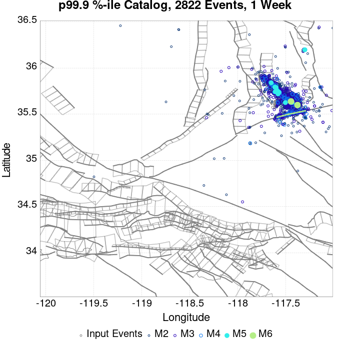
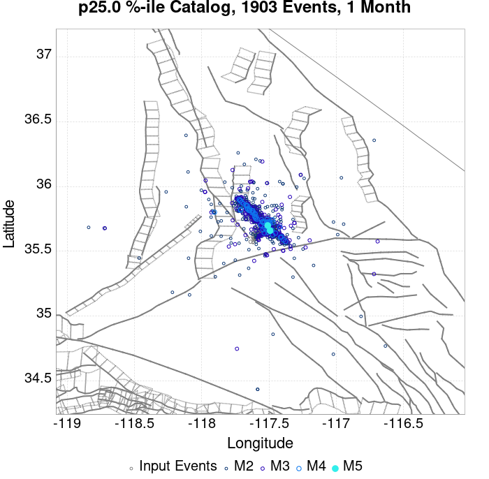
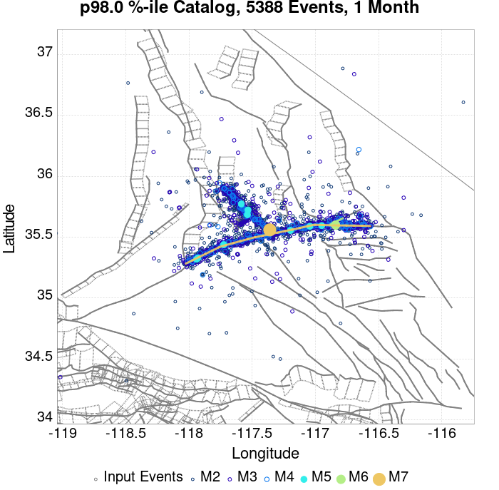
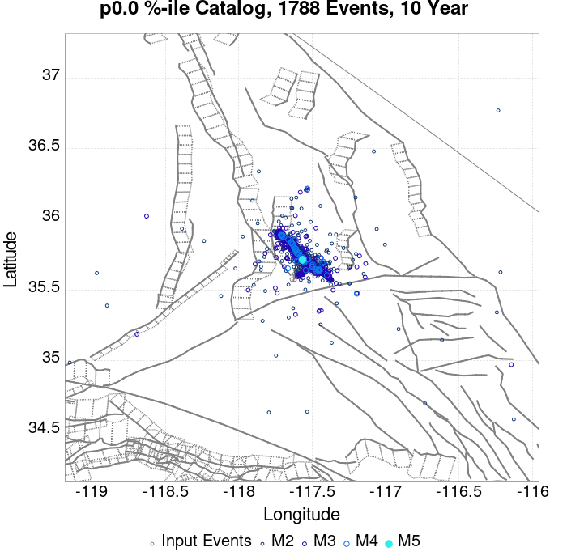
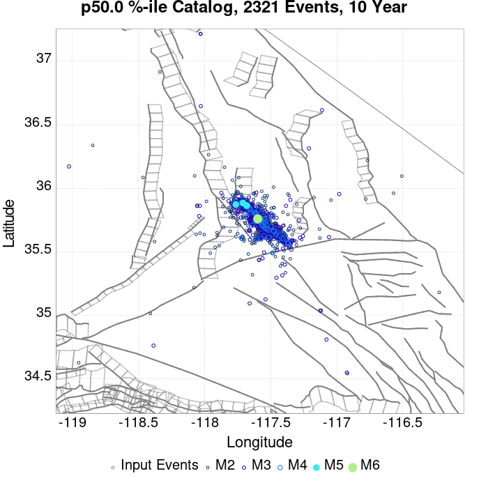
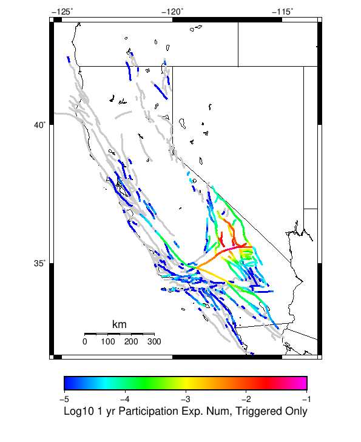
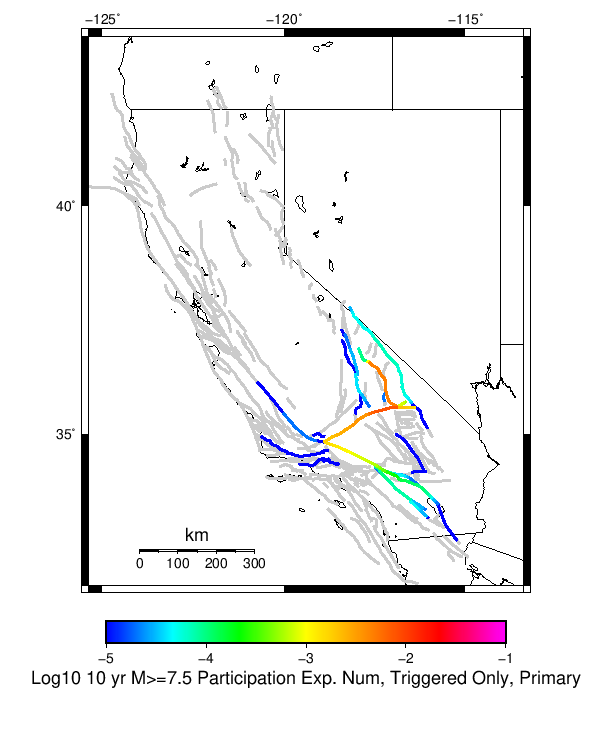
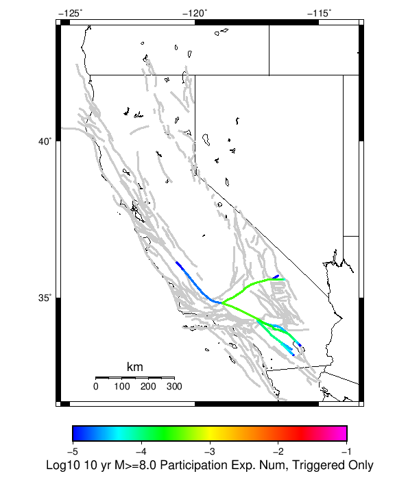
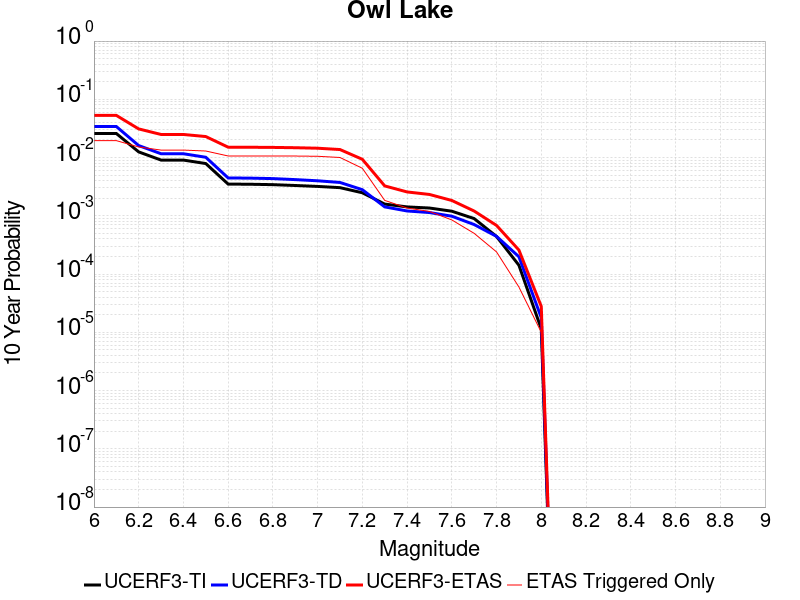

# ComCat M7.1 (ci38457511), ShakeMap Surfaces, Log10(k)=-2.5807, p=1.2481, c=0.0057006 Results

|   | ComCat M7.1 (ci38457511), ShakeMap Surfaces, Log10(k)=-2.5807, p=1.2481, c=0.0057006 |
|-----|-----|
| Num Simulations | 33118 (incomplete) |
| Start Time | 2019/07/06 03:19:54 UTC |
| Start Time Epoch Milliseconds | 1562383194040 |
| Duration | 10 Years |
| Includes Spontaneous? | false |
| Trigger Ruptures | 270 Trigger Ruptures |
|   | First: M3.98 at 2019/07/04 17:02:55 UTC |
|   | Last: M7.1 at 2019/07/06 03:19:53 UTC |
|   | Largest: M7.1 at 2019/07/06 03:19:53 UTC |
| Historical Ruptures | *(none)* |
| Config Generated With | u3etas_comcat_event_config_builder.sh --event-id ci38457511 --num-simulations 100000 --days-before 7 --mag-complete 3.7 --etas-k -2.5807 --etas-p 1.2481 --etas-c 0.0057006 --finite-surf-shakemap --finite-surf-shakemap-min-mag 5 --hpc-site USC_HPC --nodes 36 --hours 24 --queue scec |

## Table Of Contents

* [Probabilities Summary Table](#probabilities-summary-table)
* [Magnitude Number Distribution](#magnitude-number-distribution)
  * [10 Year Magnitude Number Distribution](#10-year-magnitude-number-distribution)
  * [1 Year Magnitude Number Distribution](#1-year-magnitude-number-distribution)
  * [1 Month Magnitude Number Distribution](#1-month-magnitude-number-distribution)
  * [1 Week Magnitude Number Distribution](#1-week-magnitude-number-distribution)
  * [1 Day Magnitude Number Distribution](#1-day-magnitude-number-distribution)
  * [1 Hour Magnitude Number Distribution](#1-hour-magnitude-number-distribution)
* [Hazard Change Over Time](#hazard-change-over-time)
  * [M&ge;5.0 Hazard Change Over Time](#m50-hazard-change-over-time)
  * [M&ge;6.0 Hazard Change Over Time](#m60-hazard-change-over-time)
  * [M&ge;7.0 Hazard Change Over Time](#m70-hazard-change-over-time)
  * [M&ge;8.0 Hazard Change Over Time](#m80-hazard-change-over-time)
* [Trigger Rupture Fault Map](#trigger-rupture-fault-map)
* [Trigger Rupture Depth Map](#trigger-rupture-depth-map)
* [Fault Distances To Triggers](#fault-distances-to-triggers)
* [Individual Simulated Catalog Maps](#individual-simulated-catalog-maps)
* [ComCat Data Comparisons](#comcat-data-comparisons)
* [Section Participation](#section-participation)
  * [Section Participation Plots](#section-participation-plots)
  * [Supra-Seismogenic Parent Sections Table](#supra-seismogenic-parent-sections-table)
  * [M≥6.5 Parent Sections Table](#m65-parent-sections-table)
  * [M≥7 Parent Sections Table](#m7-parent-sections-table)
  * [M≥7.5 Parent Sections Table](#m75-parent-sections-table)
  * [M≥8 Parent Sections Table](#m8-parent-sections-table)
  * [Fault Magnitude-Probability Distributions](#fault-magnitude-probability-distributions)
* [Gridded Nucleation](#gridded-nucleation)
* [JSON Input File](#json-input-file)

## Probabilities Summary Table
*[(top)](#table-of-contents)*

| Magnitude | 1 Hour Prob | 1 Day Prob | 1 Week Prob | 1 Month Prob | 1 Year Prob | 10 Year Prob |
|-----|-----|-----|-----|-----|-----|-----|
| **M&ge;4** | 1.000 (100.00%) | 1.000 (100.00%) | 1.000 (100.00%) | 1.000 (100.00%) | 1.000 (100.00%) | 1.000 (100.00%) |
| **M&ge;4.5** | 0.999 (99.88%) | 1.000 (100.00%) | 1.000 (100.00%) | 1.000 (100.00%) | 1.000 (100.00%) | 1.000 (100.00%) |
| **M&ge;5** | 0.873 (87.28%) | 0.982 (98.18%) | 0.992 (99.15%) | 0.995 (99.47%) | 0.997 (99.69%) | 0.998 (99.75%) |
| **M&ge;5.5** | 0.469 (46.91%) | 0.719 (71.86%) | 0.784 (78.45%) | 0.814 (81.44%) | 0.843 (84.29%) | 0.856 (85.55%) |
| **M&ge;6** | 0.153 (15.28%) | 0.289 (28.89%) | 0.340 (34.03%) | 0.369 (36.92%) | 0.399 (39.90%) | 0.414 (41.42%) |
| **M&ge;6.5** | 0.036 (3.58%) | 0.073 (7.29%) | 0.088 (8.75%) | 0.095 (9.54%) | 0.105 (10.48%) | 0.110 (10.99%) |
| **M&ge;7** | 0.013 (1.31%) | 0.027 (2.66%) | 0.032 (3.19%) | 0.035 (3.53%) | 0.039 (3.91%) | 0.041 (4.11%) |
| **M&ge;7.1** | 0.011 (1.11%) | 0.023 (2.26%) | 0.027 (2.70%) | 0.030 (2.97%) | 0.033 (3.28%) | 0.035 (3.47%) |
| **M&ge;7.5** | 4.35E-3 (0.43%) | 8.18E-3 (0.82%) | 9.99E-3 (1.00%) | 0.011 (1.09%) | 0.012 (1.19%) | 0.012 (1.25%) |
| **M&ge;8** | 9.06E-5 (0.01%) | 2.11E-4 (0.02%) | 2.42E-4 (0.02%) | 3.02E-4 (0.03%) | 3.02E-4 (0.03%) | 3.02E-4 (0.03%) |

## Magnitude Number Distribution
*[(top)](#table-of-contents)*

### 10 Year Magnitude Number Distribution
*[(top)](#table-of-contents)*

**Legend**
* **Mean** (thick black line): mean expected number across all 33118 catalogs
* **2.5%,97.5%** (thin black lines): expected number percentiles across all 33118 catalogs
* **Median** (thin blue line): median expected number across all 33118 catalogs
* **Mode** (thin cyan line): modal expected number across all 33118 catalogs
* **10 yr Probability** (thin red line): 10 year probability calculated as the fraction of catalogs with at least 1 occurrence
* **10 yr Supraseismogenic Probability** (thin dashed red line): same as above, but only for supraseismogenic ruptures on explicitly modeled UCERF3 faults
* **95% Conf** (light red shaded region): binomial 95% confidence bounds on probability
* **Primary** (thin green line): mean expected number from primary triggered aftershocks only (no secondary, tertiary, etc...) across all 33118 catalogs


| Mag | Mean | 2.5 %ile | 97.5 %ile | Median | Mode | 10 yr Probability | 10 yr Supra-Seis Prob | Primary Aftershocks Mean |
|-----|-----|-----|-----|-----|-----|-----|-----|-----|
| **M&ge;2.5** | 2601.620 | 1994.000 | 5303.000 | 2321.000 | 2234.000 | 1.000 (100.00%) | 0.177 (17.66%) | 1564.998 |
| **M&ge;2.6** | 2066.520 | 1579.000 | 4206.000 | 1845.000 | 1768.000 | 1.000 (100.00%) | 0.177 (17.66%) | 1243.093 |
| **M&ge;2.7** | 1641.364 | 1249.000 | 3335.000 | 1466.000 | 1417.000 | 1.000 (100.00%) | 0.177 (17.66%) | 987.340 |
| **M&ge;2.8** | 1303.611 | 988.000 | 2657.000 | 1166.000 | 1088.000 | 1.000 (100.00%) | 0.177 (17.66%) | 784.151 |
| **M&ge;2.9** | 1035.329 | 780.000 | 2111.000 | 926.000 | 897.000 | 1.000 (100.00%) | 0.177 (17.66%) | 622.874 |
| **M&ge;3** | 822.338 | 615.000 | 1679.000 | 736.000 | 704.000 | 1.000 (100.00%) | 0.177 (17.66%) | 494.749 |
| **M&ge;3.1** | 653.061 | 485.000 | 1333.000 | 585.000 | 564.000 | 1.000 (100.00%) | 0.177 (17.66%) | 392.912 |
| **M&ge;3.2** | 518.689 | 381.000 | 1058.000 | 465.000 | 444.000 | 1.000 (100.00%) | 0.177 (17.66%) | 312.059 |
| **M&ge;3.3** | 411.999 | 299.000 | 842.000 | 370.000 | 349.000 | 1.000 (100.00%) | 0.177 (17.66%) | 247.887 |
| **M&ge;3.4** | 327.200 | 235.000 | 671.000 | 294.000 | 284.000 | 1.000 (100.00%) | 0.177 (17.66%) | 196.867 |
| **M&ge;3.5** | 259.831 | 184.000 | 532.000 | 234.000 | 230.000 | 1.000 (100.00%) | 0.177 (17.66%) | 156.321 |
| **M&ge;3.6** | 206.351 | 143.000 | 423.000 | 186.000 | 181.000 | 1.000 (100.00%) | 0.177 (17.66%) | 124.160 |
| **M&ge;3.7** | 163.912 | 111.000 | 339.000 | 148.000 | 142.000 | 1.000 (100.00%) | 0.177 (17.66%) | 98.615 |
| **M&ge;3.8** | 130.159 | 87.000 | 270.000 | 118.000 | 111.000 | 1.000 (100.00%) | 0.177 (17.66%) | 78.295 |
| **M&ge;3.9** | 103.351 | 66.000 | 215.000 | 94.000 | 92.000 | 1.000 (100.00%) | 0.177 (17.66%) | 62.156 |
| **M&ge;4** | 82.028 | 51.000 | 172.000 | 74.000 | 71.000 | 1.000 (100.00%) | 0.177 (17.66%) | 49.340 |
| **M&ge;4.1** | 65.116 | 39.000 | 138.000 | 59.000 | 54.000 | 1.000 (100.00%) | 0.177 (17.66%) | 39.152 |
| **M&ge;4.2** | 51.691 | 30.000 | 110.000 | 47.000 | 43.000 | 1.000 (100.00%) | 0.177 (17.66%) | 31.074 |
| **M&ge;4.3** | 41.007 | 22.000 | 88.000 | 37.000 | 35.000 | 1.000 (100.00%) | 0.177 (17.66%) | 24.645 |
| **M&ge;4.4** | 32.532 | 17.000 | 71.000 | 29.000 | 29.000 | 1.000 (100.00%) | 0.177 (17.66%) | 19.547 |
| **M&ge;4.5** | 25.798 | 12.000 | 56.000 | 23.000 | 23.000 | 1.000 (100.00%) | 0.177 (17.66%) | 15.504 |
| **M&ge;4.6** | 20.445 | 9.000 | 45.000 | 19.000 | 18.000 | 1.000 (100.00%) | 0.177 (17.66%) | 12.286 |
| **M&ge;4.7** | 16.194 | 6.000 | 36.000 | 15.000 | 13.000 | 1.000 (100.00%) | 0.177 (17.66%) | 9.726 |
| **M&ge;4.8** | 12.789 | 4.000 | 29.000 | 12.000 | 10.000 | 1.000 (99.99%) | 0.177 (17.66%) | 7.685 |
| **M&ge;4.9** | 10.121 | 3.000 | 24.000 | 9.000 | 8.000 | 0.999 (99.95%) | 0.177 (17.66%) | 6.077 |
| **M&ge;5** | 7.988 | 2.000 | 20.000 | 7.000 | 6.000 | 0.998 (99.75%) | 0.177 (17.66%) | 4.795 |
| **M&ge;5.1** | 6.307 | 1.000 | 16.000 | 6.000 | 5.000 | 0.992 (99.23%) | 0.177 (17.66%) | 3.788 |
| **M&ge;5.2** | 4.962 | 1.000 | 13.000 | 4.000 | 3.000 | 0.979 (97.86%) | 0.177 (17.66%) | 2.983 |
| **M&ge;5.3** | 3.893 | 0.000 | 11.000 | 3.000 | 3.000 | 0.953 (95.26%) | 0.177 (17.66%) | 2.342 |
| **M&ge;5.4** | 3.042 | 0.000 | 9.000 | 3.000 | 2.000 | 0.912 (91.22%) | 0.177 (17.66%) | 1.828 |
| **M&ge;5.5** | 2.370 | 0.000 | 7.000 | 2.000 | 1.000 | 0.856 (85.55%) | 0.177 (17.66%) | 1.426 |
| **M&ge;5.6** | 1.834 | 0.000 | 6.000 | 1.000 | 1.000 | 0.781 (78.09%) | 0.177 (17.66%) | 1.105 |
| **M&ge;5.7** | 1.408 | 0.000 | 5.000 | 1.000 | 1.000 | 0.694 (69.35%) | 0.177 (17.66%) | 0.849 |
| **M&ge;5.8** | 1.074 | 0.000 | 4.000 | 1.000 | 0.000 | 0.598 (59.80%) | 0.177 (17.66%) | 0.646 |
| **M&ge;5.9** | 0.810 | 0.000 | 4.000 | 1.000 | 0.000 | 0.503 (50.25%) | 0.177 (17.65%) | 0.487 |
| **M&ge;6** | 0.620 | 0.000 | 3.000 | 0.000 | 0.000 | 0.414 (41.42%) | 0.176 (17.64%) | 0.370 |
| **M&ge;6.1** | 0.450 | 0.000 | 2.000 | 0.000 | 0.000 | 0.326 (32.56%) | 0.153 (15.31%) | 0.272 |
| **M&ge;6.2** | 0.294 | 0.000 | 2.000 | 0.000 | 0.000 | 0.232 (23.23%) | 0.118 (11.81%) | 0.179 |
| **M&ge;6.3** | 0.221 | 0.000 | 2.000 | 0.000 | 0.000 | 0.182 (18.25%) | 0.100 (10.02%) | 0.136 |
| **M&ge;6.4** | 0.166 | 0.000 | 1.000 | 0.000 | 0.000 | 0.141 (14.06%) | 0.086 (8.57%) | 0.102 |
| **M&ge;6.5** | 0.127 | 0.000 | 1.000 | 0.000 | 0.000 | 0.110 (10.99%) | 0.075 (7.49%) | 0.078 |
| **M&ge;6.6** | 0.105 | 0.000 | 1.000 | 0.000 | 0.000 | 0.095 (9.47%) | 0.070 (6.96%) | 0.067 |
| **M&ge;6.7** | 0.086 | 0.000 | 1.000 | 0.000 | 0.000 | 0.078 (7.82%) | 0.061 (6.06%) | 0.055 |
| **M&ge;6.8** | 0.069 | 0.000 | 1.000 | 0.000 | 0.000 | 0.064 (6.41%) | 0.053 (5.26%) | 0.045 |
| **M&ge;6.9** | 0.054 | 0.000 | 1.000 | 0.000 | 0.000 | 0.051 (5.15%) | 0.044 (4.40%) | 0.036 |
| **M&ge;7** | 0.042 | 0.000 | 1.000 | 0.000 | 0.000 | 0.041 (4.11%) | 0.036 (3.63%) | 0.028 |
| **M&ge;7.1** | 0.036 | 0.000 | 1.000 | 0.000 | 0.000 | 0.035 (3.47%) | 0.032 (3.15%) | 0.024 |
| **M&ge;7.2** | 0.027 | 0.000 | 1.000 | 0.000 | 0.000 | 0.026 (2.60%) | 0.024 (2.45%) | 0.018 |
| **M&ge;7.3** | 0.018 | 0.000 | 0.000 | 0.000 | 0.000 | 0.018 (1.77%) | 0.017 (1.72%) | 0.012 |
| **M&ge;7.4** | 0.016 | 0.000 | 0.000 | 0.000 | 0.000 | 0.016 (1.56%) | 0.015 (1.55%) | 0.011 |
| **M&ge;7.5** | 0.013 | 0.000 | 0.000 | 0.000 | 0.000 | 0.012 (1.25%) | 0.012 (1.24%) | 8.27E-3 |
| **M&ge;7.6** | 7.01E-3 | 0.000 | 0.000 | 0.000 | 0.000 | 6.98E-3 (0.70%) | 6.91E-3 (0.69%) | 4.68E-3 |
| **M&ge;7.7** | 2.26E-3 | 0.000 | 0.000 | 0.000 | 0.000 | 2.26E-3 (0.23%) | 2.26E-3 (0.23%) | 1.45E-3 |
| **M&ge;7.8** | 1.36E-3 | 0.000 | 0.000 | 0.000 | 0.000 | 1.36E-3 (0.14%) | 1.36E-3 (0.14%) | 8.15E-4 |
| **M&ge;7.9** | 6.64E-4 | 0.000 | 0.000 | 0.000 | 0.000 | 6.64E-4 (0.07%) | 6.64E-4 (0.07%) | 3.62E-4 |
| **M&ge;8** | 3.02E-4 | 0.000 | 0.000 | 0.000 | 0.000 | 3.02E-4 (0.03%) | 3.02E-4 (0.03%) | 2.11E-4 |
| **M&ge;8.1** | 0.000 | 0.000 | 0.000 | 0.000 | 0.000 | 0.000 (0.00%) | 0.000 (0.00%) | 0.000 |
| **M&ge;8.2** | 0.000 | 0.000 | 0.000 | 0.000 | 0.000 | 0.000 (0.00%) | 0.000 (0.00%) | 0.000 |
| **M&ge;8.3** | 0.000 | 0.000 | 0.000 | 0.000 | 0.000 | 0.000 (0.00%) | 0.000 (0.00%) | 0.000 |
| **M&ge;8.4** | 0.000 | 0.000 | 0.000 | 0.000 | 0.000 | 0.000 (0.00%) | 0.000 (0.00%) | 0.000 |
| **M&ge;8.5** | 0.000 | 0.000 | 0.000 | 0.000 | 0.000 | 0.000 (0.00%) | 0.000 (0.00%) | 0.000 |
| **M&ge;8.6** | 0.000 | 0.000 | 0.000 | 0.000 | 0.000 | 0.000 (0.00%) | 0.000 (0.00%) | 0.000 |
| **M&ge;8.7** | 0.000 | 0.000 | 0.000 | 0.000 | 0.000 | 0.000 (0.00%) | 0.000 (0.00%) | 0.000 |
| **M&ge;8.8** | 0.000 | 0.000 | 0.000 | 0.000 | 0.000 | 0.000 (0.00%) | 0.000 (0.00%) | 0.000 |
| **M&ge;8.9** | 0.000 | 0.000 | 0.000 | 0.000 | 0.000 | 0.000 (0.00%) | 0.000 (0.00%) | 0.000 |
| **M&ge;9** | 0.000 | 0.000 | 0.000 | 0.000 | 0.000 | 0.000 (0.00%) | 0.000 (0.00%) | 0.000 |

### 1 Year Magnitude Number Distribution
*[(top)](#table-of-contents)*

**Legend**
* **Mean** (thick black line): mean expected number across all 33118 catalogs
* **2.5%,97.5%** (thin black lines): expected number percentiles across all 33118 catalogs
* **Median** (thin blue line): median expected number across all 33118 catalogs
* **Mode** (thin cyan line): modal expected number across all 33118 catalogs
* **1 yr Probability** (thin red line): 1 year probability calculated as the fraction of catalogs with at least 1 occurrence
* **1 yr Supraseismogenic Probability** (thin dashed red line): same as above, but only for supraseismogenic ruptures on explicitly modeled UCERF3 faults
* **95% Conf** (light red shaded region): binomial 95% confidence bounds on probability
* **Primary** (thin green line): mean expected number from primary triggered aftershocks only (no secondary, tertiary, etc...) across all 33118 catalogs


| Mag | Mean | 2.5 %ile | 97.5 %ile | Median | Mode | 1 yr Probability | 1 yr Supra-Seis Prob | Primary Aftershocks Mean |
|-----|-----|-----|-----|-----|-----|-----|-----|-----|
| **M&ge;2.5** | 2463.782 | 1902.000 | 4963.000 | 2207.000 | 2063.000 | 1.000 (100.00%) | 0.169 (16.90%) | 1510.580 |
| **M&ge;2.6** | 1957.030 | 1506.000 | 3933.000 | 1754.000 | 1688.000 | 1.000 (100.00%) | 0.169 (16.90%) | 1199.851 |
| **M&ge;2.7** | 1554.423 | 1191.000 | 3126.000 | 1394.000 | 1340.000 | 1.000 (100.00%) | 0.169 (16.90%) | 953.006 |
| **M&ge;2.8** | 1234.549 | 942.000 | 2489.000 | 1108.000 | 1045.000 | 1.000 (100.00%) | 0.169 (16.90%) | 756.879 |
| **M&ge;2.9** | 980.507 | 743.000 | 1979.000 | 880.000 | 839.000 | 1.000 (100.00%) | 0.169 (16.90%) | 601.217 |
| **M&ge;3** | 778.788 | 586.000 | 1570.000 | 700.000 | 652.000 | 1.000 (100.00%) | 0.169 (16.90%) | 477.539 |
| **M&ge;3.1** | 618.458 | 461.000 | 1253.000 | 557.000 | 539.000 | 1.000 (100.00%) | 0.169 (16.90%) | 379.236 |
| **M&ge;3.2** | 491.201 | 363.000 | 994.000 | 442.000 | 417.000 | 1.000 (100.00%) | 0.169 (16.90%) | 301.191 |
| **M&ge;3.3** | 390.162 | 285.000 | 789.000 | 352.000 | 345.000 | 1.000 (100.00%) | 0.169 (16.90%) | 239.257 |
| **M&ge;3.4** | 309.856 | 224.000 | 627.000 | 280.000 | 264.000 | 1.000 (100.00%) | 0.169 (16.90%) | 190.012 |
| **M&ge;3.5** | 246.066 | 175.000 | 499.000 | 222.000 | 208.000 | 1.000 (100.00%) | 0.169 (16.90%) | 150.878 |
| **M&ge;3.6** | 195.423 | 136.000 | 397.000 | 177.000 | 173.000 | 1.000 (100.00%) | 0.169 (16.90%) | 119.846 |
| **M&ge;3.7** | 155.228 | 106.000 | 317.000 | 141.000 | 137.000 | 1.000 (100.00%) | 0.169 (16.90%) | 95.191 |
| **M&ge;3.8** | 123.235 | 82.000 | 252.000 | 112.000 | 108.000 | 1.000 (100.00%) | 0.169 (16.90%) | 75.576 |
| **M&ge;3.9** | 97.849 | 63.000 | 202.000 | 89.000 | 85.000 | 1.000 (100.00%) | 0.169 (16.90%) | 59.997 |
| **M&ge;4** | 77.662 | 49.000 | 161.000 | 71.000 | 65.000 | 1.000 (100.00%) | 0.169 (16.90%) | 47.630 |
| **M&ge;4.1** | 61.655 | 37.000 | 128.000 | 56.000 | 52.000 | 1.000 (100.00%) | 0.169 (16.90%) | 37.793 |
| **M&ge;4.2** | 48.944 | 28.000 | 102.000 | 45.000 | 41.000 | 1.000 (100.00%) | 0.169 (16.90%) | 29.996 |
| **M&ge;4.3** | 38.829 | 21.000 | 82.000 | 35.000 | 32.000 | 1.000 (100.00%) | 0.169 (16.90%) | 23.790 |
| **M&ge;4.4** | 30.807 | 16.000 | 66.000 | 28.000 | 27.000 | 1.000 (100.00%) | 0.169 (16.90%) | 18.869 |
| **M&ge;4.5** | 24.434 | 12.000 | 53.000 | 22.000 | 21.000 | 1.000 (100.00%) | 0.169 (16.90%) | 14.969 |
| **M&ge;4.6** | 19.365 | 8.000 | 42.000 | 18.000 | 16.000 | 1.000 (100.00%) | 0.169 (16.90%) | 11.864 |
| **M&ge;4.7** | 15.340 | 6.000 | 34.000 | 14.000 | 13.000 | 1.000 (100.00%) | 0.169 (16.90%) | 9.395 |
| **M&ge;4.8** | 12.115 | 4.000 | 28.000 | 11.000 | 10.000 | 1.000 (99.99%) | 0.169 (16.90%) | 7.422 |
| **M&ge;4.9** | 9.586 | 3.000 | 23.000 | 9.000 | 8.000 | 0.999 (99.93%) | 0.169 (16.90%) | 5.867 |
| **M&ge;5** | 7.568 | 2.000 | 19.000 | 7.000 | 6.000 | 0.997 (99.69%) | 0.169 (16.90%) | 4.631 |
| **M&ge;5.1** | 5.977 | 1.000 | 15.000 | 5.000 | 4.000 | 0.991 (99.08%) | 0.169 (16.90%) | 3.659 |
| **M&ge;5.2** | 4.701 | 0.000 | 12.000 | 4.000 | 3.000 | 0.975 (97.49%) | 0.169 (16.90%) | 2.880 |
| **M&ge;5.3** | 3.689 | 0.000 | 10.000 | 3.000 | 3.000 | 0.946 (94.63%) | 0.169 (16.90%) | 2.262 |
| **M&ge;5.4** | 2.883 | 0.000 | 9.000 | 2.000 | 2.000 | 0.903 (90.31%) | 0.169 (16.90%) | 1.766 |
| **M&ge;5.5** | 2.247 | 0.000 | 7.000 | 2.000 | 1.000 | 0.843 (84.29%) | 0.169 (16.90%) | 1.378 |
| **M&ge;5.6** | 1.738 | 0.000 | 6.000 | 1.000 | 1.000 | 0.766 (76.58%) | 0.169 (16.90%) | 1.068 |
| **M&ge;5.7** | 1.334 | 0.000 | 5.000 | 1.000 | 0.000 | 0.676 (67.63%) | 0.169 (16.90%) | 0.820 |
| **M&ge;5.8** | 1.017 | 0.000 | 4.000 | 1.000 | 0.000 | 0.581 (58.08%) | 0.169 (16.90%) | 0.624 |
| **M&ge;5.9** | 0.767 | 0.000 | 3.000 | 0.000 | 0.000 | 0.486 (48.58%) | 0.169 (16.90%) | 0.471 |
| **M&ge;6** | 0.586 | 0.000 | 3.000 | 0.000 | 0.000 | 0.399 (39.90%) | 0.169 (16.89%) | 0.357 |
| **M&ge;6.1** | 0.425 | 0.000 | 2.000 | 0.000 | 0.000 | 0.313 (31.28%) | 0.147 (14.68%) | 0.262 |
| **M&ge;6.2** | 0.279 | 0.000 | 2.000 | 0.000 | 0.000 | 0.222 (22.23%) | 0.113 (11.35%) | 0.172 |
| **M&ge;6.3** | 0.210 | 0.000 | 2.000 | 0.000 | 0.000 | 0.174 (17.44%) | 0.096 (9.62%) | 0.132 |
| **M&ge;6.4** | 0.157 | 0.000 | 1.000 | 0.000 | 0.000 | 0.134 (13.43%) | 0.082 (8.23%) | 0.099 |
| **M&ge;6.5** | 0.121 | 0.000 | 1.000 | 0.000 | 0.000 | 0.105 (10.48%) | 0.072 (7.19%) | 0.076 |
| **M&ge;6.6** | 0.100 | 0.000 | 1.000 | 0.000 | 0.000 | 0.090 (9.03%) | 0.067 (6.68%) | 0.065 |
| **M&ge;6.7** | 0.082 | 0.000 | 1.000 | 0.000 | 0.000 | 0.074 (7.44%) | 0.058 (5.80%) | 0.053 |
| **M&ge;6.8** | 0.066 | 0.000 | 1.000 | 0.000 | 0.000 | 0.061 (6.11%) | 0.050 (5.04%) | 0.043 |
| **M&ge;6.9** | 0.051 | 0.000 | 1.000 | 0.000 | 0.000 | 0.049 (4.91%) | 0.042 (4.21%) | 0.035 |
| **M&ge;7** | 0.040 | 0.000 | 1.000 | 0.000 | 0.000 | 0.039 (3.91%) | 0.034 (3.45%) | 0.027 |
| **M&ge;7.1** | 0.034 | 0.000 | 1.000 | 0.000 | 0.000 | 0.033 (3.28%) | 0.030 (2.99%) | 0.023 |
| **M&ge;7.2** | 0.025 | 0.000 | 0.000 | 0.000 | 0.000 | 0.025 (2.47%) | 0.023 (2.33%) | 0.017 |
| **M&ge;7.3** | 0.017 | 0.000 | 0.000 | 0.000 | 0.000 | 0.017 (1.70%) | 0.016 (1.64%) | 0.012 |
| **M&ge;7.4** | 0.015 | 0.000 | 0.000 | 0.000 | 0.000 | 0.015 (1.49%) | 0.015 (1.47%) | 0.010 |
| **M&ge;7.5** | 0.012 | 0.000 | 0.000 | 0.000 | 0.000 | 0.012 (1.19%) | 0.012 (1.18%) | 8.03E-3 |
| **M&ge;7.6** | 6.64E-3 | 0.000 | 0.000 | 0.000 | 0.000 | 6.61E-3 (0.66%) | 6.55E-3 (0.66%) | 4.53E-3 |
| **M&ge;7.7** | 2.14E-3 | 0.000 | 0.000 | 0.000 | 0.000 | 2.14E-3 (0.21%) | 2.14E-3 (0.21%) | 1.39E-3 |
| **M&ge;7.8** | 1.33E-3 | 0.000 | 0.000 | 0.000 | 0.000 | 1.33E-3 (0.13%) | 1.33E-3 (0.13%) | 8.15E-4 |
| **M&ge;7.9** | 6.34E-4 | 0.000 | 0.000 | 0.000 | 0.000 | 6.34E-4 (0.06%) | 6.34E-4 (0.06%) | 3.62E-4 |
| **M&ge;8** | 3.02E-4 | 0.000 | 0.000 | 0.000 | 0.000 | 3.02E-4 (0.03%) | 3.02E-4 (0.03%) | 2.11E-4 |
| **M&ge;8.1** | 0.000 | 0.000 | 0.000 | 0.000 | 0.000 | 0.000 (0.00%) | 0.000 (0.00%) | 0.000 |
| **M&ge;8.2** | 0.000 | 0.000 | 0.000 | 0.000 | 0.000 | 0.000 (0.00%) | 0.000 (0.00%) | 0.000 |
| **M&ge;8.3** | 0.000 | 0.000 | 0.000 | 0.000 | 0.000 | 0.000 (0.00%) | 0.000 (0.00%) | 0.000 |
| **M&ge;8.4** | 0.000 | 0.000 | 0.000 | 0.000 | 0.000 | 0.000 (0.00%) | 0.000 (0.00%) | 0.000 |
| **M&ge;8.5** | 0.000 | 0.000 | 0.000 | 0.000 | 0.000 | 0.000 (0.00%) | 0.000 (0.00%) | 0.000 |
| **M&ge;8.6** | 0.000 | 0.000 | 0.000 | 0.000 | 0.000 | 0.000 (0.00%) | 0.000 (0.00%) | 0.000 |
| **M&ge;8.7** | 0.000 | 0.000 | 0.000 | 0.000 | 0.000 | 0.000 (0.00%) | 0.000 (0.00%) | 0.000 |
| **M&ge;8.8** | 0.000 | 0.000 | 0.000 | 0.000 | 0.000 | 0.000 (0.00%) | 0.000 (0.00%) | 0.000 |
| **M&ge;8.9** | 0.000 | 0.000 | 0.000 | 0.000 | 0.000 | 0.000 (0.00%) | 0.000 (0.00%) | 0.000 |
| **M&ge;9** | 0.000 | 0.000 | 0.000 | 0.000 | 0.000 | 0.000 (0.00%) | 0.000 (0.00%) | 0.000 |

### 1 Month Magnitude Number Distribution
*[(top)](#table-of-contents)*

**Legend**
* **Mean** (thick black line): mean expected number across all 33118 catalogs
* **2.5%,97.5%** (thin black lines): expected number percentiles across all 33118 catalogs
* **Median** (thin blue line): median expected number across all 33118 catalogs
* **Mode** (thin cyan line): modal expected number across all 33118 catalogs
* **1 mo Probability** (thin red line): 1 month probability calculated as the fraction of catalogs with at least 1 occurrence
* **1 mo Supraseismogenic Probability** (thin dashed red line): same as above, but only for supraseismogenic ruptures on explicitly modeled UCERF3 faults
* **95% Conf** (light red shaded region): binomial 95% confidence bounds on probability
* **Primary** (thin green line): mean expected number from primary triggered aftershocks only (no secondary, tertiary, etc...) across all 33118 catalogs


| Mag | Mean | 2.5 %ile | 97.5 %ile | Median | Mode | 1 mo Probability | 1 mo Supra-Seis Prob | Primary Aftershocks Mean |
|-----|-----|-----|-----|-----|-----|-----|-----|-----|
| **M&ge;2.5** | 2205.278 | 1728.000 | 4320.000 | 1988.000 | 1883.000 | 1.000 (100.00%) | 0.154 (15.41%) | 1403.579 |
| **M&ge;2.6** | 1751.726 | 1367.000 | 3435.000 | 1580.000 | 1480.000 | 1.000 (100.00%) | 0.154 (15.41%) | 1114.886 |
| **M&ge;2.7** | 1391.326 | 1081.000 | 2730.000 | 1256.000 | 1199.000 | 1.000 (100.00%) | 0.154 (15.41%) | 885.519 |
| **M&ge;2.8** | 1105.016 | 855.000 | 2169.000 | 998.000 | 961.000 | 1.000 (100.00%) | 0.154 (15.41%) | 703.274 |
| **M&ge;2.9** | 877.654 | 674.000 | 1721.000 | 793.000 | 776.000 | 1.000 (100.00%) | 0.154 (15.41%) | 558.639 |
| **M&ge;3** | 697.100 | 531.000 | 1366.000 | 631.000 | 608.000 | 1.000 (100.00%) | 0.154 (15.41%) | 443.744 |
| **M&ge;3.1** | 553.598 | 418.000 | 1085.000 | 501.000 | 480.000 | 1.000 (100.00%) | 0.154 (15.41%) | 352.398 |
| **M&ge;3.2** | 439.642 | 329.000 | 863.000 | 399.000 | 384.000 | 1.000 (100.00%) | 0.154 (15.41%) | 279.858 |
| **M&ge;3.3** | 349.219 | 258.000 | 687.000 | 317.000 | 314.000 | 1.000 (100.00%) | 0.154 (15.41%) | 222.310 |
| **M&ge;3.4** | 277.350 | 202.000 | 546.000 | 252.000 | 237.000 | 1.000 (100.00%) | 0.154 (15.41%) | 176.559 |
| **M&ge;3.5** | 220.266 | 157.000 | 435.000 | 201.000 | 193.000 | 1.000 (100.00%) | 0.154 (15.41%) | 140.202 |
| **M&ge;3.6** | 174.934 | 122.000 | 346.000 | 159.000 | 154.000 | 1.000 (100.00%) | 0.154 (15.41%) | 111.364 |
| **M&ge;3.7** | 138.942 | 95.000 | 275.000 | 127.000 | 120.000 | 1.000 (100.00%) | 0.154 (15.41%) | 88.445 |
| **M&ge;3.8** | 110.299 | 74.000 | 218.000 | 101.000 | 95.000 | 1.000 (100.00%) | 0.154 (15.41%) | 70.219 |
| **M&ge;3.9** | 87.580 | 57.000 | 174.000 | 80.000 | 78.000 | 1.000 (100.00%) | 0.154 (15.41%) | 55.750 |
| **M&ge;4** | 69.511 | 43.000 | 139.000 | 64.000 | 61.000 | 1.000 (100.00%) | 0.154 (15.41%) | 44.259 |
| **M&ge;4.1** | 55.185 | 33.000 | 111.000 | 51.000 | 48.000 | 1.000 (100.00%) | 0.154 (15.41%) | 35.113 |
| **M&ge;4.2** | 43.810 | 25.000 | 89.000 | 40.000 | 38.000 | 1.000 (100.00%) | 0.154 (15.41%) | 27.875 |
| **M&ge;4.3** | 34.760 | 19.000 | 72.000 | 32.000 | 31.000 | 1.000 (100.00%) | 0.154 (15.41%) | 22.108 |
| **M&ge;4.4** | 27.577 | 14.000 | 58.000 | 25.000 | 24.000 | 1.000 (100.00%) | 0.154 (15.41%) | 17.535 |
| **M&ge;4.5** | 21.869 | 10.000 | 46.000 | 20.000 | 18.000 | 1.000 (100.00%) | 0.154 (15.41%) | 13.908 |
| **M&ge;4.6** | 17.336 | 7.000 | 37.000 | 16.000 | 15.000 | 1.000 (100.00%) | 0.154 (15.41%) | 11.024 |
| **M&ge;4.7** | 13.729 | 5.000 | 30.000 | 13.000 | 12.000 | 1.000 (99.99%) | 0.154 (15.41%) | 8.729 |
| **M&ge;4.8** | 10.843 | 4.000 | 25.000 | 10.000 | 9.000 | 1.000 (99.97%) | 0.154 (15.41%) | 6.895 |
| **M&ge;4.9** | 8.581 | 2.000 | 20.000 | 8.000 | 7.000 | 0.999 (99.87%) | 0.154 (15.41%) | 5.453 |
| **M&ge;5** | 6.774 | 1.000 | 17.000 | 6.000 | 5.000 | 0.995 (99.47%) | 0.154 (15.41%) | 4.304 |
| **M&ge;5.1** | 5.346 | 1.000 | 14.000 | 5.000 | 4.000 | 0.985 (98.53%) | 0.154 (15.41%) | 3.401 |
| **M&ge;5.2** | 4.207 | 0.000 | 11.000 | 4.000 | 3.000 | 0.965 (96.54%) | 0.154 (15.41%) | 2.677 |
| **M&ge;5.3** | 3.299 | 0.000 | 9.000 | 3.000 | 2.000 | 0.931 (93.08%) | 0.154 (15.41%) | 2.102 |
| **M&ge;5.4** | 2.578 | 0.000 | 8.000 | 2.000 | 2.000 | 0.881 (88.10%) | 0.154 (15.41%) | 1.640 |
| **M&ge;5.5** | 2.011 | 0.000 | 6.000 | 2.000 | 1.000 | 0.814 (81.44%) | 0.154 (15.41%) | 1.280 |
| **M&ge;5.6** | 1.556 | 0.000 | 5.000 | 1.000 | 1.000 | 0.732 (73.17%) | 0.154 (15.41%) | 0.992 |
| **M&ge;5.7** | 1.195 | 0.000 | 4.000 | 1.000 | 0.000 | 0.640 (64.03%) | 0.154 (15.41%) | 0.761 |
| **M&ge;5.8** | 0.912 | 0.000 | 4.000 | 1.000 | 0.000 | 0.546 (54.57%) | 0.154 (15.41%) | 0.580 |
| **M&ge;5.9** | 0.687 | 0.000 | 3.000 | 0.000 | 0.000 | 0.452 (45.18%) | 0.154 (15.40%) | 0.437 |
| **M&ge;6** | 0.525 | 0.000 | 3.000 | 0.000 | 0.000 | 0.369 (36.92%) | 0.154 (15.40%) | 0.332 |
| **M&ge;6.1** | 0.382 | 0.000 | 2.000 | 0.000 | 0.000 | 0.288 (28.76%) | 0.134 (13.42%) | 0.243 |
| **M&ge;6.2** | 0.251 | 0.000 | 2.000 | 0.000 | 0.000 | 0.204 (20.37%) | 0.104 (10.39%) | 0.160 |
| **M&ge;6.3** | 0.189 | 0.000 | 1.000 | 0.000 | 0.000 | 0.160 (15.96%) | 0.088 (8.81%) | 0.122 |
| **M&ge;6.4** | 0.141 | 0.000 | 1.000 | 0.000 | 0.000 | 0.122 (12.24%) | 0.076 (7.55%) | 0.091 |
| **M&ge;6.5** | 0.108 | 0.000 | 1.000 | 0.000 | 0.000 | 0.095 (9.54%) | 0.066 (6.60%) | 0.070 |
| **M&ge;6.6** | 0.090 | 0.000 | 1.000 | 0.000 | 0.000 | 0.082 (8.22%) | 0.061 (6.12%) | 0.060 |
| **M&ge;6.7** | 0.074 | 0.000 | 1.000 | 0.000 | 0.000 | 0.068 (6.78%) | 0.053 (5.33%) | 0.049 |
| **M&ge;6.8** | 0.059 | 0.000 | 1.000 | 0.000 | 0.000 | 0.056 (5.56%) | 0.046 (4.62%) | 0.040 |
| **M&ge;6.9** | 0.046 | 0.000 | 1.000 | 0.000 | 0.000 | 0.044 (4.44%) | 0.038 (3.83%) | 0.032 |
| **M&ge;7** | 0.036 | 0.000 | 1.000 | 0.000 | 0.000 | 0.035 (3.53%) | 0.031 (3.12%) | 0.025 |
| **M&ge;7.1** | 0.030 | 0.000 | 1.000 | 0.000 | 0.000 | 0.030 (2.97%) | 0.027 (2.71%) | 0.021 |
| **M&ge;7.2** | 0.023 | 0.000 | 0.000 | 0.000 | 0.000 | 0.022 (2.23%) | 0.021 (2.11%) | 0.016 |
| **M&ge;7.3** | 0.016 | 0.000 | 0.000 | 0.000 | 0.000 | 0.015 (1.55%) | 0.015 (1.49%) | 0.011 |
| **M&ge;7.4** | 0.014 | 0.000 | 0.000 | 0.000 | 0.000 | 0.014 (1.36%) | 0.013 (1.34%) | 9.51E-3 |
| **M&ge;7.5** | 0.011 | 0.000 | 0.000 | 0.000 | 0.000 | 0.011 (1.09%) | 0.011 (1.08%) | 7.52E-3 |
| **M&ge;7.6** | 6.04E-3 | 0.000 | 0.000 | 0.000 | 0.000 | 6.04E-3 (0.60%) | 5.98E-3 (0.60%) | 4.23E-3 |
| **M&ge;7.7** | 1.99E-3 | 0.000 | 0.000 | 0.000 | 0.000 | 1.99E-3 (0.20%) | 1.99E-3 (0.20%) | 1.33E-3 |
| **M&ge;7.8** | 1.24E-3 | 0.000 | 0.000 | 0.000 | 0.000 | 1.24E-3 (0.12%) | 1.24E-3 (0.12%) | 7.85E-4 |
| **M&ge;7.9** | 6.04E-4 | 0.000 | 0.000 | 0.000 | 0.000 | 6.04E-4 (0.06%) | 6.04E-4 (0.06%) | 3.62E-4 |
| **M&ge;8** | 3.02E-4 | 0.000 | 0.000 | 0.000 | 0.000 | 3.02E-4 (0.03%) | 3.02E-4 (0.03%) | 2.11E-4 |
| **M&ge;8.1** | 0.000 | 0.000 | 0.000 | 0.000 | 0.000 | 0.000 (0.00%) | 0.000 (0.00%) | 0.000 |
| **M&ge;8.2** | 0.000 | 0.000 | 0.000 | 0.000 | 0.000 | 0.000 (0.00%) | 0.000 (0.00%) | 0.000 |
| **M&ge;8.3** | 0.000 | 0.000 | 0.000 | 0.000 | 0.000 | 0.000 (0.00%) | 0.000 (0.00%) | 0.000 |
| **M&ge;8.4** | 0.000 | 0.000 | 0.000 | 0.000 | 0.000 | 0.000 (0.00%) | 0.000 (0.00%) | 0.000 |
| **M&ge;8.5** | 0.000 | 0.000 | 0.000 | 0.000 | 0.000 | 0.000 (0.00%) | 0.000 (0.00%) | 0.000 |
| **M&ge;8.6** | 0.000 | 0.000 | 0.000 | 0.000 | 0.000 | 0.000 (0.00%) | 0.000 (0.00%) | 0.000 |
| **M&ge;8.7** | 0.000 | 0.000 | 0.000 | 0.000 | 0.000 | 0.000 (0.00%) | 0.000 (0.00%) | 0.000 |
| **M&ge;8.8** | 0.000 | 0.000 | 0.000 | 0.000 | 0.000 | 0.000 (0.00%) | 0.000 (0.00%) | 0.000 |
| **M&ge;8.9** | 0.000 | 0.000 | 0.000 | 0.000 | 0.000 | 0.000 (0.00%) | 0.000 (0.00%) | 0.000 |
| **M&ge;9** | 0.000 | 0.000 | 0.000 | 0.000 | 0.000 | 0.000 (0.00%) | 0.000 (0.00%) | 0.000 |

### 1 Week Magnitude Number Distribution
*[(top)](#table-of-contents)*

**Legend**
* **Mean** (thick black line): mean expected number across all 33118 catalogs
* **2.5%,97.5%** (thin black lines): expected number percentiles across all 33118 catalogs
* **Median** (thin blue line): median expected number across all 33118 catalogs
* **Mode** (thin cyan line): modal expected number across all 33118 catalogs
* **1 wk Probability** (thin red line): 1 week probability calculated as the fraction of catalogs with at least 1 occurrence
* **1 wk Supraseismogenic Probability** (thin dashed red line): same as above, but only for supraseismogenic ruptures on explicitly modeled UCERF3 faults
* **95% Conf** (light red shaded region): binomial 95% confidence bounds on probability
* **Primary** (thin green line): mean expected number from primary triggered aftershocks only (no secondary, tertiary, etc...) across all 33118 catalogs


| Mag | Mean | 2.5 %ile | 97.5 %ile | Median | Mode | 1 wk Probability | 1 wk Supra-Seis Prob | Primary Aftershocks Mean |
|-----|-----|-----|-----|-----|-----|-----|-----|-----|
| **M&ge;2.5** | 1979.519 | 1573.000 | 3799.000 | 1797.000 | 1686.000 | 1.000 (100.00%) | 0.141 (14.06%) | 1305.004 |
| **M&ge;2.6** | 1572.440 | 1242.000 | 3020.000 | 1428.000 | 1357.000 | 1.000 (100.00%) | 0.141 (14.06%) | 1036.610 |
| **M&ge;2.7** | 1248.914 | 983.000 | 2397.000 | 1135.000 | 1097.000 | 1.000 (100.00%) | 0.141 (14.06%) | 823.357 |
| **M&ge;2.8** | 991.917 | 776.000 | 1901.000 | 903.000 | 854.000 | 1.000 (100.00%) | 0.141 (14.06%) | 653.929 |
| **M&ge;2.9** | 787.831 | 611.000 | 1512.000 | 717.000 | 686.000 | 1.000 (100.00%) | 0.141 (14.06%) | 519.427 |
| **M&ge;3** | 625.764 | 482.000 | 1195.000 | 570.000 | 542.000 | 1.000 (100.00%) | 0.141 (14.06%) | 412.615 |
| **M&ge;3.1** | 496.931 | 379.000 | 951.000 | 453.000 | 434.000 | 1.000 (100.00%) | 0.141 (14.06%) | 327.672 |
| **M&ge;3.2** | 394.620 | 298.000 | 756.000 | 361.000 | 343.000 | 1.000 (100.00%) | 0.141 (14.06%) | 260.210 |
| **M&ge;3.3** | 313.445 | 233.000 | 601.000 | 286.000 | 282.000 | 1.000 (100.00%) | 0.141 (14.06%) | 206.694 |
| **M&ge;3.4** | 248.944 | 182.000 | 477.000 | 228.000 | 218.000 | 1.000 (100.00%) | 0.141 (14.06%) | 164.168 |
| **M&ge;3.5** | 197.712 | 142.000 | 378.000 | 181.000 | 172.000 | 1.000 (100.00%) | 0.141 (14.06%) | 130.366 |
| **M&ge;3.6** | 157.030 | 111.000 | 302.000 | 144.000 | 135.000 | 1.000 (100.00%) | 0.141 (14.06%) | 103.556 |
| **M&ge;3.7** | 124.746 | 86.000 | 240.000 | 115.000 | 107.000 | 1.000 (100.00%) | 0.141 (14.06%) | 82.254 |
| **M&ge;3.8** | 99.027 | 66.000 | 190.000 | 91.000 | 86.000 | 1.000 (100.00%) | 0.141 (14.06%) | 65.302 |
| **M&ge;3.9** | 78.629 | 51.000 | 152.000 | 72.000 | 70.000 | 1.000 (100.00%) | 0.141 (14.06%) | 51.843 |
| **M&ge;4** | 62.406 | 39.000 | 121.000 | 57.000 | 57.000 | 1.000 (100.00%) | 0.141 (14.06%) | 41.156 |
| **M&ge;4.1** | 49.549 | 30.000 | 97.000 | 46.000 | 43.000 | 1.000 (100.00%) | 0.141 (14.06%) | 32.656 |
| **M&ge;4.2** | 39.323 | 22.000 | 78.000 | 36.000 | 35.000 | 1.000 (100.00%) | 0.141 (14.06%) | 25.923 |
| **M&ge;4.3** | 31.197 | 17.000 | 62.000 | 29.000 | 27.000 | 1.000 (100.00%) | 0.141 (14.06%) | 20.559 |
| **M&ge;4.4** | 24.746 | 12.000 | 50.000 | 23.000 | 21.000 | 1.000 (100.00%) | 0.141 (14.06%) | 16.303 |
| **M&ge;4.5** | 19.627 | 9.000 | 40.000 | 18.000 | 17.000 | 1.000 (100.00%) | 0.141 (14.06%) | 12.934 |
| **M&ge;4.6** | 15.556 | 6.000 | 33.000 | 14.000 | 13.000 | 1.000 (100.00%) | 0.141 (14.06%) | 10.249 |
| **M&ge;4.7** | 12.322 | 5.000 | 27.000 | 11.000 | 11.000 | 1.000 (99.99%) | 0.141 (14.06%) | 8.119 |
| **M&ge;4.8** | 9.731 | 3.000 | 22.000 | 9.000 | 8.000 | 0.999 (99.94%) | 0.141 (14.06%) | 6.411 |
| **M&ge;4.9** | 7.700 | 2.000 | 18.000 | 7.000 | 6.000 | 0.998 (99.76%) | 0.141 (14.06%) | 5.069 |
| **M&ge;5** | 6.078 | 1.000 | 15.000 | 5.000 | 5.000 | 0.992 (99.15%) | 0.141 (14.06%) | 4.001 |
| **M&ge;5.1** | 4.795 | 1.000 | 12.000 | 4.000 | 4.000 | 0.979 (97.85%) | 0.141 (14.06%) | 3.160 |
| **M&ge;5.2** | 3.773 | 0.000 | 10.000 | 3.000 | 3.000 | 0.954 (95.36%) | 0.141 (14.06%) | 2.487 |
| **M&ge;5.3** | 2.957 | 0.000 | 8.000 | 3.000 | 2.000 | 0.913 (91.26%) | 0.141 (14.06%) | 1.952 |
| **M&ge;5.4** | 2.311 | 0.000 | 7.000 | 2.000 | 1.000 | 0.856 (85.59%) | 0.141 (14.06%) | 1.523 |
| **M&ge;5.5** | 1.802 | 0.000 | 6.000 | 1.000 | 1.000 | 0.784 (78.45%) | 0.141 (14.06%) | 1.189 |
| **M&ge;5.6** | 1.395 | 0.000 | 5.000 | 1.000 | 1.000 | 0.698 (69.82%) | 0.141 (14.06%) | 0.921 |
| **M&ge;5.7** | 1.071 | 0.000 | 4.000 | 1.000 | 0.000 | 0.605 (60.50%) | 0.141 (14.06%) | 0.707 |
| **M&ge;5.8** | 0.817 | 0.000 | 3.000 | 1.000 | 0.000 | 0.510 (51.04%) | 0.141 (14.06%) | 0.537 |
| **M&ge;5.9** | 0.616 | 0.000 | 3.000 | 0.000 | 0.000 | 0.419 (41.92%) | 0.141 (14.05%) | 0.405 |
| **M&ge;6** | 0.470 | 0.000 | 3.000 | 0.000 | 0.000 | 0.340 (34.03%) | 0.140 (14.05%) | 0.308 |
| **M&ge;6.1** | 0.342 | 0.000 | 2.000 | 0.000 | 0.000 | 0.264 (26.43%) | 0.123 (12.26%) | 0.226 |
| **M&ge;6.2** | 0.225 | 0.000 | 2.000 | 0.000 | 0.000 | 0.186 (18.60%) | 0.095 (9.49%) | 0.149 |
| **M&ge;6.3** | 0.170 | 0.000 | 1.000 | 0.000 | 0.000 | 0.146 (14.58%) | 0.081 (8.07%) | 0.114 |
| **M&ge;6.4** | 0.127 | 0.000 | 1.000 | 0.000 | 0.000 | 0.112 (11.19%) | 0.069 (6.92%) | 0.085 |
| **M&ge;6.5** | 0.098 | 0.000 | 1.000 | 0.000 | 0.000 | 0.088 (8.75%) | 0.061 (6.06%) | 0.065 |
| **M&ge;6.6** | 0.082 | 0.000 | 1.000 | 0.000 | 0.000 | 0.075 (7.52%) | 0.056 (5.61%) | 0.056 |
| **M&ge;6.7** | 0.067 | 0.000 | 1.000 | 0.000 | 0.000 | 0.062 (6.19%) | 0.049 (4.87%) | 0.046 |
| **M&ge;6.8** | 0.054 | 0.000 | 1.000 | 0.000 | 0.000 | 0.051 (5.06%) | 0.042 (4.21%) | 0.037 |
| **M&ge;6.9** | 0.042 | 0.000 | 1.000 | 0.000 | 0.000 | 0.040 (4.03%) | 0.035 (3.47%) | 0.030 |
| **M&ge;7** | 0.033 | 0.000 | 1.000 | 0.000 | 0.000 | 0.032 (3.19%) | 0.028 (2.83%) | 0.023 |
| **M&ge;7.1** | 0.028 | 0.000 | 1.000 | 0.000 | 0.000 | 0.027 (2.70%) | 0.025 (2.47%) | 0.020 |
| **M&ge;7.2** | 0.021 | 0.000 | 0.000 | 0.000 | 0.000 | 0.020 (2.04%) | 0.019 (1.92%) | 0.015 |
| **M&ge;7.3** | 0.014 | 0.000 | 0.000 | 0.000 | 0.000 | 0.014 (1.42%) | 0.014 (1.37%) | 0.010 |
| **M&ge;7.4** | 0.013 | 0.000 | 0.000 | 0.000 | 0.000 | 0.012 (1.24%) | 0.012 (1.23%) | 8.94E-3 |
| **M&ge;7.5** | 0.010 | 0.000 | 0.000 | 0.000 | 0.000 | 9.99E-3 (1.00%) | 9.90E-3 (0.99%) | 7.04E-3 |
| **M&ge;7.6** | 5.53E-3 | 0.000 | 0.000 | 0.000 | 0.000 | 5.53E-3 (0.55%) | 5.47E-3 (0.55%) | 3.96E-3 |
| **M&ge;7.7** | 1.84E-3 | 0.000 | 0.000 | 0.000 | 0.000 | 1.84E-3 (0.18%) | 1.84E-3 (0.18%) | 1.27E-3 |
| **M&ge;7.8** | 1.15E-3 | 0.000 | 0.000 | 0.000 | 0.000 | 1.15E-3 (0.11%) | 1.15E-3 (0.11%) | 7.55E-4 |
| **M&ge;7.9** | 5.44E-4 | 0.000 | 0.000 | 0.000 | 0.000 | 5.44E-4 (0.05%) | 5.44E-4 (0.05%) | 3.32E-4 |
| **M&ge;8** | 2.42E-4 | 0.000 | 0.000 | 0.000 | 0.000 | 2.42E-4 (0.02%) | 2.42E-4 (0.02%) | 1.81E-4 |
| **M&ge;8.1** | 0.000 | 0.000 | 0.000 | 0.000 | 0.000 | 0.000 (0.00%) | 0.000 (0.00%) | 0.000 |
| **M&ge;8.2** | 0.000 | 0.000 | 0.000 | 0.000 | 0.000 | 0.000 (0.00%) | 0.000 (0.00%) | 0.000 |
| **M&ge;8.3** | 0.000 | 0.000 | 0.000 | 0.000 | 0.000 | 0.000 (0.00%) | 0.000 (0.00%) | 0.000 |
| **M&ge;8.4** | 0.000 | 0.000 | 0.000 | 0.000 | 0.000 | 0.000 (0.00%) | 0.000 (0.00%) | 0.000 |
| **M&ge;8.5** | 0.000 | 0.000 | 0.000 | 0.000 | 0.000 | 0.000 (0.00%) | 0.000 (0.00%) | 0.000 |
| **M&ge;8.6** | 0.000 | 0.000 | 0.000 | 0.000 | 0.000 | 0.000 (0.00%) | 0.000 (0.00%) | 0.000 |
| **M&ge;8.7** | 0.000 | 0.000 | 0.000 | 0.000 | 0.000 | 0.000 (0.00%) | 0.000 (0.00%) | 0.000 |
| **M&ge;8.8** | 0.000 | 0.000 | 0.000 | 0.000 | 0.000 | 0.000 (0.00%) | 0.000 (0.00%) | 0.000 |
| **M&ge;8.9** | 0.000 | 0.000 | 0.000 | 0.000 | 0.000 | 0.000 (0.00%) | 0.000 (0.00%) | 0.000 |
| **M&ge;9** | 0.000 | 0.000 | 0.000 | 0.000 | 0.000 | 0.000 (0.00%) | 0.000 (0.00%) | 0.000 |

### 1 Day Magnitude Number Distribution
*[(top)](#table-of-contents)*

**Legend**
* **Mean** (thick black line): mean expected number across all 33118 catalogs
* **2.5%,97.5%** (thin black lines): expected number percentiles across all 33118 catalogs
* **Median** (thin blue line): median expected number across all 33118 catalogs
* **Mode** (thin cyan line): modal expected number across all 33118 catalogs
* **1 d Probability** (thin red line): 1 day probability calculated as the fraction of catalogs with at least 1 occurrence
* **1 d Supraseismogenic Probability** (thin dashed red line): same as above, but only for supraseismogenic ruptures on explicitly modeled UCERF3 faults
* **95% Conf** (light red shaded region): binomial 95% confidence bounds on probability
* **Primary** (thin green line): mean expected number from primary triggered aftershocks only (no secondary, tertiary, etc...) across all 33118 catalogs


| Mag | Mean | 2.5 %ile | 97.5 %ile | Median | Mode | 1 d Probability | 1 d Supra-Seis Prob | Primary Aftershocks Mean |
|-----|-----|-----|-----|-----|-----|-----|-----|-----|
| **M&ge;2.5** | 1580.095 | 1291.000 | 2792.000 | 1456.000 | 1405.000 | 1.000 (100.00%) | 0.117 (11.70%) | 1117.256 |
| **M&ge;2.6** | 1255.149 | 1019.000 | 2214.000 | 1158.000 | 1119.000 | 1.000 (100.00%) | 0.117 (11.70%) | 887.473 |
| **M&ge;2.7** | 996.951 | 804.000 | 1760.000 | 920.000 | 886.000 | 1.000 (100.00%) | 0.117 (11.70%) | 704.929 |
| **M&ge;2.8** | 791.808 | 634.000 | 1398.000 | 731.000 | 697.000 | 1.000 (100.00%) | 0.117 (11.70%) | 559.885 |
| **M&ge;2.9** | 628.870 | 499.000 | 1107.000 | 581.000 | 547.000 | 1.000 (100.00%) | 0.117 (11.70%) | 444.704 |
| **M&ge;3** | 499.526 | 393.000 | 880.000 | 462.000 | 445.000 | 1.000 (100.00%) | 0.117 (11.70%) | 353.275 |
| **M&ge;3.1** | 396.709 | 308.000 | 701.000 | 368.000 | 358.000 | 1.000 (100.00%) | 0.117 (11.70%) | 280.558 |
| **M&ge;3.2** | 315.052 | 242.000 | 556.000 | 293.000 | 286.000 | 1.000 (100.00%) | 0.117 (11.70%) | 222.797 |
| **M&ge;3.3** | 250.242 | 189.000 | 441.000 | 233.000 | 223.000 | 1.000 (100.00%) | 0.117 (11.70%) | 176.969 |
| **M&ge;3.4** | 198.745 | 147.000 | 352.000 | 185.000 | 178.000 | 1.000 (100.00%) | 0.117 (11.70%) | 140.572 |
| **M&ge;3.5** | 157.831 | 115.000 | 280.000 | 147.000 | 145.000 | 1.000 (100.00%) | 0.117 (11.70%) | 111.607 |
| **M&ge;3.6** | 125.347 | 89.000 | 223.000 | 117.000 | 118.000 | 1.000 (100.00%) | 0.117 (11.70%) | 88.654 |
| **M&ge;3.7** | 99.565 | 69.000 | 178.000 | 93.000 | 92.000 | 1.000 (100.00%) | 0.117 (11.70%) | 70.404 |
| **M&ge;3.8** | 79.023 | 53.000 | 142.000 | 74.000 | 72.000 | 1.000 (100.00%) | 0.117 (11.70%) | 55.894 |
| **M&ge;3.9** | 62.751 | 40.000 | 113.000 | 59.000 | 58.000 | 1.000 (100.00%) | 0.117 (11.70%) | 44.385 |
| **M&ge;4** | 49.810 | 31.000 | 91.000 | 47.000 | 45.000 | 1.000 (100.00%) | 0.117 (11.70%) | 35.231 |
| **M&ge;4.1** | 39.533 | 23.000 | 73.000 | 37.000 | 35.000 | 1.000 (100.00%) | 0.117 (11.70%) | 27.953 |
| **M&ge;4.2** | 31.373 | 17.000 | 59.000 | 29.000 | 28.000 | 1.000 (100.00%) | 0.117 (11.70%) | 22.192 |
| **M&ge;4.3** | 24.894 | 13.000 | 47.000 | 23.000 | 21.000 | 1.000 (100.00%) | 0.117 (11.70%) | 17.597 |
| **M&ge;4.4** | 19.739 | 9.000 | 38.000 | 18.000 | 17.000 | 1.000 (100.00%) | 0.117 (11.70%) | 13.954 |
| **M&ge;4.5** | 15.660 | 7.000 | 31.000 | 15.000 | 14.000 | 1.000 (100.00%) | 0.117 (11.70%) | 11.071 |
| **M&ge;4.6** | 12.410 | 5.000 | 25.000 | 12.000 | 11.000 | 1.000 (100.00%) | 0.117 (11.70%) | 8.772 |
| **M&ge;4.7** | 9.826 | 3.000 | 21.000 | 9.000 | 8.000 | 1.000 (99.96%) | 0.117 (11.70%) | 6.946 |
| **M&ge;4.8** | 7.762 | 2.000 | 17.000 | 7.000 | 6.000 | 0.998 (99.83%) | 0.117 (11.70%) | 5.486 |
| **M&ge;4.9** | 6.144 | 1.000 | 14.000 | 6.000 | 5.000 | 0.994 (99.41%) | 0.117 (11.70%) | 4.341 |
| **M&ge;5** | 4.854 | 1.000 | 12.000 | 4.000 | 4.000 | 0.982 (98.18%) | 0.117 (11.70%) | 3.430 |
| **M&ge;5.1** | 3.833 | 0.000 | 10.000 | 3.000 | 3.000 | 0.959 (95.88%) | 0.117 (11.70%) | 2.710 |
| **M&ge;5.2** | 3.014 | 0.000 | 8.000 | 3.000 | 2.000 | 0.922 (92.23%) | 0.117 (11.70%) | 2.131 |
| **M&ge;5.3** | 2.364 | 0.000 | 7.000 | 2.000 | 2.000 | 0.868 (86.80%) | 0.117 (11.70%) | 1.675 |
| **M&ge;5.4** | 1.847 | 0.000 | 6.000 | 2.000 | 1.000 | 0.799 (79.89%) | 0.117 (11.70%) | 1.308 |
| **M&ge;5.5** | 1.443 | 0.000 | 5.000 | 1.000 | 1.000 | 0.719 (71.86%) | 0.117 (11.70%) | 1.022 |
| **M&ge;5.6** | 1.116 | 0.000 | 4.000 | 1.000 | 0.000 | 0.628 (62.75%) | 0.117 (11.70%) | 0.791 |
| **M&ge;5.7** | 0.858 | 0.000 | 3.000 | 1.000 | 0.000 | 0.535 (53.46%) | 0.117 (11.70%) | 0.607 |
| **M&ge;5.8** | 0.654 | 0.000 | 3.000 | 0.000 | 0.000 | 0.444 (44.44%) | 0.117 (11.70%) | 0.461 |
| **M&ge;5.9** | 0.494 | 0.000 | 3.000 | 0.000 | 0.000 | 0.360 (36.00%) | 0.117 (11.69%) | 0.348 |
| **M&ge;6** | 0.377 | 0.000 | 2.000 | 0.000 | 0.000 | 0.289 (28.89%) | 0.117 (11.69%) | 0.264 |
| **M&ge;6.1** | 0.275 | 0.000 | 2.000 | 0.000 | 0.000 | 0.223 (22.26%) | 0.103 (10.25%) | 0.194 |
| **M&ge;6.2** | 0.180 | 0.000 | 1.000 | 0.000 | 0.000 | 0.154 (15.43%) | 0.079 (7.94%) | 0.128 |
| **M&ge;6.3** | 0.137 | 0.000 | 1.000 | 0.000 | 0.000 | 0.122 (12.15%) | 0.068 (6.79%) | 0.099 |
| **M&ge;6.4** | 0.103 | 0.000 | 1.000 | 0.000 | 0.000 | 0.093 (9.29%) | 0.058 (5.84%) | 0.074 |
| **M&ge;6.5** | 0.080 | 0.000 | 1.000 | 0.000 | 0.000 | 0.073 (7.29%) | 0.051 (5.13%) | 0.057 |
| **M&ge;6.6** | 0.067 | 0.000 | 1.000 | 0.000 | 0.000 | 0.063 (6.27%) | 0.047 (4.75%) | 0.049 |
| **M&ge;6.7** | 0.055 | 0.000 | 1.000 | 0.000 | 0.000 | 0.051 (5.14%) | 0.041 (4.10%) | 0.040 |
| **M&ge;6.8** | 0.044 | 0.000 | 1.000 | 0.000 | 0.000 | 0.042 (4.23%) | 0.036 (3.57%) | 0.033 |
| **M&ge;6.9** | 0.034 | 0.000 | 1.000 | 0.000 | 0.000 | 0.034 (3.36%) | 0.029 (2.94%) | 0.026 |
| **M&ge;7** | 0.027 | 0.000 | 1.000 | 0.000 | 0.000 | 0.027 (2.66%) | 0.024 (2.38%) | 0.021 |
| **M&ge;7.1** | 0.023 | 0.000 | 0.000 | 0.000 | 0.000 | 0.023 (2.26%) | 0.021 (2.08%) | 0.018 |
| **M&ge;7.2** | 0.017 | 0.000 | 0.000 | 0.000 | 0.000 | 0.017 (1.70%) | 0.016 (1.61%) | 0.013 |
| **M&ge;7.3** | 0.012 | 0.000 | 0.000 | 0.000 | 0.000 | 0.012 (1.17%) | 0.011 (1.14%) | 8.97E-3 |
| **M&ge;7.4** | 0.010 | 0.000 | 0.000 | 0.000 | 0.000 | 0.010 (1.01%) | 0.010 (1.00%) | 7.85E-3 |
| **M&ge;7.5** | 8.21E-3 | 0.000 | 0.000 | 0.000 | 0.000 | 8.18E-3 (0.82%) | 8.15E-3 (0.82%) | 6.31E-3 |
| **M&ge;7.6** | 4.50E-3 | 0.000 | 0.000 | 0.000 | 0.000 | 4.50E-3 (0.45%) | 4.47E-3 (0.45%) | 3.56E-3 |
| **M&ge;7.7** | 1.42E-3 | 0.000 | 0.000 | 0.000 | 0.000 | 1.42E-3 (0.14%) | 1.42E-3 (0.14%) | 1.12E-3 |
| **M&ge;7.8** | 9.06E-4 | 0.000 | 0.000 | 0.000 | 0.000 | 9.06E-4 (0.09%) | 9.06E-4 (0.09%) | 6.64E-4 |
| **M&ge;7.9** | 4.23E-4 | 0.000 | 0.000 | 0.000 | 0.000 | 4.23E-4 (0.04%) | 4.23E-4 (0.04%) | 3.02E-4 |
| **M&ge;8** | 2.11E-4 | 0.000 | 0.000 | 0.000 | 0.000 | 2.11E-4 (0.02%) | 2.11E-4 (0.02%) | 1.81E-4 |
| **M&ge;8.1** | 0.000 | 0.000 | 0.000 | 0.000 | 0.000 | 0.000 (0.00%) | 0.000 (0.00%) | 0.000 |
| **M&ge;8.2** | 0.000 | 0.000 | 0.000 | 0.000 | 0.000 | 0.000 (0.00%) | 0.000 (0.00%) | 0.000 |
| **M&ge;8.3** | 0.000 | 0.000 | 0.000 | 0.000 | 0.000 | 0.000 (0.00%) | 0.000 (0.00%) | 0.000 |
| **M&ge;8.4** | 0.000 | 0.000 | 0.000 | 0.000 | 0.000 | 0.000 (0.00%) | 0.000 (0.00%) | 0.000 |
| **M&ge;8.5** | 0.000 | 0.000 | 0.000 | 0.000 | 0.000 | 0.000 (0.00%) | 0.000 (0.00%) | 0.000 |
| **M&ge;8.6** | 0.000 | 0.000 | 0.000 | 0.000 | 0.000 | 0.000 (0.00%) | 0.000 (0.00%) | 0.000 |
| **M&ge;8.7** | 0.000 | 0.000 | 0.000 | 0.000 | 0.000 | 0.000 (0.00%) | 0.000 (0.00%) | 0.000 |
| **M&ge;8.8** | 0.000 | 0.000 | 0.000 | 0.000 | 0.000 | 0.000 (0.00%) | 0.000 (0.00%) | 0.000 |
| **M&ge;8.9** | 0.000 | 0.000 | 0.000 | 0.000 | 0.000 | 0.000 (0.00%) | 0.000 (0.00%) | 0.000 |
| **M&ge;9** | 0.000 | 0.000 | 0.000 | 0.000 | 0.000 | 0.000 (0.00%) | 0.000 (0.00%) | 0.000 |

### 1 Hour Magnitude Number Distribution
*[(top)](#table-of-contents)*

**Legend**
* **Mean** (thick black line): mean expected number across all 33118 catalogs
* **2.5%,97.5%** (thin black lines): expected number percentiles across all 33118 catalogs
* **Median** (thin blue line): median expected number across all 33118 catalogs
* **Mode** (thin cyan line): modal expected number across all 33118 catalogs
* **1 hr Probability** (thin red line): 1 hour probability calculated as the fraction of catalogs with at least 1 occurrence
* **1 hr Supraseismogenic Probability** (thin dashed red line): same as above, but only for supraseismogenic ruptures on explicitly modeled UCERF3 faults
* **95% Conf** (light red shaded region): binomial 95% confidence bounds on probability
* **Primary** (thin green line): mean expected number from primary triggered aftershocks only (no secondary, tertiary, etc...) across all 33118 catalogs


| Mag | Mean | 2.5 %ile | 97.5 %ile | Median | Mode | 1 hr Probability | 1 hr Supra-Seis Prob | Primary Aftershocks Mean |
|-----|-----|-----|-----|-----|-----|-----|-----|-----|
| **M&ge;2.5** | 727.490 | 633.000 | 950.000 | 701.000 | 696.000 | 1.000 (100.00%) | 0.057 (5.70%) | 623.334 |
| **M&ge;2.6** | 577.849 | 498.000 | 753.000 | 557.000 | 555.000 | 1.000 (100.00%) | 0.057 (5.70%) | 495.101 |
| **M&ge;2.7** | 458.934 | 391.000 | 599.000 | 443.000 | 436.000 | 1.000 (100.00%) | 0.057 (5.70%) | 393.216 |
| **M&ge;2.8** | 364.524 | 307.000 | 476.000 | 352.000 | 348.000 | 1.000 (100.00%) | 0.057 (5.70%) | 312.338 |
| **M&ge;2.9** | 289.536 | 240.000 | 381.000 | 280.000 | 272.000 | 1.000 (100.00%) | 0.057 (5.70%) | 248.113 |
| **M&ge;3** | 230.008 | 188.000 | 305.000 | 223.000 | 216.000 | 1.000 (100.00%) | 0.057 (5.70%) | 197.106 |
| **M&ge;3.1** | 182.658 | 147.000 | 243.000 | 177.000 | 174.000 | 1.000 (100.00%) | 0.057 (5.70%) | 156.516 |
| **M&ge;3.2** | 145.028 | 114.000 | 194.000 | 140.000 | 140.000 | 1.000 (100.00%) | 0.057 (5.70%) | 124.270 |
| **M&ge;3.3** | 115.189 | 88.000 | 155.000 | 112.000 | 111.000 | 1.000 (100.00%) | 0.057 (5.70%) | 98.703 |
| **M&ge;3.4** | 91.480 | 68.000 | 125.000 | 89.000 | 89.000 | 1.000 (100.00%) | 0.057 (5.70%) | 78.401 |
| **M&ge;3.5** | 72.640 | 52.000 | 101.000 | 70.000 | 69.000 | 1.000 (100.00%) | 0.057 (5.70%) | 62.247 |
| **M&ge;3.6** | 57.683 | 40.000 | 81.000 | 56.000 | 54.000 | 1.000 (100.00%) | 0.057 (5.70%) | 49.443 |
| **M&ge;3.7** | 45.822 | 31.000 | 66.000 | 44.000 | 42.000 | 1.000 (100.00%) | 0.057 (5.70%) | 39.273 |
| **M&ge;3.8** | 36.382 | 23.000 | 54.000 | 35.000 | 35.000 | 1.000 (100.00%) | 0.057 (5.70%) | 31.189 |
| **M&ge;3.9** | 28.905 | 17.000 | 44.000 | 28.000 | 26.000 | 1.000 (100.00%) | 0.057 (5.70%) | 24.777 |
| **M&ge;4** | 22.943 | 13.000 | 36.000 | 22.000 | 22.000 | 1.000 (100.00%) | 0.057 (5.70%) | 19.664 |
| **M&ge;4.1** | 18.209 | 9.000 | 30.000 | 18.000 | 17.000 | 1.000 (100.00%) | 0.057 (5.70%) | 15.602 |
| **M&ge;4.2** | 14.455 | 7.000 | 24.000 | 14.000 | 14.000 | 1.000 (100.00%) | 0.057 (5.70%) | 12.387 |
| **M&ge;4.3** | 11.465 | 5.000 | 20.000 | 11.000 | 11.000 | 1.000 (100.00%) | 0.057 (5.70%) | 9.823 |
| **M&ge;4.4** | 9.097 | 3.000 | 17.000 | 9.000 | 8.000 | 1.000 (99.98%) | 0.057 (5.70%) | 7.794 |
| **M&ge;4.5** | 7.216 | 2.000 | 14.000 | 7.000 | 6.000 | 0.999 (99.88%) | 0.057 (5.70%) | 6.179 |
| **M&ge;4.6** | 5.716 | 1.000 | 12.000 | 5.000 | 5.000 | 0.995 (99.50%) | 0.057 (5.70%) | 4.893 |
| **M&ge;4.7** | 4.529 | 1.000 | 10.000 | 4.000 | 4.000 | 0.984 (98.43%) | 0.057 (5.70%) | 3.877 |
| **M&ge;4.8** | 3.581 | 0.000 | 8.000 | 3.000 | 3.000 | 0.962 (96.20%) | 0.057 (5.70%) | 3.065 |
| **M&ge;4.9** | 2.837 | 0.000 | 7.000 | 3.000 | 2.000 | 0.926 (92.55%) | 0.057 (5.70%) | 2.429 |
| **M&ge;5** | 2.244 | 0.000 | 6.000 | 2.000 | 2.000 | 0.873 (87.28%) | 0.057 (5.70%) | 1.920 |
| **M&ge;5.1** | 1.775 | 0.000 | 5.000 | 2.000 | 1.000 | 0.807 (80.68%) | 0.057 (5.70%) | 1.519 |
| **M&ge;5.2** | 1.395 | 0.000 | 4.000 | 1.000 | 1.000 | 0.728 (72.79%) | 0.057 (5.70%) | 1.194 |
| **M&ge;5.3** | 1.097 | 0.000 | 4.000 | 1.000 | 0.000 | 0.641 (64.14%) | 0.057 (5.70%) | 0.941 |
| **M&ge;5.4** | 0.856 | 0.000 | 3.000 | 1.000 | 0.000 | 0.555 (55.46%) | 0.057 (5.70%) | 0.733 |
| **M&ge;5.5** | 0.668 | 0.000 | 3.000 | 0.000 | 0.000 | 0.469 (46.91%) | 0.057 (5.70%) | 0.572 |
| **M&ge;5.6** | 0.517 | 0.000 | 2.000 | 0.000 | 0.000 | 0.388 (38.84%) | 0.057 (5.70%) | 0.443 |
| **M&ge;5.7** | 0.397 | 0.000 | 2.000 | 0.000 | 0.000 | 0.316 (31.59%) | 0.057 (5.70%) | 0.340 |
| **M&ge;5.8** | 0.301 | 0.000 | 2.000 | 0.000 | 0.000 | 0.252 (25.18%) | 0.057 (5.70%) | 0.258 |
| **M&ge;5.9** | 0.227 | 0.000 | 2.000 | 0.000 | 0.000 | 0.196 (19.60%) | 0.057 (5.70%) | 0.195 |
| **M&ge;6** | 0.173 | 0.000 | 1.000 | 0.000 | 0.000 | 0.153 (15.28%) | 0.057 (5.70%) | 0.148 |
| **M&ge;6.1** | 0.127 | 0.000 | 1.000 | 0.000 | 0.000 | 0.115 (11.47%) | 0.051 (5.12%) | 0.109 |
| **M&ge;6.2** | 0.084 | 0.000 | 1.000 | 0.000 | 0.000 | 0.079 (7.87%) | 0.039 (3.94%) | 0.072 |
| **M&ge;6.3** | 0.064 | 0.000 | 1.000 | 0.000 | 0.000 | 0.061 (6.10%) | 0.034 (3.38%) | 0.056 |
| **M&ge;6.4** | 0.049 | 0.000 | 1.000 | 0.000 | 0.000 | 0.047 (4.67%) | 0.030 (2.96%) | 0.042 |
| **M&ge;6.5** | 0.037 | 0.000 | 1.000 | 0.000 | 0.000 | 0.036 (3.58%) | 0.026 (2.55%) | 0.032 |
| **M&ge;6.6** | 0.032 | 0.000 | 1.000 | 0.000 | 0.000 | 0.031 (3.07%) | 0.024 (2.37%) | 0.027 |
| **M&ge;6.7** | 0.026 | 0.000 | 1.000 | 0.000 | 0.000 | 0.025 (2.52%) | 0.021 (2.10%) | 0.022 |
| **M&ge;6.8** | 0.021 | 0.000 | 0.000 | 0.000 | 0.000 | 0.021 (2.07%) | 0.018 (1.80%) | 0.019 |
| **M&ge;6.9** | 0.017 | 0.000 | 0.000 | 0.000 | 0.000 | 0.017 (1.67%) | 0.015 (1.50%) | 0.015 |
| **M&ge;7** | 0.013 | 0.000 | 0.000 | 0.000 | 0.000 | 0.013 (1.31%) | 0.012 (1.19%) | 0.012 |
| **M&ge;7.1** | 0.011 | 0.000 | 0.000 | 0.000 | 0.000 | 0.011 (1.11%) | 0.010 (1.03%) | 0.010 |
| **M&ge;7.2** | 8.55E-3 | 0.000 | 0.000 | 0.000 | 0.000 | 8.55E-3 (0.85%) | 8.21E-3 (0.82%) | 7.70E-3 |
| **M&ge;7.3** | 6.16E-3 | 0.000 | 0.000 | 0.000 | 0.000 | 6.16E-3 (0.62%) | 6.04E-3 (0.60%) | 5.53E-3 |
| **M&ge;7.4** | 5.25E-3 | 0.000 | 0.000 | 0.000 | 0.000 | 5.25E-3 (0.53%) | 5.19E-3 (0.52%) | 4.74E-3 |
| **M&ge;7.5** | 4.35E-3 | 0.000 | 0.000 | 0.000 | 0.000 | 4.35E-3 (0.43%) | 4.32E-3 (0.43%) | 3.90E-3 |
| **M&ge;7.6** | 2.39E-3 | 0.000 | 0.000 | 0.000 | 0.000 | 2.39E-3 (0.24%) | 2.36E-3 (0.24%) | 2.26E-3 |
| **M&ge;7.7** | 7.55E-4 | 0.000 | 0.000 | 0.000 | 0.000 | 7.55E-4 (0.08%) | 7.55E-4 (0.08%) | 6.94E-4 |
| **M&ge;7.8** | 4.83E-4 | 0.000 | 0.000 | 0.000 | 0.000 | 4.83E-4 (0.05%) | 4.83E-4 (0.05%) | 4.53E-4 |
| **M&ge;7.9** | 1.81E-4 | 0.000 | 0.000 | 0.000 | 0.000 | 1.81E-4 (0.02%) | 1.81E-4 (0.02%) | 1.81E-4 |
| **M&ge;8** | 9.06E-5 | 0.000 | 0.000 | 0.000 | 0.000 | 9.06E-5 (0.01%) | 9.06E-5 (0.01%) | 9.06E-5 |
| **M&ge;8.1** | 0.000 | 0.000 | 0.000 | 0.000 | 0.000 | 0.000 (0.00%) | 0.000 (0.00%) | 0.000 |
| **M&ge;8.2** | 0.000 | 0.000 | 0.000 | 0.000 | 0.000 | 0.000 (0.00%) | 0.000 (0.00%) | 0.000 |
| **M&ge;8.3** | 0.000 | 0.000 | 0.000 | 0.000 | 0.000 | 0.000 (0.00%) | 0.000 (0.00%) | 0.000 |
| **M&ge;8.4** | 0.000 | 0.000 | 0.000 | 0.000 | 0.000 | 0.000 (0.00%) | 0.000 (0.00%) | 0.000 |
| **M&ge;8.5** | 0.000 | 0.000 | 0.000 | 0.000 | 0.000 | 0.000 (0.00%) | 0.000 (0.00%) | 0.000 |
| **M&ge;8.6** | 0.000 | 0.000 | 0.000 | 0.000 | 0.000 | 0.000 (0.00%) | 0.000 (0.00%) | 0.000 |
| **M&ge;8.7** | 0.000 | 0.000 | 0.000 | 0.000 | 0.000 | 0.000 (0.00%) | 0.000 (0.00%) | 0.000 |
| **M&ge;8.8** | 0.000 | 0.000 | 0.000 | 0.000 | 0.000 | 0.000 (0.00%) | 0.000 (0.00%) | 0.000 |
| **M&ge;8.9** | 0.000 | 0.000 | 0.000 | 0.000 | 0.000 | 0.000 (0.00%) | 0.000 (0.00%) | 0.000 |
| **M&ge;9** | 0.000 | 0.000 | 0.000 | 0.000 | 0.000 | 0.000 (0.00%) | 0.000 (0.00%) | 0.000 |


## Hazard Change Over Time
*[(top)](#table-of-contents)*

These plots show how the probability of ruptures of various magnitudes within 100km of any scenario rupture changes over time

### M&ge;5.0 Hazard Change Over Time
*[(top)](#table-of-contents)*


| Forecast Duration | UCERF3-ETAS [95% Conf] | UCERF3-ETAS Triggered Only | UCERF3-TD | UCERF3-ETAS/TD Gain | UCERF3-TI |
|-----|-----|-----|-----|-----|-----|
| 1 Hour | 0.872 [0.868 - 0.875] | 0.872 | 6.97E-5 | 12497.79 | 6.92E-5 |
| 1 Day | 0.981 [0.980 - 0.983] | 0.981 | 1.67E-3 | 586.82 | 1.66E-3 |
| 1 Week | 0.991 [0.990 - 0.992] | 0.991 | 0.012 | 85.1 | 0.012 |
| 1 Month | 0.995 [0.994 - 0.995] | 0.994 | 0.049 | 20.31 | 0.049 |
| 1 Year | 0.998 [0.998 - 0.999] | 0.997 | 0.457 | 2.18 | 0.455 |
| 10 Years | 1.000 [1.000 - 1.000] | 0.997 | 0.998 | 1 | 0.998 |
| 30 Years | 1.000 [1.000 - 1.000] \* | \* | 1.000 | 1 \* | 1.000 |
| 100 Years | 1.000 [1.000 - 1.000] \* | \* | 1.000 | 1 \* | 1.000 |

\* *forecast duration is longer than simulation length, only ETAS ruptures from the first 10 years are included*
### M&ge;6.0 Hazard Change Over Time
*[(top)](#table-of-contents)*


| Forecast Duration | UCERF3-ETAS [95% Conf] | UCERF3-ETAS Triggered Only | UCERF3-TD | UCERF3-ETAS/TD Gain | UCERF3-TI |
|-----|-----|-----|-----|-----|-----|
| 1 Hour | 0.152 [0.148 - 0.156] | 0.152 | 7.73E-6 | 19615.3 | 7.23E-6 |
| 1 Day | 0.287 [0.282 - 0.292] | 0.286 | 1.85E-4 | 1545.36 | 1.73E-4 |
| 1 Week | 0.338 [0.333 - 0.343] | 0.337 | 1.30E-3 | 260.78 | 1.21E-3 |
| 1 Month | 0.370 [0.364 - 0.375] | 0.366 | 5.55E-3 | 66.62 | 5.19E-3 |
| 1 Year | 0.435 [0.430 - 0.440] | 0.396 | 0.066 | 6.65 | 0.061 |
| 10 Years | 0.701 [0.698 - 0.704] | 0.411 | 0.492 | 1.42 | 0.469 |
| 30 Years | 0.923 [0.923 - 0.924] \* | \* | 0.870 | 1.06 \* | 0.851 |
| 100 Years | 0.999 [0.999 - 0.999] \* | \* | 0.999 | 1 \* | 0.998 |

\* *forecast duration is longer than simulation length, only ETAS ruptures from the first 10 years are included*
### M&ge;7.0 Hazard Change Over Time
*[(top)](#table-of-contents)*


| Forecast Duration | UCERF3-ETAS [95% Conf] | UCERF3-ETAS Triggered Only | UCERF3-TD | UCERF3-ETAS/TD Gain | UCERF3-TI |
|-----|-----|-----|-----|-----|-----|
| 1 Hour | 0.013 [0.012 - 0.014] | 0.013 | 7.12E-7 | 18329.58 | 6.43E-7 |
| 1 Day | 0.026 [0.025 - 0.028] | 0.026 | 1.71E-5 | 1542.51 | 1.54E-5 |
| 1 Week | 0.032 [0.030 - 0.034] | 0.032 | 1.20E-4 | 264.64 | 1.08E-4 |
| 1 Month | 0.035 [0.033 - 0.037] | 0.035 | 5.12E-4 | 69.04 | 4.63E-4 |
| 1 Year | 0.045 [0.043 - 0.047] | 0.039 | 6.22E-3 | 7.18 | 5.62E-3 |
| 10 Years | 0.099 [0.097 - 0.101] | 0.041 | 0.061 | 1.63 | 0.055 |
| 30 Years | 0.207 [0.205 - 0.208] \* | \* | 0.173 | 1.19 \* | 0.156 |
| 100 Years | 0.504 [0.503 - 0.505] \* | \* | 0.483 | 1.04 \* | 0.431 |

\* *forecast duration is longer than simulation length, only ETAS ruptures from the first 10 years are included*
### M&ge;8.0 Hazard Change Over Time
*[(top)](#table-of-contents)*


| Forecast Duration | UCERF3-ETAS [95% Conf] | UCERF3-ETAS Triggered Only | UCERF3-TD | UCERF3-ETAS/TD Gain | UCERF3-TI |
|-----|-----|-----|-----|-----|-----|
| 1 Hour | 9.06E-5 [2.34E-5 - 2.89E-4] | 9.06E-5 | 1.24E-8 | 7326.24 | 1.06E-8 |
| 1 Day | 1.81E-4 [7.39E-5 - 4.16E-4] | 1.81E-4 | 2.97E-7 | 611.44 | 2.54E-7 |
| 1 Week | 2.13E-4 [9.47E-5 - 4.59E-4] | 2.11E-4 | 2.08E-6 | 102.74 | 1.78E-6 |
| 1 Month | 2.81E-4 [1.42E-4 - 5.45E-4] | 2.72E-4 | 8.90E-6 | 31.52 | 7.63E-6 |
| 1 Year | 3.80E-4 [2.41E-4 - 6.45E-4] | 2.72E-4 | 1.08E-4 | 3.51 | 9.29E-5 |
| 10 Years | 1.37E-3 [1.23E-3 - 1.63E-3] | 2.72E-4 | 1.10E-3 | 1.25 | 9.29E-4 |
| 30 Years | 3.77E-3 [3.63E-3 - 4.04E-3] \* | \* | 3.50E-3 | 1.08 \* | 2.78E-3 |
| 100 Years | 0.014 [0.014 - 0.014] \* | \* | 0.014 | 1.02 \* | 9.25E-3 |

\* *forecast duration is longer than simulation length, only ETAS ruptures from the first 10 years are included*

## Trigger Rupture Fault Map
*[(top)](#table-of-contents)*


## Trigger Rupture Depth Map
*[(top)](#table-of-contents)*


## Fault Distances To Triggers
*[(top)](#table-of-contents)*

| Section Name | Strike, Dip, Rake | # Hypos In Poly | Max Mag w/ Hypo In Poly | # Surfs In Poly | Max Mag w/ Surf In Poly | Min Dist To Any (km) | Min Poly Dist To Any (km) | Min Dist To Largest (km) | Min Poly Dist To Largest (km) | Min Hypo Dist To Largest (km) | Min Hypo Poly Dist To Largest (km) |
|-----|-----|-----|-----|-----|-----|-----|-----|-----|-----|-----|-----|
| Airport Lake | 359, 50, -90 | 91 | 7.1 | 91 | 7.1 | 0.036 | 0.000 | 0.036 | 0.000 | 5.612 | 0.000 |
| Little Lake | 327, 90, 180 | 15 | 3.75 | 16 | 7.1 | 2.268 | 0.000 | 11.284 | 0.000 | 13.471 | 1.469 |
| Garlock (Central) | 71, 90, 0 | 2 | 2.76 | 3 | 7.1 | 5.600 | 0.000 | 5.600 | 0.000 | 22.766 | 10.797 |
| So Sierra Nevada | 2, 50, -90 | 0 |  | 0 |  | 4.248 | 4.233 | 4.248 | 4.233 | 16.191 | 15.188 |
| Tank Canyon | 189, 50, -90 | 0 |  | 0 |  | 9.015 | 9.011 | 9.015 | 9.011 | 17.039 | 16.895 |
| Blackwater | 323, 90, 180 | 0 |  | 0 |  | 14.394 | 8.726 | 14.394 | 8.726 | 29.622 | 27.613 |

## Individual Simulated Catalog Maps
*[(top)](#table-of-contents)*

These are map plots of individual catalogs from the simulations, selected as the closest catalog to each of the given percentiles in terms of total number of events.

| Duration | p0.0 %-ile | p25.0 %-ile | p50.0 %-ile | p75.0 %-ile | p90.0 %-ile | p95.0 %-ile | p97.5 %-ile | p98.0 %-ile | p99.0 %-ile | p99.5 %-ile | p99.9 %-ile | p99.99698 %-ile |
|-----|-----|-----|-----|-----|-----|-----|-----|-----|-----|-----|-----|-----|
| **1 Week** |  |  |  |  |  |  |  |  |  |  |  |  |
| **1 Month** |  |  |  |  |  |  |  |  |  |  |  |  |
| **1 Year** |  |  |  |  |  |  |  |  |  |  |  |  |
| **10 Year** |  |  |  |  |  |  |  |  |  |  |  |  |

## ComCat Data Comparisons
*[(top)](#table-of-contents)*

No ComCat events found

## Section Participation
*[(top)](#table-of-contents)*

### Section Participation Plots
*[(top)](#table-of-contents)*

| Min Mag | 1 yr Triggered Ruptures (no spontaneous) | 10 yr Triggered Ruptures (no spontaneous) | 10 yr Triggered Ruptures (primary aftershocks only) |
|-----|-----|-----|-----|
| **All Supra. Seis.** |  |  |  |
| **M&ge;6.5** |  |  |  |
| **M&ge;7** |  |  |  |
| **M&ge;7.5** |  |  |  |
| **M&ge;8** |  |  |  |

### Supra-Seismogenic Parent Sections Table
*[(top)](#table-of-contents)*

*First 10 of 107 with matching ruptures shown*

| Parent Name | Triggered 10 Year Mean Count | Triggered 1 Day Prob | Triggered 1 Week Prob | Triggered 1 Month Prob | Triggered 1 Year Prob | Triggered 10 Year Prob | Triggered 10 Year Primary Mean Count |
|-----|-----|-----|-----|-----|-----|-----|-----|
| Garlock (Central) | 0.079503596 | 0.051784527 | 0.061899874 | 0.067818105 | 0.07461199 | 0.07796364 | 0.055830665 |
| Tank Canyon | 0.05054653 | 0.026148923 | 0.03381847 | 0.038075972 | 0.042937376 | 0.04571532 | 0.021287518 |
| Little Lake | 0.035660367 | 0.024276828 | 0.029108038 | 0.031825595 | 0.034211002 | 0.035237636 | 0.02518268 |
| Airport Lake | 0.03233891 | 0.02231415 | 0.026481068 | 0.028685307 | 0.031282082 | 0.03227852 | 0.02512229 |
| Owl Lake | 0.021106347 | 0.011625098 | 0.014403043 | 0.016395917 | 0.018660547 | 0.019838154 | 0.008665983 |
| Panamint Valley | 0.015701432 | 0.010115345 | 0.012259195 | 0.013557582 | 0.014825774 | 0.015520261 | 0.008303641 |
| Garlock (East) | 0.013044266 | 0.0067636934 | 0.0088169575 | 0.009994565 | 0.011292952 | 0.012138414 | 0.0052237455 |
| Hunter Mountain-Saline Valley | 0.00769974 | 0.0049519897 | 0.0061295973 | 0.006552328 | 0.0072770095 | 0.007548765 | 0.004921795 |
| Blackwater | 0.005978622 | 0.0031100912 | 0.003925358 | 0.004589649 | 0.0052841357 | 0.0058276467 | 0.0023250196 |
| Garlock (West) | 0.0055860863 | 0.0035932122 | 0.0042273086 | 0.0048614047 | 0.0053445254 | 0.0055860863 | 0.0037139924 |

### M≥6.5 Parent Sections Table
*[(top)](#table-of-contents)*

*First 10 of 86 with matching ruptures shown*

| Parent Name | Triggered 10 Year Mean Count | Triggered 1 Day Prob | Triggered 1 Week Prob | Triggered 1 Month Prob | Triggered 1 Year Prob | Triggered 10 Year Prob | Triggered 10 Year Primary Mean Count |
|-----|-----|-----|-----|-----|-----|-----|-----|
| Garlock (Central) | 0.03221813 | 0.021317713 | 0.02512229 | 0.02756809 | 0.03031584 | 0.03191618 | 0.02231415 |
| Airport Lake | 0.024307024 | 0.016969623 | 0.020019324 | 0.021710249 | 0.023582341 | 0.024307024 | 0.018992692 |
| Little Lake | 0.02255571 | 0.015792016 | 0.018751133 | 0.020260885 | 0.021921614 | 0.02249532 | 0.017030014 |
| Panamint Valley | 0.014523824 | 0.009481248 | 0.011474123 | 0.01259134 | 0.013708557 | 0.014372849 | 0.008062081 |
| Owl Lake | 0.013165046 | 0.008182861 | 0.0099039795 | 0.011021197 | 0.01247056 | 0.013165046 | 0.0076393504 |
| Garlock (East) | 0.008967933 | 0.00519355 | 0.006461743 | 0.0073675946 | 0.0081526665 | 0.008635787 | 0.0048915995 |
| Hunter Mountain-Saline Valley | 0.007609155 | 0.004921795 | 0.006099402 | 0.006491938 | 0.0072166193 | 0.007488375 | 0.0048915995 |
| Garlock (West) | 0.005525696 | 0.0035630171 | 0.004197113 | 0.0048010144 | 0.0052841357 | 0.005525696 | 0.0036837973 |
| Tank Canyon | 0.005102965 | 0.0032912616 | 0.004046138 | 0.004499064 | 0.00483121 | 0.00507277 | 0.0022042394 |
| San Andreas (Mojave N) | 0.0024759949 | 0.001539948 | 0.001962679 | 0.0021740443 | 0.0023552147 | 0.0024759949 | 0.001539948 |

### M≥7 Parent Sections Table
*[(top)](#table-of-contents)*

*First 10 of 54 with matching ruptures shown*

| Parent Name | Triggered 10 Year Mean Count | Triggered 1 Day Prob | Triggered 1 Week Prob | Triggered 1 Month Prob | Triggered 1 Year Prob | Triggered 10 Year Prob | Triggered 10 Year Primary Mean Count |
|-----|-----|-----|-----|-----|-----|-----|-----|
| Garlock (Central) | 0.029470379 | 0.019475814 | 0.023008635 | 0.025212875 | 0.027839845 | 0.029198622 | 0.020381665 |
| Panamint Valley | 0.011141977 | 0.0073977895 | 0.008998128 | 0.009813394 | 0.010779637 | 0.011111782 | 0.007156229 |
| Owl Lake | 0.010719246 | 0.007005254 | 0.008243252 | 0.009028323 | 0.010175736 | 0.010719246 | 0.007427985 |
| Hunter Mountain-Saline Valley | 0.0074581797 | 0.0048915995 | 0.006069207 | 0.006461743 | 0.007156229 | 0.0073977895 | 0.0048614047 |
| Garlock (East) | 0.0069448636 | 0.0044084787 | 0.0052539404 | 0.005918232 | 0.006522133 | 0.0069448636 | 0.00483121 |
| Garlock (West) | 0.0054955008 | 0.003532822 | 0.0041669183 | 0.0047708196 | 0.0052539404 | 0.0054955008 | 0.0036837973 |
| Little Lake | 0.0052841357 | 0.0033818467 | 0.0040763333 | 0.004650039 | 0.005042575 | 0.0052841357 | 0.0037743824 |
| Airport Lake | 0.00507277 | 0.0032912616 | 0.003955553 | 0.004468869 | 0.00483121 | 0.00507277 | 0.003623407 |
| San Andreas (Mojave N) | 0.0024759949 | 0.001539948 | 0.001962679 | 0.0021740443 | 0.0023552147 | 0.0024759949 | 0.001539948 |
| San Andreas (Mojave S) | 0.0018117036 | 0.0011474122 | 0.0014493628 | 0.0016003381 | 0.0016909234 | 0.0018117036 | 0.0011172172 |

### M≥7.5 Parent Sections Table
*[(top)](#table-of-contents)*

*First 10 of 36 with matching ruptures shown*

| Parent Name | Triggered 10 Year Mean Count | Triggered 1 Day Prob | Triggered 1 Week Prob | Triggered 1 Month Prob | Triggered 1 Year Prob | Triggered 10 Year Prob | Triggered 10 Year Primary Mean Count |
|-----|-----|-----|-----|-----|-----|-----|-----|
| Garlock (Central) | 0.0117458785 | 0.0077601303 | 0.009390663 | 0.010236125 | 0.011172173 | 0.011655293 | 0.007971496 |
| Hunter Mountain-Saline Valley | 0.0072166193 | 0.0048614047 | 0.006008817 | 0.0064013526 | 0.006975059 | 0.0072166193 | 0.0048010144 |
| Panamint Valley | 0.0072166193 | 0.0048614047 | 0.006008817 | 0.0064013526 | 0.006975059 | 0.0072166193 | 0.0048010144 |
| Garlock (West) | 0.0048915995 | 0.003079896 | 0.0036536022 | 0.0041669183 | 0.004650039 | 0.0048915995 | 0.0032308714 |
| Garlock (East) | 0.0028987257 | 0.0018117036 | 0.0020834592 | 0.0023854098 | 0.0026571653 | 0.0028987257 | 0.001992874 |
| San Andreas (Mojave N) | 0.0024759949 | 0.001539948 | 0.001962679 | 0.0021740443 | 0.0023552147 | 0.0024759949 | 0.001539948 |
| San Andreas (Mojave S) | 0.0017513135 | 0.0011172172 | 0.0014191678 | 0.0015701432 | 0.0016607284 | 0.0017513135 | 0.0010870221 |
| Owl Lake | 0.0011474122 | 6.642913E-4 | 8.756567E-4 | 9.96437E-4 | 0.0011474122 | 0.0011474122 | 7.246814E-4 |
| San Andreas (San Bernardino N) | 8.756567E-4 | 6.039012E-4 | 7.246814E-4 | 8.152666E-4 | 8.454617E-4 | 8.756567E-4 | 4.8312097E-4 |
| San Andreas (San Bernardino S) | 3.925358E-4 | 2.1136542E-4 | 3.3214566E-4 | 3.925358E-4 | 3.925358E-4 | 3.925358E-4 | 2.1136542E-4 |

### M≥8 Parent Sections Table
*[(top)](#table-of-contents)*

*First 10 of 20 with matching ruptures shown*

| Parent Name | Triggered 10 Year Mean Count | Triggered 1 Day Prob | Triggered 1 Week Prob | Triggered 1 Month Prob | Triggered 1 Year Prob | Triggered 10 Year Prob | Triggered 10 Year Primary Mean Count |
|-----|-----|-----|-----|-----|-----|-----|-----|
| San Andreas (Mojave N) | 3.019506E-4 | 2.1136542E-4 | 2.4156048E-4 | 3.019506E-4 | 3.019506E-4 | 3.019506E-4 | 2.1136542E-4 |
| San Andreas (Mojave S) | 3.019506E-4 | 2.1136542E-4 | 2.4156048E-4 | 3.019506E-4 | 3.019506E-4 | 3.019506E-4 | 2.1136542E-4 |
| San Andreas (San Bernardino N) | 3.019506E-4 | 2.1136542E-4 | 2.4156048E-4 | 3.019506E-4 | 3.019506E-4 | 3.019506E-4 | 2.1136542E-4 |
| Garlock (Central) | 2.7175553E-4 | 1.8117036E-4 | 2.1136542E-4 | 2.7175553E-4 | 2.7175553E-4 | 2.7175553E-4 | 2.1136542E-4 |
| Garlock (West) | 2.7175553E-4 | 1.8117036E-4 | 2.1136542E-4 | 2.7175553E-4 | 2.7175553E-4 | 2.7175553E-4 | 2.1136542E-4 |
| Garlock (East) | 2.4156048E-4 | 1.8117036E-4 | 1.8117036E-4 | 2.4156048E-4 | 2.4156048E-4 | 2.4156048E-4 | 2.1136542E-4 |
| San Andreas (Coachella) rev | 2.4156048E-4 | 1.8117036E-4 | 2.1136542E-4 | 2.4156048E-4 | 2.4156048E-4 | 2.4156048E-4 | 1.8117036E-4 |
| San Andreas (San Bernardino S) | 2.1136542E-4 | 1.2078024E-4 | 1.509753E-4 | 2.1136542E-4 | 2.1136542E-4 | 2.1136542E-4 | 1.2078024E-4 |
| San Andreas (San Gorgonio Pass-Garnet HIll) | 2.1136542E-4 | 1.2078024E-4 | 1.509753E-4 | 2.1136542E-4 | 2.1136542E-4 | 2.1136542E-4 | 1.2078024E-4 |
| San Andreas (North Branch Mill Creek) | 6.039012E-5 | 6.039012E-5 | 6.039012E-5 | 6.039012E-5 | 6.039012E-5 | 6.039012E-5 | 6.039012E-5 |

### Fault Magnitude-Probability Distributions
*[(top)](#table-of-contents)*

The first 5 sections (sorted by trigger rate) are plotted below. All fault MPDs are available [here](plots/parent_sect_mpds/README.md)

| 1 Week | 1 Month | 1 Year | 10 Year |
|-----|-----|-----|-----|
|  |  |  |  |
|  |  |  |  |
|  |  |  |  |
|  |  |  |  |
|  |  |  |  |

## Gridded Nucleation
*[(top)](#table-of-contents)*

| Min Mag | Triggered Ruptures (no spontaneous) | Triggered Ruptures (primary aftershocks only) |
|-----|-----|-----|
| **M&ge;2.5** |  |  |
| **M&ge;5** |  |  |
| **M&ge;6** |  |  |
| **M&ge;7** |  |  |


## JSON Input File
*[(top)](#table-of-contents)*

```
{
  "numSimulations": 100000,
  "duration": 10.0,
  "startTimeMillis": 1562383194040,
  "includeSpontaneous": false,
  "randomSeed": 1569889104068,
  "binaryOutput": true,
  "binaryOutputFilters": [
    {
      "prefix": "results_complete",
      "descendantsOnly": false
    },
    {
      "prefix": "results_m5_preserve_chain",
      "minMag": 5.0,
      "preserveChainBelowMag": true,
      "descendantsOnly": false
    }
  ],
  "forceRecalc": false,
  "simulationName": "ComCat M7.1 (ci38457511), ShakeMap Surfaces, Log10(k)\u003d-2.5807, p\u003d1.2481, c\u003d0.0057006",
  "numRetries": 3,
  "outputDir": "/home/scec-02/kmilner/ucerf3/etas_sim/2019_09_30-ComCatM7p1_ci38457511_ShakeMapSurfaces_Log10_k_2p5807_p1p2481_c0p0057006",
  "triggerRuptures": [
    "omitted due to length, see original input file"
  ],
  "cacheDir": "/home/scec-02/kmilner/ucerf3/ucerf3-etas-launcher/inputs/cache_fm3p1_ba",
  "fssFile": "/home/scec-02/kmilner/ucerf3/ucerf3-etas-launcher/inputs/2013_05_10-ucerf3p3-production-10runs_COMPOUND_SOL_FM3_1_SpatSeisU3_MEAN_BRANCH_AVG_SOL.zip",
  "probModel": "FULL_TD",
  "applySubSeisForSupraNucl": true,
  "totRateScaleFactor": 1.14,
  "gridSeisCorr": true,
  "timeIndependentERF": false,
  "griddedOnly": false,
  "imposeGR": false,
  "includeIndirectTriggering": true,
  "gridSeisDiscr": 0.1,
  "catalogCompletenessModel": "RELAXED",
  "etas_p": 1.2481,
  "etas_c": 0.0057006,
  "etas_log10_k": -2.5807,
  "configCommand": "u3etas_comcat_event_config_builder.sh --event-id ci38457511 --num-simulations 100000 --days-before 7 --mag-complete 3.7 --etas-k -2.5807 --etas-p 1.2481 --etas-c 0.0057006 --finite-surf-shakemap --finite-surf-shakemap-min-mag 5 --hpc-site USC_HPC --nodes 36 --hours 24 --queue scec",
  "configTime": 1569889104068,
  "comcatMetadata": {
    "region": {
      "border": [
        {
          "latitude": 35.15123745324938,
          "longitude": -117.46198765392752
        },
        {
          "latitude": 35.170513097218205,
          "longitude": -117.55046477274733
        },
        {
          "latitude": 35.201997575622634,
          "longitude": -117.63356287896195
        },
        {
          "latitude": 35.24474776584818,
          "longitude": -117.70878534540662
        },
        {
          "latitude": 35.2893890362986,
          "longitude": -117.76387551603122
        },
        {
          "latitude": 35.288830898189985,
          "longitude": -117.76465036296011
        },
        {
          "latitude": 35.62116745212862,
          "longitude": -118.13026990137416
        },
        {
          "latitude": 35.621789874646055,
          "longitude": -118.12940866580139
        },
        {
          "latitude": 35.621789874646055,
          "longitude": -118.12940866580136
        },
        {
          "latitude": 35.63100857737423,
          "longitude": -118.14083341711117
        },
        {
          "latitude": 35.69213881200874,
          "longitude": -118.19401186444136
        },
        {
          "latitude": 35.759827796433385,
          "longitude": -118.23338865654299
        },
        {
          "latitude": 35.8320329014668,
          "longitude": -118.25773927868946
        },
        {
          "latitude": 35.906569563076914,
          "longitude": -118.26628547708222
        },
        {
          "latitude": 35.9811764992231,
          "longitude": -118.25872343341653
        },
        {
          "latitude": 36.05358395358725,
          "longitude": -118.23523828089384
        },
        {
          "latitude": 36.12158296055357,
          "longitude": -118.19650389473806
        },
        {
          "latitude": 36.18309350302806,
          "longitude": -118.14366730262441
        },
        {
          "latitude": 36.23622937613509,
          "longitude": -118.07831757407638
        },
        {
          "latitude": 36.279357589115186,
          "longitude": -118.00243964650828
        },
        {
          "latitude": 36.31115024550475,
          "longitude": -117.91835419890715
        },
        {
          "latitude": 36.33062704347584,
          "longitude": -117.82864534929934
        },
        {
          "latitude": 36.337186832826475,
          "longitude": -117.7360785775
        },
        {
          "latitude": 36.33062704347584,
          "longitude": -117.64351180570065
        },
        {
          "latitude": 36.31115024550475,
          "longitude": -117.55380295609284
        },
        {
          "latitude": 36.279357589115186,
          "longitude": -117.46971750849171
        },
        {
          "latitude": 36.23622937613509,
          "longitude": -117.39383958092363
        },
        {
          "latitude": 36.19237301765921,
          "longitude": -117.33990236386252
        },
        {
          "latitude": 36.19237301765921,
          "longitude": -117.3399023638625
        },
        {
          "latitude": 36.19300476664728,
          "longitude": -117.33902822340912
        },
        {
          "latitude": 35.858277657147454,
          "longitude": -116.97410396317103
        },
        {
          "latitude": 35.85771127553969,
          "longitude": -116.97489025431044
        },
        {
          "latitude": 35.849566414597014,
          "longitude": -116.96491461360324
        },
        {
          "latitude": 35.78805819220281,
          "longitude": -116.9122967694479
        },
        {
          "latitude": 35.72006106557635,
          "longitude": -116.87372034968973
        },
        {
          "latitude": 35.64765482528862,
          "longitude": -116.85032807444419
        },
        {
          "latitude": 35.57304829206068,
          "longitude": -116.8427916482061
        },
        {
          "latitude": 35.49851117585832,
          "longitude": -116.8512961557198
        },
        {
          "latitude": 35.42630481575459,
          "longitude": -116.87553976530553
        },
        {
          "latitude": 35.35861392859174,
          "longitude": -116.91474809853695
        },
        {
          "latitude": 35.29748137319737,
          "longitude": -116.96770221389164
        },
        {
          "latitude": 35.24474776584818,
          "longitude": -117.03277884359336
        },
        {
          "latitude": 35.201997575622634,
          "longitude": -117.10800131003803
        },
        {
          "latitude": 35.170513097218205,
          "longitude": -117.19109941625265
        },
        {
          "latitude": 35.15123745324938,
          "longitude": -117.27957653507247
        },
        {
          "latitude": 35.14474752487352,
          "longitude": -117.3707820945
        }
      ]
    },
    "eventID": "ci38457511",
    "minDepth": -10.0,
    "maxDepth": 24.0,
    "minMag": 2.5,
    "startTime": 1561778393040,
    "endTime": 1562383193041,
    "magComplete": 3.7
  }
}
```

