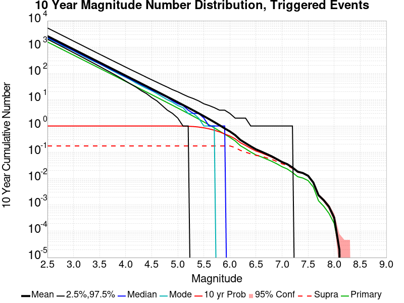
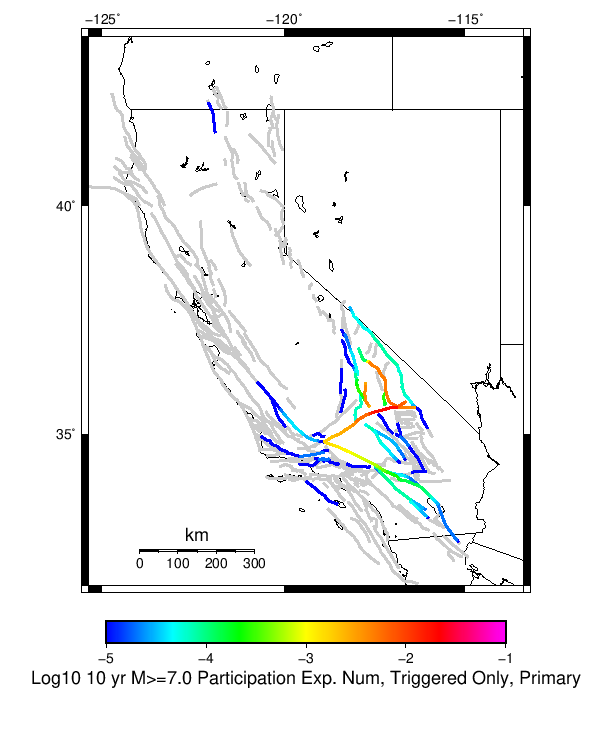
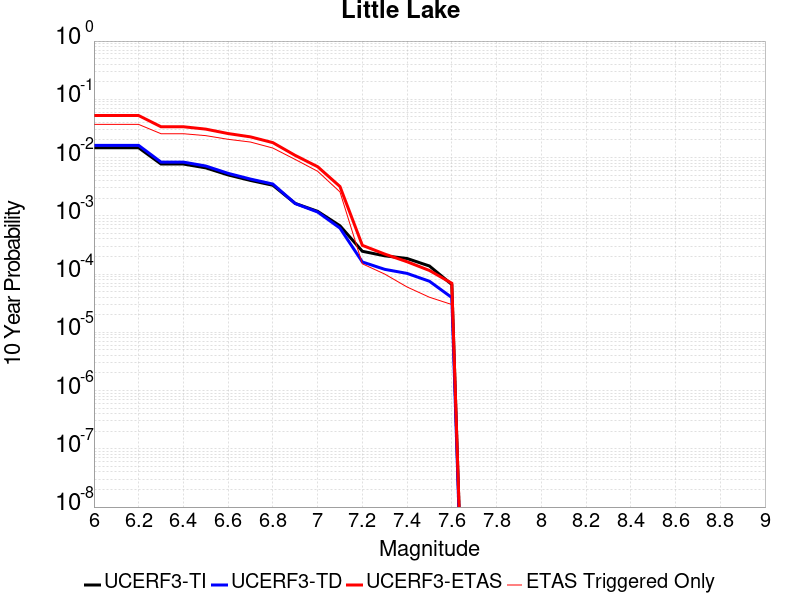

# ComCat M7.1 (ci38457511), ShakeMap Surfaces, Log10(k)=-2.5807, p=1.2481, c=0.0057006 Results

|   | ComCat M7.1 (ci38457511), ShakeMap Surfaces, Log10(k)=-2.5807, p=1.2481, c=0.0057006 |
|-----|-----|
| Num Simulations | 19922 (incomplete) |
| Start Time | 2019/07/06 03:19:54 UTC |
| Start Time Epoch Milliseconds | 1562383194040 |
| Duration | 10 Years |
| Includes Spontaneous? | false |
| Trigger Ruptures | 270 Trigger Ruptures |
|   | First: M3.98 at 2019/07/04 17:02:55 UTC |
|   | Last: M7.1 at 2019/07/06 03:19:53 UTC |
|   | Largest: M7.1 at 2019/07/06 03:19:53 UTC |
| Historical Ruptures | *(none)* |
| Config Generated With | u3etas_comcat_event_config_builder.sh --event-id ci38457511 --num-simulations 100000 --days-before 7 --mag-complete 3.7 --etas-k -2.5807 --etas-p 1.2481 --etas-c 0.0057006 --finite-surf-shakemap --finite-surf-shakemap-min-mag 5 --hpc-site USC_HPC --nodes 36 --hours 24 --queue scec |

## Table Of Contents

* [Probabilities Summary Table](#probabilities-summary-table)
* [Magnitude Number Distribution](#magnitude-number-distribution)
  * [10 Year Magnitude Number Distribution](#10-year-magnitude-number-distribution)
  * [1 Year Magnitude Number Distribution](#1-year-magnitude-number-distribution)
  * [1 Month Magnitude Number Distribution](#1-month-magnitude-number-distribution)
  * [1 Week Magnitude Number Distribution](#1-week-magnitude-number-distribution)
  * [1 Day Magnitude Number Distribution](#1-day-magnitude-number-distribution)
  * [1 Hour Magnitude Number Distribution](#1-hour-magnitude-number-distribution)
* [Hazard Change Over Time](#hazard-change-over-time)
  * [M&ge;5.0 Hazard Change Over Time](#m50-hazard-change-over-time)
  * [M&ge;6.0 Hazard Change Over Time](#m60-hazard-change-over-time)
  * [M&ge;7.0 Hazard Change Over Time](#m70-hazard-change-over-time)
  * [M&ge;8.0 Hazard Change Over Time](#m80-hazard-change-over-time)
* [Trigger Rupture Fault Map](#trigger-rupture-fault-map)
* [Trigger Rupture Depth Map](#trigger-rupture-depth-map)
* [Fault Distances To Triggers](#fault-distances-to-triggers)
* [Individual Simulated Catalog Maps](#individual-simulated-catalog-maps)
* [ComCat Data Comparisons](#comcat-data-comparisons)
* [Section Participation](#section-participation)
  * [Section Participation Plots](#section-participation-plots)
  * [Supra-Seismogenic Parent Sections Table](#supra-seismogenic-parent-sections-table)
  * [M≥6.5 Parent Sections Table](#m65-parent-sections-table)
  * [M≥7 Parent Sections Table](#m7-parent-sections-table)
  * [M≥7.5 Parent Sections Table](#m75-parent-sections-table)
  * [M≥8 Parent Sections Table](#m8-parent-sections-table)
  * [Fault Magnitude-Probability Distributions](#fault-magnitude-probability-distributions)
* [Gridded Nucleation](#gridded-nucleation)
* [JSON Input File](#json-input-file)

## Probabilities Summary Table
*[(top)](#table-of-contents)*

| Magnitude | 1 Hour Prob | 1 Day Prob | 1 Week Prob | 1 Month Prob | 1 Year Prob | 10 Year Prob |
|-----|-----|-----|-----|-----|-----|-----|
| **M&ge;4** | 1.000 (100.00%) | 1.000 (100.00%) | 1.000 (100.00%) | 1.000 (100.00%) | 1.000 (100.00%) | 1.000 (100.00%) |
| **M&ge;4.5** | 0.999 (99.90%) | 1.000 (100.00%) | 1.000 (100.00%) | 1.000 (100.00%) | 1.000 (100.00%) | 1.000 (100.00%) |
| **M&ge;5** | 0.874 (87.36%) | 0.982 (98.19%) | 0.992 (99.15%) | 0.995 (99.46%) | 0.997 (99.67%) | 0.997 (99.75%) |
| **M&ge;5.5** | 0.470 (47.02%) | 0.721 (72.08%) | 0.786 (78.58%) | 0.814 (81.40%) | 0.844 (84.36%) | 0.857 (85.69%) |
| **M&ge;6** | 0.153 (15.34%) | 0.290 (29.01%) | 0.342 (34.20%) | 0.371 (37.13%) | 0.402 (40.18%) | 0.417 (41.73%) |
| **M&ge;6.5** | 0.036 (3.62%) | 0.073 (7.33%) | 0.088 (8.78%) | 0.095 (9.46%) | 0.104 (10.41%) | 0.109 (10.89%) |
| **M&ge;7** | 0.013 (1.30%) | 0.027 (2.67%) | 0.032 (3.24%) | 0.035 (3.54%) | 0.039 (3.92%) | 0.041 (4.11%) |
| **M&ge;7.1** | 0.011 (1.12%) | 0.023 (2.27%) | 0.028 (2.76%) | 0.030 (2.97%) | 0.033 (3.27%) | 0.034 (3.44%) |
| **M&ge;7.5** | 4.92E-3 (0.49%) | 8.63E-3 (0.86%) | 0.010 (1.05%) | 0.011 (1.12%) | 0.012 (1.22%) | 0.013 (1.26%) |
| **M&ge;8** | 1.51E-4 (0.02%) | 2.01E-4 (0.02%) | 2.51E-4 (0.03%) | 2.51E-4 (0.03%) | 2.51E-4 (0.03%) | 2.51E-4 (0.03%) |

## Magnitude Number Distribution
*[(top)](#table-of-contents)*

### 10 Year Magnitude Number Distribution
*[(top)](#table-of-contents)*

**Legend**
* **Mean** (thick black line): mean expected number across all 19922 catalogs
* **2.5%,97.5%** (thin black lines): expected number percentiles across all 19922 catalogs
* **Median** (thin blue line): median expected number across all 19922 catalogs
* **Mode** (thin cyan line): modal expected number across all 19922 catalogs
* **10 yr Probability** (thin red line): 10 year probability calculated as the fraction of catalogs with at least 1 occurrence
* **10 yr Supraseismogenic Probability** (thin dashed red line): same as above, but only for supraseismogenic ruptures on explicitly modeled UCERF3 faults
* **95% Conf** (light red shaded region): binomial 95% confidence bounds on probability
* **Primary** (thin green line): mean expected number from primary triggered aftershocks only (no secondary, tertiary, etc...) across all 19922 catalogs



| Mag | Mean | 2.5 %ile | 97.5 %ile | Median | Mode | 10 yr Probability | 10 yr Supra-Seis Prob | Primary Aftershocks Mean |
|-----|-----|-----|-----|-----|-----|-----|-----|-----|
| **M&ge;2.5** | 2600.617 | 1995.000 | 5300.000 | 2324.000 | 2234.000 | 1.000 (100.00%) | 0.176 (17.57%) | 1565.029 |
| **M&ge;2.6** | 2065.697 | 1579.000 | 4206.000 | 1847.000 | 1727.000 | 1.000 (100.00%) | 0.176 (17.57%) | 1243.148 |
| **M&ge;2.7** | 1640.696 | 1250.000 | 3332.000 | 1468.000 | 1440.000 | 1.000 (100.00%) | 0.176 (17.57%) | 987.370 |
| **M&ge;2.8** | 1303.046 | 988.000 | 2656.000 | 1167.000 | 1153.000 | 1.000 (100.00%) | 0.176 (17.57%) | 784.212 |
| **M&ge;2.9** | 1034.878 | 779.000 | 2108.000 | 927.000 | 878.000 | 1.000 (100.00%) | 0.176 (17.57%) | 622.950 |
| **M&ge;3** | 822.075 | 615.000 | 1676.000 | 737.000 | 696.000 | 1.000 (100.00%) | 0.176 (17.57%) | 494.899 |
| **M&ge;3.1** | 652.858 | 485.000 | 1330.000 | 586.000 | 547.000 | 1.000 (100.00%) | 0.176 (17.57%) | 393.010 |
| **M&ge;3.2** | 518.647 | 382.000 | 1061.000 | 466.000 | 444.000 | 1.000 (100.00%) | 0.176 (17.57%) | 312.182 |
| **M&ge;3.3** | 412.000 | 300.000 | 842.000 | 371.000 | 356.000 | 1.000 (100.00%) | 0.176 (17.57%) | 247.999 |
| **M&ge;3.4** | 327.163 | 235.000 | 670.000 | 294.000 | 281.000 | 1.000 (100.00%) | 0.176 (17.57%) | 196.915 |
| **M&ge;3.5** | 259.791 | 184.000 | 531.000 | 234.000 | 220.000 | 1.000 (100.00%) | 0.176 (17.57%) | 156.337 |
| **M&ge;3.6** | 206.348 | 143.000 | 422.000 | 186.000 | 181.000 | 1.000 (100.00%) | 0.176 (17.57%) | 124.192 |
| **M&ge;3.7** | 163.890 | 111.000 | 338.000 | 148.000 | 142.000 | 1.000 (100.00%) | 0.176 (17.57%) | 98.619 |
| **M&ge;3.8** | 130.094 | 87.000 | 269.000 | 118.000 | 115.000 | 1.000 (100.00%) | 0.176 (17.57%) | 78.253 |
| **M&ge;3.9** | 103.278 | 66.000 | 215.000 | 94.000 | 92.000 | 1.000 (100.00%) | 0.176 (17.57%) | 62.106 |
| **M&ge;4** | 81.980 | 51.000 | 171.000 | 74.000 | 71.000 | 1.000 (100.00%) | 0.176 (17.57%) | 49.316 |
| **M&ge;4.1** | 65.057 | 39.000 | 137.000 | 59.000 | 54.000 | 1.000 (100.00%) | 0.176 (17.57%) | 39.126 |
| **M&ge;4.2** | 51.641 | 30.000 | 109.000 | 47.000 | 44.000 | 1.000 (100.00%) | 0.176 (17.57%) | 31.056 |
| **M&ge;4.3** | 40.971 | 22.000 | 88.000 | 37.000 | 34.000 | 1.000 (100.00%) | 0.176 (17.57%) | 24.626 |
| **M&ge;4.4** | 32.520 | 17.000 | 71.000 | 29.000 | 28.000 | 1.000 (100.00%) | 0.176 (17.57%) | 19.538 |
| **M&ge;4.5** | 25.783 | 13.000 | 56.000 | 23.000 | 23.000 | 1.000 (100.00%) | 0.176 (17.57%) | 15.493 |
| **M&ge;4.6** | 20.420 | 9.000 | 45.000 | 18.000 | 18.000 | 1.000 (100.00%) | 0.176 (17.57%) | 12.267 |
| **M&ge;4.7** | 16.186 | 6.000 | 36.000 | 15.000 | 13.000 | 1.000 (100.00%) | 0.176 (17.57%) | 9.716 |
| **M&ge;4.8** | 12.785 | 5.000 | 29.000 | 11.000 | 10.000 | 1.000 (99.99%) | 0.176 (17.57%) | 7.673 |
| **M&ge;4.9** | 10.114 | 3.000 | 24.000 | 9.000 | 8.000 | 0.999 (99.95%) | 0.176 (17.57%) | 6.062 |
| **M&ge;5** | 7.990 | 2.000 | 20.000 | 7.000 | 6.000 | 0.997 (99.75%) | 0.176 (17.57%) | 4.787 |
| **M&ge;5.1** | 6.308 | 1.000 | 16.000 | 6.000 | 5.000 | 0.992 (99.20%) | 0.176 (17.57%) | 3.784 |
| **M&ge;5.2** | 4.968 | 1.000 | 13.000 | 4.000 | 4.000 | 0.978 (97.77%) | 0.176 (17.57%) | 2.986 |
| **M&ge;5.3** | 3.900 | 0.000 | 11.000 | 3.000 | 3.000 | 0.953 (95.29%) | 0.176 (17.57%) | 2.345 |
| **M&ge;5.4** | 3.051 | 0.000 | 9.000 | 3.000 | 2.000 | 0.913 (91.29%) | 0.176 (17.57%) | 1.834 |
| **M&ge;5.5** | 2.378 | 0.000 | 7.000 | 2.000 | 1.000 | 0.857 (85.69%) | 0.176 (17.57%) | 1.430 |
| **M&ge;5.6** | 1.841 | 0.000 | 6.000 | 1.000 | 1.000 | 0.783 (78.25%) | 0.176 (17.57%) | 1.107 |
| **M&ge;5.7** | 1.413 | 0.000 | 5.000 | 1.000 | 1.000 | 0.697 (69.67%) | 0.176 (17.57%) | 0.850 |
| **M&ge;5.8** | 1.076 | 0.000 | 4.000 | 1.000 | 0.000 | 0.601 (60.09%) | 0.176 (17.57%) | 0.648 |
| **M&ge;5.9** | 0.812 | 0.000 | 3.000 | 1.000 | 0.000 | 0.505 (50.49%) | 0.176 (17.57%) | 0.488 |
| **M&ge;6** | 0.620 | 0.000 | 3.000 | 0.000 | 0.000 | 0.417 (41.73%) | 0.175 (17.54%) | 0.370 |
| **M&ge;6.1** | 0.447 | 0.000 | 2.000 | 0.000 | 0.000 | 0.325 (32.52%) | 0.152 (15.21%) | 0.270 |
| **M&ge;6.2** | 0.292 | 0.000 | 2.000 | 0.000 | 0.000 | 0.231 (23.10%) | 0.117 (11.67%) | 0.178 |
| **M&ge;6.3** | 0.219 | 0.000 | 2.000 | 0.000 | 0.000 | 0.180 (18.01%) | 0.098 (9.82%) | 0.135 |
| **M&ge;6.4** | 0.164 | 0.000 | 1.000 | 0.000 | 0.000 | 0.139 (13.85%) | 0.084 (8.36%) | 0.100 |
| **M&ge;6.5** | 0.127 | 0.000 | 1.000 | 0.000 | 0.000 | 0.109 (10.89%) | 0.073 (7.34%) | 0.078 |
| **M&ge;6.6** | 0.105 | 0.000 | 1.000 | 0.000 | 0.000 | 0.093 (9.33%) | 0.068 (6.83%) | 0.066 |
| **M&ge;6.7** | 0.084 | 0.000 | 1.000 | 0.000 | 0.000 | 0.076 (7.61%) | 0.059 (5.88%) | 0.053 |
| **M&ge;6.8** | 0.068 | 0.000 | 1.000 | 0.000 | 0.000 | 0.063 (6.29%) | 0.052 (5.17%) | 0.044 |
| **M&ge;6.9** | 0.054 | 0.000 | 1.000 | 0.000 | 0.000 | 0.051 (5.09%) | 0.043 (4.30%) | 0.036 |
| **M&ge;7** | 0.043 | 0.000 | 1.000 | 0.000 | 0.000 | 0.041 (4.11%) | 0.036 (3.62%) | 0.028 |
| **M&ge;7.1** | 0.035 | 0.000 | 1.000 | 0.000 | 0.000 | 0.034 (3.44%) | 0.031 (3.13%) | 0.024 |
| **M&ge;7.2** | 0.027 | 0.000 | 1.000 | 0.000 | 0.000 | 0.026 (2.62%) | 0.025 (2.46%) | 0.018 |
| **M&ge;7.3** | 0.018 | 0.000 | 0.000 | 0.000 | 0.000 | 0.018 (1.75%) | 0.017 (1.70%) | 0.012 |
| **M&ge;7.4** | 0.016 | 0.000 | 0.000 | 0.000 | 0.000 | 0.016 (1.59%) | 0.016 (1.57%) | 0.011 |
| **M&ge;7.5** | 0.013 | 0.000 | 0.000 | 0.000 | 0.000 | 0.013 (1.26%) | 0.013 (1.25%) | 8.78E-3 |
| **M&ge;7.6** | 6.93E-3 | 0.000 | 0.000 | 0.000 | 0.000 | 6.88E-3 (0.69%) | 6.78E-3 (0.68%) | 4.67E-3 |
| **M&ge;7.7** | 2.21E-3 | 0.000 | 0.000 | 0.000 | 0.000 | 2.21E-3 (0.22%) | 2.21E-3 (0.22%) | 1.56E-3 |
| **M&ge;7.8** | 1.25E-3 | 0.000 | 0.000 | 0.000 | 0.000 | 1.25E-3 (0.13%) | 1.25E-3 (0.13%) | 8.03E-4 |
| **M&ge;7.9** | 5.02E-4 | 0.000 | 0.000 | 0.000 | 0.000 | 5.02E-4 (0.05%) | 5.02E-4 (0.05%) | 4.02E-4 |
| **M&ge;8** | 2.51E-4 | 0.000 | 0.000 | 0.000 | 0.000 | 2.51E-4 (0.03%) | 2.51E-4 (0.03%) | 2.01E-4 |
| **M&ge;8.1** | 0.000 | 0.000 | 0.000 | 0.000 | 0.000 | 0.000 (0.00%) | 0.000 (0.00%) | 0.000 |
| **M&ge;8.2** | 0.000 | 0.000 | 0.000 | 0.000 | 0.000 | 0.000 (0.00%) | 0.000 (0.00%) | 0.000 |
| **M&ge;8.3** | 0.000 | 0.000 | 0.000 | 0.000 | 0.000 | 0.000 (0.00%) | 0.000 (0.00%) | 0.000 |
| **M&ge;8.4** | 0.000 | 0.000 | 0.000 | 0.000 | 0.000 | 0.000 (0.00%) | 0.000 (0.00%) | 0.000 |
| **M&ge;8.5** | 0.000 | 0.000 | 0.000 | 0.000 | 0.000 | 0.000 (0.00%) | 0.000 (0.00%) | 0.000 |
| **M&ge;8.6** | 0.000 | 0.000 | 0.000 | 0.000 | 0.000 | 0.000 (0.00%) | 0.000 (0.00%) | 0.000 |
| **M&ge;8.7** | 0.000 | 0.000 | 0.000 | 0.000 | 0.000 | 0.000 (0.00%) | 0.000 (0.00%) | 0.000 |
| **M&ge;8.8** | 0.000 | 0.000 | 0.000 | 0.000 | 0.000 | 0.000 (0.00%) | 0.000 (0.00%) | 0.000 |
| **M&ge;8.9** | 0.000 | 0.000 | 0.000 | 0.000 | 0.000 | 0.000 (0.00%) | 0.000 (0.00%) | 0.000 |
| **M&ge;9** | 0.000 | 0.000 | 0.000 | 0.000 | 0.000 | 0.000 (0.00%) | 0.000 (0.00%) | 0.000 |

### 1 Year Magnitude Number Distribution
*[(top)](#table-of-contents)*

**Legend**
* **Mean** (thick black line): mean expected number across all 19922 catalogs
* **2.5%,97.5%** (thin black lines): expected number percentiles across all 19922 catalogs
* **Median** (thin blue line): median expected number across all 19922 catalogs
* **Mode** (thin cyan line): modal expected number across all 19922 catalogs
* **1 yr Probability** (thin red line): 1 year probability calculated as the fraction of catalogs with at least 1 occurrence
* **1 yr Supraseismogenic Probability** (thin dashed red line): same as above, but only for supraseismogenic ruptures on explicitly modeled UCERF3 faults
* **95% Conf** (light red shaded region): binomial 95% confidence bounds on probability
* **Primary** (thin green line): mean expected number from primary triggered aftershocks only (no secondary, tertiary, etc...) across all 19922 catalogs


| Mag | Mean | 2.5 %ile | 97.5 %ile | Median | Mode | 1 yr Probability | 1 yr Supra-Seis Prob | Primary Aftershocks Mean |
|-----|-----|-----|-----|-----|-----|-----|-----|-----|
| **M&ge;2.5** | 2463.604 | 1902.000 | 4965.000 | 2209.000 | 2150.000 | 1.000 (100.00%) | 0.168 (16.84%) | 1510.602 |
| **M&ge;2.6** | 1956.877 | 1506.000 | 3927.000 | 1755.000 | 1696.000 | 1.000 (100.00%) | 0.168 (16.84%) | 1199.905 |
| **M&ge;2.7** | 1554.265 | 1191.000 | 3122.000 | 1395.000 | 1316.000 | 1.000 (100.00%) | 0.168 (16.84%) | 953.024 |
| **M&ge;2.8** | 1234.377 | 942.000 | 2490.000 | 1109.000 | 1039.000 | 1.000 (100.00%) | 0.168 (16.84%) | 756.931 |
| **M&ge;2.9** | 980.355 | 743.000 | 1978.000 | 881.000 | 816.000 | 1.000 (100.00%) | 0.168 (16.84%) | 601.275 |
| **M&ge;3** | 778.768 | 587.000 | 1571.000 | 700.000 | 652.000 | 1.000 (100.00%) | 0.168 (16.84%) | 477.676 |
| **M&ge;3.1** | 618.460 | 462.000 | 1253.000 | 557.000 | 523.000 | 1.000 (100.00%) | 0.168 (16.84%) | 379.335 |
| **M&ge;3.2** | 491.310 | 363.000 | 995.000 | 443.000 | 422.000 | 1.000 (100.00%) | 0.168 (16.84%) | 301.316 |
| **M&ge;3.3** | 390.279 | 286.000 | 789.000 | 352.000 | 337.000 | 1.000 (100.00%) | 0.168 (16.84%) | 239.379 |
| **M&ge;3.4** | 309.900 | 224.000 | 627.000 | 280.000 | 258.000 | 1.000 (100.00%) | 0.168 (16.84%) | 190.065 |
| **M&ge;3.5** | 246.091 | 175.000 | 499.000 | 223.000 | 208.000 | 1.000 (100.00%) | 0.168 (16.84%) | 150.899 |
| **M&ge;3.6** | 195.465 | 136.000 | 397.000 | 177.000 | 167.000 | 1.000 (100.00%) | 0.168 (16.84%) | 119.882 |
| **M&ge;3.7** | 155.236 | 106.000 | 316.000 | 141.000 | 137.000 | 1.000 (100.00%) | 0.168 (16.84%) | 95.198 |
| **M&ge;3.8** | 123.199 | 82.000 | 251.000 | 112.000 | 108.000 | 1.000 (100.00%) | 0.168 (16.84%) | 75.537 |
| **M&ge;3.9** | 97.804 | 63.000 | 202.000 | 89.000 | 86.000 | 1.000 (100.00%) | 0.168 (16.84%) | 59.954 |
| **M&ge;4** | 77.632 | 48.000 | 161.000 | 71.000 | 65.000 | 1.000 (100.00%) | 0.168 (16.84%) | 47.607 |
| **M&ge;4.1** | 61.608 | 37.000 | 128.000 | 56.000 | 52.000 | 1.000 (100.00%) | 0.168 (16.84%) | 37.765 |
| **M&ge;4.2** | 48.907 | 28.000 | 102.000 | 45.000 | 42.000 | 1.000 (100.00%) | 0.168 (16.84%) | 29.978 |
| **M&ge;4.3** | 38.804 | 21.000 | 82.000 | 35.000 | 32.000 | 1.000 (100.00%) | 0.168 (16.84%) | 23.769 |
| **M&ge;4.4** | 30.799 | 16.000 | 66.000 | 28.000 | 25.000 | 1.000 (100.00%) | 0.168 (16.84%) | 18.858 |
| **M&ge;4.5** | 24.420 | 12.000 | 53.000 | 22.000 | 21.000 | 1.000 (100.00%) | 0.168 (16.84%) | 14.955 |
| **M&ge;4.6** | 19.343 | 8.000 | 42.000 | 18.000 | 16.000 | 1.000 (100.00%) | 0.168 (16.84%) | 11.844 |
| **M&ge;4.7** | 15.332 | 6.000 | 34.000 | 14.000 | 13.000 | 1.000 (100.00%) | 0.168 (16.84%) | 9.384 |
| **M&ge;4.8** | 12.108 | 4.000 | 28.000 | 11.000 | 9.000 | 1.000 (99.99%) | 0.168 (16.84%) | 7.410 |
| **M&ge;4.9** | 9.575 | 3.000 | 23.000 | 9.000 | 8.000 | 0.999 (99.94%) | 0.168 (16.84%) | 5.851 |
| **M&ge;5** | 7.567 | 2.000 | 19.000 | 7.000 | 6.000 | 0.997 (99.67%) | 0.168 (16.84%) | 4.621 |
| **M&ge;5.1** | 5.978 | 1.000 | 15.000 | 5.000 | 4.000 | 0.990 (99.05%) | 0.168 (16.84%) | 3.653 |
| **M&ge;5.2** | 4.707 | 0.000 | 13.000 | 4.000 | 3.000 | 0.974 (97.43%) | 0.168 (16.84%) | 2.883 |
| **M&ge;5.3** | 3.697 | 0.000 | 10.000 | 3.000 | 3.000 | 0.947 (94.68%) | 0.168 (16.84%) | 2.265 |
| **M&ge;5.4** | 2.892 | 0.000 | 9.000 | 2.000 | 2.000 | 0.904 (90.38%) | 0.168 (16.84%) | 1.771 |
| **M&ge;5.5** | 2.254 | 0.000 | 7.000 | 2.000 | 1.000 | 0.844 (84.36%) | 0.168 (16.84%) | 1.382 |
| **M&ge;5.6** | 1.744 | 0.000 | 6.000 | 1.000 | 1.000 | 0.767 (76.70%) | 0.168 (16.84%) | 1.069 |
| **M&ge;5.7** | 1.339 | 0.000 | 5.000 | 1.000 | 1.000 | 0.679 (67.90%) | 0.168 (16.84%) | 0.821 |
| **M&ge;5.8** | 1.020 | 0.000 | 4.000 | 1.000 | 0.000 | 0.583 (58.31%) | 0.168 (16.84%) | 0.626 |
| **M&ge;5.9** | 0.770 | 0.000 | 3.000 | 0.000 | 0.000 | 0.488 (48.79%) | 0.168 (16.83%) | 0.472 |
| **M&ge;6** | 0.587 | 0.000 | 3.000 | 0.000 | 0.000 | 0.402 (40.18%) | 0.168 (16.81%) | 0.358 |
| **M&ge;6.1** | 0.424 | 0.000 | 2.000 | 0.000 | 0.000 | 0.312 (31.24%) | 0.146 (14.62%) | 0.261 |
| **M&ge;6.2** | 0.277 | 0.000 | 2.000 | 0.000 | 0.000 | 0.221 (22.08%) | 0.112 (11.24%) | 0.172 |
| **M&ge;6.3** | 0.208 | 0.000 | 2.000 | 0.000 | 0.000 | 0.172 (17.22%) | 0.094 (9.45%) | 0.130 |
| **M&ge;6.4** | 0.155 | 0.000 | 1.000 | 0.000 | 0.000 | 0.132 (13.22%) | 0.080 (8.04%) | 0.097 |
| **M&ge;6.5** | 0.121 | 0.000 | 1.000 | 0.000 | 0.000 | 0.104 (10.41%) | 0.071 (7.05%) | 0.075 |
| **M&ge;6.6** | 0.099 | 0.000 | 1.000 | 0.000 | 0.000 | 0.089 (8.89%) | 0.066 (6.56%) | 0.064 |
| **M&ge;6.7** | 0.080 | 0.000 | 1.000 | 0.000 | 0.000 | 0.072 (7.23%) | 0.056 (5.64%) | 0.052 |
| **M&ge;6.8** | 0.065 | 0.000 | 1.000 | 0.000 | 0.000 | 0.060 (6.01%) | 0.050 (4.96%) | 0.043 |
| **M&ge;6.9** | 0.051 | 0.000 | 1.000 | 0.000 | 0.000 | 0.049 (4.87%) | 0.041 (4.13%) | 0.034 |
| **M&ge;7** | 0.041 | 0.000 | 1.000 | 0.000 | 0.000 | 0.039 (3.92%) | 0.035 (3.46%) | 0.028 |
| **M&ge;7.1** | 0.034 | 0.000 | 1.000 | 0.000 | 0.000 | 0.033 (3.27%) | 0.030 (2.99%) | 0.023 |
| **M&ge;7.2** | 0.026 | 0.000 | 1.000 | 0.000 | 0.000 | 0.025 (2.51%) | 0.024 (2.36%) | 0.018 |
| **M&ge;7.3** | 0.017 | 0.000 | 0.000 | 0.000 | 0.000 | 0.017 (1.70%) | 0.016 (1.65%) | 0.012 |
| **M&ge;7.4** | 0.016 | 0.000 | 0.000 | 0.000 | 0.000 | 0.015 (1.54%) | 0.015 (1.52%) | 0.011 |
| **M&ge;7.5** | 0.012 | 0.000 | 0.000 | 0.000 | 0.000 | 0.012 (1.22%) | 0.012 (1.21%) | 8.58E-3 |
| **M&ge;7.6** | 6.63E-3 | 0.000 | 0.000 | 0.000 | 0.000 | 6.58E-3 (0.66%) | 6.48E-3 (0.65%) | 4.52E-3 |
| **M&ge;7.7** | 2.06E-3 | 0.000 | 0.000 | 0.000 | 0.000 | 2.06E-3 (0.21%) | 2.06E-3 (0.21%) | 1.46E-3 |
| **M&ge;7.8** | 1.25E-3 | 0.000 | 0.000 | 0.000 | 0.000 | 1.25E-3 (0.13%) | 1.25E-3 (0.13%) | 8.03E-4 |
| **M&ge;7.9** | 5.02E-4 | 0.000 | 0.000 | 0.000 | 0.000 | 5.02E-4 (0.05%) | 5.02E-4 (0.05%) | 4.02E-4 |
| **M&ge;8** | 2.51E-4 | 0.000 | 0.000 | 0.000 | 0.000 | 2.51E-4 (0.03%) | 2.51E-4 (0.03%) | 2.01E-4 |
| **M&ge;8.1** | 0.000 | 0.000 | 0.000 | 0.000 | 0.000 | 0.000 (0.00%) | 0.000 (0.00%) | 0.000 |
| **M&ge;8.2** | 0.000 | 0.000 | 0.000 | 0.000 | 0.000 | 0.000 (0.00%) | 0.000 (0.00%) | 0.000 |
| **M&ge;8.3** | 0.000 | 0.000 | 0.000 | 0.000 | 0.000 | 0.000 (0.00%) | 0.000 (0.00%) | 0.000 |
| **M&ge;8.4** | 0.000 | 0.000 | 0.000 | 0.000 | 0.000 | 0.000 (0.00%) | 0.000 (0.00%) | 0.000 |
| **M&ge;8.5** | 0.000 | 0.000 | 0.000 | 0.000 | 0.000 | 0.000 (0.00%) | 0.000 (0.00%) | 0.000 |
| **M&ge;8.6** | 0.000 | 0.000 | 0.000 | 0.000 | 0.000 | 0.000 (0.00%) | 0.000 (0.00%) | 0.000 |
| **M&ge;8.7** | 0.000 | 0.000 | 0.000 | 0.000 | 0.000 | 0.000 (0.00%) | 0.000 (0.00%) | 0.000 |
| **M&ge;8.8** | 0.000 | 0.000 | 0.000 | 0.000 | 0.000 | 0.000 (0.00%) | 0.000 (0.00%) | 0.000 |
| **M&ge;8.9** | 0.000 | 0.000 | 0.000 | 0.000 | 0.000 | 0.000 (0.00%) | 0.000 (0.00%) | 0.000 |
| **M&ge;9** | 0.000 | 0.000 | 0.000 | 0.000 | 0.000 | 0.000 (0.00%) | 0.000 (0.00%) | 0.000 |

### 1 Month Magnitude Number Distribution
*[(top)](#table-of-contents)*

**Legend**
* **Mean** (thick black line): mean expected number across all 19922 catalogs
* **2.5%,97.5%** (thin black lines): expected number percentiles across all 19922 catalogs
* **Median** (thin blue line): median expected number across all 19922 catalogs
* **Mode** (thin cyan line): modal expected number across all 19922 catalogs
* **1 mo Probability** (thin red line): 1 month probability calculated as the fraction of catalogs with at least 1 occurrence
* **1 mo Supraseismogenic Probability** (thin dashed red line): same as above, but only for supraseismogenic ruptures on explicitly modeled UCERF3 faults
* **95% Conf** (light red shaded region): binomial 95% confidence bounds on probability
* **Primary** (thin green line): mean expected number from primary triggered aftershocks only (no secondary, tertiary, etc...) across all 19922 catalogs


| Mag | Mean | 2.5 %ile | 97.5 %ile | Median | Mode | 1 mo Probability | 1 mo Supra-Seis Prob | Primary Aftershocks Mean |
|-----|-----|-----|-----|-----|-----|-----|-----|-----|
| **M&ge;2.5** | 2205.395 | 1729.000 | 4342.000 | 1990.000 | 1856.000 | 1.000 (100.00%) | 0.153 (15.29%) | 1403.608 |
| **M&ge;2.6** | 1751.779 | 1368.000 | 3455.000 | 1581.000 | 1522.000 | 1.000 (100.00%) | 0.153 (15.29%) | 1114.925 |
| **M&ge;2.7** | 1391.342 | 1081.000 | 2746.000 | 1257.000 | 1195.000 | 1.000 (100.00%) | 0.153 (15.29%) | 885.525 |
| **M&ge;2.8** | 1104.964 | 854.000 | 2177.000 | 999.000 | 962.000 | 1.000 (100.00%) | 0.153 (15.29%) | 703.282 |
| **M&ge;2.9** | 877.630 | 674.000 | 1725.000 | 794.000 | 776.000 | 1.000 (100.00%) | 0.153 (15.29%) | 558.671 |
| **M&ge;3** | 697.199 | 531.000 | 1369.000 | 631.000 | 608.000 | 1.000 (100.00%) | 0.153 (15.29%) | 443.859 |
| **M&ge;3.1** | 553.669 | 418.000 | 1091.000 | 502.000 | 494.000 | 1.000 (100.00%) | 0.153 (15.29%) | 352.467 |
| **M&ge;3.2** | 439.784 | 329.000 | 867.000 | 399.000 | 387.000 | 1.000 (100.00%) | 0.153 (15.29%) | 279.965 |
| **M&ge;3.3** | 349.367 | 258.000 | 690.000 | 317.000 | 303.000 | 1.000 (100.00%) | 0.153 (15.29%) | 222.418 |
| **M&ge;3.4** | 277.416 | 202.000 | 548.000 | 252.000 | 236.000 | 1.000 (100.00%) | 0.153 (15.29%) | 176.596 |
| **M&ge;3.5** | 220.324 | 157.000 | 436.000 | 201.000 | 193.000 | 1.000 (100.00%) | 0.153 (15.29%) | 140.219 |
| **M&ge;3.6** | 174.997 | 122.000 | 348.000 | 160.000 | 154.000 | 1.000 (100.00%) | 0.153 (15.29%) | 111.387 |
| **M&ge;3.7** | 138.986 | 95.000 | 277.000 | 127.000 | 120.000 | 1.000 (100.00%) | 0.153 (15.29%) | 88.445 |
| **M&ge;3.8** | 110.289 | 74.000 | 218.000 | 101.000 | 95.000 | 1.000 (100.00%) | 0.153 (15.29%) | 70.178 |
| **M&ge;3.9** | 87.557 | 56.000 | 175.000 | 80.000 | 77.000 | 1.000 (100.00%) | 0.153 (15.29%) | 55.709 |
| **M&ge;4** | 69.492 | 43.000 | 139.000 | 64.000 | 59.000 | 1.000 (100.00%) | 0.153 (15.29%) | 44.232 |
| **M&ge;4.1** | 55.149 | 33.000 | 111.000 | 50.000 | 45.000 | 1.000 (100.00%) | 0.153 (15.29%) | 35.082 |
| **M&ge;4.2** | 43.776 | 25.000 | 89.000 | 40.000 | 37.000 | 1.000 (100.00%) | 0.153 (15.29%) | 27.853 |
| **M&ge;4.3** | 34.741 | 19.000 | 72.000 | 32.000 | 29.000 | 1.000 (100.00%) | 0.153 (15.29%) | 22.086 |
| **M&ge;4.4** | 27.571 | 14.000 | 58.000 | 25.000 | 25.000 | 1.000 (100.00%) | 0.153 (15.29%) | 17.520 |
| **M&ge;4.5** | 21.853 | 10.000 | 46.000 | 20.000 | 18.000 | 1.000 (100.00%) | 0.153 (15.29%) | 13.890 |
| **M&ge;4.6** | 17.313 | 7.000 | 37.000 | 16.000 | 16.000 | 1.000 (100.00%) | 0.153 (15.29%) | 11.003 |
| **M&ge;4.7** | 13.721 | 5.000 | 30.000 | 12.000 | 12.000 | 1.000 (100.00%) | 0.153 (15.29%) | 8.715 |
| **M&ge;4.8** | 10.835 | 4.000 | 24.000 | 10.000 | 8.000 | 1.000 (99.97%) | 0.153 (15.29%) | 6.880 |
| **M&ge;4.9** | 8.571 | 2.000 | 20.000 | 8.000 | 6.000 | 0.999 (99.87%) | 0.153 (15.29%) | 5.435 |
| **M&ge;5** | 6.772 | 1.000 | 17.000 | 6.000 | 5.000 | 0.995 (99.46%) | 0.153 (15.29%) | 4.293 |
| **M&ge;5.1** | 5.349 | 1.000 | 14.000 | 5.000 | 4.000 | 0.985 (98.50%) | 0.153 (15.29%) | 3.395 |
| **M&ge;5.2** | 4.212 | 0.000 | 11.000 | 4.000 | 3.000 | 0.965 (96.51%) | 0.153 (15.29%) | 2.678 |
| **M&ge;5.3** | 3.307 | 0.000 | 9.000 | 3.000 | 2.000 | 0.932 (93.17%) | 0.153 (15.29%) | 2.104 |
| **M&ge;5.4** | 2.587 | 0.000 | 8.000 | 2.000 | 2.000 | 0.882 (88.15%) | 0.153 (15.29%) | 1.644 |
| **M&ge;5.5** | 2.020 | 0.000 | 6.000 | 2.000 | 1.000 | 0.814 (81.40%) | 0.153 (15.29%) | 1.283 |
| **M&ge;5.6** | 1.560 | 0.000 | 5.000 | 1.000 | 1.000 | 0.732 (73.20%) | 0.153 (15.29%) | 0.992 |
| **M&ge;5.7** | 1.199 | 0.000 | 4.000 | 1.000 | 0.000 | 0.642 (64.22%) | 0.153 (15.29%) | 0.762 |
| **M&ge;5.8** | 0.915 | 0.000 | 4.000 | 1.000 | 0.000 | 0.547 (54.74%) | 0.153 (15.29%) | 0.581 |
| **M&ge;5.9** | 0.690 | 0.000 | 3.000 | 0.000 | 0.000 | 0.453 (45.29%) | 0.153 (15.28%) | 0.438 |
| **M&ge;6** | 0.526 | 0.000 | 3.000 | 0.000 | 0.000 | 0.371 (37.13%) | 0.153 (15.27%) | 0.333 |
| **M&ge;6.1** | 0.380 | 0.000 | 2.000 | 0.000 | 0.000 | 0.287 (28.67%) | 0.133 (13.31%) | 0.242 |
| **M&ge;6.2** | 0.249 | 0.000 | 2.000 | 0.000 | 0.000 | 0.202 (20.20%) | 0.103 (10.25%) | 0.160 |
| **M&ge;6.3** | 0.187 | 0.000 | 1.000 | 0.000 | 0.000 | 0.157 (15.72%) | 0.086 (8.61%) | 0.121 |
| **M&ge;6.4** | 0.140 | 0.000 | 1.000 | 0.000 | 0.000 | 0.120 (12.02%) | 0.073 (7.35%) | 0.090 |
| **M&ge;6.5** | 0.108 | 0.000 | 1.000 | 0.000 | 0.000 | 0.095 (9.46%) | 0.065 (6.46%) | 0.070 |
| **M&ge;6.6** | 0.090 | 0.000 | 1.000 | 0.000 | 0.000 | 0.081 (8.10%) | 0.060 (6.01%) | 0.060 |
| **M&ge;6.7** | 0.072 | 0.000 | 1.000 | 0.000 | 0.000 | 0.066 (6.57%) | 0.052 (5.17%) | 0.048 |
| **M&ge;6.8** | 0.059 | 0.000 | 1.000 | 0.000 | 0.000 | 0.055 (5.46%) | 0.046 (4.56%) | 0.040 |
| **M&ge;6.9** | 0.046 | 0.000 | 1.000 | 0.000 | 0.000 | 0.044 (4.38%) | 0.037 (3.75%) | 0.032 |
| **M&ge;7** | 0.037 | 0.000 | 1.000 | 0.000 | 0.000 | 0.035 (3.54%) | 0.031 (3.14%) | 0.026 |
| **M&ge;7.1** | 0.031 | 0.000 | 1.000 | 0.000 | 0.000 | 0.030 (2.97%) | 0.027 (2.73%) | 0.021 |
| **M&ge;7.2** | 0.023 | 0.000 | 0.000 | 0.000 | 0.000 | 0.023 (2.28%) | 0.022 (2.16%) | 0.016 |
| **M&ge;7.3** | 0.016 | 0.000 | 0.000 | 0.000 | 0.000 | 0.015 (1.55%) | 0.015 (1.51%) | 0.011 |
| **M&ge;7.4** | 0.014 | 0.000 | 0.000 | 0.000 | 0.000 | 0.014 (1.40%) | 0.014 (1.39%) | 0.010 |
| **M&ge;7.5** | 0.011 | 0.000 | 0.000 | 0.000 | 0.000 | 0.011 (1.12%) | 0.011 (1.11%) | 8.13E-3 |
| **M&ge;7.6** | 6.02E-3 | 0.000 | 0.000 | 0.000 | 0.000 | 6.02E-3 (0.60%) | 5.92E-3 (0.59%) | 4.27E-3 |
| **M&ge;7.7** | 1.86E-3 | 0.000 | 0.000 | 0.000 | 0.000 | 1.86E-3 (0.19%) | 1.86E-3 (0.19%) | 1.36E-3 |
| **M&ge;7.8** | 1.15E-3 | 0.000 | 0.000 | 0.000 | 0.000 | 1.15E-3 (0.12%) | 1.15E-3 (0.12%) | 7.53E-4 |
| **M&ge;7.9** | 5.02E-4 | 0.000 | 0.000 | 0.000 | 0.000 | 5.02E-4 (0.05%) | 5.02E-4 (0.05%) | 4.02E-4 |
| **M&ge;8** | 2.51E-4 | 0.000 | 0.000 | 0.000 | 0.000 | 2.51E-4 (0.03%) | 2.51E-4 (0.03%) | 2.01E-4 |
| **M&ge;8.1** | 0.000 | 0.000 | 0.000 | 0.000 | 0.000 | 0.000 (0.00%) | 0.000 (0.00%) | 0.000 |
| **M&ge;8.2** | 0.000 | 0.000 | 0.000 | 0.000 | 0.000 | 0.000 (0.00%) | 0.000 (0.00%) | 0.000 |
| **M&ge;8.3** | 0.000 | 0.000 | 0.000 | 0.000 | 0.000 | 0.000 (0.00%) | 0.000 (0.00%) | 0.000 |
| **M&ge;8.4** | 0.000 | 0.000 | 0.000 | 0.000 | 0.000 | 0.000 (0.00%) | 0.000 (0.00%) | 0.000 |
| **M&ge;8.5** | 0.000 | 0.000 | 0.000 | 0.000 | 0.000 | 0.000 (0.00%) | 0.000 (0.00%) | 0.000 |
| **M&ge;8.6** | 0.000 | 0.000 | 0.000 | 0.000 | 0.000 | 0.000 (0.00%) | 0.000 (0.00%) | 0.000 |
| **M&ge;8.7** | 0.000 | 0.000 | 0.000 | 0.000 | 0.000 | 0.000 (0.00%) | 0.000 (0.00%) | 0.000 |
| **M&ge;8.8** | 0.000 | 0.000 | 0.000 | 0.000 | 0.000 | 0.000 (0.00%) | 0.000 (0.00%) | 0.000 |
| **M&ge;8.9** | 0.000 | 0.000 | 0.000 | 0.000 | 0.000 | 0.000 (0.00%) | 0.000 (0.00%) | 0.000 |
| **M&ge;9** | 0.000 | 0.000 | 0.000 | 0.000 | 0.000 | 0.000 (0.00%) | 0.000 (0.00%) | 0.000 |

### 1 Week Magnitude Number Distribution
*[(top)](#table-of-contents)*

**Legend**
* **Mean** (thick black line): mean expected number across all 19922 catalogs
* **2.5%,97.5%** (thin black lines): expected number percentiles across all 19922 catalogs
* **Median** (thin blue line): median expected number across all 19922 catalogs
* **Mode** (thin cyan line): modal expected number across all 19922 catalogs
* **1 wk Probability** (thin red line): 1 week probability calculated as the fraction of catalogs with at least 1 occurrence
* **1 wk Supraseismogenic Probability** (thin dashed red line): same as above, but only for supraseismogenic ruptures on explicitly modeled UCERF3 faults
* **95% Conf** (light red shaded region): binomial 95% confidence bounds on probability
* **Primary** (thin green line): mean expected number from primary triggered aftershocks only (no secondary, tertiary, etc...) across all 19922 catalogs


| Mag | Mean | 2.5 %ile | 97.5 %ile | Median | Mode | 1 wk Probability | 1 wk Supra-Seis Prob | Primary Aftershocks Mean |
|-----|-----|-----|-----|-----|-----|-----|-----|-----|
| **M&ge;2.5** | 1982.476 | 1573.000 | 3827.000 | 1797.000 | 1720.000 | 1.000 (100.00%) | 0.140 (14.00%) | 1304.996 |
| **M&ge;2.6** | 1574.786 | 1242.000 | 3038.000 | 1429.000 | 1357.000 | 1.000 (100.00%) | 0.140 (14.00%) | 1036.646 |
| **M&ge;2.7** | 1250.764 | 982.000 | 2416.000 | 1136.000 | 1097.000 | 1.000 (100.00%) | 0.140 (14.00%) | 823.373 |
| **M&ge;2.8** | 993.331 | 775.000 | 1911.000 | 903.000 | 851.000 | 1.000 (100.00%) | 0.140 (14.00%) | 653.949 |
| **M&ge;2.9** | 788.970 | 611.000 | 1521.000 | 717.000 | 699.000 | 1.000 (100.00%) | 0.140 (14.00%) | 519.487 |
| **M&ge;3** | 626.776 | 482.000 | 1206.000 | 570.000 | 542.000 | 1.000 (100.00%) | 0.140 (14.00%) | 412.746 |
| **M&ge;3.1** | 497.708 | 380.000 | 960.000 | 453.000 | 431.000 | 1.000 (100.00%) | 0.140 (14.00%) | 327.751 |
| **M&ge;3.2** | 395.329 | 298.000 | 762.000 | 361.000 | 343.000 | 1.000 (100.00%) | 0.140 (14.00%) | 260.328 |
| **M&ge;3.3** | 314.062 | 233.000 | 606.000 | 287.000 | 282.000 | 1.000 (100.00%) | 0.140 (14.00%) | 206.829 |
| **M&ge;3.4** | 249.408 | 182.000 | 481.000 | 228.000 | 218.000 | 1.000 (100.00%) | 0.140 (14.00%) | 164.239 |
| **M&ge;3.5** | 198.078 | 142.000 | 386.000 | 181.000 | 172.000 | 1.000 (100.00%) | 0.140 (14.00%) | 130.408 |
| **M&ge;3.6** | 157.341 | 111.000 | 306.000 | 144.000 | 139.000 | 1.000 (100.00%) | 0.140 (14.00%) | 103.603 |
| **M&ge;3.7** | 124.992 | 85.000 | 243.000 | 115.000 | 107.000 | 1.000 (100.00%) | 0.140 (14.00%) | 82.275 |
| **M&ge;3.8** | 99.179 | 66.000 | 193.000 | 91.000 | 86.000 | 1.000 (100.00%) | 0.140 (14.00%) | 65.274 |
| **M&ge;3.9** | 78.737 | 51.000 | 155.000 | 72.000 | 67.000 | 1.000 (100.00%) | 0.140 (14.00%) | 51.811 |
| **M&ge;4** | 62.497 | 39.000 | 122.000 | 57.000 | 57.000 | 1.000 (100.00%) | 0.140 (14.00%) | 41.140 |
| **M&ge;4.1** | 49.598 | 30.000 | 98.000 | 46.000 | 43.000 | 1.000 (100.00%) | 0.140 (14.00%) | 32.635 |
| **M&ge;4.2** | 39.364 | 22.000 | 79.000 | 36.000 | 36.000 | 1.000 (100.00%) | 0.140 (14.00%) | 25.914 |
| **M&ge;4.3** | 31.232 | 17.000 | 63.000 | 29.000 | 27.000 | 1.000 (100.00%) | 0.140 (14.00%) | 20.543 |
| **M&ge;4.4** | 24.787 | 12.000 | 51.000 | 23.000 | 20.000 | 1.000 (100.00%) | 0.140 (14.00%) | 16.296 |
| **M&ge;4.5** | 19.648 | 9.000 | 40.000 | 18.000 | 17.000 | 1.000 (100.00%) | 0.140 (14.00%) | 12.924 |
| **M&ge;4.6** | 15.565 | 6.000 | 33.000 | 14.000 | 13.000 | 1.000 (100.00%) | 0.140 (14.00%) | 10.233 |
| **M&ge;4.7** | 12.340 | 5.000 | 27.000 | 11.000 | 11.000 | 1.000 (100.00%) | 0.140 (14.00%) | 8.109 |
| **M&ge;4.8** | 9.743 | 3.000 | 22.000 | 9.000 | 8.000 | 0.999 (99.94%) | 0.140 (14.00%) | 6.398 |
| **M&ge;4.9** | 7.708 | 2.000 | 18.000 | 7.000 | 6.000 | 0.998 (99.76%) | 0.140 (14.00%) | 5.053 |
| **M&ge;5** | 6.089 | 1.000 | 15.000 | 5.000 | 5.000 | 0.992 (99.15%) | 0.140 (14.00%) | 3.992 |
| **M&ge;5.1** | 4.807 | 1.000 | 12.000 | 4.000 | 4.000 | 0.979 (97.87%) | 0.140 (14.00%) | 3.157 |
| **M&ge;5.2** | 3.787 | 0.000 | 10.000 | 3.000 | 3.000 | 0.954 (95.36%) | 0.140 (14.00%) | 2.489 |
| **M&ge;5.3** | 2.970 | 0.000 | 9.000 | 3.000 | 2.000 | 0.914 (91.44%) | 0.140 (14.00%) | 1.953 |
| **M&ge;5.4** | 2.323 | 0.000 | 7.000 | 2.000 | 1.000 | 0.858 (85.80%) | 0.140 (14.00%) | 1.527 |
| **M&ge;5.5** | 1.812 | 0.000 | 6.000 | 1.000 | 1.000 | 0.786 (78.58%) | 0.140 (14.00%) | 1.191 |
| **M&ge;5.6** | 1.399 | 0.000 | 5.000 | 1.000 | 1.000 | 0.700 (70.02%) | 0.140 (14.00%) | 0.921 |
| **M&ge;5.7** | 1.075 | 0.000 | 4.000 | 1.000 | 0.000 | 0.608 (60.78%) | 0.140 (14.00%) | 0.707 |
| **M&ge;5.8** | 0.820 | 0.000 | 3.000 | 1.000 | 0.000 | 0.512 (51.24%) | 0.140 (14.00%) | 0.538 |
| **M&ge;5.9** | 0.618 | 0.000 | 3.000 | 0.000 | 0.000 | 0.420 (42.03%) | 0.140 (14.00%) | 0.406 |
| **M&ge;6** | 0.472 | 0.000 | 3.000 | 0.000 | 0.000 | 0.342 (34.20%) | 0.140 (13.99%) | 0.309 |
| **M&ge;6.1** | 0.341 | 0.000 | 2.000 | 0.000 | 0.000 | 0.263 (26.29%) | 0.122 (12.19%) | 0.225 |
| **M&ge;6.2** | 0.225 | 0.000 | 2.000 | 0.000 | 0.000 | 0.185 (18.45%) | 0.094 (9.42%) | 0.149 |
| **M&ge;6.3** | 0.169 | 0.000 | 1.000 | 0.000 | 0.000 | 0.144 (14.44%) | 0.080 (7.95%) | 0.114 |
| **M&ge;6.4** | 0.127 | 0.000 | 1.000 | 0.000 | 0.000 | 0.111 (11.08%) | 0.068 (6.80%) | 0.085 |
| **M&ge;6.5** | 0.099 | 0.000 | 1.000 | 0.000 | 0.000 | 0.088 (8.78%) | 0.060 (6.00%) | 0.066 |
| **M&ge;6.6** | 0.082 | 0.000 | 1.000 | 0.000 | 0.000 | 0.075 (7.50%) | 0.056 (5.57%) | 0.057 |
| **M&ge;6.7** | 0.066 | 0.000 | 1.000 | 0.000 | 0.000 | 0.061 (6.07%) | 0.048 (4.79%) | 0.046 |
| **M&ge;6.8** | 0.054 | 0.000 | 1.000 | 0.000 | 0.000 | 0.050 (5.04%) | 0.042 (4.22%) | 0.037 |
| **M&ge;6.9** | 0.042 | 0.000 | 1.000 | 0.000 | 0.000 | 0.040 (4.03%) | 0.035 (3.45%) | 0.030 |
| **M&ge;7** | 0.034 | 0.000 | 1.000 | 0.000 | 0.000 | 0.032 (3.24%) | 0.029 (2.88%) | 0.024 |
| **M&ge;7.1** | 0.028 | 0.000 | 1.000 | 0.000 | 0.000 | 0.028 (2.76%) | 0.025 (2.53%) | 0.020 |
| **M&ge;7.2** | 0.022 | 0.000 | 0.000 | 0.000 | 0.000 | 0.021 (2.12%) | 0.020 (2.00%) | 0.016 |
| **M&ge;7.3** | 0.015 | 0.000 | 0.000 | 0.000 | 0.000 | 0.015 (1.45%) | 0.014 (1.41%) | 0.011 |
| **M&ge;7.4** | 0.013 | 0.000 | 0.000 | 0.000 | 0.000 | 0.013 (1.31%) | 0.013 (1.30%) | 9.59E-3 |
| **M&ge;7.5** | 0.011 | 0.000 | 0.000 | 0.000 | 0.000 | 0.010 (1.05%) | 0.010 (1.04%) | 7.68E-3 |
| **M&ge;7.6** | 5.67E-3 | 0.000 | 0.000 | 0.000 | 0.000 | 5.67E-3 (0.57%) | 5.57E-3 (0.56%) | 4.07E-3 |
| **M&ge;7.7** | 1.81E-3 | 0.000 | 0.000 | 0.000 | 0.000 | 1.81E-3 (0.18%) | 1.81E-3 (0.18%) | 1.36E-3 |
| **M&ge;7.8** | 1.10E-3 | 0.000 | 0.000 | 0.000 | 0.000 | 1.10E-3 (0.11%) | 1.10E-3 (0.11%) | 7.53E-4 |
| **M&ge;7.9** | 5.02E-4 | 0.000 | 0.000 | 0.000 | 0.000 | 5.02E-4 (0.05%) | 5.02E-4 (0.05%) | 4.02E-4 |
| **M&ge;8** | 2.51E-4 | 0.000 | 0.000 | 0.000 | 0.000 | 2.51E-4 (0.03%) | 2.51E-4 (0.03%) | 2.01E-4 |
| **M&ge;8.1** | 0.000 | 0.000 | 0.000 | 0.000 | 0.000 | 0.000 (0.00%) | 0.000 (0.00%) | 0.000 |
| **M&ge;8.2** | 0.000 | 0.000 | 0.000 | 0.000 | 0.000 | 0.000 (0.00%) | 0.000 (0.00%) | 0.000 |
| **M&ge;8.3** | 0.000 | 0.000 | 0.000 | 0.000 | 0.000 | 0.000 (0.00%) | 0.000 (0.00%) | 0.000 |
| **M&ge;8.4** | 0.000 | 0.000 | 0.000 | 0.000 | 0.000 | 0.000 (0.00%) | 0.000 (0.00%) | 0.000 |
| **M&ge;8.5** | 0.000 | 0.000 | 0.000 | 0.000 | 0.000 | 0.000 (0.00%) | 0.000 (0.00%) | 0.000 |
| **M&ge;8.6** | 0.000 | 0.000 | 0.000 | 0.000 | 0.000 | 0.000 (0.00%) | 0.000 (0.00%) | 0.000 |
| **M&ge;8.7** | 0.000 | 0.000 | 0.000 | 0.000 | 0.000 | 0.000 (0.00%) | 0.000 (0.00%) | 0.000 |
| **M&ge;8.8** | 0.000 | 0.000 | 0.000 | 0.000 | 0.000 | 0.000 (0.00%) | 0.000 (0.00%) | 0.000 |
| **M&ge;8.9** | 0.000 | 0.000 | 0.000 | 0.000 | 0.000 | 0.000 (0.00%) | 0.000 (0.00%) | 0.000 |
| **M&ge;9** | 0.000 | 0.000 | 0.000 | 0.000 | 0.000 | 0.000 (0.00%) | 0.000 (0.00%) | 0.000 |

### 1 Day Magnitude Number Distribution
*[(top)](#table-of-contents)*

**Legend**
* **Mean** (thick black line): mean expected number across all 19922 catalogs
* **2.5%,97.5%** (thin black lines): expected number percentiles across all 19922 catalogs
* **Median** (thin blue line): median expected number across all 19922 catalogs
* **Mode** (thin cyan line): modal expected number across all 19922 catalogs
* **1 d Probability** (thin red line): 1 day probability calculated as the fraction of catalogs with at least 1 occurrence
* **1 d Supraseismogenic Probability** (thin dashed red line): same as above, but only for supraseismogenic ruptures on explicitly modeled UCERF3 faults
* **95% Conf** (light red shaded region): binomial 95% confidence bounds on probability
* **Primary** (thin green line): mean expected number from primary triggered aftershocks only (no secondary, tertiary, etc...) across all 19922 catalogs


| Mag | Mean | 2.5 %ile | 97.5 %ile | Median | Mode | 1 d Probability | 1 d Supra-Seis Prob | Primary Aftershocks Mean |
|-----|-----|-----|-----|-----|-----|-----|-----|-----|
| **M&ge;2.5** | 1581.994 | 1291.000 | 2828.000 | 1457.000 | 1410.000 | 1.000 (100.00%) | 0.117 (11.70%) | 1117.251 |
| **M&ge;2.6** | 1256.641 | 1019.000 | 2241.000 | 1157.000 | 1098.000 | 1.000 (100.00%) | 0.117 (11.70%) | 887.494 |
| **M&ge;2.7** | 998.154 | 804.000 | 1783.000 | 920.000 | 889.000 | 1.000 (100.00%) | 0.117 (11.70%) | 704.936 |
| **M&ge;2.8** | 792.747 | 634.000 | 1410.000 | 731.000 | 697.000 | 1.000 (100.00%) | 0.117 (11.70%) | 559.930 |
| **M&ge;2.9** | 629.607 | 500.000 | 1122.000 | 581.000 | 563.000 | 1.000 (100.00%) | 0.117 (11.70%) | 444.770 |
| **M&ge;3** | 500.218 | 393.000 | 887.000 | 462.000 | 453.000 | 1.000 (100.00%) | 0.117 (11.70%) | 353.421 |
| **M&ge;3.1** | 397.208 | 309.000 | 702.000 | 368.000 | 351.000 | 1.000 (100.00%) | 0.117 (11.70%) | 280.640 |
| **M&ge;3.2** | 315.529 | 242.000 | 560.000 | 293.000 | 284.000 | 1.000 (100.00%) | 0.117 (11.70%) | 222.904 |
| **M&ge;3.3** | 250.643 | 189.000 | 444.000 | 233.000 | 223.000 | 1.000 (100.00%) | 0.117 (11.70%) | 177.092 |
| **M&ge;3.4** | 199.031 | 147.000 | 353.000 | 185.000 | 178.000 | 1.000 (100.00%) | 0.117 (11.70%) | 140.645 |
| **M&ge;3.5** | 158.054 | 115.000 | 282.000 | 147.000 | 141.000 | 1.000 (100.00%) | 0.117 (11.70%) | 111.657 |
| **M&ge;3.6** | 125.538 | 89.000 | 226.000 | 117.000 | 118.000 | 1.000 (100.00%) | 0.117 (11.70%) | 88.698 |
| **M&ge;3.7** | 99.697 | 69.000 | 179.000 | 93.000 | 91.000 | 1.000 (100.00%) | 0.117 (11.70%) | 70.417 |
| **M&ge;3.8** | 79.083 | 53.000 | 142.000 | 74.000 | 67.000 | 1.000 (100.00%) | 0.117 (11.70%) | 55.866 |
| **M&ge;3.9** | 62.784 | 40.000 | 114.000 | 59.000 | 58.000 | 1.000 (100.00%) | 0.117 (11.70%) | 44.352 |
| **M&ge;4** | 49.855 | 31.000 | 92.000 | 47.000 | 45.000 | 1.000 (100.00%) | 0.117 (11.70%) | 35.211 |
| **M&ge;4.1** | 39.555 | 23.000 | 74.000 | 37.000 | 35.000 | 1.000 (100.00%) | 0.117 (11.70%) | 27.936 |
| **M&ge;4.2** | 31.394 | 17.000 | 59.000 | 29.000 | 30.000 | 1.000 (100.00%) | 0.117 (11.70%) | 22.189 |
| **M&ge;4.3** | 24.913 | 13.000 | 47.000 | 23.000 | 21.000 | 1.000 (100.00%) | 0.117 (11.70%) | 17.588 |
| **M&ge;4.4** | 19.761 | 9.000 | 38.000 | 18.000 | 17.000 | 1.000 (100.00%) | 0.117 (11.70%) | 13.952 |
| **M&ge;4.5** | 15.669 | 7.000 | 31.000 | 15.000 | 14.000 | 1.000 (100.00%) | 0.117 (11.70%) | 11.066 |
| **M&ge;4.6** | 12.407 | 5.000 | 25.000 | 11.000 | 11.000 | 1.000 (100.00%) | 0.117 (11.70%) | 8.760 |
| **M&ge;4.7** | 9.838 | 3.000 | 21.000 | 9.000 | 8.000 | 1.000 (99.97%) | 0.117 (11.70%) | 6.943 |
| **M&ge;4.8** | 7.770 | 2.000 | 17.000 | 7.000 | 6.000 | 0.998 (99.83%) | 0.117 (11.70%) | 5.478 |
| **M&ge;4.9** | 6.149 | 1.000 | 14.000 | 6.000 | 5.000 | 0.994 (99.43%) | 0.117 (11.70%) | 4.331 |
| **M&ge;5** | 4.865 | 1.000 | 12.000 | 4.000 | 4.000 | 0.982 (98.19%) | 0.117 (11.70%) | 3.428 |
| **M&ge;5.1** | 3.841 | 0.000 | 10.000 | 3.000 | 3.000 | 0.959 (95.91%) | 0.117 (11.70%) | 2.711 |
| **M&ge;5.2** | 3.027 | 0.000 | 8.000 | 3.000 | 2.000 | 0.923 (92.29%) | 0.117 (11.70%) | 2.138 |
| **M&ge;5.3** | 2.373 | 0.000 | 7.000 | 2.000 | 2.000 | 0.870 (86.99%) | 0.117 (11.70%) | 1.680 |
| **M&ge;5.4** | 1.855 | 0.000 | 6.000 | 2.000 | 1.000 | 0.801 (80.10%) | 0.117 (11.70%) | 1.312 |
| **M&ge;5.5** | 1.451 | 0.000 | 5.000 | 1.000 | 1.000 | 0.721 (72.08%) | 0.117 (11.70%) | 1.027 |
| **M&ge;5.6** | 1.120 | 0.000 | 4.000 | 1.000 | 0.000 | 0.631 (63.09%) | 0.117 (11.70%) | 0.793 |
| **M&ge;5.7** | 0.862 | 0.000 | 3.000 | 1.000 | 0.000 | 0.538 (53.84%) | 0.117 (11.70%) | 0.609 |
| **M&ge;5.8** | 0.659 | 0.000 | 3.000 | 0.000 | 0.000 | 0.448 (44.77%) | 0.117 (11.70%) | 0.464 |
| **M&ge;5.9** | 0.496 | 0.000 | 3.000 | 0.000 | 0.000 | 0.362 (36.22%) | 0.117 (11.70%) | 0.350 |
| **M&ge;6** | 0.378 | 0.000 | 2.000 | 0.000 | 0.000 | 0.290 (29.01%) | 0.117 (11.69%) | 0.266 |
| **M&ge;6.1** | 0.275 | 0.000 | 2.000 | 0.000 | 0.000 | 0.222 (22.18%) | 0.102 (10.24%) | 0.194 |
| **M&ge;6.2** | 0.181 | 0.000 | 1.000 | 0.000 | 0.000 | 0.154 (15.40%) | 0.079 (7.90%) | 0.129 |
| **M&ge;6.3** | 0.137 | 0.000 | 1.000 | 0.000 | 0.000 | 0.121 (12.08%) | 0.067 (6.70%) | 0.099 |
| **M&ge;6.4** | 0.103 | 0.000 | 1.000 | 0.000 | 0.000 | 0.092 (9.24%) | 0.058 (5.75%) | 0.073 |
| **M&ge;6.5** | 0.081 | 0.000 | 1.000 | 0.000 | 0.000 | 0.073 (7.33%) | 0.051 (5.06%) | 0.057 |
| **M&ge;6.6** | 0.067 | 0.000 | 1.000 | 0.000 | 0.000 | 0.063 (6.27%) | 0.047 (4.71%) | 0.049 |
| **M&ge;6.7** | 0.054 | 0.000 | 1.000 | 0.000 | 0.000 | 0.050 (5.04%) | 0.040 (4.04%) | 0.040 |
| **M&ge;6.8** | 0.044 | 0.000 | 1.000 | 0.000 | 0.000 | 0.042 (4.20%) | 0.035 (3.55%) | 0.033 |
| **M&ge;6.9** | 0.034 | 0.000 | 1.000 | 0.000 | 0.000 | 0.033 (3.33%) | 0.029 (2.91%) | 0.026 |
| **M&ge;7** | 0.027 | 0.000 | 1.000 | 0.000 | 0.000 | 0.027 (2.67%) | 0.024 (2.40%) | 0.021 |
| **M&ge;7.1** | 0.023 | 0.000 | 0.000 | 0.000 | 0.000 | 0.023 (2.27%) | 0.021 (2.10%) | 0.018 |
| **M&ge;7.2** | 0.018 | 0.000 | 0.000 | 0.000 | 0.000 | 0.018 (1.76%) | 0.017 (1.67%) | 0.014 |
| **M&ge;7.3** | 0.012 | 0.000 | 0.000 | 0.000 | 0.000 | 0.012 (1.18%) | 0.012 (1.16%) | 9.24E-3 |
| **M&ge;7.4** | 0.011 | 0.000 | 0.000 | 0.000 | 0.000 | 0.011 (1.06%) | 0.011 (1.05%) | 8.33E-3 |
| **M&ge;7.5** | 8.68E-3 | 0.000 | 0.000 | 0.000 | 0.000 | 8.63E-3 (0.86%) | 8.58E-3 (0.86%) | 6.88E-3 |
| **M&ge;7.6** | 4.57E-3 | 0.000 | 0.000 | 0.000 | 0.000 | 4.57E-3 (0.46%) | 4.52E-3 (0.45%) | 3.66E-3 |
| **M&ge;7.7** | 1.36E-3 | 0.000 | 0.000 | 0.000 | 0.000 | 1.36E-3 (0.14%) | 1.36E-3 (0.14%) | 1.20E-3 |
| **M&ge;7.8** | 8.53E-4 | 0.000 | 0.000 | 0.000 | 0.000 | 8.53E-4 (0.09%) | 8.53E-4 (0.09%) | 7.03E-4 |
| **M&ge;7.9** | 3.51E-4 | 0.000 | 0.000 | 0.000 | 0.000 | 3.51E-4 (0.04%) | 3.51E-4 (0.04%) | 3.51E-4 |
| **M&ge;8** | 2.01E-4 | 0.000 | 0.000 | 0.000 | 0.000 | 2.01E-4 (0.02%) | 2.01E-4 (0.02%) | 2.01E-4 |
| **M&ge;8.1** | 0.000 | 0.000 | 0.000 | 0.000 | 0.000 | 0.000 (0.00%) | 0.000 (0.00%) | 0.000 |
| **M&ge;8.2** | 0.000 | 0.000 | 0.000 | 0.000 | 0.000 | 0.000 (0.00%) | 0.000 (0.00%) | 0.000 |
| **M&ge;8.3** | 0.000 | 0.000 | 0.000 | 0.000 | 0.000 | 0.000 (0.00%) | 0.000 (0.00%) | 0.000 |
| **M&ge;8.4** | 0.000 | 0.000 | 0.000 | 0.000 | 0.000 | 0.000 (0.00%) | 0.000 (0.00%) | 0.000 |
| **M&ge;8.5** | 0.000 | 0.000 | 0.000 | 0.000 | 0.000 | 0.000 (0.00%) | 0.000 (0.00%) | 0.000 |
| **M&ge;8.6** | 0.000 | 0.000 | 0.000 | 0.000 | 0.000 | 0.000 (0.00%) | 0.000 (0.00%) | 0.000 |
| **M&ge;8.7** | 0.000 | 0.000 | 0.000 | 0.000 | 0.000 | 0.000 (0.00%) | 0.000 (0.00%) | 0.000 |
| **M&ge;8.8** | 0.000 | 0.000 | 0.000 | 0.000 | 0.000 | 0.000 (0.00%) | 0.000 (0.00%) | 0.000 |
| **M&ge;8.9** | 0.000 | 0.000 | 0.000 | 0.000 | 0.000 | 0.000 (0.00%) | 0.000 (0.00%) | 0.000 |
| **M&ge;9** | 0.000 | 0.000 | 0.000 | 0.000 | 0.000 | 0.000 (0.00%) | 0.000 (0.00%) | 0.000 |

### 1 Hour Magnitude Number Distribution
*[(top)](#table-of-contents)*

**Legend**
* **Mean** (thick black line): mean expected number across all 19922 catalogs
* **2.5%,97.5%** (thin black lines): expected number percentiles across all 19922 catalogs
* **Median** (thin blue line): median expected number across all 19922 catalogs
* **Mode** (thin cyan line): modal expected number across all 19922 catalogs
* **1 hr Probability** (thin red line): 1 hour probability calculated as the fraction of catalogs with at least 1 occurrence
* **1 hr Supraseismogenic Probability** (thin dashed red line): same as above, but only for supraseismogenic ruptures on explicitly modeled UCERF3 faults
* **95% Conf** (light red shaded region): binomial 95% confidence bounds on probability
* **Primary** (thin green line): mean expected number from primary triggered aftershocks only (no secondary, tertiary, etc...) across all 19922 catalogs


| Mag | Mean | 2.5 %ile | 97.5 %ile | Median | Mode | 1 hr Probability | 1 hr Supra-Seis Prob | Primary Aftershocks Mean |
|-----|-----|-----|-----|-----|-----|-----|-----|-----|
| **M&ge;2.5** | 728.502 | 633.000 | 949.000 | 701.000 | 704.000 | 1.000 (100.00%) | 0.057 (5.73%) | 623.391 |
| **M&ge;2.6** | 578.638 | 498.000 | 752.000 | 557.000 | 555.000 | 1.000 (100.00%) | 0.057 (5.73%) | 495.138 |
| **M&ge;2.7** | 459.560 | 391.000 | 598.000 | 443.000 | 436.000 | 1.000 (100.00%) | 0.057 (5.73%) | 393.260 |
| **M&ge;2.8** | 365.059 | 307.000 | 475.000 | 352.000 | 348.000 | 1.000 (100.00%) | 0.057 (5.73%) | 312.420 |
| **M&ge;2.9** | 289.994 | 240.000 | 380.000 | 280.000 | 272.000 | 1.000 (100.00%) | 0.057 (5.73%) | 248.203 |
| **M&ge;3** | 230.453 | 188.000 | 305.000 | 223.000 | 217.000 | 1.000 (100.00%) | 0.057 (5.73%) | 197.253 |
| **M&ge;3.1** | 183.023 | 147.000 | 243.000 | 177.000 | 172.000 | 1.000 (100.00%) | 0.057 (5.73%) | 156.652 |
| **M&ge;3.2** | 145.324 | 114.000 | 193.000 | 141.000 | 139.000 | 1.000 (100.00%) | 0.057 (5.73%) | 124.387 |
| **M&ge;3.3** | 115.461 | 89.000 | 154.000 | 112.000 | 109.000 | 1.000 (100.00%) | 0.057 (5.73%) | 98.841 |
| **M&ge;3.4** | 91.686 | 68.000 | 125.000 | 89.000 | 89.000 | 1.000 (100.00%) | 0.057 (5.73%) | 78.508 |
| **M&ge;3.5** | 72.809 | 53.000 | 100.000 | 70.000 | 68.000 | 1.000 (100.00%) | 0.057 (5.73%) | 62.339 |
| **M&ge;3.6** | 57.817 | 40.000 | 81.000 | 56.000 | 52.000 | 1.000 (100.00%) | 0.057 (5.73%) | 49.510 |
| **M&ge;3.7** | 45.904 | 31.000 | 66.000 | 44.000 | 42.000 | 1.000 (100.00%) | 0.057 (5.73%) | 39.306 |
| **M&ge;3.8** | 36.422 | 23.000 | 54.000 | 35.000 | 34.000 | 1.000 (100.00%) | 0.057 (5.73%) | 31.193 |
| **M&ge;3.9** | 28.921 | 17.000 | 44.000 | 28.000 | 26.000 | 1.000 (100.00%) | 0.057 (5.73%) | 24.768 |
| **M&ge;4** | 22.958 | 13.000 | 36.000 | 22.000 | 22.000 | 1.000 (100.00%) | 0.057 (5.73%) | 19.657 |
| **M&ge;4.1** | 18.214 | 9.000 | 30.000 | 18.000 | 17.000 | 1.000 (100.00%) | 0.057 (5.73%) | 15.595 |
| **M&ge;4.2** | 14.468 | 7.000 | 24.000 | 14.000 | 13.000 | 1.000 (100.00%) | 0.057 (5.73%) | 12.390 |
| **M&ge;4.3** | 11.478 | 5.000 | 20.000 | 11.000 | 11.000 | 1.000 (100.00%) | 0.057 (5.73%) | 9.824 |
| **M&ge;4.4** | 9.115 | 3.000 | 17.000 | 9.000 | 8.000 | 1.000 (99.99%) | 0.057 (5.73%) | 7.800 |
| **M&ge;4.5** | 7.222 | 2.000 | 14.000 | 7.000 | 7.000 | 0.999 (99.90%) | 0.057 (5.73%) | 6.179 |
| **M&ge;4.6** | 5.714 | 1.000 | 12.000 | 5.000 | 5.000 | 0.995 (99.51%) | 0.057 (5.73%) | 4.885 |
| **M&ge;4.7** | 4.532 | 1.000 | 10.000 | 4.000 | 4.000 | 0.984 (98.44%) | 0.057 (5.73%) | 3.874 |
| **M&ge;4.8** | 3.584 | 0.000 | 8.000 | 3.000 | 3.000 | 0.962 (96.17%) | 0.057 (5.73%) | 3.061 |
| **M&ge;4.9** | 2.837 | 0.000 | 7.000 | 3.000 | 2.000 | 0.925 (92.48%) | 0.057 (5.73%) | 2.424 |
| **M&ge;5** | 2.252 | 0.000 | 6.000 | 2.000 | 2.000 | 0.874 (87.36%) | 0.057 (5.73%) | 1.922 |
| **M&ge;5.1** | 1.784 | 0.000 | 5.000 | 2.000 | 1.000 | 0.807 (80.71%) | 0.057 (5.73%) | 1.524 |
| **M&ge;5.2** | 1.403 | 0.000 | 4.000 | 1.000 | 1.000 | 0.730 (72.96%) | 0.057 (5.73%) | 1.201 |
| **M&ge;5.3** | 1.102 | 0.000 | 4.000 | 1.000 | 0.000 | 0.644 (64.35%) | 0.057 (5.73%) | 0.945 |
| **M&ge;5.4** | 0.860 | 0.000 | 3.000 | 1.000 | 0.000 | 0.557 (55.72%) | 0.057 (5.73%) | 0.737 |
| **M&ge;5.5** | 0.670 | 0.000 | 3.000 | 0.000 | 0.000 | 0.470 (47.02%) | 0.057 (5.73%) | 0.574 |
| **M&ge;5.6** | 0.517 | 0.000 | 2.000 | 0.000 | 0.000 | 0.389 (38.93%) | 0.057 (5.73%) | 0.442 |
| **M&ge;5.7** | 0.397 | 0.000 | 2.000 | 0.000 | 0.000 | 0.317 (31.70%) | 0.057 (5.73%) | 0.339 |
| **M&ge;5.8** | 0.302 | 0.000 | 2.000 | 0.000 | 0.000 | 0.252 (25.19%) | 0.057 (5.73%) | 0.257 |
| **M&ge;5.9** | 0.228 | 0.000 | 2.000 | 0.000 | 0.000 | 0.197 (19.69%) | 0.057 (5.73%) | 0.195 |
| **M&ge;6** | 0.174 | 0.000 | 1.000 | 0.000 | 0.000 | 0.153 (15.34%) | 0.057 (5.72%) | 0.148 |
| **M&ge;6.1** | 0.127 | 0.000 | 1.000 | 0.000 | 0.000 | 0.114 (11.44%) | 0.052 (5.16%) | 0.108 |
| **M&ge;6.2** | 0.085 | 0.000 | 1.000 | 0.000 | 0.000 | 0.079 (7.86%) | 0.039 (3.90%) | 0.072 |
| **M&ge;6.3** | 0.065 | 0.000 | 1.000 | 0.000 | 0.000 | 0.061 (6.11%) | 0.033 (3.30%) | 0.056 |
| **M&ge;6.4** | 0.049 | 0.000 | 1.000 | 0.000 | 0.000 | 0.046 (4.63%) | 0.029 (2.88%) | 0.042 |
| **M&ge;6.5** | 0.038 | 0.000 | 1.000 | 0.000 | 0.000 | 0.036 (3.62%) | 0.025 (2.55%) | 0.032 |
| **M&ge;6.6** | 0.032 | 0.000 | 1.000 | 0.000 | 0.000 | 0.031 (3.12%) | 0.024 (2.39%) | 0.028 |
| **M&ge;6.7** | 0.026 | 0.000 | 1.000 | 0.000 | 0.000 | 0.025 (2.50%) | 0.021 (2.09%) | 0.022 |
| **M&ge;6.8** | 0.021 | 0.000 | 0.000 | 0.000 | 0.000 | 0.021 (2.06%) | 0.018 (1.81%) | 0.019 |
| **M&ge;6.9** | 0.017 | 0.000 | 0.000 | 0.000 | 0.000 | 0.017 (1.66%) | 0.015 (1.50%) | 0.015 |
| **M&ge;7** | 0.013 | 0.000 | 0.000 | 0.000 | 0.000 | 0.013 (1.30%) | 0.012 (1.20%) | 0.012 |
| **M&ge;7.1** | 0.011 | 0.000 | 0.000 | 0.000 | 0.000 | 0.011 (1.12%) | 0.011 (1.06%) | 0.010 |
| **M&ge;7.2** | 8.88E-3 | 0.000 | 0.000 | 0.000 | 0.000 | 8.88E-3 (0.89%) | 8.58E-3 (0.86%) | 8.18E-3 |
| **M&ge;7.3** | 6.32E-3 | 0.000 | 0.000 | 0.000 | 0.000 | 6.32E-3 (0.63%) | 6.22E-3 (0.62%) | 5.67E-3 |
| **M&ge;7.4** | 5.57E-3 | 0.000 | 0.000 | 0.000 | 0.000 | 5.57E-3 (0.56%) | 5.52E-3 (0.55%) | 5.02E-3 |
| **M&ge;7.5** | 4.92E-3 | 0.000 | 0.000 | 0.000 | 0.000 | 4.92E-3 (0.49%) | 4.87E-3 (0.49%) | 4.42E-3 |
| **M&ge;7.6** | 2.51E-3 | 0.000 | 0.000 | 0.000 | 0.000 | 2.51E-3 (0.25%) | 2.46E-3 (0.25%) | 2.41E-3 |
| **M&ge;7.7** | 9.54E-4 | 0.000 | 0.000 | 0.000 | 0.000 | 9.54E-4 (0.10%) | 9.54E-4 (0.10%) | 9.54E-4 |
| **M&ge;7.8** | 6.02E-4 | 0.000 | 0.000 | 0.000 | 0.000 | 6.02E-4 (0.06%) | 6.02E-4 (0.06%) | 6.02E-4 |
| **M&ge;7.9** | 3.01E-4 | 0.000 | 0.000 | 0.000 | 0.000 | 3.01E-4 (0.03%) | 3.01E-4 (0.03%) | 3.01E-4 |
| **M&ge;8** | 1.51E-4 | 0.000 | 0.000 | 0.000 | 0.000 | 1.51E-4 (0.02%) | 1.51E-4 (0.02%) | 1.51E-4 |
| **M&ge;8.1** | 0.000 | 0.000 | 0.000 | 0.000 | 0.000 | 0.000 (0.00%) | 0.000 (0.00%) | 0.000 |
| **M&ge;8.2** | 0.000 | 0.000 | 0.000 | 0.000 | 0.000 | 0.000 (0.00%) | 0.000 (0.00%) | 0.000 |
| **M&ge;8.3** | 0.000 | 0.000 | 0.000 | 0.000 | 0.000 | 0.000 (0.00%) | 0.000 (0.00%) | 0.000 |
| **M&ge;8.4** | 0.000 | 0.000 | 0.000 | 0.000 | 0.000 | 0.000 (0.00%) | 0.000 (0.00%) | 0.000 |
| **M&ge;8.5** | 0.000 | 0.000 | 0.000 | 0.000 | 0.000 | 0.000 (0.00%) | 0.000 (0.00%) | 0.000 |
| **M&ge;8.6** | 0.000 | 0.000 | 0.000 | 0.000 | 0.000 | 0.000 (0.00%) | 0.000 (0.00%) | 0.000 |
| **M&ge;8.7** | 0.000 | 0.000 | 0.000 | 0.000 | 0.000 | 0.000 (0.00%) | 0.000 (0.00%) | 0.000 |
| **M&ge;8.8** | 0.000 | 0.000 | 0.000 | 0.000 | 0.000 | 0.000 (0.00%) | 0.000 (0.00%) | 0.000 |
| **M&ge;8.9** | 0.000 | 0.000 | 0.000 | 0.000 | 0.000 | 0.000 (0.00%) | 0.000 (0.00%) | 0.000 |
| **M&ge;9** | 0.000 | 0.000 | 0.000 | 0.000 | 0.000 | 0.000 (0.00%) | 0.000 (0.00%) | 0.000 |


## Hazard Change Over Time
*[(top)](#table-of-contents)*

These plots show how the probability of ruptures of various magnitudes within 100km of any scenario rupture changes over time

### M&ge;5.0 Hazard Change Over Time
*[(top)](#table-of-contents)*


| Forecast Duration | UCERF3-ETAS [95% Conf] | UCERF3-ETAS Triggered Only | UCERF3-TD | UCERF3-ETAS/TD Gain | UCERF3-TI |
|-----|-----|-----|-----|-----|-----|
| 1 Hour | 0.872 [0.867 - 0.877] | 0.872 | 6.97E-5 | 12506.7 | 6.92E-5 |
| 1 Day | 0.981 [0.979 - 0.983] | 0.981 | 1.67E-3 | 586.82 | 1.66E-3 |
| 1 Week | 0.991 [0.990 - 0.992] | 0.991 | 0.012 | 85.09 | 0.012 |
| 1 Month | 0.995 [0.994 - 0.996] | 0.994 | 0.049 | 20.31 | 0.049 |
| 1 Year | 0.998 [0.998 - 0.999] | 0.997 | 0.457 | 2.18 | 0.455 |
| 10 Years | 1.000 [1.000 - 1.000] | 0.997 | 0.998 | 1 | 0.998 |
| 30 Years | 1.000 [1.000 - 1.000] \* | \* | 1.000 | 1 \* | 1.000 |
| 100 Years | 1.000 [1.000 - 1.000] \* | \* | 1.000 | 1 \* | 1.000 |

\* *forecast duration is longer than simulation length, only ETAS ruptures from the first 10 years are included*
### M&ge;6.0 Hazard Change Over Time
*[(top)](#table-of-contents)*


| Forecast Duration | UCERF3-ETAS [95% Conf] | UCERF3-ETAS Triggered Only | UCERF3-TD | UCERF3-ETAS/TD Gain | UCERF3-TI |
|-----|-----|-----|-----|-----|-----|
| 1 Hour | 0.152 [0.147 - 0.157] | 0.152 | 7.73E-6 | 19688.3 | 7.23E-6 |
| 1 Day | 0.288 [0.281 - 0.294] | 0.288 | 1.85E-4 | 1551.08 | 1.73E-4 |
| 1 Week | 0.340 [0.333 - 0.346] | 0.339 | 1.30E-3 | 261.88 | 1.21E-3 |
| 1 Month | 0.371 [0.365 - 0.378] | 0.368 | 5.55E-3 | 66.92 | 5.19E-3 |
| 1 Year | 0.438 [0.431 - 0.444] | 0.398 | 0.066 | 6.68 | 0.061 |
| 10 Years | 0.702 [0.699 - 0.706] | 0.413 | 0.492 | 1.43 | 0.469 |
| 30 Years | 0.924 [0.923 - 0.925] \* | \* | 0.870 | 1.06 \* | 0.851 |
| 100 Years | 0.999 [0.999 - 0.999] \* | \* | 0.999 | 1 \* | 0.998 |

\* *forecast duration is longer than simulation length, only ETAS ruptures from the first 10 years are included*
### M&ge;7.0 Hazard Change Over Time
*[(top)](#table-of-contents)*


| Forecast Duration | UCERF3-ETAS [95% Conf] | UCERF3-ETAS Triggered Only | UCERF3-TD | UCERF3-ETAS/TD Gain | UCERF3-TI |
|-----|-----|-----|-----|-----|-----|
| 1 Hour | 0.013 [0.011 - 0.015] | 0.013 | 7.12E-7 | 18127.31 | 6.43E-7 |
| 1 Day | 0.026 [0.024 - 0.029] | 0.026 | 1.71E-5 | 1546.78 | 1.54E-5 |
| 1 Week | 0.032 [0.030 - 0.035] | 0.032 | 1.20E-4 | 268.41 | 1.08E-4 |
| 1 Month | 0.035 [0.033 - 0.038] | 0.035 | 5.12E-4 | 69.26 | 4.63E-4 |
| 1 Year | 0.045 [0.042 - 0.048] | 0.039 | 6.22E-3 | 7.2 | 5.62E-3 |
| 10 Years | 0.099 [0.096 - 0.102] | 0.041 | 0.061 | 1.63 | 0.055 |
| 30 Years | 0.207 [0.204 - 0.209] \* | \* | 0.173 | 1.19 \* | 0.156 |
| 100 Years | 0.504 [0.502 - 0.505] \* | \* | 0.483 | 1.04 \* | 0.431 |

\* *forecast duration is longer than simulation length, only ETAS ruptures from the first 10 years are included*
### M&ge;8.0 Hazard Change Over Time
*[(top)](#table-of-contents)*


| Forecast Duration | UCERF3-ETAS [95% Conf] | UCERF3-ETAS Triggered Only | UCERF3-TD | UCERF3-ETAS/TD Gain | UCERF3-TI |
|-----|-----|-----|-----|-----|-----|
| 1 Hour | 1.51E-4 [3.89E-5 - 4.80E-4] | 1.51E-4 | 1.24E-8 | 12178.36 | 1.06E-8 |
| 1 Day | 2.01E-4 [6.46E-5 - 5.52E-4] | 2.01E-4 | 2.97E-7 | 677.52 | 2.54E-7 |
| 1 Week | 2.53E-4 [9.45E-5 - 6.24E-4] | 2.51E-4 | 2.08E-6 | 121.81 | 1.78E-6 |
| 1 Month | 2.60E-4 [1.01E-4 - 6.31E-4] | 2.51E-4 | 8.90E-6 | 29.19 | 7.63E-6 |
| 1 Year | 3.59E-4 [2.01E-4 - 7.31E-4] | 2.51E-4 | 1.08E-4 | 3.32 | 9.29E-5 |
| 10 Years | 1.35E-3 [1.19E-3 - 1.72E-3] | 2.51E-4 | 1.10E-3 | 1.23 | 9.29E-4 |
| 30 Years | 3.75E-3 [3.59E-3 - 4.12E-3] \* | \* | 3.50E-3 | 1.07 \* | 2.78E-3 |
| 100 Years | 0.014 [0.014 - 0.014] \* | \* | 0.014 | 1.02 \* | 9.25E-3 |

\* *forecast duration is longer than simulation length, only ETAS ruptures from the first 10 years are included*

## Trigger Rupture Fault Map
*[(top)](#table-of-contents)*


## Trigger Rupture Depth Map
*[(top)](#table-of-contents)*


## Fault Distances To Triggers
*[(top)](#table-of-contents)*

| Section Name | Strike, Dip, Rake | # Hypos In Poly | Max Mag w/ Hypo In Poly | # Surfs In Poly | Max Mag w/ Surf In Poly | Min Dist To Any (km) | Min Poly Dist To Any (km) | Min Dist To Largest (km) | Min Poly Dist To Largest (km) | Min Hypo Dist To Largest (km) | Min Hypo Poly Dist To Largest (km) |
|-----|-----|-----|-----|-----|-----|-----|-----|-----|-----|-----|-----|
| Airport Lake | 359, 50, -90 | 91 | 7.1 | 91 | 7.1 | 0.036 | 0.000 | 0.036 | 0.000 | 5.612 | 0.000 |
| Little Lake | 327, 90, 180 | 15 | 3.75 | 16 | 7.1 | 2.268 | 0.000 | 11.284 | 0.000 | 13.471 | 1.469 |
| Garlock (Central) | 71, 90, 0 | 2 | 2.76 | 3 | 7.1 | 5.600 | 0.000 | 5.600 | 0.000 | 22.766 | 10.797 |
| So Sierra Nevada | 2, 50, -90 | 0 |  | 0 |  | 4.248 | 4.233 | 4.248 | 4.233 | 16.191 | 15.188 |
| Tank Canyon | 189, 50, -90 | 0 |  | 0 |  | 9.015 | 9.011 | 9.015 | 9.011 | 17.039 | 16.895 |
| Blackwater | 323, 90, 180 | 0 |  | 0 |  | 14.394 | 8.726 | 14.394 | 8.726 | 29.622 | 27.613 |

## Individual Simulated Catalog Maps
*[(top)](#table-of-contents)*

These are map plots of individual catalogs from the simulations, selected as the closest catalog to each of the given percentiles in terms of total number of events.

| Duration | p0.0 %-ile | p25.0 %-ile | p50.0 %-ile | p75.0 %-ile | p90.0 %-ile | p95.0 %-ile | p97.5 %-ile | p98.0 %-ile | p99.0 %-ile | p99.5 %-ile | p99.9 %-ile | p99.99498 %-ile |
|-----|-----|-----|-----|-----|-----|-----|-----|-----|-----|-----|-----|-----|
| **1 Week** |  |  |  |  |  |  |  |  |  |  |  |  |
| **1 Month** |  |  |  |  |  |  |  |  |  |  |  |  |
| **1 Year** |  |  |  |  |  |  |  |  |  |  |  |  |
| **10 Year** |  |  |  |  |  |  |  |  |  |  |  |  |

## ComCat Data Comparisons
*[(top)](#table-of-contents)*

No ComCat events found

## Section Participation
*[(top)](#table-of-contents)*

### Section Participation Plots
*[(top)](#table-of-contents)*

| Min Mag | 1 yr Triggered Ruptures (no spontaneous) | 10 yr Triggered Ruptures (no spontaneous) | 10 yr Triggered Ruptures (primary aftershocks only) |
|-----|-----|-----|-----|
| **All Supra. Seis.** |  |  |  |
| **M&ge;6.5** |  |  |  |
| **M&ge;7** |  |  |  |
| **M&ge;7.5** |  |  |  |
| **M&ge;8** |  |  |  |

### Supra-Seismogenic Parent Sections Table
*[(top)](#table-of-contents)*

*First 10 of 88 with matching ruptures shown*

| Parent Name | Triggered 10 Year Mean Count | Triggered 1 Day Prob | Triggered 1 Week Prob | Triggered 1 Month Prob | Triggered 1 Year Prob | Triggered 10 Year Prob | Triggered 10 Year Primary Mean Count |
|-----|-----|-----|-----|-----|-----|-----|-----|
| Garlock (Central) | 0.07930931 | 0.052354183 | 0.06229294 | 0.06786467 | 0.07439012 | 0.07760265 | 0.05576749 |
| Tank Canyon | 0.050948698 | 0.026151992 | 0.033731554 | 0.037646823 | 0.04251581 | 0.04547736 | 0.020881437 |
| Little Lake | 0.035287622 | 0.024595924 | 0.029163739 | 0.03167353 | 0.03398253 | 0.03483586 | 0.024595924 |
| Airport Lake | 0.030669611 | 0.021333199 | 0.025148077 | 0.027155908 | 0.029766088 | 0.030619416 | 0.023240639 |
| Owl Lake | 0.020730851 | 0.011645417 | 0.014606968 | 0.016313624 | 0.018271258 | 0.019475956 | 0.007981126 |
| Panamint Valley | 0.015209316 | 0.01018974 | 0.012247766 | 0.013301877 | 0.014506576 | 0.015058729 | 0.008382693 |
| Garlock (East) | 0.013603052 | 0.007479169 | 0.009537195 | 0.010290132 | 0.011745809 | 0.012548941 | 0.0058729043 |
| Hunter Mountain-Saline Valley | 0.007679952 | 0.0050195763 | 0.006324666 | 0.006625841 | 0.007378777 | 0.0075293644 | 0.004919185 |
| Garlock (West) | 0.0059231003 | 0.0039654654 | 0.0045678145 | 0.0051701637 | 0.0056721214 | 0.0059231003 | 0.0042666397 |
| Blackwater | 0.0058227084 | 0.0031121373 | 0.0037144865 | 0.0042666397 | 0.005220359 | 0.005722317 | 0.0024595924 |

### M≥6.5 Parent Sections Table
*[(top)](#table-of-contents)*

*First 10 of 71 with matching ruptures shown*

| Parent Name | Triggered 10 Year Mean Count | Triggered 1 Day Prob | Triggered 1 Week Prob | Triggered 1 Month Prob | Triggered 1 Year Prob | Triggered 10 Year Prob | Triggered 10 Year Primary Mean Count |
|-----|-----|-----|-----|-----|-----|-----|-----|
| Garlock (Central) | 0.032175485 | 0.021584177 | 0.02570023 | 0.027808454 | 0.030167654 | 0.031773917 | 0.022186527 |
| Airport Lake | 0.022788877 | 0.016062645 | 0.018823411 | 0.020329284 | 0.022236723 | 0.022788877 | 0.017468126 |
| Little Lake | 0.02168457 | 0.015410099 | 0.018221062 | 0.019325368 | 0.021032024 | 0.021584177 | 0.015962252 |
| Panamint Valley | 0.014054813 | 0.009486999 | 0.011545026 | 0.012398354 | 0.013402269 | 0.013954422 | 0.008181909 |
| Owl Lake | 0.013101094 | 0.0082321055 | 0.010089348 | 0.0109928725 | 0.012348157 | 0.013101094 | 0.0072783856 |
| Garlock (East) | 0.009436804 | 0.0058729043 | 0.0072783856 | 0.007880735 | 0.008734063 | 0.009185825 | 0.005471338 |
| Hunter Mountain-Saline Valley | 0.007629756 | 0.0050195763 | 0.006324666 | 0.006625841 | 0.007378777 | 0.0075293644 | 0.004919185 |
| Garlock (West) | 0.0058729043 | 0.0039152694 | 0.0045176186 | 0.0051199677 | 0.0056219255 | 0.0058729043 | 0.004216444 |
| Tank Canyon | 0.005220359 | 0.0034635076 | 0.0041662483 | 0.004467423 | 0.004969381 | 0.0051701637 | 0.002309005 |
| San Andreas (Mojave N) | 0.0025097881 | 0.0015560687 | 0.0019576347 | 0.002108222 | 0.002359201 | 0.0025097881 | 0.0017568517 |

### M≥7 Parent Sections Table
*[(top)](#table-of-contents)*

*First 10 of 44 with matching ruptures shown*

| Parent Name | Triggered 10 Year Mean Count | Triggered 1 Day Prob | Triggered 1 Week Prob | Triggered 1 Month Prob | Triggered 1 Year Prob | Triggered 10 Year Prob | Triggered 10 Year Primary Mean Count |
|-----|-----|-----|-----|-----|-----|-----|-----|
| Garlock (Central) | 0.029414717 | 0.019726936 | 0.023592008 | 0.025499448 | 0.027808454 | 0.029063348 | 0.020429676 |
| Panamint Valley | 0.010741893 | 0.007428973 | 0.009085434 | 0.009737978 | 0.01054111 | 0.010741893 | 0.007177994 |
| Owl Lake | 0.010440718 | 0.006826624 | 0.008131714 | 0.008834454 | 0.00983837 | 0.010440718 | 0.0070776027 |
| Garlock (East) | 0.0075293644 | 0.0050697722 | 0.0060234917 | 0.0064752535 | 0.007177994 | 0.0075293644 | 0.0053709466 |
| Hunter Mountain-Saline Valley | 0.0075293644 | 0.004969381 | 0.0062744706 | 0.006575645 | 0.0072783856 | 0.007428973 | 0.004919185 |
| Garlock (West) | 0.0058227084 | 0.003865074 | 0.004467423 | 0.0050697722 | 0.00557173 | 0.0058227084 | 0.004216444 |
| Little Lake | 0.005521534 | 0.0034635076 | 0.0041662483 | 0.0047685974 | 0.005320751 | 0.005521534 | 0.003814878 |
| Airport Lake | 0.005320751 | 0.003413312 | 0.004065857 | 0.00461801 | 0.0051199677 | 0.005320751 | 0.0036642908 |
| San Andreas (Mojave N) | 0.0025097881 | 0.0015560687 | 0.0019576347 | 0.002108222 | 0.002359201 | 0.0025097881 | 0.0017568517 |
| San Andreas (Mojave S) | 0.0016564602 | 0.001054111 | 0.0014054814 | 0.0014556771 | 0.0015560687 | 0.0016564602 | 0.0011043068 |

### M≥7.5 Parent Sections Table
*[(top)](#table-of-contents)*

*First 10 of 30 with matching ruptures shown*

| Parent Name | Triggered 10 Year Mean Count | Triggered 1 Day Prob | Triggered 1 Week Prob | Triggered 1 Month Prob | Triggered 1 Year Prob | Triggered 10 Year Prob | Triggered 10 Year Primary Mean Count |
|-----|-----|-----|-----|-----|-----|-----|-----|
| Garlock (Central) | 0.012147374 | 0.0083324965 | 0.009988957 | 0.010741893 | 0.011645417 | 0.012046983 | 0.008583476 |
| Hunter Mountain-Saline Valley | 0.007177994 | 0.004969381 | 0.0062242746 | 0.0065254495 | 0.0070274067 | 0.007177994 | 0.0048187934 |
| Panamint Valley | 0.007177994 | 0.004969381 | 0.0062242746 | 0.0065254495 | 0.0070274067 | 0.007177994 | 0.0048187934 |
| Garlock (West) | 0.0051701637 | 0.0034635076 | 0.0039654654 | 0.004417227 | 0.004919185 | 0.0051701637 | 0.0037646822 |
| Garlock (East) | 0.0032627247 | 0.0022588093 | 0.0024595924 | 0.0026603756 | 0.0030117459 | 0.0032627247 | 0.0024595924 |
| San Andreas (Mojave N) | 0.0025097881 | 0.0015560687 | 0.0019576347 | 0.002108222 | 0.002359201 | 0.0025097881 | 0.0017568517 |
| San Andreas (Mojave S) | 0.0016062644 | 0.0010039153 | 0.0013552856 | 0.0014054814 | 0.0015058729 | 0.0016062644 | 0.001054111 |
| Owl Lake | 0.0011545025 | 7.5293647E-4 | 9.0352376E-4 | 0.0010039153 | 0.0011545025 | 0.0011545025 | 8.53328E-4 |
| San Andreas (San Bernardino N) | 7.027407E-4 | 5.0195766E-4 | 6.525449E-4 | 7.027407E-4 | 7.027407E-4 | 7.027407E-4 | 4.5176188E-4 |
| San Andreas (San Bernardino S) | 3.5137034E-4 | 2.0078305E-4 | 3.5137034E-4 | 3.5137034E-4 | 3.5137034E-4 | 3.5137034E-4 | 2.0078305E-4 |

### M≥8 Parent Sections Table
*[(top)](#table-of-contents)*

*First 10 of 15 with matching ruptures shown*

| Parent Name | Triggered 10 Year Mean Count | Triggered 1 Day Prob | Triggered 1 Week Prob | Triggered 1 Month Prob | Triggered 1 Year Prob | Triggered 10 Year Prob | Triggered 10 Year Primary Mean Count |
|-----|-----|-----|-----|-----|-----|-----|-----|
| Garlock (Central) | 2.5097883E-4 | 2.0078305E-4 | 2.5097883E-4 | 2.5097883E-4 | 2.5097883E-4 | 2.5097883E-4 | 2.0078305E-4 |
| Garlock (West) | 2.5097883E-4 | 2.0078305E-4 | 2.5097883E-4 | 2.5097883E-4 | 2.5097883E-4 | 2.5097883E-4 | 2.0078305E-4 |
| San Andreas (Mojave N) | 2.5097883E-4 | 2.0078305E-4 | 2.5097883E-4 | 2.5097883E-4 | 2.5097883E-4 | 2.5097883E-4 | 2.0078305E-4 |
| San Andreas (Mojave S) | 2.5097883E-4 | 2.0078305E-4 | 2.5097883E-4 | 2.5097883E-4 | 2.5097883E-4 | 2.5097883E-4 | 2.0078305E-4 |
| San Andreas (San Bernardino N) | 2.5097883E-4 | 2.0078305E-4 | 2.5097883E-4 | 2.5097883E-4 | 2.5097883E-4 | 2.5097883E-4 | 2.0078305E-4 |
| Garlock (East) | 2.0078305E-4 | 2.0078305E-4 | 2.0078305E-4 | 2.0078305E-4 | 2.0078305E-4 | 2.0078305E-4 | 2.0078305E-4 |
| San Andreas (Coachella) rev | 2.0078305E-4 | 1.505873E-4 | 2.0078305E-4 | 2.0078305E-4 | 2.0078305E-4 | 2.0078305E-4 | 1.505873E-4 |
| San Andreas (San Bernardino S) | 1.505873E-4 | 1.00391524E-4 | 1.505873E-4 | 1.505873E-4 | 1.505873E-4 | 1.505873E-4 | 1.00391524E-4 |
| San Andreas (San Gorgonio Pass-Garnet HIll) | 1.505873E-4 | 1.00391524E-4 | 1.505873E-4 | 1.505873E-4 | 1.505873E-4 | 1.505873E-4 | 1.00391524E-4 |
| San Andreas (North Branch Mill Creek) | 5.0195762E-5 | 5.0195762E-5 | 5.0195762E-5 | 5.0195762E-5 | 5.0195762E-5 | 5.0195762E-5 | 5.0195762E-5 |

### Fault Magnitude-Probability Distributions
*[(top)](#table-of-contents)*

The first 5 sections (sorted by trigger rate) are plotted below. All fault MPDs are available [here](plots/parent_sect_mpds/README.md)

| 1 Week | 1 Month | 1 Year | 10 Year |
|-----|-----|-----|-----|
|  |  |  |  |
|  |  |  |  |
|  |  |  |  |
|  |  |  |  |
|  |  |  |  |

## Gridded Nucleation
*[(top)](#table-of-contents)*

| Min Mag | Triggered Ruptures (no spontaneous) | Triggered Ruptures (primary aftershocks only) |
|-----|-----|-----|
| **M&ge;2.5** |  |  |
| **M&ge;5** |  |  |
| **M&ge;6** |  |  |
| **M&ge;7** |  |  |


## JSON Input File
*[(top)](#table-of-contents)*

```
{
  "numSimulations": 100000,
  "duration": 10.0,
  "startTimeMillis": 1562383194040,
  "includeSpontaneous": false,
  "randomSeed": 1569889104068,
  "binaryOutput": true,
  "binaryOutputFilters": [
    {
      "prefix": "results_complete",
      "descendantsOnly": false
    },
    {
      "prefix": "results_m5_preserve_chain",
      "minMag": 5.0,
      "preserveChainBelowMag": true,
      "descendantsOnly": false
    }
  ],
  "forceRecalc": false,
  "simulationName": "ComCat M7.1 (ci38457511), ShakeMap Surfaces, Log10(k)\u003d-2.5807, p\u003d1.2481, c\u003d0.0057006",
  "numRetries": 3,
  "outputDir": "/home/scec-02/kmilner/ucerf3/etas_sim/2019_09_30-ComCatM7p1_ci38457511_ShakeMapSurfaces_Log10_k_2p5807_p1p2481_c0p0057006",
  "triggerRuptures": [
    "omitted due to length, see original input file"
  ],
  "cacheDir": "/home/scec-02/kmilner/ucerf3/ucerf3-etas-launcher/inputs/cache_fm3p1_ba",
  "fssFile": "/home/scec-02/kmilner/ucerf3/ucerf3-etas-launcher/inputs/2013_05_10-ucerf3p3-production-10runs_COMPOUND_SOL_FM3_1_SpatSeisU3_MEAN_BRANCH_AVG_SOL.zip",
  "probModel": "FULL_TD",
  "applySubSeisForSupraNucl": true,
  "totRateScaleFactor": 1.14,
  "gridSeisCorr": true,
  "timeIndependentERF": false,
  "griddedOnly": false,
  "imposeGR": false,
  "includeIndirectTriggering": true,
  "gridSeisDiscr": 0.1,
  "catalogCompletenessModel": "RELAXED",
  "etas_p": 1.2481,
  "etas_c": 0.0057006,
  "etas_log10_k": -2.5807,
  "configCommand": "u3etas_comcat_event_config_builder.sh --event-id ci38457511 --num-simulations 100000 --days-before 7 --mag-complete 3.7 --etas-k -2.5807 --etas-p 1.2481 --etas-c 0.0057006 --finite-surf-shakemap --finite-surf-shakemap-min-mag 5 --hpc-site USC_HPC --nodes 36 --hours 24 --queue scec",
  "configTime": 1569889104068,
  "comcatMetadata": {
    "region": {
      "border": [
        {
          "latitude": 35.15123745324938,
          "longitude": -117.46198765392752
        },
        {
          "latitude": 35.170513097218205,
          "longitude": -117.55046477274733
        },
        {
          "latitude": 35.201997575622634,
          "longitude": -117.63356287896195
        },
        {
          "latitude": 35.24474776584818,
          "longitude": -117.70878534540662
        },
        {
          "latitude": 35.2893890362986,
          "longitude": -117.76387551603122
        },
        {
          "latitude": 35.288830898189985,
          "longitude": -117.76465036296011
        },
        {
          "latitude": 35.62116745212862,
          "longitude": -118.13026990137416
        },
        {
          "latitude": 35.621789874646055,
          "longitude": -118.12940866580139
        },
        {
          "latitude": 35.621789874646055,
          "longitude": -118.12940866580136
        },
        {
          "latitude": 35.63100857737423,
          "longitude": -118.14083341711117
        },
        {
          "latitude": 35.69213881200874,
          "longitude": -118.19401186444136
        },
        {
          "latitude": 35.759827796433385,
          "longitude": -118.23338865654299
        },
        {
          "latitude": 35.8320329014668,
          "longitude": -118.25773927868946
        },
        {
          "latitude": 35.906569563076914,
          "longitude": -118.26628547708222
        },
        {
          "latitude": 35.9811764992231,
          "longitude": -118.25872343341653
        },
        {
          "latitude": 36.05358395358725,
          "longitude": -118.23523828089384
        },
        {
          "latitude": 36.12158296055357,
          "longitude": -118.19650389473806
        },
        {
          "latitude": 36.18309350302806,
          "longitude": -118.14366730262441
        },
        {
          "latitude": 36.23622937613509,
          "longitude": -118.07831757407638
        },
        {
          "latitude": 36.279357589115186,
          "longitude": -118.00243964650828
        },
        {
          "latitude": 36.31115024550475,
          "longitude": -117.91835419890715
        },
        {
          "latitude": 36.33062704347584,
          "longitude": -117.82864534929934
        },
        {
          "latitude": 36.337186832826475,
          "longitude": -117.7360785775
        },
        {
          "latitude": 36.33062704347584,
          "longitude": -117.64351180570065
        },
        {
          "latitude": 36.31115024550475,
          "longitude": -117.55380295609284
        },
        {
          "latitude": 36.279357589115186,
          "longitude": -117.46971750849171
        },
        {
          "latitude": 36.23622937613509,
          "longitude": -117.39383958092363
        },
        {
          "latitude": 36.19237301765921,
          "longitude": -117.33990236386252
        },
        {
          "latitude": 36.19237301765921,
          "longitude": -117.3399023638625
        },
        {
          "latitude": 36.19300476664728,
          "longitude": -117.33902822340912
        },
        {
          "latitude": 35.858277657147454,
          "longitude": -116.97410396317103
        },
        {
          "latitude": 35.85771127553969,
          "longitude": -116.97489025431044
        },
        {
          "latitude": 35.849566414597014,
          "longitude": -116.96491461360324
        },
        {
          "latitude": 35.78805819220281,
          "longitude": -116.9122967694479
        },
        {
          "latitude": 35.72006106557635,
          "longitude": -116.87372034968973
        },
        {
          "latitude": 35.64765482528862,
          "longitude": -116.85032807444419
        },
        {
          "latitude": 35.57304829206068,
          "longitude": -116.8427916482061
        },
        {
          "latitude": 35.49851117585832,
          "longitude": -116.8512961557198
        },
        {
          "latitude": 35.42630481575459,
          "longitude": -116.87553976530553
        },
        {
          "latitude": 35.35861392859174,
          "longitude": -116.91474809853695
        },
        {
          "latitude": 35.29748137319737,
          "longitude": -116.96770221389164
        },
        {
          "latitude": 35.24474776584818,
          "longitude": -117.03277884359336
        },
        {
          "latitude": 35.201997575622634,
          "longitude": -117.10800131003803
        },
        {
          "latitude": 35.170513097218205,
          "longitude": -117.19109941625265
        },
        {
          "latitude": 35.15123745324938,
          "longitude": -117.27957653507247
        },
        {
          "latitude": 35.14474752487352,
          "longitude": -117.3707820945
        }
      ]
    },
    "eventID": "ci38457511",
    "minDepth": -10.0,
    "maxDepth": 24.0,
    "minMag": 2.5,
    "startTime": 1561778393040,
    "endTime": 1562383193041,
    "magComplete": 3.7
  }
}
```

