# Parent Section Magnitude-Probability Distributions

Only fault sections with at least one triggered aftershock are plotted. Sections are sorted by total supraseismogenic trigger rate (decreasing)

## Table Of Contents

* [Garlock (Central)](#garlock-central)
* [Tank Canyon](#tank-canyon)
* [Little Lake](#little-lake)
* [Airport Lake](#airport-lake)
* [Owl Lake](#owl-lake)
* [Panamint Valley](#panamint-valley)
* [Garlock (East)](#garlock-east)
* [Hunter Mountain-Saline Valley](#hunter-mountain-saline-valley)
* [Garlock (West)](#garlock-west)
* [Blackwater](#blackwater)
* [Ash Hill](#ash-hill)
* [Gravel Hills-Harper Lk](#gravel-hills-harper-lk)
* [McLean Lake](#mclean-lake)
* [San Andreas (Mojave S)](#san-andreas-mojave-s)
* [San Andreas (Mojave N)](#san-andreas-mojave-n)
* [Goldstone Lake](#goldstone-lake)
* [So Sierra Nevada](#so-sierra-nevada)
* [Lenwood-Lockhart-Old Woman Springs](#lenwood-lockhart-old-woman-springs)
* [Death Valley (So)](#death-valley-so)
* [Coyote Canyon](#coyote-canyon)
* [San Andreas (San Bernardino N)](#san-andreas-san-bernardino-n)
* [Towne Pass](#towne-pass)
* [Nelson Lake](#nelson-lake)
* [Paradise](#paradise)
* [Bicycle Lake](#bicycle-lake)
* [San Andreas (San Bernardino S)](#san-andreas-san-bernardino-s)
* [Helendale-So Lockhart](#helendale-so-lockhart)
* [Garlic Springs](#garlic-springs)
* [Death Valley (Black Mtns Frontal)](#death-valley-black-mtns-frontal)
* [San Andreas (San Gorgonio Pass-Garnet HIll)](#san-andreas-san-gorgonio-pass-garnet-hill)
* [San Andreas (Big Bend)](#san-andreas-big-bend)
* [Coyote Lake](#coyote-lake)
* [Elsinore (Glen Ivy) rev](#elsinore-glen-ivy-rev)
* [San Andreas (Parkfield)](#san-andreas-parkfield)
* [Death Valley (No)](#death-valley-no)
* [Sierra Nevada  (No Extension)](#sierra-nevada--no-extension)
* [San Jacinto (San Bernardino)](#san-jacinto-san-bernardino)
* [Red Pass](#red-pass)
* [White Wolf (Extension)](#white-wolf-extension)
* [Lake Isabella (Seismicity)](#lake-isabella-seismicity)
* [San Andreas (Coachella) rev](#san-andreas-coachella-rev)
* [San Andreas (Cholame) rev](#san-andreas-cholame-rev)
* [San Andreas (Carrizo) rev](#san-andreas-carrizo-rev)
* [San Andreas (North Branch Mill Creek)](#san-andreas-north-branch-mill-creek)
* [San Jacinto (San Jacinto Valley) rev](#san-jacinto-san-jacinto-valley-rev)
* [Scodie Lineament](#scodie-lineament)
* [San Jacinto (Stepovers Combined)](#san-jacinto-stepovers-combined)
* [Calico-Hidalgo](#calico-hidalgo)
* [Santa Ynez (East)](#santa-ynez-east)
* [San Andreas (Creeping Section) 2011 CFM](#san-andreas-creeping-section-2011-cfm)
* [Santa Ynez (West)](#santa-ynez-west)
* [Death Valley (Fish Lake Valley)](#death-valley-fish-lake-valley)
* [San Jacinto (Anza) rev](#san-jacinto-anza-rev)
* [Cady](#cady)
* [Ludlow](#ludlow)
* [Baker](#baker)
* [Kern Canyon (North Kern) 2011](#kern-canyon-north-kern-2011)
* [Mission Ridge-Arroyo Parida-Santa Ana](#mission-ridge-arroyo-parida-santa-ana)
* [Cleghorn Lake](#cleghorn-lake)
* [Santa Cruz Catalina Ridge alt1](#santa-cruz-catalina-ridge-alt1)
* [Santa Rosa Island](#santa-rosa-island)
* [Owens Valley](#owens-valley)
* [San Jacinto (Coyote Creek)](#san-jacinto-coyote-creek)
* [Mission Creek](#mission-creek)
* [Manix-Afton Hills](#manix-afton-hills)
* [Deep Springs](#deep-springs)
* [Whittier alt 1](#whittier-alt-1)
* [Cleghorn Pass](#cleghorn-pass)
* [Pinto Mtn](#pinto-mtn)
* [San Jacinto (Lytle Creek connector)](#san-jacinto-lytle-creek-connector)
* [San Diego Trough north alt1](#san-diego-trough-north-alt1)
* [Lost Hills](#lost-hills)
* [San Cayetano](#san-cayetano)
* [Rose Canyon](#rose-canyon)
* [San Jacinto (Borrego)](#san-jacinto-borrego)
* [Mono Lake 2011 CFM](#mono-lake-2011-cfm)
* [Ortigalita (North)](#ortigalita-north)
* [Newport-Inglewood alt 1](#newport-inglewood-alt-1)
* [White Mountains](#white-mountains)
* [Blue Cut](#blue-cut)
* [Camp Rock 2011](#camp-rock-2011)
* [Robinson Creek](#robinson-creek)
* [Ventura-Pitas Point](#ventura-pitas-point)
* [Red Mountain](#red-mountain)
* [Santa Cruz Island](#santa-cruz-island)
* [Ortigalita (South)](#ortigalita-south)
* [Bullion Mountains](#bullion-mountains)
* [Palos Verdes](#palos-verdes)
* [San Pedro Basin](#san-pedro-basin)
* [Emerson-Copper Mtn 2011](#emerson-copper-mtn-2011)
* [Oceanic - West Huasna](#oceanic---west-huasna)
* [San Gregorio (North) 2011 CFM](#san-gregorio-north-2011-cfm)
* [Coronado Bank alt1](#coronado-bank-alt1)
* [San Jacinto (Clark) rev](#san-jacinto-clark-rev)
* [Kern Canyon (South Kern) 2011](#kern-canyon-south-kern-2011)
* [Brawley (Seismic Zone) alt 1](#brawley-seismic-zone-alt-1)
* [Independence rev 2011](#independence-rev-2011)
* [Imperial](#imperial)
* [Chino alt 1](#chino-alt-1)
* [Great Valley 09 (Laguna Seca)](#great-valley-09-laguna-seca)
* [Greenville (So) 2011 CFM](#greenville-so-2011-cfm)
* [San Juan](#san-juan)
* [Malibu Coast alt 1](#malibu-coast-alt-1)
* [Hayward (No) 2011 CFM](#hayward-no-2011-cfm)
* [San Jacinto (Superstition Mtn)](#san-jacinto-superstition-mtn)
* [Kern Canyon (Lake Isabella) 2011](#kern-canyon-lake-isabella-2011)
* [Channel Islands Thrust](#channel-islands-thrust)
* [Simi-Santa Rosa](#simi-santa-rosa)
* [Pleito](#pleito)
* [Elsinore (Stepovers Combined)](#elsinore-stepovers-combined)
* [Big Pine (East)](#big-pine-east)
* [Goose Lake 2011 CFM](#goose-lake-2011-cfm)
* [Mission Hills 2011](#mission-hills-2011)
* [Elsinore (Temecula) rev](#elsinore-temecula-rev)
* [Big Pine (Central)](#big-pine-central)
* [Hosgri](#hosgri)
* [San Gabriel](#san-gabriel)
* [Eureka Peak](#eureka-peak)
* [San Andreas (Santa Cruz Mts) 2011 CFM](#san-andreas-santa-cruz-mts-2011-cfm)
* [Newport-Inglewood (Offshore)](#newport-inglewood-offshore)
* [Santa Susana alt 1](#santa-susana-alt-1)
* [Great Valley 07 (Orestimba)](#great-valley-07-orestimba)
* [San Luis Range 2011 CFM](#san-luis-range-2011-cfm)
* [San Gregorio (South) 2011 CFM](#san-gregorio-south-2011-cfm)
* [Pisgah-Bullion Mtn-Mesquite Lk](#pisgah-bullion-mtn-mesquite-lk)
* [South Klamath Lake East](#south-klamath-lake-east)
* [San Diego Trough south](#san-diego-trough-south)
* [Hayward (So) 2011 CFM](#hayward-so-2011-cfm)
* [Hartley Springs 2011 CFM](#hartley-springs-2011-cfm)
* [Cleghorn](#cleghorn)
* [Dry Mountain](#dry-mountain)
* [Compton](#compton)
* [Los Alamos 2011 CFM](#los-alamos-2011-cfm)
* [Great Valley 08 (Quinto)](#great-valley-08-quinto)
* [Likely 2011 CFM](#likely-2011-cfm)
* [Gillem - Big Crack 2011 CFM](#gillem---big-crack-2011-cfm)
* [Point Reyes 2011 CFM](#point-reyes-2011-cfm)
* [Morales (East)](#morales-east)
* [San Clemente](#san-clemente)
* [Big Lagoon - Bald Mtn 2011 CFM](#big-lagoon---bald-mtn-2011-cfm)
* [Green Valley 2011 CFM](#green-valley-2011-cfm)
* [Pilarcitos 2011 CFM](#pilarcitos-2011-cfm)
* [Great Valley 05 Pittsburg - Kirby Hills alt1](#great-valley-05-pittsburg---kirby-hills-alt1)
* [Channel Islands Western Deep Ramp](#channel-islands-western-deep-ramp)
* [Great Valley 03a Dunnigan Hills](#great-valley-03a-dunnigan-hills)
* [Oak Ridge (Onshore)](#oak-ridge-onshore)
* [Malibu Coast (Extension) alt 1](#malibu-coast-extension-alt-1)
* [Homestead Valley 2011](#homestead-valley-2011)
* [Owens Valley Keough Hot Springs](#owens-valley-keough-hot-springs)
* [Hunting Creek - Berryessa 2011 CFM](#hunting-creek---berryessa-2011-cfm)
* [Monterey Bay-Tularcitos](#monterey-bay-tularcitos)
* [Del Valle](#del-valle)
* [Elysian Park (Upper)](#elysian-park-upper)
* [Elsinore (Coyote Mountains)](#elsinore-coyote-mountains)
* [Sargent 2011 CFM](#sargent-2011-cfm)
* [Cedar Mtn-Mahogany Mtn](#cedar-mtn-mahogany-mtn)
* [Raymond](#raymond)
* [La Panza 2011](#la-panza-2011)
* [Los Alamos extension](#los-alamos-extension)
* [Pine Mtn](#pine-mtn)
* [San Andreas (Peninsula) 2011 CFM](#san-andreas-peninsula-2011-cfm)
* [Casmalia 2011 CFM](#casmalia-2011-cfm)
* [San Gabriel (Extension)](#san-gabriel-extension)
* [Surprise Valley 2011 CFM](#surprise-valley-2011-cfm)
* [San Andreas (North Coast) 2011 CFM](#san-andreas-north-coast-2011-cfm)
* [San Joaquin Hills](#san-joaquin-hills)
* [Anacapa-Dume alt 1](#anacapa-dume-alt-1)
* [Sheephole](#sheephole)
* [Ozena](#ozena)
* [Earthquake Valley (No  Extension)](#earthquake-valley-no--extension)
* [Rodgers Creek - Healdsburg 2011 CFM](#rodgers-creek---healdsburg-2011-cfm)
* [Greenville (No) 2011 CFM](#greenville-no-2011-cfm)

## Garlock (Central)
*[(top)](#table-of-contents)*

| 1 Week | 1 Month | 1 Year | 10 Year |
|-----|-----|-----|-----|
|  |  |  |  |

| Magnitude | 1 wk TI Prob | 1 wk TD Prob | 1 wk ETAS Prob | 1 wk ETAS/TD Gain | 1 wk ETAS Triggered Only | 1 mo TI Prob | 1 mo TD Prob | 1 mo ETAS Prob | 1 mo ETAS/TD Gain | 1 mo ETAS Triggered Only | 1 yr TI Prob | 1 yr TD Prob | 1 yr ETAS Prob | 1 yr ETAS/TD Gain | 1 yr ETAS Triggered Only | 10 yr TI Prob | 10 yr TD Prob | 10 yr ETAS Prob | 10 yr ETAS/TD Gain | 10 yr ETAS Triggered Only |
|-----|-----|-----|-----|-----|-----|-----|-----|-----|-----|-----|-----|-----|-----|-----|-----|-----|-----|-----|-----|-----|
| 6.0 | 5.5131142E-5 | 7.024681E-5 | 0.06109596 | 869.73285 | 0.06103 | 2.3625491E-4 | 3.010234E-4 | 0.0671409 | 223.04213 | 0.06686 | 0.0028726095 | 0.0036588663 | 0.0767106 | 20.965673 | 0.07332 | 0.028357591 | 0.036079824 | 0.109858274 | 3.044867 | 0.07654 |
| 6.1 | 5.5131142E-5 | 7.024681E-5 | 0.06109596 | 869.73285 | 0.06103 | 2.3625491E-4 | 3.010234E-4 | 0.0671409 | 223.04213 | 0.06686 | 0.0028726095 | 0.0036588663 | 0.0767106 | 20.965673 | 0.07332 | 0.028357591 | 0.036079824 | 0.109858274 | 3.044867 | 0.07654 |
| 6.2 | 4.216245E-5 | 5.1661493E-5 | 0.03740973 | 724.13184 | 0.03736 | 1.806837E-4 | 2.2138779E-4 | 0.040972363 | 185.07057 | 0.04076 | 0.0021976046 | 0.0026920962 | 0.047441304 | 17.622438 | 0.04487 | 0.021759989 | 0.026689773 | 0.072289355 | 2.708504 | 0.04685 |
| 6.3 | 4.216245E-5 | 5.1661493E-5 | 0.03740973 | 724.13184 | 0.03736 | 1.806837E-4 | 2.2138779E-4 | 0.040972363 | 185.07057 | 0.04076 | 0.0021976046 | 0.0026920962 | 0.047441304 | 17.622438 | 0.04487 | 0.021759989 | 0.026689773 | 0.072289355 | 2.708504 | 0.04685 |
| 6.4 | 3.6858168E-5 | 4.411054E-5 | 0.028292865 | 641.40826 | 0.02825 | 1.5795401E-4 | 1.8903162E-4 | 0.031193169 | 165.01562 | 0.03101 | 0.0019213937 | 0.002299056 | 0.036440384 | 15.85015 | 0.03422 | 0.019048655 | 0.02284894 | 0.057889577 | 2.5335782 | 0.03586 |
| 6.5 | 3.39199E-5 | 4.0018083E-5 | 0.025409004 | 634.93805 | 0.02537 | 1.453629E-4 | 1.7149492E-4 | 0.028026717 | 163.42593 | 0.02786 | 0.0017683565 | 0.002085973 | 0.03276185 | 15.705789 | 0.03074 | 0.017543508 | 0.020759864 | 0.052359942 | 2.5221717 | 0.03227 |
| 6.6 | 3.3571985E-5 | 3.9472274E-5 | 0.025388472 | 643.19763 | 0.02535 | 1.4387199E-4 | 1.6915603E-4 | 0.028004447 | 165.55392 | 0.02784 | 0.0017502342 | 0.0020575512 | 0.032694384 | 15.88995 | 0.0307 | 0.017365133 | 0.020481179 | 0.05205107 | 2.54141 | 0.03223 |
| 6.7 | 3.2580007E-5 | 3.8088703E-5 | 0.02442716 | 641.323 | 0.02439 | 1.3962112E-4 | 1.632272E-4 | 0.026938856 | 165.03902 | 0.02678 | 0.0016985617 | 0.0019855013 | 0.03145687 | 15.843288 | 0.02953 | 0.016856372 | 0.019773813 | 0.05018043 | 2.5377214 | 0.03102 |
| 6.8 | 3.2185937E-5 | 3.7515918E-5 | 0.023856623 | 635.9066 | 0.02382 | 1.3793244E-4 | 1.6077272E-4 | 0.026346562 | 163.87457 | 0.02619 | 0.0016780337 | 0.001955672 | 0.030819114 | 15.758836 | 0.02892 | 0.016654192 | 0.019480614 | 0.049268793 | 2.529119 | 0.03038 |
| 6.9 | 3.165394E-5 | 3.6720503E-5 | 0.023285868 | 634.138 | 0.02325 | 1.3565269E-4 | 1.5736422E-4 | 0.025733339 | 163.52725 | 0.02558 | 0.0016503202 | 0.001914247 | 0.030120151 | 15.734724 | 0.02826 | 0.01638118 | 0.019073246 | 0.048147917 | 2.5243692 | 0.02964 |
| 7.0 | 3.0903822E-5 | 3.5625766E-5 | 0.022794815 | 639.8407 | 0.02276 | 1.3243823E-4 | 1.5267303E-4 | 0.02518885 | 164.98558 | 0.02504 | 0.0016112428 | 0.0018572307 | 0.02946586 | 15.865482 | 0.02766 | 0.015996104 | 0.018512413 | 0.046955924 | 2.536456 | 0.02898 |
| 7.1 | 3.0069863E-5 | 3.4392073E-5 | 0.021783644 | 633.3915 | 0.02175 | 1.2886449E-4 | 1.4738638E-4 | 0.02407386 | 163.33842 | 0.02393 | 0.0015677959 | 0.0017929734 | 0.02814564 | 15.697745 | 0.0264 | 0.01556781 | 0.017880075 | 0.04502587 | 2.5182147 | 0.02764 |
| 7.2 | 2.7957109E-5 | 3.128145E-5 | 0.018130716 | 579.59955 | 0.0181 | 1.1981068E-4 | 1.340566E-4 | 0.020051386 | 149.57404 | 0.01992 | 0.0014577188 | 0.0016309366 | 0.02360504 | 14.473303 | 0.02201 | 0.014481937 | 0.016283695 | 0.03890917 | 2.3894558 | 0.023 |
| 7.3 | 2.4519275E-5 | 2.6714795E-5 | 0.0128363725 | 480.49677 | 0.01281 | 1.0507837E-4 | 1.1448703E-4 | 0.01423287 | 124.31862 | 0.01412 | 0.0012785783 | 0.001393003 | 0.016931327 | 12.1545515 | 0.01556 | 0.012712469 | 0.013928054 | 0.029991165 | 2.153292 | 0.01629 |
| 7.4 | 2.3225532E-5 | 2.51994E-5 | 0.011574908 | 459.3327 | 0.01155 | 9.95342E-5 | 1.0799304E-4 | 0.012906611 | 119.51336 | 0.0128 | 0.0012111551 | 0.0013140367 | 0.01542547 | 11.738995 | 0.01413 | 0.012045753 | 0.013145725 | 0.027790643 | 2.114044 | 0.01484 |
| 7.5 | 2.097765E-5 | 2.2483688E-5 | 0.009302275 | 413.7344 | 0.00928 | 8.9901114E-5 | 9.635517E-5 | 0.010335368 | 107.263245 | 0.01024 | 0.0010939965 | 0.0011725046 | 0.012509197 | 10.668782 | 0.01135 | 0.010886264 | 0.011740365 | 0.023490772 | 2.0008554 | 0.01189 |
| 7.6 | 1.511254E-5 | 1.5991332E-5 | 0.0051559093 | 322.41898 | 0.00514 | 6.476642E-5 | 6.853253E-5 | 0.005858136 | 85.47964 | 0.00579 | 7.882459E-4 | 8.3407195E-4 | 0.0072687003 | 8.714717 | 0.00644 | 0.007854558 | 0.008383559 | 0.015057137 | 1.7960317 | 0.00673 |
| 7.7 | 9.934069E-6 | 1.0678794E-5 | 0.0016106617 | 150.82806 | 0.0016 | 4.2573887E-5 | 4.5765457E-5 | 0.0018656822 | 40.766167 | 0.00182 | 5.182138E-4 | 5.570524E-4 | 0.002545944 | 4.570385 | 0.00199 | 0.00517007 | 0.005627684 | 0.0077258092 | 1.3728222 | 0.00211 |
| 7.8 | 6.7562896E-6 | 8.428449E-6 | 0.0010984193 | 130.32281 | 0.00109 | 2.8955206E-5 | 3.6121426E-5 | 0.0012560773 | 34.77375 | 0.00122 | 3.5247262E-4 | 4.3968976E-4 | 0.0017591093 | 4.000797 | 0.00132 | 0.0035191406 | 0.004446654 | 0.0058503845 | 1.3156823 | 0.00141 |
| 7.9 | 3.975453E-6 | 5.37103E-6 | 6.153678E-4 | 114.57164 | 6.1E-4 | 1.7037546E-5 | 2.3018498E-5 | 7.2300236E-4 | 31.409624 | 7.0E-4 | 2.0741238E-4 | 2.8021427E-4 | 0.0010300041 | 3.6757731 | 7.5E-4 | 0.002072189 | 0.0028336283 | 0.003641333 | 1.2850426 | 8.1E-4 |
| 8.0 | 1.6729537E-6 | 2.0775144E-6 | 2.2207705E-4 | 106.89555 | 2.2E-4 | 7.169782E-6 | 8.903603E-6 | 2.789012E-4 | 31.324533 | 2.7E-4 | 8.7288594E-5 | 1.0839601E-4 | 3.9836456E-4 | 3.6750853 | 2.9E-4 | 8.7254314E-4 | 0.0010969337 | 0.0014065937 | 1.282296 | 3.1E-4 |
| 8.1 | 3.6733252E-7 | 3.1489964E-7 | 2.0314894E-5 | 64.512276 | 2.0E-5 | 1.5742813E-6 | 1.3495693E-6 | 2.1349542E-5 | 15.819523 | 2.0E-5 | 1.9166706E-5 | 1.6430899E-5 | 3.643057E-5 | 2.2171988 | 2.0E-5 | 1.9165053E-4 | 1.6638759E-4 | 1.8638426E-4 | 1.1201813 | 2.0E-5 |

## Tank Canyon
*[(top)](#table-of-contents)*

| 1 Week | 1 Month | 1 Year | 10 Year |
|-----|-----|-----|-----|
|  |  |  |  |

| Magnitude | 1 wk TI Prob | 1 wk TD Prob | 1 wk ETAS Prob | 1 wk ETAS/TD Gain | 1 wk ETAS Triggered Only | 1 mo TI Prob | 1 mo TD Prob | 1 mo ETAS Prob | 1 mo ETAS/TD Gain | 1 mo ETAS Triggered Only | 1 yr TI Prob | 1 yr TD Prob | 1 yr ETAS Prob | 1 yr ETAS/TD Gain | 1 yr ETAS Triggered Only | 10 yr TI Prob | 10 yr TD Prob | 10 yr ETAS Prob | 10 yr ETAS/TD Gain | 10 yr ETAS Triggered Only |
|-----|-----|-----|-----|-----|-----|-----|-----|-----|-----|-----|-----|-----|-----|-----|-----|-----|-----|-----|-----|-----|
| 6.0 | 4.8284557E-5 | 5.7964822E-5 | 0.03374601 | 582.1809 | 0.03369 | 2.0691741E-4 | 2.4840087E-4 | 0.03792904 | 152.69286 | 0.03769 | 0.0025163088 | 0.0030207601 | 0.045342527 | 15.010304 | 0.04245 | 0.02488006 | 0.029863637 | 0.07361679 | 2.465098 | 0.0451 |
| 6.1 | 1.7796336E-5 | 2.0873314E-5 | 0.011750628 | 562.9498 | 0.01173 | 7.626778E-5 | 8.945422E-5 | 0.013398264 | 149.7779 | 0.01331 | 9.281647E-4 | 0.0010885983 | 0.016222106 | 14.901831 | 0.01515 | 0.009242975 | 0.010836744 | 0.026742488 | 2.4677606 | 0.01608 |
| 6.2 | 1.7796336E-5 | 2.0873314E-5 | 0.011750628 | 562.9498 | 0.01173 | 7.626778E-5 | 8.945422E-5 | 0.013398264 | 149.7779 | 0.01331 | 9.281647E-4 | 0.0010885983 | 0.016222106 | 14.901831 | 0.01515 | 0.009242975 | 0.010836744 | 0.026742488 | 2.4677606 | 0.01608 |
| 6.3 | 1.3515912E-5 | 1.5759564E-5 | 0.00823563 | 522.5798 | 0.00822 | 5.792405E-5 | 6.753938E-5 | 0.009356912 | 138.5401 | 0.00929 | 7.049971E-4 | 8.2200574E-4 | 0.01134335 | 13.7996 | 0.01053 | 0.007027647 | 0.0081922645 | 0.019241003 | 2.3486793 | 0.01114 |
| 6.4 | 1.0870146E-5 | 1.2618021E-5 | 0.0062925387 | 498.69458 | 0.00628 | 4.658551E-5 | 5.4076212E-5 | 0.0070736967 | 130.80977 | 0.00702 | 5.67031E-4 | 6.581969E-4 | 0.008552997 | 12.994587 | 0.0079 | 0.005655863 | 0.0065644905 | 0.014859677 | 2.2636452 | 0.00835 |
| 6.5 | 7.964826E-6 | 9.196094E-6 | 0.004049159 | 440.3129 | 0.00404 | 3.4134522E-5 | 3.9411298E-5 | 0.004469237 | 113.39989 | 0.00443 | 4.1550855E-4 | 4.7973756E-4 | 0.0054373583 | 11.334026 | 0.00496 | 0.0041473247 | 0.004788321 | 0.010033087 | 2.0953245 | 0.00527 |
| 6.6 | 6.6317E-6 | 7.6122988E-6 | 0.0030275893 | 397.7234 | 0.00302 | 2.8421264E-5 | 3.2623782E-5 | 0.0033225163 | 101.84339 | 0.00329 | 3.4597394E-4 | 3.9713128E-4 | 0.0040756697 | 10.262777 | 0.00368 | 0.0034543579 | 0.003965368 | 0.007879784 | 1.9871508 | 0.00393 |
| 6.7 | 4.793663E-6 | 5.4307857E-6 | 0.0017754212 | 326.91794 | 0.00177 | 2.0544108E-5 | 2.3274613E-5 | 0.0019332302 | 83.06175 | 0.00191 | 2.500958E-4 | 2.8333595E-4 | 0.0023727438 | 8.374312 | 0.00209 | 0.0024981452 | 0.0028304397 | 0.005074071 | 1.7926795 | 0.00225 |
| 6.8 | 4.382823E-6 | 4.9692567E-6 | 0.0016249612 | 327.00287 | 0.00162 | 1.8783392E-5 | 2.1296666E-5 | 0.0017812592 | 83.64029 | 0.00176 | 2.286638E-4 | 2.5926033E-4 | 0.0021987574 | 8.480886 | 0.00194 | 0.0022842865 | 0.002590253 | 0.0046548913 | 1.7970798 | 0.00207 |
| 6.9 | 2.729601E-6 | 3.0735416E-6 | 8.43071E-4 | 274.2995 | 8.4E-4 | 1.1698237E-5 | 1.3172262E-5 | 9.531599E-4 | 72.36114 | 9.4E-4 | 1.4241673E-4 | 1.6036171E-4 | 0.0012001949 | 7.4842987 | 0.00104 | 0.001423255 | 0.0016026258 | 0.002690879 | 1.6790438 | 0.00109 |
| 7.0 | 1.8987357E-6 | 2.126939E-6 | 4.6212596E-4 | 217.27278 | 4.6E-4 | 8.137413E-6 | 9.115425E-6 | 5.3911057E-4 | 59.14267 | 5.3E-4 | 9.90685E-5 | 1.1097535E-4 | 6.9091097E-4 | 6.2258058 | 5.8E-4 | 9.902435E-4 | 0.0011092679 | 0.0017185913 | 1.5493022 | 6.1E-4 |
| 7.1 | 1.4928986E-6 | 1.6641272E-6 | 2.4166373E-4 | 145.2195 | 2.4E-4 | 6.398121E-6 | 7.1319573E-6 | 2.9712988E-4 | 41.66176 | 2.9E-4 | 7.789434E-5 | 8.682871E-5 | 4.267992E-4 | 4.9154153 | 3.4E-4 | 7.786704E-4 | 8.6800574E-4 | 0.0012177019 | 1.4028732 | 3.5E-4 |
| 7.2 | 1.069082E-6 | 1.1828573E-6 | 1.1118273E-4 | 93.99505 | 1.1E-4 | 4.581772E-6 | 5.0693816E-6 | 1.3506872E-4 | 26.644024 | 1.3E-4 | 5.5781646E-5 | 6.171851E-5 | 2.2170863E-4 | 3.5922554 | 1.6E-4 | 5.576765E-4 | 6.170659E-4 | 7.7696715E-4 | 1.2591316 | 1.6E-4 |
| 7.3 | 8.776551E-7 | 9.770005E-7 | 8.097692E-5 | 82.883194 | 8.0E-5 | 3.7613736E-6 | 4.1871413E-6 | 9.418676E-5 | 22.49429 | 9.0E-5 | 4.579376E-5 | 5.097777E-5 | 1.7097166E-4 | 3.3538473 | 1.2E-4 | 4.5784327E-4 | 5.097118E-4 | 6.296506E-4 | 1.2353072 | 1.2E-4 |
| 7.4 | 7.55721E-7 | 8.510244E-7 | 8.085096E-5 | 95.00427 | 8.0E-5 | 3.2388E-6 | 3.6472454E-6 | 8.3646955E-5 | 22.934282 | 8.0E-5 | 3.9431678E-5 | 4.4404827E-5 | 1.4440039E-4 | 3.2519073 | 1.0E-4 | 3.942468E-4 | 4.440104E-4 | 5.43966E-4 | 1.22512 | 1.0E-4 |
| 7.5 | 5.587665E-7 | 6.305619E-7 | 7.0630515E-5 | 112.01203 | 7.0E-5 | 2.3947114E-6 | 2.702408E-6 | 7.270222E-5 | 26.902754 | 7.0E-5 | 2.915522E-5 | 3.290182E-5 | 1.2289885E-4 | 3.735321 | 9.0E-5 | 2.9151395E-4 | 3.290182E-4 | 4.1898858E-4 | 1.2734511 | 9.0E-5 |

## Little Lake
*[(top)](#table-of-contents)*

| 1 Week | 1 Month | 1 Year | 10 Year |
|-----|-----|-----|-----|
|  |  |  |  |

| Magnitude | 1 wk TI Prob | 1 wk TD Prob | 1 wk ETAS Prob | 1 wk ETAS/TD Gain | 1 wk ETAS Triggered Only | 1 mo TI Prob | 1 mo TD Prob | 1 mo ETAS Prob | 1 mo ETAS/TD Gain | 1 mo ETAS Triggered Only | 1 yr TI Prob | 1 yr TD Prob | 1 yr ETAS Prob | 1 yr ETAS/TD Gain | 1 yr ETAS Triggered Only | 10 yr TI Prob | 10 yr TD Prob | 10 yr ETAS Prob | 10 yr ETAS/TD Gain | 10 yr ETAS Triggered Only |
|-----|-----|-----|-----|-----|-----|-----|-----|-----|-----|-----|-----|-----|-----|-----|-----|-----|-----|-----|-----|-----|
| 6.0 | 2.8424427E-5 | 3.120572E-5 | 0.030140266 | 965.85706 | 0.03011 | 1.2181328E-4 | 1.337327E-4 | 0.032929346 | 246.23257 | 0.0328 | 0.0014820677 | 0.0016271127 | 0.03695953 | 22.714792 | 0.03539 | 0.014722223 | 0.016165402 | 0.052606635 | 3.2542734 | 0.03704 |
| 6.1 | 2.8424427E-5 | 3.120572E-5 | 0.030140266 | 965.85706 | 0.03011 | 1.2181328E-4 | 1.337327E-4 | 0.032929346 | 246.23257 | 0.0328 | 0.0014820677 | 0.0016271127 | 0.03695953 | 22.714792 | 0.03539 | 0.014722223 | 0.016165402 | 0.052606635 | 3.2542734 | 0.03704 |
| 6.2 | 2.8424427E-5 | 3.120572E-5 | 0.030140266 | 965.85706 | 0.03011 | 1.2181328E-4 | 1.337327E-4 | 0.032929346 | 246.23257 | 0.0328 | 0.0014820677 | 0.0016271127 | 0.03695953 | 22.714792 | 0.03539 | 0.014722223 | 0.016165402 | 0.052606635 | 3.2542734 | 0.03704 |
| 6.3 | 1.48860645E-5 | 1.6081389E-5 | 0.020965744 | 1303.7272 | 0.02095 | 6.379586E-5 | 6.8918576E-5 | 0.022787353 | 330.64166 | 0.02272 | 7.7643775E-4 | 8.3878887E-4 | 0.025338221 | 30.208103 | 0.02452 | 0.007737305 | 0.008359048 | 0.033804554 | 4.0440674 | 0.02566 |
| 6.4 | 1.48860645E-5 | 1.6081389E-5 | 0.020965744 | 1303.7272 | 0.02095 | 6.379586E-5 | 6.8918576E-5 | 0.022787353 | 330.64166 | 0.02272 | 7.7643775E-4 | 8.3878887E-4 | 0.025338221 | 30.208103 | 0.02452 | 0.007737305 | 0.008359048 | 0.033804554 | 4.0440674 | 0.02566 |
| 6.5 | 1.2797581E-5 | 1.3765565E-5 | 0.019533496 | 1419.0116 | 0.01952 | 5.4845623E-5 | 5.899409E-5 | 0.021187747 | 359.15036 | 0.02113 | 6.675408E-4 | 7.18042E-4 | 0.023521656 | 32.75805 | 0.02282 | 0.006655392 | 0.00715977 | 0.03077944 | 4.2989426 | 0.02379 |
| 6.6 | 9.661896E-6 | 1.0289038E-5 | 0.016810115 | 1633.789 | 0.0168 | 4.1407468E-5 | 4.409522E-5 | 0.018243292 | 413.72495 | 0.0182 | 5.040193E-4 | 5.367433E-4 | 0.020236164 | 37.70175 | 0.01971 | 0.005028777 | 0.0053560743 | 0.025825847 | 4.8217864 | 0.02058 |
| 6.7 | 7.767871E-6 | 8.199687E-6 | 0.015018077 | 1831.5427 | 0.01501 | 3.329045E-5 | 3.5141118E-5 | 0.016344568 | 465.11234 | 0.01631 | 4.0523586E-4 | 4.2777284E-4 | 0.018110206 | 42.336033 | 0.01769 | 0.004044977 | 0.004270846 | 0.022652006 | 5.303869 | 0.01846 |
| 6.8 | 6.4235196E-6 | 6.7357446E-6 | 0.011686657 | 1735.0209 | 0.01168 | 2.752908E-5 | 2.8867229E-5 | 0.012798498 | 443.35736 | 0.01277 | 3.35115E-4 | 3.5141467E-4 | 0.014326502 | 40.76808 | 0.01398 | 0.003346101 | 0.00350985 | 0.018028712 | 5.1366043 | 0.01457 |
| 6.9 | 3.1283696E-6 | 3.1121804E-6 | 0.007503089 | 2410.8784 | 0.0075 | 1.3407229E-5 | 1.3337856E-5 | 0.008203229 | 615.0335 | 0.00819 | 1.6322079E-4 | 1.6237781E-4 | 0.009050935 | 55.73997 | 0.00889 | 0.0016310095 | 0.00162274 | 0.010877697 | 6.7032905 | 0.00927 |
| 7.0 | 2.290603E-6 | 2.2286815E-6 | 0.0046122186 | 2069.483 | 0.00461 | 9.816834E-6 | 9.551463E-6 | 0.005099503 | 533.8975 | 0.00509 | 1.19513395E-4 | 1.162839E-4 | 0.00565564 | 48.636482 | 0.00554 | 0.0011944914 | 0.0011623327 | 0.006975568 | 6.0013523 | 0.00582 |
| 7.1 | 1.293693E-6 | 1.1776827E-6 | 0.0020411753 | 1733.2131 | 0.00204 | 5.5443866E-6 | 5.0472063E-6 | 0.002205036 | 436.8825 | 0.0022 | 6.750081E-5 | 6.14487E-5 | 0.0025012987 | 40.70548 | 0.00244 | 6.7480316E-4 | 6.143856E-4 | 0.0031828065 | 5.180471 | 0.00257 |
| 7.2 | 4.715842E-7 | 3.0917857E-7 | 9.030915E-5 | 292.0938 | 9.0E-5 | 2.0210737E-6 | 1.3250503E-6 | 1.2132489E-4 | 91.56248 | 1.2E-4 | 2.4606294E-5 | 1.6132375E-5 | 1.6612996E-4 | 10.297923 | 1.5E-4 | 2.460357E-4 | 1.6131258E-4 | 3.1128837E-4 | 1.9297217 | 1.5E-4 |
| 7.3 | 3.9430947E-7 | 2.3097488E-7 | 7.0230955E-5 | 304.0632 | 7.0E-5 | 1.6898966E-6 | 9.89892E-7 | 9.09898E-5 | 91.91892 | 9.0E-5 | 2.0574296E-5 | 1.2051869E-5 | 1.12050664E-4 | 9.297369 | 1.0E-4 | 2.0572392E-4 | 1.20512224E-4 | 2.2050017E-4 | 1.8296913 | 1.0E-4 |
| 7.4 | 3.547123E-7 | 1.9679135E-7 | 4.0196785E-5 | 204.26093 | 4.0E-5 | 1.5201948E-6 | 8.4339126E-7 | 6.084334E-5 | 72.1413 | 6.0E-5 | 1.8508214E-5 | 1.0268241E-5 | 7.0267626E-5 | 6.8432 | 6.0E-5 | 1.8506673E-4 | 1.02677724E-4 | 1.6267157E-4 | 1.5842927 | 6.0E-5 |
| 7.5 | 2.6354266E-7 | 1.4423138E-7 | 2.0144229E-5 | 139.66606 | 2.0E-5 | 1.129468E-6 | 6.181344E-7 | 4.061811E-5 | 65.71081 | 4.0E-5 | 1.3751187E-5 | 7.5257603E-6 | 4.752546E-5 | 6.3150377 | 4.0E-5 | 1.3750336E-4 | 7.5255106E-5 | 1.152521E-4 | 1.5314854 | 4.0E-5 |
| 7.6 | 1.269913E-7 | 7.572556E-8 | 2.0075724E-5 | 265.1116 | 2.0E-5 | 5.4424834E-7 | 3.245381E-7 | 3.0324529E-5 | 93.43905 | 3.0E-5 | 6.6262032E-6 | 3.9512443E-6 | 3.3951124E-5 | 8.592515 | 3.0E-5 | 6.626006E-5 | 3.9511775E-5 | 6.951059E-5 | 1.7592373 | 3.0E-5 |

## Airport Lake
*[(top)](#table-of-contents)*

| 1 Week | 1 Month | 1 Year | 10 Year |
|-----|-----|-----|-----|
|  |  |  |  |

| Magnitude | 1 wk TI Prob | 1 wk TD Prob | 1 wk ETAS Prob | 1 wk ETAS/TD Gain | 1 wk ETAS Triggered Only | 1 mo TI Prob | 1 mo TD Prob | 1 mo ETAS Prob | 1 mo ETAS/TD Gain | 1 mo ETAS Triggered Only | 1 yr TI Prob | 1 yr TD Prob | 1 yr ETAS Prob | 1 yr ETAS/TD Gain | 1 yr ETAS Triggered Only | 10 yr TI Prob | 10 yr TD Prob | 10 yr ETAS Prob | 10 yr ETAS/TD Gain | 10 yr ETAS Triggered Only |
|-----|-----|-----|-----|-----|-----|-----|-----|-----|-----|-----|-----|-----|-----|-----|-----|-----|-----|-----|-----|-----|
| 6.0 | 1.2387061E-5 | 1.3103157E-5 | 0.027342744 | 2086.7295 | 0.02733 | 5.3086325E-5 | 5.615534E-5 | 0.029504502 | 525.4087 | 0.02945 | 6.461343E-4 | 6.8350515E-4 | 0.03266163 | 47.785496 | 0.032 | 0.0064425888 | 0.0068168393 | 0.03979052 | 5.8370924 | 0.0332 |
| 6.1 | 1.2387061E-5 | 1.3103157E-5 | 0.027342744 | 2086.7295 | 0.02733 | 5.3086325E-5 | 5.615534E-5 | 0.029504502 | 525.4087 | 0.02945 | 6.461343E-4 | 6.8350515E-4 | 0.03266163 | 47.785496 | 0.032 | 0.0064425888 | 0.0068168393 | 0.03979052 | 5.8370924 | 0.0332 |
| 6.2 | 1.2387061E-5 | 1.3103157E-5 | 0.027342744 | 2086.7295 | 0.02733 | 5.3086325E-5 | 5.615534E-5 | 0.029504502 | 525.4087 | 0.02945 | 6.461343E-4 | 6.8350515E-4 | 0.03266163 | 47.785496 | 0.032 | 0.0064425888 | 0.0068168393 | 0.03979052 | 5.8370924 | 0.0332 |
| 6.3 | 1.2387061E-5 | 1.3103157E-5 | 0.027342744 | 2086.7295 | 0.02733 | 5.3086325E-5 | 5.615534E-5 | 0.029504502 | 525.4087 | 0.02945 | 6.461343E-4 | 6.8350515E-4 | 0.03266163 | 47.785496 | 0.032 | 0.0064425888 | 0.0068168393 | 0.03979052 | 5.8370924 | 0.0332 |
| 6.4 | 1.2387061E-5 | 1.3103157E-5 | 0.027342744 | 2086.7295 | 0.02733 | 5.3086325E-5 | 5.615534E-5 | 0.029504502 | 525.4087 | 0.02945 | 6.461343E-4 | 6.8350515E-4 | 0.03266163 | 47.785496 | 0.032 | 0.0064425888 | 0.0068168393 | 0.03979052 | 5.8370924 | 0.0332 |
| 6.5 | 6.9922594E-6 | 7.384925E-6 | 0.020947231 | 2836.485 | 0.02094 | 2.996648E-5 | 3.1649324E-5 | 0.022630934 | 715.0526 | 0.0226 | 3.6478083E-4 | 3.8526783E-4 | 0.024755875 | 64.25627 | 0.02438 | 0.003641826 | 0.0038465366 | 0.029079104 | 7.5598145 | 0.02533 |
| 6.6 | 6.9922594E-6 | 7.384925E-6 | 0.020947231 | 2836.485 | 0.02094 | 2.996648E-5 | 3.1649324E-5 | 0.022630934 | 715.0526 | 0.0226 | 3.6478083E-4 | 3.8526783E-4 | 0.024755875 | 64.25627 | 0.02438 | 0.003641826 | 0.0038465366 | 0.029079104 | 7.5598145 | 0.02533 |
| 6.7 | 5.477277E-6 | 5.7860684E-6 | 0.017925682 | 3098.0764 | 0.01792 | 2.3473833E-5 | 2.4797222E-5 | 0.019364318 | 780.90674 | 0.01934 | 2.8575645E-4 | 3.0186825E-4 | 0.021125581 | 69.98278 | 0.02083 | 0.0028538927 | 0.003014966 | 0.024599692 | 8.159194 | 0.02165 |
| 6.8 | 3.9950432E-6 | 4.2190873E-6 | 0.013664162 | 3238.6536 | 0.01366 | 1.7121502E-5 | 1.8081691E-5 | 0.014857814 | 821.70483 | 0.01484 | 2.0843433E-4 | 2.2012512E-4 | 0.016256595 | 73.85161 | 0.01604 | 0.0020823893 | 0.0021993418 | 0.018812723 | 8.553797 | 0.01665 |
| 6.9 | 2.95695E-6 | 3.1230243E-6 | 0.009993092 | 3199.8123 | 0.00999 | 1.2672582E-5 | 1.3384334E-5 | 0.010883239 | 813.1326 | 0.01087 | 1.5427776E-4 | 1.6294434E-4 | 0.01191103 | 73.09876 | 0.01175 | 0.001541707 | 0.0016284712 | 0.013838555 | 8.497882 | 0.01223 |
| 7.0 | 1.456072E-6 | 1.540812E-6 | 0.004421534 | 2869.6128 | 0.00442 | 6.2402937E-6 | 6.603469E-6 | 0.0048465715 | 733.94324 | 0.00484 | 7.597293E-5 | 8.039528E-5 | 0.005329973 | 66.2971 | 0.00525 | 7.594696E-4 | 8.0376083E-4 | 0.006319324 | 7.8621945 | 0.00552 |
| 7.1 | 6.995192E-7 | 7.4089746E-7 | 0.0019407395 | 2619.444 | 0.00194 | 2.997936E-6 | 3.1752747E-6 | 0.0020731688 | 652.91003 | 0.00207 | 3.649926E-5 | 3.865897E-5 | 0.0023185709 | 59.974976 | 0.00228 | 3.6493264E-4 | 3.865897E-4 | 0.002795658 | 7.2315893 | 0.00241 |

## Owl Lake
*[(top)](#table-of-contents)*

| 1 Week | 1 Month | 1 Year | 10 Year |
|-----|-----|-----|-----|
|  |  |  |  |

| Magnitude | 1 wk TI Prob | 1 wk TD Prob | 1 wk ETAS Prob | 1 wk ETAS/TD Gain | 1 wk ETAS Triggered Only | 1 mo TI Prob | 1 mo TD Prob | 1 mo ETAS Prob | 1 mo ETAS/TD Gain | 1 mo ETAS Triggered Only | 1 yr TI Prob | 1 yr TD Prob | 1 yr ETAS Prob | 1 yr ETAS/TD Gain | 1 yr ETAS Triggered Only | 10 yr TI Prob | 10 yr TD Prob | 10 yr ETAS Prob | 10 yr ETAS/TD Gain | 10 yr ETAS Triggered Only |
|-----|-----|-----|-----|-----|-----|-----|-----|-----|-----|-----|-----|-----|-----|-----|-----|-----|-----|-----|-----|-----|
| 6.0 | 5.0320643E-5 | 6.635816E-5 | 0.014435405 | 217.53777 | 0.01437 | 2.1564208E-4 | 2.843674E-4 | 0.016489757 | 57.987514 | 0.01621 | 0.0026222812 | 0.0034577388 | 0.021893771 | 6.331817 | 0.0185 | 0.02591553 | 0.034140717 | 0.05300395 | 1.5525142 | 0.01953 |
| 6.1 | 5.0320643E-5 | 6.635816E-5 | 0.014435405 | 217.53777 | 0.01437 | 2.1564208E-4 | 2.843674E-4 | 0.016489757 | 57.987514 | 0.01621 | 0.0026222812 | 0.0034577388 | 0.021893771 | 6.331817 | 0.0185 | 0.02591553 | 0.034140717 | 0.05300395 | 1.5525142 | 0.01953 |
| 6.2 | 2.4125871E-5 | 3.0981035E-5 | 0.011310631 | 365.08243 | 0.01128 | 1.0339249E-4 | 1.3277028E-4 | 0.012761094 | 96.11408 | 0.01263 | 0.0012580766 | 0.001615439 | 0.015992176 | 9.899586 | 0.0144 | 0.012509781 | 0.016070465 | 0.031026194 | 1.9306345 | 0.0152 |
| 6.3 | 1.7433485E-5 | 2.2355514E-5 | 0.010212128 | 456.8058 | 0.01019 | 7.471279E-5 | 9.580672E-5 | 0.011464718 | 119.66507 | 0.01137 | 9.0924866E-4 | 0.0011659743 | 0.01395105 | 11.965143 | 0.0128 | 0.009055373 | 0.011628896 | 0.024912603 | 2.1423018 | 0.01344 |
| 6.4 | 1.7433485E-5 | 2.2355514E-5 | 0.010212128 | 456.8058 | 0.01019 | 7.471279E-5 | 9.580672E-5 | 0.011464718 | 119.66507 | 0.01137 | 9.0924866E-4 | 0.0011659743 | 0.01395105 | 11.965143 | 0.0128 | 0.009055373 | 0.011628896 | 0.024912603 | 2.1423018 | 0.01344 |
| 6.5 | 1.5182742E-5 | 1.9429144E-5 | 0.009869237 | 507.96048 | 0.00985 | 6.506727E-5 | 8.326596E-5 | 0.011042354 | 132.61546 | 0.01096 | 7.919061E-4 | 0.0010134429 | 0.013340937 | 13.163976 | 0.01234 | 0.0078909 | 0.010118429 | 0.022947295 | 2.2678714 | 0.01296 |
| 6.6 | 6.7271576E-6 | 8.547361E-6 | 0.008398476 | 982.5811 | 0.00839 | 2.8830356E-5 | 3.6631063E-5 | 0.009226294 | 251.87077 | 0.00919 | 3.5095305E-4 | 4.458976E-4 | 0.01066134 | 23.90984 | 0.01022 | 0.0035039932 | 0.004467813 | 0.015070231 | 3.373067 | 0.01065 |
| 6.7 | 6.682835E-6 | 8.479807E-6 | 0.008398409 | 990.40094 | 0.00839 | 2.8640408E-5 | 3.6341557E-5 | 0.009226007 | 253.86935 | 0.00919 | 3.4864116E-4 | 4.4237426E-4 | 0.010647858 | 24.069794 | 0.01021 | 0.003480947 | 0.0044327388 | 0.015025575 | 3.3896818 | 0.01064 |
| 6.8 | 6.5774975E-6 | 8.32628E-6 | 0.008388257 | 1007.4434 | 0.00838 | 2.8188972E-5 | 3.5683603E-5 | 0.009215356 | 258.25183 | 0.00918 | 3.4314668E-4 | 4.343669E-4 | 0.010629936 | 24.472252 | 0.0102 | 0.0034261728 | 0.004352885 | 0.014936614 | 3.4314287 | 0.01063 |
| 6.9 | 6.363419E-6 | 7.999454E-6 | 0.008377933 | 1047.313 | 0.00837 | 2.727151E-5 | 3.428296E-5 | 0.009203969 | 268.47067 | 0.00917 | 3.3198006E-4 | 4.1732067E-4 | 0.010603068 | 25.407484 | 0.01019 | 0.0033148455 | 0.0041828766 | 0.014758455 | 3.5283027 | 0.01062 |
| 7.0 | 6.1342453E-6 | 7.6316555E-6 | 0.008327568 | 1091.1876 | 0.00832 | 2.6289357E-5 | 3.2706717E-5 | 0.009152409 | 279.8327 | 0.00912 | 3.2002592E-4 | 3.9813702E-4 | 0.010494116 | 26.358051 | 0.0101 | 0.0031956544 | 0.003991571 | 0.01446958 | 3.625034 | 0.01052 |
| 7.1 | 5.842926E-6 | 7.142211E-6 | 0.007917086 | 1108.4922 | 0.00791 | 2.504087E-5 | 3.0609146E-5 | 0.008730343 | 285.22006 | 0.0087 | 3.0482994E-4 | 3.7260808E-4 | 0.009989023 | 26.808393 | 0.00962 | 0.0030441214 | 0.0037370329 | 0.013729551 | 3.6739175 | 0.01003 |
| 7.2 | 4.77173E-6 | 5.358483E-6 | 0.0052253306 | 975.15106 | 0.00522 | 2.045011E-5 | 2.2964748E-5 | 0.005752833 | 250.50713 | 0.00573 | 2.4895166E-4 | 2.79564E-4 | 0.0066177915 | 23.671831 | 0.00634 | 0.0024867293 | 0.002808645 | 0.009340248 | 3.3255353 | 0.00655 |
| 7.3 | 3.0494948E-6 | 2.710463E-6 | 0.0014927065 | 550.7201 | 0.00149 | 1.3069198E-5 | 1.1616219E-5 | 0.0016815969 | 144.76283 | 0.00167 | 1.5910587E-4 | 1.4141845E-4 | 0.0019411639 | 13.726383 | 0.0018 | 0.0015899199 | 0.0014232415 | 0.0032606227 | 2.2909834 | 0.00184 |
| 7.4 | 2.7263884E-6 | 2.3056762E-6 | 0.0010723032 | 465.071 | 0.00107 | 1.1684469E-5 | 9.881433E-6 | 0.0012398693 | 125.47465 | 0.00123 | 1.4224913E-4 | 1.20299905E-4 | 0.0014601387 | 12.137488 | 0.00134 | 0.0014215811 | 0.0012112238 | 0.0025695765 | 2.1214714 | 0.00136 |
| 7.5 | 2.6090431E-6 | 2.1656133E-6 | 9.321636E-4 | 430.43863 | 9.3E-4 | 1.1181565E-5 | 9.281167E-6 | 0.0010892712 | 117.363594 | 0.00108 | 1.3612706E-4 | 1.1299244E-4 | 0.0012828603 | 11.353504 | 0.00117 | 0.001360437 | 0.0011379806 | 0.0023266263 | 2.044522 | 0.00119 |
| 7.6 | 2.3008756E-6 | 1.8727933E-6 | 6.6187157E-4 | 353.4141 | 6.6E-4 | 9.860858E-6 | 8.0262325E-6 | 7.680201E-4 | 95.68874 | 7.6E-4 | 1.20049335E-4 | 9.7715085E-5 | 9.2763396E-4 | 9.493253 | 8.3E-4 | 0.001199845 | 9.849932E-4 | 0.0018341559 | 1.8621001 | 8.5E-4 |
| 7.7 | 1.7184348E-6 | 1.3419171E-6 | 3.913414E-4 | 291.6286 | 3.9E-4 | 7.3646997E-6 | 5.7510606E-6 | 4.5574846E-4 | 79.24599 | 4.5E-4 | 8.966153E-5 | 7.0016955E-5 | 5.5998267E-4 | 7.9978147 | 4.9E-4 | 8.962536E-4 | 7.078345E-4 | 0.0012074806 | 1.7058798 | 5.0E-4 |
| 7.8 | 8.4612907E-7 | 8.4058576E-7 | 1.8084043E-4 | 215.13622 | 1.8E-4 | 3.6262625E-6 | 3.6025056E-6 | 2.0360178E-4 | 56.516716 | 2.0E-4 | 4.4148852E-5 | 4.3859643E-5 | 2.7384955E-4 | 6.2437706 | 2.3E-4 | 4.414008E-4 | 4.4398365E-4 | 6.838771E-4 | 1.5403205 | 2.4E-4 |
| 7.9 | 2.716738E-7 | 3.768106E-7 | 5.037679E-5 | 133.69261 | 5.0E-5 | 1.1643157E-6 | 1.6149015E-6 | 5.161482E-5 | 31.96159 | 5.0E-5 | 1.4175452E-5 | 1.966126E-5 | 6.966027E-5 | 3.5430222 | 5.0E-5 | 1.4174548E-4 | 1.9836679E-4 | 2.5835488E-4 | 1.30241 | 6.0E-5 |
| 8.0 | 2.1995428E-8 | 3.384878E-8 | 1.0033848E-5 | 296.4316 | 1.0E-5 | 9.426611E-8 | 1.4506621E-7 | 1.0145065E-5 | 69.93404 | 1.0E-5 | 1.1476893E-6 | 1.7661803E-6 | 1.1766163E-5 | 6.6619263 | 1.0E-5 | 1.14768345E-5 | 1.7963059E-5 | 2.7962878E-5 | 1.5566881 | 1.0E-5 |

## Panamint Valley
*[(top)](#table-of-contents)*

| 1 Week | 1 Month | 1 Year | 10 Year |
|-----|-----|-----|-----|
|  |  |  |  |

| Magnitude | 1 wk TI Prob | 1 wk TD Prob | 1 wk ETAS Prob | 1 wk ETAS/TD Gain | 1 wk ETAS Triggered Only | 1 mo TI Prob | 1 mo TD Prob | 1 mo ETAS Prob | 1 mo ETAS/TD Gain | 1 mo ETAS Triggered Only | 1 yr TI Prob | 1 yr TD Prob | 1 yr ETAS Prob | 1 yr ETAS/TD Gain | 1 yr ETAS Triggered Only | 10 yr TI Prob | 10 yr TD Prob | 10 yr ETAS Prob | 10 yr ETAS/TD Gain | 10 yr ETAS Triggered Only |
|-----|-----|-----|-----|-----|-----|-----|-----|-----|-----|-----|-----|-----|-----|-----|-----|-----|-----|-----|-----|-----|
| 6.0 | 3.0211835E-5 | 3.3984514E-5 | 0.011603591 | 341.43762 | 0.01157 | 1.2947287E-4 | 1.4563995E-4 | 0.012943775 | 88.875175 | 0.0128 | 0.0015751923 | 0.0017717537 | 0.016106311 | 9.090604 | 0.01436 | 0.015640736 | 0.017583137 | 0.0325257 | 1.8498234 | 0.01521 |
| 6.1 | 3.0211835E-5 | 3.3984514E-5 | 0.011603591 | 341.43762 | 0.01157 | 1.2947287E-4 | 1.4563995E-4 | 0.012943775 | 88.875175 | 0.0128 | 0.0015751923 | 0.0017717537 | 0.016106311 | 9.090604 | 0.01436 | 0.015640736 | 0.017583137 | 0.0325257 | 1.8498234 | 0.01521 |
| 6.2 | 3.0211835E-5 | 3.3984514E-5 | 0.011603591 | 341.43762 | 0.01157 | 1.2947287E-4 | 1.4563995E-4 | 0.012943775 | 88.875175 | 0.0128 | 0.0015751923 | 0.0017717537 | 0.016106311 | 9.090604 | 0.01436 | 0.015640736 | 0.017583137 | 0.0325257 | 1.8498234 | 0.01521 |
| 6.3 | 2.8573924E-5 | 3.210268E-5 | 0.011231743 | 349.86932 | 0.0112 | 1.2245393E-4 | 1.3757581E-4 | 0.012495875 | 90.82901 | 0.01236 | 0.001489857 | 0.0016737265 | 0.015450629 | 9.231275 | 0.0138 | 0.01479908 | 0.016617801 | 0.030975182 | 1.8639759 | 0.0146 |
| 6.4 | 2.8573924E-5 | 3.210268E-5 | 0.011231743 | 349.86932 | 0.0112 | 1.2245393E-4 | 1.3757581E-4 | 0.012495875 | 90.82901 | 0.01236 | 0.001489857 | 0.0016737265 | 0.015450629 | 9.231275 | 0.0138 | 0.01479908 | 0.016617801 | 0.030975182 | 1.8639759 | 0.0146 |
| 6.5 | 2.7468774E-5 | 3.0828433E-5 | 0.010920493 | 354.23444 | 0.01089 | 1.1771801E-4 | 1.3211532E-4 | 0.012120531 | 91.74206 | 0.01199 | 0.0014322745 | 0.0016073446 | 0.014965839 | 9.310908 | 0.01338 | 0.014230782 | 0.015963677 | 0.02989763 | 1.8728538 | 0.01416 |
| 6.6 | 2.6135967E-5 | 2.925248E-5 | 0.010668941 | 364.7192 | 0.01064 | 1.1200648E-4 | 1.253619E-4 | 0.011823895 | 94.31809 | 0.0117 | 0.0013628257 | 0.0015252391 | 0.014535366 | 9.529893 | 0.01303 | 0.013544982 | 0.015154043 | 0.02872522 | 1.8955482 | 0.01378 |
| 6.7 | 2.4498746E-5 | 2.7341335E-5 | 0.010437056 | 381.73178 | 0.01041 | 1.04990395E-4 | 1.1717203E-4 | 0.011495839 | 98.11078 | 0.01138 | 0.0012775084 | 0.0014256609 | 0.014067612 | 9.867432 | 0.01266 | 0.012701893 | 0.014171274 | 0.02732223 | 1.9280008 | 0.01334 |
| 6.8 | 2.2244329E-5 | 2.4935423E-5 | 0.0099446885 | 398.8177 | 0.00992 | 9.532935E-5 | 1.0686185E-4 | 0.010905708 | 102.05427 | 0.0108 | 0.0011600169 | 0.0013002884 | 0.01333462 | 10.255126 | 0.01205 | 0.011539802 | 0.0129325185 | 0.025409052 | 1.9647411 | 0.01264 |
| 6.9 | 1.9902658E-5 | 2.2290267E-5 | 0.009042089 | 405.65192 | 0.00902 | 8.529431E-5 | 9.552632E-5 | 0.009944585 | 104.103096 | 0.00985 | 0.0010379635 | 0.0011624309 | 0.012139656 | 10.443336 | 0.01099 | 0.010331288 | 0.011568608 | 0.022925684 | 1.9817151 | 0.01149 |
| 7.0 | 1.8353881E-5 | 2.0566185E-5 | 0.008550391 | 415.74994 | 0.00853 | 7.865712E-5 | 8.813792E-5 | 0.009397318 | 106.62059 | 0.00931 | 9.5722964E-4 | 0.0010725686 | 0.011431446 | 10.65801 | 0.01037 | 0.009531168 | 0.010678849 | 0.021403091 | 2.0042508 | 0.01084 |
| 7.1 | 1.7667631E-5 | 1.9772613E-5 | 0.00823961 | 416.71832 | 0.00822 | 7.571623E-5 | 8.473711E-5 | 0.009043978 | 106.729836 | 0.00896 | 9.2145515E-4 | 0.0010312037 | 0.011000913 | 10.668031 | 0.00998 | 0.009176437 | 0.010269073 | 0.02057217 | 2.0033135 | 0.01041 |
| 7.2 | 1.6381597E-5 | 1.8158249E-5 | 0.007178028 | 395.30396 | 0.00716 | 7.020495E-5 | 7.781885E-5 | 0.007887211 | 101.35348 | 0.00781 | 8.544101E-4 | 9.4704994E-4 | 0.009668782 | 10.209369 | 0.00873 | 0.008511325 | 0.009434792 | 0.018468747 | 1.957515 | 0.00912 |
| 7.3 | 1.4520491E-5 | 1.5966476E-5 | 0.0059158723 | 370.51834 | 0.0059 | 6.222919E-5 | 6.842605E-5 | 0.0064379903 | 94.08683 | 0.00637 | 7.57377E-4 | 8.327849E-4 | 0.008006806 | 9.614493 | 0.00718 | 0.0075480095 | 0.00829975 | 0.015747419 | 1.8973365 | 0.00751 |
| 7.4 | 1.2852287E-5 | 1.4145411E-5 | 0.0057240645 | 404.65878 | 0.00571 | 5.5080065E-5 | 6.062187E-5 | 0.0062302477 | 102.77228 | 0.00617 | 6.7039346E-4 | 7.378371E-4 | 0.0076927016 | 10.426016 | 0.00696 | 0.0066837464 | 0.0073567946 | 0.0145931635 | 1.9836308 | 0.00729 |
| 7.5 | 1.1637851E-5 | 1.2836797E-5 | 0.0056627644 | 441.13528 | 0.00565 | 4.987555E-5 | 5.5013777E-5 | 0.0061546783 | 111.87522 | 0.0061 | 6.070656E-4 | 6.6960254E-4 | 0.0075150155 | 11.223099 | 0.00685 | 0.006054099 | 0.0066787465 | 0.013810793 | 2.067872 | 0.00718 |
| 7.6 | 3.0068115E-6 | 3.3330316E-6 | 0.0024733248 | 742.06464 | 0.00247 | 1.2886271E-5 | 1.4284384E-5 | 0.002764245 | 193.51518 | 0.00275 | 1.5687906E-4 | 1.7390578E-4 | 0.003283365 | 18.880138 | 0.00311 | 0.0015676835 | 0.0017391363 | 0.004963519 | 2.8540137 | 0.00323 |

## Garlock (East)
*[(top)](#table-of-contents)*

| 1 Week | 1 Month | 1 Year | 10 Year |
|-----|-----|-----|-----|
|  | 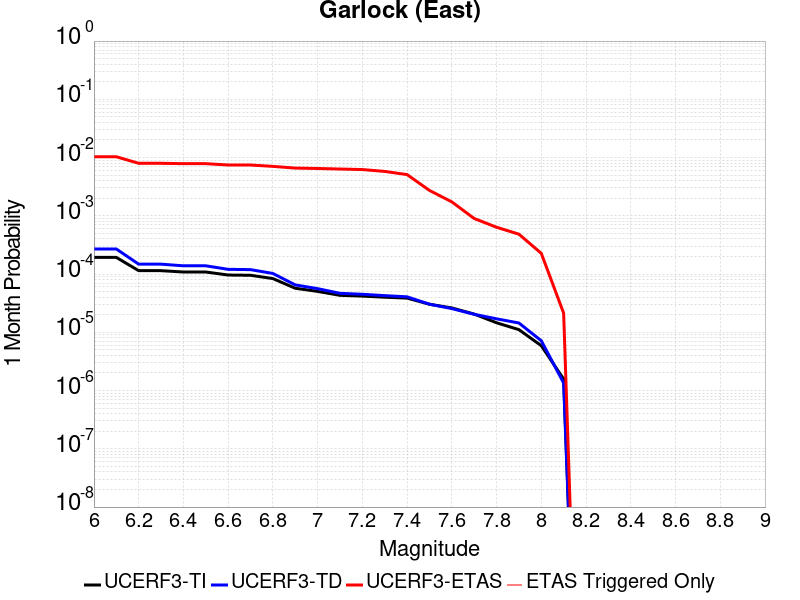 |  |  |

| Magnitude | 1 wk TI Prob | 1 wk TD Prob | 1 wk ETAS Prob | 1 wk ETAS/TD Gain | 1 wk ETAS Triggered Only | 1 mo TI Prob | 1 mo TD Prob | 1 mo ETAS Prob | 1 mo ETAS/TD Gain | 1 mo ETAS Triggered Only | 1 yr TI Prob | 1 yr TD Prob | 1 yr ETAS Prob | 1 yr ETAS/TD Gain | 1 yr ETAS Triggered Only | 10 yr TI Prob | 10 yr TD Prob | 10 yr ETAS Prob | 10 yr ETAS/TD Gain | 10 yr ETAS Triggered Only |
|-----|-----|-----|-----|-----|-----|-----|-----|-----|-----|-----|-----|-----|-----|-----|-----|-----|-----|-----|-----|-----|
| 6.0 | 4.5092507E-5 | 6.290325E-5 | 0.008972343 | 142.63719 | 0.00891 | 1.9323928E-4 | 2.6956003E-4 | 0.010336845 | 38.347103 | 0.01007 | 0.0023501497 | 0.0032774 | 0.014759644 | 4.5034614 | 0.01152 | 0.023254504 | 0.032351844 | 0.044195857 | 1.3661001 | 0.01224 |
| 6.1 | 4.5092507E-5 | 6.290325E-5 | 0.008972343 | 142.63719 | 0.00891 | 1.9323928E-4 | 2.6956003E-4 | 0.010336845 | 38.347103 | 0.01007 | 0.0023501497 | 0.0032774 | 0.014759644 | 4.5034614 | 0.01152 | 0.023254504 | 0.032351844 | 0.044195857 | 1.3661001 | 0.01224 |
| 6.2 | 2.6674514E-5 | 3.4509674E-5 | 0.0069942693 | 202.67561 | 0.00696 | 1.1431433E-4 | 1.4789042E-4 | 0.007976732 | 53.93678 | 0.00783 | 0.0013908884 | 0.0017991117 | 0.0106032435 | 5.893599 | 0.00882 | 0.01382215 | 0.017890299 | 0.027014097 | 1.5099858 | 0.00929 |
| 6.3 | 2.6674514E-5 | 3.4509674E-5 | 0.0069942693 | 202.67561 | 0.00696 | 1.1431433E-4 | 1.4789042E-4 | 0.007976732 | 53.93678 | 0.00783 | 0.0013908884 | 0.0017991117 | 0.0106032435 | 5.893599 | 0.00882 | 0.01382215 | 0.017890299 | 0.027014097 | 1.5099858 | 0.00929 |
| 6.4 | 2.5312667E-5 | 3.233893E-5 | 0.006902117 | 213.43059 | 0.00687 | 1.0847834E-4 | 1.3858822E-4 | 0.007857518 | 56.696873 | 0.00772 | 0.0013199237 | 0.0016860351 | 0.0103713665 | 6.1513352 | 0.0087 | 0.013121112 | 0.016778335 | 0.025794478 | 1.5373682 | 0.00917 |
| 6.5 | 2.5312667E-5 | 3.233893E-5 | 0.006902117 | 213.43059 | 0.00687 | 1.0847834E-4 | 1.3858822E-4 | 0.007857518 | 56.696873 | 0.00772 | 0.0013199237 | 0.0016860351 | 0.0103713665 | 6.1513352 | 0.0087 | 0.013121112 | 0.016778335 | 0.025794478 | 1.5373682 | 0.00917 |
| 6.6 | 2.246556E-5 | 2.8133776E-5 | 0.00656795 | 233.45425 | 0.00654 | 9.627742E-5 | 1.20567885E-4 | 0.007459683 | 61.871223 | 0.00734 | 0.0011715472 | 0.0014669491 | 0.009704847 | 6.615667 | 0.00825 | 0.011653901 | 0.01461866 | 0.023181625 | 1.5857557 | 0.00869 |
| 6.7 | 2.2241198E-5 | 2.7803519E-5 | 0.0065676216 | 236.21548 | 0.00654 | 9.531594E-5 | 1.1915263E-4 | 0.0074482793 | 62.510406 | 0.00733 | 0.0011598538 | 0.0014497414 | 0.009677796 | 6.6755323 | 0.00824 | 0.011538187 | 0.014448853 | 0.023003437 | 1.5920597 | 0.00868 |
| 6.8 | 1.9528685E-5 | 2.389819E-5 | 0.00622375 | 260.42767 | 0.0062 | 8.369167E-5 | 1.0241691E-4 | 0.007061704 | 68.95057 | 0.00696 | 0.0010184698 | 0.0012462323 | 0.009036511 | 7.2510653 | 0.0078 | 0.010138147 | 0.012436427 | 0.020564076 | 1.6535356 | 0.00823 |
| 6.9 | 1.3318621E-5 | 1.5198884E-5 | 0.00586511 | 385.8908 | 0.00585 | 5.7078556E-5 | 6.513648E-5 | 0.006594711 | 101.24451 | 0.00653 | 6.9470983E-4 | 7.927538E-4 | 0.008056991 | 10.163294 | 0.00727 | 0.0069254204 | 0.007939888 | 0.015548989 | 1.9583386 | 0.00767 |
| 7.0 | 1.1760853E-5 | 1.31077895E-5 | 0.005783032 | 441.1905 | 0.00577 | 5.0402683E-5 | 5.6175057E-5 | 0.0064958134 | 115.635185 | 0.00644 | 6.134799E-4 | 6.8372174E-4 | 0.007828834 | 11.45032 | 0.00715 | 0.0061178906 | 0.00685652 | 0.014344822 | 2.0921433 | 0.00754 |
| 7.1 | 1.0064758E-5 | 1.0902931E-5 | 0.0056608412 | 519.2037 | 0.00565 | 4.3133965E-5 | 4.672603E-5 | 0.006356431 | 136.0362 | 0.00631 | 5.2502943E-4 | 5.687444E-4 | 0.007554769 | 13.283241 | 0.00699 | 0.005237907 | 0.0057129986 | 0.013040894 | 2.2826705 | 0.00737 |
| 7.2 | 9.768808E-6 | 1.0498807E-5 | 0.005550441 | 528.67346 | 0.00554 | 4.186565E-5 | 4.499413E-5 | 0.006224716 | 138.34506 | 0.00618 | 5.095951E-4 | 5.4766936E-4 | 0.0074039125 | 13.518947 | 0.00686 | 0.0050842804 | 0.0055032647 | 0.012703421 | 2.3083427 | 0.00724 |
| 7.3 | 9.344516E-6 | 9.944468E-6 | 0.005129894 | 515.854 | 0.00512 | 4.004731E-5 | 4.261847E-5 | 0.0057823737 | 135.67766 | 0.00574 | 4.8746695E-4 | 5.1875977E-4 | 0.0068754605 | 13.25365 | 0.00636 | 0.0048639905 | 0.0052149445 | 0.011889952 | 2.2799768 | 0.00671 |
| 7.4 | 9.023491E-6 | 9.490661E-6 | 0.004489448 | 473.0385 | 0.00448 | 3.867153E-5 | 4.0673647E-5 | 0.0051004677 | 125.39982 | 0.00506 | 4.7072413E-4 | 4.950925E-4 | 0.0060923197 | 12.305418 | 0.0056 | 0.004697283 | 0.0049783974 | 0.010898776 | 2.1892138 | 0.00595 |
| 7.5 | 7.081253E-6 | 7.087672E-6 | 0.0023970706 | 338.20282 | 0.00239 | 3.0347876E-5 | 3.0375388E-5 | 0.0027302934 | 89.885056 | 0.0027 | 3.6942272E-4 | 3.6975832E-4 | 0.003398638 | 9.191511 | 0.00303 | 0.003688092 | 0.0037243143 | 0.006932322 | 1.8613687 | 0.00322 |
| 7.6 | 6.116396E-6 | 5.959245E-6 | 0.0015059503 | 252.70825 | 0.0015 | 2.6212863E-5 | 2.5539372E-5 | 0.0017354958 | 67.953735 | 0.00171 | 3.1909486E-4 | 3.1089774E-4 | 0.002220304 | 7.141589 | 0.00191 | 0.0031863707 | 0.0031357552 | 0.0051593897 | 1.645342 | 0.00203 |
| 7.7 | 4.797145E-6 | 4.757281E-6 | 7.6475367E-4 | 160.75436 | 7.6E-4 | 2.055903E-5 | 2.0388188E-5 | 9.0037024E-4 | 44.161366 | 8.8E-4 | 2.5027743E-4 | 2.4819805E-4 | 0.0012379524 | 4.98776 | 9.9E-4 | 0.0024999576 | 0.0025093474 | 0.0035866373 | 1.4293108 | 0.00108 |
| 7.8 | 3.4028885E-6 | 3.978462E-6 | 5.439763E-4 | 136.73032 | 5.4E-4 | 1.4583726E-5 | 1.7050439E-5 | 6.370399E-4 | 37.36208 | 6.2E-4 | 1.775424E-4 | 2.0756939E-4 | 8.774303E-4 | 4.227166 | 6.7E-4 | 0.0017740062 | 0.0021012232 | 0.0028296893 | 1.3466867 | 7.3E-4 |
| 7.9 | 2.5928412E-6 | 3.3724489E-6 | 3.9337113E-4 | 116.64258 | 3.9E-4 | 1.1112129E-5 | 1.4453272E-5 | 4.8444647E-4 | 33.518116 | 4.7E-4 | 1.3528178E-4 | 1.7595445E-4 | 6.858647E-4 | 3.8979673 | 5.1E-4 | 0.0013519945 | 0.0017812408 | 0.0023402434 | 1.3138276 | 5.6E-4 |
| 8.0 | 1.3743648E-6 | 1.6734747E-6 | 1.716732E-4 | 102.58488 | 1.7E-4 | 5.8901214E-6 | 7.1720146E-6 | 2.2717044E-4 | 31.674564 | 2.2E-4 | 7.1709874E-5 | 8.731581E-5 | 3.2729487E-4 | 3.748403 | 2.4E-4 | 7.1686733E-4 | 8.837234E-4 | 0.0011434936 | 1.2939497 | 2.6E-4 |
| 8.1 | 3.6733252E-7 | 3.1489964E-7 | 2.0314894E-5 | 64.512276 | 2.0E-5 | 1.5742813E-6 | 1.3495693E-6 | 2.1349542E-5 | 15.819523 | 2.0E-5 | 1.9166706E-5 | 1.6430899E-5 | 3.643057E-5 | 2.2171988 | 2.0E-5 | 1.9165053E-4 | 1.6638759E-4 | 1.8638426E-4 | 1.1201813 | 2.0E-5 |

## Hunter Mountain-Saline Valley
*[(top)](#table-of-contents)*

| 1 Week | 1 Month | 1 Year | 10 Year |
|-----|-----|-----|-----|
|  |  |  |  |

| Magnitude | 1 wk TI Prob | 1 wk TD Prob | 1 wk ETAS Prob | 1 wk ETAS/TD Gain | 1 wk ETAS Triggered Only | 1 mo TI Prob | 1 mo TD Prob | 1 mo ETAS Prob | 1 mo ETAS/TD Gain | 1 mo ETAS Triggered Only | 1 yr TI Prob | 1 yr TD Prob | 1 yr ETAS Prob | 1 yr ETAS/TD Gain | 1 yr ETAS Triggered Only | 10 yr TI Prob | 10 yr TD Prob | 10 yr ETAS Prob | 10 yr ETAS/TD Gain | 10 yr ETAS Triggered Only |
|-----|-----|-----|-----|-----|-----|-----|-----|-----|-----|-----|-----|-----|-----|-----|-----|-----|-----|-----|-----|-----|
| 6.0 | 4.5103672E-5 | 5.4570177E-5 | 0.0058942516 | 108.01232 | 0.00584 | 1.9328714E-4 | 2.3385242E-4 | 0.0065523745 | 28.01927 | 0.00632 | 0.002350731 | 0.0028435152 | 0.009963213 | 3.5038364 | 0.00714 | 0.023260195 | 0.028091887 | 0.03536176 | 1.2587891 | 0.00748 |
| 6.1 | 4.5103672E-5 | 5.4570177E-5 | 0.0058942516 | 108.01232 | 0.00584 | 1.9328714E-4 | 2.3385242E-4 | 0.0065523745 | 28.01927 | 0.00632 | 0.002350731 | 0.0028435152 | 0.009963213 | 3.5038364 | 0.00714 | 0.023260195 | 0.028091887 | 0.03536176 | 1.2587891 | 0.00748 |
| 6.2 | 3.9363465E-5 | 4.706337E-5 | 0.0058867885 | 125.08217 | 0.00584 | 1.6868966E-4 | 2.0168544E-4 | 0.006500415 | 32.23046 | 0.0063 | 0.002051862 | 0.0024528175 | 0.009555354 | 3.8956642 | 0.00712 | 0.020330196 | 0.024273481 | 0.0315524 | 1.2998713 | 0.00746 |
| 6.3 | 3.9363465E-5 | 4.706337E-5 | 0.0058867885 | 125.08217 | 0.00584 | 1.6868966E-4 | 2.0168544E-4 | 0.006500415 | 32.23046 | 0.0063 | 0.002051862 | 0.0024528175 | 0.009555354 | 3.8956642 | 0.00712 | 0.020330196 | 0.024273481 | 0.0315524 | 1.2998713 | 0.00746 |
| 6.4 | 3.2311684E-5 | 3.795099E-5 | 0.00586773 | 154.61336 | 0.00583 | 1.384713E-4 | 1.6263737E-4 | 0.006451614 | 39.66871 | 0.00629 | 0.0016845843 | 0.0019783843 | 0.009064338 | 4.581687 | 0.0071 | 0.016718714 | 0.019616475 | 0.026910529 | 1.3718331 | 0.00744 |
| 6.5 | 3.2311684E-5 | 3.795099E-5 | 0.00586773 | 154.61336 | 0.00583 | 1.384713E-4 | 1.6263737E-4 | 0.006451614 | 39.66871 | 0.00629 | 0.0016845843 | 0.0019783843 | 0.009064338 | 4.581687 | 0.0071 | 0.016718714 | 0.019616475 | 0.026910529 | 1.3718331 | 0.00744 |
| 6.6 | 2.9305844E-5 | 3.418183E-5 | 0.005843983 | 170.96753 | 0.00581 | 1.2559042E-4 | 1.4648569E-4 | 0.0064155674 | 43.796543 | 0.00627 | 0.0015279909 | 0.001782067 | 0.00884945 | 4.9658346 | 0.00708 | 0.015175272 | 0.01768569 | 0.024974464 | 1.4121282 | 0.00742 |
| 6.7 | 2.7826512E-5 | 3.2344276E-5 | 0.005822157 | 180.0058 | 0.00579 | 1.19251024E-4 | 1.386113E-4 | 0.006387745 | 46.08387 | 0.00625 | 0.0014509142 | 0.0016863465 | 0.00873444 | 5.179506 | 0.00706 | 0.014414776 | 0.016743187 | 0.024019286 | 1.4345708 | 0.0074 |
| 6.8 | 2.3389874E-5 | 2.6866714E-5 | 0.005796712 | 215.75812 | 0.00577 | 1.0023846E-4 | 1.15138246E-4 | 0.006344421 | 55.10264 | 0.00623 | 0.00121972 | 0.001400954 | 0.008431091 | 6.0181074 | 0.00704 | 0.01213047 | 0.013927434 | 0.02119479 | 1.5218015 | 0.00737 |
| 6.9 | 2.069209E-5 | 2.3570032E-5 | 0.005793434 | 245.79662 | 0.00577 | 8.867737E-5 | 1.01010715E-4 | 0.0063303816 | 62.670395 | 0.00623 | 0.0010791123 | 0.0012291478 | 0.008260495 | 6.7205057 | 0.00704 | 0.010738871 | 0.012228523 | 0.0195084 | 1.5953193 | 0.00737 |
| 7.0 | 1.7462342E-5 | 1.9633546E-5 | 0.0057695205 | 293.86035 | 0.00575 | 7.483646E-5 | 8.414118E-5 | 0.0062936186 | 74.79832 | 0.00621 | 9.1075303E-4 | 0.0010239601 | 0.008026782 | 7.83896 | 0.00701 | 0.009070295 | 0.0101960525 | 0.017461214 | 1.7125465 | 0.00734 |
| 7.1 | 1.4807709E-5 | 1.6441749E-5 | 0.0057563474 | 350.10553 | 0.00574 | 6.3460066E-5 | 7.046283E-5 | 0.006270026 | 88.98345 | 0.0062 | 7.723524E-4 | 8.575638E-4 | 0.007851561 | 9.155658 | 0.007 | 0.007696735 | 0.008545532 | 0.015812892 | 1.8504282 | 0.00733 |
| 7.2 | 1.4180048E-5 | 1.5698337E-5 | 0.0057556084 | 366.6381 | 0.00574 | 6.077022E-5 | 6.727694E-5 | 0.00626686 | 93.15019 | 0.0062 | 7.396263E-4 | 8.188051E-4 | 0.007813074 | 9.542043 | 0.007 | 0.0073716943 | 0.008160833 | 0.015431015 | 1.8908626 | 0.00733 |
| 7.3 | 1.3730402E-5 | 1.5172075E-5 | 0.005755085 | 379.3209 | 0.00574 | 5.8843252E-5 | 6.502165E-5 | 0.0062646186 | 96.34666 | 0.0062 | 7.161811E-4 | 7.9136714E-4 | 0.0077858274 | 9.838451 | 0.007 | 0.007138774 | 0.007888422 | 0.015160601 | 1.9218799 | 0.00733 |
| 7.4 | 1.2810095E-5 | 1.4109277E-5 | 0.005704029 | 404.2751 | 0.00569 | 5.489925E-5 | 6.0467017E-5 | 0.0062100952 | 102.70219 | 0.00615 | 6.681934E-4 | 7.359531E-4 | 0.0076708454 | 10.423009 | 0.00694 | 0.006661878 | 0.007338053 | 0.0145547055 | 1.983456 | 0.00727 |
| 7.5 | 1.1595659E-5 | 1.2800664E-5 | 0.0056427284 | 440.8153 | 0.00563 | 4.9694736E-5 | 5.4858923E-5 | 0.0061345254 | 111.823654 | 0.00608 | 6.0486543E-4 | 6.6771836E-4 | 0.007493158 | 11.2220335 | 0.00683 | 0.006032217 | 0.0066599925 | 0.013772307 | 2.0679164 | 0.00716 |
| 7.6 | 2.997694E-6 | 3.3251579E-6 | 0.002463317 | 740.812 | 0.00246 | 1.28471975E-5 | 1.425064E-5 | 0.0027542117 | 193.26933 | 0.00274 | 1.564034E-4 | 1.73495E-4 | 0.0032729572 | 18.86485 | 0.0031 | 0.0015629337 | 0.001735031 | 0.0049494444 | 2.8526547 | 0.00322 |

## Garlock (West)
*[(top)](#table-of-contents)*

| 1 Week | 1 Month | 1 Year | 10 Year |
|-----|-----|-----|-----|
|  |  |  |  |

| Magnitude | 1 wk TI Prob | 1 wk TD Prob | 1 wk ETAS Prob | 1 wk ETAS/TD Gain | 1 wk ETAS Triggered Only | 1 mo TI Prob | 1 mo TD Prob | 1 mo ETAS Prob | 1 mo ETAS/TD Gain | 1 mo ETAS Triggered Only | 1 yr TI Prob | 1 yr TD Prob | 1 yr ETAS Prob | 1 yr ETAS/TD Gain | 1 yr ETAS Triggered Only | 10 yr TI Prob | 10 yr TD Prob | 10 yr ETAS Prob | 10 yr ETAS/TD Gain | 10 yr ETAS Triggered Only |
|-----|-----|-----|-----|-----|-----|-----|-----|-----|-----|-----|-----|-----|-----|-----|-----|-----|-----|-----|-----|-----|
| 6.0 | 2.5181727E-5 | 2.51973E-5 | 0.0044650855 | 177.20491 | 0.00444 | 1.0791722E-4 | 1.0798398E-4 | 0.0051374407 | 47.575954 | 0.00503 | 0.0013131002 | 0.0013139155 | 0.0068366495 | 5.203264 | 0.00553 | 0.013053683 | 0.013141977 | 0.018855885 | 1.434783 | 0.00579 |
| 6.1 | 2.5077732E-5 | 2.5098372E-5 | 0.0044649867 | 177.89946 | 0.00444 | 1.0747157E-4 | 1.0756004E-4 | 0.005137019 | 47.759552 | 0.00503 | 0.001307681 | 0.0013087603 | 0.0068315226 | 5.219843 | 0.00553 | 0.013000126 | 0.013091032 | 0.018805236 | 1.4364974 | 0.00579 |
| 6.2 | 2.494612E-5 | 2.498005E-5 | 0.0044548693 | 178.33708 | 0.00443 | 1.0690756E-4 | 1.0705298E-4 | 0.0051265154 | 47.887646 | 0.00502 | 0.0013008224 | 0.0013025942 | 0.0068154037 | 5.2321773 | 0.00552 | 0.012932341 | 0.013030097 | 0.018734783 | 1.4378084 | 0.00578 |
| 6.3 | 2.4733758E-5 | 2.479942E-5 | 0.0044546896 | 179.62878 | 0.00443 | 1.0599751E-4 | 1.06278916E-4 | 0.005125745 | 48.229183 | 0.00502 | 0.0012897556 | 0.0012931811 | 0.006806043 | 5.2630234 | 0.00552 | 0.012822957 | 0.012937066 | 0.01864229 | 1.4409983 | 0.00578 |
| 6.4 | 2.3237335E-5 | 2.317873E-5 | 0.0044230768 | 190.8248 | 0.0044 | 9.958477E-5 | 9.933365E-5 | 0.005078839 | 51.12909 | 0.00498 | 0.0012117702 | 0.001208719 | 0.006682095 | 5.5282454 | 0.00548 | 0.012051838 | 0.012101916 | 0.017772451 | 1.4685651 | 0.00574 |
| 6.5 | 2.2732203E-5 | 2.2993298E-5 | 0.0044228924 | 192.35571 | 0.0044 | 9.742009E-5 | 9.8539E-5 | 0.0050780484 | 51.533386 | 0.00498 | 0.0011854442 | 0.0011990548 | 0.006672484 | 5.5647864 | 0.00548 | 0.011791403 | 0.012006322 | 0.017677406 | 1.4723414 | 0.00574 |
| 6.6 | 2.1319436E-5 | 2.17735E-5 | 0.004421678 | 203.07613 | 0.0044 | 9.136581E-5 | 9.331167E-5 | 0.005072847 | 54.364548 | 0.00498 | 0.001111811 | 0.0011354799 | 0.0066092573 | 5.8206735 | 0.00548 | 0.011062649 | 0.011377227 | 0.01705192 | 1.4987767 | 0.00574 |
| 6.7 | 1.970802E-5 | 2.0393396E-5 | 0.0044203037 | 216.75172 | 0.0044 | 8.446021E-5 | 8.739735E-5 | 0.005066962 | 57.976154 | 0.00498 | 0.001027818 | 0.001063545 | 0.006537717 | 6.147099 | 0.00548 | 0.010230771 | 0.010664964 | 0.016343748 | 1.532471 | 0.00574 |
| 6.8 | 1.8744462E-5 | 1.9901045E-5 | 0.004409814 | 221.58705 | 0.00439 | 8.033094E-5 | 8.5287415E-5 | 0.0050548636 | 59.268578 | 0.00497 | 9.775903E-4 | 0.0010378812 | 0.006502204 | 6.2648826 | 0.00547 | 0.009733009 | 0.01041075 | 0.016081097 | 1.5446626 | 0.00573 |
| 6.9 | 1.7559682E-5 | 1.8953415E-5 | 0.0043888707 | 231.56094 | 0.00437 | 7.5253614E-5 | 8.12264E-5 | 0.0050308243 | 61.93583 | 0.00495 | 9.158276E-4 | 9.884841E-4 | 0.0064330967 | 6.5080423 | 0.00545 | 0.0091206245 | 0.009921231 | 0.015574581 | 1.5698234 | 0.00571 |
| 7.0 | 1.6794445E-5 | 1.8216237E-5 | 0.004368137 | 239.7936 | 0.00435 | 7.197421E-5 | 7.8067256E-5 | 0.0050076824 | 64.145744 | 0.00493 | 8.759337E-4 | 9.5005584E-4 | 0.006374897 | 6.710024 | 0.00543 | 0.008724891 | 0.009540141 | 0.015175857 | 1.5907372 | 0.00569 |
| 7.1 | 1.6337795E-5 | 1.7717046E-5 | 0.00436764 | 246.52191 | 0.00435 | 7.0017246E-5 | 7.5927994E-5 | 0.004995554 | 65.79332 | 0.00492 | 8.521265E-4 | 9.240326E-4 | 0.0063390243 | 6.860174 | 0.00542 | 0.008488664 | 0.009281996 | 0.014909274 | 1.6062573 | 0.00568 |
| 7.2 | 1.5780008E-5 | 1.7165687E-5 | 0.004357091 | 253.82564 | 0.00434 | 6.762685E-5 | 7.356516E-5 | 0.004983204 | 67.73864 | 0.00491 | 8.2304585E-4 | 8.9528906E-4 | 0.0063004456 | 7.037331 | 0.00541 | 0.008200042 | 0.008996838 | 0.014605916 | 1.6234499 | 0.00566 |
| 7.3 | 1.5058865E-5 | 1.6618762E-5 | 0.004356547 | 262.14627 | 0.00434 | 6.45364E-5 | 7.122133E-5 | 0.0049808715 | 69.93511 | 0.00491 | 7.854473E-4 | 8.667759E-4 | 0.006272087 | 7.236111 | 0.00541 | 0.00782677 | 0.008713539 | 0.01432422 | 1.6439039 | 0.00566 |
| 7.4 | 1.4887923E-5 | 1.6454731E-5 | 0.004266385 | 259.28012 | 0.00425 | 6.380382E-5 | 7.051838E-5 | 0.0048901783 | 69.34615 | 0.00482 | 7.7653467E-4 | 8.582243E-4 | 0.0061736587 | 7.193526 | 0.00532 | 0.0077382675 | 0.008628399 | 0.014150339 | 1.6399727 | 0.00557 |
| 7.5 | 1.4509299E-5 | 1.6046748E-5 | 0.003985983 | 248.39818 | 0.00397 | 6.218123E-5 | 6.876997E-5 | 0.0045684604 | 66.43104 | 0.0045 | 7.567935E-4 | 8.36954E-4 | 0.0057928027 | 6.921292 | 0.00496 | 0.0075422134 | 0.008416704 | 0.013572938 | 1.612619 | 0.0052 |
| 7.6 | 1.2756717E-5 | 1.4050848E-5 | 0.0026940133 | 191.73314 | 0.00268 | 5.4670498E-5 | 6.0216535E-5 | 0.0031100328 | 51.647488 | 0.00305 | 6.6541E-4 | 7.328904E-4 | 0.0040804353 | 5.567593 | 0.00335 | 0.006634211 | 0.0073816874 | 0.010875704 | 1.4733357 | 0.00352 |
| 7.7 | 1.0328985E-5 | 1.1460557E-5 | 0.0016114422 | 140.60767 | 0.0016 | 4.4266326E-5 | 4.911575E-5 | 0.0018690263 | 38.0535 | 0.00182 | 5.388092E-4 | 5.978206E-4 | 0.0025866309 | 4.326768 | 0.00199 | 0.0053750467 | 0.006038511 | 0.00813577 | 1.3473139 | 0.00211 |
| 7.8 | 7.0306583E-6 | 8.899601E-6 | 0.0010988899 | 123.47631 | 0.00109 | 3.0131043E-5 | 3.814059E-5 | 0.0012580941 | 32.9857 | 0.00122 | 3.667837E-4 | 4.642629E-4 | 0.0017836501 | 3.8418965 | 0.00132 | 0.003661789 | 0.0046952725 | 0.0060986523 | 1.298892 | 0.00141 |
| 7.9 | 4.060633E-6 | 5.4653938E-6 | 6.154621E-4 | 112.61074 | 6.1E-4 | 1.7402595E-5 | 2.3422906E-5 | 7.234065E-4 | 30.884575 | 7.0E-4 | 2.11856E-4 | 2.851367E-4 | 0.0010349228 | 3.6295676 | 7.5E-4 | 0.0021165414 | 0.002884201 | 0.003691865 | 1.2800304 | 8.1E-4 |
| 8.0 | 1.6729537E-6 | 2.0775144E-6 | 2.2207705E-4 | 106.89555 | 2.2E-4 | 7.169782E-6 | 8.903603E-6 | 2.789012E-4 | 31.324533 | 2.7E-4 | 8.7288594E-5 | 1.0839601E-4 | 3.9836456E-4 | 3.6750853 | 2.9E-4 | 8.7254314E-4 | 0.0010969337 | 0.0014065937 | 1.282296 | 3.1E-4 |
| 8.1 | 3.6733252E-7 | 3.1489964E-7 | 2.0314894E-5 | 64.512276 | 2.0E-5 | 1.5742813E-6 | 1.3495693E-6 | 2.1349542E-5 | 15.819523 | 2.0E-5 | 1.9166706E-5 | 1.6430899E-5 | 3.643057E-5 | 2.2171988 | 2.0E-5 | 1.9165053E-4 | 1.6638759E-4 | 1.8638426E-4 | 1.1201813 | 2.0E-5 |

## Blackwater
*[(top)](#table-of-contents)*

| 1 Week | 1 Month | 1 Year | 10 Year |
|-----|-----|-----|-----|
|  |  |  |  |

| Magnitude | 1 wk TI Prob | 1 wk TD Prob | 1 wk ETAS Prob | 1 wk ETAS/TD Gain | 1 wk ETAS Triggered Only | 1 mo TI Prob | 1 mo TD Prob | 1 mo ETAS Prob | 1 mo ETAS/TD Gain | 1 mo ETAS Triggered Only | 1 yr TI Prob | 1 yr TD Prob | 1 yr ETAS Prob | 1 yr ETAS/TD Gain | 1 yr ETAS Triggered Only | 10 yr TI Prob | 10 yr TD Prob | 10 yr ETAS Prob | 10 yr ETAS/TD Gain | 10 yr ETAS Triggered Only |
|-----|-----|-----|-----|-----|-----|-----|-----|-----|-----|-----|-----|-----|-----|-----|-----|-----|-----|-----|-----|-----|
| 6.0 | 3.0708583E-5 | 3.3095846E-5 | 0.0035829784 | 108.26066 | 0.00355 | 1.3160157E-4 | 1.4183241E-4 | 0.0043012425 | 30.326231 | 0.00416 | 0.0016010714 | 0.0017255784 | 0.0066470713 | 3.852083 | 0.00493 | 0.015895851 | 0.017135633 | 0.0223743 | 1.3057177 | 0.00533 |
| 6.1 | 3.0708583E-5 | 3.3095846E-5 | 0.0035829784 | 108.26066 | 0.00355 | 1.3160157E-4 | 1.4183241E-4 | 0.0043012425 | 30.326231 | 0.00416 | 0.0016010714 | 0.0017255784 | 0.0066470713 | 3.852083 | 0.00493 | 0.015895851 | 0.017135633 | 0.0223743 | 1.3057177 | 0.00533 |
| 6.2 | 1.1707779E-5 | 1.2545122E-5 | 0.0013525283 | 107.81309 | 0.00134 | 5.017523E-5 | 5.3763757E-5 | 0.0016136799 | 30.01427 | 0.00156 | 6.107122E-4 | 6.5438676E-4 | 0.0024432153 | 3.7335954 | 0.00179 | 0.006090366 | 0.0065255696 | 0.008423106 | 1.2907847 | 0.00191 |
| 6.3 | 1.1707779E-5 | 1.2545122E-5 | 0.0013525283 | 107.81309 | 0.00134 | 5.017523E-5 | 5.3763757E-5 | 0.0016136799 | 30.01427 | 0.00156 | 6.107122E-4 | 6.5438676E-4 | 0.0024432153 | 3.7335954 | 0.00179 | 0.006090366 | 0.0065255696 | 0.008423106 | 1.2907847 | 0.00191 |
| 6.4 | 7.929244E-6 | 8.480098E-6 | 8.784727E-4 | 103.592285 | 8.7E-4 | 3.3982033E-5 | 3.6342793E-5 | 0.0010363065 | 28.51477 | 0.001 | 4.136527E-4 | 4.423877E-4 | 0.0016018746 | 3.6209743 | 0.00116 | 0.0041288356 | 0.0044154758 | 0.005640045 | 1.2773356 | 0.00123 |
| 6.5 | 5.8832115E-6 | 6.285991E-6 | 5.762824E-4 | 91.67726 | 5.7E-4 | 2.521352E-5 | 2.6939697E-5 | 6.569227E-4 | 24.384933 | 6.3E-4 | 3.0693135E-4 | 3.27944E-4 | 0.0010776981 | 3.2862258 | 7.5E-4 | 0.0030650778 | 0.0032748538 | 0.0040622666 | 1.2404422 | 7.9E-4 |
| 6.6 | 5.8832115E-6 | 6.285991E-6 | 5.762824E-4 | 91.67726 | 5.7E-4 | 2.521352E-5 | 2.6939697E-5 | 6.569227E-4 | 24.384933 | 6.3E-4 | 3.0693135E-4 | 3.27944E-4 | 0.0010776981 | 3.2862258 | 7.5E-4 | 0.0030650778 | 0.0032748538 | 0.0040622666 | 1.2404422 | 7.9E-4 |
| 6.7 | 3.0715053E-6 | 3.2814662E-6 | 2.632806E-4 | 80.23261 | 2.6E-4 | 1.3163528E-5 | 1.4063357E-5 | 2.9405943E-4 | 20.909618 | 2.8E-4 | 1.6025416E-4 | 1.7120909E-4 | 4.7115772E-4 | 2.7519433 | 3.0E-4 | 0.0016013865 | 0.0017108864 | 0.0020303389 | 1.1867175 | 3.2E-4 |
| 6.8 | 2.2722281E-6 | 2.4287538E-6 | 1.5242839E-4 | 62.759922 | 1.5E-4 | 9.738084E-6 | 1.0408908E-5 | 1.8040714E-4 | 17.331995 | 1.7E-4 | 1.1855473E-4 | 1.26722E-4 | 3.066992E-4 | 2.420252 | 1.8E-4 | 0.001184915 | 0.0012665876 | 0.001456347 | 1.1498194 | 1.9E-4 |
| 6.9 | 9.952399E-7 | 1.0653489E-6 | 4.1065305E-5 | 38.546345 | 4.0E-5 | 4.265307E-6 | 4.5657757E-6 | 4.4565593E-5 | 9.760794 | 4.0E-5 | 5.1928873E-5 | 5.5587418E-5 | 1.0558464E-4 | 1.8994341 | 5.0E-5 | 5.191674E-4 | 5.557858E-4 | 6.05758E-4 | 1.0899128 | 5.0E-5 |
| 7.0 | 4.7385504E-7 | 5.0755597E-7 | 3.0507541E-5 | 60.106754 | 3.0E-5 | 2.0308057E-6 | 2.1752398E-6 | 3.2175176E-5 | 14.7915535 | 3.0E-5 | 2.4724779E-5 | 2.6483543E-5 | 5.648275E-5 | 2.1327488 | 3.0E-5 | 2.4722028E-4 | 2.6483546E-4 | 2.948275E-4 | 1.1132479 | 3.0E-5 |

## Ash Hill
*[(top)](#table-of-contents)*

| 1 Week | 1 Month | 1 Year | 10 Year |
|-----|-----|-----|-----|
|  |  |  |  |

| Magnitude | 1 wk TI Prob | 1 wk TD Prob | 1 wk ETAS Prob | 1 wk ETAS/TD Gain | 1 wk ETAS Triggered Only | 1 mo TI Prob | 1 mo TD Prob | 1 mo ETAS Prob | 1 mo ETAS/TD Gain | 1 mo ETAS Triggered Only | 1 yr TI Prob | 1 yr TD Prob | 1 yr ETAS Prob | 1 yr ETAS/TD Gain | 1 yr ETAS Triggered Only | 10 yr TI Prob | 10 yr TD Prob | 10 yr ETAS Prob | 10 yr ETAS/TD Gain | 10 yr ETAS Triggered Only |
|-----|-----|-----|-----|-----|-----|-----|-----|-----|-----|-----|-----|-----|-----|-----|-----|-----|-----|-----|-----|-----|
| 6.0 | 2.1545662E-5 | 2.3194447E-5 | 0.0029931255 | 129.04492 | 0.00297 | 9.2335285E-5 | 9.940143E-5 | 0.0035990535 | 36.20726 | 0.0035 | 0.0011236023 | 0.0012096206 | 0.005204782 | 4.302822 | 0.004 | 0.011179381 | 0.012038348 | 0.016207546 | 1.3463265 | 0.00422 |
| 6.1 | 2.1545662E-5 | 2.3194447E-5 | 0.0029931255 | 129.04492 | 0.00297 | 9.2335285E-5 | 9.940143E-5 | 0.0035990535 | 36.20726 | 0.0035 | 0.0011236023 | 0.0012096206 | 0.005204782 | 4.302822 | 0.004 | 0.011179381 | 0.012038348 | 0.016207546 | 1.3463265 | 0.00422 |
| 6.2 | 2.1545662E-5 | 2.3194447E-5 | 0.0029931255 | 129.04492 | 0.00297 | 9.2335285E-5 | 9.940143E-5 | 0.0035990535 | 36.20726 | 0.0035 | 0.0011236023 | 0.0012096206 | 0.005204782 | 4.302822 | 0.004 | 0.011179381 | 0.012038348 | 0.016207546 | 1.3463265 | 0.00422 |
| 6.3 | 1.0025529E-5 | 1.0746934E-5 | 0.001220734 | 113.589035 | 0.00121 | 4.2965847E-5 | 4.605755E-5 | 0.0014159945 | 30.744024 | 0.00137 | 5.229836E-4 | 5.6061964E-4 | 0.0021497284 | 3.8345575 | 0.00159 | 0.005217545 | 0.0055933665 | 0.0072440812 | 1.2951201 | 0.00166 |
| 6.4 | 1.0025529E-5 | 1.0746934E-5 | 0.001220734 | 113.589035 | 0.00121 | 4.2965847E-5 | 4.605755E-5 | 0.0014159945 | 30.744024 | 0.00137 | 5.229836E-4 | 5.6061964E-4 | 0.0021497284 | 3.8345575 | 0.00159 | 0.005217545 | 0.0055933665 | 0.0072440812 | 1.2951201 | 0.00166 |
| 6.5 | 6.9617327E-6 | 7.456634E-6 | 8.7745016E-4 | 117.67376 | 8.7E-4 | 2.9835655E-5 | 3.195666E-5 | 0.001021925 | 31.978468 | 9.9E-4 | 3.6318856E-4 | 3.8901155E-4 | 0.001518572 | 3.9036682 | 0.00113 | 0.0036259557 | 0.0038841602 | 0.0050396547 | 1.2974888 | 0.00116 |
| 6.6 | 4.9919777E-6 | 5.3466883E-6 | 6.6534313E-4 | 124.44024 | 6.6E-4 | 2.1394015E-5 | 2.2914215E-5 | 7.5289747E-4 | 32.857224 | 7.3E-4 | 2.60441E-4 | 2.7895154E-4 | 0.00110872 | 3.974597 | 8.3E-4 | 0.0026013597 | 0.0027866727 | 0.003634304 | 1.3041732 | 8.5E-4 |
| 6.7 | 3.6630722E-6 | 3.924624E-6 | 4.939227E-4 | 125.85224 | 4.9E-4 | 1.5698786E-5 | 1.681974E-5 | 5.5681064E-4 | 33.104595 | 5.4E-4 | 1.9111596E-4 | 2.0476682E-4 | 8.0464396E-4 | 3.929562 | 6.0E-4 | 0.0019095168 | 0.0020463446 | 0.0026650757 | 1.3023593 | 6.2E-4 |
| 6.8 | 2.5599613E-6 | 2.744925E-6 | 3.827439E-4 | 139.43692 | 3.8E-4 | 1.0971216E-5 | 1.1763939E-5 | 4.2175912E-4 | 35.85186 | 4.1E-4 | 1.3356637E-4 | 1.4322149E-4 | 6.131542E-4 | 4.2811604 | 4.7E-4 | 0.0013348613 | 0.0014317769 | 0.0019210753 | 1.341742 | 4.9E-4 |
| 6.9 | 1.7684905E-6 | 1.8968707E-6 | 2.8189633E-4 | 148.61125 | 2.8E-4 | 7.579223E-6 | 8.129446E-6 | 3.1812693E-4 | 39.13267 | 3.1E-4 | 9.2273134E-5 | 9.8976E-5 | 4.4894137E-4 | 4.5358605 | 3.5E-4 | 9.223483E-4 | 9.8976E-4 | 0.0013494038 | 1.3633646 | 3.6E-4 |

## Gravel Hills-Harper Lk
*[(top)](#table-of-contents)*

| 1 Week | 1 Month | 1 Year | 10 Year |
|-----|-----|-----|-----|
|  | 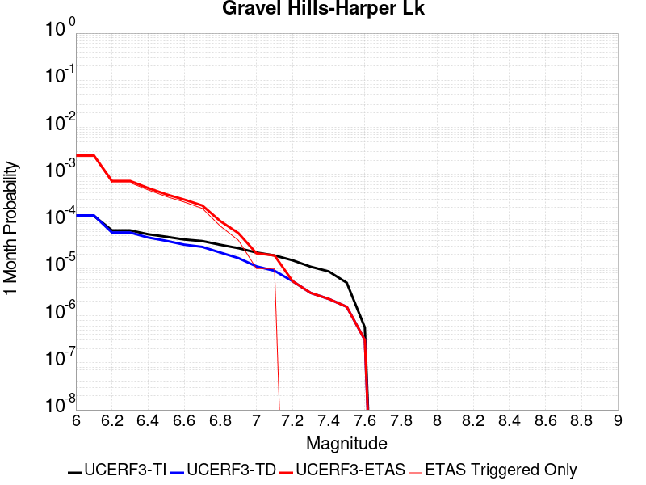 |  |  |

| Magnitude | 1 wk TI Prob | 1 wk TD Prob | 1 wk ETAS Prob | 1 wk ETAS/TD Gain | 1 wk ETAS Triggered Only | 1 mo TI Prob | 1 mo TD Prob | 1 mo ETAS Prob | 1 mo ETAS/TD Gain | 1 mo ETAS Triggered Only | 1 yr TI Prob | 1 yr TD Prob | 1 yr ETAS Prob | 1 yr ETAS/TD Gain | 1 yr ETAS Triggered Only | 10 yr TI Prob | 10 yr TD Prob | 10 yr ETAS Prob | 10 yr ETAS/TD Gain | 10 yr ETAS Triggered Only |
|-----|-----|-----|-----|-----|-----|-----|-----|-----|-----|-----|-----|-----|-----|-----|-----|-----|-----|-----|-----|-----|
| 6.0 | 3.0679566E-5 | 3.1464646E-5 | 0.0021913967 | 69.64632 | 0.00216 | 1.3147724E-4 | 1.3484273E-4 | 0.0025345192 | 18.796112 | 0.0024 | 0.0015995599 | 0.0016406906 | 0.0044660475 | 2.7220533 | 0.00283 | 0.015880952 | 0.01630734 | 0.019317439 | 1.1845856 | 0.00306 |
| 6.1 | 3.0679566E-5 | 3.1464646E-5 | 0.0021913967 | 69.64632 | 0.00216 | 1.3147724E-4 | 1.3484273E-4 | 0.0025345192 | 18.796112 | 0.0024 | 0.0015995599 | 0.0016406906 | 0.0044660475 | 2.7220533 | 0.00283 | 0.015880952 | 0.01630734 | 0.019317439 | 1.1845856 | 0.00306 |
| 6.2 | 1.514536E-5 | 1.3635206E-5 | 5.8362744E-4 | 42.802975 | 5.7E-4 | 6.490707E-5 | 5.843536E-5 | 7.2839623E-4 | 12.464991 | 6.7E-4 | 7.8995706E-4 | 7.1123015E-4 | 0.0015106612 | 2.1240118 | 8.0E-4 | 0.007871548 | 0.0070907404 | 0.007944643 | 1.120425 | 8.6E-4 |
| 6.3 | 1.514536E-5 | 1.3635206E-5 | 5.8362744E-4 | 42.802975 | 5.7E-4 | 6.490707E-5 | 5.843536E-5 | 7.2839623E-4 | 12.464991 | 6.7E-4 | 7.8995706E-4 | 7.1123015E-4 | 0.0015106612 | 2.1240118 | 8.0E-4 | 0.007871548 | 0.0070907404 | 0.007944643 | 1.120425 | 8.6E-4 |
| 6.4 | 1.2532521E-5 | 1.06896905E-5 | 4.106854E-4 | 38.41883 | 4.0E-4 | 5.37097E-5 | 4.581219E-5 | 5.1579066E-4 | 11.258808 | 4.7E-4 | 6.537194E-4 | 5.576265E-4 | 0.001087331 | 1.949927 | 5.3E-4 | 0.0065179965 | 0.005562863 | 0.0061396365 | 1.1036829 | 5.8E-4 |
| 6.5 | 1.1094058E-5 | 9.083664E-6 | 3.0908093E-4 | 34.026024 | 3.0E-4 | 4.7545094E-5 | 3.892943E-5 | 3.789162E-4 | 9.733413 | 3.4E-4 | 5.787078E-4 | 4.7386673E-4 | 8.6368195E-4 | 1.8226262 | 3.9E-4 | 0.0057720304 | 0.0047289706 | 0.005127079 | 1.084185 | 4.0E-4 |
| 6.6 | 9.688328E-6 | 7.5316952E-6 | 2.4752988E-4 | 32.865097 | 2.4E-4 | 4.1520743E-5 | 3.227831E-5 | 2.9226992E-4 | 9.054685 | 2.6E-4 | 5.053978E-4 | 3.9292008E-4 | 6.8280613E-4 | 1.7377735 | 2.9E-4 | 0.0050424994 | 0.0039225104 | 0.004211373 | 1.0736423 | 2.9E-4 |
| 6.7 | 8.974824E-6 | 6.749413E-6 | 1.7674826E-4 | 26.187206 | 1.7E-4 | 3.8462964E-5 | 2.8925748E-5 | 2.1892025E-4 | 7.5683527 | 1.9E-4 | 4.6818596E-4 | 3.5211627E-4 | 5.720388E-4 | 1.6245736 | 2.2E-4 | 0.004672008 | 0.0035158044 | 0.003735031 | 1.0623546 | 2.2E-4 |
| 6.8 | 7.4780046E-6 | 5.1161933E-6 | 8.511578E-5 | 16.636545 | 8.0E-5 | 3.20482E-5 | 2.1926366E-5 | 1.0192461E-4 | 4.648495 | 8.0E-5 | 3.9011694E-4 | 2.669222E-4 | 3.7689283E-4 | 1.411995 | 1.1E-4 | 0.0038943281 | 0.0026661542 | 0.002775861 | 1.041148 | 1.1E-4 |
| 6.9 | 6.3409307E-6 | 3.9074966E-6 | 4.390734E-5 | 11.236692 | 4.0E-5 | 2.7175134E-5 | 1.6746313E-5 | 5.6745645E-5 | 3.3885455 | 4.0E-5 | 3.3080703E-4 | 2.0386827E-4 | 2.73854E-4 | 1.343289 | 7.0E-5 | 0.0033031502 | 0.0020369107 | 0.002106768 | 1.0342958 | 7.0E-5 |
| 7.0 | 5.1239335E-6 | 2.6058565E-6 | 1.260583E-5 | 4.8375 | 1.0E-5 | 2.195953E-5 | 1.116791E-5 | 2.1167798E-5 | 1.8954127 | 1.0E-5 | 2.6732447E-4 | 1.3596108E-4 | 1.65957E-4 | 1.2206213 | 3.0E-5 | 0.0026700313 | 0.0013588042 | 0.0013887634 | 1.0220482 | 3.0E-5 |
| 7.1 | 4.438899E-6 | 2.0984728E-6 | 1.2098451E-5 | 5.7653604 | 1.0E-5 | 1.9023713E-5 | 8.993425E-6 | 1.8993334E-5 | 2.1119134 | 1.0E-5 | 2.315891E-4 | 1.0948967E-4 | 1.3948638E-4 | 1.2739685 | 3.0E-5 | 0.002313479 | 0.0010943791 | 0.0011243463 | 1.0273829 | 3.0E-5 |
| 7.2 | 3.50367E-6 | 1.2615716E-6 | 1.2615716E-6 | 1.0 | 0.0 | 1.5015643E-5 | 5.4067245E-6 | 5.4067245E-6 | 1.0 | 0.0 | 1.8280011E-4 | 6.582497E-5 | 8.582365E-5 | 1.3038161 | 2.0E-5 | 0.0018264982 | 6.580629E-4 | 6.7804975E-4 | 1.0303723 | 2.0E-5 |
| 7.3 | 2.561638E-6 | 7.1191585E-7 | 7.1191585E-7 | 1.0 | 0.0 | 1.0978401E-5 | 3.0510646E-6 | 3.0510646E-6 | 1.0 | 0.0 | 1.3365384E-4 | 3.71461E-5 | 5.7145353E-5 | 1.5383946 | 2.0E-5 | 0.0013357349 | 3.7140088E-4 | 3.9139346E-4 | 1.0538301 | 2.0E-5 |
| 7.4 | 2.0368864E-6 | 5.304837E-7 | 5.304837E-7 | 1.0 | 0.0 | 8.729483E-6 | 2.2734996E-6 | 2.2734996E-6 | 1.0 | 0.0 | 1.06276275E-4 | 2.7679513E-5 | 3.7679238E-5 | 1.361268 | 1.0E-5 | 0.0010622547 | 2.767612E-4 | 2.867584E-4 | 1.0361222 | 1.0E-5 |
| 7.5 | 1.1681728E-6 | 3.6030585E-7 | 3.6030585E-7 | 1.0 | 0.0 | 5.0064455E-6 | 1.544167E-6 | 1.544167E-6 | 1.0 | 0.0 | 6.0951766E-5 | 1.8800076E-5 | 1.8800076E-5 | 1.0 | 0.0 | 6.093505E-4 | 1.8798532E-4 | 1.8798532E-4 | 1.0 | 0.0 |
| 7.6 | 1.3154387E-7 | 7.1197384E-8 | 7.1197384E-8 | 1.0 | 0.0 | 5.6375933E-7 | 3.051316E-7 | 3.051316E-7 | 1.0 | 0.0 | 6.863748E-6 | 3.7149728E-6 | 3.7149728E-6 | 1.0 | 0.0 | 6.863536E-5 | 3.7149264E-5 | 3.7149264E-5 | 1.0 | 0.0 |

## McLean Lake
*[(top)](#table-of-contents)*

| 1 Week | 1 Month | 1 Year | 10 Year |
|-----|-----|-----|-----|
|  |  | 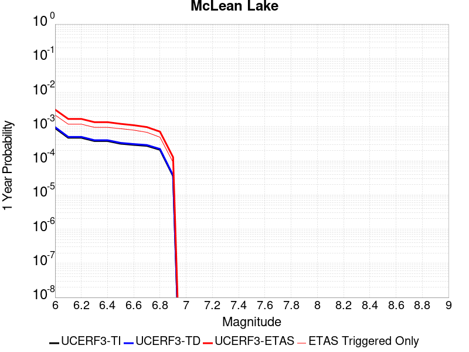 |  |

| Magnitude | 1 wk TI Prob | 1 wk TD Prob | 1 wk ETAS Prob | 1 wk ETAS/TD Gain | 1 wk ETAS Triggered Only | 1 mo TI Prob | 1 mo TD Prob | 1 mo ETAS Prob | 1 mo ETAS/TD Gain | 1 mo ETAS Triggered Only | 1 yr TI Prob | 1 yr TD Prob | 1 yr ETAS Prob | 1 yr ETAS/TD Gain | 1 yr ETAS Triggered Only | 10 yr TI Prob | 10 yr TD Prob | 10 yr ETAS Prob | 10 yr ETAS/TD Gain | 10 yr ETAS Triggered Only |
|-----|-----|-----|-----|-----|-----|-----|-----|-----|-----|-----|-----|-----|-----|-----|-----|-----|-----|-----|-----|-----|
| 6.0 | 1.7360222E-5 | 1.8501627E-5 | 0.0014884744 | 80.451 | 0.00147 | 7.439883E-5 | 7.9290556E-5 | 0.0019191446 | 24.20395 | 0.00184 | 9.0542925E-4 | 9.6498354E-4 | 0.0031428798 | 3.2569258 | 0.00218 | 0.009017491 | 0.0096127745 | 0.0119798 | 1.2462375 | 0.00239 |
| 6.1 | 9.062689E-6 | 9.592193E-6 | 8.195844E-4 | 85.442856 | 8.1E-4 | 3.8839516E-5 | 4.1108804E-5 | 0.0010210685 | 24.838196 | 9.8E-4 | 4.727685E-4 | 5.003936E-4 | 0.0016798031 | 3.3569636 | 0.00118 | 0.0047176396 | 0.004993552 | 0.00628706 | 1.2590357 | 0.0013 |
| 6.2 | 9.062689E-6 | 9.592193E-6 | 8.195844E-4 | 85.442856 | 8.1E-4 | 3.8839516E-5 | 4.1108804E-5 | 0.0010210685 | 24.838196 | 9.8E-4 | 4.727685E-4 | 5.003936E-4 | 0.0016798031 | 3.3569636 | 0.00118 | 0.0047176396 | 0.004993552 | 0.00628706 | 1.2590357 | 0.0013 |
| 6.3 | 7.2575485E-6 | 7.66771E-6 | 6.376629E-4 | 83.16211 | 6.3E-4 | 3.110341E-5 | 3.2861237E-5 | 8.028359E-4 | 24.431093 | 7.7E-4 | 3.786182E-4 | 4.0001926E-4 | 0.0013496393 | 3.3739357 | 9.5E-4 | 0.0037797375 | 0.0039936965 | 0.0050395033 | 1.2618643 | 0.00105 |
| 6.4 | 7.2575485E-6 | 7.66771E-6 | 6.376629E-4 | 83.16211 | 6.3E-4 | 3.110341E-5 | 3.2861237E-5 | 8.028359E-4 | 24.431093 | 7.7E-4 | 3.786182E-4 | 4.0001926E-4 | 0.0013496393 | 3.3739357 | 9.5E-4 | 0.0037797375 | 0.0039936965 | 0.0050395033 | 1.2618643 | 0.00105 |
| 6.5 | 6.06582E-6 | 6.4038773E-6 | 6.064E-4 | 94.69264 | 6.0E-4 | 2.5996113E-5 | 2.7444936E-5 | 7.574249E-4 | 27.597984 | 7.3E-4 | 3.164567E-4 | 3.3409733E-4 | 0.0012038067 | 3.6031616 | 8.7E-4 | 0.0031600643 | 0.0033365893 | 0.004293386 | 1.286759 | 9.6E-4 |
| 6.6 | 5.598744E-6 | 5.910262E-6 | 5.4590707E-4 | 92.36597 | 5.4E-4 | 2.3994397E-5 | 2.5329486E-5 | 6.953125E-4 | 27.450716 | 6.7E-4 | 2.9209262E-4 | 3.0834923E-4 | 0.0010981057 | 3.56124 | 7.9E-4 | 0.0029170897 | 0.003079843 | 0.0039371946 | 1.278375 | 8.6E-4 |
| 6.7 | 5.246996E-6 | 5.539162E-6 | 4.4553672E-4 | 80.43396 | 4.4E-4 | 2.2486933E-5 | 2.3739085E-5 | 5.837258E-4 | 24.589228 | 5.6E-4 | 2.73744E-4 | 2.8899137E-4 | 9.6879486E-4 | 3.3523314 | 6.8E-4 | 0.0027340704 | 0.0028867796 | 0.0036346146 | 1.259055 | 7.5E-4 |
| 6.8 | 4.02324E-6 | 4.2469046E-6 | 3.2424554E-4 | 76.34868 | 3.2E-4 | 1.7242342E-5 | 1.8200926E-5 | 4.2819345E-4 | 23.525917 | 4.1E-4 | 2.099053E-4 | 2.2157968E-4 | 7.1147113E-4 | 3.2109041 | 4.9E-4 | 0.0020970714 | 0.002214172 | 0.0027529763 | 1.2433435 | 5.4E-4 |
| 6.9 | 6.835972E-7 | 7.1399285E-7 | 5.0713956E-5 | 71.02866 | 5.0E-5 | 2.9296991E-6 | 3.0599674E-6 | 8.305972E-5 | 27.14399 | 8.0E-5 | 3.56685E-5 | 3.7254784E-5 | 1.2725143E-4 | 3.415707 | 9.0E-5 | 3.5662777E-4 | 3.7251666E-4 | 4.6248312E-4 | 1.2415099 | 9.0E-5 |

## San Andreas (Mojave S)
*[(top)](#table-of-contents)*

| 1 Week | 1 Month | 1 Year | 10 Year |
|-----|-----|-----|-----|
|  |  |  |  |

| Magnitude | 1 wk TI Prob | 1 wk TD Prob | 1 wk ETAS Prob | 1 wk ETAS/TD Gain | 1 wk ETAS Triggered Only | 1 mo TI Prob | 1 mo TD Prob | 1 mo ETAS Prob | 1 mo ETAS/TD Gain | 1 mo ETAS Triggered Only | 1 yr TI Prob | 1 yr TD Prob | 1 yr ETAS Prob | 1 yr ETAS/TD Gain | 1 yr ETAS Triggered Only | 10 yr TI Prob | 10 yr TD Prob | 10 yr ETAS Prob | 10 yr ETAS/TD Gain | 10 yr ETAS Triggered Only |
|-----|-----|-----|-----|-----|-----|-----|-----|-----|-----|-----|-----|-----|-----|-----|-----|-----|-----|-----|-----|-----|
| 6.0 | 3.1064058E-4 | 6.7460834E-4 | 0.0024134344 | 3.5775344 | 0.00174 | 0.0013306376 | 0.0028881032 | 0.004872356 | 1.6870435 | 0.00199 | 0.016080605 | 0.03462235 | 0.036736526 | 1.0610639 | 0.00219 | 0.1496549 | 0.28660452 | 0.288281 | 1.0058495 | 0.00235 |
| 6.1 | 3.1064058E-4 | 6.7460834E-4 | 0.0024134344 | 3.5775344 | 0.00174 | 0.0013306376 | 0.0028881032 | 0.004872356 | 1.6870435 | 0.00199 | 0.016080605 | 0.03462235 | 0.036736526 | 1.0610639 | 0.00219 | 0.1496549 | 0.28660452 | 0.288281 | 1.0058495 | 0.00235 |
| 6.2 | 3.1064058E-4 | 6.7460834E-4 | 0.0024134344 | 3.5775344 | 0.00174 | 0.0013306376 | 0.0028881032 | 0.004872356 | 1.6870435 | 0.00199 | 0.016080605 | 0.03462235 | 0.036736526 | 1.0610639 | 0.00219 | 0.1496549 | 0.28660452 | 0.288281 | 1.0058495 | 0.00235 |
| 6.3 | 3.1064058E-4 | 6.7460834E-4 | 0.0024134344 | 3.5775344 | 0.00174 | 0.0013306376 | 0.0028881032 | 0.004872356 | 1.6870435 | 0.00199 | 0.016080605 | 0.03462235 | 0.036736526 | 1.0610639 | 0.00219 | 0.1496549 | 0.28660452 | 0.288281 | 1.0058495 | 0.00235 |
| 6.4 | 1.9872203E-4 | 4.3179357E-4 | 0.0020410984 | 4.7270236 | 0.00161 | 8.5138786E-4 | 0.0018492596 | 0.003665894 | 1.9823576 | 0.00182 | 0.010316478 | 0.02228844 | 0.024243863 | 1.0877327 | 0.002 | 0.098504856 | 0.19699748 | 0.1987159 | 1.0087231 | 0.00214 |
| 6.5 | 1.291105E-4 | 2.875267E-4 | 0.0017471069 | 6.076329 | 0.00146 | 5.5321335E-4 | 0.0012316781 | 0.0028896334 | 2.3460948 | 0.00166 | 0.006714592 | 0.0148934 | 0.016686294 | 1.1203818 | 0.00182 | 0.065152965 | 0.13803436 | 0.1397152 | 1.0121769 | 0.00195 |
| 6.6 | 1.291105E-4 | 2.875267E-4 | 0.0017471069 | 6.076329 | 0.00146 | 5.5321335E-4 | 0.0012316781 | 0.0028896334 | 2.3460948 | 0.00166 | 0.006714592 | 0.0148934 | 0.016686294 | 1.1203818 | 0.00182 | 0.065152965 | 0.13803436 | 0.1397152 | 1.0121769 | 0.00195 |
| 6.7 | 1.08001186E-4 | 2.4333889E-4 | 0.001692986 | 6.9573183 | 0.00145 | 4.6278012E-4 | 0.0010424647 | 0.0026907446 | 2.5811374 | 0.00165 | 0.0056198016 | 0.012618446 | 0.014405606 | 1.1416308 | 0.00181 | 0.054797906 | 0.119176775 | 0.12087677 | 1.0142645 | 0.00193 |
| 6.8 | 1.0624356E-4 | 2.3851555E-4 | 0.0016881697 | 7.0778184 | 0.00145 | 4.5525006E-4 | 0.0010218095 | 0.0026601339 | 2.6033556 | 0.00164 | 0.0055285925 | 0.012369843 | 0.014147578 | 1.1437151 | 0.0018 | 0.053930566 | 0.11712591 | 0.11882103 | 1.0144726 | 0.00192 |
| 6.9 | 1.0393785E-4 | 2.3221898E-4 | 0.0016818823 | 7.242656 | 0.00145 | 4.4537184E-4 | 9.948451E-4 | 0.0026332135 | 2.6468577 | 0.00164 | 0.0054089287 | 0.012045221 | 0.01382354 | 1.1476369 | 0.0018 | 0.05279156 | 0.11442335 | 0.11612366 | 1.0148598 | 0.00192 |
| 7.0 | 1.0155622E-4 | 2.2591476E-4 | 0.0016755871 | 7.4169 | 0.00145 | 4.3516833E-4 | 9.6784724E-4 | 0.00260626 | 2.6928422 | 0.00164 | 0.005285311 | 0.0117200995 | 0.013499004 | 1.1517823 | 0.0018 | 0.05161361 | 0.111683756 | 0.11338932 | 1.0152714 | 0.00192 |
| 7.1 | 9.885595E-5 | 2.1879886E-4 | 0.0016684816 | 7.6256413 | 0.00145 | 4.2359953E-4 | 9.3737274E-4 | 0.0025758354 | 2.7479308 | 0.00164 | 0.0051451353 | 0.011352993 | 0.013132557 | 1.1567485 | 0.0018 | 0.05027629 | 0.1085682 | 0.110279754 | 1.0157647 | 0.00192 |
| 7.2 | 9.6411415E-5 | 2.124288E-4 | 0.0016621208 | 7.824366 | 0.00145 | 4.1312634E-4 | 9.1009185E-4 | 0.0025485994 | 2.800376 | 0.00164 | 0.005018219 | 0.011024255 | 0.012804412 | 1.1614764 | 0.0018 | 0.049064007 | 0.105758004 | 0.107466005 | 1.0161501 | 0.00191 |
| 7.3 | 9.1180635E-5 | 1.9471257E-4 | 0.0016344322 | 8.394076 | 0.00144 | 3.907156E-4 | 8.342157E-4 | 0.002462856 | 2.952301 | 0.00163 | 0.004746591 | 0.01010939 | 0.011871395 | 1.1742939 | 0.00178 | 0.046464786 | 0.09795115 | 0.09965602 | 1.0174054 | 0.00189 |
| 7.4 | 8.887388E-5 | 1.8719878E-4 | 0.001616931 | 8.637508 | 0.00143 | 3.8083247E-4 | 8.020339E-4 | 0.0024207346 | 3.0182447 | 0.00162 | 0.0046267817 | 0.00972114 | 0.011473934 | 1.1803074 | 0.00177 | 0.045316286 | 0.09458615 | 0.09628832 | 1.0179961 | 0.00188 |
| 7.5 | 8.6750515E-5 | 1.8051457E-4 | 0.0016102564 | 8.920368 | 0.00143 | 3.7173493E-4 | 7.7340455E-4 | 0.0023921516 | 3.0930147 | 0.00162 | 0.004516484 | 0.009375632 | 0.0111290375 | 1.1870173 | 0.00177 | 0.04425787 | 0.091549896 | 0.09325778 | 1.0186553 | 0.00188 |
| 7.6 | 8.453092E-5 | 1.7439072E-4 | 0.0016041413 | 9.198547 | 0.00143 | 3.6222505E-4 | 7.471748E-4 | 0.0023659645 | 3.1665473 | 0.00162 | 0.0044011753 | 0.009058985 | 0.01081295 | 1.1936162 | 0.00177 | 0.04315024 | 0.08870898 | 0.090422206 | 1.0193129 | 0.00188 |
| 7.7 | 8.259102E-5 | 1.6961215E-4 | 0.0015893714 | 9.370622 | 0.00142 | 3.539135E-4 | 7.2670676E-4 | 0.0023355368 | 3.213864 | 0.00161 | 0.004300386 | 0.008811831 | 0.010556322 | 1.1979715 | 0.00176 | 0.042181134 | 0.08645982 | 0.088168144 | 1.0197586 | 0.00187 |
| 7.8 | 7.444844E-5 | 1.5283503E-4 | 0.0012926608 | 8.457883 | 0.00114 | 3.1902574E-4 | 6.548429E-4 | 0.0019240113 | 2.9381266 | 0.00127 | 0.0038772223 | 0.007943616 | 0.009322574 | 1.1735933 | 0.00139 | 0.03810269 | 0.078290746 | 0.07965488 | 1.0174239 | 0.00148 |
| 7.9 | 5.2586525E-5 | 1.00064186E-4 | 7.4999913E-4 | 7.4951806 | 6.5E-4 | 2.2535135E-4 | 4.2877605E-4 | 0.0011684587 | 2.7251027 | 7.4E-4 | 0.0027402006 | 0.005207864 | 0.0060036974 | 1.1528138 | 8.0E-4 | 0.027066574 | 0.052200034 | 0.053015143 | 1.0156151 | 8.6E-4 |
| 8.0 | 3.379877E-5 | 5.4074168E-5 | 2.940612E-4 | 5.4381084 | 2.4E-4 | 1.4484383E-4 | 2.3172585E-4 | 5.216586E-4 | 2.2511888 | 2.9E-4 | 0.0017620471 | 0.002817614 | 0.0031267407 | 1.1097121 | 3.1E-4 | 0.017481409 | 0.028834904 | 0.029155387 | 1.0111145 | 3.3E-4 |
| 8.1 | 1.8668277E-5 | 1.9309397E-5 | 3.9309012E-5 | 2.0357451 | 2.0E-5 | 8.000444E-5 | 8.275194E-5 | 1.0275028E-4 | 1.2416662 | 2.0E-5 | 9.736188E-4 | 0.0010070398 | 0.0010270197 | 1.0198402 | 2.0E-5 | 0.009693642 | 0.010798888 | 0.010818672 | 1.001832 | 2.0E-5 |
| 8.2 | 8.541571E-6 | 5.460819E-6 | 5.460819E-6 | 1.0 | 0.0 | 3.660622E-5 | 2.3403301E-5 | 2.3403301E-5 | 1.0 | 0.0 | 4.455896E-4 | 2.84898E-4 | 2.84898E-4 | 1.0 | 0.0 | 0.0044469717 | 0.0032408056 | 0.0032408056 | 1.0 | 0.0 |
| 8.3 | 1.983087E-6 | 7.6599065E-7 | 7.6599065E-7 | 1.0 | 0.0 | 8.498917E-6 | 3.282813E-6 | 3.282813E-6 | 1.0 | 0.0 | 1.034694E-4 | 3.9967534E-5 | 3.9967534E-5 | 1.0 | 0.0 | 0.0010342124 | 4.719687E-4 | 4.719687E-4 | 1.0 | 0.0 |

## San Andreas (Mojave N)
*[(top)](#table-of-contents)*

| 1 Week | 1 Month | 1 Year | 10 Year |
|-----|-----|-----|-----|
|  |  |  |  |

| Magnitude | 1 wk TI Prob | 1 wk TD Prob | 1 wk ETAS Prob | 1 wk ETAS/TD Gain | 1 wk ETAS Triggered Only | 1 mo TI Prob | 1 mo TD Prob | 1 mo ETAS Prob | 1 mo ETAS/TD Gain | 1 mo ETAS Triggered Only | 1 yr TI Prob | 1 yr TD Prob | 1 yr ETAS Prob | 1 yr ETAS/TD Gain | 1 yr ETAS Triggered Only | 10 yr TI Prob | 10 yr TD Prob | 10 yr ETAS Prob | 10 yr ETAS/TD Gain | 10 yr ETAS Triggered Only |
|-----|-----|-----|-----|-----|-----|-----|-----|-----|-----|-----|-----|-----|-----|-----|-----|-----|-----|-----|-----|-----|
| 6.0 | 9.877682E-5 | 1.9400702E-4 | 0.00203365 | 10.482353 | 0.00184 | 4.2326056E-4 | 8.311939E-4 | 0.0029294484 | 3.5243864 | 0.0021 | 0.0051410277 | 0.010072956 | 0.012359687 | 1.2270169 | 0.00231 | 0.05023708 | 0.09831428 | 0.10051439 | 1.0223783 | 0.00244 |
| 6.1 | 9.877682E-5 | 1.9400702E-4 | 0.00203365 | 10.482353 | 0.00184 | 4.2326056E-4 | 8.311939E-4 | 0.0029294484 | 3.5243864 | 0.0021 | 0.0051410277 | 0.010072956 | 0.012359687 | 1.2270169 | 0.00231 | 0.05023708 | 0.09831428 | 0.10051439 | 1.0223783 | 0.00244 |
| 6.2 | 9.877682E-5 | 1.9400702E-4 | 0.00203365 | 10.482353 | 0.00184 | 4.2326056E-4 | 8.311939E-4 | 0.0029294484 | 3.5243864 | 0.0021 | 0.0051410277 | 0.010072956 | 0.012359687 | 1.2270169 | 0.00231 | 0.05023708 | 0.09831428 | 0.10051439 | 1.0223783 | 0.00244 |
| 6.3 | 9.877682E-5 | 1.9400702E-4 | 0.00203365 | 10.482353 | 0.00184 | 4.2326056E-4 | 8.311939E-4 | 0.0029294484 | 3.5243864 | 0.0021 | 0.0051410277 | 0.010072956 | 0.012359687 | 1.2270169 | 0.00231 | 0.05023708 | 0.09831428 | 0.10051439 | 1.0223783 | 0.00244 |
| 6.4 | 9.877682E-5 | 1.9400702E-4 | 0.00203365 | 10.482353 | 0.00184 | 4.2326056E-4 | 8.311939E-4 | 0.0029294484 | 3.5243864 | 0.0021 | 0.0051410277 | 0.010072956 | 0.012359687 | 1.2270169 | 0.00231 | 0.05023708 | 0.09831428 | 0.10051439 | 1.0223783 | 0.00244 |
| 6.5 | 9.861474E-5 | 1.9374468E-4 | 0.0020333882 | 10.495194 | 0.00184 | 4.2256617E-4 | 8.300703E-4 | 0.002928327 | 3.527806 | 0.0021 | 0.0051326132 | 0.010059402 | 0.012346165 | 1.2273259 | 0.00231 | 0.050156746 | 0.098192066 | 0.10039248 | 1.0224092 | 0.00244 |
| 6.6 | 9.861474E-5 | 1.9374468E-4 | 0.0020333882 | 10.495194 | 0.00184 | 4.2256617E-4 | 8.300703E-4 | 0.002928327 | 3.527806 | 0.0021 | 0.0051326132 | 0.010059402 | 0.012346165 | 1.2273259 | 0.00231 | 0.050156746 | 0.098192066 | 0.10039248 | 1.0224092 | 0.00244 |
| 6.7 | 9.8552715E-5 | 1.9364421E-4 | 0.002033288 | 10.500122 | 0.00184 | 4.223004E-4 | 8.2964E-4 | 0.0029278977 | 3.5291183 | 0.0021 | 0.0051293927 | 0.010054212 | 0.012340987 | 1.2274444 | 0.00231 | 0.050125998 | 0.098145254 | 0.10034578 | 1.0224211 | 0.00244 |
| 6.8 | 9.8464974E-5 | 1.9349584E-4 | 0.0020331398 | 10.507408 | 0.00184 | 4.219245E-4 | 8.290045E-4 | 0.0029272637 | 3.5310585 | 0.0021 | 0.0051248376 | 0.010046546 | 0.012333339 | 1.2276198 | 0.00231 | 0.05008251 | 0.09807528 | 0.10027598 | 1.0224389 | 0.00244 |
| 6.9 | 9.825824E-5 | 1.9317595E-4 | 0.0020328206 | 10.523155 | 0.00184 | 4.2103877E-4 | 8.276344E-4 | 0.0029258963 | 3.5352523 | 0.0021 | 0.0051141046 | 0.010030019 | 0.01231685 | 1.2279986 | 0.00231 | 0.049980022 | 0.09792438 | 0.10012545 | 1.0224771 | 0.00244 |
| 7.0 | 9.781462E-5 | 1.924896E-4 | 0.0020321354 | 10.557117 | 0.00184 | 4.1913814E-4 | 8.246948E-4 | 0.002922963 | 3.5442965 | 0.0021 | 0.005091073 | 0.009994558 | 0.012281471 | 1.2288158 | 0.00231 | 0.04976007 | 0.09760077 | 0.09980263 | 1.0225598 | 0.00244 |
| 7.1 | 9.7121134E-5 | 1.9150671E-4 | 0.0020311542 | 10.606178 | 0.00184 | 4.1616702E-4 | 8.204851E-4 | 0.0029187622 | 3.5573614 | 0.0021 | 0.005055068 | 0.009943774 | 0.012230804 | 1.2299962 | 0.00231 | 0.04941613 | 0.09713728 | 0.09934027 | 1.0226791 | 0.00244 |
| 7.2 | 9.663819E-5 | 1.9081456E-4 | 0.0020304634 | 10.641029 | 0.00184 | 4.1409794E-4 | 8.175206E-4 | 0.0029158038 | 3.5666425 | 0.0021 | 0.0050299936 | 0.00990801 | 0.012195123 | 1.2308347 | 0.00231 | 0.049176537 | 0.09681055 | 0.09901433 | 1.0227638 | 0.00244 |
| 7.3 | 9.6277574E-5 | 1.9033969E-4 | 0.0020299894 | 10.665088 | 0.00184 | 4.125529E-4 | 8.154867E-4 | 0.0029137742 | 3.5730493 | 0.0021 | 0.0050112694 | 0.009883473 | 0.012170642 | 1.2314135 | 0.00231 | 0.04899759 | 0.09658401 | 0.09878834 | 1.022823 | 0.00244 |
| 7.4 | 9.593308E-5 | 1.897375E-4 | 0.0020293884 | 10.695768 | 0.00184 | 4.1107697E-4 | 8.129075E-4 | 0.0029112005 | 3.5812197 | 0.0021 | 0.0049933824 | 0.009852355 | 0.012139596 | 1.2321517 | 0.00231 | 0.04882661 | 0.09630218 | 0.09850721 | 1.0228969 | 0.00244 |
| 7.5 | 9.561707E-5 | 1.8919831E-4 | 0.0020288501 | 10.723405 | 0.00184 | 4.0972308E-4 | 8.1059814E-4 | 0.002908896 | 3.5885797 | 0.0021 | 0.0049769743 | 0.009824493 | 0.012111798 | 1.2328167 | 0.00231 | 0.048669744 | 0.09604836 | 0.098254 | 1.0229639 | 0.00244 |
| 7.6 | 9.418194E-5 | 1.8572104E-4 | 0.0020253793 | 10.905492 | 0.00184 | 4.0357444E-4 | 7.957047E-4 | 0.0028940337 | 3.63707 | 0.0021 | 0.004902454 | 0.009644784 | 0.011932504 | 1.2371976 | 0.00231 | 0.047957025 | 0.094430685 | 0.096640274 | 1.0233991 | 0.00244 |
| 7.7 | 8.202141E-5 | 1.6021315E-4 | 0.0018099488 | 11.29713 | 0.00165 | 3.51473E-4 | 6.8644714E-4 | 0.0025551636 | 3.7223017 | 0.00187 | 0.00427079 | 0.008325525 | 0.010368374 | 1.2453718 | 0.00206 | 0.04189639 | 0.08223219 | 0.08423293 | 1.0243303 | 0.00218 |
| 7.8 | 7.2859846E-5 | 1.4516473E-4 | 0.0012849992 | 8.852008 | 0.00114 | 3.1221908E-4 | 6.219862E-4 | 0.0018911962 | 3.040576 | 0.00127 | 0.003794643 | 0.0075464295 | 0.00892594 | 1.182803 | 0.00139 | 0.037304975 | 0.07472468 | 0.07609409 | 1.018326 | 0.00148 |
| 7.9 | 5.3874453E-5 | 1.0045676E-4 | 7.5039145E-4 | 7.4697957 | 6.5E-4 | 2.3087008E-4 | 4.3045796E-4 | 0.0011701394 | 2.7183595 | 7.4E-4 | 0.0028072202 | 0.0052282433 | 0.0060240603 | 1.1522151 | 8.0E-4 | 0.02772022 | 0.05242443 | 0.053239346 | 1.0155445 | 8.6E-4 |
| 8.0 | 3.468538E-5 | 5.4260272E-5 | 2.9424723E-4 | 5.422886 | 2.4E-4 | 1.4864317E-4 | 2.325233E-4 | 5.2245584E-4 | 2.2468967 | 2.9E-4 | 0.0018082283 | 0.002827298 | 0.0031364213 | 1.1093353 | 3.1E-4 | 0.017935853 | 0.028947512 | 0.02926796 | 1.0110699 | 3.3E-4 |
| 8.1 | 1.9152367E-5 | 1.940263E-5 | 3.9402243E-5 | 2.0307682 | 2.0E-5 | 8.207899E-5 | 8.3151484E-5 | 1.0314982E-4 | 1.2405049 | 2.0E-5 | 9.988535E-4 | 0.0010118998 | 0.0010318796 | 1.0197448 | 2.0E-5 | 0.009943757 | 0.01085625 | 0.010876033 | 1.0018222 | 2.0E-5 |
| 8.2 | 8.643924E-6 | 5.4748625E-6 | 5.4748625E-6 | 1.0 | 0.0 | 3.704486E-5 | 2.3463486E-5 | 2.3463486E-5 | 1.0 | 0.0 | 4.5092785E-4 | 2.8563058E-4 | 2.8563058E-4 | 1.0 | 0.0 | 0.0045001395 | 0.0032487072 | 0.0032487072 | 1.0 | 0.0 |
| 8.3 | 1.983087E-6 | 7.6599065E-7 | 7.6599065E-7 | 1.0 | 0.0 | 8.498917E-6 | 3.282813E-6 | 3.282813E-6 | 1.0 | 0.0 | 1.034694E-4 | 3.9967534E-5 | 3.9967534E-5 | 1.0 | 0.0 | 0.0010342124 | 4.719687E-4 | 4.719687E-4 | 1.0 | 0.0 |

## Goldstone Lake
*[(top)](#table-of-contents)*

| 1 Week | 1 Month | 1 Year | 10 Year |
|-----|-----|-----|-----|
|  |  |  | 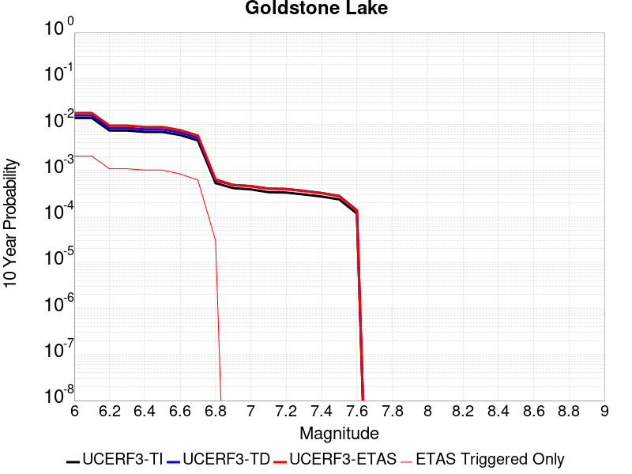 |

| Magnitude | 1 wk TI Prob | 1 wk TD Prob | 1 wk ETAS Prob | 1 wk ETAS/TD Gain | 1 wk ETAS Triggered Only | 1 mo TI Prob | 1 mo TD Prob | 1 mo ETAS Prob | 1 mo ETAS/TD Gain | 1 mo ETAS Triggered Only | 1 yr TI Prob | 1 yr TD Prob | 1 yr ETAS Prob | 1 yr ETAS/TD Gain | 1 yr ETAS Triggered Only | 10 yr TI Prob | 10 yr TD Prob | 10 yr ETAS Prob | 10 yr ETAS/TD Gain | 10 yr ETAS Triggered Only |
|-----|-----|-----|-----|-----|-----|-----|-----|-----|-----|-----|-----|-----|-----|-----|-----|-----|-----|-----|-----|-----|
| 6.0 | 2.671352E-5 | 3.037609E-5 | 0.0013303366 | 43.795517 | 0.0013 | 1.1448149E-4 | 1.3017785E-4 | 0.0017199708 | 13.212469 | 0.00159 | 0.001392921 | 0.0015839594 | 0.0034509974 | 2.1787157 | 0.00187 | 0.013842222 | 0.015746197 | 0.017754074 | 1.1275151 | 0.00204 |
| 6.1 | 2.671352E-5 | 3.037609E-5 | 0.0013303366 | 43.795517 | 0.0013 | 1.1448149E-4 | 1.3017785E-4 | 0.0017199708 | 13.212469 | 0.00159 | 0.001392921 | 0.0015839594 | 0.0034509974 | 2.1787157 | 0.00187 | 0.013842222 | 0.015746197 | 0.017754074 | 1.1275151 | 0.00204 |
| 6.2 | 1.4197047E-5 | 1.6096245E-5 | 6.7608565E-4 | 42.002693 | 6.6E-4 | 6.0843064E-5 | 6.8982634E-5 | 9.289233E-4 | 13.466045 | 8.6E-4 | 7.4051257E-4 | 8.3963864E-4 | 0.0018487906 | 2.2018886 | 0.00101 | 0.007380498 | 0.0083743585 | 0.009455231 | 1.1290692 | 0.00109 |
| 6.3 | 1.4197047E-5 | 1.6096245E-5 | 6.7608565E-4 | 42.002693 | 6.6E-4 | 6.0843064E-5 | 6.8982634E-5 | 9.289233E-4 | 13.466045 | 8.6E-4 | 7.4051257E-4 | 8.3963864E-4 | 0.0018487906 | 2.2018886 | 0.00101 | 0.007380498 | 0.0083743585 | 0.009455231 | 1.1290692 | 0.00109 |
| 6.4 | 1.3238931E-5 | 1.500846E-5 | 6.4499903E-4 | 42.975697 | 6.3E-4 | 5.6737044E-5 | 6.4320935E-5 | 8.742688E-4 | 13.592291 | 8.1E-4 | 6.9055456E-4 | 7.82924E-4 | 0.0017321802 | 2.21245 | 9.5E-4 | 0.006884126 | 0.0078112837 | 0.008823316 | 1.1295604 | 0.00102 |
| 6.5 | 1.3238931E-5 | 1.500846E-5 | 6.4499903E-4 | 42.975697 | 6.3E-4 | 5.6737044E-5 | 6.4320935E-5 | 8.742688E-4 | 13.592291 | 8.1E-4 | 6.9055456E-4 | 7.82924E-4 | 0.0017321802 | 2.21245 | 9.5E-4 | 0.006884126 | 0.0078112837 | 0.008823316 | 1.1295604 | 0.00102 |
| 6.6 | 1.1328278E-5 | 1.2855166E-5 | 5.3284847E-4 | 41.450146 | 5.2E-4 | 4.8548856E-5 | 5.5092944E-5 | 7.2505604E-4 | 13.160598 | 6.7E-4 | 5.90922E-4 | 6.7064585E-4 | 0.0014501227 | 2.162278 | 7.8E-4 | 0.0058935313 | 0.0066956086 | 0.007529984 | 1.1246153 | 8.4E-4 |
| 6.7 | 8.651175E-6 | 9.824565E-6 | 3.9982074E-4 | 40.696026 | 3.9E-4 | 3.707594E-5 | 4.2105108E-5 | 5.5208366E-4 | 13.112035 | 5.1E-4 | 4.5130608E-4 | 5.1259965E-4 | 0.0010923024 | 2.1309073 | 5.8E-4 | 0.0045039062 | 0.005123051 | 0.0057398747 | 1.1204016 | 6.2E-4 |
| 6.8 | 1.0215377E-6 | 1.1754702E-6 | 3.1175434E-5 | 26.521671 | 3.0E-5 | 4.378012E-6 | 5.0377203E-6 | 3.503757E-5 | 6.9550443 | 3.0E-5 | 5.3300988E-5 | 6.1332634E-5 | 9.1330796E-5 | 1.489106 | 3.0E-5 | 5.3288206E-4 | 6.1316835E-4 | 6.4314995E-4 | 1.0488962 | 3.0E-5 |
| 6.9 | 7.9360774E-7 | 9.2833966E-7 | 9.2833966E-7 | 1.0 | 0.0 | 3.4011714E-6 | 3.9785928E-6 | 3.9785928E-6 | 1.0 | 0.0 | 4.1408475E-5 | 4.843836E-5 | 4.843836E-5 | 1.0 | 0.0 | 4.140076E-4 | 4.8428503E-4 | 4.8428503E-4 | 1.0 | 0.0 |
| 7.0 | 7.4382757E-7 | 8.7473285E-7 | 8.7473285E-7 | 1.0 | 0.0 | 3.1878285E-6 | 3.74885E-6 | 3.74885E-6 | 1.0 | 0.0 | 3.8811122E-5 | 4.564136E-5 | 4.564136E-5 | 1.0 | 0.0 | 3.8804344E-4 | 4.5632652E-4 | 4.5632652E-4 | 1.0 | 0.0 |
| 7.1 | 6.4709513E-7 | 7.7113E-7 | 7.7113E-7 | 1.0 | 0.0 | 2.773262E-6 | 3.3048389E-6 | 3.3048389E-6 | 1.0 | 0.0 | 3.376394E-5 | 4.0235733E-5 | 4.0235733E-5 | 1.0 | 0.0 | 3.375881E-4 | 4.0229043E-4 | 4.0229043E-4 | 1.0 | 0.0 |
| 7.2 | 6.356704E-7 | 7.5883594E-7 | 7.5883594E-7 | 1.0 | 0.0 | 2.7242988E-6 | 3.2521505E-6 | 3.2521505E-6 | 1.0 | 0.0 | 3.3167835E-5 | 3.959427E-5 | 3.959427E-5 | 1.0 | 0.0 | 3.3162883E-4 | 3.958781E-4 | 3.958781E-4 | 1.0 | 0.0 |
| 7.3 | 5.7695723E-7 | 6.8965653E-7 | 6.8965653E-7 | 1.0 | 0.0 | 2.4726714E-6 | 2.9556677E-6 | 2.9556677E-6 | 1.0 | 0.0 | 3.0104358E-5 | 3.5984718E-5 | 3.5984718E-5 | 1.0 | 0.0 | 3.0100282E-4 | 3.5979465E-4 | 3.5979465E-4 | 1.0 | 0.0 |
| 7.4 | 5.209647E-7 | 6.193514E-7 | 6.193514E-7 | 1.0 | 0.0 | 2.232704E-6 | 2.6543607E-6 | 2.6543607E-6 | 1.0 | 0.0 | 2.718283E-5 | 3.2316417E-5 | 3.2316417E-5 | 1.0 | 0.0 | 2.7179506E-4 | 3.2312275E-4 | 3.2312275E-4 | 1.0 | 0.0 |
| 7.5 | 4.512955E-7 | 5.348885E-7 | 5.348885E-7 | 1.0 | 0.0 | 1.934122E-6 | 2.2923775E-6 | 2.2923775E-6 | 1.0 | 0.0 | 2.3547682E-5 | 2.7909393E-5 | 2.7909393E-5 | 1.0 | 0.0 | 2.3545188E-4 | 2.7906417E-4 | 2.7906417E-4 | 1.0 | 0.0 |
| 7.6 | 2.21172E-7 | 2.603961E-7 | 2.603961E-7 | 1.0 | 0.0 | 9.478797E-7 | 1.1159829E-6 | 1.1159829E-6 | 1.0 | 0.0 | 1.1540374E-5 | 1.3587036E-5 | 1.3587036E-5 | 1.0 | 0.0 | 1.1539775E-4 | 1.3586486E-4 | 1.3586486E-4 | 1.0 | 0.0 |

## So Sierra Nevada
*[(top)](#table-of-contents)*

| 1 Week | 1 Month | 1 Year | 10 Year |
|-----|-----|-----|-----|
|  |  |  |  |

| Magnitude | 1 wk TI Prob | 1 wk TD Prob | 1 wk ETAS Prob | 1 wk ETAS/TD Gain | 1 wk ETAS Triggered Only | 1 mo TI Prob | 1 mo TD Prob | 1 mo ETAS Prob | 1 mo ETAS/TD Gain | 1 mo ETAS Triggered Only | 1 yr TI Prob | 1 yr TD Prob | 1 yr ETAS Prob | 1 yr ETAS/TD Gain | 1 yr ETAS Triggered Only | 10 yr TI Prob | 10 yr TD Prob | 10 yr ETAS Prob | 10 yr ETAS/TD Gain | 10 yr ETAS Triggered Only |
|-----|-----|-----|-----|-----|-----|-----|-----|-----|-----|-----|-----|-----|-----|-----|-----|-----|-----|-----|-----|-----|
| 6.0 | 1.15488665E-5 | 1.1079643E-5 | 0.0013510648 | 121.94119 | 0.00134 | 4.9494203E-5 | 4.748339E-5 | 0.0016274083 | 34.273212 | 0.00158 | 6.024253E-4 | 5.7796965E-4 | 0.0024169062 | 4.181718 | 0.00184 | 0.006007948 | 0.005765934 | 0.0077842292 | 1.3500378 | 0.00203 |
| 6.1 | 1.15488665E-5 | 1.1079643E-5 | 0.0013510648 | 121.94119 | 0.00134 | 4.9494203E-5 | 4.748339E-5 | 0.0016274083 | 34.273212 | 0.00158 | 6.024253E-4 | 5.7796965E-4 | 0.0024169062 | 4.181718 | 0.00184 | 0.006007948 | 0.005765934 | 0.0077842292 | 1.3500378 | 0.00203 |
| 6.2 | 1.15488665E-5 | 1.1079643E-5 | 0.0013510648 | 121.94119 | 0.00134 | 4.9494203E-5 | 4.748339E-5 | 0.0016274083 | 34.273212 | 0.00158 | 6.024253E-4 | 5.7796965E-4 | 0.0024169062 | 4.181718 | 0.00184 | 0.006007948 | 0.005765934 | 0.0077842292 | 1.3500378 | 0.00203 |
| 6.3 | 1.15488665E-5 | 1.1079643E-5 | 0.0013510648 | 121.94119 | 0.00134 | 4.9494203E-5 | 4.748339E-5 | 0.0016274083 | 34.273212 | 0.00158 | 6.024253E-4 | 5.7796965E-4 | 0.0024169062 | 4.181718 | 0.00184 | 0.006007948 | 0.005765934 | 0.0077842292 | 1.3500378 | 0.00203 |
| 6.4 | 1.15488665E-5 | 1.1079643E-5 | 0.0013510648 | 121.94119 | 0.00134 | 4.9494203E-5 | 4.748339E-5 | 0.0016274083 | 34.273212 | 0.00158 | 6.024253E-4 | 5.7796965E-4 | 0.0024169062 | 4.181718 | 0.00184 | 0.006007948 | 0.005765934 | 0.0077842292 | 1.3500378 | 0.00203 |
| 6.5 | 1.15488665E-5 | 1.1079643E-5 | 0.0013510648 | 121.94119 | 0.00134 | 4.9494203E-5 | 4.748339E-5 | 0.0016274083 | 34.273212 | 0.00158 | 6.024253E-4 | 5.7796965E-4 | 0.0024169062 | 4.181718 | 0.00184 | 0.006007948 | 0.005765934 | 0.0077842292 | 1.3500378 | 0.00203 |
| 6.6 | 7.587044E-6 | 6.935635E-6 | 7.5693044E-4 | 109.13643 | 7.5E-4 | 3.2515498E-5 | 2.9723828E-5 | 9.096977E-4 | 30.604998 | 8.8E-4 | 3.9580427E-4 | 3.6183043E-4 | 0.001371465 | 3.7903528 | 0.00101 | 0.003951 | 0.0036127048 | 0.004718695 | 1.306139 | 0.00111 |
| 6.7 | 7.587044E-6 | 6.935635E-6 | 7.5693044E-4 | 109.13643 | 7.5E-4 | 3.2515498E-5 | 2.9723828E-5 | 9.096977E-4 | 30.604998 | 8.8E-4 | 3.9580427E-4 | 3.6183043E-4 | 0.001371465 | 3.7903528 | 0.00101 | 0.003951 | 0.0036127048 | 0.004718695 | 1.306139 | 0.00111 |
| 6.8 | 5.9026956E-6 | 5.1793927E-6 | 5.551765E-4 | 107.18951 | 5.5E-4 | 2.5297022E-5 | 2.2197215E-5 | 6.7218277E-4 | 30.282303 | 6.5E-4 | 3.0794772E-4 | 2.7021873E-4 | 0.0010100188 | 3.737782 | 7.4E-4 | 0.0030752132 | 0.002699018 | 0.0035168047 | 1.3029943 | 8.2E-4 |
| 6.9 | 5.0118915E-6 | 4.2524252E-6 | 4.1425068E-4 | 97.41515 | 4.1E-4 | 2.1479358E-5 | 1.8224557E-5 | 5.2821526E-4 | 28.98371 | 5.1E-4 | 2.614798E-4 | 2.2186211E-4 | 8.117312E-4 | 3.6587193 | 5.9E-4 | 0.0026117235 | 0.0022164788 | 0.0028849938 | 1.3016113 | 6.7E-4 |
| 7.0 | 4.4924795E-6 | 3.7139177E-6 | 3.2371274E-4 | 87.16206 | 3.2E-4 | 1.925334E-5 | 1.5916696E-5 | 4.3591E-4 | 27.386965 | 4.2E-4 | 2.3438422E-4 | 1.9376918E-4 | 6.8367424E-4 | 3.528292 | 4.9E-4 | 0.0023413717 | 0.0019360651 | 0.002494981 | 1.2886865 | 5.6E-4 |
| 7.1 | 3.9118436E-6 | 3.1119775E-6 | 2.2311129E-4 | 71.694374 | 2.2E-4 | 1.6764936E-5 | 1.3336982E-5 | 2.833334E-4 | 21.24419 | 2.7E-4 | 2.0409399E-4 | 1.6236622E-4 | 4.8231427E-4 | 2.9705334 | 3.2E-4 | 0.0020390663 | 0.001622532 | 0.0020019154 | 1.2338219 | 3.8E-4 |
| 7.2 | 3.4200818E-6 | 2.6054543E-6 | 2.0260493E-4 | 77.76185 | 2.0E-4 | 1.4657411E-5 | 1.11661875E-5 | 2.511635E-4 | 22.49322 | 2.4E-4 | 1.7843937E-4 | 1.3594035E-4 | 4.2590094E-4 | 3.1329985 | 2.9E-4 | 0.0017829615 | 0.0013586218 | 0.0016881734 | 1.2425632 | 3.3E-4 |
| 7.3 | 2.6593618E-6 | 1.8284203E-6 | 1.218282E-4 | 66.6303 | 1.2E-4 | 1.13972155E-5 | 7.836065E-6 | 1.5783489E-4 | 20.14211 | 1.5E-4 | 1.3875226E-4 | 9.540021E-5 | 2.7538303E-4 | 2.8866084 | 1.8E-4 | 0.0013866565 | 9.5362146E-4 | 0.0011534308 | 1.2095268 | 2.0E-4 |
| 7.4 | 2.2577992E-6 | 1.436438E-6 | 9.143631E-5 | 63.654892 | 9.0E-5 | 9.676246E-6 | 6.15615E-6 | 1.2615541E-4 | 20.492582 | 1.2E-4 | 1.1780193E-4 | 7.49488E-5 | 2.149383E-4 | 2.867802 | 1.4E-4 | 0.001177395 | 7.492603E-4 | 9.091404E-4 | 1.2133839 | 1.6E-4 |
| 7.5 | 1.489319E-6 | 7.353936E-7 | 3.0735373E-5 | 41.79445 | 3.0E-5 | 6.3827797E-6 | 3.1516831E-6 | 6.315149E-5 | 20.037388 | 6.0E-5 | 7.770758E-5 | 3.8371072E-5 | 1.0836838E-4 | 2.8242211 | 7.0E-5 | 7.7680405E-4 | 3.836449E-4 | 4.5361803E-4 | 1.1823905 | 7.0E-5 |
| 7.6 | 1.0680322E-6 | 4.6596554E-7 | 3.0465952E-5 | 65.382416 | 3.0E-5 | 4.577273E-6 | 1.9969937E-6 | 5.1996893E-5 | 26.037586 | 5.0E-5 | 5.5726876E-5 | 2.4313129E-5 | 8.431167E-5 | 3.4677424 | 6.0E-5 | 5.5712904E-4 | 2.4310495E-4 | 3.0309038E-4 | 1.246747 | 6.0E-5 |
| 7.7 | 5.509146E-7 | 1.5580486E-7 | 1.01558035E-5 | 65.18284 | 1.0E-5 | 2.3610605E-6 | 6.677349E-7 | 1.0667728E-5 | 15.975992 | 1.0E-5 | 2.8745531E-5 | 8.129644E-6 | 2.8129482E-5 | 3.4601123 | 2.0E-5 | 2.8741814E-4 | 8.1293576E-5 | 1.0129195E-4 | 1.2460018 | 2.0E-5 |

## Lenwood-Lockhart-Old Woman Springs
*[(top)](#table-of-contents)*

| 1 Week | 1 Month | 1 Year | 10 Year |
|-----|-----|-----|-----|
|  |  |  |  |

| Magnitude | 1 wk TI Prob | 1 wk TD Prob | 1 wk ETAS Prob | 1 wk ETAS/TD Gain | 1 wk ETAS Triggered Only | 1 mo TI Prob | 1 mo TD Prob | 1 mo ETAS Prob | 1 mo ETAS/TD Gain | 1 mo ETAS Triggered Only | 1 yr TI Prob | 1 yr TD Prob | 1 yr ETAS Prob | 1 yr ETAS/TD Gain | 1 yr ETAS Triggered Only | 10 yr TI Prob | 10 yr TD Prob | 10 yr ETAS Prob | 10 yr ETAS/TD Gain | 10 yr ETAS Triggered Only |
|-----|-----|-----|-----|-----|-----|-----|-----|-----|-----|-----|-----|-----|-----|-----|-----|-----|-----|-----|-----|-----|
| 6.0 | 3.744542E-5 | 4.396252E-5 | 9.939207E-4 | 22.608366 | 9.5E-4 | 1.604705E-4 | 1.8839816E-4 | 0.001288191 | 6.8375983 | 0.0011 | 0.0019519776 | 0.0022915069 | 0.0035386423 | 1.5442426 | 0.00125 | 0.019349206 | 0.022696787 | 0.023986828 | 1.056838 | 0.00132 |
| 6.1 | 3.744542E-5 | 4.396252E-5 | 9.939207E-4 | 22.608366 | 9.5E-4 | 1.604705E-4 | 1.8839816E-4 | 0.001288191 | 6.8375983 | 0.0011 | 0.0019519776 | 0.0022915069 | 0.0035386423 | 1.5442426 | 0.00125 | 0.019349206 | 0.022696787 | 0.023986828 | 1.056838 | 0.00132 |
| 6.2 | 3.744542E-5 | 4.396252E-5 | 9.939207E-4 | 22.608366 | 9.5E-4 | 1.604705E-4 | 1.8839816E-4 | 0.001288191 | 6.8375983 | 0.0011 | 0.0019519776 | 0.0022915069 | 0.0035386423 | 1.5442426 | 0.00125 | 0.019349206 | 0.022696787 | 0.023986828 | 1.056838 | 0.00132 |
| 6.3 | 2.1079984E-5 | 2.5353434E-5 | 4.2534329E-4 | 16.776556 | 4.0E-4 | 9.0339665E-5 | 1.0865316E-4 | 5.985999E-4 | 5.509273 | 4.9E-4 | 0.0010993304 | 0.0013220694 | 0.0018513687 | 1.4003567 | 5.3E-4 | 0.010939079 | 0.0131442575 | 0.013706765 | 1.042795 | 5.7E-4 |
| 6.4 | 2.1079984E-5 | 2.5353434E-5 | 4.2534329E-4 | 16.776556 | 4.0E-4 | 9.0339665E-5 | 1.0865316E-4 | 5.985999E-4 | 5.509273 | 4.9E-4 | 0.0010993304 | 0.0013220694 | 0.0018513687 | 1.4003567 | 5.3E-4 | 0.010939079 | 0.0131442575 | 0.013706765 | 1.042795 | 5.7E-4 |
| 6.5 | 1.7397282E-5 | 2.066241E-5 | 3.30656E-4 | 16.00278 | 3.1E-4 | 7.455765E-5 | 8.8550245E-5 | 4.7851572E-4 | 5.403889 | 3.9E-4 | 9.073613E-4 | 0.0010775778 | 0.0015071144 | 1.3986131 | 4.3E-4 | 0.009036654 | 0.010724821 | 0.011179888 | 1.0424311 | 4.6E-4 |
| 6.6 | 1.52050325E-5 | 1.7679693E-5 | 2.8767492E-4 | 16.271488 | 2.7E-4 | 6.51628E-5 | 7.576796E-5 | 4.157422E-4 | 5.487045 | 3.4E-4 | 7.9306826E-4 | 9.220924E-4 | 0.0012917513 | 1.4008913 | 3.7E-4 | 0.007902439 | 0.009183526 | 0.009569945 | 1.0420773 | 3.9E-4 |
| 6.7 | 1.332523E-5 | 1.5264002E-5 | 2.5526033E-4 | 16.723028 | 2.4E-4 | 5.7106878E-5 | 6.5415545E-5 | 3.653959E-4 | 5.585766 | 3.0E-4 | 6.950544E-4 | 7.961491E-4 | 0.0011059023 | 1.3890643 | 3.1E-4 | 0.006928845 | 0.007933599 | 0.008260981 | 1.0412652 | 3.3E-4 |
| 6.8 | 1.1525329E-5 | 1.3030979E-5 | 2.2302824E-4 | 17.115232 | 2.1E-4 | 4.9393333E-5 | 5.584588E-5 | 3.258308E-4 | 5.8344646 | 2.7E-4 | 6.011979E-4 | 6.797157E-4 | 9.495322E-4 | 1.3969549 | 2.7E-4 | 0.00599574 | 0.006776819 | 0.007064854 | 1.0425029 | 2.9E-4 |
| 6.9 | 1.0253909E-5 | 1.15144385E-5 | 1.6151271E-4 | 14.026972 | 1.5E-4 | 4.3944583E-5 | 4.9346683E-5 | 2.5933632E-4 | 5.2553954 | 2.1E-4 | 5.3489394E-4 | 6.0063385E-4 | 8.1050774E-4 | 1.3494207 | 2.1E-4 | 0.0053360825 | 0.0059904843 | 0.0062191063 | 1.0381643 | 2.3E-4 |
| 7.0 | 8.104563E-6 | 8.991279E-6 | 1.289902E-4 | 14.346146 | 1.2E-4 | 3.4733377E-5 | 3.8533497E-5 | 1.9852733E-4 | 5.1520715 | 1.6E-4 | 4.2279682E-4 | 4.6904673E-4 | 6.2897167E-4 | 1.3409574 | 1.6E-4 | 0.0042199334 | 0.0046808156 | 0.0048500197 | 1.0361484 | 1.7E-4 |
| 7.1 | 6.7986157E-6 | 7.515816E-6 | 9.751514E-5 | 12.974658 | 9.0E-5 | 2.91366E-5 | 3.2210253E-5 | 1.6220607E-4 | 5.035852 | 1.3E-4 | 3.5468035E-4 | 3.920914E-4 | 5.220404E-4 | 1.3314253 | 1.3E-4 | 0.003541148 | 0.003914213 | 0.004053665 | 1.0356271 | 1.4E-4 |
| 7.2 | 5.6893327E-6 | 6.2800136E-6 | 7.6279575E-5 | 12.146402 | 7.0E-5 | 2.4382627E-5 | 2.6914078E-5 | 1.1691166E-4 | 4.343885 | 9.0E-5 | 2.9681803E-4 | 3.2763163E-4 | 4.1760213E-4 | 1.2746087 | 9.0E-5 | 0.002964219 | 0.0032716845 | 0.0033713575 | 1.0304652 | 1.0E-4 |
| 7.3 | 4.253348E-6 | 4.7069107E-6 | 6.4706626E-5 | 13.747155 | 6.0E-5 | 1.8228506E-5 | 2.0172329E-5 | 9.017091E-5 | 4.4700303 | 7.0E-5 | 2.2190946E-4 | 2.4557224E-4 | 3.1555505E-4 | 1.2849785 | 7.0E-5 | 0.00221688 | 0.0024531898 | 0.0025329934 | 1.0325305 | 8.0E-5 |
| 7.4 | 2.5448119E-6 | 2.852045E-6 | 3.285196E-5 | 11.518738 | 3.0E-5 | 1.0906291E-5 | 1.2223002E-5 | 4.2222637E-5 | 3.4543588 | 3.0E-5 | 1.3277601E-4 | 1.4880655E-4 | 1.7880207E-4 | 1.2015741 | 3.0E-5 | 0.001326967 | 0.0014872311 | 0.0015171865 | 1.0201417 | 3.0E-5 |
| 7.5 | 4.3706837E-8 | 4.562909E-8 | 4.562909E-8 | 1.0 | 0.0 | 1.8731501E-7 | 1.9555324E-7 | 1.9555324E-7 | 1.0 | 0.0 | 2.2805577E-6 | 2.3808586E-6 | 2.3808586E-6 | 1.0 | 0.0 | 2.2805343E-5 | 2.3808387E-5 | 2.3808387E-5 | 1.0 | 0.0 |

## Death Valley (So)
*[(top)](#table-of-contents)*

| 1 Week | 1 Month | 1 Year | 10 Year |
|-----|-----|-----|-----|
|  |  |  |  |

| Magnitude | 1 wk TI Prob | 1 wk TD Prob | 1 wk ETAS Prob | 1 wk ETAS/TD Gain | 1 wk ETAS Triggered Only | 1 mo TI Prob | 1 mo TD Prob | 1 mo ETAS Prob | 1 mo ETAS/TD Gain | 1 mo ETAS Triggered Only | 1 yr TI Prob | 1 yr TD Prob | 1 yr ETAS Prob | 1 yr ETAS/TD Gain | 1 yr ETAS Triggered Only | 10 yr TI Prob | 10 yr TD Prob | 10 yr ETAS Prob | 10 yr ETAS/TD Gain | 10 yr ETAS Triggered Only |
|-----|-----|-----|-----|-----|-----|-----|-----|-----|-----|-----|-----|-----|-----|-----|-----|-----|-----|-----|-----|-----|
| 6.0 | 2.0684236E-5 | 2.5617775E-5 | 9.255947E-4 | 36.130955 | 9.0E-4 | 8.864371E-5 | 1.0978594E-4 | 0.0011496717 | 10.471939 | 0.00104 | 0.0010787029 | 0.0013358411 | 0.0026041446 | 1.9494418 | 0.00127 | 0.010734817 | 0.013281397 | 0.014583865 | 1.0980672 | 0.00132 |
| 6.1 | 2.0684236E-5 | 2.5617775E-5 | 9.255947E-4 | 36.130955 | 9.0E-4 | 8.864371E-5 | 1.0978594E-4 | 0.0011496717 | 10.471939 | 0.00104 | 0.0010787029 | 0.0013358411 | 0.0026041446 | 1.9494418 | 0.00127 | 0.010734817 | 0.013281397 | 0.014583865 | 1.0980672 | 0.00132 |
| 6.2 | 2.0684236E-5 | 2.5617775E-5 | 9.255947E-4 | 36.130955 | 9.0E-4 | 8.864371E-5 | 1.0978594E-4 | 0.0011496717 | 10.471939 | 0.00104 | 0.0010787029 | 0.0013358411 | 0.0026041446 | 1.9494418 | 0.00127 | 0.010734817 | 0.013281397 | 0.014583865 | 1.0980672 | 0.00132 |
| 6.3 | 2.0240292E-5 | 2.511786E-5 | 8.95096E-4 | 35.635838 | 8.7E-4 | 8.6741224E-5 | 1.07643624E-4 | 0.001107536 | 10.288914 | 0.001 | 0.0010555626 | 0.00130979 | 0.002528192 | 1.930227 | 0.00122 | 0.010505628 | 0.013023956 | 0.014277415 | 1.0962427 | 0.00127 |
| 6.4 | 2.0240292E-5 | 2.511786E-5 | 8.95096E-4 | 35.635838 | 8.7E-4 | 8.6741224E-5 | 1.07643624E-4 | 0.001107536 | 10.288914 | 0.001 | 0.0010555626 | 0.00130979 | 0.002528192 | 1.930227 | 0.00122 | 0.010505628 | 0.013023956 | 0.014277415 | 1.0962427 | 0.00127 |
| 6.5 | 1.9962767E-5 | 2.4807114E-5 | 8.4478676E-4 | 34.054214 | 8.2E-4 | 8.55519E-5 | 1.0631196E-4 | 0.001056211 | 9.935015 | 9.5E-4 | 0.0010410968 | 0.0012935963 | 0.0024520957 | 1.8955649 | 0.00116 | 0.010362327 | 0.012863902 | 0.014058338 | 1.0928516 | 0.00121 |
| 6.6 | 1.8937297E-5 | 2.3310964E-5 | 7.332944E-4 | 31.45706 | 7.1E-4 | 8.115732E-5 | 9.990039E-5 | 9.1981847E-4 | 9.207356 | 8.2E-4 | 9.876423E-4 | 0.0012156231 | 0.0022343833 | 1.8380558 | 0.00102 | 0.009832645 | 0.012092789 | 0.013139971 | 1.0865955 | 0.00106 |
| 6.7 | 1.8621096E-5 | 2.2911607E-5 | 7.2289555E-4 | 31.5515 | 7.0E-4 | 7.980225E-5 | 9.818898E-5 | 8.9811045E-4 | 9.146753 | 8.0E-4 | 9.711593E-4 | 0.0011948098 | 0.0021836269 | 1.8275938 | 9.9E-4 | 0.009669261 | 0.011886904 | 0.012904661 | 1.0856199 | 0.00103 |
| 6.8 | 1.7830353E-5 | 2.1805688E-5 | 6.717915E-4 | 30.808086 | 6.5E-4 | 7.641356E-5 | 9.344968E-5 | 8.133824E-4 | 8.703961 | 7.2E-4 | 9.29938E-4 | 0.00113717 | 0.0020161693 | 1.7729708 | 8.8E-4 | 0.009260561 | 0.011316354 | 0.012225944 | 1.0803783 | 9.2E-4 |
| 6.9 | 1.3135183E-5 | 1.5303925E-5 | 3.752984E-4 | 24.523018 | 3.6E-4 | 5.6292425E-5 | 6.558664E-5 | 4.655604E-4 | 7.0984035 | 4.0E-4 | 6.8514474E-4 | 7.982312E-4 | 0.0012978321 | 1.6258849 | 5.0E-4 | 0.006830362 | 0.007954649 | 0.008490353 | 1.0673448 | 5.4E-4 |
| 7.0 | 1.1507512E-5 | 1.3154199E-5 | 2.631509E-4 | 20.005087 | 2.5E-4 | 4.9316975E-5 | 5.6373956E-5 | 3.3635818E-4 | 5.9665527 | 2.8E-4 | 6.002687E-4 | 6.8614254E-4 | 0.0010159161 | 1.4806197 | 3.3E-4 | 0.0059864987 | 0.0068409415 | 0.007198479 | 1.0522643 | 3.6E-4 |
| 7.1 | 9.715903E-6 | 1.0865278E-5 | 1.4086386E-4 | 12.964589 | 1.3E-4 | 4.1638916E-5 | 4.656467E-5 | 1.7655862E-4 | 3.791686 | 1.3E-4 | 5.068359E-4 | 5.667817E-4 | 7.166966E-4 | 1.2645022 | 1.5E-4 | 0.0050568148 | 0.0056538144 | 0.0058228537 | 1.0298982 | 1.7E-4 |
| 7.2 | 9.233269E-6 | 1.02863105E-5 | 1.3028507E-4 | 12.665871 | 1.2E-4 | 3.9570554E-5 | 4.4083466E-5 | 1.6407817E-4 | 3.721989 | 1.2E-4 | 4.81665E-4 | 5.3658825E-4 | 6.765131E-4 | 1.2607677 | 1.4E-4 | 0.0048062233 | 0.0053533576 | 0.005512501 | 1.0297278 | 1.6E-4 |
| 7.3 | 8.8041315E-6 | 9.808164E-6 | 9.980728E-5 | 10.17594 | 9.0E-5 | 3.7731446E-5 | 4.2034335E-5 | 1.3203055E-4 | 3.1410167 | 9.0E-5 | 4.592835E-4 | 5.1165203E-4 | 6.2159577E-4 | 1.2148799 | 1.1E-4 | 0.0045833546 | 0.005105167 | 0.0052345037 | 1.0253344 | 1.3E-4 |
| 7.4 | 8.708749E-6 | 9.707175E-6 | 9.97063E-5 | 10.271402 | 9.0E-5 | 3.7322676E-5 | 4.160154E-5 | 1.315978E-4 | 3.1632915 | 9.0E-5 | 4.5430884E-4 | 5.0638523E-4 | 6.1632955E-4 | 1.2171159 | 1.1E-4 | 0.004533812 | 0.0050527398 | 0.0051820828 | 1.0255986 | 1.3E-4 |
| 7.5 | 8.612678E-6 | 9.604817E-6 | 8.960405E-5 | 9.329074 | 8.0E-5 | 3.6910955E-5 | 4.1162875E-5 | 1.2115958E-4 | 2.9434187 | 8.0E-5 | 4.492982E-4 | 5.01047E-4 | 6.009969E-4 | 1.1994821 | 1.0E-4 | 0.004483909 | 0.0049995985 | 0.0051189987 | 1.0238819 | 1.2E-4 |
| 7.6 | 8.319024E-6 | 9.283916E-6 | 8.9283174E-5 | 9.616973 | 8.0E-5 | 3.5652476E-5 | 3.978763E-5 | 1.1978445E-4 | 3.010595 | 8.0E-5 | 4.3398244E-4 | 4.8431093E-4 | 5.842625E-4 | 1.2063789 | 1.0E-4 | 0.0043313587 | 0.0048329784 | 0.004952398 | 1.0247095 | 1.2E-4 |
| 7.7 | 7.4718328E-6 | 8.34517E-6 | 7.834459E-5 | 9.388016 | 7.0E-5 | 3.2021748E-5 | 3.5764548E-5 | 1.0576204E-4 | 2.9571755 | 7.0E-5 | 3.8979502E-4 | 4.353504E-4 | 5.253112E-4 | 1.20664 | 9.0E-5 | 0.00389112 | 0.0043453807 | 0.0044349893 | 1.0206217 | 9.0E-5 |
| 7.8 | 3.4586725E-7 | 3.6482615E-7 | 3.6482615E-7 | 1.0 | 0.0 | 1.4822873E-6 | 1.5635396E-6 | 1.5635396E-6 | 1.0 | 0.0 | 1.80467E-5 | 1.9035933E-5 | 1.9035933E-5 | 1.0 | 0.0 | 1.8045233E-4 | 1.9034347E-4 | 1.9034347E-4 | 1.0 | 0.0 |
| 7.9 | 2.5591178E-9 | 2.6696718E-9 | 2.6696718E-9 | 1.0 | 0.0 | 1.0967647E-8 | 1.14414505E-8 | 1.14414505E-8 | 1.0 | 0.0 | 1.335311E-7 | 1.3929966E-7 | 1.3929966E-7 | 1.0 | 0.0 | 1.3353102E-6 | 1.3929966E-6 | 1.3929966E-6 | 1.0 | 0.0 |

## Coyote Canyon
*[(top)](#table-of-contents)*

| 1 Week | 1 Month | 1 Year | 10 Year |
|-----|-----|-----|-----|
|  |  |  |  |

| Magnitude | 1 wk TI Prob | 1 wk TD Prob | 1 wk ETAS Prob | 1 wk ETAS/TD Gain | 1 wk ETAS Triggered Only | 1 mo TI Prob | 1 mo TD Prob | 1 mo ETAS Prob | 1 mo ETAS/TD Gain | 1 mo ETAS Triggered Only | 1 yr TI Prob | 1 yr TD Prob | 1 yr ETAS Prob | 1 yr ETAS/TD Gain | 1 yr ETAS Triggered Only | 10 yr TI Prob | 10 yr TD Prob | 10 yr ETAS Prob | 10 yr ETAS/TD Gain | 10 yr ETAS Triggered Only |
|-----|-----|-----|-----|-----|-----|-----|-----|-----|-----|-----|-----|-----|-----|-----|-----|-----|-----|-----|-----|-----|
| 6.0 | 3.5090034E-5 | 4.0364324E-5 | 7.103373E-4 | 17.598146 | 6.7E-4 | 1.503772E-4 | 1.7297994E-4 | 9.4284676E-4 | 5.450613 | 7.7E-4 | 0.0018293047 | 0.0021042528 | 0.0030921695 | 1.4694858 | 9.9E-4 | 0.018143194 | 0.020869201 | 0.021926664 | 1.0506709 | 0.00108 |
| 6.1 | 3.5090034E-5 | 4.0364324E-5 | 7.103373E-4 | 17.598146 | 6.7E-4 | 1.503772E-4 | 1.7297994E-4 | 9.4284676E-4 | 5.450613 | 7.7E-4 | 0.0018293047 | 0.0021042528 | 0.0030921695 | 1.4694858 | 9.9E-4 | 0.018143194 | 0.020869201 | 0.021926664 | 1.0506709 | 0.00108 |
| 6.2 | 1.841879E-5 | 2.1059794E-5 | 3.91052E-4 | 18.568653 | 3.7E-4 | 7.8935285E-5 | 9.0253714E-5 | 5.102158E-4 | 5.653128 | 4.2E-4 | 9.606133E-4 | 0.001098387 | 0.0015778597 | 1.4365245 | 4.8E-4 | 0.0095647145 | 0.010939667 | 0.011463869 | 1.0479175 | 5.3E-4 |
| 6.3 | 1.841879E-5 | 2.1059794E-5 | 3.91052E-4 | 18.568653 | 3.7E-4 | 7.8935285E-5 | 9.0253714E-5 | 5.102158E-4 | 5.653128 | 4.2E-4 | 9.606133E-4 | 0.001098387 | 0.0015778597 | 1.4365245 | 4.8E-4 | 0.0095647145 | 0.010939667 | 0.011463869 | 1.0479175 | 5.3E-4 |
| 6.4 | 1.712201E-5 | 1.9565212E-5 | 3.5955856E-4 | 18.377443 | 3.4E-4 | 7.337798E-5 | 8.3848776E-5 | 4.7381606E-4 | 5.6508403 | 3.9E-4 | 8.930107E-4 | 0.0010204813 | 0.0014700221 | 1.4405184 | 4.5E-4 | 0.008894307 | 0.010167871 | 0.010662787 | 1.0486745 | 5.0E-4 |
| 6.5 | 1.4744935E-5 | 1.6836972E-5 | 3.0683208E-4 | 18.223711 | 2.9E-4 | 6.3191044E-5 | 7.215698E-5 | 4.0213316E-4 | 5.573032 | 3.3E-4 | 7.6907943E-4 | 8.7825063E-4 | 0.0012679081 | 1.4436746 | 3.9E-4 | 0.007664232 | 0.008756994 | 0.009193141 | 1.0498055 | 4.4E-4 |
| 6.6 | 1.2017839E-5 | 1.37240895E-5 | 2.1372135E-4 | 15.572716 | 2.0E-4 | 5.150401E-5 | 5.88167E-5 | 2.6880435E-4 | 4.5702047 | 2.1E-4 | 6.268809E-4 | 7.159466E-4 | 9.7576046E-4 | 1.3628956 | 2.6E-4 | 0.0062511545 | 0.0071450938 | 0.0074528786 | 1.0430764 | 3.1E-4 |
| 6.7 | 1.00956095E-5 | 1.1533517E-5 | 1.7153168E-4 | 14.872452 | 1.6E-4 | 4.326618E-5 | 4.942891E-5 | 2.194205E-4 | 4.4391127 | 1.7E-4 | 5.266384E-4 | 6.017178E-4 | 8.215854E-4 | 1.3654 | 2.2E-4 | 0.005253921 | 0.0060094125 | 0.00626785 | 1.0430055 | 2.6E-4 |

## San Andreas (San Bernardino N)
*[(top)](#table-of-contents)*

| 1 Week | 1 Month | 1 Year | 10 Year |
|-----|-----|-----|-----|
|  |  |  |  |

| Magnitude | 1 wk TI Prob | 1 wk TD Prob | 1 wk ETAS Prob | 1 wk ETAS/TD Gain | 1 wk ETAS Triggered Only | 1 mo TI Prob | 1 mo TD Prob | 1 mo ETAS Prob | 1 mo ETAS/TD Gain | 1 mo ETAS Triggered Only | 1 yr TI Prob | 1 yr TD Prob | 1 yr ETAS Prob | 1 yr ETAS/TD Gain | 1 yr ETAS Triggered Only | 10 yr TI Prob | 10 yr TD Prob | 10 yr ETAS Prob | 10 yr ETAS/TD Gain | 10 yr ETAS Triggered Only |
|-----|-----|-----|-----|-----|-----|-----|-----|-----|-----|-----|-----|-----|-----|-----|-----|-----|-----|-----|-----|-----|
| 6.0 | 1.4273766E-4 | 3.1606483E-4 | 0.001175793 | 3.7201006 | 8.6E-4 | 6.115894E-4 | 0.0013538664 | 0.0023225532 | 1.7154965 | 9.7E-4 | 0.0074207084 | 0.016360244 | 0.017393066 | 1.06313 | 0.00105 | 0.07177748 | 0.15026689 | 0.15122709 | 1.00639 | 0.00113 |
| 6.1 | 1.4273766E-4 | 3.1606483E-4 | 0.001175793 | 3.7201006 | 8.6E-4 | 6.115894E-4 | 0.0013538664 | 0.0023225532 | 1.7154965 | 9.7E-4 | 0.0074207084 | 0.016360244 | 0.017393066 | 1.06313 | 0.00105 | 0.07177748 | 0.15026689 | 0.15122709 | 1.00639 | 0.00113 |
| 6.2 | 1.4273766E-4 | 3.1606483E-4 | 0.001175793 | 3.7201006 | 8.6E-4 | 6.115894E-4 | 0.0013538664 | 0.0023225532 | 1.7154965 | 9.7E-4 | 0.0074207084 | 0.016360244 | 0.017393066 | 1.06313 | 0.00105 | 0.07177748 | 0.15026689 | 0.15122709 | 1.00639 | 0.00113 |
| 6.3 | 1.3730655E-4 | 3.0511338E-4 | 0.001164851 | 3.8177643 | 8.6E-4 | 5.883239E-4 | 0.0013069791 | 0.0022757114 | 1.7411995 | 9.7E-4 | 0.0071393442 | 0.015797773 | 0.016831186 | 1.065415 | 0.00105 | 0.06914291 | 0.14556676 | 0.14653228 | 1.0066328 | 0.00113 |
| 6.4 | 1.3730655E-4 | 3.0511338E-4 | 0.001164851 | 3.8177643 | 8.6E-4 | 5.883239E-4 | 0.0013069791 | 0.0022757114 | 1.7411995 | 9.7E-4 | 0.0071393442 | 0.015797773 | 0.016831186 | 1.065415 | 0.00105 | 0.06914291 | 0.14556676 | 0.14653228 | 1.0066328 | 0.00113 |
| 6.5 | 1.2942807E-4 | 2.8925808E-4 | 0.0011490093 | 3.9722636 | 8.6E-4 | 5.545738E-4 | 0.0012390936 | 0.0022078918 | 1.7818602 | 9.7E-4 | 0.0067310524 | 0.01498286 | 0.016017128 | 1.06903 | 0.00105 | 0.06530788 | 0.13870941 | 0.13968268 | 1.0070165 | 0.00113 |
| 6.6 | 1.1125901E-4 | 2.536472E-4 | 0.0011034316 | 4.350261 | 8.5E-4 | 4.767372E-4 | 0.0010866089 | 0.0020455658 | 1.8825226 | 9.6E-4 | 0.005788839 | 0.013149847 | 0.014176171 | 1.0780483 | 0.00104 | 0.056403454 | 0.122999296 | 0.123981535 | 1.0079857 | 0.00112 |
| 6.7 | 1.02209575E-4 | 2.3499702E-4 | 0.0010747996 | 4.5736737 | 8.4E-4 | 4.3796748E-4 | 0.0010067427 | 0.0019557863 | 1.9426873 | 9.5E-4 | 0.0053192247 | 0.012188629 | 0.013206075 | 1.083475 | 0.00103 | 0.051936906 | 0.114790924 | 0.11577351 | 1.0085597 | 0.00111 |
| 6.8 | 9.610582E-5 | 2.2025521E-4 | 0.0010600702 | 4.8129177 | 8.4E-4 | 4.1181705E-4 | 9.436101E-4 | 0.0018927137 | 2.0058217 | 9.5E-4 | 0.0050023515 | 0.011428202 | 0.0124464305 | 1.089098 | 0.00103 | 0.048912346 | 0.1081929 | 0.109182805 | 1.0091494 | 0.00111 |
| 6.9 | 9.3877505E-5 | 2.1481077E-4 | 0.0010546304 | 4.9095783 | 8.4E-4 | 4.0227012E-4 | 9.2029345E-4 | 0.0018694191 | 2.0313294 | 9.5E-4 | 0.0048866454 | 0.011147255 | 0.012165774 | 1.0913694 | 0.00103 | 0.04780577 | 0.10578323 | 0.106775805 | 1.0093832 | 0.00111 |
| 7.0 | 9.1019785E-5 | 2.0808022E-4 | 0.0010479054 | 5.0360646 | 8.4E-4 | 3.900265E-4 | 8.914682E-4 | 0.0018406213 | 2.0647078 | 9.5E-4 | 0.0047382377 | 0.010799837 | 0.0118187135 | 1.0943418 | 0.00103 | 0.046384744 | 0.102753714 | 0.10374966 | 1.0096925 | 0.00111 |
| 7.1 | 8.771155E-5 | 1.9982594E-4 | 0.0010396581 | 5.2028184 | 8.4E-4 | 3.758525E-4 | 8.5611636E-4 | 0.001805303 | 2.1087122 | 9.5E-4 | 0.0045664064 | 0.0103736 | 0.011392915 | 1.0982605 | 0.00103 | 0.044737056 | 0.09906527 | 0.1000653 | 1.0100948 | 0.00111 |
| 7.2 | 8.0830236E-5 | 1.8388197E-4 | 0.0010237275 | 5.5673075 | 8.4E-4 | 3.4636928E-4 | 7.8782777E-4 | 0.0017370794 | 2.2048974 | 9.5E-4 | 0.0042088944 | 0.009549725 | 0.010569888 | 1.1068265 | 0.00103 | 0.041300658 | 0.09179615 | 0.09279518 | 1.0108831 | 0.0011 |
| 7.3 | 7.7668235E-5 | 1.7331762E-4 | 0.0010031738 | 5.788066 | 8.3E-4 | 3.328214E-4 | 7.425784E-4 | 0.0016818804 | 2.2649195 | 9.4E-4 | 0.0040445733 | 0.009003494 | 0.0100044 | 1.1111686 | 0.00101 | 0.03971748 | 0.08706327 | 0.08804923 | 1.0113248 | 0.00108 |
| 7.4 | 7.520177E-5 | 1.6551897E-4 | 9.853833E-4 | 5.9532948 | 8.2E-4 | 3.2225347E-4 | 7.0917426E-4 | 0.0016385147 | 2.3104544 | 9.3E-4 | 0.0039163795 | 0.008600081 | 0.009591482 | 1.115278 | 0.001 | 0.038480744 | 0.08351955 | 0.084500186 | 1.0117414 | 0.00107 |
| 7.5 | 7.274697E-5 | 1.5839566E-4 | 9.782658E-4 | 6.17609 | 8.2E-4 | 3.1173544E-4 | 6.78662E-4 | 0.0016080309 | 2.3694134 | 9.3E-4 | 0.003788775 | 0.008231463 | 0.009223231 | 1.1204851 | 0.001 | 0.03724827 | 0.08023631 | 0.081220455 | 1.0122656 | 0.00107 |
| 7.6 | 7.1185845E-5 | 1.540943E-4 | 9.7396795E-4 | 6.3205967 | 8.2E-4 | 3.0504653E-4 | 6.6023704E-4 | 0.001589623 | 2.407655 | 9.3E-4 | 0.0037076178 | 0.008008812 | 0.009000802 | 1.1238625 | 0.001 | 0.036463667 | 0.07822598 | 0.07921228 | 1.0126083 | 0.00107 |
| 7.7 | 6.709961E-5 | 1.4318313E-4 | 9.630657E-4 | 6.7261114 | 8.2E-4 | 2.8753807E-4 | 6.1349774E-4 | 0.0015429271 | 2.5149682 | 9.3E-4 | 0.003495157 | 0.0074437927 | 0.008436348 | 1.1333401 | 0.001 | 0.034406938 | 0.07305469 | 0.07404653 | 1.0135765 | 0.00107 |
| 7.8 | 6.300812E-5 | 1.3202413E-4 | 9.5191586E-4 | 7.210166 | 8.2E-4 | 2.7000686E-4 | 5.65695E-4 | 0.0014951689 | 2.6430655 | 9.3E-4 | 0.0032823787 | 0.006865616 | 0.00785875 | 1.1446533 | 0.001 | 0.032343175 | 0.06771354 | 0.06871109 | 1.0147319 | 0.00107 |
| 7.9 | 4.983037E-5 | 9.723488E-5 | 7.471717E-4 | 7.684194 | 6.5E-4 | 2.1354125E-4 | 4.1665437E-4 | 0.001156346 | 2.7753124 | 7.4E-4 | 0.0025967648 | 0.0050609782 | 0.0058569293 | 1.1572722 | 8.0E-4 | 0.025666296 | 0.05064886 | 0.051465303 | 1.0161196 | 8.6E-4 |
| 8.0 | 3.2211527E-5 | 5.3304586E-5 | 2.9329179E-4 | 5.502187 | 2.4E-4 | 1.380421E-4 | 2.2842824E-4 | 5.18362E-4 | 2.2692554 | 2.9E-4 | 0.0016793669 | 0.0027775685 | 0.0030867076 | 1.1112984 | 3.1E-4 | 0.016667323 | 0.028361378 | 0.02868202 | 1.0113056 | 3.3E-4 |
| 8.1 | 1.743376E-5 | 1.8824427E-5 | 3.8824048E-5 | 2.0624294 | 2.0E-5 | 7.471398E-5 | 8.067362E-5 | 1.00672005E-4 | 1.2478925 | 2.0E-5 | 9.0926304E-4 | 9.817594E-4 | 0.0010017398 | 1.0203516 | 2.0E-5 | 0.009055517 | 0.010484105 | 0.010503896 | 1.0018877 | 2.0E-5 |
| 8.2 | 7.831616E-6 | 5.1551065E-6 | 5.1551065E-6 | 1.0 | 0.0 | 3.3563636E-5 | 2.2093127E-5 | 2.2093127E-5 | 1.0 | 0.0 | 4.0856065E-4 | 2.6895068E-4 | 2.6895068E-4 | 1.0 | 0.0 | 0.004078103 | 0.0030418145 | 0.0030418145 | 1.0 | 0.0 |
| 8.3 | 1.983087E-6 | 7.6599065E-7 | 7.6599065E-7 | 1.0 | 0.0 | 8.498917E-6 | 3.282813E-6 | 3.282813E-6 | 1.0 | 0.0 | 1.034694E-4 | 3.9967534E-5 | 3.9967534E-5 | 1.0 | 0.0 | 0.0010342124 | 4.719687E-4 | 4.719687E-4 | 1.0 | 0.0 |

## Towne Pass
*[(top)](#table-of-contents)*

| 1 Week | 1 Month | 1 Year | 10 Year |
|-----|-----|-----|-----|
|  |  |  |  |

| Magnitude | 1 wk TI Prob | 1 wk TD Prob | 1 wk ETAS Prob | 1 wk ETAS/TD Gain | 1 wk ETAS Triggered Only | 1 mo TI Prob | 1 mo TD Prob | 1 mo ETAS Prob | 1 mo ETAS/TD Gain | 1 mo ETAS Triggered Only | 1 yr TI Prob | 1 yr TD Prob | 1 yr ETAS Prob | 1 yr ETAS/TD Gain | 1 yr ETAS Triggered Only | 10 yr TI Prob | 10 yr TD Prob | 10 yr ETAS Prob | 10 yr ETAS/TD Gain | 10 yr ETAS Triggered Only |
|-----|-----|-----|-----|-----|-----|-----|-----|-----|-----|-----|-----|-----|-----|-----|-----|-----|-----|-----|-----|-----|
| 6.0 | 3.849728E-6 | 3.8945414E-6 | 8.0389145E-4 | 206.41492 | 8.0E-4 | 1.649873E-5 | 1.669081E-5 | 9.166758E-4 | 54.92099 | 9.0E-4 | 2.0085352E-4 | 2.0319603E-4 | 0.0013229684 | 6.510799 | 0.00112 | 0.0020067208 | 0.0020305314 | 0.0031981557 | 1.5750338 | 0.00117 |
| 6.1 | 3.849728E-6 | 3.8945414E-6 | 8.0389145E-4 | 206.41492 | 8.0E-4 | 1.649873E-5 | 1.669081E-5 | 9.166758E-4 | 54.92099 | 9.0E-4 | 2.0085352E-4 | 2.0319603E-4 | 0.0013229684 | 6.510799 | 0.00112 | 0.0020067208 | 0.0020305314 | 0.0031981557 | 1.5750338 | 0.00117 |
| 6.2 | 3.849728E-6 | 3.8945414E-6 | 8.0389145E-4 | 206.41492 | 8.0E-4 | 1.649873E-5 | 1.669081E-5 | 9.166758E-4 | 54.92099 | 9.0E-4 | 2.0085352E-4 | 2.0319603E-4 | 0.0013229684 | 6.510799 | 0.00112 | 0.0020067208 | 0.0020305314 | 0.0031981557 | 1.5750338 | 0.00117 |
| 6.3 | 3.849728E-6 | 3.8945414E-6 | 8.0389145E-4 | 206.41492 | 8.0E-4 | 1.649873E-5 | 1.669081E-5 | 9.166758E-4 | 54.92099 | 9.0E-4 | 2.0085352E-4 | 2.0319603E-4 | 0.0013229684 | 6.510799 | 0.00112 | 0.0020067208 | 0.0020305314 | 0.0031981557 | 1.5750338 | 0.00117 |
| 6.4 | 3.849728E-6 | 3.8945414E-6 | 8.0389145E-4 | 206.41492 | 8.0E-4 | 1.649873E-5 | 1.669081E-5 | 9.166758E-4 | 54.92099 | 9.0E-4 | 2.0085352E-4 | 2.0319603E-4 | 0.0013229684 | 6.510799 | 0.00112 | 0.0020067208 | 0.0020305314 | 0.0031981557 | 1.5750338 | 0.00117 |
| 6.5 | 1.1953545E-6 | 1.203052E-6 | 8.1202954E-5 | 67.49746 | 8.0E-5 | 5.1229376E-6 | 5.1559277E-6 | 1.0515541E-4 | 20.395052 | 1.0E-4 | 6.236998E-5 | 6.277173E-5 | 1.7276482E-4 | 2.7522712 | 1.1E-4 | 6.235248E-4 | 6.275517E-4 | 7.374827E-4 | 1.1751744 | 1.1E-4 |
| 6.6 | 1.1953545E-6 | 1.203052E-6 | 8.1202954E-5 | 67.49746 | 8.0E-5 | 5.1229376E-6 | 5.1559277E-6 | 1.0515541E-4 | 20.395052 | 1.0E-4 | 6.236998E-5 | 6.277173E-5 | 1.7276482E-4 | 2.7522712 | 1.1E-4 | 6.235248E-4 | 6.275517E-4 | 7.374827E-4 | 1.1751744 | 1.1E-4 |
| 6.7 | 8.375951E-7 | 8.4106705E-7 | 6.0841016E-5 | 72.33789 | 6.0E-5 | 3.5896885E-6 | 3.6045683E-6 | 8.360428E-5 | 23.193977 | 8.0E-5 | 4.370358E-5 | 4.3884793E-5 | 1.2388128E-4 | 2.8228748 | 8.0E-5 | 4.3694986E-4 | 4.38767E-4 | 5.187319E-4 | 1.1822491 | 8.0E-5 |
| 6.8 | 6.38041E-7 | 6.392156E-7 | 6.0639177E-5 | 94.864975 | 6.0E-5 | 2.7344586E-6 | 2.7394929E-6 | 7.27393E-5 | 26.552103 | 7.0E-5 | 3.3291526E-5 | 3.3352855E-5 | 1.0335052E-4 | 3.0987008 | 7.0E-5 | 3.3286537E-4 | 3.334823E-4 | 4.0345895E-4 | 1.2098362 | 7.0E-5 |
| 6.9 | 5.3460053E-7 | 5.345333E-7 | 5.0534505E-5 | 94.53949 | 5.0E-5 | 2.2911431E-6 | 2.2908553E-6 | 6.229072E-5 | 27.191032 | 6.0E-5 | 2.789431E-5 | 2.789084E-5 | 8.7889166E-5 | 3.151184 | 6.0E-5 | 2.789081E-4 | 2.7887672E-4 | 3.3885997E-4 | 1.2150888 | 6.0E-5 |
| 7.0 | 3.557783E-7 | 3.5324226E-7 | 2.0353235E-5 | 57.618347 | 2.0E-5 | 1.5247632E-6 | 1.5138945E-6 | 3.151385E-5 | 20.81641 | 3.0E-5 | 1.8563835E-5 | 1.843152E-5 | 4.8430968E-5 | 2.6276166 | 3.0E-5 | 1.8562283E-4 | 1.8430075E-4 | 2.1429521E-4 | 1.1627474 | 3.0E-5 |
| 7.1 | 3.037942E-7 | 3.0002218E-7 | 2.0300016E-5 | 67.66172 | 2.0E-5 | 1.3019744E-6 | 1.2858087E-6 | 3.128577E-5 | 24.331589 | 3.0E-5 | 1.5851423E-5 | 1.5654618E-5 | 4.5654146E-5 | 2.9163375 | 3.0E-5 | 1.5850292E-4 | 1.5653588E-4 | 1.865312E-4 | 1.1916194 | 3.0E-5 |
| 7.2 | 2.0808248E-7 | 2.0217689E-7 | 2.0202173E-5 | 99.923256 | 2.0E-5 | 8.917818E-7 | 8.6647213E-7 | 3.0866446E-5 | 35.623127 | 3.0E-5 | 1.0857389E-5 | 1.0549252E-5 | 4.0548934E-5 | 3.8437736 | 3.0E-5 | 1.0856859E-4 | 1.0548797E-4 | 1.354848E-4 | 1.2843626 | 3.0E-5 |
| 7.3 | 1.1162073E-7 | 1.0636894E-7 | 1.0106368E-5 | 95.0124 | 1.0E-5 | 4.7837443E-7 | 4.558668E-7 | 2.0455858E-5 | 44.872444 | 2.0E-5 | 5.8241935E-6 | 5.550166E-6 | 2.5550054E-5 | 4.6034756 | 2.0E-5 | 5.8240406E-5 | 5.5500474E-5 | 7.549937E-5 | 1.3603373 | 2.0E-5 |

## Nelson Lake
*[(top)](#table-of-contents)*

| 1 Week | 1 Month | 1 Year | 10 Year |
|-----|-----|-----|-----|
|  |  |  |  |

| Magnitude | 1 wk TI Prob | 1 wk TD Prob | 1 wk ETAS Prob | 1 wk ETAS/TD Gain | 1 wk ETAS Triggered Only | 1 mo TI Prob | 1 mo TD Prob | 1 mo ETAS Prob | 1 mo ETAS/TD Gain | 1 mo ETAS Triggered Only | 1 yr TI Prob | 1 yr TD Prob | 1 yr ETAS Prob | 1 yr ETAS/TD Gain | 1 yr ETAS Triggered Only | 10 yr TI Prob | 10 yr TD Prob | 10 yr ETAS Prob | 10 yr ETAS/TD Gain | 10 yr ETAS Triggered Only |
|-----|-----|-----|-----|-----|-----|-----|-----|-----|-----|-----|-----|-----|-----|-----|-----|-----|-----|-----|-----|-----|
| 6.0 | 9.913453E-6 | 1.0192255E-5 | 4.8018747E-4 | 47.112976 | 4.7E-4 | 4.2485535E-5 | 4.3680422E-5 | 6.436542E-4 | 14.735531 | 6.0E-4 | 5.1713863E-4 | 5.316897E-4 | 0.0012812909 | 2.4098473 | 7.5E-4 | 0.0051593683 | 0.005305204 | 0.0061308006 | 1.1556202 | 8.3E-4 |
| 6.1 | 9.913453E-6 | 1.0192255E-5 | 4.8018747E-4 | 47.112976 | 4.7E-4 | 4.2485535E-5 | 4.3680422E-5 | 6.436542E-4 | 14.735531 | 6.0E-4 | 5.1713863E-4 | 5.316897E-4 | 0.0012812909 | 2.4098473 | 7.5E-4 | 0.0051593683 | 0.005305204 | 0.0061308006 | 1.1556202 | 8.3E-4 |
| 6.2 | 4.5596407E-6 | 4.696313E-6 | 2.1469533E-4 | 45.715717 | 2.1E-4 | 1.954117E-5 | 2.0126909E-5 | 3.1012108E-4 | 15.408282 | 2.9E-4 | 2.3788778E-4 | 2.4501883E-4 | 6.049306E-4 | 2.468915 | 3.6E-4 | 0.0023763329 | 0.0024476128 | 0.0028167071 | 1.1507977 | 3.7E-4 |
| 6.3 | 4.5596407E-6 | 4.696313E-6 | 2.1469533E-4 | 45.715717 | 2.1E-4 | 1.954117E-5 | 2.0126909E-5 | 3.1012108E-4 | 15.408282 | 2.9E-4 | 2.3788778E-4 | 2.4501883E-4 | 6.049306E-4 | 2.468915 | 3.6E-4 | 0.0023763329 | 0.0024476128 | 0.0028167071 | 1.1507977 | 3.7E-4 |
| 6.4 | 3.4025713E-6 | 3.5098972E-6 | 1.735093E-4 | 49.434296 | 1.7E-4 | 1.4582367E-5 | 1.5042335E-5 | 2.5503873E-4 | 16.95473 | 2.4E-4 | 1.7752586E-4 | 1.8312587E-4 | 4.7307278E-4 | 2.5833201 | 2.9E-4 | 0.001773841 | 0.0018298327 | 0.0021292837 | 1.1636494 | 3.0E-4 |
| 6.5 | 2.8352947E-6 | 2.927856E-6 | 1.4292744E-4 | 48.816418 | 1.4E-4 | 1.2151207E-5 | 1.2547898E-5 | 2.1254539E-4 | 16.938725 | 2.0E-4 | 1.479309E-4 | 1.5276071E-4 | 3.9272403E-4 | 2.5708447 | 2.4E-4 | 0.0014783246 | 0.0015266308 | 0.0017762491 | 1.1635092 | 2.5E-4 |
| 6.6 | 2.251518E-6 | 2.3290677E-6 | 1.02328835E-4 | 43.935535 | 1.0E-4 | 9.649328E-6 | 9.981683E-6 | 1.6998009E-4 | 17.0292 | 1.6E-4 | 1.1747423E-4 | 1.2152085E-4 | 3.1149774E-4 | 2.5633278 | 1.9E-4 | 0.0011741214 | 0.0012146058 | 0.0014143628 | 1.1644624 | 2.0E-4 |
| 6.7 | 1.8911853E-6 | 1.9591396E-6 | 8.1958984E-5 | 41.83417 | 8.0E-5 | 8.105055E-6 | 8.39629E-6 | 1.383952E-4 | 16.4829 | 1.3E-4 | 9.867457E-5 | 1.0222061E-4 | 2.5220527E-4 | 2.4672644 | 1.5E-4 | 9.863076E-4 | 0.0010217935 | 0.00118163 | 1.1564274 | 1.6E-4 |
| 6.8 | 1.4874814E-6 | 1.5438305E-6 | 7.154372E-5 | 46.341694 | 7.0E-5 | 6.374905E-6 | 6.6164025E-6 | 1.266156E-4 | 19.136623 | 1.2E-4 | 7.76117E-5 | 8.055224E-5 | 2.2054097E-4 | 2.7378626 | 1.4E-4 | 7.75846E-4 | 8.0528157E-4 | 9.5516077E-4 | 1.1861203 | 1.5E-4 |
| 6.9 | 6.835972E-7 | 7.1399285E-7 | 5.0713956E-5 | 71.02866 | 5.0E-5 | 2.9296991E-6 | 3.0599674E-6 | 8.305972E-5 | 27.14399 | 8.0E-5 | 3.56685E-5 | 3.7254784E-5 | 1.2725143E-4 | 3.415707 | 9.0E-5 | 3.5662777E-4 | 3.7251666E-4 | 4.6248312E-4 | 1.2415099 | 9.0E-5 |

## Paradise
*[(top)](#table-of-contents)*

| 1 Week | 1 Month | 1 Year | 10 Year |
|-----|-----|-----|-----|
|  |  |  |  |

| Magnitude | 1 wk TI Prob | 1 wk TD Prob | 1 wk ETAS Prob | 1 wk ETAS/TD Gain | 1 wk ETAS Triggered Only | 1 mo TI Prob | 1 mo TD Prob | 1 mo ETAS Prob | 1 mo ETAS/TD Gain | 1 mo ETAS Triggered Only | 1 yr TI Prob | 1 yr TD Prob | 1 yr ETAS Prob | 1 yr ETAS/TD Gain | 1 yr ETAS Triggered Only | 10 yr TI Prob | 10 yr TD Prob | 10 yr ETAS Prob | 10 yr ETAS/TD Gain | 10 yr ETAS Triggered Only |
|-----|-----|-----|-----|-----|-----|-----|-----|-----|-----|-----|-----|-----|-----|-----|-----|-----|-----|-----|-----|-----|
| 6.0 | 1.4851273E-5 | 1.6694692E-5 | 4.5668735E-4 | 27.355244 | 4.4E-4 | 6.364676E-5 | 7.154685E-5 | 6.0150895E-4 | 8.407204 | 5.3E-4 | 7.7462377E-4 | 8.707584E-4 | 0.0015002098 | 1.7228773 | 6.3E-4 | 0.0077192914 | 0.008675844 | 0.009340031 | 1.076556 | 6.7E-4 |
| 6.1 | 1.4851273E-5 | 1.6694692E-5 | 4.5668735E-4 | 27.355244 | 4.4E-4 | 6.364676E-5 | 7.154685E-5 | 6.0150895E-4 | 8.407204 | 5.3E-4 | 7.7462377E-4 | 8.707584E-4 | 0.0015002098 | 1.7228773 | 6.3E-4 | 0.0077192914 | 0.008675844 | 0.009340031 | 1.076556 | 6.7E-4 |
| 6.2 | 1.4851273E-5 | 1.6694692E-5 | 4.5668735E-4 | 27.355244 | 4.4E-4 | 6.364676E-5 | 7.154685E-5 | 6.0150895E-4 | 8.407204 | 5.3E-4 | 7.7462377E-4 | 8.707584E-4 | 0.0015002098 | 1.7228773 | 6.3E-4 | 0.0077192914 | 0.008675844 | 0.009340031 | 1.076556 | 6.7E-4 |
| 6.3 | 1.0426831E-5 | 1.188862E-5 | 2.5188577E-4 | 21.187132 | 2.4E-4 | 4.4685654E-5 | 5.0950268E-5 | 3.30936E-4 | 6.495275 | 2.8E-4 | 5.43912E-4 | 6.201489E-4 | 9.4994425E-4 | 1.5318003 | 3.3E-4 | 0.0054258266 | 0.0061847917 | 0.0065226885 | 1.0546336 | 3.4E-4 |
| 6.4 | 1.0426831E-5 | 1.188862E-5 | 2.5188577E-4 | 21.187132 | 2.4E-4 | 4.4685654E-5 | 5.0950268E-5 | 3.30936E-4 | 6.495275 | 2.8E-4 | 5.43912E-4 | 6.201489E-4 | 9.4994425E-4 | 1.5318003 | 3.3E-4 | 0.0054258266 | 0.0061847917 | 0.0065226885 | 1.0546336 | 3.4E-4 |
| 6.5 | 9.25027E-6 | 1.06199595E-5 | 1.9061806E-4 | 17.949038 | 1.8E-4 | 3.964341E-5 | 4.551335E-5 | 2.4550426E-4 | 5.3941154 | 2.0E-4 | 4.8255164E-4 | 5.53989E-4 | 7.9385604E-4 | 1.4329816 | 2.4E-4 | 0.0048150513 | 0.0055265795 | 0.005775198 | 1.0449859 | 2.5E-4 |
| 6.6 | 7.904275E-6 | 9.159525E-6 | 1.0915861E-4 | 11.917497 | 1.0E-4 | 3.3875025E-5 | 3.9254537E-5 | 1.4925022E-4 | 3.8021138 | 1.1E-4 | 4.1235037E-4 | 4.7782314E-4 | 5.977658E-4 | 1.251019 | 1.2E-4 | 0.0041158604 | 0.0047683544 | 0.004887782 | 1.0250459 | 1.2E-4 |
| 6.7 | 7.2061953E-6 | 8.407248E-6 | 1.08406406E-4 | 12.894398 | 1.0E-4 | 3.088333E-5 | 3.6030586E-5 | 1.3602698E-4 | 3.7753196 | 1.0E-4 | 3.7593965E-4 | 4.3858777E-4 | 5.385439E-4 | 1.2279046 | 1.0E-4 | 0.003753043 | 0.004377591 | 0.004477153 | 1.0227436 | 1.0E-4 |
| 6.8 | 6.6948724E-6 | 7.842166E-6 | 5.7841775E-5 | 7.3757396 | 5.0E-5 | 2.8691995E-5 | 3.360887E-5 | 8.360719E-5 | 2.4876525 | 5.0E-5 | 3.4926904E-4 | 4.0911473E-4 | 4.5909427E-4 | 1.1221651 | 5.0E-5 | 0.003487206 | 0.0040839734 | 0.004133769 | 1.012193 | 5.0E-5 |
| 6.9 | 6.0421025E-6 | 7.130621E-6 | 2.7130478E-5 | 3.8047848 | 2.0E-5 | 2.5894467E-5 | 3.0559466E-5 | 5.0558854E-5 | 1.6544417 | 2.0E-5 | 3.1521954E-4 | 3.7200135E-4 | 3.9199393E-4 | 1.0537432 | 2.0E-5 | 0.0031477278 | 0.0037141247 | 0.0037340503 | 1.0053649 | 2.0E-5 |
| 7.0 | 4.134091E-6 | 5.0803087E-6 | 1.5080258E-5 | 2.9683743 | 1.0E-5 | 1.7717413E-5 | 2.177258E-5 | 3.177236E-5 | 1.4592834 | 1.0E-5 | 2.1568815E-4 | 2.6505045E-4 | 2.7504782E-4 | 1.0377187 | 1.0E-5 | 0.0021547892 | 0.0026474963 | 0.0026574698 | 1.0037671 | 1.0E-5 |
| 7.1 | 3.7674888E-6 | 4.6318696E-6 | 1.4631823E-5 | 3.1589456 | 1.0E-5 | 1.6146281E-5 | 1.9850726E-5 | 2.9850527E-5 | 1.5037498 | 1.0E-5 | 1.9656324E-4 | 2.4165731E-4 | 2.5165488E-4 | 1.0413709 | 1.0E-5 | 0.0019638946 | 0.002414096 | 0.0024240718 | 1.0041324 | 1.0E-5 |
| 7.2 | 3.4065345E-6 | 4.156723E-6 | 4.156723E-6 | 1.0 | 0.0 | 1.4599351E-5 | 1.7814415E-5 | 1.7814415E-5 | 1.0 | 0.0 | 1.777326E-4 | 2.1687041E-4 | 2.1687041E-4 | 1.0 | 0.0 | 0.0017759053 | 0.002166736 | 0.002166736 | 1.0 | 0.0 |
| 7.3 | 2.9934936E-6 | 3.6293168E-6 | 3.6293168E-6 | 1.0 | 0.0 | 1.2829195E-5 | 1.555413E-5 | 1.555413E-5 | 1.0 | 0.0 | 1.5618425E-4 | 1.8935655E-4 | 1.8935655E-4 | 1.0 | 0.0 | 0.0015607453 | 0.0018920974 | 0.0018920974 | 1.0 | 0.0 |
| 7.4 | 2.4049796E-6 | 2.8889842E-6 | 2.8889842E-6 | 1.0 | 0.0 | 1.0307015E-5 | 1.238131E-5 | 1.238131E-5 | 1.0 | 0.0 | 1.2548068E-4 | 1.5073347E-4 | 1.5073347E-4 | 1.0 | 0.0 | 0.0012540985 | 0.0015064536 | 0.0015064536 | 1.0 | 0.0 |
| 7.5 | 1.2710091E-6 | 1.5134682E-6 | 1.5134682E-6 | 1.0 | 0.0 | 5.44717E-6 | 6.4862834E-6 | 6.4862834E-6 | 1.0 | 0.0 | 6.631728E-5 | 7.8968886E-5 | 7.8968886E-5 | 1.0 | 0.0 | 6.6297496E-4 | 7.8953087E-4 | 7.8953087E-4 | 1.0 | 0.0 |
| 7.6 | 2.21172E-7 | 2.603961E-7 | 2.603961E-7 | 1.0 | 0.0 | 9.478797E-7 | 1.1159829E-6 | 1.1159829E-6 | 1.0 | 0.0 | 1.1540374E-5 | 1.3587036E-5 | 1.3587036E-5 | 1.0 | 0.0 | 1.1539775E-4 | 1.3586486E-4 | 1.3586486E-4 | 1.0 | 0.0 |

## Bicycle Lake
*[(top)](#table-of-contents)*

| 1 Week | 1 Month | 1 Year | 10 Year |
|-----|-----|-----|-----|
|  |  |  |  |

| Magnitude | 1 wk TI Prob | 1 wk TD Prob | 1 wk ETAS Prob | 1 wk ETAS/TD Gain | 1 wk ETAS Triggered Only | 1 mo TI Prob | 1 mo TD Prob | 1 mo ETAS Prob | 1 mo ETAS/TD Gain | 1 mo ETAS Triggered Only | 1 yr TI Prob | 1 yr TD Prob | 1 yr ETAS Prob | 1 yr ETAS/TD Gain | 1 yr ETAS Triggered Only | 10 yr TI Prob | 10 yr TD Prob | 10 yr ETAS Prob | 10 yr ETAS/TD Gain | 10 yr ETAS Triggered Only |
|-----|-----|-----|-----|-----|-----|-----|-----|-----|-----|-----|-----|-----|-----|-----|-----|-----|-----|-----|-----|-----|
| 6.0 | 1.9621975E-5 | 2.2097078E-5 | 4.32088E-4 | 19.55408 | 4.1E-4 | 8.4091465E-5 | 9.4699084E-5 | 5.646546E-4 | 5.9626193 | 4.7E-4 | 0.0010233327 | 0.0011524865 | 0.0017218296 | 1.4940128 | 5.7E-4 | 0.01018633 | 0.011478408 | 0.012071521 | 1.0516721 | 6.0E-4 |
| 6.1 | 1.9621975E-5 | 2.2097078E-5 | 4.32088E-4 | 19.55408 | 4.1E-4 | 8.4091465E-5 | 9.4699084E-5 | 5.646546E-4 | 5.9626193 | 4.7E-4 | 0.0010233327 | 0.0011524865 | 0.0017218296 | 1.4940128 | 5.7E-4 | 0.01018633 | 0.011478408 | 0.012071521 | 1.0516721 | 6.0E-4 |
| 6.2 | 9.9971285E-6 | 1.1255639E-5 | 2.2125327E-4 | 19.657104 | 2.1E-4 | 4.2844134E-5 | 4.8237856E-5 | 2.7822677E-4 | 5.7678094 | 2.3E-4 | 5.2150246E-4 | 5.871896E-4 | 8.670252E-4 | 1.4765676 | 2.8E-4 | 0.0052028033 | 0.005861487 | 0.006159728 | 1.0508815 | 3.0E-4 |
| 6.3 | 9.589428E-6 | 1.0798346E-5 | 2.1079619E-4 | 19.521154 | 2.0E-4 | 4.10969E-5 | 4.62781E-5 | 2.6626792E-4 | 5.7536488 | 2.2E-4 | 5.002399E-4 | 5.6334207E-4 | 8.3318993E-4 | 1.4790125 | 2.7E-4 | 0.0049911533 | 0.0056242296 | 0.0059125987 | 1.0512726 | 2.9E-4 |
| 6.4 | 9.589428E-6 | 1.0798346E-5 | 2.1079619E-4 | 19.521154 | 2.0E-4 | 4.10969E-5 | 4.62781E-5 | 2.6626792E-4 | 5.7536488 | 2.2E-4 | 5.002399E-4 | 5.6334207E-4 | 8.3318993E-4 | 1.4790125 | 2.7E-4 | 0.0049911533 | 0.0056242296 | 0.0059125987 | 1.0512726 | 2.9E-4 |
| 6.5 | 5.557707E-6 | 6.2856016E-6 | 1.2628485E-4 | 20.091131 | 1.2E-4 | 2.3818526E-5 | 2.6938165E-5 | 1.5693466E-4 | 5.825737 | 1.3E-4 | 2.8995197E-4 | 3.2794967E-4 | 4.9789395E-4 | 1.5182022 | 1.7E-4 | 0.0028957394 | 0.0032772934 | 0.0034666706 | 1.0577847 | 1.9E-4 |
| 6.6 | 4.8742945E-6 | 5.5132896E-6 | 8.5512846E-5 | 15.510313 | 8.0E-5 | 2.0889667E-5 | 2.3628318E-5 | 1.1362619E-4 | 4.808899 | 9.0E-5 | 2.54302E-4 | 2.87663E-4 | 4.0762848E-4 | 1.4170347 | 1.2E-4 | 0.002540112 | 0.0028754752 | 0.0030150726 | 1.0485476 | 1.4E-4 |
| 6.7 | 3.991108E-6 | 4.5159104E-6 | 6.451564E-5 | 14.286298 | 6.0E-5 | 1.7104636E-5 | 1.9353902E-5 | 8.935254E-5 | 4.6167717 | 7.0E-5 | 2.0822904E-4 | 2.3563375E-4 | 3.3561018E-4 | 1.4242874 | 1.0E-4 | 0.0020803404 | 0.0023563374 | 0.0024760547 | 1.0508065 | 1.2E-4 |

## San Andreas (San Bernardino S)
*[(top)](#table-of-contents)*

| 1 Week | 1 Month | 1 Year | 10 Year |
|-----|-----|-----|-----|
|  |  |  |  |

| Magnitude | 1 wk TI Prob | 1 wk TD Prob | 1 wk ETAS Prob | 1 wk ETAS/TD Gain | 1 wk ETAS Triggered Only | 1 mo TI Prob | 1 mo TD Prob | 1 mo ETAS Prob | 1 mo ETAS/TD Gain | 1 mo ETAS Triggered Only | 1 yr TI Prob | 1 yr TD Prob | 1 yr ETAS Prob | 1 yr ETAS/TD Gain | 1 yr ETAS Triggered Only | 10 yr TI Prob | 10 yr TD Prob | 10 yr ETAS Prob | 10 yr ETAS/TD Gain | 10 yr ETAS Triggered Only |
|-----|-----|-----|-----|-----|-----|-----|-----|-----|-----|-----|-----|-----|-----|-----|-----|-----|-----|-----|-----|-----|
| 6.0 | 1.2336002E-4 | 3.0004102E-4 | 7.29912E-4 | 2.4327073 | 4.3E-4 | 5.2857865E-4 | 0.0012852824 | 0.0017546784 | 1.3652084 | 4.7E-4 | 0.006416472 | 0.015540994 | 0.016033223 | 1.031673 | 5.0E-4 | 0.06234337 | 0.14283717 | 0.14331718 | 1.0033605 | 5.6E-4 |
| 6.1 | 1.2336002E-4 | 3.0004102E-4 | 7.29912E-4 | 2.4327073 | 4.3E-4 | 5.2857865E-4 | 0.0012852824 | 0.0017546784 | 1.3652084 | 4.7E-4 | 0.006416472 | 0.015540994 | 0.016033223 | 1.031673 | 5.0E-4 | 0.06234337 | 0.14283717 | 0.14331718 | 1.0033605 | 5.6E-4 |
| 6.2 | 1.2336002E-4 | 3.0004102E-4 | 7.29912E-4 | 2.4327073 | 4.3E-4 | 5.2857865E-4 | 0.0012852824 | 0.0017546784 | 1.3652084 | 4.7E-4 | 0.006416472 | 0.015540994 | 0.016033223 | 1.031673 | 5.0E-4 | 0.06234337 | 0.14283717 | 0.14331718 | 1.0033605 | 5.6E-4 |
| 6.3 | 1.1712257E-4 | 2.8792414E-4 | 7.0780324E-4 | 2.4582975 | 4.2E-4 | 5.018573E-4 | 0.0012334028 | 0.0016928354 | 1.372492 | 4.6E-4 | 0.006093008 | 0.014918125 | 0.015400815 | 1.0323559 | 4.9E-4 | 0.059286322 | 0.13754563 | 0.13801998 | 1.0034487 | 5.5E-4 |
| 6.4 | 1.1712257E-4 | 2.8792414E-4 | 7.0780324E-4 | 2.4582975 | 4.2E-4 | 5.018573E-4 | 0.0012334028 | 0.0016928354 | 1.372492 | 4.6E-4 | 0.006093008 | 0.014918125 | 0.015400815 | 1.0323559 | 4.9E-4 | 0.059286322 | 0.13754563 | 0.13801998 | 1.0034487 | 5.5E-4 |
| 6.5 | 1.0689076E-4 | 2.680528E-4 | 6.879402E-4 | 2.5664356 | 4.2E-4 | 4.5802278E-4 | 0.0011483167 | 0.0016077885 | 1.4001263 | 4.6E-4 | 0.0055621783 | 0.01389575 | 0.014378942 | 1.0347726 | 4.9E-4 | 0.05425003 | 0.12879294 | 0.1292721 | 1.0037204 | 5.5E-4 |
| 6.6 | 9.7648895E-5 | 2.50501E-4 | 6.703958E-4 | 2.67622 | 4.2E-4 | 4.1842813E-4 | 0.0010731576 | 0.001532664 | 1.4281815 | 4.6E-4 | 0.005082469 | 0.012991785 | 0.013475419 | 1.0372262 | 4.9E-4 | 0.049677886 | 0.12095292 | 0.121436395 | 1.0039972 | 5.5E-4 |
| 6.7 | 8.757013E-5 | 2.3120902E-4 | 6.5111194E-4 | 2.816118 | 4.2E-4 | 3.7524657E-4 | 9.905418E-4 | 0.0014500861 | 1.4639323 | 4.6E-4 | 0.00455906 | 0.011997245 | 0.012481366 | 1.0403527 | 4.9E-4 | 0.04466656 | 0.11226123 | 0.11274949 | 1.0043492 | 5.5E-4 |
| 6.8 | 8.562978E-5 | 2.2680782E-4 | 6.4671255E-4 | 2.851368 | 4.2E-4 | 3.6693315E-4 | 9.7169366E-4 | 0.0014312466 | 1.4729402 | 4.6E-4 | 0.004458263 | 0.011770263 | 0.012254496 | 1.0411403 | 4.9E-4 | 0.043698758 | 0.11027153 | 0.11076088 | 1.0044377 | 5.5E-4 |
| 6.9 | 6.124075E-5 | 1.7065753E-4 | 5.8058754E-4 | 3.4020624 | 4.1E-4 | 2.6243398E-4 | 7.311852E-4 | 0.0011808561 | 1.6149892 | 4.5E-4 | 0.0031904527 | 0.008866051 | 0.009341795 | 1.0536591 | 4.8E-4 | 0.031450346 | 0.08418263 | 0.08466801 | 1.0057658 | 5.3E-4 |
| 7.0 | 5.8598747E-5 | 1.649477E-4 | 5.748801E-4 | 3.4852262 | 4.1E-4 | 2.5111332E-4 | 7.06728E-4 | 0.00115641 | 1.6362871 | 4.5E-4 | 0.0030530186 | 0.008570663 | 0.009046549 | 1.055525 | 4.8E-4 | 0.03011414 | 0.081500374 | 0.08198717 | 1.005973 | 5.3E-4 |
| 7.1 | 5.613814E-5 | 1.5913323E-4 | 5.69068E-4 | 3.5760474 | 4.1E-4 | 2.4056983E-4 | 6.818221E-4 | 0.0011315153 | 1.6595463 | 4.5E-4 | 0.0029250039 | 0.008269769 | 0.008745799 | 1.0575627 | 4.8E-4 | 0.028868021 | 0.07879931 | 0.079287544 | 1.0061959 | 5.3E-4 |
| 7.2 | 4.991222E-5 | 1.4519796E-4 | 5.451399E-4 | 3.7544596 | 4.0E-4 | 2.1389198E-4 | 6.2212895E-4 | 0.0010618552 | 1.7068089 | 4.4E-4 | 0.002601025 | 0.007548217 | 0.00801467 | 1.0617963 | 4.7E-4 | 0.025707912 | 0.07225321 | 0.07273564 | 1.0066769 | 5.2E-4 |
| 7.3 | 4.7410045E-5 | 1.3714004E-4 | 5.2708655E-4 | 3.8434186 | 3.9E-4 | 2.0317009E-4 | 5.8761094E-4 | 0.0010173583 | 1.7313467 | 4.3E-4 | 0.0024707897 | 0.0071307817 | 0.0075775725 | 1.0626566 | 4.5E-4 | 0.024434982 | 0.06853558 | 0.06900131 | 1.0067955 | 5.0E-4 |
| 7.4 | 4.5556746E-5 | 1.3121912E-4 | 5.1116926E-4 | 3.8955395 | 3.8E-4 | 1.952286E-4 | 5.622468E-4 | 9.820106E-4 | 1.746583 | 4.2E-4 | 0.002374317 | 0.0068239477 | 0.007260945 | 1.0640388 | 4.4E-4 | 0.023491086 | 0.065788016 | 0.06624578 | 1.0069581 | 4.9E-4 |
| 7.5 | 4.3084514E-5 | 1.2357246E-4 | 5.035255E-4 | 4.0747385 | 3.8E-4 | 1.8463485E-4 | 5.2948913E-4 | 9.492667E-4 | 1.7927974 | 4.2E-4 | 0.0022456115 | 0.0064275465 | 0.0068647186 | 1.0680153 | 4.4E-4 | 0.022230545 | 0.062188786 | 0.06264831 | 1.0073892 | 4.9E-4 |
| 7.6 | 3.408608E-5 | 9.83552E-5 | 4.6831882E-4 | 4.7615056 | 3.7E-4 | 1.4607502E-4 | 4.214543E-4 | 8.312815E-4 | 1.972412 | 4.1E-4 | 0.0017770125 | 0.0051191594 | 0.0055469577 | 1.0835682 | 4.3E-4 | 0.017628696 | 0.050020292 | 0.050476283 | 1.009116 | 4.8E-4 |
| 7.7 | 2.8315713E-5 | 8.248679E-5 | 4.5245627E-4 | 5.4851966 | 3.7E-4 | 1.2134742E-4 | 3.5346695E-4 | 7.6332205E-4 | 2.1595287 | 4.1E-4 | 0.0014764034 | 0.0042949775 | 0.0047231307 | 1.099687 | 4.3E-4 | 0.01466633 | 0.0422714 | 0.042731114 | 1.0108752 | 4.8E-4 |
| 7.8 | 2.6222975E-5 | 7.463088E-5 | 4.4460327E-4 | 5.9573636 | 3.7E-4 | 1.1237934E-4 | 3.1980744E-4 | 7.2967634E-4 | 2.2816114 | 4.1E-4 | 0.0013673597 | 0.0038867102 | 0.0043150387 | 1.1102034 | 4.3E-4 | 0.013589768 | 0.03843674 | 0.038898293 | 1.0120081 | 4.8E-4 |
| 7.9 | 2.1469694E-5 | 5.787864E-5 | 3.7786012E-4 | 6.52849 | 3.2E-4 | 9.200973E-5 | 2.4802773E-4 | 5.9794093E-4 | 2.4107823 | 3.5E-4 | 0.0011196428 | 0.0030155594 | 0.0033844437 | 1.122327 | 3.7E-4 | 0.011140184 | 0.030152109 | 0.030549746 | 1.0131878 | 4.1E-4 |
| 8.0 | 1.2420249E-5 | 3.131896E-5 | 1.6131489E-4 | 5.1507106 | 1.3E-4 | 5.322855E-5 | 1.342172E-4 | 2.9419572E-4 | 2.1919374 | 1.6E-4 | 6.478649E-4 | 0.0016328706 | 0.0018025931 | 1.1039411 | 1.7E-4 | 0.0064597935 | 0.016522504 | 0.016709365 | 1.0113095 | 1.9E-4 |
| 8.1 | 4.9197724E-6 | 7.822348E-6 | 7.822348E-6 | 1.0 | 0.0 | 2.1084568E-5 | 3.352392E-5 | 3.352392E-5 | 1.0 | 0.0 | 2.566744E-4 | 4.0807744E-4 | 4.0807744E-4 | 1.0 | 0.0 | 0.002563781 | 0.0043843705 | 0.0043843705 | 1.0 | 0.0 |
| 8.2 | 2.5634774E-6 | 2.9067196E-6 | 2.9067196E-6 | 1.0 | 0.0 | 1.0986286E-5 | 1.2457311E-5 | 1.2457311E-5 | 1.0 | 0.0 | 1.3374983E-4 | 1.5165724E-4 | 1.5165724E-4 | 1.0 | 0.0 | 0.0013366934 | 0.0017049741 | 0.0017049741 | 1.0 | 0.0 |
| 8.3 | 5.2850464E-7 | 3.2088764E-7 | 3.2088764E-7 | 1.0 | 0.0 | 2.2650179E-6 | 1.375232E-6 | 1.375232E-6 | 1.0 | 0.0 | 2.7576245E-5 | 1.6743334E-5 | 1.6743334E-5 | 1.0 | 0.0 | 2.7572823E-4 | 1.9870348E-4 | 1.9870348E-4 | 1.0 | 0.0 |

## Helendale-So Lockhart
*[(top)](#table-of-contents)*

| 1 Week | 1 Month | 1 Year | 10 Year |
|-----|-----|-----|-----|
|  |  |  |  |

| Magnitude | 1 wk TI Prob | 1 wk TD Prob | 1 wk ETAS Prob | 1 wk ETAS/TD Gain | 1 wk ETAS Triggered Only | 1 mo TI Prob | 1 mo TD Prob | 1 mo ETAS Prob | 1 mo ETAS/TD Gain | 1 mo ETAS Triggered Only | 1 yr TI Prob | 1 yr TD Prob | 1 yr ETAS Prob | 1 yr ETAS/TD Gain | 1 yr ETAS Triggered Only | 10 yr TI Prob | 10 yr TD Prob | 10 yr ETAS Prob | 10 yr ETAS/TD Gain | 10 yr ETAS Triggered Only |
|-----|-----|-----|-----|-----|-----|-----|-----|-----|-----|-----|-----|-----|-----|-----|-----|-----|-----|-----|-----|-----|
| 6.0 | 1.7296055E-5 | 1.8103729E-5 | 3.180983E-4 | 17.570871 | 3.0E-4 | 7.412385E-5 | 7.7585224E-5 | 4.4755652E-4 | 5.7685795 | 3.7E-4 | 9.0208417E-4 | 9.4421144E-4 | 0.0013738055 | 1.4549764 | 4.3E-4 | 0.008984311 | 0.009404116 | 0.00985979 | 1.0484548 | 4.6E-4 |
| 6.1 | 1.7296055E-5 | 1.8103729E-5 | 3.180983E-4 | 17.570871 | 3.0E-4 | 7.412385E-5 | 7.7585224E-5 | 4.4755652E-4 | 5.7685795 | 3.7E-4 | 9.0208417E-4 | 9.4421144E-4 | 0.0013738055 | 1.4549764 | 4.3E-4 | 0.008984311 | 0.009404116 | 0.00985979 | 1.0484548 | 4.6E-4 |
| 6.2 | 1.7296055E-5 | 1.8103729E-5 | 3.180983E-4 | 17.570871 | 3.0E-4 | 7.412385E-5 | 7.7585224E-5 | 4.4755652E-4 | 5.7685795 | 3.7E-4 | 9.0208417E-4 | 9.4421144E-4 | 0.0013738055 | 1.4549764 | 4.3E-4 | 0.008984311 | 0.009404116 | 0.00985979 | 1.0484548 | 4.6E-4 |
| 6.3 | 1.0669118E-5 | 1.1135425E-5 | 2.6113263E-4 | 23.450623 | 2.5E-4 | 4.5723988E-5 | 4.772239E-5 | 3.5770758E-4 | 7.4955926 | 3.1E-4 | 5.5654737E-4 | 5.80868E-4 | 9.106763E-4 | 1.5677853 | 3.3E-4 | 0.0055515557 | 0.0057937936 | 0.006121882 | 1.0566275 | 3.3E-4 |
| 6.4 | 1.0669118E-5 | 1.1135425E-5 | 2.6113263E-4 | 23.450623 | 2.5E-4 | 4.5723988E-5 | 4.772239E-5 | 3.5770758E-4 | 7.4955926 | 3.1E-4 | 5.5654737E-4 | 5.80868E-4 | 9.106763E-4 | 1.5677853 | 3.3E-4 | 0.0055515557 | 0.0057937936 | 0.006121882 | 1.0566275 | 3.3E-4 |
| 6.5 | 8.790038E-6 | 9.170197E-6 | 2.591679E-4 | 28.261978 | 2.5E-4 | 3.767105E-5 | 3.930026E-5 | 3.2928886E-4 | 8.378796 | 2.9E-4 | 4.585485E-4 | 4.7837716E-4 | 7.882289E-4 | 1.6477143 | 3.1E-4 | 0.0045760344 | 0.004773638 | 0.0050821584 | 1.06463 | 3.1E-4 |
| 6.6 | 7.396949E-6 | 7.715537E-6 | 2.1771391E-4 | 28.217598 | 2.1E-4 | 3.1700827E-5 | 3.3066175E-5 | 2.8305792E-4 | 8.560347 | 2.5E-4 | 3.858892E-4 | 4.025073E-4 | 6.6240266E-4 | 1.645691 | 2.6E-4 | 0.003852198 | 0.00401789 | 0.004276845 | 1.0644506 | 2.6E-4 |
| 6.7 | 6.4600285E-6 | 6.738031E-6 | 2.0673669E-4 | 30.682062 | 2.0E-4 | 2.7685543E-5 | 2.887696E-5 | 2.6887003E-4 | 9.310884 | 2.4E-4 | 3.3701936E-4 | 3.5152107E-4 | 5.914367E-4 | 1.6825072 | 2.4E-4 | 0.0033650869 | 0.003509732 | 0.0037488895 | 1.0681413 | 2.4E-4 |
| 6.8 | 5.600104E-6 | 5.836009E-6 | 1.7583501E-4 | 30.129324 | 1.7E-4 | 2.4000226E-5 | 2.5011232E-5 | 2.3500598E-4 | 9.396018 | 2.1E-4 | 2.9216358E-4 | 3.044698E-4 | 5.1440584E-4 | 1.6895136 | 2.1E-4 | 0.0029177975 | 0.003040588 | 0.0032499495 | 1.0688556 | 2.1E-4 |
| 6.9 | 4.839122E-6 | 5.0395092E-6 | 1.3503885E-4 | 26.796032 | 1.3E-4 | 2.0738931E-5 | 2.159772E-5 | 1.9159405E-4 | 8.871031 | 1.7E-4 | 2.5246723E-4 | 2.6292098E-4 | 4.328763E-4 | 1.6464121 | 1.7E-4 | 0.002521806 | 0.002626147 | 0.0027957004 | 1.0645636 | 1.7E-4 |
| 7.0 | 3.6937633E-6 | 3.845208E-6 | 1.03844824E-4 | 27.006296 | 1.0E-4 | 1.5830317E-5 | 1.647936E-5 | 1.4647722E-4 | 8.888526 | 1.3E-4 | 1.9271708E-4 | 2.0061806E-4 | 3.3059198E-4 | 1.6478676 | 1.3E-4 | 0.0019255003 | 0.002004401 | 0.0021341403 | 1.0647273 | 1.3E-4 |
| 7.1 | 2.7858857E-6 | 2.8978538E-6 | 6.289768E-5 | 21.704918 | 6.0E-5 | 1.1939455E-5 | 1.2419316E-5 | 1.024182E-4 | 8.246686 | 9.0E-5 | 1.4535317E-4 | 1.511949E-4 | 2.4118129E-4 | 1.5951682 | 9.0E-5 | 0.0014525814 | 0.0015109418 | 0.0016008058 | 1.0594755 | 9.0E-5 |
| 7.2 | 2.1672065E-6 | 2.2540128E-6 | 5.22539E-5 | 23.18261 | 5.0E-5 | 9.2879945E-6 | 9.66002E-6 | 7.9659345E-5 | 8.246292 | 7.0E-5 | 1.1307546E-4 | 1.1760458E-4 | 1.8759635E-4 | 1.5951449 | 7.0E-5 | 0.0011301794 | 0.0011754417 | 0.0012453593 | 1.0594821 | 7.0E-5 |
| 7.3 | 1.4823496E-6 | 1.5422102E-6 | 5.1542134E-5 | 33.42095 | 5.0E-5 | 6.3529114E-6 | 6.6094562E-6 | 6.660906E-5 | 10.077843 | 6.0E-5 | 7.734395E-5 | 8.046731E-5 | 1.4046249E-4 | 1.7455844 | 6.0E-5 | 7.731704E-4 | 8.0439687E-4 | 8.643486E-4 | 1.07453 | 6.0E-5 |
| 7.4 | 4.2321457E-7 | 4.4108765E-7 | 1.0441083E-5 | 23.67122 | 1.0E-5 | 1.8137755E-6 | 1.8903745E-6 | 1.1890355E-5 | 6.289947 | 1.0E-5 | 2.2082493E-5 | 2.3015113E-5 | 3.3014883E-5 | 1.4344871 | 1.0E-5 | 2.2080299E-4 | 2.3013182E-4 | 2.4012952E-4 | 1.0434433 | 1.0E-5 |
| 7.5 | 5.6942316E-8 | 5.9415648E-8 | 5.9415648E-8 | 1.0 | 0.0 | 2.440385E-7 | 2.5463845E-7 | 2.5463845E-7 | 1.0 | 0.0 | 2.9711643E-6 | 3.1002196E-6 | 3.1002196E-6 | 1.0 | 0.0 | 2.9711247E-5 | 3.1001844E-5 | 3.1001844E-5 | 1.0 | 0.0 |

## Garlic Springs
*[(top)](#table-of-contents)*

| 1 Week | 1 Month | 1 Year | 10 Year |
|-----|-----|-----|-----|
|  |  |  |  |

| Magnitude | 1 wk TI Prob | 1 wk TD Prob | 1 wk ETAS Prob | 1 wk ETAS/TD Gain | 1 wk ETAS Triggered Only | 1 mo TI Prob | 1 mo TD Prob | 1 mo ETAS Prob | 1 mo ETAS/TD Gain | 1 mo ETAS Triggered Only | 1 yr TI Prob | 1 yr TD Prob | 1 yr ETAS Prob | 1 yr ETAS/TD Gain | 1 yr ETAS Triggered Only | 10 yr TI Prob | 10 yr TD Prob | 10 yr ETAS Prob | 10 yr ETAS/TD Gain | 10 yr ETAS Triggered Only |
|-----|-----|-----|-----|-----|-----|-----|-----|-----|-----|-----|-----|-----|-----|-----|-----|-----|-----|-----|-----|-----|
| 6.0 | 1.6760017E-5 | 1.8776833E-5 | 2.9877157E-4 | 15.911714 | 2.8E-4 | 7.182667E-5 | 8.0470316E-5 | 4.2044296E-4 | 5.22482 | 3.4E-4 | 8.7413884E-4 | 9.794032E-4 | 0.0013690213 | 1.3978117 | 3.9E-4 | 0.008707083 | 0.009762413 | 0.010178313 | 1.0426022 | 4.2E-4 |
| 6.1 | 9.852767E-6 | 1.09735865E-5 | 1.4097216E-4 | 12.846498 | 1.3E-4 | 4.222546E-5 | 4.702921E-5 | 2.0702169E-4 | 4.401981 | 1.6E-4 | 5.139737E-4 | 5.7250116E-4 | 7.623924E-4 | 1.3316871 | 1.9E-4 | 0.005127866 | 0.005717221 | 0.005926021 | 1.0365211 | 2.1E-4 |
| 6.2 | 9.852767E-6 | 1.09735865E-5 | 1.4097216E-4 | 12.846498 | 1.3E-4 | 4.222546E-5 | 4.702921E-5 | 2.0702169E-4 | 4.401981 | 1.6E-4 | 5.139737E-4 | 5.7250116E-4 | 7.623924E-4 | 1.3316871 | 1.9E-4 | 0.005127866 | 0.005717221 | 0.005926021 | 1.0365211 | 2.1E-4 |
| 6.3 | 4.3167724E-6 | 4.7780286E-6 | 5.477779E-5 | 11.464517 | 5.0E-5 | 1.8500323E-5 | 2.0477235E-5 | 9.04758E-5 | 4.41836 | 7.0E-5 | 2.2521814E-4 | 2.4930484E-4 | 3.3928241E-4 | 1.3609139 | 9.0E-5 | 0.0022499003 | 0.00249251 | 0.0025822856 | 1.0360181 | 9.0E-5 |
| 6.4 | 4.3167724E-6 | 4.7780286E-6 | 5.477779E-5 | 11.464517 | 5.0E-5 | 1.8500323E-5 | 2.0477235E-5 | 9.04758E-5 | 4.41836 | 7.0E-5 | 2.2521814E-4 | 2.4930484E-4 | 3.3928241E-4 | 1.3609139 | 9.0E-5 | 0.0022499003 | 0.00249251 | 0.0025822856 | 1.0360181 | 9.0E-5 |
| 6.5 | 4.3167724E-6 | 4.7780286E-6 | 5.477779E-5 | 11.464517 | 5.0E-5 | 1.8500323E-5 | 2.0477235E-5 | 9.04758E-5 | 4.41836 | 7.0E-5 | 2.2521814E-4 | 2.4930484E-4 | 3.3928241E-4 | 1.3609139 | 9.0E-5 | 0.0022499003 | 0.00249251 | 0.0025822856 | 1.0360181 | 9.0E-5 |
| 6.6 | 4.301311E-6 | 4.760897E-6 | 5.4760658E-5 | 11.502172 | 5.0E-5 | 1.8434059E-5 | 2.0403815E-5 | 9.0402384E-5 | 4.430661 | 7.0E-5 | 2.2441156E-4 | 2.4841115E-4 | 3.383888E-4 | 1.3622125 | 9.0E-5 | 0.0022418506 | 0.002483593 | 0.0025733695 | 1.0361478 | 9.0E-5 |
| 6.7 | 3.8599724E-6 | 4.27106E-6 | 5.4270848E-5 | 12.706646 | 5.0E-5 | 1.6542634E-5 | 1.8304541E-5 | 8.830326E-5 | 4.8241177 | 7.0E-5 | 2.0138794E-4 | 2.228578E-4 | 3.0283997E-4 | 1.3588933 | 8.0E-5 | 0.0020120554 | 0.002228578 | 0.0023083996 | 1.0358174 | 8.0E-5 |

## Death Valley (Black Mtns Frontal)
*[(top)](#table-of-contents)*

| 1 Week | 1 Month | 1 Year | 10 Year |
|-----|-----|-----|-----|
|  |  |  |  |

| Magnitude | 1 wk TI Prob | 1 wk TD Prob | 1 wk ETAS Prob | 1 wk ETAS/TD Gain | 1 wk ETAS Triggered Only | 1 mo TI Prob | 1 mo TD Prob | 1 mo ETAS Prob | 1 mo ETAS/TD Gain | 1 mo ETAS Triggered Only | 1 yr TI Prob | 1 yr TD Prob | 1 yr ETAS Prob | 1 yr ETAS/TD Gain | 1 yr ETAS Triggered Only | 10 yr TI Prob | 10 yr TD Prob | 10 yr ETAS Prob | 10 yr ETAS/TD Gain | 10 yr ETAS Triggered Only |
|-----|-----|-----|-----|-----|-----|-----|-----|-----|-----|-----|-----|-----|-----|-----|-----|-----|-----|-----|-----|-----|
| 6.0 | 1.6707214E-5 | 1.867027E-5 | 2.586658E-4 | 13.854423 | 2.4E-4 | 7.160038E-5 | 8.001302E-5 | 3.3999223E-4 | 4.249211 | 2.6E-4 | 8.71386E-4 | 9.737309E-4 | 0.0012634485 | 1.2975336 | 2.9E-4 | 0.00867977 | 0.009695496 | 0.0100222975 | 1.0337064 | 3.3E-4 |
| 6.1 | 1.6707214E-5 | 1.867027E-5 | 2.586658E-4 | 13.854423 | 2.4E-4 | 7.160038E-5 | 8.001302E-5 | 3.3999223E-4 | 4.249211 | 2.6E-4 | 8.71386E-4 | 9.737309E-4 | 0.0012634485 | 1.2975336 | 2.9E-4 | 0.00867977 | 0.009695496 | 0.0100222975 | 1.0337064 | 3.3E-4 |
| 6.2 | 1.6707214E-5 | 1.867027E-5 | 2.586658E-4 | 13.854423 | 2.4E-4 | 7.160038E-5 | 8.001302E-5 | 3.3999223E-4 | 4.249211 | 2.6E-4 | 8.71386E-4 | 9.737309E-4 | 0.0012634485 | 1.2975336 | 2.9E-4 | 0.00867977 | 0.009695496 | 0.0100222975 | 1.0337064 | 3.3E-4 |
| 6.3 | 1.6707214E-5 | 1.867027E-5 | 2.586658E-4 | 13.854423 | 2.4E-4 | 7.160038E-5 | 8.001302E-5 | 3.3999223E-4 | 4.249211 | 2.6E-4 | 8.71386E-4 | 9.737309E-4 | 0.0012634485 | 1.2975336 | 2.9E-4 | 0.00867977 | 0.009695496 | 0.0100222975 | 1.0337064 | 3.3E-4 |
| 6.4 | 1.5515609E-5 | 1.7338214E-5 | 2.4733422E-4 | 14.265266 | 2.3E-4 | 6.649377E-5 | 7.4304546E-5 | 3.2428597E-4 | 4.3642817 | 2.5E-4 | 8.0926094E-4 | 9.042885E-4 | 0.0011840353 | 1.3093557 | 2.8E-4 | 0.008063202 | 0.009006773 | 0.009313981 | 1.0341085 | 3.1E-4 |
| 6.5 | 1.5515609E-5 | 1.7338214E-5 | 2.4733422E-4 | 14.265266 | 2.3E-4 | 6.649377E-5 | 7.4304546E-5 | 3.2428597E-4 | 4.3642817 | 2.5E-4 | 8.0926094E-4 | 9.042885E-4 | 0.0011840353 | 1.3093557 | 2.8E-4 | 0.008063202 | 0.009006773 | 0.009313981 | 1.0341085 | 3.1E-4 |
| 6.6 | 1.5041828E-5 | 1.6809145E-5 | 2.3680544E-4 | 14.0878935 | 2.2E-4 | 6.4463384E-5 | 7.203723E-5 | 3.1201995E-4 | 4.3313704 | 2.4E-4 | 7.8455906E-4 | 8.767063E-4 | 0.0011464696 | 1.3077009 | 2.7E-4 | 0.00781795 | 0.008733132 | 0.0090305125 | 1.0340519 | 3.0E-4 |
| 6.7 | 1.4634985E-5 | 1.6356016E-5 | 2.2635258E-4 | 13.839102 | 2.1E-4 | 6.271985E-5 | 7.009536E-5 | 3.0007923E-4 | 4.2810144 | 2.3E-4 | 7.6334673E-4 | 8.5308263E-4 | 0.0011028694 | 1.2928048 | 2.5E-4 | 0.007607299 | 0.008498715 | 0.008776336 | 1.0326662 | 2.8E-4 |
| 6.8 | 1.4209158E-5 | 1.5882048E-5 | 1.9587918E-4 | 12.333371 | 1.8E-4 | 6.089497E-5 | 6.8064175E-5 | 2.6805056E-4 | 3.9382033 | 2.0E-4 | 7.4114406E-4 | 8.2837185E-4 | 0.0010481896 | 1.2653612 | 2.2E-4 | 0.007386771 | 0.008253456 | 0.008491475 | 1.0288388 | 2.4E-4 |
| 6.9 | 1.3780098E-5 | 1.5404594E-5 | 1.6540228E-4 | 10.7372055 | 1.5E-4 | 5.9056227E-5 | 6.6018045E-5 | 2.2600748E-4 | 3.4234197 | 1.6E-4 | 7.1877235E-4 | 8.0347876E-4 | 9.833341E-4 | 1.2238458 | 1.8E-4 | 0.0071645193 | 0.008006332 | 0.008204731 | 1.0247803 | 2.0E-4 |
| 7.0 | 1.3585064E-5 | 1.5188155E-5 | 1.4518618E-4 | 9.559172 | 1.3E-4 | 5.8220405E-5 | 6.50905E-5 | 2.050814E-4 | 3.1507115 | 1.4E-4 | 7.086029E-4 | 7.9219416E-4 | 9.5206744E-4 | 1.2018107 | 1.6E-4 | 0.007063476 | 0.007894293 | 0.008072873 | 1.0226213 | 1.8E-4 |
| 7.1 | 1.3398601E-5 | 1.49813395E-5 | 1.4497939E-4 | 9.677332 | 1.3E-4 | 5.742131E-5 | 6.420419E-5 | 1.9419585E-4 | 3.0246599 | 1.3E-4 | 6.9888023E-4 | 7.8141113E-4 | 9.3129394E-4 | 1.1918104 | 1.5E-4 | 0.0069668638 | 0.007787224 | 0.0079559 | 1.0216607 | 1.7E-4 |
| 7.2 | 1.3126312E-5 | 1.4679561E-5 | 1.4467766E-4 | 9.8557205 | 1.3E-4 | 5.6254412E-5 | 6.291092E-5 | 1.9290273E-4 | 3.066284 | 1.3E-4 | 6.846822E-4 | 7.6567667E-4 | 9.155618E-4 | 1.1957551 | 1.5E-4 | 0.006825765 | 0.00763097 | 0.007799673 | 1.0221076 | 1.7E-4 |
| 7.3 | 1.2922429E-5 | 1.4453788E-5 | 1.3445206E-4 | 9.302202 | 1.2E-4 | 5.5380664E-5 | 6.194336E-5 | 1.8193593E-4 | 2.9371336 | 1.2E-4 | 6.74051E-4 | 7.53905E-4 | 8.937994E-4 | 1.1855597 | 1.4E-4 | 0.006720101 | 0.007514055 | 0.0076728524 | 1.0211334 | 1.6E-4 |
| 7.4 | 1.2768878E-5 | 1.4283772E-5 | 1.3428206E-4 | 9.401023 | 1.2E-4 | 5.4722615E-5 | 6.1214756E-5 | 1.812074E-4 | 2.9601917 | 1.2E-4 | 6.660441E-4 | 7.4504025E-4 | 8.8493596E-4 | 1.1877693 | 1.4E-4 | 0.0066405144 | 0.0074260035 | 0.0075848154 | 1.0213859 | 1.6E-4 |
| 7.5 | 1.2521929E-5 | 1.40120155E-5 | 1.2401048E-4 | 8.850295 | 1.1E-4 | 5.366431E-5 | 6.005014E-5 | 1.7004354E-4 | 2.8316925 | 1.1E-4 | 6.531671E-4 | 7.3087064E-4 | 8.6077565E-4 | 1.1777401 | 1.3E-4 | 0.006512506 | 0.0072852457 | 0.007434153 | 1.0204395 | 1.5E-4 |
| 7.6 | 1.1301089E-5 | 1.2648149E-5 | 1.0264701E-4 | 8.115576 | 9.0E-5 | 4.8432343E-5 | 5.4205255E-5 | 1.4420037E-4 | 2.6602657 | 9.0E-5 | 5.895042E-4 | 6.5975444E-4 | 7.696819E-4 | 1.1666187 | 1.1E-4 | 0.0058794282 | 0.00657851 | 0.0067076553 | 1.0196313 | 1.3E-4 |
| 7.7 | 9.189108E-6 | 1.0283358E-5 | 9.0282534E-5 | 8.77948 | 8.0E-5 | 3.93813E-5 | 4.407082E-5 | 1.240673E-4 | 2.81518 | 8.0E-5 | 4.7936183E-4 | 5.3643517E-4 | 6.363815E-4 | 1.1863158 | 1.0E-4 | 0.004783291 | 0.005351914 | 0.005451379 | 1.0185848 | 1.0E-4 |
| 7.8 | 3.4586725E-7 | 3.6482615E-7 | 3.6482615E-7 | 1.0 | 0.0 | 1.4822873E-6 | 1.5635396E-6 | 1.5635396E-6 | 1.0 | 0.0 | 1.80467E-5 | 1.9035933E-5 | 1.9035933E-5 | 1.0 | 0.0 | 1.8045233E-4 | 1.9034347E-4 | 1.9034347E-4 | 1.0 | 0.0 |
| 7.9 | 2.5591178E-9 | 2.6696718E-9 | 2.6696718E-9 | 1.0 | 0.0 | 1.0967647E-8 | 1.14414505E-8 | 1.14414505E-8 | 1.0 | 0.0 | 1.335311E-7 | 1.3929966E-7 | 1.3929966E-7 | 1.0 | 0.0 | 1.3353102E-6 | 1.3929966E-6 | 1.3929966E-6 | 1.0 | 0.0 |

## San Andreas (San Gorgonio Pass-Garnet HIll)
*[(top)](#table-of-contents)*

| 1 Week | 1 Month | 1 Year | 10 Year |
|-----|-----|-----|-----|
|  |  |  |  |

| Magnitude | 1 wk TI Prob | 1 wk TD Prob | 1 wk ETAS Prob | 1 wk ETAS/TD Gain | 1 wk ETAS Triggered Only | 1 mo TI Prob | 1 mo TD Prob | 1 mo ETAS Prob | 1 mo ETAS/TD Gain | 1 mo ETAS Triggered Only | 1 yr TI Prob | 1 yr TD Prob | 1 yr ETAS Prob | 1 yr ETAS/TD Gain | 1 yr ETAS Triggered Only | 10 yr TI Prob | 10 yr TD Prob | 10 yr ETAS Prob | 10 yr ETAS/TD Gain | 10 yr ETAS Triggered Only |
|-----|-----|-----|-----|-----|-----|-----|-----|-----|-----|-----|-----|-----|-----|-----|-----|-----|-----|-----|-----|-----|
| 6.0 | 8.31567E-5 | 2.3382473E-4 | 4.6377096E-4 | 1.9834127 | 2.3E-4 | 3.5633717E-4 | 0.0010017233 | 0.0012614629 | 1.2592927 | 2.6E-4 | 0.004329778 | 0.012127888 | 0.012394614 | 1.0219927 | 2.7E-4 | 0.042463828 | 0.11257892 | 0.11283627 | 1.002286 | 2.9E-4 |
| 6.1 | 8.31567E-5 | 2.3382473E-4 | 4.6377096E-4 | 1.9834127 | 2.3E-4 | 3.5633717E-4 | 0.0010017233 | 0.0012614629 | 1.2592927 | 2.6E-4 | 0.004329778 | 0.012127888 | 0.012394614 | 1.0219927 | 2.7E-4 | 0.042463828 | 0.11257892 | 0.11283627 | 1.002286 | 2.9E-4 |
| 6.2 | 8.31567E-5 | 2.3382473E-4 | 4.6377096E-4 | 1.9834127 | 2.3E-4 | 3.5633717E-4 | 0.0010017233 | 0.0012614629 | 1.2592927 | 2.6E-4 | 0.004329778 | 0.012127888 | 0.012394614 | 1.0219927 | 2.7E-4 | 0.042463828 | 0.11257892 | 0.11283627 | 1.002286 | 2.9E-4 |
| 6.3 | 8.31567E-5 | 2.3382473E-4 | 4.6377096E-4 | 1.9834127 | 2.3E-4 | 3.5633717E-4 | 0.0010017233 | 0.0012614629 | 1.2592927 | 2.6E-4 | 0.004329778 | 0.012127888 | 0.012394614 | 1.0219927 | 2.7E-4 | 0.042463828 | 0.11257892 | 0.11283627 | 1.002286 | 2.9E-4 |
| 6.4 | 8.059055E-5 | 2.2940808E-4 | 4.5935533E-4 | 2.00235 | 2.3E-4 | 3.4534236E-4 | 9.828096E-4 | 0.001242554 | 1.2642877 | 2.6E-4 | 0.0041964394 | 0.011900152 | 0.012166939 | 1.0224187 | 2.7E-4 | 0.041180745 | 0.11056015 | 0.11081808 | 1.002333 | 2.9E-4 |
| 6.5 | 8.059055E-5 | 2.2940808E-4 | 4.5935533E-4 | 2.00235 | 2.3E-4 | 3.4534236E-4 | 9.828096E-4 | 0.001242554 | 1.2642877 | 2.6E-4 | 0.0041964394 | 0.011900152 | 0.012166939 | 1.0224187 | 2.7E-4 | 0.041180745 | 0.11056015 | 0.11081808 | 1.002333 | 2.9E-4 |
| 6.6 | 7.619237E-5 | 2.218517E-4 | 4.5180068E-4 | 2.0364985 | 2.3E-4 | 3.2649786E-4 | 9.5044886E-4 | 0.0012102018 | 1.2732949 | 2.6E-4 | 0.0039678677 | 0.01151087 | 0.011777762 | 1.0231861 | 2.7E-4 | 0.03897764 | 0.10709683 | 0.10735577 | 1.0024178 | 2.9E-4 |
| 6.7 | 7.440636E-5 | 2.1860997E-4 | 4.4855967E-4 | 2.051872 | 2.3E-4 | 3.188454E-4 | 9.3656575E-4 | 0.0011963223 | 1.27735 | 2.6E-4 | 0.0038750346 | 0.011343609 | 0.011610545 | 1.0235319 | 2.7E-4 | 0.038081564 | 0.105605274 | 0.10586465 | 1.0024561 | 2.9E-4 |
| 6.8 | 7.3735864E-5 | 2.1708169E-4 | 4.4703175E-4 | 2.059279 | 2.3E-4 | 3.1597257E-4 | 9.3002064E-4 | 0.0011897788 | 1.2793037 | 2.6E-4 | 0.0038401815 | 0.011264749 | 0.011531708 | 1.0236986 | 2.7E-4 | 0.03774495 | 0.10490683 | 0.105166405 | 1.0024743 | 2.9E-4 |
| 6.9 | 7.27575E-5 | 2.1477141E-4 | 4.44722E-4 | 2.070676 | 2.3E-4 | 3.117806E-4 | 9.201265E-4 | 0.0011798872 | 1.2823099 | 2.6E-4 | 0.003789323 | 0.011145527 | 0.011412517 | 1.023955 | 2.7E-4 | 0.037253562 | 0.103854746 | 0.10411462 | 1.0025023 | 2.9E-4 |
| 7.0 | 7.102591E-5 | 2.1061185E-4 | 4.405634E-4 | 2.0918264 | 2.3E-4 | 3.0436125E-4 | 9.023122E-4 | 0.0011620776 | 1.2878886 | 2.6E-4 | 0.003699303 | 0.010930831 | 0.01119788 | 1.0244308 | 2.7E-4 | 0.03638325 | 0.10195695 | 0.102217376 | 1.0025543 | 2.9E-4 |
| 7.1 | 7.028513E-5 | 2.0896831E-4 | 4.3892025E-4 | 2.1004152 | 2.3E-4 | 3.0118722E-4 | 8.9527335E-4 | 0.0011550406 | 1.2901541 | 2.6E-4 | 0.0036607897 | 0.010845989 | 0.011113061 | 1.024624 | 2.7E-4 | 0.036010686 | 0.101199985 | 0.101460636 | 1.0025756 | 2.9E-4 |
| 7.2 | 6.8498244E-5 | 2.0504706E-4 | 4.2500196E-4 | 2.0727043 | 2.2E-4 | 2.9353087E-4 | 8.784794E-4 | 0.0011282598 | 1.2843326 | 2.5E-4 | 0.003567883 | 0.010643536 | 0.010900768 | 1.024168 | 2.6E-4 | 0.035111405 | 0.09939202 | 0.09964419 | 1.0025371 | 2.8E-4 |
| 7.3 | 6.622592E-5 | 1.9732013E-4 | 4.1727672E-4 | 2.1147194 | 2.2E-4 | 2.8379448E-4 | 8.453858E-4 | 0.0010951745 | 1.295473 | 2.5E-4 | 0.0034497243 | 0.0102444785 | 0.010501815 | 1.0251195 | 2.6E-4 | 0.033966612 | 0.095888525 | 0.09614168 | 1.00264 | 2.8E-4 |
| 7.4 | 5.1050705E-5 | 1.4689034E-4 | 3.66858E-4 | 2.497496 | 2.2E-4 | 2.1877038E-4 | 6.29379E-4 | 8.7922165E-4 | 1.3969669 | 2.5E-4 | 0.002660276 | 0.0076359594 | 0.007893974 | 1.0337894 | 2.6E-4 | 0.02628654 | 0.07286301 | 0.07312261 | 1.0035628 | 2.8E-4 |
| 7.5 | 3.9302922E-5 | 1.1129847E-4 | 3.212751E-4 | 2.8866084 | 2.1E-4 | 1.6843023E-4 | 4.7690657E-4 | 7.1679207E-4 | 1.5030032 | 2.4E-4 | 0.0020487092 | 0.005790949 | 0.006039501 | 1.0429208 | 2.5E-4 | 0.020299247 | 0.05600951 | 0.05626439 | 1.0045506 | 2.7E-4 |
| 7.6 | 2.9851626E-5 | 8.4949745E-5 | 2.8493276E-4 | 3.3541331 | 2.0E-4 | 1.2792926E-4 | 3.6401965E-4 | 5.939359E-4 | 1.6316041 | 2.3E-4 | 0.0015564259 | 0.0044229585 | 0.0046618967 | 1.0540223 | 2.4E-4 | 0.0154556995 | 0.04319374 | 0.043442506 | 1.0057594 | 2.6E-4 |
| 7.7 | 2.1135214E-5 | 6.3529005E-5 | 2.635163E-4 | 4.1479683 | 2.0E-4 | 9.0576345E-5 | 2.7223877E-4 | 5.021762E-4 | 1.8446167 | 2.3E-4 | 0.0011022091 | 0.0033094748 | 0.0035486806 | 1.0722791 | 2.4E-4 | 0.010967582 | 0.032582592 | 0.032834124 | 1.0077198 | 2.6E-4 |
| 7.8 | 1.883379E-5 | 5.564028E-5 | 2.5562916E-4 | 4.5943184 | 2.0E-4 | 8.0713755E-5 | 2.3843657E-4 | 4.683817E-4 | 1.9643872 | 2.3E-4 | 9.822468E-4 | 0.0028991038 | 0.003138408 | 1.0825442 | 2.4E-4 | 0.0097791655 | 0.028695205 | 0.028947745 | 1.0088007 | 2.6E-4 |
| 7.9 | 1.5156185E-5 | 4.1658426E-5 | 2.416501E-4 | 5.80075 | 2.0E-4 | 6.495346E-5 | 1.785239E-4 | 4.0848285E-4 | 2.2881129 | 2.3E-4 | 7.9052144E-4 | 0.0021713632 | 0.002410842 | 1.1102897 | 2.4E-4 | 0.007877152 | 0.021759422 | 0.022013765 | 1.0116888 | 2.6E-4 |
| 8.0 | 1.1405907E-5 | 2.9974231E-5 | 1.3997093E-4 | 4.6697087 | 1.1E-4 | 4.8881542E-5 | 1.2845467E-4 | 2.6843668E-4 | 2.0897386 | 1.4E-4 | 5.9497025E-4 | 0.0015628147 | 0.0017125802 | 1.0958307 | 1.5E-4 | 0.005933798 | 0.015772851 | 0.015940169 | 1.010608 | 1.7E-4 |
| 8.1 | 4.3511436E-6 | 7.369219E-6 | 7.369219E-6 | 1.0 | 0.0 | 1.8647626E-5 | 3.1581985E-5 | 3.1581985E-5 | 1.0 | 0.0 | 2.2701119E-4 | 3.8444297E-4 | 3.8444297E-4 | 1.0 | 0.0 | 0.0022677942 | 0.0041163345 | 0.0041163345 | 1.0 | 0.0 |
| 8.2 | 2.3042528E-6 | 2.7329415E-6 | 2.7329415E-6 | 1.0 | 0.0 | 9.875332E-6 | 1.1712554E-5 | 1.1712554E-5 | 1.0 | 0.0 | 1.2022553E-4 | 1.4259106E-4 | 1.4259106E-4 | 1.0 | 0.0 | 0.0012016051 | 0.0015979785 | 0.0015979785 | 1.0 | 0.0 |
| 8.3 | 5.202968E-7 | 3.1598344E-7 | 3.1598344E-7 | 1.0 | 0.0 | 2.2298414E-6 | 1.3542141E-6 | 1.3542141E-6 | 1.0 | 0.0 | 2.714798E-5 | 1.6487444E-5 | 1.6487444E-5 | 1.0 | 0.0 | 2.7144665E-4 | 1.9563142E-4 | 1.9563142E-4 | 1.0 | 0.0 |

## San Andreas (Big Bend)
*[(top)](#table-of-contents)*

| 1 Week | 1 Month | 1 Year | 10 Year |
|-----|-----|-----|-----|
|  |  |  |  |

| Magnitude | 1 wk TI Prob | 1 wk TD Prob | 1 wk ETAS Prob | 1 wk ETAS/TD Gain | 1 wk ETAS Triggered Only | 1 mo TI Prob | 1 mo TD Prob | 1 mo ETAS Prob | 1 mo ETAS/TD Gain | 1 mo ETAS Triggered Only | 1 yr TI Prob | 1 yr TD Prob | 1 yr ETAS Prob | 1 yr ETAS/TD Gain | 1 yr ETAS Triggered Only | 10 yr TI Prob | 10 yr TD Prob | 10 yr ETAS Prob | 10 yr ETAS/TD Gain | 10 yr ETAS Triggered Only |
|-----|-----|-----|-----|-----|-----|-----|-----|-----|-----|-----|-----|-----|-----|-----|-----|-----|-----|-----|-----|-----|
| 6.0 | 1.0179969E-4 | 2.0072258E-4 | 3.6069046E-4 | 1.79696 | 1.6E-4 | 4.362114E-4 | 8.599571E-4 | 0.0010697765 | 1.2439883 | 2.1E-4 | 0.0052979486 | 0.010419999 | 0.010667394 | 1.0237423 | 2.5E-4 | 0.051734097 | 0.10144902 | 0.10168265 | 1.0023029 | 2.6E-4 |
| 6.1 | 1.0179969E-4 | 2.0072258E-4 | 3.6069046E-4 | 1.79696 | 1.6E-4 | 4.362114E-4 | 8.599571E-4 | 0.0010697765 | 1.2439883 | 2.1E-4 | 0.0052979486 | 0.010419999 | 0.010667394 | 1.0237423 | 2.5E-4 | 0.051734097 | 0.10144902 | 0.10168265 | 1.0023029 | 2.6E-4 |
| 6.2 | 1.0179969E-4 | 2.0072258E-4 | 3.6069046E-4 | 1.79696 | 1.6E-4 | 4.362114E-4 | 8.599571E-4 | 0.0010697765 | 1.2439883 | 2.1E-4 | 0.0052979486 | 0.010419999 | 0.010667394 | 1.0237423 | 2.5E-4 | 0.051734097 | 0.10144902 | 0.10168265 | 1.0023029 | 2.6E-4 |
| 6.3 | 1.0179969E-4 | 2.0072258E-4 | 3.6069046E-4 | 1.79696 | 1.6E-4 | 4.362114E-4 | 8.599571E-4 | 0.0010697765 | 1.2439883 | 2.1E-4 | 0.0052979486 | 0.010419999 | 0.010667394 | 1.0237423 | 2.5E-4 | 0.051734097 | 0.10144902 | 0.10168265 | 1.0023029 | 2.6E-4 |
| 6.4 | 9.1639464E-5 | 1.8429532E-4 | 2.7427875E-4 | 1.4882567 | 9.0E-5 | 3.9268145E-4 | 7.895982E-4 | 8.995114E-4 | 1.1392014 | 1.1E-4 | 0.0047704205 | 0.009571102 | 0.009699858 | 1.0134525 | 1.3E-4 | 0.046693064 | 0.09377527 | 0.09389308 | 1.0012563 | 1.3E-4 |
| 6.5 | 9.1639464E-5 | 1.8429532E-4 | 2.7427875E-4 | 1.4882567 | 9.0E-5 | 3.9268145E-4 | 7.895982E-4 | 8.995114E-4 | 1.1392014 | 1.1E-4 | 0.0047704205 | 0.009571102 | 0.009699858 | 1.0134525 | 1.3E-4 | 0.046693064 | 0.09377527 | 0.09389308 | 1.0012563 | 1.3E-4 |
| 6.6 | 9.042622E-5 | 1.823659E-4 | 2.7234948E-4 | 1.4934233 | 9.0E-5 | 3.8748336E-4 | 7.8133424E-4 | 8.912483E-4 | 1.1406748 | 1.1E-4 | 0.0047074095 | 0.009471365 | 0.009600134 | 1.0135956 | 1.3E-4 | 0.046089325 | 0.092869274 | 0.0929872 | 1.0012698 | 1.3E-4 |
| 6.7 | 8.9836685E-5 | 1.8150927E-4 | 2.7149293E-4 | 1.4957525 | 9.0E-5 | 3.8495753E-4 | 7.776651E-4 | 8.7758736E-4 | 1.1284901 | 1.0E-4 | 0.00467679 | 0.00942708 | 0.009545949 | 1.0126092 | 1.2E-4 | 0.045795817 | 0.09246355 | 0.09257245 | 1.0011778 | 1.2E-4 |
| 6.8 | 8.9471854E-5 | 1.8097709E-4 | 2.709608E-4 | 1.4972105 | 9.0E-5 | 3.8339442E-4 | 7.7538576E-4 | 8.7530824E-4 | 1.1288681 | 1.0E-4 | 0.004657841 | 0.009399569 | 0.009518441 | 1.0126466 | 1.2E-4 | 0.04561414 | 0.092210755 | 0.09231969 | 1.0011814 | 1.2E-4 |
| 6.9 | 8.858234E-5 | 1.7979681E-4 | 2.6978063E-4 | 1.500475 | 9.0E-5 | 3.7958333E-4 | 7.703304E-4 | 8.702534E-4 | 1.1297144 | 1.0E-4 | 0.004611638 | 0.009338548 | 0.009457428 | 1.01273 | 1.2E-4 | 0.04517103 | 0.09165087 | 0.091759875 | 1.0011894 | 1.2E-4 |
| 7.0 | 8.7433385E-5 | 1.7818481E-4 | 2.6816878E-4 | 1.5050036 | 9.0E-5 | 3.746607E-4 | 7.634259E-4 | 8.633496E-4 | 1.1308885 | 1.0E-4 | 0.004551957 | 0.009255203 | 0.009374092 | 1.0128456 | 1.2E-4 | 0.044598386 | 0.09088532 | 0.09099441 | 1.0012003 | 1.2E-4 |
| 7.1 | 8.684964E-5 | 1.7730435E-4 | 2.672884E-4 | 1.5075117 | 9.0E-5 | 3.7215967E-4 | 7.596547E-4 | 8.595787E-4 | 1.1315387 | 1.0E-4 | 0.0045216335 | 0.009209678 | 0.009328572 | 1.0129098 | 1.2E-4 | 0.04430731 | 0.09046686 | 0.090576 | 1.0012064 | 1.2E-4 |
| 7.2 | 8.606521E-5 | 1.762105E-4 | 2.6619463E-4 | 1.5106628 | 9.0E-5 | 3.6879873E-4 | 7.549695E-4 | 8.54894E-4 | 1.1323557 | 1.0E-4 | 0.0044808835 | 0.0091531165 | 0.0092720175 | 1.0129902 | 1.2E-4 | 0.043916024 | 0.089947365 | 0.090056576 | 1.0012141 | 1.2E-4 |
| 7.3 | 8.568266E-5 | 1.7563057E-4 | 2.5561653E-4 | 1.4554216 | 8.0E-5 | 3.6715972E-4 | 7.524855E-4 | 8.4241776E-4 | 1.1195136 | 9.0E-5 | 0.0044610105 | 0.009123127 | 0.009232123 | 1.0119473 | 1.1E-4 | 0.043725148 | 0.08966853 | 0.08976866 | 1.0011168 | 1.1E-4 |
| 7.4 | 8.5432206E-5 | 1.7525644E-4 | 2.5524243E-4 | 1.456394 | 8.0E-5 | 3.6608664E-4 | 7.50883E-4 | 8.408154E-4 | 1.1197689 | 9.0E-5 | 0.004447999 | 0.009103781 | 0.009212779 | 1.0119729 | 1.1E-4 | 0.043600157 | 0.08948871 | 0.089588866 | 1.0011193 | 1.1E-4 |
| 7.5 | 8.4791965E-5 | 1.7394972E-4 | 2.4393755E-4 | 1.4023451 | 7.0E-5 | 3.633435E-4 | 7.4528606E-4 | 8.1523386E-4 | 1.0938537 | 7.0E-5 | 0.0044147377 | 0.009036204 | 0.009125391 | 1.0098699 | 9.0E-5 | 0.043280575 | 0.088866346 | 0.08894835 | 1.0009228 | 9.0E-5 |
| 7.6 | 8.241105E-5 | 1.6840403E-4 | 2.3839224E-4 | 1.415597 | 7.0E-5 | 3.531424E-4 | 7.215321E-4 | 7.9148164E-4 | 1.0969458 | 7.0E-5 | 0.0042910352 | 0.008749358 | 0.008838571 | 1.0101964 | 9.0E-5 | 0.042091176 | 0.086243294 | 0.08632553 | 1.0009536 | 9.0E-5 |
| 7.7 | 7.00432E-5 | 1.42045E-4 | 1.8203932E-4 | 1.2815609 | 4.0E-5 | 3.001506E-4 | 6.0862233E-4 | 6.4859795E-4 | 1.0656822 | 4.0E-5 | 0.0036482112 | 0.0073848404 | 0.007444397 | 1.0080647 | 6.0E-5 | 0.035888977 | 0.07351733 | 0.07357292 | 1.0007561 | 6.0E-5 |
| 7.8 | 6.415362E-5 | 1.2968935E-4 | 1.6968415E-4 | 1.3083893 | 4.0E-5 | 2.749151E-4 | 5.556931E-4 | 5.956709E-4 | 1.0719422 | 4.0E-5 | 0.0033419547 | 0.0067446055 | 0.006804201 | 1.008836 | 6.0E-5 | 0.03292141 | 0.06725231 | 0.06730827 | 1.0008322 | 6.0E-5 |
| 7.9 | 4.939911E-5 | 9.3411545E-5 | 1.2340874E-4 | 1.3211294 | 3.0E-5 | 2.116933E-4 | 4.0027377E-4 | 4.3026177E-4 | 1.0749187 | 3.0E-5 | 0.0025743195 | 0.004862453 | 0.004902258 | 1.0081863 | 4.0E-5 | 0.025447013 | 0.048914436 | 0.048952483 | 1.0007777 | 4.0E-5 |
| 8.0 | 3.344983E-5 | 5.222685E-5 | 7.2225805E-5 | 1.3829248 | 2.0E-5 | 1.4334853E-4 | 2.2381016E-4 | 2.4380568E-4 | 1.0893414 | 2.0E-5 | 0.0017438711 | 0.0027214854 | 0.0027414311 | 1.007329 | 2.0E-5 | 0.017302496 | 0.027922187 | 0.02794163 | 1.0006963 | 2.0E-5 |
| 8.1 | 1.9104898E-5 | 1.9173063E-5 | 1.9173063E-5 | 1.0 | 0.0 | 8.1875565E-5 | 8.216769E-5 | 8.216769E-5 | 1.0 | 0.0 | 9.963791E-4 | 9.999331E-4 | 9.999331E-4 | 1.0 | 0.0 | 0.009919235 | 0.010749801 | 0.010749801 | 1.0 | 0.0 |
| 8.2 | 8.643924E-6 | 5.4748625E-6 | 5.4748625E-6 | 1.0 | 0.0 | 3.704486E-5 | 2.3463486E-5 | 2.3463486E-5 | 1.0 | 0.0 | 4.5092785E-4 | 2.8563058E-4 | 2.8563058E-4 | 1.0 | 0.0 | 0.0045001395 | 0.0032487072 | 0.0032487072 | 1.0 | 0.0 |
| 8.3 | 1.983087E-6 | 7.6599065E-7 | 7.6599065E-7 | 1.0 | 0.0 | 8.498917E-6 | 3.282813E-6 | 3.282813E-6 | 1.0 | 0.0 | 1.034694E-4 | 3.9967534E-5 | 3.9967534E-5 | 1.0 | 0.0 | 0.0010342124 | 4.719687E-4 | 4.719687E-4 | 1.0 | 0.0 |

## Coyote Lake
*[(top)](#table-of-contents)*

| 1 Week | 1 Month | 1 Year | 10 Year |
|-----|-----|-----|-----|
|  |  |  |  |

| Magnitude | 1 wk TI Prob | 1 wk TD Prob | 1 wk ETAS Prob | 1 wk ETAS/TD Gain | 1 wk ETAS Triggered Only | 1 mo TI Prob | 1 mo TD Prob | 1 mo ETAS Prob | 1 mo ETAS/TD Gain | 1 mo ETAS Triggered Only | 1 yr TI Prob | 1 yr TD Prob | 1 yr ETAS Prob | 1 yr ETAS/TD Gain | 1 yr ETAS Triggered Only | 10 yr TI Prob | 10 yr TD Prob | 10 yr ETAS Prob | 10 yr ETAS/TD Gain | 10 yr ETAS Triggered Only |
|-----|-----|-----|-----|-----|-----|-----|-----|-----|-----|-----|-----|-----|-----|-----|-----|-----|-----|-----|-----|-----|
| 6.0 | 1.980352E-5 | 2.1706745E-5 | 1.4170413E-4 | 6.5281157 | 1.2E-4 | 8.486947E-5 | 9.302599E-5 | 2.6301018E-4 | 2.8272762 | 1.7E-4 | 0.0010327959 | 0.0011320751 | 0.001351826 | 1.1941134 | 2.2E-4 | 0.010280091 | 0.011270258 | 0.011487778 | 1.0193005 | 2.2E-4 |
| 6.1 | 1.980352E-5 | 2.1706745E-5 | 1.4170413E-4 | 6.5281157 | 1.2E-4 | 8.486947E-5 | 9.302599E-5 | 2.6301018E-4 | 2.8272762 | 1.7E-4 | 0.0010327959 | 0.0011320751 | 0.001351826 | 1.1941134 | 2.2E-4 | 0.010280091 | 0.011270258 | 0.011487778 | 1.0193005 | 2.2E-4 |
| 6.2 | 1.980352E-5 | 2.1706745E-5 | 1.4170413E-4 | 6.5281157 | 1.2E-4 | 8.486947E-5 | 9.302599E-5 | 2.6301018E-4 | 2.8272762 | 1.7E-4 | 0.0010327959 | 0.0011320751 | 0.001351826 | 1.1941134 | 2.2E-4 | 0.010280091 | 0.011270258 | 0.011487778 | 1.0193005 | 2.2E-4 |
| 6.3 | 1.5344787E-5 | 1.682067E-5 | 9.681932E-5 | 5.7559733 | 8.0E-5 | 6.576172E-5 | 7.2086936E-5 | 2.0207756E-4 | 2.8032482 | 1.3E-4 | 8.003548E-4 | 8.773662E-4 | 0.001047217 | 1.1935917 | 1.7E-4 | 0.007974784 | 0.00874507 | 0.008913582 | 1.0192695 | 1.7E-4 |
| 6.4 | 1.5344787E-5 | 1.682067E-5 | 9.681932E-5 | 5.7559733 | 8.0E-5 | 6.576172E-5 | 7.2086936E-5 | 2.0207756E-4 | 2.8032482 | 1.3E-4 | 8.003548E-4 | 8.773662E-4 | 0.001047217 | 1.1935917 | 1.7E-4 | 0.007974784 | 0.00874507 | 0.008913582 | 1.0192695 | 1.7E-4 |
| 6.5 | 1.4189697E-5 | 1.5557987E-5 | 9.5556745E-5 | 6.1419735 | 8.0E-5 | 6.081157E-5 | 6.6675726E-5 | 1.9666705E-4 | 2.9496052 | 1.3E-4 | 7.401293E-4 | 8.115349E-4 | 9.813969E-4 | 1.2093096 | 1.7E-4 | 0.0073766913 | 0.008091656 | 0.008260281 | 1.0208393 | 1.7E-4 |
| 6.6 | 1.3469301E-5 | 1.4771577E-5 | 9.4770396E-5 | 6.415726 | 8.0E-5 | 5.7724297E-5 | 6.330556E-5 | 1.9329734E-4 | 3.053402 | 1.3E-4 | 7.025667E-4 | 7.7053264E-4 | 9.3040935E-4 | 1.2074885 | 1.6E-4 | 0.0070034964 | 0.0076845144 | 0.007843285 | 1.0206611 | 1.6E-4 |
| 6.7 | 1.3027966E-5 | 1.4281745E-5 | 9.42806E-5 | 6.601476 | 8.0E-5 | 5.5832945E-5 | 6.120638E-5 | 1.9119843E-4 | 3.1238315 | 1.3E-4 | 6.7955407E-4 | 7.4499263E-4 | 8.948809E-4 | 1.2011943 | 1.5E-4 | 0.006774798 | 0.0074308286 | 0.007579714 | 1.0200362 | 1.5E-4 |
| 6.8 | 5.695434E-6 | 6.2244176E-6 | 3.622423E-5 | 5.819698 | 3.0E-5 | 2.4408775E-5 | 2.6675973E-5 | 7.667464E-5 | 2.874296 | 5.0E-5 | 2.971363E-4 | 3.2476155E-4 | 3.8474207E-4 | 1.184691 | 6.0E-5 | 0.0029673933 | 0.0032458105 | 0.0033056156 | 1.0184253 | 6.0E-5 |
| 6.9 | 4.385688E-6 | 4.7930553E-6 | 3.4792913E-5 | 7.2590256 | 3.0E-5 | 1.879567E-5 | 2.0541665E-5 | 7.054064E-5 | 3.4340272 | 5.0E-5 | 2.2881327E-4 | 2.5009477E-4 | 3.1007978E-4 | 1.2398491 | 6.0E-5 | 0.002285778 | 0.0025009478 | 0.0025607978 | 1.0239309 | 6.0E-5 |

## Elsinore (Glen Ivy) rev
*[(top)](#table-of-contents)*

| 1 Week | 1 Month | 1 Year | 10 Year |
|-----|-----|-----|-----|
|  |  |  |  |

| Magnitude | 1 wk TI Prob | 1 wk TD Prob | 1 wk ETAS Prob | 1 wk ETAS/TD Gain | 1 wk ETAS Triggered Only | 1 mo TI Prob | 1 mo TD Prob | 1 mo ETAS Prob | 1 mo ETAS/TD Gain | 1 mo ETAS Triggered Only | 1 yr TI Prob | 1 yr TD Prob | 1 yr ETAS Prob | 1 yr ETAS/TD Gain | 1 yr ETAS Triggered Only | 10 yr TI Prob | 10 yr TD Prob | 10 yr ETAS Prob | 10 yr ETAS/TD Gain | 10 yr ETAS Triggered Only |
|-----|-----|-----|-----|-----|-----|-----|-----|-----|-----|-----|-----|-----|-----|-----|-----|-----|-----|-----|-----|-----|
| 6.0 | 1.6204086E-4 | 2.9360707E-4 | 4.535601E-4 | 1.544786 | 1.6E-4 | 6.94276E-4 | 0.0012578638 | 0.0014376375 | 1.1429198 | 1.8E-4 | 0.008420097 | 0.015234485 | 0.015421591 | 1.0122817 | 1.9E-4 | 0.081081145 | 0.13969168 | 0.13986373 | 1.0012317 | 2.0E-4 |
| 6.1 | 1.6204086E-4 | 2.9360707E-4 | 4.535601E-4 | 1.544786 | 1.6E-4 | 6.94276E-4 | 0.0012578638 | 0.0014376375 | 1.1429198 | 1.8E-4 | 0.008420097 | 0.015234485 | 0.015421591 | 1.0122817 | 1.9E-4 | 0.081081145 | 0.13969168 | 0.13986373 | 1.0012317 | 2.0E-4 |
| 6.2 | 1.6204086E-4 | 2.9360707E-4 | 4.535601E-4 | 1.544786 | 1.6E-4 | 6.94276E-4 | 0.0012578638 | 0.0014376375 | 1.1429198 | 1.8E-4 | 0.008420097 | 0.015234485 | 0.015421591 | 1.0122817 | 1.9E-4 | 0.081081145 | 0.13969168 | 0.13986373 | 1.0012317 | 2.0E-4 |
| 6.3 | 1.0111737E-4 | 1.7703383E-4 | 2.5701965E-4 | 1.4518111 | 8.0E-5 | 4.332882E-4 | 7.5861247E-4 | 8.485442E-4 | 1.1185477 | 9.0E-5 | 0.005262531 | 0.009217682 | 0.00931676 | 1.0107487 | 1.0E-4 | 0.0513964 | 0.0870191 | 0.08711953 | 1.0011541 | 1.1E-4 |
| 6.4 | 1.0111737E-4 | 1.7703383E-4 | 2.5701965E-4 | 1.4518111 | 8.0E-5 | 4.332882E-4 | 7.5861247E-4 | 8.485442E-4 | 1.1185477 | 9.0E-5 | 0.005262531 | 0.009217682 | 0.00931676 | 1.0107487 | 1.0E-4 | 0.0513964 | 0.0870191 | 0.08711953 | 1.0011541 | 1.1E-4 |
| 6.5 | 3.6624708E-5 | 4.6391084E-5 | 6.639015E-5 | 1.4310974 | 2.0E-5 | 1.569536E-4 | 1.9880582E-4 | 2.1880186E-4 | 1.1005807 | 2.0E-5 | 0.001909235 | 0.0024181372 | 0.0024480645 | 1.0123762 | 3.0E-5 | 0.01892915 | 0.023739954 | 0.023769243 | 1.0012337 | 3.0E-5 |
| 6.6 | 2.5051324E-5 | 2.614772E-5 | 3.614746E-5 | 1.3824326 | 1.0E-5 | 1.073584E-4 | 1.12057096E-4 | 1.2205597E-4 | 1.0892302 | 1.0E-5 | 0.0013063047 | 0.0013634858 | 0.0013834585 | 1.0146483 | 2.0E-5 | 0.012986525 | 0.013564618 | 0.0135843465 | 1.0014545 | 2.0E-5 |
| 6.7 | 2.2189772E-5 | 2.2072849E-5 | 3.207263E-5 | 1.4530352 | 1.0E-5 | 9.509556E-5 | 9.4594696E-5 | 1.0459375E-4 | 1.1057042 | 1.0E-5 | 0.0011571734 | 0.0011511183 | 0.0011611069 | 1.0086772 | 1.0E-5 | 0.011511663 | 0.011465415 | 0.0114753 | 1.0008622 | 1.0E-5 |
| 6.8 | 1.6654378E-5 | 1.4437705E-5 | 2.443756E-5 | 1.6926209 | 1.0E-5 | 7.137396E-5 | 6.187444E-5 | 7.187382E-5 | 1.1616076 | 1.0E-5 | 8.686314E-4 | 7.530661E-4 | 7.6305855E-4 | 1.0132691 | 1.0E-5 | 0.008652439 | 0.00751048 | 0.007520405 | 1.0013214 | 1.0E-5 |
| 6.9 | 1.5042909E-5 | 1.2332022E-5 | 2.2331898E-5 | 1.810887 | 1.0E-5 | 6.446802E-5 | 5.285047E-5 | 6.284994E-5 | 1.189203 | 1.0E-5 | 7.8461546E-4 | 6.4326765E-4 | 6.532612E-4 | 1.0155356 | 1.0E-5 | 0.007818509 | 0.00641828 | 0.0064282157 | 1.001548 | 1.0E-5 |
| 7.0 | 1.4361385E-5 | 1.1451324E-5 | 2.145121E-5 | 1.8732514 | 1.0E-5 | 6.154734E-5 | 4.9076196E-5 | 5.9075704E-5 | 1.2037548 | 1.0E-5 | 7.490812E-4 | 5.973418E-4 | 6.073358E-4 | 1.0167308 | 1.0E-5 | 0.007465612 | 0.0059613534 | 0.005971294 | 1.0016675 | 1.0E-5 |
| 7.1 | 1.3265571E-5 | 1.0244926E-5 | 2.0244823E-5 | 1.9760829 | 1.0E-5 | 5.6851208E-5 | 4.39061E-5 | 5.390566E-5 | 1.2277488 | 1.0E-5 | 6.919436E-4 | 5.344282E-4 | 5.4442283E-4 | 1.0187016 | 1.0E-5 | 0.006897931 | 0.0053347866 | 0.005344733 | 1.0018644 | 1.0E-5 |
| 7.2 | 1.1596403E-5 | 8.505067E-6 | 8.505067E-6 | 1.0 | 0.0 | 4.9697923E-5 | 3.6449786E-5 | 3.6449786E-5 | 1.0 | 0.0 | 6.049042E-4 | 4.436875E-4 | 4.436875E-4 | 1.0 | 0.0 | 0.006032603 | 0.0044294316 | 0.0044294316 | 1.0 | 0.0 |
| 7.3 | 1.0150827E-5 | 7.2387597E-6 | 7.2387597E-6 | 1.0 | 0.0 | 4.3502816E-5 | 3.1022897E-5 | 3.1022897E-5 | 1.0 | 0.0 | 5.2951806E-4 | 3.7763975E-4 | 3.7763975E-4 | 1.0 | 0.0 | 0.005282581 | 0.0037703665 | 0.0037703665 | 1.0 | 0.0 |
| 7.4 | 9.080705E-6 | 6.352519E-6 | 6.352519E-6 | 1.0 | 0.0 | 3.8916725E-5 | 2.7224805E-5 | 2.7224805E-5 | 1.0 | 0.0 | 4.7370812E-4 | 3.3141294E-4 | 3.3141294E-4 | 1.0 | 0.0 | 0.004726996 | 0.0033093381 | 0.0033093381 | 1.0 | 0.0 |
| 7.5 | 7.671649E-6 | 5.2256332E-6 | 5.2256332E-6 | 1.0 | 0.0 | 3.287808E-5 | 2.2395385E-5 | 2.2395385E-5 | 1.0 | 0.0 | 4.0021708E-4 | 2.7263095E-4 | 2.7263095E-4 | 1.0 | 0.0 | 0.0039949706 | 0.00272309 | 0.00272309 | 1.0 | 0.0 |
| 7.6 | 6.990086E-6 | 4.687545E-6 | 4.687545E-6 | 1.0 | 0.0 | 2.9957167E-5 | 2.008933E-5 | 2.008933E-5 | 1.0 | 0.0 | 3.6466747E-4 | 2.445613E-4 | 2.445613E-4 | 1.0 | 0.0 | 0.0036406964 | 0.002443038 | 0.002443038 | 1.0 | 0.0 |
| 7.7 | 4.163505E-6 | 2.3295343E-6 | 2.3295343E-6 | 1.0 | 0.0 | 1.7843471E-5 | 9.983683E-6 | 9.983683E-6 | 1.0 | 0.0 | 2.172226E-4 | 1.21545316E-4 | 1.21545316E-4 | 1.0 | 0.0 | 0.0021701038 | 0.0012148614 | 0.0012148614 | 1.0 | 0.0 |
| 7.8 | 2.2692414E-7 | 9.3854695E-8 | 9.3854695E-8 | 1.0 | 0.0 | 9.725317E-7 | 4.0223435E-7 | 4.0223435E-7 | 1.0 | 0.0 | 1.1840509E-5 | 4.8971956E-6 | 4.8971956E-6 | 1.0 | 0.0 | 1.1839878E-4 | 4.8971204E-5 | 4.8971204E-5 | 1.0 | 0.0 |
| 7.9 | 6.676829E-9 | 3.439853E-9 | 3.439853E-9 | 1.0 | 0.0 | 2.861498E-8 | 1.4742227E-8 | 1.4742227E-8 | 1.0 | 0.0 | 3.4838732E-7 | 1.7948659E-7 | 1.7948659E-7 | 1.0 | 0.0 | 3.4838679E-6 | 1.7948646E-6 | 1.7948646E-6 | 1.0 | 0.0 |

## San Andreas (Parkfield)
*[(top)](#table-of-contents)*

| 1 Week | 1 Month | 1 Year | 10 Year |
|-----|-----|-----|-----|
|  |  |  |  |

| Magnitude | 1 wk TI Prob | 1 wk TD Prob | 1 wk ETAS Prob | 1 wk ETAS/TD Gain | 1 wk ETAS Triggered Only | 1 mo TI Prob | 1 mo TD Prob | 1 mo ETAS Prob | 1 mo ETAS/TD Gain | 1 mo ETAS Triggered Only | 1 yr TI Prob | 1 yr TD Prob | 1 yr ETAS Prob | 1 yr ETAS/TD Gain | 1 yr ETAS Triggered Only | 10 yr TI Prob | 10 yr TD Prob | 10 yr ETAS Prob | 10 yr ETAS/TD Gain | 10 yr ETAS Triggered Only |
|-----|-----|-----|-----|-----|-----|-----|-----|-----|-----|-----|-----|-----|-----|-----|-----|-----|-----|-----|-----|-----|
| 6.0 | 5.556969E-4 | 7.7782426E-4 | 9.177153E-4 | 1.1798493 | 1.4E-4 | 0.0023793848 | 0.0033298214 | 0.003479322 | 1.0448974 | 1.5E-4 | 0.028586963 | 0.040191233 | 0.040373597 | 1.0045373 | 1.9E-4 | 0.25176284 | 0.33716413 | 0.33730334 | 1.0004128 | 2.1E-4 |
| 6.1 | 1.925858E-4 | 3.0276453E-4 | 3.827403E-4 | 1.2641517 | 8.0E-5 | 8.2510663E-4 | 0.0012970108 | 0.001386894 | 1.0693003 | 9.0E-5 | 0.0099994885 | 0.015778083 | 0.015876506 | 1.0062379 | 1.0E-4 | 0.095613256 | 0.1497237 | 0.14980872 | 1.0005679 | 1.0E-4 |
| 6.2 | 9.4306815E-5 | 1.8242796E-4 | 2.6241338E-4 | 1.4384493 | 8.0E-5 | 4.0410945E-4 | 7.816011E-4 | 8.7153073E-4 | 1.1150583 | 9.0E-5 | 0.0049089384 | 0.009474681 | 0.009573733 | 1.0104544 | 1.0E-4 | 0.048019063 | 0.09185409 | 0.0919449 | 1.0009887 | 1.0E-4 |
| 6.3 | 9.283051E-5 | 1.7939322E-4 | 2.5937887E-4 | 1.4458678 | 8.0E-5 | 3.9778434E-4 | 7.686027E-4 | 8.5853355E-4 | 1.1170056 | 9.0E-5 | 0.0048322747 | 0.009317789 | 0.009416858 | 1.0106322 | 1.0E-4 | 0.047285385 | 0.09050704 | 0.09059799 | 1.0010049 | 1.0E-4 |
| 6.4 | 9.138826E-5 | 1.770153E-4 | 2.5700114E-4 | 1.4518583 | 8.0E-5 | 3.916052E-4 | 7.5841765E-4 | 8.483494E-4 | 1.1185781 | 9.0E-5 | 0.0047573745 | 0.00919484 | 0.00929392 | 1.0107757 | 1.0E-4 | 0.046568092 | 0.08940927 | 0.08950033 | 1.0010184 | 1.0E-4 |
| 6.5 | 9.000255E-5 | 1.7459576E-4 | 2.545818E-4 | 1.4581213 | 8.0E-5 | 3.8566816E-4 | 7.480541E-4 | 8.379868E-4 | 1.1202221 | 9.0E-5 | 0.0046854047 | 0.009069731 | 0.009168825 | 1.0109257 | 1.0E-4 | 0.045878403 | 0.088295065 | 0.08838624 | 1.0010326 | 1.0E-4 |
| 6.6 | 8.8109264E-5 | 1.7140752E-4 | 2.513938E-4 | 1.4666439 | 8.0E-5 | 3.7755648E-4 | 7.3439797E-4 | 8.243319E-4 | 1.1224594 | 9.0E-5 | 0.0045870654 | 0.008904854 | 0.009003963 | 1.0111299 | 1.0E-4 | 0.04493529 | 0.0868267 | 0.08691801 | 1.0010517 | 1.0E-4 |
| 6.7 | 8.738073E-5 | 1.7007832E-4 | 2.500647E-4 | 1.4702915 | 8.0E-5 | 3.7443507E-4 | 7.287046E-4 | 8.1863906E-4 | 1.1234168 | 9.0E-5 | 0.0045492216 | 0.008836143 | 0.00893526 | 1.0112171 | 1.0E-4 | 0.04457213 | 0.08622707 | 0.08631844 | 1.0010598 | 1.0E-4 |
| 6.8 | 8.710195E-5 | 1.6953335E-4 | 2.4951977E-4 | 1.4718035 | 8.0E-5 | 3.7324068E-4 | 7.263703E-4 | 8.1630494E-4 | 1.1238137 | 9.0E-5 | 0.0045347405 | 0.008807961 | 0.00890708 | 1.0112534 | 1.0E-4 | 0.04443313 | 0.08597467 | 0.086066075 | 1.0010631 | 1.0E-4 |
| 6.9 | 8.6801556E-5 | 1.689429E-4 | 2.489294E-4 | 1.4734528 | 8.0E-5 | 3.7195362E-4 | 7.2384125E-4 | 8.137761E-4 | 1.1242466 | 9.0E-5 | 0.0045191357 | 0.008777418 | 0.008876541 | 1.0112928 | 1.0E-4 | 0.044283327 | 0.085700735 | 0.08579216 | 1.0010668 | 1.0E-4 |
| 7.0 | 8.5571606E-5 | 1.6647128E-4 | 2.4645796E-4 | 1.4804834 | 8.0E-5 | 3.6668387E-4 | 7.132544E-4 | 8.031902E-4 | 1.1260922 | 9.0E-5 | 0.004455241 | 0.008649553 | 0.008748689 | 1.0114613 | 1.0E-4 | 0.043669727 | 0.08454914 | 0.08464068 | 1.0010828 | 1.0E-4 |
| 7.1 | 7.82589E-5 | 1.5128135E-4 | 2.3126925E-4 | 1.528736 | 8.0E-5 | 3.3535215E-4 | 6.481883E-4 | 7.2813645E-4 | 1.123341 | 8.0E-5 | 0.0040752706 | 0.007863307 | 0.007952599 | 1.0113555 | 9.0E-5 | 0.040013418 | 0.07746111 | 0.07754414 | 1.0010719 | 9.0E-5 |
| 7.2 | 7.690929E-5 | 1.4865391E-4 | 2.2864202E-4 | 1.5380827 | 8.0E-5 | 3.2956956E-4 | 6.369334E-4 | 7.168824E-4 | 1.1255218 | 8.0E-5 | 0.004005129 | 0.007727258 | 0.007816562 | 1.0115571 | 9.0E-5 | 0.0393371 | 0.07623427 | 0.076317415 | 1.0010905 | 9.0E-5 |
| 7.3 | 7.5543794E-5 | 1.4561978E-4 | 2.2560814E-4 | 1.5492959 | 8.0E-5 | 3.2371894E-4 | 6.2393624E-4 | 7.038863E-4 | 1.1281382 | 8.0E-5 | 0.003934157 | 0.007570127 | 0.007659446 | 1.0117989 | 9.0E-5 | 0.038652334 | 0.074797355 | 0.07488062 | 1.0011133 | 9.0E-5 |
| 7.4 | 7.4214564E-5 | 1.4262961E-4 | 2.226182E-4 | 1.5608133 | 8.0E-5 | 3.1802364E-4 | 6.111273E-4 | 6.910784E-4 | 1.1308256 | 8.0E-5 | 0.003865065 | 0.00741525 | 0.0075045824 | 1.0120472 | 9.0E-5 | 0.03798529 | 0.07337123 | 0.07345463 | 1.0011367 | 9.0E-5 |
| 7.5 | 6.149578E-5 | 1.11907226E-4 | 1.8189939E-4 | 1.6254481 | 7.0E-5 | 2.6352672E-4 | 4.7951436E-4 | 5.494808E-4 | 1.145911 | 7.0E-5 | 0.0032037178 | 0.0058224914 | 0.0059020254 | 1.0136598 | 8.0E-5 | 0.03157923 | 0.058557566 | 0.05863288 | 1.0012861 | 8.0E-5 |
| 7.6 | 6.0643448E-5 | 1.10193796E-4 | 1.8018608E-4 | 1.6351745 | 7.0E-5 | 2.598746E-4 | 4.7217376E-4 | 5.4214074E-4 | 1.1481805 | 7.0E-5 | 0.0031593828 | 0.0057335934 | 0.005813135 | 1.0138729 | 8.0E-5 | 0.031148417 | 0.057718582 | 0.057793964 | 1.001306 | 8.0E-5 |
| 7.7 | 5.1652263E-5 | 9.174698E-5 | 1.317433E-4 | 1.4359417 | 4.0E-5 | 2.2134806E-4 | 3.931421E-4 | 4.3312638E-4 | 1.1017044 | 4.0E-5 | 0.002691582 | 0.0047760103 | 0.0048257713 | 1.010419 | 5.0E-5 | 0.026592141 | 0.04853623 | 0.0485838 | 1.0009801 | 5.0E-5 |
| 7.8 | 4.8090482E-5 | 8.559635E-5 | 1.2559292E-4 | 1.4672697 | 4.0E-5 | 2.060858E-4 | 3.6678996E-4 | 4.067753E-4 | 1.1090143 | 4.0E-5 | 0.0025062072 | 0.0044565317 | 0.004506309 | 1.0111694 | 5.0E-5 | 0.024781305 | 0.04530245 | 0.045350187 | 1.0010537 | 5.0E-5 |
| 7.9 | 3.970278E-5 | 6.750426E-5 | 9.7502234E-5 | 1.4443864 | 3.0E-5 | 1.7014367E-4 | 2.892719E-4 | 3.1926323E-4 | 1.1036787 | 3.0E-5 | 0.002069531 | 0.0035162016 | 0.0035560608 | 1.011336 | 4.0E-5 | 0.020503636 | 0.035881363 | 0.035919927 | 1.0010748 | 4.0E-5 |
| 8.0 | 2.8982335E-5 | 4.069796E-5 | 6.0697144E-5 | 1.4914051 | 2.0E-5 | 1.2420409E-4 | 1.7440817E-4 | 1.9440468E-4 | 1.1146535 | 2.0E-5 | 0.0015111357 | 0.0021213528 | 0.0021413104 | 1.009408 | 2.0E-5 | 0.015009012 | 0.022010697 | 0.022030257 | 1.0008887 | 2.0E-5 |
| 8.1 | 1.8836186E-5 | 1.8681134E-5 | 1.8681134E-5 | 1.0 | 0.0 | 8.0724014E-5 | 8.005955E-5 | 8.005955E-5 | 1.0 | 0.0 | 9.823717E-4 | 9.742898E-4 | 9.742898E-4 | 1.0 | 0.0 | 0.009780403 | 0.010488115 | 0.010488115 | 1.0 | 0.0 |
| 8.2 | 8.643924E-6 | 5.4748625E-6 | 5.4748625E-6 | 1.0 | 0.0 | 3.704486E-5 | 2.3463486E-5 | 2.3463486E-5 | 1.0 | 0.0 | 4.5092785E-4 | 2.8563058E-4 | 2.8563058E-4 | 1.0 | 0.0 | 0.0045001395 | 0.0032487072 | 0.0032487072 | 1.0 | 0.0 |
| 8.3 | 1.983087E-6 | 7.6599065E-7 | 7.6599065E-7 | 1.0 | 0.0 | 8.498917E-6 | 3.282813E-6 | 3.282813E-6 | 1.0 | 0.0 | 1.034694E-4 | 3.9967534E-5 | 3.9967534E-5 | 1.0 | 0.0 | 0.0010342124 | 4.719687E-4 | 4.719687E-4 | 1.0 | 0.0 |

## Death Valley (No)
*[(top)](#table-of-contents)*

| 1 Week | 1 Month | 1 Year | 10 Year |
|-----|-----|-----|-----|
|  |  |  |  |

| Magnitude | 1 wk TI Prob | 1 wk TD Prob | 1 wk ETAS Prob | 1 wk ETAS/TD Gain | 1 wk ETAS Triggered Only | 1 mo TI Prob | 1 mo TD Prob | 1 mo ETAS Prob | 1 mo ETAS/TD Gain | 1 mo ETAS Triggered Only | 1 yr TI Prob | 1 yr TD Prob | 1 yr ETAS Prob | 1 yr ETAS/TD Gain | 1 yr ETAS Triggered Only | 10 yr TI Prob | 10 yr TD Prob | 10 yr ETAS Prob | 10 yr ETAS/TD Gain | 10 yr ETAS Triggered Only |
|-----|-----|-----|-----|-----|-----|-----|-----|-----|-----|-----|-----|-----|-----|-----|-----|-----|-----|-----|-----|-----|
| 6.0 | 2.0074807E-5 | 2.2500084E-5 | 1.8249649E-4 | 8.110925 | 1.6E-4 | 8.603206E-5 | 9.642541E-5 | 2.5640999E-4 | 2.6591537 | 1.6E-4 | 0.001046937 | 0.0011733545 | 0.0013631316 | 1.1617389 | 1.9E-4 | 0.010420183 | 0.011672506 | 0.011880055 | 1.017781 | 2.1E-4 |
| 6.1 | 2.0074807E-5 | 2.2500084E-5 | 1.8249649E-4 | 8.110925 | 1.6E-4 | 8.603206E-5 | 9.642541E-5 | 2.5640999E-4 | 2.6591537 | 1.6E-4 | 0.001046937 | 0.0011733545 | 0.0013631316 | 1.1617389 | 1.9E-4 | 0.010420183 | 0.011672506 | 0.011880055 | 1.017781 | 2.1E-4 |
| 6.2 | 2.0074807E-5 | 2.2500084E-5 | 1.8249649E-4 | 8.110925 | 1.6E-4 | 8.603206E-5 | 9.642541E-5 | 2.5640999E-4 | 2.6591537 | 1.6E-4 | 0.001046937 | 0.0011733545 | 0.0013631316 | 1.1617389 | 1.9E-4 | 0.010420183 | 0.011672506 | 0.011880055 | 1.017781 | 2.1E-4 |
| 6.3 | 1.9050609E-5 | 2.1336948E-5 | 1.8133354E-4 | 8.4985695 | 1.6E-4 | 8.164292E-5 | 9.1440896E-5 | 2.5142627E-4 | 2.7496042 | 1.6E-4 | 9.935491E-4 | 0.001112731 | 0.0013025196 | 1.1705611 | 1.9E-4 | 0.009891188 | 0.011072419 | 0.011280093 | 1.018756 | 2.1E-4 |
| 6.4 | 1.9050609E-5 | 2.1336948E-5 | 1.8133354E-4 | 8.4985695 | 1.6E-4 | 8.164292E-5 | 9.1440896E-5 | 2.5142627E-4 | 2.7496042 | 1.6E-4 | 9.935491E-4 | 0.001112731 | 0.0013025196 | 1.1705611 | 1.9E-4 | 0.009891188 | 0.011072419 | 0.011280093 | 1.018756 | 2.1E-4 |
| 6.5 | 1.8367004E-5 | 2.0561009E-5 | 1.7055792E-4 | 8.295212 | 1.5E-4 | 7.8713354E-5 | 8.811567E-5 | 2.3810245E-4 | 2.702158 | 1.5E-4 | 9.5791375E-4 | 0.0010722869 | 0.0012520938 | 1.1676855 | 1.8E-4 | 0.009537951 | 0.0106719155 | 0.0108697815 | 1.0185407 | 2.0E-4 |
| 6.6 | 1.779439E-5 | 1.9910927E-5 | 1.5990814E-4 | 8.031175 | 1.4E-4 | 7.625944E-5 | 8.53298E-5 | 2.2531785E-4 | 2.640553 | 1.4E-4 | 9.280632E-4 | 0.0010384015 | 0.0012082249 | 1.1635432 | 1.7E-4 | 0.009241969 | 0.010336253 | 0.010524289 | 1.0181919 | 1.9E-4 |
| 6.7 | 1.7025437E-5 | 1.9043426E-5 | 1.4904095E-4 | 7.826373 | 1.3E-4 | 7.296412E-5 | 8.161216E-5 | 2.1160155E-4 | 2.5927699 | 1.3E-4 | 8.87976E-4 | 9.931813E-4 | 0.0011530224 | 1.1609385 | 1.6E-4 | 0.008844362 | 0.009888145 | 0.010066366 | 1.0180236 | 1.8E-4 |
| 6.8 | 1.6545107E-5 | 1.8512545E-5 | 1.4851014E-4 | 8.022135 | 1.3E-4 | 7.090568E-5 | 7.93371E-5 | 2.0932678E-4 | 2.6384475 | 1.3E-4 | 8.629347E-4 | 9.655073E-4 | 0.0011253528 | 1.165556 | 1.6E-4 | 0.008595915 | 0.009613829 | 0.009792098 | 1.018543 | 1.8E-4 |
| 6.9 | 1.615478E-5 | 1.8087594E-5 | 1.4808524E-4 | 8.187117 | 1.3E-4 | 6.9232934E-5 | 7.751599E-5 | 2.0750592E-4 | 2.6769433 | 1.3E-4 | 8.4258494E-4 | 9.433546E-4 | 0.0011032037 | 1.1694474 | 1.6E-4 | 0.008393973 | 0.009394196 | 0.009572505 | 1.0189807 | 1.8E-4 |
| 7.0 | 1.5894311E-5 | 1.780555E-5 | 1.4780324E-4 | 8.300964 | 1.3E-4 | 6.81167E-5 | 7.6307304E-5 | 2.0629738E-4 | 2.7035077 | 1.3E-4 | 8.2900526E-4 | 9.286515E-4 | 0.0010885029 | 1.1721328 | 1.6E-4 | 0.008259195 | 0.009248397 | 0.009426733 | 1.0192828 | 1.8E-4 |
| 7.1 | 1.5602263E-5 | 1.7483504E-5 | 1.4748123E-4 | 8.435451 | 1.3E-4 | 6.6865134E-5 | 7.492718E-5 | 2.0491744E-4 | 2.7348878 | 1.3E-4 | 8.137789E-4 | 9.118627E-4 | 0.0010717168 | 1.175305 | 1.6E-4 | 0.008108052 | 0.009081894 | 0.00926026 | 1.0196396 | 1.8E-4 |
| 7.2 | 1.5323829E-5 | 1.717063E-5 | 1.471684E-4 | 8.570937 | 1.3E-4 | 6.56719E-5 | 7.358637E-5 | 2.0357681E-4 | 2.7665014 | 1.3E-4 | 7.99262E-4 | 8.9555193E-4 | 0.0010554086 | 1.1785008 | 1.6E-4 | 0.007963934 | 0.008920107 | 0.009098501 | 1.0199991 | 1.8E-4 |
| 7.3 | 1.4556212E-5 | 1.6302456E-5 | 1.363005E-4 | 8.360734 | 1.2E-4 | 6.238227E-5 | 6.9865826E-5 | 1.8985744E-4 | 2.7174578 | 1.2E-4 | 7.592395E-4 | 8.5029035E-4 | 0.0010001628 | 1.1762604 | 1.5E-4 | 0.0075665074 | 0.008471014 | 0.008639574 | 1.0198984 | 1.7E-4 |
| 7.4 | 1.411725E-5 | 1.580796E-5 | 1.3580607E-4 | 8.590992 | 1.2E-4 | 6.0501097E-5 | 6.7746674E-5 | 1.8773854E-4 | 2.7711847 | 1.2E-4 | 7.363519E-4 | 8.245094E-4 | 9.7438577E-4 | 1.1817764 | 1.5E-4 | 0.0073391674 | 0.008215138 | 0.008383742 | 1.0205235 | 1.7E-4 |
| 7.5 | 1.3503312E-5 | 1.5126289E-5 | 1.2512463E-4 | 8.271997 | 1.1E-4 | 5.7870053E-5 | 6.482538E-5 | 1.7481824E-4 | 2.6967564 | 1.1E-4 | 7.043401E-4 | 7.8896893E-4 | 9.2885847E-4 | 1.1773068 | 1.4E-4 | 0.007021119 | 0.007862304 | 0.008021046 | 1.0201902 | 1.6E-4 |
| 7.6 | 1.1279839E-5 | 1.2626327E-5 | 1.0262519E-4 | 8.127873 | 9.0E-5 | 4.834127E-5 | 5.4111737E-5 | 1.4410686E-4 | 2.663135 | 9.0E-5 | 5.88396E-4 | 6.5861654E-4 | 7.685441E-4 | 1.1669067 | 1.1E-4 | 0.005868405 | 0.006567199 | 0.006696345 | 1.0196654 | 1.3E-4 |
| 7.7 | 9.189108E-6 | 1.0283358E-5 | 9.0282534E-5 | 8.77948 | 8.0E-5 | 3.93813E-5 | 4.407082E-5 | 1.240673E-4 | 2.81518 | 8.0E-5 | 4.7936183E-4 | 5.3643517E-4 | 6.363815E-4 | 1.1863158 | 1.0E-4 | 0.004783291 | 0.005351914 | 0.005451379 | 1.0185848 | 1.0E-4 |
| 7.8 | 3.4586725E-7 | 3.6482615E-7 | 3.6482615E-7 | 1.0 | 0.0 | 1.4822873E-6 | 1.5635396E-6 | 1.5635396E-6 | 1.0 | 0.0 | 1.80467E-5 | 1.9035933E-5 | 1.9035933E-5 | 1.0 | 0.0 | 1.8045233E-4 | 1.9034347E-4 | 1.9034347E-4 | 1.0 | 0.0 |
| 7.9 | 2.5591178E-9 | 2.6696718E-9 | 2.6696718E-9 | 1.0 | 0.0 | 1.0967647E-8 | 1.14414505E-8 | 1.14414505E-8 | 1.0 | 0.0 | 1.335311E-7 | 1.3929966E-7 | 1.3929966E-7 | 1.0 | 0.0 | 1.3353102E-6 | 1.3929966E-6 | 1.3929966E-6 | 1.0 | 0.0 |

## Sierra Nevada  (No Extension)
*[(top)](#table-of-contents)*

| 1 Week | 1 Month | 1 Year | 10 Year |
|-----|-----|-----|-----|
|  |  |  |  |

| Magnitude | 1 wk TI Prob | 1 wk TD Prob | 1 wk ETAS Prob | 1 wk ETAS/TD Gain | 1 wk ETAS Triggered Only | 1 mo TI Prob | 1 mo TD Prob | 1 mo ETAS Prob | 1 mo ETAS/TD Gain | 1 mo ETAS Triggered Only | 1 yr TI Prob | 1 yr TD Prob | 1 yr ETAS Prob | 1 yr ETAS/TD Gain | 1 yr ETAS Triggered Only | 10 yr TI Prob | 10 yr TD Prob | 10 yr ETAS Prob | 10 yr ETAS/TD Gain | 10 yr ETAS Triggered Only |
|-----|-----|-----|-----|-----|-----|-----|-----|-----|-----|-----|-----|-----|-----|-----|-----|-----|-----|-----|-----|-----|
| 6.0 | 7.7690465E-6 | 6.976322E-6 | 1.16975556E-4 | 16.767511 | 1.1E-4 | 3.329549E-5 | 2.9898381E-5 | 1.898936E-4 | 6.3513002 | 1.6E-4 | 4.0529718E-4 | 3.6398784E-4 | 5.439223E-4 | 1.494342 | 1.8E-4 | 0.004045588 | 0.0036374326 | 0.0038167778 | 1.0493054 | 1.8E-4 |
| 6.1 | 7.7690465E-6 | 6.976322E-6 | 1.16975556E-4 | 16.767511 | 1.1E-4 | 3.329549E-5 | 2.9898381E-5 | 1.898936E-4 | 6.3513002 | 1.6E-4 | 4.0529718E-4 | 3.6398784E-4 | 5.439223E-4 | 1.494342 | 1.8E-4 | 0.004045588 | 0.0036374326 | 0.0038167778 | 1.0493054 | 1.8E-4 |
| 6.2 | 7.7690465E-6 | 6.976322E-6 | 1.16975556E-4 | 16.767511 | 1.1E-4 | 3.329549E-5 | 2.9898381E-5 | 1.898936E-4 | 6.3513002 | 1.6E-4 | 4.0529718E-4 | 3.6398784E-4 | 5.439223E-4 | 1.494342 | 1.8E-4 | 0.004045588 | 0.0036374326 | 0.0038167778 | 1.0493054 | 1.8E-4 |
| 6.3 | 7.7690465E-6 | 6.976322E-6 | 1.16975556E-4 | 16.767511 | 1.1E-4 | 3.329549E-5 | 2.9898381E-5 | 1.898936E-4 | 6.3513002 | 1.6E-4 | 4.0529718E-4 | 3.6398784E-4 | 5.439223E-4 | 1.494342 | 1.8E-4 | 0.004045588 | 0.0036374326 | 0.0038167778 | 1.0493054 | 1.8E-4 |
| 6.4 | 7.7690465E-6 | 6.976322E-6 | 1.16975556E-4 | 16.767511 | 1.1E-4 | 3.329549E-5 | 2.9898381E-5 | 1.898936E-4 | 6.3513002 | 1.6E-4 | 4.0529718E-4 | 3.6398784E-4 | 5.439223E-4 | 1.494342 | 1.8E-4 | 0.004045588 | 0.0036374326 | 0.0038167778 | 1.0493054 | 1.8E-4 |
| 6.5 | 7.7690465E-6 | 6.976322E-6 | 1.16975556E-4 | 16.767511 | 1.1E-4 | 3.329549E-5 | 2.9898381E-5 | 1.898936E-4 | 6.3513002 | 1.6E-4 | 4.0529718E-4 | 3.6398784E-4 | 5.439223E-4 | 1.494342 | 1.8E-4 | 0.004045588 | 0.0036374326 | 0.0038167778 | 1.0493054 | 1.8E-4 |
| 6.6 | 2.653E-6 | 1.614854E-6 | 8.161472E-5 | 50.54 | 8.0E-5 | 1.136995E-5 | 6.9207845E-6 | 1.2691996E-4 | 18.338955 | 1.2E-4 | 1.3842035E-4 | 8.425733E-5 | 2.2424554E-4 | 2.6614366 | 1.4E-4 | 0.0013833415 | 8.422573E-4 | 9.821394E-4 | 1.16608 | 1.4E-4 |
| 6.7 | 2.5902466E-6 | 1.5501876E-6 | 8.155006E-5 | 52.60658 | 8.0E-5 | 1.11010095E-5 | 6.643644E-6 | 1.2664284E-4 | 19.062256 | 1.2E-4 | 1.351464E-4 | 8.0883394E-5 | 2.2087207E-4 | 2.7307467 | 1.4E-4 | 0.0013506424 | 8.0854254E-4 | 9.4842934E-4 | 1.1730111 | 1.4E-4 |
| 6.8 | 2.5853892E-6 | 1.5469877E-6 | 8.154687E-5 | 52.71332 | 8.0E-5 | 1.1080193E-5 | 6.629931E-6 | 1.2662914E-4 | 19.099617 | 1.2E-4 | 1.34893E-4 | 8.071645E-5 | 2.2070514E-4 | 2.7343268 | 1.4E-4 | 0.0013481114 | 8.068743E-4 | 9.4676134E-4 | 1.173369 | 1.4E-4 |
| 6.9 | 2.458257E-6 | 1.4220619E-6 | 8.1421946E-5 | 57.25626 | 8.0E-5 | 1.0535345E-5 | 6.094537E-6 | 1.260938E-4 | 20.689644 | 1.2E-4 | 1.2826028E-4 | 7.4198484E-5 | 2.141881E-4 | 2.886691 | 1.4E-4 | 0.0012818627 | 7.4173906E-4 | 8.8163523E-4 | 1.1886057 | 1.4E-4 |
| 7.0 | 2.4341468E-6 | 1.3990258E-6 | 8.139892E-5 | 58.182568 | 8.0E-5 | 1.0432016E-5 | 5.9958115E-6 | 1.259951E-4 | 21.013851 | 1.2E-4 | 1.270024E-4 | 7.2996576E-5 | 2.1298636E-4 | 2.9177582 | 1.4E-4 | 0.0012692984 | 7.297279E-4 | 8.696257E-4 | 1.1917124 | 1.4E-4 |
| 7.1 | 2.3652476E-6 | 1.3339754E-6 | 8.133387E-5 | 60.97104 | 8.0E-5 | 1.0136736E-5 | 5.717025E-6 | 1.2571634E-4 | 21.989817 | 1.2E-4 | 1.2340778E-4 | 6.9602575E-5 | 2.0959284E-4 | 3.0112798 | 1.4E-4 | 0.0012333926 | 6.9580943E-4 | 8.3571207E-4 | 1.2010645 | 1.4E-4 |
| 7.2 | 2.272158E-6 | 1.2502821E-6 | 8.125018E-5 | 64.98548 | 8.0E-5 | 9.737784E-6 | 5.3583412E-6 | 1.2535769E-4 | 23.39487 | 1.2E-4 | 1.1855107E-4 | 6.5235865E-5 | 2.0522674E-4 | 3.1459188 | 1.4E-4 | 0.0011848784 | 6.5216864E-4 | 7.9207734E-4 | 1.2145284 | 1.4E-4 |
| 7.3 | 2.1382127E-6 | 1.1419703E-6 | 8.114188E-5 | 71.05428 | 8.0E-5 | 9.163737E-6 | 4.8941492E-6 | 1.1489361E-4 | 23.475706 | 1.1E-4 | 1.1156279E-4 | 5.958465E-5 | 1.8957691E-4 | 3.18164 | 1.3E-4 | 0.001115068 | 5.956879E-4 | 7.256105E-4 | 1.2181051 | 1.3E-4 |
| 7.4 | 1.9048055E-6 | 9.575242E-7 | 5.0957475E-5 | 53.21795 | 5.0E-5 | 8.163426E-6 | 4.1036687E-6 | 8.410334E-5 | 20.49467 | 8.0E-5 | 9.9385186E-5 | 4.996103E-5 | 1.3995654E-4 | 2.801314 | 9.0E-5 | 9.934074E-4 | 4.994987E-4 | 5.8945373E-4 | 1.1800907 | 9.0E-5 |
| 7.5 | 1.5373403E-6 | 7.560042E-7 | 3.0755982E-5 | 40.68229 | 3.0E-5 | 6.5885843E-6 | 3.2400142E-6 | 6.323982E-5 | 19.518377 | 6.0E-5 | 8.021306E-5 | 3.9446462E-5 | 1.094437E-4 | 2.774487 | 7.0E-5 | 8.0184115E-4 | 3.943951E-4 | 4.6436748E-4 | 1.177417 | 7.0E-5 |
| 7.6 | 1.0680322E-6 | 4.6596554E-7 | 3.0465952E-5 | 65.382416 | 3.0E-5 | 4.577273E-6 | 1.9969937E-6 | 5.1996893E-5 | 26.037586 | 5.0E-5 | 5.5726876E-5 | 2.4313129E-5 | 8.431167E-5 | 3.4677424 | 6.0E-5 | 5.5712904E-4 | 2.4310495E-4 | 3.0309038E-4 | 1.246747 | 6.0E-5 |
| 7.7 | 5.509146E-7 | 1.5580486E-7 | 1.01558035E-5 | 65.18284 | 1.0E-5 | 2.3610605E-6 | 6.677349E-7 | 1.0667728E-5 | 15.975992 | 1.0E-5 | 2.8745531E-5 | 8.129644E-6 | 2.8129482E-5 | 3.4601123 | 2.0E-5 | 2.8741814E-4 | 8.1293576E-5 | 1.0129195E-4 | 1.2460018 | 2.0E-5 |

## San Jacinto (San Bernardino)
*[(top)](#table-of-contents)*

| 1 Week | 1 Month | 1 Year | 10 Year |
|-----|-----|-----|-----|
|  |  |  |  |

| Magnitude | 1 wk TI Prob | 1 wk TD Prob | 1 wk ETAS Prob | 1 wk ETAS/TD Gain | 1 wk ETAS Triggered Only | 1 mo TI Prob | 1 mo TD Prob | 1 mo ETAS Prob | 1 mo ETAS/TD Gain | 1 mo ETAS Triggered Only | 1 yr TI Prob | 1 yr TD Prob | 1 yr ETAS Prob | 1 yr ETAS/TD Gain | 1 yr ETAS Triggered Only | 10 yr TI Prob | 10 yr TD Prob | 10 yr ETAS Prob | 10 yr ETAS/TD Gain | 10 yr ETAS Triggered Only |
|-----|-----|-----|-----|-----|-----|-----|-----|-----|-----|-----|-----|-----|-----|-----|-----|-----|-----|-----|-----|-----|
| 6.0 | 3.409352E-5 | 3.5986508E-5 | 1.8598112E-4 | 5.1680784 | 1.5E-4 | 1.461069E-4 | 1.542188E-4 | 3.2419257E-4 | 2.10216 | 1.7E-4 | 0.0017774 | 0.0018759987 | 0.002055661 | 1.0957689 | 1.8E-4 | 0.01763251 | 0.019349935 | 0.019526452 | 1.0091224 | 1.8E-4 |
| 6.1 | 3.409352E-5 | 3.5986508E-5 | 1.8598112E-4 | 5.1680784 | 1.5E-4 | 1.461069E-4 | 1.542188E-4 | 3.2419257E-4 | 2.10216 | 1.7E-4 | 0.0017774 | 0.0018759987 | 0.002055661 | 1.0957689 | 1.8E-4 | 0.01763251 | 0.019349935 | 0.019526452 | 1.0091224 | 1.8E-4 |
| 6.2 | 3.409352E-5 | 3.5986508E-5 | 1.8598112E-4 | 5.1680784 | 1.5E-4 | 1.461069E-4 | 1.542188E-4 | 3.2419257E-4 | 2.10216 | 1.7E-4 | 0.0017774 | 0.0018759987 | 0.002055661 | 1.0957689 | 1.8E-4 | 0.01763251 | 0.019349935 | 0.019526452 | 1.0091224 | 1.8E-4 |
| 6.3 | 3.409352E-5 | 3.5986508E-5 | 1.8598112E-4 | 5.1680784 | 1.5E-4 | 1.461069E-4 | 1.542188E-4 | 3.2419257E-4 | 2.10216 | 1.7E-4 | 0.0017774 | 0.0018759987 | 0.002055661 | 1.0957689 | 1.8E-4 | 0.01763251 | 0.019349935 | 0.019526452 | 1.0091224 | 1.8E-4 |
| 6.4 | 3.400795E-5 | 3.5879173E-5 | 1.858738E-4 | 5.1805487 | 1.5E-4 | 1.4574021E-4 | 1.5375883E-4 | 3.237327E-4 | 2.1054575 | 1.7E-4 | 0.0017729428 | 0.0018704084 | 0.0020500717 | 1.0960556 | 1.8E-4 | 0.017588645 | 0.019295016 | 0.019471543 | 1.0091488 | 1.8E-4 |
| 6.5 | 3.341482E-5 | 3.5139812E-5 | 1.8513454E-4 | 5.2685127 | 1.5E-4 | 1.4319851E-4 | 1.5059051E-4 | 3.205649E-4 | 2.1287193 | 1.7E-4 | 0.0017420477 | 0.0018318989 | 0.0020115692 | 1.0980787 | 1.8E-4 | 0.017284546 | 0.018916558 | 0.019093154 | 1.0093355 | 1.8E-4 |
| 6.6 | 3.3364955E-5 | 3.5077028E-5 | 1.8507177E-4 | 5.2761526 | 1.5E-4 | 1.4298483E-4 | 1.5032147E-4 | 3.2029592E-4 | 2.1307397 | 1.7E-4 | 0.0017394501 | 0.001828629 | 0.0020082998 | 1.0982544 | 1.8E-4 | 0.017258976 | 0.018884424 | 0.019061023 | 1.0093516 | 1.8E-4 |
| 6.7 | 3.335922E-5 | 3.5066805E-5 | 1.8506154E-4 | 5.2774 | 1.5E-4 | 1.4296026E-4 | 1.5027766E-4 | 3.2025212E-4 | 2.1310694 | 1.7E-4 | 0.0017391514 | 0.0018280965 | 0.0020077673 | 1.098283 | 1.8E-4 | 0.017256035 | 0.018879214 | 0.019055817 | 1.0093544 | 1.8E-4 |
| 6.8 | 3.327683E-5 | 3.496087E-5 | 1.8495563E-4 | 5.290361 | 1.5E-4 | 1.4260718E-4 | 1.498237E-4 | 3.1979824E-4 | 2.134497 | 1.7E-4 | 0.0017348597 | 0.0018225788 | 0.0020022509 | 1.0985812 | 1.8E-4 | 0.017213784 | 0.018824987 | 0.019001598 | 1.0093818 | 1.8E-4 |
| 6.9 | 3.3235785E-5 | 3.4901823E-5 | 1.8489659E-4 | 5.29762 | 1.5E-4 | 1.4243131E-4 | 1.4957068E-4 | 3.1954524E-4 | 2.1364164 | 1.7E-4 | 0.0017327217 | 0.0018195034 | 0.0019991759 | 1.0987481 | 1.8E-4 | 0.017192734 | 0.018794855 | 0.018971473 | 1.009397 | 1.8E-4 |
| 7.0 | 3.3197095E-5 | 3.4841752E-5 | 1.8483652E-4 | 5.3050294 | 1.5E-4 | 1.422655E-4 | 1.4931326E-4 | 3.1928788E-4 | 2.1383758 | 1.7E-4 | 0.0017307063 | 0.0018163746 | 0.0019960478 | 1.0989186 | 1.8E-4 | 0.017172894 | 0.018764233 | 0.018940855 | 1.0094128 | 1.8E-4 |
| 7.1 | 3.3129716E-5 | 3.4721965E-5 | 1.8471676E-4 | 5.319882 | 1.5E-4 | 1.4197677E-4 | 1.4879994E-4 | 3.1877463E-4 | 2.1423035 | 1.7E-4 | 0.0017271966 | 0.0018101353 | 0.0019898096 | 1.0992601 | 1.8E-4 | 0.017138338 | 0.018703312 | 0.018879946 | 1.009444 | 1.8E-4 |
| 7.2 | 3.3034008E-5 | 3.458941E-5 | 1.8458422E-4 | 5.336437 | 1.5E-4 | 1.4156665E-4 | 1.4823192E-4 | 3.1820673E-4 | 2.1466815 | 1.7E-4 | 0.0017222111 | 0.0018032312 | 0.0019829066 | 1.0996408 | 1.8E-4 | 0.017089253 | 0.018635705 | 0.01881235 | 1.0094789 | 1.8E-4 |
| 7.3 | 3.2956614E-5 | 3.445717E-5 | 1.84452E-4 | 5.3530803 | 1.5E-4 | 1.4123498E-4 | 1.4766524E-4 | 3.1764014E-4 | 2.1510828 | 1.7E-4 | 0.0017181796 | 0.0017963431 | 0.0019760197 | 1.1000236 | 1.8E-4 | 0.017049557 | 0.018568452 | 0.018745111 | 1.0095139 | 1.8E-4 |
| 7.4 | 3.2915937E-5 | 3.4378863E-5 | 1.8437371E-4 | 5.3629956 | 1.5E-4 | 1.4106068E-4 | 1.4732967E-4 | 3.1730463E-4 | 2.153705 | 1.7E-4 | 0.0017160608 | 0.0017922645 | 0.001971942 | 1.1002516 | 1.8E-4 | 0.017028693 | 0.018528719 | 0.018705383 | 1.0095346 | 1.8E-4 |
| 7.5 | 3.281791E-5 | 3.4243778E-5 | 1.8423864E-4 | 5.3802075 | 1.5E-4 | 1.406406E-4 | 1.4675081E-4 | 3.1672587E-4 | 2.1582563 | 1.7E-4 | 0.0017109542 | 0.0017852283 | 0.001964907 | 1.1006474 | 1.8E-4 | 0.016978411 | 0.018459605 | 0.018636283 | 1.0095711 | 1.8E-4 |
| 7.6 | 3.2521442E-5 | 3.396873E-5 | 1.8396364E-4 | 5.415676 | 1.5E-4 | 1.3937015E-4 | 1.4557215E-4 | 3.155474E-4 | 2.1676357 | 1.7E-4 | 0.0016955109 | 0.0017709016 | 0.0019505828 | 1.1014631 | 1.8E-4 | 0.016826328 | 0.018317232 | 0.018493935 | 1.0096468 | 1.8E-4 |
| 7.7 | 3.0287873E-5 | 3.245276E-5 | 1.824479E-4 | 5.6219525 | 1.5E-4 | 1.297987E-4 | 1.3907586E-4 | 3.090522E-4 | 2.2221844 | 1.7E-4 | 0.0015791537 | 0.0016919347 | 0.0018716301 | 1.1062071 | 1.8E-4 | 0.01567979 | 0.01752809 | 0.017704936 | 1.0100893 | 1.8E-4 |
| 7.8 | 2.6316151E-5 | 2.9663592E-5 | 1.7965914E-4 | 6.056554 | 1.5E-4 | 1.1277862E-4 | 1.2712348E-4 | 2.9710188E-4 | 2.3371124 | 1.7E-4 | 0.0013722149 | 0.0015466306 | 0.0017263521 | 1.116202 | 1.8E-4 | 0.013637724 | 0.016069634 | 0.016246742 | 1.0110213 | 1.8E-4 |
| 7.9 | 2.0761147E-5 | 2.34181E-5 | 1.7341459E-4 | 7.4051514 | 1.5E-4 | 8.897331E-5 | 1.0035944E-4 | 2.7034237E-4 | 2.6937416 | 1.7E-4 | 0.0010827117 | 0.0012211921 | 0.0014009723 | 1.1472169 | 1.8E-4 | 0.010774517 | 0.012793174 | 0.012970871 | 1.01389 | 1.8E-4 |
| 8.0 | 1.5738568E-5 | 1.6033575E-5 | 9.6032294E-5 | 5.9894495 | 8.0E-5 | 6.744926E-5 | 6.871352E-5 | 1.6870664E-4 | 2.4552178 | 1.0E-4 | 8.2088535E-4 | 8.3626667E-4 | 9.4617467E-4 | 1.131427 | 1.1E-4 | 0.008178596 | 0.008865921 | 0.008974945 | 1.012297 | 1.1E-4 |
| 8.1 | 1.0105832E-5 | 8.3304985E-6 | 2.8330332E-5 | 3.400797 | 2.0E-5 | 4.3309992E-5 | 3.570165E-5 | 5.5700937E-5 | 1.5601782 | 2.0E-5 | 5.2717153E-4 | 4.345814E-4 | 4.545727E-4 | 1.0460013 | 2.0E-5 | 0.005259227 | 0.004677232 | 0.0046971384 | 1.004256 | 2.0E-5 |
| 8.2 | 4.189207E-6 | 1.5784357E-6 | 1.5784357E-6 | 1.0 | 0.0 | 1.7953622E-5 | 6.7647065E-6 | 6.7647065E-6 | 1.0 | 0.0 | 2.1856341E-4 | 8.235722E-5 | 8.235722E-5 | 1.0 | 0.0 | 0.0021834858 | 9.565867E-4 | 9.565867E-4 | 1.0 | 0.0 |
| 8.3 | 1.2758221E-6 | 3.6149942E-7 | 3.6149942E-7 | 1.0 | 0.0 | 5.4677976E-6 | 1.5492824E-6 | 1.5492824E-6 | 1.0 | 0.0 | 6.65684E-5 | 1.8862354E-5 | 1.8862354E-5 | 1.0 | 0.0 | 6.6548464E-4 | 2.2751294E-4 | 2.2751294E-4 | 1.0 | 0.0 |

## Red Pass
*[(top)](#table-of-contents)*

| 1 Week | 1 Month | 1 Year | 10 Year |
|-----|-----|-----|-----|
|  |  |  |  |

| Magnitude | 1 wk TI Prob | 1 wk TD Prob | 1 wk ETAS Prob | 1 wk ETAS/TD Gain | 1 wk ETAS Triggered Only | 1 mo TI Prob | 1 mo TD Prob | 1 mo ETAS Prob | 1 mo ETAS/TD Gain | 1 mo ETAS Triggered Only | 1 yr TI Prob | 1 yr TD Prob | 1 yr ETAS Prob | 1 yr ETAS/TD Gain | 1 yr ETAS Triggered Only | 10 yr TI Prob | 10 yr TD Prob | 10 yr ETAS Prob | 10 yr ETAS/TD Gain | 10 yr ETAS Triggered Only |
|-----|-----|-----|-----|-----|-----|-----|-----|-----|-----|-----|-----|-----|-----|-----|-----|-----|-----|-----|-----|-----|
| 6.0 | 8.258278E-6 | 8.551265E-6 | 1.5854998E-4 | 18.541115 | 1.5E-4 | 3.539214E-5 | 3.6647863E-5 | 2.1664127E-4 | 5.9114294 | 1.8E-4 | 4.308141E-4 | 4.4611428E-4 | 6.26034E-4 | 1.4033041 | 1.8E-4 | 0.0042997985 | 0.004453945 | 0.004633143 | 1.0402336 | 1.8E-4 |
| 6.1 | 3.649988E-6 | 3.7753161E-6 | 9.377498E-5 | 24.838974 | 9.0E-5 | 1.5642712E-5 | 1.6179853E-5 | 1.16178235E-4 | 7.180426 | 1.0E-4 | 1.9043336E-4 | 1.9697666E-4 | 2.9695698E-4 | 1.5075743 | 1.0E-4 | 0.0019027026 | 0.001968488 | 0.0020682912 | 1.0507004 | 1.0E-4 |
| 6.2 | 3.649988E-6 | 3.7753161E-6 | 9.377498E-5 | 24.838974 | 9.0E-5 | 1.5642712E-5 | 1.6179853E-5 | 1.16178235E-4 | 7.180426 | 1.0E-4 | 1.9043336E-4 | 1.9697666E-4 | 2.9695698E-4 | 1.5075743 | 1.0E-4 | 0.0019027026 | 0.001968488 | 0.0020682912 | 1.0507004 | 1.0E-4 |
| 6.3 | 1.3924937E-6 | 1.4411166E-6 | 1.1441102E-5 | 7.9390535 | 1.0E-5 | 5.9678164E-6 | 6.1762075E-6 | 1.6176145E-5 | 2.6191065 | 1.0E-5 | 7.265574E-5 | 7.519415E-5 | 8.5193395E-5 | 1.132979 | 1.0E-5 | 7.263199E-4 | 7.518258E-4 | 7.6181826E-4 | 1.013291 | 1.0E-5 |
| 6.4 | 1.3924937E-6 | 1.4411166E-6 | 1.1441102E-5 | 7.9390535 | 1.0E-5 | 5.9678164E-6 | 6.1762075E-6 | 1.6176145E-5 | 2.6191065 | 1.0E-5 | 7.265574E-5 | 7.519415E-5 | 8.5193395E-5 | 1.132979 | 1.0E-5 | 7.263199E-4 | 7.518258E-4 | 7.6181826E-4 | 1.013291 | 1.0E-5 |
| 6.5 | 9.876812E-7 | 1.0221912E-6 | 1.1022181E-5 | 10.782895 | 1.0E-5 | 4.2329125E-6 | 4.3808195E-6 | 1.4380776E-5 | 3.2826679 | 1.0E-5 | 5.153449E-5 | 5.3336476E-5 | 6.3335945E-5 | 1.1874789 | 1.0E-5 | 5.1522546E-4 | 5.333648E-4 | 5.4335943E-4 | 1.0187389 | 1.0E-5 |

## White Wolf (Extension)
*[(top)](#table-of-contents)*

| 1 Week | 1 Month | 1 Year | 10 Year |
|-----|-----|-----|-----|
|  |  |  |  |

| Magnitude | 1 wk TI Prob | 1 wk TD Prob | 1 wk ETAS Prob | 1 wk ETAS/TD Gain | 1 wk ETAS Triggered Only | 1 mo TI Prob | 1 mo TD Prob | 1 mo ETAS Prob | 1 mo ETAS/TD Gain | 1 mo ETAS Triggered Only | 1 yr TI Prob | 1 yr TD Prob | 1 yr ETAS Prob | 1 yr ETAS/TD Gain | 1 yr ETAS Triggered Only | 10 yr TI Prob | 10 yr TD Prob | 10 yr ETAS Prob | 10 yr ETAS/TD Gain | 10 yr ETAS Triggered Only |
|-----|-----|-----|-----|-----|-----|-----|-----|-----|-----|-----|-----|-----|-----|-----|-----|-----|-----|-----|-----|-----|
| 6.0 | 8.222555E-6 | 6.0666657E-6 | 1.2606593E-4 | 20.780104 | 1.2E-4 | 3.5239045E-5 | 2.5999774E-5 | 1.6599613E-4 | 6.384522 | 1.4E-4 | 4.289509E-4 | 3.1650788E-4 | 4.8645408E-4 | 1.5369414 | 1.7E-4 | 0.0042812387 | 0.003161223 | 0.003340654 | 1.05676 | 1.8E-4 |
| 6.1 | 8.222555E-6 | 6.0666657E-6 | 1.2606593E-4 | 20.780104 | 1.2E-4 | 3.5239045E-5 | 2.5999774E-5 | 1.6599613E-4 | 6.384522 | 1.4E-4 | 4.289509E-4 | 3.1650788E-4 | 4.8645408E-4 | 1.5369414 | 1.7E-4 | 0.0042812387 | 0.003161223 | 0.003340654 | 1.05676 | 1.8E-4 |
| 6.2 | 8.222555E-6 | 6.0666657E-6 | 1.2606593E-4 | 20.780104 | 1.2E-4 | 3.5239045E-5 | 2.5999774E-5 | 1.6599613E-4 | 6.384522 | 1.4E-4 | 4.289509E-4 | 3.1650788E-4 | 4.8645408E-4 | 1.5369414 | 1.7E-4 | 0.0042812387 | 0.003161223 | 0.003340654 | 1.05676 | 1.8E-4 |
| 6.3 | 8.222555E-6 | 6.0666657E-6 | 1.2606593E-4 | 20.780104 | 1.2E-4 | 3.5239045E-5 | 2.5999774E-5 | 1.6599613E-4 | 6.384522 | 1.4E-4 | 4.289509E-4 | 3.1650788E-4 | 4.8645408E-4 | 1.5369414 | 1.7E-4 | 0.0042812387 | 0.003161223 | 0.003340654 | 1.05676 | 1.8E-4 |
| 6.4 | 5.821773E-6 | 3.5571766E-6 | 4.3557033E-5 | 12.244834 | 4.0E-5 | 2.4950215E-5 | 1.5244959E-5 | 6.5244196E-5 | 4.2797227 | 5.0E-5 | 3.0372653E-4 | 1.8559267E-4 | 2.5557968E-4 | 1.3771001 | 7.0E-5 | 0.0030331176 | 0.001854485 | 0.0019343367 | 1.0430586 | 8.0E-5 |
| 6.5 | 5.766023E-6 | 3.4991106E-6 | 4.349897E-5 | 12.431437 | 4.0E-5 | 2.4711293E-5 | 1.4996108E-5 | 6.499536E-5 | 4.3341484 | 5.0E-5 | 3.0081844E-4 | 1.8256342E-4 | 2.5255064E-4 | 1.3833584 | 7.0E-5 | 0.0030041158 | 0.0018242426 | 0.0019040967 | 1.0437738 | 8.0E-5 |
| 6.6 | 4.643576E-6 | 2.332624E-6 | 1.2332601E-5 | 5.2870073 | 1.0E-5 | 1.9900888E-5 | 9.996925E-6 | 1.9996825E-5 | 2.0002975 | 1.0E-5 | 2.4226638E-4 | 1.2170619E-4 | 1.4170376E-4 | 1.1643102 | 2.0E-5 | 0.0024200242 | 0.0012164378 | 0.0012464012 | 1.0246322 | 3.0E-5 |
| 6.7 | 3.9529173E-6 | 1.6483477E-6 | 1.1648332E-5 | 7.066671 | 1.0E-5 | 1.6940963E-5 | 7.0643296E-6 | 1.706426E-5 | 2.4155524 | 1.0E-5 | 2.0623671E-4 | 8.6005006E-5 | 9.600414E-5 | 1.1162623 | 1.0E-5 | 0.002060454 | 8.597357E-4 | 8.697271E-4 | 1.0116215 | 1.0E-5 |
| 6.8 | 3.4377522E-6 | 1.2245237E-6 | 1.1224512E-5 | 9.16643 | 1.0E-5 | 1.473314E-5 | 5.2479486E-6 | 1.5247896E-5 | 2.9054964 | 1.0E-5 | 1.7936122E-4 | 6.3891996E-5 | 7.389135E-5 | 1.1565042 | 1.0E-5 | 0.0017921652 | 6.387454E-4 | 6.48739E-4 | 1.0156457 | 1.0E-5 |
| 6.9 | 3.1367306E-6 | 1.0033783E-6 | 1.0033783E-6 | 1.0 | 0.0 | 1.3443062E-5 | 4.3001864E-6 | 4.3001864E-6 | 1.0 | 0.0 | 1.63657E-4 | 5.235359E-5 | 5.235359E-5 | 1.0 | 0.0 | 0.0016353652 | 5.2342017E-4 | 5.2342017E-4 | 1.0 | 0.0 |
| 7.0 | 2.8298145E-6 | 7.4286646E-7 | 7.4286646E-7 | 1.0 | 0.0 | 1.2127721E-5 | 3.1837099E-6 | 3.1837099E-6 | 1.0 | 0.0 | 1.47645E-4 | 3.8761027E-5 | 3.8761027E-5 | 1.0 | 0.0 | 0.0014754693 | 3.8754768E-4 | 3.8754768E-4 | 1.0 | 0.0 |
| 7.1 | 2.4091064E-6 | 5.4227525E-7 | 5.4227525E-7 | 1.0 | 0.0 | 1.03247E-5 | 2.3240348E-6 | 2.3240348E-6 | 1.0 | 0.0 | 1.2569598E-4 | 2.8294799E-5 | 2.8294799E-5 | 1.0 | 0.0 | 0.001256249 | 2.8291598E-4 | 2.8291598E-4 | 1.0 | 0.0 |
| 7.2 | 1.3875518E-6 | 1.0743063E-7 | 1.0743063E-7 | 1.0 | 0.0 | 5.9466374E-6 | 4.6041689E-7 | 4.6041689E-7 | 1.0 | 0.0 | 7.23979E-5 | 5.6055624E-6 | 5.6055624E-6 | 1.0 | 0.0 | 7.2374323E-4 | 5.6054323E-5 | 5.6054323E-5 | 1.0 | 0.0 |
| 7.3 | 7.056077E-7 | 5.002034E-8 | 5.002034E-8 | 1.0 | 0.0 | 3.0240296E-6 | 2.1437286E-7 | 2.1437286E-7 | 1.0 | 0.0 | 3.681694E-5 | 2.609987E-6 | 2.609987E-6 | 1.0 | 0.0 | 3.681084E-4 | 2.609961E-5 | 2.609961E-5 | 1.0 | 0.0 |
| 7.4 | 5.9334678E-8 | 4.8683537E-9 | 4.8683537E-9 | 1.0 | 0.0 | 2.5429145E-7 | 2.0864372E-8 | 2.0864372E-8 | 1.0 | 0.0 | 3.095994E-6 | 2.5402372E-7 | 2.5402372E-7 | 1.0 | 0.0 | 3.095951E-5 | 2.5402353E-6 | 2.5402353E-6 | 1.0 | 0.0 |

## Lake Isabella (Seismicity)
*[(top)](#table-of-contents)*

| 1 Week | 1 Month | 1 Year | 10 Year |
|-----|-----|-----|-----|
|  |  | 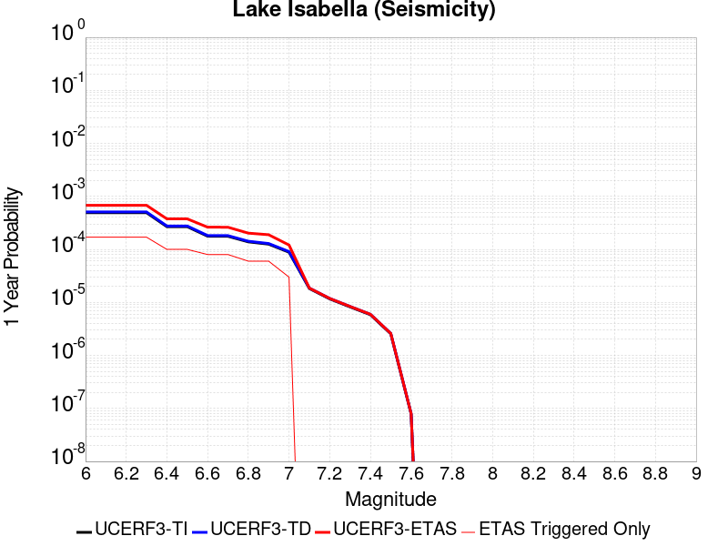 |  |

| Magnitude | 1 wk TI Prob | 1 wk TD Prob | 1 wk ETAS Prob | 1 wk ETAS/TD Gain | 1 wk ETAS Triggered Only | 1 mo TI Prob | 1 mo TD Prob | 1 mo ETAS Prob | 1 mo ETAS/TD Gain | 1 mo ETAS Triggered Only | 1 yr TI Prob | 1 yr TD Prob | 1 yr ETAS Prob | 1 yr ETAS/TD Gain | 1 yr ETAS Triggered Only | 10 yr TI Prob | 10 yr TD Prob | 10 yr ETAS Prob | 10 yr ETAS/TD Gain | 10 yr ETAS Triggered Only |
|-----|-----|-----|-----|-----|-----|-----|-----|-----|-----|-----|-----|-----|-----|-----|-----|-----|-----|-----|-----|-----|
| 6.0 | 9.431637E-6 | 9.741651E-6 | 1.4974028E-4 | 15.37114 | 1.4E-4 | 4.0420677E-5 | 4.1749343E-5 | 1.817435E-4 | 4.353206 | 1.4E-4 | 4.920106E-4 | 5.0819275E-4 | 6.781064E-4 | 1.3343488 | 1.7E-4 | 0.004909227 | 0.005071599 | 0.005250686 | 1.0353118 | 1.8E-4 |
| 6.1 | 9.431637E-6 | 9.741651E-6 | 1.4974028E-4 | 15.37114 | 1.4E-4 | 4.0420677E-5 | 4.1749343E-5 | 1.817435E-4 | 4.353206 | 1.4E-4 | 4.920106E-4 | 5.0819275E-4 | 6.781064E-4 | 1.3343488 | 1.7E-4 | 0.004909227 | 0.005071599 | 0.005250686 | 1.0353118 | 1.8E-4 |
| 6.2 | 9.431637E-6 | 9.741651E-6 | 1.4974028E-4 | 15.37114 | 1.4E-4 | 4.0420677E-5 | 4.1749343E-5 | 1.817435E-4 | 4.353206 | 1.4E-4 | 4.920106E-4 | 5.0819275E-4 | 6.781064E-4 | 1.3343488 | 1.7E-4 | 0.004909227 | 0.005071599 | 0.005250686 | 1.0353118 | 1.8E-4 |
| 6.3 | 9.431637E-6 | 9.741651E-6 | 1.4974028E-4 | 15.37114 | 1.4E-4 | 4.0420677E-5 | 4.1749343E-5 | 1.817435E-4 | 4.353206 | 1.4E-4 | 4.920106E-4 | 5.0819275E-4 | 6.781064E-4 | 1.3343488 | 1.7E-4 | 0.004909227 | 0.005071599 | 0.005250686 | 1.0353118 | 1.8E-4 |
| 6.4 | 5.144063E-6 | 5.3000763E-6 | 8.529965E-5 | 16.094044 | 8.0E-5 | 2.2045799E-5 | 2.2714434E-5 | 1.0271262E-4 | 4.5219097 | 8.0E-5 | 2.6837454E-4 | 2.765166E-4 | 3.7648893E-4 | 1.361542 | 1.0E-4 | 0.0026805066 | 0.0027620657 | 0.0028717618 | 1.0397153 | 1.1E-4 |
| 6.5 | 5.144063E-6 | 5.3000763E-6 | 8.529965E-5 | 16.094044 | 8.0E-5 | 2.2045799E-5 | 2.2714434E-5 | 1.0271262E-4 | 4.5219097 | 8.0E-5 | 2.6837454E-4 | 2.765166E-4 | 3.7648893E-4 | 1.361542 | 1.0E-4 | 0.0026805066 | 0.0027620657 | 0.0028717618 | 1.0397153 | 1.1E-4 |
| 6.6 | 3.4009804E-6 | 3.498786E-6 | 6.349858E-5 | 18.148745 | 6.0E-5 | 1.4575549E-5 | 1.4994721E-5 | 7.499382E-5 | 5.0013485 | 6.0E-5 | 1.7744285E-4 | 1.8254704E-4 | 2.6253244E-4 | 1.4381633 | 8.0E-5 | 0.0017730123 | 0.0018241286 | 0.0019139644 | 1.0492486 | 9.0E-5 |
| 6.7 | 3.3880428E-6 | 3.4856528E-6 | 6.3485444E-5 | 18.213358 | 6.0E-5 | 1.4520103E-5 | 1.4938435E-5 | 7.493754E-5 | 5.0164247 | 6.0E-5 | 1.767679E-4 | 1.8186188E-4 | 2.6184734E-4 | 1.4398143 | 8.0E-5 | 0.0017662736 | 0.0018172882 | 0.0019071246 | 1.0494343 | 9.0E-5 |
| 6.8 | 2.6582E-6 | 2.7337003E-6 | 4.273359E-5 | 15.632142 | 4.0E-5 | 1.1392236E-5 | 1.1715813E-5 | 5.1715346E-5 | 4.414149 | 4.0E-5 | 1.3869164E-4 | 1.4263204E-4 | 2.0262347E-4 | 1.4206029 | 6.0E-5 | 0.0013860512 | 0.0014255369 | 0.0014854514 | 1.0420294 | 6.0E-5 |
| 6.9 | 2.406011E-6 | 2.4743288E-6 | 4.247423E-5 | 17.16596 | 4.0E-5 | 1.0311434E-5 | 1.0604231E-5 | 5.0603805E-5 | 4.7720394 | 4.0E-5 | 1.2553448E-4 | 1.2910018E-4 | 1.8909243E-4 | 1.4646953 | 6.0E-5 | 0.0012546359 | 0.0012903814 | 0.001350304 | 1.0464379 | 6.0E-5 |
| 7.0 | 1.6953097E-6 | 1.7429371E-6 | 2.1742902E-5 | 12.474863 | 2.0E-5 | 7.265593E-6 | 7.469715E-6 | 2.7469567E-5 | 3.6774583 | 2.0E-5 | 8.8455E-5 | 9.094104E-5 | 1.20938304E-4 | 1.3298541 | 3.0E-5 | 8.84198E-4 | 9.09141E-4 | 9.3911367E-4 | 1.0329682 | 3.0E-5 |
| 7.1 | 3.5013824E-7 | 3.5714822E-7 | 3.5714822E-7 | 1.0 | 0.0 | 1.5005916E-6 | 1.5306344E-6 | 1.5306344E-6 | 1.0 | 0.0 | 1.826955E-5 | 1.8635317E-5 | 1.8635317E-5 | 1.0 | 0.0 | 1.8268047E-4 | 1.863378E-4 | 1.863378E-4 | 1.0 | 0.0 |
| 7.2 | 2.2321095E-7 | 2.2750574E-7 | 2.2750574E-7 | 1.0 | 0.0 | 9.56618E-7 | 9.750242E-7 | 9.750242E-7 | 1.0 | 0.0 | 1.1646762E-5 | 1.1870856E-5 | 1.1870856E-5 | 1.0 | 0.0 | 1.1646151E-4 | 1.1870232E-4 | 1.1870232E-4 | 1.0 | 0.0 |
| 7.3 | 1.5760406E-7 | 1.6060922E-7 | 1.6060922E-7 | 1.0 | 0.0 | 6.7544585E-7 | 6.8832503E-7 | 6.8832503E-7 | 1.0 | 0.0 | 8.223522E-6 | 8.380326E-6 | 8.380326E-6 | 1.0 | 0.0 | 8.2232174E-5 | 8.3800165E-5 | 8.3800165E-5 | 1.0 | 0.0 |
| 7.4 | 1.1216497E-7 | 1.1431706E-7 | 1.1431706E-7 | 1.0 | 0.0 | 4.8070694E-7 | 4.899302E-7 | 4.899302E-7 | 1.0 | 0.0 | 5.852591E-6 | 5.964884E-6 | 5.964884E-6 | 1.0 | 0.0 | 5.8524372E-5 | 5.9647282E-5 | 5.9647282E-5 | 1.0 | 0.0 |
| 7.5 | 4.885185E-8 | 4.9787737E-8 | 4.9787737E-8 | 1.0 | 0.0 | 2.0936506E-7 | 2.13376E-7 | 2.13376E-7 | 1.0 | 0.0 | 2.5490165E-6 | 2.59785E-6 | 2.59785E-6 | 1.0 | 0.0 | 2.5489873E-5 | 2.5978214E-5 | 2.5978214E-5 | 1.0 | 0.0 |
| 7.6 | 1.504641E-9 | 1.5317903E-9 | 1.5317903E-9 | 1.0 | 0.0 | 6.4484613E-9 | 6.5648154E-9 | 6.5648154E-9 | 1.0 | 0.0 | 7.851001E-8 | 7.992663E-8 | 7.992663E-8 | 1.0 | 0.0 | 7.8509987E-7 | 7.992663E-7 | 7.992663E-7 | 1.0 | 0.0 |

## San Andreas (Coachella) rev
*[(top)](#table-of-contents)*

| 1 Week | 1 Month | 1 Year | 10 Year |
|-----|-----|-----|-----|
|  |  |  |  |

| Magnitude | 1 wk TI Prob | 1 wk TD Prob | 1 wk ETAS Prob | 1 wk ETAS/TD Gain | 1 wk ETAS Triggered Only | 1 mo TI Prob | 1 mo TD Prob | 1 mo ETAS Prob | 1 mo ETAS/TD Gain | 1 mo ETAS Triggered Only | 1 yr TI Prob | 1 yr TD Prob | 1 yr ETAS Prob | 1 yr ETAS/TD Gain | 1 yr ETAS Triggered Only | 10 yr TI Prob | 10 yr TD Prob | 10 yr ETAS Prob | 10 yr ETAS/TD Gain | 10 yr ETAS Triggered Only |
|-----|-----|-----|-----|-----|-----|-----|-----|-----|-----|-----|-----|-----|-----|-----|-----|-----|-----|-----|-----|-----|
| 6.0 | 1.1925945E-4 | 3.2729402E-4 | 4.672482E-4 | 1.4276099 | 1.4E-4 | 5.110118E-4 | 0.0014019393 | 0.001551729 | 1.1068447 | 1.5E-4 | 0.0062038354 | 0.016936364 | 0.017083824 | 1.0087067 | 1.5E-4 | 0.060334753 | 0.15265316 | 0.15278873 | 1.0008881 | 1.6E-4 |
| 6.1 | 1.1925945E-4 | 3.2729402E-4 | 4.672482E-4 | 1.4276099 | 1.4E-4 | 5.110118E-4 | 0.0014019393 | 0.001551729 | 1.1068447 | 1.5E-4 | 0.0062038354 | 0.016936364 | 0.017083824 | 1.0087067 | 1.5E-4 | 0.060334753 | 0.15265316 | 0.15278873 | 1.0008881 | 1.6E-4 |
| 6.2 | 1.07432395E-4 | 3.0230157E-4 | 4.4225925E-4 | 1.4629737 | 1.4E-4 | 4.603433E-4 | 0.0012949388 | 0.0014447446 | 1.1156856 | 1.5E-4 | 0.005590286 | 0.015653009 | 0.01580066 | 1.0094328 | 1.5E-4 | 0.05451731 | 0.14182423 | 0.14196154 | 1.0009681 | 1.6E-4 |
| 6.3 | 1.0718766E-4 | 3.0175463E-4 | 4.417124E-4 | 1.4638132 | 1.4E-4 | 4.592948E-4 | 0.0012925972 | 0.0014424032 | 1.1158954 | 1.5E-4 | 0.005577586 | 0.015624908 | 0.015772564 | 1.0094501 | 1.5E-4 | 0.054396555 | 0.14159249 | 0.14172983 | 1.00097 | 1.6E-4 |
| 6.4 | 1.0355944E-4 | 2.9383553E-4 | 4.337944E-4 | 1.476317 | 1.4E-4 | 4.4375064E-4 | 0.0012586913 | 0.0014085025 | 1.1190214 | 1.5E-4 | 0.0053892885 | 0.015217941 | 0.015365659 | 1.0097067 | 1.5E-4 | 0.052604496 | 0.13815255 | 0.13829045 | 1.0009981 | 1.6E-4 |
| 6.5 | 1.0227914E-4 | 2.9102986E-4 | 4.3098914E-4 | 1.4809103 | 1.4E-4 | 4.382655E-4 | 0.0012466786 | 0.0013964917 | 1.1201698 | 1.5E-4 | 0.0053228354 | 0.01507372 | 0.015221459 | 1.0098011 | 1.5E-4 | 0.051971316 | 0.13693172 | 0.1370698 | 1.0010085 | 1.6E-4 |
| 6.6 | 1.0116757E-4 | 2.8868738E-4 | 4.2864698E-4 | 1.4848137 | 1.4E-4 | 4.3350324E-4 | 0.0012366489 | 0.0013864634 | 1.1211455 | 1.5E-4 | 0.0052651367 | 0.01495329 | 0.015101047 | 1.0098813 | 1.5E-4 | 0.051421247 | 0.1359099 | 0.13604815 | 1.0010172 | 1.6E-4 |
| 6.7 | 1.0050676E-4 | 2.8727303E-4 | 4.272328E-4 | 1.4872013 | 1.4E-4 | 4.3067214E-4 | 0.0012305931 | 0.0013804085 | 1.1217425 | 1.5E-4 | 0.005230834 | 0.014880571 | 0.015028338 | 1.0099303 | 1.5E-4 | 0.051094085 | 0.13529462 | 0.13543297 | 1.0010226 | 1.6E-4 |
| 6.8 | 9.976819E-5 | 2.853096E-4 | 4.2526965E-4 | 1.490555 | 1.4E-4 | 4.2750788E-4 | 0.0012221863 | 0.001372003 | 1.1225809 | 1.5E-4 | 0.0051924936 | 0.0147796115 | 0.014927395 | 1.0099992 | 1.5E-4 | 0.050728295 | 0.13444631 | 0.1345848 | 1.0010301 | 1.6E-4 |
| 6.9 | 9.77719E-5 | 2.8027873E-4 | 4.202395E-4 | 1.4993627 | 1.4E-4 | 4.1895514E-4 | 0.0012006456 | 0.0013504655 | 1.1247828 | 1.5E-4 | 0.0050888555 | 0.014520878 | 0.014668699 | 1.01018 | 1.5E-4 | 0.049738888 | 0.1322748 | 0.13241364 | 1.0010496 | 1.6E-4 |
| 7.0 | 8.500761E-5 | 2.4762485E-4 | 3.7759266E-4 | 1.5248576 | 1.3E-4 | 3.6426744E-4 | 0.001060821 | 0.0012006725 | 1.1318333 | 1.4E-4 | 0.0044259406 | 0.012839786 | 0.012977988 | 1.0107636 | 1.4E-4 | 0.04338823 | 0.11813272 | 0.118265 | 1.0011197 | 1.5E-4 |
| 7.1 | 8.319876E-5 | 2.4365232E-4 | 3.7362066E-4 | 1.5334171 | 1.3E-4 | 3.5651738E-4 | 0.0010438096 | 0.0011836634 | 1.1339841 | 1.4E-4 | 0.004331963 | 0.012635092 | 0.012773324 | 1.0109402 | 1.4E-4 | 0.042484846 | 0.116353 | 0.11648555 | 1.0011392 | 1.5E-4 |
| 7.2 | 7.563917E-5 | 2.2413683E-4 | 3.541077E-4 | 1.5798728 | 1.3E-4 | 3.2412758E-4 | 9.602359E-4 | 0.0011001015 | 1.1456575 | 1.4E-4 | 0.0039391145 | 0.011628893 | 0.011767265 | 1.011899 | 1.4E-4 | 0.03870018 | 0.10775925 | 0.10789309 | 1.001242 | 1.5E-4 |
| 7.3 | 7.082985E-5 | 2.0729867E-4 | 3.3727172E-4 | 1.6269845 | 1.3E-4 | 3.0352117E-4 | 8.881233E-4 | 0.001027999 | 1.1574957 | 1.4E-4 | 0.0036891096 | 0.010759917 | 0.01089841 | 1.0128713 | 1.4E-4 | 0.03628465 | 0.100282 | 0.10041696 | 1.0013458 | 1.5E-4 |
| 7.4 | 5.146215E-5 | 1.4273795E-4 | 2.727194E-4 | 1.91063 | 1.3E-4 | 2.2053342E-4 | 6.115915E-4 | 7.515059E-4 | 1.228771 | 1.4E-4 | 0.0026816884 | 0.0074208933 | 0.0075598545 | 1.0187256 | 1.4E-4 | 0.02649557 | 0.070849575 | 0.070988946 | 1.0019672 | 1.5E-4 |
| 7.5 | 4.0285166E-5 | 1.09416E-4 | 2.2940287E-4 | 2.0966117 | 1.2E-4 | 1.7263928E-4 | 4.6884175E-4 | 5.987808E-4 | 1.2771491 | 1.3E-4 | 0.002099857 | 0.0056932783 | 0.005822538 | 1.0227039 | 1.3E-4 | 0.020801254 | 0.055011146 | 0.055143446 | 1.0024049 | 1.4E-4 |
| 7.6 | 3.1168736E-5 | 8.4389096E-5 | 1.9437981E-4 | 2.303376 | 1.1E-4 | 1.3357346E-4 | 3.6161754E-4 | 4.8157416E-4 | 1.3317223 | 1.2E-4 | 0.0016250437 | 0.0043938323 | 0.004513305 | 1.027191 | 1.2E-4 | 0.016132116 | 0.04281005 | 0.042934485 | 1.0029067 | 1.3E-4 |
| 7.7 | 2.2100989E-5 | 6.238755E-5 | 1.7238069E-4 | 2.7630622 | 1.1E-4 | 9.4715084E-5 | 2.6734784E-4 | 3.8731578E-4 | 1.4487334 | 1.2E-4 | 0.001152546 | 0.0032501083 | 0.0033697183 | 1.0368018 | 1.2E-4 | 0.011465867 | 0.0319002 | 0.032026052 | 1.0039452 | 1.3E-4 |
| 7.8 | 1.7484861E-5 | 5.179572E-5 | 1.6179003E-4 | 3.1236176 | 1.1E-4 | 7.493296E-5 | 2.2196278E-4 | 3.4193613E-4 | 1.5405111 | 1.2E-4 | 9.1192697E-4 | 0.0026990508 | 0.002818727 | 1.0443401 | 1.2E-4 | 0.009081938 | 0.026640115 | 0.026766652 | 1.0047499 | 1.3E-4 |
| 7.9 | 1.3967285E-5 | 3.822255E-5 | 1.4821834E-4 | 3.877772 | 1.1E-4 | 5.985842E-5 | 1.6380067E-4 | 2.83781E-4 | 1.7324778 | 1.2E-4 | 7.2853256E-4 | 0.00199245 | 0.002112211 | 1.0601074 | 1.2E-4 | 0.0072614877 | 0.019909438 | 0.020036848 | 1.0063995 | 1.3E-4 |
| 8.0 | 1.1887396E-5 | 3.106521E-5 | 1.410618E-4 | 4.5408287 | 1.1E-4 | 5.094499E-5 | 1.3312983E-4 | 2.5311386E-4 | 1.9012557 | 1.2E-4 | 6.200787E-4 | 0.0016196516 | 0.0017394572 | 1.07397 | 1.2E-4 | 0.006183513 | 0.016279267 | 0.01640715 | 1.0078557 | 1.3E-4 |
| 8.1 | 5.100864E-6 | 8.973418E-6 | 8.973418E-6 | 1.0 | 0.0 | 2.1860664E-5 | 3.8456936E-5 | 3.8456936E-5 | 1.0 | 0.0 | 2.6612106E-4 | 4.6811273E-4 | 4.6811273E-4 | 1.0 | 0.0 | 0.002658026 | 0.004917731 | 0.004917731 | 1.0 | 0.0 |
| 8.2 | 2.3004484E-6 | 2.7864487E-6 | 2.7864487E-6 | 1.0 | 0.0 | 9.859027E-6 | 1.1941868E-5 | 1.1941868E-5 | 1.0 | 0.0 | 1.2002704E-4 | 1.4538258E-4 | 1.4538258E-4 | 1.0 | 0.0 | 0.0011996223 | 0.0015973912 | 0.0015973912 | 1.0 | 0.0 |
| 8.3 | 1.0424446E-7 | 5.8161504E-8 | 5.8161504E-8 | 1.0 | 0.0 | 4.4676187E-7 | 2.4926356E-7 | 2.4926356E-7 | 1.0 | 0.0 | 5.439312E-6 | 3.03478E-6 | 3.03478E-6 | 1.0 | 0.0 | 5.4391792E-5 | 3.190716E-5 | 3.190716E-5 | 1.0 | 0.0 |

## San Andreas (Cholame) rev
*[(top)](#table-of-contents)*

| 1 Week | 1 Month | 1 Year | 10 Year |
|-----|-----|-----|-----|
|  |  |  |  |

| Magnitude | 1 wk TI Prob | 1 wk TD Prob | 1 wk ETAS Prob | 1 wk ETAS/TD Gain | 1 wk ETAS Triggered Only | 1 mo TI Prob | 1 mo TD Prob | 1 mo ETAS Prob | 1 mo ETAS/TD Gain | 1 mo ETAS Triggered Only | 1 yr TI Prob | 1 yr TD Prob | 1 yr ETAS Prob | 1 yr ETAS/TD Gain | 1 yr ETAS Triggered Only | 10 yr TI Prob | 10 yr TD Prob | 10 yr ETAS Prob | 10 yr ETAS/TD Gain | 10 yr ETAS Triggered Only |
|-----|-----|-----|-----|-----|-----|-----|-----|-----|-----|-----|-----|-----|-----|-----|-----|-----|-----|-----|-----|-----|
| 6.0 | 1.2302514E-4 | 2.5204287E-4 | 3.4202018E-4 | 1.3569921 | 9.0E-5 | 5.27144E-4 | 0.0010797381 | 0.0012095978 | 1.1202695 | 1.3E-4 | 0.0063991086 | 0.0130670825 | 0.013215123 | 1.0113292 | 1.5E-4 | 0.06217949 | 0.12439073 | 0.12452207 | 1.0010558 | 1.5E-4 |
| 6.1 | 1.2302514E-4 | 2.5204287E-4 | 3.4202018E-4 | 1.3569921 | 9.0E-5 | 5.27144E-4 | 0.0010797381 | 0.0012095978 | 1.1202695 | 1.3E-4 | 0.0063991086 | 0.0130670825 | 0.013215123 | 1.0113292 | 1.5E-4 | 0.06217949 | 0.12439073 | 0.12452207 | 1.0010558 | 1.5E-4 |
| 6.2 | 1.2203569E-4 | 2.5021084E-4 | 3.4018833E-4 | 1.3596066 | 9.0E-5 | 5.2290526E-4 | 0.0010718931 | 0.0012017537 | 1.1211507 | 1.3E-4 | 0.006347804 | 0.01297271 | 0.013120764 | 1.0114127 | 1.5E-4 | 0.061695136 | 0.12357691 | 0.12370837 | 1.0010638 | 1.5E-4 |
| 6.3 | 1.2142645E-4 | 2.4907055E-4 | 3.3904816E-4 | 1.3612534 | 9.0E-5 | 5.202953E-4 | 0.0010670102 | 0.0011968715 | 1.1217058 | 1.3E-4 | 0.006316212 | 0.012913967 | 0.01306203 | 1.0114653 | 1.5E-4 | 0.06139677 | 0.12307103 | 0.12320257 | 1.0010688 | 1.5E-4 |
| 6.4 | 1.1865206E-4 | 2.44126E-4 | 3.3410403E-4 | 1.3685721 | 9.0E-5 | 5.0840975E-4 | 0.0010458364 | 0.0011757005 | 1.1241724 | 1.3E-4 | 0.006172335 | 0.012659196 | 0.0128072975 | 1.0116991 | 1.5E-4 | 0.060036868 | 0.1208638 | 0.12099568 | 1.0010911 | 1.5E-4 |
| 6.5 | 1.17443946E-4 | 2.4205919E-4 | 3.320374E-4 | 1.3717198 | 9.0E-5 | 5.032341E-4 | 0.0010369857 | 0.0011668509 | 1.1252334 | 1.3E-4 | 0.006109677 | 0.012552682 | 0.0127008 | 1.0117997 | 1.5E-4 | 0.059444077 | 0.11993805 | 0.12007006 | 1.0011007 | 1.5E-4 |
| 6.6 | 1.13579066E-4 | 2.3514954E-4 | 3.2512838E-4 | 1.3826451 | 9.0E-5 | 4.866766E-4 | 0.001007396 | 0.0011172852 | 1.1090825 | 1.1E-4 | 0.0059092017 | 0.012196515 | 0.012324929 | 1.0105288 | 1.3E-4 | 0.057545185 | 0.11685214 | 0.116966955 | 1.0009825 | 1.3E-4 |
| 6.7 | 1.1271412E-4 | 2.3359268E-4 | 3.2357167E-4 | 1.3851961 | 9.0E-5 | 4.829711E-4 | 0.0010007289 | 0.0011106188 | 1.1098099 | 1.1E-4 | 0.005864331 | 0.012116249 | 0.012244673 | 1.0105994 | 1.3E-4 | 0.057119697 | 0.116155714 | 0.11627061 | 1.0009892 | 1.3E-4 |
| 6.8 | 1.1217975E-4 | 2.3247694E-4 | 3.2245604E-4 | 1.3870451 | 9.0E-5 | 4.8068175E-4 | 9.959509E-4 | 0.0011058414 | 1.1103373 | 1.1E-4 | 0.005836608 | 0.012058721 | 0.012187154 | 1.0106506 | 1.3E-4 | 0.056856725 | 0.11565396 | 0.11576893 | 1.0009941 | 1.3E-4 |
| 6.9 | 1.1146753E-4 | 2.3096445E-4 | 3.2094365E-4 | 1.3895804 | 9.0E-5 | 4.7763053E-4 | 9.894737E-4 | 0.0010993648 | 1.1110603 | 1.1E-4 | 0.0057996577 | 0.011980731 | 0.012109174 | 1.0107207 | 1.3E-4 | 0.056506127 | 0.11497439 | 0.11508945 | 1.0010006 | 1.3E-4 |
| 7.0 | 1.0965793E-4 | 2.2719789E-4 | 3.1717744E-4 | 1.3960404 | 9.0E-5 | 4.698779E-4 | 9.733434E-4 | 0.0010832363 | 1.1129025 | 1.1E-4 | 0.005705768 | 0.011786487 | 0.0119149545 | 1.0108995 | 1.3E-4 | 0.055614736 | 0.11327597 | 0.11339124 | 1.0010177 | 1.3E-4 |
| 7.1 | 9.927982E-5 | 2.0538924E-4 | 2.9537076E-4 | 1.4381024 | 9.0E-5 | 4.2541555E-4 | 8.7994366E-4 | 9.798557E-4 | 1.1135436 | 1.0E-4 | 0.0051671406 | 0.010660981 | 0.010779702 | 1.011136 | 1.2E-4 | 0.05048634 | 0.1033706 | 0.10347819 | 1.0010408 | 1.2E-4 |
| 7.2 | 9.696786E-5 | 2.0043184E-4 | 2.804158E-4 | 1.3990582 | 8.0E-5 | 4.1551032E-4 | 8.5871184E-4 | 9.486345E-4 | 1.1047182 | 9.0E-5 | 0.00504711 | 0.010404981 | 0.0105138365 | 1.0104618 | 1.1E-4 | 0.04934009 | 0.1011086 | 0.10120748 | 1.000978 | 1.1E-4 |
| 7.3 | 9.4727984E-5 | 1.9472468E-4 | 2.747091E-4 | 1.4107565 | 8.0E-5 | 4.0591392E-4 | 8.3426846E-4 | 9.2419336E-4 | 1.1077889 | 9.0E-5 | 0.0049308087 | 0.010110183 | 0.01021907 | 1.0107701 | 1.1E-4 | 0.048228268 | 0.09847952 | 0.098578684 | 1.001007 | 1.1E-4 |
| 7.4 | 9.220358E-5 | 1.8843076E-4 | 2.684157E-4 | 1.4244791 | 8.0E-5 | 3.9509835E-4 | 8.073114E-4 | 8.9723873E-4 | 1.1113912 | 9.0E-5 | 0.004799717 | 0.009784967 | 0.0098938905 | 1.0111318 | 1.1E-4 | 0.046973653 | 0.095557496 | 0.09565698 | 1.0010412 | 1.1E-4 |
| 7.5 | 7.71631E-5 | 1.5177966E-4 | 2.2176903E-4 | 1.4611249 | 7.0E-5 | 3.306571E-4 | 6.503223E-4 | 7.202768E-4 | 1.107569 | 7.0E-5 | 0.0040183207 | 0.007889002 | 0.007978291 | 1.0113183 | 9.0E-5 | 0.03946433 | 0.07828531 | 0.07836826 | 1.0010597 | 9.0E-5 |
| 7.6 | 7.5634416E-5 | 1.483744E-4 | 2.18364E-4 | 1.4717095 | 7.0E-5 | 3.241072E-4 | 6.3573546E-4 | 7.05691E-4 | 1.1100386 | 7.0E-5 | 0.0039388672 | 0.0077126776 | 0.0078019835 | 1.0115792 | 9.0E-5 | 0.038697794 | 0.07664872 | 0.07673182 | 1.0010842 | 9.0E-5 |
| 7.7 | 6.3783E-5 | 1.235872E-4 | 1.6358226E-4 | 1.323618 | 4.0E-5 | 2.7332708E-4 | 5.29552E-4 | 5.695308E-4 | 1.0754956 | 4.0E-5 | 0.0033226798 | 0.0064282627 | 0.006487877 | 1.0092738 | 6.0E-5 | 0.032734364 | 0.06454029 | 0.06459642 | 1.0008696 | 6.0E-5 |
| 7.8 | 5.863422E-5 | 1.1416107E-4 | 1.5415651E-4 | 1.3503422 | 4.0E-5 | 2.512653E-4 | 4.8917E-4 | 5.291505E-4 | 1.0817312 | 4.0E-5 | 0.003054864 | 0.0059394026 | 0.0059990464 | 1.0100421 | 6.0E-5 | 0.030132094 | 0.059659187 | 0.059715606 | 1.0009457 | 6.0E-5 |
| 7.9 | 4.595283E-5 | 8.426331E-5 | 1.1426079E-4 | 1.3559968 | 3.0E-5 | 1.9692584E-4 | 3.610785E-4 | 3.9106768E-4 | 1.0830544 | 3.0E-5 | 0.0023949358 | 0.0043872762 | 0.0044271005 | 1.0090773 | 4.0E-5 | 0.023692891 | 0.044362005 | 0.04440023 | 1.0008616 | 4.0E-5 |
| 8.0 | 3.2950178E-5 | 5.0772942E-5 | 7.077193E-5 | 1.3938906 | 2.0E-5 | 1.412074E-4 | 2.1758018E-4 | 2.3757583E-4 | 1.0919001 | 2.0E-5 | 0.0017178444 | 0.0026458222 | 0.0026657695 | 1.007539 | 2.0E-5 | 0.017046256 | 0.027180137 | 0.027199594 | 1.0007159 | 2.0E-5 |
| 8.1 | 1.9177472E-5 | 1.9185145E-5 | 1.9185145E-5 | 1.0 | 0.0 | 8.218658E-5 | 8.221946E-5 | 8.221946E-5 | 1.0 | 0.0 | 0.0010001622 | 0.0010005629 | 0.0010005629 | 1.0 | 0.0 | 0.009956728 | 0.010758142 | 0.010758142 | 1.0 | 0.0 |
| 8.2 | 8.643924E-6 | 5.4748625E-6 | 5.4748625E-6 | 1.0 | 0.0 | 3.704486E-5 | 2.3463486E-5 | 2.3463486E-5 | 1.0 | 0.0 | 4.5092785E-4 | 2.8563058E-4 | 2.8563058E-4 | 1.0 | 0.0 | 0.0045001395 | 0.0032487072 | 0.0032487072 | 1.0 | 0.0 |
| 8.3 | 1.983087E-6 | 7.6599065E-7 | 7.6599065E-7 | 1.0 | 0.0 | 8.498917E-6 | 3.282813E-6 | 3.282813E-6 | 1.0 | 0.0 | 1.034694E-4 | 3.9967534E-5 | 3.9967534E-5 | 1.0 | 0.0 | 0.0010342124 | 4.719687E-4 | 4.719687E-4 | 1.0 | 0.0 |

## San Andreas (Carrizo) rev
*[(top)](#table-of-contents)*

| 1 Week | 1 Month | 1 Year | 10 Year |
|-----|-----|-----|-----|
|  |  |  |  |

| Magnitude | 1 wk TI Prob | 1 wk TD Prob | 1 wk ETAS Prob | 1 wk ETAS/TD Gain | 1 wk ETAS Triggered Only | 1 mo TI Prob | 1 mo TD Prob | 1 mo ETAS Prob | 1 mo ETAS/TD Gain | 1 mo ETAS Triggered Only | 1 yr TI Prob | 1 yr TD Prob | 1 yr ETAS Prob | 1 yr ETAS/TD Gain | 1 yr ETAS Triggered Only | 10 yr TI Prob | 10 yr TD Prob | 10 yr ETAS Prob | 10 yr ETAS/TD Gain | 10 yr ETAS Triggered Only |
|-----|-----|-----|-----|-----|-----|-----|-----|-----|-----|-----|-----|-----|-----|-----|-----|-----|-----|-----|-----|-----|
| 6.0 | 1.1674632E-4 | 2.432302E-4 | 3.6320102E-4 | 1.4932398 | 1.2E-4 | 5.002454E-4 | 0.0010420004 | 0.0011718649 | 1.1246301 | 1.3E-4 | 0.006073493 | 0.012613042 | 0.0127611505 | 1.0117425 | 1.5E-4 | 0.0591016 | 0.12061418 | 0.12074608 | 1.0010936 | 1.5E-4 |
| 6.1 | 1.1674632E-4 | 2.432302E-4 | 3.6320102E-4 | 1.4932398 | 1.2E-4 | 5.002454E-4 | 0.0010420004 | 0.0011718649 | 1.1246301 | 1.3E-4 | 0.006073493 | 0.012613042 | 0.0127611505 | 1.0117425 | 1.5E-4 | 0.0591016 | 0.12061418 | 0.12074608 | 1.0010936 | 1.5E-4 |
| 6.2 | 1.1674632E-4 | 2.432302E-4 | 3.6320102E-4 | 1.4932398 | 1.2E-4 | 5.002454E-4 | 0.0010420004 | 0.0011718649 | 1.1246301 | 1.3E-4 | 0.006073493 | 0.012613042 | 0.0127611505 | 1.0117425 | 1.5E-4 | 0.0591016 | 0.12061418 | 0.12074608 | 1.0010936 | 1.5E-4 |
| 6.3 | 1.1674632E-4 | 2.432302E-4 | 3.6320102E-4 | 1.4932398 | 1.2E-4 | 5.002454E-4 | 0.0010420004 | 0.0011718649 | 1.1246301 | 1.3E-4 | 0.006073493 | 0.012613042 | 0.0127611505 | 1.0117425 | 1.5E-4 | 0.0591016 | 0.12061418 | 0.12074608 | 1.0010936 | 1.5E-4 |
| 6.4 | 1.1674632E-4 | 2.432302E-4 | 3.6320102E-4 | 1.4932398 | 1.2E-4 | 5.002454E-4 | 0.0010420004 | 0.0011718649 | 1.1246301 | 1.3E-4 | 0.006073493 | 0.012613042 | 0.0127611505 | 1.0117425 | 1.5E-4 | 0.0591016 | 0.12061418 | 0.12074608 | 1.0010936 | 1.5E-4 |
| 6.5 | 1.13136164E-4 | 2.3643032E-4 | 3.5640196E-4 | 1.5074291 | 1.2E-4 | 4.847792E-4 | 0.0010128808 | 0.0011427492 | 1.1282167 | 1.3E-4 | 0.0058862255 | 0.012262545 | 0.012410705 | 1.0120823 | 1.5E-4 | 0.057327334 | 0.117585555 | 0.117717914 | 1.0011257 | 1.5E-4 |
| 6.6 | 1.13136164E-4 | 2.3643032E-4 | 3.5640196E-4 | 1.5074291 | 1.2E-4 | 4.847792E-4 | 0.0010128808 | 0.0011427492 | 1.1282167 | 1.3E-4 | 0.0058862255 | 0.012262545 | 0.012410705 | 1.0120823 | 1.5E-4 | 0.057327334 | 0.117585555 | 0.117717914 | 1.0011257 | 1.5E-4 |
| 6.7 | 1.1149675E-4 | 2.3334254E-4 | 3.5331454E-4 | 1.5141454 | 1.2E-4 | 4.777557E-4 | 9.996577E-4 | 0.0011295277 | 1.1299145 | 1.3E-4 | 0.0058011734 | 0.012103349 | 0.012251534 | 1.0122433 | 1.5E-4 | 0.05652051 | 0.1162071 | 0.11633967 | 1.0011408 | 1.5E-4 |
| 6.8 | 1.1103589E-4 | 2.3236412E-4 | 3.5233624E-4 | 1.5163108 | 1.2E-4 | 4.7578133E-4 | 9.954676E-4 | 0.0011253383 | 1.1304619 | 1.3E-4 | 0.005777263 | 0.012052901 | 0.012201093 | 1.0122951 | 1.5E-4 | 0.056293584 | 0.1157674 | 0.11590003 | 1.0011457 | 1.5E-4 |
| 6.9 | 1.1053259E-4 | 2.3128795E-4 | 3.5126018E-4 | 1.5187137 | 1.2E-4 | 4.7362508E-4 | 9.90859E-4 | 0.0011207302 | 1.1310693 | 1.3E-4 | 0.0057511497 | 0.01199741 | 0.0121456105 | 1.0123527 | 1.5E-4 | 0.05604569 | 0.11528359 | 0.1154163 | 1.0011511 | 1.5E-4 |
| 7.0 | 1.1005377E-4 | 2.3029637E-4 | 3.5026873E-4 | 1.5209477 | 1.2E-4 | 4.7157376E-4 | 9.866126E-4 | 0.0011164844 | 1.131634 | 1.3E-4 | 0.0057263062 | 0.011946279 | 0.0120944865 | 1.0124062 | 1.5E-4 | 0.055809796 | 0.11483591 | 0.11496869 | 1.0011562 | 1.5E-4 |
| 7.1 | 1.0308142E-4 | 2.1539345E-4 | 3.153719E-4 | 1.4641666 | 1.0E-4 | 4.417027E-4 | 9.227892E-4 | 0.0010326877 | 1.1190938 | 1.1E-4 | 0.0053644776 | 0.011177397 | 0.011305945 | 1.0115006 | 1.3E-4 | 0.052368138 | 0.108092256 | 0.10820821 | 1.0010726 | 1.3E-4 |
| 7.2 | 1.0027479E-4 | 2.094724E-4 | 2.9945356E-4 | 1.4295609 | 9.0E-5 | 4.296783E-4 | 8.9743105E-4 | 9.973414E-4 | 1.1113292 | 1.0E-4 | 0.0052187922 | 0.010871782 | 0.010990478 | 1.0109178 | 1.2E-4 | 0.050979212 | 0.10539625 | 0.105503604 | 1.0010185 | 1.2E-4 |
| 7.3 | 9.816942E-5 | 2.0422463E-4 | 2.842083E-4 | 1.3916456 | 8.0E-5 | 4.2065824E-4 | 8.7495585E-4 | 9.6487714E-4 | 1.1027724 | 9.0E-5 | 0.005109493 | 0.010600842 | 0.010709676 | 1.0102665 | 1.1E-4 | 0.049935985 | 0.102979995 | 0.10307867 | 1.0009582 | 1.1E-4 |
| 7.4 | 9.5634205E-5 | 1.9791997E-4 | 2.7790412E-4 | 1.4041238 | 8.0E-5 | 4.0979648E-4 | 8.479536E-4 | 9.378773E-4 | 1.1060479 | 9.0E-5 | 0.0049778637 | 0.010275229 | 0.010384099 | 1.0105953 | 1.1E-4 | 0.048678253 | 0.10006632 | 0.100165315 | 1.0009893 | 1.1E-4 |
| 7.5 | 8.052417E-5 | 1.611261E-4 | 2.3111481E-4 | 1.4343723 | 7.0E-5 | 3.4505792E-4 | 6.903579E-4 | 7.603095E-4 | 1.1013267 | 7.0E-5 | 0.0041929903 | 0.008372796 | 0.008462043 | 1.0106591 | 9.0E-5 | 0.04114753 | 0.08281049 | 0.08289304 | 1.0009968 | 9.0E-5 |
| 7.6 | 7.897024E-5 | 1.5765853E-4 | 2.276475E-4 | 1.4439275 | 7.0E-5 | 3.384E-4 | 6.755046E-4 | 7.4545736E-4 | 1.1035563 | 7.0E-5 | 0.0041122385 | 0.008193332 | 0.008282594 | 1.0108945 | 9.0E-5 | 0.040369697 | 0.08115171 | 0.0812344 | 1.001019 | 9.0E-5 |
| 7.7 | 6.707427E-5 | 1.3276102E-4 | 1.7275572E-4 | 1.3012532 | 4.0E-5 | 2.8742946E-4 | 5.688518E-4 | 6.08829E-4 | 1.0702771 | 4.0E-5 | 0.003493839 | 0.00690381 | 0.006963396 | 1.0086309 | 6.0E-5 | 0.034394164 | 0.069048055 | 0.06910391 | 1.000809 | 6.0E-5 |
| 7.8 | 6.147705E-5 | 1.2197486E-4 | 1.6196999E-4 | 1.3278965 | 4.0E-5 | 2.6344648E-4 | 5.226447E-4 | 5.6262384E-4 | 1.0764939 | 4.0E-5 | 0.0032027436 | 0.006344659 | 0.0064042783 | 1.0093968 | 6.0E-5 | 0.031569764 | 0.06351457 | 0.06357075 | 1.0008847 | 6.0E-5 |
| 7.9 | 4.7636717E-5 | 8.87977E-5 | 1.1879503E-4 | 1.3378166 | 3.0E-5 | 2.0414138E-4 | 3.8050607E-4 | 4.1049466E-4 | 1.0788124 | 3.0E-5 | 0.0024825884 | 0.0046228287 | 0.0046626437 | 1.0086128 | 4.0E-5 | 0.024550365 | 0.046628095 | 0.046666227 | 1.0008179 | 4.0E-5 |
| 8.0 | 3.3554235E-5 | 5.2136907E-5 | 7.213587E-5 | 1.3835855 | 2.0E-5 | 1.4379594E-4 | 2.2342477E-4 | 2.434203E-4 | 1.0894955 | 2.0E-5 | 0.0017493097 | 0.002716805 | 0.0027367508 | 1.0073416 | 2.0E-5 | 0.017356034 | 0.027880952 | 0.027900394 | 1.0006974 | 2.0E-5 |
| 8.1 | 1.9175432E-5 | 1.9184976E-5 | 1.9184976E-5 | 1.0 | 0.0 | 8.217783E-5 | 8.2218736E-5 | 8.2218736E-5 | 1.0 | 0.0 | 0.0010000558 | 0.0010005541 | 0.0010005541 | 1.0 | 0.0 | 0.009955673 | 0.0107580265 | 0.0107580265 | 1.0 | 0.0 |
| 8.2 | 8.643924E-6 | 5.4748625E-6 | 5.4748625E-6 | 1.0 | 0.0 | 3.704486E-5 | 2.3463486E-5 | 2.3463486E-5 | 1.0 | 0.0 | 4.5092785E-4 | 2.8563058E-4 | 2.8563058E-4 | 1.0 | 0.0 | 0.0045001395 | 0.0032487072 | 0.0032487072 | 1.0 | 0.0 |
| 8.3 | 1.983087E-6 | 7.6599065E-7 | 7.6599065E-7 | 1.0 | 0.0 | 8.498917E-6 | 3.282813E-6 | 3.282813E-6 | 1.0 | 0.0 | 1.034694E-4 | 3.9967534E-5 | 3.9967534E-5 | 1.0 | 0.0 | 0.0010342124 | 4.719687E-4 | 4.719687E-4 | 1.0 | 0.0 |

## San Andreas (North Branch Mill Creek)
*[(top)](#table-of-contents)*

| 1 Week | 1 Month | 1 Year | 10 Year |
|-----|-----|-----|-----|
|  |  |  |  |

| Magnitude | 1 wk TI Prob | 1 wk TD Prob | 1 wk ETAS Prob | 1 wk ETAS/TD Gain | 1 wk ETAS Triggered Only | 1 mo TI Prob | 1 mo TD Prob | 1 mo ETAS Prob | 1 mo ETAS/TD Gain | 1 mo ETAS Triggered Only | 1 yr TI Prob | 1 yr TD Prob | 1 yr ETAS Prob | 1 yr ETAS/TD Gain | 1 yr ETAS Triggered Only | 10 yr TI Prob | 10 yr TD Prob | 10 yr ETAS Prob | 10 yr ETAS/TD Gain | 10 yr ETAS Triggered Only |
|-----|-----|-----|-----|-----|-----|-----|-----|-----|-----|-----|-----|-----|-----|-----|-----|-----|-----|-----|-----|-----|
| 6.0 | 1.3461156E-5 | 2.3499893E-5 | 1.334973E-4 | 5.6807623 | 1.1E-4 | 5.7689394E-5 | 1.00709956E-4 | 2.3069687E-4 | 2.2907057 | 1.3E-4 | 7.02142E-4 | 0.0012254574 | 0.0013652858 | 1.1141031 | 1.4E-4 | 0.0069992766 | 0.01222957 | 0.012367858 | 1.0113077 | 1.4E-4 |
| 6.1 | 1.3461156E-5 | 2.3499893E-5 | 1.334973E-4 | 5.6807623 | 1.1E-4 | 5.7689394E-5 | 1.00709956E-4 | 2.3069687E-4 | 2.2907057 | 1.3E-4 | 7.02142E-4 | 0.0012254574 | 0.0013652858 | 1.1141031 | 1.4E-4 | 0.0069992766 | 0.01222957 | 0.012367858 | 1.0113077 | 1.4E-4 |
| 6.2 | 1.3461156E-5 | 2.3499893E-5 | 1.334973E-4 | 5.6807623 | 1.1E-4 | 5.7689394E-5 | 1.00709956E-4 | 2.3069687E-4 | 2.2907057 | 1.3E-4 | 7.02142E-4 | 0.0012254574 | 0.0013652858 | 1.1141031 | 1.4E-4 | 0.0069992766 | 0.01222957 | 0.012367858 | 1.0113077 | 1.4E-4 |
| 6.3 | 1.3461156E-5 | 2.3499893E-5 | 1.334973E-4 | 5.6807623 | 1.1E-4 | 5.7689394E-5 | 1.00709956E-4 | 2.3069687E-4 | 2.2907057 | 1.3E-4 | 7.02142E-4 | 0.0012254574 | 0.0013652858 | 1.1141031 | 1.4E-4 | 0.0069992766 | 0.01222957 | 0.012367858 | 1.0113077 | 1.4E-4 |
| 6.4 | 1.3461156E-5 | 2.3499893E-5 | 1.334973E-4 | 5.6807623 | 1.1E-4 | 5.7689394E-5 | 1.00709956E-4 | 2.3069687E-4 | 2.2907057 | 1.3E-4 | 7.02142E-4 | 0.0012254574 | 0.0013652858 | 1.1141031 | 1.4E-4 | 0.0069992766 | 0.01222957 | 0.012367858 | 1.0113077 | 1.4E-4 |
| 6.5 | 1.3450706E-5 | 2.3488852E-5 | 1.3348628E-4 | 5.6829624 | 1.1E-4 | 5.764461E-5 | 1.0066265E-4 | 2.3064956E-4 | 2.2913122 | 1.3E-4 | 7.0159714E-4 | 0.001224882 | 0.0013647105 | 1.1141567 | 1.4E-4 | 0.006993862 | 0.01222388 | 0.012362168 | 1.011313 | 1.4E-4 |
| 6.6 | 1.3074523E-5 | 2.3103135E-5 | 1.3310059E-4 | 5.7611485 | 1.1E-4 | 5.6032466E-5 | 9.9009696E-5 | 2.2899683E-4 | 2.3128726 | 1.3E-4 | 6.8198174E-4 | 0.0012047797 | 0.001344611 | 1.1160638 | 1.4E-4 | 0.006798926 | 0.012025044 | 0.012163361 | 1.0115024 | 1.4E-4 |
| 6.7 | 1.3050216E-5 | 2.3078432E-5 | 1.330759E-4 | 5.766245 | 1.1E-4 | 5.59283E-5 | 9.890384E-5 | 2.2889097E-4 | 2.3142781 | 1.3E-4 | 6.8071426E-4 | 0.0012034923 | 0.0013433237 | 1.1161882 | 1.4E-4 | 0.0067863287 | 0.012012309 | 0.012150628 | 1.0115147 | 1.4E-4 |
| 6.8 | 1.29049395E-5 | 2.292684E-5 | 1.3292432E-4 | 5.79776 | 1.1E-4 | 5.530571E-5 | 9.825421E-5 | 2.2824144E-4 | 2.3229685 | 1.3E-4 | 6.73139E-4 | 0.0011955918 | 0.0013354244 | 1.1169568 | 1.4E-4 | 0.0067110364 | 0.011934154 | 0.012072483 | 1.0115911 | 1.4E-4 |
| 6.9 | 1.2867369E-5 | 2.2886245E-5 | 1.3288372E-4 | 5.8062706 | 1.1E-4 | 5.51447E-5 | 9.8080236E-5 | 2.2806748E-4 | 2.3253155 | 1.3E-4 | 6.711799E-4 | 0.0011934759 | 0.0013333089 | 1.1171644 | 1.4E-4 | 0.006691564 | 0.011913223 | 0.012051555 | 1.0116117 | 1.4E-4 |
| 7.0 | 1.2495996E-5 | 2.2286325E-5 | 1.3228388E-4 | 5.9356523 | 1.1E-4 | 5.3553173E-5 | 9.550934E-5 | 2.2549693E-4 | 2.3609934 | 1.3E-4 | 6.518148E-4 | 0.0011622087 | 0.0013020461 | 1.1203203 | 1.4E-4 | 0.0064990623 | 0.0116038285 | 0.011742204 | 1.011925 | 1.4E-4 |
| 7.1 | 1.2452067E-5 | 2.2231397E-5 | 1.3222895E-4 | 5.947847 | 1.1E-4 | 5.3364907E-5 | 9.527396E-5 | 2.2526157E-4 | 2.3643563 | 1.3E-4 | 6.4952404E-4 | 0.0011593461 | 0.0012991837 | 1.1206177 | 1.4E-4 | 0.0064762887 | 0.0115755 | 0.011713879 | 1.0119545 | 1.4E-4 |
| 7.2 | 1.2002777E-5 | 2.1609963E-5 | 1.3160758E-4 | 6.0901346 | 1.1E-4 | 5.143946E-5 | 9.2610855E-5 | 2.2259881E-4 | 2.403593 | 1.3E-4 | 6.2609545E-4 | 0.0011269567 | 0.0012667988 | 1.1240884 | 1.4E-4 | 0.006243344 | 0.011254923 | 0.011393348 | 1.012299 | 1.4E-4 |
| 7.3 | 1.1923425E-5 | 2.1479793E-5 | 1.3147743E-4 | 6.120982 | 1.1E-4 | 5.109939E-5 | 9.205302E-5 | 2.2204105E-4 | 2.4120996 | 1.3E-4 | 6.219575E-4 | 0.001120172 | 0.0012600152 | 1.1248409 | 1.4E-4 | 0.0062021962 | 0.011187789 | 0.011326223 | 1.0123737 | 1.4E-4 |
| 7.4 | 1.16105175E-5 | 2.0853771E-5 | 1.3085148E-4 | 6.274715 | 1.1E-4 | 4.975841E-5 | 8.937026E-5 | 2.1935864E-4 | 2.4544926 | 1.3E-4 | 6.0564023E-4 | 0.0010875424 | 0.0012273901 | 1.1285906 | 1.4E-4 | 0.006039923 | 0.010865397 | 0.011003875 | 1.0127449 | 1.4E-4 |
| 7.5 | 1.1037265E-5 | 1.9553907E-5 | 1.2955176E-4 | 6.6253643 | 1.1E-4 | 4.7301706E-5 | 8.379978E-5 | 2.1378888E-4 | 2.5511868 | 1.3E-4 | 5.757461E-4 | 0.0010197869 | 0.0011596442 | 1.1371436 | 1.4E-4 | 0.005742567 | 0.010194898 | 0.01033347 | 1.0135924 | 1.4E-4 |
| 7.6 | 1.0720915E-5 | 1.899582E-5 | 1.2899374E-4 | 6.790638 | 1.1E-4 | 4.5945973E-5 | 8.140812E-5 | 2.1139754E-4 | 2.5967622 | 1.3E-4 | 5.592486E-4 | 9.906954E-4 | 0.0011305567 | 1.1411749 | 1.4E-4 | 0.005578433 | 0.009906623 | 0.010045235 | 1.013992 | 1.4E-4 |
| 7.7 | 9.276279E-6 | 1.6441649E-5 | 1.2643985E-4 | 7.6902165 | 1.1E-4 | 3.9754876E-5 | 7.0462316E-5 | 2.0045316E-4 | 2.844828 | 1.3E-4 | 4.839081E-4 | 8.575427E-4 | 9.974226E-4 | 1.1631172 | 1.4E-4 | 0.0048285574 | 0.008586041 | 0.008724839 | 1.0161655 | 1.4E-4 |
| 7.8 | 5.8346777E-6 | 1.1155013E-5 | 1.2115379E-4 | 10.860927 | 1.1E-4 | 2.5005522E-5 | 4.7806327E-5 | 1.7780012E-4 | 3.7191753 | 1.3E-4 | 3.043997E-4 | 5.818867E-4 | 7.218052E-4 | 1.2404567 | 1.4E-4 | 0.0030398308 | 0.0058469265 | 0.005986108 | 1.0238042 | 1.4E-4 |
| 7.9 | 4.690204E-6 | 8.509093E-6 | 1.1850816E-4 | 13.927237 | 1.1E-4 | 2.0100719E-5 | 3.6467034E-5 | 1.664623E-4 | 4.5647335 | 1.3E-4 | 2.4469878E-4 | 4.4389578E-4 | 5.8383367E-4 | 1.3152493 | 1.4E-4 | 0.002444295 | 0.0044707474 | 0.0046101213 | 1.0311747 | 1.4E-4 |
| 8.0 | 2.9570454E-6 | 4.846947E-6 | 3.4846802E-5 | 7.1894336 | 3.0E-5 | 1.267299E-5 | 2.0772464E-5 | 5.077184E-5 | 2.4441895 | 3.0E-5 | 1.5428272E-4 | 2.5287544E-4 | 2.8286784E-4 | 1.1186055 | 3.0E-5 | 0.0015417566 | 0.002549644 | 0.0025795677 | 1.0117364 | 3.0E-5 |
| 8.1 | 1.6376824E-6 | 2.1968929E-6 | 2.1968929E-6 | 1.0 | 0.0 | 7.01862E-6 | 9.41522E-6 | 9.41522E-6 | 1.0 | 0.0 | 8.544835E-5 | 1.14624294E-4 | 1.14624294E-4 | 1.0 | 0.0 | 8.54155E-4 | 0.0011606582 | 0.0011606582 | 1.0 | 0.0 |
| 8.2 | 6.9631557E-7 | 4.5360213E-7 | 4.5360213E-7 | 1.0 | 0.0 | 2.984206E-6 | 1.9440076E-6 | 1.9440076E-6 | 1.0 | 0.0 | 3.63321E-5 | 2.3668037E-5 | 2.3668037E-5 | 1.0 | 0.0 | 3.6326164E-4 | 2.451564E-4 | 2.451564E-4 | 1.0 | 0.0 |
| 8.3 | 1.7876137E-7 | 8.360375E-8 | 8.360375E-8 | 1.0 | 0.0 | 7.661199E-7 | 3.5830175E-7 | 3.5830175E-7 | 1.0 | 0.0 | 9.32747E-6 | 4.3623154E-6 | 4.3623154E-6 | 1.0 | 0.0 | 9.3270784E-5 | 4.5817014E-5 | 4.5817014E-5 | 1.0 | 0.0 |

## San Jacinto (San Jacinto Valley) rev
*[(top)](#table-of-contents)*

| 1 Week | 1 Month | 1 Year | 10 Year |
|-----|-----|-----|-----|
|  |  |  |  |

| Magnitude | 1 wk TI Prob | 1 wk TD Prob | 1 wk ETAS Prob | 1 wk ETAS/TD Gain | 1 wk ETAS Triggered Only | 1 mo TI Prob | 1 mo TD Prob | 1 mo ETAS Prob | 1 mo ETAS/TD Gain | 1 mo ETAS Triggered Only | 1 yr TI Prob | 1 yr TD Prob | 1 yr ETAS Prob | 1 yr ETAS/TD Gain | 1 yr ETAS Triggered Only | 10 yr TI Prob | 10 yr TD Prob | 10 yr ETAS Prob | 10 yr ETAS/TD Gain | 10 yr ETAS Triggered Only |
|-----|-----|-----|-----|-----|-----|-----|-----|-----|-----|-----|-----|-----|-----|-----|-----|-----|-----|-----|-----|-----|
| 6.0 | 3.652694E-5 | 3.4402394E-5 | 1.3439896E-4 | 3.9066746 | 1.0E-4 | 1.5653463E-4 | 1.474305E-4 | 2.674128E-4 | 1.8138229 | 1.2E-4 | 0.0019041431 | 0.00179349 | 0.0019232568 | 1.0723543 | 1.3E-4 | 0.018879099 | 0.018526595 | 0.018654186 | 1.006887 | 1.3E-4 |
| 6.1 | 3.652694E-5 | 3.4402394E-5 | 1.3439896E-4 | 3.9066746 | 1.0E-4 | 1.5653463E-4 | 1.474305E-4 | 2.674128E-4 | 1.8138229 | 1.2E-4 | 0.0019041431 | 0.00179349 | 0.0019232568 | 1.0723543 | 1.3E-4 | 0.018879099 | 0.018526595 | 0.018654186 | 1.006887 | 1.3E-4 |
| 6.2 | 3.652694E-5 | 3.4402394E-5 | 1.3439896E-4 | 3.9066746 | 1.0E-4 | 1.5653463E-4 | 1.474305E-4 | 2.674128E-4 | 1.8138229 | 1.2E-4 | 0.0019041431 | 0.00179349 | 0.0019232568 | 1.0723543 | 1.3E-4 | 0.018879099 | 0.018526595 | 0.018654186 | 1.006887 | 1.3E-4 |
| 6.3 | 3.652694E-5 | 3.4402394E-5 | 1.3439896E-4 | 3.9066746 | 1.0E-4 | 1.5653463E-4 | 1.474305E-4 | 2.674128E-4 | 1.8138229 | 1.2E-4 | 0.0019041431 | 0.00179349 | 0.0019232568 | 1.0723543 | 1.3E-4 | 0.018879099 | 0.018526595 | 0.018654186 | 1.006887 | 1.3E-4 |
| 6.4 | 3.646941E-5 | 3.432397E-5 | 1.3432054E-4 | 3.913316 | 1.0E-4 | 1.5628811E-4 | 1.4709444E-4 | 2.670768E-4 | 1.8156824 | 1.2E-4 | 0.0019011468 | 0.0017894056 | 0.001919173 | 1.0725198 | 1.3E-4 | 0.018849645 | 0.018486476 | 0.018614072 | 1.0069022 | 1.3E-4 |
| 6.5 | 3.646941E-5 | 3.432397E-5 | 1.3432054E-4 | 3.913316 | 1.0E-4 | 1.5628811E-4 | 1.4709444E-4 | 2.670768E-4 | 1.8156824 | 1.2E-4 | 0.0019011468 | 0.0017894056 | 0.001919173 | 1.0725198 | 1.3E-4 | 0.018849645 | 0.018486476 | 0.018614072 | 1.0069022 | 1.3E-4 |
| 6.6 | 3.6442503E-5 | 3.4287354E-5 | 1.3428392E-4 | 3.9164271 | 1.0E-4 | 1.561728E-4 | 1.4693754E-4 | 2.669199E-4 | 1.8165535 | 1.2E-4 | 0.0018997455 | 0.0017874985 | 0.001917266 | 1.0725974 | 1.3E-4 | 0.018835869 | 0.018467745 | 0.018595343 | 1.0069093 | 1.3E-4 |
| 6.7 | 3.6432113E-5 | 3.4272925E-5 | 1.342695E-4 | 3.917655 | 1.0E-4 | 1.5612828E-4 | 1.4687571E-4 | 2.668581E-4 | 1.8168973 | 1.2E-4 | 0.0018992044 | 0.0017867472 | 0.001916515 | 1.0726279 | 1.3E-4 | 0.018830549 | 0.018460369 | 0.01858797 | 1.0069121 | 1.3E-4 |
| 6.8 | 3.6409598E-5 | 3.424198E-5 | 1.3423855E-4 | 3.9202917 | 1.0E-4 | 1.560318E-4 | 1.4674311E-4 | 2.667255E-4 | 1.8176357 | 1.2E-4 | 0.0018980318 | 0.0017851355 | 0.0019149034 | 1.0726936 | 1.3E-4 | 0.018819023 | 0.018444523 | 0.018572126 | 1.0069182 | 1.3E-4 |
| 6.9 | 3.638078E-5 | 3.4202407E-5 | 1.3419898E-4 | 3.923671 | 1.0E-4 | 1.5590832E-4 | 1.4657351E-4 | 2.6655593E-4 | 1.8185818 | 1.2E-4 | 0.0018965311 | 0.001783074 | 0.0019128423 | 1.0727777 | 1.3E-4 | 0.018804269 | 0.018424258 | 0.018551862 | 1.006926 | 1.3E-4 |
| 7.0 | 3.6294874E-5 | 3.408442E-5 | 1.3408101E-4 | 3.9337919 | 1.0E-4 | 1.5554018E-4 | 1.4606792E-4 | 2.660504E-4 | 1.8214157 | 1.2E-4 | 0.0018920569 | 0.001776929 | 0.001906698 | 1.0730299 | 1.3E-4 | 0.018760284 | 0.018363839 | 0.018491453 | 1.0069492 | 1.3E-4 |
| 7.1 | 3.6260717E-5 | 3.4040702E-5 | 1.340373E-4 | 3.9375596 | 1.0E-4 | 1.5539382E-4 | 1.4588058E-4 | 2.6586308E-4 | 1.8224707 | 1.2E-4 | 0.001890278 | 0.0017746518 | 0.0019044211 | 1.0731238 | 1.3E-4 | 0.018742796 | 0.018341439 | 0.018469054 | 1.0069578 | 1.3E-4 |
| 7.2 | 3.6210204E-5 | 3.397492E-5 | 1.3397152E-4 | 3.9432476 | 1.0E-4 | 1.5517735E-4 | 1.455987E-4 | 2.655812E-4 | 1.8240632 | 1.2E-4 | 0.001887647 | 0.0017712255 | 0.0019009952 | 1.0732656 | 1.3E-4 | 0.01871693 | 0.01830772 | 0.018435339 | 1.0069709 | 1.3E-4 |
| 7.3 | 3.6119454E-5 | 3.386321E-5 | 1.3385982E-4 | 3.9529576 | 1.0E-4 | 1.5478847E-4 | 1.4511998E-4 | 2.6510257E-4 | 1.826782 | 1.2E-4 | 0.0018829206 | 0.0017654065 | 0.001895177 | 1.0735074 | 1.3E-4 | 0.018670462 | 0.018250274 | 0.0183779 | 1.0069932 | 1.3E-4 |
| 7.4 | 3.607848E-5 | 3.381071E-5 | 1.3380733E-4 | 3.957543 | 1.0E-4 | 1.5461289E-4 | 1.44895E-4 | 2.6487763E-4 | 1.8280659 | 1.2E-4 | 0.0018807866 | 0.0017626719 | 0.0018924427 | 1.0736216 | 1.3E-4 | 0.018649481 | 0.018223269 | 0.0183509 | 1.0070038 | 1.3E-4 |
| 7.5 | 3.5856774E-5 | 3.3620483E-5 | 1.3361713E-4 | 3.9742775 | 1.0E-4 | 1.5366284E-4 | 1.4407984E-4 | 2.6406255E-4 | 1.8327516 | 1.2E-4 | 0.0018692396 | 0.0017527633 | 0.0018825354 | 1.0740386 | 1.3E-4 | 0.018535944 | 0.018124366 | 0.018252011 | 1.0070426 | 1.3E-4 |
| 7.6 | 3.286655E-5 | 3.2143445E-5 | 1.3214024E-4 | 4.1109543 | 1.0E-4 | 1.4084904E-4 | 1.3775036E-4 | 2.5773383E-4 | 1.871021 | 1.2E-4 | 0.001713488 | 0.0016758227 | 0.0018056048 | 1.0774438 | 1.3E-4 | 0.017003361 | 0.017344031 | 0.017471775 | 1.0073653 | 1.3E-4 |
| 7.7 | 2.8882527E-5 | 2.9236293E-5 | 1.2923338E-4 | 4.420306 | 1.0E-4 | 1.237764E-4 | 1.2529238E-4 | 2.4527736E-4 | 1.9576397 | 1.2E-4 | 0.0015059357 | 0.0015243685 | 0.0016541703 | 1.0851512 | 1.3E-4 | 0.014957713 | 0.015830461 | 0.015958402 | 1.008082 | 1.3E-4 |
| 7.8 | 2.4950225E-5 | 2.6527203E-5 | 1.2652455E-4 | 4.769615 | 1.0E-4 | 1.0692515E-4 | 1.1368306E-4 | 2.3366942E-4 | 2.0554461 | 1.2E-4 | 0.0013010362 | 0.0013832134 | 0.0015130336 | 1.0938541 | 1.3E-4 | 0.012934455 | 0.014411755 | 0.014539882 | 1.0088904 | 1.3E-4 |
| 7.9 | 1.9881603E-5 | 2.1507445E-5 | 1.215053E-4 | 5.6494527 | 1.0E-4 | 8.520408E-5 | 9.217151E-5 | 2.1216045E-4 | 2.3018007 | 1.2E-4 | 0.001036866 | 0.0011216112 | 0.0012514654 | 1.1157746 | 1.3E-4 | 0.010320415 | 0.011777027 | 0.011905496 | 1.0109085 | 1.3E-4 |
| 8.0 | 1.563292E-5 | 1.5937347E-5 | 9.593607E-5 | 6.0195765 | 8.0E-5 | 6.6996516E-5 | 6.8301124E-5 | 1.682943E-4 | 2.4640048 | 1.0E-4 | 8.153773E-4 | 8.3124964E-4 | 9.411582E-4 | 1.1322209 | 1.1E-4 | 0.00812392 | 0.008810506 | 0.008919537 | 1.0123751 | 1.1E-4 |
| 8.1 | 1.0045313E-5 | 8.301802E-6 | 2.8301636E-5 | 3.4090953 | 2.0E-5 | 4.305063E-5 | 3.5578672E-5 | 5.557796E-5 | 1.5621145 | 2.0E-5 | 5.2401534E-4 | 4.3308473E-4 | 4.530761E-4 | 1.0461603 | 2.0E-5 | 0.0052278144 | 0.0046591135 | 0.0046790205 | 1.0042727 | 2.0E-5 |
| 8.2 | 4.1554413E-6 | 1.5655598E-6 | 1.5655598E-6 | 1.0 | 0.0 | 1.7808914E-5 | 6.709525E-6 | 6.709525E-6 | 1.0 | 0.0 | 2.1680194E-4 | 8.168544E-5 | 8.168544E-5 | 1.0 | 0.0 | 0.0021659054 | 9.482903E-4 | 9.482903E-4 | 1.0 | 0.0 |
| 8.3 | 1.2758221E-6 | 3.6149942E-7 | 3.6149942E-7 | 1.0 | 0.0 | 5.4677976E-6 | 1.5492824E-6 | 1.5492824E-6 | 1.0 | 0.0 | 6.65684E-5 | 1.8862354E-5 | 1.8862354E-5 | 1.0 | 0.0 | 6.6548464E-4 | 2.2751294E-4 | 2.2751294E-4 | 1.0 | 0.0 |

## Scodie Lineament
*[(top)](#table-of-contents)*

| 1 Week | 1 Month | 1 Year | 10 Year |
|-----|-----|-----|-----|
|  |  |  |  |

| Magnitude | 1 wk TI Prob | 1 wk TD Prob | 1 wk ETAS Prob | 1 wk ETAS/TD Gain | 1 wk ETAS Triggered Only | 1 mo TI Prob | 1 mo TD Prob | 1 mo ETAS Prob | 1 mo ETAS/TD Gain | 1 mo ETAS Triggered Only | 1 yr TI Prob | 1 yr TD Prob | 1 yr ETAS Prob | 1 yr ETAS/TD Gain | 1 yr ETAS Triggered Only | 10 yr TI Prob | 10 yr TD Prob | 10 yr ETAS Prob | 10 yr ETAS/TD Gain | 10 yr ETAS Triggered Only |
|-----|-----|-----|-----|-----|-----|-----|-----|-----|-----|-----|-----|-----|-----|-----|-----|-----|-----|-----|-----|-----|
| 6.0 | 3.2919327E-6 | 3.0133422E-6 | 1.1301301E-4 | 37.504208 | 1.1E-4 | 1.4108206E-5 | 1.2914278E-5 | 1.3291273E-4 | 10.291921 | 1.2E-4 | 1.7175387E-4 | 1.5722317E-4 | 2.772043E-4 | 1.7631263 | 1.2E-4 | 0.0017162118 | 0.0015714309 | 0.0017012266 | 1.0825971 | 1.3E-4 |
| 6.1 | 1.8663811E-6 | 1.5490499E-6 | 1.1549035E-5 | 7.4555597 | 1.0E-5 | 7.998751E-6 | 6.6387715E-6 | 2.6638638E-5 | 4.0125856 | 2.0E-5 | 9.738045E-5 | 8.082454E-5 | 1.0082292E-4 | 1.2474296 | 2.0E-5 | 9.7337784E-4 | 8.080003E-4 | 8.37976E-4 | 1.0370986 | 3.0E-5 |
| 6.2 | 1.8663811E-6 | 1.5490499E-6 | 1.1549035E-5 | 7.4555597 | 1.0E-5 | 7.998751E-6 | 6.6387715E-6 | 2.6638638E-5 | 4.0125856 | 2.0E-5 | 9.738045E-5 | 8.082454E-5 | 1.0082292E-4 | 1.2474296 | 2.0E-5 | 9.7337784E-4 | 8.080003E-4 | 8.37976E-4 | 1.0370986 | 3.0E-5 |
| 6.3 | 1.8663811E-6 | 1.5490499E-6 | 1.1549035E-5 | 7.4555597 | 1.0E-5 | 7.998751E-6 | 6.6387715E-6 | 2.6638638E-5 | 4.0125856 | 2.0E-5 | 9.738045E-5 | 8.082454E-5 | 1.0082292E-4 | 1.2474296 | 2.0E-5 | 9.7337784E-4 | 8.080003E-4 | 8.37976E-4 | 1.0370986 | 3.0E-5 |
| 6.4 | 1.8663811E-6 | 1.5490499E-6 | 1.1549035E-5 | 7.4555597 | 1.0E-5 | 7.998751E-6 | 6.6387715E-6 | 2.6638638E-5 | 4.0125856 | 2.0E-5 | 9.738045E-5 | 8.082454E-5 | 1.0082292E-4 | 1.2474296 | 2.0E-5 | 9.7337784E-4 | 8.080003E-4 | 8.37976E-4 | 1.0370986 | 3.0E-5 |
| 6.5 | 1.8106311E-6 | 1.4909839E-6 | 1.1490969E-5 | 7.70697 | 1.0E-5 | 7.759824E-6 | 6.3899183E-6 | 2.6389791E-5 | 4.1299105 | 2.0E-5 | 9.447177E-5 | 7.7794975E-5 | 9.779342E-5 | 1.257066 | 2.0E-5 | 9.4431615E-4 | 7.7772606E-4 | 8.077027E-4 | 1.0385439 | 3.0E-5 |
| 6.6 | 1.2414679E-6 | 8.997558E-7 | 8.997558E-7 | 1.0 | 0.0 | 5.320566E-6 | 3.856091E-6 | 3.856091E-6 | 1.0 | 0.0 | 6.477596E-5 | 4.6946985E-5 | 4.6946985E-5 | 1.0 | 0.0 | 6.475708E-4 | 4.693793E-4 | 4.793746E-4 | 1.0212947 | 1.0E-5 |
| 6.7 | 1.1062215E-6 | 7.594311E-7 | 7.594311E-7 | 1.0 | 0.0 | 4.7409408E-6 | 3.2547011E-6 | 3.2547011E-6 | 1.0 | 0.0 | 5.7719422E-5 | 3.9625334E-5 | 3.9625334E-5 | 1.0 | 0.0 | 5.770443E-4 | 3.961897E-4 | 3.961897E-4 | 1.0 | 0.0 |
| 6.8 | 1.0006736E-6 | 6.500397E-7 | 6.500397E-7 | 1.0 | 0.0 | 4.288594E-6 | 2.7858816E-6 | 2.7858816E-6 | 1.0 | 0.0 | 5.221238E-5 | 3.3917644E-5 | 3.3917644E-5 | 1.0 | 0.0 | 5.220012E-4 | 3.3913075E-4 | 3.3913075E-4 | 1.0 | 0.0 |
| 6.9 | 9.167364E-7 | 5.631625E-7 | 5.631625E-7 | 1.0 | 0.0 | 3.9288643E-6 | 2.4135516E-6 | 2.4135516E-6 | 1.0 | 0.0 | 4.7832873E-5 | 2.9384651E-5 | 2.9384651E-5 | 1.0 | 0.0 | 4.782258E-4 | 2.9381333E-4 | 2.9381333E-4 | 1.0 | 0.0 |
| 7.0 | 7.6987664E-7 | 4.113383E-7 | 4.113383E-7 | 1.0 | 0.0 | 3.2994672E-6 | 1.7628774E-6 | 1.7628774E-6 | 1.0 | 0.0 | 4.0170275E-5 | 2.1462862E-5 | 2.1462862E-5 | 1.0 | 0.0 | 4.0163012E-4 | 2.1461173E-4 | 2.1461173E-4 | 1.0 | 0.0 |
| 7.1 | 7.1038727E-7 | 3.5211494E-7 | 3.5211494E-7 | 1.0 | 0.0 | 3.0445133E-6 | 1.5090633E-6 | 1.5090633E-6 | 1.0 | 0.0 | 3.706632E-5 | 1.8372726E-5 | 1.8372726E-5 | 1.0 | 0.0 | 3.7060137E-4 | 1.8371557E-4 | 1.8371557E-4 | 1.0 | 0.0 |
| 7.2 | 2.0799602E-7 | 3.1186854E-8 | 3.1186854E-8 | 1.0 | 0.0 | 8.914113E-7 | 1.3365793E-7 | 1.3365793E-7 | 1.0 | 0.0 | 1.0852878E-5 | 1.6272843E-6 | 1.6272843E-6 | 1.0 | 0.0 | 1.08523476E-4 | 1.627273E-5 | 1.627273E-5 | 1.0 | 0.0 |
| 7.3 | 1.5048182E-7 | 1.5945696E-8 | 1.5945696E-8 | 1.0 | 0.0 | 6.449219E-7 | 6.83387E-8 | 6.83387E-8 | 1.0 | 0.0 | 7.851896E-6 | 8.320234E-7 | 8.320234E-7 | 1.0 | 0.0 | 7.851618E-5 | 8.320206E-6 | 8.320206E-6 | 1.0 | 0.0 |
| 7.4 | 5.9334678E-8 | 4.8683537E-9 | 4.8683537E-9 | 1.0 | 0.0 | 2.5429145E-7 | 2.0864372E-8 | 2.0864372E-8 | 1.0 | 0.0 | 3.095994E-6 | 2.5402372E-7 | 2.5402372E-7 | 1.0 | 0.0 | 3.095951E-5 | 2.5402353E-6 | 2.5402353E-6 | 1.0 | 0.0 |

## San Jacinto (Stepovers Combined)
*[(top)](#table-of-contents)*

| 1 Week | 1 Month | 1 Year | 10 Year |
|-----|-----|-----|-----|
|  |  |  |  |

| Magnitude | 1 wk TI Prob | 1 wk TD Prob | 1 wk ETAS Prob | 1 wk ETAS/TD Gain | 1 wk ETAS Triggered Only | 1 mo TI Prob | 1 mo TD Prob | 1 mo ETAS Prob | 1 mo ETAS/TD Gain | 1 mo ETAS Triggered Only | 1 yr TI Prob | 1 yr TD Prob | 1 yr ETAS Prob | 1 yr ETAS/TD Gain | 1 yr ETAS Triggered Only | 10 yr TI Prob | 10 yr TD Prob | 10 yr ETAS Prob | 10 yr ETAS/TD Gain | 10 yr ETAS Triggered Only |
|-----|-----|-----|-----|-----|-----|-----|-----|-----|-----|-----|-----|-----|-----|-----|-----|-----|-----|-----|-----|-----|
| 6.0 | 4.0667746E-5 | 3.5272755E-5 | 1.2526958E-4 | 3.5514543 | 9.0E-5 | 1.742787E-4 | 1.5116022E-4 | 2.6114358E-4 | 1.7275947 | 1.1E-4 | 0.0021197782 | 0.0018388226 | 0.0019586019 | 1.0651392 | 1.2E-4 | 0.020996714 | 0.018986892 | 0.019104613 | 1.0062002 | 1.2E-4 |
| 6.1 | 4.0667746E-5 | 3.5272755E-5 | 1.2526958E-4 | 3.5514543 | 9.0E-5 | 1.742787E-4 | 1.5116022E-4 | 2.6114358E-4 | 1.7275947 | 1.1E-4 | 0.0021197782 | 0.0018388226 | 0.0019586019 | 1.0651392 | 1.2E-4 | 0.020996714 | 0.018986892 | 0.019104613 | 1.0062002 | 1.2E-4 |
| 6.2 | 4.0667746E-5 | 3.5272755E-5 | 1.2526958E-4 | 3.5514543 | 9.0E-5 | 1.742787E-4 | 1.5116022E-4 | 2.6114358E-4 | 1.7275947 | 1.1E-4 | 0.0021197782 | 0.0018388226 | 0.0019586019 | 1.0651392 | 1.2E-4 | 0.020996714 | 0.018986892 | 0.019104613 | 1.0062002 | 1.2E-4 |
| 6.3 | 4.0667746E-5 | 3.5272755E-5 | 1.2526958E-4 | 3.5514543 | 9.0E-5 | 1.742787E-4 | 1.5116022E-4 | 2.6114358E-4 | 1.7275947 | 1.1E-4 | 0.0021197782 | 0.0018388226 | 0.0019586019 | 1.0651392 | 1.2E-4 | 0.020996714 | 0.018986892 | 0.019104613 | 1.0062002 | 1.2E-4 |
| 6.4 | 4.0577226E-5 | 3.5144654E-5 | 1.251415E-4 | 3.5607545 | 9.0E-5 | 1.738908E-4 | 1.5061127E-4 | 2.605947E-4 | 1.730247 | 1.1E-4 | 0.0021150648 | 0.0018321523 | 0.0019519324 | 1.0653768 | 1.2E-4 | 0.020950472 | 0.018921461 | 0.01903919 | 1.006222 | 1.2E-4 |
| 6.5 | 4.0577226E-5 | 3.5144654E-5 | 1.251415E-4 | 3.5607545 | 9.0E-5 | 1.738908E-4 | 1.5061127E-4 | 2.605947E-4 | 1.730247 | 1.1E-4 | 0.0021150648 | 0.0018321523 | 0.0019519324 | 1.0653768 | 1.2E-4 | 0.020950472 | 0.018921461 | 0.01903919 | 1.006222 | 1.2E-4 |
| 6.6 | 4.053861E-5 | 3.509E-5 | 1.2508684E-4 | 3.5647433 | 9.0E-5 | 1.7372532E-4 | 1.5037706E-4 | 2.6036054E-4 | 1.7313845 | 1.1E-4 | 0.0021130538 | 0.0018293057 | 0.0019490861 | 1.0654787 | 1.2E-4 | 0.020930743 | 0.018893538 | 0.019011272 | 1.0062314 | 1.2E-4 |
| 6.7 | 4.0516545E-5 | 3.5059067E-5 | 1.2505591E-4 | 3.567006 | 9.0E-5 | 1.7363077E-4 | 1.5024451E-4 | 2.60228E-4 | 1.7320299 | 1.1E-4 | 0.002111905 | 0.001827695 | 0.0019474757 | 1.0655365 | 1.2E-4 | 0.020919468 | 0.018877735 | 0.01899547 | 1.0062367 | 1.2E-4 |
| 6.8 | 4.049434E-5 | 3.5030633E-5 | 1.2502748E-4 | 3.5690901 | 9.0E-5 | 1.7353562E-4 | 1.5012265E-4 | 2.6010614E-4 | 1.7326242 | 1.1E-4 | 0.0021107488 | 0.0018262138 | 0.0019459947 | 1.0655897 | 1.2E-4 | 0.020908125 | 0.018863149 | 0.018980885 | 1.0062416 | 1.2E-4 |
| 6.9 | 4.046386E-5 | 3.499319E-5 | 1.2499004E-4 | 3.5718389 | 9.0E-5 | 1.73405E-4 | 1.4996222E-4 | 2.5994572E-4 | 1.7334081 | 1.1E-4 | 0.0021091616 | 0.0018242638 | 0.0019440448 | 1.06566 | 1.2E-4 | 0.020892553 | 0.01884392 | 0.018961659 | 1.0062481 | 1.2E-4 |
| 7.0 | 4.036382E-5 | 3.487376E-5 | 1.2487062E-4 | 3.580647 | 9.0E-5 | 1.7297632E-4 | 1.4945042E-4 | 2.59434E-4 | 1.7359201 | 1.1E-4 | 0.0021039525 | 0.0018180435 | 0.0019378253 | 1.0658851 | 1.2E-4 | 0.02084144 | 0.018782536 | 0.018900283 | 1.0062689 | 1.2E-4 |
| 7.1 | 4.0343282E-5 | 3.4852223E-5 | 1.2484909E-4 | 3.5822418 | 9.0E-5 | 1.7288832E-4 | 1.4935812E-4 | 2.593417E-4 | 1.7363749 | 1.1E-4 | 0.002102883 | 0.0018169218 | 0.0019367038 | 1.0659257 | 1.2E-4 | 0.020830948 | 0.018771412 | 0.01888916 | 1.0062727 | 1.2E-4 |
| 7.2 | 4.0257353E-5 | 3.4756722E-5 | 1.247536E-4 | 3.589337 | 9.0E-5 | 1.725201E-4 | 1.489489E-4 | 2.589325E-4 | 1.7383983 | 1.1E-4 | 0.0020984085 | 0.0018119477 | 0.0019317302 | 1.066107 | 1.2E-4 | 0.020787042 | 0.018722152 | 0.018839905 | 1.0062895 | 1.2E-4 |
| 7.3 | 3.9940667E-5 | 3.4584376E-5 | 1.2458126E-4 | 3.602241 | 9.0E-5 | 1.7116306E-4 | 1.4821035E-4 | 2.5819405E-4 | 1.7420783 | 1.1E-4 | 0.0020819185 | 0.0018029709 | 0.0019227546 | 1.0664368 | 1.2E-4 | 0.020625217 | 0.018630784 | 0.018748548 | 1.006321 | 1.2E-4 |
| 7.4 | 3.9721202E-5 | 3.4469766E-5 | 1.2446666E-4 | 3.6108937 | 9.0E-5 | 1.7022261E-4 | 1.4771923E-4 | 2.5770298E-4 | 1.7445459 | 1.1E-4 | 0.0020704903 | 0.0017970012 | 0.0019167856 | 1.0666579 | 1.2E-4 | 0.020513052 | 0.018569905 | 0.018687679 | 1.006342 | 1.2E-4 |
| 7.5 | 3.7036873E-5 | 3.3537188E-5 | 1.2353416E-4 | 3.6834984 | 9.0E-5 | 1.5871979E-4 | 1.437229E-4 | 2.5370708E-4 | 1.7652518 | 1.1E-4 | 0.0019307006 | 0.0017484248 | 0.001868215 | 1.0685132 | 1.2E-4 | 0.019140124 | 0.018071463 | 0.018189296 | 1.0065203 | 1.2E-4 |
| 7.6 | 3.2940967E-5 | 3.1317984E-5 | 1.2131517E-4 | 3.873658 | 9.0E-5 | 1.4116794E-4 | 1.3421304E-4 | 2.4419828E-4 | 1.8194824 | 1.1E-4 | 0.0017173645 | 0.0016328214 | 0.0017526255 | 1.0733725 | 1.2E-4 | 0.01704153 | 0.016904354 | 0.017022325 | 1.0069788 | 1.2E-4 |
| 7.7 | 2.8236149E-5 | 2.7883889E-5 | 1.1788138E-4 | 4.22758 | 9.0E-5 | 1.2100645E-4 | 1.19496915E-4 | 2.2948378E-4 | 1.9204159 | 1.1E-4 | 0.0014722579 | 0.001453905 | 0.0015737306 | 1.0824163 | 1.2E-4 | 0.014625421 | 0.015115095 | 0.015233281 | 1.007819 | 1.2E-4 |
| 7.8 | 2.4329287E-5 | 2.5207537E-5 | 1.15205265E-4 | 4.5702705 | 9.0E-5 | 1.042642E-4 | 1.0802783E-4 | 2.1801595E-4 | 2.018146 | 1.1E-4 | 0.0012686774 | 0.0013144462 | 0.0014342885 | 1.0911732 | 1.2E-4 | 0.012614589 | 0.013712396 | 0.01383075 | 1.0086312 | 1.2E-4 |
| 7.9 | 1.9370926E-5 | 2.0421452E-5 | 1.1041961E-4 | 5.4070406 | 9.0E-5 | 8.301561E-5 | 8.7517576E-5 | 1.9750795E-4 | 2.2567804 | 1.1E-4 | 0.0010102465 | 0.0010650064 | 0.0011848786 | 1.1125554 | 1.2E-4 | 0.0100566605 | 0.011199483 | 0.011318138 | 1.0105947 | 1.2E-4 |
| 8.0 | 1.5583017E-5 | 1.588647E-5 | 9.5885196E-5 | 6.035652 | 8.0E-5 | 6.6782646E-5 | 6.808309E-5 | 1.6807628E-4 | 2.4686935 | 1.0E-4 | 8.127754E-4 | 8.285971E-4 | 9.38506E-4 | 1.1326445 | 1.1E-4 | 0.008098091 | 0.008781809 | 0.008890844 | 1.0124159 | 1.1E-4 |
| 8.1 | 1.0024873E-5 | 8.292404E-6 | 2.8292237E-5 | 3.411826 | 2.0E-5 | 4.2963035E-5 | 3.5538393E-5 | 5.5537683E-5 | 1.5627517 | 2.0E-5 | 5.229494E-4 | 4.3259456E-4 | 4.525859E-4 | 1.0462127 | 2.0E-5 | 0.0052172043 | 0.0046534105 | 0.0046733175 | 1.004278 | 2.0E-5 |
| 8.2 | 4.142796E-6 | 1.5610041E-6 | 1.5610041E-6 | 1.0 | 0.0 | 1.775472E-5 | 6.69E-6 | 6.69E-6 | 1.0 | 0.0 | 2.1614227E-4 | 8.144774E-5 | 8.144774E-5 | 1.0 | 0.0 | 0.0021593217 | 9.454649E-4 | 9.454649E-4 | 1.0 | 0.0 |
| 8.3 | 1.2750878E-6 | 3.612133E-7 | 3.612133E-7 | 1.0 | 0.0 | 5.4646503E-6 | 1.548056E-6 | 1.548056E-6 | 1.0 | 0.0 | 6.653009E-5 | 1.8847424E-5 | 1.8847424E-5 | 1.0 | 0.0 | 6.6510175E-4 | 2.2734253E-4 | 2.2734253E-4 | 1.0 | 0.0 |

## Calico-Hidalgo
*[(top)](#table-of-contents)*

| 1 Week | 1 Month | 1 Year | 10 Year |
|-----|-----|-----|-----|
|  |  |  |  |

| Magnitude | 1 wk TI Prob | 1 wk TD Prob | 1 wk ETAS Prob | 1 wk ETAS/TD Gain | 1 wk ETAS Triggered Only | 1 mo TI Prob | 1 mo TD Prob | 1 mo ETAS Prob | 1 mo ETAS/TD Gain | 1 mo ETAS Triggered Only | 1 yr TI Prob | 1 yr TD Prob | 1 yr ETAS Prob | 1 yr ETAS/TD Gain | 1 yr ETAS Triggered Only | 10 yr TI Prob | 10 yr TD Prob | 10 yr ETAS Prob | 10 yr ETAS/TD Gain | 10 yr ETAS Triggered Only |
|-----|-----|-----|-----|-----|-----|-----|-----|-----|-----|-----|-----|-----|-----|-----|-----|-----|-----|-----|-----|-----|
| 6.0 | 4.0906612E-5 | 5.0703686E-5 | 1.1070065E-4 | 2.183286 | 6.0E-5 | 1.7530227E-4 | 2.172857E-4 | 3.0726613E-4 | 1.4141113 | 9.0E-5 | 0.0021322158 | 0.002642648 | 0.0027423839 | 1.0377408 | 1.0E-4 | 0.02111873 | 0.026152607 | 0.02626947 | 1.0044684 | 1.2E-4 |
| 6.1 | 4.0906612E-5 | 5.0703686E-5 | 1.1070065E-4 | 2.183286 | 6.0E-5 | 1.7530227E-4 | 2.172857E-4 | 3.0726613E-4 | 1.4141113 | 9.0E-5 | 0.0021322158 | 0.002642648 | 0.0027423839 | 1.0377408 | 1.0E-4 | 0.02111873 | 0.026152607 | 0.02626947 | 1.0044684 | 1.2E-4 |
| 6.2 | 4.0906612E-5 | 5.0703686E-5 | 1.1070065E-4 | 2.183286 | 6.0E-5 | 1.7530227E-4 | 2.172857E-4 | 3.0726613E-4 | 1.4141113 | 9.0E-5 | 0.0021322158 | 0.002642648 | 0.0027423839 | 1.0377408 | 1.0E-4 | 0.02111873 | 0.026152607 | 0.02626947 | 1.0044684 | 1.2E-4 |
| 6.3 | 2.4242801E-5 | 3.0090669E-5 | 7.008947E-5 | 2.3292758 | 4.0E-5 | 1.0389358E-4 | 1.2895382E-4 | 1.7894738E-4 | 1.3876857 | 5.0E-5 | 0.0012641704 | 0.0015689151 | 0.0016188367 | 1.0318191 | 5.0E-5 | 0.01257003 | 0.01558206 | 0.01563128 | 1.0031588 | 5.0E-5 |
| 6.4 | 2.4242801E-5 | 3.0090669E-5 | 7.008947E-5 | 2.3292758 | 4.0E-5 | 1.0389358E-4 | 1.2895382E-4 | 1.7894738E-4 | 1.3876857 | 5.0E-5 | 0.0012641704 | 0.0015689151 | 0.0016188367 | 1.0318191 | 5.0E-5 | 0.01257003 | 0.01558206 | 0.01563128 | 1.0031588 | 5.0E-5 |
| 6.5 | 2.0286952E-5 | 2.5315738E-5 | 5.531498E-5 | 2.1850035 | 3.0E-5 | 8.694118E-5 | 1.0849161E-4 | 1.3848835E-4 | 1.2764891 | 3.0E-5 | 0.0010579949 | 0.001320102 | 0.0013500624 | 1.0226955 | 3.0E-5 | 0.010529719 | 0.013124538 | 0.013154144 | 1.0022558 | 3.0E-5 |
| 6.6 | 2.0269223E-5 | 2.5296687E-5 | 5.5295928E-5 | 2.185896 | 3.0E-5 | 8.6865206E-5 | 1.08409964E-4 | 1.3840671E-4 | 1.2766973 | 3.0E-5 | 0.0010570707 | 0.0013191093 | 0.0013490698 | 1.0227126 | 3.0E-5 | 0.010520565 | 0.013114728 | 0.013144334 | 1.0022575 | 3.0E-5 |
| 6.7 | 1.799852E-5 | 2.25406E-5 | 5.2539923E-5 | 2.3309016 | 3.0E-5 | 7.713423E-5 | 9.659908E-5 | 1.2659618E-4 | 1.310532 | 3.0E-5 | 9.3870464E-4 | 0.0011754738 | 0.0012054385 | 1.0254916 | 3.0E-5 | 0.009347493 | 0.011694173 | 0.011723823 | 1.0025353 | 3.0E-5 |
| 6.8 | 1.7458793E-5 | 2.184212E-5 | 5.1841464E-5 | 2.3734632 | 3.0E-5 | 7.4821255E-5 | 9.3605806E-5 | 1.2360301E-4 | 1.320463 | 3.0E-5 | 9.10568E-4 | 0.0011390693 | 0.0011690352 | 1.0263073 | 3.0E-5 | 0.009068459 | 0.011333893 | 0.011363553 | 1.0026169 | 3.0E-5 |
| 6.9 | 1.542884E-5 | 1.9025927E-5 | 3.9025545E-5 | 2.0511773 | 2.0E-5 | 6.612192E-5 | 8.153721E-5 | 1.0153558E-4 | 1.2452668 | 2.0E-5 | 8.04737E-4 | 9.922766E-4 | 0.0010122567 | 1.0201356 | 2.0E-5 | 0.008018291 | 0.009879857 | 0.00989966 | 1.0020043 | 2.0E-5 |
| 7.0 | 1.468253E-5 | 1.8030598E-5 | 3.8030237E-5 | 2.1092055 | 2.0E-5 | 6.292361E-5 | 7.7271776E-5 | 9.727023E-5 | 1.2588067 | 2.0E-5 | 7.658257E-4 | 9.4039086E-4 | 9.6037204E-4 | 1.0212477 | 2.0E-5 | 0.0076319184 | 0.009365481 | 0.009385294 | 1.0021155 | 2.0E-5 |
| 7.1 | 1.3139281E-5 | 1.6200942E-5 | 3.6200618E-5 | 2.234476 | 2.0E-5 | 5.6309986E-5 | 6.943083E-5 | 8.942944E-5 | 1.2880365 | 2.0E-5 | 6.853584E-4 | 8.4500515E-4 | 8.6498825E-4 | 1.0236485 | 2.0E-5 | 0.0068324856 | 0.0084192185 | 0.00843905 | 1.0023556 | 2.0E-5 |
| 7.2 | 1.1127404E-5 | 1.3866597E-5 | 2.3866458E-5 | 1.7211474 | 1.0E-5 | 4.7688E-5 | 5.942698E-5 | 6.942639E-5 | 1.1682637 | 1.0E-5 | 5.8044674E-4 | 7.232942E-4 | 7.3328696E-4 | 1.0138156 | 1.0E-5 | 0.0057893298 | 0.0072105085 | 0.0072204364 | 1.0013769 | 1.0E-5 |
| 7.3 | 9.808154E-6 | 1.2176215E-5 | 2.2176093E-5 | 1.8212633 | 1.0E-5 | 4.2034266E-5 | 5.2182797E-5 | 6.218228E-5 | 1.191624 | 1.0E-5 | 5.11647E-4 | 6.3515105E-4 | 6.4514467E-4 | 1.0157343 | 1.0E-5 | 0.0051047057 | 0.006334433 | 0.0063443696 | 1.0015687 | 1.0E-5 |
| 7.4 | 7.942452E-6 | 9.792144E-6 | 1.9792045E-5 | 2.0212169 | 1.0E-5 | 3.4038632E-5 | 4.1965708E-5 | 5.1965286E-5 | 1.2382798 | 1.0E-5 | 4.1434157E-4 | 5.1082217E-4 | 5.2081706E-4 | 1.0195663 | 1.0E-5 | 0.0041356985 | 0.005097421 | 0.00510737 | 1.0019518 | 1.0E-5 |
| 7.5 | 4.7121216E-6 | 5.772836E-6 | 1.5772779E-5 | 2.7322407 | 1.0E-5 | 2.019465E-5 | 2.4740535E-5 | 3.474029E-5 | 1.4041849 | 1.0E-5 | 2.4584212E-4 | 3.0118204E-4 | 3.1117903E-4 | 1.0331925 | 1.0E-5 | 0.0024557032 | 0.0030084911 | 0.003018461 | 1.0033139 | 1.0E-5 |
| 7.6 | 2.21172E-7 | 2.603961E-7 | 2.603961E-7 | 1.0 | 0.0 | 9.478797E-7 | 1.1159829E-6 | 1.1159829E-6 | 1.0 | 0.0 | 1.1540374E-5 | 1.3587036E-5 | 1.3587036E-5 | 1.0 | 0.0 | 1.1539775E-4 | 1.3586486E-4 | 1.3586486E-4 | 1.0 | 0.0 |

## Santa Ynez (East)
*[(top)](#table-of-contents)*

| 1 Week | 1 Month | 1 Year | 10 Year |
|-----|-----|-----|-----|
|  |  | 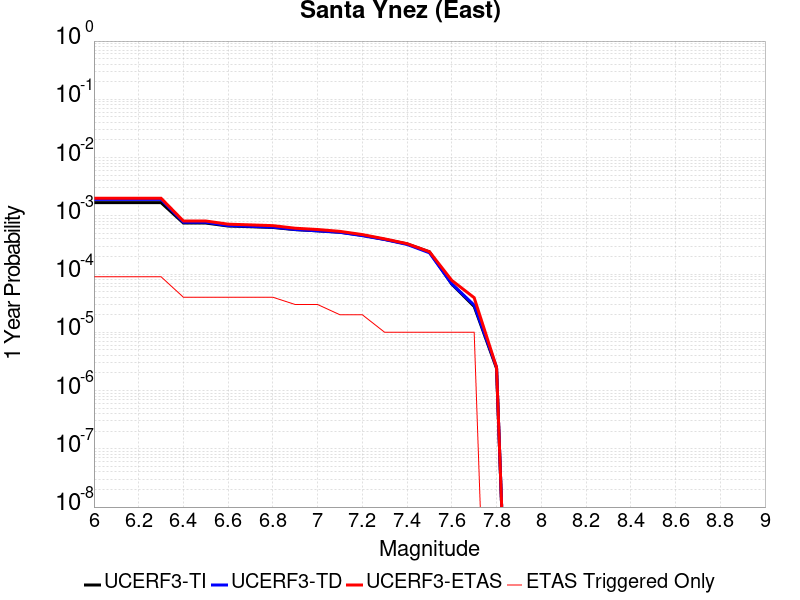 |  |

| Magnitude | 1 wk TI Prob | 1 wk TD Prob | 1 wk ETAS Prob | 1 wk ETAS/TD Gain | 1 wk ETAS Triggered Only | 1 mo TI Prob | 1 mo TD Prob | 1 mo ETAS Prob | 1 mo ETAS/TD Gain | 1 mo ETAS Triggered Only | 1 yr TI Prob | 1 yr TD Prob | 1 yr ETAS Prob | 1 yr ETAS/TD Gain | 1 yr ETAS Triggered Only | 10 yr TI Prob | 10 yr TD Prob | 10 yr ETAS Prob | 10 yr ETAS/TD Gain | 10 yr ETAS Triggered Only |
|-----|-----|-----|-----|-----|-----|-----|-----|-----|-----|-----|-----|-----|-----|-----|-----|-----|-----|-----|-----|-----|
| 6.0 | 3.2269712E-5 | 3.67505E-5 | 9.67483E-5 | 2.6325707 | 6.0E-5 | 1.3829143E-4 | 1.5749598E-4 | 2.3748337E-4 | 1.5078695 | 8.0E-5 | 0.0016823979 | 0.0019164166 | 0.0020062441 | 1.0468726 | 9.0E-5 | 0.016697178 | 0.019056441 | 0.019154536 | 1.0051476 | 1.0E-4 |
| 6.1 | 3.2269712E-5 | 3.67505E-5 | 9.67483E-5 | 2.6325707 | 6.0E-5 | 1.3829143E-4 | 1.5749598E-4 | 2.3748337E-4 | 1.5078695 | 8.0E-5 | 0.0016823979 | 0.0019164166 | 0.0020062441 | 1.0468726 | 9.0E-5 | 0.016697178 | 0.019056441 | 0.019154536 | 1.0051476 | 1.0E-4 |
| 6.2 | 3.2269712E-5 | 3.67505E-5 | 9.67483E-5 | 2.6325707 | 6.0E-5 | 1.3829143E-4 | 1.5749598E-4 | 2.3748337E-4 | 1.5078695 | 8.0E-5 | 0.0016823979 | 0.0019164166 | 0.0020062441 | 1.0468726 | 9.0E-5 | 0.016697178 | 0.019056441 | 0.019154536 | 1.0051476 | 1.0E-4 |
| 6.3 | 3.2269712E-5 | 3.67505E-5 | 9.67483E-5 | 2.6325707 | 6.0E-5 | 1.3829143E-4 | 1.5749598E-4 | 2.3748337E-4 | 1.5078695 | 8.0E-5 | 0.0016823979 | 0.0019164166 | 0.0020062441 | 1.0468726 | 9.0E-5 | 0.016697178 | 0.019056441 | 0.019154536 | 1.0051476 | 1.0E-4 |
| 6.4 | 1.4404779E-5 | 1.4849382E-5 | 3.4849087E-5 | 2.3468373 | 2.0E-5 | 6.1733306E-5 | 6.363868E-5 | 1.0363614E-4 | 1.6285084 | 4.0E-5 | 7.513438E-4 | 7.745306E-4 | 8.144996E-4 | 1.0516042 | 4.0E-5 | 0.0074880854 | 0.007718862 | 0.007768476 | 1.0064276 | 5.0E-5 |
| 6.5 | 1.4404779E-5 | 1.4849382E-5 | 3.4849087E-5 | 2.3468373 | 2.0E-5 | 6.1733306E-5 | 6.363868E-5 | 1.0363614E-4 | 1.6285084 | 4.0E-5 | 7.513438E-4 | 7.745306E-4 | 8.144996E-4 | 1.0516042 | 4.0E-5 | 0.0074880854 | 0.007718862 | 0.007768476 | 1.0064276 | 5.0E-5 |
| 6.6 | 1.280208E-5 | 1.3011947E-5 | 3.3011685E-5 | 2.537029 | 2.0E-5 | 5.4864904E-5 | 5.5764307E-5 | 9.576207E-5 | 1.7172648 | 4.0E-5 | 6.6777546E-4 | 6.787207E-4 | 7.1869354E-4 | 1.0588944 | 4.0E-5 | 0.006657724 | 0.0067666885 | 0.006806418 | 1.0058713 | 4.0E-5 |
| 6.7 | 1.2457027E-5 | 1.2628468E-5 | 3.2628213E-5 | 2.5837035 | 2.0E-5 | 5.3386164E-5 | 5.412089E-5 | 9.4118725E-5 | 1.7390461 | 4.0E-5 | 6.497827E-4 | 6.587243E-4 | 6.986979E-4 | 1.0606835 | 4.0E-5 | 0.00647886 | 0.006567915 | 0.006607652 | 1.0060502 | 4.0E-5 |
| 6.8 | 1.2095134E-5 | 1.2230915E-5 | 3.223067E-5 | 2.6351807 | 2.0E-5 | 5.1835254E-5 | 5.241716E-5 | 9.2415066E-5 | 1.7630689 | 4.0E-5 | 6.309115E-4 | 6.379937E-4 | 6.7796814E-4 | 1.0626565 | 4.0E-5 | 0.0062912325 | 0.006361809 | 0.0064015547 | 1.0062475 | 4.0E-5 |
| 6.9 | 1.1104036E-5 | 1.1157347E-5 | 3.1157124E-5 | 2.7925208 | 2.0E-5 | 4.758786E-5 | 4.781633E-5 | 7.78149E-5 | 1.6273707 | 3.0E-5 | 5.7922816E-4 | 5.820096E-4 | 6.1199215E-4 | 1.0515156 | 3.0E-5 | 0.005777207 | 0.0058049993 | 0.005834825 | 1.0051379 | 3.0E-5 |
| 7.0 | 1.0577444E-5 | 1.058168E-5 | 3.058147E-5 | 2.890039 | 2.0E-5 | 4.5331115E-5 | 4.5349276E-5 | 7.534792E-5 | 1.661502 | 3.0E-5 | 5.5176654E-4 | 5.519888E-4 | 5.8197224E-4 | 1.0543189 | 3.0E-5 | 0.0055039856 | 0.0055063153 | 0.00553615 | 1.0054183 | 3.0E-5 |
| 7.1 | 1.0021775E-5 | 9.980988E-6 | 1.9980887E-5 | 2.001895 | 1.0E-5 | 4.294976E-5 | 4.2774966E-5 | 6.277411E-5 | 1.4675432 | 2.0E-5 | 5.2278786E-4 | 5.2066194E-4 | 5.4065156E-4 | 1.0383927 | 2.0E-5 | 0.0052155964 | 0.0051945536 | 0.0052144495 | 1.0038302 | 2.0E-5 |
| 7.2 | 8.874109E-6 | 8.748793E-6 | 1.8748706E-5 | 2.1430047 | 1.0E-5 | 3.8031343E-5 | 3.7494297E-5 | 5.7493548E-5 | 1.5333945 | 2.0E-5 | 4.629332E-4 | 4.5639853E-4 | 4.763894E-4 | 1.0438013 | 2.0E-5 | 0.0046197 | 0.0045547304 | 0.0045746393 | 1.004371 | 2.0E-5 |
| 7.3 | 7.5504267E-6 | 7.5051175E-6 | 1.7505043E-5 | 2.3324142 | 1.0E-5 | 3.235857E-5 | 3.21644E-5 | 4.2164076E-5 | 1.3108927 | 1.0E-5 | 3.9389438E-4 | 3.915322E-4 | 4.015283E-4 | 1.0255307 | 1.0E-5 | 0.0039319694 | 0.003908531 | 0.003918492 | 1.0025485 | 1.0E-5 |
| 7.4 | 6.309394E-6 | 6.1831556E-6 | 1.6183094E-5 | 2.6172872 | 1.0E-5 | 2.703998E-5 | 2.6498974E-5 | 3.649871E-5 | 1.3773631 | 1.0E-5 | 3.2916202E-4 | 3.225782E-4 | 3.3257497E-4 | 1.0309902 | 1.0E-5 | 0.003286749 | 0.003221197 | 0.0032311648 | 1.0030944 | 1.0E-5 |
| 7.5 | 4.6103073E-6 | 4.4408903E-6 | 1.4440846E-5 | 3.2517908 | 1.0E-5 | 1.975831E-5 | 1.9032252E-5 | 2.9032062E-5 | 1.5254139 | 1.0E-5 | 2.4053088E-4 | 2.3169373E-4 | 2.416914E-4 | 1.0431504 | 1.0E-5 | 0.002402707 | 0.002314591 | 0.002324568 | 1.0043104 | 1.0E-5 |
| 7.6 | 1.2858658E-6 | 1.3008173E-6 | 1.13008045E-5 | 8.687465 | 1.0E-5 | 5.5108417E-6 | 5.5749197E-6 | 1.5574864E-5 | 2.793738 | 1.0E-5 | 6.7092435E-5 | 6.78726E-5 | 7.7871926E-5 | 1.1473248 | 1.0E-5 | 6.707218E-4 | 6.785256E-4 | 6.885188E-4 | 1.0147278 | 1.0E-5 |
| 7.7 | 5.3302307E-7 | 5.612138E-7 | 1.0561208E-5 | 18.81851 | 1.0E-5 | 2.2843826E-6 | 2.4052001E-6 | 1.2405176E-5 | 5.157648 | 1.0E-5 | 2.7812002E-5 | 2.9282954E-5 | 3.9282662E-5 | 1.3414856 | 1.0E-5 | 2.7808524E-4 | 2.9279452E-4 | 3.027916E-4 | 1.0341437 | 1.0E-5 |
| 7.8 | 4.613933E-8 | 4.80301E-8 | 4.80301E-8 | 1.0 | 0.0 | 1.9773998E-7 | 2.0584326E-7 | 2.0584326E-7 | 1.0 | 0.0 | 2.4074816E-6 | 2.5061388E-6 | 2.5061388E-6 | 1.0 | 0.0 | 2.4074554E-5 | 2.5061116E-5 | 2.5061116E-5 | 1.0 | 0.0 |

## San Andreas (Creeping Section) 2011 CFM
*[(top)](#table-of-contents)*

| 1 Week | 1 Month | 1 Year | 10 Year |
|-----|-----|-----|-----|
|  |  |  |  |

| Magnitude | 1 wk TI Prob | 1 wk TD Prob | 1 wk ETAS Prob | 1 wk ETAS/TD Gain | 1 wk ETAS Triggered Only | 1 mo TI Prob | 1 mo TD Prob | 1 mo ETAS Prob | 1 mo ETAS/TD Gain | 1 mo ETAS Triggered Only | 1 yr TI Prob | 1 yr TD Prob | 1 yr ETAS Prob | 1 yr ETAS/TD Gain | 1 yr ETAS Triggered Only | 10 yr TI Prob | 10 yr TD Prob | 10 yr ETAS Prob | 10 yr ETAS/TD Gain | 10 yr ETAS Triggered Only |
|-----|-----|-----|-----|-----|-----|-----|-----|-----|-----|-----|-----|-----|-----|-----|-----|-----|-----|-----|-----|-----|
| 6.0 | 5.986481E-4 | 0.001228691 | 0.0013185804 | 1.0731587 | 9.0E-5 | 0.0025631124 | 0.005246795 | 0.005336323 | 1.0170634 | 9.0E-5 | 0.030762846 | 0.061203245 | 0.061297126 | 1.0015339 | 1.0E-4 | 0.26835477 | 0.425928 | 0.4259854 | 1.0001348 | 1.0E-4 |
| 6.1 | 5.015945E-4 | 0.0010230356 | 0.0011029538 | 1.0781187 | 8.0E-5 | 0.00214792 | 0.004369436 | 0.0044490863 | 1.018229 | 8.0E-5 | 0.025839351 | 0.051246606 | 0.051331993 | 1.0016662 | 9.0E-5 | 0.23032776 | 0.37284943 | 0.37290588 | 1.0001514 | 9.0E-5 |
| 6.2 | 4.073338E-4 | 8.1157376E-4 | 8.915088E-4 | 1.0984939 | 8.0E-5 | 0.0017445484 | 0.0034683137 | 0.003548036 | 1.0229859 | 8.0E-5 | 0.021034058 | 0.04093177 | 0.041018084 | 1.0021088 | 9.0E-5 | 0.19150782 | 0.31302592 | 0.31308773 | 1.0001975 | 9.0E-5 |
| 6.3 | 3.464099E-4 | 6.7455834E-4 | 7.5450435E-4 | 1.1185161 | 8.0E-5 | 0.0014837692 | 0.0028832308 | 0.0029630002 | 1.0276667 | 8.0E-5 | 0.017915873 | 0.034187846 | 0.034274768 | 1.0025425 | 9.0E-5 | 0.16538359 | 0.27130842 | 0.271374 | 1.0002418 | 9.0E-5 |
| 6.4 | 2.935057E-4 | 5.5516965E-4 | 6.3512527E-4 | 1.1440201 | 8.0E-5 | 0.0012572751 | 0.0023727308 | 0.0024525411 | 1.0336365 | 8.0E-5 | 0.015200248 | 0.02826279 | 0.028350247 | 1.0030944 | 9.0E-5 | 0.14201577 | 0.23297668 | 0.23304571 | 1.0002964 | 9.0E-5 |
| 6.5 | 2.3409708E-4 | 4.2132285E-4 | 4.912934E-4 | 1.1660733 | 7.0E-5 | 0.0010028875 | 0.0018017791 | 0.001871653 | 1.0387805 | 7.0E-5 | 0.012141965 | 0.021586355 | 0.021664627 | 1.003626 | 8.0E-5 | 0.11499573 | 0.1868149 | 0.18687996 | 1.0003482 | 8.0E-5 |
| 6.6 | 1.5842178E-4 | 2.5068692E-4 | 3.1067187E-4 | 1.2392824 | 6.0E-5 | 6.7877385E-4 | 0.0010739256 | 0.0011338611 | 1.0558097 | 6.0E-5 | 0.0082328 | 0.012995283 | 0.013064373 | 1.0053166 | 7.0E-5 | 0.07934396 | 0.12313759 | 0.12319897 | 1.0004984 | 7.0E-5 |
| 6.7 | 1.5616413E-4 | 2.4605254E-4 | 3.0603778E-4 | 1.2437904 | 6.0E-5 | 6.691031E-4 | 0.0010540807 | 0.0011140174 | 1.0568616 | 6.0E-5 | 0.0081159435 | 0.012757154 | 0.012826261 | 1.0054171 | 7.0E-5 | 0.0782586 | 0.12116472 | 0.121226236 | 1.0005077 | 7.0E-5 |
| 6.8 | 1.5538467E-4 | 2.442914E-4 | 3.0427676E-4 | 1.2455482 | 6.0E-5 | 6.6576427E-4 | 0.001046539 | 0.0011064763 | 1.0572718 | 6.0E-5 | 0.008075596 | 0.012666538 | 0.012735652 | 1.0054563 | 7.0E-5 | 0.07788358 | 0.12039561 | 0.12045718 | 1.0005114 | 7.0E-5 |
| 6.9 | 1.5153569E-4 | 2.3538464E-4 | 2.953705E-4 | 1.2548419 | 6.0E-5 | 6.49277E-4 | 0.0010084033 | 0.0010683428 | 1.05944 | 6.0E-5 | 0.007876333 | 0.012208726 | 0.012277871 | 1.0056636 | 7.0E-5 | 0.07602952 | 0.11646574 | 0.11652759 | 1.0005311 | 7.0E-5 |
| 7.0 | 1.4588932E-4 | 2.2395732E-4 | 2.839439E-4 | 1.2678481 | 6.0E-5 | 6.250901E-4 | 9.59466E-4 | 0.0010194085 | 1.0624747 | 6.0E-5 | 0.0075839474 | 0.011619428 | 0.011688614 | 1.0059544 | 7.0E-5 | 0.073302895 | 0.11131206 | 0.111374274 | 1.0005589 | 7.0E-5 |
| 7.1 | 1.1565079E-4 | 1.6281323E-4 | 2.2280346E-4 | 1.3684604 | 6.0E-5 | 4.955521E-4 | 6.9758523E-4 | 7.5754337E-4 | 1.085951 | 6.0E-5 | 0.006016669 | 0.008460228 | 0.008529636 | 1.008204 | 7.0E-5 | 0.058563538 | 0.08366478 | 0.08372893 | 1.0007666 | 7.0E-5 |
| 7.2 | 1.0393792E-4 | 1.4615392E-4 | 2.0614515E-4 | 1.4104661 | 6.0E-5 | 4.4537216E-4 | 6.262243E-4 | 6.861868E-4 | 1.0957524 | 6.0E-5 | 0.005408933 | 0.0075977976 | 0.007667266 | 1.0091432 | 7.0E-5 | 0.052791595 | 0.07561503 | 0.07567974 | 1.0008557 | 7.0E-5 |
| 7.3 | 9.332884E-5 | 1.2780601E-4 | 1.8779833E-4 | 1.4694015 | 6.0E-5 | 3.999194E-4 | 5.4762565E-4 | 6.075928E-4 | 1.1095039 | 6.0E-5 | 0.0048581534 | 0.0066470946 | 0.006716629 | 1.010461 | 7.0E-5 | 0.047533102 | 0.06647954 | 0.06654489 | 1.000983 | 7.0E-5 |
| 7.4 | 8.670252E-5 | 1.1702972E-4 | 1.770227E-4 | 1.5126303 | 6.0E-5 | 3.715293E-4 | 5.014601E-4 | 5.6143E-4 | 1.1195906 | 6.0E-5 | 0.004513991 | 0.0060883067 | 0.0061578806 | 1.0114274 | 7.0E-5 | 0.044233937 | 0.061148684 | 0.061214402 | 1.0010748 | 7.0E-5 |
| 7.5 | 7.3036405E-5 | 9.005699E-5 | 1.5005158E-4 | 1.6661848 | 6.0E-5 | 3.129756E-4 | 3.859015E-4 | 4.4587834E-4 | 1.1554201 | 6.0E-5 | 0.0038038217 | 0.0046882504 | 0.004757922 | 1.014861 | 7.0E-5 | 0.03739367 | 0.047875606 | 0.047942255 | 1.0013921 | 7.0E-5 |
| 7.6 | 6.3935775E-5 | 8.280209E-5 | 1.4279713E-4 | 1.7245594 | 6.0E-5 | 2.7398168E-4 | 3.5481792E-4 | 4.1479664E-4 | 1.1690408 | 6.0E-5 | 0.0033306254 | 0.00431137 | 0.004381068 | 1.0161661 | 7.0E-5 | 0.032811474 | 0.043990135 | 0.044057056 | 1.0015212 | 7.0E-5 |
| 7.7 | 5.5050095E-5 | 6.661729E-5 | 9.6615295E-5 | 1.4503036 | 3.0E-5 | 2.3590765E-4 | 2.8547147E-4 | 3.154629E-4 | 1.1050593 | 3.0E-5 | 0.0028683927 | 0.0034700802 | 0.0035099413 | 1.0114871 | 4.0E-5 | 0.0283165 | 0.03579509 | 0.035833657 | 1.0010774 | 4.0E-5 |
| 7.8 | 5.027131E-5 | 6.1627725E-5 | 9.162587E-5 | 1.486764 | 3.0E-5 | 2.1543067E-4 | 2.640921E-4 | 2.9408417E-4 | 1.1135668 | 3.0E-5 | 0.0026197135 | 0.003210584 | 0.0032504555 | 1.0124187 | 4.0E-5 | 0.025890453 | 0.03312572 | 0.033164393 | 1.0011675 | 4.0E-5 |
| 7.9 | 3.7271806E-5 | 5.0224386E-5 | 7.022338E-5 | 1.3981929 | 2.0E-5 | 1.5972654E-4 | 2.1522962E-4 | 2.3522532E-4 | 1.092904 | 2.0E-5 | 0.0019429359 | 0.0026172737 | 0.0026471952 | 1.0114323 | 3.0E-5 | 0.019260362 | 0.027066687 | 0.027095875 | 1.0010784 | 3.0E-5 |
| 8.0 | 2.7310243E-5 | 3.1428404E-5 | 4.142809E-5 | 1.3181735 | 1.0E-5 | 1.17038646E-4 | 1.3468621E-4 | 1.4468486E-4 | 1.0742366 | 1.0E-5 | 0.0014240141 | 0.0016385721 | 0.0016485556 | 1.0060929 | 1.0E-5 | 0.014149235 | 0.01721387 | 0.017223697 | 1.0005709 | 1.0E-5 |
| 8.1 | 1.7940547E-5 | 1.7400796E-5 | 1.7400796E-5 | 1.0 | 0.0 | 7.688579E-5 | 7.457271E-5 | 7.457271E-5 | 1.0 | 0.0 | 9.3568244E-4 | 9.075451E-4 | 9.075451E-4 | 1.0 | 0.0 | 0.009317525 | 0.009799073 | 0.009799073 | 1.0 | 0.0 |
| 8.2 | 8.643924E-6 | 5.4748625E-6 | 5.4748625E-6 | 1.0 | 0.0 | 3.704486E-5 | 2.3463486E-5 | 2.3463486E-5 | 1.0 | 0.0 | 4.5092785E-4 | 2.8563058E-4 | 2.8563058E-4 | 1.0 | 0.0 | 0.0045001395 | 0.0032487072 | 0.0032487072 | 1.0 | 0.0 |
| 8.3 | 1.983087E-6 | 7.6599065E-7 | 7.6599065E-7 | 1.0 | 0.0 | 8.498917E-6 | 3.282813E-6 | 3.282813E-6 | 1.0 | 0.0 | 1.034694E-4 | 3.9967534E-5 | 3.9967534E-5 | 1.0 | 0.0 | 0.0010342124 | 4.719687E-4 | 4.719687E-4 | 1.0 | 0.0 |

## Santa Ynez (West)
*[(top)](#table-of-contents)*

| 1 Week | 1 Month | 1 Year | 10 Year |
|-----|-----|-----|-----|
|  |  |  |  |

| Magnitude | 1 wk TI Prob | 1 wk TD Prob | 1 wk ETAS Prob | 1 wk ETAS/TD Gain | 1 wk ETAS Triggered Only | 1 mo TI Prob | 1 mo TD Prob | 1 mo ETAS Prob | 1 mo ETAS/TD Gain | 1 mo ETAS Triggered Only | 1 yr TI Prob | 1 yr TD Prob | 1 yr ETAS Prob | 1 yr ETAS/TD Gain | 1 yr ETAS Triggered Only | 10 yr TI Prob | 10 yr TD Prob | 10 yr ETAS Prob | 10 yr ETAS/TD Gain | 10 yr ETAS Triggered Only |
|-----|-----|-----|-----|-----|-----|-----|-----|-----|-----|-----|-----|-----|-----|-----|-----|-----|-----|-----|-----|-----|
| 6.0 | 4.7352758E-5 | 5.4972126E-5 | 1.3496773E-4 | 2.455203 | 8.0E-5 | 2.0292461E-4 | 2.3557522E-4 | 3.2555402E-4 | 1.3819536 | 9.0E-5 | 0.0024678076 | 0.0028645284 | 0.002964242 | 1.0348097 | 1.0E-4 | 0.024405818 | 0.028304417 | 0.028411305 | 1.0037763 | 1.1E-4 |
| 6.1 | 4.7352758E-5 | 5.4972126E-5 | 1.14968825E-4 | 2.0914023 | 6.0E-5 | 2.0292461E-4 | 2.3557522E-4 | 3.0555873E-4 | 1.297075 | 7.0E-5 | 0.0024678076 | 0.0028645284 | 0.0029343278 | 1.0243669 | 7.0E-5 | 0.024405818 | 0.028304417 | 0.028382152 | 1.0027465 | 8.0E-5 |
| 6.2 | 3.0415853E-5 | 3.392511E-5 | 7.392375E-5 | 2.1790276 | 4.0E-5 | 1.3034715E-4 | 1.4538545E-4 | 1.9537818E-4 | 1.3438634 | 5.0E-5 | 0.0015858212 | 0.0017686661 | 0.0018185776 | 1.0282199 | 5.0E-5 | 0.015745522 | 0.017549807 | 0.017598929 | 1.002799 | 5.0E-5 |
| 6.3 | 3.0415853E-5 | 3.392511E-5 | 7.392375E-5 | 2.1790276 | 4.0E-5 | 1.3034715E-4 | 1.4538545E-4 | 1.9537818E-4 | 1.3438634 | 5.0E-5 | 0.0015858212 | 0.0017686661 | 0.0018185776 | 1.0282199 | 5.0E-5 | 0.015745522 | 0.017549807 | 0.017598929 | 1.002799 | 5.0E-5 |
| 6.4 | 2.5452082E-5 | 2.7912422E-5 | 5.7911584E-5 | 2.0747602 | 3.0E-5 | 1.09075794E-4 | 1.196193E-4 | 1.5961452E-4 | 1.3343542 | 4.0E-5 | 0.0013271887 | 0.0014554089 | 0.0014953506 | 1.0274436 | 4.0E-5 | 0.013192902 | 0.014460951 | 0.014500373 | 1.0027261 | 4.0E-5 |
| 6.5 | 2.3143784E-5 | 2.5128256E-5 | 5.5127504E-5 | 2.193845 | 3.0E-5 | 9.9183875E-5 | 1.0768817E-4 | 1.4768387E-4 | 1.3714029 | 4.0E-5 | 0.0012068948 | 0.0013103267 | 0.0013502743 | 1.0304867 | 4.0E-5 | 0.012003611 | 0.01302768 | 0.013067159 | 1.0030304 | 4.0E-5 |
| 6.6 | 1.9118515E-5 | 2.035434E-5 | 5.035373E-5 | 2.4738572 | 3.0E-5 | 8.193392E-5 | 8.7230015E-5 | 1.172274E-4 | 1.3438883 | 3.0E-5 | 9.97089E-4 | 0.001061516 | 0.0010914841 | 1.0282315 | 3.0E-5 | 0.00992627 | 0.010565365 | 0.010595048 | 1.0028095 | 3.0E-5 |
| 6.7 | 1.722807E-5 | 1.8146347E-5 | 3.8145983E-5 | 2.1021302 | 2.0E-5 | 7.3832496E-5 | 7.776777E-5 | 9.776622E-5 | 1.2571559 | 2.0E-5 | 8.985399E-4 | 9.464169E-4 | 9.66398E-4 | 1.0211123 | 2.0E-5 | 0.008949154 | 0.0094245095 | 0.0094443215 | 1.0021021 | 2.0E-5 |
| 6.8 | 1.5317364E-5 | 1.5926486E-5 | 2.5926325E-5 | 1.627875 | 1.0E-5 | 6.56442E-5 | 6.82546E-5 | 7.825392E-5 | 1.1465002 | 1.0E-5 | 7.98925E-4 | 8.306873E-4 | 8.406789E-4 | 1.0120282 | 1.0E-5 | 0.007960589 | 0.00827631 | 0.008286227 | 1.0011983 | 1.0E-5 |
| 6.9 | 1.3071226E-5 | 1.3329624E-5 | 2.332949E-5 | 1.7501987 | 1.0E-5 | 5.6018336E-5 | 5.7125722E-5 | 6.712515E-5 | 1.1750425 | 1.0E-5 | 6.8180985E-4 | 6.9528597E-4 | 7.05279E-4 | 1.0143726 | 1.0E-5 | 0.0067972173 | 0.006931367 | 0.0069412976 | 1.0014327 | 1.0E-5 |
| 7.0 | 1.1836986E-5 | 1.19327815E-5 | 2.1932663E-5 | 1.8380176 | 1.0E-5 | 5.0728955E-5 | 5.11395E-5 | 6.113899E-5 | 1.1955335 | 1.0E-5 | 6.1745E-4 | 6.2244723E-4 | 6.32441E-4 | 1.0160556 | 1.0E-5 | 0.006157372 | 0.006207231 | 0.006217169 | 1.001601 | 1.0E-5 |
| 7.1 | 1.0597169E-5 | 1.0542201E-5 | 2.0542097E-5 | 1.9485586 | 1.0E-5 | 4.541565E-5 | 4.5180084E-5 | 5.5179633E-5 | 1.2213265 | 1.0E-5 | 5.5279525E-4 | 5.4992986E-4 | 5.5992434E-4 | 1.0181742 | 1.0E-5 | 0.0055142213 | 0.005485821 | 0.005495766 | 1.0018129 | 1.0E-5 |
| 7.2 | 9.59113E-6 | 9.459144E-6 | 1.945905E-5 | 2.057168 | 1.0E-5 | 4.11042E-5 | 4.0538565E-5 | 5.0538158E-5 | 1.2466687 | 1.0E-5 | 5.0032866E-4 | 4.934463E-4 | 5.034414E-4 | 1.0202557 | 1.0E-5 | 0.004992037 | 0.0049236254 | 0.004933576 | 1.0020211 | 1.0E-5 |
| 7.3 | 8.586084E-6 | 8.379583E-6 | 1.83795E-5 | 2.1933668 | 1.0E-5 | 3.679698E-5 | 3.5912013E-5 | 4.5911653E-5 | 1.2784483 | 1.0E-5 | 4.4791115E-4 | 4.3714207E-4 | 4.471377E-4 | 1.0228659 | 1.0E-5 | 0.004470094 | 0.004362933 | 0.004372889 | 1.002282 | 1.0E-5 |
| 7.4 | 7.2622997E-6 | 6.9515427E-6 | 1.6951473E-5 | 2.4385197 | 1.0E-5 | 3.112377E-5 | 2.979199E-5 | 3.9791692E-5 | 1.3356507 | 1.0E-5 | 3.78866E-4 | 3.626581E-4 | 3.7265447E-4 | 1.0275642 | 1.0E-5 | 0.0037822074 | 0.0036207628 | 0.0036307266 | 1.0027518 | 1.0E-5 |
| 7.5 | 5.627296E-6 | 5.251588E-6 | 1.5251535E-5 | 2.904176 | 1.0E-5 | 2.411676E-5 | 2.2506614E-5 | 3.250639E-5 | 1.4443039 | 1.0E-5 | 2.9358198E-4 | 2.739843E-4 | 2.8398156E-4 | 1.0364884 | 1.0E-5 | 0.0029319443 | 0.002736537 | 0.0027465096 | 1.0036442 | 1.0E-5 |
| 7.6 | 2.265244E-6 | 2.0608625E-6 | 1.2060842E-5 | 5.8523273 | 1.0E-5 | 9.708152E-6 | 8.832238E-6 | 1.883215E-5 | 2.132206 | 1.0E-5 | 1.18190335E-4 | 1.0752728E-4 | 1.175262E-4 | 1.0929897 | 1.0E-5 | 0.001181275 | 0.0010747612 | 0.0010847504 | 1.0092944 | 1.0E-5 |
| 7.7 | 1.3099874E-6 | 1.1016252E-6 | 1.1101614E-5 | 10.077487 | 1.0E-5 | 5.61422E-6 | 4.7212425E-6 | 1.4721195E-5 | 3.1180766 | 1.0E-5 | 6.8350986E-5 | 5.7479636E-5 | 6.747906E-5 | 1.1739646 | 1.0E-5 | 6.832996E-4 | 5.7465007E-4 | 5.846443E-4 | 1.0173919 | 1.0E-5 |
| 7.8 | 7.903951E-7 | 6.0711415E-7 | 6.0711415E-7 | 1.0 | 0.0 | 3.3874032E-6 | 2.6019152E-6 | 2.6019152E-6 | 1.0 | 0.0 | 4.1240855E-5 | 3.167787E-5 | 3.167787E-5 | 1.0 | 0.0 | 4.12332E-4 | 3.167349E-4 | 3.167349E-4 | 1.0 | 0.0 |
| 7.9 | 7.0753297E-9 | 5.0899476E-9 | 5.0899476E-9 | 1.0 | 0.0 | 3.032284E-8 | 2.181406E-8 | 2.181406E-8 | 1.0 | 0.0 | 3.6918053E-7 | 2.6558615E-7 | 2.6558615E-7 | 1.0 | 0.0 | 3.691799E-6 | 2.6558594E-6 | 2.6558594E-6 | 1.0 | 0.0 |

## Death Valley (Fish Lake Valley)
*[(top)](#table-of-contents)*

| 1 Week | 1 Month | 1 Year | 10 Year |
|-----|-----|-----|-----|
|  |  |  |  |

| Magnitude | 1 wk TI Prob | 1 wk TD Prob | 1 wk ETAS Prob | 1 wk ETAS/TD Gain | 1 wk ETAS Triggered Only | 1 mo TI Prob | 1 mo TD Prob | 1 mo ETAS Prob | 1 mo ETAS/TD Gain | 1 mo ETAS Triggered Only | 1 yr TI Prob | 1 yr TD Prob | 1 yr ETAS Prob | 1 yr ETAS/TD Gain | 1 yr ETAS Triggered Only | 10 yr TI Prob | 10 yr TD Prob | 10 yr ETAS Prob | 10 yr ETAS/TD Gain | 10 yr ETAS Triggered Only |
|-----|-----|-----|-----|-----|-----|-----|-----|-----|-----|-----|-----|-----|-----|-----|-----|-----|-----|-----|-----|-----|
| 6.0 | 3.872328E-5 | 4.7267473E-5 | 1.3726323E-4 | 2.9039679 | 9.0E-5 | 1.6594635E-4 | 2.0256084E-4 | 2.9254262E-4 | 1.4442209 | 9.0E-5 | 0.0020185246 | 0.002463534 | 0.002573263 | 1.0445414 | 1.1E-4 | 0.02000288 | 0.024388181 | 0.024495497 | 1.0044004 | 1.1E-4 |
| 6.1 | 3.872328E-5 | 4.7267473E-5 | 1.3726323E-4 | 2.9039679 | 9.0E-5 | 1.6594635E-4 | 2.0256084E-4 | 2.9254262E-4 | 1.4442209 | 9.0E-5 | 0.0020185246 | 0.002463534 | 0.002573263 | 1.0445414 | 1.1E-4 | 0.02000288 | 0.024388181 | 0.024495497 | 1.0044004 | 1.1E-4 |
| 6.2 | 3.872328E-5 | 4.7267473E-5 | 1.3726323E-4 | 2.9039679 | 9.0E-5 | 1.6594635E-4 | 2.0256084E-4 | 2.9254262E-4 | 1.4442209 | 9.0E-5 | 0.0020185246 | 0.002463534 | 0.002573263 | 1.0445414 | 1.1E-4 | 0.02000288 | 0.024388181 | 0.024495497 | 1.0044004 | 1.1E-4 |
| 6.3 | 2.8356371E-5 | 3.3609853E-5 | 1.2360682E-4 | 3.6776962 | 9.0E-5 | 1.2152165E-4 | 1.4403471E-4 | 2.3402175E-4 | 1.6247593 | 9.0E-5 | 0.0014785219 | 0.0017522911 | 0.0018620983 | 1.062665 | 1.1E-4 | 0.014687235 | 0.017391782 | 0.01749987 | 1.0062149 | 1.1E-4 |
| 6.4 | 2.8356371E-5 | 3.3609853E-5 | 1.2360682E-4 | 3.6776962 | 9.0E-5 | 1.2152165E-4 | 1.4403471E-4 | 2.3402175E-4 | 1.6247593 | 9.0E-5 | 0.0014785219 | 0.0017522911 | 0.0018620983 | 1.062665 | 1.1E-4 | 0.014687235 | 0.017391782 | 0.01749987 | 1.0062149 | 1.1E-4 |
| 6.5 | 2.4448687E-5 | 2.8607552E-5 | 1.08605265E-4 | 3.7963843 | 8.0E-5 | 1.0477588E-4 | 1.2259831E-4 | 2.0258852E-4 | 1.6524575 | 8.0E-5 | 0.0012748998 | 0.0014916632 | 0.001591514 | 1.0669392 | 1.0E-4 | 0.012676105 | 0.014821377 | 0.014919895 | 1.006647 | 1.0E-4 |
| 6.6 | 2.1298161E-5 | 2.4660083E-5 | 1.0465811E-4 | 4.244029 | 8.0E-5 | 9.127464E-5 | 1.0568198E-4 | 1.8567353E-4 | 1.756908 | 8.0E-5 | 0.0011107022 | 0.0012859525 | 0.0013858239 | 1.0776634 | 1.0E-4 | 0.011051672 | 0.012788526 | 0.012887247 | 1.0077195 | 1.0E-4 |
| 6.7 | 1.8959729E-5 | 2.1781025E-5 | 1.0177928E-4 | 4.6728415 | 8.0E-5 | 8.125345E-5 | 9.334405E-5 | 1.733366E-4 | 1.8569643 | 8.0E-5 | 9.888117E-4 | 0.001135897 | 0.0012357833 | 1.0879362 | 1.0E-4 | 0.009844234 | 0.01130357 | 0.011402439 | 1.0087467 | 1.0E-4 |
| 6.8 | 1.6691629E-5 | 1.9018353E-5 | 9.9016834E-5 | 5.206383 | 8.0E-5 | 7.153359E-5 | 8.150477E-5 | 1.6149825E-4 | 1.9814576 | 8.0E-5 | 8.7057345E-4 | 9.918857E-4 | 0.0010917865 | 1.100718 | 1.0E-4 | 0.008671708 | 0.009876343 | 0.009975356 | 1.0100253 | 1.0E-4 |
| 6.9 | 1.450505E-5 | 1.638954E-5 | 9.638823E-5 | 5.881082 | 8.0E-5 | 6.216302E-5 | 7.0239046E-5 | 1.5023342E-4 | 2.1388876 | 8.0E-5 | 7.5657194E-4 | 8.5483363E-4 | 9.5474813E-4 | 1.1168818 | 1.0E-4 | 0.007540013 | 0.008516385 | 0.008615534 | 1.0116421 | 1.0E-4 |
| 7.0 | 1.2940855E-5 | 1.4537972E-5 | 9.453681E-5 | 6.502751 | 8.0E-5 | 5.545963E-5 | 6.230414E-5 | 1.4229915E-4 | 2.283944 | 8.0E-5 | 6.750118E-4 | 7.5829466E-4 | 8.582189E-4 | 1.1317749 | 1.0E-4 | 0.006729651 | 0.0075576897 | 0.007656934 | 1.0131315 | 1.0E-4 |
| 7.1 | 1.2544658E-5 | 1.4078208E-5 | 9.4077084E-5 | 6.6824617 | 8.0E-5 | 5.3761712E-5 | 6.0333812E-5 | 1.4032898E-4 | 2.3258762 | 8.0E-5 | 6.5435225E-4 | 7.343222E-4 | 8.342488E-4 | 1.13608 | 1.0E-4 | 0.006524288 | 0.007319551 | 0.007418819 | 1.0135621 | 1.0E-4 |
| 7.2 | 1.2489416E-5 | 1.4015674E-5 | 9.4014555E-5 | 6.707815 | 8.0E-5 | 5.3524967E-5 | 6.0065824E-5 | 1.4006102E-4 | 2.331792 | 8.0E-5 | 6.514716E-4 | 7.310616E-4 | 8.309885E-4 | 1.1366874 | 1.0E-4 | 0.006495651 | 0.0072871596 | 0.007386431 | 1.0136228 | 1.0E-4 |
| 7.3 | 1.2368307E-5 | 1.3879812E-5 | 9.3878705E-5 | 6.7636867 | 8.0E-5 | 5.3005948E-5 | 5.9483587E-5 | 1.3947883E-4 | 2.3448288 | 8.0E-5 | 6.451563E-4 | 7.2397763E-4 | 8.239052E-4 | 1.1380258 | 1.0E-4 | 0.0064328653 | 0.007216782 | 0.0073160604 | 1.0137566 | 1.0E-4 |
| 7.4 | 1.2161707E-5 | 1.36478675E-5 | 9.364678E-5 | 6.8616414 | 8.0E-5 | 5.212056E-5 | 5.8489582E-5 | 1.384849E-4 | 2.3676848 | 8.0E-5 | 6.3438306E-4 | 7.118836E-4 | 8.118124E-4 | 1.1403724 | 1.0E-4 | 0.006325751 | 0.0070966207 | 0.007195911 | 1.0139912 | 1.0E-4 |
| 7.5 | 1.1707948E-5 | 1.3145515E-5 | 8.3144594E-5 | 6.32494 | 7.0E-5 | 5.0175953E-5 | 5.6336736E-5 | 1.2633279E-4 | 2.2424586 | 7.0E-5 | 6.10721E-4 | 6.856895E-4 | 7.756278E-4 | 1.1311648 | 9.0E-5 | 0.0060904534 | 0.006836321 | 0.006925706 | 1.013075 | 9.0E-5 |
| 7.6 | 1.0319538E-5 | 1.1579622E-5 | 8.1578815E-5 | 7.045032 | 7.0E-5 | 4.4225842E-5 | 4.9626036E-5 | 1.19622564E-4 | 2.4104798 | 7.0E-5 | 5.383166E-4 | 6.040347E-4 | 6.8398635E-4 | 1.1323627 | 8.0E-5 | 0.0053701443 | 0.0060244603 | 0.0061039785 | 1.0131992 | 8.0E-5 |
| 7.7 | 8.937764E-6 | 1.0022779E-5 | 8.002208E-5 | 7.9840207 | 7.0E-5 | 3.830414E-5 | 4.295409E-5 | 1.12951086E-4 | 2.629577 | 7.0E-5 | 4.6625308E-4 | 5.228456E-4 | 6.028038E-4 | 1.1529288 | 8.0E-5 | 0.0046527605 | 0.005216664 | 0.005296247 | 1.0152555 | 8.0E-5 |
| 7.8 | 3.108007E-7 | 3.284654E-7 | 3.284654E-7 | 1.0 | 0.0 | 1.3320023E-6 | 1.407708E-6 | 1.407708E-6 | 1.0 | 0.0 | 1.6217007E-5 | 1.7138715E-5 | 1.7138715E-5 | 1.0 | 0.0 | 1.6215823E-4 | 1.7137431E-4 | 1.7137431E-4 | 1.0 | 0.0 |
| 7.9 | 2.5591178E-9 | 2.6696718E-9 | 2.6696718E-9 | 1.0 | 0.0 | 1.0967647E-8 | 1.14414505E-8 | 1.14414505E-8 | 1.0 | 0.0 | 1.335311E-7 | 1.3929966E-7 | 1.3929966E-7 | 1.0 | 0.0 | 1.3353102E-6 | 1.3929966E-6 | 1.3929966E-6 | 1.0 | 0.0 |

## San Jacinto (Anza) rev
*[(top)](#table-of-contents)*

| 1 Week | 1 Month | 1 Year | 10 Year |
|-----|-----|-----|-----|
|  |  |  |  |

| Magnitude | 1 wk TI Prob | 1 wk TD Prob | 1 wk ETAS Prob | 1 wk ETAS/TD Gain | 1 wk ETAS Triggered Only | 1 mo TI Prob | 1 mo TD Prob | 1 mo ETAS Prob | 1 mo ETAS/TD Gain | 1 mo ETAS Triggered Only | 1 yr TI Prob | 1 yr TD Prob | 1 yr ETAS Prob | 1 yr ETAS/TD Gain | 1 yr ETAS Triggered Only | 10 yr TI Prob | 10 yr TD Prob | 10 yr ETAS Prob | 10 yr ETAS/TD Gain | 10 yr ETAS Triggered Only |
|-----|-----|-----|-----|-----|-----|-----|-----|-----|-----|-----|-----|-----|-----|-----|-----|-----|-----|-----|-----|-----|
| 6.0 | 6.3015636E-5 | 4.3302647E-5 | 1.2329918E-4 | 2.847382 | 8.0E-5 | 2.7003905E-4 | 1.8556965E-4 | 2.855511E-4 | 1.5387813 | 1.0E-4 | 0.0032827691 | 0.0022569813 | 0.002366733 | 1.0486276 | 1.1E-4 | 0.032346968 | 0.023296192 | 0.02340363 | 1.0046118 | 1.1E-4 |
| 6.1 | 6.3015636E-5 | 4.3302647E-5 | 1.2329918E-4 | 2.847382 | 8.0E-5 | 2.7003905E-4 | 1.8556965E-4 | 2.855511E-4 | 1.5387813 | 1.0E-4 | 0.0032827691 | 0.0022569813 | 0.002366733 | 1.0486276 | 1.1E-4 | 0.032346968 | 0.023296192 | 0.02340363 | 1.0046118 | 1.1E-4 |
| 6.2 | 6.3015636E-5 | 4.3302647E-5 | 1.2329918E-4 | 2.847382 | 8.0E-5 | 2.7003905E-4 | 1.8556965E-4 | 2.855511E-4 | 1.5387813 | 1.0E-4 | 0.0032827691 | 0.0022569813 | 0.002366733 | 1.0486276 | 1.1E-4 | 0.032346968 | 0.023296192 | 0.02340363 | 1.0046118 | 1.1E-4 |
| 6.3 | 6.3015636E-5 | 4.3302647E-5 | 1.2329918E-4 | 2.847382 | 8.0E-5 | 2.7003905E-4 | 1.8556965E-4 | 2.855511E-4 | 1.5387813 | 1.0E-4 | 0.0032827691 | 0.0022569813 | 0.002366733 | 1.0486276 | 1.1E-4 | 0.032346968 | 0.023296192 | 0.02340363 | 1.0046118 | 1.1E-4 |
| 6.4 | 6.3015636E-5 | 4.3302647E-5 | 1.2329918E-4 | 2.847382 | 8.0E-5 | 2.7003905E-4 | 1.8556965E-4 | 2.855511E-4 | 1.5387813 | 1.0E-4 | 0.0032827691 | 0.0022569813 | 0.002366733 | 1.0486276 | 1.1E-4 | 0.032346968 | 0.023296192 | 0.02340363 | 1.0046118 | 1.1E-4 |
| 6.5 | 5.811017E-5 | 4.0082516E-5 | 1.20079305E-4 | 2.9958029 | 8.0E-5 | 2.4901982E-4 | 1.7177092E-4 | 2.7175376E-4 | 1.5820707 | 1.0E-4 | 0.0030276014 | 0.002089311 | 0.002199081 | 1.052539 | 1.1E-4 | 0.02986684 | 0.021593736 | 0.021701362 | 1.004984 | 1.1E-4 |
| 6.6 | 5.811017E-5 | 4.0082516E-5 | 1.20079305E-4 | 2.9958029 | 8.0E-5 | 2.4901982E-4 | 1.7177092E-4 | 2.7175376E-4 | 1.5820707 | 1.0E-4 | 0.0030276014 | 0.002089311 | 0.002199081 | 1.052539 | 1.1E-4 | 0.02986684 | 0.021593736 | 0.021701362 | 1.004984 | 1.1E-4 |
| 6.7 | 5.712442E-5 | 3.9505223E-5 | 1.1950206E-4 | 3.0249686 | 8.0E-5 | 2.4479596E-4 | 1.6929714E-4 | 2.6928022E-4 | 1.5905774 | 1.0E-4 | 0.0029763177 | 0.0020592497 | 0.002169023 | 1.0533075 | 1.1E-4 | 0.029367693 | 0.021285562 | 0.02139322 | 1.0050578 | 1.1E-4 |
| 6.8 | 5.6967532E-5 | 3.9361643E-5 | 1.193585E-4 | 3.0323555 | 8.0E-5 | 2.4412372E-4 | 1.6868189E-4 | 2.6866503E-4 | 1.592732 | 1.0E-4 | 0.0029681553 | 0.002051773 | 0.0021615473 | 1.0535022 | 1.1E-4 | 0.029288229 | 0.021210281 | 0.021317948 | 1.0050762 | 1.1E-4 |
| 6.9 | 5.6211324E-5 | 3.9066435E-5 | 1.1906331E-4 | 3.0477138 | 8.0E-5 | 2.4088343E-4 | 1.6741687E-4 | 2.6740012E-4 | 1.5972114 | 1.0E-4 | 0.0029288116 | 0.0020364004 | 0.0021461763 | 1.0539069 | 1.1E-4 | 0.028905109 | 0.021049714 | 0.021157399 | 1.0051157 | 1.1E-4 |
| 7.0 | 5.4383527E-5 | 3.792697E-5 | 1.1792393E-4 | 3.109237 | 8.0E-5 | 2.3305144E-4 | 1.6253405E-4 | 2.625178E-4 | 1.6151557 | 1.0E-4 | 0.0028337094 | 0.001977061 | 0.0020868434 | 1.0555282 | 1.1E-4 | 0.027978465 | 0.020440677 | 0.020548427 | 1.0052714 | 1.1E-4 |
| 7.1 | 5.1393665E-5 | 3.6389913E-5 | 1.16387004E-4 | 3.1983314 | 8.0E-5 | 2.2023996E-4 | 1.5594746E-4 | 2.5593187E-4 | 1.6411415 | 1.0E-4 | 0.0026781242 | 0.0018970112 | 0.0020068025 | 1.057876 | 1.1E-4 | 0.026460782 | 0.019614287 | 0.019722128 | 1.0054982 | 1.1E-4 |
| 7.2 | 4.785222E-5 | 3.4741795E-5 | 1.14739014E-4 | 3.3026218 | 8.0E-5 | 2.0506482E-4 | 1.4888494E-4 | 2.4887006E-4 | 1.6715596 | 1.0E-4 | 0.0024938055 | 0.0018111705 | 0.0019209713 | 1.0606242 | 1.1E-4 | 0.024660049 | 0.018728992 | 0.018836932 | 1.0057633 | 1.1E-4 |
| 7.3 | 4.2143256E-5 | 3.383628E-5 | 1.1383357E-4 | 3.3642461 | 8.0E-5 | 1.8060145E-4 | 1.4500458E-4 | 2.4499008E-4 | 1.6895334 | 1.0E-4 | 0.002196605 | 0.0017640047 | 0.0018738107 | 1.0622481 | 1.1E-4 | 0.02175019 | 0.01823724 | 0.018345235 | 1.0059216 | 1.1E-4 |
| 7.4 | 4.0264713E-5 | 3.347446E-5 | 1.1347178E-4 | 3.3898015 | 8.0E-5 | 1.7255165E-4 | 1.4345412E-4 | 2.4343978E-4 | 1.696987 | 1.0E-4 | 0.002098792 | 0.0017451581 | 0.0018549662 | 1.0629215 | 1.1E-4 | 0.020790804 | 0.018041821 | 0.018149836 | 1.0059869 | 1.1E-4 |
| 7.5 | 3.694492E-5 | 3.218847E-5 | 1.12185895E-4 | 3.4852822 | 8.0E-5 | 1.5832575E-4 | 1.379433E-4 | 2.379295E-4 | 1.7248355 | 1.0E-4 | 0.0019259118 | 0.001678169 | 0.0017879844 | 1.0654377 | 1.1E-4 | 0.01909306 | 0.01735827 | 0.01746636 | 1.006227 | 1.1E-4 |
| 7.6 | 3.200565E-5 | 2.9504106E-5 | 1.0950174E-4 | 3.711407 | 8.0E-5 | 1.3715986E-4 | 1.2644005E-4 | 2.2642741E-4 | 1.7907887 | 1.0E-4 | 0.001668642 | 0.0015383229 | 0.0016481536 | 1.0713965 | 1.1E-4 | 0.01656168 | 0.0159463 | 0.016054546 | 1.0067881 | 1.1E-4 |
| 7.7 | 2.731642E-5 | 2.6092788E-5 | 1.060907E-4 | 4.0659013 | 8.0E-5 | 1.1706512E-4 | 1.1182144E-4 | 2.1181026E-4 | 1.8941828 | 1.0E-4 | 0.001424336 | 0.0013605768 | 0.0014704271 | 1.0807381 | 1.1E-4 | 0.014152412 | 0.014167004 | 0.0142754465 | 1.0076545 | 1.1E-4 |
| 7.8 | 2.3466424E-5 | 2.3504817E-5 | 1.03502935E-4 | 4.4034777 | 8.0E-5 | 1.0056651E-4 | 1.0073105E-4 | 2.0072097E-4 | 1.9926425 | 1.0E-4 | 0.0012237094 | 0.0012257113 | 0.0013355765 | 1.0896338 | 1.1E-4 | 0.012169928 | 0.012808893 | 0.012917484 | 1.0084778 | 1.1E-4 |
| 7.9 | 1.8611925E-5 | 1.8908117E-5 | 9.89066E-5 | 5.230907 | 8.0E-5 | 7.9762955E-5 | 8.1032274E-5 | 1.8102417E-4 | 2.2339761 | 1.0E-4 | 9.7068126E-4 | 9.861222E-4 | 0.0010960137 | 1.111438 | 1.1E-4 | 0.0096645225 | 0.010393824 | 0.010502681 | 1.0104733 | 1.1E-4 |
| 8.0 | 1.5460775E-5 | 1.5740965E-5 | 8.573986E-5 | 5.4469256 | 7.0E-5 | 6.6258784E-5 | 6.7459536E-5 | 1.5745347E-4 | 2.334043 | 9.0E-5 | 8.0640207E-4 | 8.21011E-4 | 9.2092896E-4 | 1.121701 | 1.0E-4 | 0.008034821 | 0.0087028835 | 0.0088020135 | 1.0113904 | 1.0E-4 |
| 8.1 | 9.983884E-6 | 8.269952E-6 | 2.8269786E-5 | 3.4183738 | 2.0E-5 | 4.2787375E-5 | 3.544217E-5 | 5.5441462E-5 | 1.5642796 | 2.0E-5 | 5.2081177E-4 | 4.314235E-4 | 4.5141487E-4 | 1.0463382 | 2.0E-5 | 0.0051959283 | 0.004640022 | 0.0046599293 | 1.0042903 | 2.0E-5 |
| 8.2 | 4.1226E-6 | 1.5529788E-6 | 1.5529788E-6 | 1.0 | 0.0 | 1.7668166E-5 | 6.6556063E-6 | 6.6556063E-6 | 1.0 | 0.0 | 2.1508869E-4 | 8.102902E-5 | 8.102902E-5 | 1.0 | 0.0 | 0.0021488064 | 9.4050163E-4 | 9.4050163E-4 | 1.0 | 0.0 |
| 8.3 | 1.2750878E-6 | 3.612133E-7 | 3.612133E-7 | 1.0 | 0.0 | 5.4646503E-6 | 1.548056E-6 | 1.548056E-6 | 1.0 | 0.0 | 6.653009E-5 | 1.8847424E-5 | 1.8847424E-5 | 1.0 | 0.0 | 6.6510175E-4 | 2.2734253E-4 | 2.2734253E-4 | 1.0 | 0.0 |

## Cady
*[(top)](#table-of-contents)*

| 1 Week | 1 Month | 1 Year | 10 Year |
|-----|-----|-----|-----|
|  |  |  |  |

| Magnitude | 1 wk TI Prob | 1 wk TD Prob | 1 wk ETAS Prob | 1 wk ETAS/TD Gain | 1 wk ETAS Triggered Only | 1 mo TI Prob | 1 mo TD Prob | 1 mo ETAS Prob | 1 mo ETAS/TD Gain | 1 mo ETAS Triggered Only | 1 yr TI Prob | 1 yr TD Prob | 1 yr ETAS Prob | 1 yr ETAS/TD Gain | 1 yr ETAS Triggered Only | 10 yr TI Prob | 10 yr TD Prob | 10 yr ETAS Prob | 10 yr ETAS/TD Gain | 10 yr ETAS Triggered Only |
|-----|-----|-----|-----|-----|-----|-----|-----|-----|-----|-----|-----|-----|-----|-----|-----|-----|-----|-----|-----|-----|
| 6.0 | 1.9892565E-5 | 2.1858728E-5 | 9.18572E-5 | 4.202312 | 7.0E-5 | 8.525106E-5 | 9.3677416E-5 | 1.6367086E-4 | 1.7471752 | 7.0E-5 | 0.0010374374 | 0.0011400167 | 0.0012399027 | 1.087618 | 1.0E-4 | 0.010326075 | 0.011350701 | 0.011449565 | 1.00871 | 1.0E-4 |
| 6.1 | 1.9892565E-5 | 2.1858728E-5 | 9.18572E-5 | 4.202312 | 7.0E-5 | 8.525106E-5 | 9.3677416E-5 | 1.6367086E-4 | 1.7471752 | 7.0E-5 | 0.0010374374 | 0.0011400167 | 0.0012399027 | 1.087618 | 1.0E-4 | 0.010326075 | 0.011350701 | 0.011449565 | 1.00871 | 1.0E-4 |
| 6.2 | 1.9892565E-5 | 2.1858728E-5 | 9.18572E-5 | 4.202312 | 7.0E-5 | 8.525106E-5 | 9.3677416E-5 | 1.6367086E-4 | 1.7471752 | 7.0E-5 | 0.0010374374 | 0.0011400167 | 0.0012399027 | 1.087618 | 1.0E-4 | 0.010326075 | 0.011350701 | 0.011449565 | 1.00871 | 1.0E-4 |
| 6.3 | 1.1117327E-5 | 1.2176583E-5 | 4.217622E-5 | 3.4637153 | 3.0E-5 | 4.764482E-5 | 5.2184492E-5 | 8.218292E-5 | 1.5748534 | 3.0E-5 | 5.7992124E-4 | 6.351925E-4 | 6.8516075E-4 | 1.0786663 | 5.0E-5 | 0.0057841022 | 0.0063368753 | 0.0063865585 | 1.0078403 | 5.0E-5 |
| 6.4 | 1.1117327E-5 | 1.2176583E-5 | 4.217622E-5 | 3.4637153 | 3.0E-5 | 4.764482E-5 | 5.2184492E-5 | 8.218292E-5 | 1.5748534 | 3.0E-5 | 5.7992124E-4 | 6.351925E-4 | 6.8516075E-4 | 1.0786663 | 5.0E-5 | 0.0057841022 | 0.0063368753 | 0.0063865585 | 1.0078403 | 5.0E-5 |
| 6.5 | 6.103093E-6 | 6.672021E-6 | 1.6671955E-5 | 2.4987862 | 1.0E-5 | 2.615585E-5 | 2.8594131E-5 | 3.8593847E-5 | 1.3497121 | 1.0E-5 | 3.1840094E-4 | 3.480905E-4 | 3.6808354E-4 | 1.0574363 | 2.0E-5 | 0.0031794512 | 0.0034766865 | 0.003496617 | 1.0057327 | 2.0E-5 |
| 6.6 | 5.817237E-6 | 6.3656585E-6 | 1.6365595E-5 | 2.5709193 | 1.0E-5 | 2.4930776E-5 | 2.728118E-5 | 3.7280905E-5 | 1.366543 | 1.0E-5 | 3.034899E-4 | 3.3211018E-4 | 3.5210353E-4 | 1.0602009 | 2.0E-5 | 0.0030307577 | 0.0033173605 | 0.0033372943 | 1.0060089 | 2.0E-5 |
| 6.7 | 4.8846314E-6 | 5.3405684E-6 | 5.3405684E-6 | 1.0 | 0.0 | 2.0933967E-5 | 2.2888014E-5 | 2.2888014E-5 | 1.0 | 0.0 | 2.5484123E-4 | 2.7863772E-4 | 2.8863494E-4 | 1.0358789 | 1.0E-5 | 0.0025454918 | 0.0027840391 | 0.0027940113 | 1.0035819 | 1.0E-5 |
| 6.8 | 1.7788773E-6 | 1.9399079E-6 | 1.9399079E-6 | 1.0 | 0.0 | 7.6237375E-6 | 8.313874E-6 | 8.313874E-6 | 1.0 | 0.0 | 9.281505E-5 | 1.01218284E-4 | 1.01218284E-4 | 1.0 | 0.0 | 9.2776294E-4 | 0.0010118765 | 0.0010118765 | 1.0 | 0.0 |
| 6.9 | 7.5455404E-7 | 8.297092E-7 | 8.297092E-7 | 1.0 | 0.0 | 3.233799E-6 | 3.5558937E-6 | 3.5558937E-6 | 1.0 | 0.0 | 3.937079E-5 | 4.3292483E-5 | 4.3292483E-5 | 1.0 | 0.0 | 3.9363815E-4 | 4.3287344E-4 | 4.3287344E-4 | 1.0 | 0.0 |
| 7.0 | 6.8578805E-7 | 7.541816E-7 | 7.541816E-7 | 1.0 | 0.0 | 2.9390883E-6 | 3.2322048E-6 | 3.2322048E-6 | 1.0 | 0.0 | 3.578281E-5 | 3.9351715E-5 | 3.9351715E-5 | 1.0 | 0.0 | 3.577705E-4 | 3.9347992E-4 | 3.9347992E-4 | 1.0 | 0.0 |

## Ludlow
*[(top)](#table-of-contents)*

| 1 Week | 1 Month | 1 Year | 10 Year |
|-----|-----|-----|-----|
|  |  |  |  |

| Magnitude | 1 wk TI Prob | 1 wk TD Prob | 1 wk ETAS Prob | 1 wk ETAS/TD Gain | 1 wk ETAS Triggered Only | 1 mo TI Prob | 1 mo TD Prob | 1 mo ETAS Prob | 1 mo ETAS/TD Gain | 1 mo ETAS Triggered Only | 1 yr TI Prob | 1 yr TD Prob | 1 yr ETAS Prob | 1 yr ETAS/TD Gain | 1 yr ETAS Triggered Only | 10 yr TI Prob | 10 yr TD Prob | 10 yr ETAS Prob | 10 yr ETAS/TD Gain | 10 yr ETAS Triggered Only |
|-----|-----|-----|-----|-----|-----|-----|-----|-----|-----|-----|-----|-----|-----|-----|-----|-----|-----|-----|-----|-----|
| 6.0 | 2.2407607E-5 | 2.3657254E-5 | 6.3656305E-5 | 2.6907732 | 4.0E-5 | 9.602906E-5 | 1.0138454E-4 | 1.9137541E-4 | 1.8876194 | 9.0E-5 | 0.0011685267 | 0.001233702 | 0.0013235909 | 1.0728612 | 9.0E-5 | 0.011624013 | 0.012273042 | 0.012371815 | 1.0080479 | 1.0E-4 |
| 6.1 | 2.2407607E-5 | 2.3657254E-5 | 6.3656305E-5 | 2.6907732 | 4.0E-5 | 9.602906E-5 | 1.0138454E-4 | 1.9137541E-4 | 1.8876194 | 9.0E-5 | 0.0011685267 | 0.001233702 | 0.0013235909 | 1.0728612 | 9.0E-5 | 0.011624013 | 0.012273042 | 0.012371815 | 1.0080479 | 1.0E-4 |
| 6.2 | 1.0781252E-5 | 1.1365663E-5 | 2.136555E-5 | 1.879833 | 1.0E-5 | 4.620455E-5 | 4.8709102E-5 | 8.870715E-5 | 1.8211617 | 4.0E-5 | 5.623952E-4 | 5.9287593E-4 | 6.3285226E-4 | 1.0674278 | 4.0E-5 | 0.00560974 | 0.0059133614 | 0.0059531247 | 1.0067244 | 4.0E-5 |
| 6.3 | 1.0781252E-5 | 1.1365663E-5 | 2.136555E-5 | 1.879833 | 1.0E-5 | 4.620455E-5 | 4.8709102E-5 | 8.870715E-5 | 1.8211617 | 4.0E-5 | 5.623952E-4 | 5.9287593E-4 | 6.3285226E-4 | 1.0674278 | 4.0E-5 | 0.00560974 | 0.0059133614 | 0.0059531247 | 1.0067244 | 4.0E-5 |
| 6.4 | 7.814439E-6 | 8.237729E-6 | 1.8237646E-5 | 2.2139168 | 1.0E-5 | 3.3490025E-5 | 3.530408E-5 | 7.530267E-5 | 2.1329734 | 4.0E-5 | 4.0766477E-4 | 4.2974384E-4 | 4.6972663E-4 | 1.0930387 | 4.0E-5 | 0.0040691774 | 0.0042892746 | 0.004329103 | 1.0092856 | 4.0E-5 |
| 6.5 | 6.4986366E-6 | 6.85092E-6 | 1.685085E-5 | 2.4596481 | 1.0E-5 | 2.7851002E-5 | 2.9360759E-5 | 6.935959E-5 | 2.3623226 | 4.0E-5 | 3.390332E-4 | 3.5740953E-4 | 3.9739523E-4 | 1.1118765 | 4.0E-5 | 0.003385164 | 0.0035684432 | 0.0036083006 | 1.0111693 | 4.0E-5 |
| 6.6 | 5.582177E-6 | 5.8860055E-6 | 1.5885948E-5 | 2.698935 | 1.0E-5 | 2.3923398E-5 | 2.5225498E-5 | 6.522449E-5 | 2.5856571 | 4.0E-5 | 2.9122844E-4 | 3.0707786E-4 | 3.470656E-4 | 1.1302202 | 4.0E-5 | 0.0029084706 | 0.003066609 | 0.0031064863 | 1.0130037 | 4.0E-5 |
| 6.7 | 4.6858763E-6 | 4.940427E-6 | 1.4940378E-5 | 3.0241065 | 1.0E-5 | 2.0082172E-5 | 2.1173091E-5 | 4.117267E-5 | 1.9445752 | 2.0E-5 | 2.4447302E-4 | 2.5775246E-4 | 2.7774728E-4 | 1.0775738 | 2.0E-5 | 0.0024420423 | 0.0025745912 | 0.00259454 | 1.0077482 | 2.0E-5 |
| 6.8 | 3.5584908E-6 | 3.7520183E-6 | 3.7520183E-6 | 1.0 | 0.0 | 1.5250586E-5 | 1.6079981E-5 | 1.6079981E-5 | 1.0 | 0.0 | 1.8566006E-4 | 1.957566E-4 | 1.957566E-4 | 1.0 | 0.0 | 0.0018550502 | 0.0019558826 | 0.0019558826 | 1.0 | 0.0 |
| 6.9 | 2.532834E-6 | 2.6710034E-6 | 2.6710034E-6 | 1.0 | 0.0 | 1.0854958E-5 | 1.1447109E-5 | 1.1447109E-5 | 1.0 | 0.0 | 1.3215111E-4 | 1.3935992E-4 | 1.3935992E-4 | 1.0 | 0.0 | 0.0013207254 | 0.0013927529 | 0.0013927529 | 1.0 | 0.0 |
| 7.0 | 1.7083285E-6 | 1.8019439E-6 | 1.8019439E-6 | 1.0 | 0.0 | 7.3213873E-6 | 7.722595E-6 | 7.722595E-6 | 1.0 | 0.0 | 8.913424E-5 | 9.40187E-5 | 9.40187E-5 | 1.0 | 0.0 | 8.9098496E-4 | 9.3980576E-4 | 9.3980576E-4 | 1.0 | 0.0 |
| 7.1 | 1.0905424E-6 | 1.1497619E-6 | 1.1497619E-6 | 1.0 | 0.0 | 4.6737446E-6 | 4.9275427E-6 | 4.9275427E-6 | 1.0 | 0.0 | 5.6901354E-5 | 5.999128E-5 | 5.999128E-5 | 1.0 | 0.0 | 5.6886784E-4 | 5.997606E-4 | 5.997606E-4 | 1.0 | 0.0 |
| 7.2 | 6.06668E-7 | 6.387277E-7 | 6.387277E-7 | 1.0 | 0.0 | 2.600003E-6 | 2.7374022E-6 | 2.7374022E-6 | 1.0 | 0.0 | 3.1654577E-5 | 3.3327433E-5 | 3.3327433E-5 | 1.0 | 0.0 | 3.1650066E-4 | 3.3323118E-4 | 3.3323118E-4 | 1.0 | 0.0 |

## Baker
*[(top)](#table-of-contents)*

| 1 Week | 1 Month | 1 Year | 10 Year |
|-----|-----|-----|-----|
|  |  |  |  |

| Magnitude | 1 wk TI Prob | 1 wk TD Prob | 1 wk ETAS Prob | 1 wk ETAS/TD Gain | 1 wk ETAS Triggered Only | 1 mo TI Prob | 1 mo TD Prob | 1 mo ETAS Prob | 1 mo ETAS/TD Gain | 1 mo ETAS Triggered Only | 1 yr TI Prob | 1 yr TD Prob | 1 yr ETAS Prob | 1 yr ETAS/TD Gain | 1 yr ETAS Triggered Only | 10 yr TI Prob | 10 yr TD Prob | 10 yr ETAS Prob | 10 yr ETAS/TD Gain | 10 yr ETAS Triggered Only |
|-----|-----|-----|-----|-----|-----|-----|-----|-----|-----|-----|-----|-----|-----|-----|-----|-----|-----|-----|-----|-----|
| 6.0 | 5.695525E-6 | 5.8348373E-6 | 5.5834545E-5 | 9.569169 | 5.0E-5 | 2.4409164E-5 | 2.5006228E-5 | 8.500473E-5 | 3.3993423 | 6.0E-5 | 2.9714106E-4 | 3.044123E-4 | 3.8438794E-4 | 1.2627214 | 8.0E-5 | 0.0029674405 | 0.0030403486 | 0.003130075 | 1.0295118 | 9.0E-5 |
| 6.1 | 5.695525E-6 | 5.8348373E-6 | 5.5834545E-5 | 9.569169 | 5.0E-5 | 2.4409164E-5 | 2.5006228E-5 | 8.500473E-5 | 3.3993423 | 6.0E-5 | 2.9714106E-4 | 3.044123E-4 | 3.8438794E-4 | 1.2627214 | 8.0E-5 | 0.0029674405 | 0.0030403486 | 0.003130075 | 1.0295118 | 9.0E-5 |
| 6.2 | 5.695525E-6 | 5.8348373E-6 | 5.5834545E-5 | 9.569169 | 5.0E-5 | 2.4409164E-5 | 2.5006228E-5 | 8.500473E-5 | 3.3993423 | 6.0E-5 | 2.9714106E-4 | 3.044123E-4 | 3.8438794E-4 | 1.2627214 | 8.0E-5 | 0.0029674405 | 0.0030403486 | 0.003130075 | 1.0295118 | 9.0E-5 |
| 6.3 | 3.2995713E-6 | 3.383667E-6 | 5.3383497E-5 | 15.776817 | 5.0E-5 | 1.4140943E-5 | 1.4501353E-5 | 6.450063E-5 | 4.447904 | 5.0E-5 | 1.7215237E-4 | 1.7654014E-4 | 2.3652954E-4 | 1.3398061 | 6.0E-5 | 0.0017201907 | 0.001764046 | 0.0018339226 | 1.0396115 | 7.0E-5 |
| 6.4 | 3.2995713E-6 | 3.383667E-6 | 5.3383497E-5 | 15.776817 | 5.0E-5 | 1.4140943E-5 | 1.4501353E-5 | 6.450063E-5 | 4.447904 | 5.0E-5 | 1.7215237E-4 | 1.7654014E-4 | 2.3652954E-4 | 1.3398061 | 6.0E-5 | 0.0017201907 | 0.001764046 | 0.0018339226 | 1.0396115 | 7.0E-5 |
| 6.5 | 2.782202E-6 | 2.8558404E-6 | 4.2855725E-5 | 15.006345 | 4.0E-5 | 1.1923668E-5 | 1.223926E-5 | 5.223877E-5 | 4.2681313 | 4.0E-5 | 1.4516099E-4 | 1.4900314E-4 | 1.989957E-4 | 1.3355134 | 5.0E-5 | 0.001450662 | 0.0014890651 | 0.0015489757 | 1.0402337 | 6.0E-5 |
| 6.6 | 2.3163404E-6 | 2.38092E-6 | 4.2380823E-5 | 17.800188 | 4.0E-5 | 9.927136E-6 | 1.0203904E-5 | 5.0203496E-5 | 4.920028 | 4.0E-5 | 1.20856166E-4 | 1.2422565E-4 | 1.7421944E-4 | 1.4024434 | 5.0E-5 | 0.0012079047 | 0.0012415823 | 0.0013015078 | 1.0482655 | 6.0E-5 |
| 6.7 | 2.037056E-6 | 2.0965003E-6 | 4.2096417E-5 | 20.079374 | 4.0E-5 | 8.7302105E-6 | 8.984972E-6 | 4.8984613E-5 | 5.451838 | 4.0E-5 | 1.0628513E-4 | 1.093867E-4 | 1.5938123E-4 | 1.4570439 | 5.0E-5 | 0.0010623431 | 0.0010933448 | 0.0011532791 | 1.0548174 | 6.0E-5 |
| 6.8 | 1.8356744E-6 | 1.8915287E-6 | 4.1891453E-5 | 22.146877 | 4.0E-5 | 7.867153E-6 | 8.106527E-6 | 4.81062E-5 | 5.9342556 | 4.0E-5 | 9.577837E-5 | 9.869264E-5 | 1.486877E-4 | 1.5065734 | 5.0E-5 | 9.57371E-4 | 9.86502E-4 | 0.0010464429 | 1.060761 | 6.0E-5 |
| 6.9 | 1.6310546E-6 | 1.6832072E-6 | 4.168314E-5 | 24.764116 | 4.0E-5 | 6.9902153E-6 | 7.213726E-6 | 4.7213438E-5 | 6.544945 | 4.0E-5 | 8.510255E-5 | 8.782368E-5 | 1.378193E-4 | 1.5692725 | 5.0E-5 | 8.5069967E-4 | 8.7790104E-4 | 9.3784835E-4 | 1.0682849 | 6.0E-5 |
| 7.0 | 1.2058036E-6 | 1.2508665E-6 | 3.1250827E-5 | 24.983343 | 3.0E-5 | 5.1677193E-6 | 5.3608455E-6 | 3.5360685E-5 | 6.5961018 | 3.0E-5 | 6.291517E-5 | 6.5266366E-5 | 1.0526375E-4 | 1.6128331 | 4.0E-5 | 6.289736E-4 | 6.524743E-4 | 7.0244167E-4 | 1.0765814 | 5.0E-5 |
| 7.1 | 1.052382E-6 | 1.0951609E-6 | 3.109513E-5 | 28.393206 | 3.0E-5 | 4.5102006E-6 | 4.693538E-6 | 3.4693396E-5 | 7.3917365 | 3.0E-5 | 5.491031E-5 | 5.7142337E-5 | 9.714005E-5 | 1.6999664 | 4.0E-5 | 5.4896745E-4 | 5.7127734E-4 | 6.2124874E-4 | 1.0874732 | 5.0E-5 |
| 7.2 | 1.0067454E-6 | 1.0487711E-6 | 3.104874E-5 | 29.604877 | 3.0E-5 | 4.3146156E-6 | 4.4947255E-6 | 3.449459E-5 | 7.67446 | 3.0E-5 | 5.252918E-5 | 5.4721917E-5 | 9.4719726E-5 | 1.7309285 | 4.0E-5 | 5.251676E-4 | 5.470853E-4 | 5.970579E-4 | 1.0913434 | 5.0E-5 |
| 7.3 | 9.3596316E-7 | 9.767723E-7 | 2.0976753E-5 | 21.47558 | 2.0E-5 | 4.0112645E-6 | 4.1861604E-6 | 2.4186076E-5 | 5.7776275 | 2.0E-5 | 4.8836053E-5 | 5.096532E-5 | 8.096379E-5 | 1.5886055 | 3.0E-5 | 4.8825322E-4 | 5.095371E-4 | 5.495167E-4 | 1.0784626 | 4.0E-5 |
| 7.4 | 8.8117395E-7 | 9.2076635E-7 | 2.0920748E-5 | 22.721018 | 2.0E-5 | 3.7764542E-6 | 3.9461356E-6 | 2.3946057E-5 | 6.0682297 | 2.0E-5 | 4.5977362E-5 | 4.8043148E-5 | 7.804171E-5 | 1.6244087 | 3.0E-5 | 4.596785E-4 | 4.8032837E-4 | 5.2030914E-4 | 1.0832363 | 4.0E-5 |
| 7.5 | 8.292386E-7 | 8.6745956E-7 | 1.0867451E-5 | 12.5279045 | 1.0E-5 | 3.5538749E-6 | 3.7176785E-6 | 1.3717641E-5 | 3.6898406 | 1.0E-5 | 4.326757E-5 | 4.5261804E-5 | 6.52609E-5 | 1.4418536 | 2.0E-5 | 4.3259145E-4 | 4.5252658E-4 | 4.8251302E-4 | 1.0662644 | 3.0E-5 |
| 7.6 | 7.553842E-7 | 7.9144706E-7 | 1.0791439E-5 | 13.635074 | 1.0E-5 | 3.2373566E-6 | 3.3919116E-6 | 1.33918775E-5 | 3.94818 | 1.0E-5 | 3.9414106E-5 | 4.129575E-5 | 6.129492E-5 | 1.4842913 | 2.0E-5 | 3.9407116E-4 | 4.1288146E-4 | 4.4286906E-4 | 1.07263 | 3.0E-5 |
| 7.7 | 6.5285366E-7 | 6.852797E-7 | 1.0685273E-5 | 15.592572 | 1.0E-5 | 2.797941E-6 | 2.9369096E-6 | 1.293688E-5 | 4.4049296 | 1.0E-5 | 3.40644E-5 | 3.5756293E-5 | 5.575558E-5 | 1.5593221 | 2.0E-5 | 3.405918E-4 | 3.5750607E-4 | 3.7749892E-4 | 1.0559231 | 2.0E-5 |
| 7.8 | 3.4586725E-7 | 3.6482615E-7 | 3.6482615E-7 | 1.0 | 0.0 | 1.4822873E-6 | 1.5635396E-6 | 1.5635396E-6 | 1.0 | 0.0 | 1.80467E-5 | 1.9035933E-5 | 1.9035933E-5 | 1.0 | 0.0 | 1.8045233E-4 | 1.9034347E-4 | 1.9034347E-4 | 1.0 | 0.0 |
| 7.9 | 2.5591178E-9 | 2.6696718E-9 | 2.6696718E-9 | 1.0 | 0.0 | 1.0967647E-8 | 1.14414505E-8 | 1.14414505E-8 | 1.0 | 0.0 | 1.335311E-7 | 1.3929966E-7 | 1.3929966E-7 | 1.0 | 0.0 | 1.3353102E-6 | 1.3929966E-6 | 1.3929966E-6 | 1.0 | 0.0 |

## Kern Canyon (North Kern) 2011
*[(top)](#table-of-contents)*

| 1 Week | 1 Month | 1 Year | 10 Year |
|-----|-----|-----|-----|
|  | 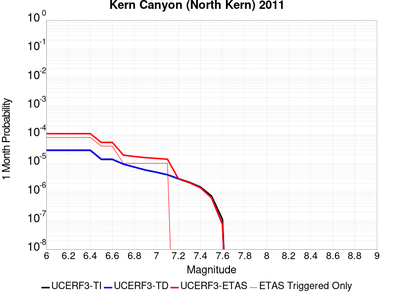 |  |  |

| Magnitude | 1 wk TI Prob | 1 wk TD Prob | 1 wk ETAS Prob | 1 wk ETAS/TD Gain | 1 wk ETAS Triggered Only | 1 mo TI Prob | 1 mo TD Prob | 1 mo ETAS Prob | 1 mo ETAS/TD Gain | 1 mo ETAS Triggered Only | 1 yr TI Prob | 1 yr TD Prob | 1 yr ETAS Prob | 1 yr ETAS/TD Gain | 1 yr ETAS Triggered Only | 10 yr TI Prob | 10 yr TD Prob | 10 yr ETAS Prob | 10 yr ETAS/TD Gain | 10 yr ETAS Triggered Only |
|-----|-----|-----|-----|-----|-----|-----|-----|-----|-----|-----|-----|-----|-----|-----|-----|-----|-----|-----|-----|-----|
| 6.0 | 6.6264497E-6 | 6.75733E-6 | 8.675679E-5 | 12.838916 | 8.0E-5 | 2.8398761E-5 | 2.895971E-5 | 1.0895739E-4 | 3.7623787 | 8.0E-5 | 3.4570007E-4 | 3.5253543E-4 | 4.3250722E-4 | 1.2268475 | 8.0E-5 | 0.0034516277 | 0.0035205502 | 0.0036102333 | 1.0254742 | 9.0E-5 |
| 6.1 | 6.6264497E-6 | 6.75733E-6 | 8.675679E-5 | 12.838916 | 8.0E-5 | 2.8398761E-5 | 2.895971E-5 | 1.0895739E-4 | 3.7623787 | 8.0E-5 | 3.4570007E-4 | 3.5253543E-4 | 4.3250722E-4 | 1.2268475 | 8.0E-5 | 0.0034516277 | 0.0035205502 | 0.0036102333 | 1.0254742 | 9.0E-5 |
| 6.2 | 6.6264497E-6 | 6.75733E-6 | 8.675679E-5 | 12.838916 | 8.0E-5 | 2.8398761E-5 | 2.895971E-5 | 1.0895739E-4 | 3.7623787 | 8.0E-5 | 3.4570007E-4 | 3.5253543E-4 | 4.3250722E-4 | 1.2268475 | 8.0E-5 | 0.0034516277 | 0.0035205502 | 0.0036102333 | 1.0254742 | 9.0E-5 |
| 6.3 | 6.6264497E-6 | 6.75733E-6 | 8.675679E-5 | 12.838916 | 8.0E-5 | 2.8398761E-5 | 2.895971E-5 | 1.0895739E-4 | 3.7623787 | 8.0E-5 | 3.4570007E-4 | 3.5253543E-4 | 4.3250722E-4 | 1.2268475 | 8.0E-5 | 0.0034516277 | 0.0035205502 | 0.0036102333 | 1.0254742 | 9.0E-5 |
| 6.4 | 6.6264497E-6 | 6.75733E-6 | 8.675679E-5 | 12.838916 | 8.0E-5 | 2.8398761E-5 | 2.895971E-5 | 1.0895739E-4 | 3.7623787 | 8.0E-5 | 3.4570007E-4 | 3.5253543E-4 | 4.3250722E-4 | 1.2268475 | 8.0E-5 | 0.0034516277 | 0.0035205502 | 0.0036102333 | 1.0254742 | 9.0E-5 |
| 6.5 | 3.2162225E-6 | 3.2570915E-6 | 4.325696E-5 | 13.280856 | 4.0E-5 | 1.3783738E-5 | 1.3958893E-5 | 5.3958334E-5 | 3.8655167 | 4.0E-5 | 1.6780409E-4 | 1.6993708E-4 | 2.0993028E-4 | 1.2353412 | 4.0E-5 | 0.0016767744 | 0.001698151 | 0.0017380831 | 1.023515 | 4.0E-5 |
| 6.6 | 3.2162225E-6 | 3.2570915E-6 | 4.325696E-5 | 13.280856 | 4.0E-5 | 1.3783738E-5 | 1.3958893E-5 | 5.3958334E-5 | 3.8655167 | 4.0E-5 | 1.6780409E-4 | 1.6993708E-4 | 2.0993028E-4 | 1.2353412 | 4.0E-5 | 0.0016767744 | 0.001698151 | 0.0017380831 | 1.023515 | 4.0E-5 |
| 6.7 | 2.1908265E-6 | 2.2071222E-6 | 1.22071E-5 | 5.530777 | 1.0E-5 | 9.389223E-6 | 9.459061E-6 | 1.9458967E-5 | 2.0571773 | 1.0E-5 | 1.1430779E-4 | 1.1515819E-4 | 1.2515704E-4 | 1.086827 | 1.0E-5 | 0.0011424901 | 0.0011510046 | 0.001160993 | 1.0086781 | 1.0E-5 |
| 6.8 | 1.7303895E-6 | 1.7365529E-6 | 1.1736535E-5 | 6.758525 | 1.0E-5 | 7.415934E-6 | 7.4423488E-6 | 1.7442275E-5 | 2.3436518 | 1.0E-5 | 9.028525E-5 | 9.0606925E-5 | 1.0060602E-4 | 1.1103568 | 1.0E-5 | 9.024858E-4 | 9.057096E-4 | 9.157005E-4 | 1.011031 | 1.0E-5 |
| 6.9 | 1.3700314E-6 | 1.3688622E-6 | 1.1368848E-5 | 8.305327 | 1.0E-5 | 5.87155E-6 | 5.8665396E-6 | 1.586648E-5 | 2.7045724 | 1.0E-5 | 7.148377E-5 | 7.142282E-5 | 8.1422106E-5 | 1.1400013 | 1.0E-5 | 7.146078E-4 | 7.140032E-4 | 7.239961E-4 | 1.0139955 | 1.0E-5 |
| 7.0 | 1.1467797E-6 | 1.1413804E-6 | 1.1141369E-5 | 9.761311 | 1.0E-5 | 4.9147607E-6 | 4.8916213E-6 | 1.4891572E-5 | 3.044302 | 1.0E-5 | 5.983557E-5 | 5.9553895E-5 | 6.95533E-5 | 1.1679051 | 1.0E-5 | 5.981946E-4 | 5.953825E-4 | 6.0537655E-4 | 1.016786 | 1.0E-5 |
| 7.1 | 9.3952065E-7 | 9.3026904E-7 | 1.093026E-5 | 11.749569 | 1.0E-5 | 4.026511E-6 | 3.9868614E-6 | 1.3986822E-5 | 3.5082288 | 1.0E-5 | 4.9021666E-5 | 4.8538972E-5 | 5.8538488E-5 | 1.20601 | 1.0E-5 | 4.901085E-4 | 4.8528548E-4 | 4.952806E-4 | 1.0205964 | 1.0E-5 |
| 7.2 | 6.858055E-7 | 6.7193E-7 | 6.7193E-7 | 1.0 | 0.0 | 2.939163E-6 | 2.879697E-6 | 2.879697E-6 | 1.0 | 0.0 | 3.5783723E-5 | 3.5059755E-5 | 3.5059755E-5 | 1.0 | 0.0 | 3.5777962E-4 | 3.5054312E-4 | 3.5054312E-4 | 1.0 | 0.0 |
| 7.3 | 5.1101983E-7 | 4.9393E-7 | 4.9393E-7 | 1.0 | 0.0 | 2.1900833E-6 | 2.116841E-6 | 2.116841E-6 | 1.0 | 0.0 | 2.6663936E-5 | 2.5772239E-5 | 2.5772239E-5 | 1.0 | 0.0 | 2.6660739E-4 | 2.57693E-4 | 2.57693E-4 | 1.0 | 0.0 |
| 7.4 | 3.4999414E-7 | 3.2995905E-7 | 3.2995905E-7 | 1.0 | 0.0 | 1.499974E-6 | 1.4141094E-6 | 1.4141094E-6 | 1.0 | 0.0 | 1.8262032E-5 | 1.721665E-5 | 1.721665E-5 | 1.0 | 0.0 | 1.826053E-4 | 1.7215339E-4 | 1.7215339E-4 | 1.0 | 0.0 |
| 7.5 | 1.7021522E-7 | 1.4750044E-7 | 1.4750044E-7 | 1.0 | 0.0 | 7.2949354E-7 | 6.321446E-7 | 6.321446E-7 | 1.0 | 0.0 | 8.881548E-6 | 7.696334E-6 | 7.696334E-6 | 1.0 | 0.0 | 8.8811925E-5 | 7.696076E-5 | 7.696076E-5 | 1.0 | 0.0 |
| 7.6 | 2.572245E-8 | 1.7352555E-8 | 1.7352555E-8 | 1.0 | 0.0 | 1.10239064E-7 | 7.436809E-8 | 7.436809E-8 | 1.0 | 0.0 | 1.3421597E-6 | 9.054312E-7 | 9.054312E-7 | 1.0 | 0.0 | 1.3421517E-5 | 9.05428E-6 | 9.05428E-6 | 1.0 | 0.0 |

## Mission Ridge-Arroyo Parida-Santa Ana
*[(top)](#table-of-contents)*

| 1 Week | 1 Month | 1 Year | 10 Year |
|-----|-----|-----|-----|
|  |  |  |  |

| Magnitude | 1 wk TI Prob | 1 wk TD Prob | 1 wk ETAS Prob | 1 wk ETAS/TD Gain | 1 wk ETAS Triggered Only | 1 mo TI Prob | 1 mo TD Prob | 1 mo ETAS Prob | 1 mo ETAS/TD Gain | 1 mo ETAS Triggered Only | 1 yr TI Prob | 1 yr TD Prob | 1 yr ETAS Prob | 1 yr ETAS/TD Gain | 1 yr ETAS Triggered Only | 10 yr TI Prob | 10 yr TD Prob | 10 yr ETAS Prob | 10 yr ETAS/TD Gain | 10 yr ETAS Triggered Only |
|-----|-----|-----|-----|-----|-----|-----|-----|-----|-----|-----|-----|-----|-----|-----|-----|-----|-----|-----|-----|-----|
| 6.0 | 4.169034E-5 | 4.7138263E-5 | 7.713685E-5 | 1.6363957 | 3.0E-5 | 1.7866064E-4 | 2.0201034E-4 | 2.5200023E-4 | 1.247462 | 5.0E-5 | 0.0021730233 | 0.00245745 | 0.002527278 | 1.0284148 | 7.0E-5 | 0.021518968 | 0.024384614 | 0.024462664 | 1.0032008 | 8.0E-5 |
| 6.1 | 1.73813E-5 | 1.6854226E-5 | 3.685389E-5 | 2.186626 | 2.0E-5 | 7.4489166E-5 | 7.223046E-5 | 1.0222829E-4 | 1.4153073 | 3.0E-5 | 9.065282E-4 | 8.790618E-4 | 9.0903544E-4 | 1.0340973 | 3.0E-5 | 0.009028391 | 0.008756988 | 0.008786725 | 1.0033958 | 3.0E-5 |
| 6.2 | 1.4622182E-5 | 1.367329E-5 | 2.3673152E-5 | 1.7313429 | 1.0E-5 | 6.2664985E-5 | 5.8598518E-5 | 7.8597346E-5 | 1.3412856 | 2.0E-5 | 7.6267915E-4 | 7.132073E-4 | 7.33193E-4 | 1.0280223 | 2.0E-5 | 0.007600669 | 0.007109627 | 0.0071294853 | 1.0027931 | 2.0E-5 |
| 6.3 | 1.3552434E-5 | 1.2482201E-5 | 2.2482076E-5 | 1.8011308 | 1.0E-5 | 5.8080568E-5 | 5.3494066E-5 | 7.3493E-5 | 1.3738532 | 2.0E-5 | 7.069015E-4 | 6.510988E-4 | 6.710858E-4 | 1.0306973 | 2.0E-5 | 0.00704657 | 0.006492275 | 0.006512145 | 1.0030606 | 2.0E-5 |
| 6.4 | 1.30977305E-5 | 1.1979156E-5 | 2.1979036E-5 | 1.8347733 | 1.0E-5 | 5.613192E-5 | 5.1338247E-5 | 7.133722E-5 | 1.3895531 | 2.0E-5 | 6.831918E-4 | 6.248669E-4 | 6.448544E-4 | 1.0319868 | 2.0E-5 | 0.006810953 | 0.0062314444 | 0.00625132 | 1.0031896 | 2.0E-5 |
| 6.5 | 1.225205E-5 | 1.1048803E-5 | 2.1048692E-5 | 1.9050654 | 1.0E-5 | 5.2507727E-5 | 4.7351168E-5 | 6.735022E-5 | 1.422356 | 2.0E-5 | 6.3909404E-4 | 5.7635066E-4 | 5.963392E-4 | 1.0346811 | 2.0E-5 | 0.006372592 | 0.005748869 | 0.005768754 | 1.003459 | 2.0E-5 |
| 6.6 | 1.1352241E-5 | 1.0063535E-5 | 2.0063435E-5 | 1.9936767 | 1.0E-5 | 4.8651553E-5 | 4.3128734E-5 | 6.3127874E-5 | 1.4637079 | 2.0E-5 | 5.921717E-4 | 5.2496797E-4 | 5.4495747E-4 | 1.0380776 | 2.0E-5 | 0.0059059616 | 0.0052375244 | 0.00525742 | 1.0037986 | 2.0E-5 |
| 6.7 | 1.0864116E-5 | 9.517027E-6 | 1.9516932E-5 | 2.0507383 | 1.0E-5 | 4.6559664E-5 | 4.0786632E-5 | 6.0785816E-5 | 1.4903368 | 2.0E-5 | 5.667165E-4 | 4.964661E-4 | 5.164562E-4 | 1.0402647 | 2.0E-5 | 0.005652734 | 0.004953804 | 0.004973705 | 1.0040174 | 2.0E-5 |
| 6.8 | 1.0666365E-5 | 9.299779E-6 | 9.299779E-6 | 1.0 | 0.0 | 4.571219E-5 | 3.9855597E-5 | 4.9855196E-5 | 1.2508957 | 1.0E-5 | 5.564038E-4 | 4.8513585E-4 | 4.95131E-4 | 1.0206028 | 1.0E-5 | 0.005550127 | 0.0048410003 | 0.0048509515 | 1.0020556 | 1.0E-5 |
| 6.9 | 1.0038665E-5 | 8.592046E-6 | 8.592046E-6 | 1.0 | 0.0 | 4.302214E-5 | 3.682254E-5 | 3.682254E-5 | 1.0 | 0.0 | 5.236687E-4 | 4.4822405E-4 | 4.4822405E-4 | 1.0 | 0.0 | 0.005224364 | 0.004473411 | 0.004473411 | 1.0 | 0.0 |
| 7.0 | 9.5379955E-6 | 8.025073E-6 | 8.025073E-6 | 1.0 | 0.0 | 4.0876483E-5 | 3.4392728E-5 | 3.4392728E-5 | 1.0 | 0.0 | 4.975576E-4 | 4.1865272E-4 | 4.1865272E-4 | 1.0 | 0.0 | 0.00496445 | 0.0041788397 | 0.0041788397 | 1.0 | 0.0 |
| 7.1 | 9.207389E-6 | 7.652375E-6 | 7.652375E-6 | 1.0 | 0.0 | 3.945964E-5 | 3.279549E-5 | 3.279549E-5 | 1.0 | 0.0 | 4.803152E-4 | 3.9921363E-4 | 3.9921363E-4 | 1.0 | 0.0 | 0.004792784 | 0.003985161 | 0.003985161 | 1.0 | 0.0 |
| 7.2 | 7.638091E-6 | 5.9311183E-6 | 5.9311183E-6 | 1.0 | 0.0 | 3.2734264E-5 | 2.541883E-5 | 2.541883E-5 | 1.0 | 0.0 | 3.984668E-4 | 3.0943064E-4 | 3.0943064E-4 | 1.0 | 0.0 | 0.0039775306 | 0.0030900547 | 0.0030900547 | 1.0 | 0.0 |
| 7.3 | 7.2500147E-6 | 5.5961527E-6 | 5.5961527E-6 | 1.0 | 0.0 | 3.1071122E-5 | 2.3983293E-5 | 2.3983293E-5 | 1.0 | 0.0 | 3.7822526E-4 | 2.9195778E-4 | 2.9195778E-4 | 1.0 | 0.0 | 0.0037758215 | 0.0029157975 | 0.0029157975 | 1.0 | 0.0 |
| 7.4 | 6.3899715E-6 | 4.9184964E-6 | 4.9184964E-6 | 1.0 | 0.0 | 2.7385306E-5 | 2.10791E-5 | 2.10791E-5 | 1.0 | 0.0 | 3.3336508E-4 | 2.5660804E-4 | 2.5660804E-4 | 1.0 | 0.0 | 0.0033286542 | 0.0025631618 | 0.0025631618 | 1.0 | 0.0 |
| 7.5 | 5.379025E-6 | 4.0838527E-6 | 4.0838527E-6 | 1.0 | 0.0 | 2.305276E-5 | 1.7502109E-5 | 1.7502109E-5 | 1.0 | 0.0 | 2.806312E-4 | 2.1306744E-4 | 2.1306744E-4 | 1.0 | 0.0 | 0.0028027708 | 0.002128643 | 0.002128643 | 1.0 | 0.0 |
| 7.6 | 4.1270696E-6 | 3.0883439E-6 | 3.0883439E-6 | 1.0 | 0.0 | 1.768732E-5 | 1.3235693E-5 | 1.3235693E-5 | 1.0 | 0.0 | 2.1532185E-4 | 1.6113273E-4 | 1.6113273E-4 | 1.0 | 0.0 | 0.0021511333 | 0.001610167 | 0.001610167 | 1.0 | 0.0 |
| 7.7 | 2.5406805E-6 | 1.8282013E-6 | 1.8282013E-6 | 1.0 | 0.0 | 1.0888585E-5 | 7.835125E-6 | 7.835125E-6 | 1.0 | 0.0 | 1.3256045E-4 | 9.538854E-5 | 9.538854E-5 | 1.0 | 0.0 | 0.0013248142 | 9.534821E-4 | 9.534821E-4 | 1.0 | 0.0 |
| 7.8 | 4.8608285E-7 | 3.5098864E-7 | 3.5098864E-7 | 1.0 | 0.0 | 2.0832106E-6 | 1.5042363E-6 | 1.5042363E-6 | 1.0 | 0.0 | 2.5362791E-5 | 1.8313924E-5 | 1.8313924E-5 | 1.0 | 0.0 | 2.5359896E-4 | 1.8312426E-4 | 1.8312426E-4 | 1.0 | 0.0 |
| 7.9 | 2.0472514E-8 | 1.2688783E-8 | 1.2688783E-8 | 1.0 | 0.0 | 8.7739345E-8 | 5.43805E-8 | 5.43805E-8 | 1.0 | 0.0 | 1.068226E-6 | 6.6208236E-7 | 6.6208236E-7 | 1.0 | 0.0 | 1.0682209E-5 | 6.620805E-6 | 6.620805E-6 | 1.0 | 0.0 |
| 8.0 | 4.443582E-9 | 2.0321211E-9 | 2.0321211E-9 | 1.0 | 0.0 | 1.9043922E-8 | 8.70909E-9 | 8.70909E-9 | 1.0 | 0.0 | 2.3185973E-7 | 1.0603316E-7 | 1.0603316E-7 | 1.0 | 0.0 | 2.3185949E-6 | 1.0603312E-6 | 1.0603312E-6 | 1.0 | 0.0 |

## Cleghorn Lake
*[(top)](#table-of-contents)*

| 1 Week | 1 Month | 1 Year | 10 Year |
|-----|-----|-----|-----|
|  |  |  |  |

| Magnitude | 1 wk TI Prob | 1 wk TD Prob | 1 wk ETAS Prob | 1 wk ETAS/TD Gain | 1 wk ETAS Triggered Only | 1 mo TI Prob | 1 mo TD Prob | 1 mo ETAS Prob | 1 mo ETAS/TD Gain | 1 mo ETAS Triggered Only | 1 yr TI Prob | 1 yr TD Prob | 1 yr ETAS Prob | 1 yr ETAS/TD Gain | 1 yr ETAS Triggered Only | 10 yr TI Prob | 10 yr TD Prob | 10 yr ETAS Prob | 10 yr ETAS/TD Gain | 10 yr ETAS Triggered Only |
|-----|-----|-----|-----|-----|-----|-----|-----|-----|-----|-----|-----|-----|-----|-----|-----|-----|-----|-----|-----|-----|
| 6.0 | 1.5467183E-5 | 1.6794203E-5 | 5.679353E-5 | 3.3817341 | 4.0E-5 | 6.6286244E-5 | 7.197348E-5 | 1.1197061E-4 | 1.5557202 | 4.0E-5 | 8.067362E-4 | 8.759797E-4 | 9.3592715E-4 | 1.0684347 | 6.0E-5 | 0.008038137 | 0.008730696 | 0.008800085 | 1.0079477 | 7.0E-5 |
| 6.1 | 1.5467183E-5 | 1.6794203E-5 | 5.679353E-5 | 3.3817341 | 4.0E-5 | 6.6286244E-5 | 7.197348E-5 | 1.1197061E-4 | 1.5557202 | 4.0E-5 | 8.067362E-4 | 8.759797E-4 | 9.3592715E-4 | 1.0684347 | 6.0E-5 | 0.008038137 | 0.008730696 | 0.008800085 | 1.0079477 | 7.0E-5 |
| 6.2 | 1.2624631E-5 | 1.3681544E-5 | 5.3680997E-5 | 3.9236064 | 4.0E-5 | 5.410444E-5 | 5.863415E-5 | 9.8631805E-5 | 1.6821563 | 4.0E-5 | 6.585225E-4 | 7.1368564E-4 | 7.736428E-4 | 1.0840106 | 6.0E-5 | 0.0065657445 | 0.0071187317 | 0.0071882335 | 1.0097632 | 7.0E-5 |
| 6.3 | 1.2624631E-5 | 1.3681544E-5 | 5.3680997E-5 | 3.9236064 | 4.0E-5 | 5.410444E-5 | 5.863415E-5 | 9.8631805E-5 | 1.6821563 | 4.0E-5 | 6.585225E-4 | 7.1368564E-4 | 7.736428E-4 | 1.0840106 | 6.0E-5 | 0.0065657445 | 0.0071187317 | 0.0071882335 | 1.0097632 | 7.0E-5 |
| 6.4 | 9.417684E-6 | 1.0170118E-5 | 4.0169813E-5 | 3.9497883 | 3.0E-5 | 4.036088E-5 | 4.3585722E-5 | 7.3584415E-5 | 1.6882688 | 3.0E-5 | 4.912829E-4 | 5.3056807E-4 | 5.7054684E-4 | 1.0753509 | 4.0E-5 | 0.004901982 | 0.005297049 | 0.0053467844 | 1.0093892 | 5.0E-5 |
| 6.5 | 9.368219E-6 | 1.0117545E-5 | 4.011724E-5 | 3.9651165 | 3.0E-5 | 4.014889E-5 | 4.3360415E-5 | 7.3359115E-5 | 1.6918453 | 3.0E-5 | 4.8870314E-4 | 5.2782625E-4 | 5.6780514E-4 | 1.0757425 | 4.0E-5 | 0.004876298 | 0.0052697617 | 0.005319498 | 1.009438 | 5.0E-5 |
| 6.6 | 7.803798E-6 | 8.441831E-6 | 3.8441576E-5 | 4.5537014 | 3.0E-5 | 3.3444423E-5 | 3.6179E-5 | 6.617791E-5 | 1.8291804 | 3.0E-5 | 4.0710976E-4 | 4.4043022E-4 | 4.804126E-4 | 1.0907803 | 4.0E-5 | 0.0040636472 | 0.0043994905 | 0.00444927 | 1.011315 | 5.0E-5 |
| 6.7 | 2.3108669E-6 | 2.4438336E-6 | 2.4438336E-6 | 1.0 | 0.0 | 9.903678E-6 | 1.0473532E-5 | 1.0473532E-5 | 1.0 | 0.0 | 1.205706E-4 | 1.2750797E-4 | 1.2750797E-4 | 1.0 | 0.0 | 0.001205052 | 0.0012743667 | 0.0012743667 | 1.0 | 0.0 |
| 6.8 | 2.0882828E-6 | 2.2062823E-6 | 2.2062823E-6 | 1.0 | 0.0 | 8.949753E-6 | 9.455462E-6 | 9.455462E-6 | 1.0 | 0.0 | 1.08957785E-4 | 1.1511434E-4 | 1.1511434E-4 | 1.0 | 0.0 | 0.0010890438 | 0.0011505639 | 0.0011505639 | 1.0 | 0.0 |
| 6.9 | 1.876935E-6 | 1.981051E-6 | 1.981051E-6 | 1.0 | 0.0 | 8.043982E-6 | 8.490192E-6 | 8.490192E-6 | 1.0 | 0.0 | 9.7931086E-5 | 1.03363345E-4 | 1.03363345E-4 | 1.0 | 0.0 | 9.788794E-4 | 0.0010331686 | 0.0010331686 | 1.0 | 0.0 |
| 7.0 | 1.5357559E-6 | 1.6202807E-6 | 1.6202807E-6 | 1.0 | 0.0 | 6.5817944E-6 | 6.9440425E-6 | 6.9440425E-6 | 1.0 | 0.0 | 8.01304E-5 | 8.454057E-5 | 8.454057E-5 | 1.0 | 0.0 | 8.010151E-4 | 8.450965E-4 | 8.450965E-4 | 1.0 | 0.0 |
| 7.1 | 1.0905424E-6 | 1.1497619E-6 | 1.1497619E-6 | 1.0 | 0.0 | 4.6737446E-6 | 4.9275427E-6 | 4.9275427E-6 | 1.0 | 0.0 | 5.6901354E-5 | 5.999128E-5 | 5.999128E-5 | 1.0 | 0.0 | 5.6886784E-4 | 5.997606E-4 | 5.997606E-4 | 1.0 | 0.0 |
| 7.2 | 6.06668E-7 | 6.387277E-7 | 6.387277E-7 | 1.0 | 0.0 | 2.600003E-6 | 2.7374022E-6 | 2.7374022E-6 | 1.0 | 0.0 | 3.1654577E-5 | 3.3327433E-5 | 3.3327433E-5 | 1.0 | 0.0 | 3.1650066E-4 | 3.3323118E-4 | 3.3323118E-4 | 1.0 | 0.0 |

## Santa Cruz Catalina Ridge alt1
*[(top)](#table-of-contents)*

| 1 Week | 1 Month | 1 Year | 10 Year |
|-----|-----|-----|-----|
|  |  |  |  |

| Magnitude | 1 wk TI Prob | 1 wk TD Prob | 1 wk ETAS Prob | 1 wk ETAS/TD Gain | 1 wk ETAS Triggered Only | 1 mo TI Prob | 1 mo TD Prob | 1 mo ETAS Prob | 1 mo ETAS/TD Gain | 1 mo ETAS Triggered Only | 1 yr TI Prob | 1 yr TD Prob | 1 yr ETAS Prob | 1 yr ETAS/TD Gain | 1 yr ETAS Triggered Only | 10 yr TI Prob | 10 yr TD Prob | 10 yr ETAS Prob | 10 yr ETAS/TD Gain | 10 yr ETAS Triggered Only |
|-----|-----|-----|-----|-----|-----|-----|-----|-----|-----|-----|-----|-----|-----|-----|-----|-----|-----|-----|-----|-----|
| 6.0 | 3.2833184E-5 | 3.65584E-5 | 9.655621E-5 | 2.6411498 | 6.0E-5 | 1.4070606E-4 | 1.5667039E-4 | 2.1666098E-4 | 1.3829097 | 6.0E-5 | 0.00171175 | 0.0019059596 | 0.001985807 | 1.0418936 | 8.0E-5 | 0.016986247 | 0.018913029 | 0.018991517 | 1.0041499 | 8.0E-5 |
| 6.1 | 1.9835548E-5 | 2.1659505E-5 | 7.1658425E-5 | 3.3084054 | 5.0E-5 | 8.500672E-5 | 9.282326E-5 | 1.4281862E-4 | 1.5386081 | 5.0E-5 | 0.0010344655 | 0.0011295575 | 0.0011994784 | 1.0619012 | 7.0E-5 | 0.010296632 | 0.011240295 | 0.011309508 | 1.0061576 | 7.0E-5 |
| 6.2 | 1.9835548E-5 | 2.1659505E-5 | 7.1658425E-5 | 3.3084054 | 5.0E-5 | 8.500672E-5 | 9.282326E-5 | 1.4281862E-4 | 1.5386081 | 5.0E-5 | 0.0010344655 | 0.0011295575 | 0.0011994784 | 1.0619012 | 7.0E-5 | 0.010296632 | 0.011240295 | 0.011309508 | 1.0061576 | 7.0E-5 |
| 6.3 | 1.5728183E-5 | 1.703395E-5 | 4.7033438E-5 | 2.7611587 | 3.0E-5 | 6.7404755E-5 | 7.300063E-5 | 1.0299844E-4 | 1.4109254 | 3.0E-5 | 8.2034385E-4 | 8.884264E-4 | 9.3838194E-4 | 1.0562292 | 5.0E-5 | 0.008173222 | 0.008849427 | 0.008898985 | 1.0056001 | 5.0E-5 |
| 6.4 | 1.5728183E-5 | 1.703395E-5 | 4.7033438E-5 | 2.7611587 | 3.0E-5 | 6.7404755E-5 | 7.300063E-5 | 1.0299844E-4 | 1.4109254 | 3.0E-5 | 8.2034385E-4 | 8.884264E-4 | 9.3838194E-4 | 1.0562292 | 5.0E-5 | 0.008173222 | 0.008849427 | 0.008898985 | 1.0056001 | 5.0E-5 |
| 6.5 | 1.3707734E-5 | 1.4794522E-5 | 3.4794226E-5 | 2.3518317 | 2.0E-5 | 5.8746107E-5 | 6.3403575E-5 | 8.34023E-5 | 1.3154197 | 2.0E-5 | 7.1499916E-4 | 7.716686E-4 | 8.0164545E-4 | 1.0388469 | 3.0E-5 | 0.0071270303 | 0.0076902895 | 0.007720059 | 1.003871 | 3.0E-5 |
| 6.6 | 1.2539813E-5 | 1.3510219E-5 | 3.350995E-5 | 2.480341 | 2.0E-5 | 5.3740947E-5 | 5.789967E-5 | 7.789851E-5 | 1.3454051 | 2.0E-5 | 6.540996E-4 | 7.0470315E-4 | 7.34682E-4 | 1.0425411 | 3.0E-5 | 0.0065217763 | 0.0070249885 | 0.007054778 | 1.0042405 | 3.0E-5 |
| 6.7 | 1.1504083E-5 | 1.2377375E-5 | 3.2377127E-5 | 2.6158316 | 2.0E-5 | 4.930228E-5 | 5.3044827E-5 | 7.304377E-5 | 1.3770196 | 2.0E-5 | 6.0008996E-4 | 6.456314E-4 | 6.75612E-4 | 1.0464362 | 3.0E-5 | 0.005984721 | 0.006437786 | 0.006467593 | 1.00463 | 3.0E-5 |
| 6.8 | 1.012739E-5 | 1.0877071E-5 | 2.0876963E-5 | 1.9193552 | 1.0E-5 | 4.340238E-5 | 4.6615194E-5 | 5.661473E-5 | 1.2145123 | 1.0E-5 | 5.282958E-4 | 5.673937E-4 | 5.8738235E-4 | 1.0352288 | 2.0E-5 | 0.0052704164 | 0.0056596193 | 0.0056795063 | 1.0035138 | 2.0E-5 |
| 6.9 | 8.9607865E-6 | 9.609117E-6 | 1.960902E-5 | 2.0406682 | 1.0E-5 | 3.8402806E-5 | 4.1181287E-5 | 5.1180876E-5 | 1.2428187 | 1.0E-5 | 4.6745385E-4 | 5.012679E-4 | 5.2125787E-4 | 1.0398788 | 2.0E-5 | 0.0046647177 | 0.005001492 | 0.005021392 | 1.0039788 | 2.0E-5 |
| 7.0 | 8.046829E-6 | 8.619746E-6 | 1.861966E-5 | 2.160117 | 1.0E-5 | 3.4485955E-5 | 3.694125E-5 | 4.694088E-5 | 1.2706901 | 1.0E-5 | 4.1978562E-4 | 4.496677E-4 | 4.6965873E-4 | 1.0444573 | 2.0E-5 | 0.004189935 | 0.0044876686 | 0.004507579 | 1.0044366 | 2.0E-5 |
| 7.1 | 7.136131E-6 | 7.637656E-6 | 1.763758E-5 | 2.3092923 | 1.0E-5 | 3.0583058E-5 | 3.2732405E-5 | 4.2732077E-5 | 1.3054976 | 1.0E-5 | 3.7228514E-4 | 3.9844486E-4 | 4.084409E-4 | 1.0250876 | 1.0E-5 | 0.0037166206 | 0.003977381 | 0.0039873417 | 1.0025042 | 1.0E-5 |
| 7.2 | 6.362014E-6 | 6.8049585E-6 | 1.680489E-5 | 2.4695067 | 1.0E-5 | 2.726549E-5 | 2.9163786E-5 | 3.9163493E-5 | 1.342881 | 1.0E-5 | 3.3190678E-4 | 3.550119E-4 | 3.6500834E-4 | 1.0281581 | 1.0E-5 | 0.0033141149 | 0.003544516 | 0.0035544806 | 1.0028113 | 1.0E-5 |
| 7.3 | 5.004101E-6 | 5.351715E-6 | 5.351715E-6 | 1.0 | 0.0 | 2.1445969E-5 | 2.2935723E-5 | 2.2935723E-5 | 1.0 | 0.0 | 2.6107338E-4 | 2.792072E-4 | 2.792072E-4 | 1.0 | 0.0 | 0.002607669 | 0.0027886187 | 0.0027886187 | 1.0 | 0.0 |
| 7.4 | 3.4901443E-6 | 3.7320526E-6 | 3.7320526E-6 | 1.0 | 0.0 | 1.4957676E-5 | 1.5994416E-5 | 1.5994416E-5 | 1.0 | 0.0 | 1.8209449E-4 | 1.9471499E-4 | 1.9471499E-4 | 1.0 | 0.0 | 0.0018194534 | 0.0019454823 | 0.0019454823 | 1.0 | 0.0 |
| 7.5 | 1.1215045E-6 | 1.189387E-6 | 1.189387E-6 | 1.0 | 0.0 | 4.806439E-6 | 5.097363E-6 | 5.097363E-6 | 1.0 | 0.0 | 5.851682E-5 | 6.205866E-5 | 6.205866E-5 | 1.0 | 0.0 | 5.850142E-4 | 6.2041637E-4 | 6.2041637E-4 | 1.0 | 0.0 |
| 7.6 | 2.8599047E-7 | 2.9951994E-7 | 2.9951994E-7 | 1.0 | 0.0 | 1.2256729E-6 | 1.2836562E-6 | 1.2836562E-6 | 1.0 | 0.0 | 1.4922465E-5 | 1.5628404E-5 | 1.5628404E-5 | 1.0 | 0.0 | 1.4921463E-4 | 1.5627318E-4 | 1.5627318E-4 | 1.0 | 0.0 |
| 7.7 | 2.0781519E-7 | 2.1744323E-7 | 2.1744323E-7 | 1.0 | 0.0 | 8.906362E-7 | 9.3189925E-7 | 9.3189925E-7 | 1.0 | 0.0 | 1.08434415E-5 | 1.13458145E-5 | 1.13458145E-5 | 1.0 | 0.0 | 1.0842913E-4 | 1.1345245E-4 | 1.1345245E-4 | 1.0 | 0.0 |
| 7.8 | 3.614776E-8 | 3.764102E-8 | 3.764102E-8 | 1.0 | 0.0 | 1.5491896E-7 | 1.6131864E-7 | 1.6131864E-7 | 1.0 | 0.0 | 1.8861368E-6 | 1.9640527E-6 | 1.9640527E-6 | 1.0 | 0.0 | 1.8861208E-5 | 1.9640367E-5 | 1.9640367E-5 | 1.0 | 0.0 |

## Santa Rosa Island
*[(top)](#table-of-contents)*

| 1 Week | 1 Month | 1 Year | 10 Year |
|-----|-----|-----|-----|
|  |  |  |  |

| Magnitude | 1 wk TI Prob | 1 wk TD Prob | 1 wk ETAS Prob | 1 wk ETAS/TD Gain | 1 wk ETAS Triggered Only | 1 mo TI Prob | 1 mo TD Prob | 1 mo ETAS Prob | 1 mo ETAS/TD Gain | 1 mo ETAS Triggered Only | 1 yr TI Prob | 1 yr TD Prob | 1 yr ETAS Prob | 1 yr ETAS/TD Gain | 1 yr ETAS Triggered Only | 10 yr TI Prob | 10 yr TD Prob | 10 yr ETAS Prob | 10 yr ETAS/TD Gain | 10 yr ETAS Triggered Only |
|-----|-----|-----|-----|-----|-----|-----|-----|-----|-----|-----|-----|-----|-----|-----|-----|-----|-----|-----|-----|-----|
| 6.0 | 4.1143165E-5 | 4.7091133E-5 | 1.1708784E-4 | 2.4864094 | 7.0E-5 | 1.7631594E-4 | 2.0180465E-4 | 2.7179052E-4 | 1.3468001 | 7.0E-5 | 0.002144533 | 0.0024544 | 0.0025342037 | 1.0325146 | 8.0E-5 | 0.021239553 | 0.024293551 | 0.024371607 | 1.003213 | 8.0E-5 |
| 6.1 | 2.1061249E-5 | 2.3864959E-5 | 3.3864722E-5 | 1.4190143 | 1.0E-5 | 9.0259375E-5 | 1.0227455E-4 | 1.1227353E-4 | 1.097766 | 1.0E-5 | 0.0010983539 | 0.0012445104 | 0.0012544979 | 1.0080253 | 1.0E-5 | 0.01092941 | 0.012378449 | 0.012388324 | 1.0007979 | 1.0E-5 |
| 6.2 | 2.1061249E-5 | 2.3864959E-5 | 3.3864722E-5 | 1.4190143 | 1.0E-5 | 9.0259375E-5 | 1.0227455E-4 | 1.1227353E-4 | 1.097766 | 1.0E-5 | 0.0010983539 | 0.0012445104 | 0.0012544979 | 1.0080253 | 1.0E-5 | 0.01092941 | 0.012378449 | 0.012388324 | 1.0007979 | 1.0E-5 |
| 6.3 | 1.5158236E-5 | 1.7074419E-5 | 1.7074419E-5 | 1.0 | 0.0 | 6.496225E-5 | 7.3174095E-5 | 7.3174095E-5 | 1.0 | 0.0 | 7.906284E-4 | 8.905424E-4 | 8.905424E-4 | 1.0 | 0.0 | 0.007878214 | 0.008870989 | 0.008870989 | 1.0 | 0.0 |
| 6.4 | 1.2341918E-5 | 1.3852917E-5 | 1.3852917E-5 | 1.0 | 0.0 | 5.2892858E-5 | 5.9368336E-5 | 5.9368336E-5 | 1.0 | 0.0 | 6.437803E-4 | 7.225779E-4 | 7.225779E-4 | 1.0 | 0.0 | 0.006419184 | 0.007203121 | 0.007203121 | 1.0 | 0.0 |
| 6.5 | 9.061158E-6 | 1.0117031E-5 | 1.0117031E-5 | 1.0 | 0.0 | 3.883296E-5 | 4.3358013E-5 | 4.3358013E-5 | 1.0 | 0.0 | 4.726887E-4 | 5.277613E-4 | 5.277613E-4 | 1.0 | 0.0 | 0.004716845 | 0.0052656173 | 0.0052656173 | 1.0 | 0.0 |
| 6.6 | 7.5461685E-6 | 8.400733E-6 | 8.400733E-6 | 1.0 | 0.0 | 3.2340322E-5 | 3.600267E-5 | 3.600267E-5 | 1.0 | 0.0 | 3.936723E-4 | 4.3824865E-4 | 4.3824865E-4 | 1.0 | 0.0 | 0.003929756 | 0.0043742736 | 0.0043742736 | 1.0 | 0.0 |
| 6.7 | 5.5023775E-6 | 6.087381E-6 | 6.087381E-6 | 1.0 | 0.0 | 2.3581404E-5 | 2.6088532E-5 | 2.6088532E-5 | 1.0 | 0.0 | 2.8706578E-4 | 3.1758484E-4 | 3.1758484E-4 | 1.0 | 0.0 | 0.0028669522 | 0.0031716314 | 0.0031716314 | 1.0 | 0.0 |
| 6.8 | 3.7351679E-6 | 4.0831405E-6 | 4.0831405E-6 | 1.0 | 0.0 | 1.6007763E-5 | 1.749907E-5 | 1.749907E-5 | 1.0 | 0.0 | 1.948771E-4 | 2.1303284E-4 | 2.1303284E-4 | 1.0 | 0.0 | 0.0019470629 | 0.0021285315 | 0.0021285315 | 1.0 | 0.0 |
| 6.9 | 2.456366E-6 | 2.6292705E-6 | 2.6292705E-6 | 1.0 | 0.0 | 1.0527241E-5 | 1.1268254E-5 | 1.1268254E-5 | 1.0 | 0.0 | 1.2816161E-4 | 1.3718237E-4 | 1.3718237E-4 | 1.0 | 0.0 | 0.0012808773 | 0.0013709799 | 0.0013709799 | 1.0 | 0.0 |
| 7.0 | 2.3245157E-6 | 2.4827782E-6 | 2.4827782E-6 | 1.0 | 0.0 | 9.962172E-6 | 1.0640435E-5 | 1.0640435E-5 | 1.0 | 0.0 | 1.2128269E-4 | 1.2953962E-4 | 1.2953962E-4 | 1.0 | 0.0 | 0.0012121652 | 0.0012946434 | 0.0012946434 | 1.0 | 0.0 |
| 7.1 | 2.2248344E-6 | 2.37325E-6 | 2.37325E-6 | 1.0 | 0.0 | 9.53497E-6 | 1.0171032E-5 | 1.0171032E-5 | 1.0 | 0.0 | 1.1608207E-4 | 1.2382529E-4 | 1.2382529E-4 | 1.0 | 0.0 | 0.0011602144 | 0.001237565 | 0.001237565 | 1.0 | 0.0 |
| 7.2 | 2.1350402E-6 | 2.276154E-6 | 2.276154E-6 | 1.0 | 0.0 | 9.150141E-6 | 9.754909E-6 | 9.754909E-6 | 1.0 | 0.0 | 1.1139726E-4 | 1.1875956E-4 | 1.1875956E-4 | 1.0 | 0.0 | 0.0011134144 | 0.0011869629 | 0.0011869629 | 1.0 | 0.0 |
| 7.3 | 1.9793572E-6 | 2.108719E-6 | 2.108719E-6 | 1.0 | 0.0 | 8.482932E-6 | 9.037336E-6 | 9.037336E-6 | 1.0 | 0.0 | 1.032748E-4 | 1.10024026E-4 | 1.10024026E-4 | 1.0 | 0.0 | 0.0010322682 | 0.0010996973 | 0.0010996973 | 1.0 | 0.0 |
| 7.4 | 1.6951194E-6 | 1.8045733E-6 | 1.8045733E-6 | 1.0 | 0.0 | 7.264777E-6 | 7.733863E-6 | 7.733863E-6 | 1.0 | 0.0 | 8.844508E-5 | 9.415573E-5 | 9.415573E-5 | 1.0 | 0.0 | 8.840988E-4 | 9.4116E-4 | 9.4116E-4 | 1.0 | 0.0 |
| 7.5 | 8.987207E-7 | 9.5122147E-7 | 9.5122147E-7 | 1.0 | 0.0 | 3.8516546E-6 | 4.076657E-6 | 4.076657E-6 | 1.0 | 0.0 | 4.6892885E-5 | 4.963218E-5 | 4.963218E-5 | 1.0 | 0.0 | 4.688299E-4 | 4.9621216E-4 | 4.9621216E-4 | 1.0 | 0.0 |
| 7.6 | 3.8783037E-7 | 4.052932E-7 | 4.052932E-7 | 1.0 | 0.0 | 1.6621291E-6 | 1.7369698E-6 | 1.7369698E-6 | 1.0 | 0.0 | 2.0236233E-5 | 2.1147409E-5 | 2.1147409E-5 | 1.0 | 0.0 | 2.023439E-4 | 2.1145462E-4 | 2.1145462E-4 | 1.0 | 0.0 |
| 7.7 | 6.181804E-8 | 6.339035E-8 | 6.339035E-8 | 1.0 | 0.0 | 2.6493444E-7 | 2.7167292E-7 | 2.7167292E-7 | 1.0 | 0.0 | 3.225572E-6 | 3.3076128E-6 | 3.3076128E-6 | 1.0 | 0.0 | 3.225525E-5 | 3.307564E-5 | 3.307564E-5 | 1.0 | 0.0 |
| 7.8 | 1.3704449E-9 | 1.3964153E-9 | 1.3964153E-9 | 1.0 | 0.0 | 5.873335E-9 | 5.984637E-9 | 5.984637E-9 | 1.0 | 0.0 | 7.1507856E-8 | 7.286295E-8 | 7.286295E-8 | 1.0 | 0.0 | 7.1507833E-7 | 7.286294E-7 | 7.286294E-7 | 1.0 | 0.0 |

## Owens Valley
*[(top)](#table-of-contents)*

| 1 Week | 1 Month | 1 Year | 10 Year |
|-----|-----|-----|-----|
|  |  |  |  |

| Magnitude | 1 wk TI Prob | 1 wk TD Prob | 1 wk ETAS Prob | 1 wk ETAS/TD Gain | 1 wk ETAS Triggered Only | 1 mo TI Prob | 1 mo TD Prob | 1 mo ETAS Prob | 1 mo ETAS/TD Gain | 1 mo ETAS Triggered Only | 1 yr TI Prob | 1 yr TD Prob | 1 yr ETAS Prob | 1 yr ETAS/TD Gain | 1 yr ETAS Triggered Only | 10 yr TI Prob | 10 yr TD Prob | 10 yr ETAS Prob | 10 yr ETAS/TD Gain | 10 yr ETAS Triggered Only |
|-----|-----|-----|-----|-----|-----|-----|-----|-----|-----|-----|-----|-----|-----|-----|-----|-----|-----|-----|-----|-----|
| 6.0 | 4.83821E-5 | 3.626567E-6 | 4.3626424E-5 | 12.0296755 | 4.0E-5 | 2.0733538E-4 | 1.5542342E-5 | 8.554126E-5 | 5.5037556 | 7.0E-5 | 0.002521386 | 1.8921259E-4 | 2.6919745E-4 | 1.4227248 | 8.0E-5 | 0.024929691 | 0.001925011 | 0.002004857 | 1.0414782 | 8.0E-5 |
| 6.1 | 4.83821E-5 | 3.626567E-6 | 4.3626424E-5 | 12.0296755 | 4.0E-5 | 2.0733538E-4 | 1.5542342E-5 | 8.554126E-5 | 5.5037556 | 7.0E-5 | 0.002521386 | 1.8921259E-4 | 2.6919745E-4 | 1.4227248 | 8.0E-5 | 0.024929691 | 0.001925011 | 0.002004857 | 1.0414782 | 8.0E-5 |
| 6.2 | 4.83821E-5 | 3.626567E-6 | 4.3626424E-5 | 12.0296755 | 4.0E-5 | 2.0733538E-4 | 1.5542342E-5 | 8.554126E-5 | 5.5037556 | 7.0E-5 | 0.002521386 | 1.8921259E-4 | 2.6919745E-4 | 1.4227248 | 8.0E-5 | 0.024929691 | 0.001925011 | 0.002004857 | 1.0414782 | 8.0E-5 |
| 6.3 | 3.953008E-5 | 3.1553948E-6 | 4.315527E-5 | 13.676662 | 4.0E-5 | 1.6940363E-4 | 1.3523055E-5 | 8.352211E-5 | 6.1762753 | 7.0E-5 | 0.002060538 | 1.6463149E-4 | 2.446183E-4 | 1.4858538 | 8.0E-5 | 0.020415364 | 0.0016592 | 0.0017390671 | 1.048136 | 8.0E-5 |
| 6.4 | 3.953008E-5 | 3.1553948E-6 | 4.315527E-5 | 13.676662 | 4.0E-5 | 1.6940363E-4 | 1.3523055E-5 | 8.352211E-5 | 6.1762753 | 7.0E-5 | 0.002060538 | 1.6463149E-4 | 2.446183E-4 | 1.4858538 | 8.0E-5 | 0.020415364 | 0.0016592 | 0.0017390671 | 1.048136 | 8.0E-5 |
| 6.5 | 3.457342E-5 | 2.9715961E-6 | 4.297148E-5 | 14.460739 | 4.0E-5 | 1.4816338E-4 | 1.2735354E-5 | 8.273446E-5 | 6.49644 | 7.0E-5 | 0.0018023965 | 1.550426E-4 | 2.350302E-4 | 1.5159072 | 8.0E-5 | 0.017878477 | 0.001555719 | 0.0016355945 | 1.0513432 | 8.0E-5 |
| 6.6 | 3.1127765E-5 | 2.8744932E-6 | 4.2874377E-5 | 14.915456 | 4.0E-5 | 1.3339789E-4 | 1.2319203E-5 | 8.231834E-5 | 6.682116 | 7.0E-5 | 0.0016229092 | 1.4997667E-4 | 2.2996466E-4 | 1.5333363 | 8.0E-5 | 0.016111081 | 0.0015012559 | 0.0015811358 | 1.0532087 | 8.0E-5 |
| 6.7 | 2.806885E-5 | 2.8104134E-6 | 4.28103E-5 | 15.232741 | 4.0E-5 | 1.2028952E-4 | 1.20445775E-5 | 8.2043734E-5 | 6.811674 | 7.0E-5 | 0.001463541 | 1.4663354E-4 | 2.266218E-4 | 1.5454978 | 8.0E-5 | 0.014539397 | 0.0014657511 | 0.0015456338 | 1.0544995 | 8.0E-5 |
| 6.8 | 2.524524E-5 | 2.2353688E-6 | 4.223528E-5 | 18.8941 | 4.0E-5 | 1.0818939E-4 | 9.580118E-6 | 7.957945E-5 | 8.306729 | 7.0E-5 | 0.0013164099 | 1.16632E-4 | 1.9662267E-4 | 1.6858381 | 8.0E-5 | 0.01308639 | 0.0011659812 | 0.0012458878 | 1.0685318 | 8.0E-5 |
| 6.9 | 2.2704568E-5 | 1.6081682E-6 | 4.1608106E-5 | 25.87298 | 4.0E-5 | 9.730166E-5 | 6.8921313E-6 | 7.689165E-5 | 11.15644 | 7.0E-5 | 0.0011840039 | 8.390849E-5 | 1.6390177E-4 | 1.9533396 | 8.0E-5 | 0.011777153 | 8.3897985E-4 | 9.189127E-4 | 1.0952739 | 8.0E-5 |
| 7.0 | 2.0871712E-5 | 1.5395453E-6 | 4.1539482E-5 | 26.981657 | 4.0E-5 | 8.944713E-5 | 6.598035E-6 | 7.659757E-5 | 11.60915 | 7.0E-5 | 0.0010884746 | 8.032813E-5 | 1.603217E-4 | 1.9958352 | 8.0E-5 | 0.010831586 | 8.0316263E-4 | 8.8309834E-4 | 1.0995263 | 8.0E-5 |
| 7.1 | 1.944928E-5 | 1.3864178E-6 | 4.1386364E-5 | 29.851292 | 4.0E-5 | 8.335139E-5 | 5.941777E-6 | 7.594136E-5 | 12.780917 | 7.0E-5 | 0.0010143308 | 7.233874E-5 | 1.5233296E-4 | 2.105828 | 8.0E-5 | 0.010097133 | 7.2330976E-4 | 8.0325187E-4 | 1.1105226 | 8.0E-5 |
| 7.2 | 1.7876306E-5 | 1.2489141E-6 | 4.1248863E-5 | 33.027782 | 4.0E-5 | 7.6610486E-5 | 5.352478E-6 | 7.53521E-5 | 14.077984 | 7.0E-5 | 9.3233347E-4 | 6.516448E-5 | 1.4515927E-4 | 2.2275827 | 8.0E-5 | 0.009284316 | 6.5159105E-4 | 7.315389E-4 | 1.1226964 | 8.0E-5 |
| 7.3 | 1.2618672E-5 | 1.1115209E-6 | 4.1111478E-5 | 36.986687 | 4.0E-5 | 5.40789E-5 | 4.763652E-6 | 7.476332E-5 | 15.694537 | 7.0E-5 | 6.582117E-4 | 5.799593E-5 | 1.3799129E-4 | 2.379327 | 8.0E-5 | 0.0065626553 | 5.7994033E-4 | 6.5989397E-4 | 1.1378652 | 8.0E-5 |
| 7.4 | 7.4874442E-6 | 8.5486437E-7 | 4.085483E-5 | 47.791008 | 4.0E-5 | 3.208865E-5 | 3.6636993E-6 | 7.366345E-5 | 20.1063 | 7.0E-5 | 3.906093E-4 | 4.4604632E-5 | 1.1460151E-4 | 2.5692737 | 7.0E-5 | 0.003899234 | 4.4604883E-4 | 5.160176E-4 | 1.1568635 | 7.0E-5 |
| 7.5 | 2.4734156E-6 | 6.068616E-7 | 2.0606849E-5 | 33.956425 | 2.0E-5 | 1.060031E-5 | 2.6008327E-6 | 5.2600702E-5 | 20.224562 | 5.0E-5 | 1.2905113E-4 | 3.166468E-5 | 8.16631E-5 | 2.5789964 | 5.0E-5 | 0.0012897621 | 3.1660203E-4 | 3.665862E-4 | 1.157877 | 5.0E-5 |
| 7.6 | 1.1328841E-6 | 3.196531E-7 | 2.0319647E-5 | 63.567806 | 2.0E-5 | 4.8552088E-6 | 1.3699412E-6 | 4.1369887E-5 | 30.198294 | 4.0E-5 | 5.9110564E-5 | 1.6678909E-5 | 5.667824E-5 | 3.3981986 | 4.0E-5 | 5.9094845E-4 | 1.6677675E-4 | 2.0677008E-4 | 1.2398016 | 4.0E-5 |
| 7.7 | 4.8613185E-7 | 8.964689E-8 | 1.0089646E-5 | 112.54876 | 1.0E-5 | 2.0834207E-6 | 3.8420092E-7 | 1.0384197E-5 | 27.02804 | 1.0E-5 | 2.536535E-5 | 4.6776368E-6 | 1.467759E-5 | 3.1378217 | 1.0E-5 | 2.5362454E-4 | 4.677545E-5 | 5.677498E-5 | 1.2137773 | 1.0E-5 |

## San Jacinto (Coyote Creek)
*[(top)](#table-of-contents)*

| 1 Week | 1 Month | 1 Year | 10 Year |
|-----|-----|-----|-----|
|  |  |  |  |

| Magnitude | 1 wk TI Prob | 1 wk TD Prob | 1 wk ETAS Prob | 1 wk ETAS/TD Gain | 1 wk ETAS Triggered Only | 1 mo TI Prob | 1 mo TD Prob | 1 mo ETAS Prob | 1 mo ETAS/TD Gain | 1 mo ETAS Triggered Only | 1 yr TI Prob | 1 yr TD Prob | 1 yr ETAS Prob | 1 yr ETAS/TD Gain | 1 yr ETAS Triggered Only | 10 yr TI Prob | 10 yr TD Prob | 10 yr ETAS Prob | 10 yr ETAS/TD Gain | 10 yr ETAS Triggered Only |
|-----|-----|-----|-----|-----|-----|-----|-----|-----|-----|-----|-----|-----|-----|-----|-----|-----|-----|-----|-----|-----|
| 6.0 | 2.7374346E-5 | 2.4145214E-5 | 8.4143765E-5 | 3.4849045 | 6.0E-5 | 1.1731335E-4 | 1.034754E-4 | 1.7346816E-4 | 1.6764193 | 7.0E-5 | 0.0014273542 | 0.0012590875 | 0.0013289993 | 1.0555258 | 7.0E-5 | 0.01418221 | 0.012928318 | 0.012997413 | 1.0053445 | 7.0E-5 |
| 6.1 | 2.7374346E-5 | 2.4145214E-5 | 8.4143765E-5 | 3.4849045 | 6.0E-5 | 1.1731335E-4 | 1.034754E-4 | 1.7346816E-4 | 1.6764193 | 7.0E-5 | 0.0014273542 | 0.0012590875 | 0.0013289993 | 1.0555258 | 7.0E-5 | 0.01418221 | 0.012928318 | 0.012997413 | 1.0053445 | 7.0E-5 |
| 6.2 | 2.7374346E-5 | 2.4145214E-5 | 8.4143765E-5 | 3.4849045 | 6.0E-5 | 1.1731335E-4 | 1.034754E-4 | 1.7346816E-4 | 1.6764193 | 7.0E-5 | 0.0014273542 | 0.0012590875 | 0.0013289993 | 1.0555258 | 7.0E-5 | 0.01418221 | 0.012928318 | 0.012997413 | 1.0053445 | 7.0E-5 |
| 6.3 | 2.7374346E-5 | 2.4145214E-5 | 8.4143765E-5 | 3.4849045 | 6.0E-5 | 1.1731335E-4 | 1.034754E-4 | 1.7346816E-4 | 1.6764193 | 7.0E-5 | 0.0014273542 | 0.0012590875 | 0.0013289993 | 1.0555258 | 7.0E-5 | 0.01418221 | 0.012928318 | 0.012997413 | 1.0053445 | 7.0E-5 |
| 6.4 | 2.7374346E-5 | 2.4145214E-5 | 8.4143765E-5 | 3.4849045 | 6.0E-5 | 1.1731335E-4 | 1.034754E-4 | 1.7346816E-4 | 1.6764193 | 7.0E-5 | 0.0014273542 | 0.0012590875 | 0.0013289993 | 1.0555258 | 7.0E-5 | 0.01418221 | 0.012928318 | 0.012997413 | 1.0053445 | 7.0E-5 |
| 6.5 | 2.7282445E-5 | 2.4031293E-5 | 8.402985E-5 | 3.4966846 | 6.0E-5 | 1.16919524E-4 | 1.029872E-4 | 1.7298E-4 | 1.6796261 | 7.0E-5 | 0.0014225657 | 0.0012531505 | 0.0013230628 | 1.0557892 | 7.0E-5 | 0.014134934 | 0.012869646 | 0.012938744 | 1.0053692 | 7.0E-5 |
| 6.6 | 2.7282445E-5 | 2.4031293E-5 | 8.402985E-5 | 3.4966846 | 6.0E-5 | 1.16919524E-4 | 1.029872E-4 | 1.7298E-4 | 1.6796261 | 7.0E-5 | 0.0014225657 | 0.0012531505 | 0.0013230628 | 1.0557892 | 7.0E-5 | 0.014134934 | 0.012869646 | 0.012938744 | 1.0053692 | 7.0E-5 |
| 6.7 | 2.7216198E-5 | 2.3956412E-5 | 8.3954976E-5 | 3.5044885 | 6.0E-5 | 1.1663563E-4 | 1.02666316E-4 | 1.7265913E-4 | 1.6817505 | 7.0E-5 | 0.0014191137 | 0.0012492483 | 0.0013191609 | 1.0559638 | 7.0E-5 | 0.014100855 | 0.0128310565 | 0.012900159 | 1.0053855 | 7.0E-5 |
| 6.8 | 2.7078617E-5 | 2.387363E-5 | 8.38722E-5 | 3.513173 | 6.0E-5 | 1.1604605E-4 | 1.0231156E-4 | 1.723044E-4 | 1.6841147 | 7.0E-5 | 0.001411945 | 0.0012449342 | 0.0013148469 | 1.0561578 | 7.0E-5 | 0.014030075 | 0.012788199 | 0.012857304 | 1.0054038 | 7.0E-5 |
| 6.9 | 2.6982952E-5 | 2.3793142E-5 | 8.379171E-5 | 3.521675 | 6.0E-5 | 1.15636096E-4 | 1.0196664E-4 | 1.719595E-4 | 1.686429 | 7.0E-5 | 0.0014069602 | 0.0012407395 | 0.0013106526 | 1.056348 | 7.0E-5 | 0.013980856 | 0.012746515 | 0.012815623 | 1.0054216 | 7.0E-5 |
| 7.0 | 2.6449972E-5 | 2.3370165E-5 | 8.336876E-5 | 3.567316 | 6.0E-5 | 1.1335209E-4 | 1.00154015E-4 | 1.70147E-4 | 1.6988535 | 7.0E-5 | 0.001379188 | 0.0012186957 | 0.0012886103 | 1.0573685 | 7.0E-5 | 0.0137065975 | 0.0125278765 | 0.012597 | 1.0055175 | 7.0E-5 |
| 7.1 | 2.6257849E-5 | 2.3196202E-5 | 8.319481E-5 | 3.5865705 | 6.0E-5 | 1.1252879E-4 | 9.940852E-5 | 1.6940157E-4 | 1.704095 | 7.0E-5 | 0.0013691769 | 0.0012096294 | 0.0012795447 | 1.057799 | 7.0E-5 | 0.013607717 | 0.012437741 | 0.012506871 | 1.005558 | 7.0E-5 |
| 7.2 | 2.5270041E-5 | 2.2390966E-5 | 8.2389626E-5 | 3.6795921 | 6.0E-5 | 1.0829568E-4 | 9.595777E-5 | 1.6595105E-4 | 1.7294176 | 7.0E-5 | 0.0013177024 | 0.0011676621 | 0.0012375803 | 1.0598788 | 7.0E-5 | 0.013099162 | 0.012018777 | 0.0120879365 | 1.0057542 | 7.0E-5 |
| 7.3 | 2.339701E-5 | 2.1122814E-5 | 8.112155E-5 | 3.8404706 | 6.0E-5 | 1.0026905E-4 | 9.0523215E-5 | 1.6051688E-4 | 1.7732123 | 7.0E-5 | 0.001220092 | 0.0011015651 | 0.001171488 | 1.063476 | 7.0E-5 | 0.012134149 | 0.011357696 | 0.0114269005 | 1.0060933 | 7.0E-5 |
| 7.4 | 2.296333E-5 | 2.0853171E-5 | 8.085192E-5 | 3.8772004 | 6.0E-5 | 9.841056E-5 | 8.936768E-5 | 1.5936143E-4 | 1.783211 | 7.0E-5 | 0.0011974899 | 0.0010875105 | 0.0011574343 | 1.0642972 | 7.0E-5 | 0.011910575 | 0.01121681 | 0.011286024 | 1.0061706 | 7.0E-5 |
| 7.5 | 2.2188895E-5 | 2.0376096E-5 | 8.037487E-5 | 3.944567 | 6.0E-5 | 9.50918E-5 | 8.732321E-5 | 1.573171E-4 | 1.8015497 | 7.0E-5 | 0.0011571277 | 0.0010626436 | 0.0011325692 | 1.0658034 | 7.0E-5 | 0.011511209 | 0.010966429 | 0.01103566 | 1.0063131 | 7.0E-5 |
| 7.6 | 2.0013189E-5 | 1.8962366E-5 | 7.896123E-5 | 4.164102 | 6.0E-5 | 8.5767984E-5 | 8.1264756E-5 | 1.5125907E-4 | 1.861312 | 7.0E-5 | 0.001043725 | 9.889511E-4 | 0.0010588819 | 1.0707121 | 7.0E-5 | 0.010388365 | 0.010224434 | 0.0102937175 | 1.0067763 | 7.0E-5 |
| 7.7 | 1.7230794E-5 | 1.674371E-5 | 7.6742705E-5 | 4.5833755 | 6.0E-5 | 7.384417E-5 | 7.175679E-5 | 1.4175176E-4 | 1.9754474 | 7.0E-5 | 8.986819E-4 | 8.7328954E-4 | 9.432284E-4 | 1.0800867 | 7.0E-5 | 0.008950562 | 0.009062956 | 0.009132322 | 1.0076537 | 7.0E-5 |
| 7.8 | 1.4478809E-5 | 1.4990978E-5 | 7.499008E-5 | 5.0023475 | 6.0E-5 | 6.205057E-5 | 6.424547E-5 | 1.3424097E-4 | 2.089501 | 7.0E-5 | 7.552038E-4 | 7.819085E-4 | 8.518538E-4 | 1.0894545 | 7.0E-5 | 0.0075264242 | 0.008141387 | 0.008210817 | 1.008528 | 7.0E-5 |
| 7.9 | 1.1114467E-5 | 1.1645102E-5 | 7.1644405E-5 | 6.152321 | 6.0E-5 | 4.7632562E-5 | 4.990663E-5 | 1.1990313E-4 | 2.4025493 | 7.0E-5 | 5.797721E-4 | 6.074444E-4 | 6.7740184E-4 | 1.1151669 | 7.0E-5 | 0.0057826187 | 0.0063803247 | 0.006449878 | 1.0109012 | 7.0E-5 |
| 8.0 | 9.327402E-6 | 9.899186E-6 | 5.989869E-5 | 6.0508704 | 5.0E-5 | 3.9973966E-5 | 4.2424395E-5 | 1.0242185E-4 | 2.4142206 | 6.0E-5 | 4.8657437E-4 | 5.1639514E-4 | 5.7636417E-4 | 1.1161301 | 6.0E-5 | 0.0048551033 | 0.0054499684 | 0.0055096415 | 1.0109493 | 6.0E-5 |
| 8.1 | 7.0235833E-6 | 6.827495E-6 | 2.6827358E-5 | 3.929312 | 2.0E-5 | 3.0100724E-5 | 2.9260367E-5 | 4.9259783E-5 | 1.6834984 | 2.0E-5 | 3.664147E-4 | 3.5618723E-4 | 3.761801E-4 | 1.0561303 | 2.0E-5 | 0.003658111 | 0.0037876023 | 0.0038075265 | 1.0052603 | 2.0E-5 |
| 8.2 | 2.0358202E-6 | 8.994527E-7 | 8.994527E-7 | 1.0 | 0.0 | 8.724915E-6 | 3.854792E-6 | 3.854792E-6 | 1.0 | 0.0 | 1.06220665E-4 | 4.69311E-5 | 4.69311E-5 | 1.0 | 0.0 | 0.001061699 | 5.3254166E-4 | 5.3254166E-4 | 1.0 | 0.0 |
| 8.3 | 2.0051264E-7 | 6.617272E-8 | 6.617272E-8 | 1.0 | 0.0 | 8.5933965E-7 | 2.8359733E-7 | 2.8359733E-7 | 1.0 | 0.0 | 1.046241E-5 | 3.4527925E-6 | 3.4527925E-6 | 1.0 | 0.0 | 1.0461917E-4 | 4.01389E-5 | 4.01389E-5 | 1.0 | 0.0 |

## Mission Creek
*[(top)](#table-of-contents)*

| 1 Week | 1 Month | 1 Year | 10 Year |
|-----|-----|-----|-----|
|  |  |  |  |

| Magnitude | 1 wk TI Prob | 1 wk TD Prob | 1 wk ETAS Prob | 1 wk ETAS/TD Gain | 1 wk ETAS Triggered Only | 1 mo TI Prob | 1 mo TD Prob | 1 mo ETAS Prob | 1 mo ETAS/TD Gain | 1 mo ETAS Triggered Only | 1 yr TI Prob | 1 yr TD Prob | 1 yr ETAS Prob | 1 yr ETAS/TD Gain | 1 yr ETAS Triggered Only | 10 yr TI Prob | 10 yr TD Prob | 10 yr ETAS Prob | 10 yr ETAS/TD Gain | 10 yr ETAS Triggered Only |
|-----|-----|-----|-----|-----|-----|-----|-----|-----|-----|-----|-----|-----|-----|-----|-----|-----|-----|-----|-----|-----|
| 6.0 | 1.1549387E-5 | 1.632237E-5 | 7.632139E-5 | 4.6758766 | 6.0E-5 | 4.9496433E-5 | 6.9951224E-5 | 1.2994703E-4 | 1.8576806 | 6.0E-5 | 6.0245243E-4 | 8.513384E-4 | 9.112873E-4 | 1.0704173 | 6.0E-5 | 0.006008218 | 0.008509998 | 0.008579402 | 1.0081556 | 7.0E-5 |
| 6.1 | 1.1549387E-5 | 1.632237E-5 | 7.632139E-5 | 4.6758766 | 6.0E-5 | 4.9496433E-5 | 6.9951224E-5 | 1.2994703E-4 | 1.8576806 | 6.0E-5 | 6.0245243E-4 | 8.513384E-4 | 9.112873E-4 | 1.0704173 | 6.0E-5 | 0.006008218 | 0.008509998 | 0.008579402 | 1.0081556 | 7.0E-5 |
| 6.2 | 1.1549387E-5 | 1.632237E-5 | 7.632139E-5 | 4.6758766 | 6.0E-5 | 4.9496433E-5 | 6.9951224E-5 | 1.2994703E-4 | 1.8576806 | 6.0E-5 | 6.0245243E-4 | 8.513384E-4 | 9.112873E-4 | 1.0704173 | 6.0E-5 | 0.006008218 | 0.008509998 | 0.008579402 | 1.0081556 | 7.0E-5 |
| 6.3 | 1.1549387E-5 | 1.632237E-5 | 7.632139E-5 | 4.6758766 | 6.0E-5 | 4.9496433E-5 | 6.9951224E-5 | 1.2994703E-4 | 1.8576806 | 6.0E-5 | 6.0245243E-4 | 8.513384E-4 | 9.112873E-4 | 1.0704173 | 6.0E-5 | 0.006008218 | 0.008509998 | 0.008579402 | 1.0081556 | 7.0E-5 |
| 6.4 | 1.1549387E-5 | 1.632237E-5 | 7.632139E-5 | 4.6758766 | 6.0E-5 | 4.9496433E-5 | 6.9951224E-5 | 1.2994703E-4 | 1.8576806 | 6.0E-5 | 6.0245243E-4 | 8.513384E-4 | 9.112873E-4 | 1.0704173 | 6.0E-5 | 0.006008218 | 0.008509998 | 0.008579402 | 1.0081556 | 7.0E-5 |
| 6.5 | 1.1549387E-5 | 1.632237E-5 | 7.632139E-5 | 4.6758766 | 6.0E-5 | 4.9496433E-5 | 6.9951224E-5 | 1.2994703E-4 | 1.8576806 | 6.0E-5 | 6.0245243E-4 | 8.513384E-4 | 9.112873E-4 | 1.0704173 | 6.0E-5 | 0.006008218 | 0.008509998 | 0.008579402 | 1.0081556 | 7.0E-5 |
| 6.6 | 9.202681E-6 | 1.3845646E-5 | 7.3844814E-5 | 5.333432 | 6.0E-5 | 3.9439463E-5 | 5.9337188E-5 | 1.1933363E-4 | 2.0111103 | 6.0E-5 | 4.800697E-4 | 7.221998E-4 | 7.821565E-4 | 1.0830195 | 6.0E-5 | 0.004790339 | 0.0072271815 | 0.007296676 | 1.0096157 | 7.0E-5 |
| 6.7 | 9.019164E-6 | 1.3651316E-5 | 7.3650495E-5 | 5.3951206 | 6.0E-5 | 3.8652986E-5 | 5.8504378E-5 | 1.18500866E-4 | 2.0255044 | 6.0E-5 | 4.7049852E-4 | 7.12067E-4 | 7.7202433E-4 | 1.0842017 | 6.0E-5 | 0.004695036 | 0.007126506 | 0.007196007 | 1.0097525 | 7.0E-5 |
| 6.8 | 8.673558E-6 | 1.3273427E-5 | 7.327263E-5 | 5.52025 | 6.0E-5 | 3.717186E-5 | 5.6884925E-5 | 1.16881514E-4 | 2.054701 | 6.0E-5 | 4.524734E-4 | 6.923627E-4 | 7.523212E-4 | 1.0865998 | 6.0E-5 | 0.0045155324 | 0.006930694 | 0.007000209 | 1.01003 | 7.0E-5 |
| 6.9 | 7.002255E-6 | 1.1477657E-5 | 7.147697E-5 | 6.227488 | 6.0E-5 | 3.000932E-5 | 4.9189068E-5 | 1.0918612E-4 | 2.2197232 | 6.0E-5 | 3.653022E-4 | 5.9871917E-4 | 6.5868325E-4 | 1.1001539 | 6.0E-5 | 0.0036470229 | 0.005999517 | 0.006069097 | 1.0115976 | 7.0E-5 |
| 7.0 | 5.84644E-6 | 9.67498E-6 | 6.96744E-5 | 7.2015033 | 6.0E-5 | 2.5055931E-5 | 4.1463565E-5 | 1.01461075E-4 | 2.4469936 | 6.0E-5 | 3.0501327E-4 | 5.047066E-4 | 5.6467624E-4 | 1.1188209 | 6.0E-5 | 0.0030459496 | 0.0050638523 | 0.0051334975 | 1.0137534 | 7.0E-5 |
| 7.1 | 5.54703E-6 | 9.329456E-6 | 6.93289E-5 | 7.4311833 | 6.0E-5 | 2.377277E-5 | 3.9982795E-5 | 9.9980396E-5 | 2.5005856 | 6.0E-5 | 2.8939504E-4 | 4.8668624E-4 | 5.466571E-4 | 1.1232227 | 6.0E-5 | 0.0028901845 | 0.004884446 | 0.0049541043 | 1.0142612 | 7.0E-5 |
| 7.2 | 4.384709E-6 | 7.68157E-6 | 6.768111E-5 | 8.8108425 | 6.0E-5 | 1.8791474E-5 | 3.2920623E-5 | 9.291865E-5 | 2.8225057 | 6.0E-5 | 2.2876218E-4 | 4.0073853E-4 | 4.6071448E-4 | 1.1496636 | 6.0E-5 | 0.0022852682 | 0.004028366 | 0.004098084 | 1.0173068 | 7.0E-5 |
| 7.3 | 3.7888456E-6 | 6.915452E-6 | 6.691504E-5 | 9.676163 | 6.0E-5 | 1.623781E-5 | 2.9637333E-5 | 8.9635556E-5 | 3.0244136 | 6.0E-5 | 1.9767738E-4 | 3.6077813E-4 | 4.207565E-4 | 1.1662472 | 6.0E-5 | 0.0019750162 | 0.0036301152 | 0.003699861 | 1.0192131 | 7.0E-5 |
| 7.4 | 2.1982462E-6 | 5.0237763E-6 | 6.502347E-5 | 12.943147 | 6.0E-5 | 9.421021E-6 | 2.1530293E-5 | 8.1529004E-5 | 3.786711 | 6.0E-5 | 1.1469489E-4 | 2.621E-4 | 3.2208426E-4 | 1.2288603 | 6.0E-5 | 0.0011463572 | 0.0026458844 | 0.0027156994 | 1.0263861 | 7.0E-5 |
| 7.5 | 2.051923E-6 | 4.615016E-6 | 6.461474E-5 | 14.000978 | 6.0E-5 | 8.793926E-6 | 1.9778492E-5 | 7.97773E-5 | 4.0335383 | 6.0E-5 | 1.0706078E-4 | 2.4077666E-4 | 3.007622E-4 | 1.2491336 | 6.0E-5 | 0.0010700922 | 0.0024335422 | 0.0025033718 | 1.0286946 | 7.0E-5 |
| 7.6 | 1.8733427E-6 | 4.1233748E-6 | 6.412313E-5 | 15.551127 | 6.0E-5 | 8.028587E-6 | 1.7671488E-5 | 7.7670426E-5 | 4.39524 | 6.0E-5 | 9.774366E-5 | 2.151292E-4 | 2.751163E-4 | 1.2788422 | 6.0E-5 | 9.770069E-4 | 0.0021780801 | 0.0022479277 | 1.0320684 | 7.0E-5 |
| 7.7 | 1.8411953E-6 | 4.0430496E-6 | 6.4042804E-5 | 15.840222 | 6.0E-5 | 7.890813E-6 | 1.732724E-5 | 7.73262E-5 | 4.4626956 | 6.0E-5 | 9.606641E-5 | 2.1093882E-4 | 2.7092616E-4 | 1.2843827 | 6.0E-5 | 9.6024893E-4 | 0.0021363653 | 0.0022062156 | 1.0326959 | 7.0E-5 |
| 7.8 | 1.7194251E-6 | 3.7104276E-6 | 6.3710206E-5 | 17.170584 | 6.0E-5 | 7.368944E-6 | 1.5901736E-5 | 7.590078E-5 | 4.773113 | 6.0E-5 | 8.97132E-5 | 1.9358651E-4 | 2.535749E-4 | 1.309879 | 6.0E-5 | 8.967699E-4 | 0.0019623525 | 0.002032215 | 1.0356015 | 7.0E-5 |
| 7.9 | 1.4035052E-6 | 2.9500632E-6 | 6.294988E-5 | 21.338488 | 6.0E-5 | 6.0150082E-6 | 1.2643067E-5 | 7.264231E-5 | 5.745624 | 6.0E-5 | 7.3230265E-5 | 1.5391852E-4 | 2.1390928E-4 | 1.3897567 | 6.0E-5 | 7.3206134E-4 | 0.0015631086 | 0.0016329993 | 1.0447125 | 7.0E-5 |
| 8.0 | 3.9318823E-7 | 5.528522E-7 | 2.0552841E-5 | 37.176014 | 2.0E-5 | 1.6850913E-6 | 2.3693647E-6 | 2.2369317E-5 | 9.441062 | 2.0E-5 | 2.0515794E-5 | 2.8846638E-5 | 4.884606E-5 | 1.6933017 | 2.0E-5 | 2.0513899E-4 | 2.9899E-4 | 3.18984E-4 | 1.0668719 | 2.0E-5 |
| 8.1 | 1.596793E-7 | 1.1380002E-7 | 1.1380002E-7 | 1.0 | 0.0 | 6.8433974E-7 | 4.877143E-7 | 4.877143E-7 | 1.0 | 0.0 | 8.331805E-6 | 5.937906E-6 | 5.937906E-6 | 1.0 | 0.0 | 8.331492E-5 | 6.549966E-5 | 6.549966E-5 | 1.0 | 0.0 |
| 8.2 | 4.9003038E-8 | 2.5444924E-8 | 2.5444924E-8 | 1.0 | 0.0 | 2.10013E-7 | 1.0904967E-7 | 1.0904967E-7 | 1.0 | 0.0 | 2.5569052E-6 | 1.327679E-6 | 1.327679E-6 | 1.0 | 0.0 | 2.556876E-5 | 1.495635E-5 | 1.495635E-5 | 1.0 | 0.0 |

## Manix-Afton Hills
*[(top)](#table-of-contents)*

| 1 Week | 1 Month | 1 Year | 10 Year |
|-----|-----|-----|-----|
|  |  |  |  |

| Magnitude | 1 wk TI Prob | 1 wk TD Prob | 1 wk ETAS Prob | 1 wk ETAS/TD Gain | 1 wk ETAS Triggered Only | 1 mo TI Prob | 1 mo TD Prob | 1 mo ETAS Prob | 1 mo ETAS/TD Gain | 1 mo ETAS Triggered Only | 1 yr TI Prob | 1 yr TD Prob | 1 yr ETAS Prob | 1 yr ETAS/TD Gain | 1 yr ETAS Triggered Only | 10 yr TI Prob | 10 yr TD Prob | 10 yr ETAS Prob | 10 yr ETAS/TD Gain | 10 yr ETAS Triggered Only |
|-----|-----|-----|-----|-----|-----|-----|-----|-----|-----|-----|-----|-----|-----|-----|-----|-----|-----|-----|-----|-----|
| 6.0 | 1.3783202E-5 | 1.47110895E-5 | 6.471035E-5 | 4.3987465 | 5.0E-5 | 5.906953E-5 | 6.30461E-5 | 1.3304169E-4 | 2.1102285 | 7.0E-5 | 7.189342E-4 | 7.6733343E-4 | 8.372797E-4 | 1.091155 | 7.0E-5 | 0.0071661277 | 0.007648596 | 0.0077180606 | 1.009082 | 7.0E-5 |
| 6.1 | 1.3783202E-5 | 1.47110895E-5 | 6.471035E-5 | 4.3987465 | 5.0E-5 | 5.906953E-5 | 6.30461E-5 | 1.3304169E-4 | 2.1102285 | 7.0E-5 | 7.189342E-4 | 7.6733343E-4 | 8.372797E-4 | 1.091155 | 7.0E-5 | 0.0071661277 | 0.007648596 | 0.0077180606 | 1.009082 | 7.0E-5 |
| 6.2 | 1.3783202E-5 | 1.47110895E-5 | 6.471035E-5 | 4.3987465 | 5.0E-5 | 5.906953E-5 | 6.30461E-5 | 1.3304169E-4 | 2.1102285 | 7.0E-5 | 7.189342E-4 | 7.6733343E-4 | 8.372797E-4 | 1.091155 | 7.0E-5 | 0.0071661277 | 0.007648596 | 0.0077180606 | 1.009082 | 7.0E-5 |
| 6.3 | 1.10494875E-5 | 1.1793136E-5 | 5.1792664E-5 | 4.3917637 | 4.0E-5 | 4.7354086E-5 | 5.054109E-5 | 1.1053806E-4 | 2.1870928 | 6.0E-5 | 5.763835E-4 | 6.151744E-4 | 6.751375E-4 | 1.0974733 | 6.0E-5 | 0.005748908 | 0.0061357557 | 0.0061953873 | 1.0097188 | 6.0E-5 |
| 6.4 | 1.10494875E-5 | 1.1793136E-5 | 5.1792664E-5 | 4.3917637 | 4.0E-5 | 4.7354086E-5 | 5.054109E-5 | 1.1053806E-4 | 2.1870928 | 6.0E-5 | 5.763835E-4 | 6.151744E-4 | 6.751375E-4 | 1.0974733 | 6.0E-5 | 0.005748908 | 0.0061357557 | 0.0061953873 | 1.0097188 | 6.0E-5 |
| 6.5 | 9.788949E-6 | 1.045432E-5 | 4.0454004E-5 | 3.8695972 | 3.0E-5 | 4.1951964E-5 | 4.480351E-5 | 9.480127E-5 | 2.115934 | 5.0E-5 | 5.1064545E-4 | 5.453555E-4 | 5.953282E-4 | 1.0916333 | 5.0E-5 | 0.0050947363 | 0.0054410985 | 0.0054908264 | 1.0091393 | 5.0E-5 |
| 6.6 | 8.810006E-6 | 9.4136285E-6 | 3.9413346E-5 | 4.186839 | 3.0E-5 | 3.775662E-5 | 4.0343548E-5 | 9.034153E-5 | 2.2393055 | 5.0E-5 | 4.5958988E-4 | 4.9108086E-4 | 5.4105633E-4 | 1.1017662 | 5.0E-5 | 0.0045864056 | 0.004900839 | 0.004950594 | 1.0101523 | 5.0E-5 |
| 6.7 | 8.80128E-6 | 9.404108E-6 | 3.9403825E-5 | 4.1900654 | 3.0E-5 | 3.7719226E-5 | 4.0302748E-5 | 9.030073E-5 | 2.2405603 | 5.0E-5 | 4.591348E-4 | 4.9058435E-4 | 5.405598E-4 | 1.1018692 | 5.0E-5 | 0.004581874 | 0.0048958957 | 0.004945651 | 1.0101626 | 5.0E-5 |
| 6.8 | 6.8994877E-6 | 7.380076E-6 | 3.7379854E-5 | 5.0649686 | 3.0E-5 | 2.9568899E-5 | 3.162856E-5 | 7.162729E-5 | 2.2646399 | 4.0E-5 | 3.5994186E-4 | 3.8501783E-4 | 4.2500242E-4 | 1.1038513 | 4.0E-5 | 0.003593594 | 0.0038443129 | 0.003884159 | 1.010365 | 4.0E-5 |
| 6.9 | 4.9328037E-6 | 5.2709615E-6 | 3.5270805E-5 | 6.691531 | 3.0E-5 | 2.1140417E-5 | 2.2589675E-5 | 6.258877E-5 | 2.7706807 | 4.0E-5 | 2.5735417E-4 | 2.7500073E-4 | 3.1498974E-4 | 1.1454141 | 4.0E-5 | 0.0025705635 | 0.0027472095 | 0.0027870997 | 1.0145203 | 4.0E-5 |
| 7.0 | 3.347973E-6 | 3.59003E-6 | 3.59003E-6 | 1.0 | 0.0 | 1.4348378E-5 | 1.5385775E-5 | 1.5385775E-5 | 1.0 | 0.0 | 1.746775E-4 | 1.8730981E-4 | 1.8730981E-4 | 1.0 | 0.0 | 0.0017454025 | 0.0018719219 | 0.0018719219 | 1.0 | 0.0 |
| 7.1 | 1.2073567E-6 | 1.293482E-6 | 1.293482E-6 | 1.0 | 0.0 | 5.1743755E-6 | 5.543492E-6 | 5.543492E-6 | 1.0 | 0.0 | 6.29962E-5 | 6.749156E-5 | 6.749156E-5 | 1.0 | 0.0 | 6.297835E-4 | 6.7487074E-4 | 6.7487074E-4 | 1.0 | 0.0 |

## Deep Springs
*[(top)](#table-of-contents)*

| 1 Week | 1 Month | 1 Year | 10 Year |
|-----|-----|-----|-----|
|  |  |  |  |

| Magnitude | 1 wk TI Prob | 1 wk TD Prob | 1 wk ETAS Prob | 1 wk ETAS/TD Gain | 1 wk ETAS Triggered Only | 1 mo TI Prob | 1 mo TD Prob | 1 mo ETAS Prob | 1 mo ETAS/TD Gain | 1 mo ETAS Triggered Only | 1 yr TI Prob | 1 yr TD Prob | 1 yr ETAS Prob | 1 yr ETAS/TD Gain | 1 yr ETAS Triggered Only | 10 yr TI Prob | 10 yr TD Prob | 10 yr ETAS Prob | 10 yr ETAS/TD Gain | 10 yr ETAS Triggered Only |
|-----|-----|-----|-----|-----|-----|-----|-----|-----|-----|-----|-----|-----|-----|-----|-----|-----|-----|-----|-----|-----|
| 6.0 | 1.9810619E-5 | 2.311252E-5 | 7.311136E-5 | 3.1632798 | 5.0E-5 | 8.489989E-5 | 9.905276E-5 | 1.5904682E-4 | 1.6056778 | 6.0E-5 | 0.001033166 | 0.0012058079 | 0.0012657356 | 1.0496992 | 6.0E-5 | 0.010283757 | 0.012042425 | 0.012101702 | 1.0049224 | 6.0E-5 |
| 6.1 | 1.9810619E-5 | 2.311252E-5 | 7.311136E-5 | 3.1632798 | 5.0E-5 | 8.489989E-5 | 9.905276E-5 | 1.5904682E-4 | 1.6056778 | 6.0E-5 | 0.001033166 | 0.0012058079 | 0.0012657356 | 1.0496992 | 6.0E-5 | 0.010283757 | 0.012042425 | 0.012101702 | 1.0049224 | 6.0E-5 |
| 6.2 | 1.9810619E-5 | 2.311252E-5 | 7.311136E-5 | 3.1632798 | 5.0E-5 | 8.489989E-5 | 9.905276E-5 | 1.5904682E-4 | 1.6056778 | 6.0E-5 | 0.001033166 | 0.0012058079 | 0.0012657356 | 1.0496992 | 6.0E-5 | 0.010283757 | 0.012042425 | 0.012101702 | 1.0049224 | 6.0E-5 |
| 6.3 | 1.9810619E-5 | 2.311252E-5 | 7.311136E-5 | 3.1632798 | 5.0E-5 | 8.489989E-5 | 9.905276E-5 | 1.5904682E-4 | 1.6056778 | 6.0E-5 | 0.001033166 | 0.0012058079 | 0.0012657356 | 1.0496992 | 6.0E-5 | 0.010283757 | 0.012042425 | 0.012101702 | 1.0049224 | 6.0E-5 |
| 6.4 | 1.9810619E-5 | 2.311252E-5 | 7.311136E-5 | 3.1632798 | 5.0E-5 | 8.489989E-5 | 9.905276E-5 | 1.5904682E-4 | 1.6056778 | 6.0E-5 | 0.001033166 | 0.0012058079 | 0.0012657356 | 1.0496992 | 6.0E-5 | 0.010283757 | 0.012042425 | 0.012101702 | 1.0049224 | 6.0E-5 |
| 6.5 | 1.7190405E-5 | 2.0050555E-5 | 7.004955E-5 | 3.4936464 | 5.0E-5 | 7.367108E-5 | 8.593095E-5 | 1.4592579E-4 | 1.6981751 | 6.0E-5 | 8.9657627E-4 | 0.0010462094 | 0.0011061466 | 1.05729 | 6.0E-5 | 0.008929676 | 0.010462056 | 0.010521429 | 1.005675 | 6.0E-5 |
| 6.6 | 1.7190405E-5 | 2.0050555E-5 | 7.004955E-5 | 3.4936464 | 5.0E-5 | 7.367108E-5 | 8.593095E-5 | 1.4592579E-4 | 1.6981751 | 6.0E-5 | 8.9657627E-4 | 0.0010462094 | 0.0011061466 | 1.05729 | 6.0E-5 | 0.008929676 | 0.010462056 | 0.010521429 | 1.005675 | 6.0E-5 |

## Whittier alt 1
*[(top)](#table-of-contents)*

| 1 Week | 1 Month | 1 Year | 10 Year |
|-----|-----|-----|-----|
|  |  |  |  |

| Magnitude | 1 wk TI Prob | 1 wk TD Prob | 1 wk ETAS Prob | 1 wk ETAS/TD Gain | 1 wk ETAS Triggered Only | 1 mo TI Prob | 1 mo TD Prob | 1 mo ETAS Prob | 1 mo ETAS/TD Gain | 1 mo ETAS Triggered Only | 1 yr TI Prob | 1 yr TD Prob | 1 yr ETAS Prob | 1 yr ETAS/TD Gain | 1 yr ETAS Triggered Only | 10 yr TI Prob | 10 yr TD Prob | 10 yr ETAS Prob | 10 yr ETAS/TD Gain | 10 yr ETAS Triggered Only |
|-----|-----|-----|-----|-----|-----|-----|-----|-----|-----|-----|-----|-----|-----|-----|-----|-----|-----|-----|-----|-----|
| 6.0 | 4.2554693E-5 | 4.725218E-5 | 8.7250286E-5 | 1.8464818 | 4.0E-5 | 1.8236451E-4 | 2.0249544E-4 | 2.4248734E-4 | 1.1974953 | 4.0E-5 | 0.002218027 | 0.0024629154 | 0.0025227675 | 1.0243014 | 6.0E-5 | 0.02196019 | 0.024390234 | 0.024448771 | 1.0024 | 6.0E-5 |
| 6.1 | 4.2554693E-5 | 4.725218E-5 | 8.7250286E-5 | 1.8464818 | 4.0E-5 | 1.8236451E-4 | 2.0249544E-4 | 2.4248734E-4 | 1.1974953 | 4.0E-5 | 0.002218027 | 0.0024629154 | 0.0025227675 | 1.0243014 | 6.0E-5 | 0.02196019 | 0.024390234 | 0.024448771 | 1.0024 | 6.0E-5 |
| 6.2 | 4.2554693E-5 | 4.725218E-5 | 8.7250286E-5 | 1.8464818 | 4.0E-5 | 1.8236451E-4 | 2.0249544E-4 | 2.4248734E-4 | 1.1974953 | 4.0E-5 | 0.002218027 | 0.0024629154 | 0.0025227675 | 1.0243014 | 6.0E-5 | 0.02196019 | 0.024390234 | 0.024448771 | 1.0024 | 6.0E-5 |
| 6.3 | 1.9617712E-5 | 1.8268593E-5 | 2.8268409E-5 | 1.5473776 | 1.0E-5 | 8.40732E-5 | 7.829172E-5 | 8.829094E-5 | 1.1277174 | 1.0E-5 | 0.0010231105 | 9.52804E-4 | 9.827754E-4 | 1.031456 | 3.0E-5 | 0.01018413 | 0.009490474 | 0.00952019 | 1.003131 | 3.0E-5 |
| 6.4 | 1.5611336E-5 | 1.3604271E-5 | 2.3604134E-5 | 1.7350533 | 1.0E-5 | 6.690401E-5 | 5.8302747E-5 | 6.8302164E-5 | 1.1715086 | 1.0E-5 | 8.142519E-4 | 7.0961076E-4 | 7.295966E-4 | 1.0281645 | 2.0E-5 | 0.008112748 | 0.0070754145 | 0.007095273 | 1.0028067 | 2.0E-5 |
| 6.5 | 1.5150166E-5 | 1.3100925E-5 | 2.3100794E-5 | 1.7632949 | 1.0E-5 | 6.492767E-5 | 5.6145647E-5 | 6.614508E-5 | 1.1780982 | 1.0E-5 | 7.9020765E-4 | 6.8336475E-4 | 7.0335105E-4 | 1.0292469 | 2.0E-5 | 0.007874036 | 0.0068145846 | 0.0068344483 | 1.0029149 | 2.0E-5 |
| 6.6 | 1.295588E-5 | 1.0380725E-5 | 2.0380621E-5 | 1.9633138 | 1.0E-5 | 5.552402E-5 | 4.4488075E-5 | 5.448763E-5 | 1.2247694 | 1.0E-5 | 6.7579525E-4 | 5.4150965E-4 | 5.5150426E-4 | 1.0184569 | 1.0E-5 | 0.006737438 | 0.0054033357 | 0.0054132817 | 1.0018407 | 1.0E-5 |
| 6.7 | 1.2542085E-5 | 9.899369E-6 | 1.989927E-5 | 2.0101554 | 1.0E-5 | 5.3750682E-5 | 4.242519E-5 | 5.2424763E-5 | 1.235699 | 1.0E-5 | 6.542181E-4 | 5.164061E-4 | 5.264009E-4 | 1.0193546 | 1.0E-5 | 0.006522954 | 0.0051534795 | 0.005163428 | 1.0019305 | 1.0E-5 |
| 6.8 | 1.2195878E-5 | 9.495415E-6 | 1.9495319E-5 | 2.05313 | 1.0E-5 | 5.2267E-5 | 4.069401E-5 | 5.06936E-5 | 1.2457265 | 1.0E-5 | 6.36165E-4 | 4.9533875E-4 | 5.053338E-4 | 1.0201782 | 1.0E-5 | 0.0063434686 | 0.004943688 | 0.0049536387 | 1.0020127 | 1.0E-5 |
| 6.9 | 1.1580298E-5 | 8.772933E-6 | 1.8772846E-5 | 2.1398597 | 1.0E-5 | 4.9628903E-5 | 3.7597754E-5 | 4.759738E-5 | 1.2659633 | 1.0E-5 | 6.040644E-4 | 4.5765814E-4 | 4.676536E-4 | 1.0218403 | 1.0E-5 | 0.00602425 | 0.0045684157 | 0.00457837 | 1.0021789 | 1.0E-5 |
| 7.0 | 1.0964795E-5 | 8.083994E-6 | 1.8083912E-5 | 2.2370024 | 1.0E-5 | 4.6991136E-5 | 3.4645236E-5 | 4.464489E-5 | 1.28863 | 1.0E-5 | 5.7196687E-4 | 4.2172565E-4 | 4.3172142E-4 | 1.0237021 | 1.0E-5 | 0.0057049696 | 0.004210462 | 0.0042204196 | 1.002365 | 1.0E-5 |
| 7.1 | 1.0230601E-5 | 7.3266697E-6 | 1.7326596E-5 | 2.3648667 | 1.0E-5 | 4.3844695E-5 | 3.1399642E-5 | 4.139933E-5 | 1.318465 | 1.0E-5 | 5.336784E-4 | 3.8222488E-4 | 3.9222106E-4 | 1.0261526 | 1.0E-5 | 0.005323986 | 0.0038168381 | 0.0038268 | 1.00261 | 1.0E-5 |
| 7.2 | 9.40865E-6 | 6.543289E-6 | 6.543289E-6 | 1.0 | 0.0 | 4.032216E-5 | 2.8042374E-5 | 2.8042374E-5 | 1.0 | 0.0 | 4.908117E-4 | 3.4136363E-4 | 3.4136363E-4 | 1.0 | 0.0 | 0.0048972913 | 0.003409485 | 0.003409485 | 1.0 | 0.0 |
| 7.3 | 8.237384E-6 | 5.5977525E-6 | 5.5977525E-6 | 1.0 | 0.0 | 3.5302593E-5 | 2.3990153E-5 | 2.3990153E-5 | 1.0 | 0.0 | 4.2972428E-4 | 2.92042E-4 | 2.92042E-4 | 1.0 | 0.0 | 0.0042889426 | 0.002916903 | 0.002916903 | 1.0 | 0.0 |
| 7.4 | 7.5316966E-6 | 5.027819E-6 | 5.027819E-6 | 1.0 | 0.0 | 3.2278298E-5 | 2.1547625E-5 | 2.1547625E-5 | 1.0 | 0.0 | 3.9291743E-4 | 2.6231175E-4 | 2.6231175E-4 | 1.0 | 0.0 | 0.0039222343 | 0.0026201333 | 0.0026201333 | 1.0 | 0.0 |
| 7.5 | 6.149649E-6 | 3.933841E-6 | 3.933841E-6 | 1.0 | 0.0 | 2.6355372E-5 | 1.6859214E-5 | 1.6859214E-5 | 1.0 | 0.0 | 3.208294E-4 | 2.052425E-4 | 2.052425E-4 | 1.0 | 0.0 | 0.003203666 | 0.0020506186 | 0.0020506186 | 1.0 | 0.0 |
| 7.6 | 5.457711E-6 | 3.3953788E-6 | 3.3953788E-6 | 1.0 | 0.0 | 2.338998E-5 | 1.4551547E-5 | 1.4551547E-5 | 1.0 | 0.0 | 2.8473578E-4 | 1.771515E-4 | 1.771515E-4 | 1.0 | 0.0 | 0.0028437122 | 0.0017701836 | 0.0017701836 | 1.0 | 0.0 |
| 7.7 | 4.1676276E-6 | 2.3331952E-6 | 2.3331952E-6 | 1.0 | 0.0 | 1.7861139E-5 | 9.999374E-6 | 9.999374E-6 | 1.0 | 0.0 | 2.1743766E-4 | 1.2173632E-4 | 1.2173632E-4 | 1.0 | 0.0 | 0.0021722503 | 0.0012167693 | 0.0012167693 | 1.0 | 0.0 |
| 7.8 | 2.2692414E-7 | 9.3854695E-8 | 9.3854695E-8 | 1.0 | 0.0 | 9.725317E-7 | 4.0223435E-7 | 4.0223435E-7 | 1.0 | 0.0 | 1.1840509E-5 | 4.8971956E-6 | 4.8971956E-6 | 1.0 | 0.0 | 1.1839878E-4 | 4.8971204E-5 | 4.8971204E-5 | 1.0 | 0.0 |
| 7.9 | 6.676829E-9 | 3.439853E-9 | 3.439853E-9 | 1.0 | 0.0 | 2.861498E-8 | 1.4742227E-8 | 1.4742227E-8 | 1.0 | 0.0 | 3.4838732E-7 | 1.7948659E-7 | 1.7948659E-7 | 1.0 | 0.0 | 3.4838679E-6 | 1.7948646E-6 | 1.7948646E-6 | 1.0 | 0.0 |

## Cleghorn Pass
*[(top)](#table-of-contents)*

| 1 Week | 1 Month | 1 Year | 10 Year |
|-----|-----|-----|-----|
|  |  |  |  |

| Magnitude | 1 wk TI Prob | 1 wk TD Prob | 1 wk ETAS Prob | 1 wk ETAS/TD Gain | 1 wk ETAS Triggered Only | 1 mo TI Prob | 1 mo TD Prob | 1 mo ETAS Prob | 1 mo ETAS/TD Gain | 1 mo ETAS Triggered Only | 1 yr TI Prob | 1 yr TD Prob | 1 yr ETAS Prob | 1 yr ETAS/TD Gain | 1 yr ETAS Triggered Only | 10 yr TI Prob | 10 yr TD Prob | 10 yr ETAS Prob | 10 yr ETAS/TD Gain | 10 yr ETAS Triggered Only |
|-----|-----|-----|-----|-----|-----|-----|-----|-----|-----|-----|-----|-----|-----|-----|-----|-----|-----|-----|-----|-----|
| 6.0 | 1.0522846E-5 | 1.1040642E-5 | 2.104053E-5 | 1.9057344 | 1.0E-5 | 4.509713E-5 | 4.7316473E-5 | 7.731505E-5 | 1.6339986 | 3.0E-5 | 5.4891926E-4 | 5.759784E-4 | 6.2594964E-4 | 1.0867589 | 5.0E-5 | 0.0054756533 | 0.005750022 | 0.005809677 | 1.0103748 | 6.0E-5 |
| 6.1 | 1.0522846E-5 | 1.1040642E-5 | 2.104053E-5 | 1.9057344 | 1.0E-5 | 4.509713E-5 | 4.7316473E-5 | 7.731505E-5 | 1.6339986 | 3.0E-5 | 5.4891926E-4 | 5.759784E-4 | 6.2594964E-4 | 1.0867589 | 5.0E-5 | 0.0054756533 | 0.005750022 | 0.005809677 | 1.0103748 | 6.0E-5 |
| 6.2 | 2.1045846E-6 | 2.2082024E-6 | 2.2082024E-6 | 1.0 | 0.0 | 9.019617E-6 | 9.463714E-6 | 9.463714E-6 | 1.0 | 0.0 | 1.098083E-4 | 1.1521882E-4 | 1.1521882E-4 | 1.0 | 0.0 | 0.0010975406 | 0.0011520023 | 0.0011520023 | 1.0 | 0.0 |
| 6.3 | 2.1045846E-6 | 2.2082024E-6 | 2.2082024E-6 | 1.0 | 0.0 | 9.019617E-6 | 9.463714E-6 | 9.463714E-6 | 1.0 | 0.0 | 1.098083E-4 | 1.1521882E-4 | 1.1521882E-4 | 1.0 | 0.0 | 0.0010975406 | 0.0011520023 | 0.0011520023 | 1.0 | 0.0 |
| 6.4 | 1.7259927E-6 | 1.810877E-6 | 1.810877E-6 | 1.0 | 0.0 | 7.3970905E-6 | 7.760902E-6 | 7.760902E-6 | 1.0 | 0.0 | 9.005586E-5 | 9.4488976E-5 | 9.4488976E-5 | 1.0 | 0.0 | 9.001937E-4 | 9.448898E-4 | 9.448898E-4 | 1.0 | 0.0 |

## Pinto Mtn
*[(top)](#table-of-contents)*

| 1 Week | 1 Month | 1 Year | 10 Year |
|-----|-----|-----|-----|
|  |  |  |  |

| Magnitude | 1 wk TI Prob | 1 wk TD Prob | 1 wk ETAS Prob | 1 wk ETAS/TD Gain | 1 wk ETAS Triggered Only | 1 mo TI Prob | 1 mo TD Prob | 1 mo ETAS Prob | 1 mo ETAS/TD Gain | 1 mo ETAS Triggered Only | 1 yr TI Prob | 1 yr TD Prob | 1 yr ETAS Prob | 1 yr ETAS/TD Gain | 1 yr ETAS Triggered Only | 10 yr TI Prob | 10 yr TD Prob | 10 yr ETAS Prob | 10 yr ETAS/TD Gain | 10 yr ETAS Triggered Only |
|-----|-----|-----|-----|-----|-----|-----|-----|-----|-----|-----|-----|-----|-----|-----|-----|-----|-----|-----|-----|-----|
| 6.0 | 4.4194956E-5 | 4.785362E-5 | 8.78517E-5 | 1.8358425 | 4.0E-5 | 1.893932E-4 | 2.0507174E-4 | 2.4506354E-4 | 1.1950136 | 4.0E-5 | 0.0023034236 | 0.0024940541 | 0.0025339543 | 1.0159981 | 4.0E-5 | 0.022796938 | 0.024678145 | 0.02472691 | 1.0019761 | 5.0E-5 |
| 6.1 | 4.4194956E-5 | 4.785362E-5 | 8.78517E-5 | 1.8358425 | 4.0E-5 | 1.893932E-4 | 2.0507174E-4 | 2.4506354E-4 | 1.1950136 | 4.0E-5 | 0.0023034236 | 0.0024940541 | 0.0025339543 | 1.0159981 | 4.0E-5 | 0.022796938 | 0.024678145 | 0.02472691 | 1.0019761 | 5.0E-5 |
| 6.2 | 4.4194956E-5 | 4.785362E-5 | 8.78517E-5 | 1.8358425 | 4.0E-5 | 1.893932E-4 | 2.0507174E-4 | 2.4506354E-4 | 1.1950136 | 4.0E-5 | 0.0023034236 | 0.0024940541 | 0.0025339543 | 1.0159981 | 4.0E-5 | 0.022796938 | 0.024678145 | 0.02472691 | 1.0019761 | 5.0E-5 |
| 6.3 | 4.4194956E-5 | 4.785362E-5 | 8.78517E-5 | 1.8358425 | 4.0E-5 | 1.893932E-4 | 2.0507174E-4 | 2.4506354E-4 | 1.1950136 | 4.0E-5 | 0.0023034236 | 0.0024940541 | 0.0025339543 | 1.0159981 | 4.0E-5 | 0.022796938 | 0.024678145 | 0.02472691 | 1.0019761 | 5.0E-5 |
| 6.4 | 3.729929E-5 | 3.9603186E-5 | 5.9602393E-5 | 1.5049899 | 2.0E-5 | 1.5984432E-4 | 1.6971743E-4 | 1.8971403E-4 | 1.1178229 | 2.0E-5 | 0.0019443673 | 0.002064445 | 0.0020844038 | 1.0096679 | 2.0E-5 | 0.019274427 | 0.02046269 | 0.020492077 | 1.0014361 | 3.0E-5 |
| 6.5 | 3.729929E-5 | 3.9603186E-5 | 5.9602393E-5 | 1.5049899 | 2.0E-5 | 1.5984432E-4 | 1.6971743E-4 | 1.8971403E-4 | 1.1178229 | 2.0E-5 | 0.0019443673 | 0.002064445 | 0.0020844038 | 1.0096679 | 2.0E-5 | 0.019274427 | 0.02046269 | 0.020492077 | 1.0014361 | 3.0E-5 |
| 6.6 | 3.0204548E-5 | 3.1205298E-5 | 4.1204985E-5 | 1.3204484 | 1.0E-5 | 1.2944164E-4 | 1.3373033E-4 | 1.4372899E-4 | 1.0747674 | 1.0E-5 | 0.0015748127 | 0.0016269855 | 0.0016369692 | 1.0061363 | 1.0E-5 | 0.015636992 | 0.01615461 | 0.016164448 | 1.000609 | 1.0E-5 |
| 6.7 | 2.9857754E-5 | 3.081468E-5 | 4.0814375E-5 | 1.3245106 | 1.0E-5 | 1.2795553E-4 | 1.3205643E-4 | 1.4205511E-4 | 1.0757152 | 1.0E-5 | 0.0015567453 | 0.001606636 | 0.0016166199 | 1.0062141 | 1.0E-5 | 0.015458848 | 0.01595405 | 0.01596389 | 1.0006168 | 1.0E-5 |
| 6.8 | 2.4819734E-5 | 2.5009364E-5 | 3.5009114E-5 | 1.3998402 | 1.0E-5 | 1.0636595E-4 | 1.07178705E-4 | 1.1717763E-4 | 1.0932921 | 1.0E-5 | 0.0012942362 | 0.0013041412 | 0.0013141282 | 1.0076579 | 1.0E-5 | 0.012867244 | 0.0129672475 | 0.012977118 | 1.0007612 | 1.0E-5 |
| 6.9 | 2.331124E-5 | 2.3337643E-5 | 3.333741E-5 | 1.4284823 | 1.0E-5 | 9.990149E-5 | 1.00014746E-4 | 1.10013745E-4 | 1.0999752 | 1.0E-5 | 0.001215622 | 0.0012170197 | 0.0012270075 | 1.0082068 | 1.0E-5 | 0.012089936 | 0.012105742 | 0.01211562 | 1.0008161 | 1.0E-5 |
| 7.0 | 2.1818534E-5 | 2.1760772E-5 | 3.1760555E-5 | 1.4595325 | 1.0E-5 | 9.3504656E-5 | 9.325723E-5 | 1.032563E-4 | 1.1072203 | 1.0E-5 | 0.0011378246 | 0.0011348352 | 0.0011448239 | 1.0088018 | 1.0E-5 | 0.011320163 | 0.011292503 | 0.011302391 | 1.0008756 | 1.0E-5 |
| 7.1 | 2.066081E-5 | 2.0540418E-5 | 3.0540214E-5 | 1.486835 | 1.0E-5 | 8.854332E-5 | 8.8027504E-5 | 9.802662E-5 | 1.1135908 | 1.0E-5 | 0.0010774818 | 0.0010712275 | 0.0010812167 | 1.009325 | 1.0E-5 | 0.010722724 | 0.010662688 | 0.010672581 | 1.0009278 | 1.0E-5 |
| 7.2 | 1.8990233E-5 | 1.9053701E-5 | 2.9053512E-5 | 1.5248224 | 1.0E-5 | 8.138417E-5 | 8.1656275E-5 | 9.1655456E-5 | 1.1224545 | 1.0E-5 | 9.904018E-4 | 9.937311E-4 | 0.0010037211 | 1.010053 | 1.0E-5 | 0.009859995 | 0.009894874 | 0.009904775 | 1.0010006 | 1.0E-5 |
| 7.3 | 1.3335872E-5 | 1.4906372E-5 | 2.4906223E-5 | 1.6708441 | 1.0E-5 | 5.7152483E-5 | 6.388296E-5 | 7.388232E-5 | 1.1565263 | 1.0E-5 | 6.956093E-4 | 7.775102E-4 | 7.8750245E-4 | 1.0128516 | 1.0E-5 | 0.006934359 | 0.0077491994 | 0.0077591217 | 1.0012804 | 1.0E-5 |
| 7.4 | 9.414066E-6 | 1.186061E-5 | 2.1860491E-5 | 1.843117 | 1.0E-5 | 4.0345374E-5 | 5.0830247E-5 | 6.082974E-5 | 1.1967232 | 1.0E-5 | 4.910942E-4 | 6.1869196E-4 | 6.286858E-4 | 1.0161531 | 1.0E-5 | 0.0049001034 | 0.006170644 | 0.006180582 | 1.0016105 | 1.0E-5 |
| 7.5 | 7.2101157E-6 | 9.157893E-6 | 1.9157802E-5 | 2.0919442 | 1.0E-5 | 3.090013E-5 | 3.924757E-5 | 4.9247177E-5 | 1.2547828 | 1.0E-5 | 3.7614413E-4 | 4.7774217E-4 | 4.8773742E-4 | 1.0209218 | 1.0E-5 | 0.0037550807 | 0.004767927 | 0.004777879 | 1.0020874 | 1.0E-5 |
| 7.6 | 3.296375E-6 | 4.5453176E-6 | 4.5453176E-6 | 1.0 | 0.0 | 1.4127245E-5 | 1.9479796E-5 | 1.9479796E-5 | 1.0 | 0.0 | 1.7198564E-4 | 2.3714209E-4 | 2.3714209E-4 | 1.0 | 0.0 | 0.0017185259 | 0.0023690276 | 0.0023690276 | 1.0 | 0.0 |
| 7.7 | 2.5741092E-6 | 3.584251E-6 | 3.584251E-6 | 1.0 | 0.0 | 1.103185E-5 | 1.5360993E-5 | 1.5360993E-5 | 1.0 | 0.0 | 1.3430449E-4 | 1.8700535E-4 | 1.8700535E-4 | 1.0 | 0.0 | 0.0013422335 | 0.0018686098 | 0.0018686098 | 1.0 | 0.0 |

## San Jacinto (Lytle Creek connector)
*[(top)](#table-of-contents)*

| 1 Week | 1 Month | 1 Year | 10 Year |
|-----|-----|-----|-----|
|  |  |  |  |

| Magnitude | 1 wk TI Prob | 1 wk TD Prob | 1 wk ETAS Prob | 1 wk ETAS/TD Gain | 1 wk ETAS Triggered Only | 1 mo TI Prob | 1 mo TD Prob | 1 mo ETAS Prob | 1 mo ETAS/TD Gain | 1 mo ETAS Triggered Only | 1 yr TI Prob | 1 yr TD Prob | 1 yr ETAS Prob | 1 yr ETAS/TD Gain | 1 yr ETAS Triggered Only | 10 yr TI Prob | 10 yr TD Prob | 10 yr ETAS Prob | 10 yr ETAS/TD Gain | 10 yr ETAS Triggered Only |
|-----|-----|-----|-----|-----|-----|-----|-----|-----|-----|-----|-----|-----|-----|-----|-----|-----|-----|-----|-----|-----|
| 6.0 | 6.693995E-6 | 6.660216E-6 | 4.665995E-5 | 7.005771 | 4.0E-5 | 2.8688235E-5 | 2.854347E-5 | 6.854233E-5 | 2.4013312 | 4.0E-5 | 3.492233E-4 | 3.4746144E-4 | 3.9744406E-4 | 1.1438508 | 5.0E-5 | 0.00348675 | 0.0035493854 | 0.0035992078 | 1.0140369 | 5.0E-5 |
| 6.1 | 6.693995E-6 | 6.660216E-6 | 4.665995E-5 | 7.005771 | 4.0E-5 | 2.8688235E-5 | 2.854347E-5 | 6.854233E-5 | 2.4013312 | 4.0E-5 | 3.492233E-4 | 3.4746144E-4 | 3.9744406E-4 | 1.1438508 | 5.0E-5 | 0.00348675 | 0.0035493854 | 0.0035992078 | 1.0140369 | 5.0E-5 |
| 6.2 | 6.693995E-6 | 6.660216E-6 | 4.665995E-5 | 7.005771 | 4.0E-5 | 2.8688235E-5 | 2.854347E-5 | 6.854233E-5 | 2.4013312 | 4.0E-5 | 3.492233E-4 | 3.4746144E-4 | 3.9744406E-4 | 1.1438508 | 5.0E-5 | 0.00348675 | 0.0035493854 | 0.0035992078 | 1.0140369 | 5.0E-5 |
| 6.3 | 6.693995E-6 | 6.660216E-6 | 4.665995E-5 | 7.005771 | 4.0E-5 | 2.8688235E-5 | 2.854347E-5 | 6.854233E-5 | 2.4013312 | 4.0E-5 | 3.492233E-4 | 3.4746144E-4 | 3.9744406E-4 | 1.1438508 | 5.0E-5 | 0.00348675 | 0.0035493854 | 0.0035992078 | 1.0140369 | 5.0E-5 |
| 6.4 | 6.693995E-6 | 6.660216E-6 | 4.665995E-5 | 7.005771 | 4.0E-5 | 2.8688235E-5 | 2.854347E-5 | 6.854233E-5 | 2.4013312 | 4.0E-5 | 3.492233E-4 | 3.4746144E-4 | 3.9744406E-4 | 1.1438508 | 5.0E-5 | 0.00348675 | 0.0035493854 | 0.0035992078 | 1.0140369 | 5.0E-5 |
| 6.5 | 6.6561875E-6 | 6.6204343E-6 | 4.662017E-5 | 7.0418596 | 4.0E-5 | 2.8526205E-5 | 2.837298E-5 | 6.8371846E-5 | 2.409752 | 4.0E-5 | 3.472512E-4 | 3.4538636E-4 | 3.953691E-4 | 1.1447154 | 5.0E-5 | 0.0034670907 | 0.003528701 | 0.0035785243 | 1.0141195 | 5.0E-5 |
| 6.6 | 6.6561875E-6 | 6.6204343E-6 | 4.662017E-5 | 7.0418596 | 4.0E-5 | 2.8526205E-5 | 2.837298E-5 | 6.8371846E-5 | 2.409752 | 4.0E-5 | 3.472512E-4 | 3.4538636E-4 | 3.953691E-4 | 1.1447154 | 5.0E-5 | 0.0034670907 | 0.003528701 | 0.0035785243 | 1.0141195 | 5.0E-5 |
| 6.7 | 6.5802237E-6 | 6.539611E-6 | 4.653935E-5 | 7.116532 | 4.0E-5 | 2.8200653E-5 | 2.8026603E-5 | 6.802548E-5 | 2.4271753 | 4.0E-5 | 3.4328885E-4 | 3.4117055E-4 | 3.9115347E-4 | 1.1465043 | 5.0E-5 | 0.0034275902 | 0.0034866752 | 0.003536501 | 1.0142903 | 5.0E-5 |
| 6.8 | 6.575632E-6 | 6.5341005E-6 | 4.6533838E-5 | 7.12169 | 4.0E-5 | 2.8180975E-5 | 2.8002989E-5 | 6.800187E-5 | 2.428379 | 4.0E-5 | 3.4304935E-4 | 3.4088313E-4 | 3.9086607E-4 | 1.1466278 | 5.0E-5 | 0.0034252026 | 0.00348381 | 0.0035336358 | 1.0143021 | 5.0E-5 |
| 6.9 | 6.570433E-6 | 6.525495E-6 | 4.6525234E-5 | 7.1297636 | 4.0E-5 | 2.8158694E-5 | 2.7966107E-5 | 6.796499E-5 | 2.4302628 | 4.0E-5 | 3.4277816E-4 | 3.4043423E-4 | 3.904172E-4 | 1.1468213 | 5.0E-5 | 0.0034224992 | 0.0034793352 | 0.0035291612 | 1.0143206 | 5.0E-5 |
| 7.0 | 6.5643826E-6 | 6.515616E-6 | 4.6515353E-5 | 7.139057 | 4.0E-5 | 2.8132765E-5 | 2.792377E-5 | 6.792265E-5 | 2.4324315 | 4.0E-5 | 3.424626E-4 | 3.3991894E-4 | 3.8990192E-4 | 1.147044 | 5.0E-5 | 0.0034193532 | 0.0034741985 | 0.0035240247 | 1.0143418 | 5.0E-5 |
| 7.1 | 6.557402E-6 | 6.5043278E-6 | 4.650407E-5 | 7.1497116 | 4.0E-5 | 2.8102848E-5 | 2.7875392E-5 | 6.787428E-5 | 2.4349174 | 4.0E-5 | 3.4209844E-4 | 3.3933012E-4 | 3.8931315E-4 | 1.1472992 | 5.0E-5 | 0.0034157229 | 0.0034683298 | 0.0035181565 | 1.0143661 | 5.0E-5 |
| 7.2 | 6.546394E-6 | 6.4862943E-6 | 4.6486035E-5 | 7.166809 | 4.0E-5 | 2.8055672E-5 | 2.7798109E-5 | 6.7796995E-5 | 2.438907 | 4.0E-5 | 3.4152428E-4 | 3.3838948E-4 | 3.8837257E-4 | 1.1477088 | 5.0E-5 | 0.0034099987 | 0.0034589572 | 0.003508784 | 1.0144053 | 5.0E-5 |
| 7.3 | 6.5364216E-6 | 6.4670803E-6 | 4.6466823E-5 | 7.185131 | 4.0E-5 | 2.8012933E-5 | 2.7715765E-5 | 6.771465E-5 | 2.443182 | 4.0E-5 | 3.4100408E-4 | 3.3738726E-4 | 3.8737038E-4 | 1.1481477 | 5.0E-5 | 0.003404813 | 0.0034489788 | 0.0034988064 | 1.0144471 | 5.0E-5 |
| 7.4 | 6.5269523E-6 | 6.4481674E-6 | 4.644791E-5 | 7.203273 | 4.0E-5 | 2.7972354E-5 | 2.7634711E-5 | 6.7633606E-5 | 2.4474149 | 4.0E-5 | 3.4051016E-4 | 3.3640073E-4 | 3.863839E-4 | 1.1485822 | 5.0E-5 | 0.0033998888 | 0.003439161 | 0.0034889888 | 1.0144885 | 5.0E-5 |
| 7.5 | 6.5111835E-6 | 6.424442E-6 | 4.6424186E-5 | 7.226182 | 4.0E-5 | 2.7904773E-5 | 2.7533031E-5 | 6.753193E-5 | 2.4527605 | 4.0E-5 | 3.3968766E-4 | 3.3516317E-4 | 3.851464E-4 | 1.1491311 | 5.0E-5 | 0.0033916887 | 0.003426834 | 0.0034766628 | 1.0145407 | 5.0E-5 |
| 7.6 | 6.4768806E-6 | 6.383551E-6 | 4.6383295E-5 | 7.2660646 | 4.0E-5 | 2.7757764E-5 | 2.735779E-5 | 6.73567E-5 | 2.4620664 | 4.0E-5 | 3.3789838E-4 | 3.3303024E-4 | 3.830136E-4 | 1.1500865 | 5.0E-5 | 0.0033738504 | 0.0034055663 | 0.003455396 | 1.0146319 | 5.0E-5 |
| 7.7 | 6.1655364E-6 | 6.1760365E-6 | 4.6175788E-5 | 7.4766054 | 4.0E-5 | 2.642346E-5 | 2.646846E-5 | 6.64674E-5 | 2.5111926 | 4.0E-5 | 3.2165812E-4 | 3.2220592E-4 | 3.721898E-4 | 1.1551303 | 5.0E-5 | 0.0032119295 | 0.0032971818 | 0.0033470169 | 1.0151144 | 5.0E-5 |
| 7.8 | 5.5043524E-6 | 5.737097E-6 | 4.5736866E-5 | 7.9721274 | 4.0E-5 | 2.3589868E-5 | 2.4587327E-5 | 6.458634E-5 | 2.6268144 | 4.0E-5 | 2.871688E-4 | 2.9930964E-4 | 3.4929469E-4 | 1.1670011 | 5.0E-5 | 0.0028679797 | 0.0030672832 | 0.00311713 | 1.0162511 | 5.0E-5 |
| 7.9 | 3.889249E-6 | 4.076761E-6 | 4.4076598E-5 | 10.811671 | 4.0E-5 | 1.6668104E-5 | 1.7471715E-5 | 5.7471017E-5 | 3.2893746 | 4.0E-5 | 2.0291525E-4 | 2.1269741E-4 | 2.6268678E-4 | 1.2350258 | 5.0E-5 | 0.0020273007 | 0.0021943315 | 0.0022442217 | 1.022736 | 5.0E-5 |
| 8.0 | 2.668535E-6 | 2.5315155E-6 | 3.253144E-5 | 12.850579 | 3.0E-5 | 1.1436528E-5 | 1.0849307E-5 | 4.084898E-5 | 3.7651236 | 3.0E-5 | 1.3923083E-4 | 1.3208234E-4 | 1.6207837E-4 | 1.2271011 | 3.0E-5 | 0.0013914363 | 0.0013757964 | 0.001405755 | 1.0217756 | 3.0E-5 |
| 8.1 | 1.5911459E-6 | 1.218661E-6 | 2.1218637E-5 | 17.411434 | 2.0E-5 | 6.8191785E-6 | 5.2228224E-6 | 2.5222718E-5 | 4.829327 | 2.0E-5 | 8.3020335E-5 | 6.3586034E-5 | 8.358476E-5 | 1.3145145 | 2.0E-5 | 8.298933E-4 | 6.6932244E-4 | 6.8930903E-4 | 1.029861 | 2.0E-5 |
| 8.2 | 6.1294963E-7 | 2.1812275E-7 | 2.1812275E-7 | 1.0 | 0.0 | 2.6269242E-6 | 9.3481145E-7 | 9.3481145E-7 | 1.0 | 0.0 | 3.1982334E-5 | 1.138127E-5 | 1.138127E-5 | 1.0 | 0.0 | 3.1977732E-4 | 1.2784546E-4 | 1.2784546E-4 | 1.0 | 0.0 |
| 8.3 | 1.762871E-7 | 4.7546838E-8 | 4.7546838E-8 | 1.0 | 0.0 | 7.5551594E-7 | 2.0377215E-7 | 2.0377215E-7 | 1.0 | 0.0 | 9.1983675E-6 | 2.480923E-6 | 2.480923E-6 | 1.0 | 0.0 | 9.197987E-5 | 2.868753E-5 | 2.868753E-5 | 1.0 | 0.0 |

## San Diego Trough north alt1
*[(top)](#table-of-contents)*

| 1 Week | 1 Month | 1 Year | 10 Year |
|-----|-----|-----|-----|
|  |  |  |  |

| Magnitude | 1 wk TI Prob | 1 wk TD Prob | 1 wk ETAS Prob | 1 wk ETAS/TD Gain | 1 wk ETAS Triggered Only | 1 mo TI Prob | 1 mo TD Prob | 1 mo ETAS Prob | 1 mo ETAS/TD Gain | 1 mo ETAS Triggered Only | 1 yr TI Prob | 1 yr TD Prob | 1 yr ETAS Prob | 1 yr ETAS/TD Gain | 1 yr ETAS Triggered Only | 10 yr TI Prob | 10 yr TD Prob | 10 yr ETAS Prob | 10 yr ETAS/TD Gain | 10 yr ETAS Triggered Only |
|-----|-----|-----|-----|-----|-----|-----|-----|-----|-----|-----|-----|-----|-----|-----|-----|-----|-----|-----|-----|-----|
| 6.0 | 7.329252E-5 | 8.821093E-5 | 1.3820652E-4 | 1.5667732 | 5.0E-5 | 3.14073E-4 | 3.7799572E-4 | 4.279768E-4 | 1.1322266 | 5.0E-5 | 0.0038171355 | 0.004593027 | 0.004642797 | 1.0108361 | 5.0E-5 | 0.03752231 | 0.045044992 | 0.04509274 | 1.00106 | 5.0E-5 |
| 6.1 | 3.7940346E-5 | 4.4885E-5 | 4.4885E-5 | 1.0 | 0.0 | 1.6259136E-4 | 1.9235066E-4 | 1.9235066E-4 | 1.0 | 0.0 | 0.0019777524 | 0.0023394432 | 0.0023394432 | 1.0 | 0.0 | 0.019602431 | 0.023156688 | 0.023156688 | 1.0 | 0.0 |
| 6.2 | 2.8645263E-5 | 3.329678E-5 | 3.329678E-5 | 1.0 | 0.0 | 1.2275964E-4 | 1.4269284E-4 | 1.4269284E-4 | 1.0 | 0.0 | 0.0014935739 | 0.0017359189 | 0.0017359189 | 1.0 | 0.0 | 0.0148357535 | 0.017226247 | 0.017226247 | 1.0 | 0.0 |
| 6.3 | 2.8645263E-5 | 3.329678E-5 | 3.329678E-5 | 1.0 | 0.0 | 1.2275964E-4 | 1.4269284E-4 | 1.4269284E-4 | 1.0 | 0.0 | 0.0014935739 | 0.0017359189 | 0.0017359189 | 1.0 | 0.0 | 0.0148357535 | 0.017226247 | 0.017226247 | 1.0 | 0.0 |
| 6.4 | 2.2204576E-5 | 2.5448318E-5 | 2.5448318E-5 | 1.0 | 0.0 | 9.5159E-5 | 1.0905972E-4 | 1.0905972E-4 | 1.0 | 0.0 | 0.001157945 | 0.0013270034 | 0.0013270034 | 1.0 | 0.0 | 0.011519298 | 0.013191955 | 0.013191955 | 1.0 | 0.0 |
| 6.5 | 2.1004838E-5 | 2.4024694E-5 | 2.4024694E-5 | 1.0 | 0.0 | 9.0017624E-5 | 1.0295896E-4 | 1.0295896E-4 | 1.0 | 0.0 | 0.0010954136 | 0.0012528138 | 0.0012528138 | 1.0 | 0.0 | 0.010900296 | 0.012458589 | 0.012458589 | 1.0 | 0.0 |
| 6.6 | 1.820557E-5 | 2.0704787E-5 | 2.0704787E-5 | 1.0 | 0.0 | 7.802154E-5 | 8.873181E-5 | 8.873181E-5 | 1.0 | 0.0 | 9.4949827E-4 | 0.0010797799 | 0.0010797799 | 1.0 | 0.0 | 0.009454516 | 0.010746004 | 0.010746004 | 1.0 | 0.0 |
| 6.7 | 1.5884485E-5 | 1.7983646E-5 | 1.7983646E-5 | 1.0 | 0.0 | 6.807459E-5 | 7.707051E-5 | 7.707051E-5 | 1.0 | 0.0 | 8.284929E-4 | 9.3793223E-4 | 9.3793223E-4 | 1.0 | 0.0 | 0.008254109 | 0.009340104 | 0.009340104 | 1.0 | 0.0 |
| 6.8 | 1.4331171E-5 | 1.6201066E-5 | 1.6201066E-5 | 1.0 | 0.0 | 6.141786E-5 | 6.94313E-5 | 6.94313E-5 | 1.0 | 0.0 | 7.4750587E-4 | 8.450002E-4 | 8.450002E-4 | 1.0 | 0.0 | 0.0074499645 | 0.008418139 | 0.008418139 | 1.0 | 0.0 |
| 6.9 | 1.2574203E-5 | 1.4205835E-5 | 1.4205835E-5 | 1.0 | 0.0 | 5.3888325E-5 | 6.0880735E-5 | 6.0880735E-5 | 1.0 | 0.0 | 6.558929E-4 | 7.409723E-4 | 7.409723E-4 | 1.0 | 0.0 | 0.0065396037 | 0.007385203 | 0.007385203 | 1.0 | 0.0 |
| 7.0 | 1.0883844E-5 | 1.2289262E-5 | 1.2289262E-5 | 1.0 | 0.0 | 4.664421E-5 | 5.2667205E-5 | 5.2667205E-5 | 1.0 | 0.0 | 5.677453E-4 | 6.4103556E-4 | 6.4103556E-4 | 1.0 | 0.0 | 0.00566297 | 0.006391993 | 0.006391993 | 1.0 | 0.0 |
| 7.1 | 9.393088E-6 | 1.060702E-5 | 1.060702E-5 | 1.0 | 0.0 | 4.025547E-5 | 4.545787E-5 | 4.545787E-5 | 1.0 | 0.0 | 4.900001E-4 | 5.533098E-4 | 5.533098E-4 | 1.0 | 0.0 | 0.0048892107 | 0.005519418 | 0.005519418 | 1.0 | 0.0 |
| 7.2 | 8.190791E-6 | 9.258625E-6 | 9.258625E-6 | 1.0 | 0.0 | 3.510292E-5 | 3.9679224E-5 | 3.9679224E-5 | 1.0 | 0.0 | 4.2729423E-4 | 4.8298817E-4 | 4.8298817E-4 | 1.0 | 0.0 | 0.0042647356 | 0.004819465 | 0.004819465 | 1.0 | 0.0 |
| 7.3 | 6.268162E-6 | 7.089716E-6 | 7.089716E-6 | 1.0 | 0.0 | 2.6863276E-5 | 3.0384144E-5 | 3.0384144E-5 | 1.0 | 0.0 | 3.2701128E-4 | 3.6986457E-4 | 3.6986457E-4 | 1.0 | 0.0 | 0.003265305 | 0.003692536 | 0.003692536 | 1.0 | 0.0 |
| 7.4 | 4.985186E-6 | 5.6426816E-6 | 5.6426816E-6 | 1.0 | 0.0 | 2.1364907E-5 | 2.4182698E-5 | 2.4182698E-5 | 1.0 | 0.0 | 2.600867E-4 | 2.9438498E-4 | 2.9438498E-4 | 1.0 | 0.0 | 0.002597825 | 0.0029399914 | 0.0029399914 | 1.0 | 0.0 |
| 7.5 | 1.7489613E-6 | 1.969678E-6 | 1.969678E-6 | 1.0 | 0.0 | 7.495527E-6 | 8.4414505E-6 | 8.4414505E-6 | 1.0 | 0.0 | 9.125422E-5 | 1.02770035E-4 | 1.02770035E-4 | 1.0 | 0.0 | 9.1216754E-4 | 0.0010272472 | 0.0010272472 | 1.0 | 0.0 |
| 7.6 | 1.6988751E-7 | 1.7533823E-7 | 1.7533823E-7 | 1.0 | 0.0 | 7.2808916E-7 | 7.5144936E-7 | 7.5144936E-7 | 1.0 | 0.0 | 8.864449E-6 | 9.14886E-6 | 9.14886E-6 | 1.0 | 0.0 | 8.8640954E-5 | 9.1485024E-5 | 9.1485024E-5 | 1.0 | 0.0 |

## Lost Hills
*[(top)](#table-of-contents)*

| 1 Week | 1 Month | 1 Year | 10 Year |
|-----|-----|-----|-----|
|  |  |  |  |

| Magnitude | 1 wk TI Prob | 1 wk TD Prob | 1 wk ETAS Prob | 1 wk ETAS/TD Gain | 1 wk ETAS Triggered Only | 1 mo TI Prob | 1 mo TD Prob | 1 mo ETAS Prob | 1 mo ETAS/TD Gain | 1 mo ETAS Triggered Only | 1 yr TI Prob | 1 yr TD Prob | 1 yr ETAS Prob | 1 yr ETAS/TD Gain | 1 yr ETAS Triggered Only | 10 yr TI Prob | 10 yr TD Prob | 10 yr ETAS Prob | 10 yr ETAS/TD Gain | 10 yr ETAS Triggered Only |
|-----|-----|-----|-----|-----|-----|-----|-----|-----|-----|-----|-----|-----|-----|-----|-----|-----|-----|-----|-----|-----|
| 6.0 | 2.233523E-5 | 2.5106583E-5 | 5.510583E-5 | 2.1948757 | 3.0E-5 | 9.571891E-5 | 1.0759615E-4 | 1.3759293E-4 | 1.2787904 | 3.0E-5 | 0.0011647546 | 0.001309364 | 0.0013493117 | 1.0305092 | 4.0E-5 | 0.011586686 | 0.013033091 | 0.01307257 | 1.0030291 | 4.0E-5 |
| 6.1 | 2.233523E-5 | 2.5106583E-5 | 5.510583E-5 | 2.1948757 | 3.0E-5 | 9.571891E-5 | 1.0759615E-4 | 1.3759293E-4 | 1.2787904 | 3.0E-5 | 0.0011647546 | 0.001309364 | 0.0013493117 | 1.0305092 | 4.0E-5 | 0.011586686 | 0.013033091 | 0.01307257 | 1.0030291 | 4.0E-5 |
| 6.2 | 2.233523E-5 | 2.5106583E-5 | 5.510583E-5 | 2.1948757 | 3.0E-5 | 9.571891E-5 | 1.0759615E-4 | 1.3759293E-4 | 1.2787904 | 3.0E-5 | 0.0011647546 | 0.001309364 | 0.0013493117 | 1.0305092 | 4.0E-5 | 0.011586686 | 0.013033091 | 0.01307257 | 1.0030291 | 4.0E-5 |
| 6.3 | 2.233523E-5 | 2.5106583E-5 | 5.510583E-5 | 2.1948757 | 3.0E-5 | 9.571891E-5 | 1.0759615E-4 | 1.3759293E-4 | 1.2787904 | 3.0E-5 | 0.0011647546 | 0.001309364 | 0.0013493117 | 1.0305092 | 4.0E-5 | 0.011586686 | 0.013033091 | 0.01307257 | 1.0030291 | 4.0E-5 |
| 6.4 | 1.2288092E-5 | 1.3781108E-5 | 2.3780969E-5 | 1.7256211 | 1.0E-5 | 5.2662188E-5 | 5.906108E-5 | 6.906049E-5 | 1.1693063 | 1.0E-5 | 6.409735E-4 | 7.189252E-4 | 7.28918E-4 | 1.0138997 | 1.0E-5 | 0.006391279 | 0.0071752006 | 0.007185129 | 1.0013837 | 1.0E-5 |
| 6.5 | 1.2288092E-5 | 1.3781108E-5 | 2.3780969E-5 | 1.7256211 | 1.0E-5 | 5.2662188E-5 | 5.906108E-5 | 6.906049E-5 | 1.1693063 | 1.0E-5 | 6.409735E-4 | 7.189252E-4 | 7.28918E-4 | 1.0138997 | 1.0E-5 | 0.006391279 | 0.0071752006 | 0.007185129 | 1.0013837 | 1.0E-5 |
| 6.6 | 8.58281E-6 | 9.63377E-6 | 1.9633673E-5 | 2.0380054 | 1.0E-5 | 3.6782953E-5 | 4.12874E-5 | 5.128699E-5 | 1.2421947 | 1.0E-5 | 4.4774043E-4 | 5.026414E-4 | 5.126363E-4 | 1.019885 | 1.0E-5 | 0.0044683935 | 0.005023205 | 0.005033155 | 1.0019808 | 1.0E-5 |
| 6.7 | 7.205685E-6 | 8.088302E-6 | 1.8088222E-5 | 2.2363434 | 1.0E-5 | 3.088114E-5 | 3.466415E-5 | 4.4663804E-5 | 1.2884725 | 1.0E-5 | 3.7591302E-4 | 4.2203604E-4 | 4.320318E-4 | 1.0236846 | 1.0E-5 | 0.0037527776 | 0.0042203604 | 0.004230318 | 1.0023595 | 1.0E-5 |

## San Cayetano
*[(top)](#table-of-contents)*

| 1 Week | 1 Month | 1 Year | 10 Year |
|-----|-----|-----|-----|
|  |  |  |  |

| Magnitude | 1 wk TI Prob | 1 wk TD Prob | 1 wk ETAS Prob | 1 wk ETAS/TD Gain | 1 wk ETAS Triggered Only | 1 mo TI Prob | 1 mo TD Prob | 1 mo ETAS Prob | 1 mo ETAS/TD Gain | 1 mo ETAS Triggered Only | 1 yr TI Prob | 1 yr TD Prob | 1 yr ETAS Prob | 1 yr ETAS/TD Gain | 1 yr ETAS Triggered Only | 10 yr TI Prob | 10 yr TD Prob | 10 yr ETAS Prob | 10 yr ETAS/TD Gain | 10 yr ETAS Triggered Only |
|-----|-----|-----|-----|-----|-----|-----|-----|-----|-----|-----|-----|-----|-----|-----|-----|-----|-----|-----|-----|-----|
| 6.0 | 2.3476267E-5 | 1.816928E-5 | 3.8168917E-5 | 2.1007392 | 2.0E-5 | 1.0060869E-4 | 7.786603E-5 | 1.1786292E-4 | 1.5136628 | 4.0E-5 | 0.0012242225 | 9.476103E-4 | 9.875724E-4 | 1.0421715 | 4.0E-5 | 0.012175002 | 0.009436584 | 0.009476207 | 1.0041988 | 4.0E-5 |
| 6.1 | 2.3476267E-5 | 1.816928E-5 | 3.8168917E-5 | 2.1007392 | 2.0E-5 | 1.0060869E-4 | 7.786603E-5 | 1.1786292E-4 | 1.5136628 | 4.0E-5 | 0.0012242225 | 9.476103E-4 | 9.875724E-4 | 1.0421715 | 4.0E-5 | 0.012175002 | 0.009436584 | 0.009476207 | 1.0041988 | 4.0E-5 |
| 6.2 | 2.3476267E-5 | 1.816928E-5 | 3.8168917E-5 | 2.1007392 | 2.0E-5 | 1.0060869E-4 | 7.786603E-5 | 1.1786292E-4 | 1.5136628 | 4.0E-5 | 0.0012242225 | 9.476103E-4 | 9.875724E-4 | 1.0421715 | 4.0E-5 | 0.012175002 | 0.009436584 | 0.009476207 | 1.0041988 | 4.0E-5 |
| 6.3 | 2.3476267E-5 | 1.816928E-5 | 3.8168917E-5 | 2.1007392 | 2.0E-5 | 1.0060869E-4 | 7.786603E-5 | 1.1786292E-4 | 1.5136628 | 4.0E-5 | 0.0012242225 | 9.476103E-4 | 9.875724E-4 | 1.0421715 | 4.0E-5 | 0.012175002 | 0.009436584 | 0.009476207 | 1.0041988 | 4.0E-5 |
| 6.4 | 2.3476267E-5 | 1.816928E-5 | 3.8168917E-5 | 2.1007392 | 2.0E-5 | 1.0060869E-4 | 7.786603E-5 | 1.1786292E-4 | 1.5136628 | 4.0E-5 | 0.0012242225 | 9.476103E-4 | 9.875724E-4 | 1.0421715 | 4.0E-5 | 0.012175002 | 0.009436584 | 0.009476207 | 1.0041988 | 4.0E-5 |
| 6.5 | 2.3476267E-5 | 1.816928E-5 | 3.8168917E-5 | 2.1007392 | 2.0E-5 | 1.0060869E-4 | 7.786603E-5 | 1.1786292E-4 | 1.5136628 | 4.0E-5 | 0.0012242225 | 9.476103E-4 | 9.875724E-4 | 1.0421715 | 4.0E-5 | 0.012175002 | 0.009436584 | 0.009476207 | 1.0041988 | 4.0E-5 |
| 6.6 | 2.3476267E-5 | 1.816928E-5 | 3.8168917E-5 | 2.1007392 | 2.0E-5 | 1.0060869E-4 | 7.786603E-5 | 1.1786292E-4 | 1.5136628 | 4.0E-5 | 0.0012242225 | 9.476103E-4 | 9.875724E-4 | 1.0421715 | 4.0E-5 | 0.012175002 | 0.009436584 | 0.009476207 | 1.0041988 | 4.0E-5 |
| 6.7 | 2.3476267E-5 | 1.816928E-5 | 3.8168917E-5 | 2.1007392 | 2.0E-5 | 1.0060869E-4 | 7.786603E-5 | 1.1786292E-4 | 1.5136628 | 4.0E-5 | 0.0012242225 | 9.476103E-4 | 9.875724E-4 | 1.0421715 | 4.0E-5 | 0.012175002 | 0.009436584 | 0.009476207 | 1.0041988 | 4.0E-5 |
| 6.8 | 2.3241924E-5 | 1.7936987E-5 | 3.793663E-5 | 2.1149945 | 2.0E-5 | 9.960445E-5 | 7.687056E-5 | 1.16867486E-4 | 1.5203153 | 4.0E-5 | 0.0012120095 | 9.3550084E-4 | 9.7546336E-4 | 1.0427178 | 4.0E-5 | 0.012054204 | 0.009316482 | 0.009356109 | 1.0042535 | 4.0E-5 |
| 6.9 | 2.2761007E-5 | 1.7432423E-5 | 3.7432073E-5 | 2.1472673 | 2.0E-5 | 9.7543525E-5 | 7.470827E-5 | 1.0470602E-4 | 1.4015319 | 3.0E-5 | 0.0011869454 | 9.09197E-4 | 9.391697E-4 | 1.0329661 | 3.0E-5 | 0.011806256 | 0.009055603 | 0.009085331 | 1.0032829 | 3.0E-5 |
| 7.0 | 2.240283E-5 | 1.7066168E-5 | 3.7065827E-5 | 2.1718893 | 2.0E-5 | 9.600859E-5 | 7.313869E-5 | 1.03136495E-4 | 1.4101496 | 3.0E-5 | 0.0011682777 | 8.9010317E-4 | 9.200765E-4 | 1.033674 | 3.0E-5 | 0.011621549 | 0.008866196 | 0.008895929 | 1.0033536 | 3.0E-5 |
| 7.1 | 2.1871154E-5 | 1.6586018E-5 | 2.6585853E-5 | 1.6029074 | 1.0E-5 | 9.373015E-5 | 7.108101E-5 | 9.107959E-5 | 1.2813491 | 2.0E-5 | 0.0011405671 | 8.6507114E-4 | 8.850538E-4 | 1.0230995 | 2.0E-5 | 0.011347309 | 0.008617838 | 0.008637666 | 1.0023007 | 2.0E-5 |
| 7.2 | 2.0714133E-5 | 1.5564561E-5 | 2.5564404E-5 | 1.6424752 | 1.0E-5 | 8.8771834E-5 | 6.670357E-5 | 8.670224E-5 | 1.299814 | 2.0E-5 | 0.0010802611 | 8.1181666E-4 | 8.3180045E-4 | 1.0246161 | 2.0E-5 | 0.010750249 | 0.008089285 | 0.008109123 | 1.0024524 | 2.0E-5 |
| 7.3 | 1.8408395E-5 | 1.3996864E-5 | 2.3996725E-5 | 1.7144357 | 1.0E-5 | 7.8890735E-5 | 5.99852E-5 | 6.99846E-5 | 1.1666977 | 1.0E-5 | 9.600714E-4 | 7.300781E-4 | 7.4007077E-4 | 1.0136871 | 1.0E-5 | 0.009559342 | 0.0072775153 | 0.0072874427 | 1.0013641 | 1.0E-5 |
| 7.4 | 1.6856795E-5 | 1.28500815E-5 | 2.2849952E-5 | 1.7781953 | 1.0E-5 | 7.2241404E-5 | 5.5070628E-5 | 6.507008E-5 | 1.181575 | 1.0E-5 | 8.7918417E-4 | 6.7028153E-4 | 6.802748E-4 | 1.0149091 | 1.0E-5 | 0.00875714 | 0.0066832784 | 0.006693212 | 1.0014863 | 1.0E-5 |
| 7.5 | 1.2822778E-5 | 9.577542E-6 | 1.9577446E-5 | 2.0440993 | 1.0E-5 | 5.495361E-5 | 4.1045972E-5 | 5.104556E-5 | 1.2436193 | 1.0E-5 | 6.688548E-4 | 4.996217E-4 | 5.096167E-4 | 1.0200051 | 1.0E-5 | 0.006668452 | 0.0049851555 | 0.004995106 | 1.0019959 | 1.0E-5 |
| 7.6 | 5.6272684E-6 | 3.854903E-6 | 3.854903E-6 | 1.0 | 0.0 | 2.4116642E-5 | 1.652091E-5 | 1.652091E-5 | 1.0 | 0.0 | 2.9358055E-4 | 2.0112359E-4 | 2.0112359E-4 | 1.0 | 0.0 | 0.0029319301 | 0.0020094267 | 0.0020094267 | 1.0 | 0.0 |
| 7.7 | 3.5261346E-6 | 2.3407013E-6 | 2.3407013E-6 | 1.0 | 0.0 | 1.5111918E-5 | 1.0031539E-5 | 1.0031539E-5 | 1.0 | 0.0 | 1.8397206E-4 | 1.2212721E-4 | 1.2212721E-4 | 1.0 | 0.0 | 0.0018381984 | 0.0012206084 | 0.0012206084 | 1.0 | 0.0 |
| 7.8 | 1.4826929E-6 | 1.056428E-6 | 1.056428E-6 | 1.0 | 0.0 | 6.354383E-6 | 4.5275406E-6 | 4.5275406E-6 | 1.0 | 0.0 | 7.736187E-5 | 5.5121433E-5 | 5.5121433E-5 | 1.0 | 0.0 | 7.733494E-4 | 5.5107963E-4 | 5.5107963E-4 | 1.0 | 0.0 |
| 7.9 | 2.7568166E-7 | 1.6978244E-7 | 1.6978244E-7 | 1.0 | 0.0 | 1.1814923E-6 | 7.2763885E-7 | 7.2763885E-7 | 1.0 | 0.0 | 1.4384574E-5 | 8.858967E-6 | 8.858967E-6 | 1.0 | 0.0 | 1.4383643E-4 | 8.8586174E-5 | 8.8586174E-5 | 1.0 | 0.0 |
| 8.0 | 5.407832E-8 | 2.6887697E-8 | 2.6887697E-8 | 1.0 | 0.0 | 2.3176422E-7 | 1.15232986E-7 | 1.15232986E-7 | 1.0 | 0.0 | 2.8217257E-6 | 1.4029607E-6 | 1.4029607E-6 | 1.0 | 0.0 | 2.8216898E-5 | 1.4029522E-5 | 1.4029522E-5 | 1.0 | 0.0 |

## Rose Canyon
*[(top)](#table-of-contents)*

| 1 Week | 1 Month | 1 Year | 10 Year |
|-----|-----|-----|-----|
|  |  |  |  |

| Magnitude | 1 wk TI Prob | 1 wk TD Prob | 1 wk ETAS Prob | 1 wk ETAS/TD Gain | 1 wk ETAS Triggered Only | 1 mo TI Prob | 1 mo TD Prob | 1 mo ETAS Prob | 1 mo ETAS/TD Gain | 1 mo ETAS Triggered Only | 1 yr TI Prob | 1 yr TD Prob | 1 yr ETAS Prob | 1 yr ETAS/TD Gain | 1 yr ETAS Triggered Only | 10 yr TI Prob | 10 yr TD Prob | 10 yr ETAS Prob | 10 yr ETAS/TD Gain | 10 yr ETAS Triggered Only |
|-----|-----|-----|-----|-----|-----|-----|-----|-----|-----|-----|-----|-----|-----|-----|-----|-----|-----|-----|-----|-----|
| 6.0 | 4.5923203E-5 | 4.9714225E-5 | 7.9712736E-5 | 1.603419 | 3.0E-5 | 1.9679888E-4 | 2.1304491E-4 | 2.5303639E-4 | 1.1877139 | 4.0E-5 | 0.0023933933 | 0.0025909345 | 0.0026308307 | 1.0153985 | 4.0E-5 | 0.023677798 | 0.02563999 | 0.025678964 | 1.00152 | 4.0E-5 |
| 6.1 | 4.5923203E-5 | 4.9714225E-5 | 7.9712736E-5 | 1.603419 | 3.0E-5 | 1.9679888E-4 | 2.1304491E-4 | 2.4303852E-4 | 1.1407853 | 3.0E-5 | 0.0023933933 | 0.0025909345 | 0.0026208567 | 1.0115489 | 3.0E-5 | 0.023677798 | 0.02563999 | 0.02566922 | 1.00114 | 3.0E-5 |
| 6.2 | 2.8844734E-5 | 2.9668723E-5 | 4.9668128E-5 | 1.6740906 | 2.0E-5 | 1.2361443E-4 | 1.2714567E-4 | 1.4714313E-4 | 1.1572798 | 2.0E-5 | 0.0015039665 | 0.0015468939 | 0.0015668629 | 1.0129092 | 2.0E-5 | 0.0149382865 | 0.015374276 | 0.015393969 | 1.0012809 | 2.0E-5 |
| 6.3 | 2.3171577E-5 | 2.3161238E-5 | 4.3160773E-5 | 1.8634917 | 2.0E-5 | 9.9302975E-5 | 9.9258745E-5 | 1.19256765E-4 | 1.2014736 | 2.0E-5 | 0.0012083431 | 0.0012078186 | 0.0012277944 | 1.0165387 | 2.0E-5 | 0.012017938 | 0.012022437 | 0.0120421965 | 1.0016435 | 2.0E-5 |
| 6.4 | 2.0066604E-5 | 1.9667024E-5 | 3.9666633E-5 | 2.0169106 | 2.0E-5 | 8.599689E-5 | 8.4284584E-5 | 1.04282895E-4 | 1.2372713 | 2.0E-5 | 0.0010465092 | 0.0010256917 | 0.0010456712 | 1.019479 | 2.0E-5 | 0.010415946 | 0.010217559 | 0.010237354 | 1.0019374 | 2.0E-5 |
| 6.5 | 1.776989E-5 | 1.7113807E-5 | 2.7113636E-5 | 1.5843135 | 1.0E-5 | 7.615444E-5 | 7.334287E-5 | 8.334213E-5 | 1.136336 | 1.0E-5 | 9.267859E-4 | 8.925905E-4 | 9.025816E-4 | 1.0111934 | 1.0E-5 | 0.009229303 | 0.008896211 | 0.008906122 | 1.0011141 | 1.0E-5 |
| 6.6 | 1.5227364E-5 | 1.433926E-5 | 2.4339117E-5 | 1.697376 | 1.0E-5 | 6.52585E-5 | 6.1452556E-5 | 7.145194E-5 | 1.1627172 | 1.0E-5 | 7.942326E-4 | 7.479332E-4 | 7.5792574E-4 | 1.0133601 | 1.0E-5 | 0.007914 | 0.007458359 | 0.0074682846 | 1.0013307 | 1.0E-5 |
| 6.7 | 1.2703898E-5 | 1.1673274E-5 | 2.1673157E-5 | 1.8566477 | 1.0E-5 | 5.4444143E-5 | 5.0027378E-5 | 6.002688E-5 | 1.1998806 | 1.0E-5 | 6.626558E-4 | 6.089174E-4 | 6.189113E-4 | 1.0164126 | 1.0E-5 | 0.006606833 | 0.0060750856 | 0.006085025 | 1.001636 | 1.0E-5 |
| 6.8 | 1.1554917E-5 | 1.0609337E-5 | 2.0609232E-5 | 1.942556 | 1.0E-5 | 4.9520135E-5 | 4.546782E-5 | 5.5467364E-5 | 1.2199258 | 1.0E-5 | 6.0274085E-4 | 5.5343413E-4 | 5.6342856E-4 | 1.018059 | 1.0E-5 | 0.0060110865 | 0.0055225673 | 0.005532512 | 1.0018008 | 1.0E-5 |
| 6.9 | 8.732078E-6 | 7.881357E-6 | 1.7881279E-5 | 2.268807 | 1.0E-5 | 3.7422655E-5 | 3.3776825E-5 | 4.3776487E-5 | 1.296051 | 1.0E-5 | 4.5552556E-4 | 4.111582E-4 | 4.2115408E-4 | 1.0243115 | 1.0E-5 | 0.0045459294 | 0.0041048084 | 0.0041147675 | 1.0024261 | 1.0E-5 |
| 7.0 | 5.9337494E-6 | 5.1074853E-6 | 1.5107435E-5 | 2.9579008 | 1.0E-5 | 2.5430107E-5 | 2.188904E-5 | 3.188882E-5 | 1.4568397 | 1.0E-5 | 3.0956755E-4 | 2.664666E-4 | 2.7646395E-4 | 1.0375181 | 1.0E-5 | 0.0030913667 | 0.0026614866 | 0.00267146 | 1.0037473 | 1.0E-5 |
| 7.1 | 5.013409E-6 | 4.1773833E-6 | 1.4177342E-5 | 3.3938332 | 1.0E-5 | 2.1485863E-5 | 1.7902948E-5 | 2.790277E-5 | 1.5585572 | 1.0E-5 | 2.6155898E-4 | 2.179467E-4 | 2.2794452E-4 | 1.0458728 | 1.0E-5 | 0.0026125133 | 0.0021773411 | 0.0021873193 | 1.0045828 | 1.0E-5 |
| 7.2 | 4.120763E-6 | 3.2821383E-6 | 1.3282105E-5 | 4.0467844 | 1.0E-5 | 1.7660293E-5 | 1.4066231E-5 | 2.406609E-5 | 1.7109125 | 1.0E-5 | 2.1499286E-4 | 1.7124301E-4 | 1.812413E-4 | 1.0583866 | 1.0E-5 | 0.0021478499 | 0.00171112 | 0.0017211029 | 1.0058341 | 1.0E-5 |
| 7.3 | 3.2081239E-6 | 2.4405372E-6 | 1.2440513E-5 | 5.0974483 | 1.0E-5 | 1.374903E-5 | 1.0459404E-5 | 2.04593E-5 | 1.9560674 | 1.0E-5 | 1.6738157E-4 | 1.2733586E-4 | 1.373346E-4 | 1.0785224 | 1.0E-5 | 0.0016725556 | 0.001272636 | 0.0012826233 | 1.0078477 | 1.0E-5 |
| 7.4 | 2.4194755E-6 | 1.7680634E-6 | 1.1768046E-5 | 6.6558957 | 1.0E-5 | 1.0369139E-5 | 7.577393E-6 | 1.7577317E-5 | 2.3197052 | 1.0E-5 | 1.2623696E-4 | 9.2250906E-5 | 1.02249986E-4 | 1.10839 | 1.0E-5 | 0.0012616527 | 9.2213147E-4 | 9.3212223E-4 | 1.0108345 | 1.0E-5 |
| 7.5 | 1.3842889E-6 | 9.3786275E-7 | 1.0937853E-5 | 11.662531 | 1.0E-5 | 5.9326535E-6 | 4.019406E-6 | 1.4019365E-5 | 3.48792 | 1.0E-5 | 7.222766E-5 | 4.8935202E-5 | 5.893471E-5 | 1.2043419 | 1.0E-5 | 7.220419E-4 | 4.892478E-4 | 4.992429E-4 | 1.0204295 | 1.0E-5 |
| 7.6 | 1.0021575E-6 | 6.411463E-7 | 1.064114E-5 | 16.597054 | 1.0E-5 | 4.2949537E-6 | 2.7477672E-6 | 1.274774E-5 | 4.6393085 | 1.0E-5 | 5.2289808E-5 | 3.3453573E-5 | 4.3453238E-5 | 1.2989117 | 1.0E-5 | 5.2277505E-4 | 3.344875E-4 | 3.4448417E-4 | 1.0298865 | 1.0E-5 |
| 7.7 | 8.7620116E-8 | 6.4492404E-8 | 6.4492404E-8 | 1.0 | 0.0 | 3.7551473E-7 | 2.76396E-7 | 2.76396E-7 | 1.0 | 0.0 | 4.5718825E-6 | 3.3651165E-6 | 3.3651165E-6 | 1.0 | 0.0 | 4.5717883E-5 | 3.3650686E-5 | 3.3650686E-5 | 1.0 | 0.0 |

## San Jacinto (Borrego)
*[(top)](#table-of-contents)*

| 1 Week | 1 Month | 1 Year | 10 Year |
|-----|-----|-----|-----|
|  |  |  |  |

| Magnitude | 1 wk TI Prob | 1 wk TD Prob | 1 wk ETAS Prob | 1 wk ETAS/TD Gain | 1 wk ETAS Triggered Only | 1 mo TI Prob | 1 mo TD Prob | 1 mo ETAS Prob | 1 mo ETAS/TD Gain | 1 mo ETAS Triggered Only | 1 yr TI Prob | 1 yr TD Prob | 1 yr ETAS Prob | 1 yr ETAS/TD Gain | 1 yr ETAS Triggered Only | 10 yr TI Prob | 10 yr TD Prob | 10 yr ETAS Prob | 10 yr ETAS/TD Gain | 10 yr ETAS Triggered Only |
|-----|-----|-----|-----|-----|-----|-----|-----|-----|-----|-----|-----|-----|-----|-----|-----|-----|-----|-----|-----|-----|
| 6.0 | 3.543992E-5 | 2.7926513E-5 | 6.792539E-5 | 2.4322906 | 4.0E-5 | 1.5187653E-4 | 1.1967963E-4 | 1.5967485E-4 | 1.3341856 | 4.0E-5 | 0.0018475284 | 0.0014561379 | 0.0014960796 | 1.0274299 | 4.0E-5 | 0.018322436 | 0.014869647 | 0.014909052 | 1.00265 | 4.0E-5 |
| 6.1 | 3.542281E-5 | 2.7926513E-5 | 6.792539E-5 | 2.4322906 | 4.0E-5 | 1.5180321E-4 | 1.1967963E-4 | 1.5967485E-4 | 1.3341856 | 4.0E-5 | 0.0018466372 | 0.0014561379 | 0.0014960796 | 1.0274299 | 4.0E-5 | 0.018313672 | 0.014869647 | 0.014909052 | 1.00265 | 4.0E-5 |
| 6.2 | 3.4688688E-5 | 2.7926511E-5 | 6.792539E-5 | 2.4322908 | 4.0E-5 | 1.4865733E-4 | 1.1967963E-4 | 1.5967485E-4 | 1.3341856 | 4.0E-5 | 0.0018084005 | 0.0014561379 | 0.0014960796 | 1.0274299 | 4.0E-5 | 0.017937548 | 0.014869647 | 0.014909052 | 1.00265 | 4.0E-5 |
| 6.3 | 3.2087122E-5 | 2.7771865E-5 | 6.777075E-5 | 2.4402666 | 4.0E-5 | 1.3750899E-4 | 1.1901691E-4 | 1.5901215E-4 | 1.3360467 | 4.0E-5 | 0.0016728862 | 0.00144808 | 0.001488022 | 1.0275828 | 4.0E-5 | 0.016603488 | 0.014790683 | 0.014830091 | 1.0026644 | 4.0E-5 |
| 6.4 | 3.1828724E-5 | 2.7738852E-5 | 6.773774E-5 | 2.4419808 | 4.0E-5 | 1.364017E-4 | 1.1887544E-4 | 1.5887068E-4 | 1.3364466 | 4.0E-5 | 0.0016594254 | 0.0014463598 | 0.001486302 | 1.0276157 | 4.0E-5 | 0.016470885 | 0.014773762 | 0.014813171 | 1.0026675 | 4.0E-5 |
| 6.5 | 3.1563577E-5 | 2.747857E-5 | 6.747747E-5 | 2.4556398 | 4.0E-5 | 1.3526545E-4 | 1.1776006E-4 | 1.5775535E-4 | 1.3396337 | 4.0E-5 | 0.0016456128 | 0.0014327979 | 0.0014727406 | 1.0278774 | 4.0E-5 | 0.0163348 | 0.014640348 | 0.014679763 | 1.0026922 | 4.0E-5 |
| 6.6 | 3.1467625E-5 | 2.7322796E-5 | 6.73217E-5 | 2.463939 | 4.0E-5 | 1.3485427E-4 | 1.1709251E-4 | 1.5708782E-4 | 1.3415703 | 4.0E-5 | 0.0016406142 | 0.0014246812 | 0.0014646242 | 1.0280365 | 4.0E-5 | 0.016285548 | 0.014560594 | 0.014600012 | 1.0027071 | 4.0E-5 |
| 6.7 | 3.1223695E-5 | 2.6940816E-5 | 6.6939734E-5 | 2.4846961 | 4.0E-5 | 1.3380898E-4 | 1.15455594E-4 | 1.5545098E-4 | 1.3464135 | 4.0E-5 | 0.0016279068 | 0.0014047775 | 0.0014447214 | 1.0284343 | 4.0E-5 | 0.01616033 | 0.014364966 | 0.014404392 | 1.0027446 | 4.0E-5 |
| 6.8 | 3.1015585E-5 | 2.6761822E-5 | 6.676075E-5 | 2.4946265 | 4.0E-5 | 1.3291716E-4 | 1.1468855E-4 | 1.5468396E-4 | 1.3487307 | 4.0E-5 | 0.001617065 | 0.0013954508 | 0.001435395 | 1.0286245 | 4.0E-5 | 0.016053487 | 0.014272246 | 0.014311675 | 1.0027627 | 4.0E-5 |
| 6.9 | 2.6641965E-5 | 2.2184247E-5 | 6.218336E-5 | 2.8030412 | 4.0E-5 | 1.1417485E-4 | 9.50719E-5 | 1.350681E-4 | 1.4206942 | 4.0E-5 | 0.0013891924 | 0.0011568897 | 0.0011968433 | 1.0345354 | 4.0E-5 | 0.0138054015 | 0.011882438 | 0.011921964 | 1.0033263 | 4.0E-5 |
| 7.0 | 2.3854353E-5 | 2.0479023E-5 | 6.0478204E-5 | 2.9531782 | 4.0E-5 | 1.02228936E-4 | 8.77643E-5 | 1.277608E-4 | 1.4557261 | 4.0E-5 | 0.0012439266 | 0.0010680092 | 0.0011079664 | 1.0374129 | 4.0E-5 | 0.012369866 | 0.0109828 | 0.011022361 | 1.003602 | 4.0E-5 |
| 7.1 | 2.3672901E-5 | 2.031551E-5 | 6.03147E-5 | 2.968899 | 4.0E-5 | 1.0145135E-4 | 8.7063585E-5 | 1.270601E-4 | 1.4593943 | 4.0E-5 | 0.0012344702 | 0.0010594862 | 0.0010994439 | 1.0377141 | 4.0E-5 | 0.0122763505 | 0.010897976 | 0.01093754 | 1.0036304 | 4.0E-5 |
| 7.2 | 2.2717244E-5 | 1.9542893E-5 | 5.954211E-5 | 3.0467398 | 4.0E-5 | 9.735599E-5 | 8.375258E-5 | 1.2374923E-4 | 1.4775572 | 4.0E-5 | 0.0011846646 | 0.001019213 | 0.0010591722 | 1.039206 | 4.0E-5 | 0.01178369 | 0.010495341 | 0.010534922 | 1.0037712 | 4.0E-5 |
| 7.3 | 2.1016205E-5 | 1.8384526E-5 | 5.838379E-5 | 3.1757028 | 4.0E-5 | 9.006634E-5 | 7.878846E-5 | 1.18785305E-4 | 1.5076486 | 4.0E-5 | 0.001096006 | 9.5882936E-4 | 9.98791E-4 | 1.0416776 | 4.0E-5 | 0.010906163 | 0.009890967 | 0.009930572 | 1.0040041 | 4.0E-5 |
| 7.4 | 2.0683625E-5 | 1.8187047E-5 | 5.818632E-5 | 3.1993275 | 4.0E-5 | 8.86411E-5 | 7.794217E-5 | 1.1793905E-4 | 1.5131611 | 4.0E-5 | 0.001078671 | 9.485349E-4 | 9.884969E-4 | 1.0421304 | 4.0E-5 | 0.010734501 | 0.009787692 | 0.009827301 | 1.0040468 | 4.0E-5 |
| 7.5 | 1.9993966E-5 | 1.7782075E-5 | 5.7781363E-5 | 3.2494164 | 4.0E-5 | 8.568561E-5 | 7.620667E-5 | 1.1620363E-4 | 1.5248485 | 4.0E-5 | 0.001042723 | 9.2742336E-4 | 9.6738624E-4 | 1.0430902 | 4.0E-5 | 0.010378438 | 0.009574614 | 0.009614231 | 1.0041378 | 4.0E-5 |
| 7.6 | 1.788966E-5 | 1.6435291E-5 | 5.6434634E-5 | 3.4337473 | 4.0E-5 | 7.666772E-5 | 7.043507E-5 | 1.1043225E-4 | 1.5678589 | 4.0E-5 | 9.3302975E-4 | 8.572113E-4 | 8.9717703E-4 | 1.046623 | 4.0E-5 | 0.00929122 | 0.008866487 | 0.008906132 | 1.0044714 | 4.0E-5 |
| 7.7 | 1.5125781E-5 | 1.4237377E-5 | 5.4236807E-5 | 3.8094661 | 4.0E-5 | 6.4823165E-5 | 6.1015908E-5 | 1.01013466E-4 | 1.6555268 | 4.0E-5 | 7.889362E-4 | 7.426163E-4 | 7.825866E-4 | 1.0538236 | 4.0E-5 | 0.007861412 | 0.0077142045 | 0.0077538956 | 1.0051452 | 4.0E-5 |
| 7.8 | 1.250089E-5 | 1.26304985E-5 | 5.2629992E-5 | 4.166898 | 4.0E-5 | 5.3574146E-5 | 5.412959E-5 | 9.412742E-5 | 1.7389274 | 4.0E-5 | 6.5207E-4 | 6.588291E-4 | 6.9880276E-4 | 1.0606738 | 4.0E-5 | 0.006501599 | 0.0068677636 | 0.006907489 | 1.0057843 | 4.0E-5 |
| 7.9 | 9.561E-6 | 9.754616E-6 | 4.9754228E-5 | 5.1005826 | 4.0E-5 | 4.0975072E-5 | 4.1804833E-5 | 8.180316E-5 | 1.9567872 | 4.0E-5 | 4.987573E-4 | 5.088555E-4 | 5.488352E-4 | 1.0785677 | 4.0E-5 | 0.0049763937 | 0.0053523467 | 0.0053921323 | 1.0074334 | 4.0E-5 |
| 8.0 | 8.01699E-6 | 8.293488E-6 | 3.8293238E-5 | 4.617266 | 3.0E-5 | 3.4358076E-5 | 3.554304E-5 | 6.554197E-5 | 1.8440171 | 3.0E-5 | 4.1822926E-4 | 4.3265108E-4 | 4.626381E-4 | 1.06931 | 3.0E-5 | 0.0041744304 | 0.004573375 | 0.004603238 | 1.0065297 | 3.0E-5 |
| 8.1 | 6.541947E-6 | 6.4622354E-6 | 2.6462107E-5 | 4.0948844 | 2.0E-5 | 2.8036617E-5 | 2.7695003E-5 | 4.7694448E-5 | 1.722132 | 2.0E-5 | 3.4129233E-4 | 3.37135E-4 | 3.5712824E-4 | 1.0593034 | 2.0E-5 | 0.0034076865 | 0.0035806994 | 0.0036006279 | 1.0055655 | 2.0E-5 |
| 8.2 | 1.7968189E-6 | 7.9713476E-7 | 7.9713476E-7 | 1.0 | 0.0 | 7.70063E-6 | 3.4162877E-6 | 3.4162877E-6 | 1.0 | 0.0 | 9.3751136E-5 | 4.159253E-5 | 4.159253E-5 | 1.0 | 0.0 | 9.371159E-4 | 4.712058E-4 | 4.712058E-4 | 1.0 | 0.0 |
| 8.3 | 1.5167889E-7 | 4.897714E-8 | 4.897714E-8 | 1.0 | 0.0 | 6.500522E-7 | 2.09902E-7 | 2.09902E-7 | 1.0 | 0.0 | 7.9143565E-6 | 2.5555544E-6 | 2.5555544E-6 | 1.0 | 0.0 | 7.914075E-5 | 2.969505E-5 | 2.969505E-5 | 1.0 | 0.0 |

## Mono Lake 2011 CFM
*[(top)](#table-of-contents)*

| 1 Week | 1 Month | 1 Year | 10 Year |
|-----|-----|-----|-----|
|  |  |  |  |

| Magnitude | 1 wk TI Prob | 1 wk TD Prob | 1 wk ETAS Prob | 1 wk ETAS/TD Gain | 1 wk ETAS Triggered Only | 1 mo TI Prob | 1 mo TD Prob | 1 mo ETAS Prob | 1 mo ETAS/TD Gain | 1 mo ETAS Triggered Only | 1 yr TI Prob | 1 yr TD Prob | 1 yr ETAS Prob | 1 yr ETAS/TD Gain | 1 yr ETAS Triggered Only | 10 yr TI Prob | 10 yr TD Prob | 10 yr ETAS Prob | 10 yr ETAS/TD Gain | 10 yr ETAS Triggered Only |
|-----|-----|-----|-----|-----|-----|-----|-----|-----|-----|-----|-----|-----|-----|-----|-----|-----|-----|-----|-----|-----|
| 6.0 | 2.0341662E-5 | 2.3828166E-5 | 4.382769E-5 | 1.8393228 | 2.0E-5 | 8.717564E-5 | 1.0211971E-4 | 1.3211665E-4 | 1.2937429 | 3.0E-5 | 0.0010608466 | 0.0012431298 | 0.0012830801 | 1.0321368 | 4.0E-5 | 0.010557966 | 0.012413835 | 0.012453338 | 1.0031822 | 4.0E-5 |
| 6.1 | 2.0341662E-5 | 2.3828166E-5 | 4.382769E-5 | 1.8393228 | 2.0E-5 | 8.717564E-5 | 1.0211971E-4 | 1.3211665E-4 | 1.2937429 | 3.0E-5 | 0.0010608466 | 0.0012431298 | 0.0012830801 | 1.0321368 | 4.0E-5 | 0.010557966 | 0.012413835 | 0.012453338 | 1.0031822 | 4.0E-5 |
| 6.2 | 2.0341662E-5 | 2.3828166E-5 | 4.382769E-5 | 1.8393228 | 2.0E-5 | 8.717564E-5 | 1.0211971E-4 | 1.3211665E-4 | 1.2937429 | 3.0E-5 | 0.0010608466 | 0.0012431298 | 0.0012830801 | 1.0321368 | 4.0E-5 | 0.010557966 | 0.012413835 | 0.012453338 | 1.0031822 | 4.0E-5 |
| 6.3 | 2.0341662E-5 | 2.3828166E-5 | 4.382769E-5 | 1.8393228 | 2.0E-5 | 8.717564E-5 | 1.0211971E-4 | 1.3211665E-4 | 1.2937429 | 3.0E-5 | 0.0010608466 | 0.0012431298 | 0.0012830801 | 1.0321368 | 4.0E-5 | 0.010557966 | 0.012413835 | 0.012453338 | 1.0031822 | 4.0E-5 |
| 6.4 | 1.749821E-5 | 2.0490985E-5 | 4.0490577E-5 | 1.9760189 | 2.0E-5 | 7.499018E-5 | 8.781851E-5 | 1.1781587E-4 | 1.3415836 | 3.0E-5 | 9.1262296E-4 | 0.0010691903 | 0.0011091476 | 1.0373715 | 4.0E-5 | 0.009088841 | 0.010691865 | 0.010731437 | 1.0037012 | 4.0E-5 |
| 6.5 | 1.749821E-5 | 2.0490985E-5 | 4.0490577E-5 | 1.9760189 | 2.0E-5 | 7.499018E-5 | 8.781851E-5 | 1.1781587E-4 | 1.3415836 | 3.0E-5 | 9.1262296E-4 | 0.0010691903 | 0.0011091476 | 1.0373715 | 4.0E-5 | 0.009088841 | 0.010691865 | 0.010731437 | 1.0037012 | 4.0E-5 |

## Ortigalita (North)
*[(top)](#table-of-contents)*

| 1 Week | 1 Month | 1 Year | 10 Year |
|-----|-----|-----|-----|
|  |  |  |  |

| Magnitude | 1 wk TI Prob | 1 wk TD Prob | 1 wk ETAS Prob | 1 wk ETAS/TD Gain | 1 wk ETAS Triggered Only | 1 mo TI Prob | 1 mo TD Prob | 1 mo ETAS Prob | 1 mo ETAS/TD Gain | 1 mo ETAS Triggered Only | 1 yr TI Prob | 1 yr TD Prob | 1 yr ETAS Prob | 1 yr ETAS/TD Gain | 1 yr ETAS Triggered Only | 10 yr TI Prob | 10 yr TD Prob | 10 yr ETAS Prob | 10 yr ETAS/TD Gain | 10 yr ETAS Triggered Only |
|-----|-----|-----|-----|-----|-----|-----|-----|-----|-----|-----|-----|-----|-----|-----|-----|-----|-----|-----|-----|-----|
| 6.0 | 7.711876E-5 | 1.05064966E-4 | 1.3506181E-4 | 1.2855076 | 3.0E-5 | 3.3046713E-4 | 4.502116E-4 | 4.801981E-4 | 1.0666053 | 3.0E-5 | 0.004016016 | 0.0054681194 | 0.0054979557 | 1.0054563 | 3.0E-5 | 0.039442103 | 0.053454787 | 0.053483184 | 1.0005312 | 3.0E-5 |
| 6.1 | 4.607858E-5 | 6.0239203E-5 | 9.0237394E-5 | 1.4979845 | 3.0E-5 | 1.9746469E-4 | 2.5814527E-4 | 2.8813753E-4 | 1.1161836 | 3.0E-5 | 0.0024014818 | 0.0031387596 | 0.0031686653 | 1.0095279 | 3.0E-5 | 0.023756953 | 0.030975068 | 0.03100414 | 1.0009385 | 3.0E-5 |
| 6.2 | 4.607858E-5 | 6.0239203E-5 | 9.0237394E-5 | 1.4979845 | 3.0E-5 | 1.9746469E-4 | 2.5814527E-4 | 2.8813753E-4 | 1.1161836 | 3.0E-5 | 0.0024014818 | 0.0031387596 | 0.0031686653 | 1.0095279 | 3.0E-5 | 0.023756953 | 0.030975068 | 0.03100414 | 1.0009385 | 3.0E-5 |
| 6.3 | 3.327423E-5 | 4.2475127E-5 | 6.2474275E-5 | 1.4708438 | 2.0E-5 | 1.4259605E-4 | 1.8202531E-4 | 2.0202166E-4 | 1.1098548 | 2.0E-5 | 0.0017347244 | 0.002214197 | 0.0022341528 | 1.0090126 | 2.0E-5 | 0.017212452 | 0.021945644 | 0.021965206 | 1.0008913 | 2.0E-5 |
| 6.4 | 2.7732503E-5 | 3.4998593E-5 | 5.4997894E-5 | 1.5714315 | 2.0E-5 | 1.1884817E-4 | 1.4998685E-4 | 1.6998386E-4 | 1.133325 | 2.0E-5 | 0.001446016 | 0.0018248095 | 0.0018447731 | 1.0109401 | 2.0E-5 | 0.014366428 | 0.018121224 | 0.018140862 | 1.0010837 | 2.0E-5 |
| 6.5 | 2.7689714E-5 | 3.4948407E-5 | 5.4947708E-5 | 1.5722522 | 2.0E-5 | 1.186648E-4 | 1.497718E-4 | 1.697688E-4 | 1.1335164 | 2.0E-5 | 0.0014437864 | 0.0018221956 | 0.0018421591 | 1.0109558 | 2.0E-5 | 0.014344421 | 0.01809551 | 0.018115148 | 1.0010853 | 2.0E-5 |
| 6.6 | 2.2976905E-5 | 2.8718265E-5 | 4.871769E-5 | 1.6964009 | 2.0E-5 | 9.846873E-5 | 1.230739E-4 | 1.4307145E-4 | 1.1624839 | 2.0E-5 | 0.0011981975 | 0.0014976363 | 0.0015176064 | 1.0133344 | 2.0E-5 | 0.011917574 | 0.014898697 | 0.014918399 | 1.0013224 | 2.0E-5 |
| 6.7 | 1.9871539E-5 | 2.4904411E-5 | 4.4903914E-5 | 1.8030505 | 2.0E-5 | 8.516096E-5 | 1.0673023E-4 | 1.2672809E-4 | 1.1873683 | 2.0E-5 | 0.0010363415 | 0.0012989145 | 0.0013188886 | 1.0153775 | 2.0E-5 | 0.010315218 | 0.012936919 | 0.01295666 | 1.001526 | 2.0E-5 |
| 6.8 | 6.5640475E-6 | 7.6054926E-6 | 1.7605416E-5 | 2.3148293 | 1.0E-5 | 2.813133E-5 | 3.2594577E-5 | 4.259425E-5 | 1.3067895 | 1.0E-5 | 3.424451E-4 | 3.9676955E-4 | 4.0676558E-4 | 1.0251936 | 1.0E-5 | 0.0034191788 | 0.003960899 | 0.003970859 | 1.0025147 | 1.0E-5 |
| 6.9 | 5.6219683E-6 | 6.5018376E-6 | 1.6501772E-5 | 2.5380168 | 1.0E-5 | 2.4093928E-5 | 2.7864735E-5 | 3.7864458E-5 | 1.3588666 | 1.0E-5 | 2.933041E-4 | 3.3920293E-4 | 3.4919954E-4 | 1.0294709 | 1.0E-5 | 0.0029291727 | 0.003387109 | 0.003397075 | 1.0029423 | 1.0E-5 |
| 7.0 | 3.875591E-6 | 4.4847548E-6 | 1.448471E-5 | 3.2297661 | 1.0E-5 | 1.6609569E-5 | 1.9220248E-5 | 2.9220057E-5 | 1.5202746 | 1.0E-5 | 2.0220275E-4 | 2.339835E-4 | 2.4398117E-4 | 1.0427281 | 1.0E-5 | 0.0020201886 | 0.0023375798 | 0.0023475564 | 1.0042679 | 1.0E-5 |
| 7.1 | 1.6017933E-6 | 1.8570418E-6 | 1.8570418E-6 | 1.0 | 0.0 | 6.8648105E-6 | 7.958732E-6 | 7.958732E-6 | 1.0 | 0.0 | 8.357586E-5 | 9.689432E-5 | 9.689432E-5 | 1.0 | 0.0 | 8.3544437E-4 | 9.686254E-4 | 9.686254E-4 | 1.0 | 0.0 |

## Newport-Inglewood alt 1
*[(top)](#table-of-contents)*

| 1 Week | 1 Month | 1 Year | 10 Year |
|-----|-----|-----|-----|
|  |  |  |  |

| Magnitude | 1 wk TI Prob | 1 wk TD Prob | 1 wk ETAS Prob | 1 wk ETAS/TD Gain | 1 wk ETAS Triggered Only | 1 mo TI Prob | 1 mo TD Prob | 1 mo ETAS Prob | 1 mo ETAS/TD Gain | 1 mo ETAS Triggered Only | 1 yr TI Prob | 1 yr TD Prob | 1 yr ETAS Prob | 1 yr ETAS/TD Gain | 1 yr ETAS Triggered Only | 10 yr TI Prob | 10 yr TD Prob | 10 yr ETAS Prob | 10 yr ETAS/TD Gain | 10 yr ETAS Triggered Only |
|-----|-----|-----|-----|-----|-----|-----|-----|-----|-----|-----|-----|-----|-----|-----|-----|-----|-----|-----|-----|-----|
| 6.0 | 2.9668912E-5 | 3.0404817E-5 | 5.0404207E-5 | 1.6577705 | 2.0E-5 | 1.2714628E-4 | 1.303026E-4 | 1.503E-4 | 1.1534688 | 2.0E-5 | 0.0015469068 | 0.0015857625 | 0.001615715 | 1.0188884 | 3.0E-5 | 0.015361829 | 0.015792042 | 0.015821569 | 1.0018697 | 3.0E-5 |
| 6.1 | 2.9668912E-5 | 3.0404817E-5 | 5.0404207E-5 | 1.6577705 | 2.0E-5 | 1.2714628E-4 | 1.303026E-4 | 1.503E-4 | 1.1534688 | 2.0E-5 | 0.0015469068 | 0.0015857625 | 0.001615715 | 1.0188884 | 3.0E-5 | 0.015361829 | 0.015792042 | 0.015821569 | 1.0018697 | 3.0E-5 |
| 6.2 | 2.9668912E-5 | 3.0404817E-5 | 5.0404207E-5 | 1.6577705 | 2.0E-5 | 1.2714628E-4 | 1.303026E-4 | 1.503E-4 | 1.1534688 | 2.0E-5 | 0.0015469068 | 0.0015857625 | 0.001615715 | 1.0188884 | 3.0E-5 | 0.015361829 | 0.015792042 | 0.015821569 | 1.0018697 | 3.0E-5 |
| 6.3 | 2.9668912E-5 | 3.0404817E-5 | 5.0404207E-5 | 1.6577705 | 2.0E-5 | 1.2714628E-4 | 1.303026E-4 | 1.503E-4 | 1.1534688 | 2.0E-5 | 0.0015469068 | 0.0015857625 | 0.001615715 | 1.0188884 | 3.0E-5 | 0.015361829 | 0.015792042 | 0.015821569 | 1.0018697 | 3.0E-5 |
| 6.4 | 1.275942E-5 | 1.0272503E-5 | 2.02724E-5 | 1.9734626 | 1.0E-5 | 5.4682085E-5 | 4.402429E-5 | 5.402385E-5 | 1.2271373 | 1.0E-5 | 6.65551E-4 | 5.358681E-4 | 5.458627E-4 | 1.0186514 | 1.0E-5 | 0.0066356123 | 0.005346184 | 0.0053561307 | 1.0018605 | 1.0E-5 |
| 6.5 | 1.275942E-5 | 1.0272503E-5 | 2.02724E-5 | 1.9734626 | 1.0E-5 | 5.4682085E-5 | 4.402429E-5 | 5.402385E-5 | 1.2271373 | 1.0E-5 | 6.65551E-4 | 5.358681E-4 | 5.458627E-4 | 1.0186514 | 1.0E-5 | 0.0066356123 | 0.005346184 | 0.0053561307 | 1.0018605 | 1.0E-5 |
| 6.6 | 1.1255358E-5 | 8.661884E-6 | 1.8661798E-5 | 2.1544733 | 1.0E-5 | 4.8236358E-5 | 3.712184E-5 | 4.712147E-5 | 1.2693732 | 1.0E-5 | 5.871194E-4 | 4.518664E-4 | 4.6186187E-4 | 1.0221205 | 1.0E-5 | 0.005855706 | 0.004509653 | 0.004519608 | 1.0022075 | 1.0E-5 |
| 6.7 | 1.0504745E-5 | 7.8997955E-6 | 1.7899716E-5 | 2.2658455 | 1.0E-5 | 4.5019555E-5 | 3.3855835E-5 | 4.3855496E-5 | 1.2953601 | 1.0E-5 | 5.4797524E-4 | 4.1211807E-4 | 4.2211395E-4 | 1.0242549 | 1.0E-5 | 0.0054662596 | 0.004113668 | 0.0041236267 | 1.0024209 | 1.0E-5 |
| 6.8 | 1.0476007E-5 | 7.881176E-6 | 1.7881099E-5 | 2.268836 | 1.0E-5 | 4.4896402E-5 | 3.3776043E-5 | 4.3775704E-5 | 1.2960578 | 1.0E-5 | 5.464766E-4 | 4.1114696E-4 | 4.2114285E-4 | 1.0243123 | 1.0E-5 | 0.005451347 | 0.0041039926 | 0.0041139517 | 1.0024266 | 1.0E-5 |
| 6.9 | 9.076797E-6 | 6.4896312E-6 | 1.6489566E-5 | 2.5409095 | 1.0E-5 | 3.889998E-5 | 2.781241E-5 | 3.7812133E-5 | 1.3595418 | 1.0E-5 | 4.7350433E-4 | 3.385638E-4 | 3.4856042E-4 | 1.0295265 | 1.0E-5 | 0.004724967 | 0.0033805177 | 0.0033904838 | 1.0029482 | 1.0E-5 |
| 7.0 | 8.73795E-6 | 6.2120125E-6 | 1.621195E-5 | 2.6097744 | 1.0E-5 | 3.7447822E-5 | 2.6622642E-5 | 3.6622376E-5 | 1.3756101 | 1.0E-5 | 4.5583185E-4 | 3.2408274E-4 | 3.340795E-4 | 1.0308464 | 1.0E-5 | 0.0045489795 | 0.0032361327 | 0.0032461004 | 1.0030801 | 1.0E-5 |
| 7.1 | 8.391299E-6 | 5.95579E-6 | 1.5955731E-5 | 2.6790285 | 1.0E-5 | 3.5962214E-5 | 2.5524565E-5 | 3.552431E-5 | 1.3917694 | 1.0E-5 | 4.37752E-4 | 3.1071753E-4 | 3.2071443E-4 | 1.0321735 | 1.0E-5 | 0.004368907 | 0.0031028606 | 0.0031128295 | 1.0032128 | 1.0E-5 |
| 7.2 | 7.796882E-6 | 5.4965344E-6 | 1.549648E-5 | 2.8193183 | 1.0E-5 | 3.341478E-5 | 2.3556364E-5 | 3.3556127E-5 | 1.4245037 | 1.0E-5 | 4.06749E-4 | 2.867612E-4 | 2.9675834E-4 | 1.0348623 | 1.0E-5 | 0.0040600533 | 0.0028639357 | 0.002873907 | 1.0034817 | 1.0E-5 |
| 7.3 | 6.4738833E-6 | 4.6478162E-6 | 1.464777E-5 | 3.151538 | 1.0E-5 | 2.774492E-5 | 1.9919062E-5 | 2.9918863E-5 | 1.5020217 | 1.0E-5 | 3.3774204E-4 | 2.4248775E-4 | 2.524853E-4 | 1.0412292 | 1.0E-5 | 0.0033722918 | 0.0024222482 | 0.0024322239 | 1.0041184 | 1.0E-5 |
| 7.4 | 5.382145E-6 | 3.8857597E-6 | 1.3885721E-5 | 3.5734892 | 1.0E-5 | 2.3066134E-5 | 1.665315E-5 | 2.6652984E-5 | 1.600477 | 1.0E-5 | 2.8079396E-4 | 2.0273338E-4 | 2.1273135E-4 | 1.0493158 | 1.0E-5 | 0.0028043943 | 0.0020254988 | 0.0020354786 | 1.004927 | 1.0E-5 |
| 7.5 | 3.648244E-6 | 2.5737843E-6 | 1.2573759E-5 | 4.8853197 | 1.0E-5 | 1.5635238E-5 | 1.1030458E-5 | 2.1030348E-5 | 1.9065707 | 1.0E-5 | 1.9034238E-4 | 1.3428765E-4 | 1.4428631E-4 | 1.074457 | 1.0E-5 | 0.0019017943 | 0.0013420755 | 0.0013520621 | 1.0074412 | 1.0E-5 |
| 7.6 | 2.2906888E-6 | 1.5479842E-6 | 1.1547969E-5 | 7.460004 | 1.0E-5 | 9.817201E-6 | 6.634202E-6 | 1.6634136E-5 | 2.5073304 | 1.0E-5 | 1.1951787E-4 | 8.076848E-5 | 9.076767E-5 | 1.1238006 | 1.0E-5 | 0.0011945361 | 8.07398E-4 | 8.173899E-4 | 1.0123755 | 1.0E-5 |
| 7.7 | 6.0479874E-7 | 3.397512E-7 | 3.397512E-7 | 1.0 | 0.0 | 2.5919921E-6 | 1.4560758E-6 | 1.4560758E-6 | 1.0 | 0.0 | 3.1557047E-5 | 1.7727592E-5 | 1.7727592E-5 | 1.0 | 0.0 | 3.1552566E-4 | 1.7726317E-4 | 1.7726317E-4 | 1.0 | 0.0 |
| 7.8 | 1.16056995E-8 | 9.782373E-9 | 9.782373E-9 | 1.0 | 0.0 | 4.9738713E-8 | 4.1924455E-8 | 4.1924455E-8 | 1.0 | 0.0 | 6.0556863E-7 | 5.1043025E-7 | 5.1043025E-7 | 1.0 | 0.0 | 6.05567E-6 | 5.1043025E-6 | 5.1043025E-6 | 1.0 | 0.0 |

## White Mountains
*[(top)](#table-of-contents)*

| 1 Week | 1 Month | 1 Year | 10 Year |
|-----|-----|-----|-----|
|  |  |  |  |

| Magnitude | 1 wk TI Prob | 1 wk TD Prob | 1 wk ETAS Prob | 1 wk ETAS/TD Gain | 1 wk ETAS Triggered Only | 1 mo TI Prob | 1 mo TD Prob | 1 mo ETAS Prob | 1 mo ETAS/TD Gain | 1 mo ETAS Triggered Only | 1 yr TI Prob | 1 yr TD Prob | 1 yr ETAS Prob | 1 yr ETAS/TD Gain | 1 yr ETAS Triggered Only | 10 yr TI Prob | 10 yr TD Prob | 10 yr ETAS Prob | 10 yr ETAS/TD Gain | 10 yr ETAS Triggered Only |
|-----|-----|-----|-----|-----|-----|-----|-----|-----|-----|-----|-----|-----|-----|-----|-----|-----|-----|-----|-----|-----|
| 6.0 | 3.503579E-5 | 3.378405E-5 | 5.3783377E-5 | 1.5919753 | 2.0E-5 | 1.5014476E-4 | 1.4478143E-4 | 1.6477854E-4 | 1.1381192 | 2.0E-5 | 0.0018264796 | 0.0017614096 | 0.0018013391 | 1.0226691 | 4.0E-5 | 0.018115403 | 0.017486818 | 0.01752612 | 1.0022475 | 4.0E-5 |
| 6.1 | 3.503579E-5 | 3.378405E-5 | 5.3783377E-5 | 1.5919753 | 2.0E-5 | 1.5014476E-4 | 1.4478143E-4 | 1.6477854E-4 | 1.1381192 | 2.0E-5 | 0.0018264796 | 0.0017614096 | 0.0018013391 | 1.0226691 | 4.0E-5 | 0.018115403 | 0.017486818 | 0.01752612 | 1.0022475 | 4.0E-5 |
| 6.2 | 3.503579E-5 | 3.378405E-5 | 5.3783377E-5 | 1.5919753 | 2.0E-5 | 1.5014476E-4 | 1.4478143E-4 | 1.6477854E-4 | 1.1381192 | 2.0E-5 | 0.0018264796 | 0.0017614096 | 0.0018013391 | 1.0226691 | 4.0E-5 | 0.018115403 | 0.017486818 | 0.01752612 | 1.0022475 | 4.0E-5 |
| 6.3 | 1.7818425E-5 | 1.5916074E-5 | 3.5915757E-5 | 2.2565713 | 2.0E-5 | 7.636245E-5 | 6.821004E-5 | 8.8208675E-5 | 1.2931919 | 2.0E-5 | 9.293162E-4 | 8.301551E-4 | 8.6013024E-4 | 1.0361078 | 3.0E-5 | 0.009254395 | 0.008271999 | 0.008301751 | 1.0035967 | 3.0E-5 |
| 6.4 | 1.7818425E-5 | 1.5916074E-5 | 3.5915757E-5 | 2.2565713 | 2.0E-5 | 7.636245E-5 | 6.821004E-5 | 8.8208675E-5 | 1.2931919 | 2.0E-5 | 9.293162E-4 | 8.301551E-4 | 8.6013024E-4 | 1.0361078 | 3.0E-5 | 0.009254395 | 0.008271999 | 0.008301751 | 1.0035967 | 3.0E-5 |
| 6.5 | 1.3397557E-5 | 1.13362685E-5 | 2.1336155E-5 | 1.8821145 | 1.0E-5 | 5.741684E-5 | 4.858314E-5 | 5.8582656E-5 | 1.2058227 | 1.0E-5 | 6.988258E-4 | 5.913462E-4 | 6.113344E-4 | 1.0338011 | 2.0E-5 | 0.006966323 | 0.005898432 | 0.0059183137 | 1.0033708 | 2.0E-5 |
| 6.6 | 1.0818695E-5 | 8.625366E-6 | 1.862528E-5 | 2.1593611 | 1.0E-5 | 4.6365014E-5 | 3.6965357E-5 | 4.6964986E-5 | 1.2705135 | 1.0E-5 | 5.6434784E-4 | 4.4996463E-4 | 4.6995562E-4 | 1.044428 | 2.0E-5 | 0.005629168 | 0.004490972 | 0.0045108823 | 1.0044334 | 2.0E-5 |
| 6.7 | 9.067908E-6 | 6.802442E-6 | 6.802442E-6 | 1.0 | 0.0 | 3.8861883E-5 | 2.9153016E-5 | 2.9153016E-5 | 1.0 | 0.0 | 4.7304068E-4 | 3.5488335E-4 | 3.5488335E-4 | 1.0 | 0.0 | 0.00472035 | 0.0035434833 | 0.0035434833 | 1.0 | 0.0 |
| 6.8 | 7.295947E-6 | 4.936391E-6 | 4.936391E-6 | 1.0 | 0.0 | 3.126797E-5 | 2.1155796E-5 | 2.1155796E-5 | 1.0 | 0.0 | 3.8062103E-4 | 2.575425E-4 | 2.575425E-4 | 1.0 | 0.0 | 0.0037996976 | 0.0025725532 | 0.0025725532 | 1.0 | 0.0 |
| 6.9 | 6.2243444E-6 | 3.832213E-6 | 3.832213E-6 | 1.0 | 0.0 | 2.6675489E-5 | 1.642367E-5 | 1.642367E-5 | 1.0 | 0.0 | 3.2472567E-4 | 1.9994036E-4 | 1.9994036E-4 | 1.0 | 0.0 | 0.0032425157 | 0.0019976576 | 0.0019976576 | 1.0 | 0.0 |
| 7.0 | 4.9878413E-6 | 2.6795342E-6 | 2.6795342E-6 | 1.0 | 0.0 | 2.1376287E-5 | 1.14836685E-5 | 1.14836685E-5 | 1.0 | 0.0 | 2.602252E-4 | 1.3980496E-4 | 1.3980496E-4 | 1.0 | 0.0 | 0.002599207 | 0.0013971963 | 0.0013971963 | 1.0 | 0.0 |
| 7.1 | 4.0252844E-6 | 1.8857575E-6 | 1.8857575E-6 | 1.0 | 0.0 | 1.7251105E-5 | 8.081794E-6 | 8.081794E-6 | 1.0 | 0.0 | 2.1001195E-4 | 9.8391516E-5 | 9.8391516E-5 | 1.0 | 0.0 | 0.0020981359 | 9.834924E-4 | 9.834924E-4 | 1.0 | 0.0 |
| 7.2 | 3.3284066E-6 | 1.281964E-6 | 1.281964E-6 | 1.0 | 0.0 | 1.4264522E-5 | 5.494121E-6 | 5.494121E-6 | 1.0 | 0.0 | 1.736567E-4 | 6.688897E-5 | 6.688897E-5 | 1.0 | 0.0 | 0.0017352107 | 6.6869846E-4 | 6.6869846E-4 | 1.0 | 0.0 |
| 7.3 | 2.458226E-6 | 6.05722E-7 | 6.05722E-7 | 1.0 | 0.0 | 1.0535211E-5 | 2.5959491E-6 | 2.5959491E-6 | 1.0 | 0.0 | 1.2825865E-4 | 3.1605257E-5 | 3.1605257E-5 | 1.0 | 0.0 | 0.0012818464 | 3.160114E-4 | 3.160114E-4 | 1.0 | 0.0 |
| 7.4 | 1.965953E-6 | 3.1089303E-7 | 3.1089303E-7 | 1.0 | 0.0 | 8.425486E-6 | 1.332398E-6 | 1.332398E-6 | 1.0 | 0.0 | 1.0257547E-4 | 1.6221828E-5 | 1.6221828E-5 | 1.0 | 0.0 | 0.0010252813 | 1.6220656E-4 | 1.6220656E-4 | 1.0 | 0.0 |
| 7.5 | 1.2014192E-6 | 1.8244253E-7 | 1.8244253E-7 | 1.0 | 0.0 | 5.148929E-6 | 7.8189635E-7 | 7.8189635E-7 | 1.0 | 0.0 | 6.2686406E-5 | 9.519547E-6 | 9.519547E-6 | 1.0 | 0.0 | 6.266873E-4 | 9.519148E-5 | 9.519148E-5 | 1.0 | 0.0 |
| 7.6 | 2.5612175E-7 | 4.8946475E-8 | 4.8946475E-8 | 1.0 | 0.0 | 1.0976642E-6 | 2.0977059E-7 | 2.0977059E-7 | 1.0 | 0.0 | 1.3363979E-5 | 2.5539543E-6 | 2.5539543E-6 | 1.0 | 0.0 | 1.3363175E-4 | 2.5539286E-5 | 2.5539286E-5 | 1.0 | 0.0 |

## Blue Cut
*[(top)](#table-of-contents)*

| 1 Week | 1 Month | 1 Year | 10 Year |
|-----|-----|-----|-----|
|  |  |  |  |

| Magnitude | 1 wk TI Prob | 1 wk TD Prob | 1 wk ETAS Prob | 1 wk ETAS/TD Gain | 1 wk ETAS Triggered Only | 1 mo TI Prob | 1 mo TD Prob | 1 mo ETAS Prob | 1 mo ETAS/TD Gain | 1 mo ETAS Triggered Only | 1 yr TI Prob | 1 yr TD Prob | 1 yr ETAS Prob | 1 yr ETAS/TD Gain | 1 yr ETAS Triggered Only | 10 yr TI Prob | 10 yr TD Prob | 10 yr ETAS Prob | 10 yr ETAS/TD Gain | 10 yr ETAS Triggered Only |
|-----|-----|-----|-----|-----|-----|-----|-----|-----|-----|-----|-----|-----|-----|-----|-----|-----|-----|-----|-----|-----|
| 6.0 | 2.1227985E-5 | 2.2719574E-5 | 4.271912E-5 | 1.8802782 | 2.0E-5 | 9.097391E-5 | 9.73663E-5 | 1.17364354E-4 | 1.2053899 | 2.0E-5 | 0.0011070445 | 0.0011848481 | 0.0012148125 | 1.0252897 | 3.0E-5 | 0.011015458 | 0.011791152 | 0.01183068 | 1.0033524 | 4.0E-5 |
| 6.1 | 2.1227985E-5 | 2.2719574E-5 | 4.271912E-5 | 1.8802782 | 2.0E-5 | 9.097391E-5 | 9.73663E-5 | 1.17364354E-4 | 1.2053899 | 2.0E-5 | 0.0011070445 | 0.0011848481 | 0.0012148125 | 1.0252897 | 3.0E-5 | 0.011015458 | 0.011791152 | 0.01183068 | 1.0033524 | 4.0E-5 |
| 6.2 | 2.1227985E-5 | 2.2719574E-5 | 4.271912E-5 | 1.8802782 | 2.0E-5 | 9.097391E-5 | 9.73663E-5 | 1.17364354E-4 | 1.2053899 | 2.0E-5 | 0.0011070445 | 0.0011848481 | 0.0012148125 | 1.0252897 | 3.0E-5 | 0.011015458 | 0.011791152 | 0.01183068 | 1.0033524 | 4.0E-5 |
| 6.3 | 1.1613981E-5 | 1.2353542E-5 | 2.2353419E-5 | 1.8094745 | 1.0E-5 | 4.9773254E-5 | 5.2942745E-5 | 6.2942214E-5 | 1.1888733 | 1.0E-5 | 6.0582085E-4 | 6.443998E-4 | 6.5439334E-4 | 1.0155083 | 1.0E-5 | 0.0060417196 | 0.0064265593 | 0.006446431 | 1.003092 | 2.0E-5 |
| 6.4 | 1.1613981E-5 | 1.2353542E-5 | 2.2353419E-5 | 1.8094745 | 1.0E-5 | 4.9773254E-5 | 5.2942745E-5 | 6.2942214E-5 | 1.1888733 | 1.0E-5 | 6.0582085E-4 | 6.443998E-4 | 6.5439334E-4 | 1.0155083 | 1.0E-5 | 0.0060417196 | 0.0064265593 | 0.006446431 | 1.003092 | 2.0E-5 |
| 6.5 | 8.931326E-6 | 9.4816E-6 | 1.9481506E-5 | 2.0546644 | 1.0E-5 | 3.8276554E-5 | 4.0634844E-5 | 5.063444E-5 | 1.2460842 | 1.0E-5 | 4.6591737E-4 | 4.946261E-4 | 5.0462113E-4 | 1.0202073 | 1.0E-5 | 0.0046494175 | 0.004936161 | 0.0049560624 | 1.0040318 | 2.0E-5 |
| 6.6 | 7.345353E-6 | 7.79028E-6 | 1.7790202E-5 | 2.283641 | 1.0E-5 | 3.1479703E-5 | 3.338653E-5 | 4.3386193E-5 | 1.299512 | 1.0E-5 | 3.83198E-4 | 4.064132E-4 | 4.164091E-4 | 1.0245955 | 1.0E-5 | 0.0038253788 | 0.0040574907 | 0.00407741 | 1.0049092 | 2.0E-5 |
| 6.7 | 6.2775666E-6 | 6.655149E-6 | 1.6655082E-5 | 2.502586 | 1.0E-5 | 2.690358E-5 | 2.8521798E-5 | 3.8521513E-5 | 1.350599 | 1.0E-5 | 3.2750185E-4 | 3.472051E-4 | 3.572016E-4 | 1.0287914 | 1.0E-5 | 0.0032701963 | 0.003467367 | 0.0034872978 | 1.005748 | 2.0E-5 |
| 6.8 | 5.5234095E-6 | 5.8551113E-6 | 1.5855052E-5 | 2.7078996 | 1.0E-5 | 2.367154E-5 | 2.5093133E-5 | 3.5092882E-5 | 1.3985054 | 1.0E-5 | 2.8816288E-4 | 3.0547334E-4 | 3.154703E-4 | 1.032726 | 1.0E-5 | 0.002877895 | 0.0030512505 | 0.0030711896 | 1.0065347 | 2.0E-5 |
| 6.9 | 4.7780054E-6 | 5.0654203E-6 | 1.506537E-5 | 2.9741597 | 1.0E-5 | 2.0477004E-5 | 2.1708804E-5 | 3.1708587E-5 | 1.4606326 | 1.0E-5 | 2.4927902E-4 | 2.642797E-4 | 2.7427703E-4 | 1.0378287 | 1.0E-5 | 0.0024899957 | 0.002640346 | 0.0026503198 | 1.0037774 | 1.0E-5 |
| 7.0 | 3.883171E-6 | 4.118487E-6 | 1.41184455E-5 | 3.428066 | 1.0E-5 | 1.6642054E-5 | 1.7650578E-5 | 2.7650402E-5 | 1.5665437 | 1.0E-5 | 2.0259817E-4 | 2.1488148E-4 | 2.2487935E-4 | 1.0465273 | 1.0E-5 | 0.0020241356 | 0.0021474129 | 0.0021573913 | 1.0046468 | 1.0E-5 |
| 7.1 | 2.8358215E-6 | 3.0097158E-6 | 1.3009686E-5 | 4.3225627 | 1.0E-5 | 1.2153464E-5 | 1.2898756E-5 | 2.2898626E-5 | 1.7752585 | 1.0E-5 | 1.4795837E-4 | 1.5703762E-4 | 1.6703604E-4 | 1.063669 | 1.0E-5 | 0.001478599 | 0.0015699116 | 0.001579896 | 1.0063598 | 1.0E-5 |

## Camp Rock 2011
*[(top)](#table-of-contents)*

| 1 Week | 1 Month | 1 Year | 10 Year |
|-----|-----|-----|-----|
|  |  |  |  |

| Magnitude | 1 wk TI Prob | 1 wk TD Prob | 1 wk ETAS Prob | 1 wk ETAS/TD Gain | 1 wk ETAS Triggered Only | 1 mo TI Prob | 1 mo TD Prob | 1 mo ETAS Prob | 1 mo ETAS/TD Gain | 1 mo ETAS Triggered Only | 1 yr TI Prob | 1 yr TD Prob | 1 yr ETAS Prob | 1 yr ETAS/TD Gain | 1 yr ETAS Triggered Only | 10 yr TI Prob | 10 yr TD Prob | 10 yr ETAS Prob | 10 yr ETAS/TD Gain | 10 yr ETAS Triggered Only |
|-----|-----|-----|-----|-----|-----|-----|-----|-----|-----|-----|-----|-----|-----|-----|-----|-----|-----|-----|-----|-----|
| 6.0 | 1.6710783E-5 | 4.25026E-6 | 1.4250218E-5 | 3.352787 | 1.0E-5 | 7.161568E-5 | 1.8215276E-5 | 2.8215094E-5 | 1.5489798 | 1.0E-5 | 8.7157206E-4 | 2.2174895E-4 | 2.517423E-4 | 1.1352581 | 3.0E-5 | 0.008681616 | 0.0022153298 | 0.0022452632 | 1.013512 | 3.0E-5 |
| 6.1 | 1.6710783E-5 | 4.25026E-6 | 1.4250218E-5 | 3.352787 | 1.0E-5 | 7.161568E-5 | 1.8215276E-5 | 2.8215094E-5 | 1.5489798 | 1.0E-5 | 8.7157206E-4 | 2.2174895E-4 | 2.517423E-4 | 1.1352581 | 3.0E-5 | 0.008681616 | 0.0022153298 | 0.0022452632 | 1.013512 | 3.0E-5 |
| 6.2 | 1.6710783E-5 | 4.25026E-6 | 1.4250218E-5 | 3.352787 | 1.0E-5 | 7.161568E-5 | 1.8215276E-5 | 2.8215094E-5 | 1.5489798 | 1.0E-5 | 8.7157206E-4 | 2.2174895E-4 | 2.517423E-4 | 1.1352581 | 3.0E-5 | 0.008681616 | 0.0022153298 | 0.0022452632 | 1.013512 | 3.0E-5 |
| 6.3 | 1.6710783E-5 | 4.25026E-6 | 1.4250218E-5 | 3.352787 | 1.0E-5 | 7.161568E-5 | 1.8215276E-5 | 2.8215094E-5 | 1.5489798 | 1.0E-5 | 8.7157206E-4 | 2.2174895E-4 | 2.517423E-4 | 1.1352581 | 3.0E-5 | 0.008681616 | 0.0022153298 | 0.0022452632 | 1.013512 | 3.0E-5 |
| 6.4 | 7.982846E-6 | 3.6820884E-6 | 1.3682052E-5 | 3.71584 | 1.0E-5 | 3.421175E-5 | 1.5780286E-5 | 2.5780128E-5 | 1.633692 | 1.0E-5 | 4.1644843E-4 | 1.9210839E-4 | 2.2210262E-4 | 1.1561319 | 3.0E-5 | 0.0041566887 | 0.001919458 | 0.0019494004 | 1.0155994 | 3.0E-5 |
| 6.5 | 7.982846E-6 | 3.6820884E-6 | 1.3682052E-5 | 3.71584 | 1.0E-5 | 3.421175E-5 | 1.5780286E-5 | 2.5780128E-5 | 1.633692 | 1.0E-5 | 4.1644843E-4 | 1.9210839E-4 | 2.2210262E-4 | 1.1561319 | 3.0E-5 | 0.0041566887 | 0.001919458 | 0.0019494004 | 1.0155994 | 3.0E-5 |
| 6.6 | 7.048869E-6 | 3.4243571E-6 | 1.3424323E-5 | 3.9202461 | 1.0E-5 | 3.0209088E-5 | 1.4675736E-5 | 2.467559E-5 | 1.6813868 | 1.0E-5 | 3.677336E-4 | 1.7866275E-4 | 2.086574E-4 | 1.1678841 | 3.0E-5 | 0.0036712566 | 0.0017852228 | 0.0018151692 | 1.0167747 | 3.0E-5 |
| 6.7 | 6.987307E-6 | 3.3623348E-6 | 1.3362301E-5 | 3.974114 | 1.0E-5 | 2.9945259E-5 | 1.4409929E-5 | 2.4409785E-5 | 1.693956 | 1.0E-5 | 3.6452254E-4 | 1.7542706E-4 | 2.054218E-4 | 1.1709813 | 3.0E-5 | 0.0036392517 | 0.001752917 | 0.0017828643 | 1.0170844 | 3.0E-5 |
| 6.8 | 6.3737602E-6 | 3.1179077E-6 | 1.3117877E-5 | 4.207269 | 1.0E-5 | 2.731583E-5 | 1.3362394E-5 | 2.3362261E-5 | 1.7483588 | 1.0E-5 | 3.3251947E-4 | 1.626753E-4 | 1.9267041E-4 | 1.1843865 | 3.0E-5 | 0.0033202237 | 0.0016255907 | 0.001655542 | 1.0184249 | 3.0E-5 |
| 6.9 | 6.112211E-6 | 2.9331156E-6 | 1.29330865E-5 | 4.409334 | 1.0E-5 | 2.6194928E-5 | 1.2570436E-5 | 2.257031E-5 | 1.7955073 | 1.0E-5 | 3.1887658E-4 | 1.5303459E-4 | 1.8303E-4 | 1.1960042 | 3.0E-5 | 0.003184194 | 0.0015293199 | 0.0015592739 | 1.0195866 | 3.0E-5 |
| 7.0 | 5.5140117E-6 | 2.641923E-6 | 1.2641896E-5 | 4.785112 | 1.0E-5 | 2.3631264E-5 | 1.132248E-5 | 2.1322367E-5 | 1.8831888 | 1.0E-5 | 2.8767265E-4 | 1.3784273E-4 | 1.6783859E-4 | 1.2176094 | 3.0E-5 | 0.0028730053 | 0.0013775975 | 0.0014075561 | 1.021747 | 3.0E-5 |
| 7.1 | 4.8151105E-6 | 2.1342705E-6 | 1.2134249E-5 | 5.685432 | 1.0E-5 | 2.0636026E-5 | 9.146843E-6 | 1.9146752E-5 | 2.0932634 | 1.0E-5 | 2.5121463E-4 | 1.1135734E-4 | 1.41354E-4 | 1.2693729 | 3.0E-5 | 0.0025093083 | 0.0011130372 | 0.0011430038 | 1.0269233 | 3.0E-5 |
| 7.2 | 3.818335E-6 | 1.2937425E-6 | 1.2937425E-6 | 1.0 | 0.0 | 1.6364189E-5 | 5.5445994E-6 | 5.5445994E-6 | 1.0 | 0.0 | 1.9921579E-4 | 6.750349E-5 | 8.7502136E-5 | 1.296261 | 2.0E-5 | 0.0019903728 | 6.748381E-4 | 6.9482456E-4 | 1.0296167 | 2.0E-5 |
| 7.3 | 2.7166698E-6 | 7.3835776E-7 | 7.3835776E-7 | 1.0 | 0.0 | 1.1642818E-5 | 3.1643867E-6 | 3.1643867E-6 | 1.0 | 0.0 | 1.4174209E-4 | 3.8525748E-5 | 5.8524976E-5 | 1.5191133 | 2.0E-5 | 0.0014165172 | 3.851927E-4 | 4.0518498E-4 | 1.051902 | 2.0E-5 |
| 7.4 | 2.0893426E-6 | 5.4618386E-7 | 5.4618386E-7 | 1.0 | 0.0 | 8.954295E-6 | 2.3407858E-6 | 2.3407858E-6 | 1.0 | 0.0 | 1.0901308E-4 | 2.84987E-5 | 3.8498416E-5 | 1.3508832 | 1.0E-5 | 0.0010895962 | 2.84951E-4 | 2.9494814E-4 | 1.0350838 | 1.0E-5 |
| 7.5 | 1.1681728E-6 | 3.6030585E-7 | 3.6030585E-7 | 1.0 | 0.0 | 5.0064455E-6 | 1.544167E-6 | 1.544167E-6 | 1.0 | 0.0 | 6.0951766E-5 | 1.8800076E-5 | 1.8800076E-5 | 1.0 | 0.0 | 6.093505E-4 | 1.8798532E-4 | 1.8798532E-4 | 1.0 | 0.0 |
| 7.6 | 1.3154387E-7 | 7.1197384E-8 | 7.1197384E-8 | 1.0 | 0.0 | 5.6375933E-7 | 3.051316E-7 | 3.051316E-7 | 1.0 | 0.0 | 6.863748E-6 | 3.7149728E-6 | 3.7149728E-6 | 1.0 | 0.0 | 6.863536E-5 | 3.7149264E-5 | 3.7149264E-5 | 1.0 | 0.0 |

## Robinson Creek
*[(top)](#table-of-contents)*

| 1 Week | 1 Month | 1 Year | 10 Year |
|-----|-----|-----|-----|
|  |  |  |  |

| Magnitude | 1 wk TI Prob | 1 wk TD Prob | 1 wk ETAS Prob | 1 wk ETAS/TD Gain | 1 wk ETAS Triggered Only | 1 mo TI Prob | 1 mo TD Prob | 1 mo ETAS Prob | 1 mo ETAS/TD Gain | 1 mo ETAS Triggered Only | 1 yr TI Prob | 1 yr TD Prob | 1 yr ETAS Prob | 1 yr ETAS/TD Gain | 1 yr ETAS Triggered Only | 10 yr TI Prob | 10 yr TD Prob | 10 yr ETAS Prob | 10 yr ETAS/TD Gain | 10 yr ETAS Triggered Only |
|-----|-----|-----|-----|-----|-----|-----|-----|-----|-----|-----|-----|-----|-----|-----|-----|-----|-----|-----|-----|-----|
| 6.0 | 1.3705327E-5 | 1.5285013E-5 | 3.528471E-5 | 2.3084512 | 2.0E-5 | 5.8735794E-5 | 6.55072E-5 | 9.550524E-5 | 1.457935 | 3.0E-5 | 7.1487366E-4 | 7.9755014E-4 | 8.275262E-4 | 1.0375851 | 3.0E-5 | 0.0071257832 | 0.007975501 | 0.008005262 | 1.0037315 | 3.0E-5 |
| 6.1 | 1.3705327E-5 | 1.5285013E-5 | 3.528471E-5 | 2.3084512 | 2.0E-5 | 5.8735794E-5 | 6.55072E-5 | 9.550524E-5 | 1.457935 | 3.0E-5 | 7.1487366E-4 | 7.9755014E-4 | 8.275262E-4 | 1.0375851 | 3.0E-5 | 0.0071257832 | 0.007975501 | 0.008005262 | 1.0037315 | 3.0E-5 |
| 6.2 | 1.3705327E-5 | 1.5285013E-5 | 3.528471E-5 | 2.3084512 | 2.0E-5 | 5.8735794E-5 | 6.55072E-5 | 9.550524E-5 | 1.457935 | 3.0E-5 | 7.1487366E-4 | 7.9755014E-4 | 8.275262E-4 | 1.0375851 | 3.0E-5 | 0.0071257832 | 0.007975501 | 0.008005262 | 1.0037315 | 3.0E-5 |
| 6.3 | 1.3705327E-5 | 1.5285013E-5 | 3.528471E-5 | 2.3084512 | 2.0E-5 | 5.8735794E-5 | 6.55072E-5 | 9.550524E-5 | 1.457935 | 3.0E-5 | 7.1487366E-4 | 7.9755014E-4 | 8.275262E-4 | 1.0375851 | 3.0E-5 | 0.0071257832 | 0.007975501 | 0.008005262 | 1.0037315 | 3.0E-5 |
| 6.4 | 1.3705327E-5 | 1.5285013E-5 | 3.528471E-5 | 2.3084512 | 2.0E-5 | 5.8735794E-5 | 6.55072E-5 | 9.550524E-5 | 1.457935 | 3.0E-5 | 7.1487366E-4 | 7.9755014E-4 | 8.275262E-4 | 1.0375851 | 3.0E-5 | 0.0071257832 | 0.007975501 | 0.008005262 | 1.0037315 | 3.0E-5 |

## Ventura-Pitas Point
*[(top)](#table-of-contents)*

| 1 Week | 1 Month | 1 Year | 10 Year |
|-----|-----|-----|-----|
|  |  |  |  |

| Magnitude | 1 wk TI Prob | 1 wk TD Prob | 1 wk ETAS Prob | 1 wk ETAS/TD Gain | 1 wk ETAS Triggered Only | 1 mo TI Prob | 1 mo TD Prob | 1 mo ETAS Prob | 1 mo ETAS/TD Gain | 1 mo ETAS Triggered Only | 1 yr TI Prob | 1 yr TD Prob | 1 yr ETAS Prob | 1 yr ETAS/TD Gain | 1 yr ETAS Triggered Only | 10 yr TI Prob | 10 yr TD Prob | 10 yr ETAS Prob | 10 yr ETAS/TD Gain | 10 yr ETAS Triggered Only |
|-----|-----|-----|-----|-----|-----|-----|-----|-----|-----|-----|-----|-----|-----|-----|-----|-----|-----|-----|-----|-----|
| 6.0 | 3.3179622E-5 | 3.3735185E-5 | 5.3734508E-5 | 1.5928328 | 2.0E-5 | 1.4219063E-4 | 1.445728E-4 | 1.7456846E-4 | 1.2074779 | 3.0E-5 | 0.0017297962 | 0.0017590096 | 0.0017889568 | 1.017025 | 3.0E-5 | 0.017163932 | 0.0174764 | 0.017505877 | 1.0016866 | 3.0E-5 |
| 6.1 | 3.3179622E-5 | 3.3735185E-5 | 5.3734508E-5 | 1.5928328 | 2.0E-5 | 1.4219063E-4 | 1.445728E-4 | 1.7456846E-4 | 1.2074779 | 3.0E-5 | 0.0017297962 | 0.0017590096 | 0.0017889568 | 1.017025 | 3.0E-5 | 0.017163932 | 0.0174764 | 0.017505877 | 1.0016866 | 3.0E-5 |
| 6.2 | 3.3179622E-5 | 3.3735185E-5 | 5.3734508E-5 | 1.5928328 | 2.0E-5 | 1.4219063E-4 | 1.445728E-4 | 1.7456846E-4 | 1.2074779 | 3.0E-5 | 0.0017297962 | 0.0017590096 | 0.0017889568 | 1.017025 | 3.0E-5 | 0.017163932 | 0.0174764 | 0.017505877 | 1.0016866 | 3.0E-5 |
| 6.3 | 3.3179622E-5 | 3.3735185E-5 | 5.3734508E-5 | 1.5928328 | 2.0E-5 | 1.4219063E-4 | 1.445728E-4 | 1.7456846E-4 | 1.2074779 | 3.0E-5 | 0.0017297962 | 0.0017590096 | 0.0017889568 | 1.017025 | 3.0E-5 | 0.017163932 | 0.0174764 | 0.017505877 | 1.0016866 | 3.0E-5 |
| 6.4 | 1.8754668E-5 | 1.701961E-5 | 3.7019272E-5 | 2.175095 | 2.0E-5 | 8.037467E-5 | 7.293928E-5 | 9.293782E-5 | 1.2741807 | 2.0E-5 | 9.781223E-4 | 8.8769704E-4 | 9.0767926E-4 | 1.0225102 | 2.0E-5 | 0.009738282 | 0.008843848 | 0.008863671 | 1.0022415 | 2.0E-5 |
| 6.5 | 1.8754668E-5 | 1.701961E-5 | 3.7019272E-5 | 2.175095 | 2.0E-5 | 8.037467E-5 | 7.293928E-5 | 9.293782E-5 | 1.2741807 | 2.0E-5 | 9.781223E-4 | 8.8769704E-4 | 9.0767926E-4 | 1.0225102 | 2.0E-5 | 0.009738282 | 0.008843848 | 0.008863671 | 1.0022415 | 2.0E-5 |
| 6.6 | 1.4361558E-5 | 1.2122275E-5 | 2.2122154E-5 | 1.8249177 | 1.0E-5 | 6.154808E-5 | 5.1951585E-5 | 6.195107E-5 | 1.1924769 | 1.0E-5 | 7.490902E-4 | 6.3232926E-4 | 6.4232294E-4 | 1.0158045 | 1.0E-5 | 0.0074657016 | 0.0063055577 | 0.0063154944 | 1.001576 | 1.0E-5 |
| 6.7 | 1.4361558E-5 | 1.2122275E-5 | 2.2122154E-5 | 1.8249177 | 1.0E-5 | 6.154808E-5 | 5.1951585E-5 | 6.195107E-5 | 1.1924769 | 1.0E-5 | 7.490902E-4 | 6.3232926E-4 | 6.4232294E-4 | 1.0158045 | 1.0E-5 | 0.0074657016 | 0.0063055577 | 0.0063154944 | 1.001576 | 1.0E-5 |
| 6.8 | 1.3663846E-5 | 1.13444175E-5 | 2.1344304E-5 | 1.8814808 | 1.0E-5 | 5.8558027E-5 | 4.861804E-5 | 5.8617552E-5 | 1.205675 | 1.0E-5 | 7.127108E-4 | 5.917658E-4 | 6.017599E-4 | 1.0168886 | 1.0E-5 | 0.007104293 | 0.005902116 | 0.005912057 | 1.0016843 | 1.0E-5 |
| 6.9 | 1.3644157E-5 | 1.1322519E-5 | 2.1322405E-5 | 1.8831857 | 1.0E-5 | 5.8473648E-5 | 4.8524187E-5 | 5.8523703E-5 | 1.2060728 | 1.0E-5 | 7.116841E-4 | 5.9062376E-4 | 6.0061784E-4 | 1.0169213 | 1.0E-5 | 0.007094092 | 0.0058907564 | 0.005900698 | 1.0016875 | 1.0E-5 |
| 7.0 | 1.3568845E-5 | 1.1242086E-5 | 2.1241973E-5 | 1.8895047 | 1.0E-5 | 5.8150898E-5 | 4.817949E-5 | 5.8179005E-5 | 1.2075472 | 1.0E-5 | 7.077572E-4 | 5.864293E-4 | 5.9642346E-4 | 1.0170424 | 1.0E-5 | 0.007055073 | 0.0058490336 | 0.005858975 | 1.0016997 | 1.0E-5 |
| 7.1 | 1.306572E-5 | 1.072054E-5 | 2.0720432E-5 | 1.9327788 | 1.0E-5 | 5.599474E-5 | 4.5944373E-5 | 5.594391E-5 | 1.2176446 | 1.0E-5 | 6.815227E-4 | 5.5923103E-4 | 5.692254E-4 | 1.0178717 | 1.0E-5 | 0.0067943637 | 0.0055784425 | 0.0055883867 | 1.0017827 | 1.0E-5 |
| 7.2 | 1.232604E-5 | 9.995143E-6 | 1.9995043E-5 | 2.000476 | 1.0E-5 | 5.2824813E-5 | 4.2835632E-5 | 5.2835207E-5 | 1.2334405 | 1.0E-5 | 6.429523E-4 | 5.214008E-4 | 5.313956E-4 | 1.0191691 | 1.0E-5 | 0.0064109527 | 0.005201967 | 0.005211915 | 1.0019124 | 1.0E-5 |
| 7.3 | 1.0917261E-5 | 8.84384E-6 | 1.8843752E-5 | 2.1307204 | 1.0E-5 | 4.678742E-5 | 3.790163E-5 | 4.7901252E-5 | 1.2638309 | 1.0E-5 | 5.69488E-4 | 4.6135622E-4 | 4.713516E-4 | 1.0216652 | 1.0E-5 | 0.0056803077 | 0.00460415 | 0.004614104 | 1.002162 | 1.0E-5 |
| 7.4 | 1.039959E-5 | 8.423562E-6 | 1.8423478E-5 | 2.1871362 | 1.0E-5 | 4.456891E-5 | 3.610049E-5 | 4.610013E-5 | 1.2769946 | 1.0E-5 | 5.424914E-4 | 4.3943635E-4 | 4.4943194E-4 | 1.0227464 | 1.0E-5 | 0.0054116896 | 0.004385836 | 0.004395792 | 1.0022701 | 1.0E-5 |
| 7.5 | 9.015877E-6 | 7.2975445E-6 | 1.7297472E-5 | 2.370314 | 1.0E-5 | 3.86389E-5 | 3.1274823E-5 | 4.127451E-5 | 1.319736 | 1.0E-5 | 4.7032707E-4 | 3.8070587E-4 | 3.9070204E-4 | 1.026257 | 1.0E-5 | 0.004693329 | 0.0038006818 | 0.0038106437 | 1.002621 | 1.0E-5 |
| 7.6 | 4.900162E-6 | 3.8741155E-6 | 3.8741155E-6 | 1.0 | 0.0 | 2.1000526E-5 | 1.6603248E-5 | 1.6603248E-5 | 1.0 | 0.0 | 2.556514E-4 | 2.0212591E-4 | 2.0212591E-4 | 1.0 | 0.0 | 0.0025535747 | 0.0020194345 | 0.0020194345 | 1.0 | 0.0 |
| 7.7 | 3.8850626E-6 | 3.1267302E-6 | 3.1267302E-6 | 1.0 | 0.0 | 1.6650163E-5 | 1.3400205E-5 | 1.3400205E-5 | 1.0 | 0.0 | 2.0269687E-4 | 1.6313537E-4 | 1.6313537E-4 | 1.0 | 0.0 | 0.002025121 | 0.0016301654 | 0.0016301654 | 1.0 | 0.0 |
| 7.8 | 2.4654719E-6 | 2.029875E-6 | 2.029875E-6 | 1.0 | 0.0 | 1.0566265E-5 | 8.699436E-6 | 8.699436E-6 | 1.0 | 0.0 | 1.2863669E-4 | 1.0591053E-4 | 1.0591053E-4 | 1.0 | 0.0 | 0.0012856225 | 0.0010586053 | 0.0010586053 | 1.0 | 0.0 |
| 7.9 | 4.095894E-7 | 3.2764765E-7 | 3.2764765E-7 | 1.0 | 0.0 | 1.7553821E-6 | 1.4042034E-6 | 1.4042034E-6 | 1.0 | 0.0 | 2.1371567E-5 | 1.7096047E-5 | 1.7096047E-5 | 1.0 | 0.0 | 2.1369511E-4 | 1.7094762E-4 | 1.7094762E-4 | 1.0 | 0.0 |
| 8.0 | 7.791402E-9 | 5.683497E-9 | 5.683497E-9 | 1.0 | 0.0 | 3.3391725E-8 | 2.4357844E-8 | 2.4357844E-8 | 1.0 | 0.0 | 4.0654416E-7 | 2.9655675E-7 | 2.9655675E-7 | 1.0 | 0.0 | 4.065434E-6 | 2.9655655E-6 | 2.9655655E-6 | 1.0 | 0.0 |

## Red Mountain
*[(top)](#table-of-contents)*

| 1 Week | 1 Month | 1 Year | 10 Year |
|-----|-----|-----|-----|
|  |  |  |  |

| Magnitude | 1 wk TI Prob | 1 wk TD Prob | 1 wk ETAS Prob | 1 wk ETAS/TD Gain | 1 wk ETAS Triggered Only | 1 mo TI Prob | 1 mo TD Prob | 1 mo ETAS Prob | 1 mo ETAS/TD Gain | 1 mo ETAS Triggered Only | 1 yr TI Prob | 1 yr TD Prob | 1 yr ETAS Prob | 1 yr ETAS/TD Gain | 1 yr ETAS Triggered Only | 10 yr TI Prob | 10 yr TD Prob | 10 yr ETAS Prob | 10 yr ETAS/TD Gain | 10 yr ETAS Triggered Only |
|-----|-----|-----|-----|-----|-----|-----|-----|-----|-----|-----|-----|-----|-----|-----|-----|-----|-----|-----|-----|-----|
| 6.0 | 4.1810763E-5 | 4.7589947E-5 | 7.758852E-5 | 1.6303552 | 3.0E-5 | 1.7917668E-4 | 2.039419E-4 | 2.3393579E-4 | 1.1470708 | 3.0E-5 | 0.0021792934 | 0.0024803306 | 0.0025102561 | 1.0120652 | 3.0E-5 | 0.021580452 | 0.024544092 | 0.024573356 | 1.0011923 | 3.0E-5 |
| 6.1 | 4.1810763E-5 | 4.7589947E-5 | 7.758852E-5 | 1.6303552 | 3.0E-5 | 1.7917668E-4 | 2.039419E-4 | 2.3393579E-4 | 1.1470708 | 3.0E-5 | 0.0021792934 | 0.0024803306 | 0.0025102561 | 1.0120652 | 3.0E-5 | 0.021580452 | 0.024544092 | 0.024573356 | 1.0011923 | 3.0E-5 |
| 6.2 | 4.1810763E-5 | 4.7589947E-5 | 7.758852E-5 | 1.6303552 | 3.0E-5 | 1.7917668E-4 | 2.039419E-4 | 2.3393579E-4 | 1.1470708 | 3.0E-5 | 0.0021792934 | 0.0024803306 | 0.0025102561 | 1.0120652 | 3.0E-5 | 0.021580452 | 0.024544092 | 0.024573356 | 1.0011923 | 3.0E-5 |
| 6.3 | 4.1810763E-5 | 4.7589947E-5 | 7.758852E-5 | 1.6303552 | 3.0E-5 | 1.7917668E-4 | 2.039419E-4 | 2.3393579E-4 | 1.1470708 | 3.0E-5 | 0.0021792934 | 0.0024803306 | 0.0025102561 | 1.0120652 | 3.0E-5 | 0.021580452 | 0.024544092 | 0.024573356 | 1.0011923 | 3.0E-5 |
| 6.4 | 4.1810763E-5 | 4.7589947E-5 | 7.758852E-5 | 1.6303552 | 3.0E-5 | 1.7917668E-4 | 2.039419E-4 | 2.3393579E-4 | 1.1470708 | 3.0E-5 | 0.0021792934 | 0.0024803306 | 0.0025102561 | 1.0120652 | 3.0E-5 | 0.021580452 | 0.024544092 | 0.024573356 | 1.0011923 | 3.0E-5 |
| 6.5 | 3.154503E-5 | 3.5359728E-5 | 6.535867E-5 | 1.8483928 | 3.0E-5 | 1.3518598E-4 | 1.5153342E-4 | 1.8152887E-4 | 1.1979462 | 3.0E-5 | 0.0016446467 | 0.0018434501 | 0.0018733948 | 1.0162438 | 3.0E-5 | 0.01632528 | 0.018291233 | 0.018320685 | 1.0016102 | 3.0E-5 |
| 6.6 | 3.1535834E-5 | 3.534911E-5 | 6.534805E-5 | 1.8486477 | 3.0E-5 | 1.3514658E-4 | 1.5148791E-4 | 1.8148337E-4 | 1.1980056 | 3.0E-5 | 0.0016441676 | 0.001842897 | 0.0018728419 | 1.0162487 | 3.0E-5 | 0.01632056 | 0.018285794 | 0.018315246 | 1.0016106 | 3.0E-5 |
| 6.7 | 2.8267326E-5 | 3.146934E-5 | 5.146871E-5 | 1.6355193 | 2.0E-5 | 1.2114006E-4 | 1.348621E-4 | 1.548594E-4 | 1.1482797 | 2.0E-5 | 0.0014738824 | 0.0016407946 | 0.0016607618 | 1.0121692 | 2.0E-5 | 0.014641452 | 0.016295563 | 0.016315237 | 1.0012074 | 2.0E-5 |
| 6.8 | 2.8212884E-5 | 3.1407224E-5 | 4.140691E-5 | 1.3183881 | 1.0E-5 | 1.20906756E-4 | 1.3459593E-4 | 1.4459458E-4 | 1.0742865 | 1.0E-5 | 0.0014710457 | 0.0016375587 | 0.0016475423 | 1.0060966 | 1.0E-5 | 0.014613459 | 0.01626368 | 0.016273517 | 1.0006049 | 1.0E-5 |
| 6.9 | 2.4227871E-5 | 2.6706979E-5 | 3.670671E-5 | 1.374424 | 1.0E-5 | 1.03829596E-4 | 1.14453884E-4 | 1.2445274E-4 | 1.0873615 | 1.0E-5 | 0.0012633923 | 0.0013926612 | 0.0014026472 | 1.0071704 | 1.0E-5 | 0.012562336 | 0.013847026 | 0.013856887 | 1.0007122 | 1.0E-5 |
| 7.0 | 2.348524E-5 | 2.5835763E-5 | 3.5835503E-5 | 1.3870504 | 1.0E-5 | 1.0064714E-4 | 1.1072042E-4 | 1.2071932E-4 | 1.0903076 | 1.0E-5 | 0.0012246901 | 0.0013472632 | 0.0013572498 | 1.0074124 | 1.0E-5 | 0.012179627 | 0.01339859 | 0.013408456 | 1.0007364 | 1.0E-5 |
| 7.1 | 2.2311642E-5 | 2.4462828E-5 | 3.4462584E-5 | 1.4087734 | 1.0E-5 | 9.561782E-5 | 1.048369E-4 | 1.1483586E-4 | 1.0953763 | 1.0E-5 | 0.0011635252 | 0.0012757168 | 0.001285704 | 1.0078287 | 1.0E-5 | 0.01157452 | 0.012691451 | 0.012701324 | 1.000778 | 1.0E-5 |
| 7.2 | 1.6533986E-5 | 1.7670347E-5 | 1.7670347E-5 | 1.0 | 0.0 | 7.085802E-5 | 7.572822E-5 | 7.572822E-5 | 1.0 | 0.0 | 8.623549E-4 | 9.216645E-4 | 9.216645E-4 | 1.0 | 0.0 | 0.008590161 | 0.009184699 | 0.009184699 | 1.0 | 0.0 |
| 7.3 | 1.4703092E-5 | 1.555952E-5 | 1.555952E-5 | 1.0 | 0.0 | 6.301173E-5 | 6.66823E-5 | 6.66823E-5 | 1.0 | 0.0 | 7.668978E-4 | 8.1161625E-4 | 8.1161625E-4 | 1.0 | 0.0 | 0.0076425658 | 0.008092596 | 0.008092596 | 1.0 | 0.0 |
| 7.4 | 6.1331984E-6 | 5.528872E-6 | 5.528872E-6 | 1.0 | 0.0 | 2.6284872E-5 | 2.3694953E-5 | 2.3694953E-5 | 1.0 | 0.0 | 3.199713E-4 | 2.8844838E-4 | 2.8844838E-4 | 1.0 | 0.0 | 0.0031951098 | 0.0028807942 | 0.0028807942 | 1.0 | 0.0 |
| 7.5 | 5.954766E-6 | 5.3385015E-6 | 5.3385015E-6 | 1.0 | 0.0 | 2.5520176E-5 | 2.2879094E-5 | 2.2879094E-5 | 1.0 | 0.0 | 3.1066386E-4 | 2.785179E-4 | 2.785179E-4 | 1.0 | 0.0 | 0.003102299 | 0.0027817423 | 0.0027817423 | 1.0 | 0.0 |
| 7.6 | 4.9726646E-6 | 4.315295E-6 | 4.315295E-6 | 1.0 | 0.0 | 2.1311245E-5 | 1.8493993E-5 | 1.8493993E-5 | 1.0 | 0.0 | 2.5943352E-4 | 2.2514143E-4 | 2.2514143E-4 | 1.0 | 0.0 | 0.0025913084 | 0.002249168 | 0.002249168 | 1.0 | 0.0 |
| 7.7 | 3.3613894E-6 | 2.8526642E-6 | 2.8526642E-6 | 1.0 | 0.0 | 1.4405875E-5 | 1.2225649E-5 | 1.2225649E-5 | 1.0 | 0.0 | 1.7537741E-4 | 1.4883737E-4 | 1.4883737E-4 | 1.0 | 0.0 | 0.0017523908 | 0.0014874031 | 0.0014874031 | 1.0 | 0.0 |
| 7.8 | 1.1828961E-6 | 1.0122756E-6 | 1.0122756E-6 | 1.0 | 0.0 | 5.069545E-6 | 4.338317E-6 | 4.338317E-6 | 1.0 | 0.0 | 6.171996E-5 | 5.281776E-5 | 5.281776E-5 | 1.0 | 0.0 | 6.170282E-4 | 5.2805495E-4 | 5.2805495E-4 | 1.0 | 0.0 |
| 7.9 | 2.2967266E-7 | 1.8618952E-7 | 1.8618952E-7 | 1.0 | 0.0 | 9.843111E-7 | 7.9795484E-7 | 7.9795484E-7 | 1.0 | 0.0 | 1.19839215E-5 | 9.7150605E-6 | 9.7150605E-6 | 1.0 | 0.0 | 1.1983275E-4 | 9.714664E-5 | 9.714664E-5 | 1.0 | 0.0 |

## Santa Cruz Island
*[(top)](#table-of-contents)*

| 1 Week | 1 Month | 1 Year | 10 Year |
|-----|-----|-----|-----|
|  |  |  |  |

| Magnitude | 1 wk TI Prob | 1 wk TD Prob | 1 wk ETAS Prob | 1 wk ETAS/TD Gain | 1 wk ETAS Triggered Only | 1 mo TI Prob | 1 mo TD Prob | 1 mo ETAS Prob | 1 mo ETAS/TD Gain | 1 mo ETAS Triggered Only | 1 yr TI Prob | 1 yr TD Prob | 1 yr ETAS Prob | 1 yr ETAS/TD Gain | 1 yr ETAS Triggered Only | 10 yr TI Prob | 10 yr TD Prob | 10 yr ETAS Prob | 10 yr ETAS/TD Gain | 10 yr ETAS Triggered Only |
|-----|-----|-----|-----|-----|-----|-----|-----|-----|-----|-----|-----|-----|-----|-----|-----|-----|-----|-----|-----|-----|
| 6.0 | 2.9164563E-5 | 3.1599742E-5 | 6.1598796E-5 | 1.9493448 | 3.0E-5 | 1.2498499E-4 | 1.3542121E-4 | 1.6541715E-4 | 1.221501 | 3.0E-5 | 0.0015206301 | 0.0016476426 | 0.0016775931 | 1.0181779 | 3.0E-5 | 0.015102667 | 0.016368 | 0.016397508 | 1.0018028 | 3.0E-5 |
| 6.1 | 2.9164563E-5 | 3.1599742E-5 | 6.1598796E-5 | 1.9493448 | 3.0E-5 | 1.2498499E-4 | 1.3542121E-4 | 1.6541715E-4 | 1.221501 | 3.0E-5 | 0.0015206301 | 0.0016476426 | 0.0016775931 | 1.0181779 | 3.0E-5 | 0.015102667 | 0.016368 | 0.016397508 | 1.0018028 | 3.0E-5 |
| 6.2 | 2.9164563E-5 | 3.1599742E-5 | 6.1598796E-5 | 1.9493448 | 3.0E-5 | 1.2498499E-4 | 1.3542121E-4 | 1.6541715E-4 | 1.221501 | 3.0E-5 | 0.0015206301 | 0.0016476426 | 0.0016775931 | 1.0181779 | 3.0E-5 | 0.015102667 | 0.016368 | 0.016397508 | 1.0018028 | 3.0E-5 |
| 6.3 | 1.6635553E-5 | 1.780436E-5 | 1.780436E-5 | 1.0 | 0.0 | 7.1293274E-5 | 7.630226E-5 | 7.630226E-5 | 1.0 | 0.0 | 8.6765E-4 | 9.2860236E-4 | 9.2860236E-4 | 1.0 | 0.0 | 0.008642701 | 0.009249094 | 0.009249094 | 1.0 | 0.0 |
| 6.4 | 1.6635553E-5 | 1.780436E-5 | 1.780436E-5 | 1.0 | 0.0 | 7.1293274E-5 | 7.630226E-5 | 7.630226E-5 | 1.0 | 0.0 | 8.6765E-4 | 9.2860236E-4 | 9.2860236E-4 | 1.0 | 0.0 | 0.008642701 | 0.009249094 | 0.009249094 | 1.0 | 0.0 |
| 6.5 | 1.2238748E-5 | 1.3042995E-5 | 1.3042995E-5 | 1.0 | 0.0 | 5.2450723E-5 | 5.5897377E-5 | 5.5897377E-5 | 1.0 | 0.0 | 6.3840044E-4 | 6.8034173E-4 | 6.8034173E-4 | 1.0 | 0.0 | 0.0063656955 | 0.0067829876 | 0.0067829876 | 1.0 | 0.0 |
| 6.6 | 1.0489767E-5 | 1.1156636E-5 | 1.1156636E-5 | 1.0 | 0.0 | 4.495537E-5 | 4.781329E-5 | 4.781329E-5 | 1.0 | 0.0 | 5.4719415E-4 | 5.819735E-4 | 5.819735E-4 | 1.0 | 0.0 | 0.005458487 | 0.0058047357 | 0.0058047357 | 1.0 | 0.0 |
| 6.7 | 8.699222E-6 | 9.236782E-6 | 9.236782E-6 | 1.0 | 0.0 | 3.7281847E-5 | 3.958561E-5 | 3.958561E-5 | 1.0 | 0.0 | 4.5381195E-4 | 4.8184878E-4 | 4.8184878E-4 | 1.0 | 0.0 | 0.0045288634 | 0.004808108 | 0.004808108 | 1.0 | 0.0 |
| 6.8 | 8.307732E-6 | 8.8169045E-6 | 8.8169045E-6 | 1.0 | 0.0 | 3.560408E-5 | 3.7786187E-5 | 3.7786187E-5 | 1.0 | 0.0 | 4.3339343E-4 | 4.5995016E-4 | 4.5995016E-4 | 1.0 | 0.0 | 0.004325492 | 0.0045900354 | 0.0045900354 | 1.0 | 0.0 |
| 6.9 | 8.073121E-6 | 8.564939E-6 | 8.564939E-6 | 1.0 | 0.0 | 3.459863E-5 | 3.6706366E-5 | 3.6706366E-5 | 1.0 | 0.0 | 4.2115687E-4 | 4.468088E-4 | 4.468088E-4 | 1.0 | 0.0 | 0.004203596 | 0.004459156 | 0.004459156 | 1.0 | 0.0 |
| 7.0 | 7.617019E-6 | 8.074664E-6 | 8.074664E-6 | 1.0 | 0.0 | 3.264396E-5 | 3.4605247E-5 | 3.4605247E-5 | 1.0 | 0.0 | 3.9736772E-4 | 4.212378E-4 | 4.212378E-4 | 1.0 | 0.0 | 0.003966579 | 0.0042044413 | 0.0042044413 | 1.0 | 0.0 |
| 7.1 | 7.1224836E-6 | 7.545788E-6 | 7.545788E-6 | 1.0 | 0.0 | 3.052457E-5 | 3.2338692E-5 | 3.2338692E-5 | 1.0 | 0.0 | 3.715733E-4 | 3.936528E-4 | 3.936528E-4 | 1.0 | 0.0 | 0.003709526 | 0.003929598 | 0.003929598 | 1.0 | 0.0 |
| 7.2 | 6.441115E-6 | 6.8273835E-6 | 6.8273835E-6 | 1.0 | 0.0 | 2.7604487E-5 | 2.9259887E-5 | 2.9259887E-5 | 1.0 | 0.0 | 3.360328E-4 | 3.5618112E-4 | 3.5618112E-4 | 1.0 | 0.0 | 0.0033552512 | 0.003556131 | 0.003556131 | 1.0 | 0.0 |
| 7.3 | 5.494274E-6 | 5.8199944E-6 | 5.8199944E-6 | 1.0 | 0.0 | 2.3546674E-5 | 2.4942596E-5 | 2.4942596E-5 | 1.0 | 0.0 | 2.8664304E-4 | 3.0363398E-4 | 3.0363398E-4 | 1.0 | 0.0 | 0.002862736 | 0.0030322142 | 0.0030322142 | 1.0 | 0.0 |
| 7.4 | 4.0802624E-6 | 4.312256E-6 | 4.312256E-6 | 1.0 | 0.0 | 1.7486722E-5 | 1.8480967E-5 | 1.8480967E-5 | 1.0 | 0.0 | 2.1288003E-4 | 2.2498262E-4 | 2.2498262E-4 | 1.0 | 0.0 | 0.0021267622 | 0.0022475575 | 0.0022475575 | 1.0 | 0.0 |
| 7.5 | 2.3584746E-6 | 2.4753094E-6 | 2.4753094E-6 | 1.0 | 0.0 | 1.0107709E-5 | 1.0608426E-5 | 1.0608426E-5 | 1.0 | 0.0 | 1.2305441E-4 | 1.2915E-4 | 1.2915E-4 | 1.0 | 0.0 | 0.0012298629 | 0.0012907543 | 0.0012907543 | 1.0 | 0.0 |
| 7.6 | 9.4981914E-7 | 9.86093E-7 | 9.86093E-7 | 1.0 | 0.0 | 4.0706473E-6 | 4.2261063E-6 | 4.2261063E-6 | 1.0 | 0.0 | 4.9559E-5 | 5.145164E-5 | 5.145164E-5 | 1.0 | 0.0 | 4.954795E-4 | 5.1439856E-4 | 5.1439856E-4 | 1.0 | 0.0 |
| 7.7 | 2.6013532E-7 | 2.6416603E-7 | 2.6416603E-7 | 1.0 | 0.0 | 1.1148652E-6 | 1.1321397E-6 | 1.1321397E-6 | 1.0 | 0.0 | 1.3573399E-5 | 1.3783714E-5 | 1.3783714E-5 | 1.0 | 0.0 | 1.357257E-4 | 1.3782867E-4 | 1.3782867E-4 | 1.0 | 0.0 |
| 7.8 | 4.1522263E-8 | 3.965679E-8 | 3.965679E-8 | 1.0 | 0.0 | 1.7795254E-7 | 1.6995766E-7 | 1.6995766E-7 | 1.0 | 0.0 | 2.16657E-6 | 2.0692328E-6 | 2.0692328E-6 | 1.0 | 0.0 | 2.1665488E-5 | 2.0692156E-5 | 2.0692156E-5 | 1.0 | 0.0 |
| 7.9 | 7.7242046E-10 | 5.9468175E-10 | 5.9468175E-10 | 1.0 | 0.0 | 3.3103735E-9 | 2.5486364E-9 | 2.5486364E-9 | 1.0 | 0.0 | 4.0303796E-8 | 3.1029646E-8 | 3.1029646E-8 | 1.0 | 0.0 | 4.030379E-7 | 3.1029643E-7 | 3.1029643E-7 | 1.0 | 0.0 |

## Ortigalita (South)
*[(top)](#table-of-contents)*

| 1 Week | 1 Month | 1 Year | 10 Year |
|-----|-----|-----|-----|
|  |  |  |  |

| Magnitude | 1 wk TI Prob | 1 wk TD Prob | 1 wk ETAS Prob | 1 wk ETAS/TD Gain | 1 wk ETAS Triggered Only | 1 mo TI Prob | 1 mo TD Prob | 1 mo ETAS Prob | 1 mo ETAS/TD Gain | 1 mo ETAS Triggered Only | 1 yr TI Prob | 1 yr TD Prob | 1 yr ETAS Prob | 1 yr ETAS/TD Gain | 1 yr ETAS Triggered Only | 10 yr TI Prob | 10 yr TD Prob | 10 yr ETAS Prob | 10 yr ETAS/TD Gain | 10 yr ETAS Triggered Only |
|-----|-----|-----|-----|-----|-----|-----|-----|-----|-----|-----|-----|-----|-----|-----|-----|-----|-----|-----|-----|-----|
| 6.0 | 3.72394E-5 | 4.325562E-5 | 7.325432E-5 | 1.6935215 | 3.0E-5 | 1.5958765E-4 | 1.8536893E-4 | 2.1536337E-4 | 1.1618094 | 3.0E-5 | 0.0019412481 | 0.0022546875 | 0.0022846197 | 1.0132756 | 3.0E-5 | 0.019243775 | 0.022334497 | 0.022363827 | 1.0013132 | 3.0E-5 |
| 6.1 | 2.7299884E-5 | 3.149204E-5 | 5.149141E-5 | 1.6350611 | 2.0E-5 | 1.16994255E-4 | 1.3495922E-4 | 1.5495653E-4 | 1.1481729 | 2.0E-5 | 0.0014234743 | 0.0016419457 | 0.0016619129 | 1.0121607 | 2.0E-5 | 0.014143906 | 0.01630407 | 0.016323743 | 1.0012066 | 2.0E-5 |
| 6.2 | 2.7299884E-5 | 3.149204E-5 | 5.149141E-5 | 1.6350611 | 2.0E-5 | 1.16994255E-4 | 1.3495922E-4 | 1.5495653E-4 | 1.1481729 | 2.0E-5 | 0.0014234743 | 0.0016419457 | 0.0016619129 | 1.0121607 | 2.0E-5 | 0.014143906 | 0.01630407 | 0.016323743 | 1.0012066 | 2.0E-5 |
| 6.3 | 2.0546433E-5 | 2.363145E-5 | 3.3631215E-5 | 1.4231548 | 1.0E-5 | 8.805317E-5 | 1.0127382E-4 | 1.11272806E-4 | 1.0987322 | 1.0E-5 | 0.00107152 | 0.0012323303 | 0.001242318 | 1.0081047 | 1.0E-5 | 0.010663681 | 0.01225703 | 0.012266908 | 1.0008059 | 1.0E-5 |
| 6.4 | 2.0546433E-5 | 2.363145E-5 | 3.3631215E-5 | 1.4231548 | 1.0E-5 | 8.805317E-5 | 1.0127382E-4 | 1.11272806E-4 | 1.0987322 | 1.0E-5 | 0.00107152 | 0.0012323303 | 0.001242318 | 1.0081047 | 1.0E-5 | 0.010663681 | 0.01225703 | 0.012266908 | 1.0008059 | 1.0E-5 |
| 6.5 | 1.7779594E-5 | 2.0446974E-5 | 3.0446769E-5 | 1.4890599 | 1.0E-5 | 7.619603E-5 | 8.762702E-5 | 9.762614E-5 | 1.11411 | 1.0E-5 | 9.272918E-4 | 0.0010663504 | 0.0010763397 | 1.0093678 | 1.0E-5 | 0.009234319 | 0.010613803 | 0.010623697 | 1.0009322 | 1.0E-5 |
| 6.6 | 1.6272212E-5 | 1.8714967E-5 | 2.871478E-5 | 1.5343217 | 1.0E-5 | 6.973618E-5 | 8.0204605E-5 | 9.02038E-5 | 1.1246711 | 1.0E-5 | 8.487073E-4 | 9.760658E-4 | 9.86056E-4 | 1.0102352 | 1.0E-5 | 0.008454733 | 0.009719091 | 0.009728993 | 1.0010189 | 1.0E-5 |
| 6.7 | 1.3051484E-5 | 1.5038758E-5 | 2.5038607E-5 | 1.6649386 | 1.0E-5 | 5.593373E-5 | 6.445028E-5 | 7.4449636E-5 | 1.1551484 | 1.0E-5 | 6.807804E-4 | 7.844092E-4 | 7.9440133E-4 | 1.0127385 | 1.0E-5 | 0.006786986 | 0.007817388 | 0.00782731 | 1.0012692 | 1.0E-5 |
| 6.8 | 1.04277415E-5 | 1.1987235E-5 | 2.1987114E-5 | 1.8342108 | 1.0E-5 | 4.4689557E-5 | 5.1372896E-5 | 6.137238E-5 | 1.1946452 | 1.0E-5 | 5.439595E-4 | 6.2529295E-4 | 6.352867E-4 | 1.0159825 | 1.0E-5 | 0.0054262993 | 0.00623609 | 0.0062460275 | 1.0015936 | 1.0E-5 |
| 6.9 | 7.639968E-6 | 8.791503E-6 | 1.8791416E-5 | 2.137452 | 1.0E-5 | 3.274231E-5 | 3.767736E-5 | 4.7676982E-5 | 1.2654014 | 1.0E-5 | 3.9856473E-4 | 4.586312E-4 | 4.686266E-4 | 1.021794 | 1.0E-5 | 0.003978506 | 0.004577433 | 0.004587387 | 1.0021746 | 1.0E-5 |
| 7.0 | 3.919831E-6 | 4.5334014E-6 | 1.4533356E-5 | 3.2058394 | 1.0E-5 | 1.679917E-5 | 1.942873E-5 | 2.9428536E-5 | 1.5146917 | 1.0E-5 | 2.045107E-4 | 2.3652123E-4 | 2.4651887E-4 | 1.0422695 | 1.0E-5 | 0.0020432258 | 0.0023629034 | 0.0023728798 | 1.004222 | 1.0E-5 |
| 7.1 | 1.6017933E-6 | 1.8570418E-6 | 1.8570418E-6 | 1.0 | 0.0 | 6.8648105E-6 | 7.958732E-6 | 7.958732E-6 | 1.0 | 0.0 | 8.357586E-5 | 9.689432E-5 | 9.689432E-5 | 1.0 | 0.0 | 8.3544437E-4 | 9.686254E-4 | 9.686254E-4 | 1.0 | 0.0 |

## Bullion Mountains
*[(top)](#table-of-contents)*

| 1 Week | 1 Month | 1 Year | 10 Year |
|-----|-----|-----|-----|
|  |  |  |  |

| Magnitude | 1 wk TI Prob | 1 wk TD Prob | 1 wk ETAS Prob | 1 wk ETAS/TD Gain | 1 wk ETAS Triggered Only | 1 mo TI Prob | 1 mo TD Prob | 1 mo ETAS Prob | 1 mo ETAS/TD Gain | 1 mo ETAS Triggered Only | 1 yr TI Prob | 1 yr TD Prob | 1 yr ETAS Prob | 1 yr ETAS/TD Gain | 1 yr ETAS Triggered Only | 10 yr TI Prob | 10 yr TD Prob | 10 yr ETAS Prob | 10 yr ETAS/TD Gain | 10 yr ETAS Triggered Only |
|-----|-----|-----|-----|-----|-----|-----|-----|-----|-----|-----|-----|-----|-----|-----|-----|-----|-----|-----|-----|-----|
| 6.0 | 1.6420427E-5 | 1.4692089E-5 | 4.469165E-5 | 3.0418851 | 3.0E-5 | 7.037136E-5 | 6.296479E-5 | 9.29629E-5 | 1.4764267 | 3.0E-5 | 8.5643446E-4 | 7.663651E-4 | 7.963421E-4 | 1.0391158 | 3.0E-5 | 0.008531413 | 0.007641016 | 0.0076707867 | 1.0038962 | 3.0E-5 |
| 6.1 | 1.6420427E-5 | 1.4692089E-5 | 4.469165E-5 | 3.0418851 | 3.0E-5 | 7.037136E-5 | 6.296479E-5 | 9.29629E-5 | 1.4764267 | 3.0E-5 | 8.5643446E-4 | 7.663651E-4 | 7.963421E-4 | 1.0391158 | 3.0E-5 | 0.008531413 | 0.007641016 | 0.0076707867 | 1.0038962 | 3.0E-5 |
| 6.2 | 1.6420427E-5 | 1.4692089E-5 | 4.469165E-5 | 3.0418851 | 3.0E-5 | 7.037136E-5 | 6.296479E-5 | 9.29629E-5 | 1.4764267 | 3.0E-5 | 8.5643446E-4 | 7.663651E-4 | 7.963421E-4 | 1.0391158 | 3.0E-5 | 0.008531413 | 0.007641016 | 0.0076707867 | 1.0038962 | 3.0E-5 |
| 6.3 | 1.2046778E-5 | 9.862335E-6 | 2.9862138E-5 | 3.0278974 | 2.0E-5 | 5.1628023E-5 | 4.2266598E-5 | 6.226575E-5 | 1.473167 | 2.0E-5 | 6.283899E-4 | 5.144975E-4 | 5.344872E-4 | 1.0388529 | 2.0E-5 | 0.0062661595 | 0.005135345 | 0.005155242 | 1.0038745 | 2.0E-5 |
| 6.4 | 1.2046778E-5 | 9.862335E-6 | 2.9862138E-5 | 3.0278974 | 2.0E-5 | 5.1628023E-5 | 4.2266598E-5 | 6.226575E-5 | 1.473167 | 2.0E-5 | 6.283899E-4 | 5.144975E-4 | 5.344872E-4 | 1.0388529 | 2.0E-5 | 0.0062661595 | 0.005135345 | 0.005155242 | 1.0038745 | 2.0E-5 |
| 6.5 | 1.0244343E-5 | 7.879458E-6 | 7.879458E-6 | 1.0 | 0.0 | 4.390359E-5 | 3.3768785E-5 | 3.3768785E-5 | 1.0 | 0.0 | 5.343951E-4 | 4.110781E-4 | 4.110781E-4 | 1.0 | 0.0 | 0.005331118 | 0.004105208 | 0.004105208 | 1.0 | 0.0 |
| 6.6 | 9.605408E-6 | 7.1774966E-6 | 7.1774966E-6 | 1.0 | 0.0 | 4.1165385E-5 | 3.076045E-5 | 3.076045E-5 | 1.0 | 0.0 | 5.010733E-4 | 3.744645E-4 | 3.744645E-4 | 1.0 | 0.0 | 0.00499945 | 0.003740332 | 0.003740332 | 1.0 | 0.0 |
| 6.7 | 8.60418E-6 | 6.1240044E-6 | 6.1240044E-6 | 1.0 | 0.0 | 3.687454E-5 | 2.624558E-5 | 2.624558E-5 | 1.0 | 0.0 | 4.48855E-4 | 3.1951256E-4 | 3.1951256E-4 | 1.0 | 0.0 | 0.004479495 | 0.0031924439 | 0.0031924439 | 1.0 | 0.0 |
| 6.8 | 5.187994E-6 | 2.5631666E-6 | 2.5631666E-6 | 1.0 | 0.0 | 2.223407E-5 | 1.0984976E-5 | 1.0984976E-5 | 1.0 | 0.0 | 2.7066618E-4 | 1.3373788E-4 | 1.3373788E-4 | 1.0 | 0.0 | 0.0027033675 | 0.0013369655 | 0.0013369655 | 1.0 | 0.0 |
| 6.9 | 4.5302368E-6 | 2.3443165E-6 | 2.3443165E-6 | 1.0 | 0.0 | 1.9415156E-5 | 1.0047055E-5 | 1.0047055E-5 | 1.0 | 0.0 | 2.3635388E-4 | 1.2232E-4 | 1.2232E-4 | 1.0 | 0.0 | 0.0023610266 | 0.0012229157 | 0.0012229157 | 1.0 | 0.0 |
| 7.0 | 3.431668E-6 | 1.6882402E-6 | 1.6882402E-6 | 1.0 | 0.0 | 1.4707065E-5 | 7.235315E-6 | 7.235315E-6 | 1.0 | 0.0 | 1.7904381E-4 | 8.808996E-5 | 8.808996E-5 | 1.0 | 0.0 | 0.0017889962 | 8.808996E-4 | 8.808996E-4 | 1.0 | 0.0 |

## Palos Verdes
*[(top)](#table-of-contents)*

| 1 Week | 1 Month | 1 Year | 10 Year |
|-----|-----|-----|-----|
|  |  |  |  |

| Magnitude | 1 wk TI Prob | 1 wk TD Prob | 1 wk ETAS Prob | 1 wk ETAS/TD Gain | 1 wk ETAS Triggered Only | 1 mo TI Prob | 1 mo TD Prob | 1 mo ETAS Prob | 1 mo ETAS/TD Gain | 1 mo ETAS Triggered Only | 1 yr TI Prob | 1 yr TD Prob | 1 yr ETAS Prob | 1 yr ETAS/TD Gain | 1 yr ETAS Triggered Only | 10 yr TI Prob | 10 yr TD Prob | 10 yr ETAS Prob | 10 yr ETAS/TD Gain | 10 yr ETAS Triggered Only |
|-----|-----|-----|-----|-----|-----|-----|-----|-----|-----|-----|-----|-----|-----|-----|-----|-----|-----|-----|-----|-----|
| 6.0 | 6.126063E-5 | 7.622612E-5 | 1.0622383E-4 | 1.3935359 | 3.0E-5 | 2.6251914E-4 | 3.2664582E-4 | 3.56636E-4 | 1.0918126 | 3.0E-5 | 0.0031914865 | 0.003970174 | 0.004000055 | 1.0075264 | 3.0E-5 | 0.031460393 | 0.039048895 | 0.039077725 | 1.0007383 | 3.0E-5 |
| 6.1 | 6.126063E-5 | 7.622612E-5 | 1.0622383E-4 | 1.3935359 | 3.0E-5 | 2.6251914E-4 | 3.2664582E-4 | 3.56636E-4 | 1.0918126 | 3.0E-5 | 0.0031914865 | 0.003970174 | 0.004000055 | 1.0075264 | 3.0E-5 | 0.031460393 | 0.039048895 | 0.039077725 | 1.0007383 | 3.0E-5 |
| 6.2 | 6.126063E-5 | 7.622612E-5 | 1.0622383E-4 | 1.3935359 | 3.0E-5 | 2.6251914E-4 | 3.2664582E-4 | 3.56636E-4 | 1.0918126 | 3.0E-5 | 0.0031914865 | 0.003970174 | 0.004000055 | 1.0075264 | 3.0E-5 | 0.031460393 | 0.039048895 | 0.039077725 | 1.0007383 | 3.0E-5 |
| 6.3 | 4.0838047E-5 | 4.9749437E-5 | 6.974844E-5 | 1.4019946 | 2.0E-5 | 1.7500846E-4 | 2.1319572E-4 | 2.3319144E-4 | 1.0937905 | 2.0E-5 | 0.0021286458 | 0.0025927818 | 0.00261273 | 1.0076938 | 2.0E-5 | 0.021083709 | 0.025646681 | 0.025666168 | 1.0007598 | 2.0E-5 |
| 6.4 | 4.0838047E-5 | 4.9749437E-5 | 6.974844E-5 | 1.4019946 | 2.0E-5 | 1.7500846E-4 | 2.1319572E-4 | 2.3319144E-4 | 1.0937905 | 2.0E-5 | 0.0021286458 | 0.0025927818 | 0.00261273 | 1.0076938 | 2.0E-5 | 0.021083709 | 0.025646681 | 0.025666168 | 1.0007598 | 2.0E-5 |
| 6.5 | 3.0512005E-5 | 3.656162E-5 | 5.656089E-5 | 1.5470017 | 2.0E-5 | 1.3075917E-4 | 1.5668393E-4 | 1.766808E-4 | 1.1276255 | 2.0E-5 | 0.0015908304 | 0.0019060767 | 0.0019260385 | 1.0104728 | 2.0E-5 | 0.015794903 | 0.018909154 | 0.018928776 | 1.0010377 | 2.0E-5 |
| 6.6 | 2.9255087E-5 | 3.515442E-5 | 5.5153716E-5 | 1.5688986 | 2.0E-5 | 1.2537291E-4 | 1.5065377E-4 | 1.7065075E-4 | 1.1327348 | 2.0E-5 | 0.0015253464 | 0.0018327828 | 0.0018527461 | 1.0108924 | 2.0E-5 | 0.015149189 | 0.018188225 | 0.018207861 | 1.0010796 | 2.0E-5 |
| 6.7 | 2.287198E-5 | 2.7248278E-5 | 4.7247733E-5 | 1.7339714 | 2.0E-5 | 9.801909E-5 | 1.16773626E-4 | 1.367713E-4 | 1.1712515 | 2.0E-5 | 0.001192729 | 0.0014208833 | 0.001440855 | 1.0140557 | 2.0E-5 | 0.011863477 | 0.014127217 | 0.014146934 | 1.0013957 | 2.0E-5 |
| 6.8 | 2.1325764E-5 | 2.5431877E-5 | 4.543137E-5 | 1.7863946 | 2.0E-5 | 9.139293E-5 | 1.0898971E-4 | 1.2898754E-4 | 1.1834836 | 2.0E-5 | 0.001112141 | 0.0013262323 | 0.0013462057 | 1.0150603 | 2.0E-5 | 0.011065915 | 0.013192211 | 0.013211947 | 1.0014961 | 2.0E-5 |
| 6.9 | 1.9009392E-5 | 2.2613547E-5 | 4.2613094E-5 | 1.8844056 | 2.0E-5 | 8.1466285E-5 | 9.6912096E-5 | 1.1691016E-4 | 1.2063526 | 2.0E-5 | 9.914007E-4 | 0.0011793535 | 0.0011993299 | 1.0169384 | 2.0E-5 | 0.009869894 | 0.011739632 | 0.011759398 | 1.0016836 | 2.0E-5 |
| 7.0 | 1.7098473E-5 | 2.0319356E-5 | 4.0318948E-5 | 1.9842632 | 2.0E-5 | 7.3277115E-5 | 8.708052E-5 | 1.07078784E-4 | 1.2296525 | 2.0E-5 | 8.917837E-4 | 0.001059775 | 0.0010797537 | 1.0188519 | 2.0E-5 | 0.008882134 | 0.010555646 | 0.010575435 | 1.0018747 | 2.0E-5 |
| 7.1 | 1.5982785E-5 | 1.899476E-5 | 3.899438E-5 | 2.052902 | 2.0E-5 | 6.849585E-5 | 8.1404054E-5 | 1.01402424E-4 | 1.245668 | 2.0E-5 | 8.336179E-4 | 9.907284E-4 | 0.0010107086 | 1.0201671 | 2.0E-5 | 0.008304977 | 0.009871479 | 0.009891282 | 1.002006 | 2.0E-5 |
| 7.2 | 1.4468002E-5 | 1.7197237E-5 | 3.7196893E-5 | 2.1629577 | 2.0E-5 | 6.200425E-5 | 7.370083E-5 | 9.369936E-5 | 1.2713474 | 2.0E-5 | 7.546402E-4 | 8.970222E-4 | 9.1700425E-4 | 1.022276 | 2.0E-5 | 0.007520827 | 0.008942284 | 0.008962105 | 1.0022166 | 2.0E-5 |
| 7.3 | 5.288233E-6 | 6.2036747E-6 | 1.6203612E-5 | 2.6119378 | 1.0E-5 | 2.2663658E-5 | 2.6587102E-5 | 3.6586836E-5 | 1.3761122 | 1.0E-5 | 2.7589512E-4 | 3.236848E-4 | 3.3368156E-4 | 1.0308843 | 1.0E-5 | 0.0027555283 | 0.0032355562 | 0.003245524 | 1.0030806 | 1.0E-5 |
| 7.4 | 8.279556E-7 | 8.408347E-7 | 8.408347E-7 | 1.0 | 0.0 | 3.5483763E-6 | 3.6035726E-6 | 3.6035726E-6 | 1.0 | 0.0 | 4.3200624E-5 | 4.3872686E-5 | 4.3872686E-5 | 1.0 | 0.0 | 4.3192226E-4 | 4.3864746E-4 | 4.3864746E-4 | 1.0 | 0.0 |
| 7.5 | 6.559831E-7 | 6.667229E-7 | 6.667229E-7 | 1.0 | 0.0 | 2.8113532E-6 | 2.857381E-6 | 2.857381E-6 | 1.0 | 0.0 | 3.4227687E-5 | 3.4788125E-5 | 3.4788125E-5 | 1.0 | 0.0 | 3.4222414E-4 | 3.4783344E-4 | 3.4783344E-4 | 1.0 | 0.0 |
| 7.6 | 3.5018968E-7 | 3.5620027E-7 | 3.5620027E-7 | 1.0 | 0.0 | 1.500812E-6 | 1.526572E-6 | 1.526572E-6 | 1.0 | 0.0 | 1.8272232E-5 | 1.8585903E-5 | 1.8585903E-5 | 1.0 | 0.0 | 1.8270731E-4 | 1.8584808E-4 | 1.8584808E-4 | 1.0 | 0.0 |
| 7.7 | 1.1986104E-7 | 1.2198376E-7 | 1.2198376E-7 | 1.0 | 0.0 | 5.1369005E-7 | 5.2278745E-7 | 5.2278745E-7 | 1.0 | 0.0 | 6.2541585E-6 | 6.364919E-6 | 6.364919E-6 | 1.0 | 0.0 | 6.2539824E-5 | 6.364741E-5 | 6.364741E-5 | 1.0 | 0.0 |
| 7.8 | 3.0445005E-8 | 3.1027582E-8 | 3.1027582E-8 | 1.0 | 0.0 | 1.3047858E-7 | 1.3297536E-7 | 1.3297536E-7 | 1.0 | 0.0 | 1.5885756E-6 | 1.6189739E-6 | 1.6189739E-6 | 1.0 | 0.0 | 1.5885644E-5 | 1.6189642E-5 | 1.6189642E-5 | 1.0 | 0.0 |

## San Pedro Basin
*[(top)](#table-of-contents)*

| 1 Week | 1 Month | 1 Year | 10 Year |
|-----|-----|-----|-----|
|  |  |  |  |

| Magnitude | 1 wk TI Prob | 1 wk TD Prob | 1 wk ETAS Prob | 1 wk ETAS/TD Gain | 1 wk ETAS Triggered Only | 1 mo TI Prob | 1 mo TD Prob | 1 mo ETAS Prob | 1 mo ETAS/TD Gain | 1 mo ETAS Triggered Only | 1 yr TI Prob | 1 yr TD Prob | 1 yr ETAS Prob | 1 yr ETAS/TD Gain | 1 yr ETAS Triggered Only | 10 yr TI Prob | 10 yr TD Prob | 10 yr ETAS Prob | 10 yr ETAS/TD Gain | 10 yr ETAS Triggered Only |
|-----|-----|-----|-----|-----|-----|-----|-----|-----|-----|-----|-----|-----|-----|-----|-----|-----|-----|-----|-----|-----|
| 6.0 | 5.3449043E-5 | 6.336954E-5 | 8.336827E-5 | 1.3155891 | 2.0E-5 | 2.2904722E-4 | 2.715589E-4 | 2.915535E-4 | 1.0736288 | 2.0E-5 | 0.0027850836 | 0.0033018254 | 0.0033317262 | 1.0090559 | 3.0E-5 | 0.027504366 | 0.03258945 | 0.032618474 | 1.0008905 | 3.0E-5 |
| 6.1 | 5.3449043E-5 | 6.336954E-5 | 8.336827E-5 | 1.3155891 | 2.0E-5 | 2.2904722E-4 | 2.715589E-4 | 2.915535E-4 | 1.0736288 | 2.0E-5 | 0.0027850836 | 0.0033018254 | 0.0033317262 | 1.0090559 | 3.0E-5 | 0.027504366 | 0.03258945 | 0.032618474 | 1.0008905 | 3.0E-5 |
| 6.2 | 2.3189454E-5 | 2.6642796E-5 | 3.664253E-5 | 1.375326 | 1.0E-5 | 9.9379584E-5 | 1.14178685E-4 | 1.2417755E-4 | 1.087572 | 1.0E-5 | 0.0012092749 | 0.0013892864 | 0.0014092586 | 1.0143759 | 2.0E-5 | 0.012027155 | 0.013810883 | 0.013830608 | 1.0014281 | 2.0E-5 |
| 6.3 | 2.3189454E-5 | 2.6642796E-5 | 3.664253E-5 | 1.375326 | 1.0E-5 | 9.9379584E-5 | 1.14178685E-4 | 1.2417755E-4 | 1.087572 | 1.0E-5 | 0.0012092749 | 0.0013892864 | 0.0014092586 | 1.0143759 | 2.0E-5 | 0.012027155 | 0.013810883 | 0.013830608 | 1.0014281 | 2.0E-5 |
| 6.4 | 1.966056E-5 | 2.2463413E-5 | 3.2463187E-5 | 1.4451584 | 1.0E-5 | 8.425682E-5 | 9.626844E-5 | 1.0626748E-4 | 1.1038662 | 1.0E-5 | 0.001025344 | 0.0011714783 | 0.0011814666 | 1.0085262 | 1.0E-5 | 0.010206259 | 0.011657117 | 0.011667 | 1.0008478 | 1.0E-5 |
| 6.5 | 1.7342953E-5 | 1.9745148E-5 | 2.9744951E-5 | 1.5064435 | 1.0E-5 | 7.4324824E-5 | 8.4619525E-5 | 9.4618685E-5 | 1.1181661 | 1.0E-5 | 9.04529E-4 | 0.0010297928 | 0.0010397824 | 1.0097007 | 1.0E-5 | 0.009008561 | 0.010253931 | 0.010263829 | 1.0009652 | 1.0E-5 |
| 6.6 | 1.439804E-5 | 1.6322716E-5 | 2.6322552E-5 | 1.6126331 | 1.0E-5 | 6.170443E-5 | 6.99528E-5 | 7.99521E-5 | 1.1429435 | 1.0E-5 | 7.509924E-4 | 8.513747E-4 | 8.6136616E-4 | 1.0117357 | 1.0E-5 | 0.0074845953 | 0.008484332 | 0.008494248 | 1.0011686 | 1.0E-5 |
| 6.7 | 1.2634884E-5 | 1.4285297E-5 | 2.4285155E-5 | 1.7000104 | 1.0E-5 | 5.414838E-5 | 6.1221435E-5 | 7.122083E-5 | 1.1633315 | 1.0E-5 | 6.590571E-4 | 7.4514654E-4 | 7.551391E-4 | 1.0134102 | 1.0E-5 | 0.006571059 | 0.007429501 | 0.007439427 | 1.001336 | 1.0E-5 |
| 6.8 | 1.146091E-5 | 1.2933192E-5 | 2.2933062E-5 | 1.7731943 | 1.0E-5 | 4.911726E-5 | 5.5426954E-5 | 6.54264E-5 | 1.1804076 | 1.0E-5 | 5.9783855E-4 | 6.7464396E-4 | 6.846372E-4 | 1.0148126 | 1.0E-5 | 0.0059623276 | 0.006728899 | 0.0067388318 | 1.0014762 | 1.0E-5 |
| 6.9 | 9.109035E-6 | 1.0235011E-5 | 1.0235011E-5 | 1.0 | 0.0 | 3.9038136E-5 | 4.3863754E-5 | 4.3863754E-5 | 1.0 | 0.0 | 4.7518566E-4 | 5.3393835E-4 | 5.3393835E-4 | 1.0 | 0.0 | 0.0047417083 | 0.005329309 | 0.005329309 | 1.0 | 0.0 |
| 7.0 | 5.9351028E-6 | 6.583964E-6 | 6.583964E-6 | 1.0 | 0.0 | 2.5435906E-5 | 2.8216817E-5 | 2.8216817E-5 | 1.0 | 0.0 | 3.0963816E-4 | 3.435092E-4 | 3.435092E-4 | 1.0 | 0.0 | 0.0030920706 | 0.0034320992 | 0.0034320992 | 1.0 | 0.0 |
| 7.1 | 2.1557585E-6 | 2.209648E-6 | 2.209648E-6 | 1.0 | 0.0 | 9.238933E-6 | 9.469887E-6 | 9.469887E-6 | 1.0 | 0.0 | 1.1247819E-4 | 1.1528993E-4 | 1.1528993E-4 | 1.0 | 0.0 | 0.0011242128 | 0.0011523166 | 0.0011523166 | 1.0 | 0.0 |
| 7.2 | 2.1251979E-6 | 2.1779945E-6 | 2.1779945E-6 | 1.0 | 0.0 | 9.107958E-6 | 9.334229E-6 | 9.334229E-6 | 1.0 | 0.0 | 1.1088375E-4 | 1.1363847E-4 | 1.1363847E-4 | 1.0 | 0.0 | 0.0011082845 | 0.0011358189 | 0.0011358189 | 1.0 | 0.0 |
| 7.3 | 1.7145798E-6 | 1.7442874E-6 | 1.7442874E-6 | 1.0 | 0.0 | 7.3481783E-6 | 7.4754967E-6 | 7.4754967E-6 | 1.0 | 0.0 | 8.94604E-5 | 9.1010465E-5 | 9.1010465E-5 | 1.0 | 0.0 | 8.9424395E-4 | 9.0974104E-4 | 9.0974104E-4 | 1.0 | 0.0 |
| 7.4 | 1.4467993E-6 | 1.4641868E-6 | 1.4641868E-6 | 1.0 | 0.0 | 6.200554E-6 | 6.2750714E-6 | 6.2750714E-6 | 1.0 | 0.0 | 7.548913E-5 | 7.639639E-5 | 7.639639E-5 | 1.0 | 0.0 | 7.546349E-4 | 7.6370855E-4 | 7.6370855E-4 | 1.0 | 0.0 |
| 7.5 | 1.2803735E-6 | 1.2931497E-6 | 1.2931497E-6 | 1.0 | 0.0 | 5.487303E-6 | 5.5420587E-6 | 5.5420587E-6 | 1.0 | 0.0 | 6.680587E-5 | 6.7472545E-5 | 6.7472545E-5 | 1.0 | 0.0 | 6.678579E-4 | 6.7452766E-4 | 6.7452766E-4 | 1.0 | 0.0 |
| 7.6 | 6.755009E-7 | 6.769465E-7 | 6.769465E-7 | 1.0 | 0.0 | 2.8950008E-6 | 2.9011965E-6 | 2.9011965E-6 | 1.0 | 0.0 | 3.5246063E-5 | 3.5321555E-5 | 3.5321555E-5 | 1.0 | 0.0 | 3.5240475E-4 | 3.5316512E-4 | 3.5316512E-4 | 1.0 | 0.0 |
| 7.7 | 6.211885E-8 | 4.569953E-8 | 4.569953E-8 | 1.0 | 0.0 | 2.6622362E-7 | 1.9585512E-7 | 1.9585512E-7 | 1.0 | 0.0 | 3.2412677E-6 | 2.3845337E-6 | 2.3845337E-6 | 1.0 | 0.0 | 3.2412205E-5 | 2.3845101E-5 | 2.3845101E-5 | 1.0 | 0.0 |
| 7.8 | 2.6580573E-9 | 1.5138163E-9 | 1.5138163E-9 | 1.0 | 0.0 | 1.1391674E-8 | 6.487784E-9 | 6.487784E-9 | 1.0 | 0.0 | 1.3869362E-7 | 7.898877E-8 | 7.898877E-8 | 1.0 | 0.0 | 1.3869354E-6 | 7.898877E-7 | 7.898877E-7 | 1.0 | 0.0 |

## Emerson-Copper Mtn 2011
*[(top)](#table-of-contents)*

| 1 Week | 1 Month | 1 Year | 10 Year |
|-----|-----|-----|-----|
|  |  |  |  |

| Magnitude | 1 wk TI Prob | 1 wk TD Prob | 1 wk ETAS Prob | 1 wk ETAS/TD Gain | 1 wk ETAS Triggered Only | 1 mo TI Prob | 1 mo TD Prob | 1 mo ETAS Prob | 1 mo ETAS/TD Gain | 1 mo ETAS Triggered Only | 1 yr TI Prob | 1 yr TD Prob | 1 yr ETAS Prob | 1 yr ETAS/TD Gain | 1 yr ETAS Triggered Only | 10 yr TI Prob | 10 yr TD Prob | 10 yr ETAS Prob | 10 yr ETAS/TD Gain | 10 yr ETAS Triggered Only |
|-----|-----|-----|-----|-----|-----|-----|-----|-----|-----|-----|-----|-----|-----|-----|-----|-----|-----|-----|-----|-----|
| 6.0 | 2.1364202E-5 | 9.968114E-6 | 9.968114E-6 | 1.0 | 0.0 | 9.1557646E-5 | 4.2719836E-5 | 4.2719836E-5 | 1.0 | 0.0 | 0.0011141442 | 5.199986E-4 | 5.399882E-4 | 1.0384417 | 2.0E-5 | 0.011085749 | 0.005188688 | 0.0052185324 | 1.0057518 | 3.0E-5 |
| 6.1 | 2.1364202E-5 | 9.968114E-6 | 9.968114E-6 | 1.0 | 0.0 | 9.1557646E-5 | 4.2719836E-5 | 4.2719836E-5 | 1.0 | 0.0 | 0.0011141442 | 5.199986E-4 | 5.399882E-4 | 1.0384417 | 2.0E-5 | 0.011085749 | 0.005188688 | 0.0052185324 | 1.0057518 | 3.0E-5 |
| 6.2 | 2.1364202E-5 | 9.968114E-6 | 9.968114E-6 | 1.0 | 0.0 | 9.1557646E-5 | 4.2719836E-5 | 4.2719836E-5 | 1.0 | 0.0 | 0.0011141442 | 5.199986E-4 | 5.399882E-4 | 1.0384417 | 2.0E-5 | 0.011085749 | 0.005188688 | 0.0052185324 | 1.0057518 | 3.0E-5 |
| 6.3 | 1.7751237E-5 | 8.089227E-6 | 8.089227E-6 | 1.0 | 0.0 | 7.607452E-5 | 3.466769E-5 | 3.466769E-5 | 1.0 | 0.0 | 9.258136E-4 | 4.2200365E-4 | 4.4199522E-4 | 1.0473729 | 2.0E-5 | 0.00921966 | 0.0042126453 | 0.004232561 | 1.0047276 | 2.0E-5 |
| 6.4 | 1.7751237E-5 | 8.089227E-6 | 8.089227E-6 | 1.0 | 0.0 | 7.607452E-5 | 3.466769E-5 | 3.466769E-5 | 1.0 | 0.0 | 9.258136E-4 | 4.2200365E-4 | 4.4199522E-4 | 1.0473729 | 2.0E-5 | 0.00921966 | 0.0042126453 | 0.004232561 | 1.0047276 | 2.0E-5 |
| 6.5 | 1.5886664E-5 | 6.603819E-6 | 6.603819E-6 | 1.0 | 0.0 | 6.808392E-5 | 2.8301802E-5 | 2.8301802E-5 | 1.0 | 0.0 | 8.286065E-4 | 3.4452465E-4 | 3.6451776E-4 | 1.058031 | 2.0E-5 | 0.008255237 | 0.0034403696 | 0.0034603006 | 1.0057933 | 2.0E-5 |
| 6.6 | 1.5886664E-5 | 6.603819E-6 | 6.603819E-6 | 1.0 | 0.0 | 6.808392E-5 | 2.8301802E-5 | 2.8301802E-5 | 1.0 | 0.0 | 8.286065E-4 | 3.4452465E-4 | 3.6451776E-4 | 1.058031 | 2.0E-5 | 0.008255237 | 0.0034403696 | 0.0034603006 | 1.0057933 | 2.0E-5 |
| 6.7 | 1.428471E-5 | 5.470403E-6 | 5.470403E-6 | 1.0 | 0.0 | 6.121875E-5 | 2.3444394E-5 | 2.3444394E-5 | 1.0 | 0.0 | 7.450834E-4 | 2.8540206E-4 | 3.0539636E-4 | 1.0700566 | 2.0E-5 | 0.007425902 | 0.0028507432 | 0.0028706861 | 1.0069957 | 2.0E-5 |
| 6.8 | 1.3490684E-5 | 5.073699E-6 | 5.073699E-6 | 1.0 | 0.0 | 5.7815934E-5 | 2.1744265E-5 | 2.1744265E-5 | 1.0 | 0.0 | 7.0368167E-4 | 2.6470813E-4 | 2.8470284E-4 | 1.0755349 | 2.0E-5 | 0.007014576 | 0.002644309 | 0.0026642561 | 1.0075434 | 2.0E-5 |
| 6.9 | 1.2235421E-5 | 4.289677E-6 | 4.289677E-6 | 1.0 | 0.0 | 5.2436466E-5 | 1.838422E-5 | 1.838422E-5 | 1.0 | 0.0 | 6.38227E-4 | 2.238085E-4 | 2.4380402E-4 | 1.0893421 | 2.0E-5 | 0.0063639707 | 0.0022361854 | 0.0022561406 | 1.0089238 | 2.0E-5 |
| 7.0 | 1.1009851E-5 | 3.7189886E-6 | 3.7189886E-6 | 1.0 | 0.0 | 4.7184225E-5 | 1.5938444E-5 | 1.5938444E-5 | 1.0 | 0.0 | 5.743165E-4 | 1.9403672E-4 | 2.1403284E-4 | 1.1030533 | 2.0E-5 | 0.005728345 | 0.0019390108 | 0.001958972 | 1.0102946 | 2.0E-5 |
| 7.1 | 9.726373E-6 | 3.2117953E-6 | 3.2117953E-6 | 1.0 | 0.0 | 4.168379E-5 | 1.3764783E-5 | 1.3764783E-5 | 1.0 | 0.0 | 5.07382E-4 | 1.6757673E-4 | 1.8757337E-4 | 1.1193283 | 2.0E-5 | 0.0050622504 | 0.0016748349 | 0.0016948014 | 1.0119215 | 2.0E-5 |
| 7.2 | 3.9335127E-6 | 1.1524792E-6 | 1.1524792E-6 | 1.0 | 0.0 | 1.6857803E-5 | 4.9391874E-6 | 4.9391874E-6 | 1.0 | 0.0 | 2.0522442E-4 | 6.0133007E-5 | 8.01318E-5 | 1.332576 | 2.0E-5 | 0.00205035 | 6.011733E-4 | 6.211613E-4 | 1.0332483 | 2.0E-5 |
| 7.3 | 2.661632E-6 | 6.911505E-7 | 6.911505E-7 | 1.0 | 0.0 | 1.14069435E-5 | 2.9620703E-6 | 2.9620703E-6 | 1.0 | 0.0 | 1.3887069E-4 | 3.6062618E-5 | 5.6061897E-5 | 1.5545709 | 2.0E-5 | 0.0013878393 | 3.605687E-4 | 3.8056148E-4 | 1.0554479 | 2.0E-5 |
| 7.4 | 2.0893426E-6 | 5.4618386E-7 | 5.4618386E-7 | 1.0 | 0.0 | 8.954295E-6 | 2.3407858E-6 | 2.3407858E-6 | 1.0 | 0.0 | 1.0901308E-4 | 2.84987E-5 | 3.8498416E-5 | 1.3508832 | 1.0E-5 | 0.0010895962 | 2.84951E-4 | 2.9494814E-4 | 1.0350838 | 1.0E-5 |
| 7.5 | 1.1681728E-6 | 3.6030585E-7 | 3.6030585E-7 | 1.0 | 0.0 | 5.0064455E-6 | 1.544167E-6 | 1.544167E-6 | 1.0 | 0.0 | 6.0951766E-5 | 1.8800076E-5 | 1.8800076E-5 | 1.0 | 0.0 | 6.093505E-4 | 1.8798532E-4 | 1.8798532E-4 | 1.0 | 0.0 |
| 7.6 | 1.3154387E-7 | 7.1197384E-8 | 7.1197384E-8 | 1.0 | 0.0 | 5.6375933E-7 | 3.051316E-7 | 3.051316E-7 | 1.0 | 0.0 | 6.863748E-6 | 3.7149728E-6 | 3.7149728E-6 | 1.0 | 0.0 | 6.863536E-5 | 3.7149264E-5 | 3.7149264E-5 | 1.0 | 0.0 |

## Oceanic - West Huasna
*[(top)](#table-of-contents)*

| 1 Week | 1 Month | 1 Year | 10 Year |
|-----|-----|-----|-----|
|  |  |  |  |

| Magnitude | 1 wk TI Prob | 1 wk TD Prob | 1 wk ETAS Prob | 1 wk ETAS/TD Gain | 1 wk ETAS Triggered Only | 1 mo TI Prob | 1 mo TD Prob | 1 mo ETAS Prob | 1 mo ETAS/TD Gain | 1 mo ETAS Triggered Only | 1 yr TI Prob | 1 yr TD Prob | 1 yr ETAS Prob | 1 yr ETAS/TD Gain | 1 yr ETAS Triggered Only | 10 yr TI Prob | 10 yr TD Prob | 10 yr ETAS Prob | 10 yr ETAS/TD Gain | 10 yr ETAS Triggered Only |
|-----|-----|-----|-----|-----|-----|-----|-----|-----|-----|-----|-----|-----|-----|-----|-----|-----|-----|-----|-----|-----|
| 6.0 | 3.195567E-5 | 2.7926868E-5 | 5.792603E-5 | 2.0742042 | 3.0E-5 | 1.3694567E-4 | 1.1968133E-4 | 1.4967774E-4 | 1.2506356 | 3.0E-5 | 0.0016660384 | 0.0014561893 | 0.0014861457 | 1.0205717 | 3.0E-5 | 0.016536033 | 0.014471028 | 0.014500594 | 1.0020431 | 3.0E-5 |
| 6.1 | 2.1156782E-5 | 1.7573486E-5 | 2.7573311E-5 | 1.5690291 | 1.0E-5 | 9.066878E-5 | 7.531282E-5 | 8.5312065E-5 | 1.1327695 | 1.0E-5 | 0.0011033333 | 9.165572E-4 | 9.2654803E-4 | 1.0109004 | 1.0E-5 | 0.010978713 | 0.009128777 | 0.009138687 | 1.0010854 | 1.0E-5 |
| 6.2 | 1.6195117E-5 | 1.3327152E-5 | 2.332702E-5 | 1.7503378 | 1.0E-5 | 6.9405796E-5 | 5.7115132E-5 | 6.711456E-5 | 1.1750749 | 1.0E-5 | 8.44688E-4 | 6.9515745E-4 | 7.0515054E-4 | 1.0143752 | 1.0E-5 | 0.008414844 | 0.006930123 | 0.006940054 | 1.001433 | 1.0E-5 |
| 6.3 | 1.3559345E-5 | 1.1179142E-5 | 1.1179142E-5 | 1.0 | 0.0 | 5.811018E-5 | 4.7909736E-5 | 4.7909736E-5 | 1.0 | 0.0 | 7.072618E-4 | 5.831459E-4 | 5.831459E-4 | 1.0 | 0.0 | 0.0070501505 | 0.0058162753 | 0.0058162753 | 1.0 | 0.0 |
| 6.4 | 1.2120619E-5 | 1.0000977E-5 | 1.0000977E-5 | 1.0 | 0.0 | 5.1944477E-5 | 4.2860633E-5 | 4.2860633E-5 | 1.0 | 0.0 | 6.322405E-4 | 5.2170374E-4 | 5.2170374E-4 | 1.0 | 0.0 | 0.006304447 | 0.0052048573 | 0.0052048573 | 1.0 | 0.0 |
| 6.5 | 1.13511915E-5 | 9.3674735E-6 | 9.3674735E-6 | 1.0 | 0.0 | 4.8647056E-5 | 4.01457E-5 | 4.01457E-5 | 1.0 | 0.0 | 5.9211696E-4 | 4.886647E-4 | 4.886647E-4 | 1.0 | 0.0 | 0.0059054173 | 0.0048759608 | 0.0048759608 | 1.0 | 0.0 |
| 6.6 | 9.850605E-6 | 8.135418E-6 | 8.135418E-6 | 1.0 | 0.0 | 4.2216197E-5 | 3.4865614E-5 | 3.4865614E-5 | 1.0 | 0.0 | 5.1386096E-4 | 4.2440637E-4 | 4.2440637E-4 | 1.0 | 0.0 | 0.0051267436 | 0.004235991 | 0.004235991 | 1.0 | 0.0 |
| 6.7 | 8.8558645E-6 | 7.318433E-6 | 7.318433E-6 | 1.0 | 0.0 | 3.7953152E-5 | 3.1364336E-5 | 3.1364336E-5 | 1.0 | 0.0 | 4.6198163E-4 | 3.8179406E-4 | 3.8179406E-4 | 1.0 | 0.0 | 0.004610224 | 0.0038114067 | 0.0038114067 | 1.0 | 0.0 |
| 6.8 | 7.67136E-6 | 6.391756E-6 | 6.391756E-6 | 1.0 | 0.0 | 3.2876844E-5 | 2.7392953E-5 | 2.7392953E-5 | 1.0 | 0.0 | 4.0020206E-4 | 3.3345833E-4 | 3.3345833E-4 | 1.0 | 0.0 | 0.003994821 | 0.0033296007 | 0.0033296007 | 1.0 | 0.0 |
| 6.9 | 6.534529E-6 | 5.4583297E-6 | 5.4583297E-6 | 1.0 | 0.0 | 2.8004823E-5 | 2.3392633E-5 | 2.3392633E-5 | 1.0 | 0.0 | 3.4090536E-4 | 2.847682E-4 | 2.847682E-4 | 1.0 | 0.0 | 0.0034038287 | 0.0028440498 | 0.0028440498 | 1.0 | 0.0 |
| 7.0 | 5.460525E-6 | 4.5699517E-6 | 4.5699517E-6 | 1.0 | 0.0 | 2.3402039E-5 | 1.958536E-5 | 1.958536E-5 | 1.0 | 0.0 | 2.8488258E-4 | 2.3842578E-4 | 2.3842578E-4 | 1.0 | 0.0 | 0.0028451765 | 0.0023817138 | 0.0023817138 | 1.0 | 0.0 |
| 7.1 | 4.4825083E-6 | 3.7524428E-6 | 3.7524428E-6 | 1.0 | 0.0 | 1.9210609E-5 | 1.60818E-5 | 1.60818E-5 | 1.0 | 0.0 | 2.3386406E-4 | 1.9577841E-4 | 1.9577841E-4 | 1.0 | 0.0 | 0.002336181 | 0.0019560715 | 0.0019560715 | 1.0 | 0.0 |
| 7.2 | 2.821708E-6 | 2.4249334E-6 | 2.4249334E-6 | 1.0 | 0.0 | 1.2092979E-5 | 1.039253E-5 | 1.039253E-5 | 1.0 | 0.0 | 1.4722206E-4 | 1.2652173E-4 | 1.2652173E-4 | 1.0 | 0.0 | 0.0014712457 | 0.0012644994 | 0.0012644994 | 1.0 | 0.0 |
| 7.3 | 2.0644757E-6 | 1.7687412E-6 | 1.7687412E-6 | 1.0 | 0.0 | 8.847723E-6 | 7.5802973E-6 | 7.5802973E-6 | 1.0 | 0.0 | 1.0771569E-4 | 9.228622E-5 | 9.228622E-5 | 1.0 | 0.0 | 0.001076635 | 9.2248066E-4 | 9.2248066E-4 | 1.0 | 0.0 |
| 7.4 | 1.6980367E-6 | 1.4379892E-6 | 1.4379892E-6 | 1.0 | 0.0 | 7.27728E-6 | 6.162796E-6 | 6.162796E-6 | 1.0 | 0.0 | 8.8597284E-5 | 7.5029464E-5 | 7.5029464E-5 | 1.0 | 0.0 | 8.8561967E-4 | 7.500429E-4 | 7.500429E-4 | 1.0 | 0.0 |
| 7.5 | 1.3637683E-6 | 1.1302635E-6 | 1.1302635E-6 | 1.0 | 0.0 | 5.844708E-6 | 4.8439774E-6 | 4.8439774E-6 | 1.0 | 0.0 | 7.1156996E-5 | 5.897383E-5 | 5.897383E-5 | 1.0 | 0.0 | 7.1134215E-4 | 5.895833E-4 | 5.895833E-4 | 1.0 | 0.0 |
| 7.6 | 9.802994E-7 | 7.677247E-7 | 7.677247E-7 | 1.0 | 0.0 | 4.2012766E-6 | 3.2902446E-6 | 3.2902446E-6 | 1.0 | 0.0 | 5.1149345E-5 | 4.0057992E-5 | 4.0057992E-5 | 1.0 | 0.0 | 5.113757E-4 | 4.0050913E-4 | 4.0050913E-4 | 1.0 | 0.0 |
| 7.7 | 5.986191E-7 | 4.0050548E-7 | 4.0050548E-7 | 1.0 | 0.0 | 2.5655079E-6 | 1.7164509E-6 | 1.7164509E-6 | 1.0 | 0.0 | 3.1234613E-5 | 2.089759E-5 | 2.089759E-5 | 1.0 | 0.0 | 3.123022E-4 | 2.089576E-4 | 2.089576E-4 | 1.0 | 0.0 |
| 7.8 | 2.9189815E-7 | 1.5285792E-7 | 1.5285792E-7 | 1.0 | 0.0 | 1.2509914E-6 | 6.5510517E-7 | 6.5510517E-7 | 1.0 | 0.0 | 1.5230714E-5 | 7.9758765E-6 | 7.9758765E-6 | 1.0 | 0.0 | 1.522967E-4 | 7.9757214E-5 | 7.9757214E-5 | 1.0 | 0.0 |
| 7.9 | 1.2057845E-7 | 4.621248E-8 | 4.621248E-8 | 1.0 | 0.0 | 5.1676466E-7 | 1.9805347E-7 | 1.9805347E-7 | 1.0 | 0.0 | 6.2915915E-6 | 2.4112983E-6 | 2.4112983E-6 | 1.0 | 0.0 | 6.2914136E-5 | 2.4114026E-5 | 2.4114026E-5 | 1.0 | 0.0 |
| 8.0 | 3.3806387E-9 | 9.011393E-10 | 9.011393E-10 | 1.0 | 0.0 | 1.4488451E-8 | 3.8620254E-9 | 3.8620254E-9 | 1.0 | 0.0 | 1.7639688E-7 | 4.702016E-8 | 4.702016E-8 | 1.0 | 0.0 | 1.7639674E-6 | 4.7129527E-7 | 4.7129527E-7 | 1.0 | 0.0 |

## San Gregorio (North) 2011 CFM
*[(top)](#table-of-contents)*

| 1 Week | 1 Month | 1 Year | 10 Year |
|-----|-----|-----|-----|
|  |  |  |  |

| Magnitude | 1 wk TI Prob | 1 wk TD Prob | 1 wk ETAS Prob | 1 wk ETAS/TD Gain | 1 wk ETAS Triggered Only | 1 mo TI Prob | 1 mo TD Prob | 1 mo ETAS Prob | 1 mo ETAS/TD Gain | 1 mo ETAS Triggered Only | 1 yr TI Prob | 1 yr TD Prob | 1 yr ETAS Prob | 1 yr ETAS/TD Gain | 1 yr ETAS Triggered Only | 10 yr TI Prob | 10 yr TD Prob | 10 yr ETAS Prob | 10 yr ETAS/TD Gain | 10 yr ETAS Triggered Only |
|-----|-----|-----|-----|-----|-----|-----|-----|-----|-----|-----|-----|-----|-----|-----|-----|-----|-----|-----|-----|-----|
| 6.0 | 5.0283932E-5 | 4.3057815E-5 | 5.305738E-5 | 1.2322359 | 1.0E-5 | 2.1548476E-4 | 1.8452053E-4 | 1.9451868E-4 | 1.0541846 | 1.0E-5 | 0.0026203706 | 0.002244237 | 0.002264192 | 1.0088917 | 2.0E-5 | 0.02589687 | 0.022293162 | 0.022322493 | 1.0013157 | 3.0E-5 |
| 6.1 | 5.0283932E-5 | 4.3057815E-5 | 5.305738E-5 | 1.2322359 | 1.0E-5 | 2.1548476E-4 | 1.8452053E-4 | 1.9451868E-4 | 1.0541846 | 1.0E-5 | 0.0026203706 | 0.002244237 | 0.002264192 | 1.0088917 | 2.0E-5 | 0.02589687 | 0.022293162 | 0.022322493 | 1.0013157 | 3.0E-5 |
| 6.2 | 4.2998647E-5 | 3.4441564E-5 | 4.4441218E-5 | 1.2903368 | 1.0E-5 | 1.842669E-4 | 1.475984E-4 | 1.5759692E-4 | 1.0677414 | 1.0E-5 | 0.0022411412 | 0.00179554 | 0.001805522 | 1.0055593 | 1.0E-5 | 0.022186736 | 0.017886506 | 0.017896328 | 1.0005491 | 1.0E-5 |
| 6.3 | 4.2998647E-5 | 3.4441564E-5 | 4.4441218E-5 | 1.2903368 | 1.0E-5 | 1.842669E-4 | 1.475984E-4 | 1.5759692E-4 | 1.0677414 | 1.0E-5 | 0.0022411412 | 0.00179554 | 0.001805522 | 1.0055593 | 1.0E-5 | 0.022186736 | 0.017886506 | 0.017896328 | 1.0005491 | 1.0E-5 |
| 6.4 | 4.1101295E-5 | 3.2326872E-5 | 4.232655E-5 | 1.3093302 | 1.0E-5 | 1.7613651E-4 | 1.3853642E-4 | 1.4853504E-4 | 1.0721732 | 1.0E-5 | 0.0021423528 | 0.0016853869 | 0.00169537 | 1.0059234 | 1.0E-5 | 0.02121817 | 0.016801886 | 0.016811717 | 1.0005852 | 1.0E-5 |
| 6.5 | 4.1032585E-5 | 3.2244905E-5 | 4.2244585E-5 | 1.3101165 | 1.0E-5 | 1.7584208E-4 | 1.3818518E-4 | 1.481838E-4 | 1.0723567 | 1.0E-5 | 0.0021387753 | 0.0016811171 | 0.0016911003 | 1.0059384 | 1.0E-5 | 0.021183075 | 0.016759839 | 0.016769672 | 1.0005866 | 1.0E-5 |
| 6.6 | 4.011629E-5 | 3.1266558E-5 | 4.1266245E-5 | 1.3198205 | 1.0E-5 | 1.7191563E-4 | 1.339927E-4 | 1.4399135E-4 | 1.074621 | 1.0E-5 | 0.0020910634 | 0.0016301516 | 0.0016401353 | 1.0061244 | 1.0E-5 | 0.020714961 | 0.01625741 | 0.016267247 | 1.0006051 | 1.0E-5 |
| 6.7 | 3.8583938E-5 | 2.9453593E-5 | 3.9453298E-5 | 1.3395071 | 1.0E-5 | 1.6534925E-4 | 1.2622366E-4 | 1.362224E-4 | 1.0792145 | 1.0E-5 | 0.0020112682 | 0.0015357039 | 0.0015456886 | 1.0065017 | 1.0E-5 | 0.019931622 | 0.015325955 | 0.015335802 | 1.0006425 | 1.0E-5 |
| 6.8 | 3.44341E-5 | 2.4450854E-5 | 3.445061E-5 | 1.4089737 | 1.0E-5 | 1.4756636E-4 | 1.0478523E-4 | 1.14784176E-4 | 1.0954233 | 1.0E-5 | 0.0017951399 | 0.0012750238 | 0.0012850111 | 1.007833 | 1.0E-5 | 0.017807078 | 0.012751131 | 0.012761004 | 1.0007743 | 1.0E-5 |
| 6.9 | 3.221199E-5 | 2.1778029E-5 | 3.177781E-5 | 1.4591683 | 1.0E-5 | 1.3804408E-4 | 9.333112E-5 | 1.0333019E-4 | 1.1071354 | 1.0E-5 | 0.0016793909 | 0.0011357224 | 0.0011457109 | 1.008795 | 1.0E-5 | 0.01666756 | 0.011372583 | 0.011382469 | 1.0008693 | 1.0E-5 |
| 7.0 | 2.9186718E-5 | 1.8146875E-5 | 2.8146693E-5 | 1.5510491 | 1.0E-5 | 1.2507994E-4 | 7.7770026E-5 | 8.7769244E-5 | 1.1285743 | 1.0E-5 | 0.0015217843 | 9.464431E-4 | 9.5643365E-4 | 1.0105559 | 1.0E-5 | 0.015114053 | 0.009496798 | 0.009506703 | 1.001043 | 1.0E-5 |
| 7.1 | 2.6840138E-5 | 1.5284508E-5 | 2.5284355E-5 | 1.6542472 | 1.0E-5 | 1.1502409E-4 | 6.55034E-5 | 7.550274E-5 | 1.1526538 | 1.0E-5 | 0.0013995186 | 7.9721404E-4 | 8.072061E-4 | 1.0125337 | 1.0E-5 | 0.013907375 | 0.008015723 | 0.0080256425 | 1.0012375 | 1.0E-5 |
| 7.2 | 2.453002E-5 | 1.2606672E-5 | 2.2606546E-5 | 1.7932208 | 1.0E-5 | 1.05124425E-4 | 5.4027478E-5 | 6.4026935E-5 | 1.185081 | 1.0E-5 | 0.0012791384 | 6.575866E-4 | 6.6758E-4 | 1.0151972 | 1.0E-5 | 0.012718005 | 0.00662763 | 0.0066375635 | 1.0014988 | 1.0E-5 |
| 7.3 | 2.3330727E-5 | 1.1488677E-5 | 2.1488562E-5 | 1.8704122 | 1.0E-5 | 9.9985E-5 | 4.923626E-5 | 5.9235765E-5 | 1.2030923 | 1.0E-5 | 0.0012166376 | 5.9928704E-4 | 6.09281E-4 | 1.0166765 | 1.0E-5 | 0.012099981 | 0.006046564 | 0.0060565034 | 1.0016438 | 1.0E-5 |
| 7.4 | 2.2136466E-5 | 1.0368981E-5 | 2.0368878E-5 | 1.964405 | 1.0E-5 | 9.486712E-5 | 4.4437733E-5 | 5.443729E-5 | 1.225024 | 1.0E-5 | 0.0011543952 | 5.4089533E-4 | 5.5088993E-4 | 1.0184779 | 1.0E-5 | 0.011484168 | 0.005464249 | 0.0054741944 | 1.0018201 | 1.0E-5 |
| 7.5 | 2.0994974E-5 | 9.427217E-6 | 9.427217E-6 | 1.0 | 0.0 | 8.997535E-5 | 4.0401734E-5 | 4.0401734E-5 | 1.0 | 0.0 | 0.0010948994 | 4.9178035E-4 | 4.9178035E-4 | 1.0 | 0.0 | 0.010895205 | 0.004973358 | 0.004973358 | 1.0 | 0.0 |
| 7.6 | 1.7091823E-5 | 6.893766E-6 | 6.893766E-6 | 1.0 | 0.0 | 7.3248615E-5 | 2.9544377E-5 | 2.9544377E-5 | 1.0 | 0.0 | 8.9143694E-4 | 3.596435E-4 | 3.596435E-4 | 1.0 | 0.0 | 0.008878695 | 0.0036482841 | 0.0036482841 | 1.0 | 0.0 |
| 7.7 | 1.2772179E-5 | 4.0208706E-6 | 4.0208706E-6 | 1.0 | 0.0 | 5.473676E-5 | 1.7232189E-5 | 1.7232189E-5 | 1.0 | 0.0 | 6.6621625E-4 | 2.0978172E-4 | 2.0978172E-4 | 1.0 | 0.0 | 0.006642225 | 0.002136922 | 0.002136922 | 1.0 | 0.0 |
| 7.8 | 7.041923E-6 | 1.940626E-6 | 1.940626E-6 | 1.0 | 0.0 | 3.017932E-5 | 8.316942E-6 | 8.316942E-6 | 1.0 | 0.0 | 3.6737128E-4 | 1.0125406E-4 | 1.0125406E-4 | 1.0 | 0.0 | 0.0036676454 | 0.0010379003 | 0.0010379003 | 1.0 | 0.0 |
| 7.9 | 2.946768E-6 | 1.0033551E-6 | 1.0033551E-6 | 1.0 | 0.0 | 1.2628945E-5 | 4.300086E-6 | 4.300086E-6 | 1.0 | 0.0 | 1.5374656E-4 | 5.235229E-5 | 5.235229E-5 | 1.0 | 0.0 | 0.0015364023 | 5.3400313E-4 | 5.3400313E-4 | 1.0 | 0.0 |
| 8.0 | 1.1433375E-6 | 5.18146E-7 | 5.18146E-7 | 1.0 | 0.0 | 4.9000087E-6 | 2.2206239E-6 | 2.2206239E-6 | 1.0 | 0.0 | 5.965597E-5 | 2.703576E-5 | 2.703576E-5 | 1.0 | 0.0 | 5.963996E-4 | 2.7398416E-4 | 2.7398416E-4 | 1.0 | 0.0 |
| 8.1 | 2.6675295E-7 | 1.62899E-7 | 1.62899E-7 | 1.0 | 0.0 | 1.1432264E-6 | 6.9813836E-7 | 6.9813836E-7 | 1.0 | 0.0 | 1.3918692E-5 | 8.499802E-6 | 8.499802E-6 | 1.0 | 0.0 | 1.391782E-4 | 8.63795E-5 | 8.63795E-5 | 1.0 | 0.0 |
| 8.2 | 1.2704569E-8 | 9.431393E-9 | 9.431393E-9 | 1.0 | 0.0 | 5.444815E-8 | 4.042026E-8 | 4.042026E-8 | 1.0 | 0.0 | 6.629061E-7 | 4.9211656E-7 | 4.9211656E-7 | 1.0 | 0.0 | 6.629041E-6 | 5.1121438E-6 | 5.1121438E-6 | 1.0 | 0.0 |

## Coronado Bank alt1
*[(top)](#table-of-contents)*

| 1 Week | 1 Month | 1 Year | 10 Year |
|-----|-----|-----|-----|
|  |  |  |  |

| Magnitude | 1 wk TI Prob | 1 wk TD Prob | 1 wk ETAS Prob | 1 wk ETAS/TD Gain | 1 wk ETAS Triggered Only | 1 mo TI Prob | 1 mo TD Prob | 1 mo ETAS Prob | 1 mo ETAS/TD Gain | 1 mo ETAS Triggered Only | 1 yr TI Prob | 1 yr TD Prob | 1 yr ETAS Prob | 1 yr ETAS/TD Gain | 1 yr ETAS Triggered Only | 10 yr TI Prob | 10 yr TD Prob | 10 yr ETAS Prob | 10 yr ETAS/TD Gain | 10 yr ETAS Triggered Only |
|-----|-----|-----|-----|-----|-----|-----|-----|-----|-----|-----|-----|-----|-----|-----|-----|-----|-----|-----|-----|-----|
| 6.0 | 7.533492E-5 | 9.394913E-5 | 1.03948194E-4 | 1.1064305 | 1.0E-5 | 3.22824E-4 | 4.0258127E-4 | 4.1257724E-4 | 1.0248297 | 1.0E-5 | 0.0039233007 | 0.0048909658 | 0.004920819 | 1.0061038 | 3.0E-5 | 0.03854755 | 0.04790356 | 0.047932126 | 1.0005963 | 3.0E-5 |
| 6.1 | 4.1807285E-5 | 5.049283E-5 | 5.049283E-5 | 1.0 | 0.0 | 1.7916178E-4 | 2.1638049E-4 | 2.1638049E-4 | 1.0 | 0.0 | 0.0021791123 | 0.0026313474 | 0.0026512947 | 1.0075806 | 2.0E-5 | 0.021578677 | 0.026011046 | 0.026030527 | 1.0007489 | 2.0E-5 |
| 6.2 | 4.1807285E-5 | 5.049283E-5 | 5.049283E-5 | 1.0 | 0.0 | 1.7916178E-4 | 2.1638049E-4 | 2.1638049E-4 | 1.0 | 0.0 | 0.0021791123 | 0.0026313474 | 0.0026512947 | 1.0075806 | 2.0E-5 | 0.021578677 | 0.026011046 | 0.026030527 | 1.0007489 | 2.0E-5 |
| 6.3 | 3.1793104E-5 | 3.7711117E-5 | 3.7711117E-5 | 1.0 | 0.0 | 1.3624904E-4 | 1.6160926E-4 | 1.6160926E-4 | 1.0 | 0.0 | 0.0016575698 | 0.001965848 | 0.0019758283 | 1.0050769 | 1.0E-5 | 0.016452603 | 0.019488465 | 0.01949827 | 1.0005032 | 1.0E-5 |
| 6.4 | 2.9878007E-5 | 3.5335794E-5 | 3.5335794E-5 | 1.0 | 0.0 | 1.2804232E-4 | 1.5143053E-4 | 1.5143053E-4 | 1.0 | 0.0 | 0.0015578003 | 0.0018421387 | 0.0018521203 | 1.0054184 | 1.0E-5 | 0.015469253 | 0.01827244 | 0.018282259 | 1.0005373 | 1.0E-5 |
| 6.5 | 2.4512565E-5 | 2.8764043E-5 | 2.8764043E-5 | 1.0 | 0.0 | 1.0504962E-4 | 1.2326881E-4 | 1.2326881E-4 | 1.0 | 0.0 | 0.0012782287 | 0.0014997921 | 0.0015097772 | 1.0066576 | 1.0E-5 | 0.012709012 | 0.014899683 | 0.014909534 | 1.0006611 | 1.0E-5 |
| 6.6 | 2.1317413E-5 | 2.490667E-5 | 2.490667E-5 | 1.0 | 0.0 | 9.135714E-5 | 1.0673863E-4 | 1.0673863E-4 | 1.0 | 0.0 | 0.0011117056 | 0.0012987906 | 0.0013087775 | 1.0076895 | 1.0E-5 | 0.011061605 | 0.012914404 | 0.012924275 | 1.0007644 | 1.0E-5 |
| 6.7 | 1.8585655E-5 | 2.163488E-5 | 2.163488E-5 | 1.0 | 0.0 | 7.9650374E-5 | 9.271773E-5 | 9.271773E-5 | 1.0 | 0.0 | 9.6931186E-4 | 0.0011282742 | 0.001138263 | 1.0088531 | 1.0E-5 | 0.0096509475 | 0.011227623 | 0.01123751 | 1.0008807 | 1.0E-5 |
| 6.8 | 1.5862879E-5 | 1.8419474E-5 | 1.8419474E-5 | 1.0 | 0.0 | 6.798199E-5 | 7.893833E-5 | 7.893833E-5 | 1.0 | 0.0 | 8.273665E-4 | 9.6066965E-4 | 9.7066E-4 | 1.0103995 | 1.0E-5 | 0.008242928 | 0.00956715 | 0.0095770545 | 1.0010352 | 1.0E-5 |
| 6.9 | 1.3021509E-5 | 1.5095265E-5 | 1.5095265E-5 | 1.0 | 0.0 | 5.5805274E-5 | 6.469249E-5 | 6.469249E-5 | 1.0 | 0.0 | 6.792174E-4 | 7.8736455E-4 | 7.9735665E-4 | 1.0126905 | 1.0E-5 | 0.006771452 | 0.007847573 | 0.007857494 | 1.0012643 | 1.0E-5 |
| 7.0 | 1.0974371E-5 | 1.2720104E-5 | 1.2720104E-5 | 1.0 | 0.0 | 4.7032172E-5 | 5.451369E-5 | 5.451369E-5 | 1.0 | 0.0 | 5.7246623E-4 | 6.6351966E-4 | 6.73513E-4 | 1.0150611 | 1.0E-5 | 0.0057099373 | 0.006617135 | 0.0066270684 | 1.0015012 | 1.0E-5 |
| 7.1 | 8.766221E-6 | 1.01638325E-5 | 1.01638325E-5 | 1.0 | 0.0 | 3.7568978E-5 | 4.355865E-5 | 4.355865E-5 | 1.0 | 0.0 | 4.573063E-4 | 5.3021475E-4 | 5.402094E-4 | 1.0188503 | 1.0E-5 | 0.0045636636 | 0.0052911965 | 0.0053011435 | 1.0018799 | 1.0E-5 |
| 7.2 | 8.026024E-7 | 8.331765E-7 | 8.331765E-7 | 1.0 | 0.0 | 3.43972E-6 | 3.5707515E-6 | 3.5707515E-6 | 1.0 | 0.0 | 4.1877785E-5 | 4.3473043E-5 | 4.3473043E-5 | 1.0 | 0.0 | 4.1869894E-4 | 4.3464647E-4 | 4.3464647E-4 | 1.0 | 0.0 |
| 7.3 | 3.7293114E-7 | 3.7000953E-7 | 3.7000953E-7 | 1.0 | 0.0 | 1.5982754E-6 | 1.5857541E-6 | 1.5857541E-6 | 1.0 | 0.0 | 1.9458828E-5 | 1.9306386E-5 | 1.9306386E-5 | 1.0 | 0.0 | 1.9457124E-4 | 1.9304715E-4 | 1.9304715E-4 | 1.0 | 0.0 |
| 7.4 | 2.0557036E-7 | 1.9674363E-7 | 1.9674363E-7 | 1.0 | 0.0 | 8.810155E-7 | 8.431867E-7 | 8.431867E-7 | 1.0 | 0.0 | 1.0726311E-5 | 1.026575E-5 | 1.026575E-5 | 1.0 | 0.0 | 1.0725793E-4 | 1.0265279E-4 | 1.0265279E-4 | 1.0 | 0.0 |
| 7.5 | 6.845446E-8 | 6.279369E-8 | 6.279369E-8 | 1.0 | 0.0 | 2.9337625E-7 | 2.691158E-7 | 2.691158E-7 | 1.0 | 0.0 | 3.5718497E-6 | 3.2764797E-6 | 3.2764797E-6 | 1.0 | 0.0 | 3.5717923E-5 | 3.2764325E-5 | 3.2764325E-5 | 1.0 | 0.0 |
| 7.6 | 6.0975145E-9 | 5.53185E-9 | 5.53185E-9 | 1.0 | 0.0 | 2.6132206E-8 | 2.370793E-8 | 2.370793E-8 | 1.0 | 0.0 | 3.1815955E-7 | 2.88644E-7 | 2.88644E-7 | 1.0 | 0.0 | 3.181591E-6 | 2.8864374E-6 | 2.8864374E-6 | 1.0 | 0.0 |

## San Jacinto (Clark) rev
*[(top)](#table-of-contents)*

| 1 Week | 1 Month | 1 Year | 10 Year |
|-----|-----|-----|-----|
|  |  |  |  |

| Magnitude | 1 wk TI Prob | 1 wk TD Prob | 1 wk ETAS Prob | 1 wk ETAS/TD Gain | 1 wk ETAS Triggered Only | 1 mo TI Prob | 1 mo TD Prob | 1 mo ETAS Prob | 1 mo ETAS/TD Gain | 1 mo ETAS Triggered Only | 1 yr TI Prob | 1 yr TD Prob | 1 yr ETAS Prob | 1 yr ETAS/TD Gain | 1 yr ETAS Triggered Only | 10 yr TI Prob | 10 yr TD Prob | 10 yr ETAS Prob | 10 yr ETAS/TD Gain | 10 yr ETAS Triggered Only |
|-----|-----|-----|-----|-----|-----|-----|-----|-----|-----|-----|-----|-----|-----|-----|-----|-----|-----|-----|-----|-----|
| 6.0 | 4.482615E-5 | 2.1154196E-5 | 4.1153773E-5 | 1.945419 | 2.0E-5 | 1.9209793E-4 | 9.065773E-5 | 1.20655015E-4 | 1.3308849 | 3.0E-5 | 0.0023362834 | 0.0011032083 | 0.0011331752 | 1.0271634 | 3.0E-5 | 0.02311874 | 0.011503847 | 0.011533502 | 1.0025778 | 3.0E-5 |
| 6.1 | 4.482615E-5 | 2.1154196E-5 | 4.1153773E-5 | 1.945419 | 2.0E-5 | 1.9209793E-4 | 9.065773E-5 | 1.20655015E-4 | 1.3308849 | 3.0E-5 | 0.0023362834 | 0.0011032083 | 0.0011331752 | 1.0271634 | 3.0E-5 | 0.02311874 | 0.011503847 | 0.011533502 | 1.0025778 | 3.0E-5 |
| 6.2 | 4.482615E-5 | 2.1154196E-5 | 4.1153773E-5 | 1.945419 | 2.0E-5 | 1.9209793E-4 | 9.065773E-5 | 1.20655015E-4 | 1.3308849 | 3.0E-5 | 0.0023362834 | 0.0011032083 | 0.0011331752 | 1.0271634 | 3.0E-5 | 0.02311874 | 0.011503847 | 0.011533502 | 1.0025778 | 3.0E-5 |
| 6.3 | 4.482615E-5 | 2.1154196E-5 | 4.1153773E-5 | 1.945419 | 2.0E-5 | 1.9209793E-4 | 9.065773E-5 | 1.20655015E-4 | 1.3308849 | 3.0E-5 | 0.0023362834 | 0.0011032083 | 0.0011331752 | 1.0271634 | 3.0E-5 | 0.02311874 | 0.011503847 | 0.011533502 | 1.0025778 | 3.0E-5 |
| 6.4 | 4.482615E-5 | 2.1154196E-5 | 4.1153773E-5 | 1.945419 | 2.0E-5 | 1.9209793E-4 | 9.065773E-5 | 1.20655015E-4 | 1.3308849 | 3.0E-5 | 0.0023362834 | 0.0011032083 | 0.0011331752 | 1.0271634 | 3.0E-5 | 0.02311874 | 0.011503847 | 0.011533502 | 1.0025778 | 3.0E-5 |
| 6.5 | 3.7294863E-5 | 1.7356087E-5 | 3.735574E-5 | 2.1523135 | 2.0E-5 | 1.5982533E-4 | 7.438113E-5 | 1.043789E-4 | 1.403298 | 3.0E-5 | 0.0019441366 | 9.052186E-4 | 9.351914E-4 | 1.0331112 | 3.0E-5 | 0.01927216 | 0.0094941035 | 0.009523818 | 1.0031298 | 3.0E-5 |
| 6.6 | 3.7294863E-5 | 1.7356087E-5 | 3.735574E-5 | 2.1523135 | 2.0E-5 | 1.5982533E-4 | 7.438113E-5 | 1.043789E-4 | 1.403298 | 3.0E-5 | 0.0019441366 | 9.052186E-4 | 9.351914E-4 | 1.0331112 | 3.0E-5 | 0.01927216 | 0.0094941035 | 0.009523818 | 1.0031298 | 3.0E-5 |
| 6.7 | 3.6039248E-5 | 1.6604314E-5 | 3.6603982E-5 | 2.2044864 | 2.0E-5 | 1.5444479E-4 | 7.1159426E-5 | 1.0115729E-4 | 1.4215586 | 3.0E-5 | 0.0018787434 | 8.6602574E-4 | 8.959998E-4 | 1.034611 | 3.0E-5 | 0.01862939 | 0.009096047 | 0.009125774 | 1.0032681 | 3.0E-5 |
| 6.8 | 3.5031844E-5 | 1.6232942E-5 | 3.6232617E-5 | 2.2320426 | 2.0E-5 | 1.5012783E-4 | 6.956792E-5 | 9.956583E-5 | 1.4312032 | 3.0E-5 | 0.0018262739 | 8.4666436E-4 | 8.766389E-4 | 1.0354031 | 3.0E-5 | 0.01811338 | 0.008895969 | 0.008925702 | 1.0033423 | 3.0E-5 |
| 6.9 | 3.435112E-5 | 1.6063195E-5 | 3.6062873E-5 | 2.2450624 | 2.0E-5 | 1.4721078E-4 | 6.884047E-5 | 9.8838405E-5 | 1.4357601 | 3.0E-5 | 0.0017908178 | 8.3781447E-4 | 8.677894E-4 | 1.0357774 | 3.0E-5 | 0.017764548 | 0.008804181 | 0.008833916 | 1.0033774 | 3.0E-5 |
| 7.0 | 2.8959772E-5 | 1.4336745E-5 | 3.433646E-5 | 2.394997 | 2.0E-5 | 1.241074E-4 | 6.144176E-5 | 9.143992E-5 | 1.4882373 | 3.0E-5 | 0.0015099603 | 7.477995E-4 | 7.7777705E-4 | 1.0400877 | 3.0E-5 | 0.014997416 | 0.007868037 | 0.007897801 | 1.0037829 | 3.0E-5 |
| 7.1 | 2.6002877E-5 | 1.2829002E-5 | 3.2828746E-5 | 2.5589478 | 2.0E-5 | 1.11436144E-4 | 5.498029E-5 | 8.497864E-5 | 1.5456201 | 3.0E-5 | 0.0013558907 | 6.691816E-4 | 6.991615E-4 | 1.0448009 | 3.0E-5 | 0.013476475 | 0.0070465137 | 0.0070763025 | 1.0042274 | 3.0E-5 |
| 7.2 | 2.2544838E-5 | 1.1262543E-5 | 3.126232E-5 | 2.7757778 | 2.0E-5 | 9.661716E-5 | 4.8267157E-5 | 7.826571E-5 | 1.6215106 | 3.0E-5 | 0.001175679 | 5.874956E-4 | 6.1747804E-4 | 1.0510342 | 3.0E-5 | 0.011694785 | 0.0061927503 | 0.0062225643 | 1.0048144 | 3.0E-5 |
| 7.3 | 1.75334E-5 | 1.0811715E-5 | 3.0811498E-5 | 2.8498254 | 2.0E-5 | 7.514098E-5 | 4.6335106E-5 | 7.6333716E-5 | 1.6474273 | 3.0E-5 | 9.144575E-4 | 5.6398526E-4 | 5.939684E-4 | 1.0531629 | 3.0E-5 | 0.009107036 | 0.0059337732 | 0.0059635956 | 1.0050259 | 3.0E-5 |
| 7.4 | 1.5924552E-5 | 1.0611516E-5 | 3.0611303E-5 | 2.8847249 | 2.0E-5 | 6.82463E-5 | 4.547714E-5 | 7.547578E-5 | 1.6596421 | 3.0E-5 | 8.305819E-4 | 5.535449E-4 | 5.835283E-4 | 1.0541662 | 3.0E-5 | 0.008274844 | 0.0058210334 | 0.0058508585 | 1.0051237 | 3.0E-5 |
| 7.5 | 1.3428931E-5 | 9.8519E-6 | 2.9851702E-5 | 3.0300453 | 2.0E-5 | 5.7551293E-5 | 4.2221753E-5 | 7.2220486E-5 | 1.7105043 | 3.0E-5 | 7.004617E-4 | 5.1392964E-4 | 5.439142E-4 | 1.0583438 | 3.0E-5 | 0.006982579 | 0.0054066023 | 0.0054364405 | 1.0055188 | 3.0E-5 |
| 7.6 | 1.0688787E-5 | 8.614839E-6 | 2.8614668E-5 | 3.3215554 | 2.0E-5 | 4.5808283E-5 | 3.692022E-5 | 6.6919114E-5 | 1.8125328 | 3.0E-5 | 5.5757316E-4 | 4.4941145E-4 | 4.7939798E-4 | 1.066724 | 3.0E-5 | 0.005561762 | 0.0047416524 | 0.00477151 | 1.0062969 | 3.0E-5 |
| 7.7 | 8.81236E-6 | 7.4680274E-6 | 2.7467879E-5 | 3.6780634 | 2.0E-5 | 3.776671E-5 | 3.2005442E-5 | 6.200448E-5 | 1.9373106 | 3.0E-5 | 4.597127E-4 | 3.8959677E-4 | 4.195851E-4 | 1.0769727 | 3.0E-5 | 0.0045876284 | 0.0041346536 | 0.0041645295 | 1.0072258 | 3.0E-5 |
| 7.8 | 7.780431E-6 | 6.696579E-6 | 2.6696445E-5 | 3.9865797 | 2.0E-5 | 3.3344273E-5 | 2.8699309E-5 | 5.869845E-5 | 2.0452914 | 3.0E-5 | 4.0589093E-4 | 3.4935825E-4 | 3.7934777E-4 | 1.0858418 | 3.0E-5 | 0.0040515037 | 0.0037227906 | 0.0037526789 | 1.0080285 | 3.0E-5 |
| 7.9 | 6.5437994E-6 | 5.780382E-6 | 2.5780266E-5 | 4.459959 | 2.0E-5 | 2.8044553E-5 | 2.477283E-5 | 5.477209E-5 | 2.2109742 | 3.0E-5 | 3.4138895E-4 | 3.0156763E-4 | 3.3155858E-4 | 1.0994502 | 3.0E-5 | 0.0034086495 | 0.0032344845 | 0.0032643874 | 1.009245 | 3.0E-5 |
| 8.0 | 5.4488164E-6 | 4.8133406E-6 | 2.4813244E-5 | 5.1550984 | 2.0E-5 | 2.3351862E-5 | 2.062844E-5 | 5.0627823E-5 | 2.4542727 | 3.0E-5 | 2.8427184E-4 | 2.5112246E-4 | 2.8111495E-4 | 1.1194336 | 3.0E-5 | 0.0028390845 | 0.002710839 | 0.0027407578 | 1.0110366 | 3.0E-5 |
| 8.1 | 2.8397242E-6 | 1.3670389E-6 | 1.3670389E-6 | 1.0 | 0.0 | 1.217019E-5 | 5.858725E-6 | 5.858725E-6 | 1.0 | 0.0 | 1.4816198E-4 | 7.132765E-5 | 7.132765E-5 | 1.0 | 0.0 | 0.0014806325 | 8.115382E-4 | 8.115382E-4 | 1.0 | 0.0 |
| 8.2 | 2.030244E-6 | 6.318974E-7 | 6.318974E-7 | 1.0 | 0.0 | 8.701017E-6 | 2.708129E-6 | 2.708129E-6 | 1.0 | 0.0 | 1.05929736E-4 | 3.2970976E-5 | 3.2970976E-5 | 1.0 | 0.0 | 0.0010587925 | 3.9486602E-4 | 3.9486602E-4 | 1.0 | 0.0 |
| 8.3 | 1.0659804E-6 | 2.9250086E-7 | 2.9250086E-7 | 1.0 | 0.0 | 4.568479E-6 | 1.2535745E-6 | 1.2535745E-6 | 1.0 | 0.0 | 5.5619817E-5 | 1.5262167E-5 | 1.5262167E-5 | 1.0 | 0.0 | 5.5605895E-4 | 1.8566217E-4 | 1.8566217E-4 | 1.0 | 0.0 |

## Kern Canyon (South Kern) 2011
*[(top)](#table-of-contents)*

| 1 Week | 1 Month | 1 Year | 10 Year |
|-----|-----|-----|-----|
|  |  |  |  |

| Magnitude | 1 wk TI Prob | 1 wk TD Prob | 1 wk ETAS Prob | 1 wk ETAS/TD Gain | 1 wk ETAS Triggered Only | 1 mo TI Prob | 1 mo TD Prob | 1 mo ETAS Prob | 1 mo ETAS/TD Gain | 1 mo ETAS Triggered Only | 1 yr TI Prob | 1 yr TD Prob | 1 yr ETAS Prob | 1 yr ETAS/TD Gain | 1 yr ETAS Triggered Only | 10 yr TI Prob | 10 yr TD Prob | 10 yr ETAS Prob | 10 yr ETAS/TD Gain | 10 yr ETAS Triggered Only |
|-----|-----|-----|-----|-----|-----|-----|-----|-----|-----|-----|-----|-----|-----|-----|-----|-----|-----|-----|-----|-----|
| 6.0 | 4.105075E-6 | 4.1137264E-6 | 3.4113604E-5 | 8.292628 | 3.0E-5 | 1.7593058E-5 | 1.763014E-5 | 4.762961E-5 | 2.7016013 | 3.0E-5 | 2.1417443E-4 | 2.1462646E-4 | 2.4462002E-4 | 1.1397477 | 3.0E-5 | 0.0021396813 | 0.0021442557 | 0.0021741914 | 1.0139608 | 3.0E-5 |
| 6.1 | 4.105075E-6 | 4.1137264E-6 | 3.4113604E-5 | 8.292628 | 3.0E-5 | 1.7593058E-5 | 1.763014E-5 | 4.762961E-5 | 2.7016013 | 3.0E-5 | 2.1417443E-4 | 2.1462646E-4 | 2.4462002E-4 | 1.1397477 | 3.0E-5 | 0.0021396813 | 0.0021442557 | 0.0021741914 | 1.0139608 | 3.0E-5 |
| 6.2 | 4.105075E-6 | 4.1137264E-6 | 3.4113604E-5 | 8.292628 | 3.0E-5 | 1.7593058E-5 | 1.763014E-5 | 4.762961E-5 | 2.7016013 | 3.0E-5 | 2.1417443E-4 | 2.1462646E-4 | 2.4462002E-4 | 1.1397477 | 3.0E-5 | 0.0021396813 | 0.0021442557 | 0.0021741914 | 1.0139608 | 3.0E-5 |
| 6.3 | 4.105075E-6 | 4.1137264E-6 | 3.4113604E-5 | 8.292628 | 3.0E-5 | 1.7593058E-5 | 1.763014E-5 | 4.762961E-5 | 2.7016013 | 3.0E-5 | 2.1417443E-4 | 2.1462646E-4 | 2.4462002E-4 | 1.1397477 | 3.0E-5 | 0.0021396813 | 0.0021442557 | 0.0021741914 | 1.0139608 | 3.0E-5 |
| 6.4 | 4.105075E-6 | 4.1137264E-6 | 3.4113604E-5 | 8.292628 | 3.0E-5 | 1.7593058E-5 | 1.763014E-5 | 4.762961E-5 | 2.7016013 | 3.0E-5 | 2.1417443E-4 | 2.1462646E-4 | 2.4462002E-4 | 1.1397477 | 3.0E-5 | 0.0021396813 | 0.0021442557 | 0.0021741914 | 1.0139608 | 3.0E-5 |
| 6.5 | 2.9849807E-6 | 2.9731548E-6 | 3.2973065E-5 | 11.090262 | 3.0E-5 | 1.2792712E-5 | 1.274203E-5 | 4.274165E-5 | 3.3543828 | 3.0E-5 | 1.5574014E-4 | 1.5512333E-4 | 1.8511867E-4 | 1.1933645 | 3.0E-5 | 0.0015563103 | 0.0015501656 | 0.0015801191 | 1.0193228 | 3.0E-5 |
| 6.6 | 2.9849807E-6 | 2.9731548E-6 | 3.2973065E-5 | 11.090262 | 3.0E-5 | 1.2792712E-5 | 1.274203E-5 | 4.274165E-5 | 3.3543828 | 3.0E-5 | 1.5574014E-4 | 1.5512333E-4 | 1.8511867E-4 | 1.1933645 | 3.0E-5 | 0.0015563103 | 0.0015501656 | 0.0015801191 | 1.0193228 | 3.0E-5 |
| 6.7 | 2.6756725E-6 | 2.6582206E-6 | 2.2658167E-5 | 8.523809 | 2.0E-5 | 1.1467117E-5 | 1.1392325E-5 | 3.1392097E-5 | 2.7555478 | 2.0E-5 | 1.396032E-4 | 1.3869285E-4 | 1.5869008E-4 | 1.1441835 | 2.0E-5 | 0.0013951553 | 0.0013860738 | 0.0014060461 | 1.0144093 | 2.0E-5 |
| 6.8 | 2.3283721E-6 | 2.3047787E-6 | 2.2304732E-5 | 9.677602 | 2.0E-5 | 9.9787E-6 | 9.877586E-6 | 2.9877388E-5 | 3.0247662 | 2.0E-5 | 1.214839E-4 | 1.20253055E-4 | 1.4025065E-4 | 1.1662959 | 2.0E-5 | 0.001214175 | 0.0012018873 | 0.0012218632 | 1.0166205 | 2.0E-5 |
| 6.9 | 2.0972677E-6 | 2.0696411E-6 | 2.20696E-5 | 10.663491 | 2.0E-5 | 8.988259E-6 | 8.869861E-6 | 2.8869683E-5 | 3.2548068 | 2.0E-5 | 1.0942656E-4 | 1.0798526E-4 | 1.279831E-4 | 1.1851904 | 2.0E-5 | 0.0010937268 | 0.0010793337 | 0.0010993121 | 1.01851 | 2.0E-5 |
| 7.0 | 1.7132242E-6 | 1.6787036E-6 | 1.1678687E-5 | 6.956968 | 1.0E-5 | 7.3423685E-6 | 7.194424E-6 | 1.7194352E-5 | 2.3899553 | 1.0E-5 | 8.938967E-5 | 8.758863E-5 | 9.7587756E-5 | 1.1141601 | 1.0E-5 | 8.935372E-4 | 8.7554497E-4 | 8.855362E-4 | 1.0114114 | 1.0E-5 |
| 7.1 | 1.4215541E-6 | 1.3815752E-6 | 1.1381561E-5 | 8.238105 | 1.0E-5 | 6.0923603E-6 | 5.9210233E-6 | 1.5920965E-5 | 2.6888874 | 1.0E-5 | 7.417196E-5 | 7.20861E-5 | 8.208538E-5 | 1.138713 | 1.0E-5 | 7.414721E-4 | 7.206299E-4 | 7.306227E-4 | 1.0138668 | 1.0E-5 |
| 7.2 | 9.097853E-7 | 8.6037755E-7 | 8.6037755E-7 | 1.0 | 0.0 | 3.899074E-6 | 3.6873273E-6 | 3.6873273E-6 | 1.0 | 0.0 | 4.7470192E-5 | 4.4892295E-5 | 4.4892295E-5 | 1.0 | 0.0 | 4.7460053E-4 | 4.4883334E-4 | 4.4883334E-4 | 1.0 | 0.0 |
| 7.3 | 6.144169E-7 | 5.628206E-7 | 5.628206E-7 | 1.0 | 0.0 | 2.6332125E-6 | 2.4120861E-6 | 2.4120861E-6 | 1.0 | 0.0 | 3.205889E-5 | 2.9366758E-5 | 2.9366758E-5 | 1.0 | 0.0 | 3.2054266E-4 | 2.936293E-4 | 2.936293E-4 | 1.0 | 0.0 |
| 7.4 | 4.049844E-7 | 3.5728314E-7 | 3.5728314E-7 | 1.0 | 0.0 | 1.7356463E-6 | 1.5312125E-6 | 1.5312125E-6 | 1.0 | 0.0 | 2.1131287E-5 | 1.8642357E-5 | 1.8642357E-5 | 1.0 | 0.0 | 2.1129279E-4 | 1.8640817E-4 | 1.8640817E-4 | 1.0 | 0.0 |
| 7.5 | 1.9871162E-7 | 1.583044E-7 | 1.583044E-7 | 1.0 | 0.0 | 8.5162094E-7 | 6.7844724E-7 | 6.7844724E-7 | 1.0 | 0.0 | 1.0368436E-5 | 8.260065E-6 | 8.260065E-6 | 1.0 | 0.0 | 1.0367952E-4 | 8.259767E-5 | 8.259767E-5 | 1.0 | 0.0 |
| 7.6 | 2.572245E-8 | 1.7352555E-8 | 1.7352555E-8 | 1.0 | 0.0 | 1.10239064E-7 | 7.436809E-8 | 7.436809E-8 | 1.0 | 0.0 | 1.3421597E-6 | 9.054312E-7 | 9.054312E-7 | 1.0 | 0.0 | 1.3421517E-5 | 9.05428E-6 | 9.05428E-6 | 1.0 | 0.0 |

## Brawley (Seismic Zone) alt 1
*[(top)](#table-of-contents)*

| 1 Week | 1 Month | 1 Year | 10 Year |
|-----|-----|-----|-----|
|  |  |  |  |

| Magnitude | 1 wk TI Prob | 1 wk TD Prob | 1 wk ETAS Prob | 1 wk ETAS/TD Gain | 1 wk ETAS Triggered Only | 1 mo TI Prob | 1 mo TD Prob | 1 mo ETAS Prob | 1 mo ETAS/TD Gain | 1 mo ETAS Triggered Only | 1 yr TI Prob | 1 yr TD Prob | 1 yr ETAS Prob | 1 yr ETAS/TD Gain | 1 yr ETAS Triggered Only | 10 yr TI Prob | 10 yr TD Prob | 10 yr ETAS Prob | 10 yr ETAS/TD Gain | 10 yr ETAS Triggered Only |
|-----|-----|-----|-----|-----|-----|-----|-----|-----|-----|-----|-----|-----|-----|-----|-----|-----|-----|-----|-----|-----|
| 6.0 | 2.2521618E-4 | 4.7632487E-4 | 5.0631055E-4 | 1.0629523 | 3.0E-5 | 9.6485513E-4 | 0.0020398323 | 0.002069771 | 1.014677 | 3.0E-5 | 0.011683988 | 0.024546238 | 0.0245755 | 1.0011922 | 3.0E-5 | 0.11088423 | 0.21350002 | 0.21352361 | 1.0001105 | 3.0E-5 |
| 6.1 | 2.2521618E-4 | 4.7632487E-4 | 5.0631055E-4 | 1.0629523 | 3.0E-5 | 9.6485513E-4 | 0.0020398323 | 0.002069771 | 1.014677 | 3.0E-5 | 0.011683988 | 0.024546238 | 0.0245755 | 1.0011922 | 3.0E-5 | 0.11088423 | 0.21350002 | 0.21352361 | 1.0001105 | 3.0E-5 |
| 6.2 | 2.198148E-4 | 4.6717093E-4 | 4.971569E-4 | 1.0641863 | 3.0E-5 | 9.417233E-4 | 0.0020006616 | 0.0020306015 | 1.014965 | 3.0E-5 | 0.011405343 | 0.024080504 | 0.02410978 | 1.0012158 | 3.0E-5 | 0.10837428 | 0.20993657 | 0.20996027 | 1.0001129 | 3.0E-5 |
| 6.3 | 2.1704129E-4 | 4.615278E-4 | 4.915139E-4 | 1.0649714 | 3.0E-5 | 9.298453E-4 | 0.0019765133 | 0.0020064542 | 1.0151483 | 3.0E-5 | 0.011262234 | 0.02379366 | 0.023822946 | 1.0012308 | 3.0E-5 | 0.107082725 | 0.20782755 | 0.2078513 | 1.0001143 | 3.0E-5 |
| 6.4 | 1.876142E-4 | 4.00449E-4 | 4.30437E-4 | 1.0748858 | 3.0E-5 | 8.038131E-4 | 0.0017150956 | 0.0017450441 | 1.0174618 | 3.0E-5 | 0.00974259 | 0.020680401 | 0.020709781 | 1.0014206 | 3.0E-5 | 0.093263686 | 0.18457815 | 0.18460262 | 1.0001326 | 3.0E-5 |
| 6.5 | 1.7390939E-4 | 3.7477075E-4 | 3.9476325E-4 | 1.0533459 | 2.0E-5 | 7.45113E-4 | 0.0016051838 | 0.0016251517 | 1.0124396 | 2.0E-5 | 0.009034078 | 0.019368723 | 0.019388337 | 1.0010126 | 2.0E-5 | 0.086755216 | 0.17440031 | 0.17441683 | 1.0000947 | 2.0E-5 |
| 6.6 | 1.591791E-4 | 3.4891962E-4 | 3.6891265E-4 | 1.0572997 | 2.0E-5 | 6.8201777E-4 | 0.0014945229 | 0.001514493 | 1.0133622 | 2.0E-5 | 0.008271996 | 0.018045569 | 0.018065209 | 1.0010883 | 2.0E-5 | 0.07970774 | 0.16380852 | 0.16382526 | 1.000102 | 2.0E-5 |
| 6.7 | 1.4268003E-4 | 3.20582E-4 | 3.4057559E-4 | 1.0623665 | 2.0E-5 | 6.1134255E-4 | 0.0013732077 | 0.0013931802 | 1.0145445 | 2.0E-5 | 0.007417723 | 0.016592601 | 0.01661227 | 1.0011853 | 2.0E-5 | 0.07174956 | 0.15193306 | 0.15195003 | 1.0001116 | 2.0E-5 |
| 6.8 | 1.239713E-4 | 2.9053655E-4 | 3.1053074E-4 | 1.0688182 | 2.0E-5 | 5.3119735E-4 | 0.0012445687 | 0.0012645437 | 1.0160499 | 2.0E-5 | 0.0064481674 | 0.015048777 | 0.015068476 | 1.001309 | 2.0E-5 | 0.06264243 | 0.13837762 | 0.13839486 | 1.0001246 | 2.0E-5 |
| 6.9 | 1.0180238E-4 | 2.625439E-4 | 2.8253865E-4 | 1.0761577 | 2.0E-5 | 4.3622297E-4 | 0.0011247073 | 0.0011446847 | 1.0177624 | 2.0E-5 | 0.005298089 | 0.013608336 | 0.013628064 | 1.0014497 | 2.0E-5 | 0.05173543 | 0.124961674 | 0.124979176 | 1.0001401 | 2.0E-5 |
| 7.0 | 7.6619996E-5 | 2.23993E-4 | 2.4398853E-4 | 1.0892684 | 2.0E-5 | 3.283301E-4 | 9.5962E-4 | 9.796008E-4 | 1.0208216 | 2.0E-5 | 0.0039900932 | 0.011621496 | 0.011641263 | 1.001701 | 2.0E-5 | 0.039192066 | 0.107266866 | 0.10728472 | 1.0001664 | 2.0E-5 |
| 7.1 | 7.5127435E-5 | 2.2082464E-4 | 2.4082023E-4 | 1.0905496 | 2.0E-5 | 3.2193496E-4 | 9.4605127E-4 | 9.660323E-4 | 1.0211205 | 2.0E-5 | 0.0039125155 | 0.011458045 | 0.011477816 | 1.0017256 | 2.0E-5 | 0.038443442 | 0.10583085 | 0.10584873 | 1.000169 | 2.0E-5 |
| 7.2 | 6.788582E-5 | 2.0210193E-4 | 2.220979E-4 | 1.09894 | 2.0E-5 | 2.9090676E-4 | 8.6586666E-4 | 8.8584935E-4 | 1.0230782 | 2.0E-5 | 0.0035360386 | 0.0104916105 | 0.010511401 | 1.0018862 | 2.0E-5 | 0.034803 | 0.09750131 | 0.09751936 | 1.0001851 | 2.0E-5 |
| 7.3 | 6.399602E-5 | 1.8841137E-4 | 2.0840761E-4 | 1.1061307 | 2.0E-5 | 2.7423984E-4 | 8.072303E-4 | 8.2721416E-4 | 1.0247561 | 2.0E-5 | 0.0033337586 | 0.009784332 | 0.009804135 | 1.002024 | 2.0E-5 | 0.03284188 | 0.09139617 | 0.09141434 | 1.0001988 | 2.0E-5 |
| 7.4 | 4.506759E-5 | 1.2529209E-4 | 1.4528958E-4 | 1.159607 | 2.0E-5 | 1.9313251E-4 | 5.368565E-4 | 5.5684574E-4 | 1.037234 | 2.0E-5 | 0.0023488526 | 0.0065168133 | 0.006536683 | 1.003049 | 2.0E-5 | 0.023241805 | 0.062363707 | 0.062382456 | 1.0003006 | 2.0E-5 |
| 7.5 | 3.43289E-5 | 9.33541E-5 | 1.03353166E-4 | 1.1071091 | 1.0E-5 | 1.4711556E-4 | 4.00028E-4 | 4.1002396E-4 | 1.0249883 | 1.0E-5 | 0.0017896603 | 0.0048595266 | 0.004869478 | 1.0020478 | 1.0E-5 | 0.01775316 | 0.04705519 | 0.047064718 | 1.0002025 | 1.0E-5 |
| 7.6 | 2.5980507E-5 | 7.053101E-5 | 7.053101E-5 | 1.0 | 0.0 | 1.1134028E-4 | 3.0224086E-4 | 3.0224086E-4 | 1.0 | 0.0 | 0.001354725 | 0.003673598 | 0.003673598 | 1.0 | 0.0 | 0.013464959 | 0.035840835 | 0.035840835 | 1.0 | 0.0 |
| 7.7 | 1.7292105E-5 | 4.9407296E-5 | 4.9407296E-5 | 1.0 | 0.0 | 7.4106916E-5 | 2.117284E-4 | 2.117284E-4 | 1.0 | 0.0 | 9.018782E-4 | 0.0025747516 | 0.0025747516 | 1.0 | 0.0 | 0.008982267 | 0.025290398 | 0.025290398 | 1.0 | 0.0 |
| 7.8 | 1.2927471E-5 | 3.9693266E-5 | 3.9693266E-5 | 1.0 | 0.0 | 5.5402274E-5 | 1.7010293E-4 | 1.7010293E-4 | 1.0 | 0.0 | 6.743139E-4 | 0.0020690386 | 0.0020690386 | 1.0 | 0.0 | 0.0067227143 | 0.020431727 | 0.020431727 | 1.0 | 0.0 |
| 7.9 | 1.0200774E-5 | 2.874569E-5 | 2.874569E-5 | 1.0 | 0.0 | 4.371687E-5 | 1.2319001E-4 | 1.2319001E-4 | 1.0 | 0.0 | 5.321229E-4 | 0.0014988075 | 0.0014988075 | 1.0 | 0.0 | 0.005308505 | 0.014991644 | 0.014991644 | 1.0 | 0.0 |
| 8.0 | 8.650396E-6 | 2.3277367E-5 | 2.3277367E-5 | 1.0 | 0.0 | 3.70726E-5 | 9.975634E-5 | 9.975634E-5 | 1.0 | 0.0 | 4.5126543E-4 | 0.0012138576 | 0.0012138576 | 1.0 | 0.0 | 0.0045035016 | 0.012211097 | 0.012211097 | 1.0 | 0.0 |
| 8.1 | 3.9368224E-6 | 7.3279825E-6 | 7.3279825E-6 | 1.0 | 0.0 | 1.6871985E-5 | 3.140526E-5 | 3.140526E-5 | 1.0 | 0.0 | 2.0539707E-4 | 3.8229208E-4 | 3.8229208E-4 | 1.0 | 0.0 | 0.0020520731 | 0.004001185 | 0.004001185 | 1.0 | 0.0 |
| 8.2 | 1.7101195E-6 | 2.217876E-6 | 2.217876E-6 | 1.0 | 0.0 | 7.329063E-6 | 9.505149E-6 | 9.505149E-6 | 1.0 | 0.0 | 8.922769E-5 | 1.1571907E-4 | 1.1571907E-4 | 1.0 | 0.0 | 8.9191867E-4 | 0.0012666774 | 0.0012666774 | 1.0 | 0.0 |
| 8.3 | 3.0346666E-8 | 1.721586E-8 | 1.721586E-8 | 1.0 | 0.0 | 1.3005713E-7 | 7.378226E-8 | 7.378226E-8 | 1.0 | 0.0 | 1.5834444E-6 | 8.9829894E-7 | 8.9829894E-7 | 1.0 | 0.0 | 1.5834332E-5 | 9.367729E-6 | 9.367729E-6 | 1.0 | 0.0 |

## Independence rev 2011
*[(top)](#table-of-contents)*

| 1 Week | 1 Month | 1 Year | 10 Year |
|-----|-----|-----|-----|
|  |  |  |  |

| Magnitude | 1 wk TI Prob | 1 wk TD Prob | 1 wk ETAS Prob | 1 wk ETAS/TD Gain | 1 wk ETAS Triggered Only | 1 mo TI Prob | 1 mo TD Prob | 1 mo ETAS Prob | 1 mo ETAS/TD Gain | 1 mo ETAS Triggered Only | 1 yr TI Prob | 1 yr TD Prob | 1 yr ETAS Prob | 1 yr ETAS/TD Gain | 1 yr ETAS Triggered Only | 10 yr TI Prob | 10 yr TD Prob | 10 yr ETAS Prob | 10 yr ETAS/TD Gain | 10 yr ETAS Triggered Only |
|-----|-----|-----|-----|-----|-----|-----|-----|-----|-----|-----|-----|-----|-----|-----|-----|-----|-----|-----|-----|-----|
| 6.0 | 4.422171E-6 | 4.326227E-6 | 2.432614E-5 | 5.622946 | 2.0E-5 | 1.8952025E-5 | 1.8540857E-5 | 3.8540486E-5 | 2.0786788 | 2.0E-5 | 2.3071647E-4 | 2.2571455E-4 | 2.5570777E-4 | 1.1328813 | 3.0E-5 | 0.0023047708 | 0.0022551466 | 0.0022850789 | 1.0132729 | 3.0E-5 |
| 6.1 | 4.422171E-6 | 4.326227E-6 | 2.432614E-5 | 5.622946 | 2.0E-5 | 1.8952025E-5 | 1.8540857E-5 | 3.8540486E-5 | 2.0786788 | 2.0E-5 | 2.3071647E-4 | 2.2571455E-4 | 2.5570777E-4 | 1.1328813 | 3.0E-5 | 0.0023047708 | 0.0022551466 | 0.0022850789 | 1.0132729 | 3.0E-5 |
| 6.2 | 4.422171E-6 | 4.326227E-6 | 2.432614E-5 | 5.622946 | 2.0E-5 | 1.8952025E-5 | 1.8540857E-5 | 3.8540486E-5 | 2.0786788 | 2.0E-5 | 2.3071647E-4 | 2.2571455E-4 | 2.5570777E-4 | 1.1328813 | 3.0E-5 | 0.0023047708 | 0.0022551466 | 0.0022850789 | 1.0132729 | 3.0E-5 |
| 6.3 | 4.422171E-6 | 4.326227E-6 | 2.432614E-5 | 5.622946 | 2.0E-5 | 1.8952025E-5 | 1.8540857E-5 | 3.8540486E-5 | 2.0786788 | 2.0E-5 | 2.3071647E-4 | 2.2571455E-4 | 2.5570777E-4 | 1.1328813 | 3.0E-5 | 0.0023047708 | 0.0022551466 | 0.0022850789 | 1.0132729 | 3.0E-5 |
| 6.4 | 4.422171E-6 | 4.326227E-6 | 2.432614E-5 | 5.622946 | 2.0E-5 | 1.8952025E-5 | 1.8540857E-5 | 3.8540486E-5 | 2.0786788 | 2.0E-5 | 2.3071647E-4 | 2.2571455E-4 | 2.5570777E-4 | 1.1328813 | 3.0E-5 | 0.0023047708 | 0.0022551466 | 0.0022850789 | 1.0132729 | 3.0E-5 |
| 6.5 | 4.422171E-6 | 4.326227E-6 | 2.432614E-5 | 5.622946 | 2.0E-5 | 1.8952025E-5 | 1.8540857E-5 | 3.8540486E-5 | 2.0786788 | 2.0E-5 | 2.3071647E-4 | 2.2571455E-4 | 2.5570777E-4 | 1.1328813 | 3.0E-5 | 0.0023047708 | 0.0022551466 | 0.0022850789 | 1.0132729 | 3.0E-5 |
| 6.6 | 2.663744E-6 | 2.5319862E-6 | 2.2531936E-5 | 8.898917 | 2.0E-5 | 1.1415996E-5 | 1.0851327E-5 | 3.085111E-5 | 2.8430727 | 2.0E-5 | 1.3898089E-4 | 1.3210738E-4 | 1.6210342E-4 | 1.2270579 | 3.0E-5 | 0.0013889399 | 0.0013203367 | 0.0013502971 | 1.0226915 | 3.0E-5 |
| 6.7 | 2.663744E-6 | 2.5319862E-6 | 2.2531936E-5 | 8.898917 | 2.0E-5 | 1.1415996E-5 | 1.0851327E-5 | 3.085111E-5 | 2.8430727 | 2.0E-5 | 1.3898089E-4 | 1.3210738E-4 | 1.6210342E-4 | 1.2270579 | 3.0E-5 | 0.0013889399 | 0.0013203367 | 0.0013502971 | 1.0226915 | 3.0E-5 |
| 6.8 | 1.9716529E-6 | 1.8322585E-6 | 2.1832222E-5 | 11.915471 | 2.0E-5 | 8.449913E-6 | 7.852514E-6 | 2.7852357E-5 | 3.5469353 | 2.0E-5 | 1.0287284E-4 | 9.5600284E-5 | 1.2559742E-4 | 1.3137766 | 3.0E-5 | 0.0010282523 | 9.556045E-4 | 9.855758E-4 | 1.0313637 | 3.0E-5 |
| 6.9 | 1.8788617E-6 | 1.7429993E-6 | 2.1742964E-5 | 12.474454 | 2.0E-5 | 8.0522395E-6 | 7.4699765E-6 | 2.7469827E-5 | 3.6773646 | 2.0E-5 | 9.80316E-5 | 9.0943286E-5 | 1.2094056E-4 | 1.3298459 | 3.0E-5 | 9.798837E-4 | 9.0907275E-4 | 9.3904545E-4 | 1.0329707 | 3.0E-5 |
| 7.0 | 1.5045488E-6 | 1.3849503E-6 | 2.1384923E-5 | 15.44093 | 2.0E-5 | 6.44805E-6 | 5.9354884E-6 | 2.593537E-5 | 4.3695426 | 2.0E-5 | 7.8502184E-5 | 7.226223E-5 | 1.0226006E-4 | 1.4151247 | 3.0E-5 | 7.8474457E-4 | 7.2239246E-4 | 7.5237075E-4 | 1.0414987 | 3.0E-5 |
| 7.1 | 1.272341E-6 | 1.1625096E-6 | 1.1162498E-5 | 9.602069 | 1.0E-5 | 5.4528787E-6 | 4.982175E-6 | 1.4982125E-5 | 3.0071454 | 1.0E-5 | 6.6386776E-5 | 6.0656326E-5 | 8.065511E-5 | 1.3297065 | 2.0E-5 | 6.636695E-4 | 6.064009E-4 | 6.2638876E-4 | 1.0329615 | 2.0E-5 |
| 7.2 | 1.0416892E-6 | 9.4098806E-7 | 1.0940978E-5 | 11.627117 | 1.0E-5 | 4.464375E-6 | 4.0328E-6 | 1.4032759E-5 | 3.479657 | 1.0E-5 | 5.4352407E-5 | 4.909825E-5 | 6.909727E-5 | 1.4073265 | 2.0E-5 | 5.4339116E-4 | 4.9087586E-4 | 5.1086606E-4 | 1.0407234 | 2.0E-5 |
| 7.3 | 7.9450155E-7 | 7.235002E-7 | 1.0723493E-5 | 14.821687 | 1.0E-5 | 3.4050022E-6 | 3.1007114E-6 | 1.310068E-5 | 4.225056 | 1.0E-5 | 4.1455114E-5 | 3.775052E-5 | 5.7749763E-5 | 1.5297741 | 2.0E-5 | 4.144738E-4 | 3.7744216E-4 | 3.9743463E-4 | 1.0529683 | 2.0E-5 |
| 7.4 | 5.3893444E-7 | 5.019512E-7 | 1.0501946E-5 | 20.922245 | 1.0E-5 | 2.309717E-6 | 2.1512178E-6 | 1.2151197E-5 | 5.64852 | 1.0E-5 | 2.8120441E-5 | 2.6190766E-5 | 4.6190242E-5 | 1.7636079 | 2.0E-5 | 2.8116882E-4 | 2.6187726E-4 | 2.8187202E-4 | 1.0763516 | 2.0E-5 |
| 7.5 | 3.8852085E-7 | 3.682554E-7 | 1.0368251E-5 | 28.155058 | 1.0E-5 | 1.6650882E-6 | 1.5782365E-6 | 1.157822E-5 | 7.3361764 | 1.0E-5 | 2.027226E-5 | 1.9214862E-5 | 3.9214476E-5 | 2.040841 | 2.0E-5 | 2.0270412E-4 | 1.9213221E-4 | 2.1212838E-4 | 1.104075 | 2.0E-5 |
| 7.6 | 2.414929E-7 | 2.345755E-7 | 1.0234573E-5 | 43.630188 | 1.0E-5 | 1.0349692E-6 | 1.0053232E-6 | 1.1005313E-5 | 10.94704 | 1.0E-5 | 1.2600677E-5 | 1.2239742E-5 | 3.22395E-5 | 2.6340013 | 2.0E-5 | 1.2599962E-4 | 1.223908E-4 | 1.4238835E-4 | 1.163391 | 2.0E-5 |
| 7.7 | 6.8298014E-8 | 6.85897E-8 | 6.85897E-8 | 1.0 | 0.0 | 2.9270575E-7 | 2.9395582E-7 | 2.9395582E-7 | 1.0 | 0.0 | 3.5636867E-6 | 3.5789067E-6 | 1.35788705E-5 | 3.7941394 | 1.0E-5 | 3.5636294E-5 | 3.5788536E-5 | 4.578818E-5 | 1.279409 | 1.0E-5 |

## Imperial
*[(top)](#table-of-contents)*

| 1 Week | 1 Month | 1 Year | 10 Year |
|-----|-----|-----|-----|
|  |  |  |  |

| Magnitude | 1 wk TI Prob | 1 wk TD Prob | 1 wk ETAS Prob | 1 wk ETAS/TD Gain | 1 wk ETAS Triggered Only | 1 mo TI Prob | 1 mo TD Prob | 1 mo ETAS Prob | 1 mo ETAS/TD Gain | 1 mo ETAS Triggered Only | 1 yr TI Prob | 1 yr TD Prob | 1 yr ETAS Prob | 1 yr ETAS/TD Gain | 1 yr ETAS Triggered Only | 10 yr TI Prob | 10 yr TD Prob | 10 yr ETAS Prob | 10 yr ETAS/TD Gain | 10 yr ETAS Triggered Only |
|-----|-----|-----|-----|-----|-----|-----|-----|-----|-----|-----|-----|-----|-----|-----|-----|-----|-----|-----|-----|-----|
| 6.0 | 2.7496446E-4 | 5.0552754E-4 | 5.3551234E-4 | 1.0593139 | 3.0E-5 | 0.0011778869 | 0.002164787 | 0.002194722 | 1.0138282 | 3.0E-5 | 0.0142467655 | 0.026038699 | 0.026067916 | 1.0011221 | 3.0E-5 | 0.13367249 | 0.2280438 | 0.22806695 | 1.0001016 | 3.0E-5 |
| 6.1 | 2.5356023E-4 | 4.8656776E-4 | 5.165532E-4 | 1.0616263 | 3.0E-5 | 0.001086234 | 0.0020836622 | 0.0021135998 | 1.0143677 | 3.0E-5 | 0.013144928 | 0.025071215 | 0.025100462 | 1.0011666 | 3.0E-5 | 0.123940155 | 0.21947981 | 0.21950322 | 1.0001067 | 3.0E-5 |
| 6.2 | 2.4820742E-4 | 4.7752203E-4 | 5.075077E-4 | 1.0627943 | 3.0E-5 | 0.0010633124 | 0.0020449557 | 0.0020748945 | 1.0146402 | 3.0E-5 | 0.01286919 | 0.024611235 | 0.024640497 | 1.001189 | 3.0E-5 | 0.12148927 | 0.21598552 | 0.21600905 | 1.000109 | 3.0E-5 |
| 6.3 | 2.3205351E-4 | 4.5890483E-4 | 4.8889103E-4 | 1.065343 | 3.0E-5 | 9.94136E-4 | 0.0019652895 | 0.0019952306 | 1.015235 | 3.0E-5 | 0.012036599 | 0.02366133 | 0.02369062 | 1.0012379 | 3.0E-5 | 0.11405133 | 0.20793462 | 0.20795839 | 1.0001143 | 3.0E-5 |
| 6.4 | 2.0304754E-4 | 3.987652E-4 | 4.2875324E-4 | 1.0752022 | 3.0E-5 | 8.6991355E-4 | 0.0017078889 | 0.0017378377 | 1.0175356 | 3.0E-5 | 0.010539869 | 0.020595672 | 0.020625053 | 1.0014266 | 3.0E-5 | 0.100537635 | 0.1850669 | 0.18509135 | 1.0001321 | 3.0E-5 |
| 6.5 | 1.854992E-4 | 3.6988858E-4 | 3.898812E-4 | 1.0540503 | 2.0E-5 | 7.9475436E-4 | 0.0015842861 | 0.0016042544 | 1.012604 | 2.0E-5 | 0.009633281 | 0.01911948 | 0.019139098 | 1.001026 | 2.0E-5 | 0.0922623 | 0.173298 | 0.17331454 | 1.0000954 | 2.0E-5 |
| 6.6 | 1.6586106E-4 | 3.403506E-4 | 3.603438E-4 | 1.0587429 | 2.0E-5 | 7.106394E-4 | 0.0014578402 | 0.0014778111 | 1.0136989 | 2.0E-5 | 0.008617763 | 0.01760642 | 0.017626068 | 1.0011159 | 2.0E-5 | 0.08291132 | 0.16077545 | 0.16079223 | 1.0001044 | 2.0E-5 |
| 6.7 | 1.4224656E-4 | 3.076692E-4 | 3.2766303E-4 | 1.0649849 | 2.0E-5 | 6.094856E-4 | 0.001317924 | 0.0013378977 | 1.0151554 | 2.0E-5 | 0.0073952693 | 0.015929576 | 0.015949259 | 1.0012355 | 2.0E-5 | 0.07153955 | 0.14648417 | 0.14650123 | 1.0001166 | 2.0E-5 |
| 6.8 | 1.2317259E-4 | 2.779122E-4 | 2.9790663E-4 | 1.0719452 | 2.0E-5 | 5.2777573E-4 | 0.0011905148 | 0.0012104909 | 1.0167794 | 2.0E-5 | 0.0064067547 | 0.0143995695 | 0.014419282 | 1.0013689 | 2.0E-5 | 0.06225166 | 0.13293684 | 0.13295417 | 1.0001304 | 2.0E-5 |
| 6.9 | 9.859898E-5 | 2.5014306E-4 | 2.7013806E-4 | 1.0799342 | 2.0E-5 | 4.2249862E-4 | 0.0010716055 | 0.001091584 | 1.0186436 | 2.0E-5 | 0.0051317946 | 0.012969712 | 0.012989452 | 1.0015221 | 2.0E-5 | 0.05014893 | 0.11940631 | 0.119423926 | 1.0001475 | 2.0E-5 |
| 7.0 | 7.3191884E-5 | 2.1266776E-4 | 2.3266351E-4 | 1.0940233 | 2.0E-5 | 3.136418E-4 | 9.1111806E-4 | 9.310999E-4 | 1.021931 | 2.0E-5 | 0.003811904 | 0.011037128 | 0.011056907 | 1.0017921 | 2.0E-5 | 0.037471764 | 0.10206493 | 0.102082886 | 1.000176 | 2.0E-5 |
| 7.1 | 7.1760296E-5 | 2.0968143E-4 | 2.2967723E-4 | 1.0953628 | 2.0E-5 | 3.0750787E-4 | 8.983284E-4 | 9.1831037E-4 | 1.0222436 | 2.0E-5 | 0.003737482 | 0.010882978 | 0.010902761 | 1.0018177 | 2.0E-5 | 0.03675245 | 0.10070146 | 0.100719444 | 1.0001786 | 2.0E-5 |
| 7.2 | 6.46614E-5 | 1.9136685E-4 | 2.1136303E-4 | 1.1044914 | 2.0E-5 | 2.7709085E-4 | 8.1988896E-4 | 8.398725E-4 | 1.0243735 | 2.0E-5 | 0.0033683628 | 0.0099370815 | 0.009956883 | 1.0019927 | 2.0E-5 | 0.033177625 | 0.09250898 | 0.09252713 | 1.0001962 | 2.0E-5 |
| 7.3 | 6.088115E-5 | 1.78084E-4 | 1.9808042E-4 | 1.1122866 | 2.0E-5 | 2.6089314E-4 | 7.6299673E-4 | 7.8298146E-4 | 1.0261924 | 2.0E-5 | 0.0031717476 | 0.009250494 | 0.009270309 | 1.0021421 | 2.0E-5 | 0.031268585 | 0.08655989 | 0.08657816 | 1.000211 | 2.0E-5 |
| 7.4 | 4.199346E-5 | 1.1510366E-4 | 1.3510136E-4 | 1.1737365 | 2.0E-5 | 1.7995955E-4 | 4.9320905E-4 | 5.131992E-4 | 1.0405308 | 2.0E-5 | 0.0021888057 | 0.0059884563 | 0.0060083363 | 1.0033197 | 2.0E-5 | 0.02167372 | 0.057439793 | 0.057458647 | 1.0003282 | 2.0E-5 |
| 7.5 | 3.130448E-5 | 8.33328E-5 | 9.333197E-5 | 1.1199908 | 1.0E-5 | 1.3415517E-4 | 3.57092E-4 | 3.6708842E-4 | 1.027994 | 1.0E-5 | 0.0016321153 | 0.004338988 | 0.004348945 | 1.0022947 | 1.0E-5 | 0.016201803 | 0.04213201 | 0.042141587 | 1.0002273 | 1.0E-5 |
| 7.6 | 2.3074248E-5 | 6.0844646E-5 | 6.0844646E-5 | 1.0 | 0.0 | 9.888588E-5 | 2.6073685E-4 | 2.6073685E-4 | 1.0 | 0.0 | 0.0012032706 | 0.0031698733 | 0.0031698733 | 1.0 | 0.0 | 0.011967761 | 0.031026395 | 0.031026395 | 1.0 | 0.0 |
| 7.7 | 1.45864815E-5 | 4.0124698E-5 | 4.0124698E-5 | 1.0 | 0.0 | 6.2511994E-5 | 1.7195169E-4 | 1.7195169E-4 | 1.0 | 0.0 | 7.608177E-4 | 0.0020915072 | 0.0020915072 | 1.0 | 0.0 | 0.007582182 | 0.020627763 | 0.020627763 | 1.0 | 0.0 |
| 7.8 | 1.0352979E-5 | 3.0960902E-5 | 3.0960902E-5 | 1.0 | 0.0 | 4.4369157E-5 | 1.3268284E-4 | 1.3268284E-4 | 1.0 | 0.0 | 5.400606E-4 | 0.0016142189 | 0.0016142189 | 1.0 | 0.0 | 0.0053875 | 0.016016833 | 0.016016833 | 1.0 | 0.0 |
| 7.9 | 8.137906E-6 | 2.2149103E-5 | 2.2149103E-5 | 1.0 | 0.0 | 3.4876273E-5 | 9.492128E-5 | 9.492128E-5 | 1.0 | 0.0 | 4.2453592E-4 | 0.0011550548 | 0.0011550548 | 1.0 | 0.0 | 0.004237258 | 0.011617903 | 0.011617903 | 1.0 | 0.0 |
| 8.0 | 6.93792E-6 | 1.8008766E-5 | 1.8008766E-5 | 1.0 | 0.0 | 2.9733603E-5 | 7.717814E-5 | 7.717814E-5 | 1.0 | 0.0 | 3.6194647E-4 | 9.3923963E-4 | 9.3923963E-4 | 1.0 | 0.0 | 0.0036135751 | 0.00950155 | 0.00950155 | 1.0 | 0.0 |
| 8.1 | 3.4286315E-6 | 6.379872E-6 | 6.379872E-6 | 1.0 | 0.0 | 1.4694053E-5 | 2.7342023E-5 | 2.7342023E-5 | 1.0 | 0.0 | 1.7888541E-4 | 3.328384E-4 | 3.328384E-4 | 1.0 | 0.0 | 0.0017874148 | 0.003486031 | 0.003486031 | 1.0 | 0.0 |
| 8.2 | 1.4906886E-6 | 1.9366646E-6 | 1.9366646E-6 | 1.0 | 0.0 | 6.3886496E-6 | 8.299965E-6 | 8.299965E-6 | 1.0 | 0.0 | 7.7779034E-5 | 1.0104742E-4 | 1.0104742E-4 | 1.0 | 0.0 | 7.775182E-4 | 0.0011075331 | 0.0011075331 | 1.0 | 0.0 |
| 8.3 | 2.5758007E-8 | 1.4500102E-8 | 1.4500102E-8 | 1.0 | 0.0 | 1.10391454E-7 | 6.214329E-8 | 6.214329E-8 | 1.0 | 0.0 | 1.3440151E-6 | 7.565946E-7 | 7.565946E-7 | 1.0 | 0.0 | 1.344007E-5 | 7.887763E-6 | 7.887763E-6 | 1.0 | 0.0 |

## Chino alt 1
*[(top)](#table-of-contents)*

| 1 Week | 1 Month | 1 Year | 10 Year |
|-----|-----|-----|-----|
| 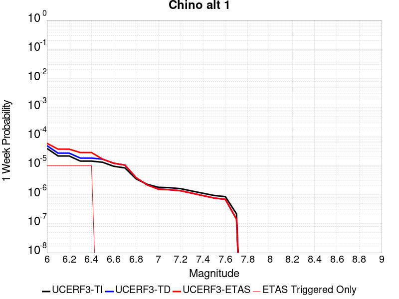 |  |  |  |

| Magnitude | 1 wk TI Prob | 1 wk TD Prob | 1 wk ETAS Prob | 1 wk ETAS/TD Gain | 1 wk ETAS Triggered Only | 1 mo TI Prob | 1 mo TD Prob | 1 mo ETAS Prob | 1 mo ETAS/TD Gain | 1 mo ETAS Triggered Only | 1 yr TI Prob | 1 yr TD Prob | 1 yr ETAS Prob | 1 yr ETAS/TD Gain | 1 yr ETAS Triggered Only | 10 yr TI Prob | 10 yr TD Prob | 10 yr ETAS Prob | 10 yr ETAS/TD Gain | 10 yr ETAS Triggered Only |
|-----|-----|-----|-----|-----|-----|-----|-----|-----|-----|-----|-----|-----|-----|-----|-----|-----|-----|-----|-----|-----|
| 6.0 | 3.939946E-5 | 4.8948554E-5 | 5.8948066E-5 | 1.2042861 | 1.0E-5 | 1.6884391E-4 | 2.097656E-4 | 2.1976349E-4 | 1.0476623 | 1.0E-5 | 0.0020537362 | 0.0025513945 | 0.0025813181 | 1.0117283 | 3.0E-5 | 0.020348595 | 0.025277847 | 0.02530709 | 1.0011568 | 3.0E-5 |
| 6.1 | 2.1505624E-5 | 2.6879026E-5 | 3.6878755E-5 | 1.3720273 | 1.0E-5 | 9.2163704E-5 | 1.1519137E-4 | 1.2519021E-4 | 1.086802 | 1.0E-5 | 0.0011215154 | 0.001401664 | 0.001431622 | 1.0213732 | 3.0E-5 | 0.011158722 | 0.013945141 | 0.0139747225 | 1.0021213 | 3.0E-5 |
| 6.2 | 2.1505624E-5 | 2.6879026E-5 | 3.6878755E-5 | 1.3720273 | 1.0E-5 | 9.2163704E-5 | 1.1519137E-4 | 1.2519021E-4 | 1.086802 | 1.0E-5 | 0.0011215154 | 0.001401664 | 0.001431622 | 1.0213732 | 3.0E-5 | 0.011158722 | 0.013945141 | 0.0139747225 | 1.0021213 | 3.0E-5 |
| 6.3 | 1.4290785E-5 | 1.8165128E-5 | 2.8164946E-5 | 1.5504954 | 1.0E-5 | 6.1244784E-5 | 7.784848E-5 | 8.78477E-5 | 1.1284447 | 1.0E-5 | 7.454001E-4 | 9.4743853E-4 | 9.774101E-4 | 1.0316343 | 3.0E-5 | 0.007429048 | 0.0094444575 | 0.009474174 | 1.0031464 | 3.0E-5 |
| 6.4 | 1.4290785E-5 | 1.8165128E-5 | 2.8164946E-5 | 1.5504954 | 1.0E-5 | 6.1244784E-5 | 7.784848E-5 | 8.78477E-5 | 1.1284447 | 1.0E-5 | 7.454001E-4 | 9.4743853E-4 | 9.774101E-4 | 1.0316343 | 3.0E-5 | 0.007429048 | 0.0094444575 | 0.009474174 | 1.0031464 | 3.0E-5 |
| 6.5 | 1.3017944E-5 | 1.6652088E-5 | 1.6652088E-5 | 1.0 | 0.0 | 5.5789995E-5 | 7.136439E-5 | 7.136439E-5 | 1.0 | 0.0 | 6.790315E-4 | 8.685589E-4 | 8.885415E-4 | 1.0230067 | 2.0E-5 | 0.0067696036 | 0.008661949 | 0.008681776 | 1.0022889 | 2.0E-5 |
| 6.6 | 9.470016E-6 | 1.2039424E-5 | 1.2039424E-5 | 1.0 | 0.0 | 4.058515E-5 | 5.1596704E-5 | 5.1596704E-5 | 1.0 | 0.0 | 4.940122E-4 | 6.280428E-4 | 6.3803646E-4 | 1.0159125 | 1.0E-5 | 0.004929154 | 0.0062718987 | 0.006281836 | 1.0015844 | 1.0E-5 |
| 6.7 | 8.314155E-6 | 1.0407736E-5 | 1.0407736E-5 | 1.0 | 0.0 | 3.5631605E-5 | 4.4604003E-5 | 4.4604003E-5 | 1.0 | 0.0 | 4.3372845E-4 | 5.429507E-4 | 5.429507E-4 | 1.0 | 0.0 | 0.004328829 | 0.005425775 | 0.005425775 | 1.0 | 0.0 |
| 6.8 | 3.4856364E-6 | 3.8133708E-6 | 3.8133708E-6 | 1.0 | 0.0 | 1.4938357E-5 | 1.6342927E-5 | 1.6342927E-5 | 1.0 | 0.0 | 1.8185932E-4 | 1.9895904E-4 | 1.9895904E-4 | 1.0 | 0.0 | 0.0018171056 | 0.0019894864 | 0.0019894864 | 1.0 | 0.0 |
| 6.9 | 2.2645952E-6 | 2.1529022E-6 | 2.1529022E-6 | 1.0 | 0.0 | 9.705372E-6 | 9.226692E-6 | 9.226692E-6 | 1.0 | 0.0 | 1.18156495E-4 | 1.123294E-4 | 1.123294E-4 | 1.0 | 0.0 | 0.0011809369 | 0.0011233423 | 0.0011233423 | 1.0 | 0.0 |
| 7.0 | 1.7864003E-6 | 1.5430785E-6 | 1.5430785E-6 | 1.0 | 0.0 | 7.655979E-6 | 6.613177E-6 | 6.613177E-6 | 1.0 | 0.0 | 9.3207556E-5 | 8.051251E-5 | 8.051251E-5 | 1.0 | 0.0 | 9.316847E-4 | 8.0528046E-4 | 8.0528046E-4 | 1.0 | 0.0 |
| 7.1 | 1.7315456E-6 | 1.4733511E-6 | 1.4733511E-6 | 1.0 | 0.0 | 7.420889E-6 | 6.3143466E-6 | 6.3143466E-6 | 1.0 | 0.0 | 9.034557E-5 | 7.6874516E-5 | 7.6874516E-5 | 1.0 | 0.0 | 9.0308854E-4 | 7.6891703E-4 | 7.6891703E-4 | 1.0 | 0.0 |
| 7.2 | 1.6008337E-6 | 1.3574215E-6 | 1.3574215E-6 | 1.0 | 0.0 | 6.860698E-6 | 5.817508E-6 | 5.817508E-6 | 1.0 | 0.0 | 8.352579E-5 | 7.082591E-5 | 7.082591E-5 | 1.0 | 0.0 | 8.34944E-4 | 7.0845755E-4 | 7.0845755E-4 | 1.0 | 0.0 |
| 7.3 | 1.3320939E-6 | 1.121782E-6 | 1.121782E-6 | 1.0 | 0.0 | 5.7089615E-6 | 4.807629E-6 | 4.807629E-6 | 1.0 | 0.0 | 6.9504385E-5 | 5.8531357E-5 | 5.8531357E-5 | 1.0 | 0.0 | 6.9482654E-4 | 5.8530393E-4 | 5.8530393E-4 | 1.0 | 0.0 |
| 7.4 | 1.114294E-6 | 9.237111E-7 | 9.237111E-7 | 1.0 | 0.0 | 4.775537E-6 | 3.958756E-6 | 3.958756E-6 | 1.0 | 0.0 | 5.8140613E-5 | 4.8196827E-5 | 4.8196827E-5 | 1.0 | 0.0 | 5.81254E-4 | 4.8188053E-4 | 4.8188053E-4 | 1.0 | 0.0 |
| 7.5 | 9.354081E-7 | 7.6234323E-7 | 7.6234323E-7 | 1.0 | 0.0 | 4.0088858E-6 | 3.2671815E-6 | 3.2671815E-6 | 1.0 | 0.0 | 4.8807087E-5 | 3.9777242E-5 | 3.9777242E-5 | 1.0 | 0.0 | 4.879637E-4 | 3.977046E-4 | 3.977046E-4 | 1.0 | 0.0 |
| 7.6 | 8.521771E-7 | 6.88071E-7 | 6.88071E-7 | 1.0 | 0.0 | 3.6521824E-6 | 2.9488726E-6 | 2.9488726E-6 | 1.0 | 0.0 | 4.4464414E-5 | 3.5901965E-5 | 3.5901965E-5 | 1.0 | 0.0 | 4.4455516E-4 | 3.589648E-4 | 3.589648E-4 | 1.0 | 0.0 |
| 7.7 | 2.1803626E-7 | 1.418649E-7 | 1.418649E-7 | 1.0 | 0.0 | 9.344408E-7 | 6.079923E-7 | 6.079923E-7 | 1.0 | 0.0 | 1.1376757E-5 | 7.4022914E-6 | 7.4022914E-6 | 1.0 | 0.0 | 1.13761744E-4 | 7.402141E-5 | 7.402141E-5 | 1.0 | 0.0 |

## Great Valley 09 (Laguna Seca)
*[(top)](#table-of-contents)*

| 1 Week | 1 Month | 1 Year | 10 Year |
|-----|-----|-----|-----|
|  |  |  |  |

| Magnitude | 1 wk TI Prob | 1 wk TD Prob | 1 wk ETAS Prob | 1 wk ETAS/TD Gain | 1 wk ETAS Triggered Only | 1 mo TI Prob | 1 mo TD Prob | 1 mo ETAS Prob | 1 mo ETAS/TD Gain | 1 mo ETAS Triggered Only | 1 yr TI Prob | 1 yr TD Prob | 1 yr ETAS Prob | 1 yr ETAS/TD Gain | 1 yr ETAS Triggered Only | 10 yr TI Prob | 10 yr TD Prob | 10 yr ETAS Prob | 10 yr ETAS/TD Gain | 10 yr ETAS Triggered Only |
|-----|-----|-----|-----|-----|-----|-----|-----|-----|-----|-----|-----|-----|-----|-----|-----|-----|-----|-----|-----|-----|
| 6.0 | 5.4353277E-5 | 7.05022E-5 | 1.0050009E-4 | 1.4254886 | 3.0E-5 | 2.3292181E-4 | 3.0211566E-4 | 3.321066E-4 | 1.0992697 | 3.0E-5 | 0.0028321352 | 0.0036721937 | 0.0037020836 | 1.0081395 | 3.0E-5 | 0.02796312 | 0.03611547 | 0.036144387 | 1.0008006 | 3.0E-5 |
| 6.1 | 4.5578287E-5 | 5.822118E-5 | 8.8219436E-5 | 1.5152464 | 3.0E-5 | 1.953209E-4 | 2.4949326E-4 | 2.7948577E-4 | 1.1202137 | 3.0E-5 | 0.0023754383 | 0.003033432 | 0.003063341 | 1.0098598 | 3.0E-5 | 0.023502063 | 0.029919548 | 0.02994865 | 1.0009727 | 3.0E-5 |
| 6.2 | 2.8536782E-5 | 3.4737273E-5 | 5.4736578E-5 | 1.5757304 | 2.0E-5 | 1.2229476E-4 | 1.4886224E-4 | 1.6885926E-4 | 1.1343324 | 2.0E-5 | 0.0014879217 | 0.001810813 | 0.0018307768 | 1.0110247 | 2.0E-5 | 0.014779986 | 0.017958116 | 0.017977757 | 1.0010937 | 2.0E-5 |
| 6.3 | 2.3698774E-5 | 2.8213295E-5 | 4.8212733E-5 | 1.7088656 | 2.0E-5 | 1.01562226E-4 | 1.20905075E-4 | 1.4090266E-4 | 1.1653991 | 2.0E-5 | 0.0012358186 | 0.0014710218 | 0.0014909924 | 1.013576 | 2.0E-5 | 0.012289686 | 0.014611342 | 0.01463105 | 1.0013489 | 2.0E-5 |
| 6.4 | 1.9191197E-5 | 2.2123184E-5 | 4.212274E-5 | 1.904009 | 2.0E-5 | 8.2245395E-5 | 9.4806666E-5 | 1.14804774E-4 | 1.2109356 | 2.0E-5 | 0.0010008777 | 0.0011536429 | 0.0011736198 | 1.0173163 | 2.0E-5 | 0.009963818 | 0.011476948 | 0.011496718 | 1.0017226 | 2.0E-5 |
| 6.5 | 1.5203241E-5 | 1.6802203E-5 | 1.6802203E-5 | 1.0 | 0.0 | 6.5155116E-5 | 7.200386E-5 | 7.200386E-5 | 1.0 | 0.0 | 7.9297484E-4 | 8.7626575E-4 | 8.7626575E-4 | 1.0 | 0.0 | 0.007901512 | 0.0087295165 | 0.0087295165 | 1.0 | 0.0 |
| 6.6 | 1.0984925E-5 | 1.1242595E-5 | 1.1242595E-5 | 1.0 | 0.0 | 4.70774E-5 | 4.8181686E-5 | 4.8181686E-5 | 1.0 | 0.0 | 5.730166E-4 | 5.8645656E-4 | 5.8645656E-4 | 1.0 | 0.0 | 0.005715413 | 0.0058494853 | 0.0058494853 | 1.0 | 0.0 |
| 6.7 | 9.134616E-6 | 9.019894E-6 | 9.019894E-6 | 1.0 | 0.0 | 3.9147766E-5 | 3.865613E-5 | 3.865613E-5 | 1.0 | 0.0 | 4.7651984E-4 | 4.7053912E-4 | 4.7053912E-4 | 1.0 | 0.0 | 0.004754993 | 0.0046956735 | 0.0046956735 | 1.0 | 0.0 |
| 6.8 | 7.785589E-6 | 7.4519444E-6 | 7.4519444E-6 | 1.0 | 0.0 | 3.3366385E-5 | 3.1936524E-5 | 3.1936524E-5 | 1.0 | 0.0 | 4.0616E-4 | 3.8875983E-4 | 3.8875983E-4 | 1.0 | 0.0 | 0.0040541845 | 0.0038810016 | 0.0038810016 | 1.0 | 0.0 |
| 6.9 | 5.579095E-6 | 4.898492E-6 | 4.898492E-6 | 1.0 | 0.0 | 2.3910188E-5 | 2.0993377E-5 | 2.0993377E-5 | 1.0 | 0.0 | 2.9106764E-4 | 2.5556577E-4 | 2.5556577E-4 | 1.0 | 0.0 | 0.002906867 | 0.002552856 | 0.002552856 | 1.0 | 0.0 |
| 7.0 | 2.6816688E-6 | 1.5216126E-6 | 1.5216126E-6 | 1.0 | 0.0 | 1.1492816E-5 | 6.521181E-6 | 6.521181E-6 | 1.0 | 0.0 | 1.3991605E-4 | 7.939258E-5 | 7.939258E-5 | 1.0 | 0.0 | 0.0013982799 | 7.9365086E-4 | 7.9365086E-4 | 1.0 | 0.0 |
| 7.1 | 1.9951021E-6 | 7.453827E-7 | 7.453827E-7 | 1.0 | 0.0 | 8.55041E-6 | 3.1944935E-6 | 3.1944935E-6 | 1.0 | 0.0 | 1.0409627E-4 | 3.8892307E-5 | 3.8892307E-5 | 1.0 | 0.0 | 0.0010404752 | 3.8885913E-4 | 3.8885913E-4 | 1.0 | 0.0 |
| 7.2 | 1.9951021E-6 | 7.453827E-7 | 7.453827E-7 | 1.0 | 0.0 | 8.55041E-6 | 3.1944935E-6 | 3.1944935E-6 | 1.0 | 0.0 | 1.0409627E-4 | 3.8892307E-5 | 3.8892307E-5 | 1.0 | 0.0 | 0.0010404752 | 3.8885913E-4 | 3.8885913E-4 | 1.0 | 0.0 |
| 7.3 | 1.7087556E-6 | 6.578881E-7 | 6.578881E-7 | 1.0 | 0.0 | 7.3232177E-6 | 2.8195177E-6 | 2.8195177E-6 | 1.0 | 0.0 | 8.915652E-5 | 3.4327128E-5 | 3.4327128E-5 | 1.0 | 0.0 | 8.9120766E-4 | 3.432223E-4 | 3.432223E-4 | 1.0 | 0.0 |
| 7.4 | 1.3804846E-6 | 6.073852E-7 | 6.073852E-7 | 1.0 | 0.0 | 5.916349E-6 | 2.6030768E-6 | 2.6030768E-6 | 1.0 | 0.0 | 7.2029165E-5 | 3.169204E-5 | 3.169204E-5 | 1.0 | 0.0 | 7.200583E-4 | 3.1687922E-4 | 3.1687922E-4 | 1.0 | 0.0 |
| 7.5 | 1.3804846E-6 | 6.073852E-7 | 6.073852E-7 | 1.0 | 0.0 | 5.916349E-6 | 2.6030768E-6 | 2.6030768E-6 | 1.0 | 0.0 | 7.2029165E-5 | 3.169204E-5 | 3.169204E-5 | 1.0 | 0.0 | 7.200583E-4 | 3.1687922E-4 | 3.1687922E-4 | 1.0 | 0.0 |

## Greenville (So) 2011 CFM
*[(top)](#table-of-contents)*

| 1 Week | 1 Month | 1 Year | 10 Year |
|-----|-----|-----|-----|
|  |  |  |  |

| Magnitude | 1 wk TI Prob | 1 wk TD Prob | 1 wk ETAS Prob | 1 wk ETAS/TD Gain | 1 wk ETAS Triggered Only | 1 mo TI Prob | 1 mo TD Prob | 1 mo ETAS Prob | 1 mo ETAS/TD Gain | 1 mo ETAS Triggered Only | 1 yr TI Prob | 1 yr TD Prob | 1 yr ETAS Prob | 1 yr ETAS/TD Gain | 1 yr ETAS Triggered Only | 10 yr TI Prob | 10 yr TD Prob | 10 yr ETAS Prob | 10 yr ETAS/TD Gain | 10 yr ETAS Triggered Only |
|-----|-----|-----|-----|-----|-----|-----|-----|-----|-----|-----|-----|-----|-----|-----|-----|-----|-----|-----|-----|-----|
| 6.0 | 4.279693E-5 | 5.5040087E-5 | 6.503954E-5 | 1.1816758 | 1.0E-5 | 1.8340252E-4 | 2.3586681E-4 | 2.4586444E-4 | 1.0423868 | 1.0E-5 | 0.0022306389 | 0.0028682416 | 0.0028881843 | 1.0069529 | 2.0E-5 | 0.022083808 | 0.028338138 | 0.028357571 | 1.0006858 | 2.0E-5 |
| 6.1 | 3.4037297E-5 | 4.3192387E-5 | 5.3191958E-5 | 1.2315123 | 1.0E-5 | 1.4586597E-4 | 1.8509831E-4 | 1.9509645E-4 | 1.0540154 | 1.0E-5 | 0.0017744715 | 0.0022514379 | 0.0022713928 | 1.0088632 | 2.0E-5 | 0.01760369 | 0.022302566 | 0.02232212 | 1.0008768 | 2.0E-5 |
| 6.2 | 3.4037297E-5 | 4.3192387E-5 | 5.3191958E-5 | 1.2315123 | 1.0E-5 | 1.4586597E-4 | 1.8509831E-4 | 1.9509645E-4 | 1.0540154 | 1.0E-5 | 0.0017744715 | 0.0022514379 | 0.0022713928 | 1.0088632 | 2.0E-5 | 0.01760369 | 0.022302566 | 0.02232212 | 1.0008768 | 2.0E-5 |
| 6.3 | 2.5956324E-5 | 3.2428903E-5 | 3.2428903E-5 | 1.0 | 0.0 | 1.11236644E-4 | 1.3897405E-4 | 1.3897405E-4 | 1.0 | 0.0 | 0.0013534647 | 0.0016907708 | 0.0017007539 | 1.0059044 | 1.0E-5 | 0.013452509 | 0.016785882 | 0.016795715 | 1.0005858 | 1.0E-5 |
| 6.4 | 2.1145053E-5 | 2.6197677E-5 | 2.6197677E-5 | 1.0 | 0.0 | 9.061851E-5 | 1.1227112E-4 | 1.1227112E-4 | 1.0 | 0.0 | 0.0011027219 | 0.0013660751 | 0.0013760615 | 1.0073103 | 1.0E-5 | 0.01097266 | 0.01358018 | 0.013590044 | 1.0007263 | 1.0E-5 |
| 6.5 | 2.0030959E-5 | 2.479578E-5 | 2.479578E-5 | 1.0 | 0.0 | 8.584414E-5 | 1.06263484E-4 | 1.06263484E-4 | 1.0 | 0.0 | 0.0010446513 | 0.0012930221 | 0.0013030092 | 1.0077238 | 1.0E-5 | 0.010397541 | 0.012858339 | 0.01286821 | 1.0007677 | 1.0E-5 |
| 6.6 | 1.8395405E-5 | 2.2754466E-5 | 2.2754466E-5 | 1.0 | 0.0 | 7.8835066E-5 | 9.751565E-5 | 9.751565E-5 | 1.0 | 0.0 | 9.5939427E-4 | 0.0011866348 | 0.001196623 | 1.0084172 | 1.0E-5 | 0.009552629 | 0.011806041 | 0.011815923 | 1.000837 | 1.0E-5 |
| 6.7 | 1.7883482E-5 | 2.212551E-5 | 2.212551E-5 | 1.0 | 0.0 | 7.664124E-5 | 9.482033E-5 | 9.482033E-5 | 1.0 | 0.0 | 9.3270757E-4 | 0.0011538545 | 0.001163843 | 1.0086566 | 1.0E-5 | 0.009288026 | 0.011481688 | 0.011491573 | 1.0008609 | 1.0E-5 |
| 6.8 | 1.3373564E-5 | 1.6505966E-5 | 1.6505966E-5 | 1.0 | 0.0 | 5.7314013E-5 | 7.073802E-5 | 7.073802E-5 | 1.0 | 0.0 | 6.975747E-4 | 8.609098E-4 | 8.609098E-4 | 1.0 | 0.0 | 0.0069538904 | 0.008577357 | 0.008577357 | 1.0 | 0.0 |
| 6.9 | 1.06692905E-5 | 1.3152582E-5 | 1.3152582E-5 | 1.0 | 0.0 | 4.5724726E-5 | 5.6367055E-5 | 5.6367055E-5 | 1.0 | 0.0 | 5.5655633E-4 | 6.86064E-4 | 6.86064E-4 | 1.0 | 0.0 | 0.005551645 | 0.006840693 | 0.006840693 | 1.0 | 0.0 |
| 7.0 | 8.157512E-6 | 1.0062639E-5 | 1.0062639E-5 | 1.0 | 0.0 | 3.4960296E-5 | 4.3124903E-5 | 4.3124903E-5 | 1.0 | 0.0 | 4.2555845E-4 | 5.2492286E-4 | 5.2492286E-4 | 1.0 | 0.0 | 0.004247444 | 0.0052373074 | 0.0052373074 | 1.0 | 0.0 |
| 7.1 | 6.1467113E-6 | 7.6274314E-6 | 7.6274314E-6 | 1.0 | 0.0 | 2.6342783E-5 | 3.268859E-5 | 3.268859E-5 | 1.0 | 0.0 | 3.206762E-4 | 3.9791173E-4 | 3.9791173E-4 | 1.0 | 0.0 | 0.0032021382 | 0.0039721807 | 0.0039721807 | 1.0 | 0.0 |
| 7.2 | 4.713467E-6 | 5.9141557E-6 | 5.9141557E-6 | 1.0 | 0.0 | 2.0200418E-5 | 2.5346139E-5 | 2.5346139E-5 | 1.0 | 0.0 | 2.4591232E-4 | 3.0854615E-4 | 3.0854615E-4 | 1.0 | 0.0 | 0.0024564038 | 0.0030813308 | 0.0030813308 | 1.0 | 0.0 |
| 7.3 | 2.3266216E-6 | 2.954009E-6 | 2.954009E-6 | 1.0 | 0.0 | 9.971197E-6 | 1.2659978E-5 | 1.2659978E-5 | 1.0 | 0.0 | 1.2139256E-4 | 1.5412449E-4 | 1.5412449E-4 | 1.0 | 0.0 | 0.0012132627 | 0.0015402455 | 0.0015402455 | 1.0 | 0.0 |
| 7.4 | 1.3314E-6 | 1.7179472E-6 | 1.7179472E-6 | 1.0 | 0.0 | 5.7059874E-6 | 7.36261E-6 | 7.36261E-6 | 1.0 | 0.0 | 6.946818E-5 | 8.963614E-5 | 8.963614E-5 | 1.0 | 0.0 | 6.9446466E-4 | 8.9603866E-4 | 8.9603866E-4 | 1.0 | 0.0 |
| 7.5 | 1.0362941E-6 | 1.3468821E-6 | 1.3468821E-6 | 1.0 | 0.0 | 4.4412527E-6 | 5.772339E-6 | 5.772339E-6 | 1.0 | 0.0 | 5.407091E-5 | 7.027601E-5 | 7.027601E-5 | 1.0 | 0.0 | 5.405776E-4 | 7.025681E-4 | 7.025681E-4 | 1.0 | 0.0 |
| 7.6 | 7.764784E-7 | 1.0088593E-6 | 1.0088593E-6 | 1.0 | 0.0 | 3.3277602E-6 | 4.323676E-6 | 4.323676E-6 | 1.0 | 0.0 | 4.0514726E-5 | 5.263952E-5 | 5.263952E-5 | 1.0 | 0.0 | 4.050734E-4 | 5.262919E-4 | 5.262919E-4 | 1.0 | 0.0 |
| 7.7 | 1.6927763E-7 | 2.2139248E-7 | 2.2139248E-7 | 1.0 | 0.0 | 7.2547533E-7 | 9.4882455E-7 | 9.4882455E-7 | 1.0 | 0.0 | 8.832627E-6 | 1.15518815E-5 | 1.15518815E-5 | 1.0 | 0.0 | 8.8322755E-5 | 1.15515526E-4 | 1.15515526E-4 | 1.0 | 0.0 |

## San Juan
*[(top)](#table-of-contents)*

| 1 Week | 1 Month | 1 Year | 10 Year |
|-----|-----|-----|-----|
|  |  |  |  |

| Magnitude | 1 wk TI Prob | 1 wk TD Prob | 1 wk ETAS Prob | 1 wk ETAS/TD Gain | 1 wk ETAS Triggered Only | 1 mo TI Prob | 1 mo TD Prob | 1 mo ETAS Prob | 1 mo ETAS/TD Gain | 1 mo ETAS Triggered Only | 1 yr TI Prob | 1 yr TD Prob | 1 yr ETAS Prob | 1 yr ETAS/TD Gain | 1 yr ETAS Triggered Only | 10 yr TI Prob | 10 yr TD Prob | 10 yr ETAS Prob | 10 yr ETAS/TD Gain | 10 yr ETAS Triggered Only |
|-----|-----|-----|-----|-----|-----|-----|-----|-----|-----|-----|-----|-----|-----|-----|-----|-----|-----|-----|-----|-----|
| 6.0 | 8.682808E-6 | 8.7491635E-6 | 1.8749077E-5 | 2.1429565 | 1.0E-5 | 3.72115E-5 | 3.74959E-5 | 4.7495527E-5 | 1.2666858 | 1.0E-5 | 4.5295584E-4 | 4.564218E-4 | 4.7641268E-4 | 1.0437992 | 2.0E-5 | 0.004520337 | 0.004555385 | 0.004575294 | 1.0043705 | 2.0E-5 |
| 6.1 | 8.682808E-6 | 8.7491635E-6 | 1.8749077E-5 | 2.1429565 | 1.0E-5 | 3.72115E-5 | 3.74959E-5 | 4.7495527E-5 | 1.2666858 | 1.0E-5 | 4.5295584E-4 | 4.564218E-4 | 4.7641268E-4 | 1.0437992 | 2.0E-5 | 0.004520337 | 0.004555385 | 0.004575294 | 1.0043705 | 2.0E-5 |
| 6.2 | 8.682808E-6 | 8.7491635E-6 | 1.8749077E-5 | 2.1429565 | 1.0E-5 | 3.72115E-5 | 3.74959E-5 | 4.7495527E-5 | 1.2666858 | 1.0E-5 | 4.5295584E-4 | 4.564218E-4 | 4.7641268E-4 | 1.0437992 | 2.0E-5 | 0.004520337 | 0.004555385 | 0.004575294 | 1.0043705 | 2.0E-5 |
| 6.3 | 6.3054235E-6 | 6.2825848E-6 | 1.6282522E-5 | 2.5916915 | 1.0E-5 | 2.7022963E-5 | 2.6925094E-5 | 3.6924826E-5 | 1.3713907 | 1.0E-5 | 3.2895492E-4 | 3.2776513E-4 | 3.4775856E-4 | 1.0609993 | 2.0E-5 | 0.003284684 | 0.003273017 | 0.0032929515 | 1.0060905 | 2.0E-5 |
| 6.4 | 6.1490473E-6 | 6.1144656E-6 | 1.6114405E-5 | 2.6354558 | 1.0E-5 | 2.6352795E-5 | 2.6204598E-5 | 3.6204336E-5 | 1.3816024 | 1.0E-5 | 3.2079802E-4 | 3.1899565E-4 | 3.3898925E-4 | 1.0626768 | 2.0E-5 | 0.0032033534 | 0.0031855737 | 0.00320551 | 1.0062582 | 2.0E-5 |
| 6.5 | 5.204848E-6 | 5.137233E-6 | 1.5137182E-5 | 2.946563 | 1.0E-5 | 2.23063E-5 | 2.2016533E-5 | 3.2016313E-5 | 1.4541941 | 1.0E-5 | 2.7154534E-4 | 2.6801927E-4 | 2.8801392E-4 | 1.0746015 | 2.0E-5 | 0.0027121378 | 0.0026771144 | 0.0026970608 | 1.0074507 | 2.0E-5 |
| 6.6 | 4.5179986E-6 | 4.4150297E-6 | 1.4414985E-5 | 3.2649803 | 1.0E-5 | 1.9362706E-5 | 1.8921424E-5 | 2.8921235E-5 | 1.5284915 | 1.0E-5 | 2.3571544E-4 | 2.3034477E-4 | 2.5034018E-4 | 1.0868064 | 2.0E-5 | 0.0023546559 | 0.0023011973 | 0.002321151 | 1.0086712 | 2.0E-5 |
| 6.7 | 3.9442616E-6 | 3.819828E-6 | 1.381979E-5 | 3.617909 | 1.0E-5 | 1.6903869E-5 | 1.6370592E-5 | 2.637043E-5 | 1.6108414 | 1.0E-5 | 2.0578515E-4 | 1.992944E-4 | 2.0929241E-4 | 1.050167 | 1.0E-5 | 0.002055947 | 0.0019912818 | 0.0020012618 | 1.0050119 | 1.0E-5 |
| 6.8 | 3.4536245E-6 | 3.3163353E-6 | 1.3316302E-5 | 4.0153666 | 1.0E-5 | 1.4801163E-5 | 1.4212792E-5 | 2.421265E-5 | 1.7035816 | 1.0E-5 | 1.8018926E-4 | 1.7302761E-4 | 1.8302588E-4 | 1.0577842 | 1.0E-5 | 0.0018004322 | 0.0017290477 | 0.0017390305 | 1.0057735 | 1.0E-5 |
| 6.9 | 3.059865E-6 | 2.9120315E-6 | 1.2912003E-5 | 4.4340186 | 1.0E-5 | 1.3113641E-5 | 1.2480078E-5 | 2.2479953E-5 | 1.801267 | 1.0E-5 | 1.596469E-4 | 1.5193493E-4 | 1.619334E-4 | 1.0658077 | 1.0E-5 | 0.0015953224 | 0.0015184252 | 0.00152841 | 1.0065758 | 1.0E-5 |
| 7.0 | 2.6504351E-6 | 2.4920002E-6 | 1.2491975E-5 | 5.0128307 | 1.0E-5 | 1.1358958E-5 | 1.0679961E-5 | 2.0679854E-5 | 1.936323 | 1.0E-5 | 1.3828653E-4 | 1.300213E-4 | 1.4002E-4 | 1.0769005 | 1.0E-5 | 0.0013820052 | 0.0012995641 | 0.0013095512 | 1.007685 | 1.0E-5 |
| 7.1 | 2.2039317E-6 | 2.0338296E-6 | 1.2033809E-5 | 5.916823 | 1.0E-5 | 9.445387E-6 | 8.716386E-6 | 1.8716299E-5 | 2.1472545 | 1.0E-5 | 1.1499152E-4 | 1.0611736E-4 | 1.161163E-4 | 1.0942253 | 1.0E-5 | 0.0011493203 | 0.0010607769 | 0.0010707662 | 1.009417 | 1.0E-5 |
| 7.2 | 1.0786707E-6 | 8.7701903E-7 | 8.7701903E-7 | 1.0 | 0.0 | 4.622866E-6 | 3.7586476E-6 | 3.7586476E-6 | 1.0 | 0.0 | 5.628194E-5 | 4.5760586E-5 | 4.5760586E-5 | 1.0 | 0.0 | 5.6267687E-4 | 4.5757066E-4 | 4.5757066E-4 | 1.0 | 0.0 |
| 7.3 | 6.846433E-7 | 4.868805E-7 | 4.868805E-7 | 1.0 | 0.0 | 2.9341822E-6 | 2.086629E-6 | 2.086629E-6 | 1.0 | 0.0 | 3.5723086E-5 | 2.5404412E-5 | 2.5404412E-5 | 1.0 | 0.0 | 3.571734E-4 | 2.540486E-4 | 2.540486E-4 | 1.0 | 0.0 |
| 7.4 | 5.23043E-7 | 3.2628162E-7 | 3.2628162E-7 | 1.0 | 0.0 | 2.2416111E-6 | 1.398349E-6 | 1.398349E-6 | 1.0 | 0.0 | 2.7291273E-5 | 1.7024766E-5 | 1.7024766E-5 | 1.0 | 0.0 | 2.7287923E-4 | 1.7026656E-4 | 1.7026656E-4 | 1.0 | 0.0 |
| 7.5 | 4.648444E-7 | 2.7234944E-7 | 2.7234944E-7 | 1.0 | 0.0 | 1.9921886E-6 | 1.1672114E-6 | 1.1672114E-6 | 1.0 | 0.0 | 2.4254627E-5 | 1.42107065E-5 | 1.42107065E-5 | 1.0 | 0.0 | 2.425198E-4 | 1.421276E-4 | 1.421276E-4 | 1.0 | 0.0 |
| 7.6 | 3.9906567E-7 | 2.2083314E-7 | 2.2083314E-7 | 1.0 | 0.0 | 1.7102802E-6 | 9.464274E-7 | 9.464274E-7 | 1.0 | 0.0 | 2.0822463E-5 | 1.1522693E-5 | 1.1522693E-5 | 1.0 | 0.0 | 2.0820512E-4 | 1.15245566E-4 | 1.15245566E-4 | 1.0 | 0.0 |
| 7.7 | 1.8784601E-7 | 5.3666906E-8 | 5.3666906E-8 | 1.0 | 0.0 | 8.0505407E-7 | 2.30001E-7 | 2.30001E-7 | 1.0 | 0.0 | 9.80149E-6 | 2.8002585E-6 | 2.8002585E-6 | 1.0 | 0.0 | 9.801057E-5 | 2.8011282E-5 | 2.8011282E-5 | 1.0 | 0.0 |
| 7.8 | 1.00154914E-7 | 1.2415832E-8 | 1.2415832E-8 | 1.0 | 0.0 | 4.2923529E-7 | 5.3210716E-8 | 5.3210716E-8 | 1.0 | 0.0 | 5.225927E-6 | 6.4784024E-7 | 6.4784024E-7 | 1.0 | 0.0 | 5.225804E-5 | 6.484273E-6 | 6.484273E-6 | 1.0 | 0.0 |
| 7.9 | 6.171429E-8 | 4.2966155E-9 | 4.2966155E-9 | 1.0 | 0.0 | 2.6448978E-7 | 1.8414067E-8 | 1.8414067E-8 | 1.0 | 0.0 | 3.2201583E-6 | 2.2419121E-7 | 2.2419121E-7 | 1.0 | 0.0 | 3.2201115E-5 | 2.2472002E-6 | 2.2472002E-6 | 1.0 | 0.0 |
| 8.0 | 1.3974572E-8 | 3.3788217E-10 | 3.3788217E-10 | 1.0 | 0.0 | 5.989102E-8 | 1.448067E-9 | 1.448067E-9 | 1.0 | 0.0 | 7.2917294E-7 | 1.763022E-8 | 1.763022E-8 | 1.0 | 0.0 | 7.2917055E-6 | 1.8060365E-7 | 1.8060365E-7 | 1.0 | 0.0 |
| 8.1 | 1.8403477E-9 | 1.1302803E-10 | 1.1302803E-10 | 1.0 | 0.0 | 7.887204E-9 | 4.844063E-10 | 4.844063E-10 | 1.0 | 0.0 | 9.602671E-8 | 5.8976446E-9 | 5.8976446E-9 | 1.0 | 0.0 | 9.602667E-7 | 6.021993E-8 | 6.021993E-8 | 1.0 | 0.0 |

## Malibu Coast alt 1
*[(top)](#table-of-contents)*

| 1 Week | 1 Month | 1 Year | 10 Year |
|-----|-----|-----|-----|
| 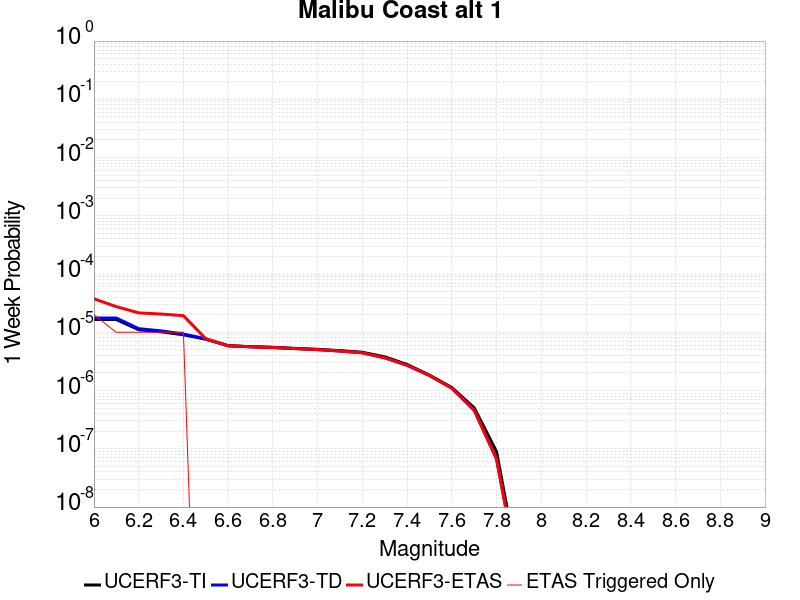 |  |  |  |

| Magnitude | 1 wk TI Prob | 1 wk TD Prob | 1 wk ETAS Prob | 1 wk ETAS/TD Gain | 1 wk ETAS Triggered Only | 1 mo TI Prob | 1 mo TD Prob | 1 mo ETAS Prob | 1 mo ETAS/TD Gain | 1 mo ETAS Triggered Only | 1 yr TI Prob | 1 yr TD Prob | 1 yr ETAS Prob | 1 yr ETAS/TD Gain | 1 yr ETAS Triggered Only | 10 yr TI Prob | 10 yr TD Prob | 10 yr ETAS Prob | 10 yr ETAS/TD Gain | 10 yr ETAS Triggered Only |
|-----|-----|-----|-----|-----|-----|-----|-----|-----|-----|-----|-----|-----|-----|-----|-----|-----|-----|-----|-----|-----|
| 6.0 | 1.6572556E-5 | 1.7598066E-5 | 3.7597714E-5 | 2.1364684 | 2.0E-5 | 7.102331E-5 | 7.541821E-5 | 9.5416704E-5 | 1.265168 | 2.0E-5 | 8.6436566E-4 | 9.178488E-4 | 9.378304E-4 | 1.0217701 | 2.0E-5 | 0.0086101135 | 0.009142512 | 0.00916233 | 1.0021676 | 2.0E-5 |
| 6.1 | 1.6572556E-5 | 1.7598066E-5 | 2.7597891E-5 | 1.5682342 | 1.0E-5 | 7.102331E-5 | 7.541821E-5 | 8.541746E-5 | 1.132584 | 1.0E-5 | 8.6436566E-4 | 9.178488E-4 | 9.278396E-4 | 1.010885 | 1.0E-5 | 0.0086101135 | 0.009142512 | 0.009152421 | 1.0010837 | 1.0E-5 |
| 6.2 | 1.1085717E-5 | 1.1557147E-5 | 2.155703E-5 | 1.8652555 | 1.0E-5 | 4.750935E-5 | 4.952971E-5 | 5.9529215E-5 | 1.201889 | 1.0E-5 | 5.782728E-4 | 6.028609E-4 | 6.128549E-4 | 1.0165776 | 1.0E-5 | 0.0057677035 | 0.0060126255 | 0.0060225655 | 1.0016532 | 1.0E-5 |
| 6.3 | 1.0208568E-5 | 1.0592237E-5 | 2.0592131E-5 | 1.9440776 | 1.0E-5 | 4.375027E-5 | 4.539453E-5 | 5.5394077E-5 | 1.2202809 | 1.0E-5 | 5.325294E-4 | 5.5254117E-4 | 5.6253566E-4 | 1.0180882 | 1.0E-5 | 0.0053125503 | 0.0055119814 | 0.0055219266 | 1.0018042 | 1.0E-5 |
| 6.4 | 9.0682315E-6 | 9.342637E-6 | 1.9342544E-5 | 2.0703516 | 1.0E-5 | 3.8863272E-5 | 4.003927E-5 | 5.003887E-5 | 1.2497448 | 1.0E-5 | 4.730576E-4 | 4.8737114E-4 | 4.9736624E-4 | 1.0205083 | 1.0E-5 | 0.0047205184 | 0.004863236 | 0.0048731877 | 1.0020462 | 1.0E-5 |
| 6.5 | 7.605796E-6 | 7.748587E-6 | 7.748587E-6 | 1.0 | 0.0 | 3.259586E-5 | 3.3207816E-5 | 3.3207816E-5 | 1.0 | 0.0 | 3.9678233E-4 | 4.0423148E-4 | 4.0423148E-4 | 1.0 | 0.0 | 0.0039607463 | 0.0040351 | 0.0040351 | 1.0 | 0.0 |
| 6.6 | 5.889873E-6 | 5.8795385E-6 | 5.8795385E-6 | 1.0 | 0.0 | 2.5242069E-5 | 2.519778E-5 | 2.519778E-5 | 1.0 | 0.0 | 3.0727885E-4 | 3.0673988E-4 | 3.0673988E-4 | 1.0 | 0.0 | 0.003068543 | 0.0030631777 | 0.0030631777 | 1.0 | 0.0 |
| 6.7 | 5.66586E-6 | 5.641641E-6 | 5.641641E-6 | 1.0 | 0.0 | 2.428203E-5 | 2.417824E-5 | 2.417824E-5 | 1.0 | 0.0 | 2.955936E-4 | 2.9433038E-4 | 2.9433038E-4 | 1.0 | 0.0 | 0.0029520073 | 0.0029394177 | 0.0029394177 | 1.0 | 0.0 |
| 6.8 | 5.521556E-6 | 5.489427E-6 | 5.489427E-6 | 1.0 | 0.0 | 2.3663597E-5 | 2.3525903E-5 | 2.3525903E-5 | 1.0 | 0.0 | 2.880662E-4 | 2.8639034E-4 | 2.8639034E-4 | 1.0 | 0.0 | 0.0028769306 | 0.002860224 | 0.002860224 | 1.0 | 0.0 |
| 6.9 | 5.29752E-6 | 5.2499317E-6 | 5.2499317E-6 | 1.0 | 0.0 | 2.270346E-5 | 2.2499513E-5 | 2.2499513E-5 | 1.0 | 0.0 | 2.7637955E-4 | 2.7389723E-4 | 2.7389723E-4 | 1.0 | 0.0 | 0.0027603607 | 0.0027356069 | 0.0027356069 | 1.0 | 0.0 |
| 7.0 | 5.106743E-6 | 5.0476788E-6 | 5.0476788E-6 | 1.0 | 0.0 | 2.1885859E-5 | 2.163273E-5 | 2.163273E-5 | 1.0 | 0.0 | 2.6642776E-4 | 2.6334674E-4 | 2.6334674E-4 | 1.0 | 0.0 | 0.0026610855 | 0.0026303562 | 0.0026303562 | 1.0 | 0.0 |
| 7.1 | 4.8469647E-6 | 4.770373E-6 | 4.770373E-6 | 1.0 | 0.0 | 2.0772539E-5 | 2.0444295E-5 | 2.0444295E-5 | 1.0 | 0.0 | 2.528763E-4 | 2.4888094E-4 | 2.4888094E-4 | 1.0 | 0.0 | 0.0025258875 | 0.00248603 | 0.00248603 | 1.0 | 0.0 |
| 7.2 | 4.545514E-6 | 4.4481935E-6 | 4.4481935E-6 | 1.0 | 0.0 | 1.9480629E-5 | 1.9063547E-5 | 1.9063547E-5 | 1.0 | 0.0 | 2.3715083E-4 | 2.3207403E-4 | 2.3207403E-4 | 1.0 | 0.0 | 0.0023689792 | 0.0023183243 | 0.0023183243 | 1.0 | 0.0 |
| 7.3 | 3.794097E-6 | 3.6519348E-6 | 3.6519348E-6 | 1.0 | 0.0 | 1.6260314E-5 | 1.5651056E-5 | 1.5651056E-5 | 1.0 | 0.0 | 1.9795135E-4 | 1.9053498E-4 | 1.9053498E-4 | 1.0 | 0.0 | 0.001977751 | 0.0019037209 | 0.0019037209 | 1.0 | 0.0 |
| 7.4 | 2.808217E-6 | 2.719077E-6 | 2.719077E-6 | 1.0 | 0.0 | 1.203516E-5 | 1.1653135E-5 | 1.1653135E-5 | 1.0 | 0.0 | 1.4651821E-4 | 1.418677E-4 | 1.418677E-4 | 1.0 | 0.0 | 0.0014642165 | 0.001417774 | 0.001417774 | 1.0 | 0.0 |
| 7.5 | 1.83809E-6 | 1.8190691E-6 | 1.8190691E-6 | 1.0 | 0.0 | 7.877505E-6 | 7.795988E-6 | 7.795988E-6 | 1.0 | 0.0 | 9.59044E-5 | 9.491203E-5 | 9.491203E-5 | 1.0 | 0.0 | 9.5863023E-4 | 9.48717E-4 | 9.48717E-4 | 1.0 | 0.0 |
| 7.6 | 1.1292672E-6 | 1.1001447E-6 | 1.1001447E-6 | 1.0 | 0.0 | 4.839708E-6 | 4.714897E-6 | 4.714897E-6 | 1.0 | 0.0 | 5.8921847E-5 | 5.7402376E-5 | 5.7402376E-5 | 1.0 | 0.0 | 5.890623E-4 | 5.738771E-4 | 5.738771E-4 | 1.0 | 0.0 |
| 7.7 | 5.065272E-7 | 4.609151E-7 | 4.609151E-7 | 1.0 | 0.0 | 2.170829E-6 | 1.975349E-6 | 1.975349E-6 | 1.0 | 0.0 | 2.6429525E-5 | 2.404962E-5 | 2.404962E-5 | 1.0 | 0.0 | 2.642638E-4 | 2.4047129E-4 | 2.4047129E-4 | 1.0 | 0.0 |
| 7.8 | 8.952991E-8 | 6.707874E-8 | 6.707874E-8 | 1.0 | 0.0 | 3.8369956E-7 | 2.8748025E-7 | 2.8748025E-7 | 1.0 | 0.0 | 4.671532E-6 | 3.5000667E-6 | 3.5000667E-6 | 1.0 | 0.0 | 4.671434E-5 | 3.5000136E-5 | 3.5000136E-5 | 1.0 | 0.0 |
| 7.9 | 8.007447E-10 | 6.1608785E-10 | 6.1608785E-10 | 1.0 | 0.0 | 3.4317629E-9 | 2.6403764E-9 | 2.6403764E-9 | 1.0 | 0.0 | 4.1781714E-8 | 3.2146584E-8 | 3.2146584E-8 | 1.0 | 0.0 | 4.1781706E-7 | 3.214658E-7 | 3.214658E-7 | 1.0 | 0.0 |

## Hayward (No) 2011 CFM
*[(top)](#table-of-contents)*

| 1 Week | 1 Month | 1 Year | 10 Year |
|-----|-----|-----|-----|
|  |  |  |  |

| Magnitude | 1 wk TI Prob | 1 wk TD Prob | 1 wk ETAS Prob | 1 wk ETAS/TD Gain | 1 wk ETAS Triggered Only | 1 mo TI Prob | 1 mo TD Prob | 1 mo ETAS Prob | 1 mo ETAS/TD Gain | 1 mo ETAS Triggered Only | 1 yr TI Prob | 1 yr TD Prob | 1 yr ETAS Prob | 1 yr ETAS/TD Gain | 1 yr ETAS Triggered Only | 10 yr TI Prob | 10 yr TD Prob | 10 yr ETAS Prob | 10 yr ETAS/TD Gain | 10 yr ETAS Triggered Only |
|-----|-----|-----|-----|-----|-----|-----|-----|-----|-----|-----|-----|-----|-----|-----|-----|-----|-----|-----|-----|-----|
| 6.0 | 9.3068506E-5 | 1.739599E-4 | 1.9395641E-4 | 1.114949 | 2.0E-5 | 3.9880406E-4 | 7.453244E-4 | 7.653095E-4 | 1.026814 | 2.0E-5 | 0.0048446343 | 0.009036438 | 0.009056257 | 1.0021932 | 2.0E-5 | 0.047403704 | 0.08637534 | 0.08639361 | 1.0002116 | 2.0E-5 |
| 6.1 | 9.055486E-5 | 1.6947114E-4 | 1.8946774E-4 | 1.1179942 | 2.0E-5 | 3.880345E-4 | 7.261021E-4 | 7.460876E-4 | 1.0275244 | 2.0E-5 | 0.0047140904 | 0.008804537 | 0.0088243615 | 1.0022515 | 2.0E-5 | 0.046153355 | 0.08426854 | 0.08428685 | 1.0002173 | 2.0E-5 |
| 6.2 | 9.006742E-5 | 1.6867711E-4 | 1.8867374E-4 | 1.1185497 | 2.0E-5 | 3.859461E-4 | 7.22701E-4 | 7.4268656E-4 | 1.0276539 | 2.0E-5 | 0.0046887742 | 0.008763513 | 0.008783338 | 1.0022622 | 2.0E-5 | 0.0459107 | 0.083892785 | 0.083911106 | 1.0002184 | 2.0E-5 |
| 6.3 | 8.8336754E-5 | 1.6547246E-4 | 1.8546917E-4 | 1.120846 | 2.0E-5 | 3.7853114E-4 | 7.089758E-4 | 7.289616E-4 | 1.0281897 | 2.0E-5 | 0.004598882 | 0.008597788 | 0.008617616 | 1.0023062 | 2.0E-5 | 0.04504866 | 0.08238599 | 0.082404345 | 1.0002228 | 2.0E-5 |
| 6.4 | 8.526157E-5 | 1.5974249E-4 | 1.7973929E-4 | 1.1251816 | 2.0E-5 | 3.6535555E-4 | 6.8443175E-4 | 7.044181E-4 | 1.0292013 | 2.0E-5 | 0.0044391346 | 0.008301278 | 0.008321112 | 1.0023893 | 2.0E-5 | 0.043514993 | 0.079682834 | 0.079701245 | 1.000231 | 2.0E-5 |
| 6.5 | 8.152396E-5 | 1.530663E-4 | 1.7306324E-4 | 1.1306423 | 2.0E-5 | 3.493416E-4 | 6.558342E-4 | 6.758211E-4 | 1.0304755 | 2.0E-5 | 0.0042449418 | 0.007955698 | 0.007975539 | 1.002494 | 2.0E-5 | 0.04164765 | 0.07651369 | 0.07653216 | 1.0002414 | 2.0E-5 |
| 6.6 | 7.987405E-5 | 1.5010842E-4 | 1.7010541E-4 | 1.133217 | 2.0E-5 | 3.4227243E-4 | 6.4316386E-4 | 6.63151E-4 | 1.0310763 | 2.0E-5 | 0.0041592065 | 0.0078025614 | 0.007822406 | 1.0025432 | 2.0E-5 | 0.04082218 | 0.07510622 | 0.07512471 | 1.0002463 | 2.0E-5 |
| 6.7 | 7.777665E-5 | 1.4650106E-4 | 1.6649812E-4 | 1.1364977 | 2.0E-5 | 3.332859E-4 | 6.277113E-4 | 6.476987E-4 | 1.0318418 | 2.0E-5 | 0.004050208 | 0.00761576 | 0.0076356074 | 1.0026062 | 2.0E-5 | 0.039771806 | 0.073382616 | 0.073401146 | 1.0002525 | 2.0E-5 |
| 6.8 | 7.3284005E-5 | 1.3800753E-4 | 1.5800477E-4 | 1.1448996 | 2.0E-5 | 3.140365E-4 | 5.913274E-4 | 6.113156E-4 | 1.0338022 | 2.0E-5 | 0.0038166929 | 0.0071757827 | 0.0071956394 | 1.0027672 | 2.0E-5 | 0.037518036 | 0.06929621 | 0.06931482 | 1.0002686 | 2.0E-5 |
| 6.9 | 6.458263E-5 | 1.2131439E-4 | 1.4131198E-4 | 1.1648409 | 2.0E-5 | 2.7675333E-4 | 5.198157E-4 | 5.3980533E-4 | 1.0384551 | 2.0E-5 | 0.0033642664 | 0.0063104923 | 0.0063303662 | 1.0031493 | 2.0E-5 | 0.033137884 | 0.061225023 | 0.0612438 | 1.0003066 | 2.0E-5 |
| 7.0 | 5.3853604E-5 | 1.00250414E-4 | 1.1024941E-4 | 1.0997403 | 1.0E-5 | 2.3078074E-4 | 4.295742E-4 | 4.395699E-4 | 1.0232688 | 1.0E-5 | 0.0028061352 | 0.0052175885 | 0.005227536 | 1.0019066 | 1.0E-5 | 0.027709642 | 0.0509578 | 0.05096729 | 1.0001862 | 1.0E-5 |
| 7.1 | 4.4308683E-5 | 8.170626E-5 | 8.170626E-5 | 1.0 | 0.0 | 1.8988053E-4 | 3.501229E-4 | 3.501229E-4 | 1.0 | 0.0 | 0.0023093442 | 0.0042544557 | 0.0042544557 | 1.0 | 0.0 | 0.022854926 | 0.04182473 | 0.04182473 | 1.0 | 0.0 |
| 7.2 | 3.295973E-5 | 6.0771144E-5 | 6.0771144E-5 | 1.0 | 0.0 | 1.4124835E-4 | 2.604219E-4 | 2.604219E-4 | 1.0 | 0.0 | 0.0017183421 | 0.0031660495 | 0.0031660495 | 1.0 | 0.0 | 0.017051157 | 0.031369876 | 0.031369876 | 1.0 | 0.0 |
| 7.3 | 2.452256E-5 | 4.5180346E-5 | 4.5180346E-5 | 1.0 | 0.0 | 1.05092455E-4 | 1.9361576E-4 | 1.9361576E-4 | 1.0 | 0.0 | 0.0012787496 | 0.0023547374 | 0.0023547374 | 1.0 | 0.0 | 0.0127141625 | 0.02344111 | 0.02344111 | 1.0 | 0.0 |
| 7.4 | 1.8829967E-5 | 3.4602548E-5 | 3.4602548E-5 | 1.0 | 0.0 | 8.069736E-5 | 1.4828827E-4 | 1.4828827E-4 | 1.0 | 0.0 | 9.820475E-4 | 0.0018039243 | 0.0018039243 | 1.0 | 0.0 | 0.009777189 | 0.0180195 | 0.0180195 | 1.0 | 0.0 |
| 7.5 | 1.26374125E-5 | 2.2921116E-5 | 2.2921116E-5 | 1.0 | 0.0 | 5.4159216E-5 | 9.822969E-5 | 9.822969E-5 | 1.0 | 0.0 | 6.5918895E-4 | 0.0011952962 | 0.0011952962 | 1.0 | 0.0 | 0.00657237 | 0.011988836 | 0.011988836 | 1.0 | 0.0 |
| 7.6 | 4.666429E-6 | 8.4791645E-6 | 8.4791645E-6 | 1.0 | 0.0 | 1.9998828E-5 | 3.6338777E-5 | 3.6338777E-5 | 1.0 | 0.0 | 2.4345852E-4 | 4.4233602E-4 | 4.4233602E-4 | 1.0 | 0.0 | 0.0024319198 | 0.0044591012 | 0.0044591012 | 1.0 | 0.0 |
| 7.7 | 3.8399318E-7 | 7.133867E-7 | 7.133867E-7 | 1.0 | 0.0 | 1.6456839E-6 | 3.057368E-6 | 3.057368E-6 | 1.0 | 0.0 | 2.003602E-5 | 3.722282E-5 | 3.722282E-5 | 1.0 | 0.0 | 2.0034213E-4 | 3.8614936E-4 | 3.8614936E-4 | 1.0 | 0.0 |
| 7.8 | 2.5637698E-7 | 5.3662194E-7 | 5.3662194E-7 | 1.0 | 0.0 | 1.098758E-6 | 2.299806E-6 | 2.299806E-6 | 1.0 | 0.0 | 1.3377297E-5 | 2.7999782E-5 | 2.7999782E-5 | 1.0 | 0.0 | 1.3376492E-4 | 2.9244382E-4 | 2.9244382E-4 | 1.0 | 0.0 |
| 7.9 | 1.7141245E-7 | 3.7290573E-7 | 3.7290573E-7 | 1.0 | 0.0 | 7.3462456E-7 | 1.5981665E-6 | 1.5981665E-6 | 1.0 | 0.0 | 8.944017E-6 | 1.9457504E-5 | 1.9457504E-5 | 1.0 | 0.0 | 8.943657E-5 | 2.0245428E-4 | 2.0245428E-4 | 1.0 | 0.0 |
| 8.0 | 1.1808895E-7 | 2.7509762E-7 | 2.7509762E-7 | 1.0 | 0.0 | 5.060954E-7 | 1.1789892E-6 | 1.1789892E-6 | 1.0 | 0.0 | 6.161694E-6 | 1.43541E-5 | 1.43541E-5 | 1.0 | 0.0 | 6.161523E-5 | 1.4816441E-4 | 1.4816441E-4 | 1.0 | 0.0 |
| 8.1 | 5.138535E-8 | 1.1229867E-7 | 1.1229867E-7 | 1.0 | 0.0 | 2.2022292E-7 | 4.812799E-7 | 4.812799E-7 | 1.0 | 0.0 | 2.6812106E-6 | 5.8595674E-6 | 5.8595674E-6 | 1.0 | 0.0 | 2.6811784E-5 | 6.0158476E-5 | 6.0158476E-5 | 1.0 | 0.0 |

## San Jacinto (Superstition Mtn)
*[(top)](#table-of-contents)*

| 1 Week | 1 Month | 1 Year | 10 Year |
|-----|-----|-----|-----|
|  |  |  |  |

| Magnitude | 1 wk TI Prob | 1 wk TD Prob | 1 wk ETAS Prob | 1 wk ETAS/TD Gain | 1 wk ETAS Triggered Only | 1 mo TI Prob | 1 mo TD Prob | 1 mo ETAS Prob | 1 mo ETAS/TD Gain | 1 mo ETAS Triggered Only | 1 yr TI Prob | 1 yr TD Prob | 1 yr ETAS Prob | 1 yr ETAS/TD Gain | 1 yr ETAS Triggered Only | 10 yr TI Prob | 10 yr TD Prob | 10 yr ETAS Prob | 10 yr ETAS/TD Gain | 10 yr ETAS Triggered Only |
|-----|-----|-----|-----|-----|-----|-----|-----|-----|-----|-----|-----|-----|-----|-----|-----|-----|-----|-----|-----|-----|
| 6.0 | 6.4193904E-5 | 9.599367E-5 | 1.1599175E-4 | 1.208327 | 2.0E-5 | 2.7508775E-4 | 4.1134638E-4 | 4.3133815E-4 | 1.0486008 | 2.0E-5 | 0.0033440501 | 0.0049980893 | 0.0050179893 | 1.0039815 | 2.0E-5 | 0.03294174 | 0.048823986 | 0.048843008 | 1.0003896 | 2.0E-5 |
| 6.1 | 6.4193904E-5 | 9.599367E-5 | 1.1599175E-4 | 1.208327 | 2.0E-5 | 2.7508775E-4 | 4.1134638E-4 | 4.3133815E-4 | 1.0486008 | 2.0E-5 | 0.0033440501 | 0.0049980893 | 0.0050179893 | 1.0039815 | 2.0E-5 | 0.03294174 | 0.048823986 | 0.048843008 | 1.0003896 | 2.0E-5 |
| 6.2 | 5.7023593E-5 | 8.3144434E-5 | 9.31436E-5 | 1.1202626 | 1.0E-5 | 2.4436394E-4 | 3.5629404E-4 | 3.6629045E-4 | 1.0280567 | 1.0E-5 | 0.002971072 | 0.0043308944 | 0.004340851 | 1.002299 | 1.0E-5 | 0.029316625 | 0.04250403 | 0.042513605 | 1.0002253 | 1.0E-5 |
| 6.3 | 5.6940098E-5 | 8.298979E-5 | 9.2988965E-5 | 1.1204867 | 1.0E-5 | 2.4400617E-4 | 3.5563146E-4 | 3.6562793E-4 | 1.028109 | 1.0E-5 | 0.002966728 | 0.00432286 | 0.0043328167 | 1.0023032 | 1.0E-5 | 0.029274331 | 0.042427283 | 0.042436857 | 1.0002257 | 1.0E-5 |
| 6.4 | 5.4171585E-5 | 7.7483564E-5 | 8.748279E-5 | 1.1290497 | 1.0E-5 | 2.3214328E-4 | 3.3203943E-4 | 3.4203613E-4 | 1.0301069 | 1.0E-5 | 0.0028226813 | 0.0040367353 | 0.004046695 | 1.0024673 | 1.0E-5 | 0.02787096 | 0.03971653 | 0.039726134 | 1.0002418 | 1.0E-5 |
| 6.5 | 4.375144E-5 | 5.642133E-5 | 5.642133E-5 | 1.0 | 0.0 | 1.874927E-4 | 2.4178992E-4 | 2.4178992E-4 | 1.0 | 0.0 | 0.0022803338 | 0.002940994 | 0.002940994 | 1.0 | 0.0 | 0.022570757 | 0.029236801 | 0.029236801 | 1.0 | 0.0 |
| 6.6 | 2.772192E-5 | 2.5488358E-5 | 2.5488358E-5 | 1.0 | 0.0 | 1.1880282E-4 | 1.09231354E-4 | 1.09231354E-4 | 1.0 | 0.0 | 0.0014454646 | 0.0013290998 | 0.0013290998 | 1.0 | 0.0 | 0.014360986 | 0.01354049 | 0.01354049 | 1.0 | 0.0 |
| 6.7 | 2.7124124E-5 | 2.4699386E-5 | 2.4699386E-5 | 1.0 | 0.0 | 1.1624106E-4 | 1.05850326E-4 | 1.05850326E-4 | 1.0 | 0.0 | 0.0014143161 | 0.001287985 | 0.001287985 | 1.0 | 0.0 | 0.014053487 | 0.013133943 | 0.013133943 | 1.0 | 0.0 |
| 6.8 | 2.5475807E-5 | 2.216446E-5 | 2.216446E-5 | 1.0 | 0.0 | 1.0917746E-4 | 9.4987154E-5 | 9.4987154E-5 | 1.0 | 0.0 | 0.001328425 | 0.001155867 | 0.001155867 | 1.0 | 0.0 | 0.0132051185 | 0.011822182 | 0.011822182 | 1.0 | 0.0 |
| 6.9 | 2.1162023E-5 | 1.7626244E-5 | 1.7626244E-5 | 1.0 | 0.0 | 9.069123E-5 | 7.5538876E-5 | 7.5538876E-5 | 1.0 | 0.0 | 0.0011036064 | 9.193016E-4 | 9.193016E-4 | 1.0 | 0.0 | 0.010981417 | 0.00944688 | 0.00944688 | 1.0 | 0.0 |
| 7.0 | 1.8754288E-5 | 1.6161559E-5 | 1.6161559E-5 | 1.0 | 0.0 | 8.037304E-5 | 6.9261994E-5 | 6.9261994E-5 | 1.0 | 0.0 | 9.781026E-4 | 8.4294105E-4 | 8.4294105E-4 | 1.0 | 0.0 | 0.009738087 | 0.008670042 | 0.008670042 | 1.0 | 0.0 |
| 7.1 | 1.8678527E-5 | 1.6086702E-5 | 1.6086702E-5 | 1.0 | 0.0 | 8.0048376E-5 | 6.89412E-5 | 6.89412E-5 | 1.0 | 0.0 | 9.7415317E-4 | 8.3903834E-4 | 8.3903834E-4 | 1.0 | 0.0 | 0.009698939 | 0.008630998 | 0.008630998 | 1.0 | 0.0 |
| 7.2 | 1.7804578E-5 | 1.5381282E-5 | 1.5381282E-5 | 1.0 | 0.0 | 7.6303106E-5 | 6.5918124E-5 | 6.5918124E-5 | 1.0 | 0.0 | 9.285943E-4 | 8.022599E-4 | 8.022599E-4 | 1.0 | 0.0 | 0.009247236 | 0.008262311 | 0.008262311 | 1.0 | 0.0 |
| 7.3 | 1.6583685E-5 | 1.4530388E-5 | 1.4530388E-5 | 1.0 | 0.0 | 7.1070994E-5 | 6.227162E-5 | 6.227162E-5 | 1.0 | 0.0 | 8.649459E-4 | 7.5789524E-4 | 7.5789524E-4 | 1.0 | 0.0 | 0.00861587 | 0.007817623 | 0.007817623 | 1.0 | 0.0 |
| 7.4 | 1.6387552E-5 | 1.4395274E-5 | 1.4395274E-5 | 1.0 | 0.0 | 7.023047E-5 | 6.169258E-5 | 6.169258E-5 | 1.0 | 0.0 | 8.5472054E-4 | 7.5085036E-4 | 7.5085036E-4 | 1.0 | 0.0 | 0.008514405 | 0.0077470057 | 0.0077470057 | 1.0 | 0.0 |
| 7.5 | 1.5790754E-5 | 1.4035962E-5 | 1.4035962E-5 | 1.0 | 0.0 | 6.767291E-5 | 6.0152746E-5 | 6.0152746E-5 | 1.0 | 0.0 | 8.236062E-4 | 7.321156E-4 | 7.321156E-4 | 1.0 | 0.0 | 0.008205604 | 0.007557569 | 0.007557569 | 1.0 | 0.0 |
| 7.6 | 1.4248672E-5 | 1.3054932E-5 | 1.3054932E-5 | 1.0 | 0.0 | 6.106431E-5 | 5.594852E-5 | 5.594852E-5 | 1.0 | 0.0 | 7.432043E-4 | 6.8096205E-4 | 6.8096205E-4 | 1.0 | 0.0 | 0.007407237 | 0.0070401574 | 0.0070401574 | 1.0 | 0.0 |
| 7.7 | 1.15449975E-5 | 1.090368E-5 | 1.090368E-5 | 1.0 | 0.0 | 4.947762E-5 | 4.6729223E-5 | 4.6729223E-5 | 1.0 | 0.0 | 6.022235E-4 | 5.687805E-4 | 5.687805E-4 | 1.0 | 0.0 | 0.006005941 | 0.0059101824 | 0.0059101824 | 1.0 | 0.0 |
| 7.8 | 9.1391985E-6 | 9.514299E-6 | 9.514299E-6 | 1.0 | 0.0 | 3.9167408E-5 | 4.0774932E-5 | 4.0774932E-5 | 1.0 | 0.0 | 4.767588E-4 | 4.963223E-4 | 4.963223E-4 | 1.0 | 0.0 | 0.0047573727 | 0.0051766867 | 0.0051766867 | 1.0 | 0.0 |
| 7.9 | 6.973017E-6 | 7.3821784E-6 | 7.3821784E-6 | 1.0 | 0.0 | 2.9884017E-5 | 3.1637526E-5 | 3.1637526E-5 | 1.0 | 0.0 | 3.6377716E-4 | 3.8511935E-4 | 3.8511935E-4 | 1.0 | 0.0 | 0.0036318225 | 0.0040517948 | 0.0040517948 | 1.0 | 0.0 |
| 8.0 | 5.7638235E-6 | 6.259972E-6 | 6.259972E-6 | 1.0 | 0.0 | 2.4701867E-5 | 2.6828178E-5 | 2.6828178E-5 | 1.0 | 0.0 | 3.0070372E-4 | 3.2658462E-4 | 3.2658462E-4 | 1.0 | 0.0 | 0.0030029714 | 0.0034534496 | 0.0034534496 | 1.0 | 0.0 |
| 8.1 | 5.1124434E-6 | 5.4956718E-6 | 5.4956718E-6 | 1.0 | 0.0 | 2.1910288E-5 | 2.355267E-5 | 2.355267E-5 | 1.0 | 0.0 | 2.6672508E-4 | 2.867165E-4 | 2.867165E-4 | 1.0 | 0.0 | 0.0026640517 | 0.003040336 | 0.003040336 | 1.0 | 0.0 |
| 8.2 | 1.1075938E-6 | 5.336568E-7 | 5.336568E-7 | 1.0 | 0.0 | 4.7468216E-6 | 2.2870988E-6 | 2.2870988E-6 | 1.0 | 0.0 | 5.779102E-5 | 2.7845093E-5 | 2.7845093E-5 | 1.0 | 0.0 | 5.777599E-4 | 3.1346595E-4 | 3.1346595E-4 | 1.0 | 0.0 |
| 8.3 | 1.3584393E-8 | 4.473836E-9 | 4.473836E-9 | 1.0 | 0.0 | 5.8218827E-8 | 1.9173582E-8 | 1.9173582E-8 | 1.0 | 0.0 | 7.0881396E-7 | 2.3343837E-7 | 2.3343837E-7 | 1.0 | 0.0 | 7.0881174E-6 | 2.6163038E-6 | 2.6163038E-6 | 1.0 | 0.0 |

## Kern Canyon (Lake Isabella) 2011
*[(top)](#table-of-contents)*

| 1 Week | 1 Month | 1 Year | 10 Year |
|-----|-----|-----|-----|
|  |  |  |  |

| Magnitude | 1 wk TI Prob | 1 wk TD Prob | 1 wk ETAS Prob | 1 wk ETAS/TD Gain | 1 wk ETAS Triggered Only | 1 mo TI Prob | 1 mo TD Prob | 1 mo ETAS Prob | 1 mo ETAS/TD Gain | 1 mo ETAS Triggered Only | 1 yr TI Prob | 1 yr TD Prob | 1 yr ETAS Prob | 1 yr ETAS/TD Gain | 1 yr ETAS Triggered Only | 10 yr TI Prob | 10 yr TD Prob | 10 yr ETAS Prob | 10 yr ETAS/TD Gain | 10 yr ETAS Triggered Only |
|-----|-----|-----|-----|-----|-----|-----|-----|-----|-----|-----|-----|-----|-----|-----|-----|-----|-----|-----|-----|-----|
| 6.0 | 4.2387383E-6 | 4.001639E-6 | 1.4001599E-5 | 3.4989662 | 1.0E-5 | 1.8165894E-5 | 1.7149778E-5 | 2.7149606E-5 | 1.5830879 | 1.0E-5 | 2.2114732E-4 | 2.087804E-4 | 2.2877623E-4 | 1.0957744 | 2.0E-5 | 0.0022092736 | 0.0020860266 | 0.0021059848 | 1.0095676 | 2.0E-5 |
| 6.1 | 4.2387383E-6 | 4.001639E-6 | 1.4001599E-5 | 3.4989662 | 1.0E-5 | 1.8165894E-5 | 1.7149778E-5 | 2.7149606E-5 | 1.5830879 | 1.0E-5 | 2.2114732E-4 | 2.087804E-4 | 2.2877623E-4 | 1.0957744 | 2.0E-5 | 0.0022092736 | 0.0020860266 | 0.0021059848 | 1.0095676 | 2.0E-5 |
| 6.2 | 4.2387383E-6 | 4.001639E-6 | 1.4001599E-5 | 3.4989662 | 1.0E-5 | 1.8165894E-5 | 1.7149778E-5 | 2.7149606E-5 | 1.5830879 | 1.0E-5 | 2.2114732E-4 | 2.087804E-4 | 2.2877623E-4 | 1.0957744 | 2.0E-5 | 0.0022092736 | 0.0020860266 | 0.0021059848 | 1.0095676 | 2.0E-5 |
| 6.3 | 4.2387383E-6 | 4.001639E-6 | 1.4001599E-5 | 3.4989662 | 1.0E-5 | 1.8165894E-5 | 1.7149778E-5 | 2.7149606E-5 | 1.5830879 | 1.0E-5 | 2.2114732E-4 | 2.087804E-4 | 2.2877623E-4 | 1.0957744 | 2.0E-5 | 0.0022092736 | 0.0020860266 | 0.0021059848 | 1.0095676 | 2.0E-5 |
| 6.4 | 4.2387383E-6 | 4.001639E-6 | 1.4001599E-5 | 3.4989662 | 1.0E-5 | 1.8165894E-5 | 1.7149778E-5 | 2.7149606E-5 | 1.5830879 | 1.0E-5 | 2.2114732E-4 | 2.087804E-4 | 2.2877623E-4 | 1.0957744 | 2.0E-5 | 0.0022092736 | 0.0020860266 | 0.0021059848 | 1.0095676 | 2.0E-5 |
| 6.5 | 2.7857532E-6 | 2.517867E-6 | 1.2517842E-5 | 4.971606 | 1.0E-5 | 1.1938888E-5 | 1.0790815E-5 | 2.0790707E-5 | 1.926704 | 1.0E-5 | 1.4534626E-4 | 1.3137059E-4 | 1.5136796E-4 | 1.1522211 | 2.0E-5 | 0.0014525123 | 0.001312962 | 0.0013329358 | 1.0152128 | 2.0E-5 |
| 6.6 | 2.2233348E-6 | 1.9441236E-6 | 1.1944104E-5 | 6.143696 | 1.0E-5 | 9.528543E-6 | 8.331932E-6 | 1.8331848E-5 | 2.2001917 | 1.0E-5 | 1.1600384E-4 | 1.01436635E-4 | 1.2143461E-4 | 1.1971474 | 2.0E-5 | 0.001159433 | 0.001013912 | 0.0010338917 | 1.0197055 | 2.0E-5 |
| 6.7 | 2.1635126E-6 | 1.8835036E-6 | 1.1883485E-5 | 6.3092446 | 1.0E-5 | 9.272164E-6 | 8.072134E-6 | 1.8072053E-5 | 2.2388198 | 1.0E-5 | 1.1288274E-4 | 9.827388E-5 | 1.1827191E-4 | 1.2034929 | 2.0E-5 | 0.0011282542 | 9.823124E-4 | 0.0010022927 | 1.0203401 | 2.0E-5 |
| 6.8 | 1.8685711E-6 | 1.5831425E-6 | 1.1583126E-5 | 7.3165407 | 1.0E-5 | 8.008137E-6 | 6.784879E-6 | 1.6784812E-5 | 2.4738555 | 1.0E-5 | 9.74947E-5 | 8.260282E-5 | 1.0260117E-4 | 1.2421025 | 2.0E-5 | 9.745194E-4 | 8.2572614E-4 | 8.457096E-4 | 1.0242012 | 2.0E-5 |
| 6.9 | 1.5815071E-6 | 1.3064928E-6 | 1.3064928E-6 | 1.0 | 0.0 | 6.77787E-6 | 5.599243E-6 | 5.599243E-6 | 1.0 | 0.0 | 8.251744E-5 | 6.816868E-5 | 7.8168E-5 | 1.1466849 | 1.0E-5 | 8.248681E-4 | 6.8148033E-4 | 6.9147354E-4 | 1.0146639 | 1.0E-5 |
| 7.0 | 1.3772564E-6 | 1.1210718E-6 | 1.1210718E-6 | 1.0 | 0.0 | 5.9025137E-6 | 4.8045845E-6 | 4.8045845E-6 | 1.0 | 0.0 | 7.186073E-5 | 5.8494268E-5 | 5.8494268E-5 | 1.0 | 0.0 | 7.18375E-4 | 5.847908E-4 | 5.847908E-4 | 1.0 | 0.0 |
| 7.1 | 1.0916998E-6 | 8.763777E-7 | 8.763777E-7 | 1.0 | 0.0 | 4.678705E-6 | 3.7558991E-6 | 3.7558991E-6 | 1.0 | 0.0 | 5.6961744E-5 | 4.5727127E-5 | 4.5727127E-5 | 1.0 | 0.0 | 5.6947145E-4 | 4.571785E-4 | 4.571785E-4 | 1.0 | 0.0 |
| 7.2 | 7.6277024E-7 | 5.901454E-7 | 5.901454E-7 | 1.0 | 0.0 | 3.2690114E-6 | 2.5291922E-6 | 2.5291922E-6 | 1.0 | 0.0 | 3.9799485E-5 | 3.0792486E-5 | 3.0792486E-5 | 1.0 | 0.0 | 3.9792358E-4 | 3.0788282E-4 | 3.0788282E-4 | 1.0 | 0.0 |
| 7.3 | 5.3265916E-7 | 4.3824414E-7 | 4.3824414E-7 | 1.0 | 0.0 | 2.282823E-6 | 1.878188E-6 | 1.878188E-6 | 1.0 | 0.0 | 2.7793016E-5 | 2.2866701E-5 | 2.2866701E-5 | 1.0 | 0.0 | 2.778954E-4 | 2.2864387E-4 | 2.2864387E-4 | 1.0 | 0.0 |
| 7.4 | 3.4946007E-7 | 3.006571E-7 | 3.006571E-7 | 1.0 | 0.0 | 1.497685E-6 | 1.2885298E-6 | 1.2885298E-6 | 1.0 | 0.0 | 1.8234163E-5 | 1.568774E-5 | 1.568774E-5 | 1.0 | 0.0 | 1.8232666E-4 | 1.5686655E-4 | 1.5686655E-4 | 1.0 | 0.0 |
| 7.5 | 1.8317026E-7 | 1.4244812E-7 | 1.4244812E-7 | 1.0 | 0.0 | 7.850152E-7 | 6.104918E-7 | 6.104918E-7 | 1.0 | 0.0 | 9.557518E-6 | 7.432713E-6 | 7.432713E-6 | 1.0 | 0.0 | 9.5571064E-5 | 7.432472E-5 | 7.432472E-5 | 1.0 | 0.0 |
| 7.6 | 2.572245E-8 | 1.7352555E-8 | 1.7352555E-8 | 1.0 | 0.0 | 1.10239064E-7 | 7.436809E-8 | 7.436809E-8 | 1.0 | 0.0 | 1.3421597E-6 | 9.054312E-7 | 9.054312E-7 | 1.0 | 0.0 | 1.3421517E-5 | 9.05428E-6 | 9.05428E-6 | 1.0 | 0.0 |

## Channel Islands Thrust
*[(top)](#table-of-contents)*

| 1 Week | 1 Month | 1 Year | 10 Year |
|-----|-----|-----|-----|
|  |  |  |  |

| Magnitude | 1 wk TI Prob | 1 wk TD Prob | 1 wk ETAS Prob | 1 wk ETAS/TD Gain | 1 wk ETAS Triggered Only | 1 mo TI Prob | 1 mo TD Prob | 1 mo ETAS Prob | 1 mo ETAS/TD Gain | 1 mo ETAS Triggered Only | 1 yr TI Prob | 1 yr TD Prob | 1 yr ETAS Prob | 1 yr ETAS/TD Gain | 1 yr ETAS Triggered Only | 10 yr TI Prob | 10 yr TD Prob | 10 yr ETAS Prob | 10 yr ETAS/TD Gain | 10 yr ETAS Triggered Only |
|-----|-----|-----|-----|-----|-----|-----|-----|-----|-----|-----|-----|-----|-----|-----|-----|-----|-----|-----|-----|-----|
| 6.0 | 2.2156251E-5 | 2.4092022E-5 | 4.409154E-5 | 1.8301303 | 2.0E-5 | 9.495191E-5 | 1.03248036E-4 | 1.2324598E-4 | 1.1936883 | 2.0E-5 | 0.0011554264 | 0.0012564264 | 0.0012764013 | 1.0158981 | 2.0E-5 | 0.011494373 | 0.0125038205 | 0.01252357 | 1.0015795 | 2.0E-5 |
| 6.1 | 2.2156251E-5 | 2.4092022E-5 | 4.409154E-5 | 1.8301303 | 2.0E-5 | 9.495191E-5 | 1.03248036E-4 | 1.2324598E-4 | 1.1936883 | 2.0E-5 | 0.0011554264 | 0.0012564264 | 0.0012764013 | 1.0158981 | 2.0E-5 | 0.011494373 | 0.0125038205 | 0.01252357 | 1.0015795 | 2.0E-5 |
| 6.2 | 2.2156251E-5 | 2.4092022E-5 | 4.409154E-5 | 1.8301303 | 2.0E-5 | 9.495191E-5 | 1.03248036E-4 | 1.2324598E-4 | 1.1936883 | 2.0E-5 | 0.0011554264 | 0.0012564264 | 0.0012764013 | 1.0158981 | 2.0E-5 | 0.011494373 | 0.0125038205 | 0.01252357 | 1.0015795 | 2.0E-5 |
| 6.3 | 2.2156251E-5 | 2.4092022E-5 | 4.409154E-5 | 1.8301303 | 2.0E-5 | 9.495191E-5 | 1.03248036E-4 | 1.2324598E-4 | 1.1936883 | 2.0E-5 | 0.0011554264 | 0.0012564264 | 0.0012764013 | 1.0158981 | 2.0E-5 | 0.011494373 | 0.0125038205 | 0.01252357 | 1.0015795 | 2.0E-5 |
| 6.4 | 2.2156251E-5 | 2.4092022E-5 | 4.409154E-5 | 1.8301303 | 2.0E-5 | 9.495191E-5 | 1.03248036E-4 | 1.2324598E-4 | 1.1936883 | 2.0E-5 | 0.0011554264 | 0.0012564264 | 0.0012764013 | 1.0158981 | 2.0E-5 | 0.011494373 | 0.0125038205 | 0.01252357 | 1.0015795 | 2.0E-5 |
| 6.5 | 2.2156251E-5 | 2.4092022E-5 | 4.409154E-5 | 1.8301303 | 2.0E-5 | 9.495191E-5 | 1.03248036E-4 | 1.2324598E-4 | 1.1936883 | 2.0E-5 | 0.0011554264 | 0.0012564264 | 0.0012764013 | 1.0158981 | 2.0E-5 | 0.011494373 | 0.0125038205 | 0.01252357 | 1.0015795 | 2.0E-5 |
| 6.6 | 2.2156251E-5 | 2.4092022E-5 | 4.409154E-5 | 1.8301303 | 2.0E-5 | 9.495191E-5 | 1.03248036E-4 | 1.2324598E-4 | 1.1936883 | 2.0E-5 | 0.0011554264 | 0.0012564264 | 0.0012764013 | 1.0158981 | 2.0E-5 | 0.011494373 | 0.0125038205 | 0.01252357 | 1.0015795 | 2.0E-5 |
| 6.7 | 1.0601296E-5 | 1.1379544E-5 | 1.1379544E-5 | 1.0 | 0.0 | 4.5433335E-5 | 4.876859E-5 | 4.876859E-5 | 1.0 | 0.0 | 5.5301044E-4 | 5.936007E-4 | 5.936007E-4 | 1.0 | 0.0 | 0.005516363 | 0.005920653 | 0.005920653 | 1.0 | 0.0 |
| 6.8 | 1.0246747E-5 | 1.0996669E-5 | 1.0996669E-5 | 1.0 | 0.0 | 4.391389E-5 | 4.7127756E-5 | 4.7127756E-5 | 1.0 | 0.0 | 5.345204E-4 | 5.7363417E-4 | 5.7363417E-4 | 1.0 | 0.0 | 0.0053323656 | 0.005722025 | 0.005722025 | 1.0 | 0.0 |
| 6.9 | 9.049551E-6 | 9.699645E-6 | 9.699645E-6 | 1.0 | 0.0 | 3.878322E-5 | 4.1569267E-5 | 4.1569267E-5 | 1.0 | 0.0 | 4.7208337E-4 | 5.059924E-4 | 5.059924E-4 | 1.0 | 0.0 | 0.0047108172 | 0.0050488203 | 0.0050488203 | 1.0 | 0.0 |
| 7.0 | 8.6542195E-6 | 9.274603E-6 | 9.274603E-6 | 1.0 | 0.0 | 3.7088983E-5 | 3.9747716E-5 | 3.9747716E-5 | 1.0 | 0.0 | 4.5146482E-4 | 4.8382508E-4 | 4.8382508E-4 | 1.0 | 0.0 | 0.004505487 | 0.004828129 | 0.004828129 | 1.0 | 0.0 |
| 7.1 | 8.391028E-6 | 8.992924E-6 | 8.992924E-6 | 1.0 | 0.0 | 3.5961057E-5 | 3.854056E-5 | 3.854056E-5 | 1.0 | 0.0 | 4.3773788E-4 | 4.6913436E-4 | 4.6913436E-4 | 1.0 | 0.0 | 0.004368766 | 0.0046818503 | 0.0046818503 | 1.0 | 0.0 |
| 7.2 | 5.965188E-6 | 6.3716952E-6 | 6.3716952E-6 | 1.0 | 0.0 | 2.556484E-5 | 2.7306982E-5 | 2.7306982E-5 | 1.0 | 0.0 | 3.1120746E-4 | 3.3241234E-4 | 3.3241234E-4 | 1.0 | 0.0 | 0.00310772 | 0.0033192092 | 0.0033192092 | 1.0 | 0.0 |
| 7.3 | 4.877518E-6 | 5.2060063E-6 | 5.2060063E-6 | 1.0 | 0.0 | 2.0903482E-5 | 2.2311267E-5 | 2.2311267E-5 | 1.0 | 0.0 | 2.5447016E-4 | 2.716063E-4 | 2.716063E-4 | 1.0 | 0.0 | 0.0025417898 | 0.0027127895 | 0.0027127895 | 1.0 | 0.0 |
| 7.4 | 3.8829853E-6 | 4.141863E-6 | 4.141863E-6 | 1.0 | 0.0 | 1.664126E-5 | 1.7750723E-5 | 1.7750723E-5 | 1.0 | 0.0 | 2.0258849E-4 | 2.1609402E-4 | 2.1609402E-4 | 1.0 | 0.0 | 0.002024039 | 0.0021588807 | 0.0021588807 | 1.0 | 0.0 |
| 7.5 | 1.3489616E-6 | 1.4277903E-6 | 1.4277903E-6 | 1.0 | 0.0 | 5.7812517E-6 | 6.119087E-6 | 6.119087E-6 | 1.0 | 0.0 | 7.038446E-5 | 7.449738E-5 | 7.449738E-5 | 1.0 | 0.0 | 7.036218E-4 | 7.44728E-4 | 7.44728E-4 | 1.0 | 0.0 |
| 7.6 | 6.058192E-7 | 6.353778E-7 | 6.353778E-7 | 1.0 | 0.0 | 2.5963652E-6 | 2.7230449E-6 | 2.7230449E-6 | 1.0 | 0.0 | 3.161029E-5 | 3.3152584E-5 | 3.3152584E-5 | 1.0 | 0.0 | 3.1605794E-4 | 3.31478E-4 | 3.31478E-4 | 1.0 | 0.0 |
| 7.7 | 2.2170494E-7 | 2.2607902E-7 | 2.2607902E-7 | 1.0 | 0.0 | 9.5016367E-7 | 9.689098E-7 | 9.689098E-7 | 1.0 | 0.0 | 1.1568181E-5 | 1.1796425E-5 | 1.1796425E-5 | 1.0 | 0.0 | 1.1567579E-4 | 1.1795909E-4 | 1.1795909E-4 | 1.0 | 0.0 |
| 7.8 | 2.1613102E-8 | 1.5466682E-8 | 1.5466682E-8 | 1.0 | 0.0 | 9.262757E-8 | 6.628578E-8 | 6.628578E-8 | 1.0 | 0.0 | 1.1277401E-6 | 8.070291E-7 | 8.070291E-7 | 1.0 | 0.0 | 1.1277344E-5 | 8.070269E-6 | 8.070269E-6 | 1.0 | 0.0 |

## Simi-Santa Rosa
*[(top)](#table-of-contents)*

| 1 Week | 1 Month | 1 Year | 10 Year |
|-----|-----|-----|-----|
|  |  |  |  |

| Magnitude | 1 wk TI Prob | 1 wk TD Prob | 1 wk ETAS Prob | 1 wk ETAS/TD Gain | 1 wk ETAS Triggered Only | 1 mo TI Prob | 1 mo TD Prob | 1 mo ETAS Prob | 1 mo ETAS/TD Gain | 1 mo ETAS Triggered Only | 1 yr TI Prob | 1 yr TD Prob | 1 yr ETAS Prob | 1 yr ETAS/TD Gain | 1 yr ETAS Triggered Only | 10 yr TI Prob | 10 yr TD Prob | 10 yr ETAS Prob | 10 yr ETAS/TD Gain | 10 yr ETAS Triggered Only |
|-----|-----|-----|-----|-----|-----|-----|-----|-----|-----|-----|-----|-----|-----|-----|-----|-----|-----|-----|-----|-----|
| 6.0 | 2.198912E-5 | 2.2275442E-5 | 4.2274998E-5 | 1.8978298 | 2.0E-5 | 9.4235686E-5 | 9.5462936E-5 | 1.1546103E-4 | 1.2094854 | 2.0E-5 | 0.0011467156 | 0.0011616853 | 0.0011816622 | 1.0171964 | 2.0E-5 | 0.011408163 | 0.011560575 | 0.011580344 | 1.00171 | 2.0E-5 |
| 6.1 | 2.198912E-5 | 2.2275442E-5 | 4.2274998E-5 | 1.8978298 | 2.0E-5 | 9.4235686E-5 | 9.5462936E-5 | 1.1546103E-4 | 1.2094854 | 2.0E-5 | 0.0011467156 | 0.0011616853 | 0.0011816622 | 1.0171964 | 2.0E-5 | 0.011408163 | 0.011560575 | 0.011580344 | 1.00171 | 2.0E-5 |
| 6.2 | 1.69983E-5 | 1.6668559E-5 | 2.6668393E-5 | 1.5999218 | 1.0E-5 | 7.284782E-5 | 7.143489E-5 | 8.143418E-5 | 1.1399776 | 1.0E-5 | 8.865613E-4 | 8.6940196E-4 | 8.7939325E-4 | 1.0114921 | 1.0E-5 | 0.008830327 | 0.008662928 | 0.008672841 | 1.0011443 | 1.0E-5 |
| 6.3 | 1.69983E-5 | 1.6668559E-5 | 2.6668393E-5 | 1.5999218 | 1.0E-5 | 7.284782E-5 | 7.143489E-5 | 8.143418E-5 | 1.1399776 | 1.0E-5 | 8.865613E-4 | 8.6940196E-4 | 8.7939325E-4 | 1.0114921 | 1.0E-5 | 0.008830327 | 0.008662928 | 0.008672841 | 1.0011443 | 1.0E-5 |
| 6.4 | 1.4666188E-5 | 1.4052543E-5 | 2.4052402E-5 | 1.711605 | 1.0E-5 | 6.285358E-5 | 6.0223934E-5 | 7.022333E-5 | 1.166037 | 1.0E-5 | 7.6497364E-4 | 7.3300465E-4 | 7.429973E-4 | 1.0136325 | 1.0E-5 | 0.0076234564 | 0.007308344 | 0.007318271 | 1.0013583 | 1.0E-5 |
| 6.5 | 1.4666188E-5 | 1.4052543E-5 | 2.4052402E-5 | 1.711605 | 1.0E-5 | 6.285358E-5 | 6.0223934E-5 | 7.022333E-5 | 1.166037 | 1.0E-5 | 7.6497364E-4 | 7.3300465E-4 | 7.429973E-4 | 1.0136325 | 1.0E-5 | 0.0076234564 | 0.007308344 | 0.007318271 | 1.0013583 | 1.0E-5 |
| 6.6 | 1.4377586E-5 | 1.3729583E-5 | 2.3729444E-5 | 1.7283443 | 1.0E-5 | 6.1616774E-5 | 5.883988E-5 | 6.883929E-5 | 1.1699427 | 1.0E-5 | 7.4992597E-4 | 7.1616494E-4 | 7.261578E-4 | 1.0139532 | 1.0E-5 | 0.007474003 | 0.0071410383 | 0.007150967 | 1.0013903 | 1.0E-5 |
| 6.7 | 1.3881404E-5 | 1.320755E-5 | 2.3207418E-5 | 1.7571326 | 1.0E-5 | 5.9490372E-5 | 5.66027E-5 | 6.660214E-5 | 1.1766601 | 1.0E-5 | 7.240546E-4 | 6.8894465E-4 | 6.989378E-4 | 1.0145049 | 1.0E-5 | 0.007217 | 0.006870538 | 0.0068804696 | 1.0014455 | 1.0E-5 |
| 6.8 | 1.0176516E-5 | 9.154151E-6 | 9.154151E-6 | 1.0 | 0.0 | 4.3612912E-5 | 3.9231574E-5 | 3.9231574E-5 | 1.0 | 0.0 | 5.308578E-4 | 4.7755634E-4 | 4.7755634E-4 | 1.0 | 0.0 | 0.0052959146 | 0.004766934 | 0.004766934 | 1.0 | 0.0 |
| 6.9 | 9.699797E-6 | 8.774719E-6 | 8.774719E-6 | 1.0 | 0.0 | 4.15699E-5 | 3.7605492E-5 | 3.7605492E-5 | 1.0 | 0.0 | 5.05996E-4 | 4.577671E-4 | 4.577671E-4 | 1.0 | 0.0 | 0.005048454 | 0.0045698597 | 0.0045698597 | 1.0 | 0.0 |
| 7.0 | 7.4049476E-6 | 6.559333E-6 | 6.559333E-6 | 1.0 | 0.0 | 3.1735104E-5 | 2.8111197E-5 | 2.8111197E-5 | 1.0 | 0.0 | 3.8630638E-4 | 3.422127E-4 | 3.422127E-4 | 1.0 | 0.0 | 0.0038563553 | 0.0034180996 | 0.0034180996 | 1.0 | 0.0 |
| 7.1 | 3.873439E-6 | 2.7595095E-6 | 2.7595095E-6 | 1.0 | 0.0 | 1.6600346E-5 | 1.1826417E-5 | 1.1826417E-5 | 1.0 | 0.0 | 2.0209046E-4 | 1.4397735E-4 | 1.4397735E-4 | 1.0 | 0.0 | 0.0020190678 | 0.0014388643 | 0.0014388643 | 1.0 | 0.0 |
| 7.2 | 3.417706E-6 | 2.3676484E-6 | 2.3676484E-6 | 1.0 | 0.0 | 1.4647229E-5 | 1.0147027E-5 | 1.0147027E-5 | 1.0 | 0.0 | 1.7831543E-4 | 1.2353327E-4 | 1.2353327E-4 | 1.0 | 0.0 | 0.0017817242 | 0.0012346683 | 0.0012346683 | 1.0 | 0.0 |
| 7.3 | 1.90225E-6 | 1.4073753E-6 | 1.4073753E-6 | 1.0 | 0.0 | 8.152474E-6 | 6.0315947E-6 | 6.0315947E-6 | 1.0 | 0.0 | 9.9251854E-5 | 7.343221E-5 | 7.343221E-5 | 1.0 | 0.0 | 9.920754E-4 | 7.340817E-4 | 7.340817E-4 | 1.0 | 0.0 |
| 7.4 | 1.5170556E-6 | 1.1024773E-6 | 1.1024773E-6 | 1.0 | 0.0 | 6.5016507E-6 | 4.724894E-6 | 4.724894E-6 | 1.0 | 0.0 | 7.915472E-5 | 5.7524077E-5 | 5.7524077E-5 | 1.0 | 0.0 | 7.9126534E-4 | 5.7509297E-4 | 5.7509297E-4 | 1.0 | 0.0 |
| 7.5 | 1.178732E-6 | 8.535102E-7 | 8.535102E-7 | 1.0 | 0.0 | 5.0516987E-6 | 3.6578958E-6 | 3.6578958E-6 | 1.0 | 0.0 | 6.1502695E-5 | 4.453398E-5 | 4.453398E-5 | 1.0 | 0.0 | 6.148568E-4 | 4.452515E-4 | 4.452515E-4 | 1.0 | 0.0 |
| 7.6 | 6.8722386E-7 | 4.793198E-7 | 4.793198E-7 | 1.0 | 0.0 | 2.9452417E-6 | 2.054226E-6 | 2.054226E-6 | 1.0 | 0.0 | 3.5857727E-5 | 2.5009915E-5 | 2.5009915E-5 | 1.0 | 0.0 | 3.5851944E-4 | 2.5007114E-4 | 2.5007114E-4 | 1.0 | 0.0 |
| 7.7 | 5.5126515E-7 | 3.6731157E-7 | 3.6731157E-7 | 1.0 | 0.0 | 2.3625628E-6 | 1.5741915E-6 | 1.5741915E-6 | 1.0 | 0.0 | 2.8763823E-5 | 1.9165615E-5 | 1.9165615E-5 | 1.0 | 0.0 | 2.87601E-4 | 1.9163972E-4 | 1.9163972E-4 | 1.0 | 0.0 |
| 7.8 | 3.3860243E-7 | 2.0075942E-7 | 2.0075942E-7 | 1.0 | 0.0 | 1.4511525E-6 | 8.6039717E-7 | 8.6039717E-7 | 1.0 | 0.0 | 1.7667637E-5 | 1.0475286E-5 | 1.0475286E-5 | 1.0 | 0.0 | 1.7666233E-4 | 1.04747975E-4 | 1.04747975E-4 | 1.0 | 0.0 |
| 7.9 | 2.7955386E-7 | 1.4649108E-7 | 1.4649108E-7 | 1.0 | 0.0 | 1.1980875E-6 | 6.278188E-7 | 6.278188E-7 | 1.0 | 0.0 | 1.4586617E-5 | 7.643667E-6 | 7.643667E-6 | 1.0 | 0.0 | 1.458566E-4 | 7.643409E-5 | 7.643409E-5 | 1.0 | 0.0 |
| 8.0 | 5.6259015E-8 | 3.3355324E-8 | 3.3355324E-8 | 1.0 | 0.0 | 2.4111003E-7 | 1.4295138E-7 | 1.4295138E-7 | 1.0 | 0.0 | 2.9355108E-6 | 1.7404317E-6 | 1.7404317E-6 | 1.0 | 0.0 | 2.935472E-5 | 1.7404194E-5 | 1.7404194E-5 | 1.0 | 0.0 |

## Pleito
*[(top)](#table-of-contents)*

| 1 Week | 1 Month | 1 Year | 10 Year |
|-----|-----|-----|-----|
|  |  |  |  |

| Magnitude | 1 wk TI Prob | 1 wk TD Prob | 1 wk ETAS Prob | 1 wk ETAS/TD Gain | 1 wk ETAS Triggered Only | 1 mo TI Prob | 1 mo TD Prob | 1 mo ETAS Prob | 1 mo ETAS/TD Gain | 1 mo ETAS Triggered Only | 1 yr TI Prob | 1 yr TD Prob | 1 yr ETAS Prob | 1 yr ETAS/TD Gain | 1 yr ETAS Triggered Only | 10 yr TI Prob | 10 yr TD Prob | 10 yr ETAS Prob | 10 yr ETAS/TD Gain | 10 yr ETAS Triggered Only |
|-----|-----|-----|-----|-----|-----|-----|-----|-----|-----|-----|-----|-----|-----|-----|-----|-----|-----|-----|-----|-----|
| 6.0 | 1.6763008E-5 | 2.4763838E-5 | 2.4763838E-5 | 1.0 | 0.0 | 7.183948E-5 | 1.0612683E-4 | 1.1612577E-4 | 1.0942168 | 1.0E-5 | 8.742947E-4 | 0.0012914003 | 0.0013113745 | 1.015467 | 2.0E-5 | 0.00870863 | 0.0129538905 | 0.012973631 | 1.001524 | 2.0E-5 |
| 6.1 | 1.6763008E-5 | 2.4763838E-5 | 2.4763838E-5 | 1.0 | 0.0 | 7.183948E-5 | 1.0612683E-4 | 1.1612577E-4 | 1.0942168 | 1.0E-5 | 8.742947E-4 | 0.0012914003 | 0.0013113745 | 1.015467 | 2.0E-5 | 0.00870863 | 0.0129538905 | 0.012973631 | 1.001524 | 2.0E-5 |
| 6.2 | 1.6763008E-5 | 2.4763838E-5 | 2.4763838E-5 | 1.0 | 0.0 | 7.183948E-5 | 1.0612683E-4 | 1.1612577E-4 | 1.0942168 | 1.0E-5 | 8.742947E-4 | 0.0012914003 | 0.0013113745 | 1.015467 | 2.0E-5 | 0.00870863 | 0.0129538905 | 0.012973631 | 1.001524 | 2.0E-5 |
| 6.3 | 1.6763008E-5 | 2.4763838E-5 | 2.4763838E-5 | 1.0 | 0.0 | 7.183948E-5 | 1.0612683E-4 | 1.1612577E-4 | 1.0942168 | 1.0E-5 | 8.742947E-4 | 0.0012914003 | 0.0013113745 | 1.015467 | 2.0E-5 | 0.00870863 | 0.0129538905 | 0.012973631 | 1.001524 | 2.0E-5 |
| 6.4 | 1.6763008E-5 | 2.4763838E-5 | 2.4763838E-5 | 1.0 | 0.0 | 7.183948E-5 | 1.0612683E-4 | 1.1612577E-4 | 1.0942168 | 1.0E-5 | 8.742947E-4 | 0.0012914003 | 0.0013113745 | 1.015467 | 2.0E-5 | 0.00870863 | 0.0129538905 | 0.012973631 | 1.001524 | 2.0E-5 |
| 6.5 | 1.6763008E-5 | 2.4763838E-5 | 2.4763838E-5 | 1.0 | 0.0 | 7.183948E-5 | 1.0612683E-4 | 1.1612577E-4 | 1.0942168 | 1.0E-5 | 8.742947E-4 | 0.0012914003 | 0.0013113745 | 1.015467 | 2.0E-5 | 0.00870863 | 0.0129538905 | 0.012973631 | 1.001524 | 2.0E-5 |
| 6.6 | 9.910213E-6 | 1.7214623E-5 | 1.7214623E-5 | 1.0 | 0.0 | 4.247165E-5 | 7.377489E-5 | 8.377415E-5 | 1.1355375 | 1.0E-5 | 5.169696E-4 | 8.978429E-4 | 9.178249E-4 | 1.0222557 | 2.0E-5 | 0.0051576863 | 0.009050702 | 0.009070521 | 1.0021898 | 2.0E-5 |
| 6.7 | 9.910213E-6 | 1.7214623E-5 | 1.7214623E-5 | 1.0 | 0.0 | 4.247165E-5 | 7.377489E-5 | 8.377415E-5 | 1.1355375 | 1.0E-5 | 5.169696E-4 | 8.978429E-4 | 9.178249E-4 | 1.0222557 | 2.0E-5 | 0.0051576863 | 0.009050702 | 0.009070521 | 1.0021898 | 2.0E-5 |
| 6.8 | 8.300162E-6 | 1.5474232E-5 | 1.5474232E-5 | 1.0 | 0.0 | 3.557164E-5 | 6.631646E-5 | 7.6315795E-5 | 1.1507821 | 1.0E-5 | 4.3299864E-4 | 8.071053E-4 | 8.270891E-4 | 1.0247599 | 2.0E-5 | 0.004321559 | 0.008150139 | 0.008169976 | 1.0024339 | 2.0E-5 |
| 6.9 | 8.183114E-6 | 1.5345448E-5 | 1.5345448E-5 | 1.0 | 0.0 | 3.5070017E-5 | 6.576455E-5 | 7.57639E-5 | 1.1520476 | 1.0E-5 | 4.2689382E-4 | 8.003907E-4 | 8.203747E-4 | 1.0249678 | 2.0E-5 | 0.0042607468 | 0.008083483 | 0.008103322 | 1.0024542 | 2.0E-5 |
| 7.0 | 7.1748823E-6 | 1.413244E-5 | 1.413244E-5 | 1.0 | 0.0 | 3.0749135E-5 | 6.0566195E-5 | 6.0566195E-5 | 1.0 | 0.0 | 3.743064E-4 | 7.371445E-4 | 7.471371E-4 | 1.0135559 | 1.0E-5 | 0.0037367654 | 0.007454939 | 0.0074648648 | 1.0013314 | 1.0E-5 |
| 7.1 | 7.1671807E-6 | 1.412281E-5 | 1.412281E-5 | 1.0 | 0.0 | 3.0716128E-5 | 6.052493E-5 | 6.052493E-5 | 1.0 | 0.0 | 3.7390468E-4 | 7.366424E-4 | 7.46635E-4 | 1.0135651 | 1.0E-5 | 0.0037327618 | 0.0074499524 | 0.0074598775 | 1.0013323 | 1.0E-5 |
| 7.2 | 7.0649667E-6 | 1.39701015E-5 | 1.39701015E-5 | 1.0 | 0.0 | 3.0278077E-5 | 5.9870494E-5 | 5.9870494E-5 | 1.0 | 0.0 | 3.6857324E-4 | 7.2868E-4 | 7.386727E-4 | 1.0137135 | 1.0E-5 | 0.0036796255 | 0.0073707094 | 0.007380636 | 1.0013467 | 1.0E-5 |
| 7.3 | 7.02082E-6 | 1.3913556E-5 | 1.3913556E-5 | 1.0 | 0.0 | 3.008888E-5 | 5.9628168E-5 | 5.9628168E-5 | 1.0 | 0.0 | 3.6627054E-4 | 7.2573166E-4 | 7.357244E-4 | 1.0137691 | 1.0E-5 | 0.0036566744 | 0.007341209 | 0.0073511354 | 1.0013522 | 1.0E-5 |
| 7.4 | 6.987146E-6 | 1.3873118E-5 | 1.3873118E-5 | 1.0 | 0.0 | 2.9944567E-5 | 5.945487E-5 | 5.945487E-5 | 1.0 | 0.0 | 3.6451413E-4 | 7.2362315E-4 | 7.336159E-4 | 1.0138093 | 1.0E-5 | 0.0036391679 | 0.007320144 | 0.007330071 | 1.0013561 | 1.0E-5 |
| 7.5 | 6.9494554E-6 | 1.3830024E-5 | 1.3830024E-5 | 1.0 | 0.0 | 2.9783041E-5 | 5.9270187E-5 | 5.9270187E-5 | 1.0 | 0.0 | 3.625482E-4 | 7.2137616E-4 | 7.313689E-4 | 1.0138524 | 1.0E-5 | 0.0036195726 | 0.0072977724 | 0.0073077 | 1.0013603 | 1.0E-5 |
| 7.6 | 6.92694E-6 | 1.3789138E-5 | 1.3789138E-5 | 1.0 | 0.0 | 2.9686547E-5 | 5.909497E-5 | 5.909497E-5 | 1.0 | 0.0 | 3.6137376E-4 | 7.1924424E-4 | 7.292371E-4 | 1.0138935 | 1.0E-5 | 0.0036078666 | 0.0072765257 | 0.007286453 | 1.0013642 | 1.0E-5 |
| 7.7 | 6.395867E-6 | 1.2668219E-5 | 1.2668219E-5 | 1.0 | 0.0 | 2.741057E-5 | 5.429124E-5 | 5.429124E-5 | 1.0 | 0.0 | 3.336726E-4 | 6.6079566E-4 | 6.707891E-4 | 1.0151232 | 1.0E-5 | 0.0033317201 | 0.0066951844 | 0.0067051174 | 1.0014836 | 1.0E-5 |
| 7.8 | 5.8664327E-6 | 1.153586E-5 | 1.153586E-5 | 1.0 | 0.0 | 2.5141611E-5 | 4.9438466E-5 | 4.9438466E-5 | 1.0 | 0.0 | 3.060561E-4 | 6.017473E-4 | 6.1174127E-4 | 1.0166082 | 1.0E-5 | 0.0030563495 | 0.0061006667 | 0.0061106053 | 1.0016291 | 1.0E-5 |
| 7.9 | 3.7167474E-6 | 7.1140853E-6 | 7.1140853E-6 | 1.0 | 0.0 | 1.592882E-5 | 3.0488582E-5 | 3.0488582E-5 | 1.0 | 0.0 | 1.9391612E-4 | 3.7113542E-4 | 3.7113542E-4 | 1.0 | 0.0 | 0.0019374699 | 0.0037674906 | 0.0037674906 | 1.0 | 0.0 |
| 8.0 | 1.0903841E-6 | 1.2879392E-6 | 1.2879392E-6 | 1.0 | 0.0 | 4.6730665E-6 | 5.5197274E-6 | 5.5197274E-6 | 1.0 | 0.0 | 5.68931E-5 | 6.720063E-5 | 6.720063E-5 | 1.0 | 0.0 | 5.6878536E-4 | 6.941948E-4 | 6.941948E-4 | 1.0 | 0.0 |
| 8.1 | 2.6894583E-7 | 1.1060341E-7 | 1.1060341E-7 | 1.0 | 0.0 | 1.1526245E-6 | 4.740145E-7 | 4.740145E-7 | 1.0 | 0.0 | 1.4033113E-5 | 5.7711113E-6 | 5.7711113E-6 | 1.0 | 0.0 | 1.4032227E-4 | 6.456908E-5 | 6.456908E-5 | 1.0 | 0.0 |
| 8.2 | 5.2967013E-9 | 2.4578228E-9 | 2.4578228E-9 | 1.0 | 0.0 | 2.2700148E-8 | 1.0533527E-8 | 1.0533527E-8 | 1.0 | 0.0 | 2.7637427E-7 | 1.2824569E-7 | 1.2824569E-7 | 1.0 | 0.0 | 2.7637393E-6 | 1.4592787E-6 | 1.4592787E-6 | 1.0 | 0.0 |

## Elsinore (Stepovers Combined)
*[(top)](#table-of-contents)*

| 1 Week | 1 Month | 1 Year | 10 Year |
|-----|-----|-----|-----|
|  |  |  |  |

| Magnitude | 1 wk TI Prob | 1 wk TD Prob | 1 wk ETAS Prob | 1 wk ETAS/TD Gain | 1 wk ETAS Triggered Only | 1 mo TI Prob | 1 mo TD Prob | 1 mo ETAS Prob | 1 mo ETAS/TD Gain | 1 mo ETAS Triggered Only | 1 yr TI Prob | 1 yr TD Prob | 1 yr ETAS Prob | 1 yr ETAS/TD Gain | 1 yr ETAS Triggered Only | 10 yr TI Prob | 10 yr TD Prob | 10 yr ETAS Prob | 10 yr ETAS/TD Gain | 10 yr ETAS Triggered Only |
|-----|-----|-----|-----|-----|-----|-----|-----|-----|-----|-----|-----|-----|-----|-----|-----|-----|-----|-----|-----|-----|
| 6.0 | 2.144392E-5 | 1.9760193E-5 | 3.9759798E-5 | 2.012116 | 2.0E-5 | 9.189928E-5 | 8.468392E-5 | 1.0468222E-4 | 1.2361524 | 2.0E-5 | 0.0011182994 | 0.0010305607 | 0.0010505401 | 1.0193869 | 2.0E-5 | 0.011126885 | 0.010264917 | 0.010284713 | 1.0019283 | 2.0E-5 |
| 6.1 | 2.144392E-5 | 1.9760193E-5 | 3.9759798E-5 | 2.012116 | 2.0E-5 | 9.189928E-5 | 8.468392E-5 | 1.0468222E-4 | 1.2361524 | 2.0E-5 | 0.0011182994 | 0.0010305607 | 0.0010505401 | 1.0193869 | 2.0E-5 | 0.011126885 | 0.010264917 | 0.010284713 | 1.0019283 | 2.0E-5 |
| 6.2 | 2.144392E-5 | 1.9760193E-5 | 3.9759798E-5 | 2.012116 | 2.0E-5 | 9.189928E-5 | 8.468392E-5 | 1.0468222E-4 | 1.2361524 | 2.0E-5 | 0.0011182994 | 0.0010305607 | 0.0010505401 | 1.0193869 | 2.0E-5 | 0.011126885 | 0.010264917 | 0.010284713 | 1.0019283 | 2.0E-5 |
| 6.3 | 1.9751555E-5 | 1.7741453E-5 | 3.7741098E-5 | 2.1272833 | 2.0E-5 | 8.4646774E-5 | 7.603267E-5 | 9.603115E-5 | 1.2630248 | 2.0E-5 | 0.0010300872 | 9.253213E-4 | 9.453028E-4 | 1.0215942 | 2.0E-5 | 0.010253254 | 0.009221276 | 0.009241092 | 1.0021489 | 2.0E-5 |
| 6.4 | 1.9751555E-5 | 1.7741453E-5 | 3.7741098E-5 | 2.1272833 | 2.0E-5 | 8.4646774E-5 | 7.603267E-5 | 9.603115E-5 | 1.2630248 | 2.0E-5 | 0.0010300872 | 9.253213E-4 | 9.453028E-4 | 1.0215942 | 2.0E-5 | 0.010253254 | 0.009221276 | 0.009241092 | 1.0021489 | 2.0E-5 |
| 6.5 | 1.9751555E-5 | 1.7741453E-5 | 3.7741098E-5 | 2.1272833 | 2.0E-5 | 8.4646774E-5 | 7.603267E-5 | 9.603115E-5 | 1.2630248 | 2.0E-5 | 0.0010300872 | 9.253213E-4 | 9.453028E-4 | 1.0215942 | 2.0E-5 | 0.010253254 | 0.009221276 | 0.009241092 | 1.0021489 | 2.0E-5 |
| 6.6 | 1.9188685E-5 | 1.7003393E-5 | 3.7003054E-5 | 2.176216 | 2.0E-5 | 8.2234634E-5 | 7.286974E-5 | 9.2868286E-5 | 1.2744423 | 2.0E-5 | 0.0010007467 | 8.868442E-4 | 9.068264E-4 | 1.0225319 | 2.0E-5 | 0.00996252 | 0.0088398475 | 0.008859671 | 1.0022424 | 2.0E-5 |
| 6.7 | 1.7608272E-5 | 1.4732616E-5 | 3.4732322E-5 | 2.357512 | 2.0E-5 | 7.546184E-5 | 6.3138315E-5 | 8.313705E-5 | 1.3167449 | 2.0E-5 | 9.183606E-4 | 7.684476E-4 | 7.884322E-4 | 1.0260065 | 2.0E-5 | 0.009145746 | 0.00766491 | 0.0076847565 | 1.0025893 | 2.0E-5 |
| 6.8 | 1.697165E-5 | 1.3783365E-5 | 3.378309E-5 | 2.4510045 | 2.0E-5 | 7.273361E-5 | 5.9070277E-5 | 7.90691E-5 | 1.3385597 | 2.0E-5 | 8.8517193E-4 | 7.18952E-4 | 7.389376E-4 | 1.0277983 | 2.0E-5 | 0.008816543 | 0.007172675 | 0.0071925316 | 1.0027684 | 2.0E-5 |
| 6.9 | 1.600365E-5 | 1.2846671E-5 | 2.2846543E-5 | 1.7784017 | 1.0E-5 | 6.858527E-5 | 5.5056043E-5 | 6.5055494E-5 | 1.1816231 | 1.0E-5 | 8.347058E-4 | 6.7010894E-4 | 6.8010227E-4 | 1.014913 | 1.0E-5 | 0.008315775 | 0.0066867657 | 0.006696699 | 1.0014855 | 1.0E-5 |
| 7.0 | 1.3314581E-5 | 1.0447548E-5 | 2.0447444E-5 | 1.9571524 | 1.0E-5 | 5.7061243E-5 | 4.4774453E-5 | 5.4774006E-5 | 1.2233317 | 1.0E-5 | 6.944992E-4 | 5.449953E-4 | 5.5498985E-4 | 1.0183388 | 1.0E-5 | 0.006923327 | 0.0054405155 | 0.005450461 | 1.0018281 | 1.0E-5 |
| 7.1 | 1.2865345E-5 | 9.937536E-6 | 1.9937437E-5 | 2.0062757 | 1.0E-5 | 5.5136024E-5 | 4.258876E-5 | 5.2588333E-5 | 1.2347938 | 1.0E-5 | 6.710743E-4 | 5.183973E-4 | 5.2839215E-4 | 1.0192802 | 1.0E-5 | 0.0066905143 | 0.0051752133 | 0.0051851617 | 1.0019222 | 1.0E-5 |
| 7.2 | 1.1650051E-5 | 8.633809E-6 | 8.633809E-6 | 1.0 | 0.0 | 4.9927836E-5 | 3.7001522E-5 | 3.7001522E-5 | 1.0 | 0.0 | 6.0770183E-4 | 4.504022E-4 | 4.504022E-4 | 1.0 | 0.0 | 0.0060604266 | 0.0044963174 | 0.0044963174 | 1.0 | 0.0 |
| 7.3 | 1.0008533E-5 | 7.2010425E-6 | 7.2010425E-6 | 1.0 | 0.0 | 4.2893007E-5 | 3.0861254E-5 | 3.0861254E-5 | 1.0 | 0.0 | 5.220972E-4 | 3.7567242E-4 | 3.7567242E-4 | 1.0 | 0.0 | 0.005208723 | 0.003750761 | 0.003750761 | 1.0 | 0.0 |
| 7.4 | 9.116759E-6 | 6.410068E-6 | 6.410068E-6 | 1.0 | 0.0 | 3.907124E-5 | 2.747144E-5 | 2.747144E-5 | 1.0 | 0.0 | 4.7558855E-4 | 3.3441483E-4 | 3.3441483E-4 | 1.0 | 0.0 | 0.00474572 | 0.0033392678 | 0.0033392678 | 1.0 | 0.0 |
| 7.5 | 7.870524E-6 | 5.3825365E-6 | 5.3825365E-6 | 1.0 | 0.0 | 3.3730383E-5 | 2.3067816E-5 | 2.3067816E-5 | 1.0 | 0.0 | 4.1059E-4 | 2.8081573E-4 | 2.8081573E-4 | 1.0 | 0.0 | 0.0040983222 | 0.0028047354 | 0.0028047354 | 1.0 | 0.0 |
| 7.6 | 6.9774537E-6 | 4.6776067E-6 | 4.6776067E-6 | 1.0 | 0.0 | 2.990303E-5 | 2.0046738E-5 | 2.0046738E-5 | 1.0 | 0.0 | 3.640086E-4 | 2.4404288E-4 | 2.4404288E-4 | 1.0 | 0.0 | 0.003634129 | 0.0024378651 | 0.0024378651 | 1.0 | 0.0 |
| 7.7 | 4.1616954E-6 | 2.32834E-6 | 2.32834E-6 | 1.0 | 0.0 | 1.7835715E-5 | 9.978567E-6 | 9.978567E-6 | 1.0 | 0.0 | 2.171282E-4 | 1.2148302E-4 | 1.2148302E-4 | 1.0 | 0.0 | 0.0021691616 | 0.0012142392 | 0.0012142392 | 1.0 | 0.0 |
| 7.8 | 2.2692414E-7 | 9.3854695E-8 | 9.3854695E-8 | 1.0 | 0.0 | 9.725317E-7 | 4.0223435E-7 | 4.0223435E-7 | 1.0 | 0.0 | 1.1840509E-5 | 4.8971956E-6 | 4.8971956E-6 | 1.0 | 0.0 | 1.1839878E-4 | 4.8971204E-5 | 4.8971204E-5 | 1.0 | 0.0 |
| 7.9 | 6.676829E-9 | 3.439853E-9 | 3.439853E-9 | 1.0 | 0.0 | 2.861498E-8 | 1.4742227E-8 | 1.4742227E-8 | 1.0 | 0.0 | 3.4838732E-7 | 1.7948659E-7 | 1.7948659E-7 | 1.0 | 0.0 | 3.4838679E-6 | 1.7948646E-6 | 1.7948646E-6 | 1.0 | 0.0 |

## Big Pine (East)
*[(top)](#table-of-contents)*

| 1 Week | 1 Month | 1 Year | 10 Year |
|-----|-----|-----|-----|
|  |  |  | 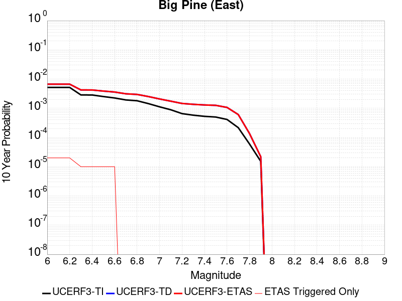 |

| Magnitude | 1 wk TI Prob | 1 wk TD Prob | 1 wk ETAS Prob | 1 wk ETAS/TD Gain | 1 wk ETAS Triggered Only | 1 mo TI Prob | 1 mo TD Prob | 1 mo ETAS Prob | 1 mo ETAS/TD Gain | 1 mo ETAS Triggered Only | 1 yr TI Prob | 1 yr TD Prob | 1 yr ETAS Prob | 1 yr ETAS/TD Gain | 1 yr ETAS Triggered Only | 10 yr TI Prob | 10 yr TD Prob | 10 yr ETAS Prob | 10 yr ETAS/TD Gain | 10 yr ETAS Triggered Only |
|-----|-----|-----|-----|-----|-----|-----|-----|-----|-----|-----|-----|-----|-----|-----|-----|-----|-----|-----|-----|-----|
| 6.0 | 9.916913E-6 | 1.2816984E-5 | 2.2816856E-5 | 1.7802048 | 1.0E-5 | 4.250036E-5 | 5.49289E-5 | 7.4927804E-5 | 1.364087 | 2.0E-5 | 5.173191E-4 | 6.685763E-4 | 6.885629E-4 | 1.0298944 | 2.0E-5 | 0.0051611643 | 0.006670441 | 0.0066903075 | 1.0029783 | 2.0E-5 |
| 6.1 | 9.916913E-6 | 1.2816984E-5 | 2.2816856E-5 | 1.7802048 | 1.0E-5 | 4.250036E-5 | 5.49289E-5 | 7.4927804E-5 | 1.364087 | 2.0E-5 | 5.173191E-4 | 6.685763E-4 | 6.885629E-4 | 1.0298944 | 2.0E-5 | 0.0051611643 | 0.006670441 | 0.0066903075 | 1.0029783 | 2.0E-5 |
| 6.2 | 9.916913E-6 | 1.2816984E-5 | 2.2816856E-5 | 1.7802048 | 1.0E-5 | 4.250036E-5 | 5.49289E-5 | 7.4927804E-5 | 1.364087 | 2.0E-5 | 5.173191E-4 | 6.685763E-4 | 6.885629E-4 | 1.0298944 | 2.0E-5 | 0.0051611643 | 0.006670441 | 0.0066903075 | 1.0029783 | 2.0E-5 |
| 6.3 | 5.479711E-6 | 8.112951E-6 | 8.112951E-6 | 1.0 | 0.0 | 2.3484265E-5 | 3.4769346E-5 | 4.4769E-5 | 1.2875997 | 1.0E-5 | 2.858834E-4 | 4.2323777E-4 | 4.3323354E-4 | 1.0236174 | 1.0E-5 | 0.0028551589 | 0.004227244 | 0.0042372015 | 1.0023556 | 1.0E-5 |
| 6.4 | 5.465009E-6 | 8.097245E-6 | 8.097245E-6 | 1.0 | 0.0 | 2.3421257E-5 | 3.4702036E-5 | 4.4701686E-5 | 1.2881576 | 1.0E-5 | 2.851165E-4 | 4.2241855E-4 | 4.3241432E-4 | 1.0236632 | 1.0E-5 | 0.0028475097 | 0.0042190826 | 0.0042290404 | 1.0023602 | 1.0E-5 |
| 6.5 | 4.826767E-6 | 7.422301E-6 | 7.422301E-6 | 1.0 | 0.0 | 2.068598E-5 | 3.180949E-5 | 4.1809173E-5 | 1.3143616 | 1.0E-5 | 2.518227E-4 | 3.872145E-4 | 3.9721062E-4 | 1.0258155 | 1.0E-5 | 0.0025153751 | 0.003868283 | 0.0038782442 | 1.0025752 | 1.0E-5 |
| 6.6 | 4.3146847E-6 | 6.8822374E-6 | 6.8822374E-6 | 1.0 | 0.0 | 1.8491375E-5 | 2.9494982E-5 | 3.9494687E-5 | 1.3390307 | 1.0E-5 | 2.2510924E-4 | 3.590447E-4 | 3.690411E-4 | 1.0278417 | 1.0E-5 | 0.0022488134 | 0.0035874986 | 0.0035974625 | 1.0027775 | 1.0E-5 |
| 6.7 | 3.6968106E-6 | 5.9954727E-6 | 5.9954727E-6 | 1.0 | 0.0 | 1.5843378E-5 | 2.5694639E-5 | 2.5694639E-5 | 1.0 | 0.0 | 1.9287605E-4 | 3.1278885E-4 | 3.1278885E-4 | 1.0 | 0.0 | 0.0019270873 | 0.0031262483 | 0.0031262483 | 1.0 | 0.0 |
| 6.8 | 3.4671132E-6 | 5.702177E-6 | 5.702177E-6 | 1.0 | 0.0 | 1.4858972E-5 | 2.4437682E-5 | 2.4437682E-5 | 1.0 | 0.0 | 1.8089297E-4 | 2.974896E-4 | 2.974896E-4 | 1.0 | 0.0 | 0.0018074579 | 0.002973667 | 0.002973667 | 1.0 | 0.0 |
| 6.9 | 2.7686972E-6 | 4.825223E-6 | 4.825223E-6 | 1.0 | 0.0 | 1.1865792E-5 | 2.0679368E-5 | 2.0679368E-5 | 1.0 | 0.0 | 1.4445644E-4 | 2.5174298E-4 | 2.5174298E-4 | 1.0 | 0.0 | 0.0014436257 | 0.0025172636 | 0.0025172636 | 1.0 | 0.0 |
| 7.0 | 2.1472624E-6 | 3.9850406E-6 | 3.9850406E-6 | 1.0 | 0.0 | 9.20252E-6 | 1.7078637E-5 | 1.7078637E-5 | 1.0 | 0.0 | 1.12034926E-4 | 2.079131E-4 | 2.079131E-4 | 1.0 | 0.0 | 0.0011197845 | 0.0020798394 | 0.0020798394 | 1.0 | 0.0 |
| 7.1 | 1.7018335E-6 | 3.344876E-6 | 3.344876E-6 | 1.0 | 0.0 | 7.293552E-6 | 1.4335106E-5 | 1.4335106E-5 | 1.0 | 0.0 | 8.879537E-5 | 1.7451629E-4 | 1.7451629E-4 | 1.0 | 0.0 | 8.87599E-4 | 0.0017464145 | 0.0017464145 | 1.0 | 0.0 |
| 7.2 | 1.25603E-6 | 2.794484E-6 | 2.794484E-6 | 1.0 | 0.0 | 5.3829745E-6 | 1.1976307E-5 | 1.1976307E-5 | 1.0 | 0.0 | 6.553574E-5 | 1.4580201E-4 | 1.4580201E-4 | 1.0 | 0.0 | 6.551642E-4 | 0.001459661 | 0.001459661 | 1.0 | 0.0 |
| 7.3 | 1.112297E-6 | 2.610332E-6 | 2.610332E-6 | 1.0 | 0.0 | 4.7669787E-6 | 1.118709E-5 | 1.118709E-5 | 1.0 | 0.0 | 5.803642E-5 | 1.3619453E-4 | 1.3619453E-4 | 1.0 | 0.0 | 5.802127E-4 | 0.0013635408 | 0.0013635408 | 1.0 | 0.0 |
| 7.4 | 1.0137181E-6 | 2.4834917E-6 | 2.4834917E-6 | 1.0 | 0.0 | 4.3444993E-6 | 1.0643494E-5 | 1.0643494E-5 | 1.0 | 0.0 | 5.2892992E-5 | 1.2957705E-4 | 1.2957705E-4 | 1.0 | 0.0 | 5.288041E-4 | 0.0012972289 | 0.0012972289 | 1.0 | 0.0 |
| 7.5 | 9.598608E-7 | 2.4071483E-6 | 2.4071483E-6 | 1.0 | 0.0 | 4.1136827E-6 | 1.031631E-5 | 1.031631E-5 | 1.0 | 0.0 | 5.0082934E-5 | 1.2559404E-4 | 1.2559404E-4 | 1.0 | 0.0 | 5.007165E-4 | 0.0012572526 | 0.0012572526 | 1.0 | 0.0 |
| 7.6 | 7.929459E-7 | 2.0448588E-6 | 2.0448588E-6 | 1.0 | 0.0 | 3.3983351E-6 | 8.763653E-6 | 8.763653E-6 | 1.0 | 0.0 | 4.1373947E-5 | 1.06692416E-4 | 1.06692416E-4 | 1.0 | 0.0 | 4.1366243E-4 | 0.0010685222 | 0.0010685222 | 1.0 | 0.0 |
| 7.7 | 4.155788E-7 | 1.1605589E-6 | 1.1605589E-6 | 1.0 | 0.0 | 1.7810507E-6 | 4.9738146E-6 | 4.9738146E-6 | 1.0 | 0.0 | 2.1684076E-5 | 6.0554554E-5 | 6.0554554E-5 | 1.0 | 0.0 | 2.1681961E-4 | 6.0857297E-4 | 6.0857297E-4 | 1.0 | 0.0 |
| 7.8 | 1.14666925E-7 | 2.592015E-7 | 2.592015E-7 | 1.0 | 0.0 | 4.914296E-7 | 1.1108631E-6 | 1.1108631E-6 | 1.0 | 0.0 | 5.9831386E-6 | 1.3524678E-5 | 1.3524678E-5 | 1.0 | 0.0 | 5.9829777E-5 | 1.3634123E-4 | 1.3634123E-4 | 1.0 | 0.0 |
| 7.9 | 2.9231824E-8 | 4.1463963E-8 | 4.1463963E-8 | 1.0 | 0.0 | 1.2527924E-7 | 1.7770269E-7 | 1.7770269E-7 | 1.0 | 0.0 | 1.5252737E-6 | 2.1635283E-6 | 2.1635283E-6 | 1.0 | 0.0 | 1.5252632E-5 | 2.1967755E-5 | 2.1967755E-5 | 1.0 | 0.0 |

## Goose Lake 2011 CFM
*[(top)](#table-of-contents)*

| 1 Week | 1 Month | 1 Year | 10 Year |
|-----|-----|-----|-----|
|  |  |  |  |

| Magnitude | 1 wk TI Prob | 1 wk TD Prob | 1 wk ETAS Prob | 1 wk ETAS/TD Gain | 1 wk ETAS Triggered Only | 1 mo TI Prob | 1 mo TD Prob | 1 mo ETAS Prob | 1 mo ETAS/TD Gain | 1 mo ETAS Triggered Only | 1 yr TI Prob | 1 yr TD Prob | 1 yr ETAS Prob | 1 yr ETAS/TD Gain | 1 yr ETAS Triggered Only | 10 yr TI Prob | 10 yr TD Prob | 10 yr ETAS Prob | 10 yr ETAS/TD Gain | 10 yr ETAS Triggered Only |
|-----|-----|-----|-----|-----|-----|-----|-----|-----|-----|-----|-----|-----|-----|-----|-----|-----|-----|-----|-----|-----|
| 6.0 | 3.780968E-6 | 3.8230223E-6 | 1.3822984E-5 | 3.6157215 | 1.0E-5 | 1.6204049E-5 | 1.6384285E-5 | 3.6383957E-5 | 2.2206619 | 2.0E-5 | 1.9726643E-4 | 1.994615E-4 | 2.194575E-4 | 1.10025 | 2.0E-5 | 0.001970914 | 0.001992933 | 0.002012893 | 1.0100155 | 2.0E-5 |
| 6.1 | 2.2035124E-6 | 2.229801E-6 | 2.229801E-6 | 1.0 | 0.0 | 9.443591E-6 | 9.556257E-6 | 1.955616E-5 | 2.0464249 | 1.0E-5 | 1.1496965E-4 | 1.163414E-4 | 1.2634024E-4 | 1.0859439 | 1.0E-5 | 0.0011491019 | 0.0011628233 | 0.0011728116 | 1.0085897 | 1.0E-5 |
| 6.2 | 1.5624689E-6 | 1.5826923E-6 | 1.5826923E-6 | 1.0 | 0.0 | 6.6962784E-6 | 6.7829496E-6 | 6.7829496E-6 | 1.0 | 0.0 | 8.152414E-5 | 8.2579325E-5 | 8.2579325E-5 | 1.0 | 0.0 | 8.1494235E-4 | 8.2549086E-4 | 8.2549086E-4 | 1.0 | 0.0 |
| 6.3 | 1.5624689E-6 | 1.5826923E-6 | 1.5826923E-6 | 1.0 | 0.0 | 6.6962784E-6 | 6.7829496E-6 | 6.7829496E-6 | 1.0 | 0.0 | 8.152414E-5 | 8.2579325E-5 | 8.2579325E-5 | 1.0 | 0.0 | 8.1494235E-4 | 8.2549086E-4 | 8.2549086E-4 | 1.0 | 0.0 |
| 6.4 | 1.256464E-6 | 1.2738695E-6 | 1.2738695E-6 | 1.0 | 0.0 | 5.3848344E-6 | 5.4594293E-6 | 5.4594293E-6 | 1.0 | 0.0 | 6.5558386E-5 | 6.646655E-5 | 6.646655E-5 | 1.0 | 0.0 | 6.553905E-4 | 6.644687E-4 | 6.644687E-4 | 1.0 | 0.0 |
| 6.5 | 1.0910911E-6 | 1.1069404E-6 | 1.1069404E-6 | 1.0 | 0.0 | 4.6760965E-6 | 4.7440217E-6 | 4.7440217E-6 | 1.0 | 0.0 | 5.692999E-5 | 5.7756948E-5 | 5.7756948E-5 | 1.0 | 0.0 | 5.6915404E-4 | 5.7742064E-4 | 5.7742064E-4 | 1.0 | 0.0 |
| 6.6 | 9.546601E-7 | 9.691246E-7 | 9.691246E-7 | 1.0 | 0.0 | 4.091394E-6 | 4.1533845E-6 | 4.1533845E-6 | 1.0 | 0.0 | 4.9811584E-5 | 5.056629E-5 | 5.056629E-5 | 1.0 | 0.0 | 4.980042E-4 | 5.055487E-4 | 5.055487E-4 | 1.0 | 0.0 |
| 6.7 | 7.790316E-7 | 7.9159634E-7 | 7.9159634E-7 | 1.0 | 0.0 | 3.3387028E-6 | 3.3925514E-6 | 3.3925514E-6 | 1.0 | 0.0 | 4.0647945E-5 | 4.1303538E-5 | 4.1303538E-5 | 1.0 | 0.0 | 4.0640513E-4 | 4.129592E-4 | 4.129592E-4 | 1.0 | 0.0 |
| 6.8 | 6.3714384E-7 | 6.4787395E-7 | 6.4787395E-7 | 1.0 | 0.0 | 2.7306137E-6 | 2.7765998E-6 | 2.7765998E-6 | 1.0 | 0.0 | 3.3244716E-5 | 3.3804583E-5 | 3.3804583E-5 | 1.0 | 0.0 | 3.323974E-4 | 3.379949E-4 | 3.379949E-4 | 1.0 | 0.0 |
| 6.9 | 4.92586E-7 | 5.0139147E-7 | 5.0139147E-7 | 1.0 | 0.0 | 2.1110811E-6 | 2.1488188E-6 | 2.1488188E-6 | 1.0 | 0.0 | 2.5702111E-5 | 2.616156E-5 | 2.616156E-5 | 1.0 | 0.0 | 2.569914E-4 | 2.6158517E-4 | 2.6158517E-4 | 1.0 | 0.0 |
| 7.0 | 3.130245E-7 | 3.190354E-7 | 3.190354E-7 | 1.0 | 0.0 | 1.3415328E-6 | 1.3672939E-6 | 1.3672939E-6 | 1.0 | 0.0 | 1.6333039E-5 | 1.6646678E-5 | 1.6646678E-5 | 1.0 | 0.0 | 1.6331839E-4 | 1.6645451E-4 | 1.6645451E-4 | 1.0 | 0.0 |
| 7.1 | 1.7680084E-7 | 1.8023923E-7 | 1.8023923E-7 | 1.0 | 0.0 | 7.5771766E-7 | 7.724536E-7 | 7.724536E-7 | 1.0 | 0.0 | 9.225173E-6 | 9.404583E-6 | 9.404583E-6 | 1.0 | 0.0 | 9.22479E-5 | 9.4041956E-5 | 9.4041956E-5 | 1.0 | 0.0 |
| 7.2 | 4.8641045E-8 | 4.9402068E-8 | 4.9402068E-8 | 1.0 | 0.0 | 2.084616E-7 | 2.1172312E-7 | 2.1172312E-7 | 1.0 | 0.0 | 2.538017E-6 | 2.577726E-6 | 2.577726E-6 | 1.0 | 0.0 | 2.537988E-5 | 2.5776973E-5 | 2.5776973E-5 | 1.0 | 0.0 |
| 7.3 | 5.3911844E-9 | 5.4758145E-9 | 5.4758145E-9 | 1.0 | 0.0 | 2.3105075E-8 | 2.3467775E-8 | 2.3467775E-8 | 1.0 | 0.0 | 2.8130427E-7 | 2.8572015E-7 | 2.8572015E-7 | 1.0 | 0.0 | 2.8130391E-6 | 2.8571992E-6 | 2.8571992E-6 | 1.0 | 0.0 |

## Mission Hills 2011
*[(top)](#table-of-contents)*

| 1 Week | 1 Month | 1 Year | 10 Year |
|-----|-----|-----|-----|
|  |  |  |  |

| Magnitude | 1 wk TI Prob | 1 wk TD Prob | 1 wk ETAS Prob | 1 wk ETAS/TD Gain | 1 wk ETAS Triggered Only | 1 mo TI Prob | 1 mo TD Prob | 1 mo ETAS Prob | 1 mo ETAS/TD Gain | 1 mo ETAS Triggered Only | 1 yr TI Prob | 1 yr TD Prob | 1 yr ETAS Prob | 1 yr ETAS/TD Gain | 1 yr ETAS Triggered Only | 10 yr TI Prob | 10 yr TD Prob | 10 yr ETAS Prob | 10 yr ETAS/TD Gain | 10 yr ETAS Triggered Only |
|-----|-----|-----|-----|-----|-----|-----|-----|-----|-----|-----|-----|-----|-----|-----|-----|-----|-----|-----|-----|-----|
| 6.0 | 1.8765717E-5 | 1.9054645E-5 | 3.9054266E-5 | 2.0495927 | 2.0E-5 | 8.0422025E-5 | 8.166215E-5 | 1.0166052E-4 | 1.2448915 | 2.0E-5 | 9.786983E-4 | 9.941267E-4 | 0.0010141068 | 1.0200982 | 2.0E-5 | 0.009743992 | 0.009930461 | 0.009950262 | 1.001994 | 2.0E-5 |
| 6.1 | 1.8765717E-5 | 1.9054645E-5 | 3.9054266E-5 | 2.0495927 | 2.0E-5 | 8.0422025E-5 | 8.166215E-5 | 1.0166052E-4 | 1.2448915 | 2.0E-5 | 9.786983E-4 | 9.941267E-4 | 0.0010141068 | 1.0200982 | 2.0E-5 | 0.009743992 | 0.009930461 | 0.009950262 | 1.001994 | 2.0E-5 |
| 6.2 | 1.8765717E-5 | 1.9054645E-5 | 3.9054266E-5 | 2.0495927 | 2.0E-5 | 8.0422025E-5 | 8.166215E-5 | 1.0166052E-4 | 1.2448915 | 2.0E-5 | 9.786983E-4 | 9.941267E-4 | 0.0010141068 | 1.0200982 | 2.0E-5 | 0.009743992 | 0.009930461 | 0.009950262 | 1.001994 | 2.0E-5 |
| 6.3 | 1.8765717E-5 | 1.9054645E-5 | 3.9054266E-5 | 2.0495927 | 2.0E-5 | 8.0422025E-5 | 8.166215E-5 | 1.0166052E-4 | 1.2448915 | 2.0E-5 | 9.786983E-4 | 9.941267E-4 | 0.0010141068 | 1.0200982 | 2.0E-5 | 0.009743992 | 0.009930461 | 0.009950262 | 1.001994 | 2.0E-5 |
| 6.4 | 4.566357E-6 | 2.5148488E-6 | 2.5148488E-6 | 1.0 | 0.0 | 1.9569954E-5 | 1.0777889E-5 | 1.0777889E-5 | 1.0 | 0.0 | 2.3823815E-4 | 1.3121472E-4 | 1.3121472E-4 | 1.0 | 0.0 | 0.002379829 | 0.0013115506 | 0.0013115506 | 1.0 | 0.0 |
| 6.5 | 4.566357E-6 | 2.5148488E-6 | 2.5148488E-6 | 1.0 | 0.0 | 1.9569954E-5 | 1.0777889E-5 | 1.0777889E-5 | 1.0 | 0.0 | 2.3823815E-4 | 1.3121472E-4 | 1.3121472E-4 | 1.0 | 0.0 | 0.002379829 | 0.0013115506 | 0.0013115506 | 1.0 | 0.0 |
| 6.6 | 4.566357E-6 | 2.5148488E-6 | 2.5148488E-6 | 1.0 | 0.0 | 1.9569954E-5 | 1.0777889E-5 | 1.0777889E-5 | 1.0 | 0.0 | 2.3823815E-4 | 1.3121472E-4 | 1.3121472E-4 | 1.0 | 0.0 | 0.002379829 | 0.0013115506 | 0.0013115506 | 1.0 | 0.0 |
| 6.7 | 2.3266773E-6 | 1.3296187E-6 | 1.3296187E-6 | 1.0 | 0.0 | 9.971435E-6 | 5.698354E-6 | 5.698354E-6 | 1.0 | 0.0 | 1.2139547E-4 | 6.937531E-5 | 6.937531E-5 | 1.0 | 0.0 | 0.0012132917 | 6.9354265E-4 | 6.9354265E-4 | 1.0 | 0.0 |
| 6.8 | 2.032735E-6 | 1.1894115E-6 | 1.1894115E-6 | 1.0 | 0.0 | 8.711692E-6 | 5.097468E-6 | 5.097468E-6 | 1.0 | 0.0 | 1.06059684E-4 | 6.205996E-5 | 6.205996E-5 | 1.0 | 0.0 | 0.0010600908 | 6.2043115E-4 | 6.2043115E-4 | 1.0 | 0.0 |
| 6.9 | 1.3186259E-6 | 1.0561778E-6 | 1.0561778E-6 | 1.0 | 0.0 | 5.6512413E-6 | 4.5264687E-6 | 4.5264687E-6 | 1.0 | 0.0 | 6.8801695E-5 | 5.5108394E-5 | 5.5108394E-5 | 1.0 | 0.0 | 6.8780396E-4 | 5.5095024E-4 | 5.5095024E-4 | 1.0 | 0.0 |
| 7.0 | 1.2726016E-6 | 1.0159088E-6 | 1.0159088E-6 | 1.0 | 0.0 | 5.4539955E-6 | 4.3538876E-6 | 4.3538876E-6 | 1.0 | 0.0 | 6.6400375E-5 | 5.300732E-5 | 5.300732E-5 | 1.0 | 0.0 | 6.6380535E-4 | 5.299496E-4 | 5.299496E-4 | 1.0 | 0.0 |
| 7.1 | 1.2063913E-6 | 9.570072E-7 | 9.570072E-7 | 1.0 | 0.0 | 5.170238E-6 | 4.101453E-6 | 4.101453E-6 | 1.0 | 0.0 | 6.294583E-5 | 4.9934075E-5 | 4.9934075E-5 | 1.0 | 0.0 | 6.2928005E-4 | 4.992311E-4 | 4.992311E-4 | 1.0 | 0.0 |
| 7.2 | 9.105806E-7 | 7.3765557E-7 | 7.3765557E-7 | 1.0 | 0.0 | 3.9024826E-6 | 3.1613772E-6 | 3.1613772E-6 | 1.0 | 0.0 | 4.7511687E-5 | 3.8489103E-5 | 3.8489103E-5 | 1.0 | 0.0 | 4.7501532E-4 | 3.8482592E-4 | 3.8482592E-4 | 1.0 | 0.0 |
| 7.3 | 7.020432E-7 | 5.710089E-7 | 5.710089E-7 | 1.0 | 0.0 | 3.0087533E-6 | 2.447179E-6 | 2.447179E-6 | 1.0 | 0.0 | 3.6630954E-5 | 2.979401E-5 | 2.979401E-5 | 1.0 | 0.0 | 3.6624918E-4 | 2.9790145E-4 | 2.9790145E-4 | 1.0 | 0.0 |
| 7.4 | 5.3900635E-7 | 4.4480825E-7 | 4.4480825E-7 | 1.0 | 0.0 | 2.3100251E-6 | 1.9063198E-6 | 1.9063198E-6 | 1.0 | 0.0 | 2.8124194E-5 | 2.3209208E-5 | 2.3209208E-5 | 1.0 | 0.0 | 2.8120633E-4 | 2.3206905E-4 | 2.3206905E-4 | 1.0 | 0.0 |
| 7.5 | 2.907075E-7 | 2.2875415E-7 | 2.2875415E-7 | 1.0 | 0.0 | 1.2458887E-6 | 9.803746E-7 | 9.803746E-7 | 1.0 | 0.0 | 1.5168589E-5 | 1.1935997E-5 | 1.1935997E-5 | 1.0 | 0.0 | 1.5167553E-4 | 1.1935373E-4 | 1.1935373E-4 | 1.0 | 0.0 |
| 7.6 | 1.6903675E-7 | 1.2353402E-7 | 1.2353402E-7 | 1.0 | 0.0 | 7.2444305E-7 | 5.294314E-7 | 5.294314E-7 | 1.0 | 0.0 | 8.820059E-6 | 6.4458095E-6 | 6.4458095E-6 | 1.0 | 0.0 | 8.8197085E-5 | 6.445635E-5 | 6.445635E-5 | 1.0 | 0.0 |
| 7.7 | 7.168073E-8 | 3.9135116E-8 | 3.9135116E-8 | 1.0 | 0.0 | 3.072031E-7 | 1.6772192E-7 | 1.6772192E-7 | 1.0 | 0.0 | 3.7401915E-6 | 2.0420127E-6 | 2.0420127E-6 | 1.0 | 0.0 | 3.7401285E-5 | 2.041995E-5 | 2.041995E-5 | 1.0 | 0.0 |
| 7.8 | 6.564101E-8 | 3.3835356E-8 | 3.3835356E-8 | 1.0 | 0.0 | 2.813186E-7 | 1.4500866E-7 | 1.4500866E-7 | 1.0 | 0.0 | 3.4250486E-6 | 1.7654792E-6 | 1.7654792E-6 | 1.0 | 0.0 | 3.424996E-5 | 1.7654662E-5 | 1.7654662E-5 | 1.0 | 0.0 |
| 7.9 | 1.0029074E-8 | 3.7292542E-9 | 3.7292542E-9 | 1.0 | 0.0 | 4.2981743E-8 | 1.5982518E-8 | 1.5982518E-8 | 1.0 | 0.0 | 5.2330256E-7 | 1.9458714E-7 | 1.9458714E-7 | 1.0 | 0.0 | 5.2330133E-6 | 1.945871E-6 | 1.945871E-6 | 1.0 | 0.0 |

## Elsinore (Temecula) rev
*[(top)](#table-of-contents)*

| 1 Week | 1 Month | 1 Year | 10 Year |
|-----|-----|-----|-----|
|  |  |  |  |

| Magnitude | 1 wk TI Prob | 1 wk TD Prob | 1 wk ETAS Prob | 1 wk ETAS/TD Gain | 1 wk ETAS Triggered Only | 1 mo TI Prob | 1 mo TD Prob | 1 mo ETAS Prob | 1 mo ETAS/TD Gain | 1 mo ETAS Triggered Only | 1 yr TI Prob | 1 yr TD Prob | 1 yr ETAS Prob | 1 yr ETAS/TD Gain | 1 yr ETAS Triggered Only | 10 yr TI Prob | 10 yr TD Prob | 10 yr ETAS Prob | 10 yr ETAS/TD Gain | 10 yr ETAS Triggered Only |
|-----|-----|-----|-----|-----|-----|-----|-----|-----|-----|-----|-----|-----|-----|-----|-----|-----|-----|-----|-----|-----|
| 6.0 | 2.9514995E-5 | 2.2517117E-5 | 4.2516665E-5 | 1.8881932 | 2.0E-5 | 1.264867E-4 | 9.649849E-5 | 1.1649655E-4 | 1.2072371 | 2.0E-5 | 0.0015388876 | 0.0011742581 | 0.0011942346 | 1.017012 | 2.0E-5 | 0.015282745 | 0.011696897 | 0.011716664 | 1.0016899 | 2.0E-5 |
| 6.1 | 2.9514995E-5 | 2.2517117E-5 | 4.2516665E-5 | 1.8881932 | 2.0E-5 | 1.264867E-4 | 9.649849E-5 | 1.1649655E-4 | 1.2072371 | 2.0E-5 | 0.0015388876 | 0.0011742581 | 0.0011942346 | 1.017012 | 2.0E-5 | 0.015282745 | 0.011696897 | 0.011716664 | 1.0016899 | 2.0E-5 |
| 6.2 | 2.9514995E-5 | 2.2517117E-5 | 4.2516665E-5 | 1.8881932 | 2.0E-5 | 1.264867E-4 | 9.649849E-5 | 1.1649655E-4 | 1.2072371 | 2.0E-5 | 0.0015388876 | 0.0011742581 | 0.0011942346 | 1.017012 | 2.0E-5 | 0.015282745 | 0.011696897 | 0.011716664 | 1.0016899 | 2.0E-5 |
| 6.3 | 2.3223649E-5 | 1.8406454E-5 | 3.8406088E-5 | 2.0865555 | 2.0E-5 | 9.952613E-5 | 7.888251E-5 | 9.888094E-5 | 1.2535216 | 2.0E-5 | 0.001211057 | 9.599888E-4 | 9.799696E-4 | 1.0208136 | 2.0E-5 | 0.012044783 | 0.009569948 | 0.009589756 | 1.0020698 | 2.0E-5 |
| 6.4 | 2.3223649E-5 | 1.8406454E-5 | 3.8406088E-5 | 2.0865555 | 2.0E-5 | 9.952613E-5 | 7.888251E-5 | 9.888094E-5 | 1.2535216 | 2.0E-5 | 0.001211057 | 9.599888E-4 | 9.799696E-4 | 1.0208136 | 2.0E-5 | 0.012044783 | 0.009569948 | 0.009589756 | 1.0020698 | 2.0E-5 |
| 6.5 | 1.8338875E-5 | 1.4750118E-5 | 3.474982E-5 | 2.3559015 | 2.0E-5 | 7.8592806E-5 | 6.321331E-5 | 8.321204E-5 | 1.316369 | 2.0E-5 | 9.5644733E-4 | 7.69359E-4 | 7.893436E-4 | 1.0259757 | 2.0E-5 | 0.009523412 | 0.0076739118 | 0.0076937582 | 1.0025862 | 2.0E-5 |
| 6.6 | 1.8223333E-5 | 1.4612673E-5 | 3.461238E-5 | 2.368655 | 2.0E-5 | 7.809766E-5 | 6.262429E-5 | 8.262304E-5 | 1.3193449 | 2.0E-5 | 9.504242E-4 | 7.6219277E-4 | 7.821775E-4 | 1.0262201 | 2.0E-5 | 0.009463696 | 0.0076027405 | 0.0076225884 | 1.0026107 | 2.0E-5 |
| 6.7 | 1.7512752E-5 | 1.402721E-5 | 3.402693E-5 | 2.4257803 | 2.0E-5 | 7.505249E-5 | 6.011528E-5 | 8.011408E-5 | 1.3326741 | 2.0E-5 | 9.13381E-4 | 7.3166634E-4 | 7.516517E-4 | 1.0273149 | 2.0E-5 | 0.00909636 | 0.00729892 | 0.007318774 | 1.0027201 | 2.0E-5 |
| 6.8 | 1.7417142E-5 | 1.3951195E-5 | 3.3950917E-5 | 2.433549 | 2.0E-5 | 7.4642754E-5 | 5.9789512E-5 | 7.978832E-5 | 1.3344868 | 2.0E-5 | 9.083966E-4 | 7.277028E-4 | 7.4768823E-4 | 1.0274638 | 2.0E-5 | 0.009046922 | 0.0072594886 | 0.0072793434 | 1.002735 | 2.0E-5 |
| 6.9 | 1.6402591E-5 | 1.2988613E-5 | 2.2988483E-5 | 1.7698951 | 1.0E-5 | 7.0294926E-5 | 5.5664343E-5 | 6.5663786E-5 | 1.1796383 | 1.0E-5 | 8.5550465E-4 | 6.775103E-4 | 6.8750355E-4 | 1.0147499 | 1.0E-5 | 0.008522186 | 0.006760169 | 0.0067701014 | 1.0014693 | 1.0E-5 |
| 7.0 | 1.3912486E-5 | 1.0878233E-5 | 2.0878124E-5 | 1.9192569 | 1.0E-5 | 5.9623577E-5 | 4.6620182E-5 | 5.6619716E-5 | 1.2144893 | 1.0E-5 | 7.2567526E-4 | 5.674556E-4 | 5.7745E-4 | 1.0176126 | 1.0E-5 | 0.0072331014 | 0.005663986 | 0.005673929 | 1.0017556 | 1.0E-5 |
| 7.1 | 1.3405147E-5 | 1.03274215E-5 | 2.0327318E-5 | 1.9682859 | 1.0E-5 | 5.7449364E-5 | 4.425964E-5 | 5.4259195E-5 | 1.2259295 | 1.0E-5 | 6.9922156E-4 | 5.3873047E-4 | 5.487251E-4 | 1.0185522 | 1.0E-5 | 0.0069702556 | 0.005377577 | 0.005387523 | 1.0018495 | 1.0E-5 |
| 7.2 | 1.21402E-5 | 8.996737E-6 | 8.996737E-6 | 1.0 | 0.0 | 5.202839E-5 | 3.8556886E-5 | 3.8556886E-5 | 1.0 | 0.0 | 6.332616E-4 | 4.6933076E-4 | 4.6933076E-4 | 1.0 | 0.0 | 0.0063146 | 0.004684821 | 0.004684821 | 1.0 | 0.0 |
| 7.3 | 1.05047775E-5 | 7.571771E-6 | 7.571771E-6 | 1.0 | 0.0 | 4.5019697E-5 | 3.245005E-5 | 3.245005E-5 | 1.0 | 0.0 | 5.4797693E-4 | 3.950092E-4 | 3.950092E-4 | 1.0 | 0.0 | 0.005466277 | 0.00394346 | 0.00394346 | 1.0 | 0.0 |
| 7.4 | 9.624483E-6 | 6.7868696E-6 | 6.7868696E-6 | 1.0 | 0.0 | 4.124713E-5 | 2.9086266E-5 | 2.9086266E-5 | 1.0 | 0.0 | 5.0206814E-4 | 3.5406914E-4 | 3.5406914E-4 | 1.0 | 0.0 | 0.005009353 | 0.003535204 | 0.003535204 | 1.0 | 0.0 |
| 7.5 | 8.215151E-6 | 5.635538E-6 | 5.635538E-6 | 1.0 | 0.0 | 3.5207315E-5 | 2.4152088E-5 | 2.4152088E-5 | 1.0 | 0.0 | 4.2856473E-4 | 2.9401327E-4 | 2.9401327E-4 | 1.0 | 0.0 | 0.004277392 | 0.002936371 | 0.002936371 | 1.0 | 0.0 |
| 7.6 | 6.975058E-6 | 4.676045E-6 | 4.676045E-6 | 1.0 | 0.0 | 2.9892764E-5 | 2.0040046E-5 | 2.0040046E-5 | 1.0 | 0.0 | 3.6388362E-4 | 2.439614E-4 | 2.439614E-4 | 1.0 | 0.0 | 0.0036328835 | 0.002437052 | 0.002437052 | 1.0 | 0.0 |
| 7.7 | 4.159604E-6 | 2.3269924E-6 | 2.3269924E-6 | 1.0 | 0.0 | 1.7826753E-5 | 9.97279E-6 | 9.97279E-6 | 1.0 | 0.0 | 2.1701909E-4 | 1.21412704E-4 | 1.21412704E-4 | 1.0 | 0.0 | 0.0021680726 | 0.0012135367 | 0.0012135367 | 1.0 | 0.0 |
| 7.8 | 2.2692414E-7 | 9.3854695E-8 | 9.3854695E-8 | 1.0 | 0.0 | 9.725317E-7 | 4.0223435E-7 | 4.0223435E-7 | 1.0 | 0.0 | 1.1840509E-5 | 4.8971956E-6 | 4.8971956E-6 | 1.0 | 0.0 | 1.1839878E-4 | 4.8971204E-5 | 4.8971204E-5 | 1.0 | 0.0 |
| 7.9 | 6.676829E-9 | 3.439853E-9 | 3.439853E-9 | 1.0 | 0.0 | 2.861498E-8 | 1.4742227E-8 | 1.4742227E-8 | 1.0 | 0.0 | 3.4838732E-7 | 1.7948659E-7 | 1.7948659E-7 | 1.0 | 0.0 | 3.4838679E-6 | 1.7948646E-6 | 1.7948646E-6 | 1.0 | 0.0 |

## Big Pine (Central)
*[(top)](#table-of-contents)*

| 1 Week | 1 Month | 1 Year | 10 Year |
|-----|-----|-----|-----|
|  |  |  |  |

| Magnitude | 1 wk TI Prob | 1 wk TD Prob | 1 wk ETAS Prob | 1 wk ETAS/TD Gain | 1 wk ETAS Triggered Only | 1 mo TI Prob | 1 mo TD Prob | 1 mo ETAS Prob | 1 mo ETAS/TD Gain | 1 mo ETAS Triggered Only | 1 yr TI Prob | 1 yr TD Prob | 1 yr ETAS Prob | 1 yr ETAS/TD Gain | 1 yr ETAS Triggered Only | 10 yr TI Prob | 10 yr TD Prob | 10 yr ETAS Prob | 10 yr ETAS/TD Gain | 10 yr ETAS Triggered Only |
|-----|-----|-----|-----|-----|-----|-----|-----|-----|-----|-----|-----|-----|-----|-----|-----|-----|-----|-----|-----|-----|
| 6.0 | 1.2706755E-5 | 1.4250529E-5 | 3.4250243E-5 | 2.4034367 | 2.0E-5 | 5.4456385E-5 | 6.107247E-5 | 8.1071244E-5 | 1.3274598 | 2.0E-5 | 6.628048E-4 | 7.433402E-4 | 7.633253E-4 | 1.0268856 | 2.0E-5 | 0.006608314 | 0.0074135666 | 0.0074334187 | 1.0026778 | 2.0E-5 |
| 6.1 | 8.342579E-6 | 9.510762E-6 | 9.510762E-6 | 1.0 | 0.0 | 3.5753423E-5 | 4.0759893E-5 | 4.0759893E-5 | 1.0 | 0.0 | 4.3521097E-4 | 4.961604E-4 | 4.961604E-4 | 1.0 | 0.0 | 0.0043435963 | 0.0049540824 | 0.0049540824 | 1.0 | 0.0 |
| 6.2 | 6.923899E-6 | 7.967147E-6 | 7.967147E-6 | 1.0 | 0.0 | 2.9673516E-5 | 3.4144578E-5 | 3.4144578E-5 | 1.0 | 0.0 | 3.6121515E-4 | 4.156502E-4 | 4.156502E-4 | 1.0 | 0.0 | 0.003606286 | 0.0041520367 | 0.0041520367 | 1.0 | 0.0 |
| 6.3 | 2.728396E-6 | 3.4242908E-6 | 3.4242908E-6 | 1.0 | 0.0 | 1.1693074E-5 | 1.4675454E-5 | 1.4675454E-5 | 1.0 | 0.0 | 1.4235388E-4 | 1.7865987E-4 | 1.7865987E-4 | 1.0 | 0.0 | 0.0014226272 | 0.0017866704 | 0.0017866704 | 1.0 | 0.0 |
| 6.4 | 2.7136944E-6 | 3.408584E-6 | 3.408584E-6 | 1.0 | 0.0 | 1.1630066E-5 | 1.4608141E-5 | 1.4608141E-5 | 1.0 | 0.0 | 1.4158686E-4 | 1.7784047E-4 | 1.7784047E-4 | 1.0 | 0.0 | 0.0014149669 | 0.0017784894 | 0.0017784894 | 1.0 | 0.0 |
| 6.5 | 2.6971882E-6 | 3.3909291E-6 | 3.3909291E-6 | 1.0 | 0.0 | 1.1559327E-5 | 1.45324775E-5 | 1.45324775E-5 | 1.0 | 0.0 | 1.4072572E-4 | 1.7691942E-4 | 1.7691942E-4 | 1.0 | 0.0 | 0.0014063664 | 0.0017692937 | 0.0017692937 | 1.0 | 0.0 |
| 6.6 | 2.669092E-6 | 3.3609497E-6 | 3.3609497E-6 | 1.0 | 0.0 | 1.1438916E-5 | 1.4403995E-5 | 1.4403995E-5 | 1.0 | 0.0 | 1.3925991E-4 | 1.753554E-4 | 1.753554E-4 | 1.0 | 0.0 | 0.0013917267 | 0.0017536782 | 0.0017536782 | 1.0 | 0.0 |
| 6.7 | 2.6408059E-6 | 3.3309752E-6 | 3.3309752E-6 | 1.0 | 0.0 | 1.1317691E-5 | 1.4275535E-5 | 1.4275535E-5 | 1.0 | 0.0 | 1.3778417E-4 | 1.7379165E-4 | 1.7379165E-4 | 1.0 | 0.0 | 0.0013769877 | 0.0017380653 | 0.0017380653 | 1.0 | 0.0 |
| 6.8 | 2.1786943E-6 | 2.8544325E-6 | 2.8544325E-6 | 1.0 | 0.0 | 9.337228E-6 | 1.2233229E-5 | 1.2233229E-5 | 1.0 | 0.0 | 1.1367482E-4 | 1.4893012E-4 | 1.4893012E-4 | 1.0 | 0.0 | 0.0011361669 | 0.0014897975 | 0.0014897975 | 1.0 | 0.0 |
| 6.9 | 1.4411696E-6 | 2.068499E-6 | 2.068499E-6 | 1.0 | 0.0 | 6.1764263E-6 | 8.864968E-6 | 8.864968E-6 | 1.0 | 0.0 | 7.51954E-5 | 1.079259E-4 | 1.079259E-4 | 1.0 | 0.0 | 7.5169955E-4 | 0.0010801847 | 0.0010801847 | 1.0 | 0.0 |
| 7.0 | 1.0073411E-6 | 1.554261E-6 | 1.554261E-6 | 1.0 | 0.0 | 4.317169E-6 | 6.6611024E-6 | 6.6611024E-6 | 1.0 | 0.0 | 5.2560266E-5 | 8.1096056E-5 | 8.1096056E-5 | 1.0 | 0.0 | 5.2547833E-4 | 8.1210316E-4 | 8.1210316E-4 | 1.0 | 0.0 |
| 7.1 | 8.947104E-7 | 1.4302494E-6 | 1.4302494E-6 | 1.0 | 0.0 | 3.834468E-6 | 6.129627E-6 | 6.129627E-6 | 1.0 | 0.0 | 4.6683643E-5 | 7.46258E-5 | 7.46258E-5 | 1.0 | 0.0 | 4.6673836E-4 | 7.474457E-4 | 7.474457E-4 | 1.0 | 0.0 |
| 7.2 | 5.215166E-7 | 1.0111678E-6 | 1.0111678E-6 | 1.0 | 0.0 | 2.2350691E-6 | 4.3335694E-6 | 4.3335694E-6 | 1.0 | 0.0 | 2.7211627E-5 | 5.2759973E-5 | 5.2759973E-5 | 1.0 | 0.0 | 2.7208295E-4 | 5.2890263E-4 | 5.2890263E-4 | 1.0 | 0.0 |
| 7.3 | 4.4024807E-7 | 9.219589E-7 | 9.219589E-7 | 1.0 | 0.0 | 1.8867761E-6 | 3.9512465E-6 | 3.9512465E-6 | 1.0 | 0.0 | 2.2971257E-5 | 4.810541E-5 | 4.810541E-5 | 1.0 | 0.0 | 2.2968883E-4 | 4.8237795E-4 | 4.8237795E-4 | 1.0 | 0.0 |
| 7.4 | 3.6130905E-7 | 8.358523E-7 | 8.358523E-7 | 1.0 | 0.0 | 1.5484665E-6 | 3.5822195E-6 | 3.5822195E-6 | 1.0 | 0.0 | 1.8852415E-5 | 4.3612687E-5 | 4.3612687E-5 | 1.0 | 0.0 | 1.8850817E-4 | 4.374597E-4 | 4.374597E-4 | 1.0 | 0.0 |
| 7.5 | 3.408184E-7 | 8.108147E-7 | 8.108147E-7 | 1.0 | 0.0 | 1.4606494E-6 | 3.4749157E-6 | 3.4749157E-6 | 1.0 | 0.0 | 1.7783263E-5 | 4.2306317E-5 | 4.2306317E-5 | 1.0 | 0.0 | 1.778184E-4 | 4.2437963E-4 | 4.2437963E-4 | 1.0 | 0.0 |
| 7.6 | 3.1428627E-7 | 7.7316E-7 | 7.7316E-7 | 1.0 | 0.0 | 1.3469405E-6 | 3.3135389E-6 | 3.3135389E-6 | 1.0 | 0.0 | 1.6398877E-5 | 4.0341627E-5 | 4.0341627E-5 | 1.0 | 0.0 | 1.6397667E-4 | 4.0471106E-4 | 4.0471106E-4 | 1.0 | 0.0 |
| 7.7 | 1.7972785E-7 | 5.077752E-7 | 5.077752E-7 | 1.0 | 0.0 | 7.70262E-7 | 2.1761778E-6 | 2.1761778E-6 | 1.0 | 0.0 | 9.377899E-6 | 2.6494654E-5 | 2.6494654E-5 | 1.0 | 0.0 | 9.377503E-5 | 2.662899E-4 | 2.662899E-4 | 1.0 | 0.0 |
| 7.8 | 4.9230927E-8 | 1.198079E-7 | 1.198079E-7 | 1.0 | 0.0 | 2.1098968E-7 | 5.134623E-7 | 5.134623E-7 | 1.0 | 0.0 | 2.5687964E-6 | 6.2513873E-6 | 6.2513873E-6 | 1.0 | 0.0 | 2.5687666E-5 | 6.295415E-5 | 6.295415E-5 | 1.0 | 0.0 |
| 7.9 | 3.6805972E-9 | 4.105293E-9 | 4.105293E-9 | 1.0 | 0.0 | 1.5773987E-8 | 1.7594115E-8 | 1.7594115E-8 | 1.0 | 0.0 | 1.9204828E-7 | 2.1420831E-7 | 2.1420831E-7 | 1.0 | 0.0 | 1.920481E-6 | 2.1900614E-6 | 2.1900614E-6 | 1.0 | 0.0 |

## Hosgri
*[(top)](#table-of-contents)*

| 1 Week | 1 Month | 1 Year | 10 Year |
|-----|-----|-----|-----|
|  |  |  |  |

| Magnitude | 1 wk TI Prob | 1 wk TD Prob | 1 wk ETAS Prob | 1 wk ETAS/TD Gain | 1 wk ETAS Triggered Only | 1 mo TI Prob | 1 mo TD Prob | 1 mo ETAS Prob | 1 mo ETAS/TD Gain | 1 mo ETAS Triggered Only | 1 yr TI Prob | 1 yr TD Prob | 1 yr ETAS Prob | 1 yr ETAS/TD Gain | 1 yr ETAS Triggered Only | 10 yr TI Prob | 10 yr TD Prob | 10 yr ETAS Prob | 10 yr ETAS/TD Gain | 10 yr ETAS Triggered Only |
|-----|-----|-----|-----|-----|-----|-----|-----|-----|-----|-----|-----|-----|-----|-----|-----|-----|-----|-----|-----|-----|
| 6.0 | 2.883978E-5 | 2.9128416E-5 | 3.9128125E-5 | 1.3432974 | 1.0E-5 | 1.235932E-4 | 1.2483024E-4 | 1.34829E-4 | 1.0800987 | 1.0E-5 | 0.0015037085 | 0.001518776 | 0.0015287608 | 1.0065743 | 1.0E-5 | 0.01493574 | 0.01508774 | 0.015097589 | 1.0006528 | 1.0E-5 |
| 6.1 | 2.883978E-5 | 2.9128416E-5 | 3.9128125E-5 | 1.3432974 | 1.0E-5 | 1.235932E-4 | 1.2483024E-4 | 1.34829E-4 | 1.0800987 | 1.0E-5 | 0.0015037085 | 0.001518776 | 0.0015287608 | 1.0065743 | 1.0E-5 | 0.01493574 | 0.01508774 | 0.015097589 | 1.0006528 | 1.0E-5 |
| 6.2 | 2.883978E-5 | 2.9128416E-5 | 3.9128125E-5 | 1.3432974 | 1.0E-5 | 1.235932E-4 | 1.2483024E-4 | 1.34829E-4 | 1.0800987 | 1.0E-5 | 0.0015037085 | 0.001518776 | 0.0015287608 | 1.0065743 | 1.0E-5 | 0.01493574 | 0.01508774 | 0.015097589 | 1.0006528 | 1.0E-5 |
| 6.3 | 2.2914428E-5 | 2.2641969E-5 | 2.2641969E-5 | 1.0 | 0.0 | 9.8200995E-5 | 9.703343E-5 | 9.703343E-5 | 1.0 | 0.0 | 0.0011949413 | 0.0011807467 | 0.0011807467 | 1.0 | 0.0 | 0.011885363 | 0.011746133 | 0.011746133 | 1.0 | 0.0 |
| 6.4 | 2.0195741E-5 | 1.969656E-5 | 1.969656E-5 | 1.0 | 0.0 | 8.65503E-5 | 8.4411105E-5 | 8.4411105E-5 | 1.0 | 0.0 | 0.0010532405 | 0.0010272227 | 0.0010272227 | 1.0 | 0.0 | 0.010482626 | 0.010225792 | 0.010225792 | 1.0 | 0.0 |
| 6.5 | 1.9924333E-5 | 1.940898E-5 | 1.940898E-5 | 1.0 | 0.0 | 8.53872E-5 | 8.3178704E-5 | 8.3178704E-5 | 1.0 | 0.0 | 0.0010390934 | 0.0010122322 | 0.0010122322 | 1.0 | 0.0 | 0.010342481 | 0.010077253 | 0.010077253 | 1.0 | 0.0 |
| 6.6 | 1.809694E-5 | 1.74583E-5 | 1.74583E-5 | 1.0 | 0.0 | 7.7556004E-5 | 7.4819145E-5 | 7.4819145E-5 | 1.0 | 0.0 | 9.438353E-4 | 9.105437E-4 | 9.105437E-4 | 1.0 | 0.0 | 0.009398366 | 0.009069073 | 0.009069073 | 1.0 | 0.0 |
| 6.7 | 1.675989E-5 | 1.6042764E-5 | 1.6042764E-5 | 1.0 | 0.0 | 7.182612E-5 | 6.87529E-5 | 6.87529E-5 | 1.0 | 0.0 | 8.7413215E-4 | 8.3674624E-4 | 8.3674624E-4 | 1.0 | 0.0 | 0.008707017 | 0.0083368635 | 0.0083368635 | 1.0 | 0.0 |
| 6.8 | 1.5401129E-5 | 1.4614083E-5 | 1.4614083E-5 | 1.0 | 0.0 | 6.6003166E-5 | 6.2630286E-5 | 6.2630286E-5 | 1.0 | 0.0 | 8.032922E-4 | 7.622578E-4 | 7.622578E-4 | 1.0 | 0.0 | 0.008003947 | 0.007597296 | 0.007597296 | 1.0 | 0.0 |
| 6.9 | 1.356559E-5 | 1.2689968E-5 | 1.2689968E-5 | 1.0 | 0.0 | 5.8136946E-5 | 5.4384444E-5 | 5.4384444E-5 | 1.0 | 0.0 | 7.0758746E-4 | 6.619299E-4 | 6.619299E-4 | 1.0 | 0.0 | 0.007053386 | 0.006600388 | 0.006600388 | 1.0 | 0.0 |
| 7.0 | 1.2030819E-5 | 1.1095962E-5 | 1.1095962E-5 | 1.0 | 0.0 | 5.155963E-5 | 4.7553254E-5 | 4.7553254E-5 | 1.0 | 0.0 | 6.275577E-4 | 5.7880714E-4 | 5.7880714E-4 | 1.0 | 0.0 | 0.006257884 | 0.005773757 | 0.005773757 | 1.0 | 0.0 |
| 7.1 | 1.0972698E-5 | 1.0022179E-5 | 1.0022179E-5 | 1.0 | 0.0 | 4.7025E-5 | 4.2951488E-5 | 4.2951488E-5 | 1.0 | 0.0 | 5.72379E-4 | 5.22809E-4 | 5.22809E-4 | 1.0 | 0.0 | 0.0057090693 | 0.005216542 | 0.005216542 | 1.0 | 0.0 |
| 7.2 | 9.961926E-6 | 9.034746E-6 | 9.034746E-6 | 1.0 | 0.0 | 4.2693267E-5 | 3.8719765E-5 | 3.8719765E-5 | 1.0 | 0.0 | 5.1966653E-4 | 4.713112E-4 | 4.713112E-4 | 1.0 | 0.0 | 0.00518453 | 0.0047038626 | 0.0047038626 | 1.0 | 0.0 |
| 7.3 | 8.700929E-6 | 7.8281E-6 | 7.8281E-6 | 1.0 | 0.0 | 3.7289166E-5 | 3.354857E-5 | 3.354857E-5 | 1.0 | 0.0 | 4.53901E-4 | 4.0837732E-4 | 4.0837732E-4 | 1.0 | 0.0 | 0.00452975 | 0.004077008 | 0.004077008 | 1.0 | 0.0 |
| 7.4 | 7.866285E-6 | 6.998739E-6 | 6.998739E-6 | 1.0 | 0.0 | 3.3712215E-5 | 2.9994251E-5 | 2.9994251E-5 | 1.0 | 0.0 | 4.103689E-4 | 3.6511885E-4 | 3.6511885E-4 | 1.0 | 0.0 | 0.004096119 | 0.0036459267 | 0.0036459267 | 1.0 | 0.0 |
| 7.5 | 6.8381305E-6 | 5.9596955E-6 | 5.9596955E-6 | 1.0 | 0.0 | 2.9305946E-5 | 2.5541302E-5 | 2.5541302E-5 | 1.0 | 0.0 | 3.5674145E-4 | 3.10921E-4 | 3.10921E-4 | 1.0 | 0.0 | 0.0035616932 | 0.0031055948 | 0.0031055948 | 1.0 | 0.0 |
| 7.6 | 5.503376E-6 | 4.5952443E-6 | 4.5952443E-6 | 1.0 | 0.0 | 2.3585684E-5 | 1.9693754E-5 | 1.9693754E-5 | 1.0 | 0.0 | 2.8711787E-4 | 2.397451E-4 | 2.397451E-4 | 1.0 | 0.0 | 0.002867472 | 0.0023955975 | 0.0023955975 | 1.0 | 0.0 |
| 7.7 | 3.6144982E-6 | 2.6522112E-6 | 2.6522112E-6 | 1.0 | 0.0 | 1.5490614E-5 | 1.1366569E-5 | 1.1366569E-5 | 1.0 | 0.0 | 1.8858191E-4 | 1.383792E-4 | 1.383792E-4 | 1.0 | 0.0 | 0.0018842196 | 0.0013836613 | 0.0013836613 | 1.0 | 0.0 |
| 7.8 | 1.9853494E-6 | 1.1361129E-6 | 1.1361129E-6 | 1.0 | 0.0 | 8.508612E-6 | 4.8690463E-6 | 4.8690463E-6 | 1.0 | 0.0 | 1.0358743E-4 | 5.9279027E-5 | 5.9279027E-5 | 1.0 | 0.0 | 0.0010353916 | 5.9336185E-4 | 5.9336185E-4 | 1.0 | 0.0 |
| 7.9 | 1.1818757E-6 | 5.2951856E-7 | 5.2951856E-7 | 1.0 | 0.0 | 5.0651715E-6 | 2.2693632E-6 | 2.2693632E-6 | 1.0 | 0.0 | 6.1666724E-5 | 2.7629147E-5 | 2.7629147E-5 | 1.0 | 0.0 | 6.1649614E-4 | 2.7694515E-4 | 2.7694515E-4 | 1.0 | 0.0 |
| 8.0 | 6.962958E-7 | 2.7139782E-7 | 2.7139782E-7 | 1.0 | 0.0 | 2.9841215E-6 | 1.163133E-6 | 1.163133E-6 | 1.0 | 0.0 | 3.6331072E-5 | 1.4161053E-5 | 1.4161053E-5 | 1.0 | 0.0 | 3.6325134E-4 | 1.4217179E-4 | 1.4217179E-4 | 1.0 | 0.0 |
| 8.1 | 1.5033264E-7 | 6.527624E-8 | 6.527624E-8 | 1.0 | 0.0 | 6.442826E-7 | 2.7975528E-7 | 2.7975528E-7 | 1.0 | 0.0 | 7.844113E-6 | 3.4060151E-6 | 3.4060151E-6 | 1.0 | 0.0 | 7.843835E-5 | 3.407693E-5 | 3.407693E-5 | 1.0 | 0.0 |

## San Gabriel
*[(top)](#table-of-contents)*

| 1 Week | 1 Month | 1 Year | 10 Year |
|-----|-----|-----|-----|
|  |  |  |  |

| Magnitude | 1 wk TI Prob | 1 wk TD Prob | 1 wk ETAS Prob | 1 wk ETAS/TD Gain | 1 wk ETAS Triggered Only | 1 mo TI Prob | 1 mo TD Prob | 1 mo ETAS Prob | 1 mo ETAS/TD Gain | 1 mo ETAS Triggered Only | 1 yr TI Prob | 1 yr TD Prob | 1 yr ETAS Prob | 1 yr ETAS/TD Gain | 1 yr ETAS Triggered Only | 10 yr TI Prob | 10 yr TD Prob | 10 yr ETAS Prob | 10 yr ETAS/TD Gain | 10 yr ETAS Triggered Only |
|-----|-----|-----|-----|-----|-----|-----|-----|-----|-----|-----|-----|-----|-----|-----|-----|-----|-----|-----|-----|-----|
| 6.0 | 1.083775E-5 | 1.19851875E-5 | 2.1985068E-5 | 1.8343532 | 1.0E-5 | 4.6446676E-5 | 5.1364143E-5 | 6.136363E-5 | 1.1946783 | 1.0E-5 | 5.653415E-4 | 6.251903E-4 | 6.3518406E-4 | 1.0159851 | 1.0E-5 | 0.0056390543 | 0.006246409 | 0.0062563466 | 1.001591 | 1.0E-5 |
| 6.1 | 1.083775E-5 | 1.19851875E-5 | 2.1985068E-5 | 1.8343532 | 1.0E-5 | 4.6446676E-5 | 5.1364143E-5 | 6.136363E-5 | 1.1946783 | 1.0E-5 | 5.653415E-4 | 6.251903E-4 | 6.3518406E-4 | 1.0159851 | 1.0E-5 | 0.0056390543 | 0.006246409 | 0.0062563466 | 1.001591 | 1.0E-5 |
| 6.2 | 1.083775E-5 | 1.19851875E-5 | 2.1985068E-5 | 1.8343532 | 1.0E-5 | 4.6446676E-5 | 5.1364143E-5 | 6.136363E-5 | 1.1946783 | 1.0E-5 | 5.653415E-4 | 6.251903E-4 | 6.3518406E-4 | 1.0159851 | 1.0E-5 | 0.0056390543 | 0.006246409 | 0.0062563466 | 1.001591 | 1.0E-5 |
| 6.3 | 1.083775E-5 | 1.19851875E-5 | 2.1985068E-5 | 1.8343532 | 1.0E-5 | 4.6446676E-5 | 5.1364143E-5 | 6.136363E-5 | 1.1946783 | 1.0E-5 | 5.653415E-4 | 6.251903E-4 | 6.3518406E-4 | 1.0159851 | 1.0E-5 | 0.0056390543 | 0.006246409 | 0.0062563466 | 1.001591 | 1.0E-5 |
| 6.4 | 1.083775E-5 | 1.19851875E-5 | 2.1985068E-5 | 1.8343532 | 1.0E-5 | 4.6446676E-5 | 5.1364143E-5 | 6.136363E-5 | 1.1946783 | 1.0E-5 | 5.653415E-4 | 6.251903E-4 | 6.3518406E-4 | 1.0159851 | 1.0E-5 | 0.0056390543 | 0.006246409 | 0.0062563466 | 1.001591 | 1.0E-5 |
| 6.5 | 6.7317824E-6 | 7.716944E-6 | 7.716944E-6 | 1.0 | 0.0 | 2.8850178E-5 | 3.3072207E-5 | 3.3072207E-5 | 1.0 | 0.0 | 3.511943E-4 | 4.0258077E-4 | 4.0258077E-4 | 1.0 | 0.0 | 0.003506398 | 0.0040296097 | 0.0040296097 | 1.0 | 0.0 |
| 6.6 | 6.7317824E-6 | 7.716944E-6 | 7.716944E-6 | 1.0 | 0.0 | 2.8850178E-5 | 3.3072207E-5 | 3.3072207E-5 | 1.0 | 0.0 | 3.511943E-4 | 4.0258077E-4 | 4.0258077E-4 | 1.0 | 0.0 | 0.003506398 | 0.0040296097 | 0.0040296097 | 1.0 | 0.0 |
| 6.7 | 6.274881E-6 | 7.2458647E-6 | 7.2458647E-6 | 1.0 | 0.0 | 2.6892068E-5 | 3.1053343E-5 | 3.1053343E-5 | 1.0 | 0.0 | 3.2736175E-4 | 3.780098E-4 | 3.780098E-4 | 1.0 | 0.0 | 0.0032687993 | 0.0037847564 | 0.0037847564 | 1.0 | 0.0 |
| 6.8 | 5.996209E-6 | 6.958585E-6 | 6.958585E-6 | 1.0 | 0.0 | 2.5697784E-5 | 2.9822171E-5 | 2.9822171E-5 | 1.0 | 0.0 | 3.128256E-4 | 3.6302538E-4 | 3.6302538E-4 | 1.0 | 0.0 | 0.003123856 | 0.0036354093 | 0.0036354093 | 1.0 | 0.0 |
| 6.9 | 5.686331E-6 | 6.6236316E-6 | 6.6236316E-6 | 1.0 | 0.0 | 2.4369761E-5 | 2.8386688E-5 | 2.8386688E-5 | 1.0 | 0.0 | 2.9666146E-4 | 3.4555403E-4 | 3.4555403E-4 | 1.0 | 0.0 | 0.0029626573 | 0.0034612515 | 0.0034612515 | 1.0 | 0.0 |
| 7.0 | 5.2329838E-6 | 6.147514E-6 | 6.147514E-6 | 1.0 | 0.0 | 2.242688E-5 | 2.6346226E-5 | 2.6346226E-5 | 1.0 | 0.0 | 2.7301308E-4 | 3.2071886E-4 | 3.2071886E-4 | 1.0 | 0.0 | 0.002726779 | 0.0032136322 | 0.0032136322 | 1.0 | 0.0 |
| 7.1 | 5.135671E-6 | 6.03764E-6 | 6.03764E-6 | 1.0 | 0.0 | 2.2009834E-5 | 2.5875348E-5 | 2.5875348E-5 | 1.0 | 0.0 | 2.6793676E-4 | 3.1498758E-4 | 3.1498758E-4 | 1.0 | 0.0 | 0.0026761394 | 0.0031564834 | 0.0031564834 | 1.0 | 0.0 |
| 7.2 | 4.989062E-6 | 5.87102E-6 | 5.87102E-6 | 1.0 | 0.0 | 2.1381518E-5 | 2.5161276E-5 | 2.5161276E-5 | 1.0 | 0.0 | 2.6028889E-4 | 3.0629625E-4 | 3.0629625E-4 | 1.0 | 0.0 | 0.0025998424 | 0.003069813 | 0.003069813 | 1.0 | 0.0 |
| 7.3 | 4.8219395E-6 | 5.702574E-6 | 5.702574E-6 | 1.0 | 0.0 | 2.0665291E-5 | 2.443938E-5 | 2.443938E-5 | 1.0 | 0.0 | 2.5157086E-4 | 2.9750957E-4 | 2.9750957E-4 | 1.0 | 0.0 | 0.0025128627 | 0.0029821852 | 0.0029821852 | 1.0 | 0.0 |
| 7.4 | 4.7118383E-6 | 5.5911332E-6 | 5.5911332E-6 | 1.0 | 0.0 | 2.0193436E-5 | 2.3961782E-5 | 2.3961782E-5 | 1.0 | 0.0 | 2.4582737E-4 | 2.916964E-4 | 2.916964E-4 | 1.0 | 0.0 | 0.002455556 | 0.0029242067 | 0.0029242067 | 1.0 | 0.0 |
| 7.5 | 4.5506545E-6 | 5.4365014E-6 | 5.4365014E-6 | 1.0 | 0.0 | 1.9502659E-5 | 2.3299088E-5 | 2.3299088E-5 | 1.0 | 0.0 | 2.37419E-4 | 2.8363022E-4 | 2.8363022E-4 | 1.0 | 0.0 | 0.002371655 | 0.002843753 | 0.002843753 | 1.0 | 0.0 |
| 7.6 | 4.343636E-6 | 5.2293817E-6 | 5.2293817E-6 | 1.0 | 0.0 | 1.861545E-5 | 2.2411448E-5 | 2.2411448E-5 | 1.0 | 0.0 | 2.2661954E-4 | 2.7282597E-4 | 2.7282597E-4 | 1.0 | 0.0 | 0.0022638857 | 0.0027359722 | 0.0027359722 | 1.0 | 0.0 |
| 7.7 | 2.936235E-6 | 2.7440458E-6 | 2.7440458E-6 | 1.0 | 0.0 | 1.2583803E-5 | 1.1760143E-5 | 1.1760143E-5 | 1.0 | 0.0 | 1.5319703E-4 | 1.4317037E-4 | 1.4317037E-4 | 1.0 | 0.0 | 0.0015309147 | 0.0014380751 | 0.0014380751 | 1.0 | 0.0 |
| 7.8 | 1.4541639E-6 | 9.1237047E-7 | 9.1237047E-7 | 1.0 | 0.0 | 6.232116E-6 | 3.9101533E-6 | 3.9101533E-6 | 1.0 | 0.0 | 7.587337E-5 | 4.7605077E-5 | 4.7605077E-5 | 1.0 | 0.0 | 7.584747E-4 | 4.8085177E-4 | 4.8085177E-4 | 1.0 | 0.0 |
| 7.9 | 8.098958E-7 | 2.41753E-7 | 2.41753E-7 | 1.0 | 0.0 | 3.4709774E-6 | 1.0360839E-6 | 1.0360839E-6 | 1.0 | 0.0 | 4.225833E-5 | 1.2614248E-5 | 1.2614248E-5 | 1.0 | 0.0 | 4.2250296E-4 | 1.2921814E-4 | 1.2921814E-4 | 1.0 | 0.0 |
| 8.0 | 5.2473234E-7 | 7.6792055E-8 | 7.6792055E-8 | 1.0 | 0.0 | 2.248851E-6 | 3.2910876E-7 | 3.2910876E-7 | 1.0 | 0.0 | 2.7379416E-5 | 4.0068917E-6 | 4.0068917E-6 | 1.0 | 0.0 | 2.7376044E-4 | 4.21918E-5 | 4.21918E-5 | 1.0 | 0.0 |
| 8.1 | 3.3162388E-7 | 4.1496126E-8 | 4.1496126E-8 | 1.0 | 0.0 | 1.4212444E-6 | 1.7784053E-7 | 1.7784053E-7 | 1.0 | 0.0 | 1.7303513E-5 | 2.1652063E-6 | 2.1652063E-6 | 1.0 | 0.0 | 1.7302166E-4 | 2.2965523E-5 | 2.2965523E-5 | 1.0 | 0.0 |
| 8.2 | 1.0235345E-7 | 1.4043474E-8 | 1.4043474E-8 | 1.0 | 0.0 | 4.3865757E-7 | 6.0186316E-8 | 6.0186316E-8 | 1.0 | 0.0 | 5.340643E-6 | 7.327681E-7 | 7.327681E-7 | 1.0 | 0.0 | 5.3405143E-5 | 7.9273705E-6 | 7.9273705E-6 | 1.0 | 0.0 |

## Eureka Peak
*[(top)](#table-of-contents)*

| 1 Week | 1 Month | 1 Year | 10 Year |
|-----|-----|-----|-----|
|  |  |  |  |

| Magnitude | 1 wk TI Prob | 1 wk TD Prob | 1 wk ETAS Prob | 1 wk ETAS/TD Gain | 1 wk ETAS Triggered Only | 1 mo TI Prob | 1 mo TD Prob | 1 mo ETAS Prob | 1 mo ETAS/TD Gain | 1 mo ETAS Triggered Only | 1 yr TI Prob | 1 yr TD Prob | 1 yr ETAS Prob | 1 yr ETAS/TD Gain | 1 yr ETAS Triggered Only | 10 yr TI Prob | 10 yr TD Prob | 10 yr ETAS Prob | 10 yr ETAS/TD Gain | 10 yr ETAS Triggered Only |
|-----|-----|-----|-----|-----|-----|-----|-----|-----|-----|-----|-----|-----|-----|-----|-----|-----|-----|-----|-----|-----|
| 6.0 | 3.1949054E-5 | 9.310571E-6 | 1.9310479E-5 | 2.074038 | 1.0E-5 | 1.3691733E-4 | 3.990228E-5 | 4.990188E-5 | 1.2506022 | 1.0E-5 | 0.0016656938 | 4.8578004E-4 | 4.957752E-4 | 1.0205754 | 1.0E-5 | 0.016532637 | 0.0049248957 | 0.0049348464 | 1.0020205 | 1.0E-5 |
| 6.1 | 3.1949054E-5 | 9.310571E-6 | 1.9310479E-5 | 2.074038 | 1.0E-5 | 1.3691733E-4 | 3.990228E-5 | 4.990188E-5 | 1.2506022 | 1.0E-5 | 0.0016656938 | 4.8578004E-4 | 4.957752E-4 | 1.0205754 | 1.0E-5 | 0.016532637 | 0.0049248957 | 0.0049348464 | 1.0020205 | 1.0E-5 |
| 6.2 | 3.1949054E-5 | 9.310571E-6 | 1.9310479E-5 | 2.074038 | 1.0E-5 | 1.3691733E-4 | 3.990228E-5 | 4.990188E-5 | 1.2506022 | 1.0E-5 | 0.0016656938 | 4.8578004E-4 | 4.957752E-4 | 1.0205754 | 1.0E-5 | 0.016532637 | 0.0049248957 | 0.0049348464 | 1.0020205 | 1.0E-5 |
| 6.3 | 2.7339745E-5 | 7.980718E-6 | 1.7980637E-5 | 2.2530103 | 1.0E-5 | 1.1716507E-4 | 3.4203054E-5 | 4.4202712E-5 | 1.2923615 | 1.0E-5 | 0.0014255513 | 4.164185E-4 | 4.2641434E-4 | 1.0240043 | 1.0E-5 | 0.0141644105 | 0.004228374 | 0.0042383317 | 1.002355 | 1.0E-5 |
| 6.4 | 2.7339745E-5 | 7.980718E-6 | 1.7980637E-5 | 2.2530103 | 1.0E-5 | 1.1716507E-4 | 3.4203054E-5 | 4.4202712E-5 | 1.2923615 | 1.0E-5 | 0.0014255513 | 4.164185E-4 | 4.2641434E-4 | 1.0240043 | 1.0E-5 | 0.0141644105 | 0.004228374 | 0.0042383317 | 1.002355 | 1.0E-5 |
| 6.5 | 9.738388E-8 | 1.8619214E-7 | 1.8619214E-7 | 1.0 | 0.0 | 4.1735944E-7 | 7.979661E-7 | 7.979661E-7 | 1.0 | 0.0 | 5.081339E-6 | 9.715194E-6 | 9.715194E-6 | 1.0 | 0.0 | 5.0812232E-5 | 9.714778E-5 | 9.714778E-5 | 1.0 | 0.0 |
| 6.6 | 9.3495956E-8 | 1.8328048E-7 | 1.8328048E-7 | 1.0 | 0.0 | 4.0069688E-7 | 7.8548754E-7 | 7.8548754E-7 | 1.0 | 0.0 | 4.8784736E-6 | 9.5632695E-6 | 9.5632695E-6 | 1.0 | 0.0 | 4.8783666E-5 | 9.562866E-5 | 9.562866E-5 | 1.0 | 0.0 |
| 6.7 | 9.3495956E-8 | 1.8328048E-7 | 1.8328048E-7 | 1.0 | 0.0 | 4.0069688E-7 | 7.8548754E-7 | 7.8548754E-7 | 1.0 | 0.0 | 4.8784736E-6 | 9.5632695E-6 | 9.5632695E-6 | 1.0 | 0.0 | 4.8783666E-5 | 9.562866E-5 | 9.562866E-5 | 1.0 | 0.0 |
| 6.8 | 8.591428E-8 | 1.8021015E-7 | 1.8021015E-7 | 1.0 | 0.0 | 3.68204E-7 | 7.72329E-7 | 7.72329E-7 | 1.0 | 0.0 | 4.4828744E-6 | 9.403066E-6 | 9.403066E-6 | 1.0 | 0.0 | 4.482784E-5 | 9.402676E-5 | 9.402676E-5 | 1.0 | 0.0 |
| 6.9 | 7.749723E-8 | 1.7439022E-7 | 1.7439022E-7 | 1.0 | 0.0 | 3.3213098E-7 | 7.473864E-7 | 7.473864E-7 | 1.0 | 0.0 | 4.043687E-6 | 9.099393E-6 | 9.099393E-6 | 1.0 | 0.0 | 4.0436134E-5 | 9.099028E-5 | 9.099028E-5 | 1.0 | 0.0 |
| 7.0 | 6.897872E-8 | 1.6415258E-7 | 1.6415258E-7 | 1.0 | 0.0 | 2.9562307E-7 | 7.035109E-7 | 7.035109E-7 | 1.0 | 0.0 | 3.5992048E-6 | 8.565212E-6 | 8.565212E-6 | 1.0 | 0.0 | 3.5991467E-5 | 8.564889E-5 | 8.564889E-5 | 1.0 | 0.0 |
| 7.1 | 5.859318E-8 | 1.4787166E-7 | 1.4787166E-7 | 1.0 | 0.0 | 2.5111362E-7 | 6.337355E-7 | 6.337355E-7 | 1.0 | 0.0 | 3.057304E-6 | 7.715704E-6 | 7.715704E-6 | 1.0 | 0.0 | 3.0572617E-5 | 7.715442E-5 | 7.715442E-5 | 1.0 | 0.0 |
| 7.2 | 5.1375338E-8 | 1.342105E-7 | 1.342105E-7 | 1.0 | 0.0 | 2.2018E-7 | 5.751877E-7 | 5.751877E-7 | 1.0 | 0.0 | 2.680688E-6 | 7.002888E-6 | 7.002888E-6 | 1.0 | 0.0 | 2.6806558E-5 | 7.0026734E-5 | 7.0026734E-5 | 1.0 | 0.0 |
| 7.3 | 4.5441396E-8 | 1.16363104E-7 | 1.16363104E-7 | 1.0 | 0.0 | 1.9474882E-7 | 4.986989E-7 | 4.986989E-7 | 1.0 | 0.0 | 2.3710643E-6 | 6.071643E-6 | 6.071643E-6 | 1.0 | 0.0 | 2.371039E-5 | 6.0714825E-5 | 6.0714825E-5 | 1.0 | 0.0 |
| 7.4 | 2.981918E-8 | 6.9113334E-8 | 6.9113334E-8 | 1.0 | 0.0 | 1.2779647E-7 | 2.9619997E-7 | 2.9619997E-7 | 1.0 | 0.0 | 1.5559209E-6 | 3.6062293E-6 | 3.6062293E-6 | 1.0 | 0.0 | 1.55591E-5 | 3.606175E-5 | 3.606175E-5 | 1.0 | 0.0 |
| 7.5 | 4.24214E-9 | 8.342421E-9 | 8.342421E-9 | 1.0 | 0.0 | 1.81806E-8 | 3.5753235E-8 | 3.5753235E-8 | 1.0 | 0.0 | 2.213488E-7 | 4.352956E-7 | 4.352956E-7 | 1.0 | 0.0 | 2.2134857E-6 | 4.352954E-6 | 4.352954E-6 | 1.0 | 0.0 |

## San Andreas (Santa Cruz Mts) 2011 CFM
*[(top)](#table-of-contents)*

| 1 Week | 1 Month | 1 Year | 10 Year |
|-----|-----|-----|-----|
|  |  |  |  |

| Magnitude | 1 wk TI Prob | 1 wk TD Prob | 1 wk ETAS Prob | 1 wk ETAS/TD Gain | 1 wk ETAS Triggered Only | 1 mo TI Prob | 1 mo TD Prob | 1 mo ETAS Prob | 1 mo ETAS/TD Gain | 1 mo ETAS Triggered Only | 1 yr TI Prob | 1 yr TD Prob | 1 yr ETAS Prob | 1 yr ETAS/TD Gain | 1 yr ETAS Triggered Only | 10 yr TI Prob | 10 yr TD Prob | 10 yr ETAS Prob | 10 yr ETAS/TD Gain | 10 yr ETAS Triggered Only |
|-----|-----|-----|-----|-----|-----|-----|-----|-----|-----|-----|-----|-----|-----|-----|-----|-----|-----|-----|-----|-----|
| 6.0 | 1.7221631E-4 | 1.3793171E-4 | 1.4793033E-4 | 1.0724896 | 1.0E-5 | 7.378611E-4 | 5.9100403E-4 | 6.009981E-4 | 1.0169103 | 1.0E-5 | 0.008946515 | 0.007172124 | 0.0071820524 | 1.0013843 | 1.0E-5 | 0.08594794 | 0.0705551 | 0.07056439 | 1.0001317 | 1.0E-5 |
| 6.1 | 1.7221631E-4 | 1.3793171E-4 | 1.4793033E-4 | 1.0724896 | 1.0E-5 | 7.378611E-4 | 5.9100403E-4 | 6.009981E-4 | 1.0169103 | 1.0E-5 | 0.008946515 | 0.007172124 | 0.0071820524 | 1.0013843 | 1.0E-5 | 0.08594794 | 0.0705551 | 0.07056439 | 1.0001317 | 1.0E-5 |
| 6.2 | 1.7221631E-4 | 1.3793171E-4 | 1.4793033E-4 | 1.0724896 | 1.0E-5 | 7.378611E-4 | 5.9100403E-4 | 6.009981E-4 | 1.0169103 | 1.0E-5 | 0.008946515 | 0.007172124 | 0.0071820524 | 1.0013843 | 1.0E-5 | 0.08594794 | 0.0705551 | 0.07056439 | 1.0001317 | 1.0E-5 |
| 6.3 | 1.716926E-4 | 1.3712609E-4 | 1.4712471E-4 | 1.0729156 | 1.0E-5 | 7.3561794E-4 | 5.875529E-4 | 5.97547E-4 | 1.0170097 | 1.0E-5 | 0.008919428 | 0.0071303817 | 0.00714031 | 1.0013925 | 1.0E-5 | 0.08569809 | 0.070167266 | 0.070176564 | 1.0001326 | 1.0E-5 |
| 6.4 | 1.6392978E-4 | 1.3588481E-4 | 1.4588344E-4 | 1.0735817 | 1.0E-5 | 7.02367E-4 | 5.822355E-4 | 5.922297E-4 | 1.0171652 | 1.0E-5 | 0.008517839 | 0.007066063 | 0.0070759924 | 1.0014052 | 1.0E-5 | 0.08198654 | 0.06940135 | 0.06941066 | 1.0001341 | 1.0E-5 |
| 6.5 | 1.5742714E-4 | 1.2648388E-4 | 1.364826E-4 | 1.0790515 | 1.0E-5 | 6.745133E-4 | 5.4196286E-4 | 5.519574E-4 | 1.0184414 | 1.0E-5 | 0.00818132 | 0.0065787593 | 0.0065886932 | 1.00151 | 1.0E-5 | 0.078865945 | 0.06486309 | 0.06487244 | 1.0001441 | 1.0E-5 |
| 6.6 | 1.3038084E-4 | 1.1588213E-4 | 1.2588098E-4 | 1.0862846 | 1.0E-5 | 5.5865536E-4 | 4.9654447E-4 | 5.065395E-4 | 1.0201292 | 1.0E-5 | 0.006780438 | 0.0060289134 | 0.006038853 | 1.0016487 | 1.0E-5 | 0.0657725 | 0.05932738 | 0.059336785 | 1.0001585 | 1.0E-5 |
| 6.7 | 1.2867592E-4 | 1.1314701E-4 | 1.2314587E-4 | 1.0883706 | 1.0E-5 | 5.5135164E-4 | 4.8482692E-4 | 4.9482204E-4 | 1.0206159 | 1.0E-5 | 0.0066920654 | 0.00588703 | 0.0058969716 | 1.0016886 | 1.0E-5 | 0.06494093 | 0.058038417 | 0.058047835 | 1.0001622 | 1.0E-5 |
| 6.8 | 1.2801298E-4 | 1.1252261E-4 | 1.2252148E-4 | 1.088861 | 1.0E-5 | 5.485117E-4 | 4.8215193E-4 | 4.921471E-4 | 1.0207304 | 1.0E-5 | 0.0066577005 | 0.0058546383 | 0.0058645797 | 1.001698 | 1.0E-5 | 0.06461738 | 0.057752274 | 0.057761695 | 1.0001632 | 1.0E-5 |
| 6.9 | 1.269149E-4 | 1.1094465E-4 | 1.2094354E-4 | 1.0901251 | 1.0E-5 | 5.4380763E-4 | 4.7539172E-4 | 4.8538696E-4 | 1.0210253 | 1.0E-5 | 0.006600777 | 0.005772772 | 0.005782714 | 1.0017222 | 1.0E-5 | 0.06408122 | 0.0570241 | 0.057033528 | 1.0001653 | 1.0E-5 |
| 7.0 | 1.2030331E-4 | 1.0824504E-4 | 1.1824395E-4 | 1.092373 | 1.0E-5 | 5.154837E-4 | 4.638261E-4 | 4.7382145E-4 | 1.0215498 | 1.0E-5 | 0.006257969 | 0.0056326967 | 0.00564264 | 1.0017654 | 1.0E-5 | 0.06084648 | 0.055696685 | 0.05570613 | 1.0001695 | 1.0E-5 |
| 7.1 | 8.049617E-5 | 5.3926604E-5 | 6.392606E-5 | 1.1854272 | 1.0E-5 | 3.4493793E-4 | 2.3109373E-4 | 2.4109142E-4 | 1.0432625 | 1.0E-5 | 0.0041915346 | 0.0028099709 | 0.0028199428 | 1.0035487 | 1.0E-5 | 0.041133516 | 0.029618956 | 0.02962866 | 1.0003276 | 1.0E-5 |
| 7.2 | 7.093979E-5 | 4.2937932E-5 | 5.2937503E-5 | 1.2328843 | 1.0E-5 | 3.0399222E-4 | 1.8400686E-4 | 1.9400501E-4 | 1.0543358 | 1.0E-5 | 0.0036948253 | 0.0022380045 | 0.0022479822 | 1.0044583 | 1.0E-5 | 0.03633994 | 0.023941692 | 0.023951452 | 1.0004077 | 1.0E-5 |
| 7.3 | 6.193693E-5 | 2.8894141E-5 | 3.8893853E-5 | 1.3460809 | 1.0E-5 | 2.6541698E-4 | 1.2382616E-4 | 1.3382493E-4 | 1.0807483 | 1.0E-5 | 0.0032266637 | 0.0015065427 | 0.0015165276 | 1.0066277 | 1.0E-5 | 0.031802133 | 0.016499156 | 0.01650899 | 1.000596 | 1.0E-5 |
| 7.4 | 5.906492E-5 | 2.702346E-5 | 3.702319E-5 | 1.3700389 | 1.0E-5 | 2.5311083E-4 | 1.1580969E-4 | 1.2580854E-4 | 1.0863385 | 1.0E-5 | 0.0030772698 | 0.0014090725 | 0.0014190584 | 1.0070869 | 1.0E-5 | 0.030350044 | 0.015471023 | 0.015480868 | 1.0006363 | 1.0E-5 |
| 7.5 | 5.424296E-5 | 2.4678277E-5 | 2.4678277E-5 | 1.0 | 0.0 | 2.324491E-4 | 1.05759755E-4 | 1.05759755E-4 | 1.0 | 0.0 | 0.002826395 | 0.0012868657 | 0.0012868657 | 1.0 | 0.0 | 0.027907165 | 0.014163188 | 0.014163188 | 1.0 | 0.0 |
| 7.6 | 4.43084E-5 | 1.990431E-5 | 1.990431E-5 | 1.0 | 0.0 | 1.8987931E-4 | 8.53014E-5 | 8.53014E-5 | 1.0 | 0.0 | 0.0023093296 | 0.0010380499 | 0.0010380499 | 1.0 | 0.0 | 0.022854783 | 0.011412679 | 0.011412679 | 1.0 | 0.0 |
| 7.7 | 4.118098E-5 | 1.8936442E-5 | 1.8936442E-5 | 1.0 | 0.0 | 1.7647797E-4 | 8.115366E-5 | 8.115366E-5 | 1.0 | 0.0 | 0.002146502 | 9.875982E-4 | 9.875982E-4 | 1.0 | 0.0 | 0.021258866 | 0.010870468 | 0.010870468 | 1.0 | 0.0 |
| 7.8 | 3.5408906E-5 | 1.856446E-5 | 1.856446E-5 | 1.0 | 0.0 | 1.5174363E-4 | 7.955955E-5 | 7.955955E-5 | 1.0 | 0.0 | 0.0018459131 | 9.682073E-4 | 9.682073E-4 | 1.0 | 0.0 | 0.018306552 | 0.010652021 | 0.010652021 | 1.0 | 0.0 |
| 7.9 | 2.5860836E-5 | 1.7315993E-5 | 1.7315993E-5 | 1.0 | 0.0 | 1.10827445E-4 | 7.420929E-5 | 7.420929E-5 | 1.0 | 0.0 | 0.001348489 | 9.031238E-4 | 9.031238E-4 | 1.0 | 0.0 | 0.013403354 | 0.009907599 | 0.009907599 | 1.0 | 0.0 |
| 8.0 | 1.9777332E-5 | 1.4839596E-5 | 1.4839596E-5 | 1.0 | 0.0 | 8.4757245E-5 | 6.3596715E-5 | 6.3596715E-5 | 1.0 | 0.0 | 0.0010314309 | 7.740152E-4 | 7.740152E-4 | 1.0 | 0.0 | 0.010266567 | 0.008508967 | 0.008508967 | 1.0 | 0.0 |
| 8.1 | 1.468494E-5 | 1.2107374E-5 | 1.2107374E-5 | 1.0 | 0.0 | 6.293394E-5 | 5.1887713E-5 | 5.1887713E-5 | 1.0 | 0.0 | 7.6595135E-4 | 6.3155E-4 | 6.3155E-4 | 1.0 | 0.0 | 0.0076331664 | 0.006969149 | 0.006969149 | 1.0 | 0.0 |
| 8.2 | 8.63836E-6 | 5.469061E-6 | 5.469061E-6 | 1.0 | 0.0 | 3.7021015E-5 | 2.3438623E-5 | 2.3438623E-5 | 1.0 | 0.0 | 4.5063766E-4 | 2.8532793E-4 | 2.8532793E-4 | 1.0 | 0.0 | 0.004497249 | 0.00324569 | 0.00324569 | 1.0 | 0.0 |
| 8.3 | 1.983087E-6 | 7.6599065E-7 | 7.6599065E-7 | 1.0 | 0.0 | 8.498917E-6 | 3.282813E-6 | 3.282813E-6 | 1.0 | 0.0 | 1.034694E-4 | 3.9967534E-5 | 3.9967534E-5 | 1.0 | 0.0 | 0.0010342124 | 4.719687E-4 | 4.719687E-4 | 1.0 | 0.0 |

## Newport-Inglewood (Offshore)
*[(top)](#table-of-contents)*

| 1 Week | 1 Month | 1 Year | 10 Year |
|-----|-----|-----|-----|
|  |  |  |  |

| Magnitude | 1 wk TI Prob | 1 wk TD Prob | 1 wk ETAS Prob | 1 wk ETAS/TD Gain | 1 wk ETAS Triggered Only | 1 mo TI Prob | 1 mo TD Prob | 1 mo ETAS Prob | 1 mo ETAS/TD Gain | 1 mo ETAS Triggered Only | 1 yr TI Prob | 1 yr TD Prob | 1 yr ETAS Prob | 1 yr ETAS/TD Gain | 1 yr ETAS Triggered Only | 10 yr TI Prob | 10 yr TD Prob | 10 yr ETAS Prob | 10 yr ETAS/TD Gain | 10 yr ETAS Triggered Only |
|-----|-----|-----|-----|-----|-----|-----|-----|-----|-----|-----|-----|-----|-----|-----|-----|-----|-----|-----|-----|-----|
| 6.0 | 1.9626508E-5 | 1.8965357E-5 | 2.8965167E-5 | 1.5272672 | 1.0E-5 | 8.411089E-5 | 8.1277634E-5 | 9.127682E-5 | 1.1230251 | 1.0E-5 | 0.001023569 | 9.891186E-4 | 9.991087E-4 | 1.0101 | 1.0E-5 | 0.010188672 | 0.009848503 | 0.009858405 | 1.0010054 | 1.0E-5 |
| 6.1 | 1.331886E-5 | 1.2218092E-5 | 2.221797E-5 | 1.8184484 | 1.0E-5 | 5.707958E-5 | 5.2362207E-5 | 6.236169E-5 | 1.1909674 | 1.0E-5 | 6.947222E-4 | 6.3732493E-4 | 6.4731855E-4 | 1.0156806 | 1.0E-5 | 0.006925544 | 0.006355149 | 0.0063650855 | 1.0015635 | 1.0E-5 |
| 6.2 | 1.2250852E-5 | 1.1076029E-5 | 2.1075919E-5 | 1.9028406 | 1.0E-5 | 5.2502597E-5 | 4.7467838E-5 | 5.7467365E-5 | 1.2106589 | 1.0E-5 | 6.3903164E-4 | 5.777687E-4 | 5.877629E-4 | 1.017298 | 1.0E-5 | 0.006371971 | 0.0057627866 | 0.005772729 | 1.0017253 | 1.0E-5 |
| 6.3 | 1.2106258E-5 | 1.0918891E-5 | 2.0918782E-5 | 1.915834 | 1.0E-5 | 5.1882926E-5 | 4.6794412E-5 | 5.6793946E-5 | 1.2136908 | 1.0E-5 | 6.3149154E-4 | 5.69574E-4 | 5.795683E-4 | 1.017547 | 1.0E-5 | 0.0062970007 | 0.005681259 | 0.0056912024 | 1.0017502 | 1.0E-5 |
| 6.4 | 1.1348758E-5 | 1.0109362E-5 | 2.010926E-5 | 1.9891721 | 1.0E-5 | 4.8636626E-5 | 4.3325123E-5 | 5.332469E-5 | 1.230803 | 1.0E-5 | 5.919901E-4 | 5.273565E-4 | 5.3735124E-4 | 1.0189525 | 1.0E-5 | 0.005904155 | 0.0052611465 | 0.005271094 | 1.0018908 | 1.0E-5 |
| 6.5 | 1.100837E-5 | 9.7433895E-6 | 1.9743291E-5 | 2.026327 | 1.0E-5 | 4.7177873E-5 | 4.1756717E-5 | 5.17563E-5 | 1.2394724 | 1.0E-5 | 5.7423924E-4 | 5.082702E-4 | 5.182651E-4 | 1.0196645 | 1.0E-5 | 0.005727576 | 0.0050711688 | 0.005081118 | 1.001962 | 1.0E-5 |
| 6.6 | 1.0634696E-5 | 9.345544E-6 | 1.934545E-5 | 2.0700188 | 1.0E-5 | 4.557647E-5 | 4.0051716E-5 | 5.0051316E-5 | 1.2496672 | 1.0E-5 | 5.5475225E-4 | 4.8752132E-4 | 4.975164E-4 | 1.020502 | 1.0E-5 | 0.0055336943 | 0.0048646047 | 0.004874556 | 1.0020456 | 1.0E-5 |
| 6.7 | 9.9780855E-6 | 8.667911E-6 | 1.8667824E-5 | 2.1536705 | 1.0E-5 | 4.276252E-5 | 3.7147664E-5 | 4.7147292E-5 | 1.2691859 | 1.0E-5 | 5.205093E-4 | 4.5217964E-4 | 4.621751E-4 | 1.0221051 | 1.0E-5 | 0.0051929182 | 0.004512675 | 0.0045226295 | 1.002206 | 1.0E-5 |
| 6.8 | 9.59546E-6 | 8.27295E-6 | 1.8272867E-5 | 2.2087486 | 1.0E-5 | 4.1122752E-5 | 3.5455025E-5 | 4.5454668E-5 | 1.2820375 | 1.0E-5 | 5.0055445E-4 | 4.315801E-4 | 4.4157577E-4 | 1.0231607 | 1.0E-5 | 0.004994285 | 0.004307495 | 0.004317452 | 1.0023116 | 1.0E-5 |
| 6.9 | 9.000614E-6 | 7.70684E-6 | 1.7706763E-5 | 2.2975388 | 1.0E-5 | 3.857349E-5 | 3.30289E-5 | 4.302857E-5 | 1.3027551 | 1.0E-5 | 4.6953102E-4 | 4.0205332E-4 | 4.120493E-4 | 1.0248623 | 1.0E-5 | 0.004685402 | 0.0040133307 | 0.0040232907 | 1.0024817 | 1.0E-5 |
| 7.0 | 7.4070194E-6 | 6.148904E-6 | 1.6148842E-5 | 2.626296 | 1.0E-5 | 3.1743984E-5 | 2.635218E-5 | 3.6351918E-5 | 1.3794652 | 1.0E-5 | 3.8641447E-4 | 3.207907E-4 | 3.307875E-4 | 1.031163 | 1.0E-5 | 0.0038574322 | 0.0032032963 | 0.0032132643 | 1.0031118 | 1.0E-5 |
| 7.1 | 6.299615E-6 | 5.0565927E-6 | 1.5056542E-5 | 2.9776063 | 1.0E-5 | 2.699807E-5 | 2.1670932E-5 | 3.1670716E-5 | 1.4614376 | 1.0E-5 | 3.2865192E-4 | 2.638118E-4 | 2.7380916E-4 | 1.0378958 | 1.0E-5 | 0.003281663 | 0.002635001 | 0.0026449745 | 1.003785 | 1.0E-5 |
| 7.2 | 5.096653E-6 | 3.892769E-6 | 1.389273E-5 | 3.5688555 | 1.0E-5 | 2.1842614E-5 | 1.668319E-5 | 2.6683023E-5 | 1.5993958 | 1.0E-5 | 2.6590136E-4 | 2.0309901E-4 | 2.1309698E-4 | 1.0492271 | 1.0E-5 | 0.0026558342 | 0.0020291451 | 0.0020391247 | 1.0049182 | 1.0E-5 |
| 7.3 | 3.9753018E-6 | 2.9099103E-6 | 1.2909881E-5 | 4.436522 | 1.0E-5 | 1.7036897E-5 | 1.2470985E-5 | 2.247086E-5 | 1.8018513 | 1.0E-5 | 2.0740448E-4 | 1.5182374E-4 | 1.6182222E-4 | 1.0658559 | 1.0E-5 | 0.00207211 | 0.0015172083 | 0.0015271931 | 1.0065811 | 1.0E-5 |
| 7.4 | 3.0568392E-6 | 2.1449955E-6 | 1.2144974E-5 | 5.6620045 | 1.0E-5 | 1.3100675E-5 | 9.192806E-6 | 1.9192714E-5 | 2.0877972 | 1.0E-5 | 1.5948903E-4 | 1.1191672E-4 | 1.21915604E-4 | 1.0893421 | 1.0E-5 | 0.0015937461 | 0.0011186098 | 0.0011285987 | 1.0089296 | 1.0E-5 |
| 7.5 | 1.7279019E-6 | 1.1469883E-6 | 1.1146977E-5 | 9.718475 | 1.0E-5 | 7.405273E-6 | 4.915655E-6 | 1.4915606E-5 | 3.034307 | 1.0E-5 | 9.015547E-5 | 5.9846494E-5 | 6.98459E-5 | 1.1670842 | 1.0E-5 | 9.01189E-4 | 5.9830764E-4 | 6.0830166E-4 | 1.0167038 | 1.0E-5 |
| 7.6 | 1.1156416E-6 | 7.223012E-7 | 1.0722294E-5 | 14.844629 | 1.0E-5 | 4.7813123E-6 | 3.095573E-6 | 1.3095542E-5 | 4.2304096 | 1.0E-5 | 5.821092E-5 | 3.7687976E-5 | 4.7687598E-5 | 1.2653266 | 1.0E-5 | 5.8195676E-4 | 3.7681818E-4 | 3.8681438E-4 | 1.026528 | 1.0E-5 |
| 7.7 | 9.117973E-8 | 6.734145E-8 | 6.734145E-8 | 1.0 | 0.0 | 3.907702E-7 | 2.886062E-7 | 2.886062E-7 | 1.0 | 0.0 | 4.757617E-6 | 3.513775E-6 | 3.513775E-6 | 1.0 | 0.0 | 4.7575148E-5 | 3.5137225E-5 | 3.5137225E-5 | 1.0 | 0.0 |

## Santa Susana alt 1
*[(top)](#table-of-contents)*

| 1 Week | 1 Month | 1 Year | 10 Year |
|-----|-----|-----|-----|
|  |  |  |  |

| Magnitude | 1 wk TI Prob | 1 wk TD Prob | 1 wk ETAS Prob | 1 wk ETAS/TD Gain | 1 wk ETAS Triggered Only | 1 mo TI Prob | 1 mo TD Prob | 1 mo ETAS Prob | 1 mo ETAS/TD Gain | 1 mo ETAS Triggered Only | 1 yr TI Prob | 1 yr TD Prob | 1 yr ETAS Prob | 1 yr ETAS/TD Gain | 1 yr ETAS Triggered Only | 10 yr TI Prob | 10 yr TD Prob | 10 yr ETAS Prob | 10 yr ETAS/TD Gain | 10 yr ETAS Triggered Only |
|-----|-----|-----|-----|-----|-----|-----|-----|-----|-----|-----|-----|-----|-----|-----|-----|-----|-----|-----|-----|-----|
| 6.0 | 2.674877E-5 | 2.7198023E-5 | 3.719775E-5 | 1.3676637 | 1.0E-5 | 1.1463255E-4 | 1.1655839E-4 | 1.2655722E-4 | 1.085784 | 1.0E-5 | 0.0013947578 | 0.0014182882 | 0.001428274 | 1.0070407 | 1.0E-5 | 0.013860362 | 0.014104128 | 0.014113987 | 1.000699 | 1.0E-5 |
| 6.1 | 2.674877E-5 | 2.7198023E-5 | 3.719775E-5 | 1.3676637 | 1.0E-5 | 1.1463255E-4 | 1.1655839E-4 | 1.2655722E-4 | 1.085784 | 1.0E-5 | 0.0013947578 | 0.0014182882 | 0.001428274 | 1.0070407 | 1.0E-5 | 0.013860362 | 0.014104128 | 0.014113987 | 1.000699 | 1.0E-5 |
| 6.2 | 2.674877E-5 | 2.7198023E-5 | 3.719775E-5 | 1.3676637 | 1.0E-5 | 1.1463255E-4 | 1.1655839E-4 | 1.2655722E-4 | 1.085784 | 1.0E-5 | 0.0013947578 | 0.0014182882 | 0.001428274 | 1.0070407 | 1.0E-5 | 0.013860362 | 0.014104128 | 0.014113987 | 1.000699 | 1.0E-5 |
| 6.3 | 2.674877E-5 | 2.7198023E-5 | 3.719775E-5 | 1.3676637 | 1.0E-5 | 1.1463255E-4 | 1.1655839E-4 | 1.2655722E-4 | 1.085784 | 1.0E-5 | 0.0013947578 | 0.0014182882 | 0.001428274 | 1.0070407 | 1.0E-5 | 0.013860362 | 0.014104128 | 0.014113987 | 1.000699 | 1.0E-5 |
| 6.4 | 2.674877E-5 | 2.7198023E-5 | 3.719775E-5 | 1.3676637 | 1.0E-5 | 1.1463255E-4 | 1.1655839E-4 | 1.2655722E-4 | 1.085784 | 1.0E-5 | 0.0013947578 | 0.0014182882 | 0.001428274 | 1.0070407 | 1.0E-5 | 0.013860362 | 0.014104128 | 0.014113987 | 1.000699 | 1.0E-5 |
| 6.5 | 2.674877E-5 | 2.7198023E-5 | 3.719775E-5 | 1.3676637 | 1.0E-5 | 1.1463255E-4 | 1.1655839E-4 | 1.2655722E-4 | 1.085784 | 1.0E-5 | 0.0013947578 | 0.0014182882 | 0.001428274 | 1.0070407 | 1.0E-5 | 0.013860362 | 0.014104128 | 0.014113987 | 1.000699 | 1.0E-5 |
| 6.6 | 2.6647976E-5 | 2.7074359E-5 | 3.707409E-5 | 1.3693432 | 1.0E-5 | 1.14200615E-4 | 1.1602845E-4 | 1.2602728E-4 | 1.0861758 | 1.0E-5 | 0.0013895056 | 0.0014118447 | 0.0014218307 | 1.0070729 | 1.0E-5 | 0.013808494 | 0.014040513 | 0.014050373 | 1.0007023 | 1.0E-5 |
| 6.7 | 2.6647976E-5 | 2.7074359E-5 | 3.707409E-5 | 1.3693432 | 1.0E-5 | 1.14200615E-4 | 1.1602845E-4 | 1.2602728E-4 | 1.0861758 | 1.0E-5 | 0.0013895056 | 0.0014118447 | 0.0014218307 | 1.0070729 | 1.0E-5 | 0.013808494 | 0.014040513 | 0.014050373 | 1.0007023 | 1.0E-5 |
| 6.8 | 1.9073179E-5 | 1.7637283E-5 | 2.7637108E-5 | 1.5669707 | 1.0E-5 | 8.1739636E-5 | 7.558627E-5 | 8.558552E-5 | 1.1322892 | 1.0E-5 | 9.947256E-4 | 9.198925E-4 | 9.298833E-4 | 1.0108608 | 1.0E-5 | 0.009902848 | 0.009163101 | 0.00917301 | 1.0010813 | 1.0E-5 |
| 6.9 | 1.9041876E-5 | 1.7619415E-5 | 2.7619239E-5 | 1.5675458 | 1.0E-5 | 8.160549E-5 | 7.55097E-5 | 8.550894E-5 | 1.1324233 | 1.0E-5 | 9.930939E-4 | 9.1896096E-4 | 9.289518E-4 | 1.0108719 | 1.0E-5 | 0.0098866755 | 0.0091538625 | 0.009163771 | 1.0010824 | 1.0E-5 |
| 7.0 | 1.5917482E-5 | 1.3863864E-5 | 2.3863726E-5 | 1.7212896 | 1.0E-5 | 6.8215995E-5 | 5.9415237E-5 | 6.9414644E-5 | 1.168297 | 1.0E-5 | 8.302132E-4 | 7.231451E-4 | 7.3313783E-4 | 1.0138185 | 1.0E-5 | 0.008271185 | 0.0072088144 | 0.0072187423 | 1.0013772 | 1.0E-5 |
| 7.1 | 1.577788E-5 | 1.3743872E-5 | 2.3743734E-5 | 1.727587 | 1.0E-5 | 6.761774E-5 | 5.8901005E-5 | 6.8900415E-5 | 1.1697664 | 1.0E-5 | 8.2293496E-4 | 7.1688846E-4 | 7.2688126E-4 | 1.0139391 | 1.0E-5 | 0.008198941 | 0.007146652 | 0.0071565807 | 1.0013893 | 1.0E-5 |
| 7.2 | 1.5416446E-5 | 1.3469944E-5 | 2.346981E-5 | 1.7423836 | 1.0E-5 | 6.606882E-5 | 5.772708E-5 | 6.7726505E-5 | 1.173219 | 1.0E-5 | 8.0409093E-4 | 7.026052E-4 | 7.1259815E-4 | 1.0142227 | 1.0E-5 | 0.008011877 | 0.0070047234 | 0.007014653 | 1.0014176 | 1.0E-5 |
| 7.3 | 1.4534083E-5 | 1.2717879E-5 | 2.2717752E-5 | 1.7862847 | 1.0E-5 | 6.228744E-5 | 5.4504082E-5 | 6.450354E-5 | 1.1834625 | 1.0E-5 | 7.580857E-4 | 6.633896E-4 | 6.7338295E-4 | 1.0150641 | 1.0E-5 | 0.007555048 | 0.0066149444 | 0.0066248784 | 1.0015017 | 1.0E-5 |
| 7.4 | 1.2858995E-5 | 1.1229652E-5 | 2.122954E-5 | 1.8904896 | 1.0E-5 | 5.5108816E-5 | 4.8126214E-5 | 5.8125734E-5 | 1.2077769 | 1.0E-5 | 6.7074323E-4 | 5.857831E-4 | 5.9577724E-4 | 1.0170611 | 1.0E-5 | 0.0066872234 | 0.005843165 | 0.0058531063 | 1.0017014 | 1.0E-5 |
| 7.5 | 8.827668E-6 | 7.805457E-6 | 1.780538E-5 | 2.2811449 | 1.0E-5 | 3.7832317E-5 | 3.3451546E-5 | 4.345121E-5 | 1.2989298 | 1.0E-5 | 4.605111E-4 | 4.071989E-4 | 4.1719482E-4 | 1.024548 | 1.0E-5 | 0.0045955796 | 0.0040647765 | 0.004074736 | 1.0024501 | 1.0E-5 |
| 7.6 | 3.2533426E-6 | 2.871988E-6 | 2.871988E-6 | 1.0 | 0.0 | 1.3942822E-5 | 1.2308465E-5 | 1.2308465E-5 | 1.0 | 0.0 | 1.6974064E-4 | 1.4984563E-4 | 1.4984563E-4 | 1.0 | 0.0 | 0.0016961104 | 0.0014974826 | 0.0014974826 | 1.0 | 0.0 |
| 7.7 | 1.2751709E-6 | 1.1491089E-6 | 1.1491089E-6 | 1.0 | 0.0 | 5.4650063E-6 | 4.9247437E-6 | 4.9247437E-6 | 1.0 | 0.0 | 6.653442E-5 | 5.9957198E-5 | 5.9957198E-5 | 1.0 | 0.0 | 6.6514505E-4 | 5.994191E-4 | 5.994191E-4 | 1.0 | 0.0 |
| 7.8 | 3.067544E-7 | 3.2400436E-7 | 3.2400436E-7 | 1.0 | 0.0 | 1.3146611E-6 | 1.3885895E-6 | 1.3885895E-6 | 1.0 | 0.0 | 1.600588E-5 | 1.6905957E-5 | 1.6905957E-5 | 1.0 | 0.0 | 1.6004729E-4 | 1.6904772E-4 | 1.6904772E-4 | 1.0 | 0.0 |
| 7.9 | 7.622999E-8 | 8.087964E-8 | 8.087964E-8 | 1.0 | 0.0 | 3.2669993E-7 | 3.4662696E-7 | 3.4662696E-7 | 1.0 | 0.0 | 3.977564E-6 | 4.2201773E-6 | 4.2201773E-6 | 1.0 | 0.0 | 3.977493E-5 | 4.220118E-5 | 4.220118E-5 | 1.0 | 0.0 |

## Great Valley 07 (Orestimba)
*[(top)](#table-of-contents)*

| 1 Week | 1 Month | 1 Year | 10 Year |
|-----|-----|-----|-----|
|  | 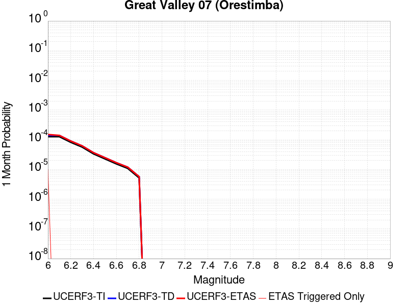 |  |  |

| Magnitude | 1 wk TI Prob | 1 wk TD Prob | 1 wk ETAS Prob | 1 wk ETAS/TD Gain | 1 wk ETAS Triggered Only | 1 mo TI Prob | 1 mo TD Prob | 1 mo ETAS Prob | 1 mo ETAS/TD Gain | 1 mo ETAS Triggered Only | 1 yr TI Prob | 1 yr TD Prob | 1 yr ETAS Prob | 1 yr ETAS/TD Gain | 1 yr ETAS Triggered Only | 10 yr TI Prob | 10 yr TD Prob | 10 yr ETAS Prob | 10 yr ETAS/TD Gain | 10 yr ETAS Triggered Only |
|-----|-----|-----|-----|-----|-----|-----|-----|-----|-----|-----|-----|-----|-----|-----|-----|-----|-----|-----|-----|-----|
| 6.0 | 2.9687902E-5 | 3.27575E-5 | 3.27575E-5 | 1.0 | 0.0 | 1.2722766E-4 | 1.4038214E-4 | 1.5038073E-4 | 1.0712241 | 1.0E-5 | 0.0015478961 | 0.0017078844 | 0.0017178673 | 1.0058452 | 1.0E-5 | 0.015371585 | 0.016955135 | 0.016964966 | 1.0005798 | 1.0E-5 |
| 6.1 | 2.9687902E-5 | 3.27575E-5 | 3.27575E-5 | 1.0 | 0.0 | 1.2722766E-4 | 1.4038214E-4 | 1.4038214E-4 | 1.0 | 0.0 | 0.0015478961 | 0.0017078844 | 0.0017078844 | 1.0 | 0.0 | 0.015371585 | 0.016955135 | 0.016955135 | 1.0 | 0.0 |
| 6.2 | 1.9231524E-5 | 2.1159167E-5 | 2.1159167E-5 | 1.0 | 0.0 | 8.2418206E-5 | 9.067912E-5 | 9.067912E-5 | 1.0 | 0.0 | 0.0010029797 | 0.0011034822 | 0.0011034822 | 1.0 | 0.0 | 0.00998465 | 0.01098244 | 0.01098244 | 1.0 | 0.0 |
| 6.3 | 1.324766E-5 | 1.4548534E-5 | 1.4548534E-5 | 1.0 | 0.0 | 5.6774446E-5 | 6.234942E-5 | 6.234942E-5 | 1.0 | 0.0 | 6.910097E-4 | 7.5884897E-4 | 7.5884897E-4 | 1.0 | 0.0 | 0.006888649 | 0.0075635235 | 0.0075635235 | 1.0 | 0.0 |
| 6.4 | 7.818645E-6 | 8.57284E-6 | 8.57284E-6 | 1.0 | 0.0 | 3.3508048E-5 | 3.6740246E-5 | 3.6740246E-5 | 1.0 | 0.0 | 4.078841E-4 | 4.4722404E-4 | 4.4722404E-4 | 1.0 | 0.0 | 0.004071363 | 0.0044635804 | 0.0044635804 | 1.0 | 0.0 |
| 6.5 | 5.3076565E-6 | 5.8178007E-6 | 5.8178007E-6 | 1.0 | 0.0 | 2.27469E-5 | 2.4933206E-5 | 2.4933206E-5 | 1.0 | 0.0 | 2.7690834E-4 | 3.035216E-4 | 3.035216E-4 | 1.0 | 0.0 | 0.0027656353 | 0.00303128 | 0.00303128 | 1.0 | 0.0 |
| 6.6 | 3.6003578E-6 | 3.9484953E-6 | 3.9484953E-6 | 1.0 | 0.0 | 1.5430012E-5 | 1.6922022E-5 | 1.6922022E-5 | 1.0 | 0.0 | 1.8784421E-4 | 2.0600771E-4 | 2.0600771E-4 | 1.0 | 0.0 | 0.0018768552 | 0.0020583214 | 0.0020583214 | 1.0 | 0.0 |
| 6.7 | 2.5361826E-6 | 2.7834678E-6 | 2.7834678E-6 | 1.0 | 0.0 | 1.0869308E-5 | 1.1929101E-5 | 1.1929101E-5 | 1.0 | 0.0 | 1.3232579E-4 | 1.4522845E-4 | 1.4522845E-4 | 1.0 | 0.0 | 0.0013224703 | 0.0014514653 | 0.0014514653 | 1.0 | 0.0 |
| 6.8 | 1.2115831E-6 | 1.3313797E-6 | 1.3313797E-6 | 1.0 | 0.0 | 5.1924885E-6 | 5.7059065E-6 | 5.7059065E-6 | 1.0 | 0.0 | 6.3216714E-5 | 6.9468166E-5 | 6.9468166E-5 | 1.0 | 0.0 | 6.3198735E-4 | 6.945596E-4 | 6.945596E-4 | 1.0 | 0.0 |

## San Luis Range 2011 CFM
*[(top)](#table-of-contents)*

| 1 Week | 1 Month | 1 Year | 10 Year |
|-----|-----|-----|-----|
|  |  |  |  |

| Magnitude | 1 wk TI Prob | 1 wk TD Prob | 1 wk ETAS Prob | 1 wk ETAS/TD Gain | 1 wk ETAS Triggered Only | 1 mo TI Prob | 1 mo TD Prob | 1 mo ETAS Prob | 1 mo ETAS/TD Gain | 1 mo ETAS Triggered Only | 1 yr TI Prob | 1 yr TD Prob | 1 yr ETAS Prob | 1 yr ETAS/TD Gain | 1 yr ETAS Triggered Only | 10 yr TI Prob | 10 yr TD Prob | 10 yr ETAS Prob | 10 yr ETAS/TD Gain | 10 yr ETAS Triggered Only |
|-----|-----|-----|-----|-----|-----|-----|-----|-----|-----|-----|-----|-----|-----|-----|-----|-----|-----|-----|-----|-----|
| 6.0 | 8.8368415E-6 | 8.965454E-6 | 1.8965364E-5 | 2.1153824 | 1.0E-5 | 3.787163E-5 | 3.842285E-5 | 4.8422466E-5 | 1.2602518 | 1.0E-5 | 4.609895E-4 | 4.677057E-4 | 4.7770102E-4 | 1.021371 | 1.0E-5 | 0.0046003438 | 0.0046679964 | 0.0046779495 | 1.0021323 | 1.0E-5 |
| 6.1 | 8.8368415E-6 | 8.965454E-6 | 1.8965364E-5 | 2.1153824 | 1.0E-5 | 3.787163E-5 | 3.842285E-5 | 4.8422466E-5 | 1.2602518 | 1.0E-5 | 4.609895E-4 | 4.677057E-4 | 4.7770102E-4 | 1.021371 | 1.0E-5 | 0.0046003438 | 0.0046679964 | 0.0046779495 | 1.0021323 | 1.0E-5 |
| 6.2 | 8.8368415E-6 | 8.965454E-6 | 1.8965364E-5 | 2.1153824 | 1.0E-5 | 3.787163E-5 | 3.842285E-5 | 4.8422466E-5 | 1.2602518 | 1.0E-5 | 4.609895E-4 | 4.677057E-4 | 4.7770102E-4 | 1.021371 | 1.0E-5 | 0.0046003438 | 0.0046679964 | 0.0046779495 | 1.0021323 | 1.0E-5 |
| 6.3 | 8.8368415E-6 | 8.965454E-6 | 1.8965364E-5 | 2.1153824 | 1.0E-5 | 3.787163E-5 | 3.842285E-5 | 4.8422466E-5 | 1.2602518 | 1.0E-5 | 4.609895E-4 | 4.677057E-4 | 4.7770102E-4 | 1.021371 | 1.0E-5 | 0.0046003438 | 0.0046679964 | 0.0046779495 | 1.0021323 | 1.0E-5 |
| 6.4 | 3.9094193E-6 | 3.9412025E-6 | 3.9412025E-6 | 1.0 | 0.0 | 1.6754546E-5 | 1.689076E-5 | 1.689076E-5 | 1.0 | 0.0 | 2.039675E-4 | 2.056259E-4 | 2.056259E-4 | 1.0 | 0.0 | 0.0020378039 | 0.0020543851 | 0.0020543851 | 1.0 | 0.0 |
| 6.5 | 3.9094193E-6 | 3.9412025E-6 | 3.9412025E-6 | 1.0 | 0.0 | 1.6754546E-5 | 1.689076E-5 | 1.689076E-5 | 1.0 | 0.0 | 2.039675E-4 | 2.056259E-4 | 2.056259E-4 | 1.0 | 0.0 | 0.0020378039 | 0.0020543851 | 0.0020543851 | 1.0 | 0.0 |
| 6.6 | 3.0587726E-6 | 3.0753883E-6 | 3.0753883E-6 | 1.0 | 0.0 | 1.3108959E-5 | 1.318017E-5 | 1.318017E-5 | 1.0 | 0.0 | 1.595899E-4 | 1.6045687E-4 | 1.6045687E-4 | 1.0 | 0.0 | 0.0015947534 | 0.0016034221 | 0.0016034221 | 1.0 | 0.0 |
| 6.7 | 2.6160574E-6 | 2.6251273E-6 | 2.6251273E-6 | 1.0 | 0.0 | 1.1211626E-5 | 1.1250498E-5 | 1.1250498E-5 | 1.0 | 0.0 | 1.3649299E-4 | 1.3696625E-4 | 1.3696625E-4 | 1.0 | 0.0 | 0.0013640919 | 0.0013688246 | 0.0013688246 | 1.0 | 0.0 |
| 6.8 | 2.5110312E-6 | 2.51814E-6 | 2.51814E-6 | 1.0 | 0.0 | 1.0761518E-5 | 1.0791985E-5 | 1.0791985E-5 | 1.0 | 0.0 | 1.310136E-4 | 1.3138456E-4 | 1.3138456E-4 | 1.0 | 0.0 | 0.0013093639 | 0.0013130746 | 0.0013130746 | 1.0 | 0.0 |
| 6.9 | 1.8564405E-6 | 1.852487E-6 | 1.852487E-6 | 1.0 | 0.0 | 7.95615E-6 | 7.939206E-6 | 7.939206E-6 | 1.0 | 0.0 | 9.686181E-5 | 9.665557E-5 | 9.665557E-5 | 1.0 | 0.0 | 9.68196E-4 | 9.661373E-4 | 9.661373E-4 | 1.0 | 0.0 |
| 7.0 | 1.546127E-6 | 1.5369537E-6 | 1.5369537E-6 | 1.0 | 0.0 | 6.626242E-6 | 6.586928E-6 | 6.586928E-6 | 1.0 | 0.0 | 8.06715E-5 | 8.0192905E-5 | 8.0192905E-5 | 1.0 | 0.0 | 8.0642226E-4 | 8.016404E-4 | 8.016404E-4 | 1.0 | 0.0 |
| 7.1 | 1.3368208E-6 | 1.3235326E-6 | 1.3235326E-6 | 1.0 | 0.0 | 5.7292195E-6 | 5.67227E-6 | 5.67227E-6 | 1.0 | 0.0 | 6.975101E-5 | 6.905771E-5 | 6.905771E-5 | 1.0 | 0.0 | 6.972912E-4 | 6.9036294E-4 | 6.9036294E-4 | 1.0 | 0.0 |
| 7.2 | 1.0623363E-6 | 1.0454368E-6 | 1.0454368E-6 | 1.0 | 0.0 | 4.5528623E-6 | 4.4804356E-6 | 4.4804356E-6 | 1.0 | 0.0 | 5.5429686E-5 | 5.4547938E-5 | 5.4547938E-5 | 1.0 | 0.0 | 5.5415864E-4 | 5.4534577E-4 | 5.4534577E-4 | 1.0 | 0.0 |
| 7.3 | 7.831679E-7 | 7.7273904E-7 | 7.7273904E-7 | 1.0 | 0.0 | 3.3564295E-6 | 3.3117344E-6 | 3.3117344E-6 | 1.0 | 0.0 | 4.086376E-5 | 4.0319625E-5 | 4.0319625E-5 | 1.0 | 0.0 | 4.0856248E-4 | 4.031232E-4 | 4.031232E-4 | 1.0 | 0.0 |
| 7.4 | 5.9558846E-7 | 5.910636E-7 | 5.910636E-7 | 1.0 | 0.0 | 2.5525194E-6 | 2.5331274E-6 | 2.5331274E-6 | 1.0 | 0.0 | 3.107648E-5 | 3.084039E-5 | 3.084039E-5 | 1.0 | 0.0 | 3.1072134E-4 | 3.083612E-4 | 3.083612E-4 | 1.0 | 0.0 |
| 7.5 | 4.1616502E-7 | 4.119631E-7 | 4.119631E-7 | 1.0 | 0.0 | 1.7835631E-6 | 1.7655549E-6 | 1.7655549E-6 | 1.0 | 0.0 | 2.1714664E-5 | 2.149542E-5 | 2.149542E-5 | 1.0 | 0.0 | 2.1712543E-4 | 2.1493346E-4 | 2.1493346E-4 | 1.0 | 0.0 |
| 7.6 | 2.3816014E-7 | 2.3376548E-7 | 2.3376548E-7 | 1.0 | 0.0 | 1.0206859E-6 | 1.0018516E-6 | 1.0018516E-6 | 1.0 | 0.0 | 1.242678E-5 | 1.2197475E-5 | 1.2197475E-5 | 1.0 | 0.0 | 1.2426086E-4 | 1.2196808E-4 | 1.2196808E-4 | 1.0 | 0.0 |
| 7.7 | 9.918777E-8 | 9.3867584E-8 | 9.3867584E-8 | 1.0 | 0.0 | 4.2509038E-7 | 4.0228957E-7 | 4.0228957E-7 | 1.0 | 0.0 | 5.1754632E-6 | 4.8978645E-6 | 4.8978645E-6 | 1.0 | 0.0 | 5.1753424E-5 | 4.897757E-5 | 4.897757E-5 | 1.0 | 0.0 |
| 7.8 | 3.4982556E-8 | 2.968655E-8 | 2.968655E-8 | 1.0 | 0.0 | 1.4992524E-7 | 1.2722806E-7 | 1.2722806E-7 | 1.0 | 0.0 | 1.8253382E-6 | 1.5490006E-6 | 1.5490006E-6 | 1.0 | 0.0 | 1.8253233E-5 | 1.5489897E-5 | 1.5489897E-5 | 1.0 | 0.0 |
| 7.9 | 1.6624908E-8 | 1.1477036E-8 | 1.1477036E-8 | 1.0 | 0.0 | 7.12496E-8 | 4.91873E-8 | 4.91873E-8 | 1.0 | 0.0 | 8.6746354E-7 | 5.988552E-7 | 5.988552E-7 | 1.0 | 0.0 | 8.674601E-6 | 5.988536E-6 | 5.988536E-6 | 1.0 | 0.0 |
| 8.0 | 6.3352315E-9 | 3.0888412E-9 | 3.0888412E-9 | 1.0 | 0.0 | 2.715099E-8 | 1.3237893E-8 | 1.3237893E-8 | 1.0 | 0.0 | 3.3056327E-7 | 1.6117131E-7 | 1.6117131E-7 | 1.0 | 0.0 | 3.3056278E-6 | 1.611712E-6 | 1.611712E-6 | 1.0 | 0.0 |

## San Gregorio (South) 2011 CFM
*[(top)](#table-of-contents)*

| 1 Week | 1 Month | 1 Year | 10 Year |
|-----|-----|-----|-----|
|  |  |  |  |

| Magnitude | 1 wk TI Prob | 1 wk TD Prob | 1 wk ETAS Prob | 1 wk ETAS/TD Gain | 1 wk ETAS Triggered Only | 1 mo TI Prob | 1 mo TD Prob | 1 mo ETAS Prob | 1 mo ETAS/TD Gain | 1 mo ETAS Triggered Only | 1 yr TI Prob | 1 yr TD Prob | 1 yr ETAS Prob | 1 yr ETAS/TD Gain | 1 yr ETAS Triggered Only | 10 yr TI Prob | 10 yr TD Prob | 10 yr ETAS Prob | 10 yr ETAS/TD Gain | 10 yr ETAS Triggered Only |
|-----|-----|-----|-----|-----|-----|-----|-----|-----|-----|-----|-----|-----|-----|-----|-----|-----|-----|-----|-----|-----|
| 6.0 | 1.8770423E-5 | 1.6279751E-5 | 2.627959E-5 | 1.61425 | 1.0E-5 | 8.044219E-5 | 6.976852E-5 | 7.976782E-5 | 1.1433212 | 1.0E-5 | 9.789435E-4 | 8.491044E-4 | 8.5909595E-4 | 1.0117671 | 1.0E-5 | 0.009746423 | 0.008471312 | 0.008481227 | 1.0011704 | 1.0E-5 |
| 6.1 | 1.8770423E-5 | 1.6279751E-5 | 2.627959E-5 | 1.61425 | 1.0E-5 | 8.044219E-5 | 6.976852E-5 | 7.976782E-5 | 1.1433212 | 1.0E-5 | 9.789435E-4 | 8.491044E-4 | 8.5909595E-4 | 1.0117671 | 1.0E-5 | 0.009746423 | 0.008471312 | 0.008481227 | 1.0011704 | 1.0E-5 |
| 6.2 | 1.7508692E-5 | 1.4899257E-5 | 2.4899107E-5 | 1.6711644 | 1.0E-5 | 7.5035096E-5 | 6.3852414E-5 | 7.385177E-5 | 1.1566012 | 1.0E-5 | 9.1316935E-4 | 7.7712885E-4 | 7.8712107E-4 | 1.0128579 | 1.0E-5 | 0.00909426 | 0.00775674 | 0.007766662 | 1.0012792 | 1.0E-5 |
| 6.3 | 1.7508692E-5 | 1.4899257E-5 | 2.4899107E-5 | 1.6711644 | 1.0E-5 | 7.5035096E-5 | 6.3852414E-5 | 7.385177E-5 | 1.1566012 | 1.0E-5 | 9.1316935E-4 | 7.7712885E-4 | 7.8712107E-4 | 1.0128579 | 1.0E-5 | 0.00909426 | 0.00775674 | 0.007766662 | 1.0012792 | 1.0E-5 |
| 6.4 | 1.6004591E-5 | 1.3249094E-5 | 2.3248962E-5 | 1.7547586 | 1.0E-5 | 6.85893E-5 | 5.6780602E-5 | 6.6780034E-5 | 1.1761065 | 1.0E-5 | 8.347548E-4 | 6.910856E-4 | 7.010787E-4 | 1.01446 | 1.0E-5 | 0.008316261 | 0.006901791 | 0.006911722 | 1.0014389 | 1.0E-5 |
| 6.5 | 1.6004591E-5 | 1.3249094E-5 | 2.3248962E-5 | 1.7547586 | 1.0E-5 | 6.85893E-5 | 5.6780602E-5 | 6.6780034E-5 | 1.1761065 | 1.0E-5 | 8.347548E-4 | 6.910856E-4 | 7.010787E-4 | 1.01446 | 1.0E-5 | 0.008316261 | 0.006901791 | 0.006911722 | 1.0014389 | 1.0E-5 |
| 6.6 | 1.5442201E-5 | 1.2633725E-5 | 2.26336E-5 | 1.7915221 | 1.0E-5 | 6.617918E-5 | 5.4143416E-5 | 6.414288E-5 | 1.1846846 | 1.0E-5 | 8.0543366E-4 | 6.5899757E-4 | 6.68991E-4 | 1.0151646 | 1.0E-5 | 0.008025207 | 0.006582842 | 0.0065927766 | 1.0015091 | 1.0E-5 |
| 6.7 | 1.489921E-5 | 1.2042234E-5 | 2.2042113E-5 | 1.8304007 | 1.0E-5 | 6.3852196E-5 | 5.1608557E-5 | 6.160804E-5 | 1.1937563 | 1.0E-5 | 7.7712315E-4 | 6.2815374E-4 | 6.3814747E-4 | 1.0159097 | 1.0E-5 | 0.0077441116 | 0.006276176 | 0.006286113 | 1.0015833 | 1.0E-5 |
| 6.8 | 1.3876024E-5 | 1.0921184E-5 | 2.0921076E-5 | 1.9156415 | 1.0E-5 | 5.9467322E-5 | 4.6804238E-5 | 5.6803772E-5 | 1.2136458 | 1.0E-5 | 7.237741E-4 | 5.69693E-4 | 5.796873E-4 | 1.0175433 | 1.0E-5 | 0.0072142133 | 0.0056946846 | 0.005704628 | 1.001746 | 1.0E-5 |
| 6.9 | 1.33922495E-5 | 1.0392687E-5 | 2.0392583E-5 | 1.962205 | 1.0E-5 | 5.7394092E-5 | 4.4539327E-5 | 5.4538883E-5 | 1.2245107 | 1.0E-5 | 6.9854903E-4 | 5.4213166E-4 | 5.5212626E-4 | 1.0184357 | 1.0E-5 | 0.0069635725 | 0.005420442 | 0.005430388 | 1.0018349 | 1.0E-5 |
| 7.0 | 1.2807324E-5 | 9.752649E-6 | 9.752649E-6 | 1.0 | 0.0 | 5.4887376E-5 | 4.1796397E-5 | 4.1796397E-5 | 1.0 | 0.0 | 6.680489E-4 | 5.087525E-4 | 5.087525E-4 | 1.0 | 0.0 | 0.006660442 | 0.0050882204 | 0.0050882204 | 1.0 | 0.0 |
| 7.1 | 1.2191438E-5 | 9.061537E-6 | 9.061537E-6 | 1.0 | 0.0 | 5.224797E-5 | 3.8834576E-5 | 3.8834576E-5 | 1.0 | 0.0 | 6.3593336E-4 | 4.727085E-4 | 4.727085E-4 | 1.0 | 0.0 | 0.0063411663 | 0.0047293645 | 0.0047293645 | 1.0 | 0.0 |
| 7.2 | 1.1769438E-5 | 8.581731E-6 | 8.581731E-6 | 1.0 | 0.0 | 5.0439474E-5 | 3.677833E-5 | 3.677833E-5 | 1.0 | 0.0 | 6.1392755E-4 | 4.4768423E-4 | 4.4768423E-4 | 1.0 | 0.0 | 0.0061223423 | 0.004480157 | 0.004480157 | 1.0 | 0.0 |
| 7.3 | 1.150374E-5 | 8.29716E-6 | 8.29716E-6 | 1.0 | 0.0 | 4.9300812E-5 | 3.5558773E-5 | 3.5558773E-5 | 1.0 | 0.0 | 6.0007203E-4 | 4.3284212E-4 | 4.3284212E-4 | 1.0 | 0.0 | 0.0059845424 | 0.0043323063 | 0.0043323063 | 1.0 | 0.0 |
| 7.4 | 1.12514E-5 | 8.042902E-6 | 8.042902E-6 | 1.0 | 0.0 | 4.8219394E-5 | 3.4469125E-5 | 3.4469125E-5 | 1.0 | 0.0 | 5.8691297E-4 | 4.1958084E-4 | 4.1958084E-4 | 1.0 | 0.0 | 0.005853653 | 0.0042001884 | 0.0042001884 | 1.0 | 0.0 |
| 7.5 | 1.059696E-5 | 7.3931915E-6 | 7.3931915E-6 | 1.0 | 0.0 | 4.5414752E-5 | 3.168472E-5 | 3.168472E-5 | 1.0 | 0.0 | 5.5278436E-4 | 3.8569325E-4 | 3.8569325E-4 | 1.0 | 0.0 | 0.0055141128 | 0.0038624762 | 0.0038624762 | 1.0 | 0.0 |
| 7.6 | 9.018592E-6 | 5.8369624E-6 | 5.8369624E-6 | 1.0 | 0.0 | 3.8650534E-5 | 2.5015313E-5 | 2.5015313E-5 | 1.0 | 0.0 | 4.7046866E-4 | 3.045189E-4 | 3.045189E-4 | 1.0 | 0.0 | 0.004694739 | 0.0030528754 | 0.0030528754 | 1.0 | 0.0 |
| 7.7 | 6.243489E-6 | 3.2395455E-6 | 3.2395455E-6 | 1.0 | 0.0 | 2.6757538E-5 | 1.3883692E-5 | 1.3883692E-5 | 1.0 | 0.0 | 3.257243E-4 | 1.6902086E-4 | 1.6902086E-4 | 1.0 | 0.0 | 0.003252473 | 0.001699108 | 0.001699108 | 1.0 | 0.0 |
| 7.8 | 3.1941963E-6 | 1.3809986E-6 | 1.3809986E-6 | 1.0 | 0.0 | 1.368934E-5 | 5.9185513E-6 | 5.9185513E-6 | 1.0 | 0.0 | 1.6665498E-4 | 7.2055984E-5 | 7.2055984E-5 | 1.0 | 0.0 | 0.0016653005 | 7.263174E-4 | 7.263174E-4 | 1.0 | 0.0 |
| 7.9 | 2.0098398E-6 | 6.9161155E-7 | 6.9161155E-7 | 1.0 | 0.0 | 8.6135715E-6 | 2.964046E-6 | 2.964046E-6 | 1.0 | 0.0 | 1.0486518E-4 | 3.608666E-5 | 3.608666E-5 | 1.0 | 0.0 | 0.0010481571 | 3.657225E-4 | 3.657225E-4 | 1.0 | 0.0 |
| 8.0 | 8.353119E-7 | 3.1623412E-7 | 3.1623412E-7 | 1.0 | 0.0 | 3.579903E-6 | 1.3552883E-6 | 1.3552883E-6 | 1.0 | 0.0 | 4.358445E-5 | 1.6500511E-5 | 1.6500511E-5 | 1.0 | 0.0 | 4.3575902E-4 | 1.6619264E-4 | 1.6619264E-4 | 1.0 | 0.0 |
| 8.1 | 1.5033264E-7 | 6.527624E-8 | 6.527624E-8 | 1.0 | 0.0 | 6.442826E-7 | 2.7975528E-7 | 2.7975528E-7 | 1.0 | 0.0 | 7.844113E-6 | 3.4060151E-6 | 3.4060151E-6 | 1.0 | 0.0 | 7.843835E-5 | 3.407693E-5 | 3.407693E-5 | 1.0 | 0.0 |

## Pisgah-Bullion Mtn-Mesquite Lk
*[(top)](#table-of-contents)*

| 1 Week | 1 Month | 1 Year | 10 Year |
|-----|-----|-----|-----|
|  |  |  |  |

| Magnitude | 1 wk TI Prob | 1 wk TD Prob | 1 wk ETAS Prob | 1 wk ETAS/TD Gain | 1 wk ETAS Triggered Only | 1 mo TI Prob | 1 mo TD Prob | 1 mo ETAS Prob | 1 mo ETAS/TD Gain | 1 mo ETAS Triggered Only | 1 yr TI Prob | 1 yr TD Prob | 1 yr ETAS Prob | 1 yr ETAS/TD Gain | 1 yr ETAS Triggered Only | 10 yr TI Prob | 10 yr TD Prob | 10 yr ETAS Prob | 10 yr ETAS/TD Gain | 10 yr ETAS Triggered Only |
|-----|-----|-----|-----|-----|-----|-----|-----|-----|-----|-----|-----|-----|-----|-----|-----|-----|-----|-----|-----|-----|
| 6.0 | 3.0240792E-5 | 2.4091114E-5 | 2.4091114E-5 | 1.0 | 0.0 | 1.2959696E-4 | 1.03244114E-4 | 1.03244114E-4 | 1.0 | 0.0 | 0.0015767008 | 0.0012563728 | 0.0012663602 | 1.0079495 | 1.0E-5 | 0.015655609 | 0.012502721 | 0.012512595 | 1.0007899 | 1.0E-5 |
| 6.1 | 3.0240792E-5 | 2.4091114E-5 | 2.4091114E-5 | 1.0 | 0.0 | 1.2959696E-4 | 1.03244114E-4 | 1.03244114E-4 | 1.0 | 0.0 | 0.0015767008 | 0.0012563728 | 0.0012663602 | 1.0079495 | 1.0E-5 | 0.015655609 | 0.012502721 | 0.012512595 | 1.0007899 | 1.0E-5 |
| 6.2 | 3.0240792E-5 | 2.4091114E-5 | 2.4091114E-5 | 1.0 | 0.0 | 1.2959696E-4 | 1.03244114E-4 | 1.03244114E-4 | 1.0 | 0.0 | 0.0015767008 | 0.0012563728 | 0.0012663602 | 1.0079495 | 1.0E-5 | 0.015655609 | 0.012502721 | 0.012512595 | 1.0007899 | 1.0E-5 |
| 6.3 | 2.0498217E-5 | 1.36380695E-5 | 1.36380695E-5 | 1.0 | 0.0 | 8.784654E-5 | 5.844765E-5 | 5.844765E-5 | 1.0 | 0.0 | 0.0010690069 | 7.1138405E-4 | 7.213769E-4 | 1.0140471 | 1.0E-5 | 0.01063879 | 0.0070926943 | 0.0071026236 | 1.0013999 | 1.0E-5 |
| 6.4 | 2.0498217E-5 | 1.36380695E-5 | 1.36380695E-5 | 1.0 | 0.0 | 8.784654E-5 | 5.844765E-5 | 5.844765E-5 | 1.0 | 0.0 | 0.0010690069 | 7.1138405E-4 | 7.213769E-4 | 1.0140471 | 1.0E-5 | 0.01063879 | 0.0070926943 | 0.0071026236 | 1.0013999 | 1.0E-5 |
| 6.5 | 1.7316182E-5 | 1.0477042E-5 | 1.0477042E-5 | 1.0 | 0.0 | 7.42101E-5 | 4.4900895E-5 | 4.4900895E-5 | 1.0 | 0.0 | 9.0313336E-4 | 5.465413E-4 | 5.565358E-4 | 1.0182868 | 1.0E-5 | 0.008994718 | 0.0054529672 | 0.0054629124 | 1.0018239 | 1.0E-5 |
| 6.6 | 1.5251077E-5 | 8.414273E-6 | 8.414273E-6 | 1.0 | 0.0 | 6.536012E-5 | 3.6060712E-5 | 3.6060712E-5 | 1.0 | 0.0 | 7.9546886E-4 | 4.3895794E-4 | 4.4895356E-4 | 1.0227712 | 1.0E-5 | 0.007926274 | 0.0043816264 | 0.0043915827 | 1.0022722 | 1.0E-5 |
| 6.7 | 1.2997425E-5 | 6.4114965E-6 | 6.4114965E-6 | 1.0 | 0.0 | 5.570206E-5 | 2.7477578E-5 | 2.7477578E-5 | 1.0 | 0.0 | 6.7796157E-4 | 3.3449283E-4 | 3.3449283E-4 | 1.0 | 0.0 | 0.0067589693 | 0.0033403537 | 0.0033403537 | 1.0 | 0.0 |
| 6.8 | 1.035386E-5 | 4.3332193E-6 | 4.3332193E-6 | 1.0 | 0.0 | 4.437293E-5 | 1.8570812E-5 | 1.8570812E-5 | 1.0 | 0.0 | 5.401065E-4 | 2.2607706E-4 | 2.2607706E-4 | 1.0 | 0.0 | 0.0053879567 | 0.0022585576 | 0.0022585576 | 1.0 | 0.0 |
| 6.9 | 8.816252E-6 | 3.580638E-6 | 3.580638E-6 | 1.0 | 0.0 | 3.778339E-5 | 1.5345504E-5 | 1.5345504E-5 | 1.0 | 0.0 | 4.5991567E-4 | 1.8681608E-4 | 1.8681608E-4 | 1.0 | 0.0 | 0.00458965 | 0.0018666488 | 0.0018666488 | 1.0 | 0.0 |
| 7.0 | 6.8232207E-6 | 2.5675843E-6 | 2.5675843E-6 | 1.0 | 0.0 | 2.9242048E-5 | 1.1003888E-5 | 1.1003888E-5 | 1.0 | 0.0 | 3.5596377E-4 | 1.3396442E-4 | 1.3396442E-4 | 1.0 | 0.0 | 0.0035539411 | 0.0013388677 | 0.0013388677 | 1.0 | 0.0 |
| 7.1 | 5.837013E-6 | 2.22738E-6 | 2.22738E-6 | 1.0 | 0.0 | 2.501553E-5 | 9.545881E-6 | 9.545881E-6 | 1.0 | 0.0 | 3.045215E-4 | 1.16215204E-4 | 1.16215204E-4 | 1.0 | 0.0 | 0.0030410455 | 0.0011615733 | 0.0011615733 | 1.0 | 0.0 |
| 7.2 | 4.278052E-6 | 1.6275711E-6 | 1.6275711E-6 | 1.0 | 0.0 | 1.833438E-5 | 6.9752873E-6 | 6.9752873E-6 | 1.0 | 0.0 | 2.231982E-4 | 8.492105E-5 | 8.492105E-5 | 1.0 | 0.0 | 0.0022297418 | 8.489092E-4 | 8.489092E-4 | 1.0 | 0.0 |
| 7.3 | 1.8803692E-6 | 8.344926E-7 | 8.344926E-7 | 1.0 | 0.0 | 8.0587E-6 | 3.5763926E-6 | 3.5763926E-6 | 1.0 | 0.0 | 9.811026E-5 | 4.354186E-5 | 4.354186E-5 | 1.0 | 0.0 | 9.806695E-4 | 4.3534773E-4 | 4.3534773E-4 | 1.0 | 0.0 |

## South Klamath Lake East
*[(top)](#table-of-contents)*

| 1 Week | 1 Month | 1 Year | 10 Year |
|-----|-----|-----|-----|
|  |  |  |  |

| Magnitude | 1 wk TI Prob | 1 wk TD Prob | 1 wk ETAS Prob | 1 wk ETAS/TD Gain | 1 wk ETAS Triggered Only | 1 mo TI Prob | 1 mo TD Prob | 1 mo ETAS Prob | 1 mo ETAS/TD Gain | 1 mo ETAS Triggered Only | 1 yr TI Prob | 1 yr TD Prob | 1 yr ETAS Prob | 1 yr ETAS/TD Gain | 1 yr ETAS Triggered Only | 10 yr TI Prob | 10 yr TD Prob | 10 yr ETAS Prob | 10 yr ETAS/TD Gain | 10 yr ETAS Triggered Only |
|-----|-----|-----|-----|-----|-----|-----|-----|-----|-----|-----|-----|-----|-----|-----|-----|-----|-----|-----|-----|-----|
| 6.0 | 2.3539369E-5 | 2.5047308E-5 | 3.504706E-5 | 1.3992345 | 1.0E-5 | 1.0087911E-4 | 1.0734166E-4 | 1.1734058E-4 | 1.0931505 | 1.0E-5 | 0.0012275111 | 0.0013061843 | 0.0013161713 | 1.0076458 | 1.0E-5 | 0.012207527 | 0.012993417 | 0.013003287 | 1.0007596 | 1.0E-5 |
| 6.1 | 2.3539369E-5 | 2.5047308E-5 | 3.504706E-5 | 1.3992345 | 1.0E-5 | 1.0087911E-4 | 1.0734166E-4 | 1.1734058E-4 | 1.0931505 | 1.0E-5 | 0.0012275111 | 0.0013061843 | 0.0013161713 | 1.0076458 | 1.0E-5 | 0.012207527 | 0.012993417 | 0.013003287 | 1.0007596 | 1.0E-5 |
| 6.2 | 2.3539369E-5 | 2.5047308E-5 | 3.504706E-5 | 1.3992345 | 1.0E-5 | 1.0087911E-4 | 1.0734166E-4 | 1.1734058E-4 | 1.0931505 | 1.0E-5 | 0.0012275111 | 0.0013061843 | 0.0013161713 | 1.0076458 | 1.0E-5 | 0.012207527 | 0.012993417 | 0.013003287 | 1.0007596 | 1.0E-5 |
| 6.3 | 9.807823E-6 | 1.0396044E-5 | 1.0396044E-5 | 1.0 | 0.0 | 4.2032847E-5 | 4.455376E-5 | 4.455376E-5 | 1.0 | 0.0 | 5.1162974E-4 | 5.4231536E-4 | 5.4231536E-4 | 1.0 | 0.0 | 0.005104534 | 0.005410756 | 0.005410756 | 1.0 | 0.0 |
| 6.4 | 9.807823E-6 | 1.0396044E-5 | 1.0396044E-5 | 1.0 | 0.0 | 4.2032847E-5 | 4.455376E-5 | 4.455376E-5 | 1.0 | 0.0 | 5.1162974E-4 | 5.4231536E-4 | 5.4231536E-4 | 1.0 | 0.0 | 0.005104534 | 0.005410756 | 0.005410756 | 1.0 | 0.0 |
| 6.5 | 6.191981E-6 | 6.5508398E-6 | 6.5508398E-6 | 1.0 | 0.0 | 2.653679E-5 | 2.8074743E-5 | 2.8074743E-5 | 1.0 | 0.0 | 3.2303753E-4 | 3.4175918E-4 | 3.4175918E-4 | 1.0 | 0.0 | 0.0032256835 | 0.003412614 | 0.003412614 | 1.0 | 0.0 |
| 6.6 | 4.3693776E-6 | 4.6165574E-6 | 4.6165574E-6 | 1.0 | 0.0 | 1.8725768E-5 | 1.9785102E-5 | 1.9785102E-5 | 1.0 | 0.0 | 2.2796239E-4 | 2.4085813E-4 | 2.4085813E-4 | 1.0 | 0.0 | 0.0022772867 | 0.0024060833 | 0.0024060833 | 1.0 | 0.0 |
| 6.7 | 3.360834E-6 | 3.5512403E-6 | 3.5512403E-6 | 1.0 | 0.0 | 1.4403494E-5 | 1.5219517E-5 | 1.5219517E-5 | 1.0 | 0.0 | 1.7534842E-4 | 1.8528267E-4 | 1.8528267E-4 | 1.0 | 0.0 | 0.0017521014 | 0.0018513618 | 0.0018513618 | 1.0 | 0.0 |
| 6.8 | 2.57873E-6 | 2.7251708E-6 | 2.7251708E-6 | 1.0 | 0.0 | 1.1051653E-5 | 1.1679254E-5 | 1.1679254E-5 | 1.0 | 0.0 | 1.3454557E-4 | 1.4218627E-4 | 1.4218627E-4 | 1.0 | 0.0 | 0.0013446413 | 0.0014210136 | 0.0014210136 | 1.0 | 0.0 |
| 6.9 | 9.987825E-7 | 1.0566213E-6 | 1.0566213E-6 | 1.0 | 0.0 | 4.2804895E-6 | 4.528371E-6 | 4.528371E-6 | 1.0 | 0.0 | 5.211371E-5 | 5.5131848E-5 | 5.5131848E-5 | 1.0 | 0.0 | 5.210149E-4 | 5.5121386E-4 | 5.5121386E-4 | 1.0 | 0.0 |

## San Diego Trough south
*[(top)](#table-of-contents)*

| 1 Week | 1 Month | 1 Year | 10 Year |
|-----|-----|-----|-----|
|  |  |  |  |

| Magnitude | 1 wk TI Prob | 1 wk TD Prob | 1 wk ETAS Prob | 1 wk ETAS/TD Gain | 1 wk ETAS Triggered Only | 1 mo TI Prob | 1 mo TD Prob | 1 mo ETAS Prob | 1 mo ETAS/TD Gain | 1 mo ETAS Triggered Only | 1 yr TI Prob | 1 yr TD Prob | 1 yr ETAS Prob | 1 yr ETAS/TD Gain | 1 yr ETAS Triggered Only | 10 yr TI Prob | 10 yr TD Prob | 10 yr ETAS Prob | 10 yr ETAS/TD Gain | 10 yr ETAS Triggered Only |
|-----|-----|-----|-----|-----|-----|-----|-----|-----|-----|-----|-----|-----|-----|-----|-----|-----|-----|-----|-----|-----|
| 6.0 | 8.279495E-5 | 1.04241306E-4 | 1.1424026E-4 | 1.0959213 | 1.0E-5 | 3.5478722E-4 | 4.4667677E-4 | 4.566723E-4 | 1.0223776 | 1.0E-5 | 0.004310982 | 0.0054256152 | 0.0054355613 | 1.0018331 | 1.0E-5 | 0.042283054 | 0.05299221 | 0.05300168 | 1.0001787 | 1.0E-5 |
| 6.1 | 4.6961468E-5 | 5.772944E-5 | 5.772944E-5 | 1.0 | 0.0 | 2.0124791E-4 | 2.473894E-4 | 2.473894E-4 | 1.0 | 0.0 | 0.00244744 | 0.0030079768 | 0.0030079768 | 1.0 | 0.0 | 0.024206603 | 0.029679462 | 0.029679462 | 1.0 | 0.0 |
| 6.2 | 3.5079658E-5 | 4.214154E-5 | 4.214154E-5 | 1.0 | 0.0 | 1.5033272E-4 | 1.8059435E-4 | 1.8059435E-4 | 1.0 | 0.0 | 0.0018287642 | 0.0021965632 | 0.0021965632 | 1.0 | 0.0 | 0.018137876 | 0.021751117 | 0.021751117 | 1.0 | 0.0 |
| 6.3 | 3.5079658E-5 | 4.214154E-5 | 4.214154E-5 | 1.0 | 0.0 | 1.5033272E-4 | 1.8059435E-4 | 1.8059435E-4 | 1.0 | 0.0 | 0.0018287642 | 0.0021965632 | 0.0021965632 | 1.0 | 0.0 | 0.018137876 | 0.021751117 | 0.021751117 | 1.0 | 0.0 |
| 6.4 | 2.7196904E-5 | 3.2087162E-5 | 3.2087162E-5 | 1.0 | 0.0 | 1.16552954E-4 | 1.3750927E-4 | 1.3750927E-4 | 1.0 | 0.0 | 0.0014181085 | 0.0016729041 | 0.0016729041 | 1.0 | 0.0 | 0.014090929 | 0.016604643 | 0.016604643 | 1.0 | 0.0 |
| 6.5 | 2.5584688E-5 | 3.010164E-5 | 3.010164E-5 | 1.0 | 0.0 | 1.0964406E-4 | 1.2900073E-4 | 1.2900073E-4 | 1.0 | 0.0 | 0.0013340989 | 0.0015694655 | 0.0015694655 | 1.0 | 0.0 | 0.013261181 | 0.015585314 | 0.015585314 | 1.0 | 0.0 |
| 6.6 | 2.2034688E-5 | 2.5742738E-5 | 2.5742738E-5 | 1.0 | 0.0 | 9.443096E-5 | 1.1032141E-4 | 1.1032141E-4 | 1.0 | 0.0 | 0.0011490905 | 0.0013423424 | 0.0013423424 | 1.0 | 0.0 | 0.011431668 | 0.013343317 | 0.013343317 | 1.0 | 0.0 |
| 6.7 | 1.9394853E-5 | 2.254176E-5 | 2.254176E-5 | 1.0 | 0.0 | 8.311815E-5 | 9.6603995E-5 | 9.6603995E-5 | 1.0 | 0.0 | 0.0010114936 | 0.0011755243 | 0.0011755243 | 1.0 | 0.0 | 0.01006902 | 0.011693766 | 0.011693766 | 1.0 | 0.0 |
| 6.8 | 1.7615313E-5 | 2.0403182E-5 | 2.0403182E-5 | 1.0 | 0.0 | 7.549201E-5 | 8.74393E-5 | 8.74393E-5 | 1.0 | 0.0 | 9.1872766E-4 | 0.0010640579 | 0.0010640579 | 1.0 | 0.0 | 0.009149387 | 0.010590198 | 0.010590198 | 1.0 | 0.0 |
| 6.9 | 1.5621423E-5 | 1.8026114E-5 | 1.8026114E-5 | 1.0 | 0.0 | 6.6947236E-5 | 7.725251E-5 | 7.725251E-5 | 1.0 | 0.0 | 8.147778E-4 | 9.40147E-4 | 9.40147E-4 | 1.0 | 0.0 | 0.008117969 | 0.009362142 | 0.009362142 | 1.0 | 0.0 |
| 7.0 | 1.3444376E-5 | 1.544809E-5 | 1.544809E-5 | 1.0 | 0.0 | 5.7617483E-5 | 6.620443E-5 | 6.620443E-5 | 1.0 | 0.0 | 7.0126704E-4 | 8.057436E-4 | 8.057436E-4 | 1.0 | 0.0 | 0.006990582 | 0.008028555 | 0.008028555 | 1.0 | 0.0 |
| 7.1 | 1.2268361E-5 | 1.407303E-5 | 1.407303E-5 | 1.0 | 0.0 | 5.2577634E-5 | 6.0311606E-5 | 6.0311606E-5 | 1.0 | 0.0 | 6.399447E-4 | 7.3404907E-4 | 7.3404907E-4 | 1.0 | 0.0 | 0.0063810493 | 0.0073165493 | 0.0073165493 | 1.0 | 0.0 |
| 7.2 | 1.0922655E-5 | 1.2513563E-5 | 1.2513563E-5 | 1.0 | 0.0 | 4.681054E-5 | 5.3628468E-5 | 5.3628468E-5 | 1.0 | 0.0 | 5.697693E-4 | 6.5273355E-4 | 6.5273355E-4 | 1.0 | 0.0 | 0.0056831064 | 0.0065084435 | 0.0065084435 | 1.0 | 0.0 |
| 7.3 | 6.1106753E-6 | 6.928925E-6 | 6.928925E-6 | 1.0 | 0.0 | 2.6188345E-5 | 2.9695057E-5 | 2.9695057E-5 | 1.0 | 0.0 | 3.1879646E-4 | 3.6147775E-4 | 3.6147775E-4 | 1.0 | 0.0 | 0.0031833951 | 0.003608943 | 0.003608943 | 1.0 | 0.0 |
| 7.4 | 4.933187E-6 | 5.5895525E-6 | 5.5895525E-6 | 1.0 | 0.0 | 2.114206E-5 | 2.3955008E-5 | 2.3955008E-5 | 1.0 | 0.0 | 2.5737417E-4 | 2.9161357E-4 | 2.9161357E-4 | 1.0 | 0.0 | 0.002570763 | 0.0029123505 | 0.0029123505 | 1.0 | 0.0 |
| 7.5 | 1.7489613E-6 | 1.969678E-6 | 1.969678E-6 | 1.0 | 0.0 | 7.495527E-6 | 8.4414505E-6 | 8.4414505E-6 | 1.0 | 0.0 | 9.125422E-5 | 1.02770035E-4 | 1.02770035E-4 | 1.0 | 0.0 | 9.1216754E-4 | 0.0010272472 | 0.0010272472 | 1.0 | 0.0 |
| 7.6 | 1.6988751E-7 | 1.7533823E-7 | 1.7533823E-7 | 1.0 | 0.0 | 7.2808916E-7 | 7.5144936E-7 | 7.5144936E-7 | 1.0 | 0.0 | 8.864449E-6 | 9.14886E-6 | 9.14886E-6 | 1.0 | 0.0 | 8.8640954E-5 | 9.1485024E-5 | 9.1485024E-5 | 1.0 | 0.0 |

## Hayward (So) 2011 CFM
*[(top)](#table-of-contents)*

| 1 Week | 1 Month | 1 Year | 10 Year |
|-----|-----|-----|-----|
|  |  |  |  |

| Magnitude | 1 wk TI Prob | 1 wk TD Prob | 1 wk ETAS Prob | 1 wk ETAS/TD Gain | 1 wk ETAS Triggered Only | 1 mo TI Prob | 1 mo TD Prob | 1 mo ETAS Prob | 1 mo ETAS/TD Gain | 1 mo ETAS Triggered Only | 1 yr TI Prob | 1 yr TD Prob | 1 yr ETAS Prob | 1 yr ETAS/TD Gain | 1 yr ETAS Triggered Only | 10 yr TI Prob | 10 yr TD Prob | 10 yr ETAS Prob | 10 yr ETAS/TD Gain | 10 yr ETAS Triggered Only |
|-----|-----|-----|-----|-----|-----|-----|-----|-----|-----|-----|-----|-----|-----|-----|-----|-----|-----|-----|-----|-----|
| 6.0 | 1.8091932E-4 | 3.570541E-4 | 3.6705052E-4 | 1.027997 | 1.0E-5 | 7.751381E-4 | 0.0015293444 | 0.0015393291 | 1.0065287 | 1.0E-5 | 0.00939654 | 0.018463207 | 0.018473024 | 1.0005317 | 1.0E-5 | 0.090090066 | 0.16673161 | 0.16673994 | 1.00005 | 1.0E-5 |
| 6.1 | 1.8091932E-4 | 3.570541E-4 | 3.6705052E-4 | 1.027997 | 1.0E-5 | 7.751381E-4 | 0.0015293444 | 0.0015393291 | 1.0065287 | 1.0E-5 | 0.00939654 | 0.018463207 | 0.018473024 | 1.0005317 | 1.0E-5 | 0.090090066 | 0.16673161 | 0.16673994 | 1.00005 | 1.0E-5 |
| 6.2 | 1.8091932E-4 | 3.570541E-4 | 3.6705052E-4 | 1.027997 | 1.0E-5 | 7.751381E-4 | 0.0015293444 | 0.0015393291 | 1.0065287 | 1.0E-5 | 0.00939654 | 0.018463207 | 0.018473024 | 1.0005317 | 1.0E-5 | 0.090090066 | 0.16673161 | 0.16673994 | 1.00005 | 1.0E-5 |
| 6.3 | 1.7322872E-4 | 3.426234E-4 | 3.5261997E-4 | 1.0291766 | 1.0E-5 | 7.4219756E-4 | 0.0014675693 | 0.0014775546 | 1.006804 | 1.0E-5 | 0.0089988755 | 0.017723544 | 0.017733367 | 1.0005542 | 1.0E-5 | 0.08643075 | 0.16066726 | 0.16067564 | 1.0000522 | 1.0E-5 |
| 6.4 | 1.6334097E-4 | 3.234411E-4 | 3.3343787E-4 | 1.0309075 | 1.0E-5 | 6.998449E-4 | 0.0013854484 | 0.0013954346 | 1.0072079 | 1.0E-5 | 0.008487372 | 0.016739385 | 0.016749218 | 1.0005873 | 1.0E-5 | 0.081704415 | 0.15255594 | 0.15256442 | 1.0000556 | 1.0E-5 |
| 6.5 | 1.5600289E-4 | 3.1018828E-4 | 3.2018515E-4 | 1.0322285 | 1.0E-5 | 6.684125E-4 | 0.0013287093 | 0.001338696 | 1.0075161 | 1.0E-5 | 0.008107598 | 0.016058935 | 0.016068773 | 1.0006127 | 1.0E-5 | 0.078181036 | 0.14683272 | 0.14684124 | 1.000058 | 1.0E-5 |
| 6.6 | 1.4046066E-4 | 2.8032906E-4 | 2.9032625E-4 | 1.0356624 | 1.0E-5 | 6.018354E-4 | 0.0012008639 | 0.0012108518 | 1.0083174 | 1.0E-5 | 0.0073027555 | 0.014524006 | 0.014533861 | 1.0006785 | 1.0E-5 | 0.07067384 | 0.13391982 | 0.1339285 | 1.0000647 | 1.0E-5 |
| 6.7 | 1.14696966E-4 | 2.3271477E-4 | 2.4271243E-4 | 1.042961 | 1.0E-5 | 4.914658E-4 | 9.969729E-4 | 0.0010069628 | 1.0100204 | 1.0E-5 | 0.0059671924 | 0.012071652 | 0.012081532 | 1.0008184 | 1.0E-5 | 0.058094822 | 0.11274672 | 0.1127556 | 1.0000787 | 1.0E-5 |
| 6.8 | 9.3874296E-5 | 1.8861453E-4 | 1.9861264E-4 | 1.0530082 | 1.0E-5 | 4.0225635E-4 | 8.0810126E-4 | 8.180932E-4 | 1.0123647 | 1.0E-5 | 0.0048864787 | 0.009794984 | 0.009804886 | 1.0010109 | 1.0E-5 | 0.047804173 | 0.09259856 | 0.09260763 | 1.000098 | 1.0E-5 |
| 6.9 | 5.551852E-5 | 1.072948E-4 | 1.17293726E-4 | 1.0931911 | 1.0E-5 | 2.3791482E-4 | 4.5975443E-4 | 4.6974982E-4 | 1.0217408 | 1.0E-5 | 0.0028927654 | 0.0055832625 | 0.0055932067 | 1.0017811 | 1.0E-5 | 0.028553981 | 0.054245494 | 0.05425495 | 1.0001744 | 1.0E-5 |
| 7.0 | 4.2662363E-5 | 8.2464416E-5 | 9.24636E-5 | 1.1212544 | 1.0E-5 | 1.8282588E-4 | 3.5337146E-4 | 3.6336793E-4 | 1.0282888 | 1.0E-5 | 0.0022236328 | 0.0042938837 | 0.004303841 | 1.0023189 | 1.0E-5 | 0.022015138 | 0.042064495 | 0.042074073 | 1.0002277 | 1.0E-5 |
| 7.1 | 3.305886E-5 | 6.3019055E-5 | 6.3019055E-5 | 1.0 | 0.0 | 1.4167312E-4 | 2.700538E-4 | 2.700538E-4 | 1.0 | 0.0 | 0.0017235056 | 0.0032829668 | 0.0032829668 | 1.0 | 0.0 | 0.017101998 | 0.032452874 | 0.032452874 | 1.0 | 0.0 |
| 7.2 | 2.9856887E-5 | 5.7013647E-5 | 5.7013647E-5 | 1.0 | 0.0 | 1.2795182E-4 | 2.4432142E-4 | 2.4432142E-4 | 1.0 | 0.0 | 0.0015567001 | 0.0029705726 | 0.0029705726 | 1.0 | 0.0 | 0.015458403 | 0.029453589 | 0.029453589 | 1.0 | 0.0 |
| 7.3 | 2.4559737E-5 | 4.599088E-5 | 4.599088E-5 | 1.0 | 0.0 | 1.0525176E-4 | 1.9708896E-4 | 1.9708896E-4 | 1.0 | 0.0 | 0.0012806869 | 0.0023969305 | 0.0023969305 | 1.0 | 0.0 | 0.012733313 | 0.023857482 | 0.023857482 | 1.0 | 0.0 |
| 7.4 | 1.9002231E-5 | 3.5049303E-5 | 3.5049303E-5 | 1.0 | 0.0 | 8.143559E-5 | 1.502027E-4 | 1.502027E-4 | 1.0 | 0.0 | 9.910273E-4 | 0.0018271938 | 0.0018271938 | 1.0 | 0.0 | 0.009866194 | 0.018258283 | 0.018258283 | 1.0 | 0.0 |
| 7.5 | 1.2783333E-5 | 2.3330069E-5 | 2.3330069E-5 | 1.0 | 0.0 | 5.4784563E-5 | 9.998221E-5 | 9.998221E-5 | 1.0 | 0.0 | 6.667979E-4 | 0.0012166094 | 0.0012166094 | 1.0 | 0.0 | 0.006648007 | 0.012209582 | 0.012209582 | 1.0 | 0.0 |
| 7.6 | 4.8149627E-6 | 8.887544E-6 | 8.887544E-6 | 1.0 | 0.0 | 2.063539E-5 | 3.8088925E-5 | 3.8088925E-5 | 1.0 | 0.0 | 2.5120692E-4 | 4.636352E-4 | 4.636352E-4 | 1.0 | 0.0 | 0.0025092314 | 0.0046812436 | 0.0046812436 | 1.0 | 0.0 |
| 7.7 | 6.0838227E-7 | 1.2056693E-6 | 1.2056693E-6 | 1.0 | 0.0 | 2.6073499E-6 | 5.1671436E-6 | 5.1671436E-6 | 1.0 | 0.0 | 3.174402E-5 | 6.290816E-5 | 6.290816E-5 | 1.0 | 0.0 | 3.1739488E-4 | 6.5293367E-4 | 6.5293367E-4 | 1.0 | 0.0 |
| 7.8 | 4.5542808E-7 | 9.792182E-7 | 9.792182E-7 | 1.0 | 0.0 | 1.9518332E-6 | 4.1966427E-6 | 4.1966427E-6 | 1.0 | 0.0 | 2.376331E-5 | 5.1092928E-5 | 5.1092928E-5 | 1.0 | 0.0 | 2.3760769E-4 | 5.321372E-4 | 5.321372E-4 | 1.0 | 0.0 |
| 7.9 | 3.3016747E-7 | 7.386335E-7 | 7.386335E-7 | 1.0 | 0.0 | 1.4150027E-6 | 3.1655684E-6 | 3.1655684E-6 | 1.0 | 0.0 | 1.7227521E-5 | 3.8540114E-5 | 3.8540114E-5 | 1.0 | 0.0 | 1.7226185E-4 | 3.9930744E-4 | 3.9930744E-4 | 1.0 | 0.0 |
| 8.0 | 2.347038E-7 | 5.4714894E-7 | 5.4714894E-7 | 1.0 | 0.0 | 1.0058731E-6 | 2.344922E-6 | 2.344922E-6 | 1.0 | 0.0 | 1.2246436E-5 | 2.8549053E-5 | 2.8549053E-5 | 1.0 | 0.0 | 1.2245761E-4 | 2.9355253E-4 | 2.9355253E-4 | 1.0 | 0.0 |
| 8.1 | 1.18822804E-7 | 2.6058973E-7 | 2.6058973E-7 | 1.0 | 0.0 | 5.092405E-7 | 1.1168127E-6 | 1.1168127E-6 | 1.0 | 0.0 | 6.1999854E-6 | 1.359711E-5 | 1.359711E-5 | 1.0 | 0.0 | 6.199812E-5 | 1.3917852E-4 | 1.3917852E-4 | 1.0 | 0.0 |

## Hartley Springs 2011 CFM
*[(top)](#table-of-contents)*

| 1 Week | 1 Month | 1 Year | 10 Year |
|-----|-----|-----|-----|
|  |  |  |  |

| Magnitude | 1 wk TI Prob | 1 wk TD Prob | 1 wk ETAS Prob | 1 wk ETAS/TD Gain | 1 wk ETAS Triggered Only | 1 mo TI Prob | 1 mo TD Prob | 1 mo ETAS Prob | 1 mo ETAS/TD Gain | 1 mo ETAS Triggered Only | 1 yr TI Prob | 1 yr TD Prob | 1 yr ETAS Prob | 1 yr ETAS/TD Gain | 1 yr ETAS Triggered Only | 10 yr TI Prob | 10 yr TD Prob | 10 yr ETAS Prob | 10 yr ETAS/TD Gain | 10 yr ETAS Triggered Only |
|-----|-----|-----|-----|-----|-----|-----|-----|-----|-----|-----|-----|-----|-----|-----|-----|-----|-----|-----|-----|-----|
| 6.0 | 1.4352418E-5 | 1.4434182E-5 | 2.4434037E-5 | 1.6927899 | 1.0E-5 | 6.1508916E-5 | 6.1860235E-5 | 7.185962E-5 | 1.1616447 | 1.0E-5 | 7.486137E-4 | 7.5305253E-4 | 7.63045E-4 | 1.0132693 | 1.0E-5 | 0.007460968 | 0.0075211283 | 0.0075310534 | 1.0013196 | 1.0E-5 |
| 6.1 | 1.4352418E-5 | 1.4434182E-5 | 2.4434037E-5 | 1.6927899 | 1.0E-5 | 6.1508916E-5 | 6.1860235E-5 | 7.185962E-5 | 1.1616447 | 1.0E-5 | 7.486137E-4 | 7.5305253E-4 | 7.63045E-4 | 1.0132693 | 1.0E-5 | 0.007460968 | 0.0075211283 | 0.0075310534 | 1.0013196 | 1.0E-5 |
| 6.2 | 1.4352418E-5 | 1.4434182E-5 | 2.4434037E-5 | 1.6927899 | 1.0E-5 | 6.1508916E-5 | 6.1860235E-5 | 7.185962E-5 | 1.1616447 | 1.0E-5 | 7.486137E-4 | 7.5305253E-4 | 7.63045E-4 | 1.0132693 | 1.0E-5 | 0.007460968 | 0.0075211283 | 0.0075310534 | 1.0013196 | 1.0E-5 |
| 6.3 | 1.4352418E-5 | 1.4434182E-5 | 2.4434037E-5 | 1.6927899 | 1.0E-5 | 6.1508916E-5 | 6.1860235E-5 | 7.185962E-5 | 1.1616447 | 1.0E-5 | 7.486137E-4 | 7.5305253E-4 | 7.63045E-4 | 1.0132693 | 1.0E-5 | 0.007460968 | 0.0075211283 | 0.0075310534 | 1.0013196 | 1.0E-5 |
| 6.4 | 1.4352418E-5 | 1.4434182E-5 | 2.4434037E-5 | 1.6927899 | 1.0E-5 | 6.1508916E-5 | 6.1860235E-5 | 7.185962E-5 | 1.1616447 | 1.0E-5 | 7.486137E-4 | 7.5305253E-4 | 7.63045E-4 | 1.0132693 | 1.0E-5 | 0.007460968 | 0.0075211283 | 0.0075310534 | 1.0013196 | 1.0E-5 |
| 6.5 | 1.2279858E-5 | 1.2133106E-5 | 2.2132985E-5 | 1.8241813 | 1.0E-5 | 5.26269E-5 | 5.1998883E-5 | 6.199836E-5 | 1.1923019 | 1.0E-5 | 6.4054417E-4 | 6.3306064E-4 | 6.430543E-4 | 1.0157863 | 1.0E-5 | 0.0063870098 | 0.006328085 | 0.0063380217 | 1.0015702 | 1.0E-5 |
| 6.6 | 1.2279858E-5 | 1.2133106E-5 | 2.2132985E-5 | 1.8241813 | 1.0E-5 | 5.26269E-5 | 5.1998883E-5 | 6.199836E-5 | 1.1923019 | 1.0E-5 | 6.4054417E-4 | 6.3306064E-4 | 6.430543E-4 | 1.0157863 | 1.0E-5 | 0.0063870098 | 0.006328085 | 0.0063380217 | 1.0015702 | 1.0E-5 |
| 6.7 | 2.1282601E-6 | 8.8948315E-7 | 8.8948315E-7 | 1.0 | 0.0 | 9.121083E-6 | 3.8120663E-6 | 3.8120663E-6 | 1.0 | 0.0 | 1.11043526E-4 | 4.641118E-5 | 4.641118E-5 | 1.0 | 0.0 | 0.0011098806 | 4.6404017E-4 | 4.6404017E-4 | 1.0 | 0.0 |
| 6.8 | 2.00516E-6 | 8.517597E-7 | 8.517597E-7 | 1.0 | 0.0 | 8.593515E-6 | 3.650395E-6 | 3.650395E-6 | 1.0 | 0.0 | 1.04621024E-4 | 4.444291E-5 | 4.444291E-5 | 1.0 | 0.0 | 0.0010457177 | 4.4436535E-4 | 4.4436535E-4 | 1.0 | 0.0 |
| 6.9 | 2.00516E-6 | 8.517597E-7 | 8.517597E-7 | 1.0 | 0.0 | 8.593515E-6 | 3.650395E-6 | 3.650395E-6 | 1.0 | 0.0 | 1.04621024E-4 | 4.444291E-5 | 4.444291E-5 | 1.0 | 0.0 | 0.0010457177 | 4.4436535E-4 | 4.4436535E-4 | 1.0 | 0.0 |
| 7.0 | 1.8366732E-6 | 8.237307E-7 | 8.237307E-7 | 1.0 | 0.0 | 7.871433E-6 | 3.5302712E-6 | 3.5302712E-6 | 1.0 | 0.0 | 9.583048E-5 | 4.298046E-5 | 4.298046E-5 | 1.0 | 0.0 | 9.5789164E-4 | 4.2974652E-4 | 4.2974652E-4 | 1.0 | 0.0 |
| 7.1 | 1.5097997E-6 | 7.1902616E-7 | 7.1902616E-7 | 1.0 | 0.0 | 6.470554E-6 | 3.0815384E-6 | 3.0815384E-6 | 1.0 | 0.0 | 7.877615E-5 | 3.7517326E-5 | 3.7517326E-5 | 1.0 | 0.0 | 7.874823E-4 | 3.7513362E-4 | 3.7513362E-4 | 1.0 | 0.0 |
| 7.2 | 1.3490993E-6 | 6.405254E-7 | 6.405254E-7 | 1.0 | 0.0 | 5.7818415E-6 | 2.7451074E-6 | 2.7451074E-6 | 1.0 | 0.0 | 7.0391645E-5 | 3.3421402E-5 | 3.3421402E-5 | 1.0 | 0.0 | 7.0369354E-4 | 3.341867E-4 | 3.341867E-4 | 1.0 | 0.0 |
| 7.3 | 7.900015E-7 | 4.0889498E-7 | 4.0889498E-7 | 1.0 | 0.0 | 3.3857161E-6 | 1.752407E-6 | 1.752407E-6 | 1.0 | 0.0 | 4.1220315E-5 | 2.1335554E-5 | 2.1335554E-5 | 1.0 | 0.0 | 4.121267E-4 | 2.1335555E-4 | 2.1335555E-4 | 1.0 | 0.0 |

## Cleghorn
*[(top)](#table-of-contents)*

| 1 Week | 1 Month | 1 Year | 10 Year |
|-----|-----|-----|-----|
|  |  |  |  |

| Magnitude | 1 wk TI Prob | 1 wk TD Prob | 1 wk ETAS Prob | 1 wk ETAS/TD Gain | 1 wk ETAS Triggered Only | 1 mo TI Prob | 1 mo TD Prob | 1 mo ETAS Prob | 1 mo ETAS/TD Gain | 1 mo ETAS Triggered Only | 1 yr TI Prob | 1 yr TD Prob | 1 yr ETAS Prob | 1 yr ETAS/TD Gain | 1 yr ETAS Triggered Only | 10 yr TI Prob | 10 yr TD Prob | 10 yr ETAS Prob | 10 yr ETAS/TD Gain | 10 yr ETAS Triggered Only |
|-----|-----|-----|-----|-----|-----|-----|-----|-----|-----|-----|-----|-----|-----|-----|-----|-----|-----|-----|-----|-----|
| 6.0 | 7.9267165E-6 | 9.831582E-6 | 9.831582E-6 | 1.0 | 0.0 | 3.39712E-5 | 4.2134732E-5 | 4.2134732E-5 | 1.0 | 0.0 | 4.1352084E-4 | 5.128803E-4 | 5.228751E-4 | 1.0194877 | 1.0E-5 | 0.004127522 | 0.0051320773 | 0.0051420256 | 1.0019386 | 1.0E-5 |
| 6.1 | 7.9267165E-6 | 9.831582E-6 | 9.831582E-6 | 1.0 | 0.0 | 3.39712E-5 | 4.2134732E-5 | 4.2134732E-5 | 1.0 | 0.0 | 4.1352084E-4 | 5.128803E-4 | 5.228751E-4 | 1.0194877 | 1.0E-5 | 0.004127522 | 0.0051320773 | 0.0051420256 | 1.0019386 | 1.0E-5 |
| 6.2 | 7.9267165E-6 | 9.831582E-6 | 9.831582E-6 | 1.0 | 0.0 | 3.39712E-5 | 4.2134732E-5 | 4.2134732E-5 | 1.0 | 0.0 | 4.1352084E-4 | 5.128803E-4 | 5.228751E-4 | 1.0194877 | 1.0E-5 | 0.004127522 | 0.0051320773 | 0.0051420256 | 1.0019386 | 1.0E-5 |
| 6.3 | 7.9267165E-6 | 9.831582E-6 | 9.831582E-6 | 1.0 | 0.0 | 3.39712E-5 | 4.2134732E-5 | 4.2134732E-5 | 1.0 | 0.0 | 4.1352084E-4 | 5.128803E-4 | 5.228751E-4 | 1.0194877 | 1.0E-5 | 0.004127522 | 0.0051320773 | 0.0051420256 | 1.0019386 | 1.0E-5 |
| 6.4 | 4.3445207E-6 | 6.0914435E-6 | 6.0914435E-6 | 1.0 | 0.0 | 1.8619241E-5 | 2.610593E-5 | 2.610593E-5 | 1.0 | 0.0 | 2.2666567E-4 | 3.1779436E-4 | 3.2779117E-4 | 1.031457 | 1.0E-5 | 0.0022643462 | 0.0031875873 | 0.0031975554 | 1.0031272 | 1.0E-5 |
| 6.5 | 4.3445207E-6 | 6.0914435E-6 | 6.0914435E-6 | 1.0 | 0.0 | 1.8619241E-5 | 2.610593E-5 | 2.610593E-5 | 1.0 | 0.0 | 2.2666567E-4 | 3.1779436E-4 | 3.2779117E-4 | 1.031457 | 1.0E-5 | 0.0022643462 | 0.0031875873 | 0.0031975554 | 1.0031272 | 1.0E-5 |
| 6.6 | 4.040109E-6 | 5.773851E-6 | 5.773851E-6 | 1.0 | 0.0 | 1.7314638E-5 | 2.4744846E-5 | 2.4744846E-5 | 1.0 | 0.0 | 2.1078532E-4 | 3.012278E-4 | 3.1122478E-4 | 1.0331875 | 1.0E-5 | 0.002105855 | 0.003022377 | 0.0030323467 | 1.0032986 | 1.0E-5 |
| 6.7 | 3.3632055E-6 | 5.067348E-6 | 5.067348E-6 | 1.0 | 0.0 | 1.4413658E-5 | 2.1717027E-5 | 2.1717027E-5 | 1.0 | 0.0 | 1.7547216E-4 | 2.6437303E-4 | 2.6437303E-4 | 1.0 | 0.0 | 0.0017533366 | 0.0026547113 | 0.0026547113 | 1.0 | 0.0 |
| 6.8 | 3.2902772E-6 | 4.9892556E-6 | 4.9892556E-6 | 1.0 | 0.0 | 1.4101111E-5 | 2.1382351E-5 | 2.1382351E-5 | 1.0 | 0.0 | 1.716675E-4 | 2.6029933E-4 | 2.6029933E-4 | 1.0 | 0.0 | 0.0017153495 | 0.0026140702 | 0.0026140702 | 1.0 | 0.0 |
| 6.9 | 3.031547E-6 | 4.6910186E-6 | 4.6910186E-6 | 1.0 | 0.0 | 1.299228E-5 | 2.0104211E-5 | 2.0104211E-5 | 1.0 | 0.0 | 1.5816953E-4 | 2.4474156E-4 | 2.4474156E-4 | 1.0 | 0.0 | 0.00158057 | 0.0024588439 | 0.0024588439 | 1.0 | 0.0 |
| 7.0 | 2.8259715E-6 | 4.3705895E-6 | 4.3705895E-6 | 1.0 | 0.0 | 1.211125E-5 | 1.8730963E-5 | 1.8730963E-5 | 1.0 | 0.0 | 1.4744449E-4 | 2.2802586E-4 | 2.2802586E-4 | 1.0 | 0.0 | 0.001473467 | 0.0022920412 | 0.0022920412 | 1.0 | 0.0 |
| 7.1 | 2.5962665E-6 | 4.0658106E-6 | 4.0658106E-6 | 1.0 | 0.0 | 1.1126809E-5 | 1.7424789E-5 | 1.7424789E-5 | 1.0 | 0.0 | 1.3546048E-4 | 2.1212637E-4 | 2.1212637E-4 | 1.0 | 0.0 | 0.0013537793 | 0.002133366 | 0.002133366 | 1.0 | 0.0 |
| 7.2 | 2.3247253E-6 | 3.6763672E-6 | 3.6763672E-6 | 1.0 | 0.0 | 9.96307E-6 | 1.5755764E-5 | 1.5755764E-5 | 1.0 | 0.0 | 1.21293626E-4 | 1.9180974E-4 | 1.9180974E-4 | 1.0 | 0.0 | 0.0012122744 | 0.0019305905 | 0.0019305905 | 1.0 | 0.0 |
| 7.3 | 2.056928E-6 | 3.2350938E-6 | 3.2350938E-6 | 1.0 | 0.0 | 8.815376E-6 | 1.3864615E-5 | 1.3864615E-5 | 1.0 | 0.0 | 1.0732192E-4 | 1.6878877E-4 | 1.6878877E-4 | 1.0 | 0.0 | 0.001072701 | 0.0017008206 | 0.0017008206 | 1.0 | 0.0 |
| 7.4 | 1.8055999E-6 | 2.8255042E-6 | 2.8255042E-6 | 1.0 | 0.0 | 7.738263E-6 | 1.2109249E-5 | 1.2109249E-5 | 1.0 | 0.0 | 9.4209274E-5 | 1.4742027E-4 | 1.4742027E-4 | 1.0 | 0.0 | 9.4169343E-4 | 0.0014875771 | 0.0014875771 | 1.0 | 0.0 |
| 7.5 | 1.4683443E-6 | 2.4247483E-6 | 2.4247483E-6 | 1.0 | 0.0 | 6.292889E-6 | 1.0391738E-5 | 1.0391738E-5 | 1.0 | 0.0 | 7.661323E-5 | 1.2651215E-4 | 1.2651215E-4 | 1.0 | 0.0 | 7.658682E-4 | 0.0012787961 | 0.0012787961 | 1.0 | 0.0 |
| 7.6 | 9.804088E-7 | 1.900266E-6 | 1.900266E-6 | 1.0 | 0.0 | 4.201745E-6 | 8.143972E-6 | 8.143972E-6 | 1.0 | 0.0 | 5.1155046E-5 | 9.91484E-5 | 9.91484E-5 | 1.0 | 0.0 | 5.114327E-4 | 0.001005471 | 0.001005471 | 1.0 | 0.0 |
| 7.7 | 7.3434086E-7 | 1.6284146E-6 | 1.6284146E-6 | 1.0 | 0.0 | 3.1471714E-6 | 6.978901E-6 | 6.978901E-6 | 1.0 | 0.0 | 3.831614E-5 | 8.4964835E-5 | 8.4964835E-5 | 1.0 | 0.0 | 3.8309532E-4 | 8.6378685E-4 | 8.6378685E-4 | 1.0 | 0.0 |
| 7.8 | 6.434184E-7 | 1.5220047E-6 | 1.5220047E-6 | 1.0 | 0.0 | 2.7575045E-6 | 6.5228614E-6 | 6.5228614E-6 | 1.0 | 0.0 | 3.35721E-5 | 7.941297E-5 | 7.941297E-5 | 1.0 | 0.0 | 3.3567028E-4 | 8.079678E-4 | 8.079678E-4 | 1.0 | 0.0 |
| 7.9 | 3.4943926E-7 | 7.574459E-7 | 7.574459E-7 | 1.0 | 0.0 | 1.497596E-6 | 3.2461926E-6 | 3.2461926E-6 | 1.0 | 0.0 | 1.8233079E-5 | 3.952169E-5 | 3.952169E-5 | 1.0 | 0.0 | 1.8231584E-4 | 4.040099E-4 | 4.040099E-4 | 1.0 | 0.0 |
| 8.0 | 6.717524E-8 | 5.838828E-8 | 5.838828E-8 | 1.0 | 0.0 | 2.8789387E-7 | 2.5023547E-7 | 2.5023547E-7 | 1.0 | 0.0 | 3.505102E-6 | 3.0466126E-6 | 3.0466126E-6 | 1.0 | 0.0 | 3.5050467E-5 | 3.273506E-5 | 3.273506E-5 | 1.0 | 0.0 |
| 8.1 | 3.1984914E-8 | 1.2956093E-8 | 1.2956093E-8 | 1.0 | 0.0 | 1.370782E-7 | 5.552611E-8 | 5.552611E-8 | 1.0 | 0.0 | 1.6689258E-6 | 6.760302E-7 | 6.760302E-7 | 1.0 | 0.0 | 1.6689133E-5 | 7.74454E-6 | 7.74454E-6 | 1.0 | 0.0 |
| 8.2 | 1.21887656E-8 | 3.6495305E-9 | 3.6495305E-9 | 1.0 | 0.0 | 5.2237567E-8 | 1.5640845E-8 | 1.5640845E-8 | 1.0 | 0.0 | 6.359922E-7 | 1.9042727E-7 | 1.9042727E-7 | 1.0 | 0.0 | 6.3599036E-6 | 2.2470974E-6 | 2.2470974E-6 | 1.0 | 0.0 |

## Dry Mountain
*[(top)](#table-of-contents)*

| 1 Week | 1 Month | 1 Year | 10 Year |
|-----|-----|-----|-----|
|  |  |  |  |

| Magnitude | 1 wk TI Prob | 1 wk TD Prob | 1 wk ETAS Prob | 1 wk ETAS/TD Gain | 1 wk ETAS Triggered Only | 1 mo TI Prob | 1 mo TD Prob | 1 mo ETAS Prob | 1 mo ETAS/TD Gain | 1 mo ETAS Triggered Only | 1 yr TI Prob | 1 yr TD Prob | 1 yr ETAS Prob | 1 yr ETAS/TD Gain | 1 yr ETAS Triggered Only | 10 yr TI Prob | 10 yr TD Prob | 10 yr ETAS Prob | 10 yr ETAS/TD Gain | 10 yr ETAS Triggered Only |
|-----|-----|-----|-----|-----|-----|-----|-----|-----|-----|-----|-----|-----|-----|-----|-----|-----|-----|-----|-----|-----|
| 6.0 | 6.222801E-6 | 6.439381E-6 | 1.6439317E-5 | 2.5529342 | 1.0E-5 | 2.6668875E-5 | 2.7597147E-5 | 3.759687E-5 | 1.3623463 | 1.0E-5 | 3.2464517E-4 | 3.3595937E-4 | 3.45956E-4 | 1.0297555 | 1.0E-5 | 0.0032417132 | 0.0033560768 | 0.0033660433 | 1.0029696 | 1.0E-5 |
| 6.1 | 6.222801E-6 | 6.439381E-6 | 1.6439317E-5 | 2.5529342 | 1.0E-5 | 2.6668875E-5 | 2.7597147E-5 | 3.759687E-5 | 1.3623463 | 1.0E-5 | 3.2464517E-4 | 3.3595937E-4 | 3.45956E-4 | 1.0297555 | 1.0E-5 | 0.0032417132 | 0.0033560768 | 0.0033660433 | 1.0029696 | 1.0E-5 |
| 6.2 | 6.222801E-6 | 6.439381E-6 | 1.6439317E-5 | 2.5529342 | 1.0E-5 | 2.6668875E-5 | 2.7597147E-5 | 3.759687E-5 | 1.3623463 | 1.0E-5 | 3.2464517E-4 | 3.3595937E-4 | 3.45956E-4 | 1.0297555 | 1.0E-5 | 0.0032417132 | 0.0033560768 | 0.0033660433 | 1.0029696 | 1.0E-5 |
| 6.3 | 6.222801E-6 | 6.439381E-6 | 1.6439317E-5 | 2.5529342 | 1.0E-5 | 2.6668875E-5 | 2.7597147E-5 | 3.759687E-5 | 1.3623463 | 1.0E-5 | 3.2464517E-4 | 3.3595937E-4 | 3.45956E-4 | 1.0297555 | 1.0E-5 | 0.0032417132 | 0.0033560768 | 0.0033660433 | 1.0029696 | 1.0E-5 |
| 6.4 | 6.222801E-6 | 6.439381E-6 | 1.6439317E-5 | 2.5529342 | 1.0E-5 | 2.6668875E-5 | 2.7597147E-5 | 3.759687E-5 | 1.3623463 | 1.0E-5 | 3.2464517E-4 | 3.3595937E-4 | 3.45956E-4 | 1.0297555 | 1.0E-5 | 0.0032417132 | 0.0033560768 | 0.0033660433 | 1.0029696 | 1.0E-5 |
| 6.5 | 2.8528623E-6 | 2.9521684E-6 | 2.9521684E-6 | 1.0 | 0.0 | 1.22264955E-5 | 1.2652138E-5 | 1.2652138E-5 | 1.0 | 0.0 | 1.4884741E-4 | 1.540376E-4 | 1.540376E-4 | 1.0 | 0.0 | 0.0014874774 | 0.0015401616 | 0.0015401616 | 1.0 | 0.0 |
| 6.6 | 2.8528623E-6 | 2.9521684E-6 | 2.9521684E-6 | 1.0 | 0.0 | 1.22264955E-5 | 1.2652138E-5 | 1.2652138E-5 | 1.0 | 0.0 | 1.4884741E-4 | 1.540376E-4 | 1.540376E-4 | 1.0 | 0.0 | 0.0014874774 | 0.0015401616 | 0.0015401616 | 1.0 | 0.0 |
| 6.7 | 2.541E-6 | 2.6293578E-6 | 2.6293578E-6 | 1.0 | 0.0 | 1.0889954E-5 | 1.1268677E-5 | 1.1268677E-5 | 1.0 | 0.0 | 1.3257713E-4 | 1.3719614E-4 | 1.3719614E-4 | 1.0 | 0.0 | 0.0013249806 | 0.0013719613 | 0.0013719613 | 1.0 | 0.0 |

## Compton
*[(top)](#table-of-contents)*

| 1 Week | 1 Month | 1 Year | 10 Year |
|-----|-----|-----|-----|
|  |  |  |  |

| Magnitude | 1 wk TI Prob | 1 wk TD Prob | 1 wk ETAS Prob | 1 wk ETAS/TD Gain | 1 wk ETAS Triggered Only | 1 mo TI Prob | 1 mo TD Prob | 1 mo ETAS Prob | 1 mo ETAS/TD Gain | 1 mo ETAS Triggered Only | 1 yr TI Prob | 1 yr TD Prob | 1 yr ETAS Prob | 1 yr ETAS/TD Gain | 1 yr ETAS Triggered Only | 10 yr TI Prob | 10 yr TD Prob | 10 yr ETAS Prob | 10 yr ETAS/TD Gain | 10 yr ETAS Triggered Only |
|-----|-----|-----|-----|-----|-----|-----|-----|-----|-----|-----|-----|-----|-----|-----|-----|-----|-----|-----|-----|-----|
| 6.0 | 1.06050875E-5 | 6.358671E-6 | 1.6358606E-5 | 2.5726457 | 1.0E-5 | 4.5449582E-5 | 2.7251177E-5 | 3.7250906E-5 | 1.3669466 | 1.0E-5 | 5.5320817E-4 | 3.317354E-4 | 3.417321E-4 | 1.0301346 | 1.0E-5 | 0.0055183303 | 0.0033126862 | 0.003322653 | 1.0030087 | 1.0E-5 |
| 6.1 | 1.06050875E-5 | 6.358671E-6 | 1.6358606E-5 | 2.5726457 | 1.0E-5 | 4.5449582E-5 | 2.7251177E-5 | 3.7250906E-5 | 1.3669466 | 1.0E-5 | 5.5320817E-4 | 3.317354E-4 | 3.417321E-4 | 1.0301346 | 1.0E-5 | 0.0055183303 | 0.0033126862 | 0.003322653 | 1.0030087 | 1.0E-5 |
| 6.2 | 1.06050875E-5 | 6.358671E-6 | 1.6358606E-5 | 2.5726457 | 1.0E-5 | 4.5449582E-5 | 2.7251177E-5 | 3.7250906E-5 | 1.3669466 | 1.0E-5 | 5.5320817E-4 | 3.317354E-4 | 3.417321E-4 | 1.0301346 | 1.0E-5 | 0.0055183303 | 0.0033126862 | 0.003322653 | 1.0030087 | 1.0E-5 |
| 6.3 | 1.06050875E-5 | 6.358671E-6 | 1.6358606E-5 | 2.5726457 | 1.0E-5 | 4.5449582E-5 | 2.7251177E-5 | 3.7250906E-5 | 1.3669466 | 1.0E-5 | 5.5320817E-4 | 3.317354E-4 | 3.417321E-4 | 1.0301346 | 1.0E-5 | 0.0055183303 | 0.0033126862 | 0.003322653 | 1.0030087 | 1.0E-5 |
| 6.4 | 1.06050875E-5 | 6.358671E-6 | 1.6358606E-5 | 2.5726457 | 1.0E-5 | 4.5449582E-5 | 2.7251177E-5 | 3.7250906E-5 | 1.3669466 | 1.0E-5 | 5.5320817E-4 | 3.317354E-4 | 3.417321E-4 | 1.0301346 | 1.0E-5 | 0.0055183303 | 0.0033126862 | 0.003322653 | 1.0030087 | 1.0E-5 |
| 6.5 | 1.06050875E-5 | 6.358671E-6 | 1.6358606E-5 | 2.5726457 | 1.0E-5 | 4.5449582E-5 | 2.7251177E-5 | 3.7250906E-5 | 1.3669466 | 1.0E-5 | 5.5320817E-4 | 3.317354E-4 | 3.417321E-4 | 1.0301346 | 1.0E-5 | 0.0055183303 | 0.0033126862 | 0.003322653 | 1.0030087 | 1.0E-5 |
| 6.6 | 1.06050875E-5 | 6.358671E-6 | 1.6358606E-5 | 2.5726457 | 1.0E-5 | 4.5449582E-5 | 2.7251177E-5 | 3.7250906E-5 | 1.3669466 | 1.0E-5 | 5.5320817E-4 | 3.317354E-4 | 3.417321E-4 | 1.0301346 | 1.0E-5 | 0.0055183303 | 0.0033126862 | 0.003322653 | 1.0030087 | 1.0E-5 |
| 6.7 | 1.06050875E-5 | 6.358671E-6 | 1.6358606E-5 | 2.5726457 | 1.0E-5 | 4.5449582E-5 | 2.7251177E-5 | 3.7250906E-5 | 1.3669466 | 1.0E-5 | 5.5320817E-4 | 3.317354E-4 | 3.417321E-4 | 1.0301346 | 1.0E-5 | 0.0055183303 | 0.0033126862 | 0.003322653 | 1.0030087 | 1.0E-5 |
| 6.8 | 1.06050875E-5 | 6.358671E-6 | 1.6358606E-5 | 2.5726457 | 1.0E-5 | 4.5449582E-5 | 2.7251177E-5 | 3.7250906E-5 | 1.3669466 | 1.0E-5 | 5.5320817E-4 | 3.317354E-4 | 3.417321E-4 | 1.0301346 | 1.0E-5 | 0.0055183303 | 0.0033126862 | 0.003322653 | 1.0030087 | 1.0E-5 |
| 6.9 | 1.06050875E-5 | 6.358671E-6 | 1.6358606E-5 | 2.5726457 | 1.0E-5 | 4.5449582E-5 | 2.7251177E-5 | 3.7250906E-5 | 1.3669466 | 1.0E-5 | 5.5320817E-4 | 3.317354E-4 | 3.417321E-4 | 1.0301346 | 1.0E-5 | 0.0055183303 | 0.0033126862 | 0.003322653 | 1.0030087 | 1.0E-5 |
| 7.0 | 7.672486E-6 | 4.2720512E-6 | 1.4272008E-5 | 3.340786 | 1.0E-5 | 3.288167E-5 | 1.8308665E-5 | 2.8308483E-5 | 1.5461794 | 1.0E-5 | 4.0026082E-4 | 2.2288582E-4 | 2.328836E-4 | 1.0448561 | 1.0E-5 | 0.0039954064 | 0.002226685 | 0.0022366627 | 1.004481 | 1.0E-5 |
| 7.1 | 7.163992E-6 | 3.883762E-6 | 1.3883723E-5 | 3.5748131 | 1.0E-5 | 3.0702464E-5 | 1.6644592E-5 | 2.6644424E-5 | 1.6007857 | 1.0E-5 | 3.7373835E-4 | 2.0262963E-4 | 2.126276E-4 | 1.0493411 | 1.0E-5 | 0.0037311043 | 0.0020245055 | 0.0020344853 | 1.0049294 | 1.0E-5 |
| 7.2 | 6.3689185E-6 | 3.3102428E-6 | 1.3310209E-5 | 4.0209165 | 1.0E-5 | 2.729508E-5 | 1.418668E-5 | 2.4186538E-5 | 1.7048765 | 1.0E-5 | 3.322669E-4 | 1.7270957E-4 | 1.8270784E-4 | 1.0578907 | 1.0E-5 | 0.0033177056 | 0.0017257951 | 0.0017357778 | 1.0057844 | 1.0E-5 |
| 7.3 | 4.4987873E-6 | 2.4480942E-6 | 1.2448069E-5 | 5.0848002 | 1.0E-5 | 1.9280375E-5 | 1.0491792E-5 | 2.0491687E-5 | 1.953116 | 1.0E-5 | 2.3471327E-4 | 1.2773038E-4 | 1.377291E-4 | 1.0782799 | 1.0E-5 | 0.002344655 | 0.0012765999 | 0.0012865871 | 1.0078233 | 1.0E-5 |
| 7.4 | 2.987296E-6 | 1.7394335E-6 | 1.1739416E-5 | 6.748988 | 1.0E-5 | 1.2802635E-5 | 7.454694E-6 | 1.745462E-5 | 2.3414266 | 1.0E-5 | 1.5586092E-4 | 9.0757174E-5 | 1.0075627E-4 | 1.1101742 | 1.0E-5 | 0.0015575165 | 9.072069E-4 | 9.1719785E-4 | 1.0110128 | 1.0E-5 |
| 7.5 | 2.4111696E-6 | 1.4472155E-6 | 1.1447201E-5 | 7.909811 | 1.0E-5 | 1.0333543E-5 | 6.2023378E-6 | 1.6202275E-5 | 2.6122854 | 1.0E-5 | 1.2580362E-4 | 7.551089E-5 | 8.551014E-5 | 1.1324213 | 1.0E-5 | 0.0012573242 | 7.54857E-4 | 7.648495E-4 | 1.0132376 | 1.0E-5 |
| 7.6 | 1.8783096E-6 | 1.1360459E-6 | 1.1136034E-5 | 9.802451 | 1.0E-5 | 8.049874E-6 | 4.8687593E-6 | 1.486871E-5 | 3.0539014 | 1.0E-5 | 9.8002805E-5 | 5.927557E-5 | 6.9274975E-5 | 1.1686935 | 1.0E-5 | 9.795959E-4 | 5.926016E-4 | 6.025956E-4 | 1.0168648 | 1.0E-5 |
| 7.7 | 6.6646817E-7 | 3.560237E-7 | 3.560237E-7 | 1.0 | 0.0 | 2.856289E-6 | 1.525815E-6 | 1.525815E-6 | 1.0 | 0.0 | 3.4774763E-5 | 1.8576653E-5 | 1.8576653E-5 | 1.0 | 0.0 | 3.4769322E-4 | 1.8575235E-4 | 1.8575235E-4 | 1.0 | 0.0 |
| 7.8 | 7.054689E-8 | 4.1342968E-8 | 4.1342968E-8 | 1.0 | 0.0 | 3.0234378E-7 | 1.7718413E-7 | 1.7718413E-7 | 1.0 | 0.0 | 3.6810293E-6 | 2.1572148E-6 | 2.1572148E-6 | 1.0 | 0.0 | 3.6809684E-5 | 2.1571948E-5 | 2.1571948E-5 | 1.0 | 0.0 |
| 7.9 | 7.420925E-9 | 4.0131285E-9 | 4.0131285E-9 | 1.0 | 0.0 | 3.1803964E-8 | 1.7199122E-8 | 1.7199122E-8 | 1.0 | 0.0 | 3.872132E-7 | 2.093993E-7 | 2.093993E-7 | 1.0 | 0.0 | 3.872125E-6 | 2.0939913E-6 | 2.0939913E-6 | 1.0 | 0.0 |

## Los Alamos 2011 CFM
*[(top)](#table-of-contents)*

| 1 Week | 1 Month | 1 Year | 10 Year |
|-----|-----|-----|-----|
|  |  |  |  |

| Magnitude | 1 wk TI Prob | 1 wk TD Prob | 1 wk ETAS Prob | 1 wk ETAS/TD Gain | 1 wk ETAS Triggered Only | 1 mo TI Prob | 1 mo TD Prob | 1 mo ETAS Prob | 1 mo ETAS/TD Gain | 1 mo ETAS Triggered Only | 1 yr TI Prob | 1 yr TD Prob | 1 yr ETAS Prob | 1 yr ETAS/TD Gain | 1 yr ETAS Triggered Only | 10 yr TI Prob | 10 yr TD Prob | 10 yr ETAS Prob | 10 yr ETAS/TD Gain | 10 yr ETAS Triggered Only |
|-----|-----|-----|-----|-----|-----|-----|-----|-----|-----|-----|-----|-----|-----|-----|-----|-----|-----|-----|-----|-----|
| 6.0 | 4.6284417E-6 | 4.751731E-6 | 1.4751684E-5 | 3.1044862 | 1.0E-5 | 1.9836029E-5 | 2.0364414E-5 | 3.036421E-5 | 1.4910427 | 1.0E-5 | 2.4147688E-4 | 2.4791027E-4 | 2.579078E-4 | 1.0403272 | 1.0E-5 | 0.0024121467 | 0.0024765113 | 0.0024864867 | 1.004028 | 1.0E-5 |
| 6.1 | 4.6284417E-6 | 4.751731E-6 | 1.4751684E-5 | 3.1044862 | 1.0E-5 | 1.9836029E-5 | 2.0364414E-5 | 3.036421E-5 | 1.4910427 | 1.0E-5 | 2.4147688E-4 | 2.4791027E-4 | 2.579078E-4 | 1.0403272 | 1.0E-5 | 0.0024121467 | 0.0024765113 | 0.0024864867 | 1.004028 | 1.0E-5 |
| 6.2 | 4.6284417E-6 | 4.751731E-6 | 1.4751684E-5 | 3.1044862 | 1.0E-5 | 1.9836029E-5 | 2.0364414E-5 | 3.036421E-5 | 1.4910427 | 1.0E-5 | 2.4147688E-4 | 2.4791027E-4 | 2.579078E-4 | 1.0403272 | 1.0E-5 | 0.0024121467 | 0.0024765113 | 0.0024864867 | 1.004028 | 1.0E-5 |
| 6.3 | 4.6284417E-6 | 4.751731E-6 | 1.4751684E-5 | 3.1044862 | 1.0E-5 | 1.9836029E-5 | 2.0364414E-5 | 3.036421E-5 | 1.4910427 | 1.0E-5 | 2.4147688E-4 | 2.4791027E-4 | 2.579078E-4 | 1.0403272 | 1.0E-5 | 0.0024121467 | 0.0024765113 | 0.0024864867 | 1.004028 | 1.0E-5 |
| 6.4 | 4.6284417E-6 | 4.751731E-6 | 1.4751684E-5 | 3.1044862 | 1.0E-5 | 1.9836029E-5 | 2.0364414E-5 | 3.036421E-5 | 1.4910427 | 1.0E-5 | 2.4147688E-4 | 2.4791027E-4 | 2.579078E-4 | 1.0403272 | 1.0E-5 | 0.0024121467 | 0.0024765113 | 0.0024864867 | 1.004028 | 1.0E-5 |
| 6.5 | 4.6284417E-6 | 4.751731E-6 | 1.4751684E-5 | 3.1044862 | 1.0E-5 | 1.9836029E-5 | 2.0364414E-5 | 3.036421E-5 | 1.4910427 | 1.0E-5 | 2.4147688E-4 | 2.4791027E-4 | 2.579078E-4 | 1.0403272 | 1.0E-5 | 0.0024121467 | 0.0024765113 | 0.0024864867 | 1.004028 | 1.0E-5 |
| 6.6 | 4.6284417E-6 | 4.751731E-6 | 1.4751684E-5 | 3.1044862 | 1.0E-5 | 1.9836029E-5 | 2.0364414E-5 | 3.036421E-5 | 1.4910427 | 1.0E-5 | 2.4147688E-4 | 2.4791027E-4 | 2.579078E-4 | 1.0403272 | 1.0E-5 | 0.0024121467 | 0.0024765113 | 0.0024864867 | 1.004028 | 1.0E-5 |
| 6.7 | 4.062321E-6 | 4.166349E-6 | 1.4166307E-5 | 3.4001732 | 1.0E-5 | 1.7409831E-5 | 1.7855667E-5 | 2.7855489E-5 | 1.5600363 | 1.0E-5 | 2.1194408E-4 | 2.1737257E-4 | 2.273704E-4 | 1.0459939 | 1.0E-5 | 0.0021174205 | 0.0021717492 | 0.0021817274 | 1.0045946 | 1.0E-5 |
| 6.8 | 4.062321E-6 | 4.166349E-6 | 1.4166307E-5 | 3.4001732 | 1.0E-5 | 1.7409831E-5 | 1.7855667E-5 | 2.7855489E-5 | 1.5600363 | 1.0E-5 | 2.1194408E-4 | 2.1737257E-4 | 2.273704E-4 | 1.0459939 | 1.0E-5 | 0.0021174205 | 0.0021717492 | 0.0021817274 | 1.0045946 | 1.0E-5 |
| 6.9 | 3.2936077E-6 | 3.372958E-6 | 1.33729245E-5 | 3.964747 | 1.0E-5 | 1.4115385E-5 | 1.4455459E-5 | 2.4455314E-5 | 1.6917702 | 1.0E-5 | 1.7184127E-4 | 1.7598194E-4 | 1.8598019E-4 | 1.056814 | 1.0E-5 | 0.0017170844 | 0.0017585184 | 0.0017685008 | 1.0056766 | 1.0E-5 |
| 7.0 | 3.1687898E-6 | 3.2448156E-6 | 1.3244783E-5 | 4.081829 | 1.0E-5 | 1.3580457E-5 | 1.3906283E-5 | 2.3906145E-5 | 1.7190894 | 1.0E-5 | 1.6532952E-4 | 1.6929678E-4 | 1.7929508E-4 | 1.0590578 | 1.0E-5 | 0.0016520657 | 0.0016917696 | 0.0017017527 | 1.005901 | 1.0E-5 |
| 7.1 | 2.9379228E-6 | 3.0073259E-6 | 1.3007296E-5 | 4.3252034 | 1.0E-5 | 1.25910365E-5 | 1.288848E-5 | 2.2888351E-5 | 1.7758766 | 1.0E-5 | 1.5328509E-4 | 1.5690686E-4 | 1.6690529E-4 | 1.0637221 | 1.0E-5 | 0.001531794 | 0.0015680499 | 0.0015780343 | 1.0063673 | 1.0E-5 |
| 7.2 | 2.0020686E-6 | 2.0416298E-6 | 1.204161E-5 | 5.8980374 | 1.0E-5 | 8.580266E-6 | 8.749813E-6 | 1.8749726E-5 | 2.1428716 | 1.0E-5 | 1.0445973E-4 | 1.0652381E-4 | 1.16522744E-4 | 1.0938658 | 1.0E-5 | 0.0010441064 | 0.001064732 | 0.0010747212 | 1.009382 | 1.0E-5 |
| 7.3 | 1.7364243E-6 | 1.7678802E-6 | 1.1767863E-5 | 6.6564817 | 1.0E-5 | 7.441797E-6 | 7.576608E-6 | 1.7576533E-5 | 2.3198419 | 1.0E-5 | 9.0600115E-5 | 9.2241324E-5 | 1.022404E-4 | 1.1084013 | 1.0E-5 | 9.0563187E-4 | 9.2203356E-4 | 9.320243E-4 | 1.0108356 | 1.0E-5 |
| 7.4 | 1.5718434E-6 | 1.5983177E-6 | 1.1598302E-5 | 7.2565684 | 1.0E-5 | 6.7364545E-6 | 6.849915E-6 | 1.6849846E-5 | 2.4598622 | 1.0E-5 | 8.201325E-5 | 8.339455E-5 | 9.339372E-5 | 1.1199019 | 1.0E-5 | 8.198299E-4 | 8.3363557E-4 | 8.4362726E-4 | 1.0119857 | 1.0E-5 |
| 7.5 | 1.3841119E-6 | 1.4042793E-6 | 1.1404265E-5 | 8.12108 | 1.0E-5 | 5.9318945E-6 | 6.0183256E-6 | 1.6018266E-5 | 2.6615818 | 1.0E-5 | 7.221842E-5 | 7.327068E-5 | 8.326995E-5 | 1.1364702 | 1.0E-5 | 7.2194956E-4 | 7.324681E-4 | 7.424608E-4 | 1.0136424 | 1.0E-5 |
| 7.6 | 1.0843726E-6 | 1.093442E-6 | 1.1093432E-5 | 10.145422 | 1.0E-5 | 4.647303E-6 | 4.6861724E-6 | 1.4686126E-5 | 3.1339278 | 1.0E-5 | 5.6579443E-5 | 5.705268E-5 | 6.705211E-5 | 1.1752666 | 1.0E-5 | 5.656504E-4 | 5.703829E-4 | 5.803772E-4 | 1.0175221 | 1.0E-5 |
| 7.7 | 5.544814E-7 | 5.5018705E-7 | 1.0550181E-5 | 19.175627 | 1.0E-5 | 2.3763469E-6 | 2.3579425E-6 | 1.2357919E-5 | 5.2409754 | 1.0E-5 | 2.8931638E-5 | 2.8707573E-5 | 3.8707287E-5 | 1.3483301 | 1.0E-5 | 2.8927872E-4 | 2.870388E-4 | 2.9703593E-4 | 1.0348285 | 1.0E-5 |
| 7.8 | 2.0707465E-7 | 1.977846E-7 | 1.977846E-7 | 1.0 | 0.0 | 8.874625E-7 | 8.4764804E-7 | 8.4764804E-7 | 1.0 | 0.0 | 1.08048025E-5 | 1.0320066E-5 | 1.0320066E-5 | 1.0 | 0.0 | 1.0804277E-4 | 1.0319592E-4 | 1.0319592E-4 | 1.0 | 0.0 |
| 7.9 | 3.9821284E-8 | 3.433109E-8 | 3.433109E-8 | 1.0 | 0.0 | 1.7066264E-7 | 1.4713324E-7 | 1.4713324E-7 | 1.0 | 0.0 | 2.0778157E-6 | 1.7913457E-6 | 1.7913457E-6 | 1.0 | 0.0 | 2.0777963E-5 | 1.7913319E-5 | 1.7913319E-5 | 1.0 | 0.0 |
| 8.0 | 7.880441E-11 | 8.2353124E-11 | 8.2353124E-11 | 1.0 | 0.0 | 3.3773329E-10 | 3.52942E-10 | 3.52942E-10 | 1.0 | 0.0 | 4.1119033E-9 | 4.2970694E-9 | 4.2970694E-9 | 1.0 | 0.0 | 4.1119034E-8 | 4.2970694E-8 | 4.2970694E-8 | 1.0 | 0.0 |

## Great Valley 08 (Quinto)
*[(top)](#table-of-contents)*

| 1 Week | 1 Month | 1 Year | 10 Year |
|-----|-----|-----|-----|
|  |  |  |  |

| Magnitude | 1 wk TI Prob | 1 wk TD Prob | 1 wk ETAS Prob | 1 wk ETAS/TD Gain | 1 wk ETAS Triggered Only | 1 mo TI Prob | 1 mo TD Prob | 1 mo ETAS Prob | 1 mo ETAS/TD Gain | 1 mo ETAS Triggered Only | 1 yr TI Prob | 1 yr TD Prob | 1 yr ETAS Prob | 1 yr ETAS/TD Gain | 1 yr ETAS Triggered Only | 10 yr TI Prob | 10 yr TD Prob | 10 yr ETAS Prob | 10 yr ETAS/TD Gain | 10 yr ETAS Triggered Only |
|-----|-----|-----|-----|-----|-----|-----|-----|-----|-----|-----|-----|-----|-----|-----|-----|-----|-----|-----|-----|-----|
| 6.0 | 7.737697E-6 | 8.253038E-6 | 1.8252955E-5 | 2.211665 | 1.0E-5 | 3.3161137E-5 | 3.536979E-5 | 4.5369437E-5 | 1.2827171 | 1.0E-5 | 4.0366207E-4 | 4.3056096E-4 | 4.4055664E-4 | 1.0232155 | 1.0E-5 | 0.004029296 | 0.0042991205 | 0.0043090777 | 1.002316 | 1.0E-5 |
| 6.1 | 7.737697E-6 | 8.253038E-6 | 1.8252955E-5 | 2.211665 | 1.0E-5 | 3.3161137E-5 | 3.536979E-5 | 4.5369437E-5 | 1.2827171 | 1.0E-5 | 4.0366207E-4 | 4.3056096E-4 | 4.4055664E-4 | 1.0232155 | 1.0E-5 | 0.004029296 | 0.0042991205 | 0.0043090777 | 1.002316 | 1.0E-5 |
| 6.2 | 7.737697E-6 | 8.253038E-6 | 1.8252955E-5 | 2.211665 | 1.0E-5 | 3.3161137E-5 | 3.536979E-5 | 4.5369437E-5 | 1.2827171 | 1.0E-5 | 4.0366207E-4 | 4.3056096E-4 | 4.4055664E-4 | 1.0232155 | 1.0E-5 | 0.004029296 | 0.0042991205 | 0.0043090777 | 1.002316 | 1.0E-5 |
| 6.3 | 5.374012E-6 | 5.7505736E-6 | 5.7505736E-6 | 1.0 | 0.0 | 2.3031276E-5 | 2.4645145E-5 | 2.4645145E-5 | 1.0 | 0.0 | 2.803697E-4 | 3.0002446E-4 | 3.0002446E-4 | 1.0 | 0.0 | 0.0028001624 | 0.0029972875 | 0.0029972875 | 1.0 | 0.0 |
| 6.4 | 5.374012E-6 | 5.7505736E-6 | 5.7505736E-6 | 1.0 | 0.0 | 2.3031276E-5 | 2.4645145E-5 | 2.4645145E-5 | 1.0 | 0.0 | 2.803697E-4 | 3.0002446E-4 | 3.0002446E-4 | 1.0 | 0.0 | 0.0028001624 | 0.0029972875 | 0.0029972875 | 1.0 | 0.0 |
| 6.5 | 3.65427E-6 | 3.941324E-6 | 3.941324E-6 | 1.0 | 0.0 | 1.5661062E-5 | 1.689132E-5 | 1.689132E-5 | 1.0 | 0.0 | 1.9065675E-4 | 2.0563944E-4 | 2.0563944E-4 | 1.0 | 0.0 | 0.0019049325 | 0.0020551833 | 0.0020551833 | 1.0 | 0.0 |
| 6.6 | 3.6143538E-6 | 3.8985104E-6 | 3.8985104E-6 | 1.0 | 0.0 | 1.5489995E-5 | 1.6707834E-5 | 1.6707834E-5 | 1.0 | 0.0 | 1.8857437E-4 | 2.0340596E-4 | 2.0340596E-4 | 1.0 | 0.0 | 0.0018841444 | 0.0020328893 | 0.0020328893 | 1.0 | 0.0 |
| 6.7 | 2.4821015E-6 | 2.6857067E-6 | 2.6857067E-6 | 1.0 | 0.0 | 1.0637535E-5 | 1.1510153E-5 | 1.1510153E-5 | 1.0 | 0.0 | 1.2950429E-4 | 1.4013276E-4 | 1.4013276E-4 | 1.0 | 0.0 | 0.0012942884 | 0.0014009989 | 0.0014009989 | 1.0 | 0.0 |
| 6.8 | 4.7110538E-7 | 5.193021E-7 | 5.193021E-7 | 1.0 | 0.0 | 2.0190216E-6 | 2.2255786E-6 | 2.2255786E-6 | 1.0 | 0.0 | 2.458131E-5 | 2.70961E-5 | 2.70961E-5 | 1.0 | 0.0 | 2.457859E-4 | 2.7092977E-4 | 2.7092977E-4 | 1.0 | 0.0 |
| 6.9 | 3.958685E-7 | 4.3703452E-7 | 4.3703452E-7 | 1.0 | 0.0 | 1.6965782E-6 | 1.8730038E-6 | 1.8730038E-6 | 1.0 | 0.0 | 2.0655643E-5 | 2.28036E-5 | 2.28036E-5 | 1.0 | 0.0 | 2.0653724E-4 | 2.2801422E-4 | 2.2801422E-4 | 1.0 | 0.0 |
| 7.0 | 2.70294E-7 | 2.9920008E-7 | 2.9920008E-7 | 1.0 | 0.0 | 1.1584025E-6 | 1.2822856E-6 | 1.2822856E-6 | 1.0 | 0.0 | 1.4103458E-5 | 1.5611728E-5 | 1.5611728E-5 | 1.0 | 0.0 | 1.4102564E-4 | 1.5610759E-4 | 1.5610759E-4 | 1.0 | 0.0 |
| 7.1 | 1.4828602E-7 | 1.6469107E-7 | 1.6469107E-7 | 1.0 | 0.0 | 6.3551136E-7 | 7.058187E-7 | 7.058187E-7 | 1.0 | 0.0 | 7.737323E-6 | 8.593317E-6 | 8.593317E-6 | 1.0 | 0.0 | 7.737054E-5 | 8.593065E-5 | 8.593065E-5 | 1.0 | 0.0 |

## Likely 2011 CFM
*[(top)](#table-of-contents)*

| 1 Week | 1 Month | 1 Year | 10 Year |
|-----|-----|-----|-----|
|  |  |  |  |

| Magnitude | 1 wk TI Prob | 1 wk TD Prob | 1 wk ETAS Prob | 1 wk ETAS/TD Gain | 1 wk ETAS Triggered Only | 1 mo TI Prob | 1 mo TD Prob | 1 mo ETAS Prob | 1 mo ETAS/TD Gain | 1 mo ETAS Triggered Only | 1 yr TI Prob | 1 yr TD Prob | 1 yr ETAS Prob | 1 yr ETAS/TD Gain | 1 yr ETAS Triggered Only | 10 yr TI Prob | 10 yr TD Prob | 10 yr ETAS Prob | 10 yr ETAS/TD Gain | 10 yr ETAS Triggered Only |
|-----|-----|-----|-----|-----|-----|-----|-----|-----|-----|-----|-----|-----|-----|-----|-----|-----|-----|-----|-----|-----|
| 6.0 | 2.5315949E-5 | 2.7104748E-5 | 3.7104477E-5 | 1.368929 | 1.0E-5 | 1.0849241E-4 | 1.16158284E-4 | 1.2615713E-4 | 1.0860795 | 1.0E-5 | 0.0013200947 | 0.0014133542 | 0.00142334 | 1.0070654 | 1.0E-5 | 0.013122803 | 0.01404831 | 0.01405817 | 1.0007018 | 1.0E-5 |
| 6.1 | 2.5315949E-5 | 2.7104748E-5 | 3.7104477E-5 | 1.368929 | 1.0E-5 | 1.0849241E-4 | 1.16158284E-4 | 1.2615713E-4 | 1.0860795 | 1.0E-5 | 0.0013200947 | 0.0014133542 | 0.00142334 | 1.0070654 | 1.0E-5 | 0.013122803 | 0.01404831 | 0.01405817 | 1.0007018 | 1.0E-5 |
| 6.2 | 1.6375941E-5 | 1.7465842E-5 | 2.7465667E-5 | 1.5725361 | 1.0E-5 | 7.0180715E-5 | 7.485153E-5 | 8.4850784E-5 | 1.1335878 | 1.0E-5 | 8.5411523E-4 | 9.109487E-4 | 9.2093955E-4 | 1.0109676 | 1.0E-5 | 0.008508399 | 0.009073433 | 0.009083342 | 1.0010921 | 1.0E-5 |
| 6.3 | 1.1945543E-5 | 1.2712587E-5 | 2.271246E-5 | 1.7866119 | 1.0E-5 | 5.119418E-5 | 5.4481407E-5 | 6.448086E-5 | 1.1835389 | 1.0E-5 | 6.2311086E-4 | 6.631146E-4 | 6.73108E-4 | 1.0150703 | 1.0E-5 | 0.0062136655 | 0.0066119144 | 0.0066218483 | 1.0015024 | 1.0E-5 |
| 6.4 | 9.192729E-6 | 9.768488E-6 | 1.976839E-5 | 2.02369 | 1.0E-5 | 3.939681E-5 | 4.1864292E-5 | 5.1863874E-5 | 1.238857 | 1.0E-5 | 4.7955062E-4 | 5.0958124E-4 | 5.195762E-4 | 1.019614 | 1.0E-5 | 0.004785171 | 0.0050844094 | 0.005094358 | 1.0019568 | 1.0E-5 |
| 6.5 | 7.67906E-6 | 8.152622E-6 | 1.8152541E-5 | 2.2265892 | 1.0E-5 | 3.2909844E-5 | 3.4939352E-5 | 4.4939003E-5 | 1.2862003 | 1.0E-5 | 4.006037E-4 | 4.2530545E-4 | 4.3530122E-4 | 1.0235025 | 1.0E-5 | 0.0039988225 | 0.004245108 | 0.0042550657 | 1.0023457 | 1.0E-5 |
| 6.6 | 6.4884057E-6 | 6.8847507E-6 | 1.6884682E-5 | 2.4524755 | 1.0E-5 | 2.7807157E-5 | 2.9505749E-5 | 3.9505452E-5 | 1.338907 | 1.0E-5 | 3.3849955E-4 | 3.591747E-4 | 3.6917112E-4 | 1.0278316 | 1.0E-5 | 0.003379844 | 0.0035860867 | 0.003596051 | 1.0027785 | 1.0E-5 |
| 6.7 | 4.6060636E-6 | 4.884041E-6 | 1.4883993E-5 | 3.0474749 | 1.0E-5 | 1.9740122E-5 | 2.0931442E-5 | 3.0931235E-5 | 1.4777402 | 1.0E-5 | 2.403095E-4 | 2.5481134E-4 | 2.648088E-4 | 1.0392348 | 1.0E-5 | 0.002400498 | 0.0025452746 | 0.0025552493 | 1.0039189 | 1.0E-5 |
| 6.8 | 3.2795615E-6 | 3.4773732E-6 | 1.3477338E-5 | 3.875724 | 1.0E-5 | 1.4055187E-5 | 1.4902946E-5 | 2.4902796E-5 | 1.6709983 | 1.0E-5 | 1.7110848E-4 | 1.8142881E-4 | 1.91427E-4 | 1.0551081 | 1.0E-5 | 0.0017097679 | 0.0018128622 | 0.001822844 | 1.0055062 | 1.0E-5 |
| 6.9 | 2.3289967E-6 | 2.4705569E-6 | 1.2470532E-5 | 5.0476604 | 1.0E-5 | 9.981376E-6 | 1.058806E-5 | 2.0587955E-5 | 1.94445 | 1.0E-5 | 1.2151648E-4 | 1.2890245E-4 | 1.3890116E-4 | 1.077568 | 1.0E-5 | 0.0012145005 | 0.0012883197 | 0.0012983069 | 1.0077521 | 1.0E-5 |
| 7.0 | 1.211292E-6 | 1.2863958E-6 | 1.2863958E-6 | 1.0 | 0.0 | 5.1912407E-6 | 5.5131145E-6 | 5.5131145E-6 | 1.0 | 0.0 | 6.320152E-5 | 6.712041E-5 | 6.712041E-5 | 1.0 | 0.0 | 6.3183554E-4 | 6.710312E-4 | 6.710312E-4 | 1.0 | 0.0 |

## Gillem - Big Crack 2011 CFM
*[(top)](#table-of-contents)*

| 1 Week | 1 Month | 1 Year | 10 Year |
|-----|-----|-----|-----|
|  |  |  |  |

| Magnitude | 1 wk TI Prob | 1 wk TD Prob | 1 wk ETAS Prob | 1 wk ETAS/TD Gain | 1 wk ETAS Triggered Only | 1 mo TI Prob | 1 mo TD Prob | 1 mo ETAS Prob | 1 mo ETAS/TD Gain | 1 mo ETAS Triggered Only | 1 yr TI Prob | 1 yr TD Prob | 1 yr ETAS Prob | 1 yr ETAS/TD Gain | 1 yr ETAS Triggered Only | 10 yr TI Prob | 10 yr TD Prob | 10 yr ETAS Prob | 10 yr ETAS/TD Gain | 10 yr ETAS Triggered Only |
|-----|-----|-----|-----|-----|-----|-----|-----|-----|-----|-----|-----|-----|-----|-----|-----|-----|-----|-----|-----|-----|
| 6.0 | 2.196852E-5 | 2.3604485E-5 | 3.360425E-5 | 1.4236383 | 1.0E-5 | 9.4147406E-5 | 1.01158665E-4 | 1.1115765E-4 | 1.0988446 | 1.0E-5 | 0.0011456419 | 0.0012309998 | 0.0012409874 | 1.0081135 | 1.0E-5 | 0.011397537 | 0.012250669 | 0.012260547 | 1.0008063 | 1.0E-5 |
| 6.1 | 9.992795E-6 | 1.071189E-5 | 2.0711783E-5 | 1.9335321 | 1.0E-5 | 4.2825563E-5 | 4.5907396E-5 | 5.5906938E-5 | 1.2178198 | 1.0E-5 | 5.2127644E-4 | 5.587975E-4 | 5.6879193E-4 | 1.0178856 | 1.0E-5 | 0.0052005537 | 0.0055757347 | 0.005585679 | 1.0017835 | 1.0E-5 |
| 6.2 | 9.992795E-6 | 1.071189E-5 | 2.0711783E-5 | 1.9335321 | 1.0E-5 | 4.2825563E-5 | 4.5907396E-5 | 5.5906938E-5 | 1.2178198 | 1.0E-5 | 5.2127644E-4 | 5.587975E-4 | 5.6879193E-4 | 1.0178856 | 1.0E-5 | 0.0052005537 | 0.0055757347 | 0.005585679 | 1.0017835 | 1.0E-5 |
| 6.3 | 4.6127884E-6 | 4.942657E-6 | 4.942657E-6 | 1.0 | 0.0 | 1.9768944E-5 | 2.1182668E-5 | 2.1182668E-5 | 1.0 | 0.0 | 2.406603E-4 | 2.5787292E-4 | 2.5787292E-4 | 1.0 | 0.0 | 0.0024039985 | 0.0025761751 | 0.0025761751 | 1.0 | 0.0 |
| 6.4 | 4.6127884E-6 | 4.942657E-6 | 4.942657E-6 | 1.0 | 0.0 | 1.9768944E-5 | 2.1182668E-5 | 2.1182668E-5 | 1.0 | 0.0 | 2.406603E-4 | 2.5787292E-4 | 2.5787292E-4 | 1.0 | 0.0 | 0.0024039985 | 0.0025761751 | 0.0025761751 | 1.0 | 0.0 |
| 6.5 | 2.716712E-6 | 2.9111113E-6 | 2.9111113E-6 | 1.0 | 0.0 | 1.1643E-5 | 1.24761455E-5 | 1.24761455E-5 | 1.0 | 0.0 | 1.417443E-4 | 1.5188892E-4 | 1.5188892E-4 | 1.0 | 0.0 | 0.0014165393 | 0.001518089 | 0.001518089 | 1.0 | 0.0 |
| 6.6 | 1.3818255E-6 | 1.4820689E-6 | 1.4820689E-6 | 1.0 | 0.0 | 5.922096E-6 | 6.3517155E-6 | 6.3517155E-6 | 1.0 | 0.0 | 7.209913E-5 | 7.7330624E-5 | 7.7330624E-5 | 1.0 | 0.0 | 7.2075747E-4 | 7.7315804E-4 | 7.7315804E-4 | 1.0 | 0.0 |

## Point Reyes 2011 CFM
*[(top)](#table-of-contents)*

| 1 Week | 1 Month | 1 Year | 10 Year |
|-----|-----|-----|-----|
|  |  |  |  |

| Magnitude | 1 wk TI Prob | 1 wk TD Prob | 1 wk ETAS Prob | 1 wk ETAS/TD Gain | 1 wk ETAS Triggered Only | 1 mo TI Prob | 1 mo TD Prob | 1 mo ETAS Prob | 1 mo ETAS/TD Gain | 1 mo ETAS Triggered Only | 1 yr TI Prob | 1 yr TD Prob | 1 yr ETAS Prob | 1 yr ETAS/TD Gain | 1 yr ETAS Triggered Only | 10 yr TI Prob | 10 yr TD Prob | 10 yr ETAS Prob | 10 yr ETAS/TD Gain | 10 yr ETAS Triggered Only |
|-----|-----|-----|-----|-----|-----|-----|-----|-----|-----|-----|-----|-----|-----|-----|-----|-----|-----|-----|-----|-----|
| 6.0 | 8.8644965E-6 | 8.967163E-6 | 8.967163E-6 | 1.0 | 0.0 | 3.7990147E-5 | 3.843017E-5 | 3.843017E-5 | 1.0 | 0.0 | 4.624319E-4 | 4.6779314E-4 | 4.6779314E-4 | 1.0 | 0.0 | 0.0046147075 | 0.004668713 | 0.004678666 | 1.0021319 | 1.0E-5 |
| 6.1 | 4.526405E-6 | 4.5392185E-6 | 4.5392185E-6 | 1.0 | 0.0 | 1.9398734E-5 | 1.9453653E-5 | 1.9453653E-5 | 1.0 | 0.0 | 2.36154E-4 | 2.3682354E-4 | 2.3682354E-4 | 1.0 | 0.0 | 0.002359032 | 0.0023658178 | 0.0023658178 | 1.0 | 0.0 |
| 6.2 | 4.526405E-6 | 4.5392185E-6 | 4.5392185E-6 | 1.0 | 0.0 | 1.9398734E-5 | 1.9453653E-5 | 1.9453653E-5 | 1.0 | 0.0 | 2.36154E-4 | 2.3682354E-4 | 2.3682354E-4 | 1.0 | 0.0 | 0.002359032 | 0.0023658178 | 0.0023658178 | 1.0 | 0.0 |
| 6.3 | 2.6842322E-6 | 2.660676E-6 | 2.660676E-6 | 1.0 | 0.0 | 1.1503801E-5 | 1.1402849E-5 | 1.1402849E-5 | 1.0 | 0.0 | 1.4004979E-4 | 1.3882104E-4 | 1.3882104E-4 | 1.0 | 0.0 | 0.0013996155 | 0.0013873649 | 0.0013873649 | 1.0 | 0.0 |
| 6.4 | 2.6842322E-6 | 2.660676E-6 | 2.660676E-6 | 1.0 | 0.0 | 1.1503801E-5 | 1.1402849E-5 | 1.1402849E-5 | 1.0 | 0.0 | 1.4004979E-4 | 1.3882104E-4 | 1.3882104E-4 | 1.0 | 0.0 | 0.0013996155 | 0.0013873649 | 0.0013873649 | 1.0 | 0.0 |
| 6.5 | 1.9281833E-6 | 1.8906262E-6 | 1.8906262E-6 | 1.0 | 0.0 | 8.263617E-6 | 8.102659E-6 | 8.102659E-6 | 1.0 | 0.0 | 1.0060489E-4 | 9.86455E-5 | 9.86455E-5 | 1.0 | 0.0 | 0.0010055936 | 9.860279E-4 | 9.860279E-4 | 1.0 | 0.0 |
| 6.6 | 1.4726726E-6 | 1.4269577E-6 | 1.4269577E-6 | 1.0 | 0.0 | 6.3114385E-6 | 6.1155188E-6 | 6.1155188E-6 | 1.0 | 0.0 | 7.683905E-5 | 7.445395E-5 | 7.445395E-5 | 1.0 | 0.0 | 7.6812494E-4 | 7.4429717E-4 | 7.4429717E-4 | 1.0 | 0.0 |
| 6.7 | 8.572307E-7 | 8.007212E-7 | 8.007212E-7 | 1.0 | 0.0 | 3.6738406E-6 | 3.431658E-6 | 3.431658E-6 | 1.0 | 0.0 | 4.472809E-5 | 4.1779647E-5 | 4.1779647E-5 | 1.0 | 0.0 | 4.471909E-4 | 4.1772184E-4 | 4.1772184E-4 | 1.0 | 0.0 |
| 6.8 | 6.6745434E-7 | 6.0773E-7 | 6.0773E-7 | 1.0 | 0.0 | 2.8605155E-6 | 2.6045543E-6 | 2.6045543E-6 | 1.0 | 0.0 | 3.482622E-5 | 3.171E-5 | 3.171E-5 | 1.0 | 0.0 | 3.4820763E-4 | 3.1705803E-4 | 3.1705803E-4 | 1.0 | 0.0 |
| 6.9 | 4.291521E-7 | 3.6535937E-7 | 3.6535937E-7 | 1.0 | 0.0 | 1.839222E-6 | 1.565825E-6 | 1.565825E-6 | 1.0 | 0.0 | 2.2392298E-5 | 1.9063755E-5 | 1.9063755E-5 | 1.0 | 0.0 | 2.2390042E-4 | 1.9062385E-4 | 1.9062385E-4 | 1.0 | 0.0 |
| 7.0 | 2.6812808E-7 | 2.0187414E-7 | 2.0187414E-7 | 1.0 | 0.0 | 1.1491198E-6 | 8.651746E-7 | 8.651746E-7 | 1.0 | 0.0 | 1.3990444E-5 | 1.0533451E-5 | 1.0533451E-5 | 1.0 | 0.0 | 1.3989564E-4 | 1.0533186E-4 | 1.0533186E-4 | 1.0 | 0.0 |
| 7.1 | 1.9451231E-7 | 1.2725499E-7 | 1.2725499E-7 | 1.0 | 0.0 | 8.336239E-7 | 5.453784E-7 | 5.453784E-7 | 1.0 | 0.0 | 1.0149324E-5 | 6.6399616E-6 | 6.6399616E-6 | 1.0 | 0.0 | 1.014886E-4 | 6.639991E-5 | 6.639991E-5 | 1.0 | 0.0 |
| 7.2 | 1.6715143E-7 | 1.00428394E-7 | 1.00428394E-7 | 1.0 | 0.0 | 7.1636305E-7 | 4.3040734E-7 | 4.3040734E-7 | 1.0 | 0.0 | 8.721685E-6 | 5.2401965E-6 | 5.2401965E-6 | 1.0 | 0.0 | 8.721343E-5 | 5.2402997E-5 | 5.2402997E-5 | 1.0 | 0.0 |
| 7.3 | 1.5503173E-7 | 9.0131024E-8 | 9.0131024E-8 | 1.0 | 0.0 | 6.644215E-7 | 3.8627576E-7 | 3.8627576E-7 | 1.0 | 0.0 | 8.089301E-6 | 4.702897E-6 | 4.702897E-6 | 1.0 | 0.0 | 8.089007E-5 | 4.7030244E-5 | 4.7030244E-5 | 1.0 | 0.0 |
| 7.4 | 1.4251614E-7 | 8.097624E-8 | 8.097624E-8 | 1.0 | 0.0 | 6.1078333E-7 | 3.47041E-7 | 3.47041E-7 | 1.0 | 0.0 | 7.4362615E-6 | 4.225216E-6 | 4.225216E-6 | 1.0 | 0.0 | 7.436013E-5 | 4.2253625E-5 | 4.2253625E-5 | 1.0 | 0.0 |
| 7.5 | 1.2710186E-7 | 7.0296394E-8 | 7.0296394E-8 | 1.0 | 0.0 | 5.447221E-7 | 3.0127023E-7 | 3.0127023E-7 | 1.0 | 0.0 | 6.6319717E-6 | 3.667959E-6 | 3.667959E-6 | 1.0 | 0.0 | 6.6317734E-5 | 3.6681253E-5 | 3.6681253E-5 | 1.0 | 0.0 |
| 7.6 | 1.0144708E-7 | 5.4952274E-8 | 5.4952274E-8 | 1.0 | 0.0 | 4.347731E-7 | 2.3550973E-7 | 2.3550973E-7 | 1.0 | 0.0 | 5.2933497E-6 | 2.8673273E-6 | 2.8673273E-6 | 1.0 | 0.0 | 5.293224E-5 | 2.8675171E-5 | 2.8675171E-5 | 1.0 | 0.0 |
| 7.7 | 7.090527E-8 | 3.98231E-8 | 3.98231E-8 | 1.0 | 0.0 | 3.038797E-7 | 1.7067042E-7 | 1.7067042E-7 | 1.0 | 0.0 | 3.699729E-6 | 2.0779103E-6 | 2.0779103E-6 | 1.0 | 0.0 | 3.6996673E-5 | 2.0781177E-5 | 2.0781177E-5 | 1.0 | 0.0 |
| 7.8 | 3.8712045E-8 | 2.7440025E-8 | 2.7440025E-8 | 1.0 | 0.0 | 1.6590876E-7 | 1.176001E-7 | 1.176001E-7 | 1.0 | 0.0 | 2.0199373E-6 | 1.4317802E-6 | 1.4317802E-6 | 1.0 | 0.0 | 2.0199188E-5 | 1.4319979E-5 | 1.4319979E-5 | 1.0 | 0.0 |
| 7.9 | 1.7068782E-8 | 1.1833354E-8 | 1.1833354E-8 | 1.0 | 0.0 | 7.315192E-8 | 5.0714362E-8 | 5.0714362E-8 | 1.0 | 0.0 | 8.906242E-7 | 6.174472E-7 | 6.174472E-7 | 1.0 | 0.0 | 8.906207E-6 | 6.1767228E-6 | 6.1767228E-6 | 1.0 | 0.0 |
| 8.0 | 1.0172592E-8 | 7.0280843E-9 | 7.0280843E-9 | 1.0 | 0.0 | 4.359682E-8 | 3.0120354E-8 | 3.0120354E-8 | 1.0 | 0.0 | 5.3079117E-7 | 3.6671526E-7 | 3.6671526E-7 | 1.0 | 0.0 | 5.307899E-6 | 3.6694146E-6 | 3.6694146E-6 | 1.0 | 0.0 |
| 8.1 | 3.7861243E-9 | 3.5452439E-9 | 3.5452439E-9 | 1.0 | 0.0 | 1.6226247E-8 | 1.5193901E-8 | 1.5193901E-8 | 1.0 | 0.0 | 1.9755454E-7 | 1.8498575E-7 | 1.8498575E-7 | 1.0 | 0.0 | 1.9755437E-6 | 1.8518531E-6 | 1.8518531E-6 | 1.0 | 0.0 |

## Morales (East)
*[(top)](#table-of-contents)*

| 1 Week | 1 Month | 1 Year | 10 Year |
|-----|-----|-----|-----|
|  |  |  |  |

| Magnitude | 1 wk TI Prob | 1 wk TD Prob | 1 wk ETAS Prob | 1 wk ETAS/TD Gain | 1 wk ETAS Triggered Only | 1 mo TI Prob | 1 mo TD Prob | 1 mo ETAS Prob | 1 mo ETAS/TD Gain | 1 mo ETAS Triggered Only | 1 yr TI Prob | 1 yr TD Prob | 1 yr ETAS Prob | 1 yr ETAS/TD Gain | 1 yr ETAS Triggered Only | 10 yr TI Prob | 10 yr TD Prob | 10 yr ETAS Prob | 10 yr ETAS/TD Gain | 10 yr ETAS Triggered Only |
|-----|-----|-----|-----|-----|-----|-----|-----|-----|-----|-----|-----|-----|-----|-----|-----|-----|-----|-----|-----|-----|
| 6.0 | 1.4942771E-6 | 2.123479E-6 | 2.123479E-6 | 1.0 | 0.0 | 6.404029E-6 | 9.100596E-6 | 9.100596E-6 | 1.0 | 0.0 | 7.7966266E-5 | 1.107947E-4 | 1.2079359E-4 | 1.090247 | 1.0E-5 | 7.793892E-4 | 0.0011074544 | 0.0011174433 | 1.0090197 | 1.0E-5 |
| 6.1 | 1.4942771E-6 | 2.123479E-6 | 2.123479E-6 | 1.0 | 0.0 | 6.404029E-6 | 9.100596E-6 | 9.100596E-6 | 1.0 | 0.0 | 7.7966266E-5 | 1.107947E-4 | 1.2079359E-4 | 1.090247 | 1.0E-5 | 7.793892E-4 | 0.0011074544 | 0.0011174433 | 1.0090197 | 1.0E-5 |
| 6.2 | 1.4942771E-6 | 2.123479E-6 | 2.123479E-6 | 1.0 | 0.0 | 6.404029E-6 | 9.100596E-6 | 9.100596E-6 | 1.0 | 0.0 | 7.7966266E-5 | 1.107947E-4 | 1.2079359E-4 | 1.090247 | 1.0E-5 | 7.793892E-4 | 0.0011074544 | 0.0011174433 | 1.0090197 | 1.0E-5 |
| 6.3 | 1.4942771E-6 | 2.123479E-6 | 2.123479E-6 | 1.0 | 0.0 | 6.404029E-6 | 9.100596E-6 | 9.100596E-6 | 1.0 | 0.0 | 7.7966266E-5 | 1.107947E-4 | 1.2079359E-4 | 1.090247 | 1.0E-5 | 7.793892E-4 | 0.0011074544 | 0.0011174433 | 1.0090197 | 1.0E-5 |
| 6.4 | 8.798845E-7 | 1.5022731E-6 | 1.5022731E-6 | 1.0 | 0.0 | 3.7709283E-6 | 6.438298E-6 | 6.438298E-6 | 1.0 | 0.0 | 4.5910085E-5 | 7.8383564E-5 | 7.8383564E-5 | 1.0 | 0.0 | 4.59006E-4 | 7.835727E-4 | 7.835727E-4 | 1.0 | 0.0 |
| 6.5 | 7.1751725E-7 | 1.3384229E-6 | 1.3384229E-6 | 1.0 | 0.0 | 3.0750705E-6 | 5.7360858E-6 | 5.7360858E-6 | 1.0 | 0.0 | 3.7438338E-5 | 6.9834685E-5 | 6.9834685E-5 | 1.0 | 0.0 | 3.743203E-4 | 6.9813756E-4 | 6.9813756E-4 | 1.0 | 0.0 |
| 6.6 | 7.1751725E-7 | 1.3384229E-6 | 1.3384229E-6 | 1.0 | 0.0 | 3.0750705E-6 | 5.7360858E-6 | 5.7360858E-6 | 1.0 | 0.0 | 3.7438338E-5 | 6.9834685E-5 | 6.9834685E-5 | 1.0 | 0.0 | 3.743203E-4 | 6.9813756E-4 | 6.9813756E-4 | 1.0 | 0.0 |
| 6.7 | 7.159057E-7 | 1.3358889E-6 | 1.3358889E-6 | 1.0 | 0.0 | 3.0681638E-6 | 5.725226E-6 | 5.725226E-6 | 1.0 | 0.0 | 3.7354253E-5 | 6.970247E-5 | 6.970247E-5 | 1.0 | 0.0 | 3.7347974E-4 | 6.968163E-4 | 6.968163E-4 | 1.0 | 0.0 |
| 6.8 | 7.032203E-7 | 1.3174443E-6 | 1.3174443E-6 | 1.0 | 0.0 | 3.0137978E-6 | 5.646178E-6 | 5.646178E-6 | 1.0 | 0.0 | 3.669237E-5 | 6.8740126E-5 | 6.8740126E-5 | 1.0 | 0.0 | 3.6686313E-4 | 6.871988E-4 | 6.871988E-4 | 1.0 | 0.0 |
| 6.9 | 6.941549E-7 | 1.3025061E-6 | 1.3025061E-6 | 1.0 | 0.0 | 2.974946E-6 | 5.582158E-6 | 5.582158E-6 | 1.0 | 0.0 | 3.6219368E-5 | 6.7960726E-5 | 6.7960726E-5 | 1.0 | 0.0 | 3.6213463E-4 | 6.7940954E-4 | 6.7940954E-4 | 1.0 | 0.0 |
| 7.0 | 6.2932247E-7 | 1.18774E-6 | 1.18774E-6 | 1.0 | 0.0 | 2.6970936E-6 | 5.090305E-6 | 5.090305E-6 | 1.0 | 0.0 | 3.283662E-5 | 6.1972765E-5 | 6.1972765E-5 | 1.0 | 0.0 | 3.283177E-4 | 6.1956374E-4 | 6.1956374E-4 | 1.0 | 0.0 |
| 7.1 | 5.6200963E-7 | 1.0640374E-6 | 1.0640374E-6 | 1.0 | 0.0 | 2.4086105E-6 | 4.5601523E-6 | 4.5601523E-6 | 1.0 | 0.0 | 2.9324437E-5 | 5.551849E-5 | 5.551849E-5 | 1.0 | 0.0 | 2.9320567E-4 | 5.550534E-4 | 5.550534E-4 | 1.0 | 0.0 |
| 7.2 | 4.91044E-7 | 9.285713E-7 | 9.285713E-7 | 1.0 | 0.0 | 2.1044725E-6 | 3.9795855E-6 | 3.9795855E-6 | 1.0 | 0.0 | 2.5621652E-5 | 4.8450413E-5 | 4.8450413E-5 | 1.0 | 0.0 | 2.56187E-4 | 4.8440482E-4 | 4.8440482E-4 | 1.0 | 0.0 |
| 7.3 | 4.2978448E-7 | 7.9739846E-7 | 7.9739846E-7 | 1.0 | 0.0 | 1.8419321E-6 | 3.4174175E-6 | 3.4174175E-6 | 1.0 | 0.0 | 2.2425293E-5 | 4.1606294E-5 | 4.1606294E-5 | 1.0 | 0.0 | 2.242303E-4 | 4.1599068E-4 | 4.1599068E-4 | 1.0 | 0.0 |
| 7.4 | 3.774317E-7 | 6.806746E-7 | 6.806746E-7 | 1.0 | 0.0 | 1.6175634E-6 | 2.9171736E-6 | 2.9171736E-6 | 1.0 | 0.0 | 1.9693656E-5 | 3.5516037E-5 | 3.5516037E-5 | 1.0 | 0.0 | 1.969191E-4 | 3.551089E-4 | 3.551089E-4 | 1.0 | 0.0 |
| 7.5 | 1.0603232E-7 | 9.840901E-8 | 9.840901E-8 | 1.0 | 0.0 | 4.5442414E-7 | 4.2175284E-7 | 4.2175284E-7 | 1.0 | 0.0 | 5.5326E-6 | 5.134829E-6 | 5.134829E-6 | 1.0 | 0.0 | 5.532462E-5 | 5.134967E-5 | 5.134967E-5 | 1.0 | 0.0 |
| 7.6 | 9.960384E-8 | 8.755334E-8 | 8.755334E-8 | 1.0 | 0.0 | 4.2687353E-7 | 3.7522852E-7 | 3.7522852E-7 | 1.0 | 0.0 | 5.197173E-6 | 4.568398E-6 | 4.568398E-6 | 1.0 | 0.0 | 5.1970514E-5 | 4.5685607E-5 | 4.5685607E-5 | 1.0 | 0.0 |
| 7.7 | 6.499468E-8 | 4.1038682E-8 | 4.1038682E-8 | 1.0 | 0.0 | 2.785486E-7 | 1.7588006E-7 | 1.7588006E-7 | 1.0 | 0.0 | 3.3913238E-6 | 2.1413375E-6 | 2.1413375E-6 | 1.0 | 0.0 | 3.3912722E-5 | 2.1415728E-5 | 2.1415728E-5 | 1.0 | 0.0 |
| 7.8 | 2.2517119E-8 | 7.1312614E-9 | 7.1312614E-9 | 1.0 | 0.0 | 9.6501935E-8 | 3.0562546E-8 | 3.0562546E-8 | 1.0 | 0.0 | 1.1749105E-6 | 3.7209892E-7 | 3.7209892E-7 | 1.0 | 0.0 | 1.1749043E-5 | 3.7235213E-6 | 3.7235213E-6 | 1.0 | 0.0 |
| 7.9 | 8.493023E-9 | 9.970124E-10 | 9.970124E-10 | 1.0 | 0.0 | 3.639867E-8 | 4.2729082E-9 | 4.2729082E-9 | 1.0 | 0.0 | 4.4315374E-7 | 5.202266E-8 | 5.202266E-8 | 1.0 | 0.0 | 4.4315284E-6 | 5.2233156E-7 | 5.2233156E-7 | 1.0 | 0.0 |
| 8.0 | 1.4971842E-9 | 5.5458416E-11 | 5.5458416E-11 | 1.0 | 0.0 | 6.4165038E-9 | 2.376762E-10 | 2.376762E-10 | 1.0 | 0.0 | 7.812093E-8 | 2.8937068E-9 | 2.8937068E-9 | 1.0 | 0.0 | 7.81209E-7 | 3.019288E-8 | 3.019288E-8 | 1.0 | 0.0 |

## San Clemente
*[(top)](#table-of-contents)*

| 1 Week | 1 Month | 1 Year | 10 Year |
|-----|-----|-----|-----|
|  |  |  |  |

| Magnitude | 1 wk TI Prob | 1 wk TD Prob | 1 wk ETAS Prob | 1 wk ETAS/TD Gain | 1 wk ETAS Triggered Only | 1 mo TI Prob | 1 mo TD Prob | 1 mo ETAS Prob | 1 mo ETAS/TD Gain | 1 mo ETAS Triggered Only | 1 yr TI Prob | 1 yr TD Prob | 1 yr ETAS Prob | 1 yr ETAS/TD Gain | 1 yr ETAS Triggered Only | 10 yr TI Prob | 10 yr TD Prob | 10 yr ETAS Prob | 10 yr ETAS/TD Gain | 10 yr ETAS Triggered Only |
|-----|-----|-----|-----|-----|-----|-----|-----|-----|-----|-----|-----|-----|-----|-----|-----|-----|-----|-----|-----|-----|
| 6.0 | 6.681379E-5 | 8.163422E-5 | 9.163341E-5 | 1.1224877 | 1.0E-5 | 2.8631336E-4 | 3.498173E-4 | 3.598138E-4 | 1.0285764 | 1.0E-5 | 0.003480294 | 0.0042512873 | 0.004261245 | 1.0023422 | 1.0E-5 | 0.03426291 | 0.041755714 | 0.041765295 | 1.0002295 | 1.0E-5 |
| 6.1 | 6.681379E-5 | 8.163422E-5 | 9.163341E-5 | 1.1224877 | 1.0E-5 | 2.8631336E-4 | 3.498173E-4 | 3.598138E-4 | 1.0285764 | 1.0E-5 | 0.003480294 | 0.0042512873 | 0.004261245 | 1.0023422 | 1.0E-5 | 0.03426291 | 0.041755714 | 0.041765295 | 1.0002295 | 1.0E-5 |
| 6.2 | 3.9400576E-5 | 4.6451984E-5 | 4.6451984E-5 | 1.0 | 0.0 | 1.6884868E-4 | 1.9906509E-4 | 1.9906509E-4 | 1.0 | 0.0 | 0.0020537945 | 0.002420985 | 0.002420985 | 1.0 | 0.0 | 0.020349167 | 0.02395286 | 0.02395286 | 1.0 | 0.0 |
| 6.3 | 3.2590255E-5 | 3.7929087E-5 | 3.7929087E-5 | 1.0 | 0.0 | 1.3966505E-4 | 1.6254328E-4 | 1.6254328E-4 | 1.0 | 0.0 | 0.0016990956 | 0.0019771985 | 0.0019771985 | 1.0 | 0.0 | 0.01686163 | 0.019599866 | 0.019599866 | 1.0 | 0.0 |
| 6.4 | 2.9454652E-5 | 3.4097775E-5 | 3.4097775E-5 | 1.0 | 0.0 | 1.2622811E-4 | 1.4612528E-4 | 1.4612528E-4 | 1.0 | 0.0 | 0.0015357438 | 0.0017776482 | 0.0017776482 | 1.0 | 0.0 | 0.015251739 | 0.017637458 | 0.017637458 | 1.0 | 0.0 |
| 6.5 | 2.790836E-5 | 3.2247463E-5 | 3.2247463E-5 | 1.0 | 0.0 | 1.1960178E-4 | 1.3819622E-4 | 1.3819622E-4 | 1.0 | 0.0 | 0.001455179 | 0.0016812651 | 0.0016812651 | 1.0 | 0.0 | 0.014456868 | 0.016688475 | 0.016688475 | 1.0 | 0.0 |
| 6.6 | 2.2492153E-5 | 2.5762707E-5 | 2.5762707E-5 | 1.0 | 0.0 | 9.639138E-5 | 1.1040701E-4 | 1.1040701E-4 | 1.0 | 0.0 | 0.0011729331 | 0.0013433908 | 0.0013433908 | 1.0 | 0.0 | 0.011667615 | 0.013354415 | 0.013354415 | 1.0 | 0.0 |
| 6.7 | 1.9862755E-5 | 2.2666423E-5 | 2.2666423E-5 | 1.0 | 0.0 | 8.512331E-5 | 9.713826E-5 | 9.713826E-5 | 1.0 | 0.0 | 0.0010358836 | 0.0011820279 | 0.0011820279 | 1.0 | 0.0 | 0.010310682 | 0.011758701 | 0.011758701 | 1.0 | 0.0 |
| 6.8 | 1.6697575E-5 | 1.897771E-5 | 1.897771E-5 | 1.0 | 0.0 | 7.155907E-5 | 8.133056E-5 | 8.133056E-5 | 1.0 | 0.0 | 8.7088346E-4 | 9.897591E-4 | 9.897591E-4 | 1.0 | 0.0 | 0.008674784 | 0.0098545365 | 0.0098545365 | 1.0 | 0.0 |
| 6.9 | 1.5218415E-5 | 1.72694E-5 | 1.72694E-5 | 1.0 | 0.0 | 6.522015E-5 | 7.4009666E-5 | 7.4009666E-5 | 1.0 | 0.0 | 7.93766E-4 | 9.00704E-4 | 9.00704E-4 | 1.0 | 0.0 | 0.007909367 | 0.008971481 | 0.008971481 | 1.0 | 0.0 |
| 7.0 | 1.2392958E-5 | 1.4033016E-5 | 1.4033016E-5 | 1.0 | 0.0 | 5.3111595E-5 | 6.014015E-5 | 6.014015E-5 | 1.0 | 0.0 | 6.4644177E-4 | 7.319679E-4 | 7.319679E-4 | 1.0 | 0.0 | 0.0064456454 | 0.0072963564 | 0.0072963564 | 1.0 | 0.0 |
| 7.1 | 1.0934128E-5 | 1.2375138E-5 | 1.2375138E-5 | 1.0 | 0.0 | 4.6859706E-5 | 5.303527E-5 | 5.303527E-5 | 1.0 | 0.0 | 5.7036756E-4 | 6.455204E-4 | 6.455204E-4 | 1.0 | 0.0 | 0.0056890585 | 0.0064371997 | 0.0064371997 | 1.0 | 0.0 |
| 7.2 | 9.5798805E-6 | 1.0844935E-5 | 1.0844935E-5 | 1.0 | 0.0 | 4.1055984E-5 | 4.6477508E-5 | 4.6477508E-5 | 1.0 | 0.0 | 4.9974193E-4 | 5.657239E-4 | 5.657239E-4 | 1.0 | 0.0 | 0.0049861963 | 0.0056435615 | 0.0056435615 | 1.0 | 0.0 |
| 7.3 | 8.0167365E-6 | 9.083918E-6 | 9.083918E-6 | 1.0 | 0.0 | 3.4356988E-5 | 3.8930535E-5 | 3.8930535E-5 | 1.0 | 0.0 | 4.1821605E-4 | 4.7388324E-4 | 4.7388324E-4 | 1.0 | 0.0 | 0.0041742986 | 0.0047294297 | 0.0047294297 | 1.0 | 0.0 |
| 7.4 | 2.9581017E-6 | 3.3623792E-6 | 3.3623792E-6 | 1.0 | 0.0 | 1.2677518E-5 | 1.4410146E-5 | 1.4410146E-5 | 1.0 | 0.0 | 1.5433785E-4 | 1.7543444E-4 | 1.7543444E-4 | 1.0 | 0.0 | 0.001542307 | 0.0017534546 | 0.0017534546 | 1.0 | 0.0 |

## Big Lagoon - Bald Mtn 2011 CFM
*[(top)](#table-of-contents)*

| 1 Week | 1 Month | 1 Year | 10 Year |
|-----|-----|-----|-----|
|  |  |  |  |

| Magnitude | 1 wk TI Prob | 1 wk TD Prob | 1 wk ETAS Prob | 1 wk ETAS/TD Gain | 1 wk ETAS Triggered Only | 1 mo TI Prob | 1 mo TD Prob | 1 mo ETAS Prob | 1 mo ETAS/TD Gain | 1 mo ETAS Triggered Only | 1 yr TI Prob | 1 yr TD Prob | 1 yr ETAS Prob | 1 yr ETAS/TD Gain | 1 yr ETAS Triggered Only | 10 yr TI Prob | 10 yr TD Prob | 10 yr ETAS Prob | 10 yr ETAS/TD Gain | 10 yr ETAS Triggered Only |
|-----|-----|-----|-----|-----|-----|-----|-----|-----|-----|-----|-----|-----|-----|-----|-----|-----|-----|-----|-----|-----|
| 6.0 | 1.8699735E-5 | 1.985018E-5 | 2.9849982E-5 | 1.5037638 | 1.0E-5 | 8.013926E-5 | 8.5069645E-5 | 9.506879E-5 | 1.1175407 | 1.0E-5 | 9.752587E-4 | 0.0010352687 | 0.0010452583 | 1.0096493 | 1.0E-5 | 0.009709897 | 0.010308274 | 0.010318171 | 1.0009601 | 1.0E-5 |
| 6.1 | 1.8699735E-5 | 1.985018E-5 | 2.9849982E-5 | 1.5037638 | 1.0E-5 | 8.013926E-5 | 8.5069645E-5 | 9.506879E-5 | 1.1175407 | 1.0E-5 | 9.752587E-4 | 0.0010352687 | 0.0010452583 | 1.0096493 | 1.0E-5 | 0.009709897 | 0.010308274 | 0.010318171 | 1.0009601 | 1.0E-5 |
| 6.2 | 1.8699735E-5 | 1.985018E-5 | 2.9849982E-5 | 1.5037638 | 1.0E-5 | 8.013926E-5 | 8.5069645E-5 | 9.506879E-5 | 1.1175407 | 1.0E-5 | 9.752587E-4 | 0.0010352687 | 0.0010452583 | 1.0096493 | 1.0E-5 | 0.009709897 | 0.010308274 | 0.010318171 | 1.0009601 | 1.0E-5 |
| 6.3 | 1.8699735E-5 | 1.985018E-5 | 2.9849982E-5 | 1.5037638 | 1.0E-5 | 8.013926E-5 | 8.5069645E-5 | 9.506879E-5 | 1.1175407 | 1.0E-5 | 9.752587E-4 | 0.0010352687 | 0.0010452583 | 1.0096493 | 1.0E-5 | 0.009709897 | 0.010308274 | 0.010318171 | 1.0009601 | 1.0E-5 |
| 6.4 | 1.8699735E-5 | 1.985018E-5 | 2.9849982E-5 | 1.5037638 | 1.0E-5 | 8.013926E-5 | 8.5069645E-5 | 9.506879E-5 | 1.1175407 | 1.0E-5 | 9.752587E-4 | 0.0010352687 | 0.0010452583 | 1.0096493 | 1.0E-5 | 0.009709897 | 0.010308274 | 0.010318171 | 1.0009601 | 1.0E-5 |
| 6.5 | 1.8699735E-5 | 1.985018E-5 | 2.9849982E-5 | 1.5037638 | 1.0E-5 | 8.013926E-5 | 8.5069645E-5 | 9.506879E-5 | 1.1175407 | 1.0E-5 | 9.752587E-4 | 0.0010352687 | 0.0010452583 | 1.0096493 | 1.0E-5 | 0.009709897 | 0.010308274 | 0.010318171 | 1.0009601 | 1.0E-5 |
| 6.6 | 1.8699735E-5 | 1.985018E-5 | 2.9849982E-5 | 1.5037638 | 1.0E-5 | 8.013926E-5 | 8.5069645E-5 | 9.506879E-5 | 1.1175407 | 1.0E-5 | 9.752587E-4 | 0.0010352687 | 0.0010452583 | 1.0096493 | 1.0E-5 | 0.009709897 | 0.010308274 | 0.010318171 | 1.0009601 | 1.0E-5 |
| 6.7 | 1.8699735E-5 | 1.985018E-5 | 2.9849982E-5 | 1.5037638 | 1.0E-5 | 8.013926E-5 | 8.5069645E-5 | 9.506879E-5 | 1.1175407 | 1.0E-5 | 9.752587E-4 | 0.0010352687 | 0.0010452583 | 1.0096493 | 1.0E-5 | 0.009709897 | 0.010308274 | 0.010318171 | 1.0009601 | 1.0E-5 |
| 6.8 | 1.18505095E-5 | 1.2499804E-5 | 1.2499804E-5 | 1.0 | 0.0 | 5.078691E-5 | 5.3569514E-5 | 5.3569514E-5 | 1.0 | 0.0 | 6.181552E-4 | 6.520185E-4 | 6.520185E-4 | 1.0 | 0.0 | 0.006164385 | 0.0065015587 | 0.0065015587 | 1.0 | 0.0 |
| 6.9 | 1.18505095E-5 | 1.2499804E-5 | 1.2499804E-5 | 1.0 | 0.0 | 5.078691E-5 | 5.3569514E-5 | 5.3569514E-5 | 1.0 | 0.0 | 6.181552E-4 | 6.520185E-4 | 6.520185E-4 | 1.0 | 0.0 | 0.006164385 | 0.0065015587 | 0.0065015587 | 1.0 | 0.0 |
| 7.0 | 9.719786E-6 | 1.0235487E-5 | 1.0235487E-5 | 1.0 | 0.0 | 4.1655563E-5 | 4.386565E-5 | 4.386565E-5 | 1.0 | 0.0 | 5.0703844E-4 | 5.3393573E-4 | 5.3393573E-4 | 1.0 | 0.0 | 0.005058831 | 0.0053267754 | 0.0053267754 | 1.0 | 0.0 |
| 7.1 | 8.523418E-6 | 8.969463E-6 | 8.969463E-6 | 1.0 | 0.0 | 3.652842E-5 | 3.844E-5 | 3.844E-5 | 1.0 | 0.0 | 4.4464276E-4 | 4.6790804E-4 | 4.6790804E-4 | 1.0 | 0.0 | 0.0044375416 | 0.004669392 | 0.004669392 | 1.0 | 0.0 |
| 7.2 | 7.378894E-6 | 7.761112E-6 | 7.761112E-6 | 1.0 | 0.0 | 3.162345E-5 | 3.326149E-5 | 3.326149E-5 | 1.0 | 0.0 | 3.8494746E-4 | 4.048843E-4 | 4.048843E-4 | 1.0 | 0.0 | 0.0038428132 | 0.0040415623 | 0.0040415623 | 1.0 | 0.0 |
| 7.3 | 6.4640294E-6 | 6.7924434E-6 | 6.7924434E-6 | 1.0 | 0.0 | 2.7702688E-5 | 2.9110151E-5 | 2.9110151E-5 | 1.0 | 0.0 | 3.3722803E-4 | 3.5435913E-4 | 3.5435913E-4 | 1.0 | 0.0 | 0.0033671674 | 0.0035380109 | 0.0035380109 | 1.0 | 0.0 |
| 7.4 | 5.9959093E-6 | 6.2988E-6 | 6.2988E-6 | 1.0 | 0.0 | 2.5696501E-5 | 2.6994581E-5 | 2.6994581E-5 | 1.0 | 0.0 | 3.1280998E-4 | 3.2861007E-4 | 3.2861007E-4 | 1.0 | 0.0 | 0.0031237002 | 0.0032813034 | 0.0032813034 | 1.0 | 0.0 |
| 7.5 | 4.929265E-6 | 5.176396E-6 | 5.176396E-6 | 1.0 | 0.0 | 2.112525E-5 | 2.2184367E-5 | 2.2184367E-5 | 1.0 | 0.0 | 2.5716957E-4 | 2.700616E-4 | 2.700616E-4 | 1.0 | 0.0 | 0.0025687215 | 0.002697375 | 0.002697375 | 1.0 | 0.0 |
| 7.6 | 3.8982403E-6 | 4.0889267E-6 | 4.0889267E-6 | 1.0 | 0.0 | 1.6706637E-5 | 1.7523857E-5 | 1.7523857E-5 | 1.0 | 0.0 | 2.0338432E-4 | 2.1333233E-4 | 2.1333233E-4 | 1.0 | 0.0 | 0.0020319829 | 0.002131303 | 0.002131303 | 1.0 | 0.0 |
| 7.7 | 2.820968E-6 | 2.9572116E-6 | 2.9572116E-6 | 1.0 | 0.0 | 1.2089806E-5 | 1.2673704E-5 | 1.2673704E-5 | 1.0 | 0.0 | 1.4718344E-4 | 1.5429159E-4 | 1.5429159E-4 | 1.0 | 0.0 | 0.00147086 | 0.0015418624 | 0.0015418624 | 1.0 | 0.0 |
| 7.8 | 1.9314455E-6 | 2.0260186E-6 | 2.0260186E-6 | 1.0 | 0.0 | 8.277597E-6 | 8.682909E-6 | 8.682909E-6 | 1.0 | 0.0 | 1.0077508E-4 | 1.0570941E-4 | 1.0570941E-4 | 1.0 | 0.0 | 0.0010072939 | 0.0010566041 | 0.0010566041 | 1.0 | 0.0 |
| 7.9 | 4.9586197E-7 | 5.2189216E-7 | 5.2189216E-7 | 1.0 | 0.0 | 2.125121E-6 | 2.2366787E-6 | 2.2366787E-6 | 1.0 | 0.0 | 2.5873042E-5 | 2.7231245E-5 | 2.7231245E-5 | 1.0 | 0.0 | 2.5870028E-4 | 2.7228118E-4 | 2.7228118E-4 | 1.0 | 0.0 |

## Green Valley 2011 CFM
*[(top)](#table-of-contents)*

| 1 Week | 1 Month | 1 Year | 10 Year |
|-----|-----|-----|-----|
|  |  |  |  |

| Magnitude | 1 wk TI Prob | 1 wk TD Prob | 1 wk ETAS Prob | 1 wk ETAS/TD Gain | 1 wk ETAS Triggered Only | 1 mo TI Prob | 1 mo TD Prob | 1 mo ETAS Prob | 1 mo ETAS/TD Gain | 1 mo ETAS Triggered Only | 1 yr TI Prob | 1 yr TD Prob | 1 yr ETAS Prob | 1 yr ETAS/TD Gain | 1 yr ETAS Triggered Only | 10 yr TI Prob | 10 yr TD Prob | 10 yr ETAS Prob | 10 yr ETAS/TD Gain | 10 yr ETAS Triggered Only |
|-----|-----|-----|-----|-----|-----|-----|-----|-----|-----|-----|-----|-----|-----|-----|-----|-----|-----|-----|-----|-----|
| 6.0 | 9.9629346E-5 | 1.7305532E-4 | 1.8305359E-4 | 1.057775 | 1.0E-5 | 4.2691303E-4 | 7.4143766E-4 | 7.514302E-4 | 1.0134773 | 1.0E-5 | 0.0051852856 | 0.008986705 | 0.008996615 | 1.0011028 | 1.0E-5 | 0.050659515 | 0.085522056 | 0.085531205 | 1.0001069 | 1.0E-5 |
| 6.1 | 9.88615E-5 | 1.7152846E-4 | 1.8152675E-4 | 1.0582894 | 1.0E-5 | 4.2362334E-4 | 7.348976E-4 | 7.448903E-4 | 1.0135974 | 1.0E-5 | 0.0051454236 | 0.0089077335 | 0.008917645 | 1.0011126 | 1.0E-5 | 0.050279044 | 0.084809676 | 0.084818825 | 1.0001079 | 1.0E-5 |
| 6.2 | 9.696895E-5 | 1.6791887E-4 | 1.779172E-4 | 1.0595425 | 1.0E-5 | 4.15515E-4 | 7.194366E-4 | 7.294294E-4 | 1.0138898 | 1.0E-5 | 0.0050471667 | 0.008721114 | 0.008731027 | 1.0011367 | 1.0E-5 | 0.04934063 | 0.0831186 | 0.083127774 | 1.0001103 | 1.0E-5 |
| 6.3 | 9.275224E-5 | 1.5971228E-4 | 1.6971068E-4 | 1.0626026 | 1.0E-5 | 3.9744904E-4 | 6.842841E-4 | 6.9427723E-4 | 1.0146039 | 1.0E-5 | 0.0048282105 | 0.008296439 | 0.008306356 | 1.0011953 | 1.0E-5 | 0.047246475 | 0.07925707 | 0.07926627 | 1.0001162 | 1.0E-5 |
| 6.4 | 8.391499E-5 | 1.4367796E-4 | 1.5367652E-4 | 1.0695901 | 1.0E-5 | 3.595861E-4 | 6.156248E-4 | 6.256187E-4 | 1.0162337 | 1.0E-5 | 0.004369175 | 0.0074670846 | 0.0074770097 | 1.0013292 | 1.0E-5 | 0.04284265 | 0.071630865 | 0.07164015 | 1.0001296 | 1.0E-5 |
| 6.5 | 5.9519385E-5 | 9.9340905E-5 | 1.0933991E-4 | 1.1006534 | 1.0E-5 | 2.5505814E-4 | 4.2568138E-4 | 4.3567715E-4 | 1.0234817 | 1.0E-5 | 0.0031009112 | 0.005168295 | 0.0051782434 | 1.0019249 | 1.0E-5 | 0.030579966 | 0.050145864 | 0.05015536 | 1.0001894 | 1.0E-5 |
| 6.6 | 4.5361558E-5 | 7.402609E-5 | 8.402535E-5 | 1.1350775 | 1.0E-5 | 1.9439218E-4 | 3.1721895E-4 | 3.272158E-4 | 1.0315139 | 1.0E-5 | 0.0023641558 | 0.0038539418 | 0.0038639032 | 1.0025847 | 1.0E-5 | 0.023391623 | 0.037665963 | 0.037675586 | 1.0002555 | 1.0E-5 |
| 6.7 | 3.8808106E-5 | 6.2651976E-5 | 7.2651346E-5 | 1.1596019 | 1.0E-5 | 1.6630985E-4 | 2.6848342E-4 | 2.7848073E-4 | 1.0372362 | 1.0E-5 | 0.0020229418 | 0.0032626586 | 0.003272626 | 1.003055 | 1.0E-5 | 0.020046256 | 0.032005914 | 0.032015596 | 1.0003024 | 1.0E-5 |
| 6.8 | 2.2284667E-5 | 3.1285235E-5 | 3.1285235E-5 | 1.0 | 0.0 | 9.550222E-5 | 1.3407279E-4 | 1.3407279E-4 | 1.0 | 0.0 | 0.0011621192 | 0.0016311078 | 0.0016311078 | 1.0 | 0.0 | 0.011560607 | 0.016165998 | 0.016165998 | 1.0 | 0.0 |
| 6.9 | 1.8050168E-5 | 2.4448054E-5 | 2.4448054E-5 | 1.0 | 0.0 | 7.735557E-5 | 1.047732E-4 | 1.047732E-4 | 1.0 | 0.0 | 9.4139716E-4 | 0.0012748708 | 0.0012748708 | 1.0 | 0.0 | 0.009374191 | 0.012667833 | 0.012667833 | 1.0 | 0.0 |
| 7.0 | 1.4763166E-5 | 1.9582854E-5 | 1.9582854E-5 | 1.0 | 0.0 | 6.326917E-5 | 8.3923835E-5 | 8.3923835E-5 | 1.0 | 0.0 | 7.7002996E-4 | 0.0010212966 | 0.0010212966 | 1.0 | 0.0 | 0.007673672 | 0.010165343 | 0.010165343 | 1.0 | 0.0 |
| 7.1 | 1.2399713E-5 | 1.6303715E-5 | 1.6303715E-5 | 1.0 | 0.0 | 5.3140546E-5 | 6.98712E-5 | 6.98712E-5 | 1.0 | 0.0 | 6.467941E-4 | 8.503518E-4 | 8.503518E-4 | 1.0 | 0.0 | 0.006449148 | 0.008471259 | 0.008471259 | 1.0 | 0.0 |
| 7.2 | 1.0584195E-5 | 1.3921742E-5 | 1.3921742E-5 | 1.0 | 0.0 | 4.5360044E-5 | 5.9663253E-5 | 5.9663253E-5 | 1.0 | 0.0 | 5.521186E-4 | 7.261596E-4 | 7.261596E-4 | 1.0 | 0.0 | 0.0055074887 | 0.007238285 | 0.007238285 | 1.0 | 0.0 |
| 7.3 | 7.998173E-6 | 1.054402E-5 | 1.054402E-5 | 1.0 | 0.0 | 3.4277433E-5 | 4.518788E-5 | 4.518788E-5 | 1.0 | 0.0 | 4.1724785E-4 | 5.500247E-4 | 5.500247E-4 | 1.0 | 0.0 | 0.004164653 | 0.0054868995 | 0.0054868995 | 1.0 | 0.0 |
| 7.4 | 6.7571127E-6 | 8.932697E-6 | 8.932697E-6 | 1.0 | 0.0 | 2.8958733E-5 | 3.828243E-5 | 3.828243E-5 | 1.0 | 0.0 | 3.5251552E-4 | 4.6598984E-4 | 4.6598984E-4 | 1.0 | 0.0 | 0.0035195686 | 0.0046503306 | 0.0046503306 | 1.0 | 0.0 |
| 7.5 | 5.69878E-6 | 7.516314E-6 | 7.516314E-6 | 1.0 | 0.0 | 2.4423114E-5 | 3.221238E-5 | 3.221238E-5 | 1.0 | 0.0 | 2.9731085E-4 | 3.9211605E-4 | 3.9211605E-4 | 1.0 | 0.0 | 0.002969134 | 0.0039143935 | 0.0039143935 | 1.0 | 0.0 |
| 7.6 | 4.503664E-6 | 5.9356807E-6 | 5.9356807E-6 | 1.0 | 0.0 | 1.9301275E-5 | 2.5438389E-5 | 2.5438389E-5 | 1.0 | 0.0 | 2.3496768E-4 | 3.096692E-4 | 3.096692E-4 | 1.0 | 0.0 | 0.002347194 | 0.003092502 | 0.003092502 | 1.0 | 0.0 |
| 7.7 | 1.0873546E-6 | 1.4106979E-6 | 1.4106979E-6 | 1.0 | 0.0 | 4.6600826E-6 | 6.045834E-6 | 6.045834E-6 | 1.0 | 0.0 | 5.6735033E-5 | 7.360557E-5 | 7.360557E-5 | 1.0 | 0.0 | 5.672055E-4 | 7.35814E-4 | 7.35814E-4 | 1.0 | 0.0 |
| 7.8 | 4.9373917E-8 | 6.1777136E-8 | 6.1777136E-8 | 1.0 | 0.0 | 2.1160248E-7 | 2.6475914E-7 | 2.6475914E-7 | 1.0 | 0.0 | 2.5762572E-6 | 3.223439E-6 | 3.223439E-6 | 1.0 | 0.0 | 2.5762274E-5 | 3.2232296E-5 | 3.2232296E-5 | 1.0 | 0.0 |

## Pilarcitos 2011 CFM
*[(top)](#table-of-contents)*

| 1 Week | 1 Month | 1 Year | 10 Year |
|-----|-----|-----|-----|
|  |  |  |  |

| Magnitude | 1 wk TI Prob | 1 wk TD Prob | 1 wk ETAS Prob | 1 wk ETAS/TD Gain | 1 wk ETAS Triggered Only | 1 mo TI Prob | 1 mo TD Prob | 1 mo ETAS Prob | 1 mo ETAS/TD Gain | 1 mo ETAS Triggered Only | 1 yr TI Prob | 1 yr TD Prob | 1 yr ETAS Prob | 1 yr ETAS/TD Gain | 1 yr ETAS Triggered Only | 10 yr TI Prob | 10 yr TD Prob | 10 yr ETAS Prob | 10 yr ETAS/TD Gain | 10 yr ETAS Triggered Only |
|-----|-----|-----|-----|-----|-----|-----|-----|-----|-----|-----|-----|-----|-----|-----|-----|-----|-----|-----|-----|-----|
| 6.0 | 4.9150476E-6 | 3.2017424E-6 | 1.320171E-5 | 4.1232896 | 1.0E-5 | 2.1064321E-5 | 1.3721682E-5 | 2.3721544E-5 | 1.7287636 | 1.0E-5 | 2.564279E-4 | 1.6704899E-4 | 1.7704732E-4 | 1.0598527 | 1.0E-5 | 0.0025613222 | 0.0016816824 | 0.0016916656 | 1.0059364 | 1.0E-5 |
| 6.1 | 4.9150476E-6 | 3.2017424E-6 | 1.320171E-5 | 4.1232896 | 1.0E-5 | 2.1064321E-5 | 1.3721682E-5 | 2.3721544E-5 | 1.7287636 | 1.0E-5 | 2.564279E-4 | 1.6704899E-4 | 1.7704732E-4 | 1.0598527 | 1.0E-5 | 0.0025613222 | 0.0016816824 | 0.0016916656 | 1.0059364 | 1.0E-5 |
| 6.2 | 4.162343E-6 | 2.4301326E-6 | 1.2430109E-5 | 5.114992 | 1.0E-5 | 1.783849E-5 | 1.0414812E-5 | 2.0414707E-5 | 1.960161 | 1.0E-5 | 2.1716199E-4 | 1.2679303E-4 | 1.3679177E-4 | 1.0788587 | 1.0E-5 | 0.002169499 | 0.0012796372 | 0.0012896244 | 1.0078048 | 1.0E-5 |
| 6.3 | 4.162343E-6 | 2.4301326E-6 | 1.2430109E-5 | 5.114992 | 1.0E-5 | 1.783849E-5 | 1.0414812E-5 | 2.0414707E-5 | 1.960161 | 1.0E-5 | 2.1716199E-4 | 1.2679303E-4 | 1.3679177E-4 | 1.0788587 | 1.0E-5 | 0.002169499 | 0.0012796372 | 0.0012896244 | 1.0078048 | 1.0E-5 |
| 6.4 | 3.8768926E-6 | 2.137552E-6 | 1.2137531E-5 | 5.678239 | 1.0E-5 | 1.6615148E-5 | 9.1609045E-6 | 1.9160812E-5 | 2.0915852 | 1.0E-5 | 2.0227065E-4 | 1.1152835E-4 | 1.21527235E-4 | 1.0896533 | 1.0E-5 | 0.0020208664 | 0.0011271521 | 0.0011371409 | 1.0088619 | 1.0E-5 |
| 6.5 | 3.7137002E-6 | 1.9709112E-6 | 1.1970891E-5 | 6.0737853 | 1.0E-5 | 1.591576E-5 | 8.446735E-6 | 1.844665E-5 | 2.1838794 | 1.0E-5 | 1.9375715E-4 | 1.0283417E-4 | 1.1283314E-4 | 1.0972339 | 1.0E-5 | 0.001935883 | 0.0010402942 | 0.0010502838 | 1.0096027 | 1.0E-5 |
| 6.6 | 3.5048733E-6 | 1.7558658E-6 | 1.1755848E-5 | 6.695186 | 1.0E-5 | 1.5020799E-5 | 7.5251173E-6 | 1.7525042E-5 | 2.328873 | 1.0E-5 | 1.8286289E-4 | 9.161448E-5 | 1.0161356E-4 | 1.109143 | 1.0E-5 | 0.0018271249 | 9.2819595E-4 | 9.381867E-4 | 1.0107636 | 1.0E-5 |
| 6.7 | 3.3908584E-6 | 1.6395577E-6 | 1.1639541E-5 | 7.099196 | 1.0E-5 | 1.453217E-5 | 7.026657E-6 | 1.7026587E-5 | 2.423142 | 1.0E-5 | 1.7691481E-4 | 8.5546206E-5 | 9.554535E-5 | 1.1168859 | 1.0E-5 | 0.0017677402 | 8.675619E-4 | 8.7755325E-4 | 1.0115166 | 1.0E-5 |
| 6.8 | 3.2451449E-6 | 1.492779E-6 | 1.1492764E-5 | 7.6989055 | 1.0E-5 | 1.3907689E-5 | 6.3976086E-6 | 1.6397544E-5 | 2.563074 | 1.0E-5 | 1.6931296E-4 | 7.788811E-5 | 8.788733E-5 | 1.1283793 | 1.0E-5 | 0.0016918402 | 7.910375E-4 | 8.010296E-4 | 1.0126317 | 1.0E-5 |
| 6.9 | 3.1239128E-6 | 1.3693062E-6 | 1.1369292E-5 | 8.3029585 | 1.0E-5 | 1.3388129E-5 | 5.868442E-6 | 1.5868383E-5 | 2.7040198 | 1.0E-5 | 1.6298829E-4 | 7.1445946E-5 | 8.144523E-5 | 1.139956 | 1.0E-5 | 0.001628688 | 7.2665967E-4 | 7.366524E-4 | 1.0137516 | 1.0E-5 |
| 7.0 | 2.9940109E-6 | 1.2406205E-6 | 1.1240608E-5 | 9.060473 | 1.0E-5 | 1.2831412E-5 | 5.3169338E-6 | 1.531688E-5 | 2.8807733 | 1.0E-5 | 1.5621124E-4 | 6.473174E-5 | 7.47311E-5 | 1.1544737 | 1.0E-5 | 0.0015610148 | 6.5955904E-4 | 6.695525E-4 | 1.0151516 | 1.0E-5 |
| 7.1 | 2.7471217E-6 | 1.1523518E-6 | 1.115234E-5 | 9.677896 | 1.0E-5 | 1.1773326E-5 | 4.9386413E-6 | 1.4938591E-5 | 3.0248384 | 1.0E-5 | 1.4333082E-4 | 6.01263E-5 | 7.0125694E-5 | 1.1663066 | 1.0E-5 | 0.001432384 | 6.134784E-4 | 6.2347227E-4 | 1.0162905 | 1.0E-5 |
| 7.2 | 2.592675E-6 | 1.0184039E-6 | 1.1018394E-5 | 10.819277 | 1.0E-5 | 1.1111417E-5 | 4.3645805E-6 | 1.4364537E-5 | 3.2911608 | 1.0E-5 | 1.3527309E-4 | 5.3137475E-5 | 6.313694E-5 | 1.1881812 | 1.0E-5 | 0.0013519078 | 5.436265E-4 | 5.5362104E-4 | 1.0183849 | 1.0E-5 |
| 7.3 | 2.4518663E-6 | 9.093615E-7 | 1.0909353E-5 | 11.9967165 | 1.0E-5 | 1.0507956E-5 | 3.897258E-6 | 1.3897219E-5 | 3.5658967 | 1.0E-5 | 1.2792686E-4 | 4.744808E-5 | 5.7447607E-5 | 1.2107466 | 1.0E-5 | 0.0012785323 | 4.8675635E-4 | 4.967515E-4 | 1.0205342 | 1.0E-5 |
| 7.4 | 2.3349535E-6 | 8.7153666E-7 | 1.0871528E-5 | 12.473977 | 1.0E-5 | 1.0006905E-5 | 3.7351517E-6 | 1.3735114E-5 | 3.6772575 | 1.0E-5 | 1.2182725E-4 | 4.5474524E-5 | 5.547407E-5 | 1.2198933 | 1.0E-5 | 0.0012176048 | 4.6700423E-4 | 4.7699953E-4 | 1.0214031 | 1.0E-5 |
| 7.5 | 2.1358665E-6 | 8.235929E-7 | 8.235929E-7 | 1.0 | 0.0 | 9.15368E-6 | 3.5296791E-6 | 3.5296791E-6 | 1.0 | 0.0 | 1.11440364E-4 | 4.2972995E-5 | 4.2972995E-5 | 1.0 | 0.0 | 0.0011138449 | 4.4190476E-4 | 4.4190476E-4 | 1.0 | 0.0 |
| 7.6 | 1.6445446E-6 | 6.778194E-7 | 6.778194E-7 | 1.0 | 0.0 | 7.048029E-6 | 2.9049368E-6 | 2.9049368E-6 | 1.0 | 0.0 | 8.580638E-5 | 3.5367033E-5 | 3.5367033E-5 | 1.0 | 0.0 | 8.5773255E-4 | 3.6580398E-4 | 3.6580398E-4 | 1.0 | 0.0 |
| 7.7 | 1.3650961E-6 | 5.771466E-7 | 5.771466E-7 | 1.0 | 0.0 | 5.850399E-6 | 2.473483E-6 | 2.473483E-6 | 1.0 | 0.0 | 7.122628E-5 | 3.011424E-5 | 3.011424E-5 | 1.0 | 0.0 | 7.120345E-4 | 3.1317407E-4 | 3.1317407E-4 | 1.0 | 0.0 |
| 7.8 | 1.0500993E-6 | 5.487217E-7 | 5.487217E-7 | 1.0 | 0.0 | 4.5004176E-6 | 2.3516623E-6 | 2.3516623E-6 | 1.0 | 0.0 | 5.4791206E-5 | 2.8631113E-5 | 2.8631113E-5 | 1.0 | 0.0 | 5.47777E-4 | 2.982153E-4 | 2.982153E-4 | 1.0 | 0.0 |
| 7.9 | 5.856431E-7 | 5.1290885E-7 | 5.1290885E-7 | 1.0 | 0.0 | 2.5098966E-6 | 2.198179E-6 | 2.198179E-6 | 1.0 | 0.0 | 3.0557563E-5 | 2.67625E-5 | 2.67625E-5 | 1.0 | 0.0 | 3.055336E-4 | 2.7879118E-4 | 2.7879118E-4 | 1.0 | 0.0 |
| 8.0 | 4.4768265E-7 | 4.8356026E-7 | 4.8356026E-7 | 1.0 | 0.0 | 1.9186384E-6 | 2.0723996E-6 | 2.0723996E-6 | 1.0 | 0.0 | 2.3359173E-5 | 2.5231173E-5 | 2.5231173E-5 | 1.0 | 0.0 | 2.3356717E-4 | 2.629472E-4 | 2.629472E-4 | 1.0 | 0.0 |
| 8.1 | 2.6692538E-7 | 3.3572923E-7 | 3.3572923E-7 | 1.0 | 0.0 | 1.1439654E-6 | 1.4388387E-6 | 1.4388387E-6 | 1.0 | 0.0 | 1.392769E-5 | 1.7517721E-5 | 1.7517721E-5 | 1.0 | 0.0 | 1.3926817E-4 | 1.8253834E-4 | 1.8253834E-4 | 1.0 | 0.0 |
| 8.2 | 1.3198862E-8 | 1.0825354E-8 | 1.0825354E-8 | 1.0 | 0.0 | 5.656655E-8 | 4.6394376E-8 | 4.6394376E-8 | 1.0 | 0.0 | 6.886975E-7 | 5.648514E-7 | 5.648514E-7 | 1.0 | 0.0 | 6.8869535E-6 | 5.8803653E-6 | 5.8803653E-6 | 1.0 | 0.0 |

## Great Valley 05 Pittsburg - Kirby Hills alt1
*[(top)](#table-of-contents)*

| 1 Week | 1 Month | 1 Year | 10 Year |
|-----|-----|-----|-----|
|  |  |  |  |

| Magnitude | 1 wk TI Prob | 1 wk TD Prob | 1 wk ETAS Prob | 1 wk ETAS/TD Gain | 1 wk ETAS Triggered Only | 1 mo TI Prob | 1 mo TD Prob | 1 mo ETAS Prob | 1 mo ETAS/TD Gain | 1 mo ETAS Triggered Only | 1 yr TI Prob | 1 yr TD Prob | 1 yr ETAS Prob | 1 yr ETAS/TD Gain | 1 yr ETAS Triggered Only | 10 yr TI Prob | 10 yr TD Prob | 10 yr ETAS Prob | 10 yr ETAS/TD Gain | 10 yr ETAS Triggered Only |
|-----|-----|-----|-----|-----|-----|-----|-----|-----|-----|-----|-----|-----|-----|-----|-----|-----|-----|-----|-----|-----|
| 6.0 | 4.187212E-5 | 5.3442072E-5 | 6.344154E-5 | 1.1871085 | 1.0E-5 | 1.794396E-4 | 2.290231E-4 | 2.3902081E-4 | 1.0436537 | 1.0E-5 | 0.002182488 | 0.0027857882 | 0.0027957603 | 1.0035796 | 1.0E-5 | 0.021611776 | 0.02760304 | 0.027612763 | 1.0003523 | 1.0E-5 |
| 6.1 | 4.187212E-5 | 5.3442072E-5 | 6.344154E-5 | 1.1871085 | 1.0E-5 | 1.794396E-4 | 2.290231E-4 | 2.3902081E-4 | 1.0436537 | 1.0E-5 | 0.002182488 | 0.0027857882 | 0.0027957603 | 1.0035796 | 1.0E-5 | 0.021611776 | 0.02760304 | 0.027612763 | 1.0003523 | 1.0E-5 |
| 6.2 | 1.7353306E-5 | 2.2154374E-5 | 3.2154152E-5 | 1.4513681 | 1.0E-5 | 7.436919E-5 | 9.494618E-5 | 1.0494523E-4 | 1.1053128 | 1.0E-5 | 9.050688E-4 | 0.0011557543 | 0.0011657428 | 1.0086423 | 1.0E-5 | 0.009013915 | 0.011535114 | 0.011544998 | 1.0008569 | 1.0E-5 |
| 6.3 | 1.7353306E-5 | 2.2154374E-5 | 3.2154152E-5 | 1.4513681 | 1.0E-5 | 7.436919E-5 | 9.494618E-5 | 1.0494523E-4 | 1.1053128 | 1.0E-5 | 9.050688E-4 | 0.0011557543 | 0.0011657428 | 1.0086423 | 1.0E-5 | 0.009013915 | 0.011535114 | 0.011544998 | 1.0008569 | 1.0E-5 |
| 6.4 | 1.4028824E-5 | 1.7900597E-5 | 1.7900597E-5 | 1.0 | 0.0 | 6.0122147E-5 | 7.671684E-5 | 7.671684E-5 | 1.0 | 0.0 | 7.3174125E-4 | 9.340275E-4 | 9.340275E-4 | 1.0 | 0.0 | 0.0072933645 | 0.009338138 | 0.009338138 | 1.0 | 0.0 |

## Channel Islands Western Deep Ramp
*[(top)](#table-of-contents)*

| 1 Week | 1 Month | 1 Year | 10 Year |
|-----|-----|-----|-----|
|  |  |  |  |

| Magnitude | 1 wk TI Prob | 1 wk TD Prob | 1 wk ETAS Prob | 1 wk ETAS/TD Gain | 1 wk ETAS Triggered Only | 1 mo TI Prob | 1 mo TD Prob | 1 mo ETAS Prob | 1 mo ETAS/TD Gain | 1 mo ETAS Triggered Only | 1 yr TI Prob | 1 yr TD Prob | 1 yr ETAS Prob | 1 yr ETAS/TD Gain | 1 yr ETAS Triggered Only | 10 yr TI Prob | 10 yr TD Prob | 10 yr ETAS Prob | 10 yr ETAS/TD Gain | 10 yr ETAS Triggered Only |
|-----|-----|-----|-----|-----|-----|-----|-----|-----|-----|-----|-----|-----|-----|-----|-----|-----|-----|-----|-----|-----|
| 6.0 | 6.0213506E-6 | 6.2548684E-6 | 6.2548684E-6 | 1.0 | 0.0 | 2.5805533E-5 | 2.6806329E-5 | 2.6806329E-5 | 1.0 | 0.0 | 3.1413708E-4 | 3.2632265E-4 | 3.2632265E-4 | 1.0 | 0.0 | 0.0031369338 | 0.0032588763 | 0.0032688437 | 1.0030586 | 1.0E-5 |
| 6.1 | 6.0213506E-6 | 6.2548684E-6 | 6.2548684E-6 | 1.0 | 0.0 | 2.5805533E-5 | 2.6806329E-5 | 2.6806329E-5 | 1.0 | 0.0 | 3.1413708E-4 | 3.2632265E-4 | 3.2632265E-4 | 1.0 | 0.0 | 0.0031369338 | 0.0032588763 | 0.0032688437 | 1.0030586 | 1.0E-5 |
| 6.2 | 6.0213506E-6 | 6.2548684E-6 | 6.2548684E-6 | 1.0 | 0.0 | 2.5805533E-5 | 2.6806329E-5 | 2.6806329E-5 | 1.0 | 0.0 | 3.1413708E-4 | 3.2632265E-4 | 3.2632265E-4 | 1.0 | 0.0 | 0.0031369338 | 0.0032588763 | 0.0032688437 | 1.0030586 | 1.0E-5 |
| 6.3 | 6.0213506E-6 | 6.2548684E-6 | 6.2548684E-6 | 1.0 | 0.0 | 2.5805533E-5 | 2.6806329E-5 | 2.6806329E-5 | 1.0 | 0.0 | 3.1413708E-4 | 3.2632265E-4 | 3.2632265E-4 | 1.0 | 0.0 | 0.0031369338 | 0.0032588763 | 0.0032688437 | 1.0030586 | 1.0E-5 |
| 6.4 | 6.0213506E-6 | 6.2548684E-6 | 6.2548684E-6 | 1.0 | 0.0 | 2.5805533E-5 | 2.6806329E-5 | 2.6806329E-5 | 1.0 | 0.0 | 3.1413708E-4 | 3.2632265E-4 | 3.2632265E-4 | 1.0 | 0.0 | 0.0031369338 | 0.0032588763 | 0.0032688437 | 1.0030586 | 1.0E-5 |
| 6.5 | 6.0213506E-6 | 6.2548684E-6 | 6.2548684E-6 | 1.0 | 0.0 | 2.5805533E-5 | 2.6806329E-5 | 2.6806329E-5 | 1.0 | 0.0 | 3.1413708E-4 | 3.2632265E-4 | 3.2632265E-4 | 1.0 | 0.0 | 0.0031369338 | 0.0032588763 | 0.0032688437 | 1.0030586 | 1.0E-5 |
| 6.6 | 6.0213506E-6 | 6.2548684E-6 | 6.2548684E-6 | 1.0 | 0.0 | 2.5805533E-5 | 2.6806329E-5 | 2.6806329E-5 | 1.0 | 0.0 | 3.1413708E-4 | 3.2632265E-4 | 3.2632265E-4 | 1.0 | 0.0 | 0.0031369338 | 0.0032588763 | 0.0032688437 | 1.0030586 | 1.0E-5 |
| 6.7 | 5.313309E-6 | 5.5252403E-6 | 5.5252403E-6 | 1.0 | 0.0 | 2.2771126E-5 | 2.367941E-5 | 2.367941E-5 | 1.0 | 0.0 | 2.772032E-4 | 2.8826276E-4 | 2.8826276E-4 | 1.0 | 0.0 | 0.0027685766 | 0.0028792918 | 0.002889263 | 1.003463 | 1.0E-5 |
| 6.8 | 5.313309E-6 | 5.5252403E-6 | 5.5252403E-6 | 1.0 | 0.0 | 2.2771126E-5 | 2.367941E-5 | 2.367941E-5 | 1.0 | 0.0 | 2.772032E-4 | 2.8826276E-4 | 2.8826276E-4 | 1.0 | 0.0 | 0.0027685766 | 0.0028792918 | 0.002889263 | 1.003463 | 1.0E-5 |
| 6.9 | 4.744377E-6 | 4.9394303E-6 | 4.9394303E-6 | 1.0 | 0.0 | 2.0332885E-5 | 2.1168837E-5 | 2.1168837E-5 | 1.0 | 0.0 | 2.4752476E-4 | 2.5770385E-4 | 2.5770385E-4 | 1.0 | 0.0 | 0.0024724922 | 0.0025744175 | 0.0025843917 | 1.0038744 | 1.0E-5 |
| 7.0 | 4.722209E-6 | 4.9164732E-6 | 4.9164732E-6 | 1.0 | 0.0 | 2.0237881E-5 | 2.107045E-5 | 2.107045E-5 | 1.0 | 0.0 | 2.4636835E-4 | 2.5650626E-4 | 2.5650626E-4 | 1.0 | 0.0 | 0.002460954 | 0.0025624693 | 0.0025724438 | 1.0038925 | 1.0E-5 |
| 7.1 | 4.611174E-6 | 4.801409E-6 | 4.801409E-6 | 1.0 | 0.0 | 1.9762025E-5 | 2.0577325E-5 | 2.0577325E-5 | 1.0 | 0.0 | 2.4057609E-4 | 2.5050386E-4 | 2.5050386E-4 | 1.0 | 0.0 | 0.002403158 | 0.002502582 | 0.002512557 | 1.0039859 | 1.0E-5 |
| 7.2 | 4.043994E-6 | 4.2120264E-6 | 4.2120264E-6 | 1.0 | 0.0 | 1.7331287E-5 | 1.8051438E-5 | 1.8051438E-5 | 1.0 | 0.0 | 2.10988E-4 | 2.1975765E-4 | 2.1975765E-4 | 1.0 | 0.0 | 0.002107878 | 0.0021957543 | 0.0021957543 | 1.0 | 0.0 |
| 7.3 | 2.1233036E-6 | 2.2297875E-6 | 2.2297875E-6 | 1.0 | 0.0 | 9.099841E-6 | 9.556197E-6 | 9.556197E-6 | 1.0 | 0.0 | 1.1078493E-4 | 1.1634055E-4 | 1.1634055E-4 | 1.0 | 0.0 | 0.0011072971 | 0.001162802 | 0.001162802 | 1.0 | 0.0 |
| 7.4 | 1.9051884E-6 | 2.0014973E-6 | 2.0014973E-6 | 1.0 | 0.0 | 8.165067E-6 | 8.577817E-6 | 8.577817E-6 | 1.0 | 0.0 | 9.940516E-5 | 1.0442998E-4 | 1.0442998E-4 | 1.0 | 0.0 | 9.93607E-4 | 0.0010438144 | 0.0010438144 | 1.0 | 0.0 |
| 7.5 | 1.2408497E-6 | 1.3038839E-6 | 1.3038839E-6 | 1.0 | 0.0 | 5.317916E-6 | 5.588062E-6 | 5.588062E-6 | 1.0 | 0.0 | 6.4743705E-5 | 6.8032554E-5 | 6.8032554E-5 | 1.0 | 0.0 | 6.4724847E-4 | 6.8011944E-4 | 6.8011944E-4 | 1.0 | 0.0 |
| 7.6 | 6.5440025E-7 | 6.886718E-7 | 6.886718E-7 | 1.0 | 0.0 | 2.8045695E-6 | 2.9514472E-6 | 2.9514472E-6 | 1.0 | 0.0 | 3.4145098E-5 | 3.593329E-5 | 3.593329E-5 | 1.0 | 0.0 | 3.4139853E-4 | 3.5927625E-4 | 3.5927625E-4 | 1.0 | 0.0 |
| 7.7 | 3.985963E-7 | 4.1930787E-7 | 4.1930787E-7 | 1.0 | 0.0 | 1.7082689E-6 | 1.7970326E-6 | 1.7970326E-6 | 1.0 | 0.0 | 2.0797976E-5 | 2.1878664E-5 | 2.1878664E-5 | 1.0 | 0.0 | 2.0796029E-4 | 2.1876628E-4 | 2.1876628E-4 | 1.0 | 0.0 |
| 7.8 | 3.706329E-8 | 3.8591796E-8 | 3.8591796E-8 | 1.0 | 0.0 | 1.5884267E-7 | 1.653934E-7 | 1.653934E-7 | 1.0 | 0.0 | 1.9339077E-6 | 2.0136629E-6 | 2.0136629E-6 | 1.0 | 0.0 | 1.933891E-5 | 2.0136458E-5 | 2.0136458E-5 | 1.0 | 0.0 |

## Great Valley 03a Dunnigan Hills
*[(top)](#table-of-contents)*

| 1 Week | 1 Month | 1 Year | 10 Year |
|-----|-----|-----|-----|
|  |  |  |  |

| Magnitude | 1 wk TI Prob | 1 wk TD Prob | 1 wk ETAS Prob | 1 wk ETAS/TD Gain | 1 wk ETAS Triggered Only | 1 mo TI Prob | 1 mo TD Prob | 1 mo ETAS Prob | 1 mo ETAS/TD Gain | 1 mo ETAS Triggered Only | 1 yr TI Prob | 1 yr TD Prob | 1 yr ETAS Prob | 1 yr ETAS/TD Gain | 1 yr ETAS Triggered Only | 10 yr TI Prob | 10 yr TD Prob | 10 yr ETAS Prob | 10 yr ETAS/TD Gain | 10 yr ETAS Triggered Only |
|-----|-----|-----|-----|-----|-----|-----|-----|-----|-----|-----|-----|-----|-----|-----|-----|-----|-----|-----|-----|-----|
| 6.0 | 1.6591328E-5 | 1.8107954E-5 | 2.8107774E-5 | 1.5522335 | 1.0E-5 | 7.110376E-5 | 7.7603596E-5 | 8.760282E-5 | 1.12885 | 1.0E-5 | 8.6534437E-4 | 9.444834E-4 | 9.54474E-4 | 1.0105778 | 1.0E-5 | 0.008619824 | 0.009411525 | 0.0094214305 | 1.0010525 | 1.0E-5 |
| 6.1 | 8.041125E-6 | 8.769726E-6 | 1.8769639E-5 | 2.1402764 | 1.0E-5 | 3.4461507E-5 | 3.7584115E-5 | 4.758374E-5 | 1.2660599 | 1.0E-5 | 4.194881E-4 | 4.5751085E-4 | 4.6750627E-4 | 1.0218474 | 1.0E-5 | 0.004186971 | 0.004567687 | 0.0045776414 | 1.0021793 | 1.0E-5 |
| 6.2 | 3.2807004E-6 | 3.5795688E-6 | 1.3579533E-5 | 3.7936225 | 1.0E-5 | 1.4060069E-5 | 1.5340942E-5 | 2.5340789E-5 | 1.6518404 | 1.0E-5 | 1.7116789E-4 | 1.8676413E-4 | 1.9676225E-4 | 1.0535334 | 1.0E-5 | 0.0017103611 | 0.0018664796 | 0.001876461 | 1.0053477 | 1.0E-5 |
| 6.3 | 1.9339366E-6 | 2.1103806E-6 | 2.1103806E-6 | 1.0 | 0.0 | 8.288273E-6 | 9.044474E-6 | 9.044474E-6 | 1.0 | 0.0 | 1.00905054E-4 | 1.1011375E-4 | 1.1011375E-4 | 1.0 | 0.0 | 0.0010085925 | 0.0011008718 | 0.0011008718 | 1.0 | 0.0 |
| 6.4 | 1.3142635E-6 | 1.4339867E-6 | 1.4339867E-6 | 1.0 | 0.0 | 5.6325457E-6 | 6.145657E-6 | 6.145657E-6 | 1.0 | 0.0 | 6.857408E-5 | 7.482337E-5 | 7.482337E-5 | 1.0 | 0.0 | 6.8552926E-4 | 7.4823375E-4 | 7.4823375E-4 | 1.0 | 0.0 |

## Oak Ridge (Onshore)
*[(top)](#table-of-contents)*

| 1 Week | 1 Month | 1 Year | 10 Year |
|-----|-----|-----|-----|
|  |  |  |  |

| Magnitude | 1 wk TI Prob | 1 wk TD Prob | 1 wk ETAS Prob | 1 wk ETAS/TD Gain | 1 wk ETAS Triggered Only | 1 mo TI Prob | 1 mo TD Prob | 1 mo ETAS Prob | 1 mo ETAS/TD Gain | 1 mo ETAS Triggered Only | 1 yr TI Prob | 1 yr TD Prob | 1 yr ETAS Prob | 1 yr ETAS/TD Gain | 1 yr ETAS Triggered Only | 10 yr TI Prob | 10 yr TD Prob | 10 yr ETAS Prob | 10 yr ETAS/TD Gain | 10 yr ETAS Triggered Only |
|-----|-----|-----|-----|-----|-----|-----|-----|-----|-----|-----|-----|-----|-----|-----|-----|-----|-----|-----|-----|-----|
| 6.0 | 3.155064E-5 | 2.9525974E-5 | 3.952568E-5 | 1.3386749 | 1.0E-5 | 1.3521002E-4 | 1.2653397E-4 | 1.365327E-4 | 1.0790201 | 1.0E-5 | 0.001644939 | 0.0015395004 | 0.001549485 | 1.0064856 | 1.0E-5 | 0.01632816 | 0.015292859 | 0.015302706 | 1.0006438 | 1.0E-5 |
| 6.1 | 3.155064E-5 | 2.9525974E-5 | 3.952568E-5 | 1.3386749 | 1.0E-5 | 1.3521002E-4 | 1.2653397E-4 | 1.365327E-4 | 1.0790201 | 1.0E-5 | 0.001644939 | 0.0015395004 | 0.001549485 | 1.0064856 | 1.0E-5 | 0.01632816 | 0.015292859 | 0.015302706 | 1.0006438 | 1.0E-5 |
| 6.2 | 3.155064E-5 | 2.9525974E-5 | 3.952568E-5 | 1.3386749 | 1.0E-5 | 1.3521002E-4 | 1.2653397E-4 | 1.365327E-4 | 1.0790201 | 1.0E-5 | 0.001644939 | 0.0015395004 | 0.001549485 | 1.0064856 | 1.0E-5 | 0.01632816 | 0.015292859 | 0.015302706 | 1.0006438 | 1.0E-5 |
| 6.3 | 3.155064E-5 | 2.9525974E-5 | 3.952568E-5 | 1.3386749 | 1.0E-5 | 1.3521002E-4 | 1.2653397E-4 | 1.365327E-4 | 1.0790201 | 1.0E-5 | 0.001644939 | 0.0015395004 | 0.001549485 | 1.0064856 | 1.0E-5 | 0.01632816 | 0.015292859 | 0.015302706 | 1.0006438 | 1.0E-5 |
| 6.4 | 3.155064E-5 | 2.9525974E-5 | 3.952568E-5 | 1.3386749 | 1.0E-5 | 1.3521002E-4 | 1.2653397E-4 | 1.365327E-4 | 1.0790201 | 1.0E-5 | 0.001644939 | 0.0015395004 | 0.001549485 | 1.0064856 | 1.0E-5 | 0.01632816 | 0.015292859 | 0.015302706 | 1.0006438 | 1.0E-5 |
| 6.5 | 3.155064E-5 | 2.9525974E-5 | 3.952568E-5 | 1.3386749 | 1.0E-5 | 1.3521002E-4 | 1.2653397E-4 | 1.365327E-4 | 1.0790201 | 1.0E-5 | 0.001644939 | 0.0015395004 | 0.001549485 | 1.0064856 | 1.0E-5 | 0.01632816 | 0.015292859 | 0.015302706 | 1.0006438 | 1.0E-5 |
| 6.6 | 3.155064E-5 | 2.9525974E-5 | 3.952568E-5 | 1.3386749 | 1.0E-5 | 1.3521002E-4 | 1.2653397E-4 | 1.365327E-4 | 1.0790201 | 1.0E-5 | 0.001644939 | 0.0015395004 | 0.001549485 | 1.0064856 | 1.0E-5 | 0.01632816 | 0.015292859 | 0.015302706 | 1.0006438 | 1.0E-5 |
| 6.7 | 3.098897E-5 | 2.8864175E-5 | 3.8863887E-5 | 1.3464402 | 1.0E-5 | 1.328031E-4 | 1.2369796E-4 | 1.3369671E-4 | 1.0808321 | 1.0E-5 | 0.0016156785 | 0.0015050198 | 0.0015150048 | 1.0066345 | 1.0E-5 | 0.016039822 | 0.014952714 | 0.014962564 | 1.0006588 | 1.0E-5 |
| 6.8 | 3.0449872E-5 | 2.8239372E-5 | 3.823909E-5 | 1.3541055 | 1.0E-5 | 1.3049292E-4 | 1.2102048E-4 | 1.3101926E-4 | 1.0826206 | 1.0E-5 | 0.0015875935 | 0.0014724657 | 0.0014824509 | 1.0067813 | 1.0E-5 | 0.015762992 | 0.014631462 | 0.014641316 | 1.0006734 | 1.0E-5 |
| 6.9 | 2.697928E-5 | 2.4219773E-5 | 3.421953E-5 | 1.4128758 | 1.0E-5 | 1.15620365E-4 | 1.0379502E-4 | 1.1379398E-4 | 1.0963337 | 1.0E-5 | 0.0014067689 | 0.0012629933 | 0.0012729807 | 1.0079077 | 1.0E-5 | 0.0139789665 | 0.01256087 | 0.012570744 | 1.0007861 | 1.0E-5 |
| 7.0 | 2.4893961E-5 | 2.1862043E-5 | 3.1861822E-5 | 1.4574038 | 1.0E-5 | 1.0668404E-4 | 9.3691204E-5 | 1.0369026E-4 | 1.1067237 | 1.0E-5 | 0.0012981043 | 0.0011401111 | 0.0011500998 | 1.008761 | 1.0E-5 | 0.012905477 | 0.011344905 | 0.011354792 | 1.0008714 | 1.0E-5 |
| 7.1 | 2.0945363E-5 | 1.7354487E-5 | 2.7354314E-5 | 1.5762099 | 1.0E-5 | 8.976275E-5 | 7.437428E-5 | 8.437354E-5 | 1.1344451 | 1.0E-5 | 0.0010923136 | 9.051354E-4 | 9.1512635E-4 | 1.0110381 | 1.0E-5 | 0.0108696 | 0.009015423 | 0.0090253325 | 1.0010992 | 1.0E-5 |
| 7.2 | 2.0439404E-5 | 1.6809423E-5 | 2.6809255E-5 | 1.5948944 | 1.0E-5 | 8.7594504E-5 | 7.203843E-5 | 8.20377E-5 | 1.1388048 | 1.0E-5 | 0.0010659413 | 8.767196E-4 | 8.867108E-4 | 1.0113962 | 1.0E-5 | 0.010608427 | 0.008733526 | 0.008743439 | 1.001135 | 1.0E-5 |
| 7.3 | 1.8463334E-5 | 1.5381811E-5 | 2.5381656E-5 | 1.6501086 | 1.0E-5 | 7.912617E-5 | 6.59204E-5 | 7.591974E-5 | 1.1516881 | 1.0E-5 | 9.6293533E-4 | 8.0228975E-4 | 8.1228174E-4 | 1.0124543 | 1.0E-5 | 0.009587734 | 0.007994797 | 0.008004717 | 1.0012408 | 1.0E-5 |
| 7.4 | 1.763139E-5 | 1.451684E-5 | 2.4516694E-5 | 1.6888452 | 1.0E-5 | 7.556091E-5 | 6.221356E-5 | 7.221294E-5 | 1.1607267 | 1.0E-5 | 9.1956573E-4 | 7.571909E-4 | 7.671833E-4 | 1.0131967 | 1.0E-5 | 0.009157699 | 0.007546914 | 0.007556838 | 1.001315 | 1.0E-5 |
| 7.5 | 1.3594944E-5 | 1.1163356E-5 | 2.1163245E-5 | 1.895778 | 1.0E-5 | 5.8262744E-5 | 4.784209E-5 | 5.7841615E-5 | 1.209011 | 1.0E-5 | 7.0911803E-4 | 5.8232434E-4 | 5.923185E-4 | 1.0171626 | 1.0E-5 | 0.007068595 | 0.0058082556 | 0.0058181975 | 1.0017117 | 1.0E-5 |
| 7.6 | 6.9889534E-6 | 5.6367144E-6 | 5.6367144E-6 | 1.0 | 0.0 | 2.9952313E-5 | 2.4157125E-5 | 2.4157125E-5 | 1.0 | 0.0 | 3.646084E-4 | 2.9407372E-4 | 2.9407372E-4 | 1.0 | 0.0 | 0.0036401073 | 0.0029368899 | 0.0029368899 | 1.0 | 0.0 |
| 7.7 | 4.0824193E-6 | 3.2832586E-6 | 3.2832586E-6 | 1.0 | 0.0 | 1.7495966E-5 | 1.4071033E-5 | 1.4071033E-5 | 1.0 | 0.0 | 2.1299256E-4 | 1.713015E-4 | 1.713015E-4 | 1.0 | 0.0 | 0.0021278851 | 0.0017117079 | 0.0017117079 | 1.0 | 0.0 |
| 7.8 | 1.7023609E-6 | 1.4370495E-6 | 1.4370495E-6 | 1.0 | 0.0 | 7.295812E-6 | 6.1587693E-6 | 6.1587693E-6 | 1.0 | 0.0 | 8.882289E-5 | 7.498047E-5 | 7.498047E-5 | 1.0 | 0.0 | 8.8787393E-4 | 7.495545E-4 | 7.495545E-4 | 1.0 | 0.0 |
| 7.9 | 2.721225E-7 | 2.2616497E-7 | 2.2616497E-7 | 1.0 | 0.0 | 1.1662388E-6 | 9.692781E-7 | 9.692781E-7 | 1.0 | 0.0 | 1.4198865E-5 | 1.1800899E-5 | 1.1800899E-5 | 1.0 | 0.0 | 1.4197957E-4 | 1.1800301E-4 | 1.1800301E-4 | 1.0 | 0.0 |
| 8.0 | 9.364255E-9 | 5.1206666E-9 | 5.1206666E-9 | 1.0 | 0.0 | 4.0132523E-8 | 2.1945715E-8 | 2.1945715E-8 | 1.0 | 0.0 | 4.8861335E-7 | 2.6718905E-7 | 2.6718905E-7 | 1.0 | 0.0 | 4.8861225E-6 | 2.6718876E-6 | 2.6718876E-6 | 1.0 | 0.0 |

## Malibu Coast (Extension) alt 1
*[(top)](#table-of-contents)*

| 1 Week | 1 Month | 1 Year | 10 Year |
|-----|-----|-----|-----|
|  |  |  |  |

| Magnitude | 1 wk TI Prob | 1 wk TD Prob | 1 wk ETAS Prob | 1 wk ETAS/TD Gain | 1 wk ETAS Triggered Only | 1 mo TI Prob | 1 mo TD Prob | 1 mo ETAS Prob | 1 mo ETAS/TD Gain | 1 mo ETAS Triggered Only | 1 yr TI Prob | 1 yr TD Prob | 1 yr ETAS Prob | 1 yr ETAS/TD Gain | 1 yr ETAS Triggered Only | 10 yr TI Prob | 10 yr TD Prob | 10 yr ETAS Prob | 10 yr ETAS/TD Gain | 10 yr ETAS Triggered Only |
|-----|-----|-----|-----|-----|-----|-----|-----|-----|-----|-----|-----|-----|-----|-----|-----|-----|-----|-----|-----|-----|
| 6.0 | 8.930738E-6 | 9.329276E-6 | 1.9329182E-5 | 2.0718846 | 1.0E-5 | 3.827403E-5 | 3.998201E-5 | 4.998161E-5 | 1.2501025 | 1.0E-5 | 4.6588664E-4 | 4.8667393E-4 | 4.966691E-4 | 1.0205376 | 1.0E-5 | 0.0046491115 | 0.004856264 | 0.0048662154 | 1.0020492 | 1.0E-5 |
| 6.1 | 7.199952E-6 | 7.5302964E-6 | 1.7530221E-5 | 2.327959 | 1.0E-5 | 3.0856572E-5 | 3.2272303E-5 | 4.2271982E-5 | 1.3098532 | 1.0E-5 | 3.75614E-4 | 3.9284505E-4 | 4.0284113E-4 | 1.0254453 | 1.0E-5 | 0.0037497976 | 0.003921572 | 0.003931533 | 1.00254 | 1.0E-5 |
| 6.2 | 6.3721413E-6 | 6.6667917E-6 | 1.6666725E-5 | 2.4999619 | 1.0E-5 | 2.7308892E-5 | 2.8571652E-5 | 3.857137E-5 | 1.3499873 | 1.0E-5 | 3.3243504E-4 | 3.4780471E-4 | 3.5780124E-4 | 1.0287417 | 1.0E-5 | 0.0033193815 | 0.0034726437 | 0.003482609 | 1.0028696 | 1.0E-5 |
| 6.3 | 6.016345E-6 | 6.295158E-6 | 1.6295095E-5 | 2.5885124 | 1.0E-5 | 2.578408E-5 | 2.6978973E-5 | 3.69787E-5 | 1.3706491 | 1.0E-5 | 3.1387596E-4 | 3.2841982E-4 | 3.3841652E-4 | 1.0304388 | 1.0E-5 | 0.00313433 | 0.0032793807 | 0.003289348 | 1.0030394 | 1.0E-5 |
| 6.4 | 5.8104883E-6 | 6.0795446E-6 | 1.6079484E-5 | 2.64485 | 1.0E-5 | 2.4901856E-5 | 2.6054933E-5 | 3.6054673E-5 | 1.3837944 | 1.0E-5 | 3.031379E-4 | 3.1717293E-4 | 3.2716978E-4 | 1.0315186 | 1.0E-5 | 0.0030272473 | 0.0031672374 | 0.0031772056 | 1.0031474 | 1.0E-5 |
| 6.5 | 5.476925E-6 | 5.7275133E-6 | 1.5727455E-5 | 2.7459486 | 1.0E-5 | 2.3472323E-5 | 2.4546256E-5 | 3.454601E-5 | 1.4073842 | 1.0E-5 | 2.8573806E-4 | 2.9880996E-4 | 3.0880698E-4 | 1.0334561 | 1.0E-5 | 0.0028537093 | 0.002984114 | 0.002994084 | 1.0033411 | 1.0E-5 |
| 6.6 | 5.222387E-6 | 5.45858E-6 | 1.5458525E-5 | 2.8319683 | 1.0E-5 | 2.2381464E-5 | 2.3393704E-5 | 3.339347E-5 | 1.4274554 | 1.0E-5 | 2.7246025E-4 | 2.8478142E-4 | 2.9477855E-4 | 1.0351046 | 1.0E-5 | 0.0027212645 | 0.0028441956 | 0.002854167 | 1.003506 | 1.0E-5 |
| 6.7 | 5.0337076E-6 | 5.259103E-6 | 1.5259051E-5 | 2.901455 | 1.0E-5 | 2.1572854E-5 | 2.253882E-5 | 3.2538595E-5 | 1.443669 | 1.0E-5 | 2.6261783E-4 | 2.7437587E-4 | 2.8437312E-4 | 1.0364363 | 1.0E-5 | 0.002623077 | 0.002740401 | 0.0027503737 | 1.0036391 | 1.0E-5 |
| 6.8 | 4.5675624E-6 | 4.7587164E-6 | 1.4758669E-5 | 3.101397 | 1.0E-5 | 1.9575122E-5 | 2.039434E-5 | 3.0394136E-5 | 1.4903221 | 1.0E-5 | 2.3830103E-4 | 2.48273E-4 | 2.582705E-4 | 1.0402683 | 1.0E-5 | 0.0023804565 | 0.002479976 | 0.0024899512 | 1.0040222 | 1.0E-5 |
| 6.9 | 4.2802412E-6 | 4.4520207E-6 | 4.4520207E-6 | 1.0 | 0.0 | 1.8343762E-5 | 1.907995E-5 | 1.907995E-5 | 1.0 | 0.0 | 2.2331243E-4 | 2.3227377E-4 | 2.3227377E-4 | 1.0 | 0.0 | 0.0022308815 | 0.0023203269 | 0.0023203269 | 1.0 | 0.0 |
| 7.0 | 3.9794063E-6 | 4.130099E-6 | 4.130099E-6 | 1.0 | 0.0 | 1.7054486E-5 | 1.7700306E-5 | 1.7700306E-5 | 1.0 | 0.0 | 2.0761859E-4 | 2.1548003E-4 | 2.1548003E-4 | 1.0 | 0.0 | 0.0020742472 | 0.0021527244 | 0.0021527244 | 1.0 | 0.0 |
| 7.1 | 3.7730424E-6 | 3.911217E-6 | 3.911217E-6 | 1.0 | 0.0 | 1.6170083E-5 | 1.6762251E-5 | 1.6762251E-5 | 1.0 | 0.0 | 1.9685295E-4 | 2.0406142E-4 | 2.0406142E-4 | 1.0 | 0.0 | 0.0019667868 | 0.0020387534 | 0.0020387534 | 1.0 | 0.0 |
| 7.2 | 3.424985E-6 | 3.541337E-6 | 3.541337E-6 | 1.0 | 0.0 | 1.4678424E-5 | 1.5177071E-5 | 1.5177071E-5 | 1.0 | 0.0 | 1.7869516E-4 | 1.8476529E-4 | 1.8476529E-4 | 1.0 | 0.0 | 0.0017855153 | 0.0018461287 | 0.0018461287 | 1.0 | 0.0 |
| 7.3 | 2.6966375E-6 | 2.7596534E-6 | 2.7596534E-6 | 1.0 | 0.0 | 1.15569665E-5 | 1.1827032E-5 | 1.1827032E-5 | 1.0 | 0.0 | 1.4069698E-4 | 1.4398464E-4 | 1.4398464E-4 | 1.0 | 0.0 | 0.0014060794 | 0.0014389176 | 0.0014389176 | 1.0 | 0.0 |
| 7.4 | 2.215957E-6 | 2.249378E-6 | 2.249378E-6 | 1.0 | 0.0 | 9.496924E-6 | 9.640156E-6 | 9.640156E-6 | 1.0 | 0.0 | 1.1561892E-4 | 1.17362615E-4 | 1.17362615E-4 | 1.0 | 0.0 | 0.0011555878 | 0.0011730101 | 0.0011730101 | 1.0 | 0.0 |
| 7.5 | 1.2040218E-6 | 1.2219067E-6 | 1.2219067E-6 | 1.0 | 0.0 | 5.160083E-6 | 5.2367322E-6 | 5.2367322E-6 | 1.0 | 0.0 | 6.2822204E-5 | 6.375537E-5 | 6.375537E-5 | 1.0 | 0.0 | 6.280445E-4 | 6.3737266E-4 | 6.3737266E-4 | 1.0 | 0.0 |
| 7.6 | 6.6157446E-7 | 6.678975E-7 | 6.678975E-7 | 1.0 | 0.0 | 2.835316E-6 | 2.8624147E-6 | 2.8624147E-6 | 1.0 | 0.0 | 3.4519428E-5 | 3.484936E-5 | 3.484936E-5 | 1.0 | 0.0 | 3.4514067E-4 | 3.4844046E-4 | 3.4844046E-4 | 1.0 | 0.0 |
| 7.7 | 2.6012302E-7 | 2.4357593E-7 | 2.4357593E-7 | 1.0 | 0.0 | 1.1148124E-6 | 1.0438964E-6 | 1.0438964E-6 | 1.0 | 0.0 | 1.3572758E-5 | 1.2709375E-5 | 1.2709375E-5 | 1.0 | 0.0 | 1.3571928E-4 | 1.2708755E-4 | 1.2708755E-4 | 1.0 | 0.0 |
| 7.8 | 2.8323132E-8 | 2.0266649E-8 | 2.0266649E-8 | 1.0 | 0.0 | 1.2138484E-7 | 8.685707E-8 | 8.685707E-8 | 1.0 | 0.0 | 1.4778595E-6 | 1.0574844E-6 | 1.0574844E-6 | 1.0 | 0.0 | 1.4778497E-5 | 1.0574801E-5 | 1.0574801E-5 | 1.0 | 0.0 |

## Homestead Valley 2011
*[(top)](#table-of-contents)*

| 1 Week | 1 Month | 1 Year | 10 Year |
|-----|-----|-----|-----|
|  |  |  |  |

| Magnitude | 1 wk TI Prob | 1 wk TD Prob | 1 wk ETAS Prob | 1 wk ETAS/TD Gain | 1 wk ETAS Triggered Only | 1 mo TI Prob | 1 mo TD Prob | 1 mo ETAS Prob | 1 mo ETAS/TD Gain | 1 mo ETAS Triggered Only | 1 yr TI Prob | 1 yr TD Prob | 1 yr ETAS Prob | 1 yr ETAS/TD Gain | 1 yr ETAS Triggered Only | 10 yr TI Prob | 10 yr TD Prob | 10 yr ETAS Prob | 10 yr ETAS/TD Gain | 10 yr ETAS Triggered Only |
|-----|-----|-----|-----|-----|-----|-----|-----|-----|-----|-----|-----|-----|-----|-----|-----|-----|-----|-----|-----|-----|
| 6.0 | 1.539795E-5 | 6.286606E-6 | 6.286606E-6 | 1.0 | 0.0 | 6.5989545E-5 | 2.6942436E-5 | 2.6942436E-5 | 1.0 | 0.0 | 8.0312655E-4 | 3.279954E-4 | 3.379921E-4 | 1.0304782 | 1.0E-5 | 0.008002302 | 0.0032771337 | 0.003287101 | 1.0030415 | 1.0E-5 |
| 6.1 | 1.539795E-5 | 6.286606E-6 | 6.286606E-6 | 1.0 | 0.0 | 6.5989545E-5 | 2.6942436E-5 | 2.6942436E-5 | 1.0 | 0.0 | 8.0312655E-4 | 3.279954E-4 | 3.379921E-4 | 1.0304782 | 1.0E-5 | 0.008002302 | 0.0032771337 | 0.003287101 | 1.0030415 | 1.0E-5 |
| 6.2 | 1.539795E-5 | 6.286606E-6 | 6.286606E-6 | 1.0 | 0.0 | 6.5989545E-5 | 2.6942436E-5 | 2.6942436E-5 | 1.0 | 0.0 | 8.0312655E-4 | 3.279954E-4 | 3.379921E-4 | 1.0304782 | 1.0E-5 | 0.008002302 | 0.0032771337 | 0.003287101 | 1.0030415 | 1.0E-5 |
| 6.3 | 1.539795E-5 | 6.286606E-6 | 6.286606E-6 | 1.0 | 0.0 | 6.5989545E-5 | 2.6942436E-5 | 2.6942436E-5 | 1.0 | 0.0 | 8.0312655E-4 | 3.279954E-4 | 3.379921E-4 | 1.0304782 | 1.0E-5 | 0.008002302 | 0.0032771337 | 0.003287101 | 1.0030415 | 1.0E-5 |
| 6.4 | 1.539795E-5 | 6.286606E-6 | 6.286606E-6 | 1.0 | 0.0 | 6.5989545E-5 | 2.6942436E-5 | 2.6942436E-5 | 1.0 | 0.0 | 8.0312655E-4 | 3.279954E-4 | 3.379921E-4 | 1.0304782 | 1.0E-5 | 0.008002302 | 0.0032771337 | 0.003287101 | 1.0030415 | 1.0E-5 |
| 6.5 | 1.0265258E-5 | 2.8788488E-6 | 2.8788488E-6 | 1.0 | 0.0 | 4.3993223E-5 | 1.2337905E-5 | 1.2337905E-5 | 1.0 | 0.0 | 5.3548586E-4 | 1.5021059E-4 | 1.6020909E-4 | 1.0665632 | 1.0E-5 | 0.005341973 | 0.0015017724 | 0.0015117575 | 1.0066488 | 1.0E-5 |
| 6.6 | 6.664671E-6 | 5.348204E-7 | 5.348204E-7 | 1.0 | 0.0 | 2.8562565E-5 | 2.2920863E-6 | 2.2920863E-6 | 1.0 | 0.0 | 3.476937E-4 | 2.7905911E-5 | 3.7905633E-5 | 1.358337 | 1.0E-5 | 0.003471502 | 2.790357E-4 | 2.890329E-4 | 1.0358278 | 1.0E-5 |
| 6.7 | 6.5954046E-6 | 5.348204E-7 | 5.348204E-7 | 1.0 | 0.0 | 2.8265715E-5 | 2.2920863E-6 | 2.2920863E-6 | 1.0 | 0.0 | 3.4408073E-4 | 2.7905911E-5 | 3.7905633E-5 | 1.358337 | 1.0E-5 | 0.0034354846 | 2.790357E-4 | 2.890329E-4 | 1.0358278 | 1.0E-5 |
| 6.8 | 4.648189E-6 | 2.3265572E-7 | 2.3265572E-7 | 1.0 | 0.0 | 1.9920659E-5 | 9.970956E-7 | 9.970956E-7 | 1.0 | 0.0 | 2.4250703E-4 | 1.2139576E-5 | 2.2139455E-5 | 1.823742 | 1.0E-5 | 0.0024224254 | 1.2138961E-4 | 1.313884E-4 | 1.0823693 | 1.0E-5 |
| 6.9 | 4.1428534E-6 | 1.9344557E-7 | 1.9344557E-7 | 1.0 | 0.0 | 1.7754966E-5 | 8.290522E-7 | 8.290522E-7 | 1.0 | 0.0 | 2.1614527E-4 | 1.0093667E-5 | 2.0093566E-5 | 1.9907103 | 1.0E-5 | 0.0021593515 | 1.0093238E-4 | 1.10931374E-4 | 1.0990663 | 1.0E-5 |
| 7.0 | 3.0673707E-6 | 1.5367603E-7 | 1.5367603E-7 | 1.0 | 0.0 | 1.3145808E-5 | 6.586114E-7 | 6.586114E-7 | 1.0 | 0.0 | 1.6003846E-4 | 8.0185655E-6 | 1.8018485E-5 | 2.2470958 | 1.0E-5 | 0.0015992324 | 8.0182865E-5 | 9.018206E-5 | 1.124705 | 1.0E-5 |
| 7.1 | 2.340854E-6 | 1.468766E-7 | 1.468766E-7 | 1.0 | 0.0 | 1.0032193E-5 | 6.29471E-7 | 6.29471E-7 | 1.0 | 0.0 | 1.221351E-4 | 7.663783E-6 | 1.7663706E-5 | 2.3048286 | 1.0E-5 | 0.00122068 | 7.663529E-5 | 8.663452E-5 | 1.1304781 | 1.0E-5 |
| 7.2 | 1.3754182E-6 | 1.3922634E-7 | 1.3922634E-7 | 1.0 | 0.0 | 5.8946357E-6 | 5.966842E-7 | 5.966842E-7 | 1.0 | 0.0 | 7.176483E-5 | 7.2646067E-6 | 1.7264534E-5 | 2.376527 | 1.0E-5 | 7.174166E-4 | 7.264379E-5 | 8.2643055E-5 | 1.137648 | 1.0E-5 |
| 7.3 | 1.2573237E-6 | 1.3827146E-7 | 1.3827146E-7 | 1.0 | 0.0 | 5.388519E-6 | 5.9259185E-7 | 5.9259185E-7 | 1.0 | 0.0 | 6.560324E-5 | 7.2147827E-6 | 1.721471E-5 | 2.386033 | 1.0E-5 | 6.558388E-4 | 7.214558E-5 | 8.2144856E-5 | 1.1385987 | 1.0E-5 |
| 7.4 | 1.0994207E-6 | 1.3106106E-7 | 1.3106106E-7 | 1.0 | 0.0 | 4.7117946E-6 | 5.616901E-7 | 5.616901E-7 | 1.0 | 0.0 | 5.736459E-5 | 6.8385566E-6 | 1.6838489E-5 | 2.462287 | 1.0E-5 | 5.734978E-4 | 6.838355E-5 | 7.838287E-5 | 1.146224 | 1.0E-5 |
| 7.5 | 5.5569126E-7 | 6.772991E-8 | 6.772991E-8 | 1.0 | 0.0 | 2.3815317E-6 | 2.90271E-7 | 2.90271E-7 | 1.0 | 0.0 | 2.8994764E-5 | 3.5340445E-6 | 3.5340445E-6 | 1.0 | 0.0 | 2.899098E-4 | 3.5339945E-5 | 3.5339945E-5 | 1.0 | 0.0 |

## Owens Valley Keough Hot Springs
*[(top)](#table-of-contents)*

| 1 Week | 1 Month | 1 Year | 10 Year |
|-----|-----|-----|-----|
|  |  |  |  |

| Magnitude | 1 wk TI Prob | 1 wk TD Prob | 1 wk ETAS Prob | 1 wk ETAS/TD Gain | 1 wk ETAS Triggered Only | 1 mo TI Prob | 1 mo TD Prob | 1 mo ETAS Prob | 1 mo ETAS/TD Gain | 1 mo ETAS Triggered Only | 1 yr TI Prob | 1 yr TD Prob | 1 yr ETAS Prob | 1 yr ETAS/TD Gain | 1 yr ETAS Triggered Only | 10 yr TI Prob | 10 yr TD Prob | 10 yr ETAS Prob | 10 yr ETAS/TD Gain | 10 yr ETAS Triggered Only |
|-----|-----|-----|-----|-----|-----|-----|-----|-----|-----|-----|-----|-----|-----|-----|-----|-----|-----|-----|-----|-----|
| 6.0 | 1.5708529E-5 | 4.950656E-6 | 1.4950607E-5 | 3.0199244 | 1.0E-5 | 6.7320536E-5 | 2.1216953E-5 | 3.121674E-5 | 1.4713112 | 1.0E-5 | 8.193192E-4 | 2.582909E-4 | 2.6828834E-4 | 1.0387061 | 1.0E-5 | 0.008163051 | 0.0025805652 | 0.0025905394 | 1.0038651 | 1.0E-5 |
| 6.1 | 1.5708529E-5 | 4.950656E-6 | 1.4950607E-5 | 3.0199244 | 1.0E-5 | 6.7320536E-5 | 2.1216953E-5 | 3.121674E-5 | 1.4713112 | 1.0E-5 | 8.193192E-4 | 2.582909E-4 | 2.6828834E-4 | 1.0387061 | 1.0E-5 | 0.008163051 | 0.0025805652 | 0.0025905394 | 1.0038651 | 1.0E-5 |
| 6.2 | 1.5708529E-5 | 4.950656E-6 | 1.4950607E-5 | 3.0199244 | 1.0E-5 | 6.7320536E-5 | 2.1216953E-5 | 3.121674E-5 | 1.4713112 | 1.0E-5 | 8.193192E-4 | 2.582909E-4 | 2.6828834E-4 | 1.0387061 | 1.0E-5 | 0.008163051 | 0.0025805652 | 0.0025905394 | 1.0038651 | 1.0E-5 |
| 6.3 | 1.5708529E-5 | 4.950656E-6 | 1.4950607E-5 | 3.0199244 | 1.0E-5 | 6.7320536E-5 | 2.1216953E-5 | 3.121674E-5 | 1.4713112 | 1.0E-5 | 8.193192E-4 | 2.582909E-4 | 2.6828834E-4 | 1.0387061 | 1.0E-5 | 0.008163051 | 0.0025805652 | 0.0025905394 | 1.0038651 | 1.0E-5 |
| 6.4 | 1.4622509E-5 | 3.7265204E-6 | 1.3726483E-5 | 3.6834583 | 1.0E-5 | 6.266639E-5 | 1.5970723E-5 | 2.5970563E-5 | 1.6261357 | 1.0E-5 | 7.626962E-4 | 1.944295E-4 | 2.0442756E-4 | 1.0514225 | 1.0E-5 | 0.007600839 | 0.0019430731 | 0.0019530536 | 1.0051365 | 1.0E-5 |
| 6.5 | 1.3335527E-5 | 2.2777172E-6 | 1.2277695E-5 | 5.390351 | 1.0E-5 | 5.7151006E-5 | 9.761612E-6 | 1.9761514E-5 | 2.024411 | 1.0E-5 | 6.955913E-4 | 1.18841825E-4 | 1.2884063E-4 | 1.0841354 | 1.0E-5 | 0.0069341804 | 0.0011880046 | 0.0011979927 | 1.0084075 | 1.0E-5 |
| 6.6 | 1.3332855E-5 | 2.2748663E-6 | 1.2274843E-5 | 5.3958526 | 1.0E-5 | 5.7139558E-5 | 9.749395E-6 | 1.9749297E-5 | 2.0256948 | 1.0E-5 | 6.9545204E-4 | 1.186931E-4 | 1.2869191E-4 | 1.0842409 | 1.0E-5 | 0.0069327964 | 0.0011865189 | 0.001196507 | 1.008418 | 1.0E-5 |
| 6.7 | 1.3318214E-5 | 2.2640966E-6 | 1.2264074E-5 | 5.416763 | 1.0E-5 | 5.707681E-5 | 9.703239E-6 | 1.9703142E-5 | 2.0305736 | 1.0E-5 | 6.946886E-4 | 1.1813121E-4 | 1.2813004E-4 | 1.0846416 | 1.0E-5 | 0.0069252094 | 0.001180906 | 0.0011908942 | 1.008458 | 1.0E-5 |
| 6.8 | 1.2441338E-5 | 1.6777863E-6 | 1.1677769E-5 | 6.9602246 | 1.0E-5 | 5.331893E-5 | 7.1904947E-6 | 1.7190423E-5 | 2.390715 | 1.0E-5 | 6.489646E-4 | 8.7541055E-5 | 9.754018E-5 | 1.1142222 | 1.0E-5 | 0.0064707273 | 8.752499E-4 | 8.8524114E-4 | 1.0114154 | 1.0E-5 |
| 6.9 | 1.1130476E-5 | 1.0303868E-6 | 1.1030376E-5 | 10.705084 | 1.0E-5 | 4.7701167E-5 | 4.415936E-6 | 1.4415892E-5 | 3.2645156 | 1.0E-5 | 5.806069E-4 | 5.3762706E-5 | 6.376217E-5 | 1.1859926 | 1.0E-5 | 0.0057909233 | 5.37651E-4 | 5.476456E-4 | 1.0185894 | 1.0E-5 |
| 7.0 | 1.0986073E-5 | 9.579413E-7 | 1.0957931E-5 | 11.439043 | 1.0E-5 | 4.7082318E-5 | 4.1054564E-6 | 1.4105415E-5 | 3.435773 | 1.0E-5 | 5.730765E-4 | 4.99828E-5 | 5.9982296E-5 | 1.2000588 | 1.0E-5 | 0.0057160086 | 4.9986853E-4 | 5.0986354E-4 | 1.0199952 | 1.0E-5 |
| 7.1 | 1.0451338E-5 | 8.0002656E-7 | 1.0800019E-5 | 13.499576 | 1.0E-5 | 4.4790682E-5 | 3.4286807E-6 | 1.34286465E-5 | 3.9165637 | 1.0E-5 | 5.451901E-4 | 4.1743395E-5 | 5.1742976E-5 | 1.2395489 | 1.0E-5 | 0.005438545 | 4.1750458E-4 | 4.275004E-4 | 1.0239419 | 1.0E-5 |
| 7.2 | 9.989061E-6 | 6.544956E-7 | 1.0654489E-5 | 16.278933 | 1.0E-5 | 4.280956E-5 | 2.804978E-6 | 1.280495E-5 | 4.56508 | 1.0E-5 | 5.2108173E-4 | 3.4150078E-5 | 4.4149736E-5 | 1.2928151 | 1.0E-5 | 0.0051986156 | 3.415851E-4 | 3.515817E-4 | 1.0292653 | 1.0E-5 |
| 7.3 | 9.465365E-6 | 5.4600474E-7 | 1.0545999E-5 | 19.31485 | 1.0E-5 | 4.056522E-5 | 2.3400182E-6 | 1.2339995E-5 | 5.273461 | 1.0E-5 | 4.937696E-4 | 2.8489352E-5 | 3.8489066E-5 | 1.3509983 | 1.0E-5 | 0.0049267393 | 2.8498896E-4 | 2.949861E-4 | 1.0350791 | 1.0E-5 |
| 7.4 | 6.3824805E-6 | 4.016335E-7 | 1.040163E-5 | 25.898312 | 1.0E-5 | 2.73532E-5 | 1.7212853E-6 | 1.17212685E-5 | 6.8096023 | 1.0E-5 | 3.3297433E-4 | 2.095645E-5 | 3.095624E-5 | 1.4771701 | 1.0E-5 | 0.0033247585 | 2.0963654E-4 | 2.1963443E-4 | 1.0476916 | 1.0E-5 |
| 7.5 | 1.6192645E-6 | 2.516124E-7 | 1.025161E-5 | 40.74366 | 1.0E-5 | 6.9396865E-6 | 1.0783383E-6 | 1.1078328E-5 | 10.273518 | 1.0E-5 | 8.448741E-5 | 1.31286915E-5 | 2.3128561E-5 | 1.7616805 | 1.0E-5 | 8.4455294E-4 | 1.3127929E-4 | 1.4127798E-4 | 1.0761635 | 1.0E-5 |
| 7.6 | 5.7062545E-7 | 1.07924045E-7 | 1.0107923E-5 | 93.65775 | 1.0E-5 | 2.4455355E-6 | 4.6253152E-7 | 1.0462527E-5 | 22.620138 | 1.0E-5 | 2.9773988E-5 | 5.6313074E-6 | 1.563125E-5 | 2.7757764 | 1.0E-5 | 2.977E-4 | 5.6311732E-5 | 6.631117E-5 | 1.1775728 | 1.0E-5 |
| 7.7 | 2.5988817E-7 | 4.5457977E-8 | 1.0045457E-5 | 220.98338 | 1.0E-5 | 1.113806E-6 | 1.9481989E-7 | 1.0194818E-5 | 52.32945 | 1.0E-5 | 1.3560503E-5 | 2.3719301E-6 | 1.2371906E-5 | 5.2159657 | 1.0E-5 | 1.3559677E-4 | 2.371909E-5 | 3.3718854E-5 | 1.4215913 | 1.0E-5 |

## Hunting Creek - Berryessa 2011 CFM
*[(top)](#table-of-contents)*

| 1 Week | 1 Month | 1 Year | 10 Year |
|-----|-----|-----|-----|
|  |  |  |  |

| Magnitude | 1 wk TI Prob | 1 wk TD Prob | 1 wk ETAS Prob | 1 wk ETAS/TD Gain | 1 wk ETAS Triggered Only | 1 mo TI Prob | 1 mo TD Prob | 1 mo ETAS Prob | 1 mo ETAS/TD Gain | 1 mo ETAS Triggered Only | 1 yr TI Prob | 1 yr TD Prob | 1 yr ETAS Prob | 1 yr ETAS/TD Gain | 1 yr ETAS Triggered Only | 10 yr TI Prob | 10 yr TD Prob | 10 yr ETAS Prob | 10 yr ETAS/TD Gain | 10 yr ETAS Triggered Only |
|-----|-----|-----|-----|-----|-----|-----|-----|-----|-----|-----|-----|-----|-----|-----|-----|-----|-----|-----|-----|-----|
| 6.0 | 1.1270982E-4 | 2.0012174E-4 | 2.1011975E-4 | 1.0499595 | 1.0E-5 | 4.8295266E-4 | 8.5739547E-4 | 8.6738693E-4 | 1.0116532 | 1.0E-5 | 0.0058641075 | 0.010386313 | 0.010396209 | 1.0009528 | 1.0E-5 | 0.057117578 | 0.09803703 | 0.09804604 | 1.000092 | 1.0E-5 |
| 6.1 | 1.1239393E-4 | 1.9960315E-4 | 2.0960114E-4 | 1.0500894 | 1.0E-5 | 4.8159933E-4 | 8.551744E-4 | 8.6516584E-4 | 1.0116835 | 1.0E-5 | 0.0058477195 | 0.010359551 | 0.010369447 | 1.0009553 | 1.0E-5 | 0.056962132 | 0.09779551 | 0.097804524 | 1.0000923 | 1.0E-5 |
| 6.2 | 7.596265E-5 | 1.2940196E-4 | 1.3940067E-4 | 1.0772686 | 1.0E-5 | 3.2551357E-4 | 5.5444165E-4 | 5.644361E-4 | 1.0180261 | 1.0E-5 | 0.0039559277 | 0.0067210156 | 0.0067309486 | 1.0014778 | 1.0E-5 | 0.038862433 | 0.0645915 | 0.064600855 | 1.0001448 | 1.0E-5 |
| 6.3 | 6.78794E-5 | 1.145119E-4 | 1.2451076E-4 | 1.0873171 | 1.0E-5 | 2.9087928E-4 | 4.906513E-4 | 5.0064636E-4 | 1.0203711 | 1.0E-5 | 0.003535705 | 0.005952679 | 0.0059626196 | 1.0016699 | 1.0E-5 | 0.034799766 | 0.057465393 | 0.057474818 | 1.000164 | 1.0E-5 |
| 6.4 | 6.2165134E-5 | 1.0436625E-4 | 1.14365204E-4 | 1.0958064 | 1.0E-5 | 2.6639478E-4 | 4.4721062E-4 | 4.5720616E-4 | 1.0223508 | 1.0E-5 | 0.0032385332 | 0.005427573 | 0.0054375185 | 1.0018325 | 1.0E-5 | 0.03191742 | 0.052550517 | 0.05255999 | 1.0001802 | 1.0E-5 |
| 6.5 | 5.4368087E-5 | 9.071415E-5 | 1.00713245E-4 | 1.1102264 | 1.0E-5 | 2.3298527E-4 | 3.8872007E-4 | 3.987162E-4 | 1.0257155 | 1.0E-5 | 0.0028329059 | 0.0047198683 | 0.0047298213 | 1.0021087 | 1.0E-5 | 0.027970633 | 0.045880128 | 0.04588967 | 1.0002079 | 1.0E-5 |
| 6.6 | 4.729947E-5 | 7.847572E-5 | 8.847494E-5 | 1.1274179 | 1.0E-5 | 2.0269625E-4 | 3.362842E-4 | 3.4628084E-4 | 1.0297267 | 1.0E-5 | 0.002465034 | 0.0040849647 | 0.0040949243 | 1.002438 | 1.0E-5 | 0.02437869 | 0.03985155 | 0.03986115 | 1.0002409 | 1.0E-5 |
| 6.7 | 3.6875328E-5 | 6.0451803E-5 | 7.04512E-5 | 1.165411 | 1.0E-5 | 1.5802756E-4 | 2.59056E-4 | 2.690534E-4 | 1.0385917 | 1.0E-5 | 0.0019222875 | 0.0031482063 | 0.003158175 | 1.0031664 | 1.0E-5 | 0.019057442 | 0.03089237 | 0.030902062 | 1.0003138 | 1.0E-5 |
| 6.8 | 2.0292036E-5 | 2.8976308E-5 | 2.8976308E-5 | 1.0 | 0.0 | 8.6962966E-5 | 1.2417832E-4 | 1.2417832E-4 | 1.0 | 0.0 | 0.0010582599 | 0.0015108072 | 0.0015108072 | 1.0 | 0.0 | 0.010532344 | 0.014978523 | 0.014978523 | 1.0 | 0.0 |
| 6.9 | 1.7871042E-5 | 2.4472254E-5 | 2.4472254E-5 | 1.0 | 0.0 | 7.658793E-5 | 1.048769E-4 | 1.048769E-4 | 1.0 | 0.0 | 9.320591E-4 | 0.0012761299 | 0.0012761299 | 1.0 | 0.0 | 0.009281595 | 0.012679775 | 0.012679775 | 1.0 | 0.0 |
| 7.0 | 1.6415532E-5 | 2.1906277E-5 | 2.1906277E-5 | 1.0 | 0.0 | 7.035038E-5 | 9.3880684E-5 | 9.3880684E-5 | 1.0 | 0.0 | 8.561793E-4 | 0.0011424015 | 0.0011424015 | 1.0 | 0.0 | 0.008528882 | 0.01136452 | 0.01136452 | 1.0 | 0.0 |
| 7.1 | 1.5409885E-5 | 2.0346342E-5 | 2.0346342E-5 | 1.0 | 0.0 | 6.6040695E-5 | 8.7195716E-5 | 8.7195716E-5 | 1.0 | 0.0 | 8.0374884E-4 | 0.0010610938 | 0.0010610938 | 1.0 | 0.0 | 0.00800848 | 0.010560595 | 0.010560595 | 1.0 | 0.0 |
| 7.2 | 1.4497423E-5 | 1.9054964E-5 | 1.9054964E-5 | 1.0 | 0.0 | 6.213033E-5 | 8.166159E-5 | 8.166159E-5 | 1.0 | 0.0 | 7.5617427E-4 | 9.937795E-4 | 9.937795E-4 | 1.0 | 0.0 | 0.0075360634 | 0.009893929 | 0.009893929 | 1.0 | 0.0 |
| 7.3 | 1.3615175E-5 | 1.7826127E-5 | 1.7826127E-5 | 1.0 | 0.0 | 5.8349444E-5 | 7.639547E-5 | 7.639547E-5 | 1.0 | 0.0 | 7.101729E-4 | 9.297209E-4 | 9.297209E-4 | 1.0 | 0.0 | 0.0070790765 | 0.009258823 | 0.009258823 | 1.0 | 0.0 |
| 7.4 | 1.2252825E-5 | 1.602625E-5 | 1.602625E-5 | 1.0 | 0.0 | 5.251105E-5 | 6.868213E-5 | 6.868213E-5 | 1.0 | 0.0 | 6.391345E-4 | 8.35887E-4 | 8.35887E-4 | 1.0 | 0.0 | 0.0063729943 | 0.008327872 | 0.008327872 | 1.0 | 0.0 |
| 7.5 | 1.0913301E-5 | 1.4241117E-5 | 1.4241117E-5 | 1.0 | 0.0 | 4.6770452E-5 | 6.1031948E-5 | 6.1031948E-5 | 1.0 | 0.0 | 5.6928146E-4 | 7.4281334E-4 | 7.4281334E-4 | 1.0 | 0.0 | 0.0056782532 | 0.0074036797 | 0.0074036797 | 1.0 | 0.0 |
| 7.6 | 8.623192E-6 | 1.12346415E-5 | 1.12346415E-5 | 1.0 | 0.0 | 3.6956015E-5 | 4.814759E-5 | 4.814759E-5 | 1.0 | 0.0 | 4.4984656E-4 | 5.8604183E-4 | 5.8604183E-4 | 1.0 | 0.0 | 0.00448937 | 0.0058452785 | 0.0058452785 | 1.0 | 0.0 |
| 7.7 | 2.0993634E-6 | 2.662584E-6 | 2.662584E-6 | 1.0 | 0.0 | 8.997241E-6 | 1.1411025E-5 | 1.1411025E-5 | 1.0 | 0.0 | 1.09535904E-4 | 1.3892044E-4 | 1.3892044E-4 | 1.0 | 0.0 | 0.0010948193 | 0.0013883426 | 0.0013883426 | 1.0 | 0.0 |
| 7.8 | 1.8428308E-7 | 2.167437E-7 | 2.167437E-7 | 1.0 | 0.0 | 7.897844E-7 | 9.289013E-7 | 9.289013E-7 | 1.0 | 0.0 | 9.615583E-6 | 1.1309318E-5 | 1.1309318E-5 | 1.0 | 0.0 | 9.615166E-5 | 1.13086026E-4 | 1.13086026E-4 | 1.0 | 0.0 |

## Monterey Bay-Tularcitos
*[(top)](#table-of-contents)*

| 1 Week | 1 Month | 1 Year | 10 Year |
|-----|-----|-----|-----|
|  |  |  |  |

| Magnitude | 1 wk TI Prob | 1 wk TD Prob | 1 wk ETAS Prob | 1 wk ETAS/TD Gain | 1 wk ETAS Triggered Only | 1 mo TI Prob | 1 mo TD Prob | 1 mo ETAS Prob | 1 mo ETAS/TD Gain | 1 mo ETAS Triggered Only | 1 yr TI Prob | 1 yr TD Prob | 1 yr ETAS Prob | 1 yr ETAS/TD Gain | 1 yr ETAS Triggered Only | 10 yr TI Prob | 10 yr TD Prob | 10 yr ETAS Prob | 10 yr ETAS/TD Gain | 10 yr ETAS Triggered Only |
|-----|-----|-----|-----|-----|-----|-----|-----|-----|-----|-----|-----|-----|-----|-----|-----|-----|-----|-----|-----|-----|
| 6.0 | 3.0131365E-5 | 3.279877E-5 | 4.279844E-5 | 1.3048794 | 1.0E-5 | 1.2912804E-4 | 1.4055918E-4 | 1.5055778E-4 | 1.0711344 | 1.0E-5 | 0.001571 | 0.0017100703 | 0.0017200531 | 1.0058377 | 1.0E-5 | 0.015599402 | 0.016979916 | 0.016989747 | 1.0005789 | 1.0E-5 |
| 6.1 | 3.0131365E-5 | 3.279877E-5 | 4.279844E-5 | 1.3048794 | 1.0E-5 | 1.2912804E-4 | 1.4055918E-4 | 1.5055778E-4 | 1.0711344 | 1.0E-5 | 0.001571 | 0.0017100703 | 0.0017200531 | 1.0058377 | 1.0E-5 | 0.015599402 | 0.016979916 | 0.016989747 | 1.0005789 | 1.0E-5 |
| 6.2 | 3.0131365E-5 | 3.279877E-5 | 4.279844E-5 | 1.3048794 | 1.0E-5 | 1.2912804E-4 | 1.4055918E-4 | 1.5055778E-4 | 1.0711344 | 1.0E-5 | 0.001571 | 0.0017100703 | 0.0017200531 | 1.0058377 | 1.0E-5 | 0.015599402 | 0.016979916 | 0.016989747 | 1.0005789 | 1.0E-5 |
| 6.3 | 1.6998249E-5 | 1.8330798E-5 | 2.8330614E-5 | 1.54552 | 1.0E-5 | 7.28476E-5 | 7.85583E-5 | 8.8557514E-5 | 1.127284 | 1.0E-5 | 8.865586E-4 | 9.5604634E-4 | 9.6603675E-4 | 1.0104498 | 1.0E-5 | 0.0088303005 | 0.009521258 | 0.009531163 | 1.0010403 | 1.0E-5 |
| 6.4 | 1.6998249E-5 | 1.8330798E-5 | 2.8330614E-5 | 1.54552 | 1.0E-5 | 7.28476E-5 | 7.85583E-5 | 8.8557514E-5 | 1.127284 | 1.0E-5 | 8.865586E-4 | 9.5604634E-4 | 9.6603675E-4 | 1.0104498 | 1.0E-5 | 0.0088303005 | 0.009521258 | 0.009531163 | 1.0010403 | 1.0E-5 |
| 6.5 | 1.27470785E-5 | 1.3693312E-5 | 1.3693312E-5 | 1.0 | 0.0 | 5.4629192E-5 | 5.8684363E-5 | 5.8684363E-5 | 1.0 | 0.0 | 6.649074E-4 | 7.1425823E-4 | 7.1425823E-4 | 1.0 | 0.0 | 0.0066292146 | 0.007120678 | 0.007120678 | 1.0 | 0.0 |
| 6.6 | 1.2739422E-5 | 1.36854E-5 | 1.36854E-5 | 1.0 | 0.0 | 5.4596385E-5 | 5.8650454E-5 | 5.8650454E-5 | 1.0 | 0.0 | 6.645082E-4 | 7.1384566E-4 | 7.1384566E-4 | 1.0 | 0.0 | 0.0066252467 | 0.007116579 | 0.007116579 | 1.0 | 0.0 |
| 6.7 | 1.0160109E-5 | 1.0885755E-5 | 1.0885755E-5 | 1.0 | 0.0 | 4.35426E-5 | 4.665244E-5 | 4.665244E-5 | 1.0 | 0.0 | 5.300022E-4 | 5.6785246E-4 | 5.6785246E-4 | 1.0 | 0.0 | 0.005287399 | 0.0056647263 | 0.0056647263 | 1.0 | 0.0 |
| 6.8 | 8.349859E-6 | 8.932587E-6 | 8.932587E-6 | 1.0 | 0.0 | 3.578462E-5 | 3.8281985E-5 | 3.8281985E-5 | 1.0 | 0.0 | 4.3559066E-4 | 4.6598914E-4 | 4.6598914E-4 | 1.0 | 0.0 | 0.004347378 | 0.004650685 | 0.004650685 | 1.0 | 0.0 |
| 6.9 | 5.193639E-6 | 5.53643E-6 | 5.53643E-6 | 1.0 | 0.0 | 2.2258262E-5 | 2.372736E-5 | 2.372736E-5 | 1.0 | 0.0 | 2.7096065E-4 | 2.8884556E-4 | 2.8884556E-4 | 1.0 | 0.0 | 0.0027063051 | 0.0028850222 | 0.0028850222 | 1.0 | 0.0 |
| 7.0 | 4.359381E-6 | 4.643366E-6 | 4.643366E-6 | 1.0 | 0.0 | 1.8682927E-5 | 1.9900004E-5 | 1.9900004E-5 | 1.0 | 0.0 | 2.274409E-4 | 2.422586E-4 | 2.422586E-4 | 1.0 | 0.0 | 0.0022720827 | 0.002420238 | 0.002420238 | 1.0 | 0.0 |
| 7.1 | 3.0398533E-6 | 3.2310427E-6 | 3.2310427E-6 | 1.0 | 0.0 | 1.3027877E-5 | 1.3847267E-5 | 1.3847267E-5 | 1.0 | 0.0 | 1.5860285E-4 | 1.6858005E-4 | 1.6858005E-4 | 1.0 | 0.0 | 0.001584897 | 0.0016847793 | 0.0016847793 | 1.0 | 0.0 |
| 7.2 | 1.642335E-6 | 1.7333153E-6 | 1.7333153E-6 | 1.0 | 0.0 | 7.0385595E-6 | 7.428485E-6 | 7.428485E-6 | 1.0 | 0.0 | 8.569109E-5 | 9.044012E-5 | 9.044012E-5 | 1.0 | 0.0 | 8.5658056E-4 | 9.042358E-4 | 9.042358E-4 | 1.0 | 0.0 |
| 7.3 | 3.356842E-7 | 3.2952389E-7 | 3.2952389E-7 | 1.0 | 0.0 | 1.4386458E-6 | 1.4122444E-6 | 1.4122444E-6 | 1.0 | 0.0 | 1.7515373E-5 | 1.7193941E-5 | 1.7193941E-5 | 1.0 | 0.0 | 1.7513991E-4 | 1.719262E-4 | 1.719262E-4 | 1.0 | 0.0 |
| 7.4 | 2.1973483E-7 | 2.1006413E-7 | 2.1006413E-7 | 1.0 | 0.0 | 9.417204E-7 | 9.0027453E-7 | 9.0027453E-7 | 1.0 | 0.0 | 1.1465385E-5 | 1.0960787E-5 | 1.0960787E-5 | 1.0 | 0.0 | 1.1464794E-4 | 1.096025E-4 | 1.096025E-4 | 1.0 | 0.0 |
| 7.5 | 1.1944135E-7 | 1.0696043E-7 | 1.0696043E-7 | 1.0 | 0.0 | 5.118914E-7 | 4.5840173E-7 | 4.5840173E-7 | 1.0 | 0.0 | 6.23226E-6 | 5.581027E-6 | 5.581027E-6 | 1.0 | 0.0 | 6.2320854E-5 | 5.5808883E-5 | 5.5808883E-5 | 1.0 | 0.0 |
| 7.6 | 4.636058E-8 | 3.336489E-8 | 3.336489E-8 | 1.0 | 0.0 | 1.9868818E-7 | 1.4299238E-7 | 1.4299238E-7 | 1.0 | 0.0 | 2.419026E-6 | 1.7409308E-6 | 1.7409308E-6 | 1.0 | 0.0 | 2.4189996E-5 | 1.7409173E-5 | 1.7409173E-5 | 1.0 | 0.0 |
| 7.7 | 1.8588572E-8 | 8.003744E-9 | 8.003744E-9 | 1.0 | 0.0 | 7.9665305E-8 | 3.430176E-8 | 3.430176E-8 | 1.0 | 0.0 | 9.699246E-7 | 4.1762385E-7 | 4.1762385E-7 | 1.0 | 0.0 | 9.699204E-6 | 4.176231E-6 | 4.176231E-6 | 1.0 | 0.0 |
| 7.8 | 2.7960154E-9 | 7.6099427E-10 | 7.6099427E-10 | 1.0 | 0.0 | 1.1982923E-8 | 3.2614043E-9 | 3.2614043E-9 | 1.0 | 0.0 | 1.4589209E-7 | 3.9707597E-8 | 3.9707597E-8 | 1.0 | 0.0 | 1.4589199E-6 | 3.9707595E-7 | 3.9707595E-7 | 1.0 | 0.0 |

## Del Valle
*[(top)](#table-of-contents)*

| 1 Week | 1 Month | 1 Year | 10 Year |
|-----|-----|-----|-----|
|  |  |  |  |

| Magnitude | 1 wk TI Prob | 1 wk TD Prob | 1 wk ETAS Prob | 1 wk ETAS/TD Gain | 1 wk ETAS Triggered Only | 1 mo TI Prob | 1 mo TD Prob | 1 mo ETAS Prob | 1 mo ETAS/TD Gain | 1 mo ETAS Triggered Only | 1 yr TI Prob | 1 yr TD Prob | 1 yr ETAS Prob | 1 yr ETAS/TD Gain | 1 yr ETAS Triggered Only | 10 yr TI Prob | 10 yr TD Prob | 10 yr ETAS Prob | 10 yr ETAS/TD Gain | 10 yr ETAS Triggered Only |
|-----|-----|-----|-----|-----|-----|-----|-----|-----|-----|-----|-----|-----|-----|-----|-----|-----|-----|-----|-----|-----|
| 6.0 | 1.0716125E-5 | 8.767882E-6 | 8.767882E-6 | 1.0 | 0.0 | 4.592544E-5 | 3.7576207E-5 | 4.757583E-5 | 1.2661159 | 1.0E-5 | 5.589988E-4 | 4.5741405E-4 | 4.6740947E-4 | 1.021852 | 1.0E-5 | 0.0055759475 | 0.00456668 | 0.0045766346 | 1.0021797 | 1.0E-5 |
| 6.1 | 1.0716125E-5 | 8.767882E-6 | 8.767882E-6 | 1.0 | 0.0 | 4.592544E-5 | 3.7576207E-5 | 4.757583E-5 | 1.2661159 | 1.0E-5 | 5.589988E-4 | 4.5741405E-4 | 4.6740947E-4 | 1.021852 | 1.0E-5 | 0.0055759475 | 0.00456668 | 0.0045766346 | 1.0021797 | 1.0E-5 |
| 6.2 | 1.0716125E-5 | 8.767882E-6 | 8.767882E-6 | 1.0 | 0.0 | 4.592544E-5 | 3.7576207E-5 | 4.757583E-5 | 1.2661159 | 1.0E-5 | 5.589988E-4 | 4.5741405E-4 | 4.6740947E-4 | 1.021852 | 1.0E-5 | 0.0055759475 | 0.00456668 | 0.0045766346 | 1.0021797 | 1.0E-5 |
| 6.3 | 7.1293784E-6 | 4.865823E-6 | 4.865823E-6 | 1.0 | 0.0 | 3.055412E-5 | 2.0853364E-5 | 3.0853156E-5 | 1.4795289 | 1.0E-5 | 3.7193293E-4 | 2.5386087E-4 | 2.6385832E-4 | 1.0393816 | 1.0E-5 | 0.0037131102 | 0.0025357946 | 0.0025457693 | 1.0039335 | 1.0E-5 |
| 6.4 | 7.1293784E-6 | 4.865823E-6 | 4.865823E-6 | 1.0 | 0.0 | 3.055412E-5 | 2.0853364E-5 | 3.0853156E-5 | 1.4795289 | 1.0E-5 | 3.7193293E-4 | 2.5386087E-4 | 2.6385832E-4 | 1.0393816 | 1.0E-5 | 0.0037131102 | 0.0025357946 | 0.0025457693 | 1.0039335 | 1.0E-5 |
| 6.5 | 7.1293784E-6 | 4.865823E-6 | 4.865823E-6 | 1.0 | 0.0 | 3.055412E-5 | 2.0853364E-5 | 3.0853156E-5 | 1.4795289 | 1.0E-5 | 3.7193293E-4 | 2.5386087E-4 | 2.6385832E-4 | 1.0393816 | 1.0E-5 | 0.0037131102 | 0.0025357946 | 0.0025457693 | 1.0039335 | 1.0E-5 |
| 6.6 | 7.1293784E-6 | 4.865823E-6 | 4.865823E-6 | 1.0 | 0.0 | 3.055412E-5 | 2.0853364E-5 | 3.0853156E-5 | 1.4795289 | 1.0E-5 | 3.7193293E-4 | 2.5386087E-4 | 2.6385832E-4 | 1.0393816 | 1.0E-5 | 0.0037131102 | 0.0025357946 | 0.0025457693 | 1.0039335 | 1.0E-5 |
| 6.7 | 7.12272E-6 | 4.8631987E-6 | 4.8631987E-6 | 1.0 | 0.0 | 3.0525585E-5 | 2.0842117E-5 | 3.0841908E-5 | 1.4797877 | 1.0E-5 | 3.7158563E-4 | 2.5372396E-4 | 2.6372142E-4 | 1.039403 | 1.0E-5 | 0.003709649 | 0.0025344288 | 0.0025444035 | 1.0039357 | 1.0E-5 |
| 6.8 | 6.7558703E-6 | 4.5594015E-6 | 4.5594015E-6 | 1.0 | 0.0 | 2.895341E-5 | 1.9540148E-5 | 2.9539953E-5 | 1.5117568 | 1.0E-5 | 3.5245073E-4 | 2.3787597E-4 | 2.478736E-4 | 1.0420287 | 1.0E-5 | 0.0035189227 | 0.0023762889 | 0.002386265 | 1.0041982 | 1.0E-5 |
| 6.9 | 6.6700386E-6 | 4.502539E-6 | 4.502539E-6 | 1.0 | 0.0 | 2.8585566E-5 | 1.9296456E-5 | 2.9296263E-5 | 1.5182198 | 1.0E-5 | 3.479737E-4 | 2.3490966E-4 | 2.449073E-4 | 1.0425595 | 1.0E-5 | 0.003474293 | 0.0023466884 | 0.002356665 | 1.0042514 | 1.0E-5 |
| 7.0 | 6.3181424E-6 | 4.0987034E-6 | 4.0987034E-6 | 1.0 | 0.0 | 2.7077473E-5 | 1.7565755E-5 | 2.756558E-5 | 1.5692794 | 1.0E-5 | 3.2961834E-4 | 2.1384252E-4 | 2.2384037E-4 | 1.0467534 | 1.0E-5 | 0.0032912986 | 0.002136422 | 0.0021464007 | 1.0046707 | 1.0E-5 |
| 7.1 | 6.248759E-6 | 4.033895E-6 | 4.033895E-6 | 1.0 | 0.0 | 2.678012E-5 | 1.7288008E-5 | 2.7287835E-5 | 1.5784256 | 1.0E-5 | 3.2599916E-4 | 2.104616E-4 | 2.204595E-4 | 1.0475047 | 1.0E-5 | 0.0032552136 | 0.0021026772 | 0.0021126561 | 1.0047458 | 1.0E-5 |
| 7.2 | 6.0411944E-6 | 3.869888E-6 | 3.869888E-6 | 1.0 | 0.0 | 2.5890577E-5 | 1.658513E-5 | 2.6584965E-5 | 1.6029397 | 1.0E-5 | 3.1517216E-4 | 2.0190567E-4 | 2.1190365E-4 | 1.0495181 | 1.0E-5 | 0.0031472554 | 0.0020172757 | 0.0020272555 | 1.0049472 | 1.0E-5 |
| 7.3 | 4.7691183E-6 | 3.0781202E-6 | 3.0781202E-6 | 1.0 | 0.0 | 2.0438918E-5 | 1.3191879E-5 | 1.3191879E-5 | 1.0 | 0.0 | 2.488154E-4 | 1.605995E-4 | 1.605995E-4 | 1.0 | 0.0 | 0.00248537 | 0.0016048603 | 0.0016048603 | 1.0 | 0.0 |
| 7.4 | 3.5524722E-6 | 2.1893363E-6 | 2.1893363E-6 | 1.0 | 0.0 | 1.5224792E-5 | 9.382837E-6 | 9.382837E-6 | 1.0 | 0.0 | 1.8534607E-4 | 1.1423013E-4 | 1.1423013E-4 | 1.0 | 0.0 | 0.0018519156 | 0.0011417224 | 0.0011417224 | 1.0 | 0.0 |
| 7.5 | 2.7133442E-6 | 1.5916097E-6 | 1.5916097E-6 | 1.0 | 0.0 | 1.1628566E-5 | 6.821167E-6 | 6.821167E-6 | 1.0 | 0.0 | 1.415686E-4 | 8.304456E-5 | 8.304456E-5 | 1.0 | 0.0 | 0.0014147845 | 8.301372E-4 | 8.301372E-4 | 1.0 | 0.0 |
| 7.6 | 1.915338E-6 | 1.173914E-6 | 1.173914E-6 | 1.0 | 0.0 | 8.208566E-6 | 5.0310505E-6 | 5.0310505E-6 | 1.0 | 0.0 | 9.993471E-5 | 6.125133E-5 | 6.125133E-5 | 1.0 | 0.0 | 9.988978E-4 | 6.123454E-4 | 6.123454E-4 | 1.0 | 0.0 |
| 7.7 | 1.2120448E-6 | 7.180313E-7 | 7.180313E-7 | 1.0 | 0.0 | 5.194467E-6 | 3.0772733E-6 | 3.0772733E-6 | 1.0 | 0.0 | 6.3240805E-5 | 3.746516E-5 | 3.746516E-5 | 1.0 | 0.0 | 6.322281E-4 | 3.7458882E-4 | 3.7458882E-4 | 1.0 | 0.0 |
| 7.8 | 6.272381E-7 | 3.932549E-7 | 3.932549E-7 | 1.0 | 0.0 | 2.6881603E-6 | 1.6853771E-6 | 1.6853771E-6 | 1.0 | 0.0 | 3.272786E-5 | 2.0519275E-5 | 2.0519275E-5 | 1.0 | 0.0 | 3.272304E-4 | 2.0517396E-4 | 2.0517396E-4 | 1.0 | 0.0 |
| 7.9 | 2.0292627E-7 | 1.2004622E-7 | 1.2004622E-7 | 1.0 | 0.0 | 8.6968373E-7 | 5.1448376E-7 | 5.1448376E-7 | 1.0 | 0.0 | 1.0588348E-5 | 6.263822E-6 | 6.263822E-6 | 1.0 | 0.0 | 1.0587843E-4 | 6.263647E-5 | 6.263647E-5 | 1.0 | 0.0 |
| 8.0 | 4.374492E-8 | 2.189964E-8 | 2.189964E-8 | 1.0 | 0.0 | 1.8747821E-7 | 9.385559E-8 | 9.385559E-8 | 1.0 | 0.0 | 2.2825448E-6 | 1.1426913E-6 | 1.1426913E-6 | 1.0 | 0.0 | 2.2825214E-5 | 1.1426858E-5 | 1.1426858E-5 | 1.0 | 0.0 |

## Elysian Park (Upper)
*[(top)](#table-of-contents)*

| 1 Week | 1 Month | 1 Year | 10 Year |
|-----|-----|-----|-----|
|  |  |  |  |

| Magnitude | 1 wk TI Prob | 1 wk TD Prob | 1 wk ETAS Prob | 1 wk ETAS/TD Gain | 1 wk ETAS Triggered Only | 1 mo TI Prob | 1 mo TD Prob | 1 mo ETAS Prob | 1 mo ETAS/TD Gain | 1 mo ETAS Triggered Only | 1 yr TI Prob | 1 yr TD Prob | 1 yr ETAS Prob | 1 yr ETAS/TD Gain | 1 yr ETAS Triggered Only | 10 yr TI Prob | 10 yr TD Prob | 10 yr ETAS Prob | 10 yr ETAS/TD Gain | 10 yr ETAS Triggered Only |
|-----|-----|-----|-----|-----|-----|-----|-----|-----|-----|-----|-----|-----|-----|-----|-----|-----|-----|-----|-----|-----|
| 6.0 | 3.1876025E-5 | 3.7035516E-5 | 4.7035144E-5 | 1.270001 | 1.0E-5 | 1.3660437E-4 | 1.587167E-4 | 1.6871512E-4 | 1.0629953 | 1.0E-5 | 0.0016618895 | 0.0019311075 | 0.0019410881 | 1.0051683 | 1.0E-5 | 0.016495159 | 0.019189782 | 0.019199591 | 1.0005112 | 1.0E-5 |
| 6.1 | 3.1876025E-5 | 3.7035516E-5 | 4.7035144E-5 | 1.270001 | 1.0E-5 | 1.3660437E-4 | 1.587167E-4 | 1.6871512E-4 | 1.0629953 | 1.0E-5 | 0.0016618895 | 0.0019311075 | 0.0019410881 | 1.0051683 | 1.0E-5 | 0.016495159 | 0.019189782 | 0.019199591 | 1.0005112 | 1.0E-5 |
| 6.2 | 3.1876025E-5 | 3.7035516E-5 | 4.7035144E-5 | 1.270001 | 1.0E-5 | 1.3660437E-4 | 1.587167E-4 | 1.6871512E-4 | 1.0629953 | 1.0E-5 | 0.0016618895 | 0.0019311075 | 0.0019410881 | 1.0051683 | 1.0E-5 | 0.016495159 | 0.019189782 | 0.019199591 | 1.0005112 | 1.0E-5 |
| 6.3 | 3.1876025E-5 | 3.7035516E-5 | 4.7035144E-5 | 1.270001 | 1.0E-5 | 1.3660437E-4 | 1.587167E-4 | 1.6871512E-4 | 1.0629953 | 1.0E-5 | 0.0016618895 | 0.0019311075 | 0.0019410881 | 1.0051683 | 1.0E-5 | 0.016495159 | 0.019189782 | 0.019199591 | 1.0005112 | 1.0E-5 |
| 6.4 | 1.9273462E-5 | 2.1202266E-5 | 3.1202053E-5 | 1.4716377 | 1.0E-5 | 8.259794E-5 | 9.086466E-5 | 1.00863756E-4 | 1.1100438 | 1.0E-5 | 0.001005166 | 0.0011058892 | 0.0011158782 | 1.0090325 | 1.0E-5 | 0.010006315 | 0.011020724 | 0.011030613 | 1.0008974 | 1.0E-5 |
| 6.5 | 1.9273462E-5 | 2.1202266E-5 | 3.1202053E-5 | 1.4716377 | 1.0E-5 | 8.259794E-5 | 9.086466E-5 | 1.00863756E-4 | 1.1100438 | 1.0E-5 | 0.001005166 | 0.0011058892 | 0.0011158782 | 1.0090325 | 1.0E-5 | 0.010006315 | 0.011020724 | 0.011030613 | 1.0008974 | 1.0E-5 |
| 6.6 | 9.813258E-6 | 9.665599E-6 | 1.9665502E-5 | 2.0345871 | 1.0E-5 | 4.205614E-5 | 4.1423376E-5 | 5.142296E-5 | 1.2413995 | 1.0E-5 | 5.119132E-4 | 5.0422014E-4 | 5.142151E-4 | 1.0198226 | 1.0E-5 | 0.005107356 | 0.0050314846 | 0.0050414344 | 1.0019774 | 1.0E-5 |
| 6.7 | 9.801478E-6 | 9.653168E-6 | 1.9653071E-5 | 2.0359194 | 1.0E-5 | 4.2005657E-5 | 4.1370105E-5 | 5.136969E-5 | 1.2417104 | 1.0E-5 | 5.112989E-4 | 5.035719E-4 | 5.1356683E-4 | 1.0198481 | 1.0E-5 | 0.0051012407 | 0.0050250315 | 0.005034981 | 1.0019801 | 1.0E-5 |
| 6.8 | 8.102489E-6 | 7.773004E-6 | 1.7772927E-5 | 2.2864938 | 1.0E-5 | 3.4724493E-5 | 3.3312477E-5 | 4.3312142E-5 | 1.3001778 | 1.0E-5 | 4.2268867E-4 | 4.055089E-4 | 4.1550485E-4 | 1.0246503 | 1.0E-5 | 0.004218856 | 0.0040481836 | 0.004058143 | 1.0024602 | 1.0E-5 |
| 6.9 | 6.08275E-6 | 5.4814514E-6 | 5.4814514E-6 | 1.0 | 0.0 | 2.6068668E-5 | 2.3491726E-5 | 2.3491726E-5 | 1.0 | 0.0 | 3.173398E-4 | 2.85975E-4 | 2.85975E-4 | 1.0 | 0.0 | 0.0031688702 | 0.0028561477 | 0.0028561477 | 1.0 | 0.0 |
| 7.0 | 5.5995934E-6 | 4.98278E-6 | 4.98278E-6 | 1.0 | 0.0 | 2.3998036E-5 | 2.13546E-5 | 2.13546E-5 | 1.0 | 0.0 | 2.9213692E-4 | 2.599619E-4 | 2.599619E-4 | 1.0 | 0.0 | 0.0029175316 | 0.0025966454 | 0.0025966454 | 1.0 | 0.0 |
| 7.1 | 4.709881E-6 | 4.0874015E-6 | 4.0874015E-6 | 1.0 | 0.0 | 2.0185047E-5 | 1.7517319E-5 | 1.7517319E-5 | 1.0 | 0.0 | 2.4572524E-4 | 2.132529E-4 | 2.132529E-4 | 1.0 | 0.0 | 0.002454537 | 0.002130524 | 0.002130524 | 1.0 | 0.0 |
| 7.2 | 3.6063436E-6 | 2.9779544E-6 | 2.9779544E-6 | 1.0 | 0.0 | 1.5455667E-5 | 1.27626E-5 | 1.27626E-5 | 1.0 | 0.0 | 1.881565E-4 | 1.5537368E-4 | 1.5537368E-4 | 1.0 | 0.0 | 0.0018799726 | 0.0015526618 | 0.0015526618 | 1.0 | 0.0 |
| 7.3 | 2.471135E-6 | 2.0954615E-6 | 2.0954615E-6 | 1.0 | 0.0 | 1.0590536E-5 | 8.980519E-6 | 8.980519E-6 | 1.0 | 0.0 | 1.2893214E-4 | 1.093324E-4 | 1.093324E-4 | 1.0 | 0.0 | 0.0012885736 | 0.0010927934 | 0.0010927934 | 1.0 | 0.0 |
| 7.4 | 1.163943E-6 | 1.0275091E-6 | 1.0275091E-6 | 1.0 | 0.0 | 4.988318E-6 | 4.4036033E-6 | 4.4036033E-6 | 1.0 | 0.0 | 6.0731076E-5 | 5.3612584E-5 | 5.3612584E-5 | 1.0 | 0.0 | 6.071448E-4 | 5.359995E-4 | 5.359995E-4 | 1.0 | 0.0 |
| 7.5 | 4.99459E-7 | 4.917604E-7 | 4.917604E-7 | 1.0 | 0.0 | 2.140537E-6 | 2.1075427E-6 | 2.1075427E-6 | 1.0 | 0.0 | 2.6060725E-5 | 2.5659048E-5 | 2.5659048E-5 | 1.0 | 0.0 | 2.605767E-4 | 2.5656243E-4 | 2.5656243E-4 | 1.0 | 0.0 |
| 7.6 | 2.4667852E-7 | 2.4778336E-7 | 2.4778336E-7 | 1.0 | 0.0 | 1.0571932E-6 | 1.0619283E-6 | 1.0619283E-6 | 1.0 | 0.0 | 1.2871251E-5 | 1.2928905E-5 | 1.2928905E-5 | 1.0 | 0.0 | 1.2870505E-4 | 1.2928189E-4 | 1.2928189E-4 | 1.0 | 0.0 |
| 7.7 | 8.2312795E-8 | 7.3864456E-8 | 7.3864456E-8 | 1.0 | 0.0 | 3.527691E-7 | 3.165619E-7 | 3.165619E-7 | 1.0 | 0.0 | 4.294955E-6 | 3.8541357E-6 | 3.8541357E-6 | 1.0 | 0.0 | 4.2948723E-5 | 3.8540802E-5 | 3.8540802E-5 | 1.0 | 0.0 |
| 7.8 | 2.7819295E-8 | 1.7566023E-8 | 1.7566023E-8 | 1.0 | 0.0 | 1.1922555E-7 | 7.5282955E-8 | 7.5282955E-8 | 1.0 | 0.0 | 1.45157E-6 | 9.165697E-7 | 9.165697E-7 | 1.0 | 0.0 | 1.45156055E-5 | 9.165675E-6 | 9.165675E-6 | 1.0 | 0.0 |

## Elsinore (Coyote Mountains)
*[(top)](#table-of-contents)*

| 1 Week | 1 Month | 1 Year | 10 Year |
|-----|-----|-----|-----|
|  |  |  |  |

| Magnitude | 1 wk TI Prob | 1 wk TD Prob | 1 wk ETAS Prob | 1 wk ETAS/TD Gain | 1 wk ETAS Triggered Only | 1 mo TI Prob | 1 mo TD Prob | 1 mo ETAS Prob | 1 mo ETAS/TD Gain | 1 mo ETAS Triggered Only | 1 yr TI Prob | 1 yr TD Prob | 1 yr ETAS Prob | 1 yr ETAS/TD Gain | 1 yr ETAS Triggered Only | 10 yr TI Prob | 10 yr TD Prob | 10 yr ETAS Prob | 10 yr ETAS/TD Gain | 10 yr ETAS Triggered Only |
|-----|-----|-----|-----|-----|-----|-----|-----|-----|-----|-----|-----|-----|-----|-----|-----|-----|-----|-----|-----|-----|
| 6.0 | 4.20513E-5 | 4.8631882E-5 | 5.8631398E-5 | 1.2056165 | 1.0E-5 | 1.8020741E-4 | 2.0840895E-4 | 2.1840687E-4 | 1.0479726 | 1.0E-5 | 0.0021918174 | 0.002535 | 0.0025449747 | 1.0039347 | 1.0E-5 | 0.021703249 | 0.025111282 | 0.025121031 | 1.0003883 | 1.0E-5 |
| 6.1 | 4.20513E-5 | 4.8631882E-5 | 5.8631398E-5 | 1.2056165 | 1.0E-5 | 1.8020741E-4 | 2.0840895E-4 | 2.1840687E-4 | 1.0479726 | 1.0E-5 | 0.0021918174 | 0.002535 | 0.0025449747 | 1.0039347 | 1.0E-5 | 0.021703249 | 0.025111282 | 0.025121031 | 1.0003883 | 1.0E-5 |
| 6.2 | 2.3413893E-5 | 2.469566E-5 | 2.469566E-5 | 1.0 | 0.0 | 1.0034139E-4 | 1.0583479E-4 | 1.0583479E-4 | 1.0 | 0.0 | 0.0012209718 | 0.0012878707 | 0.0012878707 | 1.0 | 0.0 | 0.012142851 | 0.01281264 | 0.01281264 | 1.0 | 0.0 |
| 6.3 | 2.3413893E-5 | 2.469566E-5 | 2.469566E-5 | 1.0 | 0.0 | 1.0034139E-4 | 1.0583479E-4 | 1.0583479E-4 | 1.0 | 0.0 | 0.0012209718 | 0.0012878707 | 0.0012878707 | 1.0 | 0.0 | 0.012142851 | 0.01281264 | 0.01281264 | 1.0 | 0.0 |
| 6.4 | 1.6894814E-5 | 1.6568361E-5 | 1.6568361E-5 | 1.0 | 0.0 | 7.240433E-5 | 7.1005554E-5 | 7.1005554E-5 | 1.0 | 0.0 | 8.811662E-4 | 8.6418656E-4 | 8.6418656E-4 | 1.0 | 0.0 | 0.0087768035 | 0.00861194 | 0.00861194 | 1.0 | 0.0 |
| 6.5 | 1.6894814E-5 | 1.6568361E-5 | 1.6568361E-5 | 1.0 | 0.0 | 7.240433E-5 | 7.1005554E-5 | 7.1005554E-5 | 1.0 | 0.0 | 8.811662E-4 | 8.6418656E-4 | 8.6418656E-4 | 1.0 | 0.0 | 0.0087768035 | 0.00861194 | 0.00861194 | 1.0 | 0.0 |
| 6.6 | 1.1910969E-5 | 1.0530774E-5 | 1.0530774E-5 | 1.0 | 0.0 | 5.1046012E-5 | 4.5131183E-5 | 4.5131183E-5 | 1.0 | 0.0 | 6.21308E-4 | 5.4934516E-4 | 5.4934516E-4 | 1.0 | 0.0 | 0.0061957375 | 0.005481174 | 0.005481174 | 1.0 | 0.0 |
| 6.7 | 9.1486E-6 | 7.2028593E-6 | 7.2028593E-6 | 1.0 | 0.0 | 3.9207694E-5 | 3.0869054E-5 | 3.0869054E-5 | 1.0 | 0.0 | 4.7724912E-4 | 3.757697E-4 | 3.757697E-4 | 1.0 | 0.0 | 0.0047622547 | 0.0037517229 | 0.0037517229 | 1.0 | 0.0 |
| 6.8 | 7.90441E-6 | 5.7290276E-6 | 5.7290276E-6 | 1.0 | 0.0 | 3.3875604E-5 | 2.4552752E-5 | 2.4552752E-5 | 1.0 | 0.0 | 4.1235742E-4 | 2.9889002E-4 | 2.9889002E-4 | 1.0 | 0.0 | 0.0041159308 | 0.002985009 | 0.002985009 | 1.0 | 0.0 |
| 6.9 | 7.77015E-6 | 5.582982E-6 | 5.582982E-6 | 1.0 | 0.0 | 3.3300217E-5 | 2.3926852E-5 | 2.3926852E-5 | 1.0 | 0.0 | 4.0535472E-4 | 2.9127175E-4 | 2.9127175E-4 | 1.0 | 0.0 | 0.004046161 | 0.002909027 | 0.002909027 | 1.0 | 0.0 |
| 7.0 | 7.675798E-6 | 5.47984E-6 | 5.47984E-6 | 1.0 | 0.0 | 3.289586E-5 | 2.3484827E-5 | 2.3484827E-5 | 1.0 | 0.0 | 4.004335E-4 | 2.858915E-4 | 2.858915E-4 | 1.0 | 0.0 | 0.003997127 | 0.0028553635 | 0.0028553635 | 1.0 | 0.0 |
| 7.1 | 7.447814E-6 | 5.238714E-6 | 5.238714E-6 | 1.0 | 0.0 | 3.191881E-5 | 2.2451446E-5 | 2.2451446E-5 | 1.0 | 0.0 | 3.8854225E-4 | 2.7331332E-4 | 2.7331332E-4 | 1.0 | 0.0 | 0.003878636 | 0.0027298962 | 0.0027298962 | 1.0 | 0.0 |
| 7.2 | 7.128185E-6 | 4.905372E-6 | 4.905372E-6 | 1.0 | 0.0 | 3.0549007E-5 | 2.102286E-5 | 2.102286E-5 | 1.0 | 0.0 | 3.7187067E-4 | 2.5592445E-4 | 2.5592445E-4 | 1.0 | 0.0 | 0.00371249 | 0.0025564157 | 0.0025564157 | 1.0 | 0.0 |
| 7.3 | 7.0913875E-6 | 4.874047E-6 | 4.874047E-6 | 1.0 | 0.0 | 3.0391306E-5 | 2.0888614E-5 | 2.0888614E-5 | 1.0 | 0.0 | 3.6995133E-4 | 2.5429038E-4 | 2.5429038E-4 | 1.0 | 0.0 | 0.0036933604 | 0.0025401122 | 0.0025401122 | 1.0 | 0.0 |
| 7.4 | 7.051521E-6 | 4.837899E-6 | 4.837899E-6 | 1.0 | 0.0 | 3.0220453E-5 | 2.0733693E-5 | 2.0733693E-5 | 1.0 | 0.0 | 3.6787192E-4 | 2.5240466E-4 | 2.5240466E-4 | 1.0 | 0.0 | 0.0036726352 | 0.0025212981 | 0.0025212981 | 1.0 | 0.0 |
| 7.5 | 6.910666E-6 | 4.733448E-6 | 4.733448E-6 | 1.0 | 0.0 | 2.9616802E-5 | 2.0286056E-5 | 2.0286056E-5 | 1.0 | 0.0 | 3.605249E-4 | 2.4695593E-4 | 2.4695593E-4 | 1.0 | 0.0 | 0.0035994058 | 0.0024669329 | 0.0024669329 | 1.0 | 0.0 |
| 7.6 | 6.341753E-6 | 4.3065565E-6 | 4.3065565E-6 | 1.0 | 0.0 | 2.7178658E-5 | 1.8456547E-5 | 1.8456547E-5 | 1.0 | 0.0 | 3.3084993E-4 | 2.2468645E-4 | 2.2468645E-4 | 1.0 | 0.0 | 0.0033035777 | 0.002244708 | 0.002244708 | 1.0 | 0.0 |
| 7.7 | 3.9205916E-6 | 2.2439415E-6 | 2.2439415E-6 | 1.0 | 0.0 | 1.6802427E-5 | 9.616861E-6 | 9.616861E-6 | 1.0 | 0.0 | 2.0455034E-4 | 1.1707973E-4 | 1.1707973E-4 | 1.0 | 0.0 | 0.0020436216 | 0.0011702535 | 0.0011702535 | 1.0 | 0.0 |
| 7.8 | 2.0846227E-7 | 8.486417E-8 | 8.486417E-8 | 1.0 | 0.0 | 8.9340944E-7 | 3.6370355E-7 | 3.6370355E-7 | 1.0 | 0.0 | 1.0877206E-5 | 4.428085E-6 | 4.428085E-6 | 1.0 | 0.0 | 1.0876673E-4 | 4.4280296E-5 | 4.4280296E-5 | 1.0 | 0.0 |
| 7.9 | 4.4969806E-9 | 2.2691855E-9 | 2.2691855E-9 | 1.0 | 0.0 | 1.9272775E-8 | 9.72508E-9 | 9.72508E-9 | 1.0 | 0.0 | 2.3464601E-7 | 1.18402845E-7 | 1.18402845E-7 | 1.0 | 0.0 | 2.3464577E-6 | 1.184028E-6 | 1.184028E-6 | 1.0 | 0.0 |

## Sargent 2011 CFM
*[(top)](#table-of-contents)*

| 1 Week | 1 Month | 1 Year | 10 Year |
|-----|-----|-----|-----|
|  |  |  |  |

| Magnitude | 1 wk TI Prob | 1 wk TD Prob | 1 wk ETAS Prob | 1 wk ETAS/TD Gain | 1 wk ETAS Triggered Only | 1 mo TI Prob | 1 mo TD Prob | 1 mo ETAS Prob | 1 mo ETAS/TD Gain | 1 mo ETAS Triggered Only | 1 yr TI Prob | 1 yr TD Prob | 1 yr ETAS Prob | 1 yr ETAS/TD Gain | 1 yr ETAS Triggered Only | 10 yr TI Prob | 10 yr TD Prob | 10 yr ETAS Prob | 10 yr ETAS/TD Gain | 10 yr ETAS Triggered Only |
|-----|-----|-----|-----|-----|-----|-----|-----|-----|-----|-----|-----|-----|-----|-----|-----|-----|-----|-----|-----|-----|
| 6.0 | 3.7327867E-5 | 3.664913E-5 | 4.6648765E-5 | 1.2728478 | 1.0E-5 | 1.5996677E-4 | 1.5706103E-4 | 1.6705946E-4 | 1.0636595 | 1.0E-5 | 0.0019458556 | 0.0019110236 | 0.0019210045 | 1.0052228 | 1.0E-5 | 0.01928905 | 0.019018095 | 0.019027904 | 1.0005158 | 1.0E-5 |
| 6.1 | 2.3771476E-5 | 1.8479273E-5 | 2.8479088E-5 | 1.5411369 | 1.0E-5 | 1.01873775E-4 | 7.919498E-5 | 8.919418E-5 | 1.1262606 | 1.0E-5 | 0.0012396075 | 9.638493E-4 | 9.7383966E-4 | 1.010365 | 1.0E-5 | 0.012327154 | 0.009636091 | 0.009645995 | 1.0010278 | 1.0E-5 |
| 6.2 | 2.3112721E-5 | 1.7710632E-5 | 2.7710455E-5 | 1.5646226 | 1.0E-5 | 9.9050754E-5 | 7.590099E-5 | 8.590023E-5 | 1.1317406 | 1.0E-5 | 0.0012052758 | 9.237792E-4 | 9.3377E-4 | 1.0108151 | 1.0E-5 | 0.011987597 | 0.009238743 | 0.009248652 | 1.0010724 | 1.0E-5 |
| 6.3 | 1.728509E-5 | 1.0458927E-5 | 2.0458821E-5 | 1.9561111 | 1.0E-5 | 7.407686E-5 | 4.482347E-5 | 5.4823024E-5 | 1.2230874 | 1.0E-5 | 9.015125E-4 | 5.456343E-4 | 5.5562885E-4 | 1.0183173 | 1.0E-5 | 0.008978641 | 0.0054791216 | 0.0054890667 | 1.0018151 | 1.0E-5 |
| 6.4 | 1.48395575E-5 | 7.4559816E-6 | 1.7455906E-5 | 2.341195 | 1.0E-5 | 6.3596555E-5 | 3.195403E-5 | 4.195371E-5 | 1.3129395 | 1.0E-5 | 7.7401294E-4 | 3.8900663E-4 | 3.9900275E-4 | 1.0256965 | 1.0E-5 | 0.0077132257 | 0.003918666 | 0.003928627 | 1.0025419 | 1.0E-5 |
| 6.5 | 1.4358964E-5 | 6.894759E-6 | 1.689469E-5 | 2.450367 | 1.0E-5 | 6.1536964E-5 | 2.9548846E-5 | 3.954855E-5 | 1.3384126 | 1.0E-5 | 7.48955E-4 | 3.5973339E-4 | 3.697298E-4 | 1.0277884 | 1.0E-5 | 0.0074643586 | 0.0036269152 | 0.003636879 | 1.0027472 | 1.0E-5 |
| 6.6 | 9.772591E-6 | 1.3736154E-6 | 1.1373601E-5 | 8.280048 | 1.0E-5 | 4.188186E-5 | 5.88691E-6 | 1.5886852E-5 | 2.698674 | 1.0E-5 | 5.097923E-4 | 7.16708E-5 | 8.1670085E-5 | 1.1395168 | 1.0E-5 | 0.005086244 | 7.483097E-4 | 7.583022E-4 | 1.0133535 | 1.0E-5 |
| 6.7 | 9.752745E-6 | 1.3523068E-6 | 1.1352293E-5 | 8.394762 | 1.0E-5 | 4.179681E-5 | 5.795587E-6 | 1.579553E-5 | 2.7254407 | 1.0E-5 | 5.0875737E-4 | 7.055902E-5 | 8.055832E-5 | 1.1417153 | 1.0E-5 | 0.005075942 | 7.371994E-4 | 7.47192E-4 | 1.0135548 | 1.0E-5 |
| 6.8 | 9.608213E-6 | 1.2361709E-6 | 1.1236159E-5 | 9.089487 | 1.0E-5 | 4.1177405E-5 | 5.2978644E-6 | 1.5297812E-5 | 2.887543 | 1.0E-5 | 5.012196E-4 | 6.449961E-5 | 7.449897E-5 | 1.1550297 | 1.0E-5 | 0.005000906 | 6.7634037E-4 | 6.863336E-4 | 1.0147755 | 1.0E-5 |
| 6.9 | 9.427164E-6 | 1.12094E-6 | 1.1120929E-5 | 9.921074 | 1.0E-5 | 4.04015E-5 | 4.80402E-6 | 1.4803972E-5 | 3.08158 | 1.0E-5 | 4.9177726E-4 | 5.8487396E-5 | 6.848681E-5 | 1.170967 | 1.0E-5 | 0.004906904 | 6.1557174E-4 | 6.255656E-4 | 1.0162351 | 1.0E-5 |
| 7.0 | 9.247601E-6 | 9.873988E-7 | 1.0987389E-5 | 11.127609 | 1.0E-5 | 3.9631974E-5 | 4.2317024E-6 | 1.423166E-5 | 3.363105 | 1.0E-5 | 4.8241246E-4 | 5.1519775E-5 | 6.151926E-5 | 1.1940902 | 1.0E-5 | 0.0048136655 | 5.4542476E-4 | 5.554193E-4 | 1.0183244 | 1.0E-5 |
| 7.1 | 8.995454E-6 | 8.2711284E-7 | 1.0827104E-5 | 13.090239 | 1.0E-5 | 3.8551374E-5 | 3.5447645E-6 | 1.3544729E-5 | 3.8210518 | 1.0E-5 | 4.6926187E-4 | 4.3156666E-5 | 5.3156236E-5 | 1.2317039 | 1.0E-5 | 0.004682722 | 4.609069E-4 | 4.7090228E-4 | 1.0216863 | 1.0E-5 |
| 7.2 | 8.520861E-6 | 5.2766507E-7 | 1.05276595E-5 | 19.951406 | 1.0E-5 | 3.6517464E-5 | 2.2614197E-6 | 1.2261397E-5 | 5.421991 | 1.0E-5 | 4.445094E-4 | 2.7532446E-5 | 3.753217E-5 | 1.3631978 | 1.0E-5 | 0.004436213 | 3.0297207E-4 | 3.1296903E-4 | 1.0329963 | 1.0E-5 |
| 7.3 | 8.043592E-6 | 3.456507E-7 | 1.0345647E-5 | 29.930931 | 1.0E-5 | 3.4472083E-5 | 1.4813593E-6 | 1.1481345E-5 | 7.7505465 | 1.0E-5 | 4.196168E-4 | 1.8035402E-5 | 2.8035221E-5 | 1.554455 | 1.0E-5 | 0.004188253 | 2.0669671E-4 | 2.1669465E-4 | 1.04837 | 1.0E-5 |
| 7.4 | 7.662316E-6 | 2.928958E-7 | 1.02928925E-5 | 35.141823 | 1.0E-5 | 3.2838085E-5 | 1.2552671E-6 | 1.1255254E-5 | 8.966422 | 1.0E-5 | 3.9973034E-4 | 1.528277E-5 | 2.5282618E-5 | 1.6543216 | 1.0E-5 | 0.0039901207 | 1.7736501E-4 | 1.8736324E-4 | 1.0563709 | 1.0E-5 |
| 7.5 | 6.961638E-6 | 2.3574503E-7 | 2.3574503E-7 | 1.0 | 0.0 | 2.9835252E-5 | 1.0103355E-6 | 1.0103355E-6 | 1.0 | 0.0 | 3.6318362E-4 | 1.2300766E-5 | 1.2300766E-5 | 1.0 | 0.0 | 0.0036259065 | 1.4409334E-4 | 1.4409334E-4 | 1.0 | 0.0 |
| 7.6 | 6.282332E-6 | 1.6892966E-7 | 1.6892966E-7 | 1.0 | 0.0 | 2.6924003E-5 | 7.2398404E-7 | 7.2398404E-7 | 1.0 | 0.0 | 3.2775043E-4 | 8.814471E-6 | 8.814471E-6 | 1.0 | 0.0 | 0.0032726745 | 1.05050465E-4 | 1.05050465E-4 | 1.0 | 0.0 |
| 7.7 | 4.934408E-6 | 5.001089E-8 | 5.001089E-8 | 1.0 | 0.0 | 2.114729E-5 | 2.1433237E-7 | 2.1433237E-7 | 1.0 | 0.0 | 2.5743784E-4 | 2.6094935E-6 | 2.6094935E-6 | 1.0 | 0.0 | 0.0025713982 | 3.2545366E-5 | 3.2545366E-5 | 1.0 | 0.0 |
| 7.8 | 2.373212E-6 | 3.5172643E-8 | 3.5172643E-8 | 1.0 | 0.0 | 1.0170869E-5 | 1.507399E-7 | 1.507399E-7 | 1.0 | 0.0 | 1.238233E-4 | 1.8352566E-6 | 1.8352566E-6 | 1.0 | 0.0 | 0.0012375432 | 2.4125171E-5 | 2.4125171E-5 | 1.0 | 0.0 |
| 7.9 | 1.8227792E-6 | 3.0619603E-8 | 3.0619603E-8 | 1.0 | 0.0 | 7.811887E-6 | 1.3122687E-7 | 1.3122687E-7 | 1.0 | 0.0 | 9.510558E-5 | 1.5976858E-6 | 1.5976858E-6 | 1.0 | 0.0 | 9.5064886E-4 | 2.1410624E-5 | 2.1410624E-5 | 1.0 | 0.0 |
| 8.0 | 1.9095137E-7 | 1.326461E-8 | 1.326461E-8 | 1.0 | 0.0 | 8.1836276E-7 | 5.684833E-8 | 5.684833E-8 | 1.0 | 0.0 | 9.963521E-6 | 6.921282E-7 | 6.921282E-7 | 1.0 | 0.0 | 9.963074E-5 | 8.463319E-6 | 8.463319E-6 | 1.0 | 0.0 |

## Cedar Mtn-Mahogany Mtn
*[(top)](#table-of-contents)*

| 1 Week | 1 Month | 1 Year | 10 Year |
|-----|-----|-----|-----|
|  |  |  |  |

| Magnitude | 1 wk TI Prob | 1 wk TD Prob | 1 wk ETAS Prob | 1 wk ETAS/TD Gain | 1 wk ETAS Triggered Only | 1 mo TI Prob | 1 mo TD Prob | 1 mo ETAS Prob | 1 mo ETAS/TD Gain | 1 mo ETAS Triggered Only | 1 yr TI Prob | 1 yr TD Prob | 1 yr ETAS Prob | 1 yr ETAS/TD Gain | 1 yr ETAS Triggered Only | 10 yr TI Prob | 10 yr TD Prob | 10 yr ETAS Prob | 10 yr ETAS/TD Gain | 10 yr ETAS Triggered Only |
|-----|-----|-----|-----|-----|-----|-----|-----|-----|-----|-----|-----|-----|-----|-----|-----|-----|-----|-----|-----|-----|
| 6.0 | 2.7763876E-5 | 2.9588866E-5 | 3.958857E-5 | 1.337955 | 1.0E-5 | 1.1898261E-4 | 1.2680366E-4 | 1.3680238E-4 | 1.078852 | 1.0E-5 | 0.0014476506 | 0.0015428112 | 0.0015527958 | 1.0064716 | 1.0E-5 | 0.0143825635 | 0.015328225 | 0.015338072 | 1.0006424 | 1.0E-5 |
| 6.1 | 1.6162443E-5 | 1.7142966E-5 | 2.7142794E-5 | 1.5833197 | 1.0E-5 | 6.926578E-5 | 7.346788E-5 | 8.346715E-5 | 1.1361039 | 1.0E-5 | 8.4298453E-4 | 8.941221E-4 | 9.0411317E-4 | 1.0111742 | 1.0E-5 | 0.008397939 | 0.008907059 | 0.008916969 | 1.0011127 | 1.0E-5 |
| 6.2 | 1.6162443E-5 | 1.7142966E-5 | 2.7142794E-5 | 1.5833197 | 1.0E-5 | 6.926578E-5 | 7.346788E-5 | 8.346715E-5 | 1.1361039 | 1.0E-5 | 8.4298453E-4 | 8.941221E-4 | 9.0411317E-4 | 1.0111742 | 1.0E-5 | 0.008397939 | 0.008907059 | 0.008916969 | 1.0011127 | 1.0E-5 |
| 6.3 | 9.746053E-6 | 1.0303152E-5 | 2.0303049E-5 | 1.9705667 | 1.0E-5 | 4.1768133E-5 | 4.415564E-5 | 5.41552E-5 | 1.2264616 | 1.0E-5 | 5.0840835E-4 | 5.3746643E-4 | 5.4746104E-4 | 1.0185958 | 1.0E-5 | 0.0050724675 | 0.005362084 | 0.0053720307 | 1.0018549 | 1.0E-5 |
| 6.4 | 9.746053E-6 | 1.0303152E-5 | 2.0303049E-5 | 1.9705667 | 1.0E-5 | 4.1768133E-5 | 4.415564E-5 | 5.41552E-5 | 1.2264616 | 1.0E-5 | 5.0840835E-4 | 5.3746643E-4 | 5.4746104E-4 | 1.0185958 | 1.0E-5 | 0.0050724675 | 0.005362084 | 0.0053720307 | 1.0018549 | 1.0E-5 |
| 6.5 | 7.290083E-6 | 7.695325E-6 | 1.7695247E-5 | 2.2994804 | 1.0E-5 | 3.124284E-5 | 3.297956E-5 | 4.2979227E-5 | 1.3032081 | 1.0E-5 | 3.8031515E-4 | 4.014543E-4 | 4.1145028E-4 | 1.0248995 | 1.0E-5 | 0.0037966494 | 0.004007511 | 0.004017471 | 1.0024853 | 1.0E-5 |
| 6.6 | 5.67907E-6 | 5.9891527E-6 | 1.5989093E-5 | 2.6696754 | 1.0E-5 | 2.4338644E-5 | 2.5667552E-5 | 3.5667297E-5 | 1.3895869 | 1.0E-5 | 2.962827E-4 | 3.12459E-4 | 3.2245586E-4 | 1.0319942 | 1.0E-5 | 0.0029588798 | 0.003120333 | 0.0031303016 | 1.0031948 | 1.0E-5 |
| 6.7 | 3.4853963E-6 | 3.672631E-6 | 1.3672594E-5 | 3.7228336 | 1.0E-5 | 1.4937327E-5 | 1.5739755E-5 | 2.5739599E-5 | 1.6353239 | 1.0E-5 | 1.8184677E-4 | 1.916153E-4 | 2.0161338E-4 | 1.0521779 | 1.0E-5 | 0.0018169804 | 0.0019145629 | 0.0019245436 | 1.0052131 | 1.0E-5 |
| 6.8 | 2.7535168E-6 | 2.9015764E-6 | 1.2901547E-5 | 4.4463925 | 1.0E-5 | 1.1800733E-5 | 1.2435271E-5 | 2.2435146E-5 | 1.8041543 | 1.0E-5 | 1.4366445E-4 | 1.5138938E-4 | 1.6138787E-4 | 1.0660448 | 1.0E-5 | 0.0014357162 | 0.0015129098 | 0.0015228946 | 1.0065998 | 1.0E-5 |
| 6.9 | 1.6594106E-6 | 1.7496985E-6 | 1.1749681E-5 | 6.71526 | 1.0E-5 | 7.1117406E-6 | 7.4986883E-6 | 1.7498613E-5 | 2.3335567 | 1.0E-5 | 8.6582E-5 | 9.129302E-5 | 1.01292106E-4 | 1.1095273 | 1.0E-5 | 8.654827E-4 | 9.125856E-4 | 9.2257647E-4 | 1.0109478 | 1.0E-5 |
| 7.0 | 5.10215E-7 | 5.389254E-7 | 1.053892E-5 | 19.555435 | 1.0E-5 | 2.186634E-6 | 2.3096788E-6 | 1.2309656E-5 | 5.329596 | 1.0E-5 | 2.6621943E-5 | 2.8120105E-5 | 3.8119826E-5 | 1.3556074 | 1.0E-5 | 2.6618753E-4 | 2.81178E-4 | 2.911752E-4 | 1.0355546 | 1.0E-5 |

## Raymond
*[(top)](#table-of-contents)*

| 1 Week | 1 Month | 1 Year | 10 Year |
|-----|-----|-----|-----|
|  |  |  |  |

| Magnitude | 1 wk TI Prob | 1 wk TD Prob | 1 wk ETAS Prob | 1 wk ETAS/TD Gain | 1 wk ETAS Triggered Only | 1 mo TI Prob | 1 mo TD Prob | 1 mo ETAS Prob | 1 mo ETAS/TD Gain | 1 mo ETAS Triggered Only | 1 yr TI Prob | 1 yr TD Prob | 1 yr ETAS Prob | 1 yr ETAS/TD Gain | 1 yr ETAS Triggered Only | 10 yr TI Prob | 10 yr TD Prob | 10 yr ETAS Prob | 10 yr ETAS/TD Gain | 10 yr ETAS Triggered Only |
|-----|-----|-----|-----|-----|-----|-----|-----|-----|-----|-----|-----|-----|-----|-----|-----|-----|-----|-----|-----|-----|
| 6.0 | 1.5157413E-5 | 1.5810128E-5 | 2.580997E-5 | 1.632496 | 1.0E-5 | 6.4958724E-5 | 6.7756075E-5 | 7.7755394E-5 | 1.1475782 | 1.0E-5 | 7.905855E-4 | 8.2464307E-4 | 8.346348E-4 | 1.0121164 | 1.0E-5 | 0.007877788 | 0.008218348 | 0.008228266 | 1.0012068 | 1.0E-5 |
| 6.1 | 1.5157413E-5 | 1.5810128E-5 | 2.580997E-5 | 1.632496 | 1.0E-5 | 6.4958724E-5 | 6.7756075E-5 | 7.7755394E-5 | 1.1475782 | 1.0E-5 | 7.905855E-4 | 8.2464307E-4 | 8.346348E-4 | 1.0121164 | 1.0E-5 | 0.007877788 | 0.008218348 | 0.008228266 | 1.0012068 | 1.0E-5 |
| 6.2 | 1.5157413E-5 | 1.5810128E-5 | 2.580997E-5 | 1.632496 | 1.0E-5 | 6.4958724E-5 | 6.7756075E-5 | 7.7755394E-5 | 1.1475782 | 1.0E-5 | 7.905855E-4 | 8.2464307E-4 | 8.346348E-4 | 1.0121164 | 1.0E-5 | 0.007877788 | 0.008218348 | 0.008228266 | 1.0012068 | 1.0E-5 |
| 6.3 | 1.5157413E-5 | 1.5810128E-5 | 2.580997E-5 | 1.632496 | 1.0E-5 | 6.4958724E-5 | 6.7756075E-5 | 7.7755394E-5 | 1.1475782 | 1.0E-5 | 7.905855E-4 | 8.2464307E-4 | 8.346348E-4 | 1.0121164 | 1.0E-5 | 0.007877788 | 0.008218348 | 0.008228266 | 1.0012068 | 1.0E-5 |
| 6.4 | 1.3941944E-5 | 1.445469E-5 | 2.4454546E-5 | 1.6918069 | 1.0E-5 | 5.9749822E-5 | 6.1947336E-5 | 7.194671E-5 | 1.1614175 | 1.0E-5 | 7.2721124E-4 | 7.5397117E-4 | 7.639636E-4 | 1.0132531 | 1.0E-5 | 0.007248361 | 0.0075164647 | 0.00752639 | 1.0013204 | 1.0E-5 |
| 6.5 | 1.3941944E-5 | 1.445469E-5 | 2.4454546E-5 | 1.6918069 | 1.0E-5 | 5.9749822E-5 | 6.1947336E-5 | 7.194671E-5 | 1.1614175 | 1.0E-5 | 7.2721124E-4 | 7.5397117E-4 | 7.639636E-4 | 1.0132531 | 1.0E-5 | 0.007248361 | 0.0075164647 | 0.00752639 | 1.0013204 | 1.0E-5 |
| 6.6 | 1.0542609E-5 | 1.0671113E-5 | 2.0671006E-5 | 1.9370993 | 1.0E-5 | 4.5181827E-5 | 4.573257E-5 | 5.573211E-5 | 1.2186525 | 1.0E-5 | 5.499499E-4 | 5.5665727E-4 | 5.666517E-4 | 1.0179543 | 1.0E-5 | 0.005485909 | 0.00555319 | 0.005563135 | 1.0017908 | 1.0E-5 |
| 6.7 | 1.0542609E-5 | 1.0671113E-5 | 2.0671006E-5 | 1.9370993 | 1.0E-5 | 4.5181827E-5 | 4.573257E-5 | 5.573211E-5 | 1.2186525 | 1.0E-5 | 5.499499E-4 | 5.5665727E-4 | 5.666517E-4 | 1.0179543 | 1.0E-5 | 0.005485909 | 0.00555319 | 0.005563135 | 1.0017908 | 1.0E-5 |
| 6.8 | 1.0079132E-5 | 1.0176646E-5 | 2.0176545E-5 | 1.982632 | 1.0E-5 | 4.3195567E-5 | 4.3613498E-5 | 5.361306E-5 | 1.2292768 | 1.0E-5 | 5.257791E-4 | 5.3087034E-4 | 5.40865E-4 | 1.018827 | 1.0E-5 | 0.0052453685 | 0.005296571 | 0.005306518 | 1.001878 | 1.0E-5 |
| 6.9 | 7.721598E-6 | 7.5489047E-6 | 7.5489047E-6 | 1.0 | 0.0 | 3.3092143E-5 | 3.2352054E-5 | 3.2352054E-5 | 1.0 | 0.0 | 4.0282236E-4 | 3.9381627E-4 | 3.9381627E-4 | 1.0 | 0.0 | 0.0040209293 | 0.0039313175 | 0.0039313175 | 1.0 | 0.0 |
| 7.0 | 7.137566E-6 | 6.9113057E-6 | 6.9113057E-6 | 1.0 | 0.0 | 3.058921E-5 | 2.961955E-5 | 2.961955E-5 | 1.0 | 0.0 | 3.7236E-4 | 3.6055944E-4 | 3.6055944E-4 | 1.0 | 0.0 | 0.0037173668 | 0.0035998628 | 0.0035998628 | 1.0 | 0.0 |
| 7.1 | 5.654976E-6 | 5.29954E-6 | 5.29954E-6 | 1.0 | 0.0 | 2.4235387E-5 | 2.2712118E-5 | 2.2712118E-5 | 1.0 | 0.0 | 2.9502588E-4 | 2.7648517E-4 | 2.7648517E-4 | 1.0 | 0.0 | 0.0029463451 | 0.002761443 | 0.002761443 | 1.0 | 0.0 |
| 7.2 | 4.9358455E-6 | 4.5266574E-6 | 4.5266574E-6 | 1.0 | 0.0 | 2.1153453E-5 | 1.9399817E-5 | 1.9399817E-5 | 1.0 | 0.0 | 2.5751285E-4 | 2.3616731E-4 | 2.3616731E-4 | 1.0 | 0.0 | 0.0025721465 | 0.0023591854 | 0.0023591854 | 1.0 | 0.0 |
| 7.3 | 4.2368597E-6 | 3.8056164E-6 | 3.8056164E-6 | 1.0 | 0.0 | 1.8157843E-5 | 1.6309683E-5 | 1.6309683E-5 | 1.0 | 0.0 | 2.2104931E-4 | 1.9855241E-4 | 1.9855241E-4 | 1.0 | 0.0 | 0.0022082955 | 0.0019837688 | 0.0019837688 | 1.0 | 0.0 |
| 7.4 | 3.4999923E-6 | 3.043744E-6 | 3.043744E-6 | 1.0 | 0.0 | 1.49998805E-5 | 1.3044552E-5 | 1.3044552E-5 | 1.0 | 0.0 | 1.8260824E-4 | 1.5880594E-4 | 1.5880594E-4 | 1.0 | 0.0 | 0.0018245826 | 0.0015869403 | 0.0015869403 | 1.0 | 0.0 |
| 7.5 | 2.738017E-6 | 2.3020468E-6 | 2.3020468E-6 | 1.0 | 0.0 | 1.1734306E-5 | 9.865878E-6 | 9.865878E-6 | 1.0 | 0.0 | 1.428558E-4 | 1.2011051E-4 | 1.2011051E-4 | 1.0 | 0.0 | 0.0014276401 | 0.0012004703 | 0.0012004703 | 1.0 | 0.0 |
| 7.6 | 1.8186392E-6 | 1.442312E-6 | 1.442312E-6 | 1.0 | 0.0 | 7.794145E-6 | 6.181323E-6 | 6.181323E-6 | 1.0 | 0.0 | 9.488958E-5 | 7.5255055E-5 | 7.5255055E-5 | 1.0 | 0.0 | 9.4849075E-4 | 7.523072E-4 | 7.523072E-4 | 1.0 | 0.0 |
| 7.7 | 1.0660348E-6 | 7.6438056E-7 | 7.6438056E-7 | 1.0 | 0.0 | 4.5687125E-6 | 3.2759126E-6 | 3.2759126E-6 | 1.0 | 0.0 | 5.5622655E-5 | 3.9883522E-5 | 3.9883522E-5 | 1.0 | 0.0 | 5.5608735E-4 | 3.9877277E-4 | 3.9877277E-4 | 1.0 | 0.0 |
| 7.8 | 6.913602E-7 | 4.3204133E-7 | 4.3204133E-7 | 1.0 | 0.0 | 2.962969E-6 | 1.8516045E-6 | 1.8516045E-6 | 1.0 | 0.0 | 3.607355E-5 | 2.2543056E-5 | 2.2543056E-5 | 1.0 | 0.0 | 3.6067693E-4 | 2.2541556E-4 | 2.2541556E-4 | 1.0 | 0.0 |
| 7.9 | 7.425201E-8 | 5.3222113E-8 | 5.3222113E-8 | 1.0 | 0.0 | 3.1822285E-7 | 2.2809476E-7 | 2.2809476E-7 | 1.0 | 0.0 | 3.874356E-6 | 2.7770516E-6 | 2.7770516E-6 | 1.0 | 0.0 | 3.8742884E-5 | 2.7770298E-5 | 2.7770298E-5 | 1.0 | 0.0 |

## La Panza 2011
*[(top)](#table-of-contents)*

| 1 Week | 1 Month | 1 Year | 10 Year |
|-----|-----|-----|-----|
|  |  |  |  |

| Magnitude | 1 wk TI Prob | 1 wk TD Prob | 1 wk ETAS Prob | 1 wk ETAS/TD Gain | 1 wk ETAS Triggered Only | 1 mo TI Prob | 1 mo TD Prob | 1 mo ETAS Prob | 1 mo ETAS/TD Gain | 1 mo ETAS Triggered Only | 1 yr TI Prob | 1 yr TD Prob | 1 yr ETAS Prob | 1 yr ETAS/TD Gain | 1 yr ETAS Triggered Only | 10 yr TI Prob | 10 yr TD Prob | 10 yr ETAS Prob | 10 yr ETAS/TD Gain | 10 yr ETAS Triggered Only |
|-----|-----|-----|-----|-----|-----|-----|-----|-----|-----|-----|-----|-----|-----|-----|-----|-----|-----|-----|-----|-----|
| 6.0 | 4.6754544E-6 | 4.717587E-6 | 1.471754E-5 | 3.1197178 | 1.0E-5 | 2.0037509E-5 | 2.0218084E-5 | 3.0217881E-5 | 1.4945967 | 1.0E-5 | 2.4392935E-4 | 2.4612935E-4 | 2.561269E-4 | 1.040619 | 1.0E-5 | 0.0024366176 | 0.002458762 | 0.0024687373 | 1.004057 | 1.0E-5 |
| 6.1 | 4.6754544E-6 | 4.717587E-6 | 1.471754E-5 | 3.1197178 | 1.0E-5 | 2.0037509E-5 | 2.0218084E-5 | 3.0217881E-5 | 1.4945967 | 1.0E-5 | 2.4392935E-4 | 2.4612935E-4 | 2.561269E-4 | 1.040619 | 1.0E-5 | 0.0024366176 | 0.002458762 | 0.0024687373 | 1.004057 | 1.0E-5 |
| 6.2 | 4.6754544E-6 | 4.717587E-6 | 1.471754E-5 | 3.1197178 | 1.0E-5 | 2.0037509E-5 | 2.0218084E-5 | 3.0217881E-5 | 1.4945967 | 1.0E-5 | 2.4392935E-4 | 2.4612935E-4 | 2.561269E-4 | 1.040619 | 1.0E-5 | 0.0024366176 | 0.002458762 | 0.0024687373 | 1.004057 | 1.0E-5 |
| 6.3 | 4.6754544E-6 | 4.717587E-6 | 1.471754E-5 | 3.1197178 | 1.0E-5 | 2.0037509E-5 | 2.0218084E-5 | 3.0217881E-5 | 1.4945967 | 1.0E-5 | 2.4392935E-4 | 2.4612935E-4 | 2.561269E-4 | 1.040619 | 1.0E-5 | 0.0024366176 | 0.002458762 | 0.0024687373 | 1.004057 | 1.0E-5 |
| 6.4 | 4.6754544E-6 | 4.717587E-6 | 1.471754E-5 | 3.1197178 | 1.0E-5 | 2.0037509E-5 | 2.0218084E-5 | 3.0217881E-5 | 1.4945967 | 1.0E-5 | 2.4392935E-4 | 2.4612935E-4 | 2.561269E-4 | 1.040619 | 1.0E-5 | 0.0024366176 | 0.002458762 | 0.0024687373 | 1.004057 | 1.0E-5 |
| 6.5 | 2.485343E-6 | 2.5005988E-6 | 2.5005988E-6 | 1.0 | 0.0 | 1.0651426E-5 | 1.0716811E-5 | 1.0716811E-5 | 1.0 | 0.0 | 1.296734E-4 | 1.3046975E-4 | 1.3046975E-4 | 1.0 | 0.0 | 0.0012959775 | 0.0013039699 | 0.0013039699 | 1.0 | 0.0 |
| 6.6 | 2.485343E-6 | 2.5005988E-6 | 2.5005988E-6 | 1.0 | 0.0 | 1.0651426E-5 | 1.0716811E-5 | 1.0716811E-5 | 1.0 | 0.0 | 1.296734E-4 | 1.3046975E-4 | 1.3046975E-4 | 1.0 | 0.0 | 0.0012959775 | 0.0013039699 | 0.0013039699 | 1.0 | 0.0 |
| 6.7 | 1.5108508E-6 | 1.5146375E-6 | 1.5146375E-6 | 1.0 | 0.0 | 6.4750584E-6 | 6.491288E-6 | 6.491288E-6 | 1.0 | 0.0 | 7.8830984E-5 | 7.902867E-5 | 7.902867E-5 | 1.0 | 0.0 | 7.880303E-4 | 7.900165E-4 | 7.900165E-4 | 1.0 | 0.0 |
| 6.8 | 1.3865837E-6 | 1.3885102E-6 | 1.3885102E-6 | 1.0 | 0.0 | 5.942488E-6 | 5.9507447E-6 | 5.9507447E-6 | 1.0 | 0.0 | 7.234739E-5 | 7.244801E-5 | 7.244801E-5 | 1.0 | 0.0 | 7.232384E-4 | 7.242537E-4 | 7.242537E-4 | 1.0 | 0.0 |
| 6.9 | 9.826583E-7 | 9.796287E-7 | 9.796287E-7 | 1.0 | 0.0 | 4.2113857E-6 | 4.198402E-6 | 4.198402E-6 | 1.0 | 0.0 | 5.1272415E-5 | 5.11144E-5 | 5.11144E-5 | 1.0 | 0.0 | 5.126059E-4 | 5.110318E-4 | 5.110318E-4 | 1.0 | 0.0 |
| 7.0 | 6.7797646E-7 | 6.7102144E-7 | 6.7102144E-7 | 1.0 | 0.0 | 2.9056102E-6 | 2.8758034E-6 | 2.8758034E-6 | 1.0 | 0.0 | 3.537523E-5 | 3.5012374E-5 | 3.5012374E-5 | 1.0 | 0.0 | 3.5369597E-4 | 3.5007167E-4 | 3.5007167E-4 | 1.0 | 0.0 |
| 7.1 | 3.4979826E-7 | 3.387388E-7 | 3.387388E-7 | 1.0 | 0.0 | 1.4991346E-6 | 1.4517369E-6 | 1.4517369E-6 | 1.0 | 0.0 | 1.825181E-5 | 1.7674765E-5 | 1.7674765E-5 | 1.0 | 0.0 | 1.825031E-4 | 1.7673477E-4 | 1.7673477E-4 | 1.0 | 0.0 |
| 7.2 | 2.5088332E-7 | 2.3831899E-7 | 2.3831899E-7 | 1.0 | 0.0 | 1.0752137E-6 | 1.0213668E-6 | 1.0213668E-6 | 1.0 | 0.0 | 1.3090649E-5 | 1.2435077E-5 | 1.2435077E-5 | 1.0 | 0.0 | 1.3089878E-4 | 1.2434467E-4 | 1.2434467E-4 | 1.0 | 0.0 |
| 7.3 | 1.0159086E-7 | 8.64462E-8 | 8.64462E-8 | 1.0 | 0.0 | 4.3538932E-7 | 3.7048366E-7 | 3.7048366E-7 | 1.0 | 0.0 | 5.300852E-6 | 4.5106294E-6 | 4.5106294E-6 | 1.0 | 0.0 | 5.3007258E-5 | 4.5105422E-5 | 4.5105422E-5 | 1.0 | 0.0 |
| 7.4 | 3.5006252E-8 | 1.9404325E-8 | 1.9404325E-8 | 1.0 | 0.0 | 1.5002678E-7 | 8.3161396E-8 | 8.3161396E-8 | 1.0 | 0.0 | 1.8265745E-6 | 1.0124895E-6 | 1.0124895E-6 | 1.0 | 0.0 | 1.8265595E-5 | 1.01248515E-5 | 1.01248515E-5 | 1.0 | 0.0 |
| 7.5 | 2.592274E-8 | 1.0239094E-8 | 1.0239094E-8 | 1.0 | 0.0 | 1.1109746E-7 | 4.388183E-8 | 4.388183E-8 | 1.0 | 0.0 | 1.3526106E-6 | 5.342612E-7 | 5.342612E-7 | 1.0 | 0.0 | 1.3526024E-5 | 5.3425997E-6 | 5.3425997E-6 | 1.0 | 0.0 |
| 7.6 | 1.9016717E-8 | 5.244801E-9 | 5.244801E-9 | 1.0 | 0.0 | 8.150022E-8 | 2.247772E-8 | 2.247772E-8 | 1.0 | 0.0 | 9.922647E-7 | 2.736662E-7 | 2.736662E-7 | 1.0 | 0.0 | 9.922603E-6 | 2.7366589E-6 | 2.7366589E-6 | 1.0 | 0.0 |
| 7.7 | 1.17738495E-8 | 1.2398075E-9 | 1.2398075E-9 | 1.0 | 0.0 | 5.0459356E-8 | 5.3134603E-9 | 5.3134603E-9 | 1.0 | 0.0 | 6.1434247E-7 | 6.469138E-8 | 6.469138E-8 | 1.0 | 0.0 | 6.143408E-6 | 6.469136E-7 | 6.469136E-7 | 1.0 | 0.0 |
| 7.8 | 5.489079E-9 | 2.0111768E-10 | 2.0111768E-10 | 1.0 | 0.0 | 2.3524624E-8 | 8.6193275E-10 | 8.6193275E-10 | 1.0 | 0.0 | 2.8641225E-7 | 1.04940305E-8 | 1.04940305E-8 | 1.0 | 0.0 | 2.8641189E-6 | 1.04940305E-7 | 1.04940305E-7 | 1.0 | 0.0 |
| 7.9 | 2.5081048E-9 | 6.683887E-11 | 6.683887E-11 | 1.0 | 0.0 | 1.0749021E-8 | 2.8645197E-10 | 2.8645197E-10 | 1.0 | 0.0 | 1.3086932E-7 | 3.487552E-9 | 3.487552E-9 | 1.0 | 0.0 | 1.3086925E-6 | 3.487552E-8 | 3.487552E-8 | 1.0 | 0.0 |

## Los Alamos extension
*[(top)](#table-of-contents)*

| 1 Week | 1 Month | 1 Year | 10 Year |
|-----|-----|-----|-----|
|  |  |  |  |

| Magnitude | 1 wk TI Prob | 1 wk TD Prob | 1 wk ETAS Prob | 1 wk ETAS/TD Gain | 1 wk ETAS Triggered Only | 1 mo TI Prob | 1 mo TD Prob | 1 mo ETAS Prob | 1 mo ETAS/TD Gain | 1 mo ETAS Triggered Only | 1 yr TI Prob | 1 yr TD Prob | 1 yr ETAS Prob | 1 yr ETAS/TD Gain | 1 yr ETAS Triggered Only | 10 yr TI Prob | 10 yr TD Prob | 10 yr ETAS Prob | 10 yr ETAS/TD Gain | 10 yr ETAS Triggered Only |
|-----|-----|-----|-----|-----|-----|-----|-----|-----|-----|-----|-----|-----|-----|-----|-----|-----|-----|-----|-----|-----|
| 6.0 | 4.0146506E-6 | 4.0861596E-6 | 1.4086118E-5 | 3.4472756 | 1.0E-5 | 1.7205533E-5 | 1.7512002E-5 | 2.7511827E-5 | 1.5710269 | 1.0E-5 | 2.0945723E-4 | 2.1318886E-4 | 2.2318673E-4 | 1.0468968 | 1.0E-5 | 0.0020925992 | 0.0021299527 | 0.0021399313 | 1.0046849 | 1.0E-5 |
| 6.1 | 4.0146506E-6 | 4.0861596E-6 | 1.4086118E-5 | 3.4472756 | 1.0E-5 | 1.7205533E-5 | 1.7512002E-5 | 2.7511827E-5 | 1.5710269 | 1.0E-5 | 2.0945723E-4 | 2.1318886E-4 | 2.2318673E-4 | 1.0468968 | 1.0E-5 | 0.0020925992 | 0.0021299527 | 0.0021399313 | 1.0046849 | 1.0E-5 |
| 6.2 | 4.0146506E-6 | 4.0861596E-6 | 1.4086118E-5 | 3.4472756 | 1.0E-5 | 1.7205533E-5 | 1.7512002E-5 | 2.7511827E-5 | 1.5710269 | 1.0E-5 | 2.0945723E-4 | 2.1318886E-4 | 2.2318673E-4 | 1.0468968 | 1.0E-5 | 0.0020925992 | 0.0021299527 | 0.0021399313 | 1.0046849 | 1.0E-5 |
| 6.3 | 4.0146506E-6 | 4.0861596E-6 | 1.4086118E-5 | 3.4472756 | 1.0E-5 | 1.7205533E-5 | 1.7512002E-5 | 2.7511827E-5 | 1.5710269 | 1.0E-5 | 2.0945723E-4 | 2.1318886E-4 | 2.2318673E-4 | 1.0468968 | 1.0E-5 | 0.0020925992 | 0.0021299527 | 0.0021399313 | 1.0046849 | 1.0E-5 |
| 6.4 | 4.0146506E-6 | 4.0861596E-6 | 1.4086118E-5 | 3.4472756 | 1.0E-5 | 1.7205533E-5 | 1.7512002E-5 | 2.7511827E-5 | 1.5710269 | 1.0E-5 | 2.0945723E-4 | 2.1318886E-4 | 2.2318673E-4 | 1.0468968 | 1.0E-5 | 0.0020925992 | 0.0021299527 | 0.0021399313 | 1.0046849 | 1.0E-5 |
| 6.5 | 4.0146506E-6 | 4.0861596E-6 | 1.4086118E-5 | 3.4472756 | 1.0E-5 | 1.7205533E-5 | 1.7512002E-5 | 2.7511827E-5 | 1.5710269 | 1.0E-5 | 2.0945723E-4 | 2.1318886E-4 | 2.2318673E-4 | 1.0468968 | 1.0E-5 | 0.0020925992 | 0.0021299527 | 0.0021399313 | 1.0046849 | 1.0E-5 |
| 6.6 | 4.0146506E-6 | 4.0861596E-6 | 1.4086118E-5 | 3.4472756 | 1.0E-5 | 1.7205533E-5 | 1.7512002E-5 | 2.7511827E-5 | 1.5710269 | 1.0E-5 | 2.0945723E-4 | 2.1318886E-4 | 2.2318673E-4 | 1.0468968 | 1.0E-5 | 0.0020925992 | 0.0021299527 | 0.0021399313 | 1.0046849 | 1.0E-5 |
| 6.7 | 4.0146506E-6 | 4.0861596E-6 | 1.4086118E-5 | 3.4472756 | 1.0E-5 | 1.7205533E-5 | 1.7512002E-5 | 2.7511827E-5 | 1.5710269 | 1.0E-5 | 2.0945723E-4 | 2.1318886E-4 | 2.2318673E-4 | 1.0468968 | 1.0E-5 | 0.0020925992 | 0.0021299527 | 0.0021399313 | 1.0046849 | 1.0E-5 |
| 6.8 | 3.6584688E-6 | 3.7188588E-6 | 1.3718822E-5 | 3.6889868 | 1.0E-5 | 1.5679057E-5 | 1.5937874E-5 | 2.5937716E-5 | 1.6274263 | 1.0E-5 | 1.9087581E-4 | 1.9402728E-4 | 2.0402535E-4 | 1.0515292 | 1.0E-5 | 0.0019071194 | 0.0019386712 | 0.0019486519 | 1.0051482 | 1.0E-5 |
| 6.9 | 3.644631E-6 | 3.7045688E-6 | 1.3704532E-5 | 3.6993594 | 1.0E-5 | 1.5619753E-5 | 1.5876632E-5 | 2.5876474E-5 | 1.6298465 | 1.0E-5 | 1.901539E-4 | 1.9328178E-4 | 2.0327985E-4 | 1.0517279 | 1.0E-5 | 0.0018999127 | 0.0019312293 | 0.0019412099 | 1.0051681 | 1.0E-5 |
| 7.0 | 3.6318522E-6 | 3.6913295E-6 | 1.3691292E-5 | 3.709041 | 1.0E-5 | 1.5564989E-5 | 1.5819893E-5 | 2.5819734E-5 | 1.6321056 | 1.0E-5 | 1.8948725E-4 | 1.925911E-4 | 2.0258917E-4 | 1.0519135 | 1.0E-5 | 0.0018932576 | 0.0019243343 | 0.0019343151 | 1.0051866 | 1.0E-5 |
| 7.1 | 3.5001724E-6 | 3.5554E-6 | 1.3555365E-5 | 3.812613 | 1.0E-5 | 1.5000653E-5 | 1.5237345E-5 | 2.5237192E-5 | 1.6562723 | 1.0E-5 | 1.8261763E-4 | 1.854998E-4 | 1.9549794E-4 | 1.0538985 | 1.0E-5 | 0.0018246764 | 0.0018535402 | 0.0018635218 | 1.005385 | 1.0E-5 |
| 7.2 | 2.5204702E-6 | 2.5436943E-6 | 1.2543669E-5 | 4.93128 | 1.0E-5 | 1.080197E-5 | 1.0901502E-5 | 2.0901392E-5 | 1.9172949 | 1.0E-5 | 1.3150605E-4 | 1.3271775E-4 | 1.4271642E-4 | 1.0753379 | 1.0E-5 | 0.0013142825 | 0.0013263905 | 0.0013363772 | 1.0075293 | 1.0E-5 |
| 7.3 | 2.1399692E-6 | 2.1501316E-6 | 1.215011E-5 | 5.650868 | 1.0E-5 | 9.1712645E-6 | 9.2148175E-6 | 1.9214725E-5 | 2.0851986 | 1.0E-5 | 1.1165442E-4 | 1.1218466E-4 | 1.2218354E-4 | 1.0891287 | 1.0E-5 | 0.0011159834 | 0.0011212835 | 0.0011312723 | 1.0089084 | 1.0E-5 |
| 7.4 | 1.9660122E-6 | 1.9702363E-6 | 1.1970216E-5 | 6.0755234 | 1.0E-5 | 8.42574E-6 | 8.4438425E-6 | 1.8443758E-5 | 2.184285 | 1.0E-5 | 1.0257855E-4 | 1.0279897E-4 | 1.1279794E-4 | 1.0972673 | 1.0E-5 | 0.0010253121 | 0.0010275173 | 0.001037507 | 1.0097222 | 1.0E-5 |
| 7.5 | 1.7204633E-6 | 1.7150983E-6 | 1.1715081E-5 | 6.8305597 | 1.0E-5 | 7.373393E-6 | 7.3504007E-6 | 1.7350327E-5 | 2.36046 | 1.0E-5 | 8.976737E-5 | 8.948748E-5 | 9.948659E-5 | 1.1117375 | 1.0E-5 | 8.9731114E-4 | 8.9451746E-4 | 9.045085E-4 | 1.0111692 | 1.0E-5 |
| 7.6 | 1.3717638E-6 | 1.3535827E-6 | 1.1353569E-5 | 8.387792 | 1.0E-5 | 5.878974E-6 | 5.8010555E-6 | 1.5800997E-5 | 2.7238142 | 1.0E-5 | 7.157416E-5 | 7.062559E-5 | 8.0624886E-5 | 1.1415818 | 1.0E-5 | 7.1551115E-4 | 7.060341E-4 | 7.16027E-4 | 1.0141536 | 1.0E-5 |
| 7.7 | 8.272564E-7 | 7.957636E-7 | 1.0795756E-5 | 13.566536 | 1.0E-5 | 3.5453797E-6 | 3.410411E-6 | 1.3410377E-5 | 3.932188 | 1.0E-5 | 4.3164142E-5 | 4.1520965E-5 | 5.152055E-5 | 1.2408322 | 1.0E-5 | 4.315576E-4 | 4.1513226E-4 | 4.2512812E-4 | 1.0240787 | 1.0E-5 |
| 7.8 | 3.9708277E-7 | 3.6719027E-7 | 3.6719027E-7 | 1.0 | 0.0 | 1.7017821E-6 | 1.5736716E-6 | 1.5736716E-6 | 1.0 | 0.0 | 2.0719E-5 | 1.9159284E-5 | 1.9159284E-5 | 1.0 | 0.0 | 2.071707E-4 | 1.9157639E-4 | 1.9157639E-4 | 1.0 | 0.0 |
| 7.9 | 9.292528E-8 | 7.889087E-8 | 7.889087E-8 | 1.0 | 0.0 | 3.9825116E-7 | 3.381037E-7 | 3.381037E-7 | 1.0 | 0.0 | 4.848697E-6 | 4.116405E-6 | 4.116405E-6 | 1.0 | 0.0 | 4.8485912E-5 | 4.1163294E-5 | 4.1163294E-5 | 1.0 | 0.0 |
| 8.0 | 7.880441E-11 | 8.2353124E-11 | 8.2353124E-11 | 1.0 | 0.0 | 3.3773329E-10 | 3.52942E-10 | 3.52942E-10 | 1.0 | 0.0 | 4.1119033E-9 | 4.2970694E-9 | 4.2970694E-9 | 1.0 | 0.0 | 4.1119034E-8 | 4.2970694E-8 | 4.2970694E-8 | 1.0 | 0.0 |

## Pine Mtn
*[(top)](#table-of-contents)*

| 1 Week | 1 Month | 1 Year | 10 Year |
|-----|-----|-----|-----|
|  |  | 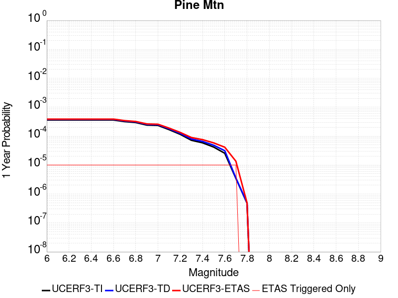 |  |

| Magnitude | 1 wk TI Prob | 1 wk TD Prob | 1 wk ETAS Prob | 1 wk ETAS/TD Gain | 1 wk ETAS Triggered Only | 1 mo TI Prob | 1 mo TD Prob | 1 mo ETAS Prob | 1 mo ETAS/TD Gain | 1 mo ETAS Triggered Only | 1 yr TI Prob | 1 yr TD Prob | 1 yr ETAS Prob | 1 yr ETAS/TD Gain | 1 yr ETAS Triggered Only | 10 yr TI Prob | 10 yr TD Prob | 10 yr ETAS Prob | 10 yr ETAS/TD Gain | 10 yr ETAS Triggered Only |
|-----|-----|-----|-----|-----|-----|-----|-----|-----|-----|-----|-----|-----|-----|-----|-----|-----|-----|-----|-----|-----|
| 6.0 | 6.894797E-6 | 7.225461E-6 | 1.722539E-5 | 2.3839846 | 1.0E-5 | 2.9548795E-5 | 3.096591E-5 | 4.0965602E-5 | 1.3229258 | 1.0E-5 | 3.596972E-4 | 3.7694772E-4 | 3.8694395E-4 | 1.0265188 | 1.0E-5 | 0.0035911554 | 0.003763381 | 0.0037733433 | 1.0026472 | 1.0E-5 |
| 6.1 | 6.894797E-6 | 7.225461E-6 | 1.722539E-5 | 2.3839846 | 1.0E-5 | 2.9548795E-5 | 3.096591E-5 | 4.0965602E-5 | 1.3229258 | 1.0E-5 | 3.596972E-4 | 3.7694772E-4 | 3.8694395E-4 | 1.0265188 | 1.0E-5 | 0.0035911554 | 0.003763381 | 0.0037733433 | 1.0026472 | 1.0E-5 |
| 6.2 | 6.894797E-6 | 7.225461E-6 | 1.722539E-5 | 2.3839846 | 1.0E-5 | 2.9548795E-5 | 3.096591E-5 | 4.0965602E-5 | 1.3229258 | 1.0E-5 | 3.596972E-4 | 3.7694772E-4 | 3.8694395E-4 | 1.0265188 | 1.0E-5 | 0.0035911554 | 0.003763381 | 0.0037733433 | 1.0026472 | 1.0E-5 |
| 6.3 | 6.894797E-6 | 7.225461E-6 | 1.722539E-5 | 2.3839846 | 1.0E-5 | 2.9548795E-5 | 3.096591E-5 | 4.0965602E-5 | 1.3229258 | 1.0E-5 | 3.596972E-4 | 3.7694772E-4 | 3.8694395E-4 | 1.0265188 | 1.0E-5 | 0.0035911554 | 0.003763381 | 0.0037733433 | 1.0026472 | 1.0E-5 |
| 6.4 | 6.894797E-6 | 7.225461E-6 | 1.722539E-5 | 2.3839846 | 1.0E-5 | 2.9548795E-5 | 3.096591E-5 | 4.0965602E-5 | 1.3229258 | 1.0E-5 | 3.596972E-4 | 3.7694772E-4 | 3.8694395E-4 | 1.0265188 | 1.0E-5 | 0.0035911554 | 0.003763381 | 0.0037733433 | 1.0026472 | 1.0E-5 |
| 6.5 | 6.894797E-6 | 7.225461E-6 | 1.722539E-5 | 2.3839846 | 1.0E-5 | 2.9548795E-5 | 3.096591E-5 | 4.0965602E-5 | 1.3229258 | 1.0E-5 | 3.596972E-4 | 3.7694772E-4 | 3.8694395E-4 | 1.0265188 | 1.0E-5 | 0.0035911554 | 0.003763381 | 0.0037733433 | 1.0026472 | 1.0E-5 |
| 6.6 | 6.894797E-6 | 7.225461E-6 | 1.722539E-5 | 2.3839846 | 1.0E-5 | 2.9548795E-5 | 3.096591E-5 | 4.0965602E-5 | 1.3229258 | 1.0E-5 | 3.596972E-4 | 3.7694772E-4 | 3.8694395E-4 | 1.0265188 | 1.0E-5 | 0.0035911554 | 0.003763381 | 0.0037733433 | 1.0026472 | 1.0E-5 |
| 6.7 | 6.0867933E-6 | 6.3971133E-6 | 1.6397049E-5 | 2.563195 | 1.0E-5 | 2.6085996E-5 | 2.7415923E-5 | 3.7415648E-5 | 1.3647416 | 1.0E-5 | 3.1755073E-4 | 3.3373994E-4 | 3.437366E-4 | 1.0299535 | 1.0E-5 | 0.0031709734 | 0.0033326065 | 0.003342573 | 1.0029906 | 1.0E-5 |
| 6.8 | 5.6530425E-6 | 5.9505956E-6 | 1.5950536E-5 | 2.680494 | 1.0E-5 | 2.42271E-5 | 2.5502315E-5 | 3.550206E-5 | 1.3921113 | 1.0E-5 | 2.94925E-4 | 3.104485E-4 | 3.204454E-4 | 1.0322014 | 1.0E-5 | 0.002945339 | 0.0031003528 | 0.003110322 | 1.0032154 | 1.0E-5 |
| 6.9 | 4.6015225E-6 | 4.863834E-6 | 1.48637855E-5 | 3.0559812 | 1.0E-5 | 1.9720663E-5 | 2.0844845E-5 | 3.0844636E-5 | 1.4797249 | 1.0E-5 | 2.4007261E-4 | 2.5375787E-4 | 2.6375536E-4 | 1.0393976 | 1.0E-5 | 0.0023981342 | 0.0025348254 | 0.0025448 | 1.0039351 | 1.0E-5 |
| 7.0 | 4.4875965E-6 | 4.747473E-6 | 1.4747426E-5 | 3.1063738 | 1.0E-5 | 1.9232413E-5 | 2.0346162E-5 | 3.0345958E-5 | 1.4914832 | 1.0E-5 | 2.3412947E-4 | 2.4768783E-4 | 2.5768534E-4 | 1.0403634 | 1.0E-5 | 0.0023388295 | 0.0024742614 | 0.0024842366 | 1.0040317 | 1.0E-5 |
| 7.1 | 3.203907E-6 | 3.4294096E-6 | 1.3429375E-5 | 3.9159439 | 1.0E-5 | 1.3730958E-5 | 1.4697391E-5 | 2.4697243E-5 | 1.6803828 | 1.0E-5 | 1.6716159E-4 | 1.789267E-4 | 1.8892491E-4 | 1.0558788 | 1.0E-5 | 0.0016703589 | 0.0017878925 | 0.0017978747 | 1.0055832 | 1.0E-5 |
| 7.2 | 2.2060601E-6 | 2.3784817E-6 | 1.23784575E-5 | 5.204353 | 1.0E-5 | 9.4545085E-6 | 1.0193455E-5 | 2.0193353E-5 | 1.9810116 | 1.0E-5 | 1.15102564E-4 | 1.240987E-4 | 1.3409746E-4 | 1.080571 | 1.0E-5 | 0.0011504296 | 0.0012403389 | 0.0012503265 | 1.0080523 | 1.0E-5 |
| 7.3 | 1.3765207E-6 | 1.5216481E-6 | 1.1521633E-5 | 7.5718117 | 1.0E-5 | 5.899361E-6 | 6.521333E-6 | 1.6521268E-5 | 2.533419 | 1.0E-5 | 7.182235E-5 | 7.939443E-5 | 8.939364E-5 | 1.1259434 | 1.0E-5 | 7.1799144E-4 | 7.936697E-4 | 8.036618E-4 | 1.0125897 | 1.0E-5 |
| 7.4 | 1.1245983E-6 | 1.2587075E-6 | 1.1258695E-5 | 8.944648 | 1.0E-5 | 4.819698E-6 | 5.39445E-6 | 1.5394397E-5 | 2.8537471 | 1.0E-5 | 5.8678244E-5 | 6.567554E-5 | 7.567488E-5 | 1.1522537 | 1.0E-5 | 5.866275E-4 | 6.5656955E-4 | 6.66563E-4 | 1.0152206 | 1.0E-5 |
| 7.5 | 8.031682E-7 | 9.276951E-7 | 1.0927686E-5 | 11.779393 | 1.0E-5 | 3.4421448E-6 | 3.9758306E-6 | 1.3975791E-5 | 3.5151877 | 1.0E-5 | 4.1907308E-5 | 4.840473E-5 | 5.8404246E-5 | 1.2065814 | 1.0E-5 | 4.1899405E-4 | 4.8394862E-4 | 4.939438E-4 | 1.0206534 | 1.0E-5 |
| 7.6 | 4.8953444E-7 | 6.003009E-7 | 1.0600295E-5 | 17.658302 | 1.0E-5 | 2.098003E-6 | 2.5727159E-6 | 1.257269E-5 | 4.886933 | 1.0E-5 | 2.5542888E-5 | 3.1322415E-5 | 4.1322102E-5 | 1.3192502 | 1.0E-5 | 2.5539953E-4 | 3.1318486E-4 | 3.2318174E-4 | 1.0319201 | 1.0E-5 |
| 7.7 | 6.634529E-8 | 6.788826E-8 | 1.0067887E-5 | 148.30087 | 1.0E-5 | 2.843369E-7 | 2.9094966E-7 | 1.0290947E-5 | 35.370197 | 1.0E-5 | 3.4617963E-6 | 3.5423066E-6 | 1.35422715E-5 | 3.8230093 | 1.0E-5 | 3.4617424E-5 | 3.542255E-5 | 4.5422195E-5 | 1.2822961 | 1.0E-5 |
| 7.8 | 9.235578E-9 | 9.488566E-9 | 9.488566E-9 | 1.0 | 0.0 | 3.9581046E-8 | 4.0665284E-8 | 4.0665284E-8 | 1.0 | 0.0 | 4.818991E-7 | 4.950997E-7 | 4.950997E-7 | 1.0 | 0.0 | 4.8189804E-6 | 4.950988E-6 | 4.950988E-6 | 1.0 | 0.0 |

## San Andreas (Peninsula) 2011 CFM
*[(top)](#table-of-contents)*

| 1 Week | 1 Month | 1 Year | 10 Year |
|-----|-----|-----|-----|
|  |  |  |  |

| Magnitude | 1 wk TI Prob | 1 wk TD Prob | 1 wk ETAS Prob | 1 wk ETAS/TD Gain | 1 wk ETAS Triggered Only | 1 mo TI Prob | 1 mo TD Prob | 1 mo ETAS Prob | 1 mo ETAS/TD Gain | 1 mo ETAS Triggered Only | 1 yr TI Prob | 1 yr TD Prob | 1 yr ETAS Prob | 1 yr ETAS/TD Gain | 1 yr ETAS Triggered Only | 10 yr TI Prob | 10 yr TD Prob | 10 yr ETAS Prob | 10 yr ETAS/TD Gain | 10 yr ETAS Triggered Only |
|-----|-----|-----|-----|-----|-----|-----|-----|-----|-----|-----|-----|-----|-----|-----|-----|-----|-----|-----|-----|-----|
| 6.0 | 8.6200685E-5 | 2.52136E-5 | 3.5213347E-5 | 1.3966013 | 1.0E-5 | 3.6937918E-4 | 1.0805382E-4 | 1.1805274E-4 | 1.0925364 | 1.0E-5 | 0.0044879215 | 0.001314763 | 0.0013247498 | 1.0075959 | 1.0E-5 | 0.043983612 | 0.014774441 | 0.014784293 | 1.0006669 | 1.0E-5 |
| 6.1 | 8.6200685E-5 | 2.52136E-5 | 3.5213347E-5 | 1.3966013 | 1.0E-5 | 3.6937918E-4 | 1.0805382E-4 | 1.1805274E-4 | 1.0925364 | 1.0E-5 | 0.0044879215 | 0.001314763 | 0.0013247498 | 1.0075959 | 1.0E-5 | 0.043983612 | 0.014774441 | 0.014784293 | 1.0006669 | 1.0E-5 |
| 6.2 | 8.6200685E-5 | 2.52136E-5 | 3.5213347E-5 | 1.3966013 | 1.0E-5 | 3.6937918E-4 | 1.0805382E-4 | 1.1805274E-4 | 1.0925364 | 1.0E-5 | 0.0044879215 | 0.001314763 | 0.0013247498 | 1.0075959 | 1.0E-5 | 0.043983612 | 0.014774441 | 0.014784293 | 1.0006669 | 1.0E-5 |
| 6.3 | 8.551163E-5 | 2.490552E-5 | 3.490527E-5 | 1.4015074 | 1.0E-5 | 3.6642692E-4 | 1.06733576E-4 | 1.1673251E-4 | 1.0936812 | 1.0E-5 | 0.004452125 | 0.0012987083 | 0.0013086953 | 1.00769 | 1.0E-5 | 0.043639794 | 0.014601416 | 0.01461127 | 1.0006748 | 1.0E-5 |
| 6.4 | 8.551163E-5 | 2.490552E-5 | 3.490527E-5 | 1.4015074 | 1.0E-5 | 3.6642692E-4 | 1.06733576E-4 | 1.1673251E-4 | 1.0936812 | 1.0E-5 | 0.004452125 | 0.0012987083 | 0.0013086953 | 1.00769 | 1.0E-5 | 0.043639794 | 0.014601416 | 0.01461127 | 1.0006748 | 1.0E-5 |
| 6.5 | 8.511146E-5 | 2.4726973E-5 | 3.4726723E-5 | 1.4044067 | 1.0E-5 | 3.647124E-4 | 1.05968444E-4 | 1.1596738E-4 | 1.0943577 | 1.0E-5 | 0.004431336 | 0.0012894038 | 0.0012993909 | 1.0077455 | 1.0E-5 | 0.04344007 | 0.0145011945 | 0.014511049 | 1.0006796 | 1.0E-5 |
| 6.6 | 8.4985084E-5 | 2.4657606E-5 | 3.4657358E-5 | 1.4055444 | 1.0E-5 | 3.6417096E-4 | 1.05671184E-4 | 1.15670126E-4 | 1.0946232 | 1.0E-5 | 0.0044247704 | 0.001285789 | 0.0012957761 | 1.0077673 | 1.0E-5 | 0.043376986 | 0.014463263 | 0.014473118 | 1.0006814 | 1.0E-5 |
| 6.7 | 8.462618E-5 | 2.4486113E-5 | 3.4485867E-5 | 1.4083848 | 1.0E-5 | 3.6263323E-4 | 1.0493627E-4 | 1.1493522E-4 | 1.0952859 | 1.0E-5 | 0.004406125 | 0.0012768519 | 0.0012868391 | 1.0078218 | 1.0E-5 | 0.043197807 | 0.01436807 | 0.0143779265 | 1.0006859 | 1.0E-5 |
| 6.8 | 8.42337E-5 | 2.438192E-5 | 3.4381676E-5 | 1.41013 | 1.0E-5 | 3.6095164E-4 | 1.04489765E-4 | 1.1448872E-4 | 1.0956931 | 1.0E-5 | 0.004385734 | 0.0012714221 | 0.0012814094 | 1.0078552 | 1.0E-5 | 0.043001823 | 0.014308756 | 0.014318613 | 1.0006889 | 1.0E-5 |
| 6.9 | 8.365989E-5 | 2.4186513E-5 | 3.4186272E-5 | 1.4134436 | 1.0E-5 | 3.5849313E-4 | 1.03652375E-4 | 1.1365134E-4 | 1.0964663 | 1.0E-5 | 0.004355922 | 0.0012612387 | 0.0012712261 | 1.0079187 | 1.0E-5 | 0.04271523 | 0.014201242 | 0.0142111 | 1.0006942 | 1.0E-5 |
| 7.0 | 8.30936E-5 | 2.3948E-5 | 3.394776E-5 | 1.4175614 | 1.0E-5 | 3.560668E-4 | 1.02630256E-4 | 1.12629226E-4 | 1.0974271 | 1.0E-5 | 0.004326499 | 0.0012488087 | 0.0012587962 | 1.0079976 | 1.0E-5 | 0.042432297 | 0.014072227 | 0.014082086 | 1.0007006 | 1.0E-5 |
| 7.1 | 8.041264E-5 | 2.3634402E-5 | 3.3634165E-5 | 1.423102 | 1.0E-5 | 3.4458007E-4 | 1.0128637E-4 | 1.1128536E-4 | 1.09872 | 1.0E-5 | 0.0041871946 | 0.0012324656 | 0.0012424532 | 1.0081038 | 1.0E-5 | 0.041091725 | 0.013895032 | 0.013904893 | 1.0007097 | 1.0E-5 |
| 7.2 | 7.8427016E-5 | 2.3058019E-5 | 3.3057786E-5 | 1.4336786 | 1.0E-5 | 3.3607247E-4 | 9.8816345E-5 | 1.0881535E-4 | 1.1011878 | 1.0E-5 | 0.004084008 | 0.0012024266 | 0.0012124146 | 1.0083065 | 1.0E-5 | 0.040097635 | 0.013579085 | 0.013588949 | 1.0007265 | 1.0E-5 |
| 7.3 | 7.721087E-5 | 2.2842805E-5 | 3.2842578E-5 | 1.4377646 | 1.0E-5 | 3.3086175E-4 | 9.7894066E-5 | 1.0789309E-4 | 1.1021413 | 1.0E-5 | 0.004020803 | 0.0011912102 | 0.0012011983 | 1.0083848 | 1.0E-5 | 0.03948827 | 0.013462781 | 0.0134726465 | 1.0007328 | 1.0E-5 |
| 7.4 | 7.3536525E-5 | 2.0960428E-5 | 3.096022E-5 | 1.4770795 | 1.0E-5 | 3.1511846E-4 | 8.982732E-5 | 9.982642E-5 | 1.1113147 | 1.0E-5 | 0.0038298194 | 0.0010931002 | 0.0011030893 | 1.0091383 | 1.0E-5 | 0.037644852 | 0.012419564 | 0.012429439 | 1.0007951 | 1.0E-5 |
| 7.5 | 6.806207E-5 | 1.876674E-5 | 1.876674E-5 | 1.0 | 0.0 | 2.9166197E-4 | 8.042641E-5 | 8.042641E-5 | 1.0 | 0.0 | 0.0035452035 | 9.787527E-4 | 9.787527E-4 | 1.0 | 0.0 | 0.034891766 | 0.01117254 | 0.01117254 | 1.0 | 0.0 |
| 7.6 | 5.6731416E-5 | 1.4177827E-5 | 1.4177827E-5 | 1.0 | 0.0 | 2.43112E-4 | 6.07607E-5 | 6.07607E-5 | 1.0 | 0.0 | 0.0029558712 | 7.395106E-4 | 7.395106E-4 | 1.0 | 0.0 | 0.02916862 | 0.008485565 | 0.008485565 | 1.0 | 0.0 |
| 7.7 | 4.946994E-5 | 1.3246218E-5 | 1.3246218E-5 | 1.0 | 0.0 | 2.1199681E-4 | 5.6768273E-5 | 5.6768273E-5 | 1.0 | 0.0 | 0.002578006 | 6.9093466E-4 | 6.9093466E-4 | 1.0 | 0.0 | 0.02548303 | 0.0079078935 | 0.0079078935 | 1.0 | 0.0 |
| 7.8 | 3.9718198E-5 | 1.2982541E-5 | 1.2982541E-5 | 1.0 | 0.0 | 1.7020974E-4 | 5.5638273E-5 | 5.5638273E-5 | 1.0 | 0.0 | 0.0020703338 | 6.771856E-4 | 6.771856E-4 | 1.0 | 0.0 | 0.020511515 | 0.0077184658 | 0.0077184658 | 1.0 | 0.0 |
| 7.9 | 2.4115114E-5 | 1.218559E-5 | 1.218559E-5 | 1.0 | 0.0 | 1.0334639E-4 | 5.2222913E-5 | 5.2222913E-5 | 1.0 | 0.0 | 0.001257516 | 6.3562865E-4 | 6.3562865E-4 | 1.0 | 0.0 | 0.012504238 | 0.007159044 | 0.007159044 | 1.0 | 0.0 |
| 8.0 | 1.7756569E-5 | 1.1410005E-5 | 1.1410005E-5 | 1.0 | 0.0 | 7.6097356E-5 | 4.8899106E-5 | 4.8899106E-5 | 1.0 | 0.0 | 9.260915E-4 | 5.951841E-4 | 5.951841E-4 | 1.0 | 0.0 | 0.009222416 | 0.006659493 | 0.006659493 | 1.0 | 0.0 |
| 8.1 | 1.3159258E-5 | 9.746194E-6 | 9.746194E-6 | 1.0 | 0.0 | 5.6395602E-5 | 4.1768737E-5 | 4.1768737E-5 | 1.0 | 0.0 | 6.864001E-4 | 5.0841586E-4 | 5.0841586E-4 | 1.0 | 0.0 | 0.0068428386 | 0.005689538 | 0.005689538 | 1.0 | 0.0 |
| 8.2 | 8.635426E-6 | 5.466912E-6 | 5.466912E-6 | 1.0 | 0.0 | 3.700844E-5 | 2.3429413E-5 | 2.3429413E-5 | 1.0 | 0.0 | 4.5048463E-4 | 2.8521585E-4 | 2.8521585E-4 | 1.0 | 0.0 | 0.004495725 | 0.0032445018 | 0.0032445018 | 1.0 | 0.0 |
| 8.3 | 1.983087E-6 | 7.6599065E-7 | 7.6599065E-7 | 1.0 | 0.0 | 8.498917E-6 | 3.282813E-6 | 3.282813E-6 | 1.0 | 0.0 | 1.034694E-4 | 3.9967534E-5 | 3.9967534E-5 | 1.0 | 0.0 | 0.0010342124 | 4.719687E-4 | 4.719687E-4 | 1.0 | 0.0 |

## Casmalia 2011 CFM
*[(top)](#table-of-contents)*

| 1 Week | 1 Month | 1 Year | 10 Year |
|-----|-----|-----|-----|
|  |  |  |  |

| Magnitude | 1 wk TI Prob | 1 wk TD Prob | 1 wk ETAS Prob | 1 wk ETAS/TD Gain | 1 wk ETAS Triggered Only | 1 mo TI Prob | 1 mo TD Prob | 1 mo ETAS Prob | 1 mo ETAS/TD Gain | 1 mo ETAS Triggered Only | 1 yr TI Prob | 1 yr TD Prob | 1 yr ETAS Prob | 1 yr ETAS/TD Gain | 1 yr ETAS Triggered Only | 10 yr TI Prob | 10 yr TD Prob | 10 yr ETAS Prob | 10 yr ETAS/TD Gain | 10 yr ETAS Triggered Only |
|-----|-----|-----|-----|-----|-----|-----|-----|-----|-----|-----|-----|-----|-----|-----|-----|-----|-----|-----|-----|-----|
| 6.0 | 4.1704893E-6 | 4.262483E-6 | 1.426244E-5 | 3.3460405 | 1.0E-5 | 1.7873403E-5 | 1.8267656E-5 | 2.8267474E-5 | 1.5474056 | 1.0E-5 | 2.1758694E-4 | 2.2238622E-4 | 2.32384E-4 | 1.0449568 | 1.0E-5 | 0.0021737402 | 0.0022216577 | 0.0022316356 | 1.0044911 | 1.0E-5 |
| 6.1 | 4.1704893E-6 | 4.262483E-6 | 1.426244E-5 | 3.3460405 | 1.0E-5 | 1.7873403E-5 | 1.8267656E-5 | 2.8267474E-5 | 1.5474056 | 1.0E-5 | 2.1758694E-4 | 2.2238622E-4 | 2.32384E-4 | 1.0449568 | 1.0E-5 | 0.0021737402 | 0.0022216577 | 0.0022316356 | 1.0044911 | 1.0E-5 |
| 6.2 | 3.457312E-6 | 3.5370217E-6 | 1.3536986E-5 | 3.8272274 | 1.0E-5 | 1.4816967E-5 | 1.5158577E-5 | 2.5158426E-5 | 1.6596825 | 1.0E-5 | 1.8038164E-4 | 1.8454014E-4 | 1.9453828E-4 | 1.0541787 | 1.0E-5 | 0.001802353 | 0.0018438784 | 0.00185386 | 1.0054133 | 1.0E-5 |
| 6.3 | 3.457312E-6 | 3.5370217E-6 | 1.3536986E-5 | 3.8272274 | 1.0E-5 | 1.4816967E-5 | 1.5158577E-5 | 2.5158426E-5 | 1.6596825 | 1.0E-5 | 1.8038164E-4 | 1.8454014E-4 | 1.9453828E-4 | 1.0541787 | 1.0E-5 | 0.001802353 | 0.0018438784 | 0.00185386 | 1.0054133 | 1.0E-5 |
| 6.4 | 3.0957337E-6 | 3.1692257E-6 | 1.3169194E-5 | 4.155335 | 1.0E-5 | 1.3267363E-5 | 1.3582326E-5 | 2.358219E-5 | 1.736241 | 1.0E-5 | 1.6151817E-4 | 1.6535232E-4 | 1.7535067E-4 | 1.0604669 | 1.0E-5 | 0.0016140083 | 0.0016522991 | 0.0016622825 | 1.0060421 | 1.0E-5 |
| 6.5 | 3.0957337E-6 | 3.1692257E-6 | 1.3169194E-5 | 4.155335 | 1.0E-5 | 1.3267363E-5 | 1.3582326E-5 | 2.358219E-5 | 1.736241 | 1.0E-5 | 1.6151817E-4 | 1.6535232E-4 | 1.7535067E-4 | 1.0604669 | 1.0E-5 | 0.0016140083 | 0.0016522991 | 0.0016622825 | 1.0060421 | 1.0E-5 |
| 6.6 | 2.9459152E-6 | 3.0165752E-6 | 1.3016545E-5 | 4.3150077 | 1.0E-5 | 1.262529E-5 | 1.2928115E-5 | 2.2927987E-5 | 1.7734979 | 1.0E-5 | 1.5370206E-4 | 1.5738848E-4 | 1.6738691E-4 | 1.0635271 | 1.0E-5 | 0.0015359579 | 0.0015727758 | 0.0015827601 | 1.0063481 | 1.0E-5 |
| 6.7 | 2.8634809E-6 | 2.9324726E-6 | 1.29324435E-5 | 4.4100814 | 1.0E-5 | 1.2272003E-5 | 1.256768E-5 | 2.2567554E-5 | 1.7956818 | 1.0E-5 | 1.4940138E-4 | 1.530008E-4 | 1.6299928E-4 | 1.0653491 | 1.0E-5 | 0.0014930099 | 0.0015289601 | 0.0015389448 | 1.0065304 | 1.0E-5 |
| 6.8 | 2.7999822E-6 | 2.8675968E-6 | 1.2867568E-5 | 4.487231 | 1.0E-5 | 1.1999869E-5 | 1.2289643E-5 | 2.228952E-5 | 1.8136833 | 1.0E-5 | 1.460886E-4 | 1.4961617E-4 | 1.5961468E-4 | 1.0668277 | 1.0E-5 | 0.001459926 | 0.0014951597 | 0.0015051448 | 1.0066782 | 1.0E-5 |
| 6.9 | 2.551052E-6 | 2.6119649E-6 | 1.26119385E-5 | 4.8285255 | 1.0E-5 | 1.0933034E-5 | 1.1194087E-5 | 2.1193975E-5 | 1.8933188 | 1.0E-5 | 1.3310155E-4 | 1.3627953E-4 | 1.4627817E-4 | 1.0733685 | 1.0E-5 | 0.0013302186 | 0.0013619636 | 0.0013719499 | 1.0073323 | 1.0E-5 |
| 7.0 | 2.3081875E-6 | 2.3624088E-6 | 1.2362385E-5 | 5.2329574 | 1.0E-5 | 9.892195E-6 | 1.01245705E-5 | 2.012447E-5 | 1.9876863 | 1.0E-5 | 1.20430814E-4 | 1.232597E-4 | 1.3325847E-4 | 1.0811195 | 1.0E-5 | 0.0012036557 | 0.0012319161 | 0.0012419039 | 1.0081074 | 1.0E-5 |
| 7.1 | 2.093245E-6 | 2.1417243E-6 | 1.2141702E-5 | 5.669125 | 1.0E-5 | 8.971019E-6 | 9.178786E-6 | 1.9178695E-5 | 2.0894587 | 1.0E-5 | 1.09216686E-4 | 1.1174601E-4 | 1.21744895E-4 | 1.0894786 | 1.0E-5 | 0.0010916302 | 0.0011169002 | 0.001126889 | 1.0089433 | 1.0E-5 |
| 7.2 | 1.9714576E-6 | 2.0165091E-6 | 1.2016489E-5 | 5.959055 | 1.0E-5 | 8.449076E-6 | 8.642153E-6 | 1.8642068E-5 | 2.157109 | 1.0E-5 | 1.0286264E-4 | 1.05213156E-4 | 1.15212104E-4 | 1.0950352 | 1.0E-5 | 0.0010281504 | 0.0010516352 | 0.0010616247 | 1.009499 | 1.0E-5 |
| 7.3 | 1.6689512E-6 | 1.7047131E-6 | 1.1704696E-5 | 6.86608 | 1.0E-5 | 7.1526288E-6 | 7.3058927E-6 | 1.730582E-5 | 2.3687482 | 1.0E-5 | 8.7079774E-5 | 8.894562E-5 | 9.894473E-5 | 1.1124183 | 1.0E-5 | 8.7045657E-4 | 8.89101E-4 | 8.990921E-4 | 1.0112373 | 1.0E-5 |
| 7.4 | 1.4490954E-6 | 1.4778908E-6 | 1.1477876E-5 | 7.76639 | 1.0E-5 | 6.210394E-6 | 6.333802E-6 | 1.6333739E-5 | 2.5788205 | 1.0E-5 | 7.560892E-5 | 7.711132E-5 | 8.711055E-5 | 1.1296726 | 1.0E-5 | 7.55832E-4 | 7.7084627E-4 | 7.8083854E-4 | 1.0129627 | 1.0E-5 |
| 7.5 | 1.226873E-6 | 1.2481701E-6 | 1.12481575E-5 | 9.011719 | 1.0E-5 | 5.2580162E-6 | 5.3492895E-6 | 1.5349236E-5 | 2.8693972 | 1.0E-5 | 6.401447E-5 | 6.5125656E-5 | 7.5125005E-5 | 1.1535393 | 1.0E-5 | 6.399603E-4 | 6.5106625E-4 | 6.6105975E-4 | 1.0153494 | 1.0E-5 |
| 7.6 | 9.2561345E-7 | 9.361923E-7 | 1.0936183E-5 | 11.681556 | 1.0E-5 | 3.966909E-6 | 4.012247E-6 | 1.40122065E-5 | 3.4923592 | 1.0E-5 | 4.8296046E-5 | 4.884801E-5 | 5.8847523E-5 | 1.2047067 | 1.0E-5 | 4.828555E-4 | 4.8837316E-4 | 4.9836823E-4 | 1.0204661 | 1.0E-5 |
| 7.7 | 5.4367933E-7 | 5.392888E-7 | 1.0539284E-5 | 19.54293 | 1.0E-5 | 2.3300522E-6 | 2.3112357E-6 | 1.2311212E-5 | 5.3266797 | 1.0E-5 | 2.8368017E-5 | 2.8138933E-5 | 3.8138653E-5 | 1.3553694 | 1.0E-5 | 2.8364395E-4 | 2.8135383E-4 | 2.9135103E-4 | 1.0355325 | 1.0E-5 |
| 7.8 | 1.8825742E-7 | 1.7342276E-7 | 1.7342276E-7 | 1.0 | 0.0 | 8.068173E-7 | 7.4324015E-7 | 7.4324015E-7 | 1.0 | 0.0 | 9.822956E-6 | 9.048912E-6 | 9.048912E-6 | 1.0 | 0.0 | 9.822522E-5 | 9.048546E-5 | 9.048546E-5 | 1.0 | 0.0 |
| 7.9 | 6.342771E-8 | 4.6790706E-8 | 4.6790706E-8 | 1.0 | 0.0 | 2.7183304E-7 | 2.0053157E-7 | 2.0053157E-7 | 1.0 | 0.0 | 3.3095623E-6 | 2.4414692E-6 | 2.4414692E-6 | 1.0 | 0.0 | 3.309513E-5 | 2.4414428E-5 | 2.4414428E-5 | 1.0 | 0.0 |
| 8.0 | 1.2574819E-8 | 6.4733463E-9 | 6.4733463E-9 | 1.0 | 0.0 | 5.3892084E-8 | 2.7742912E-8 | 2.7742912E-8 | 1.0 | 0.0 | 6.561359E-7 | 3.377699E-7 | 3.377699E-7 | 1.0 | 0.0 | 6.56134E-6 | 3.377694E-6 | 3.377694E-6 | 1.0 | 0.0 |

## San Gabriel (Extension)
*[(top)](#table-of-contents)*

| 1 Week | 1 Month | 1 Year | 10 Year |
|-----|-----|-----|-----|
|  |  |  |  |

| Magnitude | 1 wk TI Prob | 1 wk TD Prob | 1 wk ETAS Prob | 1 wk ETAS/TD Gain | 1 wk ETAS Triggered Only | 1 mo TI Prob | 1 mo TD Prob | 1 mo ETAS Prob | 1 mo ETAS/TD Gain | 1 mo ETAS Triggered Only | 1 yr TI Prob | 1 yr TD Prob | 1 yr ETAS Prob | 1 yr ETAS/TD Gain | 1 yr ETAS Triggered Only | 10 yr TI Prob | 10 yr TD Prob | 10 yr ETAS Prob | 10 yr ETAS/TD Gain | 10 yr ETAS Triggered Only |
|-----|-----|-----|-----|-----|-----|-----|-----|-----|-----|-----|-----|-----|-----|-----|-----|-----|-----|-----|-----|-----|
| 6.0 | 5.6486106E-6 | 5.7168304E-6 | 5.7168304E-6 | 1.0 | 0.0 | 2.4208108E-5 | 2.450048E-5 | 3.4500234E-5 | 1.4081453 | 1.0E-5 | 2.9469383E-4 | 2.9825376E-4 | 3.0825078E-4 | 1.0335186 | 1.0E-5 | 0.0029430336 | 0.0029786653 | 0.0029886353 | 1.0033472 | 1.0E-5 |
| 6.1 | 5.6486106E-6 | 5.7168304E-6 | 5.7168304E-6 | 1.0 | 0.0 | 2.4208108E-5 | 2.450048E-5 | 3.4500234E-5 | 1.4081453 | 1.0E-5 | 2.9469383E-4 | 2.9825376E-4 | 3.0825078E-4 | 1.0335186 | 1.0E-5 | 0.0029430336 | 0.0029786653 | 0.0029886353 | 1.0033472 | 1.0E-5 |
| 6.2 | 5.6486106E-6 | 5.7168304E-6 | 5.7168304E-6 | 1.0 | 0.0 | 2.4208108E-5 | 2.450048E-5 | 3.4500234E-5 | 1.4081453 | 1.0E-5 | 2.9469383E-4 | 2.9825376E-4 | 3.0825078E-4 | 1.0335186 | 1.0E-5 | 0.0029430336 | 0.0029786653 | 0.0029886353 | 1.0033472 | 1.0E-5 |
| 6.3 | 5.6486106E-6 | 5.7168304E-6 | 5.7168304E-6 | 1.0 | 0.0 | 2.4208108E-5 | 2.450048E-5 | 3.4500234E-5 | 1.4081453 | 1.0E-5 | 2.9469383E-4 | 2.9825376E-4 | 3.0825078E-4 | 1.0335186 | 1.0E-5 | 0.0029430336 | 0.0029786653 | 0.0029886353 | 1.0033472 | 1.0E-5 |
| 6.4 | 5.6486106E-6 | 5.7168304E-6 | 5.7168304E-6 | 1.0 | 0.0 | 2.4208108E-5 | 2.450048E-5 | 3.4500234E-5 | 1.4081453 | 1.0E-5 | 2.9469383E-4 | 2.9825376E-4 | 3.0825078E-4 | 1.0335186 | 1.0E-5 | 0.0029430336 | 0.0029786653 | 0.0029886353 | 1.0033472 | 1.0E-5 |
| 6.5 | 4.7134554E-6 | 4.7542544E-6 | 4.7542544E-6 | 1.0 | 0.0 | 2.0200367E-5 | 2.0375222E-5 | 3.0375018E-5 | 1.4907823 | 1.0E-5 | 2.459117E-4 | 2.4804095E-4 | 2.5803846E-4 | 1.040306 | 1.0E-5 | 0.0024563975 | 0.002477729 | 0.0024877044 | 1.0040259 | 1.0E-5 |
| 6.6 | 4.7134554E-6 | 4.7542544E-6 | 4.7542544E-6 | 1.0 | 0.0 | 2.0200367E-5 | 2.0375222E-5 | 3.0375018E-5 | 1.4907823 | 1.0E-5 | 2.459117E-4 | 2.4804095E-4 | 2.5803846E-4 | 1.040306 | 1.0E-5 | 0.0024563975 | 0.002477729 | 0.0024877044 | 1.0040259 | 1.0E-5 |
| 6.7 | 4.2468837E-6 | 4.2740717E-6 | 4.2740717E-6 | 1.0 | 0.0 | 1.8200803E-5 | 1.8317325E-5 | 2.8317143E-5 | 1.5459212 | 1.0E-5 | 2.2157225E-4 | 2.2299135E-4 | 2.3298911E-4 | 1.0448347 | 1.0E-5 | 0.0022135144 | 0.0022277518 | 0.0022377295 | 1.0044788 | 1.0E-5 |
| 6.8 | 4.1180615E-6 | 4.1414614E-6 | 4.1414614E-6 | 1.0 | 0.0 | 1.7648716E-5 | 1.7749004E-5 | 2.7748825E-5 | 1.5634019 | 1.0E-5 | 2.1485193E-4 | 2.160734E-4 | 2.2607125E-4 | 1.0462706 | 1.0E-5 | 0.0021464431 | 0.0021587082 | 0.0021686866 | 1.0046225 | 1.0E-5 |
| 6.9 | 3.863861E-6 | 3.8797766E-6 | 3.8797766E-6 | 1.0 | 0.0 | 1.65593E-5 | 1.6627511E-5 | 2.6627346E-5 | 1.6014029 | 1.0E-5 | 2.0159081E-4 | 2.0242184E-4 | 2.124198E-4 | 1.0493917 | 1.0E-5 | 0.0020140803 | 0.002022446 | 0.0020324257 | 1.0049345 | 1.0E-5 |
| 7.0 | 3.6947372E-6 | 3.705676E-6 | 3.705676E-6 | 1.0 | 0.0 | 1.5834492E-5 | 1.5881375E-5 | 2.5881216E-5 | 1.6296583 | 1.0E-5 | 1.9276788E-4 | 1.9333926E-4 | 2.0333733E-4 | 1.0517125 | 1.0E-5 | 0.0019260074 | 0.0019317807 | 0.0019417615 | 1.0051665 | 1.0E-5 |
| 7.1 | 3.5686835E-6 | 3.5728963E-6 | 3.5728963E-6 | 1.0 | 0.0 | 1.5294268E-5 | 1.5312327E-5 | 2.5312174E-5 | 1.6530586 | 1.0E-5 | 1.861918E-4 | 1.8641229E-4 | 1.9641043E-4 | 1.0536345 | 1.0E-5 | 0.0018603588 | 0.0018626289 | 0.0018726103 | 1.0053588 | 1.0E-5 |
| 7.2 | 2.8023446E-6 | 2.7767885E-6 | 2.7767885E-6 | 1.0 | 0.0 | 1.2009994E-5 | 1.1900468E-5 | 1.1900468E-5 | 1.0 | 0.0 | 1.4621185E-4 | 1.4487868E-4 | 1.4487868E-4 | 1.0 | 0.0 | 0.001461157 | 0.0014478569 | 0.0014478569 | 1.0 | 0.0 |
| 7.3 | 2.5843012E-6 | 2.5459642E-6 | 2.5459642E-6 | 1.0 | 0.0 | 1.1075529E-5 | 1.0911231E-5 | 1.0911231E-5 | 1.0 | 0.0 | 1.3483623E-4 | 1.3283623E-4 | 1.3283623E-4 | 1.0 | 0.0 | 0.0013475444 | 0.0013275818 | 0.0013275818 | 1.0 | 0.0 |
| 7.4 | 2.4464468E-6 | 2.396665E-6 | 2.396665E-6 | 1.0 | 0.0 | 1.04847295E-5 | 1.0271382E-5 | 1.0271382E-5 | 1.0 | 0.0 | 1.276441E-4 | 1.25047E-4 | 1.25047E-4 | 1.0 | 0.0 | 0.0012757082 | 0.0012497796 | 0.0012497796 | 1.0 | 0.0 |
| 7.5 | 2.0420266E-6 | 1.8910426E-6 | 1.8910426E-6 | 1.0 | 0.0 | 8.751514E-6 | 8.104444E-6 | 8.104444E-6 | 1.0 | 0.0 | 1.0654447E-4 | 9.8667166E-5 | 9.8667166E-5 | 1.0 | 0.0 | 0.001064934 | 9.862408E-4 | 9.862408E-4 | 1.0 | 0.0 |
| 7.6 | 1.8326596E-6 | 1.6398341E-6 | 1.6398341E-6 | 1.0 | 0.0 | 7.854232E-6 | 7.0278415E-6 | 7.0278415E-6 | 1.0 | 0.0 | 9.562107E-5 | 8.5560634E-5 | 8.5560634E-5 | 1.0 | 0.0 | 9.5579936E-4 | 8.5528276E-4 | 8.5528276E-4 | 1.0 | 0.0 |
| 7.7 | 1.4786998E-6 | 1.2523838E-6 | 1.2523838E-6 | 1.0 | 0.0 | 6.3372695E-6 | 5.367348E-6 | 5.367348E-6 | 1.0 | 0.0 | 7.715353E-5 | 6.534551E-5 | 6.534551E-5 | 1.0 | 0.0 | 7.7126746E-4 | 6.532707E-4 | 6.532707E-4 | 1.0 | 0.0 |
| 7.8 | 7.6975533E-7 | 6.0693884E-7 | 6.0693884E-7 | 1.0 | 0.0 | 3.2989474E-6 | 2.601164E-6 | 2.601164E-6 | 1.0 | 0.0 | 4.0163945E-5 | 3.166871E-5 | 3.166871E-5 | 1.0 | 0.0 | 4.0156685E-4 | 3.1664805E-4 | 3.1664805E-4 | 1.0 | 0.0 |
| 7.9 | 1.7645915E-7 | 9.213256E-8 | 9.213256E-8 | 1.0 | 0.0 | 7.562533E-7 | 3.9485377E-7 | 3.9485377E-7 | 1.0 | 0.0 | 9.207345E-6 | 4.807334E-6 | 4.807334E-6 | 1.0 | 0.0 | 9.206964E-5 | 4.807699E-5 | 4.807699E-5 | 1.0 | 0.0 |
| 8.0 | 1.0463461E-7 | 2.4949307E-8 | 2.4949307E-8 | 1.0 | 0.0 | 4.4843398E-7 | 1.0692559E-7 | 1.0692559E-7 | 1.0 | 0.0 | 5.45967E-6 | 1.3018183E-6 | 1.3018183E-6 | 1.0 | 0.0 | 5.459536E-5 | 1.3022789E-5 | 1.3022789E-5 | 1.0 | 0.0 |
| 8.1 | 7.875717E-8 | 1.3866874E-8 | 1.3866874E-8 | 1.0 | 0.0 | 3.3753068E-7 | 5.942946E-8 | 5.942946E-8 | 1.0 | 0.0 | 4.109428E-6 | 7.235534E-7 | 7.235534E-7 | 1.0 | 0.0 | 4.109352E-5 | 7.2401926E-6 | 7.2401926E-6 | 1.0 | 0.0 |
| 8.2 | 1.33163E-8 | 1.7733891E-9 | 1.7733891E-9 | 1.0 | 0.0 | 5.7069855E-8 | 7.600239E-9 | 7.600239E-9 | 1.0 | 0.0 | 6.9482525E-7 | 9.25329E-8 | 9.25329E-8 | 1.0 | 0.0 | 6.9482307E-6 | 9.272953E-7 | 9.272953E-7 | 1.0 | 0.0 |

## Surprise Valley 2011 CFM
*[(top)](#table-of-contents)*

| 1 Week | 1 Month | 1 Year | 10 Year |
|-----|-----|-----|-----|
|  |  |  |  |

| Magnitude | 1 wk TI Prob | 1 wk TD Prob | 1 wk ETAS Prob | 1 wk ETAS/TD Gain | 1 wk ETAS Triggered Only | 1 mo TI Prob | 1 mo TD Prob | 1 mo ETAS Prob | 1 mo ETAS/TD Gain | 1 mo ETAS Triggered Only | 1 yr TI Prob | 1 yr TD Prob | 1 yr ETAS Prob | 1 yr ETAS/TD Gain | 1 yr ETAS Triggered Only | 10 yr TI Prob | 10 yr TD Prob | 10 yr ETAS Prob | 10 yr ETAS/TD Gain | 10 yr ETAS Triggered Only |
|-----|-----|-----|-----|-----|-----|-----|-----|-----|-----|-----|-----|-----|-----|-----|-----|-----|-----|-----|-----|-----|
| 6.0 | 4.0396248E-5 | 4.485131E-5 | 4.485131E-5 | 1.0 | 0.0 | 1.7311527E-4 | 1.9220692E-4 | 2.02205E-4 | 1.0520172 | 1.0E-5 | 0.002105641 | 0.0023378176 | 0.0023477944 | 1.0042675 | 1.0E-5 | 0.020858008 | 0.023153966 | 0.023163734 | 1.0004219 | 1.0E-5 |
| 6.1 | 4.0396248E-5 | 4.485131E-5 | 4.485131E-5 | 1.0 | 0.0 | 1.7311527E-4 | 1.9220692E-4 | 2.02205E-4 | 1.0520172 | 1.0E-5 | 0.002105641 | 0.0023378176 | 0.0023477944 | 1.0042675 | 1.0E-5 | 0.020858008 | 0.023153966 | 0.023163734 | 1.0004219 | 1.0E-5 |
| 6.2 | 2.2295266E-5 | 2.440125E-5 | 2.440125E-5 | 1.0 | 0.0 | 9.554764E-5 | 1.0457276E-4 | 1.1457172E-4 | 1.0956172 | 1.0E-5 | 0.0011626717 | 0.0012724606 | 0.0012824478 | 1.0078487 | 1.0E-5 | 0.011566074 | 0.012654981 | 0.0126648545 | 1.0007802 | 1.0E-5 |
| 6.3 | 1.572643E-5 | 1.7096807E-5 | 1.7096807E-5 | 1.0 | 0.0 | 6.7397246E-5 | 7.327003E-5 | 8.32693E-5 | 1.1364714 | 1.0E-5 | 8.202525E-4 | 8.91708E-4 | 9.016991E-4 | 1.0112045 | 1.0E-5 | 0.008172315 | 0.008882407 | 0.008892318 | 1.0011158 | 1.0E-5 |
| 6.4 | 1.5714395E-5 | 1.7084629E-5 | 1.7084629E-5 | 1.0 | 0.0 | 6.734567E-5 | 7.3217845E-5 | 8.3217106E-5 | 1.1365688 | 1.0E-5 | 8.1962504E-4 | 8.9107314E-4 | 9.0106425E-4 | 1.0112125 | 1.0E-5 | 0.008166086 | 0.008876109 | 0.00888602 | 1.0011166 | 1.0E-5 |
| 6.5 | 1.2733495E-5 | 1.38016E-5 | 1.38016E-5 | 1.0 | 0.0 | 5.457098E-5 | 5.9148413E-5 | 6.914782E-5 | 1.1690563 | 1.0E-5 | 6.641992E-4 | 7.1990065E-4 | 7.2989345E-4 | 1.0138808 | 1.0E-5 | 0.0066221743 | 0.0071763797 | 0.007186308 | 1.0013834 | 1.0E-5 |
| 6.6 | 1.0983784E-5 | 1.1886554E-5 | 1.1886554E-5 | 1.0 | 0.0 | 4.7072506E-5 | 5.094141E-5 | 6.09409E-5 | 1.196294 | 1.0E-5 | 5.7295704E-4 | 6.200405E-4 | 6.300343E-4 | 1.0161179 | 1.0E-5 | 0.0057148207 | 0.0061836545 | 0.0061935927 | 1.0016072 | 1.0E-5 |
| 6.7 | 9.104806E-6 | 9.839491E-6 | 9.839491E-6 | 1.0 | 0.0 | 3.902001E-5 | 4.2168587E-5 | 4.2168587E-5 | 1.0 | 0.0 | 4.7496508E-4 | 5.132855E-4 | 5.132855E-4 | 1.0 | 0.0 | 0.004739512 | 0.005121397 | 0.005121397 | 1.0 | 0.0 |
| 6.8 | 6.2162403E-6 | 6.7041337E-6 | 6.7041337E-6 | 1.0 | 0.0 | 2.6640759E-5 | 2.8731698E-5 | 2.8731698E-5 | 1.0 | 0.0 | 3.2430296E-4 | 3.497545E-4 | 3.497545E-4 | 1.0 | 0.0 | 0.003238301 | 0.0034922638 | 0.0034922638 | 1.0 | 0.0 |
| 6.9 | 4.1792696E-6 | 4.50323E-6 | 4.50323E-6 | 1.0 | 0.0 | 1.7911032E-5 | 1.9299423E-5 | 1.9299423E-5 | 1.0 | 0.0 | 2.1804498E-4 | 2.3494668E-4 | 2.3494668E-4 | 1.0 | 0.0 | 0.0021783116 | 0.0023471361 | 0.0023471361 | 1.0 | 0.0 |
| 7.0 | 2.7478413E-6 | 2.9622424E-6 | 2.9622424E-6 | 1.0 | 0.0 | 1.177641E-5 | 1.269527E-5 | 1.269527E-5 | 1.0 | 0.0 | 1.4336836E-4 | 1.545552E-4 | 1.545552E-4 | 1.0 | 0.0 | 0.001432759 | 0.0015445995 | 0.0015445995 | 1.0 | 0.0 |
| 7.1 | 8.128648E-7 | 8.724922E-7 | 8.724922E-7 | 1.0 | 0.0 | 3.4837017E-6 | 3.7392501E-6 | 3.7392501E-6 | 1.0 | 0.0 | 4.2413245E-5 | 4.552502E-5 | 4.552502E-5 | 1.0 | 0.0 | 4.2405148E-4 | 4.5521575E-4 | 4.5521575E-4 | 1.0 | 0.0 |
| 7.2 | 4.8641045E-8 | 4.9402068E-8 | 4.9402068E-8 | 1.0 | 0.0 | 2.084616E-7 | 2.1172312E-7 | 2.1172312E-7 | 1.0 | 0.0 | 2.538017E-6 | 2.577726E-6 | 2.577726E-6 | 1.0 | 0.0 | 2.537988E-5 | 2.5776973E-5 | 2.5776973E-5 | 1.0 | 0.0 |
| 7.3 | 5.3911844E-9 | 5.4758145E-9 | 5.4758145E-9 | 1.0 | 0.0 | 2.3105075E-8 | 2.3467775E-8 | 2.3467775E-8 | 1.0 | 0.0 | 2.8130427E-7 | 2.8572015E-7 | 2.8572015E-7 | 1.0 | 0.0 | 2.8130391E-6 | 2.8571992E-6 | 2.8571992E-6 | 1.0 | 0.0 |

## San Andreas (North Coast) 2011 CFM
*[(top)](#table-of-contents)*

| 1 Week | 1 Month | 1 Year | 10 Year |
|-----|-----|-----|-----|
|  |  |  |  |

| Magnitude | 1 wk TI Prob | 1 wk TD Prob | 1 wk ETAS Prob | 1 wk ETAS/TD Gain | 1 wk ETAS Triggered Only | 1 mo TI Prob | 1 mo TD Prob | 1 mo ETAS Prob | 1 mo ETAS/TD Gain | 1 mo ETAS Triggered Only | 1 yr TI Prob | 1 yr TD Prob | 1 yr ETAS Prob | 1 yr ETAS/TD Gain | 1 yr ETAS Triggered Only | 10 yr TI Prob | 10 yr TD Prob | 10 yr ETAS Prob | 10 yr ETAS/TD Gain | 10 yr ETAS Triggered Only |
|-----|-----|-----|-----|-----|-----|-----|-----|-----|-----|-----|-----|-----|-----|-----|-----|-----|-----|-----|-----|-----|
| 6.0 | 1.5333705E-4 | 7.1106435E-5 | 8.1105725E-5 | 1.1406243 | 1.0E-5 | 6.5699324E-4 | 3.0470645E-4 | 3.147034E-4 | 1.0328084 | 1.0E-5 | 0.007969595 | 0.0037035241 | 0.0037134872 | 1.0026901 | 1.0E-5 | 0.0768977 | 0.03935284 | 0.03936245 | 1.0002441 | 1.0E-5 |
| 6.1 | 1.5333705E-4 | 7.1106435E-5 | 8.1105725E-5 | 1.1406243 | 1.0E-5 | 6.5699324E-4 | 3.0470645E-4 | 3.147034E-4 | 1.0328084 | 1.0E-5 | 0.007969595 | 0.0037035241 | 0.0037134872 | 1.0026901 | 1.0E-5 | 0.0768977 | 0.03935284 | 0.03936245 | 1.0002441 | 1.0E-5 |
| 6.2 | 1.3912938E-4 | 6.050204E-5 | 7.050143E-5 | 1.1652737 | 1.0E-5 | 5.961325E-4 | 2.5926883E-4 | 2.6926622E-4 | 1.03856 | 1.0E-5 | 0.007233787 | 0.003152056 | 0.0031620245 | 1.0031625 | 1.0E-5 | 0.07002798 | 0.03369227 | 0.033701934 | 1.0002868 | 1.0E-5 |
| 6.3 | 1.3912938E-4 | 6.050204E-5 | 7.050143E-5 | 1.1652737 | 1.0E-5 | 5.961325E-4 | 2.5926883E-4 | 2.6926622E-4 | 1.03856 | 1.0E-5 | 0.007233787 | 0.003152056 | 0.0031620245 | 1.0031625 | 1.0E-5 | 0.07002798 | 0.03369227 | 0.033701934 | 1.0002868 | 1.0E-5 |
| 6.4 | 1.2623647E-4 | 5.0442024E-5 | 6.0441518E-5 | 1.1982374 | 1.0E-5 | 5.4090127E-4 | 2.161623E-4 | 2.2616013E-4 | 1.0462515 | 1.0E-5 | 0.0065656058 | 0.0026286195 | 0.0026385933 | 1.0037943 | 1.0E-5 | 0.06374981 | 0.028303223 | 0.02831294 | 1.0003433 | 1.0E-5 |
| 6.5 | 1.1736096E-4 | 4.3523814E-5 | 5.3523378E-5 | 1.2297493 | 1.0E-5 | 5.028786E-4 | 1.8651738E-4 | 1.9651551E-4 | 1.0536044 | 1.0E-5 | 0.006105373 | 0.0022685004 | 0.0022784777 | 1.0043982 | 1.0E-5 | 0.05940335 | 0.024579322 | 0.024589075 | 1.0003968 | 1.0E-5 |
| 6.6 | 1.1586959E-4 | 4.2423668E-5 | 5.2423246E-5 | 1.2357075 | 1.0E-5 | 4.964894E-4 | 1.8180315E-4 | 1.9180133E-4 | 1.0549946 | 1.0E-5 | 0.006028018 | 0.0022112224 | 0.0022212004 | 1.0045124 | 1.0E-5 | 0.058671024 | 0.023984991 | 0.023994751 | 1.000407 | 1.0E-5 |
| 6.7 | 1.13693764E-4 | 4.073593E-5 | 5.073552E-5 | 1.2454735 | 1.0E-5 | 4.87168E-4 | 1.7457096E-4 | 1.8456922E-4 | 1.0572733 | 1.0E-5 | 0.005915152 | 0.0021233456 | 0.0021333243 | 1.0046996 | 1.0E-5 | 0.057601593 | 0.023076393 | 0.023086162 | 1.0004233 | 1.0E-5 |
| 6.8 | 1.1204889E-4 | 3.9953447E-5 | 4.995305E-5 | 1.2502813 | 1.0E-5 | 4.8012115E-4 | 1.7121792E-4 | 1.8121621E-4 | 1.0583951 | 1.0E-5 | 0.005829819 | 0.002082601 | 0.0020925803 | 1.0047917 | 1.0E-5 | 0.05679232 | 0.022636656 | 0.022646429 | 1.0004318 | 1.0E-5 |
| 6.9 | 1.1005794E-4 | 3.900957E-5 | 4.900918E-5 | 1.2563374 | 1.0E-5 | 4.7159163E-4 | 1.6717325E-4 | 1.7717158E-4 | 1.0598081 | 1.0E-5 | 0.0057265228 | 0.0020334502 | 0.0020434298 | 1.0049077 | 1.0E-5 | 0.055811852 | 0.022102542 | 0.022112321 | 1.0004424 | 1.0E-5 |
| 7.0 | 1.0647948E-4 | 3.7166337E-5 | 4.7165966E-5 | 1.2690507 | 1.0E-5 | 4.562608E-4 | 1.5927466E-4 | 1.6927307E-4 | 1.0627747 | 1.0E-5 | 0.0055408357 | 0.0019374598 | 0.0019474404 | 1.0051514 | 1.0E-5 | 0.054047033 | 0.021062272 | 0.021072062 | 1.0004648 | 1.0E-5 |
| 7.1 | 1.04795035E-4 | 3.6215948E-5 | 4.6215588E-5 | 1.2761115 | 1.0E-5 | 4.4904428E-4 | 1.5520205E-4 | 1.652005E-4 | 1.0644221 | 1.0E-5 | 0.0054534175 | 0.0018879628 | 0.001897944 | 1.0052867 | 1.0E-5 | 0.053215165 | 0.020530313 | 0.020540107 | 1.0004771 | 1.0E-5 |
| 7.2 | 1.02724036E-4 | 3.5124547E-5 | 4.5124194E-5 | 1.2846912 | 1.0E-5 | 4.401716E-4 | 1.5052517E-4 | 1.6052366E-4 | 1.066424 | 1.0E-5 | 0.0053459285 | 0.0018311188 | 0.0018411005 | 1.0054511 | 1.0E-5 | 0.052191395 | 0.019919246 | 0.019929048 | 1.000492 | 1.0E-5 |
| 7.3 | 1.00650694E-4 | 3.4592013E-5 | 4.4591667E-5 | 1.2890741 | 1.0E-5 | 4.312888E-4 | 1.4824314E-4 | 1.5824166E-4 | 1.0674467 | 1.0E-5 | 0.005238306 | 0.0018033815 | 0.0018133634 | 1.0055351 | 1.0E-5 | 0.051165357 | 0.019596443 | 0.019606246 | 1.0005003 | 1.0E-5 |
| 7.4 | 9.672919E-5 | 3.338123E-5 | 4.3380896E-5 | 1.2995596 | 1.0E-5 | 4.144878E-4 | 1.4305465E-4 | 1.5305322E-4 | 1.0698934 | 1.0E-5 | 0.005034718 | 0.0017403142 | 0.0017502968 | 1.0057361 | 1.0E-5 | 0.049221683 | 0.018869769 | 0.01887958 | 1.00052 | 1.0E-5 |
| 7.5 | 8.7600405E-5 | 2.2700917E-5 | 2.2700917E-5 | 1.0 | 0.0 | 3.753763E-4 | 9.728602E-5 | 9.728602E-5 | 1.0 | 0.0 | 0.0045606326 | 0.0011838155 | 0.0011838155 | 1.0 | 0.0 | 0.04468165 | 0.013130207 | 0.013130207 | 1.0 | 0.0 |
| 7.6 | 7.9562284E-5 | 1.9226305E-5 | 1.9226305E-5 | 1.0 | 0.0 | 3.4093665E-4 | 8.239586E-5 | 8.239586E-5 | 1.0 | 0.0 | 0.0041430052 | 0.0010027094 | 0.0010027094 | 1.0 | 0.0 | 0.040666126 | 0.011221658 | 0.011221658 | 1.0 | 0.0 |
| 7.7 | 6.3866544E-5 | 1.1941707E-5 | 1.1941707E-5 | 1.0 | 0.0 | 2.7368503E-4 | 5.117774E-5 | 5.117774E-5 | 1.0 | 0.0 | 0.0033270244 | 6.2291115E-4 | 6.2291115E-4 | 1.0 | 0.0 | 0.032776527 | 0.007210334 | 0.007210334 | 1.0 | 0.0 |
| 7.8 | 4.2543215E-5 | 9.076524E-6 | 9.076524E-6 | 1.0 | 0.0 | 1.8231533E-4 | 3.8898812E-5 | 3.8898812E-5 | 1.0 | 0.0 | 0.0022174292 | 4.7349022E-4 | 4.7349022E-4 | 1.0 | 0.0 | 0.021954332 | 0.005490525 | 0.005490525 | 1.0 | 0.0 |
| 7.9 | 2.2636612E-5 | 7.81435E-6 | 7.81435E-6 | 1.0 | 0.0 | 9.7010445E-5 | 3.3489643E-5 | 3.3489643E-5 | 1.0 | 0.0 | 0.0011804621 | 4.076602E-4 | 4.076602E-4 | 1.0 | 0.0 | 0.011742111 | 0.0046832846 | 0.0046832846 | 1.0 | 0.0 |
| 8.0 | 1.5167874E-5 | 7.0494675E-6 | 7.0494675E-6 | 1.0 | 0.0 | 6.500356E-5 | 3.0211655E-5 | 3.0211655E-5 | 1.0 | 0.0 | 7.9113094E-4 | 3.677649E-4 | 3.677649E-4 | 1.0 | 0.0 | 0.007883203 | 0.004215588 | 0.004215588 | 1.0 | 0.0 |
| 8.1 | 1.0681047E-5 | 6.386992E-6 | 6.386992E-6 | 1.0 | 0.0 | 4.5775112E-5 | 2.7372536E-5 | 2.7372536E-5 | 1.0 | 0.0 | 5.5716943E-4 | 3.3320975E-4 | 3.3320975E-4 | 1.0 | 0.0 | 0.0055577457 | 0.003817393 | 0.003817393 | 1.0 | 0.0 |
| 8.2 | 8.226114E-6 | 5.1150587E-6 | 5.1150587E-6 | 1.0 | 0.0 | 3.52543E-5 | 2.1921496E-5 | 2.1921496E-5 | 1.0 | 0.0 | 4.2913653E-4 | 2.668616E-4 | 2.668616E-4 | 1.0 | 0.0 | 0.004283088 | 0.0030450926 | 0.0030450926 | 1.0 | 0.0 |
| 8.3 | 1.983087E-6 | 7.6599065E-7 | 7.6599065E-7 | 1.0 | 0.0 | 8.498917E-6 | 3.282813E-6 | 3.282813E-6 | 1.0 | 0.0 | 1.034694E-4 | 3.9967534E-5 | 3.9967534E-5 | 1.0 | 0.0 | 0.0010342124 | 4.719687E-4 | 4.719687E-4 | 1.0 | 0.0 |

## San Joaquin Hills
*[(top)](#table-of-contents)*

| 1 Week | 1 Month | 1 Year | 10 Year |
|-----|-----|-----|-----|
|  |  | 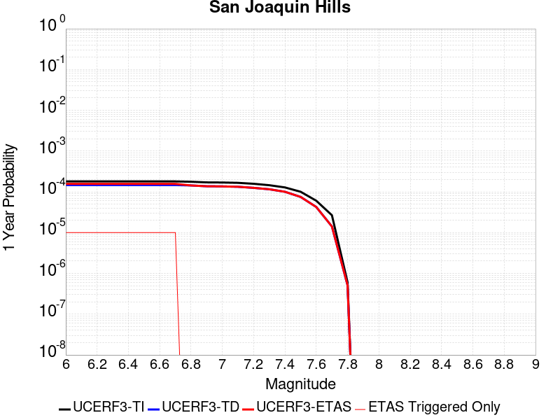 | 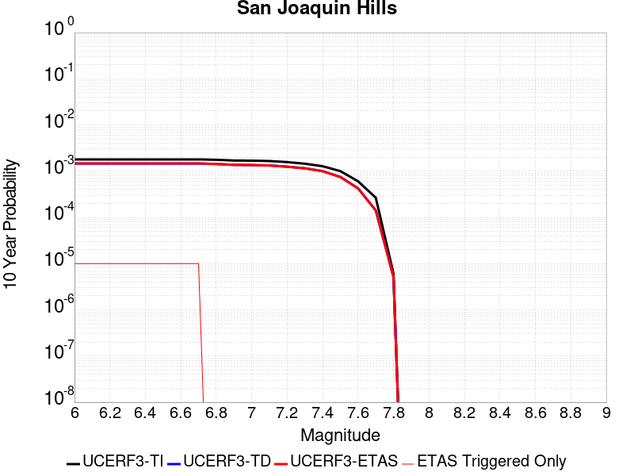 |

| Magnitude | 1 wk TI Prob | 1 wk TD Prob | 1 wk ETAS Prob | 1 wk ETAS/TD Gain | 1 wk ETAS Triggered Only | 1 mo TI Prob | 1 mo TD Prob | 1 mo ETAS Prob | 1 mo ETAS/TD Gain | 1 mo ETAS Triggered Only | 1 yr TI Prob | 1 yr TD Prob | 1 yr ETAS Prob | 1 yr ETAS/TD Gain | 1 yr ETAS Triggered Only | 10 yr TI Prob | 10 yr TD Prob | 10 yr ETAS Prob | 10 yr ETAS/TD Gain | 10 yr ETAS Triggered Only |
|-----|-----|-----|-----|-----|-----|-----|-----|-----|-----|-----|-----|-----|-----|-----|-----|-----|-----|-----|-----|-----|
| 6.0 | 3.4525704E-6 | 2.8139818E-6 | 2.8139818E-6 | 1.0 | 0.0 | 1.4796647E-5 | 1.2059867E-5 | 1.2059867E-5 | 1.0 | 0.0 | 1.8013427E-4 | 1.4681912E-4 | 1.5681765E-4 | 1.068101 | 1.0E-5 | 0.0017998833 | 0.0014672345 | 0.0014772197 | 1.0068055 | 1.0E-5 |
| 6.1 | 3.4525704E-6 | 2.8139818E-6 | 2.8139818E-6 | 1.0 | 0.0 | 1.4796647E-5 | 1.2059867E-5 | 1.2059867E-5 | 1.0 | 0.0 | 1.8013427E-4 | 1.4681912E-4 | 1.5681765E-4 | 1.068101 | 1.0E-5 | 0.0017998833 | 0.0014672345 | 0.0014772197 | 1.0068055 | 1.0E-5 |
| 6.2 | 3.4525704E-6 | 2.8139818E-6 | 2.8139818E-6 | 1.0 | 0.0 | 1.4796647E-5 | 1.2059867E-5 | 1.2059867E-5 | 1.0 | 0.0 | 1.8013427E-4 | 1.4681912E-4 | 1.5681765E-4 | 1.068101 | 1.0E-5 | 0.0017998833 | 0.0014672345 | 0.0014772197 | 1.0068055 | 1.0E-5 |
| 6.3 | 3.4525704E-6 | 2.8139818E-6 | 2.8139818E-6 | 1.0 | 0.0 | 1.4796647E-5 | 1.2059867E-5 | 1.2059867E-5 | 1.0 | 0.0 | 1.8013427E-4 | 1.4681912E-4 | 1.5681765E-4 | 1.068101 | 1.0E-5 | 0.0017998833 | 0.0014672345 | 0.0014772197 | 1.0068055 | 1.0E-5 |
| 6.4 | 3.4525704E-6 | 2.8139818E-6 | 2.8139818E-6 | 1.0 | 0.0 | 1.4796647E-5 | 1.2059867E-5 | 1.2059867E-5 | 1.0 | 0.0 | 1.8013427E-4 | 1.4681912E-4 | 1.5681765E-4 | 1.068101 | 1.0E-5 | 0.0017998833 | 0.0014672345 | 0.0014772197 | 1.0068055 | 1.0E-5 |
| 6.5 | 3.4525704E-6 | 2.8139818E-6 | 2.8139818E-6 | 1.0 | 0.0 | 1.4796647E-5 | 1.2059867E-5 | 1.2059867E-5 | 1.0 | 0.0 | 1.8013427E-4 | 1.4681912E-4 | 1.5681765E-4 | 1.068101 | 1.0E-5 | 0.0017998833 | 0.0014672345 | 0.0014772197 | 1.0068055 | 1.0E-5 |
| 6.6 | 3.4525704E-6 | 2.8139818E-6 | 2.8139818E-6 | 1.0 | 0.0 | 1.4796647E-5 | 1.2059867E-5 | 1.2059867E-5 | 1.0 | 0.0 | 1.8013427E-4 | 1.4681912E-4 | 1.5681765E-4 | 1.068101 | 1.0E-5 | 0.0017998833 | 0.0014672345 | 0.0014772197 | 1.0068055 | 1.0E-5 |
| 6.7 | 3.4525704E-6 | 2.8139818E-6 | 2.8139818E-6 | 1.0 | 0.0 | 1.4796647E-5 | 1.2059867E-5 | 1.2059867E-5 | 1.0 | 0.0 | 1.8013427E-4 | 1.4681912E-4 | 1.5681765E-4 | 1.068101 | 1.0E-5 | 0.0017998833 | 0.0014672345 | 0.0014772197 | 1.0068055 | 1.0E-5 |
| 6.8 | 3.388654E-6 | 2.7484202E-6 | 2.7484202E-6 | 1.0 | 0.0 | 1.4522722E-5 | 1.1778891E-5 | 1.1778891E-5 | 1.0 | 0.0 | 1.767998E-4 | 1.4339869E-4 | 1.4339869E-4 | 1.0 | 0.0 | 0.001766592 | 0.0014330745 | 0.0014330745 | 1.0 | 0.0 |
| 6.9 | 3.2694352E-6 | 2.6283346E-6 | 2.6283346E-6 | 1.0 | 0.0 | 1.401179E-5 | 1.1264243E-5 | 1.1264243E-5 | 1.0 | 0.0 | 1.7058018E-4 | 1.3713364E-4 | 1.3713364E-4 | 1.0 | 0.0 | 0.0017044931 | 0.0013705015 | 0.0013705015 | 1.0 | 0.0 |
| 7.0 | 3.246912E-6 | 2.6069915E-6 | 2.6069915E-6 | 1.0 | 0.0 | 1.39152635E-5 | 1.1172774E-5 | 1.1172774E-5 | 1.0 | 0.0 | 1.6940516E-4 | 1.3602014E-4 | 1.3602014E-4 | 1.0 | 0.0 | 0.0016927607 | 0.0013593802 | 0.0013593802 | 1.0 | 0.0 |
| 7.1 | 3.1864927E-6 | 2.5523198E-6 | 2.5523198E-6 | 1.0 | 0.0 | 1.3656326E-5 | 1.0938467E-5 | 1.0938467E-5 | 1.0 | 0.0 | 1.6625308E-4 | 1.3316782E-4 | 1.3316782E-4 | 1.0 | 0.0 | 0.0016612876 | 0.0013308912 | 0.0013308912 | 1.0 | 0.0 |
| 7.2 | 3.0220644E-6 | 2.3991677E-6 | 2.3991677E-6 | 1.0 | 0.0 | 1.295164E-5 | 1.0282108E-5 | 1.0282108E-5 | 1.0 | 0.0 | 1.576748E-4 | 1.2517757E-4 | 1.2517757E-4 | 1.0 | 0.0 | 0.0015756298 | 0.0012510809 | 0.0012510809 | 1.0 | 0.0 |
| 7.3 | 2.787619E-6 | 2.2173858E-6 | 2.2173858E-6 | 1.0 | 0.0 | 1.1946884E-5 | 9.503048E-6 | 9.503048E-6 | 1.0 | 0.0 | 1.454436E-4 | 1.1569356E-4 | 1.1569356E-4 | 1.0 | 0.0 | 0.0014534845 | 0.0011563431 | 0.0011563431 | 1.0 | 0.0 |
| 7.4 | 2.4593792E-6 | 1.9226306E-6 | 1.9226306E-6 | 1.0 | 0.0 | 1.0540153E-5 | 8.23982E-6 | 8.23982E-6 | 1.0 | 0.0 | 1.2831882E-4 | 1.0031529E-4 | 1.0031529E-4 | 1.0 | 0.0 | 0.0012824474 | 0.0010027088 | 0.0010027088 | 1.0 | 0.0 |
| 7.5 | 1.926764E-6 | 1.4383021E-6 | 1.4383021E-6 | 1.0 | 0.0 | 8.257534E-6 | 6.1641376E-6 | 6.1641376E-6 | 1.0 | 0.0 | 1.00530844E-4 | 7.504586E-5 | 7.504586E-5 | 1.0 | 0.0 | 0.0010048538 | 7.502115E-4 | 7.502115E-4 | 1.0 | 0.0 |
| 7.6 | 1.1609359E-6 | 8.14558E-7 | 8.14558E-7 | 1.0 | 0.0 | 4.97543E-6 | 3.4909585E-6 | 3.4909585E-6 | 1.0 | 0.0 | 6.0574173E-5 | 4.2501633E-5 | 4.2501633E-5 | 1.0 | 0.0 | 6.055767E-4 | 4.249394E-4 | 4.249394E-4 | 1.0 | 0.0 |
| 7.7 | 5.1168536E-7 | 2.7155914E-7 | 2.7155914E-7 | 1.0 | 0.0 | 2.1929354E-6 | 1.1638244E-6 | 1.1638244E-6 | 1.0 | 0.0 | 2.669866E-5 | 1.41694845E-5 | 1.41694845E-5 | 1.0 | 0.0 | 2.6695454E-4 | 1.4168715E-4 | 1.4168715E-4 | 1.0 | 0.0 |
| 7.8 | 1.16056995E-8 | 9.782373E-9 | 9.782373E-9 | 1.0 | 0.0 | 4.9738713E-8 | 4.1924455E-8 | 4.1924455E-8 | 1.0 | 0.0 | 6.0556863E-7 | 5.1043025E-7 | 5.1043025E-7 | 1.0 | 0.0 | 6.05567E-6 | 5.1043025E-6 | 5.1043025E-6 | 1.0 | 0.0 |

## Anacapa-Dume alt 1
*[(top)](#table-of-contents)*

| 1 Week | 1 Month | 1 Year | 10 Year |
|-----|-----|-----|-----|
|  |  |  |  |

| Magnitude | 1 wk TI Prob | 1 wk TD Prob | 1 wk ETAS Prob | 1 wk ETAS/TD Gain | 1 wk ETAS Triggered Only | 1 mo TI Prob | 1 mo TD Prob | 1 mo ETAS Prob | 1 mo ETAS/TD Gain | 1 mo ETAS Triggered Only | 1 yr TI Prob | 1 yr TD Prob | 1 yr ETAS Prob | 1 yr ETAS/TD Gain | 1 yr ETAS Triggered Only | 10 yr TI Prob | 10 yr TD Prob | 10 yr ETAS Prob | 10 yr ETAS/TD Gain | 10 yr ETAS Triggered Only |
|-----|-----|-----|-----|-----|-----|-----|-----|-----|-----|-----|-----|-----|-----|-----|-----|-----|-----|-----|-----|-----|
| 6.0 | 5.1871802E-6 | 5.3673907E-6 | 1.5367337E-5 | 2.8630927 | 1.0E-5 | 2.2230583E-5 | 2.3002905E-5 | 3.3002674E-5 | 1.4347177 | 1.0E-5 | 2.7062374E-4 | 2.8002524E-4 | 2.9002244E-4 | 1.035701 | 1.0E-5 | 0.002702944 | 0.0027968092 | 0.002806781 | 1.0035655 | 1.0E-5 |
| 6.1 | 5.1871802E-6 | 5.3673907E-6 | 1.5367337E-5 | 2.8630927 | 1.0E-5 | 2.2230583E-5 | 2.3002905E-5 | 3.3002674E-5 | 1.4347177 | 1.0E-5 | 2.7062374E-4 | 2.8002524E-4 | 2.9002244E-4 | 1.035701 | 1.0E-5 | 0.002702944 | 0.0027968092 | 0.002806781 | 1.0035655 | 1.0E-5 |
| 6.2 | 5.1871802E-6 | 5.3673907E-6 | 1.5367337E-5 | 2.8630927 | 1.0E-5 | 2.2230583E-5 | 2.3002905E-5 | 3.3002674E-5 | 1.4347177 | 1.0E-5 | 2.7062374E-4 | 2.8002524E-4 | 2.9002244E-4 | 1.035701 | 1.0E-5 | 0.002702944 | 0.0027968092 | 0.002806781 | 1.0035655 | 1.0E-5 |
| 6.3 | 5.1871802E-6 | 5.3673907E-6 | 1.5367337E-5 | 2.8630927 | 1.0E-5 | 2.2230583E-5 | 2.3002905E-5 | 3.3002674E-5 | 1.4347177 | 1.0E-5 | 2.7062374E-4 | 2.8002524E-4 | 2.9002244E-4 | 1.035701 | 1.0E-5 | 0.002702944 | 0.0027968092 | 0.002806781 | 1.0035655 | 1.0E-5 |
| 6.4 | 5.1871802E-6 | 5.3673907E-6 | 1.5367337E-5 | 2.8630927 | 1.0E-5 | 2.2230583E-5 | 2.3002905E-5 | 3.3002674E-5 | 1.4347177 | 1.0E-5 | 2.7062374E-4 | 2.8002524E-4 | 2.9002244E-4 | 1.035701 | 1.0E-5 | 0.002702944 | 0.0027968092 | 0.002806781 | 1.0035655 | 1.0E-5 |
| 6.5 | 5.1871802E-6 | 5.3673907E-6 | 1.5367337E-5 | 2.8630927 | 1.0E-5 | 2.2230583E-5 | 2.3002905E-5 | 3.3002674E-5 | 1.4347177 | 1.0E-5 | 2.7062374E-4 | 2.8002524E-4 | 2.9002244E-4 | 1.035701 | 1.0E-5 | 0.002702944 | 0.0027968092 | 0.002806781 | 1.0035655 | 1.0E-5 |
| 6.6 | 5.1871802E-6 | 5.3673907E-6 | 1.5367337E-5 | 2.8630927 | 1.0E-5 | 2.2230583E-5 | 2.3002905E-5 | 3.3002674E-5 | 1.4347177 | 1.0E-5 | 2.7062374E-4 | 2.8002524E-4 | 2.9002244E-4 | 1.035701 | 1.0E-5 | 0.002702944 | 0.0027968092 | 0.002806781 | 1.0035655 | 1.0E-5 |
| 6.7 | 4.7693475E-6 | 4.9366918E-6 | 1.4936642E-5 | 3.025638 | 1.0E-5 | 2.04399E-5 | 2.1157082E-5 | 3.115687E-5 | 1.4726449 | 1.0E-5 | 2.4882736E-4 | 2.5755778E-4 | 2.675552E-4 | 1.0388162 | 1.0E-5 | 0.0024854892 | 0.002572669 | 0.0025826432 | 1.003877 | 1.0E-5 |
| 6.8 | 4.753408E-6 | 4.92024E-6 | 1.4920191E-5 | 3.032411 | 1.0E-5 | 2.037159E-5 | 2.1086576E-5 | 3.1086365E-5 | 1.4742254 | 1.0E-5 | 2.4799586E-4 | 2.5669957E-4 | 2.66697E-4 | 1.038946 | 1.0E-5 | 0.002477193 | 0.0025641066 | 0.002574081 | 1.00389 | 1.0E-5 |
| 6.9 | 3.800069E-6 | 3.937126E-6 | 3.937126E-6 | 1.0 | 0.0 | 1.6285909E-5 | 1.687329E-5 | 1.687329E-5 | 1.0 | 0.0 | 1.9826289E-4 | 2.0541316E-4 | 2.0541316E-4 | 1.0 | 0.0 | 0.001980861 | 0.0020522568 | 0.0020522568 | 1.0 | 0.0 |
| 7.0 | 3.6671938E-6 | 3.7999182E-6 | 3.7999182E-6 | 1.0 | 0.0 | 1.571645E-5 | 1.6285263E-5 | 1.6285263E-5 | 1.0 | 0.0 | 1.9133097E-4 | 1.9825528E-4 | 1.9825528E-4 | 1.0 | 0.0 | 0.0019116632 | 0.0019808074 | 0.0019808074 | 1.0 | 0.0 |
| 7.1 | 3.2394885E-6 | 3.3587933E-6 | 3.3587933E-6 | 1.0 | 0.0 | 1.3883448E-5 | 1.4394749E-5 | 1.4394749E-5 | 1.0 | 0.0 | 1.6901788E-4 | 1.7524208E-4 | 1.7524208E-4 | 1.0 | 0.0 | 0.0016888938 | 0.0017510501 | 0.0017510501 | 1.0 | 0.0 |
| 7.2 | 3.0935948E-6 | 3.2079258E-6 | 3.2079258E-6 | 1.0 | 0.0 | 1.3258196E-5 | 1.3748182E-5 | 1.3748182E-5 | 1.0 | 0.0 | 1.6140658E-4 | 1.6737137E-4 | 1.6737137E-4 | 1.0 | 0.0 | 0.001612894 | 0.0016724641 | 0.0016724641 | 1.0 | 0.0 |
| 7.3 | 2.5604163E-6 | 2.647073E-6 | 2.647073E-6 | 1.0 | 0.0 | 1.0973167E-5 | 1.1344549E-5 | 1.1344549E-5 | 1.0 | 0.0 | 1.3359012E-4 | 1.3811118E-4 | 1.3811118E-4 | 1.0 | 0.0 | 0.0013350984 | 0.0013802581 | 0.0013802581 | 1.0 | 0.0 |
| 7.4 | 2.1429005E-6 | 2.2106028E-6 | 2.2106028E-6 | 1.0 | 0.0 | 9.1838265E-6 | 9.473977E-6 | 9.473977E-6 | 1.0 | 0.0 | 1.11807356E-4 | 1.1533959E-4 | 1.1533959E-4 | 1.0 | 0.0 | 0.0011175112 | 0.0011527999 | 0.0011527999 | 1.0 | 0.0 |
| 7.5 | 1.7237151E-6 | 1.7761449E-6 | 1.7761449E-6 | 1.0 | 0.0 | 7.3873293E-6 | 7.6120277E-6 | 7.6120277E-6 | 1.0 | 0.0 | 8.993702E-5 | 9.267252E-5 | 9.267252E-5 | 1.0 | 0.0 | 8.990063E-4 | 9.2634105E-4 | 9.2634105E-4 | 1.0 | 0.0 |
| 7.6 | 9.541696E-7 | 9.823206E-7 | 9.823206E-7 | 1.0 | 0.0 | 4.089292E-6 | 4.2099387E-6 | 4.2099387E-6 | 1.0 | 0.0 | 4.9785995E-5 | 5.1254807E-5 | 5.1254807E-5 | 1.0 | 0.0 | 4.9774844E-4 | 5.1243114E-4 | 5.1243114E-4 | 1.0 | 0.0 |
| 7.7 | 2.7226676E-7 | 2.7172416E-7 | 2.7172416E-7 | 1.0 | 0.0 | 1.166857E-6 | 1.1645316E-6 | 1.1645316E-6 | 1.0 | 0.0 | 1.4206392E-5 | 1.4178081E-5 | 1.4178081E-5 | 1.0 | 0.0 | 1.4205484E-4 | 1.4177183E-4 | 1.4177183E-4 | 1.0 | 0.0 |
| 7.8 | 4.5017995E-8 | 4.2157676E-8 | 4.2157676E-8 | 1.0 | 0.0 | 1.9293425E-7 | 1.8067574E-7 | 1.8067574E-7 | 1.0 | 0.0 | 2.348972E-6 | 2.1997253E-6 | 2.1997253E-6 | 1.0 | 0.0 | 2.348947E-5 | 2.1997055E-5 | 2.1997055E-5 | 1.0 | 0.0 |
| 7.9 | 8.007447E-10 | 6.1608785E-10 | 6.1608785E-10 | 1.0 | 0.0 | 3.4317629E-9 | 2.6403764E-9 | 2.6403764E-9 | 1.0 | 0.0 | 4.1781714E-8 | 3.2146584E-8 | 3.2146584E-8 | 1.0 | 0.0 | 4.1781706E-7 | 3.214658E-7 | 3.214658E-7 | 1.0 | 0.0 |

## Sheephole
*[(top)](#table-of-contents)*

| 1 Week | 1 Month | 1 Year | 10 Year |
|-----|-----|-----|-----|
|  |  |  |  |

| Magnitude | 1 wk TI Prob | 1 wk TD Prob | 1 wk ETAS Prob | 1 wk ETAS/TD Gain | 1 wk ETAS Triggered Only | 1 mo TI Prob | 1 mo TD Prob | 1 mo ETAS Prob | 1 mo ETAS/TD Gain | 1 mo ETAS Triggered Only | 1 yr TI Prob | 1 yr TD Prob | 1 yr ETAS Prob | 1 yr ETAS/TD Gain | 1 yr ETAS Triggered Only | 10 yr TI Prob | 10 yr TD Prob | 10 yr ETAS Prob | 10 yr ETAS/TD Gain | 10 yr ETAS Triggered Only |
|-----|-----|-----|-----|-----|-----|-----|-----|-----|-----|-----|-----|-----|-----|-----|-----|-----|-----|-----|-----|-----|
| 6.0 | 4.5579695E-6 | 4.7412627E-6 | 1.4741215E-5 | 3.1091328 | 1.0E-5 | 1.9534009E-5 | 2.031957E-5 | 3.0319366E-5 | 1.4921265 | 1.0E-5 | 2.3780059E-4 | 2.473682E-4 | 2.5736575E-4 | 1.0404155 | 1.0E-5 | 0.0023754628 | 0.002471473 | 0.0024814485 | 1.0040362 | 1.0E-5 |
| 6.1 | 4.5579695E-6 | 4.7412627E-6 | 1.4741215E-5 | 3.1091328 | 1.0E-5 | 1.9534009E-5 | 2.031957E-5 | 3.0319366E-5 | 1.4921265 | 1.0E-5 | 2.3780059E-4 | 2.473682E-4 | 2.5736575E-4 | 1.0404155 | 1.0E-5 | 0.0023754628 | 0.002471473 | 0.0024814485 | 1.0040362 | 1.0E-5 |
| 6.2 | 2.6677674E-6 | 2.7873941E-6 | 2.7873941E-6 | 1.0 | 0.0 | 1.1433239E-5 | 1.1945926E-5 | 1.1945926E-5 | 1.0 | 0.0 | 1.3919079E-4 | 1.4543302E-4 | 1.4543302E-4 | 1.0 | 0.0 | 0.0013910364 | 0.0014534844 | 0.0014534844 | 1.0 | 0.0 |
| 6.3 | 2.6677674E-6 | 2.7873941E-6 | 2.7873941E-6 | 1.0 | 0.0 | 1.1433239E-5 | 1.1945926E-5 | 1.1945926E-5 | 1.0 | 0.0 | 1.3919079E-4 | 1.4543302E-4 | 1.4543302E-4 | 1.0 | 0.0 | 0.0013910364 | 0.0014534844 | 0.0014534844 | 1.0 | 0.0 |
| 6.4 | 2.2159759E-6 | 2.3228788E-6 | 2.3228788E-6 | 1.0 | 0.0 | 9.497005E-6 | 9.955161E-6 | 9.955161E-6 | 1.0 | 0.0 | 1.156199E-4 | 1.2119815E-4 | 1.2119815E-4 | 1.0 | 0.0 | 0.0011555976 | 0.0012113999 | 0.0012113999 | 1.0 | 0.0 |
| 6.5 | 2.1986082E-6 | 2.304759E-6 | 2.304759E-6 | 1.0 | 0.0 | 9.4225725E-6 | 9.877506E-6 | 9.877506E-6 | 1.0 | 0.0 | 1.1471378E-4 | 1.2025281E-4 | 1.2025281E-4 | 1.0 | 0.0 | 0.0011465458 | 0.0012019566 | 0.0012019566 | 1.0 | 0.0 |
| 6.6 | 1.5232331E-6 | 1.6018919E-6 | 1.6018919E-6 | 1.0 | 0.0 | 6.5281256E-6 | 6.865234E-6 | 6.865234E-6 | 1.0 | 0.0 | 7.947703E-5 | 8.35812E-5 | 8.35812E-5 | 1.0 | 0.0 | 7.9448614E-4 | 8.3551643E-4 | 8.3551643E-4 | 1.0 | 0.0 |
| 6.7 | 1.3137362E-6 | 1.382819E-6 | 1.382819E-6 | 1.0 | 0.0 | 5.6302856E-6 | 5.926355E-6 | 5.926355E-6 | 1.0 | 0.0 | 6.854657E-5 | 7.215112E-5 | 7.215112E-5 | 1.0 | 0.0 | 6.8525434E-4 | 7.212908E-4 | 7.212908E-4 | 1.0 | 0.0 |
| 6.8 | 1.2275751E-6 | 1.2922847E-6 | 1.2922847E-6 | 1.0 | 0.0 | 5.2610258E-6 | 5.5383516E-6 | 5.5383516E-6 | 1.0 | 0.0 | 6.4051106E-5 | 6.7427485E-5 | 6.7427485E-5 | 1.0 | 0.0 | 6.4032647E-4 | 6.740836E-4 | 6.740836E-4 | 1.0 | 0.0 |
| 6.9 | 1.1837088E-6 | 1.246102E-6 | 1.246102E-6 | 1.0 | 0.0 | 5.0730278E-6 | 5.340427E-6 | 5.340427E-6 | 1.0 | 0.0 | 6.176237E-5 | 6.501789E-5 | 6.501789E-5 | 1.0 | 0.0 | 6.17452E-4 | 6.5000186E-4 | 6.5000186E-4 | 1.0 | 0.0 |
| 7.0 | 9.849371E-7 | 1.0366288E-6 | 1.0366288E-6 | 1.0 | 0.0 | 4.2211523E-6 | 4.442688E-6 | 4.442688E-6 | 1.0 | 0.0 | 5.1391315E-5 | 5.4088487E-5 | 5.4088487E-5 | 1.0 | 0.0 | 5.137943E-4 | 5.407633E-4 | 5.407633E-4 | 1.0 | 0.0 |
| 7.1 | 8.1643645E-7 | 8.591669E-7 | 8.591669E-7 | 1.0 | 0.0 | 3.4990085E-6 | 3.682139E-6 | 3.682139E-6 | 1.0 | 0.0 | 4.2599597E-5 | 4.482921E-5 | 4.482921E-5 | 1.0 | 0.0 | 4.259143E-4 | 4.4821028E-4 | 4.4821028E-4 | 1.0 | 0.0 |
| 7.2 | 5.7295756E-7 | 6.029502E-7 | 6.029502E-7 | 1.0 | 0.0 | 2.45553E-6 | 2.58407E-6 | 2.58407E-6 | 1.0 | 0.0 | 2.9895667E-5 | 3.1460666E-5 | 3.1460666E-5 | 1.0 | 0.0 | 2.9891645E-4 | 3.145688E-4 | 3.145688E-4 | 1.0 | 0.0 |

## Ozena
*[(top)](#table-of-contents)*

| 1 Week | 1 Month | 1 Year | 10 Year |
|-----|-----|-----|-----|
|  |  |  |  |

| Magnitude | 1 wk TI Prob | 1 wk TD Prob | 1 wk ETAS Prob | 1 wk ETAS/TD Gain | 1 wk ETAS Triggered Only | 1 mo TI Prob | 1 mo TD Prob | 1 mo ETAS Prob | 1 mo ETAS/TD Gain | 1 mo ETAS Triggered Only | 1 yr TI Prob | 1 yr TD Prob | 1 yr ETAS Prob | 1 yr ETAS/TD Gain | 1 yr ETAS Triggered Only | 10 yr TI Prob | 10 yr TD Prob | 10 yr ETAS Prob | 10 yr ETAS/TD Gain | 10 yr ETAS Triggered Only |
|-----|-----|-----|-----|-----|-----|-----|-----|-----|-----|-----|-----|-----|-----|-----|-----|-----|-----|-----|-----|-----|
| 6.0 | 1.4377547E-6 | 1.4513782E-6 | 1.1451364E-5 | 7.889992 | 1.0E-5 | 6.161791E-6 | 6.2201793E-6 | 1.6220118E-5 | 2.6076608 | 1.0E-5 | 7.5017226E-5 | 7.572832E-5 | 8.5727566E-5 | 1.132041 | 1.0E-5 | 7.4991904E-4 | 7.570518E-4 | 7.670442E-4 | 1.0131991 | 1.0E-5 |
| 6.1 | 1.4377547E-6 | 1.4513782E-6 | 1.1451364E-5 | 7.889992 | 1.0E-5 | 6.161791E-6 | 6.2201793E-6 | 1.6220118E-5 | 2.6076608 | 1.0E-5 | 7.5017226E-5 | 7.572832E-5 | 8.5727566E-5 | 1.132041 | 1.0E-5 | 7.4991904E-4 | 7.570518E-4 | 7.670442E-4 | 1.0131991 | 1.0E-5 |
| 6.2 | 1.4377547E-6 | 1.4513782E-6 | 1.1451364E-5 | 7.889992 | 1.0E-5 | 6.161791E-6 | 6.2201793E-6 | 1.6220118E-5 | 2.6076608 | 1.0E-5 | 7.5017226E-5 | 7.572832E-5 | 8.5727566E-5 | 1.132041 | 1.0E-5 | 7.4991904E-4 | 7.570518E-4 | 7.670442E-4 | 1.0131991 | 1.0E-5 |
| 6.3 | 1.4377547E-6 | 1.4513782E-6 | 1.1451364E-5 | 7.889992 | 1.0E-5 | 6.161791E-6 | 6.2201793E-6 | 1.6220118E-5 | 2.6076608 | 1.0E-5 | 7.5017226E-5 | 7.572832E-5 | 8.5727566E-5 | 1.132041 | 1.0E-5 | 7.4991904E-4 | 7.570518E-4 | 7.670442E-4 | 1.0131991 | 1.0E-5 |
| 6.4 | 1.4377547E-6 | 1.4513782E-6 | 1.1451364E-5 | 7.889992 | 1.0E-5 | 6.161791E-6 | 6.2201793E-6 | 1.6220118E-5 | 2.6076608 | 1.0E-5 | 7.5017226E-5 | 7.572832E-5 | 8.5727566E-5 | 1.132041 | 1.0E-5 | 7.4991904E-4 | 7.570518E-4 | 7.670442E-4 | 1.0131991 | 1.0E-5 |
| 6.5 | 1.4377547E-6 | 1.4513782E-6 | 1.1451364E-5 | 7.889992 | 1.0E-5 | 6.161791E-6 | 6.2201793E-6 | 1.6220118E-5 | 2.6076608 | 1.0E-5 | 7.5017226E-5 | 7.572832E-5 | 8.5727566E-5 | 1.132041 | 1.0E-5 | 7.4991904E-4 | 7.570518E-4 | 7.670442E-4 | 1.0131991 | 1.0E-5 |
| 6.6 | 1.4377547E-6 | 1.4513782E-6 | 1.1451364E-5 | 7.889992 | 1.0E-5 | 6.161791E-6 | 6.2201793E-6 | 1.6220118E-5 | 2.6076608 | 1.0E-5 | 7.5017226E-5 | 7.572832E-5 | 8.5727566E-5 | 1.132041 | 1.0E-5 | 7.4991904E-4 | 7.570518E-4 | 7.670442E-4 | 1.0131991 | 1.0E-5 |
| 6.7 | 1.4377547E-6 | 1.4513782E-6 | 1.1451364E-5 | 7.889992 | 1.0E-5 | 6.161791E-6 | 6.2201793E-6 | 1.6220118E-5 | 2.6076608 | 1.0E-5 | 7.5017226E-5 | 7.572832E-5 | 8.5727566E-5 | 1.132041 | 1.0E-5 | 7.4991904E-4 | 7.570518E-4 | 7.670442E-4 | 1.0131991 | 1.0E-5 |
| 6.8 | 9.223257E-7 | 9.317624E-7 | 9.317624E-7 | 1.0 | 0.0 | 3.9528186E-6 | 3.9932615E-6 | 3.9932615E-6 | 1.0 | 0.0 | 4.81245E-5 | 4.8616912E-5 | 4.8616912E-5 | 1.0 | 0.0 | 4.811408E-4 | 4.860668E-4 | 4.860668E-4 | 1.0 | 0.0 |
| 6.9 | 9.141515E-7 | 9.235371E-7 | 9.235371E-7 | 1.0 | 0.0 | 3.917786E-6 | 3.9580104E-6 | 3.9580104E-6 | 1.0 | 0.0 | 4.7698002E-5 | 4.818775E-5 | 4.818775E-5 | 1.0 | 0.0 | 4.7687767E-4 | 4.8177704E-4 | 4.8177704E-4 | 1.0 | 0.0 |
| 7.0 | 8.767648E-7 | 8.8585773E-7 | 8.8585773E-7 | 1.0 | 0.0 | 3.757558E-6 | 3.7965276E-6 | 3.7965276E-6 | 1.0 | 0.0 | 4.5747307E-5 | 4.6221783E-5 | 4.6221783E-5 | 1.0 | 0.0 | 4.5737892E-4 | 4.6212564E-4 | 4.6212564E-4 | 1.0 | 0.0 |
| 7.1 | 8.199402E-7 | 8.2853984E-7 | 8.2853984E-7 | 1.0 | 0.0 | 3.5140247E-6 | 3.5508804E-6 | 3.5508804E-6 | 1.0 | 0.0 | 4.2782412E-5 | 4.323115E-5 | 4.323115E-5 | 1.0 | 0.0 | 4.2774176E-4 | 4.322311E-4 | 4.322311E-4 | 1.0 | 0.0 |
| 7.2 | 7.38705E-7 | 7.464262E-7 | 7.464262E-7 | 1.0 | 0.0 | 3.1658747E-6 | 3.198966E-6 | 3.198966E-6 | 1.0 | 0.0 | 3.8543843E-5 | 3.894675E-5 | 3.894675E-5 | 1.0 | 0.0 | 3.853716E-4 | 3.8940276E-4 | 3.8940276E-4 | 1.0 | 0.0 |
| 7.3 | 6.490017E-7 | 6.557802E-7 | 6.557802E-7 | 1.0 | 0.0 | 2.7814328E-6 | 2.8104837E-6 | 2.8104837E-6 | 1.0 | 0.0 | 3.386342E-5 | 3.4217133E-5 | 3.4217133E-5 | 1.0 | 0.0 | 3.3858258E-4 | 3.4212202E-4 | 3.4212202E-4 | 1.0 | 0.0 |
| 7.4 | 5.346736E-7 | 5.4022604E-7 | 5.4022604E-7 | 1.0 | 0.0 | 2.291456E-6 | 2.3152527E-6 | 2.3152527E-6 | 1.0 | 0.0 | 2.789812E-5 | 2.8187867E-5 | 2.8187867E-5 | 1.0 | 0.0 | 2.789462E-4 | 2.8184598E-4 | 2.8184598E-4 | 1.0 | 0.0 |
| 7.5 | 2.939325E-7 | 2.9666057E-7 | 2.9666057E-7 | 1.0 | 0.0 | 1.25971E-6 | 1.271402E-6 | 1.271402E-6 | 1.0 | 0.0 | 1.5336862E-5 | 1.5479225E-5 | 1.5479225E-5 | 1.0 | 0.0 | 1.5335804E-4 | 1.5478309E-4 | 1.5478309E-4 | 1.0 | 0.0 |
| 7.6 | 1.4151905E-7 | 1.4253266E-7 | 1.4253266E-7 | 1.0 | 0.0 | 6.065101E-7 | 6.108541E-7 | 6.108541E-7 | 1.0 | 0.0 | 7.3842357E-6 | 7.4371237E-6 | 7.4371237E-6 | 1.0 | 0.0 | 7.38399E-5 | 7.436883E-5 | 7.436883E-5 | 1.0 | 0.0 |
| 7.7 | 4.4957577E-8 | 4.5252243E-8 | 4.5252243E-8 | 1.0 | 0.0 | 1.9267533E-7 | 1.9393818E-7 | 1.9393818E-7 | 1.0 | 0.0 | 2.3458194E-6 | 2.3611947E-6 | 2.3611947E-6 | 1.0 | 0.0 | 2.3457947E-5 | 2.3611707E-5 | 2.3611707E-5 | 1.0 | 0.0 |
| 7.8 | 5.9993255E-9 | 6.0412972E-9 | 6.0412972E-9 | 1.0 | 0.0 | 2.5711394E-8 | 2.5891273E-8 | 2.5891273E-8 | 1.0 | 0.0 | 3.1303617E-7 | 3.1522623E-7 | 3.1522623E-7 | 1.0 | 0.0 | 3.1303573E-6 | 3.1522588E-6 | 3.1522588E-6 | 1.0 | 0.0 |

## Earthquake Valley (No  Extension)
*[(top)](#table-of-contents)*

| 1 Week | 1 Month | 1 Year | 10 Year |
|-----|-----|-----|-----|
|  |  |  |  |

| Magnitude | 1 wk TI Prob | 1 wk TD Prob | 1 wk ETAS Prob | 1 wk ETAS/TD Gain | 1 wk ETAS Triggered Only | 1 mo TI Prob | 1 mo TD Prob | 1 mo ETAS Prob | 1 mo ETAS/TD Gain | 1 mo ETAS Triggered Only | 1 yr TI Prob | 1 yr TD Prob | 1 yr ETAS Prob | 1 yr ETAS/TD Gain | 1 yr ETAS Triggered Only | 10 yr TI Prob | 10 yr TD Prob | 10 yr ETAS Prob | 10 yr ETAS/TD Gain | 10 yr ETAS Triggered Only |
|-----|-----|-----|-----|-----|-----|-----|-----|-----|-----|-----|-----|-----|-----|-----|-----|-----|-----|-----|-----|-----|
| 6.0 | 2.1859703E-5 | 2.5198362E-5 | 3.519811E-5 | 1.3968412 | 1.0E-5 | 9.3681076E-5 | 1.07989326E-4 | 1.17988246E-4 | 1.0925918 | 1.0E-5 | 0.0011399703 | 0.001314122 | 0.0013241089 | 1.0075996 | 1.0E-5 | 0.011341401 | 0.013077871 | 0.01308774 | 1.0007546 | 1.0E-5 |
| 6.1 | 2.1859703E-5 | 2.5198362E-5 | 3.519811E-5 | 1.3968412 | 1.0E-5 | 9.3681076E-5 | 1.07989326E-4 | 1.17988246E-4 | 1.0925918 | 1.0E-5 | 0.0011399703 | 0.001314122 | 0.0013241089 | 1.0075996 | 1.0E-5 | 0.011341401 | 0.013077871 | 0.01308774 | 1.0007546 | 1.0E-5 |
| 6.2 | 2.1859703E-5 | 2.5198362E-5 | 3.519811E-5 | 1.3968412 | 1.0E-5 | 9.3681076E-5 | 1.07989326E-4 | 1.17988246E-4 | 1.0925918 | 1.0E-5 | 0.0011399703 | 0.001314122 | 0.0013241089 | 1.0075996 | 1.0E-5 | 0.011341401 | 0.013077871 | 0.01308774 | 1.0007546 | 1.0E-5 |
| 6.3 | 2.1859703E-5 | 2.5198362E-5 | 3.519811E-5 | 1.3968412 | 1.0E-5 | 9.3681076E-5 | 1.07989326E-4 | 1.17988246E-4 | 1.0925918 | 1.0E-5 | 0.0011399703 | 0.001314122 | 0.0013241089 | 1.0075996 | 1.0E-5 | 0.011341401 | 0.013077871 | 0.01308774 | 1.0007546 | 1.0E-5 |
| 6.4 | 2.1859703E-5 | 2.5198362E-5 | 3.519811E-5 | 1.3968412 | 1.0E-5 | 9.3681076E-5 | 1.07989326E-4 | 1.17988246E-4 | 1.0925918 | 1.0E-5 | 0.0011399703 | 0.001314122 | 0.0013241089 | 1.0075996 | 1.0E-5 | 0.011341401 | 0.013077871 | 0.01308774 | 1.0007546 | 1.0E-5 |
| 6.5 | 2.1859703E-5 | 2.5198362E-5 | 3.519811E-5 | 1.3968412 | 1.0E-5 | 9.3681076E-5 | 1.07989326E-4 | 1.17988246E-4 | 1.0925918 | 1.0E-5 | 0.0011399703 | 0.001314122 | 0.0013241089 | 1.0075996 | 1.0E-5 | 0.011341401 | 0.013077871 | 0.01308774 | 1.0007546 | 1.0E-5 |
| 6.6 | 1.597E-5 | 1.8356275E-5 | 1.8356275E-5 | 1.0 | 0.0 | 6.8441055E-5 | 7.866787E-5 | 7.866787E-5 | 1.0 | 0.0 | 8.329513E-4 | 9.574478E-4 | 9.574478E-4 | 1.0 | 0.0 | 0.008298361 | 0.009541836 | 0.009541836 | 1.0 | 0.0 |
| 6.7 | 1.597E-5 | 1.8356275E-5 | 1.8356275E-5 | 1.0 | 0.0 | 6.8441055E-5 | 7.866787E-5 | 7.866787E-5 | 1.0 | 0.0 | 8.329513E-4 | 9.574478E-4 | 9.574478E-4 | 1.0 | 0.0 | 0.008298361 | 0.009541836 | 0.009541836 | 1.0 | 0.0 |
| 6.8 | 1.5315149E-5 | 1.7602091E-5 | 1.7602091E-5 | 1.0 | 0.0 | 6.5634704E-5 | 7.543584E-5 | 7.543584E-5 | 1.0 | 0.0 | 7.988095E-4 | 9.181311E-4 | 9.181311E-4 | 1.0 | 0.0 | 0.007959441 | 0.009151919 | 0.009151919 | 1.0 | 0.0 |
| 6.9 | 1.3634728E-5 | 1.5675821E-5 | 1.5675821E-5 | 1.0 | 0.0 | 5.8433237E-5 | 6.718082E-5 | 6.718082E-5 | 1.0 | 0.0 | 7.1119244E-4 | 8.177017E-4 | 8.177017E-4 | 1.0 | 0.0 | 0.007089207 | 0.008155 | 0.008155 | 1.0 | 0.0 |
| 7.0 | 1.3496271E-5 | 1.5517853E-5 | 1.5517853E-5 | 1.0 | 0.0 | 5.783988E-5 | 6.650385E-5 | 6.650385E-5 | 1.0 | 0.0 | 7.03973E-4 | 8.094657E-4 | 8.094657E-4 | 1.0 | 0.0 | 0.007017471 | 0.0080732405 | 0.0080732405 | 1.0 | 0.0 |
| 7.1 | 8.242798E-6 | 9.4726E-6 | 9.4726E-6 | 1.0 | 0.0 | 3.53258E-5 | 4.0596606E-5 | 4.0596606E-5 | 1.0 | 0.0 | 4.300067E-4 | 4.9421866E-4 | 4.9421866E-4 | 1.0 | 0.0 | 0.004291756 | 0.0049377717 | 0.0049377717 | 1.0 | 0.0 |
| 7.2 | 2.6506527E-7 | 2.2560312E-7 | 2.2560312E-7 | 1.0 | 0.0 | 1.1359936E-6 | 9.668702E-7 | 9.668702E-7 | 1.0 | 0.0 | 1.3830633E-5 | 1.17715845E-5 | 1.17715845E-5 | 1.0 | 0.0 | 1.3829772E-4 | 1.1771003E-4 | 1.1771003E-4 | 1.0 | 0.0 |
| 7.3 | 2.5810488E-7 | 2.1955442E-7 | 2.1955442E-7 | 1.0 | 0.0 | 1.1061633E-6 | 9.409472E-7 | 9.409472E-7 | 1.0 | 0.0 | 1.3467455E-5 | 1.1455976E-5 | 1.1455976E-5 | 1.0 | 0.0 | 1.3466639E-4 | 1.1455427E-4 | 1.1455427E-4 | 1.0 | 0.0 |
| 7.4 | 2.2676066E-7 | 1.9110601E-7 | 1.9110601E-7 | 1.0 | 0.0 | 9.71831E-7 | 8.190255E-7 | 8.190255E-7 | 1.0 | 0.0 | 1.1831979E-5 | 9.9715935E-6 | 9.9715935E-6 | 1.0 | 0.0 | 1.1831349E-4 | 9.9711855E-5 | 9.9711855E-5 | 1.0 | 0.0 |
| 7.5 | 1.5553917E-7 | 1.3112096E-7 | 1.3112096E-7 | 1.0 | 0.0 | 6.6659624E-7 | 5.619469E-7 | 5.619469E-7 | 1.0 | 0.0 | 8.115779E-6 | 6.8416834E-6 | 6.8416834E-6 | 1.0 | 0.0 | 8.115482E-5 | 6.841495E-5 | 6.841495E-5 | 1.0 | 0.0 |
| 7.6 | 1.3448629E-7 | 1.1288419E-7 | 1.1288419E-7 | 1.0 | 0.0 | 5.7636964E-7 | 4.837893E-7 | 4.837893E-7 | 1.0 | 0.0 | 7.017278E-6 | 5.890121E-6 | 5.890121E-6 | 1.0 | 0.0 | 7.0170565E-5 | 5.889986E-5 | 5.889986E-5 | 1.0 | 0.0 |
| 7.7 | 2.9719402E-8 | 1.458206E-8 | 1.458206E-8 | 1.0 | 0.0 | 1.2736886E-7 | 6.249454E-8 | 6.249454E-8 | 1.0 | 0.0 | 1.5507147E-6 | 7.608708E-7 | 7.608708E-7 | 1.0 | 0.0 | 1.550704E-5 | 7.6086876E-6 | 7.6086876E-6 | 1.0 | 0.0 |
| 7.8 | 7.4390196E-9 | 3.2502152E-9 | 3.2502152E-9 | 1.0 | 0.0 | 3.1881513E-8 | 1.3929493E-8 | 1.3929493E-8 | 1.0 | 0.0 | 3.8815733E-7 | 1.6959156E-7 | 1.6959156E-7 | 1.0 | 0.0 | 3.8815665E-6 | 1.6959145E-6 | 1.6959145E-6 | 1.0 | 0.0 |
| 7.9 | 1.5373532E-9 | 8.440161E-10 | 8.440161E-10 | 1.0 | 0.0 | 6.5886567E-9 | 3.6172119E-9 | 3.6172119E-9 | 1.0 | 0.0 | 8.021689E-8 | 4.4039556E-8 | 4.4039556E-8 | 1.0 | 0.0 | 8.0216864E-7 | 4.4039552E-7 | 4.4039552E-7 | 1.0 | 0.0 |

## Rodgers Creek - Healdsburg 2011 CFM
*[(top)](#table-of-contents)*

| 1 Week | 1 Month | 1 Year | 10 Year |
|-----|-----|-----|-----|
|  |  |  |  |

| Magnitude | 1 wk TI Prob | 1 wk TD Prob | 1 wk ETAS Prob | 1 wk ETAS/TD Gain | 1 wk ETAS Triggered Only | 1 mo TI Prob | 1 mo TD Prob | 1 mo ETAS Prob | 1 mo ETAS/TD Gain | 1 mo ETAS Triggered Only | 1 yr TI Prob | 1 yr TD Prob | 1 yr ETAS Prob | 1 yr ETAS/TD Gain | 1 yr ETAS Triggered Only | 10 yr TI Prob | 10 yr TD Prob | 10 yr ETAS Prob | 10 yr ETAS/TD Gain | 10 yr ETAS Triggered Only |
|-----|-----|-----|-----|-----|-----|-----|-----|-----|-----|-----|-----|-----|-----|-----|-----|-----|-----|-----|-----|-----|
| 6.0 | 7.390182E-5 | 1.3136698E-4 | 1.4136567E-4 | 1.0761126 | 1.0E-5 | 3.1668364E-4 | 5.6287815E-4 | 5.728725E-4 | 1.0177559 | 1.0E-5 | 0.0038488081 | 0.0068315 | 0.0068414323 | 1.0014538 | 1.0E-5 | 0.037828278 | 0.06619178 | 0.06620111 | 1.000141 | 1.0E-5 |
| 6.1 | 7.318768E-5 | 1.3034661E-4 | 1.403453E-4 | 1.0767086 | 1.0E-5 | 3.1362378E-4 | 5.585081E-4 | 5.685025E-4 | 1.0178949 | 1.0E-5 | 0.0038116854 | 0.0067786723 | 0.0067886044 | 1.0014652 | 1.0E-5 | 0.037469655 | 0.06569639 | 0.06570573 | 1.0001422 | 1.0E-5 |
| 6.2 | 7.1379836E-5 | 1.2727521E-4 | 1.3727394E-4 | 1.0785599 | 1.0E-5 | 3.058777E-4 | 5.453505E-4 | 5.5534503E-4 | 1.0183269 | 1.0E-5 | 0.003717703 | 0.0066194604 | 0.0066293944 | 1.0015007 | 1.0E-5 | 0.0365612 | 0.06421462 | 0.064223975 | 1.0001457 | 1.0E-5 |
| 6.3 | 6.9255926E-5 | 1.2382054E-4 | 1.338193E-4 | 1.080752 | 1.0E-5 | 2.9677735E-4 | 5.3055194E-4 | 5.4054667E-4 | 1.0188383 | 1.0E-5 | 0.0036072785 | 0.006440372 | 0.006450308 | 1.0015427 | 1.0E-5 | 0.035492823 | 0.06254096 | 0.062550336 | 1.0001498 | 1.0E-5 |
| 6.4 | 6.6757144E-5 | 1.1958744E-4 | 1.2958625E-4 | 1.0836108 | 1.0E-5 | 2.8607066E-4 | 5.1241735E-4 | 5.2241224E-4 | 1.0195054 | 1.0E-5 | 0.0034773487 | 0.0062209065 | 0.006230844 | 1.0015975 | 1.0E-5 | 0.034234364 | 0.060490217 | 0.060499612 | 1.0001553 | 1.0E-5 |
| 6.5 | 6.5735134E-5 | 1.1808043E-4 | 1.2807925E-4 | 1.084678 | 1.0E-5 | 2.8169158E-4 | 5.0596124E-4 | 5.159562E-4 | 1.0197544 | 1.0E-5 | 0.003424202 | 0.0061427657 | 0.0061527044 | 1.0016179 | 1.0E-5 | 0.03371918 | 0.059755135 | 0.059764538 | 1.0001574 | 1.0E-5 |
| 6.6 | 6.289601E-5 | 1.1343802E-4 | 1.234369E-4 | 1.0881438 | 1.0E-5 | 2.6952647E-4 | 4.8607276E-4 | 4.960679E-4 | 1.020563 | 1.0E-5 | 0.0032765474 | 0.005901959 | 0.0059118997 | 1.0016843 | 1.0E-5 | 0.032286562 | 0.057494484 | 0.05750391 | 1.0001639 | 1.0E-5 |
| 6.7 | 6.115274E-5 | 1.1060895E-4 | 1.20607845E-4 | 1.0903986 | 1.0E-5 | 2.6205686E-4 | 4.7395262E-4 | 4.8394786E-4 | 1.0210892 | 1.0E-5 | 0.0031858748 | 0.0057551847 | 0.005765127 | 1.0017276 | 1.0E-5 | 0.031405866 | 0.05611298 | 0.05612242 | 1.0001682 | 1.0E-5 |
| 6.8 | 5.9232367E-5 | 1.0728244E-4 | 1.17281365E-4 | 1.0932019 | 1.0E-5 | 2.538283E-4 | 4.597012E-4 | 4.6969662E-4 | 1.0217433 | 1.0E-5 | 0.0030859804 | 0.0055825757 | 0.00559252 | 1.0017813 | 1.0E-5 | 0.030434765 | 0.054479737 | 0.05448919 | 1.0001736 | 1.0E-5 |
| 6.9 | 5.4030377E-5 | 9.8224424E-5 | 1.08223445E-4 | 1.1017977 | 1.0E-5 | 2.315382E-4 | 4.2089424E-4 | 4.3089004E-4 | 1.023749 | 1.0E-5 | 0.0028153337 | 0.005112413 | 0.0051223617 | 1.001946 | 1.0E-5 | 0.027799325 | 0.05001516 | 0.05002466 | 1.0001899 | 1.0E-5 |
| 7.0 | 4.8260714E-5 | 8.740524E-5 | 8.740524E-5 | 1.0 | 0.0 | 2.0681522E-4 | 3.745404E-4 | 3.745404E-4 | 1.0 | 0.0 | 0.0025150678 | 0.004550549 | 0.004550549 | 1.0 | 0.0 | 0.024867928 | 0.044667665 | 0.044667665 | 1.0 | 0.0 |
| 7.1 | 4.0294493E-5 | 7.389041E-5 | 7.389041E-5 | 1.0 | 0.0 | 1.7267925E-4 | 3.1663495E-4 | 3.1663495E-4 | 1.0 | 0.0 | 0.0021003427 | 0.0038482544 | 0.0038482544 | 1.0 | 0.0 | 0.02080602 | 0.037923392 | 0.037923392 | 1.0 | 0.0 |
| 7.2 | 3.096388E-5 | 5.697752E-5 | 5.697752E-5 | 1.0 | 0.0 | 1.326956E-4 | 2.4416664E-4 | 2.4416664E-4 | 1.0 | 0.0 | 0.0016143717 | 0.0029686983 | 0.0029686983 | 1.0 | 0.0 | 0.01602694 | 0.029436996 | 0.029436996 | 1.0 | 0.0 |
| 7.3 | 2.3615226E-5 | 4.3628002E-5 | 4.3628002E-5 | 1.0 | 0.0 | 1.0120418E-4 | 1.8696384E-4 | 1.8696384E-4 | 1.0 | 0.0 | 0.0012314644 | 0.002273922 | 0.002273922 | 1.0 | 0.0 | 0.0122466255 | 0.022636993 | 0.022636993 | 1.0 | 0.0 |
| 7.4 | 1.8251132E-5 | 3.3541033E-5 | 3.3541033E-5 | 1.0 | 0.0 | 7.821679E-5 | 1.4373941E-4 | 1.4373941E-4 | 1.0 | 0.0 | 9.518733E-4 | 0.0017486324 | 0.0017486324 | 1.0 | 0.0 | 0.009478063 | 0.017465532 | 0.017465532 | 1.0 | 0.0 |
| 7.5 | 1.2411432E-5 | 2.246003E-5 | 2.246003E-5 | 1.0 | 0.0 | 5.3190768E-5 | 9.625375E-5 | 9.625375E-5 | 1.0 | 0.0 | 6.4740516E-4 | 0.0011712653 | 0.0011712653 | 1.0 | 0.0 | 0.006455223 | 0.011743283 | 0.011743283 | 1.0 | 0.0 |
| 7.6 | 4.4771446E-6 | 8.083989E-6 | 8.083989E-6 | 1.0 | 0.0 | 1.918762E-5 | 3.4645214E-5 | 3.4645214E-5 | 1.0 | 0.0 | 2.3358424E-4 | 4.2172507E-4 | 4.2172507E-4 | 1.0 | 0.0 | 0.0023333887 | 0.004246066 | 0.004246066 | 1.0 | 0.0 |
| 7.7 | 2.157941E-7 | 3.5349316E-7 | 3.5349316E-7 | 1.0 | 0.0 | 9.248315E-7 | 1.5149698E-6 | 1.5149698E-6 | 1.0 | 0.0 | 1.1259765E-5 | 1.8444602E-5 | 1.8444602E-5 | 1.0 | 0.0 | 1.1259195E-4 | 1.9069147E-4 | 1.9069147E-4 | 1.0 | 0.0 |
| 7.8 | 9.9623286E-8 | 1.989979E-7 | 1.989979E-7 | 1.0 | 0.0 | 4.269569E-7 | 8.528478E-7 | 8.528478E-7 | 1.0 | 0.0 | 5.1981874E-6 | 1.0383373E-5 | 1.0383373E-5 | 1.0 | 0.0 | 5.198066E-5 | 1.09018714E-4 | 1.09018714E-4 | 1.0 | 0.0 |
| 7.9 | 5.6745257E-8 | 1.1773924E-7 | 1.1773924E-7 | 1.0 | 0.0 | 2.4319394E-7 | 5.0459664E-7 | 5.0459664E-7 | 1.0 | 0.0 | 2.960882E-6 | 6.1434466E-6 | 6.1434466E-6 | 1.0 | 0.0 | 2.9608427E-5 | 6.470911E-5 | 6.470911E-5 | 1.0 | 0.0 |
| 8.0 | 2.8614323E-8 | 6.57845E-8 | 6.57845E-8 | 1.0 | 0.0 | 1.2263281E-7 | 2.8193355E-7 | 2.8193355E-7 | 1.0 | 0.0 | 1.4930534E-6 | 3.4325356E-6 | 3.4325356E-6 | 1.0 | 0.0 | 1.4930434E-5 | 3.582588E-5 | 3.582588E-5 | 1.0 | 0.0 |
| 8.1 | 3.5045191E-9 | 8.965783E-9 | 8.965783E-9 | 1.0 | 0.0 | 1.5019367E-8 | 3.8424783E-8 | 3.8424783E-8 | 1.0 | 0.0 | 1.8286079E-7 | 4.6782165E-7 | 4.6782165E-7 | 1.0 | 0.0 | 1.8286064E-6 | 4.8327956E-6 | 4.8327956E-6 | 1.0 | 0.0 |

## Greenville (No) 2011 CFM
*[(top)](#table-of-contents)*

| 1 Week | 1 Month | 1 Year | 10 Year |
|-----|-----|-----|-----|
|  |  |  |  |

| Magnitude | 1 wk TI Prob | 1 wk TD Prob | 1 wk ETAS Prob | 1 wk ETAS/TD Gain | 1 wk ETAS Triggered Only | 1 mo TI Prob | 1 mo TD Prob | 1 mo ETAS Prob | 1 mo ETAS/TD Gain | 1 mo ETAS Triggered Only | 1 yr TI Prob | 1 yr TD Prob | 1 yr ETAS Prob | 1 yr ETAS/TD Gain | 1 yr ETAS Triggered Only | 10 yr TI Prob | 10 yr TD Prob | 10 yr ETAS Prob | 10 yr ETAS/TD Gain | 10 yr ETAS Triggered Only |
|-----|-----|-----|-----|-----|-----|-----|-----|-----|-----|-----|-----|-----|-----|-----|-----|-----|-----|-----|-----|-----|
| 6.0 | 3.286654E-5 | 4.036648E-5 | 4.036648E-5 | 1.0 | 0.0 | 1.4084899E-4 | 1.7298796E-4 | 1.7298796E-4 | 1.0 | 0.0 | 0.0017134876 | 0.002104132 | 0.002114111 | 1.0047425 | 1.0E-5 | 0.017003356 | 0.020846982 | 0.020856773 | 1.0004697 | 1.0E-5 |
| 6.1 | 3.286654E-5 | 4.036648E-5 | 4.036648E-5 | 1.0 | 0.0 | 1.4084899E-4 | 1.7298796E-4 | 1.7298796E-4 | 1.0 | 0.0 | 0.0017134876 | 0.002104132 | 0.002114111 | 1.0047425 | 1.0E-5 | 0.017003356 | 0.020846982 | 0.020856773 | 1.0004697 | 1.0E-5 |
| 6.2 | 3.1697953E-5 | 3.8929385E-5 | 3.8929385E-5 | 1.0 | 0.0 | 1.358413E-4 | 1.6682976E-4 | 1.6682976E-4 | 1.0 | 0.0 | 0.0016526132 | 0.002029298 | 0.002039278 | 1.0049179 | 1.0E-5 | 0.01640377 | 0.020112377 | 0.020122174 | 1.0004872 | 1.0E-5 |
| 6.3 | 3.1363317E-5 | 3.851826E-5 | 3.851826E-5 | 1.0 | 0.0 | 1.344073E-4 | 1.6506804E-4 | 1.6506804E-4 | 1.0 | 0.0 | 0.0016351803 | 0.0020078886 | 0.0020178687 | 1.0049703 | 1.0E-5 | 0.016232004 | 0.019902144 | 0.019911945 | 1.0004925 | 1.0E-5 |
| 6.4 | 3.0228604E-5 | 3.7125395E-5 | 3.7125395E-5 | 1.0 | 0.0 | 1.2954473E-4 | 1.5909935E-4 | 1.5909935E-4 | 1.0 | 0.0 | 0.0015760659 | 0.0019353506 | 0.0019453312 | 1.005157 | 1.0E-5 | 0.015649348 | 0.019189484 | 0.019199293 | 1.0005112 | 1.0E-5 |
| 6.5 | 2.9537814E-5 | 3.6280853E-5 | 3.6280853E-5 | 1.0 | 0.0 | 1.2658449E-4 | 1.554803E-4 | 1.554803E-4 | 1.0 | 0.0 | 0.0015400766 | 0.0018913659 | 0.001901347 | 1.0052772 | 1.0E-5 | 0.01529447 | 0.018757146 | 0.018766958 | 1.0005231 | 1.0E-5 |
| 6.6 | 2.7345395E-5 | 3.3590182E-5 | 3.3590182E-5 | 1.0 | 0.0 | 1.1718928E-4 | 1.4395016E-4 | 1.4395016E-4 | 1.0 | 0.0 | 0.0014258457 | 0.0017512152 | 0.0017611977 | 1.0057003 | 1.0E-5 | 0.014167317 | 0.01737797 | 0.017387796 | 1.0005654 | 1.0E-5 |
| 6.7 | 2.5615784E-5 | 3.1567088E-5 | 3.1567088E-5 | 1.0 | 0.0 | 1.09777306E-4 | 1.3528067E-4 | 1.3528067E-4 | 1.0 | 0.0 | 0.0013357193 | 0.0016458282 | 0.0016558118 | 1.006066 | 1.0E-5 | 0.013277191 | 0.016340064 | 0.0163499 | 1.000602 | 1.0E-5 |
| 6.8 | 2.0059057E-5 | 2.4712073E-5 | 2.4712073E-5 | 1.0 | 0.0 | 8.596455E-5 | 1.0590468E-4 | 1.0590468E-4 | 1.0 | 0.0 | 0.0010461159 | 0.001288643 | 0.001288643 | 1.0 | 0.0 | 0.0104120495 | 0.012813724 | 0.012813724 | 1.0 | 0.0 |
| 6.9 | 1.6321746E-5 | 2.018467E-5 | 2.018467E-5 | 1.0 | 0.0 | 6.9948466E-5 | 8.650293E-5 | 8.650293E-5 | 1.0 | 0.0 | 8.5128983E-4 | 0.0010526767 | 0.0010526767 | 1.0 | 0.0 | 0.008480361 | 0.010478431 | 0.010478431 | 1.0 | 0.0 |
| 7.0 | 1.22527645E-5 | 1.5135633E-5 | 1.5135633E-5 | 1.0 | 0.0 | 5.2510793E-5 | 6.486541E-5 | 6.486541E-5 | 1.0 | 0.0 | 6.3913135E-4 | 7.894544E-4 | 7.894544E-4 | 1.0 | 0.0 | 0.0063729626 | 0.007867137 | 0.007867137 | 1.0 | 0.0 |
| 7.1 | 8.996482E-6 | 1.1164954E-5 | 1.1164954E-5 | 1.0 | 0.0 | 3.8555783E-5 | 4.7848935E-5 | 4.7848935E-5 | 1.0 | 0.0 | 4.6931554E-4 | 5.824063E-4 | 5.824063E-4 | 1.0 | 0.0 | 0.004683256 | 0.0058090906 | 0.0058090906 | 1.0 | 0.0 |
| 7.2 | 6.0273087E-6 | 7.569474E-6 | 7.569474E-6 | 1.0 | 0.0 | 2.5831067E-5 | 3.2440203E-5 | 3.2440203E-5 | 1.0 | 0.0 | 3.1444785E-4 | 3.9488857E-4 | 3.9488857E-4 | 1.0 | 0.0 | 0.0031400328 | 0.003942066 | 0.003942066 | 1.0 | 0.0 |
| 7.3 | 3.1209995E-6 | 3.9663746E-6 | 3.9663746E-6 | 1.0 | 0.0 | 1.3375643E-5 | 1.699864E-5 | 1.699864E-5 | 1.0 | 0.0 | 1.6283628E-4 | 2.0693893E-4 | 2.0693893E-4 | 1.0 | 0.0 | 0.0016271701 | 0.0020675526 | 0.0020675526 | 1.0 | 0.0 |
| 7.4 | 2.0254208E-6 | 2.6096043E-6 | 2.6096043E-6 | 1.0 | 0.0 | 8.680347E-6 | 1.1183971E-5 | 1.1183971E-5 | 1.0 | 0.0 | 1.0567809E-4 | 1.361564E-4 | 1.361564E-4 | 1.0 | 0.0 | 0.0010562785 | 0.0013607866 | 0.0013607866 | 1.0 | 0.0 |
| 7.5 | 1.6763418E-6 | 2.173353E-6 | 2.173353E-6 | 1.0 | 0.0 | 7.184302E-6 | 9.314337E-6 | 9.314337E-6 | 1.0 | 0.0 | 8.746537E-5 | 1.1339621E-4 | 1.1339621E-4 | 1.0 | 0.0 | 8.743095E-4 | 0.0011334305 | 0.0011334305 | 1.0 | 0.0 |
| 7.6 | 1.1935462E-6 | 1.5458467E-6 | 1.5458467E-6 | 1.0 | 0.0 | 5.115188E-6 | 6.6250404E-6 | 6.6250404E-6 | 1.0 | 0.0 | 6.2275634E-5 | 8.065693E-5 | 8.065693E-5 | 1.0 | 0.0 | 6.2258187E-4 | 8.0630725E-4 | 8.0630725E-4 | 1.0 | 0.0 |
| 7.7 | 3.0464201E-7 | 3.9846822E-7 | 3.9846822E-7 | 1.0 | 0.0 | 1.3056081E-6 | 1.7077199E-6 | 1.7077199E-6 | 1.0 | 0.0 | 1.589566E-5 | 2.0791296E-5 | 2.0791296E-5 | 1.0 | 0.0 | 1.5894524E-4 | 2.0789822E-4 | 2.0789822E-4 | 1.0 | 0.0 |

