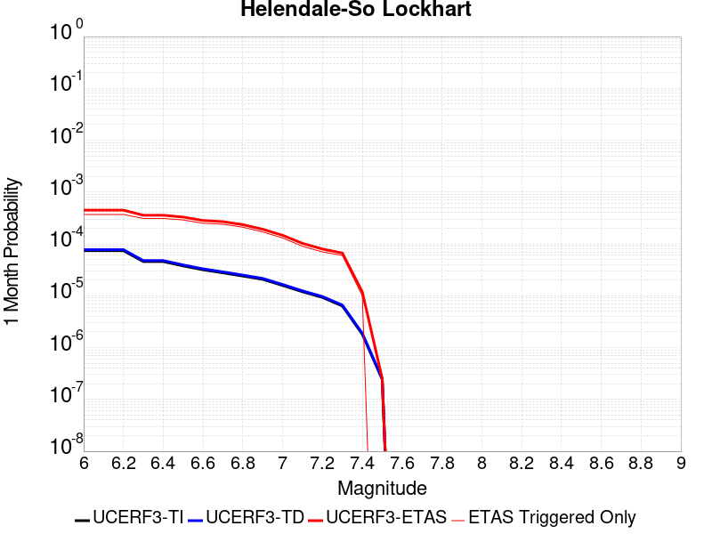
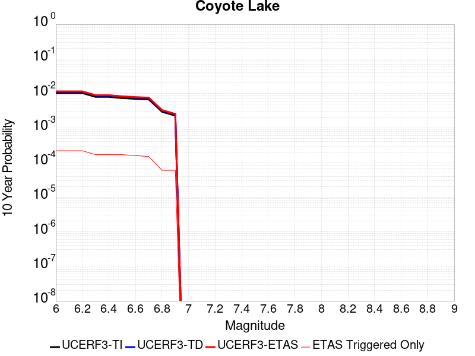
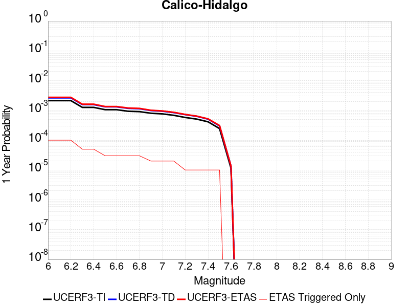
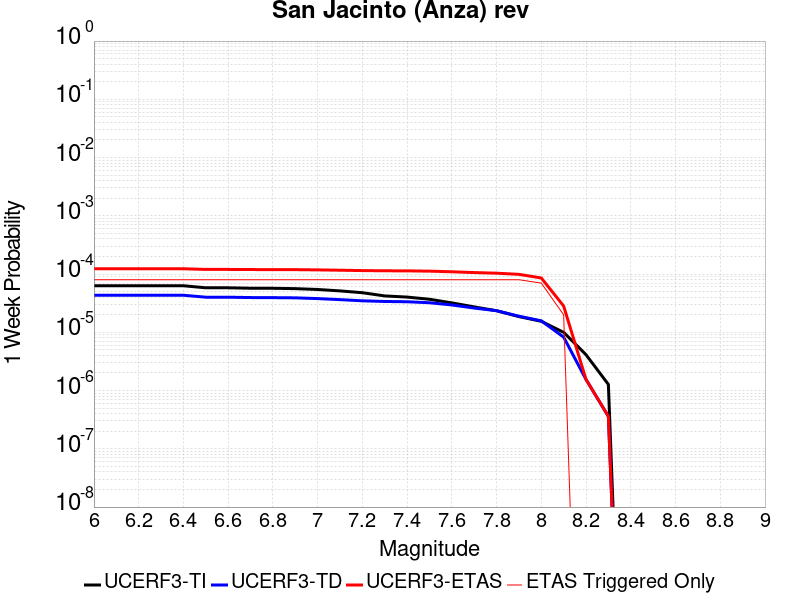
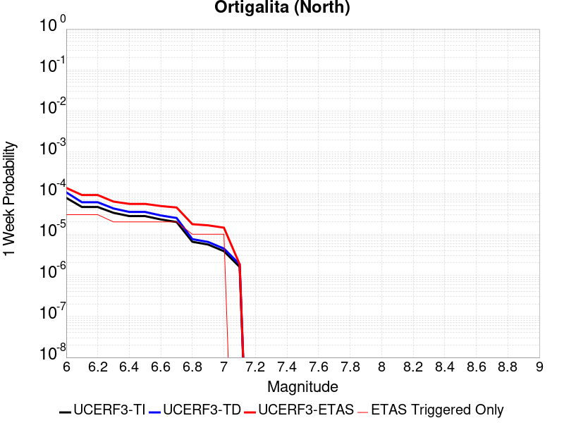
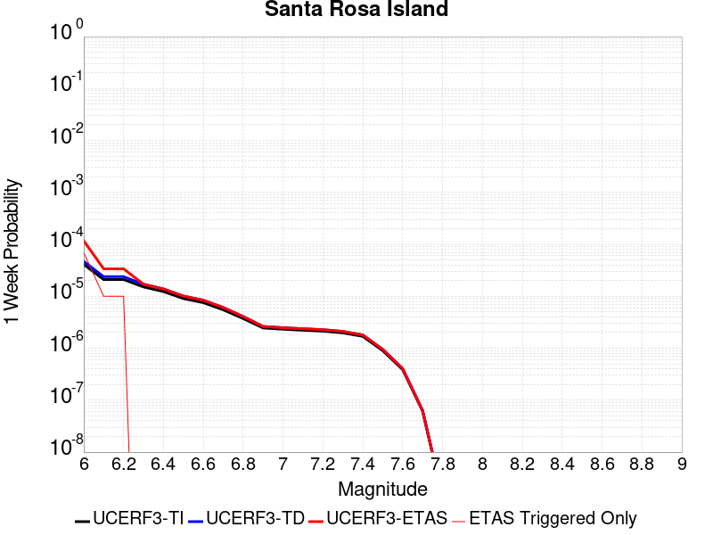
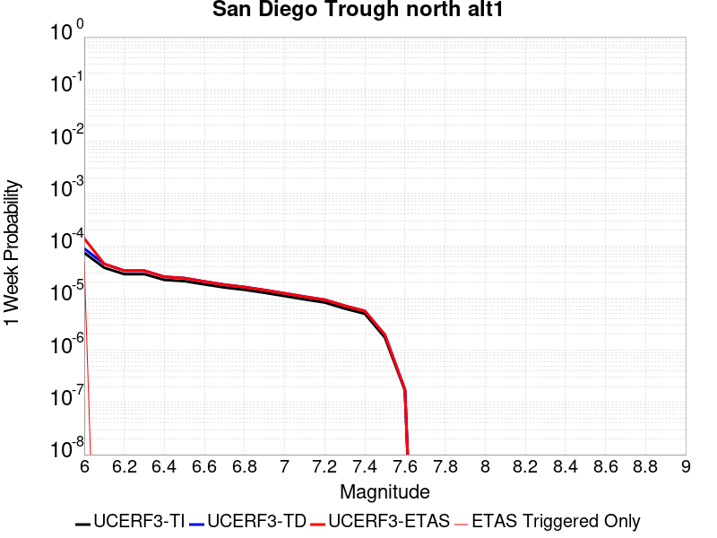
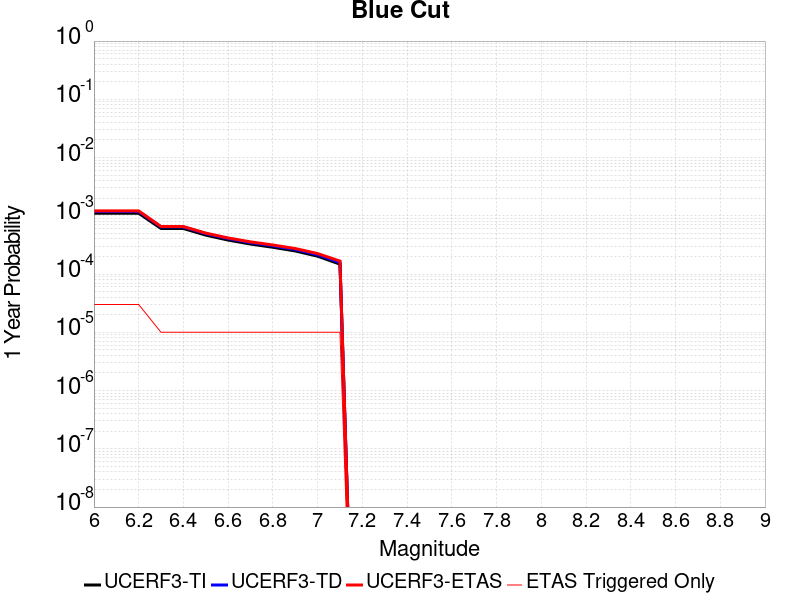

# Parent Section Magnitude-Probability Distributions

Only fault sections with at least one triggered aftershock are plotted. Sections are sorted by total supraseismogenic trigger rate (decreasing)

## Table Of Contents

* [Garlock (Central)](#garlock-central)
* [Tank Canyon](#tank-canyon)
* [Little Lake](#little-lake)
* [Airport Lake](#airport-lake)
* [Owl Lake](#owl-lake)
* [Panamint Valley](#panamint-valley)
* [Garlock (East)](#garlock-east)
* [Hunter Mountain-Saline Valley](#hunter-mountain-saline-valley)
* [Blackwater](#blackwater)
* [Garlock (West)](#garlock-west)
* [Ash Hill](#ash-hill)
* [Gravel Hills-Harper Lk](#gravel-hills-harper-lk)
* [McLean Lake](#mclean-lake)
* [San Andreas (Mojave S)](#san-andreas-mojave-s)
* [San Andreas (Mojave N)](#san-andreas-mojave-n)
* [Goldstone Lake](#goldstone-lake)
* [So Sierra Nevada](#so-sierra-nevada)
* [Death Valley (So)](#death-valley-so)
* [Nelson Lake](#nelson-lake)
* [Lenwood-Lockhart-Old Woman Springs](#lenwood-lockhart-old-woman-springs)
* [Towne Pass](#towne-pass)
* [San Andreas (San Bernardino N)](#san-andreas-san-bernardino-n)
* [Coyote Canyon](#coyote-canyon)
* [Paradise](#paradise)
* [Death Valley (Black Mtns Frontal)](#death-valley-black-mtns-frontal)
* [Bicycle Lake](#bicycle-lake)
* [Helendale-So Lockhart](#helendale-so-lockhart)
* [San Andreas (San Bernardino S)](#san-andreas-san-bernardino-s)
* [Garlic Springs](#garlic-springs)
* [Death Valley (No)](#death-valley-no)
* [San Andreas (Big Bend)](#san-andreas-big-bend)
* [San Andreas (Parkfield)](#san-andreas-parkfield)
* [San Andreas (Coachella) rev](#san-andreas-coachella-rev)
* [Baker](#baker)
* [Coyote Lake](#coyote-lake)
* [White Wolf (Extension)](#white-wolf-extension)
* [San Andreas (Carrizo) rev](#san-andreas-carrizo-rev)
* [Red Pass](#red-pass)
* [Calico-Hidalgo](#calico-hidalgo)
* [Death Valley (Fish Lake Valley)](#death-valley-fish-lake-valley)
* [Lake Isabella (Seismicity)](#lake-isabella-seismicity)
* [San Andreas (San Gorgonio Pass-Garnet HIll)](#san-andreas-san-gorgonio-pass-garnet-hill)
* [Santa Ynez (East)](#santa-ynez-east)
* [San Jacinto (San Bernardino)](#san-jacinto-san-bernardino)
* [Ludlow](#ludlow)
* [Deep Springs](#deep-springs)
* [Coronado Bank alt1](#coronado-bank-alt1)
* [Cleghorn Lake](#cleghorn-lake)
* [Santa Ynez (West)](#santa-ynez-west)
* [San Jacinto (Stepovers Combined)](#san-jacinto-stepovers-combined)
* [San Andreas (Creeping Section) 2011 CFM](#san-andreas-creeping-section-2011-cfm)
* [San Jacinto (San Jacinto Valley) rev](#san-jacinto-san-jacinto-valley-rev)
* [Sierra Nevada  (No Extension)](#sierra-nevada--no-extension)
* [San Andreas (North Branch Mill Creek)](#san-andreas-north-branch-mill-creek)
* [San Andreas (Cholame) rev](#san-andreas-cholame-rev)
* [San Jacinto (Anza) rev](#san-jacinto-anza-rev)
* [Bullion Mountains](#bullion-mountains)
* [Manix-Afton Hills](#manix-afton-hills)
* [Scodie Lineament](#scodie-lineament)
* [San Pedro Basin](#san-pedro-basin)
* [San Gabriel](#san-gabriel)
* [Elsinore (Stepovers Combined)](#elsinore-stepovers-combined)
* [Lost Hills](#lost-hills)
* [Cady](#cady)
* [Mission Ridge-Arroyo Parida-Santa Ana](#mission-ridge-arroyo-parida-santa-ana)
* [Camp Rock 2011](#camp-rock-2011)
* [San Jacinto (Clark) rev](#san-jacinto-clark-rev)
* [Kern Canyon (South Kern) 2011](#kern-canyon-south-kern-2011)
* [Robinson Creek](#robinson-creek)
* [Pisgah-Bullion Mtn-Mesquite Lk](#pisgah-bullion-mtn-mesquite-lk)
* [Ortigalita (North)](#ortigalita-north)
* [South Klamath Lake East](#south-klamath-lake-east)
* [San Diego Trough south](#san-diego-trough-south)
* [Santa Cruz Catalina Ridge alt1](#santa-cruz-catalina-ridge-alt1)
* [Santa Rosa Island](#santa-rosa-island)
* [Elsinore (Glen Ivy) rev](#elsinore-glen-ivy-rev)
* [Surprise Valley 2011 CFM](#surprise-valley-2011-cfm)
* [Whittier alt 1](#whittier-alt-1)
* [Hayward (No) 2011 CFM](#hayward-no-2011-cfm)
* [Big Lagoon - Bald Mtn 2011 CFM](#big-lagoon---bald-mtn-2011-cfm)
* [Palos Verdes](#palos-verdes)
* [San Diego Trough north alt1](#san-diego-trough-north-alt1)
* [Great Valley 05 Pittsburg - Kirby Hills alt1](#great-valley-05-pittsburg---kirby-hills-alt1)
* [Cleghorn Pass](#cleghorn-pass)
* [Channel Islands Thrust](#channel-islands-thrust)
* [Pinto Mtn](#pinto-mtn)
* [Elsinore (Temecula) rev](#elsinore-temecula-rev)
* [Blue Cut](#blue-cut)
* [San Jacinto (Borrego)](#san-jacinto-borrego)
* [Great Valley 09 (Laguna Seca)](#great-valley-09-laguna-seca)
* [Rodgers Creek - Healdsburg 2011 CFM](#rodgers-creek---healdsburg-2011-cfm)
* [San Jacinto (Coyote Creek)](#san-jacinto-coyote-creek)
* [Mono Lake 2011 CFM](#mono-lake-2011-cfm)
* [Emerson-Copper Mtn 2011](#emerson-copper-mtn-2011)

## Garlock (Central)
*[(top)](#table-of-contents)*

| 1 Week | 1 Month | 1 Year | 10 Year |
|-----|-----|-----|-----|
|  |  |  |  |

| Magnitude | 1 wk TI Prob | 1 wk TD Prob | 1 wk ETAS Prob | 1 wk ETAS/TD Gain | 1 wk ETAS Triggered Only | 1 mo TI Prob | 1 mo TD Prob | 1 mo ETAS Prob | 1 mo ETAS/TD Gain | 1 mo ETAS Triggered Only | 1 yr TI Prob | 1 yr TD Prob | 1 yr ETAS Prob | 1 yr ETAS/TD Gain | 1 yr ETAS Triggered Only | 10 yr TI Prob | 10 yr TD Prob | 10 yr ETAS Prob | 10 yr ETAS/TD Gain | 10 yr ETAS Triggered Only |
|-----|-----|-----|-----|-----|-----|-----|-----|-----|-----|-----|-----|-----|-----|-----|-----|-----|-----|-----|-----|-----|
| 6.0 | 5.5131142E-5 | 7.024681E-5 | 0.0625193 | 889.99475 | 0.062453434 | 2.3625491E-4 | 3.010234E-4 | 0.06856289 | 227.76599 | 0.06828242 | 0.0028726095 | 0.0036588663 | 0.07819778 | 21.372133 | 0.07481264 | 0.028357591 | 0.036079824 | 0.11140391 | 3.0877066 | 0.07814349 |
| 6.1 | 5.5131142E-5 | 7.024681E-5 | 0.0625193 | 889.99475 | 0.062453434 | 2.3625491E-4 | 3.010234E-4 | 0.06856289 | 227.76599 | 0.06828242 | 0.0028726095 | 0.0036588663 | 0.07819778 | 21.372133 | 0.07481264 | 0.028357591 | 0.036079824 | 0.11140391 | 3.0877066 | 0.07814349 |
| 6.2 | 4.216245E-5 | 5.1661493E-5 | 0.037697084 | 729.6941 | 0.037647367 | 1.806837E-4 | 2.2138779E-4 | 0.040883813 | 184.6706 | 0.04067143 | 0.0021976046 | 0.0026920962 | 0.04688188 | 17.414637 | 0.04430907 | 0.021759989 | 0.026689773 | 0.07190645 | 2.6941571 | 0.04645659 |
| 6.3 | 4.216245E-5 | 5.1661493E-5 | 0.037697084 | 729.6941 | 0.037647367 | 1.806837E-4 | 2.2138779E-4 | 0.040883813 | 184.6706 | 0.04067143 | 0.0021976046 | 0.0026920962 | 0.04688188 | 17.414637 | 0.04430907 | 0.021759989 | 0.026689773 | 0.07190645 | 2.6941571 | 0.04645659 |
| 6.4 | 3.6858168E-5 | 4.411054E-5 | 0.028267436 | 640.8317 | 0.028224569 | 1.5795401E-4 | 1.8903162E-4 | 0.030862112 | 163.26428 | 0.03067888 | 0.0019213937 | 0.002299056 | 0.035662156 | 15.511651 | 0.03343998 | 0.019048655 | 0.02284894 | 0.057237875 | 2.505056 | 0.03519306 |
| 6.5 | 3.39199E-5 | 4.0018083E-5 | 0.02550247 | 637.2736 | 0.02546347 | 1.453629E-4 | 1.7149492E-4 | 0.027953029 | 162.99625 | 0.0277863 | 0.0017683565 | 0.002085973 | 0.032263502 | 15.466884 | 0.03024061 | 0.017543508 | 0.020759864 | 0.052003533 | 2.5050037 | 0.031906035 |
| 6.6 | 3.3571985E-5 | 3.9472274E-5 | 0.025458112 | 644.9619 | 0.025419643 | 1.4387199E-4 | 1.6915603E-4 | 0.027906936 | 164.97748 | 0.027742473 | 0.0017502342 | 0.0020575512 | 0.032192204 | 15.645883 | 0.030196782 | 0.017365133 | 0.020481179 | 0.05169081 | 2.5238202 | 0.031862207 |
| 6.7 | 3.2580007E-5 | 3.8088703E-5 | 0.024580257 | 645.34247 | 0.024543105 | 1.3962112E-4 | 1.632272E-4 | 0.026893316 | 164.76001 | 0.026734453 | 0.0016985617 | 0.0019855013 | 0.03107257 | 15.649735 | 0.029144935 | 0.016856372 | 0.019773813 | 0.049889017 | 2.522984 | 0.030722708 |
| 6.8 | 3.2185937E-5 | 3.7515918E-5 | 0.024185272 | 644.6669 | 0.024148662 | 1.3793244E-4 | 1.6077272E-4 | 0.026452728 | 164.53493 | 0.026296183 | 0.0016780337 | 0.001955672 | 0.030606197 | 15.649964 | 0.028706666 | 0.016654192 | 0.019480614 | 0.049089145 | 2.5198972 | 0.030196782 |
| 6.9 | 3.165394E-5 | 3.6720503E-5 | 0.02374624 | 646.67523 | 0.02371039 | 1.3565269E-4 | 1.5736422E-4 | 0.025967387 | 165.01457 | 0.025814086 | 0.0016503202 | 0.001914247 | 0.030084787 | 15.71625 | 0.028224569 | 0.01638118 | 0.019073246 | 0.048135195 | 2.5237021 | 0.029627033 |
| 7.0 | 3.0903822E-5 | 3.5625766E-5 | 0.023350744 | 655.4454 | 0.02331595 | 1.3243823E-4 | 1.5267303E-4 | 0.025524614 | 167.18483 | 0.025375817 | 0.0016112428 | 0.0018572307 | 0.029591925 | 15.93336 | 0.0277863 | 0.015996104 | 0.018512413 | 0.047117807 | 2.5452006 | 0.029144935 |
| 7.1 | 3.0069863E-5 | 3.4392073E-5 | 0.022166252 | 644.5163 | 0.02213262 | 1.2886449E-4 | 1.4738638E-4 | 0.024117207 | 163.63252 | 0.023973353 | 0.0015677959 | 0.0017929734 | 0.027823266 | 15.517947 | 0.026077047 | 0.01556781 | 0.017880075 | 0.04473912 | 2.5021775 | 0.02734803 |
| 7.2 | 2.7957109E-5 | 3.128145E-5 | 0.01896394 | 606.2359 | 0.018933252 | 1.1981068E-4 | 1.340566E-4 | 0.020729972 | 154.63597 | 0.020598676 | 0.0014577188 | 0.0016309366 | 0.024077505 | 14.762992 | 0.022483237 | 0.014481937 | 0.016283695 | 0.039349314 | 2.4164855 | 0.02344743 |
| 7.3 | 2.4519275E-5 | 2.6714795E-5 | 0.01343741 | 502.99506 | 0.013411053 | 1.0507837E-4 | 1.1448703E-4 | 0.014488088 | 126.547844 | 0.014375246 | 0.0012785783 | 0.001393003 | 0.017017437 | 12.216367 | 0.015646229 | 0.012712469 | 0.013928054 | 0.029961392 | 2.1511543 | 0.016259806 |
| 7.4 | 2.3225532E-5 | 2.51994E-5 | 0.0122087905 | 484.48734 | 0.012183898 | 9.95342E-5 | 1.0799304E-4 | 0.013210842 | 122.3305 | 0.013104265 | 0.0012111551 | 0.0013140367 | 0.015582855 | 11.8587675 | 0.014287593 | 0.012045753 | 0.013145725 | 0.02785101 | 2.1186361 | 0.0149011705 |
| 7.5 | 2.097765E-5 | 2.2483688E-5 | 0.009839504 | 437.62857 | 0.009817242 | 8.9901114E-5 | 9.635517E-5 | 0.010613815 | 110.15304 | 0.010518473 | 0.0010939965 | 0.0011725046 | 0.012685483 | 10.819133 | 0.011526493 | 0.010886264 | 0.011740365 | 0.023651283 | 2.014527 | 0.012052417 |
| 7.6 | 1.511254E-5 | 1.5991332E-5 | 0.005143665 | 321.6533 | 0.0051277555 | 6.476642E-5 | 6.853253E-5 | 0.0055465284 | 80.932785 | 0.0054783714 | 7.882459E-4 | 8.3407195E-4 | 0.00692094 | 8.297773 | 0.006091949 | 0.007854558 | 0.008383559 | 0.014728652 | 1.7568496 | 0.006398738 |
| 7.7 | 9.934069E-6 | 1.0678794E-5 | 0.0016760859 | 156.95462 | 0.0016654249 | 4.2573887E-5 | 4.5765457E-5 | 0.0017549391 | 38.34637 | 0.0017092519 | 5.182138E-4 | 5.570524E-4 | 0.0024405622 | 4.381208 | 0.0018845598 | 0.00517007 | 0.005627684 | 0.0076759593 | 1.3639642 | 0.0020598676 |
| 7.8 | 6.7562896E-6 | 8.428449E-6 | 0.0011479201 | 136.19589 | 0.0011395012 | 2.8955206E-5 | 3.6121426E-5 | 0.001219407 | 33.75855 | 0.0011833282 | 3.5247262E-4 | 4.3968976E-4 | 0.0017101131 | 3.889363 | 0.0012709822 | 0.0035191406 | 0.004446654 | 0.005755617 | 1.2943702 | 0.0013148091 |
| 7.9 | 3.975453E-6 | 5.37103E-6 | 5.312919E-4 | 98.91805 | 5.259237E-4 | 1.7037546E-5 | 2.3018498E-5 | 5.4893E-4 | 23.847343 | 5.259237E-4 | 2.0741238E-4 | 2.8021427E-4 | 8.0599054E-4 | 2.8763366 | 5.259237E-4 | 0.002072189 | 0.0028336283 | 0.0034017644 | 1.2004977 | 5.697506E-4 |
| 8.0 | 1.6729537E-6 | 2.0775144E-6 | 2.650388E-4 | 127.57495 | 2.6296184E-4 | 7.169782E-6 | 8.903603E-6 | 2.718631E-4 | 30.534054 | 2.6296184E-4 | 8.7288594E-5 | 1.0839601E-4 | 3.7132934E-4 | 3.4256735 | 2.6296184E-4 | 8.7254314E-4 | 0.0010969337 | 0.0013596072 | 1.2394614 | 2.6296184E-4 |
| 8.1 | 3.6733252E-7 | 3.1489964E-7 | 3.1489964E-7 | 1.0 | 0.0 | 1.5742813E-6 | 1.3495693E-6 | 1.3495693E-6 | 1.0 | 0.0 | 1.9166706E-5 | 1.6430899E-5 | 1.6430899E-5 | 1.0 | 0.0 | 1.9165053E-4 | 1.6638759E-4 | 1.6638759E-4 | 1.0 | 0.0 |

## Tank Canyon
*[(top)](#table-of-contents)*

| 1 Week | 1 Month | 1 Year | 10 Year |
|-----|-----|-----|-----|
|  |  |  |  |

| Magnitude | 1 wk TI Prob | 1 wk TD Prob | 1 wk ETAS Prob | 1 wk ETAS/TD Gain | 1 wk ETAS Triggered Only | 1 mo TI Prob | 1 mo TD Prob | 1 mo ETAS Prob | 1 mo ETAS/TD Gain | 1 mo ETAS Triggered Only | 1 yr TI Prob | 1 yr TD Prob | 1 yr ETAS Prob | 1 yr ETAS/TD Gain | 1 yr ETAS Triggered Only | 10 yr TI Prob | 10 yr TD Prob | 10 yr ETAS Prob | 10 yr ETAS/TD Gain | 10 yr ETAS Triggered Only |
|-----|-----|-----|-----|-----|-----|-----|-----|-----|-----|-----|-----|-----|-----|-----|-----|-----|-----|-----|-----|-----|
| 6.0 | 4.8284557E-5 | 5.7964822E-5 | 0.033890426 | 584.6723 | 0.03383442 | 2.0691741E-4 | 2.4840087E-4 | 0.03819313 | 153.75603 | 0.037954155 | 0.0025163088 | 0.0030207601 | 0.04592884 | 15.204397 | 0.043038085 | 0.02488006 | 0.029863637 | 0.07438013 | 2.4906588 | 0.045886837 |
| 6.1 | 1.7796336E-5 | 2.0873314E-5 | 0.0121606905 | 582.5951 | 0.012140071 | 7.626778E-5 | 8.945422E-5 | 0.013849892 | 154.8266 | 0.0137616685 | 9.281647E-4 | 0.0010885983 | 0.016849132 | 15.477824 | 0.015777709 | 0.009242975 | 0.010836744 | 0.027267164 | 2.5161767 | 0.016610421 |
| 6.2 | 1.7796336E-5 | 2.0873314E-5 | 0.0121606905 | 582.5951 | 0.012140071 | 7.626778E-5 | 8.945422E-5 | 0.013849892 | 154.8266 | 0.0137616685 | 9.281647E-4 | 0.0010885983 | 0.016849132 | 15.477824 | 0.015777709 | 0.009242975 | 0.010836744 | 0.027267164 | 2.5161767 | 0.016610421 |
| 6.3 | 1.3515912E-5 | 1.5759564E-5 | 0.008211274 | 521.0343 | 0.008195643 | 5.792405E-5 | 6.753938E-5 | 0.009445878 | 139.85733 | 0.0093789715 | 7.049971E-4 | 8.2200574E-4 | 0.011550787 | 14.051954 | 0.010737608 | 0.007027647 | 0.0081922645 | 0.019276587 | 2.353023 | 0.011175877 |
| 6.4 | 1.0870146E-5 | 1.2618021E-5 | 0.0062359693 | 494.21136 | 0.00622343 | 4.658551E-5 | 5.4076212E-5 | 0.0070221876 | 129.85724 | 0.0069684885 | 5.67031E-4 | 6.581969E-4 | 0.008498061 | 12.911122 | 0.007845027 | 0.005655863 | 0.0065644905 | 0.014662795 | 2.233653 | 0.008151816 |
| 6.5 | 7.964826E-6 | 9.196094E-6 | 0.0040850667 | 444.21762 | 0.004075908 | 3.4134522E-5 | 3.9411298E-5 | 0.004421936 | 112.1997 | 0.004382697 | 4.1550855E-4 | 4.7973756E-4 | 0.0053421976 | 11.135667 | 0.0048647937 | 0.0041473247 | 0.004788321 | 0.009804289 | 2.047542 | 0.0050401017 |
| 6.6 | 6.6317E-6 | 7.6122988E-6 | 0.0030316503 | 398.25687 | 0.003024061 | 2.8421264E-5 | 3.2623782E-5 | 0.0033633648 | 103.0955 | 0.0033308498 | 3.4597394E-4 | 3.9713128E-4 | 0.0040333252 | 10.156151 | 0.0036376386 | 0.0034543579 | 0.003965368 | 0.007763195 | 1.9577489 | 0.0038129464 |
| 6.7 | 4.793663E-6 | 5.4307857E-6 | 0.0018023269 | 331.87222 | 0.0017969058 | 2.0544108E-5 | 2.3274613E-5 | 0.0019516165 | 83.85173 | 0.0019283867 | 2.500958E-4 | 2.8333595E-4 | 0.0022988054 | 8.113357 | 0.0020160407 | 0.0024981452 | 0.0028304397 | 0.00492818 | 1.7411358 | 0.0021036947 |
| 6.8 | 4.382823E-6 | 4.9692567E-6 | 0.0016703858 | 336.144 | 0.0016654249 | 1.8783392E-5 | 2.1296666E-5 | 0.0018181643 | 85.373184 | 0.0017969058 | 2.286638E-4 | 2.5926033E-4 | 0.0021433316 | 8.267102 | 0.0018845598 | 0.0022842865 | 0.002590253 | 0.0045136446 | 1.7425498 | 0.0019283867 |
| 6.9 | 2.729601E-6 | 3.0735416E-6 | 0.0010110908 | 328.966 | 0.0010080204 | 1.1698237E-5 | 1.3172262E-5 | 0.0011526585 | 87.5065 | 0.0011395012 | 1.4241673E-4 | 1.6036171E-4 | 0.0013435002 | 8.377936 | 0.0011833282 | 0.001423255 | 0.0016026258 | 0.0027840578 | 1.737185 | 0.0011833282 |
| 7.0 | 1.8987357E-6 | 2.126939E-6 | 4.4039573E-4 | 207.0561 | 4.3826972E-4 | 8.137413E-6 | 9.115425E-6 | 5.7886087E-4 | 63.50344 | 5.697506E-4 | 9.90685E-5 | 1.1097535E-4 | 7.2448485E-4 | 6.5283403 | 6.135776E-4 | 9.902435E-4 | 0.0011092679 | 0.0017221649 | 1.5525239 | 6.135776E-4 |
| 7.1 | 1.4928986E-6 | 1.6641272E-6 | 2.6462553E-4 | 159.01761 | 2.6296184E-4 | 6.398121E-6 | 7.1319573E-6 | 3.5774522E-4 | 50.160873 | 3.5061577E-4 | 7.789434E-5 | 8.682871E-5 | 4.812372E-4 | 5.542374 | 3.9444273E-4 | 7.786704E-4 | 8.6800574E-4 | 0.0012621061 | 1.4540297 | 3.9444273E-4 |
| 7.2 | 1.069082E-6 | 1.1828573E-6 | 8.88367E-5 | 75.10348 | 8.765394E-5 | 4.581772E-6 | 5.0693816E-6 | 1.3654963E-4 | 26.936152 | 1.3148092E-4 | 5.5781646E-5 | 6.171851E-5 | 2.3701557E-4 | 3.8402677 | 1.7530788E-4 | 5.576765E-4 | 6.170659E-4 | 7.922656E-4 | 1.2839239 | 1.7530788E-4 |
| 7.3 | 8.776551E-7 | 9.770005E-7 | 9.770005E-7 | 1.0 | 0.0 | 3.7613736E-6 | 4.1871413E-6 | 4.8013928E-5 | 11.466995 | 4.382697E-5 | 4.579376E-5 | 5.097777E-5 | 1.3862725E-4 | 2.7193666 | 8.765394E-5 | 4.5784327E-4 | 5.097118E-4 | 5.97321E-4 | 1.17188 | 8.765394E-5 |
| 7.4 | 7.55721E-7 | 8.510244E-7 | 8.510244E-7 | 1.0 | 0.0 | 3.2388E-6 | 3.6472454E-6 | 3.6472454E-6 | 1.0 | 0.0 | 3.9431678E-5 | 4.4404827E-5 | 4.4404827E-5 | 1.0 | 0.0 | 3.942468E-4 | 4.440104E-4 | 4.440104E-4 | 1.0 | 0.0 |
| 7.5 | 5.587665E-7 | 6.305619E-7 | 6.305619E-7 | 1.0 | 0.0 | 2.3947114E-6 | 2.702408E-6 | 2.702408E-6 | 1.0 | 0.0 | 2.915522E-5 | 3.290182E-5 | 3.290182E-5 | 1.0 | 0.0 | 2.9151395E-4 | 3.290182E-4 | 3.290182E-4 | 1.0 | 0.0 |

## Little Lake
*[(top)](#table-of-contents)*

| 1 Week | 1 Month | 1 Year | 10 Year |
|-----|-----|-----|-----|
|  |  |  |  |

| Magnitude | 1 wk TI Prob | 1 wk TD Prob | 1 wk ETAS Prob | 1 wk ETAS/TD Gain | 1 wk ETAS Triggered Only | 1 mo TI Prob | 1 mo TD Prob | 1 mo ETAS Prob | 1 mo ETAS/TD Gain | 1 mo ETAS Triggered Only | 1 yr TI Prob | 1 yr TD Prob | 1 yr ETAS Prob | 1 yr ETAS/TD Gain | 1 yr ETAS Triggered Only | 10 yr TI Prob | 10 yr TD Prob | 10 yr ETAS Prob | 10 yr ETAS/TD Gain | 10 yr ETAS Triggered Only |
|-----|-----|-----|-----|-----|-----|-----|-----|-----|-----|-----|-----|-----|-----|-----|-----|-----|-----|-----|-----|-----|
| 6.0 | 2.8424427E-5 | 3.120572E-5 | 0.029043755 | 930.71893 | 0.029013455 | 1.2181328E-4 | 1.337327E-4 | 0.03168493 | 236.92734 | 0.031555418 | 0.0014820677 | 0.0016271127 | 0.03545024 | 21.787205 | 0.03387825 | 0.014722223 | 0.016165402 | 0.050358362 | 3.1151943 | 0.034754787 |
| 6.1 | 2.8424427E-5 | 3.120572E-5 | 0.029043755 | 930.71893 | 0.029013455 | 1.2181328E-4 | 1.337327E-4 | 0.03168493 | 236.92734 | 0.031555418 | 0.0014820677 | 0.0016271127 | 0.03545024 | 21.787205 | 0.03387825 | 0.014722223 | 0.016165402 | 0.050358362 | 3.1151943 | 0.034754787 |
| 6.2 | 2.8424427E-5 | 3.120572E-5 | 0.029043755 | 930.71893 | 0.029013455 | 1.2181328E-4 | 1.337327E-4 | 0.03168493 | 236.92734 | 0.031555418 | 0.0014820677 | 0.0016271127 | 0.03545024 | 21.787205 | 0.03387825 | 0.014722223 | 0.016165402 | 0.050358362 | 3.1151943 | 0.034754787 |
| 6.3 | 1.48860645E-5 | 1.6081389E-5 | 0.019606423 | 1219.1996 | 0.019590655 | 6.379586E-5 | 6.8918576E-5 | 0.021060592 | 305.58655 | 0.02099312 | 7.7643775E-4 | 8.3878887E-4 | 0.023653489 | 28.199574 | 0.022833852 | 0.007737305 | 0.008359048 | 0.03156702 | 3.7763894 | 0.023403602 |
| 6.4 | 1.48860645E-5 | 1.6081389E-5 | 0.019606423 | 1219.1996 | 0.019590655 | 6.379586E-5 | 6.8918576E-5 | 0.021060592 | 305.58655 | 0.02099312 | 7.7643775E-4 | 8.3878887E-4 | 0.023653489 | 28.199574 | 0.022833852 | 0.007737305 | 0.008359048 | 0.03156702 | 3.7763894 | 0.023403602 |
| 6.5 | 1.2797581E-5 | 1.3765565E-5 | 0.018464666 | 1341.3665 | 0.018451154 | 5.4845623E-5 | 5.899409E-5 | 0.019736143 | 334.54443 | 0.01967831 | 6.675408E-4 | 7.18042E-4 | 0.02204645 | 30.703566 | 0.021343734 | 0.006655392 | 0.00715977 | 0.028872848 | 4.03265 | 0.02186966 |
| 6.6 | 9.661896E-6 | 1.0289038E-5 | 0.016226102 | 1577.0281 | 0.01621598 | 4.1407468E-5 | 4.409522E-5 | 0.017442636 | 395.56747 | 0.017399307 | 5.040193E-4 | 5.367433E-4 | 0.019284619 | 35.92894 | 0.018757943 | 0.005028777 | 0.0053560743 | 0.024449471 | 4.5648117 | 0.019196214 |
| 6.7 | 7.767871E-6 | 8.199687E-6 | 0.014208022 | 1732.7518 | 0.014199939 | 3.329045E-5 | 3.5141118E-5 | 0.015461693 | 439.98865 | 0.015427094 | 4.0523586E-4 | 4.2777284E-4 | 0.017074898 | 39.915806 | 0.01665425 | 0.004044977 | 0.004270846 | 0.021246726 | 4.9748282 | 0.017048692 |
| 6.8 | 6.4235196E-6 | 6.7357446E-6 | 0.010700445 | 1588.6061 | 0.010693781 | 2.752908E-5 | 2.8867229E-5 | 0.011730331 | 406.35458 | 0.011701801 | 3.35115E-4 | 3.5141467E-4 | 0.013012959 | 37.03021 | 0.012665994 | 0.003346101 | 0.00350985 | 0.016480774 | 4.695578 | 0.01301661 |
| 6.9 | 3.1283696E-6 | 3.1121804E-6 | 0.0063141766 | 2028.8594 | 0.0063110837 | 1.3407229E-5 | 1.3337856E-5 | 0.007069386 | 530.0242 | 0.007056142 | 1.6322079E-4 | 1.6237781E-4 | 0.007918492 | 48.76585 | 0.007757374 | 0.0016310095 | 0.00162274 | 0.009630061 | 5.934445 | 0.008020336 |
| 7.0 | 2.290603E-6 | 2.2286815E-6 | 0.0040343013 | 1810.1738 | 0.0040320815 | 9.816834E-6 | 9.551463E-6 | 0.004567513 | 478.20032 | 0.004558005 | 1.19513395E-4 | 1.162839E-4 | 0.0051557994 | 44.33803 | 0.0050401017 | 0.0011944914 | 0.0011623327 | 0.00637168 | 5.4818044 | 0.0052154097 |
| 7.1 | 1.293693E-6 | 1.1776827E-6 | 0.0018857352 | 1601.2251 | 0.0018845598 | 5.5443866E-6 | 5.0472063E-6 | 0.0020649044 | 409.11832 | 0.0020598676 | 6.750081E-5 | 6.14487E-5 | 0.0023841355 | 38.798794 | 0.0023228296 | 6.7480316E-4 | 6.143856E-4 | 0.003067188 | 4.9922853 | 0.0024543104 |
| 7.2 | 4.715842E-7 | 3.0917857E-7 | 4.4136137E-5 | 142.7529 | 4.382697E-5 | 2.0210737E-6 | 1.3250503E-6 | 4.5151963E-5 | 34.075657 | 4.382697E-5 | 2.4606294E-5 | 1.6132375E-5 | 5.995864E-5 | 3.7166655 | 4.382697E-5 | 2.460357E-4 | 1.6131258E-4 | 2.0513248E-4 | 1.2716459 | 4.382697E-5 |
| 7.3 | 3.9430947E-7 | 2.3097488E-7 | 4.4057935E-5 | 190.74774 | 4.382697E-5 | 1.6898966E-6 | 9.89892E-7 | 4.481682E-5 | 45.274456 | 4.382697E-5 | 2.0574296E-5 | 1.2051869E-5 | 5.587831E-5 | 4.636485 | 4.382697E-5 | 2.0572392E-4 | 1.20512224E-4 | 1.643339E-4 | 1.3636286 | 4.382697E-5 |
| 7.4 | 3.547123E-7 | 1.9679135E-7 | 1.9679135E-7 | 1.0 | 0.0 | 1.5201948E-6 | 8.4339126E-7 | 8.4339126E-7 | 1.0 | 0.0 | 1.8508214E-5 | 1.0268241E-5 | 1.0268241E-5 | 1.0 | 0.0 | 1.8506673E-4 | 1.02677724E-4 | 1.02677724E-4 | 1.0 | 0.0 |
| 7.5 | 2.6354266E-7 | 1.4423138E-7 | 1.4423138E-7 | 1.0 | 0.0 | 1.129468E-6 | 6.181344E-7 | 6.181344E-7 | 1.0 | 0.0 | 1.3751187E-5 | 7.5257603E-6 | 7.5257603E-6 | 1.0 | 0.0 | 1.3750336E-4 | 7.5255106E-5 | 7.5255106E-5 | 1.0 | 0.0 |
| 7.6 | 1.269913E-7 | 7.572556E-8 | 7.572556E-8 | 1.0 | 0.0 | 5.4424834E-7 | 3.245381E-7 | 3.245381E-7 | 1.0 | 0.0 | 6.6262032E-6 | 3.9512443E-6 | 3.9512443E-6 | 1.0 | 0.0 | 6.626006E-5 | 3.9511775E-5 | 3.9511775E-5 | 1.0 | 0.0 |

## Airport Lake
*[(top)](#table-of-contents)*

| 1 Week | 1 Month | 1 Year | 10 Year |
|-----|-----|-----|-----|
|  |  |  |  |

| Magnitude | 1 wk TI Prob | 1 wk TD Prob | 1 wk ETAS Prob | 1 wk ETAS/TD Gain | 1 wk ETAS Triggered Only | 1 mo TI Prob | 1 mo TD Prob | 1 mo ETAS Prob | 1 mo ETAS/TD Gain | 1 mo ETAS Triggered Only | 1 yr TI Prob | 1 yr TD Prob | 1 yr ETAS Prob | 1 yr ETAS/TD Gain | 1 yr ETAS Triggered Only | 10 yr TI Prob | 10 yr TD Prob | 10 yr ETAS Prob | 10 yr ETAS/TD Gain | 10 yr ETAS Triggered Only |
|-----|-----|-----|-----|-----|-----|-----|-----|-----|-----|-----|-----|-----|-----|-----|-----|-----|-----|-----|-----|-----|
| 6.0 | 1.2387061E-5 | 1.3103157E-5 | 0.026133636 | 1994.4534 | 0.026120875 | 5.3086325E-5 | 5.615534E-5 | 0.028235314 | 502.80734 | 0.028180743 | 6.461343E-4 | 6.8350515E-4 | 0.031341415 | 45.853954 | 0.03067888 | 0.0064425888 | 0.0068168393 | 0.038113624 | 5.591099 | 0.031511594 |
| 6.1 | 1.2387061E-5 | 1.3103157E-5 | 0.026133636 | 1994.4534 | 0.026120875 | 5.3086325E-5 | 5.615534E-5 | 0.028235314 | 502.80734 | 0.028180743 | 6.461343E-4 | 6.8350515E-4 | 0.031341415 | 45.853954 | 0.03067888 | 0.0064425888 | 0.0068168393 | 0.038113624 | 5.591099 | 0.031511594 |
| 6.2 | 1.2387061E-5 | 1.3103157E-5 | 0.026133636 | 1994.4534 | 0.026120875 | 5.3086325E-5 | 5.615534E-5 | 0.028235314 | 502.80734 | 0.028180743 | 6.461343E-4 | 6.8350515E-4 | 0.031341415 | 45.853954 | 0.03067888 | 0.0064425888 | 0.0068168393 | 0.038113624 | 5.591099 | 0.031511594 |
| 6.3 | 1.2387061E-5 | 1.3103157E-5 | 0.026133636 | 1994.4534 | 0.026120875 | 5.3086325E-5 | 5.615534E-5 | 0.028235314 | 502.80734 | 0.028180743 | 6.461343E-4 | 6.8350515E-4 | 0.031341415 | 45.853954 | 0.03067888 | 0.0064425888 | 0.0068168393 | 0.038113624 | 5.591099 | 0.031511594 |
| 6.4 | 1.2387061E-5 | 1.3103157E-5 | 0.026133636 | 1994.4534 | 0.026120875 | 5.3086325E-5 | 5.615534E-5 | 0.028235314 | 502.80734 | 0.028180743 | 6.461343E-4 | 6.8350515E-4 | 0.031341415 | 45.853954 | 0.03067888 | 0.0064425888 | 0.0068168393 | 0.038113624 | 5.591099 | 0.031511594 |
| 6.5 | 6.9922594E-6 | 7.384925E-6 | 0.019597895 | 2653.7705 | 0.019590655 | 2.996648E-5 | 3.1649324E-5 | 0.021199407 | 669.8217 | 0.021168428 | 3.6478083E-4 | 3.8526783E-4 | 0.023385564 | 60.699493 | 0.02300916 | 0.003641826 | 0.0038465366 | 0.027291091 | 7.094978 | 0.023535084 |
| 6.6 | 6.9922594E-6 | 7.384925E-6 | 0.019597895 | 2653.7705 | 0.019590655 | 2.996648E-5 | 3.1649324E-5 | 0.021199407 | 669.8217 | 0.021168428 | 3.6478083E-4 | 3.8526783E-4 | 0.023385564 | 60.699493 | 0.02300916 | 0.003641826 | 0.0038465366 | 0.027291091 | 7.094978 | 0.023535084 |
| 6.7 | 5.477277E-6 | 5.7860684E-6 | 0.016177844 | 2795.9995 | 0.016172152 | 2.3473833E-5 | 2.4797222E-5 | 0.017598977 | 709.71564 | 0.017574616 | 2.8575645E-4 | 3.0186825E-4 | 0.019404659 | 64.28188 | 0.01910856 | 0.0028538927 | 0.003014966 | 0.022546558 | 7.478213 | 0.019590655 |
| 6.8 | 3.9950432E-6 | 4.2190873E-6 | 0.012275719 | 2909.5676 | 0.012271552 | 1.7121502E-5 | 1.8081691E-5 | 0.013516544 | 747.52655 | 0.013498707 | 2.0843433E-4 | 2.2012512E-4 | 0.014855111 | 67.484856 | 0.014638209 | 0.0020823893 | 0.0021993418 | 0.017198931 | 7.8200355 | 0.015032651 |
| 6.9 | 2.95695E-6 | 3.1230243E-6 | 0.00889997 | 2849.7922 | 0.008896875 | 1.2672582E-5 | 1.3384334E-5 | 0.009918148 | 741.02655 | 0.009904896 | 1.5427776E-4 | 1.6294434E-4 | 0.011074082 | 67.96236 | 0.010912916 | 0.001541707 | 0.0016284712 | 0.012829904 | 7.878497 | 0.0112197045 |
| 7.0 | 1.456072E-6 | 1.540812E-6 | 0.0039021352 | 2532.5188 | 0.0039006004 | 6.2402937E-6 | 6.603469E-6 | 0.0043892716 | 664.6918 | 0.004382697 | 7.597293E-5 | 8.039528E-5 | 0.0049009747 | 60.960976 | 0.0048209666 | 7.594696E-4 | 8.0376083E-4 | 0.00579602 | 7.211125 | 0.0049962746 |
| 7.1 | 6.995192E-7 | 7.4089746E-7 | 0.0018414723 | 2485.462 | 0.0018407328 | 2.997936E-6 | 3.1752747E-6 | 0.0020192096 | 635.9165 | 0.0020160407 | 3.649926E-5 | 3.865897E-5 | 0.0023175734 | 59.949177 | 0.0022790025 | 3.6493264E-4 | 3.865897E-4 | 0.0027961412 | 7.2328396 | 0.0024104833 |

## Owl Lake
*[(top)](#table-of-contents)*

| 1 Week | 1 Month | 1 Year | 10 Year |
|-----|-----|-----|-----|
|  |  |  |  |

| Magnitude | 1 wk TI Prob | 1 wk TD Prob | 1 wk ETAS Prob | 1 wk ETAS/TD Gain | 1 wk ETAS Triggered Only | 1 mo TI Prob | 1 mo TD Prob | 1 mo ETAS Prob | 1 mo ETAS/TD Gain | 1 mo ETAS Triggered Only | 1 yr TI Prob | 1 yr TD Prob | 1 yr ETAS Prob | 1 yr ETAS/TD Gain | 1 yr ETAS Triggered Only | 10 yr TI Prob | 10 yr TD Prob | 10 yr ETAS Prob | 10 yr ETAS/TD Gain | 10 yr ETAS Triggered Only |
|-----|-----|-----|-----|-----|-----|-----|-----|-----|-----|-----|-----|-----|-----|-----|-----|-----|-----|-----|-----|-----|
| 6.0 | 5.0320643E-5 | 6.635816E-5 | 0.014440651 | 217.61682 | 0.014375246 | 2.1564208E-4 | 2.843674E-4 | 0.016495736 | 58.008537 | 0.01621598 | 0.0026222812 | 0.0034577388 | 0.021539366 | 6.2293215 | 0.018144365 | 0.02591553 | 0.034140717 | 0.05280855 | 1.5467908 | 0.019327695 |
| 6.1 | 5.0320643E-5 | 6.635816E-5 | 0.014440651 | 217.61682 | 0.014375246 | 2.1564208E-4 | 2.843674E-4 | 0.016495736 | 58.008537 | 0.01621598 | 0.0026222812 | 0.0034577388 | 0.021539366 | 6.2293215 | 0.018144365 | 0.02591553 | 0.034140717 | 0.05280855 | 1.5467908 | 0.019327695 |
| 6.2 | 2.4125871E-5 | 3.0981035E-5 | 0.01103121 | 356.0633 | 0.01100057 | 1.0339249E-4 | 1.3277028E-4 | 0.012227409 | 92.09447 | 0.012096244 | 0.0012580766 | 0.001615439 | 0.015048584 | 9.315476 | 0.013454881 | 0.012509781 | 0.016070465 | 0.030171571 | 1.8774549 | 0.01433142 |
| 6.3 | 1.7433485E-5 | 2.2355514E-5 | 0.01014616 | 453.8549 | 0.0101240305 | 7.471279E-5 | 9.580672E-5 | 0.011226791 | 117.18166 | 0.01113205 | 9.0924866E-4 | 0.0011659743 | 0.013510769 | 11.587536 | 0.012359206 | 0.009055373 | 0.011628896 | 0.024494138 | 2.1063166 | 0.01301661 |
| 6.4 | 1.7433485E-5 | 2.2355514E-5 | 0.01014616 | 453.8549 | 0.0101240305 | 7.471279E-5 | 9.580672E-5 | 0.011226791 | 117.18166 | 0.01113205 | 9.0924866E-4 | 0.0011659743 | 0.013510769 | 11.587536 | 0.012359206 | 0.009055373 | 0.011628896 | 0.024494138 | 2.1063166 | 0.01301661 |
| 6.5 | 1.5182742E-5 | 1.9429144E-5 | 0.009792654 | 504.01877 | 0.009773415 | 6.506727E-5 | 8.326596E-5 | 0.010863803 | 130.47112 | 0.010781435 | 7.919061E-4 | 0.0010134429 | 0.013009863 | 12.837293 | 0.01200859 | 0.0078909 | 0.010118429 | 0.022656264 | 2.2391088 | 0.012665994 |
| 6.6 | 6.7271576E-6 | 8.547361E-6 | 0.008028815 | 939.3326 | 0.008020336 | 2.8830356E-5 | 3.6631063E-5 | 0.008801704 | 240.27979 | 0.008765394 | 3.5095305E-4 | 4.458976E-4 | 0.010083532 | 22.614008 | 0.009641933 | 0.0035039932 | 0.004467813 | 0.014590242 | 3.2656343 | 0.010167858 |
| 6.7 | 6.682835E-6 | 8.479807E-6 | 0.0080287475 | 946.8078 | 0.008020336 | 2.8640408E-5 | 3.6341557E-5 | 0.008801417 | 242.18604 | 0.008765394 | 3.4864116E-4 | 4.4237426E-4 | 0.010080042 | 22.786232 | 0.009641933 | 0.003480947 | 0.0044327388 | 0.014555525 | 3.2836413 | 0.010167858 |
| 6.8 | 6.5774975E-6 | 8.32628E-6 | 0.008028595 | 964.2475 | 0.008020336 | 2.8188972E-5 | 3.5683603E-5 | 0.0088007655 | 246.6333 | 0.008765394 | 3.4314668E-4 | 4.343669E-4 | 0.010072112 | 23.188028 | 0.009641933 | 0.0034261728 | 0.004352885 | 0.014476483 | 3.3257215 | 0.010167858 |
| 6.9 | 6.363419E-6 | 7.999454E-6 | 0.008028271 | 1003.6023 | 0.008020336 | 2.727151E-5 | 3.428296E-5 | 0.008799377 | 256.66913 | 0.008765394 | 3.3198006E-4 | 4.1732067E-4 | 0.010055231 | 24.094734 | 0.009641933 | 0.0033148455 | 0.0041828766 | 0.014308203 | 3.420661 | 0.010167858 |
| 7.0 | 6.1342453E-6 | 7.6316555E-6 | 0.0080279065 | 1051.922 | 0.008020336 | 2.6289357E-5 | 3.2706717E-5 | 0.008797814 | 268.99106 | 0.008765394 | 3.2002592E-4 | 3.9813702E-4 | 0.010036232 | 25.207985 | 0.009641933 | 0.0031956544 | 0.003991571 | 0.014118842 | 3.5371644 | 0.010167858 |
| 7.1 | 5.842926E-6 | 7.142211E-6 | 0.0075453273 | 1056.4414 | 0.007538239 | 2.504087E-5 | 3.0609146E-5 | 0.008269828 | 270.17502 | 0.00823947 | 3.0482994E-4 | 3.7260808E-4 | 0.0093537895 | 25.103561 | 0.008984529 | 0.0030441214 | 0.0037370329 | 0.013211945 | 3.5354104 | 0.009510453 |
| 7.2 | 4.77173E-6 | 5.358483E-6 | 0.0053522205 | 998.83124 | 0.0053468905 | 2.045011E-5 | 2.2964748E-5 | 0.00593947 | 258.63422 | 0.005916641 | 2.4895166E-4 | 2.79564E-4 | 0.0067641423 | 24.195328 | 0.0064863916 | 0.0024867293 | 0.002808645 | 0.009495338 | 3.380754 | 0.0067055267 |
| 7.3 | 3.0494948E-6 | 2.710463E-6 | 0.0013175161 | 486.08524 | 0.0013148091 | 1.3069198E-5 | 1.1616219E-5 | 0.0014578894 | 125.50465 | 0.00144629 | 1.5910587E-4 | 1.4141845E-4 | 0.0017189663 | 12.155177 | 0.0015777709 | 0.0015899199 | 0.0014232415 | 0.0029987667 | 2.106998 | 0.0015777709 |
| 7.4 | 2.7263884E-6 | 2.3056762E-6 | 9.2266995E-4 | 400.17325 | 9.203664E-4 | 1.1684469E-5 | 9.881433E-6 | 0.0010617183 | 107.44579 | 0.0010518474 | 1.4224913E-4 | 1.20299905E-4 | 0.0013034858 | 10.835301 | 0.0011833282 | 0.0014215811 | 0.0012112238 | 0.0023931188 | 1.9757857 | 0.0011833282 |
| 7.5 | 2.6090431E-6 | 2.1656133E-6 | 7.910494E-4 | 365.2773 | 7.8888546E-4 | 1.1181565E-5 | 9.281167E-6 | 8.8581245E-4 | 95.441925 | 8.7653945E-4 | 1.3612706E-4 | 1.1299244E-4 | 0.0011208989 | 9.920122 | 0.0010080204 | 0.001360437 | 0.0011379806 | 0.0021448538 | 1.8847895 | 0.0010080204 |
| 7.6 | 2.3008756E-6 | 1.8727933E-6 | 6.5927615E-4 | 352.02823 | 6.5740454E-4 | 9.860858E-6 | 8.0262325E-6 | 7.0925214E-4 | 88.36675 | 7.0123153E-4 | 1.20049335E-4 | 9.7715085E-5 | 9.3034614E-4 | 9.5210085 | 8.3271245E-4 | 0.001199845 | 9.849932E-4 | 0.0018168854 | 1.8445665 | 8.3271245E-4 |
| 7.7 | 1.7184348E-6 | 1.3419171E-6 | 4.8343797E-4 | 360.2592 | 4.820967E-4 | 7.3646997E-6 | 5.7510606E-6 | 4.8784498E-4 | 84.82696 | 4.820967E-4 | 8.966153E-5 | 7.0016955E-5 | 6.397277E-4 | 9.136754 | 5.697506E-4 | 8.962536E-4 | 7.078345E-4 | 0.0012771818 | 1.804351 | 5.697506E-4 |
| 7.8 | 8.4612907E-7 | 8.4058576E-7 | 2.1997526E-4 | 261.6928 | 2.1913486E-4 | 3.6262625E-6 | 3.6025056E-6 | 2.2273658E-4 | 61.82824 | 2.1913486E-4 | 4.4148852E-5 | 4.3859643E-5 | 3.5063497E-4 | 7.9944787 | 3.067888E-4 | 4.414008E-4 | 4.4398365E-4 | 7.506362E-4 | 1.6906844 | 3.067888E-4 |
| 7.9 | 2.716738E-7 | 3.768106E-7 | 3.768106E-7 | 1.0 | 0.0 | 1.1643157E-6 | 1.6149015E-6 | 1.6149015E-6 | 1.0 | 0.0 | 1.4175452E-5 | 1.966126E-5 | 1.966126E-5 | 1.0 | 0.0 | 1.4174548E-4 | 1.9836679E-4 | 1.9836679E-4 | 1.0 | 0.0 |
| 8.0 | 2.1995428E-8 | 3.384878E-8 | 3.384878E-8 | 1.0 | 0.0 | 9.426611E-8 | 1.4506621E-7 | 1.4506621E-7 | 1.0 | 0.0 | 1.1476893E-6 | 1.7661803E-6 | 1.7661803E-6 | 1.0 | 0.0 | 1.14768345E-5 | 1.7963059E-5 | 1.7963059E-5 | 1.0 | 0.0 |

## Panamint Valley
*[(top)](#table-of-contents)*

| 1 Week | 1 Month | 1 Year | 10 Year |
|-----|-----|-----|-----|
|  |  |  |  |

| Magnitude | 1 wk TI Prob | 1 wk TD Prob | 1 wk ETAS Prob | 1 wk ETAS/TD Gain | 1 wk ETAS Triggered Only | 1 mo TI Prob | 1 mo TD Prob | 1 mo ETAS Prob | 1 mo ETAS/TD Gain | 1 mo ETAS Triggered Only | 1 yr TI Prob | 1 yr TD Prob | 1 yr ETAS Prob | 1 yr ETAS/TD Gain | 1 yr ETAS Triggered Only | 10 yr TI Prob | 10 yr TD Prob | 10 yr ETAS Prob | 10 yr ETAS/TD Gain | 10 yr ETAS Triggered Only |
|-----|-----|-----|-----|-----|-----|-----|-----|-----|-----|-----|-----|-----|-----|-----|-----|-----|-----|-----|-----|-----|
| 6.0 | 3.0211835E-5 | 3.3984514E-5 | 0.012085992 | 355.63235 | 0.012052417 | 1.2947287E-4 | 1.4563995E-4 | 0.013467099 | 92.46844 | 0.013323399 | 0.0015751923 | 0.0017717537 | 0.016384026 | 9.24735 | 0.014638209 | 0.015640736 | 0.017583137 | 0.032652862 | 1.8570555 | 0.01533944 |
| 6.1 | 3.0211835E-5 | 3.3984514E-5 | 0.012085992 | 355.63235 | 0.012052417 | 1.2947287E-4 | 1.4563995E-4 | 0.013467099 | 92.46844 | 0.013323399 | 0.0015751923 | 0.0017717537 | 0.016384026 | 9.24735 | 0.014638209 | 0.015640736 | 0.017583137 | 0.032652862 | 1.8570555 | 0.01533944 |
| 6.2 | 3.0211835E-5 | 3.3984514E-5 | 0.012085992 | 355.63235 | 0.012052417 | 1.2947287E-4 | 1.4563995E-4 | 0.013467099 | 92.46844 | 0.013323399 | 0.0015751923 | 0.0017717537 | 0.016384026 | 9.24735 | 0.014638209 | 0.015640736 | 0.017583137 | 0.032652862 | 1.8570555 | 0.01533944 |
| 6.3 | 2.8573924E-5 | 3.210268E-5 | 0.011689703 | 364.1348 | 0.011657975 | 1.2245393E-4 | 1.3757581E-4 | 0.013020933 | 94.64551 | 0.012885129 | 0.001489857 | 0.0016737265 | 0.015718637 | 9.391401 | 0.014068457 | 0.01479908 | 0.016617801 | 0.03114205 | 1.8740176 | 0.014769689 |
| 6.4 | 2.8573924E-5 | 3.210268E-5 | 0.011689703 | 364.1348 | 0.011657975 | 1.2245393E-4 | 1.3757581E-4 | 0.013020933 | 94.64551 | 0.012885129 | 0.001489857 | 0.0016737265 | 0.015718637 | 9.391401 | 0.014068457 | 0.01479908 | 0.016617801 | 0.03114205 | 1.8740176 | 0.014769689 |
| 6.5 | 2.7468774E-5 | 3.0828433E-5 | 0.011381664 | 369.19373 | 0.011351186 | 1.1771801E-4 | 1.3211532E-4 | 0.012533509 | 94.86795 | 0.012403033 | 0.0014322745 | 0.0016073446 | 0.0151281115 | 9.411865 | 0.013542534 | 0.014230782 | 0.015963677 | 0.02998006 | 1.8780172 | 0.014243766 |
| 6.6 | 2.6135967E-5 | 2.925248E-5 | 0.011160977 | 381.53952 | 0.01113205 | 1.1200648E-4 | 1.253619E-4 | 0.012263911 | 97.82806 | 0.012140071 | 0.0013628257 | 0.0015252391 | 0.014653277 | 9.6072 | 0.013148092 | 0.013544982 | 0.015154043 | 0.02875033 | 1.8972052 | 0.013805496 |
| 6.7 | 2.4498746E-5 | 2.7341335E-5 | 0.01102761 | 403.3311 | 0.01100057 | 1.04990395E-4 | 1.1717203E-4 | 0.012124355 | 103.47482 | 0.01200859 | 0.0012775084 | 0.0014256609 | 0.014423714 | 10.117212 | 0.01301661 | 0.012701893 | 0.014171274 | 0.027478687 | 1.9390414 | 0.013498707 |
| 6.8 | 2.2244329E-5 | 2.4935423E-5 | 0.010455495 | 419.30286 | 0.010430819 | 9.532935E-5 | 1.0686185E-4 | 0.011456834 | 107.21164 | 0.011351186 | 0.0011600169 | 0.0013002884 | 0.013643424 | 10.492614 | 0.012359206 | 0.011539802 | 0.0129325185 | 0.02552123 | 1.9734153 | 0.012753649 |
| 6.9 | 1.9902658E-5 | 2.2290267E-5 | 0.009664009 | 433.55286 | 0.009641933 | 8.529431E-5 | 9.552632E-5 | 0.010612994 | 111.10021 | 0.010518473 | 0.0010379635 | 0.0011624309 | 0.012587974 | 10.829008 | 0.011438839 | 0.010331288 | 0.011568608 | 0.023178356 | 2.0035563 | 0.011745628 |
| 7.0 | 1.8353881E-5 | 2.0566185E-5 | 0.0090049105 | 437.85028 | 0.008984529 | 7.865712E-5 | 8.813792E-5 | 0.009904514 | 112.375175 | 0.009817242 | 9.5722964E-4 | 0.0010725686 | 0.011798659 | 11.000378 | 0.010737608 | 0.009531168 | 0.010678849 | 0.021605304 | 2.0231867 | 0.011044397 |
| 7.1 | 1.7667631E-5 | 1.9772613E-5 | 0.008653515 | 437.65158 | 0.0086339135 | 7.571623E-5 | 8.473711E-5 | 0.009462914 | 111.67378 | 0.0093789715 | 9.2145515E-4 | 0.0010312037 | 0.011319921 | 10.977386 | 0.010299338 | 0.009176437 | 0.010269073 | 0.020766284 | 2.022216 | 0.010606127 |
| 7.2 | 1.6381597E-5 | 1.8158249E-5 | 0.0075124344 | 413.72015 | 0.007494412 | 7.020495E-5 | 7.781885E-5 | 0.008272825 | 106.308754 | 0.008195643 | 8.544101E-4 | 9.4704994E-4 | 0.010010641 | 10.570341 | 0.009072183 | 0.008511325 | 0.009434792 | 0.018725276 | 1.9847046 | 0.0093789715 |
| 7.3 | 1.4520491E-5 | 1.5966476E-5 | 0.0063269497 | 396.26462 | 0.0063110837 | 6.222919E-5 | 6.842605E-5 | 0.0067734937 | 98.98999 | 0.0067055267 | 7.57377E-4 | 8.327849E-4 | 0.008277166 | 9.939139 | 0.0074505853 | 0.0075480095 | 0.00829975 | 0.015905814 | 1.9164207 | 0.00766972 |
| 7.4 | 1.2852287E-5 | 1.4145411E-5 | 0.0062813135 | 444.0531 | 0.006267257 | 5.5080065E-5 | 6.062187E-5 | 0.006678093 | 110.159805 | 0.0066178725 | 6.7039346E-4 | 7.378371E-4 | 0.008051541 | 10.912355 | 0.0073191044 | 0.0066837464 | 0.0073567946 | 0.014839577 | 2.0171254 | 0.007538239 |
| 7.5 | 1.1637851E-5 | 1.2836797E-5 | 0.0062800134 | 489.2196 | 0.006267257 | 4.987555E-5 | 5.5013777E-5 | 0.0066725225 | 121.28821 | 0.0066178725 | 6.070656E-4 | 6.6960254E-4 | 0.007852413 | 11.726975 | 0.007187623 | 0.006054099 | 0.0066787465 | 0.014036037 | 2.1015975 | 0.007406758 |
| 7.6 | 3.0068115E-6 | 3.3330316E-6 | 0.0025014621 | 750.5066 | 0.0024981373 | 1.2886271E-5 | 1.4284384E-5 | 0.0026876915 | 188.15593 | 0.0026734453 | 1.5687906E-4 | 1.7390578E-4 | 0.0031536215 | 18.134083 | 0.002980234 | 0.0015676835 | 0.0017391363 | 0.0048016887 | 2.7609618 | 0.003067888 |

## Garlock (East)
*[(top)](#table-of-contents)*

| 1 Week | 1 Month | 1 Year | 10 Year |
|-----|-----|-----|-----|
|  |  |  |  |

| Magnitude | 1 wk TI Prob | 1 wk TD Prob | 1 wk ETAS Prob | 1 wk ETAS/TD Gain | 1 wk ETAS Triggered Only | 1 mo TI Prob | 1 mo TD Prob | 1 mo ETAS Prob | 1 mo ETAS/TD Gain | 1 mo ETAS Triggered Only | 1 yr TI Prob | 1 yr TD Prob | 1 yr ETAS Prob | 1 yr ETAS/TD Gain | 1 yr ETAS Triggered Only | 10 yr TI Prob | 10 yr TD Prob | 10 yr ETAS Prob | 10 yr ETAS/TD Gain | 10 yr ETAS Triggered Only |
|-----|-----|-----|-----|-----|-----|-----|-----|-----|-----|-----|-----|-----|-----|-----|-----|-----|-----|-----|-----|-----|
| 6.0 | 4.5092507E-5 | 6.290325E-5 | 0.009441285 | 150.09216 | 0.0093789715 | 1.9323928E-4 | 2.6956003E-4 | 0.010434677 | 38.71003 | 0.010167858 | 0.0023501497 | 0.0032774 | 0.014897167 | 4.545422 | 0.011657975 | 0.023254504 | 0.032351844 | 0.044438437 | 1.3735982 | 0.012490687 |
| 6.1 | 4.5092507E-5 | 6.290325E-5 | 0.009441285 | 150.09216 | 0.0093789715 | 1.9323928E-4 | 2.6956003E-4 | 0.010434677 | 38.71003 | 0.010167858 | 0.0023501497 | 0.0032774 | 0.014897167 | 4.545422 | 0.011657975 | 0.023254504 | 0.032351844 | 0.044438437 | 1.3735982 | 0.012490687 |
| 6.2 | 2.6674514E-5 | 3.4509674E-5 | 0.007441012 | 215.62105 | 0.007406758 | 1.1431433E-4 | 1.4789042E-4 | 0.00821086 | 55.519897 | 0.008064163 | 0.0013908884 | 0.0017991117 | 0.010767477 | 5.9848847 | 0.008984529 | 0.01382215 | 0.017890299 | 0.027230607 | 1.5220878 | 0.009510453 |
| 6.3 | 2.6674514E-5 | 3.4509674E-5 | 0.007441012 | 215.62105 | 0.007406758 | 1.1431433E-4 | 1.4789042E-4 | 0.00821086 | 55.519897 | 0.008064163 | 0.0013908884 | 0.0017991117 | 0.010767477 | 5.9848847 | 0.008984529 | 0.01382215 | 0.017890299 | 0.027230607 | 1.5220878 | 0.009510453 |
| 6.4 | 2.5312667E-5 | 3.233893E-5 | 0.007307381 | 225.96236 | 0.0072752773 | 1.0847834E-4 | 1.3858822E-4 | 0.008070171 | 58.23129 | 0.007932682 | 0.0013199237 | 0.0016860351 | 0.010480404 | 6.216006 | 0.008809221 | 0.013121112 | 0.016778335 | 0.025956852 | 1.5470457 | 0.009335144 |
| 6.5 | 2.5312667E-5 | 3.233893E-5 | 0.007307381 | 225.96236 | 0.0072752773 | 1.0847834E-4 | 1.3858822E-4 | 0.008070171 | 58.23129 | 0.007932682 | 0.0013199237 | 0.0016860351 | 0.010480404 | 6.216006 | 0.008809221 | 0.013121112 | 0.016778335 | 0.025956852 | 1.5470457 | 0.009335144 |
| 6.6 | 2.246556E-5 | 2.8133776E-5 | 0.0069526006 | 247.12645 | 0.0069246613 | 9.627742E-5 | 1.20567885E-4 | 0.0077017196 | 63.878696 | 0.007582066 | 0.0011715472 | 0.0014669491 | 0.0099131465 | 6.757662 | 0.008458605 | 0.011653901 | 0.01461866 | 0.023428662 | 1.6026545 | 0.008940702 |
| 6.7 | 2.2241198E-5 | 2.7803519E-5 | 0.0069522723 | 250.0501 | 0.0069246613 | 9.531594E-5 | 1.1915263E-4 | 0.0076564937 | 64.257866 | 0.007538239 | 0.0011598538 | 0.0014497414 | 0.009852321 | 6.795916 | 0.008414779 | 0.011538187 | 0.014448853 | 0.023217179 | 1.6068527 | 0.008896875 |
| 6.8 | 1.9528685E-5 | 2.389819E-5 | 0.0065977867 | 276.07892 | 0.006574046 | 8.369167E-5 | 1.0241691E-4 | 0.007289304 | 71.17286 | 0.007187623 | 0.0010184698 | 0.0012462323 | 0.009256572 | 7.4276466 | 0.008020336 | 0.010138147 | 0.012436427 | 0.02083312 | 1.6751692 | 0.008502432 |
| 6.9 | 1.3318621E-5 | 1.5198884E-5 | 0.006063229 | 398.9259 | 0.006048122 | 5.7078556E-5 | 6.513648E-5 | 0.006682578 | 102.593475 | 0.0066178725 | 6.9470983E-4 | 7.927538E-4 | 0.008237433 | 10.390908 | 0.0074505853 | 0.0069254204 | 0.007939888 | 0.015766107 | 1.9856837 | 0.0078888545 |
| 7.0 | 1.1760853E-5 | 1.31077895E-5 | 0.005885845 | 449.03415 | 0.005872814 | 5.0402683E-5 | 5.6175057E-5 | 0.0064545535 | 114.900696 | 0.006398738 | 6.134799E-4 | 6.8372174E-4 | 0.007822634 | 11.441254 | 0.0071437964 | 0.0061178906 | 0.00685652 | 0.0143866 | 2.0982363 | 0.007582066 |
| 7.1 | 1.0064758E-5 | 1.0902931E-5 | 0.005883653 | 539.6396 | 0.005872814 | 4.3133965E-5 | 4.672603E-5 | 0.00640134 | 136.9973 | 0.006354911 | 5.2502943E-4 | 5.687444E-4 | 0.0076208734 | 13.39947 | 0.007056142 | 0.005237907 | 0.0057129986 | 0.013164595 | 2.3043232 | 0.007494412 |
| 7.2 | 9.768808E-6 | 1.0498807E-5 | 0.005707945 | 543.6756 | 0.005697506 | 4.186565E-5 | 4.499413E-5 | 0.006180494 | 137.36223 | 0.006135776 | 5.095951E-4 | 5.4766936E-4 | 0.0073809326 | 13.476987 | 0.0068370076 | 0.0050842804 | 0.0055032647 | 0.012738504 | 2.3147178 | 0.0072752773 |
| 7.3 | 9.344516E-6 | 9.944468E-6 | 0.005269129 | 529.8553 | 0.0052592363 | 4.004731E-5 | 4.261847E-5 | 0.005696057 | 133.65231 | 0.0056536794 | 4.8746695E-4 | 5.1875977E-4 | 0.00682657 | 13.159404 | 0.0063110837 | 0.0048639905 | 0.0052149445 | 0.011885502 | 2.2791233 | 0.0067055267 |
| 7.4 | 9.023491E-6 | 9.490661E-6 | 0.004611279 | 485.87543 | 0.004601832 | 3.867153E-5 | 4.0673647E-5 | 0.00499292 | 122.75565 | 0.004952448 | 4.7072413E-4 | 4.950925E-4 | 0.0060145566 | 12.148351 | 0.0055221985 | 0.004697283 | 0.0049783974 | 0.010865583 | 2.1825464 | 0.005916641 |
| 7.5 | 7.081253E-6 | 7.087672E-6 | 0.0023737273 | 334.9093 | 0.0023666564 | 3.0347876E-5 | 3.0375388E-5 | 0.0025722624 | 84.68246 | 0.0025419644 | 3.6942272E-4 | 3.6975832E-4 | 0.0033050796 | 8.938486 | 0.002936407 | 0.003688092 | 0.0037243143 | 0.0069554313 | 1.8675737 | 0.0032431958 |
| 7.6 | 6.116396E-6 | 5.959245E-6 | 0.0014960674 | 251.04984 | 0.001490117 | 2.6212863E-5 | 2.5539372E-5 | 0.0015594442 | 61.0604 | 0.001533944 | 3.1909486E-4 | 3.1089774E-4 | 0.0020634315 | 6.6370106 | 0.0017530789 | 0.0031863707 | 0.0031357552 | 0.0051017846 | 1.6269716 | 0.0019722136 |
| 7.7 | 4.797145E-6 | 4.757281E-6 | 7.498122E-4 | 157.61362 | 7.450585E-4 | 2.055903E-5 | 2.0388188E-5 | 7.654315E-4 | 37.54289 | 7.450585E-4 | 2.5027743E-4 | 2.4819805E-4 | 0.0010807038 | 4.3541994 | 8.3271245E-4 | 0.0024999576 | 0.0025093474 | 0.0035148382 | 1.4006982 | 0.0010080204 |
| 7.8 | 3.4028885E-6 | 3.978462E-6 | 5.7372684E-4 | 144.2082 | 5.697506E-4 | 1.4583726E-5 | 1.7050439E-5 | 5.867914E-4 | 34.415028 | 5.697506E-4 | 1.775424E-4 | 2.0756939E-4 | 7.772018E-4 | 3.7442985 | 5.697506E-4 | 0.0017740062 | 0.0021012232 | 0.0027135115 | 1.2913961 | 6.135776E-4 |
| 7.9 | 2.5928412E-6 | 3.3724489E-6 | 3.9781386E-4 | 117.95994 | 3.9444273E-4 | 1.1112129E-5 | 1.4453272E-5 | 4.088903E-4 | 28.2905 | 3.9444273E-4 | 1.3528178E-4 | 1.7595445E-4 | 5.703278E-4 | 3.2413378 | 3.9444273E-4 | 0.0013519945 | 0.0017812408 | 0.0022187298 | 1.2456092 | 4.3826972E-4 |
| 8.0 | 1.3743648E-6 | 1.6734747E-6 | 2.2080797E-4 | 131.9458 | 2.1913486E-4 | 5.8901214E-6 | 7.1720146E-6 | 2.263053E-4 | 31.553936 | 2.1913486E-4 | 7.1709874E-5 | 8.731581E-5 | 3.0643152E-4 | 3.509462 | 2.1913486E-4 | 7.1686733E-4 | 8.837234E-4 | 0.0011026646 | 1.2477486 | 2.1913486E-4 |
| 8.1 | 3.6733252E-7 | 3.1489964E-7 | 3.1489964E-7 | 1.0 | 0.0 | 1.5742813E-6 | 1.3495693E-6 | 1.3495693E-6 | 1.0 | 0.0 | 1.9166706E-5 | 1.6430899E-5 | 1.6430899E-5 | 1.0 | 0.0 | 1.9165053E-4 | 1.6638759E-4 | 1.6638759E-4 | 1.0 | 0.0 |

## Hunter Mountain-Saline Valley
*[(top)](#table-of-contents)*

| 1 Week | 1 Month | 1 Year | 10 Year |
|-----|-----|-----|-----|
|  |  |  |  |

| Magnitude | 1 wk TI Prob | 1 wk TD Prob | 1 wk ETAS Prob | 1 wk ETAS/TD Gain | 1 wk ETAS Triggered Only | 1 mo TI Prob | 1 mo TD Prob | 1 mo ETAS Prob | 1 mo ETAS/TD Gain | 1 mo ETAS Triggered Only | 1 yr TI Prob | 1 yr TD Prob | 1 yr ETAS Prob | 1 yr ETAS/TD Gain | 1 yr ETAS Triggered Only | 10 yr TI Prob | 10 yr TD Prob | 10 yr ETAS Prob | 10 yr ETAS/TD Gain | 10 yr ETAS Triggered Only |
|-----|-----|-----|-----|-----|-----|-----|-----|-----|-----|-----|-----|-----|-----|-----|-----|-----|-----|-----|-----|-----|
| 6.0 | 4.5103672E-5 | 5.4570177E-5 | 0.0064529586 | 118.25065 | 0.006398738 | 1.9328714E-4 | 2.3385242E-4 | 0.0069816275 | 29.854843 | 0.0067493534 | 0.002350731 | 0.0028435152 | 0.010360319 | 3.6434898 | 0.007538239 | 0.023260195 | 0.028091887 | 0.03563134 | 1.2683855 | 0.007757374 |
| 6.1 | 4.5103672E-5 | 5.4570177E-5 | 0.0064529586 | 118.25065 | 0.006398738 | 1.9328714E-4 | 2.3385242E-4 | 0.0069816275 | 29.854843 | 0.0067493534 | 0.002350731 | 0.0028435152 | 0.010360319 | 3.6434898 | 0.007538239 | 0.023260195 | 0.028091887 | 0.03563134 | 1.2683855 | 0.007757374 |
| 6.2 | 3.9363465E-5 | 4.706337E-5 | 0.0064455 | 136.95364 | 0.006398738 | 1.6868966E-4 | 2.0168544E-4 | 0.0069496776 | 34.458004 | 0.0067493534 | 0.002051862 | 0.0024528175 | 0.009972567 | 4.0657597 | 0.007538239 | 0.020330196 | 0.024273481 | 0.031842556 | 1.3118249 | 0.007757374 |
| 6.3 | 3.9363465E-5 | 4.706337E-5 | 0.0064455 | 136.95364 | 0.006398738 | 1.6868966E-4 | 2.0168544E-4 | 0.0069496776 | 34.458004 | 0.0067493534 | 0.002051862 | 0.0024528175 | 0.009972567 | 4.0657597 | 0.007538239 | 0.020330196 | 0.024273481 | 0.031842556 | 1.3118249 | 0.007757374 |
| 6.4 | 3.2311684E-5 | 3.795099E-5 | 0.0063926205 | 168.4441 | 0.006354911 | 1.384713E-4 | 1.6263737E-4 | 0.0068670735 | 42.22322 | 0.0067055267 | 0.0016845843 | 0.0019783843 | 0.00945797 | 4.780653 | 0.007494412 | 0.016718714 | 0.019616475 | 0.027178708 | 1.3855042 | 0.007713547 |
| 6.5 | 3.2311684E-5 | 3.795099E-5 | 0.0063926205 | 168.4441 | 0.006354911 | 1.384713E-4 | 1.6263737E-4 | 0.0068670735 | 42.22322 | 0.0067055267 | 0.0016845843 | 0.0019783843 | 0.00945797 | 4.780653 | 0.007494412 | 0.016718714 | 0.019616475 | 0.027178708 | 1.3855042 | 0.007713547 |
| 6.6 | 2.9305844E-5 | 3.418183E-5 | 0.006388875 | 186.90851 | 0.006354911 | 1.2559042E-4 | 1.4648569E-4 | 0.00685103 | 46.769276 | 0.0067055267 | 0.0015279909 | 0.001782067 | 0.009263123 | 5.1979656 | 0.007494412 | 0.015175272 | 0.01768569 | 0.02526282 | 1.4284326 | 0.007713547 |
| 6.7 | 2.7826512E-5 | 3.2344276E-5 | 0.0063870493 | 197.4708 | 0.006354911 | 1.19251024E-4 | 1.386113E-4 | 0.0068432083 | 49.369774 | 0.0067055267 | 0.0014509142 | 0.0016863465 | 0.00916812 | 5.4366765 | 0.007494412 | 0.014414776 | 0.016743187 | 0.024327584 | 1.4529841 | 0.007713547 |
| 6.8 | 2.3389874E-5 | 2.6866714E-5 | 0.006337781 | 235.89714 | 0.0063110837 | 1.0023846E-4 | 1.15138246E-4 | 0.0067760707 | 58.85161 | 0.0066616996 | 0.00121972 | 0.001400954 | 0.008841101 | 6.310772 | 0.0074505853 | 0.01213047 | 0.013927434 | 0.021490334 | 1.5430218 | 0.00766972 |
| 6.9 | 2.069209E-5 | 2.3570032E-5 | 0.006334505 | 268.7525 | 0.0063110837 | 8.867737E-5 | 1.01010715E-4 | 0.0067620375 | 66.94376 | 0.0066616996 | 0.0010791123 | 0.0012291478 | 0.008670575 | 7.0541353 | 0.0074505853 | 0.010738871 | 0.012228523 | 0.019804453 | 1.6195295 | 0.00766972 |
| 7.0 | 1.7462342E-5 | 1.9633546E-5 | 0.0063305935 | 322.4376 | 0.0063110837 | 7.483646E-5 | 8.414118E-5 | 0.00674528 | 80.166214 | 0.0066616996 | 9.1075303E-4 | 0.0010239601 | 0.008423134 | 8.226037 | 0.007406758 | 0.009070295 | 0.0101960525 | 0.017744191 | 1.7403002 | 0.0076258928 |
| 7.1 | 1.4807709E-5 | 1.6441749E-5 | 0.006327422 | 384.8387 | 0.0063110837 | 6.3460066E-5 | 7.046283E-5 | 0.006731693 | 95.53538 | 0.0066616996 | 7.723524E-4 | 8.575638E-4 | 0.00825797 | 9.629569 | 0.007406758 | 0.007696735 | 0.008545532 | 0.016106257 | 1.8847578 | 0.0076258928 |
| 7.2 | 1.4180048E-5 | 1.5698337E-5 | 0.0063266833 | 403.01614 | 0.0063110837 | 6.077022E-5 | 6.727694E-5 | 0.0067285285 | 100.0124 | 0.0066616996 | 7.396263E-4 | 8.188051E-4 | 0.008219498 | 10.038406 | 0.007406758 | 0.0073716943 | 0.008160833 | 0.015724493 | 1.9268243 | 0.0076258928 |
| 7.3 | 1.3730402E-5 | 1.5172075E-5 | 0.0063261604 | 416.96075 | 0.0063110837 | 5.8843252E-5 | 6.502165E-5 | 0.0067262882 | 103.4469 | 0.0066616996 | 7.161811E-4 | 7.9136714E-4 | 0.008192264 | 10.352039 | 0.007406758 | 0.007138774 | 0.007888422 | 0.015454159 | 1.9590937 | 0.0076258928 |
| 7.4 | 1.2810095E-5 | 1.4109277E-5 | 0.0062812776 | 445.18777 | 0.006267257 | 5.489925E-5 | 6.0467017E-5 | 0.0066779396 | 110.43937 | 0.0066178725 | 6.681934E-4 | 7.359531E-4 | 0.008049671 | 10.93775 | 0.0073191044 | 0.006661878 | 0.007338053 | 0.014820976 | 2.0197423 | 0.007538239 |
| 7.5 | 1.1595659E-5 | 1.2800664E-5 | 0.0062799775 | 490.59778 | 0.006267257 | 4.9694736E-5 | 5.4858923E-5 | 0.0066723684 | 121.62777 | 0.0066178725 | 6.0486543E-4 | 6.6771836E-4 | 0.007850543 | 11.757266 | 0.007187623 | 0.006032217 | 0.0066599925 | 0.014017422 | 2.1047204 | 0.007406758 |
| 7.6 | 2.997694E-6 | 3.3251579E-6 | 0.0025014542 | 752.2813 | 0.0024981373 | 1.28471975E-5 | 1.425064E-5 | 0.0026876577 | 188.59909 | 0.0026734453 | 1.564034E-4 | 1.73495E-4 | 0.003153212 | 18.174656 | 0.002980234 | 0.0015629337 | 0.001735031 | 0.004797596 | 2.7651355 | 0.003067888 |

## Blackwater
*[(top)](#table-of-contents)*

| 1 Week | 1 Month | 1 Year | 10 Year |
|-----|-----|-----|-----|
|  |  |  |  |

| Magnitude | 1 wk TI Prob | 1 wk TD Prob | 1 wk ETAS Prob | 1 wk ETAS/TD Gain | 1 wk ETAS Triggered Only | 1 mo TI Prob | 1 mo TD Prob | 1 mo ETAS Prob | 1 mo ETAS/TD Gain | 1 mo ETAS Triggered Only | 1 yr TI Prob | 1 yr TD Prob | 1 yr ETAS Prob | 1 yr ETAS/TD Gain | 1 yr ETAS Triggered Only | 10 yr TI Prob | 10 yr TD Prob | 10 yr ETAS Prob | 10 yr ETAS/TD Gain | 10 yr ETAS Triggered Only |
|-----|-----|-----|-----|-----|-----|-----|-----|-----|-----|-----|-----|-----|-----|-----|-----|-----|-----|-----|-----|-----|
| 6.0 | 3.0708583E-5 | 3.3095846E-5 | 0.0038459161 | 116.2054 | 0.0038129464 | 1.3160157E-4 | 1.4183241E-4 | 0.0046115494 | 32.514072 | 0.004470351 | 0.0016010714 | 0.0017255784 | 0.0070632426 | 4.093261 | 0.0053468905 | 0.015895851 | 0.017135633 | 0.022907812 | 1.3368524 | 0.005872814 |
| 6.1 | 3.0708583E-5 | 3.3095846E-5 | 0.0038459161 | 116.2054 | 0.0038129464 | 1.3160157E-4 | 1.4183241E-4 | 0.0046115494 | 32.514072 | 0.004470351 | 0.0016010714 | 0.0017255784 | 0.0070632426 | 4.093261 | 0.0053468905 | 0.015895851 | 0.017135633 | 0.022907812 | 1.3368524 | 0.005872814 |
| 6.2 | 1.1707779E-5 | 1.2545122E-5 | 0.0013711642 | 109.29859 | 0.0013586361 | 5.017523E-5 | 5.3763757E-5 | 0.0017629238 | 32.790188 | 0.0017092519 | 6.107122E-4 | 6.5438676E-4 | 0.0026253099 | 4.0118628 | 0.0019722136 | 0.006090366 | 0.0065255696 | 0.008659077 | 1.3269458 | 0.0021475216 |
| 6.3 | 1.1707779E-5 | 1.2545122E-5 | 0.0013711642 | 109.29859 | 0.0013586361 | 5.017523E-5 | 5.3763757E-5 | 0.0017629238 | 32.790188 | 0.0017092519 | 6.107122E-4 | 6.5438676E-4 | 0.0026253099 | 4.0118628 | 0.0019722136 | 0.006090366 | 0.0065255696 | 0.008659077 | 1.3269458 | 0.0021475216 |
| 6.4 | 7.929244E-6 | 8.480098E-6 | 9.288387E-4 | 109.5316 | 9.203664E-4 | 3.3982033E-5 | 3.6342793E-5 | 0.0011319773 | 31.147226 | 0.0010956742 | 4.136527E-4 | 4.423877E-4 | 0.0017128076 | 3.8717341 | 0.0012709822 | 0.0041288356 | 0.0044154758 | 0.0058117467 | 1.316222 | 0.0014024631 |
| 6.5 | 5.8832115E-6 | 6.285991E-6 | 7.075131E-4 | 112.553955 | 7.0123153E-4 | 2.521352E-5 | 2.6939697E-5 | 7.2815234E-4 | 27.028973 | 7.0123153E-4 | 3.0693135E-4 | 3.27944E-4 | 0.001204196 | 3.671956 | 8.7653945E-4 | 0.0030650778 | 0.0032748538 | 0.0042358898 | 1.2934592 | 9.641934E-4 |
| 6.6 | 5.8832115E-6 | 6.285991E-6 | 7.075131E-4 | 112.553955 | 7.0123153E-4 | 2.521352E-5 | 2.6939697E-5 | 7.2815234E-4 | 27.028973 | 7.0123153E-4 | 3.0693135E-4 | 3.27944E-4 | 0.001204196 | 3.671956 | 8.7653945E-4 | 0.0030650778 | 0.0032748538 | 0.0042358898 | 1.2934592 | 9.641934E-4 |
| 6.7 | 3.0715053E-6 | 3.2814662E-6 | 3.538961E-4 | 107.84694 | 3.5061577E-4 | 1.3163528E-5 | 1.4063357E-5 | 3.646742E-4 | 25.930807 | 3.5061577E-4 | 1.6025416E-4 | 1.7120909E-4 | 5.655843E-4 | 3.3034713 | 3.9444273E-4 | 0.0016013865 | 0.0017108864 | 0.0021484063 | 1.255727 | 4.3826972E-4 |
| 6.8 | 2.2722281E-6 | 2.4287538E-6 | 1.3390934E-4 | 55.135006 | 1.3148092E-4 | 9.738084E-6 | 1.0408908E-5 | 1.4188845E-4 | 13.631445 | 1.3148092E-4 | 1.1855473E-4 | 1.26722E-4 | 3.0200768E-4 | 2.38323 | 1.7530788E-4 | 0.001184915 | 0.0012665876 | 0.0014416734 | 1.1382343 | 1.7530788E-4 |
| 6.9 | 9.952399E-7 | 1.0653489E-6 | 4.4892273E-5 | 42.138565 | 4.382697E-5 | 4.265307E-6 | 4.5657757E-6 | 4.8392547E-5 | 10.598976 | 4.382697E-5 | 5.1928873E-5 | 5.5587418E-5 | 1.4323648E-4 | 2.576779 | 8.765394E-5 | 5.191674E-4 | 5.557858E-4 | 6.43391E-4 | 1.1576241 | 8.765394E-5 |
| 7.0 | 4.7385504E-7 | 5.0755597E-7 | 4.4334505E-5 | 87.349 | 4.382697E-5 | 2.0308057E-6 | 2.1752398E-6 | 4.6002115E-5 | 21.148067 | 4.382697E-5 | 2.4724779E-5 | 2.6483543E-5 | 7.0309354E-5 | 2.654832 | 4.382697E-5 | 2.4722028E-4 | 2.6483546E-4 | 3.086508E-4 | 1.1654438 | 4.382697E-5 |

## Garlock (West)
*[(top)](#table-of-contents)*

| 1 Week | 1 Month | 1 Year | 10 Year |
|-----|-----|-----|-----|
|  |  |  |  |

| Magnitude | 1 wk TI Prob | 1 wk TD Prob | 1 wk ETAS Prob | 1 wk ETAS/TD Gain | 1 wk ETAS Triggered Only | 1 mo TI Prob | 1 mo TD Prob | 1 mo ETAS Prob | 1 mo ETAS/TD Gain | 1 mo ETAS Triggered Only | 1 yr TI Prob | 1 yr TD Prob | 1 yr ETAS Prob | 1 yr ETAS/TD Gain | 1 yr ETAS Triggered Only | 10 yr TI Prob | 10 yr TD Prob | 10 yr ETAS Prob | 10 yr ETAS/TD Gain | 10 yr ETAS Triggered Only |
|-----|-----|-----|-----|-----|-----|-----|-----|-----|-----|-----|-----|-----|-----|-----|-----|-----|-----|-----|-----|-----|
| 6.0 | 2.5181727E-5 | 2.51973E-5 | 0.004407784 | 174.9308 | 0.004382697 | 1.0791722E-4 | 1.0798398E-4 | 0.0050160745 | 46.452026 | 0.004908621 | 0.0013131002 | 0.0013139155 | 0.0067413193 | 5.13071 | 0.0054345443 | 0.013053683 | 0.013141977 | 0.018807856 | 1.4311285 | 0.005741333 |
| 6.1 | 2.5077732E-5 | 2.5098372E-5 | 0.0044076857 | 175.6164 | 0.004382697 | 1.0747157E-4 | 1.0756004E-4 | 0.0050156526 | 46.63119 | 0.004908621 | 0.001307681 | 0.0013087603 | 0.006736192 | 5.1470027 | 0.0054345443 | 0.013000126 | 0.013091032 | 0.018757205 | 1.4328285 | 0.005741333 |
| 6.2 | 2.494612E-5 | 2.498005E-5 | 0.004407568 | 176.44351 | 0.004382697 | 1.0690756E-4 | 1.0705298E-4 | 0.0050151483 | 46.847347 | 0.004908621 | 0.0013008224 | 0.0013025942 | 0.0067300596 | 5.1666584 | 0.0054345443 | 0.012932341 | 0.013030097 | 0.01869662 | 1.4348795 | 0.005741333 |
| 6.3 | 2.4733758E-5 | 2.479942E-5 | 0.0044073877 | 177.72142 | 0.004382697 | 1.0599751E-4 | 1.06278916E-4 | 0.005014378 | 47.181305 | 0.004908621 | 0.0012897556 | 0.0012931811 | 0.0067206975 | 5.197027 | 0.0054345443 | 0.012822957 | 0.012937066 | 0.018604124 | 1.4380481 | 0.005741333 |
| 6.4 | 2.3237335E-5 | 2.317873E-5 | 0.0043619485 | 188.18755 | 0.0043388703 | 9.958477E-5 | 9.933365E-5 | 0.0049636443 | 49.969414 | 0.0048647937 | 0.0012117702 | 0.001208719 | 0.0065929205 | 5.454469 | 0.0053907176 | 0.012051838 | 0.012101916 | 0.01773047 | 1.4650962 | 0.005697506 |
| 6.5 | 2.2732203E-5 | 2.2993298E-5 | 0.0043617636 | 189.69717 | 0.0043388703 | 9.742009E-5 | 9.8539E-5 | 0.0049628536 | 50.364357 | 0.0048647937 | 0.0011854442 | 0.0011990548 | 0.0065833083 | 5.490415 | 0.0053907176 | 0.011791403 | 0.012006322 | 0.017635422 | 1.4688447 | 0.005697506 |
| 6.6 | 2.1319436E-5 | 2.17735E-5 | 0.004360549 | 200.26865 | 0.0043388703 | 9.136581E-5 | 9.331167E-5 | 0.0049576517 | 53.130028 | 0.0048647937 | 0.001111811 | 0.0011354799 | 0.006520076 | 5.742133 | 0.0053907176 | 0.011062649 | 0.011377227 | 0.01700991 | 1.4950842 | 0.005697506 |
| 6.7 | 1.970802E-5 | 2.0393396E-5 | 0.004359175 | 213.75426 | 0.0043388703 | 8.446021E-5 | 8.739735E-5 | 0.0049517658 | 56.65808 | 0.0048647937 | 0.001027818 | 0.001063545 | 0.006448529 | 6.0632405 | 0.0053907176 | 0.010230771 | 0.010664964 | 0.016301706 | 1.5285289 | 0.005697506 |
| 6.8 | 1.8744462E-5 | 1.9901045E-5 | 0.004314859 | 216.81569 | 0.004295043 | 8.033094E-5 | 8.5287415E-5 | 0.004905843 | 57.5213 | 0.0048209666 | 9.775903E-4 | 0.0010378812 | 0.0063792225 | 6.1463895 | 0.0053468905 | 0.009733009 | 0.01041075 | 0.01600557 | 1.537408 | 0.0056536794 |
| 6.9 | 1.7559682E-5 | 1.8953415E-5 | 0.004313915 | 227.60623 | 0.004295043 | 7.5253614E-5 | 8.12264E-5 | 0.0049018017 | 60.347397 | 0.0048209666 | 9.158276E-4 | 9.884841E-4 | 0.006330089 | 6.403835 | 0.0053468905 | 0.0091206245 | 0.009921231 | 0.015518819 | 1.5642029 | 0.0056536794 |
| 7.0 | 1.6794445E-5 | 1.8216237E-5 | 0.004313181 | 236.77673 | 0.004295043 | 7.197421E-5 | 7.8067256E-5 | 0.0048986576 | 62.749195 | 0.0048209666 | 8.759337E-4 | 9.5005584E-4 | 0.0062918663 | 6.622628 | 0.0053468905 | 0.008724891 | 0.009540141 | 0.015139882 | 1.5869664 | 0.0056536794 |
| 7.1 | 1.6337795E-5 | 1.7717046E-5 | 0.0043126843 | 243.42006 | 0.004295043 | 7.0017246E-5 | 7.5927994E-5 | 0.004852705 | 63.911938 | 0.00477714 | 8.521265E-4 | 9.240326E-4 | 0.006222196 | 6.733741 | 0.0053030634 | 0.008488664 | 0.009281996 | 0.014839778 | 1.5987701 | 0.0056098523 |
| 7.2 | 1.5780008E-5 | 1.7165687E-5 | 0.0043121353 | 251.20668 | 0.004295043 | 6.762685E-5 | 7.356516E-5 | 0.0048503536 | 65.932755 | 0.00477714 | 8.2304585E-4 | 8.9528906E-4 | 0.006193605 | 6.9179945 | 0.0053030634 | 0.008200042 | 0.008996838 | 0.01455622 | 1.6179261 | 0.0056098523 |
| 7.3 | 1.5058865E-5 | 1.6618762E-5 | 0.0043115905 | 259.44113 | 0.004295043 | 6.45364E-5 | 7.122133E-5 | 0.004848021 | 68.06979 | 0.00477714 | 7.854473E-4 | 8.667759E-4 | 0.0061652428 | 7.1128454 | 0.0053030634 | 0.00782677 | 0.008713539 | 0.014274509 | 1.6381989 | 0.0056098523 |
| 7.4 | 1.4887923E-5 | 1.6454731E-5 | 0.0041361223 | 251.3637 | 0.004119735 | 6.380382E-5 | 7.051838E-5 | 0.004672026 | 66.252594 | 0.004601832 | 7.7653467E-4 | 8.582243E-4 | 0.005981579 | 6.9697156 | 0.0051277555 | 0.0077382675 | 0.008628399 | 0.014016052 | 1.6244093 | 0.0054345443 |
| 7.5 | 1.4509299E-5 | 1.6046748E-5 | 0.003785106 | 235.87993 | 0.0037691195 | 6.218123E-5 | 6.876997E-5 | 0.0042320457 | 61.539154 | 0.0041635623 | 7.567935E-4 | 8.36954E-4 | 0.005522515 | 6.5983496 | 0.0046894858 | 0.0075422134 | 0.008416704 | 0.0133709265 | 1.5886179 | 0.0049962746 |
| 7.6 | 1.2756717E-5 | 1.4050848E-5 | 0.0026436322 | 188.1475 | 0.0026296182 | 5.4670498E-5 | 6.0216535E-5 | 0.0028649739 | 47.577858 | 0.0028049261 | 6.6541E-4 | 7.328904E-4 | 0.0038861197 | 5.302457 | 0.0031555418 | 0.006634211 | 0.0073816874 | 0.010731454 | 1.453794 | 0.0033746767 |
| 7.7 | 1.0328985E-5 | 1.1460557E-5 | 0.0016768663 | 146.3163 | 0.0016654249 | 4.4266326E-5 | 4.911575E-5 | 0.0017582837 | 35.798775 | 0.0017092519 | 5.388092E-4 | 5.978206E-4 | 0.0024812538 | 4.150499 | 0.0018845598 | 0.0053750467 | 0.006038511 | 0.00808594 | 1.3390619 | 0.0020598676 |
| 7.8 | 7.0306583E-6 | 8.899601E-6 | 0.0011483907 | 129.03845 | 0.0011395012 | 3.0131043E-5 | 3.814059E-5 | 0.0012214237 | 32.024246 | 0.0011833282 | 3.667837E-4 | 4.642629E-4 | 0.001734655 | 3.7363634 | 0.0012709822 | 0.003661789 | 0.0046952725 | 0.0060039083 | 1.2787135 | 0.0013148091 |
| 7.9 | 4.060633E-6 | 5.4653938E-6 | 5.313862E-4 | 97.227425 | 5.259237E-4 | 1.7402595E-5 | 2.3422906E-5 | 5.493342E-4 | 23.452864 | 5.259237E-4 | 2.11856E-4 | 2.851367E-4 | 8.1091037E-4 | 2.8439357 | 5.259237E-4 | 0.0021165414 | 0.002884201 | 0.0034523085 | 1.1969721 | 5.697506E-4 |
| 8.0 | 1.6729537E-6 | 2.0775144E-6 | 2.650388E-4 | 127.57495 | 2.6296184E-4 | 7.169782E-6 | 8.903603E-6 | 2.718631E-4 | 30.534054 | 2.6296184E-4 | 8.7288594E-5 | 1.0839601E-4 | 3.7132934E-4 | 3.4256735 | 2.6296184E-4 | 8.7254314E-4 | 0.0010969337 | 0.0013596072 | 1.2394614 | 2.6296184E-4 |
| 8.1 | 3.6733252E-7 | 3.1489964E-7 | 3.1489964E-7 | 1.0 | 0.0 | 1.5742813E-6 | 1.3495693E-6 | 1.3495693E-6 | 1.0 | 0.0 | 1.9166706E-5 | 1.6430899E-5 | 1.6430899E-5 | 1.0 | 0.0 | 1.9165053E-4 | 1.6638759E-4 | 1.6638759E-4 | 1.0 | 0.0 |

## Ash Hill
*[(top)](#table-of-contents)*

| 1 Week | 1 Month | 1 Year | 10 Year |
|-----|-----|-----|-----|
|  |  |  |  |

| Magnitude | 1 wk TI Prob | 1 wk TD Prob | 1 wk ETAS Prob | 1 wk ETAS/TD Gain | 1 wk ETAS Triggered Only | 1 mo TI Prob | 1 mo TD Prob | 1 mo ETAS Prob | 1 mo ETAS/TD Gain | 1 mo ETAS Triggered Only | 1 yr TI Prob | 1 yr TD Prob | 1 yr ETAS Prob | 1 yr ETAS/TD Gain | 1 yr ETAS Triggered Only | 10 yr TI Prob | 10 yr TD Prob | 10 yr ETAS Prob | 10 yr ETAS/TD Gain | 10 yr ETAS Triggered Only |
|-----|-----|-----|-----|-----|-----|-----|-----|-----|-----|-----|-----|-----|-----|-----|-----|-----|-----|-----|-----|-----|
| 6.0 | 2.1545662E-5 | 2.3194447E-5 | 0.003222489 | 138.93365 | 0.003199369 | 9.2335285E-5 | 9.940143E-5 | 0.0038681463 | 38.91439 | 0.0037691195 | 0.0011236023 | 0.0012096206 | 0.0054556946 | 4.5102525 | 0.004251216 | 0.011179381 | 0.012038348 | 0.016324986 | 1.3560818 | 0.0043388703 |
| 6.1 | 2.1545662E-5 | 2.3194447E-5 | 0.003222489 | 138.93365 | 0.003199369 | 9.2335285E-5 | 9.940143E-5 | 0.0038681463 | 38.91439 | 0.0037691195 | 0.0011236023 | 0.0012096206 | 0.0054556946 | 4.5102525 | 0.004251216 | 0.011179381 | 0.012038348 | 0.016324986 | 1.3560818 | 0.0043388703 |
| 6.2 | 2.1545662E-5 | 2.3194447E-5 | 0.003222489 | 138.93365 | 0.003199369 | 9.2335285E-5 | 9.940143E-5 | 0.0038681463 | 38.91439 | 0.0037691195 | 0.0011236023 | 0.0012096206 | 0.0054556946 | 4.5102525 | 0.004251216 | 0.011179381 | 0.012038348 | 0.016324986 | 1.3560818 | 0.0043388703 |
| 6.3 | 1.0025529E-5 | 1.0746934E-5 | 0.0011502359 | 107.02921 | 0.0011395012 | 4.2965847E-5 | 4.605755E-5 | 0.0012731563 | 27.642725 | 0.0012271552 | 5.229836E-4 | 5.6061964E-4 | 0.0020060989 | 3.5783598 | 0.00144629 | 0.005217545 | 0.0055933665 | 0.0070751486 | 1.2649177 | 0.001490117 |
| 6.4 | 1.0025529E-5 | 1.0746934E-5 | 0.0011502359 | 107.02921 | 0.0011395012 | 4.2965847E-5 | 4.605755E-5 | 0.0012731563 | 27.642725 | 0.0012271552 | 5.229836E-4 | 5.6061964E-4 | 0.0020060989 | 3.5783598 | 0.00144629 | 0.005217545 | 0.0055933665 | 0.0070751486 | 1.2649177 | 0.001490117 |
| 6.5 | 6.9617327E-6 | 7.456634E-6 | 9.716428E-4 | 130.30582 | 9.641934E-4 | 2.9835655E-5 | 3.195666E-5 | 0.0010837703 | 33.913754 | 0.0010518474 | 3.6318856E-4 | 3.8901155E-4 | 0.0015718795 | 4.0407014 | 0.0011833282 | 0.0036259557 | 0.0038841602 | 0.0051065492 | 1.3147112 | 0.0012271552 |
| 6.6 | 4.9919777E-6 | 5.3466883E-6 | 6.627477E-4 | 123.95481 | 6.5740454E-4 | 2.1394015E-5 | 2.2914215E-5 | 7.2412967E-4 | 31.601767 | 7.0123153E-4 | 2.60441E-4 | 2.7895154E-4 | 0.0011114317 | 3.984318 | 8.3271245E-4 | 0.0026013597 | 0.0027866727 | 0.0036607694 | 1.3136704 | 8.7653945E-4 |
| 6.7 | 3.6630722E-6 | 3.924624E-6 | 4.4219263E-4 | 112.67134 | 4.3826972E-4 | 1.5698786E-5 | 1.681974E-5 | 4.9890834E-4 | 29.662071 | 4.820967E-4 | 1.9111596E-4 | 2.0476682E-4 | 7.744008E-4 | 3.7818663 | 5.697506E-4 | 0.0019095168 | 0.0020463446 | 0.0026586666 | 1.2992272 | 6.135776E-4 |
| 6.8 | 2.5599613E-6 | 2.744925E-6 | 3.095329E-4 | 112.76551 | 3.067888E-4 | 1.0971216E-5 | 1.1763939E-5 | 3.1854914E-4 | 27.07844 | 3.067888E-4 | 1.3356637E-4 | 1.4322149E-4 | 5.3760776E-4 | 3.7536805 | 3.9444273E-4 | 0.0013348613 | 0.0014317769 | 0.0018694191 | 1.3056637 | 4.3826972E-4 |
| 6.9 | 1.7684905E-6 | 1.8968707E-6 | 1.7720442E-4 | 93.41935 | 1.7530788E-4 | 7.579223E-6 | 8.129446E-6 | 1.834359E-4 | 22.56438 | 1.7530788E-4 | 9.2273134E-5 | 9.8976E-5 | 3.1808918E-4 | 3.213801 | 2.1913486E-4 | 9.223483E-4 | 9.8976E-4 | 0.0012524616 | 1.2654195 | 2.6296184E-4 |

## Gravel Hills-Harper Lk
*[(top)](#table-of-contents)*

| 1 Week | 1 Month | 1 Year | 10 Year |
|-----|-----|-----|-----|
|  |  |  |  |

| Magnitude | 1 wk TI Prob | 1 wk TD Prob | 1 wk ETAS Prob | 1 wk ETAS/TD Gain | 1 wk ETAS Triggered Only | 1 mo TI Prob | 1 mo TD Prob | 1 mo ETAS Prob | 1 mo ETAS/TD Gain | 1 mo ETAS Triggered Only | 1 yr TI Prob | 1 yr TD Prob | 1 yr ETAS Prob | 1 yr ETAS/TD Gain | 1 yr ETAS Triggered Only | 10 yr TI Prob | 10 yr TD Prob | 10 yr ETAS Prob | 10 yr ETAS/TD Gain | 10 yr ETAS Triggered Only |
|-----|-----|-----|-----|-----|-----|-----|-----|-----|-----|-----|-----|-----|-----|-----|-----|-----|-----|-----|-----|-----|
| 6.0 | 3.0679566E-5 | 3.1464646E-5 | 0.0020036162 | 63.678337 | 0.0019722136 | 1.3147724E-4 | 1.3484273E-4 | 0.0025011802 | 18.548868 | 0.0023666564 | 0.0015995599 | 0.0016406906 | 0.0043097497 | 2.6267898 | 0.0026734453 | 0.015880952 | 0.01630734 | 0.019238973 | 1.1797739 | 0.002980234 |
| 6.1 | 3.0679566E-5 | 3.1464646E-5 | 0.0020036162 | 63.678337 | 0.0019722136 | 1.3147724E-4 | 1.3484273E-4 | 0.0025011802 | 18.548868 | 0.0023666564 | 0.0015995599 | 0.0016406906 | 0.0043097497 | 2.6267898 | 0.0026734453 | 0.015880952 | 0.01630734 | 0.019238973 | 1.1797739 | 0.002980234 |
| 6.2 | 1.514536E-5 | 1.3635206E-5 | 5.3955166E-4 | 39.57048 | 5.259237E-4 | 6.490707E-5 | 5.843536E-5 | 7.596259E-4 | 12.999423 | 7.0123153E-4 | 7.8995706E-4 | 7.1123015E-4 | 0.0015871462 | 2.2315507 | 8.7653945E-4 | 0.007871548 | 0.0070907404 | 0.008048097 | 1.135015 | 9.641934E-4 |
| 6.3 | 1.514536E-5 | 1.3635206E-5 | 5.3955166E-4 | 39.57048 | 5.259237E-4 | 6.490707E-5 | 5.843536E-5 | 7.596259E-4 | 12.999423 | 7.0123153E-4 | 7.8995706E-4 | 7.1123015E-4 | 0.0015871462 | 2.2315507 | 8.7653945E-4 | 0.007871548 | 0.0070907404 | 0.008048097 | 1.135015 | 9.641934E-4 |
| 6.4 | 1.2532521E-5 | 1.06896905E-5 | 4.051282E-4 | 37.898964 | 3.9444273E-4 | 5.37097E-5 | 4.581219E-5 | 5.7171175E-4 | 12.479468 | 5.259237E-4 | 6.537194E-4 | 5.576265E-4 | 0.0011708619 | 2.0997243 | 6.135776E-4 | 0.0065179965 | 0.005562863 | 0.0062166103 | 1.11752 | 6.5740454E-4 |
| 6.5 | 1.1094058E-5 | 9.083664E-6 | 2.720431E-4 | 29.94861 | 2.6296184E-4 | 4.7545094E-5 | 3.892943E-5 | 3.4570627E-4 | 8.880333 | 3.067888E-4 | 5.787078E-4 | 4.7386673E-4 | 8.2431635E-4 | 1.7395531 | 3.5061577E-4 | 0.0057720304 | 0.0047289706 | 0.0051215477 | 1.0830154 | 3.9444273E-4 |
| 6.6 | 9.688328E-6 | 7.5316952E-6 | 2.7049155E-4 | 35.913765 | 2.6296184E-4 | 4.1520743E-5 | 3.227831E-5 | 2.9523164E-4 | 9.146441 | 2.6296184E-4 | 5.053978E-4 | 3.9292008E-4 | 6.9958833E-4 | 1.780485 | 3.067888E-4 | 0.0050424994 | 0.0039225104 | 0.004228096 | 1.0779055 | 3.067888E-4 |
| 6.7 | 8.974824E-6 | 6.749413E-6 | 1.8205612E-4 | 26.973621 | 1.7530788E-4 | 3.8462964E-5 | 2.8925748E-5 | 2.0422856E-4 | 7.060442 | 1.7530788E-4 | 4.6818596E-4 | 3.5211627E-4 | 5.7117396E-4 | 1.6221175 | 2.1913486E-4 | 0.004672008 | 0.0035158044 | 0.0037341688 | 1.0621094 | 2.1913486E-4 |
| 6.8 | 7.4780046E-6 | 5.1161933E-6 | 1.3659643E-4 | 26.698841 | 1.3148092E-4 | 3.20482E-5 | 2.1926366E-5 | 1.534044E-4 | 6.996344 | 1.3148092E-4 | 3.9011694E-4 | 2.669222E-4 | 4.421833E-4 | 1.6565999 | 1.7530788E-4 | 0.0038943281 | 0.0026661542 | 0.0028409946 | 1.0655777 | 1.7530788E-4 |
| 6.9 | 6.3409307E-6 | 3.9074966E-6 | 9.1561094E-5 | 23.432161 | 8.765394E-5 | 2.7175134E-5 | 1.6746313E-5 | 1.0439879E-4 | 6.2341356 | 8.765394E-5 | 3.3080703E-4 | 2.0386827E-4 | 3.3532237E-4 | 1.6447992 | 1.3148092E-4 | 0.0033031502 | 0.0020369107 | 0.0021681238 | 1.0644177 | 1.3148092E-4 |
| 7.0 | 5.1239335E-6 | 2.6058565E-6 | 4.6432713E-5 | 17.8186 | 4.382697E-5 | 2.195953E-5 | 1.116791E-5 | 5.499439E-5 | 4.9243226 | 4.382697E-5 | 2.6732447E-4 | 1.3596108E-4 | 1.7978209E-4 | 1.3223056 | 4.382697E-5 | 0.0026700313 | 0.0013588042 | 0.0014025716 | 1.0322102 | 4.382697E-5 |
| 7.1 | 4.438899E-6 | 2.0984728E-6 | 4.5925353E-5 | 21.885132 | 4.382697E-5 | 1.9023713E-5 | 8.993425E-6 | 5.2820003E-5 | 5.87318 | 4.382697E-5 | 2.315891E-4 | 1.0948967E-4 | 1.5331185E-4 | 1.4002403 | 4.382697E-5 | 0.002313479 | 0.0010943791 | 0.0011381581 | 1.0400035 | 4.382697E-5 |
| 7.2 | 3.50367E-6 | 1.2615716E-6 | 1.2615716E-6 | 1.0 | 0.0 | 1.5015643E-5 | 5.4067245E-6 | 5.4067245E-6 | 1.0 | 0.0 | 1.8280011E-4 | 6.582497E-5 | 6.582497E-5 | 1.0 | 0.0 | 0.0018264982 | 6.580629E-4 | 6.580629E-4 | 1.0 | 0.0 |
| 7.3 | 2.561638E-6 | 7.1191585E-7 | 7.1191585E-7 | 1.0 | 0.0 | 1.0978401E-5 | 3.0510646E-6 | 3.0510646E-6 | 1.0 | 0.0 | 1.3365384E-4 | 3.71461E-5 | 3.71461E-5 | 1.0 | 0.0 | 0.0013357349 | 3.7140088E-4 | 3.7140088E-4 | 1.0 | 0.0 |
| 7.4 | 2.0368864E-6 | 5.304837E-7 | 5.304837E-7 | 1.0 | 0.0 | 8.729483E-6 | 2.2734996E-6 | 2.2734996E-6 | 1.0 | 0.0 | 1.06276275E-4 | 2.7679513E-5 | 2.7679513E-5 | 1.0 | 0.0 | 0.0010622547 | 2.767612E-4 | 2.767612E-4 | 1.0 | 0.0 |
| 7.5 | 1.1681728E-6 | 3.6030585E-7 | 3.6030585E-7 | 1.0 | 0.0 | 5.0064455E-6 | 1.544167E-6 | 1.544167E-6 | 1.0 | 0.0 | 6.0951766E-5 | 1.8800076E-5 | 1.8800076E-5 | 1.0 | 0.0 | 6.093505E-4 | 1.8798532E-4 | 1.8798532E-4 | 1.0 | 0.0 |
| 7.6 | 1.3154387E-7 | 7.1197384E-8 | 7.1197384E-8 | 1.0 | 0.0 | 5.6375933E-7 | 3.051316E-7 | 3.051316E-7 | 1.0 | 0.0 | 6.863748E-6 | 3.7149728E-6 | 3.7149728E-6 | 1.0 | 0.0 | 6.863536E-5 | 3.7149264E-5 | 3.7149264E-5 | 1.0 | 0.0 |

## McLean Lake
*[(top)](#table-of-contents)*

| 1 Week | 1 Month | 1 Year | 10 Year |
|-----|-----|-----|-----|
|  |  |  |  |

| Magnitude | 1 wk TI Prob | 1 wk TD Prob | 1 wk ETAS Prob | 1 wk ETAS/TD Gain | 1 wk ETAS Triggered Only | 1 mo TI Prob | 1 mo TD Prob | 1 mo ETAS Prob | 1 mo ETAS/TD Gain | 1 mo ETAS Triggered Only | 1 yr TI Prob | 1 yr TD Prob | 1 yr ETAS Prob | 1 yr ETAS/TD Gain | 1 yr ETAS Triggered Only | 10 yr TI Prob | 10 yr TD Prob | 10 yr ETAS Prob | 10 yr ETAS/TD Gain | 10 yr ETAS Triggered Only |
|-----|-----|-----|-----|-----|-----|-----|-----|-----|-----|-----|-----|-----|-----|-----|-----|-----|-----|-----|-----|-----|
| 6.0 | 1.7360222E-5 | 1.8501627E-5 | 0.0019030265 | 102.85725 | 0.0018845598 | 7.439883E-5 | 7.9290556E-5 | 0.0022266419 | 28.082058 | 0.0021475216 | 9.0542925E-4 | 9.6498354E-4 | 0.003373141 | 3.4955423 | 0.0024104833 | 0.009017491 | 0.0096127745 | 0.012173709 | 1.2664095 | 0.0025857913 |
| 6.1 | 9.062689E-6 | 9.592193E-6 | 0.0010614294 | 110.65555 | 0.0010518474 | 3.8839516E-5 | 4.1108804E-5 | 0.0012243884 | 29.784092 | 0.0011833282 | 4.727685E-4 | 5.003936E-4 | 0.00194596 | 3.8888586 | 0.00144629 | 0.0047176396 | 0.004993552 | 0.006519836 | 1.3056511 | 0.001533944 |
| 6.2 | 9.062689E-6 | 9.592193E-6 | 0.0010614294 | 110.65555 | 0.0010518474 | 3.8839516E-5 | 4.1108804E-5 | 0.0012243884 | 29.784092 | 0.0011833282 | 4.727685E-4 | 5.003936E-4 | 0.00194596 | 3.8888586 | 0.00144629 | 0.0047176396 | 0.004993552 | 0.006519836 | 1.3056511 | 0.001533944 |
| 6.3 | 7.2575485E-6 | 7.66771E-6 | 8.842004E-4 | 115.314804 | 8.7653945E-4 | 3.110341E-5 | 3.2861237E-5 | 9.97023E-4 | 30.340395 | 9.641934E-4 | 3.786182E-4 | 4.0001926E-4 | 0.0016266835 | 4.066513 | 0.0012271552 | 0.0037797375 | 0.0039936965 | 0.005303255 | 1.3279063 | 0.0013148091 |
| 6.4 | 7.2575485E-6 | 7.66771E-6 | 8.842004E-4 | 115.314804 | 8.7653945E-4 | 3.110341E-5 | 3.2861237E-5 | 9.97023E-4 | 30.340395 | 9.641934E-4 | 3.786182E-4 | 4.0001926E-4 | 0.0016266835 | 4.066513 | 0.0012271552 | 0.0037797375 | 0.0039936965 | 0.005303255 | 1.3279063 | 0.0013148091 |
| 6.5 | 6.06582E-6 | 6.4038773E-6 | 8.39111E-4 | 131.03171 | 8.3271245E-4 | 2.5996113E-5 | 2.7444936E-5 | 9.477861E-4 | 34.534096 | 9.203664E-4 | 3.164567E-4 | 3.3409733E-4 | 0.0014732179 | 4.409547 | 0.0011395012 | 0.0031600643 | 0.0033365893 | 0.00455965 | 1.3665601 | 0.0012271552 |
| 6.6 | 5.598744E-6 | 5.910262E-6 | 7.947911E-4 | 134.47646 | 7.8888546E-4 | 2.3994397E-5 | 2.5329486E-5 | 9.018467E-4 | 35.60462 | 8.7653945E-4 | 2.9209262E-4 | 3.0834923E-4 | 0.0013598722 | 4.4101686 | 0.0010518474 | 0.0029170897 | 0.003079843 | 0.0042158347 | 1.3688473 | 0.0011395012 |
| 6.7 | 5.246996E-6 | 5.539162E-6 | 7.067668E-4 | 127.594536 | 7.0123153E-4 | 2.2486933E-5 | 2.3739085E-5 | 8.1260584E-4 | 34.230713 | 7.8888546E-4 | 2.73744E-4 | 2.8899137E-4 | 0.001252906 | 4.3354445 | 9.641934E-4 | 0.0027340704 | 0.0028867796 | 0.0039355904 | 1.3633152 | 0.0010518474 |
| 6.8 | 4.02324E-6 | 4.2469046E-6 | 5.301683E-4 | 124.83642 | 5.259237E-4 | 1.7242342E-5 | 1.8200926E-5 | 6.317673E-4 | 34.710728 | 6.135776E-4 | 2.099053E-4 | 2.2157968E-4 | 9.2265586E-4 | 4.163991 | 7.0123153E-4 | 0.0020970714 | 0.002214172 | 0.0029575808 | 1.3357502 | 7.450585E-4 |
| 6.9 | 6.835972E-7 | 7.1399285E-7 | 8.836787E-5 | 123.76577 | 8.765394E-5 | 2.9296991E-6 | 3.0599674E-6 | 9.071364E-5 | 29.645296 | 8.765394E-5 | 3.56685E-5 | 3.7254784E-5 | 1.2490546E-4 | 3.352736 | 8.765394E-5 | 3.5662777E-4 | 3.7251666E-4 | 4.6013796E-4 | 1.2352145 | 8.765394E-5 |

## San Andreas (Mojave S)
*[(top)](#table-of-contents)*

| 1 Week | 1 Month | 1 Year | 10 Year |
|-----|-----|-----|-----|
|  |  |  |  |

| Magnitude | 1 wk TI Prob | 1 wk TD Prob | 1 wk ETAS Prob | 1 wk ETAS/TD Gain | 1 wk ETAS Triggered Only | 1 mo TI Prob | 1 mo TD Prob | 1 mo ETAS Prob | 1 mo ETAS/TD Gain | 1 mo ETAS Triggered Only | 1 yr TI Prob | 1 yr TD Prob | 1 yr ETAS Prob | 1 yr ETAS/TD Gain | 1 yr ETAS Triggered Only | 10 yr TI Prob | 10 yr TD Prob | 10 yr ETAS Prob | 10 yr ETAS/TD Gain | 10 yr ETAS Triggered Only |
|-----|-----|-----|-----|-----|-----|-----|-----|-----|-----|-----|-----|-----|-----|-----|-----|-----|-----|-----|-----|-----|
| 6.0 | 3.1064058E-4 | 6.7460834E-4 | 0.0026454916 | 3.9215224 | 0.0019722136 | 0.0013306376 | 0.0028881032 | 0.0050294227 | 1.7414275 | 0.0021475216 | 0.016080605 | 0.03462235 | 0.036822446 | 1.0635456 | 0.0022790025 | 0.1496549 | 0.28660452 | 0.28838667 | 1.0062182 | 0.0024981373 |
| 6.1 | 3.1064058E-4 | 6.7460834E-4 | 0.0026454916 | 3.9215224 | 0.0019722136 | 0.0013306376 | 0.0028881032 | 0.0050294227 | 1.7414275 | 0.0021475216 | 0.016080605 | 0.03462235 | 0.036822446 | 1.0635456 | 0.0022790025 | 0.1496549 | 0.28660452 | 0.28838667 | 1.0062182 | 0.0024981373 |
| 6.2 | 3.1064058E-4 | 6.7460834E-4 | 0.0026454916 | 3.9215224 | 0.0019722136 | 0.0013306376 | 0.0028881032 | 0.0050294227 | 1.7414275 | 0.0021475216 | 0.016080605 | 0.03462235 | 0.036822446 | 1.0635456 | 0.0022790025 | 0.1496549 | 0.28660452 | 0.28838667 | 1.0062182 | 0.0024981373 |
| 6.3 | 3.1064058E-4 | 6.7460834E-4 | 0.0026454916 | 3.9215224 | 0.0019722136 | 0.0013306376 | 0.0028881032 | 0.0050294227 | 1.7414275 | 0.0021475216 | 0.016080605 | 0.03462235 | 0.036822446 | 1.0635456 | 0.0022790025 | 0.1496549 | 0.28660452 | 0.28838667 | 1.0062182 | 0.0024981373 |
| 6.4 | 1.9872203E-4 | 4.3179357E-4 | 0.0022279234 | 5.159696 | 0.0017969058 | 8.5138786E-4 | 0.0018492596 | 0.0036865885 | 1.9935483 | 0.0018407328 | 0.010316478 | 0.02228844 | 0.024216695 | 1.0865138 | 0.0019722136 | 0.098504856 | 0.19699748 | 0.19872195 | 1.0087538 | 0.0021475216 |
| 6.5 | 1.291105E-4 | 2.875267E-4 | 0.0017334009 | 6.028661 | 0.00144629 | 5.5321335E-4 | 0.0012316781 | 0.0027199597 | 2.2083366 | 0.001490117 | 0.006714592 | 0.0148934 | 0.016447673 | 1.1043599 | 0.0015777709 | 0.065152965 | 0.13803436 | 0.13950768 | 1.0106735 | 0.0017092519 |
| 6.6 | 1.291105E-4 | 2.875267E-4 | 0.0017334009 | 6.028661 | 0.00144629 | 5.5321335E-4 | 0.0012316781 | 0.0027199597 | 2.2083366 | 0.001490117 | 0.006714592 | 0.0148934 | 0.016447673 | 1.1043599 | 0.0015777709 | 0.065152965 | 0.13803436 | 0.13950768 | 1.0106735 | 0.0017092519 |
| 6.7 | 1.08001186E-4 | 2.4333889E-4 | 0.001689277 | 6.9420757 | 0.00144629 | 4.6278012E-4 | 0.0010424647 | 0.0025310284 | 2.427927 | 0.001490117 | 0.0056198016 | 0.012618446 | 0.014176308 | 1.1234591 | 0.0015777709 | 0.054797906 | 0.119176775 | 0.12068232 | 1.0126328 | 0.0017092519 |
| 6.8 | 1.0624356E-4 | 2.3851555E-4 | 0.0016844607 | 7.0622673 | 0.00144629 | 4.5525006E-4 | 0.0010218095 | 0.002510404 | 2.4568217 | 0.001490117 | 0.0055285925 | 0.012369843 | 0.013928098 | 1.125972 | 0.0015777709 | 0.053930566 | 0.11712591 | 0.11863497 | 1.012884 | 0.0017092519 |
| 6.9 | 1.0393785E-4 | 2.3221898E-4 | 0.0016781732 | 7.2266836 | 0.00144629 | 4.4537184E-4 | 9.948451E-4 | 0.0024834797 | 2.4963481 | 0.001490117 | 0.0054089287 | 0.012045221 | 0.013603987 | 1.1294096 | 0.0015777709 | 0.05279156 | 0.11442335 | 0.115937024 | 1.0132287 | 0.0017092519 |
| 7.0 | 1.0155622E-4 | 2.2591476E-4 | 0.001671878 | 7.4004817 | 0.00144629 | 4.3516833E-4 | 9.6784724E-4 | 0.002456522 | 2.53813 | 0.001490117 | 0.005285311 | 0.0117200995 | 0.013279379 | 1.1330432 | 0.0015777709 | 0.05161361 | 0.111683756 | 0.11320211 | 1.0135951 | 0.0017092519 |
| 7.1 | 9.885595E-5 | 2.1879886E-4 | 0.0016647725 | 7.608689 | 0.00144629 | 4.2359953E-4 | 9.3737274E-4 | 0.002426093 | 2.5881839 | 0.001490117 | 0.0051451353 | 0.011352993 | 0.012912851 | 1.1373962 | 0.0015777709 | 0.05027629 | 0.1085682 | 0.11009188 | 1.0140343 | 0.0017092519 |
| 7.2 | 9.6411415E-5 | 2.124288E-4 | 0.0016584116 | 7.8069057 | 0.00144629 | 4.1312634E-4 | 9.1009185E-4 | 0.0023988527 | 2.635836 | 0.001490117 | 0.005018219 | 0.011024255 | 0.012584633 | 1.1415404 | 0.0015777709 | 0.049064007 | 0.105758004 | 0.10728649 | 1.0144527 | 0.0017092519 |
| 7.3 | 9.1180635E-5 | 1.9471257E-4 | 0.001640721 | 8.426374 | 0.00144629 | 3.907156E-4 | 8.342157E-4 | 0.0023230896 | 2.784759 | 0.001490117 | 0.004746591 | 0.01010939 | 0.011671211 | 1.1544921 | 0.0015777709 | 0.046464786 | 0.09795115 | 0.09949298 | 1.0157408 | 0.0017092519 |
| 7.4 | 8.887388E-5 | 1.8719878E-4 | 0.0015893993 | 8.490437 | 0.0014024631 | 3.8083247E-4 | 8.020339E-4 | 0.002247164 | 2.8018317 | 0.00144629 | 0.0046267817 | 0.00972114 | 0.011240172 | 1.1562607 | 0.001533944 | 0.045316286 | 0.09458615 | 0.09609404 | 1.0159421 | 0.0016654249 |
| 7.5 | 8.6750515E-5 | 1.8051457E-4 | 0.0015827245 | 8.767849 | 0.0014024631 | 3.7173493E-4 | 7.7340455E-4 | 0.0022185761 | 2.8685842 | 0.00144629 | 0.004516484 | 0.009375632 | 0.0108951945 | 1.1620758 | 0.001533944 | 0.04425787 | 0.091549896 | 0.09306285 | 1.016526 | 0.0016654249 |
| 7.6 | 8.453092E-5 | 1.7439072E-4 | 0.0015766092 | 9.040671 | 0.0014024631 | 3.6222505E-4 | 7.471748E-4 | 0.002192384 | 2.934232 | 0.00144629 | 0.0044011753 | 0.009058985 | 0.010579033 | 1.1677946 | 0.001533944 | 0.04315024 | 0.08870898 | 0.09022667 | 1.0171086 | 0.0016654249 |
| 7.7 | 8.259102E-5 | 1.6961215E-4 | 0.0015280178 | 9.008894 | 0.0013586361 | 3.539135E-4 | 7.2670676E-4 | 0.0021281505 | 2.928486 | 0.0014024631 | 0.004300386 | 0.008811831 | 0.010288817 | 1.167614 | 0.001490117 | 0.042181134 | 0.08645982 | 0.08794122 | 1.017134 | 0.0016215979 |
| 7.8 | 7.444844E-5 | 1.5283503E-4 | 0.0013359823 | 8.741337 | 0.0011833282 | 3.1902574E-4 | 6.548429E-4 | 0.0018811944 | 2.8727417 | 0.0012271552 | 0.0038772223 | 0.007943616 | 0.009247981 | 1.1642029 | 0.0013148091 | 0.03810269 | 0.078290746 | 0.07954302 | 1.0159951 | 0.0013586361 |
| 7.9 | 5.2586525E-5 | 1.00064186E-4 | 6.697578E-4 | 6.6932817 | 5.697506E-4 | 2.2535135E-4 | 4.2877605E-4 | 9.982823E-4 | 2.328214 | 5.697506E-4 | 0.0027402006 | 0.005207864 | 0.0057746475 | 1.1088322 | 5.697506E-4 | 0.027066574 | 0.052200034 | 0.052781582 | 1.0111408 | 6.135776E-4 |
| 8.0 | 3.379877E-5 | 5.4074168E-5 | 3.1702177E-4 | 5.8627214 | 2.6296184E-4 | 1.4484383E-4 | 2.3172585E-4 | 4.9462676E-4 | 2.1345341 | 2.6296184E-4 | 0.0017620471 | 0.002817614 | 0.0030798349 | 1.0930649 | 2.6296184E-4 | 0.017481409 | 0.028834904 | 0.029090282 | 1.0088567 | 2.6296184E-4 |
| 8.1 | 1.8668277E-5 | 1.9309397E-5 | 1.9309397E-5 | 1.0 | 0.0 | 8.000444E-5 | 8.275194E-5 | 8.275194E-5 | 1.0 | 0.0 | 9.736188E-4 | 0.0010070398 | 0.0010070398 | 1.0 | 0.0 | 0.009693642 | 0.010798888 | 0.010798888 | 1.0 | 0.0 |
| 8.2 | 8.541571E-6 | 5.460819E-6 | 5.460819E-6 | 1.0 | 0.0 | 3.660622E-5 | 2.3403301E-5 | 2.3403301E-5 | 1.0 | 0.0 | 4.455896E-4 | 2.84898E-4 | 2.84898E-4 | 1.0 | 0.0 | 0.0044469717 | 0.0032408056 | 0.0032408056 | 1.0 | 0.0 |
| 8.3 | 1.983087E-6 | 7.6599065E-7 | 7.6599065E-7 | 1.0 | 0.0 | 8.498917E-6 | 3.282813E-6 | 3.282813E-6 | 1.0 | 0.0 | 1.034694E-4 | 3.9967534E-5 | 3.9967534E-5 | 1.0 | 0.0 | 0.0010342124 | 4.719687E-4 | 4.719687E-4 | 1.0 | 0.0 |

## San Andreas (Mojave N)
*[(top)](#table-of-contents)*

| 1 Week | 1 Month | 1 Year | 10 Year |
|-----|-----|-----|-----|
|  |  |  |  |

| Magnitude | 1 wk TI Prob | 1 wk TD Prob | 1 wk ETAS Prob | 1 wk ETAS/TD Gain | 1 wk ETAS Triggered Only | 1 mo TI Prob | 1 mo TD Prob | 1 mo ETAS Prob | 1 mo ETAS/TD Gain | 1 mo ETAS Triggered Only | 1 yr TI Prob | 1 yr TD Prob | 1 yr ETAS Prob | 1 yr ETAS/TD Gain | 1 yr ETAS Triggered Only | 10 yr TI Prob | 10 yr TD Prob | 10 yr ETAS Prob | 10 yr ETAS/TD Gain | 10 yr ETAS Triggered Only |
|-----|-----|-----|-----|-----|-----|-----|-----|-----|-----|-----|-----|-----|-----|-----|-----|-----|-----|-----|-----|-----|
| 6.0 | 9.877682E-5 | 1.9400702E-4 | 0.0021658381 | 11.16371 | 0.0019722136 | 4.2326056E-4 | 8.311939E-4 | 0.00293314 | 3.5288277 | 0.0021036947 | 0.0051410277 | 0.010072956 | 0.012372388 | 1.2282778 | 0.0023228296 | 0.05023708 | 0.09831428 | 0.10056681 | 1.0229115 | 0.0024981373 |
| 6.1 | 9.877682E-5 | 1.9400702E-4 | 0.0021658381 | 11.16371 | 0.0019722136 | 4.2326056E-4 | 8.311939E-4 | 0.00293314 | 3.5288277 | 0.0021036947 | 0.0051410277 | 0.010072956 | 0.012372388 | 1.2282778 | 0.0023228296 | 0.05023708 | 0.09831428 | 0.10056681 | 1.0229115 | 0.0024981373 |
| 6.2 | 9.877682E-5 | 1.9400702E-4 | 0.0021658381 | 11.16371 | 0.0019722136 | 4.2326056E-4 | 8.311939E-4 | 0.00293314 | 3.5288277 | 0.0021036947 | 0.0051410277 | 0.010072956 | 0.012372388 | 1.2282778 | 0.0023228296 | 0.05023708 | 0.09831428 | 0.10056681 | 1.0229115 | 0.0024981373 |
| 6.3 | 9.877682E-5 | 1.9400702E-4 | 0.0021658381 | 11.16371 | 0.0019722136 | 4.2326056E-4 | 8.311939E-4 | 0.00293314 | 3.5288277 | 0.0021036947 | 0.0051410277 | 0.010072956 | 0.012372388 | 1.2282778 | 0.0023228296 | 0.05023708 | 0.09831428 | 0.10056681 | 1.0229115 | 0.0024981373 |
| 6.4 | 9.877682E-5 | 1.9400702E-4 | 0.0021658381 | 11.16371 | 0.0019722136 | 4.2326056E-4 | 8.311939E-4 | 0.00293314 | 3.5288277 | 0.0021036947 | 0.0051410277 | 0.010072956 | 0.012372388 | 1.2282778 | 0.0023228296 | 0.05023708 | 0.09831428 | 0.10056681 | 1.0229115 | 0.0024981373 |
| 6.5 | 9.861474E-5 | 1.9374468E-4 | 0.0021655762 | 11.177475 | 0.0019722136 | 4.2256617E-4 | 8.300703E-4 | 0.0029320186 | 3.5322535 | 0.0021036947 | 0.0051326132 | 0.010059402 | 0.012358866 | 1.2285885 | 0.0023228296 | 0.050156746 | 0.098192066 | 0.100444905 | 1.0229431 | 0.0024981373 |
| 6.6 | 9.861474E-5 | 1.9374468E-4 | 0.0021655762 | 11.177475 | 0.0019722136 | 4.2256617E-4 | 8.300703E-4 | 0.0029320186 | 3.5322535 | 0.0021036947 | 0.0051326132 | 0.010059402 | 0.012358866 | 1.2285885 | 0.0023228296 | 0.050156746 | 0.098192066 | 0.100444905 | 1.0229431 | 0.0024981373 |
| 6.7 | 9.8552715E-5 | 1.9364421E-4 | 0.002165476 | 11.182756 | 0.0019722136 | 4.223004E-4 | 8.2964E-4 | 0.0029315893 | 3.533568 | 0.0021036947 | 0.0051293927 | 0.010054212 | 0.012353688 | 1.2287077 | 0.0023228296 | 0.050125998 | 0.098145254 | 0.10039821 | 1.0229553 | 0.0024981373 |
| 6.8 | 9.8464974E-5 | 1.9349584E-4 | 0.002165328 | 11.190566 | 0.0019722136 | 4.219245E-4 | 8.290045E-4 | 0.0029309553 | 3.5355117 | 0.0021036947 | 0.0051248376 | 0.010046546 | 0.0123460395 | 1.228884 | 0.0023228296 | 0.05008251 | 0.09807528 | 0.100328416 | 1.0229735 | 0.0024981373 |
| 6.9 | 9.825824E-5 | 1.9317595E-4 | 0.0021650086 | 11.207444 | 0.0019722136 | 4.2103877E-4 | 8.276344E-4 | 0.0029295878 | 3.5397127 | 0.0021036947 | 0.0051141046 | 0.010030019 | 0.01232955 | 1.2292649 | 0.0023228296 | 0.049980022 | 0.09792438 | 0.10017789 | 1.0230128 | 0.0024981373 |
| 7.0 | 9.781462E-5 | 1.924896E-4 | 0.0021643236 | 11.243847 | 0.0019722136 | 4.1913814E-4 | 8.246948E-4 | 0.0029266544 | 3.5487728 | 0.0021036947 | 0.005091073 | 0.009994558 | 0.012294172 | 1.2300866 | 0.0023228296 | 0.04976007 | 0.09760077 | 0.09985509 | 1.0230973 | 0.0024981373 |
| 7.1 | 9.7121134E-5 | 1.9150671E-4 | 0.0021633427 | 11.2964325 | 0.0019722136 | 4.1616702E-4 | 8.204851E-4 | 0.0029224537 | 3.5618608 | 0.0021036947 | 0.005055068 | 0.009943774 | 0.0122435065 | 1.2312735 | 0.0023228296 | 0.04941613 | 0.09713728 | 0.09939276 | 1.0232195 | 0.0024981373 |
| 7.2 | 9.663819E-5 | 1.9081456E-4 | 0.0021626519 | 11.333788 | 0.0019722136 | 4.1409794E-4 | 8.175206E-4 | 0.0029194953 | 3.5711582 | 0.0021036947 | 0.0050299936 | 0.00990801 | 0.012207826 | 1.2321167 | 0.0023228296 | 0.049176537 | 0.09681055 | 0.09906684 | 1.0233063 | 0.0024981373 |
| 7.3 | 9.6277574E-5 | 1.9033969E-4 | 0.002162178 | 11.359574 | 0.0019722136 | 4.125529E-4 | 8.154867E-4 | 0.0029174658 | 3.5775762 | 0.0021036947 | 0.0050112694 | 0.009883473 | 0.012183345 | 1.2326988 | 0.0023228296 | 0.04899759 | 0.09658401 | 0.09884086 | 1.0233668 | 0.0024981373 |
| 7.4 | 9.593308E-5 | 1.897375E-4 | 0.002161577 | 11.392461 | 0.0019722136 | 4.1107697E-4 | 8.129075E-4 | 0.002914892 | 3.585761 | 0.0021036947 | 0.0049933824 | 0.009852355 | 0.012152299 | 1.233441 | 0.0023228296 | 0.04882661 | 0.09630218 | 0.098559745 | 1.0234425 | 0.0024981373 |
| 7.5 | 9.561707E-5 | 1.8919831E-4 | 0.0021610388 | 11.422083 | 0.0019722136 | 4.0972308E-4 | 8.1059814E-4 | 0.0029125875 | 3.5931337 | 0.0021036947 | 0.0049769743 | 0.009824493 | 0.012124501 | 1.2341096 | 0.0023228296 | 0.048669744 | 0.09604836 | 0.09830656 | 1.023511 | 0.0024981373 |
| 7.6 | 9.418194E-5 | 1.8572104E-4 | 0.0021575685 | 11.617253 | 0.0019722136 | 4.0357444E-4 | 7.957047E-4 | 0.0028977254 | 3.6417096 | 0.0021036947 | 0.004902454 | 0.009644784 | 0.01194521 | 1.238515 | 0.0023228296 | 0.047957025 | 0.094430685 | 0.09669292 | 1.0239565 | 0.0024981373 |
| 7.7 | 8.202141E-5 | 1.6021315E-4 | 0.0018691912 | 11.666903 | 0.0017092519 | 3.51473E-4 | 6.8644714E-4 | 0.0024383226 | 3.5520906 | 0.0017530789 | 0.00427079 | 0.008325525 | 0.010237857 | 1.2296951 | 0.0019283867 | 0.04189639 | 0.08223219 | 0.0841629 | 1.0234786 | 0.0021036947 |
| 7.8 | 7.2859846E-5 | 1.4516473E-4 | 0.0013283212 | 9.150441 | 0.0011833282 | 3.1221908E-4 | 6.219862E-4 | 0.0018483781 | 2.971735 | 0.0012271552 | 0.003794643 | 0.0075464295 | 0.008851317 | 1.1729145 | 0.0013148091 | 0.037304975 | 0.07472468 | 0.075981796 | 1.0168233 | 0.0013586361 |
| 7.9 | 5.3874453E-5 | 1.0045676E-4 | 6.7015016E-4 | 6.671031 | 5.697506E-4 | 2.3087008E-4 | 4.3045796E-4 | 9.999634E-4 | 2.3230221 | 5.697506E-4 | 0.0028072202 | 0.0052282433 | 0.005795015 | 1.1084058 | 5.697506E-4 | 0.02772022 | 0.05242443 | 0.05300584 | 1.0110905 | 6.135776E-4 |
| 8.0 | 3.468538E-5 | 5.4260272E-5 | 3.1720783E-4 | 5.846042 | 2.6296184E-4 | 1.4864317E-4 | 2.325233E-4 | 4.9542397E-4 | 2.1306424 | 2.6296184E-4 | 0.0018082283 | 0.002827298 | 0.0030895162 | 1.0927452 | 2.6296184E-4 | 0.017935853 | 0.028947512 | 0.029202862 | 1.0088211 | 2.6296184E-4 |
| 8.1 | 1.9152367E-5 | 1.940263E-5 | 1.940263E-5 | 1.0 | 0.0 | 8.207899E-5 | 8.3151484E-5 | 8.3151484E-5 | 1.0 | 0.0 | 9.988535E-4 | 0.0010118998 | 0.0010118998 | 1.0 | 0.0 | 0.009943757 | 0.01085625 | 0.01085625 | 1.0 | 0.0 |
| 8.2 | 8.643924E-6 | 5.4748625E-6 | 5.4748625E-6 | 1.0 | 0.0 | 3.704486E-5 | 2.3463486E-5 | 2.3463486E-5 | 1.0 | 0.0 | 4.5092785E-4 | 2.8563058E-4 | 2.8563058E-4 | 1.0 | 0.0 | 0.0045001395 | 0.0032487072 | 0.0032487072 | 1.0 | 0.0 |
| 8.3 | 1.983087E-6 | 7.6599065E-7 | 7.6599065E-7 | 1.0 | 0.0 | 8.498917E-6 | 3.282813E-6 | 3.282813E-6 | 1.0 | 0.0 | 1.034694E-4 | 3.9967534E-5 | 3.9967534E-5 | 1.0 | 0.0 | 0.0010342124 | 4.719687E-4 | 4.719687E-4 | 1.0 | 0.0 |

## Goldstone Lake
*[(top)](#table-of-contents)*

| 1 Week | 1 Month | 1 Year | 10 Year |
|-----|-----|-----|-----|
|  |  |  |  |

| Magnitude | 1 wk TI Prob | 1 wk TD Prob | 1 wk ETAS Prob | 1 wk ETAS/TD Gain | 1 wk ETAS Triggered Only | 1 mo TI Prob | 1 mo TD Prob | 1 mo ETAS Prob | 1 mo ETAS/TD Gain | 1 mo ETAS Triggered Only | 1 yr TI Prob | 1 yr TD Prob | 1 yr ETAS Prob | 1 yr ETAS/TD Gain | 1 yr ETAS Triggered Only | 10 yr TI Prob | 10 yr TD Prob | 10 yr ETAS Prob | 10 yr ETAS/TD Gain | 10 yr ETAS Triggered Only |
|-----|-----|-----|-----|-----|-----|-----|-----|-----|-----|-----|-----|-----|-----|-----|-----|-----|-----|-----|-----|-----|
| 6.0 | 2.671352E-5 | 3.037609E-5 | 0.0013889709 | 45.7258 | 0.0013586361 | 1.1448149E-4 | 1.3017785E-4 | 0.0018830285 | 14.465045 | 0.0017530789 | 0.001392921 | 0.0015839594 | 0.0035530492 | 2.243144 | 0.0019722136 | 0.013842222 | 0.015746197 | 0.017859902 | 1.134236 | 0.0021475216 |
| 6.1 | 2.671352E-5 | 3.037609E-5 | 0.0013889709 | 45.7258 | 0.0013586361 | 1.1448149E-4 | 1.3017785E-4 | 0.0018830285 | 14.465045 | 0.0017530789 | 0.001392921 | 0.0015839594 | 0.0035530492 | 2.243144 | 0.0019722136 | 0.013842222 | 0.015746197 | 0.017859902 | 1.134236 | 0.0021475216 |
| 6.2 | 1.4197047E-5 | 1.6096245E-5 | 4.543589E-4 | 28.227634 | 4.3826972E-4 | 6.0843064E-5 | 6.8982634E-5 | 6.825179E-4 | 9.894053 | 6.135776E-4 | 7.4051257E-4 | 8.3963864E-4 | 0.0015840715 | 1.8866111 | 7.450585E-4 | 0.007380498 | 0.0083743585 | 0.009200098 | 1.0986032 | 8.3271245E-4 |
| 6.3 | 1.4197047E-5 | 1.6096245E-5 | 4.543589E-4 | 28.227634 | 4.3826972E-4 | 6.0843064E-5 | 6.8982634E-5 | 6.825179E-4 | 9.894053 | 6.135776E-4 | 7.4051257E-4 | 8.3963864E-4 | 0.0015840715 | 1.8866111 | 7.450585E-4 | 0.007380498 | 0.0083743585 | 0.009200098 | 1.0986032 | 8.3271245E-4 |
| 6.4 | 1.3238931E-5 | 1.500846E-5 | 4.5327158E-4 | 30.201075 | 4.3826972E-4 | 5.6737044E-5 | 6.4320935E-5 | 6.7785906E-4 | 10.5387 | 6.135776E-4 | 6.9055456E-4 | 7.82924E-4 | 0.0015273992 | 1.9508907 | 7.450585E-4 | 0.006884126 | 0.0078112837 | 0.008637492 | 1.1057711 | 8.3271245E-4 |
| 6.5 | 1.3238931E-5 | 1.500846E-5 | 4.5327158E-4 | 30.201075 | 4.3826972E-4 | 5.6737044E-5 | 6.4320935E-5 | 6.7785906E-4 | 10.5387 | 6.135776E-4 | 6.9055456E-4 | 7.82924E-4 | 0.0015273992 | 1.9508907 | 7.450585E-4 | 0.006884126 | 0.0078112837 | 0.008637492 | 1.1057711 | 8.3271245E-4 |
| 6.6 | 1.1328278E-5 | 1.2855166E-5 | 3.6346642E-4 | 28.27396 | 3.5061577E-4 | 4.8548856E-5 | 5.5092944E-5 | 5.3716305E-4 | 9.750125 | 4.820967E-4 | 5.90922E-4 | 6.7064585E-4 | 0.0012400143 | 1.8489854 | 5.697506E-4 | 0.0058935313 | 0.0066956086 | 0.0073486115 | 1.097527 | 6.5740454E-4 |
| 6.7 | 8.651175E-6 | 9.824565E-6 | 3.1661036E-4 | 32.226402 | 3.067888E-4 | 3.707594E-5 | 4.2105108E-5 | 4.8035636E-4 | 11.408506 | 4.3826972E-4 | 4.5130608E-4 | 5.1259965E-4 | 0.0010382537 | 2.0254672 | 5.259237E-4 | 0.0045039062 | 0.005123051 | 0.0057334853 | 1.1191545 | 6.135776E-4 |
| 6.8 | 1.0215377E-6 | 1.1754702E-6 | 4.500239E-5 | 38.284584 | 4.382697E-5 | 4.378012E-6 | 5.0377203E-6 | 4.886447E-5 | 9.699718 | 4.382697E-5 | 5.3300988E-5 | 6.1332634E-5 | 1.0515692E-4 | 1.7145345 | 4.382697E-5 | 5.3288206E-4 | 6.1316835E-4 | 6.5696845E-4 | 1.0714325 | 4.382697E-5 |
| 6.9 | 7.9360774E-7 | 9.2833966E-7 | 9.2833966E-7 | 1.0 | 0.0 | 3.4011714E-6 | 3.9785928E-6 | 3.9785928E-6 | 1.0 | 0.0 | 4.1408475E-5 | 4.843836E-5 | 4.843836E-5 | 1.0 | 0.0 | 4.140076E-4 | 4.8428503E-4 | 4.8428503E-4 | 1.0 | 0.0 |
| 7.0 | 7.4382757E-7 | 8.7473285E-7 | 8.7473285E-7 | 1.0 | 0.0 | 3.1878285E-6 | 3.74885E-6 | 3.74885E-6 | 1.0 | 0.0 | 3.8811122E-5 | 4.564136E-5 | 4.564136E-5 | 1.0 | 0.0 | 3.8804344E-4 | 4.5632652E-4 | 4.5632652E-4 | 1.0 | 0.0 |
| 7.1 | 6.4709513E-7 | 7.7113E-7 | 7.7113E-7 | 1.0 | 0.0 | 2.773262E-6 | 3.3048389E-6 | 3.3048389E-6 | 1.0 | 0.0 | 3.376394E-5 | 4.0235733E-5 | 4.0235733E-5 | 1.0 | 0.0 | 3.375881E-4 | 4.0229043E-4 | 4.0229043E-4 | 1.0 | 0.0 |
| 7.2 | 6.356704E-7 | 7.5883594E-7 | 7.5883594E-7 | 1.0 | 0.0 | 2.7242988E-6 | 3.2521505E-6 | 3.2521505E-6 | 1.0 | 0.0 | 3.3167835E-5 | 3.959427E-5 | 3.959427E-5 | 1.0 | 0.0 | 3.3162883E-4 | 3.958781E-4 | 3.958781E-4 | 1.0 | 0.0 |
| 7.3 | 5.7695723E-7 | 6.8965653E-7 | 6.8965653E-7 | 1.0 | 0.0 | 2.4726714E-6 | 2.9556677E-6 | 2.9556677E-6 | 1.0 | 0.0 | 3.0104358E-5 | 3.5984718E-5 | 3.5984718E-5 | 1.0 | 0.0 | 3.0100282E-4 | 3.5979465E-4 | 3.5979465E-4 | 1.0 | 0.0 |
| 7.4 | 5.209647E-7 | 6.193514E-7 | 6.193514E-7 | 1.0 | 0.0 | 2.232704E-6 | 2.6543607E-6 | 2.6543607E-6 | 1.0 | 0.0 | 2.718283E-5 | 3.2316417E-5 | 3.2316417E-5 | 1.0 | 0.0 | 2.7179506E-4 | 3.2312275E-4 | 3.2312275E-4 | 1.0 | 0.0 |
| 7.5 | 4.512955E-7 | 5.348885E-7 | 5.348885E-7 | 1.0 | 0.0 | 1.934122E-6 | 2.2923775E-6 | 2.2923775E-6 | 1.0 | 0.0 | 2.3547682E-5 | 2.7909393E-5 | 2.7909393E-5 | 1.0 | 0.0 | 2.3545188E-4 | 2.7906417E-4 | 2.7906417E-4 | 1.0 | 0.0 |
| 7.6 | 2.21172E-7 | 2.603961E-7 | 2.603961E-7 | 1.0 | 0.0 | 9.478797E-7 | 1.1159829E-6 | 1.1159829E-6 | 1.0 | 0.0 | 1.1540374E-5 | 1.3587036E-5 | 1.3587036E-5 | 1.0 | 0.0 | 1.1539775E-4 | 1.3586486E-4 | 1.3586486E-4 | 1.0 | 0.0 |

## So Sierra Nevada
*[(top)](#table-of-contents)*

| 1 Week | 1 Month | 1 Year | 10 Year |
|-----|-----|-----|-----|
|  |  |  |  |

| Magnitude | 1 wk TI Prob | 1 wk TD Prob | 1 wk ETAS Prob | 1 wk ETAS/TD Gain | 1 wk ETAS Triggered Only | 1 mo TI Prob | 1 mo TD Prob | 1 mo ETAS Prob | 1 mo ETAS/TD Gain | 1 mo ETAS Triggered Only | 1 yr TI Prob | 1 yr TD Prob | 1 yr ETAS Prob | 1 yr ETAS/TD Gain | 1 yr ETAS Triggered Only | 10 yr TI Prob | 10 yr TD Prob | 10 yr ETAS Prob | 10 yr ETAS/TD Gain | 10 yr ETAS Triggered Only |
|-----|-----|-----|-----|-----|-----|-----|-----|-----|-----|-----|-----|-----|-----|-----|-----|-----|-----|-----|-----|-----|
| 6.0 | 1.15488665E-5 | 1.1079643E-5 | 0.0012820477 | 115.71201 | 0.0012709822 | 4.9494203E-5 | 4.748339E-5 | 0.0014498798 | 30.534464 | 0.0014024631 | 6.024253E-4 | 5.7796965E-4 | 0.0022862337 | 3.955629 | 0.0017092519 | 0.006007948 | 0.005765934 | 0.0076396274 | 1.3249593 | 0.0018845598 |
| 6.1 | 1.15488665E-5 | 1.1079643E-5 | 0.0012820477 | 115.71201 | 0.0012709822 | 4.9494203E-5 | 4.748339E-5 | 0.0014498798 | 30.534464 | 0.0014024631 | 6.024253E-4 | 5.7796965E-4 | 0.0022862337 | 3.955629 | 0.0017092519 | 0.006007948 | 0.005765934 | 0.0076396274 | 1.3249593 | 0.0018845598 |
| 6.2 | 1.15488665E-5 | 1.1079643E-5 | 0.0012820477 | 115.71201 | 0.0012709822 | 4.9494203E-5 | 4.748339E-5 | 0.0014498798 | 30.534464 | 0.0014024631 | 6.024253E-4 | 5.7796965E-4 | 0.0022862337 | 3.955629 | 0.0017092519 | 0.006007948 | 0.005765934 | 0.0076396274 | 1.3249593 | 0.0018845598 |
| 6.3 | 1.15488665E-5 | 1.1079643E-5 | 0.0012820477 | 115.71201 | 0.0012709822 | 4.9494203E-5 | 4.748339E-5 | 0.0014498798 | 30.534464 | 0.0014024631 | 6.024253E-4 | 5.7796965E-4 | 0.0022862337 | 3.955629 | 0.0017092519 | 0.006007948 | 0.005765934 | 0.0076396274 | 1.3249593 | 0.0018845598 |
| 6.4 | 1.15488665E-5 | 1.1079643E-5 | 0.0012820477 | 115.71201 | 0.0012709822 | 4.9494203E-5 | 4.748339E-5 | 0.0014498798 | 30.534464 | 0.0014024631 | 6.024253E-4 | 5.7796965E-4 | 0.0022862337 | 3.955629 | 0.0017092519 | 0.006007948 | 0.005765934 | 0.0076396274 | 1.3249593 | 0.0018845598 |
| 6.5 | 1.15488665E-5 | 1.1079643E-5 | 0.0012820477 | 115.71201 | 0.0012709822 | 4.9494203E-5 | 4.748339E-5 | 0.0014498798 | 30.534464 | 0.0014024631 | 6.024253E-4 | 5.7796965E-4 | 0.0022862337 | 3.955629 | 0.0017092519 | 0.006007948 | 0.005765934 | 0.0076396274 | 1.3249593 | 0.0018845598 |
| 6.6 | 7.587044E-6 | 6.935635E-6 | 6.20509E-4 | 89.46678 | 6.135776E-4 | 3.2515498E-5 | 2.9723828E-5 | 6.8710884E-4 | 23.116432 | 6.5740454E-4 | 3.9580427E-4 | 3.6183043E-4 | 0.0012380527 | 3.4216378 | 8.7653945E-4 | 0.003951 | 0.0036127048 | 0.004573415 | 1.2659254 | 9.641934E-4 |
| 6.7 | 7.587044E-6 | 6.935635E-6 | 6.20509E-4 | 89.46678 | 6.135776E-4 | 3.2515498E-5 | 2.9723828E-5 | 6.8710884E-4 | 23.116432 | 6.5740454E-4 | 3.9580427E-4 | 3.6183043E-4 | 0.0012380527 | 3.4216378 | 8.7653945E-4 | 0.003951 | 0.0036127048 | 0.004573415 | 1.2659254 | 9.641934E-4 |
| 6.8 | 5.9026956E-6 | 5.1793927E-6 | 3.5579334E-4 | 68.69403 | 3.5061577E-4 | 2.5297022E-5 | 2.2197215E-5 | 4.166312E-4 | 18.769526 | 3.9444273E-4 | 3.0794772E-4 | 2.7021873E-4 | 7.521852E-4 | 2.7836158 | 4.820967E-4 | 0.0030752132 | 0.002699018 | 0.003267231 | 1.2105258 | 5.697506E-4 |
| 6.9 | 5.0118915E-6 | 4.2524252E-6 | 2.2338635E-4 | 52.531517 | 2.1913486E-4 | 2.1479358E-5 | 1.8224557E-5 | 2.811816E-4 | 15.42872 | 2.6296184E-4 | 2.614798E-4 | 2.2186211E-4 | 5.724001E-4 | 2.5799813 | 3.5061577E-4 | 0.0026117235 | 0.0022164788 | 0.0026537771 | 1.1972941 | 4.3826972E-4 |
| 7.0 | 4.4924795E-6 | 3.7139177E-6 | 1.7902115E-4 | 48.202778 | 1.7530788E-4 | 1.925334E-5 | 1.5916696E-5 | 2.3504806E-4 | 14.76739 | 2.1913486E-4 | 2.3438422E-4 | 1.9376918E-4 | 5.004985E-4 | 2.5829625 | 3.067888E-4 | 0.0023413717 | 0.0019360651 | 0.0023297442 | 1.2033398 | 3.9444273E-4 |
| 7.1 | 3.9118436E-6 | 3.1119775E-6 | 9.076565E-5 | 29.16655 | 8.765394E-5 | 1.6764936E-5 | 1.3336982E-5 | 1.0098975E-4 | 7.57216 | 8.765394E-5 | 2.0409399E-4 | 1.6236622E-4 | 2.9382578E-4 | 1.8096485 | 1.3148092E-4 | 0.0020390663 | 0.001622532 | 0.0018413113 | 1.1348382 | 2.1913486E-4 |
| 7.2 | 3.4200818E-6 | 2.6054543E-6 | 9.025917E-5 | 34.64239 | 8.765394E-5 | 1.4657411E-5 | 1.11661875E-5 | 9.881915E-5 | 8.849855 | 8.765394E-5 | 1.7843937E-4 | 1.3594035E-4 | 2.674034E-4 | 1.9670641 | 1.3148092E-4 | 0.0017829615 | 0.0013586218 | 0.0015774589 | 1.1610729 | 2.1913486E-4 |
| 7.3 | 2.6593618E-6 | 1.8284203E-6 | 8.94822E-5 | 48.939625 | 8.765394E-5 | 1.13972155E-5 | 7.836065E-6 | 9.548932E-5 | 12.185877 | 8.765394E-5 | 1.3875226E-4 | 9.540021E-5 | 2.2686858E-4 | 2.3780723 | 1.3148092E-4 | 0.0013866565 | 9.5362146E-4 | 0.0011287621 | 1.1836585 | 1.7530788E-4 |
| 7.4 | 2.2577992E-6 | 1.436438E-6 | 4.5263347E-5 | 31.510824 | 4.382697E-5 | 9.676246E-6 | 6.15615E-6 | 4.9982853E-5 | 8.119174 | 4.382697E-5 | 1.1780193E-4 | 7.49488E-5 | 1.6259617E-4 | 2.16943 | 8.765394E-5 | 0.001177395 | 7.492603E-4 | 8.806427E-4 | 1.1753495 | 1.3148092E-4 |
| 7.5 | 1.489319E-6 | 7.353936E-7 | 7.353936E-7 | 1.0 | 0.0 | 6.3827797E-6 | 3.1516831E-6 | 3.1516831E-6 | 1.0 | 0.0 | 7.770758E-5 | 3.8371072E-5 | 3.8371072E-5 | 1.0 | 0.0 | 7.7680405E-4 | 3.836449E-4 | 3.836449E-4 | 1.0 | 0.0 |
| 7.6 | 1.0680322E-6 | 4.6596554E-7 | 4.6596554E-7 | 1.0 | 0.0 | 4.577273E-6 | 1.9969937E-6 | 1.9969937E-6 | 1.0 | 0.0 | 5.5726876E-5 | 2.4313129E-5 | 2.4313129E-5 | 1.0 | 0.0 | 5.5712904E-4 | 2.4310495E-4 | 2.4310495E-4 | 1.0 | 0.0 |
| 7.7 | 5.509146E-7 | 1.5580486E-7 | 1.5580486E-7 | 1.0 | 0.0 | 2.3610605E-6 | 6.677349E-7 | 6.677349E-7 | 1.0 | 0.0 | 2.8745531E-5 | 8.129644E-6 | 8.129644E-6 | 1.0 | 0.0 | 2.8741814E-4 | 8.1293576E-5 | 8.1293576E-5 | 1.0 | 0.0 |

## Death Valley (So)
*[(top)](#table-of-contents)*

| 1 Week | 1 Month | 1 Year | 10 Year |
|-----|-----|-----|-----|
|  |  |  |  |

| Magnitude | 1 wk TI Prob | 1 wk TD Prob | 1 wk ETAS Prob | 1 wk ETAS/TD Gain | 1 wk ETAS Triggered Only | 1 mo TI Prob | 1 mo TD Prob | 1 mo ETAS Prob | 1 mo ETAS/TD Gain | 1 mo ETAS Triggered Only | 1 yr TI Prob | 1 yr TD Prob | 1 yr ETAS Prob | 1 yr ETAS/TD Gain | 1 yr ETAS Triggered Only | 10 yr TI Prob | 10 yr TD Prob | 10 yr ETAS Prob | 10 yr ETAS/TD Gain | 10 yr ETAS Triggered Only |
|-----|-----|-----|-----|-----|-----|-----|-----|-----|-----|-----|-----|-----|-----|-----|-----|-----|-----|-----|-----|-----|
| 6.0 | 2.0684236E-5 | 2.5617775E-5 | 0.0011650898 | 45.47974 | 0.0011395012 | 8.864371E-5 | 1.0978594E-4 | 0.0014682729 | 13.3739605 | 0.0013586361 | 0.0010787029 | 0.0013358411 | 0.002955273 | 2.2122936 | 0.0016215979 | 0.010734817 | 0.013281397 | 0.014924702 | 1.12373 | 0.0016654249 |
| 6.1 | 2.0684236E-5 | 2.5617775E-5 | 0.0011650898 | 45.47974 | 0.0011395012 | 8.864371E-5 | 1.0978594E-4 | 0.0014682729 | 13.3739605 | 0.0013586361 | 0.0010787029 | 0.0013358411 | 0.002955273 | 2.2122936 | 0.0016215979 | 0.010734817 | 0.013281397 | 0.014924702 | 1.12373 | 0.0016654249 |
| 6.2 | 2.0684236E-5 | 2.5617775E-5 | 0.0011650898 | 45.47974 | 0.0011395012 | 8.864371E-5 | 1.0978594E-4 | 0.0014682729 | 13.3739605 | 0.0013586361 | 0.0010787029 | 0.0013358411 | 0.002955273 | 2.2122936 | 0.0016215979 | 0.010734817 | 0.013281397 | 0.014924702 | 1.12373 | 0.0016654249 |
| 6.3 | 2.0240292E-5 | 2.511786E-5 | 0.0011207646 | 44.620228 | 0.0010956742 | 8.6741224E-5 | 1.07643624E-4 | 0.0014223112 | 13.213148 | 0.0013148091 | 0.0010555626 | 0.00130979 | 0.0028854944 | 2.2030206 | 0.0015777709 | 0.010505628 | 0.013023956 | 0.0146244345 | 1.1228873 | 0.0016215979 |
| 6.4 | 2.0240292E-5 | 2.511786E-5 | 0.0011207646 | 44.620228 | 0.0010956742 | 8.6741224E-5 | 1.07643624E-4 | 0.0014223112 | 13.213148 | 0.0013148091 | 0.0010555626 | 0.00130979 | 0.0028854944 | 2.2030206 | 0.0015777709 | 0.010505628 | 0.013023956 | 0.0146244345 | 1.1228873 | 0.0016215979 |
| 6.5 | 1.9962767E-5 | 2.4807114E-5 | 0.0010328024 | 41.633316 | 0.0010080204 | 8.55519E-5 | 1.0631196E-4 | 0.0013333367 | 12.541738 | 0.0012271552 | 0.0010410968 | 0.0012935963 | 0.0027817858 | 2.150428 | 0.001490117 | 0.010362327 | 0.012863902 | 0.014378114 | 1.1177101 | 0.001533944 |
| 6.6 | 1.8937297E-5 | 2.3310964E-5 | 9.436559E-4 | 40.481205 | 9.203664E-4 | 8.115732E-5 | 9.990039E-5 | 0.0012392878 | 12.405234 | 0.0011395012 | 9.876423E-4 | 0.0012156231 | 0.0026163813 | 2.1522963 | 0.0014024631 | 0.009832645 | 0.012092789 | 0.013521589 | 1.1181531 | 0.00144629 |
| 6.7 | 1.8621096E-5 | 2.2911607E-5 | 9.432569E-4 | 41.16939 | 9.203664E-4 | 7.980225E-5 | 9.818898E-5 | 0.0011937557 | 12.157735 | 0.0010956742 | 9.711593E-4 | 0.0011948098 | 0.0025518227 | 2.1357563 | 0.0013586361 | 0.009669261 | 0.011886904 | 0.013272696 | 1.1165814 | 0.0014024631 |
| 6.8 | 1.7830353E-5 | 2.1805688E-5 | 8.545E-4 | 39.187023 | 8.3271245E-4 | 7.641356E-5 | 9.344968E-5 | 0.001057553 | 11.316817 | 9.641934E-4 | 9.29938E-4 | 0.00113717 | 0.0023629298 | 2.0779035 | 0.0012271552 | 0.009260561 | 0.011316354 | 0.0125729535 | 1.1110427 | 0.0012709822 |
| 6.9 | 1.3135183E-5 | 1.5303925E-5 | 4.9739325E-4 | 32.501022 | 4.820967E-4 | 5.6292425E-5 | 6.558664E-5 | 6.352999E-4 | 9.686422 | 5.697506E-4 | 6.8514474E-4 | 7.982312E-4 | 0.001498903 | 1.8777804 | 7.0123153E-4 | 0.006830362 | 0.007954649 | 0.008693781 | 1.0929183 | 7.450585E-4 |
| 7.0 | 1.1507512E-5 | 1.3154199E-5 | 3.1993896E-4 | 24.322191 | 3.067888E-4 | 4.9316975E-5 | 5.6373956E-5 | 4.0696995E-4 | 7.2191133 | 3.5061577E-4 | 6.002687E-4 | 6.8614254E-4 | 0.0010365178 | 1.5106449 | 3.5061577E-4 | 0.0059864987 | 0.0068409415 | 0.007232686 | 1.0572647 | 3.9444273E-4 |
| 7.1 | 9.715903E-6 | 1.0865278E-5 | 3.1765073E-4 | 29.2354 | 3.067888E-4 | 4.1638916E-5 | 4.656467E-5 | 3.533392E-4 | 7.5881386 | 3.067888E-4 | 5.068359E-4 | 5.667817E-4 | 8.733966E-4 | 1.5409753 | 3.067888E-4 | 0.0050568148 | 0.0056538144 | 0.006002448 | 1.0616634 | 3.5061577E-4 |
| 7.2 | 9.233269E-6 | 1.02863105E-5 | 2.7324544E-4 | 26.56399 | 2.6296184E-4 | 3.9570554E-5 | 4.4083466E-5 | 3.070337E-4 | 6.9648266 | 2.6296184E-4 | 4.81665E-4 | 5.3658825E-4 | 7.99409E-4 | 1.4897996 | 2.6296184E-4 | 0.0048062233 | 0.0053533576 | 0.005658504 | 1.057001 | 3.067888E-4 |
| 7.3 | 8.8041315E-6 | 9.808164E-6 | 1.8511433E-4 | 18.873495 | 1.7530788E-4 | 3.7731446E-5 | 4.2034335E-5 | 2.1733485E-4 | 5.1704125 | 1.7530788E-4 | 4.592835E-4 | 5.1165203E-4 | 6.8687025E-4 | 1.3424557 | 1.7530788E-4 | 0.0045833546 | 0.005105167 | 0.0053231833 | 1.0427049 | 2.1913486E-4 |
| 7.4 | 8.708749E-6 | 9.707175E-6 | 1.8501336E-4 | 19.059444 | 1.7530788E-4 | 3.7322676E-5 | 4.160154E-5 | 2.1690213E-4 | 5.2138004 | 1.7530788E-4 | 4.5430884E-4 | 5.0638523E-4 | 6.816043E-4 | 1.3460194 | 1.7530788E-4 | 0.004533812 | 0.0050527398 | 0.0052707675 | 1.0431504 | 2.1913486E-4 |
| 7.5 | 8.612678E-6 | 9.604817E-6 | 1.8491101E-4 | 19.251904 | 1.7530788E-4 | 3.6910955E-5 | 4.1162875E-5 | 2.1646355E-4 | 5.258708 | 1.7530788E-4 | 4.492982E-4 | 5.01047E-4 | 6.76267E-4 | 1.3497078 | 1.7530788E-4 | 0.004483909 | 0.0049995985 | 0.005217638 | 1.0436114 | 2.1913486E-4 |
| 7.6 | 8.319024E-6 | 9.283916E-6 | 1.8459017E-4 | 19.882792 | 1.7530788E-4 | 3.5652476E-5 | 3.978763E-5 | 2.1508854E-4 | 5.405915 | 1.7530788E-4 | 4.3398244E-4 | 4.8431093E-4 | 6.595339E-4 | 1.3617985 | 1.7530788E-4 | 0.0043313587 | 0.0048329784 | 0.005051054 | 1.0451224 | 2.1913486E-4 |
| 7.7 | 7.4718328E-6 | 8.34517E-6 | 1.3982499E-4 | 16.7552 | 1.3148092E-4 | 3.2021748E-5 | 3.5764548E-5 | 1.6724075E-4 | 4.6761603 | 1.3148092E-4 | 3.8979502E-4 | 4.353504E-4 | 5.6677405E-4 | 1.3018802 | 1.3148092E-4 | 0.00389112 | 0.0043453807 | 0.00447629 | 1.0301261 | 1.3148092E-4 |
| 7.8 | 3.4586725E-7 | 3.6482615E-7 | 3.6482615E-7 | 1.0 | 0.0 | 1.4822873E-6 | 1.5635396E-6 | 1.5635396E-6 | 1.0 | 0.0 | 1.80467E-5 | 1.9035933E-5 | 1.9035933E-5 | 1.0 | 0.0 | 1.8045233E-4 | 1.9034347E-4 | 1.9034347E-4 | 1.0 | 0.0 |
| 7.9 | 2.5591178E-9 | 2.6696718E-9 | 2.6696718E-9 | 1.0 | 0.0 | 1.0967647E-8 | 1.14414505E-8 | 1.14414505E-8 | 1.0 | 0.0 | 1.335311E-7 | 1.3929966E-7 | 1.3929966E-7 | 1.0 | 0.0 | 1.3353102E-6 | 1.3929966E-6 | 1.3929966E-6 | 1.0 | 0.0 |

## Nelson Lake
*[(top)](#table-of-contents)*

| 1 Week | 1 Month | 1 Year | 10 Year |
|-----|-----|-----|-----|
|  |  |  |  |

| Magnitude | 1 wk TI Prob | 1 wk TD Prob | 1 wk ETAS Prob | 1 wk ETAS/TD Gain | 1 wk ETAS Triggered Only | 1 mo TI Prob | 1 mo TD Prob | 1 mo ETAS Prob | 1 mo ETAS/TD Gain | 1 mo ETAS Triggered Only | 1 yr TI Prob | 1 yr TD Prob | 1 yr ETAS Prob | 1 yr ETAS/TD Gain | 1 yr ETAS Triggered Only | 10 yr TI Prob | 10 yr TD Prob | 10 yr ETAS Prob | 10 yr ETAS/TD Gain | 10 yr ETAS Triggered Only |
|-----|-----|-----|-----|-----|-----|-----|-----|-----|-----|-----|-----|-----|-----|-----|-----|-----|-----|-----|-----|-----|
| 6.0 | 9.913453E-6 | 1.0192255E-5 | 6.237636E-4 | 61.19976 | 6.135776E-4 | 4.2485535E-5 | 4.3680422E-5 | 8.763565E-4 | 20.062914 | 8.3271245E-4 | 5.1713863E-4 | 5.316897E-4 | 0.0014953704 | 2.8124871 | 9.641934E-4 | 0.0051593683 | 0.005305204 | 0.006351471 | 1.1972152 | 0.0010518474 |
| 6.1 | 9.913453E-6 | 1.0192255E-5 | 6.237636E-4 | 61.19976 | 6.135776E-4 | 4.2485535E-5 | 4.3680422E-5 | 8.763565E-4 | 20.062914 | 8.3271245E-4 | 5.1713863E-4 | 5.316897E-4 | 0.0014953704 | 2.8124871 | 9.641934E-4 | 0.0051593683 | 0.005305204 | 0.006351471 | 1.1972152 | 0.0010518474 |
| 6.2 | 4.5596407E-6 | 4.696313E-6 | 1.8000338E-4 | 38.32866 | 1.7530788E-4 | 1.954117E-5 | 2.0126909E-5 | 2.8308344E-4 | 14.064924 | 2.6296184E-4 | 2.3788778E-4 | 2.4501883E-4 | 5.9554866E-4 | 2.4306242 | 3.5061577E-4 | 0.0023763329 | 0.0024476128 | 0.0027973703 | 1.1428975 | 3.5061577E-4 |
| 6.3 | 4.5596407E-6 | 4.696313E-6 | 1.8000338E-4 | 38.32866 | 1.7530788E-4 | 1.954117E-5 | 2.0126909E-5 | 2.8308344E-4 | 14.064924 | 2.6296184E-4 | 2.3788778E-4 | 2.4501883E-4 | 5.9554866E-4 | 2.4306242 | 3.5061577E-4 | 0.0023763329 | 0.0024476128 | 0.0027973703 | 1.1428975 | 3.5061577E-4 |
| 6.4 | 3.4025713E-6 | 3.5098972E-6 | 1.7881716E-4 | 50.946552 | 1.7530788E-4 | 1.4582367E-5 | 1.5042335E-5 | 2.3417389E-4 | 15.5676565 | 2.1913486E-4 | 1.7752586E-4 | 1.8312587E-4 | 4.898585E-4 | 2.6749823 | 3.067888E-4 | 0.001773841 | 0.0018298327 | 0.00213606 | 1.1673527 | 3.067888E-4 |
| 6.5 | 2.8352947E-6 | 2.927856E-6 | 1.3440839E-4 | 45.906757 | 1.3148092E-4 | 1.2151207E-5 | 1.2547898E-5 | 1.8785358E-4 | 14.97092 | 1.7530788E-4 | 1.479309E-4 | 1.5276071E-4 | 4.1568236E-4 | 2.7211342 | 2.6296184E-4 | 0.0014783246 | 0.0015266308 | 0.0017891913 | 1.1719868 | 2.6296184E-4 |
| 6.6 | 2.251518E-6 | 2.3290677E-6 | 1.3380968E-4 | 57.452038 | 1.3148092E-4 | 9.649328E-6 | 9.981683E-6 | 1.8528782E-4 | 18.562782 | 1.7530788E-4 | 1.1747423E-4 | 1.2152085E-4 | 3.4062908E-4 | 2.8030505 | 2.1913486E-4 | 0.0011741214 | 0.0012146058 | 0.0014334744 | 1.1801974 | 2.1913486E-4 |
| 6.7 | 1.8911853E-6 | 1.9591396E-6 | 1.334398E-4 | 68.11143 | 1.3148092E-4 | 8.105055E-6 | 8.39629E-6 | 1.8370271E-4 | 21.879034 | 1.7530788E-4 | 9.867457E-5 | 1.0222061E-4 | 2.7751058E-4 | 2.7148201 | 1.7530788E-4 | 9.863076E-4 | 0.0010217935 | 0.0011969222 | 1.1713935 | 1.7530788E-4 |
| 6.8 | 1.4874814E-6 | 1.5438305E-6 | 1.3302454E-4 | 86.16525 | 1.3148092E-4 | 6.374905E-6 | 6.6164025E-6 | 1.8192313E-4 | 27.495777 | 1.7530788E-4 | 7.76117E-5 | 8.055224E-5 | 2.55846E-4 | 3.17615 | 1.7530788E-4 | 7.75846E-4 | 8.0528157E-4 | 9.804482E-4 | 1.2175223 | 1.7530788E-4 |
| 6.9 | 6.835972E-7 | 7.1399285E-7 | 8.836787E-5 | 123.76577 | 8.765394E-5 | 2.9296991E-6 | 3.0599674E-6 | 9.071364E-5 | 29.645296 | 8.765394E-5 | 3.56685E-5 | 3.7254784E-5 | 1.2490546E-4 | 3.352736 | 8.765394E-5 | 3.5662777E-4 | 3.7251666E-4 | 4.6013796E-4 | 1.2352145 | 8.765394E-5 |

## Lenwood-Lockhart-Old Woman Springs
*[(top)](#table-of-contents)*

| 1 Week | 1 Month | 1 Year | 10 Year |
|-----|-----|-----|-----|
|  |  |  |  |

| Magnitude | 1 wk TI Prob | 1 wk TD Prob | 1 wk ETAS Prob | 1 wk ETAS/TD Gain | 1 wk ETAS Triggered Only | 1 mo TI Prob | 1 mo TD Prob | 1 mo ETAS Prob | 1 mo ETAS/TD Gain | 1 mo ETAS Triggered Only | 1 yr TI Prob | 1 yr TD Prob | 1 yr ETAS Prob | 1 yr ETAS/TD Gain | 1 yr ETAS Triggered Only | 10 yr TI Prob | 10 yr TD Prob | 10 yr ETAS Prob | 10 yr ETAS/TD Gain | 10 yr ETAS Triggered Only |
|-----|-----|-----|-----|-----|-----|-----|-----|-----|-----|-----|-----|-----|-----|-----|-----|-----|-----|-----|-----|-----|
| 6.0 | 3.744542E-5 | 4.396252E-5 | 7.4516324E-4 | 16.949966 | 7.0123153E-4 | 1.604705E-4 | 1.8839816E-4 | 0.0010209538 | 5.419128 | 8.3271245E-4 | 0.0019519776 | 0.0022915069 | 0.0032972172 | 1.438886 | 0.0010080204 | 0.019349206 | 0.022696787 | 0.02372476 | 1.0452915 | 0.0010518474 |
| 6.1 | 3.744542E-5 | 4.396252E-5 | 7.4516324E-4 | 16.949966 | 7.0123153E-4 | 1.604705E-4 | 1.8839816E-4 | 0.0010209538 | 5.419128 | 8.3271245E-4 | 0.0019519776 | 0.0022915069 | 0.0032972172 | 1.438886 | 0.0010080204 | 0.019349206 | 0.022696787 | 0.02372476 | 1.0452915 | 0.0010518474 |
| 6.2 | 3.744542E-5 | 4.396252E-5 | 7.4516324E-4 | 16.949966 | 7.0123153E-4 | 1.604705E-4 | 1.8839816E-4 | 0.0010209538 | 5.419128 | 8.3271245E-4 | 0.0019519776 | 0.0022915069 | 0.0032972172 | 1.438886 | 0.0010080204 | 0.019349206 | 0.022696787 | 0.02372476 | 1.0452915 | 0.0010518474 |
| 6.3 | 2.1079984E-5 | 2.5353434E-5 | 2.883086E-4 | 11.37158 | 2.6296184E-4 | 9.0339665E-5 | 1.0865316E-4 | 4.1540863E-4 | 3.8232539 | 3.067888E-4 | 0.0010993304 | 0.0013220694 | 0.0016722217 | 1.2648516 | 3.5061577E-4 | 0.010939079 | 0.0131442575 | 0.013533516 | 1.0296143 | 3.9444273E-4 |
| 6.4 | 2.1079984E-5 | 2.5353434E-5 | 2.883086E-4 | 11.37158 | 2.6296184E-4 | 9.0339665E-5 | 1.0865316E-4 | 4.1540863E-4 | 3.8232539 | 3.067888E-4 | 0.0010993304 | 0.0013220694 | 0.0016722217 | 1.2648516 | 3.5061577E-4 | 0.010939079 | 0.0131442575 | 0.013533516 | 1.0296143 | 3.9444273E-4 |
| 6.5 | 1.7397282E-5 | 2.066241E-5 | 2.836188E-4 | 13.726317 | 2.6296184E-4 | 7.455765E-5 | 8.8550245E-5 | 3.953119E-4 | 4.4642663 | 3.067888E-4 | 9.073613E-4 | 0.0010775778 | 0.0014278158 | 1.3250234 | 3.5061577E-4 | 0.009036654 | 0.010724821 | 0.011071676 | 1.0323414 | 3.5061577E-4 |
| 6.6 | 1.52050325E-5 | 1.7679693E-5 | 2.3681068E-4 | 13.394501 | 2.1913486E-4 | 6.51628E-5 | 7.576796E-5 | 3.3870985E-4 | 4.4703574 | 2.6296184E-4 | 7.9306826E-4 | 9.220924E-4 | 0.0012285983 | 1.3324026 | 3.067888E-4 | 0.007902439 | 0.009183526 | 0.009487498 | 1.0330997 | 3.067888E-4 |
| 6.7 | 1.332523E-5 | 1.5264002E-5 | 1.905692E-4 | 12.484879 | 1.7530788E-4 | 5.7106878E-5 | 6.5415545E-5 | 2.8453607E-4 | 4.3496704 | 2.1913486E-4 | 6.950544E-4 | 7.961491E-4 | 0.0010589015 | 1.3300292 | 2.6296184E-4 | 0.006928845 | 0.007933599 | 0.0081944745 | 1.0328823 | 2.6296184E-4 |
| 6.8 | 1.1525329E-5 | 1.3030979E-5 | 1.8833658E-4 | 14.452988 | 1.7530788E-4 | 4.9393333E-5 | 5.584588E-5 | 2.749685E-4 | 4.9237022 | 2.1913486E-4 | 6.011979E-4 | 6.797157E-4 | 8.9870166E-4 | 1.3221728 | 2.1913486E-4 | 0.00599574 | 0.006776819 | 0.006994469 | 1.0321168 | 2.1913486E-4 |
| 6.9 | 1.0253909E-5 | 1.15144385E-5 | 1.4299384E-4 | 12.418654 | 1.3148092E-4 | 4.3944583E-5 | 4.9346683E-5 | 2.2464592E-4 | 4.5524015 | 1.7530788E-4 | 5.3489394E-4 | 6.0063385E-4 | 7.7583647E-4 | 1.2916962 | 1.7530788E-4 | 0.0053360825 | 0.0059904843 | 0.006164742 | 1.0290891 | 1.7530788E-4 |
| 7.0 | 8.104563E-6 | 8.991279E-6 | 9.6644435E-5 | 10.748686 | 8.765394E-5 | 3.4733377E-5 | 3.8533497E-5 | 1.7000934E-4 | 4.4119883 | 1.3148092E-4 | 4.2279682E-4 | 4.6904673E-4 | 6.00466E-4 | 1.2801837 | 1.3148092E-4 | 0.0042199334 | 0.0046808156 | 0.0048116813 | 1.0279578 | 1.3148092E-4 |
| 7.1 | 6.7986157E-6 | 7.515816E-6 | 9.5169096E-5 | 12.662511 | 8.765394E-5 | 2.91366E-5 | 3.2210253E-5 | 1.6368693E-4 | 5.0818267 | 1.3148092E-4 | 3.5468035E-4 | 3.920914E-4 | 5.2352075E-4 | 1.3352008 | 1.3148092E-4 | 0.003541148 | 0.003914213 | 0.004045179 | 1.0334592 | 1.3148092E-4 |
| 7.2 | 5.6893327E-6 | 6.2800136E-6 | 5.0106708E-5 | 7.978758 | 4.382697E-5 | 2.4382627E-5 | 2.6914078E-5 | 7.073987E-5 | 2.6283593 | 4.382697E-5 | 2.9681803E-4 | 3.2763163E-4 | 3.7144424E-4 | 1.1337252 | 4.382697E-5 | 0.002964219 | 0.0032716845 | 0.0033153682 | 1.013352 | 4.382697E-5 |
| 7.3 | 4.253348E-6 | 4.7069107E-6 | 4.8533675E-5 | 10.311153 | 4.382697E-5 | 1.8228506E-5 | 2.0172329E-5 | 6.3998414E-5 | 3.1725845 | 4.382697E-5 | 2.2190946E-4 | 2.4557224E-4 | 2.8938847E-4 | 1.178425 | 4.382697E-5 | 0.00221688 | 0.0024531898 | 0.0024969091 | 1.0178214 | 4.382697E-5 |
| 7.4 | 2.5448119E-6 | 2.852045E-6 | 4.667889E-5 | 16.366814 | 4.382697E-5 | 1.0906291E-5 | 1.2223002E-5 | 5.6049437E-5 | 4.5855703 | 4.382697E-5 | 1.3277601E-4 | 1.4880655E-4 | 1.9262699E-4 | 1.2944794 | 4.382697E-5 | 0.001326967 | 0.0014872311 | 0.0015309929 | 1.029425 | 4.382697E-5 |
| 7.5 | 4.3706837E-8 | 4.562909E-8 | 4.562909E-8 | 1.0 | 0.0 | 1.8731501E-7 | 1.9555324E-7 | 1.9555324E-7 | 1.0 | 0.0 | 2.2805577E-6 | 2.3808586E-6 | 2.3808586E-6 | 1.0 | 0.0 | 2.2805343E-5 | 2.3808387E-5 | 2.3808387E-5 | 1.0 | 0.0 |

## Towne Pass
*[(top)](#table-of-contents)*

| 1 Week | 1 Month | 1 Year | 10 Year |
|-----|-----|-----|-----|
|  |  |  |  |

| Magnitude | 1 wk TI Prob | 1 wk TD Prob | 1 wk ETAS Prob | 1 wk ETAS/TD Gain | 1 wk ETAS Triggered Only | 1 mo TI Prob | 1 mo TD Prob | 1 mo ETAS Prob | 1 mo ETAS/TD Gain | 1 mo ETAS Triggered Only | 1 yr TI Prob | 1 yr TD Prob | 1 yr ETAS Prob | 1 yr ETAS/TD Gain | 1 yr ETAS Triggered Only | 10 yr TI Prob | 10 yr TD Prob | 10 yr ETAS Prob | 10 yr ETAS/TD Gain | 10 yr ETAS Triggered Only |
|-----|-----|-----|-----|-----|-----|-----|-----|-----|-----|-----|-----|-----|-----|-----|-----|-----|-----|-----|-----|-----|
| 6.0 | 3.849728E-6 | 3.8945414E-6 | 5.2981614E-4 | 136.04071 | 5.259237E-4 | 1.649873E-5 | 1.669081E-5 | 7.1791065E-4 | 43.012333 | 7.0123153E-4 | 2.0085352E-4 | 2.0319603E-4 | 0.0010357393 | 5.097242 | 8.3271245E-4 | 0.0020067208 | 0.0020305314 | 0.002949029 | 1.4523435 | 9.203664E-4 |
| 6.1 | 3.849728E-6 | 3.8945414E-6 | 5.2981614E-4 | 136.04071 | 5.259237E-4 | 1.649873E-5 | 1.669081E-5 | 7.1791065E-4 | 43.012333 | 7.0123153E-4 | 2.0085352E-4 | 2.0319603E-4 | 0.0010357393 | 5.097242 | 8.3271245E-4 | 0.0020067208 | 0.0020305314 | 0.002949029 | 1.4523435 | 9.203664E-4 |
| 6.2 | 3.849728E-6 | 3.8945414E-6 | 5.2981614E-4 | 136.04071 | 5.259237E-4 | 1.649873E-5 | 1.669081E-5 | 7.1791065E-4 | 43.012333 | 7.0123153E-4 | 2.0085352E-4 | 2.0319603E-4 | 0.0010357393 | 5.097242 | 8.3271245E-4 | 0.0020067208 | 0.0020305314 | 0.002949029 | 1.4523435 | 9.203664E-4 |
| 6.3 | 3.849728E-6 | 3.8945414E-6 | 5.2981614E-4 | 136.04071 | 5.259237E-4 | 1.649873E-5 | 1.669081E-5 | 7.1791065E-4 | 43.012333 | 7.0123153E-4 | 2.0085352E-4 | 2.0319603E-4 | 0.0010357393 | 5.097242 | 8.3271245E-4 | 0.0020067208 | 0.0020305314 | 0.002949029 | 1.4523435 | 9.203664E-4 |
| 6.4 | 3.849728E-6 | 3.8945414E-6 | 5.2981614E-4 | 136.04071 | 5.259237E-4 | 1.649873E-5 | 1.669081E-5 | 7.1791065E-4 | 43.012333 | 7.0123153E-4 | 2.0085352E-4 | 2.0319603E-4 | 0.0010357393 | 5.097242 | 8.3271245E-4 | 0.0020067208 | 0.0020305314 | 0.002949029 | 1.4523435 | 9.203664E-4 |
| 6.5 | 1.1953545E-6 | 1.203052E-6 | 1.203052E-6 | 1.0 | 0.0 | 5.1229376E-6 | 5.1559277E-6 | 9.2809416E-5 | 18.000528 | 8.765394E-5 | 6.236998E-5 | 6.277173E-5 | 1.9424439E-4 | 3.0944564 | 1.3148092E-4 | 6.235248E-4 | 6.275517E-4 | 7.5895013E-4 | 1.2093825 | 1.3148092E-4 |
| 6.6 | 1.1953545E-6 | 1.203052E-6 | 1.203052E-6 | 1.0 | 0.0 | 5.1229376E-6 | 5.1559277E-6 | 9.2809416E-5 | 18.000528 | 8.765394E-5 | 6.236998E-5 | 6.277173E-5 | 1.9424439E-4 | 3.0944564 | 1.3148092E-4 | 6.235248E-4 | 6.275517E-4 | 7.5895013E-4 | 1.2093825 | 1.3148092E-4 |
| 6.7 | 8.375951E-7 | 8.4106705E-7 | 8.4106705E-7 | 1.0 | 0.0 | 3.5896885E-6 | 3.6045683E-6 | 9.1258196E-5 | 25.317371 | 8.765394E-5 | 4.370358E-5 | 4.3884793E-5 | 1.3153489E-4 | 2.997277 | 8.765394E-5 | 4.3694986E-4 | 4.38767E-4 | 5.263825E-4 | 1.1996857 | 8.765394E-5 |
| 6.8 | 6.38041E-7 | 6.392156E-7 | 6.392156E-7 | 1.0 | 0.0 | 2.7344586E-6 | 2.7394929E-6 | 4.6566343E-5 | 16.998161 | 4.382697E-5 | 3.3291526E-5 | 3.3352855E-5 | 7.717837E-5 | 2.3139958 | 4.382697E-5 | 3.3286537E-4 | 3.334823E-4 | 3.7729467E-4 | 1.1313783 | 4.382697E-5 |
| 6.9 | 5.3460053E-7 | 5.345333E-7 | 5.345333E-7 | 1.0 | 0.0 | 2.2911431E-6 | 2.2908553E-6 | 4.6117726E-5 | 20.131227 | 4.382697E-5 | 2.789431E-5 | 2.789084E-5 | 7.171659E-5 | 2.5713313 | 4.382697E-5 | 2.789081E-4 | 2.7887672E-4 | 3.2269146E-4 | 1.1571115 | 4.382697E-5 |
| 7.0 | 3.557783E-7 | 3.5324226E-7 | 3.5324226E-7 | 1.0 | 0.0 | 1.5247632E-6 | 1.5138945E-6 | 4.53408E-5 | 29.949774 | 4.382697E-5 | 1.8563835E-5 | 1.843152E-5 | 6.2257684E-5 | 3.3777835 | 4.382697E-5 | 1.8562283E-4 | 1.8430075E-4 | 2.2811964E-4 | 1.2377576 | 4.382697E-5 |
| 7.1 | 3.037942E-7 | 3.0002218E-7 | 3.0002218E-7 | 1.0 | 0.0 | 1.3019744E-6 | 1.2858087E-6 | 4.5112723E-5 | 35.085094 | 4.382697E-5 | 1.5851423E-5 | 1.5654618E-5 | 5.9480903E-5 | 3.7995758 | 4.382697E-5 | 1.5850292E-4 | 1.5653588E-4 | 2.00356E-4 | 1.2799366 | 4.382697E-5 |
| 7.2 | 2.0808248E-7 | 2.0217689E-7 | 2.0217689E-7 | 1.0 | 0.0 | 8.917818E-7 | 8.6647213E-7 | 4.4693406E-5 | 51.580894 | 4.382697E-5 | 1.0857389E-5 | 1.0549252E-5 | 5.437576E-5 | 5.154466 | 4.382697E-5 | 1.0856859E-4 | 1.0548797E-4 | 1.4931032E-4 | 1.4154251 | 4.382697E-5 |
| 7.3 | 1.1162073E-7 | 1.0636894E-7 | 1.0636894E-7 | 1.0 | 0.0 | 4.7837443E-7 | 4.558668E-7 | 4.4282817E-5 | 97.13982 | 4.382697E-5 | 5.8241935E-6 | 5.550166E-6 | 4.9376893E-5 | 8.896471 | 4.382697E-5 | 5.8240406E-5 | 5.5500474E-5 | 9.9325014E-5 | 1.7896246 | 4.382697E-5 |

## San Andreas (San Bernardino N)
*[(top)](#table-of-contents)*

| 1 Week | 1 Month | 1 Year | 10 Year |
|-----|-----|-----|-----|
|  |  |  |  |

| Magnitude | 1 wk TI Prob | 1 wk TD Prob | 1 wk ETAS Prob | 1 wk ETAS/TD Gain | 1 wk ETAS Triggered Only | 1 mo TI Prob | 1 mo TD Prob | 1 mo ETAS Prob | 1 mo ETAS/TD Gain | 1 mo ETAS Triggered Only | 1 yr TI Prob | 1 yr TD Prob | 1 yr ETAS Prob | 1 yr ETAS/TD Gain | 1 yr ETAS Triggered Only | 10 yr TI Prob | 10 yr TD Prob | 10 yr ETAS Prob | 10 yr ETAS/TD Gain | 10 yr ETAS Triggered Only |
|-----|-----|-----|-----|-----|-----|-----|-----|-----|-----|-----|-----|-----|-----|-----|-----|-----|-----|-----|-----|-----|
| 6.0 | 1.4273766E-4 | 3.1606483E-4 | 0.001104701 | 3.495172 | 7.8888546E-4 | 6.115894E-4 | 0.0013538664 | 0.0021854516 | 1.6142298 | 8.3271245E-4 | 0.0074207084 | 0.016360244 | 0.017179333 | 1.0500659 | 8.3271245E-4 | 0.07177748 | 0.15026689 | 0.1510117 | 1.0049567 | 8.7653945E-4 |
| 6.1 | 1.4273766E-4 | 3.1606483E-4 | 0.001104701 | 3.495172 | 7.8888546E-4 | 6.115894E-4 | 0.0013538664 | 0.0021854516 | 1.6142298 | 8.3271245E-4 | 0.0074207084 | 0.016360244 | 0.017179333 | 1.0500659 | 8.3271245E-4 | 0.07177748 | 0.15026689 | 0.1510117 | 1.0049567 | 8.7653945E-4 |
| 6.2 | 1.4273766E-4 | 3.1606483E-4 | 0.001104701 | 3.495172 | 7.8888546E-4 | 6.115894E-4 | 0.0013538664 | 0.0021854516 | 1.6142298 | 8.3271245E-4 | 0.0074207084 | 0.016360244 | 0.017179333 | 1.0500659 | 8.3271245E-4 | 0.07177748 | 0.15026689 | 0.1510117 | 1.0049567 | 8.7653945E-4 |
| 6.3 | 1.3730655E-4 | 3.0511338E-4 | 0.0010937582 | 3.5847597 | 7.8888546E-4 | 5.883239E-4 | 0.0013069791 | 0.0021386032 | 1.6362948 | 8.3271245E-4 | 0.0071393442 | 0.015797773 | 0.01661733 | 1.0518781 | 8.3271245E-4 | 0.06914291 | 0.14556676 | 0.14631571 | 1.0051451 | 8.7653945E-4 |
| 6.4 | 1.3730655E-4 | 3.0511338E-4 | 0.0010937582 | 3.5847597 | 7.8888546E-4 | 5.883239E-4 | 0.0013069791 | 0.0021386032 | 1.6362948 | 8.3271245E-4 | 0.0071393442 | 0.015797773 | 0.01661733 | 1.0518781 | 8.3271245E-4 | 0.06914291 | 0.14556676 | 0.14631571 | 1.0051451 | 8.7653945E-4 |
| 6.5 | 1.2942807E-4 | 2.8925808E-4 | 0.0010779153 | 3.7264833 | 7.8888546E-4 | 5.545738E-4 | 0.0012390936 | 0.0020707743 | 1.6712008 | 8.3271245E-4 | 0.0067310524 | 0.01498286 | 0.015803097 | 1.054745 | 8.3271245E-4 | 0.06530788 | 0.13870941 | 0.13946438 | 1.0054427 | 8.7653945E-4 |
| 6.6 | 1.1125901E-4 | 2.536472E-4 | 0.0010423326 | 4.1093793 | 7.8888546E-4 | 4.767372E-4 | 0.0010866089 | 0.0019184165 | 1.7655078 | 8.3271245E-4 | 0.005788839 | 0.013149847 | 0.013971609 | 1.0624921 | 8.3271245E-4 | 0.056403454 | 0.122999296 | 0.12376802 | 1.0062498 | 8.7653945E-4 |
| 6.7 | 1.02209575E-4 | 2.3499702E-4 | 0.0010236971 | 4.356213 | 7.8888546E-4 | 4.3796748E-4 | 0.0010067427 | 0.0018386169 | 1.8263026 | 8.3271245E-4 | 0.0053192247 | 0.012188629 | 0.013011192 | 1.067486 | 8.3271245E-4 | 0.051936906 | 0.114790924 | 0.11556684 | 1.0067594 | 8.7653945E-4 |
| 6.8 | 9.610582E-5 | 2.2025521E-4 | 0.0010089669 | 4.5808992 | 7.8888546E-4 | 4.1181705E-4 | 9.436101E-4 | 0.0017755368 | 1.8816425 | 8.3271245E-4 | 0.0050023515 | 0.011428202 | 0.012251398 | 1.072032 | 8.3271245E-4 | 0.048912346 | 0.1081929 | 0.108974606 | 1.007225 | 8.7653945E-4 |
| 6.9 | 9.3877505E-5 | 2.1481077E-4 | 0.0010035268 | 4.671678 | 7.8888546E-4 | 4.0227012E-4 | 9.2029345E-4 | 0.0017522395 | 1.9040009 | 8.3271245E-4 | 0.0048866454 | 0.011147255 | 0.011970686 | 1.0738684 | 8.3271245E-4 | 0.04780577 | 0.10578323 | 0.10656705 | 1.0074097 | 8.7653945E-4 |
| 7.0 | 9.1019785E-5 | 2.0808022E-4 | 9.968015E-4 | 4.7904677 | 7.8888546E-4 | 3.900265E-4 | 8.914682E-4 | 0.0017234384 | 1.9332583 | 8.3271245E-4 | 0.0047382377 | 0.010799837 | 0.011623557 | 1.0762714 | 8.3271245E-4 | 0.046384744 | 0.102753714 | 0.10354019 | 1.007654 | 8.7653945E-4 |
| 7.1 | 8.771155E-5 | 1.9982594E-4 | 9.885537E-4 | 4.9470744 | 7.8888546E-4 | 3.758525E-4 | 8.5611636E-4 | 0.0016881159 | 1.97183 | 8.3271245E-4 | 0.0045664064 | 0.0103736 | 0.011197674 | 1.0794395 | 8.3271245E-4 | 0.044737056 | 0.09906527 | 0.09985497 | 1.0079715 | 8.7653945E-4 |
| 7.2 | 8.0830236E-5 | 1.8388197E-4 | 9.726224E-4 | 5.289384 | 7.8888546E-4 | 3.4636928E-4 | 7.8782777E-4 | 0.0016198842 | 2.05614 | 8.3271245E-4 | 0.0042088944 | 0.009549725 | 0.010374485 | 1.0863649 | 8.3271245E-4 | 0.041300658 | 0.09179615 | 0.092592224 | 1.0086722 | 8.7653945E-4 |
| 7.3 | 7.7668235E-5 | 1.7331762E-4 | 9.6206635E-4 | 5.550886 | 7.8888546E-4 | 3.328214E-4 | 7.425784E-4 | 0.0015746725 | 2.120547 | 8.3271245E-4 | 0.0040445733 | 0.009003494 | 0.009828709 | 1.091655 | 8.3271245E-4 | 0.03971748 | 0.08706327 | 0.08786349 | 1.0091913 | 8.7653945E-4 |
| 7.4 | 7.520177E-5 | 1.6551897E-4 | 9.1045414E-4 | 5.5006027 | 7.450585E-4 | 3.2225347E-4 | 7.0917426E-4 | 0.0014975003 | 2.1116111 | 7.8888546E-4 | 0.0039163795 | 0.008600081 | 0.009382183 | 1.0909411 | 7.8888546E-4 | 0.038480744 | 0.08351955 | 0.08428271 | 1.0091375 | 8.3271245E-4 |
| 7.5 | 7.274697E-5 | 1.5839566E-4 | 9.0333616E-4 | 5.7030363 | 7.450585E-4 | 3.1173544E-4 | 6.78662E-4 | 0.0014670121 | 2.161624 | 7.8888546E-4 | 0.003788775 | 0.008231463 | 0.009013855 | 1.0950489 | 7.8888546E-4 | 0.03724827 | 0.08023631 | 0.081002206 | 1.0095456 | 8.3271245E-4 |
| 7.6 | 7.1185845E-5 | 1.540943E-4 | 8.99038E-4 | 5.8343363 | 7.450585E-4 | 3.0504653E-4 | 6.6023704E-4 | 0.0014486017 | 2.194063 | 7.8888546E-4 | 0.0037076178 | 0.008008812 | 0.008791379 | 1.0977134 | 7.8888546E-4 | 0.036463667 | 0.07822598 | 0.07899355 | 1.0098122 | 8.3271245E-4 |
| 7.7 | 6.709961E-5 | 1.4318313E-4 | 8.8813493E-4 | 6.2027903 | 7.450585E-4 | 2.8753807E-4 | 6.1349774E-4 | 0.0014018993 | 2.2850928 | 7.8888546E-4 | 0.003495157 | 0.0074437927 | 0.008226805 | 1.10519 | 7.8888546E-4 | 0.034406938 | 0.07305469 | 0.073826574 | 1.0105658 | 8.3271245E-4 |
| 7.8 | 6.300812E-5 | 1.3202413E-4 | 8.7698427E-4 | 6.6426063 | 7.450585E-4 | 2.7000686E-4 | 5.65695E-4 | 0.0013541342 | 2.393753 | 7.8888546E-4 | 0.0032823787 | 0.006865616 | 0.007649085 | 1.1141149 | 7.8888546E-4 | 0.032343175 | 0.06771354 | 0.068489864 | 1.0114648 | 8.3271245E-4 |
| 7.9 | 4.983037E-5 | 9.723488E-5 | 6.669301E-4 | 6.8589597 | 5.697506E-4 | 2.1354125E-4 | 4.1665437E-4 | 9.861676E-4 | 2.366872 | 5.697506E-4 | 0.0025967648 | 0.0050609782 | 0.0056278454 | 1.1120074 | 5.697506E-4 | 0.025666296 | 0.05064886 | 0.051231362 | 1.0115007 | 6.135776E-4 |
| 8.0 | 3.2211527E-5 | 5.3304586E-5 | 3.162524E-4 | 5.9329305 | 2.6296184E-4 | 1.380421E-4 | 2.2842824E-4 | 4.9133E-4 | 2.1509163 | 2.6296184E-4 | 0.0016793669 | 0.0027775685 | 0.0030398 | 1.0944104 | 2.6296184E-4 | 0.016667323 | 0.028361378 | 0.028616883 | 1.0090089 | 2.6296184E-4 |
| 8.1 | 1.743376E-5 | 1.8824427E-5 | 1.8824427E-5 | 1.0 | 0.0 | 7.471398E-5 | 8.067362E-5 | 8.067362E-5 | 1.0 | 0.0 | 9.0926304E-4 | 9.817594E-4 | 9.817594E-4 | 1.0 | 0.0 | 0.009055517 | 0.010484105 | 0.010484105 | 1.0 | 0.0 |
| 8.2 | 7.831616E-6 | 5.1551065E-6 | 5.1551065E-6 | 1.0 | 0.0 | 3.3563636E-5 | 2.2093127E-5 | 2.2093127E-5 | 1.0 | 0.0 | 4.0856065E-4 | 2.6895068E-4 | 2.6895068E-4 | 1.0 | 0.0 | 0.004078103 | 0.0030418145 | 0.0030418145 | 1.0 | 0.0 |
| 8.3 | 1.983087E-6 | 7.6599065E-7 | 7.6599065E-7 | 1.0 | 0.0 | 8.498917E-6 | 3.282813E-6 | 3.282813E-6 | 1.0 | 0.0 | 1.034694E-4 | 3.9967534E-5 | 3.9967534E-5 | 1.0 | 0.0 | 0.0010342124 | 4.719687E-4 | 4.719687E-4 | 1.0 | 0.0 |

## Coyote Canyon
*[(top)](#table-of-contents)*

| 1 Week | 1 Month | 1 Year | 10 Year |
|-----|-----|-----|-----|
|  |  |  |  |

| Magnitude | 1 wk TI Prob | 1 wk TD Prob | 1 wk ETAS Prob | 1 wk ETAS/TD Gain | 1 wk ETAS Triggered Only | 1 mo TI Prob | 1 mo TD Prob | 1 mo ETAS Prob | 1 mo ETAS/TD Gain | 1 mo ETAS Triggered Only | 1 yr TI Prob | 1 yr TD Prob | 1 yr ETAS Prob | 1 yr ETAS/TD Gain | 1 yr ETAS Triggered Only | 10 yr TI Prob | 10 yr TD Prob | 10 yr ETAS Prob | 10 yr ETAS/TD Gain | 10 yr ETAS Triggered Only |
|-----|-----|-----|-----|-----|-----|-----|-----|-----|-----|-----|-----|-----|-----|-----|-----|-----|-----|-----|-----|-----|
| 6.0 | 3.5090034E-5 | 4.0364324E-5 | 5.6626677E-4 | 14.0288925 | 5.259237E-4 | 1.503772E-4 | 1.7297994E-4 | 7.42632E-4 | 4.2931685 | 5.697506E-4 | 0.0018293047 | 0.0021042528 | 0.0027602739 | 1.3117597 | 6.5740454E-4 | 0.018143194 | 0.020869201 | 0.021598712 | 1.0349563 | 7.450585E-4 |
| 6.1 | 3.5090034E-5 | 4.0364324E-5 | 5.6626677E-4 | 14.0288925 | 5.259237E-4 | 1.503772E-4 | 1.7297994E-4 | 7.42632E-4 | 4.2931685 | 5.697506E-4 | 0.0018293047 | 0.0021042528 | 0.0027602739 | 1.3117597 | 6.5740454E-4 | 0.018143194 | 0.020869201 | 0.021598712 | 1.0349563 | 7.450585E-4 |
| 6.2 | 1.841879E-5 | 2.1059794E-5 | 2.8401607E-4 | 13.4861765 | 2.6296184E-4 | 7.8935285E-5 | 9.0253714E-5 | 3.970148E-4 | 4.398875 | 3.067888E-4 | 9.606133E-4 | 0.001098387 | 0.0014048388 | 1.2790017 | 3.067888E-4 | 0.0095647145 | 0.010939667 | 0.011329794 | 1.0356617 | 3.9444273E-4 |
| 6.3 | 1.841879E-5 | 2.1059794E-5 | 2.8401607E-4 | 13.4861765 | 2.6296184E-4 | 7.8935285E-5 | 9.0253714E-5 | 3.970148E-4 | 4.398875 | 3.067888E-4 | 9.606133E-4 | 0.001098387 | 0.0014048388 | 1.2790017 | 3.067888E-4 | 0.0095647145 | 0.010939667 | 0.011329794 | 1.0356617 | 3.9444273E-4 |
| 6.4 | 1.712201E-5 | 1.9565212E-5 | 2.3869578E-4 | 12.20001 | 2.1913486E-4 | 7.337798E-5 | 8.3848776E-5 | 3.4678855E-4 | 4.135881 | 2.6296184E-4 | 8.930107E-4 | 0.0010204813 | 0.0012831748 | 1.2574211 | 2.6296184E-4 | 0.008894307 | 0.010167871 | 0.0105149215 | 1.0341321 | 3.5061577E-4 |
| 6.5 | 1.4744935E-5 | 1.6836972E-5 | 1.921419E-4 | 11.411904 | 1.7530788E-4 | 6.3191044E-5 | 7.215698E-5 | 2.9127602E-4 | 4.0366993 | 2.1913486E-4 | 7.6907943E-4 | 8.7825063E-4 | 0.0010971931 | 1.2492938 | 2.1913486E-4 | 0.007664232 | 0.008756994 | 0.009061096 | 1.0347267 | 3.067888E-4 |
| 6.6 | 1.2017839E-5 | 1.37240895E-5 | 1.0137683E-4 | 7.3867803 | 8.765394E-5 | 5.150401E-5 | 5.88167E-5 | 1.4646549E-4 | 2.4902024 | 8.765394E-5 | 6.268809E-4 | 7.159466E-4 | 8.035378E-4 | 1.1223432 | 8.765394E-5 | 0.0062511545 | 0.0071450938 | 0.007319149 | 1.0243601 | 1.7530788E-4 |
| 6.7 | 1.00956095E-5 | 1.1533517E-5 | 5.5359982E-5 | 4.799922 | 4.382697E-5 | 4.326618E-5 | 4.942891E-5 | 9.3253715E-5 | 1.8866229 | 4.382697E-5 | 5.266384E-4 | 6.017178E-4 | 6.4551836E-4 | 1.0727926 | 4.382697E-5 | 0.005253921 | 0.0060094125 | 0.006140103 | 1.0217477 | 1.3148092E-4 |

## Paradise
*[(top)](#table-of-contents)*

| 1 Week | 1 Month | 1 Year | 10 Year |
|-----|-----|-----|-----|
|  |  |  |  |

| Magnitude | 1 wk TI Prob | 1 wk TD Prob | 1 wk ETAS Prob | 1 wk ETAS/TD Gain | 1 wk ETAS Triggered Only | 1 mo TI Prob | 1 mo TD Prob | 1 mo ETAS Prob | 1 mo ETAS/TD Gain | 1 mo ETAS Triggered Only | 1 yr TI Prob | 1 yr TD Prob | 1 yr ETAS Prob | 1 yr ETAS/TD Gain | 1 yr ETAS Triggered Only | 10 yr TI Prob | 10 yr TD Prob | 10 yr ETAS Prob | 10 yr ETAS/TD Gain | 10 yr ETAS Triggered Only |
|-----|-----|-----|-----|-----|-----|-----|-----|-----|-----|-----|-----|-----|-----|-----|-----|-----|-----|-----|-----|-----|
| 6.0 | 1.4851273E-5 | 1.6694692E-5 | 4.987833E-4 | 29.876762 | 4.820967E-4 | 6.364676E-5 | 7.154685E-5 | 6.412567E-4 | 8.962752 | 5.697506E-4 | 7.7462377E-4 | 8.707584E-4 | 0.0015275904 | 1.7543219 | 6.5740454E-4 | 0.0077192914 | 0.008675844 | 0.009370992 | 1.0801245 | 7.0123153E-4 |
| 6.1 | 1.4851273E-5 | 1.6694692E-5 | 4.987833E-4 | 29.876762 | 4.820967E-4 | 6.364676E-5 | 7.154685E-5 | 6.412567E-4 | 8.962752 | 5.697506E-4 | 7.7462377E-4 | 8.707584E-4 | 0.0015275904 | 1.7543219 | 6.5740454E-4 | 0.0077192914 | 0.008675844 | 0.009370992 | 1.0801245 | 7.0123153E-4 |
| 6.2 | 1.4851273E-5 | 1.6694692E-5 | 4.987833E-4 | 29.876762 | 4.820967E-4 | 6.364676E-5 | 7.154685E-5 | 6.412567E-4 | 8.962752 | 5.697506E-4 | 7.7462377E-4 | 8.707584E-4 | 0.0015275904 | 1.7543219 | 6.5740454E-4 | 0.0077192914 | 0.008675844 | 0.009370992 | 1.0801245 | 7.0123153E-4 |
| 6.3 | 1.0426831E-5 | 1.188862E-5 | 2.3102087E-4 | 19.4321 | 2.1913486E-4 | 4.4685654E-5 | 5.0950268E-5 | 3.138987E-4 | 6.160884 | 2.6296184E-4 | 5.43912E-4 | 6.201489E-4 | 8.8294764E-4 | 1.4237672 | 2.6296184E-4 | 0.0054258266 | 0.0061847917 | 0.006446127 | 1.0422546 | 2.6296184E-4 |
| 6.4 | 1.0426831E-5 | 1.188862E-5 | 2.3102087E-4 | 19.4321 | 2.1913486E-4 | 4.4685654E-5 | 5.0950268E-5 | 3.138987E-4 | 6.160884 | 2.6296184E-4 | 5.43912E-4 | 6.201489E-4 | 8.8294764E-4 | 1.4237672 | 2.6296184E-4 | 0.0054258266 | 0.0061847917 | 0.006446127 | 1.0422546 | 2.6296184E-4 |
| 6.5 | 9.25027E-6 | 1.06199595E-5 | 1.8592598E-4 | 17.507221 | 1.7530788E-4 | 3.964341E-5 | 4.551335E-5 | 2.6463822E-4 | 5.8145194 | 2.1913486E-4 | 4.8255164E-4 | 5.53989E-4 | 7.7300245E-4 | 1.395339 | 2.1913486E-4 | 0.0048150513 | 0.0055265795 | 0.005744503 | 1.0394319 | 2.1913486E-4 |
| 6.6 | 7.904275E-6 | 9.159525E-6 | 1.4063924E-4 | 15.354424 | 1.3148092E-4 | 3.3875025E-5 | 3.9254537E-5 | 1.7073029E-4 | 4.3493133 | 1.3148092E-4 | 4.1235037E-4 | 4.7782314E-4 | 6.092412E-4 | 1.275035 | 1.3148092E-4 | 0.0041158604 | 0.0047683544 | 0.0048992084 | 1.0274422 | 1.3148092E-4 |
| 6.7 | 7.2061953E-6 | 8.407248E-6 | 1.3988705E-4 | 16.638863 | 1.3148092E-4 | 3.088333E-5 | 3.6030586E-5 | 1.6750676E-4 | 4.6490154 | 1.3148092E-4 | 3.7593965E-4 | 4.3858777E-4 | 5.7001103E-4 | 1.2996509 | 1.3148092E-4 | 0.003753043 | 0.004377591 | 0.0045084963 | 1.0299035 | 1.3148092E-4 |
| 6.8 | 6.6948724E-6 | 7.842166E-6 | 5.1668794E-5 | 6.5885873 | 4.382697E-5 | 2.8691995E-5 | 3.360887E-5 | 7.7434364E-5 | 2.303986 | 4.382697E-5 | 3.4926904E-4 | 4.0911473E-4 | 4.5292376E-4 | 1.1070825 | 4.382697E-5 | 0.003487206 | 0.0040839734 | 0.004127621 | 1.0106876 | 4.382697E-5 |
| 6.9 | 6.0421025E-6 | 7.130621E-6 | 7.130621E-6 | 1.0 | 0.0 | 2.5894467E-5 | 3.0559466E-5 | 3.0559466E-5 | 1.0 | 0.0 | 3.1521954E-4 | 3.7200135E-4 | 3.7200135E-4 | 1.0 | 0.0 | 0.0031477278 | 0.0037141247 | 0.0037141247 | 1.0 | 0.0 |
| 7.0 | 4.134091E-6 | 5.0803087E-6 | 5.0803087E-6 | 1.0 | 0.0 | 1.7717413E-5 | 2.177258E-5 | 2.177258E-5 | 1.0 | 0.0 | 2.1568815E-4 | 2.6505045E-4 | 2.6505045E-4 | 1.0 | 0.0 | 0.0021547892 | 0.0026474963 | 0.0026474963 | 1.0 | 0.0 |
| 7.1 | 3.7674888E-6 | 4.6318696E-6 | 4.6318696E-6 | 1.0 | 0.0 | 1.6146281E-5 | 1.9850726E-5 | 1.9850726E-5 | 1.0 | 0.0 | 1.9656324E-4 | 2.4165731E-4 | 2.4165731E-4 | 1.0 | 0.0 | 0.0019638946 | 0.002414096 | 0.002414096 | 1.0 | 0.0 |
| 7.2 | 3.4065345E-6 | 4.156723E-6 | 4.156723E-6 | 1.0 | 0.0 | 1.4599351E-5 | 1.7814415E-5 | 1.7814415E-5 | 1.0 | 0.0 | 1.777326E-4 | 2.1687041E-4 | 2.1687041E-4 | 1.0 | 0.0 | 0.0017759053 | 0.002166736 | 0.002166736 | 1.0 | 0.0 |
| 7.3 | 2.9934936E-6 | 3.6293168E-6 | 3.6293168E-6 | 1.0 | 0.0 | 1.2829195E-5 | 1.555413E-5 | 1.555413E-5 | 1.0 | 0.0 | 1.5618425E-4 | 1.8935655E-4 | 1.8935655E-4 | 1.0 | 0.0 | 0.0015607453 | 0.0018920974 | 0.0018920974 | 1.0 | 0.0 |
| 7.4 | 2.4049796E-6 | 2.8889842E-6 | 2.8889842E-6 | 1.0 | 0.0 | 1.0307015E-5 | 1.238131E-5 | 1.238131E-5 | 1.0 | 0.0 | 1.2548068E-4 | 1.5073347E-4 | 1.5073347E-4 | 1.0 | 0.0 | 0.0012540985 | 0.0015064536 | 0.0015064536 | 1.0 | 0.0 |
| 7.5 | 1.2710091E-6 | 1.5134682E-6 | 1.5134682E-6 | 1.0 | 0.0 | 5.44717E-6 | 6.4862834E-6 | 6.4862834E-6 | 1.0 | 0.0 | 6.631728E-5 | 7.8968886E-5 | 7.8968886E-5 | 1.0 | 0.0 | 6.6297496E-4 | 7.8953087E-4 | 7.8953087E-4 | 1.0 | 0.0 |
| 7.6 | 2.21172E-7 | 2.603961E-7 | 2.603961E-7 | 1.0 | 0.0 | 9.478797E-7 | 1.1159829E-6 | 1.1159829E-6 | 1.0 | 0.0 | 1.1540374E-5 | 1.3587036E-5 | 1.3587036E-5 | 1.0 | 0.0 | 1.1539775E-4 | 1.3586486E-4 | 1.3586486E-4 | 1.0 | 0.0 |

## Death Valley (Black Mtns Frontal)
*[(top)](#table-of-contents)*

| 1 Week | 1 Month | 1 Year | 10 Year |
|-----|-----|-----|-----|
|  |  |  |  |

| Magnitude | 1 wk TI Prob | 1 wk TD Prob | 1 wk ETAS Prob | 1 wk ETAS/TD Gain | 1 wk ETAS Triggered Only | 1 mo TI Prob | 1 mo TD Prob | 1 mo ETAS Prob | 1 mo ETAS/TD Gain | 1 mo ETAS Triggered Only | 1 yr TI Prob | 1 yr TD Prob | 1 yr ETAS Prob | 1 yr ETAS/TD Gain | 1 yr ETAS Triggered Only | 10 yr TI Prob | 10 yr TD Prob | 10 yr ETAS Prob | 10 yr ETAS/TD Gain | 10 yr ETAS Triggered Only |
|-----|-----|-----|-----|-----|-----|-----|-----|-----|-----|-----|-----|-----|-----|-----|-----|-----|-----|-----|-----|-----|
| 6.0 | 1.6707214E-5 | 1.867027E-5 | 4.569318E-4 | 24.473766 | 4.3826972E-4 | 7.160038E-5 | 8.001302E-5 | 5.1824766E-4 | 6.4770412 | 4.3826972E-4 | 8.71386E-4 | 9.737309E-4 | 0.0014115738 | 1.449655 | 4.3826972E-4 | 0.00867977 | 0.009695496 | 0.010259723 | 1.0581948 | 5.697506E-4 |
| 6.1 | 1.6707214E-5 | 1.867027E-5 | 4.569318E-4 | 24.473766 | 4.3826972E-4 | 7.160038E-5 | 8.001302E-5 | 5.1824766E-4 | 6.4770412 | 4.3826972E-4 | 8.71386E-4 | 9.737309E-4 | 0.0014115738 | 1.449655 | 4.3826972E-4 | 0.00867977 | 0.009695496 | 0.010259723 | 1.0581948 | 5.697506E-4 |
| 6.2 | 1.6707214E-5 | 1.867027E-5 | 4.569318E-4 | 24.473766 | 4.3826972E-4 | 7.160038E-5 | 8.001302E-5 | 5.1824766E-4 | 6.4770412 | 4.3826972E-4 | 8.71386E-4 | 9.737309E-4 | 0.0014115738 | 1.449655 | 4.3826972E-4 | 0.00867977 | 0.009695496 | 0.010259723 | 1.0581948 | 5.697506E-4 |
| 6.3 | 1.6707214E-5 | 1.867027E-5 | 4.569318E-4 | 24.473766 | 4.3826972E-4 | 7.160038E-5 | 8.001302E-5 | 5.1824766E-4 | 6.4770412 | 4.3826972E-4 | 8.71386E-4 | 9.737309E-4 | 0.0014115738 | 1.449655 | 4.3826972E-4 | 0.00867977 | 0.009695496 | 0.010259723 | 1.0581948 | 5.697506E-4 |
| 6.4 | 1.5515609E-5 | 1.7338214E-5 | 4.1177412E-4 | 23.749512 | 3.9444273E-4 | 6.649377E-5 | 7.4304546E-5 | 4.6871798E-4 | 6.308066 | 3.9444273E-4 | 8.0926094E-4 | 9.042885E-4 | 0.0012983745 | 1.4357969 | 3.9444273E-4 | 0.008063202 | 0.009006773 | 0.009484528 | 1.053044 | 4.820967E-4 |
| 6.5 | 1.5515609E-5 | 1.7338214E-5 | 4.1177412E-4 | 23.749512 | 3.9444273E-4 | 6.649377E-5 | 7.4304546E-5 | 4.6871798E-4 | 6.308066 | 3.9444273E-4 | 8.0926094E-4 | 9.042885E-4 | 0.0012983745 | 1.4357969 | 3.9444273E-4 | 0.008063202 | 0.009006773 | 0.009484528 | 1.053044 | 4.820967E-4 |
| 6.6 | 1.5041828E-5 | 1.6809145E-5 | 4.1124524E-4 | 24.465567 | 3.9444273E-4 | 6.4463384E-5 | 7.203723E-5 | 4.6645157E-4 | 6.4751453 | 3.9444273E-4 | 7.8455906E-4 | 8.767063E-4 | 0.0012708033 | 1.4495199 | 3.9444273E-4 | 0.00781795 | 0.008733132 | 0.009211019 | 1.0547211 | 4.820967E-4 |
| 6.7 | 1.4634985E-5 | 1.6356016E-5 | 4.107923E-4 | 25.11567 | 3.9444273E-4 | 6.271985E-5 | 7.009536E-5 | 4.6451046E-4 | 6.626836 | 3.9444273E-4 | 7.6334673E-4 | 8.5308263E-4 | 0.0012471889 | 1.461979 | 3.9444273E-4 | 0.007607299 | 0.008498715 | 0.008976715 | 1.0562438 | 4.820967E-4 |
| 6.8 | 1.4209158E-5 | 1.5882048E-5 | 3.6649226E-4 | 23.075882 | 3.5061577E-4 | 6.089497E-5 | 6.8064175E-5 | 4.1865607E-4 | 6.1509023 | 3.5061577E-4 | 7.4114406E-4 | 8.2837185E-4 | 0.0011786972 | 1.4229083 | 3.5061577E-4 | 0.007386771 | 0.008253456 | 0.008644643 | 1.0473968 | 3.9444273E-4 |
| 6.9 | 1.3780098E-5 | 1.5404594E-5 | 2.7836236E-4 | 18.07009 | 2.6296184E-4 | 5.9056227E-5 | 6.6018045E-5 | 3.2896252E-4 | 4.9829183 | 2.6296184E-4 | 7.1877235E-4 | 8.0347876E-4 | 0.0010662293 | 1.3270161 | 2.6296184E-4 | 0.0071645193 | 0.008006332 | 0.008310665 | 1.0380114 | 3.067888E-4 |
| 7.0 | 1.3585064E-5 | 1.5188155E-5 | 2.7814598E-4 | 18.313349 | 2.6296184E-4 | 5.8220405E-5 | 6.50905E-5 | 3.280352E-4 | 5.0396786 | 2.6296184E-4 | 7.086029E-4 | 7.9219416E-4 | 0.0010549477 | 1.3316782 | 2.6296184E-4 | 0.007063476 | 0.007894293 | 0.008198661 | 1.0385553 | 3.067888E-4 |
| 7.1 | 1.3398601E-5 | 1.49813395E-5 | 2.7793922E-4 | 18.552362 | 2.6296184E-4 | 5.742131E-5 | 6.420419E-5 | 3.2714914E-4 | 5.0954485 | 2.6296184E-4 | 6.9888023E-4 | 7.8141113E-4 | 0.0010441674 | 1.3362588 | 2.6296184E-4 | 0.0069668638 | 0.007787224 | 0.008091624 | 1.0390897 | 3.067888E-4 |
| 7.2 | 1.3126312E-5 | 1.4679561E-5 | 2.7763753E-4 | 18.913204 | 2.6296184E-4 | 5.6254412E-5 | 6.291092E-5 | 3.258562E-4 | 5.1796446 | 2.6296184E-4 | 6.846822E-4 | 7.6567667E-4 | 0.0010284372 | 1.3431742 | 2.6296184E-4 | 0.006825765 | 0.00763097 | 0.007935418 | 1.0398964 | 3.067888E-4 |
| 7.3 | 1.2922429E-5 | 1.4453788E-5 | 2.3358548E-4 | 16.160849 | 2.1913486E-4 | 5.5380664E-5 | 6.194336E-5 | 2.8106465E-4 | 4.5374455 | 2.1913486E-4 | 6.74051E-4 | 7.53905E-4 | 9.728746E-4 | 1.2904472 | 2.1913486E-4 | 0.006720101 | 0.007514055 | 0.007775041 | 1.034733 | 2.6296184E-4 |
| 7.4 | 1.2768878E-5 | 1.4283772E-5 | 2.334155E-4 | 16.341307 | 2.1913486E-4 | 5.4722615E-5 | 6.1214756E-5 | 2.803362E-4 | 4.5795527 | 2.1913486E-4 | 6.660441E-4 | 7.4504025E-4 | 9.640118E-4 | 1.2939057 | 2.1913486E-4 | 0.0066405144 | 0.0074260035 | 0.0076870127 | 1.035148 | 2.6296184E-4 |
| 7.5 | 1.2521929E-5 | 1.40120155E-5 | 2.331438E-4 | 16.63885 | 2.1913486E-4 | 5.366431E-5 | 6.005014E-5 | 2.7917183E-4 | 4.6489787 | 2.1913486E-4 | 6.531671E-4 | 7.3087064E-4 | 9.4984536E-4 | 1.299608 | 2.1913486E-4 | 0.006512506 | 0.0072852457 | 0.0075462917 | 1.0358322 | 2.6296184E-4 |
| 7.6 | 1.1301089E-5 | 1.2648149E-5 | 2.3178023E-4 | 18.32523 | 2.1913486E-4 | 4.8432343E-5 | 5.4205255E-5 | 2.7332825E-4 | 5.0424676 | 2.1913486E-4 | 5.895042E-4 | 6.5975444E-4 | 8.7874476E-4 | 1.331927 | 2.1913486E-4 | 0.0058794282 | 0.00657851 | 0.0068397424 | 1.0397099 | 2.6296184E-4 |
| 7.7 | 9.189108E-6 | 1.0283358E-5 | 1.8558944E-4 | 18.047552 | 1.7530788E-4 | 3.93813E-5 | 4.407082E-5 | 2.1937098E-4 | 4.977692 | 1.7530788E-4 | 4.7936183E-4 | 5.3643517E-4 | 7.11649E-4 | 1.3266263 | 1.7530788E-4 | 0.004783291 | 0.005351914 | 0.0055262838 | 1.0325809 | 1.7530788E-4 |
| 7.8 | 3.4586725E-7 | 3.6482615E-7 | 3.6482615E-7 | 1.0 | 0.0 | 1.4822873E-6 | 1.5635396E-6 | 1.5635396E-6 | 1.0 | 0.0 | 1.80467E-5 | 1.9035933E-5 | 1.9035933E-5 | 1.0 | 0.0 | 1.8045233E-4 | 1.9034347E-4 | 1.9034347E-4 | 1.0 | 0.0 |
| 7.9 | 2.5591178E-9 | 2.6696718E-9 | 2.6696718E-9 | 1.0 | 0.0 | 1.0967647E-8 | 1.14414505E-8 | 1.14414505E-8 | 1.0 | 0.0 | 1.335311E-7 | 1.3929966E-7 | 1.3929966E-7 | 1.0 | 0.0 | 1.3353102E-6 | 1.3929966E-6 | 1.3929966E-6 | 1.0 | 0.0 |

## Bicycle Lake
*[(top)](#table-of-contents)*

| 1 Week | 1 Month | 1 Year | 10 Year |
|-----|-----|-----|-----|
|  |  |  |  |

| Magnitude | 1 wk TI Prob | 1 wk TD Prob | 1 wk ETAS Prob | 1 wk ETAS/TD Gain | 1 wk ETAS Triggered Only | 1 mo TI Prob | 1 mo TD Prob | 1 mo ETAS Prob | 1 mo ETAS/TD Gain | 1 mo ETAS Triggered Only | 1 yr TI Prob | 1 yr TD Prob | 1 yr ETAS Prob | 1 yr ETAS/TD Gain | 1 yr ETAS Triggered Only | 10 yr TI Prob | 10 yr TD Prob | 10 yr ETAS Prob | 10 yr ETAS/TD Gain | 10 yr ETAS Triggered Only |
|-----|-----|-----|-----|-----|-----|-----|-----|-----|-----|-----|-----|-----|-----|-----|-----|-----|-----|-----|-----|-----|
| 6.0 | 1.9621975E-5 | 2.2097078E-5 | 4.165311E-4 | 18.850054 | 3.9444273E-4 | 8.4091465E-5 | 9.4699084E-5 | 5.329273E-4 | 5.6275864 | 4.3826972E-4 | 0.0010233327 | 0.0011524865 | 0.0016340276 | 1.417828 | 4.820967E-4 | 0.01018633 | 0.011478408 | 0.011998295 | 1.0452926 | 5.259237E-4 |
| 6.1 | 1.9621975E-5 | 2.2097078E-5 | 4.165311E-4 | 18.850054 | 3.9444273E-4 | 8.4091465E-5 | 9.4699084E-5 | 5.329273E-4 | 5.6275864 | 4.3826972E-4 | 0.0010233327 | 0.0011524865 | 0.0016340276 | 1.417828 | 4.820967E-4 | 0.01018633 | 0.011478408 | 0.011998295 | 1.0452926 | 5.259237E-4 |
| 6.2 | 9.9971285E-6 | 1.1255639E-5 | 1.8656155E-4 | 16.57494 | 1.7530788E-4 | 4.2844134E-5 | 4.8237856E-5 | 2.6736213E-4 | 5.542579 | 2.1913486E-4 | 5.2150246E-4 | 5.871896E-4 | 8.0619584E-4 | 1.3729736 | 2.1913486E-4 | 0.0052028033 | 0.005861487 | 0.006122907 | 1.0445997 | 2.6296184E-4 |
| 6.3 | 9.589428E-6 | 1.0798346E-5 | 1.8610434E-4 | 17.234522 | 1.7530788E-4 | 4.10969E-5 | 4.62781E-5 | 2.654028E-4 | 5.7349553 | 2.1913486E-4 | 5.002399E-4 | 5.6334207E-4 | 7.8235345E-4 | 1.3887717 | 2.1913486E-4 | 0.0049911533 | 0.0056242296 | 0.0058857123 | 1.0464922 | 2.6296184E-4 |
| 6.4 | 9.589428E-6 | 1.0798346E-5 | 1.8610434E-4 | 17.234522 | 1.7530788E-4 | 4.10969E-5 | 4.62781E-5 | 2.654028E-4 | 5.7349553 | 2.1913486E-4 | 5.002399E-4 | 5.6334207E-4 | 7.8235345E-4 | 1.3887717 | 2.1913486E-4 | 0.0049911533 | 0.0056242296 | 0.0058857123 | 1.0464922 | 2.6296184E-4 |
| 6.5 | 5.557707E-6 | 6.2856016E-6 | 5.0112296E-5 | 7.972554 | 4.382697E-5 | 2.3818526E-5 | 2.6938165E-5 | 7.0763956E-5 | 2.6269033 | 4.382697E-5 | 2.8995197E-4 | 3.2794967E-4 | 3.717623E-4 | 1.1335955 | 4.382697E-5 | 0.0028957394 | 0.0032772934 | 0.00336466 | 1.0266582 | 8.765394E-5 |
| 6.6 | 4.8742945E-6 | 5.5132896E-6 | 5.5132896E-6 | 1.0 | 0.0 | 2.0889667E-5 | 2.3628318E-5 | 2.3628318E-5 | 1.0 | 0.0 | 2.54302E-4 | 2.87663E-4 | 2.87663E-4 | 1.0 | 0.0 | 0.002540112 | 0.0028754752 | 0.0029191761 | 1.0151979 | 4.382697E-5 |
| 6.7 | 3.991108E-6 | 4.5159104E-6 | 4.5159104E-6 | 1.0 | 0.0 | 1.7104636E-5 | 1.9353902E-5 | 1.9353902E-5 | 1.0 | 0.0 | 2.0822904E-4 | 2.3563375E-4 | 2.3563375E-4 | 1.0 | 0.0 | 0.0020803404 | 0.0023563374 | 0.002400061 | 1.0185558 | 4.382697E-5 |

## Helendale-So Lockhart
*[(top)](#table-of-contents)*

| 1 Week | 1 Month | 1 Year | 10 Year |
|-----|-----|-----|-----|
|  |  |  |  |

| Magnitude | 1 wk TI Prob | 1 wk TD Prob | 1 wk ETAS Prob | 1 wk ETAS/TD Gain | 1 wk ETAS Triggered Only | 1 mo TI Prob | 1 mo TD Prob | 1 mo ETAS Prob | 1 mo ETAS/TD Gain | 1 mo ETAS Triggered Only | 1 yr TI Prob | 1 yr TD Prob | 1 yr ETAS Prob | 1 yr ETAS/TD Gain | 1 yr ETAS Triggered Only | 10 yr TI Prob | 10 yr TD Prob | 10 yr ETAS Prob | 10 yr ETAS/TD Gain | 10 yr ETAS Triggered Only |
|-----|-----|-----|-----|-----|-----|-----|-----|-----|-----|-----|-----|-----|-----|-----|-----|-----|-----|-----|-----|-----|
| 6.0 | 1.7296055E-5 | 1.8103729E-5 | 3.2488696E-4 | 17.945858 | 3.067888E-4 | 7.412385E-5 | 7.7585224E-5 | 4.2817378E-4 | 5.5187545 | 3.5061577E-4 | 9.0208417E-4 | 9.4421144E-4 | 0.0013382818 | 1.4173539 | 3.9444273E-4 | 0.008984311 | 0.009404116 | 0.009881679 | 1.0507823 | 4.820967E-4 |
| 6.1 | 1.7296055E-5 | 1.8103729E-5 | 3.2488696E-4 | 17.945858 | 3.067888E-4 | 7.412385E-5 | 7.7585224E-5 | 4.2817378E-4 | 5.5187545 | 3.5061577E-4 | 9.0208417E-4 | 9.4421144E-4 | 0.0013382818 | 1.4173539 | 3.9444273E-4 | 0.008984311 | 0.009404116 | 0.009881679 | 1.0507823 | 4.820967E-4 |
| 6.2 | 1.7296055E-5 | 1.8103729E-5 | 3.2488696E-4 | 17.945858 | 3.067888E-4 | 7.412385E-5 | 7.7585224E-5 | 4.2817378E-4 | 5.5187545 | 3.5061577E-4 | 9.0208417E-4 | 9.4421144E-4 | 0.0013382818 | 1.4173539 | 3.9444273E-4 | 0.008984311 | 0.009404116 | 0.009881679 | 1.0507823 | 4.820967E-4 |
| 6.3 | 1.0669118E-5 | 1.1135425E-5 | 2.3026783E-4 | 20.678856 | 2.1913486E-4 | 4.5723988E-5 | 4.772239E-5 | 3.1067166E-4 | 6.509977 | 2.6296184E-4 | 5.5654737E-4 | 5.80868E-4 | 8.436771E-4 | 1.452442 | 2.6296184E-4 | 0.0055515557 | 0.0057937936 | 0.0060552317 | 1.0451238 | 2.6296184E-4 |
| 6.4 | 1.0669118E-5 | 1.1135425E-5 | 2.3026783E-4 | 20.678856 | 2.1913486E-4 | 4.5723988E-5 | 4.772239E-5 | 3.1067166E-4 | 6.509977 | 2.6296184E-4 | 5.5654737E-4 | 5.80868E-4 | 8.436771E-4 | 1.452442 | 2.6296184E-4 | 0.0055515557 | 0.0057937936 | 0.0060552317 | 1.0451238 | 2.6296184E-4 |
| 6.5 | 8.790038E-6 | 9.170197E-6 | 2.2830305E-4 | 24.896198 | 2.1913486E-4 | 3.767105E-5 | 3.930026E-5 | 2.584265E-4 | 6.5756946 | 2.1913486E-4 | 4.585485E-4 | 4.7837716E-4 | 6.974072E-4 | 1.4578606 | 2.1913486E-4 | 0.0045760344 | 0.004773638 | 0.004991727 | 1.0456861 | 2.1913486E-4 |
| 6.6 | 7.396949E-6 | 7.715537E-6 | 2.268487E-4 | 29.401545 | 2.1913486E-4 | 3.1700827E-5 | 3.3066175E-5 | 2.5219377E-4 | 7.6269417 | 2.1913486E-4 | 3.858892E-4 | 4.025073E-4 | 6.21554E-4 | 1.5442054 | 2.1913486E-4 | 0.003852198 | 0.00401789 | 0.004236144 | 1.0543207 | 2.1913486E-4 |
| 6.7 | 6.4600285E-6 | 6.738031E-6 | 2.2587141E-4 | 33.52187 | 2.1913486E-4 | 2.7685543E-5 | 2.887696E-5 | 2.480055E-4 | 8.588351 | 2.1913486E-4 | 3.3701936E-4 | 3.5152107E-4 | 5.705789E-4 | 1.6231713 | 2.1913486E-4 | 0.0033650869 | 0.003509732 | 0.0037280978 | 1.0622172 | 2.1913486E-4 |
| 6.8 | 5.600104E-6 | 5.836009E-6 | 2.2496958E-4 | 38.54853 | 2.1913486E-4 | 2.4000226E-5 | 2.5011232E-5 | 2.4414061E-4 | 9.761239 | 2.1913486E-4 | 2.9216358E-4 | 3.044698E-4 | 5.235379E-4 | 1.719507 | 2.1913486E-4 | 0.0029177975 | 0.003040588 | 0.0032590567 | 1.0718508 | 2.1913486E-4 |
| 6.9 | 4.839122E-6 | 5.0395092E-6 | 1.3651975E-4 | 27.089891 | 1.3148092E-4 | 2.0738931E-5 | 2.159772E-5 | 1.5307579E-4 | 7.08759 | 1.3148092E-4 | 2.5246723E-4 | 2.6292098E-4 | 3.9436732E-4 | 1.4999462 | 1.3148092E-4 | 0.002521806 | 0.002626147 | 0.0027572825 | 1.0499346 | 1.3148092E-4 |
| 7.0 | 3.6937633E-6 | 3.845208E-6 | 9.149881E-5 | 23.795544 | 8.765394E-5 | 1.5830317E-5 | 1.647936E-5 | 1.0413186E-4 | 6.318926 | 8.765394E-5 | 1.9271708E-4 | 2.0061806E-4 | 2.882544E-4 | 1.4368318 | 8.765394E-5 | 0.0019255003 | 0.002004401 | 0.0020918793 | 1.0436431 | 8.765394E-5 |
| 7.1 | 2.7858857E-6 | 2.8978538E-6 | 9.055154E-5 | 31.247795 | 8.765394E-5 | 1.1939455E-5 | 1.2419316E-5 | 1.0007217E-4 | 8.057785 | 8.765394E-5 | 1.4535317E-4 | 1.511949E-4 | 2.3883558E-4 | 1.5796537 | 8.765394E-5 | 0.0014525814 | 0.0015109418 | 0.0015984633 | 1.0579251 | 8.765394E-5 |
| 7.2 | 2.1672065E-6 | 2.2540128E-6 | 4.6080884E-5 | 20.443932 | 4.382697E-5 | 9.2879945E-6 | 9.66002E-6 | 5.348657E-5 | 5.5369 | 4.382697E-5 | 1.1307546E-4 | 1.1760458E-4 | 1.614264E-4 | 1.37262 | 4.382697E-5 | 0.0011301794 | 0.0011754417 | 0.0012192171 | 1.0372417 | 4.382697E-5 |
| 7.3 | 1.4823496E-6 | 1.5422102E-6 | 4.5369114E-5 | 29.418242 | 4.382697E-5 | 6.3529114E-6 | 6.6094562E-6 | 5.0436138E-5 | 7.6309056 | 4.382697E-5 | 7.734395E-5 | 8.046731E-5 | 1.2429076E-4 | 1.5446117 | 4.382697E-5 | 7.731704E-4 | 8.0439687E-4 | 8.481886E-4 | 1.0544404 | 4.382697E-5 |
| 7.4 | 4.2321457E-7 | 4.4108765E-7 | 4.426804E-5 | 100.36109 | 4.382697E-5 | 1.8137755E-6 | 1.8903745E-6 | 4.5717265E-5 | 24.184235 | 4.382697E-5 | 2.2082493E-5 | 2.3015113E-5 | 6.684107E-5 | 2.9042253 | 4.382697E-5 | 2.2080299E-4 | 2.3013182E-4 | 2.739487E-4 | 1.190399 | 4.382697E-5 |
| 7.5 | 5.6942316E-8 | 5.9415648E-8 | 5.9415648E-8 | 1.0 | 0.0 | 2.440385E-7 | 2.5463845E-7 | 2.5463845E-7 | 1.0 | 0.0 | 2.9711643E-6 | 3.1002196E-6 | 3.1002196E-6 | 1.0 | 0.0 | 2.9711247E-5 | 3.1001844E-5 | 3.1001844E-5 | 1.0 | 0.0 |

## San Andreas (San Bernardino S)
*[(top)](#table-of-contents)*

| 1 Week | 1 Month | 1 Year | 10 Year |
|-----|-----|-----|-----|
|  |  |  |  |

| Magnitude | 1 wk TI Prob | 1 wk TD Prob | 1 wk ETAS Prob | 1 wk ETAS/TD Gain | 1 wk ETAS Triggered Only | 1 mo TI Prob | 1 mo TD Prob | 1 mo ETAS Prob | 1 mo ETAS/TD Gain | 1 mo ETAS Triggered Only | 1 yr TI Prob | 1 yr TD Prob | 1 yr ETAS Prob | 1 yr ETAS/TD Gain | 1 yr ETAS Triggered Only | 10 yr TI Prob | 10 yr TD Prob | 10 yr ETAS Prob | 10 yr ETAS/TD Gain | 10 yr ETAS Triggered Only |
|-----|-----|-----|-----|-----|-----|-----|-----|-----|-----|-----|-----|-----|-----|-----|-----|-----|-----|-----|-----|-----|
| 6.0 | 1.2336002E-4 | 3.0004102E-4 | 6.943654E-4 | 2.314235 | 3.9444273E-4 | 5.2857865E-4 | 0.0012852824 | 0.0016792183 | 1.3064975 | 3.9444273E-4 | 0.006416472 | 0.015540994 | 0.015929306 | 1.0249864 | 3.9444273E-4 | 0.06234337 | 0.14283717 | 0.14317527 | 1.002367 | 3.9444273E-4 |
| 6.1 | 1.2336002E-4 | 3.0004102E-4 | 6.943654E-4 | 2.314235 | 3.9444273E-4 | 5.2857865E-4 | 0.0012852824 | 0.0016792183 | 1.3064975 | 3.9444273E-4 | 0.006416472 | 0.015540994 | 0.015929306 | 1.0249864 | 3.9444273E-4 | 0.06234337 | 0.14283717 | 0.14317527 | 1.002367 | 3.9444273E-4 |
| 6.2 | 1.2336002E-4 | 3.0004102E-4 | 6.943654E-4 | 2.314235 | 3.9444273E-4 | 5.2857865E-4 | 0.0012852824 | 0.0016792183 | 1.3064975 | 3.9444273E-4 | 0.006416472 | 0.015540994 | 0.015929306 | 1.0249864 | 3.9444273E-4 | 0.06234337 | 0.14283717 | 0.14317527 | 1.002367 | 3.9444273E-4 |
| 6.3 | 1.1712257E-4 | 2.8792414E-4 | 6.8225333E-4 | 2.3695593 | 3.9444273E-4 | 5.018573E-4 | 0.0012334028 | 0.001627359 | 1.319406 | 3.9444273E-4 | 0.006093008 | 0.014918125 | 0.015306683 | 1.026046 | 3.9444273E-4 | 0.059286322 | 0.13754563 | 0.13788582 | 1.0024732 | 3.9444273E-4 |
| 6.4 | 1.1712257E-4 | 2.8792414E-4 | 6.8225333E-4 | 2.3695593 | 3.9444273E-4 | 5.018573E-4 | 0.0012334028 | 0.001627359 | 1.319406 | 3.9444273E-4 | 0.006093008 | 0.014918125 | 0.015306683 | 1.026046 | 3.9444273E-4 | 0.059286322 | 0.13754563 | 0.13788582 | 1.0024732 | 3.9444273E-4 |
| 6.5 | 1.0689076E-4 | 2.680528E-4 | 6.623898E-4 | 2.471117 | 3.9444273E-4 | 4.5802278E-4 | 0.0011483167 | 0.0015423065 | 1.3431021 | 3.9444273E-4 | 0.0055621783 | 0.01389575 | 0.014284712 | 1.0279914 | 3.9444273E-4 | 0.05425003 | 0.12879294 | 0.12913659 | 1.0026681 | 3.9444273E-4 |
| 6.6 | 9.7648895E-5 | 2.50501E-4 | 6.4484496E-4 | 2.574221 | 3.9444273E-4 | 4.1842813E-4 | 0.0010731576 | 0.0014671771 | 1.367159 | 3.9444273E-4 | 0.005082469 | 0.012991785 | 0.013381103 | 1.0299665 | 3.9444273E-4 | 0.049677886 | 0.12095292 | 0.12129965 | 1.0028666 | 3.9444273E-4 |
| 6.7 | 8.757013E-5 | 2.3120902E-4 | 6.255606E-4 | 2.7056062 | 3.9444273E-4 | 3.7524657E-4 | 9.905418E-4 | 0.0013845938 | 1.3978146 | 3.9444273E-4 | 0.00455906 | 0.011997245 | 0.012386955 | 1.0324833 | 3.9444273E-4 | 0.04466656 | 0.11226123 | 0.11261139 | 1.0031192 | 3.9444273E-4 |
| 6.8 | 8.562978E-5 | 2.2680782E-4 | 6.211611E-4 | 2.738711 | 3.9444273E-4 | 3.6693315E-4 | 9.7169366E-4 | 0.0013657531 | 1.4055388 | 3.9444273E-4 | 0.004458263 | 0.011770263 | 0.012160064 | 1.0331174 | 3.9444273E-4 | 0.043698758 | 0.11027153 | 0.11062248 | 1.0031825 | 3.9444273E-4 |
| 6.9 | 6.124075E-5 | 1.7065753E-4 | 5.6503294E-4 | 3.3109174 | 3.9444273E-4 | 2.6243398E-4 | 7.311852E-4 | 0.0011253395 | 1.5390623 | 3.9444273E-4 | 0.0031904527 | 0.008866051 | 0.009256996 | 1.0440947 | 3.9444273E-4 | 0.031450346 | 0.08418263 | 0.08454387 | 1.004291 | 3.9444273E-4 |
| 7.0 | 5.8598747E-5 | 1.649477E-4 | 5.593254E-4 | 3.3909254 | 3.9444273E-4 | 2.5111332E-4 | 7.06728E-4 | 0.001100892 | 1.5577308 | 3.9444273E-4 | 0.0030530186 | 0.008570663 | 0.008961725 | 1.045628 | 3.9444273E-4 | 0.03011414 | 0.081500374 | 0.081862666 | 1.0044453 | 3.9444273E-4 |
| 7.1 | 5.613814E-5 | 1.5913323E-4 | 5.535132E-4 | 3.4783006 | 3.9444273E-4 | 2.4056983E-4 | 6.818221E-4 | 0.0010759959 | 1.5781183 | 3.9444273E-4 | 0.0029250039 | 0.008269769 | 0.00866095 | 1.0473025 | 3.9444273E-4 | 0.028868021 | 0.07879931 | 0.07916267 | 1.0046113 | 3.9444273E-4 |
| 7.2 | 4.991222E-5 | 1.4519796E-4 | 5.3958345E-4 | 3.7161915 | 3.9444273E-4 | 2.1389198E-4 | 6.2212895E-4 | 0.0010163262 | 1.6336265 | 3.9444273E-4 | 0.002601025 | 0.007548217 | 0.007939682 | 1.051862 | 3.9444273E-4 | 0.025707912 | 0.07225321 | 0.072619155 | 1.0050647 | 3.9444273E-4 |
| 7.3 | 4.7410045E-5 | 1.3714004E-4 | 5.3152867E-4 | 3.8758097 | 3.9444273E-4 | 2.0317009E-4 | 5.8761094E-4 | 9.818219E-4 | 1.6708707 | 3.9444273E-4 | 0.0024707897 | 0.0071307817 | 0.0075224116 | 1.054921 | 3.9444273E-4 | 0.024434982 | 0.06853558 | 0.06890299 | 1.0053608 | 3.9444273E-4 |
| 7.4 | 4.5556746E-5 | 1.3121912E-4 | 4.8178888E-4 | 3.6716363 | 3.5061577E-4 | 1.952286E-4 | 5.622468E-4 | 9.126654E-4 | 1.623247 | 3.5061577E-4 | 0.002374317 | 0.0068239477 | 0.007172171 | 1.0510296 | 3.5061577E-4 | 0.023491086 | 0.065788016 | 0.066115566 | 1.0049789 | 3.5061577E-4 |
| 7.5 | 4.3084514E-5 | 1.2357246E-4 | 4.741449E-4 | 3.8369784 | 3.5061577E-4 | 1.8463485E-4 | 5.2948913E-4 | 8.799192E-4 | 1.6618268 | 3.5061577E-4 | 0.0022456115 | 0.0064275465 | 0.0067759086 | 1.0541983 | 3.5061577E-4 | 0.022230545 | 0.062188786 | 0.0625176 | 1.0052873 | 3.5061577E-4 |
| 7.6 | 3.408608E-5 | 9.83552E-5 | 4.4893648E-4 | 4.5644407 | 3.5061577E-4 | 1.4607502E-4 | 4.214543E-4 | 7.719223E-4 | 1.8315682 | 3.5061577E-4 | 0.0017770125 | 0.0051191594 | 0.00546798 | 1.0681403 | 3.5061577E-4 | 0.017628696 | 0.050020292 | 0.05035337 | 1.0066589 | 3.5061577E-4 |
| 7.7 | 2.8315713E-5 | 8.248679E-5 | 4.3307364E-4 | 5.250218 | 3.5061577E-4 | 1.2134742E-4 | 3.5346695E-4 | 7.039588E-4 | 1.991583 | 3.5061577E-4 | 0.0014764034 | 0.0042949775 | 0.0046440875 | 1.0812833 | 3.5061577E-4 | 0.01466633 | 0.0422714 | 0.042607196 | 1.0079437 | 3.5061577E-4 |
| 7.8 | 2.6222975E-5 | 7.463088E-5 | 4.2522047E-4 | 5.697648 | 3.5061577E-4 | 1.1237934E-4 | 3.1980744E-4 | 6.703111E-4 | 2.0959835 | 3.5061577E-4 | 0.0013673597 | 0.0038867102 | 0.0042359633 | 1.0898583 | 3.5061577E-4 | 0.013589768 | 0.03843674 | 0.03877388 | 1.0087713 | 3.5061577E-4 |
| 7.9 | 2.1469694E-5 | 5.787864E-5 | 3.646497E-4 | 6.3002462 | 3.067888E-4 | 9.200973E-5 | 2.4802773E-4 | 5.547404E-4 | 2.2366064 | 3.067888E-4 | 0.0011196428 | 0.0030155594 | 0.003321423 | 1.1014285 | 3.067888E-4 | 0.011140184 | 0.030152109 | 0.030449647 | 1.0098679 | 3.067888E-4 |
| 8.0 | 1.2420249E-5 | 3.131896E-5 | 1.6279575E-4 | 5.1979938 | 1.3148092E-4 | 5.322855E-5 | 1.342172E-4 | 2.656805E-4 | 1.9794815 | 1.3148092E-4 | 6.478649E-4 | 0.0016328706 | 0.001764137 | 1.0803899 | 1.3148092E-4 | 0.0064597935 | 0.016522504 | 0.016651813 | 1.0078262 | 1.3148092E-4 |
| 8.1 | 4.9197724E-6 | 7.822348E-6 | 7.822348E-6 | 1.0 | 0.0 | 2.1084568E-5 | 3.352392E-5 | 3.352392E-5 | 1.0 | 0.0 | 2.566744E-4 | 4.0807744E-4 | 4.0807744E-4 | 1.0 | 0.0 | 0.002563781 | 0.0043843705 | 0.0043843705 | 1.0 | 0.0 |
| 8.2 | 2.5634774E-6 | 2.9067196E-6 | 2.9067196E-6 | 1.0 | 0.0 | 1.0986286E-5 | 1.2457311E-5 | 1.2457311E-5 | 1.0 | 0.0 | 1.3374983E-4 | 1.5165724E-4 | 1.5165724E-4 | 1.0 | 0.0 | 0.0013366934 | 0.0017049741 | 0.0017049741 | 1.0 | 0.0 |
| 8.3 | 5.2850464E-7 | 3.2088764E-7 | 3.2088764E-7 | 1.0 | 0.0 | 2.2650179E-6 | 1.375232E-6 | 1.375232E-6 | 1.0 | 0.0 | 2.7576245E-5 | 1.6743334E-5 | 1.6743334E-5 | 1.0 | 0.0 | 2.7572823E-4 | 1.9870348E-4 | 1.9870348E-4 | 1.0 | 0.0 |

## Garlic Springs
*[(top)](#table-of-contents)*

| 1 Week | 1 Month | 1 Year | 10 Year |
|-----|-----|-----|-----|
|  |  |  |  |

| Magnitude | 1 wk TI Prob | 1 wk TD Prob | 1 wk ETAS Prob | 1 wk ETAS/TD Gain | 1 wk ETAS Triggered Only | 1 mo TI Prob | 1 mo TD Prob | 1 mo ETAS Prob | 1 mo ETAS/TD Gain | 1 mo ETAS Triggered Only | 1 yr TI Prob | 1 yr TD Prob | 1 yr ETAS Prob | 1 yr ETAS/TD Gain | 1 yr ETAS Triggered Only | 10 yr TI Prob | 10 yr TD Prob | 10 yr ETAS Prob | 10 yr ETAS/TD Gain | 10 yr ETAS Triggered Only |
|-----|-----|-----|-----|-----|-----|-----|-----|-----|-----|-----|-----|-----|-----|-----|-----|-----|-----|-----|-----|-----|
| 6.0 | 1.6760017E-5 | 1.8776833E-5 | 1.5025528E-4 | 8.002163 | 1.3148092E-4 | 7.182667E-5 | 8.0470316E-5 | 2.9958755E-4 | 3.7229571 | 2.1913486E-4 | 8.7413884E-4 | 9.794032E-4 | 0.0012421075 | 1.2682289 | 2.6296184E-4 | 0.008707083 | 0.009762413 | 0.010066207 | 1.0311188 | 3.067888E-4 |
| 6.1 | 9.852767E-6 | 1.09735865E-5 | 9.8626566E-5 | 8.987633 | 8.765394E-5 | 4.222546E-5 | 4.702921E-5 | 1.7850393E-4 | 3.7955973 | 1.3148092E-4 | 5.139737E-4 | 5.7250116E-4 | 7.4770866E-4 | 1.3060387 | 1.7530788E-4 | 0.005127866 | 0.005717221 | 0.005891527 | 1.0304878 | 1.7530788E-4 |
| 6.2 | 9.852767E-6 | 1.09735865E-5 | 9.8626566E-5 | 8.987633 | 8.765394E-5 | 4.222546E-5 | 4.702921E-5 | 1.7850393E-4 | 3.7955973 | 1.3148092E-4 | 5.139737E-4 | 5.7250116E-4 | 7.4770866E-4 | 1.3060387 | 1.7530788E-4 | 0.005127866 | 0.005717221 | 0.005891527 | 1.0304878 | 1.7530788E-4 |
| 6.3 | 4.3167724E-6 | 4.7780286E-6 | 4.860479E-5 | 10.172562 | 4.382697E-5 | 1.8500323E-5 | 2.0477235E-5 | 1.0812938E-4 | 5.280468 | 8.765394E-5 | 2.2521814E-4 | 2.4930484E-4 | 3.3693694E-4 | 1.3515058 | 8.765394E-5 | 0.0022499003 | 0.00249251 | 0.0025799454 | 1.0350792 | 8.765394E-5 |
| 6.4 | 4.3167724E-6 | 4.7780286E-6 | 4.860479E-5 | 10.172562 | 4.382697E-5 | 1.8500323E-5 | 2.0477235E-5 | 1.0812938E-4 | 5.280468 | 8.765394E-5 | 2.2521814E-4 | 2.4930484E-4 | 3.3693694E-4 | 1.3515058 | 8.765394E-5 | 0.0022499003 | 0.00249251 | 0.0025799454 | 1.0350792 | 8.765394E-5 |
| 6.5 | 4.3167724E-6 | 4.7780286E-6 | 4.860479E-5 | 10.172562 | 4.382697E-5 | 1.8500323E-5 | 2.0477235E-5 | 1.0812938E-4 | 5.280468 | 8.765394E-5 | 2.2521814E-4 | 2.4930484E-4 | 3.3693694E-4 | 1.3515058 | 8.765394E-5 | 0.0022499003 | 0.00249251 | 0.0025799454 | 1.0350792 | 8.765394E-5 |
| 6.6 | 4.301311E-6 | 4.760897E-6 | 4.858766E-5 | 10.205568 | 4.382697E-5 | 1.8434059E-5 | 2.0403815E-5 | 1.0805597E-4 | 5.295871 | 8.765394E-5 | 2.2441156E-4 | 2.4841115E-4 | 3.3604333E-4 | 1.3527707 | 8.765394E-5 | 0.0022418506 | 0.002483593 | 0.0025710294 | 1.0352056 | 8.765394E-5 |
| 6.7 | 3.8599724E-6 | 4.27106E-6 | 4.8097845E-5 | 11.261337 | 4.382697E-5 | 1.6542634E-5 | 1.8304541E-5 | 1.0595688E-4 | 5.7885566 | 8.765394E-5 | 2.0138794E-4 | 2.228578E-4 | 3.104922E-4 | 1.3932302 | 8.765394E-5 | 0.0020120554 | 0.002228578 | 0.0023160365 | 1.0392442 | 8.765394E-5 |

## Death Valley (No)
*[(top)](#table-of-contents)*

| 1 Week | 1 Month | 1 Year | 10 Year |
|-----|-----|-----|-----|
|  |  |  |  |

| Magnitude | 1 wk TI Prob | 1 wk TD Prob | 1 wk ETAS Prob | 1 wk ETAS/TD Gain | 1 wk ETAS Triggered Only | 1 mo TI Prob | 1 mo TD Prob | 1 mo ETAS Prob | 1 mo ETAS/TD Gain | 1 mo ETAS Triggered Only | 1 yr TI Prob | 1 yr TD Prob | 1 yr ETAS Prob | 1 yr ETAS/TD Gain | 1 yr ETAS Triggered Only | 10 yr TI Prob | 10 yr TD Prob | 10 yr ETAS Prob | 10 yr ETAS/TD Gain | 10 yr ETAS Triggered Only |
|-----|-----|-----|-----|-----|-----|-----|-----|-----|-----|-----|-----|-----|-----|-----|-----|-----|-----|-----|-----|-----|
| 6.0 | 2.0074807E-5 | 2.2500084E-5 | 2.85456E-4 | 12.686886 | 2.6296184E-4 | 8.603206E-5 | 9.642541E-5 | 3.5936187E-4 | 3.726838 | 2.6296184E-4 | 0.001046937 | 0.0011733545 | 0.0014360078 | 1.2238482 | 2.6296184E-4 | 0.010420183 | 0.011672506 | 0.011975714 | 1.0259762 | 3.067888E-4 |
| 6.1 | 2.0074807E-5 | 2.2500084E-5 | 2.85456E-4 | 12.686886 | 2.6296184E-4 | 8.603206E-5 | 9.642541E-5 | 3.5936187E-4 | 3.726838 | 2.6296184E-4 | 0.001046937 | 0.0011733545 | 0.0014360078 | 1.2238482 | 2.6296184E-4 | 0.010420183 | 0.011672506 | 0.011975714 | 1.0259762 | 3.067888E-4 |
| 6.2 | 2.0074807E-5 | 2.2500084E-5 | 2.85456E-4 | 12.686886 | 2.6296184E-4 | 8.603206E-5 | 9.642541E-5 | 3.5936187E-4 | 3.726838 | 2.6296184E-4 | 0.001046937 | 0.0011733545 | 0.0014360078 | 1.2238482 | 2.6296184E-4 | 0.010420183 | 0.011672506 | 0.011975714 | 1.0259762 | 3.067888E-4 |
| 6.3 | 1.9050609E-5 | 2.1336948E-5 | 2.8429317E-4 | 13.323985 | 2.6296184E-4 | 8.164292E-5 | 9.1440896E-5 | 3.543787E-4 | 3.8754945 | 2.6296184E-4 | 9.935491E-4 | 0.001112731 | 0.0013754002 | 1.2360581 | 2.6296184E-4 | 0.009891188 | 0.011072419 | 0.011375811 | 1.0274007 | 3.067888E-4 |
| 6.4 | 1.9050609E-5 | 2.1336948E-5 | 2.8429317E-4 | 13.323985 | 2.6296184E-4 | 8.164292E-5 | 9.1440896E-5 | 3.543787E-4 | 3.8754945 | 2.6296184E-4 | 9.935491E-4 | 0.001112731 | 0.0013754002 | 1.2360581 | 2.6296184E-4 | 0.009891188 | 0.011072419 | 0.011375811 | 1.0274007 | 3.067888E-4 |
| 6.5 | 1.8367004E-5 | 2.0561009E-5 | 2.8351744E-4 | 13.789082 | 2.6296184E-4 | 7.8713354E-5 | 8.811567E-5 | 3.5105433E-4 | 3.9840171 | 2.6296184E-4 | 9.5791375E-4 | 0.0010722869 | 0.0013349666 | 1.2449716 | 2.6296184E-4 | 0.009537951 | 0.0106719155 | 0.01097543 | 1.0284405 | 3.067888E-4 |
| 6.6 | 1.779439E-5 | 1.9910927E-5 | 2.8286752E-4 | 14.206647 | 2.6296184E-4 | 7.625944E-5 | 8.53298E-5 | 3.4826918E-4 | 4.0814486 | 2.6296184E-4 | 9.280632E-4 | 0.0010384015 | 0.0013010902 | 1.2529742 | 2.6296184E-4 | 0.009241969 | 0.010336253 | 0.010639871 | 1.0293741 | 3.067888E-4 |
| 6.7 | 1.7025437E-5 | 1.9043426E-5 | 2.8200026E-4 | 14.808273 | 2.6296184E-4 | 7.296412E-5 | 8.161216E-5 | 3.4455254E-4 | 4.221828 | 2.6296184E-4 | 8.87976E-4 | 9.931813E-4 | 0.001255882 | 1.2645042 | 2.6296184E-4 | 0.008844362 | 0.009888145 | 0.010191901 | 1.0307192 | 3.067888E-4 |
| 6.8 | 1.6545107E-5 | 1.8512545E-5 | 2.8146952E-4 | 15.204257 | 2.6296184E-4 | 7.090568E-5 | 7.93371E-5 | 3.4227807E-4 | 4.3142242 | 2.6296184E-4 | 8.629347E-4 | 9.655073E-4 | 0.0012282152 | 1.2720932 | 2.6296184E-4 | 0.008595915 | 0.009613829 | 0.009917668 | 1.0316044 | 3.067888E-4 |
| 6.9 | 1.615478E-5 | 1.8087594E-5 | 2.8104466E-4 | 15.537979 | 2.6296184E-4 | 6.9232934E-5 | 7.751599E-5 | 3.4045742E-4 | 4.3920927 | 2.6296184E-4 | 8.4258494E-4 | 9.433546E-4 | 0.0012060684 | 1.2784889 | 2.6296184E-4 | 0.008393973 | 0.009394196 | 0.009698102 | 1.0323505 | 3.067888E-4 |
| 7.0 | 1.5894311E-5 | 1.780555E-5 | 2.807627E-4 | 15.768269 | 2.6296184E-4 | 6.81167E-5 | 7.6307304E-5 | 3.3924906E-4 | 4.445827 | 2.6296184E-4 | 8.2900526E-4 | 9.286515E-4 | 0.0011913691 | 1.2829022 | 2.6296184E-4 | 0.008259195 | 0.009248397 | 0.009552349 | 1.0328653 | 3.067888E-4 |
| 7.1 | 1.5602263E-5 | 1.7483504E-5 | 2.8044073E-4 | 16.040306 | 2.6296184E-4 | 6.6865134E-5 | 7.492718E-5 | 3.378693E-4 | 4.509302 | 2.6296184E-4 | 8.137789E-4 | 9.118627E-4 | 0.0011745847 | 1.2881157 | 2.6296184E-4 | 0.008108052 | 0.009081894 | 0.009385897 | 1.0334735 | 3.067888E-4 |
| 7.2 | 1.5323829E-5 | 1.717063E-5 | 2.8012795E-4 | 16.314365 | 2.6296184E-4 | 6.56719E-5 | 7.358637E-5 | 3.3652884E-4 | 4.5732493 | 2.6296184E-4 | 7.99262E-4 | 8.9555193E-4 | 0.0011582782 | 1.2933681 | 2.6296184E-4 | 0.007963934 | 0.008920107 | 0.009224159 | 1.0340861 | 3.067888E-4 |
| 7.3 | 1.4556212E-5 | 1.6302456E-5 | 2.7925998E-4 | 17.129934 | 2.6296184E-4 | 6.238227E-5 | 6.9865826E-5 | 3.328093E-4 | 4.763549 | 2.6296184E-4 | 7.592395E-4 | 8.5029035E-4 | 0.0011130286 | 1.3089982 | 2.6296184E-4 | 0.0075665074 | 0.008471014 | 0.008775204 | 1.0359095 | 3.067888E-4 |
| 7.4 | 1.411725E-5 | 1.580796E-5 | 2.7876563E-4 | 17.63451 | 2.6296184E-4 | 6.0501097E-5 | 6.7746674E-5 | 3.3069067E-4 | 4.881283 | 2.6296184E-4 | 7.363519E-4 | 8.245094E-4 | 0.0010872545 | 1.3186682 | 2.6296184E-4 | 0.0073391674 | 0.008215138 | 0.008519406 | 1.0370375 | 3.067888E-4 |
| 7.5 | 1.3503312E-5 | 1.5126289E-5 | 2.3425782E-4 | 15.486801 | 2.1913486E-4 | 5.7870053E-5 | 6.482538E-5 | 2.8394602E-4 | 4.380168 | 2.1913486E-4 | 7.043401E-4 | 7.8896893E-4 | 0.001007931 | 1.2775292 | 2.1913486E-4 | 0.007021119 | 0.007862304 | 0.0081231985 | 1.033183 | 2.6296184E-4 |
| 7.6 | 1.1279839E-5 | 1.2626327E-5 | 2.3175841E-4 | 18.355173 | 2.1913486E-4 | 4.834127E-5 | 5.4111737E-5 | 2.7323473E-4 | 5.049454 | 2.1913486E-4 | 5.88396E-4 | 6.5861654E-4 | 8.776071E-4 | 1.3325008 | 2.1913486E-4 | 0.005868405 | 0.006567199 | 0.0068284334 | 1.0397787 | 2.6296184E-4 |
| 7.7 | 9.189108E-6 | 1.0283358E-5 | 1.8558944E-4 | 18.047552 | 1.7530788E-4 | 3.93813E-5 | 4.407082E-5 | 2.1937098E-4 | 4.977692 | 1.7530788E-4 | 4.7936183E-4 | 5.3643517E-4 | 7.11649E-4 | 1.3266263 | 1.7530788E-4 | 0.004783291 | 0.005351914 | 0.0055262838 | 1.0325809 | 1.7530788E-4 |
| 7.8 | 3.4586725E-7 | 3.6482615E-7 | 3.6482615E-7 | 1.0 | 0.0 | 1.4822873E-6 | 1.5635396E-6 | 1.5635396E-6 | 1.0 | 0.0 | 1.80467E-5 | 1.9035933E-5 | 1.9035933E-5 | 1.0 | 0.0 | 1.8045233E-4 | 1.9034347E-4 | 1.9034347E-4 | 1.0 | 0.0 |
| 7.9 | 2.5591178E-9 | 2.6696718E-9 | 2.6696718E-9 | 1.0 | 0.0 | 1.0967647E-8 | 1.14414505E-8 | 1.14414505E-8 | 1.0 | 0.0 | 1.335311E-7 | 1.3929966E-7 | 1.3929966E-7 | 1.0 | 0.0 | 1.3353102E-6 | 1.3929966E-6 | 1.3929966E-6 | 1.0 | 0.0 |

## San Andreas (Big Bend)
*[(top)](#table-of-contents)*

| 1 Week | 1 Month | 1 Year | 10 Year |
|-----|-----|-----|-----|
|  |  |  |  |

| Magnitude | 1 wk TI Prob | 1 wk TD Prob | 1 wk ETAS Prob | 1 wk ETAS/TD Gain | 1 wk ETAS Triggered Only | 1 mo TI Prob | 1 mo TD Prob | 1 mo ETAS Prob | 1 mo ETAS/TD Gain | 1 mo ETAS Triggered Only | 1 yr TI Prob | 1 yr TD Prob | 1 yr ETAS Prob | 1 yr ETAS/TD Gain | 1 yr ETAS Triggered Only | 10 yr TI Prob | 10 yr TD Prob | 10 yr ETAS Prob | 10 yr ETAS/TD Gain | 10 yr ETAS Triggered Only |
|-----|-----|-----|-----|-----|-----|-----|-----|-----|-----|-----|-----|-----|-----|-----|-----|-----|-----|-----|-----|-----|
| 6.0 | 1.0179969E-4 | 2.0072258E-4 | 4.1981347E-4 | 2.0915108 | 2.1913486E-4 | 4.362114E-4 | 8.599571E-4 | 0.0010789036 | 1.2546016 | 2.1913486E-4 | 0.0052979486 | 0.010419999 | 0.01063685 | 1.0208111 | 2.1913486E-4 | 0.051734097 | 0.10144902 | 0.10168531 | 1.0023291 | 2.6296184E-4 |
| 6.1 | 1.0179969E-4 | 2.0072258E-4 | 4.1981347E-4 | 2.0915108 | 2.1913486E-4 | 4.362114E-4 | 8.599571E-4 | 0.0010789036 | 1.2546016 | 2.1913486E-4 | 0.0052979486 | 0.010419999 | 0.01063685 | 1.0208111 | 2.1913486E-4 | 0.051734097 | 0.10144902 | 0.10168531 | 1.0023291 | 2.6296184E-4 |
| 6.2 | 1.0179969E-4 | 2.0072258E-4 | 4.1981347E-4 | 2.0915108 | 2.1913486E-4 | 4.362114E-4 | 8.599571E-4 | 0.0010789036 | 1.2546016 | 2.1913486E-4 | 0.0052979486 | 0.010419999 | 0.01063685 | 1.0208111 | 2.1913486E-4 | 0.051734097 | 0.10144902 | 0.10168531 | 1.0023291 | 2.6296184E-4 |
| 6.3 | 1.0179969E-4 | 2.0072258E-4 | 4.1981347E-4 | 2.0915108 | 2.1913486E-4 | 4.362114E-4 | 8.599571E-4 | 0.0010789036 | 1.2546016 | 2.1913486E-4 | 0.0052979486 | 0.010419999 | 0.01063685 | 1.0208111 | 2.1913486E-4 | 0.051734097 | 0.10144902 | 0.10168531 | 1.0023291 | 2.6296184E-4 |
| 6.4 | 9.1639464E-5 | 1.8429532E-4 | 3.15752E-4 | 1.7132937 | 1.3148092E-4 | 3.9268145E-4 | 7.895982E-4 | 9.2097535E-4 | 1.1663847 | 1.3148092E-4 | 0.0047704205 | 0.009571102 | 0.009701325 | 1.0136058 | 1.3148092E-4 | 0.046693064 | 0.09377527 | 0.09389442 | 1.0012707 | 1.3148092E-4 |
| 6.5 | 9.1639464E-5 | 1.8429532E-4 | 3.15752E-4 | 1.7132937 | 1.3148092E-4 | 3.9268145E-4 | 7.895982E-4 | 9.2097535E-4 | 1.1663847 | 1.3148092E-4 | 0.0047704205 | 0.009571102 | 0.009701325 | 1.0136058 | 1.3148092E-4 | 0.046693064 | 0.09377527 | 0.09389442 | 1.0012707 | 1.3148092E-4 |
| 6.6 | 9.042622E-5 | 1.823659E-4 | 3.1382285E-4 | 1.7208416 | 1.3148092E-4 | 3.8748336E-4 | 7.8133424E-4 | 9.127124E-4 | 1.1681459 | 1.3148092E-4 | 0.0047074095 | 0.009471365 | 0.0096016005 | 1.0137504 | 1.3148092E-4 | 0.046089325 | 0.092869274 | 0.09298854 | 1.0012842 | 1.3148092E-4 |
| 6.7 | 8.9836685E-5 | 1.8150927E-4 | 3.1296632E-4 | 1.7242442 | 1.3148092E-4 | 3.8495753E-4 | 7.776651E-4 | 9.090438E-4 | 1.16894 | 1.3148092E-4 | 0.00467679 | 0.00942708 | 0.009557322 | 1.0138156 | 1.3148092E-4 | 0.045795817 | 0.09246355 | 0.092582874 | 1.0012904 | 1.3148092E-4 |
| 6.8 | 8.9471854E-5 | 1.8097709E-4 | 3.1243422E-4 | 1.7263744 | 1.3148092E-4 | 3.8339442E-4 | 7.7538576E-4 | 9.067647E-4 | 1.1694369 | 1.3148092E-4 | 0.004657841 | 0.009399569 | 0.009529813 | 1.0138565 | 1.3148092E-4 | 0.04561414 | 0.092210755 | 0.09233011 | 1.0012944 | 1.3148092E-4 |
| 6.9 | 8.858234E-5 | 1.7979681E-4 | 3.112541E-4 | 1.7311435 | 1.3148092E-4 | 3.7958333E-4 | 7.703304E-4 | 9.0171007E-4 | 1.1705498 | 1.3148092E-4 | 0.004611638 | 0.009338548 | 0.009468802 | 1.0139478 | 1.3148092E-4 | 0.04517103 | 0.09165087 | 0.091770306 | 1.0013031 | 1.3148092E-4 |
| 7.0 | 8.7433385E-5 | 1.7818481E-4 | 3.096423E-4 | 1.7377592 | 1.3148092E-4 | 3.746607E-4 | 7.634259E-4 | 8.9480646E-4 | 1.1720934 | 1.3148092E-4 | 0.004551957 | 0.009255203 | 0.0093854675 | 1.0140747 | 1.3148092E-4 | 0.044598386 | 0.09088532 | 0.09100485 | 1.0013152 | 1.3148092E-4 |
| 7.1 | 8.684964E-5 | 1.7730435E-4 | 3.0876196E-4 | 1.7414235 | 1.3148092E-4 | 3.7215967E-4 | 7.596547E-4 | 8.910357E-4 | 1.1729484 | 1.3148092E-4 | 0.0045216335 | 0.009209678 | 0.009339947 | 1.0141449 | 1.3148092E-4 | 0.04430731 | 0.09046686 | 0.090586446 | 1.0013219 | 1.3148092E-4 |
| 7.2 | 8.606521E-5 | 1.762105E-4 | 3.0766823E-4 | 1.7460268 | 1.3148092E-4 | 3.6879873E-4 | 7.549695E-4 | 8.8635116E-4 | 1.1740224 | 1.3148092E-4 | 0.0044808835 | 0.0091531165 | 0.009283394 | 1.0142331 | 1.3148092E-4 | 0.043916024 | 0.089947365 | 0.09006702 | 1.0013303 | 1.3148092E-4 |
| 7.3 | 8.568266E-5 | 1.7563057E-4 | 2.6326912E-4 | 1.4989938 | 8.765394E-5 | 3.6715972E-4 | 7.524855E-4 | 8.4007345E-4 | 1.1163982 | 8.765394E-5 | 0.0044610105 | 0.009123127 | 0.009209981 | 1.0095202 | 8.765394E-5 | 0.043725148 | 0.08966853 | 0.08974832 | 1.0008899 | 8.765394E-5 |
| 7.4 | 8.5432206E-5 | 1.7525644E-4 | 2.6289502E-4 | 1.5000591 | 8.765394E-5 | 3.6608664E-4 | 7.50883E-4 | 8.3847117E-4 | 1.1166469 | 8.765394E-5 | 0.004447999 | 0.009103781 | 0.009190637 | 1.0095407 | 8.765394E-5 | 0.043600157 | 0.08948871 | 0.08956852 | 1.0008918 | 8.765394E-5 |
| 7.5 | 8.4791965E-5 | 1.7394972E-4 | 2.1776908E-4 | 1.2519081 | 4.382697E-5 | 3.633435E-4 | 7.4528606E-4 | 7.8908034E-4 | 1.0587617 | 4.382697E-5 | 0.0044147377 | 0.009036204 | 0.009079635 | 1.0048063 | 4.382697E-5 | 0.043280575 | 0.088866346 | 0.08890627 | 1.0004493 | 4.382697E-5 |
| 7.6 | 8.241105E-5 | 1.6840403E-4 | 2.1222362E-4 | 1.2602051 | 4.382697E-5 | 3.531424E-4 | 7.215321E-4 | 7.653275E-4 | 1.0606977 | 4.382697E-5 | 0.0042910352 | 0.008749358 | 0.008792802 | 1.0049653 | 4.382697E-5 | 0.042091176 | 0.086243294 | 0.08628334 | 1.0004643 | 4.382697E-5 |
| 7.7 | 7.00432E-5 | 1.42045E-4 | 1.42045E-4 | 1.0 | 0.0 | 3.001506E-4 | 6.0862233E-4 | 6.0862233E-4 | 1.0 | 0.0 | 0.0036482112 | 0.0073848404 | 0.0073848404 | 1.0 | 0.0 | 0.035888977 | 0.07351733 | 0.07351733 | 1.0 | 0.0 |
| 7.8 | 6.415362E-5 | 1.2968935E-4 | 1.2968935E-4 | 1.0 | 0.0 | 2.749151E-4 | 5.556931E-4 | 5.556931E-4 | 1.0 | 0.0 | 0.0033419547 | 0.0067446055 | 0.0067446055 | 1.0 | 0.0 | 0.03292141 | 0.06725231 | 0.06725231 | 1.0 | 0.0 |
| 7.9 | 4.939911E-5 | 9.3411545E-5 | 9.3411545E-5 | 1.0 | 0.0 | 2.116933E-4 | 4.0027377E-4 | 4.0027377E-4 | 1.0 | 0.0 | 0.0025743195 | 0.004862453 | 0.004862453 | 1.0 | 0.0 | 0.025447013 | 0.048914436 | 0.048914436 | 1.0 | 0.0 |
| 8.0 | 3.344983E-5 | 5.222685E-5 | 5.222685E-5 | 1.0 | 0.0 | 1.4334853E-4 | 2.2381016E-4 | 2.2381016E-4 | 1.0 | 0.0 | 0.0017438711 | 0.0027214854 | 0.0027214854 | 1.0 | 0.0 | 0.017302496 | 0.027922187 | 0.027922187 | 1.0 | 0.0 |
| 8.1 | 1.9104898E-5 | 1.9173063E-5 | 1.9173063E-5 | 1.0 | 0.0 | 8.1875565E-5 | 8.216769E-5 | 8.216769E-5 | 1.0 | 0.0 | 9.963791E-4 | 9.999331E-4 | 9.999331E-4 | 1.0 | 0.0 | 0.009919235 | 0.010749801 | 0.010749801 | 1.0 | 0.0 |
| 8.2 | 8.643924E-6 | 5.4748625E-6 | 5.4748625E-6 | 1.0 | 0.0 | 3.704486E-5 | 2.3463486E-5 | 2.3463486E-5 | 1.0 | 0.0 | 4.5092785E-4 | 2.8563058E-4 | 2.8563058E-4 | 1.0 | 0.0 | 0.0045001395 | 0.0032487072 | 0.0032487072 | 1.0 | 0.0 |
| 8.3 | 1.983087E-6 | 7.6599065E-7 | 7.6599065E-7 | 1.0 | 0.0 | 8.498917E-6 | 3.282813E-6 | 3.282813E-6 | 1.0 | 0.0 | 1.034694E-4 | 3.9967534E-5 | 3.9967534E-5 | 1.0 | 0.0 | 0.0010342124 | 4.719687E-4 | 4.719687E-4 | 1.0 | 0.0 |

## San Andreas (Parkfield)
*[(top)](#table-of-contents)*

| 1 Week | 1 Month | 1 Year | 10 Year |
|-----|-----|-----|-----|
|  |  |  |  |

| Magnitude | 1 wk TI Prob | 1 wk TD Prob | 1 wk ETAS Prob | 1 wk ETAS/TD Gain | 1 wk ETAS Triggered Only | 1 mo TI Prob | 1 mo TD Prob | 1 mo ETAS Prob | 1 mo ETAS/TD Gain | 1 mo ETAS Triggered Only | 1 yr TI Prob | 1 yr TD Prob | 1 yr ETAS Prob | 1 yr ETAS/TD Gain | 1 yr ETAS Triggered Only | 10 yr TI Prob | 10 yr TD Prob | 10 yr ETAS Prob | 10 yr ETAS/TD Gain | 10 yr ETAS Triggered Only |
|-----|-----|-----|-----|-----|-----|-----|-----|-----|-----|-----|-----|-----|-----|-----|-----|-----|-----|-----|-----|-----|
| 6.0 | 5.556969E-4 | 7.7782426E-4 | 9.0920285E-4 | 1.1689053 | 1.3148092E-4 | 0.0023793848 | 0.0033298214 | 0.0034608645 | 1.0393544 | 1.3148092E-4 | 0.028586963 | 0.040191233 | 0.040359493 | 1.0041865 | 1.7530788E-4 | 0.25176284 | 0.33716413 | 0.33733845 | 1.000517 | 2.6296184E-4 |
| 6.1 | 1.925858E-4 | 3.0276453E-4 | 3.9039194E-4 | 1.2894243 | 8.765394E-5 | 8.2510663E-4 | 0.0012970108 | 0.001384551 | 1.0674938 | 8.765394E-5 | 0.0099994885 | 0.015778083 | 0.015864354 | 1.0054678 | 8.765394E-5 | 0.095613256 | 0.1497237 | 0.14979821 | 1.0004978 | 8.765394E-5 |
| 6.2 | 9.4306815E-5 | 1.8242796E-4 | 2.700659E-4 | 1.4803976 | 8.765394E-5 | 4.0410945E-4 | 7.816011E-4 | 8.6918654E-4 | 1.112059 | 8.765394E-5 | 0.0049089384 | 0.009474681 | 0.009561504 | 1.0091637 | 8.765394E-5 | 0.048019063 | 0.09185409 | 0.09193369 | 1.0008667 | 8.765394E-5 |
| 6.3 | 9.283051E-5 | 1.7939322E-4 | 2.6703143E-4 | 1.4885259 | 8.765394E-5 | 3.9778434E-4 | 7.686027E-4 | 8.561893E-4 | 1.1139556 | 8.765394E-5 | 0.0048322747 | 0.009317789 | 0.009404627 | 1.0093195 | 8.765394E-5 | 0.047285385 | 0.09050704 | 0.09058676 | 1.0008808 | 8.765394E-5 |
| 6.4 | 9.138826E-5 | 1.770153E-4 | 2.6465373E-4 | 1.4950895 | 8.765394E-5 | 3.916052E-4 | 7.5841765E-4 | 8.460051E-4 | 1.1154871 | 8.765394E-5 | 0.0047573745 | 0.00919484 | 0.009281687 | 1.0094453 | 8.765394E-5 | 0.046568092 | 0.08940927 | 0.08948909 | 1.0008928 | 8.765394E-5 |
| 6.5 | 9.000255E-5 | 1.7459576E-4 | 2.622344E-4 | 1.5019517 | 8.765394E-5 | 3.8566816E-4 | 7.480541E-4 | 8.356425E-4 | 1.1170883 | 8.765394E-5 | 0.0046854047 | 0.009069731 | 0.009156591 | 1.0095768 | 8.765394E-5 | 0.045878403 | 0.088295065 | 0.08837498 | 1.000905 | 8.765394E-5 |
| 6.6 | 8.8109264E-5 | 1.7140752E-4 | 2.5904644E-4 | 1.5112898 | 8.765394E-5 | 3.7755648E-4 | 7.3439797E-4 | 8.219876E-4 | 1.1192672 | 8.765394E-5 | 0.0045870654 | 0.008904854 | 0.008991728 | 1.0097557 | 8.765394E-5 | 0.04493529 | 0.0868267 | 0.08690674 | 1.0009218 | 8.765394E-5 |
| 6.7 | 8.738073E-5 | 1.7007832E-4 | 2.5771736E-4 | 1.5152863 | 8.765394E-5 | 3.7443507E-4 | 7.287046E-4 | 8.162947E-4 | 1.1201997 | 8.765394E-5 | 0.0045492216 | 0.008836143 | 0.008923022 | 1.0098323 | 8.765394E-5 | 0.04457213 | 0.08622707 | 0.08630716 | 1.0009289 | 8.765394E-5 |
| 6.8 | 8.710195E-5 | 1.6953335E-4 | 2.5717242E-4 | 1.5169431 | 8.765394E-5 | 3.7324068E-4 | 7.263703E-4 | 8.1396056E-4 | 1.1205863 | 8.765394E-5 | 0.0045347405 | 0.008807961 | 0.008894843 | 1.009864 | 8.765394E-5 | 0.04443313 | 0.08597467 | 0.08605479 | 1.0009319 | 8.765394E-5 |
| 6.9 | 8.6801556E-5 | 1.689429E-4 | 2.5658205E-4 | 1.5187501 | 8.765394E-5 | 3.7195362E-4 | 7.2384125E-4 | 8.1143173E-4 | 1.1210079 | 8.765394E-5 | 0.0045191357 | 0.008777418 | 0.008864303 | 1.0098987 | 8.765394E-5 | 0.044283327 | 0.085700735 | 0.085780874 | 1.0009351 | 8.765394E-5 |
| 7.0 | 8.5571606E-5 | 1.6647128E-4 | 2.5411064E-4 | 1.5264533 | 8.765394E-5 | 3.6668387E-4 | 7.132544E-4 | 8.0084585E-4 | 1.1228054 | 8.765394E-5 | 0.004455241 | 0.008649553 | 0.008736449 | 1.0100462 | 8.765394E-5 | 0.043669727 | 0.08454914 | 0.08462938 | 1.000949 | 8.765394E-5 |
| 7.1 | 7.82589E-5 | 1.5128135E-4 | 2.3892203E-4 | 1.5793225 | 8.765394E-5 | 3.3535215E-4 | 6.481883E-4 | 7.357854E-4 | 1.1351415 | 8.765394E-5 | 0.0040752706 | 0.007863307 | 0.0079502715 | 1.0110595 | 8.765394E-5 | 0.040013418 | 0.07746111 | 0.07754197 | 1.0010439 | 8.765394E-5 |
| 7.2 | 7.690929E-5 | 1.4865391E-4 | 2.3629483E-4 | 1.5895635 | 8.765394E-5 | 3.2956956E-4 | 6.369334E-4 | 7.245315E-4 | 1.137531 | 8.765394E-5 | 0.004005129 | 0.007727258 | 0.007814234 | 1.0112559 | 8.765394E-5 | 0.0393371 | 0.07623427 | 0.07631525 | 1.0010622 | 8.765394E-5 |
| 7.3 | 7.5543794E-5 | 1.4561978E-4 | 2.3326096E-4 | 1.6018494 | 8.765394E-5 | 3.2371894E-4 | 6.2393624E-4 | 7.1153545E-4 | 1.1403978 | 8.765394E-5 | 0.003934157 | 0.007570127 | 0.0076571177 | 1.0114913 | 8.765394E-5 | 0.038652334 | 0.074797355 | 0.07487845 | 1.0010842 | 8.765394E-5 |
| 7.4 | 7.4214564E-5 | 1.4262961E-4 | 2.3027105E-4 | 1.6144687 | 8.765394E-5 | 3.1802364E-4 | 6.111273E-4 | 6.987277E-4 | 1.1433423 | 8.765394E-5 | 0.003865065 | 0.00741525 | 0.0075022536 | 1.011733 | 8.765394E-5 | 0.03798529 | 0.07337123 | 0.07345246 | 1.001107 | 8.765394E-5 |
| 7.5 | 6.149578E-5 | 1.11907226E-4 | 1.557293E-4 | 1.3915929 | 4.382697E-5 | 2.6352672E-4 | 4.7951436E-4 | 5.233203E-4 | 1.0913548 | 4.382697E-5 | 0.0032037178 | 0.0058224914 | 0.0058660633 | 1.0074834 | 4.382697E-5 | 0.03157923 | 0.058557566 | 0.058598824 | 1.0007046 | 4.382697E-5 |
| 7.6 | 6.0643448E-5 | 1.10193796E-4 | 1.5401594E-4 | 1.3976824 | 4.382697E-5 | 2.598746E-4 | 4.7217376E-4 | 5.1598006E-4 | 1.0927757 | 4.382697E-5 | 0.0031593828 | 0.0057335934 | 0.0057771695 | 1.0076001 | 4.382697E-5 | 0.031148417 | 0.057718582 | 0.057759877 | 1.0007155 | 4.382697E-5 |
| 7.7 | 5.1652263E-5 | 9.174698E-5 | 9.174698E-5 | 1.0 | 0.0 | 2.2134806E-4 | 3.931421E-4 | 3.931421E-4 | 1.0 | 0.0 | 0.002691582 | 0.0047760103 | 0.0047760103 | 1.0 | 0.0 | 0.026592141 | 0.04853623 | 0.04853623 | 1.0 | 0.0 |
| 7.8 | 4.8090482E-5 | 8.559635E-5 | 8.559635E-5 | 1.0 | 0.0 | 2.060858E-4 | 3.6678996E-4 | 3.6678996E-4 | 1.0 | 0.0 | 0.0025062072 | 0.0044565317 | 0.0044565317 | 1.0 | 0.0 | 0.024781305 | 0.04530245 | 0.04530245 | 1.0 | 0.0 |
| 7.9 | 3.970278E-5 | 6.750426E-5 | 6.750426E-5 | 1.0 | 0.0 | 1.7014367E-4 | 2.892719E-4 | 2.892719E-4 | 1.0 | 0.0 | 0.002069531 | 0.0035162016 | 0.0035162016 | 1.0 | 0.0 | 0.020503636 | 0.035881363 | 0.035881363 | 1.0 | 0.0 |
| 8.0 | 2.8982335E-5 | 4.069796E-5 | 4.069796E-5 | 1.0 | 0.0 | 1.2420409E-4 | 1.7440817E-4 | 1.7440817E-4 | 1.0 | 0.0 | 0.0015111357 | 0.0021213528 | 0.0021213528 | 1.0 | 0.0 | 0.015009012 | 0.022010697 | 0.022010697 | 1.0 | 0.0 |
| 8.1 | 1.8836186E-5 | 1.8681134E-5 | 1.8681134E-5 | 1.0 | 0.0 | 8.0724014E-5 | 8.005955E-5 | 8.005955E-5 | 1.0 | 0.0 | 9.823717E-4 | 9.742898E-4 | 9.742898E-4 | 1.0 | 0.0 | 0.009780403 | 0.010488115 | 0.010488115 | 1.0 | 0.0 |
| 8.2 | 8.643924E-6 | 5.4748625E-6 | 5.4748625E-6 | 1.0 | 0.0 | 3.704486E-5 | 2.3463486E-5 | 2.3463486E-5 | 1.0 | 0.0 | 4.5092785E-4 | 2.8563058E-4 | 2.8563058E-4 | 1.0 | 0.0 | 0.0045001395 | 0.0032487072 | 0.0032487072 | 1.0 | 0.0 |
| 8.3 | 1.983087E-6 | 7.6599065E-7 | 7.6599065E-7 | 1.0 | 0.0 | 8.498917E-6 | 3.282813E-6 | 3.282813E-6 | 1.0 | 0.0 | 1.034694E-4 | 3.9967534E-5 | 3.9967534E-5 | 1.0 | 0.0 | 0.0010342124 | 4.719687E-4 | 4.719687E-4 | 1.0 | 0.0 |

## San Andreas (Coachella) rev
*[(top)](#table-of-contents)*

| 1 Week | 1 Month | 1 Year | 10 Year |
|-----|-----|-----|-----|
|  |  |  |  |

| Magnitude | 1 wk TI Prob | 1 wk TD Prob | 1 wk ETAS Prob | 1 wk ETAS/TD Gain | 1 wk ETAS Triggered Only | 1 mo TI Prob | 1 mo TD Prob | 1 mo ETAS Prob | 1 mo ETAS/TD Gain | 1 mo ETAS Triggered Only | 1 yr TI Prob | 1 yr TD Prob | 1 yr ETAS Prob | 1 yr ETAS/TD Gain | 1 yr ETAS Triggered Only | 10 yr TI Prob | 10 yr TD Prob | 10 yr ETAS Prob | 10 yr ETAS/TD Gain | 10 yr ETAS Triggered Only |
|-----|-----|-----|-----|-----|-----|-----|-----|-----|-----|-----|-----|-----|-----|-----|-----|-----|-----|-----|-----|-----|
| 6.0 | 1.1925945E-4 | 3.2729402E-4 | 5.9016974E-4 | 1.8031793 | 2.6296184E-4 | 5.110118E-4 | 0.0014019393 | 0.0016645325 | 1.1873071 | 2.6296184E-4 | 0.0062038354 | 0.016936364 | 0.017194873 | 1.0152636 | 2.6296184E-4 | 0.060334753 | 0.15265316 | 0.15287597 | 1.0014596 | 2.6296184E-4 |
| 6.1 | 1.1925945E-4 | 3.2729402E-4 | 5.9016974E-4 | 1.8031793 | 2.6296184E-4 | 5.110118E-4 | 0.0014019393 | 0.0016645325 | 1.1873071 | 2.6296184E-4 | 0.0062038354 | 0.016936364 | 0.017194873 | 1.0152636 | 2.6296184E-4 | 0.060334753 | 0.15265316 | 0.15287597 | 1.0014596 | 2.6296184E-4 |
| 6.2 | 1.07432395E-4 | 3.0230157E-4 | 5.651839E-4 | 1.8696029 | 2.6296184E-4 | 4.603433E-4 | 0.0012949388 | 0.0015575602 | 1.202806 | 2.6296184E-4 | 0.005590286 | 0.015653009 | 0.015911855 | 1.0165365 | 2.6296184E-4 | 0.05451731 | 0.14182423 | 0.14204991 | 1.0015912 | 2.6296184E-4 |
| 6.3 | 1.0718766E-4 | 3.0175463E-4 | 5.6463707E-4 | 1.8711796 | 2.6296184E-4 | 4.592948E-4 | 0.0012925972 | 0.0015552191 | 1.2031739 | 2.6296184E-4 | 0.005577586 | 0.015624908 | 0.01588376 | 1.0165668 | 2.6296184E-4 | 0.054396555 | 0.14159249 | 0.14181823 | 1.0015942 | 2.6296184E-4 |
| 6.4 | 1.0355944E-4 | 2.9383553E-4 | 5.567201E-4 | 1.8946657 | 2.6296184E-4 | 4.4375064E-4 | 0.0012586913 | 0.0015213222 | 1.2086539 | 2.6296184E-4 | 0.0053892885 | 0.015217941 | 0.015476902 | 1.0170168 | 2.6296184E-4 | 0.052604496 | 0.13815255 | 0.13837919 | 1.0016404 | 2.6296184E-4 |
| 6.5 | 1.0227914E-4 | 2.9102986E-4 | 5.5391516E-4 | 1.9032931 | 2.6296184E-4 | 4.382655E-4 | 0.0012466786 | 0.0015093127 | 1.210667 | 2.6296184E-4 | 0.0053228354 | 0.01507372 | 0.015332718 | 1.0171821 | 2.6296184E-4 | 0.051971316 | 0.13693172 | 0.13715868 | 1.0016574 | 2.6296184E-4 |
| 6.6 | 1.0116757E-4 | 2.8868738E-4 | 5.515733E-4 | 1.9106249 | 2.6296184E-4 | 4.3350324E-4 | 0.0012366489 | 0.0014992856 | 1.2123777 | 2.6296184E-4 | 0.0052651367 | 0.01495329 | 0.01521232 | 1.0173225 | 2.6296184E-4 | 0.051421247 | 0.1359099 | 0.13613713 | 1.0016719 | 2.6296184E-4 |
| 6.7 | 1.0050676E-4 | 2.8727303E-4 | 5.501593E-4 | 1.9151095 | 2.6296184E-4 | 4.3067214E-4 | 0.0012305931 | 0.0014932313 | 1.2134241 | 2.6296184E-4 | 0.005230834 | 0.014880571 | 0.015139619 | 1.0174085 | 2.6296184E-4 | 0.051094085 | 0.13529462 | 0.13552201 | 1.0016806 | 2.6296184E-4 |
| 6.8 | 9.976819E-5 | 2.853096E-4 | 5.481964E-4 | 1.9214089 | 2.6296184E-4 | 4.2750788E-4 | 0.0012221863 | 0.0014848268 | 1.2148939 | 2.6296184E-4 | 0.0051924936 | 0.0147796115 | 0.015038687 | 1.0175292 | 2.6296184E-4 | 0.050728295 | 0.13444631 | 0.13467392 | 1.0016929 | 2.6296184E-4 |
| 6.9 | 9.77719E-5 | 2.8027873E-4 | 5.431669E-4 | 1.9379524 | 2.6296184E-4 | 4.1895514E-4 | 0.0012006456 | 0.0014632916 | 1.218754 | 2.6296184E-4 | 0.0050888555 | 0.014520878 | 0.014780021 | 1.0178462 | 2.6296184E-4 | 0.049738888 | 0.1322748 | 0.13250299 | 1.0017251 | 2.6296184E-4 |
| 7.0 | 8.500761E-5 | 2.4762485E-4 | 4.6670545E-4 | 1.8847278 | 2.1913486E-4 | 3.6426744E-4 | 0.001060821 | 0.0012797234 | 1.2063519 | 2.1913486E-4 | 0.0044259406 | 0.012839786 | 0.013056107 | 1.0168477 | 2.1913486E-4 | 0.04338823 | 0.11813272 | 0.11832597 | 1.0016359 | 2.1913486E-4 |
| 7.1 | 8.319876E-5 | 2.4365232E-4 | 4.627338E-4 | 1.8991561 | 2.1913486E-4 | 3.5651738E-4 | 0.0010438096 | 0.0012627157 | 1.2097185 | 2.1913486E-4 | 0.004331963 | 0.012635092 | 0.012851459 | 1.0171242 | 2.1913486E-4 | 0.042484846 | 0.116353 | 0.11654664 | 1.0016643 | 2.1913486E-4 |
| 7.2 | 7.563917E-5 | 2.2413683E-4 | 4.4322258E-4 | 1.9774642 | 2.1913486E-4 | 3.2412758E-4 | 9.602359E-4 | 0.0011791603 | 1.2279903 | 2.1913486E-4 | 0.0039391145 | 0.011628893 | 0.01184548 | 1.0186249 | 2.1913486E-4 | 0.03870018 | 0.10775925 | 0.10795477 | 1.0018144 | 2.1913486E-4 |
| 7.3 | 7.082985E-5 | 2.0729867E-4 | 4.263881E-4 | 2.056878 | 2.1913486E-4 | 3.0352117E-4 | 8.881233E-4 | 0.0011070635 | 1.24652 | 2.1913486E-4 | 0.0036891096 | 0.010759917 | 0.0109766945 | 1.0201467 | 2.1913486E-4 | 0.03628465 | 0.100282 | 0.10047916 | 1.001966 | 2.1913486E-4 |
| 7.4 | 5.146215E-5 | 1.4273795E-4 | 3.6184152E-4 | 2.5350058 | 2.1913486E-4 | 2.2053342E-4 | 6.115915E-4 | 8.3059235E-4 | 1.3580835 | 2.1913486E-4 | 0.0026816884 | 0.0074208933 | 0.007638402 | 1.0293103 | 2.1913486E-4 | 0.02649557 | 0.070849575 | 0.071053185 | 1.0028738 | 2.1913486E-4 |
| 7.5 | 4.0285166E-5 | 1.09416E-4 | 3.285269E-4 | 3.0025487 | 2.1913486E-4 | 1.7263928E-4 | 4.6884175E-4 | 6.8787386E-4 | 1.467177 | 2.1913486E-4 | 0.002099857 | 0.0056932783 | 0.0059111654 | 1.038271 | 2.1913486E-4 | 0.020801254 | 0.055011146 | 0.055218227 | 1.0037643 | 2.1913486E-4 |
| 7.6 | 3.1168736E-5 | 8.4389096E-5 | 3.0350545E-4 | 3.5965009 | 2.1913486E-4 | 1.3357346E-4 | 3.6161754E-4 | 5.8067316E-4 | 1.6057659 | 2.1913486E-4 | 0.0016250437 | 0.0043938323 | 0.0046120044 | 1.0496541 | 2.1913486E-4 | 0.016132116 | 0.04281005 | 0.0430198 | 1.0048996 | 2.1913486E-4 |
| 7.7 | 2.2100989E-5 | 6.238755E-5 | 2.8150875E-4 | 4.512258 | 2.1913486E-4 | 9.4715084E-5 | 2.6734784E-4 | 4.8642413E-4 | 1.8194427 | 2.1913486E-4 | 0.001152546 | 0.0032501083 | 0.003468531 | 1.0672047 | 2.1913486E-4 | 0.011465867 | 0.0319002 | 0.032112345 | 1.0066502 | 2.1913486E-4 |
| 7.8 | 1.7484861E-5 | 5.179572E-5 | 2.7091923E-4 | 5.230533 | 2.1913486E-4 | 7.493296E-5 | 2.2196278E-4 | 4.41049E-4 | 1.9870403 | 2.1913486E-4 | 9.1192697E-4 | 0.0026990508 | 0.002917594 | 1.0809705 | 2.1913486E-4 | 0.009081938 | 0.026640115 | 0.026853412 | 1.0080066 | 2.1913486E-4 |
| 7.9 | 1.3967285E-5 | 3.822255E-5 | 2.5734902E-4 | 6.7329106 | 2.1913486E-4 | 5.985842E-5 | 1.6380067E-4 | 3.8289963E-4 | 2.3375952 | 2.1913486E-4 | 7.2853256E-4 | 0.00199245 | 0.0022111484 | 1.1097635 | 2.1913486E-4 | 0.0072614877 | 0.019909438 | 0.020124208 | 1.0107875 | 2.1913486E-4 |
| 8.0 | 1.1887396E-5 | 3.106521E-5 | 2.5019326E-4 | 8.053808 | 2.1913486E-4 | 5.094499E-5 | 1.3312983E-4 | 3.522355E-4 | 2.6458046 | 2.1913486E-4 | 6.200787E-4 | 0.0016196516 | 0.0018384315 | 1.1350784 | 2.1913486E-4 | 0.006183513 | 0.016279267 | 0.016494835 | 1.0132419 | 2.1913486E-4 |
| 8.1 | 5.100864E-6 | 8.973418E-6 | 8.973418E-6 | 1.0 | 0.0 | 2.1860664E-5 | 3.8456936E-5 | 3.8456936E-5 | 1.0 | 0.0 | 2.6612106E-4 | 4.6811273E-4 | 4.6811273E-4 | 1.0 | 0.0 | 0.002658026 | 0.004917731 | 0.004917731 | 1.0 | 0.0 |
| 8.2 | 2.3004484E-6 | 2.7864487E-6 | 2.7864487E-6 | 1.0 | 0.0 | 9.859027E-6 | 1.1941868E-5 | 1.1941868E-5 | 1.0 | 0.0 | 1.2002704E-4 | 1.4538258E-4 | 1.4538258E-4 | 1.0 | 0.0 | 0.0011996223 | 0.0015973912 | 0.0015973912 | 1.0 | 0.0 |
| 8.3 | 1.0424446E-7 | 5.8161504E-8 | 5.8161504E-8 | 1.0 | 0.0 | 4.4676187E-7 | 2.4926356E-7 | 2.4926356E-7 | 1.0 | 0.0 | 5.439312E-6 | 3.03478E-6 | 3.03478E-6 | 1.0 | 0.0 | 5.4391792E-5 | 3.190716E-5 | 3.190716E-5 | 1.0 | 0.0 |

## Baker
*[(top)](#table-of-contents)*

| 1 Week | 1 Month | 1 Year | 10 Year |
|-----|-----|-----|-----|
|  |  |  |  |

| Magnitude | 1 wk TI Prob | 1 wk TD Prob | 1 wk ETAS Prob | 1 wk ETAS/TD Gain | 1 wk ETAS Triggered Only | 1 mo TI Prob | 1 mo TD Prob | 1 mo ETAS Prob | 1 mo ETAS/TD Gain | 1 mo ETAS Triggered Only | 1 yr TI Prob | 1 yr TD Prob | 1 yr ETAS Prob | 1 yr ETAS/TD Gain | 1 yr ETAS Triggered Only | 10 yr TI Prob | 10 yr TD Prob | 10 yr ETAS Prob | 10 yr ETAS/TD Gain | 10 yr ETAS Triggered Only |
|-----|-----|-----|-----|-----|-----|-----|-----|-----|-----|-----|-----|-----|-----|-----|-----|-----|-----|-----|-----|-----|
| 6.0 | 5.695525E-6 | 5.8348373E-6 | 1.811417E-4 | 31.044859 | 1.7530788E-4 | 2.4409164E-5 | 2.5006228E-5 | 2.441356E-4 | 9.762992 | 2.1913486E-4 | 2.9714106E-4 | 3.044123E-4 | 5.2348047E-4 | 1.7196429 | 2.1913486E-4 | 0.0029674405 | 0.0030403486 | 0.0032588174 | 1.0718564 | 2.1913486E-4 |
| 6.1 | 5.695525E-6 | 5.8348373E-6 | 1.811417E-4 | 31.044859 | 1.7530788E-4 | 2.4409164E-5 | 2.5006228E-5 | 2.441356E-4 | 9.762992 | 2.1913486E-4 | 2.9714106E-4 | 3.044123E-4 | 5.2348047E-4 | 1.7196429 | 2.1913486E-4 | 0.0029674405 | 0.0030403486 | 0.0032588174 | 1.0718564 | 2.1913486E-4 |
| 6.2 | 5.695525E-6 | 5.8348373E-6 | 1.811417E-4 | 31.044859 | 1.7530788E-4 | 2.4409164E-5 | 2.5006228E-5 | 2.441356E-4 | 9.762992 | 2.1913486E-4 | 2.9714106E-4 | 3.044123E-4 | 5.2348047E-4 | 1.7196429 | 2.1913486E-4 | 0.0029674405 | 0.0030403486 | 0.0032588174 | 1.0718564 | 2.1913486E-4 |
| 6.3 | 3.2995713E-6 | 3.383667E-6 | 1.7869096E-4 | 52.809853 | 1.7530788E-4 | 1.4140943E-5 | 1.4501353E-5 | 1.898067E-4 | 13.088896 | 1.7530788E-4 | 1.7215237E-4 | 1.7654014E-4 | 3.5181709E-4 | 1.9928447 | 1.7530788E-4 | 0.0017201907 | 0.001764046 | 0.0019390447 | 1.099203 | 1.7530788E-4 |
| 6.4 | 3.2995713E-6 | 3.383667E-6 | 1.7869096E-4 | 52.809853 | 1.7530788E-4 | 1.4140943E-5 | 1.4501353E-5 | 1.898067E-4 | 13.088896 | 1.7530788E-4 | 1.7215237E-4 | 1.7654014E-4 | 3.5181709E-4 | 1.9928447 | 1.7530788E-4 | 0.0017201907 | 0.001764046 | 0.0019390447 | 1.099203 | 1.7530788E-4 |
| 6.5 | 2.782202E-6 | 2.8558404E-6 | 1.3433638E-4 | 47.039177 | 1.3148092E-4 | 1.1923668E-5 | 1.223926E-5 | 1.4371857E-4 | 11.742422 | 1.3148092E-4 | 1.4516099E-4 | 1.4900314E-4 | 2.8046445E-4 | 1.8822721 | 1.3148092E-4 | 0.001450662 | 0.0014890651 | 0.0016203502 | 1.0881661 | 1.3148092E-4 |
| 6.6 | 2.3163404E-6 | 2.38092E-6 | 1.3386153E-4 | 56.222603 | 1.3148092E-4 | 9.927136E-6 | 1.0203904E-5 | 1.4168347E-4 | 13.885222 | 1.3148092E-4 | 1.20856166E-4 | 1.2422565E-4 | 2.5569022E-4 | 2.0582724 | 1.3148092E-4 | 0.0012079047 | 0.0012415823 | 0.0013729 | 1.1057664 | 1.3148092E-4 |
| 6.7 | 2.037056E-6 | 2.0965003E-6 | 1.3357714E-4 | 63.714336 | 1.3148092E-4 | 8.7302105E-6 | 8.984972E-6 | 1.404647E-4 | 15.633293 | 1.3148092E-4 | 1.0628513E-4 | 1.093867E-4 | 2.4085323E-4 | 2.2018511 | 1.3148092E-4 | 0.0010623431 | 0.0010933448 | 0.0012246819 | 1.1201242 | 1.3148092E-4 |
| 6.8 | 1.8356744E-6 | 1.8915287E-6 | 1.3337219E-4 | 70.51027 | 1.3148092E-4 | 7.867153E-6 | 8.106527E-6 | 1.3958638E-4 | 17.219011 | 1.3148092E-4 | 9.577837E-5 | 9.869264E-5 | 2.3016057E-4 | 2.3320947 | 1.3148092E-4 | 9.57371E-4 | 9.86502E-4 | 0.0011178532 | 1.1331484 | 1.3148092E-4 |
| 6.9 | 1.6310546E-6 | 1.6832072E-6 | 1.3316389E-4 | 79.1132 | 1.3148092E-4 | 6.9902153E-6 | 7.213726E-6 | 1.386937E-4 | 19.22636 | 1.3148092E-4 | 8.510255E-5 | 8.782368E-5 | 2.1929306E-4 | 2.4969695 | 1.3148092E-4 | 8.5069967E-4 | 8.7790104E-4 | 0.0010092666 | 1.1496359 | 1.3148092E-4 |
| 7.0 | 1.2058036E-6 | 1.2508665E-6 | 8.89047E-5 | 71.074486 | 8.765394E-5 | 5.1677193E-6 | 5.3608455E-6 | 9.301432E-5 | 17.35068 | 8.765394E-5 | 6.291517E-5 | 6.5266366E-5 | 1.5291458E-4 | 2.342931 | 8.765394E-5 | 6.289736E-4 | 6.524743E-4 | 7.4007106E-4 | 1.1342531 | 8.765394E-5 |
| 7.1 | 1.052382E-6 | 1.0951609E-6 | 8.874901E-5 | 81.037415 | 8.765394E-5 | 4.5102006E-6 | 4.693538E-6 | 9.234707E-5 | 19.675364 | 8.765394E-5 | 5.491031E-5 | 5.7142337E-5 | 1.4479127E-4 | 2.5338702 | 8.765394E-5 | 5.4896745E-4 | 5.7127734E-4 | 6.588812E-4 | 1.1533474 | 8.765394E-5 |
| 7.2 | 1.0067454E-6 | 1.0487711E-6 | 8.870262E-5 | 84.577675 | 8.765394E-5 | 4.3146156E-6 | 4.4947255E-6 | 9.214827E-5 | 20.501425 | 8.765394E-5 | 5.252918E-5 | 5.4721917E-5 | 1.4237106E-4 | 2.6017191 | 8.765394E-5 | 5.251676E-4 | 5.470853E-4 | 6.3469127E-4 | 1.1601323 | 8.765394E-5 |
| 7.3 | 9.3596316E-7 | 9.767723E-7 | 4.48037E-5 | 45.869133 | 4.382697E-5 | 4.0112645E-6 | 4.1861604E-6 | 4.801295E-5 | 11.469447 | 4.382697E-5 | 4.8836053E-5 | 5.096532E-5 | 9.4790055E-5 | 1.8598933 | 4.382697E-5 | 4.8825322E-4 | 5.095371E-4 | 5.5334176E-4 | 1.0859694 | 4.382697E-5 |
| 7.4 | 8.8117395E-7 | 9.2076635E-7 | 4.4747696E-5 | 48.59832 | 4.382697E-5 | 3.7764542E-6 | 3.9461356E-6 | 4.7772934E-5 | 12.106257 | 4.382697E-5 | 4.5977362E-5 | 4.8043148E-5 | 9.1868016E-5 | 1.9121981 | 4.382697E-5 | 4.596785E-4 | 4.8032837E-4 | 5.241343E-4 | 1.0912 | 4.382697E-5 |
| 7.5 | 8.292386E-7 | 8.6745956E-7 | 4.4694392E-5 | 51.523315 | 4.382697E-5 | 3.5538749E-6 | 3.7176785E-6 | 4.7544487E-5 | 12.788756 | 4.382697E-5 | 4.326757E-5 | 4.5261804E-5 | 8.908679E-5 | 1.9682554 | 4.382697E-5 | 4.3259145E-4 | 4.5252658E-4 | 4.9633376E-4 | 1.0968057 | 4.382697E-5 |
| 7.6 | 7.553842E-7 | 7.9144706E-7 | 4.4618384E-5 | 56.3757 | 4.382697E-5 | 3.2373566E-6 | 3.3919116E-6 | 4.7218735E-5 | 13.92098 | 4.382697E-5 | 3.9414106E-5 | 4.129575E-5 | 8.512091E-5 | 2.0612512 | 4.382697E-5 | 3.9407116E-4 | 4.1288146E-4 | 4.5669032E-4 | 1.1061052 | 4.382697E-5 |
| 7.7 | 6.5285366E-7 | 6.852797E-7 | 4.451222E-5 | 64.95483 | 4.382697E-5 | 2.797941E-6 | 2.9369096E-6 | 4.676375E-5 | 15.922775 | 4.382697E-5 | 3.40644E-5 | 3.5756293E-5 | 7.9581696E-5 | 2.2256696 | 4.382697E-5 | 3.405918E-4 | 3.5750607E-4 | 4.0131737E-4 | 1.122547 | 4.382697E-5 |
| 7.8 | 3.4586725E-7 | 3.6482615E-7 | 3.6482615E-7 | 1.0 | 0.0 | 1.4822873E-6 | 1.5635396E-6 | 1.5635396E-6 | 1.0 | 0.0 | 1.80467E-5 | 1.9035933E-5 | 1.9035933E-5 | 1.0 | 0.0 | 1.8045233E-4 | 1.9034347E-4 | 1.9034347E-4 | 1.0 | 0.0 |
| 7.9 | 2.5591178E-9 | 2.6696718E-9 | 2.6696718E-9 | 1.0 | 0.0 | 1.0967647E-8 | 1.14414505E-8 | 1.14414505E-8 | 1.0 | 0.0 | 1.335311E-7 | 1.3929966E-7 | 1.3929966E-7 | 1.0 | 0.0 | 1.3353102E-6 | 1.3929966E-6 | 1.3929966E-6 | 1.0 | 0.0 |

## Coyote Lake
*[(top)](#table-of-contents)*

| 1 Week | 1 Month | 1 Year | 10 Year |
|-----|-----|-----|-----|
|  |  |  |  |

| Magnitude | 1 wk TI Prob | 1 wk TD Prob | 1 wk ETAS Prob | 1 wk ETAS/TD Gain | 1 wk ETAS Triggered Only | 1 mo TI Prob | 1 mo TD Prob | 1 mo ETAS Prob | 1 mo ETAS/TD Gain | 1 mo ETAS Triggered Only | 1 yr TI Prob | 1 yr TD Prob | 1 yr ETAS Prob | 1 yr ETAS/TD Gain | 1 yr ETAS Triggered Only | 10 yr TI Prob | 10 yr TD Prob | 10 yr ETAS Prob | 10 yr ETAS/TD Gain | 10 yr ETAS Triggered Only |
|-----|-----|-----|-----|-----|-----|-----|-----|-----|-----|-----|-----|-----|-----|-----|-----|-----|-----|-----|-----|-----|
| 6.0 | 1.980352E-5 | 2.1706745E-5 | 1.5318481E-4 | 7.057014 | 1.3148092E-4 | 8.486947E-5 | 9.302599E-5 | 2.6831758E-4 | 2.8843288 | 1.7530788E-4 | 0.0010327959 | 0.0011320751 | 0.0013509619 | 1.1933501 | 2.1913486E-4 | 0.010280091 | 0.011270258 | 0.011486923 | 1.0192245 | 2.1913486E-4 |
| 6.1 | 1.980352E-5 | 2.1706745E-5 | 1.5318481E-4 | 7.057014 | 1.3148092E-4 | 8.486947E-5 | 9.302599E-5 | 2.6831758E-4 | 2.8843288 | 1.7530788E-4 | 0.0010327959 | 0.0011320751 | 0.0013509619 | 1.1933501 | 2.1913486E-4 | 0.010280091 | 0.011270258 | 0.011486923 | 1.0192245 | 2.1913486E-4 |
| 6.2 | 1.980352E-5 | 2.1706745E-5 | 1.5318481E-4 | 7.057014 | 1.3148092E-4 | 8.486947E-5 | 9.302599E-5 | 2.6831758E-4 | 2.8843288 | 1.7530788E-4 | 0.0010327959 | 0.0011320751 | 0.0013509619 | 1.1933501 | 2.1913486E-4 | 0.010280091 | 0.011270258 | 0.011486923 | 1.0192245 | 2.1913486E-4 |
| 6.3 | 1.5344787E-5 | 1.682067E-5 | 1.0447314E-4 | 6.2109976 | 8.765394E-5 | 6.576172E-5 | 7.2086936E-5 | 2.0355837E-4 | 2.82379 | 1.3148092E-4 | 8.003548E-4 | 8.773662E-4 | 0.0010525204 | 1.1996362 | 1.7530788E-4 | 0.007974784 | 0.00874507 | 0.008918844 | 1.0198712 | 1.7530788E-4 |
| 6.4 | 1.5344787E-5 | 1.682067E-5 | 1.0447314E-4 | 6.2109976 | 8.765394E-5 | 6.576172E-5 | 7.2086936E-5 | 2.0355837E-4 | 2.82379 | 1.3148092E-4 | 8.003548E-4 | 8.773662E-4 | 0.0010525204 | 1.1996362 | 1.7530788E-4 | 0.007974784 | 0.00874507 | 0.008918844 | 1.0198712 | 1.7530788E-4 |
| 6.5 | 1.4189697E-5 | 1.5557987E-5 | 1.03210565E-4 | 6.633928 | 8.765394E-5 | 6.081157E-5 | 6.6675726E-5 | 1.9814787E-4 | 2.9718144 | 1.3148092E-4 | 7.401293E-4 | 8.115349E-4 | 9.867005E-4 | 1.2158449 | 1.7530788E-4 | 0.0073766913 | 0.008091656 | 0.008265546 | 1.02149 | 1.7530788E-4 |
| 6.6 | 1.3469301E-5 | 1.4771577E-5 | 1.0242422E-4 | 6.9338717 | 8.765394E-5 | 5.7724297E-5 | 6.330556E-5 | 1.9477816E-4 | 3.0767937 | 1.3148092E-4 | 7.025667E-4 | 7.7053264E-4 | 9.4570545E-4 | 1.2273399 | 1.7530788E-4 | 0.0070034964 | 0.0076845144 | 0.007858475 | 1.0226378 | 1.7530788E-4 |
| 6.7 | 1.3027966E-5 | 1.4281745E-5 | 1.01934434E-4 | 7.1373935 | 8.765394E-5 | 5.5832945E-5 | 6.120638E-5 | 1.9267925E-4 | 3.1480255 | 1.3148092E-4 | 6.7955407E-4 | 7.4499263E-4 | 9.201699E-4 | 1.2351396 | 1.7530788E-4 | 0.006774798 | 0.0074308286 | 0.007604834 | 1.0234166 | 1.7530788E-4 |
| 6.8 | 5.695434E-6 | 6.2244176E-6 | 5.0051116E-5 | 8.041092 | 4.382697E-5 | 2.4408775E-5 | 2.6675973E-5 | 7.0501774E-5 | 2.6428943 | 4.382697E-5 | 2.971363E-4 | 3.2476155E-4 | 4.1238702E-4 | 1.2698148 | 8.765394E-5 | 0.0029673933 | 0.0032458105 | 0.0033331797 | 1.0269176 | 8.765394E-5 |
| 6.9 | 4.385688E-6 | 4.7930553E-6 | 4.8619815E-5 | 10.143805 | 4.382697E-5 | 1.879567E-5 | 2.0541665E-5 | 6.4367734E-5 | 3.1335208 | 4.382697E-5 | 2.2881327E-4 | 2.5009477E-4 | 3.3772681E-4 | 1.3503952 | 8.765394E-5 | 0.002285778 | 0.0025009478 | 0.0025883825 | 1.0349606 | 8.765394E-5 |

## White Wolf (Extension)
*[(top)](#table-of-contents)*

| 1 Week | 1 Month | 1 Year | 10 Year |
|-----|-----|-----|-----|
|  |  |  |  |

| Magnitude | 1 wk TI Prob | 1 wk TD Prob | 1 wk ETAS Prob | 1 wk ETAS/TD Gain | 1 wk ETAS Triggered Only | 1 mo TI Prob | 1 mo TD Prob | 1 mo ETAS Prob | 1 mo ETAS/TD Gain | 1 mo ETAS Triggered Only | 1 yr TI Prob | 1 yr TD Prob | 1 yr ETAS Prob | 1 yr ETAS/TD Gain | 1 yr ETAS Triggered Only | 10 yr TI Prob | 10 yr TD Prob | 10 yr ETAS Prob | 10 yr ETAS/TD Gain | 10 yr ETAS Triggered Only |
|-----|-----|-----|-----|-----|-----|-----|-----|-----|-----|-----|-----|-----|-----|-----|-----|-----|-----|-----|-----|-----|
| 6.0 | 8.222555E-6 | 6.0666657E-6 | 1.3754678E-4 | 22.67255 | 1.3148092E-4 | 3.5239045E-5 | 2.5999774E-5 | 1.5747728E-4 | 6.0568705 | 1.3148092E-4 | 4.289509E-4 | 3.1650788E-4 | 5.355734E-4 | 1.6921328 | 2.1913486E-4 | 0.0042812387 | 0.003161223 | 0.003379665 | 1.0691005 | 2.1913486E-4 |
| 6.1 | 8.222555E-6 | 6.0666657E-6 | 1.3754678E-4 | 22.67255 | 1.3148092E-4 | 3.5239045E-5 | 2.5999774E-5 | 1.5747728E-4 | 6.0568705 | 1.3148092E-4 | 4.289509E-4 | 3.1650788E-4 | 5.355734E-4 | 1.6921328 | 2.1913486E-4 | 0.0042812387 | 0.003161223 | 0.003379665 | 1.0691005 | 2.1913486E-4 |
| 6.2 | 8.222555E-6 | 6.0666657E-6 | 1.3754678E-4 | 22.67255 | 1.3148092E-4 | 3.5239045E-5 | 2.5999774E-5 | 1.5747728E-4 | 6.0568705 | 1.3148092E-4 | 4.289509E-4 | 3.1650788E-4 | 5.355734E-4 | 1.6921328 | 2.1913486E-4 | 0.0042812387 | 0.003161223 | 0.003379665 | 1.0691005 | 2.1913486E-4 |
| 6.3 | 8.222555E-6 | 6.0666657E-6 | 1.3754678E-4 | 22.67255 | 1.3148092E-4 | 3.5239045E-5 | 2.5999774E-5 | 1.5747728E-4 | 6.0568705 | 1.3148092E-4 | 4.289509E-4 | 3.1650788E-4 | 5.355734E-4 | 1.6921328 | 2.1913486E-4 | 0.0042812387 | 0.003161223 | 0.003379665 | 1.0691005 | 2.1913486E-4 |
| 6.4 | 5.821773E-6 | 3.5571766E-6 | 9.121081E-5 | 25.64135 | 8.765394E-5 | 2.4950215E-5 | 1.5244959E-5 | 1.0289757E-4 | 6.7496123 | 8.765394E-5 | 3.0372653E-4 | 1.8559267E-4 | 3.1704918E-4 | 1.7083066 | 1.3148092E-4 | 0.0030331176 | 0.001854485 | 0.0019857222 | 1.0707674 | 1.3148092E-4 |
| 6.5 | 5.766023E-6 | 3.4991106E-6 | 9.1152746E-5 | 26.05026 | 8.765394E-5 | 2.4711293E-5 | 1.4996108E-5 | 1.0264874E-4 | 6.845025 | 8.765394E-5 | 3.0081844E-4 | 1.8256342E-4 | 3.1402032E-4 | 1.7200617 | 1.3148092E-4 | 0.0030041158 | 0.0018242426 | 0.0019554836 | 1.0719428 | 1.3148092E-4 |
| 6.6 | 4.643576E-6 | 2.332624E-6 | 4.6159494E-5 | 19.788654 | 4.382697E-5 | 1.9900888E-5 | 9.996925E-6 | 5.3823456E-5 | 5.3840017 | 4.382697E-5 | 2.4226638E-4 | 1.2170619E-4 | 2.0934945E-4 | 1.7201217 | 8.765394E-5 | 0.0024200242 | 0.0012164378 | 0.0013039851 | 1.0719702 | 8.765394E-5 |
| 6.7 | 3.9529173E-6 | 1.6483477E-6 | 4.5475248E-5 | 27.58838 | 4.382697E-5 | 1.6940963E-5 | 7.0643296E-6 | 5.089099E-5 | 7.203938 | 4.382697E-5 | 2.0623671E-4 | 8.6005006E-5 | 1.2982821E-4 | 1.5095425 | 4.382697E-5 | 0.002060454 | 8.597357E-4 | 9.0352504E-4 | 1.0509335 | 4.382697E-5 |
| 6.8 | 3.4377522E-6 | 1.2245237E-6 | 4.505144E-5 | 36.790993 | 4.382697E-5 | 1.473314E-5 | 5.2479486E-6 | 4.907469E-5 | 9.351213 | 4.382697E-5 | 1.7936122E-4 | 6.3891996E-5 | 1.07716165E-4 | 1.6859102 | 4.382697E-5 | 0.0017921652 | 6.387454E-4 | 6.825443E-4 | 1.0685704 | 4.382697E-5 |
| 6.9 | 3.1367306E-6 | 1.0033783E-6 | 1.0033783E-6 | 1.0 | 0.0 | 1.3443062E-5 | 4.3001864E-6 | 4.3001864E-6 | 1.0 | 0.0 | 1.63657E-4 | 5.235359E-5 | 5.235359E-5 | 1.0 | 0.0 | 0.0016353652 | 5.2342017E-4 | 5.2342017E-4 | 1.0 | 0.0 |
| 7.0 | 2.8298145E-6 | 7.4286646E-7 | 7.4286646E-7 | 1.0 | 0.0 | 1.2127721E-5 | 3.1837099E-6 | 3.1837099E-6 | 1.0 | 0.0 | 1.47645E-4 | 3.8761027E-5 | 3.8761027E-5 | 1.0 | 0.0 | 0.0014754693 | 3.8754768E-4 | 3.8754768E-4 | 1.0 | 0.0 |
| 7.1 | 2.4091064E-6 | 5.4227525E-7 | 5.4227525E-7 | 1.0 | 0.0 | 1.03247E-5 | 2.3240348E-6 | 2.3240348E-6 | 1.0 | 0.0 | 1.2569598E-4 | 2.8294799E-5 | 2.8294799E-5 | 1.0 | 0.0 | 0.001256249 | 2.8291598E-4 | 2.8291598E-4 | 1.0 | 0.0 |
| 7.2 | 1.3875518E-6 | 1.0743063E-7 | 1.0743063E-7 | 1.0 | 0.0 | 5.9466374E-6 | 4.6041689E-7 | 4.6041689E-7 | 1.0 | 0.0 | 7.23979E-5 | 5.6055624E-6 | 5.6055624E-6 | 1.0 | 0.0 | 7.2374323E-4 | 5.6054323E-5 | 5.6054323E-5 | 1.0 | 0.0 |
| 7.3 | 7.056077E-7 | 5.002034E-8 | 5.002034E-8 | 1.0 | 0.0 | 3.0240296E-6 | 2.1437286E-7 | 2.1437286E-7 | 1.0 | 0.0 | 3.681694E-5 | 2.609987E-6 | 2.609987E-6 | 1.0 | 0.0 | 3.681084E-4 | 2.609961E-5 | 2.609961E-5 | 1.0 | 0.0 |
| 7.4 | 5.9334678E-8 | 4.8683537E-9 | 4.8683537E-9 | 1.0 | 0.0 | 2.5429145E-7 | 2.0864372E-8 | 2.0864372E-8 | 1.0 | 0.0 | 3.095994E-6 | 2.5402372E-7 | 2.5402372E-7 | 1.0 | 0.0 | 3.095951E-5 | 2.5402353E-6 | 2.5402353E-6 | 1.0 | 0.0 |

## San Andreas (Carrizo) rev
*[(top)](#table-of-contents)*

| 1 Week | 1 Month | 1 Year | 10 Year |
|-----|-----|-----|-----|
|  |  |  |  |

| Magnitude | 1 wk TI Prob | 1 wk TD Prob | 1 wk ETAS Prob | 1 wk ETAS/TD Gain | 1 wk ETAS Triggered Only | 1 mo TI Prob | 1 mo TD Prob | 1 mo ETAS Prob | 1 mo ETAS/TD Gain | 1 mo ETAS Triggered Only | 1 yr TI Prob | 1 yr TD Prob | 1 yr ETAS Prob | 1 yr ETAS/TD Gain | 1 yr ETAS Triggered Only | 10 yr TI Prob | 10 yr TD Prob | 10 yr ETAS Prob | 10 yr ETAS/TD Gain | 10 yr ETAS Triggered Only |
|-----|-----|-----|-----|-----|-----|-----|-----|-----|-----|-----|-----|-----|-----|-----|-----|-----|-----|-----|-----|-----|
| 6.0 | 1.1674632E-4 | 2.432302E-4 | 4.1849545E-4 | 1.7205735 | 1.7530788E-4 | 5.002454E-4 | 0.0010420004 | 0.0012171256 | 1.1680664 | 1.7530788E-4 | 0.006073493 | 0.012613042 | 0.012786139 | 1.0137236 | 1.7530788E-4 | 0.0591016 | 0.12061418 | 0.120768346 | 1.0012782 | 1.7530788E-4 |
| 6.1 | 1.1674632E-4 | 2.432302E-4 | 4.1849545E-4 | 1.7205735 | 1.7530788E-4 | 5.002454E-4 | 0.0010420004 | 0.0012171256 | 1.1680664 | 1.7530788E-4 | 0.006073493 | 0.012613042 | 0.012786139 | 1.0137236 | 1.7530788E-4 | 0.0591016 | 0.12061418 | 0.120768346 | 1.0012782 | 1.7530788E-4 |
| 6.2 | 1.1674632E-4 | 2.432302E-4 | 4.1849545E-4 | 1.7205735 | 1.7530788E-4 | 5.002454E-4 | 0.0010420004 | 0.0012171256 | 1.1680664 | 1.7530788E-4 | 0.006073493 | 0.012613042 | 0.012786139 | 1.0137236 | 1.7530788E-4 | 0.0591016 | 0.12061418 | 0.120768346 | 1.0012782 | 1.7530788E-4 |
| 6.3 | 1.1674632E-4 | 2.432302E-4 | 4.1849545E-4 | 1.7205735 | 1.7530788E-4 | 5.002454E-4 | 0.0010420004 | 0.0012171256 | 1.1680664 | 1.7530788E-4 | 0.006073493 | 0.012613042 | 0.012786139 | 1.0137236 | 1.7530788E-4 | 0.0591016 | 0.12061418 | 0.120768346 | 1.0012782 | 1.7530788E-4 |
| 6.4 | 1.1674632E-4 | 2.432302E-4 | 4.1849545E-4 | 1.7205735 | 1.7530788E-4 | 5.002454E-4 | 0.0010420004 | 0.0012171256 | 1.1680664 | 1.7530788E-4 | 0.006073493 | 0.012613042 | 0.012786139 | 1.0137236 | 1.7530788E-4 | 0.0591016 | 0.12061418 | 0.120768346 | 1.0012782 | 1.7530788E-4 |
| 6.5 | 1.13136164E-4 | 2.3643032E-4 | 4.1169676E-4 | 1.7413027 | 1.7530788E-4 | 4.847792E-4 | 0.0010128808 | 0.0011880111 | 1.1729032 | 1.7530788E-4 | 0.0058862255 | 0.012262545 | 0.012435703 | 1.0141209 | 1.7530788E-4 | 0.057327334 | 0.117585555 | 0.11774024 | 1.0013156 | 1.7530788E-4 |
| 6.6 | 1.13136164E-4 | 2.3643032E-4 | 4.1169676E-4 | 1.7413027 | 1.7530788E-4 | 4.847792E-4 | 0.0010128808 | 0.0011880111 | 1.1729032 | 1.7530788E-4 | 0.0058862255 | 0.012262545 | 0.012435703 | 1.0141209 | 1.7530788E-4 | 0.057327334 | 0.117585555 | 0.11774024 | 1.0013156 | 1.7530788E-4 |
| 6.7 | 1.1149675E-4 | 2.3334254E-4 | 4.086095E-4 | 1.7511146 | 1.7530788E-4 | 4.777557E-4 | 9.996577E-4 | 0.0011747903 | 1.1751926 | 1.7530788E-4 | 0.0058011734 | 0.012103349 | 0.012276535 | 1.0143089 | 1.7530788E-4 | 0.05652051 | 0.1162071 | 0.116362035 | 1.0013332 | 1.7530788E-4 |
| 6.8 | 1.1103589E-4 | 2.3236412E-4 | 4.0763128E-4 | 1.754278 | 1.7530788E-4 | 4.7578133E-4 | 9.954676E-4 | 0.0011706011 | 1.1759307 | 1.7530788E-4 | 0.005777263 | 0.012052901 | 0.012226096 | 1.0143696 | 1.7530788E-4 | 0.056293584 | 0.1157674 | 0.115922414 | 1.001339 | 1.7530788E-4 |
| 6.9 | 1.1053259E-4 | 2.3128795E-4 | 4.0655528E-4 | 1.7577884 | 1.7530788E-4 | 4.7362508E-4 | 9.90859E-4 | 0.0011659932 | 1.1767498 | 1.7530788E-4 | 0.0057511497 | 0.01199741 | 0.012170615 | 1.0144368 | 1.7530788E-4 | 0.05604569 | 0.11528359 | 0.11543869 | 1.0013454 | 1.7530788E-4 |
| 7.0 | 1.1005377E-4 | 2.3029637E-4 | 4.055639E-4 | 1.761052 | 1.7530788E-4 | 4.7157376E-4 | 9.866126E-4 | 0.0011617476 | 1.1775113 | 1.7530788E-4 | 0.0057263062 | 0.011946279 | 0.0121194925 | 1.0144994 | 1.7530788E-4 | 0.055809796 | 0.11483591 | 0.114991084 | 1.0013512 | 1.7530788E-4 |
| 7.1 | 1.0308142E-4 | 2.1539345E-4 | 3.4684603E-4 | 1.6102906 | 1.3148092E-4 | 4.417027E-4 | 9.227892E-4 | 0.0010541488 | 1.1423506 | 1.3148092E-4 | 0.0053644776 | 0.011177397 | 0.011307409 | 1.0116316 | 1.3148092E-4 | 0.052368138 | 0.108092256 | 0.10820953 | 1.0010849 | 1.3148092E-4 |
| 7.2 | 1.0027479E-4 | 2.094724E-4 | 3.409258E-4 | 1.627545 | 1.3148092E-4 | 4.296783E-4 | 8.9743105E-4 | 0.001028794 | 1.1463766 | 1.3148092E-4 | 0.0052187922 | 0.010871782 | 0.011001834 | 1.0119623 | 1.3148092E-4 | 0.050979212 | 0.10539625 | 0.10551387 | 1.001116 | 1.3148092E-4 |
| 7.3 | 9.816942E-5 | 2.0422463E-4 | 2.918607E-4 | 1.4291159 | 8.765394E-5 | 4.2065824E-4 | 8.7495585E-4 | 9.625331E-4 | 1.1000934 | 8.765394E-5 | 0.005109493 | 0.010600842 | 0.010687566 | 1.008181 | 8.765394E-5 | 0.049935985 | 0.102979995 | 0.10305863 | 1.0007635 | 8.765394E-5 |
| 7.4 | 9.5634205E-5 | 1.9791997E-4 | 2.8555657E-4 | 1.442788 | 8.765394E-5 | 4.0979648E-4 | 8.479536E-4 | 9.3553326E-4 | 1.1032835 | 8.765394E-5 | 0.0049778637 | 0.010275229 | 0.0103619825 | 1.008443 | 8.765394E-5 | 0.048678253 | 0.10006632 | 0.1001452 | 1.0007883 | 8.765394E-5 |
| 7.5 | 8.052417E-5 | 1.611261E-4 | 2.04946E-4 | 1.2719604 | 4.382697E-5 | 3.4505792E-4 | 6.903579E-4 | 7.3415454E-4 | 1.0634406 | 4.382697E-5 | 0.0041929903 | 0.008372796 | 0.008416256 | 1.0051906 | 4.382697E-5 | 0.04114753 | 0.08281049 | 0.08285069 | 1.0004854 | 4.382697E-5 |
| 7.6 | 7.897024E-5 | 1.5765853E-4 | 2.014786E-4 | 1.2779429 | 4.382697E-5 | 3.384E-4 | 6.755046E-4 | 7.19302E-4 | 1.0648365 | 4.382697E-5 | 0.0041122385 | 0.008193332 | 0.0082368 | 1.0053053 | 4.382697E-5 | 0.040369697 | 0.08115171 | 0.08119198 | 1.0004963 | 4.382697E-5 |
| 7.7 | 6.707427E-5 | 1.3276102E-4 | 1.3276102E-4 | 1.0 | 0.0 | 2.8742946E-4 | 5.688518E-4 | 5.688518E-4 | 1.0 | 0.0 | 0.003493839 | 0.00690381 | 0.00690381 | 1.0 | 0.0 | 0.034394164 | 0.069048055 | 0.069048055 | 1.0 | 0.0 |
| 7.8 | 6.147705E-5 | 1.2197486E-4 | 1.2197486E-4 | 1.0 | 0.0 | 2.6344648E-4 | 5.226447E-4 | 5.226447E-4 | 1.0 | 0.0 | 0.0032027436 | 0.006344659 | 0.006344659 | 1.0 | 0.0 | 0.031569764 | 0.06351457 | 0.06351457 | 1.0 | 0.0 |
| 7.9 | 4.7636717E-5 | 8.87977E-5 | 8.87977E-5 | 1.0 | 0.0 | 2.0414138E-4 | 3.8050607E-4 | 3.8050607E-4 | 1.0 | 0.0 | 0.0024825884 | 0.0046228287 | 0.0046228287 | 1.0 | 0.0 | 0.024550365 | 0.046628095 | 0.046628095 | 1.0 | 0.0 |
| 8.0 | 3.3554235E-5 | 5.2136907E-5 | 5.2136907E-5 | 1.0 | 0.0 | 1.4379594E-4 | 2.2342477E-4 | 2.2342477E-4 | 1.0 | 0.0 | 0.0017493097 | 0.002716805 | 0.002716805 | 1.0 | 0.0 | 0.017356034 | 0.027880952 | 0.027880952 | 1.0 | 0.0 |
| 8.1 | 1.9175432E-5 | 1.9184976E-5 | 1.9184976E-5 | 1.0 | 0.0 | 8.217783E-5 | 8.2218736E-5 | 8.2218736E-5 | 1.0 | 0.0 | 0.0010000558 | 0.0010005541 | 0.0010005541 | 1.0 | 0.0 | 0.009955673 | 0.0107580265 | 0.0107580265 | 1.0 | 0.0 |
| 8.2 | 8.643924E-6 | 5.4748625E-6 | 5.4748625E-6 | 1.0 | 0.0 | 3.704486E-5 | 2.3463486E-5 | 2.3463486E-5 | 1.0 | 0.0 | 4.5092785E-4 | 2.8563058E-4 | 2.8563058E-4 | 1.0 | 0.0 | 0.0045001395 | 0.0032487072 | 0.0032487072 | 1.0 | 0.0 |
| 8.3 | 1.983087E-6 | 7.6599065E-7 | 7.6599065E-7 | 1.0 | 0.0 | 8.498917E-6 | 3.282813E-6 | 3.282813E-6 | 1.0 | 0.0 | 1.034694E-4 | 3.9967534E-5 | 3.9967534E-5 | 1.0 | 0.0 | 0.0010342124 | 4.719687E-4 | 4.719687E-4 | 1.0 | 0.0 |

## Red Pass
*[(top)](#table-of-contents)*

| 1 Week | 1 Month | 1 Year | 10 Year |
|-----|-----|-----|-----|
|  |  |  |  |

| Magnitude | 1 wk TI Prob | 1 wk TD Prob | 1 wk ETAS Prob | 1 wk ETAS/TD Gain | 1 wk ETAS Triggered Only | 1 mo TI Prob | 1 mo TD Prob | 1 mo ETAS Prob | 1 mo ETAS/TD Gain | 1 mo ETAS Triggered Only | 1 yr TI Prob | 1 yr TD Prob | 1 yr ETAS Prob | 1 yr ETAS/TD Gain | 1 yr ETAS Triggered Only | 10 yr TI Prob | 10 yr TD Prob | 10 yr ETAS Prob | 10 yr ETAS/TD Gain | 10 yr ETAS Triggered Only |
|-----|-----|-----|-----|-----|-----|-----|-----|-----|-----|-----|-----|-----|-----|-----|-----|-----|-----|-----|-----|-----|
| 6.0 | 8.258278E-6 | 8.551265E-6 | 1.4003106E-4 | 16.375479 | 1.3148092E-4 | 3.539214E-5 | 3.6647863E-5 | 2.1194933E-4 | 5.783402 | 1.7530788E-4 | 4.308141E-4 | 4.4611428E-4 | 6.2134396E-4 | 1.392791 | 1.7530788E-4 | 0.0042997985 | 0.004453945 | 0.004628472 | 1.0391848 | 1.7530788E-4 |
| 6.1 | 3.649988E-6 | 3.7753161E-6 | 9.142893E-5 | 24.217556 | 8.765394E-5 | 1.5642712E-5 | 1.6179853E-5 | 1.03832375E-4 | 6.417387 | 8.765394E-5 | 1.9043336E-4 | 1.9697666E-4 | 2.8461334E-4 | 1.444909 | 8.765394E-5 | 0.0019027026 | 0.001968488 | 0.0020559693 | 1.0444409 | 8.765394E-5 |
| 6.2 | 3.649988E-6 | 3.7753161E-6 | 9.142893E-5 | 24.217556 | 8.765394E-5 | 1.5642712E-5 | 1.6179853E-5 | 1.03832375E-4 | 6.417387 | 8.765394E-5 | 1.9043336E-4 | 1.9697666E-4 | 2.8461334E-4 | 1.444909 | 8.765394E-5 | 0.0019027026 | 0.001968488 | 0.0020559693 | 1.0444409 | 8.765394E-5 |
| 6.3 | 1.3924937E-6 | 1.4411166E-6 | 1.4411166E-6 | 1.0 | 0.0 | 5.9678164E-6 | 6.1762075E-6 | 6.1762075E-6 | 1.0 | 0.0 | 7.265574E-5 | 7.519415E-5 | 7.519415E-5 | 1.0 | 0.0 | 7.263199E-4 | 7.518258E-4 | 7.518258E-4 | 1.0 | 0.0 |
| 6.4 | 1.3924937E-6 | 1.4411166E-6 | 1.4411166E-6 | 1.0 | 0.0 | 5.9678164E-6 | 6.1762075E-6 | 6.1762075E-6 | 1.0 | 0.0 | 7.265574E-5 | 7.519415E-5 | 7.519415E-5 | 1.0 | 0.0 | 7.263199E-4 | 7.518258E-4 | 7.518258E-4 | 1.0 | 0.0 |
| 6.5 | 9.876812E-7 | 1.0221912E-6 | 1.0221912E-6 | 1.0 | 0.0 | 4.2329125E-6 | 4.3808195E-6 | 4.3808195E-6 | 1.0 | 0.0 | 5.153449E-5 | 5.3336476E-5 | 5.3336476E-5 | 1.0 | 0.0 | 5.1522546E-4 | 5.333648E-4 | 5.333648E-4 | 1.0 | 0.0 |

## Calico-Hidalgo
*[(top)](#table-of-contents)*

| 1 Week | 1 Month | 1 Year | 10 Year |
|-----|-----|-----|-----|
|  |  |  |  |

| Magnitude | 1 wk TI Prob | 1 wk TD Prob | 1 wk ETAS Prob | 1 wk ETAS/TD Gain | 1 wk ETAS Triggered Only | 1 mo TI Prob | 1 mo TD Prob | 1 mo ETAS Prob | 1 mo ETAS/TD Gain | 1 mo ETAS Triggered Only | 1 yr TI Prob | 1 yr TD Prob | 1 yr ETAS Prob | 1 yr ETAS/TD Gain | 1 yr ETAS Triggered Only | 10 yr TI Prob | 10 yr TD Prob | 10 yr ETAS Prob | 10 yr ETAS/TD Gain | 10 yr ETAS Triggered Only |
|-----|-----|-----|-----|-----|-----|-----|-----|-----|-----|-----|-----|-----|-----|-----|-----|-----|-----|-----|-----|-----|
| 6.0 | 4.0906612E-5 | 5.0703686E-5 | 1.3835318E-4 | 2.7286613 | 8.765394E-5 | 1.7530227E-4 | 2.172857E-4 | 3.4873805E-4 | 1.6049746 | 1.3148092E-4 | 0.0021322158 | 0.002642648 | 0.0027737815 | 1.0496219 | 1.3148092E-4 | 0.02111873 | 0.026152607 | 0.02632333 | 1.0065279 | 1.7530788E-4 |
| 6.1 | 4.0906612E-5 | 5.0703686E-5 | 1.3835318E-4 | 2.7286613 | 8.765394E-5 | 1.7530227E-4 | 2.172857E-4 | 3.4873805E-4 | 1.6049746 | 1.3148092E-4 | 0.0021322158 | 0.002642648 | 0.0027737815 | 1.0496219 | 1.3148092E-4 | 0.02111873 | 0.026152607 | 0.02632333 | 1.0065279 | 1.7530788E-4 |
| 6.2 | 4.0906612E-5 | 5.0703686E-5 | 1.3835318E-4 | 2.7286613 | 8.765394E-5 | 1.7530227E-4 | 2.172857E-4 | 3.4873805E-4 | 1.6049746 | 1.3148092E-4 | 0.0021322158 | 0.002642648 | 0.0027737815 | 1.0496219 | 1.3148092E-4 | 0.02111873 | 0.026152607 | 0.02632333 | 1.0065279 | 1.7530788E-4 |
| 6.3 | 2.4242801E-5 | 3.0090669E-5 | 7.391632E-5 | 2.4564533 | 4.382697E-5 | 1.0389358E-4 | 1.2895382E-4 | 2.1659645E-4 | 1.6796436 | 8.765394E-5 | 0.0012641704 | 0.0015689151 | 0.0016564315 | 1.0557815 | 8.765394E-5 | 0.01257003 | 0.01558206 | 0.01566835 | 1.0055376 | 8.765394E-5 |
| 6.4 | 2.4242801E-5 | 3.0090669E-5 | 7.391632E-5 | 2.4564533 | 4.382697E-5 | 1.0389358E-4 | 1.2895382E-4 | 2.1659645E-4 | 1.6796436 | 8.765394E-5 | 0.0012641704 | 0.0015689151 | 0.0016564315 | 1.0557815 | 8.765394E-5 | 0.01257003 | 0.01558206 | 0.01566835 | 1.0055376 | 8.765394E-5 |
| 6.5 | 2.0286952E-5 | 2.5315738E-5 | 6.91416E-5 | 2.7311707 | 4.382697E-5 | 8.694118E-5 | 1.0849161E-4 | 1.5231382E-4 | 1.4039227 | 4.382697E-5 | 0.0010579949 | 0.001320102 | 0.0013638712 | 1.0331558 | 4.382697E-5 | 0.010529719 | 0.013124538 | 0.013167789 | 1.0032955 | 4.382697E-5 |
| 6.6 | 2.0269223E-5 | 2.5296687E-5 | 6.912255E-5 | 2.7324743 | 4.382697E-5 | 8.6865206E-5 | 1.08409964E-4 | 1.5223218E-4 | 1.4042269 | 4.382697E-5 | 0.0010570707 | 0.0013191093 | 0.0013628785 | 1.0331808 | 4.382697E-5 | 0.010520565 | 0.013114728 | 0.01315798 | 1.003298 | 4.382697E-5 |
| 6.7 | 1.799852E-5 | 2.25406E-5 | 6.6366585E-5 | 2.944313 | 4.382697E-5 | 7.713423E-5 | 9.659908E-5 | 1.4042182E-4 | 1.4536558 | 4.382697E-5 | 9.3870464E-4 | 0.0011754738 | 0.0012192492 | 1.0372407 | 4.382697E-5 | 0.009347493 | 0.011694173 | 0.011737488 | 1.003704 | 4.382697E-5 |
| 6.8 | 1.7458793E-5 | 2.184212E-5 | 6.566814E-5 | 3.006491 | 4.382697E-5 | 7.4821255E-5 | 9.3605806E-5 | 1.3742868E-4 | 1.468164 | 4.382697E-5 | 9.10568E-4 | 0.0011390693 | 0.0011828464 | 1.0384322 | 4.382697E-5 | 0.009068459 | 0.011333893 | 0.011377224 | 1.003823 | 4.382697E-5 |
| 6.9 | 1.542884E-5 | 1.9025927E-5 | 6.2852065E-5 | 3.3034954 | 4.382697E-5 | 6.612192E-5 | 8.153721E-5 | 1.2536062E-4 | 1.537465 | 4.382697E-5 | 8.04737E-4 | 9.922766E-4 | 0.00103606 | 1.0441242 | 4.382697E-5 | 0.008018291 | 0.009879857 | 0.009923251 | 1.0043921 | 4.382697E-5 |
| 7.0 | 1.468253E-5 | 1.8030598E-5 | 6.185678E-5 | 3.430656 | 4.382697E-5 | 6.292361E-5 | 7.7271776E-5 | 1.2109536E-4 | 1.5671357 | 4.382697E-5 | 7.658257E-4 | 9.4039086E-4 | 9.841766E-4 | 1.0465612 | 4.382697E-5 | 0.0076319184 | 0.009365481 | 0.009408898 | 1.0046358 | 4.382697E-5 |
| 7.1 | 1.3139281E-5 | 1.6200942E-5 | 6.0027203E-5 | 3.7051673 | 4.382697E-5 | 5.6309986E-5 | 6.943083E-5 | 1.1325476E-4 | 1.6311883 | 4.382697E-5 | 6.853584E-4 | 8.4500515E-4 | 8.8879507E-4 | 1.0518221 | 4.382697E-5 | 0.0068324856 | 0.0084192185 | 0.008462677 | 1.0051618 | 4.382697E-5 |
| 7.2 | 1.1127404E-5 | 1.3866597E-5 | 5.769296E-5 | 4.1605706 | 4.382697E-5 | 4.7688E-5 | 5.942698E-5 | 1.0325135E-4 | 1.7374489 | 4.382697E-5 | 5.8044674E-4 | 7.232942E-4 | 7.670895E-4 | 1.0605497 | 4.382697E-5 | 0.0057893298 | 0.0072105085 | 0.0072540194 | 1.0060344 | 4.382697E-5 |
| 7.3 | 9.808154E-6 | 1.2176215E-5 | 5.6002653E-5 | 4.599348 | 4.382697E-5 | 4.2034266E-5 | 5.2182797E-5 | 9.600748E-5 | 1.8398302 | 4.382697E-5 | 5.11647E-4 | 6.3515105E-4 | 6.7895016E-4 | 1.0689586 | 4.382697E-5 | 0.0051047057 | 0.006334433 | 0.0063779824 | 1.006875 | 4.382697E-5 |
| 7.4 | 7.942452E-6 | 9.792144E-6 | 5.3618685E-5 | 5.475684 | 4.382697E-5 | 3.4038632E-5 | 4.1965708E-5 | 8.579084E-5 | 2.0443082 | 4.382697E-5 | 4.1434157E-4 | 5.1082217E-4 | 5.5462675E-4 | 1.0857531 | 4.382697E-5 | 0.0041356985 | 0.005097421 | 0.0051410245 | 1.0085541 | 4.382697E-5 |
| 7.5 | 4.7121216E-6 | 5.772836E-6 | 4.9599555E-5 | 8.5918865 | 4.382697E-5 | 2.019465E-5 | 2.4740535E-5 | 6.856642E-5 | 2.7714202 | 4.382697E-5 | 2.4584212E-4 | 3.0118204E-4 | 3.4499582E-4 | 1.1454728 | 4.382697E-5 | 0.0024557032 | 0.0030084911 | 0.0030521862 | 1.014524 | 4.382697E-5 |
| 7.6 | 2.21172E-7 | 2.603961E-7 | 2.603961E-7 | 1.0 | 0.0 | 9.478797E-7 | 1.1159829E-6 | 1.1159829E-6 | 1.0 | 0.0 | 1.1540374E-5 | 1.3587036E-5 | 1.3587036E-5 | 1.0 | 0.0 | 1.1539775E-4 | 1.3586486E-4 | 1.3586486E-4 | 1.0 | 0.0 |

## Death Valley (Fish Lake Valley)
*[(top)](#table-of-contents)*

| 1 Week | 1 Month | 1 Year | 10 Year |
|-----|-----|-----|-----|
|  |  |  |  |

| Magnitude | 1 wk TI Prob | 1 wk TD Prob | 1 wk ETAS Prob | 1 wk ETAS/TD Gain | 1 wk ETAS Triggered Only | 1 mo TI Prob | 1 mo TD Prob | 1 mo ETAS Prob | 1 mo ETAS/TD Gain | 1 mo ETAS Triggered Only | 1 yr TI Prob | 1 yr TD Prob | 1 yr ETAS Prob | 1 yr ETAS/TD Gain | 1 yr ETAS Triggered Only | 10 yr TI Prob | 10 yr TD Prob | 10 yr ETAS Prob | 10 yr ETAS/TD Gain | 10 yr ETAS Triggered Only |
|-----|-----|-----|-----|-----|-----|-----|-----|-----|-----|-----|-----|-----|-----|-----|-----|-----|-----|-----|-----|-----|
| 6.0 | 3.872328E-5 | 4.7267473E-5 | 2.2256708E-4 | 4.708673 | 1.7530788E-4 | 1.6594635E-4 | 2.0256084E-4 | 3.7783323E-4 | 1.8652825 | 1.7530788E-4 | 0.0020185246 | 0.002463534 | 0.00263841 | 1.0709858 | 1.7530788E-4 | 0.02000288 | 0.024388181 | 0.024559213 | 1.007013 | 1.7530788E-4 |
| 6.1 | 3.872328E-5 | 4.7267473E-5 | 2.2256708E-4 | 4.708673 | 1.7530788E-4 | 1.6594635E-4 | 2.0256084E-4 | 3.7783323E-4 | 1.8652825 | 1.7530788E-4 | 0.0020185246 | 0.002463534 | 0.00263841 | 1.0709858 | 1.7530788E-4 | 0.02000288 | 0.024388181 | 0.024559213 | 1.007013 | 1.7530788E-4 |
| 6.2 | 3.872328E-5 | 4.7267473E-5 | 2.2256708E-4 | 4.708673 | 1.7530788E-4 | 1.6594635E-4 | 2.0256084E-4 | 3.7783323E-4 | 1.8652825 | 1.7530788E-4 | 0.0020185246 | 0.002463534 | 0.00263841 | 1.0709858 | 1.7530788E-4 | 0.02000288 | 0.024388181 | 0.024559213 | 1.007013 | 1.7530788E-4 |
| 6.3 | 2.8356371E-5 | 3.3609853E-5 | 2.0891185E-4 | 6.215792 | 1.7530788E-4 | 1.2152165E-4 | 1.4403471E-4 | 3.1931733E-4 | 2.216947 | 1.7530788E-4 | 0.0014785219 | 0.0017522911 | 0.0019272917 | 1.0998696 | 1.7530788E-4 | 0.014687235 | 0.017391782 | 0.017564042 | 1.0099046 | 1.7530788E-4 |
| 6.4 | 2.8356371E-5 | 3.3609853E-5 | 2.0891185E-4 | 6.215792 | 1.7530788E-4 | 1.2152165E-4 | 1.4403471E-4 | 3.1931733E-4 | 2.216947 | 1.7530788E-4 | 0.0014785219 | 0.0017522911 | 0.0019272917 | 1.0998696 | 1.7530788E-4 | 0.014687235 | 0.017391782 | 0.017564042 | 1.0099046 | 1.7530788E-4 |
| 6.5 | 2.4448687E-5 | 2.8607552E-5 | 2.0391041E-4 | 7.127853 | 1.7530788E-4 | 1.0477588E-4 | 1.2259831E-4 | 2.9788472E-4 | 2.429762 | 1.7530788E-4 | 0.0012748998 | 0.0014916632 | 0.0016667095 | 1.1173499 | 1.7530788E-4 | 0.012676105 | 0.014821377 | 0.014994086 | 1.0116527 | 1.7530788E-4 |
| 6.6 | 2.1298161E-5 | 2.4660083E-5 | 1.9996364E-4 | 8.108798 | 1.7530788E-4 | 9.127464E-5 | 1.0568198E-4 | 2.8097135E-4 | 2.6586494 | 1.7530788E-4 | 0.0011107022 | 0.0012859525 | 0.001461035 | 1.13615 | 1.7530788E-4 | 0.011051672 | 0.012788526 | 0.012961592 | 1.0135329 | 1.7530788E-4 |
| 6.7 | 1.8959729E-5 | 2.1781025E-5 | 1.9708509E-4 | 9.048476 | 1.7530788E-4 | 8.125345E-5 | 9.334405E-5 | 2.6863557E-4 | 2.8779078 | 1.7530788E-4 | 9.888117E-4 | 0.001135897 | 0.0013110057 | 1.1541591 | 1.7530788E-4 | 0.009844234 | 0.01130357 | 0.011476896 | 1.0153338 | 1.7530788E-4 |
| 6.8 | 1.6691629E-5 | 1.9018353E-5 | 1.943229E-4 | 10.217652 | 1.7530788E-4 | 7.153359E-5 | 8.150477E-5 | 2.5679838E-4 | 3.1507158 | 1.7530788E-4 | 8.7057345E-4 | 9.918857E-4 | 0.0011670197 | 1.1765667 | 1.7530788E-4 | 0.008671708 | 0.009876343 | 0.01004992 | 1.017575 | 1.7530788E-4 |
| 6.9 | 1.450505E-5 | 1.638954E-5 | 1.9169455E-4 | 11.696152 | 1.7530788E-4 | 6.216302E-5 | 7.0239046E-5 | 2.455346E-4 | 3.4957 | 1.7530788E-4 | 7.5657194E-4 | 8.5483363E-4 | 0.0010299917 | 1.204903 | 1.7530788E-4 | 0.007540013 | 0.008516385 | 0.008690201 | 1.0204095 | 1.7530788E-4 |
| 7.0 | 1.2940855E-5 | 1.4537972E-5 | 1.8984331E-4 | 13.058445 | 1.7530788E-4 | 5.545963E-5 | 6.230414E-5 | 2.376011E-4 | 3.8135686 | 1.7530788E-4 | 6.750118E-4 | 7.5829466E-4 | 9.334696E-4 | 1.2310117 | 1.7530788E-4 | 0.006729651 | 0.0075576897 | 0.007731673 | 1.0230206 | 1.7530788E-4 |
| 7.1 | 1.2544658E-5 | 1.4078208E-5 | 1.8938363E-4 | 13.452254 | 1.7530788E-4 | 5.3761712E-5 | 6.0333812E-5 | 2.3563112E-4 | 3.9054573 | 1.7530788E-4 | 6.5435225E-4 | 7.343222E-4 | 9.0950134E-4 | 1.238559 | 1.7530788E-4 | 0.006524288 | 0.007319551 | 0.0074935756 | 1.0237753 | 1.7530788E-4 |
| 7.2 | 1.2489416E-5 | 1.4015674E-5 | 1.893211E-4 | 13.5078125 | 1.7530788E-4 | 5.3524967E-5 | 6.0065824E-5 | 2.3536317E-4 | 3.9184208 | 1.7530788E-4 | 6.514716E-4 | 7.310616E-4 | 9.0624136E-4 | 1.2396238 | 1.7530788E-4 | 0.006495651 | 0.0072871596 | 0.00746119 | 1.0238818 | 1.7530788E-4 |
| 7.3 | 1.2368307E-5 | 1.3879812E-5 | 1.8918526E-4 | 13.630246 | 1.7530788E-4 | 5.3005948E-5 | 5.9483587E-5 | 2.3478104E-4 | 3.9469888 | 1.7530788E-4 | 6.451563E-4 | 7.2397763E-4 | 8.991586E-4 | 1.2419702 | 1.7530788E-4 | 0.0064328653 | 0.007216782 | 0.0073908246 | 1.0241164 | 1.7530788E-4 |
| 7.4 | 1.2161707E-5 | 1.36478675E-5 | 1.8895336E-4 | 13.844899 | 1.7530788E-4 | 5.212056E-5 | 5.8489582E-5 | 2.3378721E-4 | 3.9970744 | 1.7530788E-4 | 6.3438306E-4 | 7.118836E-4 | 8.870667E-4 | 1.2460839 | 1.7530788E-4 | 0.006325751 | 0.0070966207 | 0.0072706845 | 1.0245277 | 1.7530788E-4 |
| 7.5 | 1.1707948E-5 | 1.3145515E-5 | 1.446247E-4 | 11.001828 | 1.3148092E-4 | 5.0175953E-5 | 5.6336736E-5 | 1.8781025E-4 | 3.3337083 | 1.3148092E-4 | 6.10721E-4 | 6.856895E-4 | 8.1708026E-4 | 1.1916184 | 1.3148092E-4 | 0.0060904534 | 0.006836321 | 0.0069669033 | 1.0191013 | 1.3148092E-4 |
| 7.6 | 1.0319538E-5 | 1.1579622E-5 | 1.4305902E-4 | 12.354377 | 1.3148092E-4 | 4.4225842E-5 | 4.9626036E-5 | 1.8110043E-4 | 3.6493025 | 1.3148092E-4 | 5.383166E-4 | 6.040347E-4 | 7.3543616E-4 | 1.2175397 | 1.3148092E-4 | 0.0053701443 | 0.0060244603 | 0.006155149 | 1.021693 | 1.3148092E-4 |
| 7.7 | 8.937764E-6 | 1.0022779E-5 | 1.4150237E-4 | 14.118077 | 1.3148092E-4 | 3.830414E-5 | 4.295409E-5 | 1.7442935E-4 | 4.0608325 | 1.3148092E-4 | 4.6625308E-4 | 5.228456E-4 | 6.542578E-4 | 1.2513403 | 1.3148092E-4 | 0.0046527605 | 0.005216664 | 0.005347459 | 1.0250726 | 1.3148092E-4 |
| 7.8 | 3.108007E-7 | 3.284654E-7 | 3.284654E-7 | 1.0 | 0.0 | 1.3320023E-6 | 1.407708E-6 | 1.407708E-6 | 1.0 | 0.0 | 1.6217007E-5 | 1.7138715E-5 | 1.7138715E-5 | 1.0 | 0.0 | 1.6215823E-4 | 1.7137431E-4 | 1.7137431E-4 | 1.0 | 0.0 |
| 7.9 | 2.5591178E-9 | 2.6696718E-9 | 2.6696718E-9 | 1.0 | 0.0 | 1.0967647E-8 | 1.14414505E-8 | 1.14414505E-8 | 1.0 | 0.0 | 1.335311E-7 | 1.3929966E-7 | 1.3929966E-7 | 1.0 | 0.0 | 1.3353102E-6 | 1.3929966E-6 | 1.3929966E-6 | 1.0 | 0.0 |

## Lake Isabella (Seismicity)
*[(top)](#table-of-contents)*

| 1 Week | 1 Month | 1 Year | 10 Year |
|-----|-----|-----|-----|
|  |  |  |  |

| Magnitude | 1 wk TI Prob | 1 wk TD Prob | 1 wk ETAS Prob | 1 wk ETAS/TD Gain | 1 wk ETAS Triggered Only | 1 mo TI Prob | 1 mo TD Prob | 1 mo ETAS Prob | 1 mo ETAS/TD Gain | 1 mo ETAS Triggered Only | 1 yr TI Prob | 1 yr TD Prob | 1 yr ETAS Prob | 1 yr ETAS/TD Gain | 1 yr ETAS Triggered Only | 10 yr TI Prob | 10 yr TD Prob | 10 yr ETAS Prob | 10 yr ETAS/TD Gain | 10 yr ETAS Triggered Only |
|-----|-----|-----|-----|-----|-----|-----|-----|-----|-----|-----|-----|-----|-----|-----|-----|-----|-----|-----|-----|-----|
| 6.0 | 9.431637E-6 | 9.741651E-6 | 1.8504783E-4 | 18.99553 | 1.7530788E-4 | 4.0420677E-5 | 4.1749343E-5 | 2.170499E-4 | 5.198882 | 1.7530788E-4 | 4.920106E-4 | 5.0819275E-4 | 6.8341155E-4 | 1.3447881 | 1.7530788E-4 | 0.004909227 | 0.005071599 | 0.0052460176 | 1.0343913 | 1.7530788E-4 |
| 6.1 | 9.431637E-6 | 9.741651E-6 | 1.8504783E-4 | 18.99553 | 1.7530788E-4 | 4.0420677E-5 | 4.1749343E-5 | 2.170499E-4 | 5.198882 | 1.7530788E-4 | 4.920106E-4 | 5.0819275E-4 | 6.8341155E-4 | 1.3447881 | 1.7530788E-4 | 0.004909227 | 0.005071599 | 0.0052460176 | 1.0343913 | 1.7530788E-4 |
| 6.2 | 9.431637E-6 | 9.741651E-6 | 1.8504783E-4 | 18.99553 | 1.7530788E-4 | 4.0420677E-5 | 4.1749343E-5 | 2.170499E-4 | 5.198882 | 1.7530788E-4 | 4.920106E-4 | 5.0819275E-4 | 6.8341155E-4 | 1.3447881 | 1.7530788E-4 | 0.004909227 | 0.005071599 | 0.0052460176 | 1.0343913 | 1.7530788E-4 |
| 6.3 | 9.431637E-6 | 9.741651E-6 | 1.8504783E-4 | 18.99553 | 1.7530788E-4 | 4.0420677E-5 | 4.1749343E-5 | 2.170499E-4 | 5.198882 | 1.7530788E-4 | 4.920106E-4 | 5.0819275E-4 | 6.8341155E-4 | 1.3447881 | 1.7530788E-4 | 0.004909227 | 0.005071599 | 0.0052460176 | 1.0343913 | 1.7530788E-4 |
| 6.4 | 5.144063E-6 | 5.3000763E-6 | 4.9126815E-5 | 9.269077 | 4.382697E-5 | 2.2045799E-5 | 2.2714434E-5 | 6.654041E-5 | 2.9294329 | 4.382697E-5 | 2.6837454E-4 | 2.765166E-4 | 3.2033146E-4 | 1.1584529 | 4.382697E-5 | 0.0026805066 | 0.0027620657 | 0.0028057715 | 1.0158236 | 4.382697E-5 |
| 6.5 | 5.144063E-6 | 5.3000763E-6 | 4.9126815E-5 | 9.269077 | 4.382697E-5 | 2.2045799E-5 | 2.2714434E-5 | 6.654041E-5 | 2.9294329 | 4.382697E-5 | 2.6837454E-4 | 2.765166E-4 | 3.2033146E-4 | 1.1584529 | 4.382697E-5 | 0.0026805066 | 0.0027620657 | 0.0028057715 | 1.0158236 | 4.382697E-5 |
| 6.6 | 3.4009804E-6 | 3.498786E-6 | 3.498786E-6 | 1.0 | 0.0 | 1.4575549E-5 | 1.4994721E-5 | 1.4994721E-5 | 1.0 | 0.0 | 1.7744285E-4 | 1.8254704E-4 | 1.8254704E-4 | 1.0 | 0.0 | 0.0017730123 | 0.0018241286 | 0.0018241286 | 1.0 | 0.0 |
| 6.7 | 3.3880428E-6 | 3.4856528E-6 | 3.4856528E-6 | 1.0 | 0.0 | 1.4520103E-5 | 1.4938435E-5 | 1.4938435E-5 | 1.0 | 0.0 | 1.767679E-4 | 1.8186188E-4 | 1.8186188E-4 | 1.0 | 0.0 | 0.0017662736 | 0.0018172882 | 0.0018172882 | 1.0 | 0.0 |
| 6.8 | 2.6582E-6 | 2.7337003E-6 | 2.7337003E-6 | 1.0 | 0.0 | 1.1392236E-5 | 1.1715813E-5 | 1.1715813E-5 | 1.0 | 0.0 | 1.3869164E-4 | 1.4263204E-4 | 1.4263204E-4 | 1.0 | 0.0 | 0.0013860512 | 0.0014255369 | 0.0014255369 | 1.0 | 0.0 |
| 6.9 | 2.406011E-6 | 2.4743288E-6 | 2.4743288E-6 | 1.0 | 0.0 | 1.0311434E-5 | 1.0604231E-5 | 1.0604231E-5 | 1.0 | 0.0 | 1.2553448E-4 | 1.2910018E-4 | 1.2910018E-4 | 1.0 | 0.0 | 0.0012546359 | 0.0012903814 | 0.0012903814 | 1.0 | 0.0 |
| 7.0 | 1.6953097E-6 | 1.7429371E-6 | 1.7429371E-6 | 1.0 | 0.0 | 7.265593E-6 | 7.469715E-6 | 7.469715E-6 | 1.0 | 0.0 | 8.8455E-5 | 9.094104E-5 | 9.094104E-5 | 1.0 | 0.0 | 8.84198E-4 | 9.09141E-4 | 9.09141E-4 | 1.0 | 0.0 |
| 7.1 | 3.5013824E-7 | 3.5714822E-7 | 3.5714822E-7 | 1.0 | 0.0 | 1.5005916E-6 | 1.5306344E-6 | 1.5306344E-6 | 1.0 | 0.0 | 1.826955E-5 | 1.8635317E-5 | 1.8635317E-5 | 1.0 | 0.0 | 1.8268047E-4 | 1.863378E-4 | 1.863378E-4 | 1.0 | 0.0 |
| 7.2 | 2.2321095E-7 | 2.2750574E-7 | 2.2750574E-7 | 1.0 | 0.0 | 9.56618E-7 | 9.750242E-7 | 9.750242E-7 | 1.0 | 0.0 | 1.1646762E-5 | 1.1870856E-5 | 1.1870856E-5 | 1.0 | 0.0 | 1.1646151E-4 | 1.1870232E-4 | 1.1870232E-4 | 1.0 | 0.0 |
| 7.3 | 1.5760406E-7 | 1.6060922E-7 | 1.6060922E-7 | 1.0 | 0.0 | 6.7544585E-7 | 6.8832503E-7 | 6.8832503E-7 | 1.0 | 0.0 | 8.223522E-6 | 8.380326E-6 | 8.380326E-6 | 1.0 | 0.0 | 8.2232174E-5 | 8.3800165E-5 | 8.3800165E-5 | 1.0 | 0.0 |
| 7.4 | 1.1216497E-7 | 1.1431706E-7 | 1.1431706E-7 | 1.0 | 0.0 | 4.8070694E-7 | 4.899302E-7 | 4.899302E-7 | 1.0 | 0.0 | 5.852591E-6 | 5.964884E-6 | 5.964884E-6 | 1.0 | 0.0 | 5.8524372E-5 | 5.9647282E-5 | 5.9647282E-5 | 1.0 | 0.0 |
| 7.5 | 4.885185E-8 | 4.9787737E-8 | 4.9787737E-8 | 1.0 | 0.0 | 2.0936506E-7 | 2.13376E-7 | 2.13376E-7 | 1.0 | 0.0 | 2.5490165E-6 | 2.59785E-6 | 2.59785E-6 | 1.0 | 0.0 | 2.5489873E-5 | 2.5978214E-5 | 2.5978214E-5 | 1.0 | 0.0 |
| 7.6 | 1.504641E-9 | 1.5317903E-9 | 1.5317903E-9 | 1.0 | 0.0 | 6.4484613E-9 | 6.5648154E-9 | 6.5648154E-9 | 1.0 | 0.0 | 7.851001E-8 | 7.992663E-8 | 7.992663E-8 | 1.0 | 0.0 | 7.8509987E-7 | 7.992663E-7 | 7.992663E-7 | 1.0 | 0.0 |

## San Andreas (San Gorgonio Pass-Garnet HIll)
*[(top)](#table-of-contents)*

| 1 Week | 1 Month | 1 Year | 10 Year |
|-----|-----|-----|-----|
|  |  |  |  |

| Magnitude | 1 wk TI Prob | 1 wk TD Prob | 1 wk ETAS Prob | 1 wk ETAS/TD Gain | 1 wk ETAS Triggered Only | 1 mo TI Prob | 1 mo TD Prob | 1 mo ETAS Prob | 1 mo ETAS/TD Gain | 1 mo ETAS Triggered Only | 1 yr TI Prob | 1 yr TD Prob | 1 yr ETAS Prob | 1 yr ETAS/TD Gain | 1 yr ETAS Triggered Only | 10 yr TI Prob | 10 yr TD Prob | 10 yr ETAS Prob | 10 yr ETAS/TD Gain | 10 yr ETAS Triggered Only |
|-----|-----|-----|-----|-----|-----|-----|-----|-----|-----|-----|-----|-----|-----|-----|-----|-----|-----|-----|-----|-----|
| 6.0 | 8.31567E-5 | 2.3382473E-4 | 4.0909162E-4 | 1.7495652 | 1.7530788E-4 | 3.5633717E-4 | 0.0010017233 | 0.0011768556 | 1.174831 | 1.7530788E-4 | 0.004329778 | 0.012127888 | 0.012301071 | 1.0142796 | 1.7530788E-4 | 0.042463828 | 0.11257892 | 0.11273449 | 1.0013819 | 1.7530788E-4 |
| 6.1 | 8.31567E-5 | 2.3382473E-4 | 4.0909162E-4 | 1.7495652 | 1.7530788E-4 | 3.5633717E-4 | 0.0010017233 | 0.0011768556 | 1.174831 | 1.7530788E-4 | 0.004329778 | 0.012127888 | 0.012301071 | 1.0142796 | 1.7530788E-4 | 0.042463828 | 0.11257892 | 0.11273449 | 1.0013819 | 1.7530788E-4 |
| 6.2 | 8.31567E-5 | 2.3382473E-4 | 4.0909162E-4 | 1.7495652 | 1.7530788E-4 | 3.5633717E-4 | 0.0010017233 | 0.0011768556 | 1.174831 | 1.7530788E-4 | 0.004329778 | 0.012127888 | 0.012301071 | 1.0142796 | 1.7530788E-4 | 0.042463828 | 0.11257892 | 0.11273449 | 1.0013819 | 1.7530788E-4 |
| 6.3 | 8.31567E-5 | 2.3382473E-4 | 4.0909162E-4 | 1.7495652 | 1.7530788E-4 | 3.5633717E-4 | 0.0010017233 | 0.0011768556 | 1.174831 | 1.7530788E-4 | 0.004329778 | 0.012127888 | 0.012301071 | 1.0142796 | 1.7530788E-4 | 0.042463828 | 0.11257892 | 0.11273449 | 1.0013819 | 1.7530788E-4 |
| 6.4 | 8.059055E-5 | 2.2940808E-4 | 4.0467575E-4 | 1.7639996 | 1.7530788E-4 | 3.4534236E-4 | 9.828096E-4 | 0.0011579451 | 1.1781989 | 1.7530788E-4 | 0.0041964394 | 0.011900152 | 0.012073373 | 1.0145563 | 1.7530788E-4 | 0.041180745 | 0.11056015 | 0.110716075 | 1.0014104 | 1.7530788E-4 |
| 6.5 | 8.059055E-5 | 2.2940808E-4 | 4.0467575E-4 | 1.7639996 | 1.7530788E-4 | 3.4534236E-4 | 9.828096E-4 | 0.0011579451 | 1.1781989 | 1.7530788E-4 | 0.0041964394 | 0.011900152 | 0.012073373 | 1.0145563 | 1.7530788E-4 | 0.041180745 | 0.11056015 | 0.110716075 | 1.0014104 | 1.7530788E-4 |
| 6.6 | 7.619237E-5 | 2.218517E-4 | 3.971207E-4 | 1.7900277 | 1.7530788E-4 | 3.2649786E-4 | 9.5044886E-4 | 0.0011255902 | 1.1842722 | 1.7530788E-4 | 0.0039678677 | 0.01151087 | 0.01168416 | 1.0150545 | 1.7530788E-4 | 0.03897764 | 0.10709683 | 0.107253365 | 1.0014616 | 1.7530788E-4 |
| 6.7 | 7.440636E-5 | 2.1860997E-4 | 3.9387954E-4 | 1.8017455 | 1.7530788E-4 | 3.188454E-4 | 9.3656575E-4 | 0.0011117094 | 1.1870064 | 1.7530788E-4 | 0.0038750346 | 0.011343609 | 0.011516928 | 1.015279 | 1.7530788E-4 | 0.038081564 | 0.105605274 | 0.10576207 | 1.0014848 | 1.7530788E-4 |
| 6.8 | 7.3735864E-5 | 2.1708169E-4 | 3.923515E-4 | 1.8073912 | 1.7530788E-4 | 3.1597257E-4 | 9.3002064E-4 | 0.0011051655 | 1.1883236 | 1.7530788E-4 | 0.0038401815 | 0.011264749 | 0.011438082 | 1.0153872 | 1.7530788E-4 | 0.03774495 | 0.10490683 | 0.105063744 | 1.0014957 | 1.7530788E-4 |
| 6.9 | 7.27575E-5 | 2.1477141E-4 | 3.9004165E-4 | 1.8160781 | 1.7530788E-4 | 3.117806E-4 | 9.201265E-4 | 0.0010952731 | 1.1903505 | 1.7530788E-4 | 0.003789323 | 0.011145527 | 0.01131888 | 1.0155537 | 1.7530788E-4 | 0.037253562 | 0.103854746 | 0.10401184 | 1.0015126 | 1.7530788E-4 |
| 7.0 | 7.102591E-5 | 2.1061185E-4 | 3.858828E-4 | 1.832199 | 1.7530788E-4 | 3.0436125E-4 | 9.023122E-4 | 0.0010774619 | 1.1941121 | 1.7530788E-4 | 0.003699303 | 0.010930831 | 0.011104222 | 1.0158626 | 1.7530788E-4 | 0.03638325 | 0.10195695 | 0.10211438 | 1.0015441 | 1.7530788E-4 |
| 7.1 | 7.028513E-5 | 2.0896831E-4 | 3.8423957E-4 | 1.8387456 | 1.7530788E-4 | 3.0118722E-4 | 8.9527335E-4 | 0.0010704242 | 1.1956396 | 1.7530788E-4 | 0.0036607897 | 0.010845989 | 0.011019396 | 1.0159881 | 1.7530788E-4 | 0.036010686 | 0.101199985 | 0.10135755 | 1.001557 | 1.7530788E-4 |
| 7.2 | 6.8498244E-5 | 2.0504706E-4 | 3.80319E-4 | 1.8547888 | 1.7530788E-4 | 2.9353087E-4 | 8.784794E-4 | 0.0010536333 | 1.199383 | 1.7530788E-4 | 0.003567883 | 0.010643536 | 0.010816978 | 1.0162956 | 1.7530788E-4 | 0.035111405 | 0.09939202 | 0.099549904 | 1.0015885 | 1.7530788E-4 |
| 7.3 | 6.622592E-5 | 1.9732013E-4 | 3.725934E-4 | 1.8882687 | 1.7530788E-4 | 2.8379448E-4 | 8.453858E-4 | 0.0010205455 | 1.2071949 | 1.7530788E-4 | 0.0034497243 | 0.0102444785 | 0.01041799 | 1.0169371 | 1.7530788E-4 | 0.033966612 | 0.095888525 | 0.09604702 | 1.001653 | 1.7530788E-4 |
| 7.4 | 5.1050705E-5 | 1.4689034E-4 | 3.2217248E-4 | 2.1932857 | 1.7530788E-4 | 2.1877038E-4 | 6.29379E-4 | 8.0457656E-4 | 1.2783657 | 1.7530788E-4 | 0.002660276 | 0.0076359594 | 0.0078099286 | 1.0227829 | 1.7530788E-4 | 0.02628654 | 0.07286301 | 0.07302555 | 1.0022306 | 1.7530788E-4 |
| 7.5 | 3.9302922E-5 | 1.1129847E-4 | 2.8658684E-4 | 2.5749397 | 1.7530788E-4 | 1.6843023E-4 | 4.7690657E-4 | 6.521308E-4 | 1.3674185 | 1.7530788E-4 | 0.0020487092 | 0.005790949 | 0.005965241 | 1.0300975 | 1.7530788E-4 | 0.020299247 | 0.05600951 | 0.056175 | 1.0029546 | 1.7530788E-4 |
| 7.6 | 2.9851626E-5 | 8.4949745E-5 | 2.6024273E-4 | 3.0634906 | 1.7530788E-4 | 1.2792926E-4 | 3.6401965E-4 | 5.392637E-4 | 1.4814137 | 1.7530788E-4 | 0.0015564259 | 0.0044229585 | 0.004597491 | 1.0394605 | 1.7530788E-4 | 0.0154556995 | 0.04319374 | 0.043361474 | 1.0038834 | 1.7530788E-4 |
| 7.7 | 2.1135214E-5 | 6.3529005E-5 | 2.3882576E-4 | 3.7593184 | 1.7530788E-4 | 9.0576345E-5 | 2.7223877E-4 | 4.4749893E-4 | 1.6437737 | 1.7530788E-4 | 0.0011022091 | 0.0033094748 | 0.0034842025 | 1.0527962 | 1.7530788E-4 | 0.010967582 | 0.032582592 | 0.03275219 | 1.0052052 | 1.7530788E-4 |
| 7.8 | 1.883379E-5 | 5.564028E-5 | 2.3093841E-4 | 4.150562 | 1.7530788E-4 | 8.0713755E-5 | 2.3843657E-4 | 4.1370266E-4 | 1.7350638 | 1.7530788E-4 | 9.822468E-4 | 0.0028991038 | 0.0030739035 | 1.0602944 | 1.7530788E-4 | 0.0097791655 | 0.028695205 | 0.028865483 | 1.005934 | 1.7530788E-4 |
| 7.9 | 1.5156185E-5 | 4.1658426E-5 | 2.16959E-4 | 5.2080464 | 1.7530788E-4 | 6.495346E-5 | 1.785239E-4 | 3.5380048E-4 | 1.9818102 | 1.7530788E-4 | 7.9052144E-4 | 0.0021713632 | 0.0023462905 | 1.080561 | 1.7530788E-4 | 0.007877152 | 0.021759422 | 0.021930916 | 1.0078813 | 1.7530788E-4 |
| 8.0 | 1.1405907E-5 | 2.9974231E-5 | 1.614512E-4 | 5.3863335 | 1.3148092E-4 | 4.8881542E-5 | 1.2845467E-4 | 2.5991868E-4 | 2.0234272 | 1.3148092E-4 | 5.9497025E-4 | 0.0015628147 | 0.0016940901 | 1.0839994 | 1.3148092E-4 | 0.005933798 | 0.015772851 | 0.015902257 | 1.0082045 | 1.3148092E-4 |
| 8.1 | 4.3511436E-6 | 7.369219E-6 | 7.369219E-6 | 1.0 | 0.0 | 1.8647626E-5 | 3.1581985E-5 | 3.1581985E-5 | 1.0 | 0.0 | 2.2701119E-4 | 3.8444297E-4 | 3.8444297E-4 | 1.0 | 0.0 | 0.0022677942 | 0.0041163345 | 0.0041163345 | 1.0 | 0.0 |
| 8.2 | 2.3042528E-6 | 2.7329415E-6 | 2.7329415E-6 | 1.0 | 0.0 | 9.875332E-6 | 1.1712554E-5 | 1.1712554E-5 | 1.0 | 0.0 | 1.2022553E-4 | 1.4259106E-4 | 1.4259106E-4 | 1.0 | 0.0 | 0.0012016051 | 0.0015979785 | 0.0015979785 | 1.0 | 0.0 |
| 8.3 | 5.202968E-7 | 3.1598344E-7 | 3.1598344E-7 | 1.0 | 0.0 | 2.2298414E-6 | 1.3542141E-6 | 1.3542141E-6 | 1.0 | 0.0 | 2.714798E-5 | 1.6487444E-5 | 1.6487444E-5 | 1.0 | 0.0 | 2.7144665E-4 | 1.9563142E-4 | 1.9563142E-4 | 1.0 | 0.0 |

## Santa Ynez (East)
*[(top)](#table-of-contents)*

| 1 Week | 1 Month | 1 Year | 10 Year |
|-----|-----|-----|-----|
|  |  |  |  |

| Magnitude | 1 wk TI Prob | 1 wk TD Prob | 1 wk ETAS Prob | 1 wk ETAS/TD Gain | 1 wk ETAS Triggered Only | 1 mo TI Prob | 1 mo TD Prob | 1 mo ETAS Prob | 1 mo ETAS/TD Gain | 1 mo ETAS Triggered Only | 1 yr TI Prob | 1 yr TD Prob | 1 yr ETAS Prob | 1 yr ETAS/TD Gain | 1 yr ETAS Triggered Only | 10 yr TI Prob | 10 yr TD Prob | 10 yr ETAS Prob | 10 yr ETAS/TD Gain | 10 yr ETAS Triggered Only |
|-----|-----|-----|-----|-----|-----|-----|-----|-----|-----|-----|-----|-----|-----|-----|-----|-----|-----|-----|-----|-----|
| 6.0 | 3.2269712E-5 | 3.67505E-5 | 1.2440122E-4 | 3.385021 | 8.765394E-5 | 1.3829143E-4 | 1.5749598E-4 | 2.4513612E-4 | 1.5564595 | 8.765394E-5 | 0.0016823979 | 0.0019164166 | 0.0020476456 | 1.0684762 | 1.3148092E-4 | 0.016697178 | 0.019056441 | 0.019185416 | 1.0067681 | 1.3148092E-4 |
| 6.1 | 3.2269712E-5 | 3.67505E-5 | 1.2440122E-4 | 3.385021 | 8.765394E-5 | 1.3829143E-4 | 1.5749598E-4 | 2.4513612E-4 | 1.5564595 | 8.765394E-5 | 0.0016823979 | 0.0019164166 | 0.0020476456 | 1.0684762 | 1.3148092E-4 | 0.016697178 | 0.019056441 | 0.019185416 | 1.0067681 | 1.3148092E-4 |
| 6.2 | 3.2269712E-5 | 3.67505E-5 | 1.2440122E-4 | 3.385021 | 8.765394E-5 | 1.3829143E-4 | 1.5749598E-4 | 2.4513612E-4 | 1.5564595 | 8.765394E-5 | 0.0016823979 | 0.0019164166 | 0.0020476456 | 1.0684762 | 1.3148092E-4 | 0.016697178 | 0.019056441 | 0.019185416 | 1.0067681 | 1.3148092E-4 |
| 6.3 | 3.2269712E-5 | 3.67505E-5 | 1.2440122E-4 | 3.385021 | 8.765394E-5 | 1.3829143E-4 | 1.5749598E-4 | 2.4513612E-4 | 1.5564595 | 8.765394E-5 | 0.0016823979 | 0.0019164166 | 0.0020476456 | 1.0684762 | 1.3148092E-4 | 0.016697178 | 0.019056441 | 0.019185416 | 1.0067681 | 1.3148092E-4 |
| 6.4 | 1.4404779E-5 | 1.4849382E-5 | 1.4849382E-5 | 1.0 | 0.0 | 6.1733306E-5 | 6.363868E-5 | 6.363868E-5 | 1.0 | 0.0 | 7.513438E-4 | 7.745306E-4 | 7.745306E-4 | 1.0 | 0.0 | 0.0074880854 | 0.007718862 | 0.007718862 | 1.0 | 0.0 |
| 6.5 | 1.4404779E-5 | 1.4849382E-5 | 1.4849382E-5 | 1.0 | 0.0 | 6.1733306E-5 | 6.363868E-5 | 6.363868E-5 | 1.0 | 0.0 | 7.513438E-4 | 7.745306E-4 | 7.745306E-4 | 1.0 | 0.0 | 0.0074880854 | 0.007718862 | 0.007718862 | 1.0 | 0.0 |
| 6.6 | 1.280208E-5 | 1.3011947E-5 | 1.3011947E-5 | 1.0 | 0.0 | 5.4864904E-5 | 5.5764307E-5 | 5.5764307E-5 | 1.0 | 0.0 | 6.6777546E-4 | 6.787207E-4 | 6.787207E-4 | 1.0 | 0.0 | 0.006657724 | 0.0067666885 | 0.0067666885 | 1.0 | 0.0 |
| 6.7 | 1.2457027E-5 | 1.2628468E-5 | 1.2628468E-5 | 1.0 | 0.0 | 5.3386164E-5 | 5.412089E-5 | 5.412089E-5 | 1.0 | 0.0 | 6.497827E-4 | 6.587243E-4 | 6.587243E-4 | 1.0 | 0.0 | 0.00647886 | 0.006567915 | 0.006567915 | 1.0 | 0.0 |
| 6.8 | 1.2095134E-5 | 1.2230915E-5 | 1.2230915E-5 | 1.0 | 0.0 | 5.1835254E-5 | 5.241716E-5 | 5.241716E-5 | 1.0 | 0.0 | 6.309115E-4 | 6.379937E-4 | 6.379937E-4 | 1.0 | 0.0 | 0.0062912325 | 0.006361809 | 0.006361809 | 1.0 | 0.0 |
| 6.9 | 1.1104036E-5 | 1.1157347E-5 | 1.1157347E-5 | 1.0 | 0.0 | 4.758786E-5 | 4.781633E-5 | 4.781633E-5 | 1.0 | 0.0 | 5.7922816E-4 | 5.820096E-4 | 5.820096E-4 | 1.0 | 0.0 | 0.005777207 | 0.0058049993 | 0.0058049993 | 1.0 | 0.0 |
| 7.0 | 1.0577444E-5 | 1.058168E-5 | 1.058168E-5 | 1.0 | 0.0 | 4.5331115E-5 | 4.5349276E-5 | 4.5349276E-5 | 1.0 | 0.0 | 5.5176654E-4 | 5.519888E-4 | 5.519888E-4 | 1.0 | 0.0 | 0.0055039856 | 0.0055063153 | 0.0055063153 | 1.0 | 0.0 |
| 7.1 | 1.0021775E-5 | 9.980988E-6 | 9.980988E-6 | 1.0 | 0.0 | 4.294976E-5 | 4.2774966E-5 | 4.2774966E-5 | 1.0 | 0.0 | 5.2278786E-4 | 5.2066194E-4 | 5.2066194E-4 | 1.0 | 0.0 | 0.0052155964 | 0.0051945536 | 0.0051945536 | 1.0 | 0.0 |
| 7.2 | 8.874109E-6 | 8.748793E-6 | 8.748793E-6 | 1.0 | 0.0 | 3.8031343E-5 | 3.7494297E-5 | 3.7494297E-5 | 1.0 | 0.0 | 4.629332E-4 | 4.5639853E-4 | 4.5639853E-4 | 1.0 | 0.0 | 0.0046197 | 0.0045547304 | 0.0045547304 | 1.0 | 0.0 |
| 7.3 | 7.5504267E-6 | 7.5051175E-6 | 7.5051175E-6 | 1.0 | 0.0 | 3.235857E-5 | 3.21644E-5 | 3.21644E-5 | 1.0 | 0.0 | 3.9389438E-4 | 3.915322E-4 | 3.915322E-4 | 1.0 | 0.0 | 0.0039319694 | 0.003908531 | 0.003908531 | 1.0 | 0.0 |
| 7.4 | 6.309394E-6 | 6.1831556E-6 | 6.1831556E-6 | 1.0 | 0.0 | 2.703998E-5 | 2.6498974E-5 | 2.6498974E-5 | 1.0 | 0.0 | 3.2916202E-4 | 3.225782E-4 | 3.225782E-4 | 1.0 | 0.0 | 0.003286749 | 0.003221197 | 0.003221197 | 1.0 | 0.0 |
| 7.5 | 4.6103073E-6 | 4.4408903E-6 | 4.4408903E-6 | 1.0 | 0.0 | 1.975831E-5 | 1.9032252E-5 | 1.9032252E-5 | 1.0 | 0.0 | 2.4053088E-4 | 2.3169373E-4 | 2.3169373E-4 | 1.0 | 0.0 | 0.002402707 | 0.002314591 | 0.002314591 | 1.0 | 0.0 |
| 7.6 | 1.2858658E-6 | 1.3008173E-6 | 1.3008173E-6 | 1.0 | 0.0 | 5.5108417E-6 | 5.5749197E-6 | 5.5749197E-6 | 1.0 | 0.0 | 6.7092435E-5 | 6.78726E-5 | 6.78726E-5 | 1.0 | 0.0 | 6.707218E-4 | 6.785256E-4 | 6.785256E-4 | 1.0 | 0.0 |
| 7.7 | 5.3302307E-7 | 5.612138E-7 | 5.612138E-7 | 1.0 | 0.0 | 2.2843826E-6 | 2.4052001E-6 | 2.4052001E-6 | 1.0 | 0.0 | 2.7812002E-5 | 2.9282954E-5 | 2.9282954E-5 | 1.0 | 0.0 | 2.7808524E-4 | 2.9279452E-4 | 2.9279452E-4 | 1.0 | 0.0 |
| 7.8 | 4.613933E-8 | 4.80301E-8 | 4.80301E-8 | 1.0 | 0.0 | 1.9773998E-7 | 2.0584326E-7 | 2.0584326E-7 | 1.0 | 0.0 | 2.4074816E-6 | 2.5061388E-6 | 2.5061388E-6 | 1.0 | 0.0 | 2.4074554E-5 | 2.5061116E-5 | 2.5061116E-5 | 1.0 | 0.0 |

## San Jacinto (San Bernardino)
*[(top)](#table-of-contents)*

| 1 Week | 1 Month | 1 Year | 10 Year |
|-----|-----|-----|-----|
|  |  |  |  |

| Magnitude | 1 wk TI Prob | 1 wk TD Prob | 1 wk ETAS Prob | 1 wk ETAS/TD Gain | 1 wk ETAS Triggered Only | 1 mo TI Prob | 1 mo TD Prob | 1 mo ETAS Prob | 1 mo ETAS/TD Gain | 1 mo ETAS Triggered Only | 1 yr TI Prob | 1 yr TD Prob | 1 yr ETAS Prob | 1 yr ETAS/TD Gain | 1 yr ETAS Triggered Only | 10 yr TI Prob | 10 yr TD Prob | 10 yr ETAS Prob | 10 yr ETAS/TD Gain | 10 yr ETAS Triggered Only |
|-----|-----|-----|-----|-----|-----|-----|-----|-----|-----|-----|-----|-----|-----|-----|-----|-----|-----|-----|-----|-----|
| 6.0 | 3.409352E-5 | 3.5986508E-5 | 1.674627E-4 | 4.6534853 | 1.3148092E-4 | 1.461069E-4 | 1.542188E-4 | 2.8567942E-4 | 1.8524294 | 1.3148092E-4 | 0.0017774 | 0.0018759987 | 0.002007233 | 1.0699544 | 1.3148092E-4 | 0.01763251 | 0.019349935 | 0.019478872 | 1.0066634 | 1.3148092E-4 |
| 6.1 | 3.409352E-5 | 3.5986508E-5 | 1.674627E-4 | 4.6534853 | 1.3148092E-4 | 1.461069E-4 | 1.542188E-4 | 2.8567942E-4 | 1.8524294 | 1.3148092E-4 | 0.0017774 | 0.0018759987 | 0.002007233 | 1.0699544 | 1.3148092E-4 | 0.01763251 | 0.019349935 | 0.019478872 | 1.0066634 | 1.3148092E-4 |
| 6.2 | 3.409352E-5 | 3.5986508E-5 | 1.674627E-4 | 4.6534853 | 1.3148092E-4 | 1.461069E-4 | 1.542188E-4 | 2.8567942E-4 | 1.8524294 | 1.3148092E-4 | 0.0017774 | 0.0018759987 | 0.002007233 | 1.0699544 | 1.3148092E-4 | 0.01763251 | 0.019349935 | 0.019478872 | 1.0066634 | 1.3148092E-4 |
| 6.3 | 3.409352E-5 | 3.5986508E-5 | 1.674627E-4 | 4.6534853 | 1.3148092E-4 | 1.461069E-4 | 1.542188E-4 | 2.8567942E-4 | 1.8524294 | 1.3148092E-4 | 0.0017774 | 0.0018759987 | 0.002007233 | 1.0699544 | 1.3148092E-4 | 0.01763251 | 0.019349935 | 0.019478872 | 1.0066634 | 1.3148092E-4 |
| 6.4 | 3.400795E-5 | 3.5879173E-5 | 1.6735536E-4 | 4.6644154 | 1.3148092E-4 | 1.4574021E-4 | 1.5375883E-4 | 2.8521952E-4 | 1.8549799 | 1.3148092E-4 | 0.0017729428 | 0.0018704084 | 0.0020016434 | 1.0701638 | 1.3148092E-4 | 0.017588645 | 0.019295016 | 0.019423962 | 1.0066828 | 1.3148092E-4 |
| 6.5 | 3.341482E-5 | 3.5139812E-5 | 1.666161E-4 | 4.7415195 | 1.3148092E-4 | 1.4319851E-4 | 1.5059051E-4 | 2.8205162E-4 | 1.8729708 | 1.3148092E-4 | 0.0017420477 | 0.0018318989 | 0.001963139 | 1.0716416 | 1.3148092E-4 | 0.017284546 | 0.018916558 | 0.019045552 | 1.0068191 | 1.3148092E-4 |
| 6.6 | 3.3364955E-5 | 3.5077028E-5 | 1.6655333E-4 | 4.7482166 | 1.3148092E-4 | 1.4298483E-4 | 1.5032147E-4 | 2.8178262E-4 | 1.8745334 | 1.3148092E-4 | 0.0017394501 | 0.001828629 | 0.0019598694 | 1.0717698 | 1.3148092E-4 | 0.017258976 | 0.018884424 | 0.019013422 | 1.0068309 | 1.3148092E-4 |
| 6.7 | 3.335922E-5 | 3.5066805E-5 | 1.665431E-4 | 4.7493095 | 1.3148092E-4 | 1.4296026E-4 | 1.5027766E-4 | 2.8173882E-4 | 1.8747884 | 1.3148092E-4 | 0.0017391514 | 0.0018280965 | 0.001959337 | 1.0717908 | 1.3148092E-4 | 0.017256035 | 0.018879214 | 0.019008214 | 1.0068328 | 1.3148092E-4 |
| 6.8 | 3.327683E-5 | 3.496087E-5 | 1.6643718E-4 | 4.7606707 | 1.3148092E-4 | 1.4260718E-4 | 1.498237E-4 | 2.812849E-4 | 1.8774394 | 1.3148092E-4 | 0.0017348597 | 0.0018225788 | 0.00195382 | 1.0720086 | 1.3148092E-4 | 0.017213784 | 0.018824987 | 0.018953992 | 1.0068529 | 1.3148092E-4 |
| 6.9 | 3.3235785E-5 | 3.4901823E-5 | 1.6637814E-4 | 4.767033 | 1.3148092E-4 | 1.4243131E-4 | 1.4957068E-4 | 2.810319E-4 | 1.8789239 | 1.3148092E-4 | 0.0017327217 | 0.0018195034 | 0.0019507451 | 1.0721304 | 1.3148092E-4 | 0.017192734 | 0.018794855 | 0.018923866 | 1.0068641 | 1.3148092E-4 |
| 7.0 | 3.3197095E-5 | 3.4841752E-5 | 1.6631809E-4 | 4.773528 | 1.3148092E-4 | 1.422655E-4 | 1.4931326E-4 | 2.8077455E-4 | 1.8804394 | 1.3148092E-4 | 0.0017307063 | 0.0018163746 | 0.0019476167 | 1.072255 | 1.3148092E-4 | 0.017172894 | 0.018764233 | 0.018893247 | 1.0068755 | 1.3148092E-4 |
| 7.1 | 3.3129716E-5 | 3.4721965E-5 | 1.6619831E-4 | 4.7865467 | 1.3148092E-4 | 1.4197677E-4 | 1.4879994E-4 | 2.802613E-4 | 1.8834772 | 1.3148092E-4 | 0.0017271966 | 0.0018101353 | 0.0019413782 | 1.0725045 | 1.3148092E-4 | 0.017138338 | 0.018703312 | 0.018832333 | 1.0068983 | 1.3148092E-4 |
| 7.2 | 3.3034008E-5 | 3.458941E-5 | 1.6606577E-4 | 4.8010583 | 1.3148092E-4 | 1.4156665E-4 | 1.4823192E-4 | 2.7969334E-4 | 1.8868631 | 1.3148092E-4 | 0.0017222111 | 0.0018032312 | 0.001934475 | 1.0727826 | 1.3148092E-4 | 0.017089253 | 0.018635705 | 0.018764736 | 1.0069238 | 1.3148092E-4 |
| 7.3 | 3.2956614E-5 | 3.445717E-5 | 1.6593355E-4 | 4.8156466 | 1.3148092E-4 | 1.4123498E-4 | 1.4766524E-4 | 2.7912672E-4 | 1.8902671 | 1.3148092E-4 | 0.0017181796 | 0.0017963431 | 0.0019275879 | 1.0730622 | 1.3148092E-4 | 0.017049557 | 0.018568452 | 0.018697493 | 1.0069494 | 1.3148092E-4 |
| 7.4 | 3.2915937E-5 | 3.4378863E-5 | 1.6585526E-4 | 4.824338 | 1.3148092E-4 | 1.4106068E-4 | 1.4732967E-4 | 2.787912E-4 | 1.892295 | 1.3148092E-4 | 0.0017160608 | 0.0017922645 | 0.0019235098 | 1.0732287 | 1.3148092E-4 | 0.017028693 | 0.018528719 | 0.018657763 | 1.0069646 | 1.3148092E-4 |
| 7.5 | 3.281791E-5 | 3.4243778E-5 | 1.657202E-4 | 4.8394246 | 1.3148092E-4 | 1.406406E-4 | 1.4675081E-4 | 2.7821242E-4 | 1.8958153 | 1.3148092E-4 | 0.0017109542 | 0.0017852283 | 0.0019164744 | 1.0735179 | 1.3148092E-4 | 0.016978411 | 0.018459605 | 0.018588658 | 1.0069911 | 1.3148092E-4 |
| 7.6 | 3.2521442E-5 | 3.396873E-5 | 1.6544518E-4 | 4.870514 | 1.3148092E-4 | 1.3937015E-4 | 1.4557215E-4 | 2.7703392E-4 | 1.9030695 | 1.3148092E-4 | 0.0016955109 | 0.0017709016 | 0.0019021498 | 1.0741137 | 1.3148092E-4 | 0.016826328 | 0.018317232 | 0.018446306 | 1.0070465 | 1.3148092E-4 |
| 7.7 | 3.0287873E-5 | 3.245276E-5 | 1.639294E-4 | 5.051324 | 1.3148092E-4 | 1.297987E-4 | 1.3907586E-4 | 2.705385E-4 | 1.9452584 | 1.3148092E-4 | 0.0015791537 | 0.0016919347 | 0.001823193 | 1.0775789 | 1.3148092E-4 | 0.01567979 | 0.01752809 | 0.017657267 | 1.0073696 | 1.3148092E-4 |
| 7.8 | 2.6316151E-5 | 2.9663592E-5 | 1.611406E-4 | 5.432269 | 1.3148092E-4 | 1.1277862E-4 | 1.2712348E-4 | 2.5858768E-4 | 2.0341456 | 1.3148092E-4 | 0.0013722149 | 0.0015466306 | 0.0016779081 | 1.0848798 | 1.3148092E-4 | 0.013637724 | 0.016069634 | 0.016199002 | 1.0080504 | 1.3148092E-4 |
| 7.9 | 2.0761147E-5 | 2.34181E-5 | 1.5489594E-4 | 6.614368 | 1.3148092E-4 | 8.897331E-5 | 1.0035944E-4 | 2.3182716E-4 | 2.3099687 | 1.3148092E-4 | 0.0010827117 | 0.0012211921 | 0.0013525124 | 1.1075345 | 1.3148092E-4 | 0.010774517 | 0.012793174 | 0.012922973 | 1.0101459 | 1.3148092E-4 |
| 8.0 | 1.5738568E-5 | 1.6033575E-5 | 5.9859845E-5 | 3.7334058 | 4.382697E-5 | 6.744926E-5 | 6.871352E-5 | 1.1253748E-4 | 1.6377778 | 4.382697E-5 | 8.2088535E-4 | 8.3626667E-4 | 8.80057E-4 | 1.0523641 | 4.382697E-5 | 0.008178596 | 0.008865921 | 0.008909359 | 1.0048995 | 4.382697E-5 |
| 8.1 | 1.0105832E-5 | 8.3304985E-6 | 8.3304985E-6 | 1.0 | 0.0 | 4.3309992E-5 | 3.570165E-5 | 3.570165E-5 | 1.0 | 0.0 | 5.2717153E-4 | 4.345814E-4 | 4.345814E-4 | 1.0 | 0.0 | 0.005259227 | 0.004677232 | 0.004677232 | 1.0 | 0.0 |
| 8.2 | 4.189207E-6 | 1.5784357E-6 | 1.5784357E-6 | 1.0 | 0.0 | 1.7953622E-5 | 6.7647065E-6 | 6.7647065E-6 | 1.0 | 0.0 | 2.1856341E-4 | 8.235722E-5 | 8.235722E-5 | 1.0 | 0.0 | 0.0021834858 | 9.565867E-4 | 9.565867E-4 | 1.0 | 0.0 |
| 8.3 | 1.2758221E-6 | 3.6149942E-7 | 3.6149942E-7 | 1.0 | 0.0 | 5.4677976E-6 | 1.5492824E-6 | 1.5492824E-6 | 1.0 | 0.0 | 6.65684E-5 | 1.8862354E-5 | 1.8862354E-5 | 1.0 | 0.0 | 6.6548464E-4 | 2.2751294E-4 | 2.2751294E-4 | 1.0 | 0.0 |

## Ludlow
*[(top)](#table-of-contents)*

| 1 Week | 1 Month | 1 Year | 10 Year |
|-----|-----|-----|-----|
|  |  |  |  |

| Magnitude | 1 wk TI Prob | 1 wk TD Prob | 1 wk ETAS Prob | 1 wk ETAS/TD Gain | 1 wk ETAS Triggered Only | 1 mo TI Prob | 1 mo TD Prob | 1 mo ETAS Prob | 1 mo ETAS/TD Gain | 1 mo ETAS Triggered Only | 1 yr TI Prob | 1 yr TD Prob | 1 yr ETAS Prob | 1 yr ETAS/TD Gain | 1 yr ETAS Triggered Only | 10 yr TI Prob | 10 yr TD Prob | 10 yr ETAS Prob | 10 yr ETAS/TD Gain | 10 yr ETAS Triggered Only |
|-----|-----|-----|-----|-----|-----|-----|-----|-----|-----|-----|-----|-----|-----|-----|-----|-----|-----|-----|-----|-----|
| 6.0 | 2.2407607E-5 | 2.3657254E-5 | 1.1130912E-4 | 4.705074 | 8.765394E-5 | 9.602906E-5 | 1.0138454E-4 | 2.3285212E-4 | 2.2967222 | 1.3148092E-4 | 0.0011685267 | 0.001233702 | 0.0013650206 | 1.1064428 | 1.3148092E-4 | 0.011624013 | 0.012273042 | 0.012402909 | 1.0105815 | 1.3148092E-4 |
| 6.1 | 2.2407607E-5 | 2.3657254E-5 | 1.1130912E-4 | 4.705074 | 8.765394E-5 | 9.602906E-5 | 1.0138454E-4 | 2.3285212E-4 | 2.2967222 | 1.3148092E-4 | 0.0011685267 | 0.001233702 | 0.0013650206 | 1.1064428 | 1.3148092E-4 | 0.011624013 | 0.012273042 | 0.012402909 | 1.0105815 | 1.3148092E-4 |
| 6.2 | 1.0781252E-5 | 1.1365663E-5 | 1.1365663E-5 | 1.0 | 0.0 | 4.620455E-5 | 4.8709102E-5 | 9.2533934E-5 | 1.8997258 | 4.382697E-5 | 5.623952E-4 | 5.9287593E-4 | 6.3667697E-4 | 1.0738789 | 4.382697E-5 | 0.00560974 | 0.0059133614 | 0.005956929 | 1.0073677 | 4.382697E-5 |
| 6.3 | 1.0781252E-5 | 1.1365663E-5 | 1.1365663E-5 | 1.0 | 0.0 | 4.620455E-5 | 4.8709102E-5 | 9.2533934E-5 | 1.8997258 | 4.382697E-5 | 5.623952E-4 | 5.9287593E-4 | 6.3667697E-4 | 1.0738789 | 4.382697E-5 | 0.00560974 | 0.0059133614 | 0.005956929 | 1.0073677 | 4.382697E-5 |
| 6.4 | 7.814439E-6 | 8.237729E-6 | 8.237729E-6 | 1.0 | 0.0 | 3.3490025E-5 | 3.530408E-5 | 7.912951E-5 | 2.24137 | 4.382697E-5 | 4.0766477E-4 | 4.2974384E-4 | 4.7355198E-4 | 1.1019402 | 4.382697E-5 | 0.0040691774 | 0.0042892746 | 0.0043329136 | 1.010174 | 4.382697E-5 |
| 6.5 | 6.4986366E-6 | 6.85092E-6 | 6.85092E-6 | 1.0 | 0.0 | 2.7851002E-5 | 2.9360759E-5 | 7.318644E-5 | 2.492662 | 4.382697E-5 | 3.390332E-4 | 3.5740953E-4 | 4.0122084E-4 | 1.1225802 | 4.382697E-5 | 0.003385164 | 0.0035684432 | 0.003612114 | 1.012238 | 4.382697E-5 |
| 6.6 | 5.582177E-6 | 5.8860055E-6 | 5.8860055E-6 | 1.0 | 0.0 | 2.3923398E-5 | 2.5225498E-5 | 6.905136E-5 | 2.7373638 | 4.382697E-5 | 2.9122844E-4 | 3.0707786E-4 | 3.5089138E-4 | 1.1426789 | 4.382697E-5 | 0.0029084706 | 0.003066609 | 0.0031103014 | 1.0142479 | 4.382697E-5 |
| 6.7 | 4.6858763E-6 | 4.940427E-6 | 4.940427E-6 | 1.0 | 0.0 | 2.0082172E-5 | 2.1173091E-5 | 2.1173091E-5 | 1.0 | 0.0 | 2.4447302E-4 | 2.5775246E-4 | 2.5775246E-4 | 1.0 | 0.0 | 0.0024420423 | 0.0025745912 | 0.0025745912 | 1.0 | 0.0 |
| 6.8 | 3.5584908E-6 | 3.7520183E-6 | 3.7520183E-6 | 1.0 | 0.0 | 1.5250586E-5 | 1.6079981E-5 | 1.6079981E-5 | 1.0 | 0.0 | 1.8566006E-4 | 1.957566E-4 | 1.957566E-4 | 1.0 | 0.0 | 0.0018550502 | 0.0019558826 | 0.0019558826 | 1.0 | 0.0 |
| 6.9 | 2.532834E-6 | 2.6710034E-6 | 2.6710034E-6 | 1.0 | 0.0 | 1.0854958E-5 | 1.1447109E-5 | 1.1447109E-5 | 1.0 | 0.0 | 1.3215111E-4 | 1.3935992E-4 | 1.3935992E-4 | 1.0 | 0.0 | 0.0013207254 | 0.0013927529 | 0.0013927529 | 1.0 | 0.0 |
| 7.0 | 1.7083285E-6 | 1.8019439E-6 | 1.8019439E-6 | 1.0 | 0.0 | 7.3213873E-6 | 7.722595E-6 | 7.722595E-6 | 1.0 | 0.0 | 8.913424E-5 | 9.40187E-5 | 9.40187E-5 | 1.0 | 0.0 | 8.9098496E-4 | 9.3980576E-4 | 9.3980576E-4 | 1.0 | 0.0 |
| 7.1 | 1.0905424E-6 | 1.1497619E-6 | 1.1497619E-6 | 1.0 | 0.0 | 4.6737446E-6 | 4.9275427E-6 | 4.9275427E-6 | 1.0 | 0.0 | 5.6901354E-5 | 5.999128E-5 | 5.999128E-5 | 1.0 | 0.0 | 5.6886784E-4 | 5.997606E-4 | 5.997606E-4 | 1.0 | 0.0 |
| 7.2 | 6.06668E-7 | 6.387277E-7 | 6.387277E-7 | 1.0 | 0.0 | 2.600003E-6 | 2.7374022E-6 | 2.7374022E-6 | 1.0 | 0.0 | 3.1654577E-5 | 3.3327433E-5 | 3.3327433E-5 | 1.0 | 0.0 | 3.1650066E-4 | 3.3323118E-4 | 3.3323118E-4 | 1.0 | 0.0 |

## Deep Springs
*[(top)](#table-of-contents)*

| 1 Week | 1 Month | 1 Year | 10 Year |
|-----|-----|-----|-----|
|  |  |  |  |

| Magnitude | 1 wk TI Prob | 1 wk TD Prob | 1 wk ETAS Prob | 1 wk ETAS/TD Gain | 1 wk ETAS Triggered Only | 1 mo TI Prob | 1 mo TD Prob | 1 mo ETAS Prob | 1 mo ETAS/TD Gain | 1 mo ETAS Triggered Only | 1 yr TI Prob | 1 yr TD Prob | 1 yr ETAS Prob | 1 yr ETAS/TD Gain | 1 yr ETAS Triggered Only | 10 yr TI Prob | 10 yr TD Prob | 10 yr ETAS Prob | 10 yr ETAS/TD Gain | 10 yr ETAS Triggered Only |
|-----|-----|-----|-----|-----|-----|-----|-----|-----|-----|-----|-----|-----|-----|-----|-----|-----|-----|-----|-----|-----|
| 6.0 | 1.9810619E-5 | 2.311252E-5 | 1.545904E-4 | 6.6885996 | 1.3148092E-4 | 8.489989E-5 | 9.905276E-5 | 2.3052064E-4 | 2.3272512 | 1.3148092E-4 | 0.001033166 | 0.0012058079 | 0.0013371303 | 1.1089082 | 1.3148092E-4 | 0.010283757 | 0.012042425 | 0.012172323 | 1.0107867 | 1.3148092E-4 |
| 6.1 | 1.9810619E-5 | 2.311252E-5 | 1.545904E-4 | 6.6885996 | 1.3148092E-4 | 8.489989E-5 | 9.905276E-5 | 2.3052064E-4 | 2.3272512 | 1.3148092E-4 | 0.001033166 | 0.0012058079 | 0.0013371303 | 1.1089082 | 1.3148092E-4 | 0.010283757 | 0.012042425 | 0.012172323 | 1.0107867 | 1.3148092E-4 |
| 6.2 | 1.9810619E-5 | 2.311252E-5 | 1.545904E-4 | 6.6885996 | 1.3148092E-4 | 8.489989E-5 | 9.905276E-5 | 2.3052064E-4 | 2.3272512 | 1.3148092E-4 | 0.001033166 | 0.0012058079 | 0.0013371303 | 1.1089082 | 1.3148092E-4 | 0.010283757 | 0.012042425 | 0.012172323 | 1.0107867 | 1.3148092E-4 |
| 6.3 | 1.9810619E-5 | 2.311252E-5 | 1.545904E-4 | 6.6885996 | 1.3148092E-4 | 8.489989E-5 | 9.905276E-5 | 2.3052064E-4 | 2.3272512 | 1.3148092E-4 | 0.001033166 | 0.0012058079 | 0.0013371303 | 1.1089082 | 1.3148092E-4 | 0.010283757 | 0.012042425 | 0.012172323 | 1.0107867 | 1.3148092E-4 |
| 6.4 | 1.9810619E-5 | 2.311252E-5 | 1.545904E-4 | 6.6885996 | 1.3148092E-4 | 8.489989E-5 | 9.905276E-5 | 2.3052064E-4 | 2.3272512 | 1.3148092E-4 | 0.001033166 | 0.0012058079 | 0.0013371303 | 1.1089082 | 1.3148092E-4 | 0.010283757 | 0.012042425 | 0.012172323 | 1.0107867 | 1.3148092E-4 |
| 6.5 | 1.7190405E-5 | 2.0050555E-5 | 1.5152883E-4 | 7.557338 | 1.3148092E-4 | 7.367108E-5 | 8.593095E-5 | 2.1740056E-4 | 2.529945 | 1.3148092E-4 | 8.9657627E-4 | 0.0010462094 | 0.0011775527 | 1.1255422 | 1.3148092E-4 | 0.008929676 | 0.010462056 | 0.010592162 | 1.0124359 | 1.3148092E-4 |
| 6.6 | 1.7190405E-5 | 2.0050555E-5 | 1.5152883E-4 | 7.557338 | 1.3148092E-4 | 7.367108E-5 | 8.593095E-5 | 2.1740056E-4 | 2.529945 | 1.3148092E-4 | 8.9657627E-4 | 0.0010462094 | 0.0011775527 | 1.1255422 | 1.3148092E-4 | 0.008929676 | 0.010462056 | 0.010592162 | 1.0124359 | 1.3148092E-4 |

## Coronado Bank alt1
*[(top)](#table-of-contents)*

| 1 Week | 1 Month | 1 Year | 10 Year |
|-----|-----|-----|-----|
|  |  |  |  |

| Magnitude | 1 wk TI Prob | 1 wk TD Prob | 1 wk ETAS Prob | 1 wk ETAS/TD Gain | 1 wk ETAS Triggered Only | 1 mo TI Prob | 1 mo TD Prob | 1 mo ETAS Prob | 1 mo ETAS/TD Gain | 1 mo ETAS Triggered Only | 1 yr TI Prob | 1 yr TD Prob | 1 yr ETAS Prob | 1 yr ETAS/TD Gain | 1 yr ETAS Triggered Only | 10 yr TI Prob | 10 yr TD Prob | 10 yr ETAS Prob | 10 yr ETAS/TD Gain | 10 yr ETAS Triggered Only |
|-----|-----|-----|-----|-----|-----|-----|-----|-----|-----|-----|-----|-----|-----|-----|-----|-----|-----|-----|-----|-----|
| 6.0 | 7.533492E-5 | 9.394913E-5 | 9.394913E-5 | 1.0 | 0.0 | 3.22824E-4 | 4.0258127E-4 | 4.0258127E-4 | 1.0 | 0.0 | 0.0039233007 | 0.0048909658 | 0.0049781906 | 1.017834 | 8.765394E-5 | 0.03854755 | 0.04790356 | 0.047987018 | 1.0017421 | 8.765394E-5 |
| 6.1 | 4.1807285E-5 | 5.049283E-5 | 5.049283E-5 | 1.0 | 0.0 | 1.7916178E-4 | 2.1638049E-4 | 2.1638049E-4 | 1.0 | 0.0 | 0.0021791123 | 0.0026313474 | 0.0027187706 | 1.0332237 | 8.765394E-5 | 0.021578677 | 0.026011046 | 0.02609642 | 1.0032822 | 8.765394E-5 |
| 6.2 | 4.1807285E-5 | 5.049283E-5 | 5.049283E-5 | 1.0 | 0.0 | 1.7916178E-4 | 2.1638049E-4 | 2.1638049E-4 | 1.0 | 0.0 | 0.0021791123 | 0.0026313474 | 0.0027187706 | 1.0332237 | 8.765394E-5 | 0.021578677 | 0.026011046 | 0.02609642 | 1.0032822 | 8.765394E-5 |
| 6.3 | 3.1793104E-5 | 3.7711117E-5 | 3.7711117E-5 | 1.0 | 0.0 | 1.3624904E-4 | 1.6160926E-4 | 1.6160926E-4 | 1.0 | 0.0 | 0.0016575698 | 0.001965848 | 0.0020095888 | 1.0222503 | 4.382697E-5 | 0.016452603 | 0.019488465 | 0.019531438 | 1.002205 | 4.382697E-5 |
| 6.4 | 2.9878007E-5 | 3.5335794E-5 | 3.5335794E-5 | 1.0 | 0.0 | 1.2804232E-4 | 1.5143053E-4 | 1.5143053E-4 | 1.0 | 0.0 | 0.0015578003 | 0.0018421387 | 0.0018858849 | 1.0237476 | 4.382697E-5 | 0.015469253 | 0.01827244 | 0.018315468 | 1.0023547 | 4.382697E-5 |
| 6.5 | 2.4512565E-5 | 2.8764043E-5 | 2.8764043E-5 | 1.0 | 0.0 | 1.0504962E-4 | 1.2326881E-4 | 1.2326881E-4 | 1.0 | 0.0 | 0.0012782287 | 0.0014997921 | 0.0015435533 | 1.0291783 | 4.382697E-5 | 0.012709012 | 0.014899683 | 0.014942857 | 1.0028976 | 4.382697E-5 |
| 6.6 | 2.1317413E-5 | 2.490667E-5 | 2.490667E-5 | 1.0 | 0.0 | 9.135714E-5 | 1.0673863E-4 | 1.0673863E-4 | 1.0 | 0.0 | 0.0011117056 | 0.0012987906 | 0.0013425605 | 1.0337006 | 4.382697E-5 | 0.011061605 | 0.012914404 | 0.012957666 | 1.0033498 | 4.382697E-5 |
| 6.7 | 1.8585655E-5 | 2.163488E-5 | 2.163488E-5 | 1.0 | 0.0 | 7.9650374E-5 | 9.271773E-5 | 9.271773E-5 | 1.0 | 0.0 | 9.6931186E-4 | 0.0011282742 | 0.0011720519 | 1.0388005 | 4.382697E-5 | 0.0096509475 | 0.011227623 | 0.011270957 | 1.0038596 | 4.382697E-5 |
| 6.8 | 1.5862879E-5 | 1.8419474E-5 | 1.8419474E-5 | 1.0 | 0.0 | 6.798199E-5 | 7.893833E-5 | 7.893833E-5 | 1.0 | 0.0 | 8.273665E-4 | 9.6066965E-4 | 0.0010044544 | 1.0455774 | 4.382697E-5 | 0.008242928 | 0.00956715 | 0.009610558 | 1.0045371 | 4.382697E-5 |
| 6.9 | 1.3021509E-5 | 1.5095265E-5 | 1.5095265E-5 | 1.0 | 0.0 | 5.5805274E-5 | 6.469249E-5 | 6.469249E-5 | 1.0 | 0.0 | 6.792174E-4 | 7.8736455E-4 | 8.3115697E-4 | 1.055619 | 4.382697E-5 | 0.006771452 | 0.007847573 | 0.007891055 | 1.005541 | 4.382697E-5 |
| 7.0 | 1.0974371E-5 | 1.2720104E-5 | 1.2720104E-5 | 1.0 | 0.0 | 4.7032172E-5 | 5.451369E-5 | 5.451369E-5 | 1.0 | 0.0 | 5.7246623E-4 | 6.6351966E-4 | 7.0731755E-4 | 1.0660084 | 4.382697E-5 | 0.0057099373 | 0.006617135 | 0.006660672 | 1.0065794 | 4.382697E-5 |
| 7.1 | 8.766221E-6 | 1.01638325E-5 | 1.01638325E-5 | 1.0 | 0.0 | 3.7568978E-5 | 4.355865E-5 | 4.355865E-5 | 1.0 | 0.0 | 4.573063E-4 | 5.3021475E-4 | 5.7401846E-4 | 1.0826151 | 4.382697E-5 | 0.0045636636 | 0.0052911965 | 0.0053347917 | 1.0082392 | 4.382697E-5 |
| 7.2 | 8.026024E-7 | 8.331765E-7 | 8.331765E-7 | 1.0 | 0.0 | 3.43972E-6 | 3.5707515E-6 | 3.5707515E-6 | 1.0 | 0.0 | 4.1877785E-5 | 4.3473043E-5 | 4.3473043E-5 | 1.0 | 0.0 | 4.1869894E-4 | 4.3464647E-4 | 4.3464647E-4 | 1.0 | 0.0 |
| 7.3 | 3.7293114E-7 | 3.7000953E-7 | 3.7000953E-7 | 1.0 | 0.0 | 1.5982754E-6 | 1.5857541E-6 | 1.5857541E-6 | 1.0 | 0.0 | 1.9458828E-5 | 1.9306386E-5 | 1.9306386E-5 | 1.0 | 0.0 | 1.9457124E-4 | 1.9304715E-4 | 1.9304715E-4 | 1.0 | 0.0 |
| 7.4 | 2.0557036E-7 | 1.9674363E-7 | 1.9674363E-7 | 1.0 | 0.0 | 8.810155E-7 | 8.431867E-7 | 8.431867E-7 | 1.0 | 0.0 | 1.0726311E-5 | 1.026575E-5 | 1.026575E-5 | 1.0 | 0.0 | 1.0725793E-4 | 1.0265279E-4 | 1.0265279E-4 | 1.0 | 0.0 |
| 7.5 | 6.845446E-8 | 6.279369E-8 | 6.279369E-8 | 1.0 | 0.0 | 2.9337625E-7 | 2.691158E-7 | 2.691158E-7 | 1.0 | 0.0 | 3.5718497E-6 | 3.2764797E-6 | 3.2764797E-6 | 1.0 | 0.0 | 3.5717923E-5 | 3.2764325E-5 | 3.2764325E-5 | 1.0 | 0.0 |
| 7.6 | 6.0975145E-9 | 5.53185E-9 | 5.53185E-9 | 1.0 | 0.0 | 2.6132206E-8 | 2.370793E-8 | 2.370793E-8 | 1.0 | 0.0 | 3.1815955E-7 | 2.88644E-7 | 2.88644E-7 | 1.0 | 0.0 | 3.181591E-6 | 2.8864374E-6 | 2.8864374E-6 | 1.0 | 0.0 |

## Cleghorn Lake
*[(top)](#table-of-contents)*

| 1 Week | 1 Month | 1 Year | 10 Year |
|-----|-----|-----|-----|
|  |  |  |  |

| Magnitude | 1 wk TI Prob | 1 wk TD Prob | 1 wk ETAS Prob | 1 wk ETAS/TD Gain | 1 wk ETAS Triggered Only | 1 mo TI Prob | 1 mo TD Prob | 1 mo ETAS Prob | 1 mo ETAS/TD Gain | 1 mo ETAS Triggered Only | 1 yr TI Prob | 1 yr TD Prob | 1 yr ETAS Prob | 1 yr ETAS/TD Gain | 1 yr ETAS Triggered Only | 10 yr TI Prob | 10 yr TD Prob | 10 yr ETAS Prob | 10 yr ETAS/TD Gain | 10 yr ETAS Triggered Only |
|-----|-----|-----|-----|-----|-----|-----|-----|-----|-----|-----|-----|-----|-----|-----|-----|-----|-----|-----|-----|-----|
| 6.0 | 1.5467183E-5 | 1.6794203E-5 | 1.6794203E-5 | 1.0 | 0.0 | 6.6286244E-5 | 7.197348E-5 | 7.197348E-5 | 1.0 | 0.0 | 8.067362E-4 | 8.759797E-4 | 9.197683E-4 | 1.0499882 | 4.382697E-5 | 0.008038137 | 0.008730696 | 0.008817584 | 1.0099521 | 8.765394E-5 |
| 6.1 | 1.5467183E-5 | 1.6794203E-5 | 1.6794203E-5 | 1.0 | 0.0 | 6.6286244E-5 | 7.197348E-5 | 7.197348E-5 | 1.0 | 0.0 | 8.067362E-4 | 8.759797E-4 | 9.197683E-4 | 1.0499882 | 4.382697E-5 | 0.008038137 | 0.008730696 | 0.008817584 | 1.0099521 | 8.765394E-5 |
| 6.2 | 1.2624631E-5 | 1.3681544E-5 | 1.3681544E-5 | 1.0 | 0.0 | 5.410444E-5 | 5.863415E-5 | 5.863415E-5 | 1.0 | 0.0 | 6.585225E-4 | 7.1368564E-4 | 7.574813E-4 | 1.0613655 | 4.382697E-5 | 0.0065657445 | 0.0071187317 | 0.0072057615 | 1.0122255 | 8.765394E-5 |
| 6.3 | 1.2624631E-5 | 1.3681544E-5 | 1.3681544E-5 | 1.0 | 0.0 | 5.410444E-5 | 5.863415E-5 | 5.863415E-5 | 1.0 | 0.0 | 6.585225E-4 | 7.1368564E-4 | 7.574813E-4 | 1.0613655 | 4.382697E-5 | 0.0065657445 | 0.0071187317 | 0.0072057615 | 1.0122255 | 8.765394E-5 |
| 6.4 | 9.417684E-6 | 1.0170118E-5 | 1.0170118E-5 | 1.0 | 0.0 | 4.036088E-5 | 4.3585722E-5 | 4.3585722E-5 | 1.0 | 0.0 | 4.912829E-4 | 5.3056807E-4 | 5.743718E-4 | 1.0825601 | 4.382697E-5 | 0.004901982 | 0.005297049 | 0.005384239 | 1.0164601 | 8.765394E-5 |
| 6.5 | 9.368219E-6 | 1.0117545E-5 | 1.0117545E-5 | 1.0 | 0.0 | 4.014889E-5 | 4.3360415E-5 | 4.3360415E-5 | 1.0 | 0.0 | 4.8870314E-4 | 5.2782625E-4 | 5.716301E-4 | 1.0829891 | 4.382697E-5 | 0.004876298 | 0.0052697617 | 0.0053569535 | 1.0165458 | 8.765394E-5 |
| 6.6 | 7.803798E-6 | 8.441831E-6 | 8.441831E-6 | 1.0 | 0.0 | 3.3444423E-5 | 3.6179E-5 | 3.6179E-5 | 1.0 | 0.0 | 4.0710976E-4 | 4.4043022E-4 | 4.8423788E-4 | 1.0994656 | 4.382697E-5 | 0.0040636472 | 0.0043994905 | 0.0044867587 | 1.019836 | 8.765394E-5 |
| 6.7 | 2.3108669E-6 | 2.4438336E-6 | 2.4438336E-6 | 1.0 | 0.0 | 9.903678E-6 | 1.0473532E-5 | 1.0473532E-5 | 1.0 | 0.0 | 1.205706E-4 | 1.2750797E-4 | 1.2750797E-4 | 1.0 | 0.0 | 0.001205052 | 0.0012743667 | 0.0012743667 | 1.0 | 0.0 |
| 6.8 | 2.0882828E-6 | 2.2062823E-6 | 2.2062823E-6 | 1.0 | 0.0 | 8.949753E-6 | 9.455462E-6 | 9.455462E-6 | 1.0 | 0.0 | 1.08957785E-4 | 1.1511434E-4 | 1.1511434E-4 | 1.0 | 0.0 | 0.0010890438 | 0.0011505639 | 0.0011505639 | 1.0 | 0.0 |
| 6.9 | 1.876935E-6 | 1.981051E-6 | 1.981051E-6 | 1.0 | 0.0 | 8.043982E-6 | 8.490192E-6 | 8.490192E-6 | 1.0 | 0.0 | 9.7931086E-5 | 1.03363345E-4 | 1.03363345E-4 | 1.0 | 0.0 | 9.788794E-4 | 0.0010331686 | 0.0010331686 | 1.0 | 0.0 |
| 7.0 | 1.5357559E-6 | 1.6202807E-6 | 1.6202807E-6 | 1.0 | 0.0 | 6.5817944E-6 | 6.9440425E-6 | 6.9440425E-6 | 1.0 | 0.0 | 8.01304E-5 | 8.454057E-5 | 8.454057E-5 | 1.0 | 0.0 | 8.010151E-4 | 8.450965E-4 | 8.450965E-4 | 1.0 | 0.0 |
| 7.1 | 1.0905424E-6 | 1.1497619E-6 | 1.1497619E-6 | 1.0 | 0.0 | 4.6737446E-6 | 4.9275427E-6 | 4.9275427E-6 | 1.0 | 0.0 | 5.6901354E-5 | 5.999128E-5 | 5.999128E-5 | 1.0 | 0.0 | 5.6886784E-4 | 5.997606E-4 | 5.997606E-4 | 1.0 | 0.0 |
| 7.2 | 6.06668E-7 | 6.387277E-7 | 6.387277E-7 | 1.0 | 0.0 | 2.600003E-6 | 2.7374022E-6 | 2.7374022E-6 | 1.0 | 0.0 | 3.1654577E-5 | 3.3327433E-5 | 3.3327433E-5 | 1.0 | 0.0 | 3.1650066E-4 | 3.3323118E-4 | 3.3323118E-4 | 1.0 | 0.0 |

## Santa Ynez (West)
*[(top)](#table-of-contents)*

| 1 Week | 1 Month | 1 Year | 10 Year |
|-----|-----|-----|-----|
|  |  |  |  |

| Magnitude | 1 wk TI Prob | 1 wk TD Prob | 1 wk ETAS Prob | 1 wk ETAS/TD Gain | 1 wk ETAS Triggered Only | 1 mo TI Prob | 1 mo TD Prob | 1 mo ETAS Prob | 1 mo ETAS/TD Gain | 1 mo ETAS Triggered Only | 1 yr TI Prob | 1 yr TD Prob | 1 yr ETAS Prob | 1 yr ETAS/TD Gain | 1 yr ETAS Triggered Only | 10 yr TI Prob | 10 yr TD Prob | 10 yr ETAS Prob | 10 yr ETAS/TD Gain | 10 yr ETAS Triggered Only |
|-----|-----|-----|-----|-----|-----|-----|-----|-----|-----|-----|-----|-----|-----|-----|-----|-----|-----|-----|-----|-----|
| 6.0 | 4.7352758E-5 | 5.4972126E-5 | 9.8796685E-5 | 1.7972143 | 4.382697E-5 | 2.0292461E-4 | 2.3557522E-4 | 2.7939185E-4 | 1.1859986 | 4.382697E-5 | 0.0024678076 | 0.0028645284 | 0.0029519312 | 1.0305121 | 8.765394E-5 | 0.024405818 | 0.028304417 | 0.02838959 | 1.0030092 | 8.765394E-5 |
| 6.1 | 4.7352758E-5 | 5.4972126E-5 | 5.4972126E-5 | 1.0 | 0.0 | 2.0292461E-4 | 2.3557522E-4 | 2.3557522E-4 | 1.0 | 0.0 | 0.0024678076 | 0.0028645284 | 0.0028645284 | 1.0 | 0.0 | 0.024405818 | 0.028304417 | 0.028304417 | 1.0 | 0.0 |
| 6.2 | 3.0415853E-5 | 3.392511E-5 | 3.392511E-5 | 1.0 | 0.0 | 1.3034715E-4 | 1.4538545E-4 | 1.4538545E-4 | 1.0 | 0.0 | 0.0015858212 | 0.0017686661 | 0.0017686661 | 1.0 | 0.0 | 0.015745522 | 0.017549807 | 0.017549807 | 1.0 | 0.0 |
| 6.3 | 3.0415853E-5 | 3.392511E-5 | 3.392511E-5 | 1.0 | 0.0 | 1.3034715E-4 | 1.4538545E-4 | 1.4538545E-4 | 1.0 | 0.0 | 0.0015858212 | 0.0017686661 | 0.0017686661 | 1.0 | 0.0 | 0.015745522 | 0.017549807 | 0.017549807 | 1.0 | 0.0 |
| 6.4 | 2.5452082E-5 | 2.7912422E-5 | 2.7912422E-5 | 1.0 | 0.0 | 1.09075794E-4 | 1.196193E-4 | 1.196193E-4 | 1.0 | 0.0 | 0.0013271887 | 0.0014554089 | 0.0014554089 | 1.0 | 0.0 | 0.013192902 | 0.014460951 | 0.014460951 | 1.0 | 0.0 |
| 6.5 | 2.3143784E-5 | 2.5128256E-5 | 2.5128256E-5 | 1.0 | 0.0 | 9.9183875E-5 | 1.0768817E-4 | 1.0768817E-4 | 1.0 | 0.0 | 0.0012068948 | 0.0013103267 | 0.0013103267 | 1.0 | 0.0 | 0.012003611 | 0.01302768 | 0.01302768 | 1.0 | 0.0 |
| 6.6 | 1.9118515E-5 | 2.035434E-5 | 2.035434E-5 | 1.0 | 0.0 | 8.193392E-5 | 8.7230015E-5 | 8.7230015E-5 | 1.0 | 0.0 | 9.97089E-4 | 0.001061516 | 0.001061516 | 1.0 | 0.0 | 0.00992627 | 0.010565365 | 0.010565365 | 1.0 | 0.0 |
| 6.7 | 1.722807E-5 | 1.8146347E-5 | 1.8146347E-5 | 1.0 | 0.0 | 7.3832496E-5 | 7.776777E-5 | 7.776777E-5 | 1.0 | 0.0 | 8.985399E-4 | 9.464169E-4 | 9.464169E-4 | 1.0 | 0.0 | 0.008949154 | 0.0094245095 | 0.0094245095 | 1.0 | 0.0 |
| 6.8 | 1.5317364E-5 | 1.5926486E-5 | 1.5926486E-5 | 1.0 | 0.0 | 6.56442E-5 | 6.82546E-5 | 6.82546E-5 | 1.0 | 0.0 | 7.98925E-4 | 8.306873E-4 | 8.306873E-4 | 1.0 | 0.0 | 0.007960589 | 0.00827631 | 0.00827631 | 1.0 | 0.0 |
| 6.9 | 1.3071226E-5 | 1.3329624E-5 | 1.3329624E-5 | 1.0 | 0.0 | 5.6018336E-5 | 5.7125722E-5 | 5.7125722E-5 | 1.0 | 0.0 | 6.8180985E-4 | 6.9528597E-4 | 6.9528597E-4 | 1.0 | 0.0 | 0.0067972173 | 0.006931367 | 0.006931367 | 1.0 | 0.0 |
| 7.0 | 1.1836986E-5 | 1.19327815E-5 | 1.19327815E-5 | 1.0 | 0.0 | 5.0728955E-5 | 5.11395E-5 | 5.11395E-5 | 1.0 | 0.0 | 6.1745E-4 | 6.2244723E-4 | 6.2244723E-4 | 1.0 | 0.0 | 0.006157372 | 0.006207231 | 0.006207231 | 1.0 | 0.0 |
| 7.1 | 1.0597169E-5 | 1.0542201E-5 | 1.0542201E-5 | 1.0 | 0.0 | 4.541565E-5 | 4.5180084E-5 | 4.5180084E-5 | 1.0 | 0.0 | 5.5279525E-4 | 5.4992986E-4 | 5.4992986E-4 | 1.0 | 0.0 | 0.0055142213 | 0.005485821 | 0.005485821 | 1.0 | 0.0 |
| 7.2 | 9.59113E-6 | 9.459144E-6 | 9.459144E-6 | 1.0 | 0.0 | 4.11042E-5 | 4.0538565E-5 | 4.0538565E-5 | 1.0 | 0.0 | 5.0032866E-4 | 4.934463E-4 | 4.934463E-4 | 1.0 | 0.0 | 0.004992037 | 0.0049236254 | 0.0049236254 | 1.0 | 0.0 |
| 7.3 | 8.586084E-6 | 8.379583E-6 | 8.379583E-6 | 1.0 | 0.0 | 3.679698E-5 | 3.5912013E-5 | 3.5912013E-5 | 1.0 | 0.0 | 4.4791115E-4 | 4.3714207E-4 | 4.3714207E-4 | 1.0 | 0.0 | 0.004470094 | 0.004362933 | 0.004362933 | 1.0 | 0.0 |
| 7.4 | 7.2622997E-6 | 6.9515427E-6 | 6.9515427E-6 | 1.0 | 0.0 | 3.112377E-5 | 2.979199E-5 | 2.979199E-5 | 1.0 | 0.0 | 3.78866E-4 | 3.626581E-4 | 3.626581E-4 | 1.0 | 0.0 | 0.0037822074 | 0.0036207628 | 0.0036207628 | 1.0 | 0.0 |
| 7.5 | 5.627296E-6 | 5.251588E-6 | 5.251588E-6 | 1.0 | 0.0 | 2.411676E-5 | 2.2506614E-5 | 2.2506614E-5 | 1.0 | 0.0 | 2.9358198E-4 | 2.739843E-4 | 2.739843E-4 | 1.0 | 0.0 | 0.0029319443 | 0.002736537 | 0.002736537 | 1.0 | 0.0 |
| 7.6 | 2.265244E-6 | 2.0608625E-6 | 2.0608625E-6 | 1.0 | 0.0 | 9.708152E-6 | 8.832238E-6 | 8.832238E-6 | 1.0 | 0.0 | 1.18190335E-4 | 1.0752728E-4 | 1.0752728E-4 | 1.0 | 0.0 | 0.001181275 | 0.0010747612 | 0.0010747612 | 1.0 | 0.0 |
| 7.7 | 1.3099874E-6 | 1.1016252E-6 | 1.1016252E-6 | 1.0 | 0.0 | 5.61422E-6 | 4.7212425E-6 | 4.7212425E-6 | 1.0 | 0.0 | 6.8350986E-5 | 5.7479636E-5 | 5.7479636E-5 | 1.0 | 0.0 | 6.832996E-4 | 5.7465007E-4 | 5.7465007E-4 | 1.0 | 0.0 |
| 7.8 | 7.903951E-7 | 6.0711415E-7 | 6.0711415E-7 | 1.0 | 0.0 | 3.3874032E-6 | 2.6019152E-6 | 2.6019152E-6 | 1.0 | 0.0 | 4.1240855E-5 | 3.167787E-5 | 3.167787E-5 | 1.0 | 0.0 | 4.12332E-4 | 3.167349E-4 | 3.167349E-4 | 1.0 | 0.0 |
| 7.9 | 7.0753297E-9 | 5.0899476E-9 | 5.0899476E-9 | 1.0 | 0.0 | 3.032284E-8 | 2.181406E-8 | 2.181406E-8 | 1.0 | 0.0 | 3.6918053E-7 | 2.6558615E-7 | 2.6558615E-7 | 1.0 | 0.0 | 3.691799E-6 | 2.6558594E-6 | 2.6558594E-6 | 1.0 | 0.0 |

## San Jacinto (Stepovers Combined)
*[(top)](#table-of-contents)*

| 1 Week | 1 Month | 1 Year | 10 Year |
|-----|-----|-----|-----|
|  |  |  |  |

| Magnitude | 1 wk TI Prob | 1 wk TD Prob | 1 wk ETAS Prob | 1 wk ETAS/TD Gain | 1 wk ETAS Triggered Only | 1 mo TI Prob | 1 mo TD Prob | 1 mo ETAS Prob | 1 mo ETAS/TD Gain | 1 mo ETAS Triggered Only | 1 yr TI Prob | 1 yr TD Prob | 1 yr ETAS Prob | 1 yr ETAS/TD Gain | 1 yr ETAS Triggered Only | 10 yr TI Prob | 10 yr TD Prob | 10 yr ETAS Prob | 10 yr ETAS/TD Gain | 10 yr ETAS Triggered Only |
|-----|-----|-----|-----|-----|-----|-----|-----|-----|-----|-----|-----|-----|-----|-----|-----|-----|-----|-----|-----|-----|
| 6.0 | 4.0667746E-5 | 3.5272755E-5 | 1.2292361E-4 | 3.4849448 | 8.765394E-5 | 1.742787E-4 | 1.5116022E-4 | 2.388009E-4 | 1.5797868 | 8.765394E-5 | 0.0021197782 | 0.0018388226 | 0.0019263154 | 1.0475808 | 8.765394E-5 | 0.020996714 | 0.018986892 | 0.019072881 | 1.0045289 | 8.765394E-5 |
| 6.1 | 4.0667746E-5 | 3.5272755E-5 | 1.2292361E-4 | 3.4849448 | 8.765394E-5 | 1.742787E-4 | 1.5116022E-4 | 2.388009E-4 | 1.5797868 | 8.765394E-5 | 0.0021197782 | 0.0018388226 | 0.0019263154 | 1.0475808 | 8.765394E-5 | 0.020996714 | 0.018986892 | 0.019072881 | 1.0045289 | 8.765394E-5 |
| 6.2 | 4.0667746E-5 | 3.5272755E-5 | 1.2292361E-4 | 3.4849448 | 8.765394E-5 | 1.742787E-4 | 1.5116022E-4 | 2.388009E-4 | 1.5797868 | 8.765394E-5 | 0.0021197782 | 0.0018388226 | 0.0019263154 | 1.0475808 | 8.765394E-5 | 0.020996714 | 0.018986892 | 0.019072881 | 1.0045289 | 8.765394E-5 |
| 6.3 | 4.0667746E-5 | 3.5272755E-5 | 1.2292361E-4 | 3.4849448 | 8.765394E-5 | 1.742787E-4 | 1.5116022E-4 | 2.388009E-4 | 1.5797868 | 8.765394E-5 | 0.0021197782 | 0.0018388226 | 0.0019263154 | 1.0475808 | 8.765394E-5 | 0.020996714 | 0.018986892 | 0.019072881 | 1.0045289 | 8.765394E-5 |
| 6.4 | 4.0577226E-5 | 3.5144654E-5 | 1.2279552E-4 | 3.4940026 | 8.765394E-5 | 1.738908E-4 | 1.5061127E-4 | 2.3825202E-4 | 1.5819002 | 8.765394E-5 | 0.0021150648 | 0.0018321523 | 0.0019196456 | 1.0477544 | 8.765394E-5 | 0.020950472 | 0.018921461 | 0.019007456 | 1.0045449 | 8.765394E-5 |
| 6.5 | 4.0577226E-5 | 3.5144654E-5 | 1.2279552E-4 | 3.4940026 | 8.765394E-5 | 1.738908E-4 | 1.5061127E-4 | 2.3825202E-4 | 1.5819002 | 8.765394E-5 | 0.0021150648 | 0.0018321523 | 0.0019196456 | 1.0477544 | 8.765394E-5 | 0.020950472 | 0.018921461 | 0.019007456 | 1.0045449 | 8.765394E-5 |
| 6.6 | 4.053861E-5 | 3.509E-5 | 1.2274086E-4 | 3.4978871 | 8.765394E-5 | 1.7372532E-4 | 1.5037706E-4 | 2.3801783E-4 | 1.5828067 | 8.765394E-5 | 0.0021130538 | 0.0018293057 | 0.0019167992 | 1.0478289 | 8.765394E-5 | 0.020930743 | 0.018893538 | 0.018979536 | 1.0045516 | 8.765394E-5 |
| 6.7 | 4.0516545E-5 | 3.5059067E-5 | 1.2270994E-4 | 3.5000913 | 8.765394E-5 | 1.7363077E-4 | 1.5024451E-4 | 2.378853E-4 | 1.583321 | 8.765394E-5 | 0.002111905 | 0.001827695 | 0.0019151887 | 1.0478711 | 8.765394E-5 | 0.020919468 | 0.018877735 | 0.018963734 | 1.0045556 | 8.765394E-5 |
| 6.8 | 4.049434E-5 | 3.5030633E-5 | 1.2268151E-4 | 3.5021207 | 8.765394E-5 | 1.7353562E-4 | 1.5012265E-4 | 2.3776344E-4 | 1.5837945 | 8.765394E-5 | 0.0021107488 | 0.0018262138 | 0.0019137077 | 1.04791 | 8.765394E-5 | 0.020908125 | 0.018863149 | 0.01894915 | 1.0045592 | 8.765394E-5 |
| 6.9 | 4.046386E-5 | 3.499319E-5 | 1.2264407E-4 | 3.504798 | 8.765394E-5 | 1.73405E-4 | 1.4996222E-4 | 2.3760302E-4 | 1.5844191 | 8.765394E-5 | 0.0021091616 | 0.0018242638 | 0.0019117579 | 1.0479612 | 8.765394E-5 | 0.020892553 | 0.01884392 | 0.018929923 | 1.0045639 | 8.765394E-5 |
| 7.0 | 4.036382E-5 | 3.487376E-5 | 1.2252464E-4 | 3.5133765 | 8.765394E-5 | 1.7297632E-4 | 1.4945042E-4 | 2.3709126E-4 | 1.5864209 | 8.765394E-5 | 0.0021039525 | 0.0018180435 | 0.0019055381 | 1.0481256 | 8.765394E-5 | 0.02084144 | 0.018782536 | 0.018868543 | 1.0045791 | 8.765394E-5 |
| 7.1 | 4.0343282E-5 | 3.4852223E-5 | 1.2250312E-4 | 3.5149298 | 8.765394E-5 | 1.7288832E-4 | 1.4935812E-4 | 2.3699898E-4 | 1.5867833 | 8.765394E-5 | 0.002102883 | 0.0018169218 | 0.0019044165 | 1.0481554 | 8.765394E-5 | 0.020830948 | 0.018771412 | 0.018857421 | 1.0045819 | 8.765394E-5 |
| 7.2 | 4.0257353E-5 | 3.4756722E-5 | 1.2240761E-4 | 3.52184 | 8.765394E-5 | 1.725201E-4 | 1.489489E-4 | 2.3658978E-4 | 1.5883957 | 8.765394E-5 | 0.0020984085 | 0.0018119477 | 0.0018994428 | 1.0482879 | 8.765394E-5 | 0.020787042 | 0.018722152 | 0.018808166 | 1.0045942 | 8.765394E-5 |
| 7.3 | 3.9940667E-5 | 3.4584376E-5 | 1.2223529E-4 | 3.5344076 | 8.765394E-5 | 1.7116306E-4 | 1.4821035E-4 | 2.3585132E-4 | 1.5913281 | 8.765394E-5 | 0.0020819185 | 0.0018029709 | 0.0018904668 | 1.0485288 | 8.765394E-5 | 0.020625217 | 0.018630784 | 0.018716805 | 1.0046171 | 8.765394E-5 |
| 7.4 | 3.9721202E-5 | 3.4469766E-5 | 1.2212069E-4 | 3.5428348 | 8.765394E-5 | 1.7022261E-4 | 1.4771923E-4 | 2.3536022E-4 | 1.5932944 | 8.765394E-5 | 0.0020704903 | 0.0017970012 | 0.0018844977 | 1.0486902 | 8.765394E-5 | 0.020513052 | 0.018569905 | 0.018655932 | 1.0046326 | 8.765394E-5 |
| 7.5 | 3.7036873E-5 | 3.3537188E-5 | 1.2118819E-4 | 3.6135466 | 8.765394E-5 | 1.5871979E-4 | 1.437229E-4 | 2.3136425E-4 | 1.6097939 | 8.765394E-5 | 0.0019307006 | 0.0017484248 | 0.0018359255 | 1.0500455 | 8.765394E-5 | 0.019140124 | 0.018071463 | 0.018157534 | 1.0047628 | 8.765394E-5 |
| 7.6 | 3.2940967E-5 | 3.1317984E-5 | 1.1896918E-4 | 3.7987494 | 8.765394E-5 | 1.4116794E-4 | 1.3421304E-4 | 2.2185523E-4 | 1.6530079 | 8.765394E-5 | 0.0017173645 | 0.0016328214 | 0.0017203322 | 1.0535948 | 8.765394E-5 | 0.01704153 | 0.016904354 | 0.016990526 | 1.0050976 | 8.765394E-5 |
| 7.7 | 2.8236149E-5 | 2.7883889E-5 | 1.1553539E-4 | 4.143446 | 8.765394E-5 | 1.2100645E-4 | 1.19496915E-4 | 2.0714039E-4 | 1.7334371 | 8.765394E-5 | 0.0014722579 | 0.001453905 | 0.0015414315 | 1.0602009 | 8.765394E-5 | 0.014625421 | 0.015115095 | 0.015201424 | 1.0057114 | 8.765394E-5 |
| 7.8 | 2.4329287E-5 | 2.5207537E-5 | 1.1285927E-4 | 4.4772034 | 8.765394E-5 | 1.042642E-4 | 1.0802783E-4 | 1.956723E-4 | 1.8113139 | 8.765394E-5 | 0.0012686774 | 0.0013144462 | 0.0014019848 | 1.0665975 | 8.765394E-5 | 0.012614589 | 0.013712396 | 0.013798848 | 1.0063046 | 8.765394E-5 |
| 7.9 | 1.9370926E-5 | 2.0421452E-5 | 1.08073604E-4 | 5.2921605 | 8.765394E-5 | 8.301561E-5 | 8.7517576E-5 | 1.7516385E-4 | 2.0014706 | 8.765394E-5 | 0.0010102465 | 0.0010650064 | 0.001152567 | 1.082216 | 8.765394E-5 | 0.0100566605 | 0.011199483 | 0.011286154 | 1.007739 | 8.765394E-5 |
| 8.0 | 1.5583017E-5 | 1.588647E-5 | 5.9712744E-5 | 3.7587173 | 4.382697E-5 | 6.6782646E-5 | 6.808309E-5 | 1.1190708E-4 | 1.6436838 | 4.382697E-5 | 8.127754E-4 | 8.285971E-4 | 8.723878E-4 | 1.0528492 | 4.382697E-5 | 0.008098091 | 0.008781809 | 0.008825252 | 1.0049468 | 4.382697E-5 |
| 8.1 | 1.0024873E-5 | 8.292404E-6 | 8.292404E-6 | 1.0 | 0.0 | 4.2963035E-5 | 3.5538393E-5 | 3.5538393E-5 | 1.0 | 0.0 | 5.229494E-4 | 4.3259456E-4 | 4.3259456E-4 | 1.0 | 0.0 | 0.0052172043 | 0.0046534105 | 0.0046534105 | 1.0 | 0.0 |
| 8.2 | 4.142796E-6 | 1.5610041E-6 | 1.5610041E-6 | 1.0 | 0.0 | 1.775472E-5 | 6.69E-6 | 6.69E-6 | 1.0 | 0.0 | 2.1614227E-4 | 8.144774E-5 | 8.144774E-5 | 1.0 | 0.0 | 0.0021593217 | 9.454649E-4 | 9.454649E-4 | 1.0 | 0.0 |
| 8.3 | 1.2750878E-6 | 3.612133E-7 | 3.612133E-7 | 1.0 | 0.0 | 5.4646503E-6 | 1.548056E-6 | 1.548056E-6 | 1.0 | 0.0 | 6.653009E-5 | 1.8847424E-5 | 1.8847424E-5 | 1.0 | 0.0 | 6.6510175E-4 | 2.2734253E-4 | 2.2734253E-4 | 1.0 | 0.0 |

## San Andreas (Creeping Section) 2011 CFM
*[(top)](#table-of-contents)*

| 1 Week | 1 Month | 1 Year | 10 Year |
|-----|-----|-----|-----|
|  |  |  |  |

| Magnitude | 1 wk TI Prob | 1 wk TD Prob | 1 wk ETAS Prob | 1 wk ETAS/TD Gain | 1 wk ETAS Triggered Only | 1 mo TI Prob | 1 mo TD Prob | 1 mo ETAS Prob | 1 mo ETAS/TD Gain | 1 mo ETAS Triggered Only | 1 yr TI Prob | 1 yr TD Prob | 1 yr ETAS Prob | 1 yr ETAS/TD Gain | 1 yr ETAS Triggered Only | 10 yr TI Prob | 10 yr TD Prob | 10 yr ETAS Prob | 10 yr ETAS/TD Gain | 10 yr ETAS Triggered Only |
|-----|-----|-----|-----|-----|-----|-----|-----|-----|-----|-----|-----|-----|-----|-----|-----|-----|-----|-----|-----|-----|
| 6.0 | 5.986481E-4 | 0.001228691 | 0.0013162373 | 1.0712516 | 8.765394E-5 | 0.0025631124 | 0.005246795 | 0.005333989 | 1.0166185 | 8.765394E-5 | 0.030762846 | 0.061203245 | 0.061285537 | 1.0013446 | 8.765394E-5 | 0.26835477 | 0.425928 | 0.42597833 | 1.0001181 | 8.765394E-5 |
| 6.1 | 5.015945E-4 | 0.0010230356 | 0.0010668177 | 1.0427963 | 4.382697E-5 | 0.00214792 | 0.004369436 | 0.004413071 | 1.0099865 | 4.382697E-5 | 0.025839351 | 0.051246606 | 0.051288188 | 1.0008113 | 4.382697E-5 | 0.23032776 | 0.37284943 | 0.37287694 | 1.0000737 | 4.382697E-5 |
| 6.2 | 4.073338E-4 | 8.1157376E-4 | 8.553651E-4 | 1.0539587 | 4.382697E-5 | 0.0017445484 | 0.0034683137 | 0.0035119886 | 1.0125926 | 4.382697E-5 | 0.021034058 | 0.04093177 | 0.0409738 | 1.0010269 | 4.382697E-5 | 0.19150782 | 0.31302592 | 0.31305602 | 1.0000962 | 4.382697E-5 |
| 6.3 | 3.464099E-4 | 6.7455834E-4 | 7.1835576E-4 | 1.0649276 | 4.382697E-5 | 0.0014837692 | 0.0028832308 | 0.0029269315 | 1.0151569 | 4.382697E-5 | 0.017915873 | 0.034187846 | 0.034230176 | 1.0012381 | 4.382697E-5 | 0.16538359 | 0.27130842 | 0.27134034 | 1.0001177 | 4.382697E-5 |
| 6.4 | 2.935057E-4 | 5.5516965E-4 | 5.989723E-4 | 1.0788995 | 4.382697E-5 | 0.0012572751 | 0.0023727308 | 0.0024164538 | 1.0184273 | 4.382697E-5 | 0.015200248 | 0.02826279 | 0.028305378 | 1.0015069 | 4.382697E-5 | 0.14201577 | 0.23297668 | 0.23301029 | 1.0001442 | 4.382697E-5 |
| 6.5 | 2.3409708E-4 | 4.2132285E-4 | 4.6513136E-4 | 1.1039785 | 4.382697E-5 | 0.0010028875 | 0.0018017791 | 0.0018455272 | 1.0242804 | 4.382697E-5 | 0.012141965 | 0.021586355 | 0.021629235 | 1.0019865 | 4.382697E-5 | 0.11499573 | 0.1868149 | 0.18685055 | 1.0001907 | 4.382697E-5 |
| 6.6 | 1.5842178E-4 | 2.5068692E-4 | 2.945029E-4 | 1.1747837 | 4.382697E-5 | 6.7877385E-4 | 0.0010739256 | 0.0011177055 | 1.0407662 | 4.382697E-5 | 0.0082328 | 0.012995283 | 0.01303854 | 1.0033287 | 4.382697E-5 | 0.07934396 | 0.12313759 | 0.12317602 | 1.0003121 | 4.382697E-5 |
| 6.7 | 1.5616413E-4 | 2.4605254E-4 | 2.8986874E-4 | 1.1780765 | 4.382697E-5 | 6.691031E-4 | 0.0010540807 | 0.0010978614 | 1.0415345 | 4.382697E-5 | 0.0081159435 | 0.012757154 | 0.012800422 | 1.0033916 | 4.382697E-5 | 0.0782586 | 0.12116472 | 0.12120324 | 1.0003179 | 4.382697E-5 |
| 6.8 | 1.5538467E-4 | 2.442914E-4 | 2.881077E-4 | 1.1793606 | 4.382697E-5 | 6.6576427E-4 | 0.001046539 | 0.0010903202 | 1.0418342 | 4.382697E-5 | 0.008075596 | 0.012666538 | 0.0127098095 | 1.0034162 | 4.382697E-5 | 0.07788358 | 0.12039561 | 0.12043416 | 1.0003202 | 4.382697E-5 |
| 6.9 | 1.5153569E-4 | 2.3538464E-4 | 2.7920128E-4 | 1.1861491 | 4.382697E-5 | 6.49277E-4 | 0.0010084033 | 0.0010521861 | 1.0434179 | 4.382697E-5 | 0.007876333 | 0.012208726 | 0.012252018 | 1.003546 | 4.382697E-5 | 0.07602952 | 0.11646574 | 0.11650447 | 1.0003325 | 4.382697E-5 |
| 7.0 | 1.4588932E-4 | 2.2395732E-4 | 2.6777448E-4 | 1.1956496 | 4.382697E-5 | 6.250901E-4 | 9.59466E-4 | 0.001003251 | 1.0456346 | 4.382697E-5 | 0.0075839474 | 0.011619428 | 0.011662746 | 1.003728 | 4.382697E-5 | 0.073302895 | 0.11131206 | 0.11135101 | 1.0003499 | 4.382697E-5 |
| 7.1 | 1.1565079E-4 | 1.6281323E-4 | 2.0663306E-4 | 1.2691418 | 4.382697E-5 | 4.955521E-4 | 6.9758523E-4 | 7.413816E-4 | 1.0627829 | 4.382697E-5 | 0.006016669 | 0.008460228 | 0.008503684 | 1.0051365 | 4.382697E-5 | 0.058563538 | 0.08366478 | 0.08370495 | 1.00048 | 4.382697E-5 |
| 7.2 | 1.0393792E-4 | 1.4615392E-4 | 1.8997448E-4 | 1.2998247 | 4.382697E-5 | 4.4537216E-4 | 6.262243E-4 | 6.7002384E-4 | 1.0699422 | 4.382697E-5 | 0.005408933 | 0.0075977976 | 0.0076412917 | 1.0057245 | 4.382697E-5 | 0.052791595 | 0.07561503 | 0.07565555 | 1.0005357 | 4.382697E-5 |
| 7.3 | 9.332884E-5 | 1.2780601E-4 | 1.7162737E-4 | 1.3428742 | 4.382697E-5 | 3.999194E-4 | 5.4762565E-4 | 5.9142866E-4 | 1.079987 | 4.382697E-5 | 0.0048581534 | 0.0066470946 | 0.00669063 | 1.0065496 | 4.382697E-5 | 0.047533102 | 0.06647954 | 0.06652045 | 1.0006155 | 4.382697E-5 |
| 7.4 | 8.670252E-5 | 1.1702972E-4 | 1.6085156E-4 | 1.3744506 | 4.382697E-5 | 3.715293E-4 | 5.014601E-4 | 5.452651E-4 | 1.0873549 | 4.382697E-5 | 0.004513991 | 0.0060883067 | 0.006131867 | 1.0071547 | 4.382697E-5 | 0.044233937 | 0.061148684 | 0.06118983 | 1.0006729 | 4.382697E-5 |
| 7.5 | 7.3036405E-5 | 9.005699E-5 | 1.3388E-4 | 1.4866143 | 4.382697E-5 | 3.129756E-4 | 3.859015E-4 | 4.2971157E-4 | 1.1135266 | 4.382697E-5 | 0.0038038217 | 0.0046882504 | 0.004731872 | 1.0093044 | 4.382697E-5 | 0.03739367 | 0.047875606 | 0.047917336 | 1.0008717 | 4.382697E-5 |
| 7.6 | 6.3935775E-5 | 8.280209E-5 | 1.2662543E-4 | 1.5292541 | 4.382697E-5 | 2.7398168E-4 | 3.5481792E-4 | 3.9862934E-4 | 1.1234758 | 4.382697E-5 | 0.0033306254 | 0.00431137 | 0.0043550082 | 1.0101216 | 4.382697E-5 | 0.032811474 | 0.043990135 | 0.044032034 | 1.0009525 | 4.382697E-5 |
| 7.7 | 5.5050095E-5 | 6.661729E-5 | 6.661729E-5 | 1.0 | 0.0 | 2.3590765E-4 | 2.8547147E-4 | 2.8547147E-4 | 1.0 | 0.0 | 0.0028683927 | 0.0034700802 | 0.0034700802 | 1.0 | 0.0 | 0.0283165 | 0.03579509 | 0.03579509 | 1.0 | 0.0 |
| 7.8 | 5.027131E-5 | 6.1627725E-5 | 6.1627725E-5 | 1.0 | 0.0 | 2.1543067E-4 | 2.640921E-4 | 2.640921E-4 | 1.0 | 0.0 | 0.0026197135 | 0.003210584 | 0.003210584 | 1.0 | 0.0 | 0.025890453 | 0.03312572 | 0.03312572 | 1.0 | 0.0 |
| 7.9 | 3.7271806E-5 | 5.0224386E-5 | 5.0224386E-5 | 1.0 | 0.0 | 1.5972654E-4 | 2.1522962E-4 | 2.1522962E-4 | 1.0 | 0.0 | 0.0019429359 | 0.0026172737 | 0.0026172737 | 1.0 | 0.0 | 0.019260362 | 0.027066687 | 0.027066687 | 1.0 | 0.0 |
| 8.0 | 2.7310243E-5 | 3.1428404E-5 | 3.1428404E-5 | 1.0 | 0.0 | 1.17038646E-4 | 1.3468621E-4 | 1.3468621E-4 | 1.0 | 0.0 | 0.0014240141 | 0.0016385721 | 0.0016385721 | 1.0 | 0.0 | 0.014149235 | 0.01721387 | 0.01721387 | 1.0 | 0.0 |
| 8.1 | 1.7940547E-5 | 1.7400796E-5 | 1.7400796E-5 | 1.0 | 0.0 | 7.688579E-5 | 7.457271E-5 | 7.457271E-5 | 1.0 | 0.0 | 9.3568244E-4 | 9.075451E-4 | 9.075451E-4 | 1.0 | 0.0 | 0.009317525 | 0.009799073 | 0.009799073 | 1.0 | 0.0 |
| 8.2 | 8.643924E-6 | 5.4748625E-6 | 5.4748625E-6 | 1.0 | 0.0 | 3.704486E-5 | 2.3463486E-5 | 2.3463486E-5 | 1.0 | 0.0 | 4.5092785E-4 | 2.8563058E-4 | 2.8563058E-4 | 1.0 | 0.0 | 0.0045001395 | 0.0032487072 | 0.0032487072 | 1.0 | 0.0 |
| 8.3 | 1.983087E-6 | 7.6599065E-7 | 7.6599065E-7 | 1.0 | 0.0 | 8.498917E-6 | 3.282813E-6 | 3.282813E-6 | 1.0 | 0.0 | 1.034694E-4 | 3.9967534E-5 | 3.9967534E-5 | 1.0 | 0.0 | 0.0010342124 | 4.719687E-4 | 4.719687E-4 | 1.0 | 0.0 |

## San Jacinto (San Jacinto Valley) rev
*[(top)](#table-of-contents)*

| 1 Week | 1 Month | 1 Year | 10 Year |
|-----|-----|-----|-----|
|  |  |  |  |

| Magnitude | 1 wk TI Prob | 1 wk TD Prob | 1 wk ETAS Prob | 1 wk ETAS/TD Gain | 1 wk ETAS Triggered Only | 1 mo TI Prob | 1 mo TD Prob | 1 mo ETAS Prob | 1 mo ETAS/TD Gain | 1 mo ETAS Triggered Only | 1 yr TI Prob | 1 yr TD Prob | 1 yr ETAS Prob | 1 yr ETAS/TD Gain | 1 yr ETAS Triggered Only | 10 yr TI Prob | 10 yr TD Prob | 10 yr ETAS Prob | 10 yr ETAS/TD Gain | 10 yr ETAS Triggered Only |
|-----|-----|-----|-----|-----|-----|-----|-----|-----|-----|-----|-----|-----|-----|-----|-----|-----|-----|-----|-----|-----|
| 6.0 | 3.652694E-5 | 3.4402394E-5 | 1.22053316E-4 | 3.5478148 | 8.765394E-5 | 1.5653463E-4 | 1.474305E-4 | 2.3507152E-4 | 1.5944564 | 8.765394E-5 | 0.0019041431 | 0.00179349 | 0.0018809867 | 1.0487857 | 8.765394E-5 | 0.018879099 | 0.018526595 | 0.018612625 | 1.0046436 | 8.765394E-5 |
| 6.1 | 3.652694E-5 | 3.4402394E-5 | 1.22053316E-4 | 3.5478148 | 8.765394E-5 | 1.5653463E-4 | 1.474305E-4 | 2.3507152E-4 | 1.5944564 | 8.765394E-5 | 0.0019041431 | 0.00179349 | 0.0018809867 | 1.0487857 | 8.765394E-5 | 0.018879099 | 0.018526595 | 0.018612625 | 1.0046436 | 8.765394E-5 |
| 6.2 | 3.652694E-5 | 3.4402394E-5 | 1.22053316E-4 | 3.5478148 | 8.765394E-5 | 1.5653463E-4 | 1.474305E-4 | 2.3507152E-4 | 1.5944564 | 8.765394E-5 | 0.0019041431 | 0.00179349 | 0.0018809867 | 1.0487857 | 8.765394E-5 | 0.018879099 | 0.018526595 | 0.018612625 | 1.0046436 | 8.765394E-5 |
| 6.3 | 3.652694E-5 | 3.4402394E-5 | 1.22053316E-4 | 3.5478148 | 8.765394E-5 | 1.5653463E-4 | 1.474305E-4 | 2.3507152E-4 | 1.5944564 | 8.765394E-5 | 0.0019041431 | 0.00179349 | 0.0018809867 | 1.0487857 | 8.765394E-5 | 0.018879099 | 0.018526595 | 0.018612625 | 1.0046436 | 8.765394E-5 |
| 6.4 | 3.646941E-5 | 3.432397E-5 | 1.219749E-4 | 3.5536363 | 8.765394E-5 | 1.5628811E-4 | 1.4709444E-4 | 2.3473549E-4 | 1.5958148 | 8.765394E-5 | 0.0019011468 | 0.0017894056 | 0.0018769028 | 1.0488973 | 8.765394E-5 | 0.018849645 | 0.018486476 | 0.01857251 | 1.0046538 | 8.765394E-5 |
| 6.5 | 3.646941E-5 | 3.432397E-5 | 1.219749E-4 | 3.5536363 | 8.765394E-5 | 1.5628811E-4 | 1.4709444E-4 | 2.3473549E-4 | 1.5958148 | 8.765394E-5 | 0.0019011468 | 0.0017894056 | 0.0018769028 | 1.0488973 | 8.765394E-5 | 0.018849645 | 0.018486476 | 0.01857251 | 1.0046538 | 8.765394E-5 |
| 6.6 | 3.6442503E-5 | 3.4287354E-5 | 1.2193829E-4 | 3.5563633 | 8.765394E-5 | 1.561728E-4 | 1.4693754E-4 | 2.345786E-4 | 1.5964512 | 8.765394E-5 | 0.0018997455 | 0.0017874985 | 0.0018749958 | 1.0489496 | 8.765394E-5 | 0.018835869 | 0.018467745 | 0.01855378 | 1.0046587 | 8.765394E-5 |
| 6.7 | 3.6432113E-5 | 3.4272925E-5 | 1.2192386E-4 | 3.5574396 | 8.765394E-5 | 1.5612828E-4 | 1.4687571E-4 | 2.3451677E-4 | 1.5967022 | 8.765394E-5 | 0.0018992044 | 0.0017867472 | 0.0018742445 | 1.0489702 | 8.765394E-5 | 0.018830549 | 0.018460369 | 0.018546404 | 1.0046606 | 8.765394E-5 |
| 6.8 | 3.6409598E-5 | 3.424198E-5 | 1.21892925E-4 | 3.5597508 | 8.765394E-5 | 1.560318E-4 | 1.4674311E-4 | 2.3438419E-4 | 1.5972415 | 8.765394E-5 | 0.0018980318 | 0.0017851355 | 0.0018726329 | 1.0490144 | 8.765394E-5 | 0.018819023 | 0.018444523 | 0.01853056 | 1.0046647 | 8.765394E-5 |
| 6.9 | 3.638078E-5 | 3.4202407E-5 | 1.2185335E-4 | 3.562713 | 8.765394E-5 | 1.5590832E-4 | 1.4657351E-4 | 2.3421462E-4 | 1.5979327 | 8.765394E-5 | 0.0018965311 | 0.001783074 | 0.0018705718 | 1.0490712 | 8.765394E-5 | 0.018804269 | 0.018424258 | 0.018510297 | 1.0046699 | 8.765394E-5 |
| 7.0 | 3.6294874E-5 | 3.408442E-5 | 1.2173537E-4 | 3.5715842 | 8.765394E-5 | 1.5554018E-4 | 1.4606792E-4 | 2.3370906E-4 | 1.6000026 | 8.765394E-5 | 0.0018920569 | 0.001776929 | 0.0018644271 | 1.0492412 | 8.765394E-5 | 0.018760284 | 0.018363839 | 0.018449884 | 1.0046855 | 8.765394E-5 |
| 7.1 | 3.6260717E-5 | 3.4040702E-5 | 1.21691664E-4 | 3.5748868 | 8.765394E-5 | 1.5539382E-4 | 1.4588058E-4 | 2.3352174E-4 | 1.6007733 | 8.765394E-5 | 0.001890278 | 0.0017746518 | 0.0018621503 | 1.0493045 | 8.765394E-5 | 0.018742796 | 0.018341439 | 0.018427486 | 1.0046914 | 8.765394E-5 |
| 7.2 | 3.6210204E-5 | 3.397492E-5 | 1.2162588E-4 | 3.5798724 | 8.765394E-5 | 1.5517735E-4 | 1.455987E-4 | 2.3323987E-4 | 1.6019366 | 8.765394E-5 | 0.001887647 | 0.0017712255 | 0.0018587242 | 1.0494001 | 8.765394E-5 | 0.01871693 | 0.01830772 | 0.018393768 | 1.0047002 | 8.765394E-5 |
| 7.3 | 3.6119454E-5 | 3.386321E-5 | 1.2151418E-4 | 3.5883837 | 8.765394E-5 | 1.5478847E-4 | 1.4511998E-4 | 2.327612E-4 | 1.6039225 | 8.765394E-5 | 0.0018829206 | 0.0017654065 | 0.0018529057 | 1.0495632 | 8.765394E-5 | 0.018670462 | 0.018250274 | 0.018336328 | 1.0047152 | 8.765394E-5 |
| 7.4 | 3.607848E-5 | 3.381071E-5 | 1.21461686E-4 | 3.592403 | 8.765394E-5 | 1.5461289E-4 | 1.44895E-4 | 2.3253624E-4 | 1.6048603 | 8.765394E-5 | 0.0018807866 | 0.0017626719 | 0.0018501714 | 1.0496402 | 8.765394E-5 | 0.018649481 | 0.018223269 | 0.018309325 | 1.0047224 | 8.765394E-5 |
| 7.5 | 3.5856774E-5 | 3.3620483E-5 | 1.2127148E-4 | 3.6070714 | 8.765394E-5 | 1.5366284E-4 | 1.4407984E-4 | 2.3172115E-4 | 1.608283 | 8.765394E-5 | 0.0018692396 | 0.0017527633 | 0.0018402635 | 1.0499214 | 8.765394E-5 | 0.018535944 | 0.018124366 | 0.018210432 | 1.0047486 | 8.765394E-5 |
| 7.6 | 3.286655E-5 | 3.2143445E-5 | 1.19794575E-4 | 3.7268739 | 8.765394E-5 | 1.4084904E-4 | 1.3775036E-4 | 2.2539223E-4 | 1.6362369 | 8.765394E-5 | 0.001713488 | 0.0016758227 | 0.0017633296 | 1.0522174 | 8.765394E-5 | 0.017003361 | 0.017344031 | 0.017430164 | 1.0049661 | 8.765394E-5 |
| 7.7 | 2.8882527E-5 | 2.9236293E-5 | 1.1688767E-4 | 3.9980333 | 8.765394E-5 | 1.237764E-4 | 1.2529238E-4 | 2.1293535E-4 | 1.6995075 | 8.765394E-5 | 0.0015059357 | 0.0015243685 | 0.0016118889 | 1.0574142 | 8.765394E-5 | 0.014957713 | 0.015830461 | 0.015916727 | 1.0054494 | 8.765394E-5 |
| 7.8 | 2.4950225E-5 | 2.6527203E-5 | 1.1417882E-4 | 4.3042164 | 8.765394E-5 | 1.0692515E-4 | 1.1368306E-4 | 2.0132704E-4 | 1.7709502 | 8.765394E-5 | 0.0013010362 | 0.0013832134 | 0.0014707461 | 1.0632821 | 8.765394E-5 | 0.012934455 | 0.014411755 | 0.014498145 | 1.0059944 | 8.765394E-5 |
| 7.9 | 1.9881603E-5 | 2.1507445E-5 | 1.09159504E-4 | 5.0754285 | 8.765394E-5 | 8.520408E-5 | 9.217151E-5 | 1.7981738E-4 | 1.9508997 | 8.765394E-5 | 0.001036866 | 0.0011216112 | 0.0012091668 | 1.0780624 | 8.765394E-5 | 0.010320415 | 0.011777027 | 0.011863648 | 1.0073551 | 8.765394E-5 |
| 8.0 | 1.563292E-5 | 1.5937347E-5 | 5.9763617E-5 | 3.7499104 | 4.382697E-5 | 6.6996516E-5 | 6.8301124E-5 | 1.12125104E-4 | 1.6416289 | 4.382697E-5 | 8.153773E-4 | 8.3124964E-4 | 8.750402E-4 | 1.0526804 | 4.382697E-5 | 0.00812392 | 0.008810506 | 0.008853947 | 1.0049306 | 4.382697E-5 |
| 8.1 | 1.0045313E-5 | 8.301802E-6 | 8.301802E-6 | 1.0 | 0.0 | 4.305063E-5 | 3.5578672E-5 | 3.5578672E-5 | 1.0 | 0.0 | 5.2401534E-4 | 4.3308473E-4 | 4.3308473E-4 | 1.0 | 0.0 | 0.0052278144 | 0.0046591135 | 0.0046591135 | 1.0 | 0.0 |
| 8.2 | 4.1554413E-6 | 1.5655598E-6 | 1.5655598E-6 | 1.0 | 0.0 | 1.7808914E-5 | 6.709525E-6 | 6.709525E-6 | 1.0 | 0.0 | 2.1680194E-4 | 8.168544E-5 | 8.168544E-5 | 1.0 | 0.0 | 0.0021659054 | 9.482903E-4 | 9.482903E-4 | 1.0 | 0.0 |
| 8.3 | 1.2758221E-6 | 3.6149942E-7 | 3.6149942E-7 | 1.0 | 0.0 | 5.4677976E-6 | 1.5492824E-6 | 1.5492824E-6 | 1.0 | 0.0 | 6.65684E-5 | 1.8862354E-5 | 1.8862354E-5 | 1.0 | 0.0 | 6.6548464E-4 | 2.2751294E-4 | 2.2751294E-4 | 1.0 | 0.0 |

## Sierra Nevada  (No Extension)
*[(top)](#table-of-contents)*

| 1 Week | 1 Month | 1 Year | 10 Year |
|-----|-----|-----|-----|
|  |  |  |  |

| Magnitude | 1 wk TI Prob | 1 wk TD Prob | 1 wk ETAS Prob | 1 wk ETAS/TD Gain | 1 wk ETAS Triggered Only | 1 mo TI Prob | 1 mo TD Prob | 1 mo ETAS Prob | 1 mo ETAS/TD Gain | 1 mo ETAS Triggered Only | 1 yr TI Prob | 1 yr TD Prob | 1 yr ETAS Prob | 1 yr ETAS/TD Gain | 1 yr ETAS Triggered Only | 10 yr TI Prob | 10 yr TD Prob | 10 yr ETAS Prob | 10 yr ETAS/TD Gain | 10 yr ETAS Triggered Only |
|-----|-----|-----|-----|-----|-----|-----|-----|-----|-----|-----|-----|-----|-----|-----|-----|-----|-----|-----|-----|-----|
| 6.0 | 7.7690465E-6 | 6.976322E-6 | 9.462965E-5 | 13.5644045 | 8.765394E-5 | 3.329549E-5 | 2.9898381E-5 | 1.175497E-4 | 3.931641 | 8.765394E-5 | 4.0529718E-4 | 3.6398784E-4 | 4.5160987E-4 | 1.2407279 | 8.765394E-5 | 0.004045588 | 0.0036374326 | 0.0037247678 | 1.0240101 | 8.765394E-5 |
| 6.1 | 7.7690465E-6 | 6.976322E-6 | 9.462965E-5 | 13.5644045 | 8.765394E-5 | 3.329549E-5 | 2.9898381E-5 | 1.175497E-4 | 3.931641 | 8.765394E-5 | 4.0529718E-4 | 3.6398784E-4 | 4.5160987E-4 | 1.2407279 | 8.765394E-5 | 0.004045588 | 0.0036374326 | 0.0037247678 | 1.0240101 | 8.765394E-5 |
| 6.2 | 7.7690465E-6 | 6.976322E-6 | 9.462965E-5 | 13.5644045 | 8.765394E-5 | 3.329549E-5 | 2.9898381E-5 | 1.175497E-4 | 3.931641 | 8.765394E-5 | 4.0529718E-4 | 3.6398784E-4 | 4.5160987E-4 | 1.2407279 | 8.765394E-5 | 0.004045588 | 0.0036374326 | 0.0037247678 | 1.0240101 | 8.765394E-5 |
| 6.3 | 7.7690465E-6 | 6.976322E-6 | 9.462965E-5 | 13.5644045 | 8.765394E-5 | 3.329549E-5 | 2.9898381E-5 | 1.175497E-4 | 3.931641 | 8.765394E-5 | 4.0529718E-4 | 3.6398784E-4 | 4.5160987E-4 | 1.2407279 | 8.765394E-5 | 0.004045588 | 0.0036374326 | 0.0037247678 | 1.0240101 | 8.765394E-5 |
| 6.4 | 7.7690465E-6 | 6.976322E-6 | 9.462965E-5 | 13.5644045 | 8.765394E-5 | 3.329549E-5 | 2.9898381E-5 | 1.175497E-4 | 3.931641 | 8.765394E-5 | 4.0529718E-4 | 3.6398784E-4 | 4.5160987E-4 | 1.2407279 | 8.765394E-5 | 0.004045588 | 0.0036374326 | 0.0037247678 | 1.0240101 | 8.765394E-5 |
| 6.5 | 7.7690465E-6 | 6.976322E-6 | 9.462965E-5 | 13.5644045 | 8.765394E-5 | 3.329549E-5 | 2.9898381E-5 | 1.175497E-4 | 3.931641 | 8.765394E-5 | 4.0529718E-4 | 3.6398784E-4 | 4.5160987E-4 | 1.2407279 | 8.765394E-5 | 0.004045588 | 0.0036374326 | 0.0037247678 | 1.0240101 | 8.765394E-5 |
| 6.6 | 2.653E-6 | 1.614854E-6 | 4.5441753E-5 | 28.139853 | 4.382697E-5 | 1.136995E-5 | 6.9207845E-6 | 5.0747454E-5 | 7.3326154 | 4.382697E-5 | 1.3842035E-4 | 8.425733E-5 | 1.280806E-4 | 1.5201124 | 4.382697E-5 | 0.0013833415 | 8.422573E-4 | 8.860473E-4 | 1.0519913 | 4.382697E-5 |
| 6.7 | 2.5902466E-6 | 1.5501876E-6 | 4.537709E-5 | 29.272001 | 4.382697E-5 | 1.11010095E-5 | 6.643644E-6 | 5.0470324E-5 | 7.596783 | 4.382697E-5 | 1.351464E-4 | 8.0883394E-5 | 1.2470681E-4 | 1.5418099 | 4.382697E-5 | 0.0013506424 | 8.0854254E-4 | 8.523341E-4 | 1.0541611 | 4.382697E-5 |
| 6.8 | 2.5853892E-6 | 1.5469877E-6 | 4.537389E-5 | 29.330479 | 4.382697E-5 | 1.1080193E-5 | 6.629931E-6 | 5.0456612E-5 | 7.610428 | 4.382697E-5 | 1.34893E-4 | 8.071645E-5 | 1.2453987E-4 | 1.5429306 | 4.382697E-5 | 0.0013481114 | 8.068743E-4 | 8.506659E-4 | 1.0542731 | 4.382697E-5 |
| 6.9 | 2.458257E-6 | 1.4220619E-6 | 4.524897E-5 | 31.819267 | 4.382697E-5 | 1.0535345E-5 | 6.094537E-6 | 4.992124E-5 | 8.191146 | 4.382697E-5 | 1.2826028E-4 | 7.4198484E-5 | 1.180222E-4 | 1.5906283 | 4.382697E-5 | 0.0012818627 | 7.4173906E-4 | 7.855335E-4 | 1.0590429 | 4.382697E-5 |
| 7.0 | 2.4341468E-6 | 1.3990258E-6 | 4.5225937E-5 | 32.326733 | 4.382697E-5 | 1.0432016E-5 | 5.9958115E-6 | 4.982252E-5 | 8.309554 | 4.382697E-5 | 1.270024E-4 | 7.2996576E-5 | 1.16820345E-4 | 1.6003538 | 4.382697E-5 | 0.0012692984 | 7.297279E-4 | 7.735229E-4 | 1.0600156 | 4.382697E-5 |
| 7.1 | 2.3652476E-6 | 1.3339754E-6 | 4.5160887E-5 | 33.854362 | 4.382697E-5 | 1.0136736E-5 | 5.717025E-6 | 4.9543745E-5 | 8.666001 | 4.382697E-5 | 1.2340778E-4 | 6.9602575E-5 | 1.134265E-4 | 1.6296307 | 4.382697E-5 | 0.0012333926 | 6.9580943E-4 | 7.396059E-4 | 1.0629432 | 4.382697E-5 |
| 7.2 | 2.272158E-6 | 1.2502821E-6 | 4.50772E-5 | 36.05362 | 4.382697E-5 | 9.737784E-6 | 5.3583412E-6 | 4.9185077E-5 | 9.179161 | 4.382697E-5 | 1.1855107E-4 | 6.5235865E-5 | 1.09059976E-4 | 1.6717794 | 4.382697E-5 | 0.0011848784 | 6.5216864E-4 | 6.9596706E-4 | 1.0671581 | 4.382697E-5 |
| 7.3 | 2.1382127E-6 | 1.1419703E-6 | 4.4968892E-5 | 39.378338 | 4.382697E-5 | 9.163737E-6 | 4.8941492E-6 | 4.8720907E-5 | 9.954928 | 4.382697E-5 | 1.1156279E-4 | 5.958465E-5 | 1.0340901E-4 | 1.7354975 | 4.382697E-5 | 0.001115068 | 5.956879E-4 | 6.3948875E-4 | 1.0735298 | 4.382697E-5 |
| 7.4 | 1.9048055E-6 | 9.575242E-7 | 9.575242E-7 | 1.0 | 0.0 | 8.163426E-6 | 4.1036687E-6 | 4.1036687E-6 | 1.0 | 0.0 | 9.9385186E-5 | 4.996103E-5 | 4.996103E-5 | 1.0 | 0.0 | 9.934074E-4 | 4.994987E-4 | 4.994987E-4 | 1.0 | 0.0 |
| 7.5 | 1.5373403E-6 | 7.560042E-7 | 7.560042E-7 | 1.0 | 0.0 | 6.5885843E-6 | 3.2400142E-6 | 3.2400142E-6 | 1.0 | 0.0 | 8.021306E-5 | 3.9446462E-5 | 3.9446462E-5 | 1.0 | 0.0 | 8.0184115E-4 | 3.943951E-4 | 3.943951E-4 | 1.0 | 0.0 |
| 7.6 | 1.0680322E-6 | 4.6596554E-7 | 4.6596554E-7 | 1.0 | 0.0 | 4.577273E-6 | 1.9969937E-6 | 1.9969937E-6 | 1.0 | 0.0 | 5.5726876E-5 | 2.4313129E-5 | 2.4313129E-5 | 1.0 | 0.0 | 5.5712904E-4 | 2.4310495E-4 | 2.4310495E-4 | 1.0 | 0.0 |
| 7.7 | 5.509146E-7 | 1.5580486E-7 | 1.5580486E-7 | 1.0 | 0.0 | 2.3610605E-6 | 6.677349E-7 | 6.677349E-7 | 1.0 | 0.0 | 2.8745531E-5 | 8.129644E-6 | 8.129644E-6 | 1.0 | 0.0 | 2.8741814E-4 | 8.1293576E-5 | 8.1293576E-5 | 1.0 | 0.0 |

## San Andreas (North Branch Mill Creek)
*[(top)](#table-of-contents)*

| 1 Week | 1 Month | 1 Year | 10 Year |
|-----|-----|-----|-----|
|  |  |  |  |

| Magnitude | 1 wk TI Prob | 1 wk TD Prob | 1 wk ETAS Prob | 1 wk ETAS/TD Gain | 1 wk ETAS Triggered Only | 1 mo TI Prob | 1 mo TD Prob | 1 mo ETAS Prob | 1 mo ETAS/TD Gain | 1 mo ETAS Triggered Only | 1 yr TI Prob | 1 yr TD Prob | 1 yr ETAS Prob | 1 yr ETAS/TD Gain | 1 yr ETAS Triggered Only | 10 yr TI Prob | 10 yr TD Prob | 10 yr ETAS Prob | 10 yr ETAS/TD Gain | 10 yr ETAS Triggered Only |
|-----|-----|-----|-----|-----|-----|-----|-----|-----|-----|-----|-----|-----|-----|-----|-----|-----|-----|-----|-----|-----|
| 6.0 | 1.3461156E-5 | 2.3499893E-5 | 1.1115178E-4 | 4.729884 | 8.765394E-5 | 5.7689394E-5 | 1.00709956E-4 | 1.8835507E-4 | 1.8702726 | 8.765394E-5 | 7.02142E-4 | 0.0012254574 | 0.001313004 | 1.0714399 | 8.765394E-5 | 0.0069992766 | 0.01222957 | 0.0123161515 | 1.0070797 | 8.765394E-5 |
| 6.1 | 1.3461156E-5 | 2.3499893E-5 | 1.1115178E-4 | 4.729884 | 8.765394E-5 | 5.7689394E-5 | 1.00709956E-4 | 1.8835507E-4 | 1.8702726 | 8.765394E-5 | 7.02142E-4 | 0.0012254574 | 0.001313004 | 1.0714399 | 8.765394E-5 | 0.0069992766 | 0.01222957 | 0.0123161515 | 1.0070797 | 8.765394E-5 |
| 6.2 | 1.3461156E-5 | 2.3499893E-5 | 1.1115178E-4 | 4.729884 | 8.765394E-5 | 5.7689394E-5 | 1.00709956E-4 | 1.8835507E-4 | 1.8702726 | 8.765394E-5 | 7.02142E-4 | 0.0012254574 | 0.001313004 | 1.0714399 | 8.765394E-5 | 0.0069992766 | 0.01222957 | 0.0123161515 | 1.0070797 | 8.765394E-5 |
| 6.3 | 1.3461156E-5 | 2.3499893E-5 | 1.1115178E-4 | 4.729884 | 8.765394E-5 | 5.7689394E-5 | 1.00709956E-4 | 1.8835507E-4 | 1.8702726 | 8.765394E-5 | 7.02142E-4 | 0.0012254574 | 0.001313004 | 1.0714399 | 8.765394E-5 | 0.0069992766 | 0.01222957 | 0.0123161515 | 1.0070797 | 8.765394E-5 |
| 6.4 | 1.3461156E-5 | 2.3499893E-5 | 1.1115178E-4 | 4.729884 | 8.765394E-5 | 5.7689394E-5 | 1.00709956E-4 | 1.8835507E-4 | 1.8702726 | 8.765394E-5 | 7.02142E-4 | 0.0012254574 | 0.001313004 | 1.0714399 | 8.765394E-5 | 0.0069992766 | 0.01222957 | 0.0123161515 | 1.0070797 | 8.765394E-5 |
| 6.5 | 1.3450706E-5 | 2.3488852E-5 | 1.1114073E-4 | 4.7316375 | 8.765394E-5 | 5.764461E-5 | 1.0066265E-4 | 1.8830776E-4 | 1.8706816 | 8.765394E-5 | 7.0159714E-4 | 0.001224882 | 0.0013124286 | 1.0714735 | 8.765394E-5 | 0.006993862 | 0.01222388 | 0.012310462 | 1.007083 | 8.765394E-5 |
| 6.6 | 1.3074523E-5 | 2.3103135E-5 | 1.10755056E-4 | 4.79394 | 8.765394E-5 | 5.6032466E-5 | 9.9009696E-5 | 1.8665496E-4 | 1.885219 | 8.765394E-5 | 6.8198174E-4 | 0.0012047797 | 0.0012923281 | 1.0726675 | 8.765394E-5 | 0.006798926 | 0.012025044 | 0.012111644 | 1.0072017 | 8.765394E-5 |
| 6.7 | 1.3050216E-5 | 2.3078432E-5 | 1.10730354E-4 | 4.7980013 | 8.765394E-5 | 5.59283E-5 | 9.890384E-5 | 1.865491E-4 | 1.8861666 | 8.765394E-5 | 6.8071426E-4 | 0.0012034923 | 0.0012910407 | 1.0727453 | 8.765394E-5 | 0.0067863287 | 0.012012309 | 0.01209891 | 1.0072093 | 8.765394E-5 |
| 6.8 | 1.29049395E-5 | 2.292684E-5 | 1.10578774E-4 | 4.8231144 | 8.765394E-5 | 5.530571E-5 | 9.825421E-5 | 1.8589954E-4 | 1.8920262 | 8.765394E-5 | 6.73139E-4 | 0.0011955918 | 0.0012831409 | 1.0732266 | 8.765394E-5 | 0.0067110364 | 0.011934154 | 0.012020762 | 1.0072571 | 8.765394E-5 |
| 6.9 | 1.2867369E-5 | 2.2886245E-5 | 1.1053818E-4 | 4.829896 | 8.765394E-5 | 5.51447E-5 | 9.8080236E-5 | 1.8572558E-4 | 1.8936086 | 8.765394E-5 | 6.711799E-4 | 0.0011934759 | 0.0012810252 | 1.0733566 | 8.765394E-5 | 0.006691564 | 0.011913223 | 0.011999833 | 1.0072701 | 8.765394E-5 |
| 7.0 | 1.2495996E-5 | 2.2286325E-5 | 1.09938315E-4 | 4.9329944 | 8.765394E-5 | 5.3553173E-5 | 9.550934E-5 | 1.8315492E-4 | 1.9176649 | 8.765394E-5 | 6.518148E-4 | 0.0011622087 | 0.0012497609 | 1.0753325 | 8.765394E-5 | 0.0064990623 | 0.0116038285 | 0.011690466 | 1.0074662 | 8.765394E-5 |
| 7.1 | 1.2452067E-5 | 2.2231397E-5 | 1.0988339E-4 | 4.942712 | 8.765394E-5 | 5.3364907E-5 | 9.527396E-5 | 1.8291955E-4 | 1.9199322 | 8.765394E-5 | 6.4952404E-4 | 0.0011593461 | 0.0012468983 | 1.0755187 | 8.765394E-5 | 0.0064762887 | 0.0115755 | 0.01166214 | 1.0074847 | 8.765394E-5 |
| 7.2 | 1.2002777E-5 | 2.1609963E-5 | 1.09262015E-4 | 5.056094 | 8.765394E-5 | 5.143946E-5 | 9.2610855E-5 | 1.8025668E-4 | 1.9463882 | 8.765394E-5 | 6.2609545E-4 | 0.0011269567 | 0.0012145118 | 1.0776917 | 8.765394E-5 | 0.006243344 | 0.011254923 | 0.01134159 | 1.0077004 | 8.765394E-5 |
| 7.3 | 1.1923425E-5 | 2.1479793E-5 | 1.09131855E-4 | 5.080675 | 8.765394E-5 | 5.109939E-5 | 9.205302E-5 | 1.796989E-4 | 1.9521238 | 8.765394E-5 | 6.219575E-4 | 0.001120172 | 0.0012077277 | 1.0781628 | 8.765394E-5 | 0.0062021962 | 0.011187789 | 0.011274463 | 1.0077472 | 8.765394E-5 |
| 7.4 | 1.16105175E-5 | 2.0853771E-5 | 1.0850588E-4 | 5.203178 | 8.765394E-5 | 4.975841E-5 | 8.937026E-5 | 1.7701637E-4 | 1.9807078 | 8.765394E-5 | 6.0564023E-4 | 0.0010875424 | 0.001175101 | 1.0805105 | 8.765394E-5 | 0.006039923 | 0.010865397 | 0.010952098 | 1.0079796 | 8.765394E-5 |
| 7.5 | 1.1037265E-5 | 1.9553907E-5 | 1.07206135E-4 | 5.482594 | 8.765394E-5 | 4.7301706E-5 | 8.379978E-5 | 1.7144637E-4 | 2.0459049 | 8.765394E-5 | 5.757461E-4 | 0.0010197869 | 0.0011073515 | 1.0858655 | 8.765394E-5 | 0.005742567 | 0.010194898 | 0.010281658 | 1.0085101 | 8.765394E-5 |
| 7.6 | 1.0720915E-5 | 1.899582E-5 | 1.066481E-4 | 5.614293 | 8.765394E-5 | 4.5945973E-5 | 8.140812E-5 | 1.6905493E-4 | 2.0766346 | 8.765394E-5 | 5.592486E-4 | 9.906954E-4 | 0.0010782625 | 1.0883895 | 8.765394E-5 | 0.005578433 | 0.009906623 | 0.009993408 | 1.0087603 | 8.765394E-5 |
| 7.7 | 9.276279E-6 | 1.6441649E-5 | 1.0409415E-4 | 6.331126 | 8.765394E-5 | 3.9754876E-5 | 7.0462316E-5 | 1.5811008E-4 | 2.2438955 | 8.765394E-5 | 4.839081E-4 | 8.575427E-4 | 9.4512146E-4 | 1.1021276 | 8.765394E-5 | 0.0048285574 | 0.008586041 | 0.008672942 | 1.0101212 | 8.765394E-5 |
| 7.8 | 5.8346777E-6 | 1.1155013E-5 | 9.880798E-5 | 8.857719 | 8.765394E-5 | 2.5005522E-5 | 4.7806327E-5 | 1.3545608E-4 | 2.833434 | 8.765394E-5 | 3.043997E-4 | 5.818867E-4 | 6.694896E-4 | 1.1505498 | 8.765394E-5 | 0.0030398308 | 0.0058469265 | 0.005934068 | 1.0149038 | 8.765394E-5 |
| 7.9 | 4.690204E-6 | 8.509093E-6 | 9.6162286E-5 | 11.301121 | 8.765394E-5 | 2.0100719E-5 | 3.6467034E-5 | 1.2411778E-4 | 3.403561 | 8.765394E-5 | 2.4469878E-4 | 4.4389578E-4 | 5.315108E-4 | 1.1973774 | 8.765394E-5 | 0.002444295 | 0.0044707474 | 0.004558009 | 1.0195185 | 8.765394E-5 |
| 8.0 | 2.9570454E-6 | 4.846947E-6 | 9.2500464E-5 | 19.084274 | 8.765394E-5 | 1.267299E-5 | 2.0772464E-5 | 1.0842459E-4 | 5.2196302 | 8.765394E-5 | 1.5428272E-4 | 2.5287544E-4 | 3.405072E-4 | 1.3465413 | 8.765394E-5 | 0.0015417566 | 0.002549644 | 0.0026370746 | 1.0342913 | 8.765394E-5 |
| 8.1 | 1.6376824E-6 | 2.1968929E-6 | 2.1968929E-6 | 1.0 | 0.0 | 7.01862E-6 | 9.41522E-6 | 9.41522E-6 | 1.0 | 0.0 | 8.544835E-5 | 1.14624294E-4 | 1.14624294E-4 | 1.0 | 0.0 | 8.54155E-4 | 0.0011606582 | 0.0011606582 | 1.0 | 0.0 |
| 8.2 | 6.9631557E-7 | 4.5360213E-7 | 4.5360213E-7 | 1.0 | 0.0 | 2.984206E-6 | 1.9440076E-6 | 1.9440076E-6 | 1.0 | 0.0 | 3.63321E-5 | 2.3668037E-5 | 2.3668037E-5 | 1.0 | 0.0 | 3.6326164E-4 | 2.451564E-4 | 2.451564E-4 | 1.0 | 0.0 |
| 8.3 | 1.7876137E-7 | 8.360375E-8 | 8.360375E-8 | 1.0 | 0.0 | 7.661199E-7 | 3.5830175E-7 | 3.5830175E-7 | 1.0 | 0.0 | 9.32747E-6 | 4.3623154E-6 | 4.3623154E-6 | 1.0 | 0.0 | 9.3270784E-5 | 4.5817014E-5 | 4.5817014E-5 | 1.0 | 0.0 |

## San Andreas (Cholame) rev
*[(top)](#table-of-contents)*

| 1 Week | 1 Month | 1 Year | 10 Year |
|-----|-----|-----|-----|
|  |  |  |  |

| Magnitude | 1 wk TI Prob | 1 wk TD Prob | 1 wk ETAS Prob | 1 wk ETAS/TD Gain | 1 wk ETAS Triggered Only | 1 mo TI Prob | 1 mo TD Prob | 1 mo ETAS Prob | 1 mo ETAS/TD Gain | 1 mo ETAS Triggered Only | 1 yr TI Prob | 1 yr TD Prob | 1 yr ETAS Prob | 1 yr ETAS/TD Gain | 1 yr ETAS Triggered Only | 10 yr TI Prob | 10 yr TD Prob | 10 yr ETAS Prob | 10 yr ETAS/TD Gain | 10 yr ETAS Triggered Only |
|-----|-----|-----|-----|-----|-----|-----|-----|-----|-----|-----|-----|-----|-----|-----|-----|-----|-----|-----|-----|-----|
| 6.0 | 1.2302514E-4 | 2.5204287E-4 | 3.3967473E-4 | 1.3476863 | 8.765394E-5 | 5.27144E-4 | 0.0010797381 | 0.0011672975 | 1.0810931 | 8.765394E-5 | 0.0063991086 | 0.0130670825 | 0.013153591 | 1.0066203 | 8.765394E-5 | 0.06217949 | 0.12439073 | 0.12446748 | 1.000617 | 8.765394E-5 |
| 6.1 | 1.2302514E-4 | 2.5204287E-4 | 3.3967473E-4 | 1.3476863 | 8.765394E-5 | 5.27144E-4 | 0.0010797381 | 0.0011672975 | 1.0810931 | 8.765394E-5 | 0.0063991086 | 0.0130670825 | 0.013153591 | 1.0066203 | 8.765394E-5 | 0.06217949 | 0.12439073 | 0.12446748 | 1.000617 | 8.765394E-5 |
| 6.2 | 1.2203569E-4 | 2.5021084E-4 | 3.3784285E-4 | 1.3502327 | 8.765394E-5 | 5.2290526E-4 | 0.0010718931 | 0.0011594531 | 1.0816872 | 8.765394E-5 | 0.006347804 | 0.01297271 | 0.013059227 | 1.0066692 | 8.765394E-5 | 0.061695136 | 0.12357691 | 0.123653725 | 1.0006217 | 8.765394E-5 |
| 6.3 | 1.2142645E-4 | 2.4907055E-4 | 3.3670268E-4 | 1.3518364 | 8.765394E-5 | 5.202953E-4 | 0.0010670102 | 0.0011545706 | 1.0820614 | 8.765394E-5 | 0.006316212 | 0.012913967 | 0.013000489 | 1.0066999 | 8.765394E-5 | 0.06139677 | 0.12307103 | 0.1231479 | 1.0006245 | 8.765394E-5 |
| 6.4 | 1.1865206E-4 | 2.44126E-4 | 3.3175855E-4 | 1.3589644 | 8.765394E-5 | 5.0840975E-4 | 0.0010458364 | 0.0011333986 | 1.0837246 | 8.765394E-5 | 0.006172335 | 0.012659196 | 0.012745741 | 1.0068365 | 8.765394E-5 | 0.060036868 | 0.1208638 | 0.120940864 | 1.0006375 | 8.765394E-5 |
| 6.5 | 1.17443946E-4 | 2.4205919E-4 | 3.2969192E-4 | 1.3620301 | 8.765394E-5 | 5.032341E-4 | 0.0010369857 | 0.0011245487 | 1.08444 | 8.765394E-5 | 0.006109677 | 0.012552682 | 0.012639236 | 1.0068952 | 8.765394E-5 | 0.059444077 | 0.11993805 | 0.1200152 | 1.0006431 | 8.765394E-5 |
| 6.6 | 1.13579066E-4 | 2.3514954E-4 | 3.2278287E-4 | 1.3726707 | 8.765394E-5 | 4.866766E-4 | 0.001007396 | 0.0010949617 | 1.0869228 | 8.765394E-5 | 0.0059092017 | 0.012196515 | 0.0122831 | 1.0070992 | 8.765394E-5 | 0.057545185 | 0.11685214 | 0.11692955 | 1.0006624 | 8.765394E-5 |
| 6.7 | 1.1271412E-4 | 2.3359268E-4 | 3.2122617E-4 | 1.375155 | 8.765394E-5 | 4.829711E-4 | 0.0010007289 | 0.0010882951 | 1.0875025 | 8.765394E-5 | 0.005864331 | 0.012116249 | 0.01220284 | 1.0071467 | 8.765394E-5 | 0.057119697 | 0.116155714 | 0.116233185 | 1.000667 | 8.765394E-5 |
| 6.8 | 1.1217975E-4 | 2.3247694E-4 | 3.2011053E-4 | 1.376956 | 8.765394E-5 | 4.8068175E-4 | 9.959509E-4 | 0.0010835176 | 1.0879227 | 8.765394E-5 | 0.005836608 | 0.012058721 | 0.012145318 | 1.0071813 | 8.765394E-5 | 0.056856725 | 0.11565396 | 0.115731485 | 1.0006702 | 8.765394E-5 |
| 6.9 | 1.1146753E-4 | 2.3096445E-4 | 3.1859815E-4 | 1.379425 | 8.765394E-5 | 4.7763053E-4 | 9.894737E-4 | 0.0010770409 | 1.0884988 | 8.765394E-5 | 0.0057996577 | 0.011980731 | 0.012067336 | 1.0072286 | 8.765394E-5 | 0.056506127 | 0.11497439 | 0.11505196 | 1.0006747 | 8.765394E-5 |
| 7.0 | 1.0965793E-4 | 2.2719789E-4 | 3.148319E-4 | 1.3857167 | 8.765394E-5 | 4.698779E-4 | 9.733434E-4 | 0.001060912 | 1.0899669 | 8.765394E-5 | 0.005705768 | 0.011786487 | 0.011873107 | 1.0073491 | 8.765394E-5 | 0.055614736 | 0.11327597 | 0.11335369 | 1.0006862 | 8.765394E-5 |
| 7.1 | 9.927982E-5 | 2.0538924E-4 | 2.9302516E-4 | 1.4266822 | 8.765394E-5 | 4.2541555E-4 | 8.7994366E-4 | 9.6752046E-4 | 1.0995255 | 8.765394E-5 | 0.0051671406 | 0.010660981 | 0.010747701 | 1.0081342 | 8.765394E-5 | 0.05048634 | 0.1033706 | 0.103449196 | 1.0007603 | 8.765394E-5 |
| 7.2 | 9.696786E-5 | 2.0043184E-4 | 2.880682E-4 | 1.4372377 | 8.765394E-5 | 4.1551032E-4 | 8.5871184E-4 | 9.462905E-4 | 1.1019884 | 8.765394E-5 | 0.00504711 | 0.010404981 | 0.010491722 | 1.0083365 | 8.765394E-5 | 0.04934009 | 0.1011086 | 0.10118739 | 1.0007793 | 8.765394E-5 |
| 7.3 | 9.4727984E-5 | 1.9472468E-4 | 2.8236155E-4 | 1.4500552 | 8.765394E-5 | 4.0591392E-4 | 8.3426846E-4 | 9.218493E-4 | 1.1049792 | 8.765394E-5 | 0.0049308087 | 0.010110183 | 0.01019695 | 1.0085822 | 8.765394E-5 | 0.048228268 | 0.09847952 | 0.09855854 | 1.0008024 | 8.765394E-5 |
| 7.4 | 9.220358E-5 | 1.8843076E-4 | 2.7606817E-4 | 1.4650909 | 8.765394E-5 | 3.9509835E-4 | 8.073114E-4 | 8.9489453E-4 | 1.1084875 | 8.765394E-5 | 0.004799717 | 0.009784967 | 0.009871763 | 1.0088704 | 8.765394E-5 | 0.046973653 | 0.095557496 | 0.09563678 | 1.0008296 | 8.765394E-5 |
| 7.5 | 7.71631E-5 | 1.5177966E-4 | 1.9559998E-4 | 1.2887101 | 4.382697E-5 | 3.306571E-4 | 6.503223E-4 | 6.9412077E-4 | 1.0673488 | 4.382697E-5 | 0.0040183207 | 0.007889002 | 0.007932482 | 1.0055116 | 4.382697E-5 | 0.03946433 | 0.07828531 | 0.078325704 | 1.000516 | 4.382697E-5 |
| 7.6 | 7.5634416E-5 | 1.483744E-4 | 1.9219486E-4 | 1.2953371 | 4.382697E-5 | 3.241072E-4 | 6.3573546E-4 | 6.7953457E-4 | 1.0688952 | 4.382697E-5 | 0.0039388672 | 0.0077126776 | 0.0077561666 | 1.0056386 | 4.382697E-5 | 0.038697794 | 0.07664872 | 0.07668919 | 1.000528 | 4.382697E-5 |
| 7.7 | 6.3783E-5 | 1.235872E-4 | 1.235872E-4 | 1.0 | 0.0 | 2.7332708E-4 | 5.29552E-4 | 5.29552E-4 | 1.0 | 0.0 | 0.0033226798 | 0.0064282627 | 0.0064282627 | 1.0 | 0.0 | 0.032734364 | 0.06454029 | 0.06454029 | 1.0 | 0.0 |
| 7.8 | 5.863422E-5 | 1.1416107E-4 | 1.1416107E-4 | 1.0 | 0.0 | 2.512653E-4 | 4.8917E-4 | 4.8917E-4 | 1.0 | 0.0 | 0.003054864 | 0.0059394026 | 0.0059394026 | 1.0 | 0.0 | 0.030132094 | 0.059659187 | 0.059659187 | 1.0 | 0.0 |
| 7.9 | 4.595283E-5 | 8.426331E-5 | 8.426331E-5 | 1.0 | 0.0 | 1.9692584E-4 | 3.610785E-4 | 3.610785E-4 | 1.0 | 0.0 | 0.0023949358 | 0.0043872762 | 0.0043872762 | 1.0 | 0.0 | 0.023692891 | 0.044362005 | 0.044362005 | 1.0 | 0.0 |
| 8.0 | 3.2950178E-5 | 5.0772942E-5 | 5.0772942E-5 | 1.0 | 0.0 | 1.412074E-4 | 2.1758018E-4 | 2.1758018E-4 | 1.0 | 0.0 | 0.0017178444 | 0.0026458222 | 0.0026458222 | 1.0 | 0.0 | 0.017046256 | 0.027180137 | 0.027180137 | 1.0 | 0.0 |
| 8.1 | 1.9177472E-5 | 1.9185145E-5 | 1.9185145E-5 | 1.0 | 0.0 | 8.218658E-5 | 8.221946E-5 | 8.221946E-5 | 1.0 | 0.0 | 0.0010001622 | 0.0010005629 | 0.0010005629 | 1.0 | 0.0 | 0.009956728 | 0.010758142 | 0.010758142 | 1.0 | 0.0 |
| 8.2 | 8.643924E-6 | 5.4748625E-6 | 5.4748625E-6 | 1.0 | 0.0 | 3.704486E-5 | 2.3463486E-5 | 2.3463486E-5 | 1.0 | 0.0 | 4.5092785E-4 | 2.8563058E-4 | 2.8563058E-4 | 1.0 | 0.0 | 0.0045001395 | 0.0032487072 | 0.0032487072 | 1.0 | 0.0 |
| 8.3 | 1.983087E-6 | 7.6599065E-7 | 7.6599065E-7 | 1.0 | 0.0 | 8.498917E-6 | 3.282813E-6 | 3.282813E-6 | 1.0 | 0.0 | 1.034694E-4 | 3.9967534E-5 | 3.9967534E-5 | 1.0 | 0.0 | 0.0010342124 | 4.719687E-4 | 4.719687E-4 | 1.0 | 0.0 |

## San Jacinto (Anza) rev
*[(top)](#table-of-contents)*

| 1 Week | 1 Month | 1 Year | 10 Year |
|-----|-----|-----|-----|
|  |  |  |  |

| Magnitude | 1 wk TI Prob | 1 wk TD Prob | 1 wk ETAS Prob | 1 wk ETAS/TD Gain | 1 wk ETAS Triggered Only | 1 mo TI Prob | 1 mo TD Prob | 1 mo ETAS Prob | 1 mo ETAS/TD Gain | 1 mo ETAS Triggered Only | 1 yr TI Prob | 1 yr TD Prob | 1 yr ETAS Prob | 1 yr ETAS/TD Gain | 1 yr ETAS Triggered Only | 10 yr TI Prob | 10 yr TD Prob | 10 yr ETAS Prob | 10 yr ETAS/TD Gain | 10 yr ETAS Triggered Only |
|-----|-----|-----|-----|-----|-----|-----|-----|-----|-----|-----|-----|-----|-----|-----|-----|-----|-----|-----|-----|-----|
| 6.0 | 6.3015636E-5 | 4.3302647E-5 | 1.3095279E-4 | 3.0241292 | 8.765394E-5 | 2.7003905E-4 | 1.8556965E-4 | 2.7320732E-4 | 1.472263 | 8.765394E-5 | 0.0032827691 | 0.0022569813 | 0.0023444374 | 1.0387491 | 8.765394E-5 | 0.032346968 | 0.023296192 | 0.023381805 | 1.003675 | 8.765394E-5 |
| 6.1 | 6.3015636E-5 | 4.3302647E-5 | 1.3095279E-4 | 3.0241292 | 8.765394E-5 | 2.7003905E-4 | 1.8556965E-4 | 2.7320732E-4 | 1.472263 | 8.765394E-5 | 0.0032827691 | 0.0022569813 | 0.0023444374 | 1.0387491 | 8.765394E-5 | 0.032346968 | 0.023296192 | 0.023381805 | 1.003675 | 8.765394E-5 |
| 6.2 | 6.3015636E-5 | 4.3302647E-5 | 1.3095279E-4 | 3.0241292 | 8.765394E-5 | 2.7003905E-4 | 1.8556965E-4 | 2.7320732E-4 | 1.472263 | 8.765394E-5 | 0.0032827691 | 0.0022569813 | 0.0023444374 | 1.0387491 | 8.765394E-5 | 0.032346968 | 0.023296192 | 0.023381805 | 1.003675 | 8.765394E-5 |
| 6.3 | 6.3015636E-5 | 4.3302647E-5 | 1.3095279E-4 | 3.0241292 | 8.765394E-5 | 2.7003905E-4 | 1.8556965E-4 | 2.7320732E-4 | 1.472263 | 8.765394E-5 | 0.0032827691 | 0.0022569813 | 0.0023444374 | 1.0387491 | 8.765394E-5 | 0.032346968 | 0.023296192 | 0.023381805 | 1.003675 | 8.765394E-5 |
| 6.4 | 6.3015636E-5 | 4.3302647E-5 | 1.3095279E-4 | 3.0241292 | 8.765394E-5 | 2.7003905E-4 | 1.8556965E-4 | 2.7320732E-4 | 1.472263 | 8.765394E-5 | 0.0032827691 | 0.0022569813 | 0.0023444374 | 1.0387491 | 8.765394E-5 | 0.032346968 | 0.023296192 | 0.023381805 | 1.003675 | 8.765394E-5 |
| 6.5 | 5.811017E-5 | 4.0082516E-5 | 1.2773294E-4 | 3.1867497 | 8.765394E-5 | 2.4901982E-4 | 1.7177092E-4 | 2.594098E-4 | 1.5102079 | 8.765394E-5 | 0.0030276014 | 0.002089311 | 0.0021767817 | 1.0418658 | 8.765394E-5 | 0.02986684 | 0.021593736 | 0.021679498 | 1.0039716 | 8.765394E-5 |
| 6.6 | 5.811017E-5 | 4.0082516E-5 | 1.2773294E-4 | 3.1867497 | 8.765394E-5 | 2.4901982E-4 | 1.7177092E-4 | 2.594098E-4 | 1.5102079 | 8.765394E-5 | 0.0030276014 | 0.002089311 | 0.0021767817 | 1.0418658 | 8.765394E-5 | 0.02986684 | 0.021593736 | 0.021679498 | 1.0039716 | 8.765394E-5 |
| 6.7 | 5.712442E-5 | 3.9505223E-5 | 1.271557E-4 | 3.2187061 | 8.765394E-5 | 2.4479596E-4 | 1.6929714E-4 | 2.5693624E-4 | 1.5176644 | 8.765394E-5 | 0.0029763177 | 0.0020592497 | 0.0021467232 | 1.0424783 | 8.765394E-5 | 0.029367693 | 0.021285562 | 0.02137135 | 1.0040303 | 8.765394E-5 |
| 6.8 | 5.6967532E-5 | 3.9361643E-5 | 1.2701214E-4 | 3.2267995 | 8.765394E-5 | 2.4412372E-4 | 1.6868189E-4 | 2.5632104E-4 | 1.5195528 | 8.765394E-5 | 0.0029681553 | 0.002051773 | 0.002139247 | 1.0426334 | 8.765394E-5 | 0.029288229 | 0.021210281 | 0.021296076 | 1.004045 | 8.765394E-5 |
| 6.9 | 5.6211324E-5 | 3.9066435E-5 | 1.2671696E-4 | 3.243627 | 8.765394E-5 | 2.4088343E-4 | 1.6741687E-4 | 2.5505613E-4 | 1.5234793 | 8.765394E-5 | 0.0029288116 | 0.0020364004 | 0.0021238758 | 1.0429559 | 8.765394E-5 | 0.028905109 | 0.021049714 | 0.021135522 | 1.0040765 | 8.765394E-5 |
| 7.0 | 5.4383527E-5 | 3.792697E-5 | 1.2557759E-4 | 3.3110368 | 8.765394E-5 | 2.3305144E-4 | 1.6253405E-4 | 2.5017376E-4 | 1.5392082 | 8.765394E-5 | 0.0028337094 | 0.001977061 | 0.0020645417 | 1.0442479 | 8.765394E-5 | 0.027978465 | 0.020440677 | 0.02052654 | 1.0042006 | 8.765394E-5 |
| 7.1 | 5.1393665E-5 | 3.6389913E-5 | 1.2404067E-4 | 3.4086552 | 8.765394E-5 | 2.2023996E-4 | 1.5594746E-4 | 2.4358774E-4 | 1.5619859 | 8.765394E-5 | 0.0026781242 | 0.0018970112 | 0.001984499 | 1.0461187 | 8.765394E-5 | 0.026460782 | 0.019614287 | 0.019700222 | 1.0043812 | 8.765394E-5 |
| 7.2 | 4.785222E-5 | 3.4741795E-5 | 1.223927E-4 | 3.5229235 | 8.765394E-5 | 2.0506482E-4 | 1.4888494E-4 | 2.3652583E-4 | 1.5886484 | 8.765394E-5 | 0.0024938055 | 0.0018111705 | 0.0018986657 | 1.0483086 | 8.765394E-5 | 0.024660049 | 0.018728992 | 0.018815003 | 1.0045924 | 8.765394E-5 |
| 7.3 | 4.2143256E-5 | 3.383628E-5 | 1.2148725E-4 | 3.5904436 | 8.765394E-5 | 1.8060145E-4 | 1.4500458E-4 | 2.3264582E-4 | 1.6044031 | 8.765394E-5 | 0.002196605 | 0.0017640047 | 0.001851504 | 1.0496026 | 8.765394E-5 | 0.02175019 | 0.01823724 | 0.018323297 | 1.0047187 | 8.765394E-5 |
| 7.4 | 4.0264713E-5 | 3.347446E-5 | 1.2112547E-4 | 3.618444 | 8.765394E-5 | 1.7255165E-4 | 1.4345412E-4 | 2.3109549E-4 | 1.6109366 | 8.765394E-5 | 0.002098792 | 0.0017451581 | 0.001832659 | 1.0501393 | 8.765394E-5 | 0.020790804 | 0.018041821 | 0.018127894 | 1.0047708 | 8.765394E-5 |
| 7.5 | 3.694492E-5 | 3.218847E-5 | 1.1983959E-4 | 3.72306 | 8.765394E-5 | 1.5832575E-4 | 1.379433E-4 | 2.2558514E-4 | 1.6353469 | 8.765394E-5 | 0.0019259118 | 0.001678169 | 0.0017656758 | 1.0521443 | 8.765394E-5 | 0.01909306 | 0.01735827 | 0.017444402 | 1.0049621 | 8.765394E-5 |
| 7.6 | 3.200565E-5 | 2.9504106E-5 | 1.1715546E-4 | 3.9708188 | 8.765394E-5 | 1.3715986E-4 | 1.2644005E-4 | 2.1408292E-4 | 1.6931574 | 8.765394E-5 | 0.001668642 | 0.0015383229 | 0.001625842 | 1.0568925 | 8.765394E-5 | 0.01656168 | 0.0159463 | 0.016032556 | 1.0054091 | 8.765394E-5 |
| 7.7 | 2.731642E-5 | 2.6092788E-5 | 1.1374444E-4 | 4.359229 | 8.765394E-5 | 1.1706512E-4 | 1.1182144E-4 | 1.9946559E-4 | 1.7837865 | 8.765394E-5 | 0.001424336 | 0.0013605768 | 0.0014481115 | 1.0643364 | 8.765394E-5 | 0.014152412 | 0.014167004 | 0.014253417 | 1.0060996 | 8.765394E-5 |
| 7.8 | 2.3466424E-5 | 2.3504817E-5 | 1.111567E-4 | 4.7291026 | 8.765394E-5 | 1.0056651E-4 | 1.0073105E-4 | 1.8837616E-4 | 1.8700904 | 8.765394E-5 | 0.0012237094 | 0.0012257113 | 0.0013132578 | 1.0714251 | 8.765394E-5 | 0.012169928 | 0.012808893 | 0.012895424 | 1.0067556 | 8.765394E-5 |
| 7.9 | 1.8611925E-5 | 1.8908117E-5 | 1.065604E-4 | 5.6356964 | 8.765394E-5 | 7.9762955E-5 | 8.1032274E-5 | 1.6867911E-4 | 2.0816288 | 8.765394E-5 | 9.7068126E-4 | 9.861222E-4 | 0.0010736897 | 1.0887998 | 8.765394E-5 | 0.0096645225 | 0.010393824 | 0.010480567 | 1.0083456 | 8.765394E-5 |
| 8.0 | 1.5460775E-5 | 1.5740965E-5 | 5.9567246E-5 | 3.7842183 | 4.382697E-5 | 6.6258784E-5 | 6.7459536E-5 | 1.1128355E-4 | 1.6496341 | 4.382697E-5 | 8.0640207E-4 | 8.21011E-4 | 8.6480204E-4 | 1.0533379 | 4.382697E-5 | 0.008034821 | 0.0087028835 | 0.008746329 | 1.0049921 | 4.382697E-5 |
| 8.1 | 9.983884E-6 | 8.269952E-6 | 8.269952E-6 | 1.0 | 0.0 | 4.2787375E-5 | 3.544217E-5 | 3.544217E-5 | 1.0 | 0.0 | 5.2081177E-4 | 4.314235E-4 | 4.314235E-4 | 1.0 | 0.0 | 0.0051959283 | 0.004640022 | 0.004640022 | 1.0 | 0.0 |
| 8.2 | 4.1226E-6 | 1.5529788E-6 | 1.5529788E-6 | 1.0 | 0.0 | 1.7668166E-5 | 6.6556063E-6 | 6.6556063E-6 | 1.0 | 0.0 | 2.1508869E-4 | 8.102902E-5 | 8.102902E-5 | 1.0 | 0.0 | 0.0021488064 | 9.4050163E-4 | 9.4050163E-4 | 1.0 | 0.0 |
| 8.3 | 1.2750878E-6 | 3.612133E-7 | 3.612133E-7 | 1.0 | 0.0 | 5.4646503E-6 | 1.548056E-6 | 1.548056E-6 | 1.0 | 0.0 | 6.653009E-5 | 1.8847424E-5 | 1.8847424E-5 | 1.0 | 0.0 | 6.6510175E-4 | 2.2734253E-4 | 2.2734253E-4 | 1.0 | 0.0 |

## Bullion Mountains
*[(top)](#table-of-contents)*

| 1 Week | 1 Month | 1 Year | 10 Year |
|-----|-----|-----|-----|
|  |  |  |  |

| Magnitude | 1 wk TI Prob | 1 wk TD Prob | 1 wk ETAS Prob | 1 wk ETAS/TD Gain | 1 wk ETAS Triggered Only | 1 mo TI Prob | 1 mo TD Prob | 1 mo ETAS Prob | 1 mo ETAS/TD Gain | 1 mo ETAS Triggered Only | 1 yr TI Prob | 1 yr TD Prob | 1 yr ETAS Prob | 1 yr ETAS/TD Gain | 1 yr ETAS Triggered Only | 10 yr TI Prob | 10 yr TD Prob | 10 yr ETAS Prob | 10 yr ETAS/TD Gain | 10 yr ETAS Triggered Only |
|-----|-----|-----|-----|-----|-----|-----|-----|-----|-----|-----|-----|-----|-----|-----|-----|-----|-----|-----|-----|-----|
| 6.0 | 1.6420427E-5 | 1.4692089E-5 | 1.0234474E-4 | 6.965976 | 8.765394E-5 | 7.037136E-5 | 6.296479E-5 | 1.5061321E-4 | 2.3920226 | 8.765394E-5 | 8.5643446E-4 | 7.663651E-4 | 8.5395185E-4 | 1.1142886 | 8.765394E-5 | 0.008531413 | 0.007641016 | 0.007728 | 1.0113839 | 8.765394E-5 |
| 6.1 | 1.6420427E-5 | 1.4692089E-5 | 1.0234474E-4 | 6.965976 | 8.765394E-5 | 7.037136E-5 | 6.296479E-5 | 1.5061321E-4 | 2.3920226 | 8.765394E-5 | 8.5643446E-4 | 7.663651E-4 | 8.5395185E-4 | 1.1142886 | 8.765394E-5 | 0.008531413 | 0.007641016 | 0.007728 | 1.0113839 | 8.765394E-5 |
| 6.2 | 1.6420427E-5 | 1.4692089E-5 | 1.0234474E-4 | 6.965976 | 8.765394E-5 | 7.037136E-5 | 6.296479E-5 | 1.5061321E-4 | 2.3920226 | 8.765394E-5 | 8.5643446E-4 | 7.663651E-4 | 8.5395185E-4 | 1.1142886 | 8.765394E-5 | 0.008531413 | 0.007641016 | 0.007728 | 1.0113839 | 8.765394E-5 |
| 6.3 | 1.2046778E-5 | 9.862335E-6 | 9.751541E-5 | 9.88766 | 8.765394E-5 | 5.1628023E-5 | 4.2266598E-5 | 1.2991684E-4 | 3.0737472 | 8.765394E-5 | 6.283899E-4 | 5.144975E-4 | 6.0210633E-4 | 1.1702805 | 8.765394E-5 | 0.0062661595 | 0.005135345 | 0.0052225487 | 1.0169811 | 8.765394E-5 |
| 6.4 | 1.2046778E-5 | 9.862335E-6 | 9.751541E-5 | 9.88766 | 8.765394E-5 | 5.1628023E-5 | 4.2266598E-5 | 1.2991684E-4 | 3.0737472 | 8.765394E-5 | 6.283899E-4 | 5.144975E-4 | 6.0210633E-4 | 1.1702805 | 8.765394E-5 | 0.0062661595 | 0.005135345 | 0.0052225487 | 1.0169811 | 8.765394E-5 |
| 6.5 | 1.0244343E-5 | 7.879458E-6 | 7.879458E-6 | 1.0 | 0.0 | 4.390359E-5 | 3.3768785E-5 | 3.3768785E-5 | 1.0 | 0.0 | 5.343951E-4 | 4.110781E-4 | 4.110781E-4 | 1.0 | 0.0 | 0.005331118 | 0.004105208 | 0.004105208 | 1.0 | 0.0 |
| 6.6 | 9.605408E-6 | 7.1774966E-6 | 7.1774966E-6 | 1.0 | 0.0 | 4.1165385E-5 | 3.076045E-5 | 3.076045E-5 | 1.0 | 0.0 | 5.010733E-4 | 3.744645E-4 | 3.744645E-4 | 1.0 | 0.0 | 0.00499945 | 0.003740332 | 0.003740332 | 1.0 | 0.0 |
| 6.7 | 8.60418E-6 | 6.1240044E-6 | 6.1240044E-6 | 1.0 | 0.0 | 3.687454E-5 | 2.624558E-5 | 2.624558E-5 | 1.0 | 0.0 | 4.48855E-4 | 3.1951256E-4 | 3.1951256E-4 | 1.0 | 0.0 | 0.004479495 | 0.0031924439 | 0.0031924439 | 1.0 | 0.0 |
| 6.8 | 5.187994E-6 | 2.5631666E-6 | 2.5631666E-6 | 1.0 | 0.0 | 2.223407E-5 | 1.0984976E-5 | 1.0984976E-5 | 1.0 | 0.0 | 2.7066618E-4 | 1.3373788E-4 | 1.3373788E-4 | 1.0 | 0.0 | 0.0027033675 | 0.0013369655 | 0.0013369655 | 1.0 | 0.0 |
| 6.9 | 4.5302368E-6 | 2.3443165E-6 | 2.3443165E-6 | 1.0 | 0.0 | 1.9415156E-5 | 1.0047055E-5 | 1.0047055E-5 | 1.0 | 0.0 | 2.3635388E-4 | 1.2232E-4 | 1.2232E-4 | 1.0 | 0.0 | 0.0023610266 | 0.0012229157 | 0.0012229157 | 1.0 | 0.0 |
| 7.0 | 3.431668E-6 | 1.6882402E-6 | 1.6882402E-6 | 1.0 | 0.0 | 1.4707065E-5 | 7.235315E-6 | 7.235315E-6 | 1.0 | 0.0 | 1.7904381E-4 | 8.808996E-5 | 8.808996E-5 | 1.0 | 0.0 | 0.0017889962 | 8.808996E-4 | 8.808996E-4 | 1.0 | 0.0 |

## Manix-Afton Hills
*[(top)](#table-of-contents)*

| 1 Week | 1 Month | 1 Year | 10 Year |
|-----|-----|-----|-----|
|  |  |  |  |

| Magnitude | 1 wk TI Prob | 1 wk TD Prob | 1 wk ETAS Prob | 1 wk ETAS/TD Gain | 1 wk ETAS Triggered Only | 1 mo TI Prob | 1 mo TD Prob | 1 mo ETAS Prob | 1 mo ETAS/TD Gain | 1 mo ETAS Triggered Only | 1 yr TI Prob | 1 yr TD Prob | 1 yr ETAS Prob | 1 yr ETAS/TD Gain | 1 yr ETAS Triggered Only | 10 yr TI Prob | 10 yr TD Prob | 10 yr ETAS Prob | 10 yr ETAS/TD Gain | 10 yr ETAS Triggered Only |
|-----|-----|-----|-----|-----|-----|-----|-----|-----|-----|-----|-----|-----|-----|-----|-----|-----|-----|-----|-----|-----|
| 6.0 | 1.3783202E-5 | 1.47110895E-5 | 1.02363745E-4 | 6.9582705 | 8.765394E-5 | 5.906953E-5 | 6.30461E-5 | 1.5069453E-4 | 2.3902273 | 8.765394E-5 | 7.189342E-4 | 7.6733343E-4 | 8.5492013E-4 | 1.1141442 | 8.765394E-5 | 0.0071661277 | 0.007648596 | 0.0077355793 | 1.0113724 | 8.765394E-5 |
| 6.1 | 1.3783202E-5 | 1.47110895E-5 | 1.02363745E-4 | 6.9582705 | 8.765394E-5 | 5.906953E-5 | 6.30461E-5 | 1.5069453E-4 | 2.3902273 | 8.765394E-5 | 7.189342E-4 | 7.6733343E-4 | 8.5492013E-4 | 1.1141442 | 8.765394E-5 | 0.0071661277 | 0.007648596 | 0.0077355793 | 1.0113724 | 8.765394E-5 |
| 6.2 | 1.3783202E-5 | 1.47110895E-5 | 1.02363745E-4 | 6.9582705 | 8.765394E-5 | 5.906953E-5 | 6.30461E-5 | 1.5069453E-4 | 2.3902273 | 8.765394E-5 | 7.189342E-4 | 7.6733343E-4 | 8.5492013E-4 | 1.1141442 | 8.765394E-5 | 0.0071661277 | 0.007648596 | 0.0077355793 | 1.0113724 | 8.765394E-5 |
| 6.3 | 1.10494875E-5 | 1.1793136E-5 | 5.561959E-5 | 4.716268 | 4.382697E-5 | 4.7354086E-5 | 5.054109E-5 | 9.4365845E-5 | 1.8671114 | 4.382697E-5 | 5.763835E-4 | 6.151744E-4 | 6.589744E-4 | 1.0711993 | 4.382697E-5 | 0.005748908 | 0.0061357557 | 0.0061793136 | 1.007099 | 4.382697E-5 |
| 6.4 | 1.10494875E-5 | 1.1793136E-5 | 5.561959E-5 | 4.716268 | 4.382697E-5 | 4.7354086E-5 | 5.054109E-5 | 9.4365845E-5 | 1.8671114 | 4.382697E-5 | 5.763835E-4 | 6.151744E-4 | 6.589744E-4 | 1.0711993 | 4.382697E-5 | 0.005748908 | 0.0061357557 | 0.0061793136 | 1.007099 | 4.382697E-5 |
| 6.5 | 9.788949E-6 | 1.045432E-5 | 5.4280834E-5 | 5.1921916 | 4.382697E-5 | 4.1951964E-5 | 4.480351E-5 | 8.862852E-5 | 1.9781601 | 4.382697E-5 | 5.1064545E-4 | 5.453555E-4 | 5.8915856E-4 | 1.0803202 | 4.382697E-5 | 0.0050947363 | 0.0054410985 | 0.005484687 | 1.008011 | 4.382697E-5 |
| 6.6 | 8.810006E-6 | 9.4136285E-6 | 5.3240186E-5 | 5.65565 | 4.382697E-5 | 3.775662E-5 | 4.0343548E-5 | 8.416875E-5 | 2.0863001 | 4.382697E-5 | 4.5958988E-4 | 4.9108086E-4 | 5.348863E-4 | 1.0892022 | 4.382697E-5 | 0.0045864056 | 0.004900839 | 0.004944451 | 1.008899 | 4.382697E-5 |
| 6.7 | 8.80128E-6 | 9.404108E-6 | 5.3230666E-5 | 5.660363 | 4.382697E-5 | 3.7719226E-5 | 4.0302748E-5 | 8.4127954E-5 | 2.0874 | 4.382697E-5 | 4.591348E-4 | 4.9058435E-4 | 5.343898E-4 | 1.0892924 | 4.382697E-5 | 0.004581874 | 0.0048958957 | 0.004939508 | 1.0089079 | 4.382697E-5 |
| 6.8 | 6.8994877E-6 | 7.380076E-6 | 5.1206724E-5 | 6.938509 | 4.382697E-5 | 2.9568899E-5 | 3.162856E-5 | 7.545415E-5 | 2.3856332 | 4.382697E-5 | 3.5994186E-4 | 3.8501783E-4 | 4.2882795E-4 | 1.1137872 | 4.382697E-5 | 0.003593594 | 0.0038443129 | 0.0038879714 | 1.0113566 | 4.382697E-5 |
| 6.9 | 4.9328037E-6 | 5.2709615E-6 | 4.90977E-5 | 9.314753 | 4.382697E-5 | 2.1140417E-5 | 2.2589675E-5 | 6.6415654E-5 | 2.9400892 | 4.382697E-5 | 2.5735417E-4 | 2.7500073E-4 | 3.1881564E-4 | 1.1593266 | 4.382697E-5 | 0.0025705635 | 0.0027472095 | 0.002790916 | 1.0159094 | 4.382697E-5 |
| 7.0 | 3.347973E-6 | 3.59003E-6 | 3.59003E-6 | 1.0 | 0.0 | 1.4348378E-5 | 1.5385775E-5 | 1.5385775E-5 | 1.0 | 0.0 | 1.746775E-4 | 1.8730981E-4 | 1.8730981E-4 | 1.0 | 0.0 | 0.0017454025 | 0.0018719219 | 0.0018719219 | 1.0 | 0.0 |
| 7.1 | 1.2073567E-6 | 1.293482E-6 | 1.293482E-6 | 1.0 | 0.0 | 5.1743755E-6 | 5.543492E-6 | 5.543492E-6 | 1.0 | 0.0 | 6.29962E-5 | 6.749156E-5 | 6.749156E-5 | 1.0 | 0.0 | 6.297835E-4 | 6.7487074E-4 | 6.7487074E-4 | 1.0 | 0.0 |

## Scodie Lineament
*[(top)](#table-of-contents)*

| 1 Week | 1 Month | 1 Year | 10 Year |
|-----|-----|-----|-----|
|  |  |  |  |

| Magnitude | 1 wk TI Prob | 1 wk TD Prob | 1 wk ETAS Prob | 1 wk ETAS/TD Gain | 1 wk ETAS Triggered Only | 1 mo TI Prob | 1 mo TD Prob | 1 mo ETAS Prob | 1 mo ETAS/TD Gain | 1 mo ETAS Triggered Only | 1 yr TI Prob | 1 yr TD Prob | 1 yr ETAS Prob | 1 yr ETAS/TD Gain | 1 yr ETAS Triggered Only | 10 yr TI Prob | 10 yr TD Prob | 10 yr ETAS Prob | 10 yr ETAS/TD Gain | 10 yr ETAS Triggered Only |
|-----|-----|-----|-----|-----|-----|-----|-----|-----|-----|-----|-----|-----|-----|-----|-----|-----|-----|-----|-----|-----|
| 6.0 | 3.2919327E-6 | 3.0133422E-6 | 9.066702E-5 | 30.088524 | 8.765394E-5 | 1.4108206E-5 | 1.2914278E-5 | 1.00567086E-4 | 7.787279 | 8.765394E-5 | 1.7175387E-4 | 1.5722317E-4 | 2.4486333E-4 | 1.5574253 | 8.765394E-5 | 0.0017162118 | 0.0015714309 | 0.0016589471 | 1.0556921 | 8.765394E-5 |
| 6.1 | 1.8663811E-6 | 1.5490499E-6 | 4.5375953E-5 | 29.292763 | 4.382697E-5 | 7.998751E-6 | 6.6387715E-6 | 5.0465453E-5 | 7.6016254 | 4.382697E-5 | 9.738045E-5 | 8.082454E-5 | 1.2464797E-4 | 1.5422045 | 4.382697E-5 | 9.7337784E-4 | 8.080003E-4 | 8.517918E-4 | 1.0541974 | 4.382697E-5 |
| 6.2 | 1.8663811E-6 | 1.5490499E-6 | 4.5375953E-5 | 29.292763 | 4.382697E-5 | 7.998751E-6 | 6.6387715E-6 | 5.0465453E-5 | 7.6016254 | 4.382697E-5 | 9.738045E-5 | 8.082454E-5 | 1.2464797E-4 | 1.5422045 | 4.382697E-5 | 9.7337784E-4 | 8.080003E-4 | 8.517918E-4 | 1.0541974 | 4.382697E-5 |
| 6.3 | 1.8663811E-6 | 1.5490499E-6 | 4.5375953E-5 | 29.292763 | 4.382697E-5 | 7.998751E-6 | 6.6387715E-6 | 5.0465453E-5 | 7.6016254 | 4.382697E-5 | 9.738045E-5 | 8.082454E-5 | 1.2464797E-4 | 1.5422045 | 4.382697E-5 | 9.7337784E-4 | 8.080003E-4 | 8.517918E-4 | 1.0541974 | 4.382697E-5 |
| 6.4 | 1.8663811E-6 | 1.5490499E-6 | 4.5375953E-5 | 29.292763 | 4.382697E-5 | 7.998751E-6 | 6.6387715E-6 | 5.0465453E-5 | 7.6016254 | 4.382697E-5 | 9.738045E-5 | 8.082454E-5 | 1.2464797E-4 | 1.5422045 | 4.382697E-5 | 9.7337784E-4 | 8.080003E-4 | 8.517918E-4 | 1.0541974 | 4.382697E-5 |
| 6.5 | 1.8106311E-6 | 1.4909839E-6 | 4.531789E-5 | 30.394619 | 4.382697E-5 | 7.759824E-6 | 6.3899183E-6 | 5.0216608E-5 | 7.8587246 | 4.382697E-5 | 9.447177E-5 | 7.7794975E-5 | 1.21618534E-4 | 1.5633212 | 4.382697E-5 | 9.4431615E-4 | 7.7772606E-4 | 8.2151894E-4 | 1.0563089 | 4.382697E-5 |
| 6.6 | 1.2414679E-6 | 8.997558E-7 | 8.997558E-7 | 1.0 | 0.0 | 5.320566E-6 | 3.856091E-6 | 3.856091E-6 | 1.0 | 0.0 | 6.477596E-5 | 4.6946985E-5 | 4.6946985E-5 | 1.0 | 0.0 | 6.475708E-4 | 4.693793E-4 | 4.693793E-4 | 1.0 | 0.0 |
| 6.7 | 1.1062215E-6 | 7.594311E-7 | 7.594311E-7 | 1.0 | 0.0 | 4.7409408E-6 | 3.2547011E-6 | 3.2547011E-6 | 1.0 | 0.0 | 5.7719422E-5 | 3.9625334E-5 | 3.9625334E-5 | 1.0 | 0.0 | 5.770443E-4 | 3.961897E-4 | 3.961897E-4 | 1.0 | 0.0 |
| 6.8 | 1.0006736E-6 | 6.500397E-7 | 6.500397E-7 | 1.0 | 0.0 | 4.288594E-6 | 2.7858816E-6 | 2.7858816E-6 | 1.0 | 0.0 | 5.221238E-5 | 3.3917644E-5 | 3.3917644E-5 | 1.0 | 0.0 | 5.220012E-4 | 3.3913075E-4 | 3.3913075E-4 | 1.0 | 0.0 |
| 6.9 | 9.167364E-7 | 5.631625E-7 | 5.631625E-7 | 1.0 | 0.0 | 3.9288643E-6 | 2.4135516E-6 | 2.4135516E-6 | 1.0 | 0.0 | 4.7832873E-5 | 2.9384651E-5 | 2.9384651E-5 | 1.0 | 0.0 | 4.782258E-4 | 2.9381333E-4 | 2.9381333E-4 | 1.0 | 0.0 |
| 7.0 | 7.6987664E-7 | 4.113383E-7 | 4.113383E-7 | 1.0 | 0.0 | 3.2994672E-6 | 1.7628774E-6 | 1.7628774E-6 | 1.0 | 0.0 | 4.0170275E-5 | 2.1462862E-5 | 2.1462862E-5 | 1.0 | 0.0 | 4.0163012E-4 | 2.1461173E-4 | 2.1461173E-4 | 1.0 | 0.0 |
| 7.1 | 7.1038727E-7 | 3.5211494E-7 | 3.5211494E-7 | 1.0 | 0.0 | 3.0445133E-6 | 1.5090633E-6 | 1.5090633E-6 | 1.0 | 0.0 | 3.706632E-5 | 1.8372726E-5 | 1.8372726E-5 | 1.0 | 0.0 | 3.7060137E-4 | 1.8371557E-4 | 1.8371557E-4 | 1.0 | 0.0 |
| 7.2 | 2.0799602E-7 | 3.1186854E-8 | 3.1186854E-8 | 1.0 | 0.0 | 8.914113E-7 | 1.3365793E-7 | 1.3365793E-7 | 1.0 | 0.0 | 1.0852878E-5 | 1.6272843E-6 | 1.6272843E-6 | 1.0 | 0.0 | 1.08523476E-4 | 1.627273E-5 | 1.627273E-5 | 1.0 | 0.0 |
| 7.3 | 1.5048182E-7 | 1.5945696E-8 | 1.5945696E-8 | 1.0 | 0.0 | 6.449219E-7 | 6.83387E-8 | 6.83387E-8 | 1.0 | 0.0 | 7.851896E-6 | 8.320234E-7 | 8.320234E-7 | 1.0 | 0.0 | 7.851618E-5 | 8.320206E-6 | 8.320206E-6 | 1.0 | 0.0 |
| 7.4 | 5.9334678E-8 | 4.8683537E-9 | 4.8683537E-9 | 1.0 | 0.0 | 2.5429145E-7 | 2.0864372E-8 | 2.0864372E-8 | 1.0 | 0.0 | 3.095994E-6 | 2.5402372E-7 | 2.5402372E-7 | 1.0 | 0.0 | 3.095951E-5 | 2.5402353E-6 | 2.5402353E-6 | 1.0 | 0.0 |

## San Pedro Basin
*[(top)](#table-of-contents)*

| 1 Week | 1 Month | 1 Year | 10 Year |
|-----|-----|-----|-----|
|  |  |  |  |

| Magnitude | 1 wk TI Prob | 1 wk TD Prob | 1 wk ETAS Prob | 1 wk ETAS/TD Gain | 1 wk ETAS Triggered Only | 1 mo TI Prob | 1 mo TD Prob | 1 mo ETAS Prob | 1 mo ETAS/TD Gain | 1 mo ETAS Triggered Only | 1 yr TI Prob | 1 yr TD Prob | 1 yr ETAS Prob | 1 yr ETAS/TD Gain | 1 yr ETAS Triggered Only | 10 yr TI Prob | 10 yr TD Prob | 10 yr ETAS Prob | 10 yr ETAS/TD Gain | 10 yr ETAS Triggered Only |
|-----|-----|-----|-----|-----|-----|-----|-----|-----|-----|-----|-----|-----|-----|-----|-----|-----|-----|-----|-----|-----|
| 6.0 | 5.3449043E-5 | 6.336954E-5 | 1.0719373E-4 | 1.6915656 | 4.382697E-5 | 2.2904722E-4 | 2.715589E-4 | 3.15374E-4 | 1.1613464 | 4.382697E-5 | 0.0027850836 | 0.0033018254 | 0.00338919 | 1.0264595 | 8.765394E-5 | 0.027504366 | 0.03258945 | 0.03267425 | 1.002602 | 8.765394E-5 |
| 6.1 | 5.3449043E-5 | 6.336954E-5 | 1.0719373E-4 | 1.6915656 | 4.382697E-5 | 2.2904722E-4 | 2.715589E-4 | 3.15374E-4 | 1.1613464 | 4.382697E-5 | 0.0027850836 | 0.0033018254 | 0.00338919 | 1.0264595 | 8.765394E-5 | 0.027504366 | 0.03258945 | 0.03267425 | 1.002602 | 8.765394E-5 |
| 6.2 | 2.3189454E-5 | 2.6642796E-5 | 2.6642796E-5 | 1.0 | 0.0 | 9.9379584E-5 | 1.14178685E-4 | 1.14178685E-4 | 1.0 | 0.0 | 0.0012092749 | 0.0013892864 | 0.0014330525 | 1.0315026 | 4.382697E-5 | 0.012027155 | 0.013810883 | 0.013854105 | 1.0031295 | 4.382697E-5 |
| 6.3 | 2.3189454E-5 | 2.6642796E-5 | 2.6642796E-5 | 1.0 | 0.0 | 9.9379584E-5 | 1.14178685E-4 | 1.14178685E-4 | 1.0 | 0.0 | 0.0012092749 | 0.0013892864 | 0.0014330525 | 1.0315026 | 4.382697E-5 | 0.012027155 | 0.013810883 | 0.013854105 | 1.0031295 | 4.382697E-5 |
| 6.4 | 1.966056E-5 | 2.2463413E-5 | 2.2463413E-5 | 1.0 | 0.0 | 8.425682E-5 | 9.626844E-5 | 9.626844E-5 | 1.0 | 0.0 | 0.001025344 | 0.0011714783 | 0.0011714783 | 1.0 | 0.0 | 0.010206259 | 0.011657117 | 0.011657117 | 1.0 | 0.0 |
| 6.5 | 1.7342953E-5 | 1.9745148E-5 | 1.9745148E-5 | 1.0 | 0.0 | 7.4324824E-5 | 8.4619525E-5 | 8.4619525E-5 | 1.0 | 0.0 | 9.04529E-4 | 0.0010297928 | 0.0010297928 | 1.0 | 0.0 | 0.009008561 | 0.010253931 | 0.010253931 | 1.0 | 0.0 |
| 6.6 | 1.439804E-5 | 1.6322716E-5 | 1.6322716E-5 | 1.0 | 0.0 | 6.170443E-5 | 6.99528E-5 | 6.99528E-5 | 1.0 | 0.0 | 7.509924E-4 | 8.513747E-4 | 8.513747E-4 | 1.0 | 0.0 | 0.0074845953 | 0.008484332 | 0.008484332 | 1.0 | 0.0 |
| 6.7 | 1.2634884E-5 | 1.4285297E-5 | 1.4285297E-5 | 1.0 | 0.0 | 5.414838E-5 | 6.1221435E-5 | 6.1221435E-5 | 1.0 | 0.0 | 6.590571E-4 | 7.4514654E-4 | 7.4514654E-4 | 1.0 | 0.0 | 0.006571059 | 0.007429501 | 0.007429501 | 1.0 | 0.0 |
| 6.8 | 1.146091E-5 | 1.2933192E-5 | 1.2933192E-5 | 1.0 | 0.0 | 4.911726E-5 | 5.5426954E-5 | 5.5426954E-5 | 1.0 | 0.0 | 5.9783855E-4 | 6.7464396E-4 | 6.7464396E-4 | 1.0 | 0.0 | 0.0059623276 | 0.006728899 | 0.006728899 | 1.0 | 0.0 |
| 6.9 | 9.109035E-6 | 1.0235011E-5 | 1.0235011E-5 | 1.0 | 0.0 | 3.9038136E-5 | 4.3863754E-5 | 4.3863754E-5 | 1.0 | 0.0 | 4.7518566E-4 | 5.3393835E-4 | 5.3393835E-4 | 1.0 | 0.0 | 0.0047417083 | 0.005329309 | 0.005329309 | 1.0 | 0.0 |
| 7.0 | 5.9351028E-6 | 6.583964E-6 | 6.583964E-6 | 1.0 | 0.0 | 2.5435906E-5 | 2.8216817E-5 | 2.8216817E-5 | 1.0 | 0.0 | 3.0963816E-4 | 3.435092E-4 | 3.435092E-4 | 1.0 | 0.0 | 0.0030920706 | 0.0034320992 | 0.0034320992 | 1.0 | 0.0 |
| 7.1 | 2.1557585E-6 | 2.209648E-6 | 2.209648E-6 | 1.0 | 0.0 | 9.238933E-6 | 9.469887E-6 | 9.469887E-6 | 1.0 | 0.0 | 1.1247819E-4 | 1.1528993E-4 | 1.1528993E-4 | 1.0 | 0.0 | 0.0011242128 | 0.0011523166 | 0.0011523166 | 1.0 | 0.0 |
| 7.2 | 2.1251979E-6 | 2.1779945E-6 | 2.1779945E-6 | 1.0 | 0.0 | 9.107958E-6 | 9.334229E-6 | 9.334229E-6 | 1.0 | 0.0 | 1.1088375E-4 | 1.1363847E-4 | 1.1363847E-4 | 1.0 | 0.0 | 0.0011082845 | 0.0011358189 | 0.0011358189 | 1.0 | 0.0 |
| 7.3 | 1.7145798E-6 | 1.7442874E-6 | 1.7442874E-6 | 1.0 | 0.0 | 7.3481783E-6 | 7.4754967E-6 | 7.4754967E-6 | 1.0 | 0.0 | 8.94604E-5 | 9.1010465E-5 | 9.1010465E-5 | 1.0 | 0.0 | 8.9424395E-4 | 9.0974104E-4 | 9.0974104E-4 | 1.0 | 0.0 |
| 7.4 | 1.4467993E-6 | 1.4641868E-6 | 1.4641868E-6 | 1.0 | 0.0 | 6.200554E-6 | 6.2750714E-6 | 6.2750714E-6 | 1.0 | 0.0 | 7.548913E-5 | 7.639639E-5 | 7.639639E-5 | 1.0 | 0.0 | 7.546349E-4 | 7.6370855E-4 | 7.6370855E-4 | 1.0 | 0.0 |
| 7.5 | 1.2803735E-6 | 1.2931497E-6 | 1.2931497E-6 | 1.0 | 0.0 | 5.487303E-6 | 5.5420587E-6 | 5.5420587E-6 | 1.0 | 0.0 | 6.680587E-5 | 6.7472545E-5 | 6.7472545E-5 | 1.0 | 0.0 | 6.678579E-4 | 6.7452766E-4 | 6.7452766E-4 | 1.0 | 0.0 |
| 7.6 | 6.755009E-7 | 6.769465E-7 | 6.769465E-7 | 1.0 | 0.0 | 2.8950008E-6 | 2.9011965E-6 | 2.9011965E-6 | 1.0 | 0.0 | 3.5246063E-5 | 3.5321555E-5 | 3.5321555E-5 | 1.0 | 0.0 | 3.5240475E-4 | 3.5316512E-4 | 3.5316512E-4 | 1.0 | 0.0 |
| 7.7 | 6.211885E-8 | 4.569953E-8 | 4.569953E-8 | 1.0 | 0.0 | 2.6622362E-7 | 1.9585512E-7 | 1.9585512E-7 | 1.0 | 0.0 | 3.2412677E-6 | 2.3845337E-6 | 2.3845337E-6 | 1.0 | 0.0 | 3.2412205E-5 | 2.3845101E-5 | 2.3845101E-5 | 1.0 | 0.0 |
| 7.8 | 2.6580573E-9 | 1.5138163E-9 | 1.5138163E-9 | 1.0 | 0.0 | 1.1391674E-8 | 6.487784E-9 | 6.487784E-9 | 1.0 | 0.0 | 1.3869362E-7 | 7.898877E-8 | 7.898877E-8 | 1.0 | 0.0 | 1.3869354E-6 | 7.898877E-7 | 7.898877E-7 | 1.0 | 0.0 |

## San Gabriel
*[(top)](#table-of-contents)*

| 1 Week | 1 Month | 1 Year | 10 Year |
|-----|-----|-----|-----|
|  |  |  |  |

| Magnitude | 1 wk TI Prob | 1 wk TD Prob | 1 wk ETAS Prob | 1 wk ETAS/TD Gain | 1 wk ETAS Triggered Only | 1 mo TI Prob | 1 mo TD Prob | 1 mo ETAS Prob | 1 mo ETAS/TD Gain | 1 mo ETAS Triggered Only | 1 yr TI Prob | 1 yr TD Prob | 1 yr ETAS Prob | 1 yr ETAS/TD Gain | 1 yr ETAS Triggered Only | 10 yr TI Prob | 10 yr TD Prob | 10 yr ETAS Prob | 10 yr ETAS/TD Gain | 10 yr ETAS Triggered Only |
|-----|-----|-----|-----|-----|-----|-----|-----|-----|-----|-----|-----|-----|-----|-----|-----|-----|-----|-----|-----|-----|
| 6.0 | 1.083775E-5 | 1.19851875E-5 | 5.5811634E-5 | 4.656718 | 4.382697E-5 | 4.6446676E-5 | 5.1364143E-5 | 9.5188865E-5 | 1.8532163 | 4.382697E-5 | 5.653415E-4 | 6.251903E-4 | 6.689899E-4 | 1.070058 | 4.382697E-5 | 0.0056390543 | 0.006246409 | 0.006289962 | 1.0069726 | 4.382697E-5 |
| 6.1 | 1.083775E-5 | 1.19851875E-5 | 5.5811634E-5 | 4.656718 | 4.382697E-5 | 4.6446676E-5 | 5.1364143E-5 | 9.5188865E-5 | 1.8532163 | 4.382697E-5 | 5.653415E-4 | 6.251903E-4 | 6.689899E-4 | 1.070058 | 4.382697E-5 | 0.0056390543 | 0.006246409 | 0.006289962 | 1.0069726 | 4.382697E-5 |
| 6.2 | 1.083775E-5 | 1.19851875E-5 | 5.5811634E-5 | 4.656718 | 4.382697E-5 | 4.6446676E-5 | 5.1364143E-5 | 9.5188865E-5 | 1.8532163 | 4.382697E-5 | 5.653415E-4 | 6.251903E-4 | 6.689899E-4 | 1.070058 | 4.382697E-5 | 0.0056390543 | 0.006246409 | 0.006289962 | 1.0069726 | 4.382697E-5 |
| 6.3 | 1.083775E-5 | 1.19851875E-5 | 5.5811634E-5 | 4.656718 | 4.382697E-5 | 4.6446676E-5 | 5.1364143E-5 | 9.5188865E-5 | 1.8532163 | 4.382697E-5 | 5.653415E-4 | 6.251903E-4 | 6.689899E-4 | 1.070058 | 4.382697E-5 | 0.0056390543 | 0.006246409 | 0.006289962 | 1.0069726 | 4.382697E-5 |
| 6.4 | 1.083775E-5 | 1.19851875E-5 | 5.5811634E-5 | 4.656718 | 4.382697E-5 | 4.6446676E-5 | 5.1364143E-5 | 9.5188865E-5 | 1.8532163 | 4.382697E-5 | 5.653415E-4 | 6.251903E-4 | 6.689899E-4 | 1.070058 | 4.382697E-5 | 0.0056390543 | 0.006246409 | 0.006289962 | 1.0069726 | 4.382697E-5 |
| 6.5 | 6.7317824E-6 | 7.716944E-6 | 7.716944E-6 | 1.0 | 0.0 | 2.8850178E-5 | 3.3072207E-5 | 3.3072207E-5 | 1.0 | 0.0 | 3.511943E-4 | 4.0258077E-4 | 4.0258077E-4 | 1.0 | 0.0 | 0.003506398 | 0.0040296097 | 0.0040296097 | 1.0 | 0.0 |
| 6.6 | 6.7317824E-6 | 7.716944E-6 | 7.716944E-6 | 1.0 | 0.0 | 2.8850178E-5 | 3.3072207E-5 | 3.3072207E-5 | 1.0 | 0.0 | 3.511943E-4 | 4.0258077E-4 | 4.0258077E-4 | 1.0 | 0.0 | 0.003506398 | 0.0040296097 | 0.0040296097 | 1.0 | 0.0 |
| 6.7 | 6.274881E-6 | 7.2458647E-6 | 7.2458647E-6 | 1.0 | 0.0 | 2.6892068E-5 | 3.1053343E-5 | 3.1053343E-5 | 1.0 | 0.0 | 3.2736175E-4 | 3.780098E-4 | 3.780098E-4 | 1.0 | 0.0 | 0.0032687993 | 0.0037847564 | 0.0037847564 | 1.0 | 0.0 |
| 6.8 | 5.996209E-6 | 6.958585E-6 | 6.958585E-6 | 1.0 | 0.0 | 2.5697784E-5 | 2.9822171E-5 | 2.9822171E-5 | 1.0 | 0.0 | 3.128256E-4 | 3.6302538E-4 | 3.6302538E-4 | 1.0 | 0.0 | 0.003123856 | 0.0036354093 | 0.0036354093 | 1.0 | 0.0 |
| 6.9 | 5.686331E-6 | 6.6236316E-6 | 6.6236316E-6 | 1.0 | 0.0 | 2.4369761E-5 | 2.8386688E-5 | 2.8386688E-5 | 1.0 | 0.0 | 2.9666146E-4 | 3.4555403E-4 | 3.4555403E-4 | 1.0 | 0.0 | 0.0029626573 | 0.0034612515 | 0.0034612515 | 1.0 | 0.0 |
| 7.0 | 5.2329838E-6 | 6.147514E-6 | 6.147514E-6 | 1.0 | 0.0 | 2.242688E-5 | 2.6346226E-5 | 2.6346226E-5 | 1.0 | 0.0 | 2.7301308E-4 | 3.2071886E-4 | 3.2071886E-4 | 1.0 | 0.0 | 0.002726779 | 0.0032136322 | 0.0032136322 | 1.0 | 0.0 |
| 7.1 | 5.135671E-6 | 6.03764E-6 | 6.03764E-6 | 1.0 | 0.0 | 2.2009834E-5 | 2.5875348E-5 | 2.5875348E-5 | 1.0 | 0.0 | 2.6793676E-4 | 3.1498758E-4 | 3.1498758E-4 | 1.0 | 0.0 | 0.0026761394 | 0.0031564834 | 0.0031564834 | 1.0 | 0.0 |
| 7.2 | 4.989062E-6 | 5.87102E-6 | 5.87102E-6 | 1.0 | 0.0 | 2.1381518E-5 | 2.5161276E-5 | 2.5161276E-5 | 1.0 | 0.0 | 2.6028889E-4 | 3.0629625E-4 | 3.0629625E-4 | 1.0 | 0.0 | 0.0025998424 | 0.003069813 | 0.003069813 | 1.0 | 0.0 |
| 7.3 | 4.8219395E-6 | 5.702574E-6 | 5.702574E-6 | 1.0 | 0.0 | 2.0665291E-5 | 2.443938E-5 | 2.443938E-5 | 1.0 | 0.0 | 2.5157086E-4 | 2.9750957E-4 | 2.9750957E-4 | 1.0 | 0.0 | 0.0025128627 | 0.0029821852 | 0.0029821852 | 1.0 | 0.0 |
| 7.4 | 4.7118383E-6 | 5.5911332E-6 | 5.5911332E-6 | 1.0 | 0.0 | 2.0193436E-5 | 2.3961782E-5 | 2.3961782E-5 | 1.0 | 0.0 | 2.4582737E-4 | 2.916964E-4 | 2.916964E-4 | 1.0 | 0.0 | 0.002455556 | 0.0029242067 | 0.0029242067 | 1.0 | 0.0 |
| 7.5 | 4.5506545E-6 | 5.4365014E-6 | 5.4365014E-6 | 1.0 | 0.0 | 1.9502659E-5 | 2.3299088E-5 | 2.3299088E-5 | 1.0 | 0.0 | 2.37419E-4 | 2.8363022E-4 | 2.8363022E-4 | 1.0 | 0.0 | 0.002371655 | 0.002843753 | 0.002843753 | 1.0 | 0.0 |
| 7.6 | 4.343636E-6 | 5.2293817E-6 | 5.2293817E-6 | 1.0 | 0.0 | 1.861545E-5 | 2.2411448E-5 | 2.2411448E-5 | 1.0 | 0.0 | 2.2661954E-4 | 2.7282597E-4 | 2.7282597E-4 | 1.0 | 0.0 | 0.0022638857 | 0.0027359722 | 0.0027359722 | 1.0 | 0.0 |
| 7.7 | 2.936235E-6 | 2.7440458E-6 | 2.7440458E-6 | 1.0 | 0.0 | 1.2583803E-5 | 1.1760143E-5 | 1.1760143E-5 | 1.0 | 0.0 | 1.5319703E-4 | 1.4317037E-4 | 1.4317037E-4 | 1.0 | 0.0 | 0.0015309147 | 0.0014380751 | 0.0014380751 | 1.0 | 0.0 |
| 7.8 | 1.4541639E-6 | 9.1237047E-7 | 9.1237047E-7 | 1.0 | 0.0 | 6.232116E-6 | 3.9101533E-6 | 3.9101533E-6 | 1.0 | 0.0 | 7.587337E-5 | 4.7605077E-5 | 4.7605077E-5 | 1.0 | 0.0 | 7.584747E-4 | 4.8085177E-4 | 4.8085177E-4 | 1.0 | 0.0 |
| 7.9 | 8.098958E-7 | 2.41753E-7 | 2.41753E-7 | 1.0 | 0.0 | 3.4709774E-6 | 1.0360839E-6 | 1.0360839E-6 | 1.0 | 0.0 | 4.225833E-5 | 1.2614248E-5 | 1.2614248E-5 | 1.0 | 0.0 | 4.2250296E-4 | 1.2921814E-4 | 1.2921814E-4 | 1.0 | 0.0 |
| 8.0 | 5.2473234E-7 | 7.6792055E-8 | 7.6792055E-8 | 1.0 | 0.0 | 2.248851E-6 | 3.2910876E-7 | 3.2910876E-7 | 1.0 | 0.0 | 2.7379416E-5 | 4.0068917E-6 | 4.0068917E-6 | 1.0 | 0.0 | 2.7376044E-4 | 4.21918E-5 | 4.21918E-5 | 1.0 | 0.0 |
| 8.1 | 3.3162388E-7 | 4.1496126E-8 | 4.1496126E-8 | 1.0 | 0.0 | 1.4212444E-6 | 1.7784053E-7 | 1.7784053E-7 | 1.0 | 0.0 | 1.7303513E-5 | 2.1652063E-6 | 2.1652063E-6 | 1.0 | 0.0 | 1.7302166E-4 | 2.2965523E-5 | 2.2965523E-5 | 1.0 | 0.0 |
| 8.2 | 1.0235345E-7 | 1.4043474E-8 | 1.4043474E-8 | 1.0 | 0.0 | 4.3865757E-7 | 6.0186316E-8 | 6.0186316E-8 | 1.0 | 0.0 | 5.340643E-6 | 7.327681E-7 | 7.327681E-7 | 1.0 | 0.0 | 5.3405143E-5 | 7.9273705E-6 | 7.9273705E-6 | 1.0 | 0.0 |

## Elsinore (Stepovers Combined)
*[(top)](#table-of-contents)*

| 1 Week | 1 Month | 1 Year | 10 Year |
|-----|-----|-----|-----|
|  |  |  |  |

| Magnitude | 1 wk TI Prob | 1 wk TD Prob | 1 wk ETAS Prob | 1 wk ETAS/TD Gain | 1 wk ETAS Triggered Only | 1 mo TI Prob | 1 mo TD Prob | 1 mo ETAS Prob | 1 mo ETAS/TD Gain | 1 mo ETAS Triggered Only | 1 yr TI Prob | 1 yr TD Prob | 1 yr ETAS Prob | 1 yr ETAS/TD Gain | 1 yr ETAS Triggered Only | 10 yr TI Prob | 10 yr TD Prob | 10 yr ETAS Prob | 10 yr ETAS/TD Gain | 10 yr ETAS Triggered Only |
|-----|-----|-----|-----|-----|-----|-----|-----|-----|-----|-----|-----|-----|-----|-----|-----|-----|-----|-----|-----|-----|
| 6.0 | 2.144392E-5 | 1.9760193E-5 | 6.3586296E-5 | 3.2178986 | 4.382697E-5 | 9.189928E-5 | 8.468392E-5 | 1.2850718E-4 | 1.5174922 | 4.382697E-5 | 0.0011182994 | 0.0010305607 | 0.0010743425 | 1.0424834 | 4.382697E-5 | 0.011126885 | 0.010264917 | 0.010308295 | 1.0042257 | 4.382697E-5 |
| 6.1 | 2.144392E-5 | 1.9760193E-5 | 6.3586296E-5 | 3.2178986 | 4.382697E-5 | 9.189928E-5 | 8.468392E-5 | 1.2850718E-4 | 1.5174922 | 4.382697E-5 | 0.0011182994 | 0.0010305607 | 0.0010743425 | 1.0424834 | 4.382697E-5 | 0.011126885 | 0.010264917 | 0.010308295 | 1.0042257 | 4.382697E-5 |
| 6.2 | 2.144392E-5 | 1.9760193E-5 | 6.3586296E-5 | 3.2178986 | 4.382697E-5 | 9.189928E-5 | 8.468392E-5 | 1.2850718E-4 | 1.5174922 | 4.382697E-5 | 0.0011182994 | 0.0010305607 | 0.0010743425 | 1.0424834 | 4.382697E-5 | 0.011126885 | 0.010264917 | 0.010308295 | 1.0042257 | 4.382697E-5 |
| 6.3 | 1.9751555E-5 | 1.7741453E-5 | 6.156765E-5 | 3.4702709 | 4.382697E-5 | 8.4646774E-5 | 7.603267E-5 | 1.1985631E-4 | 1.5763791 | 4.382697E-5 | 0.0010300872 | 9.253213E-4 | 9.691077E-4 | 1.0473202 | 4.382697E-5 | 0.010253254 | 0.009221276 | 0.009264699 | 1.004709 | 4.382697E-5 |
| 6.4 | 1.9751555E-5 | 1.7741453E-5 | 6.156765E-5 | 3.4702709 | 4.382697E-5 | 8.4646774E-5 | 7.603267E-5 | 1.1985631E-4 | 1.5763791 | 4.382697E-5 | 0.0010300872 | 9.253213E-4 | 9.691077E-4 | 1.0473202 | 4.382697E-5 | 0.010253254 | 0.009221276 | 0.009264699 | 1.004709 | 4.382697E-5 |
| 6.5 | 1.9751555E-5 | 1.7741453E-5 | 6.156765E-5 | 3.4702709 | 4.382697E-5 | 8.4646774E-5 | 7.603267E-5 | 1.1985631E-4 | 1.5763791 | 4.382697E-5 | 0.0010300872 | 9.253213E-4 | 9.691077E-4 | 1.0473202 | 4.382697E-5 | 0.010253254 | 0.009221276 | 0.009264699 | 1.004709 | 4.382697E-5 |
| 6.6 | 1.9188685E-5 | 1.7003393E-5 | 6.0829618E-5 | 3.577499 | 4.382697E-5 | 8.2234634E-5 | 7.286974E-5 | 1.1669352E-4 | 1.6013988 | 4.382697E-5 | 0.0010007467 | 8.868442E-4 | 9.3063223E-4 | 1.0493752 | 4.382697E-5 | 0.00996252 | 0.0088398475 | 0.008883287 | 1.004914 | 4.382697E-5 |
| 6.7 | 1.7608272E-5 | 1.4732616E-5 | 5.855894E-5 | 3.9747822 | 4.382697E-5 | 7.546184E-5 | 6.3138315E-5 | 1.06962514E-4 | 1.6940985 | 4.382697E-5 | 9.183606E-4 | 7.684476E-4 | 8.122409E-4 | 1.0569893 | 4.382697E-5 | 0.009145746 | 0.00766491 | 0.007708401 | 1.005674 | 4.382697E-5 |
| 6.8 | 1.697165E-5 | 1.3783365E-5 | 5.7609734E-5 | 4.1796565 | 4.382697E-5 | 7.273361E-5 | 5.9070277E-5 | 1.0289466E-4 | 1.7419025 | 4.382697E-5 | 8.8517193E-4 | 7.18952E-4 | 7.627474E-4 | 1.0609157 | 4.382697E-5 | 0.008816543 | 0.007172675 | 0.0072161877 | 1.0060664 | 4.382697E-5 |
| 6.9 | 1.600365E-5 | 1.2846671E-5 | 1.2846671E-5 | 1.0 | 0.0 | 6.858527E-5 | 5.5056043E-5 | 5.5056043E-5 | 1.0 | 0.0 | 8.347058E-4 | 6.7010894E-4 | 6.7010894E-4 | 1.0 | 0.0 | 0.008315775 | 0.0066867657 | 0.0066867657 | 1.0 | 0.0 |
| 7.0 | 1.3314581E-5 | 1.0447548E-5 | 1.0447548E-5 | 1.0 | 0.0 | 5.7061243E-5 | 4.4774453E-5 | 4.4774453E-5 | 1.0 | 0.0 | 6.944992E-4 | 5.449953E-4 | 5.449953E-4 | 1.0 | 0.0 | 0.006923327 | 0.0054405155 | 0.0054405155 | 1.0 | 0.0 |
| 7.1 | 1.2865345E-5 | 9.937536E-6 | 9.937536E-6 | 1.0 | 0.0 | 5.5136024E-5 | 4.258876E-5 | 4.258876E-5 | 1.0 | 0.0 | 6.710743E-4 | 5.183973E-4 | 5.183973E-4 | 1.0 | 0.0 | 0.0066905143 | 0.0051752133 | 0.0051752133 | 1.0 | 0.0 |
| 7.2 | 1.1650051E-5 | 8.633809E-6 | 8.633809E-6 | 1.0 | 0.0 | 4.9927836E-5 | 3.7001522E-5 | 3.7001522E-5 | 1.0 | 0.0 | 6.0770183E-4 | 4.504022E-4 | 4.504022E-4 | 1.0 | 0.0 | 0.0060604266 | 0.0044963174 | 0.0044963174 | 1.0 | 0.0 |
| 7.3 | 1.0008533E-5 | 7.2010425E-6 | 7.2010425E-6 | 1.0 | 0.0 | 4.2893007E-5 | 3.0861254E-5 | 3.0861254E-5 | 1.0 | 0.0 | 5.220972E-4 | 3.7567242E-4 | 3.7567242E-4 | 1.0 | 0.0 | 0.005208723 | 0.003750761 | 0.003750761 | 1.0 | 0.0 |
| 7.4 | 9.116759E-6 | 6.410068E-6 | 6.410068E-6 | 1.0 | 0.0 | 3.907124E-5 | 2.747144E-5 | 2.747144E-5 | 1.0 | 0.0 | 4.7558855E-4 | 3.3441483E-4 | 3.3441483E-4 | 1.0 | 0.0 | 0.00474572 | 0.0033392678 | 0.0033392678 | 1.0 | 0.0 |
| 7.5 | 7.870524E-6 | 5.3825365E-6 | 5.3825365E-6 | 1.0 | 0.0 | 3.3730383E-5 | 2.3067816E-5 | 2.3067816E-5 | 1.0 | 0.0 | 4.1059E-4 | 2.8081573E-4 | 2.8081573E-4 | 1.0 | 0.0 | 0.0040983222 | 0.0028047354 | 0.0028047354 | 1.0 | 0.0 |
| 7.6 | 6.9774537E-6 | 4.6776067E-6 | 4.6776067E-6 | 1.0 | 0.0 | 2.990303E-5 | 2.0046738E-5 | 2.0046738E-5 | 1.0 | 0.0 | 3.640086E-4 | 2.4404288E-4 | 2.4404288E-4 | 1.0 | 0.0 | 0.003634129 | 0.0024378651 | 0.0024378651 | 1.0 | 0.0 |
| 7.7 | 4.1616954E-6 | 2.32834E-6 | 2.32834E-6 | 1.0 | 0.0 | 1.7835715E-5 | 9.978567E-6 | 9.978567E-6 | 1.0 | 0.0 | 2.171282E-4 | 1.2148302E-4 | 1.2148302E-4 | 1.0 | 0.0 | 0.0021691616 | 0.0012142392 | 0.0012142392 | 1.0 | 0.0 |
| 7.8 | 2.2692414E-7 | 9.3854695E-8 | 9.3854695E-8 | 1.0 | 0.0 | 9.725317E-7 | 4.0223435E-7 | 4.0223435E-7 | 1.0 | 0.0 | 1.1840509E-5 | 4.8971956E-6 | 4.8971956E-6 | 1.0 | 0.0 | 1.1839878E-4 | 4.8971204E-5 | 4.8971204E-5 | 1.0 | 0.0 |
| 7.9 | 6.676829E-9 | 3.439853E-9 | 3.439853E-9 | 1.0 | 0.0 | 2.861498E-8 | 1.4742227E-8 | 1.4742227E-8 | 1.0 | 0.0 | 3.4838732E-7 | 1.7948659E-7 | 1.7948659E-7 | 1.0 | 0.0 | 3.4838679E-6 | 1.7948646E-6 | 1.7948646E-6 | 1.0 | 0.0 |

## Lost Hills
*[(top)](#table-of-contents)*

| 1 Week | 1 Month | 1 Year | 10 Year |
|-----|-----|-----|-----|
|  |  |  |  |

| Magnitude | 1 wk TI Prob | 1 wk TD Prob | 1 wk ETAS Prob | 1 wk ETAS/TD Gain | 1 wk ETAS Triggered Only | 1 mo TI Prob | 1 mo TD Prob | 1 mo ETAS Prob | 1 mo ETAS/TD Gain | 1 mo ETAS Triggered Only | 1 yr TI Prob | 1 yr TD Prob | 1 yr ETAS Prob | 1 yr ETAS/TD Gain | 1 yr ETAS Triggered Only | 10 yr TI Prob | 10 yr TD Prob | 10 yr ETAS Prob | 10 yr ETAS/TD Gain | 10 yr ETAS Triggered Only |
|-----|-----|-----|-----|-----|-----|-----|-----|-----|-----|-----|-----|-----|-----|-----|-----|-----|-----|-----|-----|-----|
| 6.0 | 2.233523E-5 | 2.5106583E-5 | 6.893245E-5 | 2.7455928 | 4.382697E-5 | 9.571891E-5 | 1.0759615E-4 | 1.5141841E-4 | 1.4072846 | 4.382697E-5 | 0.0011647546 | 0.001309364 | 0.0013531336 | 1.0334281 | 4.382697E-5 | 0.011586686 | 0.013033091 | 0.013076346 | 1.0033189 | 4.382697E-5 |
| 6.1 | 2.233523E-5 | 2.5106583E-5 | 6.893245E-5 | 2.7455928 | 4.382697E-5 | 9.571891E-5 | 1.0759615E-4 | 1.5141841E-4 | 1.4072846 | 4.382697E-5 | 0.0011647546 | 0.001309364 | 0.0013531336 | 1.0334281 | 4.382697E-5 | 0.011586686 | 0.013033091 | 0.013076346 | 1.0033189 | 4.382697E-5 |
| 6.2 | 2.233523E-5 | 2.5106583E-5 | 6.893245E-5 | 2.7455928 | 4.382697E-5 | 9.571891E-5 | 1.0759615E-4 | 1.5141841E-4 | 1.4072846 | 4.382697E-5 | 0.0011647546 | 0.001309364 | 0.0013531336 | 1.0334281 | 4.382697E-5 | 0.011586686 | 0.013033091 | 0.013076346 | 1.0033189 | 4.382697E-5 |
| 6.3 | 2.233523E-5 | 2.5106583E-5 | 6.893245E-5 | 2.7455928 | 4.382697E-5 | 9.571891E-5 | 1.0759615E-4 | 1.5141841E-4 | 1.4072846 | 4.382697E-5 | 0.0011647546 | 0.001309364 | 0.0013531336 | 1.0334281 | 4.382697E-5 | 0.011586686 | 0.013033091 | 0.013076346 | 1.0033189 | 4.382697E-5 |
| 6.4 | 1.2288092E-5 | 1.3781108E-5 | 5.7607474E-5 | 4.1801777 | 4.382697E-5 | 5.2662188E-5 | 5.906108E-5 | 1.0288546E-4 | 1.742018 | 4.382697E-5 | 6.409735E-4 | 7.189252E-4 | 7.627207E-4 | 1.060918 | 4.382697E-5 | 0.006391279 | 0.0071752006 | 0.0072187134 | 1.0060643 | 4.382697E-5 |
| 6.5 | 1.2288092E-5 | 1.3781108E-5 | 5.7607474E-5 | 4.1801777 | 4.382697E-5 | 5.2662188E-5 | 5.906108E-5 | 1.0288546E-4 | 1.742018 | 4.382697E-5 | 6.409735E-4 | 7.189252E-4 | 7.627207E-4 | 1.060918 | 4.382697E-5 | 0.006391279 | 0.0071752006 | 0.0072187134 | 1.0060643 | 4.382697E-5 |
| 6.6 | 8.58281E-6 | 9.63377E-6 | 5.346032E-5 | 5.5492625 | 4.382697E-5 | 3.6782953E-5 | 4.12874E-5 | 8.5112566E-5 | 2.0614657 | 4.382697E-5 | 4.4774043E-4 | 5.026414E-4 | 5.464463E-4 | 1.0871495 | 4.382697E-5 | 0.0044683935 | 0.005023205 | 0.005066812 | 1.008681 | 4.382697E-5 |
| 6.7 | 7.205685E-6 | 8.088302E-6 | 5.1914918E-5 | 6.418519 | 4.382697E-5 | 3.088114E-5 | 3.466415E-5 | 7.8489604E-5 | 2.2642875 | 4.382697E-5 | 3.7591302E-4 | 4.2203604E-4 | 4.658445E-4 | 1.1038027 | 4.382697E-5 | 0.0037527776 | 0.0042203604 | 0.004264002 | 1.0103408 | 4.382697E-5 |

## Cady
*[(top)](#table-of-contents)*

| 1 Week | 1 Month | 1 Year | 10 Year |
|-----|-----|-----|-----|
|  |  |  |  |

| Magnitude | 1 wk TI Prob | 1 wk TD Prob | 1 wk ETAS Prob | 1 wk ETAS/TD Gain | 1 wk ETAS Triggered Only | 1 mo TI Prob | 1 mo TD Prob | 1 mo ETAS Prob | 1 mo ETAS/TD Gain | 1 mo ETAS Triggered Only | 1 yr TI Prob | 1 yr TD Prob | 1 yr ETAS Prob | 1 yr ETAS/TD Gain | 1 yr ETAS Triggered Only | 10 yr TI Prob | 10 yr TD Prob | 10 yr ETAS Prob | 10 yr ETAS/TD Gain | 10 yr ETAS Triggered Only |
|-----|-----|-----|-----|-----|-----|-----|-----|-----|-----|-----|-----|-----|-----|-----|-----|-----|-----|-----|-----|-----|
| 6.0 | 1.9892565E-5 | 2.1858728E-5 | 6.568474E-5 | 3.0049663 | 4.382697E-5 | 8.525106E-5 | 9.3677416E-5 | 1.3750028E-4 | 1.4678061 | 4.382697E-5 | 0.0010374374 | 0.0011400167 | 0.0011837938 | 1.0384003 | 4.382697E-5 | 0.010326075 | 0.011350701 | 0.01139403 | 1.0038173 | 4.382697E-5 |
| 6.1 | 1.9892565E-5 | 2.1858728E-5 | 6.568474E-5 | 3.0049663 | 4.382697E-5 | 8.525106E-5 | 9.3677416E-5 | 1.3750028E-4 | 1.4678061 | 4.382697E-5 | 0.0010374374 | 0.0011400167 | 0.0011837938 | 1.0384003 | 4.382697E-5 | 0.010326075 | 0.011350701 | 0.01139403 | 1.0038173 | 4.382697E-5 |
| 6.2 | 1.9892565E-5 | 2.1858728E-5 | 6.568474E-5 | 3.0049663 | 4.382697E-5 | 8.525106E-5 | 9.3677416E-5 | 1.3750028E-4 | 1.4678061 | 4.382697E-5 | 0.0010374374 | 0.0011400167 | 0.0011837938 | 1.0384003 | 4.382697E-5 | 0.010326075 | 0.011350701 | 0.01139403 | 1.0038173 | 4.382697E-5 |
| 6.3 | 1.1117327E-5 | 1.2176583E-5 | 5.600302E-5 | 4.5992393 | 4.382697E-5 | 4.764482E-5 | 5.2184492E-5 | 9.600918E-5 | 1.8398029 | 4.382697E-5 | 5.7992124E-4 | 6.351925E-4 | 6.789916E-4 | 1.0689541 | 4.382697E-5 | 0.0057841022 | 0.0063368753 | 0.006380425 | 1.0068723 | 4.382697E-5 |
| 6.4 | 1.1117327E-5 | 1.2176583E-5 | 5.600302E-5 | 4.5992393 | 4.382697E-5 | 4.764482E-5 | 5.2184492E-5 | 9.600918E-5 | 1.8398029 | 4.382697E-5 | 5.7992124E-4 | 6.351925E-4 | 6.789916E-4 | 1.0689541 | 4.382697E-5 | 0.0057841022 | 0.0063368753 | 0.006380425 | 1.0068723 | 4.382697E-5 |
| 6.5 | 6.103093E-6 | 6.672021E-6 | 6.672021E-6 | 1.0 | 0.0 | 2.615585E-5 | 2.8594131E-5 | 2.8594131E-5 | 1.0 | 0.0 | 3.1840094E-4 | 3.480905E-4 | 3.480905E-4 | 1.0 | 0.0 | 0.0031794512 | 0.0034766865 | 0.0034766865 | 1.0 | 0.0 |
| 6.6 | 5.817237E-6 | 6.3656585E-6 | 6.3656585E-6 | 1.0 | 0.0 | 2.4930776E-5 | 2.728118E-5 | 2.728118E-5 | 1.0 | 0.0 | 3.034899E-4 | 3.3211018E-4 | 3.3211018E-4 | 1.0 | 0.0 | 0.0030307577 | 0.0033173605 | 0.0033173605 | 1.0 | 0.0 |
| 6.7 | 4.8846314E-6 | 5.3405684E-6 | 5.3405684E-6 | 1.0 | 0.0 | 2.0933967E-5 | 2.2888014E-5 | 2.2888014E-5 | 1.0 | 0.0 | 2.5484123E-4 | 2.7863772E-4 | 2.7863772E-4 | 1.0 | 0.0 | 0.0025454918 | 0.0027840391 | 0.0027840391 | 1.0 | 0.0 |
| 6.8 | 1.7788773E-6 | 1.9399079E-6 | 1.9399079E-6 | 1.0 | 0.0 | 7.6237375E-6 | 8.313874E-6 | 8.313874E-6 | 1.0 | 0.0 | 9.281505E-5 | 1.01218284E-4 | 1.01218284E-4 | 1.0 | 0.0 | 9.2776294E-4 | 0.0010118765 | 0.0010118765 | 1.0 | 0.0 |
| 6.9 | 7.5455404E-7 | 8.297092E-7 | 8.297092E-7 | 1.0 | 0.0 | 3.233799E-6 | 3.5558937E-6 | 3.5558937E-6 | 1.0 | 0.0 | 3.937079E-5 | 4.3292483E-5 | 4.3292483E-5 | 1.0 | 0.0 | 3.9363815E-4 | 4.3287344E-4 | 4.3287344E-4 | 1.0 | 0.0 |
| 7.0 | 6.8578805E-7 | 7.541816E-7 | 7.541816E-7 | 1.0 | 0.0 | 2.9390883E-6 | 3.2322048E-6 | 3.2322048E-6 | 1.0 | 0.0 | 3.578281E-5 | 3.9351715E-5 | 3.9351715E-5 | 1.0 | 0.0 | 3.577705E-4 | 3.9347992E-4 | 3.9347992E-4 | 1.0 | 0.0 |

## Mission Ridge-Arroyo Parida-Santa Ana
*[(top)](#table-of-contents)*

| 1 Week | 1 Month | 1 Year | 10 Year |
|-----|-----|-----|-----|
|  |  |  |  |

| Magnitude | 1 wk TI Prob | 1 wk TD Prob | 1 wk ETAS Prob | 1 wk ETAS/TD Gain | 1 wk ETAS Triggered Only | 1 mo TI Prob | 1 mo TD Prob | 1 mo ETAS Prob | 1 mo ETAS/TD Gain | 1 mo ETAS Triggered Only | 1 yr TI Prob | 1 yr TD Prob | 1 yr ETAS Prob | 1 yr ETAS/TD Gain | 1 yr ETAS Triggered Only | 10 yr TI Prob | 10 yr TD Prob | 10 yr ETAS Prob | 10 yr ETAS/TD Gain | 10 yr ETAS Triggered Only |
|-----|-----|-----|-----|-----|-----|-----|-----|-----|-----|-----|-----|-----|-----|-----|-----|-----|-----|-----|-----|-----|
| 6.0 | 4.169034E-5 | 4.7138263E-5 | 4.7138263E-5 | 1.0 | 0.0 | 1.7866064E-4 | 2.0201034E-4 | 2.0201034E-4 | 1.0 | 0.0 | 0.0021730233 | 0.00245745 | 0.00245745 | 1.0 | 0.0 | 0.021518968 | 0.024384614 | 0.024427373 | 1.0017534 | 4.382697E-5 |
| 6.1 | 1.73813E-5 | 1.6854226E-5 | 1.6854226E-5 | 1.0 | 0.0 | 7.4489166E-5 | 7.223046E-5 | 7.223046E-5 | 1.0 | 0.0 | 9.065282E-4 | 8.790618E-4 | 8.790618E-4 | 1.0 | 0.0 | 0.009028391 | 0.008756988 | 0.008756988 | 1.0 | 0.0 |
| 6.2 | 1.4622182E-5 | 1.367329E-5 | 1.367329E-5 | 1.0 | 0.0 | 6.2664985E-5 | 5.8598518E-5 | 5.8598518E-5 | 1.0 | 0.0 | 7.6267915E-4 | 7.132073E-4 | 7.132073E-4 | 1.0 | 0.0 | 0.007600669 | 0.007109627 | 0.007109627 | 1.0 | 0.0 |
| 6.3 | 1.3552434E-5 | 1.2482201E-5 | 1.2482201E-5 | 1.0 | 0.0 | 5.8080568E-5 | 5.3494066E-5 | 5.3494066E-5 | 1.0 | 0.0 | 7.069015E-4 | 6.510988E-4 | 6.510988E-4 | 1.0 | 0.0 | 0.00704657 | 0.006492275 | 0.006492275 | 1.0 | 0.0 |
| 6.4 | 1.30977305E-5 | 1.1979156E-5 | 1.1979156E-5 | 1.0 | 0.0 | 5.613192E-5 | 5.1338247E-5 | 5.1338247E-5 | 1.0 | 0.0 | 6.831918E-4 | 6.248669E-4 | 6.248669E-4 | 1.0 | 0.0 | 0.006810953 | 0.0062314444 | 0.0062314444 | 1.0 | 0.0 |
| 6.5 | 1.225205E-5 | 1.1048803E-5 | 1.1048803E-5 | 1.0 | 0.0 | 5.2507727E-5 | 4.7351168E-5 | 4.7351168E-5 | 1.0 | 0.0 | 6.3909404E-4 | 5.7635066E-4 | 5.7635066E-4 | 1.0 | 0.0 | 0.006372592 | 0.005748869 | 0.005748869 | 1.0 | 0.0 |
| 6.6 | 1.1352241E-5 | 1.0063535E-5 | 1.0063535E-5 | 1.0 | 0.0 | 4.8651553E-5 | 4.3128734E-5 | 4.3128734E-5 | 1.0 | 0.0 | 5.921717E-4 | 5.2496797E-4 | 5.2496797E-4 | 1.0 | 0.0 | 0.0059059616 | 0.0052375244 | 0.0052375244 | 1.0 | 0.0 |
| 6.7 | 1.0864116E-5 | 9.517027E-6 | 9.517027E-6 | 1.0 | 0.0 | 4.6559664E-5 | 4.0786632E-5 | 4.0786632E-5 | 1.0 | 0.0 | 5.667165E-4 | 4.964661E-4 | 4.964661E-4 | 1.0 | 0.0 | 0.005652734 | 0.004953804 | 0.004953804 | 1.0 | 0.0 |
| 6.8 | 1.0666365E-5 | 9.299779E-6 | 9.299779E-6 | 1.0 | 0.0 | 4.571219E-5 | 3.9855597E-5 | 3.9855597E-5 | 1.0 | 0.0 | 5.564038E-4 | 4.8513585E-4 | 4.8513585E-4 | 1.0 | 0.0 | 0.005550127 | 0.0048410003 | 0.0048410003 | 1.0 | 0.0 |
| 6.9 | 1.0038665E-5 | 8.592046E-6 | 8.592046E-6 | 1.0 | 0.0 | 4.302214E-5 | 3.682254E-5 | 3.682254E-5 | 1.0 | 0.0 | 5.236687E-4 | 4.4822405E-4 | 4.4822405E-4 | 1.0 | 0.0 | 0.005224364 | 0.004473411 | 0.004473411 | 1.0 | 0.0 |
| 7.0 | 9.5379955E-6 | 8.025073E-6 | 8.025073E-6 | 1.0 | 0.0 | 4.0876483E-5 | 3.4392728E-5 | 3.4392728E-5 | 1.0 | 0.0 | 4.975576E-4 | 4.1865272E-4 | 4.1865272E-4 | 1.0 | 0.0 | 0.00496445 | 0.0041788397 | 0.0041788397 | 1.0 | 0.0 |
| 7.1 | 9.207389E-6 | 7.652375E-6 | 7.652375E-6 | 1.0 | 0.0 | 3.945964E-5 | 3.279549E-5 | 3.279549E-5 | 1.0 | 0.0 | 4.803152E-4 | 3.9921363E-4 | 3.9921363E-4 | 1.0 | 0.0 | 0.004792784 | 0.003985161 | 0.003985161 | 1.0 | 0.0 |
| 7.2 | 7.638091E-6 | 5.9311183E-6 | 5.9311183E-6 | 1.0 | 0.0 | 3.2734264E-5 | 2.541883E-5 | 2.541883E-5 | 1.0 | 0.0 | 3.984668E-4 | 3.0943064E-4 | 3.0943064E-4 | 1.0 | 0.0 | 0.0039775306 | 0.0030900547 | 0.0030900547 | 1.0 | 0.0 |
| 7.3 | 7.2500147E-6 | 5.5961527E-6 | 5.5961527E-6 | 1.0 | 0.0 | 3.1071122E-5 | 2.3983293E-5 | 2.3983293E-5 | 1.0 | 0.0 | 3.7822526E-4 | 2.9195778E-4 | 2.9195778E-4 | 1.0 | 0.0 | 0.0037758215 | 0.0029157975 | 0.0029157975 | 1.0 | 0.0 |
| 7.4 | 6.3899715E-6 | 4.9184964E-6 | 4.9184964E-6 | 1.0 | 0.0 | 2.7385306E-5 | 2.10791E-5 | 2.10791E-5 | 1.0 | 0.0 | 3.3336508E-4 | 2.5660804E-4 | 2.5660804E-4 | 1.0 | 0.0 | 0.0033286542 | 0.0025631618 | 0.0025631618 | 1.0 | 0.0 |
| 7.5 | 5.379025E-6 | 4.0838527E-6 | 4.0838527E-6 | 1.0 | 0.0 | 2.305276E-5 | 1.7502109E-5 | 1.7502109E-5 | 1.0 | 0.0 | 2.806312E-4 | 2.1306744E-4 | 2.1306744E-4 | 1.0 | 0.0 | 0.0028027708 | 0.002128643 | 0.002128643 | 1.0 | 0.0 |
| 7.6 | 4.1270696E-6 | 3.0883439E-6 | 3.0883439E-6 | 1.0 | 0.0 | 1.768732E-5 | 1.3235693E-5 | 1.3235693E-5 | 1.0 | 0.0 | 2.1532185E-4 | 1.6113273E-4 | 1.6113273E-4 | 1.0 | 0.0 | 0.0021511333 | 0.001610167 | 0.001610167 | 1.0 | 0.0 |
| 7.7 | 2.5406805E-6 | 1.8282013E-6 | 1.8282013E-6 | 1.0 | 0.0 | 1.0888585E-5 | 7.835125E-6 | 7.835125E-6 | 1.0 | 0.0 | 1.3256045E-4 | 9.538854E-5 | 9.538854E-5 | 1.0 | 0.0 | 0.0013248142 | 9.534821E-4 | 9.534821E-4 | 1.0 | 0.0 |
| 7.8 | 4.8608285E-7 | 3.5098864E-7 | 3.5098864E-7 | 1.0 | 0.0 | 2.0832106E-6 | 1.5042363E-6 | 1.5042363E-6 | 1.0 | 0.0 | 2.5362791E-5 | 1.8313924E-5 | 1.8313924E-5 | 1.0 | 0.0 | 2.5359896E-4 | 1.8312426E-4 | 1.8312426E-4 | 1.0 | 0.0 |
| 7.9 | 2.0472514E-8 | 1.2688783E-8 | 1.2688783E-8 | 1.0 | 0.0 | 8.7739345E-8 | 5.43805E-8 | 5.43805E-8 | 1.0 | 0.0 | 1.068226E-6 | 6.6208236E-7 | 6.6208236E-7 | 1.0 | 0.0 | 1.0682209E-5 | 6.620805E-6 | 6.620805E-6 | 1.0 | 0.0 |
| 8.0 | 4.443582E-9 | 2.0321211E-9 | 2.0321211E-9 | 1.0 | 0.0 | 1.9043922E-8 | 8.70909E-9 | 8.70909E-9 | 1.0 | 0.0 | 2.3185973E-7 | 1.0603316E-7 | 1.0603316E-7 | 1.0 | 0.0 | 2.3185949E-6 | 1.0603312E-6 | 1.0603312E-6 | 1.0 | 0.0 |

## Camp Rock 2011
*[(top)](#table-of-contents)*

| 1 Week | 1 Month | 1 Year | 10 Year |
|-----|-----|-----|-----|
|  |  |  |  |

| Magnitude | 1 wk TI Prob | 1 wk TD Prob | 1 wk ETAS Prob | 1 wk ETAS/TD Gain | 1 wk ETAS Triggered Only | 1 mo TI Prob | 1 mo TD Prob | 1 mo ETAS Prob | 1 mo ETAS/TD Gain | 1 mo ETAS Triggered Only | 1 yr TI Prob | 1 yr TD Prob | 1 yr ETAS Prob | 1 yr ETAS/TD Gain | 1 yr ETAS Triggered Only | 10 yr TI Prob | 10 yr TD Prob | 10 yr ETAS Prob | 10 yr ETAS/TD Gain | 10 yr ETAS Triggered Only |
|-----|-----|-----|-----|-----|-----|-----|-----|-----|-----|-----|-----|-----|-----|-----|-----|-----|-----|-----|-----|-----|
| 6.0 | 1.6710783E-5 | 4.25026E-6 | 4.8077047E-5 | 11.311553 | 4.382697E-5 | 7.161568E-5 | 1.8215276E-5 | 6.204145E-5 | 3.4060118 | 4.382697E-5 | 8.7157206E-4 | 2.2174895E-4 | 2.655662E-4 | 1.1975985 | 4.382697E-5 | 0.008681616 | 0.0022153298 | 0.0022590596 | 1.0197396 | 4.382697E-5 |
| 6.1 | 1.6710783E-5 | 4.25026E-6 | 4.8077047E-5 | 11.311553 | 4.382697E-5 | 7.161568E-5 | 1.8215276E-5 | 6.204145E-5 | 3.4060118 | 4.382697E-5 | 8.7157206E-4 | 2.2174895E-4 | 2.655662E-4 | 1.1975985 | 4.382697E-5 | 0.008681616 | 0.0022153298 | 0.0022590596 | 1.0197396 | 4.382697E-5 |
| 6.2 | 1.6710783E-5 | 4.25026E-6 | 4.8077047E-5 | 11.311553 | 4.382697E-5 | 7.161568E-5 | 1.8215276E-5 | 6.204145E-5 | 3.4060118 | 4.382697E-5 | 8.7157206E-4 | 2.2174895E-4 | 2.655662E-4 | 1.1975985 | 4.382697E-5 | 0.008681616 | 0.0022153298 | 0.0022590596 | 1.0197396 | 4.382697E-5 |
| 6.3 | 1.6710783E-5 | 4.25026E-6 | 4.8077047E-5 | 11.311553 | 4.382697E-5 | 7.161568E-5 | 1.8215276E-5 | 6.204145E-5 | 3.4060118 | 4.382697E-5 | 8.7157206E-4 | 2.2174895E-4 | 2.655662E-4 | 1.1975985 | 4.382697E-5 | 0.008681616 | 0.0022153298 | 0.0022590596 | 1.0197396 | 4.382697E-5 |
| 6.4 | 7.982846E-6 | 3.6820884E-6 | 4.75089E-5 | 12.902704 | 4.382697E-5 | 3.421175E-5 | 1.5780286E-5 | 5.9606566E-5 | 3.7772806 | 4.382697E-5 | 4.1644843E-4 | 1.9210839E-4 | 2.3592694E-4 | 1.2280929 | 4.382697E-5 | 0.0041566887 | 0.001919458 | 0.001963201 | 1.0227891 | 4.382697E-5 |
| 6.5 | 7.982846E-6 | 3.6820884E-6 | 4.75089E-5 | 12.902704 | 4.382697E-5 | 3.421175E-5 | 1.5780286E-5 | 5.9606566E-5 | 3.7772806 | 4.382697E-5 | 4.1644843E-4 | 1.9210839E-4 | 2.3592694E-4 | 1.2280929 | 4.382697E-5 | 0.0041566887 | 0.001919458 | 0.001963201 | 1.0227891 | 4.382697E-5 |
| 6.6 | 7.048869E-6 | 3.4243571E-6 | 4.725118E-5 | 13.798554 | 4.382697E-5 | 3.0209088E-5 | 1.4675736E-5 | 5.8502064E-5 | 3.9863122 | 4.382697E-5 | 3.677336E-4 | 1.7866275E-4 | 2.2248189E-4 | 1.2452618 | 4.382697E-5 | 0.0036712566 | 0.0017852228 | 0.0018289716 | 1.0245061 | 4.382697E-5 |
| 6.7 | 6.987307E-6 | 3.3623348E-6 | 4.7189158E-5 | 14.03464 | 4.382697E-5 | 2.9945259E-5 | 1.4409929E-5 | 5.8236266E-5 | 4.041399 | 4.382697E-5 | 3.6452254E-4 | 1.7542706E-4 | 2.1924634E-4 | 1.2497864 | 4.382697E-5 | 0.0036392517 | 0.001752917 | 0.0017966671 | 1.0249585 | 4.382697E-5 |
| 6.8 | 6.3737602E-6 | 3.1179077E-6 | 4.694474E-5 | 15.056489 | 4.382697E-5 | 2.731583E-5 | 1.3362394E-5 | 5.718878E-5 | 4.2798305 | 4.382697E-5 | 3.3251947E-4 | 1.626753E-4 | 2.0649514E-4 | 1.26937 | 4.382697E-5 | 0.0033202237 | 0.0016255907 | 0.0016693465 | 1.0269169 | 4.382697E-5 |
| 6.9 | 6.112211E-6 | 2.9331156E-6 | 4.6759957E-5 | 15.942079 | 4.382697E-5 | 2.6194928E-5 | 1.2570436E-5 | 5.6396857E-5 | 4.486468 | 4.382697E-5 | 3.1887658E-4 | 1.5303459E-4 | 1.9685486E-4 | 1.2863423 | 4.382697E-5 | 0.003184194 | 0.0015293199 | 0.0015730798 | 1.028614 | 4.382697E-5 |
| 7.0 | 5.5140117E-6 | 2.641923E-6 | 4.646878E-5 | 17.588999 | 4.382697E-5 | 2.3631264E-5 | 1.132248E-5 | 5.5148954E-5 | 4.870749 | 4.382697E-5 | 2.8767265E-4 | 1.3784273E-4 | 1.8166365E-4 | 1.3179053 | 4.382697E-5 | 0.0028730053 | 0.0013775975 | 0.001421364 | 1.0317702 | 4.382697E-5 |
| 7.1 | 4.8151105E-6 | 2.1342705E-6 | 4.5961147E-5 | 21.534828 | 4.382697E-5 | 2.0636026E-5 | 9.146843E-6 | 5.2973413E-5 | 5.7914424 | 4.382697E-5 | 2.5121463E-4 | 1.1135734E-4 | 1.5517943E-4 | 1.3935268 | 4.382697E-5 | 0.0025093083 | 0.0011130372 | 0.0011568154 | 1.0393322 | 4.382697E-5 |
| 7.2 | 3.818335E-6 | 1.2937425E-6 | 1.2937425E-6 | 1.0 | 0.0 | 1.6364189E-5 | 5.5445994E-6 | 5.5445994E-6 | 1.0 | 0.0 | 1.9921579E-4 | 6.750349E-5 | 6.750349E-5 | 1.0 | 0.0 | 0.0019903728 | 6.748381E-4 | 6.748381E-4 | 1.0 | 0.0 |
| 7.3 | 2.7166698E-6 | 7.3835776E-7 | 7.3835776E-7 | 1.0 | 0.0 | 1.1642818E-5 | 3.1643867E-6 | 3.1643867E-6 | 1.0 | 0.0 | 1.4174209E-4 | 3.8525748E-5 | 3.8525748E-5 | 1.0 | 0.0 | 0.0014165172 | 3.851927E-4 | 3.851927E-4 | 1.0 | 0.0 |
| 7.4 | 2.0893426E-6 | 5.4618386E-7 | 5.4618386E-7 | 1.0 | 0.0 | 8.954295E-6 | 2.3407858E-6 | 2.3407858E-6 | 1.0 | 0.0 | 1.0901308E-4 | 2.84987E-5 | 2.84987E-5 | 1.0 | 0.0 | 0.0010895962 | 2.84951E-4 | 2.84951E-4 | 1.0 | 0.0 |
| 7.5 | 1.1681728E-6 | 3.6030585E-7 | 3.6030585E-7 | 1.0 | 0.0 | 5.0064455E-6 | 1.544167E-6 | 1.544167E-6 | 1.0 | 0.0 | 6.0951766E-5 | 1.8800076E-5 | 1.8800076E-5 | 1.0 | 0.0 | 6.093505E-4 | 1.8798532E-4 | 1.8798532E-4 | 1.0 | 0.0 |
| 7.6 | 1.3154387E-7 | 7.1197384E-8 | 7.1197384E-8 | 1.0 | 0.0 | 5.6375933E-7 | 3.051316E-7 | 3.051316E-7 | 1.0 | 0.0 | 6.863748E-6 | 3.7149728E-6 | 3.7149728E-6 | 1.0 | 0.0 | 6.863536E-5 | 3.7149264E-5 | 3.7149264E-5 | 1.0 | 0.0 |

## San Jacinto (Clark) rev
*[(top)](#table-of-contents)*

| 1 Week | 1 Month | 1 Year | 10 Year |
|-----|-----|-----|-----|
|  |  |  |  |

| Magnitude | 1 wk TI Prob | 1 wk TD Prob | 1 wk ETAS Prob | 1 wk ETAS/TD Gain | 1 wk ETAS Triggered Only | 1 mo TI Prob | 1 mo TD Prob | 1 mo ETAS Prob | 1 mo ETAS/TD Gain | 1 mo ETAS Triggered Only | 1 yr TI Prob | 1 yr TD Prob | 1 yr ETAS Prob | 1 yr ETAS/TD Gain | 1 yr ETAS Triggered Only | 10 yr TI Prob | 10 yr TD Prob | 10 yr ETAS Prob | 10 yr ETAS/TD Gain | 10 yr ETAS Triggered Only |
|-----|-----|-----|-----|-----|-----|-----|-----|-----|-----|-----|-----|-----|-----|-----|-----|-----|-----|-----|-----|-----|
| 6.0 | 4.482615E-5 | 2.1154196E-5 | 6.498024E-5 | 3.0717425 | 4.382697E-5 | 1.9209793E-4 | 9.065773E-5 | 1.3448074E-4 | 1.4833895 | 4.382697E-5 | 0.0023362834 | 0.0011032083 | 0.0011469868 | 1.039683 | 4.382697E-5 | 0.02311874 | 0.011503847 | 0.01154717 | 1.003766 | 4.382697E-5 |
| 6.1 | 4.482615E-5 | 2.1154196E-5 | 6.498024E-5 | 3.0717425 | 4.382697E-5 | 1.9209793E-4 | 9.065773E-5 | 1.3448074E-4 | 1.4833895 | 4.382697E-5 | 0.0023362834 | 0.0011032083 | 0.0011469868 | 1.039683 | 4.382697E-5 | 0.02311874 | 0.011503847 | 0.01154717 | 1.003766 | 4.382697E-5 |
| 6.2 | 4.482615E-5 | 2.1154196E-5 | 6.498024E-5 | 3.0717425 | 4.382697E-5 | 1.9209793E-4 | 9.065773E-5 | 1.3448074E-4 | 1.4833895 | 4.382697E-5 | 0.0023362834 | 0.0011032083 | 0.0011469868 | 1.039683 | 4.382697E-5 | 0.02311874 | 0.011503847 | 0.01154717 | 1.003766 | 4.382697E-5 |
| 6.3 | 4.482615E-5 | 2.1154196E-5 | 6.498024E-5 | 3.0717425 | 4.382697E-5 | 1.9209793E-4 | 9.065773E-5 | 1.3448074E-4 | 1.4833895 | 4.382697E-5 | 0.0023362834 | 0.0011032083 | 0.0011469868 | 1.039683 | 4.382697E-5 | 0.02311874 | 0.011503847 | 0.01154717 | 1.003766 | 4.382697E-5 |
| 6.4 | 4.482615E-5 | 2.1154196E-5 | 6.498024E-5 | 3.0717425 | 4.382697E-5 | 1.9209793E-4 | 9.065773E-5 | 1.3448074E-4 | 1.4833895 | 4.382697E-5 | 0.0023362834 | 0.0011032083 | 0.0011469868 | 1.039683 | 4.382697E-5 | 0.02311874 | 0.011503847 | 0.01154717 | 1.003766 | 4.382697E-5 |
| 6.5 | 3.7294863E-5 | 1.7356087E-5 | 6.11823E-5 | 3.5251205 | 4.382697E-5 | 1.5982533E-4 | 7.438113E-5 | 1.1820484E-4 | 1.5891777 | 4.382697E-5 | 0.0019441366 | 9.052186E-4 | 9.490059E-4 | 1.048372 | 4.382697E-5 | 0.01927216 | 0.0094941035 | 0.009537514 | 1.0045724 | 4.382697E-5 |
| 6.6 | 3.7294863E-5 | 1.7356087E-5 | 6.11823E-5 | 3.5251205 | 4.382697E-5 | 1.5982533E-4 | 7.438113E-5 | 1.1820484E-4 | 1.5891777 | 4.382697E-5 | 0.0019441366 | 9.052186E-4 | 9.490059E-4 | 1.048372 | 4.382697E-5 | 0.01927216 | 0.0094941035 | 0.009537514 | 1.0045724 | 4.382697E-5 |
| 6.7 | 3.6039248E-5 | 1.6604314E-5 | 6.0430557E-5 | 3.6394494 | 4.382697E-5 | 1.5444479E-4 | 7.1159426E-5 | 1.14983275E-4 | 1.6158545 | 4.382697E-5 | 0.0018787434 | 8.6602574E-4 | 9.098148E-4 | 1.0505632 | 4.382697E-5 | 0.01862939 | 0.009096047 | 0.009139475 | 1.0047745 | 4.382697E-5 |
| 6.8 | 3.5031844E-5 | 1.6232942E-5 | 6.00592E-5 | 3.6998348 | 4.382697E-5 | 1.5012783E-4 | 6.956792E-5 | 1.1339184E-4 | 1.6299444 | 4.382697E-5 | 0.0018262739 | 8.4666436E-4 | 8.904542E-4 | 1.0517205 | 4.382697E-5 | 0.01811338 | 0.008895969 | 0.008939406 | 1.0048828 | 4.382697E-5 |
| 6.9 | 3.435112E-5 | 1.6063195E-5 | 5.9889462E-5 | 3.7283657 | 4.382697E-5 | 1.4721078E-4 | 6.884047E-5 | 1.1266442E-4 | 1.6366016 | 4.382697E-5 | 0.0017908178 | 8.3781447E-4 | 8.8160473E-4 | 1.0522672 | 4.382697E-5 | 0.017764548 | 0.008804181 | 0.008847621 | 1.0049342 | 4.382697E-5 |
| 7.0 | 2.8959772E-5 | 1.4336745E-5 | 5.816309E-5 | 4.0569243 | 4.382697E-5 | 1.241074E-4 | 6.144176E-5 | 1.0526604E-4 | 1.7132653 | 4.382697E-5 | 0.0015099603 | 7.477995E-4 | 7.915937E-4 | 1.0585641 | 4.382697E-5 | 0.014997416 | 0.007868037 | 0.007911518 | 1.0055264 | 4.382697E-5 |
| 7.1 | 2.6002877E-5 | 1.2829002E-5 | 5.665541E-5 | 4.416198 | 4.382697E-5 | 1.11436144E-4 | 5.498029E-5 | 9.880485E-5 | 1.7970959 | 4.382697E-5 | 0.0013558907 | 6.691816E-4 | 7.129792E-4 | 1.0654496 | 4.382697E-5 | 0.013476475 | 0.0070465137 | 0.007090032 | 1.0061759 | 4.382697E-5 |
| 7.2 | 2.2544838E-5 | 1.1262543E-5 | 5.508902E-5 | 4.8913484 | 4.382697E-5 | 9.661716E-5 | 4.8267157E-5 | 9.2092014E-5 | 1.9079642 | 4.382697E-5 | 0.001175679 | 5.874956E-4 | 6.312969E-4 | 1.0745559 | 4.382697E-5 | 0.011694785 | 0.0061927503 | 0.0062363055 | 1.0070333 | 4.382697E-5 |
| 7.3 | 1.75334E-5 | 1.0811715E-5 | 5.463821E-5 | 5.053612 | 4.382697E-5 | 7.514098E-5 | 4.6335106E-5 | 9.016004E-5 | 1.9458258 | 4.382697E-5 | 9.144575E-4 | 5.6398526E-4 | 6.077875E-4 | 1.0776656 | 4.382697E-5 | 0.009107036 | 0.0059337732 | 0.0059773405 | 1.0073422 | 4.382697E-5 |
| 7.4 | 1.5924552E-5 | 1.0611516E-5 | 5.4438024E-5 | 5.130089 | 4.382697E-5 | 6.82463E-5 | 4.547714E-5 | 8.930212E-5 | 1.9636705 | 4.382697E-5 | 8.305819E-4 | 5.535449E-4 | 5.973476E-4 | 1.0791312 | 4.382697E-5 | 0.008274844 | 0.0058210334 | 0.0058646053 | 1.0074853 | 4.382697E-5 |
| 7.5 | 1.3428931E-5 | 9.8519E-6 | 5.367844E-5 | 5.448537 | 4.382697E-5 | 5.7551293E-5 | 4.2221753E-5 | 8.604687E-5 | 2.037975 | 4.382697E-5 | 7.004617E-4 | 5.1392964E-4 | 5.577341E-4 | 1.0852343 | 4.382697E-5 | 0.006982579 | 0.0054066023 | 0.0054501924 | 1.0080624 | 4.382697E-5 |
| 7.6 | 1.0688787E-5 | 8.614839E-6 | 5.244143E-5 | 6.087337 | 4.382697E-5 | 4.5808283E-5 | 3.692022E-5 | 8.074557E-5 | 2.1870284 | 4.382697E-5 | 5.5757316E-4 | 4.4941145E-4 | 4.932187E-4 | 1.097477 | 4.382697E-5 | 0.005561762 | 0.0047416524 | 0.0047852714 | 1.0091991 | 4.382697E-5 |
| 7.7 | 8.81236E-6 | 7.4680274E-6 | 5.129467E-5 | 6.8685703 | 4.382697E-5 | 3.776671E-5 | 3.2005442E-5 | 7.583101E-5 | 2.369316 | 4.382697E-5 | 4.597127E-4 | 3.8959677E-4 | 4.3340668E-4 | 1.1124493 | 4.382697E-5 | 0.0045876284 | 0.0041346536 | 0.004178299 | 1.0105561 | 4.382697E-5 |
| 7.8 | 7.780431E-6 | 6.696579E-6 | 5.0523257E-5 | 7.5446367 | 4.382697E-5 | 3.3344273E-5 | 2.8699309E-5 | 7.252502E-5 | 2.527065 | 4.382697E-5 | 4.0589093E-4 | 3.4935825E-4 | 3.931699E-4 | 1.1254061 | 4.382697E-5 | 0.0040515037 | 0.0037227906 | 0.0037664545 | 1.0117288 | 4.382697E-5 |
| 7.9 | 6.5437994E-6 | 5.780382E-6 | 4.96071E-5 | 8.581976 | 4.382697E-5 | 2.8044553E-5 | 2.477283E-5 | 6.859872E-5 | 2.769111 | 4.382697E-5 | 3.4138895E-4 | 3.0156763E-4 | 3.4538138E-4 | 1.1452867 | 4.382697E-5 | 0.0034086495 | 0.0032344845 | 0.0032781698 | 1.013506 | 4.382697E-5 |
| 8.0 | 5.4488164E-6 | 4.8133406E-6 | 4.86401E-5 | 10.1052685 | 4.382697E-5 | 2.3351862E-5 | 2.062844E-5 | 6.445451E-5 | 3.1245458 | 4.382697E-5 | 2.8427184E-4 | 2.5112246E-4 | 2.9493842E-4 | 1.1744804 | 4.382697E-5 | 0.0028390845 | 0.002710839 | 0.0027545472 | 1.0161235 | 4.382697E-5 |
| 8.1 | 2.8397242E-6 | 1.3670389E-6 | 1.3670389E-6 | 1.0 | 0.0 | 1.217019E-5 | 5.858725E-6 | 5.858725E-6 | 1.0 | 0.0 | 1.4816198E-4 | 7.132765E-5 | 7.132765E-5 | 1.0 | 0.0 | 0.0014806325 | 8.115382E-4 | 8.115382E-4 | 1.0 | 0.0 |
| 8.2 | 2.030244E-6 | 6.318974E-7 | 6.318974E-7 | 1.0 | 0.0 | 8.701017E-6 | 2.708129E-6 | 2.708129E-6 | 1.0 | 0.0 | 1.05929736E-4 | 3.2970976E-5 | 3.2970976E-5 | 1.0 | 0.0 | 0.0010587925 | 3.9486602E-4 | 3.9486602E-4 | 1.0 | 0.0 |
| 8.3 | 1.0659804E-6 | 2.9250086E-7 | 2.9250086E-7 | 1.0 | 0.0 | 4.568479E-6 | 1.2535745E-6 | 1.2535745E-6 | 1.0 | 0.0 | 5.5619817E-5 | 1.5262167E-5 | 1.5262167E-5 | 1.0 | 0.0 | 5.5605895E-4 | 1.8566217E-4 | 1.8566217E-4 | 1.0 | 0.0 |

## Kern Canyon (South Kern) 2011
*[(top)](#table-of-contents)*

| 1 Week | 1 Month | 1 Year | 10 Year |
|-----|-----|-----|-----|
|  |  |  |  |

| Magnitude | 1 wk TI Prob | 1 wk TD Prob | 1 wk ETAS Prob | 1 wk ETAS/TD Gain | 1 wk ETAS Triggered Only | 1 mo TI Prob | 1 mo TD Prob | 1 mo ETAS Prob | 1 mo ETAS/TD Gain | 1 mo ETAS Triggered Only | 1 yr TI Prob | 1 yr TD Prob | 1 yr ETAS Prob | 1 yr ETAS/TD Gain | 1 yr ETAS Triggered Only | 10 yr TI Prob | 10 yr TD Prob | 10 yr ETAS Prob | 10 yr ETAS/TD Gain | 10 yr ETAS Triggered Only |
|-----|-----|-----|-----|-----|-----|-----|-----|-----|-----|-----|-----|-----|-----|-----|-----|-----|-----|-----|-----|-----|
| 6.0 | 4.105075E-6 | 4.1137264E-6 | 4.7940517E-5 | 11.653793 | 4.382697E-5 | 1.7593058E-5 | 1.763014E-5 | 6.145634E-5 | 3.4858677 | 4.382697E-5 | 2.1417443E-4 | 2.1462646E-4 | 2.5844402E-4 | 1.2041574 | 4.382697E-5 | 0.0021396813 | 0.0021442557 | 0.0021879887 | 1.0203954 | 4.382697E-5 |
| 6.1 | 4.105075E-6 | 4.1137264E-6 | 4.7940517E-5 | 11.653793 | 4.382697E-5 | 1.7593058E-5 | 1.763014E-5 | 6.145634E-5 | 3.4858677 | 4.382697E-5 | 2.1417443E-4 | 2.1462646E-4 | 2.5844402E-4 | 1.2041574 | 4.382697E-5 | 0.0021396813 | 0.0021442557 | 0.0021879887 | 1.0203954 | 4.382697E-5 |
| 6.2 | 4.105075E-6 | 4.1137264E-6 | 4.7940517E-5 | 11.653793 | 4.382697E-5 | 1.7593058E-5 | 1.763014E-5 | 6.145634E-5 | 3.4858677 | 4.382697E-5 | 2.1417443E-4 | 2.1462646E-4 | 2.5844402E-4 | 1.2041574 | 4.382697E-5 | 0.0021396813 | 0.0021442557 | 0.0021879887 | 1.0203954 | 4.382697E-5 |
| 6.3 | 4.105075E-6 | 4.1137264E-6 | 4.7940517E-5 | 11.653793 | 4.382697E-5 | 1.7593058E-5 | 1.763014E-5 | 6.145634E-5 | 3.4858677 | 4.382697E-5 | 2.1417443E-4 | 2.1462646E-4 | 2.5844402E-4 | 1.2041574 | 4.382697E-5 | 0.0021396813 | 0.0021442557 | 0.0021879887 | 1.0203954 | 4.382697E-5 |
| 6.4 | 4.105075E-6 | 4.1137264E-6 | 4.7940517E-5 | 11.653793 | 4.382697E-5 | 1.7593058E-5 | 1.763014E-5 | 6.145634E-5 | 3.4858677 | 4.382697E-5 | 2.1417443E-4 | 2.1462646E-4 | 2.5844402E-4 | 1.2041574 | 4.382697E-5 | 0.0021396813 | 0.0021442557 | 0.0021879887 | 1.0203954 | 4.382697E-5 |
| 6.5 | 2.9849807E-6 | 2.9731548E-6 | 4.6799996E-5 | 15.740854 | 4.382697E-5 | 1.2792712E-5 | 1.274203E-5 | 5.6568442E-5 | 4.4395156 | 4.382697E-5 | 1.5574014E-4 | 1.5512333E-4 | 1.989435E-4 | 1.2824861 | 4.382697E-5 | 0.0015563103 | 0.0015501656 | 0.0015939246 | 1.0282286 | 4.382697E-5 |
| 6.6 | 2.9849807E-6 | 2.9731548E-6 | 4.6799996E-5 | 15.740854 | 4.382697E-5 | 1.2792712E-5 | 1.274203E-5 | 5.6568442E-5 | 4.4395156 | 4.382697E-5 | 1.5574014E-4 | 1.5512333E-4 | 1.989435E-4 | 1.2824861 | 4.382697E-5 | 0.0015563103 | 0.0015501656 | 0.0015939246 | 1.0282286 | 4.382697E-5 |
| 6.7 | 2.6756725E-6 | 2.6582206E-6 | 4.6485075E-5 | 17.48729 | 4.382697E-5 | 1.1467117E-5 | 1.1392325E-5 | 5.5218796E-5 | 4.8470173 | 4.382697E-5 | 1.396032E-4 | 1.3869285E-4 | 1.8251373E-4 | 1.3159564 | 4.382697E-5 | 0.0013951553 | 0.0013860738 | 0.00142984 | 1.0315757 | 4.382697E-5 |
| 6.8 | 2.3283721E-6 | 2.3047787E-6 | 4.613165E-5 | 20.015652 | 4.382697E-5 | 9.9787E-6 | 9.877586E-6 | 5.3704123E-5 | 5.4369683 | 4.382697E-5 | 1.214839E-4 | 1.20253055E-4 | 1.6407475E-4 | 1.3644124 | 4.382697E-5 | 0.001214175 | 0.0012018873 | 0.0012456616 | 1.0364213 | 4.382697E-5 |
| 6.9 | 2.0972677E-6 | 2.0696411E-6 | 4.5896522E-5 | 22.176077 | 4.382697E-5 | 8.988259E-6 | 8.869861E-6 | 5.2696443E-5 | 5.9410677 | 4.382697E-5 | 1.0942656E-4 | 1.0798526E-4 | 1.518075E-4 | 1.4058169 | 4.382697E-5 | 0.0010937268 | 0.0010793337 | 0.0011231133 | 1.0405618 | 4.382697E-5 |
| 7.0 | 1.7132242E-6 | 1.6787036E-6 | 1.6787036E-6 | 1.0 | 0.0 | 7.3423685E-6 | 7.194424E-6 | 7.194424E-6 | 1.0 | 0.0 | 8.938967E-5 | 8.758863E-5 | 8.758863E-5 | 1.0 | 0.0 | 8.935372E-4 | 8.7554497E-4 | 8.7554497E-4 | 1.0 | 0.0 |
| 7.1 | 1.4215541E-6 | 1.3815752E-6 | 1.3815752E-6 | 1.0 | 0.0 | 6.0923603E-6 | 5.9210233E-6 | 5.9210233E-6 | 1.0 | 0.0 | 7.417196E-5 | 7.20861E-5 | 7.20861E-5 | 1.0 | 0.0 | 7.414721E-4 | 7.206299E-4 | 7.206299E-4 | 1.0 | 0.0 |
| 7.2 | 9.097853E-7 | 8.6037755E-7 | 8.6037755E-7 | 1.0 | 0.0 | 3.899074E-6 | 3.6873273E-6 | 3.6873273E-6 | 1.0 | 0.0 | 4.7470192E-5 | 4.4892295E-5 | 4.4892295E-5 | 1.0 | 0.0 | 4.7460053E-4 | 4.4883334E-4 | 4.4883334E-4 | 1.0 | 0.0 |
| 7.3 | 6.144169E-7 | 5.628206E-7 | 5.628206E-7 | 1.0 | 0.0 | 2.6332125E-6 | 2.4120861E-6 | 2.4120861E-6 | 1.0 | 0.0 | 3.205889E-5 | 2.9366758E-5 | 2.9366758E-5 | 1.0 | 0.0 | 3.2054266E-4 | 2.936293E-4 | 2.936293E-4 | 1.0 | 0.0 |
| 7.4 | 4.049844E-7 | 3.5728314E-7 | 3.5728314E-7 | 1.0 | 0.0 | 1.7356463E-6 | 1.5312125E-6 | 1.5312125E-6 | 1.0 | 0.0 | 2.1131287E-5 | 1.8642357E-5 | 1.8642357E-5 | 1.0 | 0.0 | 2.1129279E-4 | 1.8640817E-4 | 1.8640817E-4 | 1.0 | 0.0 |
| 7.5 | 1.9871162E-7 | 1.583044E-7 | 1.583044E-7 | 1.0 | 0.0 | 8.5162094E-7 | 6.7844724E-7 | 6.7844724E-7 | 1.0 | 0.0 | 1.0368436E-5 | 8.260065E-6 | 8.260065E-6 | 1.0 | 0.0 | 1.0367952E-4 | 8.259767E-5 | 8.259767E-5 | 1.0 | 0.0 |
| 7.6 | 2.572245E-8 | 1.7352555E-8 | 1.7352555E-8 | 1.0 | 0.0 | 1.10239064E-7 | 7.436809E-8 | 7.436809E-8 | 1.0 | 0.0 | 1.3421597E-6 | 9.054312E-7 | 9.054312E-7 | 1.0 | 0.0 | 1.3421517E-5 | 9.05428E-6 | 9.05428E-6 | 1.0 | 0.0 |

## Robinson Creek
*[(top)](#table-of-contents)*

| 1 Week | 1 Month | 1 Year | 10 Year |
|-----|-----|-----|-----|
|  |  |  |  |

| Magnitude | 1 wk TI Prob | 1 wk TD Prob | 1 wk ETAS Prob | 1 wk ETAS/TD Gain | 1 wk ETAS Triggered Only | 1 mo TI Prob | 1 mo TD Prob | 1 mo ETAS Prob | 1 mo ETAS/TD Gain | 1 mo ETAS Triggered Only | 1 yr TI Prob | 1 yr TD Prob | 1 yr ETAS Prob | 1 yr ETAS/TD Gain | 1 yr ETAS Triggered Only | 10 yr TI Prob | 10 yr TD Prob | 10 yr ETAS Prob | 10 yr ETAS/TD Gain | 10 yr ETAS Triggered Only |
|-----|-----|-----|-----|-----|-----|-----|-----|-----|-----|-----|-----|-----|-----|-----|-----|-----|-----|-----|-----|-----|
| 6.0 | 1.3705327E-5 | 1.5285013E-5 | 5.9111313E-5 | 3.8672726 | 4.382697E-5 | 5.8735794E-5 | 6.55072E-5 | 1.093313E-4 | 1.6689967 | 4.382697E-5 | 7.1487366E-4 | 7.9755014E-4 | 8.413422E-4 | 1.0549082 | 4.382697E-5 | 0.0071257832 | 0.007975501 | 0.008018979 | 1.0054513 | 4.382697E-5 |
| 6.1 | 1.3705327E-5 | 1.5285013E-5 | 5.9111313E-5 | 3.8672726 | 4.382697E-5 | 5.8735794E-5 | 6.55072E-5 | 1.093313E-4 | 1.6689967 | 4.382697E-5 | 7.1487366E-4 | 7.9755014E-4 | 8.413422E-4 | 1.0549082 | 4.382697E-5 | 0.0071257832 | 0.007975501 | 0.008018979 | 1.0054513 | 4.382697E-5 |
| 6.2 | 1.3705327E-5 | 1.5285013E-5 | 5.9111313E-5 | 3.8672726 | 4.382697E-5 | 5.8735794E-5 | 6.55072E-5 | 1.093313E-4 | 1.6689967 | 4.382697E-5 | 7.1487366E-4 | 7.9755014E-4 | 8.413422E-4 | 1.0549082 | 4.382697E-5 | 0.0071257832 | 0.007975501 | 0.008018979 | 1.0054513 | 4.382697E-5 |
| 6.3 | 1.3705327E-5 | 1.5285013E-5 | 5.9111313E-5 | 3.8672726 | 4.382697E-5 | 5.8735794E-5 | 6.55072E-5 | 1.093313E-4 | 1.6689967 | 4.382697E-5 | 7.1487366E-4 | 7.9755014E-4 | 8.413422E-4 | 1.0549082 | 4.382697E-5 | 0.0071257832 | 0.007975501 | 0.008018979 | 1.0054513 | 4.382697E-5 |
| 6.4 | 1.3705327E-5 | 1.5285013E-5 | 5.9111313E-5 | 3.8672726 | 4.382697E-5 | 5.8735794E-5 | 6.55072E-5 | 1.093313E-4 | 1.6689967 | 4.382697E-5 | 7.1487366E-4 | 7.9755014E-4 | 8.413422E-4 | 1.0549082 | 4.382697E-5 | 0.0071257832 | 0.007975501 | 0.008018979 | 1.0054513 | 4.382697E-5 |

## Pisgah-Bullion Mtn-Mesquite Lk
*[(top)](#table-of-contents)*

| 1 Week | 1 Month | 1 Year | 10 Year |
|-----|-----|-----|-----|
|  |  |  |  |

| Magnitude | 1 wk TI Prob | 1 wk TD Prob | 1 wk ETAS Prob | 1 wk ETAS/TD Gain | 1 wk ETAS Triggered Only | 1 mo TI Prob | 1 mo TD Prob | 1 mo ETAS Prob | 1 mo ETAS/TD Gain | 1 mo ETAS Triggered Only | 1 yr TI Prob | 1 yr TD Prob | 1 yr ETAS Prob | 1 yr ETAS/TD Gain | 1 yr ETAS Triggered Only | 10 yr TI Prob | 10 yr TD Prob | 10 yr ETAS Prob | 10 yr ETAS/TD Gain | 10 yr ETAS Triggered Only |
|-----|-----|-----|-----|-----|-----|-----|-----|-----|-----|-----|-----|-----|-----|-----|-----|-----|-----|-----|-----|-----|
| 6.0 | 3.0240792E-5 | 2.4091114E-5 | 2.4091114E-5 | 1.0 | 0.0 | 1.2959696E-4 | 1.03244114E-4 | 1.03244114E-4 | 1.0 | 0.0 | 0.0015767008 | 0.0012563728 | 0.0013001446 | 1.0348399 | 4.382697E-5 | 0.015655609 | 0.012502721 | 0.012546 | 1.0034616 | 4.382697E-5 |
| 6.1 | 3.0240792E-5 | 2.4091114E-5 | 2.4091114E-5 | 1.0 | 0.0 | 1.2959696E-4 | 1.03244114E-4 | 1.03244114E-4 | 1.0 | 0.0 | 0.0015767008 | 0.0012563728 | 0.0013001446 | 1.0348399 | 4.382697E-5 | 0.015655609 | 0.012502721 | 0.012546 | 1.0034616 | 4.382697E-5 |
| 6.2 | 3.0240792E-5 | 2.4091114E-5 | 2.4091114E-5 | 1.0 | 0.0 | 1.2959696E-4 | 1.03244114E-4 | 1.03244114E-4 | 1.0 | 0.0 | 0.0015767008 | 0.0012563728 | 0.0013001446 | 1.0348399 | 4.382697E-5 | 0.015655609 | 0.012502721 | 0.012546 | 1.0034616 | 4.382697E-5 |
| 6.3 | 2.0498217E-5 | 1.36380695E-5 | 1.36380695E-5 | 1.0 | 0.0 | 8.784654E-5 | 5.844765E-5 | 5.844765E-5 | 1.0 | 0.0 | 0.0010690069 | 7.1138405E-4 | 7.5517985E-4 | 1.0615642 | 4.382697E-5 | 0.01063879 | 0.0070926943 | 0.0071362103 | 1.0061353 | 4.382697E-5 |
| 6.4 | 2.0498217E-5 | 1.36380695E-5 | 1.36380695E-5 | 1.0 | 0.0 | 8.784654E-5 | 5.844765E-5 | 5.844765E-5 | 1.0 | 0.0 | 0.0010690069 | 7.1138405E-4 | 7.5517985E-4 | 1.0615642 | 4.382697E-5 | 0.01063879 | 0.0070926943 | 0.0071362103 | 1.0061353 | 4.382697E-5 |
| 6.5 | 1.7316182E-5 | 1.0477042E-5 | 1.0477042E-5 | 1.0 | 0.0 | 7.42101E-5 | 4.4900895E-5 | 4.4900895E-5 | 1.0 | 0.0 | 9.0313336E-4 | 5.465413E-4 | 5.903443E-4 | 1.0801458 | 4.382697E-5 | 0.008994718 | 0.0054529672 | 0.005496555 | 1.0079935 | 4.382697E-5 |
| 6.6 | 1.5251077E-5 | 8.414273E-6 | 8.414273E-6 | 1.0 | 0.0 | 6.536012E-5 | 3.6060712E-5 | 3.6060712E-5 | 1.0 | 0.0 | 7.9546886E-4 | 4.3895794E-4 | 4.827657E-4 | 1.0997994 | 4.382697E-5 | 0.007926274 | 0.0043816264 | 0.004425261 | 1.0099586 | 4.382697E-5 |
| 6.7 | 1.2997425E-5 | 6.4114965E-6 | 6.4114965E-6 | 1.0 | 0.0 | 5.570206E-5 | 2.7477578E-5 | 2.7477578E-5 | 1.0 | 0.0 | 6.7796157E-4 | 3.3449283E-4 | 3.3449283E-4 | 1.0 | 0.0 | 0.0067589693 | 0.0033403537 | 0.0033403537 | 1.0 | 0.0 |
| 6.8 | 1.035386E-5 | 4.3332193E-6 | 4.3332193E-6 | 1.0 | 0.0 | 4.437293E-5 | 1.8570812E-5 | 1.8570812E-5 | 1.0 | 0.0 | 5.401065E-4 | 2.2607706E-4 | 2.2607706E-4 | 1.0 | 0.0 | 0.0053879567 | 0.0022585576 | 0.0022585576 | 1.0 | 0.0 |
| 6.9 | 8.816252E-6 | 3.580638E-6 | 3.580638E-6 | 1.0 | 0.0 | 3.778339E-5 | 1.5345504E-5 | 1.5345504E-5 | 1.0 | 0.0 | 4.5991567E-4 | 1.8681608E-4 | 1.8681608E-4 | 1.0 | 0.0 | 0.00458965 | 0.0018666488 | 0.0018666488 | 1.0 | 0.0 |
| 7.0 | 6.8232207E-6 | 2.5675843E-6 | 2.5675843E-6 | 1.0 | 0.0 | 2.9242048E-5 | 1.1003888E-5 | 1.1003888E-5 | 1.0 | 0.0 | 3.5596377E-4 | 1.3396442E-4 | 1.3396442E-4 | 1.0 | 0.0 | 0.0035539411 | 0.0013388677 | 0.0013388677 | 1.0 | 0.0 |
| 7.1 | 5.837013E-6 | 2.22738E-6 | 2.22738E-6 | 1.0 | 0.0 | 2.501553E-5 | 9.545881E-6 | 9.545881E-6 | 1.0 | 0.0 | 3.045215E-4 | 1.16215204E-4 | 1.16215204E-4 | 1.0 | 0.0 | 0.0030410455 | 0.0011615733 | 0.0011615733 | 1.0 | 0.0 |
| 7.2 | 4.278052E-6 | 1.6275711E-6 | 1.6275711E-6 | 1.0 | 0.0 | 1.833438E-5 | 6.9752873E-6 | 6.9752873E-6 | 1.0 | 0.0 | 2.231982E-4 | 8.492105E-5 | 8.492105E-5 | 1.0 | 0.0 | 0.0022297418 | 8.489092E-4 | 8.489092E-4 | 1.0 | 0.0 |
| 7.3 | 1.8803692E-6 | 8.344926E-7 | 8.344926E-7 | 1.0 | 0.0 | 8.0587E-6 | 3.5763926E-6 | 3.5763926E-6 | 1.0 | 0.0 | 9.811026E-5 | 4.354186E-5 | 4.354186E-5 | 1.0 | 0.0 | 9.806695E-4 | 4.3534773E-4 | 4.3534773E-4 | 1.0 | 0.0 |

## Ortigalita (North)
*[(top)](#table-of-contents)*

| 1 Week | 1 Month | 1 Year | 10 Year |
|-----|-----|-----|-----|
|  |  |  |  |

| Magnitude | 1 wk TI Prob | 1 wk TD Prob | 1 wk ETAS Prob | 1 wk ETAS/TD Gain | 1 wk ETAS Triggered Only | 1 mo TI Prob | 1 mo TD Prob | 1 mo ETAS Prob | 1 mo ETAS/TD Gain | 1 mo ETAS Triggered Only | 1 yr TI Prob | 1 yr TD Prob | 1 yr ETAS Prob | 1 yr ETAS/TD Gain | 1 yr ETAS Triggered Only | 10 yr TI Prob | 10 yr TD Prob | 10 yr ETAS Prob | 10 yr ETAS/TD Gain | 10 yr ETAS Triggered Only |
|-----|-----|-----|-----|-----|-----|-----|-----|-----|-----|-----|-----|-----|-----|-----|-----|-----|-----|-----|-----|-----|
| 6.0 | 7.711876E-5 | 1.05064966E-4 | 1.4888734E-4 | 1.4170978 | 4.382697E-5 | 3.3046713E-4 | 4.502116E-4 | 4.9401884E-4 | 1.0973036 | 4.382697E-5 | 0.004016016 | 0.0054681194 | 0.0055117067 | 1.0079712 | 4.382697E-5 | 0.039442103 | 0.053454787 | 0.05349627 | 1.000776 | 4.382697E-5 |
| 6.1 | 4.607858E-5 | 6.0239203E-5 | 1.0406353E-4 | 1.7275052 | 4.382697E-5 | 1.9746469E-4 | 2.5814527E-4 | 3.019609E-4 | 1.1697326 | 4.382697E-5 | 0.0024014818 | 0.0031387596 | 0.003182449 | 1.0139194 | 4.382697E-5 | 0.023756953 | 0.030975068 | 0.031017538 | 1.001371 | 4.382697E-5 |
| 6.2 | 4.607858E-5 | 6.0239203E-5 | 1.0406353E-4 | 1.7275052 | 4.382697E-5 | 1.9746469E-4 | 2.5814527E-4 | 3.019609E-4 | 1.1697326 | 4.382697E-5 | 0.0024014818 | 0.0031387596 | 0.003182449 | 1.0139194 | 4.382697E-5 | 0.023756953 | 0.030975068 | 0.031017538 | 1.001371 | 4.382697E-5 |
| 6.3 | 3.327423E-5 | 4.2475127E-5 | 8.6300235E-5 | 2.0317829 | 4.382697E-5 | 1.4259605E-4 | 1.8202531E-4 | 2.258443E-4 | 1.2407302 | 4.382697E-5 | 0.0017347244 | 0.002214197 | 0.002257927 | 1.0197498 | 4.382697E-5 | 0.017212452 | 0.021945644 | 0.02198851 | 1.0019532 | 4.382697E-5 |
| 6.4 | 2.7732503E-5 | 3.4998593E-5 | 7.882403E-5 | 2.2522056 | 4.382697E-5 | 1.1884817E-4 | 1.4998685E-4 | 1.9380725E-4 | 1.2921616 | 4.382697E-5 | 0.001446016 | 0.0018248095 | 0.0018685565 | 1.0239735 | 4.382697E-5 | 0.014366428 | 0.018121224 | 0.018164257 | 1.0023748 | 4.382697E-5 |
| 6.5 | 2.7689714E-5 | 3.4948407E-5 | 7.8773846E-5 | 2.254004 | 4.382697E-5 | 1.186648E-4 | 1.497718E-4 | 1.935922E-4 | 1.2925812 | 4.382697E-5 | 0.0014437864 | 0.0018221956 | 0.0018659427 | 1.0240079 | 4.382697E-5 | 0.014344421 | 0.01809551 | 0.018138545 | 1.0023781 | 4.382697E-5 |
| 6.6 | 2.2976905E-5 | 2.8718265E-5 | 7.2543975E-5 | 2.526057 | 4.382697E-5 | 9.846873E-5 | 1.230739E-4 | 1.6689548E-4 | 1.3560591 | 4.382697E-5 | 0.0011981975 | 0.0014976363 | 0.0015413977 | 1.0292202 | 4.382697E-5 | 0.011917574 | 0.014898697 | 0.014941871 | 1.0028979 | 4.382697E-5 |
| 6.7 | 1.9871539E-5 | 2.4904411E-5 | 6.873029E-5 | 2.7597637 | 4.382697E-5 | 8.516096E-5 | 1.0673023E-4 | 1.5055253E-4 | 1.4105893 | 4.382697E-5 | 0.0010363415 | 0.0012989145 | 0.0013426846 | 1.0336974 | 4.382697E-5 | 0.010315218 | 0.012936919 | 0.012980179 | 1.0033439 | 4.382697E-5 |
| 6.8 | 6.5640475E-6 | 7.6054926E-6 | 7.6054926E-6 | 1.0 | 0.0 | 2.813133E-5 | 3.2594577E-5 | 3.2594577E-5 | 1.0 | 0.0 | 3.424451E-4 | 3.9676955E-4 | 3.9676955E-4 | 1.0 | 0.0 | 0.0034191788 | 0.003960899 | 0.003960899 | 1.0 | 0.0 |
| 6.9 | 5.6219683E-6 | 6.5018376E-6 | 6.5018376E-6 | 1.0 | 0.0 | 2.4093928E-5 | 2.7864735E-5 | 2.7864735E-5 | 1.0 | 0.0 | 2.933041E-4 | 3.3920293E-4 | 3.3920293E-4 | 1.0 | 0.0 | 0.0029291727 | 0.003387109 | 0.003387109 | 1.0 | 0.0 |
| 7.0 | 3.875591E-6 | 4.4847548E-6 | 4.4847548E-6 | 1.0 | 0.0 | 1.6609569E-5 | 1.9220248E-5 | 1.9220248E-5 | 1.0 | 0.0 | 2.0220275E-4 | 2.339835E-4 | 2.339835E-4 | 1.0 | 0.0 | 0.0020201886 | 0.0023375798 | 0.0023375798 | 1.0 | 0.0 |
| 7.1 | 1.6017933E-6 | 1.8570418E-6 | 1.8570418E-6 | 1.0 | 0.0 | 6.8648105E-6 | 7.958732E-6 | 7.958732E-6 | 1.0 | 0.0 | 8.357586E-5 | 9.689432E-5 | 9.689432E-5 | 1.0 | 0.0 | 8.3544437E-4 | 9.686254E-4 | 9.686254E-4 | 1.0 | 0.0 |

## South Klamath Lake East
*[(top)](#table-of-contents)*

| 1 Week | 1 Month | 1 Year | 10 Year |
|-----|-----|-----|-----|
|  |  |  |  |

| Magnitude | 1 wk TI Prob | 1 wk TD Prob | 1 wk ETAS Prob | 1 wk ETAS/TD Gain | 1 wk ETAS Triggered Only | 1 mo TI Prob | 1 mo TD Prob | 1 mo ETAS Prob | 1 mo ETAS/TD Gain | 1 mo ETAS Triggered Only | 1 yr TI Prob | 1 yr TD Prob | 1 yr ETAS Prob | 1 yr ETAS/TD Gain | 1 yr ETAS Triggered Only | 10 yr TI Prob | 10 yr TD Prob | 10 yr ETAS Prob | 10 yr ETAS/TD Gain | 10 yr ETAS Triggered Only |
|-----|-----|-----|-----|-----|-----|-----|-----|-----|-----|-----|-----|-----|-----|-----|-----|-----|-----|-----|-----|-----|
| 6.0 | 2.3539369E-5 | 2.5047308E-5 | 6.887318E-5 | 2.749724 | 4.382697E-5 | 1.0087911E-4 | 1.0734166E-4 | 1.5116393E-4 | 1.4082503 | 4.382697E-5 | 0.0012275111 | 0.0013061843 | 0.001349954 | 1.0335096 | 4.382697E-5 | 0.012207527 | 0.012993417 | 0.013036675 | 1.0033292 | 4.382697E-5 |
| 6.1 | 2.3539369E-5 | 2.5047308E-5 | 6.887318E-5 | 2.749724 | 4.382697E-5 | 1.0087911E-4 | 1.0734166E-4 | 1.5116393E-4 | 1.4082503 | 4.382697E-5 | 0.0012275111 | 0.0013061843 | 0.001349954 | 1.0335096 | 4.382697E-5 | 0.012207527 | 0.012993417 | 0.013036675 | 1.0033292 | 4.382697E-5 |
| 6.2 | 2.3539369E-5 | 2.5047308E-5 | 6.887318E-5 | 2.749724 | 4.382697E-5 | 1.0087911E-4 | 1.0734166E-4 | 1.5116393E-4 | 1.4082503 | 4.382697E-5 | 0.0012275111 | 0.0013061843 | 0.001349954 | 1.0335096 | 4.382697E-5 | 0.012207527 | 0.012993417 | 0.013036675 | 1.0033292 | 4.382697E-5 |
| 6.3 | 9.807823E-6 | 1.0396044E-5 | 1.0396044E-5 | 1.0 | 0.0 | 4.2032847E-5 | 4.455376E-5 | 4.455376E-5 | 1.0 | 0.0 | 5.1162974E-4 | 5.4231536E-4 | 5.4231536E-4 | 1.0 | 0.0 | 0.005104534 | 0.005410756 | 0.005410756 | 1.0 | 0.0 |
| 6.4 | 9.807823E-6 | 1.0396044E-5 | 1.0396044E-5 | 1.0 | 0.0 | 4.2032847E-5 | 4.455376E-5 | 4.455376E-5 | 1.0 | 0.0 | 5.1162974E-4 | 5.4231536E-4 | 5.4231536E-4 | 1.0 | 0.0 | 0.005104534 | 0.005410756 | 0.005410756 | 1.0 | 0.0 |
| 6.5 | 6.191981E-6 | 6.5508398E-6 | 6.5508398E-6 | 1.0 | 0.0 | 2.653679E-5 | 2.8074743E-5 | 2.8074743E-5 | 1.0 | 0.0 | 3.2303753E-4 | 3.4175918E-4 | 3.4175918E-4 | 1.0 | 0.0 | 0.0032256835 | 0.003412614 | 0.003412614 | 1.0 | 0.0 |
| 6.6 | 4.3693776E-6 | 4.6165574E-6 | 4.6165574E-6 | 1.0 | 0.0 | 1.8725768E-5 | 1.9785102E-5 | 1.9785102E-5 | 1.0 | 0.0 | 2.2796239E-4 | 2.4085813E-4 | 2.4085813E-4 | 1.0 | 0.0 | 0.0022772867 | 0.0024060833 | 0.0024060833 | 1.0 | 0.0 |
| 6.7 | 3.360834E-6 | 3.5512403E-6 | 3.5512403E-6 | 1.0 | 0.0 | 1.4403494E-5 | 1.5219517E-5 | 1.5219517E-5 | 1.0 | 0.0 | 1.7534842E-4 | 1.8528267E-4 | 1.8528267E-4 | 1.0 | 0.0 | 0.0017521014 | 0.0018513618 | 0.0018513618 | 1.0 | 0.0 |
| 6.8 | 2.57873E-6 | 2.7251708E-6 | 2.7251708E-6 | 1.0 | 0.0 | 1.1051653E-5 | 1.1679254E-5 | 1.1679254E-5 | 1.0 | 0.0 | 1.3454557E-4 | 1.4218627E-4 | 1.4218627E-4 | 1.0 | 0.0 | 0.0013446413 | 0.0014210136 | 0.0014210136 | 1.0 | 0.0 |
| 6.9 | 9.987825E-7 | 1.0566213E-6 | 1.0566213E-6 | 1.0 | 0.0 | 4.2804895E-6 | 4.528371E-6 | 4.528371E-6 | 1.0 | 0.0 | 5.211371E-5 | 5.5131848E-5 | 5.5131848E-5 | 1.0 | 0.0 | 5.210149E-4 | 5.5121386E-4 | 5.5121386E-4 | 1.0 | 0.0 |

## San Diego Trough south
*[(top)](#table-of-contents)*

| 1 Week | 1 Month | 1 Year | 10 Year |
|-----|-----|-----|-----|
|  |  |  |  |

| Magnitude | 1 wk TI Prob | 1 wk TD Prob | 1 wk ETAS Prob | 1 wk ETAS/TD Gain | 1 wk ETAS Triggered Only | 1 mo TI Prob | 1 mo TD Prob | 1 mo ETAS Prob | 1 mo ETAS/TD Gain | 1 mo ETAS Triggered Only | 1 yr TI Prob | 1 yr TD Prob | 1 yr ETAS Prob | 1 yr ETAS/TD Gain | 1 yr ETAS Triggered Only | 10 yr TI Prob | 10 yr TD Prob | 10 yr ETAS Prob | 10 yr ETAS/TD Gain | 10 yr ETAS Triggered Only |
|-----|-----|-----|-----|-----|-----|-----|-----|-----|-----|-----|-----|-----|-----|-----|-----|-----|-----|-----|-----|-----|
| 6.0 | 8.279495E-5 | 1.04241306E-4 | 1.4806371E-4 | 1.4203938 | 4.382697E-5 | 3.5478722E-4 | 4.4667677E-4 | 4.904842E-4 | 1.0980741 | 4.382697E-5 | 0.004310982 | 0.0054256152 | 0.0054692044 | 1.008034 | 4.382697E-5 | 0.042283054 | 0.05299221 | 0.053033713 | 1.0007832 | 4.382697E-5 |
| 6.1 | 4.6961468E-5 | 5.772944E-5 | 5.772944E-5 | 1.0 | 0.0 | 2.0124791E-4 | 2.473894E-4 | 2.473894E-4 | 1.0 | 0.0 | 0.00244744 | 0.0030079768 | 0.0030079768 | 1.0 | 0.0 | 0.024206603 | 0.029679462 | 0.029679462 | 1.0 | 0.0 |
| 6.2 | 3.5079658E-5 | 4.214154E-5 | 4.214154E-5 | 1.0 | 0.0 | 1.5033272E-4 | 1.8059435E-4 | 1.8059435E-4 | 1.0 | 0.0 | 0.0018287642 | 0.0021965632 | 0.0021965632 | 1.0 | 0.0 | 0.018137876 | 0.021751117 | 0.021751117 | 1.0 | 0.0 |
| 6.3 | 3.5079658E-5 | 4.214154E-5 | 4.214154E-5 | 1.0 | 0.0 | 1.5033272E-4 | 1.8059435E-4 | 1.8059435E-4 | 1.0 | 0.0 | 0.0018287642 | 0.0021965632 | 0.0021965632 | 1.0 | 0.0 | 0.018137876 | 0.021751117 | 0.021751117 | 1.0 | 0.0 |
| 6.4 | 2.7196904E-5 | 3.2087162E-5 | 3.2087162E-5 | 1.0 | 0.0 | 1.16552954E-4 | 1.3750927E-4 | 1.3750927E-4 | 1.0 | 0.0 | 0.0014181085 | 0.0016729041 | 0.0016729041 | 1.0 | 0.0 | 0.014090929 | 0.016604643 | 0.016604643 | 1.0 | 0.0 |
| 6.5 | 2.5584688E-5 | 3.010164E-5 | 3.010164E-5 | 1.0 | 0.0 | 1.0964406E-4 | 1.2900073E-4 | 1.2900073E-4 | 1.0 | 0.0 | 0.0013340989 | 0.0015694655 | 0.0015694655 | 1.0 | 0.0 | 0.013261181 | 0.015585314 | 0.015585314 | 1.0 | 0.0 |
| 6.6 | 2.2034688E-5 | 2.5742738E-5 | 2.5742738E-5 | 1.0 | 0.0 | 9.443096E-5 | 1.1032141E-4 | 1.1032141E-4 | 1.0 | 0.0 | 0.0011490905 | 0.0013423424 | 0.0013423424 | 1.0 | 0.0 | 0.011431668 | 0.013343317 | 0.013343317 | 1.0 | 0.0 |
| 6.7 | 1.9394853E-5 | 2.254176E-5 | 2.254176E-5 | 1.0 | 0.0 | 8.311815E-5 | 9.6603995E-5 | 9.6603995E-5 | 1.0 | 0.0 | 0.0010114936 | 0.0011755243 | 0.0011755243 | 1.0 | 0.0 | 0.01006902 | 0.011693766 | 0.011693766 | 1.0 | 0.0 |
| 6.8 | 1.7615313E-5 | 2.0403182E-5 | 2.0403182E-5 | 1.0 | 0.0 | 7.549201E-5 | 8.74393E-5 | 8.74393E-5 | 1.0 | 0.0 | 9.1872766E-4 | 0.0010640579 | 0.0010640579 | 1.0 | 0.0 | 0.009149387 | 0.010590198 | 0.010590198 | 1.0 | 0.0 |
| 6.9 | 1.5621423E-5 | 1.8026114E-5 | 1.8026114E-5 | 1.0 | 0.0 | 6.6947236E-5 | 7.725251E-5 | 7.725251E-5 | 1.0 | 0.0 | 8.147778E-4 | 9.40147E-4 | 9.40147E-4 | 1.0 | 0.0 | 0.008117969 | 0.009362142 | 0.009362142 | 1.0 | 0.0 |
| 7.0 | 1.3444376E-5 | 1.544809E-5 | 1.544809E-5 | 1.0 | 0.0 | 5.7617483E-5 | 6.620443E-5 | 6.620443E-5 | 1.0 | 0.0 | 7.0126704E-4 | 8.057436E-4 | 8.057436E-4 | 1.0 | 0.0 | 0.006990582 | 0.008028555 | 0.008028555 | 1.0 | 0.0 |
| 7.1 | 1.2268361E-5 | 1.407303E-5 | 1.407303E-5 | 1.0 | 0.0 | 5.2577634E-5 | 6.0311606E-5 | 6.0311606E-5 | 1.0 | 0.0 | 6.399447E-4 | 7.3404907E-4 | 7.3404907E-4 | 1.0 | 0.0 | 0.0063810493 | 0.0073165493 | 0.0073165493 | 1.0 | 0.0 |
| 7.2 | 1.0922655E-5 | 1.2513563E-5 | 1.2513563E-5 | 1.0 | 0.0 | 4.681054E-5 | 5.3628468E-5 | 5.3628468E-5 | 1.0 | 0.0 | 5.697693E-4 | 6.5273355E-4 | 6.5273355E-4 | 1.0 | 0.0 | 0.0056831064 | 0.0065084435 | 0.0065084435 | 1.0 | 0.0 |
| 7.3 | 6.1106753E-6 | 6.928925E-6 | 6.928925E-6 | 1.0 | 0.0 | 2.6188345E-5 | 2.9695057E-5 | 2.9695057E-5 | 1.0 | 0.0 | 3.1879646E-4 | 3.6147775E-4 | 3.6147775E-4 | 1.0 | 0.0 | 0.0031833951 | 0.003608943 | 0.003608943 | 1.0 | 0.0 |
| 7.4 | 4.933187E-6 | 5.5895525E-6 | 5.5895525E-6 | 1.0 | 0.0 | 2.114206E-5 | 2.3955008E-5 | 2.3955008E-5 | 1.0 | 0.0 | 2.5737417E-4 | 2.9161357E-4 | 2.9161357E-4 | 1.0 | 0.0 | 0.002570763 | 0.0029123505 | 0.0029123505 | 1.0 | 0.0 |
| 7.5 | 1.7489613E-6 | 1.969678E-6 | 1.969678E-6 | 1.0 | 0.0 | 7.495527E-6 | 8.4414505E-6 | 8.4414505E-6 | 1.0 | 0.0 | 9.125422E-5 | 1.02770035E-4 | 1.02770035E-4 | 1.0 | 0.0 | 9.1216754E-4 | 0.0010272472 | 0.0010272472 | 1.0 | 0.0 |
| 7.6 | 1.6988751E-7 | 1.7533823E-7 | 1.7533823E-7 | 1.0 | 0.0 | 7.2808916E-7 | 7.5144936E-7 | 7.5144936E-7 | 1.0 | 0.0 | 8.864449E-6 | 9.14886E-6 | 9.14886E-6 | 1.0 | 0.0 | 8.8640954E-5 | 9.1485024E-5 | 9.1485024E-5 | 1.0 | 0.0 |

## Santa Cruz Catalina Ridge alt1
*[(top)](#table-of-contents)*

| 1 Week | 1 Month | 1 Year | 10 Year |
|-----|-----|-----|-----|
|  |  |  |  |

| Magnitude | 1 wk TI Prob | 1 wk TD Prob | 1 wk ETAS Prob | 1 wk ETAS/TD Gain | 1 wk ETAS Triggered Only | 1 mo TI Prob | 1 mo TD Prob | 1 mo ETAS Prob | 1 mo ETAS/TD Gain | 1 mo ETAS Triggered Only | 1 yr TI Prob | 1 yr TD Prob | 1 yr ETAS Prob | 1 yr ETAS/TD Gain | 1 yr ETAS Triggered Only | 10 yr TI Prob | 10 yr TD Prob | 10 yr ETAS Prob | 10 yr ETAS/TD Gain | 10 yr ETAS Triggered Only |
|-----|-----|-----|-----|-----|-----|-----|-----|-----|-----|-----|-----|-----|-----|-----|-----|-----|-----|-----|-----|-----|
| 6.0 | 3.2833184E-5 | 3.65584E-5 | 8.038377E-5 | 2.198777 | 4.382697E-5 | 1.4070606E-4 | 1.5667039E-4 | 2.0049048E-4 | 1.2796961 | 4.382697E-5 | 0.00171175 | 0.0019059596 | 0.001949703 | 1.0229509 | 4.382697E-5 | 0.016986247 | 0.018913029 | 0.018956028 | 1.0022734 | 4.382697E-5 |
| 6.1 | 1.9835548E-5 | 2.1659505E-5 | 6.5485525E-5 | 3.0234082 | 4.382697E-5 | 8.500672E-5 | 9.282326E-5 | 1.3664617E-4 | 1.4721112 | 4.382697E-5 | 0.0010344655 | 0.0011295575 | 0.0011733349 | 1.0387563 | 4.382697E-5 | 0.010296632 | 0.011240295 | 0.01128363 | 1.0038552 | 4.382697E-5 |
| 6.2 | 1.9835548E-5 | 2.1659505E-5 | 6.5485525E-5 | 3.0234082 | 4.382697E-5 | 8.500672E-5 | 9.282326E-5 | 1.3664617E-4 | 1.4721112 | 4.382697E-5 | 0.0010344655 | 0.0011295575 | 0.0011733349 | 1.0387563 | 4.382697E-5 | 0.010296632 | 0.011240295 | 0.01128363 | 1.0038552 | 4.382697E-5 |
| 6.3 | 1.5728183E-5 | 1.703395E-5 | 6.0860173E-5 | 3.5728753 | 4.382697E-5 | 6.7404755E-5 | 7.300063E-5 | 1.16824405E-4 | 1.6003205 | 4.382697E-5 | 8.2034385E-4 | 8.884264E-4 | 9.3221443E-4 | 1.0492872 | 4.382697E-5 | 0.008173222 | 0.008849427 | 0.008892866 | 1.0049087 | 4.382697E-5 |
| 6.4 | 1.5728183E-5 | 1.703395E-5 | 6.0860173E-5 | 3.5728753 | 4.382697E-5 | 6.7404755E-5 | 7.300063E-5 | 1.16824405E-4 | 1.6003205 | 4.382697E-5 | 8.2034385E-4 | 8.884264E-4 | 9.3221443E-4 | 1.0492872 | 4.382697E-5 | 0.008173222 | 0.008849427 | 0.008892866 | 1.0049087 | 4.382697E-5 |
| 6.5 | 1.3707734E-5 | 1.4794522E-5 | 5.8620844E-5 | 3.9623344 | 4.382697E-5 | 5.8746107E-5 | 6.3403575E-5 | 1.0722777E-4 | 1.6911944 | 4.382697E-5 | 7.1499916E-4 | 7.716686E-4 | 8.154618E-4 | 1.0567513 | 4.382697E-5 | 0.0071270303 | 0.0076902895 | 0.0077337795 | 1.0056552 | 4.382697E-5 |
| 6.6 | 1.2539813E-5 | 1.3510219E-5 | 5.7336598E-5 | 4.2439427 | 4.382697E-5 | 5.3740947E-5 | 5.789967E-5 | 1.017241E-4 | 1.7569029 | 4.382697E-5 | 6.540996E-4 | 7.0470315E-4 | 7.4849924E-4 | 1.0621483 | 4.382697E-5 | 0.0065217763 | 0.0070249885 | 0.0070685074 | 1.006195 | 4.382697E-5 |
| 6.7 | 1.1504083E-5 | 1.2377375E-5 | 5.6203804E-5 | 4.54085 | 4.382697E-5 | 4.930228E-5 | 5.3044827E-5 | 9.686947E-5 | 1.8261814 | 4.382697E-5 | 6.0008996E-4 | 6.456314E-4 | 6.8943005E-4 | 1.0678385 | 4.382697E-5 | 0.005984721 | 0.006437786 | 0.006481331 | 1.0067639 | 4.382697E-5 |
| 6.8 | 1.012739E-5 | 1.0877071E-5 | 5.4703567E-5 | 5.029255 | 4.382697E-5 | 4.340238E-5 | 4.6615194E-5 | 9.0440124E-5 | 1.9401425 | 4.382697E-5 | 5.282958E-4 | 5.673937E-4 | 6.111958E-4 | 1.0771987 | 4.382697E-5 | 0.0052704164 | 0.0056596193 | 0.0057031987 | 1.0077 | 4.382697E-5 |
| 6.9 | 8.9607865E-6 | 9.609117E-6 | 5.3435666E-5 | 5.560934 | 4.382697E-5 | 3.8402806E-5 | 4.1181287E-5 | 8.500645E-5 | 2.0642009 | 4.382697E-5 | 4.6745385E-4 | 5.012679E-4 | 5.450729E-4 | 1.0873884 | 4.382697E-5 | 0.0046647177 | 0.005001492 | 0.0050450996 | 1.008719 | 4.382697E-5 |
| 7.0 | 8.046829E-6 | 8.619746E-6 | 5.244634E-5 | 6.0844417 | 4.382697E-5 | 3.4485955E-5 | 3.694125E-5 | 8.07666E-5 | 2.1863527 | 4.382697E-5 | 4.1978562E-4 | 4.496677E-4 | 4.9347494E-4 | 1.0974214 | 4.382697E-5 | 0.004189935 | 0.0044876686 | 0.004531299 | 1.0097222 | 4.382697E-5 |
| 7.1 | 7.136131E-6 | 7.637656E-6 | 5.1464292E-5 | 6.738231 | 4.382697E-5 | 3.0583058E-5 | 3.2732405E-5 | 7.655794E-5 | 2.3389037 | 4.382697E-5 | 3.7228514E-4 | 3.9844486E-4 | 4.4225436E-4 | 1.1099513 | 4.382697E-5 | 0.0037166206 | 0.003977381 | 0.004021034 | 1.0109752 | 4.382697E-5 |
| 7.2 | 6.362014E-6 | 6.8049585E-6 | 5.0631632E-5 | 7.4404025 | 4.382697E-5 | 2.726549E-5 | 2.9163786E-5 | 7.298948E-5 | 2.5027437 | 4.382697E-5 | 3.3190678E-4 | 3.550119E-4 | 3.988233E-4 | 1.1234083 | 4.382697E-5 | 0.0033141149 | 0.003544516 | 0.0035881877 | 1.0123209 | 4.382697E-5 |
| 7.3 | 5.004101E-6 | 5.351715E-6 | 5.351715E-6 | 1.0 | 0.0 | 2.1445969E-5 | 2.2935723E-5 | 2.2935723E-5 | 1.0 | 0.0 | 2.6107338E-4 | 2.792072E-4 | 2.792072E-4 | 1.0 | 0.0 | 0.002607669 | 0.0027886187 | 0.0027886187 | 1.0 | 0.0 |
| 7.4 | 3.4901443E-6 | 3.7320526E-6 | 3.7320526E-6 | 1.0 | 0.0 | 1.4957676E-5 | 1.5994416E-5 | 1.5994416E-5 | 1.0 | 0.0 | 1.8209449E-4 | 1.9471499E-4 | 1.9471499E-4 | 1.0 | 0.0 | 0.0018194534 | 0.0019454823 | 0.0019454823 | 1.0 | 0.0 |
| 7.5 | 1.1215045E-6 | 1.189387E-6 | 1.189387E-6 | 1.0 | 0.0 | 4.806439E-6 | 5.097363E-6 | 5.097363E-6 | 1.0 | 0.0 | 5.851682E-5 | 6.205866E-5 | 6.205866E-5 | 1.0 | 0.0 | 5.850142E-4 | 6.2041637E-4 | 6.2041637E-4 | 1.0 | 0.0 |
| 7.6 | 2.8599047E-7 | 2.9951994E-7 | 2.9951994E-7 | 1.0 | 0.0 | 1.2256729E-6 | 1.2836562E-6 | 1.2836562E-6 | 1.0 | 0.0 | 1.4922465E-5 | 1.5628404E-5 | 1.5628404E-5 | 1.0 | 0.0 | 1.4921463E-4 | 1.5627318E-4 | 1.5627318E-4 | 1.0 | 0.0 |
| 7.7 | 2.0781519E-7 | 2.1744323E-7 | 2.1744323E-7 | 1.0 | 0.0 | 8.906362E-7 | 9.3189925E-7 | 9.3189925E-7 | 1.0 | 0.0 | 1.08434415E-5 | 1.13458145E-5 | 1.13458145E-5 | 1.0 | 0.0 | 1.0842913E-4 | 1.1345245E-4 | 1.1345245E-4 | 1.0 | 0.0 |
| 7.8 | 3.614776E-8 | 3.764102E-8 | 3.764102E-8 | 1.0 | 0.0 | 1.5491896E-7 | 1.6131864E-7 | 1.6131864E-7 | 1.0 | 0.0 | 1.8861368E-6 | 1.9640527E-6 | 1.9640527E-6 | 1.0 | 0.0 | 1.8861208E-5 | 1.9640367E-5 | 1.9640367E-5 | 1.0 | 0.0 |

## Santa Rosa Island
*[(top)](#table-of-contents)*

| 1 Week | 1 Month | 1 Year | 10 Year |
|-----|-----|-----|-----|
|  |  |  |  |

| Magnitude | 1 wk TI Prob | 1 wk TD Prob | 1 wk ETAS Prob | 1 wk ETAS/TD Gain | 1 wk ETAS Triggered Only | 1 mo TI Prob | 1 mo TD Prob | 1 mo ETAS Prob | 1 mo ETAS/TD Gain | 1 mo ETAS Triggered Only | 1 yr TI Prob | 1 yr TD Prob | 1 yr ETAS Prob | 1 yr ETAS/TD Gain | 1 yr ETAS Triggered Only | 10 yr TI Prob | 10 yr TD Prob | 10 yr ETAS Prob | 10 yr ETAS/TD Gain | 10 yr ETAS Triggered Only |
|-----|-----|-----|-----|-----|-----|-----|-----|-----|-----|-----|-----|-----|-----|-----|-----|-----|-----|-----|-----|-----|
| 6.0 | 4.1143165E-5 | 4.7091133E-5 | 9.0916044E-5 | 1.9306403 | 4.382697E-5 | 1.7631594E-4 | 2.0180465E-4 | 2.4562277E-4 | 1.2171314 | 4.382697E-5 | 0.002144533 | 0.0024544 | 0.0024981194 | 1.0178126 | 4.382697E-5 | 0.021239553 | 0.024293551 | 0.024336314 | 1.0017602 | 4.382697E-5 |
| 6.1 | 2.1061249E-5 | 2.3864959E-5 | 2.3864959E-5 | 1.0 | 0.0 | 9.0259375E-5 | 1.0227455E-4 | 1.0227455E-4 | 1.0 | 0.0 | 0.0010983539 | 0.0012445104 | 0.0012445104 | 1.0 | 0.0 | 0.01092941 | 0.012378449 | 0.012378449 | 1.0 | 0.0 |
| 6.2 | 2.1061249E-5 | 2.3864959E-5 | 2.3864959E-5 | 1.0 | 0.0 | 9.0259375E-5 | 1.0227455E-4 | 1.0227455E-4 | 1.0 | 0.0 | 0.0010983539 | 0.0012445104 | 0.0012445104 | 1.0 | 0.0 | 0.01092941 | 0.012378449 | 0.012378449 | 1.0 | 0.0 |
| 6.3 | 1.5158236E-5 | 1.7074419E-5 | 1.7074419E-5 | 1.0 | 0.0 | 6.496225E-5 | 7.3174095E-5 | 7.3174095E-5 | 1.0 | 0.0 | 7.906284E-4 | 8.905424E-4 | 8.905424E-4 | 1.0 | 0.0 | 0.007878214 | 0.008870989 | 0.008870989 | 1.0 | 0.0 |
| 6.4 | 1.2341918E-5 | 1.3852917E-5 | 1.3852917E-5 | 1.0 | 0.0 | 5.2892858E-5 | 5.9368336E-5 | 5.9368336E-5 | 1.0 | 0.0 | 6.437803E-4 | 7.225779E-4 | 7.225779E-4 | 1.0 | 0.0 | 0.006419184 | 0.007203121 | 0.007203121 | 1.0 | 0.0 |
| 6.5 | 9.061158E-6 | 1.0117031E-5 | 1.0117031E-5 | 1.0 | 0.0 | 3.883296E-5 | 4.3358013E-5 | 4.3358013E-5 | 1.0 | 0.0 | 4.726887E-4 | 5.277613E-4 | 5.277613E-4 | 1.0 | 0.0 | 0.004716845 | 0.0052656173 | 0.0052656173 | 1.0 | 0.0 |
| 6.6 | 7.5461685E-6 | 8.400733E-6 | 8.400733E-6 | 1.0 | 0.0 | 3.2340322E-5 | 3.600267E-5 | 3.600267E-5 | 1.0 | 0.0 | 3.936723E-4 | 4.3824865E-4 | 4.3824865E-4 | 1.0 | 0.0 | 0.003929756 | 0.0043742736 | 0.0043742736 | 1.0 | 0.0 |
| 6.7 | 5.5023775E-6 | 6.087381E-6 | 6.087381E-6 | 1.0 | 0.0 | 2.3581404E-5 | 2.6088532E-5 | 2.6088532E-5 | 1.0 | 0.0 | 2.8706578E-4 | 3.1758484E-4 | 3.1758484E-4 | 1.0 | 0.0 | 0.0028669522 | 0.0031716314 | 0.0031716314 | 1.0 | 0.0 |
| 6.8 | 3.7351679E-6 | 4.0831405E-6 | 4.0831405E-6 | 1.0 | 0.0 | 1.6007763E-5 | 1.749907E-5 | 1.749907E-5 | 1.0 | 0.0 | 1.948771E-4 | 2.1303284E-4 | 2.1303284E-4 | 1.0 | 0.0 | 0.0019470629 | 0.0021285315 | 0.0021285315 | 1.0 | 0.0 |
| 6.9 | 2.456366E-6 | 2.6292705E-6 | 2.6292705E-6 | 1.0 | 0.0 | 1.0527241E-5 | 1.1268254E-5 | 1.1268254E-5 | 1.0 | 0.0 | 1.2816161E-4 | 1.3718237E-4 | 1.3718237E-4 | 1.0 | 0.0 | 0.0012808773 | 0.0013709799 | 0.0013709799 | 1.0 | 0.0 |
| 7.0 | 2.3245157E-6 | 2.4827782E-6 | 2.4827782E-6 | 1.0 | 0.0 | 9.962172E-6 | 1.0640435E-5 | 1.0640435E-5 | 1.0 | 0.0 | 1.2128269E-4 | 1.2953962E-4 | 1.2953962E-4 | 1.0 | 0.0 | 0.0012121652 | 0.0012946434 | 0.0012946434 | 1.0 | 0.0 |
| 7.1 | 2.2248344E-6 | 2.37325E-6 | 2.37325E-6 | 1.0 | 0.0 | 9.53497E-6 | 1.0171032E-5 | 1.0171032E-5 | 1.0 | 0.0 | 1.1608207E-4 | 1.2382529E-4 | 1.2382529E-4 | 1.0 | 0.0 | 0.0011602144 | 0.001237565 | 0.001237565 | 1.0 | 0.0 |
| 7.2 | 2.1350402E-6 | 2.276154E-6 | 2.276154E-6 | 1.0 | 0.0 | 9.150141E-6 | 9.754909E-6 | 9.754909E-6 | 1.0 | 0.0 | 1.1139726E-4 | 1.1875956E-4 | 1.1875956E-4 | 1.0 | 0.0 | 0.0011134144 | 0.0011869629 | 0.0011869629 | 1.0 | 0.0 |
| 7.3 | 1.9793572E-6 | 2.108719E-6 | 2.108719E-6 | 1.0 | 0.0 | 8.482932E-6 | 9.037336E-6 | 9.037336E-6 | 1.0 | 0.0 | 1.032748E-4 | 1.10024026E-4 | 1.10024026E-4 | 1.0 | 0.0 | 0.0010322682 | 0.0010996973 | 0.0010996973 | 1.0 | 0.0 |
| 7.4 | 1.6951194E-6 | 1.8045733E-6 | 1.8045733E-6 | 1.0 | 0.0 | 7.264777E-6 | 7.733863E-6 | 7.733863E-6 | 1.0 | 0.0 | 8.844508E-5 | 9.415573E-5 | 9.415573E-5 | 1.0 | 0.0 | 8.840988E-4 | 9.4116E-4 | 9.4116E-4 | 1.0 | 0.0 |
| 7.5 | 8.987207E-7 | 9.5122147E-7 | 9.5122147E-7 | 1.0 | 0.0 | 3.8516546E-6 | 4.076657E-6 | 4.076657E-6 | 1.0 | 0.0 | 4.6892885E-5 | 4.963218E-5 | 4.963218E-5 | 1.0 | 0.0 | 4.688299E-4 | 4.9621216E-4 | 4.9621216E-4 | 1.0 | 0.0 |
| 7.6 | 3.8783037E-7 | 4.052932E-7 | 4.052932E-7 | 1.0 | 0.0 | 1.6621291E-6 | 1.7369698E-6 | 1.7369698E-6 | 1.0 | 0.0 | 2.0236233E-5 | 2.1147409E-5 | 2.1147409E-5 | 1.0 | 0.0 | 2.023439E-4 | 2.1145462E-4 | 2.1145462E-4 | 1.0 | 0.0 |
| 7.7 | 6.181804E-8 | 6.339035E-8 | 6.339035E-8 | 1.0 | 0.0 | 2.6493444E-7 | 2.7167292E-7 | 2.7167292E-7 | 1.0 | 0.0 | 3.225572E-6 | 3.3076128E-6 | 3.3076128E-6 | 1.0 | 0.0 | 3.225525E-5 | 3.307564E-5 | 3.307564E-5 | 1.0 | 0.0 |
| 7.8 | 1.3704449E-9 | 1.3964153E-9 | 1.3964153E-9 | 1.0 | 0.0 | 5.873335E-9 | 5.984637E-9 | 5.984637E-9 | 1.0 | 0.0 | 7.1507856E-8 | 7.286295E-8 | 7.286295E-8 | 1.0 | 0.0 | 7.1507833E-7 | 7.286294E-7 | 7.286294E-7 | 1.0 | 0.0 |

## Elsinore (Glen Ivy) rev
*[(top)](#table-of-contents)*

| 1 Week | 1 Month | 1 Year | 10 Year |
|-----|-----|-----|-----|
|  |  |  |  |

| Magnitude | 1 wk TI Prob | 1 wk TD Prob | 1 wk ETAS Prob | 1 wk ETAS/TD Gain | 1 wk ETAS Triggered Only | 1 mo TI Prob | 1 mo TD Prob | 1 mo ETAS Prob | 1 mo ETAS/TD Gain | 1 mo ETAS Triggered Only | 1 yr TI Prob | 1 yr TD Prob | 1 yr ETAS Prob | 1 yr ETAS/TD Gain | 1 yr ETAS Triggered Only | 10 yr TI Prob | 10 yr TD Prob | 10 yr ETAS Prob | 10 yr ETAS/TD Gain | 10 yr ETAS Triggered Only |
|-----|-----|-----|-----|-----|-----|-----|-----|-----|-----|-----|-----|-----|-----|-----|-----|-----|-----|-----|-----|-----|
| 6.0 | 1.6204086E-4 | 2.9360707E-4 | 3.3742117E-4 | 1.149227 | 4.382697E-5 | 6.94276E-4 | 0.0012578638 | 0.0013016358 | 1.0347985 | 4.382697E-5 | 0.008420097 | 0.015234485 | 0.015277645 | 1.002833 | 4.382697E-5 | 0.081081145 | 0.13969168 | 0.13972938 | 1.0002699 | 4.382697E-5 |
| 6.1 | 1.6204086E-4 | 2.9360707E-4 | 3.3742117E-4 | 1.149227 | 4.382697E-5 | 6.94276E-4 | 0.0012578638 | 0.0013016358 | 1.0347985 | 4.382697E-5 | 0.008420097 | 0.015234485 | 0.015277645 | 1.002833 | 4.382697E-5 | 0.081081145 | 0.13969168 | 0.13972938 | 1.0002699 | 4.382697E-5 |
| 6.2 | 1.6204086E-4 | 2.9360707E-4 | 3.3742117E-4 | 1.149227 | 4.382697E-5 | 6.94276E-4 | 0.0012578638 | 0.0013016358 | 1.0347985 | 4.382697E-5 | 0.008420097 | 0.015234485 | 0.015277645 | 1.002833 | 4.382697E-5 | 0.081081145 | 0.13969168 | 0.13972938 | 1.0002699 | 4.382697E-5 |
| 6.3 | 1.0111737E-4 | 1.7703383E-4 | 2.2085303E-4 | 1.2475189 | 4.382697E-5 | 4.332882E-4 | 7.5861247E-4 | 8.0240617E-4 | 1.0577288 | 4.382697E-5 | 0.005262531 | 0.009217682 | 0.009261105 | 1.0047108 | 4.382697E-5 | 0.0513964 | 0.0870191 | 0.08705911 | 1.0004598 | 4.382697E-5 |
| 6.4 | 1.0111737E-4 | 1.7703383E-4 | 2.2085303E-4 | 1.2475189 | 4.382697E-5 | 4.332882E-4 | 7.5861247E-4 | 8.0240617E-4 | 1.0577288 | 4.382697E-5 | 0.005262531 | 0.009217682 | 0.009261105 | 1.0047108 | 4.382697E-5 | 0.0513964 | 0.0870191 | 0.08705911 | 1.0004598 | 4.382697E-5 |
| 6.5 | 3.6624708E-5 | 4.6391084E-5 | 4.6391084E-5 | 1.0 | 0.0 | 1.569536E-4 | 1.9880582E-4 | 1.9880582E-4 | 1.0 | 0.0 | 0.001909235 | 0.0024181372 | 0.0024181372 | 1.0 | 0.0 | 0.01892915 | 0.023739954 | 0.023739954 | 1.0 | 0.0 |
| 6.6 | 2.5051324E-5 | 2.614772E-5 | 2.614772E-5 | 1.0 | 0.0 | 1.073584E-4 | 1.12057096E-4 | 1.12057096E-4 | 1.0 | 0.0 | 0.0013063047 | 0.0013634858 | 0.0013634858 | 1.0 | 0.0 | 0.012986525 | 0.013564618 | 0.013564618 | 1.0 | 0.0 |
| 6.7 | 2.2189772E-5 | 2.2072849E-5 | 2.2072849E-5 | 1.0 | 0.0 | 9.509556E-5 | 9.4594696E-5 | 9.4594696E-5 | 1.0 | 0.0 | 0.0011571734 | 0.0011511183 | 0.0011511183 | 1.0 | 0.0 | 0.011511663 | 0.011465415 | 0.011465415 | 1.0 | 0.0 |
| 6.8 | 1.6654378E-5 | 1.4437705E-5 | 1.4437705E-5 | 1.0 | 0.0 | 7.137396E-5 | 6.187444E-5 | 6.187444E-5 | 1.0 | 0.0 | 8.686314E-4 | 7.530661E-4 | 7.530661E-4 | 1.0 | 0.0 | 0.008652439 | 0.00751048 | 0.00751048 | 1.0 | 0.0 |
| 6.9 | 1.5042909E-5 | 1.2332022E-5 | 1.2332022E-5 | 1.0 | 0.0 | 6.446802E-5 | 5.285047E-5 | 5.285047E-5 | 1.0 | 0.0 | 7.8461546E-4 | 6.4326765E-4 | 6.4326765E-4 | 1.0 | 0.0 | 0.007818509 | 0.00641828 | 0.00641828 | 1.0 | 0.0 |
| 7.0 | 1.4361385E-5 | 1.1451324E-5 | 1.1451324E-5 | 1.0 | 0.0 | 6.154734E-5 | 4.9076196E-5 | 4.9076196E-5 | 1.0 | 0.0 | 7.490812E-4 | 5.973418E-4 | 5.973418E-4 | 1.0 | 0.0 | 0.007465612 | 0.0059613534 | 0.0059613534 | 1.0 | 0.0 |
| 7.1 | 1.3265571E-5 | 1.0244926E-5 | 1.0244926E-5 | 1.0 | 0.0 | 5.6851208E-5 | 4.39061E-5 | 4.39061E-5 | 1.0 | 0.0 | 6.919436E-4 | 5.344282E-4 | 5.344282E-4 | 1.0 | 0.0 | 0.006897931 | 0.0053347866 | 0.0053347866 | 1.0 | 0.0 |
| 7.2 | 1.1596403E-5 | 8.505067E-6 | 8.505067E-6 | 1.0 | 0.0 | 4.9697923E-5 | 3.6449786E-5 | 3.6449786E-5 | 1.0 | 0.0 | 6.049042E-4 | 4.436875E-4 | 4.436875E-4 | 1.0 | 0.0 | 0.006032603 | 0.0044294316 | 0.0044294316 | 1.0 | 0.0 |
| 7.3 | 1.0150827E-5 | 7.2387597E-6 | 7.2387597E-6 | 1.0 | 0.0 | 4.3502816E-5 | 3.1022897E-5 | 3.1022897E-5 | 1.0 | 0.0 | 5.2951806E-4 | 3.7763975E-4 | 3.7763975E-4 | 1.0 | 0.0 | 0.005282581 | 0.0037703665 | 0.0037703665 | 1.0 | 0.0 |
| 7.4 | 9.080705E-6 | 6.352519E-6 | 6.352519E-6 | 1.0 | 0.0 | 3.8916725E-5 | 2.7224805E-5 | 2.7224805E-5 | 1.0 | 0.0 | 4.7370812E-4 | 3.3141294E-4 | 3.3141294E-4 | 1.0 | 0.0 | 0.004726996 | 0.0033093381 | 0.0033093381 | 1.0 | 0.0 |
| 7.5 | 7.671649E-6 | 5.2256332E-6 | 5.2256332E-6 | 1.0 | 0.0 | 3.287808E-5 | 2.2395385E-5 | 2.2395385E-5 | 1.0 | 0.0 | 4.0021708E-4 | 2.7263095E-4 | 2.7263095E-4 | 1.0 | 0.0 | 0.0039949706 | 0.00272309 | 0.00272309 | 1.0 | 0.0 |
| 7.6 | 6.990086E-6 | 4.687545E-6 | 4.687545E-6 | 1.0 | 0.0 | 2.9957167E-5 | 2.008933E-5 | 2.008933E-5 | 1.0 | 0.0 | 3.6466747E-4 | 2.445613E-4 | 2.445613E-4 | 1.0 | 0.0 | 0.0036406964 | 0.002443038 | 0.002443038 | 1.0 | 0.0 |
| 7.7 | 4.163505E-6 | 2.3295343E-6 | 2.3295343E-6 | 1.0 | 0.0 | 1.7843471E-5 | 9.983683E-6 | 9.983683E-6 | 1.0 | 0.0 | 2.172226E-4 | 1.21545316E-4 | 1.21545316E-4 | 1.0 | 0.0 | 0.0021701038 | 0.0012148614 | 0.0012148614 | 1.0 | 0.0 |
| 7.8 | 2.2692414E-7 | 9.3854695E-8 | 9.3854695E-8 | 1.0 | 0.0 | 9.725317E-7 | 4.0223435E-7 | 4.0223435E-7 | 1.0 | 0.0 | 1.1840509E-5 | 4.8971956E-6 | 4.8971956E-6 | 1.0 | 0.0 | 1.1839878E-4 | 4.8971204E-5 | 4.8971204E-5 | 1.0 | 0.0 |
| 7.9 | 6.676829E-9 | 3.439853E-9 | 3.439853E-9 | 1.0 | 0.0 | 2.861498E-8 | 1.4742227E-8 | 1.4742227E-8 | 1.0 | 0.0 | 3.4838732E-7 | 1.7948659E-7 | 1.7948659E-7 | 1.0 | 0.0 | 3.4838679E-6 | 1.7948646E-6 | 1.7948646E-6 | 1.0 | 0.0 |

## Surprise Valley 2011 CFM
*[(top)](#table-of-contents)*

| 1 Week | 1 Month | 1 Year | 10 Year |
|-----|-----|-----|-----|
|  |  |  |  |

| Magnitude | 1 wk TI Prob | 1 wk TD Prob | 1 wk ETAS Prob | 1 wk ETAS/TD Gain | 1 wk ETAS Triggered Only | 1 mo TI Prob | 1 mo TD Prob | 1 mo ETAS Prob | 1 mo ETAS/TD Gain | 1 mo ETAS Triggered Only | 1 yr TI Prob | 1 yr TD Prob | 1 yr ETAS Prob | 1 yr ETAS/TD Gain | 1 yr ETAS Triggered Only | 10 yr TI Prob | 10 yr TD Prob | 10 yr ETAS Prob | 10 yr ETAS/TD Gain | 10 yr ETAS Triggered Only |
|-----|-----|-----|-----|-----|-----|-----|-----|-----|-----|-----|-----|-----|-----|-----|-----|-----|-----|-----|-----|-----|
| 6.0 | 4.0396248E-5 | 4.485131E-5 | 4.485131E-5 | 1.0 | 0.0 | 1.7311527E-4 | 1.9220692E-4 | 2.3602547E-4 | 1.227976 | 4.382697E-5 | 0.002105641 | 0.0023378176 | 0.0023815422 | 1.0187031 | 4.382697E-5 | 0.020858008 | 0.023153966 | 0.023196777 | 1.001849 | 4.382697E-5 |
| 6.1 | 4.0396248E-5 | 4.485131E-5 | 4.485131E-5 | 1.0 | 0.0 | 1.7311527E-4 | 1.9220692E-4 | 2.3602547E-4 | 1.227976 | 4.382697E-5 | 0.002105641 | 0.0023378176 | 0.0023815422 | 1.0187031 | 4.382697E-5 | 0.020858008 | 0.023153966 | 0.023196777 | 1.001849 | 4.382697E-5 |
| 6.2 | 2.2295266E-5 | 2.440125E-5 | 2.440125E-5 | 1.0 | 0.0 | 9.554764E-5 | 1.0457276E-4 | 1.4839515E-4 | 1.4190612 | 4.382697E-5 | 0.0011626717 | 0.0012724606 | 0.0013162318 | 1.0343989 | 4.382697E-5 | 0.011566074 | 0.012654981 | 0.012698253 | 1.0034194 | 4.382697E-5 |
| 6.3 | 1.572643E-5 | 1.7096807E-5 | 1.7096807E-5 | 1.0 | 0.0 | 6.7397246E-5 | 7.327003E-5 | 1.1709379E-4 | 1.5981131 | 4.382697E-5 | 8.202525E-4 | 8.91708E-4 | 9.354959E-4 | 1.0491056 | 4.382697E-5 | 0.008172315 | 0.008882407 | 0.008925845 | 1.0048903 | 4.382697E-5 |
| 6.4 | 1.5714395E-5 | 1.7084629E-5 | 1.7084629E-5 | 1.0 | 0.0 | 6.734567E-5 | 7.3217845E-5 | 1.1704161E-4 | 1.5985394 | 4.382697E-5 | 8.1962504E-4 | 8.9107314E-4 | 9.348611E-4 | 1.0491407 | 4.382697E-5 | 0.008166086 | 0.008876109 | 0.008919546 | 1.0048938 | 4.382697E-5 |
| 6.5 | 1.2733495E-5 | 1.38016E-5 | 1.38016E-5 | 1.0 | 0.0 | 5.457098E-5 | 5.9148413E-5 | 1.02972794E-4 | 1.7409223 | 4.382697E-5 | 6.641992E-4 | 7.1990065E-4 | 7.6369604E-4 | 1.0608354 | 4.382697E-5 | 0.0066221743 | 0.0071763797 | 0.007219892 | 1.0060633 | 4.382697E-5 |
| 6.6 | 1.0983784E-5 | 1.1886554E-5 | 1.1886554E-5 | 1.0 | 0.0 | 4.7072506E-5 | 5.094141E-5 | 9.476615E-5 | 1.860297 | 4.382697E-5 | 5.7295704E-4 | 6.200405E-4 | 6.6384027E-4 | 1.0706402 | 4.382697E-5 | 0.0057148207 | 0.0061836545 | 0.0062272106 | 1.0070437 | 4.382697E-5 |
| 6.7 | 9.104806E-6 | 9.839491E-6 | 9.839491E-6 | 1.0 | 0.0 | 3.902001E-5 | 4.2168587E-5 | 4.2168587E-5 | 1.0 | 0.0 | 4.7496508E-4 | 5.132855E-4 | 5.132855E-4 | 1.0 | 0.0 | 0.004739512 | 0.005121397 | 0.005121397 | 1.0 | 0.0 |
| 6.8 | 6.2162403E-6 | 6.7041337E-6 | 6.7041337E-6 | 1.0 | 0.0 | 2.6640759E-5 | 2.8731698E-5 | 2.8731698E-5 | 1.0 | 0.0 | 3.2430296E-4 | 3.497545E-4 | 3.497545E-4 | 1.0 | 0.0 | 0.003238301 | 0.0034922638 | 0.0034922638 | 1.0 | 0.0 |
| 6.9 | 4.1792696E-6 | 4.50323E-6 | 4.50323E-6 | 1.0 | 0.0 | 1.7911032E-5 | 1.9299423E-5 | 1.9299423E-5 | 1.0 | 0.0 | 2.1804498E-4 | 2.3494668E-4 | 2.3494668E-4 | 1.0 | 0.0 | 0.0021783116 | 0.0023471361 | 0.0023471361 | 1.0 | 0.0 |
| 7.0 | 2.7478413E-6 | 2.9622424E-6 | 2.9622424E-6 | 1.0 | 0.0 | 1.177641E-5 | 1.269527E-5 | 1.269527E-5 | 1.0 | 0.0 | 1.4336836E-4 | 1.545552E-4 | 1.545552E-4 | 1.0 | 0.0 | 0.001432759 | 0.0015445995 | 0.0015445995 | 1.0 | 0.0 |
| 7.1 | 8.128648E-7 | 8.724922E-7 | 8.724922E-7 | 1.0 | 0.0 | 3.4837017E-6 | 3.7392501E-6 | 3.7392501E-6 | 1.0 | 0.0 | 4.2413245E-5 | 4.552502E-5 | 4.552502E-5 | 1.0 | 0.0 | 4.2405148E-4 | 4.5521575E-4 | 4.5521575E-4 | 1.0 | 0.0 |
| 7.2 | 4.8641045E-8 | 4.9402068E-8 | 4.9402068E-8 | 1.0 | 0.0 | 2.084616E-7 | 2.1172312E-7 | 2.1172312E-7 | 1.0 | 0.0 | 2.538017E-6 | 2.577726E-6 | 2.577726E-6 | 1.0 | 0.0 | 2.537988E-5 | 2.5776973E-5 | 2.5776973E-5 | 1.0 | 0.0 |
| 7.3 | 5.3911844E-9 | 5.4758145E-9 | 5.4758145E-9 | 1.0 | 0.0 | 2.3105075E-8 | 2.3467775E-8 | 2.3467775E-8 | 1.0 | 0.0 | 2.8130427E-7 | 2.8572015E-7 | 2.8572015E-7 | 1.0 | 0.0 | 2.8130391E-6 | 2.8571992E-6 | 2.8571992E-6 | 1.0 | 0.0 |

## Whittier alt 1
*[(top)](#table-of-contents)*

| 1 Week | 1 Month | 1 Year | 10 Year |
|-----|-----|-----|-----|
|  |  |  |  |

| Magnitude | 1 wk TI Prob | 1 wk TD Prob | 1 wk ETAS Prob | 1 wk ETAS/TD Gain | 1 wk ETAS Triggered Only | 1 mo TI Prob | 1 mo TD Prob | 1 mo ETAS Prob | 1 mo ETAS/TD Gain | 1 mo ETAS Triggered Only | 1 yr TI Prob | 1 yr TD Prob | 1 yr ETAS Prob | 1 yr ETAS/TD Gain | 1 yr ETAS Triggered Only | 10 yr TI Prob | 10 yr TD Prob | 10 yr ETAS Prob | 10 yr ETAS/TD Gain | 10 yr ETAS Triggered Only |
|-----|-----|-----|-----|-----|-----|-----|-----|-----|-----|-----|-----|-----|-----|-----|-----|-----|-----|-----|-----|-----|
| 6.0 | 4.2554693E-5 | 4.725218E-5 | 4.725218E-5 | 1.0 | 0.0 | 1.8236451E-4 | 2.0249544E-4 | 2.0249544E-4 | 1.0 | 0.0 | 0.002218027 | 0.0024629154 | 0.0025066345 | 1.017751 | 4.382697E-5 | 0.02196019 | 0.024390234 | 0.024432993 | 1.0017531 | 4.382697E-5 |
| 6.1 | 4.2554693E-5 | 4.725218E-5 | 4.725218E-5 | 1.0 | 0.0 | 1.8236451E-4 | 2.0249544E-4 | 2.0249544E-4 | 1.0 | 0.0 | 0.002218027 | 0.0024629154 | 0.0025066345 | 1.017751 | 4.382697E-5 | 0.02196019 | 0.024390234 | 0.024432993 | 1.0017531 | 4.382697E-5 |
| 6.2 | 4.2554693E-5 | 4.725218E-5 | 4.725218E-5 | 1.0 | 0.0 | 1.8236451E-4 | 2.0249544E-4 | 2.0249544E-4 | 1.0 | 0.0 | 0.002218027 | 0.0024629154 | 0.0025066345 | 1.017751 | 4.382697E-5 | 0.02196019 | 0.024390234 | 0.024432993 | 1.0017531 | 4.382697E-5 |
| 6.3 | 1.9617712E-5 | 1.8268593E-5 | 1.8268593E-5 | 1.0 | 0.0 | 8.40732E-5 | 7.829172E-5 | 7.829172E-5 | 1.0 | 0.0 | 0.0010231105 | 9.52804E-4 | 9.965892E-4 | 1.0459541 | 4.382697E-5 | 0.01018413 | 0.009490474 | 0.009533886 | 1.0045742 | 4.382697E-5 |
| 6.4 | 1.5611336E-5 | 1.3604271E-5 | 1.3604271E-5 | 1.0 | 0.0 | 6.690401E-5 | 5.8302747E-5 | 5.8302747E-5 | 1.0 | 0.0 | 8.142519E-4 | 7.0961076E-4 | 7.534066E-4 | 1.0617181 | 4.382697E-5 | 0.008112748 | 0.0070754145 | 0.0071189315 | 1.0061505 | 4.382697E-5 |
| 6.5 | 1.5150166E-5 | 1.3100925E-5 | 1.3100925E-5 | 1.0 | 0.0 | 6.492767E-5 | 5.6145647E-5 | 5.6145647E-5 | 1.0 | 0.0 | 7.9020765E-4 | 6.8336475E-4 | 7.2716177E-4 | 1.0640903 | 4.382697E-5 | 0.007874036 | 0.0068145846 | 0.006858113 | 1.0063875 | 4.382697E-5 |
| 6.6 | 1.295588E-5 | 1.0380725E-5 | 1.0380725E-5 | 1.0 | 0.0 | 5.552402E-5 | 4.4488075E-5 | 4.4488075E-5 | 1.0 | 0.0 | 6.7579525E-4 | 5.4150965E-4 | 5.4150965E-4 | 1.0 | 0.0 | 0.006737438 | 0.0054033357 | 0.0054033357 | 1.0 | 0.0 |
| 6.7 | 1.2542085E-5 | 9.899369E-6 | 9.899369E-6 | 1.0 | 0.0 | 5.3750682E-5 | 4.242519E-5 | 4.242519E-5 | 1.0 | 0.0 | 6.542181E-4 | 5.164061E-4 | 5.164061E-4 | 1.0 | 0.0 | 0.006522954 | 0.0051534795 | 0.0051534795 | 1.0 | 0.0 |
| 6.8 | 1.2195878E-5 | 9.495415E-6 | 9.495415E-6 | 1.0 | 0.0 | 5.2267E-5 | 4.069401E-5 | 4.069401E-5 | 1.0 | 0.0 | 6.36165E-4 | 4.9533875E-4 | 4.9533875E-4 | 1.0 | 0.0 | 0.0063434686 | 0.004943688 | 0.004943688 | 1.0 | 0.0 |
| 6.9 | 1.1580298E-5 | 8.772933E-6 | 8.772933E-6 | 1.0 | 0.0 | 4.9628903E-5 | 3.7597754E-5 | 3.7597754E-5 | 1.0 | 0.0 | 6.040644E-4 | 4.5765814E-4 | 4.5765814E-4 | 1.0 | 0.0 | 0.00602425 | 0.0045684157 | 0.0045684157 | 1.0 | 0.0 |
| 7.0 | 1.0964795E-5 | 8.083994E-6 | 8.083994E-6 | 1.0 | 0.0 | 4.6991136E-5 | 3.4645236E-5 | 3.4645236E-5 | 1.0 | 0.0 | 5.7196687E-4 | 4.2172565E-4 | 4.2172565E-4 | 1.0 | 0.0 | 0.0057049696 | 0.004210462 | 0.004210462 | 1.0 | 0.0 |
| 7.1 | 1.0230601E-5 | 7.3266697E-6 | 7.3266697E-6 | 1.0 | 0.0 | 4.3844695E-5 | 3.1399642E-5 | 3.1399642E-5 | 1.0 | 0.0 | 5.336784E-4 | 3.8222488E-4 | 3.8222488E-4 | 1.0 | 0.0 | 0.005323986 | 0.0038168381 | 0.0038168381 | 1.0 | 0.0 |
| 7.2 | 9.40865E-6 | 6.543289E-6 | 6.543289E-6 | 1.0 | 0.0 | 4.032216E-5 | 2.8042374E-5 | 2.8042374E-5 | 1.0 | 0.0 | 4.908117E-4 | 3.4136363E-4 | 3.4136363E-4 | 1.0 | 0.0 | 0.0048972913 | 0.003409485 | 0.003409485 | 1.0 | 0.0 |
| 7.3 | 8.237384E-6 | 5.5977525E-6 | 5.5977525E-6 | 1.0 | 0.0 | 3.5302593E-5 | 2.3990153E-5 | 2.3990153E-5 | 1.0 | 0.0 | 4.2972428E-4 | 2.92042E-4 | 2.92042E-4 | 1.0 | 0.0 | 0.0042889426 | 0.002916903 | 0.002916903 | 1.0 | 0.0 |
| 7.4 | 7.5316966E-6 | 5.027819E-6 | 5.027819E-6 | 1.0 | 0.0 | 3.2278298E-5 | 2.1547625E-5 | 2.1547625E-5 | 1.0 | 0.0 | 3.9291743E-4 | 2.6231175E-4 | 2.6231175E-4 | 1.0 | 0.0 | 0.0039222343 | 0.0026201333 | 0.0026201333 | 1.0 | 0.0 |
| 7.5 | 6.149649E-6 | 3.933841E-6 | 3.933841E-6 | 1.0 | 0.0 | 2.6355372E-5 | 1.6859214E-5 | 1.6859214E-5 | 1.0 | 0.0 | 3.208294E-4 | 2.052425E-4 | 2.052425E-4 | 1.0 | 0.0 | 0.003203666 | 0.0020506186 | 0.0020506186 | 1.0 | 0.0 |
| 7.6 | 5.457711E-6 | 3.3953788E-6 | 3.3953788E-6 | 1.0 | 0.0 | 2.338998E-5 | 1.4551547E-5 | 1.4551547E-5 | 1.0 | 0.0 | 2.8473578E-4 | 1.771515E-4 | 1.771515E-4 | 1.0 | 0.0 | 0.0028437122 | 0.0017701836 | 0.0017701836 | 1.0 | 0.0 |
| 7.7 | 4.1676276E-6 | 2.3331952E-6 | 2.3331952E-6 | 1.0 | 0.0 | 1.7861139E-5 | 9.999374E-6 | 9.999374E-6 | 1.0 | 0.0 | 2.1743766E-4 | 1.2173632E-4 | 1.2173632E-4 | 1.0 | 0.0 | 0.0021722503 | 0.0012167693 | 0.0012167693 | 1.0 | 0.0 |
| 7.8 | 2.2692414E-7 | 9.3854695E-8 | 9.3854695E-8 | 1.0 | 0.0 | 9.725317E-7 | 4.0223435E-7 | 4.0223435E-7 | 1.0 | 0.0 | 1.1840509E-5 | 4.8971956E-6 | 4.8971956E-6 | 1.0 | 0.0 | 1.1839878E-4 | 4.8971204E-5 | 4.8971204E-5 | 1.0 | 0.0 |
| 7.9 | 6.676829E-9 | 3.439853E-9 | 3.439853E-9 | 1.0 | 0.0 | 2.861498E-8 | 1.4742227E-8 | 1.4742227E-8 | 1.0 | 0.0 | 3.4838732E-7 | 1.7948659E-7 | 1.7948659E-7 | 1.0 | 0.0 | 3.4838679E-6 | 1.7948646E-6 | 1.7948646E-6 | 1.0 | 0.0 |

## Hayward (No) 2011 CFM
*[(top)](#table-of-contents)*

| 1 Week | 1 Month | 1 Year | 10 Year |
|-----|-----|-----|-----|
|  |  |  |  |

| Magnitude | 1 wk TI Prob | 1 wk TD Prob | 1 wk ETAS Prob | 1 wk ETAS/TD Gain | 1 wk ETAS Triggered Only | 1 mo TI Prob | 1 mo TD Prob | 1 mo ETAS Prob | 1 mo ETAS/TD Gain | 1 mo ETAS Triggered Only | 1 yr TI Prob | 1 yr TD Prob | 1 yr ETAS Prob | 1 yr ETAS/TD Gain | 1 yr ETAS Triggered Only | 10 yr TI Prob | 10 yr TD Prob | 10 yr ETAS Prob | 10 yr ETAS/TD Gain | 10 yr ETAS Triggered Only |
|-----|-----|-----|-----|-----|-----|-----|-----|-----|-----|-----|-----|-----|-----|-----|-----|-----|-----|-----|-----|-----|
| 6.0 | 9.3068506E-5 | 1.739599E-4 | 2.1777925E-4 | 1.2518934 | 4.382697E-5 | 3.9880406E-4 | 7.453244E-4 | 7.891187E-4 | 1.0587587 | 4.382697E-5 | 0.0048446343 | 0.009036438 | 0.009079869 | 1.0048062 | 4.382697E-5 | 0.047403704 | 0.08637534 | 0.08641538 | 1.0004636 | 4.382697E-5 |
| 6.1 | 9.055486E-5 | 1.6947114E-4 | 2.1329068E-4 | 1.2585664 | 4.382697E-5 | 3.880345E-4 | 7.261021E-4 | 7.6989725E-4 | 1.0603154 | 4.382697E-5 | 0.0047140904 | 0.008804537 | 0.008847979 | 1.004934 | 4.382697E-5 | 0.046153355 | 0.08426854 | 0.08430867 | 1.0004762 | 4.382697E-5 |
| 6.2 | 9.006742E-5 | 1.6867711E-4 | 2.124967E-4 | 1.2597837 | 4.382697E-5 | 3.859461E-4 | 7.22701E-4 | 7.6649635E-4 | 1.0605994 | 4.382697E-5 | 0.0046887742 | 0.008763513 | 0.008806956 | 1.0049572 | 4.382697E-5 | 0.0459107 | 0.083892785 | 0.08393293 | 1.0004786 | 4.382697E-5 |
| 6.3 | 8.8336754E-5 | 1.6547246E-4 | 2.092922E-4 | 1.2648158 | 4.382697E-5 | 3.7853114E-4 | 7.089758E-4 | 7.527717E-4 | 1.0617734 | 4.382697E-5 | 0.004598882 | 0.008597788 | 0.008641238 | 1.0050536 | 4.382697E-5 | 0.04504866 | 0.08238599 | 0.082426205 | 1.0004882 | 4.382697E-5 |
| 6.4 | 8.526157E-5 | 1.5974249E-4 | 2.0356245E-4 | 1.2743163 | 4.382697E-5 | 3.6535555E-4 | 6.8443175E-4 | 7.2822877E-4 | 1.0639902 | 4.382697E-5 | 0.0044391346 | 0.008301278 | 0.008344742 | 1.0052357 | 4.382697E-5 | 0.043514993 | 0.079682834 | 0.07972317 | 1.0005062 | 4.382697E-5 |
| 6.5 | 8.152396E-5 | 1.530663E-4 | 1.9688657E-4 | 1.2862829 | 4.382697E-5 | 3.493416E-4 | 6.558342E-4 | 6.9963245E-4 | 1.0667825 | 4.382697E-5 | 0.0042449418 | 0.007955698 | 0.007999177 | 1.005465 | 4.382697E-5 | 0.04164765 | 0.07651369 | 0.076554164 | 1.0005289 | 4.382697E-5 |
| 6.6 | 7.987405E-5 | 1.5010842E-4 | 1.939288E-4 | 1.291925 | 4.382697E-5 | 3.4227243E-4 | 6.4316386E-4 | 6.869626E-4 | 1.0680989 | 4.382697E-5 | 0.0041592065 | 0.0078025614 | 0.007846046 | 1.0055732 | 4.382697E-5 | 0.04082218 | 0.07510622 | 0.07514675 | 1.0005397 | 4.382697E-5 |
| 6.7 | 7.777665E-5 | 1.4650106E-4 | 1.903216E-4 | 1.2991142 | 4.382697E-5 | 3.332859E-4 | 6.277113E-4 | 6.7151076E-4 | 1.0697764 | 4.382697E-5 | 0.004050208 | 0.00761576 | 0.007659253 | 1.005711 | 4.382697E-5 | 0.039771806 | 0.073382616 | 0.07342323 | 1.0005534 | 4.382697E-5 |
| 6.8 | 7.3284005E-5 | 1.3800753E-4 | 1.8182845E-4 | 1.3175256 | 4.382697E-5 | 3.140365E-4 | 5.913274E-4 | 6.3512847E-4 | 1.0740725 | 4.382697E-5 | 0.0038166929 | 0.0071757827 | 0.0072192955 | 1.0060638 | 4.382697E-5 | 0.037518036 | 0.06929621 | 0.069337 | 1.0005887 | 4.382697E-5 |
| 6.9 | 6.458263E-5 | 1.2131439E-4 | 1.6513605E-4 | 1.3612238 | 4.382697E-5 | 2.7675333E-4 | 5.198157E-4 | 5.636199E-4 | 1.0842687 | 4.382697E-5 | 0.0033642664 | 0.0063104923 | 0.006354043 | 1.0069013 | 4.382697E-5 | 0.033137884 | 0.061225023 | 0.061266165 | 1.000672 | 4.382697E-5 |
| 7.0 | 5.3853604E-5 | 1.00250414E-4 | 1.00250414E-4 | 1.0 | 0.0 | 2.3078074E-4 | 4.295742E-4 | 4.295742E-4 | 1.0 | 0.0 | 0.0028061352 | 0.0052175885 | 0.0052175885 | 1.0 | 0.0 | 0.027709642 | 0.0509578 | 0.0509578 | 1.0 | 0.0 |
| 7.1 | 4.4308683E-5 | 8.170626E-5 | 8.170626E-5 | 1.0 | 0.0 | 1.8988053E-4 | 3.501229E-4 | 3.501229E-4 | 1.0 | 0.0 | 0.0023093442 | 0.0042544557 | 0.0042544557 | 1.0 | 0.0 | 0.022854926 | 0.04182473 | 0.04182473 | 1.0 | 0.0 |
| 7.2 | 3.295973E-5 | 6.0771144E-5 | 6.0771144E-5 | 1.0 | 0.0 | 1.4124835E-4 | 2.604219E-4 | 2.604219E-4 | 1.0 | 0.0 | 0.0017183421 | 0.0031660495 | 0.0031660495 | 1.0 | 0.0 | 0.017051157 | 0.031369876 | 0.031369876 | 1.0 | 0.0 |
| 7.3 | 2.452256E-5 | 4.5180346E-5 | 4.5180346E-5 | 1.0 | 0.0 | 1.05092455E-4 | 1.9361576E-4 | 1.9361576E-4 | 1.0 | 0.0 | 0.0012787496 | 0.0023547374 | 0.0023547374 | 1.0 | 0.0 | 0.0127141625 | 0.02344111 | 0.02344111 | 1.0 | 0.0 |
| 7.4 | 1.8829967E-5 | 3.4602548E-5 | 3.4602548E-5 | 1.0 | 0.0 | 8.069736E-5 | 1.4828827E-4 | 1.4828827E-4 | 1.0 | 0.0 | 9.820475E-4 | 0.0018039243 | 0.0018039243 | 1.0 | 0.0 | 0.009777189 | 0.0180195 | 0.0180195 | 1.0 | 0.0 |
| 7.5 | 1.26374125E-5 | 2.2921116E-5 | 2.2921116E-5 | 1.0 | 0.0 | 5.4159216E-5 | 9.822969E-5 | 9.822969E-5 | 1.0 | 0.0 | 6.5918895E-4 | 0.0011952962 | 0.0011952962 | 1.0 | 0.0 | 0.00657237 | 0.011988836 | 0.011988836 | 1.0 | 0.0 |
| 7.6 | 4.666429E-6 | 8.4791645E-6 | 8.4791645E-6 | 1.0 | 0.0 | 1.9998828E-5 | 3.6338777E-5 | 3.6338777E-5 | 1.0 | 0.0 | 2.4345852E-4 | 4.4233602E-4 | 4.4233602E-4 | 1.0 | 0.0 | 0.0024319198 | 0.0044591012 | 0.0044591012 | 1.0 | 0.0 |
| 7.7 | 3.8399318E-7 | 7.133867E-7 | 7.133867E-7 | 1.0 | 0.0 | 1.6456839E-6 | 3.057368E-6 | 3.057368E-6 | 1.0 | 0.0 | 2.003602E-5 | 3.722282E-5 | 3.722282E-5 | 1.0 | 0.0 | 2.0034213E-4 | 3.8614936E-4 | 3.8614936E-4 | 1.0 | 0.0 |
| 7.8 | 2.5637698E-7 | 5.3662194E-7 | 5.3662194E-7 | 1.0 | 0.0 | 1.098758E-6 | 2.299806E-6 | 2.299806E-6 | 1.0 | 0.0 | 1.3377297E-5 | 2.7999782E-5 | 2.7999782E-5 | 1.0 | 0.0 | 1.3376492E-4 | 2.9244382E-4 | 2.9244382E-4 | 1.0 | 0.0 |
| 7.9 | 1.7141245E-7 | 3.7290573E-7 | 3.7290573E-7 | 1.0 | 0.0 | 7.3462456E-7 | 1.5981665E-6 | 1.5981665E-6 | 1.0 | 0.0 | 8.944017E-6 | 1.9457504E-5 | 1.9457504E-5 | 1.0 | 0.0 | 8.943657E-5 | 2.0245428E-4 | 2.0245428E-4 | 1.0 | 0.0 |
| 8.0 | 1.1808895E-7 | 2.7509762E-7 | 2.7509762E-7 | 1.0 | 0.0 | 5.060954E-7 | 1.1789892E-6 | 1.1789892E-6 | 1.0 | 0.0 | 6.161694E-6 | 1.43541E-5 | 1.43541E-5 | 1.0 | 0.0 | 6.161523E-5 | 1.4816441E-4 | 1.4816441E-4 | 1.0 | 0.0 |
| 8.1 | 5.138535E-8 | 1.1229867E-7 | 1.1229867E-7 | 1.0 | 0.0 | 2.2022292E-7 | 4.812799E-7 | 4.812799E-7 | 1.0 | 0.0 | 2.6812106E-6 | 5.8595674E-6 | 5.8595674E-6 | 1.0 | 0.0 | 2.6811784E-5 | 6.0158476E-5 | 6.0158476E-5 | 1.0 | 0.0 |

## Big Lagoon - Bald Mtn 2011 CFM
*[(top)](#table-of-contents)*

| 1 Week | 1 Month | 1 Year | 10 Year |
|-----|-----|-----|-----|
|  |  |  |  |

| Magnitude | 1 wk TI Prob | 1 wk TD Prob | 1 wk ETAS Prob | 1 wk ETAS/TD Gain | 1 wk ETAS Triggered Only | 1 mo TI Prob | 1 mo TD Prob | 1 mo ETAS Prob | 1 mo ETAS/TD Gain | 1 mo ETAS Triggered Only | 1 yr TI Prob | 1 yr TD Prob | 1 yr ETAS Prob | 1 yr ETAS/TD Gain | 1 yr ETAS Triggered Only | 10 yr TI Prob | 10 yr TD Prob | 10 yr ETAS Prob | 10 yr ETAS/TD Gain | 10 yr ETAS Triggered Only |
|-----|-----|-----|-----|-----|-----|-----|-----|-----|-----|-----|-----|-----|-----|-----|-----|-----|-----|-----|-----|-----|
| 6.0 | 1.8699735E-5 | 1.985018E-5 | 6.3676285E-5 | 3.207844 | 4.382697E-5 | 8.013926E-5 | 8.5069645E-5 | 1.2889289E-4 | 1.5151455 | 4.382697E-5 | 9.752587E-4 | 0.0010352687 | 0.0010790502 | 1.0422901 | 4.382697E-5 | 0.009709897 | 0.010308274 | 0.0103516495 | 1.0042078 | 4.382697E-5 |
| 6.1 | 1.8699735E-5 | 1.985018E-5 | 6.3676285E-5 | 3.207844 | 4.382697E-5 | 8.013926E-5 | 8.5069645E-5 | 1.2889289E-4 | 1.5151455 | 4.382697E-5 | 9.752587E-4 | 0.0010352687 | 0.0010790502 | 1.0422901 | 4.382697E-5 | 0.009709897 | 0.010308274 | 0.0103516495 | 1.0042078 | 4.382697E-5 |
| 6.2 | 1.8699735E-5 | 1.985018E-5 | 6.3676285E-5 | 3.207844 | 4.382697E-5 | 8.013926E-5 | 8.5069645E-5 | 1.2889289E-4 | 1.5151455 | 4.382697E-5 | 9.752587E-4 | 0.0010352687 | 0.0010790502 | 1.0422901 | 4.382697E-5 | 0.009709897 | 0.010308274 | 0.0103516495 | 1.0042078 | 4.382697E-5 |
| 6.3 | 1.8699735E-5 | 1.985018E-5 | 6.3676285E-5 | 3.207844 | 4.382697E-5 | 8.013926E-5 | 8.5069645E-5 | 1.2889289E-4 | 1.5151455 | 4.382697E-5 | 9.752587E-4 | 0.0010352687 | 0.0010790502 | 1.0422901 | 4.382697E-5 | 0.009709897 | 0.010308274 | 0.0103516495 | 1.0042078 | 4.382697E-5 |
| 6.4 | 1.8699735E-5 | 1.985018E-5 | 6.3676285E-5 | 3.207844 | 4.382697E-5 | 8.013926E-5 | 8.5069645E-5 | 1.2889289E-4 | 1.5151455 | 4.382697E-5 | 9.752587E-4 | 0.0010352687 | 0.0010790502 | 1.0422901 | 4.382697E-5 | 0.009709897 | 0.010308274 | 0.0103516495 | 1.0042078 | 4.382697E-5 |
| 6.5 | 1.8699735E-5 | 1.985018E-5 | 6.3676285E-5 | 3.207844 | 4.382697E-5 | 8.013926E-5 | 8.5069645E-5 | 1.2889289E-4 | 1.5151455 | 4.382697E-5 | 9.752587E-4 | 0.0010352687 | 0.0010790502 | 1.0422901 | 4.382697E-5 | 0.009709897 | 0.010308274 | 0.0103516495 | 1.0042078 | 4.382697E-5 |
| 6.6 | 1.8699735E-5 | 1.985018E-5 | 6.3676285E-5 | 3.207844 | 4.382697E-5 | 8.013926E-5 | 8.5069645E-5 | 1.2889289E-4 | 1.5151455 | 4.382697E-5 | 9.752587E-4 | 0.0010352687 | 0.0010790502 | 1.0422901 | 4.382697E-5 | 0.009709897 | 0.010308274 | 0.0103516495 | 1.0042078 | 4.382697E-5 |
| 6.7 | 1.8699735E-5 | 1.985018E-5 | 6.3676285E-5 | 3.207844 | 4.382697E-5 | 8.013926E-5 | 8.5069645E-5 | 1.2889289E-4 | 1.5151455 | 4.382697E-5 | 9.752587E-4 | 0.0010352687 | 0.0010790502 | 1.0422901 | 4.382697E-5 | 0.009709897 | 0.010308274 | 0.0103516495 | 1.0042078 | 4.382697E-5 |
| 6.8 | 1.18505095E-5 | 1.2499804E-5 | 1.2499804E-5 | 1.0 | 0.0 | 5.078691E-5 | 5.3569514E-5 | 5.3569514E-5 | 1.0 | 0.0 | 6.181552E-4 | 6.520185E-4 | 6.520185E-4 | 1.0 | 0.0 | 0.006164385 | 0.0065015587 | 0.0065015587 | 1.0 | 0.0 |
| 6.9 | 1.18505095E-5 | 1.2499804E-5 | 1.2499804E-5 | 1.0 | 0.0 | 5.078691E-5 | 5.3569514E-5 | 5.3569514E-5 | 1.0 | 0.0 | 6.181552E-4 | 6.520185E-4 | 6.520185E-4 | 1.0 | 0.0 | 0.006164385 | 0.0065015587 | 0.0065015587 | 1.0 | 0.0 |
| 7.0 | 9.719786E-6 | 1.0235487E-5 | 1.0235487E-5 | 1.0 | 0.0 | 4.1655563E-5 | 4.386565E-5 | 4.386565E-5 | 1.0 | 0.0 | 5.0703844E-4 | 5.3393573E-4 | 5.3393573E-4 | 1.0 | 0.0 | 0.005058831 | 0.0053267754 | 0.0053267754 | 1.0 | 0.0 |
| 7.1 | 8.523418E-6 | 8.969463E-6 | 8.969463E-6 | 1.0 | 0.0 | 3.652842E-5 | 3.844E-5 | 3.844E-5 | 1.0 | 0.0 | 4.4464276E-4 | 4.6790804E-4 | 4.6790804E-4 | 1.0 | 0.0 | 0.0044375416 | 0.004669392 | 0.004669392 | 1.0 | 0.0 |
| 7.2 | 7.378894E-6 | 7.761112E-6 | 7.761112E-6 | 1.0 | 0.0 | 3.162345E-5 | 3.326149E-5 | 3.326149E-5 | 1.0 | 0.0 | 3.8494746E-4 | 4.048843E-4 | 4.048843E-4 | 1.0 | 0.0 | 0.0038428132 | 0.0040415623 | 0.0040415623 | 1.0 | 0.0 |
| 7.3 | 6.4640294E-6 | 6.7924434E-6 | 6.7924434E-6 | 1.0 | 0.0 | 2.7702688E-5 | 2.9110151E-5 | 2.9110151E-5 | 1.0 | 0.0 | 3.3722803E-4 | 3.5435913E-4 | 3.5435913E-4 | 1.0 | 0.0 | 0.0033671674 | 0.0035380109 | 0.0035380109 | 1.0 | 0.0 |
| 7.4 | 5.9959093E-6 | 6.2988E-6 | 6.2988E-6 | 1.0 | 0.0 | 2.5696501E-5 | 2.6994581E-5 | 2.6994581E-5 | 1.0 | 0.0 | 3.1280998E-4 | 3.2861007E-4 | 3.2861007E-4 | 1.0 | 0.0 | 0.0031237002 | 0.0032813034 | 0.0032813034 | 1.0 | 0.0 |
| 7.5 | 4.929265E-6 | 5.176396E-6 | 5.176396E-6 | 1.0 | 0.0 | 2.112525E-5 | 2.2184367E-5 | 2.2184367E-5 | 1.0 | 0.0 | 2.5716957E-4 | 2.700616E-4 | 2.700616E-4 | 1.0 | 0.0 | 0.0025687215 | 0.002697375 | 0.002697375 | 1.0 | 0.0 |
| 7.6 | 3.8982403E-6 | 4.0889267E-6 | 4.0889267E-6 | 1.0 | 0.0 | 1.6706637E-5 | 1.7523857E-5 | 1.7523857E-5 | 1.0 | 0.0 | 2.0338432E-4 | 2.1333233E-4 | 2.1333233E-4 | 1.0 | 0.0 | 0.0020319829 | 0.002131303 | 0.002131303 | 1.0 | 0.0 |
| 7.7 | 2.820968E-6 | 2.9572116E-6 | 2.9572116E-6 | 1.0 | 0.0 | 1.2089806E-5 | 1.2673704E-5 | 1.2673704E-5 | 1.0 | 0.0 | 1.4718344E-4 | 1.5429159E-4 | 1.5429159E-4 | 1.0 | 0.0 | 0.00147086 | 0.0015418624 | 0.0015418624 | 1.0 | 0.0 |
| 7.8 | 1.9314455E-6 | 2.0260186E-6 | 2.0260186E-6 | 1.0 | 0.0 | 8.277597E-6 | 8.682909E-6 | 8.682909E-6 | 1.0 | 0.0 | 1.0077508E-4 | 1.0570941E-4 | 1.0570941E-4 | 1.0 | 0.0 | 0.0010072939 | 0.0010566041 | 0.0010566041 | 1.0 | 0.0 |
| 7.9 | 4.9586197E-7 | 5.2189216E-7 | 5.2189216E-7 | 1.0 | 0.0 | 2.125121E-6 | 2.2366787E-6 | 2.2366787E-6 | 1.0 | 0.0 | 2.5873042E-5 | 2.7231245E-5 | 2.7231245E-5 | 1.0 | 0.0 | 2.5870028E-4 | 2.7228118E-4 | 2.7228118E-4 | 1.0 | 0.0 |

## Palos Verdes
*[(top)](#table-of-contents)*

| 1 Week | 1 Month | 1 Year | 10 Year |
|-----|-----|-----|-----|
|  |  |  |  |

| Magnitude | 1 wk TI Prob | 1 wk TD Prob | 1 wk ETAS Prob | 1 wk ETAS/TD Gain | 1 wk ETAS Triggered Only | 1 mo TI Prob | 1 mo TD Prob | 1 mo ETAS Prob | 1 mo ETAS/TD Gain | 1 mo ETAS Triggered Only | 1 yr TI Prob | 1 yr TD Prob | 1 yr ETAS Prob | 1 yr ETAS/TD Gain | 1 yr ETAS Triggered Only | 10 yr TI Prob | 10 yr TD Prob | 10 yr ETAS Prob | 10 yr ETAS/TD Gain | 10 yr ETAS Triggered Only |
|-----|-----|-----|-----|-----|-----|-----|-----|-----|-----|-----|-----|-----|-----|-----|-----|-----|-----|-----|-----|-----|
| 6.0 | 6.126063E-5 | 7.622612E-5 | 1.2004975E-4 | 1.5749162 | 4.382697E-5 | 2.6251914E-4 | 3.2664582E-4 | 3.7045847E-4 | 1.1341289 | 4.382697E-5 | 0.0031914865 | 0.003970174 | 0.004013827 | 1.0109953 | 4.382697E-5 | 0.031460393 | 0.039048895 | 0.039091013 | 1.0010785 | 4.382697E-5 |
| 6.1 | 6.126063E-5 | 7.622612E-5 | 1.2004975E-4 | 1.5749162 | 4.382697E-5 | 2.6251914E-4 | 3.2664582E-4 | 3.7045847E-4 | 1.1341289 | 4.382697E-5 | 0.0031914865 | 0.003970174 | 0.004013827 | 1.0109953 | 4.382697E-5 | 0.031460393 | 0.039048895 | 0.039091013 | 1.0010785 | 4.382697E-5 |
| 6.2 | 6.126063E-5 | 7.622612E-5 | 1.2004975E-4 | 1.5749162 | 4.382697E-5 | 2.6251914E-4 | 3.2664582E-4 | 3.7045847E-4 | 1.1341289 | 4.382697E-5 | 0.0031914865 | 0.003970174 | 0.004013827 | 1.0109953 | 4.382697E-5 | 0.031460393 | 0.039048895 | 0.039091013 | 1.0010785 | 4.382697E-5 |
| 6.3 | 4.0838047E-5 | 4.9749437E-5 | 9.357423E-5 | 1.8809103 | 4.382697E-5 | 1.7500846E-4 | 2.1319572E-4 | 2.5701334E-4 | 1.2055277 | 4.382697E-5 | 0.0021286458 | 0.0025927818 | 0.002636495 | 1.0168597 | 4.382697E-5 | 0.021083709 | 0.025646681 | 0.025689384 | 1.001665 | 4.382697E-5 |
| 6.4 | 4.0838047E-5 | 4.9749437E-5 | 9.357423E-5 | 1.8809103 | 4.382697E-5 | 1.7500846E-4 | 2.1319572E-4 | 2.5701334E-4 | 1.2055277 | 4.382697E-5 | 0.0021286458 | 0.0025927818 | 0.002636495 | 1.0168597 | 4.382697E-5 | 0.021083709 | 0.025646681 | 0.025689384 | 1.001665 | 4.382697E-5 |
| 6.5 | 3.0512005E-5 | 3.656162E-5 | 8.038699E-5 | 2.1986713 | 4.382697E-5 | 1.3075917E-4 | 1.5668393E-4 | 2.0050403E-4 | 1.279672 | 4.382697E-5 | 0.0015908304 | 0.0019060767 | 0.0019498201 | 1.0229495 | 4.382697E-5 | 0.015794903 | 0.018909154 | 0.018952152 | 1.0022739 | 4.382697E-5 |
| 6.6 | 2.9255087E-5 | 3.515442E-5 | 7.897985E-5 | 2.246655 | 4.382697E-5 | 1.2537291E-4 | 1.5065377E-4 | 1.9447412E-4 | 1.290868 | 4.382697E-5 | 0.0015253464 | 0.0018327828 | 0.0018765294 | 1.0238689 | 4.382697E-5 | 0.015149189 | 0.018188225 | 0.018231254 | 1.0023658 | 4.382697E-5 |
| 6.7 | 2.287198E-5 | 2.7248278E-5 | 7.107406E-5 | 2.608387 | 4.382697E-5 | 9.801909E-5 | 1.16773626E-4 | 1.6059547E-4 | 1.3752718 | 4.382697E-5 | 0.001192729 | 0.0014208833 | 0.001464648 | 1.030801 | 4.382697E-5 | 0.011863477 | 0.014127217 | 0.014170425 | 1.0030584 | 4.382697E-5 |
| 6.8 | 2.1325764E-5 | 2.5431877E-5 | 6.925773E-5 | 2.7232647 | 4.382697E-5 | 9.139293E-5 | 1.0898971E-4 | 1.528119E-4 | 1.4020764 | 4.382697E-5 | 0.001112141 | 0.0013262323 | 0.0013700011 | 1.0330024 | 4.382697E-5 | 0.011065915 | 0.013192211 | 0.01323546 | 1.0032784 | 4.382697E-5 |
| 6.9 | 1.9009392E-5 | 2.2613547E-5 | 6.643953E-5 | 2.938041 | 4.382697E-5 | 8.1466285E-5 | 9.6912096E-5 | 1.4073482E-4 | 1.4521904 | 4.382697E-5 | 9.914007E-4 | 0.0011793535 | 0.0012231288 | 1.0371181 | 4.382697E-5 | 0.009869894 | 0.011739632 | 0.011782945 | 1.0036894 | 4.382697E-5 |
| 7.0 | 1.7098473E-5 | 2.0319356E-5 | 6.414544E-5 | 3.1568637 | 4.382697E-5 | 7.3277115E-5 | 8.708052E-5 | 1.3090367E-4 | 1.5032486 | 4.382697E-5 | 8.917837E-4 | 0.001059775 | 0.0011035554 | 1.0413111 | 4.382697E-5 | 0.008882134 | 0.010555646 | 0.010599011 | 1.0041082 | 4.382697E-5 |
| 7.1 | 1.5982785E-5 | 1.899476E-5 | 6.28209E-5 | 3.3072753 | 4.382697E-5 | 6.849585E-5 | 8.1404054E-5 | 1.2522745E-4 | 1.5383443 | 4.382697E-5 | 8.336179E-4 | 9.907284E-4 | 0.001034512 | 1.0441933 | 4.382697E-5 | 0.008304977 | 0.009871479 | 0.009914874 | 1.004396 | 4.382697E-5 |
| 7.2 | 1.4468002E-5 | 1.7197237E-5 | 6.1023453E-5 | 3.5484455 | 4.382697E-5 | 6.200425E-5 | 7.370083E-5 | 1.1752457E-4 | 1.5946167 | 4.382697E-5 | 7.546402E-4 | 8.970222E-4 | 9.408099E-4 | 1.0488144 | 4.382697E-5 | 0.007520827 | 0.008942284 | 0.008985719 | 1.0048573 | 4.382697E-5 |
| 7.3 | 5.288233E-6 | 6.2036747E-6 | 5.0030372E-5 | 8.064635 | 4.382697E-5 | 2.2663658E-5 | 2.6587102E-5 | 7.0412905E-5 | 2.648386 | 4.382697E-5 | 2.7589512E-4 | 3.236848E-4 | 3.674976E-4 | 1.1353563 | 4.382697E-5 | 0.0027555283 | 0.0032355562 | 0.0032792413 | 1.0135016 | 4.382697E-5 |
| 7.4 | 8.279556E-7 | 8.408347E-7 | 8.408347E-7 | 1.0 | 0.0 | 3.5483763E-6 | 3.6035726E-6 | 3.6035726E-6 | 1.0 | 0.0 | 4.3200624E-5 | 4.3872686E-5 | 4.3872686E-5 | 1.0 | 0.0 | 4.3192226E-4 | 4.3864746E-4 | 4.3864746E-4 | 1.0 | 0.0 |
| 7.5 | 6.559831E-7 | 6.667229E-7 | 6.667229E-7 | 1.0 | 0.0 | 2.8113532E-6 | 2.857381E-6 | 2.857381E-6 | 1.0 | 0.0 | 3.4227687E-5 | 3.4788125E-5 | 3.4788125E-5 | 1.0 | 0.0 | 3.4222414E-4 | 3.4783344E-4 | 3.4783344E-4 | 1.0 | 0.0 |
| 7.6 | 3.5018968E-7 | 3.5620027E-7 | 3.5620027E-7 | 1.0 | 0.0 | 1.500812E-6 | 1.526572E-6 | 1.526572E-6 | 1.0 | 0.0 | 1.8272232E-5 | 1.8585903E-5 | 1.8585903E-5 | 1.0 | 0.0 | 1.8270731E-4 | 1.8584808E-4 | 1.8584808E-4 | 1.0 | 0.0 |
| 7.7 | 1.1986104E-7 | 1.2198376E-7 | 1.2198376E-7 | 1.0 | 0.0 | 5.1369005E-7 | 5.2278745E-7 | 5.2278745E-7 | 1.0 | 0.0 | 6.2541585E-6 | 6.364919E-6 | 6.364919E-6 | 1.0 | 0.0 | 6.2539824E-5 | 6.364741E-5 | 6.364741E-5 | 1.0 | 0.0 |
| 7.8 | 3.0445005E-8 | 3.1027582E-8 | 3.1027582E-8 | 1.0 | 0.0 | 1.3047858E-7 | 1.3297536E-7 | 1.3297536E-7 | 1.0 | 0.0 | 1.5885756E-6 | 1.6189739E-6 | 1.6189739E-6 | 1.0 | 0.0 | 1.5885644E-5 | 1.6189642E-5 | 1.6189642E-5 | 1.0 | 0.0 |

## San Diego Trough north alt1
*[(top)](#table-of-contents)*

| 1 Week | 1 Month | 1 Year | 10 Year |
|-----|-----|-----|-----|
|  |  |  |  |

| Magnitude | 1 wk TI Prob | 1 wk TD Prob | 1 wk ETAS Prob | 1 wk ETAS/TD Gain | 1 wk ETAS Triggered Only | 1 mo TI Prob | 1 mo TD Prob | 1 mo ETAS Prob | 1 mo ETAS/TD Gain | 1 mo ETAS Triggered Only | 1 yr TI Prob | 1 yr TD Prob | 1 yr ETAS Prob | 1 yr ETAS/TD Gain | 1 yr ETAS Triggered Only | 10 yr TI Prob | 10 yr TD Prob | 10 yr ETAS Prob | 10 yr ETAS/TD Gain | 10 yr ETAS Triggered Only |
|-----|-----|-----|-----|-----|-----|-----|-----|-----|-----|-----|-----|-----|-----|-----|-----|-----|-----|-----|-----|-----|
| 6.0 | 7.329252E-5 | 8.821093E-5 | 1.3203404E-4 | 1.496799 | 4.382697E-5 | 3.14073E-4 | 3.7799572E-4 | 4.2180612E-4 | 1.1159018 | 4.382697E-5 | 0.0038171355 | 0.004593027 | 0.004636653 | 1.0094982 | 4.382697E-5 | 0.03752231 | 0.045044992 | 0.045086842 | 1.0009291 | 4.382697E-5 |
| 6.1 | 3.7940346E-5 | 4.4885E-5 | 4.4885E-5 | 1.0 | 0.0 | 1.6259136E-4 | 1.9235066E-4 | 1.9235066E-4 | 1.0 | 0.0 | 0.0019777524 | 0.0023394432 | 0.0023394432 | 1.0 | 0.0 | 0.019602431 | 0.023156688 | 0.023156688 | 1.0 | 0.0 |
| 6.2 | 2.8645263E-5 | 3.329678E-5 | 3.329678E-5 | 1.0 | 0.0 | 1.2275964E-4 | 1.4269284E-4 | 1.4269284E-4 | 1.0 | 0.0 | 0.0014935739 | 0.0017359189 | 0.0017359189 | 1.0 | 0.0 | 0.0148357535 | 0.017226247 | 0.017226247 | 1.0 | 0.0 |
| 6.3 | 2.8645263E-5 | 3.329678E-5 | 3.329678E-5 | 1.0 | 0.0 | 1.2275964E-4 | 1.4269284E-4 | 1.4269284E-4 | 1.0 | 0.0 | 0.0014935739 | 0.0017359189 | 0.0017359189 | 1.0 | 0.0 | 0.0148357535 | 0.017226247 | 0.017226247 | 1.0 | 0.0 |
| 6.4 | 2.2204576E-5 | 2.5448318E-5 | 2.5448318E-5 | 1.0 | 0.0 | 9.5159E-5 | 1.0905972E-4 | 1.0905972E-4 | 1.0 | 0.0 | 0.001157945 | 0.0013270034 | 0.0013270034 | 1.0 | 0.0 | 0.011519298 | 0.013191955 | 0.013191955 | 1.0 | 0.0 |
| 6.5 | 2.1004838E-5 | 2.4024694E-5 | 2.4024694E-5 | 1.0 | 0.0 | 9.0017624E-5 | 1.0295896E-4 | 1.0295896E-4 | 1.0 | 0.0 | 0.0010954136 | 0.0012528138 | 0.0012528138 | 1.0 | 0.0 | 0.010900296 | 0.012458589 | 0.012458589 | 1.0 | 0.0 |
| 6.6 | 1.820557E-5 | 2.0704787E-5 | 2.0704787E-5 | 1.0 | 0.0 | 7.802154E-5 | 8.873181E-5 | 8.873181E-5 | 1.0 | 0.0 | 9.4949827E-4 | 0.0010797799 | 0.0010797799 | 1.0 | 0.0 | 0.009454516 | 0.010746004 | 0.010746004 | 1.0 | 0.0 |
| 6.7 | 1.5884485E-5 | 1.7983646E-5 | 1.7983646E-5 | 1.0 | 0.0 | 6.807459E-5 | 7.707051E-5 | 7.707051E-5 | 1.0 | 0.0 | 8.284929E-4 | 9.3793223E-4 | 9.3793223E-4 | 1.0 | 0.0 | 0.008254109 | 0.009340104 | 0.009340104 | 1.0 | 0.0 |
| 6.8 | 1.4331171E-5 | 1.6201066E-5 | 1.6201066E-5 | 1.0 | 0.0 | 6.141786E-5 | 6.94313E-5 | 6.94313E-5 | 1.0 | 0.0 | 7.4750587E-4 | 8.450002E-4 | 8.450002E-4 | 1.0 | 0.0 | 0.0074499645 | 0.008418139 | 0.008418139 | 1.0 | 0.0 |
| 6.9 | 1.2574203E-5 | 1.4205835E-5 | 1.4205835E-5 | 1.0 | 0.0 | 5.3888325E-5 | 6.0880735E-5 | 6.0880735E-5 | 1.0 | 0.0 | 6.558929E-4 | 7.409723E-4 | 7.409723E-4 | 1.0 | 0.0 | 0.0065396037 | 0.007385203 | 0.007385203 | 1.0 | 0.0 |
| 7.0 | 1.0883844E-5 | 1.2289262E-5 | 1.2289262E-5 | 1.0 | 0.0 | 4.664421E-5 | 5.2667205E-5 | 5.2667205E-5 | 1.0 | 0.0 | 5.677453E-4 | 6.4103556E-4 | 6.4103556E-4 | 1.0 | 0.0 | 0.00566297 | 0.006391993 | 0.006391993 | 1.0 | 0.0 |
| 7.1 | 9.393088E-6 | 1.060702E-5 | 1.060702E-5 | 1.0 | 0.0 | 4.025547E-5 | 4.545787E-5 | 4.545787E-5 | 1.0 | 0.0 | 4.900001E-4 | 5.533098E-4 | 5.533098E-4 | 1.0 | 0.0 | 0.0048892107 | 0.005519418 | 0.005519418 | 1.0 | 0.0 |
| 7.2 | 8.190791E-6 | 9.258625E-6 | 9.258625E-6 | 1.0 | 0.0 | 3.510292E-5 | 3.9679224E-5 | 3.9679224E-5 | 1.0 | 0.0 | 4.2729423E-4 | 4.8298817E-4 | 4.8298817E-4 | 1.0 | 0.0 | 0.0042647356 | 0.004819465 | 0.004819465 | 1.0 | 0.0 |
| 7.3 | 6.268162E-6 | 7.089716E-6 | 7.089716E-6 | 1.0 | 0.0 | 2.6863276E-5 | 3.0384144E-5 | 3.0384144E-5 | 1.0 | 0.0 | 3.2701128E-4 | 3.6986457E-4 | 3.6986457E-4 | 1.0 | 0.0 | 0.003265305 | 0.003692536 | 0.003692536 | 1.0 | 0.0 |
| 7.4 | 4.985186E-6 | 5.6426816E-6 | 5.6426816E-6 | 1.0 | 0.0 | 2.1364907E-5 | 2.4182698E-5 | 2.4182698E-5 | 1.0 | 0.0 | 2.600867E-4 | 2.9438498E-4 | 2.9438498E-4 | 1.0 | 0.0 | 0.002597825 | 0.0029399914 | 0.0029399914 | 1.0 | 0.0 |
| 7.5 | 1.7489613E-6 | 1.969678E-6 | 1.969678E-6 | 1.0 | 0.0 | 7.495527E-6 | 8.4414505E-6 | 8.4414505E-6 | 1.0 | 0.0 | 9.125422E-5 | 1.02770035E-4 | 1.02770035E-4 | 1.0 | 0.0 | 9.1216754E-4 | 0.0010272472 | 0.0010272472 | 1.0 | 0.0 |
| 7.6 | 1.6988751E-7 | 1.7533823E-7 | 1.7533823E-7 | 1.0 | 0.0 | 7.2808916E-7 | 7.5144936E-7 | 7.5144936E-7 | 1.0 | 0.0 | 8.864449E-6 | 9.14886E-6 | 9.14886E-6 | 1.0 | 0.0 | 8.8640954E-5 | 9.1485024E-5 | 9.1485024E-5 | 1.0 | 0.0 |

## Great Valley 05 Pittsburg - Kirby Hills alt1
*[(top)](#table-of-contents)*

| 1 Week | 1 Month | 1 Year | 10 Year |
|-----|-----|-----|-----|
|  |  |  |  |

| Magnitude | 1 wk TI Prob | 1 wk TD Prob | 1 wk ETAS Prob | 1 wk ETAS/TD Gain | 1 wk ETAS Triggered Only | 1 mo TI Prob | 1 mo TD Prob | 1 mo ETAS Prob | 1 mo ETAS/TD Gain | 1 mo ETAS Triggered Only | 1 yr TI Prob | 1 yr TD Prob | 1 yr ETAS Prob | 1 yr ETAS/TD Gain | 1 yr ETAS Triggered Only | 10 yr TI Prob | 10 yr TD Prob | 10 yr ETAS Prob | 10 yr ETAS/TD Gain | 10 yr ETAS Triggered Only |
|-----|-----|-----|-----|-----|-----|-----|-----|-----|-----|-----|-----|-----|-----|-----|-----|-----|-----|-----|-----|-----|
| 6.0 | 4.187212E-5 | 5.3442072E-5 | 9.7266704E-5 | 1.8200399 | 4.382697E-5 | 1.794396E-4 | 2.290231E-4 | 2.7284003E-4 | 1.191321 | 4.382697E-5 | 0.002182488 | 0.0027857882 | 0.002829493 | 1.0156885 | 4.382697E-5 | 0.021611776 | 0.02760304 | 0.027645657 | 1.0015439 | 4.382697E-5 |
| 6.1 | 4.187212E-5 | 5.3442072E-5 | 9.7266704E-5 | 1.8200399 | 4.382697E-5 | 1.794396E-4 | 2.290231E-4 | 2.7284003E-4 | 1.191321 | 4.382697E-5 | 0.002182488 | 0.0027857882 | 0.002829493 | 1.0156885 | 4.382697E-5 | 0.021611776 | 0.02760304 | 0.027645657 | 1.0015439 | 4.382697E-5 |
| 6.2 | 1.7353306E-5 | 2.2154374E-5 | 6.598038E-5 | 2.97821 | 4.382697E-5 | 7.436919E-5 | 9.494618E-5 | 1.3876898E-4 | 1.4615542 | 4.382697E-5 | 9.050688E-4 | 0.0011557543 | 0.0011995306 | 1.0378768 | 4.382697E-5 | 0.009013915 | 0.011535114 | 0.011578435 | 1.0037556 | 4.382697E-5 |
| 6.3 | 1.7353306E-5 | 2.2154374E-5 | 6.598038E-5 | 2.97821 | 4.382697E-5 | 7.436919E-5 | 9.494618E-5 | 1.3876898E-4 | 1.4615542 | 4.382697E-5 | 9.050688E-4 | 0.0011557543 | 0.0011995306 | 1.0378768 | 4.382697E-5 | 0.009013915 | 0.011535114 | 0.011578435 | 1.0037556 | 4.382697E-5 |
| 6.4 | 1.4028824E-5 | 1.7900597E-5 | 1.7900597E-5 | 1.0 | 0.0 | 6.0122147E-5 | 7.671684E-5 | 7.671684E-5 | 1.0 | 0.0 | 7.3174125E-4 | 9.340275E-4 | 9.340275E-4 | 1.0 | 0.0 | 0.0072933645 | 0.009338138 | 0.009338138 | 1.0 | 0.0 |

## Cleghorn Pass
*[(top)](#table-of-contents)*

| 1 Week | 1 Month | 1 Year | 10 Year |
|-----|-----|-----|-----|
|  |  |  |  |

| Magnitude | 1 wk TI Prob | 1 wk TD Prob | 1 wk ETAS Prob | 1 wk ETAS/TD Gain | 1 wk ETAS Triggered Only | 1 mo TI Prob | 1 mo TD Prob | 1 mo ETAS Prob | 1 mo ETAS/TD Gain | 1 mo ETAS Triggered Only | 1 yr TI Prob | 1 yr TD Prob | 1 yr ETAS Prob | 1 yr ETAS/TD Gain | 1 yr ETAS Triggered Only | 10 yr TI Prob | 10 yr TD Prob | 10 yr ETAS Prob | 10 yr ETAS/TD Gain | 10 yr ETAS Triggered Only |
|-----|-----|-----|-----|-----|-----|-----|-----|-----|-----|-----|-----|-----|-----|-----|-----|-----|-----|-----|-----|-----|
| 6.0 | 1.0522846E-5 | 1.1040642E-5 | 1.1040642E-5 | 1.0 | 0.0 | 4.509713E-5 | 4.7316473E-5 | 4.7316473E-5 | 1.0 | 0.0 | 5.4891926E-4 | 5.759784E-4 | 5.759784E-4 | 1.0 | 0.0 | 0.0054756533 | 0.005750022 | 0.0057935966 | 1.0075783 | 4.382697E-5 |
| 6.1 | 1.0522846E-5 | 1.1040642E-5 | 1.1040642E-5 | 1.0 | 0.0 | 4.509713E-5 | 4.7316473E-5 | 4.7316473E-5 | 1.0 | 0.0 | 5.4891926E-4 | 5.759784E-4 | 5.759784E-4 | 1.0 | 0.0 | 0.0054756533 | 0.005750022 | 0.0057935966 | 1.0075783 | 4.382697E-5 |
| 6.2 | 2.1045846E-6 | 2.2082024E-6 | 2.2082024E-6 | 1.0 | 0.0 | 9.019617E-6 | 9.463714E-6 | 9.463714E-6 | 1.0 | 0.0 | 1.098083E-4 | 1.1521882E-4 | 1.1521882E-4 | 1.0 | 0.0 | 0.0010975406 | 0.0011520023 | 0.0011520023 | 1.0 | 0.0 |
| 6.3 | 2.1045846E-6 | 2.2082024E-6 | 2.2082024E-6 | 1.0 | 0.0 | 9.019617E-6 | 9.463714E-6 | 9.463714E-6 | 1.0 | 0.0 | 1.098083E-4 | 1.1521882E-4 | 1.1521882E-4 | 1.0 | 0.0 | 0.0010975406 | 0.0011520023 | 0.0011520023 | 1.0 | 0.0 |
| 6.4 | 1.7259927E-6 | 1.810877E-6 | 1.810877E-6 | 1.0 | 0.0 | 7.3970905E-6 | 7.760902E-6 | 7.760902E-6 | 1.0 | 0.0 | 9.005586E-5 | 9.4488976E-5 | 9.4488976E-5 | 1.0 | 0.0 | 9.001937E-4 | 9.448898E-4 | 9.448898E-4 | 1.0 | 0.0 |

## Channel Islands Thrust
*[(top)](#table-of-contents)*

| 1 Week | 1 Month | 1 Year | 10 Year |
|-----|-----|-----|-----|
|  |  |  |  |

| Magnitude | 1 wk TI Prob | 1 wk TD Prob | 1 wk ETAS Prob | 1 wk ETAS/TD Gain | 1 wk ETAS Triggered Only | 1 mo TI Prob | 1 mo TD Prob | 1 mo ETAS Prob | 1 mo ETAS/TD Gain | 1 mo ETAS Triggered Only | 1 yr TI Prob | 1 yr TD Prob | 1 yr ETAS Prob | 1 yr ETAS/TD Gain | 1 yr ETAS Triggered Only | 10 yr TI Prob | 10 yr TD Prob | 10 yr ETAS Prob | 10 yr ETAS/TD Gain | 10 yr ETAS Triggered Only |
|-----|-----|-----|-----|-----|-----|-----|-----|-----|-----|-----|-----|-----|-----|-----|-----|-----|-----|-----|-----|-----|
| 6.0 | 2.2156251E-5 | 2.4092022E-5 | 6.7917936E-5 | 2.819105 | 4.382697E-5 | 9.495191E-5 | 1.03248036E-4 | 1.4707049E-4 | 1.4244386 | 4.382697E-5 | 0.0011554264 | 0.0012564264 | 0.0013001984 | 1.0348384 | 4.382697E-5 | 0.011494373 | 0.0125038205 | 0.012547099 | 1.0034612 | 4.382697E-5 |
| 6.1 | 2.2156251E-5 | 2.4092022E-5 | 6.7917936E-5 | 2.819105 | 4.382697E-5 | 9.495191E-5 | 1.03248036E-4 | 1.4707049E-4 | 1.4244386 | 4.382697E-5 | 0.0011554264 | 0.0012564264 | 0.0013001984 | 1.0348384 | 4.382697E-5 | 0.011494373 | 0.0125038205 | 0.012547099 | 1.0034612 | 4.382697E-5 |
| 6.2 | 2.2156251E-5 | 2.4092022E-5 | 6.7917936E-5 | 2.819105 | 4.382697E-5 | 9.495191E-5 | 1.03248036E-4 | 1.4707049E-4 | 1.4244386 | 4.382697E-5 | 0.0011554264 | 0.0012564264 | 0.0013001984 | 1.0348384 | 4.382697E-5 | 0.011494373 | 0.0125038205 | 0.012547099 | 1.0034612 | 4.382697E-5 |
| 6.3 | 2.2156251E-5 | 2.4092022E-5 | 6.7917936E-5 | 2.819105 | 4.382697E-5 | 9.495191E-5 | 1.03248036E-4 | 1.4707049E-4 | 1.4244386 | 4.382697E-5 | 0.0011554264 | 0.0012564264 | 0.0013001984 | 1.0348384 | 4.382697E-5 | 0.011494373 | 0.0125038205 | 0.012547099 | 1.0034612 | 4.382697E-5 |
| 6.4 | 2.2156251E-5 | 2.4092022E-5 | 6.7917936E-5 | 2.819105 | 4.382697E-5 | 9.495191E-5 | 1.03248036E-4 | 1.4707049E-4 | 1.4244386 | 4.382697E-5 | 0.0011554264 | 0.0012564264 | 0.0013001984 | 1.0348384 | 4.382697E-5 | 0.011494373 | 0.0125038205 | 0.012547099 | 1.0034612 | 4.382697E-5 |
| 6.5 | 2.2156251E-5 | 2.4092022E-5 | 6.7917936E-5 | 2.819105 | 4.382697E-5 | 9.495191E-5 | 1.03248036E-4 | 1.4707049E-4 | 1.4244386 | 4.382697E-5 | 0.0011554264 | 0.0012564264 | 0.0013001984 | 1.0348384 | 4.382697E-5 | 0.011494373 | 0.0125038205 | 0.012547099 | 1.0034612 | 4.382697E-5 |
| 6.6 | 2.2156251E-5 | 2.4092022E-5 | 6.7917936E-5 | 2.819105 | 4.382697E-5 | 9.495191E-5 | 1.03248036E-4 | 1.4707049E-4 | 1.4244386 | 4.382697E-5 | 0.0011554264 | 0.0012564264 | 0.0013001984 | 1.0348384 | 4.382697E-5 | 0.011494373 | 0.0125038205 | 0.012547099 | 1.0034612 | 4.382697E-5 |
| 6.7 | 1.0601296E-5 | 1.1379544E-5 | 1.1379544E-5 | 1.0 | 0.0 | 4.5433335E-5 | 4.876859E-5 | 4.876859E-5 | 1.0 | 0.0 | 5.5301044E-4 | 5.936007E-4 | 5.936007E-4 | 1.0 | 0.0 | 0.005516363 | 0.005920653 | 0.005920653 | 1.0 | 0.0 |
| 6.8 | 1.0246747E-5 | 1.0996669E-5 | 1.0996669E-5 | 1.0 | 0.0 | 4.391389E-5 | 4.7127756E-5 | 4.7127756E-5 | 1.0 | 0.0 | 5.345204E-4 | 5.7363417E-4 | 5.7363417E-4 | 1.0 | 0.0 | 0.0053323656 | 0.005722025 | 0.005722025 | 1.0 | 0.0 |
| 6.9 | 9.049551E-6 | 9.699645E-6 | 9.699645E-6 | 1.0 | 0.0 | 3.878322E-5 | 4.1569267E-5 | 4.1569267E-5 | 1.0 | 0.0 | 4.7208337E-4 | 5.059924E-4 | 5.059924E-4 | 1.0 | 0.0 | 0.0047108172 | 0.0050488203 | 0.0050488203 | 1.0 | 0.0 |
| 7.0 | 8.6542195E-6 | 9.274603E-6 | 9.274603E-6 | 1.0 | 0.0 | 3.7088983E-5 | 3.9747716E-5 | 3.9747716E-5 | 1.0 | 0.0 | 4.5146482E-4 | 4.8382508E-4 | 4.8382508E-4 | 1.0 | 0.0 | 0.004505487 | 0.004828129 | 0.004828129 | 1.0 | 0.0 |
| 7.1 | 8.391028E-6 | 8.992924E-6 | 8.992924E-6 | 1.0 | 0.0 | 3.5961057E-5 | 3.854056E-5 | 3.854056E-5 | 1.0 | 0.0 | 4.3773788E-4 | 4.6913436E-4 | 4.6913436E-4 | 1.0 | 0.0 | 0.004368766 | 0.0046818503 | 0.0046818503 | 1.0 | 0.0 |
| 7.2 | 5.965188E-6 | 6.3716952E-6 | 6.3716952E-6 | 1.0 | 0.0 | 2.556484E-5 | 2.7306982E-5 | 2.7306982E-5 | 1.0 | 0.0 | 3.1120746E-4 | 3.3241234E-4 | 3.3241234E-4 | 1.0 | 0.0 | 0.00310772 | 0.0033192092 | 0.0033192092 | 1.0 | 0.0 |
| 7.3 | 4.877518E-6 | 5.2060063E-6 | 5.2060063E-6 | 1.0 | 0.0 | 2.0903482E-5 | 2.2311267E-5 | 2.2311267E-5 | 1.0 | 0.0 | 2.5447016E-4 | 2.716063E-4 | 2.716063E-4 | 1.0 | 0.0 | 0.0025417898 | 0.0027127895 | 0.0027127895 | 1.0 | 0.0 |
| 7.4 | 3.8829853E-6 | 4.141863E-6 | 4.141863E-6 | 1.0 | 0.0 | 1.664126E-5 | 1.7750723E-5 | 1.7750723E-5 | 1.0 | 0.0 | 2.0258849E-4 | 2.1609402E-4 | 2.1609402E-4 | 1.0 | 0.0 | 0.002024039 | 0.0021588807 | 0.0021588807 | 1.0 | 0.0 |
| 7.5 | 1.3489616E-6 | 1.4277903E-6 | 1.4277903E-6 | 1.0 | 0.0 | 5.7812517E-6 | 6.119087E-6 | 6.119087E-6 | 1.0 | 0.0 | 7.038446E-5 | 7.449738E-5 | 7.449738E-5 | 1.0 | 0.0 | 7.036218E-4 | 7.44728E-4 | 7.44728E-4 | 1.0 | 0.0 |
| 7.6 | 6.058192E-7 | 6.353778E-7 | 6.353778E-7 | 1.0 | 0.0 | 2.5963652E-6 | 2.7230449E-6 | 2.7230449E-6 | 1.0 | 0.0 | 3.161029E-5 | 3.3152584E-5 | 3.3152584E-5 | 1.0 | 0.0 | 3.1605794E-4 | 3.31478E-4 | 3.31478E-4 | 1.0 | 0.0 |
| 7.7 | 2.2170494E-7 | 2.2607902E-7 | 2.2607902E-7 | 1.0 | 0.0 | 9.5016367E-7 | 9.689098E-7 | 9.689098E-7 | 1.0 | 0.0 | 1.1568181E-5 | 1.1796425E-5 | 1.1796425E-5 | 1.0 | 0.0 | 1.1567579E-4 | 1.1795909E-4 | 1.1795909E-4 | 1.0 | 0.0 |
| 7.8 | 2.1613102E-8 | 1.5466682E-8 | 1.5466682E-8 | 1.0 | 0.0 | 9.262757E-8 | 6.628578E-8 | 6.628578E-8 | 1.0 | 0.0 | 1.1277401E-6 | 8.070291E-7 | 8.070291E-7 | 1.0 | 0.0 | 1.1277344E-5 | 8.070269E-6 | 8.070269E-6 | 1.0 | 0.0 |

## Pinto Mtn
*[(top)](#table-of-contents)*

| 1 Week | 1 Month | 1 Year | 10 Year |
|-----|-----|-----|-----|
|  |  |  |  |

| Magnitude | 1 wk TI Prob | 1 wk TD Prob | 1 wk ETAS Prob | 1 wk ETAS/TD Gain | 1 wk ETAS Triggered Only | 1 mo TI Prob | 1 mo TD Prob | 1 mo ETAS Prob | 1 mo ETAS/TD Gain | 1 mo ETAS Triggered Only | 1 yr TI Prob | 1 yr TD Prob | 1 yr ETAS Prob | 1 yr ETAS/TD Gain | 1 yr ETAS Triggered Only | 10 yr TI Prob | 10 yr TD Prob | 10 yr ETAS Prob | 10 yr ETAS/TD Gain | 10 yr ETAS Triggered Only |
|-----|-----|-----|-----|-----|-----|-----|-----|-----|-----|-----|-----|-----|-----|-----|-----|-----|-----|-----|-----|-----|
| 6.0 | 4.4194956E-5 | 4.785362E-5 | 9.167849E-5 | 1.9158111 | 4.382697E-5 | 1.893932E-4 | 2.0507174E-4 | 2.4888973E-4 | 1.2136714 | 4.382697E-5 | 0.0023034236 | 0.0024940541 | 0.0025377718 | 1.0175288 | 4.382697E-5 | 0.022796938 | 0.024678145 | 0.02472089 | 1.0017321 | 4.382697E-5 |
| 6.1 | 4.4194956E-5 | 4.785362E-5 | 9.167849E-5 | 1.9158111 | 4.382697E-5 | 1.893932E-4 | 2.0507174E-4 | 2.4888973E-4 | 1.2136714 | 4.382697E-5 | 0.0023034236 | 0.0024940541 | 0.0025377718 | 1.0175288 | 4.382697E-5 | 0.022796938 | 0.024678145 | 0.02472089 | 1.0017321 | 4.382697E-5 |
| 6.2 | 4.4194956E-5 | 4.785362E-5 | 9.167849E-5 | 1.9158111 | 4.382697E-5 | 1.893932E-4 | 2.0507174E-4 | 2.4888973E-4 | 1.2136714 | 4.382697E-5 | 0.0023034236 | 0.0024940541 | 0.0025377718 | 1.0175288 | 4.382697E-5 | 0.022796938 | 0.024678145 | 0.02472089 | 1.0017321 | 4.382697E-5 |
| 6.3 | 4.4194956E-5 | 4.785362E-5 | 9.167849E-5 | 1.9158111 | 4.382697E-5 | 1.893932E-4 | 2.0507174E-4 | 2.4888973E-4 | 1.2136714 | 4.382697E-5 | 0.0023034236 | 0.0024940541 | 0.0025377718 | 1.0175288 | 4.382697E-5 | 0.022796938 | 0.024678145 | 0.02472089 | 1.0017321 | 4.382697E-5 |
| 6.4 | 3.729929E-5 | 3.9603186E-5 | 8.342842E-5 | 2.1066089 | 4.382697E-5 | 1.5984432E-4 | 1.6971743E-4 | 2.1353696E-4 | 1.2581911 | 4.382697E-5 | 0.0019443673 | 0.002064445 | 0.0021081816 | 1.0211856 | 4.382697E-5 | 0.019274427 | 0.02046269 | 0.02050562 | 1.002098 | 4.382697E-5 |
| 6.5 | 3.729929E-5 | 3.9603186E-5 | 8.342842E-5 | 2.1066089 | 4.382697E-5 | 1.5984432E-4 | 1.6971743E-4 | 2.1353696E-4 | 1.2581911 | 4.382697E-5 | 0.0019443673 | 0.002064445 | 0.0021081816 | 1.0211856 | 4.382697E-5 | 0.019274427 | 0.02046269 | 0.02050562 | 1.002098 | 4.382697E-5 |
| 6.6 | 3.0204548E-5 | 3.1205298E-5 | 7.5030905E-5 | 2.4044282 | 4.382697E-5 | 1.2944164E-4 | 1.3373033E-4 | 1.7755144E-4 | 1.3276826 | 4.382697E-5 | 0.0015748127 | 0.0016269855 | 0.0016707411 | 1.0268937 | 4.382697E-5 | 0.015636992 | 0.01615461 | 0.016197728 | 1.0026691 | 4.382697E-5 |
| 6.7 | 2.9857754E-5 | 3.081468E-5 | 7.46403E-5 | 2.4222317 | 4.382697E-5 | 1.2795553E-4 | 1.3205643E-4 | 1.7587762E-4 | 1.3318368 | 4.382697E-5 | 0.0015567453 | 0.001606636 | 0.0016503925 | 1.0272349 | 4.382697E-5 | 0.015458848 | 0.01595405 | 0.015997177 | 1.0027032 | 4.382697E-5 |
| 6.8 | 2.4819734E-5 | 2.5009364E-5 | 6.883524E-5 | 2.7523787 | 4.382697E-5 | 1.0636595E-4 | 1.07178705E-4 | 1.5100098E-4 | 1.408871 | 4.382697E-5 | 0.0012942362 | 0.0013041412 | 0.0013479111 | 1.0335622 | 4.382697E-5 | 0.012867244 | 0.0129672475 | 0.013010506 | 1.003336 | 4.382697E-5 |
| 6.9 | 2.331124E-5 | 2.3337643E-5 | 6.716359E-5 | 2.8779082 | 4.382697E-5 | 9.990149E-5 | 1.00014746E-4 | 1.4383733E-4 | 1.4381613 | 4.382697E-5 | 0.001215622 | 0.0012170197 | 0.0012607933 | 1.035968 | 4.382697E-5 | 0.012089936 | 0.012105742 | 0.012149038 | 1.0035765 | 4.382697E-5 |
| 7.0 | 2.1818534E-5 | 2.1760772E-5 | 6.558679E-5 | 3.0139918 | 4.382697E-5 | 9.3504656E-5 | 9.325723E-5 | 1.3708012E-4 | 1.4699141 | 4.382697E-5 | 0.0011378246 | 0.0011348352 | 0.0011786125 | 1.0385759 | 4.382697E-5 | 0.011320163 | 0.011292503 | 0.011335836 | 1.0038372 | 4.382697E-5 |
| 7.1 | 2.066081E-5 | 2.0540418E-5 | 6.436649E-5 | 3.1336505 | 4.382697E-5 | 8.854332E-5 | 8.8027504E-5 | 1.3185061E-4 | 1.4978343 | 4.382697E-5 | 0.0010774818 | 0.0010712275 | 0.0011150074 | 1.040869 | 4.382697E-5 | 0.010722724 | 0.010662688 | 0.010706048 | 1.0040665 | 4.382697E-5 |
| 7.2 | 1.8990233E-5 | 1.9053701E-5 | 6.287984E-5 | 3.3001375 | 4.382697E-5 | 8.138417E-5 | 8.1656275E-5 | 1.2547967E-4 | 1.5366813 | 4.382697E-5 | 9.904018E-4 | 9.937311E-4 | 0.0010375144 | 1.0440596 | 4.382697E-5 | 0.009859995 | 0.009894874 | 0.009938267 | 1.0043855 | 4.382697E-5 |
| 7.3 | 1.3335872E-5 | 1.4906372E-5 | 5.873269E-5 | 3.9401064 | 4.382697E-5 | 5.7152483E-5 | 6.388296E-5 | 1.0770713E-4 | 1.6860073 | 4.382697E-5 | 6.956093E-4 | 7.775102E-4 | 8.213031E-4 | 1.0563245 | 4.382697E-5 | 0.006934359 | 0.0077491994 | 0.0077926866 | 1.0056119 | 4.382697E-5 |
| 7.4 | 9.414066E-6 | 1.186061E-5 | 5.5687062E-5 | 4.695126 | 4.382697E-5 | 4.0345374E-5 | 5.0830247E-5 | 9.465499E-5 | 1.8621784 | 4.382697E-5 | 4.910942E-4 | 6.1869196E-4 | 6.6249183E-4 | 1.0707942 | 4.382697E-5 | 0.0049001034 | 0.006170644 | 0.0062142005 | 1.0070586 | 4.382697E-5 |
| 7.5 | 7.2101157E-6 | 9.157893E-6 | 5.2984462E-5 | 5.7856607 | 4.382697E-5 | 3.090013E-5 | 3.924757E-5 | 8.307282E-5 | 2.116636 | 4.382697E-5 | 3.7614413E-4 | 4.7774217E-4 | 5.215482E-4 | 1.0916939 | 4.382697E-5 | 0.0037550807 | 0.004767927 | 0.004811545 | 1.0091482 | 4.382697E-5 |
| 7.6 | 3.296375E-6 | 4.5453176E-6 | 4.5453176E-6 | 1.0 | 0.0 | 1.4127245E-5 | 1.9479796E-5 | 1.9479796E-5 | 1.0 | 0.0 | 1.7198564E-4 | 2.3714209E-4 | 2.3714209E-4 | 1.0 | 0.0 | 0.0017185259 | 0.0023690276 | 0.0023690276 | 1.0 | 0.0 |
| 7.7 | 2.5741092E-6 | 3.584251E-6 | 3.584251E-6 | 1.0 | 0.0 | 1.103185E-5 | 1.5360993E-5 | 1.5360993E-5 | 1.0 | 0.0 | 1.3430449E-4 | 1.8700535E-4 | 1.8700535E-4 | 1.0 | 0.0 | 0.0013422335 | 0.0018686098 | 0.0018686098 | 1.0 | 0.0 |

## Elsinore (Temecula) rev
*[(top)](#table-of-contents)*

| 1 Week | 1 Month | 1 Year | 10 Year |
|-----|-----|-----|-----|
|  |  |  |  |

| Magnitude | 1 wk TI Prob | 1 wk TD Prob | 1 wk ETAS Prob | 1 wk ETAS/TD Gain | 1 wk ETAS Triggered Only | 1 mo TI Prob | 1 mo TD Prob | 1 mo ETAS Prob | 1 mo ETAS/TD Gain | 1 mo ETAS Triggered Only | 1 yr TI Prob | 1 yr TD Prob | 1 yr ETAS Prob | 1 yr ETAS/TD Gain | 1 yr ETAS Triggered Only | 10 yr TI Prob | 10 yr TD Prob | 10 yr ETAS Prob | 10 yr ETAS/TD Gain | 10 yr ETAS Triggered Only |
|-----|-----|-----|-----|-----|-----|-----|-----|-----|-----|-----|-----|-----|-----|-----|-----|-----|-----|-----|-----|-----|
| 6.0 | 2.9514995E-5 | 2.2517117E-5 | 6.63431E-5 | 2.9463408 | 4.382697E-5 | 1.264867E-4 | 9.649849E-5 | 1.4032122E-4 | 1.4541289 | 4.382697E-5 | 0.0015388876 | 0.0011742581 | 0.0012180335 | 1.0372792 | 4.382697E-5 | 0.015282745 | 0.011696897 | 0.011740212 | 1.0037031 | 4.382697E-5 |
| 6.1 | 2.9514995E-5 | 2.2517117E-5 | 6.63431E-5 | 2.9463408 | 4.382697E-5 | 1.264867E-4 | 9.649849E-5 | 1.4032122E-4 | 1.4541289 | 4.382697E-5 | 0.0015388876 | 0.0011742581 | 0.0012180335 | 1.0372792 | 4.382697E-5 | 0.015282745 | 0.011696897 | 0.011740212 | 1.0037031 | 4.382697E-5 |
| 6.2 | 2.9514995E-5 | 2.2517117E-5 | 6.63431E-5 | 2.9463408 | 4.382697E-5 | 1.264867E-4 | 9.649849E-5 | 1.4032122E-4 | 1.4541289 | 4.382697E-5 | 0.0015388876 | 0.0011742581 | 0.0012180335 | 1.0372792 | 4.382697E-5 | 0.015282745 | 0.011696897 | 0.011740212 | 1.0037031 | 4.382697E-5 |
| 6.3 | 2.3223649E-5 | 1.8406454E-5 | 6.223262E-5 | 3.3810215 | 4.382697E-5 | 9.952613E-5 | 7.888251E-5 | 1.2270603E-4 | 1.5555543 | 4.382697E-5 | 0.001211057 | 9.599888E-4 | 0.0010037737 | 1.0456098 | 4.382697E-5 | 0.012044783 | 0.009569948 | 0.009613355 | 1.0045358 | 4.382697E-5 |
| 6.4 | 2.3223649E-5 | 1.8406454E-5 | 6.223262E-5 | 3.3810215 | 4.382697E-5 | 9.952613E-5 | 7.888251E-5 | 1.2270603E-4 | 1.5555543 | 4.382697E-5 | 0.001211057 | 9.599888E-4 | 0.0010037737 | 1.0456098 | 4.382697E-5 | 0.012044783 | 0.009569948 | 0.009613355 | 1.0045358 | 4.382697E-5 |
| 6.5 | 1.8338875E-5 | 1.4750118E-5 | 5.8576443E-5 | 3.9712527 | 4.382697E-5 | 7.8592806E-5 | 6.321331E-5 | 1.0703751E-4 | 1.693275 | 4.382697E-5 | 9.5644733E-4 | 7.69359E-4 | 8.1315223E-4 | 1.0569217 | 4.382697E-5 | 0.009523412 | 0.0076739118 | 0.007717402 | 1.0056673 | 4.382697E-5 |
| 6.6 | 1.8223333E-5 | 1.4612673E-5 | 5.8439004E-5 | 3.9992 | 4.382697E-5 | 7.809766E-5 | 6.262429E-5 | 1.0644852E-4 | 1.699796 | 4.382697E-5 | 9.504242E-4 | 7.6219277E-4 | 8.0598635E-4 | 1.0574573 | 4.382697E-5 | 0.009463696 | 0.0076027405 | 0.0076462342 | 1.0057209 | 4.382697E-5 |
| 6.7 | 1.7512752E-5 | 1.402721E-5 | 5.7853566E-5 | 4.1243815 | 4.382697E-5 | 7.505249E-5 | 6.011528E-5 | 1.03939616E-4 | 1.729005 | 4.382697E-5 | 9.13381E-4 | 7.3166634E-4 | 7.754612E-4 | 1.0598564 | 4.382697E-5 | 0.00909636 | 0.00729892 | 0.007342427 | 1.0059607 | 4.382697E-5 |
| 6.8 | 1.7417142E-5 | 1.3951195E-5 | 5.7777554E-5 | 4.1414056 | 4.382697E-5 | 7.4642754E-5 | 5.9789512E-5 | 1.03613864E-4 | 1.7329773 | 4.382697E-5 | 9.083966E-4 | 7.277028E-4 | 7.7149784E-4 | 1.0601827 | 4.382697E-5 | 0.009046922 | 0.0072594886 | 0.007302997 | 1.0059934 | 4.382697E-5 |
| 6.9 | 1.6402591E-5 | 1.2988613E-5 | 1.2988613E-5 | 1.0 | 0.0 | 7.0294926E-5 | 5.5664343E-5 | 5.5664343E-5 | 1.0 | 0.0 | 8.5550465E-4 | 6.775103E-4 | 6.775103E-4 | 1.0 | 0.0 | 0.008522186 | 0.006760169 | 0.006760169 | 1.0 | 0.0 |
| 7.0 | 1.3912486E-5 | 1.0878233E-5 | 1.0878233E-5 | 1.0 | 0.0 | 5.9623577E-5 | 4.6620182E-5 | 4.6620182E-5 | 1.0 | 0.0 | 7.2567526E-4 | 5.674556E-4 | 5.674556E-4 | 1.0 | 0.0 | 0.0072331014 | 0.005663986 | 0.005663986 | 1.0 | 0.0 |
| 7.1 | 1.3405147E-5 | 1.03274215E-5 | 1.03274215E-5 | 1.0 | 0.0 | 5.7449364E-5 | 4.425964E-5 | 4.425964E-5 | 1.0 | 0.0 | 6.9922156E-4 | 5.3873047E-4 | 5.3873047E-4 | 1.0 | 0.0 | 0.0069702556 | 0.005377577 | 0.005377577 | 1.0 | 0.0 |
| 7.2 | 1.21402E-5 | 8.996737E-6 | 8.996737E-6 | 1.0 | 0.0 | 5.202839E-5 | 3.8556886E-5 | 3.8556886E-5 | 1.0 | 0.0 | 6.332616E-4 | 4.6933076E-4 | 4.6933076E-4 | 1.0 | 0.0 | 0.0063146 | 0.004684821 | 0.004684821 | 1.0 | 0.0 |
| 7.3 | 1.05047775E-5 | 7.571771E-6 | 7.571771E-6 | 1.0 | 0.0 | 4.5019697E-5 | 3.245005E-5 | 3.245005E-5 | 1.0 | 0.0 | 5.4797693E-4 | 3.950092E-4 | 3.950092E-4 | 1.0 | 0.0 | 0.005466277 | 0.00394346 | 0.00394346 | 1.0 | 0.0 |
| 7.4 | 9.624483E-6 | 6.7868696E-6 | 6.7868696E-6 | 1.0 | 0.0 | 4.124713E-5 | 2.9086266E-5 | 2.9086266E-5 | 1.0 | 0.0 | 5.0206814E-4 | 3.5406914E-4 | 3.5406914E-4 | 1.0 | 0.0 | 0.005009353 | 0.003535204 | 0.003535204 | 1.0 | 0.0 |
| 7.5 | 8.215151E-6 | 5.635538E-6 | 5.635538E-6 | 1.0 | 0.0 | 3.5207315E-5 | 2.4152088E-5 | 2.4152088E-5 | 1.0 | 0.0 | 4.2856473E-4 | 2.9401327E-4 | 2.9401327E-4 | 1.0 | 0.0 | 0.004277392 | 0.002936371 | 0.002936371 | 1.0 | 0.0 |
| 7.6 | 6.975058E-6 | 4.676045E-6 | 4.676045E-6 | 1.0 | 0.0 | 2.9892764E-5 | 2.0040046E-5 | 2.0040046E-5 | 1.0 | 0.0 | 3.6388362E-4 | 2.439614E-4 | 2.439614E-4 | 1.0 | 0.0 | 0.0036328835 | 0.002437052 | 0.002437052 | 1.0 | 0.0 |
| 7.7 | 4.159604E-6 | 2.3269924E-6 | 2.3269924E-6 | 1.0 | 0.0 | 1.7826753E-5 | 9.97279E-6 | 9.97279E-6 | 1.0 | 0.0 | 2.1701909E-4 | 1.21412704E-4 | 1.21412704E-4 | 1.0 | 0.0 | 0.0021680726 | 0.0012135367 | 0.0012135367 | 1.0 | 0.0 |
| 7.8 | 2.2692414E-7 | 9.3854695E-8 | 9.3854695E-8 | 1.0 | 0.0 | 9.725317E-7 | 4.0223435E-7 | 4.0223435E-7 | 1.0 | 0.0 | 1.1840509E-5 | 4.8971956E-6 | 4.8971956E-6 | 1.0 | 0.0 | 1.1839878E-4 | 4.8971204E-5 | 4.8971204E-5 | 1.0 | 0.0 |
| 7.9 | 6.676829E-9 | 3.439853E-9 | 3.439853E-9 | 1.0 | 0.0 | 2.861498E-8 | 1.4742227E-8 | 1.4742227E-8 | 1.0 | 0.0 | 3.4838732E-7 | 1.7948659E-7 | 1.7948659E-7 | 1.0 | 0.0 | 3.4838679E-6 | 1.7948646E-6 | 1.7948646E-6 | 1.0 | 0.0 |

## Blue Cut
*[(top)](#table-of-contents)*

| 1 Week | 1 Month | 1 Year | 10 Year |
|-----|-----|-----|-----|
|  |  |  |  |

| Magnitude | 1 wk TI Prob | 1 wk TD Prob | 1 wk ETAS Prob | 1 wk ETAS/TD Gain | 1 wk ETAS Triggered Only | 1 mo TI Prob | 1 mo TD Prob | 1 mo ETAS Prob | 1 mo ETAS/TD Gain | 1 mo ETAS Triggered Only | 1 yr TI Prob | 1 yr TD Prob | 1 yr ETAS Prob | 1 yr ETAS/TD Gain | 1 yr ETAS Triggered Only | 10 yr TI Prob | 10 yr TD Prob | 10 yr ETAS Prob | 10 yr ETAS/TD Gain | 10 yr ETAS Triggered Only |
|-----|-----|-----|-----|-----|-----|-----|-----|-----|-----|-----|-----|-----|-----|-----|-----|-----|-----|-----|-----|-----|
| 6.0 | 2.1227985E-5 | 2.2719574E-5 | 6.654555E-5 | 2.9289963 | 4.382697E-5 | 9.097391E-5 | 9.73663E-5 | 1.41189E-4 | 1.4500809 | 4.382697E-5 | 0.0011070445 | 0.0011848481 | 0.0012286232 | 1.0369457 | 4.382697E-5 | 0.011015458 | 0.011791152 | 0.011834462 | 1.0036731 | 4.382697E-5 |
| 6.1 | 2.1227985E-5 | 2.2719574E-5 | 6.654555E-5 | 2.9289963 | 4.382697E-5 | 9.097391E-5 | 9.73663E-5 | 1.41189E-4 | 1.4500809 | 4.382697E-5 | 0.0011070445 | 0.0011848481 | 0.0012286232 | 1.0369457 | 4.382697E-5 | 0.011015458 | 0.011791152 | 0.011834462 | 1.0036731 | 4.382697E-5 |
| 6.2 | 2.1227985E-5 | 2.2719574E-5 | 6.654555E-5 | 2.9289963 | 4.382697E-5 | 9.097391E-5 | 9.73663E-5 | 1.41189E-4 | 1.4500809 | 4.382697E-5 | 0.0011070445 | 0.0011848481 | 0.0012286232 | 1.0369457 | 4.382697E-5 | 0.011015458 | 0.011791152 | 0.011834462 | 1.0036731 | 4.382697E-5 |
| 6.3 | 1.1613981E-5 | 1.2353542E-5 | 5.617997E-5 | 4.5476813 | 4.382697E-5 | 4.9773254E-5 | 5.2942745E-5 | 9.67674E-5 | 1.8277744 | 4.382697E-5 | 6.0582085E-4 | 6.443998E-4 | 6.881985E-4 | 1.0679682 | 4.382697E-5 | 0.0060417196 | 0.0064265593 | 0.0064701047 | 1.0067759 | 4.382697E-5 |
| 6.4 | 1.1613981E-5 | 1.2353542E-5 | 5.617997E-5 | 4.5476813 | 4.382697E-5 | 4.9773254E-5 | 5.2942745E-5 | 9.67674E-5 | 1.8277744 | 4.382697E-5 | 6.0582085E-4 | 6.443998E-4 | 6.881985E-4 | 1.0679682 | 4.382697E-5 | 0.0060417196 | 0.0064265593 | 0.0064701047 | 1.0067759 | 4.382697E-5 |
| 6.5 | 8.931326E-6 | 9.4816E-6 | 5.3308155E-5 | 5.6222744 | 4.382697E-5 | 3.8276554E-5 | 4.0634844E-5 | 8.4460036E-5 | 2.0785124 | 4.382697E-5 | 4.6591737E-4 | 4.946261E-4 | 5.384314E-4 | 1.0885625 | 4.382697E-5 | 0.0046494175 | 0.004936161 | 0.0049797716 | 1.008835 | 4.382697E-5 |
| 6.6 | 7.345353E-6 | 7.79028E-6 | 5.161691E-5 | 6.6258097 | 4.382697E-5 | 3.1479703E-5 | 3.338653E-5 | 7.721203E-5 | 2.3126705 | 4.382697E-5 | 3.83198E-4 | 4.064132E-4 | 4.5022235E-4 | 1.1077946 | 4.382697E-5 | 0.0038253788 | 0.0040574907 | 0.00410114 | 1.0107577 | 4.382697E-5 |
| 6.7 | 6.2775666E-6 | 6.655149E-6 | 5.0481827E-5 | 7.585379 | 4.382697E-5 | 2.690358E-5 | 2.8521798E-5 | 7.234752E-5 | 2.5365694 | 4.382697E-5 | 3.2750185E-4 | 3.472051E-4 | 3.9101683E-4 | 1.1261841 | 4.382697E-5 | 0.0032701963 | 0.003467367 | 0.003511042 | 1.012596 | 4.382697E-5 |
| 6.8 | 5.5234095E-6 | 5.8551113E-6 | 4.9681825E-5 | 8.485207 | 4.382697E-5 | 2.367154E-5 | 2.5093133E-5 | 6.8919006E-5 | 2.7465284 | 4.382697E-5 | 2.8816288E-4 | 3.0547334E-4 | 3.4928694E-4 | 1.1434284 | 4.382697E-5 | 0.002877895 | 0.0030512505 | 0.0030949437 | 1.0143198 | 4.382697E-5 |
| 6.9 | 4.7780054E-6 | 5.0654203E-6 | 4.889217E-5 | 9.652144 | 4.382697E-5 | 2.0477004E-5 | 2.1708804E-5 | 6.553483E-5 | 3.0188131 | 4.382697E-5 | 2.4927902E-4 | 2.642797E-4 | 3.0809507E-4 | 1.1657917 | 4.382697E-5 | 0.0024899957 | 0.002640346 | 0.0026840575 | 1.0165551 | 4.382697E-5 |
| 7.0 | 3.883171E-6 | 4.118487E-6 | 4.794528E-5 | 11.641479 | 4.382697E-5 | 1.6642054E-5 | 1.7650578E-5 | 6.147678E-5 | 3.4829893 | 4.382697E-5 | 2.0259817E-4 | 2.1488148E-4 | 2.5869903E-4 | 1.203915 | 4.382697E-5 | 0.0020241356 | 0.0021474129 | 0.0021911457 | 1.0203654 | 4.382697E-5 |
| 7.1 | 2.8358215E-6 | 3.0097158E-6 | 4.6836554E-5 | 15.561787 | 4.382697E-5 | 1.2153464E-5 | 1.2898756E-5 | 5.6725163E-5 | 4.3977237 | 4.382697E-5 | 1.4795837E-4 | 1.5703762E-4 | 2.008577E-4 | 1.279042 | 4.382697E-5 | 0.001478599 | 0.0015699116 | 0.0016136698 | 1.027873 | 4.382697E-5 |

## San Jacinto (Borrego)
*[(top)](#table-of-contents)*

| 1 Week | 1 Month | 1 Year | 10 Year |
|-----|-----|-----|-----|
|  |  |  |  |

| Magnitude | 1 wk TI Prob | 1 wk TD Prob | 1 wk ETAS Prob | 1 wk ETAS/TD Gain | 1 wk ETAS Triggered Only | 1 mo TI Prob | 1 mo TD Prob | 1 mo ETAS Prob | 1 mo ETAS/TD Gain | 1 mo ETAS Triggered Only | 1 yr TI Prob | 1 yr TD Prob | 1 yr ETAS Prob | 1 yr ETAS/TD Gain | 1 yr ETAS Triggered Only | 10 yr TI Prob | 10 yr TD Prob | 10 yr ETAS Prob | 10 yr ETAS/TD Gain | 10 yr ETAS Triggered Only |
|-----|-----|-----|-----|-----|-----|-----|-----|-----|-----|-----|-----|-----|-----|-----|-----|-----|-----|-----|-----|-----|
| 6.0 | 3.543992E-5 | 2.7926513E-5 | 7.1752256E-5 | 2.569324 | 4.382697E-5 | 1.5187653E-4 | 1.1967963E-4 | 1.6350136E-4 | 1.3661586 | 4.382697E-5 | 0.0018475284 | 0.0014561379 | 0.001499901 | 1.0300542 | 4.382697E-5 | 0.018322436 | 0.014869647 | 0.014912822 | 1.0029036 | 4.382697E-5 |
| 6.1 | 3.542281E-5 | 2.7926513E-5 | 7.1752256E-5 | 2.569324 | 4.382697E-5 | 1.5180321E-4 | 1.1967963E-4 | 1.6350136E-4 | 1.3661586 | 4.382697E-5 | 0.0018466372 | 0.0014561379 | 0.001499901 | 1.0300542 | 4.382697E-5 | 0.018313672 | 0.014869647 | 0.014912822 | 1.0029036 | 4.382697E-5 |
| 6.2 | 3.4688688E-5 | 2.7926511E-5 | 7.1752256E-5 | 2.569324 | 4.382697E-5 | 1.4865733E-4 | 1.1967963E-4 | 1.6350136E-4 | 1.3661586 | 4.382697E-5 | 0.0018084005 | 0.0014561379 | 0.001499901 | 1.0300542 | 4.382697E-5 | 0.017937548 | 0.014869647 | 0.014912822 | 1.0029036 | 4.382697E-5 |
| 6.3 | 3.2087122E-5 | 2.7771865E-5 | 7.159762E-5 | 2.578063 | 4.382697E-5 | 1.3750899E-4 | 1.1901691E-4 | 1.6283867E-4 | 1.3681977 | 4.382697E-5 | 0.0016728862 | 0.00144808 | 0.0014918435 | 1.0302217 | 4.382697E-5 | 0.016603488 | 0.014790683 | 0.014833862 | 1.0029193 | 4.382697E-5 |
| 6.4 | 3.1828724E-5 | 2.7738852E-5 | 7.156461E-5 | 2.5799413 | 4.382697E-5 | 1.364017E-4 | 1.1887544E-4 | 1.6269721E-4 | 1.3686359 | 4.382697E-5 | 0.0016594254 | 0.0014463598 | 0.0014901235 | 1.0302577 | 4.382697E-5 | 0.016470885 | 0.014773762 | 0.014816941 | 1.0029228 | 4.382697E-5 |
| 6.5 | 3.1563577E-5 | 2.747857E-5 | 7.1304334E-5 | 2.594907 | 4.382697E-5 | 1.3526545E-4 | 1.1776006E-4 | 1.6158186E-4 | 1.372128 | 4.382697E-5 | 0.0016456128 | 0.0014327979 | 0.0014765621 | 1.0305445 | 4.382697E-5 | 0.0163348 | 0.014640348 | 0.014683533 | 1.0029497 | 4.382697E-5 |
| 6.6 | 3.1467625E-5 | 2.7322796E-5 | 7.114857E-5 | 2.6040003 | 4.382697E-5 | 1.3485427E-4 | 1.1709251E-4 | 1.6091435E-4 | 1.3742497 | 4.382697E-5 | 0.0016406142 | 0.0014246812 | 0.0014684458 | 1.0307188 | 4.382697E-5 | 0.016285548 | 0.014560594 | 0.014603783 | 1.0029662 | 4.382697E-5 |
| 6.7 | 3.1223695E-5 | 2.6940816E-5 | 7.0766604E-5 | 2.6267433 | 4.382697E-5 | 1.3380898E-4 | 1.15455594E-4 | 1.5927751E-4 | 1.3795564 | 4.382697E-5 | 0.0016279068 | 0.0014047775 | 0.0014485429 | 1.0311546 | 4.382697E-5 | 0.01616033 | 0.014364966 | 0.014408164 | 1.0030072 | 4.382697E-5 |
| 6.8 | 3.1015585E-5 | 2.6761822E-5 | 7.058762E-5 | 2.6376238 | 4.382697E-5 | 1.3291716E-4 | 1.1468855E-4 | 1.5851049E-4 | 1.3820952 | 4.382697E-5 | 0.001617065 | 0.0013954508 | 0.0014392167 | 1.0313632 | 4.382697E-5 | 0.016053487 | 0.014272246 | 0.014315448 | 1.003027 | 4.382697E-5 |
| 6.9 | 2.6641965E-5 | 2.2184247E-5 | 6.6010245E-5 | 2.975546 | 4.382697E-5 | 1.1417485E-4 | 9.50719E-5 | 1.388947E-4 | 1.4609438 | 4.382697E-5 | 0.0013891924 | 0.0011568897 | 0.001200666 | 1.0378397 | 4.382697E-5 | 0.0138054015 | 0.011882438 | 0.011925745 | 1.0036446 | 4.382697E-5 |
| 7.0 | 2.3854353E-5 | 2.0479023E-5 | 6.4305095E-5 | 3.140047 | 4.382697E-5 | 1.02228936E-4 | 8.77643E-5 | 1.3158743E-4 | 1.4993274 | 4.382697E-5 | 0.0012439266 | 0.0010680092 | 0.0011117894 | 1.0409923 | 4.382697E-5 | 0.012369866 | 0.0109828 | 0.011026146 | 1.0039467 | 4.382697E-5 |
| 7.1 | 2.3672901E-5 | 2.031551E-5 | 6.414159E-5 | 3.1572719 | 4.382697E-5 | 1.0145135E-4 | 8.7063585E-5 | 1.3088674E-4 | 1.5033466 | 4.382697E-5 | 0.0012344702 | 0.0010594862 | 0.0011032667 | 1.0413225 | 4.382697E-5 | 0.0122763505 | 0.010897976 | 0.010941326 | 1.0039778 | 4.382697E-5 |
| 7.2 | 2.2717244E-5 | 1.9542893E-5 | 6.336901E-5 | 3.2425604 | 4.382697E-5 | 9.735599E-5 | 8.375258E-5 | 1.2757588E-4 | 1.5232472 | 4.382697E-5 | 0.0011846646 | 0.001019213 | 0.0010629953 | 1.042957 | 4.382697E-5 | 0.01178369 | 0.010495341 | 0.010538708 | 1.004132 | 4.382697E-5 |
| 7.3 | 2.1016205E-5 | 1.8384526E-5 | 6.221069E-5 | 3.3838618 | 4.382697E-5 | 9.006634E-5 | 7.878846E-5 | 1.2261198E-4 | 1.5562176 | 4.382697E-5 | 0.001096006 | 9.5882936E-4 | 0.0010026143 | 1.045665 | 4.382697E-5 | 0.010906163 | 0.009890967 | 0.00993436 | 1.0043871 | 4.382697E-5 |
| 7.4 | 2.0683625E-5 | 1.8187047E-5 | 6.201322E-5 | 3.4097466 | 4.382697E-5 | 8.86411E-5 | 7.794217E-5 | 1.2176573E-4 | 1.5622573 | 4.382697E-5 | 0.001078671 | 9.485349E-4 | 9.923202E-4 | 1.046161 | 4.382697E-5 | 0.010734501 | 0.009787692 | 0.00983109 | 1.004434 | 4.382697E-5 |
| 7.5 | 1.9993966E-5 | 1.7782075E-5 | 6.160827E-5 | 3.4646277 | 4.382697E-5 | 8.568561E-5 | 7.620667E-5 | 1.200303E-4 | 1.5750629 | 4.382697E-5 | 0.001042723 | 9.2742336E-4 | 9.7120967E-4 | 1.0472128 | 4.382697E-5 | 0.010378438 | 0.009574614 | 0.009618022 | 1.0045335 | 4.382697E-5 |
| 7.6 | 1.788966E-5 | 1.6435291E-5 | 6.026154E-5 | 3.6665943 | 4.382697E-5 | 7.666772E-5 | 7.043507E-5 | 1.1425895E-4 | 1.6221884 | 4.382697E-5 | 9.3302975E-4 | 8.572113E-4 | 9.010007E-4 | 1.0510836 | 4.382697E-5 | 0.00929122 | 0.008866487 | 0.008909925 | 1.0048991 | 4.382697E-5 |
| 7.7 | 1.5125781E-5 | 1.4237377E-5 | 5.8063724E-5 | 4.07826 | 4.382697E-5 | 6.4823165E-5 | 6.1015908E-5 | 1.04840205E-4 | 1.7182437 | 4.382697E-5 | 7.889362E-4 | 7.426163E-4 | 7.864107E-4 | 1.0589732 | 4.382697E-5 | 0.007861412 | 0.0077142045 | 0.007757693 | 1.0056375 | 4.382697E-5 |
| 7.8 | 1.250089E-5 | 1.26304985E-5 | 5.6456916E-5 | 4.469888 | 4.382697E-5 | 5.3574146E-5 | 5.412959E-5 | 9.795419E-5 | 1.8096237 | 4.382697E-5 | 6.5207E-4 | 6.588291E-4 | 7.026272E-4 | 1.0664787 | 4.382697E-5 | 0.006501599 | 0.0068677636 | 0.0069112894 | 1.0063378 | 4.382697E-5 |
| 7.9 | 9.561E-6 | 9.754616E-6 | 5.358116E-5 | 5.4929028 | 4.382697E-5 | 4.0975072E-5 | 4.1804833E-5 | 8.5629974E-5 | 2.0483272 | 4.382697E-5 | 4.987573E-4 | 5.088555E-4 | 5.526602E-4 | 1.0860847 | 4.382697E-5 | 0.0049763937 | 0.0053523467 | 0.005395939 | 1.0081445 | 4.382697E-5 |
| 8.0 | 8.01699E-6 | 8.293488E-6 | 8.293488E-6 | 1.0 | 0.0 | 3.4358076E-5 | 3.554304E-5 | 3.554304E-5 | 1.0 | 0.0 | 4.1822926E-4 | 4.3265108E-4 | 4.3265108E-4 | 1.0 | 0.0 | 0.0041744304 | 0.004573375 | 0.004573375 | 1.0 | 0.0 |
| 8.1 | 6.541947E-6 | 6.4622354E-6 | 6.4622354E-6 | 1.0 | 0.0 | 2.8036617E-5 | 2.7695003E-5 | 2.7695003E-5 | 1.0 | 0.0 | 3.4129233E-4 | 3.37135E-4 | 3.37135E-4 | 1.0 | 0.0 | 0.0034076865 | 0.0035806994 | 0.0035806994 | 1.0 | 0.0 |
| 8.2 | 1.7968189E-6 | 7.9713476E-7 | 7.9713476E-7 | 1.0 | 0.0 | 7.70063E-6 | 3.4162877E-6 | 3.4162877E-6 | 1.0 | 0.0 | 9.3751136E-5 | 4.159253E-5 | 4.159253E-5 | 1.0 | 0.0 | 9.371159E-4 | 4.712058E-4 | 4.712058E-4 | 1.0 | 0.0 |
| 8.3 | 1.5167889E-7 | 4.897714E-8 | 4.897714E-8 | 1.0 | 0.0 | 6.500522E-7 | 2.09902E-7 | 2.09902E-7 | 1.0 | 0.0 | 7.9143565E-6 | 2.5555544E-6 | 2.5555544E-6 | 1.0 | 0.0 | 7.914075E-5 | 2.969505E-5 | 2.969505E-5 | 1.0 | 0.0 |

## Great Valley 09 (Laguna Seca)
*[(top)](#table-of-contents)*

| 1 Week | 1 Month | 1 Year | 10 Year |
|-----|-----|-----|-----|
|  |  |  |  |

| Magnitude | 1 wk TI Prob | 1 wk TD Prob | 1 wk ETAS Prob | 1 wk ETAS/TD Gain | 1 wk ETAS Triggered Only | 1 mo TI Prob | 1 mo TD Prob | 1 mo ETAS Prob | 1 mo ETAS/TD Gain | 1 mo ETAS Triggered Only | 1 yr TI Prob | 1 yr TD Prob | 1 yr ETAS Prob | 1 yr ETAS/TD Gain | 1 yr ETAS Triggered Only | 10 yr TI Prob | 10 yr TD Prob | 10 yr ETAS Prob | 10 yr ETAS/TD Gain | 10 yr ETAS Triggered Only |
|-----|-----|-----|-----|-----|-----|-----|-----|-----|-----|-----|-----|-----|-----|-----|-----|-----|-----|-----|-----|-----|
| 6.0 | 5.4353277E-5 | 7.05022E-5 | 1.1432608E-4 | 1.621596 | 4.382697E-5 | 2.3292181E-4 | 3.0211566E-4 | 3.459294E-4 | 1.145023 | 4.382697E-5 | 0.0028321352 | 0.0036721937 | 0.00371586 | 1.011891 | 4.382697E-5 | 0.02796312 | 0.03611547 | 0.036157716 | 1.0011697 | 4.382697E-5 |
| 6.1 | 4.5578287E-5 | 5.822118E-5 | 1.02045604E-4 | 1.752723 | 4.382697E-5 | 1.953209E-4 | 2.4949326E-4 | 2.933093E-4 | 1.1756201 | 4.382697E-5 | 0.0023754383 | 0.003033432 | 0.003077126 | 1.0144042 | 4.382697E-5 | 0.023502063 | 0.029919548 | 0.029962063 | 1.001421 | 4.382697E-5 |
| 6.2 | 2.8536782E-5 | 3.4737273E-5 | 7.856272E-5 | 2.261626 | 4.382697E-5 | 1.2229476E-4 | 1.4886224E-4 | 1.9268268E-4 | 1.2943691 | 4.382697E-5 | 0.0014879217 | 0.001810813 | 0.0018545606 | 1.0241591 | 4.382697E-5 | 0.014779986 | 0.017958116 | 0.018001156 | 1.0023967 | 4.382697E-5 |
| 6.3 | 2.3698774E-5 | 2.8213295E-5 | 7.203903E-5 | 2.5533717 | 4.382697E-5 | 1.01562226E-4 | 1.20905075E-4 | 1.6472675E-4 | 1.3624469 | 4.382697E-5 | 0.0012358186 | 0.0014710218 | 0.0015147843 | 1.0297498 | 4.382697E-5 | 0.012289686 | 0.014611342 | 0.014654528 | 1.0029557 | 4.382697E-5 |
| 6.4 | 1.9191197E-5 | 2.2123184E-5 | 6.5949185E-5 | 2.980999 | 4.382697E-5 | 8.2245395E-5 | 9.4806666E-5 | 1.3862949E-4 | 1.4622334 | 4.382697E-5 | 0.0010008777 | 0.0011536429 | 0.0011974192 | 1.0379462 | 4.382697E-5 | 0.009963818 | 0.011476948 | 0.011520272 | 1.0037749 | 4.382697E-5 |
| 6.5 | 1.5203241E-5 | 1.6802203E-5 | 1.6802203E-5 | 1.0 | 0.0 | 6.5155116E-5 | 7.200386E-5 | 7.200386E-5 | 1.0 | 0.0 | 7.9297484E-4 | 8.7626575E-4 | 8.7626575E-4 | 1.0 | 0.0 | 0.007901512 | 0.0087295165 | 0.0087295165 | 1.0 | 0.0 |
| 6.6 | 1.0984925E-5 | 1.1242595E-5 | 1.1242595E-5 | 1.0 | 0.0 | 4.70774E-5 | 4.8181686E-5 | 4.8181686E-5 | 1.0 | 0.0 | 5.730166E-4 | 5.8645656E-4 | 5.8645656E-4 | 1.0 | 0.0 | 0.005715413 | 0.0058494853 | 0.0058494853 | 1.0 | 0.0 |
| 6.7 | 9.134616E-6 | 9.019894E-6 | 9.019894E-6 | 1.0 | 0.0 | 3.9147766E-5 | 3.865613E-5 | 3.865613E-5 | 1.0 | 0.0 | 4.7651984E-4 | 4.7053912E-4 | 4.7053912E-4 | 1.0 | 0.0 | 0.004754993 | 0.0046956735 | 0.0046956735 | 1.0 | 0.0 |
| 6.8 | 7.785589E-6 | 7.4519444E-6 | 7.4519444E-6 | 1.0 | 0.0 | 3.3366385E-5 | 3.1936524E-5 | 3.1936524E-5 | 1.0 | 0.0 | 4.0616E-4 | 3.8875983E-4 | 3.8875983E-4 | 1.0 | 0.0 | 0.0040541845 | 0.0038810016 | 0.0038810016 | 1.0 | 0.0 |
| 6.9 | 5.579095E-6 | 4.898492E-6 | 4.898492E-6 | 1.0 | 0.0 | 2.3910188E-5 | 2.0993377E-5 | 2.0993377E-5 | 1.0 | 0.0 | 2.9106764E-4 | 2.5556577E-4 | 2.5556577E-4 | 1.0 | 0.0 | 0.002906867 | 0.002552856 | 0.002552856 | 1.0 | 0.0 |
| 7.0 | 2.6816688E-6 | 1.5216126E-6 | 1.5216126E-6 | 1.0 | 0.0 | 1.1492816E-5 | 6.521181E-6 | 6.521181E-6 | 1.0 | 0.0 | 1.3991605E-4 | 7.939258E-5 | 7.939258E-5 | 1.0 | 0.0 | 0.0013982799 | 7.9365086E-4 | 7.9365086E-4 | 1.0 | 0.0 |
| 7.1 | 1.9951021E-6 | 7.453827E-7 | 7.453827E-7 | 1.0 | 0.0 | 8.55041E-6 | 3.1944935E-6 | 3.1944935E-6 | 1.0 | 0.0 | 1.0409627E-4 | 3.8892307E-5 | 3.8892307E-5 | 1.0 | 0.0 | 0.0010404752 | 3.8885913E-4 | 3.8885913E-4 | 1.0 | 0.0 |
| 7.2 | 1.9951021E-6 | 7.453827E-7 | 7.453827E-7 | 1.0 | 0.0 | 8.55041E-6 | 3.1944935E-6 | 3.1944935E-6 | 1.0 | 0.0 | 1.0409627E-4 | 3.8892307E-5 | 3.8892307E-5 | 1.0 | 0.0 | 0.0010404752 | 3.8885913E-4 | 3.8885913E-4 | 1.0 | 0.0 |
| 7.3 | 1.7087556E-6 | 6.578881E-7 | 6.578881E-7 | 1.0 | 0.0 | 7.3232177E-6 | 2.8195177E-6 | 2.8195177E-6 | 1.0 | 0.0 | 8.915652E-5 | 3.4327128E-5 | 3.4327128E-5 | 1.0 | 0.0 | 8.9120766E-4 | 3.432223E-4 | 3.432223E-4 | 1.0 | 0.0 |
| 7.4 | 1.3804846E-6 | 6.073852E-7 | 6.073852E-7 | 1.0 | 0.0 | 5.916349E-6 | 2.6030768E-6 | 2.6030768E-6 | 1.0 | 0.0 | 7.2029165E-5 | 3.169204E-5 | 3.169204E-5 | 1.0 | 0.0 | 7.200583E-4 | 3.1687922E-4 | 3.1687922E-4 | 1.0 | 0.0 |
| 7.5 | 1.3804846E-6 | 6.073852E-7 | 6.073852E-7 | 1.0 | 0.0 | 5.916349E-6 | 2.6030768E-6 | 2.6030768E-6 | 1.0 | 0.0 | 7.2029165E-5 | 3.169204E-5 | 3.169204E-5 | 1.0 | 0.0 | 7.200583E-4 | 3.1687922E-4 | 3.1687922E-4 | 1.0 | 0.0 |

## Rodgers Creek - Healdsburg 2011 CFM
*[(top)](#table-of-contents)*

| 1 Week | 1 Month | 1 Year | 10 Year |
|-----|-----|-----|-----|
|  |  |  |  |

| Magnitude | 1 wk TI Prob | 1 wk TD Prob | 1 wk ETAS Prob | 1 wk ETAS/TD Gain | 1 wk ETAS Triggered Only | 1 mo TI Prob | 1 mo TD Prob | 1 mo ETAS Prob | 1 mo ETAS/TD Gain | 1 mo ETAS Triggered Only | 1 yr TI Prob | 1 yr TD Prob | 1 yr ETAS Prob | 1 yr ETAS/TD Gain | 1 yr ETAS Triggered Only | 10 yr TI Prob | 10 yr TD Prob | 10 yr ETAS Prob | 10 yr ETAS/TD Gain | 10 yr ETAS Triggered Only |
|-----|-----|-----|-----|-----|-----|-----|-----|-----|-----|-----|-----|-----|-----|-----|-----|-----|-----|-----|-----|-----|
| 6.0 | 7.390182E-5 | 1.3136698E-4 | 1.751882E-4 | 1.3335786 | 4.382697E-5 | 3.1668364E-4 | 5.6287815E-4 | 6.066804E-4 | 1.0778184 | 4.382697E-5 | 0.0038488081 | 0.0068315 | 0.006875028 | 1.0063716 | 4.382697E-5 | 0.037828278 | 0.06619178 | 0.0662327 | 1.0006183 | 4.382697E-5 |
| 6.1 | 7.318768E-5 | 1.3034661E-4 | 1.7416787E-4 | 1.3361902 | 4.382697E-5 | 3.1362378E-4 | 5.585081E-4 | 6.0231064E-4 | 1.0784277 | 4.382697E-5 | 0.0038116854 | 0.0067786723 | 0.0068222024 | 1.0064216 | 4.382697E-5 | 0.037469655 | 0.06569639 | 0.06573734 | 1.0006233 | 4.382697E-5 |
| 6.2 | 7.1379836E-5 | 1.2727521E-4 | 1.710966E-4 | 1.3443042 | 4.382697E-5 | 3.058777E-4 | 5.453505E-4 | 5.8915355E-4 | 1.080321 | 4.382697E-5 | 0.003717703 | 0.0066194604 | 0.0066629974 | 1.0065771 | 4.382697E-5 | 0.0365612 | 0.06421462 | 0.06425563 | 1.0006387 | 4.382697E-5 |
| 6.3 | 6.9255926E-5 | 1.2382054E-4 | 1.6764208E-4 | 1.3539118 | 4.382697E-5 | 2.9677735E-4 | 5.3055194E-4 | 5.743557E-4 | 1.0825626 | 4.382697E-5 | 0.0036072785 | 0.006440372 | 0.006483917 | 1.0067612 | 4.382697E-5 | 0.035492823 | 0.06254096 | 0.062582046 | 1.000657 | 4.382697E-5 |
| 6.4 | 6.6757144E-5 | 1.1958744E-4 | 1.6340918E-4 | 1.3664409 | 4.382697E-5 | 2.8607066E-4 | 5.1241735E-4 | 5.562219E-4 | 1.085486 | 4.382697E-5 | 0.0034773487 | 0.0062209065 | 0.0062644607 | 1.0070013 | 4.382697E-5 | 0.034234364 | 0.060490217 | 0.060531393 | 1.0006807 | 4.382697E-5 |
| 6.5 | 6.5735134E-5 | 1.1808043E-4 | 1.6190224E-4 | 1.3711182 | 4.382697E-5 | 2.8169158E-4 | 5.0596124E-4 | 5.4976606E-4 | 1.0865774 | 4.382697E-5 | 0.003424202 | 0.0061427657 | 0.0061863237 | 1.0070909 | 4.382697E-5 | 0.03371918 | 0.059755135 | 0.05979634 | 1.0006896 | 4.382697E-5 |
| 6.6 | 6.289601E-5 | 1.1343802E-4 | 1.5726003E-4 | 1.3863078 | 4.382697E-5 | 2.6952647E-4 | 4.8607276E-4 | 5.298784E-4 | 1.0901216 | 4.382697E-5 | 0.0032765474 | 0.005901959 | 0.005945527 | 1.007382 | 4.382697E-5 | 0.032286562 | 0.057494484 | 0.05753579 | 1.0007185 | 4.382697E-5 |
| 6.7 | 6.115274E-5 | 1.1060895E-4 | 1.5443108E-4 | 1.3961897 | 4.382697E-5 | 2.6205686E-4 | 4.7395262E-4 | 5.1775883E-4 | 1.0924274 | 4.382697E-5 | 0.0031858748 | 0.0057551847 | 0.0057987594 | 1.0075713 | 4.382697E-5 | 0.031405866 | 0.05611298 | 0.056154344 | 1.0007372 | 4.382697E-5 |
| 6.8 | 5.9232367E-5 | 1.0728244E-4 | 1.511047E-4 | 1.4084758 | 4.382697E-5 | 2.538283E-4 | 4.597012E-4 | 5.03508E-4 | 1.0952941 | 4.382697E-5 | 0.0030859804 | 0.0055825757 | 0.0056261583 | 1.0078069 | 4.382697E-5 | 0.030434765 | 0.054479737 | 0.054521177 | 1.0007607 | 4.382697E-5 |
| 6.9 | 5.4030377E-5 | 9.8224424E-5 | 1.420471E-4 | 1.4461484 | 4.382697E-5 | 2.315382E-4 | 4.2089424E-4 | 4.6470275E-4 | 1.1040844 | 4.382697E-5 | 0.0028153337 | 0.005112413 | 0.005156016 | 1.0085288 | 4.382697E-5 | 0.027799325 | 0.05001516 | 0.050056793 | 1.0008324 | 4.382697E-5 |
| 7.0 | 4.8260714E-5 | 8.740524E-5 | 8.740524E-5 | 1.0 | 0.0 | 2.0681522E-4 | 3.745404E-4 | 3.745404E-4 | 1.0 | 0.0 | 0.0025150678 | 0.004550549 | 0.004550549 | 1.0 | 0.0 | 0.024867928 | 0.044667665 | 0.044667665 | 1.0 | 0.0 |
| 7.1 | 4.0294493E-5 | 7.389041E-5 | 7.389041E-5 | 1.0 | 0.0 | 1.7267925E-4 | 3.1663495E-4 | 3.1663495E-4 | 1.0 | 0.0 | 0.0021003427 | 0.0038482544 | 0.0038482544 | 1.0 | 0.0 | 0.02080602 | 0.037923392 | 0.037923392 | 1.0 | 0.0 |
| 7.2 | 3.096388E-5 | 5.697752E-5 | 5.697752E-5 | 1.0 | 0.0 | 1.326956E-4 | 2.4416664E-4 | 2.4416664E-4 | 1.0 | 0.0 | 0.0016143717 | 0.0029686983 | 0.0029686983 | 1.0 | 0.0 | 0.01602694 | 0.029436996 | 0.029436996 | 1.0 | 0.0 |
| 7.3 | 2.3615226E-5 | 4.3628002E-5 | 4.3628002E-5 | 1.0 | 0.0 | 1.0120418E-4 | 1.8696384E-4 | 1.8696384E-4 | 1.0 | 0.0 | 0.0012314644 | 0.002273922 | 0.002273922 | 1.0 | 0.0 | 0.0122466255 | 0.022636993 | 0.022636993 | 1.0 | 0.0 |
| 7.4 | 1.8251132E-5 | 3.3541033E-5 | 3.3541033E-5 | 1.0 | 0.0 | 7.821679E-5 | 1.4373941E-4 | 1.4373941E-4 | 1.0 | 0.0 | 9.518733E-4 | 0.0017486324 | 0.0017486324 | 1.0 | 0.0 | 0.009478063 | 0.017465532 | 0.017465532 | 1.0 | 0.0 |
| 7.5 | 1.2411432E-5 | 2.246003E-5 | 2.246003E-5 | 1.0 | 0.0 | 5.3190768E-5 | 9.625375E-5 | 9.625375E-5 | 1.0 | 0.0 | 6.4740516E-4 | 0.0011712653 | 0.0011712653 | 1.0 | 0.0 | 0.006455223 | 0.011743283 | 0.011743283 | 1.0 | 0.0 |
| 7.6 | 4.4771446E-6 | 8.083989E-6 | 8.083989E-6 | 1.0 | 0.0 | 1.918762E-5 | 3.4645214E-5 | 3.4645214E-5 | 1.0 | 0.0 | 2.3358424E-4 | 4.2172507E-4 | 4.2172507E-4 | 1.0 | 0.0 | 0.0023333887 | 0.004246066 | 0.004246066 | 1.0 | 0.0 |
| 7.7 | 2.157941E-7 | 3.5349316E-7 | 3.5349316E-7 | 1.0 | 0.0 | 9.248315E-7 | 1.5149698E-6 | 1.5149698E-6 | 1.0 | 0.0 | 1.1259765E-5 | 1.8444602E-5 | 1.8444602E-5 | 1.0 | 0.0 | 1.1259195E-4 | 1.9069147E-4 | 1.9069147E-4 | 1.0 | 0.0 |
| 7.8 | 9.9623286E-8 | 1.989979E-7 | 1.989979E-7 | 1.0 | 0.0 | 4.269569E-7 | 8.528478E-7 | 8.528478E-7 | 1.0 | 0.0 | 5.1981874E-6 | 1.0383373E-5 | 1.0383373E-5 | 1.0 | 0.0 | 5.198066E-5 | 1.09018714E-4 | 1.09018714E-4 | 1.0 | 0.0 |
| 7.9 | 5.6745257E-8 | 1.1773924E-7 | 1.1773924E-7 | 1.0 | 0.0 | 2.4319394E-7 | 5.0459664E-7 | 5.0459664E-7 | 1.0 | 0.0 | 2.960882E-6 | 6.1434466E-6 | 6.1434466E-6 | 1.0 | 0.0 | 2.9608427E-5 | 6.470911E-5 | 6.470911E-5 | 1.0 | 0.0 |
| 8.0 | 2.8614323E-8 | 6.57845E-8 | 6.57845E-8 | 1.0 | 0.0 | 1.2263281E-7 | 2.8193355E-7 | 2.8193355E-7 | 1.0 | 0.0 | 1.4930534E-6 | 3.4325356E-6 | 3.4325356E-6 | 1.0 | 0.0 | 1.4930434E-5 | 3.582588E-5 | 3.582588E-5 | 1.0 | 0.0 |
| 8.1 | 3.5045191E-9 | 8.965783E-9 | 8.965783E-9 | 1.0 | 0.0 | 1.5019367E-8 | 3.8424783E-8 | 3.8424783E-8 | 1.0 | 0.0 | 1.8286079E-7 | 4.6782165E-7 | 4.6782165E-7 | 1.0 | 0.0 | 1.8286064E-6 | 4.8327956E-6 | 4.8327956E-6 | 1.0 | 0.0 |

## San Jacinto (Coyote Creek)
*[(top)](#table-of-contents)*

| 1 Week | 1 Month | 1 Year | 10 Year |
|-----|-----|-----|-----|
|  |  |  |  |

| Magnitude | 1 wk TI Prob | 1 wk TD Prob | 1 wk ETAS Prob | 1 wk ETAS/TD Gain | 1 wk ETAS Triggered Only | 1 mo TI Prob | 1 mo TD Prob | 1 mo ETAS Prob | 1 mo ETAS/TD Gain | 1 mo ETAS Triggered Only | 1 yr TI Prob | 1 yr TD Prob | 1 yr ETAS Prob | 1 yr ETAS/TD Gain | 1 yr ETAS Triggered Only | 10 yr TI Prob | 10 yr TD Prob | 10 yr ETAS Prob | 10 yr ETAS/TD Gain | 10 yr ETAS Triggered Only |
|-----|-----|-----|-----|-----|-----|-----|-----|-----|-----|-----|-----|-----|-----|-----|-----|-----|-----|-----|-----|-----|
| 6.0 | 2.7374346E-5 | 2.4145214E-5 | 6.797113E-5 | 2.8150973 | 4.382697E-5 | 1.1731335E-4 | 1.034754E-4 | 1.4729783E-4 | 1.4235059 | 4.382697E-5 | 0.0014273542 | 0.0012590875 | 0.0013028593 | 1.0347646 | 4.382697E-5 | 0.01418221 | 0.012928318 | 0.012971578 | 1.0033462 | 4.382697E-5 |
| 6.1 | 2.7374346E-5 | 2.4145214E-5 | 6.797113E-5 | 2.8150973 | 4.382697E-5 | 1.1731335E-4 | 1.034754E-4 | 1.4729783E-4 | 1.4235059 | 4.382697E-5 | 0.0014273542 | 0.0012590875 | 0.0013028593 | 1.0347646 | 4.382697E-5 | 0.01418221 | 0.012928318 | 0.012971578 | 1.0033462 | 4.382697E-5 |
| 6.2 | 2.7374346E-5 | 2.4145214E-5 | 6.797113E-5 | 2.8150973 | 4.382697E-5 | 1.1731335E-4 | 1.034754E-4 | 1.4729783E-4 | 1.4235059 | 4.382697E-5 | 0.0014273542 | 0.0012590875 | 0.0013028593 | 1.0347646 | 4.382697E-5 | 0.01418221 | 0.012928318 | 0.012971578 | 1.0033462 | 4.382697E-5 |
| 6.3 | 2.7374346E-5 | 2.4145214E-5 | 6.797113E-5 | 2.8150973 | 4.382697E-5 | 1.1731335E-4 | 1.034754E-4 | 1.4729783E-4 | 1.4235059 | 4.382697E-5 | 0.0014273542 | 0.0012590875 | 0.0013028593 | 1.0347646 | 4.382697E-5 | 0.01418221 | 0.012928318 | 0.012971578 | 1.0033462 | 4.382697E-5 |
| 6.4 | 2.7374346E-5 | 2.4145214E-5 | 6.797113E-5 | 2.8150973 | 4.382697E-5 | 1.1731335E-4 | 1.034754E-4 | 1.4729783E-4 | 1.4235059 | 4.382697E-5 | 0.0014273542 | 0.0012590875 | 0.0013028593 | 1.0347646 | 4.382697E-5 | 0.01418221 | 0.012928318 | 0.012971578 | 1.0033462 | 4.382697E-5 |
| 6.5 | 2.7282445E-5 | 2.4031293E-5 | 6.785721E-5 | 2.823702 | 4.382697E-5 | 1.16919524E-4 | 1.029872E-4 | 1.4680966E-4 | 1.4255136 | 4.382697E-5 | 0.0014225657 | 0.0012531505 | 0.0012969226 | 1.0349296 | 4.382697E-5 | 0.014134934 | 0.012869646 | 0.012912909 | 1.0033616 | 4.382697E-5 |
| 6.6 | 2.7282445E-5 | 2.4031293E-5 | 6.785721E-5 | 2.823702 | 4.382697E-5 | 1.16919524E-4 | 1.029872E-4 | 1.4680966E-4 | 1.4255136 | 4.382697E-5 | 0.0014225657 | 0.0012531505 | 0.0012969226 | 1.0349296 | 4.382697E-5 | 0.014134934 | 0.012869646 | 0.012912909 | 1.0033616 | 4.382697E-5 |
| 6.7 | 2.7216198E-5 | 2.3956412E-5 | 6.7782334E-5 | 2.8294024 | 4.382697E-5 | 1.1663563E-4 | 1.02666316E-4 | 1.4648879E-4 | 1.4268438 | 4.382697E-5 | 0.0014191137 | 0.0012492483 | 0.0012930206 | 1.0350388 | 4.382697E-5 | 0.014100855 | 0.0128310565 | 0.012874321 | 1.0033718 | 4.382697E-5 |
| 6.8 | 2.7078617E-5 | 2.387363E-5 | 6.7699555E-5 | 2.835746 | 4.382697E-5 | 1.1604605E-4 | 1.0231156E-4 | 1.4613404E-4 | 1.4283239 | 4.382697E-5 | 0.001411945 | 0.0012449342 | 0.0012887066 | 1.0351604 | 4.382697E-5 | 0.014030075 | 0.012788199 | 0.012831465 | 1.0033833 | 4.382697E-5 |
| 6.9 | 2.6982952E-5 | 2.3793142E-5 | 6.761907E-5 | 2.8419564 | 4.382697E-5 | 1.15636096E-4 | 1.0196664E-4 | 1.4578913E-4 | 1.429773 | 4.382697E-5 | 0.0014069602 | 0.0012407395 | 0.001284512 | 1.0352794 | 4.382697E-5 | 0.013980856 | 0.012746515 | 0.012789783 | 1.0033945 | 4.382697E-5 |
| 7.0 | 2.6449972E-5 | 2.3370165E-5 | 6.719611E-5 | 2.8752947 | 4.382697E-5 | 1.1335209E-4 | 1.00154015E-4 | 1.4397659E-4 | 1.437552 | 4.382697E-5 | 0.001379188 | 0.0012186957 | 0.0012624692 | 1.0359184 | 4.382697E-5 | 0.0137065975 | 0.0125278765 | 0.012571155 | 1.0034546 | 4.382697E-5 |
| 7.1 | 2.6257849E-5 | 2.3196202E-5 | 6.7022156E-5 | 2.889359 | 4.382697E-5 | 1.1252879E-4 | 9.940852E-5 | 1.4323113E-4 | 1.4408336 | 4.382697E-5 | 0.0013691769 | 0.0012096294 | 0.0012534033 | 1.0361879 | 4.382697E-5 | 0.013607717 | 0.012437741 | 0.012481024 | 1.0034798 | 4.382697E-5 |
| 7.2 | 2.5270041E-5 | 2.2390966E-5 | 6.6216955E-5 | 2.9573069 | 4.382697E-5 | 1.0829568E-4 | 9.595777E-5 | 1.3978053E-4 | 1.456688 | 4.382697E-5 | 0.0013177024 | 0.0011676621 | 0.0012114379 | 1.0374901 | 4.382697E-5 | 0.013099162 | 0.012018777 | 0.012062077 | 1.0036027 | 4.382697E-5 |
| 7.3 | 2.339701E-5 | 2.1122814E-5 | 6.494886E-5 | 3.0748203 | 4.382697E-5 | 1.0026905E-4 | 9.0523215E-5 | 1.3434622E-4 | 1.4841079 | 4.382697E-5 | 0.001220092 | 0.0011015651 | 0.0011453438 | 1.0397422 | 4.382697E-5 | 0.012134149 | 0.011357696 | 0.011401025 | 1.0038149 | 4.382697E-5 |
| 7.4 | 2.296333E-5 | 2.0853171E-5 | 6.4679225E-5 | 3.1016495 | 4.382697E-5 | 9.841056E-5 | 8.936768E-5 | 1.3319074E-4 | 1.490368 | 4.382697E-5 | 0.0011974899 | 0.0010875105 | 0.0011312898 | 1.0402565 | 4.382697E-5 | 0.011910575 | 0.01121681 | 0.011260145 | 1.0038635 | 4.382697E-5 |
| 7.5 | 2.2188895E-5 | 2.0376096E-5 | 6.420218E-5 | 3.1508574 | 4.382697E-5 | 9.50918E-5 | 8.732321E-5 | 1.3114636E-4 | 1.5018499 | 4.382697E-5 | 0.0011571277 | 0.0010626436 | 0.001106424 | 1.0411996 | 4.382697E-5 | 0.011511209 | 0.010966429 | 0.011009775 | 1.0039526 | 4.382697E-5 |
| 7.6 | 2.0013189E-5 | 1.8962366E-5 | 6.27885E-5 | 3.3112168 | 4.382697E-5 | 8.5767984E-5 | 8.1264756E-5 | 1.2508818E-4 | 1.5392671 | 4.382697E-5 | 0.001043725 | 9.889511E-4 | 0.0010327348 | 1.0442728 | 4.382697E-5 | 0.010388365 | 0.010224434 | 0.010267813 | 1.0042427 | 4.382697E-5 |
| 7.7 | 1.7230794E-5 | 1.674371E-5 | 6.0569946E-5 | 3.6174748 | 4.382697E-5 | 7.384417E-5 | 7.175679E-5 | 1.1558062E-4 | 1.6107273 | 4.382697E-5 | 8.986819E-4 | 8.7328954E-4 | 9.170782E-4 | 1.0501423 | 4.382697E-5 | 0.008950562 | 0.009062956 | 0.009106386 | 1.004792 | 4.382697E-5 |
| 7.8 | 1.4478809E-5 | 1.4990978E-5 | 5.881729E-5 | 3.9235127 | 4.382697E-5 | 6.205057E-5 | 6.424547E-5 | 1.08069624E-4 | 1.682136 | 4.382697E-5 | 7.552038E-4 | 7.819085E-4 | 8.257012E-4 | 1.0560075 | 4.382697E-5 | 0.0075264242 | 0.008141387 | 0.008184858 | 1.0053394 | 4.382697E-5 |
| 7.9 | 1.1114467E-5 | 1.1645102E-5 | 5.5471563E-5 | 4.76351 | 4.382697E-5 | 4.7632562E-5 | 4.990663E-5 | 9.373141E-5 | 1.8781356 | 4.382697E-5 | 5.797721E-4 | 6.074444E-4 | 6.512447E-4 | 1.0721059 | 4.382697E-5 | 0.0057826187 | 0.0063803247 | 0.006423872 | 1.0068252 | 4.382697E-5 |
| 8.0 | 9.327402E-6 | 9.899186E-6 | 9.899186E-6 | 1.0 | 0.0 | 3.9973966E-5 | 4.2424395E-5 | 4.2424395E-5 | 1.0 | 0.0 | 4.8657437E-4 | 5.1639514E-4 | 5.1639514E-4 | 1.0 | 0.0 | 0.0048551033 | 0.0054499684 | 0.0054499684 | 1.0 | 0.0 |
| 8.1 | 7.0235833E-6 | 6.827495E-6 | 6.827495E-6 | 1.0 | 0.0 | 3.0100724E-5 | 2.9260367E-5 | 2.9260367E-5 | 1.0 | 0.0 | 3.664147E-4 | 3.5618723E-4 | 3.5618723E-4 | 1.0 | 0.0 | 0.003658111 | 0.0037876023 | 0.0037876023 | 1.0 | 0.0 |
| 8.2 | 2.0358202E-6 | 8.994527E-7 | 8.994527E-7 | 1.0 | 0.0 | 8.724915E-6 | 3.854792E-6 | 3.854792E-6 | 1.0 | 0.0 | 1.06220665E-4 | 4.69311E-5 | 4.69311E-5 | 1.0 | 0.0 | 0.001061699 | 5.3254166E-4 | 5.3254166E-4 | 1.0 | 0.0 |
| 8.3 | 2.0051264E-7 | 6.617272E-8 | 6.617272E-8 | 1.0 | 0.0 | 8.5933965E-7 | 2.8359733E-7 | 2.8359733E-7 | 1.0 | 0.0 | 1.046241E-5 | 3.4527925E-6 | 3.4527925E-6 | 1.0 | 0.0 | 1.0461917E-4 | 4.01389E-5 | 4.01389E-5 | 1.0 | 0.0 |

## Mono Lake 2011 CFM
*[(top)](#table-of-contents)*

| 1 Week | 1 Month | 1 Year | 10 Year |
|-----|-----|-----|-----|
|  |  |  |  |

| Magnitude | 1 wk TI Prob | 1 wk TD Prob | 1 wk ETAS Prob | 1 wk ETAS/TD Gain | 1 wk ETAS Triggered Only | 1 mo TI Prob | 1 mo TD Prob | 1 mo ETAS Prob | 1 mo ETAS/TD Gain | 1 mo ETAS Triggered Only | 1 yr TI Prob | 1 yr TD Prob | 1 yr ETAS Prob | 1 yr ETAS/TD Gain | 1 yr ETAS Triggered Only | 10 yr TI Prob | 10 yr TD Prob | 10 yr ETAS Prob | 10 yr ETAS/TD Gain | 10 yr ETAS Triggered Only |
|-----|-----|-----|-----|-----|-----|-----|-----|-----|-----|-----|-----|-----|-----|-----|-----|-----|-----|-----|-----|-----|
| 6.0 | 2.0341662E-5 | 2.3828166E-5 | 2.3828166E-5 | 1.0 | 0.0 | 8.717564E-5 | 1.0211971E-4 | 1.0211971E-4 | 1.0 | 0.0 | 0.0010608466 | 0.0012431298 | 0.0012869023 | 1.0352116 | 4.382697E-5 | 0.010557966 | 0.012413835 | 0.012457118 | 1.0034866 | 4.382697E-5 |
| 6.1 | 2.0341662E-5 | 2.3828166E-5 | 2.3828166E-5 | 1.0 | 0.0 | 8.717564E-5 | 1.0211971E-4 | 1.0211971E-4 | 1.0 | 0.0 | 0.0010608466 | 0.0012431298 | 0.0012869023 | 1.0352116 | 4.382697E-5 | 0.010557966 | 0.012413835 | 0.012457118 | 1.0034866 | 4.382697E-5 |
| 6.2 | 2.0341662E-5 | 2.3828166E-5 | 2.3828166E-5 | 1.0 | 0.0 | 8.717564E-5 | 1.0211971E-4 | 1.0211971E-4 | 1.0 | 0.0 | 0.0010608466 | 0.0012431298 | 0.0012869023 | 1.0352116 | 4.382697E-5 | 0.010557966 | 0.012413835 | 0.012457118 | 1.0034866 | 4.382697E-5 |
| 6.3 | 2.0341662E-5 | 2.3828166E-5 | 2.3828166E-5 | 1.0 | 0.0 | 8.717564E-5 | 1.0211971E-4 | 1.0211971E-4 | 1.0 | 0.0 | 0.0010608466 | 0.0012431298 | 0.0012869023 | 1.0352116 | 4.382697E-5 | 0.010557966 | 0.012413835 | 0.012457118 | 1.0034866 | 4.382697E-5 |
| 6.4 | 1.749821E-5 | 2.0490985E-5 | 2.0490985E-5 | 1.0 | 0.0 | 7.499018E-5 | 8.781851E-5 | 8.781851E-5 | 1.0 | 0.0 | 9.1262296E-4 | 0.0010691903 | 0.0011129704 | 1.040947 | 4.382697E-5 | 0.009088841 | 0.010691865 | 0.010735223 | 1.0040553 | 4.382697E-5 |
| 6.5 | 1.749821E-5 | 2.0490985E-5 | 2.0490985E-5 | 1.0 | 0.0 | 7.499018E-5 | 8.781851E-5 | 8.781851E-5 | 1.0 | 0.0 | 9.1262296E-4 | 0.0010691903 | 0.0011129704 | 1.040947 | 4.382697E-5 | 0.009088841 | 0.010691865 | 0.010735223 | 1.0040553 | 4.382697E-5 |

## Emerson-Copper Mtn 2011
*[(top)](#table-of-contents)*

| 1 Week | 1 Month | 1 Year | 10 Year |
|-----|-----|-----|-----|
|  |  |  |  |

| Magnitude | 1 wk TI Prob | 1 wk TD Prob | 1 wk ETAS Prob | 1 wk ETAS/TD Gain | 1 wk ETAS Triggered Only | 1 mo TI Prob | 1 mo TD Prob | 1 mo ETAS Prob | 1 mo ETAS/TD Gain | 1 mo ETAS Triggered Only | 1 yr TI Prob | 1 yr TD Prob | 1 yr ETAS Prob | 1 yr ETAS/TD Gain | 1 yr ETAS Triggered Only | 10 yr TI Prob | 10 yr TD Prob | 10 yr ETAS Prob | 10 yr ETAS/TD Gain | 10 yr ETAS Triggered Only |
|-----|-----|-----|-----|-----|-----|-----|-----|-----|-----|-----|-----|-----|-----|-----|-----|-----|-----|-----|-----|-----|
| 6.0 | 2.1364202E-5 | 9.968114E-6 | 9.968114E-6 | 1.0 | 0.0 | 9.1557646E-5 | 4.2719836E-5 | 4.2719836E-5 | 1.0 | 0.0 | 0.0011141442 | 5.199986E-4 | 5.199986E-4 | 1.0 | 0.0 | 0.011085749 | 0.005188688 | 0.0052322876 | 1.0084028 | 4.382697E-5 |
| 6.1 | 2.1364202E-5 | 9.968114E-6 | 9.968114E-6 | 1.0 | 0.0 | 9.1557646E-5 | 4.2719836E-5 | 4.2719836E-5 | 1.0 | 0.0 | 0.0011141442 | 5.199986E-4 | 5.199986E-4 | 1.0 | 0.0 | 0.011085749 | 0.005188688 | 0.0052322876 | 1.0084028 | 4.382697E-5 |
| 6.2 | 2.1364202E-5 | 9.968114E-6 | 9.968114E-6 | 1.0 | 0.0 | 9.1557646E-5 | 4.2719836E-5 | 4.2719836E-5 | 1.0 | 0.0 | 0.0011141442 | 5.199986E-4 | 5.199986E-4 | 1.0 | 0.0 | 0.011085749 | 0.005188688 | 0.0052322876 | 1.0084028 | 4.382697E-5 |
| 6.3 | 1.7751237E-5 | 8.089227E-6 | 8.089227E-6 | 1.0 | 0.0 | 7.607452E-5 | 3.466769E-5 | 3.466769E-5 | 1.0 | 0.0 | 9.258136E-4 | 4.2200365E-4 | 4.2200365E-4 | 1.0 | 0.0 | 0.00921966 | 0.0042126453 | 0.0042126453 | 1.0 | 0.0 |
| 6.4 | 1.7751237E-5 | 8.089227E-6 | 8.089227E-6 | 1.0 | 0.0 | 7.607452E-5 | 3.466769E-5 | 3.466769E-5 | 1.0 | 0.0 | 9.258136E-4 | 4.2200365E-4 | 4.2200365E-4 | 1.0 | 0.0 | 0.00921966 | 0.0042126453 | 0.0042126453 | 1.0 | 0.0 |
| 6.5 | 1.5886664E-5 | 6.603819E-6 | 6.603819E-6 | 1.0 | 0.0 | 6.808392E-5 | 2.8301802E-5 | 2.8301802E-5 | 1.0 | 0.0 | 8.286065E-4 | 3.4452465E-4 | 3.4452465E-4 | 1.0 | 0.0 | 0.008255237 | 0.0034403696 | 0.0034403696 | 1.0 | 0.0 |
| 6.6 | 1.5886664E-5 | 6.603819E-6 | 6.603819E-6 | 1.0 | 0.0 | 6.808392E-5 | 2.8301802E-5 | 2.8301802E-5 | 1.0 | 0.0 | 8.286065E-4 | 3.4452465E-4 | 3.4452465E-4 | 1.0 | 0.0 | 0.008255237 | 0.0034403696 | 0.0034403696 | 1.0 | 0.0 |
| 6.7 | 1.428471E-5 | 5.470403E-6 | 5.470403E-6 | 1.0 | 0.0 | 6.121875E-5 | 2.3444394E-5 | 2.3444394E-5 | 1.0 | 0.0 | 7.450834E-4 | 2.8540206E-4 | 2.8540206E-4 | 1.0 | 0.0 | 0.007425902 | 0.0028507432 | 0.0028507432 | 1.0 | 0.0 |
| 6.8 | 1.3490684E-5 | 5.073699E-6 | 5.073699E-6 | 1.0 | 0.0 | 5.7815934E-5 | 2.1744265E-5 | 2.1744265E-5 | 1.0 | 0.0 | 7.0368167E-4 | 2.6470813E-4 | 2.6470813E-4 | 1.0 | 0.0 | 0.007014576 | 0.002644309 | 0.002644309 | 1.0 | 0.0 |
| 6.9 | 1.2235421E-5 | 4.289677E-6 | 4.289677E-6 | 1.0 | 0.0 | 5.2436466E-5 | 1.838422E-5 | 1.838422E-5 | 1.0 | 0.0 | 6.38227E-4 | 2.238085E-4 | 2.238085E-4 | 1.0 | 0.0 | 0.0063639707 | 0.0022361854 | 0.0022361854 | 1.0 | 0.0 |
| 7.0 | 1.1009851E-5 | 3.7189886E-6 | 3.7189886E-6 | 1.0 | 0.0 | 4.7184225E-5 | 1.5938444E-5 | 1.5938444E-5 | 1.0 | 0.0 | 5.743165E-4 | 1.9403672E-4 | 1.9403672E-4 | 1.0 | 0.0 | 0.005728345 | 0.0019390108 | 0.0019390108 | 1.0 | 0.0 |
| 7.1 | 9.726373E-6 | 3.2117953E-6 | 3.2117953E-6 | 1.0 | 0.0 | 4.168379E-5 | 1.3764783E-5 | 1.3764783E-5 | 1.0 | 0.0 | 5.07382E-4 | 1.6757673E-4 | 1.6757673E-4 | 1.0 | 0.0 | 0.0050622504 | 0.0016748349 | 0.0016748349 | 1.0 | 0.0 |
| 7.2 | 3.9335127E-6 | 1.1524792E-6 | 1.1524792E-6 | 1.0 | 0.0 | 1.6857803E-5 | 4.9391874E-6 | 4.9391874E-6 | 1.0 | 0.0 | 2.0522442E-4 | 6.0133007E-5 | 6.0133007E-5 | 1.0 | 0.0 | 0.00205035 | 6.011733E-4 | 6.011733E-4 | 1.0 | 0.0 |
| 7.3 | 2.661632E-6 | 6.911505E-7 | 6.911505E-7 | 1.0 | 0.0 | 1.14069435E-5 | 2.9620703E-6 | 2.9620703E-6 | 1.0 | 0.0 | 1.3887069E-4 | 3.6062618E-5 | 3.6062618E-5 | 1.0 | 0.0 | 0.0013878393 | 3.605687E-4 | 3.605687E-4 | 1.0 | 0.0 |
| 7.4 | 2.0893426E-6 | 5.4618386E-7 | 5.4618386E-7 | 1.0 | 0.0 | 8.954295E-6 | 2.3407858E-6 | 2.3407858E-6 | 1.0 | 0.0 | 1.0901308E-4 | 2.84987E-5 | 2.84987E-5 | 1.0 | 0.0 | 0.0010895962 | 2.84951E-4 | 2.84951E-4 | 1.0 | 0.0 |
| 7.5 | 1.1681728E-6 | 3.6030585E-7 | 3.6030585E-7 | 1.0 | 0.0 | 5.0064455E-6 | 1.544167E-6 | 1.544167E-6 | 1.0 | 0.0 | 6.0951766E-5 | 1.8800076E-5 | 1.8800076E-5 | 1.0 | 0.0 | 6.093505E-4 | 1.8798532E-4 | 1.8798532E-4 | 1.0 | 0.0 |
| 7.6 | 1.3154387E-7 | 7.1197384E-8 | 7.1197384E-8 | 1.0 | 0.0 | 5.6375933E-7 | 3.051316E-7 | 3.051316E-7 | 1.0 | 0.0 | 6.863748E-6 | 3.7149728E-6 | 3.7149728E-6 | 1.0 | 0.0 | 6.863536E-5 | 3.7149264E-5 | 3.7149264E-5 | 1.0 | 0.0 |

