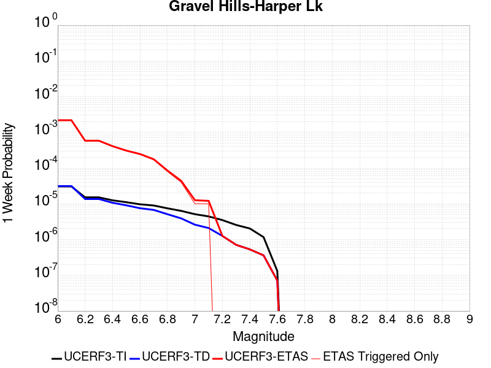
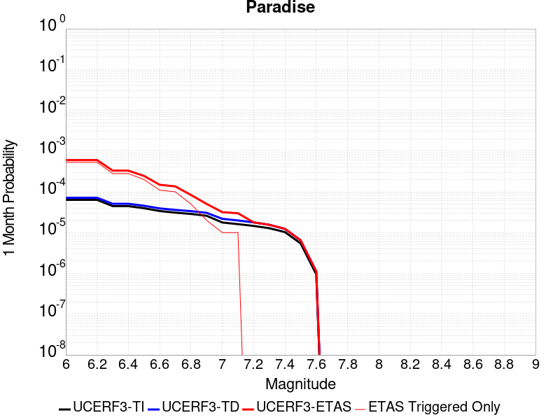
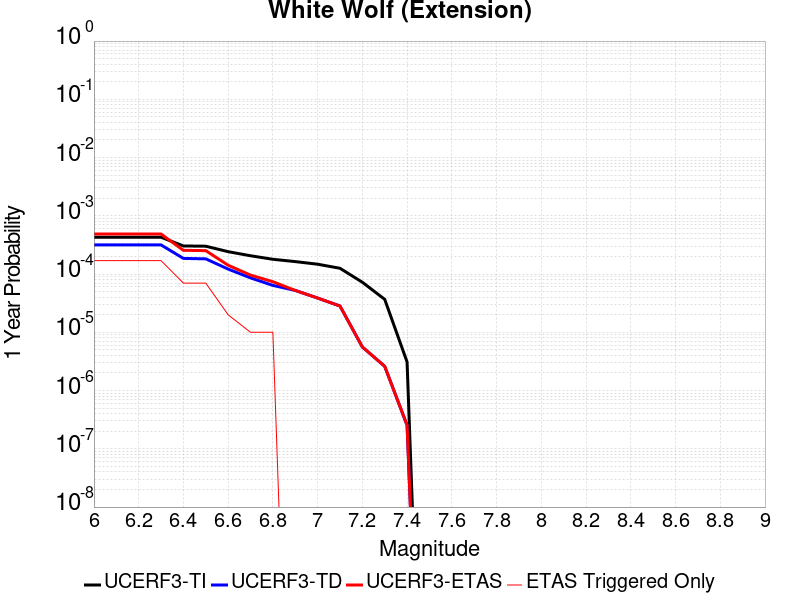
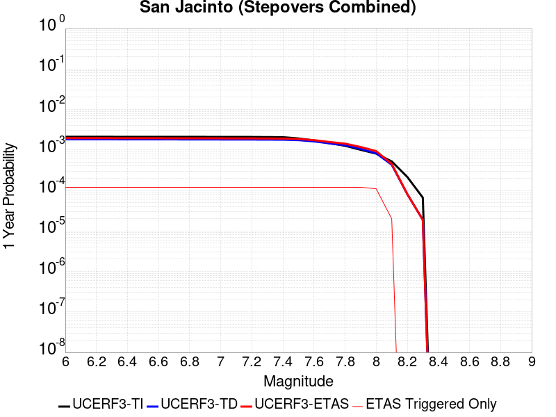
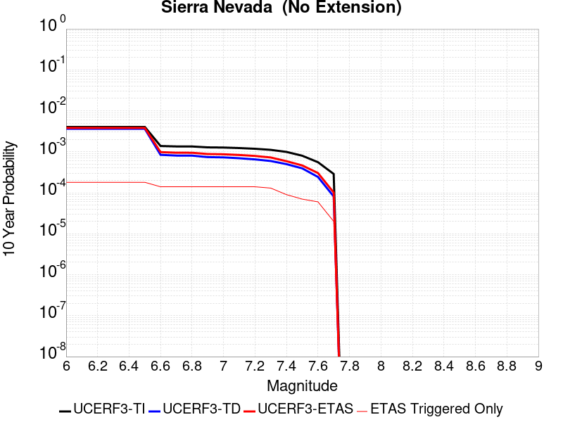
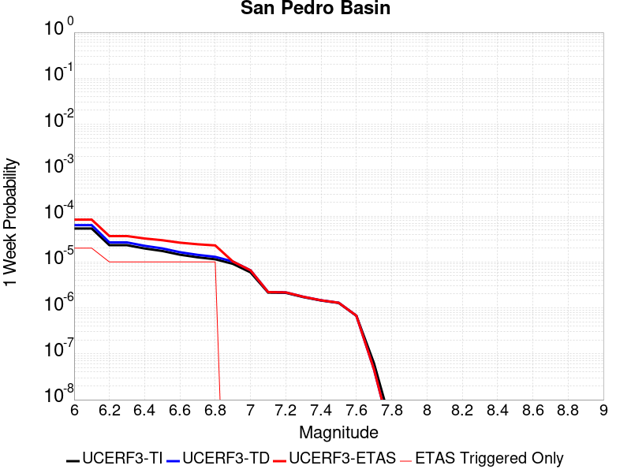
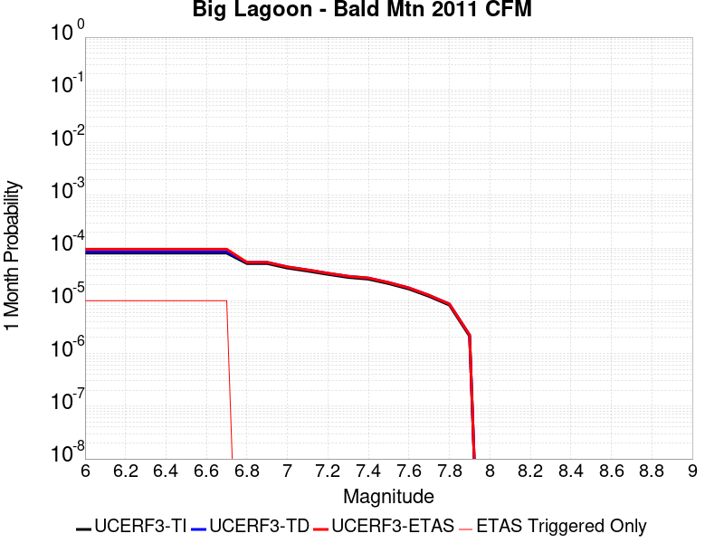
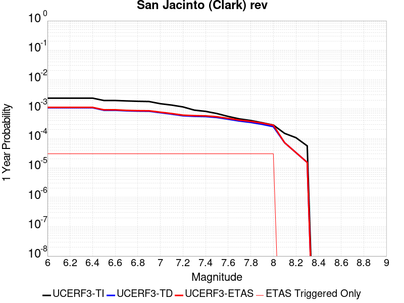
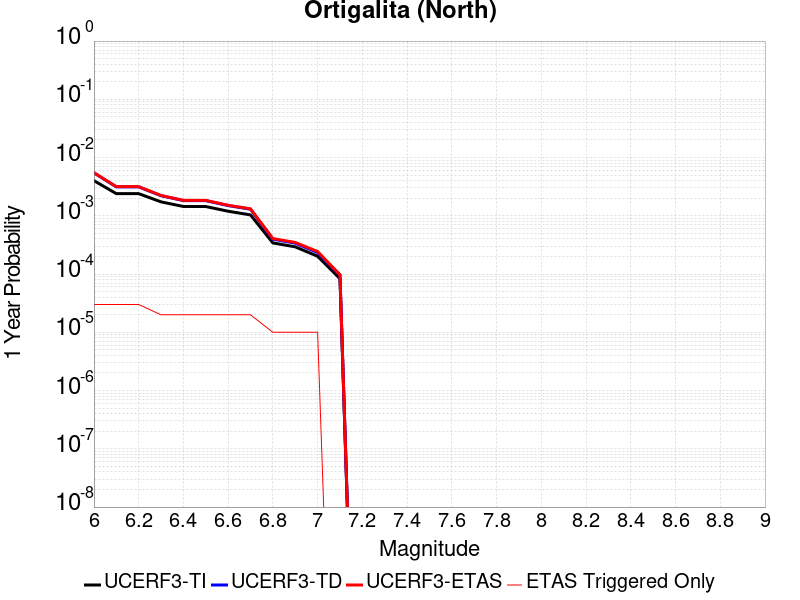
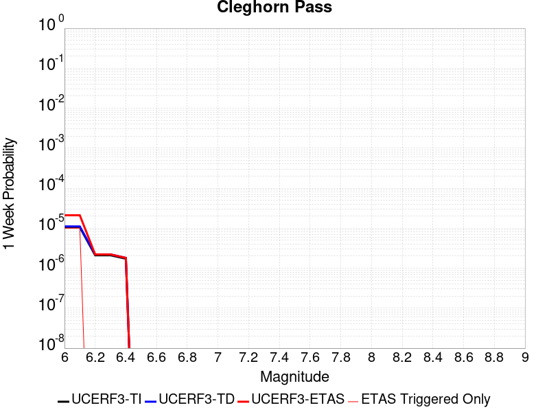

# Parent Section Magnitude-Probability Distributions

Only fault sections with at least one triggered aftershock are plotted. Sections are sorted by total supraseismogenic trigger rate (decreasing)

## Table Of Contents

* [Garlock (Central)](#garlock-central)
* [Tank Canyon](#tank-canyon)
* [Little Lake](#little-lake)
* [Airport Lake](#airport-lake)
* [Owl Lake](#owl-lake)
* [Panamint Valley](#panamint-valley)
* [Garlock (East)](#garlock-east)
* [Hunter Mountain-Saline Valley](#hunter-mountain-saline-valley)
* [Blackwater](#blackwater)
* [Garlock (West)](#garlock-west)
* [Ash Hill](#ash-hill)
* [Gravel Hills-Harper Lk](#gravel-hills-harper-lk)
* [San Andreas (Mojave S)](#san-andreas-mojave-s)
* [McLean Lake](#mclean-lake)
* [San Andreas (Mojave N)](#san-andreas-mojave-n)
* [Goldstone Lake](#goldstone-lake)
* [So Sierra Nevada](#so-sierra-nevada)
* [Death Valley (So)](#death-valley-so)
* [Lenwood-Lockhart-Old Woman Springs](#lenwood-lockhart-old-woman-springs)
* [Nelson Lake](#nelson-lake)
* [San Andreas (San Bernardino N)](#san-andreas-san-bernardino-n)
* [Towne Pass](#towne-pass)
* [Coyote Canyon](#coyote-canyon)
* [Paradise](#paradise)
* [Bicycle Lake](#bicycle-lake)
* [Death Valley (Black Mtns Frontal)](#death-valley-black-mtns-frontal)
* [Helendale-So Lockhart](#helendale-so-lockhart)
* [San Andreas (San Bernardino S)](#san-andreas-san-bernardino-s)
* [Death Valley (No)](#death-valley-no)
* [Garlic Springs](#garlic-springs)
* [San Andreas (Big Bend)](#san-andreas-big-bend)
* [Coyote Lake](#coyote-lake)
* [San Andreas (Coachella) rev](#san-andreas-coachella-rev)
* [Baker](#baker)
* [San Andreas (Parkfield)](#san-andreas-parkfield)
* [Red Pass](#red-pass)
* [San Andreas (San Gorgonio Pass-Garnet HIll)](#san-andreas-san-gorgonio-pass-garnet-hill)
* [White Wolf (Extension)](#white-wolf-extension)
* [San Jacinto (San Bernardino)](#san-jacinto-san-bernardino)
* [Calico-Hidalgo](#calico-hidalgo)
* [San Andreas (Carrizo) rev](#san-andreas-carrizo-rev)
* [Death Valley (Fish Lake Valley)](#death-valley-fish-lake-valley)
* [Lake Isabella (Seismicity)](#lake-isabella-seismicity)
* [Santa Ynez (East)](#santa-ynez-east)
* [Ludlow](#ludlow)
* [Scodie Lineament](#scodie-lineament)
* [Deep Springs](#deep-springs)
* [San Andreas (North Branch Mill Creek)](#san-andreas-north-branch-mill-creek)
* [San Jacinto (Stepovers Combined)](#san-jacinto-stepovers-combined)
* [San Andreas (Creeping Section) 2011 CFM](#san-andreas-creeping-section-2011-cfm)
* [San Jacinto (San Jacinto Valley) rev](#san-jacinto-san-jacinto-valley-rev)
* [Sierra Nevada  (No Extension)](#sierra-nevada--no-extension)
* [San Andreas (Cholame) rev](#san-andreas-cholame-rev)
* [Bullion Mountains](#bullion-mountains)
* [San Pedro Basin](#san-pedro-basin)
* [Coronado Bank alt1](#coronado-bank-alt1)
* [Cleghorn Lake](#cleghorn-lake)
* [Santa Ynez (West)](#santa-ynez-west)
* [Santa Cruz Catalina Ridge alt1](#santa-cruz-catalina-ridge-alt1)
* [Whittier alt 1](#whittier-alt-1)
* [San Jacinto (Anza) rev](#san-jacinto-anza-rev)
* [Manix-Afton Hills](#manix-afton-hills)
* [San Gabriel](#san-gabriel)
* [Lost Hills](#lost-hills)
* [Cady](#cady)
* [Mission Ridge-Arroyo Parida-Santa Ana](#mission-ridge-arroyo-parida-santa-ana)
* [Camp Rock 2011](#camp-rock-2011)
* [Robinson Creek](#robinson-creek)
* [Ventura-Pitas Point](#ventura-pitas-point)
* [Pisgah-Bullion Mtn-Mesquite Lk](#pisgah-bullion-mtn-mesquite-lk)
* [South Klamath Lake East](#south-klamath-lake-east)
* [San Diego Trough south](#san-diego-trough-south)
* [San Juan](#san-juan)
* [Elsinore (Glen Ivy) rev](#elsinore-glen-ivy-rev)
* [Malibu Coast alt 1](#malibu-coast-alt-1)
* [Hayward (No) 2011 CFM](#hayward-no-2011-cfm)
* [Big Lagoon - Bald Mtn 2011 CFM](#big-lagoon---bald-mtn-2011-cfm)
* [Palos Verdes](#palos-verdes)
* [Great Valley 05 Pittsburg - Kirby Hills alt1](#great-valley-05-pittsburg---kirby-hills-alt1)
* [Channel Islands Thrust](#channel-islands-thrust)
* [Pinto Mtn](#pinto-mtn)
* [San Jacinto (Borrego)](#san-jacinto-borrego)
* [San Jacinto (Coyote Creek)](#san-jacinto-coyote-creek)
* [Mono Lake 2011 CFM](#mono-lake-2011-cfm)
* [Emerson-Copper Mtn 2011](#emerson-copper-mtn-2011)
* [Elsinore (Stepovers Combined)](#elsinore-stepovers-combined)
* [Oceanic - West Huasna](#oceanic---west-huasna)
* [San Jacinto (Clark) rev](#san-jacinto-clark-rev)
* [Kern Canyon (South Kern) 2011](#kern-canyon-south-kern-2011)
* [Ortigalita (North)](#ortigalita-north)
* [Santa Rosa Island](#santa-rosa-island)
* [Surprise Valley 2011 CFM](#surprise-valley-2011-cfm)
* [Goose Lake 2011 CFM](#goose-lake-2011-cfm)
* [San Diego Trough north alt1](#san-diego-trough-north-alt1)
* [Cleghorn Pass](#cleghorn-pass)
* [Elsinore (Temecula) rev](#elsinore-temecula-rev)
* [Blue Cut](#blue-cut)
* [Great Valley 09 (Laguna Seca)](#great-valley-09-laguna-seca)
* [Rodgers Creek - Healdsburg 2011 CFM](#rodgers-creek---healdsburg-2011-cfm)

## Garlock (Central)
*[(top)](#table-of-contents)*

| 1 Week | 1 Month | 1 Year | 10 Year |
|-----|-----|-----|-----|
|  |  |  |  |

| Magnitude | 1 wk TI Prob | 1 wk TD Prob | 1 wk ETAS Prob | 1 wk ETAS/TD Gain | 1 wk ETAS Triggered Only | 1 mo TI Prob | 1 mo TD Prob | 1 mo ETAS Prob | 1 mo ETAS/TD Gain | 1 mo ETAS Triggered Only | 1 yr TI Prob | 1 yr TD Prob | 1 yr ETAS Prob | 1 yr ETAS/TD Gain | 1 yr ETAS Triggered Only | 10 yr TI Prob | 10 yr TD Prob | 10 yr ETAS Prob | 10 yr ETAS/TD Gain | 10 yr ETAS Triggered Only |
|-----|-----|-----|-----|-----|-----|-----|-----|-----|-----|-----|-----|-----|-----|-----|-----|-----|-----|-----|-----|-----|
| 6.0 | 5.5131142E-5 | 7.024681E-5 | 0.06271059 | 892.71796 | 0.06264474 | 2.3625491E-4 | 3.010234E-4 | 0.06871489 | 228.27092 | 0.06843446 | 0.0028726095 | 0.0036588663 | 0.07838061 | 21.422102 | 0.07499614 | 0.028357591 | 0.036079824 | 0.111458175 | 3.0892105 | 0.07819978 |
| 6.1 | 5.5131142E-5 | 7.024681E-5 | 0.06271059 | 892.71796 | 0.06264474 | 2.3625491E-4 | 3.010234E-4 | 0.06871489 | 228.27092 | 0.06843446 | 0.0028726095 | 0.0036588663 | 0.07838061 | 21.422102 | 0.07499614 | 0.028357591 | 0.036079824 | 0.111458175 | 3.0892105 | 0.07819978 |
| 6.2 | 4.216245E-5 | 5.1661493E-5 | 0.037605688 | 727.9249 | 0.037555967 | 1.806837E-4 | 2.2138779E-4 | 0.040894795 | 184.7202 | 0.040682416 | 0.0021976046 | 0.0026920962 | 0.04711441 | 17.501013 | 0.044542227 | 0.021759989 | 0.026689773 | 0.07203428 | 2.6989467 | 0.046587925 |
| 6.3 | 4.216245E-5 | 5.1661493E-5 | 0.037605688 | 727.9249 | 0.037555967 | 1.806837E-4 | 2.2138779E-4 | 0.040894795 | 184.7202 | 0.040682416 | 0.0021976046 | 0.0026920962 | 0.04711441 | 17.501013 | 0.044542227 | 0.021759989 | 0.026689773 | 0.07203428 | 2.6989467 | 0.046587925 |
| 6.4 | 3.6858168E-5 | 4.411054E-5 | 0.028258089 | 640.6199 | 0.028215224 | 1.5795401E-4 | 1.8903162E-4 | 0.030984506 | 163.91176 | 0.030801296 | 0.0019213937 | 0.002299056 | 0.03599476 | 15.6563225 | 0.03377335 | 0.019048655 | 0.02284894 | 0.057472404 | 2.5153203 | 0.035433073 |
| 6.5 | 3.39199E-5 | 4.0018083E-5 | 0.02535937 | 633.69775 | 0.025320364 | 1.453629E-4 | 1.7149492E-4 | 0.02788019 | 162.57152 | 0.027713448 | 0.0017683565 | 0.002085973 | 0.032360807 | 15.513532 | 0.03033812 | 0.017543508 | 0.020759864 | 0.052017838 | 2.5056927 | 0.03192064 |
| 6.6 | 3.3571985E-5 | 3.9472274E-5 | 0.025320241 | 641.46906 | 0.025281766 | 1.4387199E-4 | 1.6915603E-4 | 0.027839324 | 164.57777 | 0.02767485 | 0.0017502342 | 0.0020575512 | 0.032294728 | 15.695712 | 0.030299522 | 0.017365133 | 0.020481179 | 0.05171024 | 2.5247688 | 0.031882044 |
| 6.7 | 3.2580007E-5 | 3.8088703E-5 | 0.024392573 | 640.4149 | 0.024355412 | 1.3962112E-4 | 1.632272E-4 | 0.02679158 | 164.13673 | 0.0266327 | 0.0016985617 | 0.0019855013 | 0.031146262 | 15.686851 | 0.029218774 | 0.016856372 | 0.019773813 | 0.04989038 | 2.5230532 | 0.0307241 |
| 6.8 | 3.2185937E-5 | 3.7515918E-5 | 0.023928853 | 637.832 | 0.023892233 | 1.3793244E-4 | 1.6077272E-4 | 0.026287496 | 163.50719 | 0.026130924 | 0.0016780337 | 0.001955672 | 0.030616509 | 15.655237 | 0.028716998 | 0.016654192 | 0.019480614 | 0.049038496 | 2.5172973 | 0.03014513 |
| 6.9 | 3.165394E-5 | 3.6720503E-5 | 0.02354211 | 641.1162 | 0.023506252 | 1.3565269E-4 | 1.5736422E-4 | 0.025859665 | 164.33002 | 0.025706345 | 0.0016503202 | 0.001914247 | 0.030152507 | 15.751628 | 0.02829242 | 0.01638118 | 0.019073246 | 0.048151206 | 2.5245416 | 0.029643353 |
| 7.0 | 3.0903822E-5 | 3.5625766E-5 | 0.02319367 | 651.03644 | 0.02315887 | 1.3243823E-4 | 1.5267303E-4 | 0.02546917 | 166.82167 | 0.025320364 | 0.0016112428 | 0.0018572307 | 0.02971184 | 15.997927 | 0.027906438 | 0.015996104 | 0.018512413 | 0.04719028 | 2.5491154 | 0.029218774 |
| 7.1 | 3.0069863E-5 | 3.4392073E-5 | 0.021880174 | 636.19824 | 0.021846535 | 1.2886449E-4 | 1.4738638E-4 | 0.023920322 | 162.29669 | 0.02377644 | 0.0015677959 | 0.0017929734 | 0.027799988 | 15.504965 | 0.026053729 | 0.01556781 | 0.017880075 | 0.044681016 | 2.4989278 | 0.027288869 |
| 7.2 | 2.7957109E-5 | 3.128145E-5 | 0.0185192 | 592.01855 | 0.018488498 | 1.1981068E-4 | 1.340566E-4 | 0.020356758 | 151.85197 | 0.020225413 | 0.0014577188 | 0.0016309366 | 0.023865728 | 14.633142 | 0.022271113 | 0.014481937 | 0.016283695 | 0.03914139 | 2.4037168 | 0.023236066 |
| 7.3 | 2.4519275E-5 | 2.6714795E-5 | 0.013188321 | 493.67105 | 0.013161957 | 1.0507837E-4 | 1.1448703E-4 | 0.014316968 | 125.05318 | 0.014204107 | 0.0012785783 | 0.001393003 | 0.01688783 | 12.123326 | 0.015516443 | 0.012712469 | 0.013928054 | 0.02979929 | 2.1395159 | 0.016095415 |
| 7.4 | 2.3225532E-5 | 2.51994E-5 | 0.011874522 | 471.22244 | 0.011849621 | 9.95342E-5 | 1.0799304E-4 | 0.012959777 | 120.00568 | 0.012853173 | 0.0012111551 | 0.0013140367 | 0.015345289 | 11.677977 | 0.014049714 | 0.012045753 | 0.013145725 | 0.027582107 | 2.0981808 | 0.014628686 |
| 7.5 | 2.097765E-5 | 2.2483688E-5 | 0.009633198 | 428.4528 | 0.009610931 | 8.9901114E-5 | 9.635517E-5 | 0.010478248 | 108.74609 | 0.0103828935 | 0.0010939965 | 0.0011725046 | 0.012545599 | 10.699828 | 0.011386445 | 0.010886264 | 0.011740365 | 0.023489013 | 2.0007055 | 0.01188822 |
| 7.6 | 1.511254E-5 | 1.5991332E-5 | 0.0051494585 | 322.0156 | 0.0051335497 | 6.476642E-5 | 6.853253E-5 | 0.0055490895 | 80.97015 | 0.0054809325 | 7.882459E-4 | 8.3407195E-4 | 0.006888922 | 8.259386 | 0.006059904 | 0.007854558 | 0.008383559 | 0.014698856 | 1.7532955 | 0.0063686892 |
| 7.7 | 9.934069E-6 | 1.0678794E-5 | 0.0017089777 | 160.03473 | 0.0016983171 | 4.2573887E-5 | 4.5765457E-5 | 0.0017826012 | 38.9508 | 0.0017369152 | 5.182138E-4 | 5.570524E-4 | 0.0024858832 | 4.4625664 | 0.0019299058 | 0.00517007 | 0.005627684 | 0.0077002523 | 1.3682809 | 0.0020842983 |
| 7.8 | 6.7562896E-6 | 8.428449E-6 | 0.0011663622 | 138.38396 | 0.0011579435 | 2.8955206E-5 | 3.6121426E-5 | 0.0012326199 | 34.12434 | 0.0011965416 | 3.5247262E-4 | 4.3968976E-4 | 0.0017514487 | 3.9833739 | 0.001312336 | 0.0035191406 | 0.004446654 | 0.0057915812 | 1.3024582 | 0.001350934 |
| 7.9 | 3.975453E-6 | 5.37103E-6 | 5.4574176E-4 | 101.60839 | 5.403736E-4 | 1.7037546E-5 | 2.3018498E-5 | 5.6337967E-4 | 24.475084 | 5.403736E-4 | 2.0741238E-4 | 2.8021427E-4 | 8.5902377E-4 | 3.065596 | 5.7897175E-4 | 0.002072189 | 0.0028336283 | 0.0034494482 | 1.2173256 | 6.1756984E-4 |
| 8.0 | 1.6729537E-6 | 2.0775144E-6 | 2.3366573E-4 | 112.4737 | 2.315887E-4 | 7.169782E-6 | 8.903603E-6 | 2.4049023E-4 | 27.01044 | 2.315887E-4 | 8.7288594E-5 | 1.0839601E-4 | 3.399596E-4 | 3.1362743 | 2.315887E-4 | 8.7254314E-4 | 0.0010969337 | 0.0013282684 | 1.2108921 | 2.315887E-4 |
| 8.1 | 3.6733252E-7 | 3.1489964E-7 | 3.1489964E-7 | 1.0 | 0.0 | 1.5742813E-6 | 1.3495693E-6 | 1.3495693E-6 | 1.0 | 0.0 | 1.9166706E-5 | 1.6430899E-5 | 1.6430899E-5 | 1.0 | 0.0 | 1.9165053E-4 | 1.6638759E-4 | 1.6638759E-4 | 1.0 | 0.0 |

## Tank Canyon
*[(top)](#table-of-contents)*

| 1 Week | 1 Month | 1 Year | 10 Year |
|-----|-----|-----|-----|
|  |  |  |  |

| Magnitude | 1 wk TI Prob | 1 wk TD Prob | 1 wk ETAS Prob | 1 wk ETAS/TD Gain | 1 wk ETAS Triggered Only | 1 mo TI Prob | 1 mo TD Prob | 1 mo ETAS Prob | 1 mo ETAS/TD Gain | 1 mo ETAS Triggered Only | 1 yr TI Prob | 1 yr TD Prob | 1 yr ETAS Prob | 1 yr ETAS/TD Gain | 1 yr ETAS Triggered Only | 10 yr TI Prob | 10 yr TD Prob | 10 yr ETAS Prob | 10 yr ETAS/TD Gain | 10 yr ETAS Triggered Only |
|-----|-----|-----|-----|-----|-----|-----|-----|-----|-----|-----|-----|-----|-----|-----|-----|-----|-----|-----|-----|-----|
| 6.0 | 4.8284557E-5 | 5.7964822E-5 | 0.033597782 | 579.62366 | 0.03354176 | 2.0691741E-4 | 2.4840087E-4 | 0.037833627 | 152.30876 | 0.037594564 | 0.0025163088 | 0.0030207601 | 0.045504358 | 15.063877 | 0.04261232 | 0.02488006 | 0.029863637 | 0.07397436 | 2.4770715 | 0.04546858 |
| 6.1 | 1.7796336E-5 | 2.0873314E-5 | 0.012449208 | 596.41736 | 0.012428594 | 7.626778E-5 | 8.945422E-5 | 0.014022128 | 156.752 | 0.01393392 | 9.281647E-4 | 0.0010885983 | 0.016896598 | 15.521428 | 0.015825227 | 0.009242975 | 0.010836744 | 0.027368614 | 2.5255384 | 0.016712984 |
| 6.2 | 1.7796336E-5 | 2.0873314E-5 | 0.012449208 | 596.41736 | 0.012428594 | 7.626778E-5 | 8.945422E-5 | 0.014022128 | 156.752 | 0.01393392 | 9.281647E-4 | 0.0010885983 | 0.016896598 | 15.521428 | 0.015825227 | 0.009242975 | 0.010836744 | 0.027368614 | 2.5255384 | 0.016712984 |
| 6.3 | 1.3515912E-5 | 1.5759564E-5 | 0.008352822 | 530.016 | 0.008337193 | 5.792405E-5 | 6.753938E-5 | 0.009523439 | 141.00572 | 0.009456539 | 7.049971E-4 | 8.2200574E-4 | 0.011504895 | 13.996125 | 0.010691678 | 0.007027647 | 0.0081922645 | 0.019294018 | 2.355151 | 0.011193453 |
| 6.4 | 1.0870146E-5 | 1.2618021E-5 | 0.0063426294 | 502.66434 | 0.006330091 | 4.658551E-5 | 5.4076212E-5 | 0.0070785535 | 130.89958 | 0.007024857 | 5.67031E-4 | 6.581969E-4 | 0.008488458 | 12.896531 | 0.007835418 | 0.005655863 | 0.0065644905 | 0.014693575 | 2.238342 | 0.0081828 |
| 6.5 | 7.964826E-6 | 9.196094E-6 | 0.004100559 | 445.90222 | 0.0040914 | 3.4134522E-5 | 3.9411298E-5 | 0.0044394233 | 112.64342 | 0.0044001853 | 4.1550855E-4 | 4.7973756E-4 | 0.0053021875 | 11.052267 | 0.0048247646 | 0.0041473247 | 0.004788321 | 0.00978205 | 2.0428977 | 0.005017755 |
| 6.6 | 6.6317E-6 | 7.6122988E-6 | 0.0029410468 | 386.3546 | 0.0029334568 | 2.8421264E-5 | 3.2623782E-5 | 0.003236163 | 99.19644 | 0.0032036437 | 3.4597394E-4 | 3.9713128E-4 | 0.0038695822 | 9.743836 | 0.0034738304 | 0.0034543579 | 0.003965368 | 0.0076176487 | 1.9210446 | 0.0036668212 |
| 6.7 | 4.793663E-6 | 5.4307857E-6 | 0.0017423365 | 320.82587 | 0.0017369152 | 2.0544108E-5 | 2.3274613E-5 | 0.0018759411 | 80.60031 | 0.0018527096 | 2.500958E-4 | 2.8333595E-4 | 0.0022126948 | 7.8094397 | 0.0019299058 | 0.0024981452 | 0.0028304397 | 0.004831861 | 1.7071061 | 0.0020071021 |
| 6.8 | 4.382823E-6 | 4.9692567E-6 | 0.0016260821 | 327.22842 | 0.0016211208 | 1.8783392E-5 | 2.1296666E-5 | 0.001758175 | 82.55635 | 0.0017369152 | 2.286638E-4 | 2.5926033E-4 | 0.0020729015 | 7.9954443 | 0.0018141115 | 0.0022842865 | 0.002590253 | 0.0044381637 | 1.7134093 | 0.0018527096 |
| 6.9 | 2.729601E-6 | 3.0735416E-6 | 9.680235E-4 | 314.95374 | 9.649529E-4 | 1.1698237E-5 | 1.3172262E-5 | 0.0010939053 | 83.04612 | 0.0010807472 | 1.4241673E-4 | 1.6036171E-4 | 0.0012795276 | 7.979009 | 0.0011193454 | 0.001423255 | 0.0016026258 | 0.0027201774 | 1.6973252 | 0.0011193454 |
| 7.0 | 1.8987357E-6 | 2.126939E-6 | 3.881073E-4 | 182.47221 | 3.8598117E-4 | 8.137413E-6 | 9.115425E-6 | 5.1088637E-4 | 56.046356 | 5.0177553E-4 | 9.90685E-5 | 1.1097535E-4 | 6.51289E-4 | 5.868772 | 5.403736E-4 | 9.902435E-4 | 0.0011092679 | 0.0016490421 | 1.486604 | 5.403736E-4 |
| 7.1 | 1.4928986E-6 | 1.6641272E-6 | 2.3325245E-4 | 140.16502 | 2.315887E-4 | 6.398121E-6 | 7.1319573E-6 | 3.159147E-4 | 44.29565 | 3.0878492E-4 | 7.789434E-5 | 8.682871E-5 | 4.341816E-4 | 5.000438 | 3.4738306E-4 | 7.786704E-4 | 8.6800574E-4 | 0.0012150872 | 1.3998609 | 3.4738306E-4 |
| 7.2 | 1.069082E-6 | 1.1828573E-6 | 7.8379E-5 | 66.26243 | 7.719623E-5 | 4.581772E-6 | 5.0693816E-6 | 1.20863144E-4 | 23.841793 | 1.1579435E-4 | 5.5781646E-5 | 6.171851E-5 | 2.1610144E-4 | 3.5014043 | 1.5439246E-4 | 5.576765E-4 | 6.170659E-4 | 7.713631E-4 | 1.2500498 | 1.5439246E-4 |
| 7.3 | 8.776551E-7 | 9.770005E-7 | 9.770005E-7 | 1.0 | 0.0 | 3.7613736E-6 | 4.1871413E-6 | 4.2785097E-5 | 10.218212 | 3.8598115E-5 | 4.579376E-5 | 5.097777E-5 | 1.2817007E-4 | 2.5142345 | 7.719623E-5 | 4.5784327E-4 | 5.097118E-4 | 5.868687E-4 | 1.1513735 | 7.719623E-5 |
| 7.4 | 7.55721E-7 | 8.510244E-7 | 8.510244E-7 | 1.0 | 0.0 | 3.2388E-6 | 3.6472454E-6 | 3.6472454E-6 | 1.0 | 0.0 | 3.9431678E-5 | 4.4404827E-5 | 4.4404827E-5 | 1.0 | 0.0 | 3.942468E-4 | 4.440104E-4 | 4.440104E-4 | 1.0 | 0.0 |
| 7.5 | 5.587665E-7 | 6.305619E-7 | 6.305619E-7 | 1.0 | 0.0 | 2.3947114E-6 | 2.702408E-6 | 2.702408E-6 | 1.0 | 0.0 | 2.915522E-5 | 3.290182E-5 | 3.290182E-5 | 1.0 | 0.0 | 2.9151395E-4 | 3.290182E-4 | 3.290182E-4 | 1.0 | 0.0 |

## Little Lake
*[(top)](#table-of-contents)*

| 1 Week | 1 Month | 1 Year | 10 Year |
|-----|-----|-----|-----|
|  |  |  |  |

| Magnitude | 1 wk TI Prob | 1 wk TD Prob | 1 wk ETAS Prob | 1 wk ETAS/TD Gain | 1 wk ETAS Triggered Only | 1 mo TI Prob | 1 mo TD Prob | 1 mo ETAS Prob | 1 mo ETAS/TD Gain | 1 mo ETAS Triggered Only | 1 yr TI Prob | 1 yr TD Prob | 1 yr ETAS Prob | 1 yr ETAS/TD Gain | 1 yr ETAS Triggered Only | 10 yr TI Prob | 10 yr TD Prob | 10 yr ETAS Prob | 10 yr ETAS/TD Gain | 10 yr ETAS Triggered Only |
|-----|-----|-----|-----|-----|-----|-----|-----|-----|-----|-----|-----|-----|-----|-----|-----|-----|-----|-----|-----|-----|
| 6.0 | 2.8424427E-5 | 3.120572E-5 | 0.028515726 | 913.79803 | 0.02848541 | 1.2181328E-4 | 1.337327E-4 | 0.031162469 | 233.02055 | 0.031032886 | 0.0014820677 | 0.0016271127 | 0.03488309 | 21.438643 | 0.033310175 | 0.014722223 | 0.016165402 | 0.049848482 | 3.0836527 | 0.034236528 |
| 6.1 | 2.8424427E-5 | 3.120572E-5 | 0.028515726 | 913.79803 | 0.02848541 | 1.2181328E-4 | 1.337327E-4 | 0.031162469 | 233.02055 | 0.031032886 | 0.0014820677 | 0.0016271127 | 0.03488309 | 21.438643 | 0.033310175 | 0.014722223 | 0.016165402 | 0.049848482 | 3.0836527 | 0.034236528 |
| 6.2 | 2.8424427E-5 | 3.120572E-5 | 0.028515726 | 913.79803 | 0.02848541 | 1.2181328E-4 | 1.337327E-4 | 0.031162469 | 233.02055 | 0.031032886 | 0.0014820677 | 0.0016271127 | 0.03488309 | 21.438643 | 0.033310175 | 0.014722223 | 0.016165402 | 0.049848482 | 3.0836527 | 0.034236528 |
| 6.3 | 1.48860645E-5 | 1.6081389E-5 | 0.019276232 | 1198.6671 | 0.01926046 | 6.379586E-5 | 6.8918576E-5 | 0.020717489 | 300.60815 | 0.020649992 | 7.7643775E-4 | 8.3878887E-4 | 0.023245484 | 27.713152 | 0.022425506 | 0.007737305 | 0.008359048 | 0.031209506 | 3.7336197 | 0.023043076 |
| 6.4 | 1.48860645E-5 | 1.6081389E-5 | 0.019276232 | 1198.6671 | 0.01926046 | 6.379586E-5 | 6.8918576E-5 | 0.020717489 | 300.60815 | 0.020649992 | 7.7643775E-4 | 8.3878887E-4 | 0.023245484 | 27.713152 | 0.022425506 | 0.007737305 | 0.008359048 | 0.031209506 | 3.7336197 | 0.023043076 |
| 6.5 | 1.2797581E-5 | 1.3765565E-5 | 0.01815463 | 1318.8439 | 0.018141115 | 5.4845623E-5 | 5.899409E-5 | 0.019434106 | 329.42462 | 0.019376254 | 6.675408E-4 | 7.18042E-4 | 0.021700341 | 30.221546 | 0.020997375 | 0.006655392 | 0.00715977 | 0.028581636 | 3.9919767 | 0.021576347 |
| 6.6 | 9.661896E-6 | 1.0289038E-5 | 0.015873952 | 1542.8024 | 0.015863826 | 4.1407468E-5 | 4.409522E-5 | 0.017103711 | 387.88126 | 0.017060367 | 5.040193E-4 | 5.367433E-4 | 0.018938163 | 35.283463 | 0.018411301 | 0.005028777 | 0.0053560743 | 0.024167852 | 4.5122323 | 0.018913077 |
| 6.7 | 7.767871E-6 | 8.199687E-6 | 0.0140192015 | 1709.724 | 0.014011117 | 3.329045E-5 | 3.5141118E-5 | 0.015242265 | 433.74445 | 0.015207658 | 4.0523586E-4 | 4.2777284E-4 | 0.016863536 | 39.421707 | 0.016442798 | 0.004044977 | 0.004270846 | 0.021104619 | 4.9415545 | 0.016905975 |
| 6.8 | 6.4235196E-6 | 6.7357446E-6 | 0.010466754 | 1553.9121 | 0.01046009 | 2.752908E-5 | 2.8867229E-5 | 0.01145358 | 396.76755 | 0.0114250425 | 3.35115E-4 | 3.5141467E-4 | 0.012775641 | 36.35489 | 0.012428594 | 0.003346101 | 0.00350985 | 0.01631791 | 4.6491756 | 0.012853173 |
| 6.9 | 3.1283696E-6 | 3.1121804E-6 | 0.0063331835 | 2034.9667 | 0.006330091 | 1.3407229E-5 | 1.3337856E-5 | 0.007076699 | 530.57245 | 0.0070634554 | 1.6322079E-4 | 1.6237781E-4 | 0.007919339 | 48.77107 | 0.0077582216 | 0.0016310095 | 0.00162274 | 0.009676656 | 5.9631586 | 0.008067006 |
| 7.0 | 2.290603E-6 | 2.2286815E-6 | 0.004016424 | 1802.1525 | 0.0040142043 | 9.816834E-6 | 9.551463E-6 | 0.004525488 | 473.80048 | 0.0045159794 | 1.19513395E-4 | 1.162839E-4 | 0.005094862 | 43.81399 | 0.004979157 | 0.0011944914 | 0.0011623327 | 0.0063670217 | 5.477796 | 0.0052107456 |
| 7.1 | 1.293693E-6 | 1.1776827E-6 | 0.001815287 | 1541.4058 | 0.0018141115 | 5.5443866E-6 | 5.0472063E-6 | 0.0020121392 | 398.66394 | 0.0020071021 | 6.750081E-5 | 6.14487E-5 | 0.0023385976 | 38.057724 | 0.0022772888 | 6.7480316E-4 | 6.143856E-4 | 0.0030831473 | 5.0182614 | 0.0024702793 |
| 7.2 | 4.715842E-7 | 3.0917857E-7 | 3.8907285E-5 | 125.84081 | 3.8598115E-5 | 2.0210737E-6 | 1.3250503E-6 | 3.9923114E-5 | 30.129507 | 3.8598115E-5 | 2.4606294E-5 | 1.6132375E-5 | 5.472987E-5 | 3.3925488 | 3.8598115E-5 | 2.460357E-4 | 1.6131258E-4 | 1.9990446E-4 | 1.2392367 | 3.8598115E-5 |
| 7.3 | 3.9430947E-7 | 2.3097488E-7 | 3.8829083E-5 | 168.10956 | 3.8598115E-5 | 1.6898966E-6 | 9.89892E-7 | 3.958797E-5 | 39.992214 | 3.8598115E-5 | 2.0574296E-5 | 1.2051869E-5 | 5.064952E-5 | 4.202628 | 3.8598115E-5 | 2.0572392E-4 | 1.20512224E-4 | 1.591057E-4 | 1.3202453 | 3.8598115E-5 |
| 7.4 | 3.547123E-7 | 1.9679135E-7 | 1.9679135E-7 | 1.0 | 0.0 | 1.5201948E-6 | 8.4339126E-7 | 8.4339126E-7 | 1.0 | 0.0 | 1.8508214E-5 | 1.0268241E-5 | 1.0268241E-5 | 1.0 | 0.0 | 1.8506673E-4 | 1.02677724E-4 | 1.02677724E-4 | 1.0 | 0.0 |
| 7.5 | 2.6354266E-7 | 1.4423138E-7 | 1.4423138E-7 | 1.0 | 0.0 | 1.129468E-6 | 6.181344E-7 | 6.181344E-7 | 1.0 | 0.0 | 1.3751187E-5 | 7.5257603E-6 | 7.5257603E-6 | 1.0 | 0.0 | 1.3750336E-4 | 7.5255106E-5 | 7.5255106E-5 | 1.0 | 0.0 |
| 7.6 | 1.269913E-7 | 7.572556E-8 | 7.572556E-8 | 1.0 | 0.0 | 5.4424834E-7 | 3.245381E-7 | 3.245381E-7 | 1.0 | 0.0 | 6.6262032E-6 | 3.9512443E-6 | 3.9512443E-6 | 1.0 | 0.0 | 6.626006E-5 | 3.9511775E-5 | 3.9511775E-5 | 1.0 | 0.0 |

## Airport Lake
*[(top)](#table-of-contents)*

| 1 Week | 1 Month | 1 Year | 10 Year |
|-----|-----|-----|-----|
|  |  |  |  |

| Magnitude | 1 wk TI Prob | 1 wk TD Prob | 1 wk ETAS Prob | 1 wk ETAS/TD Gain | 1 wk ETAS Triggered Only | 1 mo TI Prob | 1 mo TD Prob | 1 mo ETAS Prob | 1 mo ETAS/TD Gain | 1 mo ETAS Triggered Only | 1 yr TI Prob | 1 yr TD Prob | 1 yr ETAS Prob | 1 yr ETAS/TD Gain | 1 yr ETAS Triggered Only | 10 yr TI Prob | 10 yr TD Prob | 10 yr ETAS Prob | 10 yr ETAS/TD Gain | 10 yr ETAS Triggered Only |
|-----|-----|-----|-----|-----|-----|-----|-----|-----|-----|-----|-----|-----|-----|-----|-----|-----|-----|-----|-----|-----|
| 6.0 | 1.2387061E-5 | 1.3103157E-5 | 0.025834905 | 1971.655 | 0.02582214 | 5.3086325E-5 | 5.615534E-5 | 0.027999623 | 498.61017 | 0.027945036 | 6.461343E-4 | 6.8350515E-4 | 0.03103946 | 45.41218 | 0.030376717 | 0.0064425888 | 0.0068168393 | 0.037944857 | 5.566342 | 0.031341672 |
| 6.1 | 1.2387061E-5 | 1.3103157E-5 | 0.025834905 | 1971.655 | 0.02582214 | 5.3086325E-5 | 5.615534E-5 | 0.027999623 | 498.61017 | 0.027945036 | 6.461343E-4 | 6.8350515E-4 | 0.03103946 | 45.41218 | 0.030376717 | 0.0064425888 | 0.0068168393 | 0.037944857 | 5.566342 | 0.031341672 |
| 6.2 | 1.2387061E-5 | 1.3103157E-5 | 0.025834905 | 1971.655 | 0.02582214 | 5.3086325E-5 | 5.615534E-5 | 0.027999623 | 498.61017 | 0.027945036 | 6.461343E-4 | 6.8350515E-4 | 0.03103946 | 45.41218 | 0.030376717 | 0.0064425888 | 0.0068168393 | 0.037944857 | 5.566342 | 0.031341672 |
| 6.3 | 1.2387061E-5 | 1.3103157E-5 | 0.025834905 | 1971.655 | 0.02582214 | 5.3086325E-5 | 5.615534E-5 | 0.027999623 | 498.61017 | 0.027945036 | 6.461343E-4 | 6.8350515E-4 | 0.03103946 | 45.41218 | 0.030376717 | 0.0064425888 | 0.0068168393 | 0.037944857 | 5.566342 | 0.031341672 |
| 6.4 | 1.2387061E-5 | 1.3103157E-5 | 0.025834905 | 1971.655 | 0.02582214 | 5.3086325E-5 | 5.615534E-5 | 0.027999623 | 498.61017 | 0.027945036 | 6.461343E-4 | 6.8350515E-4 | 0.03103946 | 45.41218 | 0.030376717 | 0.0064425888 | 0.0068168393 | 0.037944857 | 5.566342 | 0.031341672 |
| 6.5 | 6.9922594E-6 | 7.384925E-6 | 0.019422093 | 2629.9648 | 0.019414853 | 2.996648E-5 | 3.1649324E-5 | 0.021066956 | 665.63684 | 0.021035973 | 3.6478083E-4 | 3.8526783E-4 | 0.023265133 | 60.386906 | 0.022888683 | 0.003641826 | 0.0038465366 | 0.02733927 | 7.1075034 | 0.02358345 |
| 6.6 | 6.9922594E-6 | 7.384925E-6 | 0.019422093 | 2629.9648 | 0.019414853 | 2.996648E-5 | 3.1649324E-5 | 0.021066956 | 665.63684 | 0.021035973 | 3.6478083E-4 | 3.8526783E-4 | 0.023265133 | 60.386906 | 0.022888683 | 0.003641826 | 0.0038465366 | 0.02733927 | 7.1075034 | 0.02358345 |
| 6.7 | 5.477277E-6 | 5.7860684E-6 | 0.015985314 | 2762.7246 | 0.01597962 | 2.3473833E-5 | 2.4797222E-5 | 0.017432116 | 702.98663 | 0.01740775 | 2.8575645E-4 | 3.0186825E-4 | 0.019286409 | 63.890156 | 0.018990273 | 0.0028538927 | 0.003014966 | 0.022563692 | 7.4838963 | 0.019607844 |
| 6.8 | 3.9950432E-6 | 4.2190873E-6 | 0.011969585 | 2837.0083 | 0.011965416 | 1.7121502E-5 | 1.8081691E-5 | 0.013218399 | 731.0377 | 0.013200556 | 2.0843433E-4 | 2.2012512E-4 | 0.014652643 | 66.56506 | 0.0144356955 | 0.0020823893 | 0.0021993418 | 0.01710396 | 7.776854 | 0.014937471 |
| 6.9 | 2.95695E-6 | 3.1230243E-6 | 0.008764868 | 2806.5322 | 0.008761773 | 1.2672582E-5 | 1.3384334E-5 | 0.009817175 | 733.4825 | 0.009803922 | 1.5427776E-4 | 1.6294434E-4 | 0.010968656 | 67.31535 | 0.010807472 | 0.001541707 | 0.0016284712 | 0.012803697 | 7.8624034 | 0.011193453 |
| 7.0 | 1.456072E-6 | 1.540812E-6 | 0.0038999445 | 2531.097 | 0.0038984097 | 6.2402937E-6 | 6.603469E-6 | 0.004368162 | 661.495 | 0.004361587 | 7.597293E-5 | 8.039528E-5 | 0.0048661768 | 60.528145 | 0.0047861664 | 7.594696E-4 | 8.0376083E-4 | 0.0058174827 | 7.2378283 | 0.005017755 |
| 7.1 | 6.995192E-7 | 7.4089746E-7 | 0.001776253 | 2397.4343 | 0.0017755134 | 2.997936E-6 | 3.1752747E-6 | 0.001971673 | 620.9456 | 0.001968504 | 3.649926E-5 | 3.865897E-5 | 0.0022772632 | 58.906464 | 0.0022386909 | 3.6493264E-4 | 3.865897E-4 | 0.0028173309 | 7.2876515 | 0.0024316814 |

## Owl Lake
*[(top)](#table-of-contents)*

| 1 Week | 1 Month | 1 Year | 10 Year |
|-----|-----|-----|-----|
|  |  |  |  |

| Magnitude | 1 wk TI Prob | 1 wk TD Prob | 1 wk ETAS Prob | 1 wk ETAS/TD Gain | 1 wk ETAS Triggered Only | 1 mo TI Prob | 1 mo TD Prob | 1 mo ETAS Prob | 1 mo ETAS/TD Gain | 1 mo ETAS Triggered Only | 1 yr TI Prob | 1 yr TD Prob | 1 yr ETAS Prob | 1 yr ETAS/TD Gain | 1 yr ETAS Triggered Only | 10 yr TI Prob | 10 yr TD Prob | 10 yr ETAS Prob | 10 yr ETAS/TD Gain | 10 yr ETAS Triggered Only |
|-----|-----|-----|-----|-----|-----|-----|-----|-----|-----|-----|-----|-----|-----|-----|-----|-----|-----|-----|-----|-----|
| 6.0 | 5.0320643E-5 | 6.635816E-5 | 0.014346713 | 216.2012 | 0.014281303 | 2.1564208E-4 | 2.843674E-4 | 0.016568141 | 58.263157 | 0.016288405 | 0.0026222812 | 0.0034577388 | 0.021766914 | 6.29513 | 0.018372703 | 0.02591553 | 0.034140717 | 0.052967295 | 1.5514406 | 0.019492049 |
| 6.1 | 5.0320643E-5 | 6.635816E-5 | 0.014346713 | 216.2012 | 0.014281303 | 2.1564208E-4 | 2.843674E-4 | 0.016568141 | 58.263157 | 0.016288405 | 0.0026222812 | 0.0034577388 | 0.021766914 | 6.29513 | 0.018372703 | 0.02591553 | 0.034140717 | 0.052967295 | 1.5514406 | 0.019492049 |
| 6.2 | 2.4125871E-5 | 3.0981035E-5 | 0.011031103 | 356.05988 | 0.011000463 | 1.0339249E-4 | 1.3277028E-4 | 0.012482528 | 94.015976 | 0.012351397 | 0.0012580766 | 0.001615439 | 0.0154883135 | 9.587681 | 0.013895322 | 0.012509781 | 0.016070465 | 0.030540016 | 1.9003817 | 0.014705882 |
| 6.3 | 1.7433485E-5 | 2.2355514E-5 | 0.010134836 | 453.3484 | 0.010112707 | 7.471279E-5 | 9.580672E-5 | 0.011403971 | 119.03102 | 0.011309248 | 9.0924866E-4 | 0.0011659743 | 0.0138499485 | 11.878433 | 0.012698781 | 0.009055373 | 0.011628896 | 0.024790391 | 2.1317923 | 0.01331635 |
| 6.4 | 1.7433485E-5 | 2.2355514E-5 | 0.010134836 | 453.3484 | 0.010112707 | 7.471279E-5 | 9.580672E-5 | 0.011403971 | 119.03102 | 0.011309248 | 9.0924866E-4 | 0.0011659743 | 0.0138499485 | 11.878433 | 0.012698781 | 0.009055373 | 0.011628896 | 0.024790391 | 2.1317923 | 0.01331635 |
| 6.5 | 1.5182742E-5 | 1.9429144E-5 | 0.00982316 | 505.58893 | 0.009803922 | 6.506727E-5 | 8.326596E-5 | 0.011044218 | 132.63786 | 0.010961865 | 7.919061E-4 | 0.0010134429 | 0.013352322 | 13.17521 | 0.012351397 | 0.0078909 | 0.010118429 | 0.02295617 | 2.2687485 | 0.012968967 |
| 6.6 | 6.7271576E-6 | 8.547361E-6 | 0.008191278 | 958.34 | 0.0081828 | 2.8830356E-5 | 3.6631063E-5 | 0.008991066 | 245.44922 | 0.008954763 | 3.5095305E-4 | 4.458976E-4 | 0.010476933 | 23.496275 | 0.01003551 | 0.0035039932 | 0.004467813 | 0.014958019 | 3.3479514 | 0.010537285 |
| 6.7 | 6.682835E-6 | 8.479807E-6 | 0.008191211 | 965.9667 | 0.0081828 | 2.8640408E-5 | 3.6341557E-5 | 0.0089907795 | 247.39665 | 0.008954763 | 3.4864116E-4 | 4.4237426E-4 | 0.010473445 | 23.67553 | 0.01003551 | 0.003480947 | 0.0044327388 | 0.0149233155 | 3.366613 | 0.010537285 |
| 6.8 | 6.5774975E-6 | 8.32628E-6 | 0.008191058 | 983.75964 | 0.0081828 | 2.8188972E-5 | 3.5683603E-5 | 0.008990127 | 251.94 | 0.008954763 | 3.4314668E-4 | 4.343669E-4 | 0.010465518 | 24.093729 | 0.01003551 | 0.0034261728 | 0.004352885 | 0.014844303 | 3.4102218 | 0.010537285 |
| 6.9 | 6.363419E-6 | 7.999454E-6 | 0.008190734 | 1023.9116 | 0.0081828 | 2.727151E-5 | 3.428296E-5 | 0.008988739 | 262.19263 | 0.008954763 | 3.3198006E-4 | 4.1732067E-4 | 0.010448643 | 25.037445 | 0.01003551 | 0.0033148455 | 0.0041828766 | 0.014676087 | 3.5086107 | 0.010537285 |
| 7.0 | 6.1342453E-6 | 7.6316555E-6 | 0.00819037 | 1073.2101 | 0.0081828 | 2.6289357E-5 | 3.2706717E-5 | 0.008987177 | 274.78076 | 0.008954763 | 3.2002592E-4 | 3.9813702E-4 | 0.0104296515 | 26.196136 | 0.01003551 | 0.0031956544 | 0.003991571 | 0.014486796 | 3.6293473 | 0.010537285 |
| 7.1 | 5.842926E-6 | 7.142211E-6 | 0.007765308 | 1087.2415 | 0.0077582216 | 2.504087E-5 | 3.0609146E-5 | 0.008521935 | 278.41138 | 0.008491586 | 3.0482994E-4 | 3.7260808E-4 | 0.009825623 | 26.369862 | 0.009456539 | 0.0030441214 | 0.0037370329 | 0.013658132 | 3.6548066 | 0.009958314 |
| 7.2 | 4.77173E-6 | 5.358483E-6 | 0.005447664 | 1016.6429 | 0.0054423343 | 2.045011E-5 | 2.2964748E-5 | 0.0060441326 | 263.19177 | 0.0060213064 | 2.4895166E-4 | 2.79564E-4 | 0.0070709335 | 25.292717 | 0.0067932685 | 0.0024867293 | 0.002808645 | 0.009813772 | 3.4941304 | 0.007024857 |
| 7.3 | 3.0494948E-6 | 2.710463E-6 | 0.0015080329 | 556.3747 | 0.0015053266 | 1.3069198E-5 | 1.1616219E-5 | 0.001671316 | 143.87779 | 0.001659719 | 1.5910587E-4 | 1.4141845E-4 | 0.001993866 | 14.099051 | 0.0018527096 | 0.0015899199 | 0.0014232415 | 0.003273314 | 2.2999008 | 0.0018527096 |
| 7.4 | 2.7263884E-6 | 2.3056762E-6 | 0.0010830504 | 469.73224 | 0.0010807472 | 1.1684469E-5 | 9.881433E-6 | 0.0012450089 | 125.99478 | 0.0012351397 | 1.4224913E-4 | 1.20299905E-4 | 0.0015096649 | 12.549178 | 0.0013895322 | 0.0014215811 | 0.0012112238 | 0.0025990729 | 2.145824 | 0.0013895322 |
| 7.5 | 2.6090431E-6 | 2.1656133E-6 | 8.513223E-4 | 393.10913 | 8.4915856E-4 | 1.1181565E-5 | 9.281167E-6 | 9.742251E-4 | 104.96796 | 9.649529E-4 | 1.3612706E-4 | 1.1299244E-4 | 0.0012322114 | 10.905254 | 0.0011193454 | 0.001360437 | 0.0011379806 | 0.002256052 | 1.982505 | 0.0011193454 |
| 7.6 | 2.3008756E-6 | 1.8727933E-6 | 6.580395E-4 | 351.36795 | 6.56168E-4 | 9.860858E-6 | 8.0262325E-6 | 7.027867E-4 | 87.56122 | 6.947661E-4 | 1.20049335E-4 | 9.7715085E-5 | 9.081963E-4 | 9.294331 | 8.105604E-4 | 0.001199845 | 9.849932E-4 | 0.0017947552 | 1.8220992 | 8.105604E-4 |
| 7.7 | 1.7184348E-6 | 1.3419171E-6 | 4.645187E-4 | 346.1605 | 4.631774E-4 | 7.3646997E-6 | 5.7510606E-6 | 4.689258E-4 | 81.53727 | 4.631774E-4 | 8.966153E-5 | 7.0016955E-5 | 6.103527E-4 | 8.717214 | 5.403736E-4 | 8.962536E-4 | 7.078345E-4 | 0.0012478257 | 1.7628777 | 5.403736E-4 |
| 7.8 | 8.4612907E-7 | 8.4058576E-7 | 1.93831E-4 | 230.5904 | 1.9299058E-4 | 3.6262625E-6 | 3.6025056E-6 | 1.9659239E-4 | 54.57102 | 1.9299058E-4 | 4.4148852E-5 | 4.3859643E-5 | 3.140346E-4 | 7.15999 | 2.701868E-4 | 4.414008E-4 | 4.4398365E-4 | 7.140505E-4 | 1.6082811 | 2.701868E-4 |
| 7.9 | 2.716738E-7 | 3.768106E-7 | 3.768106E-7 | 1.0 | 0.0 | 1.1643157E-6 | 1.6149015E-6 | 1.6149015E-6 | 1.0 | 0.0 | 1.4175452E-5 | 1.966126E-5 | 1.966126E-5 | 1.0 | 0.0 | 1.4174548E-4 | 1.9836679E-4 | 1.9836679E-4 | 1.0 | 0.0 |
| 8.0 | 2.1995428E-8 | 3.384878E-8 | 3.384878E-8 | 1.0 | 0.0 | 9.426611E-8 | 1.4506621E-7 | 1.4506621E-7 | 1.0 | 0.0 | 1.1476893E-6 | 1.7661803E-6 | 1.7661803E-6 | 1.0 | 0.0 | 1.14768345E-5 | 1.7963059E-5 | 1.7963059E-5 | 1.0 | 0.0 |

## Panamint Valley
*[(top)](#table-of-contents)*

| 1 Week | 1 Month | 1 Year | 10 Year |
|-----|-----|-----|-----|
|  |  |  |  |

| Magnitude | 1 wk TI Prob | 1 wk TD Prob | 1 wk ETAS Prob | 1 wk ETAS/TD Gain | 1 wk ETAS Triggered Only | 1 mo TI Prob | 1 mo TD Prob | 1 mo ETAS Prob | 1 mo ETAS/TD Gain | 1 mo ETAS Triggered Only | 1 yr TI Prob | 1 yr TD Prob | 1 yr ETAS Prob | 1 yr ETAS/TD Gain | 1 yr ETAS Triggered Only | 10 yr TI Prob | 10 yr TD Prob | 10 yr ETAS Prob | 10 yr ETAS/TD Gain | 10 yr ETAS Triggered Only |
|-----|-----|-----|-----|-----|-----|-----|-----|-----|-----|-----|-----|-----|-----|-----|-----|-----|-----|-----|-----|-----|
| 6.0 | 3.0211835E-5 | 3.3984514E-5 | 0.01180601 | 347.39383 | 0.011772426 | 1.2947287E-4 | 1.4563995E-4 | 0.013189903 | 90.56515 | 0.013046163 | 0.0015751923 | 0.0017717537 | 0.016027754 | 9.046266 | 0.014281303 | 0.015640736 | 0.017583137 | 0.03225796 | 1.8345964 | 0.014937471 |
| 6.1 | 3.0211835E-5 | 3.3984514E-5 | 0.01180601 | 347.39383 | 0.011772426 | 1.2947287E-4 | 1.4563995E-4 | 0.013189903 | 90.56515 | 0.013046163 | 0.0015751923 | 0.0017717537 | 0.016027754 | 9.046266 | 0.014281303 | 0.015640736 | 0.017583137 | 0.03225796 | 1.8345964 | 0.014937471 |
| 6.2 | 3.0211835E-5 | 3.3984514E-5 | 0.01180601 | 347.39383 | 0.011772426 | 1.2947287E-4 | 1.4563995E-4 | 0.013189903 | 90.56515 | 0.013046163 | 0.0015751923 | 0.0017717537 | 0.016027754 | 9.046266 | 0.014281303 | 0.015640736 | 0.017583137 | 0.03225796 | 1.8345964 | 0.014937471 |
| 6.3 | 2.8573924E-5 | 3.210268E-5 | 0.0114181815 | 355.6769 | 0.011386445 | 1.2245393E-4 | 1.3757581E-4 | 0.012757423 | 92.73013 | 0.012621584 | 0.001489857 | 0.0016737265 | 0.015391657 | 9.196041 | 0.01374093 | 0.01479908 | 0.016617801 | 0.03077565 | 1.8519689 | 0.014397098 |
| 6.4 | 2.8573924E-5 | 3.210268E-5 | 0.0114181815 | 355.6769 | 0.011386445 | 1.2245393E-4 | 1.3757581E-4 | 0.012757423 | 92.73013 | 0.012621584 | 0.001489857 | 0.0016737265 | 0.015391657 | 9.196041 | 0.01374093 | 0.01479908 | 0.016617801 | 0.03077565 | 1.8519689 | 0.014397098 |
| 6.5 | 2.7468774E-5 | 3.0828433E-5 | 0.011108146 | 360.32147 | 0.011077659 | 1.1771801E-4 | 1.3211532E-4 | 0.012288916 | 93.01659 | 0.012158407 | 0.0014322745 | 0.0016073446 | 0.014825218 | 9.223423 | 0.013239154 | 0.014230782 | 0.015963677 | 0.029637178 | 1.8565384 | 0.013895322 |
| 6.6 | 2.6135967E-5 | 2.925248E-5 | 0.010875006 | 371.76355 | 0.010846071 | 1.1200648E-4 | 1.253619E-4 | 0.012012091 | 95.81931 | 0.01188822 | 0.0013628257 | 0.0015252391 | 0.014358807 | 9.414136 | 0.012853173 | 0.013544982 | 0.015154043 | 0.02842065 | 1.8754499 | 0.013470743 |
| 6.7 | 2.4498746E-5 | 2.7341335E-5 | 0.010757324 | 393.44547 | 0.010730277 | 1.04990395E-4 | 1.1717203E-4 | 0.011888218 | 101.459526 | 0.011772426 | 0.0012775084 | 0.0014256609 | 0.01414488 | 9.92163 | 0.0127373785 | 0.012701893 | 0.014171274 | 0.027184762 | 1.9183004 | 0.013200556 |
| 6.8 | 2.2244329E-5 | 2.4935423E-5 | 0.010253182 | 411.18936 | 0.010228501 | 9.532935E-5 | 1.0686185E-4 | 0.011299119 | 105.73576 | 0.011193453 | 0.0011600169 | 0.0013002884 | 0.013442885 | 10.338388 | 0.012158407 | 0.011539802 | 0.0129325185 | 0.025314676 | 1.9574436 | 0.012544388 |
| 6.9 | 1.9902658E-5 | 2.2290267E-5 | 0.009478618 | 425.23575 | 0.009456539 | 8.529431E-5 | 9.552632E-5 | 0.010477427 | 109.68106 | 0.0103828935 | 0.0010379635 | 0.0011624309 | 0.012419979 | 10.684488 | 0.01127065 | 0.010331288 | 0.011568608 | 0.023014085 | 1.9893565 | 0.011579435 |
| 7.0 | 1.8353881E-5 | 2.0566185E-5 | 0.008820755 | 428.89603 | 0.008800371 | 7.865712E-5 | 8.813792E-5 | 0.009775411 | 110.91039 | 0.009688127 | 9.5722964E-4 | 0.0010725686 | 0.011637109 | 10.849757 | 0.010575884 | 0.009531168 | 0.010678849 | 0.021447282 | 2.008389 | 0.010884669 |
| 7.1 | 1.7667631E-5 | 1.9772613E-5 | 0.00851119 | 430.45352 | 0.008491586 | 7.571623E-5 | 8.473711E-5 | 0.0093475 | 110.31176 | 0.009263548 | 9.2145515E-4 | 0.0010312037 | 0.011133482 | 10.796589 | 0.010112707 | 0.009176437 | 0.010269073 | 0.020583546 | 2.004421 | 0.010421491 |
| 7.2 | 1.6381597E-5 | 1.8158249E-5 | 0.007351667 | 404.86652 | 0.0073336423 | 7.020495E-5 | 7.781885E-5 | 0.008144197 | 104.655846 | 0.008067006 | 8.544101E-4 | 9.4704994E-4 | 0.009816209 | 10.365039 | 0.008877567 | 0.008511325 | 0.009434792 | 0.018534472 | 1.9644812 | 0.009186352 |
| 7.3 | 1.4520491E-5 | 1.5966476E-5 | 0.006230164 | 390.20282 | 0.006214297 | 6.222919E-5 | 6.842605E-5 | 0.006706848 | 98.016 | 0.006638876 | 7.57377E-4 | 8.327849E-4 | 0.00816032 | 9.798832 | 0.0073336423 | 0.0075480095 | 0.00829975 | 0.015802192 | 1.9039358 | 0.0075652306 |
| 7.4 | 1.2852287E-5 | 1.4145411E-5 | 0.0061125616 | 432.1233 | 0.0060985023 | 5.5080065E-5 | 6.062187E-5 | 0.0065447125 | 107.959595 | 0.0064844834 | 6.7039346E-4 | 7.378371E-4 | 0.00787322 | 10.670674 | 0.0071406513 | 0.0066837464 | 0.0073567946 | 0.014674799 | 1.9947273 | 0.00737224 |
| 7.5 | 1.1637851E-5 | 1.2836797E-5 | 0.006111261 | 476.07364 | 0.0060985023 | 4.987555E-5 | 5.5013777E-5 | 0.006539141 | 118.86369 | 0.0064844834 | 6.070656E-4 | 6.6960254E-4 | 0.007689756 | 11.48406 | 0.007024857 | 0.006054099 | 0.0066787465 | 0.013886728 | 2.0792418 | 0.007256446 |
| 7.6 | 3.0068115E-6 | 3.3330316E-6 | 0.0025122021 | 753.7289 | 0.0025088775 | 1.2886271E-5 | 1.4284384E-5 | 0.002716114 | 190.14569 | 0.002701868 | 1.5687906E-4 | 1.7390578E-4 | 0.003145444 | 18.087059 | 0.002972055 | 0.0015676835 | 0.0017391363 | 0.0048216153 | 2.7724195 | 0.0030878494 |

## Garlock (East)
*[(top)](#table-of-contents)*

| 1 Week | 1 Month | 1 Year | 10 Year |
|-----|-----|-----|-----|
|  |  |  |  |

| Magnitude | 1 wk TI Prob | 1 wk TD Prob | 1 wk ETAS Prob | 1 wk ETAS/TD Gain | 1 wk ETAS Triggered Only | 1 mo TI Prob | 1 mo TD Prob | 1 mo ETAS Prob | 1 mo ETAS/TD Gain | 1 mo ETAS Triggered Only | 1 yr TI Prob | 1 yr TD Prob | 1 yr ETAS Prob | 1 yr ETAS/TD Gain | 1 yr ETAS Triggered Only | 10 yr TI Prob | 10 yr TD Prob | 10 yr ETAS Prob | 10 yr ETAS/TD Gain | 10 yr ETAS Triggered Only |
|-----|-----|-----|-----|-----|-----|-----|-----|-----|-----|-----|-----|-----|-----|-----|-----|-----|-----|-----|-----|-----|
| 6.0 | 4.5092507E-5 | 6.290325E-5 | 0.00886272 | 140.89447 | 0.008800371 | 1.9323928E-4 | 2.6956003E-4 | 0.009993663 | 37.073982 | 0.0097267255 | 0.0023501497 | 0.0032774 | 0.014434168 | 4.404152 | 0.011193453 | 0.023254504 | 0.032351844 | 0.044042207 | 1.3613507 | 0.0120812105 |
| 6.1 | 4.5092507E-5 | 6.290325E-5 | 0.00886272 | 140.89447 | 0.008800371 | 1.9323928E-4 | 2.6956003E-4 | 0.009993663 | 37.073982 | 0.0097267255 | 0.0023501497 | 0.0032774 | 0.014434168 | 4.404152 | 0.011193453 | 0.023254504 | 0.032351844 | 0.044042207 | 1.3613507 | 0.0120812105 |
| 6.2 | 2.6674514E-5 | 3.4509674E-5 | 0.0067117536 | 194.48903 | 0.0066774744 | 1.1431433E-4 | 1.4789042E-4 | 0.007596225 | 51.36388 | 0.0074494365 | 0.0013908884 | 0.0017991117 | 0.0101213055 | 5.6257234 | 0.008337193 | 0.01382215 | 0.017890299 | 0.026571136 | 1.4852259 | 0.008838968 |
| 6.3 | 2.6674514E-5 | 3.4509674E-5 | 0.0067117536 | 194.48903 | 0.0066774744 | 1.1431433E-4 | 1.4789042E-4 | 0.007596225 | 51.36388 | 0.0074494365 | 0.0013908884 | 0.0017991117 | 0.0101213055 | 5.6257234 | 0.008337193 | 0.01382215 | 0.017890299 | 0.026571136 | 1.4852259 | 0.008838968 |
| 6.4 | 2.5312667E-5 | 3.233893E-5 | 0.0065938067 | 203.89687 | 0.0065616798 | 1.0847834E-4 | 1.3858822E-4 | 0.0074326214 | 53.630974 | 0.007295044 | 0.0013199237 | 0.0016860351 | 0.009816506 | 5.822243 | 0.008144203 | 0.013121112 | 0.016778335 | 0.025279248 | 1.5066601 | 0.008645978 |
| 6.5 | 2.5312667E-5 | 3.233893E-5 | 0.0065938067 | 203.89687 | 0.0065616798 | 1.0847834E-4 | 1.3858822E-4 | 0.0074326214 | 53.630974 | 0.007295044 | 0.0013199237 | 0.0016860351 | 0.009816506 | 5.822243 | 0.008144203 | 0.013121112 | 0.016778335 | 0.025279248 | 1.5066601 | 0.008645978 |
| 6.6 | 2.246556E-5 | 2.8133776E-5 | 0.006280853 | 223.24954 | 0.0062528946 | 9.627742E-5 | 1.20567885E-4 | 0.007067391 | 58.617523 | 0.006947661 | 0.0011715472 | 0.0014669491 | 0.009252331 | 6.307193 | 0.0077968193 | 0.011653901 | 0.01461866 | 0.022757906 | 1.556771 | 0.008259997 |
| 6.7 | 2.2241198E-5 | 2.7803519E-5 | 0.0062805247 | 225.88956 | 0.0062528946 | 9.531594E-5 | 1.1915263E-4 | 0.0070273923 | 58.97807 | 0.0069090626 | 0.0011598538 | 0.0014497414 | 0.009196715 | 6.3436937 | 0.0077582216 | 0.011538187 | 0.014448853 | 0.022551462 | 1.5607787 | 0.008221399 |
| 6.8 | 1.9528685E-5 | 2.389819E-5 | 0.005967866 | 249.72041 | 0.00594411 | 8.369167E-5 | 1.0241691E-4 | 0.006663425 | 65.06176 | 0.0065616798 | 0.0010184698 | 0.0012462323 | 0.008609285 | 6.908251 | 0.00737224 | 0.010138147 | 0.012436427 | 0.0201744 | 1.6222023 | 0.007835418 |
| 6.9 | 1.3318621E-5 | 1.5198884E-5 | 0.005496048 | 361.60864 | 0.0054809325 | 5.7078556E-5 | 6.513648E-5 | 0.006124646 | 94.02789 | 0.006059904 | 6.9470983E-4 | 7.927538E-4 | 0.0076192045 | 9.611059 | 0.0068318667 | 0.0069254204 | 0.007939888 | 0.015138718 | 1.9066665 | 0.007256446 |
| 7.0 | 1.1760853E-5 | 1.31077895E-5 | 0.0053395783 | 407.35916 | 0.00532654 | 5.0402683E-5 | 5.6175057E-5 | 0.005922759 | 105.43397 | 0.0058669136 | 6.134799E-4 | 6.8372174E-4 | 0.007240915 | 10.590442 | 0.0065616798 | 0.0061178906 | 0.00685652 | 0.013794878 | 2.0119357 | 0.006986259 |
| 7.1 | 1.0064758E-5 | 1.0902931E-5 | 0.005337385 | 489.53674 | 0.00532654 | 4.3133965E-5 | 4.672603E-5 | 0.0058747693 | 125.72798 | 0.0058283154 | 5.2502943E-4 | 5.687444E-4 | 0.00704954 | 12.3949175 | 0.0064844834 | 0.005237907 | 0.0057129986 | 0.01258259 | 2.2024493 | 0.0069090626 |
| 7.2 | 9.768808E-6 | 1.0498807E-5 | 0.005182592 | 493.6363 | 0.0051721474 | 4.186565E-5 | 4.499413E-5 | 0.0056800656 | 126.24014 | 0.005635325 | 5.095951E-4 | 5.4766936E-4 | 0.006835717 | 12.481467 | 0.006291493 | 0.0050842804 | 0.0055032647 | 0.012182376 | 2.2136636 | 0.006716072 |
| 7.3 | 9.344516E-6 | 9.944468E-6 | 0.0047960635 | 482.28458 | 0.0047861664 | 4.004731E-5 | 4.261847E-5 | 0.005253142 | 123.25976 | 0.0052107456 | 4.8746695E-4 | 5.1875977E-4 | 0.006344052 | 12.229267 | 0.0058283154 | 0.0048639905 | 0.0052149445 | 0.011358437 | 2.1780553 | 0.0061756987 |
| 7.4 | 9.023491E-6 | 9.490661E-6 | 0.0041780476 | 440.22726 | 0.0041685966 | 3.867153E-5 | 4.0673647E-5 | 0.004595066 | 112.97404 | 0.0045545776 | 4.7072413E-4 | 4.950925E-4 | 0.0055875215 | 11.285813 | 0.0050949515 | 0.004697283 | 0.0049783974 | 0.010393638 | 2.0877478 | 0.0054423343 |
| 7.5 | 7.081253E-6 | 7.087672E-6 | 0.002168567 | 305.9632 | 0.0021614945 | 3.0347876E-5 | 3.0375388E-5 | 0.002384789 | 78.51057 | 0.0023544852 | 3.6942272E-4 | 3.6975832E-4 | 0.0030706273 | 8.304418 | 0.002701868 | 0.003688092 | 0.0037243143 | 0.0066853003 | 1.7950419 | 0.002972055 |
| 7.6 | 6.116396E-6 | 5.959245E-6 | 0.0013954832 | 234.17114 | 0.0013895322 | 2.6212863E-5 | 2.5539372E-5 | 0.0014536332 | 56.917343 | 0.0014281303 | 3.1909486E-4 | 3.1089774E-4 | 0.0019315146 | 6.212701 | 0.0016211208 | 0.0031863707 | 0.0031357552 | 0.004944178 | 1.5767105 | 0.0018141115 |
| 7.7 | 4.797145E-6 | 4.757281E-6 | 6.9952005E-4 | 147.04199 | 6.947661E-4 | 2.055903E-5 | 2.0388188E-5 | 7.1514014E-4 | 35.0762 | 6.947661E-4 | 2.5027743E-4 | 2.4819805E-4 | 0.0010199688 | 4.1094956 | 7.7196234E-4 | 0.0024999576 | 0.0025093474 | 0.0034333775 | 1.3682353 | 9.263548E-4 |
| 7.8 | 3.4028885E-6 | 3.978462E-6 | 5.4434995E-4 | 136.82422 | 5.403736E-4 | 1.4583726E-5 | 1.7050439E-5 | 5.5741484E-4 | 32.692112 | 5.403736E-4 | 1.775424E-4 | 2.0756939E-4 | 7.4783084E-4 | 3.6027992 | 5.403736E-4 | 0.0017740062 | 0.0021012232 | 0.0026789783 | 1.2749614 | 5.7897175E-4 |
| 7.9 | 2.5928412E-6 | 3.3724489E-6 | 3.8935232E-4 | 115.45091 | 3.8598117E-4 | 1.1112129E-5 | 1.4453272E-5 | 4.0042886E-4 | 27.705065 | 3.8598117E-4 | 1.3528178E-4 | 1.7595445E-4 | 5.618677E-4 | 3.1932566 | 3.8598117E-4 | 0.0013519945 | 0.0017812408 | 0.0022050638 | 1.237937 | 4.2457928E-4 |
| 8.0 | 1.3743648E-6 | 1.6734747E-6 | 1.9466373E-4 | 116.32308 | 1.9299058E-4 | 5.8901214E-6 | 7.1720146E-6 | 2.0016122E-4 | 27.908646 | 1.9299058E-4 | 7.1709874E-5 | 8.731581E-5 | 2.8028953E-4 | 3.2100663 | 1.9299058E-4 | 7.1686733E-4 | 8.837234E-4 | 0.0010765434 | 1.2181904 | 1.9299058E-4 |
| 8.1 | 3.6733252E-7 | 3.1489964E-7 | 3.1489964E-7 | 1.0 | 0.0 | 1.5742813E-6 | 1.3495693E-6 | 1.3495693E-6 | 1.0 | 0.0 | 1.9166706E-5 | 1.6430899E-5 | 1.6430899E-5 | 1.0 | 0.0 | 1.9165053E-4 | 1.6638759E-4 | 1.6638759E-4 | 1.0 | 0.0 |

## Hunter Mountain-Saline Valley
*[(top)](#table-of-contents)*

| 1 Week | 1 Month | 1 Year | 10 Year |
|-----|-----|-----|-----|
|  |  |  |  |

| Magnitude | 1 wk TI Prob | 1 wk TD Prob | 1 wk ETAS Prob | 1 wk ETAS/TD Gain | 1 wk ETAS Triggered Only | 1 mo TI Prob | 1 mo TD Prob | 1 mo ETAS Prob | 1 mo ETAS/TD Gain | 1 mo ETAS Triggered Only | 1 yr TI Prob | 1 yr TD Prob | 1 yr ETAS Prob | 1 yr ETAS/TD Gain | 1 yr ETAS Triggered Only | 10 yr TI Prob | 10 yr TD Prob | 10 yr ETAS Prob | 10 yr ETAS/TD Gain | 10 yr ETAS Triggered Only |
|-----|-----|-----|-----|-----|-----|-----|-----|-----|-----|-----|-----|-----|-----|-----|-----|-----|-----|-----|-----|-----|
| 6.0 | 4.5103672E-5 | 5.4570177E-5 | 0.006268528 | 114.87095 | 0.006214297 | 1.9328714E-4 | 2.3385242E-4 | 0.006832587 | 29.217516 | 0.006600278 | 0.002350731 | 0.0028435152 | 0.010156304 | 3.5717423 | 0.0073336423 | 0.023260195 | 0.028091887 | 0.035444595 | 1.2617378 | 0.0075652306 |
| 6.1 | 4.5103672E-5 | 5.4570177E-5 | 0.006268528 | 114.87095 | 0.006214297 | 1.9328714E-4 | 2.3385242E-4 | 0.006832587 | 29.217516 | 0.006600278 | 0.002350731 | 0.0028435152 | 0.010156304 | 3.5717423 | 0.0073336423 | 0.023260195 | 0.028091887 | 0.035444595 | 1.2617378 | 0.0075652306 |
| 6.2 | 3.9363465E-5 | 4.706337E-5 | 0.0062610675 | 133.03484 | 0.006214297 | 1.6868966E-4 | 2.0168544E-4 | 0.006800632 | 33.719006 | 0.006600278 | 0.002051862 | 0.0024528175 | 0.009768471 | 3.9825513 | 0.0073336423 | 0.020330196 | 0.024273481 | 0.031655077 | 1.3041012 | 0.0075652306 |
| 6.3 | 3.9363465E-5 | 4.706337E-5 | 0.0062610675 | 133.03484 | 0.006214297 | 1.6868966E-4 | 2.0168544E-4 | 0.006800632 | 33.719006 | 0.006600278 | 0.002051862 | 0.0024528175 | 0.009768471 | 3.9825513 | 0.0073336423 | 0.020330196 | 0.024273481 | 0.031655077 | 1.3041012 | 0.0075652306 |
| 6.4 | 3.2311684E-5 | 3.795099E-5 | 0.0062134154 | 163.72209 | 0.0061756987 | 1.384713E-4 | 1.6263737E-4 | 0.00672325 | 41.3389 | 0.0065616798 | 0.0016845843 | 0.0019783843 | 0.009258996 | 4.6800795 | 0.007295044 | 0.016718714 | 0.019616475 | 0.026995461 | 1.3761628 | 0.007526633 |
| 6.5 | 3.2311684E-5 | 3.795099E-5 | 0.0062134154 | 163.72209 | 0.0061756987 | 1.384713E-4 | 1.6263737E-4 | 0.00672325 | 41.3389 | 0.0065616798 | 0.0016845843 | 0.0019783843 | 0.009258996 | 4.6800795 | 0.007295044 | 0.016718714 | 0.019616475 | 0.026995461 | 1.3761628 | 0.007526633 |
| 6.6 | 2.9305844E-5 | 3.418183E-5 | 0.006209669 | 181.66579 | 0.0061756987 | 1.2559042E-4 | 1.4648569E-4 | 0.0067072045 | 45.787437 | 0.0065616798 | 0.0015279909 | 0.001782067 | 0.009064111 | 5.0862904 | 0.007295044 | 0.015175272 | 0.01768569 | 0.025079211 | 1.4180509 | 0.007526633 |
| 6.7 | 2.7826512E-5 | 3.2344276E-5 | 0.0062078433 | 191.93019 | 0.0061756987 | 1.19251024E-4 | 1.386113E-4 | 0.0066993814 | 48.332146 | 0.0065616798 | 0.0014509142 | 0.0016863465 | 0.008969088 | 5.318651 | 0.007295044 | 0.014414776 | 0.016743187 | 0.0241438 | 1.4420074 | 0.007526633 |
| 6.8 | 2.3389874E-5 | 2.6866714E-5 | 0.0061638025 | 229.42152 | 0.0061371005 | 1.0023846E-4 | 1.15138246E-4 | 0.006637469 | 57.64782 | 0.0065230816 | 0.00121972 | 0.001400954 | 0.008647234 | 6.1723895 | 0.007256446 | 0.01213047 | 0.013927434 | 0.021311179 | 1.5301584 | 0.0074880347 |
| 6.9 | 2.069209E-5 | 2.3570032E-5 | 0.006160526 | 261.37112 | 0.0061371005 | 8.867737E-5 | 1.01010715E-4 | 0.0066234334 | 65.571594 | 0.0065230816 | 0.0010791123 | 0.0012291478 | 0.008476675 | 6.8963833 | 0.007256446 | 0.010738871 | 0.012228523 | 0.019624991 | 1.6048536 | 0.0074880347 |
| 7.0 | 1.7462342E-5 | 1.9633546E-5 | 0.0061566136 | 313.57623 | 0.0061371005 | 7.483646E-5 | 8.414118E-5 | 0.006606674 | 78.51891 | 0.0065230816 | 9.1075303E-4 | 0.0010239601 | 0.008234417 | 8.041737 | 0.0072178477 | 0.009070295 | 0.0101960525 | 0.017569534 | 1.7231703 | 0.0074494365 |
| 7.1 | 1.4807709E-5 | 1.6441749E-5 | 0.0061534415 | 374.25708 | 0.0061371005 | 6.3460066E-5 | 7.046283E-5 | 0.006593085 | 93.56827 | 0.0065230816 | 7.723524E-4 | 8.575638E-4 | 0.008069222 | 9.4094715 | 0.0072178477 | 0.007696735 | 0.008545532 | 0.015931308 | 1.8642852 | 0.0074494365 |
| 7.2 | 1.4180048E-5 | 1.5698337E-5 | 0.0061527025 | 391.9334 | 0.0061371005 | 6.077022E-5 | 6.727694E-5 | 0.00658992 | 97.95213 | 0.0065230816 | 7.396263E-4 | 8.188051E-4 | 0.008030743 | 9.80788 | 0.0072178477 | 0.0073716943 | 0.008160833 | 0.015549476 | 1.9053785 | 0.0074494365 |
| 7.3 | 1.3730402E-5 | 1.5172075E-5 | 0.0061521796 | 405.4936 | 0.0061371005 | 5.8843252E-5 | 6.502165E-5 | 0.006587679 | 101.31516 | 0.0065230816 | 7.161811E-4 | 7.9136714E-4 | 0.008003503 | 10.113514 | 0.0072178477 | 0.007138774 | 0.007888422 | 0.015279095 | 1.9369011 | 0.0074494365 |
| 7.4 | 1.2810095E-5 | 1.4109277E-5 | 0.0061125257 | 433.22742 | 0.0060985023 | 5.489925E-5 | 6.0467017E-5 | 0.0065445583 | 108.23353 | 0.0064844834 | 6.681934E-4 | 7.359531E-4 | 0.007871349 | 10.69545 | 0.0071406513 | 0.006661878 | 0.007338053 | 0.014656195 | 1.9972867 | 0.00737224 |
| 7.5 | 1.1595659E-5 | 1.2800664E-5 | 0.006111225 | 477.4147 | 0.0060985023 | 4.9694736E-5 | 5.4858923E-5 | 0.0065389867 | 119.19641 | 0.0064844834 | 6.0486543E-4 | 6.6771836E-4 | 0.007687885 | 11.513664 | 0.007024857 | 0.006032217 | 0.0066599925 | 0.01386811 | 2.0823011 | 0.007256446 |
| 7.6 | 2.997694E-6 | 3.3251579E-6 | 0.0025121944 | 755.5113 | 0.0025088775 | 1.28471975E-5 | 1.425064E-5 | 0.0027160803 | 190.59357 | 0.002701868 | 1.564034E-4 | 1.73495E-4 | 0.0031450344 | 18.127522 | 0.002972055 | 0.0015629337 | 0.001735031 | 0.0048175226 | 2.7766206 | 0.0030878494 |

## Blackwater
*[(top)](#table-of-contents)*

| 1 Week | 1 Month | 1 Year | 10 Year |
|-----|-----|-----|-----|
|  |  |  |  |

| Magnitude | 1 wk TI Prob | 1 wk TD Prob | 1 wk ETAS Prob | 1 wk ETAS/TD Gain | 1 wk ETAS Triggered Only | 1 mo TI Prob | 1 mo TD Prob | 1 mo ETAS Prob | 1 mo ETAS/TD Gain | 1 mo ETAS Triggered Only | 1 yr TI Prob | 1 yr TD Prob | 1 yr ETAS Prob | 1 yr ETAS/TD Gain | 1 yr ETAS Triggered Only | 10 yr TI Prob | 10 yr TD Prob | 10 yr ETAS Prob | 10 yr ETAS/TD Gain | 10 yr ETAS Triggered Only |
|-----|-----|-----|-----|-----|-----|-----|-----|-----|-----|-----|-----|-----|-----|-----|-----|-----|-----|-----|-----|-----|
| 6.0 | 3.0708583E-5 | 3.3095846E-5 | 0.0039699734 | 119.95382 | 0.003937008 | 1.3160157E-4 | 1.4183241E-4 | 0.0047729495 | 33.65204 | 0.004631774 | 0.0016010714 | 0.0017255784 | 0.0071585216 | 4.1484766 | 0.0054423343 | 0.015895851 | 0.017135633 | 0.02293995 | 1.338728 | 0.005905512 |
| 6.1 | 3.0708583E-5 | 3.3095846E-5 | 0.0039699734 | 119.95382 | 0.003937008 | 1.3160157E-4 | 1.4183241E-4 | 0.0047729495 | 33.65204 | 0.004631774 | 0.0016010714 | 0.0017255784 | 0.0071585216 | 4.1484766 | 0.0054423343 | 0.015895851 | 0.017135633 | 0.02293995 | 1.338728 | 0.005905512 |
| 6.2 | 1.1707779E-5 | 1.2545122E-5 | 0.0014406575 | 114.83806 | 0.0014281303 | 5.017523E-5 | 5.3763757E-5 | 0.0018291817 | 34.02258 | 0.0017755134 | 6.107122E-4 | 6.5438676E-4 | 0.0026601753 | 4.0651426 | 0.0020071021 | 0.006090366 | 0.0065255696 | 0.008672959 | 1.3290731 | 0.0021614945 |
| 6.3 | 1.1707779E-5 | 1.2545122E-5 | 0.0014406575 | 114.83806 | 0.0014281303 | 5.017523E-5 | 5.3763757E-5 | 0.0018291817 | 34.02258 | 0.0017755134 | 6.107122E-4 | 6.5438676E-4 | 0.0026601753 | 4.0651426 | 0.0020071021 | 0.006090366 | 0.0065255696 | 0.008672959 | 1.3290731 | 0.0021614945 |
| 6.4 | 7.929244E-6 | 8.480098E-6 | 9.734248E-4 | 114.78934 | 9.649529E-4 | 3.3982033E-5 | 3.6342793E-5 | 0.0011556474 | 31.798532 | 0.0011193454 | 4.136527E-4 | 4.423877E-4 | 0.0017155621 | 3.8779604 | 0.0012737379 | 0.0041288356 | 0.0044154758 | 0.0057988726 | 1.3133063 | 0.0013895322 |
| 6.5 | 5.8832115E-6 | 6.285991E-6 | 7.396456E-4 | 117.66571 | 7.333642E-4 | 2.521352E-5 | 2.6939697E-5 | 7.6028414E-4 | 28.221704 | 7.333642E-4 | 3.0693135E-4 | 3.27944E-4 | 0.0012154095 | 3.7061498 | 8.877567E-4 | 0.0030650778 | 0.0032748538 | 0.0042366465 | 1.2936903 | 9.649529E-4 |
| 6.6 | 5.8832115E-6 | 6.285991E-6 | 7.396456E-4 | 117.66571 | 7.333642E-4 | 2.521352E-5 | 2.6939697E-5 | 7.6028414E-4 | 28.221704 | 7.333642E-4 | 3.0693135E-4 | 3.27944E-4 | 0.0012154095 | 3.7061498 | 8.877567E-4 | 0.0030650778 | 0.0032748538 | 0.0042366465 | 1.2936903 | 9.649529E-4 |
| 6.7 | 3.0715053E-6 | 3.2814662E-6 | 3.5066338E-4 | 106.8618 | 3.4738306E-4 | 1.3163528E-5 | 1.4063357E-5 | 3.6144152E-4 | 25.700941 | 3.4738306E-4 | 1.6025416E-4 | 1.7120909E-4 | 5.5712415E-4 | 3.2540572 | 3.8598117E-4 | 0.0016013865 | 0.0017108864 | 0.0021347392 | 1.2477387 | 4.2457928E-4 |
| 6.8 | 2.2722281E-6 | 2.4287538E-6 | 1.1822282E-4 | 48.676334 | 1.1579435E-4 | 9.738084E-6 | 1.0408908E-5 | 1.2620205E-4 | 12.124428 | 1.1579435E-4 | 1.1855473E-4 | 1.26722E-4 | 2.810949E-4 | 2.2182012 | 1.5439246E-4 | 0.001184915 | 0.0012665876 | 0.0014207845 | 1.121742 | 1.5439246E-4 |
| 6.9 | 9.952399E-7 | 1.0653489E-6 | 3.9663424E-5 | 37.230457 | 3.8598115E-5 | 4.265307E-6 | 4.5657757E-6 | 4.3163716E-5 | 9.4537525 | 3.8598115E-5 | 5.1928873E-5 | 5.5587418E-5 | 1.3277936E-4 | 2.3886585 | 7.719623E-5 | 5.191674E-4 | 5.557858E-4 | 6.329391E-4 | 1.1388185 | 7.719623E-5 |
| 7.0 | 4.7385504E-7 | 5.0755597E-7 | 3.9105653E-5 | 77.04698 | 3.8598115E-5 | 2.0308057E-6 | 2.1752398E-6 | 4.0773273E-5 | 18.744267 | 3.8598115E-5 | 2.4724779E-5 | 2.6483543E-5 | 6.508064E-5 | 2.4573991 | 3.8598115E-5 | 2.4722028E-4 | 2.6483546E-4 | 3.0342332E-4 | 1.1457052 | 3.8598115E-5 |

## Garlock (West)
*[(top)](#table-of-contents)*

| 1 Week | 1 Month | 1 Year | 10 Year |
|-----|-----|-----|-----|
|  |  |  |  |

| Magnitude | 1 wk TI Prob | 1 wk TD Prob | 1 wk ETAS Prob | 1 wk ETAS/TD Gain | 1 wk ETAS Triggered Only | 1 mo TI Prob | 1 mo TD Prob | 1 mo ETAS Prob | 1 mo ETAS/TD Gain | 1 mo ETAS Triggered Only | 1 yr TI Prob | 1 yr TD Prob | 1 yr ETAS Prob | 1 yr ETAS/TD Gain | 1 yr ETAS Triggered Only | 10 yr TI Prob | 10 yr TD Prob | 10 yr ETAS Prob | 10 yr ETAS/TD Gain | 10 yr ETAS Triggered Only |
|-----|-----|-----|-----|-----|-----|-----|-----|-----|-----|-----|-----|-----|-----|-----|-----|-----|-----|-----|-----|-----|
| 6.0 | 2.5181727E-5 | 2.51973E-5 | 0.0044638687 | 177.15663 | 0.0044387835 | 1.0791722E-4 | 1.0798398E-4 | 0.005086603 | 47.105167 | 0.004979157 | 0.0013131002 | 0.0013139155 | 0.0068647414 | 5.2246447 | 0.005558129 | 0.013053683 | 0.013141977 | 0.018893696 | 1.4376602 | 0.0058283154 |
| 6.1 | 2.5077732E-5 | 2.5098372E-5 | 0.0044637704 | 177.851 | 0.0044387835 | 1.0747157E-4 | 1.0756004E-4 | 0.0050861817 | 47.286907 | 0.004979157 | 0.001307681 | 0.0013087603 | 0.0068596145 | 5.2413077 | 0.005558129 | 0.013000126 | 0.013091032 | 0.01884305 | 1.439386 | 0.0058283154 |
| 6.2 | 2.494612E-5 | 2.498005E-5 | 0.0044636526 | 178.68869 | 0.0044387835 | 1.0690756E-4 | 1.0705298E-4 | 0.005085677 | 47.50617 | 0.004979157 | 0.0013008224 | 0.0013025942 | 0.006853483 | 5.2614107 | 0.005558129 | 0.012932341 | 0.013030097 | 0.018782469 | 1.4414681 | 0.0058283154 |
| 6.3 | 2.4733758E-5 | 2.479942E-5 | 0.004463473 | 179.98296 | 0.0044387835 | 1.0599751E-4 | 1.06278916E-4 | 0.0050849067 | 47.844925 | 0.004979157 | 0.0012897556 | 0.0012931811 | 0.0068441224 | 5.29247 | 0.005558129 | 0.012822957 | 0.012937066 | 0.01868998 | 1.4446846 | 0.0058283154 |
| 6.4 | 2.3237335E-5 | 2.317873E-5 | 0.004423262 | 190.8328 | 0.0044001853 | 9.958477E-5 | 9.933365E-5 | 0.005039402 | 50.73207 | 0.0049405587 | 0.0012117702 | 0.001208719 | 0.006721578 | 5.56091 | 0.0055195307 | 0.012051838 | 0.012101916 | 0.017821567 | 1.4726236 | 0.0057897177 |
| 6.5 | 2.2732203E-5 | 2.2993298E-5 | 0.004423077 | 192.36377 | 0.0044001853 | 9.742009E-5 | 9.8539E-5 | 0.005038611 | 51.133167 | 0.0049405587 | 0.0011854442 | 0.0011990548 | 0.0067119673 | 5.597715 | 0.0055195307 | 0.011791403 | 0.012006322 | 0.017726526 | 1.4764327 | 0.0057897177 |
| 6.6 | 2.1319436E-5 | 2.17735E-5 | 0.004421863 | 203.08463 | 0.0044001853 | 9.136581E-5 | 9.331167E-5 | 0.0050334097 | 53.941906 | 0.0049405587 | 0.001111811 | 0.0011354799 | 0.006648743 | 5.8554482 | 0.0055195307 | 0.011062649 | 0.011377227 | 0.017101074 | 1.5030968 | 0.0057897177 |
| 6.7 | 1.970802E-5 | 2.0393396E-5 | 0.004420489 | 216.7608 | 0.0044001853 | 8.446021E-5 | 8.739735E-5 | 0.0050275247 | 57.524906 | 0.0049405587 | 0.001027818 | 0.001063545 | 0.0065772054 | 6.1842284 | 0.0055195307 | 0.010230771 | 0.010664964 | 0.016392935 | 1.5370829 | 0.0057897177 |
| 6.8 | 1.8744462E-5 | 1.9901045E-5 | 0.0043814015 | 220.15936 | 0.004361587 | 8.033094E-5 | 8.5287415E-5 | 0.00498683 | 58.470882 | 0.004901961 | 9.775903E-4 | 0.0010378812 | 0.0065131253 | 6.275405 | 0.0054809325 | 0.009733009 | 0.01041075 | 0.016101997 | 1.5466701 | 0.0057511195 |
| 6.9 | 1.7559682E-5 | 1.8953415E-5 | 0.004380458 | 231.11708 | 0.004361587 | 7.5253614E-5 | 8.12264E-5 | 0.004982789 | 61.34445 | 0.004901961 | 9.158276E-4 | 9.884841E-4 | 0.006463999 | 6.5393043 | 0.0054809325 | 0.0091206245 | 0.009921231 | 0.015615293 | 1.5739268 | 0.0057511195 |
| 7.0 | 1.6794445E-5 | 1.8216237E-5 | 0.004379724 | 240.42967 | 0.004361587 | 7.197421E-5 | 7.8067256E-5 | 0.0049796454 | 63.786602 | 0.004901961 | 8.759337E-4 | 9.5005584E-4 | 0.006425781 | 6.7635827 | 0.0054809325 | 0.008724891 | 0.009540141 | 0.015236394 | 1.5970827 | 0.0057511195 |
| 7.1 | 1.6337795E-5 | 1.7717046E-5 | 0.004379227 | 247.17592 | 0.004361587 | 7.0017246E-5 | 7.5927994E-5 | 0.0049389214 | 65.04744 | 0.0048633628 | 8.521265E-4 | 9.240326E-4 | 0.0063613383 | 6.884322 | 0.0054423343 | 0.008488664 | 0.009281996 | 0.014941494 | 1.6097285 | 0.0057125213 |
| 7.2 | 1.5780008E-5 | 1.7165687E-5 | 0.004378678 | 255.08319 | 0.004361587 | 6.762685E-5 | 7.356516E-5 | 0.00493657 | 67.10473 | 0.0048633628 | 8.2304585E-4 | 8.9528906E-4 | 0.006332751 | 7.073415 | 0.0054423343 | 0.008200042 | 0.008996838 | 0.014657965 | 1.6292351 | 0.0057125213 |
| 7.3 | 1.5058865E-5 | 1.6618762E-5 | 0.0043781335 | 263.44522 | 0.004361587 | 6.45364E-5 | 7.122133E-5 | 0.004934238 | 69.280334 | 0.0048633628 | 7.854473E-4 | 8.667759E-4 | 0.006304393 | 7.273383 | 0.0054423343 | 0.00782677 | 0.008713539 | 0.014376284 | 1.649879 | 0.0057125213 |
| 7.4 | 1.4887923E-5 | 1.6454731E-5 | 0.0041849827 | 254.33308 | 0.0041685966 | 6.380382E-5 | 7.051838E-5 | 0.004740561 | 67.22448 | 0.004670372 | 7.7653467E-4 | 8.582243E-4 | 0.006103063 | 7.111268 | 0.005249344 | 0.0077382675 | 0.008628399 | 0.014100305 | 1.634174 | 0.0055195307 |
| 7.5 | 1.4509299E-5 | 1.6046748E-5 | 0.003760004 | 234.31563 | 0.0037440173 | 6.218123E-5 | 6.876997E-5 | 0.00423708 | 61.612354 | 0.0041685966 | 7.567935E-4 | 8.36954E-4 | 0.0055805487 | 6.667689 | 0.004747568 | 0.0075422134 | 0.008416704 | 0.013392227 | 1.5911485 | 0.005017755 |
| 7.6 | 1.2756717E-5 | 1.4050848E-5 | 0.002638686 | 187.79549 | 0.002624672 | 5.4670498E-5 | 6.0216535E-5 | 0.0028391136 | 47.148403 | 0.0027790645 | 6.6541E-4 | 7.328904E-4 | 0.0038570464 | 5.262788 | 0.0031264473 | 0.006634211 | 0.0073816874 | 0.010676622 | 1.4463661 | 0.003319438 |
| 7.7 | 1.0328985E-5 | 1.1460557E-5 | 0.0017097582 | 149.18631 | 0.0016983171 | 4.4266326E-5 | 4.911575E-5 | 0.0017859457 | 36.361973 | 0.0017369152 | 5.388092E-4 | 5.978206E-4 | 0.0025265727 | 4.226306 | 0.0019299058 | 0.0053750467 | 0.006038511 | 0.008110223 | 1.3430833 | 0.0020842983 |
| 7.8 | 7.0306583E-6 | 8.899601E-6 | 0.0011668327 | 131.11069 | 0.0011579435 | 3.0131043E-5 | 3.814059E-5 | 0.0012346365 | 32.370674 | 0.0011965416 | 3.667837E-4 | 4.642629E-4 | 0.0017759895 | 3.8253963 | 0.001312336 | 0.003661789 | 0.0046952725 | 0.0060398635 | 1.2863712 | 0.001350934 |
| 7.9 | 4.060633E-6 | 5.4653938E-6 | 5.4583605E-4 | 99.871315 | 5.403736E-4 | 1.7402595E-5 | 2.3422906E-5 | 5.6378386E-4 | 24.069765 | 5.403736E-4 | 2.11856E-4 | 2.851367E-4 | 8.6394337E-4 | 3.029927 | 5.7897175E-4 | 0.0021165414 | 0.002884201 | 0.0034999896 | 1.2135041 | 6.1756984E-4 |
| 8.0 | 1.6729537E-6 | 2.0775144E-6 | 2.3366573E-4 | 112.4737 | 2.315887E-4 | 7.169782E-6 | 8.903603E-6 | 2.4049023E-4 | 27.01044 | 2.315887E-4 | 8.7288594E-5 | 1.0839601E-4 | 3.399596E-4 | 3.1362743 | 2.315887E-4 | 8.7254314E-4 | 0.0010969337 | 0.0013282684 | 1.2108921 | 2.315887E-4 |
| 8.1 | 3.6733252E-7 | 3.1489964E-7 | 3.1489964E-7 | 1.0 | 0.0 | 1.5742813E-6 | 1.3495693E-6 | 1.3495693E-6 | 1.0 | 0.0 | 1.9166706E-5 | 1.6430899E-5 | 1.6430899E-5 | 1.0 | 0.0 | 1.9165053E-4 | 1.6638759E-4 | 1.6638759E-4 | 1.0 | 0.0 |

## Ash Hill
*[(top)](#table-of-contents)*

| 1 Week | 1 Month | 1 Year | 10 Year |
|-----|-----|-----|-----|
|  |  |  |  |

| Magnitude | 1 wk TI Prob | 1 wk TD Prob | 1 wk ETAS Prob | 1 wk ETAS/TD Gain | 1 wk ETAS Triggered Only | 1 mo TI Prob | 1 mo TD Prob | 1 mo ETAS Prob | 1 mo ETAS/TD Gain | 1 mo ETAS Triggered Only | 1 yr TI Prob | 1 yr TD Prob | 1 yr ETAS Prob | 1 yr ETAS/TD Gain | 1 yr ETAS Triggered Only | 10 yr TI Prob | 10 yr TD Prob | 10 yr ETAS Prob | 10 yr ETAS/TD Gain | 10 yr ETAS Triggered Only |
|-----|-----|-----|-----|-----|-----|-----|-----|-----|-----|-----|-----|-----|-----|-----|-----|-----|-----|-----|-----|-----|
| 6.0 | 2.1545662E-5 | 2.3194447E-5 | 0.0031495693 | 135.78981 | 0.0031264473 | 9.2335285E-5 | 9.940143E-5 | 0.0037272638 | 37.49708 | 0.003628223 | 0.0011236023 | 0.0012096206 | 0.005296072 | 4.3782916 | 0.0040914 | 0.011179381 | 0.012038348 | 0.016194895 | 1.3452755 | 0.004207195 |
| 6.1 | 2.1545662E-5 | 2.3194447E-5 | 0.0031495693 | 135.78981 | 0.0031264473 | 9.2335285E-5 | 9.940143E-5 | 0.0037272638 | 37.49708 | 0.003628223 | 0.0011236023 | 0.0012096206 | 0.005296072 | 4.3782916 | 0.0040914 | 0.011179381 | 0.012038348 | 0.016194895 | 1.3452755 | 0.004207195 |
| 6.2 | 2.1545662E-5 | 2.3194447E-5 | 0.0031495693 | 135.78981 | 0.0031264473 | 9.2335285E-5 | 9.940143E-5 | 0.0037272638 | 37.49708 | 0.003628223 | 0.0011236023 | 0.0012096206 | 0.005296072 | 4.3782916 | 0.0040914 | 0.011179381 | 0.012038348 | 0.016194895 | 1.3452755 | 0.004207195 |
| 6.3 | 1.0025529E-5 | 1.0746934E-5 | 0.0011686779 | 108.74524 | 0.0011579435 | 4.2965847E-5 | 4.605755E-5 | 0.0012811404 | 27.816076 | 0.0012351397 | 5.229836E-4 | 5.6061964E-4 | 0.0019879492 | 3.545986 | 0.0014281303 | 0.005217545 | 0.0055933665 | 0.0070518907 | 1.2607597 | 0.0014667284 |
| 6.4 | 1.0025529E-5 | 1.0746934E-5 | 0.0011686779 | 108.74524 | 0.0011579435 | 4.2965847E-5 | 4.605755E-5 | 0.0012811404 | 27.816076 | 0.0012351397 | 5.229836E-4 | 5.6061964E-4 | 0.0019879492 | 3.545986 | 0.0014281303 | 0.005217545 | 0.0055933665 | 0.0070518907 | 1.2607597 | 0.0014667284 |
| 6.5 | 6.9617327E-6 | 7.456634E-6 | 9.7240234E-4 | 130.40768 | 9.649529E-4 | 2.9835655E-5 | 3.195666E-5 | 0.0010740726 | 33.610287 | 0.0010421491 | 3.6318856E-4 | 3.8901155E-4 | 0.0015465046 | 3.9754722 | 0.0011579435 | 0.0036259557 | 0.0038841602 | 0.0050760545 | 1.3068602 | 0.0011965416 |
| 6.6 | 4.9919777E-6 | 5.3466883E-6 | 6.6151115E-4 | 123.72353 | 6.56168E-4 | 2.1394015E-5 | 2.2914215E-5 | 7.1766437E-4 | 31.319614 | 6.947661E-4 | 2.60441E-4 | 2.7895154E-4 | 0.001089286 | 3.9049287 | 8.105604E-4 | 0.0026013597 | 0.0027866727 | 0.003633465 | 1.3038721 | 8.4915856E-4 |
| 6.7 | 3.6630722E-6 | 3.924624E-6 | 4.2850224E-4 | 109.183014 | 4.2457928E-4 | 1.5698786E-5 | 1.681974E-5 | 4.7998934E-4 | 28.537264 | 4.631774E-4 | 1.9111596E-4 | 2.0476682E-4 | 7.450298E-4 | 3.63843 | 5.403736E-4 | 0.0019095168 | 0.0020463446 | 0.0026241315 | 1.2823508 | 5.7897175E-4 |
| 6.8 | 2.5599613E-6 | 2.744925E-6 | 3.11529E-4 | 113.492714 | 3.0878492E-4 | 1.0971216E-5 | 1.1763939E-5 | 3.2054525E-4 | 27.24812 | 3.0878492E-4 | 1.3356637E-4 | 1.4322149E-4 | 5.291474E-4 | 3.6946087 | 3.8598117E-4 | 0.0013348613 | 0.0014317769 | 0.0018557482 | 1.2961155 | 4.2457928E-4 |
| 6.9 | 1.7684905E-6 | 1.8968707E-6 | 1.5628904E-4 | 82.39309 | 1.5439246E-4 | 7.579223E-6 | 8.129446E-6 | 1.6252065E-4 | 19.991604 | 1.5439246E-4 | 9.2273134E-5 | 9.8976E-5 | 2.9194748E-4 | 2.9496794 | 1.9299058E-4 | 9.223483E-4 | 9.8976E-4 | 0.0012211195 | 1.2337531 | 2.315887E-4 |

## Gravel Hills-Harper Lk
*[(top)](#table-of-contents)*

| 1 Week | 1 Month | 1 Year | 10 Year |
|-----|-----|-----|-----|
|  |  |  |  |

| Magnitude | 1 wk TI Prob | 1 wk TD Prob | 1 wk ETAS Prob | 1 wk ETAS/TD Gain | 1 wk ETAS Triggered Only | 1 mo TI Prob | 1 mo TD Prob | 1 mo ETAS Prob | 1 mo ETAS/TD Gain | 1 mo ETAS Triggered Only | 1 yr TI Prob | 1 yr TD Prob | 1 yr ETAS Prob | 1 yr ETAS/TD Gain | 1 yr ETAS Triggered Only | 10 yr TI Prob | 10 yr TD Prob | 10 yr ETAS Prob | 10 yr ETAS/TD Gain | 10 yr ETAS Triggered Only |
|-----|-----|-----|-----|-----|-----|-----|-----|-----|-----|-----|-----|-----|-----|-----|-----|-----|-----|-----|-----|-----|
| 6.0 | 3.0679566E-5 | 3.1464646E-5 | 0.0021928912 | 69.69381 | 0.0021614945 | 1.3147724E-4 | 1.3484273E-4 | 0.002643382 | 19.603443 | 0.0025088775 | 0.0015995599 | 0.0016406906 | 0.004492265 | 2.738033 | 0.0028562606 | 0.015880952 | 0.01630734 | 0.0193828 | 1.1885939 | 0.0031264473 |
| 6.1 | 3.0679566E-5 | 3.1464646E-5 | 0.0021928912 | 69.69381 | 0.0021614945 | 1.3147724E-4 | 1.3484273E-4 | 0.002643382 | 19.603443 | 0.0025088775 | 0.0015995599 | 0.0016406906 | 0.004492265 | 2.738033 | 0.0028562606 | 0.015880952 | 0.01630734 | 0.0193828 | 1.1885939 | 0.0031264473 |
| 6.2 | 1.514536E-5 | 1.3635206E-5 | 5.540015E-4 | 40.630222 | 5.403736E-4 | 6.490707E-5 | 5.843536E-5 | 7.5316086E-4 | 12.888786 | 6.947661E-4 | 7.8995706E-4 | 7.1123015E-4 | 0.0015597848 | 2.1930802 | 8.4915856E-4 | 0.007871548 | 0.0070907404 | 0.008010527 | 1.1297165 | 9.263548E-4 |
| 6.3 | 1.514536E-5 | 1.3635206E-5 | 5.540015E-4 | 40.630222 | 5.403736E-4 | 6.490707E-5 | 5.843536E-5 | 7.5316086E-4 | 12.888786 | 6.947661E-4 | 7.8995706E-4 | 7.1123015E-4 | 0.0015597848 | 2.1930802 | 8.4915856E-4 | 0.007871548 | 0.0070907404 | 0.008010527 | 1.1297165 | 9.263548E-4 |
| 6.4 | 1.2532521E-5 | 1.06896905E-5 | 3.5806902E-4 | 33.49667 | 3.4738306E-4 | 5.37097E-5 | 4.581219E-5 | 5.0896837E-4 | 11.10989 | 4.631774E-4 | 6.537194E-4 | 5.576265E-4 | 0.0010976988 | 1.9685198 | 5.403736E-4 | 0.0065179965 | 0.005562863 | 0.006138614 | 1.103499 | 5.7897175E-4 |
| 6.5 | 1.1094058E-5 | 9.083664E-6 | 2.4067026E-4 | 26.494846 | 2.315887E-4 | 4.7545094E-5 | 3.892943E-5 | 3.0910573E-4 | 7.940156 | 2.701868E-4 | 5.787078E-4 | 4.7386673E-4 | 7.825054E-4 | 1.6513194 | 3.0878492E-4 | 0.0057720304 | 0.0047289706 | 0.0050747106 | 1.073111 | 3.4738306E-4 |
| 6.6 | 9.688328E-6 | 7.5316952E-6 | 2.3911864E-4 | 31.748318 | 2.315887E-4 | 4.1520743E-5 | 3.227831E-5 | 2.6385952E-4 | 8.174516 | 2.315887E-4 | 5.053978E-4 | 3.9292008E-4 | 6.6300074E-4 | 1.6873679 | 2.701868E-4 | 0.0050424994 | 0.0039225104 | 0.0041916375 | 1.0686109 | 2.701868E-4 |
| 6.7 | 8.974824E-6 | 6.749413E-6 | 1.6114084E-4 | 23.874792 | 1.5439246E-4 | 3.8462964E-5 | 2.8925748E-5 | 1.8331375E-4 | 6.33739 | 1.5439246E-4 | 4.6818596E-4 | 3.5211627E-4 | 5.450389E-4 | 1.5478947 | 1.9299058E-4 | 0.004672008 | 0.0035158044 | 0.0037081165 | 1.0546993 | 1.9299058E-4 |
| 6.8 | 7.4780046E-6 | 5.1161933E-6 | 1.2090995E-4 | 23.632795 | 1.1579435E-4 | 3.20482E-5 | 2.1926366E-5 | 1.3771818E-4 | 6.2809396 | 1.1579435E-4 | 3.9011694E-4 | 2.669222E-4 | 4.2127343E-4 | 1.578263 | 1.5439246E-4 | 0.0038943281 | 0.0026661542 | 0.0028201349 | 1.0577539 | 1.5439246E-4 |
| 6.9 | 6.3409307E-6 | 3.9074966E-6 | 8.1103426E-5 | 20.755854 | 7.719623E-5 | 2.7175134E-5 | 1.6746313E-5 | 9.394126E-5 | 5.609668 | 7.719623E-5 | 3.3080703E-4 | 2.0386827E-4 | 3.1963902E-4 | 1.5678703 | 1.1579435E-4 | 0.0033031502 | 0.0020369107 | 0.0021524692 | 1.0567322 | 1.1579435E-4 |
| 7.0 | 5.1239335E-6 | 2.6058565E-6 | 4.120387E-5 | 15.812027 | 3.8598115E-5 | 2.195953E-5 | 1.116791E-5 | 4.9765596E-5 | 4.4561243 | 3.8598115E-5 | 2.6732447E-4 | 1.3596108E-4 | 1.7455395E-4 | 1.2838523 | 3.8598115E-5 | 0.0026700313 | 0.0013588042 | 0.0013973499 | 1.0283674 | 3.8598115E-5 |
| 7.1 | 4.438899E-6 | 2.0984728E-6 | 4.069651E-5 | 19.393393 | 3.8598115E-5 | 1.9023713E-5 | 8.993425E-6 | 4.7591195E-5 | 5.2917767 | 3.8598115E-5 | 2.315891E-4 | 1.0948967E-4 | 1.4808356E-4 | 1.3524889 | 3.8598115E-5 | 0.002313479 | 0.0010943791 | 0.001132935 | 1.0352309 | 3.8598115E-5 |
| 7.2 | 3.50367E-6 | 1.2615716E-6 | 1.2615716E-6 | 1.0 | 0.0 | 1.5015643E-5 | 5.4067245E-6 | 5.4067245E-6 | 1.0 | 0.0 | 1.8280011E-4 | 6.582497E-5 | 6.582497E-5 | 1.0 | 0.0 | 0.0018264982 | 6.580629E-4 | 6.580629E-4 | 1.0 | 0.0 |
| 7.3 | 2.561638E-6 | 7.1191585E-7 | 7.1191585E-7 | 1.0 | 0.0 | 1.0978401E-5 | 3.0510646E-6 | 3.0510646E-6 | 1.0 | 0.0 | 1.3365384E-4 | 3.71461E-5 | 3.71461E-5 | 1.0 | 0.0 | 0.0013357349 | 3.7140088E-4 | 3.7140088E-4 | 1.0 | 0.0 |
| 7.4 | 2.0368864E-6 | 5.304837E-7 | 5.304837E-7 | 1.0 | 0.0 | 8.729483E-6 | 2.2734996E-6 | 2.2734996E-6 | 1.0 | 0.0 | 1.06276275E-4 | 2.7679513E-5 | 2.7679513E-5 | 1.0 | 0.0 | 0.0010622547 | 2.767612E-4 | 2.767612E-4 | 1.0 | 0.0 |
| 7.5 | 1.1681728E-6 | 3.6030585E-7 | 3.6030585E-7 | 1.0 | 0.0 | 5.0064455E-6 | 1.544167E-6 | 1.544167E-6 | 1.0 | 0.0 | 6.0951766E-5 | 1.8800076E-5 | 1.8800076E-5 | 1.0 | 0.0 | 6.093505E-4 | 1.8798532E-4 | 1.8798532E-4 | 1.0 | 0.0 |
| 7.6 | 1.3154387E-7 | 7.1197384E-8 | 7.1197384E-8 | 1.0 | 0.0 | 5.6375933E-7 | 3.051316E-7 | 3.051316E-7 | 1.0 | 0.0 | 6.863748E-6 | 3.7149728E-6 | 3.7149728E-6 | 1.0 | 0.0 | 6.863536E-5 | 3.7149264E-5 | 3.7149264E-5 | 1.0 | 0.0 |

## San Andreas (Mojave S)
*[(top)](#table-of-contents)*

| 1 Week | 1 Month | 1 Year | 10 Year |
|-----|-----|-----|-----|
|  |  |  |  |

| Magnitude | 1 wk TI Prob | 1 wk TD Prob | 1 wk ETAS Prob | 1 wk ETAS/TD Gain | 1 wk ETAS Triggered Only | 1 mo TI Prob | 1 mo TD Prob | 1 mo ETAS Prob | 1 mo ETAS/TD Gain | 1 mo ETAS Triggered Only | 1 yr TI Prob | 1 yr TD Prob | 1 yr ETAS Prob | 1 yr ETAS/TD Gain | 1 yr ETAS Triggered Only | 10 yr TI Prob | 10 yr TD Prob | 10 yr ETAS Prob | 10 yr ETAS/TD Gain | 10 yr ETAS Triggered Only |
|-----|-----|-----|-----|-----|-----|-----|-----|-----|-----|-----|-----|-----|-----|-----|-----|-----|-----|-----|-----|-----|
| 6.0 | 3.1064058E-4 | 6.7460834E-4 | 0.0026803564 | 3.973204 | 0.0020071021 | 0.0013306376 | 0.0028881032 | 0.0050433553 | 1.7462517 | 0.0021614945 | 0.016080605 | 0.03462235 | 0.036858056 | 1.064574 | 0.002315887 | 0.1496549 | 0.28660452 | 0.28839436 | 1.0062449 | 0.0025088775 |
| 6.1 | 3.1064058E-4 | 6.7460834E-4 | 0.0026803564 | 3.973204 | 0.0020071021 | 0.0013306376 | 0.0028881032 | 0.0050433553 | 1.7462517 | 0.0021614945 | 0.016080605 | 0.03462235 | 0.036858056 | 1.064574 | 0.002315887 | 0.1496549 | 0.28660452 | 0.28839436 | 1.0062449 | 0.0025088775 |
| 6.2 | 3.1064058E-4 | 6.7460834E-4 | 0.0026803564 | 3.973204 | 0.0020071021 | 0.0013306376 | 0.0028881032 | 0.0050433553 | 1.7462517 | 0.0021614945 | 0.016080605 | 0.03462235 | 0.036858056 | 1.064574 | 0.002315887 | 0.1496549 | 0.28660452 | 0.28839436 | 1.0062449 | 0.0025088775 |
| 6.3 | 3.1064058E-4 | 6.7460834E-4 | 0.0026803564 | 3.973204 | 0.0020071021 | 0.0013306376 | 0.0028881032 | 0.0050433553 | 1.7462517 | 0.0021614945 | 0.016080605 | 0.03462235 | 0.036858056 | 1.064574 | 0.002315887 | 0.1496549 | 0.28660452 | 0.28839436 | 1.0062449 | 0.0025088775 |
| 6.4 | 1.9872203E-4 | 4.3179357E-4 | 0.0022451216 | 5.199526 | 0.0018141115 | 8.5138786E-4 | 0.0018492596 | 0.0036985432 | 2.0000129 | 0.0018527096 | 0.010316478 | 0.02228844 | 0.024250805 | 1.0880442 | 0.0020071021 | 0.098504856 | 0.19699748 | 0.19873317 | 1.0088108 | 0.0021614945 |
| 6.5 | 1.291105E-4 | 2.875267E-4 | 0.0017924204 | 6.2339272 | 0.0015053266 | 5.5321335E-4 | 0.0012316781 | 0.0027737012 | 2.251969 | 0.0015439247 | 0.006714592 | 0.0148934 | 0.0165284 | 1.1097802 | 0.001659719 | 0.065152965 | 0.13803436 | 0.1395648 | 1.0110873 | 0.0017755134 |
| 6.6 | 1.291105E-4 | 2.875267E-4 | 0.0017924204 | 6.2339272 | 0.0015053266 | 5.5321335E-4 | 0.0012316781 | 0.0027737012 | 2.251969 | 0.0015439247 | 0.006714592 | 0.0148934 | 0.0165284 | 1.1097802 | 0.001659719 | 0.065152965 | 0.13803436 | 0.1395648 | 1.0110873 | 0.0017755134 |
| 6.7 | 1.08001186E-4 | 2.4333889E-4 | 0.0017482991 | 7.184627 | 0.0015053266 | 4.6278012E-4 | 0.0010424647 | 0.0025847799 | 2.479489 | 0.0015439247 | 0.0056198016 | 0.012618446 | 0.0142572215 | 1.1298715 | 0.001659719 | 0.054797906 | 0.119176775 | 0.12074069 | 1.0131227 | 0.0017755134 |
| 6.8 | 1.0624356E-4 | 2.3851555E-4 | 0.001743483 | 7.309725 | 0.0015053266 | 4.5525006E-4 | 0.0010218095 | 0.0025641567 | 2.509427 | 0.0015439247 | 0.0055285925 | 0.012369843 | 0.0140090315 | 1.132515 | 0.001659719 | 0.053930566 | 0.11712591 | 0.11869347 | 1.0133835 | 0.0017755134 |
| 6.9 | 1.0393785E-4 | 2.3221898E-4 | 0.001737196 | 7.4808526 | 0.0015053266 | 4.4537184E-4 | 9.948451E-4 | 0.0025372338 | 2.5503807 | 0.0015439247 | 0.0054089287 | 0.012045221 | 0.013684949 | 1.1361309 | 0.001659719 | 0.05279156 | 0.11442335 | 0.115995705 | 1.0137415 | 0.0017755134 |
| 7.0 | 1.0155622E-4 | 2.2591476E-4 | 0.0017309012 | 7.661745 | 0.0015053266 | 4.3516833E-4 | 9.6784724E-4 | 0.0025102776 | 2.5936713 | 0.0015439247 | 0.005285311 | 0.0117200995 | 0.013360367 | 1.1399534 | 0.001659719 | 0.05161361 | 0.111683756 | 0.11326097 | 1.0141221 | 0.0017755134 |
| 7.1 | 9.885595E-5 | 2.1879886E-4 | 0.001723796 | 7.878451 | 0.0015053266 | 4.2359953E-4 | 9.3737274E-4 | 0.00247985 | 2.6455326 | 0.0015439247 | 0.0051451353 | 0.011352993 | 0.012993869 | 1.1445324 | 0.001659719 | 0.05027629 | 0.1085682 | 0.11015095 | 1.0145783 | 0.0017755134 |
| 7.2 | 9.6411415E-5 | 2.124288E-4 | 0.0017174355 | 8.084759 | 0.0015053266 | 4.1312634E-4 | 9.1009185E-4 | 0.0024526115 | 2.6949053 | 0.0015439247 | 0.005018219 | 0.011024255 | 0.012665678 | 1.1488918 | 0.001659719 | 0.049064007 | 0.105758004 | 0.10734574 | 1.015013 | 0.0017755134 |
| 7.3 | 9.1180635E-5 | 1.9471257E-4 | 0.001699746 | 8.729513 | 0.0015053266 | 3.907156E-4 | 8.342157E-4 | 0.0023768523 | 2.849206 | 0.0015439247 | 0.004746591 | 0.01010939 | 0.01175233 | 1.1625162 | 0.001659719 | 0.046464786 | 0.09795115 | 0.09955275 | 1.016351 | 0.0017755134 |
| 7.4 | 8.887388E-5 | 1.8719878E-4 | 0.0016536526 | 8.833672 | 0.0014667284 | 3.8083247E-4 | 8.020339E-4 | 0.002306153 | 2.875381 | 0.0015053266 | 0.0046267817 | 0.00972114 | 0.011326502 | 1.1651413 | 0.0016211208 | 0.045316286 | 0.09458615 | 0.09615877 | 1.0166264 | 0.0017369152 |
| 7.5 | 8.6750515E-5 | 1.8051457E-4 | 0.0016469782 | 9.123796 | 0.0014667284 | 3.7173493E-4 | 7.7340455E-4 | 0.0022775668 | 2.9448583 | 0.0015053266 | 0.004516484 | 0.009375632 | 0.010981554 | 1.1712868 | 0.0016211208 | 0.04425787 | 0.091549896 | 0.093127795 | 1.0172354 | 0.0017369152 |
| 7.6 | 8.453092E-5 | 1.7439072E-4 | 0.0016408634 | 9.409121 | 0.0014667284 | 3.6222505E-4 | 7.471748E-4 | 0.0022513766 | 3.013186 | 0.0015053266 | 0.0044011753 | 0.009058985 | 0.0106654195 | 1.1773306 | 0.0016211208 | 0.04315024 | 0.08870898 | 0.09029182 | 1.017843 | 0.0017369152 |
| 7.7 | 8.259102E-5 | 1.6961215E-4 | 0.0015975002 | 9.418549 | 0.0014281303 | 3.539135E-4 | 7.2670676E-4 | 0.0021923692 | 3.0168555 | 0.0014667284 | 0.004300386 | 0.008811831 | 0.010380408 | 1.1780082 | 0.0015825228 | 0.042181134 | 0.08645982 | 0.0880113 | 1.0179446 | 0.0016983171 |
| 7.8 | 7.444844E-5 | 1.5283503E-4 | 0.0013491937 | 8.827779 | 0.0011965416 | 3.1902574E-4 | 6.548429E-4 | 0.0018891738 | 2.8849268 | 0.0012351397 | 0.0038772223 | 0.007943616 | 0.009283819 | 1.1687144 | 0.001350934 | 0.03810269 | 0.078290746 | 0.07957149 | 1.0163589 | 0.0013895322 |
| 7.9 | 5.2586525E-5 | 1.00064186E-4 | 6.78978E-4 | 6.7854247 | 5.7897175E-4 | 2.2535135E-4 | 4.2877605E-4 | 0.0010074995 | 2.3497105 | 5.7897175E-4 | 0.0027402006 | 0.005207864 | 0.0058222176 | 1.1179665 | 6.1756984E-4 | 0.027066574 | 0.052200034 | 0.05282195 | 1.0119141 | 6.56168E-4 |
| 8.0 | 3.379877E-5 | 5.4074168E-5 | 2.8565034E-4 | 5.2825656 | 2.315887E-4 | 1.4484383E-4 | 2.3172585E-4 | 4.632609E-4 | 1.9991765 | 2.315887E-4 | 0.0017620471 | 0.002817614 | 0.00304855 | 1.0819616 | 2.315887E-4 | 0.017481409 | 0.028834904 | 0.029059814 | 1.0078 | 2.315887E-4 |
| 8.1 | 1.8668277E-5 | 1.9309397E-5 | 1.9309397E-5 | 1.0 | 0.0 | 8.000444E-5 | 8.275194E-5 | 8.275194E-5 | 1.0 | 0.0 | 9.736188E-4 | 0.0010070398 | 0.0010070398 | 1.0 | 0.0 | 0.009693642 | 0.010798888 | 0.010798888 | 1.0 | 0.0 |
| 8.2 | 8.541571E-6 | 5.460819E-6 | 5.460819E-6 | 1.0 | 0.0 | 3.660622E-5 | 2.3403301E-5 | 2.3403301E-5 | 1.0 | 0.0 | 4.455896E-4 | 2.84898E-4 | 2.84898E-4 | 1.0 | 0.0 | 0.0044469717 | 0.0032408056 | 0.0032408056 | 1.0 | 0.0 |
| 8.3 | 1.983087E-6 | 7.6599065E-7 | 7.6599065E-7 | 1.0 | 0.0 | 8.498917E-6 | 3.282813E-6 | 3.282813E-6 | 1.0 | 0.0 | 1.034694E-4 | 3.9967534E-5 | 3.9967534E-5 | 1.0 | 0.0 | 0.0010342124 | 4.719687E-4 | 4.719687E-4 | 1.0 | 0.0 |

## McLean Lake
*[(top)](#table-of-contents)*

| 1 Week | 1 Month | 1 Year | 10 Year |
|-----|-----|-----|-----|
|  |  |  |  |

| Magnitude | 1 wk TI Prob | 1 wk TD Prob | 1 wk ETAS Prob | 1 wk ETAS/TD Gain | 1 wk ETAS Triggered Only | 1 mo TI Prob | 1 mo TD Prob | 1 mo ETAS Prob | 1 mo ETAS/TD Gain | 1 mo ETAS Triggered Only | 1 yr TI Prob | 1 yr TD Prob | 1 yr ETAS Prob | 1 yr ETAS/TD Gain | 1 yr ETAS Triggered Only | 10 yr TI Prob | 10 yr TD Prob | 10 yr ETAS Prob | 10 yr ETAS/TD Gain | 10 yr ETAS Triggered Only |
|-----|-----|-----|-----|-----|-----|-----|-----|-----|-----|-----|-----|-----|-----|-----|-----|-----|-----|-----|-----|-----|
| 6.0 | 1.7360222E-5 | 1.8501627E-5 | 0.0018711769 | 101.1358 | 0.0018527096 | 7.439883E-5 | 7.9290556E-5 | 0.0021634235 | 27.284758 | 0.0020842983 | 9.0542925E-4 | 9.6498354E-4 | 0.0032786357 | 3.3976078 | 0.002315887 | 0.009017491 | 0.0096127745 | 0.012097535 | 1.2584852 | 0.0025088775 |
| 6.1 | 9.062689E-6 | 9.592193E-6 | 0.0010131336 | 105.620636 | 0.0010035511 | 3.8839516E-5 | 4.1108804E-5 | 0.0011604081 | 28.22773 | 0.0011193454 | 4.727685E-4 | 5.003936E-4 | 0.0018506517 | 3.698392 | 0.001350934 | 0.0047176396 | 0.004993552 | 0.006452956 | 1.2922578 | 0.0014667284 |
| 6.2 | 9.062689E-6 | 9.592193E-6 | 0.0010131336 | 105.620636 | 0.0010035511 | 3.8839516E-5 | 4.1108804E-5 | 0.0011604081 | 28.22773 | 0.0011193454 | 4.727685E-4 | 5.003936E-4 | 0.0018506517 | 3.698392 | 0.001350934 | 0.0047176396 | 0.004993552 | 0.006452956 | 1.2922578 | 0.0014667284 |
| 6.3 | 7.2575485E-6 | 7.66771E-6 | 8.1822195E-4 | 106.71009 | 8.105604E-4 | 3.110341E-5 | 3.2861237E-5 | 9.2058873E-4 | 28.014427 | 8.877567E-4 | 3.786182E-4 | 4.0001926E-4 | 0.0015189169 | 3.7971094 | 0.0011193454 | 0.0037797375 | 0.0039936965 | 0.005223904 | 1.3080372 | 0.0012351397 |
| 6.4 | 7.2575485E-6 | 7.66771E-6 | 8.1822195E-4 | 106.71009 | 8.105604E-4 | 3.110341E-5 | 3.2861237E-5 | 9.2058873E-4 | 28.014427 | 8.877567E-4 | 3.786182E-4 | 4.0001926E-4 | 0.0015189169 | 3.7971094 | 0.0011193454 | 0.0037797375 | 0.0039936965 | 0.005223904 | 1.3080372 | 0.0012351397 |
| 6.5 | 6.06582E-6 | 6.4038773E-6 | 7.783613E-4 | 121.54532 | 7.7196234E-4 | 2.5996113E-5 | 2.7444936E-5 | 8.765802E-4 | 31.939598 | 8.4915856E-4 | 3.164567E-4 | 3.3409733E-4 | 0.0013758983 | 4.1182556 | 0.0010421491 | 0.0031600643 | 0.0033365893 | 0.0044906694 | 1.3458861 | 0.0011579435 |
| 6.6 | 5.598744E-6 | 5.910262E-6 | 7.392701E-4 | 125.08246 | 7.333642E-4 | 2.3994397E-5 | 2.5329486E-5 | 8.358694E-4 | 32.99986 | 8.105604E-4 | 2.9209262E-4 | 3.0834923E-4 | 0.0012730046 | 4.1284504 | 9.649529E-4 | 0.0029170897 | 0.003079843 | 0.004157262 | 1.3498291 | 0.0010807472 |
| 6.7 | 5.246996E-6 | 5.539162E-6 | 6.617035E-4 | 119.45914 | 6.56168E-4 | 2.2486933E-5 | 2.3739085E-5 | 7.570859E-4 | 31.891956 | 7.333642E-4 | 2.73744E-4 | 2.8899137E-4 | 0.0011764915 | 4.0710263 | 8.877567E-4 | 0.0027340704 | 0.0028867796 | 0.0038874336 | 1.3466333 | 0.0010035511 |
| 6.8 | 4.02324E-6 | 4.2469046E-6 | 5.0602027E-4 | 119.15038 | 5.0177553E-4 | 1.7242342E-5 | 1.8200926E-5 | 5.971621E-4 | 32.809437 | 5.7897175E-4 | 2.099053E-4 | 2.2157968E-4 | 8.7760226E-4 | 3.9606621 | 6.56168E-4 | 0.0020970714 | 0.002214172 | 0.0029073998 | 1.3130866 | 6.947661E-4 |
| 6.9 | 6.835972E-7 | 7.1399285E-7 | 7.791017E-5 | 109.11898 | 7.719623E-5 | 2.9296991E-6 | 3.0599674E-6 | 8.0255966E-5 | 26.227718 | 7.719623E-5 | 3.56685E-5 | 3.7254784E-5 | 1.1444814E-4 | 3.0720387 | 7.719623E-5 | 3.5662777E-4 | 3.7251666E-4 | 4.4968413E-4 | 1.2071518 | 7.719623E-5 |

## San Andreas (Mojave N)
*[(top)](#table-of-contents)*

| 1 Week | 1 Month | 1 Year | 10 Year |
|-----|-----|-----|-----|
|  |  |  |  |

| Magnitude | 1 wk TI Prob | 1 wk TD Prob | 1 wk ETAS Prob | 1 wk ETAS/TD Gain | 1 wk ETAS Triggered Only | 1 mo TI Prob | 1 mo TD Prob | 1 mo ETAS Prob | 1 mo ETAS/TD Gain | 1 mo ETAS Triggered Only | 1 yr TI Prob | 1 yr TD Prob | 1 yr ETAS Prob | 1 yr ETAS/TD Gain | 1 yr ETAS Triggered Only | 10 yr TI Prob | 10 yr TD Prob | 10 yr ETAS Prob | 10 yr ETAS/TD Gain | 10 yr ETAS Triggered Only |
|-----|-----|-----|-----|-----|-----|-----|-----|-----|-----|-----|-----|-----|-----|-----|-----|-----|-----|-----|-----|-----|
| 6.0 | 9.877682E-5 | 1.9400702E-4 | 0.0022007197 | 11.343506 | 0.0020071021 | 4.2326056E-4 | 8.311939E-4 | 0.0029523259 | 3.55191 | 0.0021228965 | 0.0051410277 | 0.010072956 | 0.012403725 | 1.2313887 | 0.0023544852 | 0.05023708 | 0.09831428 | 0.10057649 | 1.0230101 | 0.0025088775 |
| 6.1 | 9.877682E-5 | 1.9400702E-4 | 0.0022007197 | 11.343506 | 0.0020071021 | 4.2326056E-4 | 8.311939E-4 | 0.0029523259 | 3.55191 | 0.0021228965 | 0.0051410277 | 0.010072956 | 0.012403725 | 1.2313887 | 0.0023544852 | 0.05023708 | 0.09831428 | 0.10057649 | 1.0230101 | 0.0025088775 |
| 6.2 | 9.877682E-5 | 1.9400702E-4 | 0.0022007197 | 11.343506 | 0.0020071021 | 4.2326056E-4 | 8.311939E-4 | 0.0029523259 | 3.55191 | 0.0021228965 | 0.0051410277 | 0.010072956 | 0.012403725 | 1.2313887 | 0.0023544852 | 0.05023708 | 0.09831428 | 0.10057649 | 1.0230101 | 0.0025088775 |
| 6.3 | 9.877682E-5 | 1.9400702E-4 | 0.0022007197 | 11.343506 | 0.0020071021 | 4.2326056E-4 | 8.311939E-4 | 0.0029523259 | 3.55191 | 0.0021228965 | 0.0051410277 | 0.010072956 | 0.012403725 | 1.2313887 | 0.0023544852 | 0.05023708 | 0.09831428 | 0.10057649 | 1.0230101 | 0.0025088775 |
| 6.4 | 9.877682E-5 | 1.9400702E-4 | 0.0022007197 | 11.343506 | 0.0020071021 | 4.2326056E-4 | 8.311939E-4 | 0.0029523259 | 3.55191 | 0.0021228965 | 0.0051410277 | 0.010072956 | 0.012403725 | 1.2313887 | 0.0023544852 | 0.05023708 | 0.09831428 | 0.10057649 | 1.0230101 | 0.0025088775 |
| 6.5 | 9.861474E-5 | 1.9374468E-4 | 0.002200458 | 11.357513 | 0.0020071021 | 4.2256617E-4 | 8.300703E-4 | 0.0029512045 | 3.555367 | 0.0021228965 | 0.0051326132 | 0.010059402 | 0.012390203 | 1.2317036 | 0.0023544852 | 0.050156746 | 0.098192066 | 0.10045459 | 1.0230418 | 0.0025088775 |
| 6.6 | 9.861474E-5 | 1.9374468E-4 | 0.002200458 | 11.357513 | 0.0020071021 | 4.2256617E-4 | 8.300703E-4 | 0.0029512045 | 3.555367 | 0.0021228965 | 0.0051326132 | 0.010059402 | 0.012390203 | 1.2317036 | 0.0023544852 | 0.050156746 | 0.098192066 | 0.10045459 | 1.0230418 | 0.0025088775 |
| 6.7 | 9.8552715E-5 | 1.9364421E-4 | 0.0022003576 | 11.362888 | 0.0020071021 | 4.223004E-4 | 8.2964E-4 | 0.0029507752 | 3.5566936 | 0.0021228965 | 0.0051293927 | 0.010054212 | 0.012385025 | 1.2318245 | 0.0023544852 | 0.050125998 | 0.098145254 | 0.1004079 | 1.023054 | 0.0025088775 |
| 6.8 | 9.8464974E-5 | 1.9349584E-4 | 0.0022002095 | 11.370836 | 0.0020071021 | 4.219245E-4 | 8.290045E-4 | 0.002950141 | 3.5586548 | 0.0021228965 | 0.0051248376 | 0.010046546 | 0.012377378 | 1.2320032 | 0.0023544852 | 0.05008251 | 0.09807528 | 0.1003381 | 1.0230722 | 0.0025088775 |
| 6.9 | 9.825824E-5 | 1.9317595E-4 | 0.0021998903 | 11.388014 | 0.0020071021 | 4.2103877E-4 | 8.276344E-4 | 0.0029487738 | 3.5628943 | 0.0021228965 | 0.0051141046 | 0.010030019 | 0.0123608885 | 1.2323893 | 0.0023544852 | 0.049980022 | 0.09792438 | 0.10018758 | 1.0231117 | 0.0025088775 |
| 7.0 | 9.781462E-5 | 1.924896E-4 | 0.0021992053 | 11.42506 | 0.0020071021 | 4.1913814E-4 | 8.246948E-4 | 0.0029458404 | 3.5720372 | 0.0021228965 | 0.005091073 | 0.009994558 | 0.012325511 | 1.2332222 | 0.0023544852 | 0.04976007 | 0.09760077 | 0.09986478 | 1.0231966 | 0.0025088775 |
| 7.1 | 9.7121134E-5 | 1.9150671E-4 | 0.0021982244 | 11.478576 | 0.0020071021 | 4.1616702E-4 | 8.204851E-4 | 0.0029416396 | 3.5852444 | 0.0021228965 | 0.005055068 | 0.009943774 | 0.012274846 | 1.2344253 | 0.0023544852 | 0.04941613 | 0.09713728 | 0.09940246 | 1.0233192 | 0.0025088775 |
| 7.2 | 9.663819E-5 | 1.9081456E-4 | 0.0021975336 | 11.516592 | 0.0020071021 | 4.1409794E-4 | 8.175206E-4 | 0.0029386815 | 3.594627 | 0.0021228965 | 0.0050299936 | 0.00990801 | 0.0122391675 | 1.23528 | 0.0023544852 | 0.049176537 | 0.09681055 | 0.09907654 | 1.0234065 | 0.0025088775 |
| 7.3 | 9.6277574E-5 | 1.9033969E-4 | 0.0021970598 | 11.542835 | 0.0020071021 | 4.125529E-4 | 8.154867E-4 | 0.002936652 | 3.6011033 | 0.0021228965 | 0.0050112694 | 0.009883473 | 0.012214688 | 1.23587 | 0.0023544852 | 0.04899759 | 0.09658401 | 0.09885056 | 1.0234672 | 0.0025088775 |
| 7.4 | 9.593308E-5 | 1.897375E-4 | 0.0021964586 | 11.576303 | 0.0020071021 | 4.1107697E-4 | 8.129075E-4 | 0.0029340782 | 3.6093628 | 0.0021228965 | 0.0049933824 | 0.009852355 | 0.012183643 | 1.2366223 | 0.0023544852 | 0.04882661 | 0.09630218 | 0.09856945 | 1.0235432 | 0.0025088775 |
| 7.5 | 9.561707E-5 | 1.8919831E-4 | 0.0021959206 | 11.606449 | 0.0020071021 | 4.0972308E-4 | 8.1059814E-4 | 0.0029317737 | 3.616803 | 0.0021228965 | 0.0049769743 | 0.009824493 | 0.012155847 | 1.2373002 | 0.0023544852 | 0.048669744 | 0.09604836 | 0.09831627 | 1.0236121 | 0.0025088775 |
| 7.6 | 9.418194E-5 | 1.8572104E-4 | 0.0021924505 | 11.805072 | 0.0020071021 | 4.0357444E-4 | 7.957047E-4 | 0.0029169118 | 3.665822 | 0.0021228965 | 0.004902454 | 0.009644784 | 0.011976561 | 1.2417655 | 0.0023544852 | 0.047957025 | 0.094430685 | 0.09670265 | 1.0240595 | 0.0025088775 |
| 7.7 | 8.202141E-5 | 1.6021315E-4 | 0.0018968501 | 11.8395405 | 0.0017369152 | 3.51473E-4 | 6.8644714E-4 | 0.0024607417 | 3.5847504 | 0.0017755134 | 0.00427079 | 0.008325525 | 0.01027764 | 1.2344735 | 0.001968504 | 0.04189639 | 0.08223219 | 0.08418052 | 1.023693 | 0.0021228965 |
| 7.8 | 7.2859846E-5 | 1.4516473E-4 | 0.0013415327 | 9.241451 | 0.0011965416 | 3.1221908E-4 | 6.219862E-4 | 0.0018563577 | 2.984564 | 0.0012351397 | 0.003794643 | 0.0075464295 | 0.008887169 | 1.1776654 | 0.001350934 | 0.037304975 | 0.07472468 | 0.07601038 | 1.0172058 | 0.0013895322 |
| 7.9 | 5.3874453E-5 | 1.0045676E-4 | 6.7937037E-4 | 6.7628136 | 5.7897175E-4 | 2.3087008E-4 | 4.3045796E-4 | 0.0010091804 | 2.3444345 | 5.7897175E-4 | 0.0028072202 | 0.0052282433 | 0.005842584 | 1.1175044 | 6.1756984E-4 | 0.02772022 | 0.05242443 | 0.053046197 | 1.0118603 | 6.56168E-4 |
| 8.0 | 3.468538E-5 | 5.4260272E-5 | 2.858364E-4 | 5.2678766 | 2.315887E-4 | 1.4864317E-4 | 2.325233E-4 | 4.6405816E-4 | 1.995749 | 2.315887E-4 | 0.0018082283 | 0.002827298 | 0.0030582317 | 1.08168 | 2.315887E-4 | 0.017935853 | 0.028947512 | 0.029172396 | 1.0077688 | 2.315887E-4 |
| 8.1 | 1.9152367E-5 | 1.940263E-5 | 1.940263E-5 | 1.0 | 0.0 | 8.207899E-5 | 8.3151484E-5 | 8.3151484E-5 | 1.0 | 0.0 | 9.988535E-4 | 0.0010118998 | 0.0010118998 | 1.0 | 0.0 | 0.009943757 | 0.01085625 | 0.01085625 | 1.0 | 0.0 |
| 8.2 | 8.643924E-6 | 5.4748625E-6 | 5.4748625E-6 | 1.0 | 0.0 | 3.704486E-5 | 2.3463486E-5 | 2.3463486E-5 | 1.0 | 0.0 | 4.5092785E-4 | 2.8563058E-4 | 2.8563058E-4 | 1.0 | 0.0 | 0.0045001395 | 0.0032487072 | 0.0032487072 | 1.0 | 0.0 |
| 8.3 | 1.983087E-6 | 7.6599065E-7 | 7.6599065E-7 | 1.0 | 0.0 | 8.498917E-6 | 3.282813E-6 | 3.282813E-6 | 1.0 | 0.0 | 1.034694E-4 | 3.9967534E-5 | 3.9967534E-5 | 1.0 | 0.0 | 0.0010342124 | 4.719687E-4 | 4.719687E-4 | 1.0 | 0.0 |

## Goldstone Lake
*[(top)](#table-of-contents)*

| 1 Week | 1 Month | 1 Year | 10 Year |
|-----|-----|-----|-----|
|  |  |  |  |

| Magnitude | 1 wk TI Prob | 1 wk TD Prob | 1 wk ETAS Prob | 1 wk ETAS/TD Gain | 1 wk ETAS Triggered Only | 1 mo TI Prob | 1 mo TD Prob | 1 mo ETAS Prob | 1 mo ETAS/TD Gain | 1 mo ETAS Triggered Only | 1 yr TI Prob | 1 yr TD Prob | 1 yr ETAS Prob | 1 yr ETAS/TD Gain | 1 yr ETAS Triggered Only | 10 yr TI Prob | 10 yr TD Prob | 10 yr ETAS Prob | 10 yr ETAS/TD Gain | 10 yr ETAS Triggered Only |
|-----|-----|-----|-----|-----|-----|-----|-----|-----|-----|-----|-----|-----|-----|-----|-----|-----|-----|-----|-----|-----|
| 6.0 | 2.671352E-5 | 3.037609E-5 | 0.0013812691 | 45.472248 | 0.001350934 | 1.1448149E-4 | 1.3017785E-4 | 0.0018282739 | 14.044431 | 0.0016983171 | 0.001392921 | 0.0015839594 | 0.0034722714 | 2.1921465 | 0.0018913076 | 0.013842222 | 0.015746197 | 0.017759684 | 1.1278714 | 0.0020457 |
| 6.1 | 2.671352E-5 | 3.037609E-5 | 0.0013812691 | 45.472248 | 0.001350934 | 1.1448149E-4 | 1.3017785E-4 | 0.0018282739 | 14.044431 | 0.0016983171 | 0.001392921 | 0.0015839594 | 0.0034722714 | 2.1921465 | 0.0018913076 | 0.013842222 | 0.015746197 | 0.017759684 | 1.1278714 | 0.0020457 |
| 6.2 | 1.4197047E-5 | 1.6096245E-5 | 4.406687E-4 | 27.377111 | 4.2457928E-4 | 6.0843064E-5 | 6.8982634E-5 | 6.479144E-4 | 9.392427 | 5.7897175E-4 | 7.4051257E-4 | 8.3963864E-4 | 0.0015338213 | 1.8267637 | 6.947661E-4 | 0.007380498 | 0.0083743585 | 0.009139856 | 1.0914097 | 7.7196234E-4 |
| 6.3 | 1.4197047E-5 | 1.6096245E-5 | 4.406687E-4 | 27.377111 | 4.2457928E-4 | 6.0843064E-5 | 6.8982634E-5 | 6.479144E-4 | 9.392427 | 5.7897175E-4 | 7.4051257E-4 | 8.3963864E-4 | 0.0015338213 | 1.8267637 | 6.947661E-4 | 0.007380498 | 0.0083743585 | 0.009139856 | 1.0914097 | 7.7196234E-4 |
| 6.4 | 1.3238931E-5 | 1.500846E-5 | 4.3958137E-4 | 29.288906 | 4.2457928E-4 | 5.6737044E-5 | 6.4320935E-5 | 6.432554E-4 | 10.000716 | 5.7897175E-4 | 6.9055456E-4 | 7.82924E-4 | 0.0014771462 | 1.8867043 | 6.947661E-4 | 0.006884126 | 0.0078112837 | 0.0085772155 | 1.0980546 | 7.7196234E-4 |
| 6.5 | 1.3238931E-5 | 1.500846E-5 | 4.3958137E-4 | 29.288906 | 4.2457928E-4 | 5.6737044E-5 | 6.4320935E-5 | 6.432554E-4 | 10.000716 | 5.7897175E-4 | 6.9055456E-4 | 7.82924E-4 | 0.0014771462 | 1.8867043 | 6.947661E-4 | 0.006884126 | 0.0078112837 | 0.0085772155 | 1.0980546 | 7.7196234E-4 |
| 6.6 | 1.1328278E-5 | 1.2855166E-5 | 3.6023374E-4 | 28.02249 | 3.4738306E-4 | 4.8548856E-5 | 5.5092944E-5 | 5.182448E-4 | 9.406737 | 4.631774E-4 | 5.90922E-4 | 6.7064585E-4 | 0.0012106571 | 1.8052107 | 5.403736E-4 | 0.0058935313 | 0.0066956086 | 0.0073090433 | 1.0916175 | 6.1756984E-4 |
| 6.7 | 8.651175E-6 | 9.824565E-6 | 3.1860647E-4 | 32.429577 | 3.0878492E-4 | 3.707594E-5 | 4.2105108E-5 | 4.666665E-4 | 11.083371 | 4.2457928E-4 | 4.5130608E-4 | 5.1259965E-4 | 0.001014118 | 1.9783821 | 5.0177553E-4 | 0.0045039062 | 0.005123051 | 0.0056990567 | 1.1124341 | 5.7897175E-4 |
| 6.8 | 1.0215377E-6 | 1.1754702E-6 | 3.9773542E-5 | 33.83628 | 3.8598115E-5 | 4.378012E-6 | 5.0377203E-6 | 4.3635642E-5 | 8.661783 | 3.8598115E-5 | 5.3300988E-5 | 6.1332634E-5 | 9.992838E-5 | 1.6292857 | 3.8598115E-5 | 5.3288206E-4 | 6.1316835E-4 | 6.517428E-4 | 1.0629101 | 3.8598115E-5 |
| 6.9 | 7.9360774E-7 | 9.2833966E-7 | 9.2833966E-7 | 1.0 | 0.0 | 3.4011714E-6 | 3.9785928E-6 | 3.9785928E-6 | 1.0 | 0.0 | 4.1408475E-5 | 4.843836E-5 | 4.843836E-5 | 1.0 | 0.0 | 4.140076E-4 | 4.8428503E-4 | 4.8428503E-4 | 1.0 | 0.0 |
| 7.0 | 7.4382757E-7 | 8.7473285E-7 | 8.7473285E-7 | 1.0 | 0.0 | 3.1878285E-6 | 3.74885E-6 | 3.74885E-6 | 1.0 | 0.0 | 3.8811122E-5 | 4.564136E-5 | 4.564136E-5 | 1.0 | 0.0 | 3.8804344E-4 | 4.5632652E-4 | 4.5632652E-4 | 1.0 | 0.0 |
| 7.1 | 6.4709513E-7 | 7.7113E-7 | 7.7113E-7 | 1.0 | 0.0 | 2.773262E-6 | 3.3048389E-6 | 3.3048389E-6 | 1.0 | 0.0 | 3.376394E-5 | 4.0235733E-5 | 4.0235733E-5 | 1.0 | 0.0 | 3.375881E-4 | 4.0229043E-4 | 4.0229043E-4 | 1.0 | 0.0 |
| 7.2 | 6.356704E-7 | 7.5883594E-7 | 7.5883594E-7 | 1.0 | 0.0 | 2.7242988E-6 | 3.2521505E-6 | 3.2521505E-6 | 1.0 | 0.0 | 3.3167835E-5 | 3.959427E-5 | 3.959427E-5 | 1.0 | 0.0 | 3.3162883E-4 | 3.958781E-4 | 3.958781E-4 | 1.0 | 0.0 |
| 7.3 | 5.7695723E-7 | 6.8965653E-7 | 6.8965653E-7 | 1.0 | 0.0 | 2.4726714E-6 | 2.9556677E-6 | 2.9556677E-6 | 1.0 | 0.0 | 3.0104358E-5 | 3.5984718E-5 | 3.5984718E-5 | 1.0 | 0.0 | 3.0100282E-4 | 3.5979465E-4 | 3.5979465E-4 | 1.0 | 0.0 |
| 7.4 | 5.209647E-7 | 6.193514E-7 | 6.193514E-7 | 1.0 | 0.0 | 2.232704E-6 | 2.6543607E-6 | 2.6543607E-6 | 1.0 | 0.0 | 2.718283E-5 | 3.2316417E-5 | 3.2316417E-5 | 1.0 | 0.0 | 2.7179506E-4 | 3.2312275E-4 | 3.2312275E-4 | 1.0 | 0.0 |
| 7.5 | 4.512955E-7 | 5.348885E-7 | 5.348885E-7 | 1.0 | 0.0 | 1.934122E-6 | 2.2923775E-6 | 2.2923775E-6 | 1.0 | 0.0 | 2.3547682E-5 | 2.7909393E-5 | 2.7909393E-5 | 1.0 | 0.0 | 2.3545188E-4 | 2.7906417E-4 | 2.7906417E-4 | 1.0 | 0.0 |
| 7.6 | 2.21172E-7 | 2.603961E-7 | 2.603961E-7 | 1.0 | 0.0 | 9.478797E-7 | 1.1159829E-6 | 1.1159829E-6 | 1.0 | 0.0 | 1.1540374E-5 | 1.3587036E-5 | 1.3587036E-5 | 1.0 | 0.0 | 1.1539775E-4 | 1.3586486E-4 | 1.3586486E-4 | 1.0 | 0.0 |

## So Sierra Nevada
*[(top)](#table-of-contents)*

| 1 Week | 1 Month | 1 Year | 10 Year |
|-----|-----|-----|-----|
|  |  |  |  |

| Magnitude | 1 wk TI Prob | 1 wk TD Prob | 1 wk ETAS Prob | 1 wk ETAS/TD Gain | 1 wk ETAS Triggered Only | 1 mo TI Prob | 1 mo TD Prob | 1 mo ETAS Prob | 1 mo ETAS/TD Gain | 1 mo ETAS Triggered Only | 1 yr TI Prob | 1 yr TD Prob | 1 yr ETAS Prob | 1 yr ETAS/TD Gain | 1 yr ETAS Triggered Only | 10 yr TI Prob | 10 yr TD Prob | 10 yr ETAS Prob | 10 yr ETAS/TD Gain | 10 yr ETAS Triggered Only |
|-----|-----|-----|-----|-----|-----|-----|-----|-----|-----|-----|-----|-----|-----|-----|-----|-----|-----|-----|-----|-----|
| 6.0 | 1.15488665E-5 | 1.1079643E-5 | 0.0013619987 | 122.92804 | 0.001350934 | 4.9494203E-5 | 4.748339E-5 | 0.0015141421 | 31.887829 | 0.0014667284 | 6.024253E-4 | 5.7796965E-4 | 0.002313881 | 4.003464 | 0.0017369152 | 0.006007948 | 0.005765934 | 0.0076847123 | 1.3327783 | 0.0019299058 |
| 6.1 | 1.15488665E-5 | 1.1079643E-5 | 0.0013619987 | 122.92804 | 0.001350934 | 4.9494203E-5 | 4.748339E-5 | 0.0015141421 | 31.887829 | 0.0014667284 | 6.024253E-4 | 5.7796965E-4 | 0.002313881 | 4.003464 | 0.0017369152 | 0.006007948 | 0.005765934 | 0.0076847123 | 1.3327783 | 0.0019299058 |
| 6.2 | 1.15488665E-5 | 1.1079643E-5 | 0.0013619987 | 122.92804 | 0.001350934 | 4.9494203E-5 | 4.748339E-5 | 0.0015141421 | 31.887829 | 0.0014667284 | 6.024253E-4 | 5.7796965E-4 | 0.002313881 | 4.003464 | 0.0017369152 | 0.006007948 | 0.005765934 | 0.0076847123 | 1.3327783 | 0.0019299058 |
| 6.3 | 1.15488665E-5 | 1.1079643E-5 | 0.0013619987 | 122.92804 | 0.001350934 | 4.9494203E-5 | 4.748339E-5 | 0.0015141421 | 31.887829 | 0.0014667284 | 6.024253E-4 | 5.7796965E-4 | 0.002313881 | 4.003464 | 0.0017369152 | 0.006007948 | 0.005765934 | 0.0076847123 | 1.3327783 | 0.0019299058 |
| 6.4 | 1.15488665E-5 | 1.1079643E-5 | 0.0013619987 | 122.92804 | 0.001350934 | 4.9494203E-5 | 4.748339E-5 | 0.0015141421 | 31.887829 | 0.0014667284 | 6.024253E-4 | 5.7796965E-4 | 0.002313881 | 4.003464 | 0.0017369152 | 0.006007948 | 0.005765934 | 0.0076847123 | 1.3327783 | 0.0019299058 |
| 6.5 | 1.15488665E-5 | 1.1079643E-5 | 0.0013619987 | 122.92804 | 0.001350934 | 4.9494203E-5 | 4.748339E-5 | 0.0015141421 | 31.887829 | 0.0014667284 | 6.024253E-4 | 5.7796965E-4 | 0.002313881 | 4.003464 | 0.0017369152 | 0.006007948 | 0.005765934 | 0.0076847123 | 1.3327783 | 0.0019299058 |
| 6.6 | 7.587044E-6 | 6.935635E-6 | 6.6309905E-4 | 95.607544 | 6.56168E-4 | 3.2515498E-5 | 2.9723828E-5 | 7.2446925E-4 | 24.37335 | 6.947661E-4 | 3.9580427E-4 | 3.6183043E-4 | 0.0012492659 | 3.452628 | 8.877567E-4 | 0.003951 | 0.0036127048 | 0.0045741717 | 1.2661349 | 9.649529E-4 |
| 6.7 | 7.587044E-6 | 6.935635E-6 | 6.6309905E-4 | 95.607544 | 6.56168E-4 | 3.2515498E-5 | 2.9723828E-5 | 7.2446925E-4 | 24.37335 | 6.947661E-4 | 3.9580427E-4 | 3.6183043E-4 | 0.0012492659 | 3.452628 | 8.877567E-4 | 0.003951 | 0.0036127048 | 0.0045741717 | 1.2661349 | 9.649529E-4 |
| 6.8 | 5.9026956E-6 | 5.1793927E-6 | 3.5256063E-4 | 68.06988 | 3.4738306E-4 | 2.5297022E-5 | 2.2197215E-5 | 4.081698E-4 | 18.388334 | 3.8598117E-4 | 3.0794772E-4 | 2.7021873E-4 | 7.33271E-4 | 2.71362 | 4.631774E-4 | 0.0030752132 | 0.002699018 | 0.0032379332 | 1.1996708 | 5.403736E-4 |
| 6.9 | 5.0118915E-6 | 4.2524252E-6 | 1.9724219E-4 | 46.383457 | 1.9299058E-4 | 2.1479358E-5 | 1.8224557E-5 | 2.4980903E-4 | 13.707276 | 2.315887E-4 | 2.614798E-4 | 2.2186211E-4 | 5.3057855E-4 | 2.3914788 | 3.0878492E-4 | 0.0026117235 | 0.0022164788 | 0.0026016044 | 1.1737556 | 3.8598117E-4 |
| 7.0 | 4.4924795E-6 | 3.7139177E-6 | 1.5810582E-4 | 42.571167 | 1.5439246E-4 | 1.925334E-5 | 1.5916696E-5 | 2.0890421E-4 | 13.124847 | 1.9299058E-4 | 2.3438422E-4 | 1.9376918E-4 | 4.6390365E-4 | 2.3941045 | 2.701868E-4 | 0.0023413717 | 0.0019360651 | 0.0022827757 | 1.17908 | 3.4738306E-4 |
| 7.1 | 3.9118436E-6 | 3.1119775E-6 | 8.030797E-5 | 25.80609 | 7.719623E-5 | 1.6764936E-5 | 1.3336982E-5 | 9.053219E-5 | 6.7880564 | 7.719623E-5 | 2.0409399E-4 | 1.6236622E-4 | 2.7814176E-4 | 1.7130519 | 1.1579435E-4 | 0.0020390663 | 0.001622532 | 0.0018152095 | 1.118751 | 1.9299058E-4 |
| 7.2 | 3.4200818E-6 | 2.6054543E-6 | 7.980149E-5 | 30.628626 | 7.719623E-5 | 1.4657411E-5 | 1.11661875E-5 | 8.836156E-5 | 7.913315 | 7.719623E-5 | 1.7843937E-4 | 1.3594035E-4 | 2.5171897E-4 | 1.8516868 | 1.1579435E-4 | 0.0017829615 | 0.0013586218 | 0.0015513501 | 1.1418558 | 1.9299058E-4 |
| 7.3 | 2.6593618E-6 | 1.8284203E-6 | 7.902451E-5 | 43.220104 | 7.719623E-5 | 1.13972155E-5 | 7.836065E-6 | 8.5031694E-5 | 10.851326 | 7.719623E-5 | 1.3875226E-4 | 9.540021E-5 | 2.111835E-4 | 2.2136588 | 1.1579435E-4 | 0.0013866565 | 9.5362146E-4 | 0.0011078666 | 1.1617469 | 1.5439246E-4 |
| 7.4 | 2.2577992E-6 | 1.436438E-6 | 4.0034498E-5 | 27.870676 | 3.8598115E-5 | 9.676246E-6 | 6.15615E-6 | 4.475403E-5 | 7.2698083 | 3.8598115E-5 | 1.1780193E-4 | 7.49488E-5 | 1.5213926E-4 | 2.0299091 | 7.719623E-5 | 0.001177395 | 7.492603E-4 | 8.649679E-4 | 1.1544291 | 1.1579435E-4 |
| 7.5 | 1.489319E-6 | 7.353936E-7 | 7.353936E-7 | 1.0 | 0.0 | 6.3827797E-6 | 3.1516831E-6 | 3.1516831E-6 | 1.0 | 0.0 | 7.770758E-5 | 3.8371072E-5 | 3.8371072E-5 | 1.0 | 0.0 | 7.7680405E-4 | 3.836449E-4 | 3.836449E-4 | 1.0 | 0.0 |
| 7.6 | 1.0680322E-6 | 4.6596554E-7 | 4.6596554E-7 | 1.0 | 0.0 | 4.577273E-6 | 1.9969937E-6 | 1.9969937E-6 | 1.0 | 0.0 | 5.5726876E-5 | 2.4313129E-5 | 2.4313129E-5 | 1.0 | 0.0 | 5.5712904E-4 | 2.4310495E-4 | 2.4310495E-4 | 1.0 | 0.0 |
| 7.7 | 5.509146E-7 | 1.5580486E-7 | 1.5580486E-7 | 1.0 | 0.0 | 2.3610605E-6 | 6.677349E-7 | 6.677349E-7 | 1.0 | 0.0 | 2.8745531E-5 | 8.129644E-6 | 8.129644E-6 | 1.0 | 0.0 | 2.8741814E-4 | 8.1293576E-5 | 8.1293576E-5 | 1.0 | 0.0 |

## Death Valley (So)
*[(top)](#table-of-contents)*

| 1 Week | 1 Month | 1 Year | 10 Year |
|-----|-----|-----|-----|
|  |  |  |  |

| Magnitude | 1 wk TI Prob | 1 wk TD Prob | 1 wk ETAS Prob | 1 wk ETAS/TD Gain | 1 wk ETAS Triggered Only | 1 mo TI Prob | 1 mo TD Prob | 1 mo ETAS Prob | 1 mo ETAS/TD Gain | 1 mo ETAS Triggered Only | 1 yr TI Prob | 1 yr TD Prob | 1 yr ETAS Prob | 1 yr ETAS/TD Gain | 1 yr ETAS Triggered Only | 10 yr TI Prob | 10 yr TD Prob | 10 yr ETAS Prob | 10 yr ETAS/TD Gain | 10 yr ETAS Triggered Only |
|-----|-----|-----|-----|-----|-----|-----|-----|-----|-----|-----|-----|-----|-----|-----|-----|-----|-----|-----|-----|-----|
| 6.0 | 2.0684236E-5 | 2.5617775E-5 | 0.0010291431 | 40.173008 | 0.0010035511 | 8.864371E-5 | 1.0978594E-4 | 0.0013061962 | 11.897663 | 0.0011965416 | 0.0010787029 | 0.0013358411 | 0.0028006104 | 2.0965145 | 0.0014667284 | 0.010734817 | 0.013281397 | 0.014804816 | 1.1147032 | 0.0015439247 |
| 6.1 | 2.0684236E-5 | 2.5617775E-5 | 0.0010291431 | 40.173008 | 0.0010035511 | 8.864371E-5 | 1.0978594E-4 | 0.0013061962 | 11.897663 | 0.0011965416 | 0.0010787029 | 0.0013358411 | 0.0028006104 | 2.0965145 | 0.0014667284 | 0.010734817 | 0.013281397 | 0.014804816 | 1.1147032 | 0.0015439247 |
| 6.2 | 2.0684236E-5 | 2.5617775E-5 | 0.0010291431 | 40.173008 | 0.0010035511 | 8.864371E-5 | 1.0978594E-4 | 0.0013061962 | 11.897663 | 0.0011965416 | 0.0010787029 | 0.0013358411 | 0.0028006104 | 2.0965145 | 0.0014667284 | 0.010734817 | 0.013281397 | 0.014804816 | 1.1147032 | 0.0015439247 |
| 6.3 | 2.0240292E-5 | 2.511786E-5 | 9.900465E-4 | 39.41604 | 9.649529E-4 | 8.6741224E-5 | 1.07643624E-4 | 0.0012654625 | 11.756037 | 0.0011579435 | 0.0010555626 | 0.00130979 | 0.0027360497 | 2.0889225 | 0.0014281303 | 0.010505628 | 0.013023956 | 0.014509678 | 1.114076 | 0.0015053266 |
| 6.4 | 2.0240292E-5 | 2.511786E-5 | 9.900465E-4 | 39.41604 | 9.649529E-4 | 8.6741224E-5 | 1.07643624E-4 | 0.0012654625 | 11.756037 | 0.0011579435 | 0.0010555626 | 0.00130979 | 0.0027360497 | 2.0889225 | 0.0014281303 | 0.010505628 | 0.013023956 | 0.014509678 | 1.114076 | 0.0015053266 |
| 6.5 | 1.9962767E-5 | 2.4807114E-5 | 9.1254176E-4 | 36.78549 | 8.877567E-4 | 8.55519E-5 | 1.0631196E-4 | 0.0011869443 | 11.16473 | 0.0010807472 | 0.0010410968 | 0.0012935963 | 0.0026427829 | 2.0429733 | 0.001350934 | 0.010362327 | 0.012863902 | 0.014273661 | 1.1095903 | 0.0014281303 |
| 6.6 | 1.8937297E-5 | 2.3310964E-5 | 8.338525E-4 | 35.77083 | 8.105604E-4 | 8.115732E-5 | 9.990039E-5 | 0.0011033511 | 11.044513 | 0.0010035511 | 9.876423E-4 | 0.0012156231 | 0.0024878127 | 2.0465329 | 0.0012737379 | 0.009832645 | 0.012092789 | 0.013427386 | 1.1103631 | 0.001350934 |
| 6.7 | 1.8621096E-5 | 2.2911607E-5 | 8.334535E-4 | 36.37691 | 8.105604E-4 | 7.980225E-5 | 9.818898E-5 | 0.0010630471 | 10.826542 | 9.649529E-4 | 9.711593E-4 | 0.0011948098 | 0.0024284737 | 2.032519 | 0.0012351397 | 0.009669261 | 0.011886904 | 0.01318364 | 1.1090895 | 0.001312336 |
| 6.8 | 1.7830353E-5 | 2.1805688E-5 | 7.551539E-4 | 34.63105 | 7.333642E-4 | 7.641356E-5 | 9.344968E-5 | 9.425289E-4 | 10.085951 | 8.4915856E-4 | 9.29938E-4 | 0.00113717 | 0.0022552426 | 1.983206 | 0.0011193454 | 0.009260561 | 0.011316354 | 0.012499356 | 1.104539 | 0.0011965416 |
| 6.9 | 1.3135183E-5 | 1.5303925E-5 | 4.3987672E-4 | 28.742739 | 4.2457928E-4 | 5.6292425E-5 | 6.558664E-5 | 5.6732923E-4 | 8.650074 | 5.0177553E-4 | 6.8514474E-4 | 7.982312E-4 | 0.0014153081 | 1.7730553 | 6.1756984E-4 | 0.006830362 | 0.007954649 | 0.008643888 | 1.0866461 | 6.947661E-4 |
| 7.0 | 1.1507512E-5 | 1.3154199E-5 | 2.8333746E-4 | 21.539696 | 2.701868E-4 | 4.9316975E-5 | 5.6373956E-5 | 3.651415E-4 | 6.477131 | 3.0878492E-4 | 6.002687E-4 | 6.8614254E-4 | 9.947156E-4 | 1.4497216 | 3.0878492E-4 | 0.0059864987 | 0.0068409415 | 0.0072242822 | 1.0560362 | 3.8598117E-4 |
| 7.1 | 9.715903E-6 | 1.0865278E-5 | 2.8104917E-4 | 25.866724 | 2.701868E-4 | 4.1638916E-5 | 4.656467E-5 | 3.167389E-4 | 6.8021293 | 2.701868E-4 | 5.068359E-4 | 5.667817E-4 | 8.3681534E-4 | 1.4764334 | 2.701868E-4 | 0.0050568148 | 0.0056538144 | 0.0059992336 | 1.0610949 | 3.4738306E-4 |
| 7.2 | 9.233269E-6 | 1.02863105E-5 | 2.4187262E-4 | 23.514032 | 2.315887E-4 | 3.9570554E-5 | 4.4083466E-5 | 2.7566197E-4 | 6.2531824 | 2.315887E-4 | 4.81665E-4 | 5.3658825E-4 | 7.680527E-4 | 1.4313632 | 2.315887E-4 | 0.0048062233 | 0.0053533576 | 0.0056604897 | 1.0573719 | 3.0878492E-4 |
| 7.3 | 8.8041315E-6 | 9.808164E-6 | 1.6419911E-4 | 16.741066 | 1.5439246E-4 | 3.7731446E-5 | 4.2034335E-5 | 1.9642031E-4 | 4.672854 | 1.5439246E-4 | 4.592835E-4 | 5.1165203E-4 | 6.6596555E-4 | 1.3015984 | 1.5439246E-4 | 0.0045833546 | 0.005105167 | 0.0053355736 | 1.045132 | 2.315887E-4 |
| 7.4 | 8.708749E-6 | 9.707175E-6 | 1.6409814E-4 | 16.904829 | 1.5439246E-4 | 3.7322676E-5 | 4.160154E-5 | 1.9598758E-4 | 4.711066 | 1.5439246E-4 | 4.5430884E-4 | 5.0638523E-4 | 6.606995E-4 | 1.304737 | 1.5439246E-4 | 0.004533812 | 0.0050527398 | 0.0052831583 | 1.0456027 | 2.315887E-4 |
| 7.5 | 8.612678E-6 | 9.604817E-6 | 1.639958E-4 | 17.074327 | 1.5439246E-4 | 3.6910955E-5 | 4.1162875E-5 | 1.9554899E-4 | 4.750615 | 1.5439246E-4 | 4.492982E-4 | 5.01047E-4 | 6.553621E-4 | 1.3079853 | 1.5439246E-4 | 0.004483909 | 0.0049995985 | 0.0052300296 | 1.0460899 | 2.315887E-4 |
| 7.6 | 8.319024E-6 | 9.283916E-6 | 1.6367495E-4 | 17.629946 | 1.5439246E-4 | 3.5652476E-5 | 3.978763E-5 | 1.9417395E-4 | 4.8802595 | 1.5439246E-4 | 4.3398244E-4 | 4.8431093E-4 | 6.386286E-4 | 1.3186336 | 1.5439246E-4 | 0.0043313587 | 0.0048329784 | 0.0050634476 | 1.0476868 | 2.315887E-4 |
| 7.7 | 7.4718328E-6 | 8.34517E-6 | 1.2413855E-4 | 14.875498 | 1.1579435E-4 | 3.2021748E-5 | 3.5764548E-5 | 1.5155475E-4 | 4.23757 | 1.1579435E-4 | 3.8979502E-4 | 4.353504E-4 | 5.5109436E-4 | 1.2658639 | 1.1579435E-4 | 0.00389112 | 0.0043453807 | 0.004460672 | 1.0265319 | 1.1579435E-4 |
| 7.8 | 3.4586725E-7 | 3.6482615E-7 | 3.6482615E-7 | 1.0 | 0.0 | 1.4822873E-6 | 1.5635396E-6 | 1.5635396E-6 | 1.0 | 0.0 | 1.80467E-5 | 1.9035933E-5 | 1.9035933E-5 | 1.0 | 0.0 | 1.8045233E-4 | 1.9034347E-4 | 1.9034347E-4 | 1.0 | 0.0 |
| 7.9 | 2.5591178E-9 | 2.6696718E-9 | 2.6696718E-9 | 1.0 | 0.0 | 1.0967647E-8 | 1.14414505E-8 | 1.14414505E-8 | 1.0 | 0.0 | 1.335311E-7 | 1.3929966E-7 | 1.3929966E-7 | 1.0 | 0.0 | 1.3353102E-6 | 1.3929966E-6 | 1.3929966E-6 | 1.0 | 0.0 |

## Lenwood-Lockhart-Old Woman Springs
*[(top)](#table-of-contents)*

| 1 Week | 1 Month | 1 Year | 10 Year |
|-----|-----|-----|-----|
|  |  |  |  |

| Magnitude | 1 wk TI Prob | 1 wk TD Prob | 1 wk ETAS Prob | 1 wk ETAS/TD Gain | 1 wk ETAS Triggered Only | 1 mo TI Prob | 1 mo TD Prob | 1 mo ETAS Prob | 1 mo ETAS/TD Gain | 1 mo ETAS Triggered Only | 1 yr TI Prob | 1 yr TD Prob | 1 yr ETAS Prob | 1 yr ETAS/TD Gain | 1 yr ETAS Triggered Only | 10 yr TI Prob | 10 yr TD Prob | 10 yr ETAS Prob | 10 yr ETAS/TD Gain | 10 yr ETAS Triggered Only |
|-----|-----|-----|-----|-----|-----|-----|-----|-----|-----|-----|-----|-----|-----|-----|-----|-----|-----|-----|-----|-----|
| 6.0 | 3.744542E-5 | 4.396252E-5 | 7.0010166E-4 | 15.924967 | 6.56168E-4 | 1.604705E-4 | 1.8839816E-4 | 9.6021505E-4 | 5.0967326 | 7.7196234E-4 | 0.0019519776 | 0.0022915069 | 0.0032157388 | 1.4033294 | 9.263548E-4 | 0.019349206 | 0.022696787 | 0.023677561 | 1.043212 | 0.0010035511 |
| 6.1 | 3.744542E-5 | 4.396252E-5 | 7.0010166E-4 | 15.924967 | 6.56168E-4 | 1.604705E-4 | 1.8839816E-4 | 9.6021505E-4 | 5.0967326 | 7.7196234E-4 | 0.0019519776 | 0.0022915069 | 0.0032157388 | 1.4033294 | 9.263548E-4 | 0.019349206 | 0.022696787 | 0.023677561 | 1.043212 | 0.0010035511 |
| 6.2 | 3.744542E-5 | 4.396252E-5 | 7.0010166E-4 | 15.924967 | 6.56168E-4 | 1.604705E-4 | 1.8839816E-4 | 9.6021505E-4 | 5.0967326 | 7.7196234E-4 | 0.0019519776 | 0.0022915069 | 0.0032157388 | 1.4033294 | 9.263548E-4 | 0.019349206 | 0.022696787 | 0.023677561 | 1.043212 | 0.0010035511 |
| 6.3 | 2.1079984E-5 | 2.5353434E-5 | 2.5693627E-4 | 10.13418 | 2.315887E-4 | 9.0339665E-5 | 1.0865316E-4 | 3.7881063E-4 | 3.4864206 | 2.701868E-4 | 0.0010993304 | 0.0013220694 | 0.0016304462 | 1.233253 | 3.0878492E-4 | 0.010939079 | 0.0131442575 | 0.013525166 | 1.0289791 | 3.8598117E-4 |
| 6.4 | 2.1079984E-5 | 2.5353434E-5 | 2.5693627E-4 | 10.13418 | 2.315887E-4 | 9.0339665E-5 | 1.0865316E-4 | 3.7881063E-4 | 3.4864206 | 2.701868E-4 | 0.0010993304 | 0.0013220694 | 0.0016304462 | 1.233253 | 3.0878492E-4 | 0.010939079 | 0.0131442575 | 0.013525166 | 1.0289791 | 3.8598117E-4 |
| 6.5 | 1.7397282E-5 | 2.066241E-5 | 2.5224633E-4 | 12.207982 | 2.315887E-4 | 7.455765E-5 | 8.8550245E-5 | 3.5871315E-4 | 4.050956 | 2.701868E-4 | 9.073613E-4 | 0.0010775778 | 0.00138603 | 1.2862458 | 3.0878492E-4 | 0.009036654 | 0.010724821 | 0.011068478 | 1.0320432 | 3.4738306E-4 |
| 6.6 | 1.52050325E-5 | 1.7679693E-5 | 2.1066687E-4 | 11.915753 | 1.9299058E-4 | 6.51628E-5 | 7.576796E-5 | 3.073391E-4 | 4.05632 | 2.315887E-4 | 7.9306826E-4 | 9.220924E-4 | 0.00119203 | 1.2927448 | 2.701868E-4 | 0.007902439 | 0.009183526 | 0.009451232 | 1.0291506 | 2.701868E-4 |
| 6.7 | 1.332523E-5 | 1.5264002E-5 | 1.6965411E-4 | 11.114655 | 1.5439246E-4 | 5.7106878E-5 | 6.5415545E-5 | 2.583935E-4 | 3.950032 | 1.9299058E-4 | 6.950544E-4 | 7.961491E-4 | 0.0010275535 | 1.2906545 | 2.315887E-4 | 0.006928845 | 0.007933599 | 0.008163351 | 1.0289593 | 2.315887E-4 |
| 6.8 | 1.1525329E-5 | 1.3030979E-5 | 1.6742143E-4 | 12.847955 | 1.5439246E-4 | 4.9393333E-5 | 5.584588E-5 | 2.4882567E-4 | 4.4555783 | 1.9299058E-4 | 6.011979E-4 | 6.797157E-4 | 8.7257515E-4 | 1.2837354 | 1.9299058E-4 | 0.00599574 | 0.006776819 | 0.006968502 | 1.028285 | 1.9299058E-4 |
| 6.9 | 1.0253909E-5 | 1.15144385E-5 | 1.2730746E-4 | 11.056332 | 1.1579435E-4 | 4.3944583E-5 | 4.9346683E-5 | 2.0373153E-4 | 4.1285763 | 1.5439246E-4 | 5.3489394E-4 | 6.0063385E-4 | 7.549336E-4 | 1.2568948 | 1.5439246E-4 | 0.0053360825 | 0.0059904843 | 0.006143952 | 1.0256186 | 1.5439246E-4 |
| 7.0 | 8.104563E-6 | 8.991279E-6 | 8.618682E-5 | 9.585602 | 7.719623E-5 | 3.4733377E-5 | 3.8533497E-5 | 1.5432338E-4 | 4.004915 | 1.1579435E-4 | 4.2279682E-4 | 4.6904673E-4 | 5.8478676E-4 | 1.2467558 | 1.1579435E-4 | 0.0042199334 | 0.0046808156 | 0.004796068 | 1.0246223 | 1.1579435E-4 |
| 7.1 | 6.7986157E-6 | 7.515816E-6 | 8.471147E-5 | 11.271094 | 7.719623E-5 | 2.91366E-5 | 3.2210253E-5 | 1.4800088E-4 | 4.594837 | 1.1579435E-4 | 3.5468035E-4 | 3.920914E-4 | 5.0784036E-4 | 1.295209 | 1.1579435E-4 | 0.003541148 | 0.003914213 | 0.004029554 | 1.0294672 | 1.1579435E-4 |
| 7.2 | 5.6893327E-6 | 6.2800136E-6 | 4.487789E-5 | 7.146145 | 3.8598115E-5 | 2.4382627E-5 | 2.6914078E-5 | 6.551116E-5 | 2.4340851 | 3.8598115E-5 | 2.9681803E-4 | 3.2763163E-4 | 3.6621708E-4 | 1.1177709 | 3.8598115E-5 | 0.002964219 | 0.0032716845 | 0.0033101565 | 1.011759 | 3.8598115E-5 |
| 7.3 | 4.253348E-6 | 4.7069107E-6 | 4.3304844E-5 | 9.20027 | 3.8598115E-5 | 1.8228506E-5 | 2.0172329E-5 | 5.8769667E-5 | 2.9133804 | 3.8598115E-5 | 2.2190946E-4 | 2.4557224E-4 | 2.841609E-4 | 1.1571376 | 3.8598115E-5 | 0.00221688 | 0.0024531898 | 0.0024916932 | 1.0156952 | 3.8598115E-5 |
| 7.4 | 2.5448119E-6 | 2.852045E-6 | 4.145005E-5 | 14.533449 | 3.8598115E-5 | 1.0906291E-5 | 1.2223002E-5 | 5.0820647E-5 | 4.157788 | 3.8598115E-5 | 1.3277601E-4 | 1.4880655E-4 | 1.8739891E-4 | 1.2593459 | 3.8598115E-5 | 0.001326967 | 0.0014872311 | 0.0015257719 | 1.0259144 | 3.8598115E-5 |
| 7.5 | 4.3706837E-8 | 4.562909E-8 | 4.562909E-8 | 1.0 | 0.0 | 1.8731501E-7 | 1.9555324E-7 | 1.9555324E-7 | 1.0 | 0.0 | 2.2805577E-6 | 2.3808586E-6 | 2.3808586E-6 | 1.0 | 0.0 | 2.2805343E-5 | 2.3808387E-5 | 2.3808387E-5 | 1.0 | 0.0 |

## Nelson Lake
*[(top)](#table-of-contents)*

| 1 Week | 1 Month | 1 Year | 10 Year |
|-----|-----|-----|-----|
|  |  |  |  |

| Magnitude | 1 wk TI Prob | 1 wk TD Prob | 1 wk ETAS Prob | 1 wk ETAS/TD Gain | 1 wk ETAS Triggered Only | 1 mo TI Prob | 1 mo TD Prob | 1 mo ETAS Prob | 1 mo ETAS/TD Gain | 1 mo ETAS Triggered Only | 1 yr TI Prob | 1 yr TD Prob | 1 yr ETAS Prob | 1 yr ETAS/TD Gain | 1 yr ETAS Triggered Only | 10 yr TI Prob | 10 yr TD Prob | 10 yr ETAS Prob | 10 yr ETAS/TD Gain | 10 yr ETAS Triggered Only |
|-----|-----|-----|-----|-----|-----|-----|-----|-----|-----|-----|-----|-----|-----|-----|-----|-----|-----|-----|-----|-----|
| 6.0 | 9.913453E-6 | 1.0192255E-5 | 5.5056036E-4 | 54.01752 | 5.403736E-4 | 4.2485535E-5 | 4.3680422E-5 | 7.770126E-4 | 17.788578 | 7.333642E-4 | 5.1713863E-4 | 5.316897E-4 | 0.0014189744 | 2.6688018 | 8.877567E-4 | 0.0051593683 | 0.005305204 | 0.0062650377 | 1.180923 | 9.649529E-4 |
| 6.1 | 9.913453E-6 | 1.0192255E-5 | 5.5056036E-4 | 54.01752 | 5.403736E-4 | 4.2485535E-5 | 4.3680422E-5 | 7.770126E-4 | 17.788578 | 7.333642E-4 | 5.1713863E-4 | 5.316897E-4 | 0.0014189744 | 2.6688018 | 8.877567E-4 | 0.0051593683 | 0.005305204 | 0.0062650377 | 1.180923 | 9.649529E-4 |
| 6.2 | 4.5596407E-6 | 4.696313E-6 | 1.5908806E-4 | 33.875095 | 1.5439246E-4 | 1.954117E-5 | 2.0126909E-5 | 2.5171094E-4 | 12.50619 | 2.315887E-4 | 2.3788778E-4 | 2.4501883E-4 | 5.537281E-4 | 2.259941 | 3.0878492E-4 | 0.0023763329 | 0.0024476128 | 0.002755642 | 1.1258488 | 3.0878492E-4 |
| 6.3 | 4.5596407E-6 | 4.696313E-6 | 1.5908806E-4 | 33.875095 | 1.5439246E-4 | 1.954117E-5 | 2.0126909E-5 | 2.5171094E-4 | 12.50619 | 2.315887E-4 | 2.3788778E-4 | 2.4501883E-4 | 5.537281E-4 | 2.259941 | 3.0878492E-4 | 0.0023763329 | 0.0024476128 | 0.002755642 | 1.1258488 | 3.0878492E-4 |
| 6.4 | 3.4025713E-6 | 3.5098972E-6 | 1.5790183E-4 | 44.98759 | 1.5439246E-4 | 1.4582367E-5 | 1.5042335E-5 | 2.0803002E-4 | 13.829636 | 1.9299058E-4 | 1.7752586E-4 | 1.8312587E-4 | 4.532632E-4 | 2.4751456 | 2.701868E-4 | 0.001773841 | 0.0018298327 | 0.0020995252 | 1.1473864 | 2.701868E-4 |
| 6.5 | 2.8352947E-6 | 2.927856E-6 | 1.18721866E-4 | 40.54908 | 1.1579435E-4 | 1.2151207E-5 | 1.2547898E-5 | 1.6693842E-4 | 13.304094 | 1.5439246E-4 | 1.479309E-4 | 1.5276071E-4 | 3.8431401E-4 | 2.5157912 | 2.315887E-4 | 0.0014783246 | 0.0015266308 | 0.001757866 | 1.1514677 | 2.315887E-4 |
| 6.6 | 2.251518E-6 | 2.3290677E-6 | 1.1812315E-4 | 50.716927 | 1.1579435E-4 | 9.649328E-6 | 9.981683E-6 | 1.6437261E-4 | 16.467422 | 1.5439246E-4 | 1.1747423E-4 | 1.2152085E-4 | 3.14488E-4 | 2.5879343 | 1.9299058E-4 | 0.0011741214 | 0.0012146058 | 0.0014073619 | 1.1586986 | 1.9299058E-4 |
| 6.7 | 1.8911853E-6 | 1.9591396E-6 | 1.1775326E-4 | 60.104576 | 1.1579435E-4 | 8.105055E-6 | 8.39629E-6 | 1.6278746E-4 | 19.388023 | 1.5439246E-4 | 9.867457E-5 | 1.0222061E-4 | 2.565973E-4 | 2.5102305 | 1.5439246E-4 | 9.863076E-4 | 0.0010217935 | 0.0011760282 | 1.1509451 | 1.5439246E-4 |
| 6.8 | 1.4874814E-6 | 1.5438305E-6 | 1.17338E-4 | 76.004456 | 1.1579435E-4 | 6.374905E-6 | 6.6164025E-6 | 1.6100785E-4 | 24.33465 | 1.5439246E-4 | 7.76117E-5 | 8.055224E-5 | 2.3493227E-4 | 2.9165206 | 1.5439246E-4 | 7.75846E-4 | 8.0528157E-4 | 9.595497E-4 | 1.1915704 | 1.5439246E-4 |
| 6.9 | 6.835972E-7 | 7.1399285E-7 | 7.791017E-5 | 109.11898 | 7.719623E-5 | 2.9296991E-6 | 3.0599674E-6 | 8.0255966E-5 | 26.227718 | 7.719623E-5 | 3.56685E-5 | 3.7254784E-5 | 1.1444814E-4 | 3.0720387 | 7.719623E-5 | 3.5662777E-4 | 3.7251666E-4 | 4.4968413E-4 | 1.2071518 | 7.719623E-5 |

## San Andreas (San Bernardino N)
*[(top)](#table-of-contents)*

| 1 Week | 1 Month | 1 Year | 10 Year |
|-----|-----|-----|-----|
|  |  |  |  |

| Magnitude | 1 wk TI Prob | 1 wk TD Prob | 1 wk ETAS Prob | 1 wk ETAS/TD Gain | 1 wk ETAS Triggered Only | 1 mo TI Prob | 1 mo TD Prob | 1 mo ETAS Prob | 1 mo ETAS/TD Gain | 1 mo ETAS Triggered Only | 1 yr TI Prob | 1 yr TD Prob | 1 yr ETAS Prob | 1 yr ETAS/TD Gain | 1 yr ETAS Triggered Only | 10 yr TI Prob | 10 yr TD Prob | 10 yr ETAS Prob | 10 yr ETAS/TD Gain | 10 yr ETAS Triggered Only |
|-----|-----|-----|-----|-----|-----|-----|-----|-----|-----|-----|-----|-----|-----|-----|-----|-----|-----|-----|-----|-----|
| 6.0 | 1.4273766E-4 | 3.1606483E-4 | 0.0011263691 | 3.5637279 | 8.105604E-4 | 6.115894E-4 | 0.0013538664 | 0.0022018752 | 1.6263609 | 8.4915856E-4 | 0.0074207084 | 0.016360244 | 0.017233476 | 1.0533752 | 8.877567E-4 | 0.07177748 | 0.15026689 | 0.15105404 | 1.0052384 | 9.263548E-4 |
| 6.1 | 1.4273766E-4 | 3.1606483E-4 | 0.0011263691 | 3.5637279 | 8.105604E-4 | 6.115894E-4 | 0.0013538664 | 0.0022018752 | 1.6263609 | 8.4915856E-4 | 0.0074207084 | 0.016360244 | 0.017233476 | 1.0533752 | 8.877567E-4 | 0.07177748 | 0.15026689 | 0.15105404 | 1.0052384 | 9.263548E-4 |
| 6.2 | 1.4273766E-4 | 3.1606483E-4 | 0.0011263691 | 3.5637279 | 8.105604E-4 | 6.115894E-4 | 0.0013538664 | 0.0022018752 | 1.6263609 | 8.4915856E-4 | 0.0074207084 | 0.016360244 | 0.017233476 | 1.0533752 | 8.877567E-4 | 0.07177748 | 0.15026689 | 0.15105404 | 1.0052384 | 9.263548E-4 |
| 6.3 | 1.3730655E-4 | 3.0511338E-4 | 0.0011154265 | 3.655777 | 8.105604E-4 | 5.883239E-4 | 0.0013069791 | 0.0021550278 | 1.6488618 | 8.4915856E-4 | 0.0071393442 | 0.015797773 | 0.016671505 | 1.0553073 | 8.877567E-4 | 0.06914291 | 0.14556676 | 0.14635828 | 1.0054374 | 9.263548E-4 |
| 6.4 | 1.3730655E-4 | 3.0511338E-4 | 0.0011154265 | 3.655777 | 8.105604E-4 | 5.883239E-4 | 0.0013069791 | 0.0021550278 | 1.6488618 | 8.4915856E-4 | 0.0071393442 | 0.015797773 | 0.016671505 | 1.0553073 | 8.877567E-4 | 0.06914291 | 0.14556676 | 0.14635828 | 1.0054374 | 9.263548E-4 |
| 6.5 | 1.2942807E-4 | 2.8925808E-4 | 0.001099584 | 3.8013945 | 8.105604E-4 | 5.545738E-4 | 0.0012390936 | 0.0020872 | 1.6844571 | 8.4915856E-4 | 0.0067310524 | 0.01498286 | 0.015857315 | 1.0583637 | 8.877567E-4 | 0.06530788 | 0.13870941 | 0.13950728 | 1.0057521 | 9.263548E-4 |
| 6.6 | 1.1125901E-4 | 2.536472E-4 | 0.001064002 | 4.194811 | 8.105604E-4 | 4.767372E-4 | 0.0010866089 | 0.0019348448 | 1.7806267 | 8.4915856E-4 | 0.005788839 | 0.013149847 | 0.01402593 | 1.0666231 | 8.877567E-4 | 0.056403454 | 0.122999296 | 0.12381171 | 1.006605 | 9.263548E-4 |
| 6.7 | 1.02209575E-4 | 2.3499702E-4 | 0.001045367 | 4.4484267 | 8.105604E-4 | 4.3796748E-4 | 0.0010067427 | 0.0018550464 | 1.8426222 | 8.4915856E-4 | 0.0053192247 | 0.012188629 | 0.013065565 | 1.0719471 | 8.877567E-4 | 0.051936906 | 0.114790924 | 0.11561094 | 1.0071436 | 9.263548E-4 |
| 6.8 | 9.610582E-5 | 2.2025521E-4 | 0.0010306371 | 4.679286 | 8.105604E-4 | 4.1181705E-4 | 9.436101E-4 | 0.0017919674 | 1.8990549 | 8.4915856E-4 | 0.0050023515 | 0.011428202 | 0.012305813 | 1.0767934 | 8.877567E-4 | 0.048912346 | 0.1081929 | 0.10901903 | 1.0076357 | 9.263548E-4 |
| 6.9 | 9.3877505E-5 | 2.1481077E-4 | 0.0010251971 | 4.772559 | 8.105604E-4 | 4.0227012E-4 | 9.2029345E-4 | 0.0017686705 | 1.921855 | 8.4915856E-4 | 0.0048866454 | 0.011147255 | 0.012025116 | 1.0787513 | 8.877567E-4 | 0.04780577 | 0.10578323 | 0.10661159 | 1.0078307 | 9.263548E-4 |
| 7.0 | 9.1019785E-5 | 2.0808022E-4 | 0.001018472 | 4.8946123 | 8.105604E-4 | 3.900265E-4 | 8.914682E-4 | 0.0017398698 | 1.9516902 | 8.4915856E-4 | 0.0047382377 | 0.010799837 | 0.0116780065 | 1.0813131 | 8.877567E-4 | 0.046384744 | 0.102753714 | 0.103584886 | 1.008089 | 9.263548E-4 |
| 7.1 | 8.771155E-5 | 1.9982594E-4 | 0.0010102245 | 5.055522 | 8.105604E-4 | 3.758525E-4 | 8.5611636E-4 | 0.0017045479 | 1.9910237 | 8.4915856E-4 | 0.0045664064 | 0.0103736 | 0.011252147 | 1.0846907 | 8.877567E-4 | 0.044737056 | 0.09906527 | 0.09989985 | 1.0084246 | 9.263548E-4 |
| 7.2 | 8.0830236E-5 | 1.8388197E-4 | 9.942934E-4 | 5.4072366 | 8.105604E-4 | 3.4636928E-4 | 7.8782777E-4 | 0.0016363173 | 2.0769987 | 8.4915856E-4 | 0.0042088944 | 0.009549725 | 0.010429003 | 1.0920738 | 8.877567E-4 | 0.041300658 | 0.09179615 | 0.09263747 | 1.009165 | 9.263548E-4 |
| 7.3 | 7.7668235E-5 | 1.7331762E-4 | 9.837375E-4 | 5.675924 | 8.105604E-4 | 3.328214E-4 | 7.425784E-4 | 0.0015911064 | 2.142678 | 8.4915856E-4 | 0.0040445733 | 0.009003494 | 0.009883258 | 1.0977136 | 8.877567E-4 | 0.03971748 | 0.08706327 | 0.08790897 | 1.0097136 | 9.263548E-4 |
| 7.4 | 7.520177E-5 | 1.6551897E-4 | 9.373535E-4 | 5.6631184 | 7.7196234E-4 | 3.2225347E-4 | 7.0917426E-4 | 0.0015191599 | 2.1421533 | 8.105604E-4 | 0.0039163795 | 0.008600081 | 0.009441937 | 1.0978893 | 8.4915856E-4 | 0.038480744 | 0.08351955 | 0.08433316 | 1.0097415 | 8.877567E-4 |
| 7.5 | 7.274697E-5 | 1.5839566E-4 | 9.302357E-4 | 5.8728614 | 7.7196234E-4 | 3.1173544E-4 | 6.78662E-4 | 0.0014886723 | 2.19354 | 8.105604E-4 | 0.003788775 | 0.008231463 | 0.009073632 | 1.1023109 | 8.4915856E-4 | 0.03724827 | 0.08023631 | 0.08105283 | 1.0101765 | 8.877567E-4 |
| 7.6 | 7.1185845E-5 | 1.540943E-4 | 9.2593767E-4 | 6.0089025 | 7.7196234E-4 | 3.0504653E-4 | 6.6023704E-4 | 0.0014702623 | 2.2268703 | 8.105604E-4 | 0.0037076178 | 0.008008812 | 0.008851169 | 1.1051788 | 8.4915856E-4 | 0.036463667 | 0.07822598 | 0.07904429 | 1.0104609 | 8.877567E-4 |
| 7.7 | 6.709961E-5 | 1.4318313E-4 | 9.150349E-4 | 6.3906612 | 7.7196234E-4 | 2.8753807E-4 | 6.1349774E-4 | 0.0014235609 | 2.3204012 | 8.105604E-4 | 0.003495157 | 0.0074437927 | 0.00828663 | 1.1132269 | 8.4915856E-4 | 0.034406938 | 0.07305469 | 0.073877595 | 1.0112642 | 8.877567E-4 |
| 7.8 | 6.300812E-5 | 1.3202413E-4 | 9.0388453E-4 | 6.846359 | 7.7196234E-4 | 2.7000686E-4 | 5.65695E-4 | 0.001375797 | 2.4320471 | 8.105604E-4 | 0.0032823787 | 0.006865616 | 0.0077089444 | 1.1228336 | 8.4915856E-4 | 0.032343175 | 0.06771354 | 0.068541184 | 1.0122228 | 8.877567E-4 |
| 7.9 | 4.983037E-5 | 9.723488E-5 | 6.761503E-4 | 6.953784 | 5.7897175E-4 | 2.1354125E-4 | 4.1665437E-4 | 9.953849E-4 | 2.3889942 | 5.7897175E-4 | 0.0025967648 | 0.0050609782 | 0.0056754225 | 1.1214082 | 6.1756984E-4 | 0.025666296 | 0.05064886 | 0.051271793 | 1.0122991 | 6.56168E-4 |
| 8.0 | 3.2211527E-5 | 5.3304586E-5 | 2.8488095E-4 | 5.3443985 | 2.315887E-4 | 1.380421E-4 | 2.2842824E-4 | 4.5996404E-4 | 2.0136042 | 2.315887E-4 | 0.0016793669 | 0.0027775685 | 0.0030085142 | 1.0831466 | 2.315887E-4 | 0.016667323 | 0.028361378 | 0.028586399 | 1.0079341 | 2.315887E-4 |
| 8.1 | 1.743376E-5 | 1.8824427E-5 | 1.8824427E-5 | 1.0 | 0.0 | 7.471398E-5 | 8.067362E-5 | 8.067362E-5 | 1.0 | 0.0 | 9.0926304E-4 | 9.817594E-4 | 9.817594E-4 | 1.0 | 0.0 | 0.009055517 | 0.010484105 | 0.010484105 | 1.0 | 0.0 |
| 8.2 | 7.831616E-6 | 5.1551065E-6 | 5.1551065E-6 | 1.0 | 0.0 | 3.3563636E-5 | 2.2093127E-5 | 2.2093127E-5 | 1.0 | 0.0 | 4.0856065E-4 | 2.6895068E-4 | 2.6895068E-4 | 1.0 | 0.0 | 0.004078103 | 0.0030418145 | 0.0030418145 | 1.0 | 0.0 |
| 8.3 | 1.983087E-6 | 7.6599065E-7 | 7.6599065E-7 | 1.0 | 0.0 | 8.498917E-6 | 3.282813E-6 | 3.282813E-6 | 1.0 | 0.0 | 1.034694E-4 | 3.9967534E-5 | 3.9967534E-5 | 1.0 | 0.0 | 0.0010342124 | 4.719687E-4 | 4.719687E-4 | 1.0 | 0.0 |

## Towne Pass
*[(top)](#table-of-contents)*

| 1 Week | 1 Month | 1 Year | 10 Year |
|-----|-----|-----|-----|
|  |  |  |  |

| Magnitude | 1 wk TI Prob | 1 wk TD Prob | 1 wk ETAS Prob | 1 wk ETAS/TD Gain | 1 wk ETAS Triggered Only | 1 mo TI Prob | 1 mo TD Prob | 1 mo ETAS Prob | 1 mo ETAS/TD Gain | 1 mo ETAS Triggered Only | 1 yr TI Prob | 1 yr TD Prob | 1 yr ETAS Prob | 1 yr ETAS/TD Gain | 1 yr ETAS Triggered Only | 10 yr TI Prob | 10 yr TD Prob | 10 yr ETAS Prob | 10 yr ETAS/TD Gain | 10 yr ETAS Triggered Only |
|-----|-----|-----|-----|-----|-----|-----|-----|-----|-----|-----|-----|-----|-----|-----|-----|-----|-----|-----|-----|-----|
| 6.0 | 3.849728E-6 | 3.8945414E-6 | 5.442661E-4 | 139.751 | 5.403736E-4 | 1.649873E-5 | 1.669081E-5 | 7.114453E-4 | 42.624973 | 6.947661E-4 | 2.0085352E-4 | 2.0319603E-4 | 0.0010907723 | 5.368079 | 8.877567E-4 | 0.0020067208 | 0.0020305314 | 0.002993525 | 1.4742569 | 9.649529E-4 |
| 6.1 | 3.849728E-6 | 3.8945414E-6 | 5.442661E-4 | 139.751 | 5.403736E-4 | 1.649873E-5 | 1.669081E-5 | 7.114453E-4 | 42.624973 | 6.947661E-4 | 2.0085352E-4 | 2.0319603E-4 | 0.0010907723 | 5.368079 | 8.877567E-4 | 0.0020067208 | 0.0020305314 | 0.002993525 | 1.4742569 | 9.649529E-4 |
| 6.2 | 3.849728E-6 | 3.8945414E-6 | 5.442661E-4 | 139.751 | 5.403736E-4 | 1.649873E-5 | 1.669081E-5 | 7.114453E-4 | 42.624973 | 6.947661E-4 | 2.0085352E-4 | 2.0319603E-4 | 0.0010907723 | 5.368079 | 8.877567E-4 | 0.0020067208 | 0.0020305314 | 0.002993525 | 1.4742569 | 9.649529E-4 |
| 6.3 | 3.849728E-6 | 3.8945414E-6 | 5.442661E-4 | 139.751 | 5.403736E-4 | 1.649873E-5 | 1.669081E-5 | 7.114453E-4 | 42.624973 | 6.947661E-4 | 2.0085352E-4 | 2.0319603E-4 | 0.0010907723 | 5.368079 | 8.877567E-4 | 0.0020067208 | 0.0020305314 | 0.002993525 | 1.4742569 | 9.649529E-4 |
| 6.4 | 3.849728E-6 | 3.8945414E-6 | 5.442661E-4 | 139.751 | 5.403736E-4 | 1.649873E-5 | 1.669081E-5 | 7.114453E-4 | 42.624973 | 6.947661E-4 | 2.0085352E-4 | 2.0319603E-4 | 0.0010907723 | 5.368079 | 8.877567E-4 | 0.0020067208 | 0.0020305314 | 0.002993525 | 1.4742569 | 9.649529E-4 |
| 6.5 | 1.1953545E-6 | 1.203052E-6 | 1.203052E-6 | 1.0 | 0.0 | 5.1229376E-6 | 5.1559277E-6 | 8.235176E-5 | 15.972249 | 7.719623E-5 | 6.236998E-5 | 6.277173E-5 | 1.7855881E-4 | 2.8445737 | 1.1579435E-4 | 6.235248E-4 | 6.275517E-4 | 7.432734E-4 | 1.1844019 | 1.1579435E-4 |
| 6.6 | 1.1953545E-6 | 1.203052E-6 | 1.203052E-6 | 1.0 | 0.0 | 5.1229376E-6 | 5.1559277E-6 | 8.235176E-5 | 15.972249 | 7.719623E-5 | 6.236998E-5 | 6.277173E-5 | 1.7855881E-4 | 2.8445737 | 1.1579435E-4 | 6.235248E-4 | 6.275517E-4 | 7.432734E-4 | 1.1844019 | 1.1579435E-4 |
| 6.7 | 8.375951E-7 | 8.4106705E-7 | 8.4106705E-7 | 1.0 | 0.0 | 3.5896885E-6 | 3.6045683E-6 | 8.080052E-5 | 22.416143 | 7.719623E-5 | 4.370358E-5 | 4.3884793E-5 | 1.2107764E-4 | 2.7589884 | 7.719623E-5 | 4.3694986E-4 | 4.38767E-4 | 5.1592937E-4 | 1.1758618 | 7.719623E-5 |
| 6.8 | 6.38041E-7 | 6.392156E-7 | 6.392156E-7 | 1.0 | 0.0 | 2.7344586E-6 | 2.7394929E-6 | 4.1337502E-5 | 15.089473 | 3.8598115E-5 | 3.3291526E-5 | 3.3352855E-5 | 7.194968E-5 | 2.157227 | 3.8598115E-5 | 3.3286537E-4 | 3.334823E-4 | 3.7206756E-4 | 1.115704 | 3.8598115E-5 |
| 6.9 | 5.3460053E-7 | 5.345333E-7 | 5.345333E-7 | 1.0 | 0.0 | 2.2911431E-6 | 2.2908553E-6 | 4.0888885E-5 | 17.848742 | 3.8598115E-5 | 2.789431E-5 | 2.789084E-5 | 6.6487875E-5 | 2.3838608 | 3.8598115E-5 | 2.789081E-4 | 2.7887672E-4 | 3.1746406E-4 | 1.138367 | 3.8598115E-5 |
| 7.0 | 3.557783E-7 | 3.5324226E-7 | 3.5324226E-7 | 1.0 | 0.0 | 1.5247632E-6 | 1.5138945E-6 | 4.0111954E-5 | 26.495869 | 3.8598115E-5 | 1.8563835E-5 | 1.843152E-5 | 5.7028923E-5 | 3.0940979 | 3.8598115E-5 | 1.8562283E-4 | 1.8430075E-4 | 2.2289174E-4 | 1.2093915 | 3.8598115E-5 |
| 7.1 | 3.037942E-7 | 3.0002218E-7 | 3.0002218E-7 | 1.0 | 0.0 | 1.3019744E-6 | 1.2858087E-6 | 3.9883875E-5 | 31.018513 | 3.8598115E-5 | 1.5851423E-5 | 1.5654618E-5 | 5.425213E-5 | 3.4655674 | 3.8598115E-5 | 1.5850292E-4 | 1.5653588E-4 | 1.9512796E-4 | 1.2465382 | 3.8598115E-5 |
| 7.2 | 2.0808248E-7 | 2.0217689E-7 | 2.0217689E-7 | 1.0 | 0.0 | 8.917818E-7 | 8.6647213E-7 | 3.9464554E-5 | 45.54625 | 3.8598115E-5 | 1.0857389E-5 | 1.0549252E-5 | 4.9146962E-5 | 4.65881 | 3.8598115E-5 | 1.0856859E-4 | 1.0548797E-4 | 1.4408202E-4 | 1.365862 | 3.8598115E-5 |
| 7.3 | 1.1162073E-7 | 1.0636894E-7 | 1.0636894E-7 | 1.0 | 0.0 | 4.7837443E-7 | 4.558668E-7 | 3.9053964E-5 | 85.669685 | 3.8598115E-5 | 5.8241935E-6 | 5.550166E-6 | 4.414807E-5 | 7.9543686 | 3.8598115E-5 | 5.8240406E-5 | 5.5500474E-5 | 9.409645E-5 | 1.695417 | 3.8598115E-5 |

## Coyote Canyon
*[(top)](#table-of-contents)*

| 1 Week | 1 Month | 1 Year | 10 Year |
|-----|-----|-----|-----|
|  |  |  |  |

| Magnitude | 1 wk TI Prob | 1 wk TD Prob | 1 wk ETAS Prob | 1 wk ETAS/TD Gain | 1 wk ETAS Triggered Only | 1 mo TI Prob | 1 mo TD Prob | 1 mo ETAS Prob | 1 mo ETAS/TD Gain | 1 mo ETAS Triggered Only | 1 yr TI Prob | 1 yr TD Prob | 1 yr ETAS Prob | 1 yr ETAS/TD Gain | 1 yr ETAS Triggered Only | 10 yr TI Prob | 10 yr TD Prob | 10 yr ETAS Prob | 10 yr ETAS/TD Gain | 10 yr ETAS Triggered Only |
|-----|-----|-----|-----|-----|-----|-----|-----|-----|-----|-----|-----|-----|-----|-----|-----|-----|-----|-----|-----|-----|
| 6.0 | 3.5090034E-5 | 4.0364324E-5 | 5.807161E-4 | 14.386867 | 5.403736E-4 | 1.503772E-4 | 1.7297994E-4 | 7.5185153E-4 | 4.3464665 | 5.7897175E-4 | 0.0018293047 | 0.0021042528 | 0.0027975568 | 1.3294775 | 6.947661E-4 | 0.018143194 | 0.020869201 | 0.021625053 | 1.0362185 | 7.7196234E-4 |
| 6.1 | 3.5090034E-5 | 4.0364324E-5 | 5.807161E-4 | 14.386867 | 5.403736E-4 | 1.503772E-4 | 1.7297994E-4 | 7.5185153E-4 | 4.3464665 | 5.7897175E-4 | 0.0018293047 | 0.0021042528 | 0.0027975568 | 1.3294775 | 6.947661E-4 | 0.018143194 | 0.020869201 | 0.021625053 | 1.0362185 | 7.7196234E-4 |
| 6.2 | 1.841879E-5 | 2.1059794E-5 | 3.2983822E-4 | 15.661987 | 3.0878492E-4 | 7.8935285E-5 | 9.0253714E-5 | 4.376054E-4 | 4.848614 | 3.4738306E-4 | 9.606133E-4 | 0.001098387 | 0.0014453884 | 1.3159192 | 3.4738306E-4 | 0.0095647145 | 0.010939667 | 0.011359601 | 1.0383865 | 4.2457928E-4 |
| 6.3 | 1.841879E-5 | 2.1059794E-5 | 3.2983822E-4 | 15.661987 | 3.0878492E-4 | 7.8935285E-5 | 9.0253714E-5 | 4.376054E-4 | 4.848614 | 3.4738306E-4 | 9.606133E-4 | 0.001098387 | 0.0014453884 | 1.3159192 | 3.4738306E-4 | 0.0095647145 | 0.010939667 | 0.011359601 | 1.0383865 | 4.2457928E-4 |
| 6.4 | 1.712201E-5 | 1.9565212E-5 | 2.8974673E-4 | 14.809282 | 2.701868E-4 | 7.337798E-5 | 8.3848776E-5 | 3.9260782E-4 | 4.682332 | 3.0878492E-4 | 8.930107E-4 | 0.0010204813 | 0.0013289511 | 1.3022788 | 3.0878492E-4 | 0.008894307 | 0.010167871 | 0.010549927 | 1.0375749 | 3.8598117E-4 |
| 6.5 | 1.4744935E-5 | 1.6836972E-5 | 2.098243E-4 | 12.462116 | 1.9299058E-4 | 6.3191044E-5 | 7.215698E-5 | 3.0372897E-4 | 4.2092805 | 2.315887E-4 | 7.6907943E-4 | 8.7825063E-4 | 0.0011096359 | 1.2634616 | 2.315887E-4 | 0.007664232 | 0.008756994 | 0.009063075 | 1.0349528 | 3.0878492E-4 |
| 6.6 | 1.2017839E-5 | 1.37240895E-5 | 9.091926E-5 | 6.624794 | 7.719623E-5 | 5.150401E-5 | 5.88167E-5 | 1.3600838E-4 | 2.312411 | 7.719623E-5 | 6.268809E-4 | 7.159466E-4 | 7.930876E-4 | 1.1077468 | 7.719623E-5 | 0.0062511545 | 0.0071450938 | 0.007298383 | 1.0214537 | 1.5439246E-4 |
| 6.7 | 1.00956095E-5 | 1.1533517E-5 | 5.0131188E-5 | 4.3465657 | 3.8598115E-5 | 4.326618E-5 | 4.942891E-5 | 8.802512E-5 | 1.7808428 | 3.8598115E-5 | 5.266384E-4 | 6.017178E-4 | 6.4029265E-4 | 1.0641079 | 3.8598115E-5 | 0.005253921 | 0.0060094125 | 0.006124511 | 1.019153 | 1.1579435E-4 |

## Paradise
*[(top)](#table-of-contents)*

| 1 Week | 1 Month | 1 Year | 10 Year |
|-----|-----|-----|-----|
|  |  |  |  |

| Magnitude | 1 wk TI Prob | 1 wk TD Prob | 1 wk ETAS Prob | 1 wk ETAS/TD Gain | 1 wk ETAS Triggered Only | 1 mo TI Prob | 1 mo TD Prob | 1 mo ETAS Prob | 1 mo ETAS/TD Gain | 1 mo ETAS Triggered Only | 1 yr TI Prob | 1 yr TD Prob | 1 yr ETAS Prob | 1 yr ETAS/TD Gain | 1 yr ETAS Triggered Only | 10 yr TI Prob | 10 yr TD Prob | 10 yr ETAS Prob | 10 yr ETAS/TD Gain | 10 yr ETAS Triggered Only |
|-----|-----|-----|-----|-----|-----|-----|-----|-----|-----|-----|-----|-----|-----|-----|-----|-----|-----|-----|-----|-----|
| 6.0 | 1.4851273E-5 | 1.6694692E-5 | 5.9565675E-4 | 35.679413 | 5.7897175E-4 | 6.364676E-5 | 7.154685E-5 | 7.276679E-4 | 10.170509 | 6.56168E-4 | 7.7462377E-4 | 8.707584E-4 | 0.001603484 | 1.8414799 | 7.333642E-4 | 0.0077192914 | 0.008675844 | 0.009441109 | 1.0882064 | 7.7196234E-4 |
| 6.1 | 1.4851273E-5 | 1.6694692E-5 | 5.9565675E-4 | 35.679413 | 5.7897175E-4 | 6.364676E-5 | 7.154685E-5 | 7.276679E-4 | 10.170509 | 6.56168E-4 | 7.7462377E-4 | 8.707584E-4 | 0.001603484 | 1.8414799 | 7.333642E-4 | 0.0077192914 | 0.008675844 | 0.009441109 | 1.0882064 | 7.7196234E-4 |
| 6.2 | 1.4851273E-5 | 1.6694692E-5 | 5.9565675E-4 | 35.679413 | 5.7897175E-4 | 6.364676E-5 | 7.154685E-5 | 7.276679E-4 | 10.170509 | 6.56168E-4 | 7.7462377E-4 | 8.707584E-4 | 0.001603484 | 1.8414799 | 7.333642E-4 | 0.0077192914 | 0.008675844 | 0.009441109 | 1.0882064 | 7.7196234E-4 |
| 6.3 | 1.0426831E-5 | 1.188862E-5 | 2.4347457E-4 | 20.479631 | 2.315887E-4 | 4.4685654E-5 | 5.0950268E-5 | 3.211233E-4 | 6.3026814 | 2.701868E-4 | 5.43912E-4 | 6.201489E-4 | 8.901682E-4 | 1.4354104 | 2.701868E-4 | 0.0054258266 | 0.0061847917 | 0.0064533073 | 1.0434155 | 2.701868E-4 |
| 6.4 | 1.0426831E-5 | 1.188862E-5 | 2.4347457E-4 | 20.479631 | 2.315887E-4 | 4.4685654E-5 | 5.0950268E-5 | 3.211233E-4 | 6.3026814 | 2.701868E-4 | 5.43912E-4 | 6.201489E-4 | 8.901682E-4 | 1.4354104 | 2.701868E-4 | 0.0054258266 | 0.0061847917 | 0.0064533073 | 1.0434155 | 2.701868E-4 |
| 6.5 | 9.25027E-6 | 1.06199595E-5 | 1.6501079E-4 | 15.537798 | 1.5439246E-4 | 3.964341E-5 | 4.551335E-5 | 2.3849515E-4 | 5.240114 | 1.9299058E-4 | 4.8255164E-4 | 5.53989E-4 | 7.468727E-4 | 1.3481724 | 1.9299058E-4 | 0.0048150513 | 0.0055265795 | 0.005718503 | 1.0347275 | 1.9299058E-4 |
| 6.6 | 7.904275E-6 | 9.159525E-6 | 1.2495281E-4 | 13.641844 | 1.1579435E-4 | 3.3875025E-5 | 3.9254537E-5 | 1.5504434E-4 | 3.9497175 | 1.1579435E-4 | 4.1235037E-4 | 4.7782314E-4 | 5.9356214E-4 | 1.2422215 | 1.1579435E-4 | 0.0041158604 | 0.0047683544 | 0.0048835967 | 1.0241681 | 1.1579435E-4 |
| 6.7 | 7.2061953E-6 | 8.407248E-6 | 1.2420063E-4 | 14.773041 | 1.1579435E-4 | 3.088333E-5 | 3.6030586E-5 | 1.5182077E-4 | 4.213663 | 1.1579435E-4 | 3.7593965E-4 | 4.3858777E-4 | 5.5433135E-4 | 1.2639005 | 1.1579435E-4 | 0.003753043 | 0.004377591 | 0.0044928784 | 1.0263358 | 1.1579435E-4 |
| 6.8 | 6.6948724E-6 | 7.842166E-6 | 4.6439978E-5 | 5.9218307 | 3.8598115E-5 | 2.8691995E-5 | 3.360887E-5 | 7.220569E-5 | 2.1484118 | 3.8598115E-5 | 3.4926904E-4 | 4.0911473E-4 | 4.4769706E-4 | 1.0943068 | 3.8598115E-5 | 0.003487206 | 0.0040839734 | 0.0041224137 | 1.0094125 | 3.8598115E-5 |
| 6.9 | 6.0421025E-6 | 7.130621E-6 | 7.130621E-6 | 1.0 | 0.0 | 2.5894467E-5 | 3.0559466E-5 | 3.0559466E-5 | 1.0 | 0.0 | 3.1521954E-4 | 3.7200135E-4 | 3.7200135E-4 | 1.0 | 0.0 | 0.0031477278 | 0.0037141247 | 0.0037141247 | 1.0 | 0.0 |
| 7.0 | 4.134091E-6 | 5.0803087E-6 | 5.0803087E-6 | 1.0 | 0.0 | 1.7717413E-5 | 2.177258E-5 | 2.177258E-5 | 1.0 | 0.0 | 2.1568815E-4 | 2.6505045E-4 | 2.6505045E-4 | 1.0 | 0.0 | 0.0021547892 | 0.0026474963 | 0.0026474963 | 1.0 | 0.0 |
| 7.1 | 3.7674888E-6 | 4.6318696E-6 | 4.6318696E-6 | 1.0 | 0.0 | 1.6146281E-5 | 1.9850726E-5 | 1.9850726E-5 | 1.0 | 0.0 | 1.9656324E-4 | 2.4165731E-4 | 2.4165731E-4 | 1.0 | 0.0 | 0.0019638946 | 0.002414096 | 0.002414096 | 1.0 | 0.0 |
| 7.2 | 3.4065345E-6 | 4.156723E-6 | 4.156723E-6 | 1.0 | 0.0 | 1.4599351E-5 | 1.7814415E-5 | 1.7814415E-5 | 1.0 | 0.0 | 1.777326E-4 | 2.1687041E-4 | 2.1687041E-4 | 1.0 | 0.0 | 0.0017759053 | 0.002166736 | 0.002166736 | 1.0 | 0.0 |
| 7.3 | 2.9934936E-6 | 3.6293168E-6 | 3.6293168E-6 | 1.0 | 0.0 | 1.2829195E-5 | 1.555413E-5 | 1.555413E-5 | 1.0 | 0.0 | 1.5618425E-4 | 1.8935655E-4 | 1.8935655E-4 | 1.0 | 0.0 | 0.0015607453 | 0.0018920974 | 0.0018920974 | 1.0 | 0.0 |
| 7.4 | 2.4049796E-6 | 2.8889842E-6 | 2.8889842E-6 | 1.0 | 0.0 | 1.0307015E-5 | 1.238131E-5 | 1.238131E-5 | 1.0 | 0.0 | 1.2548068E-4 | 1.5073347E-4 | 1.5073347E-4 | 1.0 | 0.0 | 0.0012540985 | 0.0015064536 | 0.0015064536 | 1.0 | 0.0 |
| 7.5 | 1.2710091E-6 | 1.5134682E-6 | 1.5134682E-6 | 1.0 | 0.0 | 5.44717E-6 | 6.4862834E-6 | 6.4862834E-6 | 1.0 | 0.0 | 6.631728E-5 | 7.8968886E-5 | 7.8968886E-5 | 1.0 | 0.0 | 6.6297496E-4 | 7.8953087E-4 | 7.8953087E-4 | 1.0 | 0.0 |
| 7.6 | 2.21172E-7 | 2.603961E-7 | 2.603961E-7 | 1.0 | 0.0 | 9.478797E-7 | 1.1159829E-6 | 1.1159829E-6 | 1.0 | 0.0 | 1.1540374E-5 | 1.3587036E-5 | 1.3587036E-5 | 1.0 | 0.0 | 1.1539775E-4 | 1.3586486E-4 | 1.3586486E-4 | 1.0 | 0.0 |

## Bicycle Lake
*[(top)](#table-of-contents)*

| 1 Week | 1 Month | 1 Year | 10 Year |
|-----|-----|-----|-----|
|  |  |  |  |

| Magnitude | 1 wk TI Prob | 1 wk TD Prob | 1 wk ETAS Prob | 1 wk ETAS/TD Gain | 1 wk ETAS Triggered Only | 1 mo TI Prob | 1 mo TD Prob | 1 mo ETAS Prob | 1 mo ETAS/TD Gain | 1 mo ETAS Triggered Only | 1 yr TI Prob | 1 yr TD Prob | 1 yr ETAS Prob | 1 yr ETAS/TD Gain | 1 yr ETAS Triggered Only | 10 yr TI Prob | 10 yr TD Prob | 10 yr ETAS Prob | 10 yr ETAS/TD Gain | 10 yr ETAS Triggered Only |
|-----|-----|-----|-----|-----|-----|-----|-----|-----|-----|-----|-----|-----|-----|-----|-----|-----|-----|-----|-----|-----|
| 6.0 | 1.9621975E-5 | 2.2097078E-5 | 4.4666696E-4 | 20.213848 | 4.2457928E-4 | 8.4091465E-5 | 9.4699084E-5 | 5.578326E-4 | 5.8905807 | 4.631774E-4 | 0.0010233327 | 0.0011524865 | 0.0016536837 | 1.4348834 | 5.0177553E-4 | 0.01018633 | 0.011478408 | 0.012012579 | 1.046537 | 5.403736E-4 |
| 6.1 | 1.9621975E-5 | 2.2097078E-5 | 4.4666696E-4 | 20.213848 | 4.2457928E-4 | 8.4091465E-5 | 9.4699084E-5 | 5.578326E-4 | 5.8905807 | 4.631774E-4 | 0.0010233327 | 0.0011524865 | 0.0016536837 | 1.4348834 | 5.0177553E-4 | 0.01018633 | 0.011478408 | 0.012012579 | 1.046537 | 5.403736E-4 |
| 6.2 | 9.9971285E-6 | 1.1255639E-5 | 1.6564637E-4 | 14.716744 | 1.5439246E-4 | 4.2844134E-5 | 4.8237856E-5 | 2.4121912E-4 | 5.000619 | 1.9299058E-4 | 5.2150246E-4 | 5.871896E-4 | 7.8006694E-4 | 1.3284752 | 1.9299058E-4 | 0.0052028033 | 0.005861487 | 0.0060917176 | 1.0392786 | 2.315887E-4 |
| 6.3 | 9.589428E-6 | 1.0798346E-5 | 1.6518915E-4 | 15.297634 | 1.5439246E-4 | 4.10969E-5 | 4.62781E-5 | 2.3925975E-4 | 5.170043 | 1.9299058E-4 | 5.002399E-4 | 5.6334207E-4 | 7.562239E-4 | 1.3423885 | 1.9299058E-4 | 0.0049911533 | 0.0056242296 | 0.005854516 | 1.0409454 | 2.315887E-4 |
| 6.4 | 9.589428E-6 | 1.0798346E-5 | 1.6518915E-4 | 15.297634 | 1.5439246E-4 | 4.10969E-5 | 4.62781E-5 | 2.3925975E-4 | 5.170043 | 1.9299058E-4 | 5.002399E-4 | 5.6334207E-4 | 7.562239E-4 | 1.3423885 | 1.9299058E-4 | 0.0049911533 | 0.0056242296 | 0.005854516 | 1.0409454 | 2.315887E-4 |
| 6.5 | 5.557707E-6 | 6.2856016E-6 | 4.4883476E-5 | 7.1406813 | 3.8598115E-5 | 2.3818526E-5 | 2.6938165E-5 | 6.553524E-5 | 2.4328027 | 3.8598115E-5 | 2.8995197E-4 | 3.2794967E-4 | 3.6653515E-4 | 1.1176566 | 3.8598115E-5 | 0.0028957394 | 0.0032772934 | 0.0033542367 | 1.0234777 | 7.719623E-5 |
| 6.6 | 4.8742945E-6 | 5.5132896E-6 | 5.5132896E-6 | 1.0 | 0.0 | 2.0889667E-5 | 2.3628318E-5 | 2.3628318E-5 | 1.0 | 0.0 | 2.54302E-4 | 2.87663E-4 | 2.87663E-4 | 1.0 | 0.0 | 0.002540112 | 0.0028754752 | 0.0029139624 | 1.0133846 | 3.8598115E-5 |
| 6.7 | 3.991108E-6 | 4.5159104E-6 | 4.5159104E-6 | 1.0 | 0.0 | 1.7104636E-5 | 1.9353902E-5 | 1.9353902E-5 | 1.0 | 0.0 | 2.0822904E-4 | 2.3563375E-4 | 2.3563375E-4 | 1.0 | 0.0 | 0.0020803404 | 0.0023563374 | 0.0023948445 | 1.0163419 | 3.8598115E-5 |

## Death Valley (Black Mtns Frontal)
*[(top)](#table-of-contents)*

| 1 Week | 1 Month | 1 Year | 10 Year |
|-----|-----|-----|-----|
|  |  |  |  |

| Magnitude | 1 wk TI Prob | 1 wk TD Prob | 1 wk ETAS Prob | 1 wk ETAS/TD Gain | 1 wk ETAS Triggered Only | 1 mo TI Prob | 1 mo TD Prob | 1 mo ETAS Prob | 1 mo ETAS/TD Gain | 1 mo ETAS Triggered Only | 1 yr TI Prob | 1 yr TD Prob | 1 yr ETAS Prob | 1 yr ETAS/TD Gain | 1 yr ETAS Triggered Only | 10 yr TI Prob | 10 yr TD Prob | 10 yr ETAS Prob | 10 yr ETAS/TD Gain | 10 yr ETAS Triggered Only |
|-----|-----|-----|-----|-----|-----|-----|-----|-----|-----|-----|-----|-----|-----|-----|-----|-----|-----|-----|-----|-----|
| 6.0 | 1.6707214E-5 | 1.867027E-5 | 4.0464423E-4 | 21.673187 | 3.8598117E-4 | 7.160038E-5 | 8.001302E-5 | 4.659633E-4 | 5.823593 | 3.8598117E-4 | 8.71386E-4 | 9.737309E-4 | 0.0013593362 | 1.3960081 | 3.8598117E-4 | 0.00867977 | 0.009695496 | 0.010230632 | 1.0551941 | 5.403736E-4 |
| 6.1 | 1.6707214E-5 | 1.867027E-5 | 4.0464423E-4 | 21.673187 | 3.8598117E-4 | 7.160038E-5 | 8.001302E-5 | 4.659633E-4 | 5.823593 | 3.8598117E-4 | 8.71386E-4 | 9.737309E-4 | 0.0013593362 | 1.3960081 | 3.8598117E-4 | 0.00867977 | 0.009695496 | 0.010230632 | 1.0551941 | 5.403736E-4 |
| 6.2 | 1.6707214E-5 | 1.867027E-5 | 4.0464423E-4 | 21.673187 | 3.8598117E-4 | 7.160038E-5 | 8.001302E-5 | 4.659633E-4 | 5.823593 | 3.8598117E-4 | 8.71386E-4 | 9.737309E-4 | 0.0013593362 | 1.3960081 | 3.8598117E-4 | 0.00867977 | 0.009695496 | 0.010230632 | 1.0551941 | 5.403736E-4 |
| 6.3 | 1.6707214E-5 | 1.867027E-5 | 4.0464423E-4 | 21.673187 | 3.8598117E-4 | 7.160038E-5 | 8.001302E-5 | 4.659633E-4 | 5.823593 | 3.8598117E-4 | 8.71386E-4 | 9.737309E-4 | 0.0013593362 | 1.3960081 | 3.8598117E-4 | 0.00867977 | 0.009695496 | 0.010230632 | 1.0551941 | 5.403736E-4 |
| 6.4 | 1.5515609E-5 | 1.7338214E-5 | 3.6471523E-4 | 21.035341 | 3.4738306E-4 | 6.649377E-5 | 7.4304546E-5 | 4.216618E-4 | 5.6747775 | 3.4738306E-4 | 8.0926094E-4 | 9.042885E-4 | 0.0012513574 | 1.3838032 | 3.4738306E-4 | 0.008063202 | 0.009006773 | 0.009465778 | 1.0509623 | 4.631774E-4 |
| 6.5 | 1.5515609E-5 | 1.7338214E-5 | 3.6471523E-4 | 21.035341 | 3.4738306E-4 | 6.649377E-5 | 7.4304546E-5 | 4.216618E-4 | 5.6747775 | 3.4738306E-4 | 8.0926094E-4 | 9.042885E-4 | 0.0012513574 | 1.3838032 | 3.4738306E-4 | 0.008063202 | 0.009006773 | 0.009465778 | 1.0509623 | 4.631774E-4 |
| 6.6 | 1.5041828E-5 | 1.6809145E-5 | 3.6418636E-4 | 21.665966 | 3.4738306E-4 | 6.4463384E-5 | 7.203723E-5 | 4.1939525E-4 | 5.8219233 | 3.4738306E-4 | 7.8455906E-4 | 8.767063E-4 | 0.0012237849 | 1.3958892 | 3.4738306E-4 | 0.00781795 | 0.008733132 | 0.009192265 | 1.0525737 | 4.631774E-4 |
| 6.7 | 1.4634985E-5 | 1.6356016E-5 | 3.637334E-4 | 22.238506 | 3.4738306E-4 | 6.271985E-5 | 7.009536E-5 | 4.1745405E-4 | 5.9555163 | 3.4738306E-4 | 7.6334673E-4 | 8.5308263E-4 | 0.0012001693 | 1.4068618 | 3.4738306E-4 | 0.007607299 | 0.008498715 | 0.008957957 | 1.0540365 | 4.631774E-4 |
| 6.8 | 1.4209158E-5 | 1.5882048E-5 | 3.2466208E-4 | 20.44208 | 3.0878492E-4 | 6.089497E-5 | 6.8064175E-5 | 3.768281E-4 | 5.5363646 | 3.0878492E-4 | 7.4114406E-4 | 8.2837185E-4 | 0.001136901 | 1.3724525 | 3.0878492E-4 | 0.007386771 | 0.008253456 | 0.008636252 | 1.04638 | 3.8598117E-4 |
| 6.9 | 1.3780098E-5 | 1.5404594E-5 | 2.4698972E-4 | 16.033512 | 2.315887E-4 | 5.9056227E-5 | 6.6018045E-5 | 2.9759144E-4 | 4.507729 | 2.315887E-4 | 7.1877235E-4 | 8.0347876E-4 | 0.0010348813 | 1.288001 | 2.315887E-4 | 0.0071645193 | 0.008006332 | 0.008312645 | 1.0382588 | 3.0878492E-4 |
| 7.0 | 1.3585064E-5 | 1.5188155E-5 | 2.4677333E-4 | 16.24775 | 2.315887E-4 | 5.8220405E-5 | 6.50905E-5 | 2.9666413E-4 | 4.557718 | 2.315887E-4 | 7.086029E-4 | 7.9219416E-4 | 0.0010235994 | 1.2921067 | 2.315887E-4 | 0.007063476 | 0.007894293 | 0.008200641 | 1.0388062 | 3.0878492E-4 |
| 7.1 | 1.3398601E-5 | 1.49813395E-5 | 2.4656657E-4 | 16.458246 | 2.315887E-4 | 5.742131E-5 | 6.420419E-5 | 2.95778E-4 | 4.6068335 | 2.315887E-4 | 6.9888023E-4 | 7.8141113E-4 | 0.0010128189 | 1.2961408 | 2.315887E-4 | 0.0069668638 | 0.007787224 | 0.008093605 | 1.039344 | 3.0878492E-4 |
| 7.2 | 1.3126312E-5 | 1.4679561E-5 | 2.4626486E-4 | 16.776037 | 2.315887E-4 | 5.6254412E-5 | 6.291092E-5 | 2.9448504E-4 | 4.680985 | 2.315887E-4 | 6.846822E-4 | 7.6567667E-4 | 9.97088E-4 | 1.3022312 | 2.315887E-4 | 0.006825765 | 0.00763097 | 0.007937399 | 1.0401559 | 3.0878492E-4 |
| 7.3 | 1.2922429E-5 | 1.4453788E-5 | 2.0744158E-4 | 14.3520565 | 1.9299058E-4 | 5.5380664E-5 | 6.194336E-5 | 2.54922E-4 | 4.115404 | 1.9299058E-4 | 6.74051E-4 | 7.53905E-4 | 9.4675005E-4 | 1.255795 | 1.9299058E-4 | 0.006720101 | 0.007514055 | 0.0077822115 | 1.0356873 | 2.701868E-4 |
| 7.4 | 1.2768878E-5 | 1.4283772E-5 | 2.072716E-4 | 14.510985 | 1.9299058E-4 | 5.4722615E-5 | 6.1214756E-5 | 2.5419352E-4 | 4.1524878 | 1.9299058E-4 | 6.660441E-4 | 7.4504025E-4 | 9.3788706E-4 | 1.2588408 | 1.9299058E-4 | 0.0066405144 | 0.0074260035 | 0.007694184 | 1.0361137 | 2.701868E-4 |
| 7.5 | 1.2521929E-5 | 1.40120155E-5 | 2.0699989E-4 | 14.773028 | 1.9299058E-4 | 5.366431E-5 | 6.005014E-5 | 2.5302914E-4 | 4.213631 | 1.9299058E-4 | 6.531671E-4 | 7.3087064E-4 | 9.237202E-4 | 1.2638627 | 1.9299058E-4 | 0.006512506 | 0.0072852457 | 0.0075534643 | 1.0368167 | 2.701868E-4 |
| 7.6 | 1.1301089E-5 | 1.2648149E-5 | 2.0563629E-4 | 16.258213 | 1.9299058E-4 | 4.8432343E-5 | 5.4205255E-5 | 2.4718538E-4 | 4.5601735 | 1.9299058E-4 | 5.895042E-4 | 6.5975444E-4 | 8.526177E-4 | 1.2923259 | 1.9299058E-4 | 0.0058794282 | 0.00657851 | 0.0068469197 | 1.0408009 | 2.701868E-4 |
| 7.7 | 9.189108E-6 | 1.0283358E-5 | 1.6467423E-4 | 16.013662 | 1.5439246E-4 | 3.93813E-5 | 4.407082E-5 | 1.9845649E-4 | 4.5031266 | 1.5439246E-4 | 4.7936183E-4 | 5.3643517E-4 | 6.9074484E-4 | 1.2876576 | 1.5439246E-4 | 0.004783291 | 0.005351914 | 0.00550548 | 1.0286937 | 1.5439246E-4 |
| 7.8 | 3.4586725E-7 | 3.6482615E-7 | 3.6482615E-7 | 1.0 | 0.0 | 1.4822873E-6 | 1.5635396E-6 | 1.5635396E-6 | 1.0 | 0.0 | 1.80467E-5 | 1.9035933E-5 | 1.9035933E-5 | 1.0 | 0.0 | 1.8045233E-4 | 1.9034347E-4 | 1.9034347E-4 | 1.0 | 0.0 |
| 7.9 | 2.5591178E-9 | 2.6696718E-9 | 2.6696718E-9 | 1.0 | 0.0 | 1.0967647E-8 | 1.14414505E-8 | 1.14414505E-8 | 1.0 | 0.0 | 1.335311E-7 | 1.3929966E-7 | 1.3929966E-7 | 1.0 | 0.0 | 1.3353102E-6 | 1.3929966E-6 | 1.3929966E-6 | 1.0 | 0.0 |

## Helendale-So Lockhart
*[(top)](#table-of-contents)*

| 1 Week | 1 Month | 1 Year | 10 Year |
|-----|-----|-----|-----|
|  |  |  |  |

| Magnitude | 1 wk TI Prob | 1 wk TD Prob | 1 wk ETAS Prob | 1 wk ETAS/TD Gain | 1 wk ETAS Triggered Only | 1 mo TI Prob | 1 mo TD Prob | 1 mo ETAS Prob | 1 mo ETAS/TD Gain | 1 mo ETAS Triggered Only | 1 yr TI Prob | 1 yr TD Prob | 1 yr ETAS Prob | 1 yr ETAS/TD Gain | 1 yr ETAS Triggered Only | 10 yr TI Prob | 10 yr TD Prob | 10 yr ETAS Prob | 10 yr ETAS/TD Gain | 10 yr ETAS Triggered Only |
|-----|-----|-----|-----|-----|-----|-----|-----|-----|-----|-----|-----|-----|-----|-----|-----|-----|-----|-----|-----|-----|
| 6.0 | 1.7296055E-5 | 1.8103729E-5 | 2.8828566E-4 | 15.924103 | 2.701868E-4 | 7.412385E-5 | 7.7585224E-5 | 3.863462E-4 | 4.9796367 | 3.0878492E-4 | 9.0208417E-4 | 9.4421144E-4 | 0.0012912665 | 1.3675607 | 3.4738306E-4 | 0.008984311 | 0.009404116 | 0.0098247025 | 1.0447236 | 4.2457928E-4 |
| 6.1 | 1.7296055E-5 | 1.8103729E-5 | 2.8828566E-4 | 15.924103 | 2.701868E-4 | 7.412385E-5 | 7.7585224E-5 | 3.863462E-4 | 4.9796367 | 3.0878492E-4 | 9.0208417E-4 | 9.4421144E-4 | 0.0012912665 | 1.3675607 | 3.4738306E-4 | 0.008984311 | 0.009404116 | 0.0098247025 | 1.0447236 | 4.2457928E-4 |
| 6.2 | 1.7296055E-5 | 1.8103729E-5 | 2.8828566E-4 | 15.924103 | 2.701868E-4 | 7.412385E-5 | 7.7585224E-5 | 3.863462E-4 | 4.9796367 | 3.0878492E-4 | 9.0208417E-4 | 9.4421144E-4 | 0.0012912665 | 1.3675607 | 3.4738306E-4 | 0.008984311 | 0.009404116 | 0.0098247025 | 1.0447236 | 4.2457928E-4 |
| 6.3 | 1.0669118E-5 | 1.1135425E-5 | 2.0412386E-4 | 18.331036 | 1.9299058E-4 | 4.5723988E-5 | 4.772239E-5 | 2.7930003E-4 | 5.8525996 | 2.315887E-4 | 5.5654737E-4 | 5.80868E-4 | 8.123222E-4 | 1.3984627 | 2.315887E-4 | 0.0055515557 | 0.0057937936 | 0.0060240403 | 1.0397403 | 2.315887E-4 |
| 6.4 | 1.0669118E-5 | 1.1135425E-5 | 2.0412386E-4 | 18.331036 | 1.9299058E-4 | 4.5723988E-5 | 4.772239E-5 | 2.7930003E-4 | 5.8525996 | 2.315887E-4 | 5.5654737E-4 | 5.80868E-4 | 8.123222E-4 | 1.3984627 | 2.315887E-4 | 0.0055515557 | 0.0057937936 | 0.0060240403 | 1.0397403 | 2.315887E-4 |
| 6.5 | 8.790038E-6 | 9.170197E-6 | 2.02159E-4 | 22.04522 | 1.9299058E-4 | 3.767105E-5 | 3.930026E-5 | 2.3228326E-4 | 5.910476 | 1.9299058E-4 | 4.585485E-4 | 4.7837716E-4 | 6.712754E-4 | 1.4032347 | 1.9299058E-4 | 0.0045760344 | 0.004773638 | 0.0049657077 | 1.0402354 | 1.9299058E-4 |
| 6.6 | 7.396949E-6 | 7.715537E-6 | 2.0070463E-4 | 26.013048 | 1.9299058E-4 | 3.1700827E-5 | 3.3066175E-5 | 2.2605037E-4 | 6.8363028 | 1.9299058E-4 | 3.858892E-4 | 4.025073E-4 | 5.954202E-4 | 1.479278 | 1.9299058E-4 | 0.003852198 | 0.00401789 | 0.004210105 | 1.0478399 | 1.9299058E-4 |
| 6.7 | 6.4600285E-6 | 6.738031E-6 | 1.997273E-4 | 29.641792 | 1.9299058E-4 | 2.7685543E-5 | 2.887696E-5 | 2.2186196E-4 | 7.6830096 | 1.9299058E-4 | 3.3701936E-4 | 3.5152107E-4 | 5.444438E-4 | 1.5488228 | 1.9299058E-4 | 0.0033650869 | 0.003509732 | 0.0037020452 | 1.0547943 | 1.9299058E-4 |
| 6.8 | 5.600104E-6 | 5.836009E-6 | 1.9882547E-4 | 34.068737 | 1.9299058E-4 | 2.4000226E-5 | 2.5011232E-5 | 2.1799699E-4 | 8.715963 | 1.9299058E-4 | 2.9216358E-4 | 3.044698E-4 | 4.9740163E-4 | 1.6336648 | 1.9299058E-4 | 0.0029177975 | 0.003040588 | 0.0032329918 | 1.0632784 | 1.9299058E-4 |
| 6.9 | 4.839122E-6 | 5.0395092E-6 | 1.20833276E-4 | 23.97719 | 1.1579435E-4 | 2.0738931E-5 | 2.159772E-5 | 1.3738956E-4 | 6.3612995 | 1.1579435E-4 | 2.5246723E-4 | 2.6292098E-4 | 3.786849E-4 | 1.4402993 | 1.1579435E-4 | 0.002521806 | 0.002626147 | 0.002741637 | 1.043977 | 1.1579435E-4 |
| 7.0 | 3.6937633E-6 | 3.845208E-6 | 8.1041144E-5 | 21.07588 | 7.719623E-5 | 1.5830317E-5 | 1.647936E-5 | 9.367432E-5 | 5.684342 | 7.719623E-5 | 1.9271708E-4 | 2.0061806E-4 | 2.777988E-4 | 1.3847148 | 7.719623E-5 | 0.0019255003 | 0.002004401 | 0.0020814424 | 1.0384362 | 7.719623E-5 |
| 7.1 | 2.7858857E-6 | 2.8978538E-6 | 8.0093865E-5 | 27.639029 | 7.719623E-5 | 1.1939455E-5 | 1.2419316E-5 | 8.961459E-5 | 7.215743 | 7.719623E-5 | 1.4535317E-4 | 1.511949E-4 | 2.2837945E-4 | 1.5104972 | 7.719623E-5 | 0.0014525814 | 0.0015109418 | 0.0015880214 | 1.0510143 | 7.719623E-5 |
| 7.2 | 2.1672065E-6 | 2.2540128E-6 | 4.0852043E-5 | 18.12414 | 3.8598115E-5 | 9.2879945E-6 | 9.66002E-6 | 4.8257763E-5 | 4.9956174 | 3.8598115E-5 | 1.1307546E-4 | 1.1760458E-4 | 1.5619816E-4 | 1.3281639 | 3.8598115E-5 | 0.0011301794 | 0.0011754417 | 0.0012139943 | 1.0327985 | 3.8598115E-5 |
| 7.3 | 1.4823496E-6 | 1.5422102E-6 | 4.014027E-5 | 26.027754 | 3.8598115E-5 | 6.3529114E-6 | 6.6094562E-6 | 4.5207318E-5 | 6.8397937 | 3.8598115E-5 | 7.734395E-5 | 8.046731E-5 | 1.1906232E-4 | 1.4796358 | 3.8598115E-5 | 7.731704E-4 | 8.0439687E-4 | 8.429639E-4 | 1.0479454 | 3.8598115E-5 |
| 7.4 | 4.2321457E-7 | 4.4108765E-7 | 3.9039187E-5 | 88.506645 | 3.8598115E-5 | 1.8137755E-6 | 1.8903745E-6 | 4.048842E-5 | 21.4182 | 3.8598115E-5 | 2.2082493E-5 | 2.3015113E-5 | 6.161234E-5 | 2.6770384 | 3.8598115E-5 | 2.2080299E-4 | 2.3013182E-4 | 2.6872105E-4 | 1.1676831 | 3.8598115E-5 |
| 7.5 | 5.6942316E-8 | 5.9415648E-8 | 5.9415648E-8 | 1.0 | 0.0 | 2.440385E-7 | 2.5463845E-7 | 2.5463845E-7 | 1.0 | 0.0 | 2.9711643E-6 | 3.1002196E-6 | 3.1002196E-6 | 1.0 | 0.0 | 2.9711247E-5 | 3.1001844E-5 | 3.1001844E-5 | 1.0 | 0.0 |

## San Andreas (San Bernardino S)
*[(top)](#table-of-contents)*

| 1 Week | 1 Month | 1 Year | 10 Year |
|-----|-----|-----|-----|
|  |  |  |  |

| Magnitude | 1 wk TI Prob | 1 wk TD Prob | 1 wk ETAS Prob | 1 wk ETAS/TD Gain | 1 wk ETAS Triggered Only | 1 mo TI Prob | 1 mo TD Prob | 1 mo ETAS Prob | 1 mo ETAS/TD Gain | 1 mo ETAS Triggered Only | 1 yr TI Prob | 1 yr TD Prob | 1 yr ETAS Prob | 1 yr ETAS/TD Gain | 1 yr ETAS Triggered Only | 10 yr TI Prob | 10 yr TD Prob | 10 yr ETAS Prob | 10 yr ETAS/TD Gain | 10 yr ETAS Triggered Only |
|-----|-----|-----|-----|-----|-----|-----|-----|-----|-----|-----|-----|-----|-----|-----|-----|-----|-----|-----|-----|-----|
| 6.0 | 1.2336002E-4 | 3.0004102E-4 | 6.859064E-4 | 2.286042 | 3.8598117E-4 | 5.2857865E-4 | 0.0012852824 | 0.0016707676 | 1.2999225 | 3.8598117E-4 | 0.006416472 | 0.015540994 | 0.015920976 | 1.0244503 | 3.8598117E-4 | 0.06234337 | 0.14283717 | 0.14316802 | 1.0023162 | 3.8598117E-4 |
| 6.1 | 1.2336002E-4 | 3.0004102E-4 | 6.859064E-4 | 2.286042 | 3.8598117E-4 | 5.2857865E-4 | 0.0012852824 | 0.0016707676 | 1.2999225 | 3.8598117E-4 | 0.006416472 | 0.015540994 | 0.015920976 | 1.0244503 | 3.8598117E-4 | 0.06234337 | 0.14283717 | 0.14316802 | 1.0023162 | 3.8598117E-4 |
| 6.2 | 1.2336002E-4 | 3.0004102E-4 | 6.859064E-4 | 2.286042 | 3.8598117E-4 | 5.2857865E-4 | 0.0012852824 | 0.0016707676 | 1.2999225 | 3.8598117E-4 | 0.006416472 | 0.015540994 | 0.015920976 | 1.0244503 | 3.8598117E-4 | 0.06234337 | 0.14283717 | 0.14316802 | 1.0023162 | 3.8598117E-4 |
| 6.3 | 1.1712257E-4 | 2.8792414E-4 | 6.737942E-4 | 2.3401794 | 3.8598117E-4 | 5.018573E-4 | 0.0012334028 | 0.0016189078 | 1.3125541 | 3.8598117E-4 | 0.006093008 | 0.014918125 | 0.015298348 | 1.0254873 | 3.8598117E-4 | 0.059286322 | 0.13754563 | 0.13787852 | 1.0024202 | 3.8598117E-4 |
| 6.4 | 1.1712257E-4 | 2.8792414E-4 | 6.737942E-4 | 2.3401794 | 3.8598117E-4 | 5.018573E-4 | 0.0012334028 | 0.0016189078 | 1.3125541 | 3.8598117E-4 | 0.006093008 | 0.014918125 | 0.015298348 | 1.0254873 | 3.8598117E-4 | 0.059286322 | 0.13754563 | 0.13787852 | 1.0024202 | 3.8598117E-4 |
| 6.5 | 1.0689076E-4 | 2.680528E-4 | 6.539305E-4 | 2.4395585 | 3.8598117E-4 | 4.5802278E-4 | 0.0011483167 | 0.0015338546 | 1.3357419 | 3.8598117E-4 | 0.0055621783 | 0.01389575 | 0.014276368 | 1.027391 | 3.8598117E-4 | 0.05425003 | 0.12879294 | 0.12912922 | 1.0026109 | 3.8598117E-4 |
| 6.6 | 9.7648895E-5 | 2.50501E-4 | 6.3638546E-4 | 2.5404508 | 3.8598117E-4 | 4.1842813E-4 | 0.0010731576 | 0.0014587246 | 1.3592826 | 3.8598117E-4 | 0.005082469 | 0.012991785 | 0.013372752 | 1.0293237 | 3.8598117E-4 | 0.049677886 | 0.12095292 | 0.12129221 | 1.0028052 | 3.8598117E-4 |
| 6.7 | 8.757013E-5 | 2.3120902E-4 | 6.17101E-4 | 2.6690176 | 3.8598117E-4 | 3.7524657E-4 | 9.905418E-4 | 0.0013761406 | 1.3892807 | 3.8598117E-4 | 0.00455906 | 0.011997245 | 0.012378596 | 1.0317866 | 3.8598117E-4 | 0.04466656 | 0.11226123 | 0.11260388 | 1.0030522 | 3.8598117E-4 |
| 6.8 | 8.562978E-5 | 2.2680782E-4 | 6.1270146E-4 | 2.7014122 | 3.8598117E-4 | 3.6693315E-4 | 9.7169366E-4 | 0.0013572997 | 1.3968391 | 3.8598117E-4 | 0.004458263 | 0.011770263 | 0.012151701 | 1.0324069 | 3.8598117E-4 | 0.043698758 | 0.11027153 | 0.11061495 | 1.0031143 | 3.8598117E-4 |
| 6.9 | 6.124075E-5 | 1.7065753E-4 | 5.565728E-4 | 3.2613435 | 3.8598117E-4 | 2.6243398E-4 | 7.311852E-4 | 0.0011168842 | 1.5274982 | 3.8598117E-4 | 0.0031904527 | 0.008866051 | 0.00924861 | 1.0431488 | 3.8598117E-4 | 0.031450346 | 0.08418263 | 0.08453612 | 1.004199 | 3.8598117E-4 |
| 7.0 | 5.8598747E-5 | 1.649477E-4 | 5.508652E-4 | 3.3396354 | 3.8598117E-4 | 2.5111332E-4 | 7.06728E-4 | 0.0010924364 | 1.5457664 | 3.8598117E-4 | 0.0030530186 | 0.008570663 | 0.008953336 | 1.0446491 | 3.8598117E-4 | 0.03011414 | 0.081500374 | 0.081854895 | 1.00435 | 3.8598117E-4 |
| 7.1 | 5.613814E-5 | 1.5913323E-4 | 5.45053E-4 | 3.425136 | 3.8598117E-4 | 2.4056983E-4 | 6.818221E-4 | 0.00106754 | 1.5657165 | 3.8598117E-4 | 0.0029250039 | 0.008269769 | 0.008652558 | 1.0462878 | 3.8598117E-4 | 0.028868021 | 0.07879931 | 0.07915488 | 1.0045123 | 3.8598117E-4 |
| 7.2 | 4.991222E-5 | 1.4519796E-4 | 5.311231E-4 | 3.657924 | 3.8598117E-4 | 2.1389198E-4 | 6.2212895E-4 | 0.00100787 | 1.6200339 | 3.8598117E-4 | 0.002601025 | 0.007548217 | 0.007931285 | 1.0507494 | 3.8598117E-4 | 0.025707912 | 0.07225321 | 0.0726113 | 1.0049561 | 3.8598117E-4 |
| 7.3 | 4.7410045E-5 | 1.3714004E-4 | 5.2306824E-4 | 3.814118 | 3.8598117E-4 | 2.0317009E-4 | 5.8761094E-4 | 9.733653E-4 | 1.6564792 | 3.8598117E-4 | 0.0024707897 | 0.0071307817 | 0.00751401 | 1.0537429 | 3.8598117E-4 | 0.024434982 | 0.06853558 | 0.06889511 | 1.0052458 | 3.8598117E-4 |
| 7.4 | 4.5556746E-5 | 1.3121912E-4 | 4.7855658E-4 | 3.6470034 | 3.4738306E-4 | 1.952286E-4 | 5.622468E-4 | 9.094345E-4 | 1.6175007 | 3.4738306E-4 | 0.002374317 | 0.0068239477 | 0.0071689603 | 1.050559 | 3.4738306E-4 | 0.023491086 | 0.065788016 | 0.06611254 | 1.004933 | 3.4738306E-4 |
| 7.5 | 4.3084514E-5 | 1.2357246E-4 | 4.7091258E-4 | 3.8108213 | 3.4738306E-4 | 1.8463485E-4 | 5.2948913E-4 | 8.766882E-4 | 1.6557248 | 3.4738306E-4 | 0.0022456115 | 0.0064275465 | 0.006772697 | 1.0536985 | 3.4738306E-4 | 0.022230545 | 0.062188786 | 0.062514566 | 1.0052385 | 3.4738306E-4 |
| 7.6 | 3.408608E-5 | 9.83552E-5 | 4.457041E-4 | 4.531576 | 3.4738306E-4 | 1.4607502E-4 | 4.214543E-4 | 7.6869095E-4 | 1.823901 | 3.4738306E-4 | 0.0017770125 | 0.0051191594 | 0.005464764 | 1.067512 | 3.4738306E-4 | 0.017628696 | 0.050020292 | 0.050350297 | 1.0065975 | 3.4738306E-4 |
| 7.7 | 2.8315713E-5 | 8.248679E-5 | 4.298412E-4 | 5.2110305 | 3.4738306E-4 | 1.2134742E-4 | 3.5346695E-4 | 7.007272E-4 | 1.9824405 | 3.4738306E-4 | 0.0014764034 | 0.0042949775 | 0.0046408684 | 1.0805339 | 3.4738306E-4 | 0.01466633 | 0.0422714 | 0.0426041 | 1.0078706 | 3.4738306E-4 |
| 7.8 | 2.6222975E-5 | 7.463088E-5 | 4.21988E-4 | 5.654335 | 3.4738306E-4 | 1.1237934E-4 | 3.1980744E-4 | 6.670794E-4 | 2.0858784 | 3.4738306E-4 | 0.0013673597 | 0.0038867102 | 0.004232743 | 1.0890298 | 3.4738306E-4 | 0.013589768 | 0.03843674 | 0.038770773 | 1.0086904 | 3.4738306E-4 |
| 7.9 | 2.1469694E-5 | 5.787864E-5 | 3.666457E-4 | 6.3347325 | 3.0878492E-4 | 9.200973E-5 | 2.4802773E-4 | 5.567361E-4 | 2.2446525 | 3.0878492E-4 | 0.0011196428 | 0.0030155594 | 0.0033234132 | 1.1020885 | 3.0878492E-4 | 0.011140184 | 0.030152109 | 0.030451583 | 1.0099322 | 3.0878492E-4 |
| 8.0 | 1.2420249E-5 | 3.131896E-5 | 1.4710968E-4 | 4.6971445 | 1.1579435E-4 | 5.322855E-5 | 1.342172E-4 | 2.4999602E-4 | 1.8626226 | 1.1579435E-4 | 6.478649E-4 | 0.0016328706 | 0.001748476 | 1.0707988 | 1.1579435E-4 | 0.0064597935 | 0.016522504 | 0.016636385 | 1.0068924 | 1.1579435E-4 |
| 8.1 | 4.9197724E-6 | 7.822348E-6 | 7.822348E-6 | 1.0 | 0.0 | 2.1084568E-5 | 3.352392E-5 | 3.352392E-5 | 1.0 | 0.0 | 2.566744E-4 | 4.0807744E-4 | 4.0807744E-4 | 1.0 | 0.0 | 0.002563781 | 0.0043843705 | 0.0043843705 | 1.0 | 0.0 |
| 8.2 | 2.5634774E-6 | 2.9067196E-6 | 2.9067196E-6 | 1.0 | 0.0 | 1.0986286E-5 | 1.2457311E-5 | 1.2457311E-5 | 1.0 | 0.0 | 1.3374983E-4 | 1.5165724E-4 | 1.5165724E-4 | 1.0 | 0.0 | 0.0013366934 | 0.0017049741 | 0.0017049741 | 1.0 | 0.0 |
| 8.3 | 5.2850464E-7 | 3.2088764E-7 | 3.2088764E-7 | 1.0 | 0.0 | 2.2650179E-6 | 1.375232E-6 | 1.375232E-6 | 1.0 | 0.0 | 2.7576245E-5 | 1.6743334E-5 | 1.6743334E-5 | 1.0 | 0.0 | 2.7572823E-4 | 1.9870348E-4 | 1.9870348E-4 | 1.0 | 0.0 |

## Death Valley (No)
*[(top)](#table-of-contents)*

| 1 Week | 1 Month | 1 Year | 10 Year |
|-----|-----|-----|-----|
|  |  |  |  |

| Magnitude | 1 wk TI Prob | 1 wk TD Prob | 1 wk ETAS Prob | 1 wk ETAS/TD Gain | 1 wk ETAS Triggered Only | 1 mo TI Prob | 1 mo TD Prob | 1 mo ETAS Prob | 1 mo ETAS/TD Gain | 1 mo ETAS Triggered Only | 1 yr TI Prob | 1 yr TD Prob | 1 yr ETAS Prob | 1 yr ETAS/TD Gain | 1 yr ETAS Triggered Only | 10 yr TI Prob | 10 yr TD Prob | 10 yr ETAS Prob | 10 yr ETAS/TD Gain | 10 yr ETAS Triggered Only |
|-----|-----|-----|-----|-----|-----|-----|-----|-----|-----|-----|-----|-----|-----|-----|-----|-----|-----|-----|-----|-----|
| 6.0 | 2.0074807E-5 | 2.2500084E-5 | 2.926808E-4 | 13.007988 | 2.701868E-4 | 8.603206E-5 | 9.642541E-5 | 3.6658617E-4 | 3.801759 | 2.701868E-4 | 0.001046937 | 0.0011733545 | 0.0014432243 | 1.2299985 | 2.701868E-4 | 0.010420183 | 0.011672506 | 0.012015834 | 1.0294135 | 3.4738306E-4 |
| 6.1 | 2.0074807E-5 | 2.2500084E-5 | 2.926808E-4 | 13.007988 | 2.701868E-4 | 8.603206E-5 | 9.642541E-5 | 3.6658617E-4 | 3.801759 | 2.701868E-4 | 0.001046937 | 0.0011733545 | 0.0014432243 | 1.2299985 | 2.701868E-4 | 0.010420183 | 0.011672506 | 0.012015834 | 1.0294135 | 3.4738306E-4 |
| 6.2 | 2.0074807E-5 | 2.2500084E-5 | 2.926808E-4 | 13.007988 | 2.701868E-4 | 8.603206E-5 | 9.642541E-5 | 3.6658617E-4 | 3.801759 | 2.701868E-4 | 0.001046937 | 0.0011733545 | 0.0014432243 | 1.2299985 | 2.701868E-4 | 0.010420183 | 0.011672506 | 0.012015834 | 1.0294135 | 3.4738306E-4 |
| 6.3 | 1.9050609E-5 | 2.1336948E-5 | 2.91518E-4 | 13.662592 | 2.701868E-4 | 8.164292E-5 | 9.1440896E-5 | 3.6160302E-4 | 3.9545 | 2.701868E-4 | 9.935491E-4 | 0.001112731 | 0.0013826172 | 1.2425439 | 2.701868E-4 | 0.009891188 | 0.011072419 | 0.011415956 | 1.0310264 | 3.4738306E-4 |
| 6.4 | 1.9050609E-5 | 2.1336948E-5 | 2.91518E-4 | 13.662592 | 2.701868E-4 | 8.164292E-5 | 9.1440896E-5 | 3.6160302E-4 | 3.9545 | 2.701868E-4 | 9.935491E-4 | 0.001112731 | 0.0013826172 | 1.2425439 | 2.701868E-4 | 0.009891188 | 0.011072419 | 0.011415956 | 1.0310264 | 3.4738306E-4 |
| 6.5 | 1.8367004E-5 | 2.0561009E-5 | 2.9074226E-4 | 14.140468 | 2.701868E-4 | 7.8713354E-5 | 8.811567E-5 | 3.582787E-4 | 4.0660043 | 2.701868E-4 | 9.5791375E-4 | 0.0010722869 | 0.0013421839 | 1.2517023 | 2.701868E-4 | 0.009537951 | 0.0106719155 | 0.011015591 | 1.0322038 | 3.4738306E-4 |
| 6.6 | 1.779439E-5 | 1.9910927E-5 | 2.9009237E-4 | 14.569505 | 2.701868E-4 | 7.625944E-5 | 8.53298E-5 | 3.5549354E-4 | 4.166113 | 2.701868E-4 | 9.280632E-4 | 0.0010384015 | 0.0013083078 | 1.2599248 | 2.701868E-4 | 0.009241969 | 0.010336253 | 0.010680045 | 1.0332608 | 3.4738306E-4 |
| 6.7 | 1.7025437E-5 | 1.9043426E-5 | 2.5062772E-4 | 13.160852 | 2.315887E-4 | 7.296412E-5 | 8.161216E-5 | 3.1318195E-4 | 3.8374422 | 2.315887E-4 | 8.87976E-4 | 9.931813E-4 | 0.0012245399 | 1.2329471 | 2.315887E-4 | 0.008844362 | 0.009888145 | 0.010193877 | 1.030919 | 3.0878492E-4 |
| 6.8 | 1.6545107E-5 | 1.8512545E-5 | 2.5009696E-4 | 13.509593 | 2.315887E-4 | 7.090568E-5 | 7.93371E-5 | 3.1090743E-4 | 3.9188151 | 2.315887E-4 | 8.629347E-4 | 9.655073E-4 | 0.0011968723 | 1.2396306 | 2.315887E-4 | 0.008595915 | 0.009613829 | 0.009919645 | 1.03181 | 3.0878492E-4 |
| 6.9 | 1.615478E-5 | 1.8087594E-5 | 2.496721E-4 | 13.8035 | 2.315887E-4 | 6.9232934E-5 | 7.751599E-5 | 3.0908672E-4 | 3.9873931 | 2.315887E-4 | 8.4258494E-4 | 9.433546E-4 | 0.0011747249 | 1.2452632 | 2.315887E-4 | 0.008393973 | 0.009394196 | 0.009700079 | 1.032561 | 3.0878492E-4 |
| 7.0 | 1.5894311E-5 | 1.780555E-5 | 2.493901E-4 | 14.006314 | 2.315887E-4 | 6.81167E-5 | 7.6307304E-5 | 3.0787833E-4 | 4.0347166 | 2.315887E-4 | 8.2900526E-4 | 9.286515E-4 | 0.0011600251 | 1.2491502 | 2.315887E-4 | 0.008259195 | 0.009248397 | 0.0095543265 | 1.0330791 | 3.0878492E-4 |
| 7.1 | 1.5602263E-5 | 1.7483504E-5 | 2.4906817E-4 | 14.245895 | 2.315887E-4 | 6.6865134E-5 | 7.492718E-5 | 3.0649852E-4 | 4.0906186 | 2.315887E-4 | 8.137789E-4 | 9.118627E-4 | 0.0011432403 | 1.2537416 | 2.315887E-4 | 0.008108052 | 0.009081894 | 0.009387874 | 1.0336913 | 3.0878492E-4 |
| 7.2 | 1.5323829E-5 | 1.717063E-5 | 2.4875536E-4 | 14.487258 | 2.315887E-4 | 6.56719E-5 | 7.358637E-5 | 3.0515803E-4 | 4.146937 | 2.315887E-4 | 7.99262E-4 | 8.9555193E-4 | 0.0011269333 | 1.2583673 | 2.315887E-4 | 0.007963934 | 0.008920107 | 0.009226137 | 1.034308 | 3.0878492E-4 |
| 7.3 | 1.4556212E-5 | 1.6302456E-5 | 2.4788736E-4 | 15.205524 | 2.315887E-4 | 6.238227E-5 | 6.9865826E-5 | 3.0143835E-4 | 4.314532 | 2.315887E-4 | 7.592395E-4 | 8.5029035E-4 | 0.0010816822 | 1.2721326 | 2.315887E-4 | 0.0075665074 | 0.008471014 | 0.0087771835 | 1.0361432 | 3.0878492E-4 |
| 7.4 | 1.411725E-5 | 1.580796E-5 | 2.47393E-4 | 15.6499 | 2.315887E-4 | 6.0501097E-5 | 6.7746674E-5 | 2.9931968E-4 | 4.4182196 | 2.315887E-4 | 7.363519E-4 | 8.245094E-4 | 0.0010559072 | 1.280649 | 2.315887E-4 | 0.0073391674 | 0.008215138 | 0.008521386 | 1.0372785 | 3.0878492E-4 |
| 7.5 | 1.3503312E-5 | 1.5126289E-5 | 2.0811395E-4 | 13.758428 | 1.9299058E-4 | 5.7870053E-5 | 6.482538E-5 | 2.5780345E-4 | 3.976891 | 1.9299058E-4 | 7.043401E-4 | 7.8896893E-4 | 9.818072E-4 | 1.2444181 | 1.9299058E-4 | 0.007021119 | 0.007862304 | 0.008130367 | 1.0340947 | 2.701868E-4 |
| 7.6 | 1.1279839E-5 | 1.2626327E-5 | 2.0561447E-4 | 16.284584 | 1.9299058E-4 | 4.834127E-5 | 5.4111737E-5 | 2.4709187E-4 | 4.5663266 | 1.9299058E-4 | 5.88396E-4 | 6.5861654E-4 | 8.5148006E-4 | 1.2928312 | 1.9299058E-4 | 0.005868405 | 0.006567199 | 0.006835611 | 1.0408717 | 2.701868E-4 |
| 7.7 | 9.189108E-6 | 1.0283358E-5 | 1.6467423E-4 | 16.013662 | 1.5439246E-4 | 3.93813E-5 | 4.407082E-5 | 1.9845649E-4 | 4.5031266 | 1.5439246E-4 | 4.7936183E-4 | 5.3643517E-4 | 6.9074484E-4 | 1.2876576 | 1.5439246E-4 | 0.004783291 | 0.005351914 | 0.00550548 | 1.0286937 | 1.5439246E-4 |
| 7.8 | 3.4586725E-7 | 3.6482615E-7 | 3.6482615E-7 | 1.0 | 0.0 | 1.4822873E-6 | 1.5635396E-6 | 1.5635396E-6 | 1.0 | 0.0 | 1.80467E-5 | 1.9035933E-5 | 1.9035933E-5 | 1.0 | 0.0 | 1.8045233E-4 | 1.9034347E-4 | 1.9034347E-4 | 1.0 | 0.0 |
| 7.9 | 2.5591178E-9 | 2.6696718E-9 | 2.6696718E-9 | 1.0 | 0.0 | 1.0967647E-8 | 1.14414505E-8 | 1.14414505E-8 | 1.0 | 0.0 | 1.335311E-7 | 1.3929966E-7 | 1.3929966E-7 | 1.0 | 0.0 | 1.3353102E-6 | 1.3929966E-6 | 1.3929966E-6 | 1.0 | 0.0 |

## Garlic Springs
*[(top)](#table-of-contents)*

| 1 Week | 1 Month | 1 Year | 10 Year |
|-----|-----|-----|-----|
|  |  |  |  |

| Magnitude | 1 wk TI Prob | 1 wk TD Prob | 1 wk ETAS Prob | 1 wk ETAS/TD Gain | 1 wk ETAS Triggered Only | 1 mo TI Prob | 1 mo TD Prob | 1 mo ETAS Prob | 1 mo ETAS/TD Gain | 1 mo ETAS Triggered Only | 1 yr TI Prob | 1 yr TD Prob | 1 yr ETAS Prob | 1 yr ETAS/TD Gain | 1 yr ETAS Triggered Only | 10 yr TI Prob | 10 yr TD Prob | 10 yr ETAS Prob | 10 yr ETAS/TD Gain | 10 yr ETAS Triggered Only |
|-----|-----|-----|-----|-----|-----|-----|-----|-----|-----|-----|-----|-----|-----|-----|-----|-----|-----|-----|-----|-----|
| 6.0 | 1.6760017E-5 | 1.8776833E-5 | 1.731664E-4 | 9.222343 | 1.5439246E-4 | 7.182667E-5 | 8.0470316E-5 | 3.1204039E-4 | 3.8777077 | 2.315887E-4 | 8.7413884E-4 | 9.794032E-4 | 0.0012493253 | 1.2755986 | 2.701868E-4 | 0.008707083 | 0.009762413 | 0.010068183 | 1.0313212 | 3.0878492E-4 |
| 6.1 | 9.852767E-6 | 1.09735865E-5 | 8.816897E-5 | 8.034654 | 7.719623E-5 | 4.222546E-5 | 4.702921E-5 | 1.6281812E-4 | 3.4620636 | 1.1579435E-4 | 5.139737E-4 | 5.7250116E-4 | 7.2680524E-4 | 1.2695262 | 1.5439246E-4 | 0.005127866 | 0.005717221 | 0.005870731 | 1.0268505 | 1.5439246E-4 |
| 6.2 | 9.852767E-6 | 1.09735865E-5 | 8.816897E-5 | 8.034654 | 7.719623E-5 | 4.222546E-5 | 4.702921E-5 | 1.6281812E-4 | 3.4620636 | 1.1579435E-4 | 5.139737E-4 | 5.7250116E-4 | 7.2680524E-4 | 1.2695262 | 1.5439246E-4 | 0.005127866 | 0.005717221 | 0.005870731 | 1.0268505 | 1.5439246E-4 |
| 6.3 | 4.3167724E-6 | 4.7780286E-6 | 4.337596E-5 | 9.078213 | 3.8598115E-5 | 1.8500323E-5 | 2.0477235E-5 | 9.767189E-5 | 4.769779 | 7.719623E-5 | 2.2521814E-4 | 2.4930484E-4 | 3.2648182E-4 | 1.3095688 | 7.719623E-5 | 0.0022499003 | 0.00249251 | 0.0025695139 | 1.030894 | 7.719623E-5 |
| 6.4 | 4.3167724E-6 | 4.7780286E-6 | 4.337596E-5 | 9.078213 | 3.8598115E-5 | 1.8500323E-5 | 2.0477235E-5 | 9.767189E-5 | 4.769779 | 7.719623E-5 | 2.2521814E-4 | 2.4930484E-4 | 3.2648182E-4 | 1.3095688 | 7.719623E-5 | 0.0022499003 | 0.00249251 | 0.0025695139 | 1.030894 | 7.719623E-5 |
| 6.5 | 4.3167724E-6 | 4.7780286E-6 | 4.337596E-5 | 9.078213 | 3.8598115E-5 | 1.8500323E-5 | 2.0477235E-5 | 9.767189E-5 | 4.769779 | 7.719623E-5 | 2.2521814E-4 | 2.4930484E-4 | 3.2648182E-4 | 1.3095688 | 7.719623E-5 | 0.0022499003 | 0.00249251 | 0.0025695139 | 1.030894 | 7.719623E-5 |
| 6.6 | 4.301311E-6 | 4.760897E-6 | 4.335883E-5 | 9.107282 | 3.8598115E-5 | 1.8434059E-5 | 2.0403815E-5 | 9.759847E-5 | 4.7833443 | 7.719623E-5 | 2.2441156E-4 | 2.4841115E-4 | 3.2558822E-4 | 1.3106828 | 7.719623E-5 | 0.0022418506 | 0.002483593 | 0.0025605976 | 1.0310053 | 7.719623E-5 |
| 6.7 | 3.8599724E-6 | 4.27106E-6 | 4.286901E-5 | 10.03709 | 3.8598115E-5 | 1.6542634E-5 | 1.8304541E-5 | 9.549936E-5 | 5.2172494 | 7.719623E-5 | 2.0138794E-4 | 2.228578E-4 | 3.0003683E-4 | 1.3463151 | 7.719623E-5 | 0.0020120554 | 0.002228578 | 0.0023056022 | 1.034562 | 7.719623E-5 |

## San Andreas (Big Bend)
*[(top)](#table-of-contents)*

| 1 Week | 1 Month | 1 Year | 10 Year |
|-----|-----|-----|-----|
|  |  |  |  |

| Magnitude | 1 wk TI Prob | 1 wk TD Prob | 1 wk ETAS Prob | 1 wk ETAS/TD Gain | 1 wk ETAS Triggered Only | 1 mo TI Prob | 1 mo TD Prob | 1 mo ETAS Prob | 1 mo ETAS/TD Gain | 1 mo ETAS Triggered Only | 1 yr TI Prob | 1 yr TD Prob | 1 yr ETAS Prob | 1 yr ETAS/TD Gain | 1 yr ETAS Triggered Only | 10 yr TI Prob | 10 yr TD Prob | 10 yr ETAS Prob | 10 yr ETAS/TD Gain | 10 yr ETAS Triggered Only |
|-----|-----|-----|-----|-----|-----|-----|-----|-----|-----|-----|-----|-----|-----|-----|-----|-----|-----|-----|-----|-----|
| 6.0 | 1.0179969E-4 | 2.0072258E-4 | 3.9367445E-4 | 1.9612862 | 1.9299058E-4 | 4.362114E-4 | 8.599571E-4 | 0.0010527817 | 1.2242259 | 1.9299058E-4 | 0.0052979486 | 0.010419999 | 0.010610978 | 1.0183282 | 1.9299058E-4 | 0.051734097 | 0.10144902 | 0.101657115 | 1.0020512 | 2.315887E-4 |
| 6.1 | 1.0179969E-4 | 2.0072258E-4 | 3.9367445E-4 | 1.9612862 | 1.9299058E-4 | 4.362114E-4 | 8.599571E-4 | 0.0010527817 | 1.2242259 | 1.9299058E-4 | 0.0052979486 | 0.010419999 | 0.010610978 | 1.0183282 | 1.9299058E-4 | 0.051734097 | 0.10144902 | 0.101657115 | 1.0020512 | 2.315887E-4 |
| 6.2 | 1.0179969E-4 | 2.0072258E-4 | 3.9367445E-4 | 1.9612862 | 1.9299058E-4 | 4.362114E-4 | 8.599571E-4 | 0.0010527817 | 1.2242259 | 1.9299058E-4 | 0.0052979486 | 0.010419999 | 0.010610978 | 1.0183282 | 1.9299058E-4 | 0.051734097 | 0.10144902 | 0.101657115 | 1.0020512 | 2.315887E-4 |
| 6.3 | 1.0179969E-4 | 2.0072258E-4 | 3.9367445E-4 | 1.9612862 | 1.9299058E-4 | 4.362114E-4 | 8.599571E-4 | 0.0010527817 | 1.2242259 | 1.9299058E-4 | 0.0052979486 | 0.010419999 | 0.010610978 | 1.0183282 | 1.9299058E-4 | 0.051734097 | 0.10144902 | 0.101657115 | 1.0020512 | 2.315887E-4 |
| 6.4 | 9.1639464E-5 | 1.8429532E-4 | 3.0006832E-4 | 1.6281929 | 1.1579435E-4 | 3.9268145E-4 | 7.895982E-4 | 9.0530113E-4 | 1.146534 | 1.1579435E-4 | 0.0047704205 | 0.009571102 | 0.009685788 | 1.0119826 | 1.1579435E-4 | 0.046693064 | 0.09377527 | 0.09388021 | 1.001119 | 1.1579435E-4 |
| 6.5 | 9.1639464E-5 | 1.8429532E-4 | 3.0006832E-4 | 1.6281929 | 1.1579435E-4 | 3.9268145E-4 | 7.895982E-4 | 9.0530113E-4 | 1.146534 | 1.1579435E-4 | 0.0047704205 | 0.009571102 | 0.009685788 | 1.0119826 | 1.1579435E-4 | 0.046693064 | 0.09377527 | 0.09388021 | 1.001119 | 1.1579435E-4 |
| 6.6 | 9.042622E-5 | 1.823659E-4 | 2.9813914E-4 | 1.6348404 | 1.1579435E-4 | 3.8748336E-4 | 7.8133424E-4 | 8.9703815E-4 | 1.148085 | 1.1579435E-4 | 0.0047074095 | 0.009471365 | 0.009586063 | 1.0121099 | 1.1579435E-4 | 0.046089325 | 0.092869274 | 0.09297432 | 1.001131 | 1.1579435E-4 |
| 6.7 | 8.9836685E-5 | 1.8150927E-4 | 2.972826E-4 | 1.637837 | 1.1579435E-4 | 3.8495753E-4 | 7.776651E-4 | 8.9336943E-4 | 1.1487842 | 1.1579435E-4 | 0.00467679 | 0.00942708 | 0.009541783 | 1.0121673 | 1.1579435E-4 | 0.045795817 | 0.09246355 | 0.092568636 | 1.0011365 | 1.1579435E-4 |
| 6.8 | 8.9471854E-5 | 1.8097709E-4 | 2.9675048E-4 | 1.6397129 | 1.1579435E-4 | 3.8339442E-4 | 7.7538576E-4 | 8.910903E-4 | 1.1492219 | 1.1579435E-4 | 0.004657841 | 0.009399569 | 0.009514274 | 1.0122033 | 1.1579435E-4 | 0.04561414 | 0.092210755 | 0.092315875 | 1.00114 | 1.1579435E-4 |
| 6.9 | 8.858234E-5 | 1.7979681E-4 | 2.9557035E-4 | 1.6439131 | 1.1579435E-4 | 3.7958333E-4 | 7.703304E-4 | 8.8603556E-4 | 1.1502019 | 1.1579435E-4 | 0.004611638 | 0.009338548 | 0.009453262 | 1.0122838 | 1.1579435E-4 | 0.04517103 | 0.09165087 | 0.09175605 | 1.0011476 | 1.1579435E-4 |
| 7.0 | 8.7433385E-5 | 1.7818481E-4 | 2.9395852E-4 | 1.6497395 | 1.1579435E-4 | 3.746607E-4 | 7.634259E-4 | 8.7913184E-4 | 1.1515615 | 1.1579435E-4 | 0.004551957 | 0.009255203 | 0.009369926 | 1.0123955 | 1.1579435E-4 | 0.044598386 | 0.09088532 | 0.09099059 | 1.0011582 | 1.1579435E-4 |
| 7.1 | 8.684964E-5 | 1.7730435E-4 | 2.9307816E-4 | 1.6529666 | 1.1579435E-4 | 3.7215967E-4 | 7.596547E-4 | 8.753611E-4 | 1.1523144 | 1.1579435E-4 | 0.0045216335 | 0.009209678 | 0.009324405 | 1.0124574 | 1.1579435E-4 | 0.04430731 | 0.09046686 | 0.09057218 | 1.0011642 | 1.1579435E-4 |
| 7.2 | 8.606521E-5 | 1.762105E-4 | 2.9198444E-4 | 1.6570207 | 1.1579435E-4 | 3.6879873E-4 | 7.549695E-4 | 8.706764E-4 | 1.1532604 | 1.1579435E-4 | 0.0044808835 | 0.0091531165 | 0.009267851 | 1.012535 | 1.1579435E-4 | 0.043916024 | 0.089947365 | 0.090052746 | 1.0011716 | 1.1579435E-4 |
| 7.3 | 8.568266E-5 | 1.7563057E-4 | 2.5281325E-4 | 1.4394604 | 7.719623E-5 | 3.6715972E-4 | 7.524855E-4 | 8.296236E-4 | 1.1025112 | 7.719623E-5 | 0.0044610105 | 0.009123127 | 0.009199619 | 1.0083843 | 7.719623E-5 | 0.043725148 | 0.08966853 | 0.0897388 | 1.0007837 | 7.719623E-5 |
| 7.4 | 8.5432206E-5 | 1.7525644E-4 | 2.5243915E-4 | 1.4403987 | 7.719623E-5 | 3.6608664E-4 | 7.50883E-4 | 8.280213E-4 | 1.10273 | 7.719623E-5 | 0.004447999 | 0.009103781 | 0.009180274 | 1.0084023 | 7.719623E-5 | 0.043600157 | 0.08948871 | 0.089558996 | 1.0007855 | 7.719623E-5 |
| 7.5 | 8.4791965E-5 | 1.7394972E-4 | 2.1254113E-4 | 1.2218537 | 3.8598115E-5 | 3.633435E-4 | 7.4528606E-4 | 7.838554E-4 | 1.051751 | 3.8598115E-5 | 0.0044147377 | 0.009036204 | 0.009074453 | 1.0042329 | 3.8598115E-5 | 0.043280575 | 0.088866346 | 0.08890151 | 1.0003958 | 3.8598115E-5 |
| 7.6 | 8.241105E-5 | 1.6840403E-4 | 2.0699565E-4 | 1.2291609 | 3.8598115E-5 | 3.531424E-4 | 7.215321E-4 | 7.601024E-4 | 1.0534561 | 3.8598115E-5 | 0.0042910352 | 0.008749358 | 0.008787619 | 1.004373 | 3.8598115E-5 | 0.042091176 | 0.086243294 | 0.086278565 | 1.000409 | 3.8598115E-5 |
| 7.7 | 7.00432E-5 | 1.42045E-4 | 1.42045E-4 | 1.0 | 0.0 | 3.001506E-4 | 6.0862233E-4 | 6.0862233E-4 | 1.0 | 0.0 | 0.0036482112 | 0.0073848404 | 0.0073848404 | 1.0 | 0.0 | 0.035888977 | 0.07351733 | 0.07351733 | 1.0 | 0.0 |
| 7.8 | 6.415362E-5 | 1.2968935E-4 | 1.2968935E-4 | 1.0 | 0.0 | 2.749151E-4 | 5.556931E-4 | 5.556931E-4 | 1.0 | 0.0 | 0.0033419547 | 0.0067446055 | 0.0067446055 | 1.0 | 0.0 | 0.03292141 | 0.06725231 | 0.06725231 | 1.0 | 0.0 |
| 7.9 | 4.939911E-5 | 9.3411545E-5 | 9.3411545E-5 | 1.0 | 0.0 | 2.116933E-4 | 4.0027377E-4 | 4.0027377E-4 | 1.0 | 0.0 | 0.0025743195 | 0.004862453 | 0.004862453 | 1.0 | 0.0 | 0.025447013 | 0.048914436 | 0.048914436 | 1.0 | 0.0 |
| 8.0 | 3.344983E-5 | 5.222685E-5 | 5.222685E-5 | 1.0 | 0.0 | 1.4334853E-4 | 2.2381016E-4 | 2.2381016E-4 | 1.0 | 0.0 | 0.0017438711 | 0.0027214854 | 0.0027214854 | 1.0 | 0.0 | 0.017302496 | 0.027922187 | 0.027922187 | 1.0 | 0.0 |
| 8.1 | 1.9104898E-5 | 1.9173063E-5 | 1.9173063E-5 | 1.0 | 0.0 | 8.1875565E-5 | 8.216769E-5 | 8.216769E-5 | 1.0 | 0.0 | 9.963791E-4 | 9.999331E-4 | 9.999331E-4 | 1.0 | 0.0 | 0.009919235 | 0.010749801 | 0.010749801 | 1.0 | 0.0 |
| 8.2 | 8.643924E-6 | 5.4748625E-6 | 5.4748625E-6 | 1.0 | 0.0 | 3.704486E-5 | 2.3463486E-5 | 2.3463486E-5 | 1.0 | 0.0 | 4.5092785E-4 | 2.8563058E-4 | 2.8563058E-4 | 1.0 | 0.0 | 0.0045001395 | 0.0032487072 | 0.0032487072 | 1.0 | 0.0 |
| 8.3 | 1.983087E-6 | 7.6599065E-7 | 7.6599065E-7 | 1.0 | 0.0 | 8.498917E-6 | 3.282813E-6 | 3.282813E-6 | 1.0 | 0.0 | 1.034694E-4 | 3.9967534E-5 | 3.9967534E-5 | 1.0 | 0.0 | 0.0010342124 | 4.719687E-4 | 4.719687E-4 | 1.0 | 0.0 |

## Coyote Lake
*[(top)](#table-of-contents)*

| 1 Week | 1 Month | 1 Year | 10 Year |
|-----|-----|-----|-----|
|  |  |  |  |

| Magnitude | 1 wk TI Prob | 1 wk TD Prob | 1 wk ETAS Prob | 1 wk ETAS/TD Gain | 1 wk ETAS Triggered Only | 1 mo TI Prob | 1 mo TD Prob | 1 mo ETAS Prob | 1 mo ETAS/TD Gain | 1 mo ETAS Triggered Only | 1 yr TI Prob | 1 yr TD Prob | 1 yr ETAS Prob | 1 yr ETAS/TD Gain | 1 yr ETAS Triggered Only | 10 yr TI Prob | 10 yr TD Prob | 10 yr ETAS Prob | 10 yr ETAS/TD Gain | 10 yr ETAS Triggered Only |
|-----|-----|-----|-----|-----|-----|-----|-----|-----|-----|-----|-----|-----|-----|-----|-----|-----|-----|-----|-----|-----|
| 6.0 | 1.980352E-5 | 2.1706745E-5 | 1.7609585E-4 | 8.112495 | 1.5439246E-4 | 8.486947E-5 | 9.302599E-5 | 2.8599863E-4 | 3.0743947 | 1.9299058E-4 | 0.0010327959 | 0.0011320751 | 0.0013634015 | 1.2043386 | 2.315887E-4 | 0.010280091 | 0.011270258 | 0.011499236 | 1.0203171 | 2.315887E-4 |
| 6.1 | 1.980352E-5 | 2.1706745E-5 | 1.7609585E-4 | 8.112495 | 1.5439246E-4 | 8.486947E-5 | 9.302599E-5 | 2.8599863E-4 | 3.0743947 | 1.9299058E-4 | 0.0010327959 | 0.0011320751 | 0.0013634015 | 1.2043386 | 2.315887E-4 | 0.010280091 | 0.011270258 | 0.011499236 | 1.0203171 | 2.315887E-4 |
| 6.2 | 1.980352E-5 | 2.1706745E-5 | 1.7609585E-4 | 8.112495 | 1.5439246E-4 | 8.486947E-5 | 9.302599E-5 | 2.8599863E-4 | 3.0743947 | 1.9299058E-4 | 0.0010327959 | 0.0011320751 | 0.0013634015 | 1.2043386 | 2.315887E-4 | 0.010280091 | 0.011270258 | 0.011499236 | 1.0203171 | 2.315887E-4 |
| 6.3 | 1.5344787E-5 | 1.682067E-5 | 1.3261307E-4 | 7.8839355 | 1.1579435E-4 | 6.576172E-5 | 7.2086936E-5 | 2.2646827E-4 | 3.1415994 | 1.5439246E-4 | 8.003548E-4 | 8.773662E-4 | 0.0010701875 | 1.2197728 | 1.9299058E-4 | 0.007974784 | 0.00874507 | 0.008936372 | 1.0218755 | 1.9299058E-4 |
| 6.4 | 1.5344787E-5 | 1.682067E-5 | 1.3261307E-4 | 7.8839355 | 1.1579435E-4 | 6.576172E-5 | 7.2086936E-5 | 2.2646827E-4 | 3.1415994 | 1.5439246E-4 | 8.003548E-4 | 8.773662E-4 | 0.0010701875 | 1.2197728 | 1.9299058E-4 | 0.007974784 | 0.00874507 | 0.008936372 | 1.0218755 | 1.9299058E-4 |
| 6.5 | 1.4189697E-5 | 1.5557987E-5 | 1.3135053E-4 | 8.442643 | 1.1579435E-4 | 6.081157E-5 | 6.6675726E-5 | 2.210579E-4 | 3.315418 | 1.5439246E-4 | 7.401293E-4 | 8.115349E-4 | 0.0010043689 | 1.2376163 | 1.9299058E-4 | 0.0073766913 | 0.008091656 | 0.008283085 | 1.0236576 | 1.9299058E-4 |
| 6.6 | 1.3469301E-5 | 1.4771577E-5 | 1.3056422E-4 | 8.8388815 | 1.1579435E-4 | 5.7724297E-5 | 6.330556E-5 | 2.1768826E-4 | 3.438691 | 1.5439246E-4 | 7.025667E-4 | 7.7053264E-4 | 9.633745E-4 | 1.2502708 | 1.9299058E-4 | 0.0070034964 | 0.0076845144 | 0.007876022 | 1.0249212 | 1.9299058E-4 |
| 6.7 | 1.3027966E-5 | 1.4281745E-5 | 1.3007443E-4 | 9.107741 | 1.1579435E-4 | 5.5832945E-5 | 6.120638E-5 | 2.1558939E-4 | 3.5223353 | 1.5439246E-4 | 6.7955407E-4 | 7.4499263E-4 | 9.3783945E-4 | 1.2588574 | 1.9299058E-4 | 0.006774798 | 0.0074308286 | 0.0076223854 | 1.0257787 | 1.9299058E-4 |
| 6.8 | 5.695434E-6 | 6.2244176E-6 | 8.342017E-5 | 13.402084 | 7.719623E-5 | 2.4408775E-5 | 2.6675973E-5 | 1.03870145E-4 | 3.8937716 | 7.719623E-5 | 2.971363E-4 | 3.2476155E-4 | 4.4051828E-4 | 1.3564361 | 1.1579435E-4 | 0.0029673933 | 0.0032458105 | 0.0033612289 | 1.0355592 | 1.1579435E-4 |
| 6.9 | 4.385688E-6 | 4.7930553E-6 | 8.198892E-5 | 17.105774 | 7.719623E-5 | 1.879567E-5 | 2.0541665E-5 | 9.7736316E-5 | 4.7579546 | 7.719623E-5 | 2.2881327E-4 | 2.5009477E-4 | 3.6586018E-4 | 1.4628861 | 1.1579435E-4 | 0.002285778 | 0.0025009478 | 0.0026164525 | 1.0461844 | 1.1579435E-4 |

## San Andreas (Coachella) rev
*[(top)](#table-of-contents)*

| 1 Week | 1 Month | 1 Year | 10 Year |
|-----|-----|-----|-----|
|  |  |  |  |

| Magnitude | 1 wk TI Prob | 1 wk TD Prob | 1 wk ETAS Prob | 1 wk ETAS/TD Gain | 1 wk ETAS Triggered Only | 1 mo TI Prob | 1 mo TD Prob | 1 mo ETAS Prob | 1 mo ETAS/TD Gain | 1 mo ETAS Triggered Only | 1 yr TI Prob | 1 yr TD Prob | 1 yr ETAS Prob | 1 yr ETAS/TD Gain | 1 yr ETAS Triggered Only | 10 yr TI Prob | 10 yr TD Prob | 10 yr ETAS Prob | 10 yr ETAS/TD Gain | 10 yr ETAS Triggered Only |
|-----|-----|-----|-----|-----|-----|-----|-----|-----|-----|-----|-----|-----|-----|-----|-----|-----|-----|-----|-----|-----|
| 6.0 | 1.1925945E-4 | 3.2729402E-4 | 5.5880693E-4 | 1.7073545 | 2.315887E-4 | 5.110118E-4 | 0.0014019393 | 0.0016332034 | 1.16496 | 2.315887E-4 | 0.0062038354 | 0.016936364 | 0.017164031 | 1.0134425 | 2.315887E-4 | 0.060334753 | 0.15265316 | 0.15284939 | 1.0012856 | 2.315887E-4 |
| 6.1 | 1.1925945E-4 | 3.2729402E-4 | 5.5880693E-4 | 1.7073545 | 2.315887E-4 | 5.110118E-4 | 0.0014019393 | 0.0016332034 | 1.16496 | 2.315887E-4 | 0.0062038354 | 0.016936364 | 0.017164031 | 1.0134425 | 2.315887E-4 | 0.060334753 | 0.15265316 | 0.15284939 | 1.0012856 | 2.315887E-4 |
| 6.2 | 1.07432395E-4 | 3.0230157E-4 | 5.3382025E-4 | 1.7658534 | 2.315887E-4 | 4.603433E-4 | 0.0012949388 | 0.0015262277 | 1.1786098 | 2.315887E-4 | 0.005590286 | 0.015653009 | 0.015880972 | 1.0145636 | 2.315887E-4 | 0.05451731 | 0.14182423 | 0.14202298 | 1.0014013 | 2.315887E-4 |
| 6.3 | 1.0718766E-4 | 3.0175463E-4 | 5.3327344E-4 | 1.767242 | 2.315887E-4 | 4.592948E-4 | 0.0012925972 | 0.0015238865 | 1.1789339 | 2.315887E-4 | 0.005577586 | 0.015624908 | 0.015852878 | 1.0145901 | 2.315887E-4 | 0.054396555 | 0.14159249 | 0.14179128 | 1.001404 | 2.315887E-4 |
| 6.4 | 1.0355944E-4 | 2.9383553E-4 | 5.2535615E-4 | 1.787926 | 2.315887E-4 | 4.4375064E-4 | 0.0012586913 | 0.0014899885 | 1.18376 | 2.315887E-4 | 0.0053892885 | 0.015217941 | 0.015446006 | 1.0149865 | 2.315887E-4 | 0.052604496 | 0.13815255 | 0.13835216 | 1.0014447 | 2.315887E-4 |
| 6.5 | 1.0227914E-4 | 2.9102986E-4 | 5.225512E-4 | 1.7955242 | 2.315887E-4 | 4.382655E-4 | 0.0012466786 | 0.0014779785 | 1.1855329 | 2.315887E-4 | 0.0053228354 | 0.01507372 | 0.015301818 | 1.0151322 | 2.315887E-4 | 0.051971316 | 0.13693172 | 0.1371316 | 1.0014597 | 2.315887E-4 |
| 6.6 | 1.0116757E-4 | 2.8868738E-4 | 5.202092E-4 | 1.8019812 | 2.315887E-4 | 4.3350324E-4 | 0.0012366489 | 0.0014679512 | 1.1870396 | 2.315887E-4 | 0.0052651367 | 0.01495329 | 0.015181416 | 1.0152559 | 2.315887E-4 | 0.051421247 | 0.1359099 | 0.13611001 | 1.0014724 | 2.315887E-4 |
| 6.7 | 1.0050676E-4 | 2.8727303E-4 | 5.1879516E-4 | 1.8059309 | 2.315887E-4 | 4.3067214E-4 | 0.0012305931 | 0.0014618968 | 1.1879612 | 2.315887E-4 | 0.005230834 | 0.014880571 | 0.015108713 | 1.0153316 | 2.315887E-4 | 0.051094085 | 0.13529462 | 0.13549487 | 1.0014801 | 2.315887E-4 |
| 6.8 | 9.976819E-5 | 2.853096E-4 | 5.168322E-4 | 1.8114786 | 2.315887E-4 | 4.2750788E-4 | 0.0012221863 | 0.001453492 | 1.1892556 | 2.315887E-4 | 0.0051924936 | 0.0147796115 | 0.015007777 | 1.0154378 | 2.315887E-4 | 0.050728295 | 0.13444631 | 0.13464676 | 1.001491 | 2.315887E-4 |
| 6.9 | 9.77719E-5 | 2.8027873E-4 | 5.118025E-4 | 1.8260484 | 2.315887E-4 | 4.1895514E-4 | 0.0012006456 | 0.0014319562 | 1.1926552 | 2.315887E-4 | 0.0050888555 | 0.014520878 | 0.014749103 | 1.015717 | 2.315887E-4 | 0.049738888 | 0.1322748 | 0.13247576 | 1.0015192 | 2.315887E-4 |
| 7.0 | 8.500761E-5 | 2.4762485E-4 | 4.4056764E-4 | 1.7791737 | 1.9299058E-4 | 3.6426744E-4 | 0.001060821 | 0.0012536069 | 1.1817327 | 1.9299058E-4 | 0.0044259406 | 0.012839786 | 0.013030298 | 1.0148376 | 1.9299058E-4 | 0.04338823 | 0.11813272 | 0.11830291 | 1.0014406 | 1.9299058E-4 |
| 7.1 | 8.319876E-5 | 2.4365232E-4 | 4.3659587E-4 | 1.7918806 | 1.9299058E-4 | 3.5651738E-4 | 0.0010438096 | 0.0012365987 | 1.1846976 | 1.9299058E-4 | 0.004331963 | 0.012635092 | 0.012825645 | 1.0150812 | 1.9299058E-4 | 0.042484846 | 0.116353 | 0.116523534 | 1.0014657 | 1.9299058E-4 |
| 7.2 | 7.563917E-5 | 2.2413683E-4 | 4.1708417E-4 | 1.8608462 | 1.9299058E-4 | 3.2412758E-4 | 9.602359E-4 | 0.0011530411 | 1.2007895 | 1.9299058E-4 | 0.0039391145 | 0.011628893 | 0.01181964 | 1.0164028 | 1.9299058E-4 | 0.03870018 | 0.10775925 | 0.10793144 | 1.001598 | 1.9299058E-4 |
| 7.3 | 7.082985E-5 | 2.0729867E-4 | 4.0024924E-4 | 1.9307854 | 1.9299058E-4 | 3.0352117E-4 | 8.881233E-4 | 0.0010809425 | 1.2171086 | 1.9299058E-4 | 0.0036891096 | 0.010759917 | 0.010950831 | 1.0177431 | 1.9299058E-4 | 0.03628465 | 0.100282 | 0.100455634 | 1.0017315 | 1.9299058E-4 |
| 7.4 | 5.146215E-5 | 1.4273795E-4 | 3.3570098E-4 | 2.3518693 | 1.9299058E-4 | 2.2053342E-4 | 6.115915E-4 | 8.0446404E-4 | 1.3153617 | 1.9299058E-4 | 0.0026816884 | 0.0074208933 | 0.007612452 | 1.0258133 | 1.9299058E-4 | 0.02649557 | 0.070849575 | 0.071028896 | 1.0025309 | 1.9299058E-4 |
| 7.5 | 4.0285166E-5 | 1.09416E-4 | 3.0238545E-4 | 2.763631 | 1.9299058E-4 | 1.7263928E-4 | 4.6884175E-4 | 6.617419E-4 | 1.4114397 | 1.9299058E-4 | 0.002099857 | 0.0056932783 | 0.00588517 | 1.033705 | 1.9299058E-4 | 0.020801254 | 0.055011146 | 0.05519352 | 1.0033152 | 1.9299058E-4 |
| 7.6 | 3.1168736E-5 | 8.4389096E-5 | 2.773634E-4 | 3.2867208 | 1.9299058E-4 | 1.3357346E-4 | 3.6161754E-4 | 5.5453833E-4 | 1.533494 | 1.9299058E-4 | 0.0016250437 | 0.0043938323 | 0.004585975 | 1.04373 | 1.9299058E-4 | 0.016132116 | 0.04281005 | 0.04299478 | 1.004315 | 1.9299058E-4 |
| 7.7 | 2.2100989E-5 | 6.238755E-5 | 2.553661E-4 | 4.0932217 | 1.9299058E-4 | 9.4715084E-5 | 2.6734784E-4 | 4.6028683E-4 | 1.7216777 | 1.9299058E-4 | 0.001152546 | 0.0032501083 | 0.0034424716 | 1.0591867 | 1.9299058E-4 | 0.011465867 | 0.0319002 | 0.03208703 | 1.0058569 | 1.9299058E-4 |
| 7.8 | 1.7484861E-5 | 5.179572E-5 | 2.447763E-4 | 4.725802 | 1.9299058E-4 | 7.493296E-5 | 2.2196278E-4 | 4.1491052E-4 | 1.8692797 | 1.9299058E-4 | 9.1192697E-4 | 0.0026990508 | 0.0028915205 | 1.0713102 | 1.9299058E-4 | 0.009081938 | 0.026640115 | 0.026827965 | 1.0070513 | 1.9299058E-4 |
| 7.9 | 1.3967285E-5 | 3.822255E-5 | 2.3120576E-4 | 6.0489354 | 1.9299058E-4 | 5.985842E-5 | 1.6380067E-4 | 3.5675964E-4 | 2.178011 | 1.9299058E-4 | 7.2853256E-4 | 0.00199245 | 0.0021850562 | 1.0966679 | 1.9299058E-4 | 0.0072614877 | 0.019909438 | 0.020098586 | 1.0095004 | 1.9299058E-4 |
| 8.0 | 1.1887396E-5 | 3.106521E-5 | 2.240498E-4 | 7.212241 | 1.9299058E-4 | 5.094499E-5 | 1.3312983E-4 | 3.260947E-4 | 2.449449 | 1.9299058E-4 | 6.200787E-4 | 0.0016196516 | 0.0018123295 | 1.1189626 | 1.9299058E-4 | 0.006183513 | 0.016279267 | 0.016469117 | 1.011662 | 1.9299058E-4 |
| 8.1 | 5.100864E-6 | 8.973418E-6 | 8.973418E-6 | 1.0 | 0.0 | 2.1860664E-5 | 3.8456936E-5 | 3.8456936E-5 | 1.0 | 0.0 | 2.6612106E-4 | 4.6811273E-4 | 4.6811273E-4 | 1.0 | 0.0 | 0.002658026 | 0.004917731 | 0.004917731 | 1.0 | 0.0 |
| 8.2 | 2.3004484E-6 | 2.7864487E-6 | 2.7864487E-6 | 1.0 | 0.0 | 9.859027E-6 | 1.1941868E-5 | 1.1941868E-5 | 1.0 | 0.0 | 1.2002704E-4 | 1.4538258E-4 | 1.4538258E-4 | 1.0 | 0.0 | 0.0011996223 | 0.0015973912 | 0.0015973912 | 1.0 | 0.0 |
| 8.3 | 1.0424446E-7 | 5.8161504E-8 | 5.8161504E-8 | 1.0 | 0.0 | 4.4676187E-7 | 2.4926356E-7 | 2.4926356E-7 | 1.0 | 0.0 | 5.439312E-6 | 3.03478E-6 | 3.03478E-6 | 1.0 | 0.0 | 5.4391792E-5 | 3.190716E-5 | 3.190716E-5 | 1.0 | 0.0 |

## Baker
*[(top)](#table-of-contents)*

| 1 Week | 1 Month | 1 Year | 10 Year |
|-----|-----|-----|-----|
|  |  |  |  |

| Magnitude | 1 wk TI Prob | 1 wk TD Prob | 1 wk ETAS Prob | 1 wk ETAS/TD Gain | 1 wk ETAS Triggered Only | 1 mo TI Prob | 1 mo TD Prob | 1 mo ETAS Prob | 1 mo ETAS/TD Gain | 1 mo ETAS Triggered Only | 1 yr TI Prob | 1 yr TD Prob | 1 yr ETAS Prob | 1 yr ETAS/TD Gain | 1 yr ETAS Triggered Only | 10 yr TI Prob | 10 yr TD Prob | 10 yr ETAS Prob | 10 yr ETAS/TD Gain | 10 yr ETAS Triggered Only |
|-----|-----|-----|-----|-----|-----|-----|-----|-----|-----|-----|-----|-----|-----|-----|-----|-----|-----|-----|-----|-----|
| 6.0 | 5.695525E-6 | 5.8348373E-6 | 1.602264E-4 | 27.460304 | 1.5439246E-4 | 2.4409164E-5 | 2.5006228E-5 | 2.1799198E-4 | 8.717507 | 1.9299058E-4 | 2.9714106E-4 | 3.044123E-4 | 4.973441E-4 | 1.6337847 | 1.9299058E-4 | 0.0029674405 | 0.0030403486 | 0.0032712333 | 1.0759401 | 2.315887E-4 |
| 6.1 | 5.695525E-6 | 5.8348373E-6 | 1.602264E-4 | 27.460304 | 1.5439246E-4 | 2.4409164E-5 | 2.5006228E-5 | 2.1799198E-4 | 8.717507 | 1.9299058E-4 | 2.9714106E-4 | 3.044123E-4 | 4.973441E-4 | 1.6337847 | 1.9299058E-4 | 0.0029674405 | 0.0030403486 | 0.0032712333 | 1.0759401 | 2.315887E-4 |
| 6.2 | 5.695525E-6 | 5.8348373E-6 | 1.602264E-4 | 27.460304 | 1.5439246E-4 | 2.4409164E-5 | 2.5006228E-5 | 2.1799198E-4 | 8.717507 | 1.9299058E-4 | 2.9714106E-4 | 3.044123E-4 | 4.973441E-4 | 1.6337847 | 1.9299058E-4 | 0.0029674405 | 0.0030403486 | 0.0032712333 | 1.0759401 | 2.315887E-4 |
| 6.3 | 3.2995713E-6 | 3.383667E-6 | 1.577756E-4 | 46.628586 | 1.5439246E-4 | 1.4140943E-5 | 1.4501353E-5 | 1.6889158E-4 | 11.646608 | 1.5439246E-4 | 1.7215237E-4 | 1.7654014E-4 | 3.3090534E-4 | 1.8743916 | 1.5439246E-4 | 0.0017201907 | 0.001764046 | 0.0019566962 | 1.1092093 | 1.9299058E-4 |
| 6.4 | 3.2995713E-6 | 3.383667E-6 | 1.577756E-4 | 46.628586 | 1.5439246E-4 | 1.4140943E-5 | 1.4501353E-5 | 1.6889158E-4 | 11.646608 | 1.5439246E-4 | 1.7215237E-4 | 1.7654014E-4 | 3.3090534E-4 | 1.8743916 | 1.5439246E-4 | 0.0017201907 | 0.001764046 | 0.0019566962 | 1.1092093 | 1.9299058E-4 |
| 6.5 | 2.782202E-6 | 2.8558404E-6 | 1.18649856E-4 | 41.54639 | 1.1579435E-4 | 1.1923668E-5 | 1.223926E-5 | 1.2803219E-4 | 10.460778 | 1.1579435E-4 | 1.4516099E-4 | 1.4900314E-4 | 2.6478025E-4 | 1.7770112 | 1.1579435E-4 | 0.001450662 | 0.0014890651 | 0.0016432276 | 1.1035298 | 1.5439246E-4 |
| 6.6 | 2.3163404E-6 | 2.38092E-6 | 1.1817499E-4 | 49.634174 | 1.1579435E-4 | 9.927136E-6 | 1.0203904E-5 | 1.2599707E-4 | 12.347928 | 1.1579435E-4 | 1.20856166E-4 | 1.2422565E-4 | 2.4000561E-4 | 1.9320134 | 1.1579435E-4 | 0.0012079047 | 0.0012415823 | 0.001395783 | 1.124197 | 1.5439246E-4 |
| 6.7 | 2.037056E-6 | 2.0965003E-6 | 1.1789061E-4 | 56.232094 | 1.1579435E-4 | 8.7302105E-6 | 8.984972E-6 | 1.2477828E-4 | 13.887443 | 1.1579435E-4 | 1.0628513E-4 | 1.093867E-4 | 2.2516839E-4 | 2.0584621 | 1.1579435E-4 | 0.0010623431 | 0.0010933448 | 0.0012475684 | 1.1410568 | 1.5439246E-4 |
| 6.8 | 1.8356744E-6 | 1.8915287E-6 | 1.1768566E-4 | 62.21722 | 1.1579435E-4 | 7.867153E-6 | 8.106527E-6 | 1.2389994E-4 | 15.283973 | 1.1579435E-4 | 9.577837E-5 | 9.869264E-5 | 2.1447556E-4 | 2.1731668 | 1.1579435E-4 | 9.57371E-4 | 9.86502E-4 | 0.0011407422 | 1.1563506 | 1.5439246E-4 |
| 6.9 | 1.6310546E-6 | 1.6832072E-6 | 1.17477364E-4 | 69.79376 | 1.1579435E-4 | 6.9902153E-6 | 7.213726E-6 | 1.2300724E-4 | 17.051832 | 1.1579435E-4 | 8.510255E-5 | 8.782368E-5 | 2.0360787E-4 | 2.3183708 | 1.1579435E-4 | 8.5069967E-4 | 8.7790104E-4 | 0.001032158 | 1.175711 | 1.5439246E-4 |
| 7.0 | 1.2058036E-6 | 1.2508665E-6 | 7.8447E-5 | 62.714127 | 7.719623E-5 | 5.1677193E-6 | 5.3608455E-6 | 8.255667E-5 | 15.399933 | 7.719623E-5 | 6.291517E-5 | 6.5266366E-5 | 1.4245756E-4 | 2.1827102 | 7.719623E-5 | 6.289736E-4 | 6.524743E-4 | 7.681931E-4 | 1.1773539 | 1.1579435E-4 |
| 7.1 | 1.052382E-6 | 1.0951609E-6 | 7.829131E-5 | 71.48841 | 7.719623E-5 | 4.5102006E-6 | 4.693538E-6 | 8.188941E-5 | 17.447266 | 7.719623E-5 | 5.491031E-5 | 5.7142337E-5 | 1.3433416E-4 | 2.3508692 | 7.719623E-5 | 5.4896745E-4 | 5.7127734E-4 | 6.870055E-4 | 1.202578 | 1.1579435E-4 |
| 7.2 | 1.0067454E-6 | 1.0487711E-6 | 7.824492E-5 | 74.60629 | 7.719623E-5 | 4.3146156E-6 | 4.4947255E-6 | 8.169061E-5 | 18.174772 | 7.719623E-5 | 5.252918E-5 | 5.4721917E-5 | 1.3191393E-4 | 2.4106233 | 7.719623E-5 | 5.251676E-4 | 5.470853E-4 | 6.628163E-4 | 1.211541 | 1.1579435E-4 |
| 7.3 | 9.3596316E-7 | 9.767723E-7 | 3.957485E-5 | 40.51594 | 3.8598115E-5 | 4.0112645E-6 | 4.1861604E-6 | 4.2784115E-5 | 10.220371 | 3.8598115E-5 | 4.8836053E-5 | 5.096532E-5 | 8.956147E-5 | 1.7573022 | 3.8598115E-5 | 4.8825322E-4 | 5.095371E-4 | 5.86694E-4 | 1.1514255 | 7.719623E-5 |
| 7.4 | 8.8117395E-7 | 9.2076635E-7 | 3.9518847E-5 | 42.919518 | 3.8598115E-5 | 3.7764542E-6 | 3.9461356E-6 | 4.25441E-5 | 10.781206 | 3.8598115E-5 | 4.5977362E-5 | 4.8043148E-5 | 8.663941E-5 | 1.8033667 | 3.8598115E-5 | 4.596785E-4 | 4.8032837E-4 | 5.5748754E-4 | 1.1606383 | 7.719623E-5 |
| 7.5 | 8.292386E-7 | 8.6745956E-7 | 3.9465544E-5 | 45.49554 | 3.8598115E-5 | 3.5538749E-6 | 3.7176785E-6 | 4.2315653E-5 | 11.382278 | 3.8598115E-5 | 4.326757E-5 | 4.5261804E-5 | 8.385818E-5 | 1.852736 | 3.8598115E-5 | 4.3259145E-4 | 4.5252658E-4 | 5.296879E-4 | 1.1705122 | 7.719623E-5 |
| 7.6 | 7.553842E-7 | 7.9144706E-7 | 3.938953E-5 | 49.769005 | 3.8598115E-5 | 3.2373566E-6 | 3.3919116E-6 | 4.1989897E-5 | 12.379419 | 3.8598115E-5 | 3.9414106E-5 | 4.129575E-5 | 7.989227E-5 | 1.9346367 | 3.8598115E-5 | 3.9407116E-4 | 4.1288146E-4 | 4.900458E-4 | 1.1868923 | 7.719623E-5 |
| 7.7 | 6.5285366E-7 | 6.852797E-7 | 3.9283368E-5 | 57.32458 | 3.8598115E-5 | 2.797941E-6 | 2.9369096E-6 | 4.1534913E-5 | 14.142387 | 3.8598115E-5 | 3.40644E-5 | 3.5756293E-5 | 7.435303E-5 | 2.079439 | 3.8598115E-5 | 3.405918E-4 | 3.5750607E-4 | 3.9609039E-4 | 1.1079264 | 3.8598115E-5 |
| 7.8 | 3.4586725E-7 | 3.6482615E-7 | 3.6482615E-7 | 1.0 | 0.0 | 1.4822873E-6 | 1.5635396E-6 | 1.5635396E-6 | 1.0 | 0.0 | 1.80467E-5 | 1.9035933E-5 | 1.9035933E-5 | 1.0 | 0.0 | 1.8045233E-4 | 1.9034347E-4 | 1.9034347E-4 | 1.0 | 0.0 |
| 7.9 | 2.5591178E-9 | 2.6696718E-9 | 2.6696718E-9 | 1.0 | 0.0 | 1.0967647E-8 | 1.14414505E-8 | 1.14414505E-8 | 1.0 | 0.0 | 1.335311E-7 | 1.3929966E-7 | 1.3929966E-7 | 1.0 | 0.0 | 1.3353102E-6 | 1.3929966E-6 | 1.3929966E-6 | 1.0 | 0.0 |

## San Andreas (Parkfield)
*[(top)](#table-of-contents)*

| 1 Week | 1 Month | 1 Year | 10 Year |
|-----|-----|-----|-----|
|  |  |  |  |

| Magnitude | 1 wk TI Prob | 1 wk TD Prob | 1 wk ETAS Prob | 1 wk ETAS/TD Gain | 1 wk ETAS Triggered Only | 1 mo TI Prob | 1 mo TD Prob | 1 mo ETAS Prob | 1 mo ETAS/TD Gain | 1 mo ETAS Triggered Only | 1 yr TI Prob | 1 yr TD Prob | 1 yr ETAS Prob | 1 yr ETAS/TD Gain | 1 yr ETAS Triggered Only | 10 yr TI Prob | 10 yr TD Prob | 10 yr ETAS Prob | 10 yr ETAS/TD Gain | 10 yr ETAS Triggered Only |
|-----|-----|-----|-----|-----|-----|-----|-----|-----|-----|-----|-----|-----|-----|-----|-----|-----|-----|-----|-----|-----|
| 6.0 | 5.556969E-4 | 7.7782426E-4 | 8.935285E-4 | 1.1487538 | 1.1579435E-4 | 0.0023793848 | 0.0033298214 | 0.0034452302 | 1.0346591 | 1.1579435E-4 | 0.028586963 | 0.040191233 | 0.04033942 | 1.003687 | 1.5439246E-4 | 0.25176284 | 0.33716413 | 0.33731765 | 1.0004553 | 2.315887E-4 |
| 6.1 | 1.925858E-4 | 3.0276453E-4 | 3.7993738E-4 | 1.254894 | 7.719623E-5 | 8.2510663E-4 | 0.0012970108 | 0.0013741069 | 1.0594413 | 7.719623E-5 | 0.0099994885 | 0.015778083 | 0.015854063 | 1.0048155 | 7.719623E-5 | 0.095613256 | 0.1497237 | 0.14978933 | 1.0004385 | 7.719623E-5 |
| 6.2 | 9.4306815E-5 | 1.8242796E-4 | 2.5961013E-4 | 1.423083 | 7.719623E-5 | 4.0410945E-4 | 7.816011E-4 | 8.58737E-4 | 1.0986896 | 7.719623E-5 | 0.0049089384 | 0.009474681 | 0.009551145 | 1.0080705 | 7.719623E-5 | 0.048019063 | 0.09185409 | 0.09192419 | 1.0007632 | 7.719623E-5 |
| 6.3 | 9.283051E-5 | 1.7939322E-4 | 2.565756E-4 | 1.4302413 | 7.719623E-5 | 3.9778434E-4 | 7.686027E-4 | 8.457396E-4 | 1.1003599 | 7.719623E-5 | 0.0048322747 | 0.009317789 | 0.009394266 | 1.0082077 | 7.719623E-5 | 0.047285385 | 0.09050704 | 0.090577245 | 1.0007757 | 7.719623E-5 |
| 6.4 | 9.138826E-5 | 1.770153E-4 | 2.541979E-4 | 1.436022 | 7.719623E-5 | 3.916052E-4 | 7.5841765E-4 | 8.355553E-4 | 1.1017088 | 7.719623E-5 | 0.0047573745 | 0.00919484 | 0.0092713265 | 1.0083184 | 7.719623E-5 | 0.046568092 | 0.08940927 | 0.089479566 | 1.0007862 | 7.719623E-5 |
| 6.5 | 9.000255E-5 | 1.7459576E-4 | 2.5177852E-4 | 1.4420655 | 7.719623E-5 | 3.8566816E-4 | 7.480541E-4 | 8.251926E-4 | 1.1031189 | 7.719623E-5 | 0.0046854047 | 0.009069731 | 0.009146228 | 1.0084342 | 7.719623E-5 | 0.045878403 | 0.088295065 | 0.08836544 | 1.0007972 | 7.719623E-5 |
| 6.6 | 8.8109264E-5 | 1.7140752E-4 | 2.485905E-4 | 1.4502895 | 7.719623E-5 | 3.7755648E-4 | 7.3439797E-4 | 8.1153755E-4 | 1.1050378 | 7.719623E-5 | 0.0045870654 | 0.008904854 | 0.008981363 | 1.0085918 | 7.719623E-5 | 0.04493529 | 0.0868267 | 0.08689719 | 1.0008119 | 7.719623E-5 |
| 6.7 | 8.738073E-5 | 1.7007832E-4 | 2.4726143E-4 | 1.4538091 | 7.719623E-5 | 3.7443507E-4 | 7.287046E-4 | 8.058446E-4 | 1.105859 | 7.719623E-5 | 0.0045492216 | 0.008836143 | 0.008912657 | 1.0086592 | 7.719623E-5 | 0.04457213 | 0.08622707 | 0.0862976 | 1.000818 | 7.719623E-5 |
| 6.8 | 8.710195E-5 | 1.6953335E-4 | 2.467165E-4 | 1.4552683 | 7.719623E-5 | 3.7324068E-4 | 7.263703E-4 | 8.035105E-4 | 1.1061995 | 7.719623E-5 | 0.0045347405 | 0.008807961 | 0.008884477 | 1.0086871 | 7.719623E-5 | 0.04443313 | 0.08597467 | 0.08604523 | 1.0008208 | 7.719623E-5 |
| 6.9 | 8.6801556E-5 | 1.689429E-4 | 2.461261E-4 | 1.4568596 | 7.719623E-5 | 3.7195362E-4 | 7.2384125E-4 | 8.009816E-4 | 1.1065708 | 7.719623E-5 | 0.0045191357 | 0.008777418 | 0.008853937 | 1.0087177 | 7.719623E-5 | 0.044283327 | 0.085700735 | 0.085771315 | 1.0008236 | 7.719623E-5 |
| 7.0 | 8.5571606E-5 | 1.6647128E-4 | 2.4365466E-4 | 1.4636438 | 7.719623E-5 | 3.6668387E-4 | 7.132544E-4 | 7.903956E-4 | 1.1081538 | 7.719623E-5 | 0.004455241 | 0.008649553 | 0.008726082 | 1.0088477 | 7.719623E-5 | 0.043669727 | 0.08454914 | 0.084619805 | 1.0008359 | 7.719623E-5 |
| 7.1 | 7.82589E-5 | 1.5128135E-4 | 2.284659E-4 | 1.5102054 | 7.719623E-5 | 3.3535215E-4 | 6.481883E-4 | 7.253345E-4 | 1.1190182 | 7.719623E-5 | 0.0040752706 | 0.007863307 | 0.007939897 | 1.0097401 | 7.719623E-5 | 0.040013418 | 0.07746111 | 0.07753233 | 1.0009193 | 7.719623E-5 |
| 7.2 | 7.690929E-5 | 1.4865391E-4 | 2.2583867E-4 | 1.5192245 | 7.719623E-5 | 3.2956956E-4 | 6.369334E-4 | 7.140804E-4 | 1.1211227 | 7.719623E-5 | 0.004005129 | 0.007727258 | 0.0078038573 | 1.009913 | 7.719623E-5 | 0.0393371 | 0.07623427 | 0.07630558 | 1.0009354 | 7.719623E-5 |
| 7.3 | 7.5543794E-5 | 1.4561978E-4 | 2.2280477E-4 | 1.5300447 | 7.719623E-5 | 3.2371894E-4 | 6.2393624E-4 | 7.0108427E-4 | 1.1236473 | 7.719623E-5 | 0.003934157 | 0.007570127 | 0.007646739 | 1.0101203 | 7.719623E-5 | 0.038652334 | 0.074797355 | 0.074868776 | 1.0009549 | 7.719623E-5 |
| 7.4 | 7.4214564E-5 | 1.4262961E-4 | 2.1981484E-4 | 1.5411584 | 7.719623E-5 | 3.1802364E-4 | 6.111273E-4 | 6.8827637E-4 | 1.1262406 | 7.719623E-5 | 0.003865065 | 0.00741525 | 0.0074918736 | 1.0103333 | 7.719623E-5 | 0.03798529 | 0.07337123 | 0.073442765 | 1.0009749 | 7.719623E-5 |
| 7.5 | 6.149578E-5 | 1.11907226E-4 | 1.5050103E-4 | 1.3448732 | 3.8598115E-5 | 2.6352672E-4 | 4.7951436E-4 | 5.1809393E-4 | 1.0804555 | 3.8598115E-5 | 0.0032037178 | 0.0058224914 | 0.0058608647 | 1.0065905 | 3.8598115E-5 | 0.03157923 | 0.058557566 | 0.058593903 | 1.0006206 | 3.8598115E-5 |
| 7.6 | 6.0643448E-5 | 1.10193796E-4 | 1.4878766E-4 | 1.3502363 | 3.8598115E-5 | 2.598746E-4 | 4.7217376E-4 | 5.1075366E-4 | 1.081707 | 3.8598115E-5 | 0.0031593828 | 0.0057335934 | 0.0057719704 | 1.0066934 | 3.8598115E-5 | 0.031148417 | 0.057718582 | 0.057754952 | 1.0006301 | 3.8598115E-5 |
| 7.7 | 5.1652263E-5 | 9.174698E-5 | 9.174698E-5 | 1.0 | 0.0 | 2.2134806E-4 | 3.931421E-4 | 3.931421E-4 | 1.0 | 0.0 | 0.002691582 | 0.0047760103 | 0.0047760103 | 1.0 | 0.0 | 0.026592141 | 0.04853623 | 0.04853623 | 1.0 | 0.0 |
| 7.8 | 4.8090482E-5 | 8.559635E-5 | 8.559635E-5 | 1.0 | 0.0 | 2.060858E-4 | 3.6678996E-4 | 3.6678996E-4 | 1.0 | 0.0 | 0.0025062072 | 0.0044565317 | 0.0044565317 | 1.0 | 0.0 | 0.024781305 | 0.04530245 | 0.04530245 | 1.0 | 0.0 |
| 7.9 | 3.970278E-5 | 6.750426E-5 | 6.750426E-5 | 1.0 | 0.0 | 1.7014367E-4 | 2.892719E-4 | 2.892719E-4 | 1.0 | 0.0 | 0.002069531 | 0.0035162016 | 0.0035162016 | 1.0 | 0.0 | 0.020503636 | 0.035881363 | 0.035881363 | 1.0 | 0.0 |
| 8.0 | 2.8982335E-5 | 4.069796E-5 | 4.069796E-5 | 1.0 | 0.0 | 1.2420409E-4 | 1.7440817E-4 | 1.7440817E-4 | 1.0 | 0.0 | 0.0015111357 | 0.0021213528 | 0.0021213528 | 1.0 | 0.0 | 0.015009012 | 0.022010697 | 0.022010697 | 1.0 | 0.0 |
| 8.1 | 1.8836186E-5 | 1.8681134E-5 | 1.8681134E-5 | 1.0 | 0.0 | 8.0724014E-5 | 8.005955E-5 | 8.005955E-5 | 1.0 | 0.0 | 9.823717E-4 | 9.742898E-4 | 9.742898E-4 | 1.0 | 0.0 | 0.009780403 | 0.010488115 | 0.010488115 | 1.0 | 0.0 |
| 8.2 | 8.643924E-6 | 5.4748625E-6 | 5.4748625E-6 | 1.0 | 0.0 | 3.704486E-5 | 2.3463486E-5 | 2.3463486E-5 | 1.0 | 0.0 | 4.5092785E-4 | 2.8563058E-4 | 2.8563058E-4 | 1.0 | 0.0 | 0.0045001395 | 0.0032487072 | 0.0032487072 | 1.0 | 0.0 |
| 8.3 | 1.983087E-6 | 7.6599065E-7 | 7.6599065E-7 | 1.0 | 0.0 | 8.498917E-6 | 3.282813E-6 | 3.282813E-6 | 1.0 | 0.0 | 1.034694E-4 | 3.9967534E-5 | 3.9967534E-5 | 1.0 | 0.0 | 0.0010342124 | 4.719687E-4 | 4.719687E-4 | 1.0 | 0.0 |

## Red Pass
*[(top)](#table-of-contents)*

| 1 Week | 1 Month | 1 Year | 10 Year |
|-----|-----|-----|-----|
|  |  |  |  |

| Magnitude | 1 wk TI Prob | 1 wk TD Prob | 1 wk ETAS Prob | 1 wk ETAS/TD Gain | 1 wk ETAS Triggered Only | 1 mo TI Prob | 1 mo TD Prob | 1 mo ETAS Prob | 1 mo ETAS/TD Gain | 1 mo ETAS Triggered Only | 1 yr TI Prob | 1 yr TD Prob | 1 yr ETAS Prob | 1 yr ETAS/TD Gain | 1 yr ETAS Triggered Only | 10 yr TI Prob | 10 yr TD Prob | 10 yr ETAS Prob | 10 yr ETAS/TD Gain | 10 yr ETAS Triggered Only |
|-----|-----|-----|-----|-----|-----|-----|-----|-----|-----|-----|-----|-----|-----|-----|-----|-----|-----|-----|-----|-----|
| 6.0 | 8.258278E-6 | 8.551265E-6 | 1.6294241E-4 | 19.054773 | 1.5439246E-4 | 3.539214E-5 | 3.6647863E-5 | 2.2963138E-4 | 6.265887 | 1.9299058E-4 | 4.308141E-4 | 4.4611428E-4 | 6.390188E-4 | 1.4324105 | 1.9299058E-4 | 0.0042997985 | 0.004453945 | 0.004646076 | 1.0431373 | 1.9299058E-4 |
| 6.1 | 3.649988E-6 | 3.7753161E-6 | 8.097126E-5 | 21.447544 | 7.719623E-5 | 1.5642712E-5 | 1.6179853E-5 | 9.337484E-5 | 5.771056 | 7.719623E-5 | 1.9043336E-4 | 1.9697666E-4 | 2.7415768E-4 | 1.3918283 | 7.719623E-5 | 0.0019027026 | 0.001968488 | 0.0020455322 | 1.0391388 | 7.719623E-5 |
| 6.2 | 3.649988E-6 | 3.7753161E-6 | 8.097126E-5 | 21.447544 | 7.719623E-5 | 1.5642712E-5 | 1.6179853E-5 | 9.337484E-5 | 5.771056 | 7.719623E-5 | 1.9043336E-4 | 1.9697666E-4 | 2.7415768E-4 | 1.3918283 | 7.719623E-5 | 0.0019027026 | 0.001968488 | 0.0020455322 | 1.0391388 | 7.719623E-5 |
| 6.3 | 1.3924937E-6 | 1.4411166E-6 | 1.4411166E-6 | 1.0 | 0.0 | 5.9678164E-6 | 6.1762075E-6 | 6.1762075E-6 | 1.0 | 0.0 | 7.265574E-5 | 7.519415E-5 | 7.519415E-5 | 1.0 | 0.0 | 7.263199E-4 | 7.518258E-4 | 7.518258E-4 | 1.0 | 0.0 |
| 6.4 | 1.3924937E-6 | 1.4411166E-6 | 1.4411166E-6 | 1.0 | 0.0 | 5.9678164E-6 | 6.1762075E-6 | 6.1762075E-6 | 1.0 | 0.0 | 7.265574E-5 | 7.519415E-5 | 7.519415E-5 | 1.0 | 0.0 | 7.263199E-4 | 7.518258E-4 | 7.518258E-4 | 1.0 | 0.0 |
| 6.5 | 9.876812E-7 | 1.0221912E-6 | 1.0221912E-6 | 1.0 | 0.0 | 4.2329125E-6 | 4.3808195E-6 | 4.3808195E-6 | 1.0 | 0.0 | 5.153449E-5 | 5.3336476E-5 | 5.3336476E-5 | 1.0 | 0.0 | 5.1522546E-4 | 5.333648E-4 | 5.333648E-4 | 1.0 | 0.0 |

## San Andreas (San Gorgonio Pass-Garnet HIll)
*[(top)](#table-of-contents)*

| 1 Week | 1 Month | 1 Year | 10 Year |
|-----|-----|-----|-----|
|  |  |  |  |

| Magnitude | 1 wk TI Prob | 1 wk TD Prob | 1 wk ETAS Prob | 1 wk ETAS/TD Gain | 1 wk ETAS Triggered Only | 1 mo TI Prob | 1 mo TD Prob | 1 mo ETAS Prob | 1 mo ETAS/TD Gain | 1 mo ETAS Triggered Only | 1 yr TI Prob | 1 yr TD Prob | 1 yr ETAS Prob | 1 yr ETAS/TD Gain | 1 yr ETAS Triggered Only | 10 yr TI Prob | 10 yr TD Prob | 10 yr ETAS Prob | 10 yr ETAS/TD Gain | 10 yr ETAS Triggered Only |
|-----|-----|-----|-----|-----|-----|-----|-----|-----|-----|-----|-----|-----|-----|-----|-----|-----|-----|-----|-----|-----|
| 6.0 | 8.31567E-5 | 2.3382473E-4 | 4.267702E-4 | 1.8251712 | 1.9299058E-4 | 3.5633717E-4 | 0.0010017233 | 0.0011945206 | 1.1924655 | 1.9299058E-4 | 0.004329778 | 0.012127888 | 0.0123185385 | 1.01572 | 1.9299058E-4 | 0.042463828 | 0.11257892 | 0.11275018 | 1.0015212 | 1.9299058E-4 |
| 6.1 | 8.31567E-5 | 2.3382473E-4 | 4.267702E-4 | 1.8251712 | 1.9299058E-4 | 3.5633717E-4 | 0.0010017233 | 0.0011945206 | 1.1924655 | 1.9299058E-4 | 0.004329778 | 0.012127888 | 0.0123185385 | 1.01572 | 1.9299058E-4 | 0.042463828 | 0.11257892 | 0.11275018 | 1.0015212 | 1.9299058E-4 |
| 6.2 | 8.31567E-5 | 2.3382473E-4 | 4.267702E-4 | 1.8251712 | 1.9299058E-4 | 3.5633717E-4 | 0.0010017233 | 0.0011945206 | 1.1924655 | 1.9299058E-4 | 0.004329778 | 0.012127888 | 0.0123185385 | 1.01572 | 1.9299058E-4 | 0.042463828 | 0.11257892 | 0.11275018 | 1.0015212 | 1.9299058E-4 |
| 6.3 | 8.31567E-5 | 2.3382473E-4 | 4.267702E-4 | 1.8251712 | 1.9299058E-4 | 3.5633717E-4 | 0.0010017233 | 0.0011945206 | 1.1924655 | 1.9299058E-4 | 0.004329778 | 0.012127888 | 0.0123185385 | 1.01572 | 1.9299058E-4 | 0.042463828 | 0.11257892 | 0.11275018 | 1.0015212 | 1.9299058E-4 |
| 6.4 | 8.059055E-5 | 2.2940808E-4 | 4.2235438E-4 | 1.8410615 | 1.9299058E-4 | 3.4534236E-4 | 9.828096E-4 | 0.0011756105 | 1.1961732 | 1.9299058E-4 | 0.0041964394 | 0.011900152 | 0.012090846 | 1.0160245 | 1.9299058E-4 | 0.041180745 | 0.11056015 | 0.1107318 | 1.0015526 | 1.9299058E-4 |
| 6.5 | 8.059055E-5 | 2.2940808E-4 | 4.2235438E-4 | 1.8410615 | 1.9299058E-4 | 3.4534236E-4 | 9.828096E-4 | 0.0011756105 | 1.1961732 | 1.9299058E-4 | 0.0041964394 | 0.011900152 | 0.012090846 | 1.0160245 | 1.9299058E-4 | 0.041180745 | 0.11056015 | 0.1107318 | 1.0015526 | 1.9299058E-4 |
| 6.6 | 7.619237E-5 | 2.218517E-4 | 4.1479946E-4 | 1.8697151 | 1.9299058E-4 | 3.2649786E-4 | 9.5044886E-4 | 0.0011432561 | 1.202859 | 1.9299058E-4 | 0.0039678677 | 0.01151087 | 0.01170164 | 1.016573 | 1.9299058E-4 | 0.03897764 | 0.10709683 | 0.10726915 | 1.0016091 | 1.9299058E-4 |
| 6.7 | 7.440636E-5 | 2.1860997E-4 | 4.1155837E-4 | 1.8826149 | 1.9299058E-4 | 3.188454E-4 | 9.3656575E-4 | 0.0011293755 | 1.205869 | 1.9299058E-4 | 0.0038750346 | 0.011343609 | 0.01153441 | 1.0168202 | 1.9299058E-4 | 0.038081564 | 0.105605274 | 0.10577788 | 1.0016345 | 1.9299058E-4 |
| 6.8 | 7.3735864E-5 | 2.1708169E-4 | 4.1003036E-4 | 1.8888298 | 1.9299058E-4 | 3.1597257E-4 | 9.3002064E-4 | 0.0011228317 | 1.2073191 | 1.9299058E-4 | 0.0038401815 | 0.011264749 | 0.011455566 | 1.0169393 | 1.9299058E-4 | 0.03774495 | 0.10490683 | 0.10507957 | 1.0016466 | 1.9299058E-4 |
| 6.9 | 7.27575E-5 | 2.1477141E-4 | 4.0772054E-4 | 1.898393 | 1.9299058E-4 | 3.117806E-4 | 9.201265E-4 | 0.0011129396 | 1.2095505 | 1.9299058E-4 | 0.003789323 | 0.011145527 | 0.011336366 | 1.0171225 | 1.9299058E-4 | 0.037253562 | 0.103854746 | 0.10402769 | 1.0016652 | 1.9299058E-4 |
| 7.0 | 7.102591E-5 | 2.1061185E-4 | 4.0356177E-4 | 1.91614 | 1.9299058E-4 | 3.0436125E-4 | 9.023122E-4 | 0.0010951286 | 1.2136915 | 1.9299058E-4 | 0.003699303 | 0.010930831 | 0.011121712 | 1.0174626 | 1.9299058E-4 | 0.03638325 | 0.10195695 | 0.102130264 | 1.0016999 | 1.9299058E-4 |
| 7.1 | 7.028513E-5 | 2.0896831E-4 | 4.0191857E-4 | 1.923347 | 1.9299058E-4 | 3.0118722E-4 | 8.9527335E-4 | 0.0010880912 | 1.2153732 | 1.9299058E-4 | 0.0036607897 | 0.010845989 | 0.011036887 | 1.0176008 | 1.9299058E-4 | 0.036010686 | 0.101199985 | 0.10137345 | 1.001714 | 1.9299058E-4 |
| 7.2 | 6.8498244E-5 | 2.0504706E-4 | 3.9799808E-4 | 1.9410084 | 1.9299058E-4 | 2.9353087E-4 | 8.784794E-4 | 0.0010713005 | 1.2194941 | 1.9299058E-4 | 0.003567883 | 0.010643536 | 0.010834472 | 1.0179392 | 1.9299058E-4 | 0.035111405 | 0.09939202 | 0.09956583 | 1.0017487 | 1.9299058E-4 |
| 7.3 | 6.622592E-5 | 1.9732013E-4 | 3.9027262E-4 | 1.9778653 | 1.9299058E-4 | 2.8379448E-4 | 8.453858E-4 | 0.0010382133 | 1.228094 | 1.9299058E-4 | 0.0034497243 | 0.0102444785 | 0.010435493 | 1.0186455 | 1.9299058E-4 | 0.033966612 | 0.095888525 | 0.09606301 | 1.0018196 | 1.9299058E-4 |
| 7.4 | 5.1050705E-5 | 1.4689034E-4 | 3.3985256E-4 | 2.3136482 | 1.9299058E-4 | 2.1877038E-4 | 6.29379E-4 | 8.222481E-4 | 1.3064436 | 1.9299058E-4 | 0.002660276 | 0.0076359594 | 0.007827477 | 1.0250809 | 1.9299058E-4 | 0.02628654 | 0.07286301 | 0.073041946 | 1.0024557 | 1.9299058E-4 |
| 7.5 | 3.9302922E-5 | 1.1129847E-4 | 3.0426757E-4 | 2.7337983 | 1.9299058E-4 | 1.6843023E-4 | 4.7690657E-4 | 6.698051E-4 | 1.4044787 | 1.9299058E-4 | 0.0020487092 | 0.005790949 | 0.005982822 | 1.0331333 | 1.9299058E-4 | 0.020299247 | 0.05600951 | 0.05619169 | 1.0032526 | 1.9299058E-4 |
| 7.6 | 2.9851626E-5 | 8.4949745E-5 | 2.7792394E-4 | 3.2716277 | 1.9299058E-4 | 1.2792926E-4 | 3.6401965E-4 | 5.5694E-4 | 1.5299723 | 1.9299058E-4 | 0.0015564259 | 0.0044229585 | 0.0046150954 | 1.0434408 | 1.9299058E-4 | 0.0154556995 | 0.04319374 | 0.043378394 | 1.0042751 | 1.9299058E-4 |
| 7.7 | 2.1135214E-5 | 6.3529005E-5 | 2.5650734E-4 | 4.0376415 | 1.9299058E-4 | 9.0576345E-5 | 2.7223877E-4 | 4.651768E-4 | 1.7087089 | 1.9299058E-4 | 0.0011022091 | 0.0033094748 | 0.0035018267 | 1.0581216 | 1.9299058E-4 | 0.010967582 | 0.032582592 | 0.032769296 | 1.0057302 | 1.9299058E-4 |
| 7.8 | 1.883379E-5 | 5.564028E-5 | 2.486201E-4 | 4.468348 | 1.9299058E-4 | 8.0713755E-5 | 2.3843657E-4 | 4.3138114E-4 | 1.8092071 | 1.9299058E-4 | 9.822468E-4 | 0.0028991038 | 0.003091535 | 1.0663761 | 1.9299058E-4 | 0.0097791655 | 0.028695205 | 0.028882658 | 1.0065325 | 1.9299058E-4 |
| 7.9 | 1.5156185E-5 | 4.1658426E-5 | 2.3464097E-4 | 5.6324973 | 1.9299058E-4 | 6.495346E-5 | 1.785239E-4 | 3.7148004E-4 | 2.080842 | 1.9299058E-4 | 7.9052144E-4 | 0.0021713632 | 0.0023639346 | 1.088687 | 1.9299058E-4 | 0.007877152 | 0.021759422 | 0.021948215 | 1.0086763 | 1.9299058E-4 |
| 8.0 | 1.1405907E-5 | 2.9974231E-5 | 1.4576511E-4 | 4.863014 | 1.1579435E-4 | 4.8881542E-5 | 1.2845467E-4 | 2.4423414E-4 | 1.9013256 | 1.1579435E-4 | 5.9497025E-4 | 0.0015628147 | 0.001678428 | 1.0739777 | 1.1579435E-4 | 0.005933798 | 0.015772851 | 0.015886819 | 1.0072256 | 1.1579435E-4 |
| 8.1 | 4.3511436E-6 | 7.369219E-6 | 7.369219E-6 | 1.0 | 0.0 | 1.8647626E-5 | 3.1581985E-5 | 3.1581985E-5 | 1.0 | 0.0 | 2.2701119E-4 | 3.8444297E-4 | 3.8444297E-4 | 1.0 | 0.0 | 0.0022677942 | 0.0041163345 | 0.0041163345 | 1.0 | 0.0 |
| 8.2 | 2.3042528E-6 | 2.7329415E-6 | 2.7329415E-6 | 1.0 | 0.0 | 9.875332E-6 | 1.1712554E-5 | 1.1712554E-5 | 1.0 | 0.0 | 1.2022553E-4 | 1.4259106E-4 | 1.4259106E-4 | 1.0 | 0.0 | 0.0012016051 | 0.0015979785 | 0.0015979785 | 1.0 | 0.0 |
| 8.3 | 5.202968E-7 | 3.1598344E-7 | 3.1598344E-7 | 1.0 | 0.0 | 2.2298414E-6 | 1.3542141E-6 | 1.3542141E-6 | 1.0 | 0.0 | 2.714798E-5 | 1.6487444E-5 | 1.6487444E-5 | 1.0 | 0.0 | 2.7144665E-4 | 1.9563142E-4 | 1.9563142E-4 | 1.0 | 0.0 |

## White Wolf (Extension)
*[(top)](#table-of-contents)*

| 1 Week | 1 Month | 1 Year | 10 Year |
|-----|-----|-----|-----|
|  |  |  |  |

| Magnitude | 1 wk TI Prob | 1 wk TD Prob | 1 wk ETAS Prob | 1 wk ETAS/TD Gain | 1 wk ETAS Triggered Only | 1 mo TI Prob | 1 mo TD Prob | 1 mo ETAS Prob | 1 mo ETAS/TD Gain | 1 mo ETAS Triggered Only | 1 yr TI Prob | 1 yr TD Prob | 1 yr ETAS Prob | 1 yr ETAS/TD Gain | 1 yr ETAS Triggered Only | 10 yr TI Prob | 10 yr TD Prob | 10 yr ETAS Prob | 10 yr ETAS/TD Gain | 10 yr ETAS Triggered Only |
|-----|-----|-----|-----|-----|-----|-----|-----|-----|-----|-----|-----|-----|-----|-----|-----|-----|-----|-----|-----|-----|
| 6.0 | 8.222555E-6 | 6.0666657E-6 | 1.21860314E-4 | 20.086868 | 1.1579435E-4 | 3.5239045E-5 | 2.5999774E-5 | 1.4179111E-4 | 5.453552 | 1.1579435E-4 | 4.289509E-4 | 3.1650788E-4 | 5.094374E-4 | 1.6095567 | 1.9299058E-4 | 0.0042812387 | 0.003161223 | 0.0033536034 | 1.0608563 | 1.9299058E-4 |
| 6.1 | 8.222555E-6 | 6.0666657E-6 | 1.21860314E-4 | 20.086868 | 1.1579435E-4 | 3.5239045E-5 | 2.5999774E-5 | 1.4179111E-4 | 5.453552 | 1.1579435E-4 | 4.289509E-4 | 3.1650788E-4 | 5.094374E-4 | 1.6095567 | 1.9299058E-4 | 0.0042812387 | 0.003161223 | 0.0033536034 | 1.0608563 | 1.9299058E-4 |
| 6.2 | 8.222555E-6 | 6.0666657E-6 | 1.21860314E-4 | 20.086868 | 1.1579435E-4 | 3.5239045E-5 | 2.5999774E-5 | 1.4179111E-4 | 5.453552 | 1.1579435E-4 | 4.289509E-4 | 3.1650788E-4 | 5.094374E-4 | 1.6095567 | 1.9299058E-4 | 0.0042812387 | 0.003161223 | 0.0033536034 | 1.0608563 | 1.9299058E-4 |
| 6.3 | 8.222555E-6 | 6.0666657E-6 | 1.21860314E-4 | 20.086868 | 1.1579435E-4 | 3.5239045E-5 | 2.5999774E-5 | 1.4179111E-4 | 5.453552 | 1.1579435E-4 | 4.289509E-4 | 3.1650788E-4 | 5.094374E-4 | 1.6095567 | 1.9299058E-4 | 0.0042812387 | 0.003161223 | 0.0033536034 | 1.0608563 | 1.9299058E-4 |
| 6.4 | 5.821773E-6 | 3.5571766E-6 | 8.075313E-5 | 22.70147 | 7.719623E-5 | 2.4950215E-5 | 1.5244959E-5 | 9.2440016E-5 | 6.063645 | 7.719623E-5 | 3.0372653E-4 | 1.8559267E-4 | 3.0136554E-4 | 1.6238009 | 1.1579435E-4 | 0.0030331176 | 0.001854485 | 0.0019700646 | 1.0623244 | 1.1579435E-4 |
| 6.5 | 5.766023E-6 | 3.4991106E-6 | 8.069507E-5 | 23.061596 | 7.719623E-5 | 2.4711293E-5 | 1.4996108E-5 | 9.2191185E-5 | 6.147674 | 7.719623E-5 | 3.0081844E-4 | 1.8256342E-4 | 2.9833664E-4 | 1.6341534 | 1.1579435E-4 | 0.0030041158 | 0.0018242426 | 0.0019398257 | 1.0633595 | 1.1579435E-4 |
| 6.6 | 4.643576E-6 | 2.332624E-6 | 4.0930652E-5 | 17.54704 | 3.8598115E-5 | 1.9900888E-5 | 9.996925E-6 | 4.8594655E-5 | 4.8609605 | 3.8598115E-5 | 2.4226638E-4 | 1.2170619E-4 | 1.9889303E-4 | 1.6342063 | 7.719623E-5 | 0.0024200242 | 0.0012164378 | 0.0012935401 | 1.0633837 | 7.719623E-5 |
| 6.7 | 3.9529173E-6 | 1.6483477E-6 | 4.02464E-5 | 24.416206 | 3.8598115E-5 | 1.6940963E-5 | 7.0643296E-6 | 4.5662175E-5 | 6.463766 | 3.8598115E-5 | 2.0623671E-4 | 8.6005006E-5 | 1.245998E-4 | 1.4487506 | 3.8598115E-5 | 0.002060454 | 8.597357E-4 | 8.9830067E-4 | 1.0448568 | 3.8598115E-5 |
| 6.8 | 3.4377522E-6 | 1.2245237E-6 | 3.9822593E-5 | 32.520885 | 3.8598115E-5 | 1.473314E-5 | 5.2479486E-6 | 4.3845863E-5 | 8.354857 | 3.8598115E-5 | 1.7936122E-4 | 6.3891996E-5 | 1.0248765E-4 | 1.6040765 | 3.8598115E-5 | 0.0017921652 | 6.387454E-4 | 6.7731884E-4 | 1.0603894 | 3.8598115E-5 |
| 6.9 | 3.1367306E-6 | 1.0033783E-6 | 1.0033783E-6 | 1.0 | 0.0 | 1.3443062E-5 | 4.3001864E-6 | 4.3001864E-6 | 1.0 | 0.0 | 1.63657E-4 | 5.235359E-5 | 5.235359E-5 | 1.0 | 0.0 | 0.0016353652 | 5.2342017E-4 | 5.2342017E-4 | 1.0 | 0.0 |
| 7.0 | 2.8298145E-6 | 7.4286646E-7 | 7.4286646E-7 | 1.0 | 0.0 | 1.2127721E-5 | 3.1837099E-6 | 3.1837099E-6 | 1.0 | 0.0 | 1.47645E-4 | 3.8761027E-5 | 3.8761027E-5 | 1.0 | 0.0 | 0.0014754693 | 3.8754768E-4 | 3.8754768E-4 | 1.0 | 0.0 |
| 7.1 | 2.4091064E-6 | 5.4227525E-7 | 5.4227525E-7 | 1.0 | 0.0 | 1.03247E-5 | 2.3240348E-6 | 2.3240348E-6 | 1.0 | 0.0 | 1.2569598E-4 | 2.8294799E-5 | 2.8294799E-5 | 1.0 | 0.0 | 0.001256249 | 2.8291598E-4 | 2.8291598E-4 | 1.0 | 0.0 |
| 7.2 | 1.3875518E-6 | 1.0743063E-7 | 1.0743063E-7 | 1.0 | 0.0 | 5.9466374E-6 | 4.6041689E-7 | 4.6041689E-7 | 1.0 | 0.0 | 7.23979E-5 | 5.6055624E-6 | 5.6055624E-6 | 1.0 | 0.0 | 7.2374323E-4 | 5.6054323E-5 | 5.6054323E-5 | 1.0 | 0.0 |
| 7.3 | 7.056077E-7 | 5.002034E-8 | 5.002034E-8 | 1.0 | 0.0 | 3.0240296E-6 | 2.1437286E-7 | 2.1437286E-7 | 1.0 | 0.0 | 3.681694E-5 | 2.609987E-6 | 2.609987E-6 | 1.0 | 0.0 | 3.681084E-4 | 2.609961E-5 | 2.609961E-5 | 1.0 | 0.0 |
| 7.4 | 5.9334678E-8 | 4.8683537E-9 | 4.8683537E-9 | 1.0 | 0.0 | 2.5429145E-7 | 2.0864372E-8 | 2.0864372E-8 | 1.0 | 0.0 | 3.095994E-6 | 2.5402372E-7 | 2.5402372E-7 | 1.0 | 0.0 | 3.095951E-5 | 2.5402353E-6 | 2.5402353E-6 | 1.0 | 0.0 |

## San Jacinto (San Bernardino)
*[(top)](#table-of-contents)*

| 1 Week | 1 Month | 1 Year | 10 Year |
|-----|-----|-----|-----|
|  |  |  |  |

| Magnitude | 1 wk TI Prob | 1 wk TD Prob | 1 wk ETAS Prob | 1 wk ETAS/TD Gain | 1 wk ETAS Triggered Only | 1 mo TI Prob | 1 mo TD Prob | 1 mo ETAS Prob | 1 mo ETAS/TD Gain | 1 mo ETAS Triggered Only | 1 yr TI Prob | 1 yr TD Prob | 1 yr ETAS Prob | 1 yr ETAS/TD Gain | 1 yr ETAS Triggered Only | 10 yr TI Prob | 10 yr TD Prob | 10 yr ETAS Prob | 10 yr ETAS/TD Gain | 10 yr ETAS Triggered Only |
|-----|-----|-----|-----|-----|-----|-----|-----|-----|-----|-----|-----|-----|-----|-----|-----|-----|-----|-----|-----|-----|
| 6.0 | 3.409352E-5 | 3.5986508E-5 | 1.9037342E-4 | 5.290133 | 1.5439246E-4 | 1.461069E-4 | 1.542188E-4 | 3.0858745E-4 | 2.0009718 | 1.5439246E-4 | 0.0017774 | 0.0018759987 | 0.0020301016 | 1.0821444 | 1.5439246E-4 | 0.01763251 | 0.019349935 | 0.01950134 | 1.0078245 | 1.5439246E-4 |
| 6.1 | 3.409352E-5 | 3.5986508E-5 | 1.9037342E-4 | 5.290133 | 1.5439246E-4 | 1.461069E-4 | 1.542188E-4 | 3.0858745E-4 | 2.0009718 | 1.5439246E-4 | 0.0017774 | 0.0018759987 | 0.0020301016 | 1.0821444 | 1.5439246E-4 | 0.01763251 | 0.019349935 | 0.01950134 | 1.0078245 | 1.5439246E-4 |
| 6.2 | 3.409352E-5 | 3.5986508E-5 | 1.9037342E-4 | 5.290133 | 1.5439246E-4 | 1.461069E-4 | 1.542188E-4 | 3.0858745E-4 | 2.0009718 | 1.5439246E-4 | 0.0017774 | 0.0018759987 | 0.0020301016 | 1.0821444 | 1.5439246E-4 | 0.01763251 | 0.019349935 | 0.01950134 | 1.0078245 | 1.5439246E-4 |
| 6.3 | 3.409352E-5 | 3.5986508E-5 | 1.9037342E-4 | 5.290133 | 1.5439246E-4 | 1.461069E-4 | 1.542188E-4 | 3.0858745E-4 | 2.0009718 | 1.5439246E-4 | 0.0017774 | 0.0018759987 | 0.0020301016 | 1.0821444 | 1.5439246E-4 | 0.01763251 | 0.019349935 | 0.01950134 | 1.0078245 | 1.5439246E-4 |
| 6.4 | 3.400795E-5 | 3.5879173E-5 | 1.902661E-4 | 5.302968 | 1.5439246E-4 | 1.4574021E-4 | 1.5375883E-4 | 3.0812755E-4 | 2.0039666 | 1.5439246E-4 | 0.0017729428 | 0.0018704084 | 0.002024512 | 1.0823904 | 1.5439246E-4 | 0.017588645 | 0.019295016 | 0.01944643 | 1.0078473 | 1.5439246E-4 |
| 6.5 | 3.341482E-5 | 3.5139812E-5 | 1.8952685E-4 | 5.393508 | 1.5439246E-4 | 1.4319851E-4 | 1.5059051E-4 | 3.049597E-4 | 2.0250926 | 1.5439246E-4 | 0.0017420477 | 0.0018318989 | 0.0019860086 | 1.0841256 | 1.5439246E-4 | 0.017284546 | 0.018916558 | 0.01906803 | 1.0080074 | 1.5439246E-4 |
| 6.6 | 3.3364955E-5 | 3.5077028E-5 | 1.8946407E-4 | 5.401372 | 1.5439246E-4 | 1.4298483E-4 | 1.5032147E-4 | 3.0469074E-4 | 2.0269275 | 1.5439246E-4 | 0.0017394501 | 0.001828629 | 0.0019827392 | 1.0842763 | 1.5439246E-4 | 0.017258976 | 0.018884424 | 0.0190359 | 1.0080212 | 1.5439246E-4 |
| 6.7 | 3.335922E-5 | 3.5066805E-5 | 1.8945386E-4 | 5.402655 | 1.5439246E-4 | 1.4296026E-4 | 1.5027766E-4 | 3.046469E-4 | 2.027227 | 1.5439246E-4 | 0.0017391514 | 0.0018280965 | 0.0019822067 | 1.0843009 | 1.5439246E-4 | 0.017256035 | 0.018879214 | 0.019030692 | 1.0080235 | 1.5439246E-4 |
| 6.8 | 3.327683E-5 | 3.496087E-5 | 1.8934793E-4 | 5.415996 | 1.5439246E-4 | 1.4260718E-4 | 1.498237E-4 | 3.0419303E-4 | 2.03034 | 1.5439246E-4 | 0.0017348597 | 0.0018225788 | 0.0019766898 | 1.0845566 | 1.5439246E-4 | 0.017213784 | 0.018824987 | 0.018976472 | 1.0080471 | 1.5439246E-4 |
| 6.9 | 3.3235785E-5 | 3.4901823E-5 | 1.892889E-4 | 5.423467 | 1.5439246E-4 | 1.4243131E-4 | 1.4957068E-4 | 3.0394006E-4 | 2.032083 | 1.5439246E-4 | 0.0017327217 | 0.0018195034 | 0.001973615 | 1.0846997 | 1.5439246E-4 | 0.017192734 | 0.018794855 | 0.018946346 | 1.0080602 | 1.5439246E-4 |
| 7.0 | 3.3197095E-5 | 3.4841752E-5 | 1.8922884E-4 | 5.431094 | 1.5439246E-4 | 1.422655E-4 | 1.4931326E-4 | 3.0368267E-4 | 2.0338626 | 1.5439246E-4 | 0.0017307063 | 0.0018163746 | 0.0019704867 | 1.0848459 | 1.5439246E-4 | 0.017172894 | 0.018764233 | 0.018915728 | 1.0080736 | 1.5439246E-4 |
| 7.1 | 3.3129716E-5 | 3.4721965E-5 | 1.8910907E-4 | 5.4463816 | 1.5439246E-4 | 1.4197677E-4 | 1.4879994E-4 | 3.0316942E-4 | 2.0374298 | 1.5439246E-4 | 0.0017271966 | 0.0018101353 | 0.0019642483 | 1.0851389 | 1.5439246E-4 | 0.017138338 | 0.018703312 | 0.018854817 | 1.0081004 | 1.5439246E-4 |
| 7.2 | 3.3034008E-5 | 3.458941E-5 | 1.8897654E-4 | 5.4634213 | 1.5439246E-4 | 1.4156665E-4 | 1.4823192E-4 | 3.026015E-4 | 2.0414057 | 1.5439246E-4 | 0.0017222111 | 0.0018032312 | 0.0019573453 | 1.0854656 | 1.5439246E-4 | 0.017089253 | 0.018635705 | 0.01878722 | 1.0081304 | 1.5439246E-4 |
| 7.3 | 3.2956614E-5 | 3.445717E-5 | 1.8884432E-4 | 5.480552 | 1.5439246E-4 | 1.4123498E-4 | 1.4766524E-4 | 3.020349E-4 | 2.045403 | 1.5439246E-4 | 0.0017181796 | 0.0017963431 | 0.0019504583 | 1.0857939 | 1.5439246E-4 | 0.017049557 | 0.018568452 | 0.018719979 | 1.0081604 | 1.5439246E-4 |
| 7.4 | 3.2915937E-5 | 3.4378863E-5 | 1.8876602E-4 | 5.490758 | 1.5439246E-4 | 1.4106068E-4 | 1.4732967E-4 | 3.016994E-4 | 2.0477843 | 1.5439246E-4 | 0.0017160608 | 0.0017922645 | 0.0019463802 | 1.0859894 | 1.5439246E-4 | 0.017028693 | 0.018528719 | 0.01868025 | 1.0081782 | 1.5439246E-4 |
| 7.5 | 3.281791E-5 | 3.4243778E-5 | 1.8863096E-4 | 5.508474 | 1.5439246E-4 | 1.406406E-4 | 1.4675081E-4 | 3.0112063E-4 | 2.051918 | 1.5439246E-4 | 0.0017109542 | 0.0017852283 | 0.0019393452 | 1.086329 | 1.5439246E-4 | 0.016978411 | 0.018459605 | 0.018611148 | 1.0082095 | 1.5439246E-4 |
| 7.6 | 3.2521442E-5 | 3.396873E-5 | 1.8835595E-4 | 5.5449805 | 1.5439246E-4 | 1.3937015E-4 | 1.4557215E-4 | 2.9994216E-4 | 2.0604362 | 1.5439246E-4 | 0.0016955109 | 0.0017709016 | 0.0019250207 | 1.0870286 | 1.5439246E-4 | 0.016826328 | 0.018317232 | 0.018468797 | 1.0082744 | 1.5439246E-4 |
| 7.7 | 3.0287873E-5 | 3.245276E-5 | 1.8684022E-4 | 5.757298 | 1.5439246E-4 | 1.297987E-4 | 1.3907586E-4 | 2.9344685E-4 | 2.109977 | 1.5439246E-4 | 0.0015791537 | 0.0016919347 | 0.0018460659 | 1.0910976 | 1.5439246E-4 | 0.01567979 | 0.01752809 | 0.017679777 | 1.0086539 | 1.5439246E-4 |
| 7.8 | 2.6316151E-5 | 2.9663592E-5 | 1.8405147E-4 | 6.2046256 | 1.5439246E-4 | 1.1277862E-4 | 1.2712348E-4 | 2.8149632E-4 | 2.2143533 | 1.5439246E-4 | 0.0013722149 | 0.0015466306 | 0.0017007843 | 1.0996706 | 1.5439246E-4 | 0.013637724 | 0.016069634 | 0.016221546 | 1.0094533 | 1.5439246E-4 |
| 7.9 | 2.0761147E-5 | 2.34181E-5 | 1.7780696E-4 | 7.5927143 | 1.5439246E-4 | 8.897331E-5 | 1.0035944E-4 | 2.547364E-4 | 2.5382407 | 1.5439246E-4 | 0.0010827117 | 0.0012211921 | 0.001375396 | 1.1262733 | 1.5439246E-4 | 0.010774517 | 0.012793174 | 0.0129455915 | 1.0119139 | 1.5439246E-4 |
| 8.0 | 1.5738568E-5 | 1.6033575E-5 | 5.4631073E-5 | 3.407292 | 3.8598115E-5 | 6.744926E-5 | 6.871352E-5 | 1.0730898E-4 | 1.5616866 | 3.8598115E-5 | 8.2088535E-4 | 8.3626667E-4 | 8.748325E-4 | 1.0461167 | 3.8598115E-5 | 0.008178596 | 0.008865921 | 0.008904177 | 1.0043149 | 3.8598115E-5 |
| 8.1 | 1.0105832E-5 | 8.3304985E-6 | 8.3304985E-6 | 1.0 | 0.0 | 4.3309992E-5 | 3.570165E-5 | 3.570165E-5 | 1.0 | 0.0 | 5.2717153E-4 | 4.345814E-4 | 4.345814E-4 | 1.0 | 0.0 | 0.005259227 | 0.004677232 | 0.004677232 | 1.0 | 0.0 |
| 8.2 | 4.189207E-6 | 1.5784357E-6 | 1.5784357E-6 | 1.0 | 0.0 | 1.7953622E-5 | 6.7647065E-6 | 6.7647065E-6 | 1.0 | 0.0 | 2.1856341E-4 | 8.235722E-5 | 8.235722E-5 | 1.0 | 0.0 | 0.0021834858 | 9.565867E-4 | 9.565867E-4 | 1.0 | 0.0 |
| 8.3 | 1.2758221E-6 | 3.6149942E-7 | 3.6149942E-7 | 1.0 | 0.0 | 5.4677976E-6 | 1.5492824E-6 | 1.5492824E-6 | 1.0 | 0.0 | 6.65684E-5 | 1.8862354E-5 | 1.8862354E-5 | 1.0 | 0.0 | 6.6548464E-4 | 2.2751294E-4 | 2.2751294E-4 | 1.0 | 0.0 |

## Calico-Hidalgo
*[(top)](#table-of-contents)*

| 1 Week | 1 Month | 1 Year | 10 Year |
|-----|-----|-----|-----|
|  |  |  |  |

| Magnitude | 1 wk TI Prob | 1 wk TD Prob | 1 wk ETAS Prob | 1 wk ETAS/TD Gain | 1 wk ETAS Triggered Only | 1 mo TI Prob | 1 mo TD Prob | 1 mo ETAS Prob | 1 mo ETAS/TD Gain | 1 mo ETAS Triggered Only | 1 yr TI Prob | 1 yr TD Prob | 1 yr ETAS Prob | 1 yr ETAS/TD Gain | 1 yr ETAS Triggered Only | 10 yr TI Prob | 10 yr TD Prob | 10 yr ETAS Prob | 10 yr ETAS/TD Gain | 10 yr ETAS Triggered Only |
|-----|-----|-----|-----|-----|-----|-----|-----|-----|-----|-----|-----|-----|-----|-----|-----|-----|-----|-----|-----|-----|
| 6.0 | 4.0906612E-5 | 5.0703686E-5 | 1.2789601E-4 | 2.5224202 | 7.719623E-5 | 1.7530227E-4 | 2.172857E-4 | 3.330549E-4 | 1.5327971 | 1.1579435E-4 | 0.0021322158 | 0.002642648 | 0.0027581365 | 1.0437018 | 1.1579435E-4 | 0.02111873 | 0.026152607 | 0.026302962 | 1.0057491 | 1.5439246E-4 |
| 6.1 | 4.0906612E-5 | 5.0703686E-5 | 1.2789601E-4 | 2.5224202 | 7.719623E-5 | 1.7530227E-4 | 2.172857E-4 | 3.330549E-4 | 1.5327971 | 1.1579435E-4 | 0.0021322158 | 0.002642648 | 0.0027581365 | 1.0437018 | 1.1579435E-4 | 0.02111873 | 0.026152607 | 0.026302962 | 1.0057491 | 1.5439246E-4 |
| 6.2 | 4.0906612E-5 | 5.0703686E-5 | 1.2789601E-4 | 2.5224202 | 7.719623E-5 | 1.7530227E-4 | 2.172857E-4 | 3.330549E-4 | 1.5327971 | 1.1579435E-4 | 0.0021322158 | 0.002642648 | 0.0027581365 | 1.0437018 | 1.1579435E-4 | 0.02111873 | 0.026152607 | 0.026302962 | 1.0057491 | 1.5439246E-4 |
| 6.3 | 2.4242801E-5 | 3.0090669E-5 | 6.868762E-5 | 2.2826886 | 3.8598115E-5 | 1.0389358E-4 | 1.2895382E-4 | 2.061401E-4 | 1.5985575 | 7.719623E-5 | 0.0012641704 | 0.0015689151 | 0.0016459902 | 1.0491264 | 7.719623E-5 | 0.01257003 | 0.01558206 | 0.015658055 | 1.004877 | 7.719623E-5 |
| 6.4 | 2.4242801E-5 | 3.0090669E-5 | 6.868762E-5 | 2.2826886 | 3.8598115E-5 | 1.0389358E-4 | 1.2895382E-4 | 2.061401E-4 | 1.5985575 | 7.719623E-5 | 0.0012641704 | 0.0015689151 | 0.0016459902 | 1.0491264 | 7.719623E-5 | 0.01257003 | 0.01558206 | 0.015658055 | 1.004877 | 7.719623E-5 |
| 6.5 | 2.0286952E-5 | 2.5315738E-5 | 6.391288E-5 | 2.5246303 | 3.8598115E-5 | 8.694118E-5 | 1.0849161E-4 | 1.4708553E-4 | 1.355732 | 3.8598115E-5 | 0.0010579949 | 0.001320102 | 0.0013586492 | 1.0292002 | 3.8598115E-5 | 0.010529719 | 0.013124538 | 0.01316263 | 1.0029023 | 3.8598115E-5 |
| 6.6 | 2.0269223E-5 | 2.5296687E-5 | 6.389383E-5 | 2.5257785 | 3.8598115E-5 | 8.6865206E-5 | 1.08409964E-4 | 1.470039E-4 | 1.3559998 | 3.8598115E-5 | 0.0010570707 | 0.0013191093 | 0.0013576566 | 1.0292221 | 3.8598115E-5 | 0.010520565 | 0.013114728 | 0.013152819 | 1.0029045 | 3.8598115E-5 |
| 6.7 | 1.799852E-5 | 2.25406E-5 | 6.113785E-5 | 2.7123432 | 3.8598115E-5 | 7.713423E-5 | 9.659908E-5 | 1.3519346E-4 | 1.3995316 | 3.8598115E-5 | 9.3870464E-4 | 0.0011754738 | 0.0012140266 | 1.0327976 | 3.8598115E-5 | 0.009347493 | 0.011694173 | 0.01173232 | 1.003262 | 3.8598115E-5 |
| 6.8 | 1.7458793E-5 | 2.184212E-5 | 6.0439394E-5 | 2.767103 | 3.8598115E-5 | 7.4821255E-5 | 9.3605806E-5 | 1.3220031E-4 | 1.4123088 | 3.8598115E-5 | 9.10568E-4 | 0.0011390693 | 0.0011776235 | 1.0338471 | 3.8598115E-5 | 0.009068459 | 0.011333893 | 0.011372054 | 1.003367 | 3.8598115E-5 |
| 6.9 | 1.542884E-5 | 1.9025927E-5 | 5.762331E-5 | 3.028673 | 3.8598115E-5 | 6.612192E-5 | 8.153721E-5 | 1.2013218E-4 | 1.4733418 | 3.8598115E-5 | 8.04737E-4 | 9.922766E-4 | 0.0010308364 | 1.03886 | 3.8598115E-5 | 0.008018291 | 0.009879857 | 0.009918074 | 1.0038681 | 3.8598115E-5 |
| 7.0 | 1.468253E-5 | 1.8030598E-5 | 5.6628018E-5 | 3.1406622 | 3.8598115E-5 | 6.292361E-5 | 7.7271776E-5 | 1.1586691E-4 | 1.4994726 | 3.8598115E-5 | 7.658257E-4 | 9.4039086E-4 | 9.789527E-4 | 1.0410062 | 3.8598115E-5 | 0.0076319184 | 0.009365481 | 0.009403718 | 1.0040827 | 3.8598115E-5 |
| 7.1 | 1.3139281E-5 | 1.6200942E-5 | 5.4798435E-5 | 3.3824224 | 3.8598115E-5 | 5.6309986E-5 | 6.943083E-5 | 1.08026274E-4 | 1.5558833 | 3.8598115E-5 | 6.853584E-4 | 8.4500515E-4 | 8.8357064E-4 | 1.0456394 | 3.8598115E-5 | 0.0068324856 | 0.0084192185 | 0.008457492 | 1.0045459 | 3.8598115E-5 |
| 7.2 | 1.1127404E-5 | 1.3866597E-5 | 5.246418E-5 | 3.7834933 | 3.8598115E-5 | 4.7688E-5 | 5.942698E-5 | 9.802281E-5 | 1.6494663 | 3.8598115E-5 | 5.8044674E-4 | 7.232942E-4 | 7.618644E-4 | 1.0533258 | 3.8598115E-5 | 0.0057893298 | 0.0072105085 | 0.007248828 | 1.0053145 | 3.8598115E-5 |
| 7.3 | 9.808154E-6 | 1.2176215E-5 | 5.0773862E-5 | 4.1699214 | 3.8598115E-5 | 4.2034266E-5 | 5.2182797E-5 | 9.07789E-5 | 1.7396327 | 3.8598115E-5 | 5.11647E-4 | 6.3515105E-4 | 6.7372463E-4 | 1.0607314 | 3.8598115E-5 | 0.0051047057 | 0.006334433 | 0.0063727866 | 1.0060548 | 3.8598115E-5 |
| 7.4 | 7.942452E-6 | 9.792144E-6 | 4.838988E-5 | 4.9417048 | 3.8598115E-5 | 3.4038632E-5 | 4.1965708E-5 | 8.0562204E-5 | 1.9197152 | 3.8598115E-5 | 4.1434157E-4 | 5.1082217E-4 | 5.494006E-4 | 1.0755222 | 3.8598115E-5 | 0.0041356985 | 0.005097421 | 0.0051358226 | 1.0075334 | 3.8598115E-5 |
| 7.5 | 4.7121216E-6 | 5.772836E-6 | 4.437073E-5 | 7.686123 | 3.8598115E-5 | 2.019465E-5 | 2.4740535E-5 | 6.33377E-5 | 2.560078 | 3.8598115E-5 | 2.4584212E-4 | 3.0118204E-4 | 3.3976854E-4 | 1.1281168 | 3.8598115E-5 | 0.0024557032 | 0.0030084911 | 0.0030469731 | 1.0127912 | 3.8598115E-5 |
| 7.6 | 2.21172E-7 | 2.603961E-7 | 2.603961E-7 | 1.0 | 0.0 | 9.478797E-7 | 1.1159829E-6 | 1.1159829E-6 | 1.0 | 0.0 | 1.1540374E-5 | 1.3587036E-5 | 1.3587036E-5 | 1.0 | 0.0 | 1.1539775E-4 | 1.3586486E-4 | 1.3586486E-4 | 1.0 | 0.0 |

## San Andreas (Carrizo) rev
*[(top)](#table-of-contents)*

| 1 Week | 1 Month | 1 Year | 10 Year |
|-----|-----|-----|-----|
|  |  |  |  |

| Magnitude | 1 wk TI Prob | 1 wk TD Prob | 1 wk ETAS Prob | 1 wk ETAS/TD Gain | 1 wk ETAS Triggered Only | 1 mo TI Prob | 1 mo TD Prob | 1 mo ETAS Prob | 1 mo ETAS/TD Gain | 1 mo ETAS Triggered Only | 1 yr TI Prob | 1 yr TD Prob | 1 yr ETAS Prob | 1 yr ETAS/TD Gain | 1 yr ETAS Triggered Only | 10 yr TI Prob | 10 yr TD Prob | 10 yr ETAS Prob | 10 yr ETAS/TD Gain | 10 yr ETAS Triggered Only |
|-----|-----|-----|-----|-----|-----|-----|-----|-----|-----|-----|-----|-----|-----|-----|-----|-----|-----|-----|-----|-----|
| 6.0 | 1.1674632E-4 | 2.432302E-4 | 3.9758513E-4 | 1.6346042 | 1.5439246E-4 | 5.002454E-4 | 0.0010420004 | 0.0011962319 | 1.1480149 | 1.5439246E-4 | 0.006073493 | 0.012613042 | 0.012765488 | 1.0120863 | 1.5439246E-4 | 0.0591016 | 0.12061418 | 0.12074995 | 1.0011257 | 1.5439246E-4 |
| 6.1 | 1.1674632E-4 | 2.432302E-4 | 3.9758513E-4 | 1.6346042 | 1.5439246E-4 | 5.002454E-4 | 0.0010420004 | 0.0011962319 | 1.1480149 | 1.5439246E-4 | 0.006073493 | 0.012613042 | 0.012765488 | 1.0120863 | 1.5439246E-4 | 0.0591016 | 0.12061418 | 0.12074995 | 1.0011257 | 1.5439246E-4 |
| 6.2 | 1.1674632E-4 | 2.432302E-4 | 3.9758513E-4 | 1.6346042 | 1.5439246E-4 | 5.002454E-4 | 0.0010420004 | 0.0011962319 | 1.1480149 | 1.5439246E-4 | 0.006073493 | 0.012613042 | 0.012765488 | 1.0120863 | 1.5439246E-4 | 0.0591016 | 0.12061418 | 0.12074995 | 1.0011257 | 1.5439246E-4 |
| 6.3 | 1.1674632E-4 | 2.432302E-4 | 3.9758513E-4 | 1.6346042 | 1.5439246E-4 | 5.002454E-4 | 0.0010420004 | 0.0011962319 | 1.1480149 | 1.5439246E-4 | 0.006073493 | 0.012613042 | 0.012765488 | 1.0120863 | 1.5439246E-4 | 0.0591016 | 0.12061418 | 0.12074995 | 1.0011257 | 1.5439246E-4 |
| 6.4 | 1.1674632E-4 | 2.432302E-4 | 3.9758513E-4 | 1.6346042 | 1.5439246E-4 | 5.002454E-4 | 0.0010420004 | 0.0011962319 | 1.1480149 | 1.5439246E-4 | 0.006073493 | 0.012613042 | 0.012765488 | 1.0120863 | 1.5439246E-4 | 0.0591016 | 0.12061418 | 0.12074995 | 1.0011257 | 1.5439246E-4 |
| 6.5 | 1.13136164E-4 | 2.3643032E-4 | 3.9078627E-4 | 1.6528603 | 1.5439246E-4 | 4.847792E-4 | 0.0010128808 | 0.0011671169 | 1.1522746 | 1.5439246E-4 | 0.0058862255 | 0.012262545 | 0.012415043 | 1.0124362 | 1.5439246E-4 | 0.057327334 | 0.117585555 | 0.11772179 | 1.0011586 | 1.5439246E-4 |
| 6.6 | 1.13136164E-4 | 2.3643032E-4 | 3.9078627E-4 | 1.6528603 | 1.5439246E-4 | 4.847792E-4 | 0.0010128808 | 0.0011671169 | 1.1522746 | 1.5439246E-4 | 0.0058862255 | 0.012262545 | 0.012415043 | 1.0124362 | 1.5439246E-4 | 0.057327334 | 0.117585555 | 0.11772179 | 1.0011586 | 1.5439246E-4 |
| 6.7 | 1.1149675E-4 | 2.3334254E-4 | 3.8769896E-4 | 1.6615015 | 1.5439246E-4 | 4.777557E-4 | 9.996577E-4 | 0.0011538959 | 1.1542909 | 1.5439246E-4 | 0.0058011734 | 0.012103349 | 0.012255873 | 1.0126017 | 1.5439246E-4 | 0.05652051 | 0.1162071 | 0.11634355 | 1.0011742 | 1.5439246E-4 |
| 6.8 | 1.1103589E-4 | 2.3236412E-4 | 3.8672073E-4 | 1.6642876 | 1.5439246E-4 | 4.7578133E-4 | 9.954676E-4 | 0.0011497064 | 1.154941 | 1.5439246E-4 | 0.005777263 | 0.012052901 | 0.012205433 | 1.0126551 | 1.5439246E-4 | 0.056293584 | 0.1157674 | 0.115903914 | 1.0011792 | 1.5439246E-4 |
| 6.9 | 1.1053259E-4 | 2.3128795E-4 | 3.856447E-4 | 1.6673791 | 1.5439246E-4 | 4.7362508E-4 | 9.90859E-4 | 0.0011450985 | 1.1556624 | 1.5439246E-4 | 0.0057511497 | 0.01199741 | 0.0121499505 | 1.0127144 | 1.5439246E-4 | 0.05604569 | 0.11528359 | 0.115420185 | 1.0011848 | 1.5439246E-4 |
| 7.0 | 1.1005377E-4 | 2.3029637E-4 | 3.8465328E-4 | 1.6702533 | 1.5439246E-4 | 4.7157376E-4 | 9.866126E-4 | 0.0011408528 | 1.156333 | 1.5439246E-4 | 0.0057263062 | 0.011946279 | 0.0120988265 | 1.0127695 | 1.5439246E-4 | 0.055809796 | 0.11483591 | 0.11497258 | 1.0011901 | 1.5439246E-4 |
| 7.1 | 1.0308142E-4 | 2.1539345E-4 | 3.3116285E-4 | 1.5374788 | 1.1579435E-4 | 4.417027E-4 | 9.227892E-4 | 0.0010384767 | 1.1253672 | 1.1579435E-4 | 0.0053644776 | 0.011177397 | 0.011291898 | 1.0102439 | 1.1579435E-4 | 0.052368138 | 0.108092256 | 0.108195536 | 1.0009555 | 1.1579435E-4 |
| 7.2 | 1.0027479E-4 | 2.094724E-4 | 3.252425E-4 | 1.5526747 | 1.1579435E-4 | 4.296783E-4 | 8.9743105E-4 | 0.0010131215 | 1.1289129 | 1.1579435E-4 | 0.0052187922 | 0.010871782 | 0.010986318 | 1.0105351 | 1.1579435E-4 | 0.050979212 | 0.10539625 | 0.10549984 | 1.0009829 | 1.1579435E-4 |
| 7.3 | 9.816942E-5 | 2.0422463E-4 | 2.814051E-4 | 1.3779194 | 7.719623E-5 | 4.2065824E-4 | 8.7495585E-4 | 9.5208455E-4 | 1.0881516 | 7.719623E-5 | 0.005109493 | 0.010600842 | 0.010677219 | 1.0072049 | 7.719623E-5 | 0.049935985 | 0.102979995 | 0.10304924 | 1.0006725 | 7.719623E-5 |
| 7.4 | 9.5634205E-5 | 1.9791997E-4 | 2.7510093E-4 | 1.3899604 | 7.719623E-5 | 4.0979648E-4 | 8.479536E-4 | 9.250844E-4 | 1.0909611 | 7.719623E-5 | 0.0049778637 | 0.010275229 | 0.010351632 | 1.0074357 | 7.719623E-5 | 0.048678253 | 0.10006632 | 0.10013579 | 1.0006943 | 7.719623E-5 |
| 7.5 | 8.052417E-5 | 1.611261E-4 | 1.99718E-4 | 1.2395136 | 3.8598115E-5 | 3.4505792E-4 | 6.903579E-4 | 7.289293E-4 | 1.0558717 | 3.8598115E-5 | 0.0041929903 | 0.008372796 | 0.00841107 | 1.0045713 | 3.8598115E-5 | 0.04114753 | 0.08281049 | 0.0828459 | 1.0004275 | 3.8598115E-5 |
| 7.6 | 7.897024E-5 | 1.5765853E-4 | 1.9625056E-4 | 1.2447823 | 3.8598115E-5 | 3.384E-4 | 6.755046E-4 | 7.140767E-4 | 1.0571011 | 3.8598115E-5 | 0.0041122385 | 0.008193332 | 0.008231614 | 1.0046723 | 3.8598115E-5 | 0.040369697 | 0.08115171 | 0.08118717 | 1.000437 | 3.8598115E-5 |
| 7.7 | 6.707427E-5 | 1.3276102E-4 | 1.3276102E-4 | 1.0 | 0.0 | 2.8742946E-4 | 5.688518E-4 | 5.688518E-4 | 1.0 | 0.0 | 0.003493839 | 0.00690381 | 0.00690381 | 1.0 | 0.0 | 0.034394164 | 0.069048055 | 0.069048055 | 1.0 | 0.0 |
| 7.8 | 6.147705E-5 | 1.2197486E-4 | 1.2197486E-4 | 1.0 | 0.0 | 2.6344648E-4 | 5.226447E-4 | 5.226447E-4 | 1.0 | 0.0 | 0.0032027436 | 0.006344659 | 0.006344659 | 1.0 | 0.0 | 0.031569764 | 0.06351457 | 0.06351457 | 1.0 | 0.0 |
| 7.9 | 4.7636717E-5 | 8.87977E-5 | 8.87977E-5 | 1.0 | 0.0 | 2.0414138E-4 | 3.8050607E-4 | 3.8050607E-4 | 1.0 | 0.0 | 0.0024825884 | 0.0046228287 | 0.0046228287 | 1.0 | 0.0 | 0.024550365 | 0.046628095 | 0.046628095 | 1.0 | 0.0 |
| 8.0 | 3.3554235E-5 | 5.2136907E-5 | 5.2136907E-5 | 1.0 | 0.0 | 1.4379594E-4 | 2.2342477E-4 | 2.2342477E-4 | 1.0 | 0.0 | 0.0017493097 | 0.002716805 | 0.002716805 | 1.0 | 0.0 | 0.017356034 | 0.027880952 | 0.027880952 | 1.0 | 0.0 |
| 8.1 | 1.9175432E-5 | 1.9184976E-5 | 1.9184976E-5 | 1.0 | 0.0 | 8.217783E-5 | 8.2218736E-5 | 8.2218736E-5 | 1.0 | 0.0 | 0.0010000558 | 0.0010005541 | 0.0010005541 | 1.0 | 0.0 | 0.009955673 | 0.0107580265 | 0.0107580265 | 1.0 | 0.0 |
| 8.2 | 8.643924E-6 | 5.4748625E-6 | 5.4748625E-6 | 1.0 | 0.0 | 3.704486E-5 | 2.3463486E-5 | 2.3463486E-5 | 1.0 | 0.0 | 4.5092785E-4 | 2.8563058E-4 | 2.8563058E-4 | 1.0 | 0.0 | 0.0045001395 | 0.0032487072 | 0.0032487072 | 1.0 | 0.0 |
| 8.3 | 1.983087E-6 | 7.6599065E-7 | 7.6599065E-7 | 1.0 | 0.0 | 8.498917E-6 | 3.282813E-6 | 3.282813E-6 | 1.0 | 0.0 | 1.034694E-4 | 3.9967534E-5 | 3.9967534E-5 | 1.0 | 0.0 | 0.0010342124 | 4.719687E-4 | 4.719687E-4 | 1.0 | 0.0 |

## Death Valley (Fish Lake Valley)
*[(top)](#table-of-contents)*

| 1 Week | 1 Month | 1 Year | 10 Year |
|-----|-----|-----|-----|
|  |  |  |  |

| Magnitude | 1 wk TI Prob | 1 wk TD Prob | 1 wk ETAS Prob | 1 wk ETAS/TD Gain | 1 wk ETAS Triggered Only | 1 mo TI Prob | 1 mo TD Prob | 1 mo ETAS Prob | 1 mo ETAS/TD Gain | 1 mo ETAS Triggered Only | 1 yr TI Prob | 1 yr TD Prob | 1 yr ETAS Prob | 1 yr ETAS/TD Gain | 1 yr ETAS Triggered Only | 10 yr TI Prob | 10 yr TD Prob | 10 yr ETAS Prob | 10 yr ETAS/TD Gain | 10 yr ETAS Triggered Only |
|-----|-----|-----|-----|-----|-----|-----|-----|-----|-----|-----|-----|-----|-----|-----|-----|-----|-----|-----|-----|-----|
| 6.0 | 3.872328E-5 | 4.7267473E-5 | 2.0165264E-4 | 4.266203 | 1.5439246E-4 | 1.6594635E-4 | 2.0256084E-4 | 3.5692204E-4 | 1.7620485 | 1.5439246E-4 | 0.0020185246 | 0.002463534 | 0.0026175461 | 1.0625167 | 1.5439246E-4 | 0.02000288 | 0.024388181 | 0.024538808 | 1.0061762 | 1.5439246E-4 |
| 6.1 | 3.872328E-5 | 4.7267473E-5 | 2.0165264E-4 | 4.266203 | 1.5439246E-4 | 1.6594635E-4 | 2.0256084E-4 | 3.5692204E-4 | 1.7620485 | 1.5439246E-4 | 0.0020185246 | 0.002463534 | 0.0026175461 | 1.0625167 | 1.5439246E-4 | 0.02000288 | 0.024388181 | 0.024538808 | 1.0061762 | 1.5439246E-4 |
| 6.2 | 3.872328E-5 | 4.7267473E-5 | 2.0165264E-4 | 4.266203 | 1.5439246E-4 | 1.6594635E-4 | 2.0256084E-4 | 3.5692204E-4 | 1.7620485 | 1.5439246E-4 | 0.0020185246 | 0.002463534 | 0.0026175461 | 1.0625167 | 1.5439246E-4 | 0.02000288 | 0.024388181 | 0.024538808 | 1.0061762 | 1.5439246E-4 |
| 6.3 | 2.8356371E-5 | 3.3609853E-5 | 1.8799712E-4 | 5.5935125 | 1.5439246E-4 | 1.2152165E-4 | 1.4403471E-4 | 2.9840495E-4 | 2.071757 | 1.5439246E-4 | 0.0014785219 | 0.0017522911 | 0.001906413 | 1.0879545 | 1.5439246E-4 | 0.014687235 | 0.017391782 | 0.01754349 | 1.0087229 | 1.5439246E-4 |
| 6.4 | 2.8356371E-5 | 3.3609853E-5 | 1.8799712E-4 | 5.5935125 | 1.5439246E-4 | 1.2152165E-4 | 1.4403471E-4 | 2.9840495E-4 | 2.071757 | 1.5439246E-4 | 0.0014785219 | 0.0017522911 | 0.001906413 | 1.0879545 | 1.5439246E-4 | 0.014687235 | 0.017391782 | 0.01754349 | 1.0087229 | 1.5439246E-4 |
| 6.5 | 2.4448687E-5 | 2.8607552E-5 | 1.829956E-4 | 6.3967586 | 1.5439246E-4 | 1.0477588E-4 | 1.2259831E-4 | 2.7697187E-4 | 2.2591815 | 1.5439246E-4 | 0.0012748998 | 0.0014916632 | 0.0016458252 | 1.1033492 | 1.5439246E-4 | 0.012676105 | 0.014821377 | 0.01497348 | 1.0102625 | 1.5439246E-4 |
| 6.6 | 2.1298161E-5 | 2.4660083E-5 | 1.7904874E-4 | 7.2606707 | 1.5439246E-4 | 9.127464E-5 | 1.0568198E-4 | 2.6005812E-4 | 2.4607613 | 1.5439246E-4 | 0.0011107022 | 0.0012859525 | 0.0014401465 | 1.1199064 | 1.5439246E-4 | 0.011051672 | 0.012788526 | 0.012940943 | 1.0119183 | 1.5439246E-4 |
| 6.7 | 1.8959729E-5 | 2.1781025E-5 | 1.7617013E-4 | 8.088239 | 1.5439246E-4 | 8.125345E-5 | 9.334405E-5 | 2.477221E-4 | 2.6538606 | 1.5439246E-4 | 9.888117E-4 | 0.001135897 | 0.001290114 | 1.1357667 | 1.5439246E-4 | 0.009844234 | 0.01130357 | 0.011456218 | 1.0135044 | 1.5439246E-4 |
| 6.8 | 1.6691629E-5 | 1.9018353E-5 | 1.7340788E-4 | 9.117924 | 1.5439246E-4 | 7.153359E-5 | 8.150477E-5 | 2.3588465E-4 | 2.8941207 | 1.5439246E-4 | 8.7057345E-4 | 9.918857E-4 | 0.001146125 | 1.1555011 | 1.5439246E-4 | 0.008671708 | 0.009876343 | 0.010029211 | 1.0154781 | 1.5439246E-4 |
| 6.9 | 1.450505E-5 | 1.638954E-5 | 1.7077947E-4 | 10.420029 | 1.5439246E-4 | 6.216302E-5 | 7.0239046E-5 | 2.2462067E-4 | 3.197946 | 1.5439246E-4 | 7.5657194E-4 | 8.5483363E-4 | 0.0010090941 | 1.1804568 | 1.5439246E-4 | 0.007540013 | 0.008516385 | 0.008669463 | 1.0179745 | 1.5439246E-4 |
| 7.0 | 1.2940855E-5 | 1.4537972E-5 | 1.6892819E-4 | 11.619791 | 1.5439246E-4 | 5.545963E-5 | 6.230414E-5 | 2.1668698E-4 | 3.4778907 | 1.5439246E-4 | 6.750118E-4 | 7.5829466E-4 | 9.1257005E-4 | 1.2034504 | 1.5439246E-4 | 0.006729651 | 0.0075576897 | 0.0077109155 | 1.0202742 | 1.5439246E-4 |
| 7.1 | 1.2544658E-5 | 1.4078208E-5 | 1.684685E-4 | 11.966616 | 1.5439246E-4 | 5.3761712E-5 | 6.0333812E-5 | 2.1471696E-4 | 3.5588164 | 1.5439246E-4 | 6.5435225E-4 | 7.343222E-4 | 8.886013E-4 | 1.2100973 | 1.5439246E-4 | 0.006524288 | 0.007319551 | 0.007472813 | 1.0209388 | 1.5439246E-4 |
| 7.2 | 1.2489416E-5 | 1.4015674E-5 | 1.6840598E-4 | 12.015546 | 1.5439246E-4 | 5.3524967E-5 | 6.0065824E-5 | 2.1444901E-4 | 3.5702336 | 1.5439246E-4 | 6.514716E-4 | 7.310616E-4 | 8.853412E-4 | 1.211035 | 1.5439246E-4 | 0.006495651 | 0.0072871596 | 0.007440427 | 1.0210326 | 1.5439246E-4 |
| 7.3 | 1.2368307E-5 | 1.3879812E-5 | 1.6827014E-4 | 12.123372 | 1.5439246E-4 | 5.3005948E-5 | 5.9483587E-5 | 2.1386686E-4 | 3.595393 | 1.5439246E-4 | 6.451563E-4 | 7.2397763E-4 | 8.782583E-4 | 1.2131015 | 1.5439246E-4 | 0.0064328653 | 0.007216782 | 0.00737006 | 1.0212392 | 1.5439246E-4 |
| 7.4 | 1.2161707E-5 | 1.36478675E-5 | 1.6803823E-4 | 12.312416 | 1.5439246E-4 | 5.212056E-5 | 5.8489582E-5 | 2.1287301E-4 | 3.639503 | 1.5439246E-4 | 6.3438306E-4 | 7.118836E-4 | 8.6616614E-4 | 1.2167244 | 1.5439246E-4 | 0.006325751 | 0.0070966207 | 0.0072499174 | 1.0216014 | 1.5439246E-4 |
| 7.5 | 1.1707948E-5 | 1.3145515E-5 | 1.2893834E-4 | 9.808542 | 1.1579435E-4 | 5.0175953E-5 | 5.6336736E-5 | 1.7212456E-4 | 3.055281 | 1.1579435E-4 | 6.10721E-4 | 6.856895E-4 | 8.014045E-4 | 1.1687571 | 1.1579435E-4 | 0.0060904534 | 0.006836321 | 0.006951324 | 1.0168223 | 1.1579435E-4 |
| 7.6 | 1.0319538E-5 | 1.1579622E-5 | 1.2737264E-4 | 10.9997225 | 1.1579435E-4 | 4.4225842E-5 | 4.9626036E-5 | 1.6541465E-4 | 3.3332229 | 1.1579435E-4 | 5.383166E-4 | 6.040347E-4 | 7.197591E-4 | 1.1915857 | 1.1579435E-4 | 0.0053701443 | 0.0060244603 | 0.0061395573 | 1.019105 | 1.1579435E-4 |
| 7.7 | 8.937764E-6 | 1.0022779E-5 | 1.2581596E-4 | 12.553002 | 1.1579435E-4 | 3.830414E-5 | 4.295409E-5 | 1.5874347E-4 | 3.6956544 | 1.1579435E-4 | 4.6625308E-4 | 5.228456E-4 | 6.3857937E-4 | 1.2213537 | 1.1579435E-4 | 0.0046527605 | 0.005216664 | 0.0053318543 | 1.0220813 | 1.1579435E-4 |
| 7.8 | 3.108007E-7 | 3.284654E-7 | 3.284654E-7 | 1.0 | 0.0 | 1.3320023E-6 | 1.407708E-6 | 1.407708E-6 | 1.0 | 0.0 | 1.6217007E-5 | 1.7138715E-5 | 1.7138715E-5 | 1.0 | 0.0 | 1.6215823E-4 | 1.7137431E-4 | 1.7137431E-4 | 1.0 | 0.0 |
| 7.9 | 2.5591178E-9 | 2.6696718E-9 | 2.6696718E-9 | 1.0 | 0.0 | 1.0967647E-8 | 1.14414505E-8 | 1.14414505E-8 | 1.0 | 0.0 | 1.335311E-7 | 1.3929966E-7 | 1.3929966E-7 | 1.0 | 0.0 | 1.3353102E-6 | 1.3929966E-6 | 1.3929966E-6 | 1.0 | 0.0 |

## Lake Isabella (Seismicity)
*[(top)](#table-of-contents)*

| 1 Week | 1 Month | 1 Year | 10 Year |
|-----|-----|-----|-----|
|  |  |  |  |

| Magnitude | 1 wk TI Prob | 1 wk TD Prob | 1 wk ETAS Prob | 1 wk ETAS/TD Gain | 1 wk ETAS Triggered Only | 1 mo TI Prob | 1 mo TD Prob | 1 mo ETAS Prob | 1 mo ETAS/TD Gain | 1 mo ETAS Triggered Only | 1 yr TI Prob | 1 yr TD Prob | 1 yr ETAS Prob | 1 yr ETAS/TD Gain | 1 yr ETAS Triggered Only | 10 yr TI Prob | 10 yr TD Prob | 10 yr ETAS Prob | 10 yr ETAS/TD Gain | 10 yr ETAS Triggered Only |
|-----|-----|-----|-----|-----|-----|-----|-----|-----|-----|-----|-----|-----|-----|-----|-----|-----|-----|-----|-----|-----|
| 6.0 | 9.431637E-6 | 9.741651E-6 | 1.6413261E-4 | 16.848541 | 1.5439246E-4 | 4.0420677E-5 | 4.1749343E-5 | 1.9613536E-4 | 4.697927 | 1.5439246E-4 | 4.920106E-4 | 5.0819275E-4 | 6.6250673E-4 | 1.3036525 | 1.5439246E-4 | 0.004909227 | 0.005071599 | 0.005225208 | 1.0302882 | 1.5439246E-4 |
| 6.1 | 9.431637E-6 | 9.741651E-6 | 1.6413261E-4 | 16.848541 | 1.5439246E-4 | 4.0420677E-5 | 4.1749343E-5 | 1.9613536E-4 | 4.697927 | 1.5439246E-4 | 4.920106E-4 | 5.0819275E-4 | 6.6250673E-4 | 1.3036525 | 1.5439246E-4 | 0.004909227 | 0.005071599 | 0.005225208 | 1.0302882 | 1.5439246E-4 |
| 6.2 | 9.431637E-6 | 9.741651E-6 | 1.6413261E-4 | 16.848541 | 1.5439246E-4 | 4.0420677E-5 | 4.1749343E-5 | 1.9613536E-4 | 4.697927 | 1.5439246E-4 | 4.920106E-4 | 5.0819275E-4 | 6.6250673E-4 | 1.3036525 | 1.5439246E-4 | 0.004909227 | 0.005071599 | 0.005225208 | 1.0302882 | 1.5439246E-4 |
| 6.3 | 9.431637E-6 | 9.741651E-6 | 1.6413261E-4 | 16.848541 | 1.5439246E-4 | 4.0420677E-5 | 4.1749343E-5 | 1.9613536E-4 | 4.697927 | 1.5439246E-4 | 4.920106E-4 | 5.0819275E-4 | 6.6250673E-4 | 1.3036525 | 1.5439246E-4 | 0.004909227 | 0.005071599 | 0.005225208 | 1.0302882 | 1.5439246E-4 |
| 6.4 | 5.144063E-6 | 5.3000763E-6 | 4.3897988E-5 | 8.28252 | 3.8598115E-5 | 2.2045799E-5 | 2.2714434E-5 | 6.131167E-5 | 2.6992385 | 3.8598115E-5 | 2.6837454E-4 | 2.765166E-4 | 3.1510403E-4 | 1.1395484 | 3.8598115E-5 | 0.0026805066 | 0.0027620657 | 0.0028005573 | 1.0139358 | 3.8598115E-5 |
| 6.5 | 5.144063E-6 | 5.3000763E-6 | 4.3897988E-5 | 8.28252 | 3.8598115E-5 | 2.2045799E-5 | 2.2714434E-5 | 6.131167E-5 | 2.6992385 | 3.8598115E-5 | 2.6837454E-4 | 2.765166E-4 | 3.1510403E-4 | 1.1395484 | 3.8598115E-5 | 0.0026805066 | 0.0027620657 | 0.0028005573 | 1.0139358 | 3.8598115E-5 |
| 6.6 | 3.4009804E-6 | 3.498786E-6 | 3.498786E-6 | 1.0 | 0.0 | 1.4575549E-5 | 1.4994721E-5 | 1.4994721E-5 | 1.0 | 0.0 | 1.7744285E-4 | 1.8254704E-4 | 1.8254704E-4 | 1.0 | 0.0 | 0.0017730123 | 0.0018241286 | 0.0018241286 | 1.0 | 0.0 |
| 6.7 | 3.3880428E-6 | 3.4856528E-6 | 3.4856528E-6 | 1.0 | 0.0 | 1.4520103E-5 | 1.4938435E-5 | 1.4938435E-5 | 1.0 | 0.0 | 1.767679E-4 | 1.8186188E-4 | 1.8186188E-4 | 1.0 | 0.0 | 0.0017662736 | 0.0018172882 | 0.0018172882 | 1.0 | 0.0 |
| 6.8 | 2.6582E-6 | 2.7337003E-6 | 2.7337003E-6 | 1.0 | 0.0 | 1.1392236E-5 | 1.1715813E-5 | 1.1715813E-5 | 1.0 | 0.0 | 1.3869164E-4 | 1.4263204E-4 | 1.4263204E-4 | 1.0 | 0.0 | 0.0013860512 | 0.0014255369 | 0.0014255369 | 1.0 | 0.0 |
| 6.9 | 2.406011E-6 | 2.4743288E-6 | 2.4743288E-6 | 1.0 | 0.0 | 1.0311434E-5 | 1.0604231E-5 | 1.0604231E-5 | 1.0 | 0.0 | 1.2553448E-4 | 1.2910018E-4 | 1.2910018E-4 | 1.0 | 0.0 | 0.0012546359 | 0.0012903814 | 0.0012903814 | 1.0 | 0.0 |
| 7.0 | 1.6953097E-6 | 1.7429371E-6 | 1.7429371E-6 | 1.0 | 0.0 | 7.265593E-6 | 7.469715E-6 | 7.469715E-6 | 1.0 | 0.0 | 8.8455E-5 | 9.094104E-5 | 9.094104E-5 | 1.0 | 0.0 | 8.84198E-4 | 9.09141E-4 | 9.09141E-4 | 1.0 | 0.0 |
| 7.1 | 3.5013824E-7 | 3.5714822E-7 | 3.5714822E-7 | 1.0 | 0.0 | 1.5005916E-6 | 1.5306344E-6 | 1.5306344E-6 | 1.0 | 0.0 | 1.826955E-5 | 1.8635317E-5 | 1.8635317E-5 | 1.0 | 0.0 | 1.8268047E-4 | 1.863378E-4 | 1.863378E-4 | 1.0 | 0.0 |
| 7.2 | 2.2321095E-7 | 2.2750574E-7 | 2.2750574E-7 | 1.0 | 0.0 | 9.56618E-7 | 9.750242E-7 | 9.750242E-7 | 1.0 | 0.0 | 1.1646762E-5 | 1.1870856E-5 | 1.1870856E-5 | 1.0 | 0.0 | 1.1646151E-4 | 1.1870232E-4 | 1.1870232E-4 | 1.0 | 0.0 |
| 7.3 | 1.5760406E-7 | 1.6060922E-7 | 1.6060922E-7 | 1.0 | 0.0 | 6.7544585E-7 | 6.8832503E-7 | 6.8832503E-7 | 1.0 | 0.0 | 8.223522E-6 | 8.380326E-6 | 8.380326E-6 | 1.0 | 0.0 | 8.2232174E-5 | 8.3800165E-5 | 8.3800165E-5 | 1.0 | 0.0 |
| 7.4 | 1.1216497E-7 | 1.1431706E-7 | 1.1431706E-7 | 1.0 | 0.0 | 4.8070694E-7 | 4.899302E-7 | 4.899302E-7 | 1.0 | 0.0 | 5.852591E-6 | 5.964884E-6 | 5.964884E-6 | 1.0 | 0.0 | 5.8524372E-5 | 5.9647282E-5 | 5.9647282E-5 | 1.0 | 0.0 |
| 7.5 | 4.885185E-8 | 4.9787737E-8 | 4.9787737E-8 | 1.0 | 0.0 | 2.0936506E-7 | 2.13376E-7 | 2.13376E-7 | 1.0 | 0.0 | 2.5490165E-6 | 2.59785E-6 | 2.59785E-6 | 1.0 | 0.0 | 2.5489873E-5 | 2.5978214E-5 | 2.5978214E-5 | 1.0 | 0.0 |
| 7.6 | 1.504641E-9 | 1.5317903E-9 | 1.5317903E-9 | 1.0 | 0.0 | 6.4484613E-9 | 6.5648154E-9 | 6.5648154E-9 | 1.0 | 0.0 | 7.851001E-8 | 7.992663E-8 | 7.992663E-8 | 1.0 | 0.0 | 7.8509987E-7 | 7.992663E-7 | 7.992663E-7 | 1.0 | 0.0 |

## Santa Ynez (East)
*[(top)](#table-of-contents)*

| 1 Week | 1 Month | 1 Year | 10 Year |
|-----|-----|-----|-----|
|  |  |  |  |

| Magnitude | 1 wk TI Prob | 1 wk TD Prob | 1 wk ETAS Prob | 1 wk ETAS/TD Gain | 1 wk ETAS Triggered Only | 1 mo TI Prob | 1 mo TD Prob | 1 mo ETAS Prob | 1 mo ETAS/TD Gain | 1 mo ETAS Triggered Only | 1 yr TI Prob | 1 yr TD Prob | 1 yr ETAS Prob | 1 yr ETAS/TD Gain | 1 yr ETAS Triggered Only | 10 yr TI Prob | 10 yr TD Prob | 10 yr ETAS Prob | 10 yr ETAS/TD Gain | 10 yr ETAS Triggered Only |
|-----|-----|-----|-----|-----|-----|-----|-----|-----|-----|-----|-----|-----|-----|-----|-----|-----|-----|-----|-----|-----|
| 6.0 | 3.2269712E-5 | 3.67505E-5 | 1.139439E-4 | 3.1004717 | 7.719623E-5 | 1.3829143E-4 | 1.5749598E-4 | 2.3468005E-4 | 1.4900701 | 7.719623E-5 | 0.0016823979 | 0.0019164166 | 0.0020319892 | 1.0603065 | 1.1579435E-4 | 0.016697178 | 0.019056441 | 0.01917003 | 1.0059606 | 1.1579435E-4 |
| 6.1 | 3.2269712E-5 | 3.67505E-5 | 1.139439E-4 | 3.1004717 | 7.719623E-5 | 1.3829143E-4 | 1.5749598E-4 | 2.3468005E-4 | 1.4900701 | 7.719623E-5 | 0.0016823979 | 0.0019164166 | 0.0020319892 | 1.0603065 | 1.1579435E-4 | 0.016697178 | 0.019056441 | 0.01917003 | 1.0059606 | 1.1579435E-4 |
| 6.2 | 3.2269712E-5 | 3.67505E-5 | 1.139439E-4 | 3.1004717 | 7.719623E-5 | 1.3829143E-4 | 1.5749598E-4 | 2.3468005E-4 | 1.4900701 | 7.719623E-5 | 0.0016823979 | 0.0019164166 | 0.0020319892 | 1.0603065 | 1.1579435E-4 | 0.016697178 | 0.019056441 | 0.01917003 | 1.0059606 | 1.1579435E-4 |
| 6.3 | 3.2269712E-5 | 3.67505E-5 | 1.139439E-4 | 3.1004717 | 7.719623E-5 | 1.3829143E-4 | 1.5749598E-4 | 2.3468005E-4 | 1.4900701 | 7.719623E-5 | 0.0016823979 | 0.0019164166 | 0.0020319892 | 1.0603065 | 1.1579435E-4 | 0.016697178 | 0.019056441 | 0.01917003 | 1.0059606 | 1.1579435E-4 |
| 6.4 | 1.4404779E-5 | 1.4849382E-5 | 1.4849382E-5 | 1.0 | 0.0 | 6.1733306E-5 | 6.363868E-5 | 6.363868E-5 | 1.0 | 0.0 | 7.513438E-4 | 7.745306E-4 | 7.745306E-4 | 1.0 | 0.0 | 0.0074880854 | 0.007718862 | 0.007718862 | 1.0 | 0.0 |
| 6.5 | 1.4404779E-5 | 1.4849382E-5 | 1.4849382E-5 | 1.0 | 0.0 | 6.1733306E-5 | 6.363868E-5 | 6.363868E-5 | 1.0 | 0.0 | 7.513438E-4 | 7.745306E-4 | 7.745306E-4 | 1.0 | 0.0 | 0.0074880854 | 0.007718862 | 0.007718862 | 1.0 | 0.0 |
| 6.6 | 1.280208E-5 | 1.3011947E-5 | 1.3011947E-5 | 1.0 | 0.0 | 5.4864904E-5 | 5.5764307E-5 | 5.5764307E-5 | 1.0 | 0.0 | 6.6777546E-4 | 6.787207E-4 | 6.787207E-4 | 1.0 | 0.0 | 0.006657724 | 0.0067666885 | 0.0067666885 | 1.0 | 0.0 |
| 6.7 | 1.2457027E-5 | 1.2628468E-5 | 1.2628468E-5 | 1.0 | 0.0 | 5.3386164E-5 | 5.412089E-5 | 5.412089E-5 | 1.0 | 0.0 | 6.497827E-4 | 6.587243E-4 | 6.587243E-4 | 1.0 | 0.0 | 0.00647886 | 0.006567915 | 0.006567915 | 1.0 | 0.0 |
| 6.8 | 1.2095134E-5 | 1.2230915E-5 | 1.2230915E-5 | 1.0 | 0.0 | 5.1835254E-5 | 5.241716E-5 | 5.241716E-5 | 1.0 | 0.0 | 6.309115E-4 | 6.379937E-4 | 6.379937E-4 | 1.0 | 0.0 | 0.0062912325 | 0.006361809 | 0.006361809 | 1.0 | 0.0 |
| 6.9 | 1.1104036E-5 | 1.1157347E-5 | 1.1157347E-5 | 1.0 | 0.0 | 4.758786E-5 | 4.781633E-5 | 4.781633E-5 | 1.0 | 0.0 | 5.7922816E-4 | 5.820096E-4 | 5.820096E-4 | 1.0 | 0.0 | 0.005777207 | 0.0058049993 | 0.0058049993 | 1.0 | 0.0 |
| 7.0 | 1.0577444E-5 | 1.058168E-5 | 1.058168E-5 | 1.0 | 0.0 | 4.5331115E-5 | 4.5349276E-5 | 4.5349276E-5 | 1.0 | 0.0 | 5.5176654E-4 | 5.519888E-4 | 5.519888E-4 | 1.0 | 0.0 | 0.0055039856 | 0.0055063153 | 0.0055063153 | 1.0 | 0.0 |
| 7.1 | 1.0021775E-5 | 9.980988E-6 | 9.980988E-6 | 1.0 | 0.0 | 4.294976E-5 | 4.2774966E-5 | 4.2774966E-5 | 1.0 | 0.0 | 5.2278786E-4 | 5.2066194E-4 | 5.2066194E-4 | 1.0 | 0.0 | 0.0052155964 | 0.0051945536 | 0.0051945536 | 1.0 | 0.0 |
| 7.2 | 8.874109E-6 | 8.748793E-6 | 8.748793E-6 | 1.0 | 0.0 | 3.8031343E-5 | 3.7494297E-5 | 3.7494297E-5 | 1.0 | 0.0 | 4.629332E-4 | 4.5639853E-4 | 4.5639853E-4 | 1.0 | 0.0 | 0.0046197 | 0.0045547304 | 0.0045547304 | 1.0 | 0.0 |
| 7.3 | 7.5504267E-6 | 7.5051175E-6 | 7.5051175E-6 | 1.0 | 0.0 | 3.235857E-5 | 3.21644E-5 | 3.21644E-5 | 1.0 | 0.0 | 3.9389438E-4 | 3.915322E-4 | 3.915322E-4 | 1.0 | 0.0 | 0.0039319694 | 0.003908531 | 0.003908531 | 1.0 | 0.0 |
| 7.4 | 6.309394E-6 | 6.1831556E-6 | 6.1831556E-6 | 1.0 | 0.0 | 2.703998E-5 | 2.6498974E-5 | 2.6498974E-5 | 1.0 | 0.0 | 3.2916202E-4 | 3.225782E-4 | 3.225782E-4 | 1.0 | 0.0 | 0.003286749 | 0.003221197 | 0.003221197 | 1.0 | 0.0 |
| 7.5 | 4.6103073E-6 | 4.4408903E-6 | 4.4408903E-6 | 1.0 | 0.0 | 1.975831E-5 | 1.9032252E-5 | 1.9032252E-5 | 1.0 | 0.0 | 2.4053088E-4 | 2.3169373E-4 | 2.3169373E-4 | 1.0 | 0.0 | 0.002402707 | 0.002314591 | 0.002314591 | 1.0 | 0.0 |
| 7.6 | 1.2858658E-6 | 1.3008173E-6 | 1.3008173E-6 | 1.0 | 0.0 | 5.5108417E-6 | 5.5749197E-6 | 5.5749197E-6 | 1.0 | 0.0 | 6.7092435E-5 | 6.78726E-5 | 6.78726E-5 | 1.0 | 0.0 | 6.707218E-4 | 6.785256E-4 | 6.785256E-4 | 1.0 | 0.0 |
| 7.7 | 5.3302307E-7 | 5.612138E-7 | 5.612138E-7 | 1.0 | 0.0 | 2.2843826E-6 | 2.4052001E-6 | 2.4052001E-6 | 1.0 | 0.0 | 2.7812002E-5 | 2.9282954E-5 | 2.9282954E-5 | 1.0 | 0.0 | 2.7808524E-4 | 2.9279452E-4 | 2.9279452E-4 | 1.0 | 0.0 |
| 7.8 | 4.613933E-8 | 4.80301E-8 | 4.80301E-8 | 1.0 | 0.0 | 1.9773998E-7 | 2.0584326E-7 | 2.0584326E-7 | 1.0 | 0.0 | 2.4074816E-6 | 2.5061388E-6 | 2.5061388E-6 | 1.0 | 0.0 | 2.4074554E-5 | 2.5061116E-5 | 2.5061116E-5 | 1.0 | 0.0 |

## Ludlow
*[(top)](#table-of-contents)*

| 1 Week | 1 Month | 1 Year | 10 Year |
|-----|-----|-----|-----|
|  |  |  |  |

| Magnitude | 1 wk TI Prob | 1 wk TD Prob | 1 wk ETAS Prob | 1 wk ETAS/TD Gain | 1 wk ETAS Triggered Only | 1 mo TI Prob | 1 mo TD Prob | 1 mo ETAS Prob | 1 mo ETAS/TD Gain | 1 mo ETAS Triggered Only | 1 yr TI Prob | 1 yr TD Prob | 1 yr ETAS Prob | 1 yr ETAS/TD Gain | 1 yr ETAS Triggered Only | 10 yr TI Prob | 10 yr TD Prob | 10 yr ETAS Prob | 10 yr ETAS/TD Gain | 10 yr ETAS Triggered Only |
|-----|-----|-----|-----|-----|-----|-----|-----|-----|-----|-----|-----|-----|-----|-----|-----|-----|-----|-----|-----|-----|
| 6.0 | 2.2407607E-5 | 2.3657254E-5 | 1.0085166E-4 | 4.2630334 | 7.719623E-5 | 9.602906E-5 | 1.0138454E-4 | 2.1716715E-4 | 2.1420145 | 1.1579435E-4 | 0.0011685267 | 0.001233702 | 0.0013493535 | 1.0937434 | 1.1579435E-4 | 0.011624013 | 0.012273042 | 0.012387415 | 1.0093191 | 1.1579435E-4 |
| 6.1 | 2.2407607E-5 | 2.3657254E-5 | 1.0085166E-4 | 4.2630334 | 7.719623E-5 | 9.602906E-5 | 1.0138454E-4 | 2.1716715E-4 | 2.1420145 | 1.1579435E-4 | 0.0011685267 | 0.001233702 | 0.0013493535 | 1.0937434 | 1.1579435E-4 | 0.011624013 | 0.012273042 | 0.012387415 | 1.0093191 | 1.1579435E-4 |
| 6.2 | 1.0781252E-5 | 1.1365663E-5 | 1.1365663E-5 | 1.0 | 0.0 | 4.620455E-5 | 4.8709102E-5 | 8.7305336E-5 | 1.7923825 | 3.8598115E-5 | 5.623952E-4 | 5.9287593E-4 | 6.314512E-4 | 1.0650645 | 3.8598115E-5 | 0.00560974 | 0.0059133614 | 0.005951731 | 1.0064887 | 3.8598115E-5 |
| 6.3 | 1.0781252E-5 | 1.1365663E-5 | 1.1365663E-5 | 1.0 | 0.0 | 4.620455E-5 | 4.8709102E-5 | 8.7305336E-5 | 1.7923825 | 3.8598115E-5 | 5.623952E-4 | 5.9287593E-4 | 6.314512E-4 | 1.0650645 | 3.8598115E-5 | 0.00560974 | 0.0059133614 | 0.005951731 | 1.0064887 | 3.8598115E-5 |
| 6.4 | 7.814439E-6 | 8.237729E-6 | 8.237729E-6 | 1.0 | 0.0 | 3.3490025E-5 | 3.530408E-5 | 7.390084E-5 | 2.093266 | 3.8598115E-5 | 4.0766477E-4 | 4.2974384E-4 | 4.6832536E-4 | 1.089778 | 3.8598115E-5 | 0.0040691774 | 0.0042892746 | 0.004327707 | 1.0089601 | 3.8598115E-5 |
| 6.5 | 6.4986366E-6 | 6.85092E-6 | 6.85092E-6 | 1.0 | 0.0 | 2.7851002E-5 | 2.9360759E-5 | 6.795774E-5 | 2.314577 | 3.8598115E-5 | 3.390332E-4 | 3.5740953E-4 | 3.9599385E-4 | 1.1079555 | 3.8598115E-5 | 0.003385164 | 0.0035684432 | 0.0036069036 | 1.010778 | 3.8598115E-5 |
| 6.6 | 5.582177E-6 | 5.8860055E-6 | 5.8860055E-6 | 1.0 | 0.0 | 2.3923398E-5 | 2.5225498E-5 | 6.382264E-5 | 2.5300844 | 3.8598115E-5 | 2.9122844E-4 | 3.0707786E-4 | 3.4566413E-4 | 1.1256562 | 3.8598115E-5 | 0.0029084706 | 0.003066609 | 0.0031050886 | 1.012548 | 3.8598115E-5 |
| 6.7 | 4.6858763E-6 | 4.940427E-6 | 4.940427E-6 | 1.0 | 0.0 | 2.0082172E-5 | 2.1173091E-5 | 2.1173091E-5 | 1.0 | 0.0 | 2.4447302E-4 | 2.5775246E-4 | 2.5775246E-4 | 1.0 | 0.0 | 0.0024420423 | 0.0025745912 | 0.0025745912 | 1.0 | 0.0 |
| 6.8 | 3.5584908E-6 | 3.7520183E-6 | 3.7520183E-6 | 1.0 | 0.0 | 1.5250586E-5 | 1.6079981E-5 | 1.6079981E-5 | 1.0 | 0.0 | 1.8566006E-4 | 1.957566E-4 | 1.957566E-4 | 1.0 | 0.0 | 0.0018550502 | 0.0019558826 | 0.0019558826 | 1.0 | 0.0 |
| 6.9 | 2.532834E-6 | 2.6710034E-6 | 2.6710034E-6 | 1.0 | 0.0 | 1.0854958E-5 | 1.1447109E-5 | 1.1447109E-5 | 1.0 | 0.0 | 1.3215111E-4 | 1.3935992E-4 | 1.3935992E-4 | 1.0 | 0.0 | 0.0013207254 | 0.0013927529 | 0.0013927529 | 1.0 | 0.0 |
| 7.0 | 1.7083285E-6 | 1.8019439E-6 | 1.8019439E-6 | 1.0 | 0.0 | 7.3213873E-6 | 7.722595E-6 | 7.722595E-6 | 1.0 | 0.0 | 8.913424E-5 | 9.40187E-5 | 9.40187E-5 | 1.0 | 0.0 | 8.9098496E-4 | 9.3980576E-4 | 9.3980576E-4 | 1.0 | 0.0 |
| 7.1 | 1.0905424E-6 | 1.1497619E-6 | 1.1497619E-6 | 1.0 | 0.0 | 4.6737446E-6 | 4.9275427E-6 | 4.9275427E-6 | 1.0 | 0.0 | 5.6901354E-5 | 5.999128E-5 | 5.999128E-5 | 1.0 | 0.0 | 5.6886784E-4 | 5.997606E-4 | 5.997606E-4 | 1.0 | 0.0 |
| 7.2 | 6.06668E-7 | 6.387277E-7 | 6.387277E-7 | 1.0 | 0.0 | 2.600003E-6 | 2.7374022E-6 | 2.7374022E-6 | 1.0 | 0.0 | 3.1654577E-5 | 3.3327433E-5 | 3.3327433E-5 | 1.0 | 0.0 | 3.1650066E-4 | 3.3323118E-4 | 3.3323118E-4 | 1.0 | 0.0 |

## Scodie Lineament
*[(top)](#table-of-contents)*

| 1 Week | 1 Month | 1 Year | 10 Year |
|-----|-----|-----|-----|
|  |  |  |  |

| Magnitude | 1 wk TI Prob | 1 wk TD Prob | 1 wk ETAS Prob | 1 wk ETAS/TD Gain | 1 wk ETAS Triggered Only | 1 mo TI Prob | 1 mo TD Prob | 1 mo ETAS Prob | 1 mo ETAS/TD Gain | 1 mo ETAS Triggered Only | 1 yr TI Prob | 1 yr TD Prob | 1 yr ETAS Prob | 1 yr ETAS/TD Gain | 1 yr ETAS Triggered Only | 10 yr TI Prob | 10 yr TD Prob | 10 yr ETAS Prob | 10 yr ETAS/TD Gain | 10 yr ETAS Triggered Only |
|-----|-----|-----|-----|-----|-----|-----|-----|-----|-----|-----|-----|-----|-----|-----|-----|-----|-----|-----|-----|-----|
| 6.0 | 3.2919327E-6 | 3.0133422E-6 | 1.18807344E-4 | 39.427097 | 1.1579435E-4 | 1.4108206E-5 | 1.2914278E-5 | 1.2870714E-4 | 9.966267 | 1.1579435E-4 | 1.7175387E-4 | 1.5722317E-4 | 2.729993E-4 | 1.7363809 | 1.1579435E-4 | 0.0017162118 | 0.0015714309 | 0.0016870432 | 1.0735714 | 1.1579435E-4 |
| 6.1 | 1.8663811E-6 | 1.5490499E-6 | 4.0147108E-5 | 25.917246 | 3.8598115E-5 | 7.998751E-6 | 6.6387715E-6 | 4.5236633E-5 | 6.814007 | 3.8598115E-5 | 9.738045E-5 | 8.082454E-5 | 1.19419536E-4 | 1.4775158 | 3.8598115E-5 | 9.7337784E-4 | 8.080003E-4 | 8.465672E-4 | 1.0477313 | 3.8598115E-5 |
| 6.2 | 1.8663811E-6 | 1.5490499E-6 | 4.0147108E-5 | 25.917246 | 3.8598115E-5 | 7.998751E-6 | 6.6387715E-6 | 4.5236633E-5 | 6.814007 | 3.8598115E-5 | 9.738045E-5 | 8.082454E-5 | 1.19419536E-4 | 1.4775158 | 3.8598115E-5 | 9.7337784E-4 | 8.080003E-4 | 8.465672E-4 | 1.0477313 | 3.8598115E-5 |
| 6.3 | 1.8663811E-6 | 1.5490499E-6 | 4.0147108E-5 | 25.917246 | 3.8598115E-5 | 7.998751E-6 | 6.6387715E-6 | 4.5236633E-5 | 6.814007 | 3.8598115E-5 | 9.738045E-5 | 8.082454E-5 | 1.19419536E-4 | 1.4775158 | 3.8598115E-5 | 9.7337784E-4 | 8.080003E-4 | 8.465672E-4 | 1.0477313 | 3.8598115E-5 |
| 6.4 | 1.8663811E-6 | 1.5490499E-6 | 4.0147108E-5 | 25.917246 | 3.8598115E-5 | 7.998751E-6 | 6.6387715E-6 | 4.5236633E-5 | 6.814007 | 3.8598115E-5 | 9.738045E-5 | 8.082454E-5 | 1.19419536E-4 | 1.4775158 | 3.8598115E-5 | 9.7337784E-4 | 8.080003E-4 | 8.465672E-4 | 1.0477313 | 3.8598115E-5 |
| 6.5 | 1.8106311E-6 | 1.4909839E-6 | 4.0089042E-5 | 26.887642 | 3.8598115E-5 | 7.759824E-6 | 6.3899183E-6 | 4.4987788E-5 | 7.0404325 | 3.8598115E-5 | 9.447177E-5 | 7.7794975E-5 | 1.1639009E-4 | 1.4961132 | 3.8598115E-5 | 9.4431615E-4 | 7.7772606E-4 | 8.1629417E-4 | 1.0495908 | 3.8598115E-5 |
| 6.6 | 1.2414679E-6 | 8.997558E-7 | 8.997558E-7 | 1.0 | 0.0 | 5.320566E-6 | 3.856091E-6 | 3.856091E-6 | 1.0 | 0.0 | 6.477596E-5 | 4.6946985E-5 | 4.6946985E-5 | 1.0 | 0.0 | 6.475708E-4 | 4.693793E-4 | 4.693793E-4 | 1.0 | 0.0 |
| 6.7 | 1.1062215E-6 | 7.594311E-7 | 7.594311E-7 | 1.0 | 0.0 | 4.7409408E-6 | 3.2547011E-6 | 3.2547011E-6 | 1.0 | 0.0 | 5.7719422E-5 | 3.9625334E-5 | 3.9625334E-5 | 1.0 | 0.0 | 5.770443E-4 | 3.961897E-4 | 3.961897E-4 | 1.0 | 0.0 |
| 6.8 | 1.0006736E-6 | 6.500397E-7 | 6.500397E-7 | 1.0 | 0.0 | 4.288594E-6 | 2.7858816E-6 | 2.7858816E-6 | 1.0 | 0.0 | 5.221238E-5 | 3.3917644E-5 | 3.3917644E-5 | 1.0 | 0.0 | 5.220012E-4 | 3.3913075E-4 | 3.3913075E-4 | 1.0 | 0.0 |
| 6.9 | 9.167364E-7 | 5.631625E-7 | 5.631625E-7 | 1.0 | 0.0 | 3.9288643E-6 | 2.4135516E-6 | 2.4135516E-6 | 1.0 | 0.0 | 4.7832873E-5 | 2.9384651E-5 | 2.9384651E-5 | 1.0 | 0.0 | 4.782258E-4 | 2.9381333E-4 | 2.9381333E-4 | 1.0 | 0.0 |
| 7.0 | 7.6987664E-7 | 4.113383E-7 | 4.113383E-7 | 1.0 | 0.0 | 3.2994672E-6 | 1.7628774E-6 | 1.7628774E-6 | 1.0 | 0.0 | 4.0170275E-5 | 2.1462862E-5 | 2.1462862E-5 | 1.0 | 0.0 | 4.0163012E-4 | 2.1461173E-4 | 2.1461173E-4 | 1.0 | 0.0 |
| 7.1 | 7.1038727E-7 | 3.5211494E-7 | 3.5211494E-7 | 1.0 | 0.0 | 3.0445133E-6 | 1.5090633E-6 | 1.5090633E-6 | 1.0 | 0.0 | 3.706632E-5 | 1.8372726E-5 | 1.8372726E-5 | 1.0 | 0.0 | 3.7060137E-4 | 1.8371557E-4 | 1.8371557E-4 | 1.0 | 0.0 |
| 7.2 | 2.0799602E-7 | 3.1186854E-8 | 3.1186854E-8 | 1.0 | 0.0 | 8.914113E-7 | 1.3365793E-7 | 1.3365793E-7 | 1.0 | 0.0 | 1.0852878E-5 | 1.6272843E-6 | 1.6272843E-6 | 1.0 | 0.0 | 1.08523476E-4 | 1.627273E-5 | 1.627273E-5 | 1.0 | 0.0 |
| 7.3 | 1.5048182E-7 | 1.5945696E-8 | 1.5945696E-8 | 1.0 | 0.0 | 6.449219E-7 | 6.83387E-8 | 6.83387E-8 | 1.0 | 0.0 | 7.851896E-6 | 8.320234E-7 | 8.320234E-7 | 1.0 | 0.0 | 7.851618E-5 | 8.320206E-6 | 8.320206E-6 | 1.0 | 0.0 |
| 7.4 | 5.9334678E-8 | 4.8683537E-9 | 4.8683537E-9 | 1.0 | 0.0 | 2.5429145E-7 | 2.0864372E-8 | 2.0864372E-8 | 1.0 | 0.0 | 3.095994E-6 | 2.5402372E-7 | 2.5402372E-7 | 1.0 | 0.0 | 3.095951E-5 | 2.5402353E-6 | 2.5402353E-6 | 1.0 | 0.0 |

## Deep Springs
*[(top)](#table-of-contents)*

| 1 Week | 1 Month | 1 Year | 10 Year |
|-----|-----|-----|-----|
|  |  |  |  |

| Magnitude | 1 wk TI Prob | 1 wk TD Prob | 1 wk ETAS Prob | 1 wk ETAS/TD Gain | 1 wk ETAS Triggered Only | 1 mo TI Prob | 1 mo TD Prob | 1 mo ETAS Prob | 1 mo ETAS/TD Gain | 1 mo ETAS Triggered Only | 1 yr TI Prob | 1 yr TD Prob | 1 yr ETAS Prob | 1 yr ETAS/TD Gain | 1 yr ETAS Triggered Only | 10 yr TI Prob | 10 yr TD Prob | 10 yr ETAS Prob | 10 yr ETAS/TD Gain | 10 yr ETAS Triggered Only |
|-----|-----|-----|-----|-----|-----|-----|-----|-----|-----|-----|-----|-----|-----|-----|-----|-----|-----|-----|-----|-----|
| 6.0 | 1.9810619E-5 | 2.311252E-5 | 1.3890419E-4 | 6.009911 | 1.1579435E-4 | 8.489989E-5 | 9.905276E-5 | 2.1483564E-4 | 2.1689012 | 1.1579435E-4 | 0.001033166 | 0.0012058079 | 0.0013214627 | 1.0959147 | 1.1579435E-4 | 0.010283757 | 0.012042425 | 0.012156825 | 1.0094998 | 1.1579435E-4 |
| 6.1 | 1.9810619E-5 | 2.311252E-5 | 1.3890419E-4 | 6.009911 | 1.1579435E-4 | 8.489989E-5 | 9.905276E-5 | 2.1483564E-4 | 2.1689012 | 1.1579435E-4 | 0.001033166 | 0.0012058079 | 0.0013214627 | 1.0959147 | 1.1579435E-4 | 0.010283757 | 0.012042425 | 0.012156825 | 1.0094998 | 1.1579435E-4 |
| 6.2 | 1.9810619E-5 | 2.311252E-5 | 1.3890419E-4 | 6.009911 | 1.1579435E-4 | 8.489989E-5 | 9.905276E-5 | 2.1483564E-4 | 2.1689012 | 1.1579435E-4 | 0.001033166 | 0.0012058079 | 0.0013214627 | 1.0959147 | 1.1579435E-4 | 0.010283757 | 0.012042425 | 0.012156825 | 1.0094998 | 1.1579435E-4 |
| 6.3 | 1.9810619E-5 | 2.311252E-5 | 1.3890419E-4 | 6.009911 | 1.1579435E-4 | 8.489989E-5 | 9.905276E-5 | 2.1483564E-4 | 2.1689012 | 1.1579435E-4 | 0.001033166 | 0.0012058079 | 0.0013214627 | 1.0959147 | 1.1579435E-4 | 0.010283757 | 0.012042425 | 0.012156825 | 1.0094998 | 1.1579435E-4 |
| 6.4 | 1.9810619E-5 | 2.311252E-5 | 1.3890419E-4 | 6.009911 | 1.1579435E-4 | 8.489989E-5 | 9.905276E-5 | 2.1483564E-4 | 2.1689012 | 1.1579435E-4 | 0.001033166 | 0.0012058079 | 0.0013214627 | 1.0959147 | 1.1579435E-4 | 0.010283757 | 0.012042425 | 0.012156825 | 1.0094998 | 1.1579435E-4 |
| 6.5 | 1.7190405E-5 | 2.0050555E-5 | 1.3584258E-4 | 6.7750034 | 1.1579435E-4 | 7.367108E-5 | 8.593095E-5 | 2.0171535E-4 | 2.347412 | 1.1579435E-4 | 8.9657627E-4 | 0.0010462094 | 0.0011618825 | 1.1105641 | 1.1579435E-4 | 0.008929676 | 0.010462056 | 0.010576639 | 1.0109522 | 1.1579435E-4 |
| 6.6 | 1.7190405E-5 | 2.0050555E-5 | 1.3584258E-4 | 6.7750034 | 1.1579435E-4 | 7.367108E-5 | 8.593095E-5 | 2.0171535E-4 | 2.347412 | 1.1579435E-4 | 8.9657627E-4 | 0.0010462094 | 0.0011618825 | 1.1105641 | 1.1579435E-4 | 0.008929676 | 0.010462056 | 0.010576639 | 1.0109522 | 1.1579435E-4 |

## San Andreas (North Branch Mill Creek)
*[(top)](#table-of-contents)*

| 1 Week | 1 Month | 1 Year | 10 Year |
|-----|-----|-----|-----|
|  |  |  |  |

| Magnitude | 1 wk TI Prob | 1 wk TD Prob | 1 wk ETAS Prob | 1 wk ETAS/TD Gain | 1 wk ETAS Triggered Only | 1 mo TI Prob | 1 mo TD Prob | 1 mo ETAS Prob | 1 mo ETAS/TD Gain | 1 mo ETAS Triggered Only | 1 yr TI Prob | 1 yr TD Prob | 1 yr ETAS Prob | 1 yr ETAS/TD Gain | 1 yr ETAS Triggered Only | 10 yr TI Prob | 10 yr TD Prob | 10 yr ETAS Prob | 10 yr ETAS/TD Gain | 10 yr ETAS Triggered Only |
|-----|-----|-----|-----|-----|-----|-----|-----|-----|-----|-----|-----|-----|-----|-----|-----|-----|-----|-----|-----|-----|
| 6.0 | 1.3461156E-5 | 2.3499893E-5 | 1.0069431E-4 | 4.284884 | 7.719623E-5 | 5.7689394E-5 | 1.00709956E-4 | 1.7789842E-4 | 1.7664431 | 7.719623E-5 | 7.02142E-4 | 0.0012254574 | 0.0013411099 | 1.0943749 | 1.1579435E-4 | 0.0069992766 | 0.01222957 | 0.012343948 | 1.0093526 | 1.1579435E-4 |
| 6.1 | 1.3461156E-5 | 2.3499893E-5 | 1.0069431E-4 | 4.284884 | 7.719623E-5 | 5.7689394E-5 | 1.00709956E-4 | 1.7789842E-4 | 1.7664431 | 7.719623E-5 | 7.02142E-4 | 0.0012254574 | 0.0013411099 | 1.0943749 | 1.1579435E-4 | 0.0069992766 | 0.01222957 | 0.012343948 | 1.0093526 | 1.1579435E-4 |
| 6.2 | 1.3461156E-5 | 2.3499893E-5 | 1.0069431E-4 | 4.284884 | 7.719623E-5 | 5.7689394E-5 | 1.00709956E-4 | 1.7789842E-4 | 1.7664431 | 7.719623E-5 | 7.02142E-4 | 0.0012254574 | 0.0013411099 | 1.0943749 | 1.1579435E-4 | 0.0069992766 | 0.01222957 | 0.012343948 | 1.0093526 | 1.1579435E-4 |
| 6.3 | 1.3461156E-5 | 2.3499893E-5 | 1.0069431E-4 | 4.284884 | 7.719623E-5 | 5.7689394E-5 | 1.00709956E-4 | 1.7789842E-4 | 1.7664431 | 7.719623E-5 | 7.02142E-4 | 0.0012254574 | 0.0013411099 | 1.0943749 | 1.1579435E-4 | 0.0069992766 | 0.01222957 | 0.012343948 | 1.0093526 | 1.1579435E-4 |
| 6.4 | 1.3461156E-5 | 2.3499893E-5 | 1.0069431E-4 | 4.284884 | 7.719623E-5 | 5.7689394E-5 | 1.00709956E-4 | 1.7789842E-4 | 1.7664431 | 7.719623E-5 | 7.02142E-4 | 0.0012254574 | 0.0013411099 | 1.0943749 | 1.1579435E-4 | 0.0069992766 | 0.01222957 | 0.012343948 | 1.0093526 | 1.1579435E-4 |
| 6.5 | 1.3450706E-5 | 2.3488852E-5 | 1.00683275E-4 | 4.286428 | 7.719623E-5 | 5.764461E-5 | 1.0066265E-4 | 1.778511E-4 | 1.7668034 | 7.719623E-5 | 7.0159714E-4 | 0.001224882 | 0.0013405345 | 1.0944194 | 1.1579435E-4 | 0.006993862 | 0.01222388 | 0.012338258 | 1.009357 | 1.1579435E-4 |
| 6.6 | 1.3074523E-5 | 2.3103135E-5 | 1.00297584E-4 | 4.3412976 | 7.719623E-5 | 5.6032466E-5 | 9.9009696E-5 | 1.7619829E-4 | 1.7796063 | 7.719623E-5 | 6.8198174E-4 | 0.0012047797 | 0.0013204346 | 1.0959966 | 1.1579435E-4 | 0.006798926 | 0.012025044 | 0.012139446 | 1.0095136 | 1.1579435E-4 |
| 6.7 | 1.3050216E-5 | 2.3078432E-5 | 1.0027288E-4 | 4.3448744 | 7.719623E-5 | 5.59283E-5 | 9.890384E-5 | 1.7609244E-4 | 1.7804409 | 7.719623E-5 | 6.8071426E-4 | 0.0012034923 | 0.0013191473 | 1.0960995 | 1.1579435E-4 | 0.0067863287 | 0.012012309 | 0.012126712 | 1.0095239 | 1.1579435E-4 |
| 6.8 | 1.29049395E-5 | 2.292684E-5 | 1.001213E-4 | 4.3669906 | 7.719623E-5 | 5.530571E-5 | 9.825421E-5 | 1.7544285E-4 | 1.7856015 | 7.719623E-5 | 6.73139E-4 | 0.0011955918 | 0.0013112477 | 1.0967352 | 1.1579435E-4 | 0.0067110364 | 0.011934154 | 0.012048567 | 1.0095869 | 1.1579435E-4 |
| 6.9 | 1.2867369E-5 | 2.2886245E-5 | 1.0008071E-4 | 4.3729634 | 7.719623E-5 | 5.51447E-5 | 9.8080236E-5 | 1.752689E-4 | 1.786995 | 7.719623E-5 | 6.711799E-4 | 0.0011934759 | 0.0013091321 | 1.096907 | 1.1579435E-4 | 0.006691564 | 0.011913223 | 0.012027638 | 1.009604 | 1.1579435E-4 |
| 7.0 | 1.2495996E-5 | 2.2286325E-5 | 9.9480836E-5 | 4.4637613 | 7.719623E-5 | 5.3553173E-5 | 9.550934E-5 | 1.726982E-4 | 1.8081813 | 7.719623E-5 | 6.518148E-4 | 0.0011622087 | 0.0012778685 | 1.0995172 | 1.1579435E-4 | 0.0064990623 | 0.0116038285 | 0.011718279 | 1.0098631 | 1.1579435E-4 |
| 7.1 | 1.2452067E-5 | 2.2231397E-5 | 9.942592E-5 | 4.4723196 | 7.719623E-5 | 5.3364907E-5 | 9.527396E-5 | 1.7246284E-4 | 1.8101782 | 7.719623E-5 | 6.4952404E-4 | 0.0011593461 | 0.0012750061 | 1.0997633 | 1.1579435E-4 | 0.0064762887 | 0.0115755 | 0.0116899535 | 1.0098876 | 1.1579435E-4 |
| 7.2 | 1.2002777E-5 | 2.1609963E-5 | 9.880453E-5 | 4.5721745 | 7.719623E-5 | 5.143946E-5 | 9.2610855E-5 | 1.6979994E-4 | 1.8334777 | 7.719623E-5 | 6.2609545E-4 | 0.0011269567 | 0.0012426204 | 1.1026338 | 1.1579435E-4 | 0.006243344 | 0.011254923 | 0.011369414 | 1.0101725 | 1.1579435E-4 |
| 7.3 | 1.1923425E-5 | 2.1479793E-5 | 9.867437E-5 | 4.593823 | 7.719623E-5 | 5.109939E-5 | 9.205302E-5 | 1.6924215E-4 | 1.838529 | 7.719623E-5 | 6.219575E-4 | 0.001120172 | 0.0012358367 | 1.1032561 | 1.1579435E-4 | 0.0062021962 | 0.011187789 | 0.011302288 | 1.0102342 | 1.1579435E-4 |
| 7.4 | 1.16105175E-5 | 2.0853771E-5 | 9.80484E-5 | 4.70171 | 7.719623E-5 | 4.975841E-5 | 8.937026E-5 | 1.6655959E-4 | 1.8637027 | 7.719623E-5 | 6.0564023E-4 | 0.0010875424 | 0.0012032108 | 1.1063576 | 1.1579435E-4 | 0.006039923 | 0.010865397 | 0.010979933 | 1.0105413 | 1.1579435E-4 |
| 7.5 | 1.1037265E-5 | 1.9553907E-5 | 9.6748634E-5 | 4.94779 | 7.719623E-5 | 4.7301706E-5 | 8.379978E-5 | 1.6098954E-4 | 1.9211214 | 7.719623E-5 | 5.757461E-4 | 0.0010197869 | 0.0011354632 | 1.1134318 | 1.1579435E-4 | 0.005742567 | 0.010194898 | 0.010309512 | 1.0112423 | 1.1579435E-4 |
| 7.6 | 1.0720915E-5 | 1.899582E-5 | 9.619058E-5 | 5.063777 | 7.719623E-5 | 4.5945973E-5 | 8.140812E-5 | 1.5859808E-4 | 1.9481848 | 7.719623E-5 | 5.592486E-4 | 9.906954E-4 | 0.001106375 | 1.1167661 | 1.1579435E-4 | 0.005578433 | 0.009906623 | 0.010021269 | 1.0115728 | 1.1579435E-4 |
| 7.7 | 9.276279E-6 | 1.6441649E-5 | 9.363661E-5 | 5.6950865 | 7.719623E-5 | 3.9754876E-5 | 7.0462316E-5 | 1.476531E-4 | 2.0954905 | 7.719623E-5 | 4.839081E-4 | 8.575427E-4 | 9.7323774E-4 | 1.1349146 | 1.1579435E-4 | 0.0048285574 | 0.008586041 | 0.008700841 | 1.0133705 | 1.1579435E-4 |
| 7.8 | 5.8346777E-6 | 1.1155013E-5 | 8.835038E-5 | 7.92024 | 7.719623E-5 | 2.5005522E-5 | 4.7806327E-5 | 1.2499887E-4 | 2.6146932 | 7.719623E-5 | 3.043997E-4 | 5.818867E-4 | 6.9761364E-4 | 1.1988823 | 1.1579435E-4 | 0.0030398308 | 0.0058469265 | 0.005962044 | 1.0196885 | 1.1579435E-4 |
| 7.9 | 4.690204E-6 | 8.509093E-6 | 8.570467E-5 | 10.072127 | 7.719623E-5 | 2.0100719E-5 | 3.6467034E-5 | 1.13660455E-4 | 3.1168 | 7.719623E-5 | 2.4469878E-4 | 4.4389578E-4 | 5.596387E-4 | 1.2607435 | 1.1579435E-4 | 0.002444295 | 0.0044707474 | 0.0045860237 | 1.0257846 | 1.1579435E-4 |
| 8.0 | 2.9570454E-6 | 4.846947E-6 | 8.20428E-5 | 16.926699 | 7.719623E-5 | 1.267299E-5 | 2.0772464E-5 | 9.7967095E-5 | 4.7162 | 7.719623E-5 | 1.5428272E-4 | 2.5287544E-4 | 3.3005213E-4 | 1.3051965 | 7.719623E-5 | 0.0015417566 | 0.002549644 | 0.0026266435 | 1.0302 | 7.719623E-5 |
| 8.1 | 1.6376824E-6 | 2.1968929E-6 | 2.1968929E-6 | 1.0 | 0.0 | 7.01862E-6 | 9.41522E-6 | 9.41522E-6 | 1.0 | 0.0 | 8.544835E-5 | 1.14624294E-4 | 1.14624294E-4 | 1.0 | 0.0 | 8.54155E-4 | 0.0011606582 | 0.0011606582 | 1.0 | 0.0 |
| 8.2 | 6.9631557E-7 | 4.5360213E-7 | 4.5360213E-7 | 1.0 | 0.0 | 2.984206E-6 | 1.9440076E-6 | 1.9440076E-6 | 1.0 | 0.0 | 3.63321E-5 | 2.3668037E-5 | 2.3668037E-5 | 1.0 | 0.0 | 3.6326164E-4 | 2.451564E-4 | 2.451564E-4 | 1.0 | 0.0 |
| 8.3 | 1.7876137E-7 | 8.360375E-8 | 8.360375E-8 | 1.0 | 0.0 | 7.661199E-7 | 3.5830175E-7 | 3.5830175E-7 | 1.0 | 0.0 | 9.32747E-6 | 4.3623154E-6 | 4.3623154E-6 | 1.0 | 0.0 | 9.3270784E-5 | 4.5817014E-5 | 4.5817014E-5 | 1.0 | 0.0 |

## San Jacinto (Stepovers Combined)
*[(top)](#table-of-contents)*

| 1 Week | 1 Month | 1 Year | 10 Year |
|-----|-----|-----|-----|
|  |  |  |  |

| Magnitude | 1 wk TI Prob | 1 wk TD Prob | 1 wk ETAS Prob | 1 wk ETAS/TD Gain | 1 wk ETAS Triggered Only | 1 mo TI Prob | 1 mo TD Prob | 1 mo ETAS Prob | 1 mo ETAS/TD Gain | 1 mo ETAS Triggered Only | 1 yr TI Prob | 1 yr TD Prob | 1 yr ETAS Prob | 1 yr ETAS/TD Gain | 1 yr ETAS Triggered Only | 10 yr TI Prob | 10 yr TD Prob | 10 yr ETAS Prob | 10 yr ETAS/TD Gain | 10 yr ETAS Triggered Only |
|-----|-----|-----|-----|-----|-----|-----|-----|-----|-----|-----|-----|-----|-----|-----|-----|-----|-----|-----|-----|-----|
| 6.0 | 4.0667746E-5 | 3.5272755E-5 | 1.1246627E-4 | 3.188474 | 7.719623E-5 | 1.742787E-4 | 1.5116022E-4 | 2.2834477E-4 | 1.5106143 | 7.719623E-5 | 0.0021197782 | 0.0018388226 | 0.0019158769 | 1.0419041 | 7.719623E-5 | 0.020996714 | 0.018986892 | 0.019062622 | 1.0039886 | 7.719623E-5 |
| 6.1 | 4.0667746E-5 | 3.5272755E-5 | 1.1246627E-4 | 3.188474 | 7.719623E-5 | 1.742787E-4 | 1.5116022E-4 | 2.2834477E-4 | 1.5106143 | 7.719623E-5 | 0.0021197782 | 0.0018388226 | 0.0019158769 | 1.0419041 | 7.719623E-5 | 0.020996714 | 0.018986892 | 0.019062622 | 1.0039886 | 7.719623E-5 |
| 6.2 | 4.0667746E-5 | 3.5272755E-5 | 1.1246627E-4 | 3.188474 | 7.719623E-5 | 1.742787E-4 | 1.5116022E-4 | 2.2834477E-4 | 1.5106143 | 7.719623E-5 | 0.0021197782 | 0.0018388226 | 0.0019158769 | 1.0419041 | 7.719623E-5 | 0.020996714 | 0.018986892 | 0.019062622 | 1.0039886 | 7.719623E-5 |
| 6.3 | 4.0667746E-5 | 3.5272755E-5 | 1.1246627E-4 | 3.188474 | 7.719623E-5 | 1.742787E-4 | 1.5116022E-4 | 2.2834477E-4 | 1.5106143 | 7.719623E-5 | 0.0021197782 | 0.0018388226 | 0.0019158769 | 1.0419041 | 7.719623E-5 | 0.020996714 | 0.018986892 | 0.019062622 | 1.0039886 | 7.719623E-5 |
| 6.4 | 4.0577226E-5 | 3.5144654E-5 | 1.1233817E-4 | 3.1964512 | 7.719623E-5 | 1.738908E-4 | 1.5061127E-4 | 2.2779588E-4 | 1.5124756 | 7.719623E-5 | 0.0021150648 | 0.0018321523 | 0.0019092071 | 1.042057 | 7.719623E-5 | 0.020950472 | 0.018921461 | 0.018997196 | 1.0040026 | 7.719623E-5 |
| 6.5 | 4.0577226E-5 | 3.5144654E-5 | 1.1233817E-4 | 3.1964512 | 7.719623E-5 | 1.738908E-4 | 1.5061127E-4 | 2.2779588E-4 | 1.5124756 | 7.719623E-5 | 0.0021150648 | 0.0018321523 | 0.0019092071 | 1.042057 | 7.719623E-5 | 0.020950472 | 0.018921461 | 0.018997196 | 1.0040026 | 7.719623E-5 |
| 6.6 | 4.053861E-5 | 3.509E-5 | 1.12283524E-4 | 3.1998723 | 7.719623E-5 | 1.7372532E-4 | 1.5037706E-4 | 2.2756169E-4 | 1.513274 | 7.719623E-5 | 0.0021130538 | 0.0018293057 | 0.0019063606 | 1.0421226 | 7.719623E-5 | 0.020930743 | 0.018893538 | 0.018969277 | 1.0040087 | 7.719623E-5 |
| 6.7 | 4.0516545E-5 | 3.5059067E-5 | 1.12252594E-4 | 3.2018135 | 7.719623E-5 | 1.7363077E-4 | 1.5024451E-4 | 2.2742915E-4 | 1.5137268 | 7.719623E-5 | 0.002111905 | 0.001827695 | 0.0019047501 | 1.0421598 | 7.719623E-5 | 0.020919468 | 0.018877735 | 0.018953474 | 1.0040121 | 7.719623E-5 |
| 6.8 | 4.049434E-5 | 3.5030633E-5 | 1.1222416E-4 | 3.203601 | 7.719623E-5 | 1.7353562E-4 | 1.5012265E-4 | 2.2730729E-4 | 1.514144 | 7.719623E-5 | 0.0021107488 | 0.0018262138 | 0.0019032691 | 1.042194 | 7.719623E-5 | 0.020908125 | 0.018863149 | 0.018938888 | 1.0040152 | 7.719623E-5 |
| 6.9 | 4.046386E-5 | 3.499319E-5 | 1.12186724E-4 | 3.2059586 | 7.719623E-5 | 1.73405E-4 | 1.4996222E-4 | 2.2714687E-4 | 1.514694 | 7.719623E-5 | 0.0021091616 | 0.0018242638 | 0.0019013193 | 1.0422392 | 7.719623E-5 | 0.020892553 | 0.01884392 | 0.018919662 | 1.0040194 | 7.719623E-5 |
| 7.0 | 4.036382E-5 | 3.487376E-5 | 1.120673E-4 | 3.2135136 | 7.719623E-5 | 1.7297632E-4 | 1.4945042E-4 | 2.2663512E-4 | 1.5164568 | 7.719623E-5 | 0.0021039525 | 0.0018180435 | 0.0018950994 | 1.0423839 | 7.719623E-5 | 0.02084144 | 0.018782536 | 0.018858282 | 1.0040329 | 7.719623E-5 |
| 7.1 | 4.0343282E-5 | 3.4852223E-5 | 1.1204576E-4 | 3.2148817 | 7.719623E-5 | 1.7288832E-4 | 1.4935812E-4 | 2.2654283E-4 | 1.5167761 | 7.719623E-5 | 0.002102883 | 0.0018169218 | 0.0018939778 | 1.0424101 | 7.719623E-5 | 0.020830948 | 0.018771412 | 0.01884716 | 1.0040352 | 7.719623E-5 |
| 7.2 | 4.0257353E-5 | 3.4756722E-5 | 1.1195027E-4 | 3.2209675 | 7.719623E-5 | 1.725201E-4 | 1.489489E-4 | 2.2613363E-4 | 1.5181961 | 7.719623E-5 | 0.0020984085 | 0.0018119477 | 0.001889004 | 1.0425268 | 7.719623E-5 | 0.020787042 | 0.018722152 | 0.018797902 | 1.0040461 | 7.719623E-5 |
| 7.3 | 3.9940667E-5 | 3.4584376E-5 | 1.1177794E-4 | 3.2320356 | 7.719623E-5 | 1.7116306E-4 | 1.4821035E-4 | 2.2539515E-4 | 1.5207787 | 7.719623E-5 | 0.0020819185 | 0.0018029709 | 0.0018800279 | 1.0427389 | 7.719623E-5 | 0.020625217 | 0.018630784 | 0.018706542 | 1.0040662 | 7.719623E-5 |
| 7.4 | 3.9721202E-5 | 3.4469766E-5 | 1.11663336E-4 | 3.2394574 | 7.719623E-5 | 1.7022261E-4 | 1.4771923E-4 | 2.2490406E-4 | 1.5225104 | 7.719623E-5 | 0.0020704903 | 0.0017970012 | 0.0018740587 | 1.0428811 | 7.719623E-5 | 0.020513052 | 0.018569905 | 0.018645668 | 1.0040798 | 7.719623E-5 |
| 7.5 | 3.7036873E-5 | 3.3537188E-5 | 1.1073083E-4 | 3.3017328 | 7.719623E-5 | 1.5871979E-4 | 1.437229E-4 | 2.2090803E-4 | 1.5370413 | 7.719623E-5 | 0.0019307006 | 0.0017484248 | 0.0018254861 | 1.0440747 | 7.719623E-5 | 0.019140124 | 0.018071463 | 0.018147266 | 1.0041945 | 7.719623E-5 |
| 7.6 | 3.2940967E-5 | 3.1317984E-5 | 1.085118E-4 | 3.4648397 | 7.719623E-5 | 1.4116794E-4 | 1.3421304E-4 | 2.1139892E-4 | 1.5750996 | 7.719623E-5 | 0.0017173645 | 0.0016328214 | 0.0017098915 | 1.0472007 | 7.719623E-5 | 0.01704153 | 0.016904354 | 0.016980244 | 1.0044894 | 7.719623E-5 |
| 7.7 | 2.8236149E-5 | 2.7883889E-5 | 1.0507797E-4 | 3.7684114 | 7.719623E-5 | 1.2100645E-4 | 1.19496915E-4 | 1.9668392E-4 | 1.645933 | 7.719623E-5 | 0.0014722579 | 0.001453905 | 0.0015309891 | 1.0530186 | 7.719623E-5 | 0.014625421 | 0.015115095 | 0.015191125 | 1.00503 | 7.719623E-5 |
| 7.8 | 2.4329287E-5 | 2.5207537E-5 | 1.0240182E-4 | 4.0623493 | 7.719623E-5 | 1.042642E-4 | 1.0802783E-4 | 1.8521573E-4 | 1.7145185 | 7.719623E-5 | 0.0012686774 | 0.0013144462 | 0.001391541 | 1.0586519 | 7.719623E-5 | 0.012614589 | 0.013712396 | 0.013788533 | 1.0055525 | 7.719623E-5 |
| 7.9 | 1.9370926E-5 | 2.0421452E-5 | 9.761611E-5 | 4.780077 | 7.719623E-5 | 8.301561E-5 | 8.7517576E-5 | 1.6470705E-4 | 1.8819883 | 7.719623E-5 | 0.0010102465 | 0.0010650064 | 0.0011421205 | 1.0724071 | 7.719623E-5 | 0.0100566605 | 0.011199483 | 0.011275814 | 1.0068157 | 7.719623E-5 |
| 8.0 | 1.5583017E-5 | 1.588647E-5 | 5.448397E-5 | 3.4295835 | 3.8598115E-5 | 6.6782646E-5 | 6.808309E-5 | 1.06678584E-4 | 1.566888 | 3.8598115E-5 | 8.127754E-4 | 8.285971E-4 | 8.6716324E-4 | 1.0465438 | 3.8598115E-5 | 0.008098091 | 0.008781809 | 0.008820069 | 1.0043566 | 3.8598115E-5 |
| 8.1 | 1.0024873E-5 | 8.292404E-6 | 8.292404E-6 | 1.0 | 0.0 | 4.2963035E-5 | 3.5538393E-5 | 3.5538393E-5 | 1.0 | 0.0 | 5.229494E-4 | 4.3259456E-4 | 4.3259456E-4 | 1.0 | 0.0 | 0.0052172043 | 0.0046534105 | 0.0046534105 | 1.0 | 0.0 |
| 8.2 | 4.142796E-6 | 1.5610041E-6 | 1.5610041E-6 | 1.0 | 0.0 | 1.775472E-5 | 6.69E-6 | 6.69E-6 | 1.0 | 0.0 | 2.1614227E-4 | 8.144774E-5 | 8.144774E-5 | 1.0 | 0.0 | 0.0021593217 | 9.454649E-4 | 9.454649E-4 | 1.0 | 0.0 |
| 8.3 | 1.2750878E-6 | 3.612133E-7 | 3.612133E-7 | 1.0 | 0.0 | 5.4646503E-6 | 1.548056E-6 | 1.548056E-6 | 1.0 | 0.0 | 6.653009E-5 | 1.8847424E-5 | 1.8847424E-5 | 1.0 | 0.0 | 6.6510175E-4 | 2.2734253E-4 | 2.2734253E-4 | 1.0 | 0.0 |

## San Andreas (Creeping Section) 2011 CFM
*[(top)](#table-of-contents)*

| 1 Week | 1 Month | 1 Year | 10 Year |
|-----|-----|-----|-----|
|  |  |  |  |

| Magnitude | 1 wk TI Prob | 1 wk TD Prob | 1 wk ETAS Prob | 1 wk ETAS/TD Gain | 1 wk ETAS Triggered Only | 1 mo TI Prob | 1 mo TD Prob | 1 mo ETAS Prob | 1 mo ETAS/TD Gain | 1 mo ETAS Triggered Only | 1 yr TI Prob | 1 yr TD Prob | 1 yr ETAS Prob | 1 yr ETAS/TD Gain | 1 yr ETAS Triggered Only | 10 yr TI Prob | 10 yr TD Prob | 10 yr ETAS Prob | 10 yr ETAS/TD Gain | 10 yr ETAS Triggered Only |
|-----|-----|-----|-----|-----|-----|-----|-----|-----|-----|-----|-----|-----|-----|-----|-----|-----|-----|-----|-----|-----|
| 6.0 | 5.986481E-4 | 0.001228691 | 0.0013057924 | 1.0627508 | 7.719623E-5 | 0.0025631124 | 0.005246795 | 0.005323586 | 1.0146358 | 7.719623E-5 | 0.030762846 | 0.061203245 | 0.061275717 | 1.0011841 | 7.719623E-5 | 0.26835477 | 0.425928 | 0.4259723 | 1.0001041 | 7.719623E-5 |
| 6.1 | 5.015945E-4 | 0.0010230356 | 0.0010615942 | 1.0376904 | 3.8598115E-5 | 0.00214792 | 0.004369436 | 0.004407865 | 1.008795 | 3.8598115E-5 | 0.025839351 | 0.051246606 | 0.051283225 | 1.0007145 | 3.8598115E-5 | 0.23032776 | 0.37284943 | 0.37287366 | 1.000065 | 3.8598115E-5 |
| 6.2 | 4.073338E-4 | 8.1157376E-4 | 8.501405E-4 | 1.047521 | 3.8598115E-5 | 0.0017445484 | 0.0034683137 | 0.0035067778 | 1.0110902 | 3.8598115E-5 | 0.021034058 | 0.04093177 | 0.040968787 | 1.0009044 | 3.8598115E-5 | 0.19150782 | 0.31302592 | 0.31305242 | 1.0000848 | 3.8598115E-5 |
| 6.3 | 3.464099E-4 | 6.7455834E-4 | 7.131304E-4 | 1.0571812 | 3.8598115E-5 | 0.0014837692 | 0.0028832308 | 0.0029217177 | 1.0133485 | 3.8598115E-5 | 0.017915873 | 0.034187846 | 0.034225125 | 1.0010904 | 3.8598115E-5 | 0.16538359 | 0.27130842 | 0.27133653 | 1.0001037 | 3.8598115E-5 |
| 6.4 | 2.935057E-4 | 5.5516965E-4 | 5.937464E-4 | 1.0694863 | 3.8598115E-5 | 0.0012572751 | 0.0023727308 | 0.0024112375 | 1.0162288 | 3.8598115E-5 | 0.015200248 | 0.02826279 | 0.028300298 | 1.001327 | 3.8598115E-5 | 0.14201577 | 0.23297668 | 0.23300628 | 1.0001271 | 3.8598115E-5 |
| 6.5 | 2.3409708E-4 | 4.2132285E-4 | 4.599047E-4 | 1.0915731 | 3.8598115E-5 | 0.0010028875 | 0.0018017791 | 0.0018403077 | 1.0213836 | 3.8598115E-5 | 0.012141965 | 0.021586355 | 0.02162412 | 1.0017495 | 3.8598115E-5 | 0.11499573 | 0.1868149 | 0.1868463 | 1.000168 | 3.8598115E-5 |
| 6.6 | 1.5842178E-4 | 2.5068692E-4 | 2.8927537E-4 | 1.1539308 | 3.8598115E-5 | 6.7877385E-4 | 0.0010739256 | 0.0011124823 | 1.0359025 | 3.8598115E-5 | 0.0082328 | 0.012995283 | 0.01303338 | 1.0029316 | 3.8598115E-5 | 0.07934396 | 0.12313759 | 0.12317144 | 1.0002749 | 3.8598115E-5 |
| 6.7 | 1.5616413E-4 | 2.4605254E-4 | 2.8464117E-4 | 1.1568308 | 3.8598115E-5 | 6.691031E-4 | 0.0010540807 | 0.0010926381 | 1.0365793 | 3.8598115E-5 | 0.0081159435 | 0.012757154 | 0.012795259 | 1.002987 | 3.8598115E-5 | 0.0782586 | 0.12116472 | 0.12119864 | 1.0002799 | 3.8598115E-5 |
| 6.8 | 1.5538467E-4 | 2.442914E-4 | 2.8288012E-4 | 1.1579617 | 3.8598115E-5 | 6.6576427E-4 | 0.001046539 | 0.0010850967 | 1.0368431 | 3.8598115E-5 | 0.008075596 | 0.012666538 | 0.012704647 | 1.0030086 | 3.8598115E-5 | 0.07788358 | 0.12039561 | 0.12042955 | 1.000282 | 3.8598115E-5 |
| 6.9 | 1.5153569E-4 | 2.3538464E-4 | 2.7397365E-4 | 1.1639403 | 3.8598115E-5 | 6.49277E-4 | 0.0010084033 | 0.0010469625 | 1.0382378 | 3.8598115E-5 | 0.007876333 | 0.012208726 | 0.012246854 | 1.0031229 | 3.8598115E-5 | 0.07602952 | 0.11646574 | 0.11649984 | 1.0002928 | 3.8598115E-5 |
| 7.0 | 1.4588932E-4 | 2.2395732E-4 | 2.625468E-4 | 1.1723073 | 3.8598115E-5 | 6.250901E-4 | 9.59466E-4 | 9.98027E-4 | 1.0401901 | 3.8598115E-5 | 0.0075839474 | 0.011619428 | 0.011657577 | 1.0032833 | 3.8598115E-5 | 0.073302895 | 0.11131206 | 0.111346364 | 1.0003082 | 3.8598115E-5 |
| 7.1 | 1.1565079E-4 | 1.6281323E-4 | 2.0140506E-4 | 1.2370313 | 3.8598115E-5 | 4.955521E-4 | 6.9758523E-4 | 7.361564E-4 | 1.0552925 | 3.8598115E-5 | 0.006016669 | 0.008460228 | 0.008498499 | 1.0045238 | 3.8598115E-5 | 0.058563538 | 0.08366478 | 0.08370016 | 1.0004227 | 3.8598115E-5 |
| 7.2 | 1.0393792E-4 | 1.4615392E-4 | 1.847464E-4 | 1.2640537 | 3.8598115E-5 | 4.4537216E-4 | 6.262243E-4 | 6.6479825E-4 | 1.0615977 | 3.8598115E-5 | 0.005408933 | 0.0075977976 | 0.0076361024 | 1.0050416 | 3.8598115E-5 | 0.052791595 | 0.07561503 | 0.075650714 | 1.0004718 | 3.8598115E-5 |
| 7.3 | 9.332884E-5 | 1.2780601E-4 | 1.6639919E-4 | 1.3019669 | 3.8598115E-5 | 3.999194E-4 | 5.4762565E-4 | 5.8620266E-4 | 1.0704441 | 3.8598115E-5 | 0.0048581534 | 0.0066470946 | 0.0066854362 | 1.0057682 | 3.8598115E-5 | 0.047533102 | 0.06647954 | 0.06651557 | 1.000542 | 3.8598115E-5 |
| 7.4 | 8.670252E-5 | 1.1702972E-4 | 1.5562332E-4 | 1.329776 | 3.8598115E-5 | 3.715293E-4 | 5.014601E-4 | 5.4003886E-4 | 1.0769329 | 3.8598115E-5 | 0.004513991 | 0.0060883067 | 0.0061266697 | 1.0063012 | 3.8598115E-5 | 0.044233937 | 0.061148684 | 0.06118492 | 1.0005926 | 3.8598115E-5 |
| 7.5 | 7.3036405E-5 | 9.005699E-5 | 1.2865162E-4 | 1.428558 | 3.8598115E-5 | 3.129756E-4 | 3.859015E-4 | 4.2448472E-4 | 1.099982 | 3.8598115E-5 | 0.0038038217 | 0.0046882504 | 0.0047266674 | 1.0081943 | 3.8598115E-5 | 0.03739367 | 0.047875606 | 0.04791236 | 1.0007676 | 3.8598115E-5 |
| 7.6 | 6.3935775E-5 | 8.280209E-5 | 1.2139701E-4 | 1.4661105 | 3.8598115E-5 | 2.7398168E-4 | 3.5481792E-4 | 3.9340236E-4 | 1.1087443 | 3.8598115E-5 | 0.0033306254 | 0.00431137 | 0.0043498017 | 1.008914 | 3.8598115E-5 | 0.032811474 | 0.043990135 | 0.044027034 | 1.0008389 | 3.8598115E-5 |
| 7.7 | 5.5050095E-5 | 6.661729E-5 | 6.661729E-5 | 1.0 | 0.0 | 2.3590765E-4 | 2.8547147E-4 | 2.8547147E-4 | 1.0 | 0.0 | 0.0028683927 | 0.0034700802 | 0.0034700802 | 1.0 | 0.0 | 0.0283165 | 0.03579509 | 0.03579509 | 1.0 | 0.0 |
| 7.8 | 5.027131E-5 | 6.1627725E-5 | 6.1627725E-5 | 1.0 | 0.0 | 2.1543067E-4 | 2.640921E-4 | 2.640921E-4 | 1.0 | 0.0 | 0.0026197135 | 0.003210584 | 0.003210584 | 1.0 | 0.0 | 0.025890453 | 0.03312572 | 0.03312572 | 1.0 | 0.0 |
| 7.9 | 3.7271806E-5 | 5.0224386E-5 | 5.0224386E-5 | 1.0 | 0.0 | 1.5972654E-4 | 2.1522962E-4 | 2.1522962E-4 | 1.0 | 0.0 | 0.0019429359 | 0.0026172737 | 0.0026172737 | 1.0 | 0.0 | 0.019260362 | 0.027066687 | 0.027066687 | 1.0 | 0.0 |
| 8.0 | 2.7310243E-5 | 3.1428404E-5 | 3.1428404E-5 | 1.0 | 0.0 | 1.17038646E-4 | 1.3468621E-4 | 1.3468621E-4 | 1.0 | 0.0 | 0.0014240141 | 0.0016385721 | 0.0016385721 | 1.0 | 0.0 | 0.014149235 | 0.01721387 | 0.01721387 | 1.0 | 0.0 |
| 8.1 | 1.7940547E-5 | 1.7400796E-5 | 1.7400796E-5 | 1.0 | 0.0 | 7.688579E-5 | 7.457271E-5 | 7.457271E-5 | 1.0 | 0.0 | 9.3568244E-4 | 9.075451E-4 | 9.075451E-4 | 1.0 | 0.0 | 0.009317525 | 0.009799073 | 0.009799073 | 1.0 | 0.0 |
| 8.2 | 8.643924E-6 | 5.4748625E-6 | 5.4748625E-6 | 1.0 | 0.0 | 3.704486E-5 | 2.3463486E-5 | 2.3463486E-5 | 1.0 | 0.0 | 4.5092785E-4 | 2.8563058E-4 | 2.8563058E-4 | 1.0 | 0.0 | 0.0045001395 | 0.0032487072 | 0.0032487072 | 1.0 | 0.0 |
| 8.3 | 1.983087E-6 | 7.6599065E-7 | 7.6599065E-7 | 1.0 | 0.0 | 8.498917E-6 | 3.282813E-6 | 3.282813E-6 | 1.0 | 0.0 | 1.034694E-4 | 3.9967534E-5 | 3.9967534E-5 | 1.0 | 0.0 | 0.0010342124 | 4.719687E-4 | 4.719687E-4 | 1.0 | 0.0 |

## San Jacinto (San Jacinto Valley) rev
*[(top)](#table-of-contents)*

| 1 Week | 1 Month | 1 Year | 10 Year |
|-----|-----|-----|-----|
|  |  |  |  |

| Magnitude | 1 wk TI Prob | 1 wk TD Prob | 1 wk ETAS Prob | 1 wk ETAS/TD Gain | 1 wk ETAS Triggered Only | 1 mo TI Prob | 1 mo TD Prob | 1 mo ETAS Prob | 1 mo ETAS/TD Gain | 1 mo ETAS Triggered Only | 1 yr TI Prob | 1 yr TD Prob | 1 yr ETAS Prob | 1 yr ETAS/TD Gain | 1 yr ETAS Triggered Only | 10 yr TI Prob | 10 yr TD Prob | 10 yr ETAS Prob | 10 yr ETAS/TD Gain | 10 yr ETAS Triggered Only |
|-----|-----|-----|-----|-----|-----|-----|-----|-----|-----|-----|-----|-----|-----|-----|-----|-----|-----|-----|-----|-----|
| 6.0 | 3.652694E-5 | 3.4402394E-5 | 1.1159597E-4 | 3.2438433 | 7.719623E-5 | 1.5653463E-4 | 1.474305E-4 | 2.2461536E-4 | 1.5235338 | 7.719623E-5 | 0.0019041431 | 0.00179349 | 0.0018705478 | 1.0429653 | 7.719623E-5 | 0.018879099 | 0.018526595 | 0.01860236 | 1.0040896 | 7.719623E-5 |
| 6.1 | 3.652694E-5 | 3.4402394E-5 | 1.1159597E-4 | 3.2438433 | 7.719623E-5 | 1.5653463E-4 | 1.474305E-4 | 2.2461536E-4 | 1.5235338 | 7.719623E-5 | 0.0019041431 | 0.00179349 | 0.0018705478 | 1.0429653 | 7.719623E-5 | 0.018879099 | 0.018526595 | 0.01860236 | 1.0040896 | 7.719623E-5 |
| 6.2 | 3.652694E-5 | 3.4402394E-5 | 1.1159597E-4 | 3.2438433 | 7.719623E-5 | 1.5653463E-4 | 1.474305E-4 | 2.2461536E-4 | 1.5235338 | 7.719623E-5 | 0.0019041431 | 0.00179349 | 0.0018705478 | 1.0429653 | 7.719623E-5 | 0.018879099 | 0.018526595 | 0.01860236 | 1.0040896 | 7.719623E-5 |
| 6.3 | 3.652694E-5 | 3.4402394E-5 | 1.1159597E-4 | 3.2438433 | 7.719623E-5 | 1.5653463E-4 | 1.474305E-4 | 2.2461536E-4 | 1.5235338 | 7.719623E-5 | 0.0019041431 | 0.00179349 | 0.0018705478 | 1.0429653 | 7.719623E-5 | 0.018879099 | 0.018526595 | 0.01860236 | 1.0040896 | 7.719623E-5 |
| 6.4 | 3.646941E-5 | 3.432397E-5 | 1.11517555E-4 | 3.2489703 | 7.719623E-5 | 1.5628811E-4 | 1.4709444E-4 | 2.2427933E-4 | 1.5247301 | 7.719623E-5 | 0.0019011468 | 0.0017894056 | 0.0018664637 | 1.0430635 | 7.719623E-5 | 0.018849645 | 0.018486476 | 0.018562244 | 1.0040987 | 7.719623E-5 |
| 6.5 | 3.646941E-5 | 3.432397E-5 | 1.11517555E-4 | 3.2489703 | 7.719623E-5 | 1.5628811E-4 | 1.4709444E-4 | 2.2427933E-4 | 1.5247301 | 7.719623E-5 | 0.0019011468 | 0.0017894056 | 0.0018664637 | 1.0430635 | 7.719623E-5 | 0.018849645 | 0.018486476 | 0.018562244 | 1.0040987 | 7.719623E-5 |
| 6.6 | 3.6442503E-5 | 3.4287354E-5 | 1.1148094E-4 | 3.2513719 | 7.719623E-5 | 1.561728E-4 | 1.4693754E-4 | 2.2412243E-4 | 1.5252905 | 7.719623E-5 | 0.0018997455 | 0.0017874985 | 0.0018645567 | 1.0431095 | 7.719623E-5 | 0.018835869 | 0.018467745 | 0.018543515 | 1.0041028 | 7.719623E-5 |
| 6.7 | 3.6432113E-5 | 3.4272925E-5 | 1.11466514E-4 | 3.2523198 | 7.719623E-5 | 1.5612828E-4 | 1.4687571E-4 | 2.2406061E-4 | 1.5255116 | 7.719623E-5 | 0.0018992044 | 0.0017867472 | 0.0018638056 | 1.0431277 | 7.719623E-5 | 0.018830549 | 0.018460369 | 0.01853614 | 1.0041045 | 7.719623E-5 |
| 6.8 | 3.6409598E-5 | 3.424198E-5 | 1.1143557E-4 | 3.2543552 | 7.719623E-5 | 1.560318E-4 | 1.4674311E-4 | 2.2392801E-4 | 1.5259866 | 7.719623E-5 | 0.0018980318 | 0.0017851355 | 0.0018621939 | 1.0431668 | 7.719623E-5 | 0.018819023 | 0.018444523 | 0.018520296 | 1.0041081 | 7.719623E-5 |
| 6.9 | 3.638078E-5 | 3.4202407E-5 | 1.11395995E-4 | 3.2569637 | 7.719623E-5 | 1.5590832E-4 | 1.4657351E-4 | 2.2375844E-4 | 1.5265952 | 7.719623E-5 | 0.0018965311 | 0.001783074 | 0.0018601327 | 1.0432167 | 7.719623E-5 | 0.018804269 | 0.018424258 | 0.018500032 | 1.0041127 | 7.719623E-5 |
| 7.0 | 3.6294874E-5 | 3.408442E-5 | 1.1127802E-4 | 3.2647767 | 7.719623E-5 | 1.5554018E-4 | 1.4606792E-4 | 2.2325288E-4 | 1.5284183 | 7.719623E-5 | 0.0018920569 | 0.001776929 | 0.001853988 | 1.0433664 | 7.719623E-5 | 0.018760284 | 0.018363839 | 0.018439617 | 1.0041265 | 7.719623E-5 |
| 7.1 | 3.6260717E-5 | 3.4040702E-5 | 1.1123431E-4 | 3.2676854 | 7.719623E-5 | 1.5539382E-4 | 1.4588058E-4 | 2.2306555E-4 | 1.529097 | 7.719623E-5 | 0.001890278 | 0.0017746518 | 0.0018517111 | 1.0434222 | 7.719623E-5 | 0.018742796 | 0.018341439 | 0.01841722 | 1.0041317 | 7.719623E-5 |
| 7.2 | 3.6210204E-5 | 3.397492E-5 | 1.11168534E-4 | 3.2720761 | 7.719623E-5 | 1.5517735E-4 | 1.455987E-4 | 2.2278368E-4 | 1.5301214 | 7.719623E-5 | 0.001887647 | 0.0017712255 | 0.001848285 | 1.0435063 | 7.719623E-5 | 0.01871693 | 0.01830772 | 0.018383503 | 1.0041394 | 7.719623E-5 |
| 7.3 | 3.6119454E-5 | 3.386321E-5 | 1.1105683E-4 | 3.279572 | 7.719623E-5 | 1.5478847E-4 | 1.4511998E-4 | 2.2230501E-4 | 1.5318705 | 7.719623E-5 | 0.0018829206 | 0.0017654065 | 0.0018424664 | 1.04365 | 7.719623E-5 | 0.018670462 | 0.018250274 | 0.01832606 | 1.0041527 | 7.719623E-5 |
| 7.4 | 3.607848E-5 | 3.381071E-5 | 1.1100433E-4 | 3.2831116 | 7.719623E-5 | 1.5461289E-4 | 1.44895E-4 | 2.2208005E-4 | 1.5326964 | 7.719623E-5 | 0.0018807866 | 0.0017626719 | 0.001839732 | 1.0437179 | 7.719623E-5 | 0.018649481 | 0.018223269 | 0.018299058 | 1.004159 | 7.719623E-5 |
| 7.5 | 3.5856774E-5 | 3.3620483E-5 | 1.1081412E-4 | 3.29603 | 7.719623E-5 | 1.5366284E-4 | 1.4407984E-4 | 2.2126494E-4 | 1.5357107 | 7.719623E-5 | 0.0018692396 | 0.0017527633 | 0.0018298242 | 1.0439653 | 7.719623E-5 | 0.018535944 | 0.018124366 | 0.018200165 | 1.0041821 | 7.719623E-5 |
| 7.6 | 3.286655E-5 | 3.2143445E-5 | 1.093372E-4 | 3.4015393 | 7.719623E-5 | 1.4084904E-4 | 1.3775036E-4 | 2.1493596E-4 | 1.5603296 | 7.719623E-5 | 0.001713488 | 0.0016758227 | 0.0017528895 | 1.0459875 | 7.719623E-5 | 0.017003361 | 0.017344031 | 0.017419888 | 1.0043737 | 7.719623E-5 |
| 7.7 | 2.8882527E-5 | 2.9236293E-5 | 1.0643027E-4 | 3.6403475 | 7.719623E-5 | 1.237764E-4 | 1.2529238E-4 | 2.0247896E-4 | 1.6160514 | 7.719623E-5 | 0.0015059357 | 0.0015243685 | 0.0016014471 | 1.0505643 | 7.719623E-5 | 0.014957713 | 0.015830461 | 0.015906435 | 1.0047992 | 7.719623E-5 |
| 7.8 | 2.4950225E-5 | 2.6527203E-5 | 1.0372139E-4 | 3.9100008 | 7.719623E-5 | 1.0692515E-4 | 1.1368306E-4 | 1.9087052E-4 | 1.6789706 | 7.719623E-5 | 0.0013010362 | 0.0013832134 | 0.0014603029 | 1.0557321 | 7.719623E-5 | 0.012934455 | 0.014411755 | 0.014487838 | 1.0052793 | 7.719623E-5 |
| 7.9 | 1.9881603E-5 | 2.1507445E-5 | 9.870202E-5 | 4.5892024 | 7.719623E-5 | 8.520408E-5 | 9.217151E-5 | 1.6936063E-4 | 1.8374509 | 7.719623E-5 | 0.001036866 | 0.0011216112 | 0.0011987209 | 1.068749 | 7.719623E-5 | 0.010320415 | 0.011777027 | 0.011853314 | 1.0064776 | 7.719623E-5 |
| 8.0 | 1.563292E-5 | 1.5937347E-5 | 5.453485E-5 | 3.4218273 | 3.8598115E-5 | 6.6996516E-5 | 6.8301124E-5 | 1.0689661E-4 | 1.5650783 | 3.8598115E-5 | 8.153773E-4 | 8.3124964E-4 | 8.698157E-4 | 1.0463953 | 3.8598115E-5 | 0.00812392 | 0.008810506 | 0.008848764 | 1.0043423 | 3.8598115E-5 |
| 8.1 | 1.0045313E-5 | 8.301802E-6 | 8.301802E-6 | 1.0 | 0.0 | 4.305063E-5 | 3.5578672E-5 | 3.5578672E-5 | 1.0 | 0.0 | 5.2401534E-4 | 4.3308473E-4 | 4.3308473E-4 | 1.0 | 0.0 | 0.0052278144 | 0.0046591135 | 0.0046591135 | 1.0 | 0.0 |
| 8.2 | 4.1554413E-6 | 1.5655598E-6 | 1.5655598E-6 | 1.0 | 0.0 | 1.7808914E-5 | 6.709525E-6 | 6.709525E-6 | 1.0 | 0.0 | 2.1680194E-4 | 8.168544E-5 | 8.168544E-5 | 1.0 | 0.0 | 0.0021659054 | 9.482903E-4 | 9.482903E-4 | 1.0 | 0.0 |
| 8.3 | 1.2758221E-6 | 3.6149942E-7 | 3.6149942E-7 | 1.0 | 0.0 | 5.4677976E-6 | 1.5492824E-6 | 1.5492824E-6 | 1.0 | 0.0 | 6.65684E-5 | 1.8862354E-5 | 1.8862354E-5 | 1.0 | 0.0 | 6.6548464E-4 | 2.2751294E-4 | 2.2751294E-4 | 1.0 | 0.0 |

## Sierra Nevada  (No Extension)
*[(top)](#table-of-contents)*

| 1 Week | 1 Month | 1 Year | 10 Year |
|-----|-----|-----|-----|
|  |  |  |  |

| Magnitude | 1 wk TI Prob | 1 wk TD Prob | 1 wk ETAS Prob | 1 wk ETAS/TD Gain | 1 wk ETAS Triggered Only | 1 mo TI Prob | 1 mo TD Prob | 1 mo ETAS Prob | 1 mo ETAS/TD Gain | 1 mo ETAS Triggered Only | 1 yr TI Prob | 1 yr TD Prob | 1 yr ETAS Prob | 1 yr ETAS/TD Gain | 1 yr ETAS Triggered Only | 10 yr TI Prob | 10 yr TD Prob | 10 yr ETAS Prob | 10 yr ETAS/TD Gain | 10 yr ETAS Triggered Only |
|-----|-----|-----|-----|-----|-----|-----|-----|-----|-----|-----|-----|-----|-----|-----|-----|-----|-----|-----|-----|-----|
| 6.0 | 7.7690465E-6 | 6.976322E-6 | 8.417202E-5 | 12.065386 | 7.719623E-5 | 3.329549E-5 | 2.9898381E-5 | 1.070923E-4 | 3.5818765 | 7.719623E-5 | 4.0529718E-4 | 3.6398784E-4 | 4.4115598E-4 | 1.2120074 | 7.719623E-5 | 0.004045588 | 0.0036374326 | 0.0037143482 | 1.0211456 | 7.719623E-5 |
| 6.1 | 7.7690465E-6 | 6.976322E-6 | 8.417202E-5 | 12.065386 | 7.719623E-5 | 3.329549E-5 | 2.9898381E-5 | 1.070923E-4 | 3.5818765 | 7.719623E-5 | 4.0529718E-4 | 3.6398784E-4 | 4.4115598E-4 | 1.2120074 | 7.719623E-5 | 0.004045588 | 0.0036374326 | 0.0037143482 | 1.0211456 | 7.719623E-5 |
| 6.2 | 7.7690465E-6 | 6.976322E-6 | 8.417202E-5 | 12.065386 | 7.719623E-5 | 3.329549E-5 | 2.9898381E-5 | 1.070923E-4 | 3.5818765 | 7.719623E-5 | 4.0529718E-4 | 3.6398784E-4 | 4.4115598E-4 | 1.2120074 | 7.719623E-5 | 0.004045588 | 0.0036374326 | 0.0037143482 | 1.0211456 | 7.719623E-5 |
| 6.3 | 7.7690465E-6 | 6.976322E-6 | 8.417202E-5 | 12.065386 | 7.719623E-5 | 3.329549E-5 | 2.9898381E-5 | 1.070923E-4 | 3.5818765 | 7.719623E-5 | 4.0529718E-4 | 3.6398784E-4 | 4.4115598E-4 | 1.2120074 | 7.719623E-5 | 0.004045588 | 0.0036374326 | 0.0037143482 | 1.0211456 | 7.719623E-5 |
| 6.4 | 7.7690465E-6 | 6.976322E-6 | 8.417202E-5 | 12.065386 | 7.719623E-5 | 3.329549E-5 | 2.9898381E-5 | 1.070923E-4 | 3.5818765 | 7.719623E-5 | 4.0529718E-4 | 3.6398784E-4 | 4.4115598E-4 | 1.2120074 | 7.719623E-5 | 0.004045588 | 0.0036374326 | 0.0037143482 | 1.0211456 | 7.719623E-5 |
| 6.5 | 7.7690465E-6 | 6.976322E-6 | 8.417202E-5 | 12.065386 | 7.719623E-5 | 3.329549E-5 | 2.9898381E-5 | 1.070923E-4 | 3.5818765 | 7.719623E-5 | 4.0529718E-4 | 3.6398784E-4 | 4.4115598E-4 | 1.2120074 | 7.719623E-5 | 0.004045588 | 0.0036374326 | 0.0037143482 | 1.0211456 | 7.719623E-5 |
| 6.6 | 2.653E-6 | 1.614854E-6 | 4.0212908E-5 | 24.901884 | 3.8598115E-5 | 1.136995E-5 | 6.9207845E-6 | 4.5518635E-5 | 6.5770917 | 3.8598115E-5 | 1.3842035E-4 | 8.425733E-5 | 1.2285219E-4 | 1.4580594 | 3.8598115E-5 | 0.0013833415 | 8.422573E-4 | 8.808229E-4 | 1.0457884 | 3.8598115E-5 |
| 6.7 | 2.5902466E-6 | 1.5501876E-6 | 4.0148243E-5 | 25.89896 | 3.8598115E-5 | 1.11010095E-5 | 6.643644E-6 | 4.5241504E-5 | 6.8097425 | 3.8598115E-5 | 1.351464E-4 | 8.0883394E-5 | 1.1947839E-4 | 1.4771683 | 3.8598115E-5 | 0.0013506424 | 8.0854254E-4 | 8.471094E-4 | 1.0476993 | 3.8598115E-5 |
| 6.8 | 2.5853892E-6 | 1.5469877E-6 | 4.0145045E-5 | 25.95046 | 3.8598115E-5 | 1.1080193E-5 | 6.629931E-6 | 4.5227793E-5 | 6.821759 | 3.8598115E-5 | 1.34893E-4 | 8.071645E-5 | 1.1931145E-4 | 1.4781554 | 3.8598115E-5 | 0.0013481114 | 8.068743E-4 | 8.4544125E-4 | 1.047798 | 3.8598115E-5 |
| 6.9 | 2.458257E-6 | 1.4220619E-6 | 4.0020124E-5 | 28.14232 | 3.8598115E-5 | 1.0535345E-5 | 6.094537E-6 | 4.4692417E-5 | 7.3331933 | 3.8598115E-5 | 1.2826028E-4 | 7.4198484E-5 | 1.12793736E-4 | 1.5201623 | 3.8598115E-5 | 0.0012818627 | 7.4173906E-4 | 7.8030856E-4 | 1.0519987 | 3.8598115E-5 |
| 7.0 | 2.4341468E-6 | 1.3990258E-6 | 3.999709E-5 | 28.589243 | 3.8598115E-5 | 1.0432016E-5 | 5.9958115E-6 | 4.4593697E-5 | 7.4374747 | 3.8598115E-5 | 1.270024E-4 | 7.2996576E-5 | 1.1159188E-4 | 1.5287275 | 3.8598115E-5 | 0.0012692984 | 7.297279E-4 | 7.682979E-4 | 1.0528553 | 3.8598115E-5 |
| 7.1 | 2.3652476E-6 | 1.3339754E-6 | 3.993204E-5 | 29.934614 | 3.8598115E-5 | 1.0136736E-5 | 5.717025E-6 | 4.4314922E-5 | 7.751395 | 3.8598115E-5 | 1.2340778E-4 | 6.9602575E-5 | 1.0819801E-4 | 1.5545115 | 3.8598115E-5 | 0.0012333926 | 6.9580943E-4 | 7.3438074E-4 | 1.0554336 | 3.8598115E-5 |
| 7.2 | 2.272158E-6 | 1.2502821E-6 | 3.984835E-5 | 31.871487 | 3.8598115E-5 | 9.737784E-6 | 5.3583412E-6 | 4.395625E-5 | 8.203332 | 3.8598115E-5 | 1.1855107E-4 | 6.5235865E-5 | 1.03831466E-4 | 1.5916315 | 3.8598115E-5 | 0.0011848784 | 6.5216864E-4 | 6.907416E-4 | 1.0591457 | 3.8598115E-5 |
| 7.3 | 2.1382127E-6 | 1.1419703E-6 | 3.9740044E-5 | 34.79954 | 3.8598115E-5 | 9.163737E-6 | 4.8941492E-6 | 4.3492077E-5 | 8.886545 | 3.8598115E-5 | 1.1156279E-4 | 5.958465E-5 | 9.818046E-5 | 1.6477476 | 3.8598115E-5 | 0.001115068 | 5.956879E-4 | 6.3426304E-4 | 1.0647572 | 3.8598115E-5 |
| 7.4 | 1.9048055E-6 | 9.575242E-7 | 9.575242E-7 | 1.0 | 0.0 | 8.163426E-6 | 4.1036687E-6 | 4.1036687E-6 | 1.0 | 0.0 | 9.9385186E-5 | 4.996103E-5 | 4.996103E-5 | 1.0 | 0.0 | 9.934074E-4 | 4.994987E-4 | 4.994987E-4 | 1.0 | 0.0 |
| 7.5 | 1.5373403E-6 | 7.560042E-7 | 7.560042E-7 | 1.0 | 0.0 | 6.5885843E-6 | 3.2400142E-6 | 3.2400142E-6 | 1.0 | 0.0 | 8.021306E-5 | 3.9446462E-5 | 3.9446462E-5 | 1.0 | 0.0 | 8.0184115E-4 | 3.943951E-4 | 3.943951E-4 | 1.0 | 0.0 |
| 7.6 | 1.0680322E-6 | 4.6596554E-7 | 4.6596554E-7 | 1.0 | 0.0 | 4.577273E-6 | 1.9969937E-6 | 1.9969937E-6 | 1.0 | 0.0 | 5.5726876E-5 | 2.4313129E-5 | 2.4313129E-5 | 1.0 | 0.0 | 5.5712904E-4 | 2.4310495E-4 | 2.4310495E-4 | 1.0 | 0.0 |
| 7.7 | 5.509146E-7 | 1.5580486E-7 | 1.5580486E-7 | 1.0 | 0.0 | 2.3610605E-6 | 6.677349E-7 | 6.677349E-7 | 1.0 | 0.0 | 2.8745531E-5 | 8.129644E-6 | 8.129644E-6 | 1.0 | 0.0 | 2.8741814E-4 | 8.1293576E-5 | 8.1293576E-5 | 1.0 | 0.0 |

## San Andreas (Cholame) rev
*[(top)](#table-of-contents)*

| 1 Week | 1 Month | 1 Year | 10 Year |
|-----|-----|-----|-----|
|  |  |  |  |

| Magnitude | 1 wk TI Prob | 1 wk TD Prob | 1 wk ETAS Prob | 1 wk ETAS/TD Gain | 1 wk ETAS Triggered Only | 1 mo TI Prob | 1 mo TD Prob | 1 mo ETAS Prob | 1 mo ETAS/TD Gain | 1 mo ETAS Triggered Only | 1 yr TI Prob | 1 yr TD Prob | 1 yr ETAS Prob | 1 yr ETAS/TD Gain | 1 yr ETAS Triggered Only | 10 yr TI Prob | 10 yr TD Prob | 10 yr ETAS Prob | 10 yr ETAS/TD Gain | 10 yr ETAS Triggered Only |
|-----|-----|-----|-----|-----|-----|-----|-----|-----|-----|-----|-----|-----|-----|-----|-----|-----|-----|-----|-----|-----|
| 6.0 | 1.2302514E-4 | 2.5204287E-4 | 3.2921965E-4 | 1.3062049 | 7.719623E-5 | 5.27144E-4 | 0.0010797381 | 0.0011568511 | 1.0714182 | 7.719623E-5 | 0.0063991086 | 0.0130670825 | 0.01314327 | 1.0058305 | 7.719623E-5 | 0.06217949 | 0.12439073 | 0.12445832 | 1.0005434 | 7.719623E-5 |
| 6.1 | 1.2302514E-4 | 2.5204287E-4 | 3.2921965E-4 | 1.3062049 | 7.719623E-5 | 5.27144E-4 | 0.0010797381 | 0.0011568511 | 1.0714182 | 7.719623E-5 | 0.0063991086 | 0.0130670825 | 0.01314327 | 1.0058305 | 7.719623E-5 | 0.06217949 | 0.12439073 | 0.12445832 | 1.0005434 | 7.719623E-5 |
| 6.2 | 1.2203569E-4 | 2.5021084E-4 | 3.2738777E-4 | 1.3084476 | 7.719623E-5 | 5.2290526E-4 | 0.0010718931 | 0.0011490065 | 1.0719414 | 7.719623E-5 | 0.006347804 | 0.01297271 | 0.013048905 | 1.0058734 | 7.719623E-5 | 0.061695136 | 0.12357691 | 0.12364456 | 1.0005475 | 7.719623E-5 |
| 6.3 | 1.2142645E-4 | 2.4907055E-4 | 3.2624757E-4 | 1.30986 | 7.719623E-5 | 5.202953E-4 | 0.0010670102 | 0.0011441241 | 1.072271 | 7.719623E-5 | 0.006316212 | 0.012913967 | 0.012990166 | 1.0059005 | 7.719623E-5 | 0.06139677 | 0.12307103 | 0.123138726 | 1.00055 | 7.719623E-5 |
| 6.4 | 1.1865206E-4 | 2.44126E-4 | 3.213034E-4 | 1.3161376 | 7.719623E-5 | 5.0840975E-4 | 0.0010458364 | 0.0011229519 | 1.0737357 | 7.719623E-5 | 0.006172335 | 0.012659196 | 0.012735415 | 1.0060208 | 7.719623E-5 | 0.060036868 | 0.1208638 | 0.12093167 | 1.0005615 | 7.719623E-5 |
| 6.5 | 1.17443946E-4 | 2.4205919E-4 | 3.1923674E-4 | 1.3188375 | 7.719623E-5 | 5.032341E-4 | 0.0010369857 | 0.0011141018 | 1.0743657 | 7.719623E-5 | 0.006109677 | 0.012552682 | 0.01262891 | 1.0060726 | 7.719623E-5 | 0.059444077 | 0.11993805 | 0.12000599 | 1.0005665 | 7.719623E-5 |
| 6.6 | 1.13579066E-4 | 2.3514954E-4 | 3.123276E-4 | 1.3282086 | 7.719623E-5 | 4.866766E-4 | 0.001007396 | 0.0010845145 | 1.0765523 | 7.719623E-5 | 0.0059092017 | 0.012196515 | 0.01227277 | 1.0062522 | 7.719623E-5 | 0.057545185 | 0.11685214 | 0.11692032 | 1.0005834 | 7.719623E-5 |
| 6.7 | 1.1271412E-4 | 2.3359268E-4 | 3.1077088E-4 | 1.3303965 | 7.719623E-5 | 4.829711E-4 | 0.0010007289 | 0.0010778479 | 1.0770628 | 7.719623E-5 | 0.005864331 | 0.012116249 | 0.012192509 | 1.0062941 | 7.719623E-5 | 0.057119697 | 0.116155714 | 0.11622394 | 1.0005873 | 7.719623E-5 |
| 6.8 | 1.1217975E-4 | 2.3247694E-4 | 3.0965524E-4 | 1.3319825 | 7.719623E-5 | 4.8068175E-4 | 9.959509E-4 | 0.0010730702 | 1.0774329 | 7.719623E-5 | 0.005836608 | 0.012058721 | 0.012134987 | 1.0063245 | 7.719623E-5 | 0.056856725 | 0.11565396 | 0.11572223 | 1.0005903 | 7.719623E-5 |
| 6.9 | 1.1146753E-4 | 2.3096445E-4 | 3.0814286E-4 | 1.3341571 | 7.719623E-5 | 4.7763053E-4 | 9.894737E-4 | 0.0010665935 | 1.0779402 | 7.719623E-5 | 0.0057996577 | 0.011980731 | 0.012057003 | 1.0063661 | 7.719623E-5 | 0.056506127 | 0.11497439 | 0.11504271 | 1.0005943 | 7.719623E-5 |
| 7.0 | 1.0965793E-4 | 2.2719789E-4 | 3.043766E-4 | 1.3396981 | 7.719623E-5 | 4.698779E-4 | 9.733434E-4 | 0.0010504645 | 1.0792332 | 7.719623E-5 | 0.005705768 | 0.011786487 | 0.011862773 | 1.0064723 | 7.719623E-5 | 0.055614736 | 0.11327597 | 0.113344416 | 1.0006043 | 7.719623E-5 |
| 7.1 | 9.927982E-5 | 2.0538924E-4 | 2.825696E-4 | 1.3757762 | 7.719623E-5 | 4.2541555E-4 | 8.7994366E-4 | 9.5707196E-4 | 1.0876514 | 7.719623E-5 | 0.0051671406 | 0.010660981 | 0.010737354 | 1.0071638 | 7.719623E-5 | 0.05048634 | 0.1033706 | 0.103439815 | 1.0006696 | 7.719623E-5 |
| 7.2 | 9.696786E-5 | 2.0043184E-4 | 2.776126E-4 | 1.3850724 | 7.719623E-5 | 4.1551032E-4 | 8.5871184E-4 | 9.3584176E-4 | 1.0898205 | 7.719623E-5 | 0.00504711 | 0.010404981 | 0.010481373 | 1.007342 | 7.719623E-5 | 0.04934009 | 0.1011086 | 0.10117799 | 1.0006863 | 7.719623E-5 |
| 7.3 | 9.4727984E-5 | 1.9472468E-4 | 2.7190588E-4 | 1.3963606 | 7.719623E-5 | 4.0591392E-4 | 8.3426846E-4 | 9.114003E-4 | 1.0924544 | 7.719623E-5 | 0.0049308087 | 0.010110183 | 0.010186599 | 1.0075583 | 7.719623E-5 | 0.048228268 | 0.09847952 | 0.09854911 | 1.0007067 | 7.719623E-5 |
| 7.4 | 9.220358E-5 | 1.8843076E-4 | 2.6561244E-4 | 1.4096024 | 7.719623E-5 | 3.9509835E-4 | 8.073114E-4 | 8.8444527E-4 | 1.0955442 | 7.719623E-5 | 0.004799717 | 0.009784967 | 0.009861408 | 1.007812 | 7.719623E-5 | 0.046973653 | 0.095557496 | 0.095627315 | 1.0007306 | 7.719623E-5 |
| 7.5 | 7.71631E-5 | 1.5177966E-4 | 1.9037192E-4 | 1.2542651 | 3.8598115E-5 | 3.306571E-4 | 6.503223E-4 | 6.888953E-4 | 1.0593137 | 3.8598115E-5 | 0.0040183207 | 0.007889002 | 0.007927295 | 1.0048541 | 3.8598115E-5 | 0.03946433 | 0.07828531 | 0.07832088 | 1.0004544 | 3.8598115E-5 |
| 7.6 | 7.5634416E-5 | 1.483744E-4 | 1.8696679E-4 | 1.2601014 | 3.8598115E-5 | 3.241072E-4 | 6.3573546E-4 | 6.7430903E-4 | 1.0606755 | 3.8598115E-5 | 0.0039388672 | 0.0077126776 | 0.007750978 | 1.0049659 | 3.8598115E-5 | 0.038697794 | 0.07664872 | 0.07668436 | 1.0004649 | 3.8598115E-5 |
| 7.7 | 6.3783E-5 | 1.235872E-4 | 1.235872E-4 | 1.0 | 0.0 | 2.7332708E-4 | 5.29552E-4 | 5.29552E-4 | 1.0 | 0.0 | 0.0033226798 | 0.0064282627 | 0.0064282627 | 1.0 | 0.0 | 0.032734364 | 0.06454029 | 0.06454029 | 1.0 | 0.0 |
| 7.8 | 5.863422E-5 | 1.1416107E-4 | 1.1416107E-4 | 1.0 | 0.0 | 2.512653E-4 | 4.8917E-4 | 4.8917E-4 | 1.0 | 0.0 | 0.003054864 | 0.0059394026 | 0.0059394026 | 1.0 | 0.0 | 0.030132094 | 0.059659187 | 0.059659187 | 1.0 | 0.0 |
| 7.9 | 4.595283E-5 | 8.426331E-5 | 8.426331E-5 | 1.0 | 0.0 | 1.9692584E-4 | 3.610785E-4 | 3.610785E-4 | 1.0 | 0.0 | 0.0023949358 | 0.0043872762 | 0.0043872762 | 1.0 | 0.0 | 0.023692891 | 0.044362005 | 0.044362005 | 1.0 | 0.0 |
| 8.0 | 3.2950178E-5 | 5.0772942E-5 | 5.0772942E-5 | 1.0 | 0.0 | 1.412074E-4 | 2.1758018E-4 | 2.1758018E-4 | 1.0 | 0.0 | 0.0017178444 | 0.0026458222 | 0.0026458222 | 1.0 | 0.0 | 0.017046256 | 0.027180137 | 0.027180137 | 1.0 | 0.0 |
| 8.1 | 1.9177472E-5 | 1.9185145E-5 | 1.9185145E-5 | 1.0 | 0.0 | 8.218658E-5 | 8.221946E-5 | 8.221946E-5 | 1.0 | 0.0 | 0.0010001622 | 0.0010005629 | 0.0010005629 | 1.0 | 0.0 | 0.009956728 | 0.010758142 | 0.010758142 | 1.0 | 0.0 |
| 8.2 | 8.643924E-6 | 5.4748625E-6 | 5.4748625E-6 | 1.0 | 0.0 | 3.704486E-5 | 2.3463486E-5 | 2.3463486E-5 | 1.0 | 0.0 | 4.5092785E-4 | 2.8563058E-4 | 2.8563058E-4 | 1.0 | 0.0 | 0.0045001395 | 0.0032487072 | 0.0032487072 | 1.0 | 0.0 |
| 8.3 | 1.983087E-6 | 7.6599065E-7 | 7.6599065E-7 | 1.0 | 0.0 | 8.498917E-6 | 3.282813E-6 | 3.282813E-6 | 1.0 | 0.0 | 1.034694E-4 | 3.9967534E-5 | 3.9967534E-5 | 1.0 | 0.0 | 0.0010342124 | 4.719687E-4 | 4.719687E-4 | 1.0 | 0.0 |

## Bullion Mountains
*[(top)](#table-of-contents)*

| 1 Week | 1 Month | 1 Year | 10 Year |
|-----|-----|-----|-----|
|  |  |  |  |

| Magnitude | 1 wk TI Prob | 1 wk TD Prob | 1 wk ETAS Prob | 1 wk ETAS/TD Gain | 1 wk ETAS Triggered Only | 1 mo TI Prob | 1 mo TD Prob | 1 mo ETAS Prob | 1 mo ETAS/TD Gain | 1 mo ETAS Triggered Only | 1 yr TI Prob | 1 yr TD Prob | 1 yr ETAS Prob | 1 yr ETAS/TD Gain | 1 yr ETAS Triggered Only | 10 yr TI Prob | 10 yr TD Prob | 10 yr ETAS Prob | 10 yr ETAS/TD Gain | 10 yr ETAS Triggered Only |
|-----|-----|-----|-----|-----|-----|-----|-----|-----|-----|-----|-----|-----|-----|-----|-----|-----|-----|-----|-----|-----|
| 6.0 | 1.6420427E-5 | 1.4692089E-5 | 9.188719E-5 | 6.2541947 | 7.719623E-5 | 7.037136E-5 | 6.296479E-5 | 1.4015616E-4 | 2.225945 | 7.719623E-5 | 8.5643446E-4 | 7.663651E-4 | 8.435022E-4 | 1.1006532 | 7.719623E-5 | 0.008531413 | 0.007641016 | 0.0077176224 | 1.0100256 | 7.719623E-5 |
| 6.1 | 1.6420427E-5 | 1.4692089E-5 | 9.188719E-5 | 6.2541947 | 7.719623E-5 | 7.037136E-5 | 6.296479E-5 | 1.4015616E-4 | 2.225945 | 7.719623E-5 | 8.5643446E-4 | 7.663651E-4 | 8.435022E-4 | 1.1006532 | 7.719623E-5 | 0.008531413 | 0.007641016 | 0.0077176224 | 1.0100256 | 7.719623E-5 |
| 6.2 | 1.6420427E-5 | 1.4692089E-5 | 9.188719E-5 | 6.2541947 | 7.719623E-5 | 7.037136E-5 | 6.296479E-5 | 1.4015616E-4 | 2.225945 | 7.719623E-5 | 8.5643446E-4 | 7.663651E-4 | 8.435022E-4 | 1.1006532 | 7.719623E-5 | 0.008531413 | 0.007641016 | 0.0077176224 | 1.0100256 | 7.719623E-5 |
| 6.3 | 1.2046778E-5 | 9.862335E-6 | 8.705781E-5 | 8.827302 | 7.719623E-5 | 5.1628023E-5 | 4.2266598E-5 | 1.1945957E-4 | 2.8263352 | 7.719623E-5 | 6.283899E-4 | 5.144975E-4 | 5.91654E-4 | 1.1499648 | 7.719623E-5 | 0.0062661595 | 0.005135345 | 0.005212145 | 1.0149552 | 7.719623E-5 |
| 6.4 | 1.2046778E-5 | 9.862335E-6 | 8.705781E-5 | 8.827302 | 7.719623E-5 | 5.1628023E-5 | 4.2266598E-5 | 1.1945957E-4 | 2.8263352 | 7.719623E-5 | 6.283899E-4 | 5.144975E-4 | 5.91654E-4 | 1.1499648 | 7.719623E-5 | 0.0062661595 | 0.005135345 | 0.005212145 | 1.0149552 | 7.719623E-5 |
| 6.5 | 1.0244343E-5 | 7.879458E-6 | 7.879458E-6 | 1.0 | 0.0 | 4.390359E-5 | 3.3768785E-5 | 3.3768785E-5 | 1.0 | 0.0 | 5.343951E-4 | 4.110781E-4 | 4.110781E-4 | 1.0 | 0.0 | 0.005331118 | 0.004105208 | 0.004105208 | 1.0 | 0.0 |
| 6.6 | 9.605408E-6 | 7.1774966E-6 | 7.1774966E-6 | 1.0 | 0.0 | 4.1165385E-5 | 3.076045E-5 | 3.076045E-5 | 1.0 | 0.0 | 5.010733E-4 | 3.744645E-4 | 3.744645E-4 | 1.0 | 0.0 | 0.00499945 | 0.003740332 | 0.003740332 | 1.0 | 0.0 |
| 6.7 | 8.60418E-6 | 6.1240044E-6 | 6.1240044E-6 | 1.0 | 0.0 | 3.687454E-5 | 2.624558E-5 | 2.624558E-5 | 1.0 | 0.0 | 4.48855E-4 | 3.1951256E-4 | 3.1951256E-4 | 1.0 | 0.0 | 0.004479495 | 0.0031924439 | 0.0031924439 | 1.0 | 0.0 |
| 6.8 | 5.187994E-6 | 2.5631666E-6 | 2.5631666E-6 | 1.0 | 0.0 | 2.223407E-5 | 1.0984976E-5 | 1.0984976E-5 | 1.0 | 0.0 | 2.7066618E-4 | 1.3373788E-4 | 1.3373788E-4 | 1.0 | 0.0 | 0.0027033675 | 0.0013369655 | 0.0013369655 | 1.0 | 0.0 |
| 6.9 | 4.5302368E-6 | 2.3443165E-6 | 2.3443165E-6 | 1.0 | 0.0 | 1.9415156E-5 | 1.0047055E-5 | 1.0047055E-5 | 1.0 | 0.0 | 2.3635388E-4 | 1.2232E-4 | 1.2232E-4 | 1.0 | 0.0 | 0.0023610266 | 0.0012229157 | 0.0012229157 | 1.0 | 0.0 |
| 7.0 | 3.431668E-6 | 1.6882402E-6 | 1.6882402E-6 | 1.0 | 0.0 | 1.4707065E-5 | 7.235315E-6 | 7.235315E-6 | 1.0 | 0.0 | 1.7904381E-4 | 8.808996E-5 | 8.808996E-5 | 1.0 | 0.0 | 0.0017889962 | 8.808996E-4 | 8.808996E-4 | 1.0 | 0.0 |

## San Pedro Basin
*[(top)](#table-of-contents)*

| 1 Week | 1 Month | 1 Year | 10 Year |
|-----|-----|-----|-----|
|  |  |  |  |

| Magnitude | 1 wk TI Prob | 1 wk TD Prob | 1 wk ETAS Prob | 1 wk ETAS/TD Gain | 1 wk ETAS Triggered Only | 1 mo TI Prob | 1 mo TD Prob | 1 mo ETAS Prob | 1 mo ETAS/TD Gain | 1 mo ETAS Triggered Only | 1 yr TI Prob | 1 yr TD Prob | 1 yr ETAS Prob | 1 yr ETAS/TD Gain | 1 yr ETAS Triggered Only | 10 yr TI Prob | 10 yr TD Prob | 10 yr ETAS Prob | 10 yr ETAS/TD Gain | 10 yr ETAS Triggered Only |
|-----|-----|-----|-----|-----|-----|-----|-----|-----|-----|-----|-----|-----|-----|-----|-----|-----|-----|-----|-----|-----|
| 6.0 | 5.3449043E-5 | 6.336954E-5 | 1.01965205E-4 | 1.6090572 | 3.8598115E-5 | 2.2904722E-4 | 2.715589E-4 | 3.1014654E-4 | 1.1420968 | 3.8598115E-5 | 0.0027850836 | 0.0033018254 | 0.0033787666 | 1.0233027 | 7.719623E-5 | 0.027504366 | 0.03258945 | 0.03266413 | 1.0022916 | 7.719623E-5 |
| 6.1 | 5.3449043E-5 | 6.336954E-5 | 1.01965205E-4 | 1.6090572 | 3.8598115E-5 | 2.2904722E-4 | 2.715589E-4 | 3.1014654E-4 | 1.1420968 | 3.8598115E-5 | 0.0027850836 | 0.0033018254 | 0.0033787666 | 1.0233027 | 7.719623E-5 | 0.027504366 | 0.03258945 | 0.03266413 | 1.0022916 | 7.719623E-5 |
| 6.2 | 2.3189454E-5 | 2.6642796E-5 | 2.6642796E-5 | 1.0 | 0.0 | 9.9379584E-5 | 1.14178685E-4 | 1.14178685E-4 | 1.0 | 0.0 | 0.0012092749 | 0.0013892864 | 0.0014278309 | 1.027744 | 3.8598115E-5 | 0.012027155 | 0.013810883 | 0.013848948 | 1.0027561 | 3.8598115E-5 |
| 6.3 | 2.3189454E-5 | 2.6642796E-5 | 2.6642796E-5 | 1.0 | 0.0 | 9.9379584E-5 | 1.14178685E-4 | 1.14178685E-4 | 1.0 | 0.0 | 0.0012092749 | 0.0013892864 | 0.0014278309 | 1.027744 | 3.8598115E-5 | 0.012027155 | 0.013810883 | 0.013848948 | 1.0027561 | 3.8598115E-5 |
| 6.4 | 1.966056E-5 | 2.2463413E-5 | 2.2463413E-5 | 1.0 | 0.0 | 8.425682E-5 | 9.626844E-5 | 9.626844E-5 | 1.0 | 0.0 | 0.001025344 | 0.0011714783 | 0.0011714783 | 1.0 | 0.0 | 0.010206259 | 0.011657117 | 0.011657117 | 1.0 | 0.0 |
| 6.5 | 1.7342953E-5 | 1.9745148E-5 | 1.9745148E-5 | 1.0 | 0.0 | 7.4324824E-5 | 8.4619525E-5 | 8.4619525E-5 | 1.0 | 0.0 | 9.04529E-4 | 0.0010297928 | 0.0010297928 | 1.0 | 0.0 | 0.009008561 | 0.010253931 | 0.010253931 | 1.0 | 0.0 |
| 6.6 | 1.439804E-5 | 1.6322716E-5 | 1.6322716E-5 | 1.0 | 0.0 | 6.170443E-5 | 6.99528E-5 | 6.99528E-5 | 1.0 | 0.0 | 7.509924E-4 | 8.513747E-4 | 8.513747E-4 | 1.0 | 0.0 | 0.0074845953 | 0.008484332 | 0.008484332 | 1.0 | 0.0 |
| 6.7 | 1.2634884E-5 | 1.4285297E-5 | 1.4285297E-5 | 1.0 | 0.0 | 5.414838E-5 | 6.1221435E-5 | 6.1221435E-5 | 1.0 | 0.0 | 6.590571E-4 | 7.4514654E-4 | 7.4514654E-4 | 1.0 | 0.0 | 0.006571059 | 0.007429501 | 0.007429501 | 1.0 | 0.0 |
| 6.8 | 1.146091E-5 | 1.2933192E-5 | 1.2933192E-5 | 1.0 | 0.0 | 4.911726E-5 | 5.5426954E-5 | 5.5426954E-5 | 1.0 | 0.0 | 5.9783855E-4 | 6.7464396E-4 | 6.7464396E-4 | 1.0 | 0.0 | 0.0059623276 | 0.006728899 | 0.006728899 | 1.0 | 0.0 |
| 6.9 | 9.109035E-6 | 1.0235011E-5 | 1.0235011E-5 | 1.0 | 0.0 | 3.9038136E-5 | 4.3863754E-5 | 4.3863754E-5 | 1.0 | 0.0 | 4.7518566E-4 | 5.3393835E-4 | 5.3393835E-4 | 1.0 | 0.0 | 0.0047417083 | 0.005329309 | 0.005329309 | 1.0 | 0.0 |
| 7.0 | 5.9351028E-6 | 6.583964E-6 | 6.583964E-6 | 1.0 | 0.0 | 2.5435906E-5 | 2.8216817E-5 | 2.8216817E-5 | 1.0 | 0.0 | 3.0963816E-4 | 3.435092E-4 | 3.435092E-4 | 1.0 | 0.0 | 0.0030920706 | 0.0034320992 | 0.0034320992 | 1.0 | 0.0 |
| 7.1 | 2.1557585E-6 | 2.209648E-6 | 2.209648E-6 | 1.0 | 0.0 | 9.238933E-6 | 9.469887E-6 | 9.469887E-6 | 1.0 | 0.0 | 1.1247819E-4 | 1.1528993E-4 | 1.1528993E-4 | 1.0 | 0.0 | 0.0011242128 | 0.0011523166 | 0.0011523166 | 1.0 | 0.0 |
| 7.2 | 2.1251979E-6 | 2.1779945E-6 | 2.1779945E-6 | 1.0 | 0.0 | 9.107958E-6 | 9.334229E-6 | 9.334229E-6 | 1.0 | 0.0 | 1.1088375E-4 | 1.1363847E-4 | 1.1363847E-4 | 1.0 | 0.0 | 0.0011082845 | 0.0011358189 | 0.0011358189 | 1.0 | 0.0 |
| 7.3 | 1.7145798E-6 | 1.7442874E-6 | 1.7442874E-6 | 1.0 | 0.0 | 7.3481783E-6 | 7.4754967E-6 | 7.4754967E-6 | 1.0 | 0.0 | 8.94604E-5 | 9.1010465E-5 | 9.1010465E-5 | 1.0 | 0.0 | 8.9424395E-4 | 9.0974104E-4 | 9.0974104E-4 | 1.0 | 0.0 |
| 7.4 | 1.4467993E-6 | 1.4641868E-6 | 1.4641868E-6 | 1.0 | 0.0 | 6.200554E-6 | 6.2750714E-6 | 6.2750714E-6 | 1.0 | 0.0 | 7.548913E-5 | 7.639639E-5 | 7.639639E-5 | 1.0 | 0.0 | 7.546349E-4 | 7.6370855E-4 | 7.6370855E-4 | 1.0 | 0.0 |
| 7.5 | 1.2803735E-6 | 1.2931497E-6 | 1.2931497E-6 | 1.0 | 0.0 | 5.487303E-6 | 5.5420587E-6 | 5.5420587E-6 | 1.0 | 0.0 | 6.680587E-5 | 6.7472545E-5 | 6.7472545E-5 | 1.0 | 0.0 | 6.678579E-4 | 6.7452766E-4 | 6.7452766E-4 | 1.0 | 0.0 |
| 7.6 | 6.755009E-7 | 6.769465E-7 | 6.769465E-7 | 1.0 | 0.0 | 2.8950008E-6 | 2.9011965E-6 | 2.9011965E-6 | 1.0 | 0.0 | 3.5246063E-5 | 3.5321555E-5 | 3.5321555E-5 | 1.0 | 0.0 | 3.5240475E-4 | 3.5316512E-4 | 3.5316512E-4 | 1.0 | 0.0 |
| 7.7 | 6.211885E-8 | 4.569953E-8 | 4.569953E-8 | 1.0 | 0.0 | 2.6622362E-7 | 1.9585512E-7 | 1.9585512E-7 | 1.0 | 0.0 | 3.2412677E-6 | 2.3845337E-6 | 2.3845337E-6 | 1.0 | 0.0 | 3.2412205E-5 | 2.3845101E-5 | 2.3845101E-5 | 1.0 | 0.0 |
| 7.8 | 2.6580573E-9 | 1.5138163E-9 | 1.5138163E-9 | 1.0 | 0.0 | 1.1391674E-8 | 6.487784E-9 | 6.487784E-9 | 1.0 | 0.0 | 1.3869362E-7 | 7.898877E-8 | 7.898877E-8 | 1.0 | 0.0 | 1.3869354E-6 | 7.898877E-7 | 7.898877E-7 | 1.0 | 0.0 |

## Coronado Bank alt1
*[(top)](#table-of-contents)*

| 1 Week | 1 Month | 1 Year | 10 Year |
|-----|-----|-----|-----|
|  |  |  |  |

| Magnitude | 1 wk TI Prob | 1 wk TD Prob | 1 wk ETAS Prob | 1 wk ETAS/TD Gain | 1 wk ETAS Triggered Only | 1 mo TI Prob | 1 mo TD Prob | 1 mo ETAS Prob | 1 mo ETAS/TD Gain | 1 mo ETAS Triggered Only | 1 yr TI Prob | 1 yr TD Prob | 1 yr ETAS Prob | 1 yr ETAS/TD Gain | 1 yr ETAS Triggered Only | 10 yr TI Prob | 10 yr TD Prob | 10 yr ETAS Prob | 10 yr ETAS/TD Gain | 10 yr ETAS Triggered Only |
|-----|-----|-----|-----|-----|-----|-----|-----|-----|-----|-----|-----|-----|-----|-----|-----|-----|-----|-----|-----|-----|
| 6.0 | 7.533492E-5 | 9.394913E-5 | 9.394913E-5 | 1.0 | 0.0 | 3.22824E-4 | 4.0258127E-4 | 4.0258127E-4 | 1.0 | 0.0 | 0.0039233007 | 0.0048909658 | 0.004967784 | 1.0157062 | 7.719623E-5 | 0.03854755 | 0.04790356 | 0.04797706 | 1.0015343 | 7.719623E-5 |
| 6.1 | 4.1807285E-5 | 5.049283E-5 | 5.049283E-5 | 1.0 | 0.0 | 1.7916178E-4 | 2.1638049E-4 | 2.1638049E-4 | 1.0 | 0.0 | 0.0021791123 | 0.0026313474 | 0.0027083405 | 1.0292599 | 7.719623E-5 | 0.021578677 | 0.026011046 | 0.026086235 | 1.0028906 | 7.719623E-5 |
| 6.2 | 4.1807285E-5 | 5.049283E-5 | 5.049283E-5 | 1.0 | 0.0 | 1.7916178E-4 | 2.1638049E-4 | 2.1638049E-4 | 1.0 | 0.0 | 0.0021791123 | 0.0026313474 | 0.0027083405 | 1.0292599 | 7.719623E-5 | 0.021578677 | 0.026011046 | 0.026086235 | 1.0028906 | 7.719623E-5 |
| 6.3 | 3.1793104E-5 | 3.7711117E-5 | 3.7711117E-5 | 1.0 | 0.0 | 1.3624904E-4 | 1.6160926E-4 | 1.6160926E-4 | 1.0 | 0.0 | 0.0016575698 | 0.001965848 | 0.0020043703 | 1.0195957 | 3.8598115E-5 | 0.016452603 | 0.019488465 | 0.01952631 | 1.0019419 | 3.8598115E-5 |
| 6.4 | 2.9878007E-5 | 3.5335794E-5 | 3.5335794E-5 | 1.0 | 0.0 | 1.2804232E-4 | 1.5143053E-4 | 1.5143053E-4 | 1.0 | 0.0 | 0.0015578003 | 0.0018421387 | 0.0018806657 | 1.0209143 | 3.8598115E-5 | 0.015469253 | 0.01827244 | 0.018310335 | 1.0020738 | 3.8598115E-5 |
| 6.5 | 2.4512565E-5 | 2.8764043E-5 | 2.8764043E-5 | 1.0 | 0.0 | 1.0504962E-4 | 1.2326881E-4 | 1.2326881E-4 | 1.0 | 0.0 | 0.0012782287 | 0.0014997921 | 0.0015383323 | 1.025697 | 3.8598115E-5 | 0.012709012 | 0.014899683 | 0.014937706 | 1.0025519 | 3.8598115E-5 |
| 6.6 | 2.1317413E-5 | 2.490667E-5 | 2.490667E-5 | 1.0 | 0.0 | 9.135714E-5 | 1.0673863E-4 | 1.0673863E-4 | 1.0 | 0.0 | 0.0011117056 | 0.0012987906 | 0.0013373385 | 1.0296799 | 3.8598115E-5 | 0.011061605 | 0.012914404 | 0.012952505 | 1.0029502 | 3.8598115E-5 |
| 6.7 | 1.8585655E-5 | 2.163488E-5 | 2.163488E-5 | 1.0 | 0.0 | 7.9650374E-5 | 9.271773E-5 | 9.271773E-5 | 1.0 | 0.0 | 9.6931186E-4 | 0.0011282742 | 0.0011668289 | 1.0341712 | 3.8598115E-5 | 0.0096509475 | 0.011227623 | 0.011265787 | 1.0033991 | 3.8598115E-5 |
| 6.8 | 1.5862879E-5 | 1.8419474E-5 | 1.8419474E-5 | 1.0 | 0.0 | 6.798199E-5 | 7.893833E-5 | 7.893833E-5 | 1.0 | 0.0 | 8.273665E-4 | 9.6066965E-4 | 9.992307E-4 | 1.0401398 | 3.8598115E-5 | 0.008242928 | 0.00956715 | 0.009605379 | 1.0039959 | 3.8598115E-5 |
| 6.9 | 1.3021509E-5 | 1.5095265E-5 | 1.5095265E-5 | 1.0 | 0.0 | 5.5805274E-5 | 6.469249E-5 | 6.469249E-5 | 1.0 | 0.0 | 6.792174E-4 | 7.8736455E-4 | 8.2593225E-4 | 1.0489833 | 3.8598115E-5 | 0.006771452 | 0.007847573 | 0.007885868 | 1.0048798 | 3.8598115E-5 |
| 7.0 | 1.0974371E-5 | 1.2720104E-5 | 1.2720104E-5 | 1.0 | 0.0 | 4.7032172E-5 | 5.451369E-5 | 5.451369E-5 | 1.0 | 0.0 | 5.7246623E-4 | 6.6351966E-4 | 7.0209213E-4 | 1.0581331 | 3.8598115E-5 | 0.0057099373 | 0.006617135 | 0.0066554775 | 1.0057944 | 3.8598115E-5 |
| 7.1 | 8.766221E-6 | 1.01638325E-5 | 1.01638325E-5 | 1.0 | 0.0 | 3.7568978E-5 | 4.355865E-5 | 4.355865E-5 | 1.0 | 0.0 | 4.573063E-4 | 5.3021475E-4 | 5.687924E-4 | 1.0727586 | 3.8598115E-5 | 0.0045636636 | 0.0052911965 | 0.0053295903 | 1.0072562 | 3.8598115E-5 |
| 7.2 | 8.026024E-7 | 8.331765E-7 | 8.331765E-7 | 1.0 | 0.0 | 3.43972E-6 | 3.5707515E-6 | 3.5707515E-6 | 1.0 | 0.0 | 4.1877785E-5 | 4.3473043E-5 | 4.3473043E-5 | 1.0 | 0.0 | 4.1869894E-4 | 4.3464647E-4 | 4.3464647E-4 | 1.0 | 0.0 |
| 7.3 | 3.7293114E-7 | 3.7000953E-7 | 3.7000953E-7 | 1.0 | 0.0 | 1.5982754E-6 | 1.5857541E-6 | 1.5857541E-6 | 1.0 | 0.0 | 1.9458828E-5 | 1.9306386E-5 | 1.9306386E-5 | 1.0 | 0.0 | 1.9457124E-4 | 1.9304715E-4 | 1.9304715E-4 | 1.0 | 0.0 |
| 7.4 | 2.0557036E-7 | 1.9674363E-7 | 1.9674363E-7 | 1.0 | 0.0 | 8.810155E-7 | 8.431867E-7 | 8.431867E-7 | 1.0 | 0.0 | 1.0726311E-5 | 1.026575E-5 | 1.026575E-5 | 1.0 | 0.0 | 1.0725793E-4 | 1.0265279E-4 | 1.0265279E-4 | 1.0 | 0.0 |
| 7.5 | 6.845446E-8 | 6.279369E-8 | 6.279369E-8 | 1.0 | 0.0 | 2.9337625E-7 | 2.691158E-7 | 2.691158E-7 | 1.0 | 0.0 | 3.5718497E-6 | 3.2764797E-6 | 3.2764797E-6 | 1.0 | 0.0 | 3.5717923E-5 | 3.2764325E-5 | 3.2764325E-5 | 1.0 | 0.0 |
| 7.6 | 6.0975145E-9 | 5.53185E-9 | 5.53185E-9 | 1.0 | 0.0 | 2.6132206E-8 | 2.370793E-8 | 2.370793E-8 | 1.0 | 0.0 | 3.1815955E-7 | 2.88644E-7 | 2.88644E-7 | 1.0 | 0.0 | 3.181591E-6 | 2.8864374E-6 | 2.8864374E-6 | 1.0 | 0.0 |

## Cleghorn Lake
*[(top)](#table-of-contents)*

| 1 Week | 1 Month | 1 Year | 10 Year |
|-----|-----|-----|-----|
|  |  |  |  |

| Magnitude | 1 wk TI Prob | 1 wk TD Prob | 1 wk ETAS Prob | 1 wk ETAS/TD Gain | 1 wk ETAS Triggered Only | 1 mo TI Prob | 1 mo TD Prob | 1 mo ETAS Prob | 1 mo ETAS/TD Gain | 1 mo ETAS Triggered Only | 1 yr TI Prob | 1 yr TD Prob | 1 yr ETAS Prob | 1 yr ETAS/TD Gain | 1 yr ETAS Triggered Only | 10 yr TI Prob | 10 yr TD Prob | 10 yr ETAS Prob | 10 yr ETAS/TD Gain | 10 yr ETAS Triggered Only |
|-----|-----|-----|-----|-----|-----|-----|-----|-----|-----|-----|-----|-----|-----|-----|-----|-----|-----|-----|-----|-----|
| 6.0 | 1.5467183E-5 | 1.6794203E-5 | 1.6794203E-5 | 1.0 | 0.0 | 6.6286244E-5 | 7.197348E-5 | 7.197348E-5 | 1.0 | 0.0 | 8.067362E-4 | 8.759797E-4 | 9.1454404E-4 | 1.0440242 | 3.8598115E-5 | 0.008038137 | 0.008730696 | 0.008807218 | 1.0087647 | 7.719623E-5 |
| 6.1 | 1.5467183E-5 | 1.6794203E-5 | 1.6794203E-5 | 1.0 | 0.0 | 6.6286244E-5 | 7.197348E-5 | 7.197348E-5 | 1.0 | 0.0 | 8.067362E-4 | 8.759797E-4 | 9.1454404E-4 | 1.0440242 | 3.8598115E-5 | 0.008038137 | 0.008730696 | 0.008807218 | 1.0087647 | 7.719623E-5 |
| 6.2 | 1.2624631E-5 | 1.3681544E-5 | 1.3681544E-5 | 1.0 | 0.0 | 5.410444E-5 | 5.863415E-5 | 5.863415E-5 | 1.0 | 0.0 | 6.585225E-4 | 7.1368564E-4 | 7.522562E-4 | 1.0540442 | 3.8598115E-5 | 0.0065657445 | 0.0071187317 | 0.0071953787 | 1.0107669 | 7.719623E-5 |
| 6.3 | 1.2624631E-5 | 1.3681544E-5 | 1.3681544E-5 | 1.0 | 0.0 | 5.410444E-5 | 5.863415E-5 | 5.863415E-5 | 1.0 | 0.0 | 6.585225E-4 | 7.1368564E-4 | 7.522562E-4 | 1.0540442 | 3.8598115E-5 | 0.0065657445 | 0.0071187317 | 0.0071953787 | 1.0107669 | 7.719623E-5 |
| 6.4 | 9.417684E-6 | 1.0170118E-5 | 1.0170118E-5 | 1.0 | 0.0 | 4.036088E-5 | 4.3585722E-5 | 4.3585722E-5 | 1.0 | 0.0 | 4.912829E-4 | 5.3056807E-4 | 5.6914566E-4 | 1.07271 | 3.8598115E-5 | 0.004901982 | 0.005297049 | 0.0053738365 | 1.0144962 | 7.719623E-5 |
| 6.5 | 9.368219E-6 | 1.0117545E-5 | 1.0117545E-5 | 1.0 | 0.0 | 4.014889E-5 | 4.3360415E-5 | 4.3360415E-5 | 1.0 | 0.0 | 4.8870314E-4 | 5.2782625E-4 | 5.66404E-4 | 1.0730879 | 3.8598115E-5 | 0.004876298 | 0.0052697617 | 0.005346551 | 1.0145717 | 7.719623E-5 |
| 6.6 | 7.803798E-6 | 8.441831E-6 | 8.441831E-6 | 1.0 | 0.0 | 3.3444423E-5 | 3.6179E-5 | 3.6179E-5 | 1.0 | 0.0 | 4.0710976E-4 | 4.4043022E-4 | 4.7901133E-4 | 1.0875987 | 3.8598115E-5 | 0.0040636472 | 0.0043994905 | 0.004476347 | 1.0174694 | 7.719623E-5 |
| 6.7 | 2.3108669E-6 | 2.4438336E-6 | 2.4438336E-6 | 1.0 | 0.0 | 9.903678E-6 | 1.0473532E-5 | 1.0473532E-5 | 1.0 | 0.0 | 1.205706E-4 | 1.2750797E-4 | 1.2750797E-4 | 1.0 | 0.0 | 0.001205052 | 0.0012743667 | 0.0012743667 | 1.0 | 0.0 |
| 6.8 | 2.0882828E-6 | 2.2062823E-6 | 2.2062823E-6 | 1.0 | 0.0 | 8.949753E-6 | 9.455462E-6 | 9.455462E-6 | 1.0 | 0.0 | 1.08957785E-4 | 1.1511434E-4 | 1.1511434E-4 | 1.0 | 0.0 | 0.0010890438 | 0.0011505639 | 0.0011505639 | 1.0 | 0.0 |
| 6.9 | 1.876935E-6 | 1.981051E-6 | 1.981051E-6 | 1.0 | 0.0 | 8.043982E-6 | 8.490192E-6 | 8.490192E-6 | 1.0 | 0.0 | 9.7931086E-5 | 1.03363345E-4 | 1.03363345E-4 | 1.0 | 0.0 | 9.788794E-4 | 0.0010331686 | 0.0010331686 | 1.0 | 0.0 |
| 7.0 | 1.5357559E-6 | 1.6202807E-6 | 1.6202807E-6 | 1.0 | 0.0 | 6.5817944E-6 | 6.9440425E-6 | 6.9440425E-6 | 1.0 | 0.0 | 8.01304E-5 | 8.454057E-5 | 8.454057E-5 | 1.0 | 0.0 | 8.010151E-4 | 8.450965E-4 | 8.450965E-4 | 1.0 | 0.0 |
| 7.1 | 1.0905424E-6 | 1.1497619E-6 | 1.1497619E-6 | 1.0 | 0.0 | 4.6737446E-6 | 4.9275427E-6 | 4.9275427E-6 | 1.0 | 0.0 | 5.6901354E-5 | 5.999128E-5 | 5.999128E-5 | 1.0 | 0.0 | 5.6886784E-4 | 5.997606E-4 | 5.997606E-4 | 1.0 | 0.0 |
| 7.2 | 6.06668E-7 | 6.387277E-7 | 6.387277E-7 | 1.0 | 0.0 | 2.600003E-6 | 2.7374022E-6 | 2.7374022E-6 | 1.0 | 0.0 | 3.1654577E-5 | 3.3327433E-5 | 3.3327433E-5 | 1.0 | 0.0 | 3.1650066E-4 | 3.3323118E-4 | 3.3323118E-4 | 1.0 | 0.0 |

## Santa Ynez (West)
*[(top)](#table-of-contents)*

| 1 Week | 1 Month | 1 Year | 10 Year |
|-----|-----|-----|-----|
|  |  |  |  |

| Magnitude | 1 wk TI Prob | 1 wk TD Prob | 1 wk ETAS Prob | 1 wk ETAS/TD Gain | 1 wk ETAS Triggered Only | 1 mo TI Prob | 1 mo TD Prob | 1 mo ETAS Prob | 1 mo ETAS/TD Gain | 1 mo ETAS Triggered Only | 1 yr TI Prob | 1 yr TD Prob | 1 yr ETAS Prob | 1 yr ETAS/TD Gain | 1 yr ETAS Triggered Only | 10 yr TI Prob | 10 yr TD Prob | 10 yr ETAS Prob | 10 yr ETAS/TD Gain | 10 yr ETAS Triggered Only |
|-----|-----|-----|-----|-----|-----|-----|-----|-----|-----|-----|-----|-----|-----|-----|-----|-----|-----|-----|-----|-----|
| 6.0 | 4.7352758E-5 | 5.4972126E-5 | 9.3568124E-5 | 1.7021012 | 3.8598115E-5 | 2.0292461E-4 | 2.3557522E-4 | 2.7416425E-4 | 1.1638076 | 3.8598115E-5 | 0.0024678076 | 0.0028645284 | 0.0029415034 | 1.0268718 | 7.719623E-5 | 0.024405818 | 0.028304417 | 0.02837943 | 1.0026501 | 7.719623E-5 |
| 6.1 | 4.7352758E-5 | 5.4972126E-5 | 5.4972126E-5 | 1.0 | 0.0 | 2.0292461E-4 | 2.3557522E-4 | 2.3557522E-4 | 1.0 | 0.0 | 0.0024678076 | 0.0028645284 | 0.0028645284 | 1.0 | 0.0 | 0.024405818 | 0.028304417 | 0.028304417 | 1.0 | 0.0 |
| 6.2 | 3.0415853E-5 | 3.392511E-5 | 3.392511E-5 | 1.0 | 0.0 | 1.3034715E-4 | 1.4538545E-4 | 1.4538545E-4 | 1.0 | 0.0 | 0.0015858212 | 0.0017686661 | 0.0017686661 | 1.0 | 0.0 | 0.015745522 | 0.017549807 | 0.017549807 | 1.0 | 0.0 |
| 6.3 | 3.0415853E-5 | 3.392511E-5 | 3.392511E-5 | 1.0 | 0.0 | 1.3034715E-4 | 1.4538545E-4 | 1.4538545E-4 | 1.0 | 0.0 | 0.0015858212 | 0.0017686661 | 0.0017686661 | 1.0 | 0.0 | 0.015745522 | 0.017549807 | 0.017549807 | 1.0 | 0.0 |
| 6.4 | 2.5452082E-5 | 2.7912422E-5 | 2.7912422E-5 | 1.0 | 0.0 | 1.09075794E-4 | 1.196193E-4 | 1.196193E-4 | 1.0 | 0.0 | 0.0013271887 | 0.0014554089 | 0.0014554089 | 1.0 | 0.0 | 0.013192902 | 0.014460951 | 0.014460951 | 1.0 | 0.0 |
| 6.5 | 2.3143784E-5 | 2.5128256E-5 | 2.5128256E-5 | 1.0 | 0.0 | 9.9183875E-5 | 1.0768817E-4 | 1.0768817E-4 | 1.0 | 0.0 | 0.0012068948 | 0.0013103267 | 0.0013103267 | 1.0 | 0.0 | 0.012003611 | 0.01302768 | 0.01302768 | 1.0 | 0.0 |
| 6.6 | 1.9118515E-5 | 2.035434E-5 | 2.035434E-5 | 1.0 | 0.0 | 8.193392E-5 | 8.7230015E-5 | 8.7230015E-5 | 1.0 | 0.0 | 9.97089E-4 | 0.001061516 | 0.001061516 | 1.0 | 0.0 | 0.00992627 | 0.010565365 | 0.010565365 | 1.0 | 0.0 |
| 6.7 | 1.722807E-5 | 1.8146347E-5 | 1.8146347E-5 | 1.0 | 0.0 | 7.3832496E-5 | 7.776777E-5 | 7.776777E-5 | 1.0 | 0.0 | 8.985399E-4 | 9.464169E-4 | 9.464169E-4 | 1.0 | 0.0 | 0.008949154 | 0.0094245095 | 0.0094245095 | 1.0 | 0.0 |
| 6.8 | 1.5317364E-5 | 1.5926486E-5 | 1.5926486E-5 | 1.0 | 0.0 | 6.56442E-5 | 6.82546E-5 | 6.82546E-5 | 1.0 | 0.0 | 7.98925E-4 | 8.306873E-4 | 8.306873E-4 | 1.0 | 0.0 | 0.007960589 | 0.00827631 | 0.00827631 | 1.0 | 0.0 |
| 6.9 | 1.3071226E-5 | 1.3329624E-5 | 1.3329624E-5 | 1.0 | 0.0 | 5.6018336E-5 | 5.7125722E-5 | 5.7125722E-5 | 1.0 | 0.0 | 6.8180985E-4 | 6.9528597E-4 | 6.9528597E-4 | 1.0 | 0.0 | 0.0067972173 | 0.006931367 | 0.006931367 | 1.0 | 0.0 |
| 7.0 | 1.1836986E-5 | 1.19327815E-5 | 1.19327815E-5 | 1.0 | 0.0 | 5.0728955E-5 | 5.11395E-5 | 5.11395E-5 | 1.0 | 0.0 | 6.1745E-4 | 6.2244723E-4 | 6.2244723E-4 | 1.0 | 0.0 | 0.006157372 | 0.006207231 | 0.006207231 | 1.0 | 0.0 |
| 7.1 | 1.0597169E-5 | 1.0542201E-5 | 1.0542201E-5 | 1.0 | 0.0 | 4.541565E-5 | 4.5180084E-5 | 4.5180084E-5 | 1.0 | 0.0 | 5.5279525E-4 | 5.4992986E-4 | 5.4992986E-4 | 1.0 | 0.0 | 0.0055142213 | 0.005485821 | 0.005485821 | 1.0 | 0.0 |
| 7.2 | 9.59113E-6 | 9.459144E-6 | 9.459144E-6 | 1.0 | 0.0 | 4.11042E-5 | 4.0538565E-5 | 4.0538565E-5 | 1.0 | 0.0 | 5.0032866E-4 | 4.934463E-4 | 4.934463E-4 | 1.0 | 0.0 | 0.004992037 | 0.0049236254 | 0.0049236254 | 1.0 | 0.0 |
| 7.3 | 8.586084E-6 | 8.379583E-6 | 8.379583E-6 | 1.0 | 0.0 | 3.679698E-5 | 3.5912013E-5 | 3.5912013E-5 | 1.0 | 0.0 | 4.4791115E-4 | 4.3714207E-4 | 4.3714207E-4 | 1.0 | 0.0 | 0.004470094 | 0.004362933 | 0.004362933 | 1.0 | 0.0 |
| 7.4 | 7.2622997E-6 | 6.9515427E-6 | 6.9515427E-6 | 1.0 | 0.0 | 3.112377E-5 | 2.979199E-5 | 2.979199E-5 | 1.0 | 0.0 | 3.78866E-4 | 3.626581E-4 | 3.626581E-4 | 1.0 | 0.0 | 0.0037822074 | 0.0036207628 | 0.0036207628 | 1.0 | 0.0 |
| 7.5 | 5.627296E-6 | 5.251588E-6 | 5.251588E-6 | 1.0 | 0.0 | 2.411676E-5 | 2.2506614E-5 | 2.2506614E-5 | 1.0 | 0.0 | 2.9358198E-4 | 2.739843E-4 | 2.739843E-4 | 1.0 | 0.0 | 0.0029319443 | 0.002736537 | 0.002736537 | 1.0 | 0.0 |
| 7.6 | 2.265244E-6 | 2.0608625E-6 | 2.0608625E-6 | 1.0 | 0.0 | 9.708152E-6 | 8.832238E-6 | 8.832238E-6 | 1.0 | 0.0 | 1.18190335E-4 | 1.0752728E-4 | 1.0752728E-4 | 1.0 | 0.0 | 0.001181275 | 0.0010747612 | 0.0010747612 | 1.0 | 0.0 |
| 7.7 | 1.3099874E-6 | 1.1016252E-6 | 1.1016252E-6 | 1.0 | 0.0 | 5.61422E-6 | 4.7212425E-6 | 4.7212425E-6 | 1.0 | 0.0 | 6.8350986E-5 | 5.7479636E-5 | 5.7479636E-5 | 1.0 | 0.0 | 6.832996E-4 | 5.7465007E-4 | 5.7465007E-4 | 1.0 | 0.0 |
| 7.8 | 7.903951E-7 | 6.0711415E-7 | 6.0711415E-7 | 1.0 | 0.0 | 3.3874032E-6 | 2.6019152E-6 | 2.6019152E-6 | 1.0 | 0.0 | 4.1240855E-5 | 3.167787E-5 | 3.167787E-5 | 1.0 | 0.0 | 4.12332E-4 | 3.167349E-4 | 3.167349E-4 | 1.0 | 0.0 |
| 7.9 | 7.0753297E-9 | 5.0899476E-9 | 5.0899476E-9 | 1.0 | 0.0 | 3.032284E-8 | 2.181406E-8 | 2.181406E-8 | 1.0 | 0.0 | 3.6918053E-7 | 2.6558615E-7 | 2.6558615E-7 | 1.0 | 0.0 | 3.691799E-6 | 2.6558594E-6 | 2.6558594E-6 | 1.0 | 0.0 |

## Santa Cruz Catalina Ridge alt1
*[(top)](#table-of-contents)*

| 1 Week | 1 Month | 1 Year | 10 Year |
|-----|-----|-----|-----|
|  |  |  |  |

| Magnitude | 1 wk TI Prob | 1 wk TD Prob | 1 wk ETAS Prob | 1 wk ETAS/TD Gain | 1 wk ETAS Triggered Only | 1 mo TI Prob | 1 mo TD Prob | 1 mo ETAS Prob | 1 mo ETAS/TD Gain | 1 mo ETAS Triggered Only | 1 yr TI Prob | 1 yr TD Prob | 1 yr ETAS Prob | 1 yr ETAS/TD Gain | 1 yr ETAS Triggered Only | 10 yr TI Prob | 10 yr TD Prob | 10 yr ETAS Prob | 10 yr ETAS/TD Gain | 10 yr ETAS Triggered Only |
|-----|-----|-----|-----|-----|-----|-----|-----|-----|-----|-----|-----|-----|-----|-----|-----|-----|-----|-----|-----|-----|
| 6.0 | 3.2833184E-5 | 3.65584E-5 | 7.5155105E-5 | 2.055755 | 3.8598115E-5 | 1.4070606E-4 | 1.5667039E-4 | 1.9526244E-4 | 1.2463266 | 3.8598115E-5 | 0.00171175 | 0.0019059596 | 0.0019830086 | 1.0404253 | 7.719623E-5 | 0.016986247 | 0.018913029 | 0.018988766 | 1.0040045 | 7.719623E-5 |
| 6.1 | 1.9835548E-5 | 2.1659505E-5 | 6.0256785E-5 | 2.782002 | 3.8598115E-5 | 8.500672E-5 | 9.282326E-5 | 1.314178E-4 | 1.4157852 | 3.8598115E-5 | 0.0010344655 | 0.0011295575 | 0.0012066665 | 1.0682648 | 7.719623E-5 | 0.010296632 | 0.011240295 | 0.0113166245 | 1.0067906 | 7.719623E-5 |
| 6.2 | 1.9835548E-5 | 2.1659505E-5 | 6.0256785E-5 | 2.782002 | 3.8598115E-5 | 8.500672E-5 | 9.282326E-5 | 1.314178E-4 | 1.4157852 | 3.8598115E-5 | 0.0010344655 | 0.0011295575 | 0.0012066665 | 1.0682648 | 7.719623E-5 | 0.010296632 | 0.011240295 | 0.0113166245 | 1.0067906 | 7.719623E-5 |
| 6.3 | 1.5728183E-5 | 1.703395E-5 | 5.5631408E-5 | 3.2659137 | 3.8598115E-5 | 6.7404755E-5 | 7.300063E-5 | 1.1159593E-4 | 1.5286982 | 3.8598115E-5 | 8.2034385E-4 | 8.884264E-4 | 9.6555403E-4 | 1.0868138 | 7.719623E-5 | 0.008173222 | 0.008849427 | 0.00892594 | 1.0086461 | 7.719623E-5 |
| 6.4 | 1.5728183E-5 | 1.703395E-5 | 5.5631408E-5 | 3.2659137 | 3.8598115E-5 | 6.7404755E-5 | 7.300063E-5 | 1.1159593E-4 | 1.5286982 | 3.8598115E-5 | 8.2034385E-4 | 8.884264E-4 | 9.6555403E-4 | 1.0868138 | 7.719623E-5 | 0.008173222 | 0.008849427 | 0.00892594 | 1.0086461 | 7.719623E-5 |
| 6.5 | 1.3707734E-5 | 1.4794522E-5 | 5.339207E-5 | 3.608908 | 3.8598115E-5 | 5.8746107E-5 | 6.3403575E-5 | 1.0199924E-4 | 1.6087302 | 3.8598115E-5 | 7.1499916E-4 | 7.716686E-4 | 8.1023696E-4 | 1.0499804 | 3.8598115E-5 | 0.0071270303 | 0.0076902895 | 0.007728591 | 1.0049804 | 3.8598115E-5 |
| 6.6 | 1.2539813E-5 | 1.3510219E-5 | 5.2107815E-5 | 3.8569183 | 3.8598115E-5 | 5.3740947E-5 | 5.789967E-5 | 9.6495554E-5 | 1.6665994 | 3.8598115E-5 | 6.540996E-4 | 7.0470315E-4 | 7.4327405E-4 | 1.0547335 | 3.8598115E-5 | 0.0065217763 | 0.0070249885 | 0.0070633152 | 1.0054559 | 3.8598115E-5 |
| 6.7 | 1.1504083E-5 | 1.2377375E-5 | 5.0975013E-5 | 4.1184025 | 3.8598115E-5 | 4.930228E-5 | 5.3044827E-5 | 9.16409E-5 | 1.7276124 | 3.8598115E-5 | 6.0008996E-4 | 6.456314E-4 | 6.8420457E-4 | 1.059745 | 3.8598115E-5 | 0.005984721 | 0.006437786 | 0.0064761355 | 1.005957 | 3.8598115E-5 |
| 6.8 | 1.012739E-5 | 1.0877071E-5 | 4.947477E-5 | 4.5485377 | 3.8598115E-5 | 4.340238E-5 | 4.6615194E-5 | 8.521151E-5 | 1.8279772 | 3.8598115E-5 | 5.282958E-4 | 5.673937E-4 | 6.059699E-4 | 1.0679884 | 3.8598115E-5 | 0.0052704164 | 0.0056596193 | 0.005697999 | 1.0067813 | 3.8598115E-5 |
| 6.9 | 8.9607865E-6 | 9.609117E-6 | 4.8206864E-5 | 5.0167837 | 3.8598115E-5 | 3.8402806E-5 | 4.1181287E-5 | 7.977781E-5 | 1.9372346 | 3.8598115E-5 | 4.6745385E-4 | 5.012679E-4 | 5.3984666E-4 | 1.0769624 | 3.8598115E-5 | 0.0046647177 | 0.005001492 | 0.005039897 | 1.0076787 | 3.8598115E-5 |
| 7.0 | 8.046829E-6 | 8.619746E-6 | 4.721753E-5 | 5.4778333 | 3.8598115E-5 | 3.4485955E-5 | 3.694125E-5 | 7.553794E-5 | 2.044813 | 3.8598115E-5 | 4.1978562E-4 | 4.496677E-4 | 4.8824848E-4 | 1.0857984 | 3.8598115E-5 | 0.004189935 | 0.0044876686 | 0.0045260936 | 1.0085623 | 3.8598115E-5 |
| 7.1 | 7.136131E-6 | 7.637656E-6 | 4.6235476E-5 | 6.0536213 | 3.8598115E-5 | 3.0583058E-5 | 3.2732405E-5 | 7.132926E-5 | 2.1791635 | 3.8598115E-5 | 3.7228514E-4 | 3.9844486E-4 | 4.370276E-4 | 1.0968333 | 3.8598115E-5 | 0.0037166206 | 0.003977381 | 0.0040158257 | 1.0096658 | 3.8598115E-5 |
| 7.2 | 6.362014E-6 | 6.8049585E-6 | 4.5402812E-5 | 6.672019 | 3.8598115E-5 | 2.726549E-5 | 2.9163786E-5 | 6.7760775E-5 | 2.323456 | 3.8598115E-5 | 3.3190678E-4 | 3.550119E-4 | 3.935963E-4 | 1.1086849 | 3.8598115E-5 | 0.0033141149 | 0.003544516 | 0.0035829772 | 1.0108509 | 3.8598115E-5 |
| 7.3 | 5.004101E-6 | 5.351715E-6 | 5.351715E-6 | 1.0 | 0.0 | 2.1445969E-5 | 2.2935723E-5 | 2.2935723E-5 | 1.0 | 0.0 | 2.6107338E-4 | 2.792072E-4 | 2.792072E-4 | 1.0 | 0.0 | 0.002607669 | 0.0027886187 | 0.0027886187 | 1.0 | 0.0 |
| 7.4 | 3.4901443E-6 | 3.7320526E-6 | 3.7320526E-6 | 1.0 | 0.0 | 1.4957676E-5 | 1.5994416E-5 | 1.5994416E-5 | 1.0 | 0.0 | 1.8209449E-4 | 1.9471499E-4 | 1.9471499E-4 | 1.0 | 0.0 | 0.0018194534 | 0.0019454823 | 0.0019454823 | 1.0 | 0.0 |
| 7.5 | 1.1215045E-6 | 1.189387E-6 | 1.189387E-6 | 1.0 | 0.0 | 4.806439E-6 | 5.097363E-6 | 5.097363E-6 | 1.0 | 0.0 | 5.851682E-5 | 6.205866E-5 | 6.205866E-5 | 1.0 | 0.0 | 5.850142E-4 | 6.2041637E-4 | 6.2041637E-4 | 1.0 | 0.0 |
| 7.6 | 2.8599047E-7 | 2.9951994E-7 | 2.9951994E-7 | 1.0 | 0.0 | 1.2256729E-6 | 1.2836562E-6 | 1.2836562E-6 | 1.0 | 0.0 | 1.4922465E-5 | 1.5628404E-5 | 1.5628404E-5 | 1.0 | 0.0 | 1.4921463E-4 | 1.5627318E-4 | 1.5627318E-4 | 1.0 | 0.0 |
| 7.7 | 2.0781519E-7 | 2.1744323E-7 | 2.1744323E-7 | 1.0 | 0.0 | 8.906362E-7 | 9.3189925E-7 | 9.3189925E-7 | 1.0 | 0.0 | 1.08434415E-5 | 1.13458145E-5 | 1.13458145E-5 | 1.0 | 0.0 | 1.0842913E-4 | 1.1345245E-4 | 1.1345245E-4 | 1.0 | 0.0 |
| 7.8 | 3.614776E-8 | 3.764102E-8 | 3.764102E-8 | 1.0 | 0.0 | 1.5491896E-7 | 1.6131864E-7 | 1.6131864E-7 | 1.0 | 0.0 | 1.8861368E-6 | 1.9640527E-6 | 1.9640527E-6 | 1.0 | 0.0 | 1.8861208E-5 | 1.9640367E-5 | 1.9640367E-5 | 1.0 | 0.0 |

## Whittier alt 1
*[(top)](#table-of-contents)*

| 1 Week | 1 Month | 1 Year | 10 Year |
|-----|-----|-----|-----|
|  |  |  |  |

| Magnitude | 1 wk TI Prob | 1 wk TD Prob | 1 wk ETAS Prob | 1 wk ETAS/TD Gain | 1 wk ETAS Triggered Only | 1 mo TI Prob | 1 mo TD Prob | 1 mo ETAS Prob | 1 mo ETAS/TD Gain | 1 mo ETAS Triggered Only | 1 yr TI Prob | 1 yr TD Prob | 1 yr ETAS Prob | 1 yr ETAS/TD Gain | 1 yr ETAS Triggered Only | 10 yr TI Prob | 10 yr TD Prob | 10 yr ETAS Prob | 10 yr ETAS/TD Gain | 10 yr ETAS Triggered Only |
|-----|-----|-----|-----|-----|-----|-----|-----|-----|-----|-----|-----|-----|-----|-----|-----|-----|-----|-----|-----|-----|
| 6.0 | 4.2554693E-5 | 4.725218E-5 | 8.584847E-5 | 1.8168151 | 3.8598115E-5 | 1.8236451E-4 | 2.0249544E-4 | 2.4108574E-4 | 1.1905737 | 3.8598115E-5 | 0.002218027 | 0.0024629154 | 0.0025399213 | 1.0312662 | 7.719623E-5 | 0.02196019 | 0.024390234 | 0.024465548 | 1.0030879 | 7.719623E-5 |
| 6.1 | 4.2554693E-5 | 4.725218E-5 | 8.584847E-5 | 1.8168151 | 3.8598115E-5 | 1.8236451E-4 | 2.0249544E-4 | 2.4108574E-4 | 1.1905737 | 3.8598115E-5 | 0.002218027 | 0.0024629154 | 0.0025399213 | 1.0312662 | 7.719623E-5 | 0.02196019 | 0.024390234 | 0.024465548 | 1.0030879 | 7.719623E-5 |
| 6.2 | 4.2554693E-5 | 4.725218E-5 | 8.584847E-5 | 1.8168151 | 3.8598115E-5 | 1.8236451E-4 | 2.0249544E-4 | 2.4108574E-4 | 1.1905737 | 3.8598115E-5 | 0.002218027 | 0.0024629154 | 0.0025399213 | 1.0312662 | 7.719623E-5 | 0.02196019 | 0.024390234 | 0.024465548 | 1.0030879 | 7.719623E-5 |
| 6.3 | 1.9617712E-5 | 1.8268593E-5 | 1.8268593E-5 | 1.0 | 0.0 | 8.40732E-5 | 7.829172E-5 | 7.829172E-5 | 1.0 | 0.0 | 0.0010231105 | 9.52804E-4 | 9.913653E-4 | 1.0404714 | 3.8598115E-5 | 0.01018413 | 0.009490474 | 0.009528707 | 1.0040284 | 3.8598115E-5 |
| 6.4 | 1.5611336E-5 | 1.3604271E-5 | 1.3604271E-5 | 1.0 | 0.0 | 6.690401E-5 | 5.8302747E-5 | 5.8302747E-5 | 1.0 | 0.0 | 8.142519E-4 | 7.0961076E-4 | 7.481815E-4 | 1.0543548 | 3.8598115E-5 | 0.008112748 | 0.0070754145 | 0.00711374 | 1.0054166 | 3.8598115E-5 |
| 6.5 | 1.5150166E-5 | 1.3100925E-5 | 1.3100925E-5 | 1.0 | 0.0 | 6.492767E-5 | 5.6145647E-5 | 5.6145647E-5 | 1.0 | 0.0 | 7.9020765E-4 | 6.8336475E-4 | 7.2193646E-4 | 1.0564438 | 3.8598115E-5 | 0.007874036 | 0.0068145846 | 0.0068529197 | 1.0056255 | 3.8598115E-5 |
| 6.6 | 1.295588E-5 | 1.0380725E-5 | 1.0380725E-5 | 1.0 | 0.0 | 5.552402E-5 | 4.4488075E-5 | 4.4488075E-5 | 1.0 | 0.0 | 6.7579525E-4 | 5.4150965E-4 | 5.4150965E-4 | 1.0 | 0.0 | 0.006737438 | 0.0054033357 | 0.0054033357 | 1.0 | 0.0 |
| 6.7 | 1.2542085E-5 | 9.899369E-6 | 9.899369E-6 | 1.0 | 0.0 | 5.3750682E-5 | 4.242519E-5 | 4.242519E-5 | 1.0 | 0.0 | 6.542181E-4 | 5.164061E-4 | 5.164061E-4 | 1.0 | 0.0 | 0.006522954 | 0.0051534795 | 0.0051534795 | 1.0 | 0.0 |
| 6.8 | 1.2195878E-5 | 9.495415E-6 | 9.495415E-6 | 1.0 | 0.0 | 5.2267E-5 | 4.069401E-5 | 4.069401E-5 | 1.0 | 0.0 | 6.36165E-4 | 4.9533875E-4 | 4.9533875E-4 | 1.0 | 0.0 | 0.0063434686 | 0.004943688 | 0.004943688 | 1.0 | 0.0 |
| 6.9 | 1.1580298E-5 | 8.772933E-6 | 8.772933E-6 | 1.0 | 0.0 | 4.9628903E-5 | 3.7597754E-5 | 3.7597754E-5 | 1.0 | 0.0 | 6.040644E-4 | 4.5765814E-4 | 4.5765814E-4 | 1.0 | 0.0 | 0.00602425 | 0.0045684157 | 0.0045684157 | 1.0 | 0.0 |
| 7.0 | 1.0964795E-5 | 8.083994E-6 | 8.083994E-6 | 1.0 | 0.0 | 4.6991136E-5 | 3.4645236E-5 | 3.4645236E-5 | 1.0 | 0.0 | 5.7196687E-4 | 4.2172565E-4 | 4.2172565E-4 | 1.0 | 0.0 | 0.0057049696 | 0.004210462 | 0.004210462 | 1.0 | 0.0 |
| 7.1 | 1.0230601E-5 | 7.3266697E-6 | 7.3266697E-6 | 1.0 | 0.0 | 4.3844695E-5 | 3.1399642E-5 | 3.1399642E-5 | 1.0 | 0.0 | 5.336784E-4 | 3.8222488E-4 | 3.8222488E-4 | 1.0 | 0.0 | 0.005323986 | 0.0038168381 | 0.0038168381 | 1.0 | 0.0 |
| 7.2 | 9.40865E-6 | 6.543289E-6 | 6.543289E-6 | 1.0 | 0.0 | 4.032216E-5 | 2.8042374E-5 | 2.8042374E-5 | 1.0 | 0.0 | 4.908117E-4 | 3.4136363E-4 | 3.4136363E-4 | 1.0 | 0.0 | 0.0048972913 | 0.003409485 | 0.003409485 | 1.0 | 0.0 |
| 7.3 | 8.237384E-6 | 5.5977525E-6 | 5.5977525E-6 | 1.0 | 0.0 | 3.5302593E-5 | 2.3990153E-5 | 2.3990153E-5 | 1.0 | 0.0 | 4.2972428E-4 | 2.92042E-4 | 2.92042E-4 | 1.0 | 0.0 | 0.0042889426 | 0.002916903 | 0.002916903 | 1.0 | 0.0 |
| 7.4 | 7.5316966E-6 | 5.027819E-6 | 5.027819E-6 | 1.0 | 0.0 | 3.2278298E-5 | 2.1547625E-5 | 2.1547625E-5 | 1.0 | 0.0 | 3.9291743E-4 | 2.6231175E-4 | 2.6231175E-4 | 1.0 | 0.0 | 0.0039222343 | 0.0026201333 | 0.0026201333 | 1.0 | 0.0 |
| 7.5 | 6.149649E-6 | 3.933841E-6 | 3.933841E-6 | 1.0 | 0.0 | 2.6355372E-5 | 1.6859214E-5 | 1.6859214E-5 | 1.0 | 0.0 | 3.208294E-4 | 2.052425E-4 | 2.052425E-4 | 1.0 | 0.0 | 0.003203666 | 0.0020506186 | 0.0020506186 | 1.0 | 0.0 |
| 7.6 | 5.457711E-6 | 3.3953788E-6 | 3.3953788E-6 | 1.0 | 0.0 | 2.338998E-5 | 1.4551547E-5 | 1.4551547E-5 | 1.0 | 0.0 | 2.8473578E-4 | 1.771515E-4 | 1.771515E-4 | 1.0 | 0.0 | 0.0028437122 | 0.0017701836 | 0.0017701836 | 1.0 | 0.0 |
| 7.7 | 4.1676276E-6 | 2.3331952E-6 | 2.3331952E-6 | 1.0 | 0.0 | 1.7861139E-5 | 9.999374E-6 | 9.999374E-6 | 1.0 | 0.0 | 2.1743766E-4 | 1.2173632E-4 | 1.2173632E-4 | 1.0 | 0.0 | 0.0021722503 | 0.0012167693 | 0.0012167693 | 1.0 | 0.0 |
| 7.8 | 2.2692414E-7 | 9.3854695E-8 | 9.3854695E-8 | 1.0 | 0.0 | 9.725317E-7 | 4.0223435E-7 | 4.0223435E-7 | 1.0 | 0.0 | 1.1840509E-5 | 4.8971956E-6 | 4.8971956E-6 | 1.0 | 0.0 | 1.1839878E-4 | 4.8971204E-5 | 4.8971204E-5 | 1.0 | 0.0 |
| 7.9 | 6.676829E-9 | 3.439853E-9 | 3.439853E-9 | 1.0 | 0.0 | 2.861498E-8 | 1.4742227E-8 | 1.4742227E-8 | 1.0 | 0.0 | 3.4838732E-7 | 1.7948659E-7 | 1.7948659E-7 | 1.0 | 0.0 | 3.4838679E-6 | 1.7948646E-6 | 1.7948646E-6 | 1.0 | 0.0 |

## San Jacinto (Anza) rev
*[(top)](#table-of-contents)*

| 1 Week | 1 Month | 1 Year | 10 Year |
|-----|-----|-----|-----|
|  |  |  |  |

| Magnitude | 1 wk TI Prob | 1 wk TD Prob | 1 wk ETAS Prob | 1 wk ETAS/TD Gain | 1 wk ETAS Triggered Only | 1 mo TI Prob | 1 mo TD Prob | 1 mo ETAS Prob | 1 mo ETAS/TD Gain | 1 mo ETAS Triggered Only | 1 yr TI Prob | 1 yr TD Prob | 1 yr ETAS Prob | 1 yr ETAS/TD Gain | 1 yr ETAS Triggered Only | 10 yr TI Prob | 10 yr TD Prob | 10 yr ETAS Prob | 10 yr ETAS/TD Gain | 10 yr ETAS Triggered Only |
|-----|-----|-----|-----|-----|-----|-----|-----|-----|-----|-----|-----|-----|-----|-----|-----|-----|-----|-----|-----|-----|
| 6.0 | 6.3015636E-5 | 4.3302647E-5 | 1.2049554E-4 | 2.7826366 | 7.719623E-5 | 2.7003905E-4 | 1.8556965E-4 | 2.6275154E-4 | 1.4159188 | 7.719623E-5 | 0.0032827691 | 0.0022569813 | 0.0023340033 | 1.0341262 | 7.719623E-5 | 0.032346968 | 0.023296192 | 0.02337159 | 1.0032365 | 7.719623E-5 |
| 6.1 | 6.3015636E-5 | 4.3302647E-5 | 1.2049554E-4 | 2.7826366 | 7.719623E-5 | 2.7003905E-4 | 1.8556965E-4 | 2.6275154E-4 | 1.4159188 | 7.719623E-5 | 0.0032827691 | 0.0022569813 | 0.0023340033 | 1.0341262 | 7.719623E-5 | 0.032346968 | 0.023296192 | 0.02337159 | 1.0032365 | 7.719623E-5 |
| 6.2 | 6.3015636E-5 | 4.3302647E-5 | 1.2049554E-4 | 2.7826366 | 7.719623E-5 | 2.7003905E-4 | 1.8556965E-4 | 2.6275154E-4 | 1.4159188 | 7.719623E-5 | 0.0032827691 | 0.0022569813 | 0.0023340033 | 1.0341262 | 7.719623E-5 | 0.032346968 | 0.023296192 | 0.02337159 | 1.0032365 | 7.719623E-5 |
| 6.3 | 6.3015636E-5 | 4.3302647E-5 | 1.2049554E-4 | 2.7826366 | 7.719623E-5 | 2.7003905E-4 | 1.8556965E-4 | 2.6275154E-4 | 1.4159188 | 7.719623E-5 | 0.0032827691 | 0.0022569813 | 0.0023340033 | 1.0341262 | 7.719623E-5 | 0.032346968 | 0.023296192 | 0.02337159 | 1.0032365 | 7.719623E-5 |
| 6.4 | 6.3015636E-5 | 4.3302647E-5 | 1.2049554E-4 | 2.7826366 | 7.719623E-5 | 2.7003905E-4 | 1.8556965E-4 | 2.6275154E-4 | 1.4159188 | 7.719623E-5 | 0.0032827691 | 0.0022569813 | 0.0023340033 | 1.0341262 | 7.719623E-5 | 0.032346968 | 0.023296192 | 0.02337159 | 1.0032365 | 7.719623E-5 |
| 6.5 | 5.811017E-5 | 4.0082516E-5 | 1.1727565E-4 | 2.9258556 | 7.719623E-5 | 2.4901982E-4 | 1.7177092E-4 | 2.489539E-4 | 1.4493366 | 7.719623E-5 | 0.0030276014 | 0.002089311 | 0.0021663457 | 1.036871 | 7.719623E-5 | 0.02986684 | 0.021593736 | 0.021669267 | 1.0034977 | 7.719623E-5 |
| 6.6 | 5.811017E-5 | 4.0082516E-5 | 1.1727565E-4 | 2.9258556 | 7.719623E-5 | 2.4901982E-4 | 1.7177092E-4 | 2.489539E-4 | 1.4493366 | 7.719623E-5 | 0.0030276014 | 0.002089311 | 0.0021663457 | 1.036871 | 7.719623E-5 | 0.02986684 | 0.021593736 | 0.021669267 | 1.0034977 | 7.719623E-5 |
| 6.7 | 5.712442E-5 | 3.9505223E-5 | 1.1669841E-4 | 2.9539995 | 7.719623E-5 | 2.4479596E-4 | 1.6929714E-4 | 2.464803E-4 | 1.4559035 | 7.719623E-5 | 0.0029763177 | 0.0020592497 | 0.002136287 | 1.0374104 | 7.719623E-5 | 0.029367693 | 0.021285562 | 0.021361114 | 1.0035495 | 7.719623E-5 |
| 6.8 | 5.6967532E-5 | 3.9361643E-5 | 1.1655484E-4 | 2.9611273 | 7.719623E-5 | 2.4412372E-4 | 1.6868189E-4 | 2.4586509E-4 | 1.4575667 | 7.719623E-5 | 0.0029681553 | 0.002051773 | 0.0021288109 | 1.037547 | 7.719623E-5 | 0.029288229 | 0.021210281 | 0.02128584 | 1.0035623 | 7.719623E-5 |
| 6.9 | 5.6211324E-5 | 3.9066435E-5 | 1.1625965E-4 | 2.9759471 | 7.719623E-5 | 2.4088343E-4 | 1.6741687E-4 | 2.4460017E-4 | 1.4610246 | 7.719623E-5 | 0.0029288116 | 0.0020364004 | 0.0021134394 | 1.037831 | 7.719623E-5 | 0.028905109 | 0.021049714 | 0.021125285 | 1.0035901 | 7.719623E-5 |
| 7.0 | 5.4383527E-5 | 3.792697E-5 | 1.15120274E-4 | 3.0353143 | 7.719623E-5 | 2.3305144E-4 | 1.6253405E-4 | 2.3971774E-4 | 1.474877 | 7.719623E-5 | 0.0028337094 | 0.001977061 | 0.0020541046 | 1.0389688 | 7.719623E-5 | 0.027978465 | 0.020440677 | 0.020516295 | 1.0036994 | 7.719623E-5 |
| 7.1 | 5.1393665E-5 | 3.6389913E-5 | 1.1358334E-4 | 3.1212864 | 7.719623E-5 | 2.2023996E-4 | 1.5594746E-4 | 2.3313166E-4 | 1.4949372 | 7.719623E-5 | 0.0026781242 | 0.0018970112 | 0.001974061 | 1.0406164 | 7.719623E-5 | 0.026460782 | 0.019614287 | 0.019689968 | 1.0038586 | 7.719623E-5 |
| 7.2 | 4.785222E-5 | 3.4741795E-5 | 1.1193535E-4 | 3.2219217 | 7.719623E-5 | 2.0506482E-4 | 1.4888494E-4 | 2.2606968E-4 | 1.5184188 | 7.719623E-5 | 0.0024938055 | 0.0018111705 | 0.001888227 | 1.0425451 | 7.719623E-5 | 0.024660049 | 0.018728992 | 0.018804742 | 1.0040445 | 7.719623E-5 |
| 7.3 | 4.2143256E-5 | 3.383628E-5 | 1.110299E-4 | 3.2813861 | 7.719623E-5 | 1.8060145E-4 | 1.4500458E-4 | 2.2218963E-4 | 1.5322938 | 7.719623E-5 | 0.002196605 | 0.0017640047 | 0.0018410647 | 1.0436847 | 7.719623E-5 | 0.02175019 | 0.01823724 | 0.01831303 | 1.0041556 | 7.719623E-5 |
| 7.4 | 4.0264713E-5 | 3.347446E-5 | 1.1066811E-4 | 3.306046 | 7.719623E-5 | 1.7255165E-4 | 1.4345412E-4 | 2.2063927E-4 | 1.5380477 | 7.719623E-5 | 0.002098792 | 0.0017451581 | 0.0018222196 | 1.0441573 | 7.719623E-5 | 0.020790804 | 0.018041821 | 0.018117623 | 1.0042015 | 7.719623E-5 |
| 7.5 | 3.694492E-5 | 3.218847E-5 | 1.09382214E-4 | 3.3981802 | 7.719623E-5 | 1.5832575E-4 | 1.379433E-4 | 2.1512888E-4 | 1.5595458 | 7.719623E-5 | 0.0019259118 | 0.001678169 | 0.0017552357 | 1.0459231 | 7.719623E-5 | 0.01909306 | 0.01735827 | 0.017434126 | 1.0043701 | 7.719623E-5 |
| 7.6 | 3.200565E-5 | 2.9504106E-5 | 1.0669806E-4 | 3.61638 | 7.719623E-5 | 1.3715986E-4 | 1.2644005E-4 | 2.0362652E-4 | 1.610459 | 7.719623E-5 | 0.001668642 | 0.0015383229 | 0.0016154003 | 1.0501049 | 7.719623E-5 | 0.01656168 | 0.0159463 | 0.016022265 | 1.0047638 | 7.719623E-5 |
| 7.7 | 2.731642E-5 | 2.6092788E-5 | 1.03287006E-4 | 3.9584503 | 7.719623E-5 | 1.1706512E-4 | 1.1182144E-4 | 1.8900905E-4 | 1.6902754 | 7.719623E-5 | 0.001424336 | 0.0013605768 | 0.0014376681 | 1.0566607 | 7.719623E-5 | 0.014152412 | 0.014167004 | 0.014243107 | 1.0053718 | 7.719623E-5 |
| 7.8 | 2.3466424E-5 | 2.3504817E-5 | 1.0069924E-4 | 4.2841954 | 7.719623E-5 | 1.0056651E-4 | 1.0073105E-4 | 1.779195E-4 | 1.7662827 | 7.719623E-5 | 0.0012237094 | 0.0012257113 | 0.001302813 | 1.0629035 | 7.719623E-5 | 0.012169928 | 0.012808893 | 0.0128851 | 1.0059496 | 7.719623E-5 |
| 7.9 | 1.8611925E-5 | 1.8908117E-5 | 9.610289E-5 | 5.0826263 | 7.719623E-5 | 7.9762955E-5 | 8.1032274E-5 | 1.5822225E-4 | 1.9525832 | 7.719623E-5 | 9.7068126E-4 | 9.861222E-4 | 0.0010632422 | 1.0782055 | 7.719623E-5 | 0.0096645225 | 0.010393824 | 0.010470218 | 1.00735 | 7.719623E-5 |
| 8.0 | 1.5460775E-5 | 1.5740965E-5 | 5.4338474E-5 | 3.452042 | 3.8598115E-5 | 6.6258784E-5 | 6.7459536E-5 | 1.0605505E-4 | 1.5721283 | 3.8598115E-5 | 8.0640207E-4 | 8.21011E-4 | 8.595775E-4 | 1.0469743 | 3.8598115E-5 | 0.008034821 | 0.0087028835 | 0.008741146 | 1.0043964 | 3.8598115E-5 |
| 8.1 | 9.983884E-6 | 8.269952E-6 | 8.269952E-6 | 1.0 | 0.0 | 4.2787375E-5 | 3.544217E-5 | 3.544217E-5 | 1.0 | 0.0 | 5.2081177E-4 | 4.314235E-4 | 4.314235E-4 | 1.0 | 0.0 | 0.0051959283 | 0.004640022 | 0.004640022 | 1.0 | 0.0 |
| 8.2 | 4.1226E-6 | 1.5529788E-6 | 1.5529788E-6 | 1.0 | 0.0 | 1.7668166E-5 | 6.6556063E-6 | 6.6556063E-6 | 1.0 | 0.0 | 2.1508869E-4 | 8.102902E-5 | 8.102902E-5 | 1.0 | 0.0 | 0.0021488064 | 9.4050163E-4 | 9.4050163E-4 | 1.0 | 0.0 |
| 8.3 | 1.2750878E-6 | 3.612133E-7 | 3.612133E-7 | 1.0 | 0.0 | 5.4646503E-6 | 1.548056E-6 | 1.548056E-6 | 1.0 | 0.0 | 6.653009E-5 | 1.8847424E-5 | 1.8847424E-5 | 1.0 | 0.0 | 6.6510175E-4 | 2.2734253E-4 | 2.2734253E-4 | 1.0 | 0.0 |

## Manix-Afton Hills
*[(top)](#table-of-contents)*

| 1 Week | 1 Month | 1 Year | 10 Year |
|-----|-----|-----|-----|
|  |  |  |  |

| Magnitude | 1 wk TI Prob | 1 wk TD Prob | 1 wk ETAS Prob | 1 wk ETAS/TD Gain | 1 wk ETAS Triggered Only | 1 mo TI Prob | 1 mo TD Prob | 1 mo ETAS Prob | 1 mo ETAS/TD Gain | 1 mo ETAS Triggered Only | 1 yr TI Prob | 1 yr TD Prob | 1 yr ETAS Prob | 1 yr ETAS/TD Gain | 1 yr ETAS Triggered Only | 10 yr TI Prob | 10 yr TD Prob | 10 yr ETAS Prob | 10 yr ETAS/TD Gain | 10 yr ETAS Triggered Only |
|-----|-----|-----|-----|-----|-----|-----|-----|-----|-----|-----|-----|-----|-----|-----|-----|-----|-----|-----|-----|-----|
| 6.0 | 1.3783202E-5 | 1.47110895E-5 | 9.1906186E-5 | 6.2474084 | 7.719623E-5 | 5.906953E-5 | 6.30461E-5 | 1.4023746E-4 | 2.2243638 | 7.719623E-5 | 7.189342E-4 | 7.6733343E-4 | 8.4447046E-4 | 1.1005261 | 7.719623E-5 | 0.0071661277 | 0.007648596 | 0.0077252015 | 1.0100157 | 7.719623E-5 |
| 6.1 | 1.3783202E-5 | 1.47110895E-5 | 9.1906186E-5 | 6.2474084 | 7.719623E-5 | 5.906953E-5 | 6.30461E-5 | 1.4023746E-4 | 2.2243638 | 7.719623E-5 | 7.189342E-4 | 7.6733343E-4 | 8.4447046E-4 | 1.1005261 | 7.719623E-5 | 0.0071661277 | 0.007648596 | 0.0077252015 | 1.0100157 | 7.719623E-5 |
| 6.2 | 1.3783202E-5 | 1.47110895E-5 | 9.1906186E-5 | 6.2474084 | 7.719623E-5 | 5.906953E-5 | 6.30461E-5 | 1.4023746E-4 | 2.2243638 | 7.719623E-5 | 7.189342E-4 | 7.6733343E-4 | 8.4447046E-4 | 1.1005261 | 7.719623E-5 | 0.0071661277 | 0.007648596 | 0.0077252015 | 1.0100157 | 7.719623E-5 |
| 6.3 | 1.10494875E-5 | 1.1793136E-5 | 5.0390798E-5 | 4.272892 | 3.8598115E-5 | 4.7354086E-5 | 5.054109E-5 | 8.9137255E-5 | 1.7636591 | 3.8598115E-5 | 5.763835E-4 | 6.151744E-4 | 6.537488E-4 | 1.0627048 | 3.8598115E-5 | 0.005748908 | 0.0061357557 | 0.006174117 | 1.006252 | 3.8598115E-5 |
| 6.4 | 1.10494875E-5 | 1.1793136E-5 | 5.0390798E-5 | 4.272892 | 3.8598115E-5 | 4.7354086E-5 | 5.054109E-5 | 8.9137255E-5 | 1.7636591 | 3.8598115E-5 | 5.763835E-4 | 6.151744E-4 | 6.537488E-4 | 1.0627048 | 3.8598115E-5 | 0.005748908 | 0.0061357557 | 0.006174117 | 1.006252 | 3.8598115E-5 |
| 6.5 | 9.788949E-6 | 1.045432E-5 | 4.9052032E-5 | 4.6920347 | 3.8598115E-5 | 4.1951964E-5 | 4.480351E-5 | 8.33999E-5 | 1.861459 | 3.8598115E-5 | 5.1064545E-4 | 5.453555E-4 | 5.8393256E-4 | 1.0707375 | 3.8598115E-5 | 0.0050947363 | 0.0054410985 | 0.0054794867 | 1.0070552 | 3.8598115E-5 |
| 6.6 | 8.810006E-6 | 9.4136285E-6 | 4.801138E-5 | 5.100199 | 3.8598115E-5 | 3.775662E-5 | 4.0343548E-5 | 7.894011E-5 | 1.9566972 | 3.8598115E-5 | 4.5958988E-4 | 4.9108086E-4 | 5.2966E-4 | 1.0785596 | 3.8598115E-5 | 0.0045864056 | 0.004900839 | 0.0049392483 | 1.0078372 | 3.8598115E-5 |
| 6.7 | 8.80128E-6 | 9.404108E-6 | 4.800186E-5 | 5.10435 | 3.8598115E-5 | 3.7719226E-5 | 4.0302748E-5 | 7.8899306E-5 | 1.9576658 | 3.8598115E-5 | 4.591348E-4 | 4.9058435E-4 | 5.291635E-4 | 1.0786393 | 3.8598115E-5 | 0.004581874 | 0.0048958957 | 0.004934305 | 1.0078452 | 3.8598115E-5 |
| 6.8 | 6.8994877E-6 | 7.380076E-6 | 4.5977908E-5 | 6.230005 | 3.8598115E-5 | 2.9568899E-5 | 3.162856E-5 | 7.0225455E-5 | 2.2203178 | 3.8598115E-5 | 3.5994186E-4 | 3.8501783E-4 | 4.236011E-4 | 1.1002116 | 3.8598115E-5 | 0.003593594 | 0.0038443129 | 0.0038827625 | 1.0100017 | 3.8598115E-5 |
| 6.9 | 4.9328037E-6 | 5.2709615E-6 | 4.3868873E-5 | 8.322746 | 3.8598115E-5 | 2.1140417E-5 | 2.2589675E-5 | 6.118692E-5 | 2.7086234 | 3.8598115E-5 | 2.5735417E-4 | 2.7500073E-4 | 3.1358824E-4 | 1.1403178 | 3.8598115E-5 | 0.0025705635 | 0.0027472095 | 0.0027857015 | 1.0140114 | 3.8598115E-5 |
| 7.0 | 3.347973E-6 | 3.59003E-6 | 3.59003E-6 | 1.0 | 0.0 | 1.4348378E-5 | 1.5385775E-5 | 1.5385775E-5 | 1.0 | 0.0 | 1.746775E-4 | 1.8730981E-4 | 1.8730981E-4 | 1.0 | 0.0 | 0.0017454025 | 0.0018719219 | 0.0018719219 | 1.0 | 0.0 |
| 7.1 | 1.2073567E-6 | 1.293482E-6 | 1.293482E-6 | 1.0 | 0.0 | 5.1743755E-6 | 5.543492E-6 | 5.543492E-6 | 1.0 | 0.0 | 6.29962E-5 | 6.749156E-5 | 6.749156E-5 | 1.0 | 0.0 | 6.297835E-4 | 6.7487074E-4 | 6.7487074E-4 | 1.0 | 0.0 |

## San Gabriel
*[(top)](#table-of-contents)*

| 1 Week | 1 Month | 1 Year | 10 Year |
|-----|-----|-----|-----|
|  |  |  |  |

| Magnitude | 1 wk TI Prob | 1 wk TD Prob | 1 wk ETAS Prob | 1 wk ETAS/TD Gain | 1 wk ETAS Triggered Only | 1 mo TI Prob | 1 mo TD Prob | 1 mo ETAS Prob | 1 mo ETAS/TD Gain | 1 mo ETAS Triggered Only | 1 yr TI Prob | 1 yr TD Prob | 1 yr ETAS Prob | 1 yr ETAS/TD Gain | 1 yr ETAS Triggered Only | 10 yr TI Prob | 10 yr TD Prob | 10 yr ETAS Prob | 10 yr ETAS/TD Gain | 10 yr ETAS Triggered Only |
|-----|-----|-----|-----|-----|-----|-----|-----|-----|-----|-----|-----|-----|-----|-----|-----|-----|-----|-----|-----|-----|
| 6.0 | 1.083775E-5 | 1.19851875E-5 | 5.0582843E-5 | 4.2204466 | 3.8598115E-5 | 4.6446676E-5 | 5.1364143E-5 | 8.9960275E-5 | 1.7514218 | 3.8598115E-5 | 5.653415E-4 | 6.251903E-4 | 6.637643E-4 | 1.0616996 | 3.8598115E-5 | 0.0056390543 | 0.006246409 | 0.006284766 | 1.0061407 | 3.8598115E-5 |
| 6.1 | 1.083775E-5 | 1.19851875E-5 | 5.0582843E-5 | 4.2204466 | 3.8598115E-5 | 4.6446676E-5 | 5.1364143E-5 | 8.9960275E-5 | 1.7514218 | 3.8598115E-5 | 5.653415E-4 | 6.251903E-4 | 6.637643E-4 | 1.0616996 | 3.8598115E-5 | 0.0056390543 | 0.006246409 | 0.006284766 | 1.0061407 | 3.8598115E-5 |
| 6.2 | 1.083775E-5 | 1.19851875E-5 | 5.0582843E-5 | 4.2204466 | 3.8598115E-5 | 4.6446676E-5 | 5.1364143E-5 | 8.9960275E-5 | 1.7514218 | 3.8598115E-5 | 5.653415E-4 | 6.251903E-4 | 6.637643E-4 | 1.0616996 | 3.8598115E-5 | 0.0056390543 | 0.006246409 | 0.006284766 | 1.0061407 | 3.8598115E-5 |
| 6.3 | 1.083775E-5 | 1.19851875E-5 | 5.0582843E-5 | 4.2204466 | 3.8598115E-5 | 4.6446676E-5 | 5.1364143E-5 | 8.9960275E-5 | 1.7514218 | 3.8598115E-5 | 5.653415E-4 | 6.251903E-4 | 6.637643E-4 | 1.0616996 | 3.8598115E-5 | 0.0056390543 | 0.006246409 | 0.006284766 | 1.0061407 | 3.8598115E-5 |
| 6.4 | 1.083775E-5 | 1.19851875E-5 | 5.0582843E-5 | 4.2204466 | 3.8598115E-5 | 4.6446676E-5 | 5.1364143E-5 | 8.9960275E-5 | 1.7514218 | 3.8598115E-5 | 5.653415E-4 | 6.251903E-4 | 6.637643E-4 | 1.0616996 | 3.8598115E-5 | 0.0056390543 | 0.006246409 | 0.006284766 | 1.0061407 | 3.8598115E-5 |
| 6.5 | 6.7317824E-6 | 7.716944E-6 | 7.716944E-6 | 1.0 | 0.0 | 2.8850178E-5 | 3.3072207E-5 | 3.3072207E-5 | 1.0 | 0.0 | 3.511943E-4 | 4.0258077E-4 | 4.0258077E-4 | 1.0 | 0.0 | 0.003506398 | 0.0040296097 | 0.0040296097 | 1.0 | 0.0 |
| 6.6 | 6.7317824E-6 | 7.716944E-6 | 7.716944E-6 | 1.0 | 0.0 | 2.8850178E-5 | 3.3072207E-5 | 3.3072207E-5 | 1.0 | 0.0 | 3.511943E-4 | 4.0258077E-4 | 4.0258077E-4 | 1.0 | 0.0 | 0.003506398 | 0.0040296097 | 0.0040296097 | 1.0 | 0.0 |
| 6.7 | 6.274881E-6 | 7.2458647E-6 | 7.2458647E-6 | 1.0 | 0.0 | 2.6892068E-5 | 3.1053343E-5 | 3.1053343E-5 | 1.0 | 0.0 | 3.2736175E-4 | 3.780098E-4 | 3.780098E-4 | 1.0 | 0.0 | 0.0032687993 | 0.0037847564 | 0.0037847564 | 1.0 | 0.0 |
| 6.8 | 5.996209E-6 | 6.958585E-6 | 6.958585E-6 | 1.0 | 0.0 | 2.5697784E-5 | 2.9822171E-5 | 2.9822171E-5 | 1.0 | 0.0 | 3.128256E-4 | 3.6302538E-4 | 3.6302538E-4 | 1.0 | 0.0 | 0.003123856 | 0.0036354093 | 0.0036354093 | 1.0 | 0.0 |
| 6.9 | 5.686331E-6 | 6.6236316E-6 | 6.6236316E-6 | 1.0 | 0.0 | 2.4369761E-5 | 2.8386688E-5 | 2.8386688E-5 | 1.0 | 0.0 | 2.9666146E-4 | 3.4555403E-4 | 3.4555403E-4 | 1.0 | 0.0 | 0.0029626573 | 0.0034612515 | 0.0034612515 | 1.0 | 0.0 |
| 7.0 | 5.2329838E-6 | 6.147514E-6 | 6.147514E-6 | 1.0 | 0.0 | 2.242688E-5 | 2.6346226E-5 | 2.6346226E-5 | 1.0 | 0.0 | 2.7301308E-4 | 3.2071886E-4 | 3.2071886E-4 | 1.0 | 0.0 | 0.002726779 | 0.0032136322 | 0.0032136322 | 1.0 | 0.0 |
| 7.1 | 5.135671E-6 | 6.03764E-6 | 6.03764E-6 | 1.0 | 0.0 | 2.2009834E-5 | 2.5875348E-5 | 2.5875348E-5 | 1.0 | 0.0 | 2.6793676E-4 | 3.1498758E-4 | 3.1498758E-4 | 1.0 | 0.0 | 0.0026761394 | 0.0031564834 | 0.0031564834 | 1.0 | 0.0 |
| 7.2 | 4.989062E-6 | 5.87102E-6 | 5.87102E-6 | 1.0 | 0.0 | 2.1381518E-5 | 2.5161276E-5 | 2.5161276E-5 | 1.0 | 0.0 | 2.6028889E-4 | 3.0629625E-4 | 3.0629625E-4 | 1.0 | 0.0 | 0.0025998424 | 0.003069813 | 0.003069813 | 1.0 | 0.0 |
| 7.3 | 4.8219395E-6 | 5.702574E-6 | 5.702574E-6 | 1.0 | 0.0 | 2.0665291E-5 | 2.443938E-5 | 2.443938E-5 | 1.0 | 0.0 | 2.5157086E-4 | 2.9750957E-4 | 2.9750957E-4 | 1.0 | 0.0 | 0.0025128627 | 0.0029821852 | 0.0029821852 | 1.0 | 0.0 |
| 7.4 | 4.7118383E-6 | 5.5911332E-6 | 5.5911332E-6 | 1.0 | 0.0 | 2.0193436E-5 | 2.3961782E-5 | 2.3961782E-5 | 1.0 | 0.0 | 2.4582737E-4 | 2.916964E-4 | 2.916964E-4 | 1.0 | 0.0 | 0.002455556 | 0.0029242067 | 0.0029242067 | 1.0 | 0.0 |
| 7.5 | 4.5506545E-6 | 5.4365014E-6 | 5.4365014E-6 | 1.0 | 0.0 | 1.9502659E-5 | 2.3299088E-5 | 2.3299088E-5 | 1.0 | 0.0 | 2.37419E-4 | 2.8363022E-4 | 2.8363022E-4 | 1.0 | 0.0 | 0.002371655 | 0.002843753 | 0.002843753 | 1.0 | 0.0 |
| 7.6 | 4.343636E-6 | 5.2293817E-6 | 5.2293817E-6 | 1.0 | 0.0 | 1.861545E-5 | 2.2411448E-5 | 2.2411448E-5 | 1.0 | 0.0 | 2.2661954E-4 | 2.7282597E-4 | 2.7282597E-4 | 1.0 | 0.0 | 0.0022638857 | 0.0027359722 | 0.0027359722 | 1.0 | 0.0 |
| 7.7 | 2.936235E-6 | 2.7440458E-6 | 2.7440458E-6 | 1.0 | 0.0 | 1.2583803E-5 | 1.1760143E-5 | 1.1760143E-5 | 1.0 | 0.0 | 1.5319703E-4 | 1.4317037E-4 | 1.4317037E-4 | 1.0 | 0.0 | 0.0015309147 | 0.0014380751 | 0.0014380751 | 1.0 | 0.0 |
| 7.8 | 1.4541639E-6 | 9.1237047E-7 | 9.1237047E-7 | 1.0 | 0.0 | 6.232116E-6 | 3.9101533E-6 | 3.9101533E-6 | 1.0 | 0.0 | 7.587337E-5 | 4.7605077E-5 | 4.7605077E-5 | 1.0 | 0.0 | 7.584747E-4 | 4.8085177E-4 | 4.8085177E-4 | 1.0 | 0.0 |
| 7.9 | 8.098958E-7 | 2.41753E-7 | 2.41753E-7 | 1.0 | 0.0 | 3.4709774E-6 | 1.0360839E-6 | 1.0360839E-6 | 1.0 | 0.0 | 4.225833E-5 | 1.2614248E-5 | 1.2614248E-5 | 1.0 | 0.0 | 4.2250296E-4 | 1.2921814E-4 | 1.2921814E-4 | 1.0 | 0.0 |
| 8.0 | 5.2473234E-7 | 7.6792055E-8 | 7.6792055E-8 | 1.0 | 0.0 | 2.248851E-6 | 3.2910876E-7 | 3.2910876E-7 | 1.0 | 0.0 | 2.7379416E-5 | 4.0068917E-6 | 4.0068917E-6 | 1.0 | 0.0 | 2.7376044E-4 | 4.21918E-5 | 4.21918E-5 | 1.0 | 0.0 |
| 8.1 | 3.3162388E-7 | 4.1496126E-8 | 4.1496126E-8 | 1.0 | 0.0 | 1.4212444E-6 | 1.7784053E-7 | 1.7784053E-7 | 1.0 | 0.0 | 1.7303513E-5 | 2.1652063E-6 | 2.1652063E-6 | 1.0 | 0.0 | 1.7302166E-4 | 2.2965523E-5 | 2.2965523E-5 | 1.0 | 0.0 |
| 8.2 | 1.0235345E-7 | 1.4043474E-8 | 1.4043474E-8 | 1.0 | 0.0 | 4.3865757E-7 | 6.0186316E-8 | 6.0186316E-8 | 1.0 | 0.0 | 5.340643E-6 | 7.327681E-7 | 7.327681E-7 | 1.0 | 0.0 | 5.3405143E-5 | 7.9273705E-6 | 7.9273705E-6 | 1.0 | 0.0 |

## Lost Hills
*[(top)](#table-of-contents)*

| 1 Week | 1 Month | 1 Year | 10 Year |
|-----|-----|-----|-----|
|  |  |  |  |

| Magnitude | 1 wk TI Prob | 1 wk TD Prob | 1 wk ETAS Prob | 1 wk ETAS/TD Gain | 1 wk ETAS Triggered Only | 1 mo TI Prob | 1 mo TD Prob | 1 mo ETAS Prob | 1 mo ETAS/TD Gain | 1 mo ETAS Triggered Only | 1 yr TI Prob | 1 yr TD Prob | 1 yr ETAS Prob | 1 yr ETAS/TD Gain | 1 yr ETAS Triggered Only | 10 yr TI Prob | 10 yr TD Prob | 10 yr ETAS Prob | 10 yr ETAS/TD Gain | 10 yr ETAS Triggered Only |
|-----|-----|-----|-----|-----|-----|-----|-----|-----|-----|-----|-----|-----|-----|-----|-----|-----|-----|-----|-----|-----|
| 6.0 | 2.233523E-5 | 2.5106583E-5 | 6.370373E-5 | 2.5373318 | 3.8598115E-5 | 9.571891E-5 | 1.0759615E-4 | 1.4619011E-4 | 1.3586928 | 3.8598115E-5 | 0.0011647546 | 0.001309364 | 0.0013479115 | 1.0294399 | 3.8598115E-5 | 0.011586686 | 0.013033091 | 0.013071186 | 1.0029229 | 3.8598115E-5 |
| 6.1 | 2.233523E-5 | 2.5106583E-5 | 6.370373E-5 | 2.5373318 | 3.8598115E-5 | 9.571891E-5 | 1.0759615E-4 | 1.4619011E-4 | 1.3586928 | 3.8598115E-5 | 0.0011647546 | 0.001309364 | 0.0013479115 | 1.0294399 | 3.8598115E-5 | 0.011586686 | 0.013033091 | 0.013071186 | 1.0029229 | 3.8598115E-5 |
| 6.2 | 2.233523E-5 | 2.5106583E-5 | 6.370373E-5 | 2.5373318 | 3.8598115E-5 | 9.571891E-5 | 1.0759615E-4 | 1.4619011E-4 | 1.3586928 | 3.8598115E-5 | 0.0011647546 | 0.001309364 | 0.0013479115 | 1.0294399 | 3.8598115E-5 | 0.011586686 | 0.013033091 | 0.013071186 | 1.0029229 | 3.8598115E-5 |
| 6.3 | 2.233523E-5 | 2.5106583E-5 | 6.370373E-5 | 2.5373318 | 3.8598115E-5 | 9.571891E-5 | 1.0759615E-4 | 1.4619011E-4 | 1.3586928 | 3.8598115E-5 | 0.0011647546 | 0.001309364 | 0.0013479115 | 1.0294399 | 3.8598115E-5 | 0.011586686 | 0.013033091 | 0.013071186 | 1.0029229 | 3.8598115E-5 |
| 6.4 | 1.2288092E-5 | 1.3781108E-5 | 5.237869E-5 | 3.8007607 | 3.8598115E-5 | 5.2662188E-5 | 5.906108E-5 | 9.765692E-5 | 1.6534902 | 3.8598115E-5 | 6.409735E-4 | 7.189252E-4 | 7.574956E-4 | 1.05365 | 3.8598115E-5 | 0.006391279 | 0.0071752006 | 0.0072135217 | 1.0053408 | 3.8598115E-5 |
| 6.5 | 1.2288092E-5 | 1.3781108E-5 | 5.237869E-5 | 3.8007607 | 3.8598115E-5 | 5.2662188E-5 | 5.906108E-5 | 9.765692E-5 | 1.6534902 | 3.8598115E-5 | 6.409735E-4 | 7.189252E-4 | 7.574956E-4 | 1.05365 | 3.8598115E-5 | 0.006391279 | 0.0071752006 | 0.0072135217 | 1.0053408 | 3.8598115E-5 |
| 6.6 | 8.58281E-6 | 9.63377E-6 | 4.8231515E-5 | 5.0065045 | 3.8598115E-5 | 3.6782953E-5 | 4.12874E-5 | 7.9883925E-5 | 1.9348257 | 3.8598115E-5 | 4.4774043E-4 | 5.026414E-4 | 5.4122007E-4 | 1.076752 | 3.8598115E-5 | 0.0044683935 | 0.005023205 | 0.005061609 | 1.0076454 | 3.8598115E-5 |
| 6.7 | 7.205685E-6 | 8.088302E-6 | 4.6686106E-5 | 5.772053 | 3.8598115E-5 | 3.088114E-5 | 3.466415E-5 | 7.3260926E-5 | 2.1134493 | 3.8598115E-5 | 3.7591302E-4 | 4.2203604E-4 | 4.6061786E-4 | 1.0914183 | 3.8598115E-5 | 0.0037527776 | 0.0042203604 | 0.0042587956 | 1.0091071 | 3.8598115E-5 |

## Cady
*[(top)](#table-of-contents)*

| 1 Week | 1 Month | 1 Year | 10 Year |
|-----|-----|-----|-----|
|  |  |  |  |

| Magnitude | 1 wk TI Prob | 1 wk TD Prob | 1 wk ETAS Prob | 1 wk ETAS/TD Gain | 1 wk ETAS Triggered Only | 1 mo TI Prob | 1 mo TD Prob | 1 mo ETAS Prob | 1 mo ETAS/TD Gain | 1 mo ETAS Triggered Only | 1 yr TI Prob | 1 yr TD Prob | 1 yr ETAS Prob | 1 yr ETAS/TD Gain | 1 yr ETAS Triggered Only | 10 yr TI Prob | 10 yr TD Prob | 10 yr ETAS Prob | 10 yr ETAS/TD Gain | 10 yr ETAS Triggered Only |
|-----|-----|-----|-----|-----|-----|-----|-----|-----|-----|-----|-----|-----|-----|-----|-----|-----|-----|-----|-----|-----|
| 6.0 | 1.9892565E-5 | 2.1858728E-5 | 6.0456E-5 | 2.7657602 | 3.8598115E-5 | 8.525106E-5 | 9.3677416E-5 | 1.3227192E-4 | 1.4119936 | 3.8598115E-5 | 0.0010374374 | 0.0011400167 | 0.0011785708 | 1.033819 | 3.8598115E-5 | 0.010326075 | 0.011350701 | 0.011388861 | 1.0033619 | 3.8598115E-5 |
| 6.1 | 1.9892565E-5 | 2.1858728E-5 | 6.0456E-5 | 2.7657602 | 3.8598115E-5 | 8.525106E-5 | 9.3677416E-5 | 1.3227192E-4 | 1.4119936 | 3.8598115E-5 | 0.0010374374 | 0.0011400167 | 0.0011785708 | 1.033819 | 3.8598115E-5 | 0.010326075 | 0.011350701 | 0.011388861 | 1.0033619 | 3.8598115E-5 |
| 6.2 | 1.9892565E-5 | 2.1858728E-5 | 6.0456E-5 | 2.7657602 | 3.8598115E-5 | 8.525106E-5 | 9.3677416E-5 | 1.3227192E-4 | 1.4119936 | 3.8598115E-5 | 0.0010374374 | 0.0011400167 | 0.0011785708 | 1.033819 | 3.8598115E-5 | 0.010326075 | 0.011350701 | 0.011388861 | 1.0033619 | 3.8598115E-5 |
| 6.3 | 1.1117327E-5 | 1.2176583E-5 | 5.077423E-5 | 4.1698256 | 3.8598115E-5 | 4.764482E-5 | 5.2184492E-5 | 9.0780595E-5 | 1.7396086 | 3.8598115E-5 | 5.7992124E-4 | 6.351925E-4 | 6.737661E-4 | 1.0607274 | 3.8598115E-5 | 0.0057841022 | 0.0063368753 | 0.006375229 | 1.0060525 | 3.8598115E-5 |
| 6.4 | 1.1117327E-5 | 1.2176583E-5 | 5.077423E-5 | 4.1698256 | 3.8598115E-5 | 4.764482E-5 | 5.2184492E-5 | 9.0780595E-5 | 1.7396086 | 3.8598115E-5 | 5.7992124E-4 | 6.351925E-4 | 6.737661E-4 | 1.0607274 | 3.8598115E-5 | 0.0057841022 | 0.0063368753 | 0.006375229 | 1.0060525 | 3.8598115E-5 |
| 6.5 | 6.103093E-6 | 6.672021E-6 | 6.672021E-6 | 1.0 | 0.0 | 2.615585E-5 | 2.8594131E-5 | 2.8594131E-5 | 1.0 | 0.0 | 3.1840094E-4 | 3.480905E-4 | 3.480905E-4 | 1.0 | 0.0 | 0.0031794512 | 0.0034766865 | 0.0034766865 | 1.0 | 0.0 |
| 6.6 | 5.817237E-6 | 6.3656585E-6 | 6.3656585E-6 | 1.0 | 0.0 | 2.4930776E-5 | 2.728118E-5 | 2.728118E-5 | 1.0 | 0.0 | 3.034899E-4 | 3.3211018E-4 | 3.3211018E-4 | 1.0 | 0.0 | 0.0030307577 | 0.0033173605 | 0.0033173605 | 1.0 | 0.0 |
| 6.7 | 4.8846314E-6 | 5.3405684E-6 | 5.3405684E-6 | 1.0 | 0.0 | 2.0933967E-5 | 2.2888014E-5 | 2.2888014E-5 | 1.0 | 0.0 | 2.5484123E-4 | 2.7863772E-4 | 2.7863772E-4 | 1.0 | 0.0 | 0.0025454918 | 0.0027840391 | 0.0027840391 | 1.0 | 0.0 |
| 6.8 | 1.7788773E-6 | 1.9399079E-6 | 1.9399079E-6 | 1.0 | 0.0 | 7.6237375E-6 | 8.313874E-6 | 8.313874E-6 | 1.0 | 0.0 | 9.281505E-5 | 1.01218284E-4 | 1.01218284E-4 | 1.0 | 0.0 | 9.2776294E-4 | 0.0010118765 | 0.0010118765 | 1.0 | 0.0 |
| 6.9 | 7.5455404E-7 | 8.297092E-7 | 8.297092E-7 | 1.0 | 0.0 | 3.233799E-6 | 3.5558937E-6 | 3.5558937E-6 | 1.0 | 0.0 | 3.937079E-5 | 4.3292483E-5 | 4.3292483E-5 | 1.0 | 0.0 | 3.9363815E-4 | 4.3287344E-4 | 4.3287344E-4 | 1.0 | 0.0 |
| 7.0 | 6.8578805E-7 | 7.541816E-7 | 7.541816E-7 | 1.0 | 0.0 | 2.9390883E-6 | 3.2322048E-6 | 3.2322048E-6 | 1.0 | 0.0 | 3.578281E-5 | 3.9351715E-5 | 3.9351715E-5 | 1.0 | 0.0 | 3.577705E-4 | 3.9347992E-4 | 3.9347992E-4 | 1.0 | 0.0 |

## Mission Ridge-Arroyo Parida-Santa Ana
*[(top)](#table-of-contents)*

| 1 Week | 1 Month | 1 Year | 10 Year |
|-----|-----|-----|-----|
|  |  |  |  |

| Magnitude | 1 wk TI Prob | 1 wk TD Prob | 1 wk ETAS Prob | 1 wk ETAS/TD Gain | 1 wk ETAS Triggered Only | 1 mo TI Prob | 1 mo TD Prob | 1 mo ETAS Prob | 1 mo ETAS/TD Gain | 1 mo ETAS Triggered Only | 1 yr TI Prob | 1 yr TD Prob | 1 yr ETAS Prob | 1 yr ETAS/TD Gain | 1 yr ETAS Triggered Only | 10 yr TI Prob | 10 yr TD Prob | 10 yr ETAS Prob | 10 yr ETAS/TD Gain | 10 yr ETAS Triggered Only |
|-----|-----|-----|-----|-----|-----|-----|-----|-----|-----|-----|-----|-----|-----|-----|-----|-----|-----|-----|-----|-----|
| 6.0 | 4.169034E-5 | 4.7138263E-5 | 4.7138263E-5 | 1.0 | 0.0 | 1.7866064E-4 | 2.0201034E-4 | 2.0201034E-4 | 1.0 | 0.0 | 0.0021730233 | 0.00245745 | 0.00245745 | 1.0 | 0.0 | 0.021518968 | 0.024384614 | 0.024422271 | 1.0015442 | 3.8598115E-5 |
| 6.1 | 1.73813E-5 | 1.6854226E-5 | 1.6854226E-5 | 1.0 | 0.0 | 7.4489166E-5 | 7.223046E-5 | 7.223046E-5 | 1.0 | 0.0 | 9.065282E-4 | 8.790618E-4 | 8.790618E-4 | 1.0 | 0.0 | 0.009028391 | 0.008756988 | 0.008756988 | 1.0 | 0.0 |
| 6.2 | 1.4622182E-5 | 1.367329E-5 | 1.367329E-5 | 1.0 | 0.0 | 6.2664985E-5 | 5.8598518E-5 | 5.8598518E-5 | 1.0 | 0.0 | 7.6267915E-4 | 7.132073E-4 | 7.132073E-4 | 1.0 | 0.0 | 0.007600669 | 0.007109627 | 0.007109627 | 1.0 | 0.0 |
| 6.3 | 1.3552434E-5 | 1.2482201E-5 | 1.2482201E-5 | 1.0 | 0.0 | 5.8080568E-5 | 5.3494066E-5 | 5.3494066E-5 | 1.0 | 0.0 | 7.069015E-4 | 6.510988E-4 | 6.510988E-4 | 1.0 | 0.0 | 0.00704657 | 0.006492275 | 0.006492275 | 1.0 | 0.0 |
| 6.4 | 1.30977305E-5 | 1.1979156E-5 | 1.1979156E-5 | 1.0 | 0.0 | 5.613192E-5 | 5.1338247E-5 | 5.1338247E-5 | 1.0 | 0.0 | 6.831918E-4 | 6.248669E-4 | 6.248669E-4 | 1.0 | 0.0 | 0.006810953 | 0.0062314444 | 0.0062314444 | 1.0 | 0.0 |
| 6.5 | 1.225205E-5 | 1.1048803E-5 | 1.1048803E-5 | 1.0 | 0.0 | 5.2507727E-5 | 4.7351168E-5 | 4.7351168E-5 | 1.0 | 0.0 | 6.3909404E-4 | 5.7635066E-4 | 5.7635066E-4 | 1.0 | 0.0 | 0.006372592 | 0.005748869 | 0.005748869 | 1.0 | 0.0 |
| 6.6 | 1.1352241E-5 | 1.0063535E-5 | 1.0063535E-5 | 1.0 | 0.0 | 4.8651553E-5 | 4.3128734E-5 | 4.3128734E-5 | 1.0 | 0.0 | 5.921717E-4 | 5.2496797E-4 | 5.2496797E-4 | 1.0 | 0.0 | 0.0059059616 | 0.0052375244 | 0.0052375244 | 1.0 | 0.0 |
| 6.7 | 1.0864116E-5 | 9.517027E-6 | 9.517027E-6 | 1.0 | 0.0 | 4.6559664E-5 | 4.0786632E-5 | 4.0786632E-5 | 1.0 | 0.0 | 5.667165E-4 | 4.964661E-4 | 4.964661E-4 | 1.0 | 0.0 | 0.005652734 | 0.004953804 | 0.004953804 | 1.0 | 0.0 |
| 6.8 | 1.0666365E-5 | 9.299779E-6 | 9.299779E-6 | 1.0 | 0.0 | 4.571219E-5 | 3.9855597E-5 | 3.9855597E-5 | 1.0 | 0.0 | 5.564038E-4 | 4.8513585E-4 | 4.8513585E-4 | 1.0 | 0.0 | 0.005550127 | 0.0048410003 | 0.0048410003 | 1.0 | 0.0 |
| 6.9 | 1.0038665E-5 | 8.592046E-6 | 8.592046E-6 | 1.0 | 0.0 | 4.302214E-5 | 3.682254E-5 | 3.682254E-5 | 1.0 | 0.0 | 5.236687E-4 | 4.4822405E-4 | 4.4822405E-4 | 1.0 | 0.0 | 0.005224364 | 0.004473411 | 0.004473411 | 1.0 | 0.0 |
| 7.0 | 9.5379955E-6 | 8.025073E-6 | 8.025073E-6 | 1.0 | 0.0 | 4.0876483E-5 | 3.4392728E-5 | 3.4392728E-5 | 1.0 | 0.0 | 4.975576E-4 | 4.1865272E-4 | 4.1865272E-4 | 1.0 | 0.0 | 0.00496445 | 0.0041788397 | 0.0041788397 | 1.0 | 0.0 |
| 7.1 | 9.207389E-6 | 7.652375E-6 | 7.652375E-6 | 1.0 | 0.0 | 3.945964E-5 | 3.279549E-5 | 3.279549E-5 | 1.0 | 0.0 | 4.803152E-4 | 3.9921363E-4 | 3.9921363E-4 | 1.0 | 0.0 | 0.004792784 | 0.003985161 | 0.003985161 | 1.0 | 0.0 |
| 7.2 | 7.638091E-6 | 5.9311183E-6 | 5.9311183E-6 | 1.0 | 0.0 | 3.2734264E-5 | 2.541883E-5 | 2.541883E-5 | 1.0 | 0.0 | 3.984668E-4 | 3.0943064E-4 | 3.0943064E-4 | 1.0 | 0.0 | 0.0039775306 | 0.0030900547 | 0.0030900547 | 1.0 | 0.0 |
| 7.3 | 7.2500147E-6 | 5.5961527E-6 | 5.5961527E-6 | 1.0 | 0.0 | 3.1071122E-5 | 2.3983293E-5 | 2.3983293E-5 | 1.0 | 0.0 | 3.7822526E-4 | 2.9195778E-4 | 2.9195778E-4 | 1.0 | 0.0 | 0.0037758215 | 0.0029157975 | 0.0029157975 | 1.0 | 0.0 |
| 7.4 | 6.3899715E-6 | 4.9184964E-6 | 4.9184964E-6 | 1.0 | 0.0 | 2.7385306E-5 | 2.10791E-5 | 2.10791E-5 | 1.0 | 0.0 | 3.3336508E-4 | 2.5660804E-4 | 2.5660804E-4 | 1.0 | 0.0 | 0.0033286542 | 0.0025631618 | 0.0025631618 | 1.0 | 0.0 |
| 7.5 | 5.379025E-6 | 4.0838527E-6 | 4.0838527E-6 | 1.0 | 0.0 | 2.305276E-5 | 1.7502109E-5 | 1.7502109E-5 | 1.0 | 0.0 | 2.806312E-4 | 2.1306744E-4 | 2.1306744E-4 | 1.0 | 0.0 | 0.0028027708 | 0.002128643 | 0.002128643 | 1.0 | 0.0 |
| 7.6 | 4.1270696E-6 | 3.0883439E-6 | 3.0883439E-6 | 1.0 | 0.0 | 1.768732E-5 | 1.3235693E-5 | 1.3235693E-5 | 1.0 | 0.0 | 2.1532185E-4 | 1.6113273E-4 | 1.6113273E-4 | 1.0 | 0.0 | 0.0021511333 | 0.001610167 | 0.001610167 | 1.0 | 0.0 |
| 7.7 | 2.5406805E-6 | 1.8282013E-6 | 1.8282013E-6 | 1.0 | 0.0 | 1.0888585E-5 | 7.835125E-6 | 7.835125E-6 | 1.0 | 0.0 | 1.3256045E-4 | 9.538854E-5 | 9.538854E-5 | 1.0 | 0.0 | 0.0013248142 | 9.534821E-4 | 9.534821E-4 | 1.0 | 0.0 |
| 7.8 | 4.8608285E-7 | 3.5098864E-7 | 3.5098864E-7 | 1.0 | 0.0 | 2.0832106E-6 | 1.5042363E-6 | 1.5042363E-6 | 1.0 | 0.0 | 2.5362791E-5 | 1.8313924E-5 | 1.8313924E-5 | 1.0 | 0.0 | 2.5359896E-4 | 1.8312426E-4 | 1.8312426E-4 | 1.0 | 0.0 |
| 7.9 | 2.0472514E-8 | 1.2688783E-8 | 1.2688783E-8 | 1.0 | 0.0 | 8.7739345E-8 | 5.43805E-8 | 5.43805E-8 | 1.0 | 0.0 | 1.068226E-6 | 6.6208236E-7 | 6.6208236E-7 | 1.0 | 0.0 | 1.0682209E-5 | 6.620805E-6 | 6.620805E-6 | 1.0 | 0.0 |
| 8.0 | 4.443582E-9 | 2.0321211E-9 | 2.0321211E-9 | 1.0 | 0.0 | 1.9043922E-8 | 8.70909E-9 | 8.70909E-9 | 1.0 | 0.0 | 2.3185973E-7 | 1.0603316E-7 | 1.0603316E-7 | 1.0 | 0.0 | 2.3185949E-6 | 1.0603312E-6 | 1.0603312E-6 | 1.0 | 0.0 |

## Camp Rock 2011
*[(top)](#table-of-contents)*

| 1 Week | 1 Month | 1 Year | 10 Year |
|-----|-----|-----|-----|
|  |  |  |  |

| Magnitude | 1 wk TI Prob | 1 wk TD Prob | 1 wk ETAS Prob | 1 wk ETAS/TD Gain | 1 wk ETAS Triggered Only | 1 mo TI Prob | 1 mo TD Prob | 1 mo ETAS Prob | 1 mo ETAS/TD Gain | 1 mo ETAS Triggered Only | 1 yr TI Prob | 1 yr TD Prob | 1 yr ETAS Prob | 1 yr ETAS/TD Gain | 1 yr ETAS Triggered Only | 10 yr TI Prob | 10 yr TD Prob | 10 yr ETAS Prob | 10 yr ETAS/TD Gain | 10 yr ETAS Triggered Only |
|-----|-----|-----|-----|-----|-----|-----|-----|-----|-----|-----|-----|-----|-----|-----|-----|-----|-----|-----|-----|-----|
| 6.0 | 1.6710783E-5 | 4.25026E-6 | 4.2848213E-5 | 10.081315 | 3.8598115E-5 | 7.161568E-5 | 1.8215276E-5 | 5.681269E-5 | 3.1189585 | 3.8598115E-5 | 8.7157206E-4 | 2.2174895E-4 | 2.603385E-4 | 1.1740236 | 3.8598115E-5 | 0.008681616 | 0.0022153298 | 0.0022538423 | 1.0173846 | 3.8598115E-5 |
| 6.1 | 1.6710783E-5 | 4.25026E-6 | 4.2848213E-5 | 10.081315 | 3.8598115E-5 | 7.161568E-5 | 1.8215276E-5 | 5.681269E-5 | 3.1189585 | 3.8598115E-5 | 8.7157206E-4 | 2.2174895E-4 | 2.603385E-4 | 1.1740236 | 3.8598115E-5 | 0.008681616 | 0.0022153298 | 0.0022538423 | 1.0173846 | 3.8598115E-5 |
| 6.2 | 1.6710783E-5 | 4.25026E-6 | 4.2848213E-5 | 10.081315 | 3.8598115E-5 | 7.161568E-5 | 1.8215276E-5 | 5.681269E-5 | 3.1189585 | 3.8598115E-5 | 8.7157206E-4 | 2.2174895E-4 | 2.603385E-4 | 1.1740236 | 3.8598115E-5 | 0.008681616 | 0.0022153298 | 0.0022538423 | 1.0173846 | 3.8598115E-5 |
| 6.3 | 1.6710783E-5 | 4.25026E-6 | 4.2848213E-5 | 10.081315 | 3.8598115E-5 | 7.161568E-5 | 1.8215276E-5 | 5.681269E-5 | 3.1189585 | 3.8598115E-5 | 8.7157206E-4 | 2.2174895E-4 | 2.603385E-4 | 1.1740236 | 3.8598115E-5 | 0.008681616 | 0.0022153298 | 0.0022538423 | 1.0173846 | 3.8598115E-5 |
| 6.4 | 7.982846E-6 | 3.6820884E-6 | 4.2280062E-5 | 11.482631 | 3.8598115E-5 | 3.421175E-5 | 1.5780286E-5 | 5.4377793E-5 | 3.4459321 | 3.8598115E-5 | 4.1644843E-4 | 1.9210839E-4 | 2.306991E-4 | 1.2008798 | 3.8598115E-5 | 0.0041566887 | 0.001919458 | 0.001957982 | 1.0200703 | 3.8598115E-5 |
| 6.5 | 7.982846E-6 | 3.6820884E-6 | 4.2280062E-5 | 11.482631 | 3.8598115E-5 | 3.421175E-5 | 1.5780286E-5 | 5.4377793E-5 | 3.4459321 | 3.8598115E-5 | 4.1644843E-4 | 1.9210839E-4 | 2.306991E-4 | 1.2008798 | 3.8598115E-5 | 0.0041566887 | 0.001919458 | 0.001957982 | 1.0200703 | 3.8598115E-5 |
| 6.6 | 7.048869E-6 | 3.4243571E-6 | 4.202234E-5 | 12.2716 | 3.8598115E-5 | 3.0209088E-5 | 1.4675736E-5 | 5.3273285E-5 | 3.630025 | 3.8598115E-5 | 3.677336E-4 | 1.7866275E-4 | 2.1725397E-4 | 1.2160003 | 3.8598115E-5 | 0.0036712566 | 0.0017852228 | 0.001823752 | 1.0215822 | 3.8598115E-5 |
| 6.7 | 6.987307E-6 | 3.3623348E-6 | 4.196032E-5 | 12.479519 | 3.8598115E-5 | 2.9945259E-5 | 1.4409929E-5 | 5.3007487E-5 | 3.6785393 | 3.8598115E-5 | 3.6452254E-4 | 1.7542706E-4 | 2.1401841E-4 | 1.2199851 | 3.8598115E-5 | 0.0036392517 | 0.001752917 | 0.0017914474 | 1.0219808 | 3.8598115E-5 |
| 6.8 | 6.3737602E-6 | 3.1179077E-6 | 4.1715903E-5 | 13.379455 | 3.8598115E-5 | 2.731583E-5 | 1.3362394E-5 | 5.1959996E-5 | 3.8885243 | 3.8598115E-5 | 3.3251947E-4 | 1.626753E-4 | 2.0126713E-4 | 1.2372323 | 3.8598115E-5 | 0.0033202237 | 0.0016255907 | 0.0016641262 | 1.0237055 | 3.8598115E-5 |
| 6.9 | 6.112211E-6 | 2.9331156E-6 | 4.153112E-5 | 14.159387 | 3.8598115E-5 | 2.6194928E-5 | 1.2570436E-5 | 5.1168066E-5 | 4.0705085 | 3.8598115E-5 | 3.1887658E-4 | 1.5303459E-4 | 1.9162681E-4 | 1.2521796 | 3.8598115E-5 | 0.003184194 | 0.0015293199 | 0.001567859 | 1.0252001 | 3.8598115E-5 |
| 7.0 | 5.5140117E-6 | 2.641923E-6 | 4.123994E-5 | 15.609818 | 3.8598115E-5 | 2.3631264E-5 | 1.132248E-5 | 4.992016E-5 | 4.408942 | 3.8598115E-5 | 2.8767265E-4 | 1.3784273E-4 | 1.7643551E-4 | 1.2799771 | 3.8598115E-5 | 0.0028730053 | 0.0013775975 | 0.0014161424 | 1.0279799 | 3.8598115E-5 |
| 7.1 | 4.8151105E-6 | 2.1342705E-6 | 4.0732306E-5 | 19.084885 | 3.8598115E-5 | 2.0636026E-5 | 9.146843E-6 | 4.7744605E-5 | 5.219791 | 3.8598115E-5 | 2.5121463E-4 | 1.1135734E-4 | 1.4995116E-4 | 1.3465763 | 3.8598115E-5 | 0.0025093083 | 0.0011130372 | 0.0011515925 | 1.0346396 | 3.8598115E-5 |
| 7.2 | 3.818335E-6 | 1.2937425E-6 | 1.2937425E-6 | 1.0 | 0.0 | 1.6364189E-5 | 5.5445994E-6 | 5.5445994E-6 | 1.0 | 0.0 | 1.9921579E-4 | 6.750349E-5 | 6.750349E-5 | 1.0 | 0.0 | 0.0019903728 | 6.748381E-4 | 6.748381E-4 | 1.0 | 0.0 |
| 7.3 | 2.7166698E-6 | 7.3835776E-7 | 7.3835776E-7 | 1.0 | 0.0 | 1.1642818E-5 | 3.1643867E-6 | 3.1643867E-6 | 1.0 | 0.0 | 1.4174209E-4 | 3.8525748E-5 | 3.8525748E-5 | 1.0 | 0.0 | 0.0014165172 | 3.851927E-4 | 3.851927E-4 | 1.0 | 0.0 |
| 7.4 | 2.0893426E-6 | 5.4618386E-7 | 5.4618386E-7 | 1.0 | 0.0 | 8.954295E-6 | 2.3407858E-6 | 2.3407858E-6 | 1.0 | 0.0 | 1.0901308E-4 | 2.84987E-5 | 2.84987E-5 | 1.0 | 0.0 | 0.0010895962 | 2.84951E-4 | 2.84951E-4 | 1.0 | 0.0 |
| 7.5 | 1.1681728E-6 | 3.6030585E-7 | 3.6030585E-7 | 1.0 | 0.0 | 5.0064455E-6 | 1.544167E-6 | 1.544167E-6 | 1.0 | 0.0 | 6.0951766E-5 | 1.8800076E-5 | 1.8800076E-5 | 1.0 | 0.0 | 6.093505E-4 | 1.8798532E-4 | 1.8798532E-4 | 1.0 | 0.0 |
| 7.6 | 1.3154387E-7 | 7.1197384E-8 | 7.1197384E-8 | 1.0 | 0.0 | 5.6375933E-7 | 3.051316E-7 | 3.051316E-7 | 1.0 | 0.0 | 6.863748E-6 | 3.7149728E-6 | 3.7149728E-6 | 1.0 | 0.0 | 6.863536E-5 | 3.7149264E-5 | 3.7149264E-5 | 1.0 | 0.0 |

## Robinson Creek
*[(top)](#table-of-contents)*

| 1 Week | 1 Month | 1 Year | 10 Year |
|-----|-----|-----|-----|
|  |  |  |  |

| Magnitude | 1 wk TI Prob | 1 wk TD Prob | 1 wk ETAS Prob | 1 wk ETAS/TD Gain | 1 wk ETAS Triggered Only | 1 mo TI Prob | 1 mo TD Prob | 1 mo ETAS Prob | 1 mo ETAS/TD Gain | 1 mo ETAS Triggered Only | 1 yr TI Prob | 1 yr TD Prob | 1 yr ETAS Prob | 1 yr ETAS/TD Gain | 1 yr ETAS Triggered Only | 10 yr TI Prob | 10 yr TD Prob | 10 yr ETAS Prob | 10 yr ETAS/TD Gain | 10 yr ETAS Triggered Only |
|-----|-----|-----|-----|-----|-----|-----|-----|-----|-----|-----|-----|-----|-----|-----|-----|-----|-----|-----|-----|-----|
| 6.0 | 1.3705327E-5 | 1.5285013E-5 | 5.388254E-5 | 3.5251877 | 3.8598115E-5 | 5.8735794E-5 | 6.55072E-5 | 1.04102786E-4 | 1.5891808 | 3.8598115E-5 | 7.1487366E-4 | 7.9755014E-4 | 8.361175E-4 | 1.0483572 | 3.8598115E-5 | 0.0071257832 | 0.007975501 | 0.008013791 | 1.004801 | 3.8598115E-5 |
| 6.1 | 1.3705327E-5 | 1.5285013E-5 | 5.388254E-5 | 3.5251877 | 3.8598115E-5 | 5.8735794E-5 | 6.55072E-5 | 1.04102786E-4 | 1.5891808 | 3.8598115E-5 | 7.1487366E-4 | 7.9755014E-4 | 8.361175E-4 | 1.0483572 | 3.8598115E-5 | 0.0071257832 | 0.007975501 | 0.008013791 | 1.004801 | 3.8598115E-5 |
| 6.2 | 1.3705327E-5 | 1.5285013E-5 | 5.388254E-5 | 3.5251877 | 3.8598115E-5 | 5.8735794E-5 | 6.55072E-5 | 1.04102786E-4 | 1.5891808 | 3.8598115E-5 | 7.1487366E-4 | 7.9755014E-4 | 8.361175E-4 | 1.0483572 | 3.8598115E-5 | 0.0071257832 | 0.007975501 | 0.008013791 | 1.004801 | 3.8598115E-5 |
| 6.3 | 1.3705327E-5 | 1.5285013E-5 | 5.388254E-5 | 3.5251877 | 3.8598115E-5 | 5.8735794E-5 | 6.55072E-5 | 1.04102786E-4 | 1.5891808 | 3.8598115E-5 | 7.1487366E-4 | 7.9755014E-4 | 8.361175E-4 | 1.0483572 | 3.8598115E-5 | 0.0071257832 | 0.007975501 | 0.008013791 | 1.004801 | 3.8598115E-5 |
| 6.4 | 1.3705327E-5 | 1.5285013E-5 | 5.388254E-5 | 3.5251877 | 3.8598115E-5 | 5.8735794E-5 | 6.55072E-5 | 1.04102786E-4 | 1.5891808 | 3.8598115E-5 | 7.1487366E-4 | 7.9755014E-4 | 8.361175E-4 | 1.0483572 | 3.8598115E-5 | 0.0071257832 | 0.007975501 | 0.008013791 | 1.004801 | 3.8598115E-5 |

## Ventura-Pitas Point
*[(top)](#table-of-contents)*

| 1 Week | 1 Month | 1 Year | 10 Year |
|-----|-----|-----|-----|
|  |  |  |  |

| Magnitude | 1 wk TI Prob | 1 wk TD Prob | 1 wk ETAS Prob | 1 wk ETAS/TD Gain | 1 wk ETAS Triggered Only | 1 mo TI Prob | 1 mo TD Prob | 1 mo ETAS Prob | 1 mo ETAS/TD Gain | 1 mo ETAS Triggered Only | 1 yr TI Prob | 1 yr TD Prob | 1 yr ETAS Prob | 1 yr ETAS/TD Gain | 1 yr ETAS Triggered Only | 10 yr TI Prob | 10 yr TD Prob | 10 yr ETAS Prob | 10 yr ETAS/TD Gain | 10 yr ETAS Triggered Only |
|-----|-----|-----|-----|-----|-----|-----|-----|-----|-----|-----|-----|-----|-----|-----|-----|-----|-----|-----|-----|-----|
| 6.0 | 3.3179622E-5 | 3.3735185E-5 | 7.2332E-5 | 2.1441116 | 3.8598115E-5 | 1.4219063E-4 | 1.445728E-4 | 1.8316534E-4 | 1.2669419 | 3.8598115E-5 | 0.0017297962 | 0.0017590096 | 0.0017975399 | 1.0219045 | 3.8598115E-5 | 0.017163932 | 0.0174764 | 0.017514324 | 1.00217 | 3.8598115E-5 |
| 6.1 | 3.3179622E-5 | 3.3735185E-5 | 7.2332E-5 | 2.1441116 | 3.8598115E-5 | 1.4219063E-4 | 1.445728E-4 | 1.8316534E-4 | 1.2669419 | 3.8598115E-5 | 0.0017297962 | 0.0017590096 | 0.0017975399 | 1.0219045 | 3.8598115E-5 | 0.017163932 | 0.0174764 | 0.017514324 | 1.00217 | 3.8598115E-5 |
| 6.2 | 3.3179622E-5 | 3.3735185E-5 | 7.2332E-5 | 2.1441116 | 3.8598115E-5 | 1.4219063E-4 | 1.445728E-4 | 1.8316534E-4 | 1.2669419 | 3.8598115E-5 | 0.0017297962 | 0.0017590096 | 0.0017975399 | 1.0219045 | 3.8598115E-5 | 0.017163932 | 0.0174764 | 0.017514324 | 1.00217 | 3.8598115E-5 |
| 6.3 | 3.3179622E-5 | 3.3735185E-5 | 7.2332E-5 | 2.1441116 | 3.8598115E-5 | 1.4219063E-4 | 1.445728E-4 | 1.8316534E-4 | 1.2669419 | 3.8598115E-5 | 0.0017297962 | 0.0017590096 | 0.0017975399 | 1.0219045 | 3.8598115E-5 | 0.017163932 | 0.0174764 | 0.017514324 | 1.00217 | 3.8598115E-5 |
| 6.4 | 1.8754668E-5 | 1.701961E-5 | 5.561707E-5 | 3.2678227 | 3.8598115E-5 | 8.037467E-5 | 7.293928E-5 | 1.1153458E-4 | 1.5291429 | 3.8598115E-5 | 9.781223E-4 | 8.8769704E-4 | 9.262609E-4 | 1.0434426 | 3.8598115E-5 | 0.009738282 | 0.008843848 | 0.008882104 | 1.0043257 | 3.8598115E-5 |
| 6.5 | 1.8754668E-5 | 1.701961E-5 | 5.561707E-5 | 3.2678227 | 3.8598115E-5 | 8.037467E-5 | 7.293928E-5 | 1.1153458E-4 | 1.5291429 | 3.8598115E-5 | 9.781223E-4 | 8.8769704E-4 | 9.262609E-4 | 1.0434426 | 3.8598115E-5 | 0.009738282 | 0.008843848 | 0.008882104 | 1.0043257 | 3.8598115E-5 |
| 6.6 | 1.4361558E-5 | 1.2122275E-5 | 1.2122275E-5 | 1.0 | 0.0 | 6.154808E-5 | 5.1951585E-5 | 5.1951585E-5 | 1.0 | 0.0 | 7.490902E-4 | 6.3232926E-4 | 6.3232926E-4 | 1.0 | 0.0 | 0.0074657016 | 0.0063055577 | 0.0063055577 | 1.0 | 0.0 |
| 6.7 | 1.4361558E-5 | 1.2122275E-5 | 1.2122275E-5 | 1.0 | 0.0 | 6.154808E-5 | 5.1951585E-5 | 5.1951585E-5 | 1.0 | 0.0 | 7.490902E-4 | 6.3232926E-4 | 6.3232926E-4 | 1.0 | 0.0 | 0.0074657016 | 0.0063055577 | 0.0063055577 | 1.0 | 0.0 |
| 6.8 | 1.3663846E-5 | 1.13444175E-5 | 1.13444175E-5 | 1.0 | 0.0 | 5.8558027E-5 | 4.861804E-5 | 4.861804E-5 | 1.0 | 0.0 | 7.127108E-4 | 5.917658E-4 | 5.917658E-4 | 1.0 | 0.0 | 0.007104293 | 0.005902116 | 0.005902116 | 1.0 | 0.0 |
| 6.9 | 1.3644157E-5 | 1.1322519E-5 | 1.1322519E-5 | 1.0 | 0.0 | 5.8473648E-5 | 4.8524187E-5 | 4.8524187E-5 | 1.0 | 0.0 | 7.116841E-4 | 5.9062376E-4 | 5.9062376E-4 | 1.0 | 0.0 | 0.007094092 | 0.0058907564 | 0.0058907564 | 1.0 | 0.0 |
| 7.0 | 1.3568845E-5 | 1.1242086E-5 | 1.1242086E-5 | 1.0 | 0.0 | 5.8150898E-5 | 4.817949E-5 | 4.817949E-5 | 1.0 | 0.0 | 7.077572E-4 | 5.864293E-4 | 5.864293E-4 | 1.0 | 0.0 | 0.007055073 | 0.0058490336 | 0.0058490336 | 1.0 | 0.0 |
| 7.1 | 1.306572E-5 | 1.072054E-5 | 1.072054E-5 | 1.0 | 0.0 | 5.599474E-5 | 4.5944373E-5 | 4.5944373E-5 | 1.0 | 0.0 | 6.815227E-4 | 5.5923103E-4 | 5.5923103E-4 | 1.0 | 0.0 | 0.0067943637 | 0.0055784425 | 0.0055784425 | 1.0 | 0.0 |
| 7.2 | 1.232604E-5 | 9.995143E-6 | 9.995143E-6 | 1.0 | 0.0 | 5.2824813E-5 | 4.2835632E-5 | 4.2835632E-5 | 1.0 | 0.0 | 6.429523E-4 | 5.214008E-4 | 5.214008E-4 | 1.0 | 0.0 | 0.0064109527 | 0.005201967 | 0.005201967 | 1.0 | 0.0 |
| 7.3 | 1.0917261E-5 | 8.84384E-6 | 8.84384E-6 | 1.0 | 0.0 | 4.678742E-5 | 3.790163E-5 | 3.790163E-5 | 1.0 | 0.0 | 5.69488E-4 | 4.6135622E-4 | 4.6135622E-4 | 1.0 | 0.0 | 0.0056803077 | 0.00460415 | 0.00460415 | 1.0 | 0.0 |
| 7.4 | 1.039959E-5 | 8.423562E-6 | 8.423562E-6 | 1.0 | 0.0 | 4.456891E-5 | 3.610049E-5 | 3.610049E-5 | 1.0 | 0.0 | 5.424914E-4 | 4.3943635E-4 | 4.3943635E-4 | 1.0 | 0.0 | 0.0054116896 | 0.004385836 | 0.004385836 | 1.0 | 0.0 |
| 7.5 | 9.015877E-6 | 7.2975445E-6 | 7.2975445E-6 | 1.0 | 0.0 | 3.86389E-5 | 3.1274823E-5 | 3.1274823E-5 | 1.0 | 0.0 | 4.7032707E-4 | 3.8070587E-4 | 3.8070587E-4 | 1.0 | 0.0 | 0.004693329 | 0.0038006818 | 0.0038006818 | 1.0 | 0.0 |
| 7.6 | 4.900162E-6 | 3.8741155E-6 | 3.8741155E-6 | 1.0 | 0.0 | 2.1000526E-5 | 1.6603248E-5 | 1.6603248E-5 | 1.0 | 0.0 | 2.556514E-4 | 2.0212591E-4 | 2.0212591E-4 | 1.0 | 0.0 | 0.0025535747 | 0.0020194345 | 0.0020194345 | 1.0 | 0.0 |
| 7.7 | 3.8850626E-6 | 3.1267302E-6 | 3.1267302E-6 | 1.0 | 0.0 | 1.6650163E-5 | 1.3400205E-5 | 1.3400205E-5 | 1.0 | 0.0 | 2.0269687E-4 | 1.6313537E-4 | 1.6313537E-4 | 1.0 | 0.0 | 0.002025121 | 0.0016301654 | 0.0016301654 | 1.0 | 0.0 |
| 7.8 | 2.4654719E-6 | 2.029875E-6 | 2.029875E-6 | 1.0 | 0.0 | 1.0566265E-5 | 8.699436E-6 | 8.699436E-6 | 1.0 | 0.0 | 1.2863669E-4 | 1.0591053E-4 | 1.0591053E-4 | 1.0 | 0.0 | 0.0012856225 | 0.0010586053 | 0.0010586053 | 1.0 | 0.0 |
| 7.9 | 4.095894E-7 | 3.2764765E-7 | 3.2764765E-7 | 1.0 | 0.0 | 1.7553821E-6 | 1.4042034E-6 | 1.4042034E-6 | 1.0 | 0.0 | 2.1371567E-5 | 1.7096047E-5 | 1.7096047E-5 | 1.0 | 0.0 | 2.1369511E-4 | 1.7094762E-4 | 1.7094762E-4 | 1.0 | 0.0 |
| 8.0 | 7.791402E-9 | 5.683497E-9 | 5.683497E-9 | 1.0 | 0.0 | 3.3391725E-8 | 2.4357844E-8 | 2.4357844E-8 | 1.0 | 0.0 | 4.0654416E-7 | 2.9655675E-7 | 2.9655675E-7 | 1.0 | 0.0 | 4.065434E-6 | 2.9655655E-6 | 2.9655655E-6 | 1.0 | 0.0 |

## Pisgah-Bullion Mtn-Mesquite Lk
*[(top)](#table-of-contents)*

| 1 Week | 1 Month | 1 Year | 10 Year |
|-----|-----|-----|-----|
|  |  |  |  |

| Magnitude | 1 wk TI Prob | 1 wk TD Prob | 1 wk ETAS Prob | 1 wk ETAS/TD Gain | 1 wk ETAS Triggered Only | 1 mo TI Prob | 1 mo TD Prob | 1 mo ETAS Prob | 1 mo ETAS/TD Gain | 1 mo ETAS Triggered Only | 1 yr TI Prob | 1 yr TD Prob | 1 yr ETAS Prob | 1 yr ETAS/TD Gain | 1 yr ETAS Triggered Only | 10 yr TI Prob | 10 yr TD Prob | 10 yr ETAS Prob | 10 yr ETAS/TD Gain | 10 yr ETAS Triggered Only |
|-----|-----|-----|-----|-----|-----|-----|-----|-----|-----|-----|-----|-----|-----|-----|-----|-----|-----|-----|-----|-----|
| 6.0 | 3.0240792E-5 | 2.4091114E-5 | 2.4091114E-5 | 1.0 | 0.0 | 1.2959696E-4 | 1.03244114E-4 | 1.03244114E-4 | 1.0 | 0.0 | 0.0015767008 | 0.0012563728 | 0.0012949223 | 1.0306833 | 3.8598115E-5 | 0.015655609 | 0.012502721 | 0.012540837 | 1.0030485 | 3.8598115E-5 |
| 6.1 | 3.0240792E-5 | 2.4091114E-5 | 2.4091114E-5 | 1.0 | 0.0 | 1.2959696E-4 | 1.03244114E-4 | 1.03244114E-4 | 1.0 | 0.0 | 0.0015767008 | 0.0012563728 | 0.0012949223 | 1.0306833 | 3.8598115E-5 | 0.015655609 | 0.012502721 | 0.012540837 | 1.0030485 | 3.8598115E-5 |
| 6.2 | 3.0240792E-5 | 2.4091114E-5 | 2.4091114E-5 | 1.0 | 0.0 | 1.2959696E-4 | 1.03244114E-4 | 1.03244114E-4 | 1.0 | 0.0 | 0.0015767008 | 0.0012563728 | 0.0012949223 | 1.0306833 | 3.8598115E-5 | 0.015655609 | 0.012502721 | 0.012540837 | 1.0030485 | 3.8598115E-5 |
| 6.3 | 2.0498217E-5 | 1.36380695E-5 | 1.36380695E-5 | 1.0 | 0.0 | 8.784654E-5 | 5.844765E-5 | 5.844765E-5 | 1.0 | 0.0 | 0.0010690069 | 7.1138405E-4 | 7.499547E-4 | 1.0542191 | 3.8598115E-5 | 0.01063879 | 0.0070926943 | 0.0071310187 | 1.0054034 | 3.8598115E-5 |
| 6.4 | 2.0498217E-5 | 1.36380695E-5 | 1.36380695E-5 | 1.0 | 0.0 | 8.784654E-5 | 5.844765E-5 | 5.844765E-5 | 1.0 | 0.0 | 0.0010690069 | 7.1138405E-4 | 7.499547E-4 | 1.0542191 | 3.8598115E-5 | 0.01063879 | 0.0070926943 | 0.0071310187 | 1.0054034 | 3.8598115E-5 |
| 6.5 | 1.7316182E-5 | 1.0477042E-5 | 1.0477042E-5 | 1.0 | 0.0 | 7.42101E-5 | 4.4900895E-5 | 4.4900895E-5 | 1.0 | 0.0 | 9.0313336E-4 | 5.465413E-4 | 5.851183E-4 | 1.0705839 | 3.8598115E-5 | 0.008994718 | 0.0054529672 | 0.0054913545 | 1.0070398 | 3.8598115E-5 |
| 6.6 | 1.5251077E-5 | 8.414273E-6 | 8.414273E-6 | 1.0 | 0.0 | 6.536012E-5 | 3.6060712E-5 | 3.6060712E-5 | 1.0 | 0.0 | 7.9546886E-4 | 4.3895794E-4 | 4.775391E-4 | 1.0878927 | 3.8598115E-5 | 0.007926274 | 0.0043816264 | 0.0044200555 | 1.0087705 | 3.8598115E-5 |
| 6.7 | 1.2997425E-5 | 6.4114965E-6 | 6.4114965E-6 | 1.0 | 0.0 | 5.570206E-5 | 2.7477578E-5 | 2.7477578E-5 | 1.0 | 0.0 | 6.7796157E-4 | 3.3449283E-4 | 3.3449283E-4 | 1.0 | 0.0 | 0.0067589693 | 0.0033403537 | 0.0033403537 | 1.0 | 0.0 |
| 6.8 | 1.035386E-5 | 4.3332193E-6 | 4.3332193E-6 | 1.0 | 0.0 | 4.437293E-5 | 1.8570812E-5 | 1.8570812E-5 | 1.0 | 0.0 | 5.401065E-4 | 2.2607706E-4 | 2.2607706E-4 | 1.0 | 0.0 | 0.0053879567 | 0.0022585576 | 0.0022585576 | 1.0 | 0.0 |
| 6.9 | 8.816252E-6 | 3.580638E-6 | 3.580638E-6 | 1.0 | 0.0 | 3.778339E-5 | 1.5345504E-5 | 1.5345504E-5 | 1.0 | 0.0 | 4.5991567E-4 | 1.8681608E-4 | 1.8681608E-4 | 1.0 | 0.0 | 0.00458965 | 0.0018666488 | 0.0018666488 | 1.0 | 0.0 |
| 7.0 | 6.8232207E-6 | 2.5675843E-6 | 2.5675843E-6 | 1.0 | 0.0 | 2.9242048E-5 | 1.1003888E-5 | 1.1003888E-5 | 1.0 | 0.0 | 3.5596377E-4 | 1.3396442E-4 | 1.3396442E-4 | 1.0 | 0.0 | 0.0035539411 | 0.0013388677 | 0.0013388677 | 1.0 | 0.0 |
| 7.1 | 5.837013E-6 | 2.22738E-6 | 2.22738E-6 | 1.0 | 0.0 | 2.501553E-5 | 9.545881E-6 | 9.545881E-6 | 1.0 | 0.0 | 3.045215E-4 | 1.16215204E-4 | 1.16215204E-4 | 1.0 | 0.0 | 0.0030410455 | 0.0011615733 | 0.0011615733 | 1.0 | 0.0 |
| 7.2 | 4.278052E-6 | 1.6275711E-6 | 1.6275711E-6 | 1.0 | 0.0 | 1.833438E-5 | 6.9752873E-6 | 6.9752873E-6 | 1.0 | 0.0 | 2.231982E-4 | 8.492105E-5 | 8.492105E-5 | 1.0 | 0.0 | 0.0022297418 | 8.489092E-4 | 8.489092E-4 | 1.0 | 0.0 |
| 7.3 | 1.8803692E-6 | 8.344926E-7 | 8.344926E-7 | 1.0 | 0.0 | 8.0587E-6 | 3.5763926E-6 | 3.5763926E-6 | 1.0 | 0.0 | 9.811026E-5 | 4.354186E-5 | 4.354186E-5 | 1.0 | 0.0 | 9.806695E-4 | 4.3534773E-4 | 4.3534773E-4 | 1.0 | 0.0 |

## South Klamath Lake East
*[(top)](#table-of-contents)*

| 1 Week | 1 Month | 1 Year | 10 Year |
|-----|-----|-----|-----|
|  |  |  |  |

| Magnitude | 1 wk TI Prob | 1 wk TD Prob | 1 wk ETAS Prob | 1 wk ETAS/TD Gain | 1 wk ETAS Triggered Only | 1 mo TI Prob | 1 mo TD Prob | 1 mo ETAS Prob | 1 mo ETAS/TD Gain | 1 mo ETAS Triggered Only | 1 yr TI Prob | 1 yr TD Prob | 1 yr ETAS Prob | 1 yr ETAS/TD Gain | 1 yr ETAS Triggered Only | 10 yr TI Prob | 10 yr TD Prob | 10 yr ETAS Prob | 10 yr ETAS/TD Gain | 10 yr ETAS Triggered Only |
|-----|-----|-----|-----|-----|-----|-----|-----|-----|-----|-----|-----|-----|-----|-----|-----|-----|-----|-----|-----|-----|
| 6.0 | 2.3539369E-5 | 2.5047308E-5 | 6.364446E-5 | 2.54097 | 3.8598115E-5 | 1.0087911E-4 | 1.0734166E-4 | 1.4593563E-4 | 1.3595433 | 3.8598115E-5 | 0.0012275111 | 0.0013061843 | 0.0013447321 | 1.0295117 | 3.8598115E-5 | 0.012207527 | 0.012993417 | 0.013031513 | 1.002932 | 3.8598115E-5 |
| 6.1 | 2.3539369E-5 | 2.5047308E-5 | 6.364446E-5 | 2.54097 | 3.8598115E-5 | 1.0087911E-4 | 1.0734166E-4 | 1.4593563E-4 | 1.3595433 | 3.8598115E-5 | 0.0012275111 | 0.0013061843 | 0.0013447321 | 1.0295117 | 3.8598115E-5 | 0.012207527 | 0.012993417 | 0.013031513 | 1.002932 | 3.8598115E-5 |
| 6.2 | 2.3539369E-5 | 2.5047308E-5 | 6.364446E-5 | 2.54097 | 3.8598115E-5 | 1.0087911E-4 | 1.0734166E-4 | 1.4593563E-4 | 1.3595433 | 3.8598115E-5 | 0.0012275111 | 0.0013061843 | 0.0013447321 | 1.0295117 | 3.8598115E-5 | 0.012207527 | 0.012993417 | 0.013031513 | 1.002932 | 3.8598115E-5 |
| 6.3 | 9.807823E-6 | 1.0396044E-5 | 1.0396044E-5 | 1.0 | 0.0 | 4.2032847E-5 | 4.455376E-5 | 4.455376E-5 | 1.0 | 0.0 | 5.1162974E-4 | 5.4231536E-4 | 5.4231536E-4 | 1.0 | 0.0 | 0.005104534 | 0.005410756 | 0.005410756 | 1.0 | 0.0 |
| 6.4 | 9.807823E-6 | 1.0396044E-5 | 1.0396044E-5 | 1.0 | 0.0 | 4.2032847E-5 | 4.455376E-5 | 4.455376E-5 | 1.0 | 0.0 | 5.1162974E-4 | 5.4231536E-4 | 5.4231536E-4 | 1.0 | 0.0 | 0.005104534 | 0.005410756 | 0.005410756 | 1.0 | 0.0 |
| 6.5 | 6.191981E-6 | 6.5508398E-6 | 6.5508398E-6 | 1.0 | 0.0 | 2.653679E-5 | 2.8074743E-5 | 2.8074743E-5 | 1.0 | 0.0 | 3.2303753E-4 | 3.4175918E-4 | 3.4175918E-4 | 1.0 | 0.0 | 0.0032256835 | 0.003412614 | 0.003412614 | 1.0 | 0.0 |
| 6.6 | 4.3693776E-6 | 4.6165574E-6 | 4.6165574E-6 | 1.0 | 0.0 | 1.8725768E-5 | 1.9785102E-5 | 1.9785102E-5 | 1.0 | 0.0 | 2.2796239E-4 | 2.4085813E-4 | 2.4085813E-4 | 1.0 | 0.0 | 0.0022772867 | 0.0024060833 | 0.0024060833 | 1.0 | 0.0 |
| 6.7 | 3.360834E-6 | 3.5512403E-6 | 3.5512403E-6 | 1.0 | 0.0 | 1.4403494E-5 | 1.5219517E-5 | 1.5219517E-5 | 1.0 | 0.0 | 1.7534842E-4 | 1.8528267E-4 | 1.8528267E-4 | 1.0 | 0.0 | 0.0017521014 | 0.0018513618 | 0.0018513618 | 1.0 | 0.0 |
| 6.8 | 2.57873E-6 | 2.7251708E-6 | 2.7251708E-6 | 1.0 | 0.0 | 1.1051653E-5 | 1.1679254E-5 | 1.1679254E-5 | 1.0 | 0.0 | 1.3454557E-4 | 1.4218627E-4 | 1.4218627E-4 | 1.0 | 0.0 | 0.0013446413 | 0.0014210136 | 0.0014210136 | 1.0 | 0.0 |
| 6.9 | 9.987825E-7 | 1.0566213E-6 | 1.0566213E-6 | 1.0 | 0.0 | 4.2804895E-6 | 4.528371E-6 | 4.528371E-6 | 1.0 | 0.0 | 5.211371E-5 | 5.5131848E-5 | 5.5131848E-5 | 1.0 | 0.0 | 5.210149E-4 | 5.5121386E-4 | 5.5121386E-4 | 1.0 | 0.0 |

## San Diego Trough south
*[(top)](#table-of-contents)*

| 1 Week | 1 Month | 1 Year | 10 Year |
|-----|-----|-----|-----|
|  |  |  |  |

| Magnitude | 1 wk TI Prob | 1 wk TD Prob | 1 wk ETAS Prob | 1 wk ETAS/TD Gain | 1 wk ETAS Triggered Only | 1 mo TI Prob | 1 mo TD Prob | 1 mo ETAS Prob | 1 mo ETAS/TD Gain | 1 mo ETAS Triggered Only | 1 yr TI Prob | 1 yr TD Prob | 1 yr ETAS Prob | 1 yr ETAS/TD Gain | 1 yr ETAS Triggered Only | 10 yr TI Prob | 10 yr TD Prob | 10 yr ETAS Prob | 10 yr ETAS/TD Gain | 10 yr ETAS Triggered Only |
|-----|-----|-----|-----|-----|-----|-----|-----|-----|-----|-----|-----|-----|-----|-----|-----|-----|-----|-----|-----|-----|
| 6.0 | 8.279495E-5 | 1.04241306E-4 | 1.428354E-4 | 1.370238 | 3.8598115E-5 | 3.5478722E-4 | 4.4667677E-4 | 4.8525765E-4 | 1.0863731 | 3.8598115E-5 | 0.004310982 | 0.0054256152 | 0.005464004 | 1.0070754 | 3.8598115E-5 | 0.042283054 | 0.05299221 | 0.053028762 | 1.0006897 | 3.8598115E-5 |
| 6.1 | 4.6961468E-5 | 5.772944E-5 | 5.772944E-5 | 1.0 | 0.0 | 2.0124791E-4 | 2.473894E-4 | 2.473894E-4 | 1.0 | 0.0 | 0.00244744 | 0.0030079768 | 0.0030079768 | 1.0 | 0.0 | 0.024206603 | 0.029679462 | 0.029679462 | 1.0 | 0.0 |
| 6.2 | 3.5079658E-5 | 4.214154E-5 | 4.214154E-5 | 1.0 | 0.0 | 1.5033272E-4 | 1.8059435E-4 | 1.8059435E-4 | 1.0 | 0.0 | 0.0018287642 | 0.0021965632 | 0.0021965632 | 1.0 | 0.0 | 0.018137876 | 0.021751117 | 0.021751117 | 1.0 | 0.0 |
| 6.3 | 3.5079658E-5 | 4.214154E-5 | 4.214154E-5 | 1.0 | 0.0 | 1.5033272E-4 | 1.8059435E-4 | 1.8059435E-4 | 1.0 | 0.0 | 0.0018287642 | 0.0021965632 | 0.0021965632 | 1.0 | 0.0 | 0.018137876 | 0.021751117 | 0.021751117 | 1.0 | 0.0 |
| 6.4 | 2.7196904E-5 | 3.2087162E-5 | 3.2087162E-5 | 1.0 | 0.0 | 1.16552954E-4 | 1.3750927E-4 | 1.3750927E-4 | 1.0 | 0.0 | 0.0014181085 | 0.0016729041 | 0.0016729041 | 1.0 | 0.0 | 0.014090929 | 0.016604643 | 0.016604643 | 1.0 | 0.0 |
| 6.5 | 2.5584688E-5 | 3.010164E-5 | 3.010164E-5 | 1.0 | 0.0 | 1.0964406E-4 | 1.2900073E-4 | 1.2900073E-4 | 1.0 | 0.0 | 0.0013340989 | 0.0015694655 | 0.0015694655 | 1.0 | 0.0 | 0.013261181 | 0.015585314 | 0.015585314 | 1.0 | 0.0 |
| 6.6 | 2.2034688E-5 | 2.5742738E-5 | 2.5742738E-5 | 1.0 | 0.0 | 9.443096E-5 | 1.1032141E-4 | 1.1032141E-4 | 1.0 | 0.0 | 0.0011490905 | 0.0013423424 | 0.0013423424 | 1.0 | 0.0 | 0.011431668 | 0.013343317 | 0.013343317 | 1.0 | 0.0 |
| 6.7 | 1.9394853E-5 | 2.254176E-5 | 2.254176E-5 | 1.0 | 0.0 | 8.311815E-5 | 9.6603995E-5 | 9.6603995E-5 | 1.0 | 0.0 | 0.0010114936 | 0.0011755243 | 0.0011755243 | 1.0 | 0.0 | 0.01006902 | 0.011693766 | 0.011693766 | 1.0 | 0.0 |
| 6.8 | 1.7615313E-5 | 2.0403182E-5 | 2.0403182E-5 | 1.0 | 0.0 | 7.549201E-5 | 8.74393E-5 | 8.74393E-5 | 1.0 | 0.0 | 9.1872766E-4 | 0.0010640579 | 0.0010640579 | 1.0 | 0.0 | 0.009149387 | 0.010590198 | 0.010590198 | 1.0 | 0.0 |
| 6.9 | 1.5621423E-5 | 1.8026114E-5 | 1.8026114E-5 | 1.0 | 0.0 | 6.6947236E-5 | 7.725251E-5 | 7.725251E-5 | 1.0 | 0.0 | 8.147778E-4 | 9.40147E-4 | 9.40147E-4 | 1.0 | 0.0 | 0.008117969 | 0.009362142 | 0.009362142 | 1.0 | 0.0 |
| 7.0 | 1.3444376E-5 | 1.544809E-5 | 1.544809E-5 | 1.0 | 0.0 | 5.7617483E-5 | 6.620443E-5 | 6.620443E-5 | 1.0 | 0.0 | 7.0126704E-4 | 8.057436E-4 | 8.057436E-4 | 1.0 | 0.0 | 0.006990582 | 0.008028555 | 0.008028555 | 1.0 | 0.0 |
| 7.1 | 1.2268361E-5 | 1.407303E-5 | 1.407303E-5 | 1.0 | 0.0 | 5.2577634E-5 | 6.0311606E-5 | 6.0311606E-5 | 1.0 | 0.0 | 6.399447E-4 | 7.3404907E-4 | 7.3404907E-4 | 1.0 | 0.0 | 0.0063810493 | 0.0073165493 | 0.0073165493 | 1.0 | 0.0 |
| 7.2 | 1.0922655E-5 | 1.2513563E-5 | 1.2513563E-5 | 1.0 | 0.0 | 4.681054E-5 | 5.3628468E-5 | 5.3628468E-5 | 1.0 | 0.0 | 5.697693E-4 | 6.5273355E-4 | 6.5273355E-4 | 1.0 | 0.0 | 0.0056831064 | 0.0065084435 | 0.0065084435 | 1.0 | 0.0 |
| 7.3 | 6.1106753E-6 | 6.928925E-6 | 6.928925E-6 | 1.0 | 0.0 | 2.6188345E-5 | 2.9695057E-5 | 2.9695057E-5 | 1.0 | 0.0 | 3.1879646E-4 | 3.6147775E-4 | 3.6147775E-4 | 1.0 | 0.0 | 0.0031833951 | 0.003608943 | 0.003608943 | 1.0 | 0.0 |
| 7.4 | 4.933187E-6 | 5.5895525E-6 | 5.5895525E-6 | 1.0 | 0.0 | 2.114206E-5 | 2.3955008E-5 | 2.3955008E-5 | 1.0 | 0.0 | 2.5737417E-4 | 2.9161357E-4 | 2.9161357E-4 | 1.0 | 0.0 | 0.002570763 | 0.0029123505 | 0.0029123505 | 1.0 | 0.0 |
| 7.5 | 1.7489613E-6 | 1.969678E-6 | 1.969678E-6 | 1.0 | 0.0 | 7.495527E-6 | 8.4414505E-6 | 8.4414505E-6 | 1.0 | 0.0 | 9.125422E-5 | 1.02770035E-4 | 1.02770035E-4 | 1.0 | 0.0 | 9.1216754E-4 | 0.0010272472 | 0.0010272472 | 1.0 | 0.0 |
| 7.6 | 1.6988751E-7 | 1.7533823E-7 | 1.7533823E-7 | 1.0 | 0.0 | 7.2808916E-7 | 7.5144936E-7 | 7.5144936E-7 | 1.0 | 0.0 | 8.864449E-6 | 9.14886E-6 | 9.14886E-6 | 1.0 | 0.0 | 8.8640954E-5 | 9.1485024E-5 | 9.1485024E-5 | 1.0 | 0.0 |

## San Juan
*[(top)](#table-of-contents)*

| 1 Week | 1 Month | 1 Year | 10 Year |
|-----|-----|-----|-----|
|  |  |  |  |

| Magnitude | 1 wk TI Prob | 1 wk TD Prob | 1 wk ETAS Prob | 1 wk ETAS/TD Gain | 1 wk ETAS Triggered Only | 1 mo TI Prob | 1 mo TD Prob | 1 mo ETAS Prob | 1 mo ETAS/TD Gain | 1 mo ETAS Triggered Only | 1 yr TI Prob | 1 yr TD Prob | 1 yr ETAS Prob | 1 yr ETAS/TD Gain | 1 yr ETAS Triggered Only | 10 yr TI Prob | 10 yr TD Prob | 10 yr ETAS Prob | 10 yr ETAS/TD Gain | 10 yr ETAS Triggered Only |
|-----|-----|-----|-----|-----|-----|-----|-----|-----|-----|-----|-----|-----|-----|-----|-----|-----|-----|-----|-----|-----|
| 6.0 | 8.682808E-6 | 8.7491635E-6 | 8.7491635E-6 | 1.0 | 0.0 | 3.72115E-5 | 3.74959E-5 | 3.74959E-5 | 1.0 | 0.0 | 4.5295584E-4 | 4.564218E-4 | 4.950023E-4 | 1.0845282 | 3.8598115E-5 | 0.004520337 | 0.004555385 | 0.0045938073 | 1.0084345 | 3.8598115E-5 |
| 6.1 | 8.682808E-6 | 8.7491635E-6 | 8.7491635E-6 | 1.0 | 0.0 | 3.72115E-5 | 3.74959E-5 | 3.74959E-5 | 1.0 | 0.0 | 4.5295584E-4 | 4.564218E-4 | 4.950023E-4 | 1.0845282 | 3.8598115E-5 | 0.004520337 | 0.004555385 | 0.0045938073 | 1.0084345 | 3.8598115E-5 |
| 6.2 | 8.682808E-6 | 8.7491635E-6 | 8.7491635E-6 | 1.0 | 0.0 | 3.72115E-5 | 3.74959E-5 | 3.74959E-5 | 1.0 | 0.0 | 4.5295584E-4 | 4.564218E-4 | 4.950023E-4 | 1.0845282 | 3.8598115E-5 | 0.004520337 | 0.004555385 | 0.0045938073 | 1.0084345 | 3.8598115E-5 |
| 6.3 | 6.3054235E-6 | 6.2825848E-6 | 6.2825848E-6 | 1.0 | 0.0 | 2.7022963E-5 | 2.6925094E-5 | 2.6925094E-5 | 1.0 | 0.0 | 3.2895492E-4 | 3.2776513E-4 | 3.6635058E-4 | 1.1177229 | 3.8598115E-5 | 0.003284684 | 0.003273017 | 0.0033114888 | 1.0117543 | 3.8598115E-5 |
| 6.4 | 6.1490473E-6 | 6.1144656E-6 | 6.1144656E-6 | 1.0 | 0.0 | 2.6352795E-5 | 2.6204598E-5 | 2.6204598E-5 | 1.0 | 0.0 | 3.2079802E-4 | 3.1899565E-4 | 3.5758145E-4 | 1.1209602 | 3.8598115E-5 | 0.0032033534 | 0.0031855737 | 0.003224049 | 1.0120779 | 3.8598115E-5 |
| 6.5 | 5.204848E-6 | 5.137233E-6 | 5.137233E-6 | 1.0 | 0.0 | 2.23063E-5 | 2.2016533E-5 | 2.2016533E-5 | 1.0 | 0.0 | 2.7154534E-4 | 2.6801927E-4 | 3.0660705E-4 | 1.1439738 | 3.8598115E-5 | 0.0027121378 | 0.0026771144 | 0.0027156093 | 1.0143793 | 3.8598115E-5 |
| 6.6 | 4.5179986E-6 | 4.4150297E-6 | 4.4150297E-6 | 1.0 | 0.0 | 1.9362706E-5 | 1.8921424E-5 | 1.8921424E-5 | 1.0 | 0.0 | 2.3571544E-4 | 2.3034477E-4 | 2.68934E-4 | 1.1675282 | 3.8598115E-5 | 0.0023546559 | 0.0023011973 | 0.0023397065 | 1.0167345 | 3.8598115E-5 |
| 6.7 | 3.9442616E-6 | 3.819828E-6 | 3.819828E-6 | 1.0 | 0.0 | 1.6903869E-5 | 1.6370592E-5 | 1.6370592E-5 | 1.0 | 0.0 | 2.0578515E-4 | 1.992944E-4 | 1.992944E-4 | 1.0 | 0.0 | 0.002055947 | 0.0019912818 | 0.0019912818 | 1.0 | 0.0 |
| 6.8 | 3.4536245E-6 | 3.3163353E-6 | 3.3163353E-6 | 1.0 | 0.0 | 1.4801163E-5 | 1.4212792E-5 | 1.4212792E-5 | 1.0 | 0.0 | 1.8018926E-4 | 1.7302761E-4 | 1.7302761E-4 | 1.0 | 0.0 | 0.0018004322 | 0.0017290477 | 0.0017290477 | 1.0 | 0.0 |
| 6.9 | 3.059865E-6 | 2.9120315E-6 | 2.9120315E-6 | 1.0 | 0.0 | 1.3113641E-5 | 1.2480078E-5 | 1.2480078E-5 | 1.0 | 0.0 | 1.596469E-4 | 1.5193493E-4 | 1.5193493E-4 | 1.0 | 0.0 | 0.0015953224 | 0.0015184252 | 0.0015184252 | 1.0 | 0.0 |
| 7.0 | 2.6504351E-6 | 2.4920002E-6 | 2.4920002E-6 | 1.0 | 0.0 | 1.1358958E-5 | 1.0679961E-5 | 1.0679961E-5 | 1.0 | 0.0 | 1.3828653E-4 | 1.300213E-4 | 1.300213E-4 | 1.0 | 0.0 | 0.0013820052 | 0.0012995641 | 0.0012995641 | 1.0 | 0.0 |
| 7.1 | 2.2039317E-6 | 2.0338296E-6 | 2.0338296E-6 | 1.0 | 0.0 | 9.445387E-6 | 8.716386E-6 | 8.716386E-6 | 1.0 | 0.0 | 1.1499152E-4 | 1.0611736E-4 | 1.0611736E-4 | 1.0 | 0.0 | 0.0011493203 | 0.0010607769 | 0.0010607769 | 1.0 | 0.0 |
| 7.2 | 1.0786707E-6 | 8.7701903E-7 | 8.7701903E-7 | 1.0 | 0.0 | 4.622866E-6 | 3.7586476E-6 | 3.7586476E-6 | 1.0 | 0.0 | 5.628194E-5 | 4.5760586E-5 | 4.5760586E-5 | 1.0 | 0.0 | 5.6267687E-4 | 4.5757066E-4 | 4.5757066E-4 | 1.0 | 0.0 |
| 7.3 | 6.846433E-7 | 4.868805E-7 | 4.868805E-7 | 1.0 | 0.0 | 2.9341822E-6 | 2.086629E-6 | 2.086629E-6 | 1.0 | 0.0 | 3.5723086E-5 | 2.5404412E-5 | 2.5404412E-5 | 1.0 | 0.0 | 3.571734E-4 | 2.540486E-4 | 2.540486E-4 | 1.0 | 0.0 |
| 7.4 | 5.23043E-7 | 3.2628162E-7 | 3.2628162E-7 | 1.0 | 0.0 | 2.2416111E-6 | 1.398349E-6 | 1.398349E-6 | 1.0 | 0.0 | 2.7291273E-5 | 1.7024766E-5 | 1.7024766E-5 | 1.0 | 0.0 | 2.7287923E-4 | 1.7026656E-4 | 1.7026656E-4 | 1.0 | 0.0 |
| 7.5 | 4.648444E-7 | 2.7234944E-7 | 2.7234944E-7 | 1.0 | 0.0 | 1.9921886E-6 | 1.1672114E-6 | 1.1672114E-6 | 1.0 | 0.0 | 2.4254627E-5 | 1.42107065E-5 | 1.42107065E-5 | 1.0 | 0.0 | 2.425198E-4 | 1.421276E-4 | 1.421276E-4 | 1.0 | 0.0 |
| 7.6 | 3.9906567E-7 | 2.2083314E-7 | 2.2083314E-7 | 1.0 | 0.0 | 1.7102802E-6 | 9.464274E-7 | 9.464274E-7 | 1.0 | 0.0 | 2.0822463E-5 | 1.1522693E-5 | 1.1522693E-5 | 1.0 | 0.0 | 2.0820512E-4 | 1.15245566E-4 | 1.15245566E-4 | 1.0 | 0.0 |
| 7.7 | 1.8784601E-7 | 5.3666906E-8 | 5.3666906E-8 | 1.0 | 0.0 | 8.0505407E-7 | 2.30001E-7 | 2.30001E-7 | 1.0 | 0.0 | 9.80149E-6 | 2.8002585E-6 | 2.8002585E-6 | 1.0 | 0.0 | 9.801057E-5 | 2.8011282E-5 | 2.8011282E-5 | 1.0 | 0.0 |
| 7.8 | 1.00154914E-7 | 1.2415832E-8 | 1.2415832E-8 | 1.0 | 0.0 | 4.2923529E-7 | 5.3210716E-8 | 5.3210716E-8 | 1.0 | 0.0 | 5.225927E-6 | 6.4784024E-7 | 6.4784024E-7 | 1.0 | 0.0 | 5.225804E-5 | 6.484273E-6 | 6.484273E-6 | 1.0 | 0.0 |
| 7.9 | 6.171429E-8 | 4.2966155E-9 | 4.2966155E-9 | 1.0 | 0.0 | 2.6448978E-7 | 1.8414067E-8 | 1.8414067E-8 | 1.0 | 0.0 | 3.2201583E-6 | 2.2419121E-7 | 2.2419121E-7 | 1.0 | 0.0 | 3.2201115E-5 | 2.2472002E-6 | 2.2472002E-6 | 1.0 | 0.0 |
| 8.0 | 1.3974572E-8 | 3.3788217E-10 | 3.3788217E-10 | 1.0 | 0.0 | 5.989102E-8 | 1.448067E-9 | 1.448067E-9 | 1.0 | 0.0 | 7.2917294E-7 | 1.763022E-8 | 1.763022E-8 | 1.0 | 0.0 | 7.2917055E-6 | 1.8060365E-7 | 1.8060365E-7 | 1.0 | 0.0 |
| 8.1 | 1.8403477E-9 | 1.1302803E-10 | 1.1302803E-10 | 1.0 | 0.0 | 7.887204E-9 | 4.844063E-10 | 4.844063E-10 | 1.0 | 0.0 | 9.602671E-8 | 5.8976446E-9 | 5.8976446E-9 | 1.0 | 0.0 | 9.602667E-7 | 6.021993E-8 | 6.021993E-8 | 1.0 | 0.0 |

## Elsinore (Glen Ivy) rev
*[(top)](#table-of-contents)*

| 1 Week | 1 Month | 1 Year | 10 Year |
|-----|-----|-----|-----|
|  |  |  |  |

| Magnitude | 1 wk TI Prob | 1 wk TD Prob | 1 wk ETAS Prob | 1 wk ETAS/TD Gain | 1 wk ETAS Triggered Only | 1 mo TI Prob | 1 mo TD Prob | 1 mo ETAS Prob | 1 mo ETAS/TD Gain | 1 mo ETAS Triggered Only | 1 yr TI Prob | 1 yr TD Prob | 1 yr ETAS Prob | 1 yr ETAS/TD Gain | 1 yr ETAS Triggered Only | 10 yr TI Prob | 10 yr TD Prob | 10 yr ETAS Prob | 10 yr ETAS/TD Gain | 10 yr ETAS Triggered Only |
|-----|-----|-----|-----|-----|-----|-----|-----|-----|-----|-----|-----|-----|-----|-----|-----|-----|-----|-----|-----|-----|
| 6.0 | 1.6204086E-4 | 2.9360707E-4 | 3.3219386E-4 | 1.1314232 | 3.8598115E-5 | 6.94276E-4 | 0.0012578638 | 0.0012964135 | 1.0306468 | 3.8598115E-5 | 0.008420097 | 0.015234485 | 0.015272495 | 1.002495 | 3.8598115E-5 | 0.081081145 | 0.13969168 | 0.13972488 | 1.0002377 | 3.8598115E-5 |
| 6.1 | 1.6204086E-4 | 2.9360707E-4 | 3.3219386E-4 | 1.1314232 | 3.8598115E-5 | 6.94276E-4 | 0.0012578638 | 0.0012964135 | 1.0306468 | 3.8598115E-5 | 0.008420097 | 0.015234485 | 0.015272495 | 1.002495 | 3.8598115E-5 | 0.081081145 | 0.13969168 | 0.13972488 | 1.0002377 | 3.8598115E-5 |
| 6.2 | 1.6204086E-4 | 2.9360707E-4 | 3.3219386E-4 | 1.1314232 | 3.8598115E-5 | 6.94276E-4 | 0.0012578638 | 0.0012964135 | 1.0306468 | 3.8598115E-5 | 0.008420097 | 0.015234485 | 0.015272495 | 1.002495 | 3.8598115E-5 | 0.081081145 | 0.13969168 | 0.13972488 | 1.0002377 | 3.8598115E-5 |
| 6.3 | 1.0111737E-4 | 1.7703383E-4 | 2.156251E-4 | 1.2179883 | 3.8598115E-5 | 4.332882E-4 | 7.5861247E-4 | 7.971813E-4 | 1.0508413 | 3.8598115E-5 | 0.005262531 | 0.009217682 | 0.009255924 | 1.0041488 | 3.8598115E-5 | 0.0513964 | 0.0870191 | 0.087054335 | 1.000405 | 3.8598115E-5 |
| 6.4 | 1.0111737E-4 | 1.7703383E-4 | 2.156251E-4 | 1.2179883 | 3.8598115E-5 | 4.332882E-4 | 7.5861247E-4 | 7.971813E-4 | 1.0508413 | 3.8598115E-5 | 0.005262531 | 0.009217682 | 0.009255924 | 1.0041488 | 3.8598115E-5 | 0.0513964 | 0.0870191 | 0.087054335 | 1.000405 | 3.8598115E-5 |
| 6.5 | 3.6624708E-5 | 4.6391084E-5 | 4.6391084E-5 | 1.0 | 0.0 | 1.569536E-4 | 1.9880582E-4 | 1.9880582E-4 | 1.0 | 0.0 | 0.001909235 | 0.0024181372 | 0.0024181372 | 1.0 | 0.0 | 0.01892915 | 0.023739954 | 0.023739954 | 1.0 | 0.0 |
| 6.6 | 2.5051324E-5 | 2.614772E-5 | 2.614772E-5 | 1.0 | 0.0 | 1.073584E-4 | 1.12057096E-4 | 1.12057096E-4 | 1.0 | 0.0 | 0.0013063047 | 0.0013634858 | 0.0013634858 | 1.0 | 0.0 | 0.012986525 | 0.013564618 | 0.013564618 | 1.0 | 0.0 |
| 6.7 | 2.2189772E-5 | 2.2072849E-5 | 2.2072849E-5 | 1.0 | 0.0 | 9.509556E-5 | 9.4594696E-5 | 9.4594696E-5 | 1.0 | 0.0 | 0.0011571734 | 0.0011511183 | 0.0011511183 | 1.0 | 0.0 | 0.011511663 | 0.011465415 | 0.011465415 | 1.0 | 0.0 |
| 6.8 | 1.6654378E-5 | 1.4437705E-5 | 1.4437705E-5 | 1.0 | 0.0 | 7.137396E-5 | 6.187444E-5 | 6.187444E-5 | 1.0 | 0.0 | 8.686314E-4 | 7.530661E-4 | 7.530661E-4 | 1.0 | 0.0 | 0.008652439 | 0.00751048 | 0.00751048 | 1.0 | 0.0 |
| 6.9 | 1.5042909E-5 | 1.2332022E-5 | 1.2332022E-5 | 1.0 | 0.0 | 6.446802E-5 | 5.285047E-5 | 5.285047E-5 | 1.0 | 0.0 | 7.8461546E-4 | 6.4326765E-4 | 6.4326765E-4 | 1.0 | 0.0 | 0.007818509 | 0.00641828 | 0.00641828 | 1.0 | 0.0 |
| 7.0 | 1.4361385E-5 | 1.1451324E-5 | 1.1451324E-5 | 1.0 | 0.0 | 6.154734E-5 | 4.9076196E-5 | 4.9076196E-5 | 1.0 | 0.0 | 7.490812E-4 | 5.973418E-4 | 5.973418E-4 | 1.0 | 0.0 | 0.007465612 | 0.0059613534 | 0.0059613534 | 1.0 | 0.0 |
| 7.1 | 1.3265571E-5 | 1.0244926E-5 | 1.0244926E-5 | 1.0 | 0.0 | 5.6851208E-5 | 4.39061E-5 | 4.39061E-5 | 1.0 | 0.0 | 6.919436E-4 | 5.344282E-4 | 5.344282E-4 | 1.0 | 0.0 | 0.006897931 | 0.0053347866 | 0.0053347866 | 1.0 | 0.0 |
| 7.2 | 1.1596403E-5 | 8.505067E-6 | 8.505067E-6 | 1.0 | 0.0 | 4.9697923E-5 | 3.6449786E-5 | 3.6449786E-5 | 1.0 | 0.0 | 6.049042E-4 | 4.436875E-4 | 4.436875E-4 | 1.0 | 0.0 | 0.006032603 | 0.0044294316 | 0.0044294316 | 1.0 | 0.0 |
| 7.3 | 1.0150827E-5 | 7.2387597E-6 | 7.2387597E-6 | 1.0 | 0.0 | 4.3502816E-5 | 3.1022897E-5 | 3.1022897E-5 | 1.0 | 0.0 | 5.2951806E-4 | 3.7763975E-4 | 3.7763975E-4 | 1.0 | 0.0 | 0.005282581 | 0.0037703665 | 0.0037703665 | 1.0 | 0.0 |
| 7.4 | 9.080705E-6 | 6.352519E-6 | 6.352519E-6 | 1.0 | 0.0 | 3.8916725E-5 | 2.7224805E-5 | 2.7224805E-5 | 1.0 | 0.0 | 4.7370812E-4 | 3.3141294E-4 | 3.3141294E-4 | 1.0 | 0.0 | 0.004726996 | 0.0033093381 | 0.0033093381 | 1.0 | 0.0 |
| 7.5 | 7.671649E-6 | 5.2256332E-6 | 5.2256332E-6 | 1.0 | 0.0 | 3.287808E-5 | 2.2395385E-5 | 2.2395385E-5 | 1.0 | 0.0 | 4.0021708E-4 | 2.7263095E-4 | 2.7263095E-4 | 1.0 | 0.0 | 0.0039949706 | 0.00272309 | 0.00272309 | 1.0 | 0.0 |
| 7.6 | 6.990086E-6 | 4.687545E-6 | 4.687545E-6 | 1.0 | 0.0 | 2.9957167E-5 | 2.008933E-5 | 2.008933E-5 | 1.0 | 0.0 | 3.6466747E-4 | 2.445613E-4 | 2.445613E-4 | 1.0 | 0.0 | 0.0036406964 | 0.002443038 | 0.002443038 | 1.0 | 0.0 |
| 7.7 | 4.163505E-6 | 2.3295343E-6 | 2.3295343E-6 | 1.0 | 0.0 | 1.7843471E-5 | 9.983683E-6 | 9.983683E-6 | 1.0 | 0.0 | 2.172226E-4 | 1.21545316E-4 | 1.21545316E-4 | 1.0 | 0.0 | 0.0021701038 | 0.0012148614 | 0.0012148614 | 1.0 | 0.0 |
| 7.8 | 2.2692414E-7 | 9.3854695E-8 | 9.3854695E-8 | 1.0 | 0.0 | 9.725317E-7 | 4.0223435E-7 | 4.0223435E-7 | 1.0 | 0.0 | 1.1840509E-5 | 4.8971956E-6 | 4.8971956E-6 | 1.0 | 0.0 | 1.1839878E-4 | 4.8971204E-5 | 4.8971204E-5 | 1.0 | 0.0 |
| 7.9 | 6.676829E-9 | 3.439853E-9 | 3.439853E-9 | 1.0 | 0.0 | 2.861498E-8 | 1.4742227E-8 | 1.4742227E-8 | 1.0 | 0.0 | 3.4838732E-7 | 1.7948659E-7 | 1.7948659E-7 | 1.0 | 0.0 | 3.4838679E-6 | 1.7948646E-6 | 1.7948646E-6 | 1.0 | 0.0 |

## Malibu Coast alt 1
*[(top)](#table-of-contents)*

| 1 Week | 1 Month | 1 Year | 10 Year |
|-----|-----|-----|-----|
|  |  |  |  |

| Magnitude | 1 wk TI Prob | 1 wk TD Prob | 1 wk ETAS Prob | 1 wk ETAS/TD Gain | 1 wk ETAS Triggered Only | 1 mo TI Prob | 1 mo TD Prob | 1 mo ETAS Prob | 1 mo ETAS/TD Gain | 1 mo ETAS Triggered Only | 1 yr TI Prob | 1 yr TD Prob | 1 yr ETAS Prob | 1 yr ETAS/TD Gain | 1 yr ETAS Triggered Only | 10 yr TI Prob | 10 yr TD Prob | 10 yr ETAS Prob | 10 yr ETAS/TD Gain | 10 yr ETAS Triggered Only |
|-----|-----|-----|-----|-----|-----|-----|-----|-----|-----|-----|-----|-----|-----|-----|-----|-----|-----|-----|-----|-----|
| 6.0 | 1.6572556E-5 | 1.7598066E-5 | 5.6195502E-5 | 3.1932771 | 3.8598115E-5 | 7.102331E-5 | 7.541821E-5 | 1.1401341E-4 | 1.5117491 | 3.8598115E-5 | 8.6436566E-4 | 9.178488E-4 | 9.564115E-4 | 1.0420142 | 3.8598115E-5 | 0.0086101135 | 0.009142512 | 0.009180758 | 1.0041832 | 3.8598115E-5 |
| 6.1 | 1.6572556E-5 | 1.7598066E-5 | 5.6195502E-5 | 3.1932771 | 3.8598115E-5 | 7.102331E-5 | 7.541821E-5 | 1.1401341E-4 | 1.5117491 | 3.8598115E-5 | 8.6436566E-4 | 9.178488E-4 | 9.564115E-4 | 1.0420142 | 3.8598115E-5 | 0.0086101135 | 0.009142512 | 0.009180758 | 1.0041832 | 3.8598115E-5 |
| 6.2 | 1.1085717E-5 | 1.1557147E-5 | 5.0154817E-5 | 4.339723 | 3.8598115E-5 | 4.750935E-5 | 4.952971E-5 | 8.812591E-5 | 1.7792536 | 3.8598115E-5 | 5.782728E-4 | 6.028609E-4 | 6.4143573E-4 | 1.0639863 | 3.8598115E-5 | 0.0057677035 | 0.0060126255 | 0.006050992 | 1.0063809 | 3.8598115E-5 |
| 6.3 | 1.0208568E-5 | 1.0592237E-5 | 4.9189945E-5 | 4.643962 | 3.8598115E-5 | 4.375027E-5 | 4.539453E-5 | 8.39909E-5 | 1.8502426 | 3.8598115E-5 | 5.325294E-4 | 5.5254117E-4 | 5.91118E-4 | 1.0698171 | 3.8598115E-5 | 0.0053125503 | 0.0055119814 | 0.005550367 | 1.006964 | 3.8598115E-5 |
| 6.4 | 9.0682315E-6 | 9.342637E-6 | 4.7940393E-5 | 5.1313553 | 3.8598115E-5 | 3.8863272E-5 | 4.003927E-5 | 7.863584E-5 | 1.9639679 | 3.8598115E-5 | 4.730576E-4 | 4.8737114E-4 | 5.2595045E-4 | 1.079158 | 3.8598115E-5 | 0.0047205184 | 0.004863236 | 0.0049016466 | 1.0078981 | 3.8598115E-5 |
| 6.5 | 7.605796E-6 | 7.748587E-6 | 7.748587E-6 | 1.0 | 0.0 | 3.259586E-5 | 3.3207816E-5 | 3.3207816E-5 | 1.0 | 0.0 | 3.9678233E-4 | 4.0423148E-4 | 4.0423148E-4 | 1.0 | 0.0 | 0.0039607463 | 0.0040351 | 0.0040351 | 1.0 | 0.0 |
| 6.6 | 5.889873E-6 | 5.8795385E-6 | 5.8795385E-6 | 1.0 | 0.0 | 2.5242069E-5 | 2.519778E-5 | 2.519778E-5 | 1.0 | 0.0 | 3.0727885E-4 | 3.0673988E-4 | 3.0673988E-4 | 1.0 | 0.0 | 0.003068543 | 0.0030631777 | 0.0030631777 | 1.0 | 0.0 |
| 6.7 | 5.66586E-6 | 5.641641E-6 | 5.641641E-6 | 1.0 | 0.0 | 2.428203E-5 | 2.417824E-5 | 2.417824E-5 | 1.0 | 0.0 | 2.955936E-4 | 2.9433038E-4 | 2.9433038E-4 | 1.0 | 0.0 | 0.0029520073 | 0.0029394177 | 0.0029394177 | 1.0 | 0.0 |
| 6.8 | 5.521556E-6 | 5.489427E-6 | 5.489427E-6 | 1.0 | 0.0 | 2.3663597E-5 | 2.3525903E-5 | 2.3525903E-5 | 1.0 | 0.0 | 2.880662E-4 | 2.8639034E-4 | 2.8639034E-4 | 1.0 | 0.0 | 0.0028769306 | 0.002860224 | 0.002860224 | 1.0 | 0.0 |
| 6.9 | 5.29752E-6 | 5.2499317E-6 | 5.2499317E-6 | 1.0 | 0.0 | 2.270346E-5 | 2.2499513E-5 | 2.2499513E-5 | 1.0 | 0.0 | 2.7637955E-4 | 2.7389723E-4 | 2.7389723E-4 | 1.0 | 0.0 | 0.0027603607 | 0.0027356069 | 0.0027356069 | 1.0 | 0.0 |
| 7.0 | 5.106743E-6 | 5.0476788E-6 | 5.0476788E-6 | 1.0 | 0.0 | 2.1885859E-5 | 2.163273E-5 | 2.163273E-5 | 1.0 | 0.0 | 2.6642776E-4 | 2.6334674E-4 | 2.6334674E-4 | 1.0 | 0.0 | 0.0026610855 | 0.0026303562 | 0.0026303562 | 1.0 | 0.0 |
| 7.1 | 4.8469647E-6 | 4.770373E-6 | 4.770373E-6 | 1.0 | 0.0 | 2.0772539E-5 | 2.0444295E-5 | 2.0444295E-5 | 1.0 | 0.0 | 2.528763E-4 | 2.4888094E-4 | 2.4888094E-4 | 1.0 | 0.0 | 0.0025258875 | 0.00248603 | 0.00248603 | 1.0 | 0.0 |
| 7.2 | 4.545514E-6 | 4.4481935E-6 | 4.4481935E-6 | 1.0 | 0.0 | 1.9480629E-5 | 1.9063547E-5 | 1.9063547E-5 | 1.0 | 0.0 | 2.3715083E-4 | 2.3207403E-4 | 2.3207403E-4 | 1.0 | 0.0 | 0.0023689792 | 0.0023183243 | 0.0023183243 | 1.0 | 0.0 |
| 7.3 | 3.794097E-6 | 3.6519348E-6 | 3.6519348E-6 | 1.0 | 0.0 | 1.6260314E-5 | 1.5651056E-5 | 1.5651056E-5 | 1.0 | 0.0 | 1.9795135E-4 | 1.9053498E-4 | 1.9053498E-4 | 1.0 | 0.0 | 0.001977751 | 0.0019037209 | 0.0019037209 | 1.0 | 0.0 |
| 7.4 | 2.808217E-6 | 2.719077E-6 | 2.719077E-6 | 1.0 | 0.0 | 1.203516E-5 | 1.1653135E-5 | 1.1653135E-5 | 1.0 | 0.0 | 1.4651821E-4 | 1.418677E-4 | 1.418677E-4 | 1.0 | 0.0 | 0.0014642165 | 0.001417774 | 0.001417774 | 1.0 | 0.0 |
| 7.5 | 1.83809E-6 | 1.8190691E-6 | 1.8190691E-6 | 1.0 | 0.0 | 7.877505E-6 | 7.795988E-6 | 7.795988E-6 | 1.0 | 0.0 | 9.59044E-5 | 9.491203E-5 | 9.491203E-5 | 1.0 | 0.0 | 9.5863023E-4 | 9.48717E-4 | 9.48717E-4 | 1.0 | 0.0 |
| 7.6 | 1.1292672E-6 | 1.1001447E-6 | 1.1001447E-6 | 1.0 | 0.0 | 4.839708E-6 | 4.714897E-6 | 4.714897E-6 | 1.0 | 0.0 | 5.8921847E-5 | 5.7402376E-5 | 5.7402376E-5 | 1.0 | 0.0 | 5.890623E-4 | 5.738771E-4 | 5.738771E-4 | 1.0 | 0.0 |
| 7.7 | 5.065272E-7 | 4.609151E-7 | 4.609151E-7 | 1.0 | 0.0 | 2.170829E-6 | 1.975349E-6 | 1.975349E-6 | 1.0 | 0.0 | 2.6429525E-5 | 2.404962E-5 | 2.404962E-5 | 1.0 | 0.0 | 2.642638E-4 | 2.4047129E-4 | 2.4047129E-4 | 1.0 | 0.0 |
| 7.8 | 8.952991E-8 | 6.707874E-8 | 6.707874E-8 | 1.0 | 0.0 | 3.8369956E-7 | 2.8748025E-7 | 2.8748025E-7 | 1.0 | 0.0 | 4.671532E-6 | 3.5000667E-6 | 3.5000667E-6 | 1.0 | 0.0 | 4.671434E-5 | 3.5000136E-5 | 3.5000136E-5 | 1.0 | 0.0 |
| 7.9 | 8.007447E-10 | 6.1608785E-10 | 6.1608785E-10 | 1.0 | 0.0 | 3.4317629E-9 | 2.6403764E-9 | 2.6403764E-9 | 1.0 | 0.0 | 4.1781714E-8 | 3.2146584E-8 | 3.2146584E-8 | 1.0 | 0.0 | 4.1781706E-7 | 3.214658E-7 | 3.214658E-7 | 1.0 | 0.0 |

## Hayward (No) 2011 CFM
*[(top)](#table-of-contents)*

| 1 Week | 1 Month | 1 Year | 10 Year |
|-----|-----|-----|-----|
|  |  |  |  |

| Magnitude | 1 wk TI Prob | 1 wk TD Prob | 1 wk ETAS Prob | 1 wk ETAS/TD Gain | 1 wk ETAS Triggered Only | 1 mo TI Prob | 1 mo TD Prob | 1 mo ETAS Prob | 1 mo ETAS/TD Gain | 1 mo ETAS Triggered Only | 1 yr TI Prob | 1 yr TD Prob | 1 yr ETAS Prob | 1 yr ETAS/TD Gain | 1 yr ETAS Triggered Only | 10 yr TI Prob | 10 yr TD Prob | 10 yr ETAS Prob | 10 yr ETAS/TD Gain | 10 yr ETAS Triggered Only |
|-----|-----|-----|-----|-----|-----|-----|-----|-----|-----|-----|-----|-----|-----|-----|-----|-----|-----|-----|-----|-----|
| 6.0 | 9.3068506E-5 | 1.739599E-4 | 2.125513E-4 | 1.2218407 | 3.8598115E-5 | 3.9880406E-4 | 7.453244E-4 | 7.8389375E-4 | 1.0517484 | 3.8598115E-5 | 0.0048446343 | 0.009036438 | 0.009074687 | 1.0042328 | 3.8598115E-5 | 0.047403704 | 0.08637534 | 0.086410604 | 1.0004083 | 3.8598115E-5 |
| 6.1 | 9.055486E-5 | 1.6947114E-4 | 2.0806272E-4 | 1.2277176 | 3.8598115E-5 | 3.880345E-4 | 7.261021E-4 | 7.646722E-4 | 1.0531194 | 3.8598115E-5 | 0.0047140904 | 0.008804537 | 0.008842796 | 1.0043453 | 3.8598115E-5 | 0.046153355 | 0.08426854 | 0.084303886 | 1.0004195 | 3.8598115E-5 |
| 6.2 | 9.006742E-5 | 1.6867711E-4 | 2.0726872E-4 | 1.2287898 | 3.8598115E-5 | 3.859461E-4 | 7.22701E-4 | 7.612713E-4 | 1.0533695 | 3.8598115E-5 | 0.0046887742 | 0.008763513 | 0.008801772 | 1.0043658 | 3.8598115E-5 | 0.0459107 | 0.083892785 | 0.083928145 | 1.0004215 | 3.8598115E-5 |
| 6.3 | 8.8336754E-5 | 1.6547246E-4 | 2.040642E-4 | 1.2332214 | 3.8598115E-5 | 3.7853114E-4 | 7.089758E-4 | 7.4754655E-4 | 1.0544034 | 3.8598115E-5 | 0.004598882 | 0.008597788 | 0.008636055 | 1.0044507 | 3.8598115E-5 | 0.04504866 | 0.08238599 | 0.08242141 | 1.0004299 | 3.8598115E-5 |
| 6.4 | 8.526157E-5 | 1.5974249E-4 | 1.9833443E-4 | 1.2415885 | 3.8598115E-5 | 3.6535555E-4 | 6.8443175E-4 | 7.2300347E-4 | 1.0563558 | 3.8598115E-5 | 0.0044391346 | 0.008301278 | 0.008339556 | 1.004611 | 3.8598115E-5 | 0.043514993 | 0.079682834 | 0.07971836 | 1.0004458 | 3.8598115E-5 |
| 6.5 | 8.152396E-5 | 1.530663E-4 | 1.916585E-4 | 1.2521274 | 3.8598115E-5 | 3.493416E-4 | 6.558342E-4 | 6.9440703E-4 | 1.0588149 | 3.8598115E-5 | 0.0042449418 | 0.007955698 | 0.00799399 | 1.0048131 | 3.8598115E-5 | 0.04164765 | 0.07651369 | 0.07654934 | 1.0004659 | 3.8598115E-5 |
| 6.6 | 7.987405E-5 | 1.5010842E-4 | 1.8870074E-4 | 1.2570963 | 3.8598115E-5 | 3.4227243E-4 | 6.4316386E-4 | 6.8173715E-4 | 1.0599743 | 3.8598115E-5 | 0.0041592065 | 0.0078025614 | 0.007840859 | 1.0049082 | 3.8598115E-5 | 0.04082218 | 0.07510622 | 0.075141914 | 1.0004753 | 3.8598115E-5 |
| 6.7 | 7.777665E-5 | 1.4650106E-4 | 1.8509352E-4 | 1.2634279 | 3.8598115E-5 | 3.332859E-4 | 6.277113E-4 | 6.6628517E-4 | 1.0614517 | 3.8598115E-5 | 0.004050208 | 0.00761576 | 0.007654064 | 1.0050296 | 3.8598115E-5 | 0.039771806 | 0.073382616 | 0.07341838 | 1.0004873 | 3.8598115E-5 |
| 6.8 | 7.3284005E-5 | 1.3800753E-4 | 1.7660033E-4 | 1.2796426 | 3.8598115E-5 | 3.140365E-4 | 5.913274E-4 | 6.299027E-4 | 1.0652351 | 3.8598115E-5 | 0.0038166929 | 0.0071757827 | 0.007214104 | 1.0053403 | 3.8598115E-5 | 0.037518036 | 0.06929621 | 0.06933214 | 1.0005184 | 3.8598115E-5 |
| 6.9 | 6.458263E-5 | 1.2131439E-4 | 1.5990782E-4 | 1.3181274 | 3.8598115E-5 | 2.7675333E-4 | 5.198157E-4 | 5.583938E-4 | 1.0742148 | 3.8598115E-5 | 0.0033642664 | 0.0063104923 | 0.006348847 | 1.0060779 | 3.8598115E-5 | 0.033137884 | 0.061225023 | 0.06126126 | 1.0005919 | 3.8598115E-5 |
| 7.0 | 5.3853604E-5 | 1.00250414E-4 | 1.00250414E-4 | 1.0 | 0.0 | 2.3078074E-4 | 4.295742E-4 | 4.295742E-4 | 1.0 | 0.0 | 0.0028061352 | 0.0052175885 | 0.0052175885 | 1.0 | 0.0 | 0.027709642 | 0.0509578 | 0.0509578 | 1.0 | 0.0 |
| 7.1 | 4.4308683E-5 | 8.170626E-5 | 8.170626E-5 | 1.0 | 0.0 | 1.8988053E-4 | 3.501229E-4 | 3.501229E-4 | 1.0 | 0.0 | 0.0023093442 | 0.0042544557 | 0.0042544557 | 1.0 | 0.0 | 0.022854926 | 0.04182473 | 0.04182473 | 1.0 | 0.0 |
| 7.2 | 3.295973E-5 | 6.0771144E-5 | 6.0771144E-5 | 1.0 | 0.0 | 1.4124835E-4 | 2.604219E-4 | 2.604219E-4 | 1.0 | 0.0 | 0.0017183421 | 0.0031660495 | 0.0031660495 | 1.0 | 0.0 | 0.017051157 | 0.031369876 | 0.031369876 | 1.0 | 0.0 |
| 7.3 | 2.452256E-5 | 4.5180346E-5 | 4.5180346E-5 | 1.0 | 0.0 | 1.05092455E-4 | 1.9361576E-4 | 1.9361576E-4 | 1.0 | 0.0 | 0.0012787496 | 0.0023547374 | 0.0023547374 | 1.0 | 0.0 | 0.0127141625 | 0.02344111 | 0.02344111 | 1.0 | 0.0 |
| 7.4 | 1.8829967E-5 | 3.4602548E-5 | 3.4602548E-5 | 1.0 | 0.0 | 8.069736E-5 | 1.4828827E-4 | 1.4828827E-4 | 1.0 | 0.0 | 9.820475E-4 | 0.0018039243 | 0.0018039243 | 1.0 | 0.0 | 0.009777189 | 0.0180195 | 0.0180195 | 1.0 | 0.0 |
| 7.5 | 1.26374125E-5 | 2.2921116E-5 | 2.2921116E-5 | 1.0 | 0.0 | 5.4159216E-5 | 9.822969E-5 | 9.822969E-5 | 1.0 | 0.0 | 6.5918895E-4 | 0.0011952962 | 0.0011952962 | 1.0 | 0.0 | 0.00657237 | 0.011988836 | 0.011988836 | 1.0 | 0.0 |
| 7.6 | 4.666429E-6 | 8.4791645E-6 | 8.4791645E-6 | 1.0 | 0.0 | 1.9998828E-5 | 3.6338777E-5 | 3.6338777E-5 | 1.0 | 0.0 | 2.4345852E-4 | 4.4233602E-4 | 4.4233602E-4 | 1.0 | 0.0 | 0.0024319198 | 0.0044591012 | 0.0044591012 | 1.0 | 0.0 |
| 7.7 | 3.8399318E-7 | 7.133867E-7 | 7.133867E-7 | 1.0 | 0.0 | 1.6456839E-6 | 3.057368E-6 | 3.057368E-6 | 1.0 | 0.0 | 2.003602E-5 | 3.722282E-5 | 3.722282E-5 | 1.0 | 0.0 | 2.0034213E-4 | 3.8614936E-4 | 3.8614936E-4 | 1.0 | 0.0 |
| 7.8 | 2.5637698E-7 | 5.3662194E-7 | 5.3662194E-7 | 1.0 | 0.0 | 1.098758E-6 | 2.299806E-6 | 2.299806E-6 | 1.0 | 0.0 | 1.3377297E-5 | 2.7999782E-5 | 2.7999782E-5 | 1.0 | 0.0 | 1.3376492E-4 | 2.9244382E-4 | 2.9244382E-4 | 1.0 | 0.0 |
| 7.9 | 1.7141245E-7 | 3.7290573E-7 | 3.7290573E-7 | 1.0 | 0.0 | 7.3462456E-7 | 1.5981665E-6 | 1.5981665E-6 | 1.0 | 0.0 | 8.944017E-6 | 1.9457504E-5 | 1.9457504E-5 | 1.0 | 0.0 | 8.943657E-5 | 2.0245428E-4 | 2.0245428E-4 | 1.0 | 0.0 |
| 8.0 | 1.1808895E-7 | 2.7509762E-7 | 2.7509762E-7 | 1.0 | 0.0 | 5.060954E-7 | 1.1789892E-6 | 1.1789892E-6 | 1.0 | 0.0 | 6.161694E-6 | 1.43541E-5 | 1.43541E-5 | 1.0 | 0.0 | 6.161523E-5 | 1.4816441E-4 | 1.4816441E-4 | 1.0 | 0.0 |
| 8.1 | 5.138535E-8 | 1.1229867E-7 | 1.1229867E-7 | 1.0 | 0.0 | 2.2022292E-7 | 4.812799E-7 | 4.812799E-7 | 1.0 | 0.0 | 2.6812106E-6 | 5.8595674E-6 | 5.8595674E-6 | 1.0 | 0.0 | 2.6811784E-5 | 6.0158476E-5 | 6.0158476E-5 | 1.0 | 0.0 |

## Big Lagoon - Bald Mtn 2011 CFM
*[(top)](#table-of-contents)*

| 1 Week | 1 Month | 1 Year | 10 Year |
|-----|-----|-----|-----|
|  |  |  |  |

| Magnitude | 1 wk TI Prob | 1 wk TD Prob | 1 wk ETAS Prob | 1 wk ETAS/TD Gain | 1 wk ETAS Triggered Only | 1 mo TI Prob | 1 mo TD Prob | 1 mo ETAS Prob | 1 mo ETAS/TD Gain | 1 mo ETAS Triggered Only | 1 yr TI Prob | 1 yr TD Prob | 1 yr ETAS Prob | 1 yr ETAS/TD Gain | 1 yr ETAS Triggered Only | 10 yr TI Prob | 10 yr TD Prob | 10 yr ETAS Prob | 10 yr ETAS/TD Gain | 10 yr ETAS Triggered Only |
|-----|-----|-----|-----|-----|-----|-----|-----|-----|-----|-----|-----|-----|-----|-----|-----|-----|-----|-----|-----|-----|
| 6.0 | 1.8699735E-5 | 1.985018E-5 | 5.844753E-5 | 2.9444332 | 3.8598115E-5 | 8.013926E-5 | 8.5069645E-5 | 1.2366447E-4 | 1.4536852 | 3.8598115E-5 | 9.752587E-4 | 0.0010352687 | 0.0010738268 | 1.0372446 | 3.8598115E-5 | 0.009709897 | 0.010308274 | 0.010346474 | 1.0037057 | 3.8598115E-5 |
| 6.1 | 1.8699735E-5 | 1.985018E-5 | 5.844753E-5 | 2.9444332 | 3.8598115E-5 | 8.013926E-5 | 8.5069645E-5 | 1.2366447E-4 | 1.4536852 | 3.8598115E-5 | 9.752587E-4 | 0.0010352687 | 0.0010738268 | 1.0372446 | 3.8598115E-5 | 0.009709897 | 0.010308274 | 0.010346474 | 1.0037057 | 3.8598115E-5 |
| 6.2 | 1.8699735E-5 | 1.985018E-5 | 5.844753E-5 | 2.9444332 | 3.8598115E-5 | 8.013926E-5 | 8.5069645E-5 | 1.2366447E-4 | 1.4536852 | 3.8598115E-5 | 9.752587E-4 | 0.0010352687 | 0.0010738268 | 1.0372446 | 3.8598115E-5 | 0.009709897 | 0.010308274 | 0.010346474 | 1.0037057 | 3.8598115E-5 |
| 6.3 | 1.8699735E-5 | 1.985018E-5 | 5.844753E-5 | 2.9444332 | 3.8598115E-5 | 8.013926E-5 | 8.5069645E-5 | 1.2366447E-4 | 1.4536852 | 3.8598115E-5 | 9.752587E-4 | 0.0010352687 | 0.0010738268 | 1.0372446 | 3.8598115E-5 | 0.009709897 | 0.010308274 | 0.010346474 | 1.0037057 | 3.8598115E-5 |
| 6.4 | 1.8699735E-5 | 1.985018E-5 | 5.844753E-5 | 2.9444332 | 3.8598115E-5 | 8.013926E-5 | 8.5069645E-5 | 1.2366447E-4 | 1.4536852 | 3.8598115E-5 | 9.752587E-4 | 0.0010352687 | 0.0010738268 | 1.0372446 | 3.8598115E-5 | 0.009709897 | 0.010308274 | 0.010346474 | 1.0037057 | 3.8598115E-5 |
| 6.5 | 1.8699735E-5 | 1.985018E-5 | 5.844753E-5 | 2.9444332 | 3.8598115E-5 | 8.013926E-5 | 8.5069645E-5 | 1.2366447E-4 | 1.4536852 | 3.8598115E-5 | 9.752587E-4 | 0.0010352687 | 0.0010738268 | 1.0372446 | 3.8598115E-5 | 0.009709897 | 0.010308274 | 0.010346474 | 1.0037057 | 3.8598115E-5 |
| 6.6 | 1.8699735E-5 | 1.985018E-5 | 5.844753E-5 | 2.9444332 | 3.8598115E-5 | 8.013926E-5 | 8.5069645E-5 | 1.2366447E-4 | 1.4536852 | 3.8598115E-5 | 9.752587E-4 | 0.0010352687 | 0.0010738268 | 1.0372446 | 3.8598115E-5 | 0.009709897 | 0.010308274 | 0.010346474 | 1.0037057 | 3.8598115E-5 |
| 6.7 | 1.8699735E-5 | 1.985018E-5 | 5.844753E-5 | 2.9444332 | 3.8598115E-5 | 8.013926E-5 | 8.5069645E-5 | 1.2366447E-4 | 1.4536852 | 3.8598115E-5 | 9.752587E-4 | 0.0010352687 | 0.0010738268 | 1.0372446 | 3.8598115E-5 | 0.009709897 | 0.010308274 | 0.010346474 | 1.0037057 | 3.8598115E-5 |
| 6.8 | 1.18505095E-5 | 1.2499804E-5 | 1.2499804E-5 | 1.0 | 0.0 | 5.078691E-5 | 5.3569514E-5 | 5.3569514E-5 | 1.0 | 0.0 | 6.181552E-4 | 6.520185E-4 | 6.520185E-4 | 1.0 | 0.0 | 0.006164385 | 0.0065015587 | 0.0065015587 | 1.0 | 0.0 |
| 6.9 | 1.18505095E-5 | 1.2499804E-5 | 1.2499804E-5 | 1.0 | 0.0 | 5.078691E-5 | 5.3569514E-5 | 5.3569514E-5 | 1.0 | 0.0 | 6.181552E-4 | 6.520185E-4 | 6.520185E-4 | 1.0 | 0.0 | 0.006164385 | 0.0065015587 | 0.0065015587 | 1.0 | 0.0 |
| 7.0 | 9.719786E-6 | 1.0235487E-5 | 1.0235487E-5 | 1.0 | 0.0 | 4.1655563E-5 | 4.386565E-5 | 4.386565E-5 | 1.0 | 0.0 | 5.0703844E-4 | 5.3393573E-4 | 5.3393573E-4 | 1.0 | 0.0 | 0.005058831 | 0.0053267754 | 0.0053267754 | 1.0 | 0.0 |
| 7.1 | 8.523418E-6 | 8.969463E-6 | 8.969463E-6 | 1.0 | 0.0 | 3.652842E-5 | 3.844E-5 | 3.844E-5 | 1.0 | 0.0 | 4.4464276E-4 | 4.6790804E-4 | 4.6790804E-4 | 1.0 | 0.0 | 0.0044375416 | 0.004669392 | 0.004669392 | 1.0 | 0.0 |
| 7.2 | 7.378894E-6 | 7.761112E-6 | 7.761112E-6 | 1.0 | 0.0 | 3.162345E-5 | 3.326149E-5 | 3.326149E-5 | 1.0 | 0.0 | 3.8494746E-4 | 4.048843E-4 | 4.048843E-4 | 1.0 | 0.0 | 0.0038428132 | 0.0040415623 | 0.0040415623 | 1.0 | 0.0 |
| 7.3 | 6.4640294E-6 | 6.7924434E-6 | 6.7924434E-6 | 1.0 | 0.0 | 2.7702688E-5 | 2.9110151E-5 | 2.9110151E-5 | 1.0 | 0.0 | 3.3722803E-4 | 3.5435913E-4 | 3.5435913E-4 | 1.0 | 0.0 | 0.0033671674 | 0.0035380109 | 0.0035380109 | 1.0 | 0.0 |
| 7.4 | 5.9959093E-6 | 6.2988E-6 | 6.2988E-6 | 1.0 | 0.0 | 2.5696501E-5 | 2.6994581E-5 | 2.6994581E-5 | 1.0 | 0.0 | 3.1280998E-4 | 3.2861007E-4 | 3.2861007E-4 | 1.0 | 0.0 | 0.0031237002 | 0.0032813034 | 0.0032813034 | 1.0 | 0.0 |
| 7.5 | 4.929265E-6 | 5.176396E-6 | 5.176396E-6 | 1.0 | 0.0 | 2.112525E-5 | 2.2184367E-5 | 2.2184367E-5 | 1.0 | 0.0 | 2.5716957E-4 | 2.700616E-4 | 2.700616E-4 | 1.0 | 0.0 | 0.0025687215 | 0.002697375 | 0.002697375 | 1.0 | 0.0 |
| 7.6 | 3.8982403E-6 | 4.0889267E-6 | 4.0889267E-6 | 1.0 | 0.0 | 1.6706637E-5 | 1.7523857E-5 | 1.7523857E-5 | 1.0 | 0.0 | 2.0338432E-4 | 2.1333233E-4 | 2.1333233E-4 | 1.0 | 0.0 | 0.0020319829 | 0.002131303 | 0.002131303 | 1.0 | 0.0 |
| 7.7 | 2.820968E-6 | 2.9572116E-6 | 2.9572116E-6 | 1.0 | 0.0 | 1.2089806E-5 | 1.2673704E-5 | 1.2673704E-5 | 1.0 | 0.0 | 1.4718344E-4 | 1.5429159E-4 | 1.5429159E-4 | 1.0 | 0.0 | 0.00147086 | 0.0015418624 | 0.0015418624 | 1.0 | 0.0 |
| 7.8 | 1.9314455E-6 | 2.0260186E-6 | 2.0260186E-6 | 1.0 | 0.0 | 8.277597E-6 | 8.682909E-6 | 8.682909E-6 | 1.0 | 0.0 | 1.0077508E-4 | 1.0570941E-4 | 1.0570941E-4 | 1.0 | 0.0 | 0.0010072939 | 0.0010566041 | 0.0010566041 | 1.0 | 0.0 |
| 7.9 | 4.9586197E-7 | 5.2189216E-7 | 5.2189216E-7 | 1.0 | 0.0 | 2.125121E-6 | 2.2366787E-6 | 2.2366787E-6 | 1.0 | 0.0 | 2.5873042E-5 | 2.7231245E-5 | 2.7231245E-5 | 1.0 | 0.0 | 2.5870028E-4 | 2.7228118E-4 | 2.7228118E-4 | 1.0 | 0.0 |

## Palos Verdes
*[(top)](#table-of-contents)*

| 1 Week | 1 Month | 1 Year | 10 Year |
|-----|-----|-----|-----|
|  |  |  |  |

| Magnitude | 1 wk TI Prob | 1 wk TD Prob | 1 wk ETAS Prob | 1 wk ETAS/TD Gain | 1 wk ETAS Triggered Only | 1 mo TI Prob | 1 mo TD Prob | 1 mo ETAS Prob | 1 mo ETAS/TD Gain | 1 mo ETAS Triggered Only | 1 yr TI Prob | 1 yr TD Prob | 1 yr ETAS Prob | 1 yr ETAS/TD Gain | 1 yr ETAS Triggered Only | 10 yr TI Prob | 10 yr TD Prob | 10 yr ETAS Prob | 10 yr ETAS/TD Gain | 10 yr ETAS Triggered Only |
|-----|-----|-----|-----|-----|-----|-----|-----|-----|-----|-----|-----|-----|-----|-----|-----|-----|-----|-----|-----|-----|
| 6.0 | 6.126063E-5 | 7.622612E-5 | 1.1482129E-4 | 1.5063248 | 3.8598115E-5 | 2.6251914E-4 | 3.2664582E-4 | 3.6523133E-4 | 1.1181264 | 3.8598115E-5 | 0.0031914865 | 0.003970174 | 0.004008619 | 1.0096834 | 3.8598115E-5 | 0.031460393 | 0.039048895 | 0.039085988 | 1.0009499 | 3.8598115E-5 |
| 6.1 | 6.126063E-5 | 7.622612E-5 | 1.1482129E-4 | 1.5063248 | 3.8598115E-5 | 2.6251914E-4 | 3.2664582E-4 | 3.6523133E-4 | 1.1181264 | 3.8598115E-5 | 0.0031914865 | 0.003970174 | 0.004008619 | 1.0096834 | 3.8598115E-5 | 0.031460393 | 0.039048895 | 0.039085988 | 1.0009499 | 3.8598115E-5 |
| 6.2 | 6.126063E-5 | 7.622612E-5 | 1.1482129E-4 | 1.5063248 | 3.8598115E-5 | 2.6251914E-4 | 3.2664582E-4 | 3.6523133E-4 | 1.1181264 | 3.8598115E-5 | 0.0031914865 | 0.003970174 | 0.004008619 | 1.0096834 | 3.8598115E-5 | 0.031460393 | 0.039048895 | 0.039085988 | 1.0009499 | 3.8598115E-5 |
| 6.3 | 4.0838047E-5 | 4.9749437E-5 | 8.834563E-5 | 1.7758118 | 3.8598115E-5 | 1.7500846E-4 | 2.1319572E-4 | 2.517856E-4 | 1.1810069 | 3.8598115E-5 | 0.0021286458 | 0.0025927818 | 0.0026312799 | 1.0148481 | 3.8598115E-5 | 0.021083709 | 0.025646681 | 0.02568429 | 1.0014664 | 3.8598115E-5 |
| 6.4 | 4.0838047E-5 | 4.9749437E-5 | 8.834563E-5 | 1.7758118 | 3.8598115E-5 | 1.7500846E-4 | 2.1319572E-4 | 2.517856E-4 | 1.1810069 | 3.8598115E-5 | 0.0021286458 | 0.0025927818 | 0.0026312799 | 1.0148481 | 3.8598115E-5 | 0.021083709 | 0.025646681 | 0.02568429 | 1.0014664 | 3.8598115E-5 |
| 6.5 | 3.0512005E-5 | 3.656162E-5 | 7.515833E-5 | 2.0556617 | 3.8598115E-5 | 1.3075917E-4 | 1.5668393E-4 | 1.95276E-4 | 1.2463052 | 3.8598115E-5 | 0.0015908304 | 0.0019060767 | 0.0019446012 | 1.0202115 | 3.8598115E-5 | 0.015794903 | 0.018909154 | 0.018947022 | 1.0020026 | 3.8598115E-5 |
| 6.6 | 2.9255087E-5 | 3.515442E-5 | 7.375118E-5 | 2.0979204 | 3.8598115E-5 | 1.2537291E-4 | 1.5065377E-4 | 1.8924606E-4 | 1.2561655 | 3.8598115E-5 | 0.0015253464 | 0.0018327828 | 0.0018713102 | 1.0210212 | 3.8598115E-5 | 0.015149189 | 0.018188225 | 0.01822612 | 1.0020835 | 3.8598115E-5 |
| 6.7 | 2.287198E-5 | 2.7248278E-5 | 6.584534E-5 | 2.4164956 | 3.8598115E-5 | 9.801909E-5 | 1.16773626E-4 | 1.5536723E-4 | 1.3304994 | 3.8598115E-5 | 0.001192729 | 0.0014208833 | 0.0014594266 | 1.0271263 | 3.8598115E-5 | 0.011863477 | 0.014127217 | 0.01416527 | 1.0026935 | 3.8598115E-5 |
| 6.8 | 2.1325764E-5 | 2.5431877E-5 | 6.402901E-5 | 2.5176675 | 3.8598115E-5 | 9.139293E-5 | 1.0898971E-4 | 1.4758362E-4 | 1.354106 | 3.8598115E-5 | 0.001112141 | 0.0013262323 | 0.0013647792 | 1.029065 | 3.8598115E-5 | 0.011065915 | 0.013192211 | 0.0132303005 | 1.0028872 | 3.8598115E-5 |
| 6.9 | 1.9009392E-5 | 2.2613547E-5 | 6.121079E-5 | 2.7068195 | 3.8598115E-5 | 8.1466285E-5 | 9.6912096E-5 | 1.3550647E-4 | 1.398241 | 3.8598115E-5 | 9.914007E-4 | 0.0011793535 | 0.001217906 | 1.0326896 | 3.8598115E-5 | 0.009869894 | 0.011739632 | 0.011777777 | 1.0032493 | 3.8598115E-5 |
| 7.0 | 1.7098473E-5 | 2.0319356E-5 | 5.891669E-5 | 2.8995352 | 3.8598115E-5 | 7.3277115E-5 | 8.708052E-5 | 1.2567529E-4 | 1.4432076 | 3.8598115E-5 | 8.917837E-4 | 0.001059775 | 0.0010983322 | 1.0363824 | 3.8598115E-5 | 0.008882134 | 0.010555646 | 0.010593837 | 1.003618 | 3.8598115E-5 |
| 7.1 | 1.5982785E-5 | 1.899476E-5 | 5.7592144E-5 | 3.0320015 | 3.8598115E-5 | 6.849585E-5 | 8.1404054E-5 | 1.1999903E-4 | 1.4741161 | 3.8598115E-5 | 8.336179E-4 | 9.907284E-4 | 0.0010292883 | 1.0389208 | 3.8598115E-5 | 0.008304977 | 0.009871479 | 0.009909697 | 1.0038714 | 3.8598115E-5 |
| 7.2 | 1.4468002E-5 | 1.7197237E-5 | 5.5794688E-5 | 3.2443986 | 3.8598115E-5 | 6.200425E-5 | 7.370083E-5 | 1.12296104E-4 | 1.5236748 | 3.8598115E-5 | 7.546402E-4 | 8.970222E-4 | 9.355857E-4 | 1.0429906 | 3.8598115E-5 | 0.007520827 | 0.008942284 | 0.008980537 | 1.0042777 | 3.8598115E-5 |
| 7.3 | 5.288233E-6 | 6.2036747E-6 | 4.4801553E-5 | 7.2217765 | 3.8598115E-5 | 2.2663658E-5 | 2.6587102E-5 | 6.518419E-5 | 2.4517224 | 3.8598115E-5 | 2.7589512E-4 | 3.236848E-4 | 3.6227042E-4 | 1.1192074 | 3.8598115E-5 | 0.0027555283 | 0.0032355562 | 0.0032740294 | 1.0118908 | 3.8598115E-5 |
| 7.4 | 8.279556E-7 | 8.408347E-7 | 8.408347E-7 | 1.0 | 0.0 | 3.5483763E-6 | 3.6035726E-6 | 3.6035726E-6 | 1.0 | 0.0 | 4.3200624E-5 | 4.3872686E-5 | 4.3872686E-5 | 1.0 | 0.0 | 4.3192226E-4 | 4.3864746E-4 | 4.3864746E-4 | 1.0 | 0.0 |
| 7.5 | 6.559831E-7 | 6.667229E-7 | 6.667229E-7 | 1.0 | 0.0 | 2.8113532E-6 | 2.857381E-6 | 2.857381E-6 | 1.0 | 0.0 | 3.4227687E-5 | 3.4788125E-5 | 3.4788125E-5 | 1.0 | 0.0 | 3.4222414E-4 | 3.4783344E-4 | 3.4783344E-4 | 1.0 | 0.0 |
| 7.6 | 3.5018968E-7 | 3.5620027E-7 | 3.5620027E-7 | 1.0 | 0.0 | 1.500812E-6 | 1.526572E-6 | 1.526572E-6 | 1.0 | 0.0 | 1.8272232E-5 | 1.8585903E-5 | 1.8585903E-5 | 1.0 | 0.0 | 1.8270731E-4 | 1.8584808E-4 | 1.8584808E-4 | 1.0 | 0.0 |
| 7.7 | 1.1986104E-7 | 1.2198376E-7 | 1.2198376E-7 | 1.0 | 0.0 | 5.1369005E-7 | 5.2278745E-7 | 5.2278745E-7 | 1.0 | 0.0 | 6.2541585E-6 | 6.364919E-6 | 6.364919E-6 | 1.0 | 0.0 | 6.2539824E-5 | 6.364741E-5 | 6.364741E-5 | 1.0 | 0.0 |
| 7.8 | 3.0445005E-8 | 3.1027582E-8 | 3.1027582E-8 | 1.0 | 0.0 | 1.3047858E-7 | 1.3297536E-7 | 1.3297536E-7 | 1.0 | 0.0 | 1.5885756E-6 | 1.6189739E-6 | 1.6189739E-6 | 1.0 | 0.0 | 1.5885644E-5 | 1.6189642E-5 | 1.6189642E-5 | 1.0 | 0.0 |

## Great Valley 05 Pittsburg - Kirby Hills alt1
*[(top)](#table-of-contents)*

| 1 Week | 1 Month | 1 Year | 10 Year |
|-----|-----|-----|-----|
|  |  |  |  |

| Magnitude | 1 wk TI Prob | 1 wk TD Prob | 1 wk ETAS Prob | 1 wk ETAS/TD Gain | 1 wk ETAS Triggered Only | 1 mo TI Prob | 1 mo TD Prob | 1 mo ETAS Prob | 1 mo ETAS/TD Gain | 1 mo ETAS Triggered Only | 1 yr TI Prob | 1 yr TD Prob | 1 yr ETAS Prob | 1 yr ETAS/TD Gain | 1 yr ETAS Triggered Only | 10 yr TI Prob | 10 yr TD Prob | 10 yr ETAS Prob | 10 yr ETAS/TD Gain | 10 yr ETAS Triggered Only |
|-----|-----|-----|-----|-----|-----|-----|-----|-----|-----|-----|-----|-----|-----|-----|-----|-----|-----|-----|-----|-----|
| 6.0 | 4.187212E-5 | 5.3442072E-5 | 9.203813E-5 | 1.7222035 | 3.8598115E-5 | 1.794396E-4 | 2.290231E-4 | 2.6761237E-4 | 1.1684952 | 3.8598115E-5 | 0.002182488 | 0.0027857882 | 0.0028242788 | 1.0138167 | 3.8598115E-5 | 0.021611776 | 0.02760304 | 0.027640572 | 1.0013597 | 3.8598115E-5 |
| 6.1 | 4.187212E-5 | 5.3442072E-5 | 9.203813E-5 | 1.7222035 | 3.8598115E-5 | 1.794396E-4 | 2.290231E-4 | 2.6761237E-4 | 1.1684952 | 3.8598115E-5 | 0.002182488 | 0.0027857882 | 0.0028242788 | 1.0138167 | 3.8598115E-5 | 0.021611776 | 0.02760304 | 0.027640572 | 1.0013597 | 3.8598115E-5 |
| 6.2 | 1.7353306E-5 | 2.2154374E-5 | 6.0751634E-5 | 2.742196 | 3.8598115E-5 | 7.436919E-5 | 9.494618E-5 | 1.3354063E-4 | 1.4064877 | 3.8598115E-5 | 9.050688E-4 | 0.0011557543 | 0.0011943078 | 1.0333579 | 3.8598115E-5 | 0.009013915 | 0.011535114 | 0.011573266 | 1.0033076 | 3.8598115E-5 |
| 6.3 | 1.7353306E-5 | 2.2154374E-5 | 6.0751634E-5 | 2.742196 | 3.8598115E-5 | 7.436919E-5 | 9.494618E-5 | 1.3354063E-4 | 1.4064877 | 3.8598115E-5 | 9.050688E-4 | 0.0011557543 | 0.0011943078 | 1.0333579 | 3.8598115E-5 | 0.009013915 | 0.011535114 | 0.011573266 | 1.0033076 | 3.8598115E-5 |
| 6.4 | 1.4028824E-5 | 1.7900597E-5 | 1.7900597E-5 | 1.0 | 0.0 | 6.0122147E-5 | 7.671684E-5 | 7.671684E-5 | 1.0 | 0.0 | 7.3174125E-4 | 9.340275E-4 | 9.340275E-4 | 1.0 | 0.0 | 0.0072933645 | 0.009338138 | 0.009338138 | 1.0 | 0.0 |

## Channel Islands Thrust
*[(top)](#table-of-contents)*

| 1 Week | 1 Month | 1 Year | 10 Year |
|-----|-----|-----|-----|
|  |  |  |  |

| Magnitude | 1 wk TI Prob | 1 wk TD Prob | 1 wk ETAS Prob | 1 wk ETAS/TD Gain | 1 wk ETAS Triggered Only | 1 mo TI Prob | 1 mo TD Prob | 1 mo ETAS Prob | 1 mo ETAS/TD Gain | 1 mo ETAS Triggered Only | 1 yr TI Prob | 1 yr TD Prob | 1 yr ETAS Prob | 1 yr ETAS/TD Gain | 1 yr ETAS Triggered Only | 10 yr TI Prob | 10 yr TD Prob | 10 yr ETAS Prob | 10 yr ETAS/TD Gain | 10 yr ETAS Triggered Only |
|-----|-----|-----|-----|-----|-----|-----|-----|-----|-----|-----|-----|-----|-----|-----|-----|-----|-----|-----|-----|-----|
| 6.0 | 2.2156251E-5 | 2.4092022E-5 | 6.268921E-5 | 2.6020734 | 3.8598115E-5 | 9.495191E-5 | 1.03248036E-4 | 1.4184217E-4 | 1.3738002 | 3.8598115E-5 | 0.0011554264 | 0.0012564264 | 0.0012949761 | 1.030682 | 3.8598115E-5 | 0.011494373 | 0.0125038205 | 0.012541936 | 1.0030483 | 3.8598115E-5 |
| 6.1 | 2.2156251E-5 | 2.4092022E-5 | 6.268921E-5 | 2.6020734 | 3.8598115E-5 | 9.495191E-5 | 1.03248036E-4 | 1.4184217E-4 | 1.3738002 | 3.8598115E-5 | 0.0011554264 | 0.0012564264 | 0.0012949761 | 1.030682 | 3.8598115E-5 | 0.011494373 | 0.0125038205 | 0.012541936 | 1.0030483 | 3.8598115E-5 |
| 6.2 | 2.2156251E-5 | 2.4092022E-5 | 6.268921E-5 | 2.6020734 | 3.8598115E-5 | 9.495191E-5 | 1.03248036E-4 | 1.4184217E-4 | 1.3738002 | 3.8598115E-5 | 0.0011554264 | 0.0012564264 | 0.0012949761 | 1.030682 | 3.8598115E-5 | 0.011494373 | 0.0125038205 | 0.012541936 | 1.0030483 | 3.8598115E-5 |
| 6.3 | 2.2156251E-5 | 2.4092022E-5 | 6.268921E-5 | 2.6020734 | 3.8598115E-5 | 9.495191E-5 | 1.03248036E-4 | 1.4184217E-4 | 1.3738002 | 3.8598115E-5 | 0.0011554264 | 0.0012564264 | 0.0012949761 | 1.030682 | 3.8598115E-5 | 0.011494373 | 0.0125038205 | 0.012541936 | 1.0030483 | 3.8598115E-5 |
| 6.4 | 2.2156251E-5 | 2.4092022E-5 | 6.268921E-5 | 2.6020734 | 3.8598115E-5 | 9.495191E-5 | 1.03248036E-4 | 1.4184217E-4 | 1.3738002 | 3.8598115E-5 | 0.0011554264 | 0.0012564264 | 0.0012949761 | 1.030682 | 3.8598115E-5 | 0.011494373 | 0.0125038205 | 0.012541936 | 1.0030483 | 3.8598115E-5 |
| 6.5 | 2.2156251E-5 | 2.4092022E-5 | 6.268921E-5 | 2.6020734 | 3.8598115E-5 | 9.495191E-5 | 1.03248036E-4 | 1.4184217E-4 | 1.3738002 | 3.8598115E-5 | 0.0011554264 | 0.0012564264 | 0.0012949761 | 1.030682 | 3.8598115E-5 | 0.011494373 | 0.0125038205 | 0.012541936 | 1.0030483 | 3.8598115E-5 |
| 6.6 | 2.2156251E-5 | 2.4092022E-5 | 6.268921E-5 | 2.6020734 | 3.8598115E-5 | 9.495191E-5 | 1.03248036E-4 | 1.4184217E-4 | 1.3738002 | 3.8598115E-5 | 0.0011554264 | 0.0012564264 | 0.0012949761 | 1.030682 | 3.8598115E-5 | 0.011494373 | 0.0125038205 | 0.012541936 | 1.0030483 | 3.8598115E-5 |
| 6.7 | 1.0601296E-5 | 1.1379544E-5 | 1.1379544E-5 | 1.0 | 0.0 | 4.5433335E-5 | 4.876859E-5 | 4.876859E-5 | 1.0 | 0.0 | 5.5301044E-4 | 5.936007E-4 | 5.936007E-4 | 1.0 | 0.0 | 0.005516363 | 0.005920653 | 0.005920653 | 1.0 | 0.0 |
| 6.8 | 1.0246747E-5 | 1.0996669E-5 | 1.0996669E-5 | 1.0 | 0.0 | 4.391389E-5 | 4.7127756E-5 | 4.7127756E-5 | 1.0 | 0.0 | 5.345204E-4 | 5.7363417E-4 | 5.7363417E-4 | 1.0 | 0.0 | 0.0053323656 | 0.005722025 | 0.005722025 | 1.0 | 0.0 |
| 6.9 | 9.049551E-6 | 9.699645E-6 | 9.699645E-6 | 1.0 | 0.0 | 3.878322E-5 | 4.1569267E-5 | 4.1569267E-5 | 1.0 | 0.0 | 4.7208337E-4 | 5.059924E-4 | 5.059924E-4 | 1.0 | 0.0 | 0.0047108172 | 0.0050488203 | 0.0050488203 | 1.0 | 0.0 |
| 7.0 | 8.6542195E-6 | 9.274603E-6 | 9.274603E-6 | 1.0 | 0.0 | 3.7088983E-5 | 3.9747716E-5 | 3.9747716E-5 | 1.0 | 0.0 | 4.5146482E-4 | 4.8382508E-4 | 4.8382508E-4 | 1.0 | 0.0 | 0.004505487 | 0.004828129 | 0.004828129 | 1.0 | 0.0 |
| 7.1 | 8.391028E-6 | 8.992924E-6 | 8.992924E-6 | 1.0 | 0.0 | 3.5961057E-5 | 3.854056E-5 | 3.854056E-5 | 1.0 | 0.0 | 4.3773788E-4 | 4.6913436E-4 | 4.6913436E-4 | 1.0 | 0.0 | 0.004368766 | 0.0046818503 | 0.0046818503 | 1.0 | 0.0 |
| 7.2 | 5.965188E-6 | 6.3716952E-6 | 6.3716952E-6 | 1.0 | 0.0 | 2.556484E-5 | 2.7306982E-5 | 2.7306982E-5 | 1.0 | 0.0 | 3.1120746E-4 | 3.3241234E-4 | 3.3241234E-4 | 1.0 | 0.0 | 0.00310772 | 0.0033192092 | 0.0033192092 | 1.0 | 0.0 |
| 7.3 | 4.877518E-6 | 5.2060063E-6 | 5.2060063E-6 | 1.0 | 0.0 | 2.0903482E-5 | 2.2311267E-5 | 2.2311267E-5 | 1.0 | 0.0 | 2.5447016E-4 | 2.716063E-4 | 2.716063E-4 | 1.0 | 0.0 | 0.0025417898 | 0.0027127895 | 0.0027127895 | 1.0 | 0.0 |
| 7.4 | 3.8829853E-6 | 4.141863E-6 | 4.141863E-6 | 1.0 | 0.0 | 1.664126E-5 | 1.7750723E-5 | 1.7750723E-5 | 1.0 | 0.0 | 2.0258849E-4 | 2.1609402E-4 | 2.1609402E-4 | 1.0 | 0.0 | 0.002024039 | 0.0021588807 | 0.0021588807 | 1.0 | 0.0 |
| 7.5 | 1.3489616E-6 | 1.4277903E-6 | 1.4277903E-6 | 1.0 | 0.0 | 5.7812517E-6 | 6.119087E-6 | 6.119087E-6 | 1.0 | 0.0 | 7.038446E-5 | 7.449738E-5 | 7.449738E-5 | 1.0 | 0.0 | 7.036218E-4 | 7.44728E-4 | 7.44728E-4 | 1.0 | 0.0 |
| 7.6 | 6.058192E-7 | 6.353778E-7 | 6.353778E-7 | 1.0 | 0.0 | 2.5963652E-6 | 2.7230449E-6 | 2.7230449E-6 | 1.0 | 0.0 | 3.161029E-5 | 3.3152584E-5 | 3.3152584E-5 | 1.0 | 0.0 | 3.1605794E-4 | 3.31478E-4 | 3.31478E-4 | 1.0 | 0.0 |
| 7.7 | 2.2170494E-7 | 2.2607902E-7 | 2.2607902E-7 | 1.0 | 0.0 | 9.5016367E-7 | 9.689098E-7 | 9.689098E-7 | 1.0 | 0.0 | 1.1568181E-5 | 1.1796425E-5 | 1.1796425E-5 | 1.0 | 0.0 | 1.1567579E-4 | 1.1795909E-4 | 1.1795909E-4 | 1.0 | 0.0 |
| 7.8 | 2.1613102E-8 | 1.5466682E-8 | 1.5466682E-8 | 1.0 | 0.0 | 9.262757E-8 | 6.628578E-8 | 6.628578E-8 | 1.0 | 0.0 | 1.1277401E-6 | 8.070291E-7 | 8.070291E-7 | 1.0 | 0.0 | 1.1277344E-5 | 8.070269E-6 | 8.070269E-6 | 1.0 | 0.0 |

## Pinto Mtn
*[(top)](#table-of-contents)*

| 1 Week | 1 Month | 1 Year | 10 Year |
|-----|-----|-----|-----|
|  |  |  |  |

| Magnitude | 1 wk TI Prob | 1 wk TD Prob | 1 wk ETAS Prob | 1 wk ETAS/TD Gain | 1 wk ETAS Triggered Only | 1 mo TI Prob | 1 mo TD Prob | 1 mo ETAS Prob | 1 mo ETAS/TD Gain | 1 mo ETAS Triggered Only | 1 yr TI Prob | 1 yr TD Prob | 1 yr ETAS Prob | 1 yr ETAS/TD Gain | 1 yr ETAS Triggered Only | 10 yr TI Prob | 10 yr TD Prob | 10 yr ETAS Prob | 10 yr ETAS/TD Gain | 10 yr ETAS Triggered Only |
|-----|-----|-----|-----|-----|-----|-----|-----|-----|-----|-----|-----|-----|-----|-----|-----|-----|-----|-----|-----|-----|
| 6.0 | 4.4194956E-5 | 4.785362E-5 | 8.644989E-5 | 1.8065486 | 3.8598115E-5 | 1.893932E-4 | 2.0507174E-4 | 2.4366194E-4 | 1.188179 | 3.8598115E-5 | 0.0023034236 | 0.0024940541 | 0.002532556 | 1.0154375 | 3.8598115E-5 | 0.022796938 | 0.024678145 | 0.02471579 | 1.0015255 | 3.8598115E-5 |
| 6.1 | 4.4194956E-5 | 4.785362E-5 | 8.644989E-5 | 1.8065486 | 3.8598115E-5 | 1.893932E-4 | 2.0507174E-4 | 2.4366194E-4 | 1.188179 | 3.8598115E-5 | 0.0023034236 | 0.0024940541 | 0.002532556 | 1.0154375 | 3.8598115E-5 | 0.022796938 | 0.024678145 | 0.02471579 | 1.0015255 | 3.8598115E-5 |
| 6.2 | 4.4194956E-5 | 4.785362E-5 | 8.644989E-5 | 1.8065486 | 3.8598115E-5 | 1.893932E-4 | 2.0507174E-4 | 2.4366194E-4 | 1.188179 | 3.8598115E-5 | 0.0023034236 | 0.0024940541 | 0.002532556 | 1.0154375 | 3.8598115E-5 | 0.022796938 | 0.024678145 | 0.02471579 | 1.0015255 | 3.8598115E-5 |
| 6.3 | 4.4194956E-5 | 4.785362E-5 | 8.644989E-5 | 1.8065486 | 3.8598115E-5 | 1.893932E-4 | 2.0507174E-4 | 2.4366194E-4 | 1.188179 | 3.8598115E-5 | 0.0023034236 | 0.0024940541 | 0.002532556 | 1.0154375 | 3.8598115E-5 | 0.022796938 | 0.024678145 | 0.02471579 | 1.0015255 | 3.8598115E-5 |
| 6.4 | 3.729929E-5 | 3.9603186E-5 | 7.819977E-5 | 1.9745829 | 3.8598115E-5 | 1.5984432E-4 | 1.6971743E-4 | 2.08309E-4 | 1.2273872 | 3.8598115E-5 | 0.0019443673 | 0.002064445 | 0.0021029634 | 1.018658 | 3.8598115E-5 | 0.019274427 | 0.02046269 | 0.020500498 | 1.0018476 | 3.8598115E-5 |
| 6.5 | 3.729929E-5 | 3.9603186E-5 | 7.819977E-5 | 1.9745829 | 3.8598115E-5 | 1.5984432E-4 | 1.6971743E-4 | 2.08309E-4 | 1.2273872 | 3.8598115E-5 | 0.0019443673 | 0.002064445 | 0.0021029634 | 1.018658 | 3.8598115E-5 | 0.019274427 | 0.02046269 | 0.020500498 | 1.0018476 | 3.8598115E-5 |
| 6.6 | 3.0204548E-5 | 3.1205298E-5 | 6.980221E-5 | 2.2368705 | 3.8598115E-5 | 1.2944164E-4 | 1.3373033E-4 | 1.7232329E-4 | 1.2885879 | 3.8598115E-5 | 0.0015748127 | 0.0016269855 | 0.0016655208 | 1.0236851 | 3.8598115E-5 | 0.015636992 | 0.01615461 | 0.016192583 | 1.0023507 | 3.8598115E-5 |
| 6.7 | 2.9857754E-5 | 3.081468E-5 | 6.941161E-5 | 2.25255 | 3.8598115E-5 | 1.2795553E-4 | 1.3205643E-4 | 1.7064945E-4 | 1.2922465 | 3.8598115E-5 | 0.0015567453 | 0.001606636 | 0.001645172 | 1.0239856 | 3.8598115E-5 | 0.015458848 | 0.01595405 | 0.01599203 | 1.0023807 | 3.8598115E-5 |
| 6.8 | 2.4819734E-5 | 2.5009364E-5 | 6.3606516E-5 | 2.543308 | 3.8598115E-5 | 1.0636595E-4 | 1.07178705E-4 | 1.4577268E-4 | 1.36009 | 3.8598115E-5 | 0.0012942362 | 0.0013041412 | 0.001342689 | 1.029558 | 3.8598115E-5 | 0.012867244 | 0.0129672475 | 0.013005345 | 1.002938 | 3.8598115E-5 |
| 6.9 | 2.331124E-5 | 2.3337643E-5 | 6.193486E-5 | 2.653861 | 3.8598115E-5 | 9.990149E-5 | 1.00014746E-4 | 1.38609E-4 | 1.3858856 | 3.8598115E-5 | 0.001215622 | 0.0012170197 | 0.0012555708 | 1.0316767 | 3.8598115E-5 | 0.012089936 | 0.012105742 | 0.012143872 | 1.0031499 | 3.8598115E-5 |
| 7.0 | 2.1818534E-5 | 2.1760772E-5 | 6.035805E-5 | 2.773709 | 3.8598115E-5 | 9.3504656E-5 | 9.325723E-5 | 1.3185175E-4 | 1.4138501 | 3.8598115E-5 | 0.0011378246 | 0.0011348352 | 0.0011733895 | 1.0339735 | 3.8598115E-5 | 0.011320163 | 0.011292503 | 0.011330666 | 1.0033795 | 3.8598115E-5 |
| 7.1 | 2.066081E-5 | 2.0540418E-5 | 5.913774E-5 | 2.8790915 | 3.8598115E-5 | 8.854332E-5 | 8.8027504E-5 | 1.2662222E-4 | 1.4384394 | 3.8598115E-5 | 0.0010774818 | 0.0010712275 | 0.0011097842 | 1.0359931 | 3.8598115E-5 | 0.010722724 | 0.010662688 | 0.010700875 | 1.0035813 | 3.8598115E-5 |
| 7.2 | 1.8990233E-5 | 1.9053701E-5 | 5.7651083E-5 | 3.0257156 | 3.8598115E-5 | 8.138417E-5 | 8.1656275E-5 | 1.20251236E-4 | 1.4726516 | 3.8598115E-5 | 9.904018E-4 | 9.937311E-4 | 0.0010322907 | 1.038803 | 3.8598115E-5 | 0.009859995 | 0.009894874 | 0.00993309 | 1.0038623 | 3.8598115E-5 |
| 7.3 | 1.3335872E-5 | 1.4906372E-5 | 5.3503914E-5 | 3.5893316 | 3.8598115E-5 | 5.7152483E-5 | 6.388296E-5 | 1.0247861E-4 | 1.604162 | 3.8598115E-5 | 6.956093E-4 | 7.775102E-4 | 8.1607833E-4 | 1.0496047 | 3.8598115E-5 | 0.006934359 | 0.0077491994 | 0.007787498 | 1.0049423 | 3.8598115E-5 |
| 7.4 | 9.414066E-6 | 1.186061E-5 | 5.0458268E-5 | 4.2542725 | 3.8598115E-5 | 4.0345374E-5 | 5.0830247E-5 | 8.94264E-5 | 1.7593147 | 3.8598115E-5 | 4.910942E-4 | 6.1869196E-4 | 6.5726624E-4 | 1.062348 | 3.8598115E-5 | 0.0049001034 | 0.006170644 | 0.0062090037 | 1.0062165 | 3.8598115E-5 |
| 7.5 | 7.2101157E-6 | 9.157893E-6 | 4.7755657E-5 | 5.214699 | 3.8598115E-5 | 3.090013E-5 | 3.924757E-5 | 7.784417E-5 | 1.9834138 | 3.8598115E-5 | 3.7614413E-4 | 4.7774217E-4 | 5.1632186E-4 | 1.0807542 | 3.8598115E-5 | 0.0037550807 | 0.004767927 | 0.004806341 | 1.0080568 | 3.8598115E-5 |
| 7.6 | 3.296375E-6 | 4.5453176E-6 | 4.5453176E-6 | 1.0 | 0.0 | 1.4127245E-5 | 1.9479796E-5 | 1.9479796E-5 | 1.0 | 0.0 | 1.7198564E-4 | 2.3714209E-4 | 2.3714209E-4 | 1.0 | 0.0 | 0.0017185259 | 0.0023690276 | 0.0023690276 | 1.0 | 0.0 |
| 7.7 | 2.5741092E-6 | 3.584251E-6 | 3.584251E-6 | 1.0 | 0.0 | 1.103185E-5 | 1.5360993E-5 | 1.5360993E-5 | 1.0 | 0.0 | 1.3430449E-4 | 1.8700535E-4 | 1.8700535E-4 | 1.0 | 0.0 | 0.0013422335 | 0.0018686098 | 0.0018686098 | 1.0 | 0.0 |

## San Jacinto (Borrego)
*[(top)](#table-of-contents)*

| 1 Week | 1 Month | 1 Year | 10 Year |
|-----|-----|-----|-----|
|  |  |  |  |

| Magnitude | 1 wk TI Prob | 1 wk TD Prob | 1 wk ETAS Prob | 1 wk ETAS/TD Gain | 1 wk ETAS Triggered Only | 1 mo TI Prob | 1 mo TD Prob | 1 mo ETAS Prob | 1 mo ETAS/TD Gain | 1 mo ETAS Triggered Only | 1 yr TI Prob | 1 yr TD Prob | 1 yr ETAS Prob | 1 yr ETAS/TD Gain | 1 yr ETAS Triggered Only | 10 yr TI Prob | 10 yr TD Prob | 10 yr ETAS Prob | 10 yr ETAS/TD Gain | 10 yr ETAS Triggered Only |
|-----|-----|-----|-----|-----|-----|-----|-----|-----|-----|-----|-----|-----|-----|-----|-----|-----|-----|-----|-----|-----|
| 6.0 | 3.543992E-5 | 2.7926513E-5 | 6.652355E-5 | 2.382093 | 3.8598115E-5 | 1.5187653E-4 | 1.1967963E-4 | 1.5827313E-4 | 1.3224734 | 3.8598115E-5 | 0.0018475284 | 0.0014561379 | 0.0014946797 | 1.0264686 | 3.8598115E-5 | 0.018322436 | 0.014869647 | 0.014907671 | 1.0025572 | 3.8598115E-5 |
| 6.1 | 3.542281E-5 | 2.7926513E-5 | 6.652355E-5 | 2.382093 | 3.8598115E-5 | 1.5180321E-4 | 1.1967963E-4 | 1.5827313E-4 | 1.3224734 | 3.8598115E-5 | 0.0018466372 | 0.0014561379 | 0.0014946797 | 1.0264686 | 3.8598115E-5 | 0.018313672 | 0.014869647 | 0.014907671 | 1.0025572 | 3.8598115E-5 |
| 6.2 | 3.4688688E-5 | 2.7926511E-5 | 6.652355E-5 | 2.382093 | 3.8598115E-5 | 1.4865733E-4 | 1.1967963E-4 | 1.5827312E-4 | 1.3224734 | 3.8598115E-5 | 0.0018084005 | 0.0014561379 | 0.0014946797 | 1.0264686 | 3.8598115E-5 | 0.017937548 | 0.014869647 | 0.014907671 | 1.0025572 | 3.8598115E-5 |
| 6.3 | 3.2087122E-5 | 2.7771865E-5 | 6.6368906E-5 | 2.3897896 | 3.8598115E-5 | 1.3750899E-4 | 1.1901691E-4 | 1.5761044E-4 | 1.3242692 | 3.8598115E-5 | 0.0016728862 | 0.00144808 | 0.0014866221 | 1.0266161 | 3.8598115E-5 | 0.016603488 | 0.014790683 | 0.01482871 | 1.002571 | 3.8598115E-5 |
| 6.4 | 3.1828724E-5 | 2.7738852E-5 | 6.6335895E-5 | 2.3914435 | 3.8598115E-5 | 1.364017E-4 | 1.1887544E-4 | 1.5746897E-4 | 1.3246552 | 3.8598115E-5 | 0.0016594254 | 0.0014463598 | 0.0014849021 | 1.0266478 | 3.8598115E-5 | 0.016470885 | 0.014773762 | 0.01481179 | 1.002574 | 3.8598115E-5 |
| 6.5 | 3.1563577E-5 | 2.747857E-5 | 6.607563E-5 | 2.404624 | 3.8598115E-5 | 1.3526545E-4 | 1.1776006E-4 | 1.5635362E-4 | 1.3277305 | 3.8598115E-5 | 0.0016456128 | 0.0014327979 | 0.0014713408 | 1.0269004 | 3.8598115E-5 | 0.0163348 | 0.014640348 | 0.01467838 | 1.0025978 | 3.8598115E-5 |
| 6.6 | 3.1467625E-5 | 2.7322796E-5 | 6.5919856E-5 | 2.4126322 | 3.8598115E-5 | 1.3485427E-4 | 1.1709251E-4 | 1.5568611E-4 | 1.3295991 | 3.8598115E-5 | 0.0016406142 | 0.0014246812 | 0.0014632243 | 1.0270538 | 3.8598115E-5 | 0.016285548 | 0.014560594 | 0.01459863 | 1.0026122 | 3.8598115E-5 |
| 6.7 | 3.1223695E-5 | 2.6940816E-5 | 6.553789E-5 | 2.4326618 | 3.8598115E-5 | 1.3380898E-4 | 1.15455594E-4 | 1.5404925E-4 | 1.3342727 | 3.8598115E-5 | 0.0016279068 | 0.0014047775 | 0.0014433215 | 1.0274377 | 3.8598115E-5 | 0.01616033 | 0.014364966 | 0.01440301 | 1.0026484 | 3.8598115E-5 |
| 6.8 | 3.1015585E-5 | 2.6761822E-5 | 6.535891E-5 | 2.4422443 | 3.8598115E-5 | 1.3291716E-4 | 1.1468855E-4 | 1.5328224E-4 | 1.3365086 | 3.8598115E-5 | 0.001617065 | 0.0013954508 | 0.0014339951 | 1.0276214 | 3.8598115E-5 | 0.016053487 | 0.014272246 | 0.014310293 | 1.0026659 | 3.8598115E-5 |
| 6.9 | 2.6641965E-5 | 2.2184247E-5 | 6.0781505E-5 | 2.73985 | 3.8598115E-5 | 1.1417485E-4 | 9.50719E-5 | 1.3366634E-4 | 1.4059501 | 3.8598115E-5 | 0.0013891924 | 0.0011568897 | 0.0011954431 | 1.0333251 | 3.8598115E-5 | 0.0138054015 | 0.011882438 | 0.011920578 | 1.0032097 | 3.8598115E-5 |
| 7.0 | 2.3854353E-5 | 2.0479023E-5 | 5.907635E-5 | 2.8847249 | 3.8598115E-5 | 1.02228936E-4 | 8.77643E-5 | 1.2635904E-4 | 1.4397542 | 3.8598115E-5 | 0.0012439266 | 0.0010680092 | 0.001106566 | 1.0361017 | 3.8598115E-5 | 0.012369866 | 0.0109828 | 0.011020975 | 1.0034758 | 3.8598115E-5 |
| 7.1 | 2.3672901E-5 | 2.031551E-5 | 5.8912843E-5 | 2.8998947 | 3.8598115E-5 | 1.0145135E-4 | 8.7063585E-5 | 1.2565833E-4 | 1.4432939 | 3.8598115E-5 | 0.0012344702 | 0.0010594862 | 0.0010980434 | 1.0363923 | 3.8598115E-5 | 0.0122763505 | 0.010897976 | 0.010936154 | 1.0035032 | 3.8598115E-5 |
| 7.2 | 2.2717244E-5 | 1.9542893E-5 | 5.8140253E-5 | 2.9750078 | 3.8598115E-5 | 9.735599E-5 | 8.375258E-5 | 1.2234747E-4 | 1.4608202 | 3.8598115E-5 | 0.0011846646 | 0.001019213 | 0.0010577717 | 1.0378319 | 3.8598115E-5 | 0.01178369 | 0.010495341 | 0.010533535 | 1.0036391 | 3.8598115E-5 |
| 7.3 | 2.1016205E-5 | 1.8384526E-5 | 5.698193E-5 | 3.0994508 | 3.8598115E-5 | 9.006634E-5 | 7.878846E-5 | 1.17383526E-4 | 1.489857 | 3.8598115E-5 | 0.001096006 | 9.5882936E-4 | 9.973905E-4 | 1.0402168 | 3.8598115E-5 | 0.010906163 | 0.009890967 | 0.009929183 | 1.0038638 | 3.8598115E-5 |
| 7.4 | 2.0683625E-5 | 1.8187047E-5 | 5.678446E-5 | 3.1222475 | 3.8598115E-5 | 8.86411E-5 | 7.794217E-5 | 1.1653728E-4 | 1.4951762 | 3.8598115E-5 | 0.001078671 | 9.485349E-4 | 9.870963E-4 | 1.0406537 | 3.8598115E-5 | 0.010734501 | 0.009787692 | 0.009825912 | 1.0039049 | 3.8598115E-5 |
| 7.5 | 1.9993966E-5 | 1.7782075E-5 | 5.6379504E-5 | 3.1705809 | 3.8598115E-5 | 8.568561E-5 | 7.620667E-5 | 1.1480185E-4 | 1.506454 | 3.8598115E-5 | 0.001042723 | 9.2742336E-4 | 9.6598564E-4 | 1.0415801 | 3.8598115E-5 | 0.010378438 | 0.009574614 | 0.009612843 | 1.0039927 | 3.8598115E-5 |
| 7.6 | 1.788966E-5 | 1.6435291E-5 | 5.503277E-5 | 3.3484514 | 3.8598115E-5 | 7.666772E-5 | 7.043507E-5 | 1.09030465E-4 | 1.5479572 | 3.8598115E-5 | 9.3302975E-4 | 8.572113E-4 | 8.957763E-4 | 1.044989 | 3.8598115E-5 | 0.00929122 | 0.008866487 | 0.008904743 | 1.0043147 | 3.8598115E-5 |
| 7.7 | 1.5125781E-5 | 1.4237377E-5 | 5.2834945E-5 | 3.7110026 | 3.8598115E-5 | 6.4823165E-5 | 6.1015908E-5 | 9.961167E-5 | 1.6325524 | 3.8598115E-5 | 7.889362E-4 | 7.426163E-4 | 7.8118575E-4 | 1.0519372 | 3.8598115E-5 | 0.007861412 | 0.0077142045 | 0.0077525047 | 1.004965 | 3.8598115E-5 |
| 7.8 | 1.250089E-5 | 1.26304985E-5 | 5.1228126E-5 | 4.0559072 | 3.8598115E-5 | 5.3574146E-5 | 5.412959E-5 | 9.272561E-5 | 1.7130301 | 3.8598115E-5 | 6.5207E-4 | 6.588291E-4 | 6.9740176E-4 | 1.0585474 | 3.8598115E-5 | 0.006501599 | 0.0068677636 | 0.006906097 | 1.0055816 | 3.8598115E-5 |
| 7.9 | 9.561E-6 | 9.754616E-6 | 4.8352358E-5 | 4.956869 | 3.8598115E-5 | 4.0975072E-5 | 4.1804833E-5 | 8.040133E-5 | 1.9232546 | 3.8598115E-5 | 4.987573E-4 | 5.088555E-4 | 5.47434E-4 | 1.0758142 | 3.8598115E-5 | 0.0049763937 | 0.0053523467 | 0.005390738 | 1.0071728 | 3.8598115E-5 |
| 8.0 | 8.01699E-6 | 8.293488E-6 | 8.293488E-6 | 1.0 | 0.0 | 3.4358076E-5 | 3.554304E-5 | 3.554304E-5 | 1.0 | 0.0 | 4.1822926E-4 | 4.3265108E-4 | 4.3265108E-4 | 1.0 | 0.0 | 0.0041744304 | 0.004573375 | 0.004573375 | 1.0 | 0.0 |
| 8.1 | 6.541947E-6 | 6.4622354E-6 | 6.4622354E-6 | 1.0 | 0.0 | 2.8036617E-5 | 2.7695003E-5 | 2.7695003E-5 | 1.0 | 0.0 | 3.4129233E-4 | 3.37135E-4 | 3.37135E-4 | 1.0 | 0.0 | 0.0034076865 | 0.0035806994 | 0.0035806994 | 1.0 | 0.0 |
| 8.2 | 1.7968189E-6 | 7.9713476E-7 | 7.9713476E-7 | 1.0 | 0.0 | 7.70063E-6 | 3.4162877E-6 | 3.4162877E-6 | 1.0 | 0.0 | 9.3751136E-5 | 4.159253E-5 | 4.159253E-5 | 1.0 | 0.0 | 9.371159E-4 | 4.712058E-4 | 4.712058E-4 | 1.0 | 0.0 |
| 8.3 | 1.5167889E-7 | 4.897714E-8 | 4.897714E-8 | 1.0 | 0.0 | 6.500522E-7 | 2.09902E-7 | 2.09902E-7 | 1.0 | 0.0 | 7.9143565E-6 | 2.5555544E-6 | 2.5555544E-6 | 1.0 | 0.0 | 7.914075E-5 | 2.969505E-5 | 2.969505E-5 | 1.0 | 0.0 |

## San Jacinto (Coyote Creek)
*[(top)](#table-of-contents)*

| 1 Week | 1 Month | 1 Year | 10 Year |
|-----|-----|-----|-----|
|  |  |  |  |

| Magnitude | 1 wk TI Prob | 1 wk TD Prob | 1 wk ETAS Prob | 1 wk ETAS/TD Gain | 1 wk ETAS Triggered Only | 1 mo TI Prob | 1 mo TD Prob | 1 mo ETAS Prob | 1 mo ETAS/TD Gain | 1 mo ETAS Triggered Only | 1 yr TI Prob | 1 yr TD Prob | 1 yr ETAS Prob | 1 yr ETAS/TD Gain | 1 yr ETAS Triggered Only | 10 yr TI Prob | 10 yr TD Prob | 10 yr ETAS Prob | 10 yr ETAS/TD Gain | 10 yr ETAS Triggered Only |
|-----|-----|-----|-----|-----|-----|-----|-----|-----|-----|-----|-----|-----|-----|-----|-----|-----|-----|-----|-----|-----|
| 6.0 | 2.7374346E-5 | 2.4145214E-5 | 6.27424E-5 | 2.598544 | 3.8598115E-5 | 1.1731335E-4 | 1.034754E-4 | 1.4206952E-4 | 1.3729787 | 3.8598115E-5 | 0.0014273542 | 0.0012590875 | 0.001297637 | 1.030617 | 3.8598115E-5 | 0.01418221 | 0.012928318 | 0.012966417 | 1.002947 | 3.8598115E-5 |
| 6.1 | 2.7374346E-5 | 2.4145214E-5 | 6.27424E-5 | 2.598544 | 3.8598115E-5 | 1.1731335E-4 | 1.034754E-4 | 1.4206952E-4 | 1.3729787 | 3.8598115E-5 | 0.0014273542 | 0.0012590875 | 0.001297637 | 1.030617 | 3.8598115E-5 | 0.01418221 | 0.012928318 | 0.012966417 | 1.002947 | 3.8598115E-5 |
| 6.2 | 2.7374346E-5 | 2.4145214E-5 | 6.27424E-5 | 2.598544 | 3.8598115E-5 | 1.1731335E-4 | 1.034754E-4 | 1.4206952E-4 | 1.3729787 | 3.8598115E-5 | 0.0014273542 | 0.0012590875 | 0.001297637 | 1.030617 | 3.8598115E-5 | 0.01418221 | 0.012928318 | 0.012966417 | 1.002947 | 3.8598115E-5 |
| 6.3 | 2.7374346E-5 | 2.4145214E-5 | 6.27424E-5 | 2.598544 | 3.8598115E-5 | 1.1731335E-4 | 1.034754E-4 | 1.4206952E-4 | 1.3729787 | 3.8598115E-5 | 0.0014273542 | 0.0012590875 | 0.001297637 | 1.030617 | 3.8598115E-5 | 0.01418221 | 0.012928318 | 0.012966417 | 1.002947 | 3.8598115E-5 |
| 6.4 | 2.7374346E-5 | 2.4145214E-5 | 6.27424E-5 | 2.598544 | 3.8598115E-5 | 1.1731335E-4 | 1.034754E-4 | 1.4206952E-4 | 1.3729787 | 3.8598115E-5 | 0.0014273542 | 0.0012590875 | 0.001297637 | 1.030617 | 3.8598115E-5 | 0.01418221 | 0.012928318 | 0.012966417 | 1.002947 | 3.8598115E-5 |
| 6.5 | 2.7282445E-5 | 2.4031293E-5 | 6.262848E-5 | 2.606122 | 3.8598115E-5 | 1.16919524E-4 | 1.029872E-4 | 1.4158135E-4 | 1.3747469 | 3.8598115E-5 | 0.0014225657 | 0.0012531505 | 0.0012917003 | 1.0307623 | 3.8598115E-5 | 0.014134934 | 0.012869646 | 0.012907747 | 1.0029606 | 3.8598115E-5 |
| 6.6 | 2.7282445E-5 | 2.4031293E-5 | 6.262848E-5 | 2.606122 | 3.8598115E-5 | 1.16919524E-4 | 1.029872E-4 | 1.4158135E-4 | 1.3747469 | 3.8598115E-5 | 0.0014225657 | 0.0012531505 | 0.0012917003 | 1.0307623 | 3.8598115E-5 | 0.014134934 | 0.012869646 | 0.012907747 | 1.0029606 | 3.8598115E-5 |
| 6.7 | 2.7216198E-5 | 2.3956412E-5 | 6.2553605E-5 | 2.6111424 | 3.8598115E-5 | 1.1663563E-4 | 1.02666316E-4 | 1.4126048E-4 | 1.3759184 | 3.8598115E-5 | 0.0014191137 | 0.0012492483 | 0.0012877982 | 1.0308585 | 3.8598115E-5 | 0.014100855 | 0.0128310565 | 0.01286916 | 1.0029696 | 3.8598115E-5 |
| 6.8 | 2.7078617E-5 | 2.387363E-5 | 6.247083E-5 | 2.6167293 | 3.8598115E-5 | 1.1604605E-4 | 1.0231156E-4 | 1.4090573E-4 | 1.377222 | 3.8598115E-5 | 0.001411945 | 0.0012449342 | 0.0012834842 | 1.0309656 | 3.8598115E-5 | 0.014030075 | 0.012788199 | 0.012826303 | 1.0029796 | 3.8598115E-5 |
| 6.9 | 2.6982952E-5 | 2.3793142E-5 | 6.239034E-5 | 2.6221986 | 3.8598115E-5 | 1.15636096E-4 | 1.0196664E-4 | 1.4056082E-4 | 1.3784981 | 3.8598115E-5 | 0.0014069602 | 0.0012407395 | 0.0012792897 | 1.0310704 | 3.8598115E-5 | 0.013980856 | 0.012746515 | 0.012784621 | 1.0029895 | 3.8598115E-5 |
| 7.0 | 2.6449972E-5 | 2.3370165E-5 | 6.196738E-5 | 2.6515594 | 3.8598115E-5 | 1.1335209E-4 | 1.00154015E-4 | 1.3874826E-4 | 1.385349 | 3.8598115E-5 | 0.001379188 | 0.0012186957 | 0.0012572467 | 1.031633 | 3.8598115E-5 | 0.0137065975 | 0.0125278765 | 0.012565992 | 1.0030423 | 3.8598115E-5 |
| 7.1 | 2.6257849E-5 | 2.3196202E-5 | 6.179342E-5 | 2.6639457 | 3.8598115E-5 | 1.1252879E-4 | 9.940852E-5 | 1.380028E-4 | 1.3882391 | 3.8598115E-5 | 0.0013691769 | 0.0012096294 | 0.0012481807 | 1.0318705 | 3.8598115E-5 | 0.013607717 | 0.012437741 | 0.012475859 | 1.0030648 | 3.8598115E-5 |
| 7.2 | 2.5270041E-5 | 2.2390966E-5 | 6.098822E-5 | 2.7237868 | 3.8598115E-5 | 1.0829568E-4 | 9.595777E-5 | 1.3455217E-4 | 1.402202 | 3.8598115E-5 | 0.0013177024 | 0.0011676621 | 0.0012062151 | 1.0330173 | 3.8598115E-5 | 0.013099162 | 0.012018777 | 0.012056911 | 1.0031729 | 3.8598115E-5 |
| 7.3 | 2.339701E-5 | 2.1122814E-5 | 5.9720114E-5 | 2.8272803 | 3.8598115E-5 | 1.0026905E-4 | 9.0523215E-5 | 1.2911783E-4 | 1.4263506 | 3.8598115E-5 | 0.001220092 | 0.0011015651 | 0.0011401207 | 1.0350008 | 3.8598115E-5 | 0.012134149 | 0.011357696 | 0.011395856 | 1.0033598 | 3.8598115E-5 |
| 7.4 | 2.296333E-5 | 2.0853171E-5 | 5.945048E-5 | 2.8509085 | 3.8598115E-5 | 9.841056E-5 | 8.936768E-5 | 1.2796234E-4 | 1.4318638 | 3.8598115E-5 | 0.0011974899 | 0.0010875105 | 0.0011260665 | 1.0354536 | 3.8598115E-5 | 0.011910575 | 0.01121681 | 0.011254975 | 1.0034025 | 3.8598115E-5 |
| 7.5 | 2.2188895E-5 | 2.0376096E-5 | 5.8973426E-5 | 2.8942456 | 3.8598115E-5 | 9.50918E-5 | 8.732321E-5 | 1.2591796E-4 | 1.4419758 | 3.8598115E-5 | 0.0011571277 | 0.0010626436 | 0.0011012007 | 1.0362841 | 3.8598115E-5 | 0.011511209 | 0.010966429 | 0.0110046035 | 1.003481 | 3.8598115E-5 |
| 7.6 | 2.0013189E-5 | 1.8962366E-5 | 5.755975E-5 | 3.035473 | 3.8598115E-5 | 8.5767984E-5 | 8.1264756E-5 | 1.1985974E-4 | 1.4749289 | 3.8598115E-5 | 0.001043725 | 9.889511E-4 | 0.0010275111 | 1.0389907 | 3.8598115E-5 | 0.010388365 | 0.010224434 | 0.010262637 | 1.0037365 | 3.8598115E-5 |
| 7.7 | 1.7230794E-5 | 1.674371E-5 | 5.534118E-5 | 3.3051922 | 3.8598115E-5 | 7.384417E-5 | 7.175679E-5 | 1.10352135E-4 | 1.5378634 | 3.8598115E-5 | 8.986819E-4 | 8.7328954E-4 | 9.11854E-4 | 1.0441599 | 3.8598115E-5 | 0.008950562 | 0.009062956 | 0.009101205 | 1.0042202 | 3.8598115E-5 |
| 7.8 | 1.4478809E-5 | 1.4990978E-5 | 5.3588516E-5 | 3.5747178 | 3.8598115E-5 | 6.205057E-5 | 6.424547E-5 | 1.02841106E-4 | 1.6007526 | 3.8598115E-5 | 7.552038E-4 | 7.819085E-4 | 8.204765E-4 | 1.0493253 | 3.8598115E-5 | 0.0075264242 | 0.008141387 | 0.008179671 | 1.0047023 | 3.8598115E-5 |
| 7.9 | 1.1114467E-5 | 1.1645102E-5 | 5.024277E-5 | 4.314498 | 3.8598115E-5 | 4.7632562E-5 | 4.990663E-5 | 8.850282E-5 | 1.773368 | 3.8598115E-5 | 5.797721E-4 | 6.074444E-4 | 6.4601906E-4 | 1.0635033 | 3.8598115E-5 | 0.0057826187 | 0.0063803247 | 0.0064186766 | 1.006011 | 3.8598115E-5 |
| 8.0 | 9.327402E-6 | 9.899186E-6 | 9.899186E-6 | 1.0 | 0.0 | 3.9973966E-5 | 4.2424395E-5 | 4.2424395E-5 | 1.0 | 0.0 | 4.8657437E-4 | 5.1639514E-4 | 5.1639514E-4 | 1.0 | 0.0 | 0.0048551033 | 0.0054499684 | 0.0054499684 | 1.0 | 0.0 |
| 8.1 | 7.0235833E-6 | 6.827495E-6 | 6.827495E-6 | 1.0 | 0.0 | 3.0100724E-5 | 2.9260367E-5 | 2.9260367E-5 | 1.0 | 0.0 | 3.664147E-4 | 3.5618723E-4 | 3.5618723E-4 | 1.0 | 0.0 | 0.003658111 | 0.0037876023 | 0.0037876023 | 1.0 | 0.0 |
| 8.2 | 2.0358202E-6 | 8.994527E-7 | 8.994527E-7 | 1.0 | 0.0 | 8.724915E-6 | 3.854792E-6 | 3.854792E-6 | 1.0 | 0.0 | 1.06220665E-4 | 4.69311E-5 | 4.69311E-5 | 1.0 | 0.0 | 0.001061699 | 5.3254166E-4 | 5.3254166E-4 | 1.0 | 0.0 |
| 8.3 | 2.0051264E-7 | 6.617272E-8 | 6.617272E-8 | 1.0 | 0.0 | 8.5933965E-7 | 2.8359733E-7 | 2.8359733E-7 | 1.0 | 0.0 | 1.046241E-5 | 3.4527925E-6 | 3.4527925E-6 | 1.0 | 0.0 | 1.0461917E-4 | 4.01389E-5 | 4.01389E-5 | 1.0 | 0.0 |

## Mono Lake 2011 CFM
*[(top)](#table-of-contents)*

| 1 Week | 1 Month | 1 Year | 10 Year |
|-----|-----|-----|-----|
|  |  |  |  |

| Magnitude | 1 wk TI Prob | 1 wk TD Prob | 1 wk ETAS Prob | 1 wk ETAS/TD Gain | 1 wk ETAS Triggered Only | 1 mo TI Prob | 1 mo TD Prob | 1 mo ETAS Prob | 1 mo ETAS/TD Gain | 1 mo ETAS Triggered Only | 1 yr TI Prob | 1 yr TD Prob | 1 yr ETAS Prob | 1 yr ETAS/TD Gain | 1 yr ETAS Triggered Only | 10 yr TI Prob | 10 yr TD Prob | 10 yr ETAS Prob | 10 yr ETAS/TD Gain | 10 yr ETAS Triggered Only |
|-----|-----|-----|-----|-----|-----|-----|-----|-----|-----|-----|-----|-----|-----|-----|-----|-----|-----|-----|-----|-----|
| 6.0 | 2.0341662E-5 | 2.3828166E-5 | 2.3828166E-5 | 1.0 | 0.0 | 8.717564E-5 | 1.0211971E-4 | 1.0211971E-4 | 1.0 | 0.0 | 0.0010608466 | 0.0012431298 | 0.00128168 | 1.0310105 | 3.8598115E-5 | 0.010557966 | 0.012413835 | 0.012451954 | 1.0030707 | 3.8598115E-5 |
| 6.1 | 2.0341662E-5 | 2.3828166E-5 | 2.3828166E-5 | 1.0 | 0.0 | 8.717564E-5 | 1.0211971E-4 | 1.0211971E-4 | 1.0 | 0.0 | 0.0010608466 | 0.0012431298 | 0.00128168 | 1.0310105 | 3.8598115E-5 | 0.010557966 | 0.012413835 | 0.012451954 | 1.0030707 | 3.8598115E-5 |
| 6.2 | 2.0341662E-5 | 2.3828166E-5 | 2.3828166E-5 | 1.0 | 0.0 | 8.717564E-5 | 1.0211971E-4 | 1.0211971E-4 | 1.0 | 0.0 | 0.0010608466 | 0.0012431298 | 0.00128168 | 1.0310105 | 3.8598115E-5 | 0.010557966 | 0.012413835 | 0.012451954 | 1.0030707 | 3.8598115E-5 |
| 6.3 | 2.0341662E-5 | 2.3828166E-5 | 2.3828166E-5 | 1.0 | 0.0 | 8.717564E-5 | 1.0211971E-4 | 1.0211971E-4 | 1.0 | 0.0 | 0.0010608466 | 0.0012431298 | 0.00128168 | 1.0310105 | 3.8598115E-5 | 0.010557966 | 0.012413835 | 0.012451954 | 1.0030707 | 3.8598115E-5 |
| 6.4 | 1.749821E-5 | 2.0490985E-5 | 2.0490985E-5 | 1.0 | 0.0 | 7.499018E-5 | 8.781851E-5 | 8.781851E-5 | 1.0 | 0.0 | 9.1262296E-4 | 0.0010691903 | 0.0011077472 | 1.0360618 | 3.8598115E-5 | 0.009088841 | 0.010691865 | 0.0107300505 | 1.0035714 | 3.8598115E-5 |
| 6.5 | 1.749821E-5 | 2.0490985E-5 | 2.0490985E-5 | 1.0 | 0.0 | 7.499018E-5 | 8.781851E-5 | 8.781851E-5 | 1.0 | 0.0 | 9.1262296E-4 | 0.0010691903 | 0.0011077472 | 1.0360618 | 3.8598115E-5 | 0.009088841 | 0.010691865 | 0.0107300505 | 1.0035714 | 3.8598115E-5 |

## Emerson-Copper Mtn 2011
*[(top)](#table-of-contents)*

| 1 Week | 1 Month | 1 Year | 10 Year |
|-----|-----|-----|-----|
|  |  |  |  |

| Magnitude | 1 wk TI Prob | 1 wk TD Prob | 1 wk ETAS Prob | 1 wk ETAS/TD Gain | 1 wk ETAS Triggered Only | 1 mo TI Prob | 1 mo TD Prob | 1 mo ETAS Prob | 1 mo ETAS/TD Gain | 1 mo ETAS Triggered Only | 1 yr TI Prob | 1 yr TD Prob | 1 yr ETAS Prob | 1 yr ETAS/TD Gain | 1 yr ETAS Triggered Only | 10 yr TI Prob | 10 yr TD Prob | 10 yr ETAS Prob | 10 yr ETAS/TD Gain | 10 yr ETAS Triggered Only |
|-----|-----|-----|-----|-----|-----|-----|-----|-----|-----|-----|-----|-----|-----|-----|-----|-----|-----|-----|-----|-----|
| 6.0 | 2.1364202E-5 | 9.968114E-6 | 9.968114E-6 | 1.0 | 0.0 | 9.1557646E-5 | 4.2719836E-5 | 4.2719836E-5 | 1.0 | 0.0 | 0.0011141442 | 5.199986E-4 | 5.199986E-4 | 1.0 | 0.0 | 0.011085749 | 0.005188688 | 0.0052270857 | 1.0074003 | 3.8598115E-5 |
| 6.1 | 2.1364202E-5 | 9.968114E-6 | 9.968114E-6 | 1.0 | 0.0 | 9.1557646E-5 | 4.2719836E-5 | 4.2719836E-5 | 1.0 | 0.0 | 0.0011141442 | 5.199986E-4 | 5.199986E-4 | 1.0 | 0.0 | 0.011085749 | 0.005188688 | 0.0052270857 | 1.0074003 | 3.8598115E-5 |
| 6.2 | 2.1364202E-5 | 9.968114E-6 | 9.968114E-6 | 1.0 | 0.0 | 9.1557646E-5 | 4.2719836E-5 | 4.2719836E-5 | 1.0 | 0.0 | 0.0011141442 | 5.199986E-4 | 5.199986E-4 | 1.0 | 0.0 | 0.011085749 | 0.005188688 | 0.0052270857 | 1.0074003 | 3.8598115E-5 |
| 6.3 | 1.7751237E-5 | 8.089227E-6 | 8.089227E-6 | 1.0 | 0.0 | 7.607452E-5 | 3.466769E-5 | 3.466769E-5 | 1.0 | 0.0 | 9.258136E-4 | 4.2200365E-4 | 4.2200365E-4 | 1.0 | 0.0 | 0.00921966 | 0.0042126453 | 0.0042126453 | 1.0 | 0.0 |
| 6.4 | 1.7751237E-5 | 8.089227E-6 | 8.089227E-6 | 1.0 | 0.0 | 7.607452E-5 | 3.466769E-5 | 3.466769E-5 | 1.0 | 0.0 | 9.258136E-4 | 4.2200365E-4 | 4.2200365E-4 | 1.0 | 0.0 | 0.00921966 | 0.0042126453 | 0.0042126453 | 1.0 | 0.0 |
| 6.5 | 1.5886664E-5 | 6.603819E-6 | 6.603819E-6 | 1.0 | 0.0 | 6.808392E-5 | 2.8301802E-5 | 2.8301802E-5 | 1.0 | 0.0 | 8.286065E-4 | 3.4452465E-4 | 3.4452465E-4 | 1.0 | 0.0 | 0.008255237 | 0.0034403696 | 0.0034403696 | 1.0 | 0.0 |
| 6.6 | 1.5886664E-5 | 6.603819E-6 | 6.603819E-6 | 1.0 | 0.0 | 6.808392E-5 | 2.8301802E-5 | 2.8301802E-5 | 1.0 | 0.0 | 8.286065E-4 | 3.4452465E-4 | 3.4452465E-4 | 1.0 | 0.0 | 0.008255237 | 0.0034403696 | 0.0034403696 | 1.0 | 0.0 |
| 6.7 | 1.428471E-5 | 5.470403E-6 | 5.470403E-6 | 1.0 | 0.0 | 6.121875E-5 | 2.3444394E-5 | 2.3444394E-5 | 1.0 | 0.0 | 7.450834E-4 | 2.8540206E-4 | 2.8540206E-4 | 1.0 | 0.0 | 0.007425902 | 0.0028507432 | 0.0028507432 | 1.0 | 0.0 |
| 6.8 | 1.3490684E-5 | 5.073699E-6 | 5.073699E-6 | 1.0 | 0.0 | 5.7815934E-5 | 2.1744265E-5 | 2.1744265E-5 | 1.0 | 0.0 | 7.0368167E-4 | 2.6470813E-4 | 2.6470813E-4 | 1.0 | 0.0 | 0.007014576 | 0.002644309 | 0.002644309 | 1.0 | 0.0 |
| 6.9 | 1.2235421E-5 | 4.289677E-6 | 4.289677E-6 | 1.0 | 0.0 | 5.2436466E-5 | 1.838422E-5 | 1.838422E-5 | 1.0 | 0.0 | 6.38227E-4 | 2.238085E-4 | 2.238085E-4 | 1.0 | 0.0 | 0.0063639707 | 0.0022361854 | 0.0022361854 | 1.0 | 0.0 |
| 7.0 | 1.1009851E-5 | 3.7189886E-6 | 3.7189886E-6 | 1.0 | 0.0 | 4.7184225E-5 | 1.5938444E-5 | 1.5938444E-5 | 1.0 | 0.0 | 5.743165E-4 | 1.9403672E-4 | 1.9403672E-4 | 1.0 | 0.0 | 0.005728345 | 0.0019390108 | 0.0019390108 | 1.0 | 0.0 |
| 7.1 | 9.726373E-6 | 3.2117953E-6 | 3.2117953E-6 | 1.0 | 0.0 | 4.168379E-5 | 1.3764783E-5 | 1.3764783E-5 | 1.0 | 0.0 | 5.07382E-4 | 1.6757673E-4 | 1.6757673E-4 | 1.0 | 0.0 | 0.0050622504 | 0.0016748349 | 0.0016748349 | 1.0 | 0.0 |
| 7.2 | 3.9335127E-6 | 1.1524792E-6 | 1.1524792E-6 | 1.0 | 0.0 | 1.6857803E-5 | 4.9391874E-6 | 4.9391874E-6 | 1.0 | 0.0 | 2.0522442E-4 | 6.0133007E-5 | 6.0133007E-5 | 1.0 | 0.0 | 0.00205035 | 6.011733E-4 | 6.011733E-4 | 1.0 | 0.0 |
| 7.3 | 2.661632E-6 | 6.911505E-7 | 6.911505E-7 | 1.0 | 0.0 | 1.14069435E-5 | 2.9620703E-6 | 2.9620703E-6 | 1.0 | 0.0 | 1.3887069E-4 | 3.6062618E-5 | 3.6062618E-5 | 1.0 | 0.0 | 0.0013878393 | 3.605687E-4 | 3.605687E-4 | 1.0 | 0.0 |
| 7.4 | 2.0893426E-6 | 5.4618386E-7 | 5.4618386E-7 | 1.0 | 0.0 | 8.954295E-6 | 2.3407858E-6 | 2.3407858E-6 | 1.0 | 0.0 | 1.0901308E-4 | 2.84987E-5 | 2.84987E-5 | 1.0 | 0.0 | 0.0010895962 | 2.84951E-4 | 2.84951E-4 | 1.0 | 0.0 |
| 7.5 | 1.1681728E-6 | 3.6030585E-7 | 3.6030585E-7 | 1.0 | 0.0 | 5.0064455E-6 | 1.544167E-6 | 1.544167E-6 | 1.0 | 0.0 | 6.0951766E-5 | 1.8800076E-5 | 1.8800076E-5 | 1.0 | 0.0 | 6.093505E-4 | 1.8798532E-4 | 1.8798532E-4 | 1.0 | 0.0 |
| 7.6 | 1.3154387E-7 | 7.1197384E-8 | 7.1197384E-8 | 1.0 | 0.0 | 5.6375933E-7 | 3.051316E-7 | 3.051316E-7 | 1.0 | 0.0 | 6.863748E-6 | 3.7149728E-6 | 3.7149728E-6 | 1.0 | 0.0 | 6.863536E-5 | 3.7149264E-5 | 3.7149264E-5 | 1.0 | 0.0 |

## Elsinore (Stepovers Combined)
*[(top)](#table-of-contents)*

| 1 Week | 1 Month | 1 Year | 10 Year |
|-----|-----|-----|-----|
|  |  |  |  |

| Magnitude | 1 wk TI Prob | 1 wk TD Prob | 1 wk ETAS Prob | 1 wk ETAS/TD Gain | 1 wk ETAS Triggered Only | 1 mo TI Prob | 1 mo TD Prob | 1 mo ETAS Prob | 1 mo ETAS/TD Gain | 1 mo ETAS Triggered Only | 1 yr TI Prob | 1 yr TD Prob | 1 yr ETAS Prob | 1 yr ETAS/TD Gain | 1 yr ETAS Triggered Only | 10 yr TI Prob | 10 yr TD Prob | 10 yr ETAS Prob | 10 yr ETAS/TD Gain | 10 yr ETAS Triggered Only |
|-----|-----|-----|-----|-----|-----|-----|-----|-----|-----|-----|-----|-----|-----|-----|-----|-----|-----|-----|-----|-----|
| 6.0 | 2.144392E-5 | 1.9760193E-5 | 5.8357546E-5 | 2.9532883 | 3.8598115E-5 | 9.189928E-5 | 8.468392E-5 | 1.2327876E-4 | 1.4557518 | 3.8598115E-5 | 0.0011182994 | 0.0010305607 | 0.0010691191 | 1.0374149 | 3.8598115E-5 | 0.011126885 | 0.010264917 | 0.010303119 | 1.0037216 | 3.8598115E-5 |
| 6.1 | 2.144392E-5 | 1.9760193E-5 | 5.8357546E-5 | 2.9532883 | 3.8598115E-5 | 9.189928E-5 | 8.468392E-5 | 1.2327876E-4 | 1.4557518 | 3.8598115E-5 | 0.0011182994 | 0.0010305607 | 0.0010691191 | 1.0374149 | 3.8598115E-5 | 0.011126885 | 0.010264917 | 0.010303119 | 1.0037216 | 3.8598115E-5 |
| 6.2 | 2.144392E-5 | 1.9760193E-5 | 5.8357546E-5 | 2.9532883 | 3.8598115E-5 | 9.189928E-5 | 8.468392E-5 | 1.2327876E-4 | 1.4557518 | 3.8598115E-5 | 0.0011182994 | 0.0010305607 | 0.0010691191 | 1.0374149 | 3.8598115E-5 | 0.011126885 | 0.010264917 | 0.010303119 | 1.0037216 | 3.8598115E-5 |
| 6.3 | 1.9751555E-5 | 1.7741453E-5 | 5.6338886E-5 | 3.175551 | 3.8598115E-5 | 8.4646774E-5 | 7.603267E-5 | 1.1462786E-4 | 1.5076131 | 3.8598115E-5 | 0.0010300872 | 9.253213E-4 | 9.638837E-4 | 1.0416746 | 3.8598115E-5 | 0.010253254 | 0.009221276 | 0.009259518 | 1.0041472 | 3.8598115E-5 |
| 6.4 | 1.9751555E-5 | 1.7741453E-5 | 5.6338886E-5 | 3.175551 | 3.8598115E-5 | 8.4646774E-5 | 7.603267E-5 | 1.1462786E-4 | 1.5076131 | 3.8598115E-5 | 0.0010300872 | 9.253213E-4 | 9.638837E-4 | 1.0416746 | 3.8598115E-5 | 0.010253254 | 0.009221276 | 0.009259518 | 1.0041472 | 3.8598115E-5 |
| 6.5 | 1.9751555E-5 | 1.7741453E-5 | 5.6338886E-5 | 3.175551 | 3.8598115E-5 | 8.4646774E-5 | 7.603267E-5 | 1.1462786E-4 | 1.5076131 | 3.8598115E-5 | 0.0010300872 | 9.253213E-4 | 9.638837E-4 | 1.0416746 | 3.8598115E-5 | 0.010253254 | 0.009221276 | 0.009259518 | 1.0041472 | 3.8598115E-5 |
| 6.6 | 1.9188685E-5 | 1.7003393E-5 | 5.5600853E-5 | 3.2699857 | 3.8598115E-5 | 8.2234634E-5 | 7.286974E-5 | 1.11465044E-4 | 1.529648 | 3.8598115E-5 | 0.0010007467 | 8.868442E-4 | 9.2540804E-4 | 1.0434844 | 3.8598115E-5 | 0.00996252 | 0.0088398475 | 0.008878104 | 1.0043278 | 3.8598115E-5 |
| 6.7 | 1.7608272E-5 | 1.4732616E-5 | 5.3330165E-5 | 3.6198704 | 3.8598115E-5 | 7.546184E-5 | 6.3138315E-5 | 1.0173399E-4 | 1.6112878 | 3.8598115E-5 | 9.183606E-4 | 7.684476E-4 | 8.0701604E-4 | 1.0501901 | 3.8598115E-5 | 0.009145746 | 0.00766491 | 0.007703212 | 1.0049971 | 3.8598115E-5 |
| 6.8 | 1.697165E-5 | 1.3783365E-5 | 5.238095E-5 | 3.800302 | 3.8598115E-5 | 7.273361E-5 | 5.9070277E-5 | 9.766611E-5 | 1.6533885 | 3.8598115E-5 | 8.8517193E-4 | 7.18952E-4 | 7.5752236E-4 | 1.053648 | 3.8598115E-5 | 0.008816543 | 0.007172675 | 0.0072109965 | 1.0053427 | 3.8598115E-5 |
| 6.9 | 1.600365E-5 | 1.2846671E-5 | 1.2846671E-5 | 1.0 | 0.0 | 6.858527E-5 | 5.5056043E-5 | 5.5056043E-5 | 1.0 | 0.0 | 8.347058E-4 | 6.7010894E-4 | 6.7010894E-4 | 1.0 | 0.0 | 0.008315775 | 0.0066867657 | 0.0066867657 | 1.0 | 0.0 |
| 7.0 | 1.3314581E-5 | 1.0447548E-5 | 1.0447548E-5 | 1.0 | 0.0 | 5.7061243E-5 | 4.4774453E-5 | 4.4774453E-5 | 1.0 | 0.0 | 6.944992E-4 | 5.449953E-4 | 5.449953E-4 | 1.0 | 0.0 | 0.006923327 | 0.0054405155 | 0.0054405155 | 1.0 | 0.0 |
| 7.1 | 1.2865345E-5 | 9.937536E-6 | 9.937536E-6 | 1.0 | 0.0 | 5.5136024E-5 | 4.258876E-5 | 4.258876E-5 | 1.0 | 0.0 | 6.710743E-4 | 5.183973E-4 | 5.183973E-4 | 1.0 | 0.0 | 0.0066905143 | 0.0051752133 | 0.0051752133 | 1.0 | 0.0 |
| 7.2 | 1.1650051E-5 | 8.633809E-6 | 8.633809E-6 | 1.0 | 0.0 | 4.9927836E-5 | 3.7001522E-5 | 3.7001522E-5 | 1.0 | 0.0 | 6.0770183E-4 | 4.504022E-4 | 4.504022E-4 | 1.0 | 0.0 | 0.0060604266 | 0.0044963174 | 0.0044963174 | 1.0 | 0.0 |
| 7.3 | 1.0008533E-5 | 7.2010425E-6 | 7.2010425E-6 | 1.0 | 0.0 | 4.2893007E-5 | 3.0861254E-5 | 3.0861254E-5 | 1.0 | 0.0 | 5.220972E-4 | 3.7567242E-4 | 3.7567242E-4 | 1.0 | 0.0 | 0.005208723 | 0.003750761 | 0.003750761 | 1.0 | 0.0 |
| 7.4 | 9.116759E-6 | 6.410068E-6 | 6.410068E-6 | 1.0 | 0.0 | 3.907124E-5 | 2.747144E-5 | 2.747144E-5 | 1.0 | 0.0 | 4.7558855E-4 | 3.3441483E-4 | 3.3441483E-4 | 1.0 | 0.0 | 0.00474572 | 0.0033392678 | 0.0033392678 | 1.0 | 0.0 |
| 7.5 | 7.870524E-6 | 5.3825365E-6 | 5.3825365E-6 | 1.0 | 0.0 | 3.3730383E-5 | 2.3067816E-5 | 2.3067816E-5 | 1.0 | 0.0 | 4.1059E-4 | 2.8081573E-4 | 2.8081573E-4 | 1.0 | 0.0 | 0.0040983222 | 0.0028047354 | 0.0028047354 | 1.0 | 0.0 |
| 7.6 | 6.9774537E-6 | 4.6776067E-6 | 4.6776067E-6 | 1.0 | 0.0 | 2.990303E-5 | 2.0046738E-5 | 2.0046738E-5 | 1.0 | 0.0 | 3.640086E-4 | 2.4404288E-4 | 2.4404288E-4 | 1.0 | 0.0 | 0.003634129 | 0.0024378651 | 0.0024378651 | 1.0 | 0.0 |
| 7.7 | 4.1616954E-6 | 2.32834E-6 | 2.32834E-6 | 1.0 | 0.0 | 1.7835715E-5 | 9.978567E-6 | 9.978567E-6 | 1.0 | 0.0 | 2.171282E-4 | 1.2148302E-4 | 1.2148302E-4 | 1.0 | 0.0 | 0.0021691616 | 0.0012142392 | 0.0012142392 | 1.0 | 0.0 |
| 7.8 | 2.2692414E-7 | 9.3854695E-8 | 9.3854695E-8 | 1.0 | 0.0 | 9.725317E-7 | 4.0223435E-7 | 4.0223435E-7 | 1.0 | 0.0 | 1.1840509E-5 | 4.8971956E-6 | 4.8971956E-6 | 1.0 | 0.0 | 1.1839878E-4 | 4.8971204E-5 | 4.8971204E-5 | 1.0 | 0.0 |
| 7.9 | 6.676829E-9 | 3.439853E-9 | 3.439853E-9 | 1.0 | 0.0 | 2.861498E-8 | 1.4742227E-8 | 1.4742227E-8 | 1.0 | 0.0 | 3.4838732E-7 | 1.7948659E-7 | 1.7948659E-7 | 1.0 | 0.0 | 3.4838679E-6 | 1.7948646E-6 | 1.7948646E-6 | 1.0 | 0.0 |

## Oceanic - West Huasna
*[(top)](#table-of-contents)*

| 1 Week | 1 Month | 1 Year | 10 Year |
|-----|-----|-----|-----|
|  |  |  |  |

| Magnitude | 1 wk TI Prob | 1 wk TD Prob | 1 wk ETAS Prob | 1 wk ETAS/TD Gain | 1 wk ETAS Triggered Only | 1 mo TI Prob | 1 mo TD Prob | 1 mo ETAS Prob | 1 mo ETAS/TD Gain | 1 mo ETAS Triggered Only | 1 yr TI Prob | 1 yr TD Prob | 1 yr ETAS Prob | 1 yr ETAS/TD Gain | 1 yr ETAS Triggered Only | 10 yr TI Prob | 10 yr TD Prob | 10 yr ETAS Prob | 10 yr ETAS/TD Gain | 10 yr ETAS Triggered Only |
|-----|-----|-----|-----|-----|-----|-----|-----|-----|-----|-----|-----|-----|-----|-----|-----|-----|-----|-----|-----|-----|
| 6.0 | 3.195567E-5 | 2.7926868E-5 | 6.6523906E-5 | 2.3820755 | 3.8598115E-5 | 1.3694567E-4 | 1.1968133E-4 | 1.5827482E-4 | 1.3224688 | 3.8598115E-5 | 0.0016660384 | 0.0014561893 | 0.0014947313 | 1.0264677 | 3.8598115E-5 | 0.016536033 | 0.014471028 | 0.014509067 | 1.0026287 | 3.8598115E-5 |
| 6.1 | 2.1156782E-5 | 1.7573486E-5 | 5.6170924E-5 | 3.196345 | 3.8598115E-5 | 9.066878E-5 | 7.531282E-5 | 1.1390803E-4 | 1.5124654 | 3.8598115E-5 | 0.0011033333 | 9.165572E-4 | 9.5511996E-4 | 1.0420735 | 3.8598115E-5 | 0.010978713 | 0.009128777 | 0.009167024 | 1.0041896 | 3.8598115E-5 |
| 6.2 | 1.6195117E-5 | 1.3327152E-5 | 5.1924755E-5 | 3.8961627 | 3.8598115E-5 | 6.9405796E-5 | 5.7115132E-5 | 9.5711046E-5 | 1.6757563 | 3.8598115E-5 | 8.44688E-4 | 6.9515745E-4 | 7.3372875E-4 | 1.0554857 | 3.8598115E-5 | 0.008414844 | 0.006930123 | 0.006968454 | 1.0055311 | 3.8598115E-5 |
| 6.3 | 1.3559345E-5 | 1.1179142E-5 | 1.1179142E-5 | 1.0 | 0.0 | 5.811018E-5 | 4.7909736E-5 | 4.7909736E-5 | 1.0 | 0.0 | 7.072618E-4 | 5.831459E-4 | 5.831459E-4 | 1.0 | 0.0 | 0.0070501505 | 0.0058162753 | 0.0058162753 | 1.0 | 0.0 |
| 6.4 | 1.2120619E-5 | 1.0000977E-5 | 1.0000977E-5 | 1.0 | 0.0 | 5.1944477E-5 | 4.2860633E-5 | 4.2860633E-5 | 1.0 | 0.0 | 6.322405E-4 | 5.2170374E-4 | 5.2170374E-4 | 1.0 | 0.0 | 0.006304447 | 0.0052048573 | 0.0052048573 | 1.0 | 0.0 |
| 6.5 | 1.13511915E-5 | 9.3674735E-6 | 9.3674735E-6 | 1.0 | 0.0 | 4.8647056E-5 | 4.01457E-5 | 4.01457E-5 | 1.0 | 0.0 | 5.9211696E-4 | 4.886647E-4 | 4.886647E-4 | 1.0 | 0.0 | 0.0059054173 | 0.0048759608 | 0.0048759608 | 1.0 | 0.0 |
| 6.6 | 9.850605E-6 | 8.135418E-6 | 8.135418E-6 | 1.0 | 0.0 | 4.2216197E-5 | 3.4865614E-5 | 3.4865614E-5 | 1.0 | 0.0 | 5.1386096E-4 | 4.2440637E-4 | 4.2440637E-4 | 1.0 | 0.0 | 0.0051267436 | 0.004235991 | 0.004235991 | 1.0 | 0.0 |
| 6.7 | 8.8558645E-6 | 7.318433E-6 | 7.318433E-6 | 1.0 | 0.0 | 3.7953152E-5 | 3.1364336E-5 | 3.1364336E-5 | 1.0 | 0.0 | 4.6198163E-4 | 3.8179406E-4 | 3.8179406E-4 | 1.0 | 0.0 | 0.004610224 | 0.0038114067 | 0.0038114067 | 1.0 | 0.0 |
| 6.8 | 7.67136E-6 | 6.391756E-6 | 6.391756E-6 | 1.0 | 0.0 | 3.2876844E-5 | 2.7392953E-5 | 2.7392953E-5 | 1.0 | 0.0 | 4.0020206E-4 | 3.3345833E-4 | 3.3345833E-4 | 1.0 | 0.0 | 0.003994821 | 0.0033296007 | 0.0033296007 | 1.0 | 0.0 |
| 6.9 | 6.534529E-6 | 5.4583297E-6 | 5.4583297E-6 | 1.0 | 0.0 | 2.8004823E-5 | 2.3392633E-5 | 2.3392633E-5 | 1.0 | 0.0 | 3.4090536E-4 | 2.847682E-4 | 2.847682E-4 | 1.0 | 0.0 | 0.0034038287 | 0.0028440498 | 0.0028440498 | 1.0 | 0.0 |
| 7.0 | 5.460525E-6 | 4.5699517E-6 | 4.5699517E-6 | 1.0 | 0.0 | 2.3402039E-5 | 1.958536E-5 | 1.958536E-5 | 1.0 | 0.0 | 2.8488258E-4 | 2.3842578E-4 | 2.3842578E-4 | 1.0 | 0.0 | 0.0028451765 | 0.0023817138 | 0.0023817138 | 1.0 | 0.0 |
| 7.1 | 4.4825083E-6 | 3.7524428E-6 | 3.7524428E-6 | 1.0 | 0.0 | 1.9210609E-5 | 1.60818E-5 | 1.60818E-5 | 1.0 | 0.0 | 2.3386406E-4 | 1.9577841E-4 | 1.9577841E-4 | 1.0 | 0.0 | 0.002336181 | 0.0019560715 | 0.0019560715 | 1.0 | 0.0 |
| 7.2 | 2.821708E-6 | 2.4249334E-6 | 2.4249334E-6 | 1.0 | 0.0 | 1.2092979E-5 | 1.039253E-5 | 1.039253E-5 | 1.0 | 0.0 | 1.4722206E-4 | 1.2652173E-4 | 1.2652173E-4 | 1.0 | 0.0 | 0.0014712457 | 0.0012644994 | 0.0012644994 | 1.0 | 0.0 |
| 7.3 | 2.0644757E-6 | 1.7687412E-6 | 1.7687412E-6 | 1.0 | 0.0 | 8.847723E-6 | 7.5802973E-6 | 7.5802973E-6 | 1.0 | 0.0 | 1.0771569E-4 | 9.228622E-5 | 9.228622E-5 | 1.0 | 0.0 | 0.001076635 | 9.2248066E-4 | 9.2248066E-4 | 1.0 | 0.0 |
| 7.4 | 1.6980367E-6 | 1.4379892E-6 | 1.4379892E-6 | 1.0 | 0.0 | 7.27728E-6 | 6.162796E-6 | 6.162796E-6 | 1.0 | 0.0 | 8.8597284E-5 | 7.5029464E-5 | 7.5029464E-5 | 1.0 | 0.0 | 8.8561967E-4 | 7.500429E-4 | 7.500429E-4 | 1.0 | 0.0 |
| 7.5 | 1.3637683E-6 | 1.1302635E-6 | 1.1302635E-6 | 1.0 | 0.0 | 5.844708E-6 | 4.8439774E-6 | 4.8439774E-6 | 1.0 | 0.0 | 7.1156996E-5 | 5.897383E-5 | 5.897383E-5 | 1.0 | 0.0 | 7.1134215E-4 | 5.895833E-4 | 5.895833E-4 | 1.0 | 0.0 |
| 7.6 | 9.802994E-7 | 7.677247E-7 | 7.677247E-7 | 1.0 | 0.0 | 4.2012766E-6 | 3.2902446E-6 | 3.2902446E-6 | 1.0 | 0.0 | 5.1149345E-5 | 4.0057992E-5 | 4.0057992E-5 | 1.0 | 0.0 | 5.113757E-4 | 4.0050913E-4 | 4.0050913E-4 | 1.0 | 0.0 |
| 7.7 | 5.986191E-7 | 4.0050548E-7 | 4.0050548E-7 | 1.0 | 0.0 | 2.5655079E-6 | 1.7164509E-6 | 1.7164509E-6 | 1.0 | 0.0 | 3.1234613E-5 | 2.089759E-5 | 2.089759E-5 | 1.0 | 0.0 | 3.123022E-4 | 2.089576E-4 | 2.089576E-4 | 1.0 | 0.0 |
| 7.8 | 2.9189815E-7 | 1.5285792E-7 | 1.5285792E-7 | 1.0 | 0.0 | 1.2509914E-6 | 6.5510517E-7 | 6.5510517E-7 | 1.0 | 0.0 | 1.5230714E-5 | 7.9758765E-6 | 7.9758765E-6 | 1.0 | 0.0 | 1.522967E-4 | 7.9757214E-5 | 7.9757214E-5 | 1.0 | 0.0 |
| 7.9 | 1.2057845E-7 | 4.621248E-8 | 4.621248E-8 | 1.0 | 0.0 | 5.1676466E-7 | 1.9805347E-7 | 1.9805347E-7 | 1.0 | 0.0 | 6.2915915E-6 | 2.4112983E-6 | 2.4112983E-6 | 1.0 | 0.0 | 6.2914136E-5 | 2.4114026E-5 | 2.4114026E-5 | 1.0 | 0.0 |
| 8.0 | 3.3806387E-9 | 9.011393E-10 | 9.011393E-10 | 1.0 | 0.0 | 1.4488451E-8 | 3.8620254E-9 | 3.8620254E-9 | 1.0 | 0.0 | 1.7639688E-7 | 4.702016E-8 | 4.702016E-8 | 1.0 | 0.0 | 1.7639674E-6 | 4.7129527E-7 | 4.7129527E-7 | 1.0 | 0.0 |

## San Jacinto (Clark) rev
*[(top)](#table-of-contents)*

| 1 Week | 1 Month | 1 Year | 10 Year |
|-----|-----|-----|-----|
|  |  |  |  |

| Magnitude | 1 wk TI Prob | 1 wk TD Prob | 1 wk ETAS Prob | 1 wk ETAS/TD Gain | 1 wk ETAS Triggered Only | 1 mo TI Prob | 1 mo TD Prob | 1 mo ETAS Prob | 1 mo ETAS/TD Gain | 1 mo ETAS Triggered Only | 1 yr TI Prob | 1 yr TD Prob | 1 yr ETAS Prob | 1 yr ETAS/TD Gain | 1 yr ETAS Triggered Only | 10 yr TI Prob | 10 yr TD Prob | 10 yr ETAS Prob | 10 yr ETAS/TD Gain | 10 yr ETAS Triggered Only |
|-----|-----|-----|-----|-----|-----|-----|-----|-----|-----|-----|-----|-----|-----|-----|-----|-----|-----|-----|-----|-----|
| 6.0 | 4.482615E-5 | 2.1154196E-5 | 5.9751495E-5 | 2.8245695 | 3.8598115E-5 | 1.9209793E-4 | 9.065773E-5 | 1.2925235E-4 | 1.4257178 | 3.8598115E-5 | 0.0023362834 | 0.0011032083 | 0.0011417638 | 1.0349486 | 3.8598115E-5 | 0.02311874 | 0.011503847 | 0.011542001 | 1.0033166 | 3.8598115E-5 |
| 6.1 | 4.482615E-5 | 2.1154196E-5 | 5.9751495E-5 | 2.8245695 | 3.8598115E-5 | 1.9209793E-4 | 9.065773E-5 | 1.2925235E-4 | 1.4257178 | 3.8598115E-5 | 0.0023362834 | 0.0011032083 | 0.0011417638 | 1.0349486 | 3.8598115E-5 | 0.02311874 | 0.011503847 | 0.011542001 | 1.0033166 | 3.8598115E-5 |
| 6.2 | 4.482615E-5 | 2.1154196E-5 | 5.9751495E-5 | 2.8245695 | 3.8598115E-5 | 1.9209793E-4 | 9.065773E-5 | 1.2925235E-4 | 1.4257178 | 3.8598115E-5 | 0.0023362834 | 0.0011032083 | 0.0011417638 | 1.0349486 | 3.8598115E-5 | 0.02311874 | 0.011503847 | 0.011542001 | 1.0033166 | 3.8598115E-5 |
| 6.3 | 4.482615E-5 | 2.1154196E-5 | 5.9751495E-5 | 2.8245695 | 3.8598115E-5 | 1.9209793E-4 | 9.065773E-5 | 1.2925235E-4 | 1.4257178 | 3.8598115E-5 | 0.0023362834 | 0.0011032083 | 0.0011417638 | 1.0349486 | 3.8598115E-5 | 0.02311874 | 0.011503847 | 0.011542001 | 1.0033166 | 3.8598115E-5 |
| 6.4 | 4.482615E-5 | 2.1154196E-5 | 5.9751495E-5 | 2.8245695 | 3.8598115E-5 | 1.9209793E-4 | 9.065773E-5 | 1.2925235E-4 | 1.4257178 | 3.8598115E-5 | 0.0023362834 | 0.0011032083 | 0.0011417638 | 1.0349486 | 3.8598115E-5 | 0.02311874 | 0.011503847 | 0.011542001 | 1.0033166 | 3.8598115E-5 |
| 6.5 | 3.7294863E-5 | 1.7356087E-5 | 5.5953533E-5 | 3.2238564 | 3.8598115E-5 | 1.5982533E-4 | 7.438113E-5 | 1.12976384E-4 | 1.5188849 | 3.8598115E-5 | 0.0019441366 | 9.052186E-4 | 9.4378175E-4 | 1.042601 | 3.8598115E-5 | 0.01927216 | 0.0094941035 | 0.009532335 | 1.0040269 | 3.8598115E-5 |
| 6.6 | 3.7294863E-5 | 1.7356087E-5 | 5.5953533E-5 | 3.2238564 | 3.8598115E-5 | 1.5982533E-4 | 7.438113E-5 | 1.12976384E-4 | 1.5188849 | 3.8598115E-5 | 0.0019441366 | 9.052186E-4 | 9.4378175E-4 | 1.042601 | 3.8598115E-5 | 0.01927216 | 0.0094941035 | 0.009532335 | 1.0040269 | 3.8598115E-5 |
| 6.7 | 3.6039248E-5 | 1.6604314E-5 | 5.520179E-5 | 3.3245451 | 3.8598115E-5 | 1.5444479E-4 | 7.1159426E-5 | 1.09754794E-4 | 1.5423789 | 3.8598115E-5 | 0.0018787434 | 8.6602574E-4 | 9.045905E-4 | 1.0445306 | 3.8598115E-5 | 0.01862939 | 0.009096047 | 0.0091342935 | 1.0042048 | 3.8598115E-5 |
| 6.8 | 3.5031844E-5 | 1.6232942E-5 | 5.483043E-5 | 3.377726 | 3.8598115E-5 | 1.5012783E-4 | 6.956792E-5 | 1.08163345E-4 | 1.5547878 | 3.8598115E-5 | 0.0018262739 | 8.4666436E-4 | 8.852298E-4 | 1.0455499 | 3.8598115E-5 | 0.01811338 | 0.008895969 | 0.008934224 | 1.0043002 | 3.8598115E-5 |
| 6.9 | 3.435112E-5 | 1.6063195E-5 | 5.466069E-5 | 3.402853 | 3.8598115E-5 | 1.4721078E-4 | 6.884047E-5 | 1.0743593E-4 | 1.5606507 | 3.8598115E-5 | 0.0017908178 | 8.3781447E-4 | 8.7638025E-4 | 1.0460314 | 3.8598115E-5 | 0.017764548 | 0.008804181 | 0.008842438 | 1.0043454 | 3.8598115E-5 |
| 7.0 | 2.8959772E-5 | 1.4336745E-5 | 5.293431E-5 | 3.6922123 | 3.8598115E-5 | 1.241074E-4 | 6.144176E-5 | 1.00037505E-4 | 1.628168 | 3.8598115E-5 | 0.0015099603 | 7.477995E-4 | 7.8636874E-4 | 1.051577 | 3.8598115E-5 | 0.014997416 | 0.007868037 | 0.007906331 | 1.0048671 | 3.8598115E-5 |
| 7.1 | 2.6002877E-5 | 1.2829002E-5 | 5.142662E-5 | 4.008622 | 3.8598115E-5 | 1.11436144E-4 | 5.498029E-5 | 9.357628E-5 | 1.7019969 | 3.8598115E-5 | 0.0013558907 | 6.691816E-4 | 7.077538E-4 | 1.057641 | 3.8598115E-5 | 0.013476475 | 0.0070465137 | 0.00708484 | 1.005439 | 3.8598115E-5 |
| 7.2 | 2.2544838E-5 | 1.1262543E-5 | 4.9860224E-5 | 4.427084 | 3.8598115E-5 | 9.661716E-5 | 4.8267157E-5 | 8.686341E-5 | 1.799638 | 3.8598115E-5 | 0.001175679 | 5.874956E-4 | 6.2607107E-4 | 1.0656608 | 3.8598115E-5 | 0.011694785 | 0.0061927503 | 0.006231109 | 1.0061942 | 3.8598115E-5 |
| 7.3 | 1.75334E-5 | 1.0811715E-5 | 4.9409413E-5 | 4.5699887 | 3.8598115E-5 | 7.514098E-5 | 4.6335106E-5 | 8.493143E-5 | 1.8329824 | 3.8598115E-5 | 9.144575E-4 | 5.6398526E-4 | 6.0256163E-4 | 1.0683995 | 3.8598115E-5 | 0.009107036 | 0.0059337732 | 0.0059721423 | 1.0064663 | 3.8598115E-5 |
| 7.4 | 1.5924552E-5 | 1.0611516E-5 | 4.9209222E-5 | 4.6373415 | 3.8598115E-5 | 6.82463E-5 | 4.547714E-5 | 8.40735E-5 | 1.848698 | 3.8598115E-5 | 8.305819E-4 | 5.535449E-4 | 5.921217E-4 | 1.0696903 | 3.8598115E-5 | 0.008274844 | 0.0058210334 | 0.0058594067 | 1.0065922 | 3.8598115E-5 |
| 7.5 | 1.3428931E-5 | 9.8519E-6 | 4.8449638E-5 | 4.917796 | 3.8598115E-5 | 5.7551293E-5 | 4.2221753E-5 | 8.081824E-5 | 1.9141375 | 3.8598115E-5 | 7.004617E-4 | 5.1392964E-4 | 5.5250793E-4 | 1.0750653 | 3.8598115E-5 | 0.006982579 | 0.0054066023 | 0.005444992 | 1.0071005 | 3.8598115E-5 |
| 7.6 | 1.0688787E-5 | 8.614839E-6 | 4.7212623E-5 | 5.4803834 | 3.8598115E-5 | 4.5808283E-5 | 3.692022E-5 | 7.551692E-5 | 2.045408 | 3.8598115E-5 | 5.5757316E-4 | 4.4941145E-4 | 4.8799222E-4 | 1.0858474 | 3.8598115E-5 | 0.005561762 | 0.0047416524 | 0.004780067 | 1.0081016 | 3.8598115E-5 |
| 7.7 | 8.81236E-6 | 7.4680274E-6 | 4.6065856E-5 | 6.16841 | 3.8598115E-5 | 3.776671E-5 | 3.2005442E-5 | 7.060232E-5 | 2.2059474 | 3.8598115E-5 | 4.597127E-4 | 3.8959677E-4 | 4.2817986E-4 | 1.0990334 | 3.8598115E-5 | 0.0045876284 | 0.0041346536 | 0.004173092 | 1.0092967 | 3.8598115E-5 |
| 7.8 | 7.780431E-6 | 6.696579E-6 | 4.5294437E-5 | 6.7638173 | 3.8598115E-5 | 3.3344273E-5 | 2.8699309E-5 | 6.729632E-5 | 2.3448758 | 3.8598115E-5 | 4.0589093E-4 | 3.4935825E-4 | 3.8794288E-4 | 1.1104443 | 3.8598115E-5 | 0.0040515037 | 0.0037227906 | 0.003761245 | 1.0103295 | 3.8598115E-5 |
| 7.9 | 6.5437994E-6 | 5.780382E-6 | 4.4378274E-5 | 7.6773953 | 3.8598115E-5 | 2.8044553E-5 | 2.477283E-5 | 6.336999E-5 | 2.558044 | 3.8598115E-5 | 3.4138895E-4 | 3.0156763E-4 | 3.401541E-4 | 1.1279529 | 3.8598115E-5 | 0.0034086495 | 0.0032344845 | 0.0032729579 | 1.0118947 | 3.8598115E-5 |
| 8.0 | 5.4488164E-6 | 4.8133406E-6 | 4.341127E-5 | 9.018949 | 3.8598115E-5 | 2.3351862E-5 | 2.062844E-5 | 5.922576E-5 | 2.871073 | 3.8598115E-5 | 2.8427184E-4 | 2.5112246E-4 | 2.8971088E-4 | 1.1536638 | 3.8598115E-5 | 0.0028390845 | 0.002710839 | 0.0027493325 | 1.0141999 | 3.8598115E-5 |
| 8.1 | 2.8397242E-6 | 1.3670389E-6 | 1.3670389E-6 | 1.0 | 0.0 | 1.217019E-5 | 5.858725E-6 | 5.858725E-6 | 1.0 | 0.0 | 1.4816198E-4 | 7.132765E-5 | 7.132765E-5 | 1.0 | 0.0 | 0.0014806325 | 8.115382E-4 | 8.115382E-4 | 1.0 | 0.0 |
| 8.2 | 2.030244E-6 | 6.318974E-7 | 6.318974E-7 | 1.0 | 0.0 | 8.701017E-6 | 2.708129E-6 | 2.708129E-6 | 1.0 | 0.0 | 1.05929736E-4 | 3.2970976E-5 | 3.2970976E-5 | 1.0 | 0.0 | 0.0010587925 | 3.9486602E-4 | 3.9486602E-4 | 1.0 | 0.0 |
| 8.3 | 1.0659804E-6 | 2.9250086E-7 | 2.9250086E-7 | 1.0 | 0.0 | 4.568479E-6 | 1.2535745E-6 | 1.2535745E-6 | 1.0 | 0.0 | 5.5619817E-5 | 1.5262167E-5 | 1.5262167E-5 | 1.0 | 0.0 | 5.5605895E-4 | 1.8566217E-4 | 1.8566217E-4 | 1.0 | 0.0 |

## Kern Canyon (South Kern) 2011
*[(top)](#table-of-contents)*

| 1 Week | 1 Month | 1 Year | 10 Year |
|-----|-----|-----|-----|
|  |  |  |  |

| Magnitude | 1 wk TI Prob | 1 wk TD Prob | 1 wk ETAS Prob | 1 wk ETAS/TD Gain | 1 wk ETAS Triggered Only | 1 mo TI Prob | 1 mo TD Prob | 1 mo ETAS Prob | 1 mo ETAS/TD Gain | 1 mo ETAS Triggered Only | 1 yr TI Prob | 1 yr TD Prob | 1 yr ETAS Prob | 1 yr ETAS/TD Gain | 1 yr ETAS Triggered Only | 10 yr TI Prob | 10 yr TD Prob | 10 yr ETAS Prob | 10 yr ETAS/TD Gain | 10 yr ETAS Triggered Only |
|-----|-----|-----|-----|-----|-----|-----|-----|-----|-----|-----|-----|-----|-----|-----|-----|-----|-----|-----|-----|-----|
| 6.0 | 4.105075E-6 | 4.1137264E-6 | 4.2711683E-5 | 10.382724 | 3.8598115E-5 | 1.7593058E-5 | 1.763014E-5 | 5.6227578E-5 | 3.189287 | 3.8598115E-5 | 2.1417443E-4 | 2.1462646E-4 | 2.532163E-4 | 1.1798 | 3.8598115E-5 | 0.0021396813 | 0.0021442557 | 0.002182771 | 1.0179621 | 3.8598115E-5 |
| 6.1 | 4.105075E-6 | 4.1137264E-6 | 4.2711683E-5 | 10.382724 | 3.8598115E-5 | 1.7593058E-5 | 1.763014E-5 | 5.6227578E-5 | 3.189287 | 3.8598115E-5 | 2.1417443E-4 | 2.1462646E-4 | 2.532163E-4 | 1.1798 | 3.8598115E-5 | 0.0021396813 | 0.0021442557 | 0.002182771 | 1.0179621 | 3.8598115E-5 |
| 6.2 | 4.105075E-6 | 4.1137264E-6 | 4.2711683E-5 | 10.382724 | 3.8598115E-5 | 1.7593058E-5 | 1.763014E-5 | 5.6227578E-5 | 3.189287 | 3.8598115E-5 | 2.1417443E-4 | 2.1462646E-4 | 2.532163E-4 | 1.1798 | 3.8598115E-5 | 0.0021396813 | 0.0021442557 | 0.002182771 | 1.0179621 | 3.8598115E-5 |
| 6.3 | 4.105075E-6 | 4.1137264E-6 | 4.2711683E-5 | 10.382724 | 3.8598115E-5 | 1.7593058E-5 | 1.763014E-5 | 5.6227578E-5 | 3.189287 | 3.8598115E-5 | 2.1417443E-4 | 2.1462646E-4 | 2.532163E-4 | 1.1798 | 3.8598115E-5 | 0.0021396813 | 0.0021442557 | 0.002182771 | 1.0179621 | 3.8598115E-5 |
| 6.4 | 4.105075E-6 | 4.1137264E-6 | 4.2711683E-5 | 10.382724 | 3.8598115E-5 | 1.7593058E-5 | 1.763014E-5 | 5.6227578E-5 | 3.189287 | 3.8598115E-5 | 2.1417443E-4 | 2.1462646E-4 | 2.532163E-4 | 1.1798 | 3.8598115E-5 | 0.0021396813 | 0.0021442557 | 0.002182771 | 1.0179621 | 3.8598115E-5 |
| 6.5 | 2.9849807E-6 | 2.9731548E-6 | 4.1571155E-5 | 13.98217 | 3.8598115E-5 | 1.2792712E-5 | 1.274203E-5 | 5.1339655E-5 | 4.029158 | 3.8598115E-5 | 1.5574014E-4 | 1.5512333E-4 | 1.9371546E-4 | 1.2487836 | 3.8598115E-5 | 0.0015563103 | 0.0015501656 | 0.001588704 | 1.0248607 | 3.8598115E-5 |
| 6.6 | 2.9849807E-6 | 2.9731548E-6 | 4.1571155E-5 | 13.98217 | 3.8598115E-5 | 1.2792712E-5 | 1.274203E-5 | 5.1339655E-5 | 4.029158 | 3.8598115E-5 | 1.5574014E-4 | 1.5512333E-4 | 1.9371546E-4 | 1.2487836 | 3.8598115E-5 | 0.0015563103 | 0.0015501656 | 0.001588704 | 1.0248607 | 3.8598115E-5 |
| 6.7 | 2.6756725E-6 | 2.6582206E-6 | 4.1256233E-5 | 15.520244 | 3.8598115E-5 | 1.1467117E-5 | 1.1392325E-5 | 4.999E-5 | 4.388042 | 3.8598115E-5 | 1.396032E-4 | 1.3869285E-4 | 1.772856E-4 | 1.2782607 | 3.8598115E-5 | 0.0013951553 | 0.0013860738 | 0.0014246184 | 1.0278085 | 3.8598115E-5 |
| 6.8 | 2.3283721E-6 | 2.3047787E-6 | 4.0902807E-5 | 17.746956 | 3.8598115E-5 | 9.9787E-6 | 9.877586E-6 | 4.847532E-5 | 4.907608 | 3.8598115E-5 | 1.214839E-4 | 1.20253055E-4 | 1.5884652E-4 | 1.3209355 | 3.8598115E-5 | 0.001214175 | 0.0012018873 | 0.001240439 | 1.032076 | 3.8598115E-5 |
| 6.9 | 2.0972677E-6 | 2.0696411E-6 | 4.0667677E-5 | 19.649628 | 3.8598115E-5 | 8.988259E-6 | 8.869861E-6 | 4.7467634E-5 | 5.351565 | 3.8598115E-5 | 1.0942656E-4 | 1.0798526E-4 | 1.465792E-4 | 1.3574002 | 3.8598115E-5 | 0.0010937268 | 0.0010793337 | 0.0011178901 | 1.0357225 | 3.8598115E-5 |
| 7.0 | 1.7132242E-6 | 1.6787036E-6 | 1.6787036E-6 | 1.0 | 0.0 | 7.3423685E-6 | 7.194424E-6 | 7.194424E-6 | 1.0 | 0.0 | 8.938967E-5 | 8.758863E-5 | 8.758863E-5 | 1.0 | 0.0 | 8.935372E-4 | 8.7554497E-4 | 8.7554497E-4 | 1.0 | 0.0 |
| 7.1 | 1.4215541E-6 | 1.3815752E-6 | 1.3815752E-6 | 1.0 | 0.0 | 6.0923603E-6 | 5.9210233E-6 | 5.9210233E-6 | 1.0 | 0.0 | 7.417196E-5 | 7.20861E-5 | 7.20861E-5 | 1.0 | 0.0 | 7.414721E-4 | 7.206299E-4 | 7.206299E-4 | 1.0 | 0.0 |
| 7.2 | 9.097853E-7 | 8.6037755E-7 | 8.6037755E-7 | 1.0 | 0.0 | 3.899074E-6 | 3.6873273E-6 | 3.6873273E-6 | 1.0 | 0.0 | 4.7470192E-5 | 4.4892295E-5 | 4.4892295E-5 | 1.0 | 0.0 | 4.7460053E-4 | 4.4883334E-4 | 4.4883334E-4 | 1.0 | 0.0 |
| 7.3 | 6.144169E-7 | 5.628206E-7 | 5.628206E-7 | 1.0 | 0.0 | 2.6332125E-6 | 2.4120861E-6 | 2.4120861E-6 | 1.0 | 0.0 | 3.205889E-5 | 2.9366758E-5 | 2.9366758E-5 | 1.0 | 0.0 | 3.2054266E-4 | 2.936293E-4 | 2.936293E-4 | 1.0 | 0.0 |
| 7.4 | 4.049844E-7 | 3.5728314E-7 | 3.5728314E-7 | 1.0 | 0.0 | 1.7356463E-6 | 1.5312125E-6 | 1.5312125E-6 | 1.0 | 0.0 | 2.1131287E-5 | 1.8642357E-5 | 1.8642357E-5 | 1.0 | 0.0 | 2.1129279E-4 | 1.8640817E-4 | 1.8640817E-4 | 1.0 | 0.0 |
| 7.5 | 1.9871162E-7 | 1.583044E-7 | 1.583044E-7 | 1.0 | 0.0 | 8.5162094E-7 | 6.7844724E-7 | 6.7844724E-7 | 1.0 | 0.0 | 1.0368436E-5 | 8.260065E-6 | 8.260065E-6 | 1.0 | 0.0 | 1.0367952E-4 | 8.259767E-5 | 8.259767E-5 | 1.0 | 0.0 |
| 7.6 | 2.572245E-8 | 1.7352555E-8 | 1.7352555E-8 | 1.0 | 0.0 | 1.10239064E-7 | 7.436809E-8 | 7.436809E-8 | 1.0 | 0.0 | 1.3421597E-6 | 9.054312E-7 | 9.054312E-7 | 1.0 | 0.0 | 1.3421517E-5 | 9.05428E-6 | 9.05428E-6 | 1.0 | 0.0 |

## Ortigalita (North)
*[(top)](#table-of-contents)*

| 1 Week | 1 Month | 1 Year | 10 Year |
|-----|-----|-----|-----|
|  |  |  |  |

| Magnitude | 1 wk TI Prob | 1 wk TD Prob | 1 wk ETAS Prob | 1 wk ETAS/TD Gain | 1 wk ETAS Triggered Only | 1 mo TI Prob | 1 mo TD Prob | 1 mo ETAS Prob | 1 mo ETAS/TD Gain | 1 mo ETAS Triggered Only | 1 yr TI Prob | 1 yr TD Prob | 1 yr ETAS Prob | 1 yr ETAS/TD Gain | 1 yr ETAS Triggered Only | 10 yr TI Prob | 10 yr TD Prob | 10 yr ETAS Prob | 10 yr ETAS/TD Gain | 10 yr ETAS Triggered Only |
|-----|-----|-----|-----|-----|-----|-----|-----|-----|-----|-----|-----|-----|-----|-----|-----|-----|-----|-----|-----|-----|
| 6.0 | 7.711876E-5 | 1.05064966E-4 | 1.4365902E-4 | 1.3673352 | 3.8598115E-5 | 3.3046713E-4 | 4.502116E-4 | 4.887923E-4 | 1.0856947 | 3.8598115E-5 | 0.004016016 | 0.0054681194 | 0.0055065067 | 1.0070201 | 3.8598115E-5 | 0.039442103 | 0.053454787 | 0.053491324 | 1.0006834 | 3.8598115E-5 |
| 6.1 | 4.607858E-5 | 6.0239203E-5 | 9.883499E-5 | 1.6407089 | 3.8598115E-5 | 1.9746469E-4 | 2.5814527E-4 | 2.967334E-4 | 1.1494824 | 3.8598115E-5 | 0.0024014818 | 0.0031387596 | 0.0031772365 | 1.0122586 | 3.8598115E-5 | 0.023756953 | 0.030975068 | 0.031012472 | 1.0012075 | 3.8598115E-5 |
| 6.2 | 4.607858E-5 | 6.0239203E-5 | 9.883499E-5 | 1.6407089 | 3.8598115E-5 | 1.9746469E-4 | 2.5814527E-4 | 2.967334E-4 | 1.1494824 | 3.8598115E-5 | 0.0024014818 | 0.0031387596 | 0.0031772365 | 1.0122586 | 3.8598115E-5 | 0.023756953 | 0.030975068 | 0.031012472 | 1.0012075 | 3.8598115E-5 |
| 6.3 | 3.327423E-5 | 4.2475127E-5 | 8.10716E-5 | 1.9086841 | 3.8598115E-5 | 1.4259605E-4 | 1.8202531E-4 | 2.2061639E-4 | 1.2120094 | 3.8598115E-5 | 0.0017347244 | 0.002214197 | 0.0022527098 | 1.0173935 | 3.8598115E-5 | 0.017212452 | 0.021945644 | 0.021983396 | 1.0017202 | 3.8598115E-5 |
| 6.4 | 2.7732503E-5 | 3.4998593E-5 | 7.359536E-5 | 2.102809 | 3.8598115E-5 | 1.1884817E-4 | 1.4998685E-4 | 1.8857919E-4 | 1.2573047 | 3.8598115E-5 | 0.001446016 | 0.0018248095 | 0.0018633372 | 1.0211133 | 3.8598115E-5 | 0.014366428 | 0.018121224 | 0.018159121 | 1.0020914 | 3.8598115E-5 |
| 6.5 | 2.7689714E-5 | 3.4948407E-5 | 7.3545176E-5 | 2.1043928 | 3.8598115E-5 | 1.186648E-4 | 1.497718E-4 | 1.8836414E-4 | 1.2576742 | 3.8598115E-5 | 0.0014437864 | 0.0018221956 | 0.0018607234 | 1.0211436 | 3.8598115E-5 | 0.014344421 | 0.01809551 | 0.01813341 | 1.0020944 | 3.8598115E-5 |
| 6.6 | 2.2976905E-5 | 2.8718265E-5 | 6.7315275E-5 | 2.3439882 | 3.8598115E-5 | 9.846873E-5 | 1.230739E-4 | 1.6166727E-4 | 1.3135788 | 3.8598115E-5 | 0.0011981975 | 0.0014976363 | 0.0015361767 | 1.0257341 | 3.8598115E-5 | 0.011917574 | 0.014898697 | 0.01493672 | 1.0025522 | 3.8598115E-5 |
| 6.7 | 1.9871539E-5 | 2.4904411E-5 | 6.350157E-5 | 2.5498118 | 3.8598115E-5 | 8.516096E-5 | 1.0673023E-4 | 1.4532423E-4 | 1.3616033 | 3.8598115E-5 | 0.0010363415 | 0.0012989145 | 0.0013374626 | 1.029677 | 3.8598115E-5 | 0.010315218 | 0.012936919 | 0.012975018 | 1.002945 | 3.8598115E-5 |
| 6.8 | 6.5640475E-6 | 7.6054926E-6 | 7.6054926E-6 | 1.0 | 0.0 | 2.813133E-5 | 3.2594577E-5 | 3.2594577E-5 | 1.0 | 0.0 | 3.424451E-4 | 3.9676955E-4 | 3.9676955E-4 | 1.0 | 0.0 | 0.0034191788 | 0.003960899 | 0.003960899 | 1.0 | 0.0 |
| 6.9 | 5.6219683E-6 | 6.5018376E-6 | 6.5018376E-6 | 1.0 | 0.0 | 2.4093928E-5 | 2.7864735E-5 | 2.7864735E-5 | 1.0 | 0.0 | 2.933041E-4 | 3.3920293E-4 | 3.3920293E-4 | 1.0 | 0.0 | 0.0029291727 | 0.003387109 | 0.003387109 | 1.0 | 0.0 |
| 7.0 | 3.875591E-6 | 4.4847548E-6 | 4.4847548E-6 | 1.0 | 0.0 | 1.6609569E-5 | 1.9220248E-5 | 1.9220248E-5 | 1.0 | 0.0 | 2.0220275E-4 | 2.339835E-4 | 2.339835E-4 | 1.0 | 0.0 | 0.0020201886 | 0.0023375798 | 0.0023375798 | 1.0 | 0.0 |
| 7.1 | 1.6017933E-6 | 1.8570418E-6 | 1.8570418E-6 | 1.0 | 0.0 | 6.8648105E-6 | 7.958732E-6 | 7.958732E-6 | 1.0 | 0.0 | 8.357586E-5 | 9.689432E-5 | 9.689432E-5 | 1.0 | 0.0 | 8.3544437E-4 | 9.686254E-4 | 9.686254E-4 | 1.0 | 0.0 |

## Santa Rosa Island
*[(top)](#table-of-contents)*

| 1 Week | 1 Month | 1 Year | 10 Year |
|-----|-----|-----|-----|
|  |  |  |  |

| Magnitude | 1 wk TI Prob | 1 wk TD Prob | 1 wk ETAS Prob | 1 wk ETAS/TD Gain | 1 wk ETAS Triggered Only | 1 mo TI Prob | 1 mo TD Prob | 1 mo ETAS Prob | 1 mo ETAS/TD Gain | 1 mo ETAS Triggered Only | 1 yr TI Prob | 1 yr TD Prob | 1 yr ETAS Prob | 1 yr ETAS/TD Gain | 1 yr ETAS Triggered Only | 10 yr TI Prob | 10 yr TD Prob | 10 yr ETAS Prob | 10 yr ETAS/TD Gain | 10 yr ETAS Triggered Only |
|-----|-----|-----|-----|-----|-----|-----|-----|-----|-----|-----|-----|-----|-----|-----|-----|-----|-----|-----|-----|-----|
| 6.0 | 4.1143165E-5 | 4.7091133E-5 | 8.568743E-5 | 1.8196086 | 3.8598115E-5 | 1.7631594E-4 | 2.0180465E-4 | 2.4039498E-4 | 1.1912261 | 3.8598115E-5 | 0.002144533 | 0.0024544 | 0.0024929033 | 1.0156875 | 3.8598115E-5 | 0.021239553 | 0.024293551 | 0.024331212 | 1.0015502 | 3.8598115E-5 |
| 6.1 | 2.1061249E-5 | 2.3864959E-5 | 2.3864959E-5 | 1.0 | 0.0 | 9.0259375E-5 | 1.0227455E-4 | 1.0227455E-4 | 1.0 | 0.0 | 0.0010983539 | 0.0012445104 | 0.0012445104 | 1.0 | 0.0 | 0.01092941 | 0.012378449 | 0.012378449 | 1.0 | 0.0 |
| 6.2 | 2.1061249E-5 | 2.3864959E-5 | 2.3864959E-5 | 1.0 | 0.0 | 9.0259375E-5 | 1.0227455E-4 | 1.0227455E-4 | 1.0 | 0.0 | 0.0010983539 | 0.0012445104 | 0.0012445104 | 1.0 | 0.0 | 0.01092941 | 0.012378449 | 0.012378449 | 1.0 | 0.0 |
| 6.3 | 1.5158236E-5 | 1.7074419E-5 | 1.7074419E-5 | 1.0 | 0.0 | 6.496225E-5 | 7.3174095E-5 | 7.3174095E-5 | 1.0 | 0.0 | 7.906284E-4 | 8.905424E-4 | 8.905424E-4 | 1.0 | 0.0 | 0.007878214 | 0.008870989 | 0.008870989 | 1.0 | 0.0 |
| 6.4 | 1.2341918E-5 | 1.3852917E-5 | 1.3852917E-5 | 1.0 | 0.0 | 5.2892858E-5 | 5.9368336E-5 | 5.9368336E-5 | 1.0 | 0.0 | 6.437803E-4 | 7.225779E-4 | 7.225779E-4 | 1.0 | 0.0 | 0.006419184 | 0.007203121 | 0.007203121 | 1.0 | 0.0 |
| 6.5 | 9.061158E-6 | 1.0117031E-5 | 1.0117031E-5 | 1.0 | 0.0 | 3.883296E-5 | 4.3358013E-5 | 4.3358013E-5 | 1.0 | 0.0 | 4.726887E-4 | 5.277613E-4 | 5.277613E-4 | 1.0 | 0.0 | 0.004716845 | 0.0052656173 | 0.0052656173 | 1.0 | 0.0 |
| 6.6 | 7.5461685E-6 | 8.400733E-6 | 8.400733E-6 | 1.0 | 0.0 | 3.2340322E-5 | 3.600267E-5 | 3.600267E-5 | 1.0 | 0.0 | 3.936723E-4 | 4.3824865E-4 | 4.3824865E-4 | 1.0 | 0.0 | 0.003929756 | 0.0043742736 | 0.0043742736 | 1.0 | 0.0 |
| 6.7 | 5.5023775E-6 | 6.087381E-6 | 6.087381E-6 | 1.0 | 0.0 | 2.3581404E-5 | 2.6088532E-5 | 2.6088532E-5 | 1.0 | 0.0 | 2.8706578E-4 | 3.1758484E-4 | 3.1758484E-4 | 1.0 | 0.0 | 0.0028669522 | 0.0031716314 | 0.0031716314 | 1.0 | 0.0 |
| 6.8 | 3.7351679E-6 | 4.0831405E-6 | 4.0831405E-6 | 1.0 | 0.0 | 1.6007763E-5 | 1.749907E-5 | 1.749907E-5 | 1.0 | 0.0 | 1.948771E-4 | 2.1303284E-4 | 2.1303284E-4 | 1.0 | 0.0 | 0.0019470629 | 0.0021285315 | 0.0021285315 | 1.0 | 0.0 |
| 6.9 | 2.456366E-6 | 2.6292705E-6 | 2.6292705E-6 | 1.0 | 0.0 | 1.0527241E-5 | 1.1268254E-5 | 1.1268254E-5 | 1.0 | 0.0 | 1.2816161E-4 | 1.3718237E-4 | 1.3718237E-4 | 1.0 | 0.0 | 0.0012808773 | 0.0013709799 | 0.0013709799 | 1.0 | 0.0 |
| 7.0 | 2.3245157E-6 | 2.4827782E-6 | 2.4827782E-6 | 1.0 | 0.0 | 9.962172E-6 | 1.0640435E-5 | 1.0640435E-5 | 1.0 | 0.0 | 1.2128269E-4 | 1.2953962E-4 | 1.2953962E-4 | 1.0 | 0.0 | 0.0012121652 | 0.0012946434 | 0.0012946434 | 1.0 | 0.0 |
| 7.1 | 2.2248344E-6 | 2.37325E-6 | 2.37325E-6 | 1.0 | 0.0 | 9.53497E-6 | 1.0171032E-5 | 1.0171032E-5 | 1.0 | 0.0 | 1.1608207E-4 | 1.2382529E-4 | 1.2382529E-4 | 1.0 | 0.0 | 0.0011602144 | 0.001237565 | 0.001237565 | 1.0 | 0.0 |
| 7.2 | 2.1350402E-6 | 2.276154E-6 | 2.276154E-6 | 1.0 | 0.0 | 9.150141E-6 | 9.754909E-6 | 9.754909E-6 | 1.0 | 0.0 | 1.1139726E-4 | 1.1875956E-4 | 1.1875956E-4 | 1.0 | 0.0 | 0.0011134144 | 0.0011869629 | 0.0011869629 | 1.0 | 0.0 |
| 7.3 | 1.9793572E-6 | 2.108719E-6 | 2.108719E-6 | 1.0 | 0.0 | 8.482932E-6 | 9.037336E-6 | 9.037336E-6 | 1.0 | 0.0 | 1.032748E-4 | 1.10024026E-4 | 1.10024026E-4 | 1.0 | 0.0 | 0.0010322682 | 0.0010996973 | 0.0010996973 | 1.0 | 0.0 |
| 7.4 | 1.6951194E-6 | 1.8045733E-6 | 1.8045733E-6 | 1.0 | 0.0 | 7.264777E-6 | 7.733863E-6 | 7.733863E-6 | 1.0 | 0.0 | 8.844508E-5 | 9.415573E-5 | 9.415573E-5 | 1.0 | 0.0 | 8.840988E-4 | 9.4116E-4 | 9.4116E-4 | 1.0 | 0.0 |
| 7.5 | 8.987207E-7 | 9.5122147E-7 | 9.5122147E-7 | 1.0 | 0.0 | 3.8516546E-6 | 4.076657E-6 | 4.076657E-6 | 1.0 | 0.0 | 4.6892885E-5 | 4.963218E-5 | 4.963218E-5 | 1.0 | 0.0 | 4.688299E-4 | 4.9621216E-4 | 4.9621216E-4 | 1.0 | 0.0 |
| 7.6 | 3.8783037E-7 | 4.052932E-7 | 4.052932E-7 | 1.0 | 0.0 | 1.6621291E-6 | 1.7369698E-6 | 1.7369698E-6 | 1.0 | 0.0 | 2.0236233E-5 | 2.1147409E-5 | 2.1147409E-5 | 1.0 | 0.0 | 2.023439E-4 | 2.1145462E-4 | 2.1145462E-4 | 1.0 | 0.0 |
| 7.7 | 6.181804E-8 | 6.339035E-8 | 6.339035E-8 | 1.0 | 0.0 | 2.6493444E-7 | 2.7167292E-7 | 2.7167292E-7 | 1.0 | 0.0 | 3.225572E-6 | 3.3076128E-6 | 3.3076128E-6 | 1.0 | 0.0 | 3.225525E-5 | 3.307564E-5 | 3.307564E-5 | 1.0 | 0.0 |
| 7.8 | 1.3704449E-9 | 1.3964153E-9 | 1.3964153E-9 | 1.0 | 0.0 | 5.873335E-9 | 5.984637E-9 | 5.984637E-9 | 1.0 | 0.0 | 7.1507856E-8 | 7.286295E-8 | 7.286295E-8 | 1.0 | 0.0 | 7.1507833E-7 | 7.286294E-7 | 7.286294E-7 | 1.0 | 0.0 |

## Surprise Valley 2011 CFM
*[(top)](#table-of-contents)*

| 1 Week | 1 Month | 1 Year | 10 Year |
|-----|-----|-----|-----|
|  |  |  |  |

| Magnitude | 1 wk TI Prob | 1 wk TD Prob | 1 wk ETAS Prob | 1 wk ETAS/TD Gain | 1 wk ETAS Triggered Only | 1 mo TI Prob | 1 mo TD Prob | 1 mo ETAS Prob | 1 mo ETAS/TD Gain | 1 mo ETAS Triggered Only | 1 yr TI Prob | 1 yr TD Prob | 1 yr ETAS Prob | 1 yr ETAS/TD Gain | 1 yr ETAS Triggered Only | 10 yr TI Prob | 10 yr TD Prob | 10 yr ETAS Prob | 10 yr ETAS/TD Gain | 10 yr ETAS Triggered Only |
|-----|-----|-----|-----|-----|-----|-----|-----|-----|-----|-----|-----|-----|-----|-----|-----|-----|-----|-----|-----|-----|
| 6.0 | 4.0396248E-5 | 4.485131E-5 | 4.485131E-5 | 1.0 | 0.0 | 1.7311527E-4 | 1.9220692E-4 | 2.3079762E-4 | 1.2007768 | 3.8598115E-5 | 0.002105641 | 0.0023378176 | 0.0023763254 | 1.0164717 | 3.8598115E-5 | 0.020858008 | 0.023153966 | 0.02319167 | 1.0016284 | 3.8598115E-5 |
| 6.1 | 4.0396248E-5 | 4.485131E-5 | 4.485131E-5 | 1.0 | 0.0 | 1.7311527E-4 | 1.9220692E-4 | 2.3079762E-4 | 1.2007768 | 3.8598115E-5 | 0.002105641 | 0.0023378176 | 0.0023763254 | 1.0164717 | 3.8598115E-5 | 0.020858008 | 0.023153966 | 0.02319167 | 1.0016284 | 3.8598115E-5 |
| 6.2 | 2.2295266E-5 | 2.440125E-5 | 2.440125E-5 | 1.0 | 0.0 | 9.554764E-5 | 1.0457276E-4 | 1.4316685E-4 | 1.3690643 | 3.8598115E-5 | 0.0011626717 | 0.0012724606 | 0.0013110096 | 1.0302949 | 3.8598115E-5 | 0.011566074 | 0.012654981 | 0.01269309 | 1.0030115 | 3.8598115E-5 |
| 6.3 | 1.572643E-5 | 1.7096807E-5 | 1.7096807E-5 | 1.0 | 0.0 | 6.7397246E-5 | 7.327003E-5 | 1.11865316E-4 | 1.5267541 | 3.8598115E-5 | 8.202525E-4 | 8.91708E-4 | 9.302717E-4 | 1.043247 | 3.8598115E-5 | 0.008172315 | 0.008882407 | 0.008920662 | 1.0043069 | 3.8598115E-5 |
| 6.4 | 1.5714395E-5 | 1.7084629E-5 | 1.7084629E-5 | 1.0 | 0.0 | 6.734567E-5 | 7.3217845E-5 | 1.1181313E-4 | 1.5271295 | 3.8598115E-5 | 8.1962504E-4 | 8.9107314E-4 | 9.296369E-4 | 1.0432779 | 3.8598115E-5 | 0.008166086 | 0.008876109 | 0.0089143645 | 1.0043099 | 3.8598115E-5 |
| 6.5 | 1.2733495E-5 | 1.38016E-5 | 1.38016E-5 | 1.0 | 0.0 | 5.457098E-5 | 5.9148413E-5 | 9.774425E-5 | 1.6525253 | 3.8598115E-5 | 6.641992E-4 | 7.1990065E-4 | 7.5847097E-4 | 1.0535773 | 3.8598115E-5 | 0.0066221743 | 0.0071763797 | 0.007214701 | 1.0053399 | 3.8598115E-5 |
| 6.6 | 1.0983784E-5 | 1.1886554E-5 | 1.1886554E-5 | 1.0 | 0.0 | 4.7072506E-5 | 5.094141E-5 | 8.9537556E-5 | 1.7576576 | 3.8598115E-5 | 5.7295704E-4 | 6.200405E-4 | 6.586147E-4 | 1.0622123 | 3.8598115E-5 | 0.0057148207 | 0.0061836545 | 0.006222014 | 1.0062034 | 3.8598115E-5 |
| 6.7 | 9.104806E-6 | 9.839491E-6 | 9.839491E-6 | 1.0 | 0.0 | 3.902001E-5 | 4.2168587E-5 | 4.2168587E-5 | 1.0 | 0.0 | 4.7496508E-4 | 5.132855E-4 | 5.132855E-4 | 1.0 | 0.0 | 0.004739512 | 0.005121397 | 0.005121397 | 1.0 | 0.0 |
| 6.8 | 6.2162403E-6 | 6.7041337E-6 | 6.7041337E-6 | 1.0 | 0.0 | 2.6640759E-5 | 2.8731698E-5 | 2.8731698E-5 | 1.0 | 0.0 | 3.2430296E-4 | 3.497545E-4 | 3.497545E-4 | 1.0 | 0.0 | 0.003238301 | 0.0034922638 | 0.0034922638 | 1.0 | 0.0 |
| 6.9 | 4.1792696E-6 | 4.50323E-6 | 4.50323E-6 | 1.0 | 0.0 | 1.7911032E-5 | 1.9299423E-5 | 1.9299423E-5 | 1.0 | 0.0 | 2.1804498E-4 | 2.3494668E-4 | 2.3494668E-4 | 1.0 | 0.0 | 0.0021783116 | 0.0023471361 | 0.0023471361 | 1.0 | 0.0 |
| 7.0 | 2.7478413E-6 | 2.9622424E-6 | 2.9622424E-6 | 1.0 | 0.0 | 1.177641E-5 | 1.269527E-5 | 1.269527E-5 | 1.0 | 0.0 | 1.4336836E-4 | 1.545552E-4 | 1.545552E-4 | 1.0 | 0.0 | 0.001432759 | 0.0015445995 | 0.0015445995 | 1.0 | 0.0 |
| 7.1 | 8.128648E-7 | 8.724922E-7 | 8.724922E-7 | 1.0 | 0.0 | 3.4837017E-6 | 3.7392501E-6 | 3.7392501E-6 | 1.0 | 0.0 | 4.2413245E-5 | 4.552502E-5 | 4.552502E-5 | 1.0 | 0.0 | 4.2405148E-4 | 4.5521575E-4 | 4.5521575E-4 | 1.0 | 0.0 |
| 7.2 | 4.8641045E-8 | 4.9402068E-8 | 4.9402068E-8 | 1.0 | 0.0 | 2.084616E-7 | 2.1172312E-7 | 2.1172312E-7 | 1.0 | 0.0 | 2.538017E-6 | 2.577726E-6 | 2.577726E-6 | 1.0 | 0.0 | 2.537988E-5 | 2.5776973E-5 | 2.5776973E-5 | 1.0 | 0.0 |
| 7.3 | 5.3911844E-9 | 5.4758145E-9 | 5.4758145E-9 | 1.0 | 0.0 | 2.3105075E-8 | 2.3467775E-8 | 2.3467775E-8 | 1.0 | 0.0 | 2.8130427E-7 | 2.8572015E-7 | 2.8572015E-7 | 1.0 | 0.0 | 2.8130391E-6 | 2.8571992E-6 | 2.8571992E-6 | 1.0 | 0.0 |

## Goose Lake 2011 CFM
*[(top)](#table-of-contents)*

| 1 Week | 1 Month | 1 Year | 10 Year |
|-----|-----|-----|-----|
|  |  |  |  |

| Magnitude | 1 wk TI Prob | 1 wk TD Prob | 1 wk ETAS Prob | 1 wk ETAS/TD Gain | 1 wk ETAS Triggered Only | 1 mo TI Prob | 1 mo TD Prob | 1 mo ETAS Prob | 1 mo ETAS/TD Gain | 1 mo ETAS Triggered Only | 1 yr TI Prob | 1 yr TD Prob | 1 yr ETAS Prob | 1 yr ETAS/TD Gain | 1 yr ETAS Triggered Only | 10 yr TI Prob | 10 yr TD Prob | 10 yr ETAS Prob | 10 yr ETAS/TD Gain | 10 yr ETAS Triggered Only |
|-----|-----|-----|-----|-----|-----|-----|-----|-----|-----|-----|-----|-----|-----|-----|-----|-----|-----|-----|-----|-----|
| 6.0 | 3.780968E-6 | 3.8230223E-6 | 3.8230223E-6 | 1.0 | 0.0 | 1.6204049E-5 | 1.6384285E-5 | 5.4981767E-5 | 3.3557625 | 3.8598115E-5 | 1.9726643E-4 | 1.994615E-4 | 2.3805191E-4 | 1.193473 | 3.8598115E-5 | 0.001970914 | 0.001992933 | 0.0020314541 | 1.019329 | 3.8598115E-5 |
| 6.1 | 2.2035124E-6 | 2.229801E-6 | 2.229801E-6 | 1.0 | 0.0 | 9.443591E-6 | 9.556257E-6 | 4.8154005E-5 | 5.039003 | 3.8598115E-5 | 1.1496965E-4 | 1.163414E-4 | 1.5493503E-4 | 1.3317274 | 3.8598115E-5 | 0.0011491019 | 0.0011628233 | 0.0012013764 | 1.0331548 | 3.8598115E-5 |
| 6.2 | 1.5624689E-6 | 1.5826923E-6 | 1.5826923E-6 | 1.0 | 0.0 | 6.6962784E-6 | 6.7829496E-6 | 6.7829496E-6 | 1.0 | 0.0 | 8.152414E-5 | 8.2579325E-5 | 8.2579325E-5 | 1.0 | 0.0 | 8.1494235E-4 | 8.2549086E-4 | 8.2549086E-4 | 1.0 | 0.0 |
| 6.3 | 1.5624689E-6 | 1.5826923E-6 | 1.5826923E-6 | 1.0 | 0.0 | 6.6962784E-6 | 6.7829496E-6 | 6.7829496E-6 | 1.0 | 0.0 | 8.152414E-5 | 8.2579325E-5 | 8.2579325E-5 | 1.0 | 0.0 | 8.1494235E-4 | 8.2549086E-4 | 8.2549086E-4 | 1.0 | 0.0 |
| 6.4 | 1.256464E-6 | 1.2738695E-6 | 1.2738695E-6 | 1.0 | 0.0 | 5.3848344E-6 | 5.4594293E-6 | 5.4594293E-6 | 1.0 | 0.0 | 6.5558386E-5 | 6.646655E-5 | 6.646655E-5 | 1.0 | 0.0 | 6.553905E-4 | 6.644687E-4 | 6.644687E-4 | 1.0 | 0.0 |
| 6.5 | 1.0910911E-6 | 1.1069404E-6 | 1.1069404E-6 | 1.0 | 0.0 | 4.6760965E-6 | 4.7440217E-6 | 4.7440217E-6 | 1.0 | 0.0 | 5.692999E-5 | 5.7756948E-5 | 5.7756948E-5 | 1.0 | 0.0 | 5.6915404E-4 | 5.7742064E-4 | 5.7742064E-4 | 1.0 | 0.0 |
| 6.6 | 9.546601E-7 | 9.691246E-7 | 9.691246E-7 | 1.0 | 0.0 | 4.091394E-6 | 4.1533845E-6 | 4.1533845E-6 | 1.0 | 0.0 | 4.9811584E-5 | 5.056629E-5 | 5.056629E-5 | 1.0 | 0.0 | 4.980042E-4 | 5.055487E-4 | 5.055487E-4 | 1.0 | 0.0 |
| 6.7 | 7.790316E-7 | 7.9159634E-7 | 7.9159634E-7 | 1.0 | 0.0 | 3.3387028E-6 | 3.3925514E-6 | 3.3925514E-6 | 1.0 | 0.0 | 4.0647945E-5 | 4.1303538E-5 | 4.1303538E-5 | 1.0 | 0.0 | 4.0640513E-4 | 4.129592E-4 | 4.129592E-4 | 1.0 | 0.0 |
| 6.8 | 6.3714384E-7 | 6.4787395E-7 | 6.4787395E-7 | 1.0 | 0.0 | 2.7306137E-6 | 2.7765998E-6 | 2.7765998E-6 | 1.0 | 0.0 | 3.3244716E-5 | 3.3804583E-5 | 3.3804583E-5 | 1.0 | 0.0 | 3.323974E-4 | 3.379949E-4 | 3.379949E-4 | 1.0 | 0.0 |
| 6.9 | 4.92586E-7 | 5.0139147E-7 | 5.0139147E-7 | 1.0 | 0.0 | 2.1110811E-6 | 2.1488188E-6 | 2.1488188E-6 | 1.0 | 0.0 | 2.5702111E-5 | 2.616156E-5 | 2.616156E-5 | 1.0 | 0.0 | 2.569914E-4 | 2.6158517E-4 | 2.6158517E-4 | 1.0 | 0.0 |
| 7.0 | 3.130245E-7 | 3.190354E-7 | 3.190354E-7 | 1.0 | 0.0 | 1.3415328E-6 | 1.3672939E-6 | 1.3672939E-6 | 1.0 | 0.0 | 1.6333039E-5 | 1.6646678E-5 | 1.6646678E-5 | 1.0 | 0.0 | 1.6331839E-4 | 1.6645451E-4 | 1.6645451E-4 | 1.0 | 0.0 |
| 7.1 | 1.7680084E-7 | 1.8023923E-7 | 1.8023923E-7 | 1.0 | 0.0 | 7.5771766E-7 | 7.724536E-7 | 7.724536E-7 | 1.0 | 0.0 | 9.225173E-6 | 9.404583E-6 | 9.404583E-6 | 1.0 | 0.0 | 9.22479E-5 | 9.4041956E-5 | 9.4041956E-5 | 1.0 | 0.0 |
| 7.2 | 4.8641045E-8 | 4.9402068E-8 | 4.9402068E-8 | 1.0 | 0.0 | 2.084616E-7 | 2.1172312E-7 | 2.1172312E-7 | 1.0 | 0.0 | 2.538017E-6 | 2.577726E-6 | 2.577726E-6 | 1.0 | 0.0 | 2.537988E-5 | 2.5776973E-5 | 2.5776973E-5 | 1.0 | 0.0 |
| 7.3 | 5.3911844E-9 | 5.4758145E-9 | 5.4758145E-9 | 1.0 | 0.0 | 2.3105075E-8 | 2.3467775E-8 | 2.3467775E-8 | 1.0 | 0.0 | 2.8130427E-7 | 2.8572015E-7 | 2.8572015E-7 | 1.0 | 0.0 | 2.8130391E-6 | 2.8571992E-6 | 2.8571992E-6 | 1.0 | 0.0 |

## San Diego Trough north alt1
*[(top)](#table-of-contents)*

| 1 Week | 1 Month | 1 Year | 10 Year |
|-----|-----|-----|-----|
|  |  |  |  |

| Magnitude | 1 wk TI Prob | 1 wk TD Prob | 1 wk ETAS Prob | 1 wk ETAS/TD Gain | 1 wk ETAS Triggered Only | 1 mo TI Prob | 1 mo TD Prob | 1 mo ETAS Prob | 1 mo ETAS/TD Gain | 1 mo ETAS Triggered Only | 1 yr TI Prob | 1 yr TD Prob | 1 yr ETAS Prob | 1 yr ETAS/TD Gain | 1 yr ETAS Triggered Only | 10 yr TI Prob | 10 yr TD Prob | 10 yr ETAS Prob | 10 yr ETAS/TD Gain | 10 yr ETAS Triggered Only |
|-----|-----|-----|-----|-----|-----|-----|-----|-----|-----|-----|-----|-----|-----|-----|-----|-----|-----|-----|-----|-----|
| 6.0 | 7.329252E-5 | 8.821093E-5 | 1.2680564E-4 | 1.4375275 | 3.8598115E-5 | 3.14073E-4 | 3.7799572E-4 | 4.1657925E-4 | 1.102074 | 3.8598115E-5 | 0.0038171355 | 0.004593027 | 0.0046314476 | 1.008365 | 3.8598115E-5 | 0.03752231 | 0.045044992 | 0.04508185 | 1.0008183 | 3.8598115E-5 |
| 6.1 | 3.7940346E-5 | 4.4885E-5 | 4.4885E-5 | 1.0 | 0.0 | 1.6259136E-4 | 1.9235066E-4 | 1.9235066E-4 | 1.0 | 0.0 | 0.0019777524 | 0.0023394432 | 0.0023394432 | 1.0 | 0.0 | 0.019602431 | 0.023156688 | 0.023156688 | 1.0 | 0.0 |
| 6.2 | 2.8645263E-5 | 3.329678E-5 | 3.329678E-5 | 1.0 | 0.0 | 1.2275964E-4 | 1.4269284E-4 | 1.4269284E-4 | 1.0 | 0.0 | 0.0014935739 | 0.0017359189 | 0.0017359189 | 1.0 | 0.0 | 0.0148357535 | 0.017226247 | 0.017226247 | 1.0 | 0.0 |
| 6.3 | 2.8645263E-5 | 3.329678E-5 | 3.329678E-5 | 1.0 | 0.0 | 1.2275964E-4 | 1.4269284E-4 | 1.4269284E-4 | 1.0 | 0.0 | 0.0014935739 | 0.0017359189 | 0.0017359189 | 1.0 | 0.0 | 0.0148357535 | 0.017226247 | 0.017226247 | 1.0 | 0.0 |
| 6.4 | 2.2204576E-5 | 2.5448318E-5 | 2.5448318E-5 | 1.0 | 0.0 | 9.5159E-5 | 1.0905972E-4 | 1.0905972E-4 | 1.0 | 0.0 | 0.001157945 | 0.0013270034 | 0.0013270034 | 1.0 | 0.0 | 0.011519298 | 0.013191955 | 0.013191955 | 1.0 | 0.0 |
| 6.5 | 2.1004838E-5 | 2.4024694E-5 | 2.4024694E-5 | 1.0 | 0.0 | 9.0017624E-5 | 1.0295896E-4 | 1.0295896E-4 | 1.0 | 0.0 | 0.0010954136 | 0.0012528138 | 0.0012528138 | 1.0 | 0.0 | 0.010900296 | 0.012458589 | 0.012458589 | 1.0 | 0.0 |
| 6.6 | 1.820557E-5 | 2.0704787E-5 | 2.0704787E-5 | 1.0 | 0.0 | 7.802154E-5 | 8.873181E-5 | 8.873181E-5 | 1.0 | 0.0 | 9.4949827E-4 | 0.0010797799 | 0.0010797799 | 1.0 | 0.0 | 0.009454516 | 0.010746004 | 0.010746004 | 1.0 | 0.0 |
| 6.7 | 1.5884485E-5 | 1.7983646E-5 | 1.7983646E-5 | 1.0 | 0.0 | 6.807459E-5 | 7.707051E-5 | 7.707051E-5 | 1.0 | 0.0 | 8.284929E-4 | 9.3793223E-4 | 9.3793223E-4 | 1.0 | 0.0 | 0.008254109 | 0.009340104 | 0.009340104 | 1.0 | 0.0 |
| 6.8 | 1.4331171E-5 | 1.6201066E-5 | 1.6201066E-5 | 1.0 | 0.0 | 6.141786E-5 | 6.94313E-5 | 6.94313E-5 | 1.0 | 0.0 | 7.4750587E-4 | 8.450002E-4 | 8.450002E-4 | 1.0 | 0.0 | 0.0074499645 | 0.008418139 | 0.008418139 | 1.0 | 0.0 |
| 6.9 | 1.2574203E-5 | 1.4205835E-5 | 1.4205835E-5 | 1.0 | 0.0 | 5.3888325E-5 | 6.0880735E-5 | 6.0880735E-5 | 1.0 | 0.0 | 6.558929E-4 | 7.409723E-4 | 7.409723E-4 | 1.0 | 0.0 | 0.0065396037 | 0.007385203 | 0.007385203 | 1.0 | 0.0 |
| 7.0 | 1.0883844E-5 | 1.2289262E-5 | 1.2289262E-5 | 1.0 | 0.0 | 4.664421E-5 | 5.2667205E-5 | 5.2667205E-5 | 1.0 | 0.0 | 5.677453E-4 | 6.4103556E-4 | 6.4103556E-4 | 1.0 | 0.0 | 0.00566297 | 0.006391993 | 0.006391993 | 1.0 | 0.0 |
| 7.1 | 9.393088E-6 | 1.060702E-5 | 1.060702E-5 | 1.0 | 0.0 | 4.025547E-5 | 4.545787E-5 | 4.545787E-5 | 1.0 | 0.0 | 4.900001E-4 | 5.533098E-4 | 5.533098E-4 | 1.0 | 0.0 | 0.0048892107 | 0.005519418 | 0.005519418 | 1.0 | 0.0 |
| 7.2 | 8.190791E-6 | 9.258625E-6 | 9.258625E-6 | 1.0 | 0.0 | 3.510292E-5 | 3.9679224E-5 | 3.9679224E-5 | 1.0 | 0.0 | 4.2729423E-4 | 4.8298817E-4 | 4.8298817E-4 | 1.0 | 0.0 | 0.0042647356 | 0.004819465 | 0.004819465 | 1.0 | 0.0 |
| 7.3 | 6.268162E-6 | 7.089716E-6 | 7.089716E-6 | 1.0 | 0.0 | 2.6863276E-5 | 3.0384144E-5 | 3.0384144E-5 | 1.0 | 0.0 | 3.2701128E-4 | 3.6986457E-4 | 3.6986457E-4 | 1.0 | 0.0 | 0.003265305 | 0.003692536 | 0.003692536 | 1.0 | 0.0 |
| 7.4 | 4.985186E-6 | 5.6426816E-6 | 5.6426816E-6 | 1.0 | 0.0 | 2.1364907E-5 | 2.4182698E-5 | 2.4182698E-5 | 1.0 | 0.0 | 2.600867E-4 | 2.9438498E-4 | 2.9438498E-4 | 1.0 | 0.0 | 0.002597825 | 0.0029399914 | 0.0029399914 | 1.0 | 0.0 |
| 7.5 | 1.7489613E-6 | 1.969678E-6 | 1.969678E-6 | 1.0 | 0.0 | 7.495527E-6 | 8.4414505E-6 | 8.4414505E-6 | 1.0 | 0.0 | 9.125422E-5 | 1.02770035E-4 | 1.02770035E-4 | 1.0 | 0.0 | 9.1216754E-4 | 0.0010272472 | 0.0010272472 | 1.0 | 0.0 |
| 7.6 | 1.6988751E-7 | 1.7533823E-7 | 1.7533823E-7 | 1.0 | 0.0 | 7.2808916E-7 | 7.5144936E-7 | 7.5144936E-7 | 1.0 | 0.0 | 8.864449E-6 | 9.14886E-6 | 9.14886E-6 | 1.0 | 0.0 | 8.8640954E-5 | 9.1485024E-5 | 9.1485024E-5 | 1.0 | 0.0 |

## Cleghorn Pass
*[(top)](#table-of-contents)*

| 1 Week | 1 Month | 1 Year | 10 Year |
|-----|-----|-----|-----|
|  |  |  |  |

| Magnitude | 1 wk TI Prob | 1 wk TD Prob | 1 wk ETAS Prob | 1 wk ETAS/TD Gain | 1 wk ETAS Triggered Only | 1 mo TI Prob | 1 mo TD Prob | 1 mo ETAS Prob | 1 mo ETAS/TD Gain | 1 mo ETAS Triggered Only | 1 yr TI Prob | 1 yr TD Prob | 1 yr ETAS Prob | 1 yr ETAS/TD Gain | 1 yr ETAS Triggered Only | 10 yr TI Prob | 10 yr TD Prob | 10 yr ETAS Prob | 10 yr ETAS/TD Gain | 10 yr ETAS Triggered Only |
|-----|-----|-----|-----|-----|-----|-----|-----|-----|-----|-----|-----|-----|-----|-----|-----|-----|-----|-----|-----|-----|
| 6.0 | 1.0522846E-5 | 1.1040642E-5 | 1.1040642E-5 | 1.0 | 0.0 | 4.509713E-5 | 4.7316473E-5 | 4.7316473E-5 | 1.0 | 0.0 | 5.4891926E-4 | 5.759784E-4 | 5.759784E-4 | 1.0 | 0.0 | 0.0054756533 | 0.005750022 | 0.005788398 | 1.006674 | 3.8598115E-5 |
| 6.1 | 1.0522846E-5 | 1.1040642E-5 | 1.1040642E-5 | 1.0 | 0.0 | 4.509713E-5 | 4.7316473E-5 | 4.7316473E-5 | 1.0 | 0.0 | 5.4891926E-4 | 5.759784E-4 | 5.759784E-4 | 1.0 | 0.0 | 0.0054756533 | 0.005750022 | 0.005788398 | 1.006674 | 3.8598115E-5 |
| 6.2 | 2.1045846E-6 | 2.2082024E-6 | 2.2082024E-6 | 1.0 | 0.0 | 9.019617E-6 | 9.463714E-6 | 9.463714E-6 | 1.0 | 0.0 | 1.098083E-4 | 1.1521882E-4 | 1.1521882E-4 | 1.0 | 0.0 | 0.0010975406 | 0.0011520023 | 0.0011520023 | 1.0 | 0.0 |
| 6.3 | 2.1045846E-6 | 2.2082024E-6 | 2.2082024E-6 | 1.0 | 0.0 | 9.019617E-6 | 9.463714E-6 | 9.463714E-6 | 1.0 | 0.0 | 1.098083E-4 | 1.1521882E-4 | 1.1521882E-4 | 1.0 | 0.0 | 0.0010975406 | 0.0011520023 | 0.0011520023 | 1.0 | 0.0 |
| 6.4 | 1.7259927E-6 | 1.810877E-6 | 1.810877E-6 | 1.0 | 0.0 | 7.3970905E-6 | 7.760902E-6 | 7.760902E-6 | 1.0 | 0.0 | 9.005586E-5 | 9.4488976E-5 | 9.4488976E-5 | 1.0 | 0.0 | 9.001937E-4 | 9.448898E-4 | 9.448898E-4 | 1.0 | 0.0 |

## Elsinore (Temecula) rev
*[(top)](#table-of-contents)*

| 1 Week | 1 Month | 1 Year | 10 Year |
|-----|-----|-----|-----|
|  |  |  |  |

| Magnitude | 1 wk TI Prob | 1 wk TD Prob | 1 wk ETAS Prob | 1 wk ETAS/TD Gain | 1 wk ETAS Triggered Only | 1 mo TI Prob | 1 mo TD Prob | 1 mo ETAS Prob | 1 mo ETAS/TD Gain | 1 mo ETAS Triggered Only | 1 yr TI Prob | 1 yr TD Prob | 1 yr ETAS Prob | 1 yr ETAS/TD Gain | 1 yr ETAS Triggered Only | 10 yr TI Prob | 10 yr TD Prob | 10 yr ETAS Prob | 10 yr ETAS/TD Gain | 10 yr ETAS Triggered Only |
|-----|-----|-----|-----|-----|-----|-----|-----|-----|-----|-----|-----|-----|-----|-----|-----|-----|-----|-----|-----|-----|
| 6.0 | 2.9514995E-5 | 2.2517117E-5 | 6.111436E-5 | 2.7141292 | 3.8598115E-5 | 1.264867E-4 | 9.649849E-5 | 1.3509288E-4 | 1.3999481 | 3.8598115E-5 | 0.0015388876 | 0.0011742581 | 0.0012128109 | 1.0328317 | 3.8598115E-5 | 0.015282745 | 0.011696897 | 0.011735044 | 1.0032612 | 3.8598115E-5 |
| 6.1 | 2.9514995E-5 | 2.2517117E-5 | 6.111436E-5 | 2.7141292 | 3.8598115E-5 | 1.264867E-4 | 9.649849E-5 | 1.3509288E-4 | 1.3999481 | 3.8598115E-5 | 0.0015388876 | 0.0011742581 | 0.0012128109 | 1.0328317 | 3.8598115E-5 | 0.015282745 | 0.011696897 | 0.011735044 | 1.0032612 | 3.8598115E-5 |
| 6.2 | 2.9514995E-5 | 2.2517117E-5 | 6.111436E-5 | 2.7141292 | 3.8598115E-5 | 1.264867E-4 | 9.649849E-5 | 1.3509288E-4 | 1.3999481 | 3.8598115E-5 | 0.0015388876 | 0.0011742581 | 0.0012128109 | 1.0328317 | 3.8598115E-5 | 0.015282745 | 0.011696897 | 0.011735044 | 1.0032612 | 3.8598115E-5 |
| 6.3 | 2.3223649E-5 | 1.8406454E-5 | 5.700386E-5 | 3.0969496 | 3.8598115E-5 | 9.952613E-5 | 7.888251E-5 | 1.1747759E-4 | 1.4892728 | 3.8598115E-5 | 0.001211057 | 9.599888E-4 | 9.985499E-4 | 1.0401683 | 3.8598115E-5 | 0.012044783 | 0.009569948 | 0.009608177 | 1.0039947 | 3.8598115E-5 |
| 6.4 | 2.3223649E-5 | 1.8406454E-5 | 5.700386E-5 | 3.0969496 | 3.8598115E-5 | 9.952613E-5 | 7.888251E-5 | 1.1747759E-4 | 1.4892728 | 3.8598115E-5 | 0.001211057 | 9.599888E-4 | 9.985499E-4 | 1.0401683 | 3.8598115E-5 | 0.012044783 | 0.009569948 | 0.009608177 | 1.0039947 | 3.8598115E-5 |
| 6.5 | 1.8338875E-5 | 1.4750118E-5 | 5.3347663E-5 | 3.616762 | 3.8598115E-5 | 7.8592806E-5 | 6.321331E-5 | 1.0180898E-4 | 1.6105626 | 3.8598115E-5 | 9.5644733E-4 | 7.69359E-4 | 8.079274E-4 | 1.0501306 | 3.8598115E-5 | 0.009523412 | 0.0076739118 | 0.007712214 | 1.0049912 | 3.8598115E-5 |
| 6.6 | 1.8223333E-5 | 1.4612673E-5 | 5.3210224E-5 | 3.641375 | 3.8598115E-5 | 7.809766E-5 | 6.262429E-5 | 1.0121999E-4 | 1.6163056 | 3.8598115E-5 | 9.504242E-4 | 7.6219277E-4 | 8.0076145E-4 | 1.0506023 | 3.8598115E-5 | 0.009463696 | 0.0076027405 | 0.0076410454 | 1.0050383 | 3.8598115E-5 |
| 6.7 | 1.7512752E-5 | 1.402721E-5 | 5.2624786E-5 | 3.7516217 | 3.8598115E-5 | 7.505249E-5 | 6.011528E-5 | 9.8711076E-5 | 1.6420298 | 3.8598115E-5 | 9.13381E-4 | 7.3166634E-4 | 7.702362E-4 | 1.0527151 | 3.8598115E-5 | 0.00909636 | 0.00729892 | 0.0073372363 | 1.0052496 | 3.8598115E-5 |
| 6.8 | 1.7417142E-5 | 1.3951195E-5 | 5.2548774E-5 | 3.7666144 | 3.8598115E-5 | 7.4642754E-5 | 5.9789512E-5 | 9.8385324E-5 | 1.6455281 | 3.8598115E-5 | 9.083966E-4 | 7.277028E-4 | 7.6627283E-4 | 1.0530025 | 3.8598115E-5 | 0.009046922 | 0.0072594886 | 0.0072978064 | 1.0052783 | 3.8598115E-5 |
| 6.9 | 1.6402591E-5 | 1.2988613E-5 | 1.2988613E-5 | 1.0 | 0.0 | 7.0294926E-5 | 5.5664343E-5 | 5.5664343E-5 | 1.0 | 0.0 | 8.5550465E-4 | 6.775103E-4 | 6.775103E-4 | 1.0 | 0.0 | 0.008522186 | 0.006760169 | 0.006760169 | 1.0 | 0.0 |
| 7.0 | 1.3912486E-5 | 1.0878233E-5 | 1.0878233E-5 | 1.0 | 0.0 | 5.9623577E-5 | 4.6620182E-5 | 4.6620182E-5 | 1.0 | 0.0 | 7.2567526E-4 | 5.674556E-4 | 5.674556E-4 | 1.0 | 0.0 | 0.0072331014 | 0.005663986 | 0.005663986 | 1.0 | 0.0 |
| 7.1 | 1.3405147E-5 | 1.03274215E-5 | 1.03274215E-5 | 1.0 | 0.0 | 5.7449364E-5 | 4.425964E-5 | 4.425964E-5 | 1.0 | 0.0 | 6.9922156E-4 | 5.3873047E-4 | 5.3873047E-4 | 1.0 | 0.0 | 0.0069702556 | 0.005377577 | 0.005377577 | 1.0 | 0.0 |
| 7.2 | 1.21402E-5 | 8.996737E-6 | 8.996737E-6 | 1.0 | 0.0 | 5.202839E-5 | 3.8556886E-5 | 3.8556886E-5 | 1.0 | 0.0 | 6.332616E-4 | 4.6933076E-4 | 4.6933076E-4 | 1.0 | 0.0 | 0.0063146 | 0.004684821 | 0.004684821 | 1.0 | 0.0 |
| 7.3 | 1.05047775E-5 | 7.571771E-6 | 7.571771E-6 | 1.0 | 0.0 | 4.5019697E-5 | 3.245005E-5 | 3.245005E-5 | 1.0 | 0.0 | 5.4797693E-4 | 3.950092E-4 | 3.950092E-4 | 1.0 | 0.0 | 0.005466277 | 0.00394346 | 0.00394346 | 1.0 | 0.0 |
| 7.4 | 9.624483E-6 | 6.7868696E-6 | 6.7868696E-6 | 1.0 | 0.0 | 4.124713E-5 | 2.9086266E-5 | 2.9086266E-5 | 1.0 | 0.0 | 5.0206814E-4 | 3.5406914E-4 | 3.5406914E-4 | 1.0 | 0.0 | 0.005009353 | 0.003535204 | 0.003535204 | 1.0 | 0.0 |
| 7.5 | 8.215151E-6 | 5.635538E-6 | 5.635538E-6 | 1.0 | 0.0 | 3.5207315E-5 | 2.4152088E-5 | 2.4152088E-5 | 1.0 | 0.0 | 4.2856473E-4 | 2.9401327E-4 | 2.9401327E-4 | 1.0 | 0.0 | 0.004277392 | 0.002936371 | 0.002936371 | 1.0 | 0.0 |
| 7.6 | 6.975058E-6 | 4.676045E-6 | 4.676045E-6 | 1.0 | 0.0 | 2.9892764E-5 | 2.0040046E-5 | 2.0040046E-5 | 1.0 | 0.0 | 3.6388362E-4 | 2.439614E-4 | 2.439614E-4 | 1.0 | 0.0 | 0.0036328835 | 0.002437052 | 0.002437052 | 1.0 | 0.0 |
| 7.7 | 4.159604E-6 | 2.3269924E-6 | 2.3269924E-6 | 1.0 | 0.0 | 1.7826753E-5 | 9.97279E-6 | 9.97279E-6 | 1.0 | 0.0 | 2.1701909E-4 | 1.21412704E-4 | 1.21412704E-4 | 1.0 | 0.0 | 0.0021680726 | 0.0012135367 | 0.0012135367 | 1.0 | 0.0 |
| 7.8 | 2.2692414E-7 | 9.3854695E-8 | 9.3854695E-8 | 1.0 | 0.0 | 9.725317E-7 | 4.0223435E-7 | 4.0223435E-7 | 1.0 | 0.0 | 1.1840509E-5 | 4.8971956E-6 | 4.8971956E-6 | 1.0 | 0.0 | 1.1839878E-4 | 4.8971204E-5 | 4.8971204E-5 | 1.0 | 0.0 |
| 7.9 | 6.676829E-9 | 3.439853E-9 | 3.439853E-9 | 1.0 | 0.0 | 2.861498E-8 | 1.4742227E-8 | 1.4742227E-8 | 1.0 | 0.0 | 3.4838732E-7 | 1.7948659E-7 | 1.7948659E-7 | 1.0 | 0.0 | 3.4838679E-6 | 1.7948646E-6 | 1.7948646E-6 | 1.0 | 0.0 |

## Blue Cut
*[(top)](#table-of-contents)*

| 1 Week | 1 Month | 1 Year | 10 Year |
|-----|-----|-----|-----|
|  |  |  |  |

| Magnitude | 1 wk TI Prob | 1 wk TD Prob | 1 wk ETAS Prob | 1 wk ETAS/TD Gain | 1 wk ETAS Triggered Only | 1 mo TI Prob | 1 mo TD Prob | 1 mo ETAS Prob | 1 mo ETAS/TD Gain | 1 mo ETAS Triggered Only | 1 yr TI Prob | 1 yr TD Prob | 1 yr ETAS Prob | 1 yr ETAS/TD Gain | 1 yr ETAS Triggered Only | 10 yr TI Prob | 10 yr TD Prob | 10 yr ETAS Prob | 10 yr ETAS/TD Gain | 10 yr ETAS Triggered Only |
|-----|-----|-----|-----|-----|-----|-----|-----|-----|-----|-----|-----|-----|-----|-----|-----|-----|-----|-----|-----|-----|
| 6.0 | 2.1227985E-5 | 2.2719574E-5 | 6.1316816E-5 | 2.698854 | 3.8598115E-5 | 9.097391E-5 | 9.73663E-5 | 1.3596065E-4 | 1.3963832 | 3.8598115E-5 | 0.0011070445 | 0.0011848481 | 0.0012234005 | 1.0325378 | 3.8598115E-5 | 0.011015458 | 0.011791152 | 0.011829294 | 1.0032349 | 3.8598115E-5 |
| 6.1 | 2.1227985E-5 | 2.2719574E-5 | 6.1316816E-5 | 2.698854 | 3.8598115E-5 | 9.097391E-5 | 9.73663E-5 | 1.3596065E-4 | 1.3963832 | 3.8598115E-5 | 0.0011070445 | 0.0011848481 | 0.0012234005 | 1.0325378 | 3.8598115E-5 | 0.011015458 | 0.011791152 | 0.011829294 | 1.0032349 | 3.8598115E-5 |
| 6.2 | 2.1227985E-5 | 2.2719574E-5 | 6.1316816E-5 | 2.698854 | 3.8598115E-5 | 9.097391E-5 | 9.73663E-5 | 1.3596065E-4 | 1.3963832 | 3.8598115E-5 | 0.0011070445 | 0.0011848481 | 0.0012234005 | 1.0325378 | 3.8598115E-5 | 0.011015458 | 0.011791152 | 0.011829294 | 1.0032349 | 3.8598115E-5 |
| 6.3 | 1.1613981E-5 | 1.2353542E-5 | 5.095118E-5 | 4.1244187 | 3.8598115E-5 | 4.9773254E-5 | 5.2942745E-5 | 9.153882E-5 | 1.7290154 | 3.8598115E-5 | 6.0582085E-4 | 6.443998E-4 | 6.82973E-4 | 1.0598592 | 3.8598115E-5 | 0.0060417196 | 0.0064265593 | 0.0064649093 | 1.0059674 | 3.8598115E-5 |
| 6.4 | 1.1613981E-5 | 1.2353542E-5 | 5.095118E-5 | 4.1244187 | 3.8598115E-5 | 4.9773254E-5 | 5.2942745E-5 | 9.153882E-5 | 1.7290154 | 3.8598115E-5 | 6.0582085E-4 | 6.443998E-4 | 6.82973E-4 | 1.0598592 | 3.8598115E-5 | 0.0060417196 | 0.0064265593 | 0.0064649093 | 1.0059674 | 3.8598115E-5 |
| 6.5 | 8.931326E-6 | 9.4816E-6 | 4.807935E-5 | 5.0708055 | 3.8598115E-5 | 3.8276554E-5 | 4.0634844E-5 | 7.9231395E-5 | 1.9498386 | 3.8598115E-5 | 4.6591737E-4 | 4.946261E-4 | 5.332051E-4 | 1.0779964 | 3.8598115E-5 | 0.0046494175 | 0.004936161 | 0.0049745687 | 1.0077809 | 3.8598115E-5 |
| 6.6 | 7.345353E-6 | 7.79028E-6 | 4.6388093E-5 | 5.9546127 | 3.8598115E-5 | 3.1479703E-5 | 3.338653E-5 | 7.1983355E-5 | 2.15606 | 3.8598115E-5 | 3.83198E-4 | 4.064132E-4 | 4.4499562E-4 | 1.094934 | 3.8598115E-5 | 0.0038253788 | 0.0040574907 | 0.0040959325 | 1.0094742 | 3.8598115E-5 |
| 6.7 | 6.2775666E-6 | 6.655149E-6 | 4.5253008E-5 | 6.799699 | 3.8598115E-5 | 2.690358E-5 | 2.8521798E-5 | 6.711881E-5 | 2.3532462 | 3.8598115E-5 | 3.2750185E-4 | 3.472051E-4 | 3.8578978E-4 | 1.1111295 | 3.8598115E-5 | 0.0032701963 | 0.003467367 | 0.0035058314 | 1.0110933 | 3.8598115E-5 |
| 6.8 | 5.5234095E-6 | 5.8551113E-6 | 4.4453E-5 | 7.5921702 | 3.8598115E-5 | 2.367154E-5 | 2.5093133E-5 | 6.3690284E-5 | 2.5381558 | 3.8598115E-5 | 2.8816288E-4 | 3.0547334E-4 | 3.440597E-4 | 1.1263165 | 3.8598115E-5 | 0.002877895 | 0.0030512505 | 0.0030897309 | 1.0126114 | 3.8598115E-5 |
| 6.9 | 4.7780054E-6 | 5.0654203E-6 | 4.366334E-5 | 8.6198845 | 3.8598115E-5 | 2.0477004E-5 | 2.1708804E-5 | 6.0306083E-5 | 2.777955 | 3.8598115E-5 | 2.4927902E-4 | 2.642797E-4 | 3.028676E-4 | 1.1460117 | 3.8598115E-5 | 0.0024899957 | 0.002640346 | 0.0026788423 | 1.01458 | 3.8598115E-5 |
| 7.0 | 3.883171E-6 | 4.118487E-6 | 4.2716445E-5 | 10.371878 | 3.8598115E-5 | 1.6642054E-5 | 1.7650578E-5 | 5.6248013E-5 | 3.1867518 | 3.8598115E-5 | 2.0259817E-4 | 2.1488148E-4 | 2.534713E-4 | 1.1795865 | 3.8598115E-5 | 0.0020241356 | 0.0021474129 | 0.002185928 | 1.0179356 | 3.8598115E-5 |
| 7.1 | 2.8358215E-6 | 3.0097158E-6 | 4.1607716E-5 | 13.824467 | 3.8598115E-5 | 1.2153464E-5 | 1.2898756E-5 | 5.1496376E-5 | 3.992352 | 3.8598115E-5 | 1.4795837E-4 | 1.5703762E-4 | 1.9562966E-4 | 1.2457504 | 3.8598115E-5 | 0.001478599 | 0.0015699116 | 0.0016084492 | 1.0245476 | 3.8598115E-5 |

## Great Valley 09 (Laguna Seca)
*[(top)](#table-of-contents)*

| 1 Week | 1 Month | 1 Year | 10 Year |
|-----|-----|-----|-----|
|  |  |  |  |

| Magnitude | 1 wk TI Prob | 1 wk TD Prob | 1 wk ETAS Prob | 1 wk ETAS/TD Gain | 1 wk ETAS Triggered Only | 1 mo TI Prob | 1 mo TD Prob | 1 mo ETAS Prob | 1 mo ETAS/TD Gain | 1 mo ETAS Triggered Only | 1 yr TI Prob | 1 yr TD Prob | 1 yr ETAS Prob | 1 yr ETAS/TD Gain | 1 yr ETAS Triggered Only | 10 yr TI Prob | 10 yr TD Prob | 10 yr ETAS Prob | 10 yr ETAS/TD Gain | 10 yr ETAS Triggered Only |
|-----|-----|-----|-----|-----|-----|-----|-----|-----|-----|-----|-----|-----|-----|-----|-----|-----|-----|-----|-----|-----|
| 6.0 | 5.4353277E-5 | 7.05022E-5 | 1.0909759E-4 | 1.5474353 | 3.8598115E-5 | 2.3292181E-4 | 3.0211566E-4 | 3.4070213E-4 | 1.1277208 | 3.8598115E-5 | 0.0028321352 | 0.0036721937 | 0.0037106501 | 1.0104723 | 3.8598115E-5 | 0.02796312 | 0.03611547 | 0.036152676 | 1.0010301 | 3.8598115E-5 |
| 6.1 | 4.5578287E-5 | 5.822118E-5 | 9.681705E-5 | 1.662918 | 3.8598115E-5 | 1.953209E-4 | 2.4949326E-4 | 2.8808173E-4 | 1.1546675 | 3.8598115E-5 | 0.0023754383 | 0.003033432 | 0.003071913 | 1.0126857 | 3.8598115E-5 | 0.023502063 | 0.029919548 | 0.02995699 | 1.0012515 | 3.8598115E-5 |
| 6.2 | 2.8536782E-5 | 3.4737273E-5 | 7.333405E-5 | 2.1111054 | 3.8598115E-5 | 1.2229476E-4 | 1.4886224E-4 | 1.874546E-4 | 1.2592489 | 3.8598115E-5 | 0.0014879217 | 0.001810813 | 0.0018493412 | 1.0212767 | 3.8598115E-5 | 0.014779986 | 0.017958116 | 0.017996022 | 1.0021107 | 3.8598115E-5 |
| 6.3 | 2.3698774E-5 | 2.8213295E-5 | 6.6810324E-5 | 2.368044 | 3.8598115E-5 | 1.01562226E-4 | 1.20905075E-4 | 1.5949852E-4 | 1.3192046 | 3.8598115E-5 | 0.0012358186 | 0.0014710218 | 0.0015095631 | 1.0262004 | 3.8598115E-5 | 0.012289686 | 0.014611342 | 0.014649376 | 1.002603 | 3.8598115E-5 |
| 6.4 | 1.9191197E-5 | 2.2123184E-5 | 6.0720446E-5 | 2.7446523 | 3.8598115E-5 | 8.2245395E-5 | 9.4806666E-5 | 1.3340112E-4 | 1.4070859 | 3.8598115E-5 | 0.0010008777 | 0.0011536429 | 0.0011921964 | 1.033419 | 3.8598115E-5 | 0.009963818 | 0.011476948 | 0.011515103 | 1.0033245 | 3.8598115E-5 |
| 6.5 | 1.5203241E-5 | 1.6802203E-5 | 1.6802203E-5 | 1.0 | 0.0 | 6.5155116E-5 | 7.200386E-5 | 7.200386E-5 | 1.0 | 0.0 | 7.9297484E-4 | 8.7626575E-4 | 8.7626575E-4 | 1.0 | 0.0 | 0.007901512 | 0.0087295165 | 0.0087295165 | 1.0 | 0.0 |
| 6.6 | 1.0984925E-5 | 1.1242595E-5 | 1.1242595E-5 | 1.0 | 0.0 | 4.70774E-5 | 4.8181686E-5 | 4.8181686E-5 | 1.0 | 0.0 | 5.730166E-4 | 5.8645656E-4 | 5.8645656E-4 | 1.0 | 0.0 | 0.005715413 | 0.0058494853 | 0.0058494853 | 1.0 | 0.0 |
| 6.7 | 9.134616E-6 | 9.019894E-6 | 9.019894E-6 | 1.0 | 0.0 | 3.9147766E-5 | 3.865613E-5 | 3.865613E-5 | 1.0 | 0.0 | 4.7651984E-4 | 4.7053912E-4 | 4.7053912E-4 | 1.0 | 0.0 | 0.004754993 | 0.0046956735 | 0.0046956735 | 1.0 | 0.0 |
| 6.8 | 7.785589E-6 | 7.4519444E-6 | 7.4519444E-6 | 1.0 | 0.0 | 3.3366385E-5 | 3.1936524E-5 | 3.1936524E-5 | 1.0 | 0.0 | 4.0616E-4 | 3.8875983E-4 | 3.8875983E-4 | 1.0 | 0.0 | 0.0040541845 | 0.0038810016 | 0.0038810016 | 1.0 | 0.0 |
| 6.9 | 5.579095E-6 | 4.898492E-6 | 4.898492E-6 | 1.0 | 0.0 | 2.3910188E-5 | 2.0993377E-5 | 2.0993377E-5 | 1.0 | 0.0 | 2.9106764E-4 | 2.5556577E-4 | 2.5556577E-4 | 1.0 | 0.0 | 0.002906867 | 0.002552856 | 0.002552856 | 1.0 | 0.0 |
| 7.0 | 2.6816688E-6 | 1.5216126E-6 | 1.5216126E-6 | 1.0 | 0.0 | 1.1492816E-5 | 6.521181E-6 | 6.521181E-6 | 1.0 | 0.0 | 1.3991605E-4 | 7.939258E-5 | 7.939258E-5 | 1.0 | 0.0 | 0.0013982799 | 7.9365086E-4 | 7.9365086E-4 | 1.0 | 0.0 |
| 7.1 | 1.9951021E-6 | 7.453827E-7 | 7.453827E-7 | 1.0 | 0.0 | 8.55041E-6 | 3.1944935E-6 | 3.1944935E-6 | 1.0 | 0.0 | 1.0409627E-4 | 3.8892307E-5 | 3.8892307E-5 | 1.0 | 0.0 | 0.0010404752 | 3.8885913E-4 | 3.8885913E-4 | 1.0 | 0.0 |
| 7.2 | 1.9951021E-6 | 7.453827E-7 | 7.453827E-7 | 1.0 | 0.0 | 8.55041E-6 | 3.1944935E-6 | 3.1944935E-6 | 1.0 | 0.0 | 1.0409627E-4 | 3.8892307E-5 | 3.8892307E-5 | 1.0 | 0.0 | 0.0010404752 | 3.8885913E-4 | 3.8885913E-4 | 1.0 | 0.0 |
| 7.3 | 1.7087556E-6 | 6.578881E-7 | 6.578881E-7 | 1.0 | 0.0 | 7.3232177E-6 | 2.8195177E-6 | 2.8195177E-6 | 1.0 | 0.0 | 8.915652E-5 | 3.4327128E-5 | 3.4327128E-5 | 1.0 | 0.0 | 8.9120766E-4 | 3.432223E-4 | 3.432223E-4 | 1.0 | 0.0 |
| 7.4 | 1.3804846E-6 | 6.073852E-7 | 6.073852E-7 | 1.0 | 0.0 | 5.916349E-6 | 2.6030768E-6 | 2.6030768E-6 | 1.0 | 0.0 | 7.2029165E-5 | 3.169204E-5 | 3.169204E-5 | 1.0 | 0.0 | 7.200583E-4 | 3.1687922E-4 | 3.1687922E-4 | 1.0 | 0.0 |
| 7.5 | 1.3804846E-6 | 6.073852E-7 | 6.073852E-7 | 1.0 | 0.0 | 5.916349E-6 | 2.6030768E-6 | 2.6030768E-6 | 1.0 | 0.0 | 7.2029165E-5 | 3.169204E-5 | 3.169204E-5 | 1.0 | 0.0 | 7.200583E-4 | 3.1687922E-4 | 3.1687922E-4 | 1.0 | 0.0 |

## Rodgers Creek - Healdsburg 2011 CFM
*[(top)](#table-of-contents)*

| 1 Week | 1 Month | 1 Year | 10 Year |
|-----|-----|-----|-----|
|  |  |  |  |

| Magnitude | 1 wk TI Prob | 1 wk TD Prob | 1 wk ETAS Prob | 1 wk ETAS/TD Gain | 1 wk ETAS Triggered Only | 1 mo TI Prob | 1 mo TD Prob | 1 mo ETAS Prob | 1 mo ETAS/TD Gain | 1 mo ETAS Triggered Only | 1 yr TI Prob | 1 yr TD Prob | 1 yr ETAS Prob | 1 yr ETAS/TD Gain | 1 yr ETAS Triggered Only | 10 yr TI Prob | 10 yr TD Prob | 10 yr ETAS Prob | 10 yr ETAS/TD Gain | 10 yr ETAS Triggered Only |
|-----|-----|-----|-----|-----|-----|-----|-----|-----|-----|-----|-----|-----|-----|-----|-----|-----|-----|-----|-----|-----|
| 6.0 | 7.390182E-5 | 1.3136698E-4 | 1.6996003E-4 | 1.2937804 | 3.8598115E-5 | 3.1668364E-4 | 5.6287815E-4 | 6.014545E-4 | 1.0685341 | 3.8598115E-5 | 0.0038488081 | 0.0068315 | 0.006869835 | 1.0056114 | 3.8598115E-5 | 0.037828278 | 0.06619178 | 0.06622782 | 1.0005445 | 3.8598115E-5 |
| 6.1 | 7.318768E-5 | 1.3034661E-4 | 1.689397E-4 | 1.2960805 | 3.8598115E-5 | 3.1362378E-4 | 5.585081E-4 | 5.970847E-4 | 1.0690707 | 3.8598115E-5 | 0.0038116854 | 0.0067786723 | 0.006817009 | 1.0056554 | 3.8598115E-5 | 0.037469655 | 0.06569639 | 0.06573245 | 1.000549 | 3.8598115E-5 |
| 6.2 | 7.1379836E-5 | 1.2727521E-4 | 1.6586842E-4 | 1.3032264 | 3.8598115E-5 | 3.058777E-4 | 5.453505E-4 | 5.8392755E-4 | 1.0707381 | 3.8598115E-5 | 0.003717703 | 0.0066194604 | 0.006657803 | 1.0057924 | 3.8598115E-5 | 0.0365612 | 0.06421462 | 0.06425074 | 1.0005624 | 3.8598115E-5 |
| 6.3 | 6.9255926E-5 | 1.2382054E-4 | 1.6241388E-4 | 1.3116877 | 3.8598115E-5 | 2.9677735E-4 | 5.3055194E-4 | 5.691296E-4 | 1.0727123 | 3.8598115E-5 | 0.0036072785 | 0.006440372 | 0.0064787217 | 1.0059545 | 3.8598115E-5 | 0.035492823 | 0.06254096 | 0.06257714 | 1.0005785 | 3.8598115E-5 |
| 6.4 | 6.6757144E-5 | 1.1958744E-4 | 1.5818095E-4 | 1.322722 | 3.8598115E-5 | 2.8607066E-4 | 5.1241735E-4 | 5.509957E-4 | 1.075287 | 3.8598115E-5 | 0.0034773487 | 0.0062209065 | 0.0062592644 | 1.006166 | 3.8598115E-5 | 0.034234364 | 0.060490217 | 0.06052648 | 1.0005995 | 3.8598115E-5 |
| 6.5 | 6.5735134E-5 | 1.1808043E-4 | 1.56674E-4 | 1.3268412 | 3.8598115E-5 | 2.8169158E-4 | 5.0596124E-4 | 5.445398E-4 | 1.076248 | 3.8598115E-5 | 0.003424202 | 0.0061427657 | 0.006181127 | 1.0062449 | 3.8598115E-5 | 0.03371918 | 0.059755135 | 0.059791427 | 1.0006074 | 3.8598115E-5 |
| 6.6 | 6.289601E-5 | 1.1343802E-4 | 1.5203176E-4 | 1.3402187 | 3.8598115E-5 | 2.6952647E-4 | 4.8607276E-4 | 5.2465213E-4 | 1.0793695 | 3.8598115E-5 | 0.0032765474 | 0.005901959 | 0.0059403293 | 1.0065013 | 3.8598115E-5 | 0.032286562 | 0.057494484 | 0.057530865 | 1.0006328 | 3.8598115E-5 |
| 6.7 | 6.115274E-5 | 1.1060895E-4 | 1.492028E-4 | 1.3489215 | 3.8598115E-5 | 2.6205686E-4 | 4.7395262E-4 | 5.125324E-4 | 1.0814002 | 3.8598115E-5 | 0.0031858748 | 0.0057551847 | 0.0057935608 | 1.0066681 | 3.8598115E-5 | 0.031405866 | 0.05611298 | 0.056149412 | 1.0006492 | 3.8598115E-5 |
| 6.8 | 5.9232367E-5 | 1.0728244E-4 | 1.4587642E-4 | 1.3597418 | 3.8598115E-5 | 2.538283E-4 | 4.597012E-4 | 4.9828156E-4 | 1.0839249 | 3.8598115E-5 | 0.0030859804 | 0.0055825757 | 0.0056209587 | 1.0068754 | 3.8598115E-5 | 0.030434765 | 0.054479737 | 0.054516234 | 1.0006698 | 3.8598115E-5 |
| 6.9 | 5.4030377E-5 | 9.8224424E-5 | 1.3681875E-4 | 1.3929198 | 3.8598115E-5 | 2.315382E-4 | 4.2089424E-4 | 4.594761E-4 | 1.0916665 | 3.8598115E-5 | 0.0028153337 | 0.005112413 | 0.0051508136 | 1.0075113 | 3.8598115E-5 | 0.027799325 | 0.05001516 | 0.050051827 | 1.0007331 | 3.8598115E-5 |
| 7.0 | 4.8260714E-5 | 8.740524E-5 | 8.740524E-5 | 1.0 | 0.0 | 2.0681522E-4 | 3.745404E-4 | 3.745404E-4 | 1.0 | 0.0 | 0.0025150678 | 0.004550549 | 0.004550549 | 1.0 | 0.0 | 0.024867928 | 0.044667665 | 0.044667665 | 1.0 | 0.0 |
| 7.1 | 4.0294493E-5 | 7.389041E-5 | 7.389041E-5 | 1.0 | 0.0 | 1.7267925E-4 | 3.1663495E-4 | 3.1663495E-4 | 1.0 | 0.0 | 0.0021003427 | 0.0038482544 | 0.0038482544 | 1.0 | 0.0 | 0.02080602 | 0.037923392 | 0.037923392 | 1.0 | 0.0 |
| 7.2 | 3.096388E-5 | 5.697752E-5 | 5.697752E-5 | 1.0 | 0.0 | 1.326956E-4 | 2.4416664E-4 | 2.4416664E-4 | 1.0 | 0.0 | 0.0016143717 | 0.0029686983 | 0.0029686983 | 1.0 | 0.0 | 0.01602694 | 0.029436996 | 0.029436996 | 1.0 | 0.0 |
| 7.3 | 2.3615226E-5 | 4.3628002E-5 | 4.3628002E-5 | 1.0 | 0.0 | 1.0120418E-4 | 1.8696384E-4 | 1.8696384E-4 | 1.0 | 0.0 | 0.0012314644 | 0.002273922 | 0.002273922 | 1.0 | 0.0 | 0.0122466255 | 0.022636993 | 0.022636993 | 1.0 | 0.0 |
| 7.4 | 1.8251132E-5 | 3.3541033E-5 | 3.3541033E-5 | 1.0 | 0.0 | 7.821679E-5 | 1.4373941E-4 | 1.4373941E-4 | 1.0 | 0.0 | 9.518733E-4 | 0.0017486324 | 0.0017486324 | 1.0 | 0.0 | 0.009478063 | 0.017465532 | 0.017465532 | 1.0 | 0.0 |
| 7.5 | 1.2411432E-5 | 2.246003E-5 | 2.246003E-5 | 1.0 | 0.0 | 5.3190768E-5 | 9.625375E-5 | 9.625375E-5 | 1.0 | 0.0 | 6.4740516E-4 | 0.0011712653 | 0.0011712653 | 1.0 | 0.0 | 0.006455223 | 0.011743283 | 0.011743283 | 1.0 | 0.0 |
| 7.6 | 4.4771446E-6 | 8.083989E-6 | 8.083989E-6 | 1.0 | 0.0 | 1.918762E-5 | 3.4645214E-5 | 3.4645214E-5 | 1.0 | 0.0 | 2.3358424E-4 | 4.2172507E-4 | 4.2172507E-4 | 1.0 | 0.0 | 0.0023333887 | 0.004246066 | 0.004246066 | 1.0 | 0.0 |
| 7.7 | 2.157941E-7 | 3.5349316E-7 | 3.5349316E-7 | 1.0 | 0.0 | 9.248315E-7 | 1.5149698E-6 | 1.5149698E-6 | 1.0 | 0.0 | 1.1259765E-5 | 1.8444602E-5 | 1.8444602E-5 | 1.0 | 0.0 | 1.1259195E-4 | 1.9069147E-4 | 1.9069147E-4 | 1.0 | 0.0 |
| 7.8 | 9.9623286E-8 | 1.989979E-7 | 1.989979E-7 | 1.0 | 0.0 | 4.269569E-7 | 8.528478E-7 | 8.528478E-7 | 1.0 | 0.0 | 5.1981874E-6 | 1.0383373E-5 | 1.0383373E-5 | 1.0 | 0.0 | 5.198066E-5 | 1.09018714E-4 | 1.09018714E-4 | 1.0 | 0.0 |
| 7.9 | 5.6745257E-8 | 1.1773924E-7 | 1.1773924E-7 | 1.0 | 0.0 | 2.4319394E-7 | 5.0459664E-7 | 5.0459664E-7 | 1.0 | 0.0 | 2.960882E-6 | 6.1434466E-6 | 6.1434466E-6 | 1.0 | 0.0 | 2.9608427E-5 | 6.470911E-5 | 6.470911E-5 | 1.0 | 0.0 |
| 8.0 | 2.8614323E-8 | 6.57845E-8 | 6.57845E-8 | 1.0 | 0.0 | 1.2263281E-7 | 2.8193355E-7 | 2.8193355E-7 | 1.0 | 0.0 | 1.4930534E-6 | 3.4325356E-6 | 3.4325356E-6 | 1.0 | 0.0 | 1.4930434E-5 | 3.582588E-5 | 3.582588E-5 | 1.0 | 0.0 |
| 8.1 | 3.5045191E-9 | 8.965783E-9 | 8.965783E-9 | 1.0 | 0.0 | 1.5019367E-8 | 3.8424783E-8 | 3.8424783E-8 | 1.0 | 0.0 | 1.8286079E-7 | 4.6782165E-7 | 4.6782165E-7 | 1.0 | 0.0 | 1.8286064E-6 | 4.8327956E-6 | 4.8327956E-6 | 1.0 | 0.0 |

