# Parent Section Magnitude-Probability Distributions

Only fault sections with at least one triggered aftershock are plotted. Sections are sorted by total supraseismogenic trigger rate (decreasing)

## Table Of Contents

* [Garlock (Central)](#garlock-central)
* [Tank Canyon](#tank-canyon)
* [Little Lake](#little-lake)
* [Airport Lake](#airport-lake)
* [Owl Lake](#owl-lake)
* [Panamint Valley](#panamint-valley)
* [Garlock (East)](#garlock-east)
* [Hunter Mountain-Saline Valley](#hunter-mountain-saline-valley)
* [Garlock (West)](#garlock-west)
* [Blackwater](#blackwater)
* [Ash Hill](#ash-hill)
* [Gravel Hills-Harper Lk](#gravel-hills-harper-lk)
* [San Andreas (Mojave N)](#san-andreas-mojave-n)
* [San Andreas (Mojave S)](#san-andreas-mojave-s)
* [McLean Lake](#mclean-lake)
* [Goldstone Lake](#goldstone-lake)
* [So Sierra Nevada](#so-sierra-nevada)
* [Death Valley (So)](#death-valley-so)
* [Lenwood-Lockhart-Old Woman Springs](#lenwood-lockhart-old-woman-springs)
* [San Andreas (San Bernardino N)](#san-andreas-san-bernardino-n)
* [Coyote Canyon](#coyote-canyon)
* [Towne Pass](#towne-pass)
* [Nelson Lake](#nelson-lake)
* [Paradise](#paradise)
* [Bicycle Lake](#bicycle-lake)
* [San Andreas (San Bernardino S)](#san-andreas-san-bernardino-s)
* [Helendale-So Lockhart](#helendale-so-lockhart)
* [Death Valley (Black Mtns Frontal)](#death-valley-black-mtns-frontal)
* [Garlic Springs](#garlic-springs)
* [San Andreas (San Gorgonio Pass-Garnet HIll)](#san-andreas-san-gorgonio-pass-garnet-hill)
* [San Andreas (Big Bend)](#san-andreas-big-bend)
* [San Andreas (Parkfield)](#san-andreas-parkfield)
* [Death Valley (No)](#death-valley-no)
* [Coyote Lake](#coyote-lake)
* [Red Pass](#red-pass)
* [White Wolf (Extension)](#white-wolf-extension)
* [Elsinore (Glen Ivy) rev](#elsinore-glen-ivy-rev)
* [San Jacinto (San Bernardino)](#san-jacinto-san-bernardino)
* [Lake Isabella (Seismicity)](#lake-isabella-seismicity)
* [San Andreas (Coachella) rev](#san-andreas-coachella-rev)
* [San Andreas (North Branch Mill Creek)](#san-andreas-north-branch-mill-creek)
* [Sierra Nevada  (No Extension)](#sierra-nevada--no-extension)
* [Scodie Lineament](#scodie-lineament)
* [San Andreas (Carrizo) rev](#san-andreas-carrizo-rev)
* [San Jacinto (San Jacinto Valley) rev](#san-jacinto-san-jacinto-valley-rev)
* [San Andreas (Cholame) rev](#san-andreas-cholame-rev)
* [Cady](#cady)
* [Santa Ynez (East)](#santa-ynez-east)
* [San Jacinto (Stepovers Combined)](#san-jacinto-stepovers-combined)
* [Calico-Hidalgo](#calico-hidalgo)
* [Santa Ynez (West)](#santa-ynez-west)
* [Death Valley (Fish Lake Valley)](#death-valley-fish-lake-valley)
* [San Andreas (Creeping Section) 2011 CFM](#san-andreas-creeping-section-2011-cfm)
* [San Jacinto (Anza) rev](#san-jacinto-anza-rev)
* [Ludlow](#ludlow)
* [Baker](#baker)
* [Kern Canyon (North Kern) 2011](#kern-canyon-north-kern-2011)
* [Santa Rosa Island](#santa-rosa-island)
* [Manix-Afton Hills](#manix-afton-hills)
* [Mission Ridge-Arroyo Parida-Santa Ana](#mission-ridge-arroyo-parida-santa-ana)
* [San Jacinto (Coyote Creek)](#san-jacinto-coyote-creek)
* [Deep Springs](#deep-springs)
* [Santa Cruz Catalina Ridge alt1](#santa-cruz-catalina-ridge-alt1)
* [Mission Creek](#mission-creek)
* [Whittier alt 1](#whittier-alt-1)
* [San Diego Trough north alt1](#san-diego-trough-north-alt1)
* [Mono Lake 2011 CFM](#mono-lake-2011-cfm)
* [San Jacinto (Lytle Creek connector)](#san-jacinto-lytle-creek-connector)
* [Cleghorn Lake](#cleghorn-lake)
* [Owens Valley](#owens-valley)
* [Cleghorn Pass](#cleghorn-pass)
* [Blue Cut](#blue-cut)
* [Lost Hills](#lost-hills)
* [Camp Rock 2011](#camp-rock-2011)
* [San Cayetano](#san-cayetano)
* [Robinson Creek](#robinson-creek)
* [Ventura-Pitas Point](#ventura-pitas-point)
* [Red Mountain](#red-mountain)
* [Santa Cruz Island](#santa-cruz-island)
* [Bullion Mountains](#bullion-mountains)
* [Palos Verdes](#palos-verdes)
* [Pinto Mtn](#pinto-mtn)
* [Rose Canyon](#rose-canyon)
* [San Jacinto (Borrego)](#san-jacinto-borrego)
* [San Pedro Basin](#san-pedro-basin)
* [Emerson-Copper Mtn 2011](#emerson-copper-mtn-2011)
* [Oceanic - West Huasna](#oceanic---west-huasna)
* [San Gregorio (North) 2011 CFM](#san-gregorio-north-2011-cfm)
* [Newport-Inglewood alt 1](#newport-inglewood-alt-1)
* [San Juan](#san-juan)
* [Malibu Coast alt 1](#malibu-coast-alt-1)
* [Ortigalita (South)](#ortigalita-south)
* [Hayward (No) 2011 CFM](#hayward-no-2011-cfm)
* [Simi-Santa Rosa](#simi-santa-rosa)
* [Elsinore (Stepovers Combined)](#elsinore-stepovers-combined)
* [Coronado Bank alt1](#coronado-bank-alt1)
* [San Jacinto (Clark) rev](#san-jacinto-clark-rev)
* [Kern Canyon (South Kern) 2011](#kern-canyon-south-kern-2011)
* [Brawley (Seismic Zone) alt 1](#brawley-seismic-zone-alt-1)
* [Ortigalita (North)](#ortigalita-north)
* [Independence rev 2011](#independence-rev-2011)
* [Imperial](#imperial)
* [White Mountains](#white-mountains)
* [Chino alt 1](#chino-alt-1)
* [Goose Lake 2011 CFM](#goose-lake-2011-cfm)
* [Mission Hills 2011](#mission-hills-2011)
* [Elsinore (Temecula) rev](#elsinore-temecula-rev)
* [Great Valley 09 (Laguna Seca)](#great-valley-09-laguna-seca)
* [Big Pine (Central)](#big-pine-central)
* [Hosgri](#hosgri)
* [San Gabriel](#san-gabriel)
* [San Andreas (Santa Cruz Mts) 2011 CFM](#san-andreas-santa-cruz-mts-2011-cfm)
* [Newport-Inglewood (Offshore)](#newport-inglewood-offshore)
* [Santa Susana alt 1](#santa-susana-alt-1)
* [San Luis Range 2011 CFM](#san-luis-range-2011-cfm)
* [Greenville (So) 2011 CFM](#greenville-so-2011-cfm)
* [Pisgah-Bullion Mtn-Mesquite Lk](#pisgah-bullion-mtn-mesquite-lk)
* [South Klamath Lake East](#south-klamath-lake-east)
* [San Diego Trough south](#san-diego-trough-south)
* [Hayward (So) 2011 CFM](#hayward-so-2011-cfm)
* [Cleghorn](#cleghorn)
* [Dry Mountain](#dry-mountain)
* [Compton](#compton)
* [Los Alamos 2011 CFM](#los-alamos-2011-cfm)
* [Great Valley 08 (Quinto)](#great-valley-08-quinto)
* [Likely 2011 CFM](#likely-2011-cfm)
* [Point Reyes 2011 CFM](#point-reyes-2011-cfm)
* [San Clemente](#san-clemente)
* [Big Lagoon - Bald Mtn 2011 CFM](#big-lagoon---bald-mtn-2011-cfm)
* [Green Valley 2011 CFM](#green-valley-2011-cfm)
* [San Jacinto (Superstition Mtn)](#san-jacinto-superstition-mtn)
* [Pilarcitos 2011 CFM](#pilarcitos-2011-cfm)
* [Kern Canyon (Lake Isabella) 2011](#kern-canyon-lake-isabella-2011)
* [Great Valley 05 Pittsburg - Kirby Hills alt1](#great-valley-05-pittsburg---kirby-hills-alt1)
* [Channel Islands Western Deep Ramp](#channel-islands-western-deep-ramp)
* [Great Valley 03a Dunnigan Hills](#great-valley-03a-dunnigan-hills)
* [Channel Islands Thrust](#channel-islands-thrust)
* [Oak Ridge (Onshore)](#oak-ridge-onshore)
* [Malibu Coast (Extension) alt 1](#malibu-coast-extension-alt-1)
* [Homestead Valley 2011](#homestead-valley-2011)
* [Owens Valley Keough Hot Springs](#owens-valley-keough-hot-springs)
* [Hunting Creek - Berryessa 2011 CFM](#hunting-creek---berryessa-2011-cfm)
* [Monterey Bay-Tularcitos](#monterey-bay-tularcitos)
* [Del Valle](#del-valle)
* [Elysian Park (Upper)](#elysian-park-upper)
* [Elsinore (Coyote Mountains)](#elsinore-coyote-mountains)
* [Big Pine (East)](#big-pine-east)
* [Sargent 2011 CFM](#sargent-2011-cfm)
* [Cedar Mtn-Mahogany Mtn](#cedar-mtn-mahogany-mtn)
* [Raymond](#raymond)
* [La Panza 2011](#la-panza-2011)
* [Los Alamos extension](#los-alamos-extension)
* [Pine Mtn](#pine-mtn)
* [San Andreas (Peninsula) 2011 CFM](#san-andreas-peninsula-2011-cfm)
* [Casmalia 2011 CFM](#casmalia-2011-cfm)
* [San Gabriel (Extension)](#san-gabriel-extension)
* [Surprise Valley 2011 CFM](#surprise-valley-2011-cfm)
* [San Andreas (North Coast) 2011 CFM](#san-andreas-north-coast-2011-cfm)
* [San Joaquin Hills](#san-joaquin-hills)
* [Anacapa-Dume alt 1](#anacapa-dume-alt-1)
* [Ozena](#ozena)
* [Rodgers Creek - Healdsburg 2011 CFM](#rodgers-creek---healdsburg-2011-cfm)
* [Greenville (No) 2011 CFM](#greenville-no-2011-cfm)

## Garlock (Central)
*[(top)](#table-of-contents)*

| 1 Week | 1 Month | 1 Year | 10 Year |
|-----|-----|-----|-----|
|  |  |  |  |

| Magnitude | 1 wk TI Prob | 1 wk TD Prob | 1 wk ETAS Prob | 1 wk ETAS/TD Gain | 1 wk ETAS Triggered Only | 1 mo TI Prob | 1 mo TD Prob | 1 mo ETAS Prob | 1 mo ETAS/TD Gain | 1 mo ETAS Triggered Only | 1 yr TI Prob | 1 yr TD Prob | 1 yr ETAS Prob | 1 yr ETAS/TD Gain | 1 yr ETAS Triggered Only | 10 yr TI Prob | 10 yr TD Prob | 10 yr ETAS Prob | 10 yr ETAS/TD Gain | 10 yr ETAS Triggered Only |
|-----|-----|-----|-----|-----|-----|-----|-----|-----|-----|-----|-----|-----|-----|-----|-----|-----|-----|-----|-----|-----|
| 6.0 | 5.5131142E-5 | 7.024681E-5 | 0.061377496 | 873.74066 | 0.061311554 | 2.3625491E-4 | 3.010234E-4 | 0.067589395 | 224.53203 | 0.06730863 | 0.0028726095 | 0.0036588663 | 0.07697568 | 21.038124 | 0.073586054 | 0.028357591 | 0.036079824 | 0.110101 | 3.0515945 | 0.07679181 |
| 6.1 | 5.5131142E-5 | 7.024681E-5 | 0.061377496 | 873.74066 | 0.061311554 | 2.3625491E-4 | 3.010234E-4 | 0.067589395 | 224.53203 | 0.06730863 | 0.0028726095 | 0.0036588663 | 0.07697568 | 21.038124 | 0.073586054 | 0.028357591 | 0.036079824 | 0.110101 | 3.0515945 | 0.07679181 |
| 6.2 | 4.216245E-5 | 5.1661493E-5 | 0.03770208 | 729.7908 | 0.037652366 | 1.806837E-4 | 2.2138779E-4 | 0.04135075 | 186.77972 | 0.04113847 | 0.0021976046 | 0.0026920962 | 0.04764632 | 17.698595 | 0.045075573 | 0.021759989 | 0.026689773 | 0.07253169 | 2.7175834 | 0.047098976 |
| 6.3 | 4.216245E-5 | 5.1661493E-5 | 0.03770208 | 729.7908 | 0.037652366 | 1.806837E-4 | 2.2138779E-4 | 0.04135075 | 186.77972 | 0.04113847 | 0.0021976046 | 0.0026920962 | 0.04764632 | 17.698595 | 0.045075573 | 0.021759989 | 0.026689773 | 0.07253169 | 2.7175834 | 0.047098976 |
| 6.4 | 3.6858168E-5 | 4.411054E-5 | 0.028212054 | 639.57623 | 0.028169185 | 1.5795401E-4 | 1.8903162E-4 | 0.031253368 | 165.33408 | 0.03107021 | 0.0019213937 | 0.002299056 | 0.036459733 | 15.858567 | 0.034239396 | 0.019048655 | 0.02284894 | 0.057925854 | 2.5351658 | 0.035897125 |
| 6.5 | 3.39199E-5 | 4.0018083E-5 | 0.025331546 | 633.0025 | 0.02529254 | 1.453629E-4 | 1.7149492E-4 | 0.028079921 | 163.73616 | 0.027913213 | 0.0017683565 | 0.002085973 | 0.03278728 | 15.717978 | 0.03076548 | 0.017543508 | 0.020759864 | 0.05241448 | 2.5247989 | 0.032325696 |
| 6.6 | 3.3571985E-5 | 3.9472274E-5 | 0.025306636 | 641.1244 | 0.025268162 | 1.4387199E-4 | 1.6915603E-4 | 0.028053273 | 165.84258 | 0.027888834 | 0.0017502342 | 0.0020575512 | 0.0327354 | 15.909884 | 0.030741101 | 0.017365133 | 0.020481179 | 0.052120928 | 2.5448205 | 0.032301318 |
| 6.7 | 3.2580007E-5 | 3.8088703E-5 | 0.02434238 | 639.0971 | 0.024305217 | 1.3962112E-4 | 1.632272E-4 | 0.026975038 | 165.26068 | 0.026816187 | 0.0016985617 | 0.0019855013 | 0.031497728 | 15.863868 | 0.02957094 | 0.016856372 | 0.019773813 | 0.050241593 | 2.5408146 | 0.0310824 |
| 6.8 | 3.2185937E-5 | 3.7515918E-5 | 0.023732385 | 632.59503 | 0.023695758 | 1.3793244E-4 | 1.6077272E-4 | 0.026338913 | 163.827 | 0.02618235 | 0.0016780337 | 0.001955672 | 0.030811854 | 15.755123 | 0.028912725 | 0.016654192 | 0.019480614 | 0.04927626 | 2.5295024 | 0.030387616 |
| 6.9 | 3.165394E-5 | 3.6720503E-5 | 0.023280626 | 633.99524 | 0.023244759 | 1.3565269E-4 | 1.5736422E-4 | 0.025848104 | 164.25655 | 0.025694784 | 0.0016503202 | 0.001914247 | 0.03023633 | 15.795416 | 0.028376402 | 0.01638118 | 0.019073246 | 0.04827148 | 2.5308475 | 0.029765967 |
| 7.0 | 3.0903822E-5 | 3.5625766E-5 | 0.022804195 | 640.104 | 0.02276938 | 1.3243823E-4 | 1.5267303E-4 | 0.02531948 | 165.8412 | 0.025170648 | 0.0016112428 | 0.0018572307 | 0.029596938 | 15.936059 | 0.027791321 | 0.015996104 | 0.018512413 | 0.04708131 | 2.5432293 | 0.029107753 |
| 7.1 | 3.0069863E-5 | 3.4392073E-5 | 0.021742567 | 632.1971 | 0.021708922 | 1.2886449E-4 | 1.4738638E-4 | 0.024156524 | 163.89929 | 0.024012677 | 0.0015677959 | 0.0017929734 | 0.028196061 | 15.725867 | 0.026450511 | 0.01556781 | 0.017880075 | 0.045066744 | 2.520501 | 0.027681619 |
| 7.2 | 2.7957109E-5 | 3.128145E-5 | 0.01804632 | 576.9016 | 0.018015603 | 1.1981068E-4 | 1.340566E-4 | 0.020048501 | 149.5525 | 0.019917114 | 0.0014577188 | 0.0016309366 | 0.023608686 | 14.475538 | 0.022013651 | 0.014481937 | 0.016283695 | 0.03891013 | 2.3895147 | 0.023000974 |
| 7.3 | 2.4519275E-5 | 2.6714795E-5 | 0.01280063 | 479.15884 | 0.012774256 | 1.0507837E-4 | 1.1448703E-4 | 0.0142035615 | 124.062614 | 0.014090687 | 0.0012785783 | 0.001393003 | 0.016863864 | 12.106122 | 0.015492443 | 0.012712469 | 0.013928054 | 0.029901842 | 2.1468787 | 0.016199416 |
| 7.4 | 2.3225532E-5 | 2.51994E-5 | 0.011568058 | 459.06085 | 0.01154315 | 9.95342E-5 | 1.0799304E-4 | 0.012905246 | 119.50072 | 0.012798634 | 0.0012111551 | 0.0013140367 | 0.015374036 | 11.699853 | 0.014078498 | 0.012045753 | 0.013145725 | 0.02773683 | 2.1099505 | 0.01478547 |
| 7.5 | 2.097765E-5 | 2.2483688E-5 | 0.00938356 | 417.3497 | 0.009361288 | 8.9901114E-5 | 9.635517E-5 | 0.010407404 | 108.01086 | 0.010312043 | 0.0010939965 | 0.0011725046 | 0.012543847 | 10.698334 | 0.01138469 | 0.010886264 | 0.011740365 | 0.023533469 | 2.004492 | 0.011933203 |
| 7.6 | 1.511254E-5 | 1.5991332E-5 | 0.0051963083 | 324.94528 | 0.0051804 | 6.476642E-5 | 6.853253E-5 | 0.0058945594 | 86.011116 | 0.005826426 | 7.882459E-4 | 8.3407195E-4 | 0.0073011257 | 8.7535925 | 0.0064724525 | 0.007854558 | 0.008383559 | 0.015091836 | 1.8001707 | 0.0067649926 |
| 7.7 | 9.934069E-6 | 1.0678794E-5 | 0.0016927671 | 158.51671 | 0.0016821063 | 4.2573887E-5 | 4.5765457E-5 | 0.0019471899 | 42.547153 | 0.0019015115 | 5.182138E-4 | 5.570524E-4 | 0.0026524228 | 4.7615323 | 0.0020965382 | 0.00517007 | 0.005627684 | 0.007821509 | 1.3898273 | 0.0022062408 |
| 7.8 | 6.7562896E-6 | 8.428449E-6 | 0.0011907686 | 141.27968 | 0.0011823501 | 2.8955206E-5 | 3.6121426E-5 | 0.0013646936 | 37.780724 | 0.0013286201 | 3.5247262E-4 | 4.3968976E-4 | 0.001889564 | 4.2974935 | 0.001450512 | 0.0035191406 | 0.004446654 | 0.005963526 | 1.3411266 | 0.001523647 |
| 7.9 | 3.975453E-6 | 5.37103E-6 | 6.513939E-4 | 121.27913 | 6.4602634E-4 | 1.7037546E-5 | 2.3018498E-5 | 7.665411E-4 | 33.30109 | 7.435397E-4 | 2.0741238E-4 | 2.8021427E-4 | 0.0010844745 | 3.8701613 | 8.0448564E-4 | 0.002072189 | 0.0028336283 | 0.0036844527 | 1.3002597 | 8.532423E-4 |
| 8.0 | 1.6729537E-6 | 2.0775144E-6 | 2.3367138E-4 | 112.47642 | 2.3159434E-4 | 7.169782E-6 | 8.903603E-6 | 2.8925214E-4 | 32.48709 | 2.8035106E-4 | 8.7288594E-5 | 1.0839601E-4 | 4.1309238E-4 | 3.8109558 | 3.047294E-4 | 8.7254314E-4 | 0.0010969337 | 0.0014135047 | 1.2885963 | 3.1691857E-4 |
| 8.1 | 3.6733252E-7 | 3.1489964E-7 | 1.25040715E-5 | 39.708115 | 1.2189176E-5 | 1.5742813E-6 | 1.3495693E-6 | 1.3538729E-5 | 10.031889 | 1.2189176E-5 | 1.9166706E-5 | 1.6430899E-5 | 2.8619874E-5 | 1.7418326 | 1.2189176E-5 | 1.9165053E-4 | 1.6638759E-4 | 1.7857473E-4 | 1.0732455 | 1.2189176E-5 |

## Tank Canyon
*[(top)](#table-of-contents)*

| 1 Week | 1 Month | 1 Year | 10 Year |
|-----|-----|-----|-----|
|  |  |  |  |

| Magnitude | 1 wk TI Prob | 1 wk TD Prob | 1 wk ETAS Prob | 1 wk ETAS/TD Gain | 1 wk ETAS Triggered Only | 1 mo TI Prob | 1 mo TD Prob | 1 mo ETAS Prob | 1 mo ETAS/TD Gain | 1 mo ETAS Triggered Only | 1 yr TI Prob | 1 yr TD Prob | 1 yr ETAS Prob | 1 yr ETAS/TD Gain | 1 yr ETAS Triggered Only | 10 yr TI Prob | 10 yr TD Prob | 10 yr ETAS Prob | 10 yr ETAS/TD Gain | 10 yr ETAS Triggered Only |
|-----|-----|-----|-----|-----|-----|-----|-----|-----|-----|-----|-----|-----|-----|-----|-----|-----|-----|-----|-----|-----|
| 6.0 | 4.8284557E-5 | 5.7964822E-5 | 0.03385659 | 584.08856 | 0.033800583 | 2.0691741E-4 | 2.4840087E-4 | 0.037976716 | 152.8848 | 0.03773769 | 0.0025163088 | 0.0030207601 | 0.045347415 | 15.011921 | 0.0424549 | 0.02488006 | 0.029863637 | 0.07367586 | 2.467076 | 0.045160897 |
| 6.1 | 1.7796336E-5 | 2.0873314E-5 | 0.011807561 | 565.6773 | 0.011786933 | 7.626778E-5 | 8.945422E-5 | 0.013447596 | 150.32938 | 0.013359337 | 9.281647E-4 | 0.0010885983 | 0.016259778 | 14.936437 | 0.015187713 | 0.009242975 | 0.010836744 | 0.026752096 | 2.468647 | 0.016089713 |
| 6.2 | 1.7796336E-5 | 2.0873314E-5 | 0.011807561 | 565.6773 | 0.011786933 | 7.626778E-5 | 8.945422E-5 | 0.013447596 | 150.32938 | 0.013359337 | 9.281647E-4 | 0.0010885983 | 0.016259778 | 14.936437 | 0.015187713 | 0.009242975 | 0.010836744 | 0.026752096 | 2.468647 | 0.016089713 |
| 6.3 | 1.3515912E-5 | 1.5759564E-5 | 0.008267702 | 524.61487 | 0.008252072 | 5.792405E-5 | 6.753938E-5 | 0.009379441 | 138.87366 | 0.00931253 | 7.049971E-4 | 8.2200574E-4 | 0.011332618 | 13.786543 | 0.010519259 | 0.007027647 | 0.0081922645 | 0.019193545 | 2.3428864 | 0.011092151 |
| 6.4 | 1.0870146E-5 | 1.2618021E-5 | 0.0063021537 | 499.45657 | 0.006289615 | 4.658551E-5 | 5.4076212E-5 | 0.007074662 | 130.82762 | 0.007020965 | 5.67031E-4 | 6.581969E-4 | 0.008539403 | 12.973933 | 0.007886397 | 0.005655863 | 0.0065644905 | 0.014798719 | 2.2543592 | 0.00828864 |
| 6.5 | 7.964826E-6 | 9.196094E-6 | 0.0041169105 | 447.68036 | 0.0041077523 | 3.4134522E-5 | 3.9411298E-5 | 0.004524851 | 114.81102 | 0.004485617 | 4.1550855E-4 | 4.7973756E-4 | 0.005499269 | 11.463078 | 0.0050219405 | 0.0041473247 | 0.004788321 | 0.010053093 | 2.0995026 | 0.005290102 |
| 6.6 | 6.6317E-6 | 7.6122988E-6 | 0.0030914503 | 406.11258 | 0.0030838614 | 2.8421264E-5 | 3.2623782E-5 | 0.003372349 | 103.37088 | 0.0033398343 | 3.4597394E-4 | 3.9713128E-4 | 0.0041133533 | 10.357667 | 0.0037176986 | 0.0034543579 | 0.003965368 | 0.00788686 | 1.9889351 | 0.003937104 |
| 6.7 | 4.793663E-6 | 5.4307857E-6 | 0.0017850408 | 328.68924 | 0.0017796197 | 2.0544108E-5 | 2.3274613E-5 | 0.0019247418 | 82.69705 | 0.0019015115 | 2.500958E-4 | 2.8333595E-4 | 0.0023549087 | 8.311366 | 0.00207216 | 0.0024981452 | 0.0028304397 | 0.005030436 | 1.777263 | 0.0022062408 |
| 6.8 | 4.382823E-6 | 4.9692567E-6 | 0.0016504999 | 332.14218 | 0.0016455387 | 1.8783392E-5 | 2.1296666E-5 | 0.0017886895 | 83.98918 | 0.0017674306 | 2.286638E-4 | 2.5926033E-4 | 0.0021968368 | 8.473479 | 0.001938079 | 0.0022842865 | 0.002590253 | 0.00463273 | 1.7885243 | 0.0020477816 |
| 6.9 | 2.729601E-6 | 3.0735416E-6 | 8.563132E-4 | 278.60797 | 8.532423E-4 | 1.1698237E-5 | 1.3172262E-5 | 9.639155E-4 | 73.17767 | 9.507557E-4 | 1.4241673E-4 | 1.6036171E-4 | 0.0012084628 | 7.535856 | 0.0010482691 | 0.001423255 | 0.0016026258 | 0.0026857238 | 1.6758271 | 0.0010848367 |
| 7.0 | 1.8987357E-6 | 2.126939E-6 | 4.2874718E-4 | 201.57945 | 4.2662115E-4 | 8.137413E-6 | 9.115425E-6 | 5.088671E-4 | 55.824833 | 4.997562E-4 | 9.90685E-5 | 1.1097535E-4 | 6.594274E-4 | 5.942107 | 5.485129E-4 | 9.902435E-4 | 0.0011092679 | 0.0016693481 | 1.5049096 | 5.607021E-4 |
| 7.1 | 1.4928986E-6 | 1.6641272E-6 | 2.3325809E-4 | 140.16843 | 2.3159434E-4 | 6.398121E-6 | 7.1319573E-6 | 2.87481E-4 | 40.30885 | 2.8035106E-4 | 7.789434E-5 | 8.682871E-5 | 4.1590788E-4 | 4.789981 | 3.2910774E-4 | 7.786704E-4 | 8.6800574E-4 | 0.0012090064 | 1.3928553 | 3.4129692E-4 |
| 7.2 | 1.069082E-6 | 1.1828573E-6 | 9.869615E-5 | 83.43877 | 9.751341E-5 | 4.581772E-6 | 5.0693816E-6 | 1.2696053E-4 | 25.044579 | 1.2189176E-4 | 5.5781646E-5 | 6.171851E-5 | 2.0797958E-4 | 3.3698094 | 1.4627012E-4 | 5.576765E-4 | 6.170659E-4 | 7.6324574E-4 | 1.2368951 | 1.4627012E-4 |
| 7.3 | 8.776551E-7 | 9.770005E-7 | 6.192282E-5 | 63.380543 | 6.094588E-5 | 3.7613736E-6 | 4.1871413E-6 | 7.732189E-5 | 18.466513 | 7.313506E-5 | 4.579376E-5 | 5.097777E-5 | 1.4848622E-4 | 2.9127638 | 9.751341E-5 | 4.5784327E-4 | 5.097118E-4 | 6.0717546E-4 | 1.1912134 | 9.751341E-5 |
| 7.4 | 7.55721E-7 | 8.510244E-7 | 6.1796854E-5 | 72.61466 | 6.094588E-5 | 3.2388E-6 | 3.6472454E-6 | 6.45929E-5 | 17.71005 | 6.094588E-5 | 3.9431678E-5 | 4.4404827E-5 | 1.17536634E-4 | 2.6469338 | 7.313506E-5 | 3.942468E-4 | 4.440104E-4 | 5.1711296E-4 | 1.1646416 | 7.313506E-5 |
| 7.5 | 5.587665E-7 | 6.305619E-7 | 4.9387236E-5 | 78.32258 | 4.8756705E-5 | 2.3947114E-6 | 2.702408E-6 | 5.145898E-5 | 19.041899 | 4.8756705E-5 | 2.915522E-5 | 3.290182E-5 | 9.3845694E-5 | 2.852295 | 6.094588E-5 | 2.9151395E-4 | 3.290182E-4 | 3.89944E-4 | 1.1851747 | 6.094588E-5 |

## Little Lake
*[(top)](#table-of-contents)*

| 1 Week | 1 Month | 1 Year | 10 Year |
|-----|-----|-----|-----|
|  |  |  |  |

| Magnitude | 1 wk TI Prob | 1 wk TD Prob | 1 wk ETAS Prob | 1 wk ETAS/TD Gain | 1 wk ETAS Triggered Only | 1 mo TI Prob | 1 mo TD Prob | 1 mo ETAS Prob | 1 mo ETAS/TD Gain | 1 mo ETAS Triggered Only | 1 yr TI Prob | 1 yr TD Prob | 1 yr ETAS Prob | 1 yr ETAS/TD Gain | 1 yr ETAS Triggered Only | 10 yr TI Prob | 10 yr TD Prob | 10 yr ETAS Prob | 10 yr ETAS/TD Gain | 10 yr ETAS Triggered Only |
|-----|-----|-----|-----|-----|-----|-----|-----|-----|-----|-----|-----|-----|-----|-----|-----|-----|-----|-----|-----|-----|
| 6.0 | 2.8424427E-5 | 3.120572E-5 | 0.029796245 | 954.83276 | 0.029765967 | 1.2181328E-4 | 1.337327E-4 | 0.03254042 | 243.32431 | 0.03241102 | 0.0014820677 | 0.0016271127 | 0.036650483 | 22.524857 | 0.035080448 | 0.014722223 | 0.016165402 | 0.052321684 | 3.2366462 | 0.036750365 |
| 6.1 | 2.8424427E-5 | 3.120572E-5 | 0.029796245 | 954.83276 | 0.029765967 | 1.2181328E-4 | 1.337327E-4 | 0.03254042 | 243.32431 | 0.03241102 | 0.0014820677 | 0.0016271127 | 0.036650483 | 22.524857 | 0.035080448 | 0.014722223 | 0.016165402 | 0.052321684 | 3.2366462 | 0.036750365 |
| 6.2 | 2.8424427E-5 | 3.120572E-5 | 0.029796245 | 954.83276 | 0.029765967 | 1.2181328E-4 | 1.337327E-4 | 0.03254042 | 243.32431 | 0.03241102 | 0.0014820677 | 0.0016271127 | 0.036650483 | 22.524857 | 0.035080448 | 0.014722223 | 0.016165402 | 0.052321684 | 3.2366462 | 0.036750365 |
| 6.3 | 1.48860645E-5 | 1.6081389E-5 | 0.020493567 | 1274.3655 | 0.020477816 | 6.379586E-5 | 6.8918576E-5 | 0.022239503 | 322.6924 | 0.022172112 | 7.7643775E-4 | 8.3878887E-4 | 0.02488004 | 29.661861 | 0.024061434 | 0.007737305 | 0.008359048 | 0.03337973 | 3.9932454 | 0.025231594 |
| 6.4 | 1.48860645E-5 | 1.6081389E-5 | 0.020493567 | 1274.3655 | 0.020477816 | 6.379586E-5 | 6.8918576E-5 | 0.022239503 | 322.6924 | 0.022172112 | 7.7643775E-4 | 8.3878887E-4 | 0.02488004 | 29.661861 | 0.024061434 | 0.007737305 | 0.008359048 | 0.03337973 | 3.9932454 | 0.025231594 |
| 6.5 | 1.2797581E-5 | 1.3765565E-5 | 0.019113941 | 1388.5331 | 0.019100439 | 5.4845623E-5 | 5.899409E-5 | 0.020694051 | 350.78177 | 0.020636275 | 6.675408E-4 | 7.18042E-4 | 0.02310566 | 32.178703 | 0.022403706 | 0.006655392 | 0.00715977 | 0.030359121 | 4.2402368 | 0.02336665 |
| 6.6 | 9.661896E-6 | 1.0289038E-5 | 0.016489886 | 1602.6655 | 0.016479766 | 4.1407468E-5 | 4.409522E-5 | 0.017863885 | 405.12064 | 0.017820576 | 5.040193E-4 | 5.367433E-4 | 0.019894948 | 37.066036 | 0.0193686 | 0.005028777 | 0.0053560743 | 0.025457485 | 4.7530117 | 0.020209653 |
| 6.7 | 7.767871E-6 | 8.199687E-6 | 0.014732604 | 1796.7277 | 0.014724525 | 3.329045E-5 | 3.5141118E-5 | 0.016026778 | 456.0691 | 0.015992198 | 4.0523586E-4 | 4.2777284E-4 | 0.017802102 | 41.615784 | 0.017381765 | 0.004044977 | 0.004270846 | 0.022306602 | 5.222994 | 0.018113116 |
| 6.8 | 6.4235196E-6 | 6.7357446E-6 | 0.011488862 | 1705.6559 | 0.011482203 | 2.752908E-5 | 2.8867229E-5 | 0.012558978 | 435.06006 | 0.012530473 | 3.35115E-4 | 3.5141467E-4 | 0.014071603 | 40.042732 | 0.013725013 | 0.003346101 | 0.00350985 | 0.017769717 | 5.0628138 | 0.014310093 |
| 6.9 | 3.1283696E-6 | 3.1121804E-6 | 0.0073409732 | 2358.7878 | 0.007337884 | 1.3407229E-5 | 1.3337856E-5 | 0.008058087 | 604.15155 | 0.008044857 | 1.6322079E-4 | 1.6237781E-4 | 0.00893716 | 55.03929 | 0.0087762065 | 0.0016310095 | 0.00162274 | 0.0107984645 | 6.654464 | 0.009190639 |
| 7.0 | 2.290603E-6 | 2.2286815E-6 | 0.004524403 | 2030.0804 | 0.0045221844 | 9.816834E-6 | 9.551463E-6 | 0.005055822 | 529.32434 | 0.0050463188 | 1.19513395E-4 | 1.162839E-4 | 0.005649526 | 48.583908 | 0.005533886 | 0.0011944914 | 0.0011623327 | 0.0070063365 | 6.027824 | 0.0058508045 |
| 7.1 | 1.293693E-6 | 1.1776827E-6 | 0.001988011 | 1688.0701 | 0.0019868356 | 5.5443866E-6 | 5.0472063E-6 | 0.0021625205 | 428.45892 | 0.0021574842 | 6.750081E-5 | 6.14487E-5 | 0.0024869456 | 40.4719 | 0.002425646 | 6.7480316E-4 | 6.143856E-4 | 0.0031969033 | 5.2034154 | 0.0025841054 |
| 7.2 | 4.715842E-7 | 3.0917857E-7 | 7.3444215E-5 | 237.54625 | 7.313506E-5 | 2.0210737E-6 | 1.3250503E-6 | 8.664917E-5 | 65.39311 | 8.532423E-5 | 2.4606294E-5 | 1.6132375E-5 | 1.3802217E-4 | 8.555601 | 1.2189176E-4 | 2.460357E-4 | 1.6131258E-4 | 2.8318467E-4 | 1.7555028 | 1.2189176E-4 |
| 7.3 | 3.9430947E-7 | 2.3097488E-7 | 4.898767E-5 | 212.0909 | 4.8756705E-5 | 1.6898966E-6 | 9.89892E-7 | 6.193571E-5 | 62.568153 | 6.094588E-5 | 2.0574296E-5 | 1.2051869E-5 | 8.5186046E-5 | 7.068285 | 7.313506E-5 | 2.0572392E-4 | 1.20512224E-4 | 1.9363847E-4 | 1.6067952 | 7.313506E-5 |
| 7.4 | 3.547123E-7 | 1.9679135E-7 | 1.2385965E-5 | 62.93958 | 1.2189176E-5 | 1.5201948E-6 | 8.4339126E-7 | 2.5221723E-5 | 29.905127 | 2.4378352E-5 | 1.8508214E-5 | 1.0268241E-5 | 3.4646342E-5 | 3.3741264 | 2.4378352E-5 | 1.8506673E-4 | 1.02677724E-4 | 1.2705357E-4 | 1.2374015 | 2.4378352E-5 |
| 7.5 | 2.6354266E-7 | 1.4423138E-7 | 1.4423138E-7 | 1.0 | 0.0 | 1.129468E-6 | 6.181344E-7 | 1.28073025E-5 | 20.719286 | 1.2189176E-5 | 1.3751187E-5 | 7.5257603E-6 | 1.9714844E-5 | 2.6196482 | 1.2189176E-5 | 1.3750336E-4 | 7.5255106E-5 | 8.744337E-5 | 1.1619592 | 1.2189176E-5 |
| 7.6 | 1.269913E-7 | 7.572556E-8 | 7.572556E-8 | 1.0 | 0.0 | 5.4424834E-7 | 3.245381E-7 | 1.251371E-5 | 38.558525 | 1.2189176E-5 | 6.6262032E-6 | 3.9512443E-6 | 1.6140371E-5 | 4.084883 | 1.2189176E-5 | 6.626006E-5 | 3.9511775E-5 | 5.170047E-5 | 1.3084825 | 1.2189176E-5 |

## Airport Lake
*[(top)](#table-of-contents)*

| 1 Week | 1 Month | 1 Year | 10 Year |
|-----|-----|-----|-----|
|  |  |  |  |

| Magnitude | 1 wk TI Prob | 1 wk TD Prob | 1 wk ETAS Prob | 1 wk ETAS/TD Gain | 1 wk ETAS Triggered Only | 1 mo TI Prob | 1 mo TD Prob | 1 mo ETAS Prob | 1 mo ETAS/TD Gain | 1 mo ETAS Triggered Only | 1 yr TI Prob | 1 yr TD Prob | 1 yr ETAS Prob | 1 yr ETAS/TD Gain | 1 yr ETAS Triggered Only | 10 yr TI Prob | 10 yr TD Prob | 10 yr ETAS Prob | 10 yr ETAS/TD Gain | 10 yr ETAS Triggered Only |
|-----|-----|-----|-----|-----|-----|-----|-----|-----|-----|-----|-----|-----|-----|-----|-----|-----|-----|-----|-----|-----|
| 6.0 | 1.2387061E-5 | 1.3103157E-5 | 0.02718242 | 2074.4941 | 0.027169673 | 5.3086325E-5 | 5.615534E-5 | 0.029357288 | 522.7872 | 0.02930278 | 6.461343E-4 | 6.8350515E-4 | 0.032585137 | 47.67358 | 0.03192345 | 0.0064425888 | 0.0068168393 | 0.03968486 | 5.8215923 | 0.033093613 |
| 6.1 | 1.2387061E-5 | 1.3103157E-5 | 0.02718242 | 2074.4941 | 0.027169673 | 5.3086325E-5 | 5.615534E-5 | 0.029357288 | 522.7872 | 0.02930278 | 6.461343E-4 | 6.8350515E-4 | 0.032585137 | 47.67358 | 0.03192345 | 0.0064425888 | 0.0068168393 | 0.03968486 | 5.8215923 | 0.033093613 |
| 6.2 | 1.2387061E-5 | 1.3103157E-5 | 0.02718242 | 2074.4941 | 0.027169673 | 5.3086325E-5 | 5.615534E-5 | 0.029357288 | 522.7872 | 0.02930278 | 6.461343E-4 | 6.8350515E-4 | 0.032585137 | 47.67358 | 0.03192345 | 0.0064425888 | 0.0068168393 | 0.03968486 | 5.8215923 | 0.033093613 |
| 6.3 | 1.2387061E-5 | 1.3103157E-5 | 0.02718242 | 2074.4941 | 0.027169673 | 5.3086325E-5 | 5.615534E-5 | 0.029357288 | 522.7872 | 0.02930278 | 6.461343E-4 | 6.8350515E-4 | 0.032585137 | 47.67358 | 0.03192345 | 0.0064425888 | 0.0068168393 | 0.03968486 | 5.8215923 | 0.033093613 |
| 6.4 | 1.2387061E-5 | 1.3103157E-5 | 0.02718242 | 2074.4941 | 0.027169673 | 5.3086325E-5 | 5.615534E-5 | 0.029357288 | 522.7872 | 0.02930278 | 6.461343E-4 | 6.8350515E-4 | 0.032585137 | 47.67358 | 0.03192345 | 0.0064425888 | 0.0068168393 | 0.03968486 | 5.8215923 | 0.033093613 |
| 6.5 | 6.9922594E-6 | 7.384925E-6 | 0.020789776 | 2815.164 | 0.020782545 | 2.996648E-5 | 3.1649324E-5 | 0.022519967 | 711.5465 | 0.02248903 | 3.6478083E-4 | 3.8526783E-4 | 0.024668936 | 64.03062 | 0.024293028 | 0.003641826 | 0.0038465366 | 0.028956791 | 7.5280166 | 0.025207216 |
| 6.6 | 6.9922594E-6 | 7.384925E-6 | 0.020789776 | 2815.164 | 0.020782545 | 2.996648E-5 | 3.1649324E-5 | 0.022519967 | 711.5465 | 0.02248903 | 3.6478083E-4 | 3.8526783E-4 | 0.024668936 | 64.03062 | 0.024293028 | 0.003641826 | 0.0038465366 | 0.028956791 | 7.5280166 | 0.025207216 |
| 6.7 | 5.477277E-6 | 5.7860684E-6 | 0.0176678 | 3053.5068 | 0.017662115 | 2.3473833E-5 | 2.4797222E-5 | 0.019124763 | 771.24615 | 0.019100439 | 2.8575645E-4 | 3.0186825E-4 | 0.020907544 | 69.26049 | 0.020611897 | 0.0028538927 | 0.003014966 | 0.02436678 | 8.081942 | 0.021416383 |
| 6.8 | 3.9950432E-6 | 4.2190873E-6 | 0.01349758 | 3199.1707 | 0.013493418 | 1.7121502E-5 | 1.8081691E-5 | 0.014730151 | 814.64453 | 0.014712336 | 2.0843433E-4 | 2.2012512E-4 | 0.016135685 | 73.30234 | 0.015919063 | 0.0020823893 | 0.0021993418 | 0.018703675 | 8.504215 | 0.016540712 |
| 6.9 | 2.95695E-6 | 3.1230243E-6 | 0.009815379 | 3142.9082 | 0.009812287 | 1.2672582E-5 | 1.3384334E-5 | 0.010751905 | 803.3201 | 0.010738664 | 1.5427776E-4 | 1.6294434E-4 | 0.01180171 | 72.427864 | 0.011640663 | 0.001541707 | 0.0016284712 | 0.01374912 | 8.442962 | 0.012140419 |
| 7.0 | 1.456072E-6 | 1.540812E-6 | 0.00435307 | 2825.1792 | 0.004351536 | 6.2402937E-6 | 6.603469E-6 | 0.0048334855 | 731.96155 | 0.0048269136 | 7.597293E-5 | 8.039528E-5 | 0.005345696 | 66.49266 | 0.005265724 | 7.594696E-4 | 8.0376083E-4 | 0.006369737 | 7.924916 | 0.0055704536 |
| 7.1 | 6.995192E-7 | 7.4089746E-7 | 0.0019144401 | 2583.9475 | 0.0019137006 | 2.997936E-6 | 3.1752747E-6 | 0.0020753287 | 653.5903 | 0.00207216 | 3.649926E-5 | 3.865897E-5 | 0.0023423242 | 60.58941 | 0.0023037542 | 3.6493264E-4 | 3.865897E-4 | 0.0028478515 | 7.366599 | 0.0024622136 |

## Owl Lake
*[(top)](#table-of-contents)*

| 1 Week | 1 Month | 1 Year | 10 Year |
|-----|-----|-----|-----|
|  |  |  |  |

| Magnitude | 1 wk TI Prob | 1 wk TD Prob | 1 wk ETAS Prob | 1 wk ETAS/TD Gain | 1 wk ETAS Triggered Only | 1 mo TI Prob | 1 mo TD Prob | 1 mo ETAS Prob | 1 mo ETAS/TD Gain | 1 mo ETAS Triggered Only | 1 yr TI Prob | 1 yr TD Prob | 1 yr ETAS Prob | 1 yr ETAS/TD Gain | 1 yr ETAS Triggered Only | 10 yr TI Prob | 10 yr TD Prob | 10 yr ETAS Prob | 10 yr ETAS/TD Gain | 10 yr ETAS Triggered Only |
|-----|-----|-----|-----|-----|-----|-----|-----|-----|-----|-----|-----|-----|-----|-----|-----|-----|-----|-----|-----|-----|
| 6.0 | 5.0320643E-5 | 6.635816E-5 | 0.014302371 | 215.53297 | 0.014236958 | 2.1564208E-4 | 2.843674E-4 | 0.016540105 | 58.164562 | 0.016260361 | 0.0026222812 | 0.0034577388 | 0.021884782 | 6.329218 | 0.01849098 | 0.02591553 | 0.034140717 | 0.053024657 | 1.5531207 | 0.01955144 |
| 6.1 | 5.0320643E-5 | 6.635816E-5 | 0.014302371 | 215.53297 | 0.014236958 | 2.1564208E-4 | 2.843674E-4 | 0.016540105 | 58.164562 | 0.016260361 | 0.0026222812 | 0.0034577388 | 0.021884782 | 6.329218 | 0.01849098 | 0.02591553 | 0.034140717 | 0.053024657 | 1.5531207 | 0.01955144 |
| 6.2 | 2.4125871E-5 | 3.0981035E-5 | 0.01120811 | 361.77322 | 0.011177475 | 1.0339249E-4 | 1.3277028E-4 | 0.012795643 | 96.3743 | 0.012664554 | 0.0012580766 | 0.001615439 | 0.015987601 | 9.896753 | 0.014395417 | 0.012509781 | 0.016070465 | 0.031050084 | 1.9321212 | 0.015224281 |
| 6.3 | 1.7433485E-5 | 2.2355514E-5 | 0.01020009 | 456.2673 | 0.010177962 | 7.471279E-5 | 9.580672E-5 | 0.011589099 | 120.96332 | 0.0114943925 | 9.0924866E-4 | 0.0011659743 | 0.0140592605 | 12.057951 | 0.012908338 | 0.009055373 | 0.011628896 | 0.025025638 | 2.152022 | 0.0135543635 |
| 6.4 | 1.7433485E-5 | 2.2355514E-5 | 0.01020009 | 456.2673 | 0.010177962 | 7.471279E-5 | 9.580672E-5 | 0.011589099 | 120.96332 | 0.0114943925 | 9.0924866E-4 | 0.0011659743 | 0.0140592605 | 12.057951 | 0.012908338 | 0.009055373 | 0.011628896 | 0.025025638 | 2.152022 | 0.0135543635 |
| 6.5 | 1.5182742E-5 | 1.9429144E-5 | 0.009843715 | 506.6468 | 0.009824476 | 6.506727E-5 | 8.326596E-5 | 0.011150116 | 133.90965 | 0.011067772 | 7.919061E-4 | 0.0010134429 | 0.013445979 | 13.267624 | 0.012445149 | 0.0078909 | 0.010118429 | 0.023053009 | 2.2783191 | 0.013066797 |
| 6.6 | 6.7271576E-6 | 8.547361E-6 | 0.008358061 | 977.8529 | 0.008349585 | 2.8830356E-5 | 3.6631063E-5 | 0.009275688 | 253.21918 | 0.009239395 | 3.5095305E-4 | 4.458976E-4 | 0.010716791 | 24.034197 | 0.010275476 | 0.0035039932 | 0.004467813 | 0.0151463635 | 3.3901072 | 0.010726475 |
| 6.7 | 6.682835E-6 | 8.479807E-6 | 0.008357994 | 985.635 | 0.008349585 | 2.8640408E-5 | 3.6341557E-5 | 0.009275401 | 255.22852 | 0.009239395 | 3.4864116E-4 | 4.4237426E-4 | 0.010713304 | 24.217737 | 0.010275476 | 0.003480947 | 0.0044327388 | 0.015111666 | 3.4091036 | 0.010726475 |
| 6.8 | 6.5774975E-6 | 8.32628E-6 | 0.008345653 | 1002.3267 | 0.008337396 | 2.8188972E-5 | 3.5683603E-5 | 0.009262561 | 259.5747 | 0.009227206 | 3.4314668E-4 | 4.343669E-4 | 0.010693195 | 24.617886 | 0.0102632865 | 0.0034261728 | 0.004352885 | 0.0150205325 | 3.4507074 | 0.010714286 |
| 6.9 | 6.363419E-6 | 7.999454E-6 | 0.00833314 | 1041.7135 | 0.008325207 | 2.727151E-5 | 3.428296E-5 | 0.009248984 | 269.78372 | 0.009215017 | 3.3198006E-4 | 4.1732067E-4 | 0.01066414 | 25.553825 | 0.010251097 | 0.0033148455 | 0.0041828766 | 0.014840208 | 3.5478473 | 0.010702097 |
| 7.0 | 6.1342453E-6 | 7.6316555E-6 | 0.00827183 | 1083.884 | 0.008264261 | 2.6289357E-5 | 3.2706717E-5 | 0.009186478 | 280.8744 | 0.009154071 | 3.2002592E-4 | 3.9813702E-4 | 0.0105598625 | 26.523188 | 0.010165772 | 0.0031956544 | 0.003991571 | 0.014553824 | 3.6461399 | 0.010604583 |
| 7.1 | 5.842926E-6 | 7.142211E-6 | 0.007844727 | 1098.3611 | 0.00783764 | 2.504087E-5 | 3.0609146E-5 | 0.008745603 | 285.7186 | 0.008715261 | 3.0482994E-4 | 3.7260808E-4 | 0.010022839 | 26.899145 | 0.009653827 | 0.0030441214 | 0.0037370329 | 0.013779811 | 3.6873667 | 0.010080448 |
| 7.2 | 4.77173E-6 | 5.358483E-6 | 0.0051491633 | 960.9367 | 0.0051438324 | 2.045011E-5 | 2.2964748E-5 | 0.0057151793 | 248.86748 | 0.005692345 | 2.4895166E-4 | 2.79564E-4 | 0.0066283494 | 23.709595 | 0.0063505606 | 0.0024867293 | 0.002808645 | 0.009348003 | 3.3282964 | 0.0065577766 |
| 7.3 | 3.0494948E-6 | 2.710463E-6 | 0.0014654077 | 540.64844 | 0.0014627011 | 1.3069198E-5 | 1.1616219E-5 | 0.0016327578 | 140.55846 | 0.0016211604 | 1.5910587E-4 | 1.4141845E-4 | 0.001908599 | 13.496111 | 0.0017674306 | 0.0015899199 | 0.0014232415 | 0.0032003282 | 2.2486193 | 0.0017796197 |
| 7.4 | 2.7263884E-6 | 2.3056762E-6 | 0.0010627615 | 460.93268 | 0.0010604584 | 1.1684469E-5 | 9.881433E-6 | 0.001216598 | 123.11959 | 0.0012067284 | 1.4224913E-4 | 1.20299905E-4 | 0.0014487603 | 12.042905 | 0.0013286201 | 0.0014215811 | 0.0012112238 | 0.0025504092 | 2.1056466 | 0.0013408094 |
| 7.5 | 2.6090431E-6 | 2.1656133E-6 | 9.1635186E-4 | 423.13733 | 9.141882E-4 | 1.1181565E-5 | 9.281167E-6 | 0.0010575405 | 113.944786 | 0.0010482691 | 1.3612706E-4 | 1.1299244E-4 | 0.0012586456 | 11.1392 | 0.0011457825 | 0.001360437 | 0.0011379806 | 0.0022946347 | 2.0164092 | 0.0011579717 |
| 7.6 | 2.3008756E-6 | 1.8727933E-6 | 6.6008704E-4 | 352.46124 | 6.582155E-4 | 9.860858E-6 | 8.0262325E-6 | 7.5156003E-4 | 93.63795 | 7.435397E-4 | 1.20049335E-4 | 9.7715085E-5 | 9.143101E-4 | 9.356897 | 8.166748E-4 | 0.001199845 | 9.849932E-4 | 0.0018130407 | 1.8406632 | 8.28864E-4 |
| 7.7 | 1.7184348E-6 | 1.3419171E-6 | 4.1577333E-4 | 309.83536 | 4.14432E-4 | 7.3646997E-6 | 5.7510606E-6 | 4.689371E-4 | 81.53923 | 4.6318868E-4 | 8.966153E-5 | 7.0016955E-5 | 5.819265E-4 | 8.311222 | 5.119454E-4 | 8.962536E-4 | 7.078345E-4 | 0.0012315981 | 1.7399521 | 5.2413455E-4 |
| 7.8 | 8.4612907E-7 | 8.4058576E-7 | 1.9586724E-4 | 233.0128 | 1.9502682E-4 | 3.6262625E-6 | 3.6025056E-6 | 2.2300688E-4 | 61.90327 | 2.1940516E-4 | 4.4148852E-5 | 4.3859643E-5 | 2.998211E-4 | 6.8359222 | 2.559727E-4 | 4.414008E-4 | 4.4398365E-4 | 7.1202643E-4 | 1.6037223 | 2.6816188E-4 |
| 7.9 | 2.716738E-7 | 3.768106E-7 | 6.1322666E-5 | 162.74136 | 6.094588E-5 | 1.1643157E-6 | 1.6149015E-6 | 6.2560684E-5 | 38.739628 | 6.094588E-5 | 1.4175452E-5 | 1.966126E-5 | 8.060594E-5 | 4.0997343 | 6.094588E-5 | 1.4174548E-4 | 1.9836679E-4 | 2.7148734E-4 | 1.3686129 | 7.313506E-5 |
| 8.0 | 2.1995428E-8 | 3.384878E-8 | 1.2223024E-5 | 361.10678 | 1.2189176E-5 | 9.426611E-8 | 1.4506621E-7 | 1.2334241E-5 | 85.02491 | 1.2189176E-5 | 1.1476893E-6 | 1.7661803E-6 | 1.3955335E-5 | 7.9014215 | 1.2189176E-5 | 1.14768345E-5 | 1.7963059E-5 | 3.0152016E-5 | 1.6785569 | 1.2189176E-5 |

## Panamint Valley
*[(top)](#table-of-contents)*

| 1 Week | 1 Month | 1 Year | 10 Year |
|-----|-----|-----|-----|
|  |  |  |  |

| Magnitude | 1 wk TI Prob | 1 wk TD Prob | 1 wk ETAS Prob | 1 wk ETAS/TD Gain | 1 wk ETAS Triggered Only | 1 mo TI Prob | 1 mo TD Prob | 1 mo ETAS Prob | 1 mo ETAS/TD Gain | 1 mo ETAS Triggered Only | 1 yr TI Prob | 1 yr TD Prob | 1 yr ETAS Prob | 1 yr ETAS/TD Gain | 1 yr ETAS Triggered Only | 10 yr TI Prob | 10 yr TD Prob | 10 yr ETAS Prob | 10 yr ETAS/TD Gain | 10 yr ETAS Triggered Only |
|-----|-----|-----|-----|-----|-----|-----|-----|-----|-----|-----|-----|-----|-----|-----|-----|-----|-----|-----|-----|-----|
| 6.0 | 3.0211835E-5 | 3.3984514E-5 | 0.011832706 | 348.17935 | 0.011799122 | 1.2947287E-4 | 1.4563995E-4 | 0.013125222 | 90.121025 | 0.012981473 | 0.0015751923 | 0.0017717537 | 0.016239006 | 9.165499 | 0.01449293 | 0.015640736 | 0.017583137 | 0.0326475 | 1.8567506 | 0.015333983 |
| 6.1 | 3.0211835E-5 | 3.3984514E-5 | 0.011832706 | 348.17935 | 0.011799122 | 1.2947287E-4 | 1.4563995E-4 | 0.013125222 | 90.121025 | 0.012981473 | 0.0015751923 | 0.0017717537 | 0.016239006 | 9.165499 | 0.01449293 | 0.015640736 | 0.017583137 | 0.0326475 | 1.8567506 | 0.015333983 |
| 6.2 | 3.0211835E-5 | 3.3984514E-5 | 0.011832706 | 348.17935 | 0.011799122 | 1.2947287E-4 | 1.4563995E-4 | 0.013125222 | 90.121025 | 0.012981473 | 0.0015751923 | 0.0017717537 | 0.016239006 | 9.165499 | 0.01449293 | 0.015640736 | 0.017583137 | 0.0326475 | 1.8567506 | 0.015333983 |
| 6.3 | 2.8573924E-5 | 3.210268E-5 | 0.011452994 | 356.7613 | 0.011421258 | 1.2245393E-4 | 1.3757581E-4 | 0.012678512 | 92.15655 | 0.012542662 | 0.001489857 | 0.0016737265 | 0.015594805 | 9.317415 | 0.013944417 | 0.01479908 | 0.016617801 | 0.031109624 | 1.8720661 | 0.014736714 |
| 6.4 | 2.8573924E-5 | 3.210268E-5 | 0.011452994 | 356.7613 | 0.011421258 | 1.2245393E-4 | 1.3757581E-4 | 0.012678512 | 92.15655 | 0.012542662 | 0.001489857 | 0.0016737265 | 0.015594805 | 9.317415 | 0.013944417 | 0.01479908 | 0.016617801 | 0.031109624 | 1.8720661 | 0.014736714 |
| 6.5 | 2.7468774E-5 | 3.0828433E-5 | 0.011147014 | 361.58224 | 0.011116529 | 1.1771801E-4 | 1.3211532E-4 | 0.012295306 | 93.06495 | 0.012164798 | 0.0014322745 | 0.0016073446 | 0.015103413 | 9.3965 | 0.013517796 | 0.014230782 | 0.015963677 | 0.030045327 | 1.8821057 | 0.014310093 |
| 6.6 | 2.6135967E-5 | 2.925248E-5 | 0.010877302 | 371.84204 | 0.010848367 | 1.1200648E-4 | 1.253619E-4 | 0.011971756 | 95.49756 | 0.011847879 | 0.0013628257 | 0.0015252391 | 0.0146573 | 9.609838 | 0.013152121 | 0.013544982 | 0.015154043 | 0.028851133 | 1.9038571 | 0.01390785 |
| 6.7 | 2.4498746E-5 | 2.7341335E-5 | 0.010619446 | 388.40262 | 0.010592394 | 1.04990395E-4 | 1.1717203E-4 | 0.011622406 | 99.190956 | 0.011506583 | 0.0012775084 | 0.0014256609 | 0.014157362 | 9.930385 | 0.012749878 | 0.012701893 | 0.014171274 | 0.027401375 | 1.9335858 | 0.013420283 |
| 6.8 | 2.2244329E-5 | 2.4935423E-5 | 0.0101417 | 406.71854 | 0.010117016 | 9.532935E-5 | 1.0686185E-4 | 0.011039385 | 103.3052 | 0.010933691 | 0.0011600169 | 0.0013002884 | 0.013437095 | 10.333935 | 0.0121526085 | 0.011539802 | 0.0129325185 | 0.025493447 | 1.9712669 | 0.012725499 |
| 6.9 | 1.9902658E-5 | 2.2290267E-5 | 0.009200535 | 412.76022 | 0.009178449 | 8.529431E-5 | 9.552632E-5 | 0.010053132 | 105.239395 | 0.009958557 | 0.0010379635 | 0.0011624309 | 0.012229512 | 10.520636 | 0.011079961 | 0.010331288 | 0.011568608 | 0.023002315 | 1.9883392 | 0.011567528 |
| 7.0 | 1.8353881E-5 | 2.0566185E-5 | 0.008674704 | 421.79443 | 0.008654315 | 7.865712E-5 | 8.813792E-5 | 0.009485165 | 107.617294 | 0.009397855 | 9.5722964E-4 | 0.0010725686 | 0.011507488 | 10.728907 | 0.010446124 | 0.009531168 | 0.010678849 | 0.021459604 | 2.0095427 | 0.010897123 |
| 7.1 | 1.7667631E-5 | 1.9772613E-5 | 0.008381382 | 423.88846 | 0.0083617745 | 7.571623E-5 | 8.473711E-5 | 0.009152716 | 108.01307 | 0.009068747 | 9.2145515E-4 | 0.0010312037 | 0.011101257 | 10.765339 | 0.010080448 | 0.009176437 | 0.010269073 | 0.020668244 | 2.012669 | 0.0105070695 |
| 7.2 | 1.6381597E-5 | 1.8158249E-5 | 0.0072827754 | 401.07254 | 0.0072647487 | 7.020495E-5 | 7.781885E-5 | 0.007975791 | 102.49175 | 0.007898586 | 8.544101E-4 | 9.4704994E-4 | 0.009751478 | 10.296688 | 0.008812774 | 0.008511325 | 0.009434792 | 0.018562868 | 1.9674909 | 0.009215017 |
| 7.3 | 1.4520491E-5 | 1.5966476E-5 | 0.005988567 | 375.07132 | 0.0059726965 | 6.222919E-5 | 6.842605E-5 | 0.006479494 | 94.69338 | 0.006411507 | 7.57377E-4 | 8.327849E-4 | 0.008042768 | 9.657677 | 0.007215992 | 0.0075480095 | 0.00829975 | 0.015806405 | 1.9044433 | 0.0075694784 |
| 7.4 | 1.2852287E-5 | 1.4145411E-5 | 0.005779544 | 408.58087 | 0.0057654805 | 5.5080065E-5 | 6.062187E-5 | 0.006252348 | 103.13683 | 0.0061921016 | 6.7039346E-4 | 7.378371E-4 | 0.0077049015 | 10.442551 | 0.0069722086 | 0.0066837464 | 0.0073567946 | 0.014628596 | 1.988447 | 0.007325695 |
| 7.5 | 1.1637851E-5 | 1.2836797E-5 | 0.005741676 | 447.2826 | 0.0057289125 | 4.987555E-5 | 5.5013777E-5 | 0.006210209 | 112.88462 | 0.0061555337 | 6.070656E-4 | 6.6960254E-4 | 0.0075518754 | 11.278146 | 0.0068868846 | 0.006054099 | 0.0066787465 | 0.01387076 | 2.076851 | 0.0072403704 |
| 7.6 | 3.0068115E-6 | 3.3330316E-6 | 0.002502106 | 750.6997 | 0.002498781 | 1.2886271E-5 | 1.4284384E-5 | 0.0027811879 | 194.70128 | 0.002766943 | 1.5687906E-4 | 1.7390578E-4 | 0.0032816052 | 18.870018 | 0.00310824 | 0.0015676835 | 0.0017391363 | 0.004975818 | 2.861086 | 0.0032423208 |

## Garlock (East)
*[(top)](#table-of-contents)*

| 1 Week | 1 Month | 1 Year | 10 Year |
|-----|-----|-----|-----|
|  |  |  |  |

| Magnitude | 1 wk TI Prob | 1 wk TD Prob | 1 wk ETAS Prob | 1 wk ETAS/TD Gain | 1 wk ETAS Triggered Only | 1 mo TI Prob | 1 mo TD Prob | 1 mo ETAS Prob | 1 mo ETAS/TD Gain | 1 mo ETAS Triggered Only | 1 yr TI Prob | 1 yr TD Prob | 1 yr ETAS Prob | 1 yr ETAS/TD Gain | 1 yr ETAS Triggered Only | 10 yr TI Prob | 10 yr TD Prob | 10 yr ETAS Prob | 10 yr ETAS/TD Gain | 10 yr ETAS Triggered Only |
|-----|-----|-----|-----|-----|-----|-----|-----|-----|-----|-----|-----|-----|-----|-----|-----|-----|-----|-----|-----|-----|
| 6.0 | 4.5092507E-5 | 6.290325E-5 | 0.008838558 | 140.51036 | 0.0087762065 | 1.9323928E-4 | 2.6956003E-4 | 0.010274176 | 38.114613 | 0.010007313 | 0.0023501497 | 0.0032774 | 0.014624778 | 4.462311 | 0.01138469 | 0.023254504 | 0.032351844 | 0.04407591 | 1.3623924 | 0.012116041 |
| 6.1 | 4.5092507E-5 | 6.290325E-5 | 0.008838558 | 140.51036 | 0.0087762065 | 1.9323928E-4 | 2.6956003E-4 | 0.010274176 | 38.114613 | 0.010007313 | 0.0023501497 | 0.0032774 | 0.014624778 | 4.462311 | 0.01138469 | 0.023254504 | 0.032351844 | 0.04407591 | 1.3623924 | 0.012116041 |
| 6.2 | 2.6674514E-5 | 3.4509674E-5 | 0.006835835 | 198.0846 | 0.00680156 | 1.1431433E-4 | 1.4789042E-4 | 0.007886873 | 53.329166 | 0.007740127 | 0.0013908884 | 0.0017991117 | 0.010474359 | 5.821961 | 0.0086908825 | 0.01382215 | 0.017890299 | 0.026892573 | 1.503193 | 0.00916626 |
| 6.3 | 2.6674514E-5 | 3.4509674E-5 | 0.006835835 | 198.0846 | 0.00680156 | 1.1431433E-4 | 1.4789042E-4 | 0.007886873 | 53.329166 | 0.007740127 | 0.0013908884 | 0.0017991117 | 0.010474359 | 5.821961 | 0.0086908825 | 0.01382215 | 0.017890299 | 0.026892573 | 1.503193 | 0.00916626 |
| 6.4 | 2.5312667E-5 | 3.233893E-5 | 0.006748358 | 208.67598 | 0.006716236 | 1.0847834E-4 | 1.3858822E-4 | 0.007767955 | 56.050617 | 0.007630424 | 0.0013199237 | 0.0016860351 | 0.010240578 | 6.0737634 | 0.008568991 | 0.013121112 | 0.016778335 | 0.025670955 | 1.530006 | 0.009044369 |
| 6.5 | 2.5312667E-5 | 3.233893E-5 | 0.006748358 | 208.67598 | 0.006716236 | 1.0847834E-4 | 1.3858822E-4 | 0.007767955 | 56.050617 | 0.007630424 | 0.0013199237 | 0.0016860351 | 0.010240578 | 6.0737634 | 0.008568991 | 0.013121112 | 0.016778335 | 0.025670955 | 1.530006 | 0.009044369 |
| 6.6 | 2.246556E-5 | 2.8133776E-5 | 0.00643946 | 228.88715 | 0.006411507 | 9.627742E-5 | 1.20567885E-4 | 0.0073966286 | 61.348248 | 0.0072769383 | 0.0011715472 | 0.0014669491 | 0.009609546 | 6.550701 | 0.008154559 | 0.011653901 | 0.01461866 | 0.023086406 | 1.5792422 | 0.008593369 |
| 6.7 | 2.2241198E-5 | 2.7803519E-5 | 0.0064391317 | 231.59413 | 0.006411507 | 9.531594E-5 | 1.1915263E-4 | 0.007383036 | 61.962845 | 0.0072647487 | 0.0011598538 | 0.0014497414 | 0.009580307 | 6.6082864 | 0.00814237 | 0.011538187 | 0.014448853 | 0.022906044 | 1.5853193 | 0.00858118 |
| 6.8 | 1.9528685E-5 | 2.389819E-5 | 0.0061061517 | 255.50685 | 0.006082399 | 8.369167E-5 | 1.0241691E-4 | 0.007000784 | 68.35574 | 0.0068990737 | 0.0010184698 | 0.0012462323 | 0.008928017 | 7.164007 | 0.00769137 | 0.010138147 | 0.012436427 | 0.02045346 | 1.6446412 | 0.0081179915 |
| 6.9 | 1.3318621E-5 | 1.5198884E-5 | 0.0057562133 | 378.72604 | 0.0057411017 | 5.7078556E-5 | 6.513648E-5 | 0.0065371674 | 100.36108 | 0.0064724525 | 6.9470983E-4 | 7.927538E-4 | 0.007954308 | 10.033767 | 0.0071672355 | 0.0069254204 | 0.007939888 | 0.015449265 | 1.9457788 | 0.0075694784 |
| 7.0 | 1.1760853E-5 | 1.31077895E-5 | 0.0056566224 | 431.54663 | 0.0056435885 | 5.0402683E-5 | 5.6175057E-5 | 0.0064185676 | 114.26009 | 0.0063627497 | 6.134799E-4 | 6.8372174E-4 | 0.0077120676 | 11.279541 | 0.0070331544 | 0.0061178906 | 0.00685652 | 0.014228831 | 2.0752263 | 0.007423208 |
| 7.1 | 1.0064758E-5 | 1.0902931E-5 | 0.0055325394 | 507.436 | 0.0055216965 | 4.3133965E-5 | 4.672603E-5 | 0.006275104 | 134.29568 | 0.006228669 | 5.2502943E-4 | 5.687444E-4 | 0.007451712 | 13.10204 | 0.0068868846 | 0.005237907 | 0.0057129986 | 0.012936244 | 2.2643528 | 0.0072647487 |
| 7.2 | 9.768808E-6 | 1.0498807E-5 | 0.005422436 | 516.4812 | 0.005411994 | 4.186565E-5 | 4.499413E-5 | 0.0061393077 | 136.44687 | 0.006094588 | 5.095951E-4 | 5.4766936E-4 | 0.0072967745 | 13.323321 | 0.0067528035 | 0.0050842804 | 0.0055032647 | 0.012594691 | 2.2885854 | 0.007130668 |
| 7.3 | 9.344516E-6 | 9.944468E-6 | 0.004995268 | 502.31628 | 0.004985373 | 4.004731E-5 | 4.261847E-5 | 0.0056859665 | 133.41554 | 0.0056435885 | 4.8746695E-4 | 5.1875977E-4 | 0.0067441976 | 13.000617 | 0.006228669 | 0.0048639905 | 0.0052149445 | 0.011750649 | 2.2532642 | 0.0065699657 |
| 7.4 | 9.023491E-6 | 9.490661E-6 | 0.004373174 | 460.7871 | 0.004363725 | 3.867153E-5 | 4.0673647E-5 | 0.0050136554 | 123.26545 | 0.004973184 | 4.7072413E-4 | 4.950925E-4 | 0.0059653227 | 12.048906 | 0.00547294 | 0.004697283 | 0.0049783974 | 0.010763689 | 2.162079 | 0.005814237 |
| 7.5 | 7.081253E-6 | 7.087672E-6 | 0.002371771 | 334.6333 | 0.0023647002 | 3.0347876E-5 | 3.0375388E-5 | 0.0027241015 | 89.681206 | 0.002693808 | 3.6942272E-4 | 3.6975832E-4 | 0.0033793715 | 9.139406 | 0.0030107265 | 0.003688092 | 0.0037243143 | 0.0069059846 | 1.8542969 | 0.003193564 |
| 7.6 | 6.116396E-6 | 5.959245E-6 | 0.0015295972 | 256.67636 | 0.001523647 | 2.6212863E-5 | 2.5539372E-5 | 0.001768547 | 69.24787 | 0.0017430522 | 3.1909486E-4 | 3.1089774E-4 | 0.002272745 | 7.310265 | 0.0019624573 | 0.0031863707 | 0.0031357552 | 0.0052135685 | 1.6626197 | 0.002084349 |
| 7.7 | 4.797145E-6 | 4.757281E-6 | 7.9704996E-4 | 167.54317 | 7.922964E-4 | 2.055903E-5 | 2.0388188E-5 | 9.3455776E-4 | 45.838196 | 9.141882E-4 | 2.5027743E-4 | 2.4819805E-4 | 0.0012840208 | 5.1733723 | 0.00103608 | 0.0024999576 | 0.0025093474 | 0.0036279375 | 1.4457694 | 0.0011214042 |
| 7.8 | 3.4028885E-6 | 3.978462E-6 | 5.7686743E-4 | 144.99762 | 5.7289127E-4 | 1.4583726E-5 | 1.7050439E-5 | 6.7525473E-4 | 39.603363 | 6.582155E-4 | 1.775424E-4 | 2.0756939E-4 | 9.265815E-4 | 4.46396 | 7.191614E-4 | 0.0017740062 | 0.0021012232 | 0.0028675275 | 1.3646945 | 7.6791807E-4 |
| 7.9 | 2.5928412E-6 | 3.3724489E-6 | 4.0561392E-4 | 120.27281 | 4.0224282E-4 | 1.1112129E-5 | 1.4453272E-5 | 5.0201325E-4 | 34.733536 | 4.8756704E-4 | 1.3528178E-4 | 1.7595445E-4 | 7.121838E-4 | 4.0475464 | 5.3632376E-4 | 0.0013519945 | 0.0017812408 | 0.0023531117 | 1.321052 | 5.7289127E-4 |
| 8.0 | 1.3743648E-6 | 1.6734747E-6 | 1.7232166E-4 | 102.972374 | 1.7064846E-4 | 5.8901214E-6 | 7.1720146E-6 | 2.265756E-4 | 31.591627 | 2.1940516E-4 | 7.1709874E-5 | 8.731581E-5 | 3.3107804E-4 | 3.7917309 | 2.4378352E-4 | 7.1686733E-4 | 8.837234E-4 | 0.0011394699 | 1.2893965 | 2.559727E-4 |
| 8.1 | 3.6733252E-7 | 3.1489964E-7 | 1.25040715E-5 | 39.708115 | 1.2189176E-5 | 1.5742813E-6 | 1.3495693E-6 | 1.3538729E-5 | 10.031889 | 1.2189176E-5 | 1.9166706E-5 | 1.6430899E-5 | 2.8619874E-5 | 1.7418326 | 1.2189176E-5 | 1.9165053E-4 | 1.6638759E-4 | 1.7857473E-4 | 1.0732455 | 1.2189176E-5 |

## Hunter Mountain-Saline Valley
*[(top)](#table-of-contents)*

| 1 Week | 1 Month | 1 Year | 10 Year |
|-----|-----|-----|-----|
|  |  |  |  |

| Magnitude | 1 wk TI Prob | 1 wk TD Prob | 1 wk ETAS Prob | 1 wk ETAS/TD Gain | 1 wk ETAS Triggered Only | 1 mo TI Prob | 1 mo TD Prob | 1 mo ETAS Prob | 1 mo ETAS/TD Gain | 1 mo ETAS Triggered Only | 1 yr TI Prob | 1 yr TD Prob | 1 yr ETAS Prob | 1 yr ETAS/TD Gain | 1 yr ETAS Triggered Only | 10 yr TI Prob | 10 yr TD Prob | 10 yr ETAS Prob | 10 yr ETAS/TD Gain | 10 yr ETAS Triggered Only |
|-----|-----|-----|-----|-----|-----|-----|-----|-----|-----|-----|-----|-----|-----|-----|-----|-----|-----|-----|-----|-----|
| 6.0 | 4.5103672E-5 | 5.4570177E-5 | 0.0059538092 | 109.10372 | 0.005899561 | 1.9328714E-4 | 2.3385242E-4 | 0.006582928 | 28.149923 | 0.0063505606 | 0.002350731 | 0.0028435152 | 0.009978216 | 3.5091128 | 0.0071550463 | 0.023260195 | 0.028091887 | 0.035401337 | 1.2601979 | 0.0075207218 |
| 6.1 | 4.5103672E-5 | 5.4570177E-5 | 0.0059538092 | 109.10372 | 0.005899561 | 1.9328714E-4 | 2.3385242E-4 | 0.006582928 | 28.149923 | 0.0063505606 | 0.002350731 | 0.0028435152 | 0.009978216 | 3.5091128 | 0.0071550463 | 0.023260195 | 0.028091887 | 0.035401337 | 1.2601979 | 0.0075207218 |
| 6.2 | 3.9363465E-5 | 4.706337E-5 | 0.005946347 | 126.347664 | 0.005899561 | 1.6868966E-4 | 2.0168544E-4 | 0.0065265917 | 32.360252 | 0.0063261823 | 0.002051862 | 0.0024528175 | 0.009565995 | 3.900003 | 0.007130668 | 0.020330196 | 0.024273481 | 0.03158786 | 1.3013321 | 0.0074963435 |
| 6.3 | 3.9363465E-5 | 4.706337E-5 | 0.005946347 | 126.347664 | 0.005899561 | 1.6868966E-4 | 2.0168544E-4 | 0.0065265917 | 32.360252 | 0.0063261823 | 0.002051862 | 0.0024528175 | 0.009565995 | 3.900003 | 0.007130668 | 0.020330196 | 0.024273481 | 0.03158786 | 1.3013321 | 0.0074963435 |
| 6.4 | 3.2311684E-5 | 3.795099E-5 | 0.0059250994 | 156.12503 | 0.005887372 | 1.384713E-4 | 1.6263737E-4 | 0.0064756037 | 39.81621 | 0.006313993 | 0.0016845843 | 0.0019783843 | 0.00908278 | 4.5910087 | 0.007118479 | 0.016718714 | 0.019616475 | 0.026953816 | 1.3740398 | 0.007484154 |
| 6.5 | 3.2311684E-5 | 3.795099E-5 | 0.0059250994 | 156.12503 | 0.005887372 | 1.384713E-4 | 1.6263737E-4 | 0.0064756037 | 39.81621 | 0.006313993 | 0.0016845843 | 0.0019783843 | 0.00908278 | 4.5910087 | 0.007118479 | 0.016718714 | 0.019616475 | 0.026953816 | 1.3740398 | 0.007484154 |
| 6.6 | 2.9305844E-5 | 3.418183E-5 | 0.005909164 | 172.8744 | 0.005875183 | 1.2559042E-4 | 1.4648569E-4 | 0.0064473664 | 44.013626 | 0.006301804 | 0.0015279909 | 0.001782067 | 0.008875693 | 4.980561 | 0.0071062897 | 0.015175272 | 0.01768569 | 0.02502551 | 1.4150145 | 0.0074719647 |
| 6.7 | 2.7826512E-5 | 3.2344276E-5 | 0.0058829593 | 181.88565 | 0.0058508045 | 1.19251024E-4 | 1.386113E-4 | 0.006415167 | 46.281704 | 0.0062774257 | 0.0014509142 | 0.0016863465 | 0.008756315 | 5.192477 | 0.0070819114 | 0.014414776 | 0.016743187 | 0.024066076 | 1.4373654 | 0.0074475864 |
| 6.8 | 2.3389874E-5 | 2.6866714E-5 | 0.005865325 | 218.31197 | 0.0058386154 | 1.0023846E-4 | 1.15138246E-4 | 0.0063796532 | 55.408638 | 0.0062652365 | 0.00121972 | 0.001400954 | 0.008460771 | 6.0392933 | 0.0070697223 | 0.01213047 | 0.013927434 | 0.021247257 | 1.5255686 | 0.007423208 |
| 6.9 | 2.069209E-5 | 2.3570032E-5 | 0.005862048 | 248.70767 | 0.0058386154 | 8.867737E-5 | 1.01010715E-4 | 0.0063656145 | 63.0192 | 0.0062652365 | 0.0010791123 | 0.0012291478 | 0.00829018 | 6.744657 | 0.0070697223 | 0.010738871 | 0.012228523 | 0.019560957 | 1.5996172 | 0.007423208 |
| 7.0 | 1.7462342E-5 | 1.9633546E-5 | 0.005833756 | 297.13208 | 0.005814237 | 7.483646E-5 | 8.414118E-5 | 0.0063244742 | 75.16502 | 0.006240858 | 9.1075303E-4 | 0.0010239601 | 0.008049913 | 7.86155 | 0.0070331544 | 0.009070295 | 0.0101960525 | 0.017507378 | 1.7170742 | 0.0073866406 |
| 7.1 | 1.4807709E-5 | 1.6441749E-5 | 0.005818394 | 353.87927 | 0.005802048 | 6.3460066E-5 | 7.046283E-5 | 0.006298693 | 89.39029 | 0.006228669 | 7.723524E-4 | 8.575638E-4 | 0.007872508 | 9.180084 | 0.007020965 | 0.007696735 | 0.008545532 | 0.015856965 | 1.8555855 | 0.0073744515 |
| 7.2 | 1.4180048E-5 | 1.5698337E-5 | 0.005817655 | 370.59055 | 0.005802048 | 6.077022E-5 | 6.727694E-5 | 0.006295527 | 93.576294 | 0.006228669 | 7.396263E-4 | 8.188051E-4 | 0.007834022 | 9.567626 | 0.007020965 | 0.0073716943 | 0.008160833 | 0.015475103 | 1.896265 | 0.0073744515 |
| 7.3 | 1.3730402E-5 | 1.5172075E-5 | 0.0058171316 | 383.41043 | 0.005802048 | 5.8843252E-5 | 6.502165E-5 | 0.0062932856 | 96.78754 | 0.006228669 | 7.161811E-4 | 7.9136714E-4 | 0.0078067766 | 9.8649235 | 0.007020965 | 0.007138774 | 0.007888422 | 0.015204702 | 1.9274704 | 0.0073744515 |
| 7.4 | 1.2810095E-5 | 1.4109277E-5 | 0.00575513 | 407.89688 | 0.0057411017 | 5.489925E-5 | 6.0467017E-5 | 0.006227817 | 102.99528 | 0.006167723 | 6.681934E-4 | 7.359531E-4 | 0.0076786703 | 10.4336405 | 0.0069478303 | 0.006661878 | 0.007338053 | 0.014585792 | 1.9876924 | 0.0073013166 |
| 7.5 | 1.1595659E-5 | 1.2800664E-5 | 0.005717262 | 446.63794 | 0.0057045342 | 4.9694736E-5 | 5.4858923E-5 | 0.0061856783 | 112.756096 | 0.0061311554 | 6.0486543E-4 | 6.6771836E-4 | 0.0075256424 | 11.270683 | 0.0068625063 | 0.006032217 | 0.0066599925 | 0.0138279265 | 2.0762675 | 0.007215992 |
| 7.6 | 2.997694E-6 | 3.3251579E-6 | 0.0024899088 | 748.8092 | 0.002486592 | 1.28471975E-5 | 1.425064E-5 | 0.0027689652 | 194.30461 | 0.0027547537 | 1.564034E-4 | 1.73495E-4 | 0.0032690086 | 18.84209 | 0.0030960508 | 0.0015629337 | 0.001735031 | 0.004959558 | 2.858484 | 0.0032301317 |

## Garlock (West)
*[(top)](#table-of-contents)*

| 1 Week | 1 Month | 1 Year | 10 Year |
|-----|-----|-----|-----|
|  |  |  |  |

| Magnitude | 1 wk TI Prob | 1 wk TD Prob | 1 wk ETAS Prob | 1 wk ETAS/TD Gain | 1 wk ETAS Triggered Only | 1 mo TI Prob | 1 mo TD Prob | 1 mo ETAS Prob | 1 mo ETAS/TD Gain | 1 mo ETAS Triggered Only | 1 yr TI Prob | 1 yr TD Prob | 1 yr ETAS Prob | 1 yr ETAS/TD Gain | 1 yr ETAS Triggered Only | 10 yr TI Prob | 10 yr TD Prob | 10 yr ETAS Prob | 10 yr ETAS/TD Gain | 10 yr ETAS Triggered Only |
|-----|-----|-----|-----|-----|-----|-----|-----|-----|-----|-----|-----|-----|-----|-----|-----|-----|-----|-----|-----|-----|
| 6.0 | 2.5181727E-5 | 2.51973E-5 | 0.0044375677 | 176.11284 | 0.0044124816 | 1.0791722E-4 | 1.0798398E-4 | 0.00514157 | 47.614193 | 0.0050341296 | 0.0013131002 | 0.0013139155 | 0.006828357 | 5.1969533 | 0.0055216965 | 0.013053683 | 0.013141977 | 0.018819658 | 1.4320265 | 0.0057532913 |
| 6.1 | 2.5077732E-5 | 2.5098372E-5 | 0.0044374694 | 176.80307 | 0.0044124816 | 1.0747157E-4 | 1.0756004E-4 | 0.0051411483 | 47.79794 | 0.0050341296 | 0.001307681 | 0.0013087603 | 0.0068232305 | 5.2135067 | 0.0055216965 | 0.013000126 | 0.013091032 | 0.018769007 | 1.4337301 | 0.0057532913 |
| 6.2 | 2.494612E-5 | 2.498005E-5 | 0.0044251624 | 177.14787 | 0.0044002924 | 1.0690756E-4 | 1.0705298E-4 | 0.005128456 | 47.905773 | 0.0050219405 | 0.0013008224 | 0.0013025942 | 0.006804925 | 5.2241325 | 0.0055095074 | 0.012932341 | 0.013030097 | 0.018696392 | 1.434862 | 0.0057411017 |
| 6.3 | 2.4733758E-5 | 2.479942E-5 | 0.0044249827 | 178.43091 | 0.0044002924 | 1.0599751E-4 | 1.06278916E-4 | 0.0051276856 | 48.24744 | 0.0050219405 | 0.0012897556 | 0.0012931811 | 0.0067955637 | 5.2549205 | 0.0055095074 | 0.012822957 | 0.012937066 | 0.018603895 | 1.4380305 | 0.0057411017 |
| 6.4 | 2.3237335E-5 | 2.317873E-5 | 0.0043989914 | 189.78569 | 0.004375914 | 9.958477E-5 | 9.933365E-5 | 0.0050842115 | 51.183174 | 0.004985373 | 0.0012117702 | 0.001208719 | 0.0066750436 | 5.5224113 | 0.00547294 | 0.012051838 | 0.012101916 | 0.017737415 | 1.46567 | 0.0057045342 |
| 6.5 | 2.2732203E-5 | 2.2993298E-5 | 0.004398807 | 191.30821 | 0.004375914 | 9.742009E-5 | 9.8539E-5 | 0.005083421 | 51.587906 | 0.004985373 | 0.0011854442 | 0.0011990548 | 0.0066654324 | 5.5589056 | 0.00547294 | 0.011791403 | 0.012006322 | 0.017642366 | 1.469423 | 0.0057045342 |
| 6.6 | 2.1319436E-5 | 2.17735E-5 | 0.0043975925 | 201.96994 | 0.004375914 | 9.136581E-5 | 9.331167E-5 | 0.0050782193 | 54.422127 | 0.004985373 | 0.001111811 | 0.0011354799 | 0.0066022053 | 5.814463 | 0.00547294 | 0.011062649 | 0.011377227 | 0.01701686 | 1.4956949 | 0.0057045342 |
| 6.7 | 1.970802E-5 | 2.0393396E-5 | 0.0043962183 | 215.5707 | 0.004375914 | 8.446021E-5 | 8.739735E-5 | 0.005072335 | 58.037624 | 0.004985373 | 0.001027818 | 0.001063545 | 0.0065306644 | 6.140468 | 0.00547294 | 0.010230771 | 0.010664964 | 0.01630866 | 1.5291809 | 0.0057045342 |
| 6.8 | 1.8744462E-5 | 1.9901045E-5 | 0.0043835393 | 220.26678 | 0.004363725 | 8.033094E-5 | 8.5287415E-5 | 0.005058047 | 59.305904 | 0.004973184 | 9.775903E-4 | 0.0010378812 | 0.0064929645 | 6.25598 | 0.005460751 | 0.009733009 | 0.01041075 | 0.016043834 | 1.5410833 | 0.005692345 |
| 6.9 | 1.7559682E-5 | 1.8953415E-5 | 0.0043704067 | 230.58678 | 0.004351536 | 7.5253614E-5 | 8.12264E-5 | 0.005041818 | 62.071175 | 0.0049609947 | 9.158276E-4 | 9.884841E-4 | 0.00643166 | 6.506589 | 0.0054485616 | 0.0091206245 | 0.009921231 | 0.015545033 | 1.5668452 | 0.005680156 |
| 7.0 | 1.6794445E-5 | 1.8216237E-5 | 0.004345295 | 238.53966 | 0.0043271575 | 7.197421E-5 | 7.8067256E-5 | 0.005014298 | 64.230484 | 0.0049366164 | 8.759337E-4 | 9.5005584E-4 | 0.006369086 | 6.703907 | 0.0054241833 | 0.008724891 | 0.009540141 | 0.015141961 | 1.5871843 | 0.0056557776 |
| 7.1 | 1.6337795E-5 | 1.7717046E-5 | 0.0043447977 | 245.23265 | 0.0043271575 | 7.0017246E-5 | 7.5927994E-5 | 0.0049999813 | 65.851616 | 0.0049244273 | 8.521265E-4 | 9.240326E-4 | 0.006331026 | 6.851518 | 0.005411994 | 0.008488664 | 0.009281996 | 0.014873201 | 1.602371 | 0.0056435885 |
| 7.2 | 1.5780008E-5 | 1.7165687E-5 | 0.00433206 | 252.36742 | 0.0043149684 | 6.762685E-5 | 7.356516E-5 | 0.004985442 | 67.76906 | 0.004912238 | 8.2304585E-4 | 8.9528906E-4 | 0.00629026 | 7.025954 | 0.005399805 | 0.008200042 | 0.008996838 | 0.014565493 | 1.6189569 | 0.00561921 |
| 7.3 | 1.5058865E-5 | 1.6618762E-5 | 0.004331515 | 260.64008 | 0.0043149684 | 6.45364E-5 | 7.122133E-5 | 0.0049831094 | 69.96653 | 0.004912238 | 7.854473E-4 | 8.667759E-4 | 0.0062619005 | 7.224359 | 0.005399805 | 0.00782677 | 0.008713539 | 0.014283786 | 1.6392635 | 0.00561921 |
| 7.4 | 1.4887923E-5 | 1.6454731E-5 | 0.0042338404 | 257.3023 | 0.0042174547 | 6.380382E-5 | 7.051838E-5 | 0.0048849033 | 69.27135 | 0.0048147244 | 7.7653467E-4 | 8.582243E-4 | 0.0061559654 | 7.1729097 | 0.0053022914 | 0.0077382675 | 0.008628399 | 0.014102452 | 1.6344228 | 0.0055216965 |
| 7.5 | 1.4509299E-5 | 1.6046748E-5 | 0.0039530876 | 246.34819 | 0.003937104 | 6.218123E-5 | 6.876997E-5 | 0.0045540784 | 66.2219 | 0.004485617 | 7.567935E-4 | 8.36954E-4 | 0.0057694386 | 6.8933764 | 0.0049366164 | 0.0075422134 | 0.008416704 | 0.013529329 | 1.6074378 | 0.0051560216 |
| 7.6 | 1.2756717E-5 | 1.4050848E-5 | 0.0027078209 | 192.71584 | 0.002693808 | 5.4670498E-5 | 6.0216535E-5 | 0.003131704 | 52.007374 | 0.0030716723 | 6.6541E-4 | 7.328904E-4 | 0.0041189976 | 5.62021 | 0.0033885909 | 0.006634211 | 0.0073816874 | 0.010902555 | 1.4769732 | 0.0035470503 |
| 7.7 | 1.0328985E-5 | 1.1460557E-5 | 0.0016935476 | 147.77184 | 0.0016821063 | 4.4266326E-5 | 4.911575E-5 | 0.0019505338 | 39.713 | 0.0019015115 | 5.388092E-4 | 5.978206E-4 | 0.0026931055 | 4.5048723 | 0.0020965382 | 0.0053750467 | 0.006038511 | 0.008231429 | 1.3631555 | 0.0022062408 |
| 7.8 | 7.0306583E-6 | 8.899601E-6 | 0.0011912391 | 133.85309 | 0.0011823501 | 3.0131043E-5 | 3.814059E-5 | 0.00136671 | 35.83348 | 0.0013286201 | 3.667837E-4 | 4.642629E-4 | 0.0019141014 | 4.1228824 | 0.001450512 | 0.003661789 | 0.0046952725 | 0.0062117656 | 1.322983 | 0.001523647 |
| 7.9 | 4.060633E-6 | 5.4653938E-6 | 6.514882E-4 | 119.20242 | 6.4602634E-4 | 1.7402595E-5 | 2.3422906E-5 | 7.6694525E-4 | 32.74338 | 7.435397E-4 | 2.11856E-4 | 2.851367E-4 | 0.0010893929 | 3.820599 | 8.0448564E-4 | 0.0021165414 | 0.002884201 | 0.0037349823 | 1.2949799 | 8.532423E-4 |
| 8.0 | 1.6729537E-6 | 2.0775144E-6 | 2.3367138E-4 | 112.47642 | 2.3159434E-4 | 7.169782E-6 | 8.903603E-6 | 2.8925214E-4 | 32.48709 | 2.8035106E-4 | 8.7288594E-5 | 1.0839601E-4 | 4.1309238E-4 | 3.8109558 | 3.047294E-4 | 8.7254314E-4 | 0.0010969337 | 0.0014135047 | 1.2885963 | 3.1691857E-4 |
| 8.1 | 3.6733252E-7 | 3.1489964E-7 | 1.25040715E-5 | 39.708115 | 1.2189176E-5 | 1.5742813E-6 | 1.3495693E-6 | 1.3538729E-5 | 10.031889 | 1.2189176E-5 | 1.9166706E-5 | 1.6430899E-5 | 2.8619874E-5 | 1.7418326 | 1.2189176E-5 | 1.9165053E-4 | 1.6638759E-4 | 1.7857473E-4 | 1.0732455 | 1.2189176E-5 |

## Blackwater
*[(top)](#table-of-contents)*

| 1 Week | 1 Month | 1 Year | 10 Year |
|-----|-----|-----|-----|
|  |  |  |  |

| Magnitude | 1 wk TI Prob | 1 wk TD Prob | 1 wk ETAS Prob | 1 wk ETAS/TD Gain | 1 wk ETAS Triggered Only | 1 mo TI Prob | 1 mo TD Prob | 1 mo ETAS Prob | 1 mo ETAS/TD Gain | 1 mo ETAS Triggered Only | 1 yr TI Prob | 1 yr TD Prob | 1 yr ETAS Prob | 1 yr ETAS/TD Gain | 1 yr ETAS Triggered Only | 10 yr TI Prob | 10 yr TD Prob | 10 yr ETAS Prob | 10 yr ETAS/TD Gain | 10 yr ETAS Triggered Only |
|-----|-----|-----|-----|-----|-----|-----|-----|-----|-----|-----|-----|-----|-----|-----|-----|-----|-----|-----|-----|-----|
| 6.0 | 3.0708583E-5 | 3.3095846E-5 | 0.0035434624 | 107.06667 | 0.0035104826 | 1.3160157E-4 | 1.4183241E-4 | 0.0042611896 | 30.043835 | 0.0041199415 | 0.0016010714 | 0.0017255784 | 0.006544163 | 3.792446 | 0.0048269136 | 0.015895851 | 0.017135633 | 0.022263205 | 1.2992344 | 0.0052169673 |
| 6.1 | 3.0708583E-5 | 3.3095846E-5 | 0.0035434624 | 107.06667 | 0.0035104826 | 1.3160157E-4 | 1.4183241E-4 | 0.0042611896 | 30.043835 | 0.0041199415 | 0.0016010714 | 0.0017255784 | 0.006544163 | 3.792446 | 0.0048269136 | 0.015895851 | 0.017135633 | 0.022263205 | 1.2992344 | 0.0052169673 |
| 6.2 | 1.1707779E-5 | 1.2545122E-5 | 0.0013533377 | 107.8776 | 0.0013408094 | 5.017523E-5 | 5.3763757E-5 | 0.0015895173 | 29.56485 | 0.0015358361 | 6.107122E-4 | 6.5438676E-4 | 0.0023719359 | 3.6246698 | 0.0017186739 | 0.006090366 | 0.0065255696 | 0.008354125 | 1.2802138 | 0.0018405656 |
| 6.3 | 1.1707779E-5 | 1.2545122E-5 | 0.0013533377 | 107.8776 | 0.0013408094 | 5.017523E-5 | 5.3763757E-5 | 0.0015895173 | 29.56485 | 0.0015358361 | 6.107122E-4 | 6.5438676E-4 | 0.0023719359 | 3.6246698 | 0.0017186739 | 0.006090366 | 0.0065255696 | 0.008354125 | 1.2802138 | 0.0018405656 |
| 6.4 | 7.929244E-6 | 8.480098E-6 | 9.104715E-4 | 107.36568 | 9.01999E-4 | 3.3982033E-5 | 3.6342793E-5 | 0.0010480076 | 28.836739 | 0.0010117016 | 4.136527E-4 | 4.423877E-4 | 0.0015632958 | 3.5337687 | 0.0011214042 | 0.0041288356 | 0.0044154758 | 0.0056047407 | 1.2693402 | 0.0011945392 |
| 6.5 | 5.8832115E-6 | 6.285991E-6 | 6.0355186E-4 | 96.01539 | 5.972696E-4 | 2.521352E-5 | 2.6939697E-5 | 6.6075975E-4 | 24.527365 | 6.3383713E-4 | 3.0693135E-4 | 3.27944E-4 | 0.0010590547 | 3.2293768 | 7.3135056E-4 | 0.0030650778 | 0.0032748538 | 0.004040257 | 1.2337214 | 7.6791807E-4 |
| 6.6 | 5.8832115E-6 | 6.285991E-6 | 6.0355186E-4 | 96.01539 | 5.972696E-4 | 2.521352E-5 | 2.6939697E-5 | 6.6075975E-4 | 24.527365 | 6.3383713E-4 | 3.0693135E-4 | 3.27944E-4 | 0.0010590547 | 3.2293768 | 7.3135056E-4 | 0.0030650778 | 0.0032748538 | 0.004040257 | 1.2337214 | 7.6791807E-4 |
| 6.7 | 3.0715053E-6 | 3.2814662E-6 | 2.592533E-4 | 79.00533 | 2.559727E-4 | 1.3163528E-5 | 1.4063357E-5 | 2.8222144E-4 | 20.067858 | 2.6816188E-4 | 1.6025416E-4 | 1.7120909E-4 | 4.6369922E-4 | 2.7083797 | 2.9254024E-4 | 0.0016013865 | 0.0017108864 | 0.0020272627 | 1.1849196 | 3.1691857E-4 |
| 6.8 | 2.2722281E-6 | 2.4287538E-6 | 1.4869851E-4 | 61.224205 | 1.4627012E-4 | 9.738084E-6 | 1.0408908E-5 | 1.6886655E-4 | 16.223272 | 1.5845928E-4 | 1.1855473E-4 | 1.26722E-4 | 2.9734883E-4 | 2.3464658 | 1.7064846E-4 | 0.001184915 | 0.0012665876 | 0.0014491937 | 1.1441717 | 1.8283764E-4 |
| 6.9 | 9.952399E-7 | 1.0653489E-6 | 4.9822E-5 | 46.765903 | 4.8756705E-5 | 4.265307E-6 | 4.5657757E-6 | 5.3322256E-5 | 11.678685 | 4.8756705E-5 | 5.1928873E-5 | 5.5587418E-5 | 1.1652991E-4 | 2.0963361 | 6.094588E-5 | 5.191674E-4 | 5.557858E-4 | 6.1669777E-4 | 1.1095963 | 6.094588E-5 |
| 7.0 | 4.7385504E-7 | 5.0755597E-7 | 3.7075064E-5 | 73.046265 | 3.656753E-5 | 2.0308057E-6 | 2.1752398E-6 | 3.8742688E-5 | 17.810766 | 3.656753E-5 | 2.4724779E-5 | 2.6483543E-5 | 6.30501E-5 | 2.3807275 | 3.656753E-5 | 2.4722028E-4 | 2.6483546E-4 | 3.0139327E-4 | 1.1380398 | 3.656753E-5 |

## Ash Hill
*[(top)](#table-of-contents)*

| 1 Week | 1 Month | 1 Year | 10 Year |
|-----|-----|-----|-----|
|  |  |  |  |

| Magnitude | 1 wk TI Prob | 1 wk TD Prob | 1 wk ETAS Prob | 1 wk ETAS/TD Gain | 1 wk ETAS Triggered Only | 1 mo TI Prob | 1 mo TD Prob | 1 mo ETAS Prob | 1 mo ETAS/TD Gain | 1 mo ETAS Triggered Only | 1 yr TI Prob | 1 yr TD Prob | 1 yr ETAS Prob | 1 yr ETAS/TD Gain | 1 yr ETAS Triggered Only | 10 yr TI Prob | 10 yr TD Prob | 10 yr ETAS Prob | 10 yr ETAS/TD Gain | 10 yr ETAS Triggered Only |
|-----|-----|-----|-----|-----|-----|-----|-----|-----|-----|-----|-----|-----|-----|-----|-----|-----|-----|-----|-----|-----|
| 6.0 | 2.1545662E-5 | 2.3194447E-5 | 0.0030582289 | 131.85178 | 0.0030351048 | 9.2335285E-5 | 9.940143E-5 | 0.003621723 | 36.43532 | 0.0035226718 | 0.0011236023 | 0.0012096206 | 0.00519066 | 4.291147 | 0.0039858604 | 0.011179381 | 0.012038348 | 0.016205031 | 1.3461175 | 0.0042174547 |
| 6.1 | 2.1545662E-5 | 2.3194447E-5 | 0.0030582289 | 131.85178 | 0.0030351048 | 9.2335285E-5 | 9.940143E-5 | 0.003621723 | 36.43532 | 0.0035226718 | 0.0011236023 | 0.0012096206 | 0.00519066 | 4.291147 | 0.0039858604 | 0.011179381 | 0.012038348 | 0.016205031 | 1.3461175 | 0.0042174547 |
| 6.2 | 2.1545662E-5 | 2.3194447E-5 | 0.0030582289 | 131.85178 | 0.0030351048 | 9.2335285E-5 | 9.940143E-5 | 0.003621723 | 36.43532 | 0.0035226718 | 0.0011236023 | 0.0012096206 | 0.00519066 | 4.291147 | 0.0039858604 | 0.011179381 | 0.012038348 | 0.016205031 | 1.3461175 | 0.0042174547 |
| 6.3 | 1.0025529E-5 | 1.0746934E-5 | 0.0012540296 | 116.68719 | 0.001243296 | 4.2965847E-5 | 4.605755E-5 | 0.0013746165 | 29.845629 | 0.0013286201 | 5.229836E-4 | 5.6061964E-4 | 0.0020834124 | 3.7162673 | 0.001523647 | 0.005217545 | 0.0055933665 | 0.007193338 | 1.286048 | 0.0016089713 |
| 6.4 | 1.0025529E-5 | 1.0746934E-5 | 0.0012540296 | 116.68719 | 0.001243296 | 4.2965847E-5 | 4.605755E-5 | 0.0013746165 | 29.845629 | 0.0013286201 | 5.229836E-4 | 5.6061964E-4 | 0.0020834124 | 3.7162673 | 0.001523647 | 0.005217545 | 0.0055933665 | 0.007193338 | 1.286048 | 0.0016089713 |
| 6.5 | 6.9617327E-6 | 7.456634E-6 | 9.4601617E-4 | 126.869064 | 9.385666E-4 | 2.9835655E-5 | 3.195666E-5 | 0.0010070596 | 31.513292 | 9.751341E-4 | 3.6318856E-4 | 3.8901155E-4 | 0.0015099795 | 3.88158 | 0.0011214042 | 0.0036259557 | 0.0038841602 | 0.005037634 | 1.2969687 | 0.0011579717 |
| 6.6 | 4.9919777E-6 | 5.3466883E-6 | 7.2450424E-4 | 135.50523 | 7.191614E-4 | 2.1394015E-5 | 2.2914215E-5 | 7.664369E-4 | 33.448097 | 7.435397E-4 | 2.60441E-4 | 2.7895154E-4 | 0.0011197701 | 4.0142097 | 8.4105314E-4 | 0.0026013597 | 0.0027866727 | 0.0036496925 | 1.3096955 | 8.654315E-4 |
| 6.7 | 3.6630722E-6 | 3.924624E-6 | 5.2805716E-4 | 134.54974 | 5.2413455E-4 | 1.5698786E-5 | 1.681974E-5 | 5.6532345E-4 | 33.610714 | 5.485129E-4 | 1.9111596E-4 | 2.0476682E-4 | 8.1410084E-4 | 3.9757457 | 6.094588E-4 | 0.0019095168 | 0.0020463446 | 0.0026788847 | 1.3091073 | 6.3383713E-4 |
| 6.8 | 2.5599613E-6 | 2.744925E-6 | 3.927975E-4 | 143.09953 | 3.9005364E-4 | 1.0971216E-5 | 1.1763939E-5 | 4.1400202E-4 | 35.192463 | 4.0224282E-4 | 1.3356637E-4 | 1.4322149E-4 | 6.0634385E-4 | 4.233609 | 4.6318868E-4 | 0.0013348613 | 0.0014317769 | 0.0019186458 | 1.3400452 | 4.8756704E-4 |
| 6.9 | 1.7684905E-6 | 1.8968707E-6 | 3.066257E-4 | 161.64818 | 3.047294E-4 | 7.579223E-6 | 8.129446E-6 | 3.2504543E-4 | 39.983715 | 3.1691857E-4 | 9.2273134E-5 | 9.8976E-5 | 4.5242714E-4 | 4.571079 | 3.534861E-4 | 9.223483E-4 | 9.8976E-4 | 0.0013550734 | 1.3690928 | 3.6567528E-4 |

## Gravel Hills-Harper Lk
*[(top)](#table-of-contents)*

| 1 Week | 1 Month | 1 Year | 10 Year |
|-----|-----|-----|-----|
|  |  |  |  |

| Magnitude | 1 wk TI Prob | 1 wk TD Prob | 1 wk ETAS Prob | 1 wk ETAS/TD Gain | 1 wk ETAS Triggered Only | 1 mo TI Prob | 1 mo TD Prob | 1 mo ETAS Prob | 1 mo ETAS/TD Gain | 1 mo ETAS Triggered Only | 1 yr TI Prob | 1 yr TD Prob | 1 yr ETAS Prob | 1 yr ETAS/TD Gain | 1 yr ETAS Triggered Only | 10 yr TI Prob | 10 yr TD Prob | 10 yr ETAS Prob | 10 yr ETAS/TD Gain | 10 yr ETAS Triggered Only |
|-----|-----|-----|-----|-----|-----|-----|-----|-----|-----|-----|-----|-----|-----|-----|-----|-----|-----|-----|-----|-----|
| 6.0 | 3.0679566E-5 | 3.1464646E-5 | 0.0021035594 | 66.8547 | 0.00207216 | 1.3147724E-4 | 1.3484273E-4 | 0.0024382863 | 18.082445 | 0.0023037542 | 0.0015995599 | 0.0016406906 | 0.0043909247 | 2.6762662 | 0.0027547537 | 0.015880952 | 0.01630734 | 0.019221006 | 1.1786722 | 0.0029619697 |
| 6.1 | 3.0679566E-5 | 3.1464646E-5 | 0.0021035594 | 66.8547 | 0.00207216 | 1.3147724E-4 | 1.3484273E-4 | 0.0024382863 | 18.082445 | 0.0023037542 | 0.0015995599 | 0.0016406906 | 0.0043909247 | 2.6762662 | 0.0027547537 | 0.015880952 | 0.01630734 | 0.019221006 | 1.1786722 | 0.0029619697 |
| 6.2 | 1.514536E-5 | 1.3635206E-5 | 5.7432964E-4 | 42.121082 | 5.607021E-4 | 6.490707E-5 | 5.843536E-5 | 7.0442393E-4 | 12.054755 | 6.4602634E-4 | 7.8995706E-4 | 7.1123015E-4 | 0.001502963 | 2.113188 | 7.922964E-4 | 0.007871548 | 0.0070907404 | 0.00792583 | 1.1177719 | 8.4105314E-4 |
| 6.3 | 1.514536E-5 | 1.3635206E-5 | 5.7432964E-4 | 42.121082 | 5.607021E-4 | 6.490707E-5 | 5.843536E-5 | 7.0442393E-4 | 12.054755 | 6.4602634E-4 | 7.8995706E-4 | 7.1123015E-4 | 0.001502963 | 2.113188 | 7.922964E-4 | 0.007871548 | 0.0070907404 | 0.00792583 | 1.1177719 | 8.4105314E-4 |
| 6.4 | 1.2532521E-5 | 1.06896905E-5 | 4.129282E-4 | 38.62864 | 4.0224282E-4 | 5.37097E-5 | 4.581219E-5 | 5.211683E-4 | 11.376192 | 4.7537786E-4 | 6.537194E-4 | 5.576265E-4 | 0.0011058336 | 1.983108 | 5.485129E-4 | 0.0065179965 | 0.005562863 | 0.0061446885 | 1.104591 | 5.850805E-4 |
| 6.5 | 1.1094058E-5 | 9.083664E-6 | 3.138103E-4 | 34.54667 | 3.047294E-4 | 4.7545094E-5 | 3.892943E-5 | 3.9240177E-4 | 10.0798235 | 3.534861E-4 | 5.787078E-4 | 4.7386673E-4 | 8.8810234E-4 | 1.8741605 | 4.14432E-4 | 0.0057720304 | 0.0047289706 | 0.005153574 | 1.0897877 | 4.2662115E-4 |
| 6.6 | 9.688328E-6 | 7.5316952E-6 | 2.3912429E-4 | 31.749067 | 2.3159434E-4 | 4.1520743E-5 | 3.227831E-5 | 2.8824274E-4 | 8.929921 | 2.559727E-4 | 5.053978E-4 | 3.9292008E-4 | 6.853454E-4 | 1.744236 | 2.9254024E-4 | 0.0050424994 | 0.0039225104 | 0.004213903 | 1.0742873 | 2.9254024E-4 |
| 6.7 | 8.974824E-6 | 6.749413E-6 | 1.6520763E-4 | 24.477333 | 1.5845928E-4 | 3.8462964E-5 | 2.8925748E-5 | 2.117581E-4 | 7.320748 | 1.8283764E-4 | 4.6818596E-4 | 3.5211627E-4 | 5.7144416E-4 | 1.6228849 | 2.1940516E-4 | 0.004672008 | 0.0035158044 | 0.0037344382 | 1.062186 | 2.1940516E-4 |
| 6.8 | 7.4780046E-6 | 5.1161933E-6 | 7.825087E-5 | 15.294745 | 7.313506E-5 | 3.20482E-5 | 2.1926366E-5 | 9.505982E-5 | 4.3354115 | 7.313506E-5 | 3.9011694E-4 | 2.669222E-4 | 3.765955E-4 | 1.4108812 | 1.0970258E-4 | 0.0038943281 | 0.0026661542 | 0.0027755643 | 1.0410367 | 1.0970258E-4 |
| 6.9 | 6.3409307E-6 | 3.9074966E-6 | 4.0474883E-5 | 10.358264 | 3.656753E-5 | 2.7175134E-5 | 1.6746313E-5 | 5.331323E-5 | 3.1835802 | 3.656753E-5 | 3.3080703E-4 | 2.0386827E-4 | 2.7698843E-4 | 1.3586637 | 7.313506E-5 | 0.0033031502 | 0.0020369107 | 0.0021098969 | 1.0358318 | 7.313506E-5 |
| 7.0 | 5.1239335E-6 | 2.6058565E-6 | 1.4795E-5 | 5.677596 | 1.2189176E-5 | 2.195953E-5 | 1.116791E-5 | 2.335695E-5 | 2.0914342 | 1.2189176E-5 | 2.6732447E-4 | 1.3596108E-4 | 1.7252364E-4 | 1.2689193 | 3.656753E-5 | 0.0026700313 | 0.0013588042 | 0.001395322 | 1.026875 | 3.656753E-5 |
| 7.1 | 4.438899E-6 | 2.0984728E-6 | 1.4287623E-5 | 6.808582 | 1.2189176E-5 | 1.9023713E-5 | 8.993425E-6 | 2.1182492E-5 | 2.355331 | 1.2189176E-5 | 2.315891E-4 | 1.0948967E-4 | 1.460532E-4 | 1.3339449 | 3.656753E-5 | 0.002313479 | 0.0010943791 | 0.0011309066 | 1.0333774 | 3.656753E-5 |
| 7.2 | 3.50367E-6 | 1.2615716E-6 | 1.2615716E-6 | 1.0 | 0.0 | 1.5015643E-5 | 5.4067245E-6 | 5.4067245E-6 | 1.0 | 0.0 | 1.8280011E-4 | 6.582497E-5 | 9.020171E-5 | 1.3703268 | 2.4378352E-5 | 0.0018264982 | 6.580629E-4 | 6.824252E-4 | 1.0370213 | 2.4378352E-5 |
| 7.3 | 2.561638E-6 | 7.1191585E-7 | 7.1191585E-7 | 1.0 | 0.0 | 1.0978401E-5 | 3.0510646E-6 | 3.0510646E-6 | 1.0 | 0.0 | 1.3365384E-4 | 3.71461E-5 | 6.152354E-5 | 1.6562586 | 2.4378352E-5 | 0.0013357349 | 3.7140088E-4 | 3.9577018E-4 | 1.0656146 | 2.4378352E-5 |
| 7.4 | 2.0368864E-6 | 5.304837E-7 | 5.304837E-7 | 1.0 | 0.0 | 8.729483E-6 | 2.2734996E-6 | 2.2734996E-6 | 1.0 | 0.0 | 1.06276275E-4 | 2.7679513E-5 | 3.986835E-5 | 1.440356 | 1.2189176E-5 | 0.0010622547 | 2.767612E-4 | 2.88947E-4 | 1.0440301 | 1.2189176E-5 |
| 7.5 | 1.1681728E-6 | 3.6030585E-7 | 3.6030585E-7 | 1.0 | 0.0 | 5.0064455E-6 | 1.544167E-6 | 1.544167E-6 | 1.0 | 0.0 | 6.0951766E-5 | 1.8800076E-5 | 1.8800076E-5 | 1.0 | 0.0 | 6.093505E-4 | 1.8798532E-4 | 1.8798532E-4 | 1.0 | 0.0 |
| 7.6 | 1.3154387E-7 | 7.1197384E-8 | 7.1197384E-8 | 1.0 | 0.0 | 5.6375933E-7 | 3.051316E-7 | 3.051316E-7 | 1.0 | 0.0 | 6.863748E-6 | 3.7149728E-6 | 3.7149728E-6 | 1.0 | 0.0 | 6.863536E-5 | 3.7149264E-5 | 3.7149264E-5 | 1.0 | 0.0 |

## San Andreas (Mojave N)
*[(top)](#table-of-contents)*

| 1 Week | 1 Month | 1 Year | 10 Year |
|-----|-----|-----|-----|
|  |  |  |  |

| Magnitude | 1 wk TI Prob | 1 wk TD Prob | 1 wk ETAS Prob | 1 wk ETAS/TD Gain | 1 wk ETAS Triggered Only | 1 mo TI Prob | 1 mo TD Prob | 1 mo ETAS Prob | 1 mo ETAS/TD Gain | 1 mo ETAS Triggered Only | 1 yr TI Prob | 1 yr TD Prob | 1 yr ETAS Prob | 1 yr ETAS/TD Gain | 1 yr ETAS Triggered Only | 10 yr TI Prob | 10 yr TD Prob | 10 yr ETAS Prob | 10 yr ETAS/TD Gain | 10 yr ETAS Triggered Only |
|-----|-----|-----|-----|-----|-----|-----|-----|-----|-----|-----|-----|-----|-----|-----|-----|-----|-----|-----|-----|-----|
| 6.0 | 9.877682E-5 | 1.9400702E-4 | 0.0021195232 | 10.924982 | 0.0019258898 | 4.2326056E-4 | 8.311939E-4 | 0.003011243 | 3.6227922 | 0.0021818625 | 0.0051410277 | 0.010072956 | 0.012450036 | 1.2359864 | 0.0024012676 | 0.05023708 | 0.09831428 | 0.10058937 | 1.023141 | 0.0025231594 |
| 6.1 | 9.877682E-5 | 1.9400702E-4 | 0.0021195232 | 10.924982 | 0.0019258898 | 4.2326056E-4 | 8.311939E-4 | 0.003011243 | 3.6227922 | 0.0021818625 | 0.0051410277 | 0.010072956 | 0.012450036 | 1.2359864 | 0.0024012676 | 0.05023708 | 0.09831428 | 0.10058937 | 1.023141 | 0.0025231594 |
| 6.2 | 9.877682E-5 | 1.9400702E-4 | 0.0021195232 | 10.924982 | 0.0019258898 | 4.2326056E-4 | 8.311939E-4 | 0.003011243 | 3.6227922 | 0.0021818625 | 0.0051410277 | 0.010072956 | 0.012450036 | 1.2359864 | 0.0024012676 | 0.05023708 | 0.09831428 | 0.10058937 | 1.023141 | 0.0025231594 |
| 6.3 | 9.877682E-5 | 1.9400702E-4 | 0.0021195232 | 10.924982 | 0.0019258898 | 4.2326056E-4 | 8.311939E-4 | 0.003011243 | 3.6227922 | 0.0021818625 | 0.0051410277 | 0.010072956 | 0.012450036 | 1.2359864 | 0.0024012676 | 0.05023708 | 0.09831428 | 0.10058937 | 1.023141 | 0.0025231594 |
| 6.4 | 9.877682E-5 | 1.9400702E-4 | 0.0021195232 | 10.924982 | 0.0019258898 | 4.2326056E-4 | 8.311939E-4 | 0.003011243 | 3.6227922 | 0.0021818625 | 0.0051410277 | 0.010072956 | 0.012450036 | 1.2359864 | 0.0024012676 | 0.05023708 | 0.09831428 | 0.10058937 | 1.023141 | 0.0025231594 |
| 6.5 | 9.861474E-5 | 1.9374468E-4 | 0.0021192613 | 10.938423 | 0.0019258898 | 4.2256617E-4 | 8.300703E-4 | 0.0030101216 | 3.6263454 | 0.0021818625 | 0.0051326132 | 0.010059402 | 0.012436515 | 1.2363075 | 0.0024012676 | 0.050156746 | 0.098192066 | 0.10046747 | 1.023173 | 0.0025231594 |
| 6.6 | 9.861474E-5 | 1.9374468E-4 | 0.0021192613 | 10.938423 | 0.0019258898 | 4.2256617E-4 | 8.300703E-4 | 0.0030101216 | 3.6263454 | 0.0021818625 | 0.0051326132 | 0.010059402 | 0.012436515 | 1.2363075 | 0.0024012676 | 0.050156746 | 0.098192066 | 0.10046747 | 1.023173 | 0.0025231594 |
| 6.7 | 9.8552715E-5 | 1.9364421E-4 | 0.0021191612 | 10.943581 | 0.0019258898 | 4.223004E-4 | 8.2964E-4 | 0.0030096923 | 3.627709 | 0.0021818625 | 0.0051293927 | 0.010054212 | 0.012431337 | 1.2364308 | 0.0024012676 | 0.050125998 | 0.098145254 | 0.10042078 | 1.0231853 | 0.0025231594 |
| 6.8 | 9.8464974E-5 | 1.9349584E-4 | 0.002119013 | 10.951207 | 0.0019258898 | 4.219245E-4 | 8.290045E-4 | 0.0030090583 | 3.6297247 | 0.0021818625 | 0.0051248376 | 0.010046546 | 0.01242369 | 1.2366129 | 0.0024012676 | 0.05008251 | 0.09807528 | 0.10035098 | 1.0232036 | 0.0025231594 |
| 6.9 | 9.825824E-5 | 1.9317595E-4 | 0.0021186937 | 10.9676895 | 0.0019258898 | 4.2103877E-4 | 8.276344E-4 | 0.0030076911 | 3.6340818 | 0.0021818625 | 0.0051141046 | 0.010030019 | 0.012407202 | 1.2370068 | 0.0024012676 | 0.049980022 | 0.09792438 | 0.10020046 | 1.0232432 | 0.0025231594 |
| 7.0 | 9.781462E-5 | 1.924896E-4 | 0.0021180087 | 11.003237 | 0.0019258898 | 4.1913814E-4 | 8.246948E-4 | 0.003004758 | 3.6434786 | 0.0021818625 | 0.005091073 | 0.009994558 | 0.012371827 | 1.2378563 | 0.0024012676 | 0.04976007 | 0.09760077 | 0.09987767 | 1.0233287 | 0.0025231594 |
| 7.1 | 9.7121134E-5 | 1.9150671E-4 | 0.0021170278 | 11.054587 | 0.0019258898 | 4.1616702E-4 | 8.204851E-4 | 0.0030005574 | 3.657053 | 0.0021818625 | 0.005055068 | 0.009943774 | 0.012321164 | 1.2390833 | 0.0024012676 | 0.04941613 | 0.09713728 | 0.09941535 | 1.023452 | 0.0025231594 |
| 7.2 | 9.663819E-5 | 1.9081456E-4 | 0.002116337 | 11.091065 | 0.0019258898 | 4.1409794E-4 | 8.175206E-4 | 0.0029975993 | 3.6666958 | 0.0021818625 | 0.0050299936 | 0.00990801 | 0.012285487 | 1.239955 | 0.0024012676 | 0.049176537 | 0.09681055 | 0.099089436 | 1.0235397 | 0.0025231594 |
| 7.3 | 9.6277574E-5 | 1.9033969E-4 | 0.002115863 | 11.116246 | 0.0019258898 | 4.125529E-4 | 8.154867E-4 | 0.00299557 | 3.6733522 | 0.0021818625 | 0.0050112694 | 0.009883473 | 0.012261008 | 1.2405566 | 0.0024012676 | 0.04899759 | 0.09658401 | 0.09886347 | 1.0236008 | 0.0025231594 |
| 7.4 | 9.593308E-5 | 1.897375E-4 | 0.002115262 | 11.148359 | 0.0019258898 | 4.1107697E-4 | 8.129075E-4 | 0.0029929962 | 3.6818411 | 0.0021818625 | 0.0049933824 | 0.009852355 | 0.012229965 | 1.241324 | 0.0024012676 | 0.04882661 | 0.09630218 | 0.09858236 | 1.0236772 | 0.0025231594 |
| 7.5 | 9.561707E-5 | 1.8919831E-4 | 0.0021147237 | 11.177286 | 0.0019258898 | 4.0972308E-4 | 8.1059814E-4 | 0.002990692 | 3.689488 | 0.0021818625 | 0.0049769743 | 0.009824493 | 0.012202169 | 1.2420152 | 0.0024012676 | 0.048669744 | 0.09604836 | 0.09832918 | 1.0237465 | 0.0025231594 |
| 7.6 | 9.418194E-5 | 1.8572104E-4 | 0.002111253 | 11.367872 | 0.0019258898 | 4.0357444E-4 | 7.957047E-4 | 0.002975831 | 3.7398686 | 0.0021818625 | 0.004902454 | 0.009644784 | 0.012022892 | 1.2465693 | 0.0024012676 | 0.047957025 | 0.094430685 | 0.096715584 | 1.0241965 | 0.0025231594 |
| 7.7 | 8.202141E-5 | 1.6021315E-4 | 0.0018907988 | 11.80177 | 0.001730863 | 3.51473E-4 | 6.8644714E-4 | 0.0026353765 | 3.8391542 | 0.0019502682 | 0.00427079 | 0.008325525 | 0.010465046 | 1.2569834 | 0.0021574842 | 0.04189639 | 0.08223219 | 0.084312946 | 1.0253034 | 0.0022671868 |
| 7.8 | 7.2859846E-5 | 1.4516473E-4 | 0.0013760928 | 9.4795265 | 0.0012311068 | 3.1221908E-4 | 6.219862E-4 | 0.0019985065 | 3.213104 | 0.0013773768 | 0.003794643 | 0.0075464295 | 0.009046481 | 1.1987764 | 0.0015114578 | 0.037304975 | 0.07472468 | 0.07619087 | 1.0196211 | 0.0015845929 |
| 7.9 | 5.3874453E-5 | 1.0045676E-4 | 7.9517E-4 | 7.915545 | 6.9478306E-4 | 2.3087008E-4 | 4.3045796E-4 | 0.0012224134 | 2.8397973 | 7.922964E-4 | 0.0028072202 | 0.0052282433 | 0.00608915 | 1.1646646 | 8.654315E-4 | 0.02772022 | 0.05242443 | 0.05329069 | 1.0165241 | 9.141882E-4 |
| 8.0 | 3.468538E-5 | 5.4260272E-5 | 3.1021907E-4 | 5.717242 | 2.559727E-4 | 1.4864317E-4 | 2.325233E-4 | 5.3718186E-4 | 2.310228 | 3.047294E-4 | 0.0018082283 | 0.002827298 | 0.003155475 | 1.1160746 | 3.2910774E-4 | 0.017935853 | 0.028947512 | 0.029278928 | 1.0114489 | 3.4129692E-4 |
| 8.1 | 1.9152367E-5 | 1.940263E-5 | 3.159157E-5 | 1.6282107 | 1.2189176E-5 | 8.207899E-5 | 8.3151484E-5 | 9.5339645E-5 | 1.1465778 | 1.2189176E-5 | 9.988535E-4 | 0.0010118998 | 0.0010240766 | 1.0120337 | 1.2189176E-5 | 0.009943757 | 0.01085625 | 0.010868307 | 1.0011106 | 1.2189176E-5 |
| 8.2 | 8.643924E-6 | 5.4748625E-6 | 5.4748625E-6 | 1.0 | 0.0 | 3.704486E-5 | 2.3463486E-5 | 2.3463486E-5 | 1.0 | 0.0 | 4.5092785E-4 | 2.8563058E-4 | 2.8563058E-4 | 1.0 | 0.0 | 0.0045001395 | 0.0032487072 | 0.0032487072 | 1.0 | 0.0 |
| 8.3 | 1.983087E-6 | 7.6599065E-7 | 7.6599065E-7 | 1.0 | 0.0 | 8.498917E-6 | 3.282813E-6 | 3.282813E-6 | 1.0 | 0.0 | 1.034694E-4 | 3.9967534E-5 | 3.9967534E-5 | 1.0 | 0.0 | 0.0010342124 | 4.719687E-4 | 4.719687E-4 | 1.0 | 0.0 |

## San Andreas (Mojave S)
*[(top)](#table-of-contents)*

| 1 Week | 1 Month | 1 Year | 10 Year |
|-----|-----|-----|-----|
|  |  |  |  |

| Magnitude | 1 wk TI Prob | 1 wk TD Prob | 1 wk ETAS Prob | 1 wk ETAS/TD Gain | 1 wk ETAS Triggered Only | 1 mo TI Prob | 1 mo TD Prob | 1 mo ETAS Prob | 1 mo ETAS/TD Gain | 1 mo ETAS Triggered Only | 1 yr TI Prob | 1 yr TD Prob | 1 yr ETAS Prob | 1 yr ETAS/TD Gain | 1 yr ETAS Triggered Only | 10 yr TI Prob | 10 yr TD Prob | 10 yr ETAS Prob | 10 yr ETAS/TD Gain | 10 yr ETAS Triggered Only |
|-----|-----|-----|-----|-----|-----|-----|-----|-----|-----|-----|-----|-----|-----|-----|-----|-----|-----|-----|-----|-----|
| 6.0 | 3.1064058E-4 | 6.7460834E-4 | 0.0024895703 | 3.6903937 | 0.0018161872 | 0.0013306376 | 0.0028881032 | 0.0049421247 | 1.7112008 | 0.0020599707 | 0.016080605 | 0.03462235 | 0.03681104 | 1.0632161 | 0.0022671868 | 0.1496549 | 0.28660452 | 0.28833497 | 1.0060377 | 0.002425646 |
| 6.1 | 3.1064058E-4 | 6.7460834E-4 | 0.0024895703 | 3.6903937 | 0.0018161872 | 0.0013306376 | 0.0028881032 | 0.0049421247 | 1.7112008 | 0.0020599707 | 0.016080605 | 0.03462235 | 0.03681104 | 1.0632161 | 0.0022671868 | 0.1496549 | 0.28660452 | 0.28833497 | 1.0060377 | 0.002425646 |
| 6.2 | 3.1064058E-4 | 6.7460834E-4 | 0.0024895703 | 3.6903937 | 0.0018161872 | 0.0013306376 | 0.0028881032 | 0.0049421247 | 1.7112008 | 0.0020599707 | 0.016080605 | 0.03462235 | 0.03681104 | 1.0632161 | 0.0022671868 | 0.1496549 | 0.28660452 | 0.28833497 | 1.0060377 | 0.002425646 |
| 6.3 | 3.1064058E-4 | 6.7460834E-4 | 0.0024895703 | 3.6903937 | 0.0018161872 | 0.0013306376 | 0.0028881032 | 0.0049421247 | 1.7112008 | 0.0020599707 | 0.016080605 | 0.03462235 | 0.03681104 | 1.0632161 | 0.0022671868 | 0.1496549 | 0.28660452 | 0.28833497 | 1.0060377 | 0.002425646 |
| 6.4 | 1.9872203E-4 | 4.3179357E-4 | 0.0021009897 | 4.865727 | 0.0016699171 | 8.5138786E-4 | 0.0018492596 | 0.0037107547 | 2.0066164 | 0.0018649439 | 0.010316478 | 0.02228844 | 0.024290578 | 1.0898286 | 0.0020477816 | 0.098504856 | 0.19699748 | 0.19874951 | 1.0088937 | 0.0021818625 |
| 6.5 | 1.291105E-4 | 2.875267E-4 | 0.0017985499 | 6.255245 | 0.0015114578 | 5.5321335E-4 | 0.0012316781 | 0.002936061 | 2.383789 | 0.0017064846 | 0.006714592 | 0.0148934 | 0.016730567 | 1.1233546 | 0.0018649439 | 0.065152965 | 0.13803436 | 0.13974695 | 1.012407 | 0.0019868356 |
| 6.6 | 1.291105E-4 | 2.875267E-4 | 0.0017985499 | 6.255245 | 0.0015114578 | 5.5321335E-4 | 0.0012316781 | 0.002936061 | 2.383789 | 0.0017064846 | 0.006714592 | 0.0148934 | 0.016730567 | 1.1233546 | 0.0018649439 | 0.065152965 | 0.13803436 | 0.13974695 | 1.012407 | 0.0019868356 |
| 6.7 | 1.08001186E-4 | 2.4333889E-4 | 0.001754429 | 7.2098174 | 0.0015114578 | 4.6278012E-4 | 0.0010424647 | 0.0027471704 | 2.6352646 | 0.0017064846 | 0.0056198016 | 0.012618446 | 0.014459857 | 1.1459302 | 0.0018649439 | 0.054797906 | 0.119176775 | 0.12091609 | 1.0145944 | 0.0019746465 |
| 6.8 | 1.0624356E-4 | 2.3851555E-4 | 0.0017496129 | 7.335425 | 0.0015114578 | 4.5525006E-4 | 0.0010218095 | 0.0027265504 | 2.6683547 | 0.0017064846 | 0.0055285925 | 0.012369843 | 0.014211718 | 1.1489004 | 0.0018649439 | 0.053930566 | 0.11712591 | 0.118869275 | 1.0148845 | 0.0019746465 |
| 6.9 | 1.0393785E-4 | 2.3221898E-4 | 0.0017433258 | 7.5072494 | 0.0015114578 | 4.4537184E-4 | 9.948451E-4 | 0.002699632 | 2.7136204 | 0.0017064846 | 0.0054089287 | 0.012045221 | 0.013887702 | 1.1529636 | 0.0018649439 | 0.05279156 | 0.11442335 | 0.11617205 | 1.0152828 | 0.0019746465 |
| 7.0 | 1.0155622E-4 | 2.2591476E-4 | 0.0017370312 | 7.6888785 | 0.0015114578 | 4.3516833E-4 | 9.6784724E-4 | 0.0026726802 | 2.7614691 | 0.0017064846 | 0.005285311 | 0.0117200995 | 0.013563186 | 1.1572586 | 0.0018649439 | 0.05161361 | 0.111683756 | 0.11343786 | 1.0157061 | 0.0019746465 |
| 7.1 | 9.885595E-5 | 2.1879886E-4 | 0.001729926 | 7.906467 | 0.0015114578 | 4.2359953E-4 | 9.3737274E-4 | 0.0026422578 | 2.818791 | 0.0017064846 | 0.0051451353 | 0.011352993 | 0.013196764 | 1.162404 | 0.0018649439 | 0.05027629 | 0.1085682 | 0.110328466 | 1.0162134 | 0.0019746465 |
| 7.2 | 9.6411415E-5 | 2.124288E-4 | 0.0017235655 | 8.113615 | 0.0015114578 | 4.1312634E-4 | 9.1009185E-4 | 0.0026150234 | 2.873362 | 0.0017064846 | 0.005018219 | 0.011024255 | 0.01286864 | 1.1673024 | 0.0018649439 | 0.049064007 | 0.105758004 | 0.10751291 | 1.0165937 | 0.0019624573 |
| 7.3 | 9.1180635E-5 | 1.9471257E-4 | 0.0016936893 | 8.698407 | 0.0014992687 | 3.907156E-4 | 8.342157E-4 | 0.0025270977 | 3.0293097 | 0.0016942954 | 0.004746591 | 0.01010939 | 0.011943414 | 1.181418 | 0.0018527547 | 0.046464786 | 0.09795115 | 0.09971039 | 1.0179603 | 0.0019502682 |
| 7.4 | 8.887388E-5 | 1.8719878E-4 | 0.0016739998 | 8.942366 | 0.0014870794 | 3.8083247E-4 | 8.020339E-4 | 0.002482791 | 3.0956187 | 0.0016821063 | 0.0046267817 | 0.00972114 | 0.011543813 | 1.1874958 | 0.0018405656 | 0.045316286 | 0.09458615 | 0.09634091 | 1.0185521 | 0.001938079 |
| 7.5 | 8.6750515E-5 | 1.8051457E-4 | 0.0016673256 | 9.236515 | 0.0014870794 | 3.7173493E-4 | 7.7340455E-4 | 0.0024542098 | 3.173255 | 0.0016821063 | 0.004516484 | 0.009375632 | 0.011198941 | 1.1944731 | 0.0018405656 | 0.04425787 | 0.091549896 | 0.09331054 | 1.0192316 | 0.001938079 |
| 7.6 | 8.453092E-5 | 1.7439072E-4 | 0.0016612109 | 9.525799 | 0.0014870794 | 3.6222505E-4 | 7.471748E-4 | 0.0024280243 | 3.2496068 | 0.0016821063 | 0.0044011753 | 0.009058985 | 0.010882877 | 1.2013352 | 0.0018405656 | 0.04315024 | 0.08870898 | 0.090475135 | 1.0199095 | 0.001938079 |
| 7.7 | 8.259102E-5 | 1.6961215E-4 | 0.0016442523 | 9.694189 | 0.0014748903 | 3.539135E-4 | 7.2670676E-4 | 0.0023954103 | 3.2962544 | 0.0016699171 | 0.004300386 | 0.008811831 | 0.010624096 | 1.2056627 | 0.0018283764 | 0.042181134 | 0.08645982 | 0.0882192 | 1.020349 | 0.0019258898 |
| 7.8 | 7.444844E-5 | 1.5283503E-4 | 0.0013837536 | 9.053904 | 0.0012311068 | 3.1902574E-4 | 6.548429E-4 | 0.002031318 | 3.1019926 | 0.0013773768 | 0.0038772223 | 0.007943616 | 0.009443068 | 1.1887618 | 0.0015114578 | 0.03810269 | 0.078290746 | 0.07975128 | 1.0186553 | 0.0015845929 |
| 7.9 | 5.2586525E-5 | 1.00064186E-4 | 7.947777E-4 | 7.942679 | 6.9478306E-4 | 2.2535135E-4 | 4.2877605E-4 | 0.0012207328 | 2.8470173 | 7.922964E-4 | 0.0027402006 | 0.005207864 | 0.0060687885 | 1.1653124 | 8.654315E-4 | 0.027066574 | 0.052200034 | 0.053066503 | 1.0165989 | 9.141882E-4 |
| 8.0 | 3.379877E-5 | 5.4074168E-5 | 3.10033E-4 | 5.7334776 | 2.559727E-4 | 1.4484383E-4 | 2.3172585E-4 | 5.3638464E-4 | 2.314738 | 3.047294E-4 | 0.0017620471 | 0.002817614 | 0.0031457944 | 1.1164746 | 3.2910774E-4 | 0.017481409 | 0.028834904 | 0.029166358 | 1.011495 | 3.4129692E-4 |
| 8.1 | 1.8668277E-5 | 1.9309397E-5 | 3.1498337E-5 | 1.631244 | 1.2189176E-5 | 8.000444E-5 | 8.275194E-5 | 9.49401E-5 | 1.1472856 | 1.2189176E-5 | 9.736188E-4 | 0.0010070398 | 0.0010192167 | 1.0120918 | 1.2189176E-5 | 0.009693642 | 0.010798888 | 0.010810946 | 1.0011165 | 1.2189176E-5 |
| 8.2 | 8.541571E-6 | 5.460819E-6 | 5.460819E-6 | 1.0 | 0.0 | 3.660622E-5 | 2.3403301E-5 | 2.3403301E-5 | 1.0 | 0.0 | 4.455896E-4 | 2.84898E-4 | 2.84898E-4 | 1.0 | 0.0 | 0.0044469717 | 0.0032408056 | 0.0032408056 | 1.0 | 0.0 |
| 8.3 | 1.983087E-6 | 7.6599065E-7 | 7.6599065E-7 | 1.0 | 0.0 | 8.498917E-6 | 3.282813E-6 | 3.282813E-6 | 1.0 | 0.0 | 1.034694E-4 | 3.9967534E-5 | 3.9967534E-5 | 1.0 | 0.0 | 0.0010342124 | 4.719687E-4 | 4.719687E-4 | 1.0 | 0.0 |

## McLean Lake
*[(top)](#table-of-contents)*

| 1 Week | 1 Month | 1 Year | 10 Year |
|-----|-----|-----|-----|
|  |  |  |  |

| Magnitude | 1 wk TI Prob | 1 wk TD Prob | 1 wk ETAS Prob | 1 wk ETAS/TD Gain | 1 wk ETAS Triggered Only | 1 mo TI Prob | 1 mo TD Prob | 1 mo ETAS Prob | 1 mo ETAS/TD Gain | 1 mo ETAS Triggered Only | 1 yr TI Prob | 1 yr TD Prob | 1 yr ETAS Prob | 1 yr ETAS/TD Gain | 1 yr ETAS Triggered Only | 10 yr TI Prob | 10 yr TD Prob | 10 yr ETAS Prob | 10 yr ETAS/TD Gain | 10 yr ETAS Triggered Only |
|-----|-----|-----|-----|-----|-----|-----|-----|-----|-----|-----|-----|-----|-----|-----|-----|-----|-----|-----|-----|-----|
| 6.0 | 1.7360222E-5 | 1.8501627E-5 | 0.0015055536 | 81.374115 | 0.0014870794 | 7.439883E-5 | 7.9290556E-5 | 0.0019440866 | 24.518515 | 0.0018649439 | 9.0542925E-4 | 9.6498354E-4 | 0.003156918 | 3.2714734 | 0.0021940516 | 0.009017491 | 0.0096127745 | 0.012003032 | 1.2486542 | 0.0024134568 |
| 6.1 | 9.062689E-6 | 9.592193E-6 | 8.140701E-4 | 84.86798 | 8.0448564E-4 | 3.8839516E-5 | 4.1108804E-5 | 0.0010283914 | 25.016333 | 9.873232E-4 | 4.727685E-4 | 5.003936E-4 | 0.001669969 | 3.3373108 | 0.001170161 | 0.0047176396 | 0.004993552 | 0.0062791524 | 1.2574521 | 0.0012920527 |
| 6.2 | 9.062689E-6 | 9.592193E-6 | 8.140701E-4 | 84.86798 | 8.0448564E-4 | 3.8839516E-5 | 4.1108804E-5 | 0.0010283914 | 25.016333 | 9.873232E-4 | 4.727685E-4 | 5.003936E-4 | 0.001669969 | 3.3373108 | 0.001170161 | 0.0047176396 | 0.004993552 | 0.0062791524 | 1.2574521 | 0.0012920527 |
| 6.3 | 7.2575485E-6 | 7.66771E-6 | 6.536891E-4 | 85.2522 | 6.4602634E-4 | 3.110341E-5 | 3.2861237E-5 | 8.2513166E-4 | 25.109573 | 7.922964E-4 | 3.786182E-4 | 4.0001926E-4 | 0.001362579 | 3.4062834 | 9.629449E-4 | 0.0037797375 | 0.0039936965 | 0.0050742007 | 1.2705524 | 0.0010848367 |
| 6.4 | 7.2575485E-6 | 7.66771E-6 | 6.536891E-4 | 85.2522 | 6.4602634E-4 | 3.110341E-5 | 3.2861237E-5 | 8.2513166E-4 | 25.109573 | 7.922964E-4 | 3.786182E-4 | 4.0001926E-4 | 0.001362579 | 3.4062834 | 9.629449E-4 | 0.0037797375 | 0.0039936965 | 0.0050742007 | 1.2705524 | 0.0010848367 |
| 6.5 | 6.06582E-6 | 6.4038773E-6 | 6.2804786E-4 | 98.07307 | 6.21648E-4 | 2.5996113E-5 | 2.7444936E-5 | 7.831531E-4 | 28.535433 | 7.557289E-4 | 3.164567E-4 | 3.3409733E-4 | 0.0012114248 | 3.6259637 | 8.7762065E-4 | 0.0031600643 | 0.0033365893 | 0.004320618 | 1.2949206 | 9.873232E-4 |
| 6.6 | 5.598744E-6 | 5.910262E-6 | 5.6660903E-4 | 95.86868 | 5.607021E-4 | 2.3994397E-5 | 2.5329486E-5 | 7.2009495E-4 | 28.429117 | 6.9478306E-4 | 2.9209262E-4 | 3.0834923E-4 | 0.0011004014 | 3.5686853 | 7.922964E-4 | 0.0029170897 | 0.003079843 | 0.0039547607 | 1.2840787 | 8.7762065E-4 |
| 6.7 | 5.246996E-6 | 5.539162E-6 | 4.565362E-4 | 82.419716 | 4.509995E-4 | 2.2486933E-5 | 2.3739085E-5 | 6.088056E-4 | 25.645708 | 5.850805E-4 | 2.73744E-4 | 2.8899137E-4 | 9.7138796E-4 | 3.3613043 | 6.8259385E-4 | 0.0027340704 | 0.0028867796 | 0.003652481 | 1.2652441 | 7.6791807E-4 |
| 6.8 | 4.02324E-6 | 4.2469046E-6 | 3.2116415E-4 | 75.623116 | 3.1691857E-4 | 1.7242342E-5 | 1.8200926E-5 | 4.3262535E-4 | 23.769415 | 4.14432E-4 | 2.099053E-4 | 2.2157968E-4 | 7.090387E-4 | 3.1999264 | 4.8756704E-4 | 0.0020970714 | 0.002214172 | 0.0027614704 | 1.2471797 | 5.485129E-4 |
| 6.9 | 6.835972E-7 | 7.1399285E-7 | 4.9470662E-5 | 69.28734 | 4.8756705E-5 | 2.9296991E-6 | 3.0599674E-6 | 7.61948E-5 | 24.900526 | 7.313506E-5 | 3.56685E-5 | 3.7254784E-5 | 1.1038712E-4 | 2.9630318 | 7.313506E-5 | 3.5662777E-4 | 3.7251666E-4 | 4.4562446E-4 | 1.1962538 | 7.313506E-5 |

## Goldstone Lake
*[(top)](#table-of-contents)*

| 1 Week | 1 Month | 1 Year | 10 Year |
|-----|-----|-----|-----|
|  |  |  |  |

| Magnitude | 1 wk TI Prob | 1 wk TD Prob | 1 wk ETAS Prob | 1 wk ETAS/TD Gain | 1 wk ETAS Triggered Only | 1 mo TI Prob | 1 mo TD Prob | 1 mo ETAS Prob | 1 mo ETAS/TD Gain | 1 mo ETAS Triggered Only | 1 yr TI Prob | 1 yr TD Prob | 1 yr ETAS Prob | 1 yr ETAS/TD Gain | 1 yr ETAS Triggered Only | 10 yr TI Prob | 10 yr TD Prob | 10 yr ETAS Prob | 10 yr ETAS/TD Gain | 10 yr ETAS Triggered Only |
|-----|-----|-----|-----|-----|-----|-----|-----|-----|-----|-----|-----|-----|-----|-----|-----|-----|-----|-----|-----|-----|
| 6.0 | 2.671352E-5 | 3.037609E-5 | 0.0013345783 | 43.935158 | 0.0013042418 | 1.1448149E-4 | 1.3017785E-4 | 0.001726752 | 13.264561 | 0.001596782 | 0.001392921 | 0.0015839594 | 0.0034094397 | 2.1524792 | 0.0018283764 | 0.013842222 | 0.015746197 | 0.017713744 | 1.1249539 | 0.0019990248 |
| 6.1 | 2.671352E-5 | 3.037609E-5 | 0.0013345783 | 43.935158 | 0.0013042418 | 1.1448149E-4 | 1.3017785E-4 | 0.001726752 | 13.264561 | 0.001596782 | 0.001392921 | 0.0015839594 | 0.0034094397 | 2.1524792 | 0.0018283764 | 0.013842222 | 0.015746197 | 0.017713744 | 1.1249539 | 0.0019990248 |
| 6.2 | 1.4197047E-5 | 1.6096245E-5 | 7.59624E-4 | 47.192623 | 7.435397E-4 | 6.0843064E-5 | 6.8982634E-5 | 9.95296E-4 | 14.428212 | 9.2637737E-4 | 7.4051257E-4 | 8.3963864E-4 | 0.0018870276 | 2.2474282 | 0.0010482691 | 0.007380498 | 0.0083743585 | 0.009486372 | 1.1327878 | 0.0011214042 |
| 6.3 | 1.4197047E-5 | 1.6096245E-5 | 7.59624E-4 | 47.192623 | 7.435397E-4 | 6.0843064E-5 | 6.8982634E-5 | 9.95296E-4 | 14.428212 | 9.2637737E-4 | 7.4051257E-4 | 8.3963864E-4 | 0.0018870276 | 2.2474282 | 0.0010482691 | 0.007380498 | 0.0083743585 | 0.009486372 | 1.1327878 | 0.0011214042 |
| 6.4 | 1.3238931E-5 | 1.500846E-5 | 7.34159E-4 | 48.91635 | 7.191614E-4 | 5.6737044E-5 | 6.4320935E-5 | 9.5407356E-4 | 14.833017 | 8.8980986E-4 | 6.9055456E-4 | 7.82924E-4 | 0.0017938336 | 2.2911975 | 0.0010117016 | 0.006884126 | 0.0078112837 | 0.008887646 | 1.1377959 | 0.0010848367 |
| 6.5 | 1.3238931E-5 | 1.500846E-5 | 7.34159E-4 | 48.91635 | 7.191614E-4 | 5.6737044E-5 | 6.4320935E-5 | 9.5407356E-4 | 14.833017 | 8.8980986E-4 | 6.9055456E-4 | 7.82924E-4 | 0.0017938336 | 2.2911975 | 0.0010117016 | 0.006884126 | 0.0078112837 | 0.008887646 | 1.1377959 | 0.0010848367 |
| 6.6 | 1.1328278E-5 | 1.2855166E-5 | 6.101171E-4 | 47.460854 | 5.972696E-4 | 4.8548856E-5 | 5.5092944E-5 | 7.985917E-4 | 14.495355 | 7.435397E-4 | 5.90922E-4 | 6.7064585E-4 | 0.0014989539 | 2.2350903 | 8.28864E-4 | 0.0058935313 | 0.0066956086 | 0.0075794603 | 1.1320047 | 8.8980986E-4 |
| 6.7 | 8.651175E-6 | 9.824565E-6 | 4.730087E-4 | 48.145515 | 4.6318868E-4 | 3.707594E-5 | 4.2105108E-5 | 6.1497226E-4 | 14.605645 | 5.7289127E-4 | 4.5130608E-4 | 5.1259965E-4 | 0.0011461119 | 2.235881 | 6.3383713E-4 | 0.0045039062 | 0.005123051 | 0.005802148 | 1.1325572 | 6.8259385E-4 |
| 6.8 | 1.0215377E-6 | 1.1754702E-6 | 3.7742957E-5 | 32.108814 | 3.656753E-5 | 4.378012E-6 | 5.0377203E-6 | 4.1605064E-5 | 8.258708 | 3.656753E-5 | 5.3300988E-5 | 6.1332634E-5 | 9.789792E-5 | 1.59618 | 3.656753E-5 | 5.3288206E-4 | 6.1316835E-4 | 6.4971345E-4 | 1.0596005 | 3.656753E-5 |
| 6.9 | 7.9360774E-7 | 9.2833966E-7 | 9.2833966E-7 | 1.0 | 0.0 | 3.4011714E-6 | 3.9785928E-6 | 3.9785928E-6 | 1.0 | 0.0 | 4.1408475E-5 | 4.843836E-5 | 4.843836E-5 | 1.0 | 0.0 | 4.140076E-4 | 4.8428503E-4 | 4.8428503E-4 | 1.0 | 0.0 |
| 7.0 | 7.4382757E-7 | 8.7473285E-7 | 8.7473285E-7 | 1.0 | 0.0 | 3.1878285E-6 | 3.74885E-6 | 3.74885E-6 | 1.0 | 0.0 | 3.8811122E-5 | 4.564136E-5 | 4.564136E-5 | 1.0 | 0.0 | 3.8804344E-4 | 4.5632652E-4 | 4.5632652E-4 | 1.0 | 0.0 |
| 7.1 | 6.4709513E-7 | 7.7113E-7 | 7.7113E-7 | 1.0 | 0.0 | 2.773262E-6 | 3.3048389E-6 | 3.3048389E-6 | 1.0 | 0.0 | 3.376394E-5 | 4.0235733E-5 | 4.0235733E-5 | 1.0 | 0.0 | 3.375881E-4 | 4.0229043E-4 | 4.0229043E-4 | 1.0 | 0.0 |
| 7.2 | 6.356704E-7 | 7.5883594E-7 | 7.5883594E-7 | 1.0 | 0.0 | 2.7242988E-6 | 3.2521505E-6 | 3.2521505E-6 | 1.0 | 0.0 | 3.3167835E-5 | 3.959427E-5 | 3.959427E-5 | 1.0 | 0.0 | 3.3162883E-4 | 3.958781E-4 | 3.958781E-4 | 1.0 | 0.0 |
| 7.3 | 5.7695723E-7 | 6.8965653E-7 | 6.8965653E-7 | 1.0 | 0.0 | 2.4726714E-6 | 2.9556677E-6 | 2.9556677E-6 | 1.0 | 0.0 | 3.0104358E-5 | 3.5984718E-5 | 3.5984718E-5 | 1.0 | 0.0 | 3.0100282E-4 | 3.5979465E-4 | 3.5979465E-4 | 1.0 | 0.0 |
| 7.4 | 5.209647E-7 | 6.193514E-7 | 6.193514E-7 | 1.0 | 0.0 | 2.232704E-6 | 2.6543607E-6 | 2.6543607E-6 | 1.0 | 0.0 | 2.718283E-5 | 3.2316417E-5 | 3.2316417E-5 | 1.0 | 0.0 | 2.7179506E-4 | 3.2312275E-4 | 3.2312275E-4 | 1.0 | 0.0 |
| 7.5 | 4.512955E-7 | 5.348885E-7 | 5.348885E-7 | 1.0 | 0.0 | 1.934122E-6 | 2.2923775E-6 | 2.2923775E-6 | 1.0 | 0.0 | 2.3547682E-5 | 2.7909393E-5 | 2.7909393E-5 | 1.0 | 0.0 | 2.3545188E-4 | 2.7906417E-4 | 2.7906417E-4 | 1.0 | 0.0 |
| 7.6 | 2.21172E-7 | 2.603961E-7 | 2.603961E-7 | 1.0 | 0.0 | 9.478797E-7 | 1.1159829E-6 | 1.1159829E-6 | 1.0 | 0.0 | 1.1540374E-5 | 1.3587036E-5 | 1.3587036E-5 | 1.0 | 0.0 | 1.1539775E-4 | 1.3586486E-4 | 1.3586486E-4 | 1.0 | 0.0 |

## So Sierra Nevada
*[(top)](#table-of-contents)*

| 1 Week | 1 Month | 1 Year | 10 Year |
|-----|-----|-----|-----|
|  |  |  |  |

| Magnitude | 1 wk TI Prob | 1 wk TD Prob | 1 wk ETAS Prob | 1 wk ETAS/TD Gain | 1 wk ETAS Triggered Only | 1 mo TI Prob | 1 mo TD Prob | 1 mo ETAS Prob | 1 mo ETAS/TD Gain | 1 mo ETAS Triggered Only | 1 yr TI Prob | 1 yr TD Prob | 1 yr ETAS Prob | 1 yr ETAS/TD Gain | 1 yr ETAS Triggered Only | 10 yr TI Prob | 10 yr TD Prob | 10 yr ETAS Prob | 10 yr ETAS/TD Gain | 10 yr ETAS Triggered Only |
|-----|-----|-----|-----|-----|-----|-----|-----|-----|-----|-----|-----|-----|-----|-----|-----|-----|-----|-----|-----|-----|
| 6.0 | 1.15488665E-5 | 1.1079643E-5 | 0.0013518742 | 122.014244 | 0.0013408094 | 4.9494203E-5 | 4.748339E-5 | 0.0015832466 | 33.34317 | 0.0015358361 | 6.024253E-4 | 5.7796965E-4 | 0.0023687428 | 4.0983863 | 0.0017918089 | 0.006007948 | 0.005765934 | 0.0077534327 | 1.3446968 | 0.0019990248 |
| 6.1 | 1.15488665E-5 | 1.1079643E-5 | 0.0013518742 | 122.014244 | 0.0013408094 | 4.9494203E-5 | 4.748339E-5 | 0.0015832466 | 33.34317 | 0.0015358361 | 6.024253E-4 | 5.7796965E-4 | 0.0023687428 | 4.0983863 | 0.0017918089 | 0.006007948 | 0.005765934 | 0.0077534327 | 1.3446968 | 0.0019990248 |
| 6.2 | 1.15488665E-5 | 1.1079643E-5 | 0.0013518742 | 122.014244 | 0.0013408094 | 4.9494203E-5 | 4.748339E-5 | 0.0015832466 | 33.34317 | 0.0015358361 | 6.024253E-4 | 5.7796965E-4 | 0.0023687428 | 4.0983863 | 0.0017918089 | 0.006007948 | 0.005765934 | 0.0077534327 | 1.3446968 | 0.0019990248 |
| 6.3 | 1.15488665E-5 | 1.1079643E-5 | 0.0013518742 | 122.014244 | 0.0013408094 | 4.9494203E-5 | 4.748339E-5 | 0.0015832466 | 33.34317 | 0.0015358361 | 6.024253E-4 | 5.7796965E-4 | 0.0023687428 | 4.0983863 | 0.0017918089 | 0.006007948 | 0.005765934 | 0.0077534327 | 1.3446968 | 0.0019990248 |
| 6.4 | 1.15488665E-5 | 1.1079643E-5 | 0.0013518742 | 122.014244 | 0.0013408094 | 4.9494203E-5 | 4.748339E-5 | 0.0015832466 | 33.34317 | 0.0015358361 | 6.024253E-4 | 5.7796965E-4 | 0.0023687428 | 4.0983863 | 0.0017918089 | 0.006007948 | 0.005765934 | 0.0077534327 | 1.3446968 | 0.0019990248 |
| 6.5 | 1.15488665E-5 | 1.1079643E-5 | 0.0013518742 | 122.014244 | 0.0013408094 | 4.9494203E-5 | 4.748339E-5 | 0.0015832466 | 33.34317 | 0.0015358361 | 6.024253E-4 | 5.7796965E-4 | 0.0023687428 | 4.0983863 | 0.0017918089 | 0.006007948 | 0.005765934 | 0.0077534327 | 1.3446968 | 0.0019990248 |
| 6.6 | 7.587044E-6 | 6.935635E-6 | 7.1390293E-4 | 102.932594 | 7.069722E-4 | 3.2515498E-5 | 2.9723828E-5 | 8.463744E-4 | 28.474607 | 8.166748E-4 | 3.9580427E-4 | 3.6183043E-4 | 0.0013000574 | 3.5930016 | 9.385666E-4 | 0.003951 | 0.0036127048 | 0.004657187 | 1.2891136 | 0.0010482691 |
| 6.7 | 7.587044E-6 | 6.935635E-6 | 7.1390293E-4 | 102.932594 | 7.069722E-4 | 3.2515498E-5 | 2.9723828E-5 | 8.463744E-4 | 28.474607 | 8.166748E-4 | 3.9580427E-4 | 3.6183043E-4 | 0.0013000574 | 3.5930016 | 9.385666E-4 | 0.003951 | 0.0036127048 | 0.004657187 | 1.2891136 | 0.0010482691 |
| 6.8 | 5.9026956E-6 | 5.1793927E-6 | 4.805548E-4 | 92.782074 | 4.7537786E-4 | 2.5297022E-5 | 2.2197215E-5 | 5.8288686E-4 | 26.259459 | 5.607021E-4 | 3.0794772E-4 | 2.7021873E-4 | 9.160705E-4 | 3.3901072 | 6.4602634E-4 | 0.0030752132 | 0.002699018 | 0.0034283947 | 1.2702378 | 7.3135056E-4 |
| 6.9 | 5.0118915E-6 | 4.2524252E-6 | 3.6992616E-4 | 86.991806 | 3.6567528E-4 | 2.1479358E-5 | 1.8224557E-5 | 4.6921585E-4 | 25.746351 | 4.509995E-4 | 2.614798E-4 | 2.2186211E-4 | 7.580669E-4 | 3.416838 | 5.3632376E-4 | 0.0026117235 | 0.0022164788 | 0.002836749 | 1.2798449 | 6.21648E-4 |
| 7.0 | 4.4924795E-6 | 3.7139177E-6 | 2.8406392E-4 | 76.48633 | 2.8035106E-4 | 1.925334E-5 | 1.5916696E-5 | 3.8158614E-4 | 23.973955 | 3.6567528E-4 | 2.3438422E-4 | 1.9376918E-4 | 6.446813E-4 | 3.327058 | 4.509995E-4 | 0.0023413717 | 0.0019360651 | 0.002459185 | 1.2701974 | 5.2413455E-4 |
| 7.1 | 3.9118436E-6 | 3.1119775E-6 | 1.7375991E-4 | 55.83585 | 1.7064846E-4 | 1.6764936E-5 | 1.3336982E-5 | 2.0836119E-4 | 15.622815 | 1.9502682E-4 | 2.0409399E-4 | 1.6236622E-4 | 4.1829736E-4 | 2.5762584 | 2.559727E-4 | 0.0020390663 | 0.001622532 | 0.0019389364 | 1.1950065 | 3.1691857E-4 |
| 7.2 | 3.4200818E-6 | 2.6054543E-6 | 1.7325347E-4 | 66.49645 | 1.7064846E-4 | 1.4657411E-5 | 1.11661875E-5 | 1.9400178E-4 | 17.374039 | 1.8283764E-4 | 1.7843937E-4 | 1.3594035E-4 | 3.7969073E-4 | 2.7930686 | 2.4378352E-4 | 0.0017829615 | 0.0013586218 | 0.0016507645 | 1.2150288 | 2.9254024E-4 |
| 7.3 | 2.6593618E-6 | 1.8284203E-6 | 9.934165E-5 | 54.331955 | 9.751341E-5 | 1.13972155E-5 | 7.836065E-6 | 1.1753779E-4 | 14.999594 | 1.0970258E-4 | 1.3875226E-4 | 9.540021E-5 | 2.4165637E-4 | 2.53308 | 1.4627012E-4 | 0.0013866565 | 9.5362146E-4 | 0.0011241072 | 1.1787771 | 1.7064846E-4 |
| 7.4 | 2.2577992E-6 | 1.436438E-6 | 6.238223E-5 | 43.428417 | 6.094588E-5 | 9.676246E-6 | 6.15615E-6 | 7.929075E-5 | 12.879927 | 7.313506E-5 | 1.1780193E-4 | 7.49488E-5 | 1.7245491E-4 | 2.3009694 | 9.751341E-5 | 0.001177395 | 7.492603E-4 | 8.710607E-4 | 1.1625609 | 1.2189176E-4 |
| 7.5 | 1.489319E-6 | 7.353936E-7 | 1.2924561E-5 | 17.575024 | 1.2189176E-5 | 6.3827797E-6 | 3.1516831E-6 | 2.7529959E-5 | 8.735002 | 2.4378352E-5 | 7.770758E-5 | 3.8371072E-5 | 7.49372E-5 | 1.9529607 | 3.656753E-5 | 7.7680405E-4 | 3.836449E-4 | 4.201984E-4 | 1.0952796 | 3.656753E-5 |
| 7.6 | 1.0680322E-6 | 4.6596554E-7 | 1.2655136E-5 | 27.158953 | 1.2189176E-5 | 4.577273E-6 | 1.9969937E-6 | 2.6375297E-5 | 13.207501 | 2.4378352E-5 | 5.5726876E-5 | 2.4313129E-5 | 6.0879767E-5 | 2.5039873 | 3.656753E-5 | 5.5712904E-4 | 2.4310495E-4 | 2.796636E-4 | 1.1503822 | 3.656753E-5 |
| 7.7 | 5.509146E-7 | 1.5580486E-7 | 1.2344979E-5 | 79.2336 | 1.2189176E-5 | 2.3610605E-6 | 6.677349E-7 | 1.2856903E-5 | 19.254501 | 1.2189176E-5 | 2.8745531E-5 | 8.129644E-6 | 3.2507796E-5 | 3.9986744 | 2.4378352E-5 | 2.8741814E-4 | 8.1293576E-5 | 1.0566995E-4 | 1.2998561 | 2.4378352E-5 |

## Death Valley (So)
*[(top)](#table-of-contents)*

| 1 Week | 1 Month | 1 Year | 10 Year |
|-----|-----|-----|-----|
| 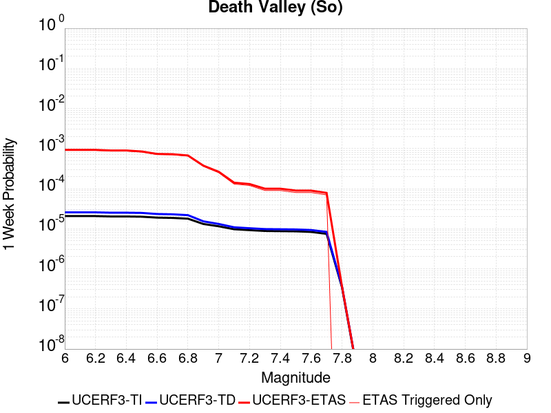 |  |  |  |

| Magnitude | 1 wk TI Prob | 1 wk TD Prob | 1 wk ETAS Prob | 1 wk ETAS/TD Gain | 1 wk ETAS Triggered Only | 1 mo TI Prob | 1 mo TD Prob | 1 mo ETAS Prob | 1 mo ETAS/TD Gain | 1 mo ETAS Triggered Only | 1 yr TI Prob | 1 yr TD Prob | 1 yr ETAS Prob | 1 yr ETAS/TD Gain | 1 yr ETAS Triggered Only | 10 yr TI Prob | 10 yr TD Prob | 10 yr ETAS Prob | 10 yr ETAS/TD Gain | 10 yr ETAS Triggered Only |
|-----|-----|-----|-----|-----|-----|-----|-----|-----|-----|-----|-----|-----|-----|-----|-----|-----|-----|-----|-----|-----|
| 6.0 | 2.0684236E-5 | 2.5617775E-5 | 9.7634917E-4 | 38.112175 | 9.507557E-4 | 8.864371E-5 | 1.0978594E-4 | 0.0012188791 | 11.1023245 | 0.001109215 | 0.0010787029 | 0.0013358411 | 0.0026505135 | 1.9841533 | 0.001316431 | 0.010734817 | 0.013281397 | 0.01464048 | 1.1023299 | 0.0013773768 |
| 6.1 | 2.0684236E-5 | 2.5617775E-5 | 9.7634917E-4 | 38.112175 | 9.507557E-4 | 8.864371E-5 | 1.0978594E-4 | 0.0012188791 | 11.1023245 | 0.001109215 | 0.0010787029 | 0.0013358411 | 0.0026505135 | 1.9841533 | 0.001316431 | 0.010734817 | 0.013281397 | 0.01464048 | 1.1023299 | 0.0013773768 |
| 6.2 | 2.0684236E-5 | 2.5617775E-5 | 9.7634917E-4 | 38.112175 | 9.507557E-4 | 8.864371E-5 | 1.0978594E-4 | 0.0012188791 | 11.1023245 | 0.001109215 | 0.0010787029 | 0.0013358411 | 0.0026505135 | 1.9841533 | 0.001316431 | 0.010734817 | 0.013281397 | 0.01464048 | 1.1023299 | 0.0013773768 |
| 6.3 | 2.0240292E-5 | 2.511786E-5 | 9.392831E-4 | 37.395027 | 9.141882E-4 | 8.6741224E-5 | 1.07643624E-4 | 0.0011679878 | 10.850506 | 0.0010604584 | 0.0010555626 | 0.00130979 | 0.002575804 | 1.9665778 | 0.0012676743 | 0.010505628 | 0.013023956 | 0.014335273 | 1.100685 | 0.0013286201 |
| 6.4 | 2.0240292E-5 | 2.511786E-5 | 9.392831E-4 | 37.395027 | 9.141882E-4 | 8.6741224E-5 | 1.07643624E-4 | 0.0011679878 | 10.850506 | 0.0010604584 | 0.0010555626 | 0.00130979 | 0.002575804 | 1.9665778 | 0.0012676743 | 0.010505628 | 0.013023956 | 0.014335273 | 1.100685 | 0.0013286201 |
| 6.5 | 1.9962767E-5 | 2.4807114E-5 | 8.780283E-4 | 35.394215 | 8.532423E-4 | 8.55519E-5 | 1.0631196E-4 | 0.0011057181 | 10.400694 | 9.995124E-4 | 0.0010410968 | 0.0012935963 | 0.0024865903 | 1.9222305 | 0.0011945392 | 0.010362327 | 0.012863902 | 0.014103238 | 1.0963421 | 0.0012554851 |
| 6.6 | 1.8937297E-5 | 2.3310964E-5 | 7.790223E-4 | 33.418705 | 7.557289E-4 | 8.115732E-5 | 9.990039E-5 | 9.896214E-4 | 9.906081 | 8.8980986E-4 | 9.876423E-4 | 0.0012156231 | 0.0022869667 | 1.8813123 | 0.0010726475 | 0.009832645 | 0.012092789 | 0.013200632 | 1.0916119 | 0.0011214042 |
| 6.7 | 1.8621096E-5 | 2.2911607E-5 | 7.664343E-4 | 33.451794 | 7.435397E-4 | 7.980225E-5 | 9.818898E-5 | 9.635355E-4 | 9.813071 | 8.654315E-4 | 9.711593E-4 | 0.0011948098 | 0.002229652 | 1.8661145 | 0.00103608 | 0.009669261 | 0.011886904 | 0.012958845 | 1.0901784 | 0.0010848367 |
| 6.8 | 1.7830353E-5 | 2.1805688E-5 | 7.0438464E-4 | 32.302795 | 6.8259385E-4 | 7.641356E-5 | 9.344968E-5 | 8.61296E-4 | 9.216682 | 7.6791807E-4 | 9.29938E-4 | 0.00113717 | 0.0020503188 | 1.8030009 | 9.141882E-4 | 0.009260561 | 0.011316354 | 0.012268403 | 1.0841303 | 9.629449E-4 |
| 6.9 | 1.3135183E-5 | 1.5303925E-5 | 3.8097362E-4 | 24.89385 | 3.6567528E-4 | 5.6292425E-5 | 6.558664E-5 | 4.7999143E-4 | 7.3184333 | 4.14432E-4 | 6.8514474E-4 | 7.982312E-4 | 0.0012975886 | 1.6255797 | 4.997562E-4 | 0.006830362 | 0.007954649 | 0.008498798 | 1.0684065 | 5.485129E-4 |
| 7.0 | 1.1507512E-5 | 1.3154199E-5 | 2.447455E-4 | 18.605883 | 2.3159434E-4 | 4.9316975E-5 | 5.6373956E-5 | 3.2452072E-4 | 5.756572 | 2.6816188E-4 | 6.002687E-4 | 6.8614254E-4 | 9.906628E-4 | 1.443815 | 3.047294E-4 | 0.0059864987 | 0.0068409415 | 0.007179904 | 1.0495491 | 3.4129692E-4 |
| 7.1 | 9.715903E-6 | 1.0865278E-5 | 1.4494476E-4 | 13.340179 | 1.3408094E-4 | 4.1638916E-5 | 4.656467E-5 | 1.8063937E-4 | 3.8793223 | 1.3408094E-4 | 5.068359E-4 | 5.667817E-4 | 7.2515116E-4 | 1.2794188 | 1.5845928E-4 | 0.0050568148 | 0.0056538144 | 0.0058356184 | 1.032156 | 1.8283764E-4 |
| 7.2 | 9.233269E-6 | 1.02863105E-5 | 1.3217682E-4 | 12.849779 | 1.2189176E-4 | 3.9570554E-5 | 4.4083466E-5 | 1.6596985E-4 | 3.7649002 | 1.2189176E-4 | 4.81665E-4 | 5.3658825E-4 | 6.827799E-4 | 1.2724465 | 1.4627012E-4 | 0.0048062233 | 0.0053533576 | 0.0055230926 | 1.0317062 | 1.7064846E-4 |
| 7.3 | 8.8041315E-6 | 9.808164E-6 | 9.513156E-5 | 9.699222 | 8.532423E-5 | 3.7731446E-5 | 4.2034335E-5 | 1.2735499E-4 | 3.0297847 | 8.532423E-5 | 4.592835E-4 | 5.1165203E-4 | 6.212985E-4 | 1.2142988 | 1.0970258E-4 | 0.0045833546 | 0.005105167 | 0.0052385638 | 1.0261297 | 1.3408094E-4 |
| 7.4 | 8.708749E-6 | 9.707175E-6 | 9.503058E-5 | 9.789725 | 8.532423E-5 | 3.7322676E-5 | 4.160154E-5 | 1.2692223E-4 | 3.0509021 | 8.532423E-5 | 4.5430884E-4 | 5.0638523E-4 | 6.160323E-4 | 1.2165289 | 1.0970258E-4 | 0.004533812 | 0.0050527398 | 0.0051861433 | 1.0264022 | 1.3408094E-4 |
| 7.5 | 8.612678E-6 | 9.604817E-6 | 9.492823E-5 | 9.883398 | 8.532423E-5 | 3.6910955E-5 | 4.1162875E-5 | 1.264836E-4 | 3.072759 | 8.532423E-5 | 4.492982E-4 | 5.01047E-4 | 6.106946E-4 | 1.218837 | 1.0970258E-4 | 0.004483909 | 0.0049995985 | 0.005133009 | 1.0266843 | 1.3408094E-4 |
| 7.6 | 8.319024E-6 | 9.283916E-6 | 9.4607356E-5 | 10.190457 | 8.532423E-5 | 3.5652476E-5 | 3.978763E-5 | 1.2510846E-4 | 3.144406 | 8.532423E-5 | 4.3398244E-4 | 4.8431093E-4 | 5.939604E-4 | 1.226403 | 1.0970258E-4 | 0.0043313587 | 0.0048329784 | 0.0049664113 | 1.0276089 | 1.3408094E-4 |
| 7.7 | 7.4718328E-6 | 8.34517E-6 | 8.1479615E-5 | 9.763686 | 7.313506E-5 | 3.2021748E-5 | 3.5764548E-5 | 1.0889699E-4 | 3.0448306 | 7.313506E-5 | 3.8979502E-4 | 4.353504E-4 | 5.3282134E-4 | 1.2238908 | 9.751341E-5 | 0.00389112 | 0.0043453807 | 0.00444247 | 1.0223432 | 9.751341E-5 |
| 7.8 | 3.4586725E-7 | 3.6482615E-7 | 3.6482615E-7 | 1.0 | 0.0 | 1.4822873E-6 | 1.5635396E-6 | 1.5635396E-6 | 1.0 | 0.0 | 1.80467E-5 | 1.9035933E-5 | 1.9035933E-5 | 1.0 | 0.0 | 1.8045233E-4 | 1.9034347E-4 | 1.9034347E-4 | 1.0 | 0.0 |
| 7.9 | 2.5591178E-9 | 2.6696718E-9 | 2.6696718E-9 | 1.0 | 0.0 | 1.0967647E-8 | 1.14414505E-8 | 1.14414505E-8 | 1.0 | 0.0 | 1.335311E-7 | 1.3929966E-7 | 1.3929966E-7 | 1.0 | 0.0 | 1.3353102E-6 | 1.3929966E-6 | 1.3929966E-6 | 1.0 | 0.0 |

## Lenwood-Lockhart-Old Woman Springs
*[(top)](#table-of-contents)*

| 1 Week | 1 Month | 1 Year | 10 Year |
|-----|-----|-----|-----|
|  |  |  |  |

| Magnitude | 1 wk TI Prob | 1 wk TD Prob | 1 wk ETAS Prob | 1 wk ETAS/TD Gain | 1 wk ETAS Triggered Only | 1 mo TI Prob | 1 mo TD Prob | 1 mo ETAS Prob | 1 mo ETAS/TD Gain | 1 mo ETAS Triggered Only | 1 yr TI Prob | 1 yr TD Prob | 1 yr ETAS Prob | 1 yr ETAS/TD Gain | 1 yr ETAS Triggered Only | 10 yr TI Prob | 10 yr TD Prob | 10 yr ETAS Prob | 10 yr ETAS/TD Gain | 10 yr ETAS Triggered Only |
|-----|-----|-----|-----|-----|-----|-----|-----|-----|-----|-----|-----|-----|-----|-----|-----|-----|-----|-----|-----|-----|
| 6.0 | 3.744542E-5 | 4.396252E-5 | 9.824878E-4 | 22.348305 | 9.385666E-4 | 1.604705E-4 | 1.8839816E-4 | 0.0012730304 | 6.757128 | 0.0010848367 | 0.0019519776 | 0.0022915069 | 0.0035319538 | 1.5413237 | 0.001243296 | 0.019349206 | 0.022696787 | 0.023983339 | 1.0566844 | 0.001316431 |
| 6.1 | 3.744542E-5 | 4.396252E-5 | 9.824878E-4 | 22.348305 | 9.385666E-4 | 1.604705E-4 | 1.8839816E-4 | 0.0012730304 | 6.757128 | 0.0010848367 | 0.0019519776 | 0.0022915069 | 0.0035319538 | 1.5413237 | 0.001243296 | 0.019349206 | 0.022696787 | 0.023983339 | 1.0566844 | 0.001316431 |
| 6.2 | 3.744542E-5 | 4.396252E-5 | 9.824878E-4 | 22.348305 | 9.385666E-4 | 1.604705E-4 | 1.8839816E-4 | 0.0012730304 | 6.757128 | 0.0010848367 | 0.0019519776 | 0.0022915069 | 0.0035319538 | 1.5413237 | 0.001243296 | 0.019349206 | 0.022696787 | 0.023983339 | 1.0566844 | 0.001316431 |
| 6.3 | 2.1079984E-5 | 2.5353434E-5 | 4.5196377E-4 | 17.82653 | 4.2662115E-4 | 9.0339665E-5 | 1.0865316E-4 | 6.205429E-4 | 5.7112274 | 5.119454E-4 | 0.0010993304 | 0.0013220694 | 0.0018698572 | 1.4143411 | 5.485129E-4 | 0.010939079 | 0.0131442575 | 0.013733677 | 1.0448424 | 5.972696E-4 |
| 6.4 | 2.1079984E-5 | 2.5353434E-5 | 4.5196377E-4 | 17.82653 | 4.2662115E-4 | 9.0339665E-5 | 1.0865316E-4 | 6.205429E-4 | 5.7112274 | 5.119454E-4 | 0.0010993304 | 0.0013220694 | 0.0018698572 | 1.4143411 | 5.485129E-4 | 0.010939079 | 0.0131442575 | 0.013733677 | 1.0448424 | 5.972696E-4 |
| 6.5 | 1.7397282E-5 | 2.066241E-5 | 3.4976337E-4 | 16.92752 | 3.2910774E-4 | 7.455765E-5 | 8.8550245E-5 | 4.9075746E-4 | 5.5421352 | 4.0224282E-4 | 9.073613E-4 | 0.0010775778 | 0.0015159153 | 1.4067804 | 4.3881033E-4 | 0.009036654 | 0.010724821 | 0.011195101 | 1.0438496 | 4.7537786E-4 |
| 6.6 | 1.52050325E-5 | 1.7679693E-5 | 3.1021476E-4 | 17.546387 | 2.9254024E-4 | 6.51628E-5 | 7.576796E-5 | 4.4141553E-4 | 5.8258862 | 3.6567528E-4 | 7.9306826E-4 | 9.220924E-4 | 0.0013117864 | 1.4226192 | 3.9005364E-4 | 0.007902439 | 0.009183526 | 0.009594153 | 1.0447134 | 4.14432E-4 |
| 6.7 | 1.332523E-5 | 1.5264002E-5 | 2.712328E-4 | 17.769442 | 2.559727E-4 | 5.7106878E-5 | 6.5415545E-5 | 3.823134E-4 | 5.8443813 | 3.1691857E-4 | 6.950544E-4 | 7.961491E-4 | 0.0011249948 | 1.4130454 | 3.2910774E-4 | 0.006928845 | 0.007933599 | 0.00828428 | 1.0442021 | 3.534861E-4 |
| 6.8 | 1.1525329E-5 | 1.3030979E-5 | 2.3243329E-4 | 17.836979 | 2.1940516E-4 | 4.9393333E-5 | 5.584588E-5 | 3.3618129E-4 | 6.019804 | 2.8035106E-4 | 6.011979E-4 | 6.797157E-4 | 9.598762E-4 | 1.412173 | 2.8035106E-4 | 0.00599574 | 0.006776819 | 0.0070794835 | 1.0446618 | 3.047294E-4 |
| 6.9 | 1.0253909E-5 | 1.15144385E-5 | 1.699719E-4 | 14.761631 | 1.5845928E-4 | 4.3944583E-5 | 4.9346683E-5 | 2.6874102E-4 | 5.4459796 | 2.1940516E-4 | 5.3489394E-4 | 6.0063385E-4 | 8.1990723E-4 | 1.36507 | 2.1940516E-4 | 0.0053360825 | 0.0059904843 | 0.0062328074 | 1.0404513 | 2.4378352E-4 |
| 7.0 | 8.104563E-6 | 8.991279E-6 | 1.3088195E-4 | 14.556543 | 1.2189176E-4 | 3.4733377E-5 | 3.8533497E-5 | 1.9698669E-4 | 5.112089 | 1.5845928E-4 | 4.2279682E-4 | 4.6904673E-4 | 6.274317E-4 | 1.3376741 | 1.5845928E-4 | 0.0042199334 | 0.0046808156 | 0.004850665 | 1.0362864 | 1.7064846E-4 |
| 7.1 | 6.7986157E-6 | 7.515816E-6 | 1.0502849E-4 | 13.97433 | 9.751341E-5 | 2.91366E-5 | 3.2210253E-5 | 1.6628687E-4 | 5.1625447 | 1.3408094E-4 | 3.5468035E-4 | 3.920914E-4 | 5.261198E-4 | 1.3418294 | 1.3408094E-4 | 0.003541148 | 0.003914213 | 0.0040599103 | 1.0372227 | 1.4627012E-4 |
| 7.2 | 5.6893327E-6 | 6.2800136E-6 | 7.941461E-5 | 12.645611 | 7.313506E-5 | 2.4382627E-5 | 2.6914078E-5 | 1.1223601E-4 | 4.1701603 | 8.532423E-5 | 2.9681803E-4 | 3.2763163E-4 | 4.1292788E-4 | 1.260342 | 8.532423E-5 | 0.002964219 | 0.0032716845 | 0.003368879 | 1.0297078 | 9.751341E-5 |
| 7.3 | 4.253348E-6 | 4.7069107E-6 | 7.784162E-5 | 16.537731 | 7.313506E-5 | 1.8228506E-5 | 2.0172329E-5 | 9.3305905E-5 | 4.6254406 | 7.313506E-5 | 2.2190946E-4 | 2.4557224E-4 | 3.1868933E-4 | 1.2977417 | 7.313506E-5 | 0.00221688 | 0.0024531898 | 0.0025383048 | 1.0346956 | 8.532423E-5 |
| 7.4 | 2.5448119E-6 | 2.852045E-6 | 3.941947E-5 | 13.821475 | 3.656753E-5 | 1.0906291E-5 | 1.2223002E-5 | 4.8790083E-5 | 3.9916613 | 3.656753E-5 | 1.3277601E-4 | 1.4880655E-4 | 1.8536863E-4 | 1.2457021 | 3.656753E-5 | 0.001326967 | 0.0014872311 | 0.0015237443 | 1.024551 | 3.656753E-5 |
| 7.5 | 4.3706837E-8 | 4.562909E-8 | 4.562909E-8 | 1.0 | 0.0 | 1.8731501E-7 | 1.9555324E-7 | 1.9555324E-7 | 1.0 | 0.0 | 2.2805577E-6 | 2.3808586E-6 | 2.3808586E-6 | 1.0 | 0.0 | 2.2805343E-5 | 2.3808387E-5 | 2.3808387E-5 | 1.0 | 0.0 |

## San Andreas (San Bernardino N)
*[(top)](#table-of-contents)*

| 1 Week | 1 Month | 1 Year | 10 Year |
|-----|-----|-----|-----|
|  |  | 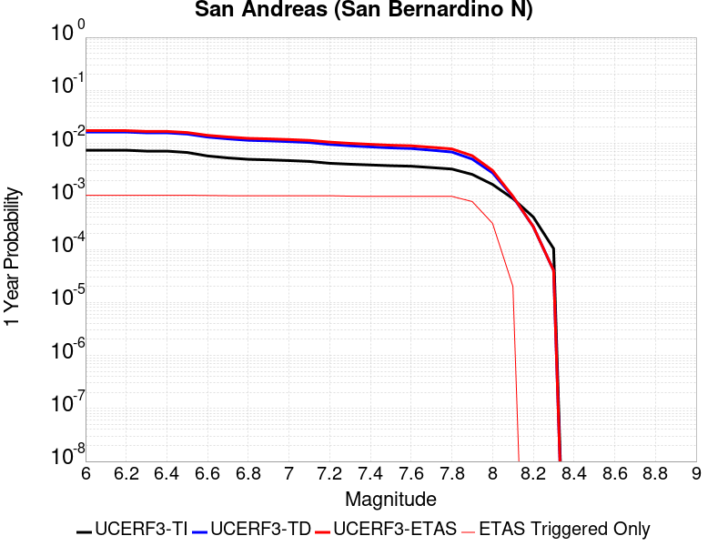 |  |

| Magnitude | 1 wk TI Prob | 1 wk TD Prob | 1 wk ETAS Prob | 1 wk ETAS/TD Gain | 1 wk ETAS Triggered Only | 1 mo TI Prob | 1 mo TD Prob | 1 mo ETAS Prob | 1 mo ETAS/TD Gain | 1 mo ETAS Triggered Only | 1 yr TI Prob | 1 yr TD Prob | 1 yr ETAS Prob | 1 yr ETAS/TD Gain | 1 yr ETAS Triggered Only | 10 yr TI Prob | 10 yr TD Prob | 10 yr ETAS Prob | 10 yr ETAS/TD Gain | 10 yr ETAS Triggered Only |
|-----|-----|-----|-----|-----|-----|-----|-----|-----|-----|-----|-----|-----|-----|-----|-----|-----|-----|-----|-----|-----|
| 6.0 | 1.4273766E-4 | 3.1606483E-4 | 0.0012543347 | 3.9685993 | 9.385666E-4 | 6.115894E-4 | 0.0013538664 | 0.002412889 | 1.782221 | 0.0010604584 | 0.0074207084 | 0.016360244 | 0.01747529 | 1.0681559 | 0.0011335934 | 0.07177748 | 0.15026689 | 0.15129228 | 1.0068239 | 0.0012067284 |
| 6.1 | 1.4273766E-4 | 3.1606483E-4 | 0.0012543347 | 3.9685993 | 9.385666E-4 | 6.115894E-4 | 0.0013538664 | 0.002412889 | 1.782221 | 0.0010604584 | 0.0074207084 | 0.016360244 | 0.01747529 | 1.0681559 | 0.0011335934 | 0.07177748 | 0.15026689 | 0.15129228 | 1.0068239 | 0.0012067284 |
| 6.2 | 1.4273766E-4 | 3.1606483E-4 | 0.0012543347 | 3.9685993 | 9.385666E-4 | 6.115894E-4 | 0.0013538664 | 0.002412889 | 1.782221 | 0.0010604584 | 0.0074207084 | 0.016360244 | 0.01747529 | 1.0681559 | 0.0011335934 | 0.07177748 | 0.15026689 | 0.15129228 | 1.0068239 | 0.0012067284 |
| 6.3 | 1.3730655E-4 | 3.0511338E-4 | 0.0012433935 | 4.0751853 | 9.385666E-4 | 5.883239E-4 | 0.0013069791 | 0.0023660515 | 1.8103207 | 0.0010604584 | 0.0071393442 | 0.015797773 | 0.016913457 | 1.0706229 | 0.0011335934 | 0.06914291 | 0.14556676 | 0.14659783 | 1.0070832 | 0.0012067284 |
| 6.4 | 1.3730655E-4 | 3.0511338E-4 | 0.0012433935 | 4.0751853 | 9.385666E-4 | 5.883239E-4 | 0.0013069791 | 0.0023660515 | 1.8103207 | 0.0010604584 | 0.0071393442 | 0.015797773 | 0.016913457 | 1.0706229 | 0.0011335934 | 0.06914291 | 0.14556676 | 0.14659783 | 1.0070832 | 0.0012067284 |
| 6.5 | 1.2942807E-4 | 2.8925808E-4 | 0.0012275531 | 4.243799 | 9.385666E-4 | 5.545738E-4 | 0.0012390936 | 0.002298238 | 1.8547734 | 0.0010604584 | 0.0067310524 | 0.01498286 | 0.01609947 | 1.0745257 | 0.0011335934 | 0.06530788 | 0.13870941 | 0.13974877 | 1.0074929 | 0.0012067284 |
| 6.6 | 1.1125901E-4 | 2.536472E-4 | 0.0011797895 | 4.6513014 | 9.2637737E-4 | 4.767372E-4 | 0.0010866089 | 0.002133739 | 1.9636679 | 0.0010482691 | 0.005788839 | 0.013149847 | 0.014256505 | 1.0841575 | 0.0011214042 | 0.056403454 | 0.122999296 | 0.12404691 | 1.0085173 | 0.0011945392 |
| 6.7 | 1.02209575E-4 | 2.3499702E-4 | 0.0011489703 | 4.889298 | 9.141882E-4 | 4.3796748E-4 | 0.0010067427 | 0.0020417797 | 2.0281048 | 0.00103608 | 0.0053192247 | 0.012188629 | 0.013284325 | 1.0898949 | 0.001109215 | 0.051936906 | 0.114790924 | 0.11583755 | 1.0091177 | 0.0011823501 |
| 6.8 | 9.610582E-5 | 2.2025521E-4 | 0.001134242 | 5.149672 | 9.141882E-4 | 4.1181705E-4 | 9.436101E-4 | 0.0019787124 | 2.0969598 | 0.00103608 | 0.0050023515 | 0.011428202 | 0.01252474 | 1.0959502 | 0.001109215 | 0.048912346 | 0.1081929 | 0.10924733 | 1.0097458 | 0.0011823501 |
| 6.9 | 9.3877505E-5 | 2.1481077E-4 | 0.0011288025 | 5.2548695 | 9.141882E-4 | 4.0227012E-4 | 9.2029345E-4 | 0.00195542 | 2.1247787 | 0.00103608 | 0.0048866454 | 0.011147255 | 0.012244105 | 1.0983964 | 0.001109215 | 0.04780577 | 0.10578323 | 0.106840506 | 1.0099947 | 0.0011823501 |
| 7.0 | 9.1019785E-5 | 2.0808022E-4 | 0.0011220782 | 5.392527 | 9.141882E-4 | 3.900265E-4 | 8.914682E-4 | 0.0019266246 | 2.1611814 | 0.00103608 | 0.0047382377 | 0.010799837 | 0.011897073 | 1.1015974 | 0.001109215 | 0.046384744 | 0.102753714 | 0.10381457 | 1.0103242 | 0.0011823501 |
| 7.1 | 8.771155E-5 | 1.9982594E-4 | 0.0011138314 | 5.574008 | 9.141882E-4 | 3.758525E-4 | 8.5611636E-4 | 0.0018913093 | 2.2091732 | 0.00103608 | 0.0045664064 | 0.0103736 | 0.011471308 | 1.1058176 | 0.001109215 | 0.044737056 | 0.09906527 | 0.10013048 | 1.0107527 | 0.0011823501 |
| 7.2 | 8.0830236E-5 | 1.8388197E-4 | 0.0010979021 | 5.970689 | 9.141882E-4 | 3.4636928E-4 | 7.8782777E-4 | 0.0018230915 | 2.3140736 | 0.00103608 | 0.0042088944 | 0.009549725 | 0.0106483465 | 1.1150423 | 0.001109215 | 0.041300658 | 0.09179615 | 0.092858896 | 1.0115772 | 0.001170161 |
| 7.3 | 7.7668235E-5 | 1.7331762E-4 | 0.0010751603 | 6.20341 | 9.01999E-4 | 3.328214E-4 | 7.425784E-4 | 0.0017657089 | 2.3778079 | 0.0010238908 | 0.0040445733 | 0.009003494 | 0.010090643 | 1.1207474 | 0.0010970258 | 0.03971748 | 0.08706327 | 0.08812042 | 1.0121424 | 0.0011579717 |
| 7.4 | 7.520177E-5 | 1.6551897E-4 | 0.0010551815 | 6.3749886 | 8.8980986E-4 | 3.2225347E-4 | 7.0917426E-4 | 0.0017201584 | 2.4255793 | 0.0010117016 | 0.0039163795 | 0.008600081 | 0.009675588 | 1.1250578 | 0.0010848367 | 0.038480744 | 0.08351955 | 0.08456964 | 1.012573 | 0.0011457825 |
| 7.5 | 7.274697E-5 | 1.5839566E-4 | 0.0010480646 | 6.6167507 | 8.8980986E-4 | 3.1173544E-4 | 6.78662E-4 | 0.001689677 | 2.489718 | 0.0010117016 | 0.003788775 | 0.008231463 | 0.00930737 | 1.1307067 | 0.0010848367 | 0.03724827 | 0.08023631 | 0.081290156 | 1.0131344 | 0.0011457825 |
| 7.6 | 7.1185845E-5 | 1.540943E-4 | 0.0010437671 | 6.77356 | 8.8980986E-4 | 3.0504653E-4 | 6.6023704E-4 | 0.0016712707 | 2.5313191 | 0.0010117016 | 0.0037076178 | 0.008008812 | 0.0090849595 | 1.1343706 | 0.0010848367 | 0.036463667 | 0.07822598 | 0.07928213 | 1.0135013 | 0.0011457825 |
| 7.7 | 6.709961E-5 | 1.4318313E-4 | 0.0010328656 | 7.2135983 | 8.8980986E-4 | 2.8753807E-4 | 6.1349774E-4 | 0.0016245786 | 2.6480598 | 0.0010117016 | 0.003495157 | 0.0074437927 | 0.008520554 | 1.1446522 | 0.0010848367 | 0.034406938 | 0.07305469 | 0.074116774 | 1.0145382 | 0.0011457825 |
| 7.8 | 6.300812E-5 | 1.3202413E-4 | 0.0010217165 | 7.738862 | 8.8980986E-4 | 2.7000686E-4 | 5.65695E-4 | 0.0015768243 | 2.7874107 | 0.0010117016 | 0.0032823787 | 0.006865616 | 0.007943004 | 1.1569253 | 0.0010848367 | 0.032343175 | 0.06771354 | 0.06878173 | 1.0157752 | 0.0011457825 |
| 7.9 | 4.983037E-5 | 9.723488E-5 | 7.919504E-4 | 8.144714 | 6.9478306E-4 | 2.1354125E-4 | 4.1665437E-4 | 0.0012086207 | 2.9007752 | 7.922964E-4 | 0.0025967648 | 0.0050609782 | 0.0059220297 | 1.1701354 | 8.654315E-4 | 0.025666296 | 0.05064886 | 0.051516745 | 1.0171354 | 9.141882E-4 |
| 8.0 | 3.2211527E-5 | 5.3304586E-5 | 3.0926365E-4 | 5.8018203 | 2.559727E-4 | 1.380421E-4 | 2.2842824E-4 | 5.3308805E-4 | 2.333722 | 3.047294E-4 | 0.0016793669 | 0.0027775685 | 0.0031057622 | 1.1181586 | 3.2910774E-4 | 0.016667323 | 0.028361378 | 0.028692996 | 1.0116925 | 3.4129692E-4 |
| 8.1 | 1.743376E-5 | 1.8824427E-5 | 3.1013373E-5 | 1.647507 | 1.2189176E-5 | 7.471398E-5 | 8.067362E-5 | 9.286181E-5 | 1.1510803 | 1.2189176E-5 | 9.0926304E-4 | 9.817594E-4 | 9.939366E-4 | 1.0124035 | 1.2189176E-5 | 0.009055517 | 0.010484105 | 0.010496167 | 1.0011505 | 1.2189176E-5 |
| 8.2 | 7.831616E-6 | 5.1551065E-6 | 5.1551065E-6 | 1.0 | 0.0 | 3.3563636E-5 | 2.2093127E-5 | 2.2093127E-5 | 1.0 | 0.0 | 4.0856065E-4 | 2.6895068E-4 | 2.6895068E-4 | 1.0 | 0.0 | 0.004078103 | 0.0030418145 | 0.0030418145 | 1.0 | 0.0 |
| 8.3 | 1.983087E-6 | 7.6599065E-7 | 7.6599065E-7 | 1.0 | 0.0 | 8.498917E-6 | 3.282813E-6 | 3.282813E-6 | 1.0 | 0.0 | 1.034694E-4 | 3.9967534E-5 | 3.9967534E-5 | 1.0 | 0.0 | 0.0010342124 | 4.719687E-4 | 4.719687E-4 | 1.0 | 0.0 |

## Coyote Canyon
*[(top)](#table-of-contents)*

| 1 Week | 1 Month | 1 Year | 10 Year |
|-----|-----|-----|-----|
|  |  |  |  |

| Magnitude | 1 wk TI Prob | 1 wk TD Prob | 1 wk ETAS Prob | 1 wk ETAS/TD Gain | 1 wk ETAS Triggered Only | 1 mo TI Prob | 1 mo TD Prob | 1 mo ETAS Prob | 1 mo ETAS/TD Gain | 1 mo ETAS Triggered Only | 1 yr TI Prob | 1 yr TD Prob | 1 yr ETAS Prob | 1 yr ETAS/TD Gain | 1 yr ETAS Triggered Only | 10 yr TI Prob | 10 yr TD Prob | 10 yr ETAS Prob | 10 yr ETAS/TD Gain | 10 yr ETAS Triggered Only |
|-----|-----|-----|-----|-----|-----|-----|-----|-----|-----|-----|-----|-----|-----|-----|-----|-----|-----|-----|-----|-----|
| 6.0 | 3.5090034E-5 | 4.0364324E-5 | 7.2293065E-4 | 17.91014 | 6.8259385E-4 | 1.503772E-4 | 1.7297994E-4 | 9.5295225E-4 | 5.509033 | 7.801073E-4 | 0.0018293047 | 0.0021042528 | 0.0030894985 | 1.4682164 | 9.873232E-4 | 0.018143194 | 0.020869201 | 0.021919465 | 1.050326 | 0.0010726475 |
| 6.1 | 3.5090034E-5 | 4.0364324E-5 | 7.2293065E-4 | 17.91014 | 6.8259385E-4 | 1.503772E-4 | 1.7297994E-4 | 9.5295225E-4 | 5.509033 | 7.801073E-4 | 0.0018293047 | 0.0021042528 | 0.0030894985 | 1.4682164 | 9.873232E-4 | 0.018143194 | 0.020869201 | 0.021919465 | 1.050326 | 0.0010726475 |
| 6.2 | 1.841879E-5 | 2.1059794E-5 | 3.9891628E-4 | 18.94208 | 3.7786446E-4 | 7.8935285E-5 | 9.0253714E-5 | 5.1683636E-4 | 5.7264833 | 4.2662115E-4 | 9.606133E-4 | 0.001098387 | 0.0015732427 | 1.432321 | 4.7537786E-4 | 0.0095647145 | 0.010939667 | 0.011470123 | 1.0484893 | 5.3632376E-4 |
| 6.3 | 1.841879E-5 | 2.1059794E-5 | 3.9891628E-4 | 18.94208 | 3.7786446E-4 | 7.8935285E-5 | 9.0253714E-5 | 5.1683636E-4 | 5.7264833 | 4.2662115E-4 | 9.606133E-4 | 0.001098387 | 0.0015732427 | 1.432321 | 4.7537786E-4 | 0.0095647145 | 0.010939667 | 0.011470123 | 1.0484893 | 5.3632376E-4 |
| 6.4 | 1.712201E-5 | 1.9565212E-5 | 3.730444E-4 | 19.06672 | 3.534861E-4 | 7.337798E-5 | 8.3848776E-5 | 4.8605786E-4 | 5.7968388 | 4.0224282E-4 | 8.930107E-4 | 0.0010204813 | 0.0014710206 | 1.4414968 | 4.509995E-4 | 0.008894307 | 0.010167871 | 0.010674611 | 1.0498374 | 5.119454E-4 |
| 6.5 | 1.4744935E-5 | 1.6836972E-5 | 3.0937226E-4 | 18.374578 | 2.9254024E-4 | 6.3191044E-5 | 7.215698E-5 | 4.0124098E-4 | 5.5606675 | 3.2910774E-4 | 7.6907943E-4 | 8.7825063E-4 | 0.0012557833 | 1.4298688 | 3.7786446E-4 | 0.007664232 | 0.008756994 | 0.009191962 | 1.0496709 | 4.3881033E-4 |
| 6.6 | 1.2017839E-5 | 1.37240895E-5 | 2.2093723E-4 | 16.0985 | 2.07216E-4 | 5.150401E-5 | 5.88167E-5 | 2.660205E-4 | 4.522874 | 2.07216E-4 | 6.268809E-4 | 7.159466E-4 | 9.5955556E-4 | 1.3402613 | 2.4378352E-4 | 0.0062511545 | 0.0071450938 | 0.0074476455 | 1.042344 | 3.047294E-4 |
| 6.7 | 1.00956095E-5 | 1.1533517E-5 | 1.6999098E-4 | 14.738868 | 1.5845928E-4 | 4.326618E-5 | 4.942891E-5 | 2.0788037E-4 | 4.205643 | 1.5845928E-4 | 5.266384E-4 | 6.017178E-4 | 7.9662725E-4 | 1.3239217 | 1.9502682E-4 | 0.005253921 | 0.0060094125 | 0.006251731 | 1.0403231 | 2.4378352E-4 |

## Towne Pass
*[(top)](#table-of-contents)*

| 1 Week | 1 Month | 1 Year | 10 Year |
|-----|-----|-----|-----|
|  |  |  |  |

| Magnitude | 1 wk TI Prob | 1 wk TD Prob | 1 wk ETAS Prob | 1 wk ETAS/TD Gain | 1 wk ETAS Triggered Only | 1 mo TI Prob | 1 mo TD Prob | 1 mo ETAS Prob | 1 mo ETAS/TD Gain | 1 mo ETAS Triggered Only | 1 yr TI Prob | 1 yr TD Prob | 1 yr ETAS Prob | 1 yr ETAS/TD Gain | 1 yr ETAS Triggered Only | 10 yr TI Prob | 10 yr TD Prob | 10 yr ETAS Prob | 10 yr ETAS/TD Gain | 10 yr ETAS Triggered Only |
|-----|-----|-----|-----|-----|-----|-----|-----|-----|-----|-----|-----|-----|-----|-----|-----|-----|-----|-----|-----|-----|
| 6.0 | 3.849728E-6 | 3.8945414E-6 | 8.327553E-4 | 213.82628 | 8.28864E-4 | 1.649873E-5 | 1.669081E-5 | 9.552417E-4 | 57.231598 | 9.385666E-4 | 2.0085352E-4 | 2.0319603E-4 | 0.0013365591 | 6.577683 | 0.0011335934 | 0.0020067208 | 0.0020305314 | 0.0032226453 | 1.5870944 | 0.0011945392 |
| 6.1 | 3.849728E-6 | 3.8945414E-6 | 8.327553E-4 | 213.82628 | 8.28864E-4 | 1.649873E-5 | 1.669081E-5 | 9.552417E-4 | 57.231598 | 9.385666E-4 | 2.0085352E-4 | 2.0319603E-4 | 0.0013365591 | 6.577683 | 0.0011335934 | 0.0020067208 | 0.0020305314 | 0.0032226453 | 1.5870944 | 0.0011945392 |
| 6.2 | 3.849728E-6 | 3.8945414E-6 | 8.327553E-4 | 213.82628 | 8.28864E-4 | 1.649873E-5 | 1.669081E-5 | 9.552417E-4 | 57.231598 | 9.385666E-4 | 2.0085352E-4 | 2.0319603E-4 | 0.0013365591 | 6.577683 | 0.0011335934 | 0.0020067208 | 0.0020305314 | 0.0032226453 | 1.5870944 | 0.0011945392 |
| 6.3 | 3.849728E-6 | 3.8945414E-6 | 8.327553E-4 | 213.82628 | 8.28864E-4 | 1.649873E-5 | 1.669081E-5 | 9.552417E-4 | 57.231598 | 9.385666E-4 | 2.0085352E-4 | 2.0319603E-4 | 0.0013365591 | 6.577683 | 0.0011335934 | 0.0020067208 | 0.0020305314 | 0.0032226453 | 1.5870944 | 0.0011945392 |
| 6.4 | 3.849728E-6 | 3.8945414E-6 | 8.327553E-4 | 213.82628 | 8.28864E-4 | 1.649873E-5 | 1.669081E-5 | 9.552417E-4 | 57.231598 | 9.385666E-4 | 2.0085352E-4 | 2.0319603E-4 | 0.0013365591 | 6.577683 | 0.0011335934 | 0.0020067208 | 0.0020305314 | 0.0032226453 | 1.5870944 | 0.0011945392 |
| 6.5 | 1.1953545E-6 | 1.203052E-6 | 6.214886E-5 | 51.65933 | 6.094588E-5 | 5.1229376E-6 | 5.1559277E-6 | 9.047972E-5 | 17.54868 | 8.532423E-5 | 6.236998E-5 | 6.277173E-5 | 1.6027901E-4 | 2.553363 | 9.751341E-5 | 6.235248E-4 | 6.275517E-4 | 7.2500395E-4 | 1.1552895 | 9.751341E-5 |
| 6.6 | 1.1953545E-6 | 1.203052E-6 | 6.214886E-5 | 51.65933 | 6.094588E-5 | 5.1229376E-6 | 5.1559277E-6 | 9.047972E-5 | 17.54868 | 8.532423E-5 | 6.236998E-5 | 6.277173E-5 | 1.6027901E-4 | 2.553363 | 9.751341E-5 | 6.235248E-4 | 6.275517E-4 | 7.2500395E-4 | 1.1552895 | 9.751341E-5 |
| 6.7 | 8.375951E-7 | 8.4106705E-7 | 6.1786894E-5 | 73.46251 | 6.094588E-5 | 3.5896885E-6 | 3.6045683E-6 | 8.892849E-5 | 24.671051 | 8.532423E-5 | 4.370358E-5 | 4.3884793E-5 | 1.2920528E-4 | 2.9441924 | 8.532423E-5 | 4.3694986E-4 | 4.38767E-4 | 5.240538E-4 | 1.1943784 | 8.532423E-5 |
| 6.8 | 6.38041E-7 | 6.392156E-7 | 6.158506E-5 | 96.34473 | 6.094588E-5 | 2.7344586E-6 | 2.7394929E-6 | 7.587435E-5 | 27.696493 | 7.313506E-5 | 3.3291526E-5 | 3.3352855E-5 | 1.0648547E-4 | 3.1926944 | 7.313506E-5 | 3.3286537E-4 | 3.334823E-4 | 4.0659297E-4 | 1.219234 | 7.313506E-5 |
| 6.9 | 5.3460053E-7 | 5.345333E-7 | 4.929121E-5 | 92.21355 | 4.8756705E-5 | 2.2911431E-6 | 2.2908553E-6 | 6.32366E-5 | 27.603926 | 6.094588E-5 | 2.789431E-5 | 2.789084E-5 | 8.883502E-5 | 3.1850967 | 6.094588E-5 | 2.789081E-4 | 2.7887672E-4 | 3.3980559E-4 | 1.2184796 | 6.094588E-5 |
| 7.0 | 3.557783E-7 | 3.5324226E-7 | 1.2542414E-5 | 35.50655 | 1.2189176E-5 | 1.5247632E-6 | 1.5138945E-6 | 2.589221E-5 | 17.103046 | 2.4378352E-5 | 1.8563835E-5 | 1.843152E-5 | 4.280942E-5 | 2.3226204 | 2.4378352E-5 | 1.8562283E-4 | 1.8430075E-4 | 2.0867461E-4 | 1.1322504 | 2.4378352E-5 |
| 7.1 | 3.037942E-7 | 3.0002218E-7 | 1.2489195E-5 | 41.62757 | 1.2189176E-5 | 1.3019744E-6 | 1.2858087E-6 | 2.5664129E-5 | 19.959522 | 2.4378352E-5 | 1.5851423E-5 | 1.5654618E-5 | 4.0032588E-5 | 2.5572383 | 2.4378352E-5 | 1.5850292E-4 | 1.5653588E-4 | 1.8091043E-4 | 1.1557121 | 2.4378352E-5 |
| 7.2 | 2.0808248E-7 | 2.0217689E-7 | 1.23913505E-5 | 61.28965 | 1.2189176E-5 | 8.917818E-7 | 8.6647213E-7 | 2.5244803E-5 | 29.135159 | 2.4378352E-5 | 1.0857389E-5 | 1.0549252E-5 | 3.4927347E-5 | 3.3108838 | 2.4378352E-5 | 1.0856859E-4 | 1.0548797E-4 | 1.2986375E-4 | 1.2310764 | 2.4378352E-5 |
| 7.3 | 1.1162073E-7 | 1.0636894E-7 | 1.22955435E-5 | 115.59337 | 1.2189176E-5 | 4.7837443E-7 | 4.558668E-7 | 2.4834208E-5 | 54.476894 | 2.4378352E-5 | 5.8241935E-6 | 5.550166E-6 | 2.9928382E-5 | 5.39234 | 2.4378352E-5 | 5.8240406E-5 | 5.5500474E-5 | 7.987747E-5 | 1.4392215 | 2.4378352E-5 |

## Nelson Lake
*[(top)](#table-of-contents)*

| 1 Week | 1 Month | 1 Year | 10 Year |
|-----|-----|-----|-----|
|  |  |  |  |

| Magnitude | 1 wk TI Prob | 1 wk TD Prob | 1 wk ETAS Prob | 1 wk ETAS/TD Gain | 1 wk ETAS Triggered Only | 1 mo TI Prob | 1 mo TD Prob | 1 mo ETAS Prob | 1 mo ETAS/TD Gain | 1 mo ETAS Triggered Only | 1 yr TI Prob | 1 yr TD Prob | 1 yr ETAS Prob | 1 yr ETAS/TD Gain | 1 yr ETAS Triggered Only | 10 yr TI Prob | 10 yr TD Prob | 10 yr ETAS Prob | 10 yr ETAS/TD Gain | 10 yr ETAS Triggered Only |
|-----|-----|-----|-----|-----|-----|-----|-----|-----|-----|-----|-----|-----|-----|-----|-----|-----|-----|-----|-----|-----|
| 6.0 | 9.913453E-6 | 1.0192255E-5 | 4.977543E-4 | 48.836525 | 4.8756704E-4 | 4.2485535E-5 | 4.3680422E-5 | 6.531126E-4 | 14.952067 | 6.094588E-4 | 5.1713863E-4 | 5.316897E-4 | 0.0012748342 | 2.3977032 | 7.435397E-4 | 0.0051593683 | 0.005305204 | 0.006117546 | 1.1531217 | 8.166748E-4 |
| 6.1 | 9.913453E-6 | 1.0192255E-5 | 4.977543E-4 | 48.836525 | 4.8756704E-4 | 4.2485535E-5 | 4.3680422E-5 | 6.531126E-4 | 14.952067 | 6.094588E-4 | 5.1713863E-4 | 5.316897E-4 | 0.0012748342 | 2.3977032 | 7.435397E-4 | 0.0051593683 | 0.005305204 | 0.006117546 | 1.1531217 | 8.166748E-4 |
| 6.2 | 4.5596407E-6 | 4.696313E-6 | 2.2410045E-4 | 47.71838 | 2.1940516E-4 | 1.954117E-5 | 2.0126909E-5 | 3.004723E-4 | 14.928886 | 2.8035106E-4 | 2.3788778E-4 | 2.4501883E-4 | 5.984183E-4 | 2.442336 | 3.534861E-4 | 0.0023763329 | 0.0024476128 | 0.002812393 | 1.1490351 | 3.6567528E-4 |
| 6.3 | 4.5596407E-6 | 4.696313E-6 | 2.2410045E-4 | 47.71838 | 2.1940516E-4 | 1.954117E-5 | 2.0126909E-5 | 3.004723E-4 | 14.928886 | 2.8035106E-4 | 2.3788778E-4 | 2.4501883E-4 | 5.984183E-4 | 2.442336 | 3.534861E-4 | 0.0023763329 | 0.0024476128 | 0.002812393 | 1.1490351 | 3.6567528E-4 |
| 6.4 | 3.4025713E-6 | 3.5098972E-6 | 1.7415776E-4 | 49.61905 | 1.7064846E-4 | 1.4582367E-5 | 1.5042335E-5 | 2.344442E-4 | 15.585626 | 2.1940516E-4 | 1.7752586E-4 | 1.8312587E-4 | 4.5123865E-4 | 2.46409 | 2.6816188E-4 | 0.001773841 | 0.0018298327 | 0.0021096708 | 1.152931 | 2.8035106E-4 |
| 6.5 | 2.8352947E-6 | 2.927856E-6 | 1.370084E-4 | 46.794785 | 1.3408094E-4 | 1.2151207E-5 | 1.2547898E-5 | 1.9538324E-4 | 15.570993 | 1.8283764E-4 | 1.479309E-4 | 1.5276071E-4 | 3.7213234E-4 | 2.4360476 | 2.1940516E-4 | 0.0014783246 | 0.0015266308 | 0.0017578716 | 1.1514714 | 2.3159434E-4 |
| 6.6 | 2.251518E-6 | 2.3290677E-6 | 9.984225E-5 | 42.867905 | 9.751341E-5 | 9.649328E-6 | 9.981683E-6 | 1.5625033E-4 | 15.653706 | 1.4627012E-4 | 1.1747423E-4 | 1.2152085E-4 | 2.921486E-4 | 2.4041026 | 1.7064846E-4 | 0.0011741214 | 0.0012146058 | 0.0013972212 | 1.1503496 | 1.8283764E-4 |
| 6.7 | 1.8911853E-6 | 1.9591396E-6 | 8.72832E-5 | 44.551804 | 8.532423E-5 | 8.105055E-6 | 8.39629E-6 | 1.424761E-4 | 16.968937 | 1.3408094E-4 | 9.867457E-5 | 1.0222061E-4 | 2.4847576E-4 | 2.4307795 | 1.4627012E-4 | 9.863076E-4 | 0.0010217935 | 0.0011800908 | 1.154921 | 1.5845928E-4 |
| 6.8 | 1.4874814E-6 | 1.5438305E-6 | 7.467877E-5 | 48.37239 | 7.313506E-5 | 6.374905E-6 | 6.6164025E-6 | 1.2850735E-4 | 19.422543 | 1.2189176E-4 | 7.76117E-5 | 8.055224E-5 | 2.1462239E-4 | 2.6643875 | 1.3408094E-4 | 7.75846E-4 | 8.0528157E-4 | 9.5143385E-4 | 1.1814922 | 1.4627012E-4 |
| 6.9 | 6.835972E-7 | 7.1399285E-7 | 4.9470662E-5 | 69.28734 | 4.8756705E-5 | 2.9296991E-6 | 3.0599674E-6 | 7.61948E-5 | 24.900526 | 7.313506E-5 | 3.56685E-5 | 3.7254784E-5 | 1.1038712E-4 | 2.9630318 | 7.313506E-5 | 3.5662777E-4 | 3.7251666E-4 | 4.4562446E-4 | 1.1962538 | 7.313506E-5 |

## Paradise
*[(top)](#table-of-contents)*

| 1 Week | 1 Month | 1 Year | 10 Year |
|-----|-----|-----|-----|
|  |  | 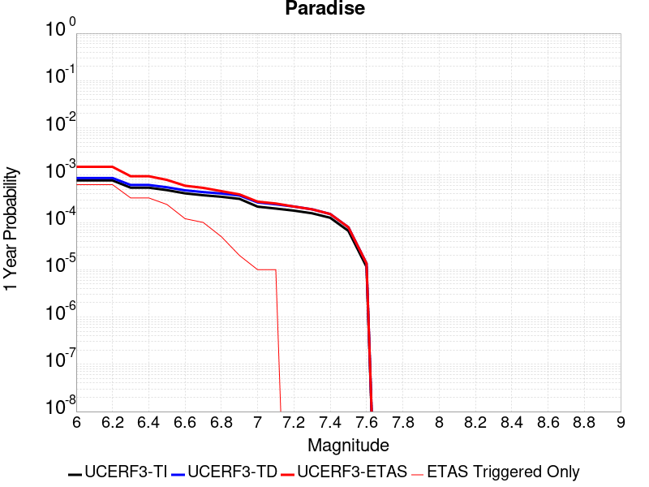 |  |

| Magnitude | 1 wk TI Prob | 1 wk TD Prob | 1 wk ETAS Prob | 1 wk ETAS/TD Gain | 1 wk ETAS Triggered Only | 1 mo TI Prob | 1 mo TD Prob | 1 mo ETAS Prob | 1 mo ETAS/TD Gain | 1 mo ETAS Triggered Only | 1 yr TI Prob | 1 yr TD Prob | 1 yr ETAS Prob | 1 yr ETAS/TD Gain | 1 yr ETAS Triggered Only | 10 yr TI Prob | 10 yr TD Prob | 10 yr ETAS Prob | 10 yr ETAS/TD Gain | 10 yr ETAS Triggered Only |
|-----|-----|-----|-----|-----|-----|-----|-----|-----|-----|-----|-----|-----|-----|-----|-----|-----|-----|-----|-----|-----|
| 6.0 | 1.4851273E-5 | 1.6694692E-5 | 4.7987566E-4 | 28.744205 | 4.6318868E-4 | 6.364676E-5 | 7.154685E-5 | 5.9564394E-4 | 8.32523 | 5.2413455E-4 | 7.7462377E-4 | 8.707584E-4 | 0.0014796865 | 1.6993078 | 6.094588E-4 | 0.0077192914 | 0.008675844 | 0.009316266 | 1.0738167 | 6.4602634E-4 |
| 6.1 | 1.4851273E-5 | 1.6694692E-5 | 4.7987566E-4 | 28.744205 | 4.6318868E-4 | 6.364676E-5 | 7.154685E-5 | 5.9564394E-4 | 8.32523 | 5.2413455E-4 | 7.7462377E-4 | 8.707584E-4 | 0.0014796865 | 1.6993078 | 6.094588E-4 | 0.0077192914 | 0.008675844 | 0.009316266 | 1.0738167 | 6.4602634E-4 |
| 6.2 | 1.4851273E-5 | 1.6694692E-5 | 4.7987566E-4 | 28.744205 | 4.6318868E-4 | 6.364676E-5 | 7.154685E-5 | 5.9564394E-4 | 8.32523 | 5.2413455E-4 | 7.7462377E-4 | 8.707584E-4 | 0.0014796865 | 1.6993078 | 6.094588E-4 | 0.0077192914 | 0.008675844 | 0.009316266 | 1.0738167 | 6.4602634E-4 |
| 6.3 | 1.0426831E-5 | 1.188862E-5 | 2.800473E-4 | 23.555912 | 2.6816188E-4 | 4.4685654E-5 | 5.0950268E-5 | 3.3128704E-4 | 6.502165 | 2.8035106E-4 | 5.43912E-4 | 6.201489E-4 | 9.4905257E-4 | 1.5303624 | 3.2910774E-4 | 0.0054258266 | 0.0061847917 | 0.006511864 | 1.0528833 | 3.2910774E-4 |
| 6.4 | 1.0426831E-5 | 1.188862E-5 | 2.800473E-4 | 23.555912 | 2.6816188E-4 | 4.4685654E-5 | 5.0950268E-5 | 3.3128704E-4 | 6.502165 | 2.8035106E-4 | 5.43912E-4 | 6.201489E-4 | 9.4905257E-4 | 1.5303624 | 3.2910774E-4 | 0.0054258266 | 0.0061847917 | 0.006511864 | 1.0528833 | 3.2910774E-4 |
| 6.5 | 9.25027E-6 | 1.06199595E-5 | 2.0564471E-4 | 19.363981 | 1.9502682E-4 | 3.964341E-5 | 4.551335E-5 | 2.527199E-4 | 5.5526547 | 2.07216E-4 | 4.8255164E-4 | 5.53989E-4 | 8.098199E-4 | 1.4617977 | 2.559727E-4 | 0.0048150513 | 0.0055265795 | 0.0057811374 | 1.0460607 | 2.559727E-4 |
| 6.6 | 7.904275E-6 | 9.159525E-6 | 1.18861106E-4 | 12.976776 | 1.0970258E-4 | 3.3875025E-5 | 3.9254537E-5 | 1.4895282E-4 | 3.7945375 | 1.0970258E-4 | 4.1235037E-4 | 4.7782314E-4 | 5.9965666E-4 | 1.2549762 | 1.2189176E-4 | 0.0041158604 | 0.0047683544 | 0.0048896647 | 1.0254408 | 1.2189176E-4 |
| 6.7 | 7.2061953E-6 | 8.407248E-6 | 1.1810891E-4 | 14.048462 | 1.0970258E-4 | 3.088333E-5 | 3.6030586E-5 | 1.4572922E-4 | 4.044597 | 1.0970258E-4 | 3.7593965E-4 | 4.3858777E-4 | 5.4824224E-4 | 1.2500172 | 1.0970258E-4 | 0.003753043 | 0.004377591 | 0.004486813 | 1.0249504 | 1.0970258E-4 |
| 6.8 | 6.6948724E-6 | 7.842166E-6 | 5.659849E-5 | 7.217201 | 4.8756705E-5 | 2.8691995E-5 | 3.360887E-5 | 8.2363935E-5 | 2.4506607 | 4.8756705E-5 | 3.4926904E-4 | 4.0911473E-4 | 4.5785148E-4 | 1.1191274 | 4.8756705E-5 | 0.003487206 | 0.0040839734 | 0.0041325307 | 1.0118898 | 4.8756705E-5 |
| 6.9 | 6.0421025E-6 | 7.130621E-6 | 1.931971E-5 | 2.709401 | 1.2189176E-5 | 2.5894467E-5 | 3.0559466E-5 | 4.274827E-5 | 1.3988552 | 1.2189176E-5 | 3.1521954E-4 | 3.7200135E-4 | 3.8418602E-4 | 1.0327543 | 1.2189176E-5 | 0.0031477278 | 0.0037141247 | 0.0037262687 | 1.0032697 | 1.2189176E-5 |
| 7.0 | 4.134091E-6 | 5.0803087E-6 | 5.0803087E-6 | 1.0 | 0.0 | 1.7717413E-5 | 2.177258E-5 | 2.177258E-5 | 1.0 | 0.0 | 2.1568815E-4 | 2.6505045E-4 | 2.6505045E-4 | 1.0 | 0.0 | 0.0021547892 | 0.0026474963 | 0.0026474963 | 1.0 | 0.0 |
| 7.1 | 3.7674888E-6 | 4.6318696E-6 | 4.6318696E-6 | 1.0 | 0.0 | 1.6146281E-5 | 1.9850726E-5 | 1.9850726E-5 | 1.0 | 0.0 | 1.9656324E-4 | 2.4165731E-4 | 2.4165731E-4 | 1.0 | 0.0 | 0.0019638946 | 0.002414096 | 0.002414096 | 1.0 | 0.0 |
| 7.2 | 3.4065345E-6 | 4.156723E-6 | 4.156723E-6 | 1.0 | 0.0 | 1.4599351E-5 | 1.7814415E-5 | 1.7814415E-5 | 1.0 | 0.0 | 1.777326E-4 | 2.1687041E-4 | 2.1687041E-4 | 1.0 | 0.0 | 0.0017759053 | 0.002166736 | 0.002166736 | 1.0 | 0.0 |
| 7.3 | 2.9934936E-6 | 3.6293168E-6 | 3.6293168E-6 | 1.0 | 0.0 | 1.2829195E-5 | 1.555413E-5 | 1.555413E-5 | 1.0 | 0.0 | 1.5618425E-4 | 1.8935655E-4 | 1.8935655E-4 | 1.0 | 0.0 | 0.0015607453 | 0.0018920974 | 0.0018920974 | 1.0 | 0.0 |
| 7.4 | 2.4049796E-6 | 2.8889842E-6 | 2.8889842E-6 | 1.0 | 0.0 | 1.0307015E-5 | 1.238131E-5 | 1.238131E-5 | 1.0 | 0.0 | 1.2548068E-4 | 1.5073347E-4 | 1.5073347E-4 | 1.0 | 0.0 | 0.0012540985 | 0.0015064536 | 0.0015064536 | 1.0 | 0.0 |
| 7.5 | 1.2710091E-6 | 1.5134682E-6 | 1.5134682E-6 | 1.0 | 0.0 | 5.44717E-6 | 6.4862834E-6 | 6.4862834E-6 | 1.0 | 0.0 | 6.631728E-5 | 7.8968886E-5 | 7.8968886E-5 | 1.0 | 0.0 | 6.6297496E-4 | 7.8953087E-4 | 7.8953087E-4 | 1.0 | 0.0 |
| 7.6 | 2.21172E-7 | 2.603961E-7 | 2.603961E-7 | 1.0 | 0.0 | 9.478797E-7 | 1.1159829E-6 | 1.1159829E-6 | 1.0 | 0.0 | 1.1540374E-5 | 1.3587036E-5 | 1.3587036E-5 | 1.0 | 0.0 | 1.1539775E-4 | 1.3586486E-4 | 1.3586486E-4 | 1.0 | 0.0 |

## Bicycle Lake
*[(top)](#table-of-contents)*

| 1 Week | 1 Month | 1 Year | 10 Year |
|-----|-----|-----|-----|
|  |  |  |  |

| Magnitude | 1 wk TI Prob | 1 wk TD Prob | 1 wk ETAS Prob | 1 wk ETAS/TD Gain | 1 wk ETAS Triggered Only | 1 mo TI Prob | 1 mo TD Prob | 1 mo ETAS Prob | 1 mo ETAS/TD Gain | 1 mo ETAS Triggered Only | 1 yr TI Prob | 1 yr TD Prob | 1 yr ETAS Prob | 1 yr ETAS/TD Gain | 1 yr ETAS Triggered Only | 10 yr TI Prob | 10 yr TD Prob | 10 yr ETAS Prob | 10 yr ETAS/TD Gain | 10 yr ETAS Triggered Only |
|-----|-----|-----|-----|-----|-----|-----|-----|-----|-----|-----|-----|-----|-----|-----|-----|-----|-----|-----|-----|-----|
| 6.0 | 1.9621975E-5 | 2.2097078E-5 | 4.365199E-4 | 19.754644 | 4.14432E-4 | 8.4091465E-5 | 9.4699084E-5 | 5.578439E-4 | 5.8907 | 4.6318868E-4 | 0.0010233327 | 0.0011524865 | 0.0017003673 | 1.4753902 | 5.485129E-4 | 0.01018633 | 0.011478408 | 0.012044723 | 1.0493375 | 5.7289127E-4 |
| 6.1 | 1.9621975E-5 | 2.2097078E-5 | 4.365199E-4 | 19.754644 | 4.14432E-4 | 8.4091465E-5 | 9.4699084E-5 | 5.578439E-4 | 5.8907 | 4.6318868E-4 | 0.0010233327 | 0.0011524865 | 0.0017003673 | 1.4753902 | 5.485129E-4 | 0.01018633 | 0.011478408 | 0.012044723 | 1.0493375 | 5.7289127E-4 |
| 6.2 | 9.9971285E-6 | 1.1255639E-5 | 2.3065833E-4 | 20.492691 | 2.1940516E-4 | 4.2844134E-5 | 4.8237856E-5 | 2.7982102E-4 | 5.8008595 | 2.3159434E-4 | 5.2150246E-4 | 5.871896E-4 | 8.673761E-4 | 1.4771651 | 2.8035106E-4 | 0.0052028033 | 0.005861487 | 0.0061644297 | 1.0516837 | 3.047294E-4 |
| 6.3 | 9.589428E-6 | 1.0798346E-5 | 2.180121E-4 | 20.189398 | 2.07216E-4 | 4.10969E-5 | 4.62781E-5 | 2.6567312E-4 | 5.740796 | 2.1940516E-4 | 5.002399E-4 | 5.6334207E-4 | 8.3135284E-4 | 1.4757515 | 2.6816188E-4 | 0.0049911533 | 0.0056242296 | 0.0059151244 | 1.0517217 | 2.9254024E-4 |
| 6.4 | 9.589428E-6 | 1.0798346E-5 | 2.180121E-4 | 20.189398 | 2.07216E-4 | 4.10969E-5 | 4.62781E-5 | 2.6567312E-4 | 5.740796 | 2.1940516E-4 | 5.002399E-4 | 5.6334207E-4 | 8.3135284E-4 | 1.4757515 | 2.6816188E-4 | 0.0049911533 | 0.0056242296 | 0.0059151244 | 1.0517217 | 2.9254024E-4 |
| 6.5 | 5.557707E-6 | 6.2856016E-6 | 1.281766E-4 | 20.392097 | 1.2189176E-4 | 2.3818526E-5 | 2.6938165E-5 | 1.4882664E-4 | 5.5247507 | 1.2189176E-4 | 2.8995197E-4 | 3.2794967E-4 | 4.8635702E-4 | 1.4830233 | 1.5845928E-4 | 0.0028957394 | 0.0032772934 | 0.0034595318 | 1.0556064 | 1.8283764E-4 |
| 6.6 | 4.8742945E-6 | 5.5132896E-6 | 7.864794E-5 | 14.265157 | 7.313506E-5 | 2.0889667E-5 | 2.3628318E-5 | 9.676164E-5 | 4.0951557 | 7.313506E-5 | 2.54302E-4 | 2.87663E-4 | 3.8514836E-4 | 1.3388873 | 9.751341E-5 | 0.002540112 | 0.0028754752 | 0.0029970165 | 1.0422683 | 1.2189176E-4 |
| 6.7 | 3.991108E-6 | 4.5159104E-6 | 5.3272393E-5 | 11.796601 | 4.8756705E-5 | 1.7104636E-5 | 1.9353902E-5 | 6.8109664E-5 | 3.5191696 | 4.8756705E-5 | 2.0822904E-4 | 2.3563375E-4 | 3.0875157E-4 | 1.3103029 | 7.313506E-5 | 0.0020803404 | 0.0023563374 | 0.002453621 | 1.041286 | 9.751341E-5 |

## San Andreas (San Bernardino S)
*[(top)](#table-of-contents)*

| 1 Week | 1 Month | 1 Year | 10 Year |
|-----|-----|-----|-----|
|  |  |  |  |

| Magnitude | 1 wk TI Prob | 1 wk TD Prob | 1 wk ETAS Prob | 1 wk ETAS/TD Gain | 1 wk ETAS Triggered Only | 1 mo TI Prob | 1 mo TD Prob | 1 mo ETAS Prob | 1 mo ETAS/TD Gain | 1 mo ETAS Triggered Only | 1 yr TI Prob | 1 yr TD Prob | 1 yr ETAS Prob | 1 yr ETAS/TD Gain | 1 yr ETAS Triggered Only | 10 yr TI Prob | 10 yr TD Prob | 10 yr ETAS Prob | 10 yr ETAS/TD Gain | 10 yr ETAS Triggered Only |
|-----|-----|-----|-----|-----|-----|-----|-----|-----|-----|-----|-----|-----|-----|-----|-----|-----|-----|-----|-----|-----|
| 6.0 | 1.2336002E-4 | 3.0004102E-4 | 7.387197E-4 | 2.4620624 | 4.3881033E-4 | 5.2857865E-4 | 0.0012852824 | 0.0017722228 | 1.3788587 | 4.8756704E-4 | 0.006416472 | 0.015540994 | 0.016044984 | 1.0324297 | 5.119454E-4 | 0.06234337 | 0.14283717 | 0.14331779 | 1.0033648 | 5.607021E-4 |
| 6.1 | 1.2336002E-4 | 3.0004102E-4 | 7.387197E-4 | 2.4620624 | 4.3881033E-4 | 5.2857865E-4 | 0.0012852824 | 0.0017722228 | 1.3788587 | 4.8756704E-4 | 0.006416472 | 0.015540994 | 0.016044984 | 1.0324297 | 5.119454E-4 | 0.06234337 | 0.14283717 | 0.14331779 | 1.0033648 | 5.607021E-4 |
| 6.2 | 1.2336002E-4 | 3.0004102E-4 | 7.387197E-4 | 2.4620624 | 4.3881033E-4 | 5.2857865E-4 | 0.0012852824 | 0.0017722228 | 1.3788587 | 4.8756704E-4 | 0.006416472 | 0.015540994 | 0.016044984 | 1.0324297 | 5.119454E-4 | 0.06234337 | 0.14283717 | 0.14331779 | 1.0033648 | 5.607021E-4 |
| 6.3 | 1.1712257E-4 | 2.8792414E-4 | 7.144225E-4 | 2.4812872 | 4.2662115E-4 | 5.018573E-4 | 0.0012334028 | 0.0017081943 | 1.3849444 | 4.7537786E-4 | 0.006093008 | 0.014918125 | 0.015410426 | 1.0330002 | 4.997562E-4 | 0.059286322 | 0.13754563 | 0.1380187 | 1.0034393 | 5.485129E-4 |
| 6.4 | 1.1712257E-4 | 2.8792414E-4 | 7.144225E-4 | 2.4812872 | 4.2662115E-4 | 5.018573E-4 | 0.0012334028 | 0.0017081943 | 1.3849444 | 4.7537786E-4 | 0.006093008 | 0.014918125 | 0.015410426 | 1.0330002 | 4.997562E-4 | 0.059286322 | 0.13754563 | 0.1380187 | 1.0034393 | 5.485129E-4 |
| 6.5 | 1.0689076E-4 | 2.680528E-4 | 6.945596E-4 | 2.5911298 | 4.2662115E-4 | 4.5802278E-4 | 0.0011483167 | 0.0016231487 | 1.4135027 | 4.7537786E-4 | 0.0055621783 | 0.01389575 | 0.014388562 | 1.0354649 | 4.997562E-4 | 0.05425003 | 0.12879294 | 0.12927082 | 1.0037104 | 5.485129E-4 |
| 6.6 | 9.7648895E-5 | 2.50501E-4 | 6.770153E-4 | 2.702645 | 4.2662115E-4 | 4.1842813E-4 | 0.0010731576 | 0.0015480254 | 1.4424957 | 4.7537786E-4 | 0.005082469 | 0.012991785 | 0.013485049 | 1.0379673 | 4.997562E-4 | 0.049677886 | 0.12095292 | 0.12143508 | 1.0039864 | 5.485129E-4 |
| 6.7 | 8.757013E-5 | 2.3120902E-4 | 6.5773155E-4 | 2.8447485 | 4.2662115E-4 | 3.7524657E-4 | 9.905418E-4 | 0.0014654488 | 1.4794416 | 4.7537786E-4 | 0.00455906 | 0.011997245 | 0.0124910055 | 1.0411562 | 4.997562E-4 | 0.04466656 | 0.11226123 | 0.11274816 | 1.0043375 | 5.485129E-4 |
| 6.8 | 8.562978E-5 | 2.2680782E-4 | 6.533322E-4 | 2.8805542 | 4.2662115E-4 | 3.6693315E-4 | 9.7169366E-4 | 0.0014466096 | 1.4887507 | 4.7537786E-4 | 0.004458263 | 0.011770263 | 0.012264137 | 1.0419594 | 4.997562E-4 | 0.043698758 | 0.11027153 | 0.11075956 | 1.0044256 | 5.485129E-4 |
| 6.9 | 6.124075E-5 | 1.7065753E-4 | 5.850188E-4 | 3.428028 | 4.14432E-4 | 2.6243398E-4 | 7.311852E-4 | 0.0011940353 | 1.6330134 | 4.6318868E-4 | 0.0031904527 | 0.008866051 | 0.009349295 | 1.054505 | 4.8756704E-4 | 0.031450346 | 0.08418263 | 0.08466264 | 1.005702 | 5.2413455E-4 |
| 7.0 | 5.8598747E-5 | 1.649477E-4 | 5.7931134E-4 | 3.5120907 | 4.14432E-4 | 2.5111332E-4 | 7.06728E-4 | 0.0011695893 | 1.6549356 | 4.6318868E-4 | 0.0030530186 | 0.008570663 | 0.009054051 | 1.0564003 | 4.8756704E-4 | 0.03011414 | 0.081500374 | 0.081981786 | 1.0059069 | 5.2413455E-4 |
| 7.1 | 5.613814E-5 | 1.5913323E-4 | 5.7349924E-4 | 3.6038938 | 4.14432E-4 | 2.4056983E-4 | 6.818221E-4 | 0.001144695 | 1.6788764 | 4.6318868E-4 | 0.0029250039 | 0.008269769 | 0.008753303 | 1.0584702 | 4.8756704E-4 | 0.028868021 | 0.07879931 | 0.07928214 | 1.0061274 | 5.2413455E-4 |
| 7.2 | 4.991222E-5 | 1.4519796E-4 | 5.4738234E-4 | 3.7699041 | 4.0224282E-4 | 2.1389198E-4 | 6.2212895E-4 | 0.0010728479 | 1.7244784 | 4.509995E-4 | 0.002601025 | 0.007548217 | 0.008020007 | 1.0625035 | 4.7537786E-4 | 0.025707912 | 0.07225321 | 0.072728164 | 1.0065734 | 5.119454E-4 |
| 7.3 | 4.7410045E-5 | 1.3714004E-4 | 5.2714016E-4 | 3.8438096 | 3.9005364E-4 | 2.0317009E-4 | 5.8761094E-4 | 0.0010261635 | 1.7463313 | 4.3881033E-4 | 0.0024707897 | 0.0071307817 | 0.0075906673 | 1.0644931 | 4.6318868E-4 | 0.024434982 | 0.06853558 | 0.069001086 | 1.0067922 | 4.997562E-4 |
| 7.4 | 4.5556746E-5 | 1.3121912E-4 | 5.0903397E-4 | 3.879267 | 3.7786446E-4 | 1.952286E-4 | 5.622468E-4 | 9.88628E-4 | 1.7583526 | 4.2662115E-4 | 0.002374317 | 0.0068239477 | 0.0072718696 | 1.0656397 | 4.509995E-4 | 0.023491086 | 0.065788016 | 0.06624351 | 1.0069237 | 4.8756704E-4 |
| 7.5 | 4.3084514E-5 | 1.2357246E-4 | 5.0139026E-4 | 4.057459 | 3.7786446E-4 | 1.8463485E-4 | 5.2948913E-4 | 9.5588434E-4 | 1.8052956 | 4.2662115E-4 | 0.0022456115 | 0.0064275465 | 0.006875647 | 1.0697156 | 4.509995E-4 | 0.022230545 | 0.062188786 | 0.06264603 | 1.0073526 | 4.8756704E-4 |
| 7.6 | 3.408608E-5 | 9.83552E-5 | 4.761825E-4 | 4.8414574 | 3.7786446E-4 | 1.4607502E-4 | 4.214543E-4 | 8.4789563E-4 | 2.011833 | 4.2662115E-4 | 0.0017770125 | 0.0051191594 | 0.00556785 | 1.0876493 | 4.509995E-4 | 0.017628696 | 0.050020292 | 0.050483473 | 1.0092598 | 4.8756704E-4 |
| 7.7 | 2.8315713E-5 | 8.248679E-5 | 4.603201E-4 | 5.5805306 | 3.7786446E-4 | 1.2134742E-4 | 3.5346695E-4 | 7.799373E-4 | 2.2065353 | 4.2662115E-4 | 0.0014764034 | 0.0042949775 | 0.00474404 | 1.1045552 | 4.509995E-4 | 0.01466633 | 0.0422714 | 0.04273836 | 1.0110466 | 4.8756704E-4 |
| 7.8 | 2.6222975E-5 | 7.463088E-5 | 4.5246712E-4 | 6.0627337 | 3.7786446E-4 | 1.1237934E-4 | 3.1980744E-4 | 7.462922E-4 | 2.3335671 | 4.2662115E-4 | 0.0013673597 | 0.0038867102 | 0.0043359566 | 1.1155853 | 4.509995E-4 | 0.013589768 | 0.03843674 | 0.03890557 | 1.0121974 | 4.8756704E-4 |
| 7.9 | 2.1469694E-5 | 5.787864E-5 | 3.8696735E-4 | 6.68584 | 3.2910774E-4 | 9.200973E-5 | 2.4802773E-4 | 6.1361236E-4 | 2.4739664 | 3.6567528E-4 | 0.0011196428 | 0.0030155594 | 0.0034044369 | 1.1289569 | 3.9005364E-4 | 0.011140184 | 0.030152109 | 0.030554045 | 1.0133302 | 4.14432E-4 |
| 8.0 | 1.2420249E-5 | 3.131896E-5 | 1.653957E-4 | 5.2810087 | 1.3408094E-4 | 5.322855E-5 | 1.342172E-4 | 3.0484278E-4 | 2.2712643 | 1.7064846E-4 | 6.478649E-4 | 0.0016328706 | 0.0018154097 | 1.1117903 | 1.8283764E-4 | 0.0064597935 | 0.016522504 | 0.016714308 | 1.0116087 | 1.9502682E-4 |
| 8.1 | 4.9197724E-6 | 7.822348E-6 | 7.822348E-6 | 1.0 | 0.0 | 2.1084568E-5 | 3.352392E-5 | 3.352392E-5 | 1.0 | 0.0 | 2.566744E-4 | 4.0807744E-4 | 4.0807744E-4 | 1.0 | 0.0 | 0.002563781 | 0.0043843705 | 0.0043843705 | 1.0 | 0.0 |
| 8.2 | 2.5634774E-6 | 2.9067196E-6 | 2.9067196E-6 | 1.0 | 0.0 | 1.0986286E-5 | 1.2457311E-5 | 1.2457311E-5 | 1.0 | 0.0 | 1.3374983E-4 | 1.5165724E-4 | 1.5165724E-4 | 1.0 | 0.0 | 0.0013366934 | 0.0017049741 | 0.0017049741 | 1.0 | 0.0 |
| 8.3 | 5.2850464E-7 | 3.2088764E-7 | 3.2088764E-7 | 1.0 | 0.0 | 2.2650179E-6 | 1.375232E-6 | 1.375232E-6 | 1.0 | 0.0 | 2.7576245E-5 | 1.6743334E-5 | 1.6743334E-5 | 1.0 | 0.0 | 2.7572823E-4 | 1.9870348E-4 | 1.9870348E-4 | 1.0 | 0.0 |

## Helendale-So Lockhart
*[(top)](#table-of-contents)*

| 1 Week | 1 Month | 1 Year | 10 Year |
|-----|-----|-----|-----|
|  |  |  |  |

| Magnitude | 1 wk TI Prob | 1 wk TD Prob | 1 wk ETAS Prob | 1 wk ETAS/TD Gain | 1 wk ETAS Triggered Only | 1 mo TI Prob | 1 mo TD Prob | 1 mo ETAS Prob | 1 mo ETAS/TD Gain | 1 mo ETAS Triggered Only | 1 yr TI Prob | 1 yr TD Prob | 1 yr ETAS Prob | 1 yr ETAS/TD Gain | 1 yr ETAS Triggered Only | 10 yr TI Prob | 10 yr TD Prob | 10 yr ETAS Prob | 10 yr ETAS/TD Gain | 10 yr ETAS Triggered Only |
|-----|-----|-----|-----|-----|-----|-----|-----|-----|-----|-----|-----|-----|-----|-----|-----|-----|-----|-----|-----|-----|
| 6.0 | 1.7296055E-5 | 1.8103729E-5 | 3.4720553E-4 | 19.178675 | 3.2910774E-4 | 7.412385E-5 | 7.7585224E-5 | 4.676086E-4 | 6.027032 | 3.9005364E-4 | 9.0208417E-4 | 9.4421144E-4 | 0.0013947851 | 1.4771957 | 4.509995E-4 | 0.008984311 | 0.009404116 | 0.009887098 | 1.0513586 | 4.8756704E-4 |
| 6.1 | 1.7296055E-5 | 1.8103729E-5 | 3.4720553E-4 | 19.178675 | 3.2910774E-4 | 7.412385E-5 | 7.7585224E-5 | 4.676086E-4 | 6.027032 | 3.9005364E-4 | 9.0208417E-4 | 9.4421144E-4 | 0.0013947851 | 1.4771957 | 4.509995E-4 | 0.008984311 | 0.009404116 | 0.009887098 | 1.0513586 | 4.8756704E-4 |
| 6.2 | 1.7296055E-5 | 1.8103729E-5 | 3.4720553E-4 | 19.178675 | 3.2910774E-4 | 7.412385E-5 | 7.7585224E-5 | 4.676086E-4 | 6.027032 | 3.9005364E-4 | 9.0208417E-4 | 9.4421144E-4 | 0.0013947851 | 1.4771957 | 4.509995E-4 | 0.008984311 | 0.009404116 | 0.009887098 | 1.0513586 | 4.8756704E-4 |
| 6.3 | 1.0669118E-5 | 1.1135425E-5 | 2.9148336E-4 | 26.176222 | 2.8035106E-4 | 4.5723988E-5 | 4.772239E-5 | 3.7681442E-4 | 7.8959675 | 3.2910774E-4 | 5.5654737E-4 | 5.80868E-4 | 9.219667E-4 | 1.5872223 | 3.4129692E-4 | 0.0055515557 | 0.0057937936 | 0.006133113 | 1.0585661 | 3.4129692E-4 |
| 6.4 | 1.0669118E-5 | 1.1135425E-5 | 2.9148336E-4 | 26.176222 | 2.8035106E-4 | 4.5723988E-5 | 4.772239E-5 | 3.7681442E-4 | 7.8959675 | 3.2910774E-4 | 5.5654737E-4 | 5.80868E-4 | 9.219667E-4 | 1.5872223 | 3.4129692E-4 | 0.0055515557 | 0.0057937936 | 0.006133113 | 1.0585661 | 3.4129692E-4 |
| 6.5 | 8.790038E-6 | 9.170197E-6 | 2.8951868E-4 | 31.571697 | 2.8035106E-4 | 3.767105E-5 | 3.930026E-5 | 3.5620638E-4 | 9.063716 | 3.1691857E-4 | 4.585485E-4 | 4.7837716E-4 | 8.0732745E-4 | 1.687638 | 3.2910774E-4 | 0.0045760344 | 0.004773638 | 0.005101175 | 1.0686136 | 3.2910774E-4 |
| 6.6 | 7.396949E-6 | 7.715537E-6 | 2.393081E-4 | 31.016388 | 2.3159434E-4 | 3.1700827E-5 | 3.3066175E-5 | 3.0121917E-4 | 9.109587 | 2.6816188E-4 | 3.858892E-4 | 4.025073E-4 | 6.705612E-4 | 1.6659604 | 2.6816188E-4 | 0.003852198 | 0.00401789 | 0.004284974 | 1.0664738 | 2.6816188E-4 |
| 6.7 | 6.4600285E-6 | 6.738031E-6 | 2.2614172E-4 | 33.56199 | 2.1940516E-4 | 2.7685543E-5 | 2.887696E-5 | 2.8484227E-4 | 9.863997 | 2.559727E-4 | 3.3701936E-4 | 3.5152107E-4 | 6.0740375E-4 | 1.72793 | 2.559727E-4 | 0.0033650869 | 0.003509732 | 0.0037648063 | 1.0726763 | 2.559727E-4 |
| 6.8 | 5.600104E-6 | 5.836009E-6 | 2.0086169E-4 | 34.417645 | 1.9502682E-4 | 2.4000226E-5 | 2.5011232E-5 | 2.5659977E-4 | 10.259382 | 2.3159434E-4 | 2.9216358E-4 | 3.044698E-4 | 5.359936E-4 | 1.7604164 | 2.3159434E-4 | 0.0029177975 | 0.003040588 | 0.0032714782 | 1.0759361 | 2.3159434E-4 |
| 6.9 | 4.839122E-6 | 5.0395092E-6 | 1.5130888E-4 | 30.024527 | 1.4627012E-4 | 2.0738931E-5 | 2.159772E-5 | 2.0443142E-4 | 9.465416 | 1.8283764E-4 | 2.5246723E-4 | 2.6292098E-4 | 4.4571055E-4 | 1.6952262 | 1.8283764E-4 | 0.002521806 | 0.002626147 | 0.0028085043 | 1.0694392 | 1.8283764E-4 |
| 7.0 | 3.6937633E-6 | 3.845208E-6 | 1.1354737E-4 | 29.529577 | 1.0970258E-4 | 1.5830317E-5 | 1.647936E-5 | 1.5055809E-4 | 9.136161 | 1.3408094E-4 | 1.9271708E-4 | 2.0061806E-4 | 3.3467208E-4 | 1.6682053 | 1.3408094E-4 | 0.0019255003 | 0.002004401 | 0.002138213 | 1.0667592 | 1.3408094E-4 |
| 7.1 | 2.7858857E-6 | 2.8978538E-6 | 7.6032695E-5 | 26.237589 | 7.313506E-5 | 1.1939455E-5 | 1.2419316E-5 | 1.0993151E-4 | 8.851656 | 9.751341E-5 | 1.4535317E-4 | 1.511949E-4 | 2.4869354E-4 | 1.6448542 | 9.751341E-5 | 0.0014525814 | 0.0015109418 | 0.0016083078 | 1.0644406 | 9.751341E-5 |
| 7.2 | 2.1672065E-6 | 2.2540128E-6 | 6.3199754E-5 | 28.038774 | 6.094588E-5 | 9.2879945E-6 | 9.66002E-6 | 8.279437E-5 | 8.5708275 | 7.313506E-5 | 1.1307546E-4 | 1.1760458E-4 | 1.9073104E-4 | 1.6217993 | 7.313506E-5 | 0.0011301794 | 0.0011754417 | 0.0012484908 | 1.0621461 | 7.313506E-5 |
| 7.3 | 1.4823496E-6 | 1.5422102E-6 | 6.2488E-5 | 40.518467 | 6.094588E-5 | 6.3529114E-6 | 6.6094562E-6 | 6.755493E-5 | 10.220951 | 6.094588E-5 | 7.734395E-5 | 8.046731E-5 | 1.414083E-4 | 1.7573383 | 6.094588E-5 | 7.731704E-4 | 8.0439687E-4 | 8.652937E-4 | 1.0757049 | 6.094588E-5 |
| 7.4 | 4.2321457E-7 | 4.4108765E-7 | 1.2630258E-5 | 28.63435 | 1.2189176E-5 | 1.8137755E-6 | 1.8903745E-6 | 1.4079527E-5 | 7.4480095 | 1.2189176E-5 | 2.2082493E-5 | 2.3015113E-5 | 3.5204008E-5 | 1.529604 | 1.2189176E-5 | 2.2080299E-4 | 2.3013182E-4 | 2.4231819E-4 | 1.0529538 | 1.2189176E-5 |
| 7.5 | 5.6942316E-8 | 5.9415648E-8 | 5.9415648E-8 | 1.0 | 0.0 | 2.440385E-7 | 2.5463845E-7 | 2.5463845E-7 | 1.0 | 0.0 | 2.9711643E-6 | 3.1002196E-6 | 3.1002196E-6 | 1.0 | 0.0 | 2.9711247E-5 | 3.1001844E-5 | 3.1001844E-5 | 1.0 | 0.0 |

## Death Valley (Black Mtns Frontal)
*[(top)](#table-of-contents)*

| 1 Week | 1 Month | 1 Year | 10 Year |
|-----|-----|-----|-----|
|  |  |  |  |

| Magnitude | 1 wk TI Prob | 1 wk TD Prob | 1 wk ETAS Prob | 1 wk ETAS/TD Gain | 1 wk ETAS Triggered Only | 1 mo TI Prob | 1 mo TD Prob | 1 mo ETAS Prob | 1 mo ETAS/TD Gain | 1 mo ETAS Triggered Only | 1 yr TI Prob | 1 yr TD Prob | 1 yr ETAS Prob | 1 yr ETAS/TD Gain | 1 yr ETAS Triggered Only | 10 yr TI Prob | 10 yr TD Prob | 10 yr ETAS Prob | 10 yr ETAS/TD Gain | 10 yr ETAS Triggered Only |
|-----|-----|-----|-----|-----|-----|-----|-----|-----|-----|-----|-----|-----|-----|-----|-----|-----|-----|-----|-----|-----|
| 6.0 | 1.6707214E-5 | 1.867027E-5 | 2.8682713E-4 | 15.362775 | 2.6816188E-4 | 7.160038E-5 | 8.001302E-5 | 3.7252984E-4 | 4.655865 | 2.9254024E-4 | 8.71386E-4 | 9.737309E-4 | 0.0013025182 | 1.3376572 | 3.2910774E-4 | 0.00867977 | 0.009695496 | 0.010069698 | 1.0385953 | 3.7786446E-4 |
| 6.1 | 1.6707214E-5 | 1.867027E-5 | 2.8682713E-4 | 15.362775 | 2.6816188E-4 | 7.160038E-5 | 8.001302E-5 | 3.7252984E-4 | 4.655865 | 2.9254024E-4 | 8.71386E-4 | 9.737309E-4 | 0.0013025182 | 1.3376572 | 3.2910774E-4 | 0.00867977 | 0.009695496 | 0.010069698 | 1.0385953 | 3.7786446E-4 |
| 6.2 | 1.6707214E-5 | 1.867027E-5 | 2.8682713E-4 | 15.362775 | 2.6816188E-4 | 7.160038E-5 | 8.001302E-5 | 3.7252984E-4 | 4.655865 | 2.9254024E-4 | 8.71386E-4 | 9.737309E-4 | 0.0013025182 | 1.3376572 | 3.2910774E-4 | 0.00867977 | 0.009695496 | 0.010069698 | 1.0385953 | 3.7786446E-4 |
| 6.3 | 1.6707214E-5 | 1.867027E-5 | 2.8682713E-4 | 15.362775 | 2.6816188E-4 | 7.160038E-5 | 8.001302E-5 | 3.7252984E-4 | 4.655865 | 2.9254024E-4 | 8.71386E-4 | 9.737309E-4 | 0.0013025182 | 1.3376572 | 3.2910774E-4 | 0.00867977 | 0.009695496 | 0.010069698 | 1.0385953 | 3.7786446E-4 |
| 6.4 | 1.5515609E-5 | 1.7338214E-5 | 2.7330648E-4 | 15.763243 | 2.559727E-4 | 6.649377E-5 | 7.4304546E-5 | 3.5463477E-4 | 4.7727194 | 2.8035106E-4 | 8.0926094E-4 | 9.042885E-4 | 0.0012209205 | 1.3501449 | 3.1691857E-4 | 0.008063202 | 0.009006773 | 0.009357075 | 1.0388932 | 3.534861E-4 |
| 6.5 | 1.5515609E-5 | 1.7338214E-5 | 2.7330648E-4 | 15.763243 | 2.559727E-4 | 6.649377E-5 | 7.4304546E-5 | 3.5463477E-4 | 4.7727194 | 2.8035106E-4 | 8.0926094E-4 | 9.042885E-4 | 0.0012209205 | 1.3501449 | 3.1691857E-4 | 0.008063202 | 0.009006773 | 0.009357075 | 1.0388932 | 3.534861E-4 |
| 6.6 | 1.5041828E-5 | 1.6809145E-5 | 2.6058857E-4 | 15.502786 | 2.4378352E-4 | 6.4463384E-5 | 7.203723E-5 | 3.401798E-4 | 4.722277 | 2.6816188E-4 | 7.8455906E-4 | 8.767063E-4 | 0.0011811686 | 1.3472797 | 3.047294E-4 | 0.00781795 | 0.008733132 | 0.009071449 | 1.0387394 | 3.4129692E-4 |
| 6.7 | 1.4634985E-5 | 1.6356016E-5 | 2.4794656E-4 | 15.159349 | 2.3159434E-4 | 6.271985E-5 | 7.009536E-5 | 3.2605013E-4 | 4.651522 | 2.559727E-4 | 7.6334673E-4 | 8.5308263E-4 | 0.0011331945 | 1.3283526 | 2.8035106E-4 | 0.007607299 | 0.008498715 | 0.008812941 | 1.0369732 | 3.1691857E-4 |
| 6.8 | 1.4209158E-5 | 1.5882048E-5 | 2.1090577E-4 | 13.279508 | 1.9502682E-4 | 6.089497E-5 | 6.8064175E-5 | 2.874544E-4 | 4.223285 | 2.1940516E-4 | 7.4114406E-4 | 8.2837185E-4 | 0.0010719534 | 1.2940485 | 2.4378352E-4 | 0.007386771 | 0.008253456 | 0.008519405 | 1.0322227 | 2.6816188E-4 |
| 6.9 | 1.3780098E-5 | 1.5404594E-5 | 1.7386144E-4 | 11.286338 | 1.5845928E-4 | 5.9056227E-5 | 6.6018045E-5 | 2.3665524E-4 | 3.5847054 | 1.7064846E-4 | 7.1877235E-4 | 8.0347876E-4 | 9.983488E-4 | 1.242533 | 1.9502682E-4 | 0.0071645193 | 0.008006332 | 0.008223982 | 1.0271846 | 2.1940516E-4 |
| 7.0 | 1.3585064E-5 | 1.5188155E-5 | 1.4926706E-4 | 9.827859 | 1.3408094E-4 | 5.8220405E-5 | 6.50905E-5 | 2.1135109E-4 | 3.2470343 | 1.4627012E-4 | 7.086029E-4 | 7.9219416E-4 | 9.6270745E-4 | 1.2152418 | 1.7064846E-4 | 0.007063476 | 0.007894293 | 0.008087781 | 1.0245098 | 1.9502682E-4 |
| 7.1 | 1.3398601E-5 | 1.49813395E-5 | 1.4906027E-4 | 9.949729 | 1.3408094E-4 | 5.742131E-5 | 6.420419E-5 | 1.9827652E-4 | 3.0882177 | 1.3408094E-4 | 6.9888023E-4 | 7.8141113E-4 | 9.397466E-4 | 1.2026277 | 1.5845928E-4 | 0.0069668638 | 0.007787224 | 0.007968638 | 1.0232964 | 1.8283764E-4 |
| 7.2 | 1.3126312E-5 | 1.4679561E-5 | 1.4875853E-4 | 10.133718 | 1.3408094E-4 | 5.6254412E-5 | 6.291092E-5 | 1.9698341E-4 | 3.1311483 | 1.3408094E-4 | 6.846822E-4 | 7.6567667E-4 | 9.2401466E-4 | 1.2067949 | 1.5845928E-4 | 0.006825765 | 0.00763097 | 0.0078124125 | 1.0237771 | 1.8283764E-4 |
| 7.3 | 1.2922429E-5 | 1.4453788E-5 | 1.3634379E-4 | 9.433084 | 1.2189176E-4 | 5.5380664E-5 | 6.194336E-5 | 1.8382758E-4 | 2.9676716 | 1.2189176E-4 | 6.74051E-4 | 7.53905E-4 | 9.0006477E-4 | 1.1938704 | 1.4627012E-4 | 0.006720101 | 0.007514055 | 0.007683421 | 1.02254 | 1.7064846E-4 |
| 7.4 | 1.2768878E-5 | 1.4283772E-5 | 1.361738E-4 | 9.533462 | 1.2189176E-4 | 5.4722615E-5 | 6.1214756E-5 | 1.8309905E-4 | 2.9910934 | 1.2189176E-4 | 6.660441E-4 | 7.4504025E-4 | 8.912014E-4 | 1.1961788 | 1.4627012E-4 | 0.0066405144 | 0.0074260035 | 0.007595385 | 1.0228091 | 1.7064846E-4 |
| 7.5 | 1.2521929E-5 | 1.40120155E-5 | 1.3590207E-4 | 9.698967 | 1.2189176E-4 | 5.366431E-5 | 6.005014E-5 | 1.8193458E-4 | 3.0297112 | 1.2189176E-4 | 6.531671E-4 | 7.3087064E-4 | 8.7703386E-4 | 1.199985 | 1.4627012E-4 | 0.006512506 | 0.0072852457 | 0.007454651 | 1.0232532 | 1.7064846E-4 |
| 7.6 | 1.1301089E-5 | 1.2648149E-5 | 1.1016033E-4 | 8.7096 | 9.751341E-5 | 4.8432343E-5 | 5.4205255E-5 | 1.5171338E-4 | 2.7988684 | 9.751341E-5 | 5.895042E-4 | 6.5975444E-4 | 7.815658E-4 | 1.1846313 | 1.2189176E-4 | 0.0058794282 | 0.00657851 | 0.0067238184 | 1.0220883 | 1.4627012E-4 |
| 7.7 | 9.189108E-6 | 1.0283358E-5 | 9.5606716E-5 | 9.297227 | 8.532423E-5 | 3.93813E-5 | 4.407082E-5 | 1.293913E-4 | 2.9359856 | 8.532423E-5 | 4.7936183E-4 | 5.3643517E-4 | 6.460789E-4 | 1.2043933 | 1.0970258E-4 | 0.004783291 | 0.005351914 | 0.0054610292 | 1.0203881 | 1.0970258E-4 |
| 7.8 | 3.4586725E-7 | 3.6482615E-7 | 3.6482615E-7 | 1.0 | 0.0 | 1.4822873E-6 | 1.5635396E-6 | 1.5635396E-6 | 1.0 | 0.0 | 1.80467E-5 | 1.9035933E-5 | 1.9035933E-5 | 1.0 | 0.0 | 1.8045233E-4 | 1.9034347E-4 | 1.9034347E-4 | 1.0 | 0.0 |
| 7.9 | 2.5591178E-9 | 2.6696718E-9 | 2.6696718E-9 | 1.0 | 0.0 | 1.0967647E-8 | 1.14414505E-8 | 1.14414505E-8 | 1.0 | 0.0 | 1.335311E-7 | 1.3929966E-7 | 1.3929966E-7 | 1.0 | 0.0 | 1.3353102E-6 | 1.3929966E-6 | 1.3929966E-6 | 1.0 | 0.0 |

## Garlic Springs
*[(top)](#table-of-contents)*

| 1 Week | 1 Month | 1 Year | 10 Year |
|-----|-----|-----|-----|
|  |  |  |  |

| Magnitude | 1 wk TI Prob | 1 wk TD Prob | 1 wk ETAS Prob | 1 wk ETAS/TD Gain | 1 wk ETAS Triggered Only | 1 mo TI Prob | 1 mo TD Prob | 1 mo ETAS Prob | 1 mo ETAS/TD Gain | 1 mo ETAS Triggered Only | 1 yr TI Prob | 1 yr TD Prob | 1 yr ETAS Prob | 1 yr ETAS/TD Gain | 1 yr ETAS Triggered Only | 10 yr TI Prob | 10 yr TD Prob | 10 yr ETAS Prob | 10 yr ETAS/TD Gain | 10 yr ETAS Triggered Only |
|-----|-----|-----|-----|-----|-----|-----|-----|-----|-----|-----|-----|-----|-----|-----|-----|-----|-----|-----|-----|-----|
| 6.0 | 1.6760017E-5 | 1.8776833E-5 | 2.3817788E-4 | 12.684668 | 2.1940516E-4 | 7.182667E-5 | 8.0470316E-5 | 3.6079882E-4 | 4.483626 | 2.8035106E-4 | 8.7413884E-4 | 9.794032E-4 | 0.0012960114 | 1.3232665 | 3.1691857E-4 | 0.008707083 | 0.009762413 | 0.010112448 | 1.0358554 | 3.534861E-4 |
| 6.1 | 9.852767E-6 | 1.09735865E-5 | 1.32864E-4 | 12.107619 | 1.2189176E-4 | 4.222546E-5 | 4.702921E-5 | 1.9329245E-4 | 4.1100507 | 1.4627012E-4 | 5.139737E-4 | 5.7250116E-4 | 7.4305193E-4 | 1.2979046 | 1.7064846E-4 | 0.005127866 | 0.005717221 | 0.0059111333 | 1.0339172 | 1.9502682E-4 |
| 6.2 | 9.852767E-6 | 1.09735865E-5 | 1.32864E-4 | 12.107619 | 1.2189176E-4 | 4.222546E-5 | 4.702921E-5 | 1.9329245E-4 | 4.1100507 | 1.4627012E-4 | 5.139737E-4 | 5.7250116E-4 | 7.4305193E-4 | 1.2979046 | 1.7064846E-4 | 0.005127866 | 0.005717221 | 0.0059111333 | 1.0339172 | 1.9502682E-4 |
| 6.3 | 4.3167724E-6 | 4.7780286E-6 | 4.134538E-5 | 8.653231 | 3.656753E-5 | 1.8500323E-5 | 2.0477235E-5 | 6.923294E-5 | 3.3809712 | 4.8756705E-5 | 2.2521814E-4 | 2.4930484E-4 | 3.102355E-4 | 1.2444023 | 6.094588E-5 | 0.0022499003 | 0.00249251 | 0.002553304 | 1.0243907 | 6.094588E-5 |
| 6.4 | 4.3167724E-6 | 4.7780286E-6 | 4.134538E-5 | 8.653231 | 3.656753E-5 | 1.8500323E-5 | 2.0477235E-5 | 6.923294E-5 | 3.3809712 | 4.8756705E-5 | 2.2521814E-4 | 2.4930484E-4 | 3.102355E-4 | 1.2444023 | 6.094588E-5 | 0.0022499003 | 0.00249251 | 0.002553304 | 1.0243907 | 6.094588E-5 |
| 6.5 | 4.3167724E-6 | 4.7780286E-6 | 4.134538E-5 | 8.653231 | 3.656753E-5 | 1.8500323E-5 | 2.0477235E-5 | 6.923294E-5 | 3.3809712 | 4.8756705E-5 | 2.2521814E-4 | 2.4930484E-4 | 3.102355E-4 | 1.2444023 | 6.094588E-5 | 0.0022499003 | 0.00249251 | 0.002553304 | 1.0243907 | 6.094588E-5 |
| 6.6 | 4.301311E-6 | 4.760897E-6 | 4.132825E-5 | 8.68077 | 3.656753E-5 | 1.8434059E-5 | 2.0403815E-5 | 6.915953E-5 | 3.389539 | 4.8756705E-5 | 2.2441156E-4 | 2.4841115E-4 | 3.093419E-4 | 1.2452818 | 6.094588E-5 | 0.0022418506 | 0.002483593 | 0.0025443877 | 1.0244784 | 6.094588E-5 |
| 6.7 | 3.8599724E-6 | 4.27106E-6 | 4.0838433E-5 | 9.561663 | 3.656753E-5 | 1.6542634E-5 | 1.8304541E-5 | 6.7060355E-5 | 3.663591 | 4.8756705E-5 | 2.0138794E-4 | 2.228578E-4 | 2.7160364E-4 | 1.2187307 | 4.8756705E-5 | 0.0020120554 | 0.002228578 | 0.002277226 | 1.0218291 | 4.8756705E-5 |

## San Andreas (San Gorgonio Pass-Garnet HIll)
*[(top)](#table-of-contents)*

| 1 Week | 1 Month | 1 Year | 10 Year |
|-----|-----|-----|-----|
|  |  |  |  |

| Magnitude | 1 wk TI Prob | 1 wk TD Prob | 1 wk ETAS Prob | 1 wk ETAS/TD Gain | 1 wk ETAS Triggered Only | 1 mo TI Prob | 1 mo TD Prob | 1 mo ETAS Prob | 1 mo ETAS/TD Gain | 1 mo ETAS Triggered Only | 1 yr TI Prob | 1 yr TD Prob | 1 yr ETAS Prob | 1 yr ETAS/TD Gain | 1 yr ETAS Triggered Only | 10 yr TI Prob | 10 yr TD Prob | 10 yr ETAS Prob | 10 yr ETAS/TD Gain | 10 yr ETAS Triggered Only |
|-----|-----|-----|-----|-----|-----|-----|-----|-----|-----|-----|-----|-----|-----|-----|-----|-----|-----|-----|-----|-----|
| 6.0 | 8.31567E-5 | 2.3382473E-4 | 4.7755125E-4 | 2.042347 | 2.4378352E-4 | 3.5633717E-4 | 0.0010017233 | 0.0012817936 | 1.2795883 | 2.8035106E-4 | 0.004329778 | 0.012127888 | 0.012416881 | 1.0238287 | 2.9254024E-4 | 0.042463828 | 0.11257892 | 0.11284934 | 1.0024021 | 3.047294E-4 |
| 6.1 | 8.31567E-5 | 2.3382473E-4 | 4.7755125E-4 | 2.042347 | 2.4378352E-4 | 3.5633717E-4 | 0.0010017233 | 0.0012817936 | 1.2795883 | 2.8035106E-4 | 0.004329778 | 0.012127888 | 0.012416881 | 1.0238287 | 2.9254024E-4 | 0.042463828 | 0.11257892 | 0.11284934 | 1.0024021 | 3.047294E-4 |
| 6.2 | 8.31567E-5 | 2.3382473E-4 | 4.7755125E-4 | 2.042347 | 2.4378352E-4 | 3.5633717E-4 | 0.0010017233 | 0.0012817936 | 1.2795883 | 2.8035106E-4 | 0.004329778 | 0.012127888 | 0.012416881 | 1.0238287 | 2.9254024E-4 | 0.042463828 | 0.11257892 | 0.11284934 | 1.0024021 | 3.047294E-4 |
| 6.3 | 8.31567E-5 | 2.3382473E-4 | 4.7755125E-4 | 2.042347 | 2.4378352E-4 | 3.5633717E-4 | 0.0010017233 | 0.0012817936 | 1.2795883 | 2.8035106E-4 | 0.004329778 | 0.012127888 | 0.012416881 | 1.0238287 | 2.9254024E-4 | 0.042463828 | 0.11257892 | 0.11284934 | 1.0024021 | 3.047294E-4 |
| 6.4 | 8.059055E-5 | 2.2940808E-4 | 4.7313567E-4 | 2.0624194 | 2.4378352E-4 | 3.4534236E-4 | 9.828096E-4 | 0.001262885 | 1.2849743 | 2.8035106E-4 | 0.0041964394 | 0.011900152 | 0.01218921 | 1.0242903 | 2.9254024E-4 | 0.041180745 | 0.11056015 | 0.110831186 | 1.0024515 | 3.047294E-4 |
| 6.5 | 8.059055E-5 | 2.2940808E-4 | 4.7313567E-4 | 2.0624194 | 2.4378352E-4 | 3.4534236E-4 | 9.828096E-4 | 0.001262885 | 1.2849743 | 2.8035106E-4 | 0.0041964394 | 0.011900152 | 0.01218921 | 1.0242903 | 2.9254024E-4 | 0.041180745 | 0.11056015 | 0.110831186 | 1.0024515 | 3.047294E-4 |
| 6.6 | 7.619237E-5 | 2.218517E-4 | 4.6558114E-4 | 2.0986142 | 2.4378352E-4 | 3.2649786E-4 | 9.5044886E-4 | 0.0012305335 | 1.2946867 | 2.8035106E-4 | 0.0039678677 | 0.01151087 | 0.011800043 | 1.0251217 | 2.9254024E-4 | 0.03897764 | 0.10709683 | 0.10736892 | 1.0025406 | 3.047294E-4 |
| 6.7 | 7.440636E-5 | 2.1860997E-4 | 4.623402E-4 | 2.114909 | 2.4378352E-4 | 3.188454E-4 | 9.3656575E-4 | 0.0012166542 | 1.299059 | 2.8035106E-4 | 0.0038750346 | 0.011343609 | 0.01163283 | 1.0254965 | 2.9254024E-4 | 0.038081564 | 0.105605274 | 0.105877824 | 1.0025809 | 3.047294E-4 |
| 6.8 | 7.3735864E-5 | 2.1708169E-4 | 4.608123E-4 | 2.1227598 | 2.4378352E-4 | 3.1597257E-4 | 9.3002064E-4 | 0.001210111 | 1.3011657 | 2.8035106E-4 | 0.0038401815 | 0.011264749 | 0.011553993 | 1.025677 | 2.9254024E-4 | 0.03774495 | 0.10490683 | 0.105179586 | 1.0026001 | 3.047294E-4 |
| 6.9 | 7.27575E-5 | 2.1477141E-4 | 4.585026E-4 | 2.1348398 | 2.4378352E-4 | 3.117806E-4 | 9.201265E-4 | 0.0012002196 | 1.3044071 | 2.8035106E-4 | 0.003789323 | 0.011145527 | 0.011434806 | 1.0259547 | 2.9254024E-4 | 0.037253562 | 0.103854746 | 0.104127824 | 1.0026295 | 3.047294E-4 |
| 7.0 | 7.102591E-5 | 2.1061185E-4 | 4.5434403E-4 | 2.1572578 | 2.4378352E-4 | 3.0436125E-4 | 9.023122E-4 | 0.0011824103 | 1.3104225 | 2.8035106E-4 | 0.003699303 | 0.010930831 | 0.011220174 | 1.0264703 | 2.9254024E-4 | 0.03638325 | 0.10195695 | 0.10223061 | 1.0026841 | 3.047294E-4 |
| 7.1 | 7.028513E-5 | 2.0896831E-4 | 4.527009E-4 | 2.1663613 | 2.4378352E-4 | 3.0118722E-4 | 8.9527335E-4 | 0.0011753734 | 1.3128654 | 2.8035106E-4 | 0.0036607897 | 0.010845989 | 0.0111353565 | 1.0266796 | 2.9254024E-4 | 0.036010686 | 0.101199985 | 0.101473875 | 1.0027064 | 3.047294E-4 |
| 7.2 | 6.8498244E-5 | 2.0504706E-4 | 4.3659392E-4 | 2.1292377 | 2.3159434E-4 | 2.9353087E-4 | 8.784794E-4 | 0.0011464057 | 1.3049887 | 2.6816188E-4 | 0.003567883 | 0.010643536 | 0.010920904 | 1.0260596 | 2.8035106E-4 | 0.035111405 | 0.09939202 | 0.09965549 | 1.0026507 | 2.9254024E-4 |
| 7.3 | 6.622592E-5 | 1.9732013E-4 | 4.2886878E-4 | 2.173467 | 2.3159434E-4 | 2.8379448E-4 | 8.453858E-4 | 0.0011133209 | 1.3169384 | 2.6816188E-4 | 0.0034497243 | 0.0102444785 | 0.010521958 | 1.0270857 | 2.8035106E-4 | 0.033966612 | 0.095888525 | 0.09615301 | 1.0027583 | 2.9254024E-4 |
| 7.4 | 5.1050705E-5 | 1.4689034E-4 | 3.7845067E-4 | 2.5764165 | 2.3159434E-4 | 2.1877038E-4 | 6.29379E-4 | 8.973721E-4 | 1.4258056 | 2.6816188E-4 | 0.002660276 | 0.0076359594 | 0.00791417 | 1.0364342 | 2.8035106E-4 | 0.02628654 | 0.07286301 | 0.07313424 | 1.0037224 | 2.9254024E-4 |
| 7.5 | 3.9302922E-5 | 1.1129847E-4 | 3.306792E-4 | 2.971103 | 2.1940516E-4 | 1.6843023E-4 | 4.7690657E-4 | 7.3275715E-4 | 1.5364796 | 2.559727E-4 | 0.0020487092 | 0.005790949 | 0.0060575576 | 1.0460389 | 2.6816188E-4 | 0.020299247 | 0.05600951 | 0.05627416 | 1.0047251 | 2.8035106E-4 |
| 7.6 | 2.9851626E-5 | 8.4949745E-5 | 3.0433628E-4 | 3.582545 | 2.1940516E-4 | 1.2792926E-4 | 3.6401965E-4 | 6.198992E-4 | 1.7029277 | 2.559727E-4 | 0.0015564259 | 0.0044229585 | 0.004689934 | 1.0603614 | 2.6816188E-4 | 0.0154556995 | 0.04319374 | 0.04346198 | 1.0062102 | 2.8035106E-4 |
| 7.7 | 2.1135214E-5 | 6.3529005E-5 | 2.8292023E-4 | 4.4534025 | 2.1940516E-4 | 9.0576345E-5 | 2.7223877E-4 | 5.281418E-4 | 1.9399948 | 2.559727E-4 | 0.0011022091 | 0.0033094748 | 0.0035767492 | 1.0807604 | 2.6816188E-4 | 0.010967582 | 0.032582592 | 0.032853812 | 1.008324 | 2.8035106E-4 |
| 7.8 | 1.883379E-5 | 5.564028E-5 | 2.7503324E-4 | 4.94306 | 2.1940516E-4 | 8.0713755E-5 | 2.3843657E-4 | 4.9434823E-4 | 2.0732903 | 2.559727E-4 | 9.822468E-4 | 0.0028991038 | 0.0031664884 | 1.0922301 | 2.6816188E-4 | 0.0097791655 | 0.028695205 | 0.028967513 | 1.0094897 | 2.8035106E-4 |
| 7.9 | 1.5156185E-5 | 4.1658426E-5 | 2.6105446E-4 | 6.2665462 | 2.1940516E-4 | 6.495346E-5 | 1.785239E-4 | 4.344509E-4 | 2.4335728 | 2.559727E-4 | 7.9052144E-4 | 0.0021713632 | 0.002438943 | 1.1232312 | 2.6816188E-4 | 0.007877152 | 0.021759422 | 0.022033675 | 1.0126038 | 2.8035106E-4 |
| 8.0 | 1.1405907E-5 | 2.9974231E-5 | 1.5186233E-4 | 5.0664296 | 1.2189176E-4 | 4.8881542E-5 | 1.2845467E-4 | 2.868936E-4 | 2.233423 | 1.5845928E-4 | 5.9497025E-4 | 0.0015628147 | 0.0017331964 | 1.1090224 | 1.7064846E-4 | 0.005933798 | 0.015772851 | 0.015952803 | 1.011409 | 1.8283764E-4 |
| 8.1 | 4.3511436E-6 | 7.369219E-6 | 7.369219E-6 | 1.0 | 0.0 | 1.8647626E-5 | 3.1581985E-5 | 3.1581985E-5 | 1.0 | 0.0 | 2.2701119E-4 | 3.8444297E-4 | 3.8444297E-4 | 1.0 | 0.0 | 0.0022677942 | 0.0041163345 | 0.0041163345 | 1.0 | 0.0 |
| 8.2 | 2.3042528E-6 | 2.7329415E-6 | 2.7329415E-6 | 1.0 | 0.0 | 9.875332E-6 | 1.1712554E-5 | 1.1712554E-5 | 1.0 | 0.0 | 1.2022553E-4 | 1.4259106E-4 | 1.4259106E-4 | 1.0 | 0.0 | 0.0012016051 | 0.0015979785 | 0.0015979785 | 1.0 | 0.0 |
| 8.3 | 5.202968E-7 | 3.1598344E-7 | 3.1598344E-7 | 1.0 | 0.0 | 2.2298414E-6 | 1.3542141E-6 | 1.3542141E-6 | 1.0 | 0.0 | 2.714798E-5 | 1.6487444E-5 | 1.6487444E-5 | 1.0 | 0.0 | 2.7144665E-4 | 1.9563142E-4 | 1.9563142E-4 | 1.0 | 0.0 |

## San Andreas (Big Bend)
*[(top)](#table-of-contents)*

| 1 Week | 1 Month | 1 Year | 10 Year |
|-----|-----|-----|-----|
|  |  |  |  |

| Magnitude | 1 wk TI Prob | 1 wk TD Prob | 1 wk ETAS Prob | 1 wk ETAS/TD Gain | 1 wk ETAS Triggered Only | 1 mo TI Prob | 1 mo TD Prob | 1 mo ETAS Prob | 1 mo ETAS/TD Gain | 1 mo ETAS Triggered Only | 1 yr TI Prob | 1 yr TD Prob | 1 yr ETAS Prob | 1 yr ETAS/TD Gain | 1 yr ETAS Triggered Only | 10 yr TI Prob | 10 yr TD Prob | 10 yr ETAS Prob | 10 yr ETAS/TD Gain | 10 yr ETAS Triggered Only |
|-----|-----|-----|-----|-----|-----|-----|-----|-----|-----|-----|-----|-----|-----|-----|-----|-----|-----|-----|-----|-----|
| 6.0 | 1.0179969E-4 | 2.0072258E-4 | 3.8352353E-4 | 1.9107144 | 1.8283764E-4 | 4.362114E-4 | 8.599571E-4 | 0.0010669949 | 1.2407537 | 2.07216E-4 | 0.0052979486 | 0.010419999 | 0.0106612425 | 1.023152 | 2.4378352E-4 | 0.051734097 | 0.10144902 | 0.10167903 | 1.0022672 | 2.559727E-4 |
| 6.1 | 1.0179969E-4 | 2.0072258E-4 | 3.8352353E-4 | 1.9107144 | 1.8283764E-4 | 4.362114E-4 | 8.599571E-4 | 0.0010669949 | 1.2407537 | 2.07216E-4 | 0.0052979486 | 0.010419999 | 0.0106612425 | 1.023152 | 2.4378352E-4 | 0.051734097 | 0.10144902 | 0.10167903 | 1.0022672 | 2.559727E-4 |
| 6.2 | 1.0179969E-4 | 2.0072258E-4 | 3.8352353E-4 | 1.9107144 | 1.8283764E-4 | 4.362114E-4 | 8.599571E-4 | 0.0010669949 | 1.2407537 | 2.07216E-4 | 0.0052979486 | 0.010419999 | 0.0106612425 | 1.023152 | 2.4378352E-4 | 0.051734097 | 0.10144902 | 0.10167903 | 1.0022672 | 2.559727E-4 |
| 6.3 | 1.0179969E-4 | 2.0072258E-4 | 3.8352353E-4 | 1.9107144 | 1.8283764E-4 | 4.362114E-4 | 8.599571E-4 | 0.0010669949 | 1.2407537 | 2.07216E-4 | 0.0052979486 | 0.010419999 | 0.0106612425 | 1.023152 | 2.4378352E-4 | 0.051734097 | 0.10144902 | 0.10167903 | 1.0022672 | 2.559727E-4 |
| 6.4 | 9.1639464E-5 | 1.8429532E-4 | 2.8179077E-4 | 1.5290174 | 9.751341E-5 | 3.9268145E-4 | 7.895982E-4 | 8.8703464E-4 | 1.1234 | 9.751341E-5 | 0.0047704205 | 0.009571102 | 0.009679755 | 1.0113522 | 1.0970258E-4 | 0.046693064 | 0.09377527 | 0.093874685 | 1.0010601 | 1.0970258E-4 |
| 6.5 | 9.1639464E-5 | 1.8429532E-4 | 2.8179077E-4 | 1.5290174 | 9.751341E-5 | 3.9268145E-4 | 7.895982E-4 | 8.8703464E-4 | 1.1234 | 9.751341E-5 | 0.0047704205 | 0.009571102 | 0.009679755 | 1.0113522 | 1.0970258E-4 | 0.046693064 | 0.09377527 | 0.093874685 | 1.0010601 | 1.0970258E-4 |
| 6.6 | 9.042622E-5 | 1.823659E-4 | 2.7986153E-4 | 1.5346154 | 9.751341E-5 | 3.8748336E-4 | 7.8133424E-4 | 8.787715E-4 | 1.1247061 | 9.751341E-5 | 0.0047074095 | 0.009471365 | 0.009580029 | 1.0114728 | 1.0970258E-4 | 0.046089325 | 0.092869274 | 0.09296879 | 1.0010716 | 1.0970258E-4 |
| 6.7 | 8.9836685E-5 | 1.8150927E-4 | 2.7900498E-4 | 1.537139 | 9.751341E-5 | 3.8495753E-4 | 7.776651E-4 | 8.751027E-4 | 1.125295 | 9.751341E-5 | 0.00467679 | 0.00942708 | 0.0095357485 | 1.0115273 | 1.0970258E-4 | 0.045795817 | 0.09246355 | 0.09256311 | 1.0010767 | 1.0970258E-4 |
| 6.8 | 8.9471854E-5 | 1.8097709E-4 | 2.7847284E-4 | 1.5387188 | 9.751341E-5 | 3.8339442E-4 | 7.7538576E-4 | 8.728235E-4 | 1.1256636 | 9.751341E-5 | 0.004657841 | 0.009399569 | 0.00950824 | 1.0115613 | 1.0970258E-4 | 0.04561414 | 0.092210755 | 0.09231035 | 1.00108 | 1.0970258E-4 |
| 6.9 | 8.858234E-5 | 1.7979681E-4 | 2.7729268E-4 | 1.5422559 | 9.751341E-5 | 3.7958333E-4 | 7.703304E-4 | 8.677687E-4 | 1.1264889 | 9.751341E-5 | 0.004611638 | 0.009338548 | 0.009447227 | 1.0116376 | 1.0970258E-4 | 0.04517103 | 0.09165087 | 0.091750525 | 1.0010873 | 1.0970258E-4 |
| 7.0 | 8.7433385E-5 | 1.7818481E-4 | 2.7568085E-4 | 1.5471624 | 9.751341E-5 | 3.746607E-4 | 7.634259E-4 | 8.608649E-4 | 1.1276338 | 9.751341E-5 | 0.004551957 | 0.009255203 | 0.009363891 | 1.0117434 | 1.0970258E-4 | 0.044598386 | 0.09088532 | 0.09098505 | 1.0010973 | 1.0970258E-4 |
| 7.1 | 8.684964E-5 | 1.7730435E-4 | 2.7480046E-4 | 1.54988 | 9.751341E-5 | 3.7215967E-4 | 7.596547E-4 | 8.57094E-4 | 1.1282679 | 9.751341E-5 | 0.0045216335 | 0.009209678 | 0.00931837 | 1.011802 | 1.0970258E-4 | 0.04430731 | 0.09046686 | 0.090566635 | 1.0011029 | 1.0970258E-4 |
| 7.2 | 8.606521E-5 | 1.762105E-4 | 2.7370674E-4 | 1.5532941 | 9.751341E-5 | 3.6879873E-4 | 7.549695E-4 | 8.524093E-4 | 1.1290646 | 9.751341E-5 | 0.0044808835 | 0.0091531165 | 0.009261815 | 1.0118755 | 1.0970258E-4 | 0.043916024 | 0.089947365 | 0.0900472 | 1.00111 | 1.0970258E-4 |
| 7.3 | 8.568266E-5 | 1.7563057E-4 | 2.6093982E-4 | 1.4857312 | 8.532423E-5 | 3.6715972E-4 | 7.524855E-4 | 8.377455E-4 | 1.1133045 | 8.532423E-5 | 0.0044610105 | 0.009123127 | 0.009219751 | 1.010591 | 9.751341E-5 | 0.043725148 | 0.08966853 | 0.08975729 | 1.00099 | 9.751341E-5 |
| 7.4 | 8.5432206E-5 | 1.7525644E-4 | 2.6056572E-4 | 1.4867682 | 8.532423E-5 | 3.6608664E-4 | 7.50883E-4 | 8.361432E-4 | 1.1135465 | 8.532423E-5 | 0.004447999 | 0.009103781 | 0.009200406 | 1.0106138 | 9.751341E-5 | 0.043600157 | 0.08948871 | 0.089577496 | 1.0009922 | 9.751341E-5 |
| 7.5 | 8.4791965E-5 | 1.7394972E-4 | 2.4707205E-4 | 1.4203647 | 7.313506E-5 | 3.633435E-4 | 7.4528606E-4 | 8.183666E-4 | 1.098057 | 7.313506E-5 | 0.0044147377 | 0.009036204 | 0.009120758 | 1.0093572 | 8.532423E-5 | 0.043280575 | 0.088866346 | 0.088944085 | 1.0008748 | 8.532423E-5 |
| 7.6 | 8.241105E-5 | 1.6840403E-4 | 2.4152678E-4 | 1.4342102 | 7.313506E-5 | 3.531424E-4 | 7.215321E-4 | 7.9461443E-4 | 1.1012876 | 7.313506E-5 | 0.0042910352 | 0.008749358 | 0.008833936 | 1.0096667 | 8.532423E-5 | 0.042091176 | 0.086243294 | 0.08632126 | 1.000904 | 8.532423E-5 |
| 7.7 | 7.00432E-5 | 1.42045E-4 | 1.7860734E-4 | 1.2573997 | 3.656753E-5 | 3.001506E-4 | 6.0862233E-4 | 6.451676E-4 | 1.0600458 | 3.656753E-5 | 0.0036482112 | 0.0073848404 | 0.007433237 | 1.0065535 | 4.8756705E-5 | 0.035888977 | 0.07351733 | 0.0735625 | 1.0006144 | 4.8756705E-5 |
| 7.8 | 6.415362E-5 | 1.2968935E-4 | 1.6625212E-4 | 1.2819259 | 3.656753E-5 | 2.749151E-4 | 5.556931E-4 | 5.922403E-4 | 1.0657687 | 3.656753E-5 | 0.0033419547 | 0.0067446055 | 0.0067930333 | 1.0071802 | 4.8756705E-5 | 0.03292141 | 0.06725231 | 0.06729779 | 1.0006763 | 4.8756705E-5 |
| 7.9 | 4.939911E-5 | 9.3411545E-5 | 1.2997565E-4 | 1.3914304 | 3.656753E-5 | 2.116933E-4 | 4.0027377E-4 | 4.3682667E-4 | 1.0913197 | 3.656753E-5 | 0.0025743195 | 0.004862453 | 0.0049109724 | 1.0099784 | 4.8756705E-5 | 0.025447013 | 0.048914436 | 0.04896081 | 1.0009481 | 4.8756705E-5 |
| 8.0 | 3.344983E-5 | 5.222685E-5 | 7.660393E-5 | 1.4667537 | 2.4378352E-5 | 1.4334853E-4 | 2.2381016E-4 | 2.4818306E-4 | 1.1088998 | 2.4378352E-5 | 0.0017438711 | 0.0027214854 | 0.0027457976 | 1.0089333 | 2.4378352E-5 | 0.017302496 | 0.027922187 | 0.027945885 | 1.0008487 | 2.4378352E-5 |
| 8.1 | 1.9104898E-5 | 1.9173063E-5 | 1.9173063E-5 | 1.0 | 0.0 | 8.1875565E-5 | 8.216769E-5 | 8.216769E-5 | 1.0 | 0.0 | 9.963791E-4 | 9.999331E-4 | 9.999331E-4 | 1.0 | 0.0 | 0.009919235 | 0.010749801 | 0.010749801 | 1.0 | 0.0 |
| 8.2 | 8.643924E-6 | 5.4748625E-6 | 5.4748625E-6 | 1.0 | 0.0 | 3.704486E-5 | 2.3463486E-5 | 2.3463486E-5 | 1.0 | 0.0 | 4.5092785E-4 | 2.8563058E-4 | 2.8563058E-4 | 1.0 | 0.0 | 0.0045001395 | 0.0032487072 | 0.0032487072 | 1.0 | 0.0 |
| 8.3 | 1.983087E-6 | 7.6599065E-7 | 7.6599065E-7 | 1.0 | 0.0 | 8.498917E-6 | 3.282813E-6 | 3.282813E-6 | 1.0 | 0.0 | 1.034694E-4 | 3.9967534E-5 | 3.9967534E-5 | 1.0 | 0.0 | 0.0010342124 | 4.719687E-4 | 4.719687E-4 | 1.0 | 0.0 |

## San Andreas (Parkfield)
*[(top)](#table-of-contents)*

| 1 Week | 1 Month | 1 Year | 10 Year |
|-----|-----|-----|-----|
|  |  |  |  |

| Magnitude | 1 wk TI Prob | 1 wk TD Prob | 1 wk ETAS Prob | 1 wk ETAS/TD Gain | 1 wk ETAS Triggered Only | 1 mo TI Prob | 1 mo TD Prob | 1 mo ETAS Prob | 1 mo ETAS/TD Gain | 1 mo ETAS Triggered Only | 1 yr TI Prob | 1 yr TD Prob | 1 yr ETAS Prob | 1 yr ETAS/TD Gain | 1 yr ETAS Triggered Only | 10 yr TI Prob | 10 yr TD Prob | 10 yr ETAS Prob | 10 yr ETAS/TD Gain | 10 yr ETAS Triggered Only |
|-----|-----|-----|-----|-----|-----|-----|-----|-----|-----|-----|-----|-----|-----|-----|-----|-----|-----|-----|-----|-----|
| 6.0 | 5.556969E-4 | 7.7782426E-4 | 9.361603E-4 | 1.2035627 | 1.5845928E-4 | 0.0023793848 | 0.0033298214 | 0.0034999016 | 1.0510778 | 1.7064846E-4 | 0.028586963 | 0.040191233 | 0.04040182 | 1.0052396 | 2.1940516E-4 | 0.25176284 | 0.33716413 | 0.33732572 | 1.0004792 | 2.4378352E-4 |
| 6.1 | 1.925858E-4 | 3.0276453E-4 | 3.8806294E-4 | 1.2817318 | 8.532423E-5 | 8.2510663E-4 | 0.0012970108 | 0.0013943977 | 1.0750856 | 9.751341E-5 | 0.0099994885 | 0.015778083 | 0.015886055 | 1.0068431 | 1.0970258E-4 | 0.095613256 | 0.1497237 | 0.14981696 | 1.000623 | 1.0970258E-4 |
| 6.2 | 9.4306815E-5 | 1.8242796E-4 | 2.677366E-4 | 1.4676293 | 8.532423E-5 | 4.0410945E-4 | 7.816011E-4 | 8.790383E-4 | 1.1246636 | 9.751341E-5 | 0.0049089384 | 0.009474681 | 0.009583344 | 1.0114688 | 1.0970258E-4 | 0.048019063 | 0.09185409 | 0.09195372 | 1.0010846 | 1.0970258E-4 |
| 6.3 | 9.283051E-5 | 1.7939322E-4 | 2.6470213E-4 | 1.4755416 | 8.532423E-5 | 3.9778434E-4 | 7.686027E-4 | 8.6604117E-4 | 1.1267735 | 9.751341E-5 | 0.0048322747 | 0.009317789 | 0.00942647 | 1.0116638 | 1.0970258E-4 | 0.047285385 | 0.09050704 | 0.09060681 | 1.0011023 | 1.0970258E-4 |
| 6.4 | 9.138826E-5 | 1.770153E-4 | 2.6232444E-4 | 1.4819309 | 8.532423E-5 | 3.916052E-4 | 7.5841765E-4 | 8.558571E-4 | 1.1284773 | 9.751341E-5 | 0.0047573745 | 0.00919484 | 0.0093035335 | 1.0118212 | 1.0970258E-4 | 0.046568092 | 0.08940927 | 0.08950917 | 1.0011172 | 1.0970258E-4 |
| 6.5 | 9.000255E-5 | 1.7459576E-4 | 2.599051E-4 | 1.4886106 | 8.532423E-5 | 3.8566816E-4 | 7.480541E-4 | 8.454946E-4 | 1.1302586 | 9.751341E-5 | 0.0046854047 | 0.009069731 | 0.009178439 | 1.0119858 | 1.0970258E-4 | 0.045878403 | 0.088295065 | 0.08839508 | 1.0011327 | 1.0970258E-4 |
| 6.6 | 8.8109264E-5 | 1.7140752E-4 | 2.5671712E-4 | 1.4977005 | 8.532423E-5 | 3.7755648E-4 | 7.3439797E-4 | 8.318398E-4 | 1.1326826 | 9.751341E-5 | 0.0045870654 | 0.008904854 | 0.009013579 | 1.0122097 | 1.0970258E-4 | 0.04493529 | 0.0868267 | 0.08692687 | 1.0011537 | 1.0970258E-4 |
| 6.7 | 8.738073E-5 | 1.7007832E-4 | 2.5538803E-4 | 1.5015908 | 8.532423E-5 | 3.7443507E-4 | 7.287046E-4 | 8.26147E-4 | 1.1337199 | 9.751341E-5 | 0.0045492216 | 0.008836143 | 0.0089448765 | 1.0123055 | 1.0970258E-4 | 0.04457213 | 0.08622707 | 0.08632731 | 1.0011625 | 1.0970258E-4 |
| 6.8 | 8.710195E-5 | 1.6953335E-4 | 2.5484312E-4 | 1.5032035 | 8.532423E-5 | 3.7324068E-4 | 7.263703E-4 | 8.2381285E-4 | 1.13415 | 9.751341E-5 | 0.0045347405 | 0.008807961 | 0.008916697 | 1.0123452 | 1.0970258E-4 | 0.04443313 | 0.08597467 | 0.08607494 | 1.0011663 | 1.0970258E-4 |
| 6.9 | 8.6801556E-5 | 1.689429E-4 | 2.5425272E-4 | 1.5049624 | 8.532423E-5 | 3.7195362E-4 | 7.2384125E-4 | 8.212841E-4 | 1.134619 | 9.751341E-5 | 0.0045191357 | 0.008777418 | 0.008886158 | 1.0123886 | 1.0970258E-4 | 0.044283327 | 0.085700735 | 0.085801035 | 1.0011704 | 1.0970258E-4 |
| 7.0 | 8.5571606E-5 | 1.6647128E-4 | 2.517813E-4 | 1.512461 | 8.532423E-5 | 3.6668387E-4 | 7.132544E-4 | 8.1069826E-4 | 1.1366186 | 9.751341E-5 | 0.004455241 | 0.008649553 | 0.008758307 | 1.0125734 | 1.0970258E-4 | 0.043669727 | 0.08454914 | 0.08464956 | 1.0011878 | 1.0970258E-4 |
| 7.1 | 7.82589E-5 | 1.5128135E-4 | 2.3659268E-4 | 1.5639249 | 8.532423E-5 | 3.3535215E-4 | 6.481883E-4 | 7.334572E-4 | 1.1315496 | 8.532423E-5 | 0.0040752706 | 0.007863307 | 0.007960053 | 1.0123036 | 9.751341E-5 | 0.040013418 | 0.07746111 | 0.07755107 | 1.0011613 | 9.751341E-5 |
| 7.2 | 7.690929E-5 | 1.4865391E-4 | 2.3396546E-4 | 1.5738938 | 8.532423E-5 | 3.2956956E-4 | 6.369334E-4 | 7.222032E-4 | 1.1338757 | 8.532423E-5 | 0.004005129 | 0.007727258 | 0.007824018 | 1.0125219 | 9.751341E-5 | 0.0393371 | 0.07623427 | 0.07632435 | 1.0011816 | 9.751341E-5 |
| 7.3 | 7.5543794E-5 | 1.4561978E-4 | 2.3093159E-4 | 1.5858531 | 8.532423E-5 | 3.2371894E-4 | 6.2393624E-4 | 7.092072E-4 | 1.1366662 | 8.532423E-5 | 0.003934157 | 0.007570127 | 0.0076669026 | 1.0127839 | 9.751341E-5 | 0.038652334 | 0.074797355 | 0.07488757 | 1.0012062 | 9.751341E-5 |
| 7.4 | 7.4214564E-5 | 1.4262961E-4 | 2.2794168E-4 | 1.5981371 | 8.532423E-5 | 3.1802364E-4 | 6.111273E-4 | 6.9639937E-4 | 1.1395324 | 8.532423E-5 | 0.003865065 | 0.00741525 | 0.00751204 | 1.0130528 | 9.751341E-5 | 0.03798529 | 0.07337123 | 0.07346159 | 1.0012316 | 9.751341E-5 |
| 7.5 | 6.149578E-5 | 1.11907226E-4 | 1.8503409E-4 | 1.6534598 | 7.313506E-5 | 2.6352672E-4 | 4.7951436E-4 | 5.5261434E-4 | 1.1524459 | 7.313506E-5 | 0.0032037178 | 0.0058224914 | 0.0059073186 | 1.0145689 | 8.532423E-5 | 0.03157923 | 0.058557566 | 0.05863789 | 1.0013717 | 8.532423E-5 |
| 7.6 | 6.0643448E-5 | 1.10193796E-4 | 1.833208E-4 | 1.6636217 | 7.313506E-5 | 2.598746E-4 | 4.7217376E-4 | 5.452743E-4 | 1.154817 | 7.313506E-5 | 0.0031593828 | 0.0057335934 | 0.0058184285 | 1.0147961 | 8.532423E-5 | 0.031148417 | 0.057718582 | 0.05779898 | 1.001393 | 8.532423E-5 |
| 7.7 | 5.1652263E-5 | 9.174698E-5 | 1.2831115E-4 | 1.3985327 | 3.656753E-5 | 2.2134806E-4 | 3.931421E-4 | 4.2969527E-4 | 1.0929769 | 3.656753E-5 | 0.002691582 | 0.0047760103 | 0.004824534 | 1.01016 | 4.8756705E-5 | 0.026592141 | 0.04853623 | 0.048582617 | 1.0009558 | 4.8756705E-5 |
| 7.8 | 4.8090482E-5 | 8.559635E-5 | 1.2216075E-4 | 1.4271724 | 3.656753E-5 | 2.060858E-4 | 3.6678996E-4 | 4.0334408E-4 | 1.0996596 | 3.656753E-5 | 0.0025062072 | 0.0044565317 | 0.0045050713 | 1.0108918 | 4.8756705E-5 | 0.024781305 | 0.04530245 | 0.045349 | 1.0010275 | 4.8756705E-5 |
| 7.9 | 3.970278E-5 | 6.750426E-5 | 1.0406932E-4 | 1.5416704 | 3.656753E-5 | 1.7014367E-4 | 2.892719E-4 | 3.2582885E-4 | 1.1263758 | 3.656753E-5 | 0.002069531 | 0.0035162016 | 0.0035647869 | 1.0138175 | 4.8756705E-5 | 0.020503636 | 0.035881363 | 0.03592837 | 1.0013101 | 4.8756705E-5 |
| 8.0 | 2.8982335E-5 | 4.069796E-5 | 6.507532E-5 | 1.5989823 | 2.4378352E-5 | 1.2420409E-4 | 1.7440817E-4 | 1.9878228E-4 | 1.1397532 | 2.4378352E-5 | 0.0015111357 | 0.0021213528 | 0.0021456794 | 1.0114675 | 2.4378352E-5 | 0.015009012 | 0.022010697 | 0.022034539 | 1.0010831 | 2.4378352E-5 |
| 8.1 | 1.8836186E-5 | 1.8681134E-5 | 1.8681134E-5 | 1.0 | 0.0 | 8.0724014E-5 | 8.005955E-5 | 8.005955E-5 | 1.0 | 0.0 | 9.823717E-4 | 9.742898E-4 | 9.742898E-4 | 1.0 | 0.0 | 0.009780403 | 0.010488115 | 0.010488115 | 1.0 | 0.0 |
| 8.2 | 8.643924E-6 | 5.4748625E-6 | 5.4748625E-6 | 1.0 | 0.0 | 3.704486E-5 | 2.3463486E-5 | 2.3463486E-5 | 1.0 | 0.0 | 4.5092785E-4 | 2.8563058E-4 | 2.8563058E-4 | 1.0 | 0.0 | 0.0045001395 | 0.0032487072 | 0.0032487072 | 1.0 | 0.0 |
| 8.3 | 1.983087E-6 | 7.6599065E-7 | 7.6599065E-7 | 1.0 | 0.0 | 8.498917E-6 | 3.282813E-6 | 3.282813E-6 | 1.0 | 0.0 | 1.034694E-4 | 3.9967534E-5 | 3.9967534E-5 | 1.0 | 0.0 | 0.0010342124 | 4.719687E-4 | 4.719687E-4 | 1.0 | 0.0 |

## Death Valley (No)
*[(top)](#table-of-contents)*

| 1 Week | 1 Month | 1 Year | 10 Year |
|-----|-----|-----|-----|
|  |  |  |  |

| Magnitude | 1 wk TI Prob | 1 wk TD Prob | 1 wk ETAS Prob | 1 wk ETAS/TD Gain | 1 wk ETAS Triggered Only | 1 mo TI Prob | 1 mo TD Prob | 1 mo ETAS Prob | 1 mo ETAS/TD Gain | 1 mo ETAS Triggered Only | 1 yr TI Prob | 1 yr TD Prob | 1 yr ETAS Prob | 1 yr ETAS/TD Gain | 1 yr ETAS Triggered Only | 10 yr TI Prob | 10 yr TD Prob | 10 yr ETAS Prob | 10 yr ETAS/TD Gain | 10 yr ETAS Triggered Only |
|-----|-----|-----|-----|-----|-----|-----|-----|-----|-----|-----|-----|-----|-----|-----|-----|-----|-----|-----|-----|-----|
| 6.0 | 2.0074807E-5 | 2.2500084E-5 | 1.931447E-4 | 8.584177 | 1.7064846E-4 | 8.603206E-5 | 9.642541E-5 | 2.6705742E-4 | 2.769575 | 1.7064846E-4 | 0.001046937 | 0.0011733545 | 0.0013803273 | 1.1763941 | 2.07216E-4 | 0.010420183 | 0.011672506 | 0.011901397 | 1.0196095 | 2.3159434E-4 |
| 6.1 | 2.0074807E-5 | 2.2500084E-5 | 1.931447E-4 | 8.584177 | 1.7064846E-4 | 8.603206E-5 | 9.642541E-5 | 2.6705742E-4 | 2.769575 | 1.7064846E-4 | 0.001046937 | 0.0011733545 | 0.0013803273 | 1.1763941 | 2.07216E-4 | 0.010420183 | 0.011672506 | 0.011901397 | 1.0196095 | 2.3159434E-4 |
| 6.2 | 2.0074807E-5 | 2.2500084E-5 | 1.931447E-4 | 8.584177 | 1.7064846E-4 | 8.603206E-5 | 9.642541E-5 | 2.6705742E-4 | 2.769575 | 1.7064846E-4 | 0.001046937 | 0.0011733545 | 0.0013803273 | 1.1763941 | 2.07216E-4 | 0.010420183 | 0.011672506 | 0.011901397 | 1.0196095 | 2.3159434E-4 |
| 6.3 | 1.9050609E-5 | 2.1336948E-5 | 1.9198177E-4 | 8.997622 | 1.7064846E-4 | 8.164292E-5 | 9.1440896E-5 | 2.6207377E-4 | 2.8660455 | 1.7064846E-4 | 9.935491E-4 | 0.001112731 | 0.0013197165 | 1.1860157 | 2.07216E-4 | 0.009891188 | 0.011072419 | 0.011301449 | 1.0206847 | 2.3159434E-4 |
| 6.4 | 1.9050609E-5 | 2.1336948E-5 | 1.9198177E-4 | 8.997622 | 1.7064846E-4 | 8.164292E-5 | 9.1440896E-5 | 2.6207377E-4 | 2.8660455 | 1.7064846E-4 | 9.935491E-4 | 0.001112731 | 0.0013197165 | 1.1860157 | 2.07216E-4 | 0.009891188 | 0.011072419 | 0.011301449 | 1.0206847 | 2.3159434E-4 |
| 6.5 | 1.8367004E-5 | 2.0561009E-5 | 1.9120597E-4 | 9.299445 | 1.7064846E-4 | 7.8713354E-5 | 8.811567E-5 | 2.587491E-4 | 2.936471 | 1.7064846E-4 | 9.5791375E-4 | 0.0010722869 | 0.0012792806 | 1.1930395 | 2.07216E-4 | 0.009537951 | 0.0106719155 | 0.010901039 | 1.0214697 | 2.3159434E-4 |
| 6.6 | 1.779439E-5 | 1.9910927E-5 | 1.7836706E-4 | 8.958249 | 1.5845928E-4 | 7.625944E-5 | 8.53298E-5 | 2.4377556E-4 | 2.8568633 | 1.5845928E-4 | 9.280632E-4 | 0.0010384015 | 0.0012332258 | 1.1876194 | 1.9502682E-4 | 0.009241969 | 0.010336253 | 0.01055339 | 1.0210073 | 2.1940516E-4 |
| 6.7 | 1.7025437E-5 | 1.9043426E-5 | 1.6531075E-4 | 8.680726 | 1.4627012E-4 | 7.296412E-5 | 8.161216E-5 | 2.2787033E-4 | 2.7921126 | 1.4627012E-4 | 8.87976E-4 | 9.931813E-4 | 0.0011758374 | 1.1839101 | 1.8283764E-4 | 0.008844362 | 0.009888145 | 0.010093313 | 1.0207487 | 2.07216E-4 |
| 6.8 | 1.6545107E-5 | 1.8512545E-5 | 1.6477995E-4 | 8.900989 | 1.4627012E-4 | 7.090568E-5 | 7.93371E-5 | 2.255956E-4 | 2.843507 | 1.4627012E-4 | 8.629347E-4 | 9.655073E-4 | 0.0011481683 | 1.1891867 | 1.8283764E-4 | 0.008595915 | 0.009613829 | 0.009819052 | 1.0213467 | 2.07216E-4 |
| 6.9 | 1.615478E-5 | 1.8087594E-5 | 1.6435506E-4 | 9.086618 | 1.4627012E-4 | 6.9232934E-5 | 7.751599E-5 | 2.2377477E-4 | 2.8868208 | 1.4627012E-4 | 8.4258494E-4 | 9.433546E-4 | 0.0011260199 | 1.1936336 | 1.8283764E-4 | 0.008393973 | 0.009394196 | 0.009599465 | 1.0218507 | 2.07216E-4 |
| 7.0 | 1.5894311E-5 | 1.780555E-5 | 1.6407306E-4 | 9.214714 | 1.4627012E-4 | 6.81167E-5 | 7.6307304E-5 | 2.2256625E-4 | 2.9167097 | 1.4627012E-4 | 8.2900526E-4 | 9.286515E-4 | 0.0011113193 | 1.1967022 | 1.8283764E-4 | 0.008259195 | 0.009248397 | 0.009453697 | 1.0221984 | 2.07216E-4 |
| 7.1 | 1.5602263E-5 | 1.7483504E-5 | 1.6375106E-4 | 9.366033 | 1.4627012E-4 | 6.6865134E-5 | 7.492718E-5 | 2.2118633E-4 | 2.9520173 | 1.4627012E-4 | 8.137789E-4 | 9.118627E-4 | 0.0010945336 | 1.2003272 | 1.8283764E-4 | 0.008108052 | 0.009081894 | 0.009287228 | 1.0226091 | 2.07216E-4 |
| 7.2 | 1.5323829E-5 | 1.717063E-5 | 1.6343824E-4 | 9.518476 | 1.4627012E-4 | 6.56719E-5 | 7.358637E-5 | 2.1984572E-4 | 2.9875875 | 1.4627012E-4 | 7.99262E-4 | 8.9555193E-4 | 0.0010782258 | 1.2039791 | 1.8283764E-4 | 0.007963934 | 0.008920107 | 0.009125474 | 1.023023 | 2.07216E-4 |
| 7.3 | 1.4556212E-5 | 1.6302456E-5 | 1.5038121E-4 | 9.224451 | 1.3408094E-4 | 6.238227E-5 | 6.9865826E-5 | 2.039374E-4 | 2.9189863 | 1.3408094E-4 | 7.592395E-4 | 8.5029035E-4 | 0.0010207937 | 1.2005237 | 1.7064846E-4 | 0.0075665074 | 0.008471014 | 0.008664389 | 1.0228279 | 1.9502682E-4 |
| 7.4 | 1.411725E-5 | 1.580796E-5 | 1.4988678E-4 | 9.481728 | 1.3408094E-4 | 6.0501097E-5 | 6.7746674E-5 | 2.0181853E-4 | 2.9790175 | 1.3408094E-4 | 7.363519E-4 | 8.245094E-4 | 9.950172E-4 | 1.206799 | 1.7064846E-4 | 0.0073391674 | 0.008215138 | 0.008408563 | 1.0235449 | 1.9502682E-4 |
| 7.5 | 1.3503312E-5 | 1.5126289E-5 | 1.370162E-4 | 9.05815 | 1.2189176E-4 | 5.7870053E-5 | 6.482538E-5 | 1.8670924E-4 | 2.8801875 | 1.2189176E-4 | 7.043401E-4 | 7.8896893E-4 | 9.473032E-4 | 1.200685 | 1.5845928E-4 | 0.007021119 | 0.007862304 | 0.008043705 | 1.0230721 | 1.8283764E-4 |
| 7.6 | 1.1279839E-5 | 1.2626327E-5 | 1.10138506E-4 | 8.722925 | 9.751341E-5 | 4.834127E-5 | 5.4111737E-5 | 1.5161987E-4 | 2.8019774 | 9.751341E-5 | 5.88396E-4 | 6.5861654E-4 | 7.8042806E-4 | 1.1849505 | 1.2189176E-4 | 0.005868405 | 0.006567199 | 0.006712508 | 1.0221266 | 1.4627012E-4 |
| 7.7 | 9.189108E-6 | 1.0283358E-5 | 9.5606716E-5 | 9.297227 | 8.532423E-5 | 3.93813E-5 | 4.407082E-5 | 1.293913E-4 | 2.9359856 | 8.532423E-5 | 4.7936183E-4 | 5.3643517E-4 | 6.460789E-4 | 1.2043933 | 1.0970258E-4 | 0.004783291 | 0.005351914 | 0.0054610292 | 1.0203881 | 1.0970258E-4 |
| 7.8 | 3.4586725E-7 | 3.6482615E-7 | 3.6482615E-7 | 1.0 | 0.0 | 1.4822873E-6 | 1.5635396E-6 | 1.5635396E-6 | 1.0 | 0.0 | 1.80467E-5 | 1.9035933E-5 | 1.9035933E-5 | 1.0 | 0.0 | 1.8045233E-4 | 1.9034347E-4 | 1.9034347E-4 | 1.0 | 0.0 |
| 7.9 | 2.5591178E-9 | 2.6696718E-9 | 2.6696718E-9 | 1.0 | 0.0 | 1.0967647E-8 | 1.14414505E-8 | 1.14414505E-8 | 1.0 | 0.0 | 1.335311E-7 | 1.3929966E-7 | 1.3929966E-7 | 1.0 | 0.0 | 1.3353102E-6 | 1.3929966E-6 | 1.3929966E-6 | 1.0 | 0.0 |

## Coyote Lake
*[(top)](#table-of-contents)*

| 1 Week | 1 Month | 1 Year | 10 Year |
|-----|-----|-----|-----|
|  |  |  |  |

| Magnitude | 1 wk TI Prob | 1 wk TD Prob | 1 wk ETAS Prob | 1 wk ETAS/TD Gain | 1 wk ETAS Triggered Only | 1 mo TI Prob | 1 mo TD Prob | 1 mo ETAS Prob | 1 mo ETAS/TD Gain | 1 mo ETAS Triggered Only | 1 yr TI Prob | 1 yr TD Prob | 1 yr ETAS Prob | 1 yr ETAS/TD Gain | 1 yr ETAS Triggered Only | 10 yr TI Prob | 10 yr TD Prob | 10 yr ETAS Prob | 10 yr ETAS/TD Gain | 10 yr ETAS Triggered Only |
|-----|-----|-----|-----|-----|-----|-----|-----|-----|-----|-----|-----|-----|-----|-----|-----|-----|-----|-----|-----|-----|
| 6.0 | 1.980352E-5 | 2.1706745E-5 | 1.4359585E-4 | 6.6152644 | 1.2189176E-4 | 8.486947E-5 | 9.302599E-5 | 2.6365859E-4 | 2.8342464 | 1.7064846E-4 | 0.0010327959 | 0.0011320751 | 0.0013512318 | 1.1935886 | 2.1940516E-4 | 0.010280091 | 0.011270258 | 0.011487191 | 1.0192482 | 2.1940516E-4 |
| 6.1 | 1.980352E-5 | 2.1706745E-5 | 1.4359585E-4 | 6.6152644 | 1.2189176E-4 | 8.486947E-5 | 9.302599E-5 | 2.6365859E-4 | 2.8342464 | 1.7064846E-4 | 0.0010327959 | 0.0011320751 | 0.0013512318 | 1.1935886 | 2.1940516E-4 | 0.010280091 | 0.011270258 | 0.011487191 | 1.0192482 | 2.1940516E-4 |
| 6.2 | 1.980352E-5 | 2.1706745E-5 | 1.4359585E-4 | 6.6152644 | 1.2189176E-4 | 8.486947E-5 | 9.302599E-5 | 2.6365859E-4 | 2.8342464 | 1.7064846E-4 | 0.0010327959 | 0.0011320751 | 0.0013512318 | 1.1935886 | 2.1940516E-4 | 0.010280091 | 0.011270258 | 0.011487191 | 1.0192482 | 2.1940516E-4 |
| 6.3 | 1.5344787E-5 | 1.682067E-5 | 8.99545E-5 | 5.3478546 | 7.313506E-5 | 6.576172E-5 | 7.2086936E-5 | 1.9396991E-4 | 2.6907775 | 1.2189176E-4 | 8.003548E-4 | 8.773662E-4 | 0.0010356865 | 1.1804495 | 1.5845928E-4 | 0.007974784 | 0.00874507 | 0.008902143 | 1.0179614 | 1.5845928E-4 |
| 6.4 | 1.5344787E-5 | 1.682067E-5 | 8.99545E-5 | 5.3478546 | 7.313506E-5 | 6.576172E-5 | 7.2086936E-5 | 1.9396991E-4 | 2.6907775 | 1.2189176E-4 | 8.003548E-4 | 8.773662E-4 | 0.0010356865 | 1.1804495 | 1.5845928E-4 | 0.007974784 | 0.00874507 | 0.008902143 | 1.0179614 | 1.5845928E-4 |
| 6.5 | 1.4189697E-5 | 1.5557987E-5 | 8.869191E-5 | 5.7007313 | 7.313506E-5 | 6.081157E-5 | 6.6675726E-5 | 1.8855935E-4 | 2.8280063 | 1.2189176E-4 | 7.401293E-4 | 8.115349E-4 | 9.698656E-4 | 1.1951003 | 1.5845928E-4 | 0.0073766913 | 0.008091656 | 0.008248833 | 1.0194246 | 1.5845928E-4 |
| 6.6 | 1.3469301E-5 | 1.4771577E-5 | 8.790555E-5 | 5.950993 | 7.313506E-5 | 5.7724297E-5 | 6.330556E-5 | 1.8518961E-4 | 2.9253292 | 1.2189176E-4 | 7.025667E-4 | 7.7053264E-4 | 9.1669004E-4 | 1.1896836 | 1.4627012E-4 | 0.0070034964 | 0.0076845144 | 0.007829661 | 1.0188881 | 1.4627012E-4 |
| 6.7 | 1.3027966E-5 | 1.4281745E-5 | 8.7415756E-5 | 6.120804 | 7.313506E-5 | 5.5832945E-5 | 6.120638E-5 | 1.8309068E-4 | 2.991366 | 1.2189176E-4 | 6.7955407E-4 | 7.4499263E-4 | 8.789737E-4 | 1.1798421 | 1.3408094E-4 | 0.006774798 | 0.0074308286 | 0.0075639132 | 1.0179098 | 1.3408094E-4 |
| 6.8 | 5.695434E-6 | 6.2244176E-6 | 4.279172E-5 | 6.8748145 | 3.656753E-5 | 2.4408775E-5 | 2.6675973E-5 | 8.7620225E-5 | 3.2846122 | 6.094588E-5 | 2.971363E-4 | 3.2476155E-4 | 3.9787285E-4 | 1.225123 | 7.313506E-5 | 0.0029673933 | 0.0032458105 | 0.0033187082 | 1.022459 | 7.313506E-5 |
| 6.9 | 4.385688E-6 | 4.7930553E-6 | 4.1360407E-5 | 8.629236 | 3.656753E-5 | 1.879567E-5 | 2.0541665E-5 | 8.1486294E-5 | 3.9668787 | 6.094588E-5 | 2.2881327E-4 | 2.5009477E-4 | 3.2321154E-4 | 1.2923563 | 7.313506E-5 | 0.002285778 | 0.0025009478 | 0.0025739 | 1.0291698 | 7.313506E-5 |

## Red Pass
*[(top)](#table-of-contents)*

| 1 Week | 1 Month | 1 Year | 10 Year |
|-----|-----|-----|-----|
|  |  |  |  |

| Magnitude | 1 wk TI Prob | 1 wk TD Prob | 1 wk ETAS Prob | 1 wk ETAS/TD Gain | 1 wk ETAS Triggered Only | 1 mo TI Prob | 1 mo TD Prob | 1 mo ETAS Prob | 1 mo ETAS/TD Gain | 1 mo ETAS Triggered Only | 1 yr TI Prob | 1 yr TD Prob | 1 yr ETAS Prob | 1 yr ETAS/TD Gain | 1 yr ETAS Triggered Only | 10 yr TI Prob | 10 yr TD Prob | 10 yr ETAS Prob | 10 yr ETAS/TD Gain | 10 yr ETAS Triggered Only |
|-----|-----|-----|-----|-----|-----|-----|-----|-----|-----|-----|-----|-----|-----|-----|-----|-----|-----|-----|-----|-----|
| 6.0 | 8.258278E-6 | 8.551265E-6 | 1.9138734E-4 | 22.381174 | 1.8283764E-4 | 3.539214E-5 | 3.6647863E-5 | 2.56045E-4 | 6.986628 | 2.1940516E-4 | 4.308141E-4 | 4.4611428E-4 | 6.6542154E-4 | 1.4915944 | 2.1940516E-4 | 0.0042997985 | 0.004453945 | 0.0046723727 | 1.0490415 | 2.1940516E-4 |
| 6.1 | 3.649988E-6 | 3.7753161E-6 | 1.1347749E-4 | 30.057745 | 1.0970258E-4 | 1.5642712E-5 | 1.6179853E-5 | 1.3806963E-4 | 8.53343 | 1.2189176E-4 | 1.9043336E-4 | 1.9697666E-4 | 3.1884442E-4 | 1.6186913 | 1.2189176E-4 | 0.0019027026 | 0.001968488 | 0.0020901398 | 1.0617996 | 1.2189176E-4 |
| 6.2 | 3.649988E-6 | 3.7753161E-6 | 1.1347749E-4 | 30.057745 | 1.0970258E-4 | 1.5642712E-5 | 1.6179853E-5 | 1.3806963E-4 | 8.53343 | 1.2189176E-4 | 1.9043336E-4 | 1.9697666E-4 | 3.1884442E-4 | 1.6186913 | 1.2189176E-4 | 0.0019027026 | 0.001968488 | 0.0020901398 | 1.0617996 | 1.2189176E-4 |
| 6.3 | 1.3924937E-6 | 1.4411166E-6 | 1.3630275E-5 | 9.458135 | 1.2189176E-5 | 5.9678164E-6 | 6.1762075E-6 | 1.8365308E-5 | 2.9735575 | 1.2189176E-5 | 7.265574E-5 | 7.519415E-5 | 8.73824E-5 | 1.1620905 | 1.2189176E-5 | 7.263199E-4 | 7.518258E-4 | 7.640058E-4 | 1.0162005 | 1.2189176E-5 |
| 6.4 | 1.3924937E-6 | 1.4411166E-6 | 1.3630275E-5 | 9.458135 | 1.2189176E-5 | 5.9678164E-6 | 6.1762075E-6 | 1.8365308E-5 | 2.9735575 | 1.2189176E-5 | 7.265574E-5 | 7.519415E-5 | 8.73824E-5 | 1.1620905 | 1.2189176E-5 | 7.263199E-4 | 7.518258E-4 | 7.640058E-4 | 1.0162005 | 1.2189176E-5 |
| 6.5 | 9.876812E-7 | 1.0221912E-6 | 1.3211355E-5 | 12.924543 | 1.2189176E-5 | 4.2329125E-6 | 4.3808195E-6 | 1.6569942E-5 | 3.7823842 | 1.2189176E-5 | 5.153449E-5 | 5.3336476E-5 | 6.5525004E-5 | 1.2285213 | 1.2189176E-5 | 5.1522546E-4 | 5.333648E-4 | 5.4554746E-4 | 1.0228412 | 1.2189176E-5 |

## White Wolf (Extension)
*[(top)](#table-of-contents)*

| 1 Week | 1 Month | 1 Year | 10 Year |
|-----|-----|-----|-----|
|  |  |  |  |

| Magnitude | 1 wk TI Prob | 1 wk TD Prob | 1 wk ETAS Prob | 1 wk ETAS/TD Gain | 1 wk ETAS Triggered Only | 1 mo TI Prob | 1 mo TD Prob | 1 mo ETAS Prob | 1 mo ETAS/TD Gain | 1 mo ETAS Triggered Only | 1 yr TI Prob | 1 yr TD Prob | 1 yr ETAS Prob | 1 yr ETAS/TD Gain | 1 yr ETAS Triggered Only | 10 yr TI Prob | 10 yr TD Prob | 10 yr ETAS Prob | 10 yr ETAS/TD Gain | 10 yr ETAS Triggered Only |
|-----|-----|-----|-----|-----|-----|-----|-----|-----|-----|-----|-----|-----|-----|-----|-----|-----|-----|-----|-----|-----|
| 6.0 | 8.222555E-6 | 6.0666657E-6 | 1.523359E-4 | 25.110315 | 1.4627012E-4 | 3.5239045E-5 | 2.5999774E-5 | 1.966438E-4 | 7.5632887 | 1.7064846E-4 | 4.289509E-4 | 3.1650788E-4 | 5.236583E-4 | 1.6544874 | 2.07216E-4 | 0.0042812387 | 0.003161223 | 0.0033799347 | 1.0691857 | 2.1940516E-4 |
| 6.1 | 8.222555E-6 | 6.0666657E-6 | 1.523359E-4 | 25.110315 | 1.4627012E-4 | 3.5239045E-5 | 2.5999774E-5 | 1.966438E-4 | 7.5632887 | 1.7064846E-4 | 4.289509E-4 | 3.1650788E-4 | 5.236583E-4 | 1.6544874 | 2.07216E-4 | 0.0042812387 | 0.003161223 | 0.0033799347 | 1.0691857 | 2.1940516E-4 |
| 6.2 | 8.222555E-6 | 6.0666657E-6 | 1.523359E-4 | 25.110315 | 1.4627012E-4 | 3.5239045E-5 | 2.5999774E-5 | 1.966438E-4 | 7.5632887 | 1.7064846E-4 | 4.289509E-4 | 3.1650788E-4 | 5.236583E-4 | 1.6544874 | 2.07216E-4 | 0.0042812387 | 0.003161223 | 0.0033799347 | 1.0691857 | 2.1940516E-4 |
| 6.3 | 8.222555E-6 | 6.0666657E-6 | 1.523359E-4 | 25.110315 | 1.4627012E-4 | 3.5239045E-5 | 2.5999774E-5 | 1.966438E-4 | 7.5632887 | 1.7064846E-4 | 4.289509E-4 | 3.1650788E-4 | 5.236583E-4 | 1.6544874 | 2.07216E-4 | 0.0042812387 | 0.003161223 | 0.0033799347 | 1.0691857 | 2.1940516E-4 |
| 6.4 | 5.821773E-6 | 3.5571766E-6 | 5.2313706E-5 | 14.706526 | 4.8756705E-5 | 2.4950215E-5 | 1.5244959E-5 | 7.6189914E-5 | 4.9977117 | 6.094588E-5 | 3.0372653E-4 | 1.8559267E-4 | 2.7090107E-4 | 1.459654 | 8.532423E-5 | 0.0030331176 | 0.001854485 | 0.0019518177 | 1.052485 | 9.751341E-5 |
| 6.5 | 5.766023E-6 | 3.4991106E-6 | 5.2255644E-5 | 14.933979 | 4.8756705E-5 | 2.4711293E-5 | 1.4996108E-5 | 7.5941076E-5 | 5.064052 | 6.094588E-5 | 3.0081844E-4 | 1.8256342E-4 | 2.6787206E-4 | 1.4672823 | 8.532423E-5 | 0.0030041158 | 0.0018242426 | 0.0019215781 | 1.0533566 | 9.751341E-5 |
| 6.6 | 4.643576E-6 | 2.332624E-6 | 1.4521772E-5 | 6.2255087 | 1.2189176E-5 | 1.9900888E-5 | 9.996925E-6 | 2.218598E-5 | 2.2192805 | 1.2189176E-5 | 2.4226638E-4 | 1.2170619E-4 | 1.4608157E-4 | 1.2002805 | 2.4378352E-5 | 0.0024200242 | 0.0012164378 | 0.0012529608 | 1.0300246 | 3.656753E-5 |
| 6.7 | 3.9529173E-6 | 1.6483477E-6 | 1.38375035E-5 | 8.394772 | 1.2189176E-5 | 1.6940963E-5 | 7.0643296E-6 | 1.9253419E-5 | 2.725442 | 1.2189176E-5 | 2.0623671E-4 | 8.6005006E-5 | 9.819314E-5 | 1.1417142 | 1.2189176E-5 | 0.002060454 | 8.597357E-4 | 8.7191444E-4 | 1.0141656 | 1.2189176E-5 |
| 6.8 | 3.4377522E-6 | 1.2245237E-6 | 1.3413684E-5 | 10.954206 | 1.2189176E-5 | 1.473314E-5 | 5.2479486E-6 | 1.743706E-5 | 3.3226433 | 1.2189176E-5 | 1.7936122E-4 | 6.3891996E-5 | 7.608039E-5 | 1.1907656 | 1.2189176E-5 | 0.0017921652 | 6.387454E-4 | 6.509267E-4 | 1.0190709 | 1.2189176E-5 |
| 6.9 | 3.1367306E-6 | 1.0033783E-6 | 1.0033783E-6 | 1.0 | 0.0 | 1.3443062E-5 | 4.3001864E-6 | 4.3001864E-6 | 1.0 | 0.0 | 1.63657E-4 | 5.235359E-5 | 5.235359E-5 | 1.0 | 0.0 | 0.0016353652 | 5.2342017E-4 | 5.2342017E-4 | 1.0 | 0.0 |
| 7.0 | 2.8298145E-6 | 7.4286646E-7 | 7.4286646E-7 | 1.0 | 0.0 | 1.2127721E-5 | 3.1837099E-6 | 3.1837099E-6 | 1.0 | 0.0 | 1.47645E-4 | 3.8761027E-5 | 3.8761027E-5 | 1.0 | 0.0 | 0.0014754693 | 3.8754768E-4 | 3.8754768E-4 | 1.0 | 0.0 |
| 7.1 | 2.4091064E-6 | 5.4227525E-7 | 5.4227525E-7 | 1.0 | 0.0 | 1.03247E-5 | 2.3240348E-6 | 2.3240348E-6 | 1.0 | 0.0 | 1.2569598E-4 | 2.8294799E-5 | 2.8294799E-5 | 1.0 | 0.0 | 0.001256249 | 2.8291598E-4 | 2.8291598E-4 | 1.0 | 0.0 |
| 7.2 | 1.3875518E-6 | 1.0743063E-7 | 1.0743063E-7 | 1.0 | 0.0 | 5.9466374E-6 | 4.6041689E-7 | 4.6041689E-7 | 1.0 | 0.0 | 7.23979E-5 | 5.6055624E-6 | 5.6055624E-6 | 1.0 | 0.0 | 7.2374323E-4 | 5.6054323E-5 | 5.6054323E-5 | 1.0 | 0.0 |
| 7.3 | 7.056077E-7 | 5.002034E-8 | 5.002034E-8 | 1.0 | 0.0 | 3.0240296E-6 | 2.1437286E-7 | 2.1437286E-7 | 1.0 | 0.0 | 3.681694E-5 | 2.609987E-6 | 2.609987E-6 | 1.0 | 0.0 | 3.681084E-4 | 2.609961E-5 | 2.609961E-5 | 1.0 | 0.0 |
| 7.4 | 5.9334678E-8 | 4.8683537E-9 | 4.8683537E-9 | 1.0 | 0.0 | 2.5429145E-7 | 2.0864372E-8 | 2.0864372E-8 | 1.0 | 0.0 | 3.095994E-6 | 2.5402372E-7 | 2.5402372E-7 | 1.0 | 0.0 | 3.095951E-5 | 2.5402353E-6 | 2.5402353E-6 | 1.0 | 0.0 |

## Elsinore (Glen Ivy) rev
*[(top)](#table-of-contents)*

| 1 Week | 1 Month | 1 Year | 10 Year |
|-----|-----|-----|-----|
|  |  |  |  |

| Magnitude | 1 wk TI Prob | 1 wk TD Prob | 1 wk ETAS Prob | 1 wk ETAS/TD Gain | 1 wk ETAS Triggered Only | 1 mo TI Prob | 1 mo TD Prob | 1 mo ETAS Prob | 1 mo ETAS/TD Gain | 1 mo ETAS Triggered Only | 1 yr TI Prob | 1 yr TD Prob | 1 yr ETAS Prob | 1 yr ETAS/TD Gain | 1 yr ETAS Triggered Only | 10 yr TI Prob | 10 yr TD Prob | 10 yr ETAS Prob | 10 yr ETAS/TD Gain | 10 yr ETAS Triggered Only |
|-----|-----|-----|-----|-----|-----|-----|-----|-----|-----|-----|-----|-----|-----|-----|-----|-----|-----|-----|-----|-----|
| 6.0 | 1.6204086E-4 | 2.9360707E-4 | 4.2764863E-4 | 1.4565339 | 1.3408094E-4 | 6.94276E-4 | 0.0012578638 | 0.0014161238 | 1.1258165 | 1.5845928E-4 | 0.008420097 | 0.015234485 | 0.015402534 | 1.0110308 | 1.7064846E-4 | 0.081081145 | 0.13969168 | 0.13984898 | 1.001126 | 1.8283764E-4 |
| 6.1 | 1.6204086E-4 | 2.9360707E-4 | 4.2764863E-4 | 1.4565339 | 1.3408094E-4 | 6.94276E-4 | 0.0012578638 | 0.0014161238 | 1.1258165 | 1.5845928E-4 | 0.008420097 | 0.015234485 | 0.015402534 | 1.0110308 | 1.7064846E-4 | 0.081081145 | 0.13969168 | 0.13984898 | 1.001126 | 1.8283764E-4 |
| 6.2 | 1.6204086E-4 | 2.9360707E-4 | 4.2764863E-4 | 1.4565339 | 1.3408094E-4 | 6.94276E-4 | 0.0012578638 | 0.0014161238 | 1.1258165 | 1.5845928E-4 | 0.008420097 | 0.015234485 | 0.015402534 | 1.0110308 | 1.7064846E-4 | 0.081081145 | 0.13969168 | 0.13984898 | 1.001126 | 1.8283764E-4 |
| 6.3 | 1.0111737E-4 | 1.7703383E-4 | 2.3796891E-4 | 1.3442003 | 6.094588E-5 | 4.332882E-4 | 7.5861247E-4 | 8.31692E-4 | 1.0963333 | 7.313506E-5 | 0.005262531 | 0.009217682 | 0.00930222 | 1.0091712 | 8.532423E-5 | 0.0513964 | 0.0870191 | 0.08710813 | 1.001023 | 9.751341E-5 |
| 6.4 | 1.0111737E-4 | 1.7703383E-4 | 2.3796891E-4 | 1.3442003 | 6.094588E-5 | 4.332882E-4 | 7.5861247E-4 | 8.31692E-4 | 1.0963333 | 7.313506E-5 | 0.005262531 | 0.009217682 | 0.00930222 | 1.0091712 | 8.532423E-5 | 0.0513964 | 0.0870191 | 0.08710813 | 1.001023 | 9.751341E-5 |
| 6.5 | 3.6624708E-5 | 4.6391084E-5 | 7.076831E-5 | 1.5254722 | 2.4378352E-5 | 1.569536E-4 | 1.9880582E-4 | 2.2317933E-4 | 1.1225996 | 2.4378352E-5 | 0.001909235 | 0.0024181372 | 0.0024546161 | 1.0150856 | 3.656753E-5 | 0.01892915 | 0.023739954 | 0.023775654 | 1.0015038 | 3.656753E-5 |
| 6.6 | 2.5051324E-5 | 2.614772E-5 | 3.8336577E-5 | 1.4661537 | 1.2189176E-5 | 1.073584E-4 | 1.12057096E-4 | 1.242449E-4 | 1.1087643 | 1.2189176E-5 | 0.0013063047 | 0.0013634858 | 0.0013878309 | 1.017855 | 2.4378352E-5 | 0.012986525 | 0.013564618 | 0.013588666 | 1.0017729 | 2.4378352E-5 |
| 6.7 | 2.2189772E-5 | 2.2072849E-5 | 3.4261757E-5 | 1.5522127 | 1.2189176E-5 | 9.509556E-5 | 9.4594696E-5 | 1.06782725E-4 | 1.1288446 | 1.2189176E-5 | 0.0011571734 | 0.0011511183 | 0.0011632935 | 1.0105768 | 1.2189176E-5 | 0.011511663 | 0.011465415 | 0.011477465 | 1.001051 | 1.2189176E-5 |
| 6.8 | 1.6654378E-5 | 1.4437705E-5 | 2.6626705E-5 | 1.8442477 | 1.2189176E-5 | 7.137396E-5 | 6.187444E-5 | 7.406286E-5 | 1.1969863 | 1.2189176E-5 | 8.686314E-4 | 7.530661E-4 | 7.652461E-4 | 1.0161738 | 1.2189176E-5 | 0.008652439 | 0.00751048 | 0.007522578 | 1.0016108 | 1.2189176E-5 |
| 6.9 | 1.5042909E-5 | 1.2332022E-5 | 2.4521049E-5 | 1.9884044 | 1.2189176E-5 | 6.446802E-5 | 5.285047E-5 | 6.503901E-5 | 1.230623 | 1.2189176E-5 | 7.8461546E-4 | 6.4326765E-4 | 6.55449E-4 | 1.0189366 | 1.2189176E-5 | 0.007818509 | 0.00641828 | 0.0064303908 | 1.001887 | 1.2189176E-5 |
| 7.0 | 1.4361385E-5 | 1.1451324E-5 | 2.3640361E-5 | 2.0644217 | 1.2189176E-5 | 6.154734E-5 | 4.9076196E-5 | 6.126477E-5 | 1.2483603 | 1.2189176E-5 | 7.490812E-4 | 5.973418E-4 | 6.095237E-4 | 1.0203935 | 1.2189176E-5 | 0.007465612 | 0.0059613534 | 0.00597347 | 1.0020325 | 1.2189176E-5 |
| 7.1 | 1.3265571E-5 | 1.0244926E-5 | 2.2433976E-5 | 2.1897647 | 1.2189176E-5 | 5.6851208E-5 | 4.39061E-5 | 5.609474E-5 | 1.277607 | 1.2189176E-5 | 6.919436E-4 | 5.344282E-4 | 5.4661086E-4 | 1.0227957 | 1.2189176E-5 | 0.006897931 | 0.0053347866 | 0.005346911 | 1.0022726 | 1.2189176E-5 |
| 7.2 | 1.1596403E-5 | 8.505067E-6 | 8.505067E-6 | 1.0 | 0.0 | 4.9697923E-5 | 3.6449786E-5 | 3.6449786E-5 | 1.0 | 0.0 | 6.049042E-4 | 4.436875E-4 | 4.436875E-4 | 1.0 | 0.0 | 0.006032603 | 0.0044294316 | 0.0044294316 | 1.0 | 0.0 |
| 7.3 | 1.0150827E-5 | 7.2387597E-6 | 7.2387597E-6 | 1.0 | 0.0 | 4.3502816E-5 | 3.1022897E-5 | 3.1022897E-5 | 1.0 | 0.0 | 5.2951806E-4 | 3.7763975E-4 | 3.7763975E-4 | 1.0 | 0.0 | 0.005282581 | 0.0037703665 | 0.0037703665 | 1.0 | 0.0 |
| 7.4 | 9.080705E-6 | 6.352519E-6 | 6.352519E-6 | 1.0 | 0.0 | 3.8916725E-5 | 2.7224805E-5 | 2.7224805E-5 | 1.0 | 0.0 | 4.7370812E-4 | 3.3141294E-4 | 3.3141294E-4 | 1.0 | 0.0 | 0.004726996 | 0.0033093381 | 0.0033093381 | 1.0 | 0.0 |
| 7.5 | 7.671649E-6 | 5.2256332E-6 | 5.2256332E-6 | 1.0 | 0.0 | 3.287808E-5 | 2.2395385E-5 | 2.2395385E-5 | 1.0 | 0.0 | 4.0021708E-4 | 2.7263095E-4 | 2.7263095E-4 | 1.0 | 0.0 | 0.0039949706 | 0.00272309 | 0.00272309 | 1.0 | 0.0 |
| 7.6 | 6.990086E-6 | 4.687545E-6 | 4.687545E-6 | 1.0 | 0.0 | 2.9957167E-5 | 2.008933E-5 | 2.008933E-5 | 1.0 | 0.0 | 3.6466747E-4 | 2.445613E-4 | 2.445613E-4 | 1.0 | 0.0 | 0.0036406964 | 0.002443038 | 0.002443038 | 1.0 | 0.0 |
| 7.7 | 4.163505E-6 | 2.3295343E-6 | 2.3295343E-6 | 1.0 | 0.0 | 1.7843471E-5 | 9.983683E-6 | 9.983683E-6 | 1.0 | 0.0 | 2.172226E-4 | 1.21545316E-4 | 1.21545316E-4 | 1.0 | 0.0 | 0.0021701038 | 0.0012148614 | 0.0012148614 | 1.0 | 0.0 |
| 7.8 | 2.2692414E-7 | 9.3854695E-8 | 9.3854695E-8 | 1.0 | 0.0 | 9.725317E-7 | 4.0223435E-7 | 4.0223435E-7 | 1.0 | 0.0 | 1.1840509E-5 | 4.8971956E-6 | 4.8971956E-6 | 1.0 | 0.0 | 1.1839878E-4 | 4.8971204E-5 | 4.8971204E-5 | 1.0 | 0.0 |
| 7.9 | 6.676829E-9 | 3.439853E-9 | 3.439853E-9 | 1.0 | 0.0 | 2.861498E-8 | 1.4742227E-8 | 1.4742227E-8 | 1.0 | 0.0 | 3.4838732E-7 | 1.7948659E-7 | 1.7948659E-7 | 1.0 | 0.0 | 3.4838679E-6 | 1.7948646E-6 | 1.7948646E-6 | 1.0 | 0.0 |

## San Jacinto (San Bernardino)
*[(top)](#table-of-contents)*

| 1 Week | 1 Month | 1 Year | 10 Year |
|-----|-----|-----|-----|
|  |  |  |  |

| Magnitude | 1 wk TI Prob | 1 wk TD Prob | 1 wk ETAS Prob | 1 wk ETAS/TD Gain | 1 wk ETAS Triggered Only | 1 mo TI Prob | 1 mo TD Prob | 1 mo ETAS Prob | 1 mo ETAS/TD Gain | 1 mo ETAS Triggered Only | 1 yr TI Prob | 1 yr TD Prob | 1 yr ETAS Prob | 1 yr ETAS/TD Gain | 1 yr ETAS Triggered Only | 10 yr TI Prob | 10 yr TD Prob | 10 yr ETAS Prob | 10 yr ETAS/TD Gain | 10 yr ETAS Triggered Only |
|-----|-----|-----|-----|-----|-----|-----|-----|-----|-----|-----|-----|-----|-----|-----|-----|-----|-----|-----|-----|-----|
| 6.0 | 3.409352E-5 | 3.5986508E-5 | 1.944401E-4 | 5.4031386 | 1.5845928E-4 | 1.461069E-4 | 1.542188E-4 | 3.2484095E-4 | 2.1063643 | 1.7064846E-4 | 0.0017774 | 0.0018759987 | 0.0020584934 | 1.0972787 | 1.8283764E-4 | 0.01763251 | 0.019349935 | 0.019529235 | 1.0092661 | 1.8283764E-4 |
| 6.1 | 3.409352E-5 | 3.5986508E-5 | 1.944401E-4 | 5.4031386 | 1.5845928E-4 | 1.461069E-4 | 1.542188E-4 | 3.2484095E-4 | 2.1063643 | 1.7064846E-4 | 0.0017774 | 0.0018759987 | 0.0020584934 | 1.0972787 | 1.8283764E-4 | 0.01763251 | 0.019349935 | 0.019529235 | 1.0092661 | 1.8283764E-4 |
| 6.2 | 3.409352E-5 | 3.5986508E-5 | 1.944401E-4 | 5.4031386 | 1.5845928E-4 | 1.461069E-4 | 1.542188E-4 | 3.2484095E-4 | 2.1063643 | 1.7064846E-4 | 0.0017774 | 0.0018759987 | 0.0020584934 | 1.0972787 | 1.8283764E-4 | 0.01763251 | 0.019349935 | 0.019529235 | 1.0092661 | 1.8283764E-4 |
| 6.3 | 3.409352E-5 | 3.5986508E-5 | 1.944401E-4 | 5.4031386 | 1.5845928E-4 | 1.461069E-4 | 1.542188E-4 | 3.2484095E-4 | 2.1063643 | 1.7064846E-4 | 0.0017774 | 0.0018759987 | 0.0020584934 | 1.0972787 | 1.8283764E-4 | 0.01763251 | 0.019349935 | 0.019529235 | 1.0092661 | 1.8283764E-4 |
| 6.4 | 3.400795E-5 | 3.5879173E-5 | 1.9433278E-4 | 5.4163117 | 1.5845928E-4 | 1.4574021E-4 | 1.5375883E-4 | 3.2438105E-4 | 2.1096742 | 1.7064846E-4 | 0.0017729428 | 0.0018704084 | 0.002052904 | 1.09757 | 1.8283764E-4 | 0.017588645 | 0.019295016 | 0.019474328 | 1.0092931 | 1.8283764E-4 |
| 6.5 | 3.341482E-5 | 3.5139812E-5 | 1.9359353E-4 | 5.509237 | 1.5845928E-4 | 1.4319851E-4 | 1.5059051E-4 | 3.2121327E-4 | 2.1330247 | 1.7064846E-4 | 0.0017420477 | 0.0018318989 | 0.0020144016 | 1.0996249 | 1.8283764E-4 | 0.017284546 | 0.018916558 | 0.019095937 | 1.0094826 | 1.8283764E-4 |
| 6.6 | 3.3364955E-5 | 3.5077028E-5 | 1.9353077E-4 | 5.5173078 | 1.5845928E-4 | 1.4298483E-4 | 1.5032147E-4 | 3.209443E-4 | 2.135053 | 1.7064846E-4 | 0.0017394501 | 0.001828629 | 0.0020111324 | 1.0998033 | 1.8283764E-4 | 0.017258976 | 0.018884424 | 0.019063808 | 1.0094991 | 1.8283764E-4 |
| 6.7 | 3.335922E-5 | 3.5066805E-5 | 1.9352054E-4 | 5.518625 | 1.5845928E-4 | 1.4296026E-4 | 1.5027766E-4 | 3.2090046E-4 | 2.1353838 | 1.7064846E-4 | 0.0017391514 | 0.0018280965 | 0.0020105997 | 1.0998325 | 1.8283764E-4 | 0.017256035 | 0.018879214 | 0.0190586 | 1.0095018 | 1.8283764E-4 |
| 6.8 | 3.327683E-5 | 3.496087E-5 | 1.9341461E-4 | 5.532317 | 1.5845928E-4 | 1.4260718E-4 | 1.498237E-4 | 3.204466E-4 | 2.1388245 | 1.7064846E-4 | 0.0017348597 | 0.0018225788 | 0.0020050833 | 1.1001352 | 1.8283764E-4 | 0.017213784 | 0.018824987 | 0.019004382 | 1.0095297 | 1.8283764E-4 |
| 6.9 | 3.3235785E-5 | 3.4901823E-5 | 1.9335558E-4 | 5.539985 | 1.5845928E-4 | 1.4243131E-4 | 1.4957068E-4 | 3.2019362E-4 | 2.1407514 | 1.7064846E-4 | 0.0017327217 | 0.0018195034 | 0.0020020083 | 1.1003048 | 1.8283764E-4 | 0.017192734 | 0.018794855 | 0.018974256 | 1.0095452 | 1.8283764E-4 |
| 7.0 | 3.3197095E-5 | 3.4841752E-5 | 1.9329552E-4 | 5.5478125 | 1.5845928E-4 | 1.422655E-4 | 1.4931326E-4 | 3.1993625E-4 | 2.142718 | 1.7064846E-4 | 0.0017307063 | 0.0018163746 | 0.0019988802 | 1.1004779 | 1.8283764E-4 | 0.017172894 | 0.018764233 | 0.01894364 | 1.0095611 | 1.8283764E-4 |
| 7.1 | 3.3129716E-5 | 3.4721965E-5 | 1.9317576E-4 | 5.563503 | 1.5845928E-4 | 1.4197677E-4 | 1.4879994E-4 | 3.19423E-4 | 2.1466608 | 1.7064846E-4 | 0.0017271966 | 0.0018101353 | 0.001992642 | 1.1008248 | 1.8283764E-4 | 0.017138338 | 0.018703312 | 0.018882731 | 1.0095929 | 1.8283764E-4 |
| 7.2 | 3.3034008E-5 | 3.458941E-5 | 1.9304322E-4 | 5.5809917 | 1.5845928E-4 | 1.4156665E-4 | 1.4823192E-4 | 3.188551E-4 | 2.1510556 | 1.7064846E-4 | 0.0017222111 | 0.0018032312 | 0.0019857392 | 1.1012117 | 1.8283764E-4 | 0.017089253 | 0.018635705 | 0.018815136 | 1.0096283 | 1.8283764E-4 |
| 7.3 | 3.2956614E-5 | 3.445717E-5 | 1.92911E-4 | 5.5985737 | 1.5845928E-4 | 1.4123498E-4 | 1.4766524E-4 | 3.182885E-4 | 2.1554735 | 1.7064846E-4 | 0.0017181796 | 0.0017963431 | 0.0019788523 | 1.1016004 | 1.8283764E-4 | 0.017049557 | 0.018568452 | 0.018747896 | 1.0096638 | 1.8283764E-4 |
| 7.4 | 3.2915937E-5 | 3.4378863E-5 | 1.9283271E-4 | 5.609048 | 1.5845928E-4 | 1.4106068E-4 | 1.4732967E-4 | 3.17953E-4 | 2.1581056 | 1.7064846E-4 | 0.0017160608 | 0.0017922645 | 0.0019747745 | 1.101832 | 1.8283764E-4 | 0.017028693 | 0.018528719 | 0.018708168 | 1.0096849 | 1.8283764E-4 |
| 7.5 | 3.281791E-5 | 3.4243778E-5 | 1.9269764E-4 | 5.6272306 | 1.5845928E-4 | 1.406406E-4 | 1.4675081E-4 | 3.1737422E-4 | 2.1626744 | 1.7064846E-4 | 0.0017109542 | 0.0017852283 | 0.0019677395 | 1.1022341 | 1.8283764E-4 | 0.016978411 | 0.018459605 | 0.018639067 | 1.0097219 | 1.8283764E-4 |
| 7.6 | 3.2521442E-5 | 3.396873E-5 | 1.9242264E-4 | 5.664699 | 1.5845928E-4 | 1.3937015E-4 | 1.4557215E-4 | 3.1619577E-4 | 2.1720896 | 1.7064846E-4 | 0.0016955109 | 0.0017709016 | 0.0019534156 | 1.1030626 | 1.8283764E-4 | 0.016826328 | 0.018317232 | 0.018496722 | 1.0097989 | 1.8283764E-4 |
| 7.7 | 3.0287873E-5 | 3.245276E-5 | 1.9090691E-4 | 5.882609 | 1.5845928E-4 | 1.297987E-4 | 1.3907586E-4 | 3.0970058E-4 | 2.2268465 | 1.7064846E-4 | 0.0015791537 | 0.0016919347 | 0.0018744629 | 1.1078814 | 1.8283764E-4 | 0.01567979 | 0.01752809 | 0.017707724 | 1.0102483 | 1.8283764E-4 |
| 7.8 | 2.6316151E-5 | 2.9663592E-5 | 1.8811818E-4 | 6.3417196 | 1.5845928E-4 | 1.1277862E-4 | 1.2712348E-4 | 2.9775026E-4 | 2.342213 | 1.7064846E-4 | 0.0013722149 | 0.0015466306 | 0.0017291855 | 1.1180339 | 1.8283764E-4 | 0.013637724 | 0.016069634 | 0.016249534 | 1.011195 | 1.8283764E-4 |
| 7.9 | 2.0761147E-5 | 2.34181E-5 | 1.8187368E-4 | 7.7663717 | 1.5845928E-4 | 8.897331E-5 | 1.0035944E-4 | 2.7099077E-4 | 2.7002022 | 1.7064846E-4 | 0.0010827117 | 0.0012211921 | 0.0014038064 | 1.1495378 | 1.8283764E-4 | 0.010774517 | 0.012793174 | 0.012973673 | 1.014109 | 1.8283764E-4 |
| 8.0 | 1.5738568E-5 | 1.6033575E-5 | 1.0135644E-4 | 6.321512 | 8.532423E-5 | 6.744926E-5 | 6.871352E-5 | 1.6622023E-4 | 2.4190323 | 9.751341E-5 | 8.2088535E-4 | 8.3626667E-4 | 9.458775E-4 | 1.1310717 | 1.0970258E-4 | 0.008178596 | 0.008865921 | 0.008974651 | 1.0122638 | 1.0970258E-4 |
| 8.1 | 1.0105832E-5 | 8.3304985E-6 | 2.0519572E-5 | 2.4631867 | 1.2189176E-5 | 4.3309992E-5 | 3.570165E-5 | 4.789039E-5 | 1.3414055 | 1.2189176E-5 | 5.2717153E-4 | 4.345814E-4 | 4.4676528E-4 | 1.0280359 | 1.2189176E-5 | 0.005259227 | 0.004677232 | 0.004689364 | 1.0025939 | 1.2189176E-5 |
| 8.2 | 4.189207E-6 | 1.5784357E-6 | 1.5784357E-6 | 1.0 | 0.0 | 1.7953622E-5 | 6.7647065E-6 | 6.7647065E-6 | 1.0 | 0.0 | 2.1856341E-4 | 8.235722E-5 | 8.235722E-5 | 1.0 | 0.0 | 0.0021834858 | 9.565867E-4 | 9.565867E-4 | 1.0 | 0.0 |
| 8.3 | 1.2758221E-6 | 3.6149942E-7 | 3.6149942E-7 | 1.0 | 0.0 | 5.4677976E-6 | 1.5492824E-6 | 1.5492824E-6 | 1.0 | 0.0 | 6.65684E-5 | 1.8862354E-5 | 1.8862354E-5 | 1.0 | 0.0 | 6.6548464E-4 | 2.2751294E-4 | 2.2751294E-4 | 1.0 | 0.0 |

## Lake Isabella (Seismicity)
*[(top)](#table-of-contents)*

| 1 Week | 1 Month | 1 Year | 10 Year |
|-----|-----|-----|-----|
|  |  |  |  |

| Magnitude | 1 wk TI Prob | 1 wk TD Prob | 1 wk ETAS Prob | 1 wk ETAS/TD Gain | 1 wk ETAS Triggered Only | 1 mo TI Prob | 1 mo TD Prob | 1 mo ETAS Prob | 1 mo ETAS/TD Gain | 1 mo ETAS Triggered Only | 1 yr TI Prob | 1 yr TD Prob | 1 yr ETAS Prob | 1 yr ETAS/TD Gain | 1 yr ETAS Triggered Only | 10 yr TI Prob | 10 yr TD Prob | 10 yr ETAS Prob | 10 yr ETAS/TD Gain | 10 yr ETAS Triggered Only |
|-----|-----|-----|-----|-----|-----|-----|-----|-----|-----|-----|-----|-----|-----|-----|-----|-----|-----|-----|-----|-----|
| 6.0 | 9.431637E-6 | 9.741651E-6 | 1.5601034E-4 | 16.014772 | 1.4627012E-4 | 4.0420677E-5 | 4.1749343E-5 | 1.8801335E-4 | 4.5033846 | 1.4627012E-4 | 4.920106E-4 | 5.0819275E-4 | 6.9093745E-4 | 1.3595972 | 1.8283764E-4 | 0.004909227 | 0.005071599 | 0.005253509 | 1.0358684 | 1.8283764E-4 |
| 6.1 | 9.431637E-6 | 9.741651E-6 | 1.5601034E-4 | 16.014772 | 1.4627012E-4 | 4.0420677E-5 | 4.1749343E-5 | 1.8801335E-4 | 4.5033846 | 1.4627012E-4 | 4.920106E-4 | 5.0819275E-4 | 6.9093745E-4 | 1.3595972 | 1.8283764E-4 | 0.004909227 | 0.005071599 | 0.005253509 | 1.0358684 | 1.8283764E-4 |
| 6.2 | 9.431637E-6 | 9.741651E-6 | 1.5601034E-4 | 16.014772 | 1.4627012E-4 | 4.0420677E-5 | 4.1749343E-5 | 1.8801335E-4 | 4.5033846 | 1.4627012E-4 | 4.920106E-4 | 5.0819275E-4 | 6.9093745E-4 | 1.3595972 | 1.8283764E-4 | 0.004909227 | 0.005071599 | 0.005253509 | 1.0358684 | 1.8283764E-4 |
| 6.3 | 9.431637E-6 | 9.741651E-6 | 1.5601034E-4 | 16.014772 | 1.4627012E-4 | 4.0420677E-5 | 4.1749343E-5 | 1.8801335E-4 | 4.5033846 | 1.4627012E-4 | 4.920106E-4 | 5.0819275E-4 | 6.9093745E-4 | 1.3595972 | 1.8283764E-4 | 0.004909227 | 0.005071599 | 0.005253509 | 1.0358684 | 1.8283764E-4 |
| 6.4 | 5.144063E-6 | 5.3000763E-6 | 7.843474E-5 | 14.798796 | 7.313506E-5 | 2.2045799E-5 | 2.2714434E-5 | 9.584783E-5 | 4.2196884 | 7.313506E-5 | 2.6837454E-4 | 2.765166E-4 | 3.7400302E-4 | 1.3525519 | 9.751341E-5 | 0.0026805066 | 0.0027620657 | 0.0028593098 | 1.035207 | 9.751341E-5 |
| 6.5 | 5.144063E-6 | 5.3000763E-6 | 7.843474E-5 | 14.798796 | 7.313506E-5 | 2.2045799E-5 | 2.2714434E-5 | 9.584783E-5 | 4.2196884 | 7.313506E-5 | 2.6837454E-4 | 2.765166E-4 | 3.7400302E-4 | 1.3525519 | 9.751341E-5 | 0.0026805066 | 0.0027620657 | 0.0028593098 | 1.035207 | 9.751341E-5 |
| 6.6 | 3.4009804E-6 | 3.498786E-6 | 6.444445E-5 | 18.419088 | 6.094588E-5 | 1.4575549E-5 | 1.4994721E-5 | 7.5939686E-5 | 5.0644283 | 6.094588E-5 | 1.7744285E-4 | 1.8254704E-4 | 2.6785568E-4 | 1.4673243 | 8.532423E-5 | 0.0017730123 | 0.0018241286 | 0.0019092972 | 1.04669 | 8.532423E-5 |
| 6.7 | 3.3880428E-6 | 3.4856528E-6 | 6.443132E-5 | 18.484722 | 6.094588E-5 | 1.4520103E-5 | 1.4938435E-5 | 7.588341E-5 | 5.0797424 | 6.094588E-5 | 1.767679E-4 | 1.8186188E-4 | 2.671706E-4 | 1.4690852 | 8.532423E-5 | 0.0017662736 | 0.0018172882 | 0.0019024573 | 1.046866 | 8.532423E-5 |
| 6.8 | 2.6582E-6 | 2.7337003E-6 | 5.149027E-5 | 18.835377 | 4.8756705E-5 | 1.1392236E-5 | 1.1715813E-5 | 6.0471946E-5 | 5.1615663 | 4.8756705E-5 | 1.3869164E-4 | 1.4263204E-4 | 2.1575665E-4 | 1.5126803 | 7.313506E-5 | 0.0013860512 | 0.0014255369 | 0.0014985678 | 1.0512304 | 7.313506E-5 |
| 6.9 | 2.406011E-6 | 2.4743288E-6 | 5.1230913E-5 | 20.704973 | 4.8756705E-5 | 1.0311434E-5 | 1.0604231E-5 | 5.9360416E-5 | 5.597805 | 4.8756705E-5 | 1.2553448E-4 | 1.2910018E-4 | 2.022258E-4 | 1.5664253 | 7.313506E-5 | 0.0012546359 | 0.0012903814 | 0.0013634221 | 1.0566039 | 7.313506E-5 |
| 7.0 | 1.6953097E-6 | 1.7429371E-6 | 2.6121246E-5 | 14.986913 | 2.4378352E-5 | 7.265593E-6 | 7.469715E-6 | 3.1847885E-5 | 4.263601 | 2.4378352E-5 | 8.8455E-5 | 9.094104E-5 | 1.2750523E-4 | 1.4020649 | 3.656753E-5 | 8.84198E-4 | 9.09141E-4 | 9.4567525E-4 | 1.0401855 | 3.656753E-5 |
| 7.1 | 3.5013824E-7 | 3.5714822E-7 | 3.5714822E-7 | 1.0 | 0.0 | 1.5005916E-6 | 1.5306344E-6 | 1.5306344E-6 | 1.0 | 0.0 | 1.826955E-5 | 1.8635317E-5 | 1.8635317E-5 | 1.0 | 0.0 | 1.8268047E-4 | 1.863378E-4 | 1.863378E-4 | 1.0 | 0.0 |
| 7.2 | 2.2321095E-7 | 2.2750574E-7 | 2.2750574E-7 | 1.0 | 0.0 | 9.56618E-7 | 9.750242E-7 | 9.750242E-7 | 1.0 | 0.0 | 1.1646762E-5 | 1.1870856E-5 | 1.1870856E-5 | 1.0 | 0.0 | 1.1646151E-4 | 1.1870232E-4 | 1.1870232E-4 | 1.0 | 0.0 |
| 7.3 | 1.5760406E-7 | 1.6060922E-7 | 1.6060922E-7 | 1.0 | 0.0 | 6.7544585E-7 | 6.8832503E-7 | 6.8832503E-7 | 1.0 | 0.0 | 8.223522E-6 | 8.380326E-6 | 8.380326E-6 | 1.0 | 0.0 | 8.2232174E-5 | 8.3800165E-5 | 8.3800165E-5 | 1.0 | 0.0 |
| 7.4 | 1.1216497E-7 | 1.1431706E-7 | 1.1431706E-7 | 1.0 | 0.0 | 4.8070694E-7 | 4.899302E-7 | 4.899302E-7 | 1.0 | 0.0 | 5.852591E-6 | 5.964884E-6 | 5.964884E-6 | 1.0 | 0.0 | 5.8524372E-5 | 5.9647282E-5 | 5.9647282E-5 | 1.0 | 0.0 |
| 7.5 | 4.885185E-8 | 4.9787737E-8 | 4.9787737E-8 | 1.0 | 0.0 | 2.0936506E-7 | 2.13376E-7 | 2.13376E-7 | 1.0 | 0.0 | 2.5490165E-6 | 2.59785E-6 | 2.59785E-6 | 1.0 | 0.0 | 2.5489873E-5 | 2.5978214E-5 | 2.5978214E-5 | 1.0 | 0.0 |
| 7.6 | 1.504641E-9 | 1.5317903E-9 | 1.5317903E-9 | 1.0 | 0.0 | 6.4484613E-9 | 6.5648154E-9 | 6.5648154E-9 | 1.0 | 0.0 | 7.851001E-8 | 7.992663E-8 | 7.992663E-8 | 1.0 | 0.0 | 7.8509987E-7 | 7.992663E-7 | 7.992663E-7 | 1.0 | 0.0 |

## San Andreas (Coachella) rev
*[(top)](#table-of-contents)*

| 1 Week | 1 Month | 1 Year | 10 Year |
|-----|-----|-----|-----|
|  |  |  |  |

| Magnitude | 1 wk TI Prob | 1 wk TD Prob | 1 wk ETAS Prob | 1 wk ETAS/TD Gain | 1 wk ETAS Triggered Only | 1 mo TI Prob | 1 mo TD Prob | 1 mo ETAS Prob | 1 mo ETAS/TD Gain | 1 mo ETAS Triggered Only | 1 yr TI Prob | 1 yr TD Prob | 1 yr ETAS Prob | 1 yr ETAS/TD Gain | 1 yr ETAS Triggered Only | 10 yr TI Prob | 10 yr TD Prob | 10 yr ETAS Prob | 10 yr ETAS/TD Gain | 10 yr ETAS Triggered Only |
|-----|-----|-----|-----|-----|-----|-----|-----|-----|-----|-----|-----|-----|-----|-----|-----|-----|-----|-----|-----|-----|
| 6.0 | 1.1925945E-4 | 3.2729402E-4 | 4.7351624E-4 | 1.4467611 | 1.4627012E-4 | 5.110118E-4 | 0.0014019393 | 0.0015601764 | 1.1128702 | 1.5845928E-4 | 0.0062038354 | 0.016936364 | 0.01709214 | 1.0091977 | 1.5845928E-4 | 0.060334753 | 0.15265316 | 0.15278742 | 1.0008795 | 1.5845928E-4 |
| 6.1 | 1.1925945E-4 | 3.2729402E-4 | 4.7351624E-4 | 1.4467611 | 1.4627012E-4 | 5.110118E-4 | 0.0014019393 | 0.0015601764 | 1.1128702 | 1.5845928E-4 | 0.0062038354 | 0.016936364 | 0.01709214 | 1.0091977 | 1.5845928E-4 | 0.060334753 | 0.15265316 | 0.15278742 | 1.0008795 | 1.5845928E-4 |
| 6.2 | 1.07432395E-4 | 3.0230157E-4 | 4.4852745E-4 | 1.4837087 | 1.4627012E-4 | 4.603433E-4 | 0.0012949388 | 0.0014531929 | 1.1222097 | 1.5845928E-4 | 0.005590286 | 0.015653009 | 0.015808986 | 1.0099648 | 1.5845928E-4 | 0.05451731 | 0.14182423 | 0.14196022 | 1.0009588 | 1.5845928E-4 |
| 6.3 | 1.0718766E-4 | 3.0175463E-4 | 4.479806E-4 | 1.4845858 | 1.4627012E-4 | 4.592948E-4 | 0.0012925972 | 0.0014508516 | 1.1224314 | 1.5845928E-4 | 0.005577586 | 0.015624908 | 0.01578089 | 1.009983 | 1.5845928E-4 | 0.054396555 | 0.14159249 | 0.14172852 | 1.0009607 | 1.5845928E-4 |
| 6.4 | 1.0355944E-4 | 2.9383553E-4 | 4.4006266E-4 | 1.4976496 | 1.4627012E-4 | 4.4375064E-4 | 0.0012586913 | 0.0014169512 | 1.1257336 | 1.5845928E-4 | 0.0053892885 | 0.015217941 | 0.01537399 | 1.0102541 | 1.5845928E-4 | 0.052604496 | 0.13815255 | 0.13828912 | 1.0009885 | 1.5845928E-4 |
| 6.5 | 1.0227914E-4 | 2.9102986E-4 | 4.372574E-4 | 1.5024486 | 1.4627012E-4 | 4.382655E-4 | 0.0012466786 | 0.0014049404 | 1.1269467 | 1.5845928E-4 | 0.0053228354 | 0.01507372 | 0.015229791 | 1.0103538 | 1.5845928E-4 | 0.051971316 | 0.13693172 | 0.13706848 | 1.0009987 | 1.5845928E-4 |
| 6.6 | 1.0116757E-4 | 2.8868738E-4 | 4.3491527E-4 | 1.5065267 | 1.4627012E-4 | 4.3350324E-4 | 0.0012366489 | 0.0013949123 | 1.1279776 | 1.5845928E-4 | 0.0052651367 | 0.01495329 | 0.015109381 | 1.0104384 | 1.5845928E-4 | 0.051421247 | 0.1359099 | 0.13604683 | 1.0010074 | 1.5845928E-4 |
| 6.7 | 1.0050676E-4 | 2.8727303E-4 | 4.3350112E-4 | 1.5090213 | 1.4627012E-4 | 4.3067214E-4 | 0.0012305931 | 0.0013888574 | 1.1286081 | 1.5845928E-4 | 0.005230834 | 0.014880571 | 0.015036671 | 1.0104903 | 1.5845928E-4 | 0.051094085 | 0.13529462 | 0.13543165 | 1.0010128 | 1.5845928E-4 |
| 6.8 | 9.976819E-5 | 2.853096E-4 | 4.3153798E-4 | 1.5125253 | 1.4627012E-4 | 4.2750788E-4 | 0.0012221863 | 0.001380452 | 1.1294938 | 1.5845928E-4 | 0.0051924936 | 0.0147796115 | 0.014935729 | 1.010563 | 1.5845928E-4 | 0.050728295 | 0.13444631 | 0.13458346 | 1.0010202 | 1.5845928E-4 |
| 6.9 | 9.77719E-5 | 2.8027873E-4 | 4.2650785E-4 | 1.5217274 | 1.4627012E-4 | 4.1895514E-4 | 0.0012006456 | 0.0013589145 | 1.13182 | 1.5845928E-4 | 0.0050888555 | 0.014520878 | 0.014677036 | 1.0107541 | 1.5845928E-4 | 0.049738888 | 0.1322748 | 0.13241231 | 1.0010395 | 1.5845928E-4 |
| 7.0 | 8.500761E-5 | 2.4762485E-4 | 3.8167258E-4 | 1.5413339 | 1.3408094E-4 | 3.6426744E-4 | 0.001060821 | 0.001206936 | 1.1377376 | 1.4627012E-4 | 0.0044259406 | 0.012839786 | 0.012984178 | 1.0112457 | 1.4627012E-4 | 0.04338823 | 0.11813272 | 0.11826171 | 1.001092 | 1.4627012E-4 |
| 7.1 | 8.319876E-5 | 2.4365232E-4 | 3.7770058E-4 | 1.5501621 | 1.3408094E-4 | 3.5651738E-4 | 0.0010438096 | 0.001189927 | 1.1399847 | 1.4627012E-4 | 0.004331963 | 0.012635092 | 0.012779514 | 1.0114303 | 1.4627012E-4 | 0.042484846 | 0.116353 | 0.11648225 | 1.0011109 | 1.4627012E-4 |
| 7.2 | 7.563917E-5 | 2.2413683E-4 | 3.581877E-4 | 1.5980761 | 1.3408094E-4 | 3.2412758E-4 | 9.602359E-4 | 0.0011063656 | 1.152181 | 1.4627012E-4 | 0.0039391145 | 0.011628893 | 0.011773462 | 1.0124319 | 1.4627012E-4 | 0.03870018 | 0.10775925 | 0.10788976 | 1.0012112 | 1.4627012E-4 |
| 7.3 | 7.082985E-5 | 2.0729867E-4 | 3.413518E-4 | 1.6466666 | 1.3408094E-4 | 3.0352117E-4 | 8.881233E-4 | 0.0010342635 | 1.1645495 | 1.4627012E-4 | 0.0036891096 | 0.010759917 | 0.010904613 | 1.0134478 | 1.4627012E-4 | 0.03628465 | 0.100282 | 0.100413606 | 1.0013124 | 1.4627012E-4 |
| 7.4 | 5.146215E-5 | 1.4273795E-4 | 2.7679975E-4 | 1.9392163 | 1.3408094E-4 | 2.2053342E-4 | 6.115915E-4 | 7.577722E-4 | 1.2390168 | 1.4627012E-4 | 0.0026816884 | 0.0074208933 | 0.007566078 | 1.0195643 | 1.4627012E-4 | 0.02649557 | 0.070849575 | 0.07098548 | 1.0019182 | 1.4627012E-4 |
| 7.5 | 4.0285166E-5 | 1.09416E-4 | 2.3129443E-4 | 2.1138995 | 1.2189176E-4 | 1.7263928E-4 | 4.6884175E-4 | 6.028598E-4 | 1.2858492 | 1.3408094E-4 | 0.002099857 | 0.0056932783 | 0.0058265957 | 1.0234166 | 1.3408094E-4 | 0.020801254 | 0.055011146 | 0.05513785 | 1.0023032 | 1.3408094E-4 |
| 7.6 | 3.1168736E-5 | 8.4389096E-5 | 2.0627058E-4 | 2.44428 | 1.2189176E-4 | 1.3357346E-4 | 3.6161754E-4 | 4.9565E-4 | 1.370647 | 1.3408094E-4 | 0.0016250437 | 0.0043938323 | 0.0045273243 | 1.0303817 | 1.3408094E-4 | 0.016132116 | 0.04281005 | 0.04293839 | 1.0029979 | 1.3408094E-4 |
| 7.7 | 2.2100989E-5 | 6.238755E-5 | 1.842717E-4 | 2.9536614 | 1.2189176E-4 | 9.4715084E-5 | 2.6734784E-4 | 4.0139296E-4 | 1.5013883 | 1.3408094E-4 | 0.001152546 | 0.0032501083 | 0.0033837536 | 1.0411202 | 1.3408094E-4 | 0.011465867 | 0.0319002 | 0.03203 | 1.0040691 | 1.3408094E-4 |
| 7.8 | 1.7484861E-5 | 5.179572E-5 | 1.7368117E-4 | 3.3531954 | 1.2189176E-4 | 7.493296E-5 | 2.2196278E-4 | 3.5601394E-4 | 1.6039354 | 1.3408094E-4 | 9.1192697E-4 | 0.0026990508 | 0.0028327699 | 1.049543 | 1.3408094E-4 | 0.009081938 | 0.026640115 | 0.026770625 | 1.0048989 | 1.3408094E-4 |
| 7.9 | 1.3967285E-5 | 3.822255E-5 | 1.6010966E-4 | 4.188879 | 1.2189176E-4 | 5.985842E-5 | 1.6380067E-4 | 2.9785963E-4 | 1.8184276 | 1.3408094E-4 | 7.2853256E-4 | 0.00199245 | 0.002126264 | 1.0671604 | 1.3408094E-4 | 0.0072614877 | 0.019909438 | 0.02004085 | 1.0066005 | 1.3408094E-4 |
| 8.0 | 1.1887396E-5 | 3.106521E-5 | 1.5295319E-4 | 4.9236164 | 1.2189176E-4 | 5.094499E-5 | 1.3312983E-4 | 2.6719293E-4 | 2.0070102 | 1.3408094E-4 | 6.200787E-4 | 0.0016196516 | 0.0017535153 | 1.0826497 | 1.3408094E-4 | 0.006183513 | 0.016279267 | 0.016411167 | 1.0081022 | 1.3408094E-4 |
| 8.1 | 5.100864E-6 | 8.973418E-6 | 8.973418E-6 | 1.0 | 0.0 | 2.1860664E-5 | 3.8456936E-5 | 3.8456936E-5 | 1.0 | 0.0 | 2.6612106E-4 | 4.6811273E-4 | 4.6811273E-4 | 1.0 | 0.0 | 0.002658026 | 0.004917731 | 0.004917731 | 1.0 | 0.0 |
| 8.2 | 2.3004484E-6 | 2.7864487E-6 | 2.7864487E-6 | 1.0 | 0.0 | 9.859027E-6 | 1.1941868E-5 | 1.1941868E-5 | 1.0 | 0.0 | 1.2002704E-4 | 1.4538258E-4 | 1.4538258E-4 | 1.0 | 0.0 | 0.0011996223 | 0.0015973912 | 0.0015973912 | 1.0 | 0.0 |
| 8.3 | 1.0424446E-7 | 5.8161504E-8 | 5.8161504E-8 | 1.0 | 0.0 | 4.4676187E-7 | 2.4926356E-7 | 2.4926356E-7 | 1.0 | 0.0 | 5.439312E-6 | 3.03478E-6 | 3.03478E-6 | 1.0 | 0.0 | 5.4391792E-5 | 3.190716E-5 | 3.190716E-5 | 1.0 | 0.0 |

## San Andreas (North Branch Mill Creek)
*[(top)](#table-of-contents)*

| 1 Week | 1 Month | 1 Year | 10 Year |
|-----|-----|-----|-----|
|  |  |  |  |

| Magnitude | 1 wk TI Prob | 1 wk TD Prob | 1 wk ETAS Prob | 1 wk ETAS/TD Gain | 1 wk ETAS Triggered Only | 1 mo TI Prob | 1 mo TD Prob | 1 mo ETAS Prob | 1 mo ETAS/TD Gain | 1 mo ETAS Triggered Only | 1 yr TI Prob | 1 yr TD Prob | 1 yr ETAS Prob | 1 yr ETAS/TD Gain | 1 yr ETAS Triggered Only | 10 yr TI Prob | 10 yr TD Prob | 10 yr ETAS Prob | 10 yr ETAS/TD Gain | 10 yr ETAS Triggered Only |
|-----|-----|-----|-----|-----|-----|-----|-----|-----|-----|-----|-----|-----|-----|-----|-----|-----|-----|-----|-----|-----|
| 6.0 | 1.3461156E-5 | 2.3499893E-5 | 1.4538878E-4 | 6.186785 | 1.2189176E-4 | 5.7689394E-5 | 1.00709956E-4 | 2.4696533E-4 | 2.4522436 | 1.4627012E-4 | 7.02142E-4 | 0.0012254574 | 0.0013837224 | 1.1291478 | 1.5845928E-4 | 0.0069992766 | 0.01222957 | 0.012386091 | 1.0127985 | 1.5845928E-4 |
| 6.1 | 1.3461156E-5 | 2.3499893E-5 | 1.4538878E-4 | 6.186785 | 1.2189176E-4 | 5.7689394E-5 | 1.00709956E-4 | 2.4696533E-4 | 2.4522436 | 1.4627012E-4 | 7.02142E-4 | 0.0012254574 | 0.0013837224 | 1.1291478 | 1.5845928E-4 | 0.0069992766 | 0.01222957 | 0.012386091 | 1.0127985 | 1.5845928E-4 |
| 6.2 | 1.3461156E-5 | 2.3499893E-5 | 1.4538878E-4 | 6.186785 | 1.2189176E-4 | 5.7689394E-5 | 1.00709956E-4 | 2.4696533E-4 | 2.4522436 | 1.4627012E-4 | 7.02142E-4 | 0.0012254574 | 0.0013837224 | 1.1291478 | 1.5845928E-4 | 0.0069992766 | 0.01222957 | 0.012386091 | 1.0127985 | 1.5845928E-4 |
| 6.3 | 1.3461156E-5 | 2.3499893E-5 | 1.4538878E-4 | 6.186785 | 1.2189176E-4 | 5.7689394E-5 | 1.00709956E-4 | 2.4696533E-4 | 2.4522436 | 1.4627012E-4 | 7.02142E-4 | 0.0012254574 | 0.0013837224 | 1.1291478 | 1.5845928E-4 | 0.0069992766 | 0.01222957 | 0.012386091 | 1.0127985 | 1.5845928E-4 |
| 6.4 | 1.3461156E-5 | 2.3499893E-5 | 1.4538878E-4 | 6.186785 | 1.2189176E-4 | 5.7689394E-5 | 1.00709956E-4 | 2.4696533E-4 | 2.4522436 | 1.4627012E-4 | 7.02142E-4 | 0.0012254574 | 0.0013837224 | 1.1291478 | 1.5845928E-4 | 0.0069992766 | 0.01222957 | 0.012386091 | 1.0127985 | 1.5845928E-4 |
| 6.5 | 1.3450706E-5 | 2.3488852E-5 | 1.4537775E-4 | 6.1892233 | 1.2189176E-4 | 5.764461E-5 | 1.0066265E-4 | 2.4691803E-4 | 2.4529262 | 1.4627012E-4 | 7.0159714E-4 | 0.001224882 | 0.0013831472 | 1.1292086 | 1.5845928E-4 | 0.006993862 | 0.01222388 | 0.012380402 | 1.0128046 | 1.5845928E-4 |
| 6.6 | 1.3074523E-5 | 2.3103135E-5 | 1.4499208E-4 | 6.2758613 | 1.2189176E-4 | 5.6032466E-5 | 9.9009696E-5 | 2.4526534E-4 | 2.4771848 | 1.4627012E-4 | 6.8198174E-4 | 0.0012047797 | 0.0013630481 | 1.1313671 | 1.5845928E-4 | 0.006798926 | 0.012025044 | 0.012181599 | 1.013019 | 1.5845928E-4 |
| 6.7 | 1.3050216E-5 | 2.3078432E-5 | 1.4496737E-4 | 6.281509 | 1.2189176E-4 | 5.59283E-5 | 9.890384E-5 | 2.451595E-4 | 2.4787662 | 1.4627012E-4 | 6.8071426E-4 | 0.0012034923 | 0.0013617608 | 1.1315078 | 1.5845928E-4 | 0.0067863287 | 0.012012309 | 0.012168865 | 1.0130329 | 1.5845928E-4 |
| 6.8 | 1.29049395E-5 | 2.292684E-5 | 1.448158E-4 | 6.3164306 | 1.2189176E-4 | 5.530571E-5 | 9.825421E-5 | 2.4450995E-4 | 2.4885442 | 1.4627012E-4 | 6.73139E-4 | 0.0011955918 | 0.0013538615 | 1.1323779 | 1.5845928E-4 | 0.0067110364 | 0.011934154 | 0.012090722 | 1.0131193 | 1.5845928E-4 |
| 6.9 | 1.2867369E-5 | 2.2886245E-5 | 1.4477521E-4 | 6.3258615 | 1.2189176E-4 | 5.51447E-5 | 9.8080236E-5 | 2.44336E-4 | 2.491185 | 1.4627012E-4 | 6.711799E-4 | 0.0011934759 | 0.0013517461 | 1.1326128 | 1.5845928E-4 | 0.006691564 | 0.011913223 | 0.012069795 | 1.0131427 | 1.5845928E-4 |
| 7.0 | 1.2495996E-5 | 2.2286325E-5 | 1.4417537E-4 | 6.46923 | 1.2189176E-4 | 5.3553173E-5 | 9.550934E-5 | 2.4176549E-4 | 2.5313282 | 1.4627012E-4 | 6.518148E-4 | 0.0011622087 | 0.0013204839 | 1.1361848 | 1.5845928E-4 | 0.0064990623 | 0.0116038285 | 0.011760449 | 1.0134974 | 1.5845928E-4 |
| 7.1 | 1.2452067E-5 | 2.2231397E-5 | 1.4412045E-4 | 6.4827433 | 1.2189176E-4 | 5.3364907E-5 | 9.527396E-5 | 2.4153013E-4 | 2.535112 | 1.4627012E-4 | 6.4952404E-4 | 0.0011593461 | 0.0013176216 | 1.1365215 | 1.5845928E-4 | 0.0064762887 | 0.0115755 | 0.011732125 | 1.0135307 | 1.5845928E-4 |
| 7.2 | 1.2002777E-5 | 2.1609963E-5 | 1.4349908E-4 | 6.6404133 | 1.2189176E-4 | 5.143946E-5 | 9.2610855E-5 | 2.3886742E-4 | 2.5792594 | 1.4627012E-4 | 6.2609545E-4 | 0.0011269567 | 0.0012852373 | 1.1404496 | 1.5845928E-4 | 0.006243344 | 0.011254923 | 0.011411599 | 1.0139207 | 1.5845928E-4 |
| 7.3 | 1.1923425E-5 | 2.1479793E-5 | 1.4336893E-4 | 6.674596 | 1.2189176E-4 | 5.109939E-5 | 9.205302E-5 | 2.3830967E-4 | 2.5888305 | 1.4627012E-4 | 6.219575E-4 | 0.001120172 | 0.0012784537 | 1.1413013 | 1.5845928E-4 | 0.0062021962 | 0.011187789 | 0.011344476 | 1.0140052 | 1.5845928E-4 |
| 7.4 | 1.16105175E-5 | 2.0853771E-5 | 1.42743E-4 | 6.8449483 | 1.2189176E-4 | 4.975841E-5 | 8.937026E-5 | 2.356273E-4 | 2.6365292 | 1.4627012E-4 | 6.0564023E-4 | 0.0010875424 | 0.0012458293 | 1.1455456 | 1.5845928E-4 | 0.006039923 | 0.010865397 | 0.011022134 | 1.0144254 | 1.5845928E-4 |
| 7.5 | 1.1037265E-5 | 1.9553907E-5 | 1.4144328E-4 | 7.233505 | 1.2189176E-4 | 4.7301706E-5 | 8.379978E-5 | 2.3005763E-4 | 2.745325 | 1.4627012E-4 | 5.757461E-4 | 0.0010197869 | 0.0011780846 | 1.1552262 | 1.5845928E-4 | 0.005742567 | 0.010194898 | 0.010351742 | 1.0153846 | 1.5845928E-4 |
| 7.6 | 1.0720915E-5 | 1.899582E-5 | 1.4088527E-4 | 7.416646 | 1.2189176E-4 | 4.5945973E-5 | 8.140812E-5 | 2.2766633E-4 | 2.7966046 | 1.4627012E-4 | 5.592486E-4 | 9.906954E-4 | 0.0011489977 | 1.1597891 | 1.5845928E-4 | 0.005578433 | 0.009906623 | 0.010063511 | 1.0158368 | 1.5845928E-4 |
| 7.7 | 9.276279E-6 | 1.6441649E-5 | 1.3833141E-4 | 8.413475 | 1.2189176E-4 | 3.9754876E-5 | 7.0462316E-5 | 2.1672212E-4 | 3.0757167 | 1.4627012E-4 | 4.839081E-4 | 8.575427E-4 | 0.0010158661 | 1.1846246 | 1.5845928E-4 | 0.0048285574 | 0.008586041 | 0.00874314 | 1.018297 | 1.5845928E-4 |
| 7.8 | 5.8346777E-6 | 1.1155013E-5 | 1.3304541E-4 | 11.926961 | 1.2189176E-4 | 2.5005522E-5 | 4.7806327E-5 | 1.9406945E-4 | 4.059493 | 1.4627012E-4 | 3.043997E-4 | 5.818867E-4 | 7.402538E-4 | 1.2721614 | 1.5845928E-4 | 0.0030398308 | 0.0058469265 | 0.006004459 | 1.0269428 | 1.5845928E-4 |
| 7.9 | 4.690204E-6 | 8.509093E-6 | 1.3039981E-4 | 15.32476 | 1.2189176E-4 | 2.0100719E-5 | 3.6467034E-5 | 1.8273182E-4 | 5.0108767 | 1.4627012E-4 | 2.4469878E-4 | 4.4389578E-4 | 6.0228474E-4 | 1.3568156 | 1.5845928E-4 | 0.002444295 | 0.0044707474 | 0.004628498 | 1.0352851 | 1.5845928E-4 |
| 8.0 | 2.9570454E-6 | 4.846947E-6 | 4.1414296E-5 | 8.54441 | 3.656753E-5 | 1.267299E-5 | 2.0772464E-5 | 5.733923E-5 | 2.760348 | 3.656753E-5 | 1.5428272E-4 | 2.5287544E-4 | 2.894337E-4 | 1.1445704 | 3.656753E-5 | 0.0015417566 | 0.002549644 | 0.0025861184 | 1.0143056 | 3.656753E-5 |
| 8.1 | 1.6376824E-6 | 2.1968929E-6 | 2.1968929E-6 | 1.0 | 0.0 | 7.01862E-6 | 9.41522E-6 | 9.41522E-6 | 1.0 | 0.0 | 8.544835E-5 | 1.14624294E-4 | 1.14624294E-4 | 1.0 | 0.0 | 8.54155E-4 | 0.0011606582 | 0.0011606582 | 1.0 | 0.0 |
| 8.2 | 6.9631557E-7 | 4.5360213E-7 | 4.5360213E-7 | 1.0 | 0.0 | 2.984206E-6 | 1.9440076E-6 | 1.9440076E-6 | 1.0 | 0.0 | 3.63321E-5 | 2.3668037E-5 | 2.3668037E-5 | 1.0 | 0.0 | 3.6326164E-4 | 2.451564E-4 | 2.451564E-4 | 1.0 | 0.0 |
| 8.3 | 1.7876137E-7 | 8.360375E-8 | 8.360375E-8 | 1.0 | 0.0 | 7.661199E-7 | 3.5830175E-7 | 3.5830175E-7 | 1.0 | 0.0 | 9.32747E-6 | 4.3623154E-6 | 4.3623154E-6 | 1.0 | 0.0 | 9.3270784E-5 | 4.5817014E-5 | 4.5817014E-5 | 1.0 | 0.0 |

## Sierra Nevada  (No Extension)
*[(top)](#table-of-contents)*

| 1 Week | 1 Month | 1 Year | 10 Year |
|-----|-----|-----|-----|
| 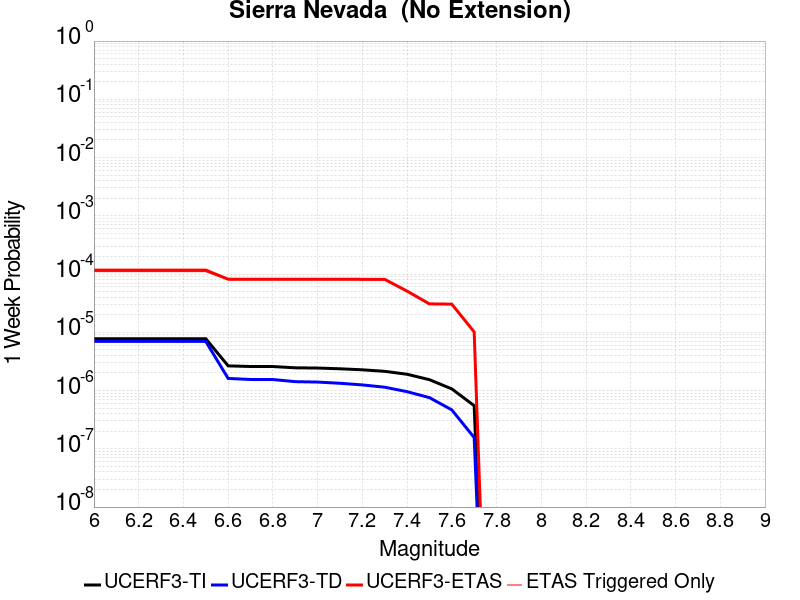 |  |  |  |

| Magnitude | 1 wk TI Prob | 1 wk TD Prob | 1 wk ETAS Prob | 1 wk ETAS/TD Gain | 1 wk ETAS Triggered Only | 1 mo TI Prob | 1 mo TD Prob | 1 mo ETAS Prob | 1 mo ETAS/TD Gain | 1 mo ETAS Triggered Only | 1 yr TI Prob | 1 yr TD Prob | 1 yr ETAS Prob | 1 yr ETAS/TD Gain | 1 yr ETAS Triggered Only | 10 yr TI Prob | 10 yr TD Prob | 10 yr ETAS Prob | 10 yr ETAS/TD Gain | 10 yr ETAS Triggered Only |
|-----|-----|-----|-----|-----|-----|-----|-----|-----|-----|-----|-----|-----|-----|-----|-----|-----|-----|-----|-----|-----|
| 6.0 | 7.7690465E-6 | 6.976322E-6 | 1.0448905E-4 | 14.977671 | 9.751341E-5 | 3.329549E-5 | 2.9898381E-5 | 1.517865E-4 | 5.0767465 | 1.2189176E-4 | 4.0529718E-4 | 3.6398784E-4 | 5.102047E-4 | 1.4017081 | 1.4627012E-4 | 0.004045588 | 0.0036374326 | 0.0037831708 | 1.0400662 | 1.4627012E-4 |
| 6.1 | 7.7690465E-6 | 6.976322E-6 | 1.0448905E-4 | 14.977671 | 9.751341E-5 | 3.329549E-5 | 2.9898381E-5 | 1.517865E-4 | 5.0767465 | 1.2189176E-4 | 4.0529718E-4 | 3.6398784E-4 | 5.102047E-4 | 1.4017081 | 1.4627012E-4 | 0.004045588 | 0.0036374326 | 0.0037831708 | 1.0400662 | 1.4627012E-4 |
| 6.2 | 7.7690465E-6 | 6.976322E-6 | 1.0448905E-4 | 14.977671 | 9.751341E-5 | 3.329549E-5 | 2.9898381E-5 | 1.517865E-4 | 5.0767465 | 1.2189176E-4 | 4.0529718E-4 | 3.6398784E-4 | 5.102047E-4 | 1.4017081 | 1.4627012E-4 | 0.004045588 | 0.0036374326 | 0.0037831708 | 1.0400662 | 1.4627012E-4 |
| 6.3 | 7.7690465E-6 | 6.976322E-6 | 1.0448905E-4 | 14.977671 | 9.751341E-5 | 3.329549E-5 | 2.9898381E-5 | 1.517865E-4 | 5.0767465 | 1.2189176E-4 | 4.0529718E-4 | 3.6398784E-4 | 5.102047E-4 | 1.4017081 | 1.4627012E-4 | 0.004045588 | 0.0036374326 | 0.0037831708 | 1.0400662 | 1.4627012E-4 |
| 6.4 | 7.7690465E-6 | 6.976322E-6 | 1.0448905E-4 | 14.977671 | 9.751341E-5 | 3.329549E-5 | 2.9898381E-5 | 1.517865E-4 | 5.0767465 | 1.2189176E-4 | 4.0529718E-4 | 3.6398784E-4 | 5.102047E-4 | 1.4017081 | 1.4627012E-4 | 0.004045588 | 0.0036374326 | 0.0037831708 | 1.0400662 | 1.4627012E-4 |
| 6.5 | 7.7690465E-6 | 6.976322E-6 | 1.0448905E-4 | 14.977671 | 9.751341E-5 | 3.329549E-5 | 2.9898381E-5 | 1.517865E-4 | 5.0767465 | 1.2189176E-4 | 4.0529718E-4 | 3.6398784E-4 | 5.102047E-4 | 1.4017081 | 1.4627012E-4 | 0.004045588 | 0.0036374326 | 0.0037831708 | 1.0400662 | 1.4627012E-4 |
| 6.6 | 2.653E-6 | 1.614854E-6 | 6.256063E-5 | 38.740738 | 6.094588E-5 | 1.136995E-5 | 6.9207845E-6 | 8.005533E-5 | 11.567378 | 7.313506E-5 | 1.3842035E-4 | 8.425733E-5 | 1.8176252E-4 | 2.157231 | 9.751341E-5 | 0.0013833415 | 8.422573E-4 | 9.396885E-4 | 1.1156788 | 9.751341E-5 |
| 6.7 | 2.5902466E-6 | 1.5501876E-6 | 6.249597E-5 | 40.315105 | 6.094588E-5 | 1.11010095E-5 | 6.643644E-6 | 7.977821E-5 | 12.008202 | 7.313506E-5 | 1.351464E-4 | 8.0883394E-5 | 1.7838892E-4 | 2.2055073 | 9.751341E-5 | 0.0013506424 | 8.0854254E-4 | 9.059771E-4 | 1.1205064 | 9.751341E-5 |
| 6.8 | 2.5853892E-6 | 1.5469877E-6 | 6.249277E-5 | 40.396423 | 6.094588E-5 | 1.1080193E-5 | 6.629931E-6 | 7.9764504E-5 | 12.030971 | 7.313506E-5 | 1.34893E-4 | 8.071645E-5 | 1.7822199E-4 | 2.208001 | 9.751341E-5 | 0.0013481114 | 8.068743E-4 | 9.0430904E-4 | 1.1207558 | 9.751341E-5 |
| 6.9 | 2.458257E-6 | 1.4220619E-6 | 6.236786E-5 | 43.85734 | 6.094588E-5 | 1.0535345E-5 | 6.094537E-6 | 7.922915E-5 | 13.000027 | 7.313506E-5 | 1.2826028E-4 | 7.4198484E-5 | 1.7170465E-4 | 2.3141263 | 9.751341E-5 | 0.0012818627 | 7.4173906E-4 | 8.3918014E-4 | 1.1313684 | 9.751341E-5 |
| 7.0 | 2.4341468E-6 | 1.3990258E-6 | 6.234482E-5 | 44.563023 | 6.094588E-5 | 1.0432016E-5 | 5.9958115E-6 | 7.913043E-5 | 13.1976185 | 7.313506E-5 | 1.270024E-4 | 7.2996576E-5 | 1.7050287E-4 | 2.3357654 | 9.751341E-5 | 0.0012692984 | 7.297279E-4 | 8.2717015E-4 | 1.1335323 | 9.751341E-5 |
| 7.1 | 2.3652476E-6 | 1.3339754E-6 | 6.2279774E-5 | 46.687347 | 6.094588E-5 | 1.0136736E-5 | 5.717025E-6 | 7.885166E-5 | 13.792429 | 7.313506E-5 | 1.2340778E-4 | 6.9602575E-5 | 1.6710919E-4 | 2.4009054 | 9.751341E-5 | 0.0012333926 | 6.9580943E-4 | 7.93255E-4 | 1.1400464 | 9.751341E-5 |
| 7.2 | 2.272158E-6 | 1.2502821E-6 | 6.2196086E-5 | 49.74564 | 6.094588E-5 | 9.737784E-6 | 5.3583412E-6 | 7.849301E-5 | 14.648751 | 7.313506E-5 | 1.1855107E-4 | 6.5235865E-5 | 1.6274292E-4 | 2.4946847 | 9.751341E-5 | 0.0011848784 | 6.5216864E-4 | 7.4961846E-4 | 1.1494242 | 9.751341E-5 |
| 7.3 | 2.1382127E-6 | 1.1419703E-6 | 6.208778E-5 | 54.369 | 6.094588E-5 | 9.163737E-6 | 4.8941492E-6 | 7.802885E-5 | 15.943292 | 7.313506E-5 | 1.1156279E-4 | 5.958465E-5 | 1.5709225E-4 | 2.636455 | 9.751341E-5 | 0.001115068 | 5.956879E-4 | 6.931432E-4 | 1.1636013 | 9.751341E-5 |
| 7.4 | 1.9048055E-6 | 9.575242E-7 | 2.5335852E-5 | 26.459751 | 2.4378352E-5 | 8.163426E-6 | 4.1036687E-6 | 4.0671046E-5 | 9.910899 | 3.656753E-5 | 9.9385186E-5 | 4.996103E-5 | 9.8715296E-5 | 1.9758459 | 4.8756705E-5 | 9.934074E-4 | 4.994987E-4 | 5.48231E-4 | 1.0975626 | 4.8756705E-5 |
| 7.5 | 1.5373403E-6 | 7.560042E-7 | 1.2945171E-5 | 17.123146 | 1.2189176E-5 | 6.5885843E-6 | 3.2400142E-6 | 2.7618287E-5 | 8.524125 | 2.4378352E-5 | 8.021306E-5 | 3.9446462E-5 | 7.601255E-5 | 1.9269801 | 3.656753E-5 | 8.0184115E-4 | 3.943951E-4 | 4.309482E-4 | 1.0926814 | 3.656753E-5 |
| 7.6 | 1.0680322E-6 | 4.6596554E-7 | 1.2655136E-5 | 27.158953 | 1.2189176E-5 | 4.577273E-6 | 1.9969937E-6 | 2.6375297E-5 | 13.207501 | 2.4378352E-5 | 5.5726876E-5 | 2.4313129E-5 | 6.0879767E-5 | 2.5039873 | 3.656753E-5 | 5.5712904E-4 | 2.4310495E-4 | 2.796636E-4 | 1.1503822 | 3.656753E-5 |
| 7.7 | 5.509146E-7 | 1.5580486E-7 | 1.2344979E-5 | 79.2336 | 1.2189176E-5 | 2.3610605E-6 | 6.677349E-7 | 1.2856903E-5 | 19.254501 | 1.2189176E-5 | 2.8745531E-5 | 8.129644E-6 | 3.2507796E-5 | 3.9986744 | 2.4378352E-5 | 2.8741814E-4 | 8.1293576E-5 | 1.0566995E-4 | 1.2998561 | 2.4378352E-5 |

## Scodie Lineament
*[(top)](#table-of-contents)*

| 1 Week | 1 Month | 1 Year | 10 Year |
|-----|-----|-----|-----|
|  |  |  |  |

| Magnitude | 1 wk TI Prob | 1 wk TD Prob | 1 wk ETAS Prob | 1 wk ETAS/TD Gain | 1 wk ETAS Triggered Only | 1 mo TI Prob | 1 mo TD Prob | 1 mo ETAS Prob | 1 mo ETAS/TD Gain | 1 mo ETAS Triggered Only | 1 yr TI Prob | 1 yr TD Prob | 1 yr ETAS Prob | 1 yr ETAS/TD Gain | 1 yr ETAS Triggered Only | 10 yr TI Prob | 10 yr TD Prob | 10 yr ETAS Prob | 10 yr ETAS/TD Gain | 10 yr ETAS Triggered Only |
|-----|-----|-----|-----|-----|-----|-----|-----|-----|-----|-----|-----|-----|-----|-----|-----|-----|-----|-----|-----|-----|
| 6.0 | 3.2919327E-6 | 3.0133422E-6 | 1.2490473E-4 | 41.450565 | 1.2189176E-4 | 1.4108206E-5 | 1.2914278E-5 | 1.4699348E-4 | 11.382246 | 1.3408094E-4 | 1.7175387E-4 | 1.5722317E-4 | 2.91283E-4 | 1.8526725 | 1.3408094E-4 | 0.0017162118 | 0.0015714309 | 0.0017174712 | 1.0929346 | 1.4627012E-4 |
| 6.1 | 1.8663811E-6 | 1.5490499E-6 | 1.3738207E-5 | 8.868795 | 1.2189176E-5 | 7.998751E-6 | 6.6387715E-6 | 3.101696E-5 | 4.672094 | 2.4378352E-5 | 9.738045E-5 | 8.082454E-5 | 1.05200925E-4 | 1.3015963 | 2.4378352E-5 | 9.7337784E-4 | 8.080003E-4 | 8.445382E-4 | 1.0452203 | 3.656753E-5 |
| 6.2 | 1.8663811E-6 | 1.5490499E-6 | 1.3738207E-5 | 8.868795 | 1.2189176E-5 | 7.998751E-6 | 6.6387715E-6 | 3.101696E-5 | 4.672094 | 2.4378352E-5 | 9.738045E-5 | 8.082454E-5 | 1.05200925E-4 | 1.3015963 | 2.4378352E-5 | 9.7337784E-4 | 8.080003E-4 | 8.445382E-4 | 1.0452203 | 3.656753E-5 |
| 6.3 | 1.8663811E-6 | 1.5490499E-6 | 1.3738207E-5 | 8.868795 | 1.2189176E-5 | 7.998751E-6 | 6.6387715E-6 | 3.101696E-5 | 4.672094 | 2.4378352E-5 | 9.738045E-5 | 8.082454E-5 | 1.05200925E-4 | 1.3015963 | 2.4378352E-5 | 9.7337784E-4 | 8.080003E-4 | 8.445382E-4 | 1.0452203 | 3.656753E-5 |
| 6.4 | 1.8663811E-6 | 1.5490499E-6 | 1.3738207E-5 | 8.868795 | 1.2189176E-5 | 7.998751E-6 | 6.6387715E-6 | 3.101696E-5 | 4.672094 | 2.4378352E-5 | 9.738045E-5 | 8.082454E-5 | 1.05200925E-4 | 1.3015963 | 2.4378352E-5 | 9.7337784E-4 | 8.080003E-4 | 8.445382E-4 | 1.0452203 | 3.656753E-5 |
| 6.5 | 1.8106311E-6 | 1.4909839E-6 | 1.3680142E-5 | 9.175244 | 1.2189176E-5 | 7.759824E-6 | 6.3899183E-6 | 3.0768115E-5 | 4.815103 | 2.4378352E-5 | 9.447177E-5 | 7.7794975E-5 | 1.0217143E-4 | 1.3133423 | 2.4378352E-5 | 9.4431615E-4 | 7.7772606E-4 | 8.1426516E-4 | 1.0469819 | 3.656753E-5 |
| 6.6 | 1.2414679E-6 | 8.997558E-7 | 8.997558E-7 | 1.0 | 0.0 | 5.320566E-6 | 3.856091E-6 | 3.856091E-6 | 1.0 | 0.0 | 6.477596E-5 | 4.6946985E-5 | 4.6946985E-5 | 1.0 | 0.0 | 6.475708E-4 | 4.693793E-4 | 4.8156278E-4 | 1.0259565 | 1.2189176E-5 |
| 6.7 | 1.1062215E-6 | 7.594311E-7 | 7.594311E-7 | 1.0 | 0.0 | 4.7409408E-6 | 3.2547011E-6 | 3.2547011E-6 | 1.0 | 0.0 | 5.7719422E-5 | 3.9625334E-5 | 3.9625334E-5 | 1.0 | 0.0 | 5.770443E-4 | 3.961897E-4 | 3.961897E-4 | 1.0 | 0.0 |
| 6.8 | 1.0006736E-6 | 6.500397E-7 | 6.500397E-7 | 1.0 | 0.0 | 4.288594E-6 | 2.7858816E-6 | 2.7858816E-6 | 1.0 | 0.0 | 5.221238E-5 | 3.3917644E-5 | 3.3917644E-5 | 1.0 | 0.0 | 5.220012E-4 | 3.3913075E-4 | 3.3913075E-4 | 1.0 | 0.0 |
| 6.9 | 9.167364E-7 | 5.631625E-7 | 5.631625E-7 | 1.0 | 0.0 | 3.9288643E-6 | 2.4135516E-6 | 2.4135516E-6 | 1.0 | 0.0 | 4.7832873E-5 | 2.9384651E-5 | 2.9384651E-5 | 1.0 | 0.0 | 4.782258E-4 | 2.9381333E-4 | 2.9381333E-4 | 1.0 | 0.0 |
| 7.0 | 7.6987664E-7 | 4.113383E-7 | 4.113383E-7 | 1.0 | 0.0 | 3.2994672E-6 | 1.7628774E-6 | 1.7628774E-6 | 1.0 | 0.0 | 4.0170275E-5 | 2.1462862E-5 | 2.1462862E-5 | 1.0 | 0.0 | 4.0163012E-4 | 2.1461173E-4 | 2.1461173E-4 | 1.0 | 0.0 |
| 7.1 | 7.1038727E-7 | 3.5211494E-7 | 3.5211494E-7 | 1.0 | 0.0 | 3.0445133E-6 | 1.5090633E-6 | 1.5090633E-6 | 1.0 | 0.0 | 3.706632E-5 | 1.8372726E-5 | 1.8372726E-5 | 1.0 | 0.0 | 3.7060137E-4 | 1.8371557E-4 | 1.8371557E-4 | 1.0 | 0.0 |
| 7.2 | 2.0799602E-7 | 3.1186854E-8 | 3.1186854E-8 | 1.0 | 0.0 | 8.914113E-7 | 1.3365793E-7 | 1.3365793E-7 | 1.0 | 0.0 | 1.0852878E-5 | 1.6272843E-6 | 1.6272843E-6 | 1.0 | 0.0 | 1.08523476E-4 | 1.627273E-5 | 1.627273E-5 | 1.0 | 0.0 |
| 7.3 | 1.5048182E-7 | 1.5945696E-8 | 1.5945696E-8 | 1.0 | 0.0 | 6.449219E-7 | 6.83387E-8 | 6.83387E-8 | 1.0 | 0.0 | 7.851896E-6 | 8.320234E-7 | 8.320234E-7 | 1.0 | 0.0 | 7.851618E-5 | 8.320206E-6 | 8.320206E-6 | 1.0 | 0.0 |
| 7.4 | 5.9334678E-8 | 4.8683537E-9 | 4.8683537E-9 | 1.0 | 0.0 | 2.5429145E-7 | 2.0864372E-8 | 2.0864372E-8 | 1.0 | 0.0 | 3.095994E-6 | 2.5402372E-7 | 2.5402372E-7 | 1.0 | 0.0 | 3.095951E-5 | 2.5402353E-6 | 2.5402353E-6 | 1.0 | 0.0 |

## San Andreas (Carrizo) rev
*[(top)](#table-of-contents)*

| 1 Week | 1 Month | 1 Year | 10 Year |
|-----|-----|-----|-----|
|  |  |  |  |

| Magnitude | 1 wk TI Prob | 1 wk TD Prob | 1 wk ETAS Prob | 1 wk ETAS/TD Gain | 1 wk ETAS Triggered Only | 1 mo TI Prob | 1 mo TD Prob | 1 mo ETAS Prob | 1 mo ETAS/TD Gain | 1 mo ETAS Triggered Only | 1 yr TI Prob | 1 yr TD Prob | 1 yr ETAS Prob | 1 yr ETAS/TD Gain | 1 yr ETAS Triggered Only | 10 yr TI Prob | 10 yr TD Prob | 10 yr ETAS Prob | 10 yr ETAS/TD Gain | 10 yr ETAS Triggered Only |
|-----|-----|-----|-----|-----|-----|-----|-----|-----|-----|-----|-----|-----|-----|-----|-----|-----|-----|-----|-----|-----|
| 6.0 | 1.1674632E-4 | 2.432302E-4 | 3.772785E-4 | 1.5511171 | 1.3408094E-4 | 5.002454E-4 | 0.0010420004 | 0.0011759416 | 1.1285424 | 1.3408094E-4 | 0.006073493 | 0.012613042 | 0.012757468 | 1.0114504 | 1.4627012E-4 | 0.0591016 | 0.12061418 | 0.120742805 | 1.0010664 | 1.4627012E-4 |
| 6.1 | 1.1674632E-4 | 2.432302E-4 | 3.772785E-4 | 1.5511171 | 1.3408094E-4 | 5.002454E-4 | 0.0010420004 | 0.0011759416 | 1.1285424 | 1.3408094E-4 | 0.006073493 | 0.012613042 | 0.012757468 | 1.0114504 | 1.4627012E-4 | 0.0591016 | 0.12061418 | 0.120742805 | 1.0010664 | 1.4627012E-4 |
| 6.2 | 1.1674632E-4 | 2.432302E-4 | 3.772785E-4 | 1.5511171 | 1.3408094E-4 | 5.002454E-4 | 0.0010420004 | 0.0011759416 | 1.1285424 | 1.3408094E-4 | 0.006073493 | 0.012613042 | 0.012757468 | 1.0114504 | 1.4627012E-4 | 0.0591016 | 0.12061418 | 0.120742805 | 1.0010664 | 1.4627012E-4 |
| 6.3 | 1.1674632E-4 | 2.432302E-4 | 3.772785E-4 | 1.5511171 | 1.3408094E-4 | 5.002454E-4 | 0.0010420004 | 0.0011759416 | 1.1285424 | 1.3408094E-4 | 0.006073493 | 0.012613042 | 0.012757468 | 1.0114504 | 1.4627012E-4 | 0.0591016 | 0.12061418 | 0.120742805 | 1.0010664 | 1.4627012E-4 |
| 6.4 | 1.1674632E-4 | 2.432302E-4 | 3.772785E-4 | 1.5511171 | 1.3408094E-4 | 5.002454E-4 | 0.0010420004 | 0.0011759416 | 1.1285424 | 1.3408094E-4 | 0.006073493 | 0.012613042 | 0.012757468 | 1.0114504 | 1.4627012E-4 | 0.0591016 | 0.12061418 | 0.120742805 | 1.0010664 | 1.4627012E-4 |
| 6.5 | 1.13136164E-4 | 2.3643032E-4 | 3.7047957E-4 | 1.5669714 | 1.3408094E-4 | 4.847792E-4 | 0.0010128808 | 0.001146826 | 1.1322417 | 1.3408094E-4 | 0.0058862255 | 0.012262545 | 0.012407021 | 1.0117819 | 1.4627012E-4 | 0.057327334 | 0.117585555 | 0.11771462 | 1.0010977 | 1.4627012E-4 |
| 6.6 | 1.13136164E-4 | 2.3643032E-4 | 3.7047957E-4 | 1.5669714 | 1.3408094E-4 | 4.847792E-4 | 0.0010128808 | 0.001146826 | 1.1322417 | 1.3408094E-4 | 0.0058862255 | 0.012262545 | 0.012407021 | 1.0117819 | 1.4627012E-4 | 0.057327334 | 0.117585555 | 0.11771462 | 1.0010977 | 1.4627012E-4 |
| 6.7 | 1.1149675E-4 | 2.3334254E-4 | 3.6739217E-4 | 1.5744759 | 1.3408094E-4 | 4.777557E-4 | 9.996577E-4 | 0.0011336046 | 1.1339928 | 1.3408094E-4 | 0.0058011734 | 0.012103349 | 0.012247849 | 1.0119388 | 1.4627012E-4 | 0.05652051 | 0.1162071 | 0.116336375 | 1.0011125 | 1.4627012E-4 |
| 6.8 | 1.1103589E-4 | 2.3236412E-4 | 3.664139E-4 | 1.5768954 | 1.3408094E-4 | 4.7578133E-4 | 9.954676E-4 | 0.0011294151 | 1.1345574 | 1.3408094E-4 | 0.005777263 | 0.012052901 | 0.012197409 | 1.0119894 | 1.4627012E-4 | 0.056293584 | 0.1157674 | 0.11589673 | 1.0011172 | 1.4627012E-4 |
| 6.9 | 1.1053259E-4 | 2.3128795E-4 | 3.6533788E-4 | 1.5795802 | 1.3408094E-4 | 4.7362508E-4 | 9.90859E-4 | 0.001124807 | 1.1351838 | 1.3408094E-4 | 0.0057511497 | 0.01199741 | 0.012141925 | 1.0120455 | 1.4627012E-4 | 0.05604569 | 0.11528359 | 0.115413 | 1.0011225 | 1.4627012E-4 |
| 7.0 | 1.1005377E-4 | 2.3029637E-4 | 3.6434643E-4 | 1.5820763 | 1.3408094E-4 | 4.7157376E-4 | 9.866126E-4 | 0.0011205613 | 1.1357661 | 1.3408094E-4 | 0.0057263062 | 0.011946279 | 0.012090801 | 1.0120977 | 1.4627012E-4 | 0.055809796 | 0.11483591 | 0.11496539 | 1.0011275 | 1.4627012E-4 |
| 7.1 | 1.0308142E-4 | 2.1539345E-4 | 3.250724E-4 | 1.5092028 | 1.0970258E-4 | 4.417027E-4 | 9.227892E-4 | 0.0010323905 | 1.1187718 | 1.0970258E-4 | 0.0053644776 | 0.011177397 | 0.011297927 | 1.0107833 | 1.2189176E-4 | 0.052368138 | 0.108092256 | 0.108200975 | 1.0010058 | 1.2189176E-4 |
| 7.2 | 1.0027479E-4 | 2.094724E-4 | 3.069654E-4 | 1.4654216 | 9.751341E-5 | 4.296783E-4 | 8.9743105E-4 | 9.948569E-4 | 1.1085609 | 9.751341E-5 | 0.0052187922 | 0.010871782 | 0.010980292 | 1.0099809 | 1.0970258E-4 | 0.050979212 | 0.10539625 | 0.10549439 | 1.0009311 | 1.0970258E-4 |
| 7.3 | 9.816942E-5 | 2.0422463E-4 | 2.8953145E-4 | 1.4177107 | 8.532423E-5 | 4.2065824E-4 | 8.7495585E-4 | 9.6020545E-4 | 1.097433 | 8.532423E-5 | 0.005109493 | 0.010600842 | 0.010697321 | 1.0091012 | 9.751341E-5 | 0.049935985 | 0.102979995 | 0.10306747 | 1.0008494 | 9.751341E-5 |
| 7.4 | 9.5634205E-5 | 1.9791997E-4 | 2.832273E-4 | 1.4310194 | 8.532423E-5 | 4.0979648E-4 | 8.479536E-4 | 9.332055E-4 | 1.1005384 | 8.532423E-5 | 0.0049778637 | 0.010275229 | 0.01037174 | 1.0093926 | 9.751341E-5 | 0.048678253 | 0.10006632 | 0.10015407 | 1.000877 | 9.751341E-5 |
| 7.5 | 8.052417E-5 | 1.611261E-4 | 2.3424937E-4 | 1.4538264 | 7.313506E-5 | 3.4505792E-4 | 6.903579E-4 | 7.634424E-4 | 1.1058648 | 7.313506E-5 | 0.0041929903 | 0.008372796 | 0.0084574055 | 1.0101054 | 8.532423E-5 | 0.04114753 | 0.08281049 | 0.08288875 | 1.000945 | 8.532423E-5 |
| 7.6 | 7.897024E-5 | 1.5765853E-4 | 2.3078205E-4 | 1.4638095 | 7.313506E-5 | 3.384E-4 | 6.755046E-4 | 7.485903E-4 | 1.1081941 | 7.313506E-5 | 0.0041122385 | 0.008193332 | 0.008277957 | 1.0103285 | 8.532423E-5 | 0.040369697 | 0.08115171 | 0.081230104 | 1.0009661 | 8.532423E-5 |
| 7.7 | 6.707427E-5 | 1.3276102E-4 | 1.693237E-4 | 1.2754022 | 3.656753E-5 | 2.8742946E-4 | 5.688518E-4 | 6.0539856E-4 | 1.0642465 | 3.656753E-5 | 0.003493839 | 0.00690381 | 0.0069522304 | 1.0070136 | 4.8756705E-5 | 0.034394164 | 0.069048055 | 0.06909345 | 1.0006573 | 4.8756705E-5 |
| 7.8 | 6.147705E-5 | 1.2197486E-4 | 1.5853794E-4 | 1.299759 | 3.656753E-5 | 2.6344648E-4 | 5.226447E-4 | 5.5919314E-4 | 1.0699297 | 3.656753E-5 | 0.0032027436 | 0.006344659 | 0.006393106 | 1.007636 | 4.8756705E-5 | 0.031569764 | 0.06351457 | 0.063560225 | 1.0007188 | 4.8756705E-5 |
| 7.9 | 4.7636717E-5 | 8.87977E-5 | 1.2536198E-4 | 1.4117706 | 3.656753E-5 | 2.0414138E-4 | 3.8050607E-4 | 4.170597E-4 | 1.0960658 | 3.656753E-5 | 0.0024825884 | 0.0046228287 | 0.00467136 | 1.0104982 | 4.8756705E-5 | 0.024550365 | 0.046628095 | 0.046674576 | 1.000997 | 4.8756705E-5 |
| 8.0 | 3.3554235E-5 | 5.2136907E-5 | 7.651399E-5 | 1.467559 | 2.4378352E-5 | 1.4379594E-4 | 2.2342477E-4 | 2.4779767E-4 | 1.1090877 | 2.4378352E-5 | 0.0017493097 | 0.002716805 | 0.0027411173 | 1.0089488 | 2.4378352E-5 | 0.017356034 | 0.027880952 | 0.027904652 | 1.00085 | 2.4378352E-5 |
| 8.1 | 1.9175432E-5 | 1.9184976E-5 | 1.9184976E-5 | 1.0 | 0.0 | 8.217783E-5 | 8.2218736E-5 | 8.2218736E-5 | 1.0 | 0.0 | 0.0010000558 | 0.0010005541 | 0.0010005541 | 1.0 | 0.0 | 0.009955673 | 0.0107580265 | 0.0107580265 | 1.0 | 0.0 |
| 8.2 | 8.643924E-6 | 5.4748625E-6 | 5.4748625E-6 | 1.0 | 0.0 | 3.704486E-5 | 2.3463486E-5 | 2.3463486E-5 | 1.0 | 0.0 | 4.5092785E-4 | 2.8563058E-4 | 2.8563058E-4 | 1.0 | 0.0 | 0.0045001395 | 0.0032487072 | 0.0032487072 | 1.0 | 0.0 |
| 8.3 | 1.983087E-6 | 7.6599065E-7 | 7.6599065E-7 | 1.0 | 0.0 | 8.498917E-6 | 3.282813E-6 | 3.282813E-6 | 1.0 | 0.0 | 1.034694E-4 | 3.9967534E-5 | 3.9967534E-5 | 1.0 | 0.0 | 0.0010342124 | 4.719687E-4 | 4.719687E-4 | 1.0 | 0.0 |

## San Jacinto (San Jacinto Valley) rev
*[(top)](#table-of-contents)*

| 1 Week | 1 Month | 1 Year | 10 Year |
|-----|-----|-----|-----|
|  | 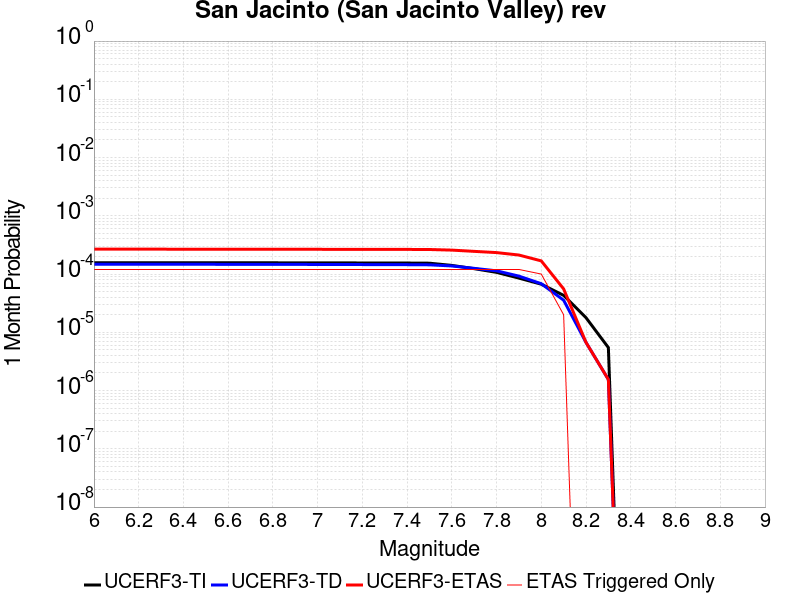 |  |  |

| Magnitude | 1 wk TI Prob | 1 wk TD Prob | 1 wk ETAS Prob | 1 wk ETAS/TD Gain | 1 wk ETAS Triggered Only | 1 mo TI Prob | 1 mo TD Prob | 1 mo ETAS Prob | 1 mo ETAS/TD Gain | 1 mo ETAS Triggered Only | 1 yr TI Prob | 1 yr TD Prob | 1 yr ETAS Prob | 1 yr ETAS/TD Gain | 1 yr ETAS Triggered Only | 10 yr TI Prob | 10 yr TD Prob | 10 yr ETAS Prob | 10 yr ETAS/TD Gain | 10 yr ETAS Triggered Only |
|-----|-----|-----|-----|-----|-----|-----|-----|-----|-----|-----|-----|-----|-----|-----|-----|-----|-----|-----|-----|-----|
| 6.0 | 3.652694E-5 | 3.4402394E-5 | 1.441012E-4 | 4.1886973 | 1.0970258E-4 | 1.5653463E-4 | 1.474305E-4 | 2.693043E-4 | 1.8266524 | 1.2189176E-4 | 0.0019041431 | 0.00179349 | 0.0019273305 | 1.0746257 | 1.3408094E-4 | 0.018879099 | 0.018526595 | 0.018658191 | 1.0071031 | 1.3408094E-4 |
| 6.1 | 3.652694E-5 | 3.4402394E-5 | 1.441012E-4 | 4.1886973 | 1.0970258E-4 | 1.5653463E-4 | 1.474305E-4 | 2.693043E-4 | 1.8266524 | 1.2189176E-4 | 0.0019041431 | 0.00179349 | 0.0019273305 | 1.0746257 | 1.3408094E-4 | 0.018879099 | 0.018526595 | 0.018658191 | 1.0071031 | 1.3408094E-4 |
| 6.2 | 3.652694E-5 | 3.4402394E-5 | 1.441012E-4 | 4.1886973 | 1.0970258E-4 | 1.5653463E-4 | 1.474305E-4 | 2.693043E-4 | 1.8266524 | 1.2189176E-4 | 0.0019041431 | 0.00179349 | 0.0019273305 | 1.0746257 | 1.3408094E-4 | 0.018879099 | 0.018526595 | 0.018658191 | 1.0071031 | 1.3408094E-4 |
| 6.3 | 3.652694E-5 | 3.4402394E-5 | 1.441012E-4 | 4.1886973 | 1.0970258E-4 | 1.5653463E-4 | 1.474305E-4 | 2.693043E-4 | 1.8266524 | 1.2189176E-4 | 0.0019041431 | 0.00179349 | 0.0019273305 | 1.0746257 | 1.3408094E-4 | 0.018879099 | 0.018526595 | 0.018658191 | 1.0071031 | 1.3408094E-4 |
| 6.4 | 3.646941E-5 | 3.432397E-5 | 1.440228E-4 | 4.195983 | 1.0970258E-4 | 1.5628811E-4 | 1.4709444E-4 | 2.689683E-4 | 1.8285414 | 1.2189176E-4 | 0.0019011468 | 0.0017894056 | 0.0019232467 | 1.0747963 | 1.3408094E-4 | 0.018849645 | 0.018486476 | 0.018618079 | 1.0071188 | 1.3408094E-4 |
| 6.5 | 3.646941E-5 | 3.432397E-5 | 1.440228E-4 | 4.195983 | 1.0970258E-4 | 1.5628811E-4 | 1.4709444E-4 | 2.689683E-4 | 1.8285414 | 1.2189176E-4 | 0.0019011468 | 0.0017894056 | 0.0019232467 | 1.0747963 | 1.3408094E-4 | 0.018849645 | 0.018486476 | 0.018618079 | 1.0071188 | 1.3408094E-4 |
| 6.6 | 3.6442503E-5 | 3.4287354E-5 | 1.4398618E-4 | 4.199396 | 1.0970258E-4 | 1.561728E-4 | 1.4693754E-4 | 2.688114E-4 | 1.8294262 | 1.2189176E-4 | 0.0018997455 | 0.0017874985 | 0.0019213398 | 1.0748763 | 1.3408094E-4 | 0.018835869 | 0.018467745 | 0.01859935 | 1.0071262 | 1.3408094E-4 |
| 6.7 | 3.6432113E-5 | 3.4272925E-5 | 1.4397175E-4 | 4.2007427 | 1.0970258E-4 | 1.5612828E-4 | 1.4687571E-4 | 2.6874957E-4 | 1.8297755 | 1.2189176E-4 | 0.0018992044 | 0.0017867472 | 0.0019205887 | 1.0749078 | 1.3408094E-4 | 0.018830549 | 0.018460369 | 0.018591974 | 1.0071291 | 1.3408094E-4 |
| 6.8 | 3.6409598E-5 | 3.424198E-5 | 1.4394081E-4 | 4.2036357 | 1.0970258E-4 | 1.560318E-4 | 1.4674311E-4 | 2.6861698E-4 | 1.8305254 | 1.2189176E-4 | 0.0018980318 | 0.0017851355 | 0.001918977 | 1.0749756 | 1.3408094E-4 | 0.018819023 | 0.018444523 | 0.01857613 | 1.0071354 | 1.3408094E-4 |
| 6.9 | 3.638078E-5 | 3.4202407E-5 | 1.4390124E-4 | 4.2073426 | 1.0970258E-4 | 1.5590832E-4 | 1.4657351E-4 | 2.6844742E-4 | 1.8314865 | 1.2189176E-4 | 0.0018965311 | 0.001783074 | 0.0019169159 | 1.0750624 | 1.3408094E-4 | 0.018804269 | 0.018424258 | 0.018555868 | 1.0071434 | 1.3408094E-4 |
| 7.0 | 3.6294874E-5 | 3.408442E-5 | 1.4378327E-4 | 4.2184453 | 1.0970258E-4 | 1.5554018E-4 | 1.4606792E-4 | 2.6794188E-4 | 1.834365 | 1.2189176E-4 | 0.0018920569 | 0.001776929 | 0.0019107716 | 1.0753225 | 1.3408094E-4 | 0.018760284 | 0.018363839 | 0.018495457 | 1.0071672 | 1.3408094E-4 |
| 7.1 | 3.6260717E-5 | 3.4040702E-5 | 1.4373955E-4 | 4.222579 | 1.0970258E-4 | 1.5539382E-4 | 1.4588058E-4 | 2.6775457E-4 | 1.8354366 | 1.2189176E-4 | 0.001890278 | 0.0017746518 | 0.0019084949 | 1.0754193 | 1.3408094E-4 | 0.018742796 | 0.018341439 | 0.01847306 | 1.0071762 | 1.3408094E-4 |
| 7.2 | 3.6210204E-5 | 3.397492E-5 | 1.4367378E-4 | 4.2288184 | 1.0970258E-4 | 1.5517735E-4 | 1.455987E-4 | 2.674727E-4 | 1.8370543 | 1.2189176E-4 | 0.001887647 | 0.0017712255 | 0.0019050689 | 1.0755655 | 1.3408094E-4 | 0.01871693 | 0.01830772 | 0.018439345 | 1.0071896 | 1.3408094E-4 |
| 7.3 | 3.6119454E-5 | 3.386321E-5 | 1.4356208E-4 | 4.2394705 | 1.0970258E-4 | 1.5478847E-4 | 1.4511998E-4 | 2.6699406E-4 | 1.839816 | 1.2189176E-4 | 0.0018829206 | 0.0017654065 | 0.0018992508 | 1.075815 | 1.3408094E-4 | 0.018670462 | 0.018250274 | 0.018381907 | 1.0072128 | 1.3408094E-4 |
| 7.4 | 3.607848E-5 | 3.381071E-5 | 1.4350958E-4 | 4.244501 | 1.0970258E-4 | 1.5461289E-4 | 1.44895E-4 | 2.6676912E-4 | 1.8411201 | 1.2189176E-4 | 0.0018807866 | 0.0017626719 | 0.0018965165 | 1.0759327 | 1.3408094E-4 | 0.018649481 | 0.018223269 | 0.018354906 | 1.0072236 | 1.3408094E-4 |
| 7.5 | 3.5856774E-5 | 3.3620483E-5 | 1.4331938E-4 | 4.2628593 | 1.0970258E-4 | 1.5366284E-4 | 1.4407984E-4 | 2.6595403E-4 | 1.8458797 | 1.2189176E-4 | 0.0018692396 | 0.0017527633 | 0.0018866091 | 1.0763628 | 1.3408094E-4 | 0.018535944 | 0.018124366 | 0.018256018 | 1.0072638 | 1.3408094E-4 |
| 7.6 | 3.286655E-5 | 3.2143445E-5 | 1.4184251E-4 | 4.412797 | 1.0970258E-4 | 1.4084904E-4 | 1.3775036E-4 | 2.5962535E-4 | 1.8847524 | 1.2189176E-4 | 0.001713488 | 0.0016758227 | 0.0018096789 | 1.079875 | 1.3408094E-4 | 0.017003361 | 0.017344031 | 0.017475786 | 1.0075966 | 1.3408094E-4 |
| 7.7 | 2.8882527E-5 | 2.9236293E-5 | 1.3893568E-4 | 4.7521644 | 1.0970258E-4 | 1.237764E-4 | 1.2529238E-4 | 2.4716888E-4 | 1.9727366 | 1.2189176E-4 | 0.0015059357 | 0.0015243685 | 0.0016582451 | 1.0878242 | 1.3408094E-4 | 0.014957713 | 0.015830461 | 0.015962418 | 1.0083357 | 1.3408094E-4 |
| 7.8 | 2.4950225E-5 | 2.6527203E-5 | 1.3622688E-4 | 5.135365 | 1.0970258E-4 | 1.0692515E-4 | 1.1368306E-4 | 2.3556096E-4 | 2.072085 | 1.2189176E-4 | 0.0013010362 | 0.0013832134 | 0.0015171089 | 1.0968003 | 1.3408094E-4 | 0.012934455 | 0.014411755 | 0.014543903 | 1.0091695 | 1.3408094E-4 |
| 7.9 | 1.9881603E-5 | 2.1507445E-5 | 1.3120766E-4 | 6.1005697 | 1.0970258E-4 | 8.520408E-5 | 9.217151E-5 | 2.1405204E-4 | 2.322323 | 1.2189176E-4 | 0.001036866 | 0.0011216112 | 0.0012555418 | 1.1194091 | 1.3408094E-4 | 0.010320415 | 0.011777027 | 0.011909529 | 1.0112509 | 1.3408094E-4 |
| 8.0 | 1.563292E-5 | 1.5937347E-5 | 1.01260215E-4 | 6.353644 | 8.532423E-5 | 6.6996516E-5 | 6.8301124E-5 | 1.6580787E-4 | 2.4276009 | 9.751341E-5 | 8.153773E-4 | 8.3124964E-4 | 9.4086106E-4 | 1.1318634 | 1.0970258E-4 | 0.00812392 | 0.008810506 | 0.008919242 | 1.0123416 | 1.0970258E-4 |
| 8.1 | 1.0045313E-5 | 8.301802E-6 | 2.0490877E-5 | 2.4682443 | 1.2189176E-5 | 4.305063E-5 | 3.5578672E-5 | 4.7767415E-5 | 1.3425857 | 1.2189176E-5 | 5.2401534E-4 | 4.3308473E-4 | 4.4526864E-4 | 1.0281328 | 1.2189176E-5 | 0.0052278144 | 0.0046591135 | 0.0046712463 | 1.002604 | 1.2189176E-5 |
| 8.2 | 4.1554413E-6 | 1.5655598E-6 | 1.5655598E-6 | 1.0 | 0.0 | 1.7808914E-5 | 6.709525E-6 | 6.709525E-6 | 1.0 | 0.0 | 2.1680194E-4 | 8.168544E-5 | 8.168544E-5 | 1.0 | 0.0 | 0.0021659054 | 9.482903E-4 | 9.482903E-4 | 1.0 | 0.0 |
| 8.3 | 1.2758221E-6 | 3.6149942E-7 | 3.6149942E-7 | 1.0 | 0.0 | 5.4677976E-6 | 1.5492824E-6 | 1.5492824E-6 | 1.0 | 0.0 | 6.65684E-5 | 1.8862354E-5 | 1.8862354E-5 | 1.0 | 0.0 | 6.6548464E-4 | 2.2751294E-4 | 2.2751294E-4 | 1.0 | 0.0 |

## San Andreas (Cholame) rev
*[(top)](#table-of-contents)*

| 1 Week | 1 Month | 1 Year | 10 Year |
|-----|-----|-----|-----|
|  |  |  |  |

| Magnitude | 1 wk TI Prob | 1 wk TD Prob | 1 wk ETAS Prob | 1 wk ETAS/TD Gain | 1 wk ETAS Triggered Only | 1 mo TI Prob | 1 mo TD Prob | 1 mo ETAS Prob | 1 mo ETAS/TD Gain | 1 mo ETAS Triggered Only | 1 yr TI Prob | 1 yr TD Prob | 1 yr ETAS Prob | 1 yr ETAS/TD Gain | 1 yr ETAS Triggered Only | 10 yr TI Prob | 10 yr TD Prob | 10 yr ETAS Prob | 10 yr ETAS/TD Gain | 10 yr ETAS Triggered Only |
|-----|-----|-----|-----|-----|-----|-----|-----|-----|-----|-----|-----|-----|-----|-----|-----|-----|-----|-----|-----|-----|
| 6.0 | 1.2302514E-4 | 2.5204287E-4 | 3.495317E-4 | 1.3867947 | 9.751341E-5 | 5.27144E-4 | 0.0010797381 | 0.0012014983 | 1.1127682 | 1.2189176E-4 | 0.0063991086 | 0.0130670825 | 0.013199411 | 1.0101268 | 1.3408094E-4 | 0.06217949 | 0.12439073 | 0.12450813 | 1.0009438 | 1.3408094E-4 |
| 6.1 | 1.2302514E-4 | 2.5204287E-4 | 3.495317E-4 | 1.3867947 | 9.751341E-5 | 5.27144E-4 | 0.0010797381 | 0.0012014983 | 1.1127682 | 1.2189176E-4 | 0.0063991086 | 0.0130670825 | 0.013199411 | 1.0101268 | 1.3408094E-4 | 0.06217949 | 0.12439073 | 0.12450813 | 1.0009438 | 1.3408094E-4 |
| 6.2 | 1.2203569E-4 | 2.5021084E-4 | 3.4769985E-4 | 1.3896275 | 9.751341E-5 | 5.2290526E-4 | 0.0010718931 | 0.0011936543 | 1.1135944 | 1.2189176E-4 | 0.006347804 | 0.01297271 | 0.013105052 | 1.0102016 | 1.3408094E-4 | 0.061695136 | 0.12357691 | 0.12369442 | 1.0009509 | 1.3408094E-4 |
| 6.3 | 1.2142645E-4 | 2.4907055E-4 | 3.4655968E-4 | 1.3914117 | 9.751341E-5 | 5.202953E-4 | 0.0010670102 | 0.0011887719 | 1.1141149 | 1.2189176E-4 | 0.006316212 | 0.012913967 | 0.013046316 | 1.0102485 | 1.3408094E-4 | 0.06139677 | 0.12307103 | 0.123188615 | 1.0009553 | 1.3408094E-4 |
| 6.4 | 1.1865206E-4 | 2.44126E-4 | 3.416156E-4 | 1.3993413 | 9.751341E-5 | 5.0840975E-4 | 0.0010458364 | 0.0011676006 | 1.1164277 | 1.2189176E-4 | 0.006172335 | 0.012659196 | 0.01279158 | 1.0104575 | 1.3408094E-4 | 0.060036868 | 0.1208638 | 0.12098168 | 1.0009753 | 1.3408094E-4 |
| 6.5 | 1.17443946E-4 | 2.4205919E-4 | 3.39549E-4 | 1.4027519 | 9.751341E-5 | 5.032341E-4 | 0.0010369857 | 0.001158751 | 1.1174225 | 1.2189176E-4 | 0.006109677 | 0.012552682 | 0.01268508 | 1.0105474 | 1.3408094E-4 | 0.059444077 | 0.11993805 | 0.120056055 | 1.0009838 | 1.3408094E-4 |
| 6.6 | 1.13579066E-4 | 2.3514954E-4 | 3.3264002E-4 | 1.4145893 | 9.751341E-5 | 4.866766E-4 | 0.001007396 | 0.0011169881 | 1.1087874 | 1.0970258E-4 | 0.0059092017 | 0.012196515 | 0.01231692 | 1.0098721 | 1.2189176E-4 | 0.057545185 | 0.11685214 | 0.116959795 | 1.0009212 | 1.2189176E-4 |
| 6.7 | 1.1271412E-4 | 2.3359268E-4 | 3.310833E-4 | 1.417353 | 9.751341E-5 | 4.829711E-4 | 0.0010007289 | 0.0011103217 | 1.1095129 | 1.0970258E-4 | 0.005864331 | 0.012116249 | 0.012236663 | 1.0099382 | 1.2189176E-4 | 0.057119697 | 0.116155714 | 0.11626345 | 1.0009274 | 1.2189176E-4 |
| 6.8 | 1.1217975E-4 | 2.3247694E-4 | 3.2996768E-4 | 1.4193566 | 9.751341E-5 | 4.8068175E-4 | 9.959509E-4 | 0.0011055442 | 1.1100389 | 1.0970258E-4 | 0.005836608 | 0.012058721 | 0.012179143 | 1.0099863 | 1.2189176E-4 | 0.056856725 | 0.11565396 | 0.11576176 | 1.0009321 | 1.2189176E-4 |
| 6.9 | 1.1146753E-4 | 2.3096445E-4 | 3.2845532E-4 | 1.4221034 | 9.751341E-5 | 4.7763053E-4 | 9.894737E-4 | 0.0010990677 | 1.11076 | 1.0970258E-4 | 0.0057996577 | 0.011980731 | 0.012101163 | 1.0100521 | 1.2189176E-4 | 0.056506127 | 0.11497439 | 0.115082264 | 1.0009383 | 1.2189176E-4 |
| 7.0 | 1.0965793E-4 | 2.2719789E-4 | 3.2468914E-4 | 1.4291028 | 9.751341E-5 | 4.698779E-4 | 9.733434E-4 | 0.0010829392 | 1.1125972 | 1.0970258E-4 | 0.005705768 | 0.011786487 | 0.011906942 | 1.0102198 | 1.2189176E-4 | 0.055614736 | 0.11327597 | 0.11338405 | 1.0009542 | 1.2189176E-4 |
| 7.1 | 9.927982E-5 | 2.0538924E-4 | 3.028826E-4 | 1.4746763 | 9.751341E-5 | 4.2541555E-4 | 8.7994366E-4 | 9.773712E-4 | 1.1107203 | 9.751341E-5 | 0.0051671406 | 0.010660981 | 0.010769514 | 1.0101804 | 1.0970258E-4 | 0.05048634 | 0.1033706 | 0.10346896 | 1.0009515 | 1.0970258E-4 |
| 7.2 | 9.696786E-5 | 2.0043184E-4 | 2.8573896E-4 | 1.4256166 | 8.532423E-5 | 4.1551032E-4 | 8.5871184E-4 | 9.439628E-4 | 1.0992777 | 8.532423E-5 | 0.00504711 | 0.010404981 | 0.01050148 | 1.0092742 | 9.751341E-5 | 0.04934009 | 0.1011086 | 0.10119625 | 1.0008669 | 9.751341E-5 |
| 7.3 | 9.4727984E-5 | 1.9472468E-4 | 2.800323E-4 | 1.4380935 | 8.532423E-5 | 4.0591392E-4 | 8.3426846E-4 | 9.195215E-4 | 1.102189 | 8.532423E-5 | 0.0049308087 | 0.010110183 | 0.010206711 | 1.0095476 | 9.751341E-5 | 0.048228268 | 0.09847952 | 0.098567426 | 1.0008926 | 9.751341E-5 |
| 7.4 | 9.220358E-5 | 1.8843076E-4 | 2.737389E-4 | 1.4527295 | 8.532423E-5 | 3.9509835E-4 | 8.073114E-4 | 8.9256675E-4 | 1.105604 | 8.532423E-5 | 0.004799717 | 0.009784967 | 0.009881525 | 1.0098681 | 9.751341E-5 | 0.046973653 | 0.095557496 | 0.095645696 | 1.0009229 | 9.751341E-5 |
| 7.5 | 7.71631E-5 | 1.5177966E-4 | 2.2490362E-4 | 1.4817771 | 7.313506E-5 | 3.306571E-4 | 6.503223E-4 | 7.2340976E-4 | 1.1123866 | 7.313506E-5 | 0.0040183207 | 0.007889002 | 0.007973652 | 1.0107303 | 8.532423E-5 | 0.03946433 | 0.07828531 | 0.07836395 | 1.0010046 | 8.532423E-5 |
| 7.6 | 7.5634416E-5 | 1.483744E-4 | 2.214986E-4 | 1.4928358 | 7.313506E-5 | 3.241072E-4 | 6.3573546E-4 | 7.08824E-4 | 1.114967 | 7.313506E-5 | 0.0039388672 | 0.0077126776 | 0.0077973437 | 1.0109775 | 8.532423E-5 | 0.038697794 | 0.07664872 | 0.0767275 | 1.0010278 | 8.532423E-5 |
| 7.7 | 6.3783E-5 | 1.235872E-4 | 1.6015022E-4 | 1.2958479 | 3.656753E-5 | 2.7332708E-4 | 5.29552E-4 | 5.661001E-4 | 1.0690172 | 3.656753E-5 | 0.0033226798 | 0.0064282627 | 0.006476706 | 1.0075359 | 4.8756705E-5 | 0.032734364 | 0.06454029 | 0.0645859 | 1.0007067 | 4.8756705E-5 |
| 7.8 | 5.863422E-5 | 1.1416107E-4 | 1.5072443E-4 | 1.3202786 | 3.656753E-5 | 2.512653E-4 | 4.8917E-4 | 5.2571966E-4 | 1.0747176 | 3.656753E-5 | 0.003054864 | 0.0059394026 | 0.00598787 | 1.0081602 | 4.8756705E-5 | 0.030132094 | 0.059659187 | 0.059705034 | 1.0007685 | 4.8756705E-5 |
| 7.9 | 4.595283E-5 | 8.426331E-5 | 1.2082776E-4 | 1.4339308 | 3.656753E-5 | 1.9692584E-4 | 3.610785E-4 | 3.9763283E-4 | 1.1012365 | 3.656753E-5 | 0.0023949358 | 0.0043872762 | 0.004435819 | 1.0110644 | 4.8756705E-5 | 0.023692891 | 0.044362005 | 0.0444086 | 1.0010504 | 4.8756705E-5 |
| 8.0 | 3.2950178E-5 | 5.0772942E-5 | 7.5150056E-5 | 1.4801202 | 2.4378352E-5 | 1.412074E-4 | 2.1758018E-4 | 2.4195324E-4 | 1.1120187 | 2.4378352E-5 | 0.0017178444 | 0.0026458222 | 0.0026701363 | 1.0091895 | 2.4378352E-5 | 0.017046256 | 0.027180137 | 0.027203852 | 1.0008725 | 2.4378352E-5 |
| 8.1 | 1.9177472E-5 | 1.9185145E-5 | 1.9185145E-5 | 1.0 | 0.0 | 8.218658E-5 | 8.221946E-5 | 8.221946E-5 | 1.0 | 0.0 | 0.0010001622 | 0.0010005629 | 0.0010005629 | 1.0 | 0.0 | 0.009956728 | 0.010758142 | 0.010758142 | 1.0 | 0.0 |
| 8.2 | 8.643924E-6 | 5.4748625E-6 | 5.4748625E-6 | 1.0 | 0.0 | 3.704486E-5 | 2.3463486E-5 | 2.3463486E-5 | 1.0 | 0.0 | 4.5092785E-4 | 2.8563058E-4 | 2.8563058E-4 | 1.0 | 0.0 | 0.0045001395 | 0.0032487072 | 0.0032487072 | 1.0 | 0.0 |
| 8.3 | 1.983087E-6 | 7.6599065E-7 | 7.6599065E-7 | 1.0 | 0.0 | 8.498917E-6 | 3.282813E-6 | 3.282813E-6 | 1.0 | 0.0 | 1.034694E-4 | 3.9967534E-5 | 3.9967534E-5 | 1.0 | 0.0 | 0.0010342124 | 4.719687E-4 | 4.719687E-4 | 1.0 | 0.0 |

## Cady
*[(top)](#table-of-contents)*

| 1 Week | 1 Month | 1 Year | 10 Year |
|-----|-----|-----|-----|
|  |  |  |  |

| Magnitude | 1 wk TI Prob | 1 wk TD Prob | 1 wk ETAS Prob | 1 wk ETAS/TD Gain | 1 wk ETAS Triggered Only | 1 mo TI Prob | 1 mo TD Prob | 1 mo ETAS Prob | 1 mo ETAS/TD Gain | 1 mo ETAS Triggered Only | 1 yr TI Prob | 1 yr TD Prob | 1 yr ETAS Prob | 1 yr ETAS/TD Gain | 1 yr ETAS Triggered Only | 10 yr TI Prob | 10 yr TD Prob | 10 yr ETAS Prob | 10 yr ETAS/TD Gain | 10 yr ETAS Triggered Only |
|-----|-----|-----|-----|-----|-----|-----|-----|-----|-----|-----|-----|-----|-----|-----|-----|-----|-----|-----|-----|-----|
| 6.0 | 1.9892565E-5 | 2.1858728E-5 | 1.071811E-4 | 4.9033546 | 8.532423E-5 | 8.525106E-5 | 9.3677416E-5 | 1.7899365E-4 | 1.910745 | 8.532423E-5 | 0.0010374374 | 0.0011400167 | 0.0012617696 | 1.1067991 | 1.2189176E-4 | 0.010326075 | 0.011350701 | 0.011471209 | 1.0106168 | 1.2189176E-4 |
| 6.1 | 1.9892565E-5 | 2.1858728E-5 | 1.071811E-4 | 4.9033546 | 8.532423E-5 | 8.525106E-5 | 9.3677416E-5 | 1.7899365E-4 | 1.910745 | 8.532423E-5 | 0.0010374374 | 0.0011400167 | 0.0012617696 | 1.1067991 | 1.2189176E-4 | 0.010326075 | 0.011350701 | 0.011471209 | 1.0106168 | 1.2189176E-4 |
| 6.2 | 1.9892565E-5 | 2.1858728E-5 | 1.071811E-4 | 4.9033546 | 8.532423E-5 | 8.525106E-5 | 9.3677416E-5 | 1.7899365E-4 | 1.910745 | 8.532423E-5 | 0.0010374374 | 0.0011400167 | 0.0012617696 | 1.1067991 | 1.2189176E-4 | 0.010326075 | 0.011350701 | 0.011471209 | 1.0106168 | 1.2189176E-4 |
| 6.3 | 1.1117327E-5 | 1.2176583E-5 | 4.8743666E-5 | 4.003066 | 3.656753E-5 | 4.764482E-5 | 5.2184492E-5 | 8.875011E-5 | 1.700699 | 3.656753E-5 | 5.7992124E-4 | 6.351925E-4 | 6.9609965E-4 | 1.0958878 | 6.094588E-5 | 0.0057841022 | 0.0063368753 | 0.006397435 | 1.0095567 | 6.094588E-5 |
| 6.4 | 1.1117327E-5 | 1.2176583E-5 | 4.8743666E-5 | 4.003066 | 3.656753E-5 | 4.764482E-5 | 5.2184492E-5 | 8.875011E-5 | 1.700699 | 3.656753E-5 | 5.7992124E-4 | 6.351925E-4 | 6.9609965E-4 | 1.0958878 | 6.094588E-5 | 0.0057841022 | 0.0063368753 | 0.006397435 | 1.0095567 | 6.094588E-5 |
| 6.5 | 6.103093E-6 | 6.672021E-6 | 1.8861116E-5 | 2.8268971 | 1.2189176E-5 | 2.615585E-5 | 2.8594131E-5 | 4.0782958E-5 | 1.4262702 | 1.2189176E-5 | 3.1840094E-4 | 3.480905E-4 | 3.7246037E-4 | 1.0700102 | 2.4378352E-5 | 0.0031794512 | 0.0034766865 | 0.0035009803 | 1.0069876 | 2.4378352E-5 |
| 6.6 | 5.817237E-6 | 6.3656585E-6 | 1.8554758E-5 | 2.9148214 | 1.2189176E-5 | 2.4930776E-5 | 2.728118E-5 | 3.9470022E-5 | 1.4467858 | 1.2189176E-5 | 3.034899E-4 | 3.3211018E-4 | 3.5648042E-4 | 1.07338 | 2.4378352E-5 | 0.0030307577 | 0.0033173605 | 0.003341658 | 1.0073243 | 2.4378352E-5 |
| 6.7 | 4.8846314E-6 | 5.3405684E-6 | 5.3405684E-6 | 1.0 | 0.0 | 2.0933967E-5 | 2.2888014E-5 | 2.2888014E-5 | 1.0 | 0.0 | 2.5484123E-4 | 2.7863772E-4 | 2.9082352E-4 | 1.0437334 | 1.2189176E-5 | 0.0025454918 | 0.0027840391 | 0.0027961943 | 1.004366 | 1.2189176E-5 |
| 6.8 | 1.7788773E-6 | 1.9399079E-6 | 1.9399079E-6 | 1.0 | 0.0 | 7.6237375E-6 | 8.313874E-6 | 8.313874E-6 | 1.0 | 0.0 | 9.281505E-5 | 1.01218284E-4 | 1.01218284E-4 | 1.0 | 0.0 | 9.2776294E-4 | 0.0010118765 | 0.0010118765 | 1.0 | 0.0 |
| 6.9 | 7.5455404E-7 | 8.297092E-7 | 8.297092E-7 | 1.0 | 0.0 | 3.233799E-6 | 3.5558937E-6 | 3.5558937E-6 | 1.0 | 0.0 | 3.937079E-5 | 4.3292483E-5 | 4.3292483E-5 | 1.0 | 0.0 | 3.9363815E-4 | 4.3287344E-4 | 4.3287344E-4 | 1.0 | 0.0 |
| 7.0 | 6.8578805E-7 | 7.541816E-7 | 7.541816E-7 | 1.0 | 0.0 | 2.9390883E-6 | 3.2322048E-6 | 3.2322048E-6 | 1.0 | 0.0 | 3.578281E-5 | 3.9351715E-5 | 3.9351715E-5 | 1.0 | 0.0 | 3.577705E-4 | 3.9347992E-4 | 3.9347992E-4 | 1.0 | 0.0 |

## Santa Ynez (East)
*[(top)](#table-of-contents)*

| 1 Week | 1 Month | 1 Year | 10 Year |
|-----|-----|-----|-----|
|  |  |  |  |

| Magnitude | 1 wk TI Prob | 1 wk TD Prob | 1 wk ETAS Prob | 1 wk ETAS/TD Gain | 1 wk ETAS Triggered Only | 1 mo TI Prob | 1 mo TD Prob | 1 mo ETAS Prob | 1 mo ETAS/TD Gain | 1 mo ETAS Triggered Only | 1 yr TI Prob | 1 yr TD Prob | 1 yr ETAS Prob | 1 yr ETAS/TD Gain | 1 yr ETAS Triggered Only | 10 yr TI Prob | 10 yr TD Prob | 10 yr ETAS Prob | 10 yr ETAS/TD Gain | 10 yr ETAS Triggered Only |
|-----|-----|-----|-----|-----|-----|-----|-----|-----|-----|-----|-----|-----|-----|-----|-----|-----|-----|-----|-----|-----|
| 6.0 | 3.2269712E-5 | 3.67505E-5 | 1.0988287E-4 | 2.9899693 | 7.313506E-5 | 1.3829143E-4 | 1.5749598E-4 | 2.4280677E-4 | 1.5416697 | 8.532423E-5 | 0.0016823979 | 0.0019164166 | 0.0020137432 | 1.0507857 | 9.751341E-5 | 0.016697178 | 0.019056441 | 0.019164054 | 1.0056471 | 1.0970258E-4 |
| 6.1 | 3.2269712E-5 | 3.67505E-5 | 1.0988287E-4 | 2.9899693 | 7.313506E-5 | 1.3829143E-4 | 1.5749598E-4 | 2.4280677E-4 | 1.5416697 | 8.532423E-5 | 0.0016823979 | 0.0019164166 | 0.0020137432 | 1.0507857 | 9.751341E-5 | 0.016697178 | 0.019056441 | 0.019164054 | 1.0056471 | 1.0970258E-4 |
| 6.2 | 3.2269712E-5 | 3.67505E-5 | 1.0988287E-4 | 2.9899693 | 7.313506E-5 | 1.3829143E-4 | 1.5749598E-4 | 2.4280677E-4 | 1.5416697 | 8.532423E-5 | 0.0016823979 | 0.0019164166 | 0.0020137432 | 1.0507857 | 9.751341E-5 | 0.016697178 | 0.019056441 | 0.019164054 | 1.0056471 | 1.0970258E-4 |
| 6.3 | 3.2269712E-5 | 3.67505E-5 | 1.0988287E-4 | 2.9899693 | 7.313506E-5 | 1.3829143E-4 | 1.5749598E-4 | 2.4280677E-4 | 1.5416697 | 8.532423E-5 | 0.0016823979 | 0.0019164166 | 0.0020137432 | 1.0507857 | 9.751341E-5 | 0.016697178 | 0.019056441 | 0.019164054 | 1.0056471 | 1.0970258E-4 |
| 6.4 | 1.4404779E-5 | 1.4849382E-5 | 3.9227372E-5 | 2.6416838 | 2.4378352E-5 | 6.1733306E-5 | 6.363868E-5 | 1.00203884E-4 | 1.5745751 | 3.656753E-5 | 7.513438E-4 | 7.745306E-4 | 8.110698E-4 | 1.0471759 | 3.656753E-5 | 0.0074880854 | 0.007718862 | 0.0077672424 | 1.0062678 | 4.8756705E-5 |
| 6.5 | 1.4404779E-5 | 1.4849382E-5 | 3.9227372E-5 | 2.6416838 | 2.4378352E-5 | 6.1733306E-5 | 6.363868E-5 | 1.00203884E-4 | 1.5745751 | 3.656753E-5 | 7.513438E-4 | 7.745306E-4 | 8.110698E-4 | 1.0471759 | 3.656753E-5 | 0.0074880854 | 0.007718862 | 0.0077672424 | 1.0062678 | 4.8756705E-5 |
| 6.6 | 1.280208E-5 | 1.3011947E-5 | 3.7389982E-5 | 2.8735118 | 2.4378352E-5 | 5.4864904E-5 | 5.5764307E-5 | 9.232979E-5 | 1.655715 | 3.656753E-5 | 6.6777546E-4 | 6.787207E-4 | 7.152634E-4 | 1.0538405 | 3.656753E-5 | 0.006657724 | 0.0067666885 | 0.0068030087 | 1.0053675 | 3.656753E-5 |
| 6.7 | 1.2457027E-5 | 1.2628468E-5 | 3.700651E-5 | 2.930404 | 2.4378352E-5 | 5.3386164E-5 | 5.412089E-5 | 9.068644E-5 | 1.6756272 | 3.656753E-5 | 6.497827E-4 | 6.587243E-4 | 6.9526775E-4 | 1.0554761 | 3.656753E-5 | 0.00647886 | 0.006567915 | 0.006604242 | 1.0055311 | 3.656753E-5 |
| 6.8 | 1.2095134E-5 | 1.2230915E-5 | 3.660897E-5 | 2.9931505 | 2.4378352E-5 | 5.1835254E-5 | 5.241716E-5 | 8.898277E-5 | 1.6975886 | 3.656753E-5 | 6.309115E-4 | 6.379937E-4 | 6.7453785E-4 | 1.0572798 | 3.656753E-5 | 0.0062912325 | 0.006361809 | 0.0063981437 | 1.0057114 | 3.656753E-5 |
| 6.9 | 1.1104036E-5 | 1.1157347E-5 | 3.5535428E-5 | 3.184935 | 2.4378352E-5 | 4.758786E-5 | 4.781633E-5 | 8.438211E-5 | 1.7647132 | 3.656753E-5 | 5.7922816E-4 | 5.820096E-4 | 6.185558E-4 | 1.0627933 | 3.656753E-5 | 0.005777207 | 0.0058049993 | 0.0058413544 | 1.0062628 | 3.656753E-5 |
| 7.0 | 1.0577444E-5 | 1.058168E-5 | 3.4959776E-5 | 3.3038018 | 2.4378352E-5 | 4.5331115E-5 | 4.5349276E-5 | 8.191515E-5 | 1.8063165 | 3.656753E-5 | 5.5176654E-4 | 5.519888E-4 | 5.8853615E-4 | 1.0662103 | 3.656753E-5 | 0.0055039856 | 0.0055063153 | 0.0055426816 | 1.0066044 | 3.656753E-5 |
| 7.1 | 1.0021775E-5 | 9.980988E-6 | 2.2170041E-5 | 2.2212274 | 1.2189176E-5 | 4.294976E-5 | 4.2774966E-5 | 6.715227E-5 | 1.5698967 | 2.4378352E-5 | 5.2278786E-4 | 5.2066194E-4 | 5.450276E-4 | 1.0467975 | 2.4378352E-5 | 0.0052155964 | 0.0051945536 | 0.0052188053 | 1.0046687 | 2.4378352E-5 |
| 7.2 | 8.874109E-6 | 8.748793E-6 | 2.0937863E-5 | 2.3932285 | 1.2189176E-5 | 3.8031343E-5 | 3.7494297E-5 | 6.187173E-5 | 1.6501639 | 2.4378352E-5 | 4.629332E-4 | 4.5639853E-4 | 4.8076577E-4 | 1.0533903 | 2.4378352E-5 | 0.0046197 | 0.0045547304 | 0.0045789974 | 1.0053279 | 2.4378352E-5 |
| 7.3 | 7.5504267E-6 | 7.5051175E-6 | 1.9694202E-5 | 2.624103 | 1.2189176E-5 | 3.235857E-5 | 3.21644E-5 | 4.4353183E-5 | 1.3789526 | 1.2189176E-5 | 3.9389438E-4 | 3.915322E-4 | 4.037166E-4 | 1.0311198 | 1.2189176E-5 | 0.0039319694 | 0.003908531 | 0.0039206725 | 1.0031065 | 1.2189176E-5 |
| 7.4 | 6.309394E-6 | 6.1831556E-6 | 1.8372257E-5 | 2.9713397 | 1.2189176E-5 | 2.703998E-5 | 2.6498974E-5 | 3.8687827E-5 | 1.4599745 | 1.2189176E-5 | 3.2916202E-4 | 3.225782E-4 | 3.3476346E-4 | 1.0377746 | 1.2189176E-5 | 0.003286749 | 0.003221197 | 0.0032333469 | 1.0037719 | 1.2189176E-5 |
| 7.5 | 4.6103073E-6 | 4.4408903E-6 | 1.6630012E-5 | 3.7447474 | 1.2189176E-5 | 1.975831E-5 | 1.9032252E-5 | 3.1221196E-5 | 1.6404363 | 1.2189176E-5 | 2.4053088E-4 | 2.3169373E-4 | 2.4388007E-4 | 1.0525968 | 1.2189176E-5 | 0.002402707 | 0.002314591 | 0.002326752 | 1.005254 | 1.2189176E-5 |
| 7.6 | 1.2858658E-6 | 1.3008173E-6 | 1.3489977E-5 | 10.370386 | 1.2189176E-5 | 5.5108417E-6 | 5.5749197E-6 | 1.7764027E-5 | 3.1864185 | 1.2189176E-5 | 6.7092435E-5 | 6.78726E-5 | 8.006095E-5 | 1.1795769 | 1.2189176E-5 | 6.707218E-4 | 6.785256E-4 | 6.9070654E-4 | 1.017952 | 1.2189176E-5 |
| 7.7 | 5.3302307E-7 | 5.612138E-7 | 1.2750383E-5 | 22.719296 | 1.2189176E-5 | 2.2843826E-6 | 2.4052001E-6 | 1.4594347E-5 | 6.0678306 | 1.2189176E-5 | 2.7812002E-5 | 2.9282954E-5 | 4.1471772E-5 | 1.4162428 | 1.2189176E-5 | 2.7808524E-4 | 2.9279452E-4 | 3.0498015E-4 | 1.0416183 | 1.2189176E-5 |
| 7.8 | 4.613933E-8 | 4.80301E-8 | 4.80301E-8 | 1.0 | 0.0 | 1.9773998E-7 | 2.0584326E-7 | 2.0584326E-7 | 1.0 | 0.0 | 2.4074816E-6 | 2.5061388E-6 | 2.5061388E-6 | 1.0 | 0.0 | 2.4074554E-5 | 2.5061116E-5 | 2.5061116E-5 | 1.0 | 0.0 |

## San Jacinto (Stepovers Combined)
*[(top)](#table-of-contents)*

| 1 Week | 1 Month | 1 Year | 10 Year |
|-----|-----|-----|-----|
|  |  |  |  |

| Magnitude | 1 wk TI Prob | 1 wk TD Prob | 1 wk ETAS Prob | 1 wk ETAS/TD Gain | 1 wk ETAS Triggered Only | 1 mo TI Prob | 1 mo TD Prob | 1 mo ETAS Prob | 1 mo ETAS/TD Gain | 1 mo ETAS Triggered Only | 1 yr TI Prob | 1 yr TD Prob | 1 yr ETAS Prob | 1 yr ETAS/TD Gain | 1 yr ETAS Triggered Only | 10 yr TI Prob | 10 yr TD Prob | 10 yr ETAS Prob | 10 yr ETAS/TD Gain | 10 yr ETAS Triggered Only |
|-----|-----|-----|-----|-----|-----|-----|-----|-----|-----|-----|-----|-----|-----|-----|-----|-----|-----|-----|-----|-----|
| 6.0 | 4.0667746E-5 | 3.5272755E-5 | 1.3278272E-4 | 3.7644556 | 9.751341E-5 | 1.742787E-4 | 1.5116022E-4 | 2.6084622E-4 | 1.7256274 | 1.0970258E-4 | 0.0021197782 | 0.0018388226 | 0.0019604904 | 1.066166 | 1.2189176E-4 | 0.020996714 | 0.018986892 | 0.019106468 | 1.006298 | 1.2189176E-4 |
| 6.1 | 4.0667746E-5 | 3.5272755E-5 | 1.3278272E-4 | 3.7644556 | 9.751341E-5 | 1.742787E-4 | 1.5116022E-4 | 2.6084622E-4 | 1.7256274 | 1.0970258E-4 | 0.0021197782 | 0.0018388226 | 0.0019604904 | 1.066166 | 1.2189176E-4 | 0.020996714 | 0.018986892 | 0.019106468 | 1.006298 | 1.2189176E-4 |
| 6.2 | 4.0667746E-5 | 3.5272755E-5 | 1.3278272E-4 | 3.7644556 | 9.751341E-5 | 1.742787E-4 | 1.5116022E-4 | 2.6084622E-4 | 1.7256274 | 1.0970258E-4 | 0.0021197782 | 0.0018388226 | 0.0019604904 | 1.066166 | 1.2189176E-4 | 0.020996714 | 0.018986892 | 0.019106468 | 1.006298 | 1.2189176E-4 |
| 6.3 | 4.0667746E-5 | 3.5272755E-5 | 1.3278272E-4 | 3.7644556 | 9.751341E-5 | 1.742787E-4 | 1.5116022E-4 | 2.6084622E-4 | 1.7256274 | 1.0970258E-4 | 0.0021197782 | 0.0018388226 | 0.0019604904 | 1.066166 | 1.2189176E-4 | 0.020996714 | 0.018986892 | 0.019106468 | 1.006298 | 1.2189176E-4 |
| 6.4 | 4.0577226E-5 | 3.5144654E-5 | 1.3265463E-4 | 3.7745323 | 9.751341E-5 | 1.738908E-4 | 1.5061127E-4 | 2.6029733E-4 | 1.7282726 | 1.0970258E-4 | 0.0021150648 | 0.0018321523 | 0.0019538207 | 1.0664073 | 1.2189176E-4 | 0.020950472 | 0.018921461 | 0.019041047 | 1.0063201 | 1.2189176E-4 |
| 6.5 | 4.0577226E-5 | 3.5144654E-5 | 1.3265463E-4 | 3.7745323 | 9.751341E-5 | 1.738908E-4 | 1.5061127E-4 | 2.6029733E-4 | 1.7282726 | 1.0970258E-4 | 0.0021150648 | 0.0018321523 | 0.0019538207 | 1.0664073 | 1.2189176E-4 | 0.020950472 | 0.018921461 | 0.019041047 | 1.0063201 | 1.2189176E-4 |
| 6.6 | 4.053861E-5 | 3.509E-5 | 1.3259999E-4 | 3.778854 | 9.751341E-5 | 1.7372532E-4 | 1.5037706E-4 | 2.6006316E-4 | 1.729407 | 1.0970258E-4 | 0.0021130538 | 0.0018293057 | 0.0019509745 | 1.0665109 | 1.2189176E-4 | 0.020930743 | 0.018893538 | 0.019013127 | 1.0063297 | 1.2189176E-4 |
| 6.7 | 4.0516545E-5 | 3.5059067E-5 | 1.3256905E-4 | 3.7813058 | 9.751341E-5 | 1.7363077E-4 | 1.5024451E-4 | 2.5993062E-4 | 1.7300506 | 1.0970258E-4 | 0.002111905 | 0.001827695 | 0.001949364 | 1.0665697 | 1.2189176E-4 | 0.020919468 | 0.018877735 | 0.018997326 | 1.006335 | 1.2189176E-4 |
| 6.8 | 4.049434E-5 | 3.5030633E-5 | 1.3254062E-4 | 3.7835636 | 9.751341E-5 | 1.7353562E-4 | 1.5012265E-4 | 2.5980876E-4 | 1.7306434 | 1.0970258E-4 | 0.0021107488 | 0.0018262138 | 0.0019478829 | 1.0666237 | 1.2189176E-4 | 0.020908125 | 0.018863149 | 0.01898274 | 1.00634 | 1.2189176E-4 |
| 6.9 | 4.046386E-5 | 3.499319E-5 | 1.3250319E-4 | 3.786542 | 9.751341E-5 | 1.73405E-4 | 1.4996222E-4 | 2.5964834E-4 | 1.7314252 | 1.0970258E-4 | 0.0021091616 | 0.0018242638 | 0.0019459332 | 1.0666951 | 1.2189176E-4 | 0.020892553 | 0.01884392 | 0.018963516 | 1.0063466 | 1.2189176E-4 |
| 7.0 | 4.036382E-5 | 3.487376E-5 | 1.3238376E-4 | 3.7960854 | 9.751341E-5 | 1.7297632E-4 | 1.4945042E-4 | 2.591366E-4 | 1.7339302 | 1.0970258E-4 | 0.0021039525 | 0.0018180435 | 0.0019397137 | 1.0669236 | 1.2189176E-4 | 0.02084144 | 0.018782536 | 0.018902138 | 1.0063677 | 1.2189176E-4 |
| 7.1 | 4.0343282E-5 | 3.4852223E-5 | 1.3236223E-4 | 3.7978134 | 9.751341E-5 | 1.7288832E-4 | 1.4935812E-4 | 2.5904432E-4 | 1.7343838 | 1.0970258E-4 | 0.002102883 | 0.0018169218 | 0.0019385921 | 1.0669651 | 1.2189176E-4 | 0.020830948 | 0.018771412 | 0.018891016 | 1.0063716 | 1.2189176E-4 |
| 7.2 | 4.0257353E-5 | 3.4756722E-5 | 1.3226674E-4 | 3.805501 | 9.751341E-5 | 1.725201E-4 | 1.489489E-4 | 2.5863515E-4 | 1.7364019 | 1.0970258E-4 | 0.0020984085 | 0.0018119477 | 0.0019336186 | 1.0671493 | 1.2189176E-4 | 0.020787042 | 0.018722152 | 0.018841762 | 1.0063887 | 1.2189176E-4 |
| 7.3 | 3.9940667E-5 | 3.4584376E-5 | 1.3209441E-4 | 3.819482 | 9.751341E-5 | 1.7116306E-4 | 1.4821035E-4 | 2.578967E-4 | 1.7400719 | 1.0970258E-4 | 0.0020819185 | 0.0018029709 | 0.001924643 | 1.0674841 | 1.2189176E-4 | 0.020625217 | 0.018630784 | 0.018750405 | 1.0064206 | 1.2189176E-4 |
| 7.4 | 3.9721202E-5 | 3.4469766E-5 | 1.3197982E-4 | 3.8288572 | 9.751341E-5 | 1.7022261E-4 | 1.4771923E-4 | 2.574056E-4 | 1.7425328 | 1.0970258E-4 | 0.0020704903 | 0.0017970012 | 0.001918674 | 1.0677087 | 1.2189176E-4 | 0.020513052 | 0.018569905 | 0.018689534 | 1.0064421 | 1.2189176E-4 |
| 7.5 | 3.7036873E-5 | 3.3537188E-5 | 1.3104733E-4 | 3.907523 | 9.751341E-5 | 1.5871979E-4 | 1.437229E-4 | 2.534097E-4 | 1.7631826 | 1.0970258E-4 | 0.0019307006 | 0.0017484248 | 0.0018701034 | 1.0695933 | 1.2189176E-4 | 0.019140124 | 0.018071463 | 0.018191153 | 1.0066231 | 1.2189176E-4 |
| 7.6 | 3.2940967E-5 | 3.1317984E-5 | 1.2882834E-4 | 4.113558 | 9.751341E-5 | 1.4116794E-4 | 1.3421304E-4 | 2.4390091E-4 | 1.8172667 | 1.0970258E-4 | 0.0017173645 | 0.0016328214 | 0.001754514 | 1.0745292 | 1.2189176E-4 | 0.01704153 | 0.016904354 | 0.017024186 | 1.0070888 | 1.2189176E-4 |
| 7.7 | 2.8236149E-5 | 2.7883889E-5 | 1.2539458E-4 | 4.497026 | 9.751341E-5 | 1.2100645E-4 | 1.19496915E-4 | 2.291864E-4 | 1.9179273 | 1.0970258E-4 | 0.0014722579 | 0.001453905 | 0.0015756196 | 1.0837156 | 1.2189176E-4 | 0.014625421 | 0.015115095 | 0.015235145 | 1.0079423 | 1.2189176E-4 |
| 7.8 | 2.4329287E-5 | 2.5207537E-5 | 1.2271848E-4 | 4.868325 | 9.751341E-5 | 1.042642E-4 | 1.0802783E-4 | 2.1771857E-4 | 2.0153933 | 1.0970258E-4 | 0.0012686774 | 0.0013144462 | 0.0014361778 | 1.0926105 | 1.2189176E-4 | 0.012614589 | 0.013712396 | 0.013832617 | 1.0087672 | 1.2189176E-4 |
| 7.9 | 1.9370926E-5 | 2.0421452E-5 | 1.1793287E-4 | 5.7749505 | 9.751341E-5 | 8.301561E-5 | 8.7517576E-5 | 1.9721055E-4 | 2.2533824 | 1.0970258E-4 | 0.0010102465 | 0.0010650064 | 0.0011867683 | 1.1143298 | 1.2189176E-4 | 0.0100566605 | 0.011199483 | 0.011320009 | 1.0107619 | 1.2189176E-4 |
| 8.0 | 1.5583017E-5 | 1.588647E-5 | 1.0120934E-4 | 6.3707895 | 8.532423E-5 | 6.6782646E-5 | 6.808309E-5 | 1.6558987E-4 | 2.432173 | 9.751341E-5 | 8.127754E-4 | 8.285971E-4 | 9.382088E-4 | 1.1322858 | 1.0970258E-4 | 0.008098091 | 0.008781809 | 0.008890549 | 1.0123823 | 1.0970258E-4 |
| 8.1 | 1.0024873E-5 | 8.292404E-6 | 2.0481479E-5 | 2.4699085 | 1.2189176E-5 | 4.2963035E-5 | 3.5538393E-5 | 4.7727135E-5 | 1.342974 | 1.2189176E-5 | 5.229494E-4 | 4.3259456E-4 | 4.4477844E-4 | 1.0281647 | 1.2189176E-5 | 0.0052172043 | 0.0046534105 | 0.004665543 | 1.0026072 | 1.2189176E-5 |
| 8.2 | 4.142796E-6 | 1.5610041E-6 | 1.5610041E-6 | 1.0 | 0.0 | 1.775472E-5 | 6.69E-6 | 6.69E-6 | 1.0 | 0.0 | 2.1614227E-4 | 8.144774E-5 | 8.144774E-5 | 1.0 | 0.0 | 0.0021593217 | 9.454649E-4 | 9.454649E-4 | 1.0 | 0.0 |
| 8.3 | 1.2750878E-6 | 3.612133E-7 | 3.612133E-7 | 1.0 | 0.0 | 5.4646503E-6 | 1.548056E-6 | 1.548056E-6 | 1.0 | 0.0 | 6.653009E-5 | 1.8847424E-5 | 1.8847424E-5 | 1.0 | 0.0 | 6.6510175E-4 | 2.2734253E-4 | 2.2734253E-4 | 1.0 | 0.0 |

## Calico-Hidalgo
*[(top)](#table-of-contents)*

| 1 Week | 1 Month | 1 Year | 10 Year |
|-----|-----|-----|-----|
|  |  |  |  |

| Magnitude | 1 wk TI Prob | 1 wk TD Prob | 1 wk ETAS Prob | 1 wk ETAS/TD Gain | 1 wk ETAS Triggered Only | 1 mo TI Prob | 1 mo TD Prob | 1 mo ETAS Prob | 1 mo ETAS/TD Gain | 1 mo ETAS Triggered Only | 1 yr TI Prob | 1 yr TD Prob | 1 yr ETAS Prob | 1 yr ETAS/TD Gain | 1 yr ETAS Triggered Only | 10 yr TI Prob | 10 yr TD Prob | 10 yr ETAS Prob | 10 yr ETAS/TD Gain | 10 yr ETAS Triggered Only |
|-----|-----|-----|-----|-----|-----|-----|-----|-----|-----|-----|-----|-----|-----|-----|-----|-----|-----|-----|-----|-----|
| 6.0 | 4.0906612E-5 | 5.0703686E-5 | 1.1164648E-4 | 2.20194 | 6.094588E-5 | 1.7530227E-4 | 2.172857E-4 | 3.1477792E-4 | 1.4486822 | 9.751341E-5 | 0.0021322158 | 0.002642648 | 0.0027520608 | 1.0414027 | 1.0970258E-4 | 0.02111873 | 0.026152607 | 0.026271312 | 1.0045389 | 1.2189176E-4 |
| 6.1 | 4.0906612E-5 | 5.0703686E-5 | 1.1164648E-4 | 2.20194 | 6.094588E-5 | 1.7530227E-4 | 2.172857E-4 | 3.1477792E-4 | 1.4486822 | 9.751341E-5 | 0.0021322158 | 0.002642648 | 0.0027520608 | 1.0414027 | 1.0970258E-4 | 0.02111873 | 0.026152607 | 0.026271312 | 1.0045389 | 1.2189176E-4 |
| 6.2 | 4.0906612E-5 | 5.0703686E-5 | 1.1164648E-4 | 2.20194 | 6.094588E-5 | 1.7530227E-4 | 2.172857E-4 | 3.1477792E-4 | 1.4486822 | 9.751341E-5 | 0.0021322158 | 0.002642648 | 0.0027520608 | 1.0414027 | 1.0970258E-4 | 0.02111873 | 0.026152607 | 0.026271312 | 1.0045389 | 1.2189176E-4 |
| 6.3 | 2.4242801E-5 | 3.0090669E-5 | 6.665709E-5 | 2.2152083 | 3.656753E-5 | 1.0389358E-4 | 1.2895382E-4 | 1.7770423E-4 | 1.3780456 | 4.8756705E-5 | 0.0012641704 | 0.0015689151 | 0.0016175953 | 1.0310279 | 4.8756705E-5 | 0.01257003 | 0.01558206 | 0.015630057 | 1.0030802 | 4.8756705E-5 |
| 6.4 | 2.4242801E-5 | 3.0090669E-5 | 6.665709E-5 | 2.2152083 | 3.656753E-5 | 1.0389358E-4 | 1.2895382E-4 | 1.7770423E-4 | 1.3780456 | 4.8756705E-5 | 0.0012641704 | 0.0015689151 | 0.0016175953 | 1.0310279 | 4.8756705E-5 | 0.01257003 | 0.01558206 | 0.015630057 | 1.0030802 | 4.8756705E-5 |
| 6.5 | 2.0286952E-5 | 2.5315738E-5 | 4.9693474E-5 | 1.9629478 | 2.4378352E-5 | 8.694118E-5 | 1.0849161E-4 | 1.3286731E-4 | 1.2246783 | 2.4378352E-5 | 0.0010579949 | 0.001320102 | 0.0013444482 | 1.0184426 | 2.4378352E-5 | 0.010529719 | 0.013124538 | 0.0131485965 | 1.0018331 | 2.4378352E-5 |
| 6.6 | 2.0269223E-5 | 2.5296687E-5 | 4.967442E-5 | 1.963673 | 2.4378352E-5 | 8.6865206E-5 | 1.08409964E-4 | 1.3278567E-4 | 1.2248474 | 2.4378352E-5 | 0.0010570707 | 0.0013191093 | 0.0013434555 | 1.0184566 | 2.4378352E-5 | 0.010520565 | 0.013114728 | 0.013138786 | 1.0018345 | 2.4378352E-5 |
| 6.7 | 1.799852E-5 | 2.25406E-5 | 4.69184E-5 | 2.0815063 | 2.4378352E-5 | 7.713423E-5 | 9.659908E-5 | 1.2097508E-4 | 1.2523419 | 2.4378352E-5 | 9.3870464E-4 | 0.0011754738 | 0.0011998235 | 1.0207148 | 2.4378352E-5 | 0.009347493 | 0.011694173 | 0.011718267 | 1.0020603 | 2.4378352E-5 |
| 6.8 | 1.7458793E-5 | 2.184212E-5 | 4.621994E-5 | 2.1160922 | 2.4378352E-5 | 7.4821255E-5 | 9.3605806E-5 | 1.1798188E-4 | 1.260412 | 2.4378352E-5 | 9.10568E-4 | 0.0011390693 | 0.0011634199 | 1.0213776 | 2.4378352E-5 | 0.009068459 | 0.011333893 | 0.011357996 | 1.0021266 | 2.4378352E-5 |
| 6.9 | 1.542884E-5 | 1.9025927E-5 | 3.121487E-5 | 1.6406492 | 1.2189176E-5 | 6.612192E-5 | 8.153721E-5 | 9.372539E-5 | 1.14948 | 1.2189176E-5 | 8.04737E-4 | 9.922766E-4 | 0.0010044536 | 1.0122719 | 1.2189176E-5 | 0.008018291 | 0.009879857 | 0.009891926 | 1.0012215 | 1.2189176E-5 |
| 7.0 | 1.468253E-5 | 1.8030598E-5 | 3.0219555E-5 | 1.676015 | 1.2189176E-5 | 6.292361E-5 | 7.7271776E-5 | 8.9460016E-5 | 1.157732 | 1.2189176E-5 | 7.658257E-4 | 9.4039086E-4 | 9.525686E-4 | 1.0129496 | 1.2189176E-5 | 0.0076319184 | 0.009365481 | 0.009377556 | 1.0012894 | 1.2189176E-5 |
| 7.1 | 1.3139281E-5 | 1.6200942E-5 | 2.838992E-5 | 1.7523623 | 1.2189176E-5 | 5.6309986E-5 | 6.943083E-5 | 8.161917E-5 | 1.1755464 | 1.2189176E-5 | 6.853584E-4 | 8.4500515E-4 | 8.57184E-4 | 1.0144128 | 1.2189176E-5 | 0.0068324856 | 0.0084192185 | 0.008431305 | 1.0014356 | 1.2189176E-5 |
| 7.2 | 1.1127404E-5 | 1.3866597E-5 | 2.6055604E-5 | 1.8790194 | 1.2189176E-5 | 4.7688E-5 | 5.942698E-5 | 7.161543E-5 | 1.2050996 | 1.2189176E-5 | 5.8044674E-4 | 7.232942E-4 | 7.354746E-4 | 1.0168401 | 1.2189176E-5 | 0.0057893298 | 0.0072105085 | 0.00722261 | 1.0016782 | 1.2189176E-5 |
| 7.3 | 9.808154E-6 | 1.2176215E-5 | 2.4365243E-5 | 2.0010521 | 1.2189176E-5 | 4.2034266E-5 | 5.2182797E-5 | 6.4371336E-5 | 1.2335739 | 1.2189176E-5 | 5.11647E-4 | 6.3515105E-4 | 6.4733246E-4 | 1.0191787 | 1.2189176E-5 | 0.0051047057 | 0.006334433 | 0.006346545 | 1.0019121 | 1.2189176E-5 |
| 7.4 | 7.942452E-6 | 9.792144E-6 | 2.1981201E-5 | 2.244779 | 1.2189176E-5 | 3.4038632E-5 | 4.1965708E-5 | 5.415437E-5 | 1.2904434 | 1.2189176E-5 | 4.1434157E-4 | 5.1082217E-4 | 5.2300515E-4 | 1.0238497 | 1.2189176E-5 | 0.0041356985 | 0.005097421 | 0.005109548 | 1.0023791 | 1.2189176E-5 |
| 7.5 | 4.7121216E-6 | 5.772836E-6 | 1.7961942E-5 | 3.1114588 | 1.2189176E-5 | 2.019465E-5 | 2.4740535E-5 | 3.692941E-5 | 1.4926682 | 1.2189176E-5 | 2.4584212E-4 | 3.0118204E-4 | 3.1336755E-4 | 1.0404589 | 1.2189176E-5 | 0.0024557032 | 0.0030084911 | 0.0030206435 | 1.0040394 | 1.2189176E-5 |
| 7.6 | 2.21172E-7 | 2.603961E-7 | 2.603961E-7 | 1.0 | 0.0 | 9.478797E-7 | 1.1159829E-6 | 1.1159829E-6 | 1.0 | 0.0 | 1.1540374E-5 | 1.3587036E-5 | 1.3587036E-5 | 1.0 | 0.0 | 1.1539775E-4 | 1.3586486E-4 | 1.3586486E-4 | 1.0 | 0.0 |

## Santa Ynez (West)
*[(top)](#table-of-contents)*

| 1 Week | 1 Month | 1 Year | 10 Year |
|-----|-----|-----|-----|
|  |  |  |  |

| Magnitude | 1 wk TI Prob | 1 wk TD Prob | 1 wk ETAS Prob | 1 wk ETAS/TD Gain | 1 wk ETAS Triggered Only | 1 mo TI Prob | 1 mo TD Prob | 1 mo ETAS Prob | 1 mo ETAS/TD Gain | 1 mo ETAS Triggered Only | 1 yr TI Prob | 1 yr TD Prob | 1 yr ETAS Prob | 1 yr ETAS/TD Gain | 1 yr ETAS Triggered Only | 10 yr TI Prob | 10 yr TD Prob | 10 yr ETAS Prob | 10 yr ETAS/TD Gain | 10 yr ETAS Triggered Only |
|-----|-----|-----|-----|-----|-----|-----|-----|-----|-----|-----|-----|-----|-----|-----|-----|-----|-----|-----|-----|-----|
| 6.0 | 4.7352758E-5 | 5.4972126E-5 | 1.5248018E-4 | 2.7737725 | 9.751341E-5 | 2.0292461E-4 | 2.3557522E-4 | 3.4525196E-4 | 1.46557 | 1.0970258E-4 | 0.0024678076 | 0.0028645284 | 0.002986071 | 1.0424303 | 1.2189176E-4 | 0.024405818 | 0.028304417 | 0.028422859 | 1.0041846 | 1.2189176E-4 |
| 6.1 | 4.7352758E-5 | 5.4972126E-5 | 1.2810316E-4 | 2.3303294 | 7.313506E-5 | 2.0292461E-4 | 2.3557522E-4 | 3.2087934E-4 | 1.36211 | 8.532423E-5 | 0.0024678076 | 0.0028645284 | 0.0029496083 | 1.0297011 | 8.532423E-5 | 0.024405818 | 0.028304417 | 0.028387327 | 1.0029292 | 8.532423E-5 |
| 6.2 | 3.0415853E-5 | 3.392511E-5 | 8.268016E-5 | 2.4371376 | 4.8756705E-5 | 1.3034715E-4 | 1.4538545E-4 | 2.0632247E-4 | 1.4191412 | 6.094588E-5 | 0.0015858212 | 0.0017686661 | 0.0018295042 | 1.0343977 | 6.094588E-5 | 0.015745522 | 0.017549807 | 0.017609684 | 1.0034118 | 6.094588E-5 |
| 6.3 | 3.0415853E-5 | 3.392511E-5 | 8.268016E-5 | 2.4371376 | 4.8756705E-5 | 1.3034715E-4 | 1.4538545E-4 | 2.0632247E-4 | 1.4191412 | 6.094588E-5 | 0.0015858212 | 0.0017686661 | 0.0018295042 | 1.0343977 | 6.094588E-5 | 0.015745522 | 0.017549807 | 0.017609684 | 1.0034118 | 6.094588E-5 |
| 6.4 | 2.5452082E-5 | 2.7912422E-5 | 6.447893E-5 | 2.3100443 | 3.656753E-5 | 1.09075794E-4 | 1.196193E-4 | 1.6837017E-4 | 1.4075502 | 4.8756705E-5 | 0.0013271887 | 0.0014554089 | 0.0015040946 | 1.0334516 | 4.8756705E-5 | 0.013192902 | 0.014460951 | 0.014509003 | 1.0033228 | 4.8756705E-5 |
| 6.5 | 2.3143784E-5 | 2.5128256E-5 | 6.169487E-5 | 2.4551988 | 3.656753E-5 | 9.9183875E-5 | 1.0768817E-4 | 1.5643962E-4 | 1.4527094 | 4.8756705E-5 | 0.0012068948 | 0.0013103267 | 0.0013590195 | 1.0371609 | 4.8756705E-5 | 0.012003611 | 0.01302768 | 0.013075802 | 1.0036938 | 4.8756705E-5 |
| 6.6 | 1.9118515E-5 | 2.035434E-5 | 5.6921122E-5 | 2.7965105 | 3.656753E-5 | 8.193392E-5 | 8.7230015E-5 | 1.2379435E-4 | 1.4191716 | 3.656753E-5 | 9.97089E-4 | 0.001061516 | 0.0010980447 | 1.0344118 | 3.656753E-5 | 0.00992627 | 0.010565365 | 0.010601546 | 1.0034245 | 3.656753E-5 |
| 6.7 | 1.722807E-5 | 1.8146347E-5 | 4.2524258E-5 | 2.343406 | 2.4378352E-5 | 7.3832496E-5 | 7.776777E-5 | 1.0214423E-4 | 1.3134519 | 2.4378352E-5 | 8.985399E-4 | 9.464169E-4 | 9.7077223E-4 | 1.0257342 | 2.4378352E-5 | 0.008949154 | 0.0094245095 | 0.009448659 | 1.0025623 | 2.4378352E-5 |
| 6.8 | 1.5317364E-5 | 1.5926486E-5 | 2.8115466E-5 | 1.7653278 | 1.2189176E-5 | 6.56442E-5 | 6.82546E-5 | 8.0442944E-5 | 1.1785717 | 1.2189176E-5 | 7.98925E-4 | 8.306873E-4 | 8.428663E-4 | 1.0146614 | 1.2189176E-5 | 0.007960589 | 0.00827631 | 0.008288398 | 1.0014606 | 1.2189176E-5 |
| 6.9 | 1.3071226E-5 | 1.3329624E-5 | 2.5518637E-5 | 1.9144304 | 1.2189176E-5 | 5.6018336E-5 | 5.7125722E-5 | 6.93142E-5 | 1.2133623 | 1.2189176E-5 | 6.8180985E-4 | 6.9528597E-4 | 7.074667E-4 | 1.017519 | 1.2189176E-5 | 0.0067972173 | 0.006931367 | 0.0069434717 | 1.0017464 | 1.2189176E-5 |
| 7.0 | 1.1836986E-5 | 1.19327815E-5 | 2.4121811E-5 | 2.0214744 | 1.2189176E-5 | 5.0728955E-5 | 5.11395E-5 | 6.332805E-5 | 1.2383393 | 1.2189176E-5 | 6.1745E-4 | 6.2244723E-4 | 6.346288E-4 | 1.0195705 | 1.2189176E-5 | 0.006157372 | 0.006207231 | 0.0062193447 | 1.0019516 | 1.2189176E-5 |
| 7.1 | 1.0597169E-5 | 1.0542201E-5 | 2.2731248E-5 | 2.1562147 | 1.2189176E-5 | 4.541565E-5 | 4.5180084E-5 | 5.736871E-5 | 1.2697787 | 1.2189176E-5 | 5.5279525E-4 | 5.4992986E-4 | 5.621123E-4 | 1.0221528 | 1.2189176E-5 | 0.0055142213 | 0.005485821 | 0.005497943 | 1.0022098 | 1.2189176E-5 |
| 7.2 | 9.59113E-6 | 9.459144E-6 | 2.1648204E-5 | 2.288601 | 1.2189176E-5 | 4.11042E-5 | 4.0538565E-5 | 5.2727246E-5 | 1.3006688 | 1.2189176E-5 | 5.0032866E-4 | 4.934463E-4 | 5.0562946E-4 | 1.0246899 | 1.2189176E-5 | 0.004992037 | 0.0049236254 | 0.0049357545 | 1.0024635 | 1.2189176E-5 |
| 7.3 | 8.586084E-6 | 8.379583E-6 | 2.0568657E-5 | 2.4546158 | 1.2189176E-5 | 3.679698E-5 | 3.5912013E-5 | 4.810075E-5 | 1.3394057 | 1.2189176E-5 | 4.4791115E-4 | 4.3714207E-4 | 4.493259E-4 | 1.0278716 | 1.2189176E-5 | 0.004470094 | 0.004362933 | 0.004375069 | 1.0027816 | 1.2189176E-5 |
| 7.4 | 7.2622997E-6 | 6.9515427E-6 | 1.9140634E-5 | 2.7534368 | 1.2189176E-5 | 3.112377E-5 | 2.979199E-5 | 4.1980806E-5 | 1.4091306 | 1.2189176E-5 | 3.78866E-4 | 3.626581E-4 | 3.7484284E-4 | 1.0335984 | 1.2189176E-5 | 0.0037822074 | 0.0036207628 | 0.003632908 | 1.0033543 | 1.2189176E-5 |
| 7.5 | 5.627296E-6 | 5.251588E-6 | 1.74407E-5 | 3.3210337 | 1.2189176E-5 | 2.411676E-5 | 2.2506614E-5 | 3.4695517E-5 | 1.5415697 | 1.2189176E-5 | 2.9358198E-4 | 2.739843E-4 | 2.8617014E-4 | 1.0444764 | 1.2189176E-5 | 0.0029319443 | 0.002736537 | 0.0027486929 | 1.0044421 | 1.2189176E-5 |
| 7.6 | 2.265244E-6 | 2.0608625E-6 | 1.4250013E-5 | 6.9145875 | 1.2189176E-5 | 9.708152E-6 | 8.832238E-6 | 2.1021306E-5 | 2.3800657 | 1.2189176E-5 | 1.18190335E-4 | 1.0752728E-4 | 1.1971514E-4 | 1.1133467 | 1.2189176E-5 | 0.001181275 | 0.0010747612 | 0.0010869373 | 1.011329 | 1.2189176E-5 |
| 7.7 | 1.3099874E-6 | 1.1016252E-6 | 1.3290788E-5 | 12.06471 | 1.2189176E-5 | 5.61422E-6 | 4.7212425E-6 | 1.691036E-5 | 3.5817606 | 1.2189176E-5 | 6.8350986E-5 | 5.7479636E-5 | 6.966811E-5 | 1.2120485 | 1.2189176E-5 | 6.832996E-4 | 5.7465007E-4 | 5.8683223E-4 | 1.0211993 | 1.2189176E-5 |
| 7.8 | 7.903951E-7 | 6.0711415E-7 | 6.0711415E-7 | 1.0 | 0.0 | 3.3874032E-6 | 2.6019152E-6 | 2.6019152E-6 | 1.0 | 0.0 | 4.1240855E-5 | 3.167787E-5 | 3.167787E-5 | 1.0 | 0.0 | 4.12332E-4 | 3.167349E-4 | 3.167349E-4 | 1.0 | 0.0 |
| 7.9 | 7.0753297E-9 | 5.0899476E-9 | 5.0899476E-9 | 1.0 | 0.0 | 3.032284E-8 | 2.181406E-8 | 2.181406E-8 | 1.0 | 0.0 | 3.6918053E-7 | 2.6558615E-7 | 2.6558615E-7 | 1.0 | 0.0 | 3.691799E-6 | 2.6558594E-6 | 2.6558594E-6 | 1.0 | 0.0 |

## Death Valley (Fish Lake Valley)
*[(top)](#table-of-contents)*

| 1 Week | 1 Month | 1 Year | 10 Year |
|-----|-----|-----|-----|
|  |  |  |  |

| Magnitude | 1 wk TI Prob | 1 wk TD Prob | 1 wk ETAS Prob | 1 wk ETAS/TD Gain | 1 wk ETAS Triggered Only | 1 mo TI Prob | 1 mo TD Prob | 1 mo ETAS Prob | 1 mo ETAS/TD Gain | 1 mo ETAS Triggered Only | 1 yr TI Prob | 1 yr TD Prob | 1 yr ETAS Prob | 1 yr ETAS/TD Gain | 1 yr ETAS Triggered Only | 10 yr TI Prob | 10 yr TD Prob | 10 yr ETAS Prob | 10 yr ETAS/TD Gain | 10 yr ETAS Triggered Only |
|-----|-----|-----|-----|-----|-----|-----|-----|-----|-----|-----|-----|-----|-----|-----|-----|-----|-----|-----|-----|-----|
| 6.0 | 3.872328E-5 | 4.7267473E-5 | 1.4477628E-4 | 3.0629156 | 9.751341E-5 | 1.6594635E-4 | 2.0256084E-4 | 3.000545E-4 | 1.4813055 | 9.751341E-5 | 0.0020185246 | 0.002463534 | 0.0025851254 | 1.0493566 | 1.2189176E-4 | 0.02000288 | 0.024388181 | 0.0245071 | 1.0048761 | 1.2189176E-4 |
| 6.1 | 3.872328E-5 | 4.7267473E-5 | 1.4477628E-4 | 3.0629156 | 9.751341E-5 | 1.6594635E-4 | 2.0256084E-4 | 3.000545E-4 | 1.4813055 | 9.751341E-5 | 0.0020185246 | 0.002463534 | 0.0025851254 | 1.0493566 | 1.2189176E-4 | 0.02000288 | 0.024388181 | 0.0245071 | 1.0048761 | 1.2189176E-4 |
| 6.2 | 3.872328E-5 | 4.7267473E-5 | 1.4477628E-4 | 3.0629156 | 9.751341E-5 | 1.6594635E-4 | 2.0256084E-4 | 3.000545E-4 | 1.4813055 | 9.751341E-5 | 0.0020185246 | 0.002463534 | 0.0025851254 | 1.0493566 | 1.2189176E-4 | 0.02000288 | 0.024388181 | 0.0245071 | 1.0048761 | 1.2189176E-4 |
| 6.3 | 2.8356371E-5 | 3.3609853E-5 | 1.3111999E-4 | 3.9012365 | 9.751341E-5 | 1.2152165E-4 | 1.4403471E-4 | 2.4153407E-4 | 1.6769158 | 9.751341E-5 | 0.0014785219 | 0.0017522911 | 0.0018739692 | 1.0694395 | 1.2189176E-4 | 0.014687235 | 0.017391782 | 0.017511554 | 1.0068867 | 1.2189176E-4 |
| 6.4 | 2.8356371E-5 | 3.3609853E-5 | 1.3111999E-4 | 3.9012365 | 9.751341E-5 | 1.2152165E-4 | 1.4403471E-4 | 2.4153407E-4 | 1.6769158 | 9.751341E-5 | 0.0014785219 | 0.0017522911 | 0.0018739692 | 1.0694395 | 1.2189176E-4 | 0.014687235 | 0.017391782 | 0.017511554 | 1.0068867 | 1.2189176E-4 |
| 6.5 | 2.4448687E-5 | 2.8607552E-5 | 1.13929345E-4 | 3.9824917 | 8.532423E-5 | 1.0477588E-4 | 1.2259831E-4 | 2.0791209E-4 | 1.6958804 | 8.532423E-5 | 0.0012748998 | 0.0014916632 | 0.0016012021 | 1.0734341 | 1.0970258E-4 | 0.012676105 | 0.014821377 | 0.014929453 | 1.0072919 | 1.0970258E-4 |
| 6.6 | 2.1298161E-5 | 2.4660083E-5 | 1.0998221E-4 | 4.4599285 | 8.532423E-5 | 9.127464E-5 | 1.0568198E-4 | 1.9099719E-4 | 1.8072824 | 8.532423E-5 | 0.0011107022 | 0.0012859525 | 0.001395514 | 1.0851988 | 1.0970258E-4 | 0.011051672 | 0.012788526 | 0.012896825 | 1.0084685 | 1.0970258E-4 |
| 6.7 | 1.8959729E-5 | 2.1781025E-5 | 1.071034E-4 | 4.9172797 | 8.532423E-5 | 8.125345E-5 | 9.334405E-5 | 1.7866032E-4 | 1.9139979 | 8.532423E-5 | 9.888117E-4 | 0.001135897 | 0.0012454749 | 1.0964682 | 1.0970258E-4 | 0.009844234 | 0.01130357 | 0.011412033 | 1.0095954 | 1.0970258E-4 |
| 6.8 | 1.6691629E-5 | 1.9018353E-5 | 1.04340965E-4 | 5.4863305 | 8.532423E-5 | 7.153359E-5 | 8.150477E-5 | 1.6682205E-4 | 2.0467765 | 8.532423E-5 | 8.7057345E-4 | 9.918857E-4 | 0.0011014794 | 1.1104903 | 1.0970258E-4 | 0.008671708 | 0.009876343 | 0.009984963 | 1.0109979 | 1.0970258E-4 |
| 6.9 | 1.450505E-5 | 1.638954E-5 | 1.0171237E-4 | 6.205932 | 8.532423E-5 | 6.216302E-5 | 7.0239046E-5 | 1.5555728E-4 | 2.214684 | 8.532423E-5 | 7.5657194E-4 | 8.5483363E-4 | 9.6444244E-4 | 1.1282223 | 1.0970258E-4 | 0.007540013 | 0.008516385 | 0.008625154 | 1.0127716 | 1.0970258E-4 |
| 7.0 | 1.2940855E-5 | 1.4537972E-5 | 9.986096E-5 | 6.8689747 | 8.532423E-5 | 5.545963E-5 | 6.230414E-5 | 1.4762305E-4 | 2.369394 | 8.532423E-5 | 6.750118E-4 | 7.5829466E-4 | 8.6791406E-4 | 1.1445605 | 1.0970258E-4 | 0.006729651 | 0.0075576897 | 0.007666563 | 1.0144056 | 1.0970258E-4 |
| 7.1 | 1.2544658E-5 | 1.4078208E-5 | 9.940124E-5 | 7.060646 | 8.532423E-5 | 5.3761712E-5 | 6.0333812E-5 | 1.456529E-4 | 2.4141173 | 8.532423E-5 | 6.5435225E-4 | 7.343222E-4 | 8.439442E-4 | 1.1492833 | 1.0970258E-4 | 0.006524288 | 0.007319551 | 0.0074284505 | 1.0148779 | 1.0970258E-4 |
| 7.2 | 1.2489416E-5 | 1.4015674E-5 | 9.933871E-5 | 7.087687 | 8.532423E-5 | 5.3524967E-5 | 6.0065824E-5 | 1.4538493E-4 | 2.4204268 | 8.532423E-5 | 6.514716E-4 | 7.310616E-4 | 8.40684E-4 | 1.1499496 | 1.0970258E-4 | 0.006495651 | 0.0072871596 | 0.007396063 | 1.0149446 | 1.0970258E-4 |
| 7.3 | 1.2368307E-5 | 1.3879812E-5 | 9.920286E-5 | 7.147277 | 8.532423E-5 | 5.3005948E-5 | 5.9483587E-5 | 1.4480275E-4 | 2.4343312 | 8.532423E-5 | 6.451563E-4 | 7.2397763E-4 | 8.3360076E-4 | 1.1514179 | 1.0970258E-4 | 0.0064328653 | 0.007216782 | 0.0073256926 | 1.0150913 | 1.0970258E-4 |
| 7.4 | 1.2161707E-5 | 1.36478675E-5 | 9.897094E-5 | 7.2517505 | 8.532423E-5 | 5.212056E-5 | 5.8489582E-5 | 1.4380882E-4 | 2.4587083 | 8.532423E-5 | 6.3438306E-4 | 7.118836E-4 | 8.2150806E-4 | 1.1539922 | 1.0970258E-4 | 0.006325751 | 0.0070966207 | 0.0072055445 | 1.0153487 | 1.0970258E-4 |
| 7.5 | 1.1707948E-5 | 1.3145515E-5 | 8.627961E-5 | 6.5634255 | 7.313506E-5 | 5.0175953E-5 | 5.6336736E-5 | 1.2946768E-4 | 2.2981038 | 7.313506E-5 | 6.10721E-4 | 6.856895E-4 | 7.8313606E-4 | 1.1421146 | 9.751341E-5 | 0.0060904534 | 0.006836321 | 0.006933168 | 1.0141665 | 9.751341E-5 |
| 7.6 | 1.0319538E-5 | 1.1579622E-5 | 8.471383E-5 | 7.3157682 | 7.313506E-5 | 4.4225842E-5 | 4.9626036E-5 | 1.2275747E-4 | 2.4736502 | 7.313506E-5 | 5.383166E-4 | 6.040347E-4 | 6.893074E-4 | 1.1411718 | 8.532423E-5 | 0.0053701443 | 0.0060244603 | 0.0061092707 | 1.0140777 | 8.532423E-5 |
| 7.7 | 8.937764E-6 | 1.0022779E-5 | 8.31571E-5 | 8.296811 | 7.313506E-5 | 3.830414E-5 | 4.295409E-5 | 1.16086005E-4 | 2.70256 | 7.313506E-5 | 4.6625308E-4 | 5.228456E-4 | 6.081252E-4 | 1.1631067 | 8.532423E-5 | 0.0046527605 | 0.005216664 | 0.0053015435 | 1.0162708 | 8.532423E-5 |
| 7.8 | 3.108007E-7 | 3.284654E-7 | 3.284654E-7 | 1.0 | 0.0 | 1.3320023E-6 | 1.407708E-6 | 1.407708E-6 | 1.0 | 0.0 | 1.6217007E-5 | 1.7138715E-5 | 1.7138715E-5 | 1.0 | 0.0 | 1.6215823E-4 | 1.7137431E-4 | 1.7137431E-4 | 1.0 | 0.0 |
| 7.9 | 2.5591178E-9 | 2.6696718E-9 | 2.6696718E-9 | 1.0 | 0.0 | 1.0967647E-8 | 1.14414505E-8 | 1.14414505E-8 | 1.0 | 0.0 | 1.335311E-7 | 1.3929966E-7 | 1.3929966E-7 | 1.0 | 0.0 | 1.3353102E-6 | 1.3929966E-6 | 1.3929966E-6 | 1.0 | 0.0 |

## San Andreas (Creeping Section) 2011 CFM
*[(top)](#table-of-contents)*

| 1 Week | 1 Month | 1 Year | 10 Year |
|-----|-----|-----|-----|
|  |  |  |  |

| Magnitude | 1 wk TI Prob | 1 wk TD Prob | 1 wk ETAS Prob | 1 wk ETAS/TD Gain | 1 wk ETAS Triggered Only | 1 mo TI Prob | 1 mo TD Prob | 1 mo ETAS Prob | 1 mo ETAS/TD Gain | 1 mo ETAS Triggered Only | 1 yr TI Prob | 1 yr TD Prob | 1 yr ETAS Prob | 1 yr ETAS/TD Gain | 1 yr ETAS Triggered Only | 10 yr TI Prob | 10 yr TD Prob | 10 yr ETAS Prob | 10 yr ETAS/TD Gain | 10 yr ETAS Triggered Only |
|-----|-----|-----|-----|-----|-----|-----|-----|-----|-----|-----|-----|-----|-----|-----|-----|-----|-----|-----|-----|-----|
| 6.0 | 5.986481E-4 | 0.001228691 | 0.0013139104 | 1.0693579 | 8.532423E-5 | 0.0025631124 | 0.005246795 | 0.0053316713 | 1.0161768 | 8.532423E-5 | 0.030762846 | 0.061203245 | 0.06129479 | 1.0014957 | 9.751341E-5 | 0.26835477 | 0.425928 | 0.425984 | 1.0001315 | 9.751341E-5 |
| 6.1 | 5.015945E-4 | 0.0010230356 | 0.0010960958 | 1.0714152 | 7.313506E-5 | 0.00214792 | 0.004369436 | 0.0044422513 | 1.0166647 | 7.313506E-5 | 0.025839351 | 0.051246606 | 0.05132756 | 1.0015796 | 8.532423E-5 | 0.23032776 | 0.37284943 | 0.37290296 | 1.0001435 | 8.532423E-5 |
| 6.2 | 4.073338E-4 | 8.1157376E-4 | 8.8464946E-4 | 1.090042 | 7.313506E-5 | 0.0017445484 | 0.0034683137 | 0.003541195 | 1.0210135 | 7.313506E-5 | 0.021034058 | 0.04093177 | 0.041013602 | 1.0019993 | 8.532423E-5 | 0.19150782 | 0.31302592 | 0.31308454 | 1.0001873 | 8.532423E-5 |
| 6.3 | 3.464099E-4 | 6.7455834E-4 | 7.4764405E-4 | 1.108346 | 7.313506E-5 | 0.0014837692 | 0.0028832308 | 0.002956155 | 1.0252925 | 7.313506E-5 | 0.017915873 | 0.034187846 | 0.034270253 | 1.0024104 | 8.532423E-5 | 0.16538359 | 0.27130842 | 0.2713706 | 1.0002291 | 8.532423E-5 |
| 6.4 | 2.935057E-4 | 5.5516965E-4 | 6.282641E-4 | 1.1316614 | 7.313506E-5 | 0.0012572751 | 0.0023727308 | 0.0024456924 | 1.03075 | 7.313506E-5 | 0.015200248 | 0.02826279 | 0.028345702 | 1.0029336 | 8.532423E-5 | 0.14201577 | 0.23297668 | 0.23304212 | 1.0002809 | 8.532423E-5 |
| 6.5 | 2.3409708E-4 | 4.2132285E-4 | 4.944271E-4 | 1.1735113 | 7.313506E-5 | 0.0010028875 | 0.0018017791 | 0.0018747825 | 1.0405173 | 7.313506E-5 | 0.012141965 | 0.021586355 | 0.021669837 | 1.0038674 | 8.532423E-5 | 0.11499573 | 0.1868149 | 0.1868843 | 1.0003715 | 8.532423E-5 |
| 6.6 | 1.5842178E-4 | 2.5068692E-4 | 3.116175E-4 | 1.2430546 | 6.094588E-5 | 6.7877385E-4 | 0.0010739256 | 0.0011348061 | 1.0566896 | 6.094588E-5 | 0.0082328 | 0.012995283 | 0.013067468 | 1.0055547 | 7.313506E-5 | 0.07934396 | 0.12313759 | 0.12320172 | 1.0005208 | 7.313506E-5 |
| 6.7 | 1.5616413E-4 | 2.4605254E-4 | 3.0698342E-4 | 1.2476336 | 6.094588E-5 | 6.691031E-4 | 0.0010540807 | 0.0011149623 | 1.0577581 | 6.094588E-5 | 0.0081159435 | 0.012757154 | 0.012829356 | 1.0056597 | 7.313506E-5 | 0.0782586 | 0.12116472 | 0.12122899 | 1.0005305 | 7.313506E-5 |
| 6.8 | 1.5538467E-4 | 2.442914E-4 | 3.052224E-4 | 1.2494193 | 6.094588E-5 | 6.6576427E-4 | 0.001046539 | 0.0011074211 | 1.0581747 | 6.094588E-5 | 0.008075596 | 0.012666538 | 0.012738747 | 1.0057007 | 7.313506E-5 | 0.07788358 | 0.12039561 | 0.12045994 | 1.0005343 | 7.313506E-5 |
| 6.9 | 1.5153569E-4 | 2.3538464E-4 | 2.9631617E-4 | 1.2588594 | 6.094588E-5 | 6.49277E-4 | 0.0010084033 | 0.0010692878 | 1.060377 | 6.094588E-5 | 0.007876333 | 0.012208726 | 0.012280969 | 1.0059173 | 7.313506E-5 | 0.07602952 | 0.11646574 | 0.11653036 | 1.0005548 | 7.313506E-5 |
| 7.0 | 1.4588932E-4 | 2.2395732E-4 | 2.8488954E-4 | 1.2720708 | 6.094588E-5 | 6.250901E-4 | 9.59466E-4 | 0.0010203534 | 1.0634596 | 6.094588E-5 | 0.0075839474 | 0.011619428 | 0.011691713 | 1.006221 | 7.313506E-5 | 0.073302895 | 0.11131206 | 0.11137706 | 1.0005839 | 7.313506E-5 |
| 7.1 | 1.1565079E-4 | 1.6281323E-4 | 2.2374919E-4 | 1.3742691 | 6.094588E-5 | 4.955521E-4 | 6.9758523E-4 | 7.584886E-4 | 1.087306 | 6.094588E-5 | 0.006016669 | 0.008460228 | 0.008532744 | 1.0085714 | 7.313506E-5 | 0.058563538 | 0.08366478 | 0.0837318 | 1.000801 | 7.313506E-5 |
| 7.2 | 1.0393792E-4 | 1.4615392E-4 | 2.070909E-4 | 1.416937 | 6.094588E-5 | 4.4537216E-4 | 6.262243E-4 | 6.8713207E-4 | 1.0972618 | 6.094588E-5 | 0.005408933 | 0.0075977976 | 0.007670377 | 1.0095527 | 7.313506E-5 | 0.052791595 | 0.07561503 | 0.07568264 | 1.0008941 | 7.313506E-5 |
| 7.3 | 9.332884E-5 | 1.2780601E-4 | 1.8874409E-4 | 1.4768015 | 6.094588E-5 | 3.999194E-4 | 5.4762565E-4 | 6.0853816E-4 | 1.1112301 | 6.094588E-5 | 0.0048581534 | 0.0066470946 | 0.0067197434 | 1.0109295 | 7.313506E-5 | 0.047533102 | 0.06647954 | 0.06654782 | 1.001027 | 7.313506E-5 |
| 7.4 | 8.670252E-5 | 1.1702972E-4 | 1.7796847E-4 | 1.5207118 | 6.094588E-5 | 3.715293E-4 | 5.014601E-4 | 5.623754E-4 | 1.1214759 | 6.094588E-5 | 0.004513991 | 0.0060883067 | 0.0061609964 | 1.0119393 | 7.313506E-5 | 0.044233937 | 0.061148684 | 0.061217345 | 1.0011228 | 7.313506E-5 |
| 7.5 | 7.3036405E-5 | 9.005699E-5 | 1.5099738E-4 | 1.676687 | 6.094588E-5 | 3.129756E-4 | 3.859015E-4 | 4.4682386E-4 | 1.1578703 | 6.094588E-5 | 0.0038038217 | 0.0046882504 | 0.0047610425 | 1.0155265 | 7.313506E-5 | 0.03739367 | 0.047875606 | 0.047945242 | 1.0014545 | 7.313506E-5 |
| 7.6 | 6.3935775E-5 | 8.280209E-5 | 1.4374293E-4 | 1.7359818 | 6.094588E-5 | 2.7398168E-4 | 3.5481792E-4 | 4.1574216E-4 | 1.1717057 | 6.094588E-5 | 0.0033306254 | 0.00431137 | 0.00438419 | 1.0168902 | 7.313506E-5 | 0.032811474 | 0.043990135 | 0.04406005 | 1.0015894 | 7.313506E-5 |
| 7.7 | 5.5050095E-5 | 6.661729E-5 | 9.099402E-5 | 1.365922 | 2.4378352E-5 | 2.3590765E-4 | 2.8547147E-4 | 3.0984284E-4 | 1.0853724 | 2.4378352E-5 | 0.0028683927 | 0.0034700802 | 0.0035065208 | 1.0105014 | 3.656753E-5 | 0.0283165 | 0.03579509 | 0.035830345 | 1.000985 | 3.656753E-5 |
| 7.8 | 5.027131E-5 | 6.1627725E-5 | 8.600457E-5 | 1.39555 | 2.4378352E-5 | 2.1543067E-4 | 2.640921E-4 | 2.88464E-4 | 1.0922856 | 2.4378352E-5 | 0.0026197135 | 0.003210584 | 0.003247034 | 1.0113531 | 3.656753E-5 | 0.025890453 | 0.03312572 | 0.033161078 | 1.0010673 | 3.656753E-5 |
| 7.9 | 3.7271806E-5 | 5.0224386E-5 | 7.4601514E-5 | 1.4853643 | 2.4378352E-5 | 1.5972654E-4 | 2.1522962E-4 | 2.3960273E-4 | 1.1132424 | 2.4378352E-5 | 0.0019429359 | 0.0026172737 | 0.0026537455 | 1.0139351 | 3.656753E-5 | 0.019260362 | 0.027066687 | 0.027102266 | 1.0013144 | 3.656753E-5 |
| 8.0 | 2.7310243E-5 | 3.1428404E-5 | 4.3617198E-5 | 1.3878273 | 1.2189176E-5 | 1.17038646E-4 | 1.3468621E-4 | 1.4687375E-4 | 1.0904883 | 1.2189176E-5 | 0.0014240141 | 0.0016385721 | 0.0016507413 | 1.0074267 | 1.2189176E-5 | 0.014149235 | 0.01721387 | 0.017225849 | 1.000696 | 1.2189176E-5 |
| 8.1 | 1.7940547E-5 | 1.7400796E-5 | 1.7400796E-5 | 1.0 | 0.0 | 7.688579E-5 | 7.457271E-5 | 7.457271E-5 | 1.0 | 0.0 | 9.3568244E-4 | 9.075451E-4 | 9.075451E-4 | 1.0 | 0.0 | 0.009317525 | 0.009799073 | 0.009799073 | 1.0 | 0.0 |
| 8.2 | 8.643924E-6 | 5.4748625E-6 | 5.4748625E-6 | 1.0 | 0.0 | 3.704486E-5 | 2.3463486E-5 | 2.3463486E-5 | 1.0 | 0.0 | 4.5092785E-4 | 2.8563058E-4 | 2.8563058E-4 | 1.0 | 0.0 | 0.0045001395 | 0.0032487072 | 0.0032487072 | 1.0 | 0.0 |
| 8.3 | 1.983087E-6 | 7.6599065E-7 | 7.6599065E-7 | 1.0 | 0.0 | 8.498917E-6 | 3.282813E-6 | 3.282813E-6 | 1.0 | 0.0 | 1.034694E-4 | 3.9967534E-5 | 3.9967534E-5 | 1.0 | 0.0 | 0.0010342124 | 4.719687E-4 | 4.719687E-4 | 1.0 | 0.0 |

## San Jacinto (Anza) rev
*[(top)](#table-of-contents)*

| 1 Week | 1 Month | 1 Year | 10 Year |
|-----|-----|-----|-----|
|  |  |  |  |

| Magnitude | 1 wk TI Prob | 1 wk TD Prob | 1 wk ETAS Prob | 1 wk ETAS/TD Gain | 1 wk ETAS Triggered Only | 1 mo TI Prob | 1 mo TD Prob | 1 mo ETAS Prob | 1 mo ETAS/TD Gain | 1 mo ETAS Triggered Only | 1 yr TI Prob | 1 yr TD Prob | 1 yr ETAS Prob | 1 yr ETAS/TD Gain | 1 yr ETAS Triggered Only | 10 yr TI Prob | 10 yr TD Prob | 10 yr ETAS Prob | 10 yr ETAS/TD Gain | 10 yr ETAS Triggered Only |
|-----|-----|-----|-----|-----|-----|-----|-----|-----|-----|-----|-----|-----|-----|-----|-----|-----|-----|-----|-----|-----|
| 6.0 | 6.3015636E-5 | 4.3302647E-5 | 1.2862319E-4 | 2.9703307 | 8.532423E-5 | 2.7003905E-4 | 1.8556965E-4 | 2.8306496E-4 | 1.525384 | 9.751341E-5 | 0.0032827691 | 0.0022569813 | 0.0023664362 | 1.0484962 | 1.0970258E-4 | 0.032346968 | 0.023296192 | 0.02340334 | 1.0045993 | 1.0970258E-4 |
| 6.1 | 6.3015636E-5 | 4.3302647E-5 | 1.2862319E-4 | 2.9703307 | 8.532423E-5 | 2.7003905E-4 | 1.8556965E-4 | 2.8306496E-4 | 1.525384 | 9.751341E-5 | 0.0032827691 | 0.0022569813 | 0.0023664362 | 1.0484962 | 1.0970258E-4 | 0.032346968 | 0.023296192 | 0.02340334 | 1.0045993 | 1.0970258E-4 |
| 6.2 | 6.3015636E-5 | 4.3302647E-5 | 1.2862319E-4 | 2.9703307 | 8.532423E-5 | 2.7003905E-4 | 1.8556965E-4 | 2.8306496E-4 | 1.525384 | 9.751341E-5 | 0.0032827691 | 0.0022569813 | 0.0023664362 | 1.0484962 | 1.0970258E-4 | 0.032346968 | 0.023296192 | 0.02340334 | 1.0045993 | 1.0970258E-4 |
| 6.3 | 6.3015636E-5 | 4.3302647E-5 | 1.2862319E-4 | 2.9703307 | 8.532423E-5 | 2.7003905E-4 | 1.8556965E-4 | 2.8306496E-4 | 1.525384 | 9.751341E-5 | 0.0032827691 | 0.0022569813 | 0.0023664362 | 1.0484962 | 1.0970258E-4 | 0.032346968 | 0.023296192 | 0.02340334 | 1.0045993 | 1.0970258E-4 |
| 6.4 | 6.3015636E-5 | 4.3302647E-5 | 1.2862319E-4 | 2.9703307 | 8.532423E-5 | 2.7003905E-4 | 1.8556965E-4 | 2.8306496E-4 | 1.525384 | 9.751341E-5 | 0.0032827691 | 0.0022569813 | 0.0023664362 | 1.0484962 | 1.0970258E-4 | 0.032346968 | 0.023296192 | 0.02340334 | 1.0045993 | 1.0970258E-4 |
| 6.5 | 5.811017E-5 | 4.0082516E-5 | 1.2540333E-4 | 3.1286292 | 8.532423E-5 | 2.4901982E-4 | 1.7177092E-4 | 2.692676E-4 | 1.567597 | 9.751341E-5 | 0.0030276014 | 0.002089311 | 0.0021987841 | 1.0523969 | 1.0970258E-4 | 0.02986684 | 0.021593736 | 0.021701071 | 1.0049706 | 1.0970258E-4 |
| 6.6 | 5.811017E-5 | 4.0082516E-5 | 1.2540333E-4 | 3.1286292 | 8.532423E-5 | 2.4901982E-4 | 1.7177092E-4 | 2.692676E-4 | 1.567597 | 9.751341E-5 | 0.0030276014 | 0.002089311 | 0.0021987841 | 1.0523969 | 1.0970258E-4 | 0.02986684 | 0.021593736 | 0.021701071 | 1.0049706 | 1.0970258E-4 |
| 6.7 | 5.712442E-5 | 3.9505223E-5 | 1.2482608E-4 | 3.1597362 | 8.532423E-5 | 2.4479596E-4 | 1.6929714E-4 | 2.6679403E-4 | 1.5758922 | 9.751341E-5 | 0.0029763177 | 0.0020592497 | 0.0021687264 | 1.0531634 | 1.0970258E-4 | 0.029367693 | 0.021285562 | 0.02139293 | 1.0050441 | 1.0970258E-4 |
| 6.8 | 5.6967532E-5 | 3.9361643E-5 | 1.2468251E-4 | 3.1676147 | 8.532423E-5 | 2.4412372E-4 | 1.6868189E-4 | 2.6617883E-4 | 1.577993 | 9.751341E-5 | 0.0029681553 | 0.002051773 | 0.0021612504 | 1.0533575 | 1.0970258E-4 | 0.029288229 | 0.021210281 | 0.021317657 | 1.0050625 | 1.0970258E-4 |
| 6.9 | 5.6211324E-5 | 3.9066435E-5 | 1.2438734E-4 | 3.183995 | 8.532423E-5 | 2.4088343E-4 | 1.6741687E-4 | 2.6491395E-4 | 1.5823612 | 9.751341E-5 | 0.0029288116 | 0.0020364004 | 0.0021458794 | 1.0537611 | 1.0970258E-4 | 0.028905109 | 0.021049714 | 0.021157106 | 1.0051019 | 1.0970258E-4 |
| 7.0 | 5.4383527E-5 | 3.792697E-5 | 1.2324797E-4 | 3.2496128 | 8.532423E-5 | 2.3305144E-4 | 1.6253405E-4 | 2.600316E-4 | 1.5998592 | 9.751341E-5 | 0.0028337094 | 0.001977061 | 0.0020865467 | 1.055378 | 1.0970258E-4 | 0.027978465 | 0.020440677 | 0.020548137 | 1.0052571 | 1.0970258E-4 |
| 7.1 | 5.1393665E-5 | 3.6389913E-5 | 1.2171104E-4 | 3.3446367 | 8.532423E-5 | 2.2023996E-4 | 1.5594746E-4 | 2.5344567E-4 | 1.625199 | 9.751341E-5 | 0.0026781242 | 0.0018970112 | 0.0020065056 | 1.0577195 | 1.0970258E-4 | 0.026460782 | 0.019614287 | 0.019721838 | 1.0054833 | 1.0970258E-4 |
| 7.2 | 4.785222E-5 | 3.4741795E-5 | 1.20063065E-4 | 3.455868 | 8.532423E-5 | 2.0506482E-4 | 1.4888494E-4 | 2.4638383E-4 | 1.6548607 | 9.751341E-5 | 0.0024938055 | 0.0018111705 | 0.0019206743 | 1.0604603 | 1.0970258E-4 | 0.024660049 | 0.018728992 | 0.01883664 | 1.0057477 | 1.0970258E-4 |
| 7.3 | 4.2143256E-5 | 3.383628E-5 | 1.1915762E-4 | 3.5215936 | 8.532423E-5 | 1.8060145E-4 | 1.4500458E-4 | 2.4250385E-4 | 1.6723875 | 9.751341E-5 | 0.002196605 | 0.0017640047 | 0.0018735137 | 1.0620798 | 1.0970258E-4 | 0.02175019 | 0.01823724 | 0.018344942 | 1.0059056 | 1.0970258E-4 |
| 7.4 | 4.0264713E-5 | 3.347446E-5 | 1.1879584E-4 | 3.5488498 | 8.532423E-5 | 1.7255165E-4 | 1.4345412E-4 | 2.4095354E-4 | 1.6796558 | 9.751341E-5 | 0.002098792 | 0.0017451581 | 0.0018546692 | 1.0627514 | 1.0970258E-4 | 0.020790804 | 0.018041821 | 0.018149544 | 1.0059707 | 1.0970258E-4 |
| 7.5 | 3.694492E-5 | 3.218847E-5 | 1.1750995E-4 | 3.6506848 | 8.532423E-5 | 1.5832575E-4 | 1.379433E-4 | 2.3544325E-4 | 1.7068119 | 9.751341E-5 | 0.0019259118 | 0.001678169 | 0.0017876874 | 1.0652606 | 1.0970258E-4 | 0.01909306 | 0.01735827 | 0.017466068 | 1.0062102 | 1.0970258E-4 |
| 7.6 | 3.200565E-5 | 2.9504106E-5 | 1.1482582E-4 | 3.891859 | 8.532423E-5 | 1.3715986E-4 | 1.2644005E-4 | 2.2394114E-4 | 1.771125 | 9.751341E-5 | 0.001668642 | 0.0015383229 | 0.0016478567 | 1.0712034 | 1.0970258E-4 | 0.01656168 | 0.0159463 | 0.016054254 | 1.0067698 | 1.0970258E-4 |
| 7.7 | 2.731642E-5 | 2.6092788E-5 | 1.11414796E-4 | 4.269946 | 8.532423E-5 | 1.1706512E-4 | 1.1182144E-4 | 2.0932395E-4 | 1.8719481 | 9.751341E-5 | 0.001424336 | 0.0013605768 | 0.0014701302 | 1.0805198 | 1.0970258E-4 | 0.014152412 | 0.014167004 | 0.014275153 | 1.0076338 | 1.0970258E-4 |
| 7.8 | 2.3466424E-5 | 2.3504817E-5 | 1.08827044E-4 | 4.6299887 | 8.532423E-5 | 1.0056651E-4 | 1.0073105E-4 | 1.9823463E-4 | 1.9679596 | 9.751341E-5 | 0.0012237094 | 0.0012257113 | 0.0013352794 | 1.0893915 | 1.0970258E-4 | 0.012169928 | 0.012808893 | 0.012917191 | 1.0084549 | 1.0970258E-4 |
| 7.9 | 1.8611925E-5 | 1.8908117E-5 | 1.04230734E-4 | 5.5124865 | 8.532423E-5 | 7.9762955E-5 | 8.1032274E-5 | 1.7853778E-4 | 2.2032921 | 9.751341E-5 | 9.7068126E-4 | 9.861222E-4 | 0.0010957165 | 1.1111368 | 1.0970258E-4 | 0.0096645225 | 0.010393824 | 0.010502387 | 1.0104449 | 1.0970258E-4 |
| 8.0 | 1.5460775E-5 | 1.5740965E-5 | 8.887487E-5 | 5.6460876 | 7.313506E-5 | 6.6258784E-5 | 6.7459536E-5 | 1.5277801E-4 | 2.2647357 | 8.532423E-5 | 8.0640207E-4 | 8.21011E-4 | 9.184444E-4 | 1.1186749 | 9.751341E-5 | 0.008034821 | 0.0087028835 | 0.008799548 | 1.0111072 | 9.751341E-5 |
| 8.1 | 9.983884E-6 | 8.269952E-6 | 2.0459027E-5 | 2.4738991 | 1.2189176E-5 | 4.2787375E-5 | 3.544217E-5 | 4.7630914E-5 | 1.3439051 | 1.2189176E-5 | 5.2081177E-4 | 4.314235E-4 | 4.4360742E-4 | 1.0282412 | 1.2189176E-5 | 0.0051959283 | 0.004640022 | 0.0046521546 | 1.0026147 | 1.2189176E-5 |
| 8.2 | 4.1226E-6 | 1.5529788E-6 | 1.5529788E-6 | 1.0 | 0.0 | 1.7668166E-5 | 6.6556063E-6 | 6.6556063E-6 | 1.0 | 0.0 | 2.1508869E-4 | 8.102902E-5 | 8.102902E-5 | 1.0 | 0.0 | 0.0021488064 | 9.4050163E-4 | 9.4050163E-4 | 1.0 | 0.0 |
| 8.3 | 1.2750878E-6 | 3.612133E-7 | 3.612133E-7 | 1.0 | 0.0 | 5.4646503E-6 | 1.548056E-6 | 1.548056E-6 | 1.0 | 0.0 | 6.653009E-5 | 1.8847424E-5 | 1.8847424E-5 | 1.0 | 0.0 | 6.6510175E-4 | 2.2734253E-4 | 2.2734253E-4 | 1.0 | 0.0 |

## Ludlow
*[(top)](#table-of-contents)*

| 1 Week | 1 Month | 1 Year | 10 Year |
|-----|-----|-----|-----|
|  |  |  |  |

| Magnitude | 1 wk TI Prob | 1 wk TD Prob | 1 wk ETAS Prob | 1 wk ETAS/TD Gain | 1 wk ETAS Triggered Only | 1 mo TI Prob | 1 mo TD Prob | 1 mo ETAS Prob | 1 mo ETAS/TD Gain | 1 mo ETAS Triggered Only | 1 yr TI Prob | 1 yr TD Prob | 1 yr ETAS Prob | 1 yr ETAS/TD Gain | 1 yr ETAS Triggered Only | 10 yr TI Prob | 10 yr TD Prob | 10 yr ETAS Prob | 10 yr ETAS/TD Gain | 10 yr ETAS Triggered Only |
|-----|-----|-----|-----|-----|-----|-----|-----|-----|-----|-----|-----|-----|-----|-----|-----|-----|-----|-----|-----|-----|
| 6.0 | 2.2407607E-5 | 2.3657254E-5 | 7.2412804E-5 | 3.0609133 | 4.8756705E-5 | 9.602906E-5 | 1.0138454E-4 | 1.9888805E-4 | 1.9617199 | 9.751341E-5 | 0.0011685267 | 0.001233702 | 0.001331095 | 1.0789438 | 9.751341E-5 | 0.011624013 | 0.012273042 | 0.012369359 | 1.0078478 | 9.751341E-5 |
| 6.1 | 2.2407607E-5 | 2.3657254E-5 | 7.2412804E-5 | 3.0609133 | 4.8756705E-5 | 9.602906E-5 | 1.0138454E-4 | 1.9888805E-4 | 1.9617199 | 9.751341E-5 | 0.0011685267 | 0.001233702 | 0.001331095 | 1.0789438 | 9.751341E-5 | 0.011624013 | 0.012273042 | 0.012369359 | 1.0078478 | 9.751341E-5 |
| 6.2 | 1.0781252E-5 | 1.1365663E-5 | 2.3554701E-5 | 2.072444 | 1.2189176E-5 | 4.620455E-5 | 4.8709102E-5 | 8.527485E-5 | 1.7506964 | 3.656753E-5 | 5.623952E-4 | 5.9287593E-4 | 6.294218E-4 | 1.0616417 | 3.656753E-5 | 0.00560974 | 0.0059133614 | 0.0059497124 | 1.0061473 | 3.656753E-5 |
| 6.3 | 1.0781252E-5 | 1.1365663E-5 | 2.3554701E-5 | 2.072444 | 1.2189176E-5 | 4.620455E-5 | 4.8709102E-5 | 8.527485E-5 | 1.7506964 | 3.656753E-5 | 5.623952E-4 | 5.9287593E-4 | 6.294218E-4 | 1.0616417 | 3.656753E-5 | 0.00560974 | 0.0059133614 | 0.0059497124 | 1.0061473 | 3.656753E-5 |
| 6.4 | 7.814439E-6 | 8.237729E-6 | 2.0426804E-5 | 2.4796646 | 1.2189176E-5 | 3.3490025E-5 | 3.530408E-5 | 7.1870316E-5 | 2.0357509 | 3.656753E-5 | 4.0766477E-4 | 4.2974384E-4 | 4.6629563E-4 | 1.0850549 | 3.656753E-5 | 0.0040691774 | 0.0042892746 | 0.004325685 | 1.0084888 | 3.656753E-5 |
| 6.5 | 6.4986366E-6 | 6.85092E-6 | 1.9040011E-5 | 2.7791908 | 1.2189176E-5 | 2.7851002E-5 | 2.9360759E-5 | 6.592721E-5 | 2.2454193 | 3.656753E-5 | 3.390332E-4 | 3.5740953E-4 | 3.93964E-4 | 1.1022761 | 3.656753E-5 | 0.003385164 | 0.0035684432 | 0.0036048803 | 1.0102109 | 3.656753E-5 |
| 6.6 | 5.582177E-6 | 5.8860055E-6 | 1.807511E-5 | 3.0708618 | 1.2189176E-5 | 2.3923398E-5 | 2.5225498E-5 | 6.17921E-5 | 2.449589 | 3.656753E-5 | 2.9122844E-4 | 3.0707786E-4 | 3.4363416E-4 | 1.1190457 | 3.656753E-5 | 0.0029084706 | 0.003066609 | 0.0031030641 | 1.0118879 | 3.656753E-5 |
| 6.7 | 4.6858763E-6 | 4.940427E-6 | 1.7129543E-5 | 3.4672189 | 1.2189176E-5 | 2.0082172E-5 | 2.1173091E-5 | 4.5550925E-5 | 2.1513593 | 2.4378352E-5 | 2.4447302E-4 | 2.5775246E-4 | 2.821245E-4 | 1.0945561 | 2.4378352E-5 | 0.0024420423 | 0.0025745912 | 0.0025989069 | 1.0094445 | 2.4378352E-5 |
| 6.8 | 3.5584908E-6 | 3.7520183E-6 | 3.7520183E-6 | 1.0 | 0.0 | 1.5250586E-5 | 1.6079981E-5 | 1.6079981E-5 | 1.0 | 0.0 | 1.8566006E-4 | 1.957566E-4 | 1.957566E-4 | 1.0 | 0.0 | 0.0018550502 | 0.0019558826 | 0.0019558826 | 1.0 | 0.0 |
| 6.9 | 2.532834E-6 | 2.6710034E-6 | 2.6710034E-6 | 1.0 | 0.0 | 1.0854958E-5 | 1.1447109E-5 | 1.1447109E-5 | 1.0 | 0.0 | 1.3215111E-4 | 1.3935992E-4 | 1.3935992E-4 | 1.0 | 0.0 | 0.0013207254 | 0.0013927529 | 0.0013927529 | 1.0 | 0.0 |
| 7.0 | 1.7083285E-6 | 1.8019439E-6 | 1.8019439E-6 | 1.0 | 0.0 | 7.3213873E-6 | 7.722595E-6 | 7.722595E-6 | 1.0 | 0.0 | 8.913424E-5 | 9.40187E-5 | 9.40187E-5 | 1.0 | 0.0 | 8.9098496E-4 | 9.3980576E-4 | 9.3980576E-4 | 1.0 | 0.0 |
| 7.1 | 1.0905424E-6 | 1.1497619E-6 | 1.1497619E-6 | 1.0 | 0.0 | 4.6737446E-6 | 4.9275427E-6 | 4.9275427E-6 | 1.0 | 0.0 | 5.6901354E-5 | 5.999128E-5 | 5.999128E-5 | 1.0 | 0.0 | 5.6886784E-4 | 5.997606E-4 | 5.997606E-4 | 1.0 | 0.0 |
| 7.2 | 6.06668E-7 | 6.387277E-7 | 6.387277E-7 | 1.0 | 0.0 | 2.600003E-6 | 2.7374022E-6 | 2.7374022E-6 | 1.0 | 0.0 | 3.1654577E-5 | 3.3327433E-5 | 3.3327433E-5 | 1.0 | 0.0 | 3.1650066E-4 | 3.3323118E-4 | 3.3323118E-4 | 1.0 | 0.0 |

## Baker
*[(top)](#table-of-contents)*

| 1 Week | 1 Month | 1 Year | 10 Year |
|-----|-----|-----|-----|
| 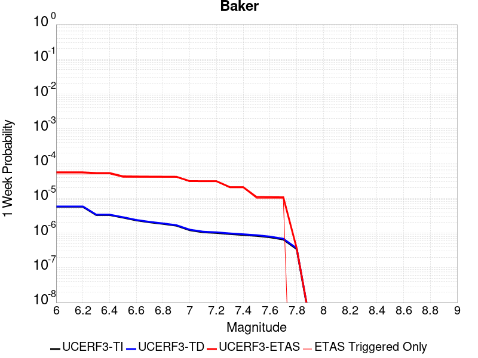 |  |  | 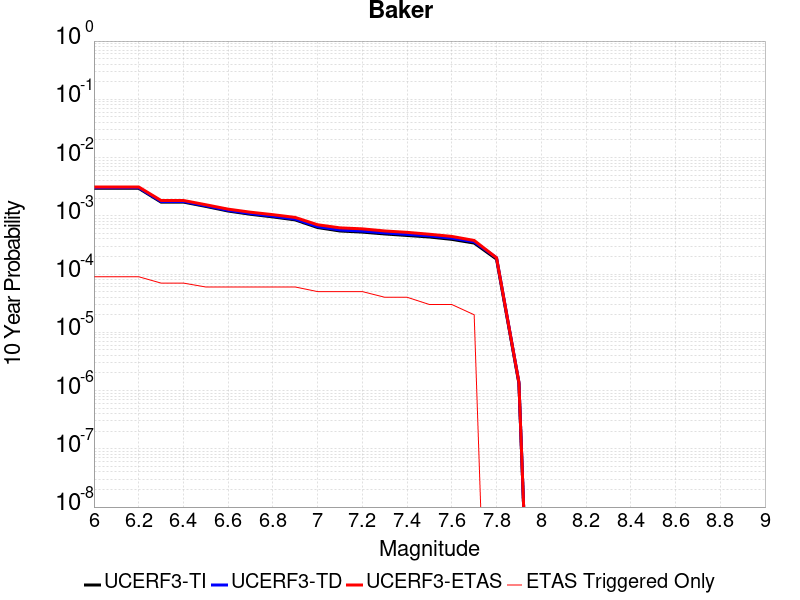 |

| Magnitude | 1 wk TI Prob | 1 wk TD Prob | 1 wk ETAS Prob | 1 wk ETAS/TD Gain | 1 wk ETAS Triggered Only | 1 mo TI Prob | 1 mo TD Prob | 1 mo ETAS Prob | 1 mo ETAS/TD Gain | 1 mo ETAS Triggered Only | 1 yr TI Prob | 1 yr TD Prob | 1 yr ETAS Prob | 1 yr ETAS/TD Gain | 1 yr ETAS Triggered Only | 10 yr TI Prob | 10 yr TD Prob | 10 yr ETAS Prob | 10 yr ETAS/TD Gain | 10 yr ETAS Triggered Only |
|-----|-----|-----|-----|-----|-----|-----|-----|-----|-----|-----|-----|-----|-----|-----|-----|-----|-----|-----|-----|-----|
| 6.0 | 5.695525E-6 | 5.8348373E-6 | 5.4591255E-5 | 9.35609 | 4.8756705E-5 | 2.4409164E-5 | 2.5006228E-5 | 8.595058E-5 | 3.4371672 | 6.094588E-5 | 2.9714106E-4 | 3.044123E-4 | 3.8971056E-4 | 1.2802063 | 8.532423E-5 | 0.0029674405 | 0.0030403486 | 0.0031375657 | 1.0319756 | 9.751341E-5 |
| 6.1 | 5.695525E-6 | 5.8348373E-6 | 5.4591255E-5 | 9.35609 | 4.8756705E-5 | 2.4409164E-5 | 2.5006228E-5 | 8.595058E-5 | 3.4371672 | 6.094588E-5 | 2.9714106E-4 | 3.044123E-4 | 3.8971056E-4 | 1.2802063 | 8.532423E-5 | 0.0029674405 | 0.0030403486 | 0.0031375657 | 1.0319756 | 9.751341E-5 |
| 6.2 | 5.695525E-6 | 5.8348373E-6 | 5.4591255E-5 | 9.35609 | 4.8756705E-5 | 2.4409164E-5 | 2.5006228E-5 | 8.595058E-5 | 3.4371672 | 6.094588E-5 | 2.9714106E-4 | 3.044123E-4 | 3.8971056E-4 | 1.2802063 | 8.532423E-5 | 0.0029674405 | 0.0030403486 | 0.0031375657 | 1.0319756 | 9.751341E-5 |
| 6.3 | 3.2995713E-6 | 3.383667E-6 | 5.2140207E-5 | 15.409378 | 4.8756705E-5 | 1.4140943E-5 | 1.4501353E-5 | 6.325735E-5 | 4.362169 | 4.8756705E-5 | 1.7215237E-4 | 1.7654014E-4 | 2.3747525E-4 | 1.345163 | 6.094588E-5 | 0.0017201907 | 0.001764046 | 0.001837052 | 1.0413855 | 7.313506E-5 |
| 6.4 | 3.2995713E-6 | 3.383667E-6 | 5.2140207E-5 | 15.409378 | 4.8756705E-5 | 1.4140943E-5 | 1.4501353E-5 | 6.325735E-5 | 4.362169 | 4.8756705E-5 | 1.7215237E-4 | 1.7654014E-4 | 2.3747525E-4 | 1.345163 | 6.094588E-5 | 0.0017201907 | 0.001764046 | 0.001837052 | 1.0413855 | 7.313506E-5 |
| 6.5 | 2.782202E-6 | 2.8558404E-6 | 3.9423263E-5 | 13.804435 | 3.656753E-5 | 1.1923668E-5 | 1.223926E-5 | 4.880634E-5 | 3.987687 | 3.656753E-5 | 1.4516099E-4 | 1.4900314E-4 | 1.9775258E-4 | 1.3271706 | 4.8756705E-5 | 0.001450662 | 0.0014890651 | 0.0015499202 | 1.040868 | 6.094588E-5 |
| 6.6 | 2.3163404E-6 | 2.38092E-6 | 3.894836E-5 | 16.358534 | 3.656753E-5 | 9.927136E-6 | 1.0203904E-5 | 4.677106E-5 | 4.5836434 | 3.656753E-5 | 1.20856166E-4 | 1.2422565E-4 | 1.729763E-4 | 1.3924363 | 4.8756705E-5 | 0.0012079047 | 0.0012415823 | 0.0013024525 | 1.0490264 | 6.094588E-5 |
| 6.7 | 2.037056E-6 | 2.0965003E-6 | 3.866395E-5 | 18.442139 | 3.656753E-5 | 8.7302105E-6 | 8.984972E-6 | 4.5552173E-5 | 5.069818 | 3.656753E-5 | 1.0628513E-4 | 1.093867E-4 | 1.5813808E-4 | 1.4456791 | 4.8756705E-5 | 0.0010623431 | 0.0010933448 | 0.001154224 | 1.0556817 | 6.094588E-5 |
| 6.8 | 1.8356744E-6 | 1.8915287E-6 | 3.8458988E-5 | 20.332226 | 3.656753E-5 | 7.867153E-6 | 8.106527E-6 | 4.4673758E-5 | 5.510838 | 3.656753E-5 | 9.577837E-5 | 9.869264E-5 | 1.4744453E-4 | 1.493977 | 4.8756705E-5 | 9.57371E-4 | 9.86502E-4 | 0.0010473878 | 1.0617188 | 6.094588E-5 |
| 6.9 | 1.6310546E-6 | 1.6832072E-6 | 3.8250673E-5 | 22.724874 | 3.656753E-5 | 6.9902153E-6 | 7.213726E-6 | 4.378099E-5 | 6.0691233 | 3.656753E-5 | 8.510255E-5 | 8.782368E-5 | 1.3657611E-4 | 1.555117 | 4.8756705E-5 | 8.5069967E-4 | 8.7790104E-4 | 9.387934E-4 | 1.0693613 | 6.094588E-5 |
| 7.0 | 1.2058036E-6 | 1.2508665E-6 | 2.5629188E-5 | 20.489147 | 2.4378352E-5 | 5.1677193E-6 | 5.3608455E-6 | 2.9739067E-5 | 5.547458 | 2.4378352E-5 | 6.291517E-5 | 6.5266366E-5 | 1.0183151E-4 | 1.5602448 | 3.656753E-5 | 6.289736E-4 | 6.524743E-4 | 7.0119917E-4 | 1.0746771 | 4.8756705E-5 |
| 7.1 | 1.052382E-6 | 1.0951609E-6 | 2.5473486E-5 | 23.26004 | 2.4378352E-5 | 4.5102006E-6 | 4.693538E-6 | 2.9071776E-5 | 6.1940002 | 2.4378352E-5 | 5.491031E-5 | 5.7142337E-5 | 9.370778E-5 | 1.639901 | 3.656753E-5 | 5.4896745E-4 | 5.7127734E-4 | 6.200062E-4 | 1.0852981 | 4.8756705E-5 |
| 7.2 | 1.0067454E-6 | 1.0487711E-6 | 2.5427098E-5 | 24.24466 | 2.4378352E-5 | 4.3146156E-6 | 4.4947255E-6 | 2.8872968E-5 | 6.4237447 | 2.4378352E-5 | 5.252918E-5 | 5.4721917E-5 | 9.1287446E-5 | 1.6682062 | 3.656753E-5 | 5.251676E-4 | 5.470853E-4 | 5.958153E-4 | 1.0890721 | 4.8756705E-5 |
| 7.3 | 9.3596316E-7 | 9.767723E-7 | 1.3165936E-5 | 13.479023 | 1.2189176E-5 | 4.0112645E-6 | 4.1861604E-6 | 1.6375285E-5 | 3.9117672 | 1.2189176E-5 | 4.8836053E-5 | 5.096532E-5 | 7.534243E-5 | 1.4783078 | 2.4378352E-5 | 4.8825322E-4 | 5.095371E-4 | 5.46086E-4 | 1.0717297 | 3.656753E-5 |
| 7.4 | 8.8117395E-7 | 9.2076635E-7 | 1.3109931E-5 | 14.238065 | 1.2189176E-5 | 3.7764542E-6 | 3.9461356E-6 | 1.6135264E-5 | 4.088877 | 1.2189176E-5 | 4.5977362E-5 | 4.8043148E-5 | 7.242033E-5 | 1.5074018 | 2.4378352E-5 | 4.596785E-4 | 4.8032837E-4 | 5.168783E-4 | 1.0760937 | 3.656753E-5 |
| 7.5 | 8.292386E-7 | 8.6745956E-7 | 1.3056625E-5 | 15.051566 | 1.2189176E-5 | 3.5538749E-6 | 3.7176785E-6 | 1.590681E-5 | 4.278694 | 1.2189176E-5 | 4.326757E-5 | 4.5261804E-5 | 6.9639056E-5 | 1.5385833 | 2.4378352E-5 | 4.3259145E-4 | 4.5252658E-4 | 4.890776E-4 | 1.0807709 | 3.656753E-5 |
| 7.6 | 7.553842E-7 | 7.9144706E-7 | 1.2980613E-5 | 16.401114 | 1.2189176E-5 | 3.2373566E-6 | 3.3919116E-6 | 1.5581047E-5 | 4.5935884 | 1.2189176E-5 | 3.9414106E-5 | 4.129575E-5 | 6.567309E-5 | 1.5903113 | 2.4378352E-5 | 3.9407116E-4 | 4.1288146E-4 | 4.4943386E-4 | 1.0885301 | 3.656753E-5 |
| 7.7 | 6.5285366E-7 | 6.852797E-7 | 1.2874448E-5 | 18.787144 | 1.2189176E-5 | 2.797941E-6 | 2.9369096E-6 | 1.512605E-5 | 5.1503286 | 1.2189176E-5 | 3.40644E-5 | 3.5756293E-5 | 6.0133774E-5 | 1.6817675 | 2.4378352E-5 | 3.405918E-4 | 3.5750607E-4 | 3.8187572E-4 | 1.0681657 | 2.4378352E-5 |
| 7.8 | 3.4586725E-7 | 3.6482615E-7 | 3.6482615E-7 | 1.0 | 0.0 | 1.4822873E-6 | 1.5635396E-6 | 1.5635396E-6 | 1.0 | 0.0 | 1.80467E-5 | 1.9035933E-5 | 1.9035933E-5 | 1.0 | 0.0 | 1.8045233E-4 | 1.9034347E-4 | 1.9034347E-4 | 1.0 | 0.0 |
| 7.9 | 2.5591178E-9 | 2.6696718E-9 | 2.6696718E-9 | 1.0 | 0.0 | 1.0967647E-8 | 1.14414505E-8 | 1.14414505E-8 | 1.0 | 0.0 | 1.335311E-7 | 1.3929966E-7 | 1.3929966E-7 | 1.0 | 0.0 | 1.3353102E-6 | 1.3929966E-6 | 1.3929966E-6 | 1.0 | 0.0 |

## Kern Canyon (North Kern) 2011
*[(top)](#table-of-contents)*

| 1 Week | 1 Month | 1 Year | 10 Year |
|-----|-----|-----|-----|
|  |  |  |  |

| Magnitude | 1 wk TI Prob | 1 wk TD Prob | 1 wk ETAS Prob | 1 wk ETAS/TD Gain | 1 wk ETAS Triggered Only | 1 mo TI Prob | 1 mo TD Prob | 1 mo ETAS Prob | 1 mo ETAS/TD Gain | 1 mo ETAS Triggered Only | 1 yr TI Prob | 1 yr TD Prob | 1 yr ETAS Prob | 1 yr ETAS/TD Gain | 1 yr ETAS Triggered Only | 10 yr TI Prob | 10 yr TD Prob | 10 yr ETAS Prob | 10 yr ETAS/TD Gain | 10 yr ETAS Triggered Only |
|-----|-----|-----|-----|-----|-----|-----|-----|-----|-----|-----|-----|-----|-----|-----|-----|-----|-----|-----|-----|-----|
| 6.0 | 6.6264497E-6 | 6.75733E-6 | 9.208098E-5 | 13.62683 | 8.532423E-5 | 2.8398761E-5 | 2.895971E-5 | 1.1428147E-4 | 3.946223 | 8.532423E-5 | 3.4570007E-4 | 3.5253543E-4 | 4.3782959E-4 | 1.2419449 | 8.532423E-5 | 0.0034516277 | 0.0035205502 | 0.0036177204 | 1.0276009 | 9.751341E-5 |
| 6.1 | 6.6264497E-6 | 6.75733E-6 | 9.208098E-5 | 13.62683 | 8.532423E-5 | 2.8398761E-5 | 2.895971E-5 | 1.1428147E-4 | 3.946223 | 8.532423E-5 | 3.4570007E-4 | 3.5253543E-4 | 4.3782959E-4 | 1.2419449 | 8.532423E-5 | 0.0034516277 | 0.0035205502 | 0.0036177204 | 1.0276009 | 9.751341E-5 |
| 6.2 | 6.6264497E-6 | 6.75733E-6 | 9.208098E-5 | 13.62683 | 8.532423E-5 | 2.8398761E-5 | 2.895971E-5 | 1.1428147E-4 | 3.946223 | 8.532423E-5 | 3.4570007E-4 | 3.5253543E-4 | 4.3782959E-4 | 1.2419449 | 8.532423E-5 | 0.0034516277 | 0.0035205502 | 0.0036177204 | 1.0276009 | 9.751341E-5 |
| 6.3 | 6.6264497E-6 | 6.75733E-6 | 9.208098E-5 | 13.62683 | 8.532423E-5 | 2.8398761E-5 | 2.895971E-5 | 1.1428147E-4 | 3.946223 | 8.532423E-5 | 3.4570007E-4 | 3.5253543E-4 | 4.3782959E-4 | 1.2419449 | 8.532423E-5 | 0.0034516277 | 0.0035205502 | 0.0036177204 | 1.0276009 | 9.751341E-5 |
| 6.4 | 6.6264497E-6 | 6.75733E-6 | 9.208098E-5 | 13.62683 | 8.532423E-5 | 2.8398761E-5 | 2.895971E-5 | 1.1428147E-4 | 3.946223 | 8.532423E-5 | 3.4570007E-4 | 3.5253543E-4 | 4.3782959E-4 | 1.2419449 | 8.532423E-5 | 0.0034516277 | 0.0035205502 | 0.0036177204 | 1.0276009 | 9.751341E-5 |
| 6.5 | 3.2162225E-6 | 3.2570915E-6 | 3.98245E-5 | 12.227014 | 3.656753E-5 | 1.3783738E-5 | 1.3958893E-5 | 5.0525912E-5 | 3.6196215 | 3.656753E-5 | 1.6780409E-4 | 1.6993708E-4 | 2.0649839E-4 | 1.2151462 | 3.656753E-5 | 0.0016767744 | 0.001698151 | 0.0017346564 | 1.0214971 | 3.656753E-5 |
| 6.6 | 3.2162225E-6 | 3.2570915E-6 | 3.98245E-5 | 12.227014 | 3.656753E-5 | 1.3783738E-5 | 1.3958893E-5 | 5.0525912E-5 | 3.6196215 | 3.656753E-5 | 1.6780409E-4 | 1.6993708E-4 | 2.0649839E-4 | 1.2151462 | 3.656753E-5 | 0.0016767744 | 0.001698151 | 0.0017346564 | 1.0214971 | 3.656753E-5 |
| 6.7 | 2.1908265E-6 | 2.2071222E-6 | 1.4396272E-5 | 6.5226436 | 1.2189176E-5 | 9.389223E-6 | 9.459061E-6 | 2.1648122E-5 | 2.2886121 | 1.2189176E-5 | 1.1430779E-4 | 1.1515819E-4 | 1.2734596E-4 | 1.1058351 | 1.2189176E-5 | 0.0011424901 | 0.0011510046 | 0.0011631796 | 1.0105778 | 1.2189176E-5 |
| 6.8 | 1.7303895E-6 | 1.7365529E-6 | 1.3925708E-5 | 8.019167 | 1.2189176E-5 | 7.415934E-6 | 7.4423488E-6 | 1.9631434E-5 | 2.637801 | 1.2189176E-5 | 9.028525E-5 | 9.0606925E-5 | 1.02795E-4 | 1.1345159 | 1.2189176E-5 | 9.024858E-4 | 9.057096E-4 | 9.178877E-4 | 1.013446 | 1.2189176E-5 |
| 6.9 | 1.3700314E-6 | 1.3688622E-6 | 1.3558021E-5 | 9.904592 | 1.2189176E-5 | 5.87155E-6 | 5.8665396E-6 | 1.8055644E-5 | 3.0777333 | 1.2189176E-5 | 7.148377E-5 | 7.142282E-5 | 8.361113E-5 | 1.17065 | 1.2189176E-5 | 7.146078E-4 | 7.140032E-4 | 7.261837E-4 | 1.0170594 | 1.2189176E-5 |
| 7.0 | 1.1467797E-6 | 1.1413804E-6 | 1.3330543E-5 | 11.679316 | 1.2189176E-5 | 4.9147607E-6 | 4.8916213E-6 | 1.7080738E-5 | 3.4918356 | 1.2189176E-5 | 5.983557E-5 | 5.9553895E-5 | 7.1742346E-5 | 1.2046626 | 1.2189176E-5 | 5.981946E-4 | 5.953825E-4 | 6.075644E-4 | 1.0204606 | 1.2189176E-5 |
| 7.1 | 9.3952065E-7 | 9.3026904E-7 | 1.3119434E-5 | 14.1028385 | 1.2189176E-5 | 4.026511E-6 | 3.9868614E-6 | 1.6175989E-5 | 4.0573244 | 1.2189176E-5 | 4.9021666E-5 | 4.8538972E-5 | 6.0727558E-5 | 1.2511092 | 1.2189176E-5 | 4.901085E-4 | 4.8528548E-4 | 4.9746875E-4 | 1.0251054 | 1.2189176E-5 |
| 7.2 | 6.858055E-7 | 6.7193E-7 | 6.7193E-7 | 1.0 | 0.0 | 2.939163E-6 | 2.879697E-6 | 2.879697E-6 | 1.0 | 0.0 | 3.5783723E-5 | 3.5059755E-5 | 3.5059755E-5 | 1.0 | 0.0 | 3.5777962E-4 | 3.5054312E-4 | 3.5054312E-4 | 1.0 | 0.0 |
| 7.3 | 5.1101983E-7 | 4.9393E-7 | 4.9393E-7 | 1.0 | 0.0 | 2.1900833E-6 | 2.116841E-6 | 2.116841E-6 | 1.0 | 0.0 | 2.6663936E-5 | 2.5772239E-5 | 2.5772239E-5 | 1.0 | 0.0 | 2.6660739E-4 | 2.57693E-4 | 2.57693E-4 | 1.0 | 0.0 |
| 7.4 | 3.4999414E-7 | 3.2995905E-7 | 3.2995905E-7 | 1.0 | 0.0 | 1.499974E-6 | 1.4141094E-6 | 1.4141094E-6 | 1.0 | 0.0 | 1.8262032E-5 | 1.721665E-5 | 1.721665E-5 | 1.0 | 0.0 | 1.826053E-4 | 1.7215339E-4 | 1.7215339E-4 | 1.0 | 0.0 |
| 7.5 | 1.7021522E-7 | 1.4750044E-7 | 1.4750044E-7 | 1.0 | 0.0 | 7.2949354E-7 | 6.321446E-7 | 6.321446E-7 | 1.0 | 0.0 | 8.881548E-6 | 7.696334E-6 | 7.696334E-6 | 1.0 | 0.0 | 8.8811925E-5 | 7.696076E-5 | 7.696076E-5 | 1.0 | 0.0 |
| 7.6 | 2.572245E-8 | 1.7352555E-8 | 1.7352555E-8 | 1.0 | 0.0 | 1.10239064E-7 | 7.436809E-8 | 7.436809E-8 | 1.0 | 0.0 | 1.3421597E-6 | 9.054312E-7 | 9.054312E-7 | 1.0 | 0.0 | 1.3421517E-5 | 9.05428E-6 | 9.05428E-6 | 1.0 | 0.0 |

## Santa Rosa Island
*[(top)](#table-of-contents)*

| 1 Week | 1 Month | 1 Year | 10 Year |
|-----|-----|-----|-----|
|  |  |  |  |

| Magnitude | 1 wk TI Prob | 1 wk TD Prob | 1 wk ETAS Prob | 1 wk ETAS/TD Gain | 1 wk ETAS Triggered Only | 1 mo TI Prob | 1 mo TD Prob | 1 mo ETAS Prob | 1 mo ETAS/TD Gain | 1 mo ETAS Triggered Only | 1 yr TI Prob | 1 yr TD Prob | 1 yr ETAS Prob | 1 yr ETAS/TD Gain | 1 yr ETAS Triggered Only | 10 yr TI Prob | 10 yr TD Prob | 10 yr ETAS Prob | 10 yr ETAS/TD Gain | 10 yr ETAS Triggered Only |
|-----|-----|-----|-----|-----|-----|-----|-----|-----|-----|-----|-----|-----|-----|-----|-----|-----|-----|-----|-----|-----|
| 6.0 | 4.1143165E-5 | 4.7091133E-5 | 1.2022274E-4 | 2.5529804 | 7.313506E-5 | 1.7631594E-4 | 2.0180465E-4 | 2.7492494E-4 | 1.3623321 | 7.313506E-5 | 0.002144533 | 0.0024544 | 0.0025395148 | 1.0346785 | 8.532423E-5 | 0.021239553 | 0.024293551 | 0.024376802 | 1.0034269 | 8.532423E-5 |
| 6.1 | 2.1061249E-5 | 2.3864959E-5 | 3.6053843E-5 | 1.510744 | 1.2189176E-5 | 9.0259375E-5 | 1.0227455E-4 | 1.14462484E-4 | 1.1191688 | 1.2189176E-5 | 0.0010983539 | 0.0012445104 | 0.0012566843 | 1.0097822 | 1.2189176E-5 | 0.01092941 | 0.012378449 | 0.012390487 | 1.0009725 | 1.2189176E-5 |
| 6.2 | 2.1061249E-5 | 2.3864959E-5 | 3.6053843E-5 | 1.510744 | 1.2189176E-5 | 9.0259375E-5 | 1.0227455E-4 | 1.14462484E-4 | 1.1191688 | 1.2189176E-5 | 0.0010983539 | 0.0012445104 | 0.0012566843 | 1.0097822 | 1.2189176E-5 | 0.01092941 | 0.012378449 | 0.012390487 | 1.0009725 | 1.2189176E-5 |
| 6.3 | 1.5158236E-5 | 1.7074419E-5 | 1.7074419E-5 | 1.0 | 0.0 | 6.496225E-5 | 7.3174095E-5 | 7.3174095E-5 | 1.0 | 0.0 | 7.906284E-4 | 8.905424E-4 | 8.905424E-4 | 1.0 | 0.0 | 0.007878214 | 0.008870989 | 0.008870989 | 1.0 | 0.0 |
| 6.4 | 1.2341918E-5 | 1.3852917E-5 | 1.3852917E-5 | 1.0 | 0.0 | 5.2892858E-5 | 5.9368336E-5 | 5.9368336E-5 | 1.0 | 0.0 | 6.437803E-4 | 7.225779E-4 | 7.225779E-4 | 1.0 | 0.0 | 0.006419184 | 0.007203121 | 0.007203121 | 1.0 | 0.0 |
| 6.5 | 9.061158E-6 | 1.0117031E-5 | 1.0117031E-5 | 1.0 | 0.0 | 3.883296E-5 | 4.3358013E-5 | 4.3358013E-5 | 1.0 | 0.0 | 4.726887E-4 | 5.277613E-4 | 5.277613E-4 | 1.0 | 0.0 | 0.004716845 | 0.0052656173 | 0.0052656173 | 1.0 | 0.0 |
| 6.6 | 7.5461685E-6 | 8.400733E-6 | 8.400733E-6 | 1.0 | 0.0 | 3.2340322E-5 | 3.600267E-5 | 3.600267E-5 | 1.0 | 0.0 | 3.936723E-4 | 4.3824865E-4 | 4.3824865E-4 | 1.0 | 0.0 | 0.003929756 | 0.0043742736 | 0.0043742736 | 1.0 | 0.0 |
| 6.7 | 5.5023775E-6 | 6.087381E-6 | 6.087381E-6 | 1.0 | 0.0 | 2.3581404E-5 | 2.6088532E-5 | 2.6088532E-5 | 1.0 | 0.0 | 2.8706578E-4 | 3.1758484E-4 | 3.1758484E-4 | 1.0 | 0.0 | 0.0028669522 | 0.0031716314 | 0.0031716314 | 1.0 | 0.0 |
| 6.8 | 3.7351679E-6 | 4.0831405E-6 | 4.0831405E-6 | 1.0 | 0.0 | 1.6007763E-5 | 1.749907E-5 | 1.749907E-5 | 1.0 | 0.0 | 1.948771E-4 | 2.1303284E-4 | 2.1303284E-4 | 1.0 | 0.0 | 0.0019470629 | 0.0021285315 | 0.0021285315 | 1.0 | 0.0 |
| 6.9 | 2.456366E-6 | 2.6292705E-6 | 2.6292705E-6 | 1.0 | 0.0 | 1.0527241E-5 | 1.1268254E-5 | 1.1268254E-5 | 1.0 | 0.0 | 1.2816161E-4 | 1.3718237E-4 | 1.3718237E-4 | 1.0 | 0.0 | 0.0012808773 | 0.0013709799 | 0.0013709799 | 1.0 | 0.0 |
| 7.0 | 2.3245157E-6 | 2.4827782E-6 | 2.4827782E-6 | 1.0 | 0.0 | 9.962172E-6 | 1.0640435E-5 | 1.0640435E-5 | 1.0 | 0.0 | 1.2128269E-4 | 1.2953962E-4 | 1.2953962E-4 | 1.0 | 0.0 | 0.0012121652 | 0.0012946434 | 0.0012946434 | 1.0 | 0.0 |
| 7.1 | 2.2248344E-6 | 2.37325E-6 | 2.37325E-6 | 1.0 | 0.0 | 9.53497E-6 | 1.0171032E-5 | 1.0171032E-5 | 1.0 | 0.0 | 1.1608207E-4 | 1.2382529E-4 | 1.2382529E-4 | 1.0 | 0.0 | 0.0011602144 | 0.001237565 | 0.001237565 | 1.0 | 0.0 |
| 7.2 | 2.1350402E-6 | 2.276154E-6 | 2.276154E-6 | 1.0 | 0.0 | 9.150141E-6 | 9.754909E-6 | 9.754909E-6 | 1.0 | 0.0 | 1.1139726E-4 | 1.1875956E-4 | 1.1875956E-4 | 1.0 | 0.0 | 0.0011134144 | 0.0011869629 | 0.0011869629 | 1.0 | 0.0 |
| 7.3 | 1.9793572E-6 | 2.108719E-6 | 2.108719E-6 | 1.0 | 0.0 | 8.482932E-6 | 9.037336E-6 | 9.037336E-6 | 1.0 | 0.0 | 1.032748E-4 | 1.10024026E-4 | 1.10024026E-4 | 1.0 | 0.0 | 0.0010322682 | 0.0010996973 | 0.0010996973 | 1.0 | 0.0 |
| 7.4 | 1.6951194E-6 | 1.8045733E-6 | 1.8045733E-6 | 1.0 | 0.0 | 7.264777E-6 | 7.733863E-6 | 7.733863E-6 | 1.0 | 0.0 | 8.844508E-5 | 9.415573E-5 | 9.415573E-5 | 1.0 | 0.0 | 8.840988E-4 | 9.4116E-4 | 9.4116E-4 | 1.0 | 0.0 |
| 7.5 | 8.987207E-7 | 9.5122147E-7 | 9.5122147E-7 | 1.0 | 0.0 | 3.8516546E-6 | 4.076657E-6 | 4.076657E-6 | 1.0 | 0.0 | 4.6892885E-5 | 4.963218E-5 | 4.963218E-5 | 1.0 | 0.0 | 4.688299E-4 | 4.9621216E-4 | 4.9621216E-4 | 1.0 | 0.0 |
| 7.6 | 3.8783037E-7 | 4.052932E-7 | 4.052932E-7 | 1.0 | 0.0 | 1.6621291E-6 | 1.7369698E-6 | 1.7369698E-6 | 1.0 | 0.0 | 2.0236233E-5 | 2.1147409E-5 | 2.1147409E-5 | 1.0 | 0.0 | 2.023439E-4 | 2.1145462E-4 | 2.1145462E-4 | 1.0 | 0.0 |
| 7.7 | 6.181804E-8 | 6.339035E-8 | 6.339035E-8 | 1.0 | 0.0 | 2.6493444E-7 | 2.7167292E-7 | 2.7167292E-7 | 1.0 | 0.0 | 3.225572E-6 | 3.3076128E-6 | 3.3076128E-6 | 1.0 | 0.0 | 3.225525E-5 | 3.307564E-5 | 3.307564E-5 | 1.0 | 0.0 |
| 7.8 | 1.3704449E-9 | 1.3964153E-9 | 1.3964153E-9 | 1.0 | 0.0 | 5.873335E-9 | 5.984637E-9 | 5.984637E-9 | 1.0 | 0.0 | 7.1507856E-8 | 7.286295E-8 | 7.286295E-8 | 1.0 | 0.0 | 7.1507833E-7 | 7.286294E-7 | 7.286294E-7 | 1.0 | 0.0 |

## Manix-Afton Hills
*[(top)](#table-of-contents)*

| 1 Week | 1 Month | 1 Year | 10 Year |
|-----|-----|-----|-----|
|  | 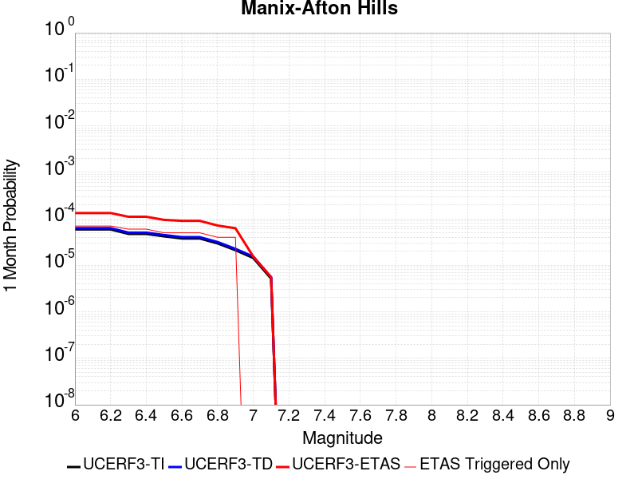 |  |  |

| Magnitude | 1 wk TI Prob | 1 wk TD Prob | 1 wk ETAS Prob | 1 wk ETAS/TD Gain | 1 wk ETAS Triggered Only | 1 mo TI Prob | 1 mo TD Prob | 1 mo ETAS Prob | 1 mo ETAS/TD Gain | 1 mo ETAS Triggered Only | 1 yr TI Prob | 1 yr TD Prob | 1 yr ETAS Prob | 1 yr ETAS/TD Gain | 1 yr ETAS Triggered Only | 10 yr TI Prob | 10 yr TD Prob | 10 yr ETAS Prob | 10 yr ETAS/TD Gain | 10 yr ETAS Triggered Only |
|-----|-----|-----|-----|-----|-----|-----|-----|-----|-----|-----|-----|-----|-----|-----|-----|-----|-----|-----|-----|-----|
| 6.0 | 1.3783202E-5 | 1.47110895E-5 | 7.565608E-5 | 5.1427917 | 6.094588E-5 | 5.906953E-5 | 6.30461E-5 | 1.4836495E-4 | 2.3532772 | 8.532423E-5 | 7.189342E-4 | 7.6733343E-4 | 8.5259223E-4 | 1.1111104 | 8.532423E-5 | 0.0071661277 | 0.007648596 | 0.0077332677 | 1.0110703 | 8.532423E-5 |
| 6.1 | 1.3783202E-5 | 1.47110895E-5 | 7.565608E-5 | 5.1427917 | 6.094588E-5 | 5.906953E-5 | 6.30461E-5 | 1.4836495E-4 | 2.3532772 | 8.532423E-5 | 7.189342E-4 | 7.6733343E-4 | 8.5259223E-4 | 1.1111104 | 8.532423E-5 | 0.0071661277 | 0.007648596 | 0.0077332677 | 1.0110703 | 8.532423E-5 |
| 6.2 | 1.3783202E-5 | 1.47110895E-5 | 7.565608E-5 | 5.1427917 | 6.094588E-5 | 5.906953E-5 | 6.30461E-5 | 1.4836495E-4 | 2.3532772 | 8.532423E-5 | 7.189342E-4 | 7.6733343E-4 | 8.5259223E-4 | 1.1111104 | 8.532423E-5 | 0.0071661277 | 0.007648596 | 0.0077332677 | 1.0110703 | 8.532423E-5 |
| 6.3 | 1.10494875E-5 | 1.1793136E-5 | 6.0549264E-5 | 5.13428 | 4.8756705E-5 | 4.7354086E-5 | 5.054109E-5 | 1.2367245E-4 | 2.4469683 | 7.313506E-5 | 5.763835E-4 | 6.151744E-4 | 6.882645E-4 | 1.118812 | 7.313506E-5 | 0.005748908 | 0.0061357557 | 0.0062084417 | 1.0118463 | 7.313506E-5 |
| 6.4 | 1.10494875E-5 | 1.1793136E-5 | 6.0549264E-5 | 5.13428 | 4.8756705E-5 | 4.7354086E-5 | 5.054109E-5 | 1.2367245E-4 | 2.4469683 | 7.313506E-5 | 5.763835E-4 | 6.151744E-4 | 6.882645E-4 | 1.118812 | 7.313506E-5 | 0.005748908 | 0.0061357557 | 0.0062084417 | 1.0118463 | 7.313506E-5 |
| 6.5 | 9.788949E-6 | 1.045432E-5 | 4.7021465E-5 | 4.4978027 | 3.656753E-5 | 4.1951964E-5 | 4.480351E-5 | 1.0574666E-4 | 2.3602316 | 6.094588E-5 | 5.1064545E-4 | 5.453555E-4 | 6.062681E-4 | 1.1116935 | 6.094588E-5 | 0.0050947363 | 0.0054410985 | 0.0055017127 | 1.0111401 | 6.094588E-5 |
| 6.6 | 8.810006E-6 | 9.4136285E-6 | 4.598081E-5 | 4.8844943 | 3.656753E-5 | 3.775662E-5 | 4.0343548E-5 | 1.0128697E-4 | 2.5106113 | 6.094588E-5 | 4.5958988E-4 | 4.9108086E-4 | 5.519968E-4 | 1.1240447 | 6.094588E-5 | 0.0045864056 | 0.004900839 | 0.0049614864 | 1.0123749 | 6.094588E-5 |
| 6.7 | 8.80128E-6 | 9.404108E-6 | 4.5971294E-5 | 4.888427 | 3.656753E-5 | 3.7719226E-5 | 4.0302748E-5 | 1.0124617E-4 | 2.5121408 | 6.094588E-5 | 4.591348E-4 | 4.9058435E-4 | 5.5150036E-4 | 1.1241703 | 6.094588E-5 | 0.004581874 | 0.0048958957 | 0.0049565434 | 1.0123874 | 6.094588E-5 |
| 6.8 | 6.8994877E-6 | 7.380076E-6 | 4.3947333E-5 | 5.954862 | 3.656753E-5 | 2.9568899E-5 | 3.162856E-5 | 8.0383725E-5 | 2.5414917 | 4.8756705E-5 | 3.5994186E-4 | 3.8501783E-4 | 4.3375578E-4 | 1.1265862 | 4.8756705E-5 | 0.003593594 | 0.0038443129 | 0.003892882 | 1.012634 | 4.8756705E-5 |
| 6.9 | 4.9328037E-6 | 5.2709615E-6 | 4.1838295E-5 | 7.9375076 | 3.656753E-5 | 2.1140417E-5 | 2.2589675E-5 | 7.1345276E-5 | 3.1583138 | 4.8756705E-5 | 2.5735417E-4 | 2.7500073E-4 | 3.2374403E-4 | 1.1772479 | 4.8756705E-5 | 0.0025705635 | 0.0027472095 | 0.0027958322 | 1.017699 | 4.8756705E-5 |
| 7.0 | 3.347973E-6 | 3.59003E-6 | 3.59003E-6 | 1.0 | 0.0 | 1.4348378E-5 | 1.5385775E-5 | 1.5385775E-5 | 1.0 | 0.0 | 1.746775E-4 | 1.8730981E-4 | 1.8730981E-4 | 1.0 | 0.0 | 0.0017454025 | 0.0018719219 | 0.0018719219 | 1.0 | 0.0 |
| 7.1 | 1.2073567E-6 | 1.293482E-6 | 1.293482E-6 | 1.0 | 0.0 | 5.1743755E-6 | 5.543492E-6 | 5.543492E-6 | 1.0 | 0.0 | 6.29962E-5 | 6.749156E-5 | 6.749156E-5 | 1.0 | 0.0 | 6.297835E-4 | 6.7487074E-4 | 6.7487074E-4 | 1.0 | 0.0 |

## Mission Ridge-Arroyo Parida-Santa Ana
*[(top)](#table-of-contents)*

| 1 Week | 1 Month | 1 Year | 10 Year |
|-----|-----|-----|-----|
|  |  |  |  |

| Magnitude | 1 wk TI Prob | 1 wk TD Prob | 1 wk ETAS Prob | 1 wk ETAS/TD Gain | 1 wk ETAS Triggered Only | 1 mo TI Prob | 1 mo TD Prob | 1 mo ETAS Prob | 1 mo ETAS/TD Gain | 1 mo ETAS Triggered Only | 1 yr TI Prob | 1 yr TD Prob | 1 yr ETAS Prob | 1 yr ETAS/TD Gain | 1 yr ETAS Triggered Only | 10 yr TI Prob | 10 yr TD Prob | 10 yr ETAS Prob | 10 yr ETAS/TD Gain | 10 yr ETAS Triggered Only |
|-----|-----|-----|-----|-----|-----|-----|-----|-----|-----|-----|-----|-----|-----|-----|-----|-----|-----|-----|-----|-----|
| 6.0 | 4.169034E-5 | 4.7138263E-5 | 8.3704064E-5 | 1.7757139 | 3.656753E-5 | 1.7866064E-4 | 2.0201034E-4 | 2.3857049E-4 | 1.1809815 | 3.656753E-5 | 0.0021730233 | 0.00245745 | 0.0025182462 | 1.0247395 | 6.094588E-5 | 0.021518968 | 0.024384614 | 0.024455966 | 1.0029261 | 7.313506E-5 |
| 6.1 | 1.73813E-5 | 1.6854226E-5 | 4.1232168E-5 | 2.4463992 | 2.4378352E-5 | 7.4489166E-5 | 7.223046E-5 | 9.660705E-5 | 1.3374835 | 2.4378352E-5 | 9.065282E-4 | 8.790618E-4 | 9.0341875E-4 | 1.0277078 | 2.4378352E-5 | 0.009028391 | 0.008756988 | 0.008781153 | 1.0027595 | 2.4378352E-5 |
| 6.2 | 1.4622182E-5 | 1.367329E-5 | 2.5862299E-5 | 1.8914467 | 1.2189176E-5 | 6.2664985E-5 | 5.8598518E-5 | 7.078698E-5 | 1.2079995 | 1.2189176E-5 | 7.6267915E-4 | 7.132073E-4 | 7.2538777E-4 | 1.0170785 | 1.2189176E-5 | 0.007600669 | 0.007109627 | 0.0071217297 | 1.0017023 | 1.2189176E-5 |
| 6.3 | 1.3552434E-5 | 1.2482201E-5 | 2.4671224E-5 | 1.9765124 | 1.2189176E-5 | 5.8080568E-5 | 5.3494066E-5 | 6.5682594E-5 | 1.2278482 | 1.2189176E-5 | 7.069015E-4 | 6.510988E-4 | 6.6328E-4 | 1.0187087 | 1.2189176E-5 | 0.00704657 | 0.006492275 | 0.006504385 | 1.0018653 | 1.2189176E-5 |
| 6.4 | 1.30977305E-5 | 1.1979156E-5 | 2.4168186E-5 | 2.01752 | 1.2189176E-5 | 5.613192E-5 | 5.1338247E-5 | 6.352679E-5 | 1.2374166 | 1.2189176E-5 | 6.831918E-4 | 6.248669E-4 | 6.3704845E-4 | 1.0194947 | 1.2189176E-5 | 0.006810953 | 0.0062314444 | 0.0062435577 | 1.001944 | 1.2189176E-5 |
| 6.5 | 1.225205E-5 | 1.1048803E-5 | 2.3237844E-5 | 2.1032002 | 1.2189176E-5 | 5.2507727E-5 | 4.7351168E-5 | 5.953977E-5 | 1.2574086 | 1.2189176E-5 | 6.3909404E-4 | 5.7635066E-4 | 5.885328E-4 | 1.0211366 | 1.2189176E-5 | 0.006372592 | 0.005748869 | 0.005760988 | 1.0021081 | 1.2189176E-5 |
| 6.6 | 1.1352241E-5 | 1.0063535E-5 | 2.2252589E-5 | 2.21121 | 1.2189176E-5 | 4.8651553E-5 | 4.3128734E-5 | 5.5317385E-5 | 1.2826109 | 1.2189176E-5 | 5.921717E-4 | 5.2496797E-4 | 5.371507E-4 | 1.0232067 | 1.2189176E-5 | 0.0059059616 | 0.0052375244 | 0.0052496498 | 1.002315 | 1.2189176E-5 |
| 6.7 | 1.0864116E-5 | 9.517027E-6 | 2.1706088E-5 | 2.2807634 | 1.2189176E-5 | 4.6559664E-5 | 4.0786632E-5 | 5.2975312E-5 | 1.29884 | 1.2189176E-5 | 5.667165E-4 | 4.964661E-4 | 5.086492E-4 | 1.0245397 | 1.2189176E-5 | 0.005652734 | 0.004953804 | 0.0049659326 | 1.0024483 | 1.2189176E-5 |
| 6.8 | 1.0666365E-5 | 9.299779E-6 | 9.299779E-6 | 1.0 | 0.0 | 4.571219E-5 | 3.9855597E-5 | 3.9855597E-5 | 1.0 | 0.0 | 5.564038E-4 | 4.8513585E-4 | 4.8513585E-4 | 1.0 | 0.0 | 0.005550127 | 0.0048410003 | 0.0048410003 | 1.0 | 0.0 |
| 6.9 | 1.0038665E-5 | 8.592046E-6 | 8.592046E-6 | 1.0 | 0.0 | 4.302214E-5 | 3.682254E-5 | 3.682254E-5 | 1.0 | 0.0 | 5.236687E-4 | 4.4822405E-4 | 4.4822405E-4 | 1.0 | 0.0 | 0.005224364 | 0.004473411 | 0.004473411 | 1.0 | 0.0 |
| 7.0 | 9.5379955E-6 | 8.025073E-6 | 8.025073E-6 | 1.0 | 0.0 | 4.0876483E-5 | 3.4392728E-5 | 3.4392728E-5 | 1.0 | 0.0 | 4.975576E-4 | 4.1865272E-4 | 4.1865272E-4 | 1.0 | 0.0 | 0.00496445 | 0.0041788397 | 0.0041788397 | 1.0 | 0.0 |
| 7.1 | 9.207389E-6 | 7.652375E-6 | 7.652375E-6 | 1.0 | 0.0 | 3.945964E-5 | 3.279549E-5 | 3.279549E-5 | 1.0 | 0.0 | 4.803152E-4 | 3.9921363E-4 | 3.9921363E-4 | 1.0 | 0.0 | 0.004792784 | 0.003985161 | 0.003985161 | 1.0 | 0.0 |
| 7.2 | 7.638091E-6 | 5.9311183E-6 | 5.9311183E-6 | 1.0 | 0.0 | 3.2734264E-5 | 2.541883E-5 | 2.541883E-5 | 1.0 | 0.0 | 3.984668E-4 | 3.0943064E-4 | 3.0943064E-4 | 1.0 | 0.0 | 0.0039775306 | 0.0030900547 | 0.0030900547 | 1.0 | 0.0 |
| 7.3 | 7.2500147E-6 | 5.5961527E-6 | 5.5961527E-6 | 1.0 | 0.0 | 3.1071122E-5 | 2.3983293E-5 | 2.3983293E-5 | 1.0 | 0.0 | 3.7822526E-4 | 2.9195778E-4 | 2.9195778E-4 | 1.0 | 0.0 | 0.0037758215 | 0.0029157975 | 0.0029157975 | 1.0 | 0.0 |
| 7.4 | 6.3899715E-6 | 4.9184964E-6 | 4.9184964E-6 | 1.0 | 0.0 | 2.7385306E-5 | 2.10791E-5 | 2.10791E-5 | 1.0 | 0.0 | 3.3336508E-4 | 2.5660804E-4 | 2.5660804E-4 | 1.0 | 0.0 | 0.0033286542 | 0.0025631618 | 0.0025631618 | 1.0 | 0.0 |
| 7.5 | 5.379025E-6 | 4.0838527E-6 | 4.0838527E-6 | 1.0 | 0.0 | 2.305276E-5 | 1.7502109E-5 | 1.7502109E-5 | 1.0 | 0.0 | 2.806312E-4 | 2.1306744E-4 | 2.1306744E-4 | 1.0 | 0.0 | 0.0028027708 | 0.002128643 | 0.002128643 | 1.0 | 0.0 |
| 7.6 | 4.1270696E-6 | 3.0883439E-6 | 3.0883439E-6 | 1.0 | 0.0 | 1.768732E-5 | 1.3235693E-5 | 1.3235693E-5 | 1.0 | 0.0 | 2.1532185E-4 | 1.6113273E-4 | 1.6113273E-4 | 1.0 | 0.0 | 0.0021511333 | 0.001610167 | 0.001610167 | 1.0 | 0.0 |
| 7.7 | 2.5406805E-6 | 1.8282013E-6 | 1.8282013E-6 | 1.0 | 0.0 | 1.0888585E-5 | 7.835125E-6 | 7.835125E-6 | 1.0 | 0.0 | 1.3256045E-4 | 9.538854E-5 | 9.538854E-5 | 1.0 | 0.0 | 0.0013248142 | 9.534821E-4 | 9.534821E-4 | 1.0 | 0.0 |
| 7.8 | 4.8608285E-7 | 3.5098864E-7 | 3.5098864E-7 | 1.0 | 0.0 | 2.0832106E-6 | 1.5042363E-6 | 1.5042363E-6 | 1.0 | 0.0 | 2.5362791E-5 | 1.8313924E-5 | 1.8313924E-5 | 1.0 | 0.0 | 2.5359896E-4 | 1.8312426E-4 | 1.8312426E-4 | 1.0 | 0.0 |
| 7.9 | 2.0472514E-8 | 1.2688783E-8 | 1.2688783E-8 | 1.0 | 0.0 | 8.7739345E-8 | 5.43805E-8 | 5.43805E-8 | 1.0 | 0.0 | 1.068226E-6 | 6.6208236E-7 | 6.6208236E-7 | 1.0 | 0.0 | 1.0682209E-5 | 6.620805E-6 | 6.620805E-6 | 1.0 | 0.0 |
| 8.0 | 4.443582E-9 | 2.0321211E-9 | 2.0321211E-9 | 1.0 | 0.0 | 1.9043922E-8 | 8.70909E-9 | 8.70909E-9 | 1.0 | 0.0 | 2.3185973E-7 | 1.0603316E-7 | 1.0603316E-7 | 1.0 | 0.0 | 2.3185949E-6 | 1.0603312E-6 | 1.0603312E-6 | 1.0 | 0.0 |

## San Jacinto (Coyote Creek)
*[(top)](#table-of-contents)*

| 1 Week | 1 Month | 1 Year | 10 Year |
|-----|-----|-----|-----|
|  |  |  |  |

| Magnitude | 1 wk TI Prob | 1 wk TD Prob | 1 wk ETAS Prob | 1 wk ETAS/TD Gain | 1 wk ETAS Triggered Only | 1 mo TI Prob | 1 mo TD Prob | 1 mo ETAS Prob | 1 mo ETAS/TD Gain | 1 mo ETAS Triggered Only | 1 yr TI Prob | 1 yr TD Prob | 1 yr ETAS Prob | 1 yr ETAS/TD Gain | 1 yr ETAS Triggered Only | 10 yr TI Prob | 10 yr TD Prob | 10 yr ETAS Prob | 10 yr ETAS/TD Gain | 10 yr ETAS Triggered Only |
|-----|-----|-----|-----|-----|-----|-----|-----|-----|-----|-----|-----|-----|-----|-----|-----|-----|-----|-----|-----|-----|
| 6.0 | 2.7374346E-5 | 2.4145214E-5 | 8.5089625E-5 | 3.5240781 | 6.094588E-5 | 1.1731335E-4 | 1.034754E-4 | 1.7660289E-4 | 1.7067138 | 7.313506E-5 | 0.0014273542 | 0.0012590875 | 0.0013321304 | 1.0580126 | 7.313506E-5 | 0.01418221 | 0.012928318 | 0.013000508 | 1.0055839 | 7.313506E-5 |
| 6.1 | 2.7374346E-5 | 2.4145214E-5 | 8.5089625E-5 | 3.5240781 | 6.094588E-5 | 1.1731335E-4 | 1.034754E-4 | 1.7660289E-4 | 1.7067138 | 7.313506E-5 | 0.0014273542 | 0.0012590875 | 0.0013321304 | 1.0580126 | 7.313506E-5 | 0.01418221 | 0.012928318 | 0.013000508 | 1.0055839 | 7.313506E-5 |
| 6.2 | 2.7374346E-5 | 2.4145214E-5 | 8.5089625E-5 | 3.5240781 | 6.094588E-5 | 1.1731335E-4 | 1.034754E-4 | 1.7660289E-4 | 1.7067138 | 7.313506E-5 | 0.0014273542 | 0.0012590875 | 0.0013321304 | 1.0580126 | 7.313506E-5 | 0.01418221 | 0.012928318 | 0.013000508 | 1.0055839 | 7.313506E-5 |
| 6.3 | 2.7374346E-5 | 2.4145214E-5 | 8.5089625E-5 | 3.5240781 | 6.094588E-5 | 1.1731335E-4 | 1.034754E-4 | 1.7660289E-4 | 1.7067138 | 7.313506E-5 | 0.0014273542 | 0.0012590875 | 0.0013321304 | 1.0580126 | 7.313506E-5 | 0.01418221 | 0.012928318 | 0.013000508 | 1.0055839 | 7.313506E-5 |
| 6.4 | 2.7374346E-5 | 2.4145214E-5 | 8.5089625E-5 | 3.5240781 | 6.094588E-5 | 1.1731335E-4 | 1.034754E-4 | 1.7660289E-4 | 1.7067138 | 7.313506E-5 | 0.0014273542 | 0.0012590875 | 0.0013321304 | 1.0580126 | 7.313506E-5 | 0.01418221 | 0.012928318 | 0.013000508 | 1.0055839 | 7.313506E-5 |
| 6.5 | 2.7282445E-5 | 2.4031293E-5 | 8.4975705E-5 | 3.5360441 | 6.094588E-5 | 1.16919524E-4 | 1.029872E-4 | 1.7611473E-4 | 1.7100642 | 7.313506E-5 | 0.0014225657 | 0.0012531505 | 0.001326194 | 1.0582879 | 7.313506E-5 | 0.014134934 | 0.012869646 | 0.012941839 | 1.0056096 | 7.313506E-5 |
| 6.6 | 2.7282445E-5 | 2.4031293E-5 | 8.4975705E-5 | 3.5360441 | 6.094588E-5 | 1.16919524E-4 | 1.029872E-4 | 1.7611473E-4 | 1.7100642 | 7.313506E-5 | 0.0014225657 | 0.0012531505 | 0.001326194 | 1.0582879 | 7.313506E-5 | 0.014134934 | 0.012869646 | 0.012941839 | 1.0056096 | 7.313506E-5 |
| 6.7 | 2.7216198E-5 | 2.3956412E-5 | 8.4900836E-5 | 3.543971 | 6.094588E-5 | 1.1663563E-4 | 1.02666316E-4 | 1.7579386E-4 | 1.7122837 | 7.313506E-5 | 0.0014191137 | 0.0012492483 | 0.001322292 | 1.0584701 | 7.313506E-5 | 0.014100855 | 0.0128310565 | 0.012903254 | 1.0056267 | 7.313506E-5 |
| 6.8 | 2.7078617E-5 | 2.387363E-5 | 8.481806E-5 | 3.5527925 | 6.094588E-5 | 1.1604605E-4 | 1.0231156E-4 | 1.7543913E-4 | 1.7147537 | 7.313506E-5 | 0.001411945 | 0.0012449342 | 0.0013179781 | 1.058673 | 7.313506E-5 | 0.014030075 | 0.012788199 | 0.012860399 | 1.0056459 | 7.313506E-5 |
| 6.9 | 2.6982952E-5 | 2.3793142E-5 | 8.473757E-5 | 3.5614285 | 6.094588E-5 | 1.15636096E-4 | 1.0196664E-4 | 1.7509423E-4 | 1.7171718 | 7.313506E-5 | 0.0014069602 | 0.0012407395 | 0.0013137838 | 1.0588716 | 7.313506E-5 | 0.013980856 | 0.012746515 | 0.012818717 | 1.0056645 | 7.313506E-5 |
| 7.0 | 2.6449972E-5 | 2.3370165E-5 | 8.431462E-5 | 3.607789 | 6.094588E-5 | 1.1335209E-4 | 1.00154015E-4 | 1.7328175E-4 | 1.7301527 | 7.313506E-5 | 0.001379188 | 0.0012186957 | 0.0012917416 | 1.0599378 | 7.313506E-5 | 0.0137065975 | 0.0125278765 | 0.012600096 | 1.0057646 | 7.313506E-5 |
| 7.1 | 2.6257849E-5 | 2.3196202E-5 | 8.4140665E-5 | 3.6273468 | 6.094588E-5 | 1.1252879E-4 | 9.940852E-5 | 1.7253631E-4 | 1.735629 | 7.313506E-5 | 0.0013691769 | 0.0012096294 | 0.0012826759 | 1.0603876 | 7.313506E-5 | 0.013607717 | 0.012437741 | 0.012509967 | 1.0058069 | 7.313506E-5 |
| 7.2 | 2.5270041E-5 | 2.2390966E-5 | 8.333548E-5 | 3.721835 | 6.094588E-5 | 1.0829568E-4 | 9.595777E-5 | 1.690858E-4 | 1.7620857 | 7.313506E-5 | 0.0013177024 | 0.0011676621 | 0.0012407117 | 1.0625606 | 7.313506E-5 | 0.013099162 | 0.012018777 | 0.012091033 | 1.006012 | 7.313506E-5 |
| 7.3 | 2.339701E-5 | 2.1122814E-5 | 8.206741E-5 | 3.8852496 | 6.094588E-5 | 1.0026905E-4 | 9.0523215E-5 | 1.6365165E-4 | 1.8078418 | 7.313506E-5 | 0.001220092 | 0.0011015651 | 0.0011746195 | 1.0663189 | 7.313506E-5 | 0.012134149 | 0.011357696 | 0.01143 | 1.0063661 | 7.313506E-5 |
| 7.4 | 2.296333E-5 | 2.0853171E-5 | 8.179778E-5 | 3.9225585 | 6.094588E-5 | 9.841056E-5 | 8.936768E-5 | 1.624962E-4 | 1.8182882 | 7.313506E-5 | 0.0011974899 | 0.0010875105 | 0.001160566 | 1.0671768 | 7.313506E-5 | 0.011910575 | 0.01121681 | 0.011289124 | 1.006447 | 7.313506E-5 |
| 7.5 | 2.2188895E-5 | 2.0376096E-5 | 8.132074E-5 | 3.990987 | 6.094588E-5 | 9.50918E-5 | 8.732321E-5 | 1.6045188E-4 | 1.8374482 | 7.313506E-5 | 0.0011571277 | 0.0010626436 | 0.001135701 | 1.0687505 | 7.313506E-5 | 0.011511209 | 0.010966429 | 0.011038762 | 1.0065958 | 7.313506E-5 |
| 7.6 | 2.0013189E-5 | 1.8962366E-5 | 7.990709E-5 | 4.213983 | 6.094588E-5 | 8.5767984E-5 | 8.1264756E-5 | 1.5439387E-4 | 1.8998872 | 7.313506E-5 | 0.001043725 | 9.889511E-4 | 0.0010620138 | 1.073879 | 7.313506E-5 | 0.010388365 | 0.010224434 | 0.010296821 | 1.0070798 | 7.313506E-5 |
| 7.7 | 1.7230794E-5 | 1.674371E-5 | 7.768857E-5 | 4.639866 | 6.094588E-5 | 7.384417E-5 | 7.175679E-5 | 1.448866E-4 | 2.0191343 | 7.313506E-5 | 8.986819E-4 | 8.7328954E-4 | 9.463607E-4 | 1.0836735 | 7.313506E-5 | 0.008950562 | 0.009062956 | 0.009135429 | 1.0079966 | 7.313506E-5 |
| 7.8 | 1.4478809E-5 | 1.4990978E-5 | 7.593595E-5 | 5.065443 | 6.094588E-5 | 6.205057E-5 | 6.424547E-5 | 1.3737583E-4 | 2.138296 | 7.313506E-5 | 7.552038E-4 | 7.819085E-4 | 8.549864E-4 | 1.0934609 | 7.313506E-5 | 0.0075264242 | 0.008141387 | 0.008213927 | 1.00891 | 7.313506E-5 |
| 7.9 | 1.1114467E-5 | 1.1645102E-5 | 7.259027E-5 | 6.2335453 | 6.094588E-5 | 4.7632562E-5 | 4.990663E-5 | 1.2303803E-4 | 2.4653647 | 7.313506E-5 | 5.797721E-4 | 6.074444E-4 | 6.80535E-4 | 1.1203249 | 7.313506E-5 | 0.0057826187 | 0.0063803247 | 0.006452993 | 1.0113895 | 7.313506E-5 |
| 8.0 | 9.327402E-6 | 9.899186E-6 | 5.865541E-5 | 5.925276 | 4.8756705E-5 | 3.9973966E-5 | 4.2424395E-5 | 1.0336769E-4 | 2.4365153 | 6.094588E-5 | 4.8657437E-4 | 5.1639514E-4 | 5.773096E-4 | 1.1179608 | 6.094588E-5 | 0.0048551033 | 0.0054499684 | 0.005510582 | 1.0111219 | 6.094588E-5 |
| 8.1 | 7.0235833E-6 | 6.827495E-6 | 1.9016588E-5 | 2.785295 | 1.2189176E-5 | 3.0100724E-5 | 2.9260367E-5 | 4.1449188E-5 | 1.4165641 | 1.2189176E-5 | 3.664147E-4 | 3.5618723E-4 | 3.6837207E-4 | 1.034209 | 1.2189176E-5 | 0.003658111 | 0.0037876023 | 0.0037997453 | 1.003206 | 1.2189176E-5 |
| 8.2 | 2.0358202E-6 | 8.994527E-7 | 8.994527E-7 | 1.0 | 0.0 | 8.724915E-6 | 3.854792E-6 | 3.854792E-6 | 1.0 | 0.0 | 1.06220665E-4 | 4.69311E-5 | 4.69311E-5 | 1.0 | 0.0 | 0.001061699 | 5.3254166E-4 | 5.3254166E-4 | 1.0 | 0.0 |
| 8.3 | 2.0051264E-7 | 6.617272E-8 | 6.617272E-8 | 1.0 | 0.0 | 8.5933965E-7 | 2.8359733E-7 | 2.8359733E-7 | 1.0 | 0.0 | 1.046241E-5 | 3.4527925E-6 | 3.4527925E-6 | 1.0 | 0.0 | 1.0461917E-4 | 4.01389E-5 | 4.01389E-5 | 1.0 | 0.0 |

## Deep Springs
*[(top)](#table-of-contents)*

| 1 Week | 1 Month | 1 Year | 10 Year |
|-----|-----|-----|-----|
|  |  |  |  |

| Magnitude | 1 wk TI Prob | 1 wk TD Prob | 1 wk ETAS Prob | 1 wk ETAS/TD Gain | 1 wk ETAS Triggered Only | 1 mo TI Prob | 1 mo TD Prob | 1 mo ETAS Prob | 1 mo ETAS/TD Gain | 1 mo ETAS Triggered Only | 1 yr TI Prob | 1 yr TD Prob | 1 yr ETAS Prob | 1 yr ETAS/TD Gain | 1 yr ETAS Triggered Only | 10 yr TI Prob | 10 yr TD Prob | 10 yr ETAS Prob | 10 yr ETAS/TD Gain | 10 yr ETAS Triggered Only |
|-----|-----|-----|-----|-----|-----|-----|-----|-----|-----|-----|-----|-----|-----|-----|-----|-----|-----|-----|-----|-----|
| 6.0 | 1.9810619E-5 | 2.311252E-5 | 8.405699E-5 | 3.6368597 | 6.094588E-5 | 8.489989E-5 | 9.905276E-5 | 1.7218057E-4 | 1.7382714 | 7.313506E-5 | 0.001033166 | 0.0012058079 | 0.0012788548 | 1.0605792 | 7.313506E-5 | 0.010283757 | 0.012042425 | 0.012114679 | 1.0059999 | 7.313506E-5 |
| 6.1 | 1.9810619E-5 | 2.311252E-5 | 8.405699E-5 | 3.6368597 | 6.094588E-5 | 8.489989E-5 | 9.905276E-5 | 1.7218057E-4 | 1.7382714 | 7.313506E-5 | 0.001033166 | 0.0012058079 | 0.0012788548 | 1.0605792 | 7.313506E-5 | 0.010283757 | 0.012042425 | 0.012114679 | 1.0059999 | 7.313506E-5 |
| 6.2 | 1.9810619E-5 | 2.311252E-5 | 8.405699E-5 | 3.6368597 | 6.094588E-5 | 8.489989E-5 | 9.905276E-5 | 1.7218057E-4 | 1.7382714 | 7.313506E-5 | 0.001033166 | 0.0012058079 | 0.0012788548 | 1.0605792 | 7.313506E-5 | 0.010283757 | 0.012042425 | 0.012114679 | 1.0059999 | 7.313506E-5 |
| 6.3 | 1.9810619E-5 | 2.311252E-5 | 8.405699E-5 | 3.6368597 | 6.094588E-5 | 8.489989E-5 | 9.905276E-5 | 1.7218057E-4 | 1.7382714 | 7.313506E-5 | 0.001033166 | 0.0012058079 | 0.0012788548 | 1.0605792 | 7.313506E-5 | 0.010283757 | 0.012042425 | 0.012114679 | 1.0059999 | 7.313506E-5 |
| 6.4 | 1.9810619E-5 | 2.311252E-5 | 8.405699E-5 | 3.6368597 | 6.094588E-5 | 8.489989E-5 | 9.905276E-5 | 1.7218057E-4 | 1.7382714 | 7.313506E-5 | 0.001033166 | 0.0012058079 | 0.0012788548 | 1.0605792 | 7.313506E-5 | 0.010283757 | 0.012042425 | 0.012114679 | 1.0059999 | 7.313506E-5 |
| 6.5 | 1.7190405E-5 | 2.0050555E-5 | 8.099521E-5 | 4.03955 | 6.094588E-5 | 7.367108E-5 | 8.593095E-5 | 1.5905972E-4 | 1.8510178 | 7.313506E-5 | 8.9657627E-4 | 0.0010462094 | 0.0011192679 | 1.0698316 | 7.313506E-5 | 0.008929676 | 0.010462056 | 0.010534426 | 1.0069174 | 7.313506E-5 |
| 6.6 | 1.7190405E-5 | 2.0050555E-5 | 8.099521E-5 | 4.03955 | 6.094588E-5 | 7.367108E-5 | 8.593095E-5 | 1.5905972E-4 | 1.8510178 | 7.313506E-5 | 8.9657627E-4 | 0.0010462094 | 0.0011192679 | 1.0698316 | 7.313506E-5 | 0.008929676 | 0.010462056 | 0.010534426 | 1.0069174 | 7.313506E-5 |

## Santa Cruz Catalina Ridge alt1
*[(top)](#table-of-contents)*

| 1 Week | 1 Month | 1 Year | 10 Year |
|-----|-----|-----|-----|
|  |  |  |  |

| Magnitude | 1 wk TI Prob | 1 wk TD Prob | 1 wk ETAS Prob | 1 wk ETAS/TD Gain | 1 wk ETAS Triggered Only | 1 mo TI Prob | 1 mo TD Prob | 1 mo ETAS Prob | 1 mo ETAS/TD Gain | 1 mo ETAS Triggered Only | 1 yr TI Prob | 1 yr TD Prob | 1 yr ETAS Prob | 1 yr ETAS/TD Gain | 1 yr ETAS Triggered Only | 10 yr TI Prob | 10 yr TD Prob | 10 yr ETAS Prob | 10 yr ETAS/TD Gain | 10 yr ETAS Triggered Only |
|-----|-----|-----|-----|-----|-----|-----|-----|-----|-----|-----|-----|-----|-----|-----|-----|-----|-----|-----|-----|-----|
| 6.0 | 3.2833184E-5 | 3.65584E-5 | 8.531332E-5 | 2.3336174 | 4.8756705E-5 | 1.4070606E-4 | 1.5667039E-4 | 2.0541945E-4 | 1.3111569 | 4.8756705E-5 | 0.00171175 | 0.0019059596 | 0.0019789552 | 1.0382986 | 7.313506E-5 | 0.016986247 | 0.018913029 | 0.018984782 | 1.0037938 | 7.313506E-5 |
| 6.1 | 1.9835548E-5 | 2.1659505E-5 | 5.822624E-5 | 2.6882536 | 3.656753E-5 | 8.500672E-5 | 9.282326E-5 | 1.293874E-4 | 1.3939114 | 3.656753E-5 | 0.0010344655 | 0.0011295575 | 0.0011904346 | 1.0538946 | 6.094588E-5 | 0.010296632 | 0.011240295 | 0.011300556 | 1.0053612 | 6.094588E-5 |
| 6.2 | 1.9835548E-5 | 2.1659505E-5 | 5.822624E-5 | 2.6882536 | 3.656753E-5 | 8.500672E-5 | 9.282326E-5 | 1.293874E-4 | 1.3939114 | 3.656753E-5 | 0.0010344655 | 0.0011295575 | 0.0011904346 | 1.0538946 | 6.094588E-5 | 0.010296632 | 0.011240295 | 0.011300556 | 1.0053612 | 6.094588E-5 |
| 6.3 | 1.5728183E-5 | 1.703395E-5 | 4.1411888E-5 | 2.4311383 | 2.4378352E-5 | 6.7404755E-5 | 7.300063E-5 | 9.7377204E-5 | 1.3339227 | 2.4378352E-5 | 8.2034385E-4 | 8.884264E-4 | 9.371398E-4 | 1.0548311 | 4.8756705E-5 | 0.008173222 | 0.008849427 | 0.0088977525 | 1.0054609 | 4.8756705E-5 |
| 6.4 | 1.5728183E-5 | 1.703395E-5 | 4.1411888E-5 | 2.4311383 | 2.4378352E-5 | 6.7404755E-5 | 7.300063E-5 | 9.7377204E-5 | 1.3339227 | 2.4378352E-5 | 8.2034385E-4 | 8.884264E-4 | 9.371398E-4 | 1.0548311 | 4.8756705E-5 | 0.008173222 | 0.008849427 | 0.0088977525 | 1.0054609 | 4.8756705E-5 |
| 6.5 | 1.3707734E-5 | 1.4794522E-5 | 2.6983518E-5 | 1.8238858 | 1.2189176E-5 | 5.8746107E-5 | 6.3403575E-5 | 7.5591975E-5 | 1.1922352 | 1.2189176E-5 | 7.1499916E-4 | 7.716686E-4 | 7.960282E-4 | 1.0315673 | 2.4378352E-5 | 0.0071270303 | 0.0076902895 | 0.0077144806 | 1.0031457 | 2.4378352E-5 |
| 6.6 | 1.2539813E-5 | 1.3510219E-5 | 2.569923E-5 | 1.9022068 | 1.2189176E-5 | 5.3740947E-5 | 5.789967E-5 | 7.008814E-5 | 1.2105101 | 1.2189176E-5 | 6.540996E-4 | 7.0470315E-4 | 7.2906434E-4 | 1.0345694 | 2.4378352E-5 | 0.0065217763 | 0.0070249885 | 0.0070491955 | 1.0034459 | 2.4378352E-5 |
| 6.7 | 1.1504083E-5 | 1.2377375E-5 | 2.45664E-5 | 1.9847827 | 1.2189176E-5 | 4.930228E-5 | 5.3044827E-5 | 6.5233355E-5 | 1.2297779 | 1.2189176E-5 | 6.0008996E-4 | 6.456314E-4 | 6.69994E-4 | 1.0377345 | 2.4378352E-5 | 0.005984721 | 0.006437786 | 0.0064620073 | 1.0037624 | 2.4378352E-5 |
| 6.8 | 1.012739E-5 | 1.0877071E-5 | 2.3066115E-5 | 2.120618 | 1.2189176E-5 | 4.340238E-5 | 4.6615194E-5 | 5.8803802E-5 | 1.2614728 | 1.2189176E-5 | 5.282958E-4 | 5.673937E-4 | 5.9175823E-4 | 1.0429411 | 2.4378352E-5 | 0.0052704164 | 0.0056596193 | 0.00568386 | 1.0042831 | 2.4378352E-5 |
| 6.9 | 8.9607865E-6 | 9.609117E-6 | 2.1798176E-5 | 2.268489 | 1.2189176E-5 | 3.8402806E-5 | 4.1181287E-5 | 5.336996E-5 | 1.295976 | 1.2189176E-5 | 4.6745385E-4 | 5.012679E-4 | 5.2563404E-4 | 1.048609 | 2.4378352E-5 | 0.0046647177 | 0.005001492 | 0.005025748 | 1.0048498 | 2.4378352E-5 |
| 7.0 | 8.046829E-6 | 8.619746E-6 | 2.0808817E-5 | 2.414087 | 1.2189176E-5 | 3.4485955E-5 | 3.694125E-5 | 4.9129976E-5 | 1.3299489 | 1.2189176E-5 | 4.1978562E-4 | 4.496677E-4 | 4.740351E-4 | 1.0541898 | 2.4378352E-5 | 0.004189935 | 0.0044876686 | 0.004511938 | 1.0054079 | 2.4378352E-5 |
| 7.1 | 7.136131E-6 | 7.637656E-6 | 1.9826739E-5 | 2.5959194 | 1.2189176E-5 | 3.0583058E-5 | 3.2732405E-5 | 4.492118E-5 | 1.3723764 | 1.2189176E-5 | 3.7228514E-4 | 3.9844486E-4 | 4.1062917E-4 | 1.0305797 | 1.2189176E-5 | 0.0037166206 | 0.003977381 | 0.003989522 | 1.0030525 | 1.2189176E-5 |
| 7.2 | 6.362014E-6 | 6.8049585E-6 | 1.8994051E-5 | 2.7912076 | 1.2189176E-5 | 2.726549E-5 | 2.9163786E-5 | 4.1352607E-5 | 1.4179437 | 1.2189176E-5 | 3.3190678E-4 | 3.550119E-4 | 3.6719674E-4 | 1.0343224 | 1.2189176E-5 | 0.0033141149 | 0.003544516 | 0.003556662 | 1.0034267 | 1.2189176E-5 |
| 7.3 | 5.004101E-6 | 5.351715E-6 | 5.351715E-6 | 1.0 | 0.0 | 2.1445969E-5 | 2.2935723E-5 | 2.2935723E-5 | 1.0 | 0.0 | 2.6107338E-4 | 2.792072E-4 | 2.792072E-4 | 1.0 | 0.0 | 0.002607669 | 0.0027886187 | 0.0027886187 | 1.0 | 0.0 |
| 7.4 | 3.4901443E-6 | 3.7320526E-6 | 3.7320526E-6 | 1.0 | 0.0 | 1.4957676E-5 | 1.5994416E-5 | 1.5994416E-5 | 1.0 | 0.0 | 1.8209449E-4 | 1.9471499E-4 | 1.9471499E-4 | 1.0 | 0.0 | 0.0018194534 | 0.0019454823 | 0.0019454823 | 1.0 | 0.0 |
| 7.5 | 1.1215045E-6 | 1.189387E-6 | 1.189387E-6 | 1.0 | 0.0 | 4.806439E-6 | 5.097363E-6 | 5.097363E-6 | 1.0 | 0.0 | 5.851682E-5 | 6.205866E-5 | 6.205866E-5 | 1.0 | 0.0 | 5.850142E-4 | 6.2041637E-4 | 6.2041637E-4 | 1.0 | 0.0 |
| 7.6 | 2.8599047E-7 | 2.9951994E-7 | 2.9951994E-7 | 1.0 | 0.0 | 1.2256729E-6 | 1.2836562E-6 | 1.2836562E-6 | 1.0 | 0.0 | 1.4922465E-5 | 1.5628404E-5 | 1.5628404E-5 | 1.0 | 0.0 | 1.4921463E-4 | 1.5627318E-4 | 1.5627318E-4 | 1.0 | 0.0 |
| 7.7 | 2.0781519E-7 | 2.1744323E-7 | 2.1744323E-7 | 1.0 | 0.0 | 8.906362E-7 | 9.3189925E-7 | 9.3189925E-7 | 1.0 | 0.0 | 1.08434415E-5 | 1.13458145E-5 | 1.13458145E-5 | 1.0 | 0.0 | 1.0842913E-4 | 1.1345245E-4 | 1.1345245E-4 | 1.0 | 0.0 |
| 7.8 | 3.614776E-8 | 3.764102E-8 | 3.764102E-8 | 1.0 | 0.0 | 1.5491896E-7 | 1.6131864E-7 | 1.6131864E-7 | 1.0 | 0.0 | 1.8861368E-6 | 1.9640527E-6 | 1.9640527E-6 | 1.0 | 0.0 | 1.8861208E-5 | 1.9640367E-5 | 1.9640367E-5 | 1.0 | 0.0 |

## Mission Creek
*[(top)](#table-of-contents)*

| 1 Week | 1 Month | 1 Year | 10 Year |
|-----|-----|-----|-----|
|  | 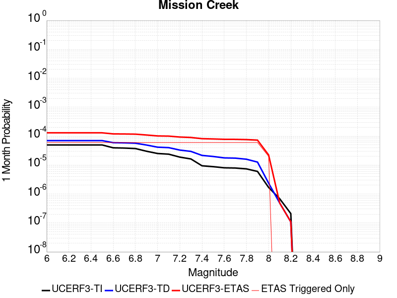 |  |  |

| Magnitude | 1 wk TI Prob | 1 wk TD Prob | 1 wk ETAS Prob | 1 wk ETAS/TD Gain | 1 wk ETAS Triggered Only | 1 mo TI Prob | 1 mo TD Prob | 1 mo ETAS Prob | 1 mo ETAS/TD Gain | 1 mo ETAS Triggered Only | 1 yr TI Prob | 1 yr TD Prob | 1 yr ETAS Prob | 1 yr ETAS/TD Gain | 1 yr ETAS Triggered Only | 10 yr TI Prob | 10 yr TD Prob | 10 yr ETAS Prob | 10 yr ETAS/TD Gain | 10 yr ETAS Triggered Only |
|-----|-----|-----|-----|-----|-----|-----|-----|-----|-----|-----|-----|-----|-----|-----|-----|-----|-----|-----|-----|-----|
| 6.0 | 1.1549387E-5 | 1.632237E-5 | 7.726726E-5 | 4.7338257 | 6.094588E-5 | 4.9496433E-5 | 6.9951224E-5 | 1.3089283E-4 | 1.8712016 | 6.094588E-5 | 6.0245243E-4 | 8.513384E-4 | 9.122324E-4 | 1.0715274 | 6.094588E-5 | 0.006008218 | 0.008509998 | 0.008582511 | 1.0085208 | 7.313506E-5 |
| 6.1 | 1.1549387E-5 | 1.632237E-5 | 7.726726E-5 | 4.7338257 | 6.094588E-5 | 4.9496433E-5 | 6.9951224E-5 | 1.3089283E-4 | 1.8712016 | 6.094588E-5 | 6.0245243E-4 | 8.513384E-4 | 9.122324E-4 | 1.0715274 | 6.094588E-5 | 0.006008218 | 0.008509998 | 0.008582511 | 1.0085208 | 7.313506E-5 |
| 6.2 | 1.1549387E-5 | 1.632237E-5 | 7.726726E-5 | 4.7338257 | 6.094588E-5 | 4.9496433E-5 | 6.9951224E-5 | 1.3089283E-4 | 1.8712016 | 6.094588E-5 | 6.0245243E-4 | 8.513384E-4 | 9.122324E-4 | 1.0715274 | 6.094588E-5 | 0.006008218 | 0.008509998 | 0.008582511 | 1.0085208 | 7.313506E-5 |
| 6.3 | 1.1549387E-5 | 1.632237E-5 | 7.726726E-5 | 4.7338257 | 6.094588E-5 | 4.9496433E-5 | 6.9951224E-5 | 1.3089283E-4 | 1.8712016 | 6.094588E-5 | 6.0245243E-4 | 8.513384E-4 | 9.122324E-4 | 1.0715274 | 6.094588E-5 | 0.006008218 | 0.008509998 | 0.008582511 | 1.0085208 | 7.313506E-5 |
| 6.4 | 1.1549387E-5 | 1.632237E-5 | 7.726726E-5 | 4.7338257 | 6.094588E-5 | 4.9496433E-5 | 6.9951224E-5 | 1.3089283E-4 | 1.8712016 | 6.094588E-5 | 6.0245243E-4 | 8.513384E-4 | 9.122324E-4 | 1.0715274 | 6.094588E-5 | 0.006008218 | 0.008509998 | 0.008582511 | 1.0085208 | 7.313506E-5 |
| 6.5 | 1.1549387E-5 | 1.632237E-5 | 7.726726E-5 | 4.7338257 | 6.094588E-5 | 4.9496433E-5 | 6.9951224E-5 | 1.3089283E-4 | 1.8712016 | 6.094588E-5 | 6.0245243E-4 | 8.513384E-4 | 9.122324E-4 | 1.0715274 | 6.094588E-5 | 0.006008218 | 0.008509998 | 0.008582511 | 1.0085208 | 7.313506E-5 |
| 6.6 | 9.202681E-6 | 1.3845646E-5 | 7.479068E-5 | 5.401747 | 6.094588E-5 | 3.9439463E-5 | 5.9337188E-5 | 1.2027945E-4 | 2.02705 | 6.094588E-5 | 4.800697E-4 | 7.221998E-4 | 7.831017E-4 | 1.0843283 | 6.094588E-5 | 0.004790339 | 0.0072271815 | 0.007299788 | 1.0100464 | 7.313506E-5 |
| 6.7 | 9.019164E-6 | 1.3651316E-5 | 7.459636E-5 | 5.4644084 | 6.094588E-5 | 3.8652986E-5 | 5.8504378E-5 | 1.194467E-4 | 2.041671 | 6.094588E-5 | 4.7049852E-4 | 7.12067E-4 | 7.729695E-4 | 1.0855291 | 6.094588E-5 | 0.004695036 | 0.007126506 | 0.00719912 | 1.0101893 | 7.313506E-5 |
| 6.8 | 8.673558E-6 | 1.3273427E-5 | 7.42185E-5 | 5.59151 | 6.094588E-5 | 3.717186E-5 | 5.6884925E-5 | 1.1782734E-4 | 2.071328 | 6.094588E-5 | 4.524734E-4 | 6.923627E-4 | 7.532664E-4 | 1.087965 | 6.094588E-5 | 0.0045155324 | 0.006930694 | 0.0070033222 | 1.0104792 | 7.313506E-5 |
| 6.9 | 7.002255E-6 | 1.1477657E-5 | 7.242284E-5 | 6.3098974 | 6.094588E-5 | 3.000932E-5 | 4.9189068E-5 | 1.1013195E-4 | 2.2389517 | 6.094588E-5 | 3.653022E-4 | 5.9871917E-4 | 6.596286E-4 | 1.1017329 | 6.094588E-5 | 0.0036470229 | 0.005999517 | 0.0060722134 | 1.012117 | 7.313506E-5 |
| 7.0 | 5.84644E-6 | 9.67498E-6 | 7.062027E-5 | 7.299268 | 6.094588E-5 | 2.5055931E-5 | 4.1463565E-5 | 1.0240692E-4 | 2.469805 | 6.094588E-5 | 3.0501327E-4 | 5.047066E-4 | 5.6562165E-4 | 1.1206942 | 6.094588E-5 | 0.0030459496 | 0.0050638523 | 0.005136617 | 1.0143695 | 7.313506E-5 |
| 7.1 | 5.54703E-6 | 9.329456E-6 | 7.0274764E-5 | 7.5325685 | 6.094588E-5 | 2.377277E-5 | 3.9982795E-5 | 1.0092624E-4 | 2.5242417 | 6.094588E-5 | 2.8939504E-4 | 4.8668624E-4 | 5.476025E-4 | 1.1251652 | 6.094588E-5 | 0.0028901845 | 0.004884446 | 0.0049572242 | 1.0149 | 7.313506E-5 |
| 7.2 | 4.384709E-6 | 7.68157E-6 | 6.8626985E-5 | 8.933978 | 6.094588E-5 | 1.8791474E-5 | 3.2920623E-5 | 9.3864495E-5 | 2.851237 | 6.094588E-5 | 2.2876218E-4 | 4.0073853E-4 | 4.6165998E-4 | 1.152023 | 6.094588E-5 | 0.0022852682 | 0.004028366 | 0.004101206 | 1.0180819 | 7.313506E-5 |
| 7.3 | 3.7888456E-6 | 6.915452E-6 | 6.7860914E-5 | 9.81294 | 6.094588E-5 | 1.623781E-5 | 2.9637333E-5 | 9.058141E-5 | 3.0563278 | 6.094588E-5 | 1.9767738E-4 | 3.6077813E-4 | 4.2170202E-4 | 1.1688681 | 6.094588E-5 | 0.0019750162 | 0.0036301152 | 0.0037029847 | 1.0200737 | 7.313506E-5 |
| 7.4 | 2.1982462E-6 | 5.0237763E-6 | 6.596935E-5 | 13.131426 | 6.094588E-5 | 9.421021E-6 | 2.1530293E-5 | 8.2474864E-5 | 3.8306427 | 6.094588E-5 | 1.1469489E-4 | 2.621E-4 | 3.230299E-4 | 1.2324681 | 6.094588E-5 | 0.0011463572 | 0.0026458844 | 0.002718826 | 1.027568 | 7.313506E-5 |
| 7.5 | 2.051923E-6 | 4.615016E-6 | 6.556061E-5 | 14.205935 | 6.094588E-5 | 8.793926E-6 | 1.9778492E-5 | 8.072316E-5 | 4.0813613 | 6.094588E-5 | 1.0706078E-4 | 2.4077666E-4 | 3.0170786E-4 | 1.253061 | 6.094588E-5 | 0.0010700922 | 0.0024335422 | 0.0025064992 | 1.0299798 | 7.313506E-5 |
| 7.6 | 1.8733427E-6 | 4.1233748E-6 | 6.5069005E-5 | 15.78052 | 6.094588E-5 | 8.028587E-6 | 1.7671488E-5 | 7.861629E-5 | 4.448765 | 6.094588E-5 | 9.774366E-5 | 2.151292E-4 | 2.7606197E-4 | 1.283238 | 6.094588E-5 | 9.770069E-4 | 0.0021780801 | 0.002251056 | 1.0335046 | 7.313506E-5 |
| 7.7 | 1.8411953E-6 | 4.0430496E-6 | 6.4988686E-5 | 16.074173 | 6.094588E-5 | 7.890813E-6 | 1.732724E-5 | 7.827207E-5 | 4.517284 | 6.094588E-5 | 9.606641E-5 | 2.1093882E-4 | 2.7187183E-4 | 1.2888658 | 6.094588E-5 | 9.6024893E-4 | 0.0021363653 | 0.0022093442 | 1.0341603 | 7.313506E-5 |
| 7.8 | 1.7194251E-6 | 3.7104276E-6 | 6.465608E-5 | 17.425507 | 6.094588E-5 | 7.368944E-6 | 1.5901736E-5 | 7.684665E-5 | 4.832595 | 6.094588E-5 | 8.97132E-5 | 1.9358651E-4 | 2.545206E-4 | 1.3147641 | 6.094588E-5 | 8.967699E-4 | 0.0019623525 | 0.002035344 | 1.0371959 | 7.313506E-5 |
| 7.9 | 1.4035052E-6 | 2.9500632E-6 | 6.3895764E-5 | 21.659117 | 6.094588E-5 | 6.0150082E-6 | 1.2643067E-5 | 7.358818E-5 | 5.8204374 | 6.094588E-5 | 7.3230265E-5 | 1.5391852E-4 | 2.1485503E-4 | 1.395901 | 6.094588E-5 | 7.3206134E-4 | 0.0015631086 | 0.0016361295 | 1.046715 | 7.313506E-5 |
| 8.0 | 3.9318823E-7 | 5.528522E-7 | 1.2742022E-5 | 23.047789 | 1.2189176E-5 | 1.6850913E-6 | 2.3693647E-6 | 1.4558512E-5 | 6.1444793 | 1.2189176E-5 | 2.0515794E-5 | 2.8846638E-5 | 4.1035462E-5 | 1.4225389 | 1.2189176E-5 | 2.0513899E-4 | 2.9899E-4 | 3.1117554E-4 | 1.0407556 | 1.2189176E-5 |
| 8.1 | 1.596793E-7 | 1.1380002E-7 | 1.1380002E-7 | 1.0 | 0.0 | 6.8433974E-7 | 4.877143E-7 | 4.877143E-7 | 1.0 | 0.0 | 8.331805E-6 | 5.937906E-6 | 5.937906E-6 | 1.0 | 0.0 | 8.331492E-5 | 6.549966E-5 | 6.549966E-5 | 1.0 | 0.0 |
| 8.2 | 4.9003038E-8 | 2.5444924E-8 | 2.5444924E-8 | 1.0 | 0.0 | 2.10013E-7 | 1.0904967E-7 | 1.0904967E-7 | 1.0 | 0.0 | 2.5569052E-6 | 1.327679E-6 | 1.327679E-6 | 1.0 | 0.0 | 2.556876E-5 | 1.495635E-5 | 1.495635E-5 | 1.0 | 0.0 |

## Whittier alt 1
*[(top)](#table-of-contents)*

| 1 Week | 1 Month | 1 Year | 10 Year |
|-----|-----|-----|-----|
|  |  |  |  |

| Magnitude | 1 wk TI Prob | 1 wk TD Prob | 1 wk ETAS Prob | 1 wk ETAS/TD Gain | 1 wk ETAS Triggered Only | 1 mo TI Prob | 1 mo TD Prob | 1 mo ETAS Prob | 1 mo ETAS/TD Gain | 1 mo ETAS Triggered Only | 1 yr TI Prob | 1 yr TD Prob | 1 yr ETAS Prob | 1 yr ETAS/TD Gain | 1 yr ETAS Triggered Only | 10 yr TI Prob | 10 yr TD Prob | 10 yr ETAS Prob | 10 yr ETAS/TD Gain | 10 yr ETAS Triggered Only |
|-----|-----|-----|-----|-----|-----|-----|-----|-----|-----|-----|-----|-----|-----|-----|-----|-----|-----|-----|-----|-----|
| 6.0 | 4.2554693E-5 | 4.725218E-5 | 8.381798E-5 | 1.7738436 | 3.656753E-5 | 1.8236451E-4 | 2.0249544E-4 | 2.3905556E-4 | 1.1805478 | 3.656753E-5 | 0.002218027 | 0.0024629154 | 0.0025237112 | 1.0246844 | 6.094588E-5 | 0.02196019 | 0.024390234 | 0.024449693 | 1.0024378 | 6.094588E-5 |
| 6.1 | 4.2554693E-5 | 4.725218E-5 | 8.381798E-5 | 1.7738436 | 3.656753E-5 | 1.8236451E-4 | 2.0249544E-4 | 2.3905556E-4 | 1.1805478 | 3.656753E-5 | 0.002218027 | 0.0024629154 | 0.0025237112 | 1.0246844 | 6.094588E-5 | 0.02196019 | 0.024390234 | 0.024449693 | 1.0024378 | 6.094588E-5 |
| 6.2 | 4.2554693E-5 | 4.725218E-5 | 8.381798E-5 | 1.7738436 | 3.656753E-5 | 1.8236451E-4 | 2.0249544E-4 | 2.3905556E-4 | 1.1805478 | 3.656753E-5 | 0.002218027 | 0.0024629154 | 0.0025237112 | 1.0246844 | 6.094588E-5 | 0.02196019 | 0.024390234 | 0.024449693 | 1.0024378 | 6.094588E-5 |
| 6.3 | 1.9617712E-5 | 1.8268593E-5 | 3.0457546E-5 | 1.6672082 | 1.2189176E-5 | 8.40732E-5 | 7.829172E-5 | 9.0479945E-5 | 1.155677 | 1.2189176E-5 | 0.0010231105 | 9.52804E-4 | 9.893366E-4 | 1.0383422 | 3.656753E-5 | 0.01018413 | 0.009490474 | 0.009526695 | 1.0038165 | 3.656753E-5 |
| 6.4 | 1.5611336E-5 | 1.3604271E-5 | 2.579328E-5 | 1.8959694 | 1.2189176E-5 | 6.690401E-5 | 5.8302747E-5 | 7.0491216E-5 | 1.2090547 | 1.2189176E-5 | 8.142519E-4 | 7.0961076E-4 | 7.339718E-4 | 1.0343301 | 2.4378352E-5 | 0.008112748 | 0.0070754145 | 0.0070996205 | 1.0034211 | 2.4378352E-5 |
| 6.5 | 1.5150166E-5 | 1.3100925E-5 | 2.528994E-5 | 1.9303936 | 1.2189176E-5 | 6.492767E-5 | 5.6145647E-5 | 6.8334135E-5 | 1.217087 | 1.2189176E-5 | 7.9020765E-4 | 6.8336475E-4 | 7.077264E-4 | 1.0356497 | 2.4378352E-5 | 0.007874036 | 0.0068145846 | 0.006838797 | 1.003553 | 2.4378352E-5 |
| 6.6 | 1.295588E-5 | 1.0380725E-5 | 2.2569775E-5 | 2.1742003 | 1.2189176E-5 | 5.552402E-5 | 4.4488075E-5 | 5.667671E-5 | 1.2739753 | 1.2189176E-5 | 6.7579525E-4 | 5.4150965E-4 | 5.536922E-4 | 1.0224974 | 1.2189176E-5 | 0.006737438 | 0.0054033357 | 0.0054154587 | 1.0022436 | 1.2189176E-5 |
| 6.7 | 1.2542085E-5 | 9.899369E-6 | 2.2088425E-5 | 2.2312963 | 1.2189176E-5 | 5.3750682E-5 | 4.242519E-5 | 5.4613847E-5 | 1.2872977 | 1.2189176E-5 | 6.542181E-4 | 5.164061E-4 | 5.28589E-4 | 1.0235916 | 1.2189176E-5 | 0.006522954 | 0.0051534795 | 0.005165606 | 1.0023531 | 1.2189176E-5 |
| 6.8 | 1.2195878E-5 | 9.495415E-6 | 2.1684475E-5 | 2.2836785 | 1.2189176E-5 | 5.2267E-5 | 4.069401E-5 | 5.288269E-5 | 1.2995203 | 1.2189176E-5 | 6.36165E-4 | 4.9533875E-4 | 5.075219E-4 | 1.0245956 | 1.2189176E-5 | 0.0063434686 | 0.004943688 | 0.004955817 | 1.0024534 | 1.2189176E-5 |
| 6.9 | 1.1580298E-5 | 8.772933E-6 | 2.0962003E-5 | 2.389395 | 1.2189176E-5 | 4.9628903E-5 | 3.7597754E-5 | 4.978647E-5 | 1.3241874 | 1.2189176E-5 | 6.040644E-4 | 4.5765814E-4 | 4.6984176E-4 | 1.0266216 | 1.2189176E-5 | 0.00602425 | 0.0045684157 | 0.0045805494 | 1.002656 | 1.2189176E-5 |
| 7.0 | 1.0964795E-5 | 8.083994E-6 | 2.0273072E-5 | 2.507804 | 1.2189176E-5 | 4.6991136E-5 | 3.4645236E-5 | 4.683399E-5 | 1.3518162 | 1.2189176E-5 | 5.7196687E-4 | 4.2172565E-4 | 4.3390968E-4 | 1.0288908 | 1.2189176E-5 | 0.0057049696 | 0.004210462 | 0.0042226 | 1.0028828 | 1.2189176E-5 |
| 7.1 | 1.0230601E-5 | 7.3266697E-6 | 1.9515755E-5 | 2.66366 | 1.2189176E-5 | 4.3844695E-5 | 3.1399642E-5 | 4.3588436E-5 | 1.3881825 | 1.2189176E-5 | 5.336784E-4 | 3.8222488E-4 | 3.944094E-4 | 1.0318779 | 1.2189176E-5 | 0.005323986 | 0.0038168381 | 0.0038289807 | 1.0031813 | 1.2189176E-5 |
| 7.2 | 9.40865E-6 | 6.543289E-6 | 6.543289E-6 | 1.0 | 0.0 | 4.032216E-5 | 2.8042374E-5 | 2.8042374E-5 | 1.0 | 0.0 | 4.908117E-4 | 3.4136363E-4 | 3.4136363E-4 | 1.0 | 0.0 | 0.0048972913 | 0.003409485 | 0.003409485 | 1.0 | 0.0 |
| 7.3 | 8.237384E-6 | 5.5977525E-6 | 5.5977525E-6 | 1.0 | 0.0 | 3.5302593E-5 | 2.3990153E-5 | 2.3990153E-5 | 1.0 | 0.0 | 4.2972428E-4 | 2.92042E-4 | 2.92042E-4 | 1.0 | 0.0 | 0.0042889426 | 0.002916903 | 0.002916903 | 1.0 | 0.0 |
| 7.4 | 7.5316966E-6 | 5.027819E-6 | 5.027819E-6 | 1.0 | 0.0 | 3.2278298E-5 | 2.1547625E-5 | 2.1547625E-5 | 1.0 | 0.0 | 3.9291743E-4 | 2.6231175E-4 | 2.6231175E-4 | 1.0 | 0.0 | 0.0039222343 | 0.0026201333 | 0.0026201333 | 1.0 | 0.0 |
| 7.5 | 6.149649E-6 | 3.933841E-6 | 3.933841E-6 | 1.0 | 0.0 | 2.6355372E-5 | 1.6859214E-5 | 1.6859214E-5 | 1.0 | 0.0 | 3.208294E-4 | 2.052425E-4 | 2.052425E-4 | 1.0 | 0.0 | 0.003203666 | 0.0020506186 | 0.0020506186 | 1.0 | 0.0 |
| 7.6 | 5.457711E-6 | 3.3953788E-6 | 3.3953788E-6 | 1.0 | 0.0 | 2.338998E-5 | 1.4551547E-5 | 1.4551547E-5 | 1.0 | 0.0 | 2.8473578E-4 | 1.771515E-4 | 1.771515E-4 | 1.0 | 0.0 | 0.0028437122 | 0.0017701836 | 0.0017701836 | 1.0 | 0.0 |
| 7.7 | 4.1676276E-6 | 2.3331952E-6 | 2.3331952E-6 | 1.0 | 0.0 | 1.7861139E-5 | 9.999374E-6 | 9.999374E-6 | 1.0 | 0.0 | 2.1743766E-4 | 1.2173632E-4 | 1.2173632E-4 | 1.0 | 0.0 | 0.0021722503 | 0.0012167693 | 0.0012167693 | 1.0 | 0.0 |
| 7.8 | 2.2692414E-7 | 9.3854695E-8 | 9.3854695E-8 | 1.0 | 0.0 | 9.725317E-7 | 4.0223435E-7 | 4.0223435E-7 | 1.0 | 0.0 | 1.1840509E-5 | 4.8971956E-6 | 4.8971956E-6 | 1.0 | 0.0 | 1.1839878E-4 | 4.8971204E-5 | 4.8971204E-5 | 1.0 | 0.0 |
| 7.9 | 6.676829E-9 | 3.439853E-9 | 3.439853E-9 | 1.0 | 0.0 | 2.861498E-8 | 1.4742227E-8 | 1.4742227E-8 | 1.0 | 0.0 | 3.4838732E-7 | 1.7948659E-7 | 1.7948659E-7 | 1.0 | 0.0 | 3.4838679E-6 | 1.7948646E-6 | 1.7948646E-6 | 1.0 | 0.0 |

## San Diego Trough north alt1
*[(top)](#table-of-contents)*

| 1 Week | 1 Month | 1 Year | 10 Year |
|-----|-----|-----|-----|
|  |  |  |  |

| Magnitude | 1 wk TI Prob | 1 wk TD Prob | 1 wk ETAS Prob | 1 wk ETAS/TD Gain | 1 wk ETAS Triggered Only | 1 mo TI Prob | 1 mo TD Prob | 1 mo ETAS Prob | 1 mo ETAS/TD Gain | 1 mo ETAS Triggered Only | 1 yr TI Prob | 1 yr TD Prob | 1 yr ETAS Prob | 1 yr ETAS/TD Gain | 1 yr ETAS Triggered Only | 10 yr TI Prob | 10 yr TD Prob | 10 yr ETAS Prob | 10 yr ETAS/TD Gain | 10 yr ETAS Triggered Only |
|-----|-----|-----|-----|-----|-----|-----|-----|-----|-----|-----|-----|-----|-----|-----|-----|-----|-----|-----|-----|-----|
| 6.0 | 7.329252E-5 | 8.821093E-5 | 1.4915144E-4 | 1.6908498 | 6.094588E-5 | 3.14073E-4 | 3.7799572E-4 | 4.3891856E-4 | 1.1611733 | 6.094588E-5 | 0.0038171355 | 0.004593027 | 0.0046536927 | 1.0132083 | 6.094588E-5 | 0.03752231 | 0.045044992 | 0.045103192 | 1.0012921 | 6.094588E-5 |
| 6.1 | 3.7940346E-5 | 4.4885E-5 | 4.4885E-5 | 1.0 | 0.0 | 1.6259136E-4 | 1.9235066E-4 | 1.9235066E-4 | 1.0 | 0.0 | 0.0019777524 | 0.0023394432 | 0.0023394432 | 1.0 | 0.0 | 0.019602431 | 0.023156688 | 0.023156688 | 1.0 | 0.0 |
| 6.2 | 2.8645263E-5 | 3.329678E-5 | 3.329678E-5 | 1.0 | 0.0 | 1.2275964E-4 | 1.4269284E-4 | 1.4269284E-4 | 1.0 | 0.0 | 0.0014935739 | 0.0017359189 | 0.0017359189 | 1.0 | 0.0 | 0.0148357535 | 0.017226247 | 0.017226247 | 1.0 | 0.0 |
| 6.3 | 2.8645263E-5 | 3.329678E-5 | 3.329678E-5 | 1.0 | 0.0 | 1.2275964E-4 | 1.4269284E-4 | 1.4269284E-4 | 1.0 | 0.0 | 0.0014935739 | 0.0017359189 | 0.0017359189 | 1.0 | 0.0 | 0.0148357535 | 0.017226247 | 0.017226247 | 1.0 | 0.0 |
| 6.4 | 2.2204576E-5 | 2.5448318E-5 | 2.5448318E-5 | 1.0 | 0.0 | 9.5159E-5 | 1.0905972E-4 | 1.0905972E-4 | 1.0 | 0.0 | 0.001157945 | 0.0013270034 | 0.0013270034 | 1.0 | 0.0 | 0.011519298 | 0.013191955 | 0.013191955 | 1.0 | 0.0 |
| 6.5 | 2.1004838E-5 | 2.4024694E-5 | 2.4024694E-5 | 1.0 | 0.0 | 9.0017624E-5 | 1.0295896E-4 | 1.0295896E-4 | 1.0 | 0.0 | 0.0010954136 | 0.0012528138 | 0.0012528138 | 1.0 | 0.0 | 0.010900296 | 0.012458589 | 0.012458589 | 1.0 | 0.0 |
| 6.6 | 1.820557E-5 | 2.0704787E-5 | 2.0704787E-5 | 1.0 | 0.0 | 7.802154E-5 | 8.873181E-5 | 8.873181E-5 | 1.0 | 0.0 | 9.4949827E-4 | 0.0010797799 | 0.0010797799 | 1.0 | 0.0 | 0.009454516 | 0.010746004 | 0.010746004 | 1.0 | 0.0 |
| 6.7 | 1.5884485E-5 | 1.7983646E-5 | 1.7983646E-5 | 1.0 | 0.0 | 6.807459E-5 | 7.707051E-5 | 7.707051E-5 | 1.0 | 0.0 | 8.284929E-4 | 9.3793223E-4 | 9.3793223E-4 | 1.0 | 0.0 | 0.008254109 | 0.009340104 | 0.009340104 | 1.0 | 0.0 |
| 6.8 | 1.4331171E-5 | 1.6201066E-5 | 1.6201066E-5 | 1.0 | 0.0 | 6.141786E-5 | 6.94313E-5 | 6.94313E-5 | 1.0 | 0.0 | 7.4750587E-4 | 8.450002E-4 | 8.450002E-4 | 1.0 | 0.0 | 0.0074499645 | 0.008418139 | 0.008418139 | 1.0 | 0.0 |
| 6.9 | 1.2574203E-5 | 1.4205835E-5 | 1.4205835E-5 | 1.0 | 0.0 | 5.3888325E-5 | 6.0880735E-5 | 6.0880735E-5 | 1.0 | 0.0 | 6.558929E-4 | 7.409723E-4 | 7.409723E-4 | 1.0 | 0.0 | 0.0065396037 | 0.007385203 | 0.007385203 | 1.0 | 0.0 |
| 7.0 | 1.0883844E-5 | 1.2289262E-5 | 1.2289262E-5 | 1.0 | 0.0 | 4.664421E-5 | 5.2667205E-5 | 5.2667205E-5 | 1.0 | 0.0 | 5.677453E-4 | 6.4103556E-4 | 6.4103556E-4 | 1.0 | 0.0 | 0.00566297 | 0.006391993 | 0.006391993 | 1.0 | 0.0 |
| 7.1 | 9.393088E-6 | 1.060702E-5 | 1.060702E-5 | 1.0 | 0.0 | 4.025547E-5 | 4.545787E-5 | 4.545787E-5 | 1.0 | 0.0 | 4.900001E-4 | 5.533098E-4 | 5.533098E-4 | 1.0 | 0.0 | 0.0048892107 | 0.005519418 | 0.005519418 | 1.0 | 0.0 |
| 7.2 | 8.190791E-6 | 9.258625E-6 | 9.258625E-6 | 1.0 | 0.0 | 3.510292E-5 | 3.9679224E-5 | 3.9679224E-5 | 1.0 | 0.0 | 4.2729423E-4 | 4.8298817E-4 | 4.8298817E-4 | 1.0 | 0.0 | 0.0042647356 | 0.004819465 | 0.004819465 | 1.0 | 0.0 |
| 7.3 | 6.268162E-6 | 7.089716E-6 | 7.089716E-6 | 1.0 | 0.0 | 2.6863276E-5 | 3.0384144E-5 | 3.0384144E-5 | 1.0 | 0.0 | 3.2701128E-4 | 3.6986457E-4 | 3.6986457E-4 | 1.0 | 0.0 | 0.003265305 | 0.003692536 | 0.003692536 | 1.0 | 0.0 |
| 7.4 | 4.985186E-6 | 5.6426816E-6 | 5.6426816E-6 | 1.0 | 0.0 | 2.1364907E-5 | 2.4182698E-5 | 2.4182698E-5 | 1.0 | 0.0 | 2.600867E-4 | 2.9438498E-4 | 2.9438498E-4 | 1.0 | 0.0 | 0.002597825 | 0.0029399914 | 0.0029399914 | 1.0 | 0.0 |
| 7.5 | 1.7489613E-6 | 1.969678E-6 | 1.969678E-6 | 1.0 | 0.0 | 7.495527E-6 | 8.4414505E-6 | 8.4414505E-6 | 1.0 | 0.0 | 9.125422E-5 | 1.02770035E-4 | 1.02770035E-4 | 1.0 | 0.0 | 9.1216754E-4 | 0.0010272472 | 0.0010272472 | 1.0 | 0.0 |
| 7.6 | 1.6988751E-7 | 1.7533823E-7 | 1.7533823E-7 | 1.0 | 0.0 | 7.2808916E-7 | 7.5144936E-7 | 7.5144936E-7 | 1.0 | 0.0 | 8.864449E-6 | 9.14886E-6 | 9.14886E-6 | 1.0 | 0.0 | 8.8640954E-5 | 9.1485024E-5 | 9.1485024E-5 | 1.0 | 0.0 |

## Mono Lake 2011 CFM
*[(top)](#table-of-contents)*

| 1 Week | 1 Month | 1 Year | 10 Year |
|-----|-----|-----|-----|
|  |  |  |  |

| Magnitude | 1 wk TI Prob | 1 wk TD Prob | 1 wk ETAS Prob | 1 wk ETAS/TD Gain | 1 wk ETAS Triggered Only | 1 mo TI Prob | 1 mo TD Prob | 1 mo ETAS Prob | 1 mo ETAS/TD Gain | 1 mo ETAS Triggered Only | 1 yr TI Prob | 1 yr TD Prob | 1 yr ETAS Prob | 1 yr ETAS/TD Gain | 1 yr ETAS Triggered Only | 10 yr TI Prob | 10 yr TD Prob | 10 yr ETAS Prob | 10 yr ETAS/TD Gain | 10 yr ETAS Triggered Only |
|-----|-----|-----|-----|-----|-----|-----|-----|-----|-----|-----|-----|-----|-----|-----|-----|-----|-----|-----|-----|-----|
| 6.0 | 2.0341662E-5 | 2.3828166E-5 | 4.8205937E-5 | 2.0230653 | 2.4378352E-5 | 8.717564E-5 | 1.0211971E-4 | 1.386835E-4 | 1.3580483 | 3.656753E-5 | 0.0010608466 | 0.0012431298 | 0.0012918259 | 1.0391722 | 4.8756705E-5 | 0.010557966 | 0.012413835 | 0.012461986 | 1.0038788 | 4.8756705E-5 |
| 6.1 | 2.0341662E-5 | 2.3828166E-5 | 4.8205937E-5 | 2.0230653 | 2.4378352E-5 | 8.717564E-5 | 1.0211971E-4 | 1.386835E-4 | 1.3580483 | 3.656753E-5 | 0.0010608466 | 0.0012431298 | 0.0012918259 | 1.0391722 | 4.8756705E-5 | 0.010557966 | 0.012413835 | 0.012461986 | 1.0038788 | 4.8756705E-5 |
| 6.2 | 2.0341662E-5 | 2.3828166E-5 | 4.8205937E-5 | 2.0230653 | 2.4378352E-5 | 8.717564E-5 | 1.0211971E-4 | 1.386835E-4 | 1.3580483 | 3.656753E-5 | 0.0010608466 | 0.0012431298 | 0.0012918259 | 1.0391722 | 4.8756705E-5 | 0.010557966 | 0.012413835 | 0.012461986 | 1.0038788 | 4.8756705E-5 |
| 6.3 | 2.0341662E-5 | 2.3828166E-5 | 4.8205937E-5 | 2.0230653 | 2.4378352E-5 | 8.717564E-5 | 1.0211971E-4 | 1.386835E-4 | 1.3580483 | 3.656753E-5 | 0.0010608466 | 0.0012431298 | 0.0012918259 | 1.0391722 | 4.8756705E-5 | 0.010557966 | 0.012413835 | 0.012461986 | 1.0038788 | 4.8756705E-5 |
| 6.4 | 1.749821E-5 | 2.0490985E-5 | 4.4868837E-5 | 2.1896868 | 2.4378352E-5 | 7.499018E-5 | 8.781851E-5 | 1.2438283E-4 | 1.4163623 | 3.656753E-5 | 9.1262296E-4 | 0.0010691903 | 0.0011178949 | 1.0455527 | 4.8756705E-5 | 0.009088841 | 0.010691865 | 0.0107401 | 1.0045114 | 4.8756705E-5 |
| 6.5 | 1.749821E-5 | 2.0490985E-5 | 4.4868837E-5 | 2.1896868 | 2.4378352E-5 | 7.499018E-5 | 8.781851E-5 | 1.2438283E-4 | 1.4163623 | 3.656753E-5 | 9.1262296E-4 | 0.0010691903 | 0.0011178949 | 1.0455527 | 4.8756705E-5 | 0.009088841 | 0.010691865 | 0.0107401 | 1.0045114 | 4.8756705E-5 |

## San Jacinto (Lytle Creek connector)
*[(top)](#table-of-contents)*

| 1 Week | 1 Month | 1 Year | 10 Year |
|-----|-----|-----|-----|
|  | 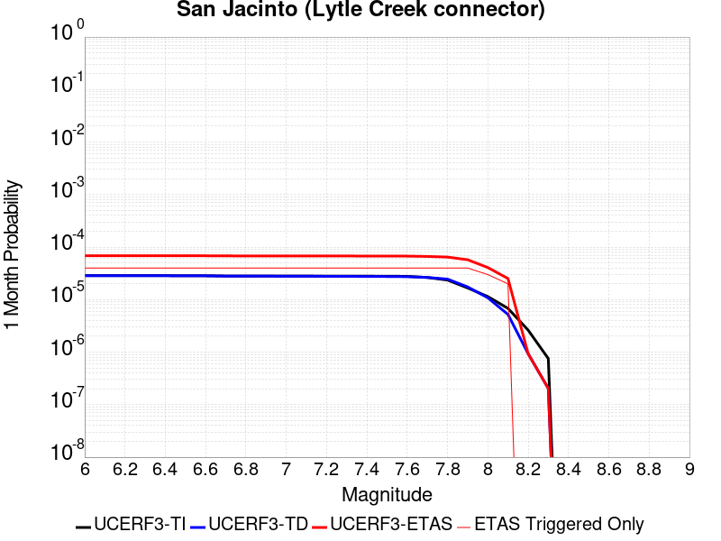 | 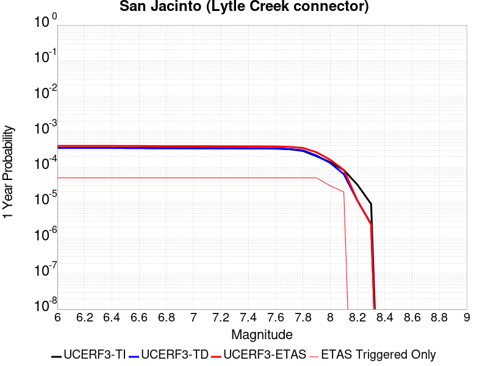 |  |

| Magnitude | 1 wk TI Prob | 1 wk TD Prob | 1 wk ETAS Prob | 1 wk ETAS/TD Gain | 1 wk ETAS Triggered Only | 1 mo TI Prob | 1 mo TD Prob | 1 mo ETAS Prob | 1 mo ETAS/TD Gain | 1 mo ETAS Triggered Only | 1 yr TI Prob | 1 yr TD Prob | 1 yr ETAS Prob | 1 yr ETAS/TD Gain | 1 yr ETAS Triggered Only | 10 yr TI Prob | 10 yr TD Prob | 10 yr ETAS Prob | 10 yr ETAS/TD Gain | 10 yr ETAS Triggered Only |
|-----|-----|-----|-----|-----|-----|-----|-----|-----|-----|-----|-----|-----|-----|-----|-----|-----|-----|-----|-----|-----|
| 6.0 | 6.693995E-6 | 6.660216E-6 | 4.32275E-5 | 6.490405 | 3.656753E-5 | 2.8688235E-5 | 2.854347E-5 | 6.5109954E-5 | 2.2810805 | 3.656753E-5 | 3.492233E-4 | 3.4746144E-4 | 3.9620118E-4 | 1.1402739 | 4.8756705E-5 | 0.00348675 | 0.0035493854 | 0.003597969 | 1.0136878 | 4.8756705E-5 |
| 6.1 | 6.693995E-6 | 6.660216E-6 | 4.32275E-5 | 6.490405 | 3.656753E-5 | 2.8688235E-5 | 2.854347E-5 | 6.5109954E-5 | 2.2810805 | 3.656753E-5 | 3.492233E-4 | 3.4746144E-4 | 3.9620118E-4 | 1.1402739 | 4.8756705E-5 | 0.00348675 | 0.0035493854 | 0.003597969 | 1.0136878 | 4.8756705E-5 |
| 6.2 | 6.693995E-6 | 6.660216E-6 | 4.32275E-5 | 6.490405 | 3.656753E-5 | 2.8688235E-5 | 2.854347E-5 | 6.5109954E-5 | 2.2810805 | 3.656753E-5 | 3.492233E-4 | 3.4746144E-4 | 3.9620118E-4 | 1.1402739 | 4.8756705E-5 | 0.00348675 | 0.0035493854 | 0.003597969 | 1.0136878 | 4.8756705E-5 |
| 6.3 | 6.693995E-6 | 6.660216E-6 | 4.32275E-5 | 6.490405 | 3.656753E-5 | 2.8688235E-5 | 2.854347E-5 | 6.5109954E-5 | 2.2810805 | 3.656753E-5 | 3.492233E-4 | 3.4746144E-4 | 3.9620118E-4 | 1.1402739 | 4.8756705E-5 | 0.00348675 | 0.0035493854 | 0.003597969 | 1.0136878 | 4.8756705E-5 |
| 6.4 | 6.693995E-6 | 6.660216E-6 | 4.32275E-5 | 6.490405 | 3.656753E-5 | 2.8688235E-5 | 2.854347E-5 | 6.5109954E-5 | 2.2810805 | 3.656753E-5 | 3.492233E-4 | 3.4746144E-4 | 3.9620118E-4 | 1.1402739 | 4.8756705E-5 | 0.00348675 | 0.0035493854 | 0.003597969 | 1.0136878 | 4.8756705E-5 |
| 6.5 | 6.6561875E-6 | 6.6204343E-6 | 4.318772E-5 | 6.523397 | 3.656753E-5 | 2.8526205E-5 | 2.837298E-5 | 6.493947E-5 | 2.2887785 | 3.656753E-5 | 3.472512E-4 | 3.4538636E-4 | 3.9412623E-4 | 1.141117 | 4.8756705E-5 | 0.0034670907 | 0.003528701 | 0.0035772854 | 1.0137684 | 4.8756705E-5 |
| 6.6 | 6.6561875E-6 | 6.6204343E-6 | 4.318772E-5 | 6.523397 | 3.656753E-5 | 2.8526205E-5 | 2.837298E-5 | 6.493947E-5 | 2.2887785 | 3.656753E-5 | 3.472512E-4 | 3.4538636E-4 | 3.9412623E-4 | 1.141117 | 4.8756705E-5 | 0.0034670907 | 0.003528701 | 0.0035772854 | 1.0137684 | 4.8756705E-5 |
| 6.7 | 6.5802237E-6 | 6.539611E-6 | 4.31069E-5 | 6.591661 | 3.656753E-5 | 2.8200653E-5 | 2.8026603E-5 | 6.459311E-5 | 2.3047068 | 3.656753E-5 | 3.4328885E-4 | 3.4117055E-4 | 3.8991062E-4 | 1.1428612 | 4.8756705E-5 | 0.0034275902 | 0.0034866752 | 0.0035352618 | 1.013935 | 4.8756705E-5 |
| 6.8 | 6.575632E-6 | 6.5341005E-6 | 4.310139E-5 | 6.596377 | 3.656753E-5 | 2.8180975E-5 | 2.8002989E-5 | 6.456949E-5 | 2.305807 | 3.656753E-5 | 3.4304935E-4 | 3.4088313E-4 | 3.896232E-4 | 1.1429818 | 4.8756705E-5 | 0.0034252026 | 0.00348381 | 0.0035323969 | 1.0139464 | 4.8756705E-5 |
| 6.9 | 6.570433E-6 | 6.525495E-6 | 4.3092783E-5 | 6.6037574 | 3.656753E-5 | 2.8158694E-5 | 2.7966107E-5 | 6.4532614E-5 | 2.3075294 | 3.656753E-5 | 3.4277816E-4 | 3.4043423E-4 | 3.8917433E-4 | 1.1431704 | 4.8756705E-5 | 0.0034224992 | 0.0034793352 | 0.0035279223 | 1.0139644 | 4.8756705E-5 |
| 7.0 | 6.5643826E-6 | 6.515616E-6 | 4.3082906E-5 | 6.6122537 | 3.656753E-5 | 2.8132765E-5 | 2.792377E-5 | 6.4490276E-5 | 2.309512 | 3.656753E-5 | 3.424626E-4 | 3.3991894E-4 | 3.8865907E-4 | 1.1433876 | 4.8756705E-5 | 0.0034193532 | 0.0034741985 | 0.0035227858 | 1.0139852 | 4.8756705E-5 |
| 7.1 | 6.557402E-6 | 6.5043278E-6 | 4.3071617E-5 | 6.6219935 | 3.656753E-5 | 2.8102848E-5 | 2.7875392E-5 | 6.4441905E-5 | 2.3117845 | 3.656753E-5 | 3.4209844E-4 | 3.3933012E-4 | 3.880703E-4 | 1.1436363 | 4.8756705E-5 | 0.0034157229 | 0.0034683298 | 0.0035169173 | 1.0140089 | 4.8756705E-5 |
| 7.2 | 6.546394E-6 | 6.4862943E-6 | 4.3053584E-5 | 6.6376243 | 3.656753E-5 | 2.8055672E-5 | 2.7798109E-5 | 6.436462E-5 | 2.3154316 | 3.656753E-5 | 3.4152428E-4 | 3.3838948E-4 | 3.871297E-4 | 1.1440358 | 4.8756705E-5 | 0.0034099987 | 0.0034589572 | 0.0035075452 | 1.014047 | 4.8756705E-5 |
| 7.3 | 6.5364216E-6 | 6.4670803E-6 | 4.303437E-5 | 6.654374 | 3.656753E-5 | 2.8012933E-5 | 2.7715765E-5 | 6.428228E-5 | 2.31934 | 3.656753E-5 | 3.4100408E-4 | 3.3738726E-4 | 3.861275E-4 | 1.1444638 | 4.8756705E-5 | 0.003404813 | 0.0034489788 | 0.0034975673 | 1.0140878 | 4.8756705E-5 |
| 7.4 | 6.5269523E-6 | 6.4481674E-6 | 4.301546E-5 | 6.6709585 | 3.656753E-5 | 2.7972354E-5 | 2.7634711E-5 | 6.420123E-5 | 2.3232098 | 3.656753E-5 | 3.4051016E-4 | 3.3640073E-4 | 3.8514103E-4 | 1.1448876 | 4.8756705E-5 | 0.0033998888 | 0.003439161 | 0.00348775 | 1.0141282 | 4.8756705E-5 |
| 7.5 | 6.5111835E-6 | 6.424442E-6 | 4.2991735E-5 | 6.691902 | 3.656753E-5 | 2.7904773E-5 | 2.7533031E-5 | 6.409956E-5 | 2.3280964 | 3.656753E-5 | 3.3968766E-4 | 3.3516317E-4 | 3.8390353E-4 | 1.1454228 | 4.8756705E-5 | 0.0033916887 | 0.003426834 | 0.0034754237 | 1.0141791 | 4.8756705E-5 |
| 7.6 | 6.4768806E-6 | 6.383551E-6 | 4.2950847E-5 | 6.7283626 | 3.656753E-5 | 2.7757764E-5 | 2.735779E-5 | 6.3924315E-5 | 2.3366039 | 3.656753E-5 | 3.3789838E-4 | 3.3303024E-4 | 3.8177072E-4 | 1.1463544 | 4.8756705E-5 | 0.0033738504 | 0.0034055663 | 0.003454157 | 1.014268 | 4.8756705E-5 |
| 7.7 | 6.1655364E-6 | 6.1760365E-6 | 4.2743337E-5 | 6.9208364 | 3.656753E-5 | 2.642346E-5 | 2.646846E-5 | 6.303502E-5 | 2.3815145 | 3.656753E-5 | 3.2165812E-4 | 3.2220592E-4 | 3.709469E-4 | 1.1512728 | 4.8756705E-5 | 0.0032119295 | 0.0032971818 | 0.0033457777 | 1.0147387 | 4.8756705E-5 |
| 7.8 | 5.5043524E-6 | 5.737097E-6 | 4.2304415E-5 | 7.3738365 | 3.656753E-5 | 2.3589868E-5 | 2.4587327E-5 | 6.115396E-5 | 2.4872146 | 3.656753E-5 | 2.871688E-4 | 2.9930964E-4 | 3.4805175E-4 | 1.1628485 | 4.8756705E-5 | 0.0028679797 | 0.0030672832 | 0.0031158905 | 1.015847 | 4.8756705E-5 |
| 7.9 | 3.889249E-6 | 4.076761E-6 | 4.064414E-5 | 9.969713 | 3.656753E-5 | 1.6668104E-5 | 1.7471715E-5 | 5.4038606E-5 | 3.092919 | 3.656753E-5 | 2.0291525E-4 | 2.1269741E-4 | 2.6144375E-4 | 1.2291816 | 4.8756705E-5 | 0.0020273007 | 0.0021943315 | 0.0022429812 | 1.0221707 | 4.8756705E-5 |
| 8.0 | 2.668535E-6 | 2.5315155E-6 | 2.6909805E-5 | 10.62992 | 2.4378352E-5 | 1.1436528E-5 | 1.0849307E-5 | 3.5227393E-5 | 3.2469718 | 2.4378352E-5 | 1.3923083E-4 | 1.3208234E-4 | 1.5645746E-4 | 1.184545 | 2.4378352E-5 | 0.0013914363 | 0.0013757964 | 0.0014001412 | 1.0176951 | 2.4378352E-5 |
| 8.1 | 1.5911459E-6 | 1.218661E-6 | 1.3407822E-5 | 11.002093 | 1.2189176E-5 | 6.8191785E-6 | 5.2228224E-6 | 1.7411934E-5 | 3.333817 | 1.2189176E-5 | 8.3020335E-5 | 6.3586034E-5 | 7.5774435E-5 | 1.1916837 | 1.2189176E-5 | 8.298933E-4 | 6.6932244E-4 | 6.8150344E-4 | 1.0181991 | 1.2189176E-5 |
| 8.2 | 6.1294963E-7 | 2.1812275E-7 | 2.1812275E-7 | 1.0 | 0.0 | 2.6269242E-6 | 9.3481145E-7 | 9.3481145E-7 | 1.0 | 0.0 | 3.1982334E-5 | 1.138127E-5 | 1.138127E-5 | 1.0 | 0.0 | 3.1977732E-4 | 1.2784546E-4 | 1.2784546E-4 | 1.0 | 0.0 |
| 8.3 | 1.762871E-7 | 4.7546838E-8 | 4.7546838E-8 | 1.0 | 0.0 | 7.5551594E-7 | 2.0377215E-7 | 2.0377215E-7 | 1.0 | 0.0 | 9.1983675E-6 | 2.480923E-6 | 2.480923E-6 | 1.0 | 0.0 | 9.197987E-5 | 2.868753E-5 | 2.868753E-5 | 1.0 | 0.0 |

## Cleghorn Lake
*[(top)](#table-of-contents)*

| 1 Week | 1 Month | 1 Year | 10 Year |
|-----|-----|-----|-----|
|  |  |  |  |

| Magnitude | 1 wk TI Prob | 1 wk TD Prob | 1 wk ETAS Prob | 1 wk ETAS/TD Gain | 1 wk ETAS Triggered Only | 1 mo TI Prob | 1 mo TD Prob | 1 mo ETAS Prob | 1 mo ETAS/TD Gain | 1 mo ETAS Triggered Only | 1 yr TI Prob | 1 yr TD Prob | 1 yr ETAS Prob | 1 yr ETAS/TD Gain | 1 yr ETAS Triggered Only | 10 yr TI Prob | 10 yr TD Prob | 10 yr ETAS Prob | 10 yr ETAS/TD Gain | 10 yr ETAS Triggered Only |
|-----|-----|-----|-----|-----|-----|-----|-----|-----|-----|-----|-----|-----|-----|-----|-----|-----|-----|-----|-----|-----|
| 6.0 | 1.5467183E-5 | 1.6794203E-5 | 4.1172145E-5 | 2.4515688 | 2.4378352E-5 | 6.6286244E-5 | 7.197348E-5 | 9.635008E-5 | 1.3386886 | 2.4378352E-5 | 8.067362E-4 | 8.759797E-4 | 9.125152E-4 | 1.0417081 | 3.656753E-5 | 0.008038137 | 0.008730696 | 0.008779027 | 1.0055357 | 4.8756705E-5 |
| 6.1 | 1.5467183E-5 | 1.6794203E-5 | 4.1172145E-5 | 2.4515688 | 2.4378352E-5 | 6.6286244E-5 | 7.197348E-5 | 9.635008E-5 | 1.3386886 | 2.4378352E-5 | 8.067362E-4 | 8.759797E-4 | 9.125152E-4 | 1.0417081 | 3.656753E-5 | 0.008038137 | 0.008730696 | 0.008779027 | 1.0055357 | 4.8756705E-5 |
| 6.2 | 1.2624631E-5 | 1.3681544E-5 | 3.8059563E-5 | 2.7818177 | 2.4378352E-5 | 5.410444E-5 | 5.863415E-5 | 8.301107E-5 | 1.4157462 | 2.4378352E-5 | 6.585225E-4 | 7.1368564E-4 | 7.502271E-4 | 1.051201 | 3.656753E-5 | 0.0065657445 | 0.0071187317 | 0.0071671414 | 1.0068003 | 4.8756705E-5 |
| 6.3 | 1.2624631E-5 | 1.3681544E-5 | 3.8059563E-5 | 2.7818177 | 2.4378352E-5 | 5.410444E-5 | 5.863415E-5 | 8.301107E-5 | 1.4157462 | 2.4378352E-5 | 6.585225E-4 | 7.1368564E-4 | 7.502271E-4 | 1.051201 | 3.656753E-5 | 0.0065657445 | 0.0071187317 | 0.0071671414 | 1.0068003 | 4.8756705E-5 |
| 6.4 | 9.417684E-6 | 1.0170118E-5 | 2.2359169E-5 | 2.1985164 | 1.2189176E-5 | 4.036088E-5 | 4.3585722E-5 | 5.5774366E-5 | 1.2796477 | 1.2189176E-5 | 4.912829E-4 | 5.3056807E-4 | 5.5493345E-4 | 1.0459232 | 2.4378352E-5 | 0.004901982 | 0.005297049 | 0.0053334227 | 1.0068668 | 3.656753E-5 |
| 6.5 | 9.368219E-6 | 1.0117545E-5 | 2.2306596E-5 | 2.204744 | 1.2189176E-5 | 4.014889E-5 | 4.3360415E-5 | 5.5549062E-5 | 1.2811007 | 1.2189176E-5 | 4.8870314E-4 | 5.2782625E-4 | 5.5219175E-4 | 1.0461619 | 2.4378352E-5 | 0.004876298 | 0.0052697617 | 0.0053061363 | 1.0069026 | 3.656753E-5 |
| 6.6 | 7.803798E-6 | 8.441831E-6 | 2.0630903E-5 | 2.4438896 | 1.2189176E-5 | 3.3444423E-5 | 3.6179E-5 | 4.8367736E-5 | 1.3369008 | 1.2189176E-5 | 4.0710976E-4 | 4.4043022E-4 | 4.6479783E-4 | 1.0553268 | 2.4378352E-5 | 0.0040636472 | 0.0043994905 | 0.004435897 | 1.0082752 | 3.656753E-5 |
| 6.7 | 2.3108669E-6 | 2.4438336E-6 | 2.4438336E-6 | 1.0 | 0.0 | 9.903678E-6 | 1.0473532E-5 | 1.0473532E-5 | 1.0 | 0.0 | 1.205706E-4 | 1.2750797E-4 | 1.2750797E-4 | 1.0 | 0.0 | 0.001205052 | 0.0012743667 | 0.0012743667 | 1.0 | 0.0 |
| 6.8 | 2.0882828E-6 | 2.2062823E-6 | 2.2062823E-6 | 1.0 | 0.0 | 8.949753E-6 | 9.455462E-6 | 9.455462E-6 | 1.0 | 0.0 | 1.08957785E-4 | 1.1511434E-4 | 1.1511434E-4 | 1.0 | 0.0 | 0.0010890438 | 0.0011505639 | 0.0011505639 | 1.0 | 0.0 |
| 6.9 | 1.876935E-6 | 1.981051E-6 | 1.981051E-6 | 1.0 | 0.0 | 8.043982E-6 | 8.490192E-6 | 8.490192E-6 | 1.0 | 0.0 | 9.7931086E-5 | 1.03363345E-4 | 1.03363345E-4 | 1.0 | 0.0 | 9.788794E-4 | 0.0010331686 | 0.0010331686 | 1.0 | 0.0 |
| 7.0 | 1.5357559E-6 | 1.6202807E-6 | 1.6202807E-6 | 1.0 | 0.0 | 6.5817944E-6 | 6.9440425E-6 | 6.9440425E-6 | 1.0 | 0.0 | 8.01304E-5 | 8.454057E-5 | 8.454057E-5 | 1.0 | 0.0 | 8.010151E-4 | 8.450965E-4 | 8.450965E-4 | 1.0 | 0.0 |
| 7.1 | 1.0905424E-6 | 1.1497619E-6 | 1.1497619E-6 | 1.0 | 0.0 | 4.6737446E-6 | 4.9275427E-6 | 4.9275427E-6 | 1.0 | 0.0 | 5.6901354E-5 | 5.999128E-5 | 5.999128E-5 | 1.0 | 0.0 | 5.6886784E-4 | 5.997606E-4 | 5.997606E-4 | 1.0 | 0.0 |
| 7.2 | 6.06668E-7 | 6.387277E-7 | 6.387277E-7 | 1.0 | 0.0 | 2.600003E-6 | 2.7374022E-6 | 2.7374022E-6 | 1.0 | 0.0 | 3.1654577E-5 | 3.3327433E-5 | 3.3327433E-5 | 1.0 | 0.0 | 3.1650066E-4 | 3.3323118E-4 | 3.3323118E-4 | 1.0 | 0.0 |

## Owens Valley
*[(top)](#table-of-contents)*

| 1 Week | 1 Month | 1 Year | 10 Year |
|-----|-----|-----|-----|
|  |  |  |  |

| Magnitude | 1 wk TI Prob | 1 wk TD Prob | 1 wk ETAS Prob | 1 wk ETAS/TD Gain | 1 wk ETAS Triggered Only | 1 mo TI Prob | 1 mo TD Prob | 1 mo ETAS Prob | 1 mo ETAS/TD Gain | 1 mo ETAS Triggered Only | 1 yr TI Prob | 1 yr TD Prob | 1 yr ETAS Prob | 1 yr ETAS/TD Gain | 1 yr ETAS Triggered Only | 10 yr TI Prob | 10 yr TD Prob | 10 yr ETAS Prob | 10 yr ETAS/TD Gain | 10 yr ETAS Triggered Only |
|-----|-----|-----|-----|-----|-----|-----|-----|-----|-----|-----|-----|-----|-----|-----|-----|-----|-----|-----|-----|-----|
| 6.0 | 4.83821E-5 | 3.626567E-6 | 2.800483E-5 | 7.7221327 | 2.4378352E-5 | 2.0733538E-4 | 1.5542342E-5 | 5.2109302E-5 | 3.3527315 | 3.656753E-5 | 0.002521386 | 1.8921259E-4 | 2.3796006E-4 | 1.2576333 | 4.8756705E-5 | 0.024929691 | 0.001925011 | 0.001973674 | 1.0252793 | 4.8756705E-5 |
| 6.1 | 4.83821E-5 | 3.626567E-6 | 2.800483E-5 | 7.7221327 | 2.4378352E-5 | 2.0733538E-4 | 1.5542342E-5 | 5.2109302E-5 | 3.3527315 | 3.656753E-5 | 0.002521386 | 1.8921259E-4 | 2.3796006E-4 | 1.2576333 | 4.8756705E-5 | 0.024929691 | 0.001925011 | 0.001973674 | 1.0252793 | 4.8756705E-5 |
| 6.2 | 4.83821E-5 | 3.626567E-6 | 2.800483E-5 | 7.7221327 | 2.4378352E-5 | 2.0733538E-4 | 1.5542342E-5 | 5.2109302E-5 | 3.3527315 | 3.656753E-5 | 0.002521386 | 1.8921259E-4 | 2.3796006E-4 | 1.2576333 | 4.8756705E-5 | 0.024929691 | 0.001925011 | 0.001973674 | 1.0252793 | 4.8756705E-5 |
| 6.3 | 3.953008E-5 | 3.1553948E-6 | 2.753367E-5 | 8.7259035 | 2.4378352E-5 | 1.6940363E-4 | 1.3523055E-5 | 5.009009E-5 | 3.7040513 | 3.656753E-5 | 0.002060538 | 1.6463149E-4 | 2.1338016E-4 | 1.2961079 | 4.8756705E-5 | 0.020415364 | 0.0016592 | 0.0017078758 | 1.0293369 | 4.8756705E-5 |
| 6.4 | 3.953008E-5 | 3.1553948E-6 | 2.753367E-5 | 8.7259035 | 2.4378352E-5 | 1.6940363E-4 | 1.3523055E-5 | 5.009009E-5 | 3.7040513 | 3.656753E-5 | 0.002060538 | 1.6463149E-4 | 2.1338016E-4 | 1.2961079 | 4.8756705E-5 | 0.020415364 | 0.0016592 | 0.0017078758 | 1.0293369 | 4.8756705E-5 |
| 6.5 | 3.457342E-5 | 2.9715961E-6 | 2.7349875E-5 | 9.203766 | 2.4378352E-5 | 1.4816338E-4 | 1.2735354E-5 | 4.9302416E-5 | 3.871303 | 3.656753E-5 | 0.0018023965 | 1.550426E-4 | 2.0379174E-4 | 1.3144242 | 4.8756705E-5 | 0.017878477 | 0.001555719 | 0.0016043998 | 1.0312916 | 4.8756705E-5 |
| 6.6 | 3.1127765E-5 | 2.8744932E-6 | 2.7252776E-5 | 9.480897 | 2.4378352E-5 | 1.3339789E-4 | 1.2319203E-5 | 4.888628E-5 | 3.968299 | 3.656753E-5 | 0.0016229092 | 1.4997667E-4 | 1.9872605E-4 | 1.3250465 | 4.8756705E-5 | 0.016111081 | 0.0015012559 | 0.0015499394 | 1.0324285 | 4.8756705E-5 |
| 6.7 | 2.806885E-5 | 2.8104134E-6 | 2.7188697E-5 | 9.67427 | 2.4378352E-5 | 1.2028952E-4 | 1.20445775E-5 | 4.8611666E-5 | 4.0359793 | 3.656753E-5 | 0.001463541 | 1.4663354E-4 | 1.953831E-4 | 1.3324584 | 4.8756705E-5 | 0.014539397 | 0.0014657511 | 0.0015144363 | 1.0332152 | 4.8756705E-5 |
| 6.8 | 2.524524E-5 | 2.2353688E-6 | 2.6613667E-5 | 11.905717 | 2.4378352E-5 | 1.0818939E-4 | 9.580118E-6 | 4.6147296E-5 | 4.816986 | 3.656753E-5 | 0.0013164099 | 1.16632E-4 | 1.6538301E-4 | 1.4179901 | 4.8756705E-5 | 0.01308639 | 0.0011659812 | 0.0012146811 | 1.0417672 | 4.8756705E-5 |
| 6.9 | 2.2704568E-5 | 1.6081682E-6 | 2.5986481E-5 | 16.159056 | 2.4378352E-5 | 9.730166E-5 | 6.8921313E-6 | 4.3459408E-5 | 6.3056555 | 3.656753E-5 | 0.0011840039 | 8.390849E-5 | 1.326611E-4 | 1.5810212 | 4.8756705E-5 | 0.011777153 | 8.3897985E-4 | 8.8769564E-4 | 1.0580655 | 4.8756705E-5 |
| 7.0 | 2.0871712E-5 | 1.5395453E-6 | 2.591786E-5 | 16.83475 | 2.4378352E-5 | 8.944713E-5 | 6.598035E-6 | 4.316532E-5 | 6.542148 | 3.656753E-5 | 0.0010884746 | 8.032813E-5 | 1.2908092E-4 | 1.6069205 | 4.8756705E-5 | 0.010831586 | 8.0316263E-4 | 8.518802E-4 | 1.0606571 | 4.8756705E-5 |
| 7.1 | 1.944928E-5 | 1.3864178E-6 | 2.5764735E-5 | 18.583673 | 2.4378352E-5 | 8.335139E-5 | 5.941777E-6 | 4.2509088E-5 | 7.154272 | 3.656753E-5 | 0.0010143308 | 7.233874E-5 | 1.2109192E-4 | 1.6739566 | 4.8756705E-5 | 0.010097133 | 7.2330976E-4 | 7.720312E-4 | 1.067359 | 4.8756705E-5 |
| 7.2 | 1.7876306E-5 | 1.2489141E-6 | 2.5627236E-5 | 20.519613 | 2.4378352E-5 | 7.6610486E-5 | 5.352478E-6 | 4.191981E-5 | 7.831851 | 3.656753E-5 | 9.3233347E-4 | 6.516448E-5 | 1.1391801E-4 | 1.7481611 | 4.8756705E-5 | 0.009284316 | 6.5159105E-4 | 7.00316E-4 | 1.0747784 | 4.8756705E-5 |
| 7.3 | 1.2618672E-5 | 1.1115209E-6 | 2.5489846E-5 | 22.932404 | 2.4378352E-5 | 5.40789E-5 | 4.763652E-6 | 4.1331004E-5 | 8.676328 | 3.656753E-5 | 6.582117E-4 | 5.799593E-5 | 1.0674981E-4 | 1.840643 | 4.8756705E-5 | 0.0065626553 | 5.7994033E-4 | 6.2866876E-4 | 1.0840231 | 4.8756705E-5 |
| 7.4 | 7.4874442E-6 | 8.5486437E-7 | 2.5233196E-5 | 29.51719 | 2.4378352E-5 | 3.208865E-5 | 3.6636993E-6 | 4.0231094E-5 | 10.981003 | 3.656753E-5 | 3.906093E-4 | 4.4604632E-5 | 8.117053E-5 | 1.8197781 | 3.656753E-5 | 0.003899234 | 4.4604883E-4 | 4.8260007E-4 | 1.0819445 | 3.656753E-5 |
| 7.5 | 2.4734156E-6 | 6.068616E-7 | 1.279603E-5 | 21.085583 | 1.2189176E-5 | 1.060031E-5 | 2.6008327E-6 | 2.6979122E-5 | 10.373262 | 2.4378352E-5 | 1.2905113E-4 | 3.166468E-5 | 5.6042263E-5 | 1.7698666 | 2.4378352E-5 | 0.0012897621 | 3.1660203E-4 | 3.4097265E-4 | 1.0769756 | 2.4378352E-5 |
| 7.6 | 1.1328841E-6 | 3.196531E-7 | 1.2508825E-5 | 39.1325 | 1.2189176E-5 | 4.8552088E-6 | 1.3699412E-6 | 2.574826E-5 | 18.795158 | 2.4378352E-5 | 5.9110564E-5 | 1.6678909E-5 | 4.1056854E-5 | 2.4616032 | 2.4378352E-5 | 5.9094845E-4 | 1.6677675E-4 | 1.9115103E-4 | 1.1461492 | 2.4378352E-5 |
| 7.7 | 4.8613185E-7 | 8.964689E-8 | 1.22788215E-5 | 136.96873 | 1.2189176E-5 | 2.0834207E-6 | 3.8420092E-7 | 1.2573372E-5 | 32.726036 | 1.2189176E-5 | 2.536535E-5 | 4.6776368E-6 | 1.6866756E-5 | 3.6058285 | 1.2189176E-5 | 2.5362454E-4 | 4.677545E-5 | 5.8964055E-5 | 1.260577 | 1.2189176E-5 |

## Cleghorn Pass
*[(top)](#table-of-contents)*

| 1 Week | 1 Month | 1 Year | 10 Year |
|-----|-----|-----|-----|
|  |  | 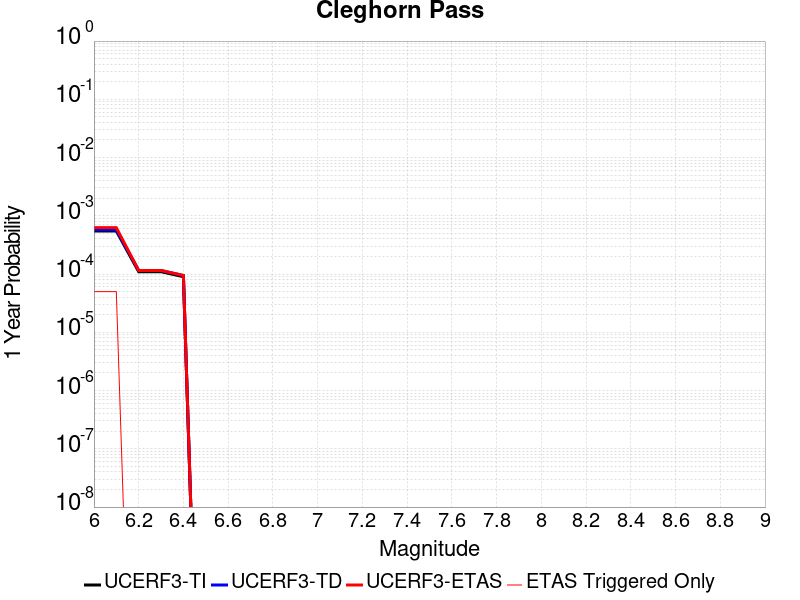 |  |

| Magnitude | 1 wk TI Prob | 1 wk TD Prob | 1 wk ETAS Prob | 1 wk ETAS/TD Gain | 1 wk ETAS Triggered Only | 1 mo TI Prob | 1 mo TD Prob | 1 mo ETAS Prob | 1 mo ETAS/TD Gain | 1 mo ETAS Triggered Only | 1 yr TI Prob | 1 yr TD Prob | 1 yr ETAS Prob | 1 yr ETAS/TD Gain | 1 yr ETAS Triggered Only | 10 yr TI Prob | 10 yr TD Prob | 10 yr ETAS Prob | 10 yr ETAS/TD Gain | 10 yr ETAS Triggered Only |
|-----|-----|-----|-----|-----|-----|-----|-----|-----|-----|-----|-----|-----|-----|-----|-----|-----|-----|-----|-----|-----|
| 6.0 | 1.0522846E-5 | 1.1040642E-5 | 2.3229682E-5 | 2.1040156 | 1.2189176E-5 | 4.509713E-5 | 4.7316473E-5 | 7.169367E-5 | 1.5151948 | 2.4378352E-5 | 5.4891926E-4 | 5.759784E-4 | 6.125249E-4 | 1.063451 | 3.656753E-5 | 0.0054756533 | 0.005750022 | 0.005798498 | 1.0084306 | 4.8756705E-5 |
| 6.1 | 1.0522846E-5 | 1.1040642E-5 | 2.3229682E-5 | 2.1040156 | 1.2189176E-5 | 4.509713E-5 | 4.7316473E-5 | 7.169367E-5 | 1.5151948 | 2.4378352E-5 | 5.4891926E-4 | 5.759784E-4 | 6.125249E-4 | 1.063451 | 3.656753E-5 | 0.0054756533 | 0.005750022 | 0.005798498 | 1.0084306 | 4.8756705E-5 |
| 6.2 | 2.1045846E-6 | 2.2082024E-6 | 2.2082024E-6 | 1.0 | 0.0 | 9.019617E-6 | 9.463714E-6 | 9.463714E-6 | 1.0 | 0.0 | 1.098083E-4 | 1.1521882E-4 | 1.1521882E-4 | 1.0 | 0.0 | 0.0010975406 | 0.0011520023 | 0.0011520023 | 1.0 | 0.0 |
| 6.3 | 2.1045846E-6 | 2.2082024E-6 | 2.2082024E-6 | 1.0 | 0.0 | 9.019617E-6 | 9.463714E-6 | 9.463714E-6 | 1.0 | 0.0 | 1.098083E-4 | 1.1521882E-4 | 1.1521882E-4 | 1.0 | 0.0 | 0.0010975406 | 0.0011520023 | 0.0011520023 | 1.0 | 0.0 |
| 6.4 | 1.7259927E-6 | 1.810877E-6 | 1.810877E-6 | 1.0 | 0.0 | 7.3970905E-6 | 7.760902E-6 | 7.760902E-6 | 1.0 | 0.0 | 9.005586E-5 | 9.4488976E-5 | 9.4488976E-5 | 1.0 | 0.0 | 9.001937E-4 | 9.448898E-4 | 9.448898E-4 | 1.0 | 0.0 |

## Blue Cut
*[(top)](#table-of-contents)*

| 1 Week | 1 Month | 1 Year | 10 Year |
|-----|-----|-----|-----|
|  |  |  |  |

| Magnitude | 1 wk TI Prob | 1 wk TD Prob | 1 wk ETAS Prob | 1 wk ETAS/TD Gain | 1 wk ETAS Triggered Only | 1 mo TI Prob | 1 mo TD Prob | 1 mo ETAS Prob | 1 mo ETAS/TD Gain | 1 mo ETAS Triggered Only | 1 yr TI Prob | 1 yr TD Prob | 1 yr ETAS Prob | 1 yr ETAS/TD Gain | 1 yr ETAS Triggered Only | 10 yr TI Prob | 10 yr TD Prob | 10 yr ETAS Prob | 10 yr ETAS/TD Gain | 10 yr ETAS Triggered Only |
|-----|-----|-----|-----|-----|-----|-----|-----|-----|-----|-----|-----|-----|-----|-----|-----|-----|-----|-----|-----|-----|
| 6.0 | 2.1227985E-5 | 2.2719574E-5 | 4.7097372E-5 | 2.0729866 | 2.4378352E-5 | 9.097391E-5 | 9.73663E-5 | 1.21742276E-4 | 1.2503533 | 2.4378352E-5 | 0.0011070445 | 0.0011848481 | 0.0012213723 | 1.0308261 | 3.656753E-5 | 0.011015458 | 0.011791152 | 0.011839334 | 1.0040863 | 4.8756705E-5 |
| 6.1 | 2.1227985E-5 | 2.2719574E-5 | 4.7097372E-5 | 2.0729866 | 2.4378352E-5 | 9.097391E-5 | 9.73663E-5 | 1.21742276E-4 | 1.2503533 | 2.4378352E-5 | 0.0011070445 | 0.0011848481 | 0.0012213723 | 1.0308261 | 3.656753E-5 | 0.011015458 | 0.011791152 | 0.011839334 | 1.0040863 | 4.8756705E-5 |
| 6.2 | 2.1227985E-5 | 2.2719574E-5 | 4.7097372E-5 | 2.0729866 | 2.4378352E-5 | 9.097391E-5 | 9.73663E-5 | 1.21742276E-4 | 1.2503533 | 2.4378352E-5 | 0.0011070445 | 0.0011848481 | 0.0012213723 | 1.0308261 | 3.656753E-5 | 0.011015458 | 0.011791152 | 0.011839334 | 1.0040863 | 4.8756705E-5 |
| 6.3 | 1.1613981E-5 | 1.2353542E-5 | 2.4542567E-5 | 1.9866827 | 1.2189176E-5 | 4.9773254E-5 | 5.2942745E-5 | 6.513128E-5 | 1.2302209 | 1.2189176E-5 | 6.0582085E-4 | 6.443998E-4 | 6.565811E-4 | 1.0189034 | 1.2189176E-5 | 0.0060417196 | 0.0064265593 | 0.006450781 | 1.003769 | 2.4378352E-5 |
| 6.4 | 1.1613981E-5 | 1.2353542E-5 | 2.4542567E-5 | 1.9866827 | 1.2189176E-5 | 4.9773254E-5 | 5.2942745E-5 | 6.513128E-5 | 1.2302209 | 1.2189176E-5 | 6.0582085E-4 | 6.443998E-4 | 6.565811E-4 | 1.0189034 | 1.2189176E-5 | 0.0060417196 | 0.0064265593 | 0.006450781 | 1.003769 | 2.4378352E-5 |
| 6.5 | 8.931326E-6 | 9.4816E-6 | 2.167066E-5 | 2.285549 | 1.2189176E-5 | 3.8276554E-5 | 4.0634844E-5 | 5.2823525E-5 | 1.2999563 | 1.2189176E-5 | 4.6591737E-4 | 4.946261E-4 | 5.068093E-4 | 1.024631 | 1.2189176E-5 | 0.0046494175 | 0.004936161 | 0.004960419 | 1.0049144 | 2.4378352E-5 |
| 6.6 | 7.345353E-6 | 7.79028E-6 | 1.997936E-5 | 2.5646527 | 1.2189176E-5 | 3.1479703E-5 | 3.338653E-5 | 4.5575296E-5 | 1.3650805 | 1.2189176E-5 | 3.83198E-4 | 4.064132E-4 | 4.185974E-4 | 1.02998 | 1.2189176E-5 | 0.0038253788 | 0.0040574907 | 0.0040817703 | 1.0059838 | 2.4378352E-5 |
| 6.7 | 6.2775666E-6 | 6.655149E-6 | 1.8844245E-5 | 2.8315284 | 1.2189176E-5 | 2.690358E-5 | 2.8521798E-5 | 4.0710627E-5 | 1.4273514 | 1.2189176E-5 | 3.2750185E-4 | 3.472051E-4 | 3.5939002E-4 | 1.0350944 | 1.2189176E-5 | 0.0032701963 | 0.003467367 | 0.0034916608 | 1.0070064 | 2.4378352E-5 |
| 6.8 | 5.5234095E-6 | 5.8551113E-6 | 1.8044217E-5 | 3.0817888 | 1.2189176E-5 | 2.367154E-5 | 2.5093133E-5 | 3.7282003E-5 | 1.4857452 | 1.2189176E-5 | 2.8816288E-4 | 3.0547334E-4 | 3.176588E-4 | 1.0398904 | 1.2189176E-5 | 0.002877895 | 0.0030512505 | 0.0030755545 | 1.0079652 | 2.4378352E-5 |
| 6.9 | 4.7780054E-6 | 5.0654203E-6 | 1.7254535E-5 | 3.406338 | 1.2189176E-5 | 2.0477004E-5 | 2.1708804E-5 | 3.3897715E-5 | 1.5614731 | 1.2189176E-5 | 2.4927902E-4 | 2.642797E-4 | 2.7646564E-4 | 1.04611 | 1.2189176E-5 | 0.0024899957 | 0.002640346 | 0.002652503 | 1.0046043 | 1.2189176E-5 |
| 7.0 | 3.883171E-6 | 4.118487E-6 | 1.6307613E-5 | 3.9596124 | 1.2189176E-5 | 1.6642054E-5 | 1.7650578E-5 | 2.9839539E-5 | 1.69057 | 1.2189176E-5 | 2.0259817E-4 | 2.1488148E-4 | 2.2706804E-4 | 1.0567129 | 1.2189176E-5 | 0.0020241356 | 0.0021474129 | 0.002159576 | 1.005664 | 1.2189176E-5 |
| 7.1 | 2.8358215E-6 | 3.0097158E-6 | 1.5198855E-5 | 5.04993 | 1.2189176E-5 | 1.2153464E-5 | 1.2898756E-5 | 2.5087775E-5 | 1.9449763 | 1.2189176E-5 | 1.4795837E-4 | 1.5703762E-4 | 1.6922488E-4 | 1.0776073 | 1.2189176E-5 | 0.001478599 | 0.0015699116 | 0.0015820817 | 1.0077521 | 1.2189176E-5 |

## Lost Hills
*[(top)](#table-of-contents)*

| 1 Week | 1 Month | 1 Year | 10 Year |
|-----|-----|-----|-----|
|  | 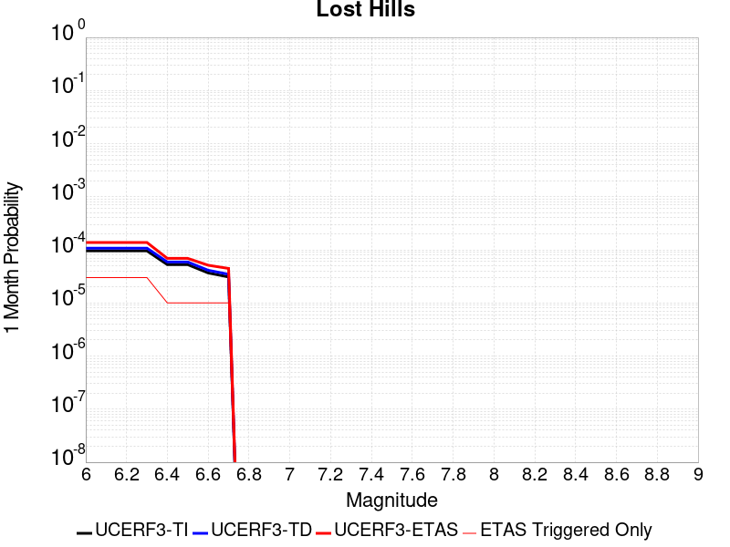 |  |  |

| Magnitude | 1 wk TI Prob | 1 wk TD Prob | 1 wk ETAS Prob | 1 wk ETAS/TD Gain | 1 wk ETAS Triggered Only | 1 mo TI Prob | 1 mo TD Prob | 1 mo ETAS Prob | 1 mo ETAS/TD Gain | 1 mo ETAS Triggered Only | 1 yr TI Prob | 1 yr TD Prob | 1 yr ETAS Prob | 1 yr ETAS/TD Gain | 1 yr ETAS Triggered Only | 10 yr TI Prob | 10 yr TD Prob | 10 yr ETAS Prob | 10 yr ETAS/TD Gain | 10 yr ETAS Triggered Only |
|-----|-----|-----|-----|-----|-----|-----|-----|-----|-----|-----|-----|-----|-----|-----|-----|-----|-----|-----|-----|-----|
| 6.0 | 2.233523E-5 | 2.5106583E-5 | 4.9484323E-5 | 1.97097 | 2.4378352E-5 | 9.571891E-5 | 1.0759615E-4 | 1.3197187E-4 | 1.2265483 | 2.4378352E-5 | 0.0011647546 | 0.001309364 | 0.0013458837 | 1.0278912 | 3.656753E-5 | 0.011586686 | 0.013033091 | 0.013069182 | 1.0027692 | 3.656753E-5 |
| 6.1 | 2.233523E-5 | 2.5106583E-5 | 4.9484323E-5 | 1.97097 | 2.4378352E-5 | 9.571891E-5 | 1.0759615E-4 | 1.3197187E-4 | 1.2265483 | 2.4378352E-5 | 0.0011647546 | 0.001309364 | 0.0013458837 | 1.0278912 | 3.656753E-5 | 0.011586686 | 0.013033091 | 0.013069182 | 1.0027692 | 3.656753E-5 |
| 6.2 | 2.233523E-5 | 2.5106583E-5 | 4.9484323E-5 | 1.97097 | 2.4378352E-5 | 9.571891E-5 | 1.0759615E-4 | 1.3197187E-4 | 1.2265483 | 2.4378352E-5 | 0.0011647546 | 0.001309364 | 0.0013458837 | 1.0278912 | 3.656753E-5 | 0.011586686 | 0.013033091 | 0.013069182 | 1.0027692 | 3.656753E-5 |
| 6.3 | 2.233523E-5 | 2.5106583E-5 | 4.9484323E-5 | 1.97097 | 2.4378352E-5 | 9.571891E-5 | 1.0759615E-4 | 1.3197187E-4 | 1.2265483 | 2.4378352E-5 | 0.0011647546 | 0.001309364 | 0.0013458837 | 1.0278912 | 3.656753E-5 | 0.011586686 | 0.013033091 | 0.013069182 | 1.0027692 | 3.656753E-5 |
| 6.4 | 1.2288092E-5 | 1.3781108E-5 | 2.5970116E-5 | 1.8844724 | 1.2189176E-5 | 5.2662188E-5 | 5.906108E-5 | 7.124954E-5 | 1.2063704 | 1.2189176E-5 | 6.409735E-4 | 7.189252E-4 | 7.311056E-4 | 1.0169425 | 1.2189176E-5 | 0.006391279 | 0.0071752006 | 0.007187302 | 1.0016866 | 1.2189176E-5 |
| 6.5 | 1.2288092E-5 | 1.3781108E-5 | 2.5970116E-5 | 1.8844724 | 1.2189176E-5 | 5.2662188E-5 | 5.906108E-5 | 7.124954E-5 | 1.2063704 | 1.2189176E-5 | 6.409735E-4 | 7.189252E-4 | 7.311056E-4 | 1.0169425 | 1.2189176E-5 | 0.006391279 | 0.0071752006 | 0.007187302 | 1.0016866 | 1.2189176E-5 |
| 6.6 | 8.58281E-6 | 9.63377E-6 | 2.1822829E-5 | 2.2652428 | 1.2189176E-5 | 3.6782953E-5 | 4.12874E-5 | 5.3476073E-5 | 1.2952152 | 1.2189176E-5 | 4.4774043E-4 | 5.026414E-4 | 5.148244E-4 | 1.0242381 | 1.2189176E-5 | 0.0044683935 | 0.005023205 | 0.005035333 | 1.0024143 | 1.2189176E-5 |
| 6.7 | 7.205685E-6 | 8.088302E-6 | 2.0277379E-5 | 2.507001 | 1.2189176E-5 | 3.088114E-5 | 3.466415E-5 | 4.6852903E-5 | 1.3516241 | 1.2189176E-5 | 3.7591302E-4 | 4.2203604E-4 | 4.3422007E-4 | 1.0288696 | 1.2189176E-5 | 0.0037527776 | 0.0042203604 | 0.004232498 | 1.002876 | 1.2189176E-5 |

## Camp Rock 2011
*[(top)](#table-of-contents)*

| 1 Week | 1 Month | 1 Year | 10 Year |
|-----|-----|-----|-----|
|  |  |  |  |

| Magnitude | 1 wk TI Prob | 1 wk TD Prob | 1 wk ETAS Prob | 1 wk ETAS/TD Gain | 1 wk ETAS Triggered Only | 1 mo TI Prob | 1 mo TD Prob | 1 mo ETAS Prob | 1 mo ETAS/TD Gain | 1 mo ETAS Triggered Only | 1 yr TI Prob | 1 yr TD Prob | 1 yr ETAS Prob | 1 yr ETAS/TD Gain | 1 yr ETAS Triggered Only | 10 yr TI Prob | 10 yr TD Prob | 10 yr ETAS Prob | 10 yr ETAS/TD Gain | 10 yr ETAS Triggered Only |
|-----|-----|-----|-----|-----|-----|-----|-----|-----|-----|-----|-----|-----|-----|-----|-----|-----|-----|-----|-----|-----|
| 6.0 | 1.6710783E-5 | 4.25026E-6 | 1.6439384E-5 | 3.8678536 | 1.2189176E-5 | 7.161568E-5 | 1.8215276E-5 | 3.0404231E-5 | 1.6691611 | 1.2189176E-5 | 8.7157206E-4 | 2.2174895E-4 | 2.5830837E-4 | 1.1648685 | 3.656753E-5 | 0.008681616 | 0.0022153298 | 0.0022518162 | 1.0164701 | 3.656753E-5 |
| 6.1 | 1.6710783E-5 | 4.25026E-6 | 1.6439384E-5 | 3.8678536 | 1.2189176E-5 | 7.161568E-5 | 1.8215276E-5 | 3.0404231E-5 | 1.6691611 | 1.2189176E-5 | 8.7157206E-4 | 2.2174895E-4 | 2.5830837E-4 | 1.1648685 | 3.656753E-5 | 0.008681616 | 0.0022153298 | 0.0022518162 | 1.0164701 | 3.656753E-5 |
| 6.2 | 1.6710783E-5 | 4.25026E-6 | 1.6439384E-5 | 3.8678536 | 1.2189176E-5 | 7.161568E-5 | 1.8215276E-5 | 3.0404231E-5 | 1.6691611 | 1.2189176E-5 | 8.7157206E-4 | 2.2174895E-4 | 2.5830837E-4 | 1.1648685 | 3.656753E-5 | 0.008681616 | 0.0022153298 | 0.0022518162 | 1.0164701 | 3.656753E-5 |
| 6.3 | 1.6710783E-5 | 4.25026E-6 | 1.6439384E-5 | 3.8678536 | 1.2189176E-5 | 7.161568E-5 | 1.8215276E-5 | 3.0404231E-5 | 1.6691611 | 1.2189176E-5 | 8.7157206E-4 | 2.2174895E-4 | 2.5830837E-4 | 1.1648685 | 3.656753E-5 | 0.008681616 | 0.0022153298 | 0.0022518162 | 1.0164701 | 3.656753E-5 |
| 6.4 | 7.982846E-6 | 3.6820884E-6 | 1.587122E-5 | 4.310385 | 1.2189176E-5 | 3.421175E-5 | 1.5780286E-5 | 2.7969269E-5 | 1.7724184 | 1.2189176E-5 | 4.1644843E-4 | 1.9210839E-4 | 2.286689E-4 | 1.1903119 | 3.656753E-5 | 0.0041566887 | 0.001919458 | 0.0019559553 | 1.0190144 | 3.656753E-5 |
| 6.5 | 7.982846E-6 | 3.6820884E-6 | 1.587122E-5 | 4.310385 | 1.2189176E-5 | 3.421175E-5 | 1.5780286E-5 | 2.7969269E-5 | 1.7724184 | 1.2189176E-5 | 4.1644843E-4 | 1.9210839E-4 | 2.286689E-4 | 1.1903119 | 3.656753E-5 | 0.0041566887 | 0.001919458 | 0.0019559553 | 1.0190144 | 3.656753E-5 |
| 6.6 | 7.048869E-6 | 3.4243571E-6 | 1.5613492E-5 | 4.5595393 | 1.2189176E-5 | 3.0209088E-5 | 1.4675736E-5 | 2.6864733E-5 | 1.8305544 | 1.2189176E-5 | 3.677336E-4 | 1.7866275E-4 | 2.1522374E-4 | 1.2046369 | 3.656753E-5 | 0.0036712566 | 0.0017852228 | 0.001821725 | 1.0204469 | 3.656753E-5 |
| 6.7 | 6.987307E-6 | 3.3623348E-6 | 1.555147E-5 | 4.6252 | 1.2189176E-5 | 2.9945259E-5 | 1.4409929E-5 | 2.659893E-5 | 1.8458751 | 1.2189176E-5 | 3.6452254E-4 | 1.7542706E-4 | 2.1198818E-4 | 1.208412 | 3.656753E-5 | 0.0036392517 | 0.001752917 | 0.0017894204 | 1.0208244 | 3.656753E-5 |
| 6.8 | 6.3737602E-6 | 3.1179077E-6 | 1.5307045E-5 | 4.9093966 | 1.2189176E-5 | 2.731583E-5 | 1.3362394E-5 | 2.5551408E-5 | 1.9121878 | 1.2189176E-5 | 3.3251947E-4 | 1.626753E-4 | 1.9923688E-4 | 1.2247518 | 3.656753E-5 | 0.0033202237 | 0.0016255907 | 0.0016620988 | 1.0224583 | 3.656753E-5 |
| 6.9 | 6.112211E-6 | 2.9331156E-6 | 1.5122256E-5 | 5.1556973 | 1.2189176E-5 | 2.6194928E-5 | 1.2570436E-5 | 2.475946E-5 | 1.9696579 | 1.2189176E-5 | 3.1887658E-4 | 1.5303459E-4 | 1.8959653E-4 | 1.2389128 | 3.656753E-5 | 0.003184194 | 0.0015293199 | 0.0015658315 | 1.0238744 | 3.656753E-5 |
| 7.0 | 5.5140117E-6 | 2.641923E-6 | 1.4831066E-5 | 5.6137395 | 1.2189176E-5 | 2.3631264E-5 | 1.132248E-5 | 2.3511517E-5 | 2.0765343 | 1.2189176E-5 | 2.8767265E-4 | 1.3784273E-4 | 1.7440521E-4 | 1.2652478 | 3.656753E-5 | 0.0028730053 | 0.0013775975 | 0.0014141146 | 1.0265079 | 3.656753E-5 |
| 7.1 | 4.8151105E-6 | 2.1342705E-6 | 1.432342E-5 | 6.7111554 | 1.2189176E-5 | 2.0636026E-5 | 9.146843E-6 | 2.1335907E-5 | 2.332598 | 1.2189176E-5 | 2.5121463E-4 | 1.1135734E-4 | 1.4792079E-4 | 1.3283435 | 3.656753E-5 | 0.0025093083 | 0.0011130372 | 0.001149564 | 1.0328172 | 3.656753E-5 |
| 7.2 | 3.818335E-6 | 1.2937425E-6 | 1.2937425E-6 | 1.0 | 0.0 | 1.6364189E-5 | 5.5445994E-6 | 5.5445994E-6 | 1.0 | 0.0 | 1.9921579E-4 | 6.750349E-5 | 9.1880196E-5 | 1.3611177 | 2.4378352E-5 | 0.0019903728 | 6.748381E-4 | 6.9919997E-4 | 1.0361004 | 2.4378352E-5 |
| 7.3 | 2.7166698E-6 | 7.3835776E-7 | 7.3835776E-7 | 1.0 | 0.0 | 1.1642818E-5 | 3.1643867E-6 | 3.1643867E-6 | 1.0 | 0.0 | 1.4174209E-4 | 3.8525748E-5 | 6.290316E-5 | 1.6327564 | 2.4378352E-5 | 0.0014165172 | 3.851927E-4 | 4.0956165E-4 | 1.0632644 | 2.4378352E-5 |
| 7.4 | 2.0893426E-6 | 5.4618386E-7 | 5.4618386E-7 | 1.0 | 0.0 | 8.954295E-6 | 2.3407858E-6 | 2.3407858E-6 | 1.0 | 0.0 | 1.0901308E-4 | 2.84987E-5 | 4.068753E-5 | 1.4276977 | 1.2189176E-5 | 0.0010895962 | 2.84951E-4 | 2.9713672E-4 | 1.0427642 | 1.2189176E-5 |
| 7.5 | 1.1681728E-6 | 3.6030585E-7 | 3.6030585E-7 | 1.0 | 0.0 | 5.0064455E-6 | 1.544167E-6 | 1.544167E-6 | 1.0 | 0.0 | 6.0951766E-5 | 1.8800076E-5 | 1.8800076E-5 | 1.0 | 0.0 | 6.093505E-4 | 1.8798532E-4 | 1.8798532E-4 | 1.0 | 0.0 |
| 7.6 | 1.3154387E-7 | 7.1197384E-8 | 7.1197384E-8 | 1.0 | 0.0 | 5.6375933E-7 | 3.051316E-7 | 3.051316E-7 | 1.0 | 0.0 | 6.863748E-6 | 3.7149728E-6 | 3.7149728E-6 | 1.0 | 0.0 | 6.863536E-5 | 3.7149264E-5 | 3.7149264E-5 | 1.0 | 0.0 |

## San Cayetano
*[(top)](#table-of-contents)*

| 1 Week | 1 Month | 1 Year | 10 Year |
|-----|-----|-----|-----|
|  |  |  |  |

| Magnitude | 1 wk TI Prob | 1 wk TD Prob | 1 wk ETAS Prob | 1 wk ETAS/TD Gain | 1 wk ETAS Triggered Only | 1 mo TI Prob | 1 mo TD Prob | 1 mo ETAS Prob | 1 mo ETAS/TD Gain | 1 mo ETAS Triggered Only | 1 yr TI Prob | 1 yr TD Prob | 1 yr ETAS Prob | 1 yr ETAS/TD Gain | 1 yr ETAS Triggered Only | 10 yr TI Prob | 10 yr TD Prob | 10 yr ETAS Prob | 10 yr ETAS/TD Gain | 10 yr ETAS Triggered Only |
|-----|-----|-----|-----|-----|-----|-----|-----|-----|-----|-----|-----|-----|-----|-----|-----|-----|-----|-----|-----|-----|
| 6.0 | 2.3476267E-5 | 1.816928E-5 | 4.2547188E-5 | 2.3417103 | 2.4378352E-5 | 1.0060869E-4 | 7.786603E-5 | 1.1443072E-4 | 1.4695845 | 3.656753E-5 | 0.0012242225 | 9.476103E-4 | 9.841432E-4 | 1.0385526 | 3.656753E-5 | 0.012175002 | 0.009436584 | 0.009472807 | 1.0038385 | 3.656753E-5 |
| 6.1 | 2.3476267E-5 | 1.816928E-5 | 4.2547188E-5 | 2.3417103 | 2.4378352E-5 | 1.0060869E-4 | 7.786603E-5 | 1.1443072E-4 | 1.4695845 | 3.656753E-5 | 0.0012242225 | 9.476103E-4 | 9.841432E-4 | 1.0385526 | 3.656753E-5 | 0.012175002 | 0.009436584 | 0.009472807 | 1.0038385 | 3.656753E-5 |
| 6.2 | 2.3476267E-5 | 1.816928E-5 | 4.2547188E-5 | 2.3417103 | 2.4378352E-5 | 1.0060869E-4 | 7.786603E-5 | 1.1443072E-4 | 1.4695845 | 3.656753E-5 | 0.0012242225 | 9.476103E-4 | 9.841432E-4 | 1.0385526 | 3.656753E-5 | 0.012175002 | 0.009436584 | 0.009472807 | 1.0038385 | 3.656753E-5 |
| 6.3 | 2.3476267E-5 | 1.816928E-5 | 4.2547188E-5 | 2.3417103 | 2.4378352E-5 | 1.0060869E-4 | 7.786603E-5 | 1.1443072E-4 | 1.4695845 | 3.656753E-5 | 0.0012242225 | 9.476103E-4 | 9.841432E-4 | 1.0385526 | 3.656753E-5 | 0.012175002 | 0.009436584 | 0.009472807 | 1.0038385 | 3.656753E-5 |
| 6.4 | 2.3476267E-5 | 1.816928E-5 | 4.2547188E-5 | 2.3417103 | 2.4378352E-5 | 1.0060869E-4 | 7.786603E-5 | 1.1443072E-4 | 1.4695845 | 3.656753E-5 | 0.0012242225 | 9.476103E-4 | 9.841432E-4 | 1.0385526 | 3.656753E-5 | 0.012175002 | 0.009436584 | 0.009472807 | 1.0038385 | 3.656753E-5 |
| 6.5 | 2.3476267E-5 | 1.816928E-5 | 4.2547188E-5 | 2.3417103 | 2.4378352E-5 | 1.0060869E-4 | 7.786603E-5 | 1.1443072E-4 | 1.4695845 | 3.656753E-5 | 0.0012242225 | 9.476103E-4 | 9.841432E-4 | 1.0385526 | 3.656753E-5 | 0.012175002 | 0.009436584 | 0.009472807 | 1.0038385 | 3.656753E-5 |
| 6.6 | 2.3476267E-5 | 1.816928E-5 | 4.2547188E-5 | 2.3417103 | 2.4378352E-5 | 1.0060869E-4 | 7.786603E-5 | 1.1443072E-4 | 1.4695845 | 3.656753E-5 | 0.0012242225 | 9.476103E-4 | 9.841432E-4 | 1.0385526 | 3.656753E-5 | 0.012175002 | 0.009436584 | 0.009472807 | 1.0038385 | 3.656753E-5 |
| 6.7 | 2.3476267E-5 | 1.816928E-5 | 4.2547188E-5 | 2.3417103 | 2.4378352E-5 | 1.0060869E-4 | 7.786603E-5 | 1.1443072E-4 | 1.4695845 | 3.656753E-5 | 0.0012242225 | 9.476103E-4 | 9.841432E-4 | 1.0385526 | 3.656753E-5 | 0.012175002 | 0.009436584 | 0.009472807 | 1.0038385 | 3.656753E-5 |
| 6.8 | 2.3241924E-5 | 1.7936987E-5 | 4.2314903E-5 | 2.3590863 | 2.4378352E-5 | 9.960445E-5 | 7.687056E-5 | 1.1343527E-4 | 1.475666 | 3.656753E-5 | 0.0012120095 | 9.3550084E-4 | 9.720341E-4 | 1.0390521 | 3.656753E-5 | 0.012054204 | 0.009316482 | 0.009352709 | 1.0038885 | 3.656753E-5 |
| 6.9 | 2.2761007E-5 | 1.7432423E-5 | 4.1810352E-5 | 2.3984244 | 2.4378352E-5 | 9.7543525E-5 | 7.470827E-5 | 1.1127306E-4 | 1.4894344 | 3.656753E-5 | 0.0011869454 | 9.09197E-4 | 9.457313E-4 | 1.0401831 | 3.656753E-5 | 0.011806256 | 0.009055603 | 0.009091839 | 1.0040015 | 3.656753E-5 |
| 7.0 | 2.240283E-5 | 1.7066168E-5 | 4.1444106E-5 | 2.4284363 | 2.4378352E-5 | 9.600859E-5 | 7.313869E-5 | 1.0970354E-4 | 1.4999386 | 3.656753E-5 | 0.0011682777 | 8.9010317E-4 | 9.266382E-4 | 1.0410458 | 3.656753E-5 | 0.011621549 | 0.008866196 | 0.008902439 | 1.0040878 | 3.656753E-5 |
| 7.1 | 2.1871154E-5 | 1.6586018E-5 | 2.8774992E-5 | 1.7348945 | 1.2189176E-5 | 9.373015E-5 | 7.108101E-5 | 9.545763E-5 | 1.3429414 | 2.4378352E-5 | 0.0011405671 | 8.6507114E-4 | 8.8942837E-4 | 1.0281564 | 2.4378352E-5 | 0.011347309 | 0.008617838 | 0.008642007 | 1.0028044 | 2.4378352E-5 |
| 7.2 | 2.0714133E-5 | 1.5564561E-5 | 2.7753547E-5 | 1.7831243 | 1.2189176E-5 | 8.8771834E-5 | 6.670357E-5 | 9.10803E-5 | 1.3654486 | 2.4378352E-5 | 0.0010802611 | 8.1181666E-4 | 8.361752E-4 | 1.030005 | 2.4378352E-5 | 0.010750249 | 0.008089285 | 0.008113466 | 1.0029893 | 2.4378352E-5 |
| 7.3 | 1.8408395E-5 | 1.3996864E-5 | 2.618587E-5 | 1.8708383 | 1.2189176E-5 | 7.8890735E-5 | 5.99852E-5 | 7.217364E-5 | 1.2031909 | 1.2189176E-5 | 9.600714E-4 | 7.300781E-4 | 7.422584E-4 | 1.0166836 | 1.2189176E-5 | 0.009559342 | 0.0072775153 | 0.007289616 | 1.0016627 | 1.2189176E-5 |
| 7.4 | 1.6856795E-5 | 1.28500815E-5 | 2.50391E-5 | 1.9485558 | 1.2189176E-5 | 7.2241404E-5 | 5.5070628E-5 | 6.7259134E-5 | 1.2213249 | 1.2189176E-5 | 8.7918417E-4 | 6.7028153E-4 | 6.8246253E-4 | 1.018173 | 1.2189176E-5 | 0.00875714 | 0.0066832784 | 0.006695386 | 1.0018116 | 1.2189176E-5 |
| 7.5 | 1.2822778E-5 | 9.577542E-6 | 2.1766602E-5 | 2.272671 | 1.2189176E-5 | 5.495361E-5 | 4.1045972E-5 | 5.3234646E-5 | 1.2969518 | 1.2189176E-5 | 6.688548E-4 | 4.996217E-4 | 5.1180477E-4 | 1.0243846 | 1.2189176E-5 | 0.006668452 | 0.0049851555 | 0.0049972837 | 1.002433 | 1.2189176E-5 |
| 7.6 | 5.6272684E-6 | 3.854903E-6 | 3.854903E-6 | 1.0 | 0.0 | 2.4116642E-5 | 1.652091E-5 | 1.652091E-5 | 1.0 | 0.0 | 2.9358055E-4 | 2.0112359E-4 | 2.0112359E-4 | 1.0 | 0.0 | 0.0029319301 | 0.0020094267 | 0.0020094267 | 1.0 | 0.0 |
| 7.7 | 3.5261346E-6 | 2.3407013E-6 | 2.3407013E-6 | 1.0 | 0.0 | 1.5111918E-5 | 1.0031539E-5 | 1.0031539E-5 | 1.0 | 0.0 | 1.8397206E-4 | 1.2212721E-4 | 1.2212721E-4 | 1.0 | 0.0 | 0.0018381984 | 0.0012206084 | 0.0012206084 | 1.0 | 0.0 |
| 7.8 | 1.4826929E-6 | 1.056428E-6 | 1.056428E-6 | 1.0 | 0.0 | 6.354383E-6 | 4.5275406E-6 | 4.5275406E-6 | 1.0 | 0.0 | 7.736187E-5 | 5.5121433E-5 | 5.5121433E-5 | 1.0 | 0.0 | 7.733494E-4 | 5.5107963E-4 | 5.5107963E-4 | 1.0 | 0.0 |
| 7.9 | 2.7568166E-7 | 1.6978244E-7 | 1.6978244E-7 | 1.0 | 0.0 | 1.1814923E-6 | 7.2763885E-7 | 7.2763885E-7 | 1.0 | 0.0 | 1.4384574E-5 | 8.858967E-6 | 8.858967E-6 | 1.0 | 0.0 | 1.4383643E-4 | 8.8586174E-5 | 8.8586174E-5 | 1.0 | 0.0 |
| 8.0 | 5.407832E-8 | 2.6887697E-8 | 2.6887697E-8 | 1.0 | 0.0 | 2.3176422E-7 | 1.15232986E-7 | 1.15232986E-7 | 1.0 | 0.0 | 2.8217257E-6 | 1.4029607E-6 | 1.4029607E-6 | 1.0 | 0.0 | 2.8216898E-5 | 1.4029522E-5 | 1.4029522E-5 | 1.0 | 0.0 |

## Robinson Creek
*[(top)](#table-of-contents)*

| 1 Week | 1 Month | 1 Year | 10 Year |
|-----|-----|-----|-----|
|  |  |  |  |

| Magnitude | 1 wk TI Prob | 1 wk TD Prob | 1 wk ETAS Prob | 1 wk ETAS/TD Gain | 1 wk ETAS Triggered Only | 1 mo TI Prob | 1 mo TD Prob | 1 mo ETAS Prob | 1 mo ETAS/TD Gain | 1 mo ETAS Triggered Only | 1 yr TI Prob | 1 yr TD Prob | 1 yr ETAS Prob | 1 yr ETAS/TD Gain | 1 yr ETAS Triggered Only | 10 yr TI Prob | 10 yr TD Prob | 10 yr ETAS Prob | 10 yr ETAS/TD Gain | 10 yr ETAS Triggered Only |
|-----|-----|-----|-----|-----|-----|-----|-----|-----|-----|-----|-----|-----|-----|-----|-----|-----|-----|-----|-----|-----|
| 6.0 | 1.3705327E-5 | 1.5285013E-5 | 3.966299E-5 | 2.5948942 | 2.4378352E-5 | 5.8735794E-5 | 6.55072E-5 | 1.02072336E-4 | 1.558185 | 3.656753E-5 | 7.1487366E-4 | 7.9755014E-4 | 8.3408854E-4 | 1.0458132 | 3.656753E-5 | 0.0071257832 | 0.007975501 | 0.008011777 | 1.0045484 | 3.656753E-5 |
| 6.1 | 1.3705327E-5 | 1.5285013E-5 | 3.966299E-5 | 2.5948942 | 2.4378352E-5 | 5.8735794E-5 | 6.55072E-5 | 1.02072336E-4 | 1.558185 | 3.656753E-5 | 7.1487366E-4 | 7.9755014E-4 | 8.3408854E-4 | 1.0458132 | 3.656753E-5 | 0.0071257832 | 0.007975501 | 0.008011777 | 1.0045484 | 3.656753E-5 |
| 6.2 | 1.3705327E-5 | 1.5285013E-5 | 3.966299E-5 | 2.5948942 | 2.4378352E-5 | 5.8735794E-5 | 6.55072E-5 | 1.02072336E-4 | 1.558185 | 3.656753E-5 | 7.1487366E-4 | 7.9755014E-4 | 8.3408854E-4 | 1.0458132 | 3.656753E-5 | 0.0071257832 | 0.007975501 | 0.008011777 | 1.0045484 | 3.656753E-5 |
| 6.3 | 1.3705327E-5 | 1.5285013E-5 | 3.966299E-5 | 2.5948942 | 2.4378352E-5 | 5.8735794E-5 | 6.55072E-5 | 1.02072336E-4 | 1.558185 | 3.656753E-5 | 7.1487366E-4 | 7.9755014E-4 | 8.3408854E-4 | 1.0458132 | 3.656753E-5 | 0.0071257832 | 0.007975501 | 0.008011777 | 1.0045484 | 3.656753E-5 |
| 6.4 | 1.3705327E-5 | 1.5285013E-5 | 3.966299E-5 | 2.5948942 | 2.4378352E-5 | 5.8735794E-5 | 6.55072E-5 | 1.02072336E-4 | 1.558185 | 3.656753E-5 | 7.1487366E-4 | 7.9755014E-4 | 8.3408854E-4 | 1.0458132 | 3.656753E-5 | 0.0071257832 | 0.007975501 | 0.008011777 | 1.0045484 | 3.656753E-5 |

## Ventura-Pitas Point
*[(top)](#table-of-contents)*

| 1 Week | 1 Month | 1 Year | 10 Year |
|-----|-----|-----|-----|
|  |  |  |  |

| Magnitude | 1 wk TI Prob | 1 wk TD Prob | 1 wk ETAS Prob | 1 wk ETAS/TD Gain | 1 wk ETAS Triggered Only | 1 mo TI Prob | 1 mo TD Prob | 1 mo ETAS Prob | 1 mo ETAS/TD Gain | 1 mo ETAS Triggered Only | 1 yr TI Prob | 1 yr TD Prob | 1 yr ETAS Prob | 1 yr ETAS/TD Gain | 1 yr ETAS Triggered Only | 10 yr TI Prob | 10 yr TD Prob | 10 yr ETAS Prob | 10 yr ETAS/TD Gain | 10 yr ETAS Triggered Only |
|-----|-----|-----|-----|-----|-----|-----|-----|-----|-----|-----|-----|-----|-----|-----|-----|-----|-----|-----|-----|-----|
| 6.0 | 3.3179622E-5 | 3.3735185E-5 | 5.8112713E-5 | 1.7226144 | 2.4378352E-5 | 1.4219063E-4 | 1.445728E-4 | 1.8113504E-4 | 1.2528985 | 3.656753E-5 | 0.0017297962 | 0.0017590096 | 0.0017955129 | 1.0207522 | 3.656753E-5 | 0.017163932 | 0.0174764 | 0.017512329 | 1.0020559 | 3.656753E-5 |
| 6.1 | 3.3179622E-5 | 3.3735185E-5 | 5.8112713E-5 | 1.7226144 | 2.4378352E-5 | 1.4219063E-4 | 1.445728E-4 | 1.8113504E-4 | 1.2528985 | 3.656753E-5 | 0.0017297962 | 0.0017590096 | 0.0017955129 | 1.0207522 | 3.656753E-5 | 0.017163932 | 0.0174764 | 0.017512329 | 1.0020559 | 3.656753E-5 |
| 6.2 | 3.3179622E-5 | 3.3735185E-5 | 5.8112713E-5 | 1.7226144 | 2.4378352E-5 | 1.4219063E-4 | 1.445728E-4 | 1.8113504E-4 | 1.2528985 | 3.656753E-5 | 0.0017297962 | 0.0017590096 | 0.0017955129 | 1.0207522 | 3.656753E-5 | 0.017163932 | 0.0174764 | 0.017512329 | 1.0020559 | 3.656753E-5 |
| 6.3 | 3.3179622E-5 | 3.3735185E-5 | 5.8112713E-5 | 1.7226144 | 2.4378352E-5 | 1.4219063E-4 | 1.445728E-4 | 1.8113504E-4 | 1.2528985 | 3.656753E-5 | 0.0017297962 | 0.0017590096 | 0.0017955129 | 1.0207522 | 3.656753E-5 | 0.017163932 | 0.0174764 | 0.017512329 | 1.0020559 | 3.656753E-5 |
| 6.4 | 1.8754668E-5 | 1.701961E-5 | 4.1397547E-5 | 2.432344 | 2.4378352E-5 | 8.037467E-5 | 7.293928E-5 | 9.731585E-5 | 1.3342036 | 2.4378352E-5 | 9.781223E-4 | 8.8769704E-4 | 9.1205374E-4 | 1.027438 | 2.4378352E-5 | 0.009738282 | 0.008843848 | 0.008868011 | 1.0027322 | 2.4378352E-5 |
| 6.5 | 1.8754668E-5 | 1.701961E-5 | 4.1397547E-5 | 2.432344 | 2.4378352E-5 | 8.037467E-5 | 7.293928E-5 | 9.731585E-5 | 1.3342036 | 2.4378352E-5 | 9.781223E-4 | 8.8769704E-4 | 9.1205374E-4 | 1.027438 | 2.4378352E-5 | 0.009738282 | 0.008843848 | 0.008868011 | 1.0027322 | 2.4378352E-5 |
| 6.6 | 1.4361558E-5 | 1.2122275E-5 | 2.4311303E-5 | 2.0055068 | 1.2189176E-5 | 6.154808E-5 | 5.1951585E-5 | 6.414013E-5 | 1.2346135 | 1.2189176E-5 | 7.490902E-4 | 6.3232926E-4 | 6.445107E-4 | 1.0192645 | 1.2189176E-5 | 0.0074657016 | 0.0063055577 | 0.00631767 | 1.0019209 | 1.2189176E-5 |
| 6.7 | 1.4361558E-5 | 1.2122275E-5 | 2.4311303E-5 | 2.0055068 | 1.2189176E-5 | 6.154808E-5 | 5.1951585E-5 | 6.414013E-5 | 1.2346135 | 1.2189176E-5 | 7.490902E-4 | 6.3232926E-4 | 6.445107E-4 | 1.0192645 | 1.2189176E-5 | 0.0074657016 | 0.0063055577 | 0.00631767 | 1.0019209 | 1.2189176E-5 |
| 6.8 | 1.3663846E-5 | 1.13444175E-5 | 2.3533456E-5 | 2.0744524 | 1.2189176E-5 | 5.8558027E-5 | 4.861804E-5 | 6.0806622E-5 | 1.2507008 | 1.2189176E-5 | 7.127108E-4 | 5.917658E-4 | 6.0394773E-4 | 1.0205858 | 1.2189176E-5 | 0.007104293 | 0.005902116 | 0.005914233 | 1.002053 | 1.2189176E-5 |
| 6.9 | 1.3644157E-5 | 1.1322519E-5 | 2.3511557E-5 | 2.0765307 | 1.2189176E-5 | 5.8473648E-5 | 4.8524187E-5 | 6.0712773E-5 | 1.2511858 | 1.2189176E-5 | 7.116841E-4 | 5.9062376E-4 | 6.0280575E-4 | 1.0206256 | 1.2189176E-5 | 0.007094092 | 0.0058907564 | 0.005902874 | 1.002057 | 1.2189176E-5 |
| 7.0 | 1.3568845E-5 | 1.1242086E-5 | 2.3431125E-5 | 2.0842328 | 1.2189176E-5 | 5.8150898E-5 | 4.817949E-5 | 6.0368075E-5 | 1.252983 | 1.2189176E-5 | 7.077572E-4 | 5.864293E-4 | 5.9861137E-4 | 1.0207732 | 1.2189176E-5 | 0.007055073 | 0.0058490336 | 0.0058611515 | 1.0020717 | 1.2189176E-5 |
| 7.1 | 1.306572E-5 | 1.072054E-5 | 2.2909586E-5 | 2.1369805 | 1.2189176E-5 | 5.599474E-5 | 4.5944373E-5 | 5.8132988E-5 | 1.2652907 | 1.2189176E-5 | 6.815227E-4 | 5.5923103E-4 | 5.714134E-4 | 1.0217842 | 1.2189176E-5 | 0.0067943637 | 0.0055784425 | 0.0055905636 | 1.0021728 | 1.2189176E-5 |
| 7.2 | 1.232604E-5 | 9.995143E-6 | 2.2184196E-5 | 2.2194977 | 1.2189176E-5 | 5.2824813E-5 | 4.2835632E-5 | 5.5024288E-5 | 1.2845447 | 1.2189176E-5 | 6.429523E-4 | 5.214008E-4 | 5.3358363E-4 | 1.0233655 | 1.2189176E-5 | 0.0064109527 | 0.005201967 | 0.005214093 | 1.002331 | 1.2189176E-5 |
| 7.3 | 1.0917261E-5 | 8.84384E-6 | 2.1032909E-5 | 2.3782551 | 1.2189176E-5 | 4.678742E-5 | 3.790163E-5 | 5.0090344E-5 | 1.3215882 | 1.2189176E-5 | 5.69488E-4 | 4.6135622E-4 | 4.7353975E-4 | 1.0264081 | 1.2189176E-5 | 0.0056803077 | 0.00460415 | 0.0046162833 | 1.0026352 | 1.2189176E-5 |
| 7.4 | 1.039959E-5 | 8.423562E-6 | 2.0612635E-5 | 2.4470212 | 1.2189176E-5 | 4.456891E-5 | 3.610049E-5 | 4.8289225E-5 | 1.3376335 | 1.2189176E-5 | 5.424914E-4 | 4.3943635E-4 | 4.5162017E-4 | 1.027726 | 1.2189176E-5 | 0.0054116896 | 0.004385836 | 0.0043979716 | 1.002767 | 1.2189176E-5 |
| 7.5 | 9.015877E-6 | 7.2975445E-6 | 1.9486632E-5 | 2.6702998 | 1.2189176E-5 | 3.86389E-5 | 3.1274823E-5 | 4.346362E-5 | 1.3897319 | 1.2189176E-5 | 4.7032707E-4 | 3.8070587E-4 | 3.928904E-4 | 1.0320051 | 1.2189176E-5 | 0.004693329 | 0.0038006818 | 0.0038128246 | 1.0031949 | 1.2189176E-5 |
| 7.6 | 4.900162E-6 | 3.8741155E-6 | 3.8741155E-6 | 1.0 | 0.0 | 2.1000526E-5 | 1.6603248E-5 | 1.6603248E-5 | 1.0 | 0.0 | 2.556514E-4 | 2.0212591E-4 | 2.0212591E-4 | 1.0 | 0.0 | 0.0025535747 | 0.0020194345 | 0.0020194345 | 1.0 | 0.0 |
| 7.7 | 3.8850626E-6 | 3.1267302E-6 | 3.1267302E-6 | 1.0 | 0.0 | 1.6650163E-5 | 1.3400205E-5 | 1.3400205E-5 | 1.0 | 0.0 | 2.0269687E-4 | 1.6313537E-4 | 1.6313537E-4 | 1.0 | 0.0 | 0.002025121 | 0.0016301654 | 0.0016301654 | 1.0 | 0.0 |
| 7.8 | 2.4654719E-6 | 2.029875E-6 | 2.029875E-6 | 1.0 | 0.0 | 1.0566265E-5 | 8.699436E-6 | 8.699436E-6 | 1.0 | 0.0 | 1.2863669E-4 | 1.0591053E-4 | 1.0591053E-4 | 1.0 | 0.0 | 0.0012856225 | 0.0010586053 | 0.0010586053 | 1.0 | 0.0 |
| 7.9 | 4.095894E-7 | 3.2764765E-7 | 3.2764765E-7 | 1.0 | 0.0 | 1.7553821E-6 | 1.4042034E-6 | 1.4042034E-6 | 1.0 | 0.0 | 2.1371567E-5 | 1.7096047E-5 | 1.7096047E-5 | 1.0 | 0.0 | 2.1369511E-4 | 1.7094762E-4 | 1.7094762E-4 | 1.0 | 0.0 |
| 8.0 | 7.791402E-9 | 5.683497E-9 | 5.683497E-9 | 1.0 | 0.0 | 3.3391725E-8 | 2.4357844E-8 | 2.4357844E-8 | 1.0 | 0.0 | 4.0654416E-7 | 2.9655675E-7 | 2.9655675E-7 | 1.0 | 0.0 | 4.065434E-6 | 2.9655655E-6 | 2.9655655E-6 | 1.0 | 0.0 |

## Red Mountain
*[(top)](#table-of-contents)*

| 1 Week | 1 Month | 1 Year | 10 Year |
|-----|-----|-----|-----|
|  |  |  |  |

| Magnitude | 1 wk TI Prob | 1 wk TD Prob | 1 wk ETAS Prob | 1 wk ETAS/TD Gain | 1 wk ETAS Triggered Only | 1 mo TI Prob | 1 mo TD Prob | 1 mo ETAS Prob | 1 mo ETAS/TD Gain | 1 mo ETAS Triggered Only | 1 yr TI Prob | 1 yr TD Prob | 1 yr ETAS Prob | 1 yr ETAS/TD Gain | 1 yr ETAS Triggered Only | 10 yr TI Prob | 10 yr TD Prob | 10 yr ETAS Prob | 10 yr ETAS/TD Gain | 10 yr ETAS Triggered Only |
|-----|-----|-----|-----|-----|-----|-----|-----|-----|-----|-----|-----|-----|-----|-----|-----|-----|-----|-----|-----|-----|
| 6.0 | 4.1810763E-5 | 4.7589947E-5 | 8.4155734E-5 | 1.7683511 | 3.656753E-5 | 1.7917668E-4 | 2.039419E-4 | 2.4050198E-4 | 1.179267 | 3.656753E-5 | 0.0021792934 | 0.0024803306 | 0.0025168075 | 1.0147065 | 3.656753E-5 | 0.021580452 | 0.024544092 | 0.024579762 | 1.0014533 | 3.656753E-5 |
| 6.1 | 4.1810763E-5 | 4.7589947E-5 | 8.4155734E-5 | 1.7683511 | 3.656753E-5 | 1.7917668E-4 | 2.039419E-4 | 2.4050198E-4 | 1.179267 | 3.656753E-5 | 0.0021792934 | 0.0024803306 | 0.0025168075 | 1.0147065 | 3.656753E-5 | 0.021580452 | 0.024544092 | 0.024579762 | 1.0014533 | 3.656753E-5 |
| 6.2 | 4.1810763E-5 | 4.7589947E-5 | 8.4155734E-5 | 1.7683511 | 3.656753E-5 | 1.7917668E-4 | 2.039419E-4 | 2.4050198E-4 | 1.179267 | 3.656753E-5 | 0.0021792934 | 0.0024803306 | 0.0025168075 | 1.0147065 | 3.656753E-5 | 0.021580452 | 0.024544092 | 0.024579762 | 1.0014533 | 3.656753E-5 |
| 6.3 | 4.1810763E-5 | 4.7589947E-5 | 8.4155734E-5 | 1.7683511 | 3.656753E-5 | 1.7917668E-4 | 2.039419E-4 | 2.4050198E-4 | 1.179267 | 3.656753E-5 | 0.0021792934 | 0.0024803306 | 0.0025168075 | 1.0147065 | 3.656753E-5 | 0.021580452 | 0.024544092 | 0.024579762 | 1.0014533 | 3.656753E-5 |
| 6.4 | 4.1810763E-5 | 4.7589947E-5 | 8.4155734E-5 | 1.7683511 | 3.656753E-5 | 1.7917668E-4 | 2.039419E-4 | 2.4050198E-4 | 1.179267 | 3.656753E-5 | 0.0021792934 | 0.0024803306 | 0.0025168075 | 1.0147065 | 3.656753E-5 | 0.021580452 | 0.024544092 | 0.024579762 | 1.0014533 | 3.656753E-5 |
| 6.5 | 3.154503E-5 | 3.5359728E-5 | 7.192596E-5 | 2.034121 | 3.656753E-5 | 1.3518598E-4 | 1.5153342E-4 | 1.880954E-4 | 1.2412801 | 3.656753E-5 | 0.0016446467 | 0.0018434501 | 0.0018799503 | 1.0198 | 3.656753E-5 | 0.01632528 | 0.018291233 | 0.018327132 | 1.0019627 | 3.656753E-5 |
| 6.6 | 3.1535834E-5 | 3.534911E-5 | 7.191535E-5 | 2.0344317 | 3.656753E-5 | 1.3514658E-4 | 1.5148791E-4 | 1.880499E-4 | 1.2413526 | 3.656753E-5 | 0.0016441676 | 0.001842897 | 0.0018793972 | 1.0198058 | 3.656753E-5 | 0.01632056 | 0.018285794 | 0.018321693 | 1.0019633 | 3.656753E-5 |
| 6.7 | 2.8267326E-5 | 3.146934E-5 | 5.5846926E-5 | 1.7746456 | 2.4378352E-5 | 1.2114006E-4 | 1.348621E-4 | 1.5923717E-4 | 1.1807406 | 2.4378352E-5 | 0.0014738824 | 0.0016407946 | 0.0016651329 | 1.0148333 | 2.4378352E-5 | 0.014641452 | 0.016295563 | 0.016319545 | 1.0014716 | 2.4378352E-5 |
| 6.8 | 2.8212884E-5 | 3.1407224E-5 | 4.3596017E-5 | 1.3880888 | 1.2189176E-5 | 1.20906756E-4 | 1.3459593E-4 | 1.4678347E-4 | 1.0905491 | 1.2189176E-5 | 0.0014710457 | 0.0016375587 | 0.0016497279 | 1.0074313 | 1.2189176E-5 | 0.014613459 | 0.01626368 | 0.01627567 | 1.0007373 | 1.2189176E-5 |
| 6.9 | 2.4227871E-5 | 2.6706979E-5 | 3.889583E-5 | 1.4563919 | 1.2189176E-5 | 1.03829596E-4 | 1.14453884E-4 | 1.2664167E-4 | 1.1064864 | 1.2189176E-5 | 0.0012633923 | 0.0013926612 | 0.0014048334 | 1.0087402 | 1.2189176E-5 | 0.012562336 | 0.013847026 | 0.013859047 | 1.0008681 | 1.2189176E-5 |
| 7.0 | 2.348524E-5 | 2.5835763E-5 | 3.8024624E-5 | 1.4717826 | 1.2189176E-5 | 1.0064714E-4 | 1.1072042E-4 | 1.2290826E-4 | 1.1100775 | 1.2189176E-5 | 0.0012246901 | 0.0013472632 | 0.001359436 | 1.0090352 | 1.2189176E-5 | 0.012179627 | 0.01339859 | 0.013410616 | 1.0008975 | 1.2189176E-5 |
| 7.1 | 2.2311642E-5 | 2.4462828E-5 | 3.6651705E-5 | 1.4982612 | 1.2189176E-5 | 9.561782E-5 | 1.048369E-4 | 1.170248E-4 | 1.1162558 | 1.2189176E-5 | 0.0011635252 | 0.0012757168 | 0.0012878904 | 1.0095426 | 1.2189176E-5 | 0.01157452 | 0.012691451 | 0.012703486 | 1.0009482 | 1.2189176E-5 |
| 7.2 | 1.6533986E-5 | 1.7670347E-5 | 1.7670347E-5 | 1.0 | 0.0 | 7.085802E-5 | 7.572822E-5 | 7.572822E-5 | 1.0 | 0.0 | 8.623549E-4 | 9.216645E-4 | 9.216645E-4 | 1.0 | 0.0 | 0.008590161 | 0.009184699 | 0.009184699 | 1.0 | 0.0 |
| 7.3 | 1.4703092E-5 | 1.555952E-5 | 1.555952E-5 | 1.0 | 0.0 | 6.301173E-5 | 6.66823E-5 | 6.66823E-5 | 1.0 | 0.0 | 7.668978E-4 | 8.1161625E-4 | 8.1161625E-4 | 1.0 | 0.0 | 0.0076425658 | 0.008092596 | 0.008092596 | 1.0 | 0.0 |
| 7.4 | 6.1331984E-6 | 5.528872E-6 | 5.528872E-6 | 1.0 | 0.0 | 2.6284872E-5 | 2.3694953E-5 | 2.3694953E-5 | 1.0 | 0.0 | 3.199713E-4 | 2.8844838E-4 | 2.8844838E-4 | 1.0 | 0.0 | 0.0031951098 | 0.0028807942 | 0.0028807942 | 1.0 | 0.0 |
| 7.5 | 5.954766E-6 | 5.3385015E-6 | 5.3385015E-6 | 1.0 | 0.0 | 2.5520176E-5 | 2.2879094E-5 | 2.2879094E-5 | 1.0 | 0.0 | 3.1066386E-4 | 2.785179E-4 | 2.785179E-4 | 1.0 | 0.0 | 0.003102299 | 0.0027817423 | 0.0027817423 | 1.0 | 0.0 |
| 7.6 | 4.9726646E-6 | 4.315295E-6 | 4.315295E-6 | 1.0 | 0.0 | 2.1311245E-5 | 1.8493993E-5 | 1.8493993E-5 | 1.0 | 0.0 | 2.5943352E-4 | 2.2514143E-4 | 2.2514143E-4 | 1.0 | 0.0 | 0.0025913084 | 0.002249168 | 0.002249168 | 1.0 | 0.0 |
| 7.7 | 3.3613894E-6 | 2.8526642E-6 | 2.8526642E-6 | 1.0 | 0.0 | 1.4405875E-5 | 1.2225649E-5 | 1.2225649E-5 | 1.0 | 0.0 | 1.7537741E-4 | 1.4883737E-4 | 1.4883737E-4 | 1.0 | 0.0 | 0.0017523908 | 0.0014874031 | 0.0014874031 | 1.0 | 0.0 |
| 7.8 | 1.1828961E-6 | 1.0122756E-6 | 1.0122756E-6 | 1.0 | 0.0 | 5.069545E-6 | 4.338317E-6 | 4.338317E-6 | 1.0 | 0.0 | 6.171996E-5 | 5.281776E-5 | 5.281776E-5 | 1.0 | 0.0 | 6.170282E-4 | 5.2805495E-4 | 5.2805495E-4 | 1.0 | 0.0 |
| 7.9 | 2.2967266E-7 | 1.8618952E-7 | 1.8618952E-7 | 1.0 | 0.0 | 9.843111E-7 | 7.9795484E-7 | 7.9795484E-7 | 1.0 | 0.0 | 1.19839215E-5 | 9.7150605E-6 | 9.7150605E-6 | 1.0 | 0.0 | 1.1983275E-4 | 9.714664E-5 | 9.714664E-5 | 1.0 | 0.0 |

## Santa Cruz Island
*[(top)](#table-of-contents)*

| 1 Week | 1 Month | 1 Year | 10 Year |
|-----|-----|-----|-----|
|  |  |  |  |

| Magnitude | 1 wk TI Prob | 1 wk TD Prob | 1 wk ETAS Prob | 1 wk ETAS/TD Gain | 1 wk ETAS Triggered Only | 1 mo TI Prob | 1 mo TD Prob | 1 mo ETAS Prob | 1 mo ETAS/TD Gain | 1 mo ETAS Triggered Only | 1 yr TI Prob | 1 yr TD Prob | 1 yr ETAS Prob | 1 yr ETAS/TD Gain | 1 yr ETAS Triggered Only | 10 yr TI Prob | 10 yr TD Prob | 10 yr ETAS Prob | 10 yr ETAS/TD Gain | 10 yr ETAS Triggered Only |
|-----|-----|-----|-----|-----|-----|-----|-----|-----|-----|-----|-----|-----|-----|-----|-----|-----|-----|-----|-----|-----|
| 6.0 | 2.9164563E-5 | 3.1599742E-5 | 6.816612E-5 | 2.1571732 | 3.656753E-5 | 1.2498499E-4 | 1.3542121E-4 | 1.7198379E-4 | 1.2699915 | 3.656753E-5 | 0.0015206301 | 0.0016476426 | 0.0016841498 | 1.0221573 | 3.656753E-5 | 0.015102667 | 0.016368 | 0.016403968 | 1.0021975 | 3.656753E-5 |
| 6.1 | 2.9164563E-5 | 3.1599742E-5 | 6.816612E-5 | 2.1571732 | 3.656753E-5 | 1.2498499E-4 | 1.3542121E-4 | 1.7198379E-4 | 1.2699915 | 3.656753E-5 | 0.0015206301 | 0.0016476426 | 0.0016841498 | 1.0221573 | 3.656753E-5 | 0.015102667 | 0.016368 | 0.016403968 | 1.0021975 | 3.656753E-5 |
| 6.2 | 2.9164563E-5 | 3.1599742E-5 | 6.816612E-5 | 2.1571732 | 3.656753E-5 | 1.2498499E-4 | 1.3542121E-4 | 1.7198379E-4 | 1.2699915 | 3.656753E-5 | 0.0015206301 | 0.0016476426 | 0.0016841498 | 1.0221573 | 3.656753E-5 | 0.015102667 | 0.016368 | 0.016403968 | 1.0021975 | 3.656753E-5 |
| 6.3 | 1.6635553E-5 | 1.780436E-5 | 1.780436E-5 | 1.0 | 0.0 | 7.1293274E-5 | 7.630226E-5 | 7.630226E-5 | 1.0 | 0.0 | 8.6765E-4 | 9.2860236E-4 | 9.2860236E-4 | 1.0 | 0.0 | 0.008642701 | 0.009249094 | 0.009249094 | 1.0 | 0.0 |
| 6.4 | 1.6635553E-5 | 1.780436E-5 | 1.780436E-5 | 1.0 | 0.0 | 7.1293274E-5 | 7.630226E-5 | 7.630226E-5 | 1.0 | 0.0 | 8.6765E-4 | 9.2860236E-4 | 9.2860236E-4 | 1.0 | 0.0 | 0.008642701 | 0.009249094 | 0.009249094 | 1.0 | 0.0 |
| 6.5 | 1.2238748E-5 | 1.3042995E-5 | 1.3042995E-5 | 1.0 | 0.0 | 5.2450723E-5 | 5.5897377E-5 | 5.5897377E-5 | 1.0 | 0.0 | 6.3840044E-4 | 6.8034173E-4 | 6.8034173E-4 | 1.0 | 0.0 | 0.0063656955 | 0.0067829876 | 0.0067829876 | 1.0 | 0.0 |
| 6.6 | 1.0489767E-5 | 1.1156636E-5 | 1.1156636E-5 | 1.0 | 0.0 | 4.495537E-5 | 4.781329E-5 | 4.781329E-5 | 1.0 | 0.0 | 5.4719415E-4 | 5.819735E-4 | 5.819735E-4 | 1.0 | 0.0 | 0.005458487 | 0.0058047357 | 0.0058047357 | 1.0 | 0.0 |
| 6.7 | 8.699222E-6 | 9.236782E-6 | 9.236782E-6 | 1.0 | 0.0 | 3.7281847E-5 | 3.958561E-5 | 3.958561E-5 | 1.0 | 0.0 | 4.5381195E-4 | 4.8184878E-4 | 4.8184878E-4 | 1.0 | 0.0 | 0.0045288634 | 0.004808108 | 0.004808108 | 1.0 | 0.0 |
| 6.8 | 8.307732E-6 | 8.8169045E-6 | 8.8169045E-6 | 1.0 | 0.0 | 3.560408E-5 | 3.7786187E-5 | 3.7786187E-5 | 1.0 | 0.0 | 4.3339343E-4 | 4.5995016E-4 | 4.5995016E-4 | 1.0 | 0.0 | 0.004325492 | 0.0045900354 | 0.0045900354 | 1.0 | 0.0 |
| 6.9 | 8.073121E-6 | 8.564939E-6 | 8.564939E-6 | 1.0 | 0.0 | 3.459863E-5 | 3.6706366E-5 | 3.6706366E-5 | 1.0 | 0.0 | 4.2115687E-4 | 4.468088E-4 | 4.468088E-4 | 1.0 | 0.0 | 0.004203596 | 0.004459156 | 0.004459156 | 1.0 | 0.0 |
| 7.0 | 7.617019E-6 | 8.074664E-6 | 8.074664E-6 | 1.0 | 0.0 | 3.264396E-5 | 3.4605247E-5 | 3.4605247E-5 | 1.0 | 0.0 | 3.9736772E-4 | 4.212378E-4 | 4.212378E-4 | 1.0 | 0.0 | 0.003966579 | 0.0042044413 | 0.0042044413 | 1.0 | 0.0 |
| 7.1 | 7.1224836E-6 | 7.545788E-6 | 7.545788E-6 | 1.0 | 0.0 | 3.052457E-5 | 3.2338692E-5 | 3.2338692E-5 | 1.0 | 0.0 | 3.715733E-4 | 3.936528E-4 | 3.936528E-4 | 1.0 | 0.0 | 0.003709526 | 0.003929598 | 0.003929598 | 1.0 | 0.0 |
| 7.2 | 6.441115E-6 | 6.8273835E-6 | 6.8273835E-6 | 1.0 | 0.0 | 2.7604487E-5 | 2.9259887E-5 | 2.9259887E-5 | 1.0 | 0.0 | 3.360328E-4 | 3.5618112E-4 | 3.5618112E-4 | 1.0 | 0.0 | 0.0033552512 | 0.003556131 | 0.003556131 | 1.0 | 0.0 |
| 7.3 | 5.494274E-6 | 5.8199944E-6 | 5.8199944E-6 | 1.0 | 0.0 | 2.3546674E-5 | 2.4942596E-5 | 2.4942596E-5 | 1.0 | 0.0 | 2.8664304E-4 | 3.0363398E-4 | 3.0363398E-4 | 1.0 | 0.0 | 0.002862736 | 0.0030322142 | 0.0030322142 | 1.0 | 0.0 |
| 7.4 | 4.0802624E-6 | 4.312256E-6 | 4.312256E-6 | 1.0 | 0.0 | 1.7486722E-5 | 1.8480967E-5 | 1.8480967E-5 | 1.0 | 0.0 | 2.1288003E-4 | 2.2498262E-4 | 2.2498262E-4 | 1.0 | 0.0 | 0.0021267622 | 0.0022475575 | 0.0022475575 | 1.0 | 0.0 |
| 7.5 | 2.3584746E-6 | 2.4753094E-6 | 2.4753094E-6 | 1.0 | 0.0 | 1.0107709E-5 | 1.0608426E-5 | 1.0608426E-5 | 1.0 | 0.0 | 1.2305441E-4 | 1.2915E-4 | 1.2915E-4 | 1.0 | 0.0 | 0.0012298629 | 0.0012907543 | 0.0012907543 | 1.0 | 0.0 |
| 7.6 | 9.4981914E-7 | 9.86093E-7 | 9.86093E-7 | 1.0 | 0.0 | 4.0706473E-6 | 4.2261063E-6 | 4.2261063E-6 | 1.0 | 0.0 | 4.9559E-5 | 5.145164E-5 | 5.145164E-5 | 1.0 | 0.0 | 4.954795E-4 | 5.1439856E-4 | 5.1439856E-4 | 1.0 | 0.0 |
| 7.7 | 2.6013532E-7 | 2.6416603E-7 | 2.6416603E-7 | 1.0 | 0.0 | 1.1148652E-6 | 1.1321397E-6 | 1.1321397E-6 | 1.0 | 0.0 | 1.3573399E-5 | 1.3783714E-5 | 1.3783714E-5 | 1.0 | 0.0 | 1.357257E-4 | 1.3782867E-4 | 1.3782867E-4 | 1.0 | 0.0 |
| 7.8 | 4.1522263E-8 | 3.965679E-8 | 3.965679E-8 | 1.0 | 0.0 | 1.7795254E-7 | 1.6995766E-7 | 1.6995766E-7 | 1.0 | 0.0 | 2.16657E-6 | 2.0692328E-6 | 2.0692328E-6 | 1.0 | 0.0 | 2.1665488E-5 | 2.0692156E-5 | 2.0692156E-5 | 1.0 | 0.0 |
| 7.9 | 7.7242046E-10 | 5.9468175E-10 | 5.9468175E-10 | 1.0 | 0.0 | 3.3103735E-9 | 2.5486364E-9 | 2.5486364E-9 | 1.0 | 0.0 | 4.0303796E-8 | 3.1029646E-8 | 3.1029646E-8 | 1.0 | 0.0 | 4.030379E-7 | 3.1029643E-7 | 3.1029643E-7 | 1.0 | 0.0 |

## Bullion Mountains
*[(top)](#table-of-contents)*

| 1 Week | 1 Month | 1 Year | 10 Year |
|-----|-----|-----|-----|
|  |  |  |  |

| Magnitude | 1 wk TI Prob | 1 wk TD Prob | 1 wk ETAS Prob | 1 wk ETAS/TD Gain | 1 wk ETAS Triggered Only | 1 mo TI Prob | 1 mo TD Prob | 1 mo ETAS Prob | 1 mo ETAS/TD Gain | 1 mo ETAS Triggered Only | 1 yr TI Prob | 1 yr TD Prob | 1 yr ETAS Prob | 1 yr ETAS/TD Gain | 1 yr ETAS Triggered Only | 10 yr TI Prob | 10 yr TD Prob | 10 yr ETAS Prob | 10 yr ETAS/TD Gain | 10 yr ETAS Triggered Only |
|-----|-----|-----|-----|-----|-----|-----|-----|-----|-----|-----|-----|-----|-----|-----|-----|-----|-----|-----|-----|-----|
| 6.0 | 1.6420427E-5 | 1.4692089E-5 | 5.125908E-5 | 3.4888897 | 3.656753E-5 | 7.037136E-5 | 6.296479E-5 | 9.953002E-5 | 1.580725 | 3.656753E-5 | 8.5643446E-4 | 7.663651E-4 | 8.029046E-4 | 1.047679 | 3.656753E-5 | 0.008531413 | 0.007641016 | 0.007677304 | 1.0047492 | 3.656753E-5 |
| 6.1 | 1.6420427E-5 | 1.4692089E-5 | 5.125908E-5 | 3.4888897 | 3.656753E-5 | 7.037136E-5 | 6.296479E-5 | 9.953002E-5 | 1.580725 | 3.656753E-5 | 8.5643446E-4 | 7.663651E-4 | 8.029046E-4 | 1.047679 | 3.656753E-5 | 0.008531413 | 0.007641016 | 0.007677304 | 1.0047492 | 3.656753E-5 |
| 6.2 | 1.6420427E-5 | 1.4692089E-5 | 5.125908E-5 | 3.4888897 | 3.656753E-5 | 7.037136E-5 | 6.296479E-5 | 9.953002E-5 | 1.580725 | 3.656753E-5 | 8.5643446E-4 | 7.663651E-4 | 8.029046E-4 | 1.047679 | 3.656753E-5 | 0.008531413 | 0.007641016 | 0.007677304 | 1.0047492 | 3.656753E-5 |
| 6.3 | 1.2046778E-5 | 9.862335E-6 | 3.4240446E-5 | 3.4718397 | 2.4378352E-5 | 5.1628023E-5 | 4.2266598E-5 | 6.6643915E-5 | 1.5767515 | 2.4378352E-5 | 6.283899E-4 | 5.144975E-4 | 5.388633E-4 | 1.0473585 | 2.4378352E-5 | 0.0062661595 | 0.005135345 | 0.0051595983 | 1.0047228 | 2.4378352E-5 |
| 6.4 | 1.2046778E-5 | 9.862335E-6 | 3.4240446E-5 | 3.4718397 | 2.4378352E-5 | 5.1628023E-5 | 4.2266598E-5 | 6.6643915E-5 | 1.5767515 | 2.4378352E-5 | 6.283899E-4 | 5.144975E-4 | 5.388633E-4 | 1.0473585 | 2.4378352E-5 | 0.0062661595 | 0.005135345 | 0.0051595983 | 1.0047228 | 2.4378352E-5 |
| 6.5 | 1.0244343E-5 | 7.879458E-6 | 7.879458E-6 | 1.0 | 0.0 | 4.390359E-5 | 3.3768785E-5 | 3.3768785E-5 | 1.0 | 0.0 | 5.343951E-4 | 4.110781E-4 | 4.110781E-4 | 1.0 | 0.0 | 0.005331118 | 0.004105208 | 0.004105208 | 1.0 | 0.0 |
| 6.6 | 9.605408E-6 | 7.1774966E-6 | 7.1774966E-6 | 1.0 | 0.0 | 4.1165385E-5 | 3.076045E-5 | 3.076045E-5 | 1.0 | 0.0 | 5.010733E-4 | 3.744645E-4 | 3.744645E-4 | 1.0 | 0.0 | 0.00499945 | 0.003740332 | 0.003740332 | 1.0 | 0.0 |
| 6.7 | 8.60418E-6 | 6.1240044E-6 | 6.1240044E-6 | 1.0 | 0.0 | 3.687454E-5 | 2.624558E-5 | 2.624558E-5 | 1.0 | 0.0 | 4.48855E-4 | 3.1951256E-4 | 3.1951256E-4 | 1.0 | 0.0 | 0.004479495 | 0.0031924439 | 0.0031924439 | 1.0 | 0.0 |
| 6.8 | 5.187994E-6 | 2.5631666E-6 | 2.5631666E-6 | 1.0 | 0.0 | 2.223407E-5 | 1.0984976E-5 | 1.0984976E-5 | 1.0 | 0.0 | 2.7066618E-4 | 1.3373788E-4 | 1.3373788E-4 | 1.0 | 0.0 | 0.0027033675 | 0.0013369655 | 0.0013369655 | 1.0 | 0.0 |
| 6.9 | 4.5302368E-6 | 2.3443165E-6 | 2.3443165E-6 | 1.0 | 0.0 | 1.9415156E-5 | 1.0047055E-5 | 1.0047055E-5 | 1.0 | 0.0 | 2.3635388E-4 | 1.2232E-4 | 1.2232E-4 | 1.0 | 0.0 | 0.0023610266 | 0.0012229157 | 0.0012229157 | 1.0 | 0.0 |
| 7.0 | 3.431668E-6 | 1.6882402E-6 | 1.6882402E-6 | 1.0 | 0.0 | 1.4707065E-5 | 7.235315E-6 | 7.235315E-6 | 1.0 | 0.0 | 1.7904381E-4 | 8.808996E-5 | 8.808996E-5 | 1.0 | 0.0 | 0.0017889962 | 8.808996E-4 | 8.808996E-4 | 1.0 | 0.0 |

## Palos Verdes
*[(top)](#table-of-contents)*

| 1 Week | 1 Month | 1 Year | 10 Year |
|-----|-----|-----|-----|
|  |  |  |  |

| Magnitude | 1 wk TI Prob | 1 wk TD Prob | 1 wk ETAS Prob | 1 wk ETAS/TD Gain | 1 wk ETAS Triggered Only | 1 mo TI Prob | 1 mo TD Prob | 1 mo ETAS Prob | 1 mo ETAS/TD Gain | 1 mo ETAS Triggered Only | 1 yr TI Prob | 1 yr TD Prob | 1 yr ETAS Prob | 1 yr ETAS/TD Gain | 1 yr ETAS Triggered Only | 10 yr TI Prob | 10 yr TD Prob | 10 yr ETAS Prob | 10 yr ETAS/TD Gain | 10 yr ETAS Triggered Only |
|-----|-----|-----|-----|-----|-----|-----|-----|-----|-----|-----|-----|-----|-----|-----|-----|-----|-----|-----|-----|-----|
| 6.0 | 6.126063E-5 | 7.622612E-5 | 1.1279086E-4 | 1.4796878 | 3.656753E-5 | 2.6251914E-4 | 3.2664582E-4 | 3.632014E-4 | 1.111912 | 3.656753E-5 | 0.0031914865 | 0.003970174 | 0.0040065967 | 1.009174 | 3.656753E-5 | 0.031460393 | 0.039048895 | 0.039084036 | 1.0008999 | 3.656753E-5 |
| 6.1 | 6.126063E-5 | 7.622612E-5 | 1.1279086E-4 | 1.4796878 | 3.656753E-5 | 2.6251914E-4 | 3.2664582E-4 | 3.632014E-4 | 1.111912 | 3.656753E-5 | 0.0031914865 | 0.003970174 | 0.0040065967 | 1.009174 | 3.656753E-5 | 0.031460393 | 0.039048895 | 0.039084036 | 1.0008999 | 3.656753E-5 |
| 6.2 | 6.126063E-5 | 7.622612E-5 | 1.1279086E-4 | 1.4796878 | 3.656753E-5 | 2.6251914E-4 | 3.2664582E-4 | 3.632014E-4 | 1.111912 | 3.656753E-5 | 0.0031914865 | 0.003970174 | 0.0040065967 | 1.009174 | 3.656753E-5 | 0.031460393 | 0.039048895 | 0.039084036 | 1.0008999 | 3.656753E-5 |
| 6.3 | 4.0838047E-5 | 4.9749437E-5 | 7.4126576E-5 | 1.4899983 | 2.4378352E-5 | 1.7500846E-4 | 2.1319572E-4 | 2.3756886E-4 | 1.1143229 | 2.4378352E-5 | 0.0021286458 | 0.0025927818 | 0.002617097 | 1.009378 | 2.4378352E-5 | 0.021083709 | 0.025646681 | 0.025670433 | 1.0009261 | 2.4378352E-5 |
| 6.4 | 4.0838047E-5 | 4.9749437E-5 | 7.4126576E-5 | 1.4899983 | 2.4378352E-5 | 1.7500846E-4 | 2.1319572E-4 | 2.3756886E-4 | 1.1143229 | 2.4378352E-5 | 0.0021286458 | 0.0025927818 | 0.002617097 | 1.009378 | 2.4378352E-5 | 0.021083709 | 0.025646681 | 0.025670433 | 1.0009261 | 2.4378352E-5 |
| 6.5 | 3.0512005E-5 | 3.656162E-5 | 6.0939085E-5 | 1.66675 | 2.4378352E-5 | 1.3075917E-4 | 1.5668393E-4 | 1.8105847E-4 | 1.155565 | 2.4378352E-5 | 0.0015908304 | 0.0019060767 | 0.0019304085 | 1.0127654 | 2.4378352E-5 | 0.015794903 | 0.018909154 | 0.01893307 | 1.0012648 | 2.4378352E-5 |
| 6.6 | 2.9255087E-5 | 3.515442E-5 | 5.9531914E-5 | 1.6934404 | 2.4378352E-5 | 1.2537291E-4 | 1.5065377E-4 | 1.7502844E-4 | 1.1617928 | 2.4378352E-5 | 0.0015253464 | 0.0018327828 | 0.0018571165 | 1.0132769 | 2.4378352E-5 | 0.015149189 | 0.018188225 | 0.01821216 | 1.001316 | 2.4378352E-5 |
| 6.7 | 2.287198E-5 | 2.7248278E-5 | 5.1625968E-5 | 1.8946506 | 2.4378352E-5 | 9.801909E-5 | 1.16773626E-4 | 1.4114912E-4 | 1.2087415 | 2.4378352E-5 | 0.001192729 | 0.0014208833 | 0.0014452271 | 1.0171328 | 2.4378352E-5 | 0.011863477 | 0.014127217 | 0.014151251 | 1.0017012 | 2.4378352E-5 |
| 6.8 | 2.1325764E-5 | 2.5431877E-5 | 4.980961E-5 | 1.9585502 | 2.4378352E-5 | 9.139293E-5 | 1.0898971E-4 | 1.333654E-4 | 1.2236513 | 2.4378352E-5 | 0.001112141 | 0.0013262323 | 0.0013505783 | 1.0183573 | 2.4378352E-5 | 0.011065915 | 0.013192211 | 0.013216268 | 1.0018235 | 2.4378352E-5 |
| 6.9 | 1.9009392E-5 | 2.2613547E-5 | 4.699135E-5 | 2.0780175 | 2.4378352E-5 | 8.1466285E-5 | 9.6912096E-5 | 1.2128809E-4 | 1.2515268 | 2.4378352E-5 | 9.914007E-4 | 0.0011793535 | 0.0012037031 | 1.0206466 | 2.4378352E-5 | 0.009869894 | 0.011739632 | 0.0117637245 | 1.0020522 | 2.4378352E-5 |
| 7.0 | 1.7098473E-5 | 2.0319356E-5 | 4.469721E-5 | 2.1997356 | 2.4378352E-5 | 7.3277115E-5 | 8.708052E-5 | 1.1145676E-4 | 1.2799275 | 2.4378352E-5 | 8.917837E-4 | 0.001059775 | 0.0010841275 | 1.0229789 | 2.4378352E-5 | 0.008882134 | 0.010555646 | 0.010579768 | 1.0022851 | 2.4378352E-5 |
| 7.1 | 1.5982785E-5 | 1.899476E-5 | 4.337265E-5 | 2.2834008 | 2.4378352E-5 | 6.849585E-5 | 8.1404054E-5 | 1.0578042E-4 | 1.2994491 | 2.4378352E-5 | 8.336179E-4 | 9.907284E-4 | 0.0010150826 | 1.0245821 | 2.4378352E-5 | 0.008304977 | 0.009871479 | 0.009895617 | 1.0024452 | 2.4378352E-5 |
| 7.2 | 1.4468002E-5 | 1.7197237E-5 | 4.1575167E-5 | 2.4175494 | 2.4378352E-5 | 6.200425E-5 | 7.370083E-5 | 9.8077384E-5 | 1.3307501 | 2.4378352E-5 | 7.546402E-4 | 8.970222E-4 | 9.213787E-4 | 1.0271527 | 2.4378352E-5 | 0.007520827 | 0.008942284 | 0.008966444 | 1.0027018 | 2.4378352E-5 |
| 7.3 | 5.288233E-6 | 6.2036747E-6 | 1.8392775E-5 | 2.9648194 | 1.2189176E-5 | 2.2663658E-5 | 2.6587102E-5 | 3.8775954E-5 | 1.4584498 | 1.2189176E-5 | 2.7589512E-4 | 3.236848E-4 | 3.3587002E-4 | 1.0376453 | 1.2189176E-5 | 0.0027555283 | 0.0032355562 | 0.003247706 | 1.0037551 | 1.2189176E-5 |
| 7.4 | 8.279556E-7 | 8.408347E-7 | 8.408347E-7 | 1.0 | 0.0 | 3.5483763E-6 | 3.6035726E-6 | 3.6035726E-6 | 1.0 | 0.0 | 4.3200624E-5 | 4.3872686E-5 | 4.3872686E-5 | 1.0 | 0.0 | 4.3192226E-4 | 4.3864746E-4 | 4.3864746E-4 | 1.0 | 0.0 |
| 7.5 | 6.559831E-7 | 6.667229E-7 | 6.667229E-7 | 1.0 | 0.0 | 2.8113532E-6 | 2.857381E-6 | 2.857381E-6 | 1.0 | 0.0 | 3.4227687E-5 | 3.4788125E-5 | 3.4788125E-5 | 1.0 | 0.0 | 3.4222414E-4 | 3.4783344E-4 | 3.4783344E-4 | 1.0 | 0.0 |
| 7.6 | 3.5018968E-7 | 3.5620027E-7 | 3.5620027E-7 | 1.0 | 0.0 | 1.500812E-6 | 1.526572E-6 | 1.526572E-6 | 1.0 | 0.0 | 1.8272232E-5 | 1.8585903E-5 | 1.8585903E-5 | 1.0 | 0.0 | 1.8270731E-4 | 1.8584808E-4 | 1.8584808E-4 | 1.0 | 0.0 |
| 7.7 | 1.1986104E-7 | 1.2198376E-7 | 1.2198376E-7 | 1.0 | 0.0 | 5.1369005E-7 | 5.2278745E-7 | 5.2278745E-7 | 1.0 | 0.0 | 6.2541585E-6 | 6.364919E-6 | 6.364919E-6 | 1.0 | 0.0 | 6.2539824E-5 | 6.364741E-5 | 6.364741E-5 | 1.0 | 0.0 |
| 7.8 | 3.0445005E-8 | 3.1027582E-8 | 3.1027582E-8 | 1.0 | 0.0 | 1.3047858E-7 | 1.3297536E-7 | 1.3297536E-7 | 1.0 | 0.0 | 1.5885756E-6 | 1.6189739E-6 | 1.6189739E-6 | 1.0 | 0.0 | 1.5885644E-5 | 1.6189642E-5 | 1.6189642E-5 | 1.0 | 0.0 |

## Pinto Mtn
*[(top)](#table-of-contents)*

| 1 Week | 1 Month | 1 Year | 10 Year |
|-----|-----|-----|-----|
|  |  |  |  |

| Magnitude | 1 wk TI Prob | 1 wk TD Prob | 1 wk ETAS Prob | 1 wk ETAS/TD Gain | 1 wk ETAS Triggered Only | 1 mo TI Prob | 1 mo TD Prob | 1 mo ETAS Prob | 1 mo ETAS/TD Gain | 1 mo ETAS Triggered Only | 1 yr TI Prob | 1 yr TD Prob | 1 yr ETAS Prob | 1 yr ETAS/TD Gain | 1 yr ETAS Triggered Only | 10 yr TI Prob | 10 yr TD Prob | 10 yr ETAS Prob | 10 yr ETAS/TD Gain | 10 yr ETAS Triggered Only |
|-----|-----|-----|-----|-----|-----|-----|-----|-----|-----|-----|-----|-----|-----|-----|-----|-----|-----|-----|-----|-----|
| 6.0 | 4.4194956E-5 | 4.785362E-5 | 7.22308E-5 | 1.5094116 | 2.4378352E-5 | 1.893932E-4 | 2.0507174E-4 | 2.294451E-4 | 1.1188529 | 2.4378352E-5 | 0.0023034236 | 0.0024940541 | 0.0025183717 | 1.0097502 | 2.4378352E-5 | 0.022796938 | 0.024678145 | 0.02471381 | 1.0014452 | 3.656753E-5 |
| 6.1 | 4.4194956E-5 | 4.785362E-5 | 7.22308E-5 | 1.5094116 | 2.4378352E-5 | 1.893932E-4 | 2.0507174E-4 | 2.294451E-4 | 1.1188529 | 2.4378352E-5 | 0.0023034236 | 0.0024940541 | 0.0025183717 | 1.0097502 | 2.4378352E-5 | 0.022796938 | 0.024678145 | 0.02471381 | 1.0014452 | 3.656753E-5 |
| 6.2 | 4.4194956E-5 | 4.785362E-5 | 7.22308E-5 | 1.5094116 | 2.4378352E-5 | 1.893932E-4 | 2.0507174E-4 | 2.294451E-4 | 1.1188529 | 2.4378352E-5 | 0.0023034236 | 0.0024940541 | 0.0025183717 | 1.0097502 | 2.4378352E-5 | 0.022796938 | 0.024678145 | 0.02471381 | 1.0014452 | 3.656753E-5 |
| 6.3 | 4.4194956E-5 | 4.785362E-5 | 7.22308E-5 | 1.5094116 | 2.4378352E-5 | 1.893932E-4 | 2.0507174E-4 | 2.294451E-4 | 1.1188529 | 2.4378352E-5 | 0.0023034236 | 0.0024940541 | 0.0025183717 | 1.0097502 | 2.4378352E-5 | 0.022796938 | 0.024678145 | 0.02471381 | 1.0014452 | 3.656753E-5 |
| 6.4 | 3.729929E-5 | 3.9603186E-5 | 5.1791878E-5 | 1.3077705 | 1.2189176E-5 | 1.5984432E-4 | 1.6971743E-4 | 1.8190453E-4 | 1.0718082 | 1.2189176E-5 | 0.0019443673 | 0.002064445 | 0.002076609 | 1.0058922 | 1.2189176E-5 | 0.019274427 | 0.02046269 | 0.020486569 | 1.0011669 | 2.4378352E-5 |
| 6.5 | 3.729929E-5 | 3.9603186E-5 | 5.1791878E-5 | 1.3077705 | 1.2189176E-5 | 1.5984432E-4 | 1.6971743E-4 | 1.8190453E-4 | 1.0718082 | 1.2189176E-5 | 0.0019443673 | 0.002064445 | 0.002076609 | 1.0058922 | 1.2189176E-5 | 0.019274427 | 0.02046269 | 0.020486569 | 1.0011669 | 2.4378352E-5 |
| 6.6 | 3.0204548E-5 | 3.1205298E-5 | 4.3394095E-5 | 1.3906002 | 1.2189176E-5 | 1.2944164E-4 | 1.3373033E-4 | 1.4591787E-4 | 1.0911353 | 1.2189176E-5 | 0.0015748127 | 0.0016269855 | 0.0016391549 | 1.0074797 | 1.2189176E-5 | 0.015636992 | 0.01615461 | 0.016166601 | 1.0007423 | 1.2189176E-5 |
| 6.7 | 2.9857754E-5 | 3.081468E-5 | 4.300348E-5 | 1.3955517 | 1.2189176E-5 | 1.2795553E-4 | 1.3205643E-4 | 1.44244E-4 | 1.0922906 | 1.2189176E-5 | 0.0015567453 | 0.001606636 | 0.0016188056 | 1.0075746 | 1.2189176E-5 | 0.015458848 | 0.01595405 | 0.015966043 | 1.0007519 | 1.2189176E-5 |
| 6.8 | 2.4819734E-5 | 2.5009364E-5 | 3.7198235E-5 | 1.4873723 | 1.2189176E-5 | 1.0636595E-4 | 1.07178705E-4 | 1.19366574E-4 | 1.1137154 | 1.2189176E-5 | 0.0012942362 | 0.0013041412 | 0.0013163146 | 1.0093343 | 1.2189176E-5 | 0.012867244 | 0.0129672475 | 0.012979278 | 1.0009278 | 1.2189176E-5 |
| 6.9 | 2.331124E-5 | 2.3337643E-5 | 3.5526533E-5 | 1.5222846 | 1.2189176E-5 | 9.990149E-5 | 1.00014746E-4 | 1.122027E-4 | 1.1218616 | 1.2189176E-5 | 0.001215622 | 0.0012170197 | 0.001229194 | 1.0100034 | 1.2189176E-5 | 0.012089936 | 0.012105742 | 0.012117783 | 1.0009947 | 1.2189176E-5 |
| 7.0 | 2.1818534E-5 | 2.1760772E-5 | 3.3949684E-5 | 1.5601323 | 1.2189176E-5 | 9.3504656E-5 | 9.325723E-5 | 1.0544527E-4 | 1.1306927 | 1.2189176E-5 | 0.0011378246 | 0.0011348352 | 0.0011470106 | 1.0107287 | 1.2189176E-5 | 0.011320163 | 0.011292503 | 0.011304555 | 1.0010672 | 1.2189176E-5 |
| 7.1 | 2.066081E-5 | 2.0540418E-5 | 3.2729342E-5 | 1.5934118 | 1.2189176E-5 | 8.854332E-5 | 8.8027504E-5 | 1.00215606E-4 | 1.1384579 | 1.2189176E-5 | 0.0010774818 | 0.0010712275 | 0.0010834036 | 1.0113665 | 1.2189176E-5 | 0.010722724 | 0.010662688 | 0.010674748 | 1.0011309 | 1.2189176E-5 |
| 7.2 | 1.8990233E-5 | 1.9053701E-5 | 3.1242645E-5 | 1.6397153 | 1.2189176E-5 | 8.138417E-5 | 8.1656275E-5 | 9.384446E-5 | 1.1492621 | 1.2189176E-5 | 9.904018E-4 | 9.937311E-4 | 0.0010059081 | 1.0122539 | 1.2189176E-5 | 0.009859995 | 0.009894874 | 0.009906942 | 1.0012196 | 1.2189176E-5 |
| 7.3 | 1.3335872E-5 | 1.4906372E-5 | 2.7095366E-5 | 1.8177036 | 1.2189176E-5 | 5.7152483E-5 | 6.388296E-5 | 7.607135E-5 | 1.1907927 | 1.2189176E-5 | 6.956093E-4 | 7.775102E-4 | 7.8968995E-4 | 1.015665 | 1.2189176E-5 | 0.006934359 | 0.0077491994 | 0.007761294 | 1.0015608 | 1.2189176E-5 |
| 7.4 | 9.414066E-6 | 1.186061E-5 | 2.4049641E-5 | 2.0276902 | 1.2189176E-5 | 4.0345374E-5 | 5.0830247E-5 | 6.301881E-5 | 1.2397895 | 1.2189176E-5 | 4.910942E-4 | 6.1869196E-4 | 6.308736E-4 | 1.0196893 | 1.2189176E-5 | 0.0049001034 | 0.006170644 | 0.0061827577 | 1.0019631 | 1.2189176E-5 |
| 7.5 | 7.2101157E-6 | 9.157893E-6 | 2.1346958E-5 | 2.33099 | 1.2189176E-5 | 3.090013E-5 | 3.924757E-5 | 5.1436265E-5 | 1.3105593 | 1.2189176E-5 | 3.7614413E-4 | 4.7774217E-4 | 4.8992556E-4 | 1.025502 | 1.2189176E-5 | 0.0037550807 | 0.004767927 | 0.004780058 | 1.0025443 | 1.2189176E-5 |
| 7.6 | 3.296375E-6 | 4.5453176E-6 | 4.5453176E-6 | 1.0 | 0.0 | 1.4127245E-5 | 1.9479796E-5 | 1.9479796E-5 | 1.0 | 0.0 | 1.7198564E-4 | 2.3714209E-4 | 2.3714209E-4 | 1.0 | 0.0 | 0.0017185259 | 0.0023690276 | 0.0023690276 | 1.0 | 0.0 |
| 7.7 | 2.5741092E-6 | 3.584251E-6 | 3.584251E-6 | 1.0 | 0.0 | 1.103185E-5 | 1.5360993E-5 | 1.5360993E-5 | 1.0 | 0.0 | 1.3430449E-4 | 1.8700535E-4 | 1.8700535E-4 | 1.0 | 0.0 | 0.0013422335 | 0.0018686098 | 0.0018686098 | 1.0 | 0.0 |

## Rose Canyon
*[(top)](#table-of-contents)*

| 1 Week | 1 Month | 1 Year | 10 Year |
|-----|-----|-----|-----|
| 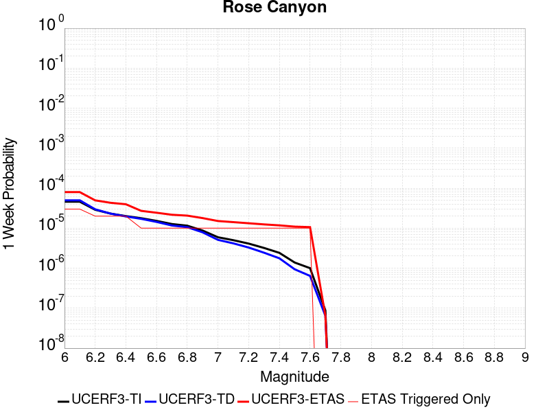 |  | 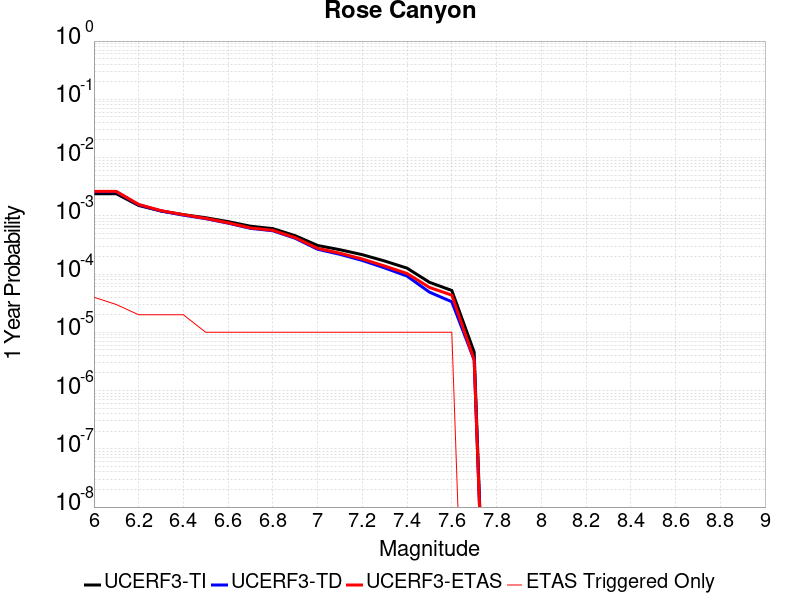 |  |

| Magnitude | 1 wk TI Prob | 1 wk TD Prob | 1 wk ETAS Prob | 1 wk ETAS/TD Gain | 1 wk ETAS Triggered Only | 1 mo TI Prob | 1 mo TD Prob | 1 mo ETAS Prob | 1 mo ETAS/TD Gain | 1 mo ETAS Triggered Only | 1 yr TI Prob | 1 yr TD Prob | 1 yr ETAS Prob | 1 yr ETAS/TD Gain | 1 yr ETAS Triggered Only | 10 yr TI Prob | 10 yr TD Prob | 10 yr ETAS Prob | 10 yr ETAS/TD Gain | 10 yr ETAS Triggered Only |
|-----|-----|-----|-----|-----|-----|-----|-----|-----|-----|-----|-----|-----|-----|-----|-----|-----|-----|-----|-----|-----|
| 6.0 | 4.5923203E-5 | 4.9714225E-5 | 7.409137E-5 | 1.4903454 | 2.4378352E-5 | 1.9679888E-4 | 2.1304491E-4 | 2.4960467E-4 | 1.1716058 | 3.656753E-5 | 0.0023933933 | 0.0025909345 | 0.0026274072 | 1.0140771 | 3.656753E-5 | 0.023677798 | 0.02563999 | 0.02567562 | 1.0013896 | 3.656753E-5 |
| 6.1 | 4.5923203E-5 | 4.9714225E-5 | 7.409137E-5 | 1.4903454 | 2.4378352E-5 | 1.9679888E-4 | 2.1304491E-4 | 2.3741808E-4 | 1.1144038 | 2.4378352E-5 | 0.0023933933 | 0.0025909345 | 0.0026152497 | 1.0093848 | 2.4378352E-5 | 0.023677798 | 0.02563999 | 0.025663745 | 1.0009264 | 2.4378352E-5 |
| 6.2 | 2.8844734E-5 | 2.9668723E-5 | 5.404635E-5 | 1.8216609 | 2.4378352E-5 | 1.2361443E-4 | 1.2714567E-4 | 1.5152092E-4 | 1.1917112 | 2.4378352E-5 | 0.0015039665 | 0.0015468939 | 0.0015712345 | 1.0157351 | 2.4378352E-5 | 0.0149382865 | 0.015374276 | 0.01539828 | 1.0015613 | 2.4378352E-5 |
| 6.3 | 2.3171577E-5 | 2.3161238E-5 | 4.7539026E-5 | 2.0525253 | 2.4378352E-5 | 9.9302975E-5 | 9.9258745E-5 | 1.2363469E-4 | 1.2455797 | 2.4378352E-5 | 0.0012083431 | 0.0012078186 | 0.0012321676 | 1.0201594 | 2.4378352E-5 | 0.012017938 | 0.012022437 | 0.0120465215 | 1.0020033 | 2.4378352E-5 |
| 6.4 | 2.0066604E-5 | 1.9667024E-5 | 4.4044897E-5 | 2.2395303 | 2.4378352E-5 | 8.599689E-5 | 8.4284584E-5 | 1.0866088E-4 | 1.2892141 | 2.4378352E-5 | 0.0010465092 | 0.0010256917 | 0.001050045 | 1.0237434 | 2.4378352E-5 | 0.010415946 | 0.010217559 | 0.010241687 | 1.0023615 | 2.4378352E-5 |
| 6.5 | 1.776989E-5 | 1.7113807E-5 | 2.9302775E-5 | 1.7122301 | 1.2189176E-5 | 7.615444E-5 | 7.334287E-5 | 8.5531145E-5 | 1.1661823 | 1.2189176E-5 | 9.267859E-4 | 8.925905E-4 | 9.047688E-4 | 1.0136437 | 1.2189176E-5 | 0.009229303 | 0.008896211 | 0.008908291 | 1.0013579 | 1.2189176E-5 |
| 6.6 | 1.5227364E-5 | 1.433926E-5 | 2.6528262E-5 | 1.8500439 | 1.2189176E-5 | 6.52585E-5 | 6.1452556E-5 | 7.364098E-5 | 1.1983389 | 1.2189176E-5 | 7.942326E-4 | 7.479332E-4 | 7.601133E-4 | 1.016285 | 1.2189176E-5 | 0.007914 | 0.007458359 | 0.0074704573 | 1.0016221 | 1.2189176E-5 |
| 6.7 | 1.2703898E-5 | 1.1673274E-5 | 2.3862307E-5 | 2.044183 | 1.2189176E-5 | 5.4444143E-5 | 5.0027378E-5 | 6.221595E-5 | 1.2436379 | 1.2189176E-5 | 6.626558E-4 | 6.089174E-4 | 6.2109914E-4 | 1.0200056 | 1.2189176E-5 | 0.006606833 | 0.0060750856 | 0.0060872007 | 1.0019943 | 1.2189176E-5 |
| 6.8 | 1.1554917E-5 | 1.0609337E-5 | 2.2798384E-5 | 2.1488981 | 1.2189176E-5 | 4.9520135E-5 | 4.546782E-5 | 5.7656438E-5 | 1.2680714 | 1.2189176E-5 | 6.0274085E-4 | 5.5343413E-4 | 5.6561653E-4 | 1.0220125 | 1.2189176E-5 | 0.0060110865 | 0.0055225673 | 0.0055346894 | 1.002195 | 1.2189176E-5 |
| 6.9 | 8.732078E-6 | 7.881357E-6 | 2.0070438E-5 | 2.546571 | 1.2189176E-5 | 3.7422655E-5 | 3.3776825E-5 | 4.596559E-5 | 1.3608618 | 1.2189176E-5 | 4.5552556E-4 | 4.111582E-4 | 4.2334237E-4 | 1.0296338 | 1.2189176E-5 | 0.0045459294 | 0.0041048084 | 0.0041169473 | 1.0029573 | 1.2189176E-5 |
| 7.0 | 5.9337494E-6 | 5.1074853E-6 | 1.72966E-5 | 3.3865197 | 1.2189176E-5 | 2.5430107E-5 | 2.188904E-5 | 3.4077948E-5 | 1.5568498 | 1.2189176E-5 | 3.0956755E-4 | 2.664666E-4 | 2.7865253E-4 | 1.0457315 | 1.2189176E-5 | 0.0030913667 | 0.0026614866 | 0.0026736434 | 1.0045676 | 1.2189176E-5 |
| 7.1 | 5.013409E-6 | 4.1773833E-6 | 1.6366508E-5 | 3.9178853 | 1.2189176E-5 | 2.1485863E-5 | 1.7902948E-5 | 3.0091906E-5 | 1.6808352 | 1.2189176E-5 | 2.6155898E-4 | 2.179467E-4 | 2.3013323E-4 | 1.0559151 | 1.2189176E-5 | 0.0026125133 | 0.0021773411 | 0.0021895037 | 1.005586 | 1.2189176E-5 |
| 7.2 | 4.120763E-6 | 3.2821383E-6 | 1.5471274E-5 | 4.713779 | 1.2189176E-5 | 1.7660293E-5 | 1.4066231E-5 | 2.6255237E-5 | 1.8665437 | 1.2189176E-5 | 2.1499286E-4 | 1.7124301E-4 | 1.834301E-4 | 1.0711684 | 1.2189176E-5 | 0.0021478499 | 0.00171112 | 0.0017232883 | 1.0071113 | 1.2189176E-5 |
| 7.3 | 3.2081239E-6 | 2.4405372E-6 | 1.4629683E-5 | 5.994452 | 1.2189176E-5 | 1.374903E-5 | 1.0459404E-5 | 2.2648452E-5 | 2.1653674 | 1.2189176E-5 | 1.6738157E-4 | 1.2733586E-4 | 1.3952349E-4 | 1.0957124 | 1.2189176E-5 | 0.0016725556 | 0.001272636 | 0.0012848097 | 1.0095657 | 1.2189176E-5 |
| 7.4 | 2.4194755E-6 | 1.7680634E-6 | 1.3957218E-5 | 7.894071 | 1.2189176E-5 | 1.0369139E-5 | 7.577393E-6 | 1.9766476E-5 | 2.6086118 | 1.2189176E-5 | 1.2623696E-4 | 9.2250906E-5 | 1.0443896E-4 | 1.1321185 | 1.2189176E-5 | 0.0012616527 | 9.2213147E-4 | 9.343094E-4 | 1.0132062 | 1.2189176E-5 |
| 7.5 | 1.3842889E-6 | 9.3786275E-7 | 1.3127027E-5 | 13.996747 | 1.2189176E-5 | 5.9326535E-6 | 4.019406E-6 | 1.6208533E-5 | 4.0325694 | 1.2189176E-5 | 7.222766E-5 | 4.8935202E-5 | 6.1123785E-5 | 1.2490759 | 1.2189176E-5 | 7.220419E-4 | 4.892478E-4 | 5.01431E-4 | 1.024902 | 1.2189176E-5 |
| 7.6 | 1.0021575E-6 | 6.411463E-7 | 1.28303145E-5 | 20.011524 | 1.2189176E-5 | 4.2949537E-6 | 2.7477672E-6 | 1.493691E-5 | 5.4360175 | 1.2189176E-5 | 5.2289808E-5 | 3.3453573E-5 | 4.564234E-5 | 1.3643488 | 1.2189176E-5 | 5.2277505E-4 | 3.344875E-4 | 3.466726E-4 | 1.0364292 | 1.2189176E-5 |
| 7.7 | 8.7620116E-8 | 6.4492404E-8 | 6.4492404E-8 | 1.0 | 0.0 | 3.7551473E-7 | 2.76396E-7 | 2.76396E-7 | 1.0 | 0.0 | 4.5718825E-6 | 3.3651165E-6 | 3.3651165E-6 | 1.0 | 0.0 | 4.5717883E-5 | 3.3650686E-5 | 3.3650686E-5 | 1.0 | 0.0 |

## San Jacinto (Borrego)
*[(top)](#table-of-contents)*

| 1 Week | 1 Month | 1 Year | 10 Year |
|-----|-----|-----|-----|
|  |  |  |  |

| Magnitude | 1 wk TI Prob | 1 wk TD Prob | 1 wk ETAS Prob | 1 wk ETAS/TD Gain | 1 wk ETAS Triggered Only | 1 mo TI Prob | 1 mo TD Prob | 1 mo ETAS Prob | 1 mo ETAS/TD Gain | 1 mo ETAS Triggered Only | 1 yr TI Prob | 1 yr TD Prob | 1 yr ETAS Prob | 1 yr ETAS/TD Gain | 1 yr ETAS Triggered Only | 10 yr TI Prob | 10 yr TD Prob | 10 yr ETAS Prob | 10 yr ETAS/TD Gain | 10 yr ETAS Triggered Only |
|-----|-----|-----|-----|-----|-----|-----|-----|-----|-----|-----|-----|-----|-----|-----|-----|-----|-----|-----|-----|-----|
| 6.0 | 3.543992E-5 | 2.7926513E-5 | 6.449302E-5 | 2.3093832 | 3.656753E-5 | 1.5187653E-4 | 1.1967963E-4 | 1.5624278E-4 | 1.3055086 | 3.656753E-5 | 0.0018475284 | 0.0014561379 | 0.0014926521 | 1.0250762 | 3.656753E-5 | 0.018322436 | 0.014869647 | 0.014905671 | 1.0024227 | 3.656753E-5 |
| 6.1 | 3.542281E-5 | 2.7926513E-5 | 6.449302E-5 | 2.3093832 | 3.656753E-5 | 1.5180321E-4 | 1.1967963E-4 | 1.5624278E-4 | 1.3055086 | 3.656753E-5 | 0.0018466372 | 0.0014561379 | 0.0014926521 | 1.0250762 | 3.656753E-5 | 0.018313672 | 0.014869647 | 0.014905671 | 1.0024227 | 3.656753E-5 |
| 6.2 | 3.4688688E-5 | 2.7926511E-5 | 6.449302E-5 | 2.3093832 | 3.656753E-5 | 1.4865733E-4 | 1.1967963E-4 | 1.5624278E-4 | 1.3055086 | 3.656753E-5 | 0.0018084005 | 0.0014561379 | 0.0014926521 | 1.0250762 | 3.656753E-5 | 0.017937548 | 0.014869647 | 0.014905671 | 1.0024227 | 3.656753E-5 |
| 6.3 | 3.2087122E-5 | 2.7771865E-5 | 6.4338376E-5 | 2.3166747 | 3.656753E-5 | 1.3750899E-4 | 1.1901691E-4 | 1.5558008E-4 | 1.30721 | 3.656753E-5 | 0.0016728862 | 0.00144808 | 0.0014845945 | 1.0252159 | 3.656753E-5 | 0.016603488 | 0.014790683 | 0.014826709 | 1.0024358 | 3.656753E-5 |
| 6.4 | 3.1828724E-5 | 2.7738852E-5 | 6.4305365E-5 | 2.3182418 | 3.656753E-5 | 1.364017E-4 | 1.1887544E-4 | 1.5543863E-4 | 1.3075756 | 3.656753E-5 | 0.0016594254 | 0.0014463598 | 0.0014828745 | 1.0252459 | 3.656753E-5 | 0.016470885 | 0.014773762 | 0.014809789 | 1.0024385 | 3.656753E-5 |
| 6.5 | 3.1563577E-5 | 2.747857E-5 | 6.4045096E-5 | 2.3307288 | 3.656753E-5 | 1.3526545E-4 | 1.1776006E-4 | 1.5432328E-4 | 1.3104892 | 3.656753E-5 | 0.0016456128 | 0.0014327979 | 0.001469313 | 1.0254852 | 3.656753E-5 | 0.0163348 | 0.014640348 | 0.01467638 | 1.0024612 | 3.656753E-5 |
| 6.6 | 3.1467625E-5 | 2.7322796E-5 | 6.3889325E-5 | 2.3383157 | 3.656753E-5 | 1.3485427E-4 | 1.1709251E-4 | 1.5365575E-4 | 1.3122594 | 3.656753E-5 | 0.0016406142 | 0.0014246812 | 0.0014611966 | 1.0256306 | 3.656753E-5 | 0.016285548 | 0.014560594 | 0.01459663 | 1.0024748 | 3.656753E-5 |
| 6.7 | 3.1223695E-5 | 2.6940816E-5 | 6.350736E-5 | 2.3572917 | 3.656753E-5 | 1.3380898E-4 | 1.15455594E-4 | 1.520189E-4 | 1.3166872 | 3.656753E-5 | 0.0016279068 | 0.0014047775 | 0.0014412937 | 1.0259943 | 3.656753E-5 | 0.01616033 | 0.014364966 | 0.014401008 | 1.002509 | 3.656753E-5 |
| 6.8 | 3.1015585E-5 | 2.6761822E-5 | 6.332837E-5 | 2.36637 | 3.656753E-5 | 1.3291716E-4 | 1.1468855E-4 | 1.5125188E-4 | 1.3188055 | 3.656753E-5 | 0.001617065 | 0.0013954508 | 0.0014319672 | 1.0261682 | 3.656753E-5 | 0.016053487 | 0.014272246 | 0.0143082915 | 1.0025256 | 3.656753E-5 |
| 6.9 | 2.6641965E-5 | 2.2184247E-5 | 5.8750964E-5 | 2.648319 | 3.656753E-5 | 1.1417485E-4 | 9.50719E-5 | 1.3163596E-4 | 1.3845937 | 3.656753E-5 | 0.0013891924 | 0.0011568897 | 0.0011934149 | 1.0315719 | 3.656753E-5 | 0.0138054015 | 0.011882438 | 0.011918572 | 1.0030409 | 3.656753E-5 |
| 7.0 | 2.3854353E-5 | 2.0479023E-5 | 5.7045803E-5 | 2.7855723 | 3.656753E-5 | 1.02228936E-4 | 8.77643E-5 | 1.2432862E-4 | 1.4166194 | 3.656753E-5 | 0.0012439266 | 0.0010680092 | 0.0011045376 | 1.0342023 | 3.656753E-5 | 0.012369866 | 0.0109828 | 0.011018966 | 1.0032929 | 3.656753E-5 |
| 7.1 | 2.3672901E-5 | 2.031551E-5 | 5.6882294E-5 | 2.7999442 | 3.656753E-5 | 1.0145135E-4 | 8.7063585E-5 | 1.2362793E-4 | 1.4199729 | 3.656753E-5 | 0.0012344702 | 0.0010594862 | 0.001096015 | 1.0344778 | 3.656753E-5 | 0.0122763505 | 0.010897976 | 0.010934145 | 1.0033189 | 3.656753E-5 |
| 7.2 | 2.2717244E-5 | 1.9542893E-5 | 5.6109704E-5 | 2.8711054 | 3.656753E-5 | 9.735599E-5 | 8.375258E-5 | 1.2031704E-4 | 1.4365772 | 3.656753E-5 | 0.0011846646 | 0.001019213 | 0.0010557432 | 1.0358416 | 3.656753E-5 | 0.01178369 | 0.010495341 | 0.010531525 | 1.0034477 | 3.656753E-5 |
| 7.3 | 2.1016205E-5 | 1.8384526E-5 | 5.4951382E-5 | 2.989002 | 3.656753E-5 | 9.006634E-5 | 7.878846E-5 | 1.15353105E-4 | 1.4640864 | 3.656753E-5 | 0.001096006 | 9.5882936E-4 | 9.953618E-4 | 1.0381011 | 3.656753E-5 | 0.010906163 | 0.009890967 | 0.009927172 | 1.0036604 | 3.656753E-5 |
| 7.4 | 2.0683625E-5 | 1.8187047E-5 | 5.475391E-5 | 3.0105991 | 3.656753E-5 | 8.86411E-5 | 7.794217E-5 | 1.14506845E-4 | 1.4691257 | 3.656753E-5 | 0.001078671 | 9.485349E-4 | 9.850677E-4 | 1.038515 | 3.656753E-5 | 0.010734501 | 0.009787692 | 0.009823902 | 1.0036995 | 3.656753E-5 |
| 7.5 | 1.9993966E-5 | 1.7782075E-5 | 5.434895E-5 | 3.0563898 | 3.656753E-5 | 8.568561E-5 | 7.620667E-5 | 1.1277141E-4 | 1.4798102 | 3.656753E-5 | 0.001042723 | 9.2742336E-4 | 9.6395693E-4 | 1.0393926 | 3.656753E-5 | 0.010378438 | 0.009574614 | 0.009610832 | 1.0037826 | 3.656753E-5 |
| 7.6 | 1.788966E-5 | 1.6435291E-5 | 5.300222E-5 | 3.224903 | 3.656753E-5 | 7.666772E-5 | 7.043507E-5 | 1.0700002E-4 | 1.51913 | 3.656753E-5 | 9.3302975E-4 | 8.572113E-4 | 8.937475E-4 | 1.0426221 | 3.656753E-5 | 0.00929122 | 0.008866487 | 0.00890273 | 1.0040877 | 3.656753E-5 |
| 7.7 | 1.5125781E-5 | 1.4237377E-5 | 5.0804385E-5 | 3.5683808 | 3.656753E-5 | 6.4823165E-5 | 6.1015908E-5 | 9.758121E-5 | 1.5992748 | 3.656753E-5 | 7.889362E-4 | 7.426163E-4 | 7.791567E-4 | 1.049205 | 3.656753E-5 | 0.007861412 | 0.0077142045 | 0.0077504897 | 1.0047038 | 3.656753E-5 |
| 7.8 | 1.250089E-5 | 1.26304985E-5 | 4.9197566E-5 | 3.8951404 | 3.656753E-5 | 5.3574146E-5 | 5.412959E-5 | 9.069514E-5 | 1.6755188 | 3.656753E-5 | 6.5207E-4 | 6.588291E-4 | 6.953725E-4 | 1.0554672 | 3.656753E-5 | 0.006501599 | 0.0068677636 | 0.00690408 | 1.005288 | 3.656753E-5 |
| 7.9 | 9.561E-6 | 9.754616E-6 | 4.6321788E-5 | 4.748704 | 3.656753E-5 | 4.0975072E-5 | 4.1804833E-5 | 7.837083E-5 | 1.8746835 | 3.656753E-5 | 4.987573E-4 | 5.088555E-4 | 5.4540444E-4 | 1.0718257 | 3.656753E-5 | 0.0049763937 | 0.0053523467 | 0.0053887186 | 1.0067955 | 3.656753E-5 |
| 8.0 | 8.01699E-6 | 8.293488E-6 | 3.2671636E-5 | 3.9394329 | 2.4378352E-5 | 3.4358076E-5 | 3.554304E-5 | 5.9920523E-5 | 1.6858582 | 2.4378352E-5 | 4.1822926E-4 | 4.3265108E-4 | 4.5701888E-4 | 1.0563221 | 2.4378352E-5 | 0.0041744304 | 0.004573375 | 0.004597642 | 1.0053061 | 2.4378352E-5 |
| 8.1 | 6.541947E-6 | 6.4622354E-6 | 1.8651333E-5 | 2.8862045 | 1.2189176E-5 | 2.8036617E-5 | 2.7695003E-5 | 3.9883842E-5 | 1.4401096 | 1.2189176E-5 | 3.4129233E-4 | 3.37135E-4 | 3.4932006E-4 | 1.036143 | 1.2189176E-5 | 0.0034076865 | 0.0035806994 | 0.003592845 | 1.003392 | 1.2189176E-5 |
| 8.2 | 1.7968189E-6 | 7.9713476E-7 | 7.9713476E-7 | 1.0 | 0.0 | 7.70063E-6 | 3.4162877E-6 | 3.4162877E-6 | 1.0 | 0.0 | 9.3751136E-5 | 4.159253E-5 | 4.159253E-5 | 1.0 | 0.0 | 9.371159E-4 | 4.712058E-4 | 4.712058E-4 | 1.0 | 0.0 |
| 8.3 | 1.5167889E-7 | 4.897714E-8 | 4.897714E-8 | 1.0 | 0.0 | 6.500522E-7 | 2.09902E-7 | 2.09902E-7 | 1.0 | 0.0 | 7.9143565E-6 | 2.5555544E-6 | 2.5555544E-6 | 1.0 | 0.0 | 7.914075E-5 | 2.969505E-5 | 2.969505E-5 | 1.0 | 0.0 |

## San Pedro Basin
*[(top)](#table-of-contents)*

| 1 Week | 1 Month | 1 Year | 10 Year |
|-----|-----|-----|-----|
|  |  |  |  |

| Magnitude | 1 wk TI Prob | 1 wk TD Prob | 1 wk ETAS Prob | 1 wk ETAS/TD Gain | 1 wk ETAS Triggered Only | 1 mo TI Prob | 1 mo TD Prob | 1 mo ETAS Prob | 1 mo ETAS/TD Gain | 1 mo ETAS Triggered Only | 1 yr TI Prob | 1 yr TD Prob | 1 yr ETAS Prob | 1 yr ETAS/TD Gain | 1 yr ETAS Triggered Only | 10 yr TI Prob | 10 yr TD Prob | 10 yr ETAS Prob | 10 yr ETAS/TD Gain | 10 yr ETAS Triggered Only |
|-----|-----|-----|-----|-----|-----|-----|-----|-----|-----|-----|-----|-----|-----|-----|-----|-----|-----|-----|-----|-----|
| 6.0 | 5.3449043E-5 | 6.336954E-5 | 8.7746346E-5 | 1.384677 | 2.4378352E-5 | 2.2904722E-4 | 2.715589E-4 | 2.9593066E-4 | 1.0897475 | 2.4378352E-5 | 0.0027850836 | 0.0033018254 | 0.0033382722 | 1.0110384 | 3.656753E-5 | 0.027504366 | 0.03258945 | 0.032624826 | 1.0010855 | 3.656753E-5 |
| 6.1 | 5.3449043E-5 | 6.336954E-5 | 8.7746346E-5 | 1.384677 | 2.4378352E-5 | 2.2904722E-4 | 2.715589E-4 | 2.9593066E-4 | 1.0897475 | 2.4378352E-5 | 0.0027850836 | 0.0033018254 | 0.0033382722 | 1.0110384 | 3.656753E-5 | 0.027504366 | 0.03258945 | 0.032624826 | 1.0010855 | 3.656753E-5 |
| 6.2 | 2.3189454E-5 | 2.6642796E-5 | 3.8831648E-5 | 1.4574914 | 1.2189176E-5 | 9.9379584E-5 | 1.14178685E-4 | 1.2636646E-4 | 1.1067431 | 1.2189176E-5 | 0.0012092749 | 0.0013892864 | 0.0014136309 | 1.017523 | 2.4378352E-5 | 0.012027155 | 0.013810883 | 0.013834925 | 1.0017408 | 2.4378352E-5 |
| 6.3 | 2.3189454E-5 | 2.6642796E-5 | 3.8831648E-5 | 1.4574914 | 1.2189176E-5 | 9.9379584E-5 | 1.14178685E-4 | 1.2636646E-4 | 1.1067431 | 1.2189176E-5 | 0.0012092749 | 0.0013892864 | 0.0014136309 | 1.017523 | 2.4378352E-5 | 0.012027155 | 0.013810883 | 0.013834925 | 1.0017408 | 2.4378352E-5 |
| 6.4 | 1.966056E-5 | 2.2463413E-5 | 3.4652316E-5 | 1.5426114 | 1.2189176E-5 | 8.425682E-5 | 9.626844E-5 | 1.0845645E-4 | 1.1266043 | 1.2189176E-5 | 0.001025344 | 0.0011714783 | 0.0011836533 | 1.0103928 | 1.2189176E-5 | 0.010206259 | 0.011657117 | 0.011669164 | 1.0010334 | 1.2189176E-5 |
| 6.5 | 1.7342953E-5 | 1.9745148E-5 | 3.1934083E-5 | 1.6173129 | 1.2189176E-5 | 7.4324824E-5 | 8.4619525E-5 | 9.680767E-5 | 1.1440346 | 1.2189176E-5 | 9.04529E-4 | 0.0010297928 | 0.0010419694 | 1.0118244 | 1.2189176E-5 | 0.009008561 | 0.010253931 | 0.010265996 | 1.0011766 | 1.2189176E-5 |
| 6.6 | 1.439804E-5 | 1.6322716E-5 | 2.8511693E-5 | 1.7467493 | 1.2189176E-5 | 6.170443E-5 | 6.99528E-5 | 8.214112E-5 | 1.1742364 | 1.2189176E-5 | 7.509924E-4 | 8.513747E-4 | 8.635535E-4 | 1.0143049 | 1.2189176E-5 | 0.0074845953 | 0.008484332 | 0.008496418 | 1.0014244 | 1.2189176E-5 |
| 6.7 | 1.2634884E-5 | 1.4285297E-5 | 2.64743E-5 | 1.853255 | 1.2189176E-5 | 5.414838E-5 | 6.1221435E-5 | 7.3409865E-5 | 1.1990876 | 1.2189176E-5 | 6.590571E-4 | 7.4514654E-4 | 7.5732666E-4 | 1.0163459 | 1.2189176E-5 | 0.006571059 | 0.007429501 | 0.0074416 | 1.0016284 | 1.2189176E-5 |
| 6.8 | 1.146091E-5 | 1.2933192E-5 | 2.512221E-5 | 1.9424602 | 1.2189176E-5 | 4.911726E-5 | 5.5426954E-5 | 6.761545E-5 | 1.219902 | 1.2189176E-5 | 5.9783855E-4 | 6.7464396E-4 | 6.868249E-4 | 1.0180553 | 1.2189176E-5 | 0.0059623276 | 0.006728899 | 0.0067410064 | 1.0017992 | 1.2189176E-5 |
| 6.9 | 9.109035E-6 | 1.0235011E-5 | 1.0235011E-5 | 1.0 | 0.0 | 3.9038136E-5 | 4.3863754E-5 | 4.3863754E-5 | 1.0 | 0.0 | 4.7518566E-4 | 5.3393835E-4 | 5.3393835E-4 | 1.0 | 0.0 | 0.0047417083 | 0.005329309 | 0.005329309 | 1.0 | 0.0 |
| 7.0 | 5.9351028E-6 | 6.583964E-6 | 6.583964E-6 | 1.0 | 0.0 | 2.5435906E-5 | 2.8216817E-5 | 2.8216817E-5 | 1.0 | 0.0 | 3.0963816E-4 | 3.435092E-4 | 3.435092E-4 | 1.0 | 0.0 | 0.0030920706 | 0.0034320992 | 0.0034320992 | 1.0 | 0.0 |
| 7.1 | 2.1557585E-6 | 2.209648E-6 | 2.209648E-6 | 1.0 | 0.0 | 9.238933E-6 | 9.469887E-6 | 9.469887E-6 | 1.0 | 0.0 | 1.1247819E-4 | 1.1528993E-4 | 1.1528993E-4 | 1.0 | 0.0 | 0.0011242128 | 0.0011523166 | 0.0011523166 | 1.0 | 0.0 |
| 7.2 | 2.1251979E-6 | 2.1779945E-6 | 2.1779945E-6 | 1.0 | 0.0 | 9.107958E-6 | 9.334229E-6 | 9.334229E-6 | 1.0 | 0.0 | 1.1088375E-4 | 1.1363847E-4 | 1.1363847E-4 | 1.0 | 0.0 | 0.0011082845 | 0.0011358189 | 0.0011358189 | 1.0 | 0.0 |
| 7.3 | 1.7145798E-6 | 1.7442874E-6 | 1.7442874E-6 | 1.0 | 0.0 | 7.3481783E-6 | 7.4754967E-6 | 7.4754967E-6 | 1.0 | 0.0 | 8.94604E-5 | 9.1010465E-5 | 9.1010465E-5 | 1.0 | 0.0 | 8.9424395E-4 | 9.0974104E-4 | 9.0974104E-4 | 1.0 | 0.0 |
| 7.4 | 1.4467993E-6 | 1.4641868E-6 | 1.4641868E-6 | 1.0 | 0.0 | 6.200554E-6 | 6.2750714E-6 | 6.2750714E-6 | 1.0 | 0.0 | 7.548913E-5 | 7.639639E-5 | 7.639639E-5 | 1.0 | 0.0 | 7.546349E-4 | 7.6370855E-4 | 7.6370855E-4 | 1.0 | 0.0 |
| 7.5 | 1.2803735E-6 | 1.2931497E-6 | 1.2931497E-6 | 1.0 | 0.0 | 5.487303E-6 | 5.5420587E-6 | 5.5420587E-6 | 1.0 | 0.0 | 6.680587E-5 | 6.7472545E-5 | 6.7472545E-5 | 1.0 | 0.0 | 6.678579E-4 | 6.7452766E-4 | 6.7452766E-4 | 1.0 | 0.0 |
| 7.6 | 6.755009E-7 | 6.769465E-7 | 6.769465E-7 | 1.0 | 0.0 | 2.8950008E-6 | 2.9011965E-6 | 2.9011965E-6 | 1.0 | 0.0 | 3.5246063E-5 | 3.5321555E-5 | 3.5321555E-5 | 1.0 | 0.0 | 3.5240475E-4 | 3.5316512E-4 | 3.5316512E-4 | 1.0 | 0.0 |
| 7.7 | 6.211885E-8 | 4.569953E-8 | 4.569953E-8 | 1.0 | 0.0 | 2.6622362E-7 | 1.9585512E-7 | 1.9585512E-7 | 1.0 | 0.0 | 3.2412677E-6 | 2.3845337E-6 | 2.3845337E-6 | 1.0 | 0.0 | 3.2412205E-5 | 2.3845101E-5 | 2.3845101E-5 | 1.0 | 0.0 |
| 7.8 | 2.6580573E-9 | 1.5138163E-9 | 1.5138163E-9 | 1.0 | 0.0 | 1.1391674E-8 | 6.487784E-9 | 6.487784E-9 | 1.0 | 0.0 | 1.3869362E-7 | 7.898877E-8 | 7.898877E-8 | 1.0 | 0.0 | 1.3869354E-6 | 7.898877E-7 | 7.898877E-7 | 1.0 | 0.0 |

## Emerson-Copper Mtn 2011
*[(top)](#table-of-contents)*

| 1 Week | 1 Month | 1 Year | 10 Year |
|-----|-----|-----|-----|
|  |  |  |  |

| Magnitude | 1 wk TI Prob | 1 wk TD Prob | 1 wk ETAS Prob | 1 wk ETAS/TD Gain | 1 wk ETAS Triggered Only | 1 mo TI Prob | 1 mo TD Prob | 1 mo ETAS Prob | 1 mo ETAS/TD Gain | 1 mo ETAS Triggered Only | 1 yr TI Prob | 1 yr TD Prob | 1 yr ETAS Prob | 1 yr ETAS/TD Gain | 1 yr ETAS Triggered Only | 10 yr TI Prob | 10 yr TD Prob | 10 yr ETAS Prob | 10 yr ETAS/TD Gain | 10 yr ETAS Triggered Only |
|-----|-----|-----|-----|-----|-----|-----|-----|-----|-----|-----|-----|-----|-----|-----|-----|-----|-----|-----|-----|-----|
| 6.0 | 2.1364202E-5 | 9.968114E-6 | 9.968114E-6 | 1.0 | 0.0 | 9.1557646E-5 | 4.2719836E-5 | 4.2719836E-5 | 1.0 | 0.0 | 0.0011141442 | 5.199986E-4 | 5.443643E-4 | 1.0468572 | 2.4378352E-5 | 0.011085749 | 0.005188688 | 0.0052250656 | 1.0070109 | 3.656753E-5 |
| 6.1 | 2.1364202E-5 | 9.968114E-6 | 9.968114E-6 | 1.0 | 0.0 | 9.1557646E-5 | 4.2719836E-5 | 4.2719836E-5 | 1.0 | 0.0 | 0.0011141442 | 5.199986E-4 | 5.443643E-4 | 1.0468572 | 2.4378352E-5 | 0.011085749 | 0.005188688 | 0.0052250656 | 1.0070109 | 3.656753E-5 |
| 6.2 | 2.1364202E-5 | 9.968114E-6 | 9.968114E-6 | 1.0 | 0.0 | 9.1557646E-5 | 4.2719836E-5 | 4.2719836E-5 | 1.0 | 0.0 | 0.0011141442 | 5.199986E-4 | 5.443643E-4 | 1.0468572 | 2.4378352E-5 | 0.011085749 | 0.005188688 | 0.0052250656 | 1.0070109 | 3.656753E-5 |
| 6.3 | 1.7751237E-5 | 8.089227E-6 | 8.089227E-6 | 1.0 | 0.0 | 7.607452E-5 | 3.466769E-5 | 3.466769E-5 | 1.0 | 0.0 | 9.258136E-4 | 4.2200365E-4 | 4.463717E-4 | 1.0577438 | 2.4378352E-5 | 0.00921966 | 0.0042126453 | 0.004236921 | 1.0057626 | 2.4378352E-5 |
| 6.4 | 1.7751237E-5 | 8.089227E-6 | 8.089227E-6 | 1.0 | 0.0 | 7.607452E-5 | 3.466769E-5 | 3.466769E-5 | 1.0 | 0.0 | 9.258136E-4 | 4.2200365E-4 | 4.463717E-4 | 1.0577438 | 2.4378352E-5 | 0.00921966 | 0.0042126453 | 0.004236921 | 1.0057626 | 2.4378352E-5 |
| 6.5 | 1.5886664E-5 | 6.603819E-6 | 6.603819E-6 | 1.0 | 0.0 | 6.808392E-5 | 2.8301802E-5 | 2.8301802E-5 | 1.0 | 0.0 | 8.286065E-4 | 3.4452465E-4 | 3.688946E-4 | 1.070735 | 2.4378352E-5 | 0.008255237 | 0.0034403696 | 0.003464664 | 1.0070616 | 2.4378352E-5 |
| 6.6 | 1.5886664E-5 | 6.603819E-6 | 6.603819E-6 | 1.0 | 0.0 | 6.808392E-5 | 2.8301802E-5 | 2.8301802E-5 | 1.0 | 0.0 | 8.286065E-4 | 3.4452465E-4 | 3.688946E-4 | 1.070735 | 2.4378352E-5 | 0.008255237 | 0.0034403696 | 0.003464664 | 1.0070616 | 2.4378352E-5 |
| 6.7 | 1.428471E-5 | 5.470403E-6 | 5.470403E-6 | 1.0 | 0.0 | 6.121875E-5 | 2.3444394E-5 | 2.3444394E-5 | 1.0 | 0.0 | 7.450834E-4 | 2.8540206E-4 | 3.0977346E-4 | 1.0853932 | 2.4378352E-5 | 0.007425902 | 0.0028507432 | 0.0028750522 | 1.0085272 | 2.4378352E-5 |
| 6.8 | 1.3490684E-5 | 5.073699E-6 | 5.073699E-6 | 1.0 | 0.0 | 5.7815934E-5 | 2.1744265E-5 | 2.1744265E-5 | 1.0 | 0.0 | 7.0368167E-4 | 2.6470813E-4 | 2.8908002E-4 | 1.0920708 | 2.4378352E-5 | 0.007014576 | 0.002644309 | 0.0026686229 | 1.0091949 | 2.4378352E-5 |
| 6.9 | 1.2235421E-5 | 4.289677E-6 | 4.289677E-6 | 1.0 | 0.0 | 5.2436466E-5 | 1.838422E-5 | 1.838422E-5 | 1.0 | 0.0 | 6.38227E-4 | 2.238085E-4 | 2.481814E-4 | 1.1089007 | 2.4378352E-5 | 0.0063639707 | 0.0022361854 | 0.0022605092 | 1.0108774 | 2.4378352E-5 |
| 7.0 | 1.1009851E-5 | 3.7189886E-6 | 3.7189886E-6 | 1.0 | 0.0 | 4.7184225E-5 | 1.5938444E-5 | 1.5938444E-5 | 1.0 | 0.0 | 5.743165E-4 | 1.9403672E-4 | 2.1841034E-4 | 1.1256135 | 2.4378352E-5 | 0.005728345 | 0.0019390108 | 0.0019633418 | 1.0125482 | 2.4378352E-5 |
| 7.1 | 9.726373E-6 | 3.2117953E-6 | 3.2117953E-6 | 1.0 | 0.0 | 4.168379E-5 | 1.3764783E-5 | 1.3764783E-5 | 1.0 | 0.0 | 5.07382E-4 | 1.6757673E-4 | 1.91951E-4 | 1.1454514 | 2.4378352E-5 | 0.0050622504 | 0.0016748349 | 0.0016991723 | 1.0145313 | 2.4378352E-5 |
| 7.2 | 3.9335127E-6 | 1.1524792E-6 | 1.1524792E-6 | 1.0 | 0.0 | 1.6857803E-5 | 4.9391874E-6 | 4.9391874E-6 | 1.0 | 0.0 | 2.0522442E-4 | 6.0133007E-5 | 8.450989E-5 | 1.4053828 | 2.4378352E-5 | 0.00205035 | 6.011733E-4 | 6.25537E-4 | 1.0405269 | 2.4378352E-5 |
| 7.3 | 2.661632E-6 | 6.911505E-7 | 6.911505E-7 | 1.0 | 0.0 | 1.14069435E-5 | 2.9620703E-6 | 2.9620703E-6 | 1.0 | 0.0 | 1.3887069E-4 | 3.6062618E-5 | 6.0440092E-5 | 1.6759763 | 2.4378352E-5 | 0.0013878393 | 3.605687E-4 | 3.8493826E-4 | 1.0675864 | 2.4378352E-5 |
| 7.4 | 2.0893426E-6 | 5.4618386E-7 | 5.4618386E-7 | 1.0 | 0.0 | 8.954295E-6 | 2.3407858E-6 | 2.3407858E-6 | 1.0 | 0.0 | 1.0901308E-4 | 2.84987E-5 | 4.068753E-5 | 1.4276977 | 1.2189176E-5 | 0.0010895962 | 2.84951E-4 | 2.9713672E-4 | 1.0427642 | 1.2189176E-5 |
| 7.5 | 1.1681728E-6 | 3.6030585E-7 | 3.6030585E-7 | 1.0 | 0.0 | 5.0064455E-6 | 1.544167E-6 | 1.544167E-6 | 1.0 | 0.0 | 6.0951766E-5 | 1.8800076E-5 | 1.8800076E-5 | 1.0 | 0.0 | 6.093505E-4 | 1.8798532E-4 | 1.8798532E-4 | 1.0 | 0.0 |
| 7.6 | 1.3154387E-7 | 7.1197384E-8 | 7.1197384E-8 | 1.0 | 0.0 | 5.6375933E-7 | 3.051316E-7 | 3.051316E-7 | 1.0 | 0.0 | 6.863748E-6 | 3.7149728E-6 | 3.7149728E-6 | 1.0 | 0.0 | 6.863536E-5 | 3.7149264E-5 | 3.7149264E-5 | 1.0 | 0.0 |

## Oceanic - West Huasna
*[(top)](#table-of-contents)*

| 1 Week | 1 Month | 1 Year | 10 Year |
|-----|-----|-----|-----|
|  |  |  | 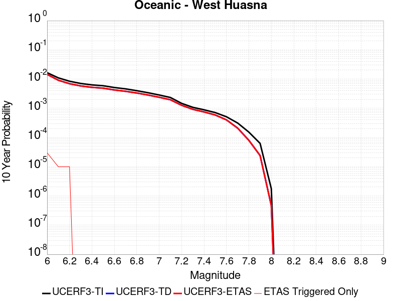 |

| Magnitude | 1 wk TI Prob | 1 wk TD Prob | 1 wk ETAS Prob | 1 wk ETAS/TD Gain | 1 wk ETAS Triggered Only | 1 mo TI Prob | 1 mo TD Prob | 1 mo ETAS Prob | 1 mo ETAS/TD Gain | 1 mo ETAS Triggered Only | 1 yr TI Prob | 1 yr TD Prob | 1 yr ETAS Prob | 1 yr ETAS/TD Gain | 1 yr ETAS Triggered Only | 10 yr TI Prob | 10 yr TD Prob | 10 yr ETAS Prob | 10 yr ETAS/TD Gain | 10 yr ETAS Triggered Only |
|-----|-----|-----|-----|-----|-----|-----|-----|-----|-----|-----|-----|-----|-----|-----|-----|-----|-----|-----|-----|-----|
| 6.0 | 3.195567E-5 | 2.7926868E-5 | 6.4493375E-5 | 2.3093665 | 3.656753E-5 | 1.3694567E-4 | 1.1968133E-4 | 1.5624448E-4 | 1.3055042 | 3.656753E-5 | 0.0016660384 | 0.0014561893 | 0.0014927037 | 1.0250752 | 3.656753E-5 | 0.016536033 | 0.014471028 | 0.0145070655 | 1.0024904 | 3.656753E-5 |
| 6.1 | 2.1156782E-5 | 1.7573486E-5 | 2.9762448E-5 | 1.6935996 | 1.2189176E-5 | 9.066878E-5 | 7.531282E-5 | 8.7501074E-5 | 1.1618351 | 1.2189176E-5 | 0.0011033333 | 9.165572E-4 | 9.2873524E-4 | 1.0132867 | 1.2189176E-5 | 0.010978713 | 0.009128777 | 0.009140856 | 1.0013231 | 1.2189176E-5 |
| 6.2 | 1.6195117E-5 | 1.3327152E-5 | 2.5516167E-5 | 1.9146 | 1.2189176E-5 | 6.9405796E-5 | 5.7115132E-5 | 6.930361E-5 | 1.2134019 | 1.2189176E-5 | 8.44688E-4 | 6.9515745E-4 | 7.0733816E-4 | 1.0175222 | 1.2189176E-5 | 0.008414844 | 0.006930123 | 0.006942228 | 1.0017467 | 1.2189176E-5 |
| 6.3 | 1.3559345E-5 | 1.1179142E-5 | 1.1179142E-5 | 1.0 | 0.0 | 5.811018E-5 | 4.7909736E-5 | 4.7909736E-5 | 1.0 | 0.0 | 7.072618E-4 | 5.831459E-4 | 5.831459E-4 | 1.0 | 0.0 | 0.0070501505 | 0.0058162753 | 0.0058162753 | 1.0 | 0.0 |
| 6.4 | 1.2120619E-5 | 1.0000977E-5 | 1.0000977E-5 | 1.0 | 0.0 | 5.1944477E-5 | 4.2860633E-5 | 4.2860633E-5 | 1.0 | 0.0 | 6.322405E-4 | 5.2170374E-4 | 5.2170374E-4 | 1.0 | 0.0 | 0.006304447 | 0.0052048573 | 0.0052048573 | 1.0 | 0.0 |
| 6.5 | 1.13511915E-5 | 9.3674735E-6 | 9.3674735E-6 | 1.0 | 0.0 | 4.8647056E-5 | 4.01457E-5 | 4.01457E-5 | 1.0 | 0.0 | 5.9211696E-4 | 4.886647E-4 | 4.886647E-4 | 1.0 | 0.0 | 0.0059054173 | 0.0048759608 | 0.0048759608 | 1.0 | 0.0 |
| 6.6 | 9.850605E-6 | 8.135418E-6 | 8.135418E-6 | 1.0 | 0.0 | 4.2216197E-5 | 3.4865614E-5 | 3.4865614E-5 | 1.0 | 0.0 | 5.1386096E-4 | 4.2440637E-4 | 4.2440637E-4 | 1.0 | 0.0 | 0.0051267436 | 0.004235991 | 0.004235991 | 1.0 | 0.0 |
| 6.7 | 8.8558645E-6 | 7.318433E-6 | 7.318433E-6 | 1.0 | 0.0 | 3.7953152E-5 | 3.1364336E-5 | 3.1364336E-5 | 1.0 | 0.0 | 4.6198163E-4 | 3.8179406E-4 | 3.8179406E-4 | 1.0 | 0.0 | 0.004610224 | 0.0038114067 | 0.0038114067 | 1.0 | 0.0 |
| 6.8 | 7.67136E-6 | 6.391756E-6 | 6.391756E-6 | 1.0 | 0.0 | 3.2876844E-5 | 2.7392953E-5 | 2.7392953E-5 | 1.0 | 0.0 | 4.0020206E-4 | 3.3345833E-4 | 3.3345833E-4 | 1.0 | 0.0 | 0.003994821 | 0.0033296007 | 0.0033296007 | 1.0 | 0.0 |
| 6.9 | 6.534529E-6 | 5.4583297E-6 | 5.4583297E-6 | 1.0 | 0.0 | 2.8004823E-5 | 2.3392633E-5 | 2.3392633E-5 | 1.0 | 0.0 | 3.4090536E-4 | 2.847682E-4 | 2.847682E-4 | 1.0 | 0.0 | 0.0034038287 | 0.0028440498 | 0.0028440498 | 1.0 | 0.0 |
| 7.0 | 5.460525E-6 | 4.5699517E-6 | 4.5699517E-6 | 1.0 | 0.0 | 2.3402039E-5 | 1.958536E-5 | 1.958536E-5 | 1.0 | 0.0 | 2.8488258E-4 | 2.3842578E-4 | 2.3842578E-4 | 1.0 | 0.0 | 0.0028451765 | 0.0023817138 | 0.0023817138 | 1.0 | 0.0 |
| 7.1 | 4.4825083E-6 | 3.7524428E-6 | 3.7524428E-6 | 1.0 | 0.0 | 1.9210609E-5 | 1.60818E-5 | 1.60818E-5 | 1.0 | 0.0 | 2.3386406E-4 | 1.9577841E-4 | 1.9577841E-4 | 1.0 | 0.0 | 0.002336181 | 0.0019560715 | 0.0019560715 | 1.0 | 0.0 |
| 7.2 | 2.821708E-6 | 2.4249334E-6 | 2.4249334E-6 | 1.0 | 0.0 | 1.2092979E-5 | 1.039253E-5 | 1.039253E-5 | 1.0 | 0.0 | 1.4722206E-4 | 1.2652173E-4 | 1.2652173E-4 | 1.0 | 0.0 | 0.0014712457 | 0.0012644994 | 0.0012644994 | 1.0 | 0.0 |
| 7.3 | 2.0644757E-6 | 1.7687412E-6 | 1.7687412E-6 | 1.0 | 0.0 | 8.847723E-6 | 7.5802973E-6 | 7.5802973E-6 | 1.0 | 0.0 | 1.0771569E-4 | 9.228622E-5 | 9.228622E-5 | 1.0 | 0.0 | 0.001076635 | 9.2248066E-4 | 9.2248066E-4 | 1.0 | 0.0 |
| 7.4 | 1.6980367E-6 | 1.4379892E-6 | 1.4379892E-6 | 1.0 | 0.0 | 7.27728E-6 | 6.162796E-6 | 6.162796E-6 | 1.0 | 0.0 | 8.8597284E-5 | 7.5029464E-5 | 7.5029464E-5 | 1.0 | 0.0 | 8.8561967E-4 | 7.500429E-4 | 7.500429E-4 | 1.0 | 0.0 |
| 7.5 | 1.3637683E-6 | 1.1302635E-6 | 1.1302635E-6 | 1.0 | 0.0 | 5.844708E-6 | 4.8439774E-6 | 4.8439774E-6 | 1.0 | 0.0 | 7.1156996E-5 | 5.897383E-5 | 5.897383E-5 | 1.0 | 0.0 | 7.1134215E-4 | 5.895833E-4 | 5.895833E-4 | 1.0 | 0.0 |
| 7.6 | 9.802994E-7 | 7.677247E-7 | 7.677247E-7 | 1.0 | 0.0 | 4.2012766E-6 | 3.2902446E-6 | 3.2902446E-6 | 1.0 | 0.0 | 5.1149345E-5 | 4.0057992E-5 | 4.0057992E-5 | 1.0 | 0.0 | 5.113757E-4 | 4.0050913E-4 | 4.0050913E-4 | 1.0 | 0.0 |
| 7.7 | 5.986191E-7 | 4.0050548E-7 | 4.0050548E-7 | 1.0 | 0.0 | 2.5655079E-6 | 1.7164509E-6 | 1.7164509E-6 | 1.0 | 0.0 | 3.1234613E-5 | 2.089759E-5 | 2.089759E-5 | 1.0 | 0.0 | 3.123022E-4 | 2.089576E-4 | 2.089576E-4 | 1.0 | 0.0 |
| 7.8 | 2.9189815E-7 | 1.5285792E-7 | 1.5285792E-7 | 1.0 | 0.0 | 1.2509914E-6 | 6.5510517E-7 | 6.5510517E-7 | 1.0 | 0.0 | 1.5230714E-5 | 7.9758765E-6 | 7.9758765E-6 | 1.0 | 0.0 | 1.522967E-4 | 7.9757214E-5 | 7.9757214E-5 | 1.0 | 0.0 |
| 7.9 | 1.2057845E-7 | 4.621248E-8 | 4.621248E-8 | 1.0 | 0.0 | 5.1676466E-7 | 1.9805347E-7 | 1.9805347E-7 | 1.0 | 0.0 | 6.2915915E-6 | 2.4112983E-6 | 2.4112983E-6 | 1.0 | 0.0 | 6.2914136E-5 | 2.4114026E-5 | 2.4114026E-5 | 1.0 | 0.0 |
| 8.0 | 3.3806387E-9 | 9.011393E-10 | 9.011393E-10 | 1.0 | 0.0 | 1.4488451E-8 | 3.8620254E-9 | 3.8620254E-9 | 1.0 | 0.0 | 1.7639688E-7 | 4.702016E-8 | 4.702016E-8 | 1.0 | 0.0 | 1.7639674E-6 | 4.7129527E-7 | 4.7129527E-7 | 1.0 | 0.0 |

## San Gregorio (North) 2011 CFM
*[(top)](#table-of-contents)*

| 1 Week | 1 Month | 1 Year | 10 Year |
|-----|-----|-----|-----|
|  |  |  |  |

| Magnitude | 1 wk TI Prob | 1 wk TD Prob | 1 wk ETAS Prob | 1 wk ETAS/TD Gain | 1 wk ETAS Triggered Only | 1 mo TI Prob | 1 mo TD Prob | 1 mo ETAS Prob | 1 mo ETAS/TD Gain | 1 mo ETAS Triggered Only | 1 yr TI Prob | 1 yr TD Prob | 1 yr ETAS Prob | 1 yr ETAS/TD Gain | 1 yr ETAS Triggered Only | 10 yr TI Prob | 10 yr TD Prob | 10 yr ETAS Prob | 10 yr ETAS/TD Gain | 10 yr ETAS Triggered Only |
|-----|-----|-----|-----|-----|-----|-----|-----|-----|-----|-----|-----|-----|-----|-----|-----|-----|-----|-----|-----|-----|
| 6.0 | 5.0283932E-5 | 4.3057815E-5 | 5.5246466E-5 | 1.2830764 | 1.2189176E-5 | 2.1548476E-4 | 1.8452053E-4 | 1.9670745E-4 | 1.0660465 | 1.2189176E-5 | 0.0026203706 | 0.002244237 | 0.0022685607 | 1.0108383 | 2.4378352E-5 | 0.02589687 | 0.022293162 | 0.022328915 | 1.0016037 | 3.656753E-5 |
| 6.1 | 5.0283932E-5 | 4.3057815E-5 | 5.5246466E-5 | 1.2830764 | 1.2189176E-5 | 2.1548476E-4 | 1.8452053E-4 | 1.9670745E-4 | 1.0660465 | 1.2189176E-5 | 0.0026203706 | 0.002244237 | 0.0022685607 | 1.0108383 | 2.4378352E-5 | 0.02589687 | 0.022293162 | 0.022328915 | 1.0016037 | 3.656753E-5 |
| 6.2 | 4.2998647E-5 | 3.4441564E-5 | 4.663032E-5 | 1.3538967 | 1.2189176E-5 | 1.842669E-4 | 1.475984E-4 | 1.5978578E-4 | 1.0825711 | 1.2189176E-5 | 0.0022411412 | 0.00179554 | 0.0018077072 | 1.0067765 | 1.2189176E-5 | 0.022186736 | 0.017886506 | 0.017898478 | 1.0006692 | 1.2189176E-5 |
| 6.3 | 4.2998647E-5 | 3.4441564E-5 | 4.663032E-5 | 1.3538967 | 1.2189176E-5 | 1.842669E-4 | 1.475984E-4 | 1.5978578E-4 | 1.0825711 | 1.2189176E-5 | 0.0022411412 | 0.00179554 | 0.0018077072 | 1.0067765 | 1.2189176E-5 | 0.022186736 | 0.017886506 | 0.017898478 | 1.0006692 | 1.2189176E-5 |
| 6.4 | 4.1101295E-5 | 3.2326872E-5 | 4.4515655E-5 | 1.377048 | 1.2189176E-5 | 1.7613651E-4 | 1.3853642E-4 | 1.507239E-4 | 1.0879731 | 1.2189176E-5 | 0.0021423528 | 0.0016853869 | 0.0016975555 | 1.00722 | 1.2189176E-5 | 0.02121817 | 0.016801886 | 0.01681387 | 1.0007132 | 1.2189176E-5 |
| 6.5 | 4.1032585E-5 | 3.2244905E-5 | 4.4433687E-5 | 1.3780065 | 1.2189176E-5 | 1.7584208E-4 | 1.3818518E-4 | 1.5037267E-4 | 1.0881968 | 1.2189176E-5 | 0.0021387753 | 0.0016811171 | 0.0016932858 | 1.0072385 | 1.2189176E-5 | 0.021183075 | 0.016759839 | 0.016771823 | 1.0007151 | 1.2189176E-5 |
| 6.6 | 4.011629E-5 | 3.1266558E-5 | 4.345535E-5 | 1.3898349 | 1.2189176E-5 | 1.7191563E-4 | 1.339927E-4 | 1.4618023E-4 | 1.0909568 | 1.2189176E-5 | 0.0020910634 | 0.0016301516 | 0.0016423209 | 1.0074651 | 1.2189176E-5 | 0.020714961 | 0.01625741 | 0.016269403 | 1.0007375 | 1.2189176E-5 |
| 6.7 | 3.8583938E-5 | 2.9453593E-5 | 4.164241E-5 | 1.4138312 | 1.2189176E-5 | 1.6534925E-4 | 1.2622366E-4 | 1.384113E-4 | 1.0965558 | 1.2189176E-5 | 0.0020112682 | 0.0015357039 | 0.0015478744 | 1.007925 | 1.2189176E-5 | 0.019931622 | 0.015325955 | 0.015337957 | 1.0007831 | 1.2189176E-5 |
| 6.8 | 3.44341E-5 | 2.4450854E-5 | 3.6639733E-5 | 1.4985052 | 1.2189176E-5 | 1.4756636E-4 | 1.0478523E-4 | 1.16973126E-4 | 1.1163131 | 1.2189176E-5 | 0.0017951399 | 0.0012750238 | 0.0012871975 | 1.0095478 | 1.2189176E-5 | 0.017807078 | 0.012751131 | 0.012763166 | 1.0009438 | 1.2189176E-5 |
| 6.9 | 3.221199E-5 | 2.1778029E-5 | 3.396694E-5 | 1.5596884 | 1.2189176E-5 | 1.3804408E-4 | 9.333112E-5 | 1.0551916E-4 | 1.1305892 | 1.2189176E-5 | 0.0016793909 | 0.0011357224 | 0.0011478977 | 1.0107204 | 1.2189176E-5 | 0.01666756 | 0.011372583 | 0.011384633 | 1.0010597 | 1.2189176E-5 |
| 7.0 | 2.9186718E-5 | 1.8146875E-5 | 3.0335828E-5 | 1.6716834 | 1.2189176E-5 | 1.2507994E-4 | 7.7770026E-5 | 8.995825E-5 | 1.1567215 | 1.2189176E-5 | 0.0015217843 | 9.464431E-4 | 9.5862075E-4 | 1.0128667 | 1.2189176E-5 | 0.015114053 | 0.009496798 | 0.0095088715 | 1.0012714 | 1.2189176E-5 |
| 7.1 | 2.6840138E-5 | 1.5284508E-5 | 2.7473498E-5 | 1.7974734 | 1.2189176E-5 | 1.1502409E-4 | 6.55034E-5 | 7.769178E-5 | 1.1860725 | 1.2189176E-5 | 0.0013995186 | 7.9721404E-4 | 8.093935E-4 | 1.0152775 | 1.2189176E-5 | 0.013907375 | 0.008015723 | 0.008027814 | 1.0015085 | 1.2189176E-5 |
| 7.2 | 2.453002E-5 | 1.2606672E-5 | 2.4795694E-5 | 1.9668708 | 1.2189176E-5 | 1.05124425E-4 | 5.4027478E-5 | 6.6215995E-5 | 1.2255985 | 1.2189176E-5 | 0.0012791384 | 6.575866E-4 | 6.6976773E-4 | 1.018524 | 1.2189176E-5 | 0.012718005 | 0.00662763 | 0.006639738 | 1.001827 | 1.2189176E-5 |
| 7.3 | 2.3330727E-5 | 1.1488677E-5 | 2.3677712E-5 | 2.0609608 | 1.2189176E-5 | 9.9985E-5 | 4.923626E-5 | 6.1424835E-5 | 1.2475529 | 1.2189176E-5 | 0.0012166376 | 5.9928704E-4 | 6.114689E-4 | 1.0203273 | 1.2189176E-5 | 0.012099981 | 0.006046564 | 0.0060586794 | 1.0020037 | 1.2189176E-5 |
| 7.4 | 2.2136466E-5 | 1.0368981E-5 | 2.255803E-5 | 2.1755302 | 1.2189176E-5 | 9.486712E-5 | 4.4437733E-5 | 5.6626366E-5 | 1.2742857 | 1.2189176E-5 | 0.0011543952 | 5.4089533E-4 | 5.530779E-4 | 1.022523 | 1.2189176E-5 | 0.011484168 | 0.005464249 | 0.0054763714 | 1.0022185 | 1.2189176E-5 |
| 7.5 | 2.0994974E-5 | 9.427217E-6 | 9.427217E-6 | 1.0 | 0.0 | 8.997535E-5 | 4.0401734E-5 | 4.0401734E-5 | 1.0 | 0.0 | 0.0010948994 | 4.9178035E-4 | 4.9178035E-4 | 1.0 | 0.0 | 0.010895205 | 0.004973358 | 0.004973358 | 1.0 | 0.0 |
| 7.6 | 1.7091823E-5 | 6.893766E-6 | 6.893766E-6 | 1.0 | 0.0 | 7.3248615E-5 | 2.9544377E-5 | 2.9544377E-5 | 1.0 | 0.0 | 8.9143694E-4 | 3.596435E-4 | 3.596435E-4 | 1.0 | 0.0 | 0.008878695 | 0.0036482841 | 0.0036482841 | 1.0 | 0.0 |
| 7.7 | 1.2772179E-5 | 4.0208706E-6 | 4.0208706E-6 | 1.0 | 0.0 | 5.473676E-5 | 1.7232189E-5 | 1.7232189E-5 | 1.0 | 0.0 | 6.6621625E-4 | 2.0978172E-4 | 2.0978172E-4 | 1.0 | 0.0 | 0.006642225 | 0.002136922 | 0.002136922 | 1.0 | 0.0 |
| 7.8 | 7.041923E-6 | 1.940626E-6 | 1.940626E-6 | 1.0 | 0.0 | 3.017932E-5 | 8.316942E-6 | 8.316942E-6 | 1.0 | 0.0 | 3.6737128E-4 | 1.0125406E-4 | 1.0125406E-4 | 1.0 | 0.0 | 0.0036676454 | 0.0010379003 | 0.0010379003 | 1.0 | 0.0 |
| 7.9 | 2.946768E-6 | 1.0033551E-6 | 1.0033551E-6 | 1.0 | 0.0 | 1.2628945E-5 | 4.300086E-6 | 4.300086E-6 | 1.0 | 0.0 | 1.5374656E-4 | 5.235229E-5 | 5.235229E-5 | 1.0 | 0.0 | 0.0015364023 | 5.3400313E-4 | 5.3400313E-4 | 1.0 | 0.0 |
| 8.0 | 1.1433375E-6 | 5.18146E-7 | 5.18146E-7 | 1.0 | 0.0 | 4.9000087E-6 | 2.2206239E-6 | 2.2206239E-6 | 1.0 | 0.0 | 5.965597E-5 | 2.703576E-5 | 2.703576E-5 | 1.0 | 0.0 | 5.963996E-4 | 2.7398416E-4 | 2.7398416E-4 | 1.0 | 0.0 |
| 8.1 | 2.6675295E-7 | 1.62899E-7 | 1.62899E-7 | 1.0 | 0.0 | 1.1432264E-6 | 6.9813836E-7 | 6.9813836E-7 | 1.0 | 0.0 | 1.3918692E-5 | 8.499802E-6 | 8.499802E-6 | 1.0 | 0.0 | 1.391782E-4 | 8.63795E-5 | 8.63795E-5 | 1.0 | 0.0 |
| 8.2 | 1.2704569E-8 | 9.431393E-9 | 9.431393E-9 | 1.0 | 0.0 | 5.444815E-8 | 4.042026E-8 | 4.042026E-8 | 1.0 | 0.0 | 6.629061E-7 | 4.9211656E-7 | 4.9211656E-7 | 1.0 | 0.0 | 6.629041E-6 | 5.1121438E-6 | 5.1121438E-6 | 1.0 | 0.0 |

## Newport-Inglewood alt 1
*[(top)](#table-of-contents)*

| 1 Week | 1 Month | 1 Year | 10 Year |
|-----|-----|-----|-----|
|  |  |  |  |

| Magnitude | 1 wk TI Prob | 1 wk TD Prob | 1 wk ETAS Prob | 1 wk ETAS/TD Gain | 1 wk ETAS Triggered Only | 1 mo TI Prob | 1 mo TD Prob | 1 mo ETAS Prob | 1 mo ETAS/TD Gain | 1 mo ETAS Triggered Only | 1 yr TI Prob | 1 yr TD Prob | 1 yr ETAS Prob | 1 yr ETAS/TD Gain | 1 yr ETAS Triggered Only | 10 yr TI Prob | 10 yr TD Prob | 10 yr ETAS Prob | 10 yr ETAS/TD Gain | 10 yr ETAS Triggered Only |
|-----|-----|-----|-----|-----|-----|-----|-----|-----|-----|-----|-----|-----|-----|-----|-----|-----|-----|-----|-----|-----|
| 6.0 | 2.9668912E-5 | 3.0404817E-5 | 4.2593623E-5 | 1.400884 | 1.2189176E-5 | 1.2714628E-4 | 1.303026E-4 | 1.4249019E-4 | 1.0935329 | 1.2189176E-5 | 0.0015469068 | 0.0015857625 | 0.0016101022 | 1.0153489 | 2.4378352E-5 | 0.015361829 | 0.015792042 | 0.015816037 | 1.0015193 | 2.4378352E-5 |
| 6.1 | 2.9668912E-5 | 3.0404817E-5 | 4.2593623E-5 | 1.400884 | 1.2189176E-5 | 1.2714628E-4 | 1.303026E-4 | 1.4249019E-4 | 1.0935329 | 1.2189176E-5 | 0.0015469068 | 0.0015857625 | 0.0016101022 | 1.0153489 | 2.4378352E-5 | 0.015361829 | 0.015792042 | 0.015816037 | 1.0015193 | 2.4378352E-5 |
| 6.2 | 2.9668912E-5 | 3.0404817E-5 | 4.2593623E-5 | 1.400884 | 1.2189176E-5 | 1.2714628E-4 | 1.303026E-4 | 1.4249019E-4 | 1.0935329 | 1.2189176E-5 | 0.0015469068 | 0.0015857625 | 0.0016101022 | 1.0153489 | 2.4378352E-5 | 0.015361829 | 0.015792042 | 0.015816037 | 1.0015193 | 2.4378352E-5 |
| 6.3 | 2.9668912E-5 | 3.0404817E-5 | 4.2593623E-5 | 1.400884 | 1.2189176E-5 | 1.2714628E-4 | 1.303026E-4 | 1.4249019E-4 | 1.0935329 | 1.2189176E-5 | 0.0015469068 | 0.0015857625 | 0.0016101022 | 1.0153489 | 2.4378352E-5 | 0.015361829 | 0.015792042 | 0.015816037 | 1.0015193 | 2.4378352E-5 |
| 6.4 | 1.275942E-5 | 1.0272503E-5 | 2.2461554E-5 | 2.1865706 | 1.2189176E-5 | 5.4682085E-5 | 4.402429E-5 | 5.621293E-5 | 1.2768617 | 1.2189176E-5 | 6.65551E-4 | 5.358681E-4 | 5.4805074E-4 | 1.0227344 | 1.2189176E-5 | 0.0066356123 | 0.005346184 | 0.005358308 | 1.0022678 | 1.2189176E-5 |
| 6.5 | 1.275942E-5 | 1.0272503E-5 | 2.2461554E-5 | 2.1865706 | 1.2189176E-5 | 5.4682085E-5 | 4.402429E-5 | 5.621293E-5 | 1.2768617 | 1.2189176E-5 | 6.65551E-4 | 5.358681E-4 | 5.4805074E-4 | 1.0227344 | 1.2189176E-5 | 0.0066356123 | 0.005346184 | 0.005358308 | 1.0022678 | 1.2189176E-5 |
| 6.6 | 1.1255358E-5 | 8.661884E-6 | 2.0850954E-5 | 2.4072077 | 1.2189176E-5 | 4.8236358E-5 | 3.712184E-5 | 4.9310565E-5 | 1.3283437 | 1.2189176E-5 | 5.871194E-4 | 4.518664E-4 | 4.6405004E-4 | 1.026963 | 1.2189176E-5 | 0.005855706 | 0.004509653 | 0.004521787 | 1.0026907 | 1.2189176E-5 |
| 6.7 | 1.0504745E-5 | 7.8997955E-6 | 2.0088875E-5 | 2.5429614 | 1.2189176E-5 | 4.5019555E-5 | 3.3855835E-5 | 4.60446E-5 | 1.3600196 | 1.2189176E-5 | 5.4797524E-4 | 4.1211807E-4 | 4.243022E-4 | 1.0295647 | 1.2189176E-5 | 0.0054662596 | 0.004113668 | 0.004125807 | 1.0029509 | 1.2189176E-5 |
| 6.8 | 1.0476007E-5 | 7.881176E-6 | 2.0070256E-5 | 2.5466065 | 1.2189176E-5 | 4.4896402E-5 | 3.3776043E-5 | 4.5964807E-5 | 1.3608701 | 1.2189176E-5 | 5.464766E-4 | 4.1114696E-4 | 4.233311E-4 | 1.0296346 | 1.2189176E-5 | 0.005451347 | 0.0041039926 | 0.004116132 | 1.0029579 | 1.2189176E-5 |
| 6.9 | 9.076797E-6 | 6.4896312E-6 | 1.8678727E-5 | 2.8782418 | 1.2189176E-5 | 3.889998E-5 | 2.781241E-5 | 4.0001247E-5 | 1.4382517 | 1.2189176E-5 | 4.7350433E-4 | 3.385638E-4 | 3.5074886E-4 | 1.0359904 | 1.2189176E-5 | 0.004724967 | 0.0033805177 | 0.0033926656 | 1.0035936 | 1.2189176E-5 |
| 7.0 | 8.73795E-6 | 6.2120125E-6 | 1.8401113E-5 | 2.9621823 | 1.2189176E-5 | 3.7447822E-5 | 2.6622642E-5 | 3.8811493E-5 | 1.4578378 | 1.2189176E-5 | 4.5583185E-4 | 3.2408274E-4 | 3.3626796E-4 | 1.0375991 | 1.2189176E-5 | 0.0045489795 | 0.0032361327 | 0.0032482825 | 1.0037544 | 1.2189176E-5 |
| 7.1 | 8.391299E-6 | 5.95579E-6 | 1.8144894E-5 | 3.0465972 | 1.2189176E-5 | 3.5962214E-5 | 2.5524565E-5 | 3.771343E-5 | 1.4775347 | 1.2189176E-5 | 4.37752E-4 | 3.1071753E-4 | 3.2290292E-4 | 1.0392169 | 1.2189176E-5 | 0.004368907 | 0.0031028606 | 0.0031150118 | 1.0039161 | 1.2189176E-5 |
| 7.2 | 7.796882E-6 | 5.4965344E-6 | 1.7685643E-5 | 3.2175992 | 1.2189176E-5 | 3.341478E-5 | 2.3556364E-5 | 3.574525E-5 | 1.5174351 | 1.2189176E-5 | 4.06749E-4 | 2.867612E-4 | 2.989469E-4 | 1.0424942 | 1.2189176E-5 | 0.0040600533 | 0.0028639357 | 0.00287609 | 1.0042439 | 1.2189176E-5 |
| 7.3 | 6.4738833E-6 | 4.6478162E-6 | 1.6836935E-5 | 3.6225476 | 1.2189176E-5 | 2.774492E-5 | 1.9919062E-5 | 3.2107993E-5 | 1.6119231 | 1.2189176E-5 | 3.3774204E-4 | 2.4248775E-4 | 2.5467397E-4 | 1.050255 | 1.2189176E-5 | 0.0033722918 | 0.0024222482 | 0.0024344078 | 1.00502 | 1.2189176E-5 |
| 7.4 | 5.382145E-6 | 3.8857597E-6 | 1.6074888E-5 | 4.1368713 | 1.2189176E-5 | 2.3066134E-5 | 1.665315E-5 | 2.8842123E-5 | 1.7319319 | 1.2189176E-5 | 2.8079396E-4 | 2.0273338E-4 | 2.1492009E-4 | 1.060112 | 1.2189176E-5 | 0.0028043943 | 0.0020254988 | 0.0020376632 | 1.0060056 | 1.2189176E-5 |
| 7.5 | 3.648244E-6 | 2.5737843E-6 | 1.4762929E-5 | 5.735884 | 1.2189176E-5 | 1.5635238E-5 | 1.1030458E-5 | 2.32195E-5 | 2.105035 | 1.2189176E-5 | 1.9034238E-4 | 1.3428765E-4 | 1.464752E-4 | 1.090757 | 1.2189176E-5 | 0.0019017943 | 0.0013420755 | 0.0013542483 | 1.0090702 | 1.2189176E-5 |
| 7.6 | 2.2906888E-6 | 1.5479842E-6 | 1.3737142E-5 | 8.874212 | 1.2189176E-5 | 9.817201E-6 | 6.634202E-6 | 1.8823297E-5 | 2.8373115 | 1.2189176E-5 | 1.1951787E-4 | 8.076848E-5 | 9.2956674E-5 | 1.1509029 | 1.2189176E-5 | 0.0011945361 | 8.07398E-4 | 8.195773E-4 | 1.0150846 | 1.2189176E-5 |
| 7.7 | 6.0479874E-7 | 3.397512E-7 | 3.397512E-7 | 1.0 | 0.0 | 2.5919921E-6 | 1.4560758E-6 | 1.4560758E-6 | 1.0 | 0.0 | 3.1557047E-5 | 1.7727592E-5 | 1.7727592E-5 | 1.0 | 0.0 | 3.1552566E-4 | 1.7726317E-4 | 1.7726317E-4 | 1.0 | 0.0 |
| 7.8 | 1.16056995E-8 | 9.782373E-9 | 9.782373E-9 | 1.0 | 0.0 | 4.9738713E-8 | 4.1924455E-8 | 4.1924455E-8 | 1.0 | 0.0 | 6.0556863E-7 | 5.1043025E-7 | 5.1043025E-7 | 1.0 | 0.0 | 6.05567E-6 | 5.1043025E-6 | 5.1043025E-6 | 1.0 | 0.0 |

## San Juan
*[(top)](#table-of-contents)*

| 1 Week | 1 Month | 1 Year | 10 Year |
|-----|-----|-----|-----|
|  |  |  |  |

| Magnitude | 1 wk TI Prob | 1 wk TD Prob | 1 wk ETAS Prob | 1 wk ETAS/TD Gain | 1 wk ETAS Triggered Only | 1 mo TI Prob | 1 mo TD Prob | 1 mo ETAS Prob | 1 mo ETAS/TD Gain | 1 mo ETAS Triggered Only | 1 yr TI Prob | 1 yr TD Prob | 1 yr ETAS Prob | 1 yr ETAS/TD Gain | 1 yr ETAS Triggered Only | 10 yr TI Prob | 10 yr TD Prob | 10 yr ETAS Prob | 10 yr ETAS/TD Gain | 10 yr ETAS Triggered Only |
|-----|-----|-----|-----|-----|-----|-----|-----|-----|-----|-----|-----|-----|-----|-----|-----|-----|-----|-----|-----|-----|
| 6.0 | 8.682808E-6 | 8.7491635E-6 | 2.0938232E-5 | 2.3931696 | 1.2189176E-5 | 3.72115E-5 | 3.74959E-5 | 4.9684622E-5 | 1.325068 | 1.2189176E-5 | 4.5295584E-4 | 4.564218E-4 | 4.8078905E-4 | 1.0533875 | 2.4378352E-5 | 0.004520337 | 0.004555385 | 0.004579652 | 1.0053272 | 2.4378352E-5 |
| 6.1 | 8.682808E-6 | 8.7491635E-6 | 2.0938232E-5 | 2.3931696 | 1.2189176E-5 | 3.72115E-5 | 3.74959E-5 | 4.9684622E-5 | 1.325068 | 1.2189176E-5 | 4.5295584E-4 | 4.564218E-4 | 4.8078905E-4 | 1.0533875 | 2.4378352E-5 | 0.004520337 | 0.004555385 | 0.004579652 | 1.0053272 | 2.4378352E-5 |
| 6.2 | 8.682808E-6 | 8.7491635E-6 | 2.0938232E-5 | 2.3931696 | 1.2189176E-5 | 3.72115E-5 | 3.74959E-5 | 4.9684622E-5 | 1.325068 | 1.2189176E-5 | 4.5295584E-4 | 4.564218E-4 | 4.8078905E-4 | 1.0533875 | 2.4378352E-5 | 0.004520337 | 0.004555385 | 0.004579652 | 1.0053272 | 2.4378352E-5 |
| 6.3 | 6.3054235E-6 | 6.2825848E-6 | 1.8471685E-5 | 2.9401407 | 1.2189176E-5 | 2.7022963E-5 | 2.6925094E-5 | 3.911394E-5 | 1.4526948 | 1.2189176E-5 | 3.2895492E-4 | 3.2776513E-4 | 3.5213548E-4 | 1.0743531 | 2.4378352E-5 | 0.003284684 | 0.003273017 | 0.0032973154 | 1.0074239 | 2.4378352E-5 |
| 6.4 | 6.1490473E-6 | 6.1144656E-6 | 1.8303568E-5 | 2.993486 | 1.2189176E-5 | 2.6352795E-5 | 2.6204598E-5 | 3.8393453E-5 | 1.4651419 | 1.2189176E-5 | 3.2079802E-4 | 3.1899565E-4 | 3.433662E-4 | 1.0763978 | 2.4378352E-5 | 0.0032033534 | 0.0031855737 | 0.0032098745 | 1.0076283 | 2.4378352E-5 |
| 6.5 | 5.204848E-6 | 5.137233E-6 | 1.7326347E-5 | 3.3727 | 1.2189176E-5 | 2.23063E-5 | 2.2016533E-5 | 3.420544E-5 | 1.5536252 | 1.2189176E-5 | 2.7154534E-4 | 2.6801927E-4 | 2.923911E-4 | 1.0909331 | 2.4378352E-5 | 0.0027121378 | 0.0026771144 | 0.0027014276 | 1.0090818 | 2.4378352E-5 |
| 6.6 | 4.5179986E-6 | 4.4150297E-6 | 1.6604152E-5 | 3.7608244 | 1.2189176E-5 | 1.9362706E-5 | 1.8921424E-5 | 3.111037E-5 | 1.6441876 | 1.2189176E-5 | 2.3571544E-4 | 2.3034477E-4 | 2.547175E-4 | 1.1058098 | 2.4378352E-5 | 0.0023546559 | 0.0023011973 | 0.0023255195 | 1.0105693 | 2.4378352E-5 |
| 6.7 | 3.9442616E-6 | 3.819828E-6 | 1.6008957E-5 | 4.1910152 | 1.2189176E-5 | 1.6903869E-5 | 1.6370592E-5 | 2.8559569E-5 | 1.7445654 | 1.2189176E-5 | 2.0578515E-4 | 1.992944E-4 | 2.1148115E-4 | 1.0611495 | 1.2189176E-5 | 0.002055947 | 0.0019912818 | 0.0020034467 | 1.0061091 | 1.2189176E-5 |
| 6.8 | 3.4536245E-6 | 3.3163353E-6 | 1.5505471E-5 | 4.675483 | 1.2189176E-5 | 1.4801163E-5 | 1.4212792E-5 | 2.6401794E-5 | 1.857608 | 1.2189176E-5 | 1.8018926E-4 | 1.7302761E-4 | 1.8521468E-4 | 1.0704342 | 1.2189176E-5 | 0.0018004322 | 0.0017290477 | 0.0017412158 | 1.0070374 | 1.2189176E-5 |
| 6.9 | 3.059865E-6 | 2.9120315E-6 | 1.5101172E-5 | 5.185786 | 1.2189176E-5 | 1.3113641E-5 | 1.2480078E-5 | 2.4669102E-5 | 1.9766785 | 1.2189176E-5 | 1.596469E-4 | 1.5193493E-4 | 1.6412226E-4 | 1.0802141 | 1.2189176E-5 | 0.0015953224 | 0.0015184252 | 0.0015305958 | 1.0080153 | 1.2189176E-5 |
| 7.0 | 2.6504351E-6 | 2.4920002E-6 | 1.4681146E-5 | 5.8913097 | 1.2189176E-5 | 1.1358958E-5 | 1.0679961E-5 | 2.2869006E-5 | 2.1413007 | 1.2189176E-5 | 1.3828653E-4 | 1.300213E-4 | 1.422089E-4 | 1.0937353 | 1.2189176E-5 | 0.0013820052 | 0.0012995641 | 0.0013117376 | 1.0093672 | 1.2189176E-5 |
| 7.1 | 2.2039317E-6 | 2.0338296E-6 | 1.4222981E-5 | 6.9932017 | 1.2189176E-5 | 9.445387E-6 | 8.716386E-6 | 2.0905456E-5 | 2.3984087 | 1.2189176E-5 | 1.1499152E-4 | 1.0611736E-4 | 1.18305245E-4 | 1.1148529 | 1.2189176E-5 | 0.0011493203 | 0.0010607769 | 0.0010729531 | 1.0114787 | 1.2189176E-5 |
| 7.2 | 1.0786707E-6 | 8.7701903E-7 | 8.7701903E-7 | 1.0 | 0.0 | 4.622866E-6 | 3.7586476E-6 | 3.7586476E-6 | 1.0 | 0.0 | 5.628194E-5 | 4.5760586E-5 | 4.5760586E-5 | 1.0 | 0.0 | 5.6267687E-4 | 4.5757066E-4 | 4.5757066E-4 | 1.0 | 0.0 |
| 7.3 | 6.846433E-7 | 4.868805E-7 | 4.868805E-7 | 1.0 | 0.0 | 2.9341822E-6 | 2.086629E-6 | 2.086629E-6 | 1.0 | 0.0 | 3.5723086E-5 | 2.5404412E-5 | 2.5404412E-5 | 1.0 | 0.0 | 3.571734E-4 | 2.540486E-4 | 2.540486E-4 | 1.0 | 0.0 |
| 7.4 | 5.23043E-7 | 3.2628162E-7 | 3.2628162E-7 | 1.0 | 0.0 | 2.2416111E-6 | 1.398349E-6 | 1.398349E-6 | 1.0 | 0.0 | 2.7291273E-5 | 1.7024766E-5 | 1.7024766E-5 | 1.0 | 0.0 | 2.7287923E-4 | 1.7026656E-4 | 1.7026656E-4 | 1.0 | 0.0 |
| 7.5 | 4.648444E-7 | 2.7234944E-7 | 2.7234944E-7 | 1.0 | 0.0 | 1.9921886E-6 | 1.1672114E-6 | 1.1672114E-6 | 1.0 | 0.0 | 2.4254627E-5 | 1.42107065E-5 | 1.42107065E-5 | 1.0 | 0.0 | 2.425198E-4 | 1.421276E-4 | 1.421276E-4 | 1.0 | 0.0 |
| 7.6 | 3.9906567E-7 | 2.2083314E-7 | 2.2083314E-7 | 1.0 | 0.0 | 1.7102802E-6 | 9.464274E-7 | 9.464274E-7 | 1.0 | 0.0 | 2.0822463E-5 | 1.1522693E-5 | 1.1522693E-5 | 1.0 | 0.0 | 2.0820512E-4 | 1.15245566E-4 | 1.15245566E-4 | 1.0 | 0.0 |
| 7.7 | 1.8784601E-7 | 5.3666906E-8 | 5.3666906E-8 | 1.0 | 0.0 | 8.0505407E-7 | 2.30001E-7 | 2.30001E-7 | 1.0 | 0.0 | 9.80149E-6 | 2.8002585E-6 | 2.8002585E-6 | 1.0 | 0.0 | 9.801057E-5 | 2.8011282E-5 | 2.8011282E-5 | 1.0 | 0.0 |
| 7.8 | 1.00154914E-7 | 1.2415832E-8 | 1.2415832E-8 | 1.0 | 0.0 | 4.2923529E-7 | 5.3210716E-8 | 5.3210716E-8 | 1.0 | 0.0 | 5.225927E-6 | 6.4784024E-7 | 6.4784024E-7 | 1.0 | 0.0 | 5.225804E-5 | 6.484273E-6 | 6.484273E-6 | 1.0 | 0.0 |
| 7.9 | 6.171429E-8 | 4.2966155E-9 | 4.2966155E-9 | 1.0 | 0.0 | 2.6448978E-7 | 1.8414067E-8 | 1.8414067E-8 | 1.0 | 0.0 | 3.2201583E-6 | 2.2419121E-7 | 2.2419121E-7 | 1.0 | 0.0 | 3.2201115E-5 | 2.2472002E-6 | 2.2472002E-6 | 1.0 | 0.0 |
| 8.0 | 1.3974572E-8 | 3.3788217E-10 | 3.3788217E-10 | 1.0 | 0.0 | 5.989102E-8 | 1.448067E-9 | 1.448067E-9 | 1.0 | 0.0 | 7.2917294E-7 | 1.763022E-8 | 1.763022E-8 | 1.0 | 0.0 | 7.2917055E-6 | 1.8060365E-7 | 1.8060365E-7 | 1.0 | 0.0 |
| 8.1 | 1.8403477E-9 | 1.1302803E-10 | 1.1302803E-10 | 1.0 | 0.0 | 7.887204E-9 | 4.844063E-10 | 4.844063E-10 | 1.0 | 0.0 | 9.602671E-8 | 5.8976446E-9 | 5.8976446E-9 | 1.0 | 0.0 | 9.602667E-7 | 6.021993E-8 | 6.021993E-8 | 1.0 | 0.0 |

## Malibu Coast alt 1
*[(top)](#table-of-contents)*

| 1 Week | 1 Month | 1 Year | 10 Year |
|-----|-----|-----|-----|
|  |  | 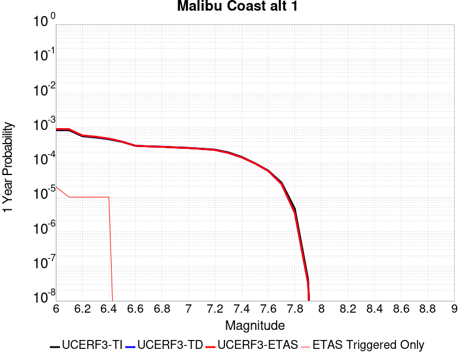 |  |

| Magnitude | 1 wk TI Prob | 1 wk TD Prob | 1 wk ETAS Prob | 1 wk ETAS/TD Gain | 1 wk ETAS Triggered Only | 1 mo TI Prob | 1 mo TD Prob | 1 mo ETAS Prob | 1 mo ETAS/TD Gain | 1 mo ETAS Triggered Only | 1 yr TI Prob | 1 yr TD Prob | 1 yr ETAS Prob | 1 yr ETAS/TD Gain | 1 yr ETAS Triggered Only | 10 yr TI Prob | 10 yr TD Prob | 10 yr ETAS Prob | 10 yr ETAS/TD Gain | 10 yr ETAS Triggered Only |
|-----|-----|-----|-----|-----|-----|-----|-----|-----|-----|-----|-----|-----|-----|-----|-----|-----|-----|-----|-----|-----|
| 6.0 | 1.6572556E-5 | 1.7598066E-5 | 4.197599E-5 | 2.3852615 | 2.4378352E-5 | 7.102331E-5 | 7.541821E-5 | 9.979472E-5 | 1.3232179 | 2.4378352E-5 | 8.6436566E-4 | 9.178488E-4 | 9.422048E-4 | 1.026536 | 2.4378352E-5 | 0.0086101135 | 0.009142512 | 0.009166668 | 1.0026422 | 2.4378352E-5 |
| 6.1 | 1.6572556E-5 | 1.7598066E-5 | 2.9787028E-5 | 1.6926308 | 1.2189176E-5 | 7.102331E-5 | 7.541821E-5 | 8.7606466E-5 | 1.1616089 | 1.2189176E-5 | 8.6436566E-4 | 9.178488E-4 | 9.3002676E-4 | 1.013268 | 1.2189176E-5 | 0.0086101135 | 0.009142512 | 0.00915459 | 1.0013211 | 1.2189176E-5 |
| 6.2 | 1.1085717E-5 | 1.1557147E-5 | 2.3746183E-5 | 2.054675 | 1.2189176E-5 | 4.750935E-5 | 4.952971E-5 | 6.171828E-5 | 1.2460861 | 1.2189176E-5 | 5.782728E-4 | 6.028609E-4 | 6.1504275E-4 | 1.0202067 | 1.2189176E-5 | 0.0057677035 | 0.0060126255 | 0.0060247416 | 1.0020151 | 1.2189176E-5 |
| 6.3 | 1.0208568E-5 | 1.0592237E-5 | 2.2781285E-5 | 2.1507528 | 1.2189176E-5 | 4.375027E-5 | 4.539453E-5 | 5.7583155E-5 | 1.2685043 | 1.2189176E-5 | 5.325294E-4 | 5.5254117E-4 | 5.647236E-4 | 1.022048 | 1.2189176E-5 | 0.0053125503 | 0.0055119814 | 0.0055241035 | 1.0021992 | 1.2189176E-5 |
| 6.4 | 9.0682315E-6 | 9.342637E-6 | 2.15317E-5 | 2.3046703 | 1.2189176E-5 | 3.8863272E-5 | 4.003927E-5 | 5.222796E-5 | 1.3044183 | 1.2189176E-5 | 4.730576E-4 | 4.8737114E-4 | 4.995544E-4 | 1.0249978 | 1.2189176E-5 | 0.0047205184 | 0.004863236 | 0.004875366 | 1.0024942 | 1.2189176E-5 |
| 6.5 | 7.605796E-6 | 7.748587E-6 | 7.748587E-6 | 1.0 | 0.0 | 3.259586E-5 | 3.3207816E-5 | 3.3207816E-5 | 1.0 | 0.0 | 3.9678233E-4 | 4.0423148E-4 | 4.0423148E-4 | 1.0 | 0.0 | 0.0039607463 | 0.0040351 | 0.0040351 | 1.0 | 0.0 |
| 6.6 | 5.889873E-6 | 5.8795385E-6 | 5.8795385E-6 | 1.0 | 0.0 | 2.5242069E-5 | 2.519778E-5 | 2.519778E-5 | 1.0 | 0.0 | 3.0727885E-4 | 3.0673988E-4 | 3.0673988E-4 | 1.0 | 0.0 | 0.003068543 | 0.0030631777 | 0.0030631777 | 1.0 | 0.0 |
| 6.7 | 5.66586E-6 | 5.641641E-6 | 5.641641E-6 | 1.0 | 0.0 | 2.428203E-5 | 2.417824E-5 | 2.417824E-5 | 1.0 | 0.0 | 2.955936E-4 | 2.9433038E-4 | 2.9433038E-4 | 1.0 | 0.0 | 0.0029520073 | 0.0029394177 | 0.0029394177 | 1.0 | 0.0 |
| 6.8 | 5.521556E-6 | 5.489427E-6 | 5.489427E-6 | 1.0 | 0.0 | 2.3663597E-5 | 2.3525903E-5 | 2.3525903E-5 | 1.0 | 0.0 | 2.880662E-4 | 2.8639034E-4 | 2.8639034E-4 | 1.0 | 0.0 | 0.0028769306 | 0.002860224 | 0.002860224 | 1.0 | 0.0 |
| 6.9 | 5.29752E-6 | 5.2499317E-6 | 5.2499317E-6 | 1.0 | 0.0 | 2.270346E-5 | 2.2499513E-5 | 2.2499513E-5 | 1.0 | 0.0 | 2.7637955E-4 | 2.7389723E-4 | 2.7389723E-4 | 1.0 | 0.0 | 0.0027603607 | 0.0027356069 | 0.0027356069 | 1.0 | 0.0 |
| 7.0 | 5.106743E-6 | 5.0476788E-6 | 5.0476788E-6 | 1.0 | 0.0 | 2.1885859E-5 | 2.163273E-5 | 2.163273E-5 | 1.0 | 0.0 | 2.6642776E-4 | 2.6334674E-4 | 2.6334674E-4 | 1.0 | 0.0 | 0.0026610855 | 0.0026303562 | 0.0026303562 | 1.0 | 0.0 |
| 7.1 | 4.8469647E-6 | 4.770373E-6 | 4.770373E-6 | 1.0 | 0.0 | 2.0772539E-5 | 2.0444295E-5 | 2.0444295E-5 | 1.0 | 0.0 | 2.528763E-4 | 2.4888094E-4 | 2.4888094E-4 | 1.0 | 0.0 | 0.0025258875 | 0.00248603 | 0.00248603 | 1.0 | 0.0 |
| 7.2 | 4.545514E-6 | 4.4481935E-6 | 4.4481935E-6 | 1.0 | 0.0 | 1.9480629E-5 | 1.9063547E-5 | 1.9063547E-5 | 1.0 | 0.0 | 2.3715083E-4 | 2.3207403E-4 | 2.3207403E-4 | 1.0 | 0.0 | 0.0023689792 | 0.0023183243 | 0.0023183243 | 1.0 | 0.0 |
| 7.3 | 3.794097E-6 | 3.6519348E-6 | 3.6519348E-6 | 1.0 | 0.0 | 1.6260314E-5 | 1.5651056E-5 | 1.5651056E-5 | 1.0 | 0.0 | 1.9795135E-4 | 1.9053498E-4 | 1.9053498E-4 | 1.0 | 0.0 | 0.001977751 | 0.0019037209 | 0.0019037209 | 1.0 | 0.0 |
| 7.4 | 2.808217E-6 | 2.719077E-6 | 2.719077E-6 | 1.0 | 0.0 | 1.203516E-5 | 1.1653135E-5 | 1.1653135E-5 | 1.0 | 0.0 | 1.4651821E-4 | 1.418677E-4 | 1.418677E-4 | 1.0 | 0.0 | 0.0014642165 | 0.001417774 | 0.001417774 | 1.0 | 0.0 |
| 7.5 | 1.83809E-6 | 1.8190691E-6 | 1.8190691E-6 | 1.0 | 0.0 | 7.877505E-6 | 7.795988E-6 | 7.795988E-6 | 1.0 | 0.0 | 9.59044E-5 | 9.491203E-5 | 9.491203E-5 | 1.0 | 0.0 | 9.5863023E-4 | 9.48717E-4 | 9.48717E-4 | 1.0 | 0.0 |
| 7.6 | 1.1292672E-6 | 1.1001447E-6 | 1.1001447E-6 | 1.0 | 0.0 | 4.839708E-6 | 4.714897E-6 | 4.714897E-6 | 1.0 | 0.0 | 5.8921847E-5 | 5.7402376E-5 | 5.7402376E-5 | 1.0 | 0.0 | 5.890623E-4 | 5.738771E-4 | 5.738771E-4 | 1.0 | 0.0 |
| 7.7 | 5.065272E-7 | 4.609151E-7 | 4.609151E-7 | 1.0 | 0.0 | 2.170829E-6 | 1.975349E-6 | 1.975349E-6 | 1.0 | 0.0 | 2.6429525E-5 | 2.404962E-5 | 2.404962E-5 | 1.0 | 0.0 | 2.642638E-4 | 2.4047129E-4 | 2.4047129E-4 | 1.0 | 0.0 |
| 7.8 | 8.952991E-8 | 6.707874E-8 | 6.707874E-8 | 1.0 | 0.0 | 3.8369956E-7 | 2.8748025E-7 | 2.8748025E-7 | 1.0 | 0.0 | 4.671532E-6 | 3.5000667E-6 | 3.5000667E-6 | 1.0 | 0.0 | 4.671434E-5 | 3.5000136E-5 | 3.5000136E-5 | 1.0 | 0.0 |
| 7.9 | 8.007447E-10 | 6.1608785E-10 | 6.1608785E-10 | 1.0 | 0.0 | 3.4317629E-9 | 2.6403764E-9 | 2.6403764E-9 | 1.0 | 0.0 | 4.1781714E-8 | 3.2146584E-8 | 3.2146584E-8 | 1.0 | 0.0 | 4.1781706E-7 | 3.214658E-7 | 3.214658E-7 | 1.0 | 0.0 |

## Ortigalita (South)
*[(top)](#table-of-contents)*

| 1 Week | 1 Month | 1 Year | 10 Year |
|-----|-----|-----|-----|
| 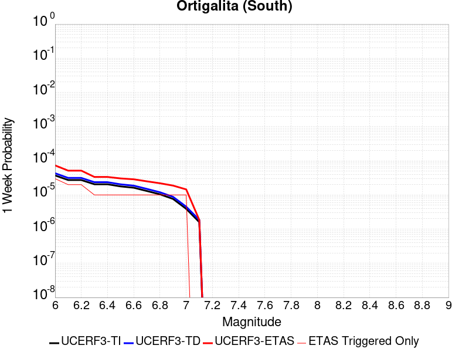 |  |  |  |

| Magnitude | 1 wk TI Prob | 1 wk TD Prob | 1 wk ETAS Prob | 1 wk ETAS/TD Gain | 1 wk ETAS Triggered Only | 1 mo TI Prob | 1 mo TD Prob | 1 mo ETAS Prob | 1 mo ETAS/TD Gain | 1 mo ETAS Triggered Only | 1 yr TI Prob | 1 yr TD Prob | 1 yr ETAS Prob | 1 yr ETAS/TD Gain | 1 yr ETAS Triggered Only | 10 yr TI Prob | 10 yr TD Prob | 10 yr ETAS Prob | 10 yr ETAS/TD Gain | 10 yr ETAS Triggered Only |
|-----|-----|-----|-----|-----|-----|-----|-----|-----|-----|-----|-----|-----|-----|-----|-----|-----|-----|-----|-----|-----|
| 6.0 | 3.72394E-5 | 4.325562E-5 | 6.7632915E-5 | 1.5635637 | 2.4378352E-5 | 1.5958765E-4 | 1.8536893E-4 | 2.0974276E-4 | 1.1314882 | 2.4378352E-5 | 0.0019412481 | 0.0022546875 | 0.0022790108 | 1.010788 | 2.4378352E-5 | 0.019243775 | 0.022334497 | 0.02235833 | 1.0010672 | 2.4378352E-5 |
| 6.1 | 2.7299884E-5 | 3.149204E-5 | 4.3680833E-5 | 1.3870436 | 1.2189176E-5 | 1.16994255E-4 | 1.3495922E-4 | 1.4714675E-4 | 1.0903053 | 1.2189176E-5 | 0.0014234743 | 0.0016419457 | 0.0016541148 | 1.0074115 | 1.2189176E-5 | 0.014143906 | 0.01630407 | 0.01631606 | 1.0007354 | 1.2189176E-5 |
| 6.2 | 2.7299884E-5 | 3.149204E-5 | 4.3680833E-5 | 1.3870436 | 1.2189176E-5 | 1.16994255E-4 | 1.3495922E-4 | 1.4714675E-4 | 1.0903053 | 1.2189176E-5 | 0.0014234743 | 0.0016419457 | 0.0016541148 | 1.0074115 | 1.2189176E-5 | 0.014143906 | 0.01630407 | 0.01631606 | 1.0007354 | 1.2189176E-5 |
| 6.3 | 2.0546433E-5 | 2.363145E-5 | 2.363145E-5 | 1.0 | 0.0 | 8.805317E-5 | 1.0127382E-4 | 1.0127382E-4 | 1.0 | 0.0 | 0.00107152 | 0.0012323303 | 0.0012323303 | 1.0 | 0.0 | 0.010663681 | 0.01225703 | 0.01225703 | 1.0 | 0.0 |
| 6.4 | 2.0546433E-5 | 2.363145E-5 | 2.363145E-5 | 1.0 | 0.0 | 8.805317E-5 | 1.0127382E-4 | 1.0127382E-4 | 1.0 | 0.0 | 0.00107152 | 0.0012323303 | 0.0012323303 | 1.0 | 0.0 | 0.010663681 | 0.01225703 | 0.01225703 | 1.0 | 0.0 |
| 6.5 | 1.7779594E-5 | 2.0446974E-5 | 2.0446974E-5 | 1.0 | 0.0 | 7.619603E-5 | 8.762702E-5 | 8.762702E-5 | 1.0 | 0.0 | 9.272918E-4 | 0.0010663504 | 0.0010663504 | 1.0 | 0.0 | 0.009234319 | 0.010613803 | 0.010613803 | 1.0 | 0.0 |
| 6.6 | 1.6272212E-5 | 1.8714967E-5 | 1.8714967E-5 | 1.0 | 0.0 | 6.973618E-5 | 8.0204605E-5 | 8.0204605E-5 | 1.0 | 0.0 | 8.487073E-4 | 9.760658E-4 | 9.760658E-4 | 1.0 | 0.0 | 0.008454733 | 0.009719091 | 0.009719091 | 1.0 | 0.0 |
| 6.7 | 1.3051484E-5 | 1.5038758E-5 | 1.5038758E-5 | 1.0 | 0.0 | 5.593373E-5 | 6.445028E-5 | 6.445028E-5 | 1.0 | 0.0 | 6.807804E-4 | 7.844092E-4 | 7.844092E-4 | 1.0 | 0.0 | 0.006786986 | 0.007817388 | 0.007817388 | 1.0 | 0.0 |
| 6.8 | 1.04277415E-5 | 1.1987235E-5 | 1.1987235E-5 | 1.0 | 0.0 | 4.4689557E-5 | 5.1372896E-5 | 5.1372896E-5 | 1.0 | 0.0 | 5.439595E-4 | 6.2529295E-4 | 6.2529295E-4 | 1.0 | 0.0 | 0.0054262993 | 0.00623609 | 0.00623609 | 1.0 | 0.0 |
| 6.9 | 7.639968E-6 | 8.791503E-6 | 8.791503E-6 | 1.0 | 0.0 | 3.274231E-5 | 3.767736E-5 | 3.767736E-5 | 1.0 | 0.0 | 3.9856473E-4 | 4.586312E-4 | 4.586312E-4 | 1.0 | 0.0 | 0.003978506 | 0.004577433 | 0.004577433 | 1.0 | 0.0 |
| 7.0 | 3.919831E-6 | 4.5334014E-6 | 4.5334014E-6 | 1.0 | 0.0 | 1.679917E-5 | 1.942873E-5 | 1.942873E-5 | 1.0 | 0.0 | 2.045107E-4 | 2.3652123E-4 | 2.3652123E-4 | 1.0 | 0.0 | 0.0020432258 | 0.0023629034 | 0.0023629034 | 1.0 | 0.0 |
| 7.1 | 1.6017933E-6 | 1.8570418E-6 | 1.8570418E-6 | 1.0 | 0.0 | 6.8648105E-6 | 7.958732E-6 | 7.958732E-6 | 1.0 | 0.0 | 8.357586E-5 | 9.689432E-5 | 9.689432E-5 | 1.0 | 0.0 | 8.3544437E-4 | 9.686254E-4 | 9.686254E-4 | 1.0 | 0.0 |

## Hayward (No) 2011 CFM
*[(top)](#table-of-contents)*

| 1 Week | 1 Month | 1 Year | 10 Year |
|-----|-----|-----|-----|
|  |  |  |  |

| Magnitude | 1 wk TI Prob | 1 wk TD Prob | 1 wk ETAS Prob | 1 wk ETAS/TD Gain | 1 wk ETAS Triggered Only | 1 mo TI Prob | 1 mo TD Prob | 1 mo ETAS Prob | 1 mo ETAS/TD Gain | 1 mo ETAS Triggered Only | 1 yr TI Prob | 1 yr TD Prob | 1 yr ETAS Prob | 1 yr ETAS/TD Gain | 1 yr ETAS Triggered Only | 10 yr TI Prob | 10 yr TD Prob | 10 yr ETAS Prob | 10 yr ETAS/TD Gain | 10 yr ETAS Triggered Only |
|-----|-----|-----|-----|-----|-----|-----|-----|-----|-----|-----|-----|-----|-----|-----|-----|-----|-----|-----|-----|-----|
| 6.0 | 9.3068506E-5 | 1.739599E-4 | 1.98334E-4 | 1.1401134 | 2.4378352E-5 | 3.9880406E-4 | 7.453244E-4 | 7.6968456E-4 | 1.032684 | 2.4378352E-5 | 0.0048446343 | 0.009036438 | 0.009060596 | 1.0026734 | 2.4378352E-5 | 0.047403704 | 0.08637534 | 0.08639761 | 1.0002578 | 2.4378352E-5 |
| 6.1 | 9.055486E-5 | 1.6947114E-4 | 1.9384535E-4 | 1.1438252 | 2.4378352E-5 | 3.880345E-4 | 7.261021E-4 | 7.5046276E-4 | 1.0335499 | 2.4378352E-5 | 0.0047140904 | 0.008804537 | 0.008828701 | 1.0027444 | 2.4378352E-5 | 0.046153355 | 0.08426854 | 0.08429086 | 1.0002649 | 2.4378352E-5 |
| 6.2 | 9.006742E-5 | 1.6867711E-4 | 1.9305135E-4 | 1.1445024 | 2.4378352E-5 | 3.859461E-4 | 7.22701E-4 | 7.470618E-4 | 1.0337079 | 2.4378352E-5 | 0.0046887742 | 0.008763513 | 0.008787678 | 1.0027574 | 2.4378352E-5 | 0.0459107 | 0.083892785 | 0.083915114 | 1.0002662 | 2.4378352E-5 |
| 6.3 | 8.8336754E-5 | 1.6547246E-4 | 1.8984679E-4 | 1.1473013 | 2.4378352E-5 | 3.7853114E-4 | 7.089758E-4 | 7.3333684E-4 | 1.0343609 | 2.4378352E-5 | 0.004598882 | 0.008597788 | 0.008621957 | 1.0028111 | 2.4378352E-5 | 0.04504866 | 0.08238599 | 0.08240836 | 1.0002716 | 2.4378352E-5 |
| 6.4 | 8.526157E-5 | 1.5974249E-4 | 1.8411694E-4 | 1.152586 | 2.4378352E-5 | 3.6535555E-4 | 6.8443175E-4 | 7.0879346E-4 | 1.035594 | 2.4378352E-5 | 0.0044391346 | 0.008301278 | 0.008325454 | 1.0029123 | 2.4378352E-5 | 0.043514993 | 0.079682834 | 0.079705276 | 1.0002816 | 2.4378352E-5 |
| 6.5 | 8.152396E-5 | 1.530663E-4 | 1.7744092E-4 | 1.1592423 | 2.4378352E-5 | 3.493416E-4 | 6.558342E-4 | 6.8019656E-4 | 1.0371472 | 2.4378352E-5 | 0.0042449418 | 0.007955698 | 0.007979883 | 1.0030398 | 2.4378352E-5 | 0.04164765 | 0.07651369 | 0.0765362 | 1.0002942 | 2.4378352E-5 |
| 6.6 | 7.987405E-5 | 1.5010842E-4 | 1.7448311E-4 | 1.1623806 | 2.4378352E-5 | 3.4227243E-4 | 6.4316386E-4 | 6.6752656E-4 | 1.0378795 | 2.4378352E-5 | 0.0041592065 | 0.0078025614 | 0.007826749 | 1.0031 | 2.4378352E-5 | 0.04082218 | 0.07510622 | 0.075128764 | 1.0003002 | 2.4378352E-5 |
| 6.7 | 7.777665E-5 | 1.4650106E-4 | 1.7087584E-4 | 1.1663796 | 2.4378352E-5 | 3.332859E-4 | 6.277113E-4 | 6.5207435E-4 | 1.0388125 | 2.4378352E-5 | 0.004050208 | 0.00761576 | 0.0076399525 | 1.0031767 | 2.4378352E-5 | 0.039771806 | 0.073382616 | 0.073405206 | 1.0003078 | 2.4378352E-5 |
| 6.8 | 7.3284005E-5 | 1.3800753E-4 | 1.6238252E-4 | 1.1766207 | 2.4378352E-5 | 3.140365E-4 | 5.913274E-4 | 6.1569136E-4 | 1.0412021 | 2.4378352E-5 | 0.0038166929 | 0.0071757827 | 0.0071999864 | 1.0033729 | 2.4378352E-5 | 0.037518036 | 0.06929621 | 0.0693189 | 1.0003275 | 2.4378352E-5 |
| 6.9 | 6.458263E-5 | 1.2131439E-4 | 1.4568979E-4 | 1.2009275 | 2.4378352E-5 | 2.7675333E-4 | 5.198157E-4 | 5.441814E-4 | 1.0468737 | 2.4378352E-5 | 0.0033642664 | 0.0063104923 | 0.006334717 | 1.0038388 | 2.4378352E-5 | 0.033137884 | 0.061225023 | 0.061247908 | 1.0003738 | 2.4378352E-5 |
| 7.0 | 5.3853604E-5 | 1.00250414E-4 | 1.1243837E-4 | 1.1215751 | 1.2189176E-5 | 2.3078074E-4 | 4.295742E-4 | 4.4175814E-4 | 1.0283629 | 1.2189176E-5 | 0.0028061352 | 0.0052175885 | 0.005229714 | 1.002324 | 1.2189176E-5 | 0.027709642 | 0.0509578 | 0.050969366 | 1.000227 | 1.2189176E-5 |
| 7.1 | 4.4308683E-5 | 8.170626E-5 | 8.170626E-5 | 1.0 | 0.0 | 1.8988053E-4 | 3.501229E-4 | 3.501229E-4 | 1.0 | 0.0 | 0.0023093442 | 0.0042544557 | 0.0042544557 | 1.0 | 0.0 | 0.022854926 | 0.04182473 | 0.04182473 | 1.0 | 0.0 |
| 7.2 | 3.295973E-5 | 6.0771144E-5 | 6.0771144E-5 | 1.0 | 0.0 | 1.4124835E-4 | 2.604219E-4 | 2.604219E-4 | 1.0 | 0.0 | 0.0017183421 | 0.0031660495 | 0.0031660495 | 1.0 | 0.0 | 0.017051157 | 0.031369876 | 0.031369876 | 1.0 | 0.0 |
| 7.3 | 2.452256E-5 | 4.5180346E-5 | 4.5180346E-5 | 1.0 | 0.0 | 1.05092455E-4 | 1.9361576E-4 | 1.9361576E-4 | 1.0 | 0.0 | 0.0012787496 | 0.0023547374 | 0.0023547374 | 1.0 | 0.0 | 0.0127141625 | 0.02344111 | 0.02344111 | 1.0 | 0.0 |
| 7.4 | 1.8829967E-5 | 3.4602548E-5 | 3.4602548E-5 | 1.0 | 0.0 | 8.069736E-5 | 1.4828827E-4 | 1.4828827E-4 | 1.0 | 0.0 | 9.820475E-4 | 0.0018039243 | 0.0018039243 | 1.0 | 0.0 | 0.009777189 | 0.0180195 | 0.0180195 | 1.0 | 0.0 |
| 7.5 | 1.26374125E-5 | 2.2921116E-5 | 2.2921116E-5 | 1.0 | 0.0 | 5.4159216E-5 | 9.822969E-5 | 9.822969E-5 | 1.0 | 0.0 | 6.5918895E-4 | 0.0011952962 | 0.0011952962 | 1.0 | 0.0 | 0.00657237 | 0.011988836 | 0.011988836 | 1.0 | 0.0 |
| 7.6 | 4.666429E-6 | 8.4791645E-6 | 8.4791645E-6 | 1.0 | 0.0 | 1.9998828E-5 | 3.6338777E-5 | 3.6338777E-5 | 1.0 | 0.0 | 2.4345852E-4 | 4.4233602E-4 | 4.4233602E-4 | 1.0 | 0.0 | 0.0024319198 | 0.0044591012 | 0.0044591012 | 1.0 | 0.0 |
| 7.7 | 3.8399318E-7 | 7.133867E-7 | 7.133867E-7 | 1.0 | 0.0 | 1.6456839E-6 | 3.057368E-6 | 3.057368E-6 | 1.0 | 0.0 | 2.003602E-5 | 3.722282E-5 | 3.722282E-5 | 1.0 | 0.0 | 2.0034213E-4 | 3.8614936E-4 | 3.8614936E-4 | 1.0 | 0.0 |
| 7.8 | 2.5637698E-7 | 5.3662194E-7 | 5.3662194E-7 | 1.0 | 0.0 | 1.098758E-6 | 2.299806E-6 | 2.299806E-6 | 1.0 | 0.0 | 1.3377297E-5 | 2.7999782E-5 | 2.7999782E-5 | 1.0 | 0.0 | 1.3376492E-4 | 2.9244382E-4 | 2.9244382E-4 | 1.0 | 0.0 |
| 7.9 | 1.7141245E-7 | 3.7290573E-7 | 3.7290573E-7 | 1.0 | 0.0 | 7.3462456E-7 | 1.5981665E-6 | 1.5981665E-6 | 1.0 | 0.0 | 8.944017E-6 | 1.9457504E-5 | 1.9457504E-5 | 1.0 | 0.0 | 8.943657E-5 | 2.0245428E-4 | 2.0245428E-4 | 1.0 | 0.0 |
| 8.0 | 1.1808895E-7 | 2.7509762E-7 | 2.7509762E-7 | 1.0 | 0.0 | 5.060954E-7 | 1.1789892E-6 | 1.1789892E-6 | 1.0 | 0.0 | 6.161694E-6 | 1.43541E-5 | 1.43541E-5 | 1.0 | 0.0 | 6.161523E-5 | 1.4816441E-4 | 1.4816441E-4 | 1.0 | 0.0 |
| 8.1 | 5.138535E-8 | 1.1229867E-7 | 1.1229867E-7 | 1.0 | 0.0 | 2.2022292E-7 | 4.812799E-7 | 4.812799E-7 | 1.0 | 0.0 | 2.6812106E-6 | 5.8595674E-6 | 5.8595674E-6 | 1.0 | 0.0 | 2.6811784E-5 | 6.0158476E-5 | 6.0158476E-5 | 1.0 | 0.0 |

## Simi-Santa Rosa
*[(top)](#table-of-contents)*

| 1 Week | 1 Month | 1 Year | 10 Year |
|-----|-----|-----|-----|
|  |  |  |  |

| Magnitude | 1 wk TI Prob | 1 wk TD Prob | 1 wk ETAS Prob | 1 wk ETAS/TD Gain | 1 wk ETAS Triggered Only | 1 mo TI Prob | 1 mo TD Prob | 1 mo ETAS Prob | 1 mo ETAS/TD Gain | 1 mo ETAS Triggered Only | 1 yr TI Prob | 1 yr TD Prob | 1 yr ETAS Prob | 1 yr ETAS/TD Gain | 1 yr ETAS Triggered Only | 10 yr TI Prob | 10 yr TD Prob | 10 yr ETAS Prob | 10 yr ETAS/TD Gain | 10 yr ETAS Triggered Only |
|-----|-----|-----|-----|-----|-----|-----|-----|-----|-----|-----|-----|-----|-----|-----|-----|-----|-----|-----|-----|-----|
| 6.0 | 2.198912E-5 | 2.2275442E-5 | 4.665325E-5 | 2.0943804 | 2.4378352E-5 | 9.4235686E-5 | 9.5462936E-5 | 1.1983896E-4 | 1.2553455 | 2.4378352E-5 | 0.0011467156 | 0.0011616853 | 0.0011860355 | 1.0209609 | 2.4378352E-5 | 0.011408163 | 0.011560575 | 0.011584671 | 1.0020844 | 2.4378352E-5 |
| 6.1 | 2.198912E-5 | 2.2275442E-5 | 4.665325E-5 | 2.0943804 | 2.4378352E-5 | 9.4235686E-5 | 9.5462936E-5 | 1.1983896E-4 | 1.2553455 | 2.4378352E-5 | 0.0011467156 | 0.0011616853 | 0.0011860355 | 1.0209609 | 2.4378352E-5 | 0.011408163 | 0.011560575 | 0.011584671 | 1.0020844 | 2.4378352E-5 |
| 6.2 | 1.69983E-5 | 1.6668559E-5 | 2.8857532E-5 | 1.7312553 | 1.2189176E-5 | 7.284782E-5 | 7.143489E-5 | 8.36232E-5 | 1.1706212 | 1.2189176E-5 | 8.865613E-4 | 8.6940196E-4 | 8.815805E-4 | 1.014008 | 1.2189176E-5 | 0.008830327 | 0.008662928 | 0.008675011 | 1.0013949 | 1.2189176E-5 |
| 6.3 | 1.69983E-5 | 1.6668559E-5 | 2.8857532E-5 | 1.7312553 | 1.2189176E-5 | 7.284782E-5 | 7.143489E-5 | 8.36232E-5 | 1.1706212 | 1.2189176E-5 | 8.865613E-4 | 8.6940196E-4 | 8.815805E-4 | 1.014008 | 1.2189176E-5 | 0.008830327 | 0.008662928 | 0.008675011 | 1.0013949 | 1.2189176E-5 |
| 6.4 | 1.4666188E-5 | 1.4052543E-5 | 2.6241547E-5 | 1.8673879 | 1.2189176E-5 | 6.285358E-5 | 6.0223934E-5 | 7.2412375E-5 | 1.2023853 | 1.2189176E-5 | 7.6497364E-4 | 7.3300465E-4 | 7.451849E-4 | 1.0166168 | 1.2189176E-5 | 0.0076234564 | 0.007308344 | 0.007320444 | 1.0016557 | 1.2189176E-5 |
| 6.5 | 1.4666188E-5 | 1.4052543E-5 | 2.6241547E-5 | 1.8673879 | 1.2189176E-5 | 6.285358E-5 | 6.0223934E-5 | 7.2412375E-5 | 1.2023853 | 1.2189176E-5 | 7.6497364E-4 | 7.3300465E-4 | 7.451849E-4 | 1.0166168 | 1.2189176E-5 | 0.0076234564 | 0.007308344 | 0.007320444 | 1.0016557 | 1.2189176E-5 |
| 6.6 | 1.4377586E-5 | 1.3729583E-5 | 2.591859E-5 | 1.8877916 | 1.2189176E-5 | 6.1616774E-5 | 5.883988E-5 | 7.102834E-5 | 1.2071462 | 1.2189176E-5 | 7.4992597E-4 | 7.1616494E-4 | 7.283454E-4 | 1.0170078 | 1.2189176E-5 | 0.007474003 | 0.0071410383 | 0.0071531404 | 1.0016947 | 1.2189176E-5 |
| 6.7 | 1.3881404E-5 | 1.320755E-5 | 2.5396566E-5 | 1.9228823 | 1.2189176E-5 | 5.9490372E-5 | 5.66027E-5 | 6.879119E-5 | 1.215334 | 1.2189176E-5 | 7.240546E-4 | 6.8894465E-4 | 7.011255E-4 | 1.0176803 | 1.2189176E-5 | 0.007217 | 0.006870538 | 0.006882644 | 1.0017619 | 1.2189176E-5 |
| 6.8 | 1.0176516E-5 | 9.154151E-6 | 9.154151E-6 | 1.0 | 0.0 | 4.3612912E-5 | 3.9231574E-5 | 3.9231574E-5 | 1.0 | 0.0 | 5.308578E-4 | 4.7755634E-4 | 4.7755634E-4 | 1.0 | 0.0 | 0.0052959146 | 0.004766934 | 0.004766934 | 1.0 | 0.0 |
| 6.9 | 9.699797E-6 | 8.774719E-6 | 8.774719E-6 | 1.0 | 0.0 | 4.15699E-5 | 3.7605492E-5 | 3.7605492E-5 | 1.0 | 0.0 | 5.05996E-4 | 4.577671E-4 | 4.577671E-4 | 1.0 | 0.0 | 0.005048454 | 0.0045698597 | 0.0045698597 | 1.0 | 0.0 |
| 7.0 | 7.4049476E-6 | 6.559333E-6 | 6.559333E-6 | 1.0 | 0.0 | 3.1735104E-5 | 2.8111197E-5 | 2.8111197E-5 | 1.0 | 0.0 | 3.8630638E-4 | 3.422127E-4 | 3.422127E-4 | 1.0 | 0.0 | 0.0038563553 | 0.0034180996 | 0.0034180996 | 1.0 | 0.0 |
| 7.1 | 3.873439E-6 | 2.7595095E-6 | 2.7595095E-6 | 1.0 | 0.0 | 1.6600346E-5 | 1.1826417E-5 | 1.1826417E-5 | 1.0 | 0.0 | 2.0209046E-4 | 1.4397735E-4 | 1.4397735E-4 | 1.0 | 0.0 | 0.0020190678 | 0.0014388643 | 0.0014388643 | 1.0 | 0.0 |
| 7.2 | 3.417706E-6 | 2.3676484E-6 | 2.3676484E-6 | 1.0 | 0.0 | 1.4647229E-5 | 1.0147027E-5 | 1.0147027E-5 | 1.0 | 0.0 | 1.7831543E-4 | 1.2353327E-4 | 1.2353327E-4 | 1.0 | 0.0 | 0.0017817242 | 0.0012346683 | 0.0012346683 | 1.0 | 0.0 |
| 7.3 | 1.90225E-6 | 1.4073753E-6 | 1.4073753E-6 | 1.0 | 0.0 | 8.152474E-6 | 6.0315947E-6 | 6.0315947E-6 | 1.0 | 0.0 | 9.9251854E-5 | 7.343221E-5 | 7.343221E-5 | 1.0 | 0.0 | 9.920754E-4 | 7.340817E-4 | 7.340817E-4 | 1.0 | 0.0 |
| 7.4 | 1.5170556E-6 | 1.1024773E-6 | 1.1024773E-6 | 1.0 | 0.0 | 6.5016507E-6 | 4.724894E-6 | 4.724894E-6 | 1.0 | 0.0 | 7.915472E-5 | 5.7524077E-5 | 5.7524077E-5 | 1.0 | 0.0 | 7.9126534E-4 | 5.7509297E-4 | 5.7509297E-4 | 1.0 | 0.0 |
| 7.5 | 1.178732E-6 | 8.535102E-7 | 8.535102E-7 | 1.0 | 0.0 | 5.0516987E-6 | 3.6578958E-6 | 3.6578958E-6 | 1.0 | 0.0 | 6.1502695E-5 | 4.453398E-5 | 4.453398E-5 | 1.0 | 0.0 | 6.148568E-4 | 4.452515E-4 | 4.452515E-4 | 1.0 | 0.0 |
| 7.6 | 6.8722386E-7 | 4.793198E-7 | 4.793198E-7 | 1.0 | 0.0 | 2.9452417E-6 | 2.054226E-6 | 2.054226E-6 | 1.0 | 0.0 | 3.5857727E-5 | 2.5009915E-5 | 2.5009915E-5 | 1.0 | 0.0 | 3.5851944E-4 | 2.5007114E-4 | 2.5007114E-4 | 1.0 | 0.0 |
| 7.7 | 5.5126515E-7 | 3.6731157E-7 | 3.6731157E-7 | 1.0 | 0.0 | 2.3625628E-6 | 1.5741915E-6 | 1.5741915E-6 | 1.0 | 0.0 | 2.8763823E-5 | 1.9165615E-5 | 1.9165615E-5 | 1.0 | 0.0 | 2.87601E-4 | 1.9163972E-4 | 1.9163972E-4 | 1.0 | 0.0 |
| 7.8 | 3.3860243E-7 | 2.0075942E-7 | 2.0075942E-7 | 1.0 | 0.0 | 1.4511525E-6 | 8.6039717E-7 | 8.6039717E-7 | 1.0 | 0.0 | 1.7667637E-5 | 1.0475286E-5 | 1.0475286E-5 | 1.0 | 0.0 | 1.7666233E-4 | 1.04747975E-4 | 1.04747975E-4 | 1.0 | 0.0 |
| 7.9 | 2.7955386E-7 | 1.4649108E-7 | 1.4649108E-7 | 1.0 | 0.0 | 1.1980875E-6 | 6.278188E-7 | 6.278188E-7 | 1.0 | 0.0 | 1.4586617E-5 | 7.643667E-6 | 7.643667E-6 | 1.0 | 0.0 | 1.458566E-4 | 7.643409E-5 | 7.643409E-5 | 1.0 | 0.0 |
| 8.0 | 5.6259015E-8 | 3.3355324E-8 | 3.3355324E-8 | 1.0 | 0.0 | 2.4111003E-7 | 1.4295138E-7 | 1.4295138E-7 | 1.0 | 0.0 | 2.9355108E-6 | 1.7404317E-6 | 1.7404317E-6 | 1.0 | 0.0 | 2.935472E-5 | 1.7404194E-5 | 1.7404194E-5 | 1.0 | 0.0 |

## Elsinore (Stepovers Combined)
*[(top)](#table-of-contents)*

| 1 Week | 1 Month | 1 Year | 10 Year |
|-----|-----|-----|-----|
|  |  |  |  |

| Magnitude | 1 wk TI Prob | 1 wk TD Prob | 1 wk ETAS Prob | 1 wk ETAS/TD Gain | 1 wk ETAS Triggered Only | 1 mo TI Prob | 1 mo TD Prob | 1 mo ETAS Prob | 1 mo ETAS/TD Gain | 1 mo ETAS Triggered Only | 1 yr TI Prob | 1 yr TD Prob | 1 yr ETAS Prob | 1 yr ETAS/TD Gain | 1 yr ETAS Triggered Only | 10 yr TI Prob | 10 yr TD Prob | 10 yr ETAS Prob | 10 yr ETAS/TD Gain | 10 yr ETAS Triggered Only |
|-----|-----|-----|-----|-----|-----|-----|-----|-----|-----|-----|-----|-----|-----|-----|-----|-----|-----|-----|-----|-----|
| 6.0 | 2.144392E-5 | 1.9760193E-5 | 4.413806E-5 | 2.2336857 | 2.4378352E-5 | 9.189928E-5 | 8.468392E-5 | 1.090602E-4 | 1.2878503 | 2.4378352E-5 | 0.0011182994 | 0.0010305607 | 0.001054914 | 1.0236311 | 2.4378352E-5 | 0.011126885 | 0.010264917 | 0.010289046 | 1.0023506 | 2.4378352E-5 |
| 6.1 | 2.144392E-5 | 1.9760193E-5 | 4.413806E-5 | 2.2336857 | 2.4378352E-5 | 9.189928E-5 | 8.468392E-5 | 1.090602E-4 | 1.2878503 | 2.4378352E-5 | 0.0011182994 | 0.0010305607 | 0.001054914 | 1.0236311 | 2.4378352E-5 | 0.011126885 | 0.010264917 | 0.010289046 | 1.0023506 | 2.4378352E-5 |
| 6.2 | 2.144392E-5 | 1.9760193E-5 | 4.413806E-5 | 2.2336857 | 2.4378352E-5 | 9.189928E-5 | 8.468392E-5 | 1.090602E-4 | 1.2878503 | 2.4378352E-5 | 0.0011182994 | 0.0010305607 | 0.001054914 | 1.0236311 | 2.4378352E-5 | 0.011126885 | 0.010264917 | 0.010289046 | 1.0023506 | 2.4378352E-5 |
| 6.3 | 1.9751555E-5 | 1.7741453E-5 | 4.2119373E-5 | 2.3740656 | 2.4378352E-5 | 8.4646774E-5 | 7.603267E-5 | 1.00409176E-4 | 1.3206055 | 2.4378352E-5 | 0.0010300872 | 9.253213E-4 | 9.496771E-4 | 1.0263214 | 2.4378352E-5 | 0.010253254 | 0.009221276 | 0.00924543 | 1.0026194 | 2.4378352E-5 |
| 6.4 | 1.9751555E-5 | 1.7741453E-5 | 4.2119373E-5 | 2.3740656 | 2.4378352E-5 | 8.4646774E-5 | 7.603267E-5 | 1.00409176E-4 | 1.3206055 | 2.4378352E-5 | 0.0010300872 | 9.253213E-4 | 9.496771E-4 | 1.0263214 | 2.4378352E-5 | 0.010253254 | 0.009221276 | 0.00924543 | 1.0026194 | 2.4378352E-5 |
| 6.5 | 1.9751555E-5 | 1.7741453E-5 | 4.2119373E-5 | 2.3740656 | 2.4378352E-5 | 8.4646774E-5 | 7.603267E-5 | 1.00409176E-4 | 1.3206055 | 2.4378352E-5 | 0.0010300872 | 9.253213E-4 | 9.496771E-4 | 1.0263214 | 2.4378352E-5 | 0.010253254 | 0.009221276 | 0.00924543 | 1.0026194 | 2.4378352E-5 |
| 6.6 | 1.9188685E-5 | 1.7003393E-5 | 4.138133E-5 | 2.43371 | 2.4378352E-5 | 8.2234634E-5 | 7.286974E-5 | 9.724632E-5 | 1.3345226 | 2.4378352E-5 | 0.0010007467 | 8.868442E-4 | 9.112009E-4 | 1.0274645 | 2.4378352E-5 | 0.00996252 | 0.0088398475 | 0.008864011 | 1.0027333 | 2.4378352E-5 |
| 6.7 | 1.7608272E-5 | 1.4732616E-5 | 3.9110608E-5 | 2.6546955 | 2.4378352E-5 | 7.546184E-5 | 6.3138315E-5 | 8.751512E-5 | 1.3860859 | 2.4378352E-5 | 9.183606E-4 | 7.684476E-4 | 7.928072E-4 | 1.0316998 | 2.4378352E-5 | 0.009145746 | 0.00766491 | 0.0076891016 | 1.0031562 | 2.4378352E-5 |
| 6.8 | 1.697165E-5 | 1.3783365E-5 | 3.8161383E-5 | 2.7686548 | 2.4378352E-5 | 7.273361E-5 | 5.9070277E-5 | 8.344719E-5 | 1.4126765 | 2.4378352E-5 | 8.8517193E-4 | 7.18952E-4 | 7.433128E-4 | 1.0338838 | 2.4378352E-5 | 0.008816543 | 0.007172675 | 0.0071968785 | 1.0033745 | 2.4378352E-5 |
| 6.9 | 1.600365E-5 | 1.2846671E-5 | 2.5035692E-5 | 1.9488076 | 1.2189176E-5 | 6.858527E-5 | 5.5056043E-5 | 6.7244546E-5 | 1.2213836 | 1.2189176E-5 | 8.347058E-4 | 6.7010894E-4 | 6.8228994E-4 | 1.0181776 | 1.2189176E-5 | 0.008315775 | 0.0066867657 | 0.006698874 | 1.0018107 | 1.2189176E-5 |
| 7.0 | 1.3314581E-5 | 1.0447548E-5 | 2.2636597E-5 | 2.1666899 | 1.2189176E-5 | 5.7061243E-5 | 4.4774453E-5 | 5.6963083E-5 | 1.2722229 | 1.2189176E-5 | 6.944992E-4 | 5.449953E-4 | 5.571779E-4 | 1.0223534 | 1.2189176E-5 | 0.006923327 | 0.0054405155 | 0.005452638 | 1.0022283 | 1.2189176E-5 |
| 7.1 | 1.2865345E-5 | 9.937536E-6 | 2.2126591E-5 | 2.226567 | 1.2189176E-5 | 5.5136024E-5 | 4.258876E-5 | 5.4777414E-5 | 1.2861942 | 1.2189176E-5 | 6.710743E-4 | 5.183973E-4 | 5.305802E-4 | 1.023501 | 1.2189176E-5 | 0.0066905143 | 0.0051752133 | 0.0051873396 | 1.002343 | 1.2189176E-5 |
| 7.2 | 1.1650051E-5 | 8.633809E-6 | 8.633809E-6 | 1.0 | 0.0 | 4.9927836E-5 | 3.7001522E-5 | 3.7001522E-5 | 1.0 | 0.0 | 6.0770183E-4 | 4.504022E-4 | 4.504022E-4 | 1.0 | 0.0 | 0.0060604266 | 0.0044963174 | 0.0044963174 | 1.0 | 0.0 |
| 7.3 | 1.0008533E-5 | 7.2010425E-6 | 7.2010425E-6 | 1.0 | 0.0 | 4.2893007E-5 | 3.0861254E-5 | 3.0861254E-5 | 1.0 | 0.0 | 5.220972E-4 | 3.7567242E-4 | 3.7567242E-4 | 1.0 | 0.0 | 0.005208723 | 0.003750761 | 0.003750761 | 1.0 | 0.0 |
| 7.4 | 9.116759E-6 | 6.410068E-6 | 6.410068E-6 | 1.0 | 0.0 | 3.907124E-5 | 2.747144E-5 | 2.747144E-5 | 1.0 | 0.0 | 4.7558855E-4 | 3.3441483E-4 | 3.3441483E-4 | 1.0 | 0.0 | 0.00474572 | 0.0033392678 | 0.0033392678 | 1.0 | 0.0 |
| 7.5 | 7.870524E-6 | 5.3825365E-6 | 5.3825365E-6 | 1.0 | 0.0 | 3.3730383E-5 | 2.3067816E-5 | 2.3067816E-5 | 1.0 | 0.0 | 4.1059E-4 | 2.8081573E-4 | 2.8081573E-4 | 1.0 | 0.0 | 0.0040983222 | 0.0028047354 | 0.0028047354 | 1.0 | 0.0 |
| 7.6 | 6.9774537E-6 | 4.6776067E-6 | 4.6776067E-6 | 1.0 | 0.0 | 2.990303E-5 | 2.0046738E-5 | 2.0046738E-5 | 1.0 | 0.0 | 3.640086E-4 | 2.4404288E-4 | 2.4404288E-4 | 1.0 | 0.0 | 0.003634129 | 0.0024378651 | 0.0024378651 | 1.0 | 0.0 |
| 7.7 | 4.1616954E-6 | 2.32834E-6 | 2.32834E-6 | 1.0 | 0.0 | 1.7835715E-5 | 9.978567E-6 | 9.978567E-6 | 1.0 | 0.0 | 2.171282E-4 | 1.2148302E-4 | 1.2148302E-4 | 1.0 | 0.0 | 0.0021691616 | 0.0012142392 | 0.0012142392 | 1.0 | 0.0 |
| 7.8 | 2.2692414E-7 | 9.3854695E-8 | 9.3854695E-8 | 1.0 | 0.0 | 9.725317E-7 | 4.0223435E-7 | 4.0223435E-7 | 1.0 | 0.0 | 1.1840509E-5 | 4.8971956E-6 | 4.8971956E-6 | 1.0 | 0.0 | 1.1839878E-4 | 4.8971204E-5 | 4.8971204E-5 | 1.0 | 0.0 |
| 7.9 | 6.676829E-9 | 3.439853E-9 | 3.439853E-9 | 1.0 | 0.0 | 2.861498E-8 | 1.4742227E-8 | 1.4742227E-8 | 1.0 | 0.0 | 3.4838732E-7 | 1.7948659E-7 | 1.7948659E-7 | 1.0 | 0.0 | 3.4838679E-6 | 1.7948646E-6 | 1.7948646E-6 | 1.0 | 0.0 |

## Coronado Bank alt1
*[(top)](#table-of-contents)*

| 1 Week | 1 Month | 1 Year | 10 Year |
|-----|-----|-----|-----|
|  |  |  |  |

| Magnitude | 1 wk TI Prob | 1 wk TD Prob | 1 wk ETAS Prob | 1 wk ETAS/TD Gain | 1 wk ETAS Triggered Only | 1 mo TI Prob | 1 mo TD Prob | 1 mo ETAS Prob | 1 mo ETAS/TD Gain | 1 mo ETAS Triggered Only | 1 yr TI Prob | 1 yr TD Prob | 1 yr ETAS Prob | 1 yr ETAS/TD Gain | 1 yr ETAS Triggered Only | 10 yr TI Prob | 10 yr TD Prob | 10 yr ETAS Prob | 10 yr ETAS/TD Gain | 10 yr ETAS Triggered Only |
|-----|-----|-----|-----|-----|-----|-----|-----|-----|-----|-----|-----|-----|-----|-----|-----|-----|-----|-----|-----|-----|
| 6.0 | 7.533492E-5 | 9.394913E-5 | 9.394913E-5 | 1.0 | 0.0 | 3.22824E-4 | 4.0258127E-4 | 4.0258127E-4 | 1.0 | 0.0 | 0.0039233007 | 0.0048909658 | 0.004915225 | 1.00496 | 2.4378352E-5 | 0.03854755 | 0.04790356 | 0.047926772 | 1.0004846 | 2.4378352E-5 |
| 6.1 | 4.1807285E-5 | 5.049283E-5 | 5.049283E-5 | 1.0 | 0.0 | 1.7916178E-4 | 2.1638049E-4 | 2.1638049E-4 | 1.0 | 0.0 | 0.0021791123 | 0.0026313474 | 0.0026556617 | 1.0092403 | 2.4378352E-5 | 0.021578677 | 0.026011046 | 0.026034791 | 1.0009129 | 2.4378352E-5 |
| 6.2 | 4.1807285E-5 | 5.049283E-5 | 5.049283E-5 | 1.0 | 0.0 | 1.7916178E-4 | 2.1638049E-4 | 2.1638049E-4 | 1.0 | 0.0 | 0.0021791123 | 0.0026313474 | 0.0026556617 | 1.0092403 | 2.4378352E-5 | 0.021578677 | 0.026011046 | 0.026034791 | 1.0009129 | 2.4378352E-5 |
| 6.3 | 3.1793104E-5 | 3.7711117E-5 | 3.7711117E-5 | 1.0 | 0.0 | 1.3624904E-4 | 1.6160926E-4 | 1.6160926E-4 | 1.0 | 0.0 | 0.0016575698 | 0.001965848 | 0.0019780132 | 1.0061883 | 1.2189176E-5 | 0.016452603 | 0.019488465 | 0.019500416 | 1.0006132 | 1.2189176E-5 |
| 6.4 | 2.9878007E-5 | 3.5335794E-5 | 3.5335794E-5 | 1.0 | 0.0 | 1.2804232E-4 | 1.5143053E-4 | 1.5143053E-4 | 1.0 | 0.0 | 0.0015578003 | 0.0018421387 | 0.0018543054 | 1.0066047 | 1.2189176E-5 | 0.015469253 | 0.01827244 | 0.018284408 | 1.0006549 | 1.2189176E-5 |
| 6.5 | 2.4512565E-5 | 2.8764043E-5 | 2.8764043E-5 | 1.0 | 0.0 | 1.0504962E-4 | 1.2326881E-4 | 1.2326881E-4 | 1.0 | 0.0 | 0.0012782287 | 0.0014997921 | 0.001511963 | 1.008115 | 1.2189176E-5 | 0.012709012 | 0.014899683 | 0.014911691 | 1.0008059 | 1.2189176E-5 |
| 6.6 | 2.1317413E-5 | 2.490667E-5 | 2.490667E-5 | 1.0 | 0.0 | 9.135714E-5 | 1.0673863E-4 | 1.0673863E-4 | 1.0 | 0.0 | 0.0011117056 | 0.0012987906 | 0.0013109639 | 1.0093728 | 1.2189176E-5 | 0.011061605 | 0.012914404 | 0.012926437 | 1.0009316 | 1.2189176E-5 |
| 6.7 | 1.8585655E-5 | 2.163488E-5 | 2.163488E-5 | 1.0 | 0.0 | 7.9650374E-5 | 9.271773E-5 | 9.271773E-5 | 1.0 | 0.0 | 9.6931186E-4 | 0.0011282742 | 0.0011404498 | 1.0107912 | 1.2189176E-5 | 0.0096509475 | 0.011227623 | 0.011239675 | 1.0010735 | 1.2189176E-5 |
| 6.8 | 1.5862879E-5 | 1.8419474E-5 | 1.8419474E-5 | 1.0 | 0.0 | 6.798199E-5 | 7.893833E-5 | 7.893833E-5 | 1.0 | 0.0 | 8.273665E-4 | 9.6066965E-4 | 9.728471E-4 | 1.012676 | 1.2189176E-5 | 0.008242928 | 0.00956715 | 0.009579223 | 1.0012618 | 1.2189176E-5 |
| 6.9 | 1.3021509E-5 | 1.5095265E-5 | 1.5095265E-5 | 1.0 | 0.0 | 5.5805274E-5 | 6.469249E-5 | 6.469249E-5 | 1.0 | 0.0 | 6.792174E-4 | 7.8736455E-4 | 7.995441E-4 | 1.0154688 | 1.2189176E-5 | 0.006771452 | 0.007847573 | 0.007859666 | 1.001541 | 1.2189176E-5 |
| 7.0 | 1.0974371E-5 | 1.2720104E-5 | 1.2720104E-5 | 1.0 | 0.0 | 4.7032172E-5 | 5.451369E-5 | 5.451369E-5 | 1.0 | 0.0 | 5.7246623E-4 | 6.6351966E-4 | 6.757007E-4 | 1.0183583 | 1.2189176E-5 | 0.0057099373 | 0.006617135 | 0.006629243 | 1.0018299 | 1.2189176E-5 |
| 7.1 | 8.766221E-6 | 1.01638325E-5 | 1.01638325E-5 | 1.0 | 0.0 | 3.7568978E-5 | 4.355865E-5 | 4.355865E-5 | 1.0 | 0.0 | 4.573063E-4 | 5.3021475E-4 | 5.4239744E-4 | 1.022977 | 1.2189176E-5 | 0.0045636636 | 0.0052911965 | 0.0053033214 | 1.0022914 | 1.2189176E-5 |
| 7.2 | 8.026024E-7 | 8.331765E-7 | 8.331765E-7 | 1.0 | 0.0 | 3.43972E-6 | 3.5707515E-6 | 3.5707515E-6 | 1.0 | 0.0 | 4.1877785E-5 | 4.3473043E-5 | 4.3473043E-5 | 1.0 | 0.0 | 4.1869894E-4 | 4.3464647E-4 | 4.3464647E-4 | 1.0 | 0.0 |
| 7.3 | 3.7293114E-7 | 3.7000953E-7 | 3.7000953E-7 | 1.0 | 0.0 | 1.5982754E-6 | 1.5857541E-6 | 1.5857541E-6 | 1.0 | 0.0 | 1.9458828E-5 | 1.9306386E-5 | 1.9306386E-5 | 1.0 | 0.0 | 1.9457124E-4 | 1.9304715E-4 | 1.9304715E-4 | 1.0 | 0.0 |
| 7.4 | 2.0557036E-7 | 1.9674363E-7 | 1.9674363E-7 | 1.0 | 0.0 | 8.810155E-7 | 8.431867E-7 | 8.431867E-7 | 1.0 | 0.0 | 1.0726311E-5 | 1.026575E-5 | 1.026575E-5 | 1.0 | 0.0 | 1.0725793E-4 | 1.0265279E-4 | 1.0265279E-4 | 1.0 | 0.0 |
| 7.5 | 6.845446E-8 | 6.279369E-8 | 6.279369E-8 | 1.0 | 0.0 | 2.9337625E-7 | 2.691158E-7 | 2.691158E-7 | 1.0 | 0.0 | 3.5718497E-6 | 3.2764797E-6 | 3.2764797E-6 | 1.0 | 0.0 | 3.5717923E-5 | 3.2764325E-5 | 3.2764325E-5 | 1.0 | 0.0 |
| 7.6 | 6.0975145E-9 | 5.53185E-9 | 5.53185E-9 | 1.0 | 0.0 | 2.6132206E-8 | 2.370793E-8 | 2.370793E-8 | 1.0 | 0.0 | 3.1815955E-7 | 2.88644E-7 | 2.88644E-7 | 1.0 | 0.0 | 3.181591E-6 | 2.8864374E-6 | 2.8864374E-6 | 1.0 | 0.0 |

## San Jacinto (Clark) rev
*[(top)](#table-of-contents)*

| 1 Week | 1 Month | 1 Year | 10 Year |
|-----|-----|-----|-----|
|  |  |  |  |

| Magnitude | 1 wk TI Prob | 1 wk TD Prob | 1 wk ETAS Prob | 1 wk ETAS/TD Gain | 1 wk ETAS Triggered Only | 1 mo TI Prob | 1 mo TD Prob | 1 mo ETAS Prob | 1 mo ETAS/TD Gain | 1 mo ETAS Triggered Only | 1 yr TI Prob | 1 yr TD Prob | 1 yr ETAS Prob | 1 yr ETAS/TD Gain | 1 yr ETAS Triggered Only | 10 yr TI Prob | 10 yr TD Prob | 10 yr ETAS Prob | 10 yr ETAS/TD Gain | 10 yr ETAS Triggered Only |
|-----|-----|-----|-----|-----|-----|-----|-----|-----|-----|-----|-----|-----|-----|-----|-----|-----|-----|-----|-----|-----|
| 6.0 | 4.482615E-5 | 2.1154196E-5 | 4.553203E-5 | 2.1523879 | 2.4378352E-5 | 1.9209793E-4 | 9.065773E-5 | 1.1503388E-4 | 1.268881 | 2.4378352E-5 | 0.0023362834 | 0.0011032083 | 0.0011275597 | 1.0220733 | 2.4378352E-5 | 0.02311874 | 0.011503847 | 0.011527945 | 1.0020947 | 2.4378352E-5 |
| 6.1 | 4.482615E-5 | 2.1154196E-5 | 4.553203E-5 | 2.1523879 | 2.4378352E-5 | 1.9209793E-4 | 9.065773E-5 | 1.1503388E-4 | 1.268881 | 2.4378352E-5 | 0.0023362834 | 0.0011032083 | 0.0011275597 | 1.0220733 | 2.4378352E-5 | 0.02311874 | 0.011503847 | 0.011527945 | 1.0020947 | 2.4378352E-5 |
| 6.2 | 4.482615E-5 | 2.1154196E-5 | 4.553203E-5 | 2.1523879 | 2.4378352E-5 | 1.9209793E-4 | 9.065773E-5 | 1.1503388E-4 | 1.268881 | 2.4378352E-5 | 0.0023362834 | 0.0011032083 | 0.0011275597 | 1.0220733 | 2.4378352E-5 | 0.02311874 | 0.011503847 | 0.011527945 | 1.0020947 | 2.4378352E-5 |
| 6.3 | 4.482615E-5 | 2.1154196E-5 | 4.553203E-5 | 2.1523879 | 2.4378352E-5 | 1.9209793E-4 | 9.065773E-5 | 1.1503388E-4 | 1.268881 | 2.4378352E-5 | 0.0023362834 | 0.0011032083 | 0.0011275597 | 1.0220733 | 2.4378352E-5 | 0.02311874 | 0.011503847 | 0.011527945 | 1.0020947 | 2.4378352E-5 |
| 6.4 | 4.482615E-5 | 2.1154196E-5 | 4.553203E-5 | 2.1523879 | 2.4378352E-5 | 1.9209793E-4 | 9.065773E-5 | 1.1503388E-4 | 1.268881 | 2.4378352E-5 | 0.0023362834 | 0.0011032083 | 0.0011275597 | 1.0220733 | 2.4378352E-5 | 0.02311874 | 0.011503847 | 0.011527945 | 1.0020947 | 2.4378352E-5 |
| 6.5 | 3.7294863E-5 | 1.7356087E-5 | 4.1734016E-5 | 2.404575 | 2.4378352E-5 | 1.5982533E-4 | 7.438113E-5 | 9.875767E-5 | 1.3277247 | 2.4378352E-5 | 0.0019441366 | 9.052186E-4 | 9.2957483E-4 | 1.0269065 | 2.4378352E-5 | 0.01927216 | 0.0094941035 | 0.00951825 | 1.0025433 | 2.4378352E-5 |
| 6.6 | 3.7294863E-5 | 1.7356087E-5 | 4.1734016E-5 | 2.404575 | 2.4378352E-5 | 1.5982533E-4 | 7.438113E-5 | 9.875767E-5 | 1.3277247 | 2.4378352E-5 | 0.0019441366 | 9.052186E-4 | 9.2957483E-4 | 1.0269065 | 2.4378352E-5 | 0.01927216 | 0.0094941035 | 0.00951825 | 1.0025433 | 2.4378352E-5 |
| 6.7 | 3.6039248E-5 | 1.6604314E-5 | 4.098226E-5 | 2.4681697 | 2.4378352E-5 | 1.5444479E-4 | 7.1159426E-5 | 9.553604E-5 | 1.3425634 | 2.4378352E-5 | 0.0018787434 | 8.6602574E-4 | 8.90383E-4 | 1.0281253 | 2.4378352E-5 | 0.01862939 | 0.009096047 | 0.009120204 | 1.0026557 | 2.4378352E-5 |
| 6.8 | 3.5031844E-5 | 1.6232942E-5 | 4.06109E-5 | 2.5017583 | 2.4378352E-5 | 1.5012783E-4 | 6.956792E-5 | 9.3944574E-5 | 1.3504008 | 2.4378352E-5 | 0.0018262739 | 8.4666436E-4 | 8.7102206E-4 | 1.028769 | 2.4378352E-5 | 0.01811338 | 0.008895969 | 0.00892013 | 1.002716 | 2.4378352E-5 |
| 6.9 | 3.435112E-5 | 1.6063195E-5 | 4.0441155E-5 | 2.5176284 | 2.4378352E-5 | 1.4721078E-4 | 6.884047E-5 | 9.3217146E-5 | 1.3541038 | 2.4378352E-5 | 0.0017908178 | 8.3781447E-4 | 8.621724E-4 | 1.0290731 | 2.4378352E-5 | 0.017764548 | 0.008804181 | 0.008828344 | 1.0027446 | 2.4378352E-5 |
| 7.0 | 2.8959772E-5 | 1.4336745E-5 | 3.871475E-5 | 2.700386 | 2.4378352E-5 | 1.241074E-4 | 6.144176E-5 | 8.581862E-5 | 1.3967474 | 2.4378352E-5 | 0.0015099603 | 7.477995E-4 | 7.721596E-4 | 1.0325757 | 2.4378352E-5 | 0.014997416 | 0.007868037 | 0.007892223 | 1.003074 | 2.4378352E-5 |
| 7.1 | 2.6002877E-5 | 1.2829002E-5 | 3.7207043E-5 | 2.9002287 | 2.4378352E-5 | 1.11436144E-4 | 5.498029E-5 | 7.93573E-5 | 1.4433773 | 2.4378352E-5 | 0.0013558907 | 6.691816E-4 | 6.935436E-4 | 1.0364057 | 2.4378352E-5 | 0.013476475 | 0.0070465137 | 0.0070707207 | 1.0034353 | 2.4378352E-5 |
| 7.2 | 2.2544838E-5 | 1.1262543E-5 | 3.564062E-5 | 3.164527 | 2.4378352E-5 | 9.661716E-5 | 4.8267157E-5 | 7.264433E-5 | 1.5050468 | 2.4378352E-5 | 0.001175679 | 5.874956E-4 | 6.1185966E-4 | 1.041471 | 2.4378352E-5 | 0.011694785 | 0.0061927503 | 0.0062169773 | 1.0039122 | 2.4378352E-5 |
| 7.3 | 1.75334E-5 | 1.0811715E-5 | 3.51898E-5 | 3.2547846 | 2.4378352E-5 | 7.514098E-5 | 4.6335106E-5 | 7.0712325E-5 | 1.526107 | 2.4378352E-5 | 9.144575E-4 | 5.6398526E-4 | 5.883499E-4 | 1.0432007 | 2.4378352E-5 | 0.009107036 | 0.0059337732 | 0.005958007 | 1.004084 | 2.4378352E-5 |
| 7.4 | 1.5924552E-5 | 1.0611516E-5 | 3.498961E-5 | 3.2973242 | 2.4378352E-5 | 6.82463E-5 | 4.547714E-5 | 6.985439E-5 | 1.5360329 | 2.4378352E-5 | 8.305819E-4 | 5.535449E-4 | 5.7790976E-4 | 1.044016 | 2.4378352E-5 | 0.008274844 | 0.0058210334 | 0.0058452697 | 1.0041636 | 2.4378352E-5 |
| 7.5 | 1.3428931E-5 | 9.8519E-6 | 3.423001E-5 | 3.474458 | 2.4378352E-5 | 5.7551293E-5 | 4.2221753E-5 | 6.6599074E-5 | 1.5773641 | 2.4378352E-5 | 7.004617E-4 | 5.1392964E-4 | 5.382955E-4 | 1.0474108 | 2.4378352E-5 | 0.006982579 | 0.0054066023 | 0.005430849 | 1.0044847 | 2.4378352E-5 |
| 7.6 | 1.0688787E-5 | 8.614839E-6 | 3.2992983E-5 | 3.8297846 | 2.4378352E-5 | 4.5808283E-5 | 3.692022E-5 | 6.129767E-5 | 1.6602737 | 2.4378352E-5 | 5.5757316E-4 | 4.4941145E-4 | 4.7377887E-4 | 1.0542207 | 2.4378352E-5 | 0.005561762 | 0.0047416524 | 0.0047659148 | 1.0051169 | 2.4378352E-5 |
| 7.7 | 8.81236E-6 | 7.4680274E-6 | 3.1846197E-5 | 4.2643385 | 2.4378352E-5 | 3.776671E-5 | 3.2005442E-5 | 5.6383014E-5 | 1.7616696 | 2.4378352E-5 | 4.597127E-4 | 3.8959677E-4 | 4.1396564E-4 | 1.0625489 | 2.4378352E-5 | 0.0045876284 | 0.0041346536 | 0.0041589313 | 1.0058718 | 2.4378352E-5 |
| 7.8 | 7.780431E-6 | 6.696579E-6 | 3.1074767E-5 | 4.640394 | 2.4378352E-5 | 3.3344273E-5 | 2.8699309E-5 | 5.307696E-5 | 1.849416 | 2.4378352E-5 | 4.0589093E-4 | 3.4935825E-4 | 3.7372808E-4 | 1.069756 | 2.4378352E-5 | 0.0040515037 | 0.0037227906 | 0.0037470781 | 1.0065241 | 2.4378352E-5 |
| 7.9 | 6.5437994E-6 | 5.780382E-6 | 3.0158593E-5 | 5.217405 | 2.4378352E-5 | 2.8044553E-5 | 2.477283E-5 | 4.9150578E-5 | 1.9840518 | 2.4378352E-5 | 3.4138895E-4 | 3.0156763E-4 | 3.2593863E-4 | 1.0808144 | 2.4378352E-5 | 0.0034086495 | 0.0032344845 | 0.003258784 | 1.0075127 | 2.4378352E-5 |
| 8.0 | 5.4488164E-6 | 4.8133406E-6 | 2.9191575E-5 | 6.0647225 | 2.4378352E-5 | 2.3351862E-5 | 2.062844E-5 | 4.500629E-5 | 2.181759 | 2.4378352E-5 | 2.8427184E-4 | 2.5112246E-4 | 2.754947E-4 | 1.0970532 | 2.4378352E-5 | 0.0028390845 | 0.002710839 | 0.0027351512 | 1.0089686 | 2.4378352E-5 |
| 8.1 | 2.8397242E-6 | 1.3670389E-6 | 1.3670389E-6 | 1.0 | 0.0 | 1.217019E-5 | 5.858725E-6 | 5.858725E-6 | 1.0 | 0.0 | 1.4816198E-4 | 7.132765E-5 | 7.132765E-5 | 1.0 | 0.0 | 0.0014806325 | 8.115382E-4 | 8.115382E-4 | 1.0 | 0.0 |
| 8.2 | 2.030244E-6 | 6.318974E-7 | 6.318974E-7 | 1.0 | 0.0 | 8.701017E-6 | 2.708129E-6 | 2.708129E-6 | 1.0 | 0.0 | 1.05929736E-4 | 3.2970976E-5 | 3.2970976E-5 | 1.0 | 0.0 | 0.0010587925 | 3.9486602E-4 | 3.9486602E-4 | 1.0 | 0.0 |
| 8.3 | 1.0659804E-6 | 2.9250086E-7 | 2.9250086E-7 | 1.0 | 0.0 | 4.568479E-6 | 1.2535745E-6 | 1.2535745E-6 | 1.0 | 0.0 | 5.5619817E-5 | 1.5262167E-5 | 1.5262167E-5 | 1.0 | 0.0 | 5.5605895E-4 | 1.8566217E-4 | 1.8566217E-4 | 1.0 | 0.0 |

## Kern Canyon (South Kern) 2011
*[(top)](#table-of-contents)*

| 1 Week | 1 Month | 1 Year | 10 Year |
|-----|-----|-----|-----|
|  |  |  |  |

| Magnitude | 1 wk TI Prob | 1 wk TD Prob | 1 wk ETAS Prob | 1 wk ETAS/TD Gain | 1 wk ETAS Triggered Only | 1 mo TI Prob | 1 mo TD Prob | 1 mo ETAS Prob | 1 mo ETAS/TD Gain | 1 mo ETAS Triggered Only | 1 yr TI Prob | 1 yr TD Prob | 1 yr ETAS Prob | 1 yr ETAS/TD Gain | 1 yr ETAS Triggered Only | 10 yr TI Prob | 10 yr TD Prob | 10 yr ETAS Prob | 10 yr ETAS/TD Gain | 10 yr ETAS Triggered Only |
|-----|-----|-----|-----|-----|-----|-----|-----|-----|-----|-----|-----|-----|-----|-----|-----|-----|-----|-----|-----|-----|
| 6.0 | 4.105075E-6 | 4.1137264E-6 | 2.8491979E-5 | 6.926075 | 2.4378352E-5 | 1.7593058E-5 | 1.763014E-5 | 4.200806E-5 | 2.3827412 | 2.4378352E-5 | 2.1417443E-4 | 2.1462646E-4 | 2.3899958E-4 | 1.1135607 | 2.4378352E-5 | 0.0021396813 | 0.0021442557 | 0.0021685818 | 1.0113448 | 2.4378352E-5 |
| 6.1 | 4.105075E-6 | 4.1137264E-6 | 2.8491979E-5 | 6.926075 | 2.4378352E-5 | 1.7593058E-5 | 1.763014E-5 | 4.200806E-5 | 2.3827412 | 2.4378352E-5 | 2.1417443E-4 | 2.1462646E-4 | 2.3899958E-4 | 1.1135607 | 2.4378352E-5 | 0.0021396813 | 0.0021442557 | 0.0021685818 | 1.0113448 | 2.4378352E-5 |
| 6.2 | 4.105075E-6 | 4.1137264E-6 | 2.8491979E-5 | 6.926075 | 2.4378352E-5 | 1.7593058E-5 | 1.763014E-5 | 4.200806E-5 | 2.3827412 | 2.4378352E-5 | 2.1417443E-4 | 2.1462646E-4 | 2.3899958E-4 | 1.1135607 | 2.4378352E-5 | 0.0021396813 | 0.0021442557 | 0.0021685818 | 1.0113448 | 2.4378352E-5 |
| 6.3 | 4.105075E-6 | 4.1137264E-6 | 2.8491979E-5 | 6.926075 | 2.4378352E-5 | 1.7593058E-5 | 1.763014E-5 | 4.200806E-5 | 2.3827412 | 2.4378352E-5 | 2.1417443E-4 | 2.1462646E-4 | 2.3899958E-4 | 1.1135607 | 2.4378352E-5 | 0.0021396813 | 0.0021442557 | 0.0021685818 | 1.0113448 | 2.4378352E-5 |
| 6.4 | 4.105075E-6 | 4.1137264E-6 | 2.8491979E-5 | 6.926075 | 2.4378352E-5 | 1.7593058E-5 | 1.763014E-5 | 4.200806E-5 | 2.3827412 | 2.4378352E-5 | 2.1417443E-4 | 2.1462646E-4 | 2.3899958E-4 | 1.1135607 | 2.4378352E-5 | 0.0021396813 | 0.0021442557 | 0.0021685818 | 1.0113448 | 2.4378352E-5 |
| 6.5 | 2.9849807E-6 | 2.9731548E-6 | 2.7351434E-5 | 9.199466 | 2.4378352E-5 | 1.2792712E-5 | 1.274203E-5 | 3.7120073E-5 | 2.9131992 | 2.4378352E-5 | 1.5574014E-4 | 1.5512333E-4 | 1.7949789E-4 | 1.1571302 | 2.4378352E-5 | 0.0015563103 | 0.0015501656 | 0.0015745062 | 1.0157019 | 2.4378352E-5 |
| 6.6 | 2.9849807E-6 | 2.9731548E-6 | 2.7351434E-5 | 9.199466 | 2.4378352E-5 | 1.2792712E-5 | 1.274203E-5 | 3.7120073E-5 | 2.9131992 | 2.4378352E-5 | 1.5574014E-4 | 1.5512333E-4 | 1.7949789E-4 | 1.1571302 | 2.4378352E-5 | 0.0015563103 | 0.0015501656 | 0.0015745062 | 1.0157019 | 2.4378352E-5 |
| 6.7 | 2.6756725E-6 | 2.6582206E-6 | 2.7036507E-5 | 10.170904 | 2.4378352E-5 | 1.1467117E-5 | 1.1392325E-5 | 3.57704E-5 | 3.139868 | 2.4378352E-5 | 1.396032E-4 | 1.3869285E-4 | 1.6306782E-4 | 1.1757479 | 2.4378352E-5 | 0.0013951553 | 0.0013860738 | 0.0014104183 | 1.0175637 | 2.4378352E-5 |
| 6.8 | 2.3283721E-6 | 2.3047787E-6 | 2.6683074E-5 | 11.577282 | 2.4378352E-5 | 9.9787E-6 | 9.877586E-6 | 3.4255696E-5 | 3.468023 | 2.4378352E-5 | 1.214839E-4 | 1.20253055E-4 | 1.4462847E-4 | 1.2027011 | 2.4378352E-5 | 0.001214175 | 0.0012018873 | 0.0012262363 | 1.020259 | 2.4378352E-5 |
| 6.9 | 2.0972677E-6 | 2.0696411E-6 | 2.6447942E-5 | 12.778999 | 2.4378352E-5 | 8.988259E-6 | 8.869861E-6 | 3.3247998E-5 | 3.7484238 | 2.4378352E-5 | 1.0942656E-4 | 1.0798526E-4 | 1.3236098E-4 | 1.225732 | 2.4378352E-5 | 0.0010937268 | 0.0010793337 | 0.0011036857 | 1.0225621 | 2.4378352E-5 |
| 7.0 | 1.7132242E-6 | 1.6787036E-6 | 1.3867859E-5 | 8.261053 | 1.2189176E-5 | 7.3423685E-6 | 7.194424E-6 | 1.9383513E-5 | 2.694241 | 1.2189176E-5 | 8.938967E-5 | 8.758863E-5 | 9.977674E-5 | 1.1391517 | 1.2189176E-5 | 8.935372E-4 | 8.7554497E-4 | 8.8772346E-4 | 1.0139096 | 1.2189176E-5 |
| 7.1 | 1.4215541E-6 | 1.3815752E-6 | 1.3570734E-5 | 9.822654 | 1.2189176E-5 | 6.0923603E-6 | 5.9210233E-6 | 1.8110128E-5 | 3.0586145 | 1.2189176E-5 | 7.417196E-5 | 7.20861E-5 | 8.42744E-5 | 1.1690797 | 1.2189176E-5 | 7.414721E-4 | 7.206299E-4 | 7.328103E-4 | 1.0169024 | 1.2189176E-5 |
| 7.2 | 9.097853E-7 | 8.6037755E-7 | 8.6037755E-7 | 1.0 | 0.0 | 3.899074E-6 | 3.6873273E-6 | 3.6873273E-6 | 1.0 | 0.0 | 4.7470192E-5 | 4.4892295E-5 | 4.4892295E-5 | 1.0 | 0.0 | 4.7460053E-4 | 4.4883334E-4 | 4.4883334E-4 | 1.0 | 0.0 |
| 7.3 | 6.144169E-7 | 5.628206E-7 | 5.628206E-7 | 1.0 | 0.0 | 2.6332125E-6 | 2.4120861E-6 | 2.4120861E-6 | 1.0 | 0.0 | 3.205889E-5 | 2.9366758E-5 | 2.9366758E-5 | 1.0 | 0.0 | 3.2054266E-4 | 2.936293E-4 | 2.936293E-4 | 1.0 | 0.0 |
| 7.4 | 4.049844E-7 | 3.5728314E-7 | 3.5728314E-7 | 1.0 | 0.0 | 1.7356463E-6 | 1.5312125E-6 | 1.5312125E-6 | 1.0 | 0.0 | 2.1131287E-5 | 1.8642357E-5 | 1.8642357E-5 | 1.0 | 0.0 | 2.1129279E-4 | 1.8640817E-4 | 1.8640817E-4 | 1.0 | 0.0 |
| 7.5 | 1.9871162E-7 | 1.583044E-7 | 1.583044E-7 | 1.0 | 0.0 | 8.5162094E-7 | 6.7844724E-7 | 6.7844724E-7 | 1.0 | 0.0 | 1.0368436E-5 | 8.260065E-6 | 8.260065E-6 | 1.0 | 0.0 | 1.0367952E-4 | 8.259767E-5 | 8.259767E-5 | 1.0 | 0.0 |
| 7.6 | 2.572245E-8 | 1.7352555E-8 | 1.7352555E-8 | 1.0 | 0.0 | 1.10239064E-7 | 7.436809E-8 | 7.436809E-8 | 1.0 | 0.0 | 1.3421597E-6 | 9.054312E-7 | 9.054312E-7 | 1.0 | 0.0 | 1.3421517E-5 | 9.05428E-6 | 9.05428E-6 | 1.0 | 0.0 |

## Brawley (Seismic Zone) alt 1
*[(top)](#table-of-contents)*

| 1 Week | 1 Month | 1 Year | 10 Year |
|-----|-----|-----|-----|
|  |  |  |  |

| Magnitude | 1 wk TI Prob | 1 wk TD Prob | 1 wk ETAS Prob | 1 wk ETAS/TD Gain | 1 wk ETAS Triggered Only | 1 mo TI Prob | 1 mo TD Prob | 1 mo ETAS Prob | 1 mo ETAS/TD Gain | 1 mo ETAS Triggered Only | 1 yr TI Prob | 1 yr TD Prob | 1 yr ETAS Prob | 1 yr ETAS/TD Gain | 1 yr ETAS Triggered Only | 10 yr TI Prob | 10 yr TD Prob | 10 yr ETAS Prob | 10 yr ETAS/TD Gain | 10 yr ETAS Triggered Only |
|-----|-----|-----|-----|-----|-----|-----|-----|-----|-----|-----|-----|-----|-----|-----|-----|-----|-----|-----|-----|-----|
| 6.0 | 2.2521618E-4 | 4.7632487E-4 | 5.006916E-4 | 1.0511557 | 2.4378352E-5 | 9.6485513E-4 | 0.0020398323 | 0.002064161 | 1.0119268 | 2.4378352E-5 | 0.011683988 | 0.024546238 | 0.024570016 | 1.0009688 | 2.4378352E-5 | 0.11088423 | 0.21350002 | 0.2135192 | 1.0000898 | 2.4378352E-5 |
| 6.1 | 2.2521618E-4 | 4.7632487E-4 | 5.006916E-4 | 1.0511557 | 2.4378352E-5 | 9.6485513E-4 | 0.0020398323 | 0.002064161 | 1.0119268 | 2.4378352E-5 | 0.011683988 | 0.024546238 | 0.024570016 | 1.0009688 | 2.4378352E-5 | 0.11088423 | 0.21350002 | 0.2135192 | 1.0000898 | 2.4378352E-5 |
| 6.2 | 2.198148E-4 | 4.6717093E-4 | 4.915379E-4 | 1.0521586 | 2.4378352E-5 | 9.417233E-4 | 0.0020006616 | 0.0020249912 | 1.0121608 | 2.4378352E-5 | 0.011405343 | 0.024080504 | 0.024104293 | 1.000988 | 2.4378352E-5 | 0.10837428 | 0.20993657 | 0.20995583 | 1.0000918 | 2.4378352E-5 |
| 6.3 | 2.1704129E-4 | 4.615278E-4 | 4.8589488E-4 | 1.0527966 | 2.4378352E-5 | 9.298453E-4 | 0.0019765133 | 0.0020008436 | 1.0123097 | 2.4378352E-5 | 0.011262234 | 0.02379366 | 0.02381746 | 1.0010002 | 2.4378352E-5 | 0.107082725 | 0.20782755 | 0.20784687 | 1.0000929 | 2.4378352E-5 |
| 6.4 | 1.876142E-4 | 4.00449E-4 | 4.248176E-4 | 1.0608531 | 2.4378352E-5 | 8.038131E-4 | 0.0017150956 | 0.0017394321 | 1.0141896 | 2.4378352E-5 | 0.00974259 | 0.020680401 | 0.020704275 | 1.0011544 | 2.4378352E-5 | 0.093263686 | 0.18457815 | 0.18459803 | 1.0001076 | 2.4378352E-5 |
| 6.5 | 1.7390939E-4 | 3.7477075E-4 | 3.8695536E-4 | 1.0325122 | 1.2189176E-5 | 7.45113E-4 | 0.0016051838 | 0.0016173535 | 1.0075815 | 1.2189176E-5 | 0.009034078 | 0.019368723 | 0.019380676 | 1.0006171 | 1.2189176E-5 | 0.086755216 | 0.17440031 | 0.17441037 | 1.0000577 | 1.2189176E-5 |
| 6.6 | 1.591791E-4 | 3.4891962E-4 | 3.6110455E-4 | 1.0349219 | 1.2189176E-5 | 6.8201777E-4 | 0.0014945229 | 0.0015066939 | 1.0081437 | 1.2189176E-5 | 0.008271996 | 0.018045569 | 0.018057538 | 1.0006633 | 1.2189176E-5 | 0.07970774 | 0.16380852 | 0.16381872 | 1.0000622 | 1.2189176E-5 |
| 6.7 | 1.4268003E-4 | 3.20582E-4 | 3.327673E-4 | 1.0380099 | 1.2189176E-5 | 6.1134255E-4 | 0.0013732077 | 0.00138538 | 1.0088643 | 1.2189176E-5 | 0.007417723 | 0.016592601 | 0.01660459 | 1.0007224 | 1.2189176E-5 | 0.07174956 | 0.15193306 | 0.1519434 | 1.0000681 | 1.2189176E-5 |
| 6.8 | 1.239713E-4 | 2.9053655E-4 | 3.0272218E-4 | 1.0419419 | 1.2189176E-5 | 5.3119735E-4 | 0.0012445687 | 0.0012567426 | 1.0097817 | 1.2189176E-5 | 0.0064481674 | 0.015048777 | 0.015060783 | 1.0007977 | 1.2189176E-5 | 0.06264243 | 0.13837762 | 0.13838813 | 1.0000759 | 1.2189176E-5 |
| 6.9 | 1.0180238E-4 | 2.625439E-4 | 2.747299E-4 | 1.046415 | 1.2189176E-5 | 4.3622297E-4 | 0.0011247073 | 0.0011368827 | 1.0108254 | 1.2189176E-5 | 0.005298089 | 0.013608336 | 0.013620359 | 1.0008836 | 1.2189176E-5 | 0.05173543 | 0.124961674 | 0.124972336 | 1.0000854 | 1.2189176E-5 |
| 7.0 | 7.6619996E-5 | 2.23993E-4 | 2.3617945E-4 | 1.0544055 | 1.2189176E-5 | 3.283301E-4 | 9.5962E-4 | 9.717975E-4 | 1.01269 | 1.2189176E-5 | 0.0039900932 | 0.011621496 | 0.011633543 | 1.0010366 | 1.2189176E-5 | 0.039192066 | 0.107266866 | 0.10727774 | 1.0001014 | 1.2189176E-5 |
| 7.1 | 7.5127435E-5 | 2.2082464E-4 | 2.3301113E-4 | 1.0551863 | 1.2189176E-5 | 3.2193496E-4 | 9.4605127E-4 | 9.582289E-4 | 1.0128721 | 1.2189176E-5 | 0.0039125155 | 0.011458045 | 0.011470094 | 1.0010517 | 1.2189176E-5 | 0.038443442 | 0.10583085 | 0.10584175 | 1.000103 | 1.2189176E-5 |
| 7.2 | 6.788582E-5 | 2.0210193E-4 | 2.1428865E-4 | 1.0602999 | 1.2189176E-5 | 2.9090676E-4 | 8.6586666E-4 | 8.780453E-4 | 1.0140653 | 1.2189176E-5 | 0.0035360386 | 0.0104916105 | 0.010503672 | 1.0011497 | 1.2189176E-5 | 0.034803 | 0.09750131 | 0.09751231 | 1.0001128 | 1.2189176E-5 |
| 7.3 | 6.399602E-5 | 1.8841137E-4 | 2.0059825E-4 | 1.0646822 | 1.2189176E-5 | 2.7423984E-4 | 8.072303E-4 | 8.194096E-4 | 1.0150878 | 1.2189176E-5 | 0.0033337586 | 0.009784332 | 0.0097964015 | 1.0012336 | 1.2189176E-5 | 0.03284188 | 0.09139617 | 0.09140724 | 1.0001212 | 1.2189176E-5 |
| 7.4 | 4.506759E-5 | 1.2529209E-4 | 1.3747974E-4 | 1.097274 | 1.2189176E-5 | 1.9313251E-4 | 5.368565E-4 | 5.490391E-4 | 1.0226926 | 1.2189176E-5 | 0.0023488526 | 0.0065168133 | 0.0065289233 | 1.0018582 | 1.2189176E-5 | 0.023241805 | 0.062363707 | 0.062375136 | 1.0001832 | 1.2189176E-5 |
| 7.5 | 3.43289E-5 | 9.33541E-5 | 9.33541E-5 | 1.0 | 0.0 | 1.4711556E-4 | 4.00028E-4 | 4.00028E-4 | 1.0 | 0.0 | 0.0017896603 | 0.0048595266 | 0.0048595266 | 1.0 | 0.0 | 0.01775316 | 0.04705519 | 0.04705519 | 1.0 | 0.0 |
| 7.6 | 2.5980507E-5 | 7.053101E-5 | 7.053101E-5 | 1.0 | 0.0 | 1.1134028E-4 | 3.0224086E-4 | 3.0224086E-4 | 1.0 | 0.0 | 0.001354725 | 0.003673598 | 0.003673598 | 1.0 | 0.0 | 0.013464959 | 0.035840835 | 0.035840835 | 1.0 | 0.0 |
| 7.7 | 1.7292105E-5 | 4.9407296E-5 | 4.9407296E-5 | 1.0 | 0.0 | 7.4106916E-5 | 2.117284E-4 | 2.117284E-4 | 1.0 | 0.0 | 9.018782E-4 | 0.0025747516 | 0.0025747516 | 1.0 | 0.0 | 0.008982267 | 0.025290398 | 0.025290398 | 1.0 | 0.0 |
| 7.8 | 1.2927471E-5 | 3.9693266E-5 | 3.9693266E-5 | 1.0 | 0.0 | 5.5402274E-5 | 1.7010293E-4 | 1.7010293E-4 | 1.0 | 0.0 | 6.743139E-4 | 0.0020690386 | 0.0020690386 | 1.0 | 0.0 | 0.0067227143 | 0.020431727 | 0.020431727 | 1.0 | 0.0 |
| 7.9 | 1.0200774E-5 | 2.874569E-5 | 2.874569E-5 | 1.0 | 0.0 | 4.371687E-5 | 1.2319001E-4 | 1.2319001E-4 | 1.0 | 0.0 | 5.321229E-4 | 0.0014988075 | 0.0014988075 | 1.0 | 0.0 | 0.005308505 | 0.014991644 | 0.014991644 | 1.0 | 0.0 |
| 8.0 | 8.650396E-6 | 2.3277367E-5 | 2.3277367E-5 | 1.0 | 0.0 | 3.70726E-5 | 9.975634E-5 | 9.975634E-5 | 1.0 | 0.0 | 4.5126543E-4 | 0.0012138576 | 0.0012138576 | 1.0 | 0.0 | 0.0045035016 | 0.012211097 | 0.012211097 | 1.0 | 0.0 |
| 8.1 | 3.9368224E-6 | 7.3279825E-6 | 7.3279825E-6 | 1.0 | 0.0 | 1.6871985E-5 | 3.140526E-5 | 3.140526E-5 | 1.0 | 0.0 | 2.0539707E-4 | 3.8229208E-4 | 3.8229208E-4 | 1.0 | 0.0 | 0.0020520731 | 0.004001185 | 0.004001185 | 1.0 | 0.0 |
| 8.2 | 1.7101195E-6 | 2.217876E-6 | 2.217876E-6 | 1.0 | 0.0 | 7.329063E-6 | 9.505149E-6 | 9.505149E-6 | 1.0 | 0.0 | 8.922769E-5 | 1.1571907E-4 | 1.1571907E-4 | 1.0 | 0.0 | 8.9191867E-4 | 0.0012666774 | 0.0012666774 | 1.0 | 0.0 |
| 8.3 | 3.0346666E-8 | 1.721586E-8 | 1.721586E-8 | 1.0 | 0.0 | 1.3005713E-7 | 7.378226E-8 | 7.378226E-8 | 1.0 | 0.0 | 1.5834444E-6 | 8.9829894E-7 | 8.9829894E-7 | 1.0 | 0.0 | 1.5834332E-5 | 9.367729E-6 | 9.367729E-6 | 1.0 | 0.0 |

## Ortigalita (North)
*[(top)](#table-of-contents)*

| 1 Week | 1 Month | 1 Year | 10 Year |
|-----|-----|-----|-----|
|  |  |  |  |

| Magnitude | 1 wk TI Prob | 1 wk TD Prob | 1 wk ETAS Prob | 1 wk ETAS/TD Gain | 1 wk ETAS Triggered Only | 1 mo TI Prob | 1 mo TD Prob | 1 mo ETAS Prob | 1 mo ETAS/TD Gain | 1 mo ETAS Triggered Only | 1 yr TI Prob | 1 yr TD Prob | 1 yr ETAS Prob | 1 yr ETAS/TD Gain | 1 yr ETAS Triggered Only | 10 yr TI Prob | 10 yr TD Prob | 10 yr ETAS Prob | 10 yr ETAS/TD Gain | 10 yr ETAS Triggered Only |
|-----|-----|-----|-----|-----|-----|-----|-----|-----|-----|-----|-----|-----|-----|-----|-----|-----|-----|-----|-----|-----|
| 6.0 | 7.711876E-5 | 1.05064966E-4 | 1.2944076E-4 | 1.2320068 | 2.4378352E-5 | 3.3046713E-4 | 4.502116E-4 | 4.7457896E-4 | 1.0541242 | 2.4378352E-5 | 0.004016016 | 0.0054681194 | 0.0054923645 | 1.0044339 | 2.4378352E-5 | 0.039442103 | 0.053454787 | 0.053477865 | 1.0004317 | 2.4378352E-5 |
| 6.1 | 4.607858E-5 | 6.0239203E-5 | 8.4616084E-5 | 1.4046681 | 2.4378352E-5 | 1.9746469E-4 | 2.5814527E-4 | 2.825173E-4 | 1.0944122 | 2.4378352E-5 | 0.0024014818 | 0.0031387596 | 0.0031630613 | 1.0077425 | 2.4378352E-5 | 0.023756953 | 0.030975068 | 0.030998692 | 1.0007627 | 2.4378352E-5 |
| 6.2 | 4.607858E-5 | 6.0239203E-5 | 8.4616084E-5 | 1.4046681 | 2.4378352E-5 | 1.9746469E-4 | 2.5814527E-4 | 2.825173E-4 | 1.0944122 | 2.4378352E-5 | 0.0024014818 | 0.0031387596 | 0.0031630613 | 1.0077425 | 2.4378352E-5 | 0.023756953 | 0.030975068 | 0.030998692 | 1.0007627 | 2.4378352E-5 |
| 6.3 | 3.327423E-5 | 4.2475127E-5 | 5.4663786E-5 | 1.2869599 | 1.2189176E-5 | 1.4259605E-4 | 1.8202531E-4 | 1.9421226E-4 | 1.066952 | 1.2189176E-5 | 0.0017347244 | 0.002214197 | 0.0022263592 | 1.0054928 | 1.2189176E-5 | 0.017212452 | 0.021945644 | 0.021957567 | 1.0005432 | 1.2189176E-5 |
| 6.4 | 2.7732503E-5 | 3.4998593E-5 | 4.7187343E-5 | 1.348264 | 1.2189176E-5 | 1.1884817E-4 | 1.4998685E-4 | 1.621742E-4 | 1.0812562 | 1.2189176E-5 | 0.001446016 | 0.0018248095 | 0.0018369765 | 1.0066675 | 1.2189176E-5 | 0.014366428 | 0.018121224 | 0.018133191 | 1.0006604 | 1.2189176E-5 |
| 6.5 | 2.7689714E-5 | 3.4948407E-5 | 4.7137157E-5 | 1.3487641 | 1.2189176E-5 | 1.186648E-4 | 1.497718E-4 | 1.6195915E-4 | 1.0813729 | 1.2189176E-5 | 0.0014437864 | 0.0018221956 | 0.0018343625 | 1.006677 | 1.2189176E-5 | 0.014344421 | 0.01809551 | 0.01810748 | 1.0006614 | 1.2189176E-5 |
| 6.6 | 2.2976905E-5 | 2.8718265E-5 | 4.0907093E-5 | 1.4244276 | 1.2189176E-5 | 9.846873E-5 | 1.230739E-4 | 1.3526158E-4 | 1.0990273 | 1.2189176E-5 | 0.0011981975 | 0.0014976363 | 0.0015098073 | 1.0081267 | 1.2189176E-5 | 0.011917574 | 0.014898697 | 0.014910704 | 1.000806 | 1.2189176E-5 |
| 6.7 | 1.9871539E-5 | 2.4904411E-5 | 3.7093283E-5 | 1.4894263 | 1.2189176E-5 | 8.516096E-5 | 1.0673023E-4 | 1.18918106E-4 | 1.1141933 | 1.2189176E-5 | 0.0010363415 | 0.0012989145 | 0.001311088 | 1.0093719 | 1.2189176E-5 | 0.010315218 | 0.012936919 | 0.012948951 | 1.0009301 | 1.2189176E-5 |
| 6.8 | 6.5640475E-6 | 7.6054926E-6 | 7.6054926E-6 | 1.0 | 0.0 | 2.813133E-5 | 3.2594577E-5 | 3.2594577E-5 | 1.0 | 0.0 | 3.424451E-4 | 3.9676955E-4 | 3.9676955E-4 | 1.0 | 0.0 | 0.0034191788 | 0.003960899 | 0.003960899 | 1.0 | 0.0 |
| 6.9 | 5.6219683E-6 | 6.5018376E-6 | 6.5018376E-6 | 1.0 | 0.0 | 2.4093928E-5 | 2.7864735E-5 | 2.7864735E-5 | 1.0 | 0.0 | 2.933041E-4 | 3.3920293E-4 | 3.3920293E-4 | 1.0 | 0.0 | 0.0029291727 | 0.003387109 | 0.003387109 | 1.0 | 0.0 |
| 7.0 | 3.875591E-6 | 4.4847548E-6 | 4.4847548E-6 | 1.0 | 0.0 | 1.6609569E-5 | 1.9220248E-5 | 1.9220248E-5 | 1.0 | 0.0 | 2.0220275E-4 | 2.339835E-4 | 2.339835E-4 | 1.0 | 0.0 | 0.0020201886 | 0.0023375798 | 0.0023375798 | 1.0 | 0.0 |
| 7.1 | 1.6017933E-6 | 1.8570418E-6 | 1.8570418E-6 | 1.0 | 0.0 | 6.8648105E-6 | 7.958732E-6 | 7.958732E-6 | 1.0 | 0.0 | 8.357586E-5 | 9.689432E-5 | 9.689432E-5 | 1.0 | 0.0 | 8.3544437E-4 | 9.686254E-4 | 9.686254E-4 | 1.0 | 0.0 |

## Independence rev 2011
*[(top)](#table-of-contents)*

| 1 Week | 1 Month | 1 Year | 10 Year |
|-----|-----|-----|-----|
|  |  |  |  |

| Magnitude | 1 wk TI Prob | 1 wk TD Prob | 1 wk ETAS Prob | 1 wk ETAS/TD Gain | 1 wk ETAS Triggered Only | 1 mo TI Prob | 1 mo TD Prob | 1 mo ETAS Prob | 1 mo ETAS/TD Gain | 1 mo ETAS Triggered Only | 1 yr TI Prob | 1 yr TD Prob | 1 yr ETAS Prob | 1 yr ETAS/TD Gain | 1 yr ETAS Triggered Only | 10 yr TI Prob | 10 yr TD Prob | 10 yr ETAS Prob | 10 yr ETAS/TD Gain | 10 yr ETAS Triggered Only |
|-----|-----|-----|-----|-----|-----|-----|-----|-----|-----|-----|-----|-----|-----|-----|-----|-----|-----|-----|-----|-----|
| 6.0 | 4.422171E-6 | 4.326227E-6 | 1.651535E-5 | 3.817495 | 1.2189176E-5 | 1.8952025E-5 | 1.8540857E-5 | 3.0729807E-5 | 1.6574103 | 1.2189176E-5 | 2.3071647E-4 | 2.2571455E-4 | 2.500874E-4 | 1.1079808 | 2.4378352E-5 | 0.0023047708 | 0.0022551466 | 0.00227947 | 1.0107857 | 2.4378352E-5 |
| 6.1 | 4.422171E-6 | 4.326227E-6 | 1.651535E-5 | 3.817495 | 1.2189176E-5 | 1.8952025E-5 | 1.8540857E-5 | 3.0729807E-5 | 1.6574103 | 1.2189176E-5 | 2.3071647E-4 | 2.2571455E-4 | 2.500874E-4 | 1.1079808 | 2.4378352E-5 | 0.0023047708 | 0.0022551466 | 0.00227947 | 1.0107857 | 2.4378352E-5 |
| 6.2 | 4.422171E-6 | 4.326227E-6 | 1.651535E-5 | 3.817495 | 1.2189176E-5 | 1.8952025E-5 | 1.8540857E-5 | 3.0729807E-5 | 1.6574103 | 1.2189176E-5 | 2.3071647E-4 | 2.2571455E-4 | 2.500874E-4 | 1.1079808 | 2.4378352E-5 | 0.0023047708 | 0.0022551466 | 0.00227947 | 1.0107857 | 2.4378352E-5 |
| 6.3 | 4.422171E-6 | 4.326227E-6 | 1.651535E-5 | 3.817495 | 1.2189176E-5 | 1.8952025E-5 | 1.8540857E-5 | 3.0729807E-5 | 1.6574103 | 1.2189176E-5 | 2.3071647E-4 | 2.2571455E-4 | 2.500874E-4 | 1.1079808 | 2.4378352E-5 | 0.0023047708 | 0.0022551466 | 0.00227947 | 1.0107857 | 2.4378352E-5 |
| 6.4 | 4.422171E-6 | 4.326227E-6 | 1.651535E-5 | 3.817495 | 1.2189176E-5 | 1.8952025E-5 | 1.8540857E-5 | 3.0729807E-5 | 1.6574103 | 1.2189176E-5 | 2.3071647E-4 | 2.2571455E-4 | 2.500874E-4 | 1.1079808 | 2.4378352E-5 | 0.0023047708 | 0.0022551466 | 0.00227947 | 1.0107857 | 2.4378352E-5 |
| 6.5 | 4.422171E-6 | 4.326227E-6 | 1.651535E-5 | 3.817495 | 1.2189176E-5 | 1.8952025E-5 | 1.8540857E-5 | 3.0729807E-5 | 1.6574103 | 1.2189176E-5 | 2.3071647E-4 | 2.2571455E-4 | 2.500874E-4 | 1.1079808 | 2.4378352E-5 | 0.0023047708 | 0.0022551466 | 0.00227947 | 1.0107857 | 2.4378352E-5 |
| 6.6 | 2.663744E-6 | 2.5319862E-6 | 1.4721131E-5 | 5.8140645 | 1.2189176E-5 | 1.1415996E-5 | 1.0851327E-5 | 2.3040371E-5 | 2.1232767 | 1.2189176E-5 | 1.3898089E-4 | 1.3210738E-4 | 1.5648252E-4 | 1.18451 | 2.4378352E-5 | 0.0013889399 | 0.0013203367 | 0.0013446829 | 1.0184394 | 2.4378352E-5 |
| 6.7 | 2.663744E-6 | 2.5319862E-6 | 1.4721131E-5 | 5.8140645 | 1.2189176E-5 | 1.1415996E-5 | 1.0851327E-5 | 2.3040371E-5 | 2.1232767 | 1.2189176E-5 | 1.3898089E-4 | 1.3210738E-4 | 1.5648252E-4 | 1.18451 | 2.4378352E-5 | 0.0013889399 | 0.0013203367 | 0.0013446829 | 1.0184394 | 2.4378352E-5 |
| 6.8 | 1.9716529E-6 | 1.8322585E-6 | 1.4021412E-5 | 7.6525297 | 1.2189176E-5 | 8.449913E-6 | 7.852514E-6 | 2.0041594E-5 | 2.552252 | 1.2189176E-5 | 1.0287284E-4 | 9.5600284E-5 | 1.1997631E-4 | 1.2549785 | 2.4378352E-5 | 0.0010282523 | 9.556045E-4 | 9.799595E-4 | 1.0254866 | 2.4378352E-5 |
| 6.9 | 1.8788617E-6 | 1.7429993E-6 | 1.3932154E-5 | 7.993207 | 1.2189176E-5 | 8.0522395E-6 | 7.4699765E-6 | 1.965906E-5 | 2.6317434 | 1.2189176E-5 | 9.80316E-5 | 9.0943286E-5 | 1.15319424E-4 | 1.2680366 | 2.4378352E-5 | 9.798837E-4 | 9.0907275E-4 | 9.3342894E-4 | 1.0267923 | 2.4378352E-5 |
| 7.0 | 1.5045488E-6 | 1.3849503E-6 | 1.3574109E-5 | 9.801152 | 1.2189176E-5 | 6.44805E-6 | 5.9354884E-6 | 1.8124592E-5 | 3.0535975 | 1.2189176E-5 | 7.8502184E-5 | 7.226223E-5 | 9.663882E-5 | 1.3373351 | 2.4378352E-5 | 7.8474457E-4 | 7.2239246E-4 | 7.467532E-4 | 1.0337223 | 2.4378352E-5 |
| 7.1 | 1.272341E-6 | 1.1625096E-6 | 1.1625096E-6 | 1.0 | 0.0 | 5.4528787E-6 | 4.982175E-6 | 4.982175E-6 | 1.0 | 0.0 | 6.6386776E-5 | 6.0656326E-5 | 7.284476E-5 | 1.2009425 | 1.2189176E-5 | 6.636695E-4 | 6.064009E-4 | 6.1858265E-4 | 1.0200887 | 1.2189176E-5 |
| 7.2 | 1.0416892E-6 | 9.4098806E-7 | 9.4098806E-7 | 1.0 | 0.0 | 4.464375E-6 | 4.0328E-6 | 4.0328E-6 | 1.0 | 0.0 | 5.4352407E-5 | 4.909825E-5 | 6.1286824E-5 | 1.2482487 | 1.2189176E-5 | 5.4339116E-4 | 4.9087586E-4 | 5.0305907E-4 | 1.0248193 | 1.2189176E-5 |
| 7.3 | 7.9450155E-7 | 7.235002E-7 | 7.235002E-7 | 1.0 | 0.0 | 3.4050022E-6 | 3.1007114E-6 | 3.1007114E-6 | 1.0 | 0.0 | 4.1455114E-5 | 3.775052E-5 | 4.9939234E-5 | 1.3228755 | 1.2189176E-5 | 4.144738E-4 | 3.7744216E-4 | 3.8962674E-4 | 1.032282 | 1.2189176E-5 |
| 7.4 | 5.3893444E-7 | 5.019512E-7 | 5.019512E-7 | 1.0 | 0.0 | 2.309717E-6 | 2.1512178E-6 | 2.1512178E-6 | 1.0 | 0.0 | 2.8120441E-5 | 2.6190766E-5 | 3.837962E-5 | 1.4653876 | 1.2189176E-5 | 2.8116882E-4 | 2.6187726E-4 | 2.7406323E-4 | 1.0465332 | 1.2189176E-5 |
| 7.5 | 3.8852085E-7 | 3.682554E-7 | 3.682554E-7 | 1.0 | 0.0 | 1.6650882E-6 | 1.5782365E-6 | 1.5782365E-6 | 1.0 | 0.0 | 2.027226E-5 | 1.9214862E-5 | 3.1403804E-5 | 1.6343497 | 1.2189176E-5 | 2.0270412E-4 | 1.9213221E-4 | 2.0431905E-4 | 1.0634294 | 1.2189176E-5 |
| 7.6 | 2.414929E-7 | 2.345755E-7 | 2.345755E-7 | 1.0 | 0.0 | 1.0349692E-6 | 1.0053232E-6 | 1.0053232E-6 | 1.0 | 0.0 | 1.2600677E-5 | 1.2239742E-5 | 2.442877E-5 | 1.9958565 | 1.2189176E-5 | 1.2599962E-4 | 1.223908E-4 | 1.3457848E-4 | 1.09958 | 1.2189176E-5 |
| 7.7 | 6.8298014E-8 | 6.85897E-8 | 6.85897E-8 | 1.0 | 0.0 | 2.9270575E-7 | 2.9395582E-7 | 2.9395582E-7 | 1.0 | 0.0 | 3.5636867E-6 | 3.5789067E-6 | 1.5768039E-5 | 4.4058256 | 1.2189176E-5 | 3.5636294E-5 | 3.5788536E-5 | 4.797728E-5 | 1.3405766 | 1.2189176E-5 |

## Imperial
*[(top)](#table-of-contents)*

| 1 Week | 1 Month | 1 Year | 10 Year |
|-----|-----|-----|-----|
|  | 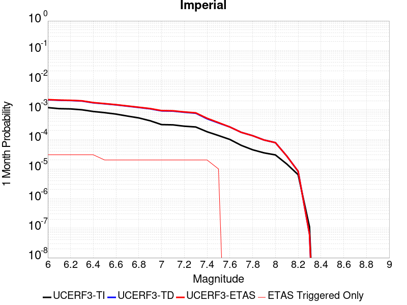 |  |  |

| Magnitude | 1 wk TI Prob | 1 wk TD Prob | 1 wk ETAS Prob | 1 wk ETAS/TD Gain | 1 wk ETAS Triggered Only | 1 mo TI Prob | 1 mo TD Prob | 1 mo ETAS Prob | 1 mo ETAS/TD Gain | 1 mo ETAS Triggered Only | 1 yr TI Prob | 1 yr TD Prob | 1 yr ETAS Prob | 1 yr ETAS/TD Gain | 1 yr ETAS Triggered Only | 10 yr TI Prob | 10 yr TD Prob | 10 yr ETAS Prob | 10 yr ETAS/TD Gain | 10 yr ETAS Triggered Only |
|-----|-----|-----|-----|-----|-----|-----|-----|-----|-----|-----|-----|-----|-----|-----|-----|-----|-----|-----|-----|-----|
| 6.0 | 2.7496446E-4 | 5.0552754E-4 | 5.2989356E-4 | 1.0481992 | 2.4378352E-5 | 0.0011778869 | 0.002164787 | 0.0021891126 | 1.0112369 | 2.4378352E-5 | 0.0142467655 | 0.026038699 | 0.026062442 | 1.0009118 | 2.4378352E-5 | 0.13367249 | 0.2280438 | 0.2280626 | 1.0000825 | 2.4378352E-5 |
| 6.1 | 2.5356023E-4 | 4.8656776E-4 | 5.109343E-4 | 1.0500783 | 2.4378352E-5 | 0.001086234 | 0.0020836622 | 0.0021079897 | 1.0116754 | 2.4378352E-5 | 0.013144928 | 0.025071215 | 0.025094982 | 1.000948 | 2.4378352E-5 | 0.123940155 | 0.21947981 | 0.21949884 | 1.0000867 | 2.4378352E-5 |
| 6.2 | 2.4820742E-4 | 4.7752203E-4 | 5.0188875E-4 | 1.0510274 | 2.4378352E-5 | 0.0010633124 | 0.0020449557 | 0.0020692842 | 1.0118968 | 2.4378352E-5 | 0.01286919 | 0.024611235 | 0.024635013 | 1.0009662 | 2.4378352E-5 | 0.12148927 | 0.21598552 | 0.21600464 | 1.0000885 | 2.4378352E-5 |
| 6.3 | 2.3205351E-4 | 4.5890483E-4 | 4.83272E-4 | 1.0530986 | 2.4378352E-5 | 9.94136E-4 | 0.0019652895 | 0.0019896198 | 1.0123801 | 2.4378352E-5 | 0.012036599 | 0.02366133 | 0.023685133 | 1.0010059 | 2.4378352E-5 | 0.11405133 | 0.20793462 | 0.20795393 | 1.0000929 | 2.4378352E-5 |
| 6.4 | 2.0304754E-4 | 3.987652E-4 | 4.231338E-4 | 1.0611103 | 2.4378352E-5 | 8.6991355E-4 | 0.0017078889 | 0.0017322256 | 1.0142496 | 2.4378352E-5 | 0.010539869 | 0.020595672 | 0.020619547 | 1.0011593 | 2.4378352E-5 | 0.100537635 | 0.1850669 | 0.18508676 | 1.0001074 | 2.4378352E-5 |
| 6.5 | 1.854992E-4 | 3.6988858E-4 | 3.8207325E-4 | 1.0329415 | 1.2189176E-5 | 7.9475436E-4 | 0.0015842861 | 0.0015964559 | 1.0076816 | 1.2189176E-5 | 0.009633281 | 0.01911948 | 0.019131437 | 1.0006254 | 1.2189176E-5 | 0.0922623 | 0.173298 | 0.17330807 | 1.0000582 | 1.2189176E-5 |
| 6.6 | 1.6586106E-4 | 3.403506E-4 | 3.5253566E-4 | 1.0358014 | 1.2189176E-5 | 7.106394E-4 | 0.0014578402 | 0.0014700117 | 1.008349 | 1.2189176E-5 | 0.008617763 | 0.01760642 | 0.017618395 | 1.0006801 | 1.2189176E-5 | 0.08291132 | 0.16077545 | 0.16078568 | 1.0000637 | 1.2189176E-5 |
| 6.7 | 1.4224656E-4 | 3.076692E-4 | 3.1985462E-4 | 1.0396056 | 1.2189176E-5 | 6.094856E-4 | 0.001317924 | 0.0013300972 | 1.0092366 | 1.2189176E-5 | 0.0073952693 | 0.015929576 | 0.015941571 | 1.000753 | 1.2189176E-5 | 0.07153955 | 0.14648417 | 0.14649457 | 1.000071 | 1.2189176E-5 |
| 6.8 | 1.2317259E-4 | 2.779122E-4 | 2.90098E-4 | 1.0438477 | 1.2189176E-5 | 5.2777573E-4 | 0.0011905148 | 0.0012026894 | 1.0102264 | 1.2189176E-5 | 0.0064067547 | 0.0143995695 | 0.014411584 | 1.0008343 | 1.2189176E-5 | 0.06225166 | 0.13293684 | 0.1329474 | 1.0000795 | 1.2189176E-5 |
| 6.9 | 9.859898E-5 | 2.5014306E-4 | 2.6232918E-4 | 1.0487167 | 1.2189176E-5 | 4.2249862E-4 | 0.0010716055 | 0.0010837816 | 1.0113626 | 1.2189176E-5 | 0.0051317946 | 0.012969712 | 0.012981743 | 1.0009277 | 1.2189176E-5 | 0.05014893 | 0.11940631 | 0.11941705 | 1.0000899 | 1.2189176E-5 |
| 7.0 | 7.3191884E-5 | 2.1266776E-4 | 2.2485435E-4 | 1.0573034 | 1.2189176E-5 | 3.136418E-4 | 9.1111806E-4 | 9.2329615E-4 | 1.0133661 | 1.2189176E-5 | 0.003811904 | 0.011037128 | 0.011049182 | 1.0010922 | 1.2189176E-5 | 0.037471764 | 0.10206493 | 0.102075875 | 1.0001073 | 1.2189176E-5 |
| 7.1 | 7.1760296E-5 | 2.0968143E-4 | 2.2186805E-4 | 1.0581197 | 1.2189176E-5 | 3.0750787E-4 | 8.983284E-4 | 9.105066E-4 | 1.0135566 | 1.2189176E-5 | 0.003737482 | 0.010882978 | 0.010895034 | 1.0011078 | 1.2189176E-5 | 0.03675245 | 0.10070146 | 0.10071242 | 1.0001088 | 1.2189176E-5 |
| 7.2 | 6.46614E-5 | 1.9136685E-4 | 2.035537E-4 | 1.0636832 | 1.2189176E-5 | 2.7709085E-4 | 8.1988896E-4 | 8.320681E-4 | 1.0148547 | 1.2189176E-5 | 0.0033683628 | 0.0099370815 | 0.00994915 | 1.0012145 | 1.2189176E-5 | 0.033177625 | 0.09250898 | 0.09252004 | 1.0001196 | 1.2189176E-5 |
| 7.3 | 6.088115E-5 | 1.78084E-4 | 1.9027099E-4 | 1.068434 | 1.2189176E-5 | 2.6089314E-4 | 7.6299673E-4 | 7.751766E-4 | 1.0159632 | 1.2189176E-5 | 0.0031717476 | 0.009250494 | 0.00926257 | 1.0013055 | 1.2189176E-5 | 0.031268585 | 0.08655989 | 0.08657103 | 1.0001286 | 1.2189176E-5 |
| 7.4 | 4.199346E-5 | 1.1510366E-4 | 1.2729144E-4 | 1.1058851 | 1.2189176E-5 | 1.7995955E-4 | 4.9320905E-4 | 5.053922E-4 | 1.0247018 | 1.2189176E-5 | 0.0021888057 | 0.0059884563 | 0.0060005723 | 1.0020232 | 1.2189176E-5 | 0.02167372 | 0.057439793 | 0.05745128 | 1.0002 | 1.2189176E-5 |
| 7.5 | 3.130448E-5 | 8.33328E-5 | 8.33328E-5 | 1.0 | 0.0 | 1.3415517E-4 | 3.57092E-4 | 3.57092E-4 | 1.0 | 0.0 | 0.0016321153 | 0.004338988 | 0.004338988 | 1.0 | 0.0 | 0.016201803 | 0.04213201 | 0.04213201 | 1.0 | 0.0 |
| 7.6 | 2.3074248E-5 | 6.0844646E-5 | 6.0844646E-5 | 1.0 | 0.0 | 9.888588E-5 | 2.6073685E-4 | 2.6073685E-4 | 1.0 | 0.0 | 0.0012032706 | 0.0031698733 | 0.0031698733 | 1.0 | 0.0 | 0.011967761 | 0.031026395 | 0.031026395 | 1.0 | 0.0 |
| 7.7 | 1.45864815E-5 | 4.0124698E-5 | 4.0124698E-5 | 1.0 | 0.0 | 6.2511994E-5 | 1.7195169E-4 | 1.7195169E-4 | 1.0 | 0.0 | 7.608177E-4 | 0.0020915072 | 0.0020915072 | 1.0 | 0.0 | 0.007582182 | 0.020627763 | 0.020627763 | 1.0 | 0.0 |
| 7.8 | 1.0352979E-5 | 3.0960902E-5 | 3.0960902E-5 | 1.0 | 0.0 | 4.4369157E-5 | 1.3268284E-4 | 1.3268284E-4 | 1.0 | 0.0 | 5.400606E-4 | 0.0016142189 | 0.0016142189 | 1.0 | 0.0 | 0.0053875 | 0.016016833 | 0.016016833 | 1.0 | 0.0 |
| 7.9 | 8.137906E-6 | 2.2149103E-5 | 2.2149103E-5 | 1.0 | 0.0 | 3.4876273E-5 | 9.492128E-5 | 9.492128E-5 | 1.0 | 0.0 | 4.2453592E-4 | 0.0011550548 | 0.0011550548 | 1.0 | 0.0 | 0.004237258 | 0.011617903 | 0.011617903 | 1.0 | 0.0 |
| 8.0 | 6.93792E-6 | 1.8008766E-5 | 1.8008766E-5 | 1.0 | 0.0 | 2.9733603E-5 | 7.717814E-5 | 7.717814E-5 | 1.0 | 0.0 | 3.6194647E-4 | 9.3923963E-4 | 9.3923963E-4 | 1.0 | 0.0 | 0.0036135751 | 0.00950155 | 0.00950155 | 1.0 | 0.0 |
| 8.1 | 3.4286315E-6 | 6.379872E-6 | 6.379872E-6 | 1.0 | 0.0 | 1.4694053E-5 | 2.7342023E-5 | 2.7342023E-5 | 1.0 | 0.0 | 1.7888541E-4 | 3.328384E-4 | 3.328384E-4 | 1.0 | 0.0 | 0.0017874148 | 0.003486031 | 0.003486031 | 1.0 | 0.0 |
| 8.2 | 1.4906886E-6 | 1.9366646E-6 | 1.9366646E-6 | 1.0 | 0.0 | 6.3886496E-6 | 8.299965E-6 | 8.299965E-6 | 1.0 | 0.0 | 7.7779034E-5 | 1.0104742E-4 | 1.0104742E-4 | 1.0 | 0.0 | 7.775182E-4 | 0.0011075331 | 0.0011075331 | 1.0 | 0.0 |
| 8.3 | 2.5758007E-8 | 1.4500102E-8 | 1.4500102E-8 | 1.0 | 0.0 | 1.10391454E-7 | 6.214329E-8 | 6.214329E-8 | 1.0 | 0.0 | 1.3440151E-6 | 7.565946E-7 | 7.565946E-7 | 1.0 | 0.0 | 1.344007E-5 | 7.887763E-6 | 7.887763E-6 | 1.0 | 0.0 |

## White Mountains
*[(top)](#table-of-contents)*

| 1 Week | 1 Month | 1 Year | 10 Year |
|-----|-----|-----|-----|
| 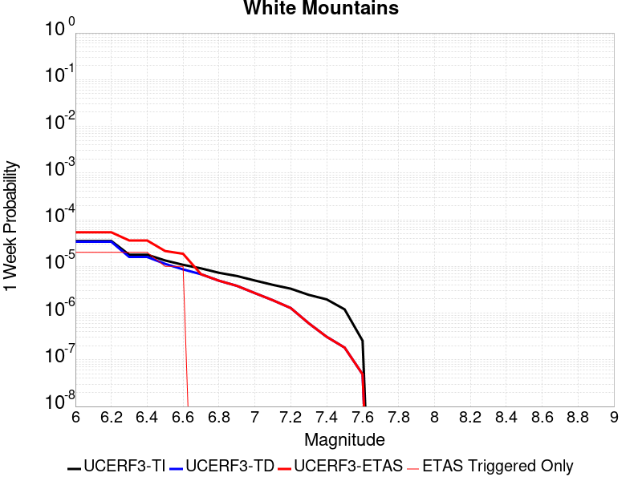 |  |  | 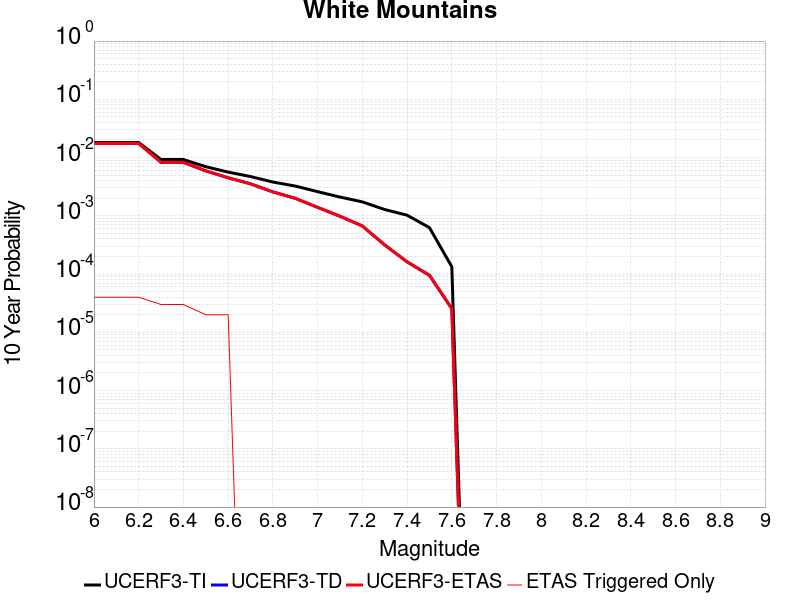 |

| Magnitude | 1 wk TI Prob | 1 wk TD Prob | 1 wk ETAS Prob | 1 wk ETAS/TD Gain | 1 wk ETAS Triggered Only | 1 mo TI Prob | 1 mo TD Prob | 1 mo ETAS Prob | 1 mo ETAS/TD Gain | 1 mo ETAS Triggered Only | 1 yr TI Prob | 1 yr TD Prob | 1 yr ETAS Prob | 1 yr ETAS/TD Gain | 1 yr ETAS Triggered Only | 10 yr TI Prob | 10 yr TD Prob | 10 yr ETAS Prob | 10 yr ETAS/TD Gain | 10 yr ETAS Triggered Only |
|-----|-----|-----|-----|-----|-----|-----|-----|-----|-----|-----|-----|-----|-----|-----|-----|-----|-----|-----|-----|-----|
| 6.0 | 3.503579E-5 | 3.378405E-5 | 4.5972814E-5 | 1.3607845 | 1.2189176E-5 | 1.5014476E-4 | 1.4478143E-4 | 1.5696885E-4 | 1.084178 | 1.2189176E-5 | 0.0018264796 | 0.0017614096 | 0.0017857449 | 1.0138159 | 2.4378352E-5 | 0.018115403 | 0.017486818 | 0.01751077 | 1.0013697 | 2.4378352E-5 |
| 6.1 | 3.503579E-5 | 3.378405E-5 | 4.5972814E-5 | 1.3607845 | 1.2189176E-5 | 1.5014476E-4 | 1.4478143E-4 | 1.5696885E-4 | 1.084178 | 1.2189176E-5 | 0.0018264796 | 0.0017614096 | 0.0017857449 | 1.0138159 | 2.4378352E-5 | 0.018115403 | 0.017486818 | 0.01751077 | 1.0013697 | 2.4378352E-5 |
| 6.2 | 3.503579E-5 | 3.378405E-5 | 4.5972814E-5 | 1.3607845 | 1.2189176E-5 | 1.5014476E-4 | 1.4478143E-4 | 1.5696885E-4 | 1.084178 | 1.2189176E-5 | 0.0018264796 | 0.0017614096 | 0.0017857449 | 1.0138159 | 2.4378352E-5 | 0.018115403 | 0.017486818 | 0.01751077 | 1.0013697 | 2.4378352E-5 |
| 6.3 | 1.7818425E-5 | 1.5916074E-5 | 2.8105056E-5 | 1.7658285 | 1.2189176E-5 | 7.636245E-5 | 6.821004E-5 | 8.0398386E-5 | 1.1786884 | 1.2189176E-5 | 9.293162E-4 | 8.301551E-4 | 8.423342E-4 | 1.0146708 | 1.2189176E-5 | 0.009254395 | 0.008271999 | 0.008284087 | 1.0014614 | 1.2189176E-5 |
| 6.4 | 1.7818425E-5 | 1.5916074E-5 | 2.8105056E-5 | 1.7658285 | 1.2189176E-5 | 7.636245E-5 | 6.821004E-5 | 8.0398386E-5 | 1.1786884 | 1.2189176E-5 | 9.293162E-4 | 8.301551E-4 | 8.423342E-4 | 1.0146708 | 1.2189176E-5 | 0.009254395 | 0.008271999 | 0.008284087 | 1.0014614 | 1.2189176E-5 |
| 6.5 | 1.3397557E-5 | 1.13362685E-5 | 2.3525306E-5 | 2.0752249 | 1.2189176E-5 | 5.741684E-5 | 4.858314E-5 | 6.0771727E-5 | 1.250881 | 1.2189176E-5 | 6.988258E-4 | 5.913462E-4 | 6.0352817E-4 | 1.0206004 | 1.2189176E-5 | 0.006966323 | 0.005898432 | 0.0059105493 | 1.0020543 | 1.2189176E-5 |
| 6.6 | 1.0818695E-5 | 8.625366E-6 | 2.0814437E-5 | 2.4131656 | 1.2189176E-5 | 4.6365014E-5 | 3.6965357E-5 | 4.915408E-5 | 1.3297337 | 1.2189176E-5 | 5.6434784E-4 | 4.4996463E-4 | 4.621483E-4 | 1.027077 | 1.2189176E-5 | 0.005629168 | 0.004490972 | 0.0045031067 | 1.002702 | 1.2189176E-5 |
| 6.7 | 9.067908E-6 | 6.802442E-6 | 6.802442E-6 | 1.0 | 0.0 | 3.8861883E-5 | 2.9153016E-5 | 2.9153016E-5 | 1.0 | 0.0 | 4.7304068E-4 | 3.5488335E-4 | 3.5488335E-4 | 1.0 | 0.0 | 0.00472035 | 0.0035434833 | 0.0035434833 | 1.0 | 0.0 |
| 6.8 | 7.295947E-6 | 4.936391E-6 | 4.936391E-6 | 1.0 | 0.0 | 3.126797E-5 | 2.1155796E-5 | 2.1155796E-5 | 1.0 | 0.0 | 3.8062103E-4 | 2.575425E-4 | 2.575425E-4 | 1.0 | 0.0 | 0.0037996976 | 0.0025725532 | 0.0025725532 | 1.0 | 0.0 |
| 6.9 | 6.2243444E-6 | 3.832213E-6 | 3.832213E-6 | 1.0 | 0.0 | 2.6675489E-5 | 1.642367E-5 | 1.642367E-5 | 1.0 | 0.0 | 3.2472567E-4 | 1.9994036E-4 | 1.9994036E-4 | 1.0 | 0.0 | 0.0032425157 | 0.0019976576 | 0.0019976576 | 1.0 | 0.0 |
| 7.0 | 4.9878413E-6 | 2.6795342E-6 | 2.6795342E-6 | 1.0 | 0.0 | 2.1376287E-5 | 1.14836685E-5 | 1.14836685E-5 | 1.0 | 0.0 | 2.602252E-4 | 1.3980496E-4 | 1.3980496E-4 | 1.0 | 0.0 | 0.002599207 | 0.0013971963 | 0.0013971963 | 1.0 | 0.0 |
| 7.1 | 4.0252844E-6 | 1.8857575E-6 | 1.8857575E-6 | 1.0 | 0.0 | 1.7251105E-5 | 8.081794E-6 | 8.081794E-6 | 1.0 | 0.0 | 2.1001195E-4 | 9.8391516E-5 | 9.8391516E-5 | 1.0 | 0.0 | 0.0020981359 | 9.834924E-4 | 9.834924E-4 | 1.0 | 0.0 |
| 7.2 | 3.3284066E-6 | 1.281964E-6 | 1.281964E-6 | 1.0 | 0.0 | 1.4264522E-5 | 5.494121E-6 | 5.494121E-6 | 1.0 | 0.0 | 1.736567E-4 | 6.688897E-5 | 6.688897E-5 | 1.0 | 0.0 | 0.0017352107 | 6.6869846E-4 | 6.6869846E-4 | 1.0 | 0.0 |
| 7.3 | 2.458226E-6 | 6.05722E-7 | 6.05722E-7 | 1.0 | 0.0 | 1.0535211E-5 | 2.5959491E-6 | 2.5959491E-6 | 1.0 | 0.0 | 1.2825865E-4 | 3.1605257E-5 | 3.1605257E-5 | 1.0 | 0.0 | 0.0012818464 | 3.160114E-4 | 3.160114E-4 | 1.0 | 0.0 |
| 7.4 | 1.965953E-6 | 3.1089303E-7 | 3.1089303E-7 | 1.0 | 0.0 | 8.425486E-6 | 1.332398E-6 | 1.332398E-6 | 1.0 | 0.0 | 1.0257547E-4 | 1.6221828E-5 | 1.6221828E-5 | 1.0 | 0.0 | 0.0010252813 | 1.6220656E-4 | 1.6220656E-4 | 1.0 | 0.0 |
| 7.5 | 1.2014192E-6 | 1.8244253E-7 | 1.8244253E-7 | 1.0 | 0.0 | 5.148929E-6 | 7.8189635E-7 | 7.8189635E-7 | 1.0 | 0.0 | 6.2686406E-5 | 9.519547E-6 | 9.519547E-6 | 1.0 | 0.0 | 6.266873E-4 | 9.519148E-5 | 9.519148E-5 | 1.0 | 0.0 |
| 7.6 | 2.5612175E-7 | 4.8946475E-8 | 4.8946475E-8 | 1.0 | 0.0 | 1.0976642E-6 | 2.0977059E-7 | 2.0977059E-7 | 1.0 | 0.0 | 1.3363979E-5 | 2.5539543E-6 | 2.5539543E-6 | 1.0 | 0.0 | 1.3363175E-4 | 2.5539286E-5 | 2.5539286E-5 | 1.0 | 0.0 |

## Chino alt 1
*[(top)](#table-of-contents)*

| 1 Week | 1 Month | 1 Year | 10 Year |
|-----|-----|-----|-----|
|  |  |  | 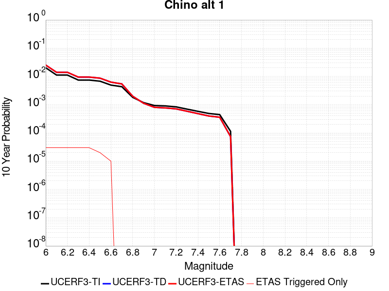 |

| Magnitude | 1 wk TI Prob | 1 wk TD Prob | 1 wk ETAS Prob | 1 wk ETAS/TD Gain | 1 wk ETAS Triggered Only | 1 mo TI Prob | 1 mo TD Prob | 1 mo ETAS Prob | 1 mo ETAS/TD Gain | 1 mo ETAS Triggered Only | 1 yr TI Prob | 1 yr TD Prob | 1 yr ETAS Prob | 1 yr ETAS/TD Gain | 1 yr ETAS Triggered Only | 10 yr TI Prob | 10 yr TD Prob | 10 yr ETAS Prob | 10 yr ETAS/TD Gain | 10 yr ETAS Triggered Only |
|-----|-----|-----|-----|-----|-----|-----|-----|-----|-----|-----|-----|-----|-----|-----|-----|-----|-----|-----|-----|-----|
| 6.0 | 3.939946E-5 | 4.8948554E-5 | 4.8948554E-5 | 1.0 | 0.0 | 1.6884391E-4 | 2.097656E-4 | 2.097656E-4 | 1.0 | 0.0 | 0.0020537362 | 0.0025513945 | 0.0025757109 | 1.0095305 | 2.4378352E-5 | 0.020348595 | 0.025277847 | 0.02530161 | 1.0009401 | 2.4378352E-5 |
| 6.1 | 2.1505624E-5 | 2.6879026E-5 | 2.6879026E-5 | 1.0 | 0.0 | 9.2163704E-5 | 1.1519137E-4 | 1.1519137E-4 | 1.0 | 0.0 | 0.0011215154 | 0.001401664 | 0.0014260082 | 1.0173681 | 2.4378352E-5 | 0.011158722 | 0.013945141 | 0.013969179 | 1.0017238 | 2.4378352E-5 |
| 6.2 | 2.1505624E-5 | 2.6879026E-5 | 2.6879026E-5 | 1.0 | 0.0 | 9.2163704E-5 | 1.1519137E-4 | 1.1519137E-4 | 1.0 | 0.0 | 0.0011215154 | 0.001401664 | 0.0014260082 | 1.0173681 | 2.4378352E-5 | 0.011158722 | 0.013945141 | 0.013969179 | 1.0017238 | 2.4378352E-5 |
| 6.3 | 1.4290785E-5 | 1.8165128E-5 | 1.8165128E-5 | 1.0 | 0.0 | 6.1244784E-5 | 7.784848E-5 | 7.784848E-5 | 1.0 | 0.0 | 7.454001E-4 | 9.4743853E-4 | 9.717938E-4 | 1.0257064 | 2.4378352E-5 | 0.007429048 | 0.0094444575 | 0.009468606 | 1.0025568 | 2.4378352E-5 |
| 6.4 | 1.4290785E-5 | 1.8165128E-5 | 1.8165128E-5 | 1.0 | 0.0 | 6.1244784E-5 | 7.784848E-5 | 7.784848E-5 | 1.0 | 0.0 | 7.454001E-4 | 9.4743853E-4 | 9.717938E-4 | 1.0257064 | 2.4378352E-5 | 0.007429048 | 0.0094444575 | 0.009468606 | 1.0025568 | 2.4378352E-5 |
| 6.5 | 1.3017944E-5 | 1.6652088E-5 | 1.6652088E-5 | 1.0 | 0.0 | 5.5789995E-5 | 7.136439E-5 | 7.136439E-5 | 1.0 | 0.0 | 6.790315E-4 | 8.685589E-4 | 8.9291605E-4 | 1.0280432 | 2.4378352E-5 | 0.0067696036 | 0.008661949 | 0.008686117 | 1.0027901 | 2.4378352E-5 |
| 6.6 | 9.470016E-6 | 1.2039424E-5 | 1.2039424E-5 | 1.0 | 0.0 | 4.058515E-5 | 5.1596704E-5 | 5.1596704E-5 | 1.0 | 0.0 | 4.940122E-4 | 6.280428E-4 | 6.4022426E-4 | 1.019396 | 1.2189176E-5 | 0.004929154 | 0.0062718987 | 0.0062840115 | 1.0019313 | 1.2189176E-5 |
| 6.7 | 8.314155E-6 | 1.0407736E-5 | 1.0407736E-5 | 1.0 | 0.0 | 3.5631605E-5 | 4.4604003E-5 | 4.4604003E-5 | 1.0 | 0.0 | 4.3372845E-4 | 5.429507E-4 | 5.429507E-4 | 1.0 | 0.0 | 0.004328829 | 0.005425775 | 0.005425775 | 1.0 | 0.0 |
| 6.8 | 3.4856364E-6 | 3.8133708E-6 | 3.8133708E-6 | 1.0 | 0.0 | 1.4938357E-5 | 1.6342927E-5 | 1.6342927E-5 | 1.0 | 0.0 | 1.8185932E-4 | 1.9895904E-4 | 1.9895904E-4 | 1.0 | 0.0 | 0.0018171056 | 0.0019894864 | 0.0019894864 | 1.0 | 0.0 |
| 6.9 | 2.2645952E-6 | 2.1529022E-6 | 2.1529022E-6 | 1.0 | 0.0 | 9.705372E-6 | 9.226692E-6 | 9.226692E-6 | 1.0 | 0.0 | 1.18156495E-4 | 1.123294E-4 | 1.123294E-4 | 1.0 | 0.0 | 0.0011809369 | 0.0011233423 | 0.0011233423 | 1.0 | 0.0 |
| 7.0 | 1.7864003E-6 | 1.5430785E-6 | 1.5430785E-6 | 1.0 | 0.0 | 7.655979E-6 | 6.613177E-6 | 6.613177E-6 | 1.0 | 0.0 | 9.3207556E-5 | 8.051251E-5 | 8.051251E-5 | 1.0 | 0.0 | 9.316847E-4 | 8.0528046E-4 | 8.0528046E-4 | 1.0 | 0.0 |
| 7.1 | 1.7315456E-6 | 1.4733511E-6 | 1.4733511E-6 | 1.0 | 0.0 | 7.420889E-6 | 6.3143466E-6 | 6.3143466E-6 | 1.0 | 0.0 | 9.034557E-5 | 7.6874516E-5 | 7.6874516E-5 | 1.0 | 0.0 | 9.0308854E-4 | 7.6891703E-4 | 7.6891703E-4 | 1.0 | 0.0 |
| 7.2 | 1.6008337E-6 | 1.3574215E-6 | 1.3574215E-6 | 1.0 | 0.0 | 6.860698E-6 | 5.817508E-6 | 5.817508E-6 | 1.0 | 0.0 | 8.352579E-5 | 7.082591E-5 | 7.082591E-5 | 1.0 | 0.0 | 8.34944E-4 | 7.0845755E-4 | 7.0845755E-4 | 1.0 | 0.0 |
| 7.3 | 1.3320939E-6 | 1.121782E-6 | 1.121782E-6 | 1.0 | 0.0 | 5.7089615E-6 | 4.807629E-6 | 4.807629E-6 | 1.0 | 0.0 | 6.9504385E-5 | 5.8531357E-5 | 5.8531357E-5 | 1.0 | 0.0 | 6.9482654E-4 | 5.8530393E-4 | 5.8530393E-4 | 1.0 | 0.0 |
| 7.4 | 1.114294E-6 | 9.237111E-7 | 9.237111E-7 | 1.0 | 0.0 | 4.775537E-6 | 3.958756E-6 | 3.958756E-6 | 1.0 | 0.0 | 5.8140613E-5 | 4.8196827E-5 | 4.8196827E-5 | 1.0 | 0.0 | 5.81254E-4 | 4.8188053E-4 | 4.8188053E-4 | 1.0 | 0.0 |
| 7.5 | 9.354081E-7 | 7.6234323E-7 | 7.6234323E-7 | 1.0 | 0.0 | 4.0088858E-6 | 3.2671815E-6 | 3.2671815E-6 | 1.0 | 0.0 | 4.8807087E-5 | 3.9777242E-5 | 3.9777242E-5 | 1.0 | 0.0 | 4.879637E-4 | 3.977046E-4 | 3.977046E-4 | 1.0 | 0.0 |
| 7.6 | 8.521771E-7 | 6.88071E-7 | 6.88071E-7 | 1.0 | 0.0 | 3.6521824E-6 | 2.9488726E-6 | 2.9488726E-6 | 1.0 | 0.0 | 4.4464414E-5 | 3.5901965E-5 | 3.5901965E-5 | 1.0 | 0.0 | 4.4455516E-4 | 3.589648E-4 | 3.589648E-4 | 1.0 | 0.0 |
| 7.7 | 2.1803626E-7 | 1.418649E-7 | 1.418649E-7 | 1.0 | 0.0 | 9.344408E-7 | 6.079923E-7 | 6.079923E-7 | 1.0 | 0.0 | 1.1376757E-5 | 7.4022914E-6 | 7.4022914E-6 | 1.0 | 0.0 | 1.13761744E-4 | 7.402141E-5 | 7.402141E-5 | 1.0 | 0.0 |

## Goose Lake 2011 CFM
*[(top)](#table-of-contents)*

| 1 Week | 1 Month | 1 Year | 10 Year |
|-----|-----|-----|-----|
|  |  |  |  |

| Magnitude | 1 wk TI Prob | 1 wk TD Prob | 1 wk ETAS Prob | 1 wk ETAS/TD Gain | 1 wk ETAS Triggered Only | 1 mo TI Prob | 1 mo TD Prob | 1 mo ETAS Prob | 1 mo ETAS/TD Gain | 1 mo ETAS Triggered Only | 1 yr TI Prob | 1 yr TD Prob | 1 yr ETAS Prob | 1 yr ETAS/TD Gain | 1 yr ETAS Triggered Only | 10 yr TI Prob | 10 yr TD Prob | 10 yr ETAS Prob | 10 yr ETAS/TD Gain | 10 yr ETAS Triggered Only |
|-----|-----|-----|-----|-----|-----|-----|-----|-----|-----|-----|-----|-----|-----|-----|-----|-----|-----|-----|-----|-----|
| 6.0 | 3.780968E-6 | 3.8230223E-6 | 1.601215E-5 | 4.1883492 | 1.2189176E-5 | 1.6204049E-5 | 1.6384285E-5 | 4.0762236E-5 | 2.4878862 | 2.4378352E-5 | 1.9726643E-4 | 1.994615E-4 | 2.2383498E-4 | 1.1221964 | 2.4378352E-5 | 0.001970914 | 0.001992933 | 0.0020172629 | 1.012208 | 2.4378352E-5 |
| 6.1 | 2.2035124E-6 | 2.229801E-6 | 2.229801E-6 | 1.0 | 0.0 | 9.443591E-6 | 9.556257E-6 | 2.1745316E-5 | 2.2755055 | 1.2189176E-5 | 1.1496965E-4 | 1.163414E-4 | 1.2852917E-4 | 1.1047586 | 1.2189176E-5 | 0.0011491019 | 0.0011628233 | 0.0011749982 | 1.0104702 | 1.2189176E-5 |
| 6.2 | 1.5624689E-6 | 1.5826923E-6 | 1.5826923E-6 | 1.0 | 0.0 | 6.6962784E-6 | 6.7829496E-6 | 6.7829496E-6 | 1.0 | 0.0 | 8.152414E-5 | 8.2579325E-5 | 8.2579325E-5 | 1.0 | 0.0 | 8.1494235E-4 | 8.2549086E-4 | 8.2549086E-4 | 1.0 | 0.0 |
| 6.3 | 1.5624689E-6 | 1.5826923E-6 | 1.5826923E-6 | 1.0 | 0.0 | 6.6962784E-6 | 6.7829496E-6 | 6.7829496E-6 | 1.0 | 0.0 | 8.152414E-5 | 8.2579325E-5 | 8.2579325E-5 | 1.0 | 0.0 | 8.1494235E-4 | 8.2549086E-4 | 8.2549086E-4 | 1.0 | 0.0 |
| 6.4 | 1.256464E-6 | 1.2738695E-6 | 1.2738695E-6 | 1.0 | 0.0 | 5.3848344E-6 | 5.4594293E-6 | 5.4594293E-6 | 1.0 | 0.0 | 6.5558386E-5 | 6.646655E-5 | 6.646655E-5 | 1.0 | 0.0 | 6.553905E-4 | 6.644687E-4 | 6.644687E-4 | 1.0 | 0.0 |
| 6.5 | 1.0910911E-6 | 1.1069404E-6 | 1.1069404E-6 | 1.0 | 0.0 | 4.6760965E-6 | 4.7440217E-6 | 4.7440217E-6 | 1.0 | 0.0 | 5.692999E-5 | 5.7756948E-5 | 5.7756948E-5 | 1.0 | 0.0 | 5.6915404E-4 | 5.7742064E-4 | 5.7742064E-4 | 1.0 | 0.0 |
| 6.6 | 9.546601E-7 | 9.691246E-7 | 9.691246E-7 | 1.0 | 0.0 | 4.091394E-6 | 4.1533845E-6 | 4.1533845E-6 | 1.0 | 0.0 | 4.9811584E-5 | 5.056629E-5 | 5.056629E-5 | 1.0 | 0.0 | 4.980042E-4 | 5.055487E-4 | 5.055487E-4 | 1.0 | 0.0 |
| 6.7 | 7.790316E-7 | 7.9159634E-7 | 7.9159634E-7 | 1.0 | 0.0 | 3.3387028E-6 | 3.3925514E-6 | 3.3925514E-6 | 1.0 | 0.0 | 4.0647945E-5 | 4.1303538E-5 | 4.1303538E-5 | 1.0 | 0.0 | 4.0640513E-4 | 4.129592E-4 | 4.129592E-4 | 1.0 | 0.0 |
| 6.8 | 6.3714384E-7 | 6.4787395E-7 | 6.4787395E-7 | 1.0 | 0.0 | 2.7306137E-6 | 2.7765998E-6 | 2.7765998E-6 | 1.0 | 0.0 | 3.3244716E-5 | 3.3804583E-5 | 3.3804583E-5 | 1.0 | 0.0 | 3.323974E-4 | 3.379949E-4 | 3.379949E-4 | 1.0 | 0.0 |
| 6.9 | 4.92586E-7 | 5.0139147E-7 | 5.0139147E-7 | 1.0 | 0.0 | 2.1110811E-6 | 2.1488188E-6 | 2.1488188E-6 | 1.0 | 0.0 | 2.5702111E-5 | 2.616156E-5 | 2.616156E-5 | 1.0 | 0.0 | 2.569914E-4 | 2.6158517E-4 | 2.6158517E-4 | 1.0 | 0.0 |
| 7.0 | 3.130245E-7 | 3.190354E-7 | 3.190354E-7 | 1.0 | 0.0 | 1.3415328E-6 | 1.3672939E-6 | 1.3672939E-6 | 1.0 | 0.0 | 1.6333039E-5 | 1.6646678E-5 | 1.6646678E-5 | 1.0 | 0.0 | 1.6331839E-4 | 1.6645451E-4 | 1.6645451E-4 | 1.0 | 0.0 |
| 7.1 | 1.7680084E-7 | 1.8023923E-7 | 1.8023923E-7 | 1.0 | 0.0 | 7.5771766E-7 | 7.724536E-7 | 7.724536E-7 | 1.0 | 0.0 | 9.225173E-6 | 9.404583E-6 | 9.404583E-6 | 1.0 | 0.0 | 9.22479E-5 | 9.4041956E-5 | 9.4041956E-5 | 1.0 | 0.0 |
| 7.2 | 4.8641045E-8 | 4.9402068E-8 | 4.9402068E-8 | 1.0 | 0.0 | 2.084616E-7 | 2.1172312E-7 | 2.1172312E-7 | 1.0 | 0.0 | 2.538017E-6 | 2.577726E-6 | 2.577726E-6 | 1.0 | 0.0 | 2.537988E-5 | 2.5776973E-5 | 2.5776973E-5 | 1.0 | 0.0 |
| 7.3 | 5.3911844E-9 | 5.4758145E-9 | 5.4758145E-9 | 1.0 | 0.0 | 2.3105075E-8 | 2.3467775E-8 | 2.3467775E-8 | 1.0 | 0.0 | 2.8130427E-7 | 2.8572015E-7 | 2.8572015E-7 | 1.0 | 0.0 | 2.8130391E-6 | 2.8571992E-6 | 2.8571992E-6 | 1.0 | 0.0 |

## Mission Hills 2011
*[(top)](#table-of-contents)*

| 1 Week | 1 Month | 1 Year | 10 Year |
|-----|-----|-----|-----|
|  |  |  |  |

| Magnitude | 1 wk TI Prob | 1 wk TD Prob | 1 wk ETAS Prob | 1 wk ETAS/TD Gain | 1 wk ETAS Triggered Only | 1 mo TI Prob | 1 mo TD Prob | 1 mo ETAS Prob | 1 mo ETAS/TD Gain | 1 mo ETAS Triggered Only | 1 yr TI Prob | 1 yr TD Prob | 1 yr ETAS Prob | 1 yr ETAS/TD Gain | 1 yr ETAS Triggered Only | 10 yr TI Prob | 10 yr TD Prob | 10 yr ETAS Prob | 10 yr ETAS/TD Gain | 10 yr ETAS Triggered Only |
|-----|-----|-----|-----|-----|-----|-----|-----|-----|-----|-----|-----|-----|-----|-----|-----|-----|-----|-----|-----|-----|
| 6.0 | 1.8765717E-5 | 1.9054645E-5 | 4.3432534E-5 | 2.2793672 | 2.4378352E-5 | 8.0422025E-5 | 8.166215E-5 | 1.0603851E-4 | 1.2985026 | 2.4378352E-5 | 9.786983E-4 | 9.941267E-4 | 0.0010184807 | 1.024498 | 2.4378352E-5 | 0.009743992 | 0.009930461 | 0.009954597 | 1.0024306 | 2.4378352E-5 |
| 6.1 | 1.8765717E-5 | 1.9054645E-5 | 4.3432534E-5 | 2.2793672 | 2.4378352E-5 | 8.0422025E-5 | 8.166215E-5 | 1.0603851E-4 | 1.2985026 | 2.4378352E-5 | 9.786983E-4 | 9.941267E-4 | 0.0010184807 | 1.024498 | 2.4378352E-5 | 0.009743992 | 0.009930461 | 0.009954597 | 1.0024306 | 2.4378352E-5 |
| 6.2 | 1.8765717E-5 | 1.9054645E-5 | 4.3432534E-5 | 2.2793672 | 2.4378352E-5 | 8.0422025E-5 | 8.166215E-5 | 1.0603851E-4 | 1.2985026 | 2.4378352E-5 | 9.786983E-4 | 9.941267E-4 | 0.0010184807 | 1.024498 | 2.4378352E-5 | 0.009743992 | 0.009930461 | 0.009954597 | 1.0024306 | 2.4378352E-5 |
| 6.3 | 1.8765717E-5 | 1.9054645E-5 | 4.3432534E-5 | 2.2793672 | 2.4378352E-5 | 8.0422025E-5 | 8.166215E-5 | 1.0603851E-4 | 1.2985026 | 2.4378352E-5 | 9.786983E-4 | 9.941267E-4 | 0.0010184807 | 1.024498 | 2.4378352E-5 | 0.009743992 | 0.009930461 | 0.009954597 | 1.0024306 | 2.4378352E-5 |
| 6.4 | 4.566357E-6 | 2.5148488E-6 | 2.5148488E-6 | 1.0 | 0.0 | 1.9569954E-5 | 1.0777889E-5 | 1.0777889E-5 | 1.0 | 0.0 | 2.3823815E-4 | 1.3121472E-4 | 1.3121472E-4 | 1.0 | 0.0 | 0.002379829 | 0.0013115506 | 0.0013115506 | 1.0 | 0.0 |
| 6.5 | 4.566357E-6 | 2.5148488E-6 | 2.5148488E-6 | 1.0 | 0.0 | 1.9569954E-5 | 1.0777889E-5 | 1.0777889E-5 | 1.0 | 0.0 | 2.3823815E-4 | 1.3121472E-4 | 1.3121472E-4 | 1.0 | 0.0 | 0.002379829 | 0.0013115506 | 0.0013115506 | 1.0 | 0.0 |
| 6.6 | 4.566357E-6 | 2.5148488E-6 | 2.5148488E-6 | 1.0 | 0.0 | 1.9569954E-5 | 1.0777889E-5 | 1.0777889E-5 | 1.0 | 0.0 | 2.3823815E-4 | 1.3121472E-4 | 1.3121472E-4 | 1.0 | 0.0 | 0.002379829 | 0.0013115506 | 0.0013115506 | 1.0 | 0.0 |
| 6.7 | 2.3266773E-6 | 1.3296187E-6 | 1.3296187E-6 | 1.0 | 0.0 | 9.971435E-6 | 5.698354E-6 | 5.698354E-6 | 1.0 | 0.0 | 1.2139547E-4 | 6.937531E-5 | 6.937531E-5 | 1.0 | 0.0 | 0.0012132917 | 6.9354265E-4 | 6.9354265E-4 | 1.0 | 0.0 |
| 6.8 | 2.032735E-6 | 1.1894115E-6 | 1.1894115E-6 | 1.0 | 0.0 | 8.711692E-6 | 5.097468E-6 | 5.097468E-6 | 1.0 | 0.0 | 1.06059684E-4 | 6.205996E-5 | 6.205996E-5 | 1.0 | 0.0 | 0.0010600908 | 6.2043115E-4 | 6.2043115E-4 | 1.0 | 0.0 |
| 6.9 | 1.3186259E-6 | 1.0561778E-6 | 1.0561778E-6 | 1.0 | 0.0 | 5.6512413E-6 | 4.5264687E-6 | 4.5264687E-6 | 1.0 | 0.0 | 6.8801695E-5 | 5.5108394E-5 | 5.5108394E-5 | 1.0 | 0.0 | 6.8780396E-4 | 5.5095024E-4 | 5.5095024E-4 | 1.0 | 0.0 |
| 7.0 | 1.2726016E-6 | 1.0159088E-6 | 1.0159088E-6 | 1.0 | 0.0 | 5.4539955E-6 | 4.3538876E-6 | 4.3538876E-6 | 1.0 | 0.0 | 6.6400375E-5 | 5.300732E-5 | 5.300732E-5 | 1.0 | 0.0 | 6.6380535E-4 | 5.299496E-4 | 5.299496E-4 | 1.0 | 0.0 |
| 7.1 | 1.2063913E-6 | 9.570072E-7 | 9.570072E-7 | 1.0 | 0.0 | 5.170238E-6 | 4.101453E-6 | 4.101453E-6 | 1.0 | 0.0 | 6.294583E-5 | 4.9934075E-5 | 4.9934075E-5 | 1.0 | 0.0 | 6.2928005E-4 | 4.992311E-4 | 4.992311E-4 | 1.0 | 0.0 |
| 7.2 | 9.105806E-7 | 7.3765557E-7 | 7.3765557E-7 | 1.0 | 0.0 | 3.9024826E-6 | 3.1613772E-6 | 3.1613772E-6 | 1.0 | 0.0 | 4.7511687E-5 | 3.8489103E-5 | 3.8489103E-5 | 1.0 | 0.0 | 4.7501532E-4 | 3.8482592E-4 | 3.8482592E-4 | 1.0 | 0.0 |
| 7.3 | 7.020432E-7 | 5.710089E-7 | 5.710089E-7 | 1.0 | 0.0 | 3.0087533E-6 | 2.447179E-6 | 2.447179E-6 | 1.0 | 0.0 | 3.6630954E-5 | 2.979401E-5 | 2.979401E-5 | 1.0 | 0.0 | 3.6624918E-4 | 2.9790145E-4 | 2.9790145E-4 | 1.0 | 0.0 |
| 7.4 | 5.3900635E-7 | 4.4480825E-7 | 4.4480825E-7 | 1.0 | 0.0 | 2.3100251E-6 | 1.9063198E-6 | 1.9063198E-6 | 1.0 | 0.0 | 2.8124194E-5 | 2.3209208E-5 | 2.3209208E-5 | 1.0 | 0.0 | 2.8120633E-4 | 2.3206905E-4 | 2.3206905E-4 | 1.0 | 0.0 |
| 7.5 | 2.907075E-7 | 2.2875415E-7 | 2.2875415E-7 | 1.0 | 0.0 | 1.2458887E-6 | 9.803746E-7 | 9.803746E-7 | 1.0 | 0.0 | 1.5168589E-5 | 1.1935997E-5 | 1.1935997E-5 | 1.0 | 0.0 | 1.5167553E-4 | 1.1935373E-4 | 1.1935373E-4 | 1.0 | 0.0 |
| 7.6 | 1.6903675E-7 | 1.2353402E-7 | 1.2353402E-7 | 1.0 | 0.0 | 7.2444305E-7 | 5.294314E-7 | 5.294314E-7 | 1.0 | 0.0 | 8.820059E-6 | 6.4458095E-6 | 6.4458095E-6 | 1.0 | 0.0 | 8.8197085E-5 | 6.445635E-5 | 6.445635E-5 | 1.0 | 0.0 |
| 7.7 | 7.168073E-8 | 3.9135116E-8 | 3.9135116E-8 | 1.0 | 0.0 | 3.072031E-7 | 1.6772192E-7 | 1.6772192E-7 | 1.0 | 0.0 | 3.7401915E-6 | 2.0420127E-6 | 2.0420127E-6 | 1.0 | 0.0 | 3.7401285E-5 | 2.041995E-5 | 2.041995E-5 | 1.0 | 0.0 |
| 7.8 | 6.564101E-8 | 3.3835356E-8 | 3.3835356E-8 | 1.0 | 0.0 | 2.813186E-7 | 1.4500866E-7 | 1.4500866E-7 | 1.0 | 0.0 | 3.4250486E-6 | 1.7654792E-6 | 1.7654792E-6 | 1.0 | 0.0 | 3.424996E-5 | 1.7654662E-5 | 1.7654662E-5 | 1.0 | 0.0 |
| 7.9 | 1.0029074E-8 | 3.7292542E-9 | 3.7292542E-9 | 1.0 | 0.0 | 4.2981743E-8 | 1.5982518E-8 | 1.5982518E-8 | 1.0 | 0.0 | 5.2330256E-7 | 1.9458714E-7 | 1.9458714E-7 | 1.0 | 0.0 | 5.2330133E-6 | 1.945871E-6 | 1.945871E-6 | 1.0 | 0.0 |

## Elsinore (Temecula) rev
*[(top)](#table-of-contents)*

| 1 Week | 1 Month | 1 Year | 10 Year |
|-----|-----|-----|-----|
|  |  |  |  |

| Magnitude | 1 wk TI Prob | 1 wk TD Prob | 1 wk ETAS Prob | 1 wk ETAS/TD Gain | 1 wk ETAS Triggered Only | 1 mo TI Prob | 1 mo TD Prob | 1 mo ETAS Prob | 1 mo ETAS/TD Gain | 1 mo ETAS Triggered Only | 1 yr TI Prob | 1 yr TD Prob | 1 yr ETAS Prob | 1 yr ETAS/TD Gain | 1 yr ETAS Triggered Only | 10 yr TI Prob | 10 yr TD Prob | 10 yr ETAS Prob | 10 yr ETAS/TD Gain | 10 yr ETAS Triggered Only |
|-----|-----|-----|-----|-----|-----|-----|-----|-----|-----|-----|-----|-----|-----|-----|-----|-----|-----|-----|-----|-----|
| 6.0 | 2.9514995E-5 | 2.2517117E-5 | 4.689492E-5 | 2.0826342 | 2.4378352E-5 | 1.264867E-4 | 9.649849E-5 | 1.2087449E-4 | 1.252605 | 2.4378352E-5 | 0.0015388876 | 0.0011742581 | 0.0011986077 | 1.0207362 | 2.4378352E-5 | 0.015282745 | 0.011696897 | 0.011720991 | 1.0020598 | 2.4378352E-5 |
| 6.1 | 2.9514995E-5 | 2.2517117E-5 | 4.689492E-5 | 2.0826342 | 2.4378352E-5 | 1.264867E-4 | 9.649849E-5 | 1.2087449E-4 | 1.252605 | 2.4378352E-5 | 0.0015388876 | 0.0011742581 | 0.0011986077 | 1.0207362 | 2.4378352E-5 | 0.015282745 | 0.011696897 | 0.011720991 | 1.0020598 | 2.4378352E-5 |
| 6.2 | 2.9514995E-5 | 2.2517117E-5 | 4.689492E-5 | 2.0826342 | 2.4378352E-5 | 1.264867E-4 | 9.649849E-5 | 1.2087449E-4 | 1.252605 | 2.4378352E-5 | 0.0015388876 | 0.0011742581 | 0.0011986077 | 1.0207362 | 2.4378352E-5 | 0.015282745 | 0.011696897 | 0.011720991 | 1.0020598 | 2.4378352E-5 |
| 6.3 | 2.3223649E-5 | 1.8406454E-5 | 4.278436E-5 | 2.3244214 | 2.4378352E-5 | 9.952613E-5 | 7.888251E-5 | 1.0325894E-4 | 1.309022 | 2.4378352E-5 | 0.001211057 | 9.599888E-4 | 9.843437E-4 | 1.02537 | 2.4378352E-5 | 0.012044783 | 0.009569948 | 0.009594093 | 1.0025231 | 2.4378352E-5 |
| 6.4 | 2.3223649E-5 | 1.8406454E-5 | 4.278436E-5 | 2.3244214 | 2.4378352E-5 | 9.952613E-5 | 7.888251E-5 | 1.0325894E-4 | 1.309022 | 2.4378352E-5 | 0.001211057 | 9.599888E-4 | 9.843437E-4 | 1.02537 | 2.4378352E-5 | 0.012044783 | 0.009569948 | 0.009594093 | 1.0025231 | 2.4378352E-5 |
| 6.5 | 1.8338875E-5 | 1.4750118E-5 | 3.912811E-5 | 2.6527321 | 2.4378352E-5 | 7.8592806E-5 | 6.321331E-5 | 8.759012E-5 | 1.3856279 | 2.4378352E-5 | 9.5644733E-4 | 7.69359E-4 | 7.937186E-4 | 1.0316622 | 2.4378352E-5 | 0.009523412 | 0.0076739118 | 0.007698103 | 1.0031524 | 2.4378352E-5 |
| 6.6 | 1.8223333E-5 | 1.4612673E-5 | 3.899067E-5 | 2.6682775 | 2.4378352E-5 | 7.809766E-5 | 6.262429E-5 | 8.700111E-5 | 1.3892552 | 2.4378352E-5 | 9.504242E-4 | 7.6219277E-4 | 7.8655255E-4 | 1.0319601 | 2.4378352E-5 | 0.009463696 | 0.0076027405 | 0.0076269335 | 1.0031822 | 2.4378352E-5 |
| 6.7 | 1.7512752E-5 | 1.402721E-5 | 3.8405222E-5 | 2.7379086 | 2.4378352E-5 | 7.505249E-5 | 6.011528E-5 | 8.449217E-5 | 1.4055023 | 2.4378352E-5 | 9.13381E-4 | 7.3166634E-4 | 7.560268E-4 | 1.0332946 | 2.4378352E-5 | 0.00909636 | 0.00729892 | 0.0073231203 | 1.0033156 | 2.4378352E-5 |
| 6.8 | 1.7417142E-5 | 1.3951195E-5 | 3.8329206E-5 | 2.747378 | 2.4378352E-5 | 7.4642754E-5 | 5.9789512E-5 | 8.416641E-5 | 1.4077119 | 2.4378352E-5 | 9.083966E-4 | 7.277028E-4 | 7.520634E-4 | 1.033476 | 2.4378352E-5 | 0.009046922 | 0.0072594886 | 0.00728369 | 1.0033338 | 2.4378352E-5 |
| 6.9 | 1.6402591E-5 | 1.2988613E-5 | 2.5177631E-5 | 1.9384388 | 1.2189176E-5 | 7.0294926E-5 | 5.5664343E-5 | 6.785284E-5 | 1.2189642 | 1.2189176E-5 | 8.5550465E-4 | 6.775103E-4 | 6.896912E-4 | 1.0179789 | 1.2189176E-5 | 0.008522186 | 0.006760169 | 0.0067722755 | 1.0017909 | 1.2189176E-5 |
| 7.0 | 1.3912486E-5 | 1.0878233E-5 | 2.3067278E-5 | 2.1204984 | 1.2189176E-5 | 5.9623577E-5 | 4.6620182E-5 | 5.880879E-5 | 1.2614449 | 1.2189176E-5 | 7.2567526E-4 | 5.674556E-4 | 5.796379E-4 | 1.0214682 | 1.2189176E-5 | 0.0072331014 | 0.005663986 | 0.005676106 | 1.0021398 | 1.2189176E-5 |
| 7.1 | 1.3405147E-5 | 1.03274215E-5 | 2.2516471E-5 | 2.180261 | 1.2189176E-5 | 5.7449364E-5 | 4.425964E-5 | 5.6448276E-5 | 1.2753894 | 1.2189176E-5 | 6.9922156E-4 | 5.3873047E-4 | 5.5091304E-4 | 1.0226135 | 1.2189176E-5 | 0.0069702556 | 0.005377577 | 0.0053897006 | 1.0022545 | 1.2189176E-5 |
| 7.2 | 1.21402E-5 | 8.996737E-6 | 8.996737E-6 | 1.0 | 0.0 | 5.202839E-5 | 3.8556886E-5 | 3.8556886E-5 | 1.0 | 0.0 | 6.332616E-4 | 4.6933076E-4 | 4.6933076E-4 | 1.0 | 0.0 | 0.0063146 | 0.004684821 | 0.004684821 | 1.0 | 0.0 |
| 7.3 | 1.05047775E-5 | 7.571771E-6 | 7.571771E-6 | 1.0 | 0.0 | 4.5019697E-5 | 3.245005E-5 | 3.245005E-5 | 1.0 | 0.0 | 5.4797693E-4 | 3.950092E-4 | 3.950092E-4 | 1.0 | 0.0 | 0.005466277 | 0.00394346 | 0.00394346 | 1.0 | 0.0 |
| 7.4 | 9.624483E-6 | 6.7868696E-6 | 6.7868696E-6 | 1.0 | 0.0 | 4.124713E-5 | 2.9086266E-5 | 2.9086266E-5 | 1.0 | 0.0 | 5.0206814E-4 | 3.5406914E-4 | 3.5406914E-4 | 1.0 | 0.0 | 0.005009353 | 0.003535204 | 0.003535204 | 1.0 | 0.0 |
| 7.5 | 8.215151E-6 | 5.635538E-6 | 5.635538E-6 | 1.0 | 0.0 | 3.5207315E-5 | 2.4152088E-5 | 2.4152088E-5 | 1.0 | 0.0 | 4.2856473E-4 | 2.9401327E-4 | 2.9401327E-4 | 1.0 | 0.0 | 0.004277392 | 0.002936371 | 0.002936371 | 1.0 | 0.0 |
| 7.6 | 6.975058E-6 | 4.676045E-6 | 4.676045E-6 | 1.0 | 0.0 | 2.9892764E-5 | 2.0040046E-5 | 2.0040046E-5 | 1.0 | 0.0 | 3.6388362E-4 | 2.439614E-4 | 2.439614E-4 | 1.0 | 0.0 | 0.0036328835 | 0.002437052 | 0.002437052 | 1.0 | 0.0 |
| 7.7 | 4.159604E-6 | 2.3269924E-6 | 2.3269924E-6 | 1.0 | 0.0 | 1.7826753E-5 | 9.97279E-6 | 9.97279E-6 | 1.0 | 0.0 | 2.1701909E-4 | 1.21412704E-4 | 1.21412704E-4 | 1.0 | 0.0 | 0.0021680726 | 0.0012135367 | 0.0012135367 | 1.0 | 0.0 |
| 7.8 | 2.2692414E-7 | 9.3854695E-8 | 9.3854695E-8 | 1.0 | 0.0 | 9.725317E-7 | 4.0223435E-7 | 4.0223435E-7 | 1.0 | 0.0 | 1.1840509E-5 | 4.8971956E-6 | 4.8971956E-6 | 1.0 | 0.0 | 1.1839878E-4 | 4.8971204E-5 | 4.8971204E-5 | 1.0 | 0.0 |
| 7.9 | 6.676829E-9 | 3.439853E-9 | 3.439853E-9 | 1.0 | 0.0 | 2.861498E-8 | 1.4742227E-8 | 1.4742227E-8 | 1.0 | 0.0 | 3.4838732E-7 | 1.7948659E-7 | 1.7948659E-7 | 1.0 | 0.0 | 3.4838679E-6 | 1.7948646E-6 | 1.7948646E-6 | 1.0 | 0.0 |

## Great Valley 09 (Laguna Seca)
*[(top)](#table-of-contents)*

| 1 Week | 1 Month | 1 Year | 10 Year |
|-----|-----|-----|-----|
| 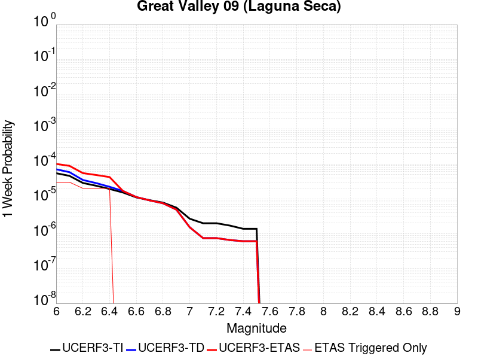 |  |  |  |

| Magnitude | 1 wk TI Prob | 1 wk TD Prob | 1 wk ETAS Prob | 1 wk ETAS/TD Gain | 1 wk ETAS Triggered Only | 1 mo TI Prob | 1 mo TD Prob | 1 mo ETAS Prob | 1 mo ETAS/TD Gain | 1 mo ETAS Triggered Only | 1 yr TI Prob | 1 yr TD Prob | 1 yr ETAS Prob | 1 yr ETAS/TD Gain | 1 yr ETAS Triggered Only | 10 yr TI Prob | 10 yr TD Prob | 10 yr ETAS Prob | 10 yr ETAS/TD Gain | 10 yr ETAS Triggered Only |
|-----|-----|-----|-----|-----|-----|-----|-----|-----|-----|-----|-----|-----|-----|-----|-----|-----|-----|-----|-----|-----|
| 6.0 | 5.4353277E-5 | 7.05022E-5 | 9.487884E-5 | 1.345757 | 2.4378352E-5 | 2.3292181E-4 | 3.0211566E-4 | 3.2648665E-4 | 1.0806677 | 2.4378352E-5 | 0.0028321352 | 0.0036721937 | 0.0036964826 | 1.0066142 | 2.4378352E-5 | 0.02796312 | 0.03611547 | 0.03613897 | 1.0006506 | 2.4378352E-5 |
| 6.1 | 4.5578287E-5 | 5.822118E-5 | 8.259811E-5 | 1.4186952 | 2.4378352E-5 | 1.953209E-4 | 2.4949326E-4 | 2.7386553E-4 | 1.0976871 | 2.4378352E-5 | 0.0023754383 | 0.003033432 | 0.0030577364 | 1.0080122 | 2.4378352E-5 | 0.023502063 | 0.029919548 | 0.029943196 | 1.0007905 | 2.4378352E-5 |
| 6.2 | 2.8536782E-5 | 3.4737273E-5 | 5.911478E-5 | 1.7017679 | 2.4378352E-5 | 1.2229476E-4 | 1.4886224E-4 | 1.7323696E-4 | 1.1637402 | 2.4378352E-5 | 0.0014879217 | 0.001810813 | 0.0018351472 | 1.0134382 | 2.4378352E-5 | 0.014779986 | 0.017958116 | 0.017982056 | 1.0013331 | 2.4378352E-5 |
| 6.3 | 2.3698774E-5 | 2.8213295E-5 | 5.259096E-5 | 1.8640488 | 2.4378352E-5 | 1.01562226E-4 | 1.20905075E-4 | 1.4528049E-4 | 1.2016078 | 2.4378352E-5 | 0.0012358186 | 0.0014710218 | 0.0014953642 | 1.016548 | 2.4378352E-5 | 0.012289686 | 0.014611342 | 0.014635364 | 1.0016441 | 2.4378352E-5 |
| 6.4 | 1.9191197E-5 | 2.2123184E-5 | 4.6500994E-5 | 2.1019125 | 2.4378352E-5 | 8.2245395E-5 | 9.4806666E-5 | 1.1918271E-4 | 1.2571131 | 2.4378352E-5 | 0.0010008777 | 0.0011536429 | 0.001177993 | 1.0211072 | 2.4378352E-5 | 0.009963818 | 0.011476948 | 0.011501047 | 1.0020998 | 2.4378352E-5 |
| 6.5 | 1.5203241E-5 | 1.6802203E-5 | 1.6802203E-5 | 1.0 | 0.0 | 6.5155116E-5 | 7.200386E-5 | 7.200386E-5 | 1.0 | 0.0 | 7.9297484E-4 | 8.7626575E-4 | 8.7626575E-4 | 1.0 | 0.0 | 0.007901512 | 0.0087295165 | 0.0087295165 | 1.0 | 0.0 |
| 6.6 | 1.0984925E-5 | 1.1242595E-5 | 1.1242595E-5 | 1.0 | 0.0 | 4.70774E-5 | 4.8181686E-5 | 4.8181686E-5 | 1.0 | 0.0 | 5.730166E-4 | 5.8645656E-4 | 5.8645656E-4 | 1.0 | 0.0 | 0.005715413 | 0.0058494853 | 0.0058494853 | 1.0 | 0.0 |
| 6.7 | 9.134616E-6 | 9.019894E-6 | 9.019894E-6 | 1.0 | 0.0 | 3.9147766E-5 | 3.865613E-5 | 3.865613E-5 | 1.0 | 0.0 | 4.7651984E-4 | 4.7053912E-4 | 4.7053912E-4 | 1.0 | 0.0 | 0.004754993 | 0.0046956735 | 0.0046956735 | 1.0 | 0.0 |
| 6.8 | 7.785589E-6 | 7.4519444E-6 | 7.4519444E-6 | 1.0 | 0.0 | 3.3366385E-5 | 3.1936524E-5 | 3.1936524E-5 | 1.0 | 0.0 | 4.0616E-4 | 3.8875983E-4 | 3.8875983E-4 | 1.0 | 0.0 | 0.0040541845 | 0.0038810016 | 0.0038810016 | 1.0 | 0.0 |
| 6.9 | 5.579095E-6 | 4.898492E-6 | 4.898492E-6 | 1.0 | 0.0 | 2.3910188E-5 | 2.0993377E-5 | 2.0993377E-5 | 1.0 | 0.0 | 2.9106764E-4 | 2.5556577E-4 | 2.5556577E-4 | 1.0 | 0.0 | 0.002906867 | 0.002552856 | 0.002552856 | 1.0 | 0.0 |
| 7.0 | 2.6816688E-6 | 1.5216126E-6 | 1.5216126E-6 | 1.0 | 0.0 | 1.1492816E-5 | 6.521181E-6 | 6.521181E-6 | 1.0 | 0.0 | 1.3991605E-4 | 7.939258E-5 | 7.939258E-5 | 1.0 | 0.0 | 0.0013982799 | 7.9365086E-4 | 7.9365086E-4 | 1.0 | 0.0 |
| 7.1 | 1.9951021E-6 | 7.453827E-7 | 7.453827E-7 | 1.0 | 0.0 | 8.55041E-6 | 3.1944935E-6 | 3.1944935E-6 | 1.0 | 0.0 | 1.0409627E-4 | 3.8892307E-5 | 3.8892307E-5 | 1.0 | 0.0 | 0.0010404752 | 3.8885913E-4 | 3.8885913E-4 | 1.0 | 0.0 |
| 7.2 | 1.9951021E-6 | 7.453827E-7 | 7.453827E-7 | 1.0 | 0.0 | 8.55041E-6 | 3.1944935E-6 | 3.1944935E-6 | 1.0 | 0.0 | 1.0409627E-4 | 3.8892307E-5 | 3.8892307E-5 | 1.0 | 0.0 | 0.0010404752 | 3.8885913E-4 | 3.8885913E-4 | 1.0 | 0.0 |
| 7.3 | 1.7087556E-6 | 6.578881E-7 | 6.578881E-7 | 1.0 | 0.0 | 7.3232177E-6 | 2.8195177E-6 | 2.8195177E-6 | 1.0 | 0.0 | 8.915652E-5 | 3.4327128E-5 | 3.4327128E-5 | 1.0 | 0.0 | 8.9120766E-4 | 3.432223E-4 | 3.432223E-4 | 1.0 | 0.0 |
| 7.4 | 1.3804846E-6 | 6.073852E-7 | 6.073852E-7 | 1.0 | 0.0 | 5.916349E-6 | 2.6030768E-6 | 2.6030768E-6 | 1.0 | 0.0 | 7.2029165E-5 | 3.169204E-5 | 3.169204E-5 | 1.0 | 0.0 | 7.200583E-4 | 3.1687922E-4 | 3.1687922E-4 | 1.0 | 0.0 |
| 7.5 | 1.3804846E-6 | 6.073852E-7 | 6.073852E-7 | 1.0 | 0.0 | 5.916349E-6 | 2.6030768E-6 | 2.6030768E-6 | 1.0 | 0.0 | 7.2029165E-5 | 3.169204E-5 | 3.169204E-5 | 1.0 | 0.0 | 7.200583E-4 | 3.1687922E-4 | 3.1687922E-4 | 1.0 | 0.0 |

## Big Pine (Central)
*[(top)](#table-of-contents)*

| 1 Week | 1 Month | 1 Year | 10 Year |
|-----|-----|-----|-----|
|  |  |  |  |

| Magnitude | 1 wk TI Prob | 1 wk TD Prob | 1 wk ETAS Prob | 1 wk ETAS/TD Gain | 1 wk ETAS Triggered Only | 1 mo TI Prob | 1 mo TD Prob | 1 mo ETAS Prob | 1 mo ETAS/TD Gain | 1 mo ETAS Triggered Only | 1 yr TI Prob | 1 yr TD Prob | 1 yr ETAS Prob | 1 yr ETAS/TD Gain | 1 yr ETAS Triggered Only | 10 yr TI Prob | 10 yr TD Prob | 10 yr ETAS Prob | 10 yr ETAS/TD Gain | 10 yr ETAS Triggered Only |
|-----|-----|-----|-----|-----|-----|-----|-----|-----|-----|-----|-----|-----|-----|-----|-----|-----|-----|-----|-----|-----|
| 6.0 | 1.2706755E-5 | 1.4250529E-5 | 3.8628532E-5 | 2.7106738 | 2.4378352E-5 | 5.4456385E-5 | 6.107247E-5 | 8.5449334E-5 | 1.3991466 | 2.4378352E-5 | 6.628048E-4 | 7.433402E-4 | 7.6770043E-4 | 1.0327713 | 2.4378352E-5 | 0.006608314 | 0.0074135666 | 0.007437764 | 1.003264 | 2.4378352E-5 |
| 6.1 | 8.342579E-6 | 9.510762E-6 | 9.510762E-6 | 1.0 | 0.0 | 3.5753423E-5 | 4.0759893E-5 | 4.0759893E-5 | 1.0 | 0.0 | 4.3521097E-4 | 4.961604E-4 | 4.961604E-4 | 1.0 | 0.0 | 0.0043435963 | 0.0049540824 | 0.0049540824 | 1.0 | 0.0 |
| 6.2 | 6.923899E-6 | 7.967147E-6 | 7.967147E-6 | 1.0 | 0.0 | 2.9673516E-5 | 3.4144578E-5 | 3.4144578E-5 | 1.0 | 0.0 | 3.6121515E-4 | 4.156502E-4 | 4.156502E-4 | 1.0 | 0.0 | 0.003606286 | 0.0041520367 | 0.0041520367 | 1.0 | 0.0 |
| 6.3 | 2.728396E-6 | 3.4242908E-6 | 3.4242908E-6 | 1.0 | 0.0 | 1.1693074E-5 | 1.4675454E-5 | 1.4675454E-5 | 1.0 | 0.0 | 1.4235388E-4 | 1.7865987E-4 | 1.7865987E-4 | 1.0 | 0.0 | 0.0014226272 | 0.0017866704 | 0.0017866704 | 1.0 | 0.0 |
| 6.4 | 2.7136944E-6 | 3.408584E-6 | 3.408584E-6 | 1.0 | 0.0 | 1.1630066E-5 | 1.4608141E-5 | 1.4608141E-5 | 1.0 | 0.0 | 1.4158686E-4 | 1.7784047E-4 | 1.7784047E-4 | 1.0 | 0.0 | 0.0014149669 | 0.0017784894 | 0.0017784894 | 1.0 | 0.0 |
| 6.5 | 2.6971882E-6 | 3.3909291E-6 | 3.3909291E-6 | 1.0 | 0.0 | 1.1559327E-5 | 1.45324775E-5 | 1.45324775E-5 | 1.0 | 0.0 | 1.4072572E-4 | 1.7691942E-4 | 1.7691942E-4 | 1.0 | 0.0 | 0.0014063664 | 0.0017692937 | 0.0017692937 | 1.0 | 0.0 |
| 6.6 | 2.669092E-6 | 3.3609497E-6 | 3.3609497E-6 | 1.0 | 0.0 | 1.1438916E-5 | 1.4403995E-5 | 1.4403995E-5 | 1.0 | 0.0 | 1.3925991E-4 | 1.753554E-4 | 1.753554E-4 | 1.0 | 0.0 | 0.0013917267 | 0.0017536782 | 0.0017536782 | 1.0 | 0.0 |
| 6.7 | 2.6408059E-6 | 3.3309752E-6 | 3.3309752E-6 | 1.0 | 0.0 | 1.1317691E-5 | 1.4275535E-5 | 1.4275535E-5 | 1.0 | 0.0 | 1.3778417E-4 | 1.7379165E-4 | 1.7379165E-4 | 1.0 | 0.0 | 0.0013769877 | 0.0017380653 | 0.0017380653 | 1.0 | 0.0 |
| 6.8 | 2.1786943E-6 | 2.8544325E-6 | 2.8544325E-6 | 1.0 | 0.0 | 9.337228E-6 | 1.2233229E-5 | 1.2233229E-5 | 1.0 | 0.0 | 1.1367482E-4 | 1.4893012E-4 | 1.4893012E-4 | 1.0 | 0.0 | 0.0011361669 | 0.0014897975 | 0.0014897975 | 1.0 | 0.0 |
| 6.9 | 1.4411696E-6 | 2.068499E-6 | 2.068499E-6 | 1.0 | 0.0 | 6.1764263E-6 | 8.864968E-6 | 8.864968E-6 | 1.0 | 0.0 | 7.51954E-5 | 1.079259E-4 | 1.079259E-4 | 1.0 | 0.0 | 7.5169955E-4 | 0.0010801847 | 0.0010801847 | 1.0 | 0.0 |
| 7.0 | 1.0073411E-6 | 1.554261E-6 | 1.554261E-6 | 1.0 | 0.0 | 4.317169E-6 | 6.6611024E-6 | 6.6611024E-6 | 1.0 | 0.0 | 5.2560266E-5 | 8.1096056E-5 | 8.1096056E-5 | 1.0 | 0.0 | 5.2547833E-4 | 8.1210316E-4 | 8.1210316E-4 | 1.0 | 0.0 |
| 7.1 | 8.947104E-7 | 1.4302494E-6 | 1.4302494E-6 | 1.0 | 0.0 | 3.834468E-6 | 6.129627E-6 | 6.129627E-6 | 1.0 | 0.0 | 4.6683643E-5 | 7.46258E-5 | 7.46258E-5 | 1.0 | 0.0 | 4.6673836E-4 | 7.474457E-4 | 7.474457E-4 | 1.0 | 0.0 |
| 7.2 | 5.215166E-7 | 1.0111678E-6 | 1.0111678E-6 | 1.0 | 0.0 | 2.2350691E-6 | 4.3335694E-6 | 4.3335694E-6 | 1.0 | 0.0 | 2.7211627E-5 | 5.2759973E-5 | 5.2759973E-5 | 1.0 | 0.0 | 2.7208295E-4 | 5.2890263E-4 | 5.2890263E-4 | 1.0 | 0.0 |
| 7.3 | 4.4024807E-7 | 9.219589E-7 | 9.219589E-7 | 1.0 | 0.0 | 1.8867761E-6 | 3.9512465E-6 | 3.9512465E-6 | 1.0 | 0.0 | 2.2971257E-5 | 4.810541E-5 | 4.810541E-5 | 1.0 | 0.0 | 2.2968883E-4 | 4.8237795E-4 | 4.8237795E-4 | 1.0 | 0.0 |
| 7.4 | 3.6130905E-7 | 8.358523E-7 | 8.358523E-7 | 1.0 | 0.0 | 1.5484665E-6 | 3.5822195E-6 | 3.5822195E-6 | 1.0 | 0.0 | 1.8852415E-5 | 4.3612687E-5 | 4.3612687E-5 | 1.0 | 0.0 | 1.8850817E-4 | 4.374597E-4 | 4.374597E-4 | 1.0 | 0.0 |
| 7.5 | 3.408184E-7 | 8.108147E-7 | 8.108147E-7 | 1.0 | 0.0 | 1.4606494E-6 | 3.4749157E-6 | 3.4749157E-6 | 1.0 | 0.0 | 1.7783263E-5 | 4.2306317E-5 | 4.2306317E-5 | 1.0 | 0.0 | 1.778184E-4 | 4.2437963E-4 | 4.2437963E-4 | 1.0 | 0.0 |
| 7.6 | 3.1428627E-7 | 7.7316E-7 | 7.7316E-7 | 1.0 | 0.0 | 1.3469405E-6 | 3.3135389E-6 | 3.3135389E-6 | 1.0 | 0.0 | 1.6398877E-5 | 4.0341627E-5 | 4.0341627E-5 | 1.0 | 0.0 | 1.6397667E-4 | 4.0471106E-4 | 4.0471106E-4 | 1.0 | 0.0 |
| 7.7 | 1.7972785E-7 | 5.077752E-7 | 5.077752E-7 | 1.0 | 0.0 | 7.70262E-7 | 2.1761778E-6 | 2.1761778E-6 | 1.0 | 0.0 | 9.377899E-6 | 2.6494654E-5 | 2.6494654E-5 | 1.0 | 0.0 | 9.377503E-5 | 2.662899E-4 | 2.662899E-4 | 1.0 | 0.0 |
| 7.8 | 4.9230927E-8 | 1.198079E-7 | 1.198079E-7 | 1.0 | 0.0 | 2.1098968E-7 | 5.134623E-7 | 5.134623E-7 | 1.0 | 0.0 | 2.5687964E-6 | 6.2513873E-6 | 6.2513873E-6 | 1.0 | 0.0 | 2.5687666E-5 | 6.295415E-5 | 6.295415E-5 | 1.0 | 0.0 |
| 7.9 | 3.6805972E-9 | 4.105293E-9 | 4.105293E-9 | 1.0 | 0.0 | 1.5773987E-8 | 1.7594115E-8 | 1.7594115E-8 | 1.0 | 0.0 | 1.9204828E-7 | 2.1420831E-7 | 2.1420831E-7 | 1.0 | 0.0 | 1.920481E-6 | 2.1900614E-6 | 2.1900614E-6 | 1.0 | 0.0 |

## Hosgri
*[(top)](#table-of-contents)*

| 1 Week | 1 Month | 1 Year | 10 Year |
|-----|-----|-----|-----|
|  |  |  |  |

| Magnitude | 1 wk TI Prob | 1 wk TD Prob | 1 wk ETAS Prob | 1 wk ETAS/TD Gain | 1 wk ETAS Triggered Only | 1 mo TI Prob | 1 mo TD Prob | 1 mo ETAS Prob | 1 mo ETAS/TD Gain | 1 mo ETAS Triggered Only | 1 yr TI Prob | 1 yr TD Prob | 1 yr ETAS Prob | 1 yr ETAS/TD Gain | 1 yr ETAS Triggered Only | 10 yr TI Prob | 10 yr TD Prob | 10 yr ETAS Prob | 10 yr ETAS/TD Gain | 10 yr ETAS Triggered Only |
|-----|-----|-----|-----|-----|-----|-----|-----|-----|-----|-----|-----|-----|-----|-----|-----|-----|-----|-----|-----|-----|
| 6.0 | 2.883978E-5 | 2.9128416E-5 | 4.131724E-5 | 1.4184512 | 1.2189176E-5 | 1.235932E-4 | 1.2483024E-4 | 1.3701791E-4 | 1.0976338 | 1.2189176E-5 | 0.0015037085 | 0.001518776 | 0.0015309466 | 1.0080135 | 1.2189176E-5 | 0.01493574 | 0.01508774 | 0.015099745 | 1.0007957 | 1.2189176E-5 |
| 6.1 | 2.883978E-5 | 2.9128416E-5 | 4.131724E-5 | 1.4184512 | 1.2189176E-5 | 1.235932E-4 | 1.2483024E-4 | 1.3701791E-4 | 1.0976338 | 1.2189176E-5 | 0.0015037085 | 0.001518776 | 0.0015309466 | 1.0080135 | 1.2189176E-5 | 0.01493574 | 0.01508774 | 0.015099745 | 1.0007957 | 1.2189176E-5 |
| 6.2 | 2.883978E-5 | 2.9128416E-5 | 4.131724E-5 | 1.4184512 | 1.2189176E-5 | 1.235932E-4 | 1.2483024E-4 | 1.3701791E-4 | 1.0976338 | 1.2189176E-5 | 0.0015037085 | 0.001518776 | 0.0015309466 | 1.0080135 | 1.2189176E-5 | 0.01493574 | 0.01508774 | 0.015099745 | 1.0007957 | 1.2189176E-5 |
| 6.3 | 2.2914428E-5 | 2.2641969E-5 | 2.2641969E-5 | 1.0 | 0.0 | 9.8200995E-5 | 9.703343E-5 | 9.703343E-5 | 1.0 | 0.0 | 0.0011949413 | 0.0011807467 | 0.0011807467 | 1.0 | 0.0 | 0.011885363 | 0.011746133 | 0.011746133 | 1.0 | 0.0 |
| 6.4 | 2.0195741E-5 | 1.969656E-5 | 1.969656E-5 | 1.0 | 0.0 | 8.65503E-5 | 8.4411105E-5 | 8.4411105E-5 | 1.0 | 0.0 | 0.0010532405 | 0.0010272227 | 0.0010272227 | 1.0 | 0.0 | 0.010482626 | 0.010225792 | 0.010225792 | 1.0 | 0.0 |
| 6.5 | 1.9924333E-5 | 1.940898E-5 | 1.940898E-5 | 1.0 | 0.0 | 8.53872E-5 | 8.3178704E-5 | 8.3178704E-5 | 1.0 | 0.0 | 0.0010390934 | 0.0010122322 | 0.0010122322 | 1.0 | 0.0 | 0.010342481 | 0.010077253 | 0.010077253 | 1.0 | 0.0 |
| 6.6 | 1.809694E-5 | 1.74583E-5 | 1.74583E-5 | 1.0 | 0.0 | 7.7556004E-5 | 7.4819145E-5 | 7.4819145E-5 | 1.0 | 0.0 | 9.438353E-4 | 9.105437E-4 | 9.105437E-4 | 1.0 | 0.0 | 0.009398366 | 0.009069073 | 0.009069073 | 1.0 | 0.0 |
| 6.7 | 1.675989E-5 | 1.6042764E-5 | 1.6042764E-5 | 1.0 | 0.0 | 7.182612E-5 | 6.87529E-5 | 6.87529E-5 | 1.0 | 0.0 | 8.7413215E-4 | 8.3674624E-4 | 8.3674624E-4 | 1.0 | 0.0 | 0.008707017 | 0.0083368635 | 0.0083368635 | 1.0 | 0.0 |
| 6.8 | 1.5401129E-5 | 1.4614083E-5 | 1.4614083E-5 | 1.0 | 0.0 | 6.6003166E-5 | 6.2630286E-5 | 6.2630286E-5 | 1.0 | 0.0 | 8.032922E-4 | 7.622578E-4 | 7.622578E-4 | 1.0 | 0.0 | 0.008003947 | 0.007597296 | 0.007597296 | 1.0 | 0.0 |
| 6.9 | 1.356559E-5 | 1.2689968E-5 | 1.2689968E-5 | 1.0 | 0.0 | 5.8136946E-5 | 5.4384444E-5 | 5.4384444E-5 | 1.0 | 0.0 | 7.0758746E-4 | 6.619299E-4 | 6.619299E-4 | 1.0 | 0.0 | 0.007053386 | 0.006600388 | 0.006600388 | 1.0 | 0.0 |
| 7.0 | 1.2030819E-5 | 1.1095962E-5 | 1.1095962E-5 | 1.0 | 0.0 | 5.155963E-5 | 4.7553254E-5 | 4.7553254E-5 | 1.0 | 0.0 | 6.275577E-4 | 5.7880714E-4 | 5.7880714E-4 | 1.0 | 0.0 | 0.006257884 | 0.005773757 | 0.005773757 | 1.0 | 0.0 |
| 7.1 | 1.0972698E-5 | 1.0022179E-5 | 1.0022179E-5 | 1.0 | 0.0 | 4.7025E-5 | 4.2951488E-5 | 4.2951488E-5 | 1.0 | 0.0 | 5.72379E-4 | 5.22809E-4 | 5.22809E-4 | 1.0 | 0.0 | 0.0057090693 | 0.005216542 | 0.005216542 | 1.0 | 0.0 |
| 7.2 | 9.961926E-6 | 9.034746E-6 | 9.034746E-6 | 1.0 | 0.0 | 4.2693267E-5 | 3.8719765E-5 | 3.8719765E-5 | 1.0 | 0.0 | 5.1966653E-4 | 4.713112E-4 | 4.713112E-4 | 1.0 | 0.0 | 0.00518453 | 0.0047038626 | 0.0047038626 | 1.0 | 0.0 |
| 7.3 | 8.700929E-6 | 7.8281E-6 | 7.8281E-6 | 1.0 | 0.0 | 3.7289166E-5 | 3.354857E-5 | 3.354857E-5 | 1.0 | 0.0 | 4.53901E-4 | 4.0837732E-4 | 4.0837732E-4 | 1.0 | 0.0 | 0.00452975 | 0.004077008 | 0.004077008 | 1.0 | 0.0 |
| 7.4 | 7.866285E-6 | 6.998739E-6 | 6.998739E-6 | 1.0 | 0.0 | 3.3712215E-5 | 2.9994251E-5 | 2.9994251E-5 | 1.0 | 0.0 | 4.103689E-4 | 3.6511885E-4 | 3.6511885E-4 | 1.0 | 0.0 | 0.004096119 | 0.0036459267 | 0.0036459267 | 1.0 | 0.0 |
| 7.5 | 6.8381305E-6 | 5.9596955E-6 | 5.9596955E-6 | 1.0 | 0.0 | 2.9305946E-5 | 2.5541302E-5 | 2.5541302E-5 | 1.0 | 0.0 | 3.5674145E-4 | 3.10921E-4 | 3.10921E-4 | 1.0 | 0.0 | 0.0035616932 | 0.0031055948 | 0.0031055948 | 1.0 | 0.0 |
| 7.6 | 5.503376E-6 | 4.5952443E-6 | 4.5952443E-6 | 1.0 | 0.0 | 2.3585684E-5 | 1.9693754E-5 | 1.9693754E-5 | 1.0 | 0.0 | 2.8711787E-4 | 2.397451E-4 | 2.397451E-4 | 1.0 | 0.0 | 0.002867472 | 0.0023955975 | 0.0023955975 | 1.0 | 0.0 |
| 7.7 | 3.6144982E-6 | 2.6522112E-6 | 2.6522112E-6 | 1.0 | 0.0 | 1.5490614E-5 | 1.1366569E-5 | 1.1366569E-5 | 1.0 | 0.0 | 1.8858191E-4 | 1.383792E-4 | 1.383792E-4 | 1.0 | 0.0 | 0.0018842196 | 0.0013836613 | 0.0013836613 | 1.0 | 0.0 |
| 7.8 | 1.9853494E-6 | 1.1361129E-6 | 1.1361129E-6 | 1.0 | 0.0 | 8.508612E-6 | 4.8690463E-6 | 4.8690463E-6 | 1.0 | 0.0 | 1.0358743E-4 | 5.9279027E-5 | 5.9279027E-5 | 1.0 | 0.0 | 0.0010353916 | 5.9336185E-4 | 5.9336185E-4 | 1.0 | 0.0 |
| 7.9 | 1.1818757E-6 | 5.2951856E-7 | 5.2951856E-7 | 1.0 | 0.0 | 5.0651715E-6 | 2.2693632E-6 | 2.2693632E-6 | 1.0 | 0.0 | 6.1666724E-5 | 2.7629147E-5 | 2.7629147E-5 | 1.0 | 0.0 | 6.1649614E-4 | 2.7694515E-4 | 2.7694515E-4 | 1.0 | 0.0 |
| 8.0 | 6.962958E-7 | 2.7139782E-7 | 2.7139782E-7 | 1.0 | 0.0 | 2.9841215E-6 | 1.163133E-6 | 1.163133E-6 | 1.0 | 0.0 | 3.6331072E-5 | 1.4161053E-5 | 1.4161053E-5 | 1.0 | 0.0 | 3.6325134E-4 | 1.4217179E-4 | 1.4217179E-4 | 1.0 | 0.0 |
| 8.1 | 1.5033264E-7 | 6.527624E-8 | 6.527624E-8 | 1.0 | 0.0 | 6.442826E-7 | 2.7975528E-7 | 2.7975528E-7 | 1.0 | 0.0 | 7.844113E-6 | 3.4060151E-6 | 3.4060151E-6 | 1.0 | 0.0 | 7.843835E-5 | 3.407693E-5 | 3.407693E-5 | 1.0 | 0.0 |

## San Gabriel
*[(top)](#table-of-contents)*

| 1 Week | 1 Month | 1 Year | 10 Year |
|-----|-----|-----|-----|
|  |  |  |  |

| Magnitude | 1 wk TI Prob | 1 wk TD Prob | 1 wk ETAS Prob | 1 wk ETAS/TD Gain | 1 wk ETAS Triggered Only | 1 mo TI Prob | 1 mo TD Prob | 1 mo ETAS Prob | 1 mo ETAS/TD Gain | 1 mo ETAS Triggered Only | 1 yr TI Prob | 1 yr TD Prob | 1 yr ETAS Prob | 1 yr ETAS/TD Gain | 1 yr ETAS Triggered Only | 10 yr TI Prob | 10 yr TD Prob | 10 yr ETAS Prob | 10 yr ETAS/TD Gain | 10 yr ETAS Triggered Only |
|-----|-----|-----|-----|-----|-----|-----|-----|-----|-----|-----|-----|-----|-----|-----|-----|-----|-----|-----|-----|-----|
| 6.0 | 1.083775E-5 | 1.19851875E-5 | 2.4174218E-5 | 2.0170078 | 1.2189176E-5 | 4.6446676E-5 | 5.1364143E-5 | 6.355269E-5 | 1.2372968 | 1.2189176E-5 | 5.653415E-4 | 6.251903E-4 | 6.3737185E-4 | 1.0194845 | 1.2189176E-5 | 0.0056390543 | 0.006246409 | 0.006258522 | 1.0019392 | 1.2189176E-5 |
| 6.1 | 1.083775E-5 | 1.19851875E-5 | 2.4174218E-5 | 2.0170078 | 1.2189176E-5 | 4.6446676E-5 | 5.1364143E-5 | 6.355269E-5 | 1.2372968 | 1.2189176E-5 | 5.653415E-4 | 6.251903E-4 | 6.3737185E-4 | 1.0194845 | 1.2189176E-5 | 0.0056390543 | 0.006246409 | 0.006258522 | 1.0019392 | 1.2189176E-5 |
| 6.2 | 1.083775E-5 | 1.19851875E-5 | 2.4174218E-5 | 2.0170078 | 1.2189176E-5 | 4.6446676E-5 | 5.1364143E-5 | 6.355269E-5 | 1.2372968 | 1.2189176E-5 | 5.653415E-4 | 6.251903E-4 | 6.3737185E-4 | 1.0194845 | 1.2189176E-5 | 0.0056390543 | 0.006246409 | 0.006258522 | 1.0019392 | 1.2189176E-5 |
| 6.3 | 1.083775E-5 | 1.19851875E-5 | 2.4174218E-5 | 2.0170078 | 1.2189176E-5 | 4.6446676E-5 | 5.1364143E-5 | 6.355269E-5 | 1.2372968 | 1.2189176E-5 | 5.653415E-4 | 6.251903E-4 | 6.3737185E-4 | 1.0194845 | 1.2189176E-5 | 0.0056390543 | 0.006246409 | 0.006258522 | 1.0019392 | 1.2189176E-5 |
| 6.4 | 1.083775E-5 | 1.19851875E-5 | 2.4174218E-5 | 2.0170078 | 1.2189176E-5 | 4.6446676E-5 | 5.1364143E-5 | 6.355269E-5 | 1.2372968 | 1.2189176E-5 | 5.653415E-4 | 6.251903E-4 | 6.3737185E-4 | 1.0194845 | 1.2189176E-5 | 0.0056390543 | 0.006246409 | 0.006258522 | 1.0019392 | 1.2189176E-5 |
| 6.5 | 6.7317824E-6 | 7.716944E-6 | 7.716944E-6 | 1.0 | 0.0 | 2.8850178E-5 | 3.3072207E-5 | 3.3072207E-5 | 1.0 | 0.0 | 3.511943E-4 | 4.0258077E-4 | 4.0258077E-4 | 1.0 | 0.0 | 0.003506398 | 0.0040296097 | 0.0040296097 | 1.0 | 0.0 |
| 6.6 | 6.7317824E-6 | 7.716944E-6 | 7.716944E-6 | 1.0 | 0.0 | 2.8850178E-5 | 3.3072207E-5 | 3.3072207E-5 | 1.0 | 0.0 | 3.511943E-4 | 4.0258077E-4 | 4.0258077E-4 | 1.0 | 0.0 | 0.003506398 | 0.0040296097 | 0.0040296097 | 1.0 | 0.0 |
| 6.7 | 6.274881E-6 | 7.2458647E-6 | 7.2458647E-6 | 1.0 | 0.0 | 2.6892068E-5 | 3.1053343E-5 | 3.1053343E-5 | 1.0 | 0.0 | 3.2736175E-4 | 3.780098E-4 | 3.780098E-4 | 1.0 | 0.0 | 0.0032687993 | 0.0037847564 | 0.0037847564 | 1.0 | 0.0 |
| 6.8 | 5.996209E-6 | 6.958585E-6 | 6.958585E-6 | 1.0 | 0.0 | 2.5697784E-5 | 2.9822171E-5 | 2.9822171E-5 | 1.0 | 0.0 | 3.128256E-4 | 3.6302538E-4 | 3.6302538E-4 | 1.0 | 0.0 | 0.003123856 | 0.0036354093 | 0.0036354093 | 1.0 | 0.0 |
| 6.9 | 5.686331E-6 | 6.6236316E-6 | 6.6236316E-6 | 1.0 | 0.0 | 2.4369761E-5 | 2.8386688E-5 | 2.8386688E-5 | 1.0 | 0.0 | 2.9666146E-4 | 3.4555403E-4 | 3.4555403E-4 | 1.0 | 0.0 | 0.0029626573 | 0.0034612515 | 0.0034612515 | 1.0 | 0.0 |
| 7.0 | 5.2329838E-6 | 6.147514E-6 | 6.147514E-6 | 1.0 | 0.0 | 2.242688E-5 | 2.6346226E-5 | 2.6346226E-5 | 1.0 | 0.0 | 2.7301308E-4 | 3.2071886E-4 | 3.2071886E-4 | 1.0 | 0.0 | 0.002726779 | 0.0032136322 | 0.0032136322 | 1.0 | 0.0 |
| 7.1 | 5.135671E-6 | 6.03764E-6 | 6.03764E-6 | 1.0 | 0.0 | 2.2009834E-5 | 2.5875348E-5 | 2.5875348E-5 | 1.0 | 0.0 | 2.6793676E-4 | 3.1498758E-4 | 3.1498758E-4 | 1.0 | 0.0 | 0.0026761394 | 0.0031564834 | 0.0031564834 | 1.0 | 0.0 |
| 7.2 | 4.989062E-6 | 5.87102E-6 | 5.87102E-6 | 1.0 | 0.0 | 2.1381518E-5 | 2.5161276E-5 | 2.5161276E-5 | 1.0 | 0.0 | 2.6028889E-4 | 3.0629625E-4 | 3.0629625E-4 | 1.0 | 0.0 | 0.0025998424 | 0.003069813 | 0.003069813 | 1.0 | 0.0 |
| 7.3 | 4.8219395E-6 | 5.702574E-6 | 5.702574E-6 | 1.0 | 0.0 | 2.0665291E-5 | 2.443938E-5 | 2.443938E-5 | 1.0 | 0.0 | 2.5157086E-4 | 2.9750957E-4 | 2.9750957E-4 | 1.0 | 0.0 | 0.0025128627 | 0.0029821852 | 0.0029821852 | 1.0 | 0.0 |
| 7.4 | 4.7118383E-6 | 5.5911332E-6 | 5.5911332E-6 | 1.0 | 0.0 | 2.0193436E-5 | 2.3961782E-5 | 2.3961782E-5 | 1.0 | 0.0 | 2.4582737E-4 | 2.916964E-4 | 2.916964E-4 | 1.0 | 0.0 | 0.002455556 | 0.0029242067 | 0.0029242067 | 1.0 | 0.0 |
| 7.5 | 4.5506545E-6 | 5.4365014E-6 | 5.4365014E-6 | 1.0 | 0.0 | 1.9502659E-5 | 2.3299088E-5 | 2.3299088E-5 | 1.0 | 0.0 | 2.37419E-4 | 2.8363022E-4 | 2.8363022E-4 | 1.0 | 0.0 | 0.002371655 | 0.002843753 | 0.002843753 | 1.0 | 0.0 |
| 7.6 | 4.343636E-6 | 5.2293817E-6 | 5.2293817E-6 | 1.0 | 0.0 | 1.861545E-5 | 2.2411448E-5 | 2.2411448E-5 | 1.0 | 0.0 | 2.2661954E-4 | 2.7282597E-4 | 2.7282597E-4 | 1.0 | 0.0 | 0.0022638857 | 0.0027359722 | 0.0027359722 | 1.0 | 0.0 |
| 7.7 | 2.936235E-6 | 2.7440458E-6 | 2.7440458E-6 | 1.0 | 0.0 | 1.2583803E-5 | 1.1760143E-5 | 1.1760143E-5 | 1.0 | 0.0 | 1.5319703E-4 | 1.4317037E-4 | 1.4317037E-4 | 1.0 | 0.0 | 0.0015309147 | 0.0014380751 | 0.0014380751 | 1.0 | 0.0 |
| 7.8 | 1.4541639E-6 | 9.1237047E-7 | 9.1237047E-7 | 1.0 | 0.0 | 6.232116E-6 | 3.9101533E-6 | 3.9101533E-6 | 1.0 | 0.0 | 7.587337E-5 | 4.7605077E-5 | 4.7605077E-5 | 1.0 | 0.0 | 7.584747E-4 | 4.8085177E-4 | 4.8085177E-4 | 1.0 | 0.0 |
| 7.9 | 8.098958E-7 | 2.41753E-7 | 2.41753E-7 | 1.0 | 0.0 | 3.4709774E-6 | 1.0360839E-6 | 1.0360839E-6 | 1.0 | 0.0 | 4.225833E-5 | 1.2614248E-5 | 1.2614248E-5 | 1.0 | 0.0 | 4.2250296E-4 | 1.2921814E-4 | 1.2921814E-4 | 1.0 | 0.0 |
| 8.0 | 5.2473234E-7 | 7.6792055E-8 | 7.6792055E-8 | 1.0 | 0.0 | 2.248851E-6 | 3.2910876E-7 | 3.2910876E-7 | 1.0 | 0.0 | 2.7379416E-5 | 4.0068917E-6 | 4.0068917E-6 | 1.0 | 0.0 | 2.7376044E-4 | 4.21918E-5 | 4.21918E-5 | 1.0 | 0.0 |
| 8.1 | 3.3162388E-7 | 4.1496126E-8 | 4.1496126E-8 | 1.0 | 0.0 | 1.4212444E-6 | 1.7784053E-7 | 1.7784053E-7 | 1.0 | 0.0 | 1.7303513E-5 | 2.1652063E-6 | 2.1652063E-6 | 1.0 | 0.0 | 1.7302166E-4 | 2.2965523E-5 | 2.2965523E-5 | 1.0 | 0.0 |
| 8.2 | 1.0235345E-7 | 1.4043474E-8 | 1.4043474E-8 | 1.0 | 0.0 | 4.3865757E-7 | 6.0186316E-8 | 6.0186316E-8 | 1.0 | 0.0 | 5.340643E-6 | 7.327681E-7 | 7.327681E-7 | 1.0 | 0.0 | 5.3405143E-5 | 7.9273705E-6 | 7.9273705E-6 | 1.0 | 0.0 |

## San Andreas (Santa Cruz Mts) 2011 CFM
*[(top)](#table-of-contents)*

| 1 Week | 1 Month | 1 Year | 10 Year |
|-----|-----|-----|-----|
|  |  |  |  |

| Magnitude | 1 wk TI Prob | 1 wk TD Prob | 1 wk ETAS Prob | 1 wk ETAS/TD Gain | 1 wk ETAS Triggered Only | 1 mo TI Prob | 1 mo TD Prob | 1 mo ETAS Prob | 1 mo ETAS/TD Gain | 1 mo ETAS Triggered Only | 1 yr TI Prob | 1 yr TD Prob | 1 yr ETAS Prob | 1 yr ETAS/TD Gain | 1 yr ETAS Triggered Only | 10 yr TI Prob | 10 yr TD Prob | 10 yr ETAS Prob | 10 yr ETAS/TD Gain | 10 yr ETAS Triggered Only |
|-----|-----|-----|-----|-----|-----|-----|-----|-----|-----|-----|-----|-----|-----|-----|-----|-----|-----|-----|-----|-----|
| 6.0 | 1.7221631E-4 | 1.3793171E-4 | 1.501192E-4 | 1.0883589 | 1.2189176E-5 | 7.378611E-4 | 5.9100403E-4 | 6.0318597E-4 | 1.0206124 | 1.2189176E-5 | 0.008946515 | 0.007172124 | 0.0071842256 | 1.0016873 | 1.2189176E-5 | 0.08594794 | 0.0705551 | 0.07056642 | 1.0001606 | 1.2189176E-5 |
| 6.1 | 1.7221631E-4 | 1.3793171E-4 | 1.501192E-4 | 1.0883589 | 1.2189176E-5 | 7.378611E-4 | 5.9100403E-4 | 6.0318597E-4 | 1.0206124 | 1.2189176E-5 | 0.008946515 | 0.007172124 | 0.0071842256 | 1.0016873 | 1.2189176E-5 | 0.08594794 | 0.0705551 | 0.07056642 | 1.0001606 | 1.2189176E-5 |
| 6.2 | 1.7221631E-4 | 1.3793171E-4 | 1.501192E-4 | 1.0883589 | 1.2189176E-5 | 7.378611E-4 | 5.9100403E-4 | 6.0318597E-4 | 1.0206124 | 1.2189176E-5 | 0.008946515 | 0.007172124 | 0.0071842256 | 1.0016873 | 1.2189176E-5 | 0.08594794 | 0.0705551 | 0.07056642 | 1.0001606 | 1.2189176E-5 |
| 6.3 | 1.716926E-4 | 1.3712609E-4 | 1.4931358E-4 | 1.088878 | 1.2189176E-5 | 7.3561794E-4 | 5.875529E-4 | 5.997349E-4 | 1.0207335 | 1.2189176E-5 | 0.008919428 | 0.0071303817 | 0.0071424837 | 1.0016973 | 1.2189176E-5 | 0.08569809 | 0.070167266 | 0.0701786 | 1.0001615 | 1.2189176E-5 |
| 6.4 | 1.6392978E-4 | 1.3588481E-4 | 1.4807233E-4 | 1.0896901 | 1.2189176E-5 | 7.02367E-4 | 5.822355E-4 | 5.944176E-4 | 1.0209229 | 1.2189176E-5 | 0.008517839 | 0.007066063 | 0.007078166 | 1.0017128 | 1.2189176E-5 | 0.08198654 | 0.06940135 | 0.06941269 | 1.0001634 | 1.2189176E-5 |
| 6.5 | 1.5742714E-4 | 1.2648388E-4 | 1.386715E-4 | 1.0963572 | 1.2189176E-5 | 6.745133E-4 | 5.4196286E-4 | 5.5414543E-4 | 1.0224786 | 1.2189176E-5 | 0.00818132 | 0.0065787593 | 0.0065908683 | 1.0018406 | 1.2189176E-5 | 0.078865945 | 0.06486309 | 0.06487449 | 1.0001757 | 1.2189176E-5 |
| 6.6 | 1.3038084E-4 | 1.1588213E-4 | 1.2806989E-4 | 1.1051738 | 1.2189176E-5 | 5.5865536E-4 | 4.9654447E-4 | 5.087276E-4 | 1.0245358 | 1.2189176E-5 | 0.006780438 | 0.0060289134 | 0.006041029 | 1.0020096 | 1.2189176E-5 | 0.0657725 | 0.05932738 | 0.059338845 | 1.0001932 | 1.2189176E-5 |
| 6.7 | 1.2867592E-4 | 1.1314701E-4 | 1.253348E-4 | 1.1077164 | 1.2189176E-5 | 5.5135164E-4 | 4.8482692E-4 | 4.970102E-4 | 1.0251291 | 1.2189176E-5 | 0.0066920654 | 0.00588703 | 0.0058991476 | 1.0020583 | 1.2189176E-5 | 0.06494093 | 0.058038417 | 0.0580499 | 1.0001979 | 1.2189176E-5 |
| 6.8 | 1.2801298E-4 | 1.1252261E-4 | 1.2471042E-4 | 1.1083143 | 1.2189176E-5 | 5.485117E-4 | 4.8215193E-4 | 4.943352E-4 | 1.0252686 | 1.2189176E-5 | 0.0066577005 | 0.0058546383 | 0.005866756 | 1.0020698 | 1.2189176E-5 | 0.06461738 | 0.057752274 | 0.05776376 | 1.0001988 | 1.2189176E-5 |
| 6.9 | 1.269149E-4 | 1.1094465E-4 | 1.2313247E-4 | 1.1098549 | 1.2189176E-5 | 5.4380763E-4 | 4.7539172E-4 | 4.875751E-4 | 1.0256281 | 1.2189176E-5 | 0.006600777 | 0.005772772 | 0.0057848906 | 1.0020993 | 1.2189176E-5 | 0.06408122 | 0.0570241 | 0.05703559 | 1.0002016 | 1.2189176E-5 |
| 7.0 | 1.2030331E-4 | 1.0824504E-4 | 1.20432895E-4 | 1.1125951 | 1.2189176E-5 | 5.154837E-4 | 4.638261E-4 | 4.7600962E-4 | 1.0262674 | 1.2189176E-5 | 0.006257969 | 0.0056326967 | 0.005644817 | 1.0021518 | 1.2189176E-5 | 0.06084648 | 0.055696685 | 0.055708196 | 1.0002067 | 1.2189176E-5 |
| 7.1 | 8.049617E-5 | 5.3926604E-5 | 6.611512E-5 | 1.2260206 | 1.2189176E-5 | 3.4493793E-4 | 2.3109373E-4 | 2.4328008E-4 | 1.0527334 | 1.2189176E-5 | 0.0041915346 | 0.0028099709 | 0.0028221258 | 1.0043256 | 1.2189176E-5 | 0.041133516 | 0.029618956 | 0.029630784 | 1.0003994 | 1.2189176E-5 |
| 7.2 | 7.093979E-5 | 4.2937932E-5 | 5.5126584E-5 | 1.2838668 | 1.2189176E-5 | 3.0399222E-4 | 1.8400686E-4 | 1.9619378E-4 | 1.0662309 | 1.2189176E-5 | 0.0036948253 | 0.0022380045 | 0.0022501664 | 1.0054343 | 1.2189176E-5 | 0.03633994 | 0.023941692 | 0.023953589 | 1.000497 | 1.2189176E-5 |
| 7.3 | 6.193693E-5 | 2.8894141E-5 | 4.1082967E-5 | 1.4218441 | 1.2189176E-5 | 2.6541698E-4 | 1.2382616E-4 | 1.3601383E-4 | 1.0984256 | 1.2189176E-5 | 0.0032266637 | 0.0015065427 | 0.0015187135 | 1.0080787 | 1.2189176E-5 | 0.031802133 | 0.016499156 | 0.016511144 | 1.0007266 | 1.2189176E-5 |
| 7.4 | 5.906492E-5 | 2.702346E-5 | 3.9212307E-5 | 1.4510468 | 1.2189176E-5 | 2.5311083E-4 | 1.1580969E-4 | 1.2799745E-4 | 1.1052396 | 1.2189176E-5 | 0.0030772698 | 0.0014090725 | 0.0014212445 | 1.0086383 | 1.2189176E-5 | 0.030350044 | 0.015471023 | 0.015483023 | 1.0007757 | 1.2189176E-5 |
| 7.5 | 5.424296E-5 | 2.4678277E-5 | 2.4678277E-5 | 1.0 | 0.0 | 2.324491E-4 | 1.05759755E-4 | 1.05759755E-4 | 1.0 | 0.0 | 0.002826395 | 0.0012868657 | 0.0012868657 | 1.0 | 0.0 | 0.027907165 | 0.014163188 | 0.014163188 | 1.0 | 0.0 |
| 7.6 | 4.43084E-5 | 1.990431E-5 | 1.990431E-5 | 1.0 | 0.0 | 1.8987931E-4 | 8.53014E-5 | 8.53014E-5 | 1.0 | 0.0 | 0.0023093296 | 0.0010380499 | 0.0010380499 | 1.0 | 0.0 | 0.022854783 | 0.011412679 | 0.011412679 | 1.0 | 0.0 |
| 7.7 | 4.118098E-5 | 1.8936442E-5 | 1.8936442E-5 | 1.0 | 0.0 | 1.7647797E-4 | 8.115366E-5 | 8.115366E-5 | 1.0 | 0.0 | 0.002146502 | 9.875982E-4 | 9.875982E-4 | 1.0 | 0.0 | 0.021258866 | 0.010870468 | 0.010870468 | 1.0 | 0.0 |
| 7.8 | 3.5408906E-5 | 1.856446E-5 | 1.856446E-5 | 1.0 | 0.0 | 1.5174363E-4 | 7.955955E-5 | 7.955955E-5 | 1.0 | 0.0 | 0.0018459131 | 9.682073E-4 | 9.682073E-4 | 1.0 | 0.0 | 0.018306552 | 0.010652021 | 0.010652021 | 1.0 | 0.0 |
| 7.9 | 2.5860836E-5 | 1.7315993E-5 | 1.7315993E-5 | 1.0 | 0.0 | 1.10827445E-4 | 7.420929E-5 | 7.420929E-5 | 1.0 | 0.0 | 0.001348489 | 9.031238E-4 | 9.031238E-4 | 1.0 | 0.0 | 0.013403354 | 0.009907599 | 0.009907599 | 1.0 | 0.0 |
| 8.0 | 1.9777332E-5 | 1.4839596E-5 | 1.4839596E-5 | 1.0 | 0.0 | 8.4757245E-5 | 6.3596715E-5 | 6.3596715E-5 | 1.0 | 0.0 | 0.0010314309 | 7.740152E-4 | 7.740152E-4 | 1.0 | 0.0 | 0.010266567 | 0.008508967 | 0.008508967 | 1.0 | 0.0 |
| 8.1 | 1.468494E-5 | 1.2107374E-5 | 1.2107374E-5 | 1.0 | 0.0 | 6.293394E-5 | 5.1887713E-5 | 5.1887713E-5 | 1.0 | 0.0 | 7.6595135E-4 | 6.3155E-4 | 6.3155E-4 | 1.0 | 0.0 | 0.0076331664 | 0.006969149 | 0.006969149 | 1.0 | 0.0 |
| 8.2 | 8.63836E-6 | 5.469061E-6 | 5.469061E-6 | 1.0 | 0.0 | 3.7021015E-5 | 2.3438623E-5 | 2.3438623E-5 | 1.0 | 0.0 | 4.5063766E-4 | 2.8532793E-4 | 2.8532793E-4 | 1.0 | 0.0 | 0.004497249 | 0.00324569 | 0.00324569 | 1.0 | 0.0 |
| 8.3 | 1.983087E-6 | 7.6599065E-7 | 7.6599065E-7 | 1.0 | 0.0 | 8.498917E-6 | 3.282813E-6 | 3.282813E-6 | 1.0 | 0.0 | 1.034694E-4 | 3.9967534E-5 | 3.9967534E-5 | 1.0 | 0.0 | 0.0010342124 | 4.719687E-4 | 4.719687E-4 | 1.0 | 0.0 |

## Newport-Inglewood (Offshore)
*[(top)](#table-of-contents)*

| 1 Week | 1 Month | 1 Year | 10 Year |
|-----|-----|-----|-----|
|  |  |  |  |

| Magnitude | 1 wk TI Prob | 1 wk TD Prob | 1 wk ETAS Prob | 1 wk ETAS/TD Gain | 1 wk ETAS Triggered Only | 1 mo TI Prob | 1 mo TD Prob | 1 mo ETAS Prob | 1 mo ETAS/TD Gain | 1 mo ETAS Triggered Only | 1 yr TI Prob | 1 yr TD Prob | 1 yr ETAS Prob | 1 yr ETAS/TD Gain | 1 yr ETAS Triggered Only | 10 yr TI Prob | 10 yr TD Prob | 10 yr ETAS Prob | 10 yr ETAS/TD Gain | 10 yr ETAS Triggered Only |
|-----|-----|-----|-----|-----|-----|-----|-----|-----|-----|-----|-----|-----|-----|-----|-----|-----|-----|-----|-----|-----|
| 6.0 | 1.9626508E-5 | 1.8965357E-5 | 3.11543E-5 | 1.6426953 | 1.2189176E-5 | 8.411089E-5 | 8.1277634E-5 | 9.3465824E-5 | 1.1499574 | 1.2189176E-5 | 0.001023569 | 9.891186E-4 | 0.0010012958 | 1.0123111 | 1.2189176E-5 | 0.010188672 | 0.009848503 | 0.009860572 | 1.0012255 | 1.2189176E-5 |
| 6.1 | 1.331886E-5 | 1.2218092E-5 | 2.440712E-5 | 1.9976212 | 1.2189176E-5 | 5.707958E-5 | 5.2362207E-5 | 6.4550746E-5 | 1.2327735 | 1.2189176E-5 | 6.947222E-4 | 6.3732493E-4 | 6.4950634E-4 | 1.0191133 | 1.2189176E-5 | 0.006925544 | 0.006355149 | 0.0063672606 | 1.0019058 | 1.2189176E-5 |
| 6.2 | 1.2250852E-5 | 1.1076029E-5 | 2.3265071E-5 | 2.1004884 | 1.2189176E-5 | 5.2502597E-5 | 4.7467838E-5 | 5.9656435E-5 | 1.2567759 | 1.2189176E-5 | 6.3903164E-4 | 5.777687E-4 | 5.899508E-4 | 1.0210848 | 1.2189176E-5 | 0.006371971 | 0.0057627866 | 0.0057749054 | 1.002103 | 1.2189176E-5 |
| 6.3 | 1.2106258E-5 | 1.0918891E-5 | 2.3107934E-5 | 2.116326 | 1.2189176E-5 | 5.1882926E-5 | 4.6794412E-5 | 5.898302E-5 | 1.2604713 | 1.2189176E-5 | 6.3149154E-4 | 5.69574E-4 | 5.8175623E-4 | 1.0213883 | 1.2189176E-5 | 0.0062970007 | 0.005681259 | 0.005693379 | 1.0021334 | 1.2189176E-5 |
| 6.4 | 1.1348758E-5 | 1.0109362E-5 | 2.2298414E-5 | 2.2057192 | 1.2189176E-5 | 4.8636626E-5 | 4.3325123E-5 | 5.551377E-5 | 1.2813298 | 1.2189176E-5 | 5.919901E-4 | 5.273565E-4 | 5.3953927E-4 | 1.0231016 | 1.2189176E-5 | 0.005904155 | 0.0052611465 | 0.0052732714 | 1.0023047 | 1.2189176E-5 |
| 6.5 | 1.100837E-5 | 9.7433895E-6 | 2.1932447E-5 | 2.251008 | 1.2189176E-5 | 4.7177873E-5 | 4.1756717E-5 | 5.3945383E-5 | 1.2918972 | 1.2189176E-5 | 5.7423924E-4 | 5.082702E-4 | 5.204532E-4 | 1.0239695 | 1.2189176E-5 | 0.005727576 | 0.0050711688 | 0.005083296 | 1.0023915 | 1.2189176E-5 |
| 6.6 | 1.0634696E-5 | 9.345544E-6 | 2.1534606E-5 | 2.3042648 | 1.2189176E-5 | 4.557647E-5 | 4.0051716E-5 | 5.2240404E-5 | 1.3043237 | 1.2189176E-5 | 5.5475225E-4 | 4.8752132E-4 | 4.9970456E-4 | 1.0249902 | 1.2189176E-5 | 0.0055336943 | 0.0048646047 | 0.0048767347 | 1.0024935 | 1.2189176E-5 |
| 6.7 | 9.9780855E-6 | 8.667911E-6 | 2.0856982E-5 | 2.4062293 | 1.2189176E-5 | 4.276252E-5 | 3.7147664E-5 | 4.9336388E-5 | 1.3281155 | 1.2189176E-5 | 5.205093E-4 | 4.5217964E-4 | 4.6436331E-4 | 1.0269443 | 1.2189176E-5 | 0.0051929182 | 0.004512675 | 0.004524809 | 1.0026889 | 1.2189176E-5 |
| 6.8 | 9.59546E-6 | 8.27295E-6 | 2.0462026E-5 | 2.4733648 | 1.2189176E-5 | 4.1122752E-5 | 3.5455025E-5 | 4.7643767E-5 | 1.3437804 | 1.2189176E-5 | 5.0055445E-4 | 4.315801E-4 | 4.43764E-4 | 1.0282309 | 1.2189176E-5 | 0.004994285 | 0.004307495 | 0.004319632 | 1.0028175 | 1.2189176E-5 |
| 6.9 | 9.000614E-6 | 7.70684E-6 | 1.9895922E-5 | 2.5815928 | 1.2189176E-5 | 3.857349E-5 | 3.30289E-5 | 4.5217676E-5 | 1.3690336 | 1.2189176E-5 | 4.6953102E-4 | 4.0205332E-4 | 4.1423758E-4 | 1.0303051 | 1.2189176E-5 | 0.004685402 | 0.0040133307 | 0.004025471 | 1.0030249 | 1.2189176E-5 |
| 7.0 | 7.4070194E-6 | 6.148904E-6 | 1.8338005E-5 | 2.982321 | 1.2189176E-5 | 3.1743984E-5 | 2.635218E-5 | 3.8541035E-5 | 1.4625368 | 1.2189176E-5 | 3.8641447E-4 | 3.207907E-4 | 3.32976E-4 | 1.0379851 | 1.2189176E-5 | 0.0038574322 | 0.0032032963 | 0.0032154464 | 1.003793 | 1.2189176E-5 |
| 7.1 | 6.299615E-6 | 5.0565927E-6 | 1.7245708E-5 | 3.4105392 | 1.2189176E-5 | 2.699807E-5 | 2.1670932E-5 | 3.3859844E-5 | 1.5624545 | 1.2189176E-5 | 3.2865192E-4 | 2.638118E-4 | 2.7599774E-4 | 1.0461919 | 1.2189176E-5 | 0.003281663 | 0.002635001 | 0.002647158 | 1.0046136 | 1.2189176E-5 |
| 7.2 | 5.096653E-6 | 3.892769E-6 | 1.6081898E-5 | 4.131223 | 1.2189176E-5 | 2.1842614E-5 | 1.668319E-5 | 2.8872162E-5 | 1.7306141 | 1.2189176E-5 | 2.6590136E-4 | 2.0309901E-4 | 2.152857E-4 | 1.0600038 | 1.2189176E-5 | 0.0026558342 | 0.0020291451 | 0.0020413096 | 1.0059949 | 1.2189176E-5 |
| 7.3 | 3.9753018E-6 | 2.9099103E-6 | 1.5099051E-5 | 5.188837 | 1.2189176E-5 | 1.7036897E-5 | 1.2470985E-5 | 2.4660008E-5 | 1.9773906 | 1.2189176E-5 | 2.0740448E-4 | 1.5182374E-4 | 1.6401107E-4 | 1.0802729 | 1.2189176E-5 | 0.00207211 | 0.0015172083 | 0.0015293789 | 1.0080217 | 1.2189176E-5 |
| 7.4 | 3.0568392E-6 | 2.1449955E-6 | 1.4334145E-5 | 6.6825995 | 1.2189176E-5 | 1.3100675E-5 | 9.192806E-6 | 2.138187E-5 | 2.3259351 | 1.2189176E-5 | 1.5948903E-4 | 1.1191672E-4 | 1.2410454E-4 | 1.1089007 | 1.2189176E-5 | 0.0015937461 | 0.0011186098 | 0.0011307854 | 1.0108845 | 1.2189176E-5 |
| 7.5 | 1.7279019E-6 | 1.1469883E-6 | 1.333615E-5 | 11.627103 | 1.2189176E-5 | 7.405273E-6 | 4.915655E-6 | 1.710477E-5 | 3.4796524 | 1.2189176E-5 | 9.015547E-5 | 5.9846494E-5 | 7.203494E-5 | 1.2036618 | 1.2189176E-5 | 9.01189E-4 | 5.9830764E-4 | 6.104896E-4 | 1.0203606 | 1.2189176E-5 |
| 7.6 | 1.1156416E-6 | 7.223012E-7 | 1.2911469E-5 | 17.875463 | 1.2189176E-5 | 4.7813123E-6 | 3.095573E-6 | 1.5284711E-5 | 4.937603 | 1.2189176E-5 | 5.821092E-5 | 3.7687976E-5 | 4.987669E-5 | 1.3234113 | 1.2189176E-5 | 5.8195676E-4 | 3.7681818E-4 | 3.8900276E-4 | 1.0323354 | 1.2189176E-5 |
| 7.7 | 9.117973E-8 | 6.734145E-8 | 6.734145E-8 | 1.0 | 0.0 | 3.907702E-7 | 2.886062E-7 | 2.886062E-7 | 1.0 | 0.0 | 4.757617E-6 | 3.513775E-6 | 3.513775E-6 | 1.0 | 0.0 | 4.7575148E-5 | 3.5137225E-5 | 3.5137225E-5 | 1.0 | 0.0 |

## Santa Susana alt 1
*[(top)](#table-of-contents)*

| 1 Week | 1 Month | 1 Year | 10 Year |
|-----|-----|-----|-----|
|  |  |  | 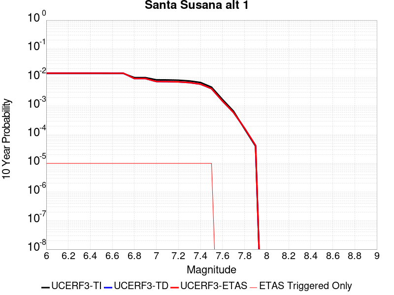 |

| Magnitude | 1 wk TI Prob | 1 wk TD Prob | 1 wk ETAS Prob | 1 wk ETAS/TD Gain | 1 wk ETAS Triggered Only | 1 mo TI Prob | 1 mo TD Prob | 1 mo ETAS Prob | 1 mo ETAS/TD Gain | 1 mo ETAS Triggered Only | 1 yr TI Prob | 1 yr TD Prob | 1 yr ETAS Prob | 1 yr ETAS/TD Gain | 1 yr ETAS Triggered Only | 10 yr TI Prob | 10 yr TD Prob | 10 yr ETAS Prob | 10 yr ETAS/TD Gain | 10 yr ETAS Triggered Only |
|-----|-----|-----|-----|-----|-----|-----|-----|-----|-----|-----|-----|-----|-----|-----|-----|-----|-----|-----|-----|-----|
| 6.0 | 2.674877E-5 | 2.7198023E-5 | 3.938687E-5 | 1.4481518 | 1.2189176E-5 | 1.1463255E-4 | 1.1655839E-4 | 1.2874615E-4 | 1.1045635 | 1.2189176E-5 | 0.0013947578 | 0.0014182882 | 0.0014304601 | 1.0085821 | 1.2189176E-5 | 0.013860362 | 0.014104128 | 0.014116145 | 1.000852 | 1.2189176E-5 |
| 6.1 | 2.674877E-5 | 2.7198023E-5 | 3.938687E-5 | 1.4481518 | 1.2189176E-5 | 1.1463255E-4 | 1.1655839E-4 | 1.2874615E-4 | 1.1045635 | 1.2189176E-5 | 0.0013947578 | 0.0014182882 | 0.0014304601 | 1.0085821 | 1.2189176E-5 | 0.013860362 | 0.014104128 | 0.014116145 | 1.000852 | 1.2189176E-5 |
| 6.2 | 2.674877E-5 | 2.7198023E-5 | 3.938687E-5 | 1.4481518 | 1.2189176E-5 | 1.1463255E-4 | 1.1655839E-4 | 1.2874615E-4 | 1.1045635 | 1.2189176E-5 | 0.0013947578 | 0.0014182882 | 0.0014304601 | 1.0085821 | 1.2189176E-5 | 0.013860362 | 0.014104128 | 0.014116145 | 1.000852 | 1.2189176E-5 |
| 6.3 | 2.674877E-5 | 2.7198023E-5 | 3.938687E-5 | 1.4481518 | 1.2189176E-5 | 1.1463255E-4 | 1.1655839E-4 | 1.2874615E-4 | 1.1045635 | 1.2189176E-5 | 0.0013947578 | 0.0014182882 | 0.0014304601 | 1.0085821 | 1.2189176E-5 | 0.013860362 | 0.014104128 | 0.014116145 | 1.000852 | 1.2189176E-5 |
| 6.4 | 2.674877E-5 | 2.7198023E-5 | 3.938687E-5 | 1.4481518 | 1.2189176E-5 | 1.1463255E-4 | 1.1655839E-4 | 1.2874615E-4 | 1.1045635 | 1.2189176E-5 | 0.0013947578 | 0.0014182882 | 0.0014304601 | 1.0085821 | 1.2189176E-5 | 0.013860362 | 0.014104128 | 0.014116145 | 1.000852 | 1.2189176E-5 |
| 6.5 | 2.674877E-5 | 2.7198023E-5 | 3.938687E-5 | 1.4481518 | 1.2189176E-5 | 1.1463255E-4 | 1.1655839E-4 | 1.2874615E-4 | 1.1045635 | 1.2189176E-5 | 0.0013947578 | 0.0014182882 | 0.0014304601 | 1.0085821 | 1.2189176E-5 | 0.013860362 | 0.014104128 | 0.014116145 | 1.000852 | 1.2189176E-5 |
| 6.6 | 2.6647976E-5 | 2.7074359E-5 | 3.9263206E-5 | 1.4501989 | 1.2189176E-5 | 1.14200615E-4 | 1.1602845E-4 | 1.2821621E-4 | 1.1050411 | 1.2189176E-5 | 0.0013895056 | 0.0014118447 | 0.0014240168 | 1.0086213 | 1.2189176E-5 | 0.013808494 | 0.014040513 | 0.014052531 | 1.0008559 | 1.2189176E-5 |
| 6.7 | 2.6647976E-5 | 2.7074359E-5 | 3.9263206E-5 | 1.4501989 | 1.2189176E-5 | 1.14200615E-4 | 1.1602845E-4 | 1.2821621E-4 | 1.1050411 | 1.2189176E-5 | 0.0013895056 | 0.0014118447 | 0.0014240168 | 1.0086213 | 1.2189176E-5 | 0.013808494 | 0.014040513 | 0.014052531 | 1.0008559 | 1.2189176E-5 |
| 6.8 | 1.9073179E-5 | 1.7637283E-5 | 2.9826246E-5 | 1.6910906 | 1.2189176E-5 | 8.1739636E-5 | 7.558627E-5 | 8.7774526E-5 | 1.1612496 | 1.2189176E-5 | 9.947256E-4 | 9.198925E-4 | 9.320704E-4 | 1.0132384 | 1.2189176E-5 | 0.009902848 | 0.009163101 | 0.009175179 | 1.0013181 | 1.2189176E-5 |
| 6.9 | 1.9041876E-5 | 1.7619415E-5 | 2.9808376E-5 | 1.6917915 | 1.2189176E-5 | 8.160549E-5 | 7.55097E-5 | 8.7697954E-5 | 1.1614131 | 1.2189176E-5 | 9.930939E-4 | 9.1896096E-4 | 9.3113893E-4 | 1.0132519 | 1.2189176E-5 | 0.0098866755 | 0.0091538625 | 0.00916594 | 1.0013194 | 1.2189176E-5 |
| 7.0 | 1.5917482E-5 | 1.3863864E-5 | 2.6052872E-5 | 1.8791926 | 1.2189176E-5 | 6.8215995E-5 | 5.9415237E-5 | 7.160369E-5 | 1.2051401 | 1.2189176E-5 | 8.302132E-4 | 7.231451E-4 | 7.3532545E-4 | 1.0168436 | 1.2189176E-5 | 0.008271185 | 0.0072088144 | 0.0072209155 | 1.0016787 | 1.2189176E-5 |
| 7.1 | 1.577788E-5 | 1.3743872E-5 | 2.593288E-5 | 1.8868686 | 1.2189176E-5 | 6.761774E-5 | 5.8901005E-5 | 7.108946E-5 | 1.2069312 | 1.2189176E-5 | 8.2293496E-4 | 7.1688846E-4 | 7.290689E-4 | 1.0169907 | 1.2189176E-5 | 0.008198941 | 0.007146652 | 0.007158754 | 1.0016934 | 1.2189176E-5 |
| 7.2 | 1.5416446E-5 | 1.3469944E-5 | 2.5658956E-5 | 1.9049044 | 1.2189176E-5 | 6.606882E-5 | 5.772708E-5 | 6.991556E-5 | 1.2111396 | 1.2189176E-5 | 8.0409093E-4 | 7.026052E-4 | 7.147858E-4 | 1.0173364 | 1.2189176E-5 | 0.008011877 | 0.0070047234 | 0.0070168274 | 1.0017279 | 1.2189176E-5 |
| 7.3 | 1.4534083E-5 | 1.2717879E-5 | 2.49069E-5 | 1.9584162 | 1.2189176E-5 | 6.228744E-5 | 5.4504082E-5 | 6.669259E-5 | 1.2236257 | 1.2189176E-5 | 7.580857E-4 | 6.633896E-4 | 6.755707E-4 | 1.0183619 | 1.2189176E-5 | 0.007555048 | 0.0066149444 | 0.006627053 | 1.0018305 | 1.2189176E-5 |
| 7.4 | 1.2858995E-5 | 1.1229652E-5 | 2.3418692E-5 | 2.0854335 | 1.2189176E-5 | 5.5108816E-5 | 4.8126214E-5 | 6.0314804E-5 | 1.253263 | 1.2189176E-5 | 6.7074323E-4 | 5.857831E-4 | 5.979651E-4 | 1.0207962 | 1.2189176E-5 | 0.0066872234 | 0.005843165 | 0.005855283 | 1.0020739 | 1.2189176E-5 |
| 7.5 | 8.827668E-6 | 7.805457E-6 | 1.9994539E-5 | 2.56161 | 1.2189176E-5 | 3.7832317E-5 | 3.3451546E-5 | 4.5640314E-5 | 1.3643708 | 1.2189176E-5 | 4.605111E-4 | 4.071989E-4 | 4.193831E-4 | 1.029922 | 1.2189176E-5 | 0.0045955796 | 0.0040647765 | 0.0040769163 | 1.0029866 | 1.2189176E-5 |
| 7.6 | 3.2533426E-6 | 2.871988E-6 | 2.871988E-6 | 1.0 | 0.0 | 1.3942822E-5 | 1.2308465E-5 | 1.2308465E-5 | 1.0 | 0.0 | 1.6974064E-4 | 1.4984563E-4 | 1.4984563E-4 | 1.0 | 0.0 | 0.0016961104 | 0.0014974826 | 0.0014974826 | 1.0 | 0.0 |
| 7.7 | 1.2751709E-6 | 1.1491089E-6 | 1.1491089E-6 | 1.0 | 0.0 | 5.4650063E-6 | 4.9247437E-6 | 4.9247437E-6 | 1.0 | 0.0 | 6.653442E-5 | 5.9957198E-5 | 5.9957198E-5 | 1.0 | 0.0 | 6.6514505E-4 | 5.994191E-4 | 5.994191E-4 | 1.0 | 0.0 |
| 7.8 | 3.067544E-7 | 3.2400436E-7 | 3.2400436E-7 | 1.0 | 0.0 | 1.3146611E-6 | 1.3885895E-6 | 1.3885895E-6 | 1.0 | 0.0 | 1.600588E-5 | 1.6905957E-5 | 1.6905957E-5 | 1.0 | 0.0 | 1.6004729E-4 | 1.6904772E-4 | 1.6904772E-4 | 1.0 | 0.0 |
| 7.9 | 7.622999E-8 | 8.087964E-8 | 8.087964E-8 | 1.0 | 0.0 | 3.2669993E-7 | 3.4662696E-7 | 3.4662696E-7 | 1.0 | 0.0 | 3.977564E-6 | 4.2201773E-6 | 4.2201773E-6 | 1.0 | 0.0 | 3.977493E-5 | 4.220118E-5 | 4.220118E-5 | 1.0 | 0.0 |

## San Luis Range 2011 CFM
*[(top)](#table-of-contents)*

| 1 Week | 1 Month | 1 Year | 10 Year |
|-----|-----|-----|-----|
|  |  |  |  |

| Magnitude | 1 wk TI Prob | 1 wk TD Prob | 1 wk ETAS Prob | 1 wk ETAS/TD Gain | 1 wk ETAS Triggered Only | 1 mo TI Prob | 1 mo TD Prob | 1 mo ETAS Prob | 1 mo ETAS/TD Gain | 1 mo ETAS Triggered Only | 1 yr TI Prob | 1 yr TD Prob | 1 yr ETAS Prob | 1 yr ETAS/TD Gain | 1 yr ETAS Triggered Only | 10 yr TI Prob | 10 yr TD Prob | 10 yr ETAS Prob | 10 yr ETAS/TD Gain | 10 yr ETAS Triggered Only |
|-----|-----|-----|-----|-----|-----|-----|-----|-----|-----|-----|-----|-----|-----|-----|-----|-----|-----|-----|-----|-----|
| 6.0 | 8.8368415E-6 | 8.965454E-6 | 2.1154521E-5 | 2.3595593 | 1.2189176E-5 | 3.787163E-5 | 3.842285E-5 | 5.0611558E-5 | 1.3172255 | 1.2189176E-5 | 4.609895E-4 | 4.677057E-4 | 4.7988916E-4 | 1.0260495 | 1.2189176E-5 | 0.0046003438 | 0.0046679964 | 0.0046801283 | 1.002599 | 1.2189176E-5 |
| 6.1 | 8.8368415E-6 | 8.965454E-6 | 2.1154521E-5 | 2.3595593 | 1.2189176E-5 | 3.787163E-5 | 3.842285E-5 | 5.0611558E-5 | 1.3172255 | 1.2189176E-5 | 4.609895E-4 | 4.677057E-4 | 4.7988916E-4 | 1.0260495 | 1.2189176E-5 | 0.0046003438 | 0.0046679964 | 0.0046801283 | 1.002599 | 1.2189176E-5 |
| 6.2 | 8.8368415E-6 | 8.965454E-6 | 2.1154521E-5 | 2.3595593 | 1.2189176E-5 | 3.787163E-5 | 3.842285E-5 | 5.0611558E-5 | 1.3172255 | 1.2189176E-5 | 4.609895E-4 | 4.677057E-4 | 4.7988916E-4 | 1.0260495 | 1.2189176E-5 | 0.0046003438 | 0.0046679964 | 0.0046801283 | 1.002599 | 1.2189176E-5 |
| 6.3 | 8.8368415E-6 | 8.965454E-6 | 2.1154521E-5 | 2.3595593 | 1.2189176E-5 | 3.787163E-5 | 3.842285E-5 | 5.0611558E-5 | 1.3172255 | 1.2189176E-5 | 4.609895E-4 | 4.677057E-4 | 4.7988916E-4 | 1.0260495 | 1.2189176E-5 | 0.0046003438 | 0.0046679964 | 0.0046801283 | 1.002599 | 1.2189176E-5 |
| 6.4 | 3.9094193E-6 | 3.9412025E-6 | 3.9412025E-6 | 1.0 | 0.0 | 1.6754546E-5 | 1.689076E-5 | 1.689076E-5 | 1.0 | 0.0 | 2.039675E-4 | 2.056259E-4 | 2.056259E-4 | 1.0 | 0.0 | 0.0020378039 | 0.0020543851 | 0.0020543851 | 1.0 | 0.0 |
| 6.5 | 3.9094193E-6 | 3.9412025E-6 | 3.9412025E-6 | 1.0 | 0.0 | 1.6754546E-5 | 1.689076E-5 | 1.689076E-5 | 1.0 | 0.0 | 2.039675E-4 | 2.056259E-4 | 2.056259E-4 | 1.0 | 0.0 | 0.0020378039 | 0.0020543851 | 0.0020543851 | 1.0 | 0.0 |
| 6.6 | 3.0587726E-6 | 3.0753883E-6 | 3.0753883E-6 | 1.0 | 0.0 | 1.3108959E-5 | 1.318017E-5 | 1.318017E-5 | 1.0 | 0.0 | 1.595899E-4 | 1.6045687E-4 | 1.6045687E-4 | 1.0 | 0.0 | 0.0015947534 | 0.0016034221 | 0.0016034221 | 1.0 | 0.0 |
| 6.7 | 2.6160574E-6 | 2.6251273E-6 | 2.6251273E-6 | 1.0 | 0.0 | 1.1211626E-5 | 1.1250498E-5 | 1.1250498E-5 | 1.0 | 0.0 | 1.3649299E-4 | 1.3696625E-4 | 1.3696625E-4 | 1.0 | 0.0 | 0.0013640919 | 0.0013688246 | 0.0013688246 | 1.0 | 0.0 |
| 6.8 | 2.5110312E-6 | 2.51814E-6 | 2.51814E-6 | 1.0 | 0.0 | 1.0761518E-5 | 1.0791985E-5 | 1.0791985E-5 | 1.0 | 0.0 | 1.310136E-4 | 1.3138456E-4 | 1.3138456E-4 | 1.0 | 0.0 | 0.0013093639 | 0.0013130746 | 0.0013130746 | 1.0 | 0.0 |
| 6.9 | 1.8564405E-6 | 1.852487E-6 | 1.852487E-6 | 1.0 | 0.0 | 7.95615E-6 | 7.939206E-6 | 7.939206E-6 | 1.0 | 0.0 | 9.686181E-5 | 9.665557E-5 | 9.665557E-5 | 1.0 | 0.0 | 9.68196E-4 | 9.661373E-4 | 9.661373E-4 | 1.0 | 0.0 |
| 7.0 | 1.546127E-6 | 1.5369537E-6 | 1.5369537E-6 | 1.0 | 0.0 | 6.626242E-6 | 6.586928E-6 | 6.586928E-6 | 1.0 | 0.0 | 8.06715E-5 | 8.0192905E-5 | 8.0192905E-5 | 1.0 | 0.0 | 8.0642226E-4 | 8.016404E-4 | 8.016404E-4 | 1.0 | 0.0 |
| 7.1 | 1.3368208E-6 | 1.3235326E-6 | 1.3235326E-6 | 1.0 | 0.0 | 5.7292195E-6 | 5.67227E-6 | 5.67227E-6 | 1.0 | 0.0 | 6.975101E-5 | 6.905771E-5 | 6.905771E-5 | 1.0 | 0.0 | 6.972912E-4 | 6.9036294E-4 | 6.9036294E-4 | 1.0 | 0.0 |
| 7.2 | 1.0623363E-6 | 1.0454368E-6 | 1.0454368E-6 | 1.0 | 0.0 | 4.5528623E-6 | 4.4804356E-6 | 4.4804356E-6 | 1.0 | 0.0 | 5.5429686E-5 | 5.4547938E-5 | 5.4547938E-5 | 1.0 | 0.0 | 5.5415864E-4 | 5.4534577E-4 | 5.4534577E-4 | 1.0 | 0.0 |
| 7.3 | 7.831679E-7 | 7.7273904E-7 | 7.7273904E-7 | 1.0 | 0.0 | 3.3564295E-6 | 3.3117344E-6 | 3.3117344E-6 | 1.0 | 0.0 | 4.086376E-5 | 4.0319625E-5 | 4.0319625E-5 | 1.0 | 0.0 | 4.0856248E-4 | 4.031232E-4 | 4.031232E-4 | 1.0 | 0.0 |
| 7.4 | 5.9558846E-7 | 5.910636E-7 | 5.910636E-7 | 1.0 | 0.0 | 2.5525194E-6 | 2.5331274E-6 | 2.5331274E-6 | 1.0 | 0.0 | 3.107648E-5 | 3.084039E-5 | 3.084039E-5 | 1.0 | 0.0 | 3.1072134E-4 | 3.083612E-4 | 3.083612E-4 | 1.0 | 0.0 |
| 7.5 | 4.1616502E-7 | 4.119631E-7 | 4.119631E-7 | 1.0 | 0.0 | 1.7835631E-6 | 1.7655549E-6 | 1.7655549E-6 | 1.0 | 0.0 | 2.1714664E-5 | 2.149542E-5 | 2.149542E-5 | 1.0 | 0.0 | 2.1712543E-4 | 2.1493346E-4 | 2.1493346E-4 | 1.0 | 0.0 |
| 7.6 | 2.3816014E-7 | 2.3376548E-7 | 2.3376548E-7 | 1.0 | 0.0 | 1.0206859E-6 | 1.0018516E-6 | 1.0018516E-6 | 1.0 | 0.0 | 1.242678E-5 | 1.2197475E-5 | 1.2197475E-5 | 1.0 | 0.0 | 1.2426086E-4 | 1.2196808E-4 | 1.2196808E-4 | 1.0 | 0.0 |
| 7.7 | 9.918777E-8 | 9.3867584E-8 | 9.3867584E-8 | 1.0 | 0.0 | 4.2509038E-7 | 4.0228957E-7 | 4.0228957E-7 | 1.0 | 0.0 | 5.1754632E-6 | 4.8978645E-6 | 4.8978645E-6 | 1.0 | 0.0 | 5.1753424E-5 | 4.897757E-5 | 4.897757E-5 | 1.0 | 0.0 |
| 7.8 | 3.4982556E-8 | 2.968655E-8 | 2.968655E-8 | 1.0 | 0.0 | 1.4992524E-7 | 1.2722806E-7 | 1.2722806E-7 | 1.0 | 0.0 | 1.8253382E-6 | 1.5490006E-6 | 1.5490006E-6 | 1.0 | 0.0 | 1.8253233E-5 | 1.5489897E-5 | 1.5489897E-5 | 1.0 | 0.0 |
| 7.9 | 1.6624908E-8 | 1.1477036E-8 | 1.1477036E-8 | 1.0 | 0.0 | 7.12496E-8 | 4.91873E-8 | 4.91873E-8 | 1.0 | 0.0 | 8.6746354E-7 | 5.988552E-7 | 5.988552E-7 | 1.0 | 0.0 | 8.674601E-6 | 5.988536E-6 | 5.988536E-6 | 1.0 | 0.0 |
| 8.0 | 6.3352315E-9 | 3.0888412E-9 | 3.0888412E-9 | 1.0 | 0.0 | 2.715099E-8 | 1.3237893E-8 | 1.3237893E-8 | 1.0 | 0.0 | 3.3056327E-7 | 1.6117131E-7 | 1.6117131E-7 | 1.0 | 0.0 | 3.3056278E-6 | 1.611712E-6 | 1.611712E-6 | 1.0 | 0.0 |

## Greenville (So) 2011 CFM
*[(top)](#table-of-contents)*

| 1 Week | 1 Month | 1 Year | 10 Year |
|-----|-----|-----|-----|
|  |  |  |  |

| Magnitude | 1 wk TI Prob | 1 wk TD Prob | 1 wk ETAS Prob | 1 wk ETAS/TD Gain | 1 wk ETAS Triggered Only | 1 mo TI Prob | 1 mo TD Prob | 1 mo ETAS Prob | 1 mo ETAS/TD Gain | 1 mo ETAS Triggered Only | 1 yr TI Prob | 1 yr TD Prob | 1 yr ETAS Prob | 1 yr ETAS/TD Gain | 1 yr ETAS Triggered Only | 10 yr TI Prob | 10 yr TD Prob | 10 yr ETAS Prob | 10 yr ETAS/TD Gain | 10 yr ETAS Triggered Only |
|-----|-----|-----|-----|-----|-----|-----|-----|-----|-----|-----|-----|-----|-----|-----|-----|-----|-----|-----|-----|-----|
| 6.0 | 4.279693E-5 | 5.5040087E-5 | 5.5040087E-5 | 1.0 | 0.0 | 1.8340252E-4 | 2.3586681E-4 | 2.3586681E-4 | 1.0 | 0.0 | 0.0022306389 | 0.0028682416 | 0.0028803959 | 1.0042375 | 1.2189176E-5 | 0.022083808 | 0.028338138 | 0.02834998 | 1.000418 | 1.2189176E-5 |
| 6.1 | 3.4037297E-5 | 4.3192387E-5 | 4.3192387E-5 | 1.0 | 0.0 | 1.4586597E-4 | 1.8509831E-4 | 1.8509831E-4 | 1.0 | 0.0 | 0.0017744715 | 0.0022514379 | 0.0022635995 | 1.0054017 | 1.2189176E-5 | 0.01760369 | 0.022302566 | 0.022314483 | 1.0005343 | 1.2189176E-5 |
| 6.2 | 3.4037297E-5 | 4.3192387E-5 | 4.3192387E-5 | 1.0 | 0.0 | 1.4586597E-4 | 1.8509831E-4 | 1.8509831E-4 | 1.0 | 0.0 | 0.0017744715 | 0.0022514379 | 0.0022635995 | 1.0054017 | 1.2189176E-5 | 0.01760369 | 0.022302566 | 0.022314483 | 1.0005343 | 1.2189176E-5 |
| 6.3 | 2.5956324E-5 | 3.2428903E-5 | 3.2428903E-5 | 1.0 | 0.0 | 1.11236644E-4 | 1.3897405E-4 | 1.3897405E-4 | 1.0 | 0.0 | 0.0013534647 | 0.0016907708 | 0.0017029394 | 1.007197 | 1.2189176E-5 | 0.013452509 | 0.016785882 | 0.016797867 | 1.000714 | 1.2189176E-5 |
| 6.4 | 2.1145053E-5 | 2.6197677E-5 | 2.6197677E-5 | 1.0 | 0.0 | 9.061851E-5 | 1.1227112E-4 | 1.1227112E-4 | 1.0 | 0.0 | 0.0011027219 | 0.0013660751 | 0.0013782476 | 1.0089105 | 1.2189176E-5 | 0.01097266 | 0.01358018 | 0.013592203 | 1.0008854 | 1.2189176E-5 |
| 6.5 | 2.0030959E-5 | 2.479578E-5 | 2.479578E-5 | 1.0 | 0.0 | 8.584414E-5 | 1.06263484E-4 | 1.06263484E-4 | 1.0 | 0.0 | 0.0010446513 | 0.0012930221 | 0.0013051955 | 1.0094147 | 1.2189176E-5 | 0.010397541 | 0.012858339 | 0.01287037 | 1.0009358 | 1.2189176E-5 |
| 6.6 | 1.8395405E-5 | 2.2754466E-5 | 2.2754466E-5 | 1.0 | 0.0 | 7.8835066E-5 | 9.751565E-5 | 9.751565E-5 | 1.0 | 0.0 | 9.5939427E-4 | 0.0011866348 | 0.0011988095 | 1.0102599 | 1.2189176E-5 | 0.009552629 | 0.011806041 | 0.011818086 | 1.0010203 | 1.2189176E-5 |
| 6.7 | 1.7883482E-5 | 2.212551E-5 | 2.212551E-5 | 1.0 | 0.0 | 7.664124E-5 | 9.482033E-5 | 9.482033E-5 | 1.0 | 0.0 | 9.3270757E-4 | 0.0011538545 | 0.0011660296 | 1.0105517 | 1.2189176E-5 | 0.009288026 | 0.011481688 | 0.011493738 | 1.0010494 | 1.2189176E-5 |
| 6.8 | 1.3373564E-5 | 1.6505966E-5 | 1.6505966E-5 | 1.0 | 0.0 | 5.7314013E-5 | 7.073802E-5 | 7.073802E-5 | 1.0 | 0.0 | 6.975747E-4 | 8.609098E-4 | 8.609098E-4 | 1.0 | 0.0 | 0.0069538904 | 0.008577357 | 0.008577357 | 1.0 | 0.0 |
| 6.9 | 1.06692905E-5 | 1.3152582E-5 | 1.3152582E-5 | 1.0 | 0.0 | 4.5724726E-5 | 5.6367055E-5 | 5.6367055E-5 | 1.0 | 0.0 | 5.5655633E-4 | 6.86064E-4 | 6.86064E-4 | 1.0 | 0.0 | 0.005551645 | 0.006840693 | 0.006840693 | 1.0 | 0.0 |
| 7.0 | 8.157512E-6 | 1.0062639E-5 | 1.0062639E-5 | 1.0 | 0.0 | 3.4960296E-5 | 4.3124903E-5 | 4.3124903E-5 | 1.0 | 0.0 | 4.2555845E-4 | 5.2492286E-4 | 5.2492286E-4 | 1.0 | 0.0 | 0.004247444 | 0.0052373074 | 0.0052373074 | 1.0 | 0.0 |
| 7.1 | 6.1467113E-6 | 7.6274314E-6 | 7.6274314E-6 | 1.0 | 0.0 | 2.6342783E-5 | 3.268859E-5 | 3.268859E-5 | 1.0 | 0.0 | 3.206762E-4 | 3.9791173E-4 | 3.9791173E-4 | 1.0 | 0.0 | 0.0032021382 | 0.0039721807 | 0.0039721807 | 1.0 | 0.0 |
| 7.2 | 4.713467E-6 | 5.9141557E-6 | 5.9141557E-6 | 1.0 | 0.0 | 2.0200418E-5 | 2.5346139E-5 | 2.5346139E-5 | 1.0 | 0.0 | 2.4591232E-4 | 3.0854615E-4 | 3.0854615E-4 | 1.0 | 0.0 | 0.0024564038 | 0.0030813308 | 0.0030813308 | 1.0 | 0.0 |
| 7.3 | 2.3266216E-6 | 2.954009E-6 | 2.954009E-6 | 1.0 | 0.0 | 9.971197E-6 | 1.2659978E-5 | 1.2659978E-5 | 1.0 | 0.0 | 1.2139256E-4 | 1.5412449E-4 | 1.5412449E-4 | 1.0 | 0.0 | 0.0012132627 | 0.0015402455 | 0.0015402455 | 1.0 | 0.0 |
| 7.4 | 1.3314E-6 | 1.7179472E-6 | 1.7179472E-6 | 1.0 | 0.0 | 5.7059874E-6 | 7.36261E-6 | 7.36261E-6 | 1.0 | 0.0 | 6.946818E-5 | 8.963614E-5 | 8.963614E-5 | 1.0 | 0.0 | 6.9446466E-4 | 8.9603866E-4 | 8.9603866E-4 | 1.0 | 0.0 |
| 7.5 | 1.0362941E-6 | 1.3468821E-6 | 1.3468821E-6 | 1.0 | 0.0 | 4.4412527E-6 | 5.772339E-6 | 5.772339E-6 | 1.0 | 0.0 | 5.407091E-5 | 7.027601E-5 | 7.027601E-5 | 1.0 | 0.0 | 5.405776E-4 | 7.025681E-4 | 7.025681E-4 | 1.0 | 0.0 |
| 7.6 | 7.764784E-7 | 1.0088593E-6 | 1.0088593E-6 | 1.0 | 0.0 | 3.3277602E-6 | 4.323676E-6 | 4.323676E-6 | 1.0 | 0.0 | 4.0514726E-5 | 5.263952E-5 | 5.263952E-5 | 1.0 | 0.0 | 4.050734E-4 | 5.262919E-4 | 5.262919E-4 | 1.0 | 0.0 |
| 7.7 | 1.6927763E-7 | 2.2139248E-7 | 2.2139248E-7 | 1.0 | 0.0 | 7.2547533E-7 | 9.4882455E-7 | 9.4882455E-7 | 1.0 | 0.0 | 8.832627E-6 | 1.15518815E-5 | 1.15518815E-5 | 1.0 | 0.0 | 8.8322755E-5 | 1.15515526E-4 | 1.15515526E-4 | 1.0 | 0.0 |

## Pisgah-Bullion Mtn-Mesquite Lk
*[(top)](#table-of-contents)*

| 1 Week | 1 Month | 1 Year | 10 Year |
|-----|-----|-----|-----|
|  |  |  |  |

| Magnitude | 1 wk TI Prob | 1 wk TD Prob | 1 wk ETAS Prob | 1 wk ETAS/TD Gain | 1 wk ETAS Triggered Only | 1 mo TI Prob | 1 mo TD Prob | 1 mo ETAS Prob | 1 mo ETAS/TD Gain | 1 mo ETAS Triggered Only | 1 yr TI Prob | 1 yr TD Prob | 1 yr ETAS Prob | 1 yr ETAS/TD Gain | 1 yr ETAS Triggered Only | 10 yr TI Prob | 10 yr TD Prob | 10 yr ETAS Prob | 10 yr ETAS/TD Gain | 10 yr ETAS Triggered Only |
|-----|-----|-----|-----|-----|-----|-----|-----|-----|-----|-----|-----|-----|-----|-----|-----|-----|-----|-----|-----|-----|
| 6.0 | 3.0240792E-5 | 2.4091114E-5 | 2.4091114E-5 | 1.0 | 0.0 | 1.2959696E-4 | 1.03244114E-4 | 1.03244114E-4 | 1.0 | 0.0 | 0.0015767008 | 0.0012563728 | 0.0012685466 | 1.0096897 | 1.2189176E-5 | 0.015655609 | 0.012502721 | 0.012514758 | 1.0009627 | 1.2189176E-5 |
| 6.1 | 3.0240792E-5 | 2.4091114E-5 | 2.4091114E-5 | 1.0 | 0.0 | 1.2959696E-4 | 1.03244114E-4 | 1.03244114E-4 | 1.0 | 0.0 | 0.0015767008 | 0.0012563728 | 0.0012685466 | 1.0096897 | 1.2189176E-5 | 0.015655609 | 0.012502721 | 0.012514758 | 1.0009627 | 1.2189176E-5 |
| 6.2 | 3.0240792E-5 | 2.4091114E-5 | 2.4091114E-5 | 1.0 | 0.0 | 1.2959696E-4 | 1.03244114E-4 | 1.03244114E-4 | 1.0 | 0.0 | 0.0015767008 | 0.0012563728 | 0.0012685466 | 1.0096897 | 1.2189176E-5 | 0.015655609 | 0.012502721 | 0.012514758 | 1.0009627 | 1.2189176E-5 |
| 6.3 | 2.0498217E-5 | 1.36380695E-5 | 1.36380695E-5 | 1.0 | 0.0 | 8.784654E-5 | 5.844765E-5 | 5.844765E-5 | 1.0 | 0.0 | 0.0010690069 | 7.1138405E-4 | 7.2356453E-4 | 1.0171223 | 1.2189176E-5 | 0.01063879 | 0.0070926943 | 0.0071047973 | 1.0017064 | 1.2189176E-5 |
| 6.4 | 2.0498217E-5 | 1.36380695E-5 | 1.36380695E-5 | 1.0 | 0.0 | 8.784654E-5 | 5.844765E-5 | 5.844765E-5 | 1.0 | 0.0 | 0.0010690069 | 7.1138405E-4 | 7.2356453E-4 | 1.0171223 | 1.2189176E-5 | 0.01063879 | 0.0070926943 | 0.0071047973 | 1.0017064 | 1.2189176E-5 |
| 6.5 | 1.7316182E-5 | 1.0477042E-5 | 1.0477042E-5 | 1.0 | 0.0 | 7.42101E-5 | 4.4900895E-5 | 4.4900895E-5 | 1.0 | 0.0 | 9.0313336E-4 | 5.465413E-4 | 5.587238E-4 | 1.0222902 | 1.2189176E-5 | 0.008994718 | 0.0054529672 | 0.00546509 | 1.0022231 | 1.2189176E-5 |
| 6.6 | 1.5251077E-5 | 8.414273E-6 | 8.414273E-6 | 1.0 | 0.0 | 6.536012E-5 | 3.6060712E-5 | 3.6060712E-5 | 1.0 | 0.0 | 7.9546886E-4 | 4.3895794E-4 | 4.511418E-4 | 1.0277562 | 1.2189176E-5 | 0.007926274 | 0.0043816264 | 0.004393762 | 1.0027697 | 1.2189176E-5 |
| 6.7 | 1.2997425E-5 | 6.4114965E-6 | 6.4114965E-6 | 1.0 | 0.0 | 5.570206E-5 | 2.7477578E-5 | 2.7477578E-5 | 1.0 | 0.0 | 6.7796157E-4 | 3.3449283E-4 | 3.3449283E-4 | 1.0 | 0.0 | 0.0067589693 | 0.0033403537 | 0.0033403537 | 1.0 | 0.0 |
| 6.8 | 1.035386E-5 | 4.3332193E-6 | 4.3332193E-6 | 1.0 | 0.0 | 4.437293E-5 | 1.8570812E-5 | 1.8570812E-5 | 1.0 | 0.0 | 5.401065E-4 | 2.2607706E-4 | 2.2607706E-4 | 1.0 | 0.0 | 0.0053879567 | 0.0022585576 | 0.0022585576 | 1.0 | 0.0 |
| 6.9 | 8.816252E-6 | 3.580638E-6 | 3.580638E-6 | 1.0 | 0.0 | 3.778339E-5 | 1.5345504E-5 | 1.5345504E-5 | 1.0 | 0.0 | 4.5991567E-4 | 1.8681608E-4 | 1.8681608E-4 | 1.0 | 0.0 | 0.00458965 | 0.0018666488 | 0.0018666488 | 1.0 | 0.0 |
| 7.0 | 6.8232207E-6 | 2.5675843E-6 | 2.5675843E-6 | 1.0 | 0.0 | 2.9242048E-5 | 1.1003888E-5 | 1.1003888E-5 | 1.0 | 0.0 | 3.5596377E-4 | 1.3396442E-4 | 1.3396442E-4 | 1.0 | 0.0 | 0.0035539411 | 0.0013388677 | 0.0013388677 | 1.0 | 0.0 |
| 7.1 | 5.837013E-6 | 2.22738E-6 | 2.22738E-6 | 1.0 | 0.0 | 2.501553E-5 | 9.545881E-6 | 9.545881E-6 | 1.0 | 0.0 | 3.045215E-4 | 1.16215204E-4 | 1.16215204E-4 | 1.0 | 0.0 | 0.0030410455 | 0.0011615733 | 0.0011615733 | 1.0 | 0.0 |
| 7.2 | 4.278052E-6 | 1.6275711E-6 | 1.6275711E-6 | 1.0 | 0.0 | 1.833438E-5 | 6.9752873E-6 | 6.9752873E-6 | 1.0 | 0.0 | 2.231982E-4 | 8.492105E-5 | 8.492105E-5 | 1.0 | 0.0 | 0.0022297418 | 8.489092E-4 | 8.489092E-4 | 1.0 | 0.0 |
| 7.3 | 1.8803692E-6 | 8.344926E-7 | 8.344926E-7 | 1.0 | 0.0 | 8.0587E-6 | 3.5763926E-6 | 3.5763926E-6 | 1.0 | 0.0 | 9.811026E-5 | 4.354186E-5 | 4.354186E-5 | 1.0 | 0.0 | 9.806695E-4 | 4.3534773E-4 | 4.3534773E-4 | 1.0 | 0.0 |

## South Klamath Lake East
*[(top)](#table-of-contents)*

| 1 Week | 1 Month | 1 Year | 10 Year |
|-----|-----|-----|-----|
|  |  |  |  |

| Magnitude | 1 wk TI Prob | 1 wk TD Prob | 1 wk ETAS Prob | 1 wk ETAS/TD Gain | 1 wk ETAS Triggered Only | 1 mo TI Prob | 1 mo TD Prob | 1 mo ETAS Prob | 1 mo ETAS/TD Gain | 1 mo ETAS Triggered Only | 1 yr TI Prob | 1 yr TD Prob | 1 yr ETAS Prob | 1 yr ETAS/TD Gain | 1 yr ETAS Triggered Only | 10 yr TI Prob | 10 yr TD Prob | 10 yr ETAS Prob | 10 yr ETAS/TD Gain | 10 yr ETAS Triggered Only |
|-----|-----|-----|-----|-----|-----|-----|-----|-----|-----|-----|-----|-----|-----|-----|-----|-----|-----|-----|-----|-----|
| 6.0 | 2.3539369E-5 | 2.5047308E-5 | 3.723618E-5 | 1.486634 | 1.2189176E-5 | 1.0087911E-4 | 1.0734166E-4 | 1.1952952E-4 | 1.1135428 | 1.2189176E-5 | 0.0012275111 | 0.0013061843 | 0.0013183577 | 1.0093197 | 1.2189176E-5 | 0.012207527 | 0.012993417 | 0.013005448 | 1.0009259 | 1.2189176E-5 |
| 6.1 | 2.3539369E-5 | 2.5047308E-5 | 3.723618E-5 | 1.486634 | 1.2189176E-5 | 1.0087911E-4 | 1.0734166E-4 | 1.1952952E-4 | 1.1135428 | 1.2189176E-5 | 0.0012275111 | 0.0013061843 | 0.0013183577 | 1.0093197 | 1.2189176E-5 | 0.012207527 | 0.012993417 | 0.013005448 | 1.0009259 | 1.2189176E-5 |
| 6.2 | 2.3539369E-5 | 2.5047308E-5 | 3.723618E-5 | 1.486634 | 1.2189176E-5 | 1.0087911E-4 | 1.0734166E-4 | 1.1952952E-4 | 1.1135428 | 1.2189176E-5 | 0.0012275111 | 0.0013061843 | 0.0013183577 | 1.0093197 | 1.2189176E-5 | 0.012207527 | 0.012993417 | 0.013005448 | 1.0009259 | 1.2189176E-5 |
| 6.3 | 9.807823E-6 | 1.0396044E-5 | 1.0396044E-5 | 1.0 | 0.0 | 4.2032847E-5 | 4.455376E-5 | 4.455376E-5 | 1.0 | 0.0 | 5.1162974E-4 | 5.4231536E-4 | 5.4231536E-4 | 1.0 | 0.0 | 0.005104534 | 0.005410756 | 0.005410756 | 1.0 | 0.0 |
| 6.4 | 9.807823E-6 | 1.0396044E-5 | 1.0396044E-5 | 1.0 | 0.0 | 4.2032847E-5 | 4.455376E-5 | 4.455376E-5 | 1.0 | 0.0 | 5.1162974E-4 | 5.4231536E-4 | 5.4231536E-4 | 1.0 | 0.0 | 0.005104534 | 0.005410756 | 0.005410756 | 1.0 | 0.0 |
| 6.5 | 6.191981E-6 | 6.5508398E-6 | 6.5508398E-6 | 1.0 | 0.0 | 2.653679E-5 | 2.8074743E-5 | 2.8074743E-5 | 1.0 | 0.0 | 3.2303753E-4 | 3.4175918E-4 | 3.4175918E-4 | 1.0 | 0.0 | 0.0032256835 | 0.003412614 | 0.003412614 | 1.0 | 0.0 |
| 6.6 | 4.3693776E-6 | 4.6165574E-6 | 4.6165574E-6 | 1.0 | 0.0 | 1.8725768E-5 | 1.9785102E-5 | 1.9785102E-5 | 1.0 | 0.0 | 2.2796239E-4 | 2.4085813E-4 | 2.4085813E-4 | 1.0 | 0.0 | 0.0022772867 | 0.0024060833 | 0.0024060833 | 1.0 | 0.0 |
| 6.7 | 3.360834E-6 | 3.5512403E-6 | 3.5512403E-6 | 1.0 | 0.0 | 1.4403494E-5 | 1.5219517E-5 | 1.5219517E-5 | 1.0 | 0.0 | 1.7534842E-4 | 1.8528267E-4 | 1.8528267E-4 | 1.0 | 0.0 | 0.0017521014 | 0.0018513618 | 0.0018513618 | 1.0 | 0.0 |
| 6.8 | 2.57873E-6 | 2.7251708E-6 | 2.7251708E-6 | 1.0 | 0.0 | 1.1051653E-5 | 1.1679254E-5 | 1.1679254E-5 | 1.0 | 0.0 | 1.3454557E-4 | 1.4218627E-4 | 1.4218627E-4 | 1.0 | 0.0 | 0.0013446413 | 0.0014210136 | 0.0014210136 | 1.0 | 0.0 |
| 6.9 | 9.987825E-7 | 1.0566213E-6 | 1.0566213E-6 | 1.0 | 0.0 | 4.2804895E-6 | 4.528371E-6 | 4.528371E-6 | 1.0 | 0.0 | 5.211371E-5 | 5.5131848E-5 | 5.5131848E-5 | 1.0 | 0.0 | 5.210149E-4 | 5.5121386E-4 | 5.5121386E-4 | 1.0 | 0.0 |

## San Diego Trough south
*[(top)](#table-of-contents)*

| 1 Week | 1 Month | 1 Year | 10 Year |
|-----|-----|-----|-----|
|  |  |  |  |

| Magnitude | 1 wk TI Prob | 1 wk TD Prob | 1 wk ETAS Prob | 1 wk ETAS/TD Gain | 1 wk ETAS Triggered Only | 1 mo TI Prob | 1 mo TD Prob | 1 mo ETAS Prob | 1 mo ETAS/TD Gain | 1 mo ETAS Triggered Only | 1 yr TI Prob | 1 yr TD Prob | 1 yr ETAS Prob | 1 yr ETAS/TD Gain | 1 yr ETAS Triggered Only | 10 yr TI Prob | 10 yr TD Prob | 10 yr ETAS Prob | 10 yr ETAS/TD Gain | 10 yr ETAS Triggered Only |
|-----|-----|-----|-----|-----|-----|-----|-----|-----|-----|-----|-----|-----|-----|-----|-----|-----|-----|-----|-----|-----|
| 6.0 | 8.279495E-5 | 1.04241306E-4 | 1.1642921E-4 | 1.1169201 | 1.2189176E-5 | 3.5478722E-4 | 4.4667677E-4 | 4.588605E-4 | 1.0272764 | 1.2189176E-5 | 0.004310982 | 0.0054256152 | 0.0054377383 | 1.0022345 | 1.2189176E-5 | 0.042283054 | 0.05299221 | 0.05300375 | 1.0002178 | 1.2189176E-5 |
| 6.1 | 4.6961468E-5 | 5.772944E-5 | 5.772944E-5 | 1.0 | 0.0 | 2.0124791E-4 | 2.473894E-4 | 2.473894E-4 | 1.0 | 0.0 | 0.00244744 | 0.0030079768 | 0.0030079768 | 1.0 | 0.0 | 0.024206603 | 0.029679462 | 0.029679462 | 1.0 | 0.0 |
| 6.2 | 3.5079658E-5 | 4.214154E-5 | 4.214154E-5 | 1.0 | 0.0 | 1.5033272E-4 | 1.8059435E-4 | 1.8059435E-4 | 1.0 | 0.0 | 0.0018287642 | 0.0021965632 | 0.0021965632 | 1.0 | 0.0 | 0.018137876 | 0.021751117 | 0.021751117 | 1.0 | 0.0 |
| 6.3 | 3.5079658E-5 | 4.214154E-5 | 4.214154E-5 | 1.0 | 0.0 | 1.5033272E-4 | 1.8059435E-4 | 1.8059435E-4 | 1.0 | 0.0 | 0.0018287642 | 0.0021965632 | 0.0021965632 | 1.0 | 0.0 | 0.018137876 | 0.021751117 | 0.021751117 | 1.0 | 0.0 |
| 6.4 | 2.7196904E-5 | 3.2087162E-5 | 3.2087162E-5 | 1.0 | 0.0 | 1.16552954E-4 | 1.3750927E-4 | 1.3750927E-4 | 1.0 | 0.0 | 0.0014181085 | 0.0016729041 | 0.0016729041 | 1.0 | 0.0 | 0.014090929 | 0.016604643 | 0.016604643 | 1.0 | 0.0 |
| 6.5 | 2.5584688E-5 | 3.010164E-5 | 3.010164E-5 | 1.0 | 0.0 | 1.0964406E-4 | 1.2900073E-4 | 1.2900073E-4 | 1.0 | 0.0 | 0.0013340989 | 0.0015694655 | 0.0015694655 | 1.0 | 0.0 | 0.013261181 | 0.015585314 | 0.015585314 | 1.0 | 0.0 |
| 6.6 | 2.2034688E-5 | 2.5742738E-5 | 2.5742738E-5 | 1.0 | 0.0 | 9.443096E-5 | 1.1032141E-4 | 1.1032141E-4 | 1.0 | 0.0 | 0.0011490905 | 0.0013423424 | 0.0013423424 | 1.0 | 0.0 | 0.011431668 | 0.013343317 | 0.013343317 | 1.0 | 0.0 |
| 6.7 | 1.9394853E-5 | 2.254176E-5 | 2.254176E-5 | 1.0 | 0.0 | 8.311815E-5 | 9.6603995E-5 | 9.6603995E-5 | 1.0 | 0.0 | 0.0010114936 | 0.0011755243 | 0.0011755243 | 1.0 | 0.0 | 0.01006902 | 0.011693766 | 0.011693766 | 1.0 | 0.0 |
| 6.8 | 1.7615313E-5 | 2.0403182E-5 | 2.0403182E-5 | 1.0 | 0.0 | 7.549201E-5 | 8.74393E-5 | 8.74393E-5 | 1.0 | 0.0 | 9.1872766E-4 | 0.0010640579 | 0.0010640579 | 1.0 | 0.0 | 0.009149387 | 0.010590198 | 0.010590198 | 1.0 | 0.0 |
| 6.9 | 1.5621423E-5 | 1.8026114E-5 | 1.8026114E-5 | 1.0 | 0.0 | 6.6947236E-5 | 7.725251E-5 | 7.725251E-5 | 1.0 | 0.0 | 8.147778E-4 | 9.40147E-4 | 9.40147E-4 | 1.0 | 0.0 | 0.008117969 | 0.009362142 | 0.009362142 | 1.0 | 0.0 |
| 7.0 | 1.3444376E-5 | 1.544809E-5 | 1.544809E-5 | 1.0 | 0.0 | 5.7617483E-5 | 6.620443E-5 | 6.620443E-5 | 1.0 | 0.0 | 7.0126704E-4 | 8.057436E-4 | 8.057436E-4 | 1.0 | 0.0 | 0.006990582 | 0.008028555 | 0.008028555 | 1.0 | 0.0 |
| 7.1 | 1.2268361E-5 | 1.407303E-5 | 1.407303E-5 | 1.0 | 0.0 | 5.2577634E-5 | 6.0311606E-5 | 6.0311606E-5 | 1.0 | 0.0 | 6.399447E-4 | 7.3404907E-4 | 7.3404907E-4 | 1.0 | 0.0 | 0.0063810493 | 0.0073165493 | 0.0073165493 | 1.0 | 0.0 |
| 7.2 | 1.0922655E-5 | 1.2513563E-5 | 1.2513563E-5 | 1.0 | 0.0 | 4.681054E-5 | 5.3628468E-5 | 5.3628468E-5 | 1.0 | 0.0 | 5.697693E-4 | 6.5273355E-4 | 6.5273355E-4 | 1.0 | 0.0 | 0.0056831064 | 0.0065084435 | 0.0065084435 | 1.0 | 0.0 |
| 7.3 | 6.1106753E-6 | 6.928925E-6 | 6.928925E-6 | 1.0 | 0.0 | 2.6188345E-5 | 2.9695057E-5 | 2.9695057E-5 | 1.0 | 0.0 | 3.1879646E-4 | 3.6147775E-4 | 3.6147775E-4 | 1.0 | 0.0 | 0.0031833951 | 0.003608943 | 0.003608943 | 1.0 | 0.0 |
| 7.4 | 4.933187E-6 | 5.5895525E-6 | 5.5895525E-6 | 1.0 | 0.0 | 2.114206E-5 | 2.3955008E-5 | 2.3955008E-5 | 1.0 | 0.0 | 2.5737417E-4 | 2.9161357E-4 | 2.9161357E-4 | 1.0 | 0.0 | 0.002570763 | 0.0029123505 | 0.0029123505 | 1.0 | 0.0 |
| 7.5 | 1.7489613E-6 | 1.969678E-6 | 1.969678E-6 | 1.0 | 0.0 | 7.495527E-6 | 8.4414505E-6 | 8.4414505E-6 | 1.0 | 0.0 | 9.125422E-5 | 1.02770035E-4 | 1.02770035E-4 | 1.0 | 0.0 | 9.1216754E-4 | 0.0010272472 | 0.0010272472 | 1.0 | 0.0 |
| 7.6 | 1.6988751E-7 | 1.7533823E-7 | 1.7533823E-7 | 1.0 | 0.0 | 7.2808916E-7 | 7.5144936E-7 | 7.5144936E-7 | 1.0 | 0.0 | 8.864449E-6 | 9.14886E-6 | 9.14886E-6 | 1.0 | 0.0 | 8.8640954E-5 | 9.1485024E-5 | 9.1485024E-5 | 1.0 | 0.0 |

## Hayward (So) 2011 CFM
*[(top)](#table-of-contents)*

| 1 Week | 1 Month | 1 Year | 10 Year |
|-----|-----|-----|-----|
| 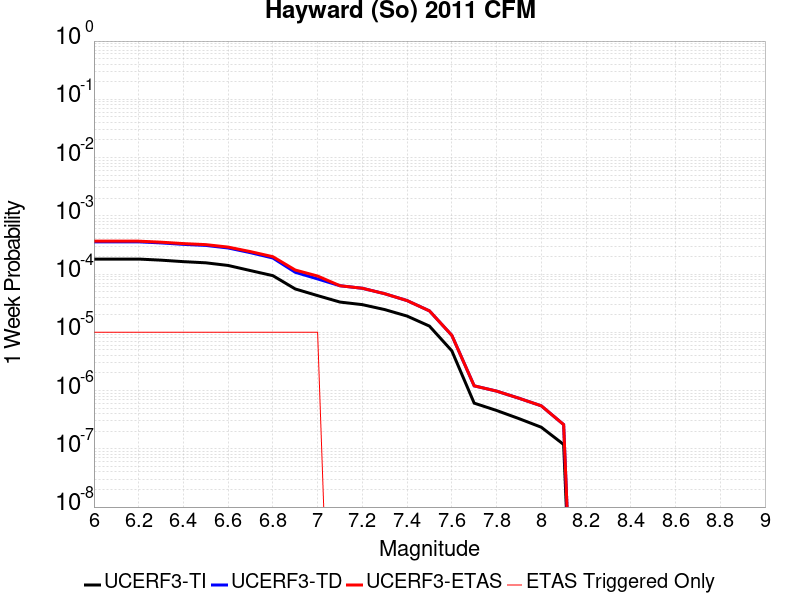 |  |  |  |

| Magnitude | 1 wk TI Prob | 1 wk TD Prob | 1 wk ETAS Prob | 1 wk ETAS/TD Gain | 1 wk ETAS Triggered Only | 1 mo TI Prob | 1 mo TD Prob | 1 mo ETAS Prob | 1 mo ETAS/TD Gain | 1 mo ETAS Triggered Only | 1 yr TI Prob | 1 yr TD Prob | 1 yr ETAS Prob | 1 yr ETAS/TD Gain | 1 yr ETAS Triggered Only | 10 yr TI Prob | 10 yr TD Prob | 10 yr ETAS Prob | 10 yr ETAS/TD Gain | 10 yr ETAS Triggered Only |
|-----|-----|-----|-----|-----|-----|-----|-----|-----|-----|-----|-----|-----|-----|-----|-----|-----|-----|-----|-----|-----|
| 6.0 | 1.8091932E-4 | 3.570541E-4 | 3.692389E-4 | 1.034126 | 1.2189176E-5 | 7.751381E-4 | 0.0015293444 | 0.0015415149 | 1.007958 | 1.2189176E-5 | 0.00939654 | 0.018463207 | 0.018475173 | 1.000648 | 1.2189176E-5 | 0.090090066 | 0.16673161 | 0.16674177 | 1.0000609 | 1.2189176E-5 |
| 6.1 | 1.8091932E-4 | 3.570541E-4 | 3.692389E-4 | 1.034126 | 1.2189176E-5 | 7.751381E-4 | 0.0015293444 | 0.0015415149 | 1.007958 | 1.2189176E-5 | 0.00939654 | 0.018463207 | 0.018475173 | 1.000648 | 1.2189176E-5 | 0.090090066 | 0.16673161 | 0.16674177 | 1.0000609 | 1.2189176E-5 |
| 6.2 | 1.8091932E-4 | 3.570541E-4 | 3.692389E-4 | 1.034126 | 1.2189176E-5 | 7.751381E-4 | 0.0015293444 | 0.0015415149 | 1.007958 | 1.2189176E-5 | 0.00939654 | 0.018463207 | 0.018475173 | 1.000648 | 1.2189176E-5 | 0.090090066 | 0.16673161 | 0.16674177 | 1.0000609 | 1.2189176E-5 |
| 6.3 | 1.7322872E-4 | 3.426234E-4 | 3.548084E-4 | 1.0355638 | 1.2189176E-5 | 7.4219756E-4 | 0.0014675693 | 0.0014797406 | 1.0082935 | 1.2189176E-5 | 0.0089988755 | 0.017723544 | 0.017735517 | 1.0006756 | 1.2189176E-5 | 0.08643075 | 0.16066726 | 0.1606775 | 1.0000637 | 1.2189176E-5 |
| 6.4 | 1.6334097E-4 | 3.234411E-4 | 3.3562633E-4 | 1.0376737 | 1.2189176E-5 | 6.998449E-4 | 0.0013854484 | 0.0013976208 | 1.0087858 | 1.2189176E-5 | 0.008487372 | 0.016739385 | 0.01675137 | 1.000716 | 1.2189176E-5 | 0.081704415 | 0.15255594 | 0.15256627 | 1.0000677 | 1.2189176E-5 |
| 6.5 | 1.5600289E-4 | 3.1018828E-4 | 3.2237367E-4 | 1.0392839 | 1.2189176E-5 | 6.684125E-4 | 0.0013287093 | 0.0013408823 | 1.0091615 | 1.2189176E-5 | 0.008107598 | 0.016058935 | 0.016070928 | 1.0007468 | 1.2189176E-5 | 0.078181036 | 0.14683272 | 0.1468431 | 1.0000708 | 1.2189176E-5 |
| 6.6 | 1.4046066E-4 | 2.8032906E-4 | 2.9251483E-4 | 1.0434694 | 1.2189176E-5 | 6.018354E-4 | 0.0012008639 | 0.0012130385 | 1.0101382 | 1.2189176E-5 | 0.0073027555 | 0.014524006 | 0.0145360185 | 1.0008271 | 1.2189176E-5 | 0.07067384 | 0.13391982 | 0.13393039 | 1.0000788 | 1.2189176E-5 |
| 6.7 | 1.14696966E-4 | 2.3271477E-4 | 2.449011E-4 | 1.052366 | 1.2189176E-5 | 4.914658E-4 | 9.969729E-4 | 0.0010091498 | 1.012214 | 1.2189176E-5 | 0.0059671924 | 0.012071652 | 0.012083694 | 1.0009975 | 1.2189176E-5 | 0.058094822 | 0.11274672 | 0.11275754 | 1.000096 | 1.2189176E-5 |
| 6.8 | 9.3874296E-5 | 1.8861453E-4 | 2.0080141E-4 | 1.0646126 | 1.2189176E-5 | 4.0225635E-4 | 8.0810126E-4 | 8.202806E-4 | 1.0150715 | 1.2189176E-5 | 0.0048864787 | 0.009794984 | 0.009807054 | 1.0012323 | 1.2189176E-5 | 0.047804173 | 0.09259856 | 0.09260962 | 1.0001194 | 1.2189176E-5 |
| 6.9 | 5.551852E-5 | 1.072948E-4 | 1.1948267E-4 | 1.1135924 | 1.2189176E-5 | 2.3791482E-4 | 4.5975443E-4 | 4.71938E-4 | 1.0265002 | 1.2189176E-5 | 0.0028927654 | 0.0055832625 | 0.0055953837 | 1.0021709 | 1.2189176E-5 | 0.028553981 | 0.054245494 | 0.05425702 | 1.0002126 | 1.2189176E-5 |
| 7.0 | 4.2662363E-5 | 8.2464416E-5 | 9.465259E-5 | 1.1477991 | 1.2189176E-5 | 1.8282588E-4 | 3.5337146E-4 | 3.6555633E-4 | 1.0344818 | 1.2189176E-5 | 0.0022236328 | 0.0042938837 | 0.0043060207 | 1.0028266 | 1.2189176E-5 | 0.022015138 | 0.042064495 | 0.04207617 | 1.0002776 | 1.2189176E-5 |
| 7.1 | 3.305886E-5 | 6.3019055E-5 | 6.3019055E-5 | 1.0 | 0.0 | 1.4167312E-4 | 2.700538E-4 | 2.700538E-4 | 1.0 | 0.0 | 0.0017235056 | 0.0032829668 | 0.0032829668 | 1.0 | 0.0 | 0.017101998 | 0.032452874 | 0.032452874 | 1.0 | 0.0 |
| 7.2 | 2.9856887E-5 | 5.7013647E-5 | 5.7013647E-5 | 1.0 | 0.0 | 1.2795182E-4 | 2.4432142E-4 | 2.4432142E-4 | 1.0 | 0.0 | 0.0015567001 | 0.0029705726 | 0.0029705726 | 1.0 | 0.0 | 0.015458403 | 0.029453589 | 0.029453589 | 1.0 | 0.0 |
| 7.3 | 2.4559737E-5 | 4.599088E-5 | 4.599088E-5 | 1.0 | 0.0 | 1.0525176E-4 | 1.9708896E-4 | 1.9708896E-4 | 1.0 | 0.0 | 0.0012806869 | 0.0023969305 | 0.0023969305 | 1.0 | 0.0 | 0.012733313 | 0.023857482 | 0.023857482 | 1.0 | 0.0 |
| 7.4 | 1.9002231E-5 | 3.5049303E-5 | 3.5049303E-5 | 1.0 | 0.0 | 8.143559E-5 | 1.502027E-4 | 1.502027E-4 | 1.0 | 0.0 | 9.910273E-4 | 0.0018271938 | 0.0018271938 | 1.0 | 0.0 | 0.009866194 | 0.018258283 | 0.018258283 | 1.0 | 0.0 |
| 7.5 | 1.2783333E-5 | 2.3330069E-5 | 2.3330069E-5 | 1.0 | 0.0 | 5.4784563E-5 | 9.998221E-5 | 9.998221E-5 | 1.0 | 0.0 | 6.667979E-4 | 0.0012166094 | 0.0012166094 | 1.0 | 0.0 | 0.006648007 | 0.012209582 | 0.012209582 | 1.0 | 0.0 |
| 7.6 | 4.8149627E-6 | 8.887544E-6 | 8.887544E-6 | 1.0 | 0.0 | 2.063539E-5 | 3.8088925E-5 | 3.8088925E-5 | 1.0 | 0.0 | 2.5120692E-4 | 4.636352E-4 | 4.636352E-4 | 1.0 | 0.0 | 0.0025092314 | 0.0046812436 | 0.0046812436 | 1.0 | 0.0 |
| 7.7 | 6.0838227E-7 | 1.2056693E-6 | 1.2056693E-6 | 1.0 | 0.0 | 2.6073499E-6 | 5.1671436E-6 | 5.1671436E-6 | 1.0 | 0.0 | 3.174402E-5 | 6.290816E-5 | 6.290816E-5 | 1.0 | 0.0 | 3.1739488E-4 | 6.5293367E-4 | 6.5293367E-4 | 1.0 | 0.0 |
| 7.8 | 4.5542808E-7 | 9.792182E-7 | 9.792182E-7 | 1.0 | 0.0 | 1.9518332E-6 | 4.1966427E-6 | 4.1966427E-6 | 1.0 | 0.0 | 2.376331E-5 | 5.1092928E-5 | 5.1092928E-5 | 1.0 | 0.0 | 2.3760769E-4 | 5.321372E-4 | 5.321372E-4 | 1.0 | 0.0 |
| 7.9 | 3.3016747E-7 | 7.386335E-7 | 7.386335E-7 | 1.0 | 0.0 | 1.4150027E-6 | 3.1655684E-6 | 3.1655684E-6 | 1.0 | 0.0 | 1.7227521E-5 | 3.8540114E-5 | 3.8540114E-5 | 1.0 | 0.0 | 1.7226185E-4 | 3.9930744E-4 | 3.9930744E-4 | 1.0 | 0.0 |
| 8.0 | 2.347038E-7 | 5.4714894E-7 | 5.4714894E-7 | 1.0 | 0.0 | 1.0058731E-6 | 2.344922E-6 | 2.344922E-6 | 1.0 | 0.0 | 1.2246436E-5 | 2.8549053E-5 | 2.8549053E-5 | 1.0 | 0.0 | 1.2245761E-4 | 2.9355253E-4 | 2.9355253E-4 | 1.0 | 0.0 |
| 8.1 | 1.18822804E-7 | 2.6058973E-7 | 2.6058973E-7 | 1.0 | 0.0 | 5.092405E-7 | 1.1168127E-6 | 1.1168127E-6 | 1.0 | 0.0 | 6.1999854E-6 | 1.359711E-5 | 1.359711E-5 | 1.0 | 0.0 | 6.199812E-5 | 1.3917852E-4 | 1.3917852E-4 | 1.0 | 0.0 |

## Cleghorn
*[(top)](#table-of-contents)*

| 1 Week | 1 Month | 1 Year | 10 Year |
|-----|-----|-----|-----|
|  |  |  |  |

| Magnitude | 1 wk TI Prob | 1 wk TD Prob | 1 wk ETAS Prob | 1 wk ETAS/TD Gain | 1 wk ETAS Triggered Only | 1 mo TI Prob | 1 mo TD Prob | 1 mo ETAS Prob | 1 mo ETAS/TD Gain | 1 mo ETAS Triggered Only | 1 yr TI Prob | 1 yr TD Prob | 1 yr ETAS Prob | 1 yr ETAS/TD Gain | 1 yr ETAS Triggered Only | 10 yr TI Prob | 10 yr TD Prob | 10 yr ETAS Prob | 10 yr ETAS/TD Gain | 10 yr ETAS Triggered Only |
|-----|-----|-----|-----|-----|-----|-----|-----|-----|-----|-----|-----|-----|-----|-----|-----|-----|-----|-----|-----|-----|
| 6.0 | 7.9267165E-6 | 9.831582E-6 | 9.831582E-6 | 1.0 | 0.0 | 3.39712E-5 | 4.2134732E-5 | 4.2134732E-5 | 1.0 | 0.0 | 4.1352084E-4 | 5.128803E-4 | 5.250632E-4 | 1.0237539 | 1.2189176E-5 | 0.004127522 | 0.0051320773 | 0.0051442035 | 1.0023628 | 1.2189176E-5 |
| 6.1 | 7.9267165E-6 | 9.831582E-6 | 9.831582E-6 | 1.0 | 0.0 | 3.39712E-5 | 4.2134732E-5 | 4.2134732E-5 | 1.0 | 0.0 | 4.1352084E-4 | 5.128803E-4 | 5.250632E-4 | 1.0237539 | 1.2189176E-5 | 0.004127522 | 0.0051320773 | 0.0051442035 | 1.0023628 | 1.2189176E-5 |
| 6.2 | 7.9267165E-6 | 9.831582E-6 | 9.831582E-6 | 1.0 | 0.0 | 3.39712E-5 | 4.2134732E-5 | 4.2134732E-5 | 1.0 | 0.0 | 4.1352084E-4 | 5.128803E-4 | 5.250632E-4 | 1.0237539 | 1.2189176E-5 | 0.004127522 | 0.0051320773 | 0.0051442035 | 1.0023628 | 1.2189176E-5 |
| 6.3 | 7.9267165E-6 | 9.831582E-6 | 9.831582E-6 | 1.0 | 0.0 | 3.39712E-5 | 4.2134732E-5 | 4.2134732E-5 | 1.0 | 0.0 | 4.1352084E-4 | 5.128803E-4 | 5.250632E-4 | 1.0237539 | 1.2189176E-5 | 0.004127522 | 0.0051320773 | 0.0051442035 | 1.0023628 | 1.2189176E-5 |
| 6.4 | 4.3445207E-6 | 6.0914435E-6 | 6.0914435E-6 | 1.0 | 0.0 | 1.8619241E-5 | 2.610593E-5 | 2.610593E-5 | 1.0 | 0.0 | 2.2666567E-4 | 3.1779436E-4 | 3.2997967E-4 | 1.0383433 | 1.2189176E-5 | 0.0022643462 | 0.0031875873 | 0.0031997375 | 1.0038117 | 1.2189176E-5 |
| 6.5 | 4.3445207E-6 | 6.0914435E-6 | 6.0914435E-6 | 1.0 | 0.0 | 1.8619241E-5 | 2.610593E-5 | 2.610593E-5 | 1.0 | 0.0 | 2.2666567E-4 | 3.1779436E-4 | 3.2997967E-4 | 1.0383433 | 1.2189176E-5 | 0.0022643462 | 0.0031875873 | 0.0031997375 | 1.0038117 | 1.2189176E-5 |
| 6.6 | 4.040109E-6 | 5.773851E-6 | 5.773851E-6 | 1.0 | 0.0 | 1.7314638E-5 | 2.4744846E-5 | 2.4744846E-5 | 1.0 | 0.0 | 2.1078532E-4 | 3.012278E-4 | 3.134133E-4 | 1.0404528 | 1.2189176E-5 | 0.002105855 | 0.003022377 | 0.0030345293 | 1.0040208 | 1.2189176E-5 |
| 6.7 | 3.3632055E-6 | 5.067348E-6 | 5.067348E-6 | 1.0 | 0.0 | 1.4413658E-5 | 2.1717027E-5 | 2.1717027E-5 | 1.0 | 0.0 | 1.7547216E-4 | 2.6437303E-4 | 2.6437303E-4 | 1.0 | 0.0 | 0.0017533366 | 0.0026547113 | 0.0026547113 | 1.0 | 0.0 |
| 6.8 | 3.2902772E-6 | 4.9892556E-6 | 4.9892556E-6 | 1.0 | 0.0 | 1.4101111E-5 | 2.1382351E-5 | 2.1382351E-5 | 1.0 | 0.0 | 1.716675E-4 | 2.6029933E-4 | 2.6029933E-4 | 1.0 | 0.0 | 0.0017153495 | 0.0026140702 | 0.0026140702 | 1.0 | 0.0 |
| 6.9 | 3.031547E-6 | 4.6910186E-6 | 4.6910186E-6 | 1.0 | 0.0 | 1.299228E-5 | 2.0104211E-5 | 2.0104211E-5 | 1.0 | 0.0 | 1.5816953E-4 | 2.4474156E-4 | 2.4474156E-4 | 1.0 | 0.0 | 0.00158057 | 0.0024588439 | 0.0024588439 | 1.0 | 0.0 |
| 7.0 | 2.8259715E-6 | 4.3705895E-6 | 4.3705895E-6 | 1.0 | 0.0 | 1.211125E-5 | 1.8730963E-5 | 1.8730963E-5 | 1.0 | 0.0 | 1.4744449E-4 | 2.2802586E-4 | 2.2802586E-4 | 1.0 | 0.0 | 0.001473467 | 0.0022920412 | 0.0022920412 | 1.0 | 0.0 |
| 7.1 | 2.5962665E-6 | 4.0658106E-6 | 4.0658106E-6 | 1.0 | 0.0 | 1.1126809E-5 | 1.7424789E-5 | 1.7424789E-5 | 1.0 | 0.0 | 1.3546048E-4 | 2.1212637E-4 | 2.1212637E-4 | 1.0 | 0.0 | 0.0013537793 | 0.002133366 | 0.002133366 | 1.0 | 0.0 |
| 7.2 | 2.3247253E-6 | 3.6763672E-6 | 3.6763672E-6 | 1.0 | 0.0 | 9.96307E-6 | 1.5755764E-5 | 1.5755764E-5 | 1.0 | 0.0 | 1.21293626E-4 | 1.9180974E-4 | 1.9180974E-4 | 1.0 | 0.0 | 0.0012122744 | 0.0019305905 | 0.0019305905 | 1.0 | 0.0 |
| 7.3 | 2.056928E-6 | 3.2350938E-6 | 3.2350938E-6 | 1.0 | 0.0 | 8.815376E-6 | 1.3864615E-5 | 1.3864615E-5 | 1.0 | 0.0 | 1.0732192E-4 | 1.6878877E-4 | 1.6878877E-4 | 1.0 | 0.0 | 0.001072701 | 0.0017008206 | 0.0017008206 | 1.0 | 0.0 |
| 7.4 | 1.8055999E-6 | 2.8255042E-6 | 2.8255042E-6 | 1.0 | 0.0 | 7.738263E-6 | 1.2109249E-5 | 1.2109249E-5 | 1.0 | 0.0 | 9.4209274E-5 | 1.4742027E-4 | 1.4742027E-4 | 1.0 | 0.0 | 9.4169343E-4 | 0.0014875771 | 0.0014875771 | 1.0 | 0.0 |
| 7.5 | 1.4683443E-6 | 2.4247483E-6 | 2.4247483E-6 | 1.0 | 0.0 | 6.292889E-6 | 1.0391738E-5 | 1.0391738E-5 | 1.0 | 0.0 | 7.661323E-5 | 1.2651215E-4 | 1.2651215E-4 | 1.0 | 0.0 | 7.658682E-4 | 0.0012787961 | 0.0012787961 | 1.0 | 0.0 |
| 7.6 | 9.804088E-7 | 1.900266E-6 | 1.900266E-6 | 1.0 | 0.0 | 4.201745E-6 | 8.143972E-6 | 8.143972E-6 | 1.0 | 0.0 | 5.1155046E-5 | 9.91484E-5 | 9.91484E-5 | 1.0 | 0.0 | 5.114327E-4 | 0.001005471 | 0.001005471 | 1.0 | 0.0 |
| 7.7 | 7.3434086E-7 | 1.6284146E-6 | 1.6284146E-6 | 1.0 | 0.0 | 3.1471714E-6 | 6.978901E-6 | 6.978901E-6 | 1.0 | 0.0 | 3.831614E-5 | 8.4964835E-5 | 8.4964835E-5 | 1.0 | 0.0 | 3.8309532E-4 | 8.6378685E-4 | 8.6378685E-4 | 1.0 | 0.0 |
| 7.8 | 6.434184E-7 | 1.5220047E-6 | 1.5220047E-6 | 1.0 | 0.0 | 2.7575045E-6 | 6.5228614E-6 | 6.5228614E-6 | 1.0 | 0.0 | 3.35721E-5 | 7.941297E-5 | 7.941297E-5 | 1.0 | 0.0 | 3.3567028E-4 | 8.079678E-4 | 8.079678E-4 | 1.0 | 0.0 |
| 7.9 | 3.4943926E-7 | 7.574459E-7 | 7.574459E-7 | 1.0 | 0.0 | 1.497596E-6 | 3.2461926E-6 | 3.2461926E-6 | 1.0 | 0.0 | 1.8233079E-5 | 3.952169E-5 | 3.952169E-5 | 1.0 | 0.0 | 1.8231584E-4 | 4.040099E-4 | 4.040099E-4 | 1.0 | 0.0 |
| 8.0 | 6.717524E-8 | 5.838828E-8 | 5.838828E-8 | 1.0 | 0.0 | 2.8789387E-7 | 2.5023547E-7 | 2.5023547E-7 | 1.0 | 0.0 | 3.505102E-6 | 3.0466126E-6 | 3.0466126E-6 | 1.0 | 0.0 | 3.5050467E-5 | 3.273506E-5 | 3.273506E-5 | 1.0 | 0.0 |
| 8.1 | 3.1984914E-8 | 1.2956093E-8 | 1.2956093E-8 | 1.0 | 0.0 | 1.370782E-7 | 5.552611E-8 | 5.552611E-8 | 1.0 | 0.0 | 1.6689258E-6 | 6.760302E-7 | 6.760302E-7 | 1.0 | 0.0 | 1.6689133E-5 | 7.74454E-6 | 7.74454E-6 | 1.0 | 0.0 |
| 8.2 | 1.21887656E-8 | 3.6495305E-9 | 3.6495305E-9 | 1.0 | 0.0 | 5.2237567E-8 | 1.5640845E-8 | 1.5640845E-8 | 1.0 | 0.0 | 6.359922E-7 | 1.9042727E-7 | 1.9042727E-7 | 1.0 | 0.0 | 6.3599036E-6 | 2.2470974E-6 | 2.2470974E-6 | 1.0 | 0.0 |

## Dry Mountain
*[(top)](#table-of-contents)*

| 1 Week | 1 Month | 1 Year | 10 Year |
|-----|-----|-----|-----|
|  |  |  |  |

| Magnitude | 1 wk TI Prob | 1 wk TD Prob | 1 wk ETAS Prob | 1 wk ETAS/TD Gain | 1 wk ETAS Triggered Only | 1 mo TI Prob | 1 mo TD Prob | 1 mo ETAS Prob | 1 mo ETAS/TD Gain | 1 mo ETAS Triggered Only | 1 yr TI Prob | 1 yr TD Prob | 1 yr ETAS Prob | 1 yr ETAS/TD Gain | 1 yr ETAS Triggered Only | 10 yr TI Prob | 10 yr TD Prob | 10 yr ETAS Prob | 10 yr ETAS/TD Gain | 10 yr ETAS Triggered Only |
|-----|-----|-----|-----|-----|-----|-----|-----|-----|-----|-----|-----|-----|-----|-----|-----|-----|-----|-----|-----|-----|
| 6.0 | 6.222801E-6 | 6.439381E-6 | 1.862848E-5 | 2.8928988 | 1.2189176E-5 | 2.6668875E-5 | 2.7597147E-5 | 3.9785984E-5 | 1.4416703 | 1.2189176E-5 | 3.2464517E-4 | 3.3595937E-4 | 3.4814444E-4 | 1.0362695 | 1.2189176E-5 | 0.0032417132 | 0.0033560768 | 0.0033682252 | 1.0036198 | 1.2189176E-5 |
| 6.1 | 6.222801E-6 | 6.439381E-6 | 1.862848E-5 | 2.8928988 | 1.2189176E-5 | 2.6668875E-5 | 2.7597147E-5 | 3.9785984E-5 | 1.4416703 | 1.2189176E-5 | 3.2464517E-4 | 3.3595937E-4 | 3.4814444E-4 | 1.0362695 | 1.2189176E-5 | 0.0032417132 | 0.0033560768 | 0.0033682252 | 1.0036198 | 1.2189176E-5 |
| 6.2 | 6.222801E-6 | 6.439381E-6 | 1.862848E-5 | 2.8928988 | 1.2189176E-5 | 2.6668875E-5 | 2.7597147E-5 | 3.9785984E-5 | 1.4416703 | 1.2189176E-5 | 3.2464517E-4 | 3.3595937E-4 | 3.4814444E-4 | 1.0362695 | 1.2189176E-5 | 0.0032417132 | 0.0033560768 | 0.0033682252 | 1.0036198 | 1.2189176E-5 |
| 6.3 | 6.222801E-6 | 6.439381E-6 | 1.862848E-5 | 2.8928988 | 1.2189176E-5 | 2.6668875E-5 | 2.7597147E-5 | 3.9785984E-5 | 1.4416703 | 1.2189176E-5 | 3.2464517E-4 | 3.3595937E-4 | 3.4814444E-4 | 1.0362695 | 1.2189176E-5 | 0.0032417132 | 0.0033560768 | 0.0033682252 | 1.0036198 | 1.2189176E-5 |
| 6.4 | 6.222801E-6 | 6.439381E-6 | 1.862848E-5 | 2.8928988 | 1.2189176E-5 | 2.6668875E-5 | 2.7597147E-5 | 3.9785984E-5 | 1.4416703 | 1.2189176E-5 | 3.2464517E-4 | 3.3595937E-4 | 3.4814444E-4 | 1.0362695 | 1.2189176E-5 | 0.0032417132 | 0.0033560768 | 0.0033682252 | 1.0036198 | 1.2189176E-5 |
| 6.5 | 2.8528623E-6 | 2.9521684E-6 | 2.9521684E-6 | 1.0 | 0.0 | 1.22264955E-5 | 1.2652138E-5 | 1.2652138E-5 | 1.0 | 0.0 | 1.4884741E-4 | 1.540376E-4 | 1.540376E-4 | 1.0 | 0.0 | 0.0014874774 | 0.0015401616 | 0.0015401616 | 1.0 | 0.0 |
| 6.6 | 2.8528623E-6 | 2.9521684E-6 | 2.9521684E-6 | 1.0 | 0.0 | 1.22264955E-5 | 1.2652138E-5 | 1.2652138E-5 | 1.0 | 0.0 | 1.4884741E-4 | 1.540376E-4 | 1.540376E-4 | 1.0 | 0.0 | 0.0014874774 | 0.0015401616 | 0.0015401616 | 1.0 | 0.0 |
| 6.7 | 2.541E-6 | 2.6293578E-6 | 2.6293578E-6 | 1.0 | 0.0 | 1.0889954E-5 | 1.1268677E-5 | 1.1268677E-5 | 1.0 | 0.0 | 1.3257713E-4 | 1.3719614E-4 | 1.3719614E-4 | 1.0 | 0.0 | 0.0013249806 | 0.0013719613 | 0.0013719613 | 1.0 | 0.0 |

## Compton
*[(top)](#table-of-contents)*

| 1 Week | 1 Month | 1 Year | 10 Year |
|-----|-----|-----|-----|
|  |  |  | 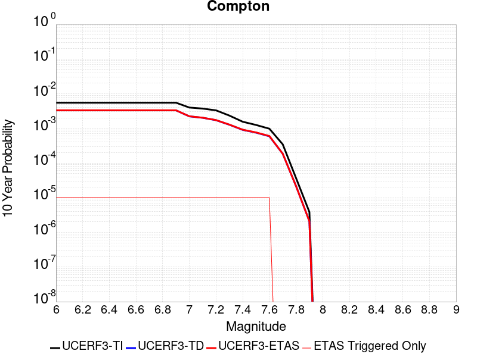 |

| Magnitude | 1 wk TI Prob | 1 wk TD Prob | 1 wk ETAS Prob | 1 wk ETAS/TD Gain | 1 wk ETAS Triggered Only | 1 mo TI Prob | 1 mo TD Prob | 1 mo ETAS Prob | 1 mo ETAS/TD Gain | 1 mo ETAS Triggered Only | 1 yr TI Prob | 1 yr TD Prob | 1 yr ETAS Prob | 1 yr ETAS/TD Gain | 1 yr ETAS Triggered Only | 10 yr TI Prob | 10 yr TD Prob | 10 yr ETAS Prob | 10 yr ETAS/TD Gain | 10 yr ETAS Triggered Only |
|-----|-----|-----|-----|-----|-----|-----|-----|-----|-----|-----|-----|-----|-----|-----|-----|-----|-----|-----|-----|-----|
| 6.0 | 1.06050875E-5 | 6.358671E-6 | 1.854777E-5 | 2.9169257 | 1.2189176E-5 | 4.5449582E-5 | 2.7251177E-5 | 3.944002E-5 | 1.4472777 | 1.2189176E-5 | 5.5320817E-4 | 3.317354E-4 | 3.4392055E-4 | 1.0367315 | 1.2189176E-5 | 0.0055183303 | 0.0033126862 | 0.0033248349 | 1.0036674 | 1.2189176E-5 |
| 6.1 | 1.06050875E-5 | 6.358671E-6 | 1.854777E-5 | 2.9169257 | 1.2189176E-5 | 4.5449582E-5 | 2.7251177E-5 | 3.944002E-5 | 1.4472777 | 1.2189176E-5 | 5.5320817E-4 | 3.317354E-4 | 3.4392055E-4 | 1.0367315 | 1.2189176E-5 | 0.0055183303 | 0.0033126862 | 0.0033248349 | 1.0036674 | 1.2189176E-5 |
| 6.2 | 1.06050875E-5 | 6.358671E-6 | 1.854777E-5 | 2.9169257 | 1.2189176E-5 | 4.5449582E-5 | 2.7251177E-5 | 3.944002E-5 | 1.4472777 | 1.2189176E-5 | 5.5320817E-4 | 3.317354E-4 | 3.4392055E-4 | 1.0367315 | 1.2189176E-5 | 0.0055183303 | 0.0033126862 | 0.0033248349 | 1.0036674 | 1.2189176E-5 |
| 6.3 | 1.06050875E-5 | 6.358671E-6 | 1.854777E-5 | 2.9169257 | 1.2189176E-5 | 4.5449582E-5 | 2.7251177E-5 | 3.944002E-5 | 1.4472777 | 1.2189176E-5 | 5.5320817E-4 | 3.317354E-4 | 3.4392055E-4 | 1.0367315 | 1.2189176E-5 | 0.0055183303 | 0.0033126862 | 0.0033248349 | 1.0036674 | 1.2189176E-5 |
| 6.4 | 1.06050875E-5 | 6.358671E-6 | 1.854777E-5 | 2.9169257 | 1.2189176E-5 | 4.5449582E-5 | 2.7251177E-5 | 3.944002E-5 | 1.4472777 | 1.2189176E-5 | 5.5320817E-4 | 3.317354E-4 | 3.4392055E-4 | 1.0367315 | 1.2189176E-5 | 0.0055183303 | 0.0033126862 | 0.0033248349 | 1.0036674 | 1.2189176E-5 |
| 6.5 | 1.06050875E-5 | 6.358671E-6 | 1.854777E-5 | 2.9169257 | 1.2189176E-5 | 4.5449582E-5 | 2.7251177E-5 | 3.944002E-5 | 1.4472777 | 1.2189176E-5 | 5.5320817E-4 | 3.317354E-4 | 3.4392055E-4 | 1.0367315 | 1.2189176E-5 | 0.0055183303 | 0.0033126862 | 0.0033248349 | 1.0036674 | 1.2189176E-5 |
| 6.6 | 1.06050875E-5 | 6.358671E-6 | 1.854777E-5 | 2.9169257 | 1.2189176E-5 | 4.5449582E-5 | 2.7251177E-5 | 3.944002E-5 | 1.4472777 | 1.2189176E-5 | 5.5320817E-4 | 3.317354E-4 | 3.4392055E-4 | 1.0367315 | 1.2189176E-5 | 0.0055183303 | 0.0033126862 | 0.0033248349 | 1.0036674 | 1.2189176E-5 |
| 6.7 | 1.06050875E-5 | 6.358671E-6 | 1.854777E-5 | 2.9169257 | 1.2189176E-5 | 4.5449582E-5 | 2.7251177E-5 | 3.944002E-5 | 1.4472777 | 1.2189176E-5 | 5.5320817E-4 | 3.317354E-4 | 3.4392055E-4 | 1.0367315 | 1.2189176E-5 | 0.0055183303 | 0.0033126862 | 0.0033248349 | 1.0036674 | 1.2189176E-5 |
| 6.8 | 1.06050875E-5 | 6.358671E-6 | 1.854777E-5 | 2.9169257 | 1.2189176E-5 | 4.5449582E-5 | 2.7251177E-5 | 3.944002E-5 | 1.4472777 | 1.2189176E-5 | 5.5320817E-4 | 3.317354E-4 | 3.4392055E-4 | 1.0367315 | 1.2189176E-5 | 0.0055183303 | 0.0033126862 | 0.0033248349 | 1.0036674 | 1.2189176E-5 |
| 6.9 | 1.06050875E-5 | 6.358671E-6 | 1.854777E-5 | 2.9169257 | 1.2189176E-5 | 4.5449582E-5 | 2.7251177E-5 | 3.944002E-5 | 1.4472777 | 1.2189176E-5 | 5.5320817E-4 | 3.317354E-4 | 3.4392055E-4 | 1.0367315 | 1.2189176E-5 | 0.0055183303 | 0.0033126862 | 0.0033248349 | 1.0036674 | 1.2189176E-5 |
| 7.0 | 7.672486E-6 | 4.2720512E-6 | 1.6461176E-5 | 3.8532252 | 1.2189176E-5 | 3.288167E-5 | 1.8308665E-5 | 3.0497618E-5 | 1.6657478 | 1.2189176E-5 | 4.0026082E-4 | 2.2288582E-4 | 2.3507228E-4 | 1.0546758 | 1.2189176E-5 | 0.0039954064 | 0.002226685 | 0.0022388468 | 1.0054619 | 1.2189176E-5 |
| 7.1 | 7.163992E-6 | 3.883762E-6 | 1.607289E-5 | 4.138485 | 1.2189176E-5 | 3.0702464E-5 | 1.6644592E-5 | 2.8833565E-5 | 1.7323084 | 1.2189176E-5 | 3.7373835E-4 | 2.0262963E-4 | 2.1481633E-4 | 1.0601428 | 1.2189176E-5 | 0.0037311043 | 0.0020245055 | 0.0020366702 | 1.0060086 | 1.2189176E-5 |
| 7.2 | 6.3689185E-6 | 3.3102428E-6 | 1.5499378E-5 | 4.682248 | 1.2189176E-5 | 2.729508E-5 | 1.418668E-5 | 2.6375683E-5 | 1.8591864 | 1.2189176E-5 | 3.322669E-4 | 1.7270957E-4 | 1.8489663E-4 | 1.0705639 | 1.2189176E-5 | 0.0033177056 | 0.0017257951 | 0.0017379633 | 1.0070508 | 1.2189176E-5 |
| 7.3 | 4.4987873E-6 | 2.4480942E-6 | 1.463724E-5 | 5.979035 | 1.2189176E-5 | 1.9280375E-5 | 1.0491792E-5 | 2.268084E-5 | 2.1617699 | 1.2189176E-5 | 2.3471327E-4 | 1.2773038E-4 | 1.39918E-4 | 1.0954168 | 1.2189176E-5 | 0.002344655 | 0.0012765999 | 0.0012887735 | 1.0095359 | 1.2189176E-5 |
| 7.4 | 2.987296E-6 | 1.7394335E-6 | 1.39285885E-5 | 8.007543 | 1.2189176E-5 | 1.2802635E-5 | 7.454694E-6 | 1.964378E-5 | 2.6350887 | 1.2189176E-5 | 1.5586092E-4 | 9.0757174E-5 | 1.0294525E-4 | 1.1342932 | 1.2189176E-5 | 0.0015575165 | 9.072069E-4 | 9.19385E-4 | 1.0134238 | 1.2189176E-5 |
| 7.5 | 2.4111696E-6 | 1.4472155E-6 | 1.3636374E-5 | 9.42249 | 1.2189176E-5 | 1.0333543E-5 | 6.2023378E-6 | 1.8391438E-5 | 2.9652429 | 1.2189176E-5 | 1.2580362E-4 | 7.551089E-5 | 8.769915E-5 | 1.1614106 | 1.2189176E-5 | 0.0012573242 | 7.54857E-4 | 7.67037E-4 | 1.0161355 | 1.2189176E-5 |
| 7.6 | 1.8783096E-6 | 1.1360459E-6 | 1.3325208E-5 | 11.729463 | 1.2189176E-5 | 8.049874E-6 | 4.8687593E-6 | 1.7057875E-5 | 3.5035365 | 1.2189176E-5 | 9.8002805E-5 | 5.927557E-5 | 7.146403E-5 | 1.2056235 | 1.2189176E-5 | 9.795959E-4 | 5.926016E-4 | 6.0478353E-4 | 1.0205567 | 1.2189176E-5 |
| 7.7 | 6.6646817E-7 | 3.560237E-7 | 3.560237E-7 | 1.0 | 0.0 | 2.856289E-6 | 1.525815E-6 | 1.525815E-6 | 1.0 | 0.0 | 3.4774763E-5 | 1.8576653E-5 | 1.8576653E-5 | 1.0 | 0.0 | 3.4769322E-4 | 1.8575235E-4 | 1.8575235E-4 | 1.0 | 0.0 |
| 7.8 | 7.054689E-8 | 4.1342968E-8 | 4.1342968E-8 | 1.0 | 0.0 | 3.0234378E-7 | 1.7718413E-7 | 1.7718413E-7 | 1.0 | 0.0 | 3.6810293E-6 | 2.1572148E-6 | 2.1572148E-6 | 1.0 | 0.0 | 3.6809684E-5 | 2.1571948E-5 | 2.1571948E-5 | 1.0 | 0.0 |
| 7.9 | 7.420925E-9 | 4.0131285E-9 | 4.0131285E-9 | 1.0 | 0.0 | 3.1803964E-8 | 1.7199122E-8 | 1.7199122E-8 | 1.0 | 0.0 | 3.872132E-7 | 2.093993E-7 | 2.093993E-7 | 1.0 | 0.0 | 3.872125E-6 | 2.0939913E-6 | 2.0939913E-6 | 1.0 | 0.0 |

## Los Alamos 2011 CFM
*[(top)](#table-of-contents)*

| 1 Week | 1 Month | 1 Year | 10 Year |
|-----|-----|-----|-----|
|  | 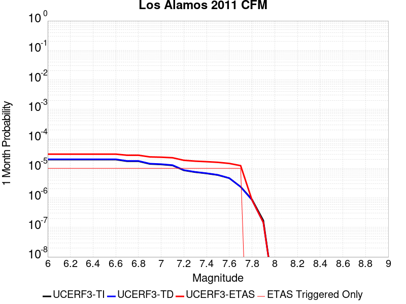 |  |  |

| Magnitude | 1 wk TI Prob | 1 wk TD Prob | 1 wk ETAS Prob | 1 wk ETAS/TD Gain | 1 wk ETAS Triggered Only | 1 mo TI Prob | 1 mo TD Prob | 1 mo ETAS Prob | 1 mo ETAS/TD Gain | 1 mo ETAS Triggered Only | 1 yr TI Prob | 1 yr TD Prob | 1 yr ETAS Prob | 1 yr ETAS/TD Gain | 1 yr ETAS Triggered Only | 10 yr TI Prob | 10 yr TD Prob | 10 yr ETAS Prob | 10 yr ETAS/TD Gain | 10 yr ETAS Triggered Only |
|-----|-----|-----|-----|-----|-----|-----|-----|-----|-----|-----|-----|-----|-----|-----|-----|-----|-----|-----|-----|-----|
| 6.0 | 4.6284417E-6 | 4.751731E-6 | 1.6940849E-5 | 3.5651953 | 1.2189176E-5 | 1.9836029E-5 | 2.0364414E-5 | 3.255334E-5 | 1.5985405 | 1.2189176E-5 | 2.4147688E-4 | 2.4791027E-4 | 2.6009645E-4 | 1.0491555 | 1.2189176E-5 | 0.0024121467 | 0.0024765113 | 0.0024886704 | 1.0049098 | 1.2189176E-5 |
| 6.1 | 4.6284417E-6 | 4.751731E-6 | 1.6940849E-5 | 3.5651953 | 1.2189176E-5 | 1.9836029E-5 | 2.0364414E-5 | 3.255334E-5 | 1.5985405 | 1.2189176E-5 | 2.4147688E-4 | 2.4791027E-4 | 2.6009645E-4 | 1.0491555 | 1.2189176E-5 | 0.0024121467 | 0.0024765113 | 0.0024886704 | 1.0049098 | 1.2189176E-5 |
| 6.2 | 4.6284417E-6 | 4.751731E-6 | 1.6940849E-5 | 3.5651953 | 1.2189176E-5 | 1.9836029E-5 | 2.0364414E-5 | 3.255334E-5 | 1.5985405 | 1.2189176E-5 | 2.4147688E-4 | 2.4791027E-4 | 2.6009645E-4 | 1.0491555 | 1.2189176E-5 | 0.0024121467 | 0.0024765113 | 0.0024886704 | 1.0049098 | 1.2189176E-5 |
| 6.3 | 4.6284417E-6 | 4.751731E-6 | 1.6940849E-5 | 3.5651953 | 1.2189176E-5 | 1.9836029E-5 | 2.0364414E-5 | 3.255334E-5 | 1.5985405 | 1.2189176E-5 | 2.4147688E-4 | 2.4791027E-4 | 2.6009645E-4 | 1.0491555 | 1.2189176E-5 | 0.0024121467 | 0.0024765113 | 0.0024886704 | 1.0049098 | 1.2189176E-5 |
| 6.4 | 4.6284417E-6 | 4.751731E-6 | 1.6940849E-5 | 3.5651953 | 1.2189176E-5 | 1.9836029E-5 | 2.0364414E-5 | 3.255334E-5 | 1.5985405 | 1.2189176E-5 | 2.4147688E-4 | 2.4791027E-4 | 2.6009645E-4 | 1.0491555 | 1.2189176E-5 | 0.0024121467 | 0.0024765113 | 0.0024886704 | 1.0049098 | 1.2189176E-5 |
| 6.5 | 4.6284417E-6 | 4.751731E-6 | 1.6940849E-5 | 3.5651953 | 1.2189176E-5 | 1.9836029E-5 | 2.0364414E-5 | 3.255334E-5 | 1.5985405 | 1.2189176E-5 | 2.4147688E-4 | 2.4791027E-4 | 2.6009645E-4 | 1.0491555 | 1.2189176E-5 | 0.0024121467 | 0.0024765113 | 0.0024886704 | 1.0049098 | 1.2189176E-5 |
| 6.6 | 4.6284417E-6 | 4.751731E-6 | 1.6940849E-5 | 3.5651953 | 1.2189176E-5 | 1.9836029E-5 | 2.0364414E-5 | 3.255334E-5 | 1.5985405 | 1.2189176E-5 | 2.4147688E-4 | 2.4791027E-4 | 2.6009645E-4 | 1.0491555 | 1.2189176E-5 | 0.0024121467 | 0.0024765113 | 0.0024886704 | 1.0049098 | 1.2189176E-5 |
| 6.7 | 4.062321E-6 | 4.166349E-6 | 1.6355474E-5 | 3.9256132 | 1.2189176E-5 | 1.7409831E-5 | 1.7855667E-5 | 3.0044625E-5 | 1.682638 | 1.2189176E-5 | 2.1194408E-4 | 2.1737257E-4 | 2.295591E-4 | 1.0560628 | 1.2189176E-5 | 0.0021174205 | 0.0021717492 | 0.0021839119 | 1.0056005 | 1.2189176E-5 |
| 6.8 | 4.062321E-6 | 4.166349E-6 | 1.6355474E-5 | 3.9256132 | 1.2189176E-5 | 1.7409831E-5 | 1.7855667E-5 | 3.0044625E-5 | 1.682638 | 1.2189176E-5 | 2.1194408E-4 | 2.1737257E-4 | 2.295591E-4 | 1.0560628 | 1.2189176E-5 | 0.0021174205 | 0.0021717492 | 0.0021839119 | 1.0056005 | 1.2189176E-5 |
| 6.9 | 3.2936077E-6 | 3.372958E-6 | 1.5562093E-5 | 4.613782 | 1.2189176E-5 | 1.4115385E-5 | 1.4455459E-5 | 2.6644459E-5 | 1.8432108 | 1.2189176E-5 | 1.7184127E-4 | 1.7598194E-4 | 1.8816897E-4 | 1.0692517 | 1.2189176E-5 | 0.0017170844 | 0.0017585184 | 0.0017706861 | 1.0069193 | 1.2189176E-5 |
| 7.0 | 3.1687898E-6 | 3.2448156E-6 | 1.5433952E-5 | 4.756496 | 1.2189176E-5 | 1.3580457E-5 | 1.3906283E-5 | 2.609529E-5 | 1.8765107 | 1.2189176E-5 | 1.6532952E-4 | 1.6929678E-4 | 1.8148389E-4 | 1.0719867 | 1.2189176E-5 | 0.0016520657 | 0.0016917696 | 0.0017039381 | 1.0071929 | 1.2189176E-5 |
| 7.1 | 2.9379228E-6 | 3.0073259E-6 | 1.5196465E-5 | 5.0531487 | 1.2189176E-5 | 1.25910365E-5 | 1.288848E-5 | 2.50775E-5 | 1.9457297 | 1.2189176E-5 | 1.5328509E-4 | 1.5690686E-4 | 1.6909413E-4 | 1.077672 | 1.2189176E-5 | 0.001531794 | 0.0015680499 | 0.00158022 | 1.0077612 | 1.2189176E-5 |
| 7.2 | 2.0020686E-6 | 2.0416298E-6 | 1.4230781E-5 | 6.9703045 | 1.2189176E-5 | 8.580266E-6 | 8.749813E-6 | 2.0938882E-5 | 2.3930662 | 1.2189176E-5 | 1.0445973E-4 | 1.0652381E-4 | 1.1871169E-4 | 1.1144146 | 1.2189176E-5 | 0.0010441064 | 0.001064732 | 0.0010769081 | 1.011436 | 1.2189176E-5 |
| 7.3 | 1.7364243E-6 | 1.7678802E-6 | 1.3957035E-5 | 7.894785 | 1.2189176E-5 | 7.441797E-6 | 7.576608E-6 | 1.9765692E-5 | 2.6087785 | 1.2189176E-5 | 9.0600115E-5 | 9.2241324E-5 | 1.04429375E-4 | 1.1321322 | 1.2189176E-5 | 9.0563187E-4 | 9.2203356E-4 | 9.342115E-4 | 1.0132077 | 1.2189176E-5 |
| 7.4 | 1.5718434E-6 | 1.5983177E-6 | 1.3787474E-5 | 8.626242 | 1.2189176E-5 | 6.7364545E-6 | 6.849915E-6 | 1.9039007E-5 | 2.7794516 | 1.2189176E-5 | 8.201325E-5 | 8.339455E-5 | 9.558271E-5 | 1.1461506 | 1.2189176E-5 | 8.198299E-4 | 8.3363557E-4 | 8.458146E-4 | 1.0146096 | 1.2189176E-5 |
| 7.5 | 1.3841119E-6 | 1.4042793E-6 | 1.3593438E-5 | 9.680011 | 1.2189176E-5 | 5.9318945E-6 | 6.0183256E-6 | 1.820743E-5 | 3.025331 | 1.2189176E-5 | 7.221842E-5 | 7.327068E-5 | 8.545897E-5 | 1.166346 | 1.2189176E-5 | 7.2194956E-4 | 7.324681E-4 | 7.446484E-4 | 1.0166291 | 1.2189176E-5 |
| 7.6 | 1.0843726E-6 | 1.093442E-6 | 1.3282604E-5 | 12.147515 | 1.2189176E-5 | 4.647303E-6 | 4.6861724E-6 | 1.687529E-5 | 3.601082 | 1.2189176E-5 | 5.6579443E-5 | 5.705268E-5 | 6.9241156E-5 | 1.2136356 | 1.2189176E-5 | 5.656504E-4 | 5.703829E-4 | 5.8256515E-4 | 1.021358 | 1.2189176E-5 |
| 7.7 | 5.544814E-7 | 5.5018705E-7 | 1.2739356E-5 | 23.15459 | 1.2189176E-5 | 2.3763469E-6 | 2.3579425E-6 | 1.4547089E-5 | 6.1693997 | 1.2189176E-5 | 2.8931638E-5 | 2.8707573E-5 | 4.08964E-5 | 1.4245857 | 1.2189176E-5 | 2.8927872E-4 | 2.870388E-4 | 2.9922448E-4 | 1.042453 | 1.2189176E-5 |
| 7.8 | 2.0707465E-7 | 1.977846E-7 | 1.977846E-7 | 1.0 | 0.0 | 8.874625E-7 | 8.4764804E-7 | 8.4764804E-7 | 1.0 | 0.0 | 1.08048025E-5 | 1.0320066E-5 | 1.0320066E-5 | 1.0 | 0.0 | 1.0804277E-4 | 1.0319592E-4 | 1.0319592E-4 | 1.0 | 0.0 |
| 7.9 | 3.9821284E-8 | 3.433109E-8 | 3.433109E-8 | 1.0 | 0.0 | 1.7066264E-7 | 1.4713324E-7 | 1.4713324E-7 | 1.0 | 0.0 | 2.0778157E-6 | 1.7913457E-6 | 1.7913457E-6 | 1.0 | 0.0 | 2.0777963E-5 | 1.7913319E-5 | 1.7913319E-5 | 1.0 | 0.0 |
| 8.0 | 7.880441E-11 | 8.2353124E-11 | 8.2353124E-11 | 1.0 | 0.0 | 3.3773329E-10 | 3.52942E-10 | 3.52942E-10 | 1.0 | 0.0 | 4.1119033E-9 | 4.2970694E-9 | 4.2970694E-9 | 1.0 | 0.0 | 4.1119034E-8 | 4.2970694E-8 | 4.2970694E-8 | 1.0 | 0.0 |

## Great Valley 08 (Quinto)
*[(top)](#table-of-contents)*

| 1 Week | 1 Month | 1 Year | 10 Year |
|-----|-----|-----|-----|
|  |  |  |  |

| Magnitude | 1 wk TI Prob | 1 wk TD Prob | 1 wk ETAS Prob | 1 wk ETAS/TD Gain | 1 wk ETAS Triggered Only | 1 mo TI Prob | 1 mo TD Prob | 1 mo ETAS Prob | 1 mo ETAS/TD Gain | 1 mo ETAS Triggered Only | 1 yr TI Prob | 1 yr TD Prob | 1 yr ETAS Prob | 1 yr ETAS/TD Gain | 1 yr ETAS Triggered Only | 10 yr TI Prob | 10 yr TD Prob | 10 yr ETAS Prob | 10 yr ETAS/TD Gain | 10 yr ETAS Triggered Only |
|-----|-----|-----|-----|-----|-----|-----|-----|-----|-----|-----|-----|-----|-----|-----|-----|-----|-----|-----|-----|-----|
| 6.0 | 7.737697E-6 | 8.253038E-6 | 2.0442114E-5 | 2.47692 | 1.2189176E-5 | 3.3161137E-5 | 3.536979E-5 | 4.7558533E-5 | 1.3446089 | 1.2189176E-5 | 4.0366207E-4 | 4.3056096E-4 | 4.4274487E-4 | 1.0282978 | 1.2189176E-5 | 0.004029296 | 0.0042991205 | 0.0043112575 | 1.0028231 | 1.2189176E-5 |
| 6.1 | 7.737697E-6 | 8.253038E-6 | 2.0442114E-5 | 2.47692 | 1.2189176E-5 | 3.3161137E-5 | 3.536979E-5 | 4.7558533E-5 | 1.3446089 | 1.2189176E-5 | 4.0366207E-4 | 4.3056096E-4 | 4.4274487E-4 | 1.0282978 | 1.2189176E-5 | 0.004029296 | 0.0042991205 | 0.0043112575 | 1.0028231 | 1.2189176E-5 |
| 6.2 | 7.737697E-6 | 8.253038E-6 | 2.0442114E-5 | 2.47692 | 1.2189176E-5 | 3.3161137E-5 | 3.536979E-5 | 4.7558533E-5 | 1.3446089 | 1.2189176E-5 | 4.0366207E-4 | 4.3056096E-4 | 4.4274487E-4 | 1.0282978 | 1.2189176E-5 | 0.004029296 | 0.0042991205 | 0.0043112575 | 1.0028231 | 1.2189176E-5 |
| 6.3 | 5.374012E-6 | 5.7505736E-6 | 5.7505736E-6 | 1.0 | 0.0 | 2.3031276E-5 | 2.4645145E-5 | 2.4645145E-5 | 1.0 | 0.0 | 2.803697E-4 | 3.0002446E-4 | 3.0002446E-4 | 1.0 | 0.0 | 0.0028001624 | 0.0029972875 | 0.0029972875 | 1.0 | 0.0 |
| 6.4 | 5.374012E-6 | 5.7505736E-6 | 5.7505736E-6 | 1.0 | 0.0 | 2.3031276E-5 | 2.4645145E-5 | 2.4645145E-5 | 1.0 | 0.0 | 2.803697E-4 | 3.0002446E-4 | 3.0002446E-4 | 1.0 | 0.0 | 0.0028001624 | 0.0029972875 | 0.0029972875 | 1.0 | 0.0 |
| 6.5 | 3.65427E-6 | 3.941324E-6 | 3.941324E-6 | 1.0 | 0.0 | 1.5661062E-5 | 1.689132E-5 | 1.689132E-5 | 1.0 | 0.0 | 1.9065675E-4 | 2.0563944E-4 | 2.0563944E-4 | 1.0 | 0.0 | 0.0019049325 | 0.0020551833 | 0.0020551833 | 1.0 | 0.0 |
| 6.6 | 3.6143538E-6 | 3.8985104E-6 | 3.8985104E-6 | 1.0 | 0.0 | 1.5489995E-5 | 1.6707834E-5 | 1.6707834E-5 | 1.0 | 0.0 | 1.8857437E-4 | 2.0340596E-4 | 2.0340596E-4 | 1.0 | 0.0 | 0.0018841444 | 0.0020328893 | 0.0020328893 | 1.0 | 0.0 |
| 6.7 | 2.4821015E-6 | 2.6857067E-6 | 2.6857067E-6 | 1.0 | 0.0 | 1.0637535E-5 | 1.1510153E-5 | 1.1510153E-5 | 1.0 | 0.0 | 1.2950429E-4 | 1.4013276E-4 | 1.4013276E-4 | 1.0 | 0.0 | 0.0012942884 | 0.0014009989 | 0.0014009989 | 1.0 | 0.0 |
| 6.8 | 4.7110538E-7 | 5.193021E-7 | 5.193021E-7 | 1.0 | 0.0 | 2.0190216E-6 | 2.2255786E-6 | 2.2255786E-6 | 1.0 | 0.0 | 2.458131E-5 | 2.70961E-5 | 2.70961E-5 | 1.0 | 0.0 | 2.457859E-4 | 2.7092977E-4 | 2.7092977E-4 | 1.0 | 0.0 |
| 6.9 | 3.958685E-7 | 4.3703452E-7 | 4.3703452E-7 | 1.0 | 0.0 | 1.6965782E-6 | 1.8730038E-6 | 1.8730038E-6 | 1.0 | 0.0 | 2.0655643E-5 | 2.28036E-5 | 2.28036E-5 | 1.0 | 0.0 | 2.0653724E-4 | 2.2801422E-4 | 2.2801422E-4 | 1.0 | 0.0 |
| 7.0 | 2.70294E-7 | 2.9920008E-7 | 2.9920008E-7 | 1.0 | 0.0 | 1.1584025E-6 | 1.2822856E-6 | 1.2822856E-6 | 1.0 | 0.0 | 1.4103458E-5 | 1.5611728E-5 | 1.5611728E-5 | 1.0 | 0.0 | 1.4102564E-4 | 1.5610759E-4 | 1.5610759E-4 | 1.0 | 0.0 |
| 7.1 | 1.4828602E-7 | 1.6469107E-7 | 1.6469107E-7 | 1.0 | 0.0 | 6.3551136E-7 | 7.058187E-7 | 7.058187E-7 | 1.0 | 0.0 | 7.737323E-6 | 8.593317E-6 | 8.593317E-6 | 1.0 | 0.0 | 7.737054E-5 | 8.593065E-5 | 8.593065E-5 | 1.0 | 0.0 |

## Likely 2011 CFM
*[(top)](#table-of-contents)*

| 1 Week | 1 Month | 1 Year | 10 Year |
|-----|-----|-----|-----|
|  |  |  |  |

| Magnitude | 1 wk TI Prob | 1 wk TD Prob | 1 wk ETAS Prob | 1 wk ETAS/TD Gain | 1 wk ETAS Triggered Only | 1 mo TI Prob | 1 mo TD Prob | 1 mo ETAS Prob | 1 mo ETAS/TD Gain | 1 mo ETAS Triggered Only | 1 yr TI Prob | 1 yr TD Prob | 1 yr ETAS Prob | 1 yr ETAS/TD Gain | 1 yr ETAS Triggered Only | 10 yr TI Prob | 10 yr TD Prob | 10 yr ETAS Prob | 10 yr ETAS/TD Gain | 10 yr ETAS Triggered Only |
|-----|-----|-----|-----|-----|-----|-----|-----|-----|-----|-----|-----|-----|-----|-----|-----|-----|-----|-----|-----|-----|
| 6.0 | 2.5315949E-5 | 2.7104748E-5 | 3.9293594E-5 | 1.4496942 | 1.2189176E-5 | 1.0849241E-4 | 1.16158284E-4 | 1.2834604E-4 | 1.1049237 | 1.2189176E-5 | 0.0013200947 | 0.0014133542 | 0.0014255261 | 1.0086122 | 1.2189176E-5 | 0.013122803 | 0.01404831 | 0.014060329 | 1.0008554 | 1.2189176E-5 |
| 6.1 | 2.5315949E-5 | 2.7104748E-5 | 3.9293594E-5 | 1.4496942 | 1.2189176E-5 | 1.0849241E-4 | 1.16158284E-4 | 1.2834604E-4 | 1.1049237 | 1.2189176E-5 | 0.0013200947 | 0.0014133542 | 0.0014255261 | 1.0086122 | 1.2189176E-5 | 0.013122803 | 0.01404831 | 0.014060329 | 1.0008554 | 1.2189176E-5 |
| 6.2 | 1.6375941E-5 | 1.7465842E-5 | 2.9654806E-5 | 1.6978743 | 1.2189176E-5 | 7.0180715E-5 | 7.485153E-5 | 8.703979E-5 | 1.1628325 | 1.2189176E-5 | 8.5411523E-4 | 9.109487E-4 | 9.231267E-4 | 1.0133686 | 1.2189176E-5 | 0.008508399 | 0.009073433 | 0.009085511 | 1.0013312 | 1.2189176E-5 |
| 6.3 | 1.1945543E-5 | 1.2712587E-5 | 2.4901608E-5 | 1.9588152 | 1.2189176E-5 | 5.119418E-5 | 5.4481407E-5 | 6.666992E-5 | 1.2237188 | 1.2189176E-5 | 6.2311086E-4 | 6.631146E-4 | 6.7529565E-4 | 1.0183696 | 1.2189176E-5 | 0.0062136655 | 0.0066119144 | 0.006624023 | 1.0018313 | 1.2189176E-5 |
| 6.4 | 9.192729E-6 | 9.768488E-6 | 2.1957545E-5 | 2.2477937 | 1.2189176E-5 | 3.939681E-5 | 4.1864292E-5 | 5.4052958E-5 | 1.2911471 | 1.2189176E-5 | 4.7955062E-4 | 5.0958124E-4 | 5.217642E-4 | 1.0239078 | 1.2189176E-5 | 0.004785171 | 0.0050844094 | 0.0050965366 | 1.0023851 | 1.2189176E-5 |
| 6.5 | 7.67906E-6 | 8.152622E-6 | 2.0341698E-5 | 2.4951112 | 1.2189176E-5 | 3.2909844E-5 | 3.4939352E-5 | 4.7128102E-5 | 1.3488545 | 1.2189176E-5 | 4.006037E-4 | 4.2530545E-4 | 4.3748945E-4 | 1.0286477 | 1.2189176E-5 | 0.0039988225 | 0.004245108 | 0.0042572455 | 1.0028591 | 1.2189176E-5 |
| 6.6 | 6.4884057E-6 | 6.8847507E-6 | 1.9073843E-5 | 2.770448 | 1.2189176E-5 | 2.7807157E-5 | 2.9505749E-5 | 4.1694566E-5 | 1.4130998 | 1.2189176E-5 | 3.3849955E-4 | 3.591747E-4 | 3.713595E-4 | 1.0339245 | 1.2189176E-5 | 0.003379844 | 0.0035860867 | 0.0035982323 | 1.0033869 | 1.2189176E-5 |
| 6.7 | 4.6060636E-6 | 4.884041E-6 | 1.7073158E-5 | 3.495703 | 1.2189176E-5 | 1.9740122E-5 | 2.0931442E-5 | 3.3120363E-5 | 1.5823259 | 1.2189176E-5 | 2.403095E-4 | 2.5481134E-4 | 2.669974E-4 | 1.0478239 | 1.2189176E-5 | 0.002400498 | 0.0025452746 | 0.0025574327 | 1.0047767 | 1.2189176E-5 |
| 6.8 | 3.2795615E-6 | 3.4773732E-6 | 1.5666506E-5 | 4.5052705 | 1.2189176E-5 | 1.4055187E-5 | 1.4902946E-5 | 2.709194E-5 | 1.8178916 | 1.2189176E-5 | 1.7110848E-4 | 1.8142881E-4 | 1.9361578E-4 | 1.0671722 | 1.2189176E-5 | 0.0017097679 | 0.0018128622 | 0.0018250293 | 1.0067115 | 1.2189176E-5 |
| 6.9 | 2.3289967E-6 | 2.4705569E-6 | 1.4659703E-5 | 5.9337645 | 1.2189176E-5 | 9.981376E-6 | 1.058806E-5 | 2.2777107E-5 | 2.1512067 | 1.2189176E-5 | 1.2151648E-4 | 1.2890245E-4 | 1.4109004E-4 | 1.0945491 | 1.2189176E-5 | 0.0012145005 | 0.0012883197 | 0.0013004931 | 1.0094491 | 1.2189176E-5 |
| 7.0 | 1.211292E-6 | 1.2863958E-6 | 1.2863958E-6 | 1.0 | 0.0 | 5.1912407E-6 | 5.5131145E-6 | 5.5131145E-6 | 1.0 | 0.0 | 6.320152E-5 | 6.712041E-5 | 6.712041E-5 | 1.0 | 0.0 | 6.3183554E-4 | 6.710312E-4 | 6.710312E-4 | 1.0 | 0.0 |

## Point Reyes 2011 CFM
*[(top)](#table-of-contents)*

| 1 Week | 1 Month | 1 Year | 10 Year |
|-----|-----|-----|-----|
|  |  |  |  |

| Magnitude | 1 wk TI Prob | 1 wk TD Prob | 1 wk ETAS Prob | 1 wk ETAS/TD Gain | 1 wk ETAS Triggered Only | 1 mo TI Prob | 1 mo TD Prob | 1 mo ETAS Prob | 1 mo ETAS/TD Gain | 1 mo ETAS Triggered Only | 1 yr TI Prob | 1 yr TD Prob | 1 yr ETAS Prob | 1 yr ETAS/TD Gain | 1 yr ETAS Triggered Only | 10 yr TI Prob | 10 yr TD Prob | 10 yr ETAS Prob | 10 yr ETAS/TD Gain | 10 yr ETAS Triggered Only |
|-----|-----|-----|-----|-----|-----|-----|-----|-----|-----|-----|-----|-----|-----|-----|-----|-----|-----|-----|-----|-----|
| 6.0 | 8.8644965E-6 | 8.967163E-6 | 8.967163E-6 | 1.0 | 0.0 | 3.7990147E-5 | 3.843017E-5 | 3.843017E-5 | 1.0 | 0.0 | 4.624319E-4 | 4.6779314E-4 | 4.6779314E-4 | 1.0 | 0.0 | 0.0046147075 | 0.004668713 | 0.004680845 | 1.0025986 | 1.2189176E-5 |
| 6.1 | 4.526405E-6 | 4.5392185E-6 | 4.5392185E-6 | 1.0 | 0.0 | 1.9398734E-5 | 1.9453653E-5 | 1.9453653E-5 | 1.0 | 0.0 | 2.36154E-4 | 2.3682354E-4 | 2.3682354E-4 | 1.0 | 0.0 | 0.002359032 | 0.0023658178 | 0.0023658178 | 1.0 | 0.0 |
| 6.2 | 4.526405E-6 | 4.5392185E-6 | 4.5392185E-6 | 1.0 | 0.0 | 1.9398734E-5 | 1.9453653E-5 | 1.9453653E-5 | 1.0 | 0.0 | 2.36154E-4 | 2.3682354E-4 | 2.3682354E-4 | 1.0 | 0.0 | 0.002359032 | 0.0023658178 | 0.0023658178 | 1.0 | 0.0 |
| 6.3 | 2.6842322E-6 | 2.660676E-6 | 2.660676E-6 | 1.0 | 0.0 | 1.1503801E-5 | 1.1402849E-5 | 1.1402849E-5 | 1.0 | 0.0 | 1.4004979E-4 | 1.3882104E-4 | 1.3882104E-4 | 1.0 | 0.0 | 0.0013996155 | 0.0013873649 | 0.0013873649 | 1.0 | 0.0 |
| 6.4 | 2.6842322E-6 | 2.660676E-6 | 2.660676E-6 | 1.0 | 0.0 | 1.1503801E-5 | 1.1402849E-5 | 1.1402849E-5 | 1.0 | 0.0 | 1.4004979E-4 | 1.3882104E-4 | 1.3882104E-4 | 1.0 | 0.0 | 0.0013996155 | 0.0013873649 | 0.0013873649 | 1.0 | 0.0 |
| 6.5 | 1.9281833E-6 | 1.8906262E-6 | 1.8906262E-6 | 1.0 | 0.0 | 8.263617E-6 | 8.102659E-6 | 8.102659E-6 | 1.0 | 0.0 | 1.0060489E-4 | 9.86455E-5 | 9.86455E-5 | 1.0 | 0.0 | 0.0010055936 | 9.860279E-4 | 9.860279E-4 | 1.0 | 0.0 |
| 6.6 | 1.4726726E-6 | 1.4269577E-6 | 1.4269577E-6 | 1.0 | 0.0 | 6.3114385E-6 | 6.1155188E-6 | 6.1155188E-6 | 1.0 | 0.0 | 7.683905E-5 | 7.445395E-5 | 7.445395E-5 | 1.0 | 0.0 | 7.6812494E-4 | 7.4429717E-4 | 7.4429717E-4 | 1.0 | 0.0 |
| 6.7 | 8.572307E-7 | 8.007212E-7 | 8.007212E-7 | 1.0 | 0.0 | 3.6738406E-6 | 3.431658E-6 | 3.431658E-6 | 1.0 | 0.0 | 4.472809E-5 | 4.1779647E-5 | 4.1779647E-5 | 1.0 | 0.0 | 4.471909E-4 | 4.1772184E-4 | 4.1772184E-4 | 1.0 | 0.0 |
| 6.8 | 6.6745434E-7 | 6.0773E-7 | 6.0773E-7 | 1.0 | 0.0 | 2.8605155E-6 | 2.6045543E-6 | 2.6045543E-6 | 1.0 | 0.0 | 3.482622E-5 | 3.171E-5 | 3.171E-5 | 1.0 | 0.0 | 3.4820763E-4 | 3.1705803E-4 | 3.1705803E-4 | 1.0 | 0.0 |
| 6.9 | 4.291521E-7 | 3.6535937E-7 | 3.6535937E-7 | 1.0 | 0.0 | 1.839222E-6 | 1.565825E-6 | 1.565825E-6 | 1.0 | 0.0 | 2.2392298E-5 | 1.9063755E-5 | 1.9063755E-5 | 1.0 | 0.0 | 2.2390042E-4 | 1.9062385E-4 | 1.9062385E-4 | 1.0 | 0.0 |
| 7.0 | 2.6812808E-7 | 2.0187414E-7 | 2.0187414E-7 | 1.0 | 0.0 | 1.1491198E-6 | 8.651746E-7 | 8.651746E-7 | 1.0 | 0.0 | 1.3990444E-5 | 1.0533451E-5 | 1.0533451E-5 | 1.0 | 0.0 | 1.3989564E-4 | 1.0533186E-4 | 1.0533186E-4 | 1.0 | 0.0 |
| 7.1 | 1.9451231E-7 | 1.2725499E-7 | 1.2725499E-7 | 1.0 | 0.0 | 8.336239E-7 | 5.453784E-7 | 5.453784E-7 | 1.0 | 0.0 | 1.0149324E-5 | 6.6399616E-6 | 6.6399616E-6 | 1.0 | 0.0 | 1.014886E-4 | 6.639991E-5 | 6.639991E-5 | 1.0 | 0.0 |
| 7.2 | 1.6715143E-7 | 1.00428394E-7 | 1.00428394E-7 | 1.0 | 0.0 | 7.1636305E-7 | 4.3040734E-7 | 4.3040734E-7 | 1.0 | 0.0 | 8.721685E-6 | 5.2401965E-6 | 5.2401965E-6 | 1.0 | 0.0 | 8.721343E-5 | 5.2402997E-5 | 5.2402997E-5 | 1.0 | 0.0 |
| 7.3 | 1.5503173E-7 | 9.0131024E-8 | 9.0131024E-8 | 1.0 | 0.0 | 6.644215E-7 | 3.8627576E-7 | 3.8627576E-7 | 1.0 | 0.0 | 8.089301E-6 | 4.702897E-6 | 4.702897E-6 | 1.0 | 0.0 | 8.089007E-5 | 4.7030244E-5 | 4.7030244E-5 | 1.0 | 0.0 |
| 7.4 | 1.4251614E-7 | 8.097624E-8 | 8.097624E-8 | 1.0 | 0.0 | 6.1078333E-7 | 3.47041E-7 | 3.47041E-7 | 1.0 | 0.0 | 7.4362615E-6 | 4.225216E-6 | 4.225216E-6 | 1.0 | 0.0 | 7.436013E-5 | 4.2253625E-5 | 4.2253625E-5 | 1.0 | 0.0 |
| 7.5 | 1.2710186E-7 | 7.0296394E-8 | 7.0296394E-8 | 1.0 | 0.0 | 5.447221E-7 | 3.0127023E-7 | 3.0127023E-7 | 1.0 | 0.0 | 6.6319717E-6 | 3.667959E-6 | 3.667959E-6 | 1.0 | 0.0 | 6.6317734E-5 | 3.6681253E-5 | 3.6681253E-5 | 1.0 | 0.0 |
| 7.6 | 1.0144708E-7 | 5.4952274E-8 | 5.4952274E-8 | 1.0 | 0.0 | 4.347731E-7 | 2.3550973E-7 | 2.3550973E-7 | 1.0 | 0.0 | 5.2933497E-6 | 2.8673273E-6 | 2.8673273E-6 | 1.0 | 0.0 | 5.293224E-5 | 2.8675171E-5 | 2.8675171E-5 | 1.0 | 0.0 |
| 7.7 | 7.090527E-8 | 3.98231E-8 | 3.98231E-8 | 1.0 | 0.0 | 3.038797E-7 | 1.7067042E-7 | 1.7067042E-7 | 1.0 | 0.0 | 3.699729E-6 | 2.0779103E-6 | 2.0779103E-6 | 1.0 | 0.0 | 3.6996673E-5 | 2.0781177E-5 | 2.0781177E-5 | 1.0 | 0.0 |
| 7.8 | 3.8712045E-8 | 2.7440025E-8 | 2.7440025E-8 | 1.0 | 0.0 | 1.6590876E-7 | 1.176001E-7 | 1.176001E-7 | 1.0 | 0.0 | 2.0199373E-6 | 1.4317802E-6 | 1.4317802E-6 | 1.0 | 0.0 | 2.0199188E-5 | 1.4319979E-5 | 1.4319979E-5 | 1.0 | 0.0 |
| 7.9 | 1.7068782E-8 | 1.1833354E-8 | 1.1833354E-8 | 1.0 | 0.0 | 7.315192E-8 | 5.0714362E-8 | 5.0714362E-8 | 1.0 | 0.0 | 8.906242E-7 | 6.174472E-7 | 6.174472E-7 | 1.0 | 0.0 | 8.906207E-6 | 6.1767228E-6 | 6.1767228E-6 | 1.0 | 0.0 |
| 8.0 | 1.0172592E-8 | 7.0280843E-9 | 7.0280843E-9 | 1.0 | 0.0 | 4.359682E-8 | 3.0120354E-8 | 3.0120354E-8 | 1.0 | 0.0 | 5.3079117E-7 | 3.6671526E-7 | 3.6671526E-7 | 1.0 | 0.0 | 5.307899E-6 | 3.6694146E-6 | 3.6694146E-6 | 1.0 | 0.0 |
| 8.1 | 3.7861243E-9 | 3.5452439E-9 | 3.5452439E-9 | 1.0 | 0.0 | 1.6226247E-8 | 1.5193901E-8 | 1.5193901E-8 | 1.0 | 0.0 | 1.9755454E-7 | 1.8498575E-7 | 1.8498575E-7 | 1.0 | 0.0 | 1.9755437E-6 | 1.8518531E-6 | 1.8518531E-6 | 1.0 | 0.0 |

## San Clemente
*[(top)](#table-of-contents)*

| 1 Week | 1 Month | 1 Year | 10 Year |
|-----|-----|-----|-----|
|  |  |  |  |

| Magnitude | 1 wk TI Prob | 1 wk TD Prob | 1 wk ETAS Prob | 1 wk ETAS/TD Gain | 1 wk ETAS Triggered Only | 1 mo TI Prob | 1 mo TD Prob | 1 mo ETAS Prob | 1 mo ETAS/TD Gain | 1 mo ETAS Triggered Only | 1 yr TI Prob | 1 yr TD Prob | 1 yr ETAS Prob | 1 yr ETAS/TD Gain | 1 yr ETAS Triggered Only | 10 yr TI Prob | 10 yr TD Prob | 10 yr ETAS Prob | 10 yr ETAS/TD Gain | 10 yr ETAS Triggered Only |
|-----|-----|-----|-----|-----|-----|-----|-----|-----|-----|-----|-----|-----|-----|-----|-----|-----|-----|-----|-----|-----|
| 6.0 | 6.681379E-5 | 8.163422E-5 | 9.3822404E-5 | 1.1493024 | 1.2189176E-5 | 2.8631336E-4 | 3.498173E-4 | 3.6200223E-4 | 1.0348322 | 1.2189176E-5 | 0.003480294 | 0.0042512873 | 0.004263425 | 1.002855 | 1.2189176E-5 | 0.03426291 | 0.041755714 | 0.041767392 | 1.0002798 | 1.2189176E-5 |
| 6.1 | 6.681379E-5 | 8.163422E-5 | 9.3822404E-5 | 1.1493024 | 1.2189176E-5 | 2.8631336E-4 | 3.498173E-4 | 3.6200223E-4 | 1.0348322 | 1.2189176E-5 | 0.003480294 | 0.0042512873 | 0.004263425 | 1.002855 | 1.2189176E-5 | 0.03426291 | 0.041755714 | 0.041767392 | 1.0002798 | 1.2189176E-5 |
| 6.2 | 3.9400576E-5 | 4.6451984E-5 | 4.6451984E-5 | 1.0 | 0.0 | 1.6884868E-4 | 1.9906509E-4 | 1.9906509E-4 | 1.0 | 0.0 | 0.0020537945 | 0.002420985 | 0.002420985 | 1.0 | 0.0 | 0.020349167 | 0.02395286 | 0.02395286 | 1.0 | 0.0 |
| 6.3 | 3.2590255E-5 | 3.7929087E-5 | 3.7929087E-5 | 1.0 | 0.0 | 1.3966505E-4 | 1.6254328E-4 | 1.6254328E-4 | 1.0 | 0.0 | 0.0016990956 | 0.0019771985 | 0.0019771985 | 1.0 | 0.0 | 0.01686163 | 0.019599866 | 0.019599866 | 1.0 | 0.0 |
| 6.4 | 2.9454652E-5 | 3.4097775E-5 | 3.4097775E-5 | 1.0 | 0.0 | 1.2622811E-4 | 1.4612528E-4 | 1.4612528E-4 | 1.0 | 0.0 | 0.0015357438 | 0.0017776482 | 0.0017776482 | 1.0 | 0.0 | 0.015251739 | 0.017637458 | 0.017637458 | 1.0 | 0.0 |
| 6.5 | 2.790836E-5 | 3.2247463E-5 | 3.2247463E-5 | 1.0 | 0.0 | 1.1960178E-4 | 1.3819622E-4 | 1.3819622E-4 | 1.0 | 0.0 | 0.001455179 | 0.0016812651 | 0.0016812651 | 1.0 | 0.0 | 0.014456868 | 0.016688475 | 0.016688475 | 1.0 | 0.0 |
| 6.6 | 2.2492153E-5 | 2.5762707E-5 | 2.5762707E-5 | 1.0 | 0.0 | 9.639138E-5 | 1.1040701E-4 | 1.1040701E-4 | 1.0 | 0.0 | 0.0011729331 | 0.0013433908 | 0.0013433908 | 1.0 | 0.0 | 0.011667615 | 0.013354415 | 0.013354415 | 1.0 | 0.0 |
| 6.7 | 1.9862755E-5 | 2.2666423E-5 | 2.2666423E-5 | 1.0 | 0.0 | 8.512331E-5 | 9.713826E-5 | 9.713826E-5 | 1.0 | 0.0 | 0.0010358836 | 0.0011820279 | 0.0011820279 | 1.0 | 0.0 | 0.010310682 | 0.011758701 | 0.011758701 | 1.0 | 0.0 |
| 6.8 | 1.6697575E-5 | 1.897771E-5 | 1.897771E-5 | 1.0 | 0.0 | 7.155907E-5 | 8.133056E-5 | 8.133056E-5 | 1.0 | 0.0 | 8.7088346E-4 | 9.897591E-4 | 9.897591E-4 | 1.0 | 0.0 | 0.008674784 | 0.0098545365 | 0.0098545365 | 1.0 | 0.0 |
| 6.9 | 1.5218415E-5 | 1.72694E-5 | 1.72694E-5 | 1.0 | 0.0 | 6.522015E-5 | 7.4009666E-5 | 7.4009666E-5 | 1.0 | 0.0 | 7.93766E-4 | 9.00704E-4 | 9.00704E-4 | 1.0 | 0.0 | 0.007909367 | 0.008971481 | 0.008971481 | 1.0 | 0.0 |
| 7.0 | 1.2392958E-5 | 1.4033016E-5 | 1.4033016E-5 | 1.0 | 0.0 | 5.3111595E-5 | 6.014015E-5 | 6.014015E-5 | 1.0 | 0.0 | 6.4644177E-4 | 7.319679E-4 | 7.319679E-4 | 1.0 | 0.0 | 0.0064456454 | 0.0072963564 | 0.0072963564 | 1.0 | 0.0 |
| 7.1 | 1.0934128E-5 | 1.2375138E-5 | 1.2375138E-5 | 1.0 | 0.0 | 4.6859706E-5 | 5.303527E-5 | 5.303527E-5 | 1.0 | 0.0 | 5.7036756E-4 | 6.455204E-4 | 6.455204E-4 | 1.0 | 0.0 | 0.0056890585 | 0.0064371997 | 0.0064371997 | 1.0 | 0.0 |
| 7.2 | 9.5798805E-6 | 1.0844935E-5 | 1.0844935E-5 | 1.0 | 0.0 | 4.1055984E-5 | 4.6477508E-5 | 4.6477508E-5 | 1.0 | 0.0 | 4.9974193E-4 | 5.657239E-4 | 5.657239E-4 | 1.0 | 0.0 | 0.0049861963 | 0.0056435615 | 0.0056435615 | 1.0 | 0.0 |
| 7.3 | 8.0167365E-6 | 9.083918E-6 | 9.083918E-6 | 1.0 | 0.0 | 3.4356988E-5 | 3.8930535E-5 | 3.8930535E-5 | 1.0 | 0.0 | 4.1821605E-4 | 4.7388324E-4 | 4.7388324E-4 | 1.0 | 0.0 | 0.0041742986 | 0.0047294297 | 0.0047294297 | 1.0 | 0.0 |
| 7.4 | 2.9581017E-6 | 3.3623792E-6 | 3.3623792E-6 | 1.0 | 0.0 | 1.2677518E-5 | 1.4410146E-5 | 1.4410146E-5 | 1.0 | 0.0 | 1.5433785E-4 | 1.7543444E-4 | 1.7543444E-4 | 1.0 | 0.0 | 0.001542307 | 0.0017534546 | 0.0017534546 | 1.0 | 0.0 |

## Big Lagoon - Bald Mtn 2011 CFM
*[(top)](#table-of-contents)*

| 1 Week | 1 Month | 1 Year | 10 Year |
|-----|-----|-----|-----|
|  |  |  | 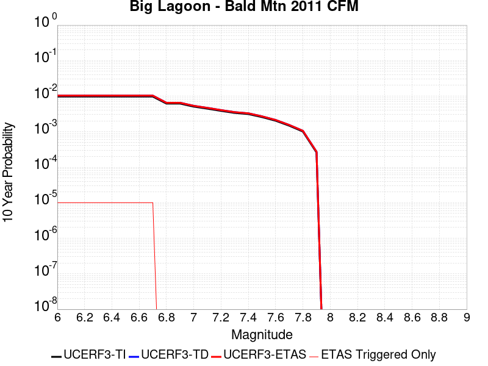 |

| Magnitude | 1 wk TI Prob | 1 wk TD Prob | 1 wk ETAS Prob | 1 wk ETAS/TD Gain | 1 wk ETAS Triggered Only | 1 mo TI Prob | 1 mo TD Prob | 1 mo ETAS Prob | 1 mo ETAS/TD Gain | 1 mo ETAS Triggered Only | 1 yr TI Prob | 1 yr TD Prob | 1 yr ETAS Prob | 1 yr ETAS/TD Gain | 1 yr ETAS Triggered Only | 10 yr TI Prob | 10 yr TD Prob | 10 yr ETAS Prob | 10 yr ETAS/TD Gain | 10 yr ETAS Triggered Only |
|-----|-----|-----|-----|-----|-----|-----|-----|-----|-----|-----|-----|-----|-----|-----|-----|-----|-----|-----|-----|-----|
| 6.0 | 1.8699735E-5 | 1.985018E-5 | 3.2039115E-5 | 1.6140465 | 1.2189176E-5 | 8.013926E-5 | 8.5069645E-5 | 9.725778E-5 | 1.1432725 | 1.2189176E-5 | 9.752587E-4 | 0.0010352687 | 0.0010474451 | 1.0117618 | 1.2189176E-5 | 0.009709897 | 0.010308274 | 0.0103203375 | 1.0011703 | 1.2189176E-5 |
| 6.1 | 1.8699735E-5 | 1.985018E-5 | 3.2039115E-5 | 1.6140465 | 1.2189176E-5 | 8.013926E-5 | 8.5069645E-5 | 9.725778E-5 | 1.1432725 | 1.2189176E-5 | 9.752587E-4 | 0.0010352687 | 0.0010474451 | 1.0117618 | 1.2189176E-5 | 0.009709897 | 0.010308274 | 0.0103203375 | 1.0011703 | 1.2189176E-5 |
| 6.2 | 1.8699735E-5 | 1.985018E-5 | 3.2039115E-5 | 1.6140465 | 1.2189176E-5 | 8.013926E-5 | 8.5069645E-5 | 9.725778E-5 | 1.1432725 | 1.2189176E-5 | 9.752587E-4 | 0.0010352687 | 0.0010474451 | 1.0117618 | 1.2189176E-5 | 0.009709897 | 0.010308274 | 0.0103203375 | 1.0011703 | 1.2189176E-5 |
| 6.3 | 1.8699735E-5 | 1.985018E-5 | 3.2039115E-5 | 1.6140465 | 1.2189176E-5 | 8.013926E-5 | 8.5069645E-5 | 9.725778E-5 | 1.1432725 | 1.2189176E-5 | 9.752587E-4 | 0.0010352687 | 0.0010474451 | 1.0117618 | 1.2189176E-5 | 0.009709897 | 0.010308274 | 0.0103203375 | 1.0011703 | 1.2189176E-5 |
| 6.4 | 1.8699735E-5 | 1.985018E-5 | 3.2039115E-5 | 1.6140465 | 1.2189176E-5 | 8.013926E-5 | 8.5069645E-5 | 9.725778E-5 | 1.1432725 | 1.2189176E-5 | 9.752587E-4 | 0.0010352687 | 0.0010474451 | 1.0117618 | 1.2189176E-5 | 0.009709897 | 0.010308274 | 0.0103203375 | 1.0011703 | 1.2189176E-5 |
| 6.5 | 1.8699735E-5 | 1.985018E-5 | 3.2039115E-5 | 1.6140465 | 1.2189176E-5 | 8.013926E-5 | 8.5069645E-5 | 9.725778E-5 | 1.1432725 | 1.2189176E-5 | 9.752587E-4 | 0.0010352687 | 0.0010474451 | 1.0117618 | 1.2189176E-5 | 0.009709897 | 0.010308274 | 0.0103203375 | 1.0011703 | 1.2189176E-5 |
| 6.6 | 1.8699735E-5 | 1.985018E-5 | 3.2039115E-5 | 1.6140465 | 1.2189176E-5 | 8.013926E-5 | 8.5069645E-5 | 9.725778E-5 | 1.1432725 | 1.2189176E-5 | 9.752587E-4 | 0.0010352687 | 0.0010474451 | 1.0117618 | 1.2189176E-5 | 0.009709897 | 0.010308274 | 0.0103203375 | 1.0011703 | 1.2189176E-5 |
| 6.7 | 1.8699735E-5 | 1.985018E-5 | 3.2039115E-5 | 1.6140465 | 1.2189176E-5 | 8.013926E-5 | 8.5069645E-5 | 9.725778E-5 | 1.1432725 | 1.2189176E-5 | 9.752587E-4 | 0.0010352687 | 0.0010474451 | 1.0117618 | 1.2189176E-5 | 0.009709897 | 0.010308274 | 0.0103203375 | 1.0011703 | 1.2189176E-5 |
| 6.8 | 1.18505095E-5 | 1.2499804E-5 | 1.2499804E-5 | 1.0 | 0.0 | 5.078691E-5 | 5.3569514E-5 | 5.3569514E-5 | 1.0 | 0.0 | 6.181552E-4 | 6.520185E-4 | 6.520185E-4 | 1.0 | 0.0 | 0.006164385 | 0.0065015587 | 0.0065015587 | 1.0 | 0.0 |
| 6.9 | 1.18505095E-5 | 1.2499804E-5 | 1.2499804E-5 | 1.0 | 0.0 | 5.078691E-5 | 5.3569514E-5 | 5.3569514E-5 | 1.0 | 0.0 | 6.181552E-4 | 6.520185E-4 | 6.520185E-4 | 1.0 | 0.0 | 0.006164385 | 0.0065015587 | 0.0065015587 | 1.0 | 0.0 |
| 7.0 | 9.719786E-6 | 1.0235487E-5 | 1.0235487E-5 | 1.0 | 0.0 | 4.1655563E-5 | 4.386565E-5 | 4.386565E-5 | 1.0 | 0.0 | 5.0703844E-4 | 5.3393573E-4 | 5.3393573E-4 | 1.0 | 0.0 | 0.005058831 | 0.0053267754 | 0.0053267754 | 1.0 | 0.0 |
| 7.1 | 8.523418E-6 | 8.969463E-6 | 8.969463E-6 | 1.0 | 0.0 | 3.652842E-5 | 3.844E-5 | 3.844E-5 | 1.0 | 0.0 | 4.4464276E-4 | 4.6790804E-4 | 4.6790804E-4 | 1.0 | 0.0 | 0.0044375416 | 0.004669392 | 0.004669392 | 1.0 | 0.0 |
| 7.2 | 7.378894E-6 | 7.761112E-6 | 7.761112E-6 | 1.0 | 0.0 | 3.162345E-5 | 3.326149E-5 | 3.326149E-5 | 1.0 | 0.0 | 3.8494746E-4 | 4.048843E-4 | 4.048843E-4 | 1.0 | 0.0 | 0.0038428132 | 0.0040415623 | 0.0040415623 | 1.0 | 0.0 |
| 7.3 | 6.4640294E-6 | 6.7924434E-6 | 6.7924434E-6 | 1.0 | 0.0 | 2.7702688E-5 | 2.9110151E-5 | 2.9110151E-5 | 1.0 | 0.0 | 3.3722803E-4 | 3.5435913E-4 | 3.5435913E-4 | 1.0 | 0.0 | 0.0033671674 | 0.0035380109 | 0.0035380109 | 1.0 | 0.0 |
| 7.4 | 5.9959093E-6 | 6.2988E-6 | 6.2988E-6 | 1.0 | 0.0 | 2.5696501E-5 | 2.6994581E-5 | 2.6994581E-5 | 1.0 | 0.0 | 3.1280998E-4 | 3.2861007E-4 | 3.2861007E-4 | 1.0 | 0.0 | 0.0031237002 | 0.0032813034 | 0.0032813034 | 1.0 | 0.0 |
| 7.5 | 4.929265E-6 | 5.176396E-6 | 5.176396E-6 | 1.0 | 0.0 | 2.112525E-5 | 2.2184367E-5 | 2.2184367E-5 | 1.0 | 0.0 | 2.5716957E-4 | 2.700616E-4 | 2.700616E-4 | 1.0 | 0.0 | 0.0025687215 | 0.002697375 | 0.002697375 | 1.0 | 0.0 |
| 7.6 | 3.8982403E-6 | 4.0889267E-6 | 4.0889267E-6 | 1.0 | 0.0 | 1.6706637E-5 | 1.7523857E-5 | 1.7523857E-5 | 1.0 | 0.0 | 2.0338432E-4 | 2.1333233E-4 | 2.1333233E-4 | 1.0 | 0.0 | 0.0020319829 | 0.002131303 | 0.002131303 | 1.0 | 0.0 |
| 7.7 | 2.820968E-6 | 2.9572116E-6 | 2.9572116E-6 | 1.0 | 0.0 | 1.2089806E-5 | 1.2673704E-5 | 1.2673704E-5 | 1.0 | 0.0 | 1.4718344E-4 | 1.5429159E-4 | 1.5429159E-4 | 1.0 | 0.0 | 0.00147086 | 0.0015418624 | 0.0015418624 | 1.0 | 0.0 |
| 7.8 | 1.9314455E-6 | 2.0260186E-6 | 2.0260186E-6 | 1.0 | 0.0 | 8.277597E-6 | 8.682909E-6 | 8.682909E-6 | 1.0 | 0.0 | 1.0077508E-4 | 1.0570941E-4 | 1.0570941E-4 | 1.0 | 0.0 | 0.0010072939 | 0.0010566041 | 0.0010566041 | 1.0 | 0.0 |
| 7.9 | 4.9586197E-7 | 5.2189216E-7 | 5.2189216E-7 | 1.0 | 0.0 | 2.125121E-6 | 2.2366787E-6 | 2.2366787E-6 | 1.0 | 0.0 | 2.5873042E-5 | 2.7231245E-5 | 2.7231245E-5 | 1.0 | 0.0 | 2.5870028E-4 | 2.7228118E-4 | 2.7228118E-4 | 1.0 | 0.0 |

## Green Valley 2011 CFM
*[(top)](#table-of-contents)*

| 1 Week | 1 Month | 1 Year | 10 Year |
|-----|-----|-----|-----|
|  | 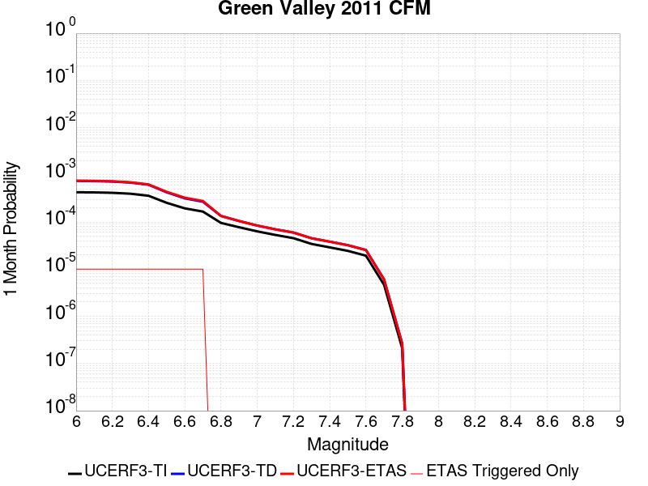 | 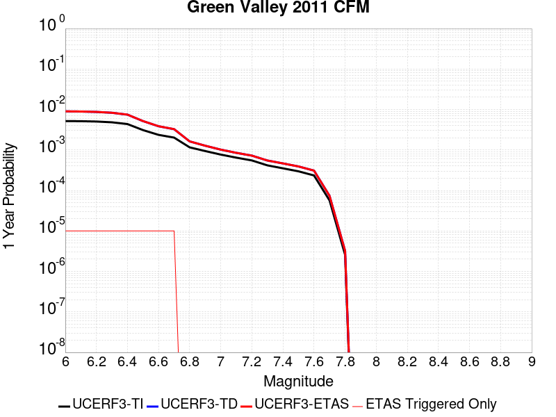 |  |

| Magnitude | 1 wk TI Prob | 1 wk TD Prob | 1 wk ETAS Prob | 1 wk ETAS/TD Gain | 1 wk ETAS Triggered Only | 1 mo TI Prob | 1 mo TD Prob | 1 mo ETAS Prob | 1 mo ETAS/TD Gain | 1 mo ETAS Triggered Only | 1 yr TI Prob | 1 yr TD Prob | 1 yr ETAS Prob | 1 yr ETAS/TD Gain | 1 yr ETAS Triggered Only | 10 yr TI Prob | 10 yr TD Prob | 10 yr ETAS Prob | 10 yr ETAS/TD Gain | 10 yr ETAS Triggered Only |
|-----|-----|-----|-----|-----|-----|-----|-----|-----|-----|-----|-----|-----|-----|-----|-----|-----|-----|-----|-----|-----|
| 6.0 | 9.9629346E-5 | 1.7305532E-4 | 1.8524239E-4 | 1.070423 | 1.2189176E-5 | 4.2691303E-4 | 7.4143766E-4 | 7.536178E-4 | 1.0164278 | 1.2189176E-5 | 0.0051852856 | 0.008986705 | 0.008998784 | 1.0013442 | 1.2189176E-5 | 0.050659515 | 0.085522056 | 0.0855332 | 1.0001303 | 1.2189176E-5 |
| 6.1 | 9.88615E-5 | 1.7152846E-4 | 1.8371554E-4 | 1.0710499 | 1.2189176E-5 | 4.2362334E-4 | 7.348976E-4 | 7.4707787E-4 | 1.016574 | 1.2189176E-5 | 0.0051454236 | 0.0089077335 | 0.008919814 | 1.0013562 | 1.2189176E-5 | 0.050279044 | 0.084809676 | 0.08482083 | 1.0001315 | 1.2189176E-5 |
| 6.2 | 9.696895E-5 | 1.6791887E-4 | 1.8010601E-4 | 1.0725775 | 1.2189176E-5 | 4.15515E-4 | 7.194366E-4 | 7.3161704E-4 | 1.0169305 | 1.2189176E-5 | 0.0050471667 | 0.008721114 | 0.008733197 | 1.0013855 | 1.2189176E-5 | 0.04934063 | 0.0831186 | 0.08312978 | 1.0001345 | 1.2189176E-5 |
| 6.3 | 9.275224E-5 | 1.5971228E-4 | 1.718995E-4 | 1.0763074 | 1.2189176E-5 | 3.9744904E-4 | 6.842841E-4 | 6.964649E-4 | 1.0178008 | 1.2189176E-5 | 0.0048282105 | 0.008296439 | 0.008308527 | 1.001457 | 1.2189176E-5 | 0.047246475 | 0.07925707 | 0.07926829 | 1.0001416 | 1.2189176E-5 |
| 6.4 | 8.391499E-5 | 1.4367796E-4 | 1.5586539E-4 | 1.0848246 | 1.2189176E-5 | 3.595861E-4 | 6.156248E-4 | 6.2780647E-4 | 1.0197875 | 1.2189176E-5 | 0.004369175 | 0.0074670846 | 0.0074791824 | 1.0016202 | 1.2189176E-5 | 0.04284265 | 0.071630865 | 0.07164218 | 1.000158 | 1.2189176E-5 |
| 6.5 | 5.9519385E-5 | 9.9340905E-5 | 1.1152887E-4 | 1.1226883 | 1.2189176E-5 | 2.5505814E-4 | 4.2568138E-4 | 4.3786538E-4 | 1.0286223 | 1.2189176E-5 | 0.0031009112 | 0.005168295 | 0.0051804213 | 1.0023463 | 1.2189176E-5 | 0.030579966 | 0.050145864 | 0.050157443 | 1.0002309 | 1.2189176E-5 |
| 6.6 | 4.5361558E-5 | 7.402609E-5 | 8.6214364E-5 | 1.1646484 | 1.2189176E-5 | 1.9439218E-4 | 3.1721895E-4 | 3.2940425E-4 | 1.0384129 | 1.2189176E-5 | 0.0023641558 | 0.0038539418 | 0.003866084 | 1.0031506 | 1.2189176E-5 | 0.023391623 | 0.037665963 | 0.037677694 | 1.0003114 | 1.2189176E-5 |
| 6.7 | 3.8808106E-5 | 6.2651976E-5 | 7.484038E-5 | 1.1945416 | 1.2189176E-5 | 1.6630985E-4 | 2.6848342E-4 | 2.8066934E-4 | 1.0453879 | 1.2189176E-5 | 0.0020229418 | 0.0032626586 | 0.003274808 | 1.0037237 | 1.2189176E-5 | 0.020046256 | 0.032005914 | 0.03201771 | 1.0003686 | 1.2189176E-5 |
| 6.8 | 2.2284667E-5 | 3.1285235E-5 | 3.1285235E-5 | 1.0 | 0.0 | 9.550222E-5 | 1.3407279E-4 | 1.3407279E-4 | 1.0 | 0.0 | 0.0011621192 | 0.0016311078 | 0.0016311078 | 1.0 | 0.0 | 0.011560607 | 0.016165998 | 0.016165998 | 1.0 | 0.0 |
| 6.9 | 1.8050168E-5 | 2.4448054E-5 | 2.4448054E-5 | 1.0 | 0.0 | 7.735557E-5 | 1.047732E-4 | 1.047732E-4 | 1.0 | 0.0 | 9.4139716E-4 | 0.0012748708 | 0.0012748708 | 1.0 | 0.0 | 0.009374191 | 0.012667833 | 0.012667833 | 1.0 | 0.0 |
| 7.0 | 1.4763166E-5 | 1.9582854E-5 | 1.9582854E-5 | 1.0 | 0.0 | 6.326917E-5 | 8.3923835E-5 | 8.3923835E-5 | 1.0 | 0.0 | 7.7002996E-4 | 0.0010212966 | 0.0010212966 | 1.0 | 0.0 | 0.007673672 | 0.010165343 | 0.010165343 | 1.0 | 0.0 |
| 7.1 | 1.2399713E-5 | 1.6303715E-5 | 1.6303715E-5 | 1.0 | 0.0 | 5.3140546E-5 | 6.98712E-5 | 6.98712E-5 | 1.0 | 0.0 | 6.467941E-4 | 8.503518E-4 | 8.503518E-4 | 1.0 | 0.0 | 0.006449148 | 0.008471259 | 0.008471259 | 1.0 | 0.0 |
| 7.2 | 1.0584195E-5 | 1.3921742E-5 | 1.3921742E-5 | 1.0 | 0.0 | 4.5360044E-5 | 5.9663253E-5 | 5.9663253E-5 | 1.0 | 0.0 | 5.521186E-4 | 7.261596E-4 | 7.261596E-4 | 1.0 | 0.0 | 0.0055074887 | 0.007238285 | 0.007238285 | 1.0 | 0.0 |
| 7.3 | 7.998173E-6 | 1.054402E-5 | 1.054402E-5 | 1.0 | 0.0 | 3.4277433E-5 | 4.518788E-5 | 4.518788E-5 | 1.0 | 0.0 | 4.1724785E-4 | 5.500247E-4 | 5.500247E-4 | 1.0 | 0.0 | 0.004164653 | 0.0054868995 | 0.0054868995 | 1.0 | 0.0 |
| 7.4 | 6.7571127E-6 | 8.932697E-6 | 8.932697E-6 | 1.0 | 0.0 | 2.8958733E-5 | 3.828243E-5 | 3.828243E-5 | 1.0 | 0.0 | 3.5251552E-4 | 4.6598984E-4 | 4.6598984E-4 | 1.0 | 0.0 | 0.0035195686 | 0.0046503306 | 0.0046503306 | 1.0 | 0.0 |
| 7.5 | 5.69878E-6 | 7.516314E-6 | 7.516314E-6 | 1.0 | 0.0 | 2.4423114E-5 | 3.221238E-5 | 3.221238E-5 | 1.0 | 0.0 | 2.9731085E-4 | 3.9211605E-4 | 3.9211605E-4 | 1.0 | 0.0 | 0.002969134 | 0.0039143935 | 0.0039143935 | 1.0 | 0.0 |
| 7.6 | 4.503664E-6 | 5.9356807E-6 | 5.9356807E-6 | 1.0 | 0.0 | 1.9301275E-5 | 2.5438389E-5 | 2.5438389E-5 | 1.0 | 0.0 | 2.3496768E-4 | 3.096692E-4 | 3.096692E-4 | 1.0 | 0.0 | 0.002347194 | 0.003092502 | 0.003092502 | 1.0 | 0.0 |
| 7.7 | 1.0873546E-6 | 1.4106979E-6 | 1.4106979E-6 | 1.0 | 0.0 | 4.6600826E-6 | 6.045834E-6 | 6.045834E-6 | 1.0 | 0.0 | 5.6735033E-5 | 7.360557E-5 | 7.360557E-5 | 1.0 | 0.0 | 5.672055E-4 | 7.35814E-4 | 7.35814E-4 | 1.0 | 0.0 |
| 7.8 | 4.9373917E-8 | 6.1777136E-8 | 6.1777136E-8 | 1.0 | 0.0 | 2.1160248E-7 | 2.6475914E-7 | 2.6475914E-7 | 1.0 | 0.0 | 2.5762572E-6 | 3.223439E-6 | 3.223439E-6 | 1.0 | 0.0 | 2.5762274E-5 | 3.2232296E-5 | 3.2232296E-5 | 1.0 | 0.0 |

## San Jacinto (Superstition Mtn)
*[(top)](#table-of-contents)*

| 1 Week | 1 Month | 1 Year | 10 Year |
|-----|-----|-----|-----|
|  | 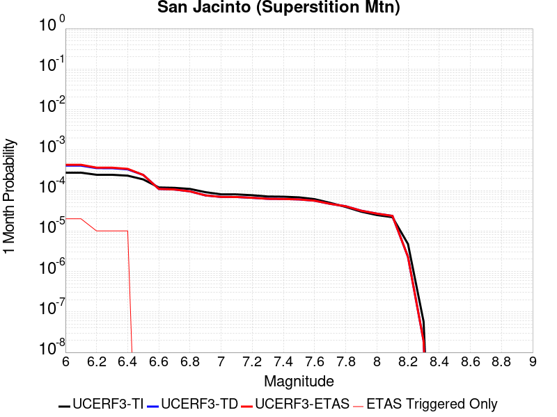 |  | 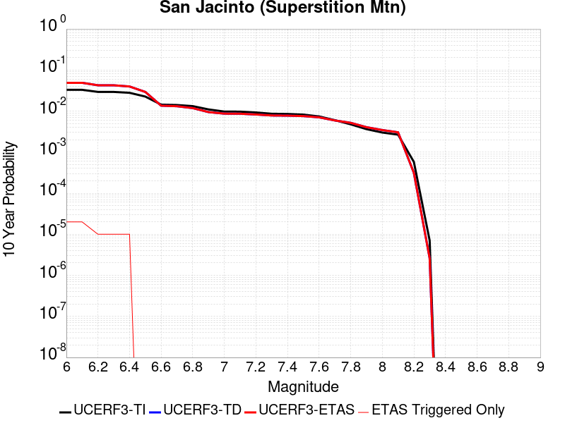 |

| Magnitude | 1 wk TI Prob | 1 wk TD Prob | 1 wk ETAS Prob | 1 wk ETAS/TD Gain | 1 wk ETAS Triggered Only | 1 mo TI Prob | 1 mo TD Prob | 1 mo ETAS Prob | 1 mo ETAS/TD Gain | 1 mo ETAS Triggered Only | 1 yr TI Prob | 1 yr TD Prob | 1 yr ETAS Prob | 1 yr ETAS/TD Gain | 1 yr ETAS Triggered Only | 10 yr TI Prob | 10 yr TD Prob | 10 yr ETAS Prob | 10 yr ETAS/TD Gain | 10 yr ETAS Triggered Only |
|-----|-----|-----|-----|-----|-----|-----|-----|-----|-----|-----|-----|-----|-----|-----|-----|-----|-----|-----|-----|-----|
| 6.0 | 6.4193904E-5 | 9.599367E-5 | 1.0818167E-4 | 1.1269667 | 1.2189176E-5 | 2.7508775E-4 | 4.1134638E-4 | 4.2353052E-4 | 1.0296202 | 1.2189176E-5 | 0.0033440501 | 0.0049980893 | 0.005010218 | 1.0024266 | 1.2189176E-5 | 0.03294174 | 0.048823986 | 0.04883558 | 1.0002375 | 1.2189176E-5 |
| 6.1 | 6.4193904E-5 | 9.599367E-5 | 1.0818167E-4 | 1.1269667 | 1.2189176E-5 | 2.7508775E-4 | 4.1134638E-4 | 4.2353052E-4 | 1.0296202 | 1.2189176E-5 | 0.0033440501 | 0.0049980893 | 0.005010218 | 1.0024266 | 1.2189176E-5 | 0.03294174 | 0.048823986 | 0.04883558 | 1.0002375 | 1.2189176E-5 |
| 6.2 | 5.7023593E-5 | 8.3144434E-5 | 8.3144434E-5 | 1.0 | 0.0 | 2.4436394E-4 | 3.5629404E-4 | 3.5629404E-4 | 1.0 | 0.0 | 0.002971072 | 0.0043308944 | 0.0043308944 | 1.0 | 0.0 | 0.029316625 | 0.04250403 | 0.04250403 | 1.0 | 0.0 |
| 6.3 | 5.6940098E-5 | 8.298979E-5 | 8.298979E-5 | 1.0 | 0.0 | 2.4400617E-4 | 3.5563146E-4 | 3.5563146E-4 | 1.0 | 0.0 | 0.002966728 | 0.00432286 | 0.00432286 | 1.0 | 0.0 | 0.029274331 | 0.042427283 | 0.042427283 | 1.0 | 0.0 |
| 6.4 | 5.4171585E-5 | 7.7483564E-5 | 7.7483564E-5 | 1.0 | 0.0 | 2.3214328E-4 | 3.3203943E-4 | 3.3203943E-4 | 1.0 | 0.0 | 0.0028226813 | 0.0040367353 | 0.0040367353 | 1.0 | 0.0 | 0.02787096 | 0.03971653 | 0.03971653 | 1.0 | 0.0 |
| 6.5 | 4.375144E-5 | 5.642133E-5 | 5.642133E-5 | 1.0 | 0.0 | 1.874927E-4 | 2.4178992E-4 | 2.4178992E-4 | 1.0 | 0.0 | 0.0022803338 | 0.002940994 | 0.002940994 | 1.0 | 0.0 | 0.022570757 | 0.029236801 | 0.029236801 | 1.0 | 0.0 |
| 6.6 | 2.772192E-5 | 2.5488358E-5 | 2.5488358E-5 | 1.0 | 0.0 | 1.1880282E-4 | 1.09231354E-4 | 1.09231354E-4 | 1.0 | 0.0 | 0.0014454646 | 0.0013290998 | 0.0013290998 | 1.0 | 0.0 | 0.014360986 | 0.01354049 | 0.01354049 | 1.0 | 0.0 |
| 6.7 | 2.7124124E-5 | 2.4699386E-5 | 2.4699386E-5 | 1.0 | 0.0 | 1.1624106E-4 | 1.05850326E-4 | 1.05850326E-4 | 1.0 | 0.0 | 0.0014143161 | 0.001287985 | 0.001287985 | 1.0 | 0.0 | 0.014053487 | 0.013133943 | 0.013133943 | 1.0 | 0.0 |
| 6.8 | 2.5475807E-5 | 2.216446E-5 | 2.216446E-5 | 1.0 | 0.0 | 1.0917746E-4 | 9.4987154E-5 | 9.4987154E-5 | 1.0 | 0.0 | 0.001328425 | 0.001155867 | 0.001155867 | 1.0 | 0.0 | 0.0132051185 | 0.011822182 | 0.011822182 | 1.0 | 0.0 |
| 6.9 | 2.1162023E-5 | 1.7626244E-5 | 1.7626244E-5 | 1.0 | 0.0 | 9.069123E-5 | 7.5538876E-5 | 7.5538876E-5 | 1.0 | 0.0 | 0.0011036064 | 9.193016E-4 | 9.193016E-4 | 1.0 | 0.0 | 0.010981417 | 0.00944688 | 0.00944688 | 1.0 | 0.0 |
| 7.0 | 1.8754288E-5 | 1.6161559E-5 | 1.6161559E-5 | 1.0 | 0.0 | 8.037304E-5 | 6.9261994E-5 | 6.9261994E-5 | 1.0 | 0.0 | 9.781026E-4 | 8.4294105E-4 | 8.4294105E-4 | 1.0 | 0.0 | 0.009738087 | 0.008670042 | 0.008670042 | 1.0 | 0.0 |
| 7.1 | 1.8678527E-5 | 1.6086702E-5 | 1.6086702E-5 | 1.0 | 0.0 | 8.0048376E-5 | 6.89412E-5 | 6.89412E-5 | 1.0 | 0.0 | 9.7415317E-4 | 8.3903834E-4 | 8.3903834E-4 | 1.0 | 0.0 | 0.009698939 | 0.008630998 | 0.008630998 | 1.0 | 0.0 |
| 7.2 | 1.7804578E-5 | 1.5381282E-5 | 1.5381282E-5 | 1.0 | 0.0 | 7.6303106E-5 | 6.5918124E-5 | 6.5918124E-5 | 1.0 | 0.0 | 9.285943E-4 | 8.022599E-4 | 8.022599E-4 | 1.0 | 0.0 | 0.009247236 | 0.008262311 | 0.008262311 | 1.0 | 0.0 |
| 7.3 | 1.6583685E-5 | 1.4530388E-5 | 1.4530388E-5 | 1.0 | 0.0 | 7.1070994E-5 | 6.227162E-5 | 6.227162E-5 | 1.0 | 0.0 | 8.649459E-4 | 7.5789524E-4 | 7.5789524E-4 | 1.0 | 0.0 | 0.00861587 | 0.007817623 | 0.007817623 | 1.0 | 0.0 |
| 7.4 | 1.6387552E-5 | 1.4395274E-5 | 1.4395274E-5 | 1.0 | 0.0 | 7.023047E-5 | 6.169258E-5 | 6.169258E-5 | 1.0 | 0.0 | 8.5472054E-4 | 7.5085036E-4 | 7.5085036E-4 | 1.0 | 0.0 | 0.008514405 | 0.0077470057 | 0.0077470057 | 1.0 | 0.0 |
| 7.5 | 1.5790754E-5 | 1.4035962E-5 | 1.4035962E-5 | 1.0 | 0.0 | 6.767291E-5 | 6.0152746E-5 | 6.0152746E-5 | 1.0 | 0.0 | 8.236062E-4 | 7.321156E-4 | 7.321156E-4 | 1.0 | 0.0 | 0.008205604 | 0.007557569 | 0.007557569 | 1.0 | 0.0 |
| 7.6 | 1.4248672E-5 | 1.3054932E-5 | 1.3054932E-5 | 1.0 | 0.0 | 6.106431E-5 | 5.594852E-5 | 5.594852E-5 | 1.0 | 0.0 | 7.432043E-4 | 6.8096205E-4 | 6.8096205E-4 | 1.0 | 0.0 | 0.007407237 | 0.0070401574 | 0.0070401574 | 1.0 | 0.0 |
| 7.7 | 1.15449975E-5 | 1.090368E-5 | 1.090368E-5 | 1.0 | 0.0 | 4.947762E-5 | 4.6729223E-5 | 4.6729223E-5 | 1.0 | 0.0 | 6.022235E-4 | 5.687805E-4 | 5.687805E-4 | 1.0 | 0.0 | 0.006005941 | 0.0059101824 | 0.0059101824 | 1.0 | 0.0 |
| 7.8 | 9.1391985E-6 | 9.514299E-6 | 9.514299E-6 | 1.0 | 0.0 | 3.9167408E-5 | 4.0774932E-5 | 4.0774932E-5 | 1.0 | 0.0 | 4.767588E-4 | 4.963223E-4 | 4.963223E-4 | 1.0 | 0.0 | 0.0047573727 | 0.0051766867 | 0.0051766867 | 1.0 | 0.0 |
| 7.9 | 6.973017E-6 | 7.3821784E-6 | 7.3821784E-6 | 1.0 | 0.0 | 2.9884017E-5 | 3.1637526E-5 | 3.1637526E-5 | 1.0 | 0.0 | 3.6377716E-4 | 3.8511935E-4 | 3.8511935E-4 | 1.0 | 0.0 | 0.0036318225 | 0.0040517948 | 0.0040517948 | 1.0 | 0.0 |
| 8.0 | 5.7638235E-6 | 6.259972E-6 | 6.259972E-6 | 1.0 | 0.0 | 2.4701867E-5 | 2.6828178E-5 | 2.6828178E-5 | 1.0 | 0.0 | 3.0070372E-4 | 3.2658462E-4 | 3.2658462E-4 | 1.0 | 0.0 | 0.0030029714 | 0.0034534496 | 0.0034534496 | 1.0 | 0.0 |
| 8.1 | 5.1124434E-6 | 5.4956718E-6 | 5.4956718E-6 | 1.0 | 0.0 | 2.1910288E-5 | 2.355267E-5 | 2.355267E-5 | 1.0 | 0.0 | 2.6672508E-4 | 2.867165E-4 | 2.867165E-4 | 1.0 | 0.0 | 0.0026640517 | 0.003040336 | 0.003040336 | 1.0 | 0.0 |
| 8.2 | 1.1075938E-6 | 5.336568E-7 | 5.336568E-7 | 1.0 | 0.0 | 4.7468216E-6 | 2.2870988E-6 | 2.2870988E-6 | 1.0 | 0.0 | 5.779102E-5 | 2.7845093E-5 | 2.7845093E-5 | 1.0 | 0.0 | 5.777599E-4 | 3.1346595E-4 | 3.1346595E-4 | 1.0 | 0.0 |
| 8.3 | 1.3584393E-8 | 4.473836E-9 | 4.473836E-9 | 1.0 | 0.0 | 5.8218827E-8 | 1.9173582E-8 | 1.9173582E-8 | 1.0 | 0.0 | 7.0881396E-7 | 2.3343837E-7 | 2.3343837E-7 | 1.0 | 0.0 | 7.0881174E-6 | 2.6163038E-6 | 2.6163038E-6 | 1.0 | 0.0 |

## Pilarcitos 2011 CFM
*[(top)](#table-of-contents)*

| 1 Week | 1 Month | 1 Year | 10 Year |
|-----|-----|-----|-----|
|  |  |  | 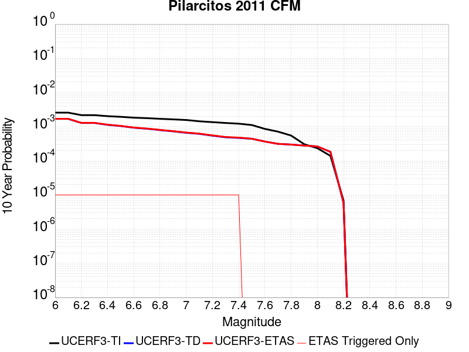 |

| Magnitude | 1 wk TI Prob | 1 wk TD Prob | 1 wk ETAS Prob | 1 wk ETAS/TD Gain | 1 wk ETAS Triggered Only | 1 mo TI Prob | 1 mo TD Prob | 1 mo ETAS Prob | 1 mo ETAS/TD Gain | 1 mo ETAS Triggered Only | 1 yr TI Prob | 1 yr TD Prob | 1 yr ETAS Prob | 1 yr ETAS/TD Gain | 1 yr ETAS Triggered Only | 10 yr TI Prob | 10 yr TD Prob | 10 yr ETAS Prob | 10 yr ETAS/TD Gain | 10 yr ETAS Triggered Only |
|-----|-----|-----|-----|-----|-----|-----|-----|-----|-----|-----|-----|-----|-----|-----|-----|-----|-----|-----|-----|-----|
| 6.0 | 4.9150476E-6 | 3.2017424E-6 | 1.5390879E-5 | 4.8070326 | 1.2189176E-5 | 2.1064321E-5 | 1.3721682E-5 | 2.5910691E-5 | 1.8883028 | 1.2189176E-5 | 2.564279E-4 | 1.6704899E-4 | 1.7923613E-4 | 1.0729555 | 1.2189176E-5 | 0.0025613222 | 0.0016816824 | 0.0016938511 | 1.007236 | 1.2189176E-5 |
| 6.1 | 4.9150476E-6 | 3.2017424E-6 | 1.5390879E-5 | 4.8070326 | 1.2189176E-5 | 2.1064321E-5 | 1.3721682E-5 | 2.5910691E-5 | 1.8883028 | 1.2189176E-5 | 2.564279E-4 | 1.6704899E-4 | 1.7923613E-4 | 1.0729555 | 1.2189176E-5 | 0.0025613222 | 0.0016816824 | 0.0016938511 | 1.007236 | 1.2189176E-5 |
| 6.2 | 4.162343E-6 | 2.4301326E-6 | 1.4619279E-5 | 6.0158362 | 1.2189176E-5 | 1.783849E-5 | 1.0414812E-5 | 2.2603861E-5 | 2.170357 | 1.2189176E-5 | 2.1716199E-4 | 1.2679303E-4 | 1.3898067E-4 | 1.0961223 | 1.2189176E-5 | 0.002169499 | 0.0012796372 | 0.0012918108 | 1.0095133 | 1.2189176E-5 |
| 6.3 | 4.162343E-6 | 2.4301326E-6 | 1.4619279E-5 | 6.0158362 | 1.2189176E-5 | 1.783849E-5 | 1.0414812E-5 | 2.2603861E-5 | 2.170357 | 1.2189176E-5 | 2.1716199E-4 | 1.2679303E-4 | 1.3898067E-4 | 1.0961223 | 1.2189176E-5 | 0.002169499 | 0.0012796372 | 0.0012918108 | 1.0095133 | 1.2189176E-5 |
| 6.4 | 3.8768926E-6 | 2.137552E-6 | 1.4326702E-5 | 6.702388 | 1.2189176E-5 | 1.6615148E-5 | 9.1609045E-6 | 2.134997E-5 | 2.3305526 | 1.2189176E-5 | 2.0227065E-4 | 1.1152835E-4 | 1.2371616E-4 | 1.10928 | 1.2189176E-5 | 0.0020208664 | 0.0011271521 | 0.0011393277 | 1.0108019 | 1.2189176E-5 |
| 6.5 | 3.7137002E-6 | 1.9709112E-6 | 1.4160063E-5 | 7.1845264 | 1.2189176E-5 | 1.591576E-5 | 8.446735E-6 | 2.0635807E-5 | 2.4430516 | 1.2189176E-5 | 1.9375715E-4 | 1.0283417E-4 | 1.1502209E-4 | 1.1185201 | 1.2189176E-5 | 0.001935883 | 0.0010402942 | 0.0010524708 | 1.0117048 | 1.2189176E-5 |
| 6.6 | 3.5048733E-6 | 1.7558658E-6 | 1.394502E-5 | 7.9419627 | 1.2189176E-5 | 1.5020799E-5 | 7.5251173E-6 | 1.9714202E-5 | 2.6197865 | 1.2189176E-5 | 1.8286289E-4 | 9.161448E-5 | 1.0380254E-4 | 1.1330364 | 1.2189176E-5 | 0.0018271249 | 9.2819595E-4 | 9.4037387E-4 | 1.0131199 | 1.2189176E-5 |
| 6.7 | 3.3908584E-6 | 1.6395577E-6 | 1.3828714E-5 | 8.434418 | 1.2189176E-5 | 1.453217E-5 | 7.026657E-6 | 1.9215748E-5 | 2.7346928 | 1.2189176E-5 | 1.7691481E-4 | 8.5546206E-5 | 9.773434E-5 | 1.1424743 | 1.2189176E-5 | 0.0017677402 | 8.675619E-4 | 8.797405E-4 | 1.0140377 | 1.2189176E-5 |
| 6.8 | 3.2451449E-6 | 1.492779E-6 | 1.3681937E-5 | 9.165414 | 1.2189176E-5 | 1.3907689E-5 | 6.3976086E-6 | 1.8586707E-5 | 2.9052587 | 1.2189176E-5 | 1.6931296E-4 | 7.788811E-5 | 9.007633E-5 | 1.1564838 | 1.2189176E-5 | 0.0016918402 | 7.910375E-4 | 8.0321706E-4 | 1.015397 | 1.2189176E-5 |
| 6.9 | 3.1239128E-6 | 1.3693062E-6 | 1.3558466E-5 | 9.901705 | 1.2189176E-5 | 1.3388129E-5 | 5.868442E-6 | 1.8057546E-5 | 3.0770597 | 1.2189176E-5 | 1.6298829E-4 | 7.1445946E-5 | 8.363425E-5 | 1.1705948 | 1.2189176E-5 | 0.001628688 | 7.2665967E-4 | 7.3884E-4 | 1.016762 | 1.2189176E-5 |
| 7.0 | 2.9940109E-6 | 1.2406205E-6 | 1.3429782E-5 | 10.825052 | 1.2189176E-5 | 1.2831412E-5 | 5.3169338E-6 | 1.7506045E-5 | 3.2925076 | 1.2189176E-5 | 1.5621124E-4 | 6.473174E-5 | 7.6920136E-5 | 1.1882907 | 1.2189176E-5 | 0.0015610148 | 6.5955904E-4 | 6.717402E-4 | 1.0184686 | 1.2189176E-5 |
| 7.1 | 2.7471217E-6 | 1.1523518E-6 | 1.3341514E-5 | 11.57764 | 1.2189176E-5 | 1.1773326E-5 | 4.9386413E-6 | 1.7127757E-5 | 3.4681113 | 1.2189176E-5 | 1.4333082E-4 | 6.01263E-5 | 7.231474E-5 | 1.202714 | 1.2189176E-5 | 0.001432384 | 6.134784E-4 | 6.256601E-4 | 1.0198568 | 1.2189176E-5 |
| 7.2 | 2.592675E-6 | 1.0184039E-6 | 1.32075675E-5 | 12.968889 | 1.2189176E-5 | 1.1111417E-5 | 4.3645805E-6 | 1.6553704E-5 | 3.7927363 | 1.2189176E-5 | 1.3527309E-4 | 5.3137475E-5 | 6.5326E-5 | 1.2293773 | 1.2189176E-5 | 0.0013519078 | 5.436265E-4 | 5.5580906E-4 | 1.0224098 | 1.2189176E-5 |
| 7.3 | 2.4518663E-6 | 9.093615E-7 | 1.3098526E-5 | 14.404091 | 1.2189176E-5 | 1.0507956E-5 | 3.897258E-6 | 1.6086386E-5 | 4.127617 | 1.2189176E-5 | 1.2792686E-4 | 4.744808E-5 | 5.9636677E-5 | 1.2568828 | 1.2189176E-5 | 0.0012785323 | 4.8675635E-4 | 4.989396E-4 | 1.0250294 | 1.2189176E-5 |
| 7.4 | 2.3349535E-6 | 8.7153666E-7 | 1.3060702E-5 | 14.985832 | 1.2189176E-5 | 1.0006905E-5 | 3.7351517E-6 | 1.5924283E-5 | 4.263356 | 1.2189176E-5 | 1.2182725E-4 | 4.5474524E-5 | 5.7663146E-5 | 1.2680318 | 1.2189176E-5 | 0.0012176048 | 4.6700423E-4 | 4.791877E-4 | 1.0260886 | 1.2189176E-5 |
| 7.5 | 2.1358665E-6 | 8.235929E-7 | 8.235929E-7 | 1.0 | 0.0 | 9.15368E-6 | 3.5296791E-6 | 3.5296791E-6 | 1.0 | 0.0 | 1.11440364E-4 | 4.2972995E-5 | 4.2972995E-5 | 1.0 | 0.0 | 0.0011138449 | 4.4190476E-4 | 4.4190476E-4 | 1.0 | 0.0 |
| 7.6 | 1.6445446E-6 | 6.778194E-7 | 6.778194E-7 | 1.0 | 0.0 | 7.048029E-6 | 2.9049368E-6 | 2.9049368E-6 | 1.0 | 0.0 | 8.580638E-5 | 3.5367033E-5 | 3.5367033E-5 | 1.0 | 0.0 | 8.5773255E-4 | 3.6580398E-4 | 3.6580398E-4 | 1.0 | 0.0 |
| 7.7 | 1.3650961E-6 | 5.771466E-7 | 5.771466E-7 | 1.0 | 0.0 | 5.850399E-6 | 2.473483E-6 | 2.473483E-6 | 1.0 | 0.0 | 7.122628E-5 | 3.011424E-5 | 3.011424E-5 | 1.0 | 0.0 | 7.120345E-4 | 3.1317407E-4 | 3.1317407E-4 | 1.0 | 0.0 |
| 7.8 | 1.0500993E-6 | 5.487217E-7 | 5.487217E-7 | 1.0 | 0.0 | 4.5004176E-6 | 2.3516623E-6 | 2.3516623E-6 | 1.0 | 0.0 | 5.4791206E-5 | 2.8631113E-5 | 2.8631113E-5 | 1.0 | 0.0 | 5.47777E-4 | 2.982153E-4 | 2.982153E-4 | 1.0 | 0.0 |
| 7.9 | 5.856431E-7 | 5.1290885E-7 | 5.1290885E-7 | 1.0 | 0.0 | 2.5098966E-6 | 2.198179E-6 | 2.198179E-6 | 1.0 | 0.0 | 3.0557563E-5 | 2.67625E-5 | 2.67625E-5 | 1.0 | 0.0 | 3.055336E-4 | 2.7879118E-4 | 2.7879118E-4 | 1.0 | 0.0 |
| 8.0 | 4.4768265E-7 | 4.8356026E-7 | 4.8356026E-7 | 1.0 | 0.0 | 1.9186384E-6 | 2.0723996E-6 | 2.0723996E-6 | 1.0 | 0.0 | 2.3359173E-5 | 2.5231173E-5 | 2.5231173E-5 | 1.0 | 0.0 | 2.3356717E-4 | 2.629472E-4 | 2.629472E-4 | 1.0 | 0.0 |
| 8.1 | 2.6692538E-7 | 3.3572923E-7 | 3.3572923E-7 | 1.0 | 0.0 | 1.1439654E-6 | 1.4388387E-6 | 1.4388387E-6 | 1.0 | 0.0 | 1.392769E-5 | 1.7517721E-5 | 1.7517721E-5 | 1.0 | 0.0 | 1.3926817E-4 | 1.8253834E-4 | 1.8253834E-4 | 1.0 | 0.0 |
| 8.2 | 1.3198862E-8 | 1.0825354E-8 | 1.0825354E-8 | 1.0 | 0.0 | 5.656655E-8 | 4.6394376E-8 | 4.6394376E-8 | 1.0 | 0.0 | 6.886975E-7 | 5.648514E-7 | 5.648514E-7 | 1.0 | 0.0 | 6.8869535E-6 | 5.8803653E-6 | 5.8803653E-6 | 1.0 | 0.0 |

## Kern Canyon (Lake Isabella) 2011
*[(top)](#table-of-contents)*

| 1 Week | 1 Month | 1 Year | 10 Year |
|-----|-----|-----|-----|
|  |  |  |  |

| Magnitude | 1 wk TI Prob | 1 wk TD Prob | 1 wk ETAS Prob | 1 wk ETAS/TD Gain | 1 wk ETAS Triggered Only | 1 mo TI Prob | 1 mo TD Prob | 1 mo ETAS Prob | 1 mo ETAS/TD Gain | 1 mo ETAS Triggered Only | 1 yr TI Prob | 1 yr TD Prob | 1 yr ETAS Prob | 1 yr ETAS/TD Gain | 1 yr ETAS Triggered Only | 10 yr TI Prob | 10 yr TD Prob | 10 yr ETAS Prob | 10 yr ETAS/TD Gain | 10 yr ETAS Triggered Only |
|-----|-----|-----|-----|-----|-----|-----|-----|-----|-----|-----|-----|-----|-----|-----|-----|-----|-----|-----|-----|-----|
| 6.0 | 4.2387383E-6 | 4.001639E-6 | 4.001639E-6 | 1.0 | 0.0 | 1.8165894E-5 | 1.7149778E-5 | 1.7149778E-5 | 1.0 | 0.0 | 2.2114732E-4 | 2.087804E-4 | 2.2096703E-4 | 1.0583706 | 1.2189176E-5 | 0.0022092736 | 0.0020860266 | 0.0020981904 | 1.005831 | 1.2189176E-5 |
| 6.1 | 4.2387383E-6 | 4.001639E-6 | 4.001639E-6 | 1.0 | 0.0 | 1.8165894E-5 | 1.7149778E-5 | 1.7149778E-5 | 1.0 | 0.0 | 2.2114732E-4 | 2.087804E-4 | 2.2096703E-4 | 1.0583706 | 1.2189176E-5 | 0.0022092736 | 0.0020860266 | 0.0020981904 | 1.005831 | 1.2189176E-5 |
| 6.2 | 4.2387383E-6 | 4.001639E-6 | 4.001639E-6 | 1.0 | 0.0 | 1.8165894E-5 | 1.7149778E-5 | 1.7149778E-5 | 1.0 | 0.0 | 2.2114732E-4 | 2.087804E-4 | 2.2096703E-4 | 1.0583706 | 1.2189176E-5 | 0.0022092736 | 0.0020860266 | 0.0020981904 | 1.005831 | 1.2189176E-5 |
| 6.3 | 4.2387383E-6 | 4.001639E-6 | 4.001639E-6 | 1.0 | 0.0 | 1.8165894E-5 | 1.7149778E-5 | 1.7149778E-5 | 1.0 | 0.0 | 2.2114732E-4 | 2.087804E-4 | 2.2096703E-4 | 1.0583706 | 1.2189176E-5 | 0.0022092736 | 0.0020860266 | 0.0020981904 | 1.005831 | 1.2189176E-5 |
| 6.4 | 4.2387383E-6 | 4.001639E-6 | 4.001639E-6 | 1.0 | 0.0 | 1.8165894E-5 | 1.7149778E-5 | 1.7149778E-5 | 1.0 | 0.0 | 2.2114732E-4 | 2.087804E-4 | 2.2096703E-4 | 1.0583706 | 1.2189176E-5 | 0.0022092736 | 0.0020860266 | 0.0020981904 | 1.005831 | 1.2189176E-5 |
| 6.5 | 2.7857532E-6 | 2.517867E-6 | 2.517867E-6 | 1.0 | 0.0 | 1.1938888E-5 | 1.0790815E-5 | 1.0790815E-5 | 1.0 | 0.0 | 1.4534626E-4 | 1.3137059E-4 | 1.4355817E-4 | 1.0927725 | 1.2189176E-5 | 0.0014525123 | 0.001312962 | 0.0013251352 | 1.0092715 | 1.2189176E-5 |
| 6.6 | 2.2233348E-6 | 1.9441236E-6 | 1.9441236E-6 | 1.0 | 0.0 | 9.528543E-6 | 8.331932E-6 | 8.331932E-6 | 1.0 | 0.0 | 1.1600384E-4 | 1.01436635E-4 | 1.1362458E-4 | 1.1201532 | 1.2189176E-5 | 0.001159433 | 0.001013912 | 0.0010260888 | 1.0120097 | 1.2189176E-5 |
| 6.7 | 2.1635126E-6 | 1.8835036E-6 | 1.8835036E-6 | 1.0 | 0.0 | 9.272164E-6 | 8.072134E-6 | 8.072134E-6 | 1.0 | 0.0 | 1.1288274E-4 | 9.827388E-5 | 1.1046186E-4 | 1.1240206 | 1.2189176E-5 | 0.0011282542 | 9.823124E-4 | 9.944895E-4 | 1.0123965 | 1.2189176E-5 |
| 6.8 | 1.8685711E-6 | 1.5831425E-6 | 1.5831425E-6 | 1.0 | 0.0 | 8.008137E-6 | 6.784879E-6 | 6.784879E-6 | 1.0 | 0.0 | 9.74947E-5 | 8.260282E-5 | 9.4790994E-5 | 1.1475515 | 1.2189176E-5 | 9.745194E-4 | 8.2572614E-4 | 8.379052E-4 | 1.0147495 | 1.2189176E-5 |
| 6.9 | 1.5815071E-6 | 1.3064928E-6 | 1.3064928E-6 | 1.0 | 0.0 | 6.77787E-6 | 5.599243E-6 | 5.599243E-6 | 1.0 | 0.0 | 8.251744E-5 | 6.816868E-5 | 8.035702E-5 | 1.1787969 | 1.2189176E-5 | 8.248681E-4 | 6.8148033E-4 | 6.936612E-4 | 1.0178741 | 1.2189176E-5 |
| 7.0 | 1.3772564E-6 | 1.1210718E-6 | 1.1210718E-6 | 1.0 | 0.0 | 5.9025137E-6 | 4.8045845E-6 | 4.8045845E-6 | 1.0 | 0.0 | 7.186073E-5 | 5.8494268E-5 | 5.8494268E-5 | 1.0 | 0.0 | 7.18375E-4 | 5.847908E-4 | 5.847908E-4 | 1.0 | 0.0 |
| 7.1 | 1.0916998E-6 | 8.763777E-7 | 8.763777E-7 | 1.0 | 0.0 | 4.678705E-6 | 3.7558991E-6 | 3.7558991E-6 | 1.0 | 0.0 | 5.6961744E-5 | 4.5727127E-5 | 4.5727127E-5 | 1.0 | 0.0 | 5.6947145E-4 | 4.571785E-4 | 4.571785E-4 | 1.0 | 0.0 |
| 7.2 | 7.6277024E-7 | 5.901454E-7 | 5.901454E-7 | 1.0 | 0.0 | 3.2690114E-6 | 2.5291922E-6 | 2.5291922E-6 | 1.0 | 0.0 | 3.9799485E-5 | 3.0792486E-5 | 3.0792486E-5 | 1.0 | 0.0 | 3.9792358E-4 | 3.0788282E-4 | 3.0788282E-4 | 1.0 | 0.0 |
| 7.3 | 5.3265916E-7 | 4.3824414E-7 | 4.3824414E-7 | 1.0 | 0.0 | 2.282823E-6 | 1.878188E-6 | 1.878188E-6 | 1.0 | 0.0 | 2.7793016E-5 | 2.2866701E-5 | 2.2866701E-5 | 1.0 | 0.0 | 2.778954E-4 | 2.2864387E-4 | 2.2864387E-4 | 1.0 | 0.0 |
| 7.4 | 3.4946007E-7 | 3.006571E-7 | 3.006571E-7 | 1.0 | 0.0 | 1.497685E-6 | 1.2885298E-6 | 1.2885298E-6 | 1.0 | 0.0 | 1.8234163E-5 | 1.568774E-5 | 1.568774E-5 | 1.0 | 0.0 | 1.8232666E-4 | 1.5686655E-4 | 1.5686655E-4 | 1.0 | 0.0 |
| 7.5 | 1.8317026E-7 | 1.4244812E-7 | 1.4244812E-7 | 1.0 | 0.0 | 7.850152E-7 | 6.104918E-7 | 6.104918E-7 | 1.0 | 0.0 | 9.557518E-6 | 7.432713E-6 | 7.432713E-6 | 1.0 | 0.0 | 9.5571064E-5 | 7.432472E-5 | 7.432472E-5 | 1.0 | 0.0 |
| 7.6 | 2.572245E-8 | 1.7352555E-8 | 1.7352555E-8 | 1.0 | 0.0 | 1.10239064E-7 | 7.436809E-8 | 7.436809E-8 | 1.0 | 0.0 | 1.3421597E-6 | 9.054312E-7 | 9.054312E-7 | 1.0 | 0.0 | 1.3421517E-5 | 9.05428E-6 | 9.05428E-6 | 1.0 | 0.0 |

## Great Valley 05 Pittsburg - Kirby Hills alt1
*[(top)](#table-of-contents)*

| 1 Week | 1 Month | 1 Year | 10 Year |
|-----|-----|-----|-----|
|  |  |  |  |

| Magnitude | 1 wk TI Prob | 1 wk TD Prob | 1 wk ETAS Prob | 1 wk ETAS/TD Gain | 1 wk ETAS Triggered Only | 1 mo TI Prob | 1 mo TD Prob | 1 mo ETAS Prob | 1 mo ETAS/TD Gain | 1 mo ETAS Triggered Only | 1 yr TI Prob | 1 yr TD Prob | 1 yr ETAS Prob | 1 yr ETAS/TD Gain | 1 yr ETAS Triggered Only | 10 yr TI Prob | 10 yr TD Prob | 10 yr ETAS Prob | 10 yr ETAS/TD Gain | 10 yr ETAS Triggered Only |
|-----|-----|-----|-----|-----|-----|-----|-----|-----|-----|-----|-----|-----|-----|-----|-----|-----|-----|-----|-----|-----|
| 6.0 | 4.187212E-5 | 5.3442072E-5 | 6.56306E-5 | 1.2280698 | 1.2189176E-5 | 1.794396E-4 | 2.290231E-4 | 2.4120949E-4 | 1.0532103 | 1.2189176E-5 | 0.002182488 | 0.0027857882 | 0.0027979433 | 1.0043633 | 1.2189176E-5 | 0.021611776 | 0.02760304 | 0.027614892 | 1.0004294 | 1.2189176E-5 |
| 6.1 | 4.187212E-5 | 5.3442072E-5 | 6.56306E-5 | 1.2280698 | 1.2189176E-5 | 1.794396E-4 | 2.290231E-4 | 2.4120949E-4 | 1.0532103 | 1.2189176E-5 | 0.002182488 | 0.0027857882 | 0.0027979433 | 1.0043633 | 1.2189176E-5 | 0.021611776 | 0.02760304 | 0.027614892 | 1.0004294 | 1.2189176E-5 |
| 6.2 | 1.7353306E-5 | 2.2154374E-5 | 3.434328E-5 | 1.5501806 | 1.2189176E-5 | 7.436919E-5 | 9.494618E-5 | 1.071342E-4 | 1.1283677 | 1.2189176E-5 | 9.050688E-4 | 0.0011557543 | 0.0011679294 | 1.0105343 | 1.2189176E-5 | 0.009013915 | 0.011535114 | 0.011547162 | 1.0010445 | 1.2189176E-5 |
| 6.3 | 1.7353306E-5 | 2.2154374E-5 | 3.434328E-5 | 1.5501806 | 1.2189176E-5 | 7.436919E-5 | 9.494618E-5 | 1.071342E-4 | 1.1283677 | 1.2189176E-5 | 9.050688E-4 | 0.0011557543 | 0.0011679294 | 1.0105343 | 1.2189176E-5 | 0.009013915 | 0.011535114 | 0.011547162 | 1.0010445 | 1.2189176E-5 |
| 6.4 | 1.4028824E-5 | 1.7900597E-5 | 1.7900597E-5 | 1.0 | 0.0 | 6.0122147E-5 | 7.671684E-5 | 7.671684E-5 | 1.0 | 0.0 | 7.3174125E-4 | 9.340275E-4 | 9.340275E-4 | 1.0 | 0.0 | 0.0072933645 | 0.009338138 | 0.009338138 | 1.0 | 0.0 |

## Channel Islands Western Deep Ramp
*[(top)](#table-of-contents)*

| 1 Week | 1 Month | 1 Year | 10 Year |
|-----|-----|-----|-----|
|  |  |  |  |

| Magnitude | 1 wk TI Prob | 1 wk TD Prob | 1 wk ETAS Prob | 1 wk ETAS/TD Gain | 1 wk ETAS Triggered Only | 1 mo TI Prob | 1 mo TD Prob | 1 mo ETAS Prob | 1 mo ETAS/TD Gain | 1 mo ETAS Triggered Only | 1 yr TI Prob | 1 yr TD Prob | 1 yr ETAS Prob | 1 yr ETAS/TD Gain | 1 yr ETAS Triggered Only | 10 yr TI Prob | 10 yr TD Prob | 10 yr ETAS Prob | 10 yr ETAS/TD Gain | 10 yr ETAS Triggered Only |
|-----|-----|-----|-----|-----|-----|-----|-----|-----|-----|-----|-----|-----|-----|-----|-----|-----|-----|-----|-----|-----|
| 6.0 | 6.0213506E-6 | 6.2548684E-6 | 6.2548684E-6 | 1.0 | 0.0 | 2.5805533E-5 | 2.6806329E-5 | 2.6806329E-5 | 1.0 | 0.0 | 3.1413708E-4 | 3.2632265E-4 | 3.2632265E-4 | 1.0 | 0.0 | 0.0031369338 | 0.0032588763 | 0.0032710258 | 1.0037282 | 1.2189176E-5 |
| 6.1 | 6.0213506E-6 | 6.2548684E-6 | 6.2548684E-6 | 1.0 | 0.0 | 2.5805533E-5 | 2.6806329E-5 | 2.6806329E-5 | 1.0 | 0.0 | 3.1413708E-4 | 3.2632265E-4 | 3.2632265E-4 | 1.0 | 0.0 | 0.0031369338 | 0.0032588763 | 0.0032710258 | 1.0037282 | 1.2189176E-5 |
| 6.2 | 6.0213506E-6 | 6.2548684E-6 | 6.2548684E-6 | 1.0 | 0.0 | 2.5805533E-5 | 2.6806329E-5 | 2.6806329E-5 | 1.0 | 0.0 | 3.1413708E-4 | 3.2632265E-4 | 3.2632265E-4 | 1.0 | 0.0 | 0.0031369338 | 0.0032588763 | 0.0032710258 | 1.0037282 | 1.2189176E-5 |
| 6.3 | 6.0213506E-6 | 6.2548684E-6 | 6.2548684E-6 | 1.0 | 0.0 | 2.5805533E-5 | 2.6806329E-5 | 2.6806329E-5 | 1.0 | 0.0 | 3.1413708E-4 | 3.2632265E-4 | 3.2632265E-4 | 1.0 | 0.0 | 0.0031369338 | 0.0032588763 | 0.0032710258 | 1.0037282 | 1.2189176E-5 |
| 6.4 | 6.0213506E-6 | 6.2548684E-6 | 6.2548684E-6 | 1.0 | 0.0 | 2.5805533E-5 | 2.6806329E-5 | 2.6806329E-5 | 1.0 | 0.0 | 3.1413708E-4 | 3.2632265E-4 | 3.2632265E-4 | 1.0 | 0.0 | 0.0031369338 | 0.0032588763 | 0.0032710258 | 1.0037282 | 1.2189176E-5 |
| 6.5 | 6.0213506E-6 | 6.2548684E-6 | 6.2548684E-6 | 1.0 | 0.0 | 2.5805533E-5 | 2.6806329E-5 | 2.6806329E-5 | 1.0 | 0.0 | 3.1413708E-4 | 3.2632265E-4 | 3.2632265E-4 | 1.0 | 0.0 | 0.0031369338 | 0.0032588763 | 0.0032710258 | 1.0037282 | 1.2189176E-5 |
| 6.6 | 6.0213506E-6 | 6.2548684E-6 | 6.2548684E-6 | 1.0 | 0.0 | 2.5805533E-5 | 2.6806329E-5 | 2.6806329E-5 | 1.0 | 0.0 | 3.1413708E-4 | 3.2632265E-4 | 3.2632265E-4 | 1.0 | 0.0 | 0.0031369338 | 0.0032588763 | 0.0032710258 | 1.0037282 | 1.2189176E-5 |
| 6.7 | 5.313309E-6 | 5.5252403E-6 | 5.5252403E-6 | 1.0 | 0.0 | 2.2771126E-5 | 2.367941E-5 | 2.367941E-5 | 1.0 | 0.0 | 2.772032E-4 | 2.8826276E-4 | 2.8826276E-4 | 1.0 | 0.0 | 0.0027685766 | 0.0028792918 | 0.0028914458 | 1.0042212 | 1.2189176E-5 |
| 6.8 | 5.313309E-6 | 5.5252403E-6 | 5.5252403E-6 | 1.0 | 0.0 | 2.2771126E-5 | 2.367941E-5 | 2.367941E-5 | 1.0 | 0.0 | 2.772032E-4 | 2.8826276E-4 | 2.8826276E-4 | 1.0 | 0.0 | 0.0027685766 | 0.0028792918 | 0.0028914458 | 1.0042212 | 1.2189176E-5 |
| 6.9 | 4.744377E-6 | 4.9394303E-6 | 4.9394303E-6 | 1.0 | 0.0 | 2.0332885E-5 | 2.1168837E-5 | 2.1168837E-5 | 1.0 | 0.0 | 2.4752476E-4 | 2.5770385E-4 | 2.5770385E-4 | 1.0 | 0.0 | 0.0024724922 | 0.0025744175 | 0.0025865752 | 1.0047226 | 1.2189176E-5 |
| 7.0 | 4.722209E-6 | 4.9164732E-6 | 4.9164732E-6 | 1.0 | 0.0 | 2.0237881E-5 | 2.107045E-5 | 2.107045E-5 | 1.0 | 0.0 | 2.4636835E-4 | 2.5650626E-4 | 2.5650626E-4 | 1.0 | 0.0 | 0.002460954 | 0.0025624693 | 0.0025746273 | 1.0047446 | 1.2189176E-5 |
| 7.1 | 4.611174E-6 | 4.801409E-6 | 4.801409E-6 | 1.0 | 0.0 | 1.9762025E-5 | 2.0577325E-5 | 2.0577325E-5 | 1.0 | 0.0 | 2.4057609E-4 | 2.5050386E-4 | 2.5050386E-4 | 1.0 | 0.0 | 0.002403158 | 0.002502582 | 0.0025147407 | 1.0048585 | 1.2189176E-5 |
| 7.2 | 4.043994E-6 | 4.2120264E-6 | 4.2120264E-6 | 1.0 | 0.0 | 1.7331287E-5 | 1.8051438E-5 | 1.8051438E-5 | 1.0 | 0.0 | 2.10988E-4 | 2.1975765E-4 | 2.1975765E-4 | 1.0 | 0.0 | 0.002107878 | 0.0021957543 | 0.0021957543 | 1.0 | 0.0 |
| 7.3 | 2.1233036E-6 | 2.2297875E-6 | 2.2297875E-6 | 1.0 | 0.0 | 9.099841E-6 | 9.556197E-6 | 9.556197E-6 | 1.0 | 0.0 | 1.1078493E-4 | 1.1634055E-4 | 1.1634055E-4 | 1.0 | 0.0 | 0.0011072971 | 0.001162802 | 0.001162802 | 1.0 | 0.0 |
| 7.4 | 1.9051884E-6 | 2.0014973E-6 | 2.0014973E-6 | 1.0 | 0.0 | 8.165067E-6 | 8.577817E-6 | 8.577817E-6 | 1.0 | 0.0 | 9.940516E-5 | 1.0442998E-4 | 1.0442998E-4 | 1.0 | 0.0 | 9.93607E-4 | 0.0010438144 | 0.0010438144 | 1.0 | 0.0 |
| 7.5 | 1.2408497E-6 | 1.3038839E-6 | 1.3038839E-6 | 1.0 | 0.0 | 5.317916E-6 | 5.588062E-6 | 5.588062E-6 | 1.0 | 0.0 | 6.4743705E-5 | 6.8032554E-5 | 6.8032554E-5 | 1.0 | 0.0 | 6.4724847E-4 | 6.8011944E-4 | 6.8011944E-4 | 1.0 | 0.0 |
| 7.6 | 6.5440025E-7 | 6.886718E-7 | 6.886718E-7 | 1.0 | 0.0 | 2.8045695E-6 | 2.9514472E-6 | 2.9514472E-6 | 1.0 | 0.0 | 3.4145098E-5 | 3.593329E-5 | 3.593329E-5 | 1.0 | 0.0 | 3.4139853E-4 | 3.5927625E-4 | 3.5927625E-4 | 1.0 | 0.0 |
| 7.7 | 3.985963E-7 | 4.1930787E-7 | 4.1930787E-7 | 1.0 | 0.0 | 1.7082689E-6 | 1.7970326E-6 | 1.7970326E-6 | 1.0 | 0.0 | 2.0797976E-5 | 2.1878664E-5 | 2.1878664E-5 | 1.0 | 0.0 | 2.0796029E-4 | 2.1876628E-4 | 2.1876628E-4 | 1.0 | 0.0 |
| 7.8 | 3.706329E-8 | 3.8591796E-8 | 3.8591796E-8 | 1.0 | 0.0 | 1.5884267E-7 | 1.653934E-7 | 1.653934E-7 | 1.0 | 0.0 | 1.9339077E-6 | 2.0136629E-6 | 2.0136629E-6 | 1.0 | 0.0 | 1.933891E-5 | 2.0136458E-5 | 2.0136458E-5 | 1.0 | 0.0 |

## Great Valley 03a Dunnigan Hills
*[(top)](#table-of-contents)*

| 1 Week | 1 Month | 1 Year | 10 Year |
|-----|-----|-----|-----|
|  |  |  | 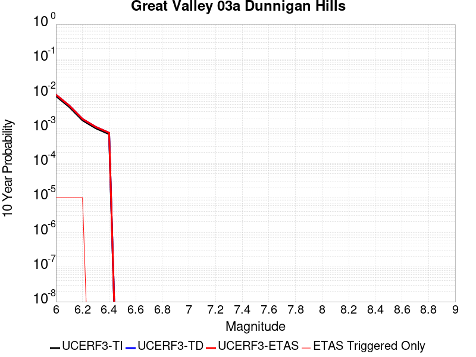 |

| Magnitude | 1 wk TI Prob | 1 wk TD Prob | 1 wk ETAS Prob | 1 wk ETAS/TD Gain | 1 wk ETAS Triggered Only | 1 mo TI Prob | 1 mo TD Prob | 1 mo ETAS Prob | 1 mo ETAS/TD Gain | 1 mo ETAS Triggered Only | 1 yr TI Prob | 1 yr TD Prob | 1 yr ETAS Prob | 1 yr ETAS/TD Gain | 1 yr ETAS Triggered Only | 10 yr TI Prob | 10 yr TD Prob | 10 yr ETAS Prob | 10 yr ETAS/TD Gain | 10 yr ETAS Triggered Only |
|-----|-----|-----|-----|-----|-----|-----|-----|-----|-----|-----|-----|-----|-----|-----|-----|-----|-----|-----|-----|-----|
| 6.0 | 1.6591328E-5 | 1.8107954E-5 | 3.029691E-5 | 1.6731272 | 1.2189176E-5 | 7.110376E-5 | 7.7603596E-5 | 8.979183E-5 | 1.1570575 | 1.2189176E-5 | 8.6534437E-4 | 9.444834E-4 | 9.5666107E-4 | 1.0128934 | 1.2189176E-5 | 0.008619824 | 0.009411525 | 0.0094236 | 1.0012829 | 1.2189176E-5 |
| 6.1 | 8.041125E-6 | 8.769726E-6 | 2.0958796E-5 | 2.389903 | 1.2189176E-5 | 3.4461507E-5 | 3.7584115E-5 | 4.9772832E-5 | 1.324305 | 1.2189176E-5 | 4.194881E-4 | 4.5751085E-4 | 4.6969444E-4 | 1.0266302 | 1.2189176E-5 | 0.004186971 | 0.004567687 | 0.0045798207 | 1.0026563 | 1.2189176E-5 |
| 6.2 | 3.2807004E-6 | 3.5795688E-6 | 1.57687E-5 | 4.4051957 | 1.2189176E-5 | 1.4060069E-5 | 1.5340942E-5 | 2.7529932E-5 | 1.7945398 | 1.2189176E-5 | 1.7116789E-4 | 1.8676413E-4 | 1.9895102E-4 | 1.0652529 | 1.2189176E-5 | 0.0017103611 | 0.0018664796 | 0.0018786461 | 1.0065184 | 1.2189176E-5 |
| 6.3 | 1.9339366E-6 | 2.1103806E-6 | 2.1103806E-6 | 1.0 | 0.0 | 8.288273E-6 | 9.044474E-6 | 9.044474E-6 | 1.0 | 0.0 | 1.00905054E-4 | 1.1011375E-4 | 1.1011375E-4 | 1.0 | 0.0 | 0.0010085925 | 0.0011008718 | 0.0011008718 | 1.0 | 0.0 |
| 6.4 | 1.3142635E-6 | 1.4339867E-6 | 1.4339867E-6 | 1.0 | 0.0 | 5.6325457E-6 | 6.145657E-6 | 6.145657E-6 | 1.0 | 0.0 | 6.857408E-5 | 7.482337E-5 | 7.482337E-5 | 1.0 | 0.0 | 6.8552926E-4 | 7.4823375E-4 | 7.4823375E-4 | 1.0 | 0.0 |

## Channel Islands Thrust
*[(top)](#table-of-contents)*

| 1 Week | 1 Month | 1 Year | 10 Year |
|-----|-----|-----|-----|
|  |  |  |  |

| Magnitude | 1 wk TI Prob | 1 wk TD Prob | 1 wk ETAS Prob | 1 wk ETAS/TD Gain | 1 wk ETAS Triggered Only | 1 mo TI Prob | 1 mo TD Prob | 1 mo ETAS Prob | 1 mo ETAS/TD Gain | 1 mo ETAS Triggered Only | 1 yr TI Prob | 1 yr TD Prob | 1 yr ETAS Prob | 1 yr ETAS/TD Gain | 1 yr ETAS Triggered Only | 10 yr TI Prob | 10 yr TD Prob | 10 yr ETAS Prob | 10 yr ETAS/TD Gain | 10 yr ETAS Triggered Only |
|-----|-----|-----|-----|-----|-----|-----|-----|-----|-----|-----|-----|-----|-----|-----|-----|-----|-----|-----|-----|-----|
| 6.0 | 2.2156251E-5 | 2.4092022E-5 | 3.6280904E-5 | 1.5059302 | 1.2189176E-5 | 9.495191E-5 | 1.03248036E-4 | 1.15435956E-4 | 1.118045 | 1.2189176E-5 | 0.0011554264 | 0.0012564264 | 0.0012686003 | 1.0096893 | 1.2189176E-5 | 0.011494373 | 0.0125038205 | 0.012515857 | 1.0009626 | 1.2189176E-5 |
| 6.1 | 2.2156251E-5 | 2.4092022E-5 | 3.6280904E-5 | 1.5059302 | 1.2189176E-5 | 9.495191E-5 | 1.03248036E-4 | 1.15435956E-4 | 1.118045 | 1.2189176E-5 | 0.0011554264 | 0.0012564264 | 0.0012686003 | 1.0096893 | 1.2189176E-5 | 0.011494373 | 0.0125038205 | 0.012515857 | 1.0009626 | 1.2189176E-5 |
| 6.2 | 2.2156251E-5 | 2.4092022E-5 | 3.6280904E-5 | 1.5059302 | 1.2189176E-5 | 9.495191E-5 | 1.03248036E-4 | 1.15435956E-4 | 1.118045 | 1.2189176E-5 | 0.0011554264 | 0.0012564264 | 0.0012686003 | 1.0096893 | 1.2189176E-5 | 0.011494373 | 0.0125038205 | 0.012515857 | 1.0009626 | 1.2189176E-5 |
| 6.3 | 2.2156251E-5 | 2.4092022E-5 | 3.6280904E-5 | 1.5059302 | 1.2189176E-5 | 9.495191E-5 | 1.03248036E-4 | 1.15435956E-4 | 1.118045 | 1.2189176E-5 | 0.0011554264 | 0.0012564264 | 0.0012686003 | 1.0096893 | 1.2189176E-5 | 0.011494373 | 0.0125038205 | 0.012515857 | 1.0009626 | 1.2189176E-5 |
| 6.4 | 2.2156251E-5 | 2.4092022E-5 | 3.6280904E-5 | 1.5059302 | 1.2189176E-5 | 9.495191E-5 | 1.03248036E-4 | 1.15435956E-4 | 1.118045 | 1.2189176E-5 | 0.0011554264 | 0.0012564264 | 0.0012686003 | 1.0096893 | 1.2189176E-5 | 0.011494373 | 0.0125038205 | 0.012515857 | 1.0009626 | 1.2189176E-5 |
| 6.5 | 2.2156251E-5 | 2.4092022E-5 | 3.6280904E-5 | 1.5059302 | 1.2189176E-5 | 9.495191E-5 | 1.03248036E-4 | 1.15435956E-4 | 1.118045 | 1.2189176E-5 | 0.0011554264 | 0.0012564264 | 0.0012686003 | 1.0096893 | 1.2189176E-5 | 0.011494373 | 0.0125038205 | 0.012515857 | 1.0009626 | 1.2189176E-5 |
| 6.6 | 2.2156251E-5 | 2.4092022E-5 | 3.6280904E-5 | 1.5059302 | 1.2189176E-5 | 9.495191E-5 | 1.03248036E-4 | 1.15435956E-4 | 1.118045 | 1.2189176E-5 | 0.0011554264 | 0.0012564264 | 0.0012686003 | 1.0096893 | 1.2189176E-5 | 0.011494373 | 0.0125038205 | 0.012515857 | 1.0009626 | 1.2189176E-5 |
| 6.7 | 1.0601296E-5 | 1.1379544E-5 | 1.1379544E-5 | 1.0 | 0.0 | 4.5433335E-5 | 4.876859E-5 | 4.876859E-5 | 1.0 | 0.0 | 5.5301044E-4 | 5.936007E-4 | 5.936007E-4 | 1.0 | 0.0 | 0.005516363 | 0.005920653 | 0.005920653 | 1.0 | 0.0 |
| 6.8 | 1.0246747E-5 | 1.0996669E-5 | 1.0996669E-5 | 1.0 | 0.0 | 4.391389E-5 | 4.7127756E-5 | 4.7127756E-5 | 1.0 | 0.0 | 5.345204E-4 | 5.7363417E-4 | 5.7363417E-4 | 1.0 | 0.0 | 0.0053323656 | 0.005722025 | 0.005722025 | 1.0 | 0.0 |
| 6.9 | 9.049551E-6 | 9.699645E-6 | 9.699645E-6 | 1.0 | 0.0 | 3.878322E-5 | 4.1569267E-5 | 4.1569267E-5 | 1.0 | 0.0 | 4.7208337E-4 | 5.059924E-4 | 5.059924E-4 | 1.0 | 0.0 | 0.0047108172 | 0.0050488203 | 0.0050488203 | 1.0 | 0.0 |
| 7.0 | 8.6542195E-6 | 9.274603E-6 | 9.274603E-6 | 1.0 | 0.0 | 3.7088983E-5 | 3.9747716E-5 | 3.9747716E-5 | 1.0 | 0.0 | 4.5146482E-4 | 4.8382508E-4 | 4.8382508E-4 | 1.0 | 0.0 | 0.004505487 | 0.004828129 | 0.004828129 | 1.0 | 0.0 |
| 7.1 | 8.391028E-6 | 8.992924E-6 | 8.992924E-6 | 1.0 | 0.0 | 3.5961057E-5 | 3.854056E-5 | 3.854056E-5 | 1.0 | 0.0 | 4.3773788E-4 | 4.6913436E-4 | 4.6913436E-4 | 1.0 | 0.0 | 0.004368766 | 0.0046818503 | 0.0046818503 | 1.0 | 0.0 |
| 7.2 | 5.965188E-6 | 6.3716952E-6 | 6.3716952E-6 | 1.0 | 0.0 | 2.556484E-5 | 2.7306982E-5 | 2.7306982E-5 | 1.0 | 0.0 | 3.1120746E-4 | 3.3241234E-4 | 3.3241234E-4 | 1.0 | 0.0 | 0.00310772 | 0.0033192092 | 0.0033192092 | 1.0 | 0.0 |
| 7.3 | 4.877518E-6 | 5.2060063E-6 | 5.2060063E-6 | 1.0 | 0.0 | 2.0903482E-5 | 2.2311267E-5 | 2.2311267E-5 | 1.0 | 0.0 | 2.5447016E-4 | 2.716063E-4 | 2.716063E-4 | 1.0 | 0.0 | 0.0025417898 | 0.0027127895 | 0.0027127895 | 1.0 | 0.0 |
| 7.4 | 3.8829853E-6 | 4.141863E-6 | 4.141863E-6 | 1.0 | 0.0 | 1.664126E-5 | 1.7750723E-5 | 1.7750723E-5 | 1.0 | 0.0 | 2.0258849E-4 | 2.1609402E-4 | 2.1609402E-4 | 1.0 | 0.0 | 0.002024039 | 0.0021588807 | 0.0021588807 | 1.0 | 0.0 |
| 7.5 | 1.3489616E-6 | 1.4277903E-6 | 1.4277903E-6 | 1.0 | 0.0 | 5.7812517E-6 | 6.119087E-6 | 6.119087E-6 | 1.0 | 0.0 | 7.038446E-5 | 7.449738E-5 | 7.449738E-5 | 1.0 | 0.0 | 7.036218E-4 | 7.44728E-4 | 7.44728E-4 | 1.0 | 0.0 |
| 7.6 | 6.058192E-7 | 6.353778E-7 | 6.353778E-7 | 1.0 | 0.0 | 2.5963652E-6 | 2.7230449E-6 | 2.7230449E-6 | 1.0 | 0.0 | 3.161029E-5 | 3.3152584E-5 | 3.3152584E-5 | 1.0 | 0.0 | 3.1605794E-4 | 3.31478E-4 | 3.31478E-4 | 1.0 | 0.0 |
| 7.7 | 2.2170494E-7 | 2.2607902E-7 | 2.2607902E-7 | 1.0 | 0.0 | 9.5016367E-7 | 9.689098E-7 | 9.689098E-7 | 1.0 | 0.0 | 1.1568181E-5 | 1.1796425E-5 | 1.1796425E-5 | 1.0 | 0.0 | 1.1567579E-4 | 1.1795909E-4 | 1.1795909E-4 | 1.0 | 0.0 |
| 7.8 | 2.1613102E-8 | 1.5466682E-8 | 1.5466682E-8 | 1.0 | 0.0 | 9.262757E-8 | 6.628578E-8 | 6.628578E-8 | 1.0 | 0.0 | 1.1277401E-6 | 8.070291E-7 | 8.070291E-7 | 1.0 | 0.0 | 1.1277344E-5 | 8.070269E-6 | 8.070269E-6 | 1.0 | 0.0 |

## Oak Ridge (Onshore)
*[(top)](#table-of-contents)*

| 1 Week | 1 Month | 1 Year | 10 Year |
|-----|-----|-----|-----|
|  |  |  |  |

| Magnitude | 1 wk TI Prob | 1 wk TD Prob | 1 wk ETAS Prob | 1 wk ETAS/TD Gain | 1 wk ETAS Triggered Only | 1 mo TI Prob | 1 mo TD Prob | 1 mo ETAS Prob | 1 mo ETAS/TD Gain | 1 mo ETAS Triggered Only | 1 yr TI Prob | 1 yr TD Prob | 1 yr ETAS Prob | 1 yr ETAS/TD Gain | 1 yr ETAS Triggered Only | 10 yr TI Prob | 10 yr TD Prob | 10 yr ETAS Prob | 10 yr ETAS/TD Gain | 10 yr ETAS Triggered Only |
|-----|-----|-----|-----|-----|-----|-----|-----|-----|-----|-----|-----|-----|-----|-----|-----|-----|-----|-----|-----|-----|
| 6.0 | 3.155064E-5 | 2.9525974E-5 | 4.171479E-5 | 1.4128168 | 1.2189176E-5 | 1.3521002E-4 | 1.2653397E-4 | 1.387216E-4 | 1.0963191 | 1.2189176E-5 | 0.001644939 | 0.0015395004 | 0.0015516708 | 1.0079055 | 1.2189176E-5 | 0.01632816 | 0.015292859 | 0.015304862 | 1.0007849 | 1.2189176E-5 |
| 6.1 | 3.155064E-5 | 2.9525974E-5 | 4.171479E-5 | 1.4128168 | 1.2189176E-5 | 1.3521002E-4 | 1.2653397E-4 | 1.387216E-4 | 1.0963191 | 1.2189176E-5 | 0.001644939 | 0.0015395004 | 0.0015516708 | 1.0079055 | 1.2189176E-5 | 0.01632816 | 0.015292859 | 0.015304862 | 1.0007849 | 1.2189176E-5 |
| 6.2 | 3.155064E-5 | 2.9525974E-5 | 4.171479E-5 | 1.4128168 | 1.2189176E-5 | 1.3521002E-4 | 1.2653397E-4 | 1.387216E-4 | 1.0963191 | 1.2189176E-5 | 0.001644939 | 0.0015395004 | 0.0015516708 | 1.0079055 | 1.2189176E-5 | 0.01632816 | 0.015292859 | 0.015304862 | 1.0007849 | 1.2189176E-5 |
| 6.3 | 3.155064E-5 | 2.9525974E-5 | 4.171479E-5 | 1.4128168 | 1.2189176E-5 | 1.3521002E-4 | 1.2653397E-4 | 1.387216E-4 | 1.0963191 | 1.2189176E-5 | 0.001644939 | 0.0015395004 | 0.0015516708 | 1.0079055 | 1.2189176E-5 | 0.01632816 | 0.015292859 | 0.015304862 | 1.0007849 | 1.2189176E-5 |
| 6.4 | 3.155064E-5 | 2.9525974E-5 | 4.171479E-5 | 1.4128168 | 1.2189176E-5 | 1.3521002E-4 | 1.2653397E-4 | 1.387216E-4 | 1.0963191 | 1.2189176E-5 | 0.001644939 | 0.0015395004 | 0.0015516708 | 1.0079055 | 1.2189176E-5 | 0.01632816 | 0.015292859 | 0.015304862 | 1.0007849 | 1.2189176E-5 |
| 6.5 | 3.155064E-5 | 2.9525974E-5 | 4.171479E-5 | 1.4128168 | 1.2189176E-5 | 1.3521002E-4 | 1.2653397E-4 | 1.387216E-4 | 1.0963191 | 1.2189176E-5 | 0.001644939 | 0.0015395004 | 0.0015516708 | 1.0079055 | 1.2189176E-5 | 0.01632816 | 0.015292859 | 0.015304862 | 1.0007849 | 1.2189176E-5 |
| 6.6 | 3.155064E-5 | 2.9525974E-5 | 4.171479E-5 | 1.4128168 | 1.2189176E-5 | 1.3521002E-4 | 1.2653397E-4 | 1.387216E-4 | 1.0963191 | 1.2189176E-5 | 0.001644939 | 0.0015395004 | 0.0015516708 | 1.0079055 | 1.2189176E-5 | 0.01632816 | 0.015292859 | 0.015304862 | 1.0007849 | 1.2189176E-5 |
| 6.7 | 3.098897E-5 | 2.8864175E-5 | 4.1052997E-5 | 1.4222821 | 1.2189176E-5 | 1.328031E-4 | 1.2369796E-4 | 1.3588562E-4 | 1.0985277 | 1.2189176E-5 | 0.0016156785 | 0.0015050198 | 0.0015171907 | 1.0080868 | 1.2189176E-5 | 0.016039822 | 0.014952714 | 0.01496472 | 1.000803 | 1.2189176E-5 |
| 6.8 | 3.0449872E-5 | 2.8239372E-5 | 4.0428204E-5 | 1.4316255 | 1.2189176E-5 | 1.3049292E-4 | 1.2102048E-4 | 1.3320817E-4 | 1.1007078 | 1.2189176E-5 | 0.0015875935 | 0.0014724657 | 0.0014846369 | 1.0082659 | 1.2189176E-5 | 0.015762992 | 0.014631462 | 0.014643473 | 1.0008209 | 1.2189176E-5 |
| 6.9 | 2.697928E-5 | 2.4219773E-5 | 3.6408655E-5 | 1.5032616 | 1.2189176E-5 | 1.15620365E-4 | 1.0379502E-4 | 1.1598293E-4 | 1.1174229 | 1.2189176E-5 | 0.0014067689 | 0.0012629933 | 0.0012751671 | 1.0096388 | 1.2189176E-5 | 0.0139789665 | 0.01256087 | 0.012572906 | 1.0009582 | 1.2189176E-5 |
| 7.0 | 2.4893961E-5 | 2.1862043E-5 | 3.405095E-5 | 1.5575376 | 1.2189176E-5 | 1.0668404E-4 | 9.3691204E-5 | 1.0587923E-4 | 1.1300873 | 1.2189176E-5 | 0.0012981043 | 0.0011401111 | 0.0011522864 | 1.010679 | 1.2189176E-5 | 0.012905477 | 0.011344905 | 0.011356956 | 1.0010623 | 1.2189176E-5 |
| 7.1 | 2.0945363E-5 | 1.7354487E-5 | 2.9543451E-5 | 1.7023523 | 1.2189176E-5 | 8.976275E-5 | 7.437428E-5 | 8.656255E-5 | 1.1638775 | 1.2189176E-5 | 0.0010923136 | 9.051354E-4 | 9.1731356E-4 | 1.0134546 | 1.2189176E-5 | 0.0108696 | 0.009015423 | 0.0090275025 | 1.0013398 | 1.2189176E-5 |
| 7.2 | 2.0439404E-5 | 1.6809423E-5 | 2.8998395E-5 | 1.7251272 | 1.2189176E-5 | 8.7594504E-5 | 7.203843E-5 | 8.4226725E-5 | 1.1691916 | 1.2189176E-5 | 0.0010659413 | 8.767196E-4 | 8.8889804E-4 | 1.013891 | 1.2189176E-5 | 0.010608427 | 0.008733526 | 0.008745609 | 1.0013835 | 1.2189176E-5 |
| 7.3 | 1.8463334E-5 | 1.5381811E-5 | 2.7570799E-5 | 1.7924287 | 1.2189176E-5 | 7.912617E-5 | 6.59204E-5 | 7.810877E-5 | 1.1848953 | 1.2189176E-5 | 9.6293533E-4 | 8.0228975E-4 | 8.144691E-4 | 1.0151808 | 1.2189176E-5 | 0.009587734 | 0.007994797 | 0.008006888 | 1.0015124 | 1.2189176E-5 |
| 7.4 | 1.763139E-5 | 1.451684E-5 | 2.6705839E-5 | 1.8396455 | 1.2189176E-5 | 7.556091E-5 | 6.221356E-5 | 7.4401985E-5 | 1.1959125 | 1.2189176E-5 | 9.1956573E-4 | 7.571909E-4 | 7.693708E-4 | 1.0160857 | 1.2189176E-5 | 0.009157699 | 0.007546914 | 0.0075590108 | 1.0016029 | 1.2189176E-5 |
| 7.5 | 1.3594944E-5 | 1.1163356E-5 | 2.3352397E-5 | 2.0918796 | 1.2189176E-5 | 5.8262744E-5 | 4.784209E-5 | 6.0030685E-5 | 1.2547672 | 1.2189176E-5 | 7.0911803E-4 | 5.8232434E-4 | 5.945064E-4 | 1.0209198 | 1.2189176E-5 | 0.007068595 | 0.0058082556 | 0.005820374 | 1.0020864 | 1.2189176E-5 |
| 7.6 | 6.9889534E-6 | 5.6367144E-6 | 5.6367144E-6 | 1.0 | 0.0 | 2.9952313E-5 | 2.4157125E-5 | 2.4157125E-5 | 1.0 | 0.0 | 3.646084E-4 | 2.9407372E-4 | 2.9407372E-4 | 1.0 | 0.0 | 0.0036401073 | 0.0029368899 | 0.0029368899 | 1.0 | 0.0 |
| 7.7 | 4.0824193E-6 | 3.2832586E-6 | 3.2832586E-6 | 1.0 | 0.0 | 1.7495966E-5 | 1.4071033E-5 | 1.4071033E-5 | 1.0 | 0.0 | 2.1299256E-4 | 1.713015E-4 | 1.713015E-4 | 1.0 | 0.0 | 0.0021278851 | 0.0017117079 | 0.0017117079 | 1.0 | 0.0 |
| 7.8 | 1.7023609E-6 | 1.4370495E-6 | 1.4370495E-6 | 1.0 | 0.0 | 7.295812E-6 | 6.1587693E-6 | 6.1587693E-6 | 1.0 | 0.0 | 8.882289E-5 | 7.498047E-5 | 7.498047E-5 | 1.0 | 0.0 | 8.8787393E-4 | 7.495545E-4 | 7.495545E-4 | 1.0 | 0.0 |
| 7.9 | 2.721225E-7 | 2.2616497E-7 | 2.2616497E-7 | 1.0 | 0.0 | 1.1662388E-6 | 9.692781E-7 | 9.692781E-7 | 1.0 | 0.0 | 1.4198865E-5 | 1.1800899E-5 | 1.1800899E-5 | 1.0 | 0.0 | 1.4197957E-4 | 1.1800301E-4 | 1.1800301E-4 | 1.0 | 0.0 |
| 8.0 | 9.364255E-9 | 5.1206666E-9 | 5.1206666E-9 | 1.0 | 0.0 | 4.0132523E-8 | 2.1945715E-8 | 2.1945715E-8 | 1.0 | 0.0 | 4.8861335E-7 | 2.6718905E-7 | 2.6718905E-7 | 1.0 | 0.0 | 4.8861225E-6 | 2.6718876E-6 | 2.6718876E-6 | 1.0 | 0.0 |

## Malibu Coast (Extension) alt 1
*[(top)](#table-of-contents)*

| 1 Week | 1 Month | 1 Year | 10 Year |
|-----|-----|-----|-----|
|  |  | 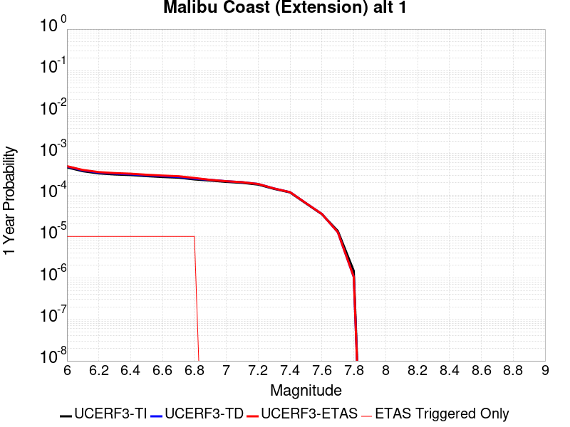 |  |

| Magnitude | 1 wk TI Prob | 1 wk TD Prob | 1 wk ETAS Prob | 1 wk ETAS/TD Gain | 1 wk ETAS Triggered Only | 1 mo TI Prob | 1 mo TD Prob | 1 mo ETAS Prob | 1 mo ETAS/TD Gain | 1 mo ETAS Triggered Only | 1 yr TI Prob | 1 yr TD Prob | 1 yr ETAS Prob | 1 yr ETAS/TD Gain | 1 yr ETAS Triggered Only | 10 yr TI Prob | 10 yr TD Prob | 10 yr ETAS Prob | 10 yr ETAS/TD Gain | 10 yr ETAS Triggered Only |
|-----|-----|-----|-----|-----|-----|-----|-----|-----|-----|-----|-----|-----|-----|-----|-----|-----|-----|-----|-----|-----|
| 6.0 | 8.930738E-6 | 9.329276E-6 | 2.1518337E-5 | 2.306539 | 1.2189176E-5 | 3.827403E-5 | 3.998201E-5 | 5.2170697E-5 | 1.3048544 | 1.2189176E-5 | 4.6588664E-4 | 4.8667393E-4 | 4.988572E-4 | 1.0250337 | 1.2189176E-5 | 0.0046491115 | 0.004856264 | 0.0048683938 | 1.0024978 | 1.2189176E-5 |
| 6.1 | 7.199952E-6 | 7.5302964E-6 | 1.971938E-5 | 2.6186726 | 1.2189176E-5 | 3.0856572E-5 | 3.2272303E-5 | 4.4461085E-5 | 1.3776855 | 1.2189176E-5 | 3.75614E-4 | 3.9284505E-4 | 4.0502945E-4 | 1.0310158 | 1.2189176E-5 | 0.0037497976 | 0.003921572 | 0.003933714 | 1.0030961 | 1.2189176E-5 |
| 6.2 | 6.3721413E-6 | 6.6667917E-6 | 1.8855886E-5 | 2.82833 | 1.2189176E-5 | 2.7308892E-5 | 2.8571652E-5 | 4.0760482E-5 | 1.4266056 | 1.2189176E-5 | 3.3243504E-4 | 3.4780471E-4 | 3.5998964E-4 | 1.0350338 | 1.2189176E-5 | 0.0033193815 | 0.0034726437 | 0.0034847904 | 1.0034978 | 1.2189176E-5 |
| 6.3 | 6.016345E-6 | 6.295158E-6 | 1.8484257E-5 | 2.9362657 | 1.2189176E-5 | 2.578408E-5 | 2.6978973E-5 | 3.916782E-5 | 1.4517907 | 1.2189176E-5 | 3.1387596E-4 | 3.2841982E-4 | 3.4060498E-4 | 1.0371025 | 1.2189176E-5 | 0.00313433 | 0.0032793807 | 0.0032915298 | 1.0037047 | 1.2189176E-5 |
| 6.4 | 5.8104883E-6 | 6.0795446E-6 | 1.8268647E-5 | 3.0049367 | 1.2189176E-5 | 2.4901856E-5 | 2.6054933E-5 | 3.824379E-5 | 1.4678138 | 1.2189176E-5 | 3.031379E-4 | 3.1717293E-4 | 3.2935824E-4 | 1.0384185 | 1.2189176E-5 | 0.0030272473 | 0.0031672374 | 0.003179388 | 1.0038363 | 1.2189176E-5 |
| 6.5 | 5.476925E-6 | 5.7275133E-6 | 1.791662E-5 | 3.1281674 | 1.2189176E-5 | 2.3472323E-5 | 2.4546256E-5 | 3.673513E-5 | 1.4965676 | 1.2189176E-5 | 2.8573806E-4 | 2.9880996E-4 | 3.109955E-4 | 1.0407802 | 1.2189176E-5 | 0.0028537093 | 0.002984114 | 0.0029962668 | 1.0040725 | 1.2189176E-5 |
| 6.6 | 5.222387E-6 | 5.45858E-6 | 1.764769E-5 | 3.2330184 | 1.2189176E-5 | 2.2381464E-5 | 2.3393704E-5 | 3.5582594E-5 | 1.5210329 | 1.2189176E-5 | 2.7246025E-4 | 2.8478142E-4 | 2.9696713E-4 | 1.0427897 | 1.2189176E-5 | 0.0027212645 | 0.0028441956 | 0.00285635 | 1.0042734 | 1.2189176E-5 |
| 6.7 | 5.0337076E-6 | 5.259103E-6 | 1.7448216E-5 | 3.3177168 | 1.2189176E-5 | 2.1572854E-5 | 2.253882E-5 | 3.472772E-5 | 1.5407959 | 1.2189176E-5 | 2.6261783E-4 | 2.7437587E-4 | 2.865617E-4 | 1.044413 | 1.2189176E-5 | 0.002623077 | 0.002740401 | 0.002752557 | 1.0044358 | 1.2189176E-5 |
| 6.8 | 4.5675624E-6 | 4.7587164E-6 | 1.6947835E-5 | 3.5614297 | 1.2189176E-5 | 1.9575122E-5 | 2.039434E-5 | 3.258327E-5 | 1.5976622 | 1.2189176E-5 | 2.3830103E-4 | 2.48273E-4 | 2.6045914E-4 | 1.0490837 | 1.2189176E-5 | 0.0023804565 | 0.002479976 | 0.002492135 | 1.0049028 | 1.2189176E-5 |
| 6.9 | 4.2802412E-6 | 4.4520207E-6 | 4.4520207E-6 | 1.0 | 0.0 | 1.8343762E-5 | 1.907995E-5 | 1.907995E-5 | 1.0 | 0.0 | 2.2331243E-4 | 2.3227377E-4 | 2.3227377E-4 | 1.0 | 0.0 | 0.0022308815 | 0.0023203269 | 0.0023203269 | 1.0 | 0.0 |
| 7.0 | 3.9794063E-6 | 4.130099E-6 | 4.130099E-6 | 1.0 | 0.0 | 1.7054486E-5 | 1.7700306E-5 | 1.7700306E-5 | 1.0 | 0.0 | 2.0761859E-4 | 2.1548003E-4 | 2.1548003E-4 | 1.0 | 0.0 | 0.0020742472 | 0.0021527244 | 0.0021527244 | 1.0 | 0.0 |
| 7.1 | 3.7730424E-6 | 3.911217E-6 | 3.911217E-6 | 1.0 | 0.0 | 1.6170083E-5 | 1.6762251E-5 | 1.6762251E-5 | 1.0 | 0.0 | 1.9685295E-4 | 2.0406142E-4 | 2.0406142E-4 | 1.0 | 0.0 | 0.0019667868 | 0.0020387534 | 0.0020387534 | 1.0 | 0.0 |
| 7.2 | 3.424985E-6 | 3.541337E-6 | 3.541337E-6 | 1.0 | 0.0 | 1.4678424E-5 | 1.5177071E-5 | 1.5177071E-5 | 1.0 | 0.0 | 1.7869516E-4 | 1.8476529E-4 | 1.8476529E-4 | 1.0 | 0.0 | 0.0017855153 | 0.0018461287 | 0.0018461287 | 1.0 | 0.0 |
| 7.3 | 2.6966375E-6 | 2.7596534E-6 | 2.7596534E-6 | 1.0 | 0.0 | 1.15569665E-5 | 1.1827032E-5 | 1.1827032E-5 | 1.0 | 0.0 | 1.4069698E-4 | 1.4398464E-4 | 1.4398464E-4 | 1.0 | 0.0 | 0.0014060794 | 0.0014389176 | 0.0014389176 | 1.0 | 0.0 |
| 7.4 | 2.215957E-6 | 2.249378E-6 | 2.249378E-6 | 1.0 | 0.0 | 9.496924E-6 | 9.640156E-6 | 9.640156E-6 | 1.0 | 0.0 | 1.1561892E-4 | 1.17362615E-4 | 1.17362615E-4 | 1.0 | 0.0 | 0.0011555878 | 0.0011730101 | 0.0011730101 | 1.0 | 0.0 |
| 7.5 | 1.2040218E-6 | 1.2219067E-6 | 1.2219067E-6 | 1.0 | 0.0 | 5.160083E-6 | 5.2367322E-6 | 5.2367322E-6 | 1.0 | 0.0 | 6.2822204E-5 | 6.375537E-5 | 6.375537E-5 | 1.0 | 0.0 | 6.280445E-4 | 6.3737266E-4 | 6.3737266E-4 | 1.0 | 0.0 |
| 7.6 | 6.6157446E-7 | 6.678975E-7 | 6.678975E-7 | 1.0 | 0.0 | 2.835316E-6 | 2.8624147E-6 | 2.8624147E-6 | 1.0 | 0.0 | 3.4519428E-5 | 3.484936E-5 | 3.484936E-5 | 1.0 | 0.0 | 3.4514067E-4 | 3.4844046E-4 | 3.4844046E-4 | 1.0 | 0.0 |
| 7.7 | 2.6012302E-7 | 2.4357593E-7 | 2.4357593E-7 | 1.0 | 0.0 | 1.1148124E-6 | 1.0438964E-6 | 1.0438964E-6 | 1.0 | 0.0 | 1.3572758E-5 | 1.2709375E-5 | 1.2709375E-5 | 1.0 | 0.0 | 1.3571928E-4 | 1.2708755E-4 | 1.2708755E-4 | 1.0 | 0.0 |
| 7.8 | 2.8323132E-8 | 2.0266649E-8 | 2.0266649E-8 | 1.0 | 0.0 | 1.2138484E-7 | 8.685707E-8 | 8.685707E-8 | 1.0 | 0.0 | 1.4778595E-6 | 1.0574844E-6 | 1.0574844E-6 | 1.0 | 0.0 | 1.4778497E-5 | 1.0574801E-5 | 1.0574801E-5 | 1.0 | 0.0 |

## Homestead Valley 2011
*[(top)](#table-of-contents)*

| 1 Week | 1 Month | 1 Year | 10 Year |
|-----|-----|-----|-----|
|  |  |  |  |

| Magnitude | 1 wk TI Prob | 1 wk TD Prob | 1 wk ETAS Prob | 1 wk ETAS/TD Gain | 1 wk ETAS Triggered Only | 1 mo TI Prob | 1 mo TD Prob | 1 mo ETAS Prob | 1 mo ETAS/TD Gain | 1 mo ETAS Triggered Only | 1 yr TI Prob | 1 yr TD Prob | 1 yr ETAS Prob | 1 yr ETAS/TD Gain | 1 yr ETAS Triggered Only | 10 yr TI Prob | 10 yr TD Prob | 10 yr ETAS Prob | 10 yr ETAS/TD Gain | 10 yr ETAS Triggered Only |
|-----|-----|-----|-----|-----|-----|-----|-----|-----|-----|-----|-----|-----|-----|-----|-----|-----|-----|-----|-----|-----|
| 6.0 | 1.539795E-5 | 6.286606E-6 | 6.286606E-6 | 1.0 | 0.0 | 6.5989545E-5 | 2.6942436E-5 | 2.6942436E-5 | 1.0 | 0.0 | 8.0312655E-4 | 3.279954E-4 | 3.4018056E-4 | 1.0371505 | 1.2189176E-5 | 0.008002302 | 0.0032771337 | 0.003289283 | 1.0037073 | 1.2189176E-5 |
| 6.1 | 1.539795E-5 | 6.286606E-6 | 6.286606E-6 | 1.0 | 0.0 | 6.5989545E-5 | 2.6942436E-5 | 2.6942436E-5 | 1.0 | 0.0 | 8.0312655E-4 | 3.279954E-4 | 3.4018056E-4 | 1.0371505 | 1.2189176E-5 | 0.008002302 | 0.0032771337 | 0.003289283 | 1.0037073 | 1.2189176E-5 |
| 6.2 | 1.539795E-5 | 6.286606E-6 | 6.286606E-6 | 1.0 | 0.0 | 6.5989545E-5 | 2.6942436E-5 | 2.6942436E-5 | 1.0 | 0.0 | 8.0312655E-4 | 3.279954E-4 | 3.4018056E-4 | 1.0371505 | 1.2189176E-5 | 0.008002302 | 0.0032771337 | 0.003289283 | 1.0037073 | 1.2189176E-5 |
| 6.3 | 1.539795E-5 | 6.286606E-6 | 6.286606E-6 | 1.0 | 0.0 | 6.5989545E-5 | 2.6942436E-5 | 2.6942436E-5 | 1.0 | 0.0 | 8.0312655E-4 | 3.279954E-4 | 3.4018056E-4 | 1.0371505 | 1.2189176E-5 | 0.008002302 | 0.0032771337 | 0.003289283 | 1.0037073 | 1.2189176E-5 |
| 6.4 | 1.539795E-5 | 6.286606E-6 | 6.286606E-6 | 1.0 | 0.0 | 6.5989545E-5 | 2.6942436E-5 | 2.6942436E-5 | 1.0 | 0.0 | 8.0312655E-4 | 3.279954E-4 | 3.4018056E-4 | 1.0371505 | 1.2189176E-5 | 0.008002302 | 0.0032771337 | 0.003289283 | 1.0037073 | 1.2189176E-5 |
| 6.5 | 1.0265258E-5 | 2.8788488E-6 | 2.8788488E-6 | 1.0 | 0.0 | 4.3993223E-5 | 1.2337905E-5 | 1.2337905E-5 | 1.0 | 0.0 | 5.3548586E-4 | 1.5021059E-4 | 1.6239793E-4 | 1.081135 | 1.2189176E-5 | 0.005341973 | 0.0015017724 | 0.0015139433 | 1.0081043 | 1.2189176E-5 |
| 6.6 | 6.664671E-6 | 5.348204E-7 | 5.348204E-7 | 1.0 | 0.0 | 2.8562565E-5 | 2.2920863E-6 | 2.2920863E-6 | 1.0 | 0.0 | 3.476937E-4 | 2.7905911E-5 | 4.0094747E-5 | 1.4367833 | 1.2189176E-5 | 0.003471502 | 2.790357E-4 | 2.9122148E-4 | 1.043671 | 1.2189176E-5 |
| 6.7 | 6.5954046E-6 | 5.348204E-7 | 5.348204E-7 | 1.0 | 0.0 | 2.8265715E-5 | 2.2920863E-6 | 2.2920863E-6 | 1.0 | 0.0 | 3.4408073E-4 | 2.7905911E-5 | 4.0094747E-5 | 1.4367833 | 1.2189176E-5 | 0.0034354846 | 2.790357E-4 | 2.9122148E-4 | 1.043671 | 1.2189176E-5 |
| 6.8 | 4.648189E-6 | 2.3265572E-7 | 2.3265572E-7 | 1.0 | 0.0 | 1.9920659E-5 | 9.970956E-7 | 9.970956E-7 | 1.0 | 0.0 | 2.4250703E-4 | 1.2139576E-5 | 2.4328605E-5 | 2.0040736 | 1.2189176E-5 | 0.0024224254 | 1.2138961E-4 | 1.3357731E-4 | 1.1004015 | 1.2189176E-5 |
| 6.9 | 4.1428534E-6 | 1.9344557E-7 | 1.9344557E-7 | 1.0 | 0.0 | 1.7754966E-5 | 8.290522E-7 | 8.290522E-7 | 1.0 | 0.0 | 2.1614527E-4 | 1.0093667E-5 | 2.228272E-5 | 2.2075942 | 1.2189176E-5 | 0.0021593515 | 1.0093238E-4 | 1.13120324E-4 | 1.1207535 | 1.2189176E-5 |
| 7.0 | 3.0673707E-6 | 1.5367603E-7 | 1.5367603E-7 | 1.0 | 0.0 | 1.3145808E-5 | 6.586114E-7 | 6.586114E-7 | 1.0 | 0.0 | 1.6003846E-4 | 8.0185655E-6 | 2.0207643E-5 | 2.5201073 | 1.2189176E-5 | 0.0015992324 | 8.0182865E-5 | 9.237106E-5 | 1.1520051 | 1.2189176E-5 |
| 7.1 | 2.340854E-6 | 1.468766E-7 | 1.468766E-7 | 1.0 | 0.0 | 1.0032193E-5 | 6.29471E-7 | 6.29471E-7 | 1.0 | 0.0 | 1.221351E-4 | 7.663783E-6 | 1.9852865E-5 | 2.5904784 | 1.2189176E-5 | 0.00122068 | 7.663529E-5 | 8.882353E-5 | 1.1590421 | 1.2189176E-5 |
| 7.2 | 1.3754182E-6 | 1.3922634E-7 | 1.3922634E-7 | 1.0 | 0.0 | 5.8946357E-6 | 5.966842E-7 | 5.966842E-7 | 1.0 | 0.0 | 7.176483E-5 | 7.2646067E-6 | 1.9453693E-5 | 2.6778731 | 1.2189176E-5 | 7.174166E-4 | 7.264379E-5 | 8.483207E-5 | 1.1677816 | 1.2189176E-5 |
| 7.3 | 1.2573237E-6 | 1.3827146E-7 | 1.3827146E-7 | 1.0 | 0.0 | 5.388519E-6 | 5.9259185E-7 | 5.9259185E-7 | 1.0 | 0.0 | 6.560324E-5 | 7.2147827E-6 | 1.9403871E-5 | 2.6894603 | 1.2189176E-5 | 6.558388E-4 | 7.214558E-5 | 8.433387E-5 | 1.1689403 | 1.2189176E-5 |
| 7.4 | 1.0994207E-6 | 1.3106106E-7 | 1.3106106E-7 | 1.0 | 0.0 | 4.7117946E-6 | 5.616901E-7 | 5.616901E-7 | 1.0 | 0.0 | 5.736459E-5 | 6.8385566E-6 | 1.902765E-5 | 2.7824073 | 1.2189176E-5 | 5.734978E-4 | 6.838355E-5 | 8.0571896E-5 | 1.178235 | 1.2189176E-5 |
| 7.5 | 5.5569126E-7 | 6.772991E-8 | 6.772991E-8 | 1.0 | 0.0 | 2.3815317E-6 | 2.90271E-7 | 2.90271E-7 | 1.0 | 0.0 | 2.8994764E-5 | 3.5340445E-6 | 3.5340445E-6 | 1.0 | 0.0 | 2.899098E-4 | 3.5339945E-5 | 3.5339945E-5 | 1.0 | 0.0 |

## Owens Valley Keough Hot Springs
*[(top)](#table-of-contents)*

| 1 Week | 1 Month | 1 Year | 10 Year |
|-----|-----|-----|-----|
|  |  |  |  |

| Magnitude | 1 wk TI Prob | 1 wk TD Prob | 1 wk ETAS Prob | 1 wk ETAS/TD Gain | 1 wk ETAS Triggered Only | 1 mo TI Prob | 1 mo TD Prob | 1 mo ETAS Prob | 1 mo ETAS/TD Gain | 1 mo ETAS Triggered Only | 1 yr TI Prob | 1 yr TD Prob | 1 yr ETAS Prob | 1 yr ETAS/TD Gain | 1 yr ETAS Triggered Only | 10 yr TI Prob | 10 yr TD Prob | 10 yr ETAS Prob | 10 yr ETAS/TD Gain | 10 yr ETAS Triggered Only |
|-----|-----|-----|-----|-----|-----|-----|-----|-----|-----|-----|-----|-----|-----|-----|-----|-----|-----|-----|-----|-----|
| 6.0 | 1.5708529E-5 | 4.950656E-6 | 1.7139771E-5 | 3.4621212 | 1.2189176E-5 | 6.7320536E-5 | 2.1216953E-5 | 3.340587E-5 | 1.5744895 | 1.2189176E-5 | 8.193192E-4 | 2.582909E-4 | 2.7047694E-4 | 1.0471795 | 1.2189176E-5 | 0.008163051 | 0.0025805652 | 0.002592723 | 1.0047113 | 1.2189176E-5 |
| 6.1 | 1.5708529E-5 | 4.950656E-6 | 1.7139771E-5 | 3.4621212 | 1.2189176E-5 | 6.7320536E-5 | 2.1216953E-5 | 3.340587E-5 | 1.5744895 | 1.2189176E-5 | 8.193192E-4 | 2.582909E-4 | 2.7047694E-4 | 1.0471795 | 1.2189176E-5 | 0.008163051 | 0.0025805652 | 0.002592723 | 1.0047113 | 1.2189176E-5 |
| 6.2 | 1.5708529E-5 | 4.950656E-6 | 1.7139771E-5 | 3.4621212 | 1.2189176E-5 | 6.7320536E-5 | 2.1216953E-5 | 3.340587E-5 | 1.5744895 | 1.2189176E-5 | 8.193192E-4 | 2.582909E-4 | 2.7047694E-4 | 1.0471795 | 1.2189176E-5 | 0.008163051 | 0.0025805652 | 0.002592723 | 1.0047113 | 1.2189176E-5 |
| 6.3 | 1.5708529E-5 | 4.950656E-6 | 1.7139771E-5 | 3.4621212 | 1.2189176E-5 | 6.7320536E-5 | 2.1216953E-5 | 3.340587E-5 | 1.5744895 | 1.2189176E-5 | 8.193192E-4 | 2.582909E-4 | 2.7047694E-4 | 1.0471795 | 1.2189176E-5 | 0.008163051 | 0.0025805652 | 0.002592723 | 1.0047113 | 1.2189176E-5 |
| 6.4 | 1.4622509E-5 | 3.7265204E-6 | 1.5915652E-5 | 4.2709146 | 1.2189176E-5 | 6.266639E-5 | 1.5970723E-5 | 2.8159704E-5 | 1.7632079 | 1.2189176E-5 | 7.626962E-4 | 1.944295E-4 | 2.0661631E-4 | 1.0626798 | 1.2189176E-5 | 0.007600839 | 0.0019430731 | 0.0019552386 | 1.006261 | 1.2189176E-5 |
| 6.5 | 1.3335527E-5 | 2.2777172E-6 | 1.4466866E-5 | 6.3514757 | 1.2189176E-5 | 5.7151006E-5 | 9.761612E-6 | 2.195067E-5 | 2.2486725 | 1.2189176E-5 | 6.955913E-4 | 1.18841825E-4 | 1.3102955E-4 | 1.1025542 | 1.2189176E-5 | 0.0069341804 | 0.0011880046 | 0.0012001793 | 1.0102481 | 1.2189176E-5 |
| 6.6 | 1.3332855E-5 | 2.2748663E-6 | 1.4464014E-5 | 6.3581824 | 1.2189176E-5 | 5.7139558E-5 | 9.749395E-6 | 2.1938451E-5 | 2.2502375 | 1.2189176E-5 | 6.9545204E-4 | 1.186931E-4 | 1.3088083E-4 | 1.1026827 | 1.2189176E-5 | 0.0069327964 | 0.0011865189 | 0.0011986936 | 1.0102608 | 1.2189176E-5 |
| 6.7 | 1.3318214E-5 | 2.2640966E-6 | 1.4453245E-5 | 6.38367 | 1.2189176E-5 | 5.707681E-5 | 9.703239E-6 | 2.1892296E-5 | 2.2561843 | 1.2189176E-5 | 6.946886E-4 | 1.1813121E-4 | 1.3031895E-4 | 1.1031712 | 1.2189176E-5 | 0.0069252094 | 0.001180906 | 0.0011930808 | 1.0103097 | 1.2189176E-5 |
| 6.8 | 1.2441338E-5 | 1.6777863E-6 | 1.3866942E-5 | 8.265023 | 1.2189176E-5 | 5.331893E-5 | 7.1904947E-6 | 1.9379582E-5 | 2.6951668 | 1.2189176E-5 | 6.489646E-4 | 8.7541055E-5 | 9.9729165E-5 | 1.1392274 | 1.2189176E-5 | 0.0064707273 | 8.752499E-4 | 8.874284E-4 | 1.0139143 | 1.2189176E-5 |
| 6.9 | 1.1130476E-5 | 1.0303868E-6 | 1.321955E-5 | 12.829698 | 1.2189176E-5 | 4.7701167E-5 | 4.415936E-6 | 1.6605058E-5 | 3.760258 | 1.2189176E-5 | 5.806069E-4 | 5.3762706E-5 | 6.595123E-5 | 1.2267096 | 1.2189176E-5 | 0.0057909233 | 5.37651E-4 | 5.498336E-4 | 1.022659 | 1.2189176E-5 |
| 7.0 | 1.0986073E-5 | 9.579413E-7 | 1.3147106E-5 | 13.724333 | 1.2189176E-5 | 4.7082318E-5 | 4.1054564E-6 | 1.6294582E-5 | 3.9690063 | 1.2189176E-5 | 5.730765E-4 | 4.99828E-5 | 6.217136E-5 | 1.2438552 | 1.2189176E-5 | 0.0057160086 | 4.9986853E-4 | 5.1205157E-4 | 1.0243726 | 1.2189176E-5 |
| 7.1 | 1.0451338E-5 | 8.0002656E-7 | 1.2989193E-5 | 16.235952 | 1.2189176E-5 | 4.4790682E-5 | 3.4286807E-6 | 1.5617816E-5 | 4.555051 | 1.2189176E-5 | 5.451901E-4 | 4.1743395E-5 | 5.393206E-5 | 1.2919903 | 1.2189176E-5 | 0.005438545 | 4.1750458E-4 | 4.2968866E-4 | 1.0291831 | 1.2189176E-5 |
| 7.2 | 9.989061E-6 | 6.544956E-7 | 1.2843664E-5 | 19.623758 | 1.2189176E-5 | 4.280956E-5 | 2.804978E-6 | 1.499412E-5 | 5.345539 | 1.2189176E-5 | 5.2108173E-4 | 3.4150078E-5 | 4.6338835E-5 | 1.3569175 | 1.2189176E-5 | 0.0051986156 | 3.415851E-4 | 3.5377013E-4 | 1.035672 | 1.2189176E-5 |
| 7.3 | 9.465365E-6 | 5.4600474E-7 | 1.2735174E-5 | 23.324293 | 1.2189176E-5 | 4.056522E-5 | 2.3400182E-6 | 1.4529166E-5 | 6.208997 | 1.2189176E-5 | 4.937696E-4 | 2.8489352E-5 | 4.067818E-5 | 1.4278381 | 1.2189176E-5 | 0.0049267393 | 2.8498896E-4 | 2.9717464E-4 | 1.0427585 | 1.2189176E-5 |
| 7.4 | 6.3824805E-6 | 4.016335E-7 | 1.25908045E-5 | 31.34899 | 1.2189176E-5 | 2.73532E-5 | 1.7212853E-6 | 1.391044E-5 | 8.081427 | 1.2189176E-5 | 3.3297433E-4 | 2.095645E-5 | 3.314537E-5 | 1.5816311 | 1.2189176E-5 | 0.0033247585 | 2.0963654E-4 | 2.2182315E-4 | 1.0581322 | 1.2189176E-5 |
| 7.5 | 1.6192645E-6 | 2.516124E-7 | 1.2440785E-5 | 49.44425 | 1.2189176E-5 | 6.9396865E-6 | 1.0783383E-6 | 1.3267501E-5 | 12.303654 | 1.2189176E-5 | 8.448741E-5 | 1.31286915E-5 | 2.5317708E-5 | 1.9284258 | 1.2189176E-5 | 8.4455294E-4 | 1.3127929E-4 | 1.4346687E-4 | 1.092837 | 1.2189176E-5 |
| 7.6 | 5.7062545E-7 | 1.07924045E-7 | 1.2297099E-5 | 113.94216 | 1.2189176E-5 | 2.4455355E-6 | 4.6253152E-7 | 1.2651702E-5 | 27.353167 | 1.2189176E-5 | 2.9773988E-5 | 5.6313074E-6 | 1.7820415E-5 | 3.1645253 | 1.2189176E-5 | 2.977E-4 | 5.6311732E-5 | 6.850022E-5 | 1.2164468 | 1.2189176E-5 |
| 7.7 | 2.5988817E-7 | 4.5457977E-8 | 1.2234634E-5 | 269.1416 | 1.2189176E-5 | 1.113806E-6 | 1.9481989E-7 | 1.2383994E-5 | 63.566372 | 1.2189176E-5 | 1.3560503E-5 | 2.3719301E-6 | 1.45610775E-5 | 6.138915 | 1.2189176E-5 | 1.3559677E-4 | 2.371909E-5 | 3.590798E-5 | 1.513885 | 1.2189176E-5 |

## Hunting Creek - Berryessa 2011 CFM
*[(top)](#table-of-contents)*

| 1 Week | 1 Month | 1 Year | 10 Year |
|-----|-----|-----|-----|
|  |  |  |  |

| Magnitude | 1 wk TI Prob | 1 wk TD Prob | 1 wk ETAS Prob | 1 wk ETAS/TD Gain | 1 wk ETAS Triggered Only | 1 mo TI Prob | 1 mo TD Prob | 1 mo ETAS Prob | 1 mo ETAS/TD Gain | 1 mo ETAS Triggered Only | 1 yr TI Prob | 1 yr TD Prob | 1 yr ETAS Prob | 1 yr ETAS/TD Gain | 1 yr ETAS Triggered Only | 10 yr TI Prob | 10 yr TD Prob | 10 yr ETAS Prob | 10 yr ETAS/TD Gain | 10 yr ETAS Triggered Only |
|-----|-----|-----|-----|-----|-----|-----|-----|-----|-----|-----|-----|-----|-----|-----|-----|-----|-----|-----|-----|-----|
| 6.0 | 1.1270982E-4 | 2.0012174E-4 | 2.1230849E-4 | 1.0608966 | 1.2189176E-5 | 4.8295266E-4 | 8.5739547E-4 | 8.695742E-4 | 1.0142044 | 1.2189176E-5 | 0.0058641075 | 0.010386313 | 0.010398376 | 1.0011613 | 1.2189176E-5 | 0.057117578 | 0.09803703 | 0.09804802 | 1.0001122 | 1.2189176E-5 |
| 6.1 | 1.1239393E-4 | 1.9960315E-4 | 2.1178988E-4 | 1.0610548 | 1.2189176E-5 | 4.8159933E-4 | 8.551744E-4 | 8.673531E-4 | 1.0142412 | 1.2189176E-5 | 0.0058477195 | 0.010359551 | 0.010371614 | 1.0011644 | 1.2189176E-5 | 0.056962132 | 0.09779551 | 0.097806506 | 1.0001124 | 1.2189176E-5 |
| 6.2 | 7.596265E-5 | 1.2940196E-4 | 1.4158957E-4 | 1.094184 | 1.2189176E-5 | 3.2551357E-4 | 5.5444165E-4 | 5.6662405E-4 | 1.0219724 | 1.2189176E-5 | 0.0039559277 | 0.0067210156 | 0.006733123 | 1.0018014 | 1.2189176E-5 | 0.038862433 | 0.0645915 | 0.0646029 | 1.0001765 | 1.2189176E-5 |
| 6.3 | 6.78794E-5 | 1.145119E-4 | 1.2669968E-4 | 1.1064324 | 1.2189176E-5 | 2.9087928E-4 | 4.906513E-4 | 5.0283445E-4 | 1.0248307 | 1.2189176E-5 | 0.003535705 | 0.005952679 | 0.0059647956 | 1.0020355 | 1.2189176E-5 | 0.034799766 | 0.057465393 | 0.057476882 | 1.0001999 | 1.2189176E-5 |
| 6.4 | 6.2165134E-5 | 1.0436625E-4 | 1.16554154E-4 | 1.1167802 | 1.2189176E-5 | 2.6639478E-4 | 4.4721062E-4 | 4.5939436E-4 | 1.0272439 | 1.2189176E-5 | 0.0032385332 | 0.005427573 | 0.005439696 | 1.0022336 | 1.2189176E-5 | 0.03191742 | 0.052550517 | 0.052562065 | 1.0002198 | 1.2189176E-5 |
| 6.5 | 5.4368087E-5 | 9.071415E-5 | 1.0290222E-4 | 1.1343569 | 1.2189176E-5 | 2.3298527E-4 | 3.8872007E-4 | 4.009045E-4 | 1.031345 | 1.2189176E-5 | 0.0028329059 | 0.0047198683 | 0.004732 | 1.0025704 | 1.2189176E-5 | 0.027970633 | 0.045880128 | 0.045891758 | 1.0002534 | 1.2189176E-5 |
| 6.6 | 4.729947E-5 | 7.847572E-5 | 9.066394E-5 | 1.155312 | 1.2189176E-5 | 2.0269625E-4 | 3.362842E-4 | 3.4846927E-4 | 1.0362345 | 1.2189176E-5 | 0.002465034 | 0.0040849647 | 0.0040971045 | 1.0029718 | 1.2189176E-5 | 0.02437869 | 0.03985155 | 0.03986325 | 1.0002937 | 1.2189176E-5 |
| 6.7 | 3.6875328E-5 | 6.0451803E-5 | 7.264024E-5 | 1.2016225 | 1.2189176E-5 | 1.5802756E-4 | 2.59056E-4 | 2.71242E-4 | 1.0470401 | 1.2189176E-5 | 0.0019222875 | 0.0031482063 | 0.0031603572 | 1.0038596 | 1.2189176E-5 | 0.019057442 | 0.03089237 | 0.030904183 | 1.0003824 | 1.2189176E-5 |
| 6.8 | 2.0292036E-5 | 2.8976308E-5 | 2.8976308E-5 | 1.0 | 0.0 | 8.6962966E-5 | 1.2417832E-4 | 1.2417832E-4 | 1.0 | 0.0 | 0.0010582599 | 0.0015108072 | 0.0015108072 | 1.0 | 0.0 | 0.010532344 | 0.014978523 | 0.014978523 | 1.0 | 0.0 |
| 6.9 | 1.7871042E-5 | 2.4472254E-5 | 2.4472254E-5 | 1.0 | 0.0 | 7.658793E-5 | 1.048769E-4 | 1.048769E-4 | 1.0 | 0.0 | 9.320591E-4 | 0.0012761299 | 0.0012761299 | 1.0 | 0.0 | 0.009281595 | 0.012679775 | 0.012679775 | 1.0 | 0.0 |
| 7.0 | 1.6415532E-5 | 2.1906277E-5 | 2.1906277E-5 | 1.0 | 0.0 | 7.035038E-5 | 9.3880684E-5 | 9.3880684E-5 | 1.0 | 0.0 | 8.561793E-4 | 0.0011424015 | 0.0011424015 | 1.0 | 0.0 | 0.008528882 | 0.01136452 | 0.01136452 | 1.0 | 0.0 |
| 7.1 | 1.5409885E-5 | 2.0346342E-5 | 2.0346342E-5 | 1.0 | 0.0 | 6.6040695E-5 | 8.7195716E-5 | 8.7195716E-5 | 1.0 | 0.0 | 8.0374884E-4 | 0.0010610938 | 0.0010610938 | 1.0 | 0.0 | 0.00800848 | 0.010560595 | 0.010560595 | 1.0 | 0.0 |
| 7.2 | 1.4497423E-5 | 1.9054964E-5 | 1.9054964E-5 | 1.0 | 0.0 | 6.213033E-5 | 8.166159E-5 | 8.166159E-5 | 1.0 | 0.0 | 7.5617427E-4 | 9.937795E-4 | 9.937795E-4 | 1.0 | 0.0 | 0.0075360634 | 0.009893929 | 0.009893929 | 1.0 | 0.0 |
| 7.3 | 1.3615175E-5 | 1.7826127E-5 | 1.7826127E-5 | 1.0 | 0.0 | 5.8349444E-5 | 7.639547E-5 | 7.639547E-5 | 1.0 | 0.0 | 7.101729E-4 | 9.297209E-4 | 9.297209E-4 | 1.0 | 0.0 | 0.0070790765 | 0.009258823 | 0.009258823 | 1.0 | 0.0 |
| 7.4 | 1.2252825E-5 | 1.602625E-5 | 1.602625E-5 | 1.0 | 0.0 | 5.251105E-5 | 6.868213E-5 | 6.868213E-5 | 1.0 | 0.0 | 6.391345E-4 | 8.35887E-4 | 8.35887E-4 | 1.0 | 0.0 | 0.0063729943 | 0.008327872 | 0.008327872 | 1.0 | 0.0 |
| 7.5 | 1.0913301E-5 | 1.4241117E-5 | 1.4241117E-5 | 1.0 | 0.0 | 4.6770452E-5 | 6.1031948E-5 | 6.1031948E-5 | 1.0 | 0.0 | 5.6928146E-4 | 7.4281334E-4 | 7.4281334E-4 | 1.0 | 0.0 | 0.0056782532 | 0.0074036797 | 0.0074036797 | 1.0 | 0.0 |
| 7.6 | 8.623192E-6 | 1.12346415E-5 | 1.12346415E-5 | 1.0 | 0.0 | 3.6956015E-5 | 4.814759E-5 | 4.814759E-5 | 1.0 | 0.0 | 4.4984656E-4 | 5.8604183E-4 | 5.8604183E-4 | 1.0 | 0.0 | 0.00448937 | 0.0058452785 | 0.0058452785 | 1.0 | 0.0 |
| 7.7 | 2.0993634E-6 | 2.662584E-6 | 2.662584E-6 | 1.0 | 0.0 | 8.997241E-6 | 1.1411025E-5 | 1.1411025E-5 | 1.0 | 0.0 | 1.09535904E-4 | 1.3892044E-4 | 1.3892044E-4 | 1.0 | 0.0 | 0.0010948193 | 0.0013883426 | 0.0013883426 | 1.0 | 0.0 |
| 7.8 | 1.8428308E-7 | 2.167437E-7 | 2.167437E-7 | 1.0 | 0.0 | 7.897844E-7 | 9.289013E-7 | 9.289013E-7 | 1.0 | 0.0 | 9.615583E-6 | 1.1309318E-5 | 1.1309318E-5 | 1.0 | 0.0 | 9.615166E-5 | 1.13086026E-4 | 1.13086026E-4 | 1.0 | 0.0 |

## Monterey Bay-Tularcitos
*[(top)](#table-of-contents)*

| 1 Week | 1 Month | 1 Year | 10 Year |
|-----|-----|-----|-----|
| 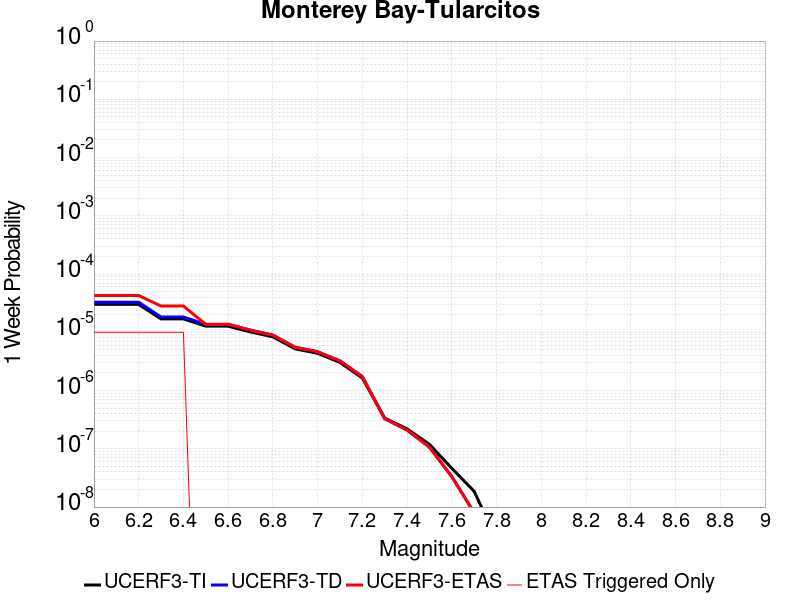 |  |  |  |

| Magnitude | 1 wk TI Prob | 1 wk TD Prob | 1 wk ETAS Prob | 1 wk ETAS/TD Gain | 1 wk ETAS Triggered Only | 1 mo TI Prob | 1 mo TD Prob | 1 mo ETAS Prob | 1 mo ETAS/TD Gain | 1 mo ETAS Triggered Only | 1 yr TI Prob | 1 yr TD Prob | 1 yr ETAS Prob | 1 yr ETAS/TD Gain | 1 yr ETAS Triggered Only | 10 yr TI Prob | 10 yr TD Prob | 10 yr ETAS Prob | 10 yr ETAS/TD Gain | 10 yr ETAS Triggered Only |
|-----|-----|-----|-----|-----|-----|-----|-----|-----|-----|-----|-----|-----|-----|-----|-----|-----|-----|-----|-----|-----|
| 6.0 | 3.0131365E-5 | 3.279877E-5 | 4.4987548E-5 | 1.3716229 | 1.2189176E-5 | 1.2912804E-4 | 1.4055918E-4 | 1.5274665E-4 | 1.086707 | 1.2189176E-5 | 0.001571 | 0.0017100703 | 0.0017222386 | 1.0071157 | 1.2189176E-5 | 0.015599402 | 0.016979916 | 0.016991898 | 1.0007057 | 1.2189176E-5 |
| 6.1 | 3.0131365E-5 | 3.279877E-5 | 4.4987548E-5 | 1.3716229 | 1.2189176E-5 | 1.2912804E-4 | 1.4055918E-4 | 1.5274665E-4 | 1.086707 | 1.2189176E-5 | 0.001571 | 0.0017100703 | 0.0017222386 | 1.0071157 | 1.2189176E-5 | 0.015599402 | 0.016979916 | 0.016991898 | 1.0007057 | 1.2189176E-5 |
| 6.2 | 3.0131365E-5 | 3.279877E-5 | 4.4987548E-5 | 1.3716229 | 1.2189176E-5 | 1.2912804E-4 | 1.4055918E-4 | 1.5274665E-4 | 1.086707 | 1.2189176E-5 | 0.001571 | 0.0017100703 | 0.0017222386 | 1.0071157 | 1.2189176E-5 | 0.015599402 | 0.016979916 | 0.016991898 | 1.0007057 | 1.2189176E-5 |
| 6.3 | 1.6998249E-5 | 1.8330798E-5 | 3.051975E-5 | 1.6649439 | 1.2189176E-5 | 7.28476E-5 | 7.85583E-5 | 9.074652E-5 | 1.1551487 | 1.2189176E-5 | 8.865586E-4 | 9.5604634E-4 | 9.6822385E-4 | 1.0127374 | 1.2189176E-5 | 0.0088303005 | 0.009521258 | 0.009533331 | 1.001268 | 1.2189176E-5 |
| 6.4 | 1.6998249E-5 | 1.8330798E-5 | 3.051975E-5 | 1.6649439 | 1.2189176E-5 | 7.28476E-5 | 7.85583E-5 | 9.074652E-5 | 1.1551487 | 1.2189176E-5 | 8.865586E-4 | 9.5604634E-4 | 9.6822385E-4 | 1.0127374 | 1.2189176E-5 | 0.0088303005 | 0.009521258 | 0.009533331 | 1.001268 | 1.2189176E-5 |
| 6.5 | 1.27470785E-5 | 1.3693312E-5 | 1.3693312E-5 | 1.0 | 0.0 | 5.4629192E-5 | 5.8684363E-5 | 5.8684363E-5 | 1.0 | 0.0 | 6.649074E-4 | 7.1425823E-4 | 7.1425823E-4 | 1.0 | 0.0 | 0.0066292146 | 0.007120678 | 0.007120678 | 1.0 | 0.0 |
| 6.6 | 1.2739422E-5 | 1.36854E-5 | 1.36854E-5 | 1.0 | 0.0 | 5.4596385E-5 | 5.8650454E-5 | 5.8650454E-5 | 1.0 | 0.0 | 6.645082E-4 | 7.1384566E-4 | 7.1384566E-4 | 1.0 | 0.0 | 0.0066252467 | 0.007116579 | 0.007116579 | 1.0 | 0.0 |
| 6.7 | 1.0160109E-5 | 1.0885755E-5 | 1.0885755E-5 | 1.0 | 0.0 | 4.35426E-5 | 4.665244E-5 | 4.665244E-5 | 1.0 | 0.0 | 5.300022E-4 | 5.6785246E-4 | 5.6785246E-4 | 1.0 | 0.0 | 0.005287399 | 0.0056647263 | 0.0056647263 | 1.0 | 0.0 |
| 6.8 | 8.349859E-6 | 8.932587E-6 | 8.932587E-6 | 1.0 | 0.0 | 3.578462E-5 | 3.8281985E-5 | 3.8281985E-5 | 1.0 | 0.0 | 4.3559066E-4 | 4.6598914E-4 | 4.6598914E-4 | 1.0 | 0.0 | 0.004347378 | 0.004650685 | 0.004650685 | 1.0 | 0.0 |
| 6.9 | 5.193639E-6 | 5.53643E-6 | 5.53643E-6 | 1.0 | 0.0 | 2.2258262E-5 | 2.372736E-5 | 2.372736E-5 | 1.0 | 0.0 | 2.7096065E-4 | 2.8884556E-4 | 2.8884556E-4 | 1.0 | 0.0 | 0.0027063051 | 0.0028850222 | 0.0028850222 | 1.0 | 0.0 |
| 7.0 | 4.359381E-6 | 4.643366E-6 | 4.643366E-6 | 1.0 | 0.0 | 1.8682927E-5 | 1.9900004E-5 | 1.9900004E-5 | 1.0 | 0.0 | 2.274409E-4 | 2.422586E-4 | 2.422586E-4 | 1.0 | 0.0 | 0.0022720827 | 0.002420238 | 0.002420238 | 1.0 | 0.0 |
| 7.1 | 3.0398533E-6 | 3.2310427E-6 | 3.2310427E-6 | 1.0 | 0.0 | 1.3027877E-5 | 1.3847267E-5 | 1.3847267E-5 | 1.0 | 0.0 | 1.5860285E-4 | 1.6858005E-4 | 1.6858005E-4 | 1.0 | 0.0 | 0.001584897 | 0.0016847793 | 0.0016847793 | 1.0 | 0.0 |
| 7.2 | 1.642335E-6 | 1.7333153E-6 | 1.7333153E-6 | 1.0 | 0.0 | 7.0385595E-6 | 7.428485E-6 | 7.428485E-6 | 1.0 | 0.0 | 8.569109E-5 | 9.044012E-5 | 9.044012E-5 | 1.0 | 0.0 | 8.5658056E-4 | 9.042358E-4 | 9.042358E-4 | 1.0 | 0.0 |
| 7.3 | 3.356842E-7 | 3.2952389E-7 | 3.2952389E-7 | 1.0 | 0.0 | 1.4386458E-6 | 1.4122444E-6 | 1.4122444E-6 | 1.0 | 0.0 | 1.7515373E-5 | 1.7193941E-5 | 1.7193941E-5 | 1.0 | 0.0 | 1.7513991E-4 | 1.719262E-4 | 1.719262E-4 | 1.0 | 0.0 |
| 7.4 | 2.1973483E-7 | 2.1006413E-7 | 2.1006413E-7 | 1.0 | 0.0 | 9.417204E-7 | 9.0027453E-7 | 9.0027453E-7 | 1.0 | 0.0 | 1.1465385E-5 | 1.0960787E-5 | 1.0960787E-5 | 1.0 | 0.0 | 1.1464794E-4 | 1.096025E-4 | 1.096025E-4 | 1.0 | 0.0 |
| 7.5 | 1.1944135E-7 | 1.0696043E-7 | 1.0696043E-7 | 1.0 | 0.0 | 5.118914E-7 | 4.5840173E-7 | 4.5840173E-7 | 1.0 | 0.0 | 6.23226E-6 | 5.581027E-6 | 5.581027E-6 | 1.0 | 0.0 | 6.2320854E-5 | 5.5808883E-5 | 5.5808883E-5 | 1.0 | 0.0 |
| 7.6 | 4.636058E-8 | 3.336489E-8 | 3.336489E-8 | 1.0 | 0.0 | 1.9868818E-7 | 1.4299238E-7 | 1.4299238E-7 | 1.0 | 0.0 | 2.419026E-6 | 1.7409308E-6 | 1.7409308E-6 | 1.0 | 0.0 | 2.4189996E-5 | 1.7409173E-5 | 1.7409173E-5 | 1.0 | 0.0 |
| 7.7 | 1.8588572E-8 | 8.003744E-9 | 8.003744E-9 | 1.0 | 0.0 | 7.9665305E-8 | 3.430176E-8 | 3.430176E-8 | 1.0 | 0.0 | 9.699246E-7 | 4.1762385E-7 | 4.1762385E-7 | 1.0 | 0.0 | 9.699204E-6 | 4.176231E-6 | 4.176231E-6 | 1.0 | 0.0 |
| 7.8 | 2.7960154E-9 | 7.6099427E-10 | 7.6099427E-10 | 1.0 | 0.0 | 1.1982923E-8 | 3.2614043E-9 | 3.2614043E-9 | 1.0 | 0.0 | 1.4589209E-7 | 3.9707597E-8 | 3.9707597E-8 | 1.0 | 0.0 | 1.4589199E-6 | 3.9707595E-7 | 3.9707595E-7 | 1.0 | 0.0 |

## Del Valle
*[(top)](#table-of-contents)*

| 1 Week | 1 Month | 1 Year | 10 Year |
|-----|-----|-----|-----|
|  |  |  |  |

| Magnitude | 1 wk TI Prob | 1 wk TD Prob | 1 wk ETAS Prob | 1 wk ETAS/TD Gain | 1 wk ETAS Triggered Only | 1 mo TI Prob | 1 mo TD Prob | 1 mo ETAS Prob | 1 mo ETAS/TD Gain | 1 mo ETAS Triggered Only | 1 yr TI Prob | 1 yr TD Prob | 1 yr ETAS Prob | 1 yr ETAS/TD Gain | 1 yr ETAS Triggered Only | 10 yr TI Prob | 10 yr TD Prob | 10 yr ETAS Prob | 10 yr ETAS/TD Gain | 10 yr ETAS Triggered Only |
|-----|-----|-----|-----|-----|-----|-----|-----|-----|-----|-----|-----|-----|-----|-----|-----|-----|-----|-----|-----|-----|
| 6.0 | 1.0716125E-5 | 8.767882E-6 | 8.767882E-6 | 1.0 | 0.0 | 4.592544E-5 | 3.7576207E-5 | 4.9764927E-5 | 1.3243732 | 1.2189176E-5 | 5.589988E-4 | 4.5741405E-4 | 4.6959764E-4 | 1.0266358 | 1.2189176E-5 | 0.0055759475 | 0.00456668 | 0.004578814 | 1.0026569 | 1.2189176E-5 |
| 6.1 | 1.0716125E-5 | 8.767882E-6 | 8.767882E-6 | 1.0 | 0.0 | 4.592544E-5 | 3.7576207E-5 | 4.9764927E-5 | 1.3243732 | 1.2189176E-5 | 5.589988E-4 | 4.5741405E-4 | 4.6959764E-4 | 1.0266358 | 1.2189176E-5 | 0.0055759475 | 0.00456668 | 0.004578814 | 1.0026569 | 1.2189176E-5 |
| 6.2 | 1.0716125E-5 | 8.767882E-6 | 8.767882E-6 | 1.0 | 0.0 | 4.592544E-5 | 3.7576207E-5 | 4.9764927E-5 | 1.3243732 | 1.2189176E-5 | 5.589988E-4 | 4.5741405E-4 | 4.6959764E-4 | 1.0266358 | 1.2189176E-5 | 0.0055759475 | 0.00456668 | 0.004578814 | 1.0026569 | 1.2189176E-5 |
| 6.3 | 7.1293784E-6 | 4.865823E-6 | 4.865823E-6 | 1.0 | 0.0 | 3.055412E-5 | 2.0853364E-5 | 3.3042288E-5 | 1.5845063 | 1.2189176E-5 | 3.7193293E-4 | 2.5386087E-4 | 2.6604696E-4 | 1.048003 | 1.2189176E-5 | 0.0037131102 | 0.0025357946 | 0.002547953 | 1.0047947 | 1.2189176E-5 |
| 6.4 | 7.1293784E-6 | 4.865823E-6 | 4.865823E-6 | 1.0 | 0.0 | 3.055412E-5 | 2.0853364E-5 | 3.3042288E-5 | 1.5845063 | 1.2189176E-5 | 3.7193293E-4 | 2.5386087E-4 | 2.6604696E-4 | 1.048003 | 1.2189176E-5 | 0.0037131102 | 0.0025357946 | 0.002547953 | 1.0047947 | 1.2189176E-5 |
| 6.5 | 7.1293784E-6 | 4.865823E-6 | 4.865823E-6 | 1.0 | 0.0 | 3.055412E-5 | 2.0853364E-5 | 3.3042288E-5 | 1.5845063 | 1.2189176E-5 | 3.7193293E-4 | 2.5386087E-4 | 2.6604696E-4 | 1.048003 | 1.2189176E-5 | 0.0037131102 | 0.0025357946 | 0.002547953 | 1.0047947 | 1.2189176E-5 |
| 6.6 | 7.1293784E-6 | 4.865823E-6 | 4.865823E-6 | 1.0 | 0.0 | 3.055412E-5 | 2.0853364E-5 | 3.3042288E-5 | 1.5845063 | 1.2189176E-5 | 3.7193293E-4 | 2.5386087E-4 | 2.6604696E-4 | 1.048003 | 1.2189176E-5 | 0.0037131102 | 0.0025357946 | 0.002547953 | 1.0047947 | 1.2189176E-5 |
| 6.7 | 7.12272E-6 | 4.8631987E-6 | 4.8631987E-6 | 1.0 | 0.0 | 3.0525585E-5 | 2.0842117E-5 | 3.303104E-5 | 1.5848217 | 1.2189176E-5 | 3.7158563E-4 | 2.5372396E-4 | 2.6591006E-4 | 1.048029 | 1.2189176E-5 | 0.003709649 | 0.0025344288 | 0.002546587 | 1.0047972 | 1.2189176E-5 |
| 6.8 | 6.7558703E-6 | 4.5594015E-6 | 4.5594015E-6 | 1.0 | 0.0 | 2.895341E-5 | 1.9540148E-5 | 3.1729087E-5 | 1.6237894 | 1.2189176E-5 | 3.5245073E-4 | 2.3787597E-4 | 2.5006224E-4 | 1.0512296 | 1.2189176E-5 | 0.0035189227 | 0.0023762889 | 0.002388449 | 1.0051173 | 1.2189176E-5 |
| 6.9 | 6.6700386E-6 | 4.502539E-6 | 4.502539E-6 | 1.0 | 0.0 | 2.8585566E-5 | 1.9296456E-5 | 3.1485397E-5 | 1.6316674 | 1.2189176E-5 | 3.479737E-4 | 2.3490966E-4 | 2.4709597E-4 | 1.0518765 | 1.2189176E-5 | 0.003474293 | 0.0023466884 | 0.002358849 | 1.005182 | 1.2189176E-5 |
| 7.0 | 6.3181424E-6 | 4.0987034E-6 | 4.0987034E-6 | 1.0 | 0.0 | 2.7077473E-5 | 1.7565755E-5 | 2.9754718E-5 | 1.6939048 | 1.2189176E-5 | 3.2961834E-4 | 2.1384252E-4 | 2.2602908E-4 | 1.0569885 | 1.2189176E-5 | 0.0032912986 | 0.002136422 | 0.0021485854 | 1.0056932 | 1.2189176E-5 |
| 7.1 | 6.248759E-6 | 4.033895E-6 | 4.033895E-6 | 1.0 | 0.0 | 2.678012E-5 | 1.7288008E-5 | 2.9476974E-5 | 1.7050532 | 1.2189176E-5 | 3.2599916E-4 | 2.104616E-4 | 2.226482E-4 | 1.0579042 | 1.2189176E-5 | 0.0032552136 | 0.0021026772 | 0.0021148408 | 1.0057847 | 1.2189176E-5 |
| 7.2 | 6.0411944E-6 | 3.869888E-6 | 3.869888E-6 | 1.0 | 0.0 | 2.5890577E-5 | 1.658513E-5 | 2.8774104E-5 | 1.7349339 | 1.2189176E-5 | 3.1517216E-4 | 2.0190567E-4 | 2.1409239E-4 | 1.0603584 | 1.2189176E-5 | 0.0031472554 | 0.0020172757 | 0.0020294404 | 1.0060302 | 1.2189176E-5 |
| 7.3 | 4.7691183E-6 | 3.0781202E-6 | 3.0781202E-6 | 1.0 | 0.0 | 2.0438918E-5 | 1.3191879E-5 | 1.3191879E-5 | 1.0 | 0.0 | 2.488154E-4 | 1.605995E-4 | 1.605995E-4 | 1.0 | 0.0 | 0.00248537 | 0.0016048603 | 0.0016048603 | 1.0 | 0.0 |
| 7.4 | 3.5524722E-6 | 2.1893363E-6 | 2.1893363E-6 | 1.0 | 0.0 | 1.5224792E-5 | 9.382837E-6 | 9.382837E-6 | 1.0 | 0.0 | 1.8534607E-4 | 1.1423013E-4 | 1.1423013E-4 | 1.0 | 0.0 | 0.0018519156 | 0.0011417224 | 0.0011417224 | 1.0 | 0.0 |
| 7.5 | 2.7133442E-6 | 1.5916097E-6 | 1.5916097E-6 | 1.0 | 0.0 | 1.1628566E-5 | 6.821167E-6 | 6.821167E-6 | 1.0 | 0.0 | 1.415686E-4 | 8.304456E-5 | 8.304456E-5 | 1.0 | 0.0 | 0.0014147845 | 8.301372E-4 | 8.301372E-4 | 1.0 | 0.0 |
| 7.6 | 1.915338E-6 | 1.173914E-6 | 1.173914E-6 | 1.0 | 0.0 | 8.208566E-6 | 5.0310505E-6 | 5.0310505E-6 | 1.0 | 0.0 | 9.993471E-5 | 6.125133E-5 | 6.125133E-5 | 1.0 | 0.0 | 9.988978E-4 | 6.123454E-4 | 6.123454E-4 | 1.0 | 0.0 |
| 7.7 | 1.2120448E-6 | 7.180313E-7 | 7.180313E-7 | 1.0 | 0.0 | 5.194467E-6 | 3.0772733E-6 | 3.0772733E-6 | 1.0 | 0.0 | 6.3240805E-5 | 3.746516E-5 | 3.746516E-5 | 1.0 | 0.0 | 6.322281E-4 | 3.7458882E-4 | 3.7458882E-4 | 1.0 | 0.0 |
| 7.8 | 6.272381E-7 | 3.932549E-7 | 3.932549E-7 | 1.0 | 0.0 | 2.6881603E-6 | 1.6853771E-6 | 1.6853771E-6 | 1.0 | 0.0 | 3.272786E-5 | 2.0519275E-5 | 2.0519275E-5 | 1.0 | 0.0 | 3.272304E-4 | 2.0517396E-4 | 2.0517396E-4 | 1.0 | 0.0 |
| 7.9 | 2.0292627E-7 | 1.2004622E-7 | 1.2004622E-7 | 1.0 | 0.0 | 8.6968373E-7 | 5.1448376E-7 | 5.1448376E-7 | 1.0 | 0.0 | 1.0588348E-5 | 6.263822E-6 | 6.263822E-6 | 1.0 | 0.0 | 1.0587843E-4 | 6.263647E-5 | 6.263647E-5 | 1.0 | 0.0 |
| 8.0 | 4.374492E-8 | 2.189964E-8 | 2.189964E-8 | 1.0 | 0.0 | 1.8747821E-7 | 9.385559E-8 | 9.385559E-8 | 1.0 | 0.0 | 2.2825448E-6 | 1.1426913E-6 | 1.1426913E-6 | 1.0 | 0.0 | 2.2825214E-5 | 1.1426858E-5 | 1.1426858E-5 | 1.0 | 0.0 |

## Elysian Park (Upper)
*[(top)](#table-of-contents)*

| 1 Week | 1 Month | 1 Year | 10 Year |
|-----|-----|-----|-----|
|  |  |  |  |

| Magnitude | 1 wk TI Prob | 1 wk TD Prob | 1 wk ETAS Prob | 1 wk ETAS/TD Gain | 1 wk ETAS Triggered Only | 1 mo TI Prob | 1 mo TD Prob | 1 mo ETAS Prob | 1 mo ETAS/TD Gain | 1 mo ETAS Triggered Only | 1 yr TI Prob | 1 yr TD Prob | 1 yr ETAS Prob | 1 yr ETAS/TD Gain | 1 yr ETAS Triggered Only | 10 yr TI Prob | 10 yr TD Prob | 10 yr ETAS Prob | 10 yr ETAS/TD Gain | 10 yr ETAS Triggered Only |
|-----|-----|-----|-----|-----|-----|-----|-----|-----|-----|-----|-----|-----|-----|-----|-----|-----|-----|-----|-----|-----|
| 6.0 | 3.1876025E-5 | 3.7035516E-5 | 4.922424E-5 | 1.3291091 | 1.2189176E-5 | 1.3660437E-4 | 1.587167E-4 | 1.7090395E-4 | 1.0767862 | 1.2189176E-5 | 0.0016618895 | 0.0019311075 | 0.0019432731 | 1.0062999 | 1.2189176E-5 | 0.016495159 | 0.019189782 | 0.019201739 | 1.000623 | 1.2189176E-5 |
| 6.1 | 3.1876025E-5 | 3.7035516E-5 | 4.922424E-5 | 1.3291091 | 1.2189176E-5 | 1.3660437E-4 | 1.587167E-4 | 1.7090395E-4 | 1.0767862 | 1.2189176E-5 | 0.0016618895 | 0.0019311075 | 0.0019432731 | 1.0062999 | 1.2189176E-5 | 0.016495159 | 0.019189782 | 0.019201739 | 1.000623 | 1.2189176E-5 |
| 6.2 | 3.1876025E-5 | 3.7035516E-5 | 4.922424E-5 | 1.3291091 | 1.2189176E-5 | 1.3660437E-4 | 1.587167E-4 | 1.7090395E-4 | 1.0767862 | 1.2189176E-5 | 0.0016618895 | 0.0019311075 | 0.0019432731 | 1.0062999 | 1.2189176E-5 | 0.016495159 | 0.019189782 | 0.019201739 | 1.000623 | 1.2189176E-5 |
| 6.3 | 3.1876025E-5 | 3.7035516E-5 | 4.922424E-5 | 1.3291091 | 1.2189176E-5 | 1.3660437E-4 | 1.587167E-4 | 1.7090395E-4 | 1.0767862 | 1.2189176E-5 | 0.0016618895 | 0.0019311075 | 0.0019432731 | 1.0062999 | 1.2189176E-5 | 0.016495159 | 0.019189782 | 0.019201739 | 1.000623 | 1.2189176E-5 |
| 6.4 | 1.9273462E-5 | 2.1202266E-5 | 3.339118E-5 | 1.5748875 | 1.2189176E-5 | 8.259794E-5 | 9.086466E-5 | 1.03052735E-4 | 1.1341343 | 1.2189176E-5 | 0.001005166 | 0.0011058892 | 0.001118065 | 1.0110098 | 1.2189176E-5 | 0.010006315 | 0.011020724 | 0.011032779 | 1.0010939 | 1.2189176E-5 |
| 6.5 | 1.9273462E-5 | 2.1202266E-5 | 3.339118E-5 | 1.5748875 | 1.2189176E-5 | 8.259794E-5 | 9.086466E-5 | 1.03052735E-4 | 1.1341343 | 1.2189176E-5 | 0.001005166 | 0.0011058892 | 0.001118065 | 1.0110098 | 1.2189176E-5 | 0.010006315 | 0.011020724 | 0.011032779 | 1.0010939 | 1.2189176E-5 |
| 6.6 | 9.813258E-6 | 9.665599E-6 | 2.1854657E-5 | 2.2610765 | 1.2189176E-5 | 4.205614E-5 | 4.1423376E-5 | 5.3612046E-5 | 1.2942462 | 1.2189176E-5 | 5.119132E-4 | 5.0422014E-4 | 5.164032E-4 | 1.0241622 | 1.2189176E-5 | 0.005107356 | 0.0050314846 | 0.005043613 | 1.0024104 | 1.2189176E-5 |
| 6.7 | 9.801478E-6 | 9.653168E-6 | 2.1842226E-5 | 2.2627003 | 1.2189176E-5 | 4.2005657E-5 | 4.1370105E-5 | 5.3558775E-5 | 1.2946252 | 1.2189176E-5 | 5.112989E-4 | 5.035719E-4 | 5.157549E-4 | 1.0241933 | 1.2189176E-5 | 0.0051012407 | 0.0050250315 | 0.005037159 | 1.0024135 | 1.2189176E-5 |
| 6.8 | 8.102489E-6 | 7.773004E-6 | 1.9962084E-5 | 2.56813 | 1.2189176E-5 | 3.4724493E-5 | 3.3312477E-5 | 4.550125E-5 | 1.365892 | 1.2189176E-5 | 4.2268867E-4 | 4.055089E-4 | 4.1769314E-4 | 1.0300468 | 1.2189176E-5 | 0.004218856 | 0.0040481836 | 0.0040603234 | 1.0029988 | 1.2189176E-5 |
| 6.9 | 6.08275E-6 | 5.4814514E-6 | 5.4814514E-6 | 1.0 | 0.0 | 2.6068668E-5 | 2.3491726E-5 | 2.3491726E-5 | 1.0 | 0.0 | 3.173398E-4 | 2.85975E-4 | 2.85975E-4 | 1.0 | 0.0 | 0.0031688702 | 0.0028561477 | 0.0028561477 | 1.0 | 0.0 |
| 7.0 | 5.5995934E-6 | 4.98278E-6 | 4.98278E-6 | 1.0 | 0.0 | 2.3998036E-5 | 2.13546E-5 | 2.13546E-5 | 1.0 | 0.0 | 2.9213692E-4 | 2.599619E-4 | 2.599619E-4 | 1.0 | 0.0 | 0.0029175316 | 0.0025966454 | 0.0025966454 | 1.0 | 0.0 |
| 7.1 | 4.709881E-6 | 4.0874015E-6 | 4.0874015E-6 | 1.0 | 0.0 | 2.0185047E-5 | 1.7517319E-5 | 1.7517319E-5 | 1.0 | 0.0 | 2.4572524E-4 | 2.132529E-4 | 2.132529E-4 | 1.0 | 0.0 | 0.002454537 | 0.002130524 | 0.002130524 | 1.0 | 0.0 |
| 7.2 | 3.6063436E-6 | 2.9779544E-6 | 2.9779544E-6 | 1.0 | 0.0 | 1.5455667E-5 | 1.27626E-5 | 1.27626E-5 | 1.0 | 0.0 | 1.881565E-4 | 1.5537368E-4 | 1.5537368E-4 | 1.0 | 0.0 | 0.0018799726 | 0.0015526618 | 0.0015526618 | 1.0 | 0.0 |
| 7.3 | 2.471135E-6 | 2.0954615E-6 | 2.0954615E-6 | 1.0 | 0.0 | 1.0590536E-5 | 8.980519E-6 | 8.980519E-6 | 1.0 | 0.0 | 1.2893214E-4 | 1.093324E-4 | 1.093324E-4 | 1.0 | 0.0 | 0.0012885736 | 0.0010927934 | 0.0010927934 | 1.0 | 0.0 |
| 7.4 | 1.163943E-6 | 1.0275091E-6 | 1.0275091E-6 | 1.0 | 0.0 | 4.988318E-6 | 4.4036033E-6 | 4.4036033E-6 | 1.0 | 0.0 | 6.0731076E-5 | 5.3612584E-5 | 5.3612584E-5 | 1.0 | 0.0 | 6.071448E-4 | 5.359995E-4 | 5.359995E-4 | 1.0 | 0.0 |
| 7.5 | 4.99459E-7 | 4.917604E-7 | 4.917604E-7 | 1.0 | 0.0 | 2.140537E-6 | 2.1075427E-6 | 2.1075427E-6 | 1.0 | 0.0 | 2.6060725E-5 | 2.5659048E-5 | 2.5659048E-5 | 1.0 | 0.0 | 2.605767E-4 | 2.5656243E-4 | 2.5656243E-4 | 1.0 | 0.0 |
| 7.6 | 2.4667852E-7 | 2.4778336E-7 | 2.4778336E-7 | 1.0 | 0.0 | 1.0571932E-6 | 1.0619283E-6 | 1.0619283E-6 | 1.0 | 0.0 | 1.2871251E-5 | 1.2928905E-5 | 1.2928905E-5 | 1.0 | 0.0 | 1.2870505E-4 | 1.2928189E-4 | 1.2928189E-4 | 1.0 | 0.0 |
| 7.7 | 8.2312795E-8 | 7.3864456E-8 | 7.3864456E-8 | 1.0 | 0.0 | 3.527691E-7 | 3.165619E-7 | 3.165619E-7 | 1.0 | 0.0 | 4.294955E-6 | 3.8541357E-6 | 3.8541357E-6 | 1.0 | 0.0 | 4.2948723E-5 | 3.8540802E-5 | 3.8540802E-5 | 1.0 | 0.0 |
| 7.8 | 2.7819295E-8 | 1.7566023E-8 | 1.7566023E-8 | 1.0 | 0.0 | 1.1922555E-7 | 7.5282955E-8 | 7.5282955E-8 | 1.0 | 0.0 | 1.45157E-6 | 9.165697E-7 | 9.165697E-7 | 1.0 | 0.0 | 1.45156055E-5 | 9.165675E-6 | 9.165675E-6 | 1.0 | 0.0 |

## Elsinore (Coyote Mountains)
*[(top)](#table-of-contents)*

| 1 Week | 1 Month | 1 Year | 10 Year |
|-----|-----|-----|-----|
|  |  |  |  |

| Magnitude | 1 wk TI Prob | 1 wk TD Prob | 1 wk ETAS Prob | 1 wk ETAS/TD Gain | 1 wk ETAS Triggered Only | 1 mo TI Prob | 1 mo TD Prob | 1 mo ETAS Prob | 1 mo ETAS/TD Gain | 1 mo ETAS Triggered Only | 1 yr TI Prob | 1 yr TD Prob | 1 yr ETAS Prob | 1 yr ETAS/TD Gain | 1 yr ETAS Triggered Only | 10 yr TI Prob | 10 yr TD Prob | 10 yr ETAS Prob | 10 yr ETAS/TD Gain | 10 yr ETAS Triggered Only |
|-----|-----|-----|-----|-----|-----|-----|-----|-----|-----|-----|-----|-----|-----|-----|-----|-----|-----|-----|-----|-----|
| 6.0 | 4.20513E-5 | 4.8631882E-5 | 6.0820465E-5 | 1.2506294 | 1.2189176E-5 | 1.8020741E-4 | 2.0840895E-4 | 2.205956E-4 | 1.0584747 | 1.2189176E-5 | 0.0021918174 | 0.002535 | 0.0025471584 | 1.0047961 | 1.2189176E-5 | 0.021703249 | 0.025111282 | 0.025123166 | 1.0004733 | 1.2189176E-5 |
| 6.1 | 4.20513E-5 | 4.8631882E-5 | 6.0820465E-5 | 1.2506294 | 1.2189176E-5 | 1.8020741E-4 | 2.0840895E-4 | 2.205956E-4 | 1.0584747 | 1.2189176E-5 | 0.0021918174 | 0.002535 | 0.0025471584 | 1.0047961 | 1.2189176E-5 | 0.021703249 | 0.025111282 | 0.025123166 | 1.0004733 | 1.2189176E-5 |
| 6.2 | 2.3413893E-5 | 2.469566E-5 | 2.469566E-5 | 1.0 | 0.0 | 1.0034139E-4 | 1.0583479E-4 | 1.0583479E-4 | 1.0 | 0.0 | 0.0012209718 | 0.0012878707 | 0.0012878707 | 1.0 | 0.0 | 0.012142851 | 0.01281264 | 0.01281264 | 1.0 | 0.0 |
| 6.3 | 2.3413893E-5 | 2.469566E-5 | 2.469566E-5 | 1.0 | 0.0 | 1.0034139E-4 | 1.0583479E-4 | 1.0583479E-4 | 1.0 | 0.0 | 0.0012209718 | 0.0012878707 | 0.0012878707 | 1.0 | 0.0 | 0.012142851 | 0.01281264 | 0.01281264 | 1.0 | 0.0 |
| 6.4 | 1.6894814E-5 | 1.6568361E-5 | 1.6568361E-5 | 1.0 | 0.0 | 7.240433E-5 | 7.1005554E-5 | 7.1005554E-5 | 1.0 | 0.0 | 8.811662E-4 | 8.6418656E-4 | 8.6418656E-4 | 1.0 | 0.0 | 0.0087768035 | 0.00861194 | 0.00861194 | 1.0 | 0.0 |
| 6.5 | 1.6894814E-5 | 1.6568361E-5 | 1.6568361E-5 | 1.0 | 0.0 | 7.240433E-5 | 7.1005554E-5 | 7.1005554E-5 | 1.0 | 0.0 | 8.811662E-4 | 8.6418656E-4 | 8.6418656E-4 | 1.0 | 0.0 | 0.0087768035 | 0.00861194 | 0.00861194 | 1.0 | 0.0 |
| 6.6 | 1.1910969E-5 | 1.0530774E-5 | 1.0530774E-5 | 1.0 | 0.0 | 5.1046012E-5 | 4.5131183E-5 | 4.5131183E-5 | 1.0 | 0.0 | 6.21308E-4 | 5.4934516E-4 | 5.4934516E-4 | 1.0 | 0.0 | 0.0061957375 | 0.005481174 | 0.005481174 | 1.0 | 0.0 |
| 6.7 | 9.1486E-6 | 7.2028593E-6 | 7.2028593E-6 | 1.0 | 0.0 | 3.9207694E-5 | 3.0869054E-5 | 3.0869054E-5 | 1.0 | 0.0 | 4.7724912E-4 | 3.757697E-4 | 3.757697E-4 | 1.0 | 0.0 | 0.0047622547 | 0.0037517229 | 0.0037517229 | 1.0 | 0.0 |
| 6.8 | 7.90441E-6 | 5.7290276E-6 | 5.7290276E-6 | 1.0 | 0.0 | 3.3875604E-5 | 2.4552752E-5 | 2.4552752E-5 | 1.0 | 0.0 | 4.1235742E-4 | 2.9889002E-4 | 2.9889002E-4 | 1.0 | 0.0 | 0.0041159308 | 0.002985009 | 0.002985009 | 1.0 | 0.0 |
| 6.9 | 7.77015E-6 | 5.582982E-6 | 5.582982E-6 | 1.0 | 0.0 | 3.3300217E-5 | 2.3926852E-5 | 2.3926852E-5 | 1.0 | 0.0 | 4.0535472E-4 | 2.9127175E-4 | 2.9127175E-4 | 1.0 | 0.0 | 0.004046161 | 0.002909027 | 0.002909027 | 1.0 | 0.0 |
| 7.0 | 7.675798E-6 | 5.47984E-6 | 5.47984E-6 | 1.0 | 0.0 | 3.289586E-5 | 2.3484827E-5 | 2.3484827E-5 | 1.0 | 0.0 | 4.004335E-4 | 2.858915E-4 | 2.858915E-4 | 1.0 | 0.0 | 0.003997127 | 0.0028553635 | 0.0028553635 | 1.0 | 0.0 |
| 7.1 | 7.447814E-6 | 5.238714E-6 | 5.238714E-6 | 1.0 | 0.0 | 3.191881E-5 | 2.2451446E-5 | 2.2451446E-5 | 1.0 | 0.0 | 3.8854225E-4 | 2.7331332E-4 | 2.7331332E-4 | 1.0 | 0.0 | 0.003878636 | 0.0027298962 | 0.0027298962 | 1.0 | 0.0 |
| 7.2 | 7.128185E-6 | 4.905372E-6 | 4.905372E-6 | 1.0 | 0.0 | 3.0549007E-5 | 2.102286E-5 | 2.102286E-5 | 1.0 | 0.0 | 3.7187067E-4 | 2.5592445E-4 | 2.5592445E-4 | 1.0 | 0.0 | 0.00371249 | 0.0025564157 | 0.0025564157 | 1.0 | 0.0 |
| 7.3 | 7.0913875E-6 | 4.874047E-6 | 4.874047E-6 | 1.0 | 0.0 | 3.0391306E-5 | 2.0888614E-5 | 2.0888614E-5 | 1.0 | 0.0 | 3.6995133E-4 | 2.5429038E-4 | 2.5429038E-4 | 1.0 | 0.0 | 0.0036933604 | 0.0025401122 | 0.0025401122 | 1.0 | 0.0 |
| 7.4 | 7.051521E-6 | 4.837899E-6 | 4.837899E-6 | 1.0 | 0.0 | 3.0220453E-5 | 2.0733693E-5 | 2.0733693E-5 | 1.0 | 0.0 | 3.6787192E-4 | 2.5240466E-4 | 2.5240466E-4 | 1.0 | 0.0 | 0.0036726352 | 0.0025212981 | 0.0025212981 | 1.0 | 0.0 |
| 7.5 | 6.910666E-6 | 4.733448E-6 | 4.733448E-6 | 1.0 | 0.0 | 2.9616802E-5 | 2.0286056E-5 | 2.0286056E-5 | 1.0 | 0.0 | 3.605249E-4 | 2.4695593E-4 | 2.4695593E-4 | 1.0 | 0.0 | 0.0035994058 | 0.0024669329 | 0.0024669329 | 1.0 | 0.0 |
| 7.6 | 6.341753E-6 | 4.3065565E-6 | 4.3065565E-6 | 1.0 | 0.0 | 2.7178658E-5 | 1.8456547E-5 | 1.8456547E-5 | 1.0 | 0.0 | 3.3084993E-4 | 2.2468645E-4 | 2.2468645E-4 | 1.0 | 0.0 | 0.0033035777 | 0.002244708 | 0.002244708 | 1.0 | 0.0 |
| 7.7 | 3.9205916E-6 | 2.2439415E-6 | 2.2439415E-6 | 1.0 | 0.0 | 1.6802427E-5 | 9.616861E-6 | 9.616861E-6 | 1.0 | 0.0 | 2.0455034E-4 | 1.1707973E-4 | 1.1707973E-4 | 1.0 | 0.0 | 0.0020436216 | 0.0011702535 | 0.0011702535 | 1.0 | 0.0 |
| 7.8 | 2.0846227E-7 | 8.486417E-8 | 8.486417E-8 | 1.0 | 0.0 | 8.9340944E-7 | 3.6370355E-7 | 3.6370355E-7 | 1.0 | 0.0 | 1.0877206E-5 | 4.428085E-6 | 4.428085E-6 | 1.0 | 0.0 | 1.0876673E-4 | 4.4280296E-5 | 4.4280296E-5 | 1.0 | 0.0 |
| 7.9 | 4.4969806E-9 | 2.2691855E-9 | 2.2691855E-9 | 1.0 | 0.0 | 1.9272775E-8 | 9.72508E-9 | 9.72508E-9 | 1.0 | 0.0 | 2.3464601E-7 | 1.18402845E-7 | 1.18402845E-7 | 1.0 | 0.0 | 2.3464577E-6 | 1.184028E-6 | 1.184028E-6 | 1.0 | 0.0 |

## Big Pine (East)
*[(top)](#table-of-contents)*

| 1 Week | 1 Month | 1 Year | 10 Year |
|-----|-----|-----|-----|
|  |  |  |  |

| Magnitude | 1 wk TI Prob | 1 wk TD Prob | 1 wk ETAS Prob | 1 wk ETAS/TD Gain | 1 wk ETAS Triggered Only | 1 mo TI Prob | 1 mo TD Prob | 1 mo ETAS Prob | 1 mo ETAS/TD Gain | 1 mo ETAS Triggered Only | 1 yr TI Prob | 1 yr TD Prob | 1 yr ETAS Prob | 1 yr ETAS/TD Gain | 1 yr ETAS Triggered Only | 10 yr TI Prob | 10 yr TD Prob | 10 yr ETAS Prob | 10 yr ETAS/TD Gain | 10 yr ETAS Triggered Only |
|-----|-----|-----|-----|-----|-----|-----|-----|-----|-----|-----|-----|-----|-----|-----|-----|-----|-----|-----|-----|-----|
| 6.0 | 9.916913E-6 | 1.2816984E-5 | 2.5006004E-5 | 1.9510052 | 1.2189176E-5 | 4.250036E-5 | 5.49289E-5 | 6.7117406E-5 | 1.221896 | 1.2189176E-5 | 5.173191E-4 | 6.685763E-4 | 6.807573E-4 | 1.0182194 | 1.2189176E-5 | 0.0051611643 | 0.006670441 | 0.006682549 | 1.0018152 | 1.2189176E-5 |
| 6.1 | 9.916913E-6 | 1.2816984E-5 | 2.5006004E-5 | 1.9510052 | 1.2189176E-5 | 4.250036E-5 | 5.49289E-5 | 6.7117406E-5 | 1.221896 | 1.2189176E-5 | 5.173191E-4 | 6.685763E-4 | 6.807573E-4 | 1.0182194 | 1.2189176E-5 | 0.0051611643 | 0.006670441 | 0.006682549 | 1.0018152 | 1.2189176E-5 |
| 6.2 | 9.916913E-6 | 1.2816984E-5 | 2.5006004E-5 | 1.9510052 | 1.2189176E-5 | 4.250036E-5 | 5.49289E-5 | 6.7117406E-5 | 1.221896 | 1.2189176E-5 | 5.173191E-4 | 6.685763E-4 | 6.807573E-4 | 1.0182194 | 1.2189176E-5 | 0.0051611643 | 0.006670441 | 0.006682549 | 1.0018152 | 1.2189176E-5 |
| 6.3 | 5.479711E-6 | 8.112951E-6 | 8.112951E-6 | 1.0 | 0.0 | 2.3484265E-5 | 3.4769346E-5 | 3.4769346E-5 | 1.0 | 0.0 | 2.858834E-4 | 4.2323777E-4 | 4.2323777E-4 | 1.0 | 0.0 | 0.0028551589 | 0.004227244 | 0.004227244 | 1.0 | 0.0 |
| 6.4 | 5.465009E-6 | 8.097245E-6 | 8.097245E-6 | 1.0 | 0.0 | 2.3421257E-5 | 3.4702036E-5 | 3.4702036E-5 | 1.0 | 0.0 | 2.851165E-4 | 4.2241855E-4 | 4.2241855E-4 | 1.0 | 0.0 | 0.0028475097 | 0.0042190826 | 0.0042190826 | 1.0 | 0.0 |
| 6.5 | 4.826767E-6 | 7.422301E-6 | 7.422301E-6 | 1.0 | 0.0 | 2.068598E-5 | 3.180949E-5 | 3.180949E-5 | 1.0 | 0.0 | 2.518227E-4 | 3.872145E-4 | 3.872145E-4 | 1.0 | 0.0 | 0.0025153751 | 0.003868283 | 0.003868283 | 1.0 | 0.0 |
| 6.6 | 4.3146847E-6 | 6.8822374E-6 | 6.8822374E-6 | 1.0 | 0.0 | 1.8491375E-5 | 2.9494982E-5 | 2.9494982E-5 | 1.0 | 0.0 | 2.2510924E-4 | 3.590447E-4 | 3.590447E-4 | 1.0 | 0.0 | 0.0022488134 | 0.0035874986 | 0.0035874986 | 1.0 | 0.0 |
| 6.7 | 3.6968106E-6 | 5.9954727E-6 | 5.9954727E-6 | 1.0 | 0.0 | 1.5843378E-5 | 2.5694639E-5 | 2.5694639E-5 | 1.0 | 0.0 | 1.9287605E-4 | 3.1278885E-4 | 3.1278885E-4 | 1.0 | 0.0 | 0.0019270873 | 0.0031262483 | 0.0031262483 | 1.0 | 0.0 |
| 6.8 | 3.4671132E-6 | 5.702177E-6 | 5.702177E-6 | 1.0 | 0.0 | 1.4858972E-5 | 2.4437682E-5 | 2.4437682E-5 | 1.0 | 0.0 | 1.8089297E-4 | 2.974896E-4 | 2.974896E-4 | 1.0 | 0.0 | 0.0018074579 | 0.002973667 | 0.002973667 | 1.0 | 0.0 |
| 6.9 | 2.7686972E-6 | 4.825223E-6 | 4.825223E-6 | 1.0 | 0.0 | 1.1865792E-5 | 2.0679368E-5 | 2.0679368E-5 | 1.0 | 0.0 | 1.4445644E-4 | 2.5174298E-4 | 2.5174298E-4 | 1.0 | 0.0 | 0.0014436257 | 0.0025172636 | 0.0025172636 | 1.0 | 0.0 |
| 7.0 | 2.1472624E-6 | 3.9850406E-6 | 3.9850406E-6 | 1.0 | 0.0 | 9.20252E-6 | 1.7078637E-5 | 1.7078637E-5 | 1.0 | 0.0 | 1.12034926E-4 | 2.079131E-4 | 2.079131E-4 | 1.0 | 0.0 | 0.0011197845 | 0.0020798394 | 0.0020798394 | 1.0 | 0.0 |
| 7.1 | 1.7018335E-6 | 3.344876E-6 | 3.344876E-6 | 1.0 | 0.0 | 7.293552E-6 | 1.4335106E-5 | 1.4335106E-5 | 1.0 | 0.0 | 8.879537E-5 | 1.7451629E-4 | 1.7451629E-4 | 1.0 | 0.0 | 8.87599E-4 | 0.0017464145 | 0.0017464145 | 1.0 | 0.0 |
| 7.2 | 1.25603E-6 | 2.794484E-6 | 2.794484E-6 | 1.0 | 0.0 | 5.3829745E-6 | 1.1976307E-5 | 1.1976307E-5 | 1.0 | 0.0 | 6.553574E-5 | 1.4580201E-4 | 1.4580201E-4 | 1.0 | 0.0 | 6.551642E-4 | 0.001459661 | 0.001459661 | 1.0 | 0.0 |
| 7.3 | 1.112297E-6 | 2.610332E-6 | 2.610332E-6 | 1.0 | 0.0 | 4.7669787E-6 | 1.118709E-5 | 1.118709E-5 | 1.0 | 0.0 | 5.803642E-5 | 1.3619453E-4 | 1.3619453E-4 | 1.0 | 0.0 | 5.802127E-4 | 0.0013635408 | 0.0013635408 | 1.0 | 0.0 |
| 7.4 | 1.0137181E-6 | 2.4834917E-6 | 2.4834917E-6 | 1.0 | 0.0 | 4.3444993E-6 | 1.0643494E-5 | 1.0643494E-5 | 1.0 | 0.0 | 5.2892992E-5 | 1.2957705E-4 | 1.2957705E-4 | 1.0 | 0.0 | 5.288041E-4 | 0.0012972289 | 0.0012972289 | 1.0 | 0.0 |
| 7.5 | 9.598608E-7 | 2.4071483E-6 | 2.4071483E-6 | 1.0 | 0.0 | 4.1136827E-6 | 1.031631E-5 | 1.031631E-5 | 1.0 | 0.0 | 5.0082934E-5 | 1.2559404E-4 | 1.2559404E-4 | 1.0 | 0.0 | 5.007165E-4 | 0.0012572526 | 0.0012572526 | 1.0 | 0.0 |
| 7.6 | 7.929459E-7 | 2.0448588E-6 | 2.0448588E-6 | 1.0 | 0.0 | 3.3983351E-6 | 8.763653E-6 | 8.763653E-6 | 1.0 | 0.0 | 4.1373947E-5 | 1.06692416E-4 | 1.06692416E-4 | 1.0 | 0.0 | 4.1366243E-4 | 0.0010685222 | 0.0010685222 | 1.0 | 0.0 |
| 7.7 | 4.155788E-7 | 1.1605589E-6 | 1.1605589E-6 | 1.0 | 0.0 | 1.7810507E-6 | 4.9738146E-6 | 4.9738146E-6 | 1.0 | 0.0 | 2.1684076E-5 | 6.0554554E-5 | 6.0554554E-5 | 1.0 | 0.0 | 2.1681961E-4 | 6.0857297E-4 | 6.0857297E-4 | 1.0 | 0.0 |
| 7.8 | 1.14666925E-7 | 2.592015E-7 | 2.592015E-7 | 1.0 | 0.0 | 4.914296E-7 | 1.1108631E-6 | 1.1108631E-6 | 1.0 | 0.0 | 5.9831386E-6 | 1.3524678E-5 | 1.3524678E-5 | 1.0 | 0.0 | 5.9829777E-5 | 1.3634123E-4 | 1.3634123E-4 | 1.0 | 0.0 |
| 7.9 | 2.9231824E-8 | 4.1463963E-8 | 4.1463963E-8 | 1.0 | 0.0 | 1.2527924E-7 | 1.7770269E-7 | 1.7770269E-7 | 1.0 | 0.0 | 1.5252737E-6 | 2.1635283E-6 | 2.1635283E-6 | 1.0 | 0.0 | 1.5252632E-5 | 2.1967755E-5 | 2.1967755E-5 | 1.0 | 0.0 |

## Sargent 2011 CFM
*[(top)](#table-of-contents)*

| 1 Week | 1 Month | 1 Year | 10 Year |
|-----|-----|-----|-----|
|  |  |  |  |

| Magnitude | 1 wk TI Prob | 1 wk TD Prob | 1 wk ETAS Prob | 1 wk ETAS/TD Gain | 1 wk ETAS Triggered Only | 1 mo TI Prob | 1 mo TD Prob | 1 mo ETAS Prob | 1 mo ETAS/TD Gain | 1 mo ETAS Triggered Only | 1 yr TI Prob | 1 yr TD Prob | 1 yr ETAS Prob | 1 yr ETAS/TD Gain | 1 yr ETAS Triggered Only | 10 yr TI Prob | 10 yr TD Prob | 10 yr ETAS Prob | 10 yr ETAS/TD Gain | 10 yr ETAS Triggered Only |
|-----|-----|-----|-----|-----|-----|-----|-----|-----|-----|-----|-----|-----|-----|-----|-----|-----|-----|-----|-----|-----|
| 6.0 | 3.7327867E-5 | 3.664913E-5 | 4.883786E-5 | 1.3325789 | 1.2189176E-5 | 1.5996677E-4 | 1.5706103E-4 | 1.6924829E-4 | 1.0775957 | 1.2189176E-5 | 0.0019458556 | 0.0019110236 | 0.0019231895 | 1.0063661 | 1.2189176E-5 | 0.01928905 | 0.019018095 | 0.019030051 | 1.0006287 | 1.2189176E-5 |
| 6.1 | 2.3771476E-5 | 1.8479273E-5 | 3.0668223E-5 | 1.6596012 | 1.2189176E-5 | 1.01873775E-4 | 7.919498E-5 | 9.138319E-5 | 1.1539013 | 1.2189176E-5 | 0.0012396075 | 9.638493E-4 | 9.7602676E-4 | 1.0126342 | 1.2189176E-5 | 0.012327154 | 0.009636091 | 0.009648163 | 1.0012528 | 1.2189176E-5 |
| 6.2 | 2.3112721E-5 | 1.7710632E-5 | 2.9899593E-5 | 1.6882284 | 1.2189176E-5 | 9.9050754E-5 | 7.590099E-5 | 8.808925E-5 | 1.1605809 | 1.2189176E-5 | 0.0012052758 | 9.237792E-4 | 9.359571E-4 | 1.0131828 | 1.2189176E-5 | 0.011987597 | 0.009238743 | 0.00925082 | 1.0013071 | 1.2189176E-5 |
| 6.3 | 1.728509E-5 | 1.0458927E-5 | 2.2647975E-5 | 2.1654205 | 1.2189176E-5 | 7.407686E-5 | 4.482347E-5 | 5.70121E-5 | 1.2719252 | 1.2189176E-5 | 9.015125E-4 | 5.456343E-4 | 5.578168E-4 | 1.0223273 | 1.2189176E-5 | 0.008978641 | 0.0054791216 | 0.0054912437 | 1.0022125 | 1.2189176E-5 |
| 6.4 | 1.48395575E-5 | 7.4559816E-6 | 1.9645067E-5 | 2.6348062 | 1.2189176E-5 | 6.3596555E-5 | 3.195403E-5 | 4.4142816E-5 | 1.3814476 | 1.2189176E-5 | 7.7401294E-4 | 3.8900663E-4 | 4.0119106E-4 | 1.0313219 | 1.2189176E-5 | 0.0077132257 | 0.003918666 | 0.003930807 | 1.0030984 | 1.2189176E-5 |
| 6.5 | 1.4358964E-5 | 6.894759E-6 | 1.9083851E-5 | 2.767878 | 1.2189176E-5 | 6.1536964E-5 | 2.9548846E-5 | 4.173766E-5 | 1.4124972 | 1.2189176E-5 | 7.48955E-4 | 3.5973339E-4 | 3.7191817E-4 | 1.0338718 | 1.2189176E-5 | 0.0074643586 | 0.0036269152 | 0.00363906 | 1.0033486 | 1.2189176E-5 |
| 6.6 | 9.772591E-6 | 1.3736154E-6 | 1.3562774E-5 | 9.873779 | 1.2189176E-5 | 4.188186E-5 | 5.88691E-6 | 1.8076014E-5 | 3.0705438 | 1.2189176E-5 | 5.097923E-4 | 7.16708E-5 | 8.38591E-5 | 1.1700596 | 1.2189176E-5 | 0.005086244 | 7.483097E-4 | 7.604898E-4 | 1.0162767 | 1.2189176E-5 |
| 6.7 | 9.752745E-6 | 1.3523068E-6 | 1.3541467E-5 | 10.013606 | 1.2189176E-5 | 4.179681E-5 | 5.795587E-6 | 1.7984692E-5 | 3.10317 | 1.2189176E-5 | 5.0875737E-4 | 7.055902E-5 | 8.274734E-5 | 1.1727393 | 1.2189176E-5 | 0.005075942 | 7.371994E-4 | 7.493796E-4 | 1.0165223 | 1.2189176E-5 |
| 6.8 | 9.608213E-6 | 1.2361709E-6 | 1.3425331E-5 | 10.860417 | 1.2189176E-5 | 4.1177405E-5 | 5.2978644E-6 | 1.7486977E-5 | 3.3007596 | 1.2189176E-5 | 5.012196E-4 | 6.449961E-5 | 7.6688004E-5 | 1.1889684 | 1.2189176E-5 | 0.005000906 | 6.7634037E-4 | 6.885213E-4 | 1.01801 | 1.2189176E-5 |
| 6.9 | 9.427164E-6 | 1.12094E-6 | 1.3310102E-5 | 11.874053 | 1.2189176E-5 | 4.04015E-5 | 4.80402E-6 | 1.6993137E-5 | 3.5372744 | 1.2189176E-5 | 4.9177726E-4 | 5.8487396E-5 | 7.067586E-5 | 1.2083946 | 1.2189176E-5 | 0.004906904 | 6.1557174E-4 | 6.2775344E-4 | 1.0197892 | 1.2189176E-5 |
| 7.0 | 9.247601E-6 | 9.873988E-7 | 1.3176563E-5 | 13.344722 | 1.2189176E-5 | 3.9631974E-5 | 4.2317024E-6 | 1.6420827E-5 | 3.8804305 | 1.2189176E-5 | 4.8241246E-4 | 5.1519775E-5 | 6.370832E-5 | 1.23658 | 1.2189176E-5 | 0.0048136655 | 5.4542476E-4 | 5.5760733E-4 | 1.0223359 | 1.2189176E-5 |
| 7.1 | 8.995454E-6 | 8.2711284E-7 | 1.3016279E-5 | 15.737005 | 1.2189176E-5 | 3.8551374E-5 | 3.5447645E-6 | 1.5733898E-5 | 4.4386296 | 1.2189176E-5 | 4.6926187E-4 | 4.3156666E-5 | 5.5345317E-5 | 1.282428 | 1.2189176E-5 | 0.004682722 | 4.609069E-4 | 4.7309042E-4 | 1.0264338 | 1.2189176E-5 |
| 7.2 | 8.520861E-6 | 5.2766507E-7 | 1.2716835E-5 | 24.100203 | 1.2189176E-5 | 3.6517464E-5 | 2.2614197E-6 | 1.4450568E-5 | 6.3900423 | 1.2189176E-5 | 4.445094E-4 | 2.7532446E-5 | 3.9721286E-5 | 1.4427083 | 1.2189176E-5 | 0.004436213 | 3.0297207E-4 | 3.1515755E-4 | 1.0402198 | 1.2189176E-5 |
| 7.3 | 8.043592E-6 | 3.456507E-7 | 1.2534822E-5 | 36.26442 | 1.2189176E-5 | 3.4472083E-5 | 1.4813593E-6 | 1.3670518E-5 | 9.22836 | 1.2189176E-5 | 4.196168E-4 | 1.8035402E-5 | 3.0224357E-5 | 1.675835 | 1.2189176E-5 | 0.004188253 | 2.0669671E-4 | 2.1888338E-4 | 1.0589591 | 1.2189176E-5 |
| 7.4 | 7.662316E-6 | 2.928958E-7 | 1.2482068E-5 | 42.61607 | 1.2189176E-5 | 3.2838085E-5 | 1.2552671E-6 | 1.3444428E-5 | 10.710412 | 1.2189176E-5 | 3.9973034E-4 | 1.528277E-5 | 2.747176E-5 | 1.7975641 | 1.2189176E-5 | 0.0039901207 | 1.7736501E-4 | 1.8955203E-4 | 1.0687115 | 1.2189176E-5 |
| 7.5 | 6.961638E-6 | 2.3574503E-7 | 2.3574503E-7 | 1.0 | 0.0 | 2.9835252E-5 | 1.0103355E-6 | 1.0103355E-6 | 1.0 | 0.0 | 3.6318362E-4 | 1.2300766E-5 | 1.2300766E-5 | 1.0 | 0.0 | 0.0036259065 | 1.4409334E-4 | 1.4409334E-4 | 1.0 | 0.0 |
| 7.6 | 6.282332E-6 | 1.6892966E-7 | 1.6892966E-7 | 1.0 | 0.0 | 2.6924003E-5 | 7.2398404E-7 | 7.2398404E-7 | 1.0 | 0.0 | 3.2775043E-4 | 8.814471E-6 | 8.814471E-6 | 1.0 | 0.0 | 0.0032726745 | 1.05050465E-4 | 1.05050465E-4 | 1.0 | 0.0 |
| 7.7 | 4.934408E-6 | 5.001089E-8 | 5.001089E-8 | 1.0 | 0.0 | 2.114729E-5 | 2.1433237E-7 | 2.1433237E-7 | 1.0 | 0.0 | 2.5743784E-4 | 2.6094935E-6 | 2.6094935E-6 | 1.0 | 0.0 | 0.0025713982 | 3.2545366E-5 | 3.2545366E-5 | 1.0 | 0.0 |
| 7.8 | 2.373212E-6 | 3.5172643E-8 | 3.5172643E-8 | 1.0 | 0.0 | 1.0170869E-5 | 1.507399E-7 | 1.507399E-7 | 1.0 | 0.0 | 1.238233E-4 | 1.8352566E-6 | 1.8352566E-6 | 1.0 | 0.0 | 0.0012375432 | 2.4125171E-5 | 2.4125171E-5 | 1.0 | 0.0 |
| 7.9 | 1.8227792E-6 | 3.0619603E-8 | 3.0619603E-8 | 1.0 | 0.0 | 7.811887E-6 | 1.3122687E-7 | 1.3122687E-7 | 1.0 | 0.0 | 9.510558E-5 | 1.5976858E-6 | 1.5976858E-6 | 1.0 | 0.0 | 9.5064886E-4 | 2.1410624E-5 | 2.1410624E-5 | 1.0 | 0.0 |
| 8.0 | 1.9095137E-7 | 1.326461E-8 | 1.326461E-8 | 1.0 | 0.0 | 8.1836276E-7 | 5.684833E-8 | 5.684833E-8 | 1.0 | 0.0 | 9.963521E-6 | 6.921282E-7 | 6.921282E-7 | 1.0 | 0.0 | 9.963074E-5 | 8.463319E-6 | 8.463319E-6 | 1.0 | 0.0 |

## Cedar Mtn-Mahogany Mtn
*[(top)](#table-of-contents)*

| 1 Week | 1 Month | 1 Year | 10 Year |
|-----|-----|-----|-----|
|  |  |  |  |

| Magnitude | 1 wk TI Prob | 1 wk TD Prob | 1 wk ETAS Prob | 1 wk ETAS/TD Gain | 1 wk ETAS Triggered Only | 1 mo TI Prob | 1 mo TD Prob | 1 mo ETAS Prob | 1 mo ETAS/TD Gain | 1 mo ETAS Triggered Only | 1 yr TI Prob | 1 yr TD Prob | 1 yr ETAS Prob | 1 yr ETAS/TD Gain | 1 yr ETAS Triggered Only | 10 yr TI Prob | 10 yr TD Prob | 10 yr ETAS Prob | 10 yr ETAS/TD Gain | 10 yr ETAS Triggered Only |
|-----|-----|-----|-----|-----|-----|-----|-----|-----|-----|-----|-----|-----|-----|-----|-----|-----|-----|-----|-----|-----|
| 6.0 | 2.7763876E-5 | 2.9588866E-5 | 4.177768E-5 | 1.4119393 | 1.2189176E-5 | 1.1898261E-4 | 1.2680366E-4 | 1.3899128E-4 | 1.0961142 | 1.2189176E-5 | 0.0014476506 | 0.0015428112 | 0.0015549816 | 1.0078884 | 1.2189176E-5 | 0.0143825635 | 0.015328225 | 0.015340228 | 1.000783 | 1.2189176E-5 |
| 6.1 | 1.6162443E-5 | 1.7142966E-5 | 2.9331934E-5 | 1.7110186 | 1.2189176E-5 | 6.926578E-5 | 7.346788E-5 | 8.565617E-5 | 1.1658994 | 1.2189176E-5 | 8.4298453E-4 | 8.941221E-4 | 9.0630044E-4 | 1.0136204 | 1.2189176E-5 | 0.008397939 | 0.008907059 | 0.008919139 | 1.0013562 | 1.2189176E-5 |
| 6.2 | 1.6162443E-5 | 1.7142966E-5 | 2.9331934E-5 | 1.7110186 | 1.2189176E-5 | 6.926578E-5 | 7.346788E-5 | 8.565617E-5 | 1.1658994 | 1.2189176E-5 | 8.4298453E-4 | 8.941221E-4 | 9.0630044E-4 | 1.0136204 | 1.2189176E-5 | 0.008397939 | 0.008907059 | 0.008919139 | 1.0013562 | 1.2189176E-5 |
| 6.3 | 9.746053E-6 | 1.0303152E-5 | 2.2492202E-5 | 2.1830409 | 1.2189176E-5 | 4.1768133E-5 | 4.415564E-5 | 5.6344277E-5 | 1.276038 | 1.2189176E-5 | 5.0840835E-4 | 5.3746643E-4 | 5.4964906E-4 | 1.0226668 | 1.2189176E-5 | 0.0050724675 | 0.005362084 | 0.005374208 | 1.002261 | 1.2189176E-5 |
| 6.4 | 9.746053E-6 | 1.0303152E-5 | 2.2492202E-5 | 2.1830409 | 1.2189176E-5 | 4.1768133E-5 | 4.415564E-5 | 5.6344277E-5 | 1.276038 | 1.2189176E-5 | 5.0840835E-4 | 5.3746643E-4 | 5.4964906E-4 | 1.0226668 | 1.2189176E-5 | 0.0050724675 | 0.005362084 | 0.005374208 | 1.002261 | 1.2189176E-5 |
| 6.5 | 7.290083E-6 | 7.695325E-6 | 1.9884406E-5 | 2.5839596 | 1.2189176E-5 | 3.124284E-5 | 3.297956E-5 | 4.516833E-5 | 1.3695858 | 1.2189176E-5 | 3.8031515E-4 | 4.014543E-4 | 4.136386E-4 | 1.0303503 | 1.2189176E-5 | 0.0037966494 | 0.004007511 | 0.0040196516 | 1.0030293 | 1.2189176E-5 |
| 6.6 | 5.67907E-6 | 5.9891527E-6 | 1.8178256E-5 | 3.0351965 | 1.2189176E-5 | 2.4338644E-5 | 2.5667552E-5 | 3.7856415E-5 | 1.4748744 | 1.2189176E-5 | 2.962827E-4 | 3.12459E-4 | 3.2464435E-4 | 1.0389982 | 1.2189176E-5 | 0.0029588798 | 0.003120333 | 0.003132484 | 1.0038942 | 1.2189176E-5 |
| 6.7 | 3.4853963E-6 | 3.672631E-6 | 1.5861762E-5 | 4.3189096 | 1.2189176E-5 | 1.4937327E-5 | 1.5739755E-5 | 2.792874E-5 | 1.7744075 | 1.2189176E-5 | 1.8184677E-4 | 1.916153E-4 | 2.0380213E-4 | 1.0636005 | 1.2189176E-5 | 0.0018169804 | 0.0019145629 | 0.0019267286 | 1.0063543 | 1.2189176E-5 |
| 6.8 | 2.7535168E-6 | 2.9015764E-6 | 1.5090717E-5 | 5.2008686 | 1.2189176E-5 | 1.1800733E-5 | 1.2435271E-5 | 2.4624294E-5 | 1.9801978 | 1.2189176E-5 | 1.4366445E-4 | 1.5138938E-4 | 1.6357671E-4 | 1.0805032 | 1.2189176E-5 | 0.0014357162 | 0.0015129098 | 0.0015250804 | 1.0080446 | 1.2189176E-5 |
| 6.9 | 1.6594106E-6 | 1.7496985E-6 | 1.3938853E-5 | 7.966431 | 1.2189176E-5 | 7.1117406E-6 | 7.4986883E-6 | 1.9687774E-5 | 2.6254954 | 1.2189176E-5 | 8.6582E-5 | 9.129302E-5 | 1.0348108E-4 | 1.1335049 | 1.2189176E-5 | 8.654827E-4 | 9.125856E-4 | 9.247636E-4 | 1.0133445 | 1.2189176E-5 |
| 7.0 | 5.10215E-7 | 5.389254E-7 | 1.2728095E-5 | 23.617546 | 1.2189176E-5 | 2.186634E-6 | 2.3096788E-6 | 1.4498827E-5 | 6.277421 | 1.2189176E-5 | 2.6621943E-5 | 2.8120105E-5 | 4.030894E-5 | 1.4334562 | 1.2189176E-5 | 2.6618753E-4 | 2.81178E-4 | 2.9336376E-4 | 1.0433382 | 1.2189176E-5 |

## Raymond
*[(top)](#table-of-contents)*

| 1 Week | 1 Month | 1 Year | 10 Year |
|-----|-----|-----|-----|
|  |  |  |  |

| Magnitude | 1 wk TI Prob | 1 wk TD Prob | 1 wk ETAS Prob | 1 wk ETAS/TD Gain | 1 wk ETAS Triggered Only | 1 mo TI Prob | 1 mo TD Prob | 1 mo ETAS Prob | 1 mo ETAS/TD Gain | 1 mo ETAS Triggered Only | 1 yr TI Prob | 1 yr TD Prob | 1 yr ETAS Prob | 1 yr ETAS/TD Gain | 1 yr ETAS Triggered Only | 10 yr TI Prob | 10 yr TD Prob | 10 yr ETAS Prob | 10 yr ETAS/TD Gain | 10 yr ETAS Triggered Only |
|-----|-----|-----|-----|-----|-----|-----|-----|-----|-----|-----|-----|-----|-----|-----|-----|-----|-----|-----|-----|-----|
| 6.0 | 1.5157413E-5 | 1.5810128E-5 | 2.799911E-5 | 1.7709605 | 1.2189176E-5 | 6.4958724E-5 | 6.7756075E-5 | 7.9944424E-5 | 1.1798857 | 1.2189176E-5 | 7.905855E-4 | 8.2464307E-4 | 8.3682215E-4 | 1.014769 | 1.2189176E-5 | 0.007877788 | 0.008218348 | 0.0082304375 | 1.0014709 | 1.2189176E-5 |
| 6.1 | 1.5157413E-5 | 1.5810128E-5 | 2.799911E-5 | 1.7709605 | 1.2189176E-5 | 6.4958724E-5 | 6.7756075E-5 | 7.9944424E-5 | 1.1798857 | 1.2189176E-5 | 7.905855E-4 | 8.2464307E-4 | 8.3682215E-4 | 1.014769 | 1.2189176E-5 | 0.007877788 | 0.008218348 | 0.0082304375 | 1.0014709 | 1.2189176E-5 |
| 6.2 | 1.5157413E-5 | 1.5810128E-5 | 2.799911E-5 | 1.7709605 | 1.2189176E-5 | 6.4958724E-5 | 6.7756075E-5 | 7.9944424E-5 | 1.1798857 | 1.2189176E-5 | 7.905855E-4 | 8.2464307E-4 | 8.3682215E-4 | 1.014769 | 1.2189176E-5 | 0.007877788 | 0.008218348 | 0.0082304375 | 1.0014709 | 1.2189176E-5 |
| 6.3 | 1.5157413E-5 | 1.5810128E-5 | 2.799911E-5 | 1.7709605 | 1.2189176E-5 | 6.4958724E-5 | 6.7756075E-5 | 7.9944424E-5 | 1.1798857 | 1.2189176E-5 | 7.905855E-4 | 8.2464307E-4 | 8.3682215E-4 | 1.014769 | 1.2189176E-5 | 0.007877788 | 0.008218348 | 0.0082304375 | 1.0014709 | 1.2189176E-5 |
| 6.4 | 1.3941944E-5 | 1.445469E-5 | 2.6643691E-5 | 1.8432556 | 1.2189176E-5 | 5.9749822E-5 | 6.1947336E-5 | 7.413576E-5 | 1.1967546 | 1.2189176E-5 | 7.2721124E-4 | 7.5397117E-4 | 7.661511E-4 | 1.0161544 | 1.2189176E-5 | 0.007248361 | 0.0075164647 | 0.0075285626 | 1.0016094 | 1.2189176E-5 |
| 6.5 | 1.3941944E-5 | 1.445469E-5 | 2.6643691E-5 | 1.8432556 | 1.2189176E-5 | 5.9749822E-5 | 6.1947336E-5 | 7.413576E-5 | 1.1967546 | 1.2189176E-5 | 7.2721124E-4 | 7.5397117E-4 | 7.661511E-4 | 1.0161544 | 1.2189176E-5 | 0.007248361 | 0.0075164647 | 0.0075285626 | 1.0016094 | 1.2189176E-5 |
| 6.6 | 1.0542609E-5 | 1.0671113E-5 | 2.2860158E-5 | 2.142247 | 1.2189176E-5 | 4.5181827E-5 | 4.573257E-5 | 5.792119E-5 | 1.2665194 | 1.2189176E-5 | 5.499499E-4 | 5.5665727E-4 | 5.6883966E-4 | 1.0218849 | 1.2189176E-5 | 0.005485909 | 0.00555319 | 0.0055653118 | 1.0021828 | 1.2189176E-5 |
| 6.7 | 1.0542609E-5 | 1.0671113E-5 | 2.2860158E-5 | 2.142247 | 1.2189176E-5 | 4.5181827E-5 | 4.573257E-5 | 5.792119E-5 | 1.2665194 | 1.2189176E-5 | 5.499499E-4 | 5.5665727E-4 | 5.6883966E-4 | 1.0218849 | 1.2189176E-5 | 0.005485909 | 0.00555319 | 0.0055653118 | 1.0021828 | 1.2189176E-5 |
| 6.8 | 1.0079132E-5 | 1.0176646E-5 | 2.2365699E-5 | 2.1977475 | 1.2189176E-5 | 4.3195567E-5 | 4.3613498E-5 | 5.5802142E-5 | 1.2794695 | 1.2189176E-5 | 5.257791E-4 | 5.3087034E-4 | 5.4305303E-4 | 1.0229485 | 1.2189176E-5 | 0.0052453685 | 0.005296571 | 0.005308696 | 1.0022892 | 1.2189176E-5 |
| 6.9 | 7.721598E-6 | 7.5489047E-6 | 7.5489047E-6 | 1.0 | 0.0 | 3.3092143E-5 | 3.2352054E-5 | 3.2352054E-5 | 1.0 | 0.0 | 4.0282236E-4 | 3.9381627E-4 | 3.9381627E-4 | 1.0 | 0.0 | 0.0040209293 | 0.0039313175 | 0.0039313175 | 1.0 | 0.0 |
| 7.0 | 7.137566E-6 | 6.9113057E-6 | 6.9113057E-6 | 1.0 | 0.0 | 3.058921E-5 | 2.961955E-5 | 2.961955E-5 | 1.0 | 0.0 | 3.7236E-4 | 3.6055944E-4 | 3.6055944E-4 | 1.0 | 0.0 | 0.0037173668 | 0.0035998628 | 0.0035998628 | 1.0 | 0.0 |
| 7.1 | 5.654976E-6 | 5.29954E-6 | 5.29954E-6 | 1.0 | 0.0 | 2.4235387E-5 | 2.2712118E-5 | 2.2712118E-5 | 1.0 | 0.0 | 2.9502588E-4 | 2.7648517E-4 | 2.7648517E-4 | 1.0 | 0.0 | 0.0029463451 | 0.002761443 | 0.002761443 | 1.0 | 0.0 |
| 7.2 | 4.9358455E-6 | 4.5266574E-6 | 4.5266574E-6 | 1.0 | 0.0 | 2.1153453E-5 | 1.9399817E-5 | 1.9399817E-5 | 1.0 | 0.0 | 2.5751285E-4 | 2.3616731E-4 | 2.3616731E-4 | 1.0 | 0.0 | 0.0025721465 | 0.0023591854 | 0.0023591854 | 1.0 | 0.0 |
| 7.3 | 4.2368597E-6 | 3.8056164E-6 | 3.8056164E-6 | 1.0 | 0.0 | 1.8157843E-5 | 1.6309683E-5 | 1.6309683E-5 | 1.0 | 0.0 | 2.2104931E-4 | 1.9855241E-4 | 1.9855241E-4 | 1.0 | 0.0 | 0.0022082955 | 0.0019837688 | 0.0019837688 | 1.0 | 0.0 |
| 7.4 | 3.4999923E-6 | 3.043744E-6 | 3.043744E-6 | 1.0 | 0.0 | 1.49998805E-5 | 1.3044552E-5 | 1.3044552E-5 | 1.0 | 0.0 | 1.8260824E-4 | 1.5880594E-4 | 1.5880594E-4 | 1.0 | 0.0 | 0.0018245826 | 0.0015869403 | 0.0015869403 | 1.0 | 0.0 |
| 7.5 | 2.738017E-6 | 2.3020468E-6 | 2.3020468E-6 | 1.0 | 0.0 | 1.1734306E-5 | 9.865878E-6 | 9.865878E-6 | 1.0 | 0.0 | 1.428558E-4 | 1.2011051E-4 | 1.2011051E-4 | 1.0 | 0.0 | 0.0014276401 | 0.0012004703 | 0.0012004703 | 1.0 | 0.0 |
| 7.6 | 1.8186392E-6 | 1.442312E-6 | 1.442312E-6 | 1.0 | 0.0 | 7.794145E-6 | 6.181323E-6 | 6.181323E-6 | 1.0 | 0.0 | 9.488958E-5 | 7.5255055E-5 | 7.5255055E-5 | 1.0 | 0.0 | 9.4849075E-4 | 7.523072E-4 | 7.523072E-4 | 1.0 | 0.0 |
| 7.7 | 1.0660348E-6 | 7.6438056E-7 | 7.6438056E-7 | 1.0 | 0.0 | 4.5687125E-6 | 3.2759126E-6 | 3.2759126E-6 | 1.0 | 0.0 | 5.5622655E-5 | 3.9883522E-5 | 3.9883522E-5 | 1.0 | 0.0 | 5.5608735E-4 | 3.9877277E-4 | 3.9877277E-4 | 1.0 | 0.0 |
| 7.8 | 6.913602E-7 | 4.3204133E-7 | 4.3204133E-7 | 1.0 | 0.0 | 2.962969E-6 | 1.8516045E-6 | 1.8516045E-6 | 1.0 | 0.0 | 3.607355E-5 | 2.2543056E-5 | 2.2543056E-5 | 1.0 | 0.0 | 3.6067693E-4 | 2.2541556E-4 | 2.2541556E-4 | 1.0 | 0.0 |
| 7.9 | 7.425201E-8 | 5.3222113E-8 | 5.3222113E-8 | 1.0 | 0.0 | 3.1822285E-7 | 2.2809476E-7 | 2.2809476E-7 | 1.0 | 0.0 | 3.874356E-6 | 2.7770516E-6 | 2.7770516E-6 | 1.0 | 0.0 | 3.8742884E-5 | 2.7770298E-5 | 2.7770298E-5 | 1.0 | 0.0 |

## La Panza 2011
*[(top)](#table-of-contents)*

| 1 Week | 1 Month | 1 Year | 10 Year |
|-----|-----|-----|-----|
|  |  |  |  |

| Magnitude | 1 wk TI Prob | 1 wk TD Prob | 1 wk ETAS Prob | 1 wk ETAS/TD Gain | 1 wk ETAS Triggered Only | 1 mo TI Prob | 1 mo TD Prob | 1 mo ETAS Prob | 1 mo ETAS/TD Gain | 1 mo ETAS Triggered Only | 1 yr TI Prob | 1 yr TD Prob | 1 yr ETAS Prob | 1 yr ETAS/TD Gain | 1 yr ETAS Triggered Only | 10 yr TI Prob | 10 yr TD Prob | 10 yr ETAS Prob | 10 yr ETAS/TD Gain | 10 yr ETAS Triggered Only |
|-----|-----|-----|-----|-----|-----|-----|-----|-----|-----|-----|-----|-----|-----|-----|-----|-----|-----|-----|-----|-----|
| 6.0 | 4.6754544E-6 | 4.717587E-6 | 1.6906706E-5 | 3.5837612 | 1.2189176E-5 | 2.0037509E-5 | 2.0218084E-5 | 3.2407013E-5 | 1.6028726 | 1.2189176E-5 | 2.4392935E-4 | 2.4612935E-4 | 2.5831553E-4 | 1.0495113 | 1.2189176E-5 | 0.0024366176 | 0.002458762 | 0.002470921 | 1.0049453 | 1.2189176E-5 |
| 6.1 | 4.6754544E-6 | 4.717587E-6 | 1.6906706E-5 | 3.5837612 | 1.2189176E-5 | 2.0037509E-5 | 2.0218084E-5 | 3.2407013E-5 | 1.6028726 | 1.2189176E-5 | 2.4392935E-4 | 2.4612935E-4 | 2.5831553E-4 | 1.0495113 | 1.2189176E-5 | 0.0024366176 | 0.002458762 | 0.002470921 | 1.0049453 | 1.2189176E-5 |
| 6.2 | 4.6754544E-6 | 4.717587E-6 | 1.6906706E-5 | 3.5837612 | 1.2189176E-5 | 2.0037509E-5 | 2.0218084E-5 | 3.2407013E-5 | 1.6028726 | 1.2189176E-5 | 2.4392935E-4 | 2.4612935E-4 | 2.5831553E-4 | 1.0495113 | 1.2189176E-5 | 0.0024366176 | 0.002458762 | 0.002470921 | 1.0049453 | 1.2189176E-5 |
| 6.3 | 4.6754544E-6 | 4.717587E-6 | 1.6906706E-5 | 3.5837612 | 1.2189176E-5 | 2.0037509E-5 | 2.0218084E-5 | 3.2407013E-5 | 1.6028726 | 1.2189176E-5 | 2.4392935E-4 | 2.4612935E-4 | 2.5831553E-4 | 1.0495113 | 1.2189176E-5 | 0.0024366176 | 0.002458762 | 0.002470921 | 1.0049453 | 1.2189176E-5 |
| 6.4 | 4.6754544E-6 | 4.717587E-6 | 1.6906706E-5 | 3.5837612 | 1.2189176E-5 | 2.0037509E-5 | 2.0218084E-5 | 3.2407013E-5 | 1.6028726 | 1.2189176E-5 | 2.4392935E-4 | 2.4612935E-4 | 2.5831553E-4 | 1.0495113 | 1.2189176E-5 | 0.0024366176 | 0.002458762 | 0.002470921 | 1.0049453 | 1.2189176E-5 |
| 6.5 | 2.485343E-6 | 2.5005988E-6 | 2.5005988E-6 | 1.0 | 0.0 | 1.0651426E-5 | 1.0716811E-5 | 1.0716811E-5 | 1.0 | 0.0 | 1.296734E-4 | 1.3046975E-4 | 1.3046975E-4 | 1.0 | 0.0 | 0.0012959775 | 0.0013039699 | 0.0013039699 | 1.0 | 0.0 |
| 6.6 | 2.485343E-6 | 2.5005988E-6 | 2.5005988E-6 | 1.0 | 0.0 | 1.0651426E-5 | 1.0716811E-5 | 1.0716811E-5 | 1.0 | 0.0 | 1.296734E-4 | 1.3046975E-4 | 1.3046975E-4 | 1.0 | 0.0 | 0.0012959775 | 0.0013039699 | 0.0013039699 | 1.0 | 0.0 |
| 6.7 | 1.5108508E-6 | 1.5146375E-6 | 1.5146375E-6 | 1.0 | 0.0 | 6.4750584E-6 | 6.491288E-6 | 6.491288E-6 | 1.0 | 0.0 | 7.8830984E-5 | 7.902867E-5 | 7.902867E-5 | 1.0 | 0.0 | 7.880303E-4 | 7.900165E-4 | 7.900165E-4 | 1.0 | 0.0 |
| 6.8 | 1.3865837E-6 | 1.3885102E-6 | 1.3885102E-6 | 1.0 | 0.0 | 5.942488E-6 | 5.9507447E-6 | 5.9507447E-6 | 1.0 | 0.0 | 7.234739E-5 | 7.244801E-5 | 7.244801E-5 | 1.0 | 0.0 | 7.232384E-4 | 7.242537E-4 | 7.242537E-4 | 1.0 | 0.0 |
| 6.9 | 9.826583E-7 | 9.796287E-7 | 9.796287E-7 | 1.0 | 0.0 | 4.2113857E-6 | 4.198402E-6 | 4.198402E-6 | 1.0 | 0.0 | 5.1272415E-5 | 5.11144E-5 | 5.11144E-5 | 1.0 | 0.0 | 5.126059E-4 | 5.110318E-4 | 5.110318E-4 | 1.0 | 0.0 |
| 7.0 | 6.7797646E-7 | 6.7102144E-7 | 6.7102144E-7 | 1.0 | 0.0 | 2.9056102E-6 | 2.8758034E-6 | 2.8758034E-6 | 1.0 | 0.0 | 3.537523E-5 | 3.5012374E-5 | 3.5012374E-5 | 1.0 | 0.0 | 3.5369597E-4 | 3.5007167E-4 | 3.5007167E-4 | 1.0 | 0.0 |
| 7.1 | 3.4979826E-7 | 3.387388E-7 | 3.387388E-7 | 1.0 | 0.0 | 1.4991346E-6 | 1.4517369E-6 | 1.4517369E-6 | 1.0 | 0.0 | 1.825181E-5 | 1.7674765E-5 | 1.7674765E-5 | 1.0 | 0.0 | 1.825031E-4 | 1.7673477E-4 | 1.7673477E-4 | 1.0 | 0.0 |
| 7.2 | 2.5088332E-7 | 2.3831899E-7 | 2.3831899E-7 | 1.0 | 0.0 | 1.0752137E-6 | 1.0213668E-6 | 1.0213668E-6 | 1.0 | 0.0 | 1.3090649E-5 | 1.2435077E-5 | 1.2435077E-5 | 1.0 | 0.0 | 1.3089878E-4 | 1.2434467E-4 | 1.2434467E-4 | 1.0 | 0.0 |
| 7.3 | 1.0159086E-7 | 8.64462E-8 | 8.64462E-8 | 1.0 | 0.0 | 4.3538932E-7 | 3.7048366E-7 | 3.7048366E-7 | 1.0 | 0.0 | 5.300852E-6 | 4.5106294E-6 | 4.5106294E-6 | 1.0 | 0.0 | 5.3007258E-5 | 4.5105422E-5 | 4.5105422E-5 | 1.0 | 0.0 |
| 7.4 | 3.5006252E-8 | 1.9404325E-8 | 1.9404325E-8 | 1.0 | 0.0 | 1.5002678E-7 | 8.3161396E-8 | 8.3161396E-8 | 1.0 | 0.0 | 1.8265745E-6 | 1.0124895E-6 | 1.0124895E-6 | 1.0 | 0.0 | 1.8265595E-5 | 1.01248515E-5 | 1.01248515E-5 | 1.0 | 0.0 |
| 7.5 | 2.592274E-8 | 1.0239094E-8 | 1.0239094E-8 | 1.0 | 0.0 | 1.1109746E-7 | 4.388183E-8 | 4.388183E-8 | 1.0 | 0.0 | 1.3526106E-6 | 5.342612E-7 | 5.342612E-7 | 1.0 | 0.0 | 1.3526024E-5 | 5.3425997E-6 | 5.3425997E-6 | 1.0 | 0.0 |
| 7.6 | 1.9016717E-8 | 5.244801E-9 | 5.244801E-9 | 1.0 | 0.0 | 8.150022E-8 | 2.247772E-8 | 2.247772E-8 | 1.0 | 0.0 | 9.922647E-7 | 2.736662E-7 | 2.736662E-7 | 1.0 | 0.0 | 9.922603E-6 | 2.7366589E-6 | 2.7366589E-6 | 1.0 | 0.0 |
| 7.7 | 1.17738495E-8 | 1.2398075E-9 | 1.2398075E-9 | 1.0 | 0.0 | 5.0459356E-8 | 5.3134603E-9 | 5.3134603E-9 | 1.0 | 0.0 | 6.1434247E-7 | 6.469138E-8 | 6.469138E-8 | 1.0 | 0.0 | 6.143408E-6 | 6.469136E-7 | 6.469136E-7 | 1.0 | 0.0 |
| 7.8 | 5.489079E-9 | 2.0111768E-10 | 2.0111768E-10 | 1.0 | 0.0 | 2.3524624E-8 | 8.6193275E-10 | 8.6193275E-10 | 1.0 | 0.0 | 2.8641225E-7 | 1.04940305E-8 | 1.04940305E-8 | 1.0 | 0.0 | 2.8641189E-6 | 1.04940305E-7 | 1.04940305E-7 | 1.0 | 0.0 |
| 7.9 | 2.5081048E-9 | 6.683887E-11 | 6.683887E-11 | 1.0 | 0.0 | 1.0749021E-8 | 2.8645197E-10 | 2.8645197E-10 | 1.0 | 0.0 | 1.3086932E-7 | 3.487552E-9 | 3.487552E-9 | 1.0 | 0.0 | 1.3086925E-6 | 3.487552E-8 | 3.487552E-8 | 1.0 | 0.0 |

## Los Alamos extension
*[(top)](#table-of-contents)*

| 1 Week | 1 Month | 1 Year | 10 Year |
|-----|-----|-----|-----|
|  |  |  |  |

| Magnitude | 1 wk TI Prob | 1 wk TD Prob | 1 wk ETAS Prob | 1 wk ETAS/TD Gain | 1 wk ETAS Triggered Only | 1 mo TI Prob | 1 mo TD Prob | 1 mo ETAS Prob | 1 mo ETAS/TD Gain | 1 mo ETAS Triggered Only | 1 yr TI Prob | 1 yr TD Prob | 1 yr ETAS Prob | 1 yr ETAS/TD Gain | 1 yr ETAS Triggered Only | 10 yr TI Prob | 10 yr TD Prob | 10 yr ETAS Prob | 10 yr ETAS/TD Gain | 10 yr ETAS Triggered Only |
|-----|-----|-----|-----|-----|-----|-----|-----|-----|-----|-----|-----|-----|-----|-----|-----|-----|-----|-----|-----|-----|
| 6.0 | 4.0146506E-6 | 4.0861596E-6 | 1.6275286E-5 | 3.9830275 | 1.2189176E-5 | 1.7205533E-5 | 1.7512002E-5 | 2.9700965E-5 | 1.6960348 | 1.2189176E-5 | 2.0945723E-4 | 2.1318886E-4 | 2.2537544E-4 | 1.0571632 | 1.2189176E-5 | 0.0020925992 | 0.0021299527 | 0.002142116 | 1.0057106 | 1.2189176E-5 |
| 6.1 | 4.0146506E-6 | 4.0861596E-6 | 1.6275286E-5 | 3.9830275 | 1.2189176E-5 | 1.7205533E-5 | 1.7512002E-5 | 2.9700965E-5 | 1.6960348 | 1.2189176E-5 | 2.0945723E-4 | 2.1318886E-4 | 2.2537544E-4 | 1.0571632 | 1.2189176E-5 | 0.0020925992 | 0.0021299527 | 0.002142116 | 1.0057106 | 1.2189176E-5 |
| 6.2 | 4.0146506E-6 | 4.0861596E-6 | 1.6275286E-5 | 3.9830275 | 1.2189176E-5 | 1.7205533E-5 | 1.7512002E-5 | 2.9700965E-5 | 1.6960348 | 1.2189176E-5 | 2.0945723E-4 | 2.1318886E-4 | 2.2537544E-4 | 1.0571632 | 1.2189176E-5 | 0.0020925992 | 0.0021299527 | 0.002142116 | 1.0057106 | 1.2189176E-5 |
| 6.3 | 4.0146506E-6 | 4.0861596E-6 | 1.6275286E-5 | 3.9830275 | 1.2189176E-5 | 1.7205533E-5 | 1.7512002E-5 | 2.9700965E-5 | 1.6960348 | 1.2189176E-5 | 2.0945723E-4 | 2.1318886E-4 | 2.2537544E-4 | 1.0571632 | 1.2189176E-5 | 0.0020925992 | 0.0021299527 | 0.002142116 | 1.0057106 | 1.2189176E-5 |
| 6.4 | 4.0146506E-6 | 4.0861596E-6 | 1.6275286E-5 | 3.9830275 | 1.2189176E-5 | 1.7205533E-5 | 1.7512002E-5 | 2.9700965E-5 | 1.6960348 | 1.2189176E-5 | 2.0945723E-4 | 2.1318886E-4 | 2.2537544E-4 | 1.0571632 | 1.2189176E-5 | 0.0020925992 | 0.0021299527 | 0.002142116 | 1.0057106 | 1.2189176E-5 |
| 6.5 | 4.0146506E-6 | 4.0861596E-6 | 1.6275286E-5 | 3.9830275 | 1.2189176E-5 | 1.7205533E-5 | 1.7512002E-5 | 2.9700965E-5 | 1.6960348 | 1.2189176E-5 | 2.0945723E-4 | 2.1318886E-4 | 2.2537544E-4 | 1.0571632 | 1.2189176E-5 | 0.0020925992 | 0.0021299527 | 0.002142116 | 1.0057106 | 1.2189176E-5 |
| 6.6 | 4.0146506E-6 | 4.0861596E-6 | 1.6275286E-5 | 3.9830275 | 1.2189176E-5 | 1.7205533E-5 | 1.7512002E-5 | 2.9700965E-5 | 1.6960348 | 1.2189176E-5 | 2.0945723E-4 | 2.1318886E-4 | 2.2537544E-4 | 1.0571632 | 1.2189176E-5 | 0.0020925992 | 0.0021299527 | 0.002142116 | 1.0057106 | 1.2189176E-5 |
| 6.7 | 4.0146506E-6 | 4.0861596E-6 | 1.6275286E-5 | 3.9830275 | 1.2189176E-5 | 1.7205533E-5 | 1.7512002E-5 | 2.9700965E-5 | 1.6960348 | 1.2189176E-5 | 2.0945723E-4 | 2.1318886E-4 | 2.2537544E-4 | 1.0571632 | 1.2189176E-5 | 0.0020925992 | 0.0021299527 | 0.002142116 | 1.0057106 | 1.2189176E-5 |
| 6.8 | 3.6584688E-6 | 3.7188588E-6 | 1.590799E-5 | 4.277653 | 1.2189176E-5 | 1.5679057E-5 | 1.5937874E-5 | 2.8126857E-5 | 1.7647809 | 1.2189176E-5 | 1.9087581E-4 | 1.9402728E-4 | 2.0621408E-4 | 1.0628098 | 1.2189176E-5 | 0.0019071194 | 0.0019386712 | 0.0019508367 | 1.0062752 | 1.2189176E-5 |
| 6.9 | 3.644631E-6 | 3.7045688E-6 | 1.58937E-5 | 4.2902966 | 1.2189176E-5 | 1.5619753E-5 | 1.5876632E-5 | 2.8065615E-5 | 1.767731 | 1.2189176E-5 | 1.901539E-4 | 1.9328178E-4 | 2.054686E-4 | 1.063052 | 1.2189176E-5 | 0.0018999127 | 0.0019312293 | 0.0019433949 | 1.0062994 | 1.2189176E-5 |
| 7.0 | 3.6318522E-6 | 3.6913295E-6 | 1.588046E-5 | 4.302098 | 1.2189176E-5 | 1.5564989E-5 | 1.5819893E-5 | 2.8008875E-5 | 1.7704846 | 1.2189176E-5 | 1.8948725E-4 | 1.925911E-4 | 2.0477793E-4 | 1.0632782 | 1.2189176E-5 | 0.0018932576 | 0.0019243343 | 0.0019365001 | 1.006322 | 1.2189176E-5 |
| 7.1 | 3.5001724E-6 | 3.5554E-6 | 1.5744532E-5 | 4.4283433 | 1.2189176E-5 | 1.5000653E-5 | 1.5237345E-5 | 2.7426335E-5 | 1.7999419 | 1.2189176E-5 | 1.8261763E-4 | 1.854998E-4 | 1.9768672E-4 | 1.0656977 | 1.2189176E-5 | 0.0018246764 | 0.0018535402 | 0.0018657069 | 1.006564 | 1.2189176E-5 |
| 7.2 | 2.5204702E-6 | 2.5436943E-6 | 1.4732839E-5 | 5.7919064 | 1.2189176E-5 | 1.080197E-5 | 1.0901502E-5 | 2.3090544E-5 | 2.1181068 | 1.2189176E-5 | 1.3150605E-4 | 1.3271775E-4 | 1.4490531E-4 | 1.0918306 | 1.2189176E-5 | 0.0013142825 | 0.0013263905 | 0.0013385635 | 1.0091776 | 1.2189176E-5 |
| 7.3 | 2.1399692E-6 | 2.1501316E-6 | 1.4339282E-5 | 6.669025 | 1.2189176E-5 | 9.1712645E-6 | 9.2148175E-6 | 2.1403881E-5 | 2.3227677 | 1.2189176E-5 | 1.1165442E-4 | 1.1218466E-4 | 1.2437247E-4 | 1.1086406 | 1.2189176E-5 | 0.0011159834 | 0.0011212835 | 0.001133459 | 1.0108585 | 1.2189176E-5 |
| 7.4 | 1.9660122E-6 | 1.9702363E-6 | 1.4159388E-5 | 7.1866446 | 1.2189176E-5 | 8.42574E-6 | 8.4438425E-6 | 2.0632917E-5 | 2.4435458 | 1.2189176E-5 | 1.0257855E-4 | 1.0279897E-4 | 1.1498689E-4 | 1.1185608 | 1.2189176E-5 | 0.0010253121 | 0.0010275173 | 0.001039694 | 1.0118506 | 1.2189176E-5 |
| 7.5 | 1.7204633E-6 | 1.7150983E-6 | 1.3904253E-5 | 8.106972 | 1.2189176E-5 | 7.373393E-6 | 7.3504007E-6 | 1.9539488E-5 | 2.6582887 | 1.2189176E-5 | 8.976737E-5 | 8.948748E-5 | 1.0167557E-4 | 1.1361988 | 1.2189176E-5 | 8.9731114E-4 | 8.9451746E-4 | 9.066957E-4 | 1.0136143 | 1.2189176E-5 |
| 7.6 | 1.3717638E-6 | 1.3535827E-6 | 1.3542742E-5 | 10.005109 | 1.2189176E-5 | 5.878974E-6 | 5.8010555E-6 | 1.7990162E-5 | 3.1011875 | 1.2189176E-5 | 7.157416E-5 | 7.062559E-5 | 8.28139E-5 | 1.1725764 | 1.2189176E-5 | 7.1551115E-4 | 7.060341E-4 | 7.1821467E-4 | 1.0172521 | 1.2189176E-5 |
| 7.7 | 8.272564E-7 | 7.957636E-7 | 1.29849295E-5 | 16.317572 | 1.2189176E-5 | 3.5453797E-6 | 3.410411E-6 | 1.5599546E-5 | 4.5740952 | 1.2189176E-5 | 4.3164142E-5 | 4.1520965E-5 | 5.3709635E-5 | 1.2935545 | 1.2189176E-5 | 4.315576E-4 | 4.1513226E-4 | 4.2731638E-4 | 1.0293499 | 1.2189176E-5 |
| 7.8 | 3.9708277E-7 | 3.6719027E-7 | 3.6719027E-7 | 1.0 | 0.0 | 1.7017821E-6 | 1.5736716E-6 | 1.5736716E-6 | 1.0 | 0.0 | 2.0719E-5 | 1.9159284E-5 | 1.9159284E-5 | 1.0 | 0.0 | 2.071707E-4 | 1.9157639E-4 | 1.9157639E-4 | 1.0 | 0.0 |
| 7.9 | 9.292528E-8 | 7.889087E-8 | 7.889087E-8 | 1.0 | 0.0 | 3.9825116E-7 | 3.381037E-7 | 3.381037E-7 | 1.0 | 0.0 | 4.848697E-6 | 4.116405E-6 | 4.116405E-6 | 1.0 | 0.0 | 4.8485912E-5 | 4.1163294E-5 | 4.1163294E-5 | 1.0 | 0.0 |
| 8.0 | 7.880441E-11 | 8.2353124E-11 | 8.2353124E-11 | 1.0 | 0.0 | 3.3773329E-10 | 3.52942E-10 | 3.52942E-10 | 1.0 | 0.0 | 4.1119033E-9 | 4.2970694E-9 | 4.2970694E-9 | 1.0 | 0.0 | 4.1119034E-8 | 4.2970694E-8 | 4.2970694E-8 | 1.0 | 0.0 |

## Pine Mtn
*[(top)](#table-of-contents)*

| 1 Week | 1 Month | 1 Year | 10 Year |
|-----|-----|-----|-----|
|  |  |  |  |

| Magnitude | 1 wk TI Prob | 1 wk TD Prob | 1 wk ETAS Prob | 1 wk ETAS/TD Gain | 1 wk ETAS Triggered Only | 1 mo TI Prob | 1 mo TD Prob | 1 mo ETAS Prob | 1 mo ETAS/TD Gain | 1 mo ETAS Triggered Only | 1 yr TI Prob | 1 yr TD Prob | 1 yr ETAS Prob | 1 yr ETAS/TD Gain | 1 yr ETAS Triggered Only | 10 yr TI Prob | 10 yr TD Prob | 10 yr ETAS Prob | 10 yr ETAS/TD Gain | 10 yr ETAS Triggered Only |
|-----|-----|-----|-----|-----|-----|-----|-----|-----|-----|-----|-----|-----|-----|-----|-----|-----|-----|-----|-----|-----|
| 6.0 | 6.894797E-6 | 7.225461E-6 | 1.9414549E-5 | 2.6869633 | 1.2189176E-5 | 2.9548795E-5 | 3.096591E-5 | 4.315471E-5 | 1.3936199 | 1.2189176E-5 | 3.596972E-4 | 3.7694772E-4 | 3.8913233E-4 | 1.0323243 | 1.2189176E-5 | 0.0035911554 | 0.003763381 | 0.0037755242 | 1.0032268 | 1.2189176E-5 |
| 6.1 | 6.894797E-6 | 7.225461E-6 | 1.9414549E-5 | 2.6869633 | 1.2189176E-5 | 2.9548795E-5 | 3.096591E-5 | 4.315471E-5 | 1.3936199 | 1.2189176E-5 | 3.596972E-4 | 3.7694772E-4 | 3.8913233E-4 | 1.0323243 | 1.2189176E-5 | 0.0035911554 | 0.003763381 | 0.0037755242 | 1.0032268 | 1.2189176E-5 |
| 6.2 | 6.894797E-6 | 7.225461E-6 | 1.9414549E-5 | 2.6869633 | 1.2189176E-5 | 2.9548795E-5 | 3.096591E-5 | 4.315471E-5 | 1.3936199 | 1.2189176E-5 | 3.596972E-4 | 3.7694772E-4 | 3.8913233E-4 | 1.0323243 | 1.2189176E-5 | 0.0035911554 | 0.003763381 | 0.0037755242 | 1.0032268 | 1.2189176E-5 |
| 6.3 | 6.894797E-6 | 7.225461E-6 | 1.9414549E-5 | 2.6869633 | 1.2189176E-5 | 2.9548795E-5 | 3.096591E-5 | 4.315471E-5 | 1.3936199 | 1.2189176E-5 | 3.596972E-4 | 3.7694772E-4 | 3.8913233E-4 | 1.0323243 | 1.2189176E-5 | 0.0035911554 | 0.003763381 | 0.0037755242 | 1.0032268 | 1.2189176E-5 |
| 6.4 | 6.894797E-6 | 7.225461E-6 | 1.9414549E-5 | 2.6869633 | 1.2189176E-5 | 2.9548795E-5 | 3.096591E-5 | 4.315471E-5 | 1.3936199 | 1.2189176E-5 | 3.596972E-4 | 3.7694772E-4 | 3.8913233E-4 | 1.0323243 | 1.2189176E-5 | 0.0035911554 | 0.003763381 | 0.0037755242 | 1.0032268 | 1.2189176E-5 |
| 6.5 | 6.894797E-6 | 7.225461E-6 | 1.9414549E-5 | 2.6869633 | 1.2189176E-5 | 2.9548795E-5 | 3.096591E-5 | 4.315471E-5 | 1.3936199 | 1.2189176E-5 | 3.596972E-4 | 3.7694772E-4 | 3.8913233E-4 | 1.0323243 | 1.2189176E-5 | 0.0035911554 | 0.003763381 | 0.0037755242 | 1.0032268 | 1.2189176E-5 |
| 6.6 | 6.894797E-6 | 7.225461E-6 | 1.9414549E-5 | 2.6869633 | 1.2189176E-5 | 2.9548795E-5 | 3.096591E-5 | 4.315471E-5 | 1.3936199 | 1.2189176E-5 | 3.596972E-4 | 3.7694772E-4 | 3.8913233E-4 | 1.0323243 | 1.2189176E-5 | 0.0035911554 | 0.003763381 | 0.0037755242 | 1.0032268 | 1.2189176E-5 |
| 6.7 | 6.0867933E-6 | 6.3971133E-6 | 1.8586212E-5 | 2.905406 | 1.2189176E-5 | 2.6085996E-5 | 2.7415923E-5 | 3.9604765E-5 | 1.4445899 | 1.2189176E-5 | 3.1755073E-4 | 3.3373994E-4 | 3.4592504E-4 | 1.0365108 | 1.2189176E-5 | 0.0031709734 | 0.0033326065 | 0.003344755 | 1.0036454 | 1.2189176E-5 |
| 6.8 | 5.6530425E-6 | 5.9505956E-6 | 1.8139699E-5 | 3.0483837 | 1.2189176E-5 | 2.42271E-5 | 2.5502315E-5 | 3.769118E-5 | 1.4779513 | 1.2189176E-5 | 2.94925E-4 | 3.104485E-4 | 3.226339E-4 | 1.039251 | 1.2189176E-5 | 0.002945339 | 0.0031003528 | 0.0031125043 | 1.0039194 | 1.2189176E-5 |
| 6.9 | 4.6015225E-6 | 4.863834E-6 | 1.7052951E-5 | 3.5060716 | 1.2189176E-5 | 1.9720663E-5 | 2.0844845E-5 | 3.3033768E-5 | 1.5847452 | 1.2189176E-5 | 2.4007261E-4 | 2.5375787E-4 | 2.6594396E-4 | 1.0480225 | 1.2189176E-5 | 0.0023981342 | 0.0025348254 | 0.0025469838 | 1.0047965 | 1.2189176E-5 |
| 7.0 | 4.4875965E-6 | 4.747473E-6 | 1.693659E-5 | 3.567496 | 1.2189176E-5 | 1.9232413E-5 | 2.0346162E-5 | 3.2535092E-5 | 1.5990775 | 1.2189176E-5 | 2.3412947E-4 | 2.4768783E-4 | 2.5987398E-4 | 1.0491997 | 1.2189176E-5 | 0.0023388295 | 0.0024742614 | 0.0024864203 | 1.0049142 | 1.2189176E-5 |
| 7.1 | 3.203907E-6 | 3.4294096E-6 | 1.5618543E-5 | 4.5542955 | 1.2189176E-5 | 1.3730958E-5 | 1.4697391E-5 | 2.6886388E-5 | 1.8293307 | 1.2189176E-5 | 1.6716159E-4 | 1.789267E-4 | 1.911137E-4 | 1.0681117 | 1.2189176E-5 | 0.0016703589 | 0.0017878925 | 0.0018000599 | 1.0068054 | 1.2189176E-5 |
| 7.2 | 2.2060601E-6 | 2.3784817E-6 | 1.4567629E-5 | 6.12476 | 1.2189176E-5 | 9.4545085E-6 | 1.0193455E-5 | 2.2382506E-5 | 2.1957724 | 1.2189176E-5 | 1.15102564E-4 | 1.240987E-4 | 1.3628637E-4 | 1.0982094 | 1.2189176E-5 | 0.0011504296 | 0.0012403389 | 0.0012525129 | 1.0098151 | 1.2189176E-5 |
| 7.3 | 1.3765207E-6 | 1.5216481E-6 | 1.3710805E-5 | 9.010497 | 1.2189176E-5 | 5.899361E-6 | 6.521333E-6 | 1.8710429E-5 | 2.8691113 | 1.2189176E-5 | 7.182235E-5 | 7.939443E-5 | 9.158264E-5 | 1.1535146 | 1.2189176E-5 | 7.1799144E-4 | 7.936697E-4 | 8.0584927E-4 | 1.0153458 | 1.2189176E-5 |
| 7.4 | 1.1245983E-6 | 1.2587075E-6 | 1.3447868E-5 | 10.68387 | 1.2189176E-5 | 4.819698E-6 | 5.39445E-6 | 1.7583561E-5 | 3.2595649 | 1.2189176E-5 | 5.8678244E-5 | 6.567554E-5 | 7.786391E-5 | 1.1855847 | 1.2189176E-5 | 5.866275E-4 | 6.5656955E-4 | 6.687507E-4 | 1.0185528 | 1.2189176E-5 |
| 7.5 | 8.031682E-7 | 9.276951E-7 | 1.311686E-5 | 14.139193 | 1.2189176E-5 | 3.4421448E-6 | 3.9758306E-6 | 1.6164959E-5 | 4.0658064 | 1.2189176E-5 | 4.1907308E-5 | 4.840473E-5 | 6.0593316E-5 | 1.2518057 | 1.2189176E-5 | 4.1899405E-4 | 4.8394862E-4 | 4.961319E-4 | 1.0251747 | 1.2189176E-5 |
| 7.6 | 4.8953444E-7 | 6.003009E-7 | 1.278947E-5 | 21.305098 | 1.2189176E-5 | 2.098003E-6 | 2.5727159E-6 | 1.476186E-5 | 5.737851 | 1.2189176E-5 | 2.5542888E-5 | 3.1322415E-5 | 4.351121E-5 | 1.3891397 | 1.2189176E-5 | 2.5539953E-4 | 3.1318486E-4 | 3.2537023E-4 | 1.0389079 | 1.2189176E-5 |
| 7.7 | 6.634529E-8 | 6.788826E-8 | 1.2257064E-5 | 180.54762 | 1.2189176E-5 | 2.843369E-7 | 2.9094966E-7 | 1.2480122E-5 | 42.89444 | 1.2189176E-5 | 3.4617963E-6 | 3.5423066E-6 | 1.5731439E-5 | 4.4410157 | 1.2189176E-5 | 3.4617424E-5 | 3.542255E-5 | 4.7611295E-5 | 1.3440956 | 1.2189176E-5 |
| 7.8 | 9.235578E-9 | 9.488566E-9 | 9.488566E-9 | 1.0 | 0.0 | 3.9581046E-8 | 4.0665284E-8 | 4.0665284E-8 | 1.0 | 0.0 | 4.818991E-7 | 4.950997E-7 | 4.950997E-7 | 1.0 | 0.0 | 4.8189804E-6 | 4.950988E-6 | 4.950988E-6 | 1.0 | 0.0 |

## San Andreas (Peninsula) 2011 CFM
*[(top)](#table-of-contents)*

| 1 Week | 1 Month | 1 Year | 10 Year |
|-----|-----|-----|-----|
|  |  |  | 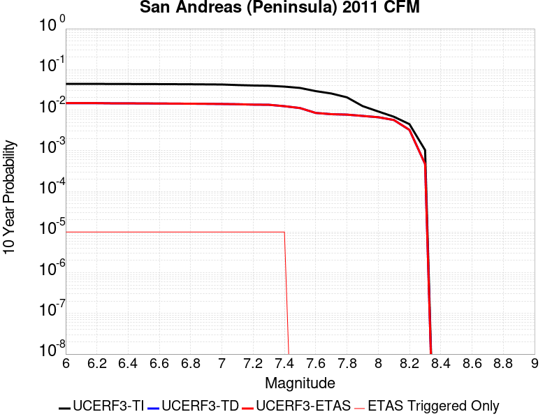 |

| Magnitude | 1 wk TI Prob | 1 wk TD Prob | 1 wk ETAS Prob | 1 wk ETAS/TD Gain | 1 wk ETAS Triggered Only | 1 mo TI Prob | 1 mo TD Prob | 1 mo ETAS Prob | 1 mo ETAS/TD Gain | 1 mo ETAS Triggered Only | 1 yr TI Prob | 1 yr TD Prob | 1 yr ETAS Prob | 1 yr ETAS/TD Gain | 1 yr ETAS Triggered Only | 10 yr TI Prob | 10 yr TD Prob | 10 yr ETAS Prob | 10 yr ETAS/TD Gain | 10 yr ETAS Triggered Only |
|-----|-----|-----|-----|-----|-----|-----|-----|-----|-----|-----|-----|-----|-----|-----|-----|-----|-----|-----|-----|-----|
| 6.0 | 8.6200685E-5 | 2.52136E-5 | 3.7402468E-5 | 1.4834243 | 1.2189176E-5 | 3.6937918E-4 | 1.0805382E-4 | 1.20241675E-4 | 1.1127943 | 1.2189176E-5 | 0.0044879215 | 0.001314763 | 0.0013269361 | 1.0092589 | 1.2189176E-5 | 0.043983612 | 0.014774441 | 0.01478645 | 1.0008129 | 1.2189176E-5 |
| 6.1 | 8.6200685E-5 | 2.52136E-5 | 3.7402468E-5 | 1.4834243 | 1.2189176E-5 | 3.6937918E-4 | 1.0805382E-4 | 1.20241675E-4 | 1.1127943 | 1.2189176E-5 | 0.0044879215 | 0.001314763 | 0.0013269361 | 1.0092589 | 1.2189176E-5 | 0.043983612 | 0.014774441 | 0.01478645 | 1.0008129 | 1.2189176E-5 |
| 6.2 | 8.6200685E-5 | 2.52136E-5 | 3.7402468E-5 | 1.4834243 | 1.2189176E-5 | 3.6937918E-4 | 1.0805382E-4 | 1.20241675E-4 | 1.1127943 | 1.2189176E-5 | 0.0044879215 | 0.001314763 | 0.0013269361 | 1.0092589 | 1.2189176E-5 | 0.043983612 | 0.014774441 | 0.01478645 | 1.0008129 | 1.2189176E-5 |
| 6.3 | 8.551163E-5 | 2.490552E-5 | 3.7094393E-5 | 1.4894044 | 1.2189176E-5 | 3.6642692E-4 | 1.06733576E-4 | 1.1892145E-4 | 1.1141897 | 1.2189176E-5 | 0.004452125 | 0.0012987083 | 0.0013108817 | 1.0093734 | 1.2189176E-5 | 0.043639794 | 0.014601416 | 0.014613427 | 1.0008227 | 1.2189176E-5 |
| 6.4 | 8.551163E-5 | 2.490552E-5 | 3.7094393E-5 | 1.4894044 | 1.2189176E-5 | 3.6642692E-4 | 1.06733576E-4 | 1.1892145E-4 | 1.1141897 | 1.2189176E-5 | 0.004452125 | 0.0012987083 | 0.0013108817 | 1.0093734 | 1.2189176E-5 | 0.043639794 | 0.014601416 | 0.014613427 | 1.0008227 | 1.2189176E-5 |
| 6.5 | 8.511146E-5 | 2.4726973E-5 | 3.6915848E-5 | 1.4929384 | 1.2189176E-5 | 3.647124E-4 | 1.05968444E-4 | 1.1815633E-4 | 1.1150143 | 1.2189176E-5 | 0.004431336 | 0.0012894038 | 0.0013015773 | 1.0094411 | 1.2189176E-5 | 0.04344007 | 0.0145011945 | 0.014513207 | 1.0008284 | 1.2189176E-5 |
| 6.6 | 8.4985084E-5 | 2.4657606E-5 | 3.6846483E-5 | 1.4943252 | 1.2189176E-5 | 3.6417096E-4 | 1.05671184E-4 | 1.1785907E-4 | 1.1153378 | 1.2189176E-5 | 0.0044247704 | 0.001285789 | 0.0012979625 | 1.0094677 | 1.2189176E-5 | 0.043376986 | 0.014463263 | 0.014475275 | 1.0008305 | 1.2189176E-5 |
| 6.7 | 8.462618E-5 | 2.4486113E-5 | 3.667499E-5 | 1.4977874 | 1.2189176E-5 | 3.6263323E-4 | 1.0493627E-4 | 1.1712417E-4 | 1.1161457 | 1.2189176E-5 | 0.004406125 | 0.0012768519 | 0.0012890255 | 1.0095341 | 1.2189176E-5 | 0.043197807 | 0.01436807 | 0.014380084 | 1.0008361 | 1.2189176E-5 |
| 6.8 | 8.42337E-5 | 2.438192E-5 | 3.65708E-5 | 1.4999146 | 1.2189176E-5 | 3.6095164E-4 | 1.04489765E-4 | 1.1667767E-4 | 1.1166421 | 1.2189176E-5 | 0.004385734 | 0.0012714221 | 0.0012835958 | 1.0095749 | 1.2189176E-5 | 0.043001823 | 0.014308756 | 0.014320771 | 1.0008397 | 1.2189176E-5 |
| 6.9 | 8.365989E-5 | 2.4186513E-5 | 3.6375393E-5 | 1.5039537 | 1.2189176E-5 | 3.5849313E-4 | 1.03652375E-4 | 1.1584029E-4 | 1.1175845 | 1.2189176E-5 | 0.004355922 | 0.0012612387 | 0.0012734125 | 1.0096523 | 1.2189176E-5 | 0.04271523 | 0.014201242 | 0.0142132575 | 1.0008461 | 1.2189176E-5 |
| 7.0 | 8.30936E-5 | 2.3948E-5 | 3.6136884E-5 | 1.508973 | 1.2189176E-5 | 3.560668E-4 | 1.02630256E-4 | 1.1481818E-4 | 1.1187557 | 1.2189176E-5 | 0.004326499 | 0.0012488087 | 0.0012609827 | 1.0097485 | 1.2189176E-5 | 0.042432297 | 0.014072227 | 0.014084245 | 1.000854 | 1.2189176E-5 |
| 7.1 | 8.041264E-5 | 2.3634402E-5 | 3.582329E-5 | 1.5157266 | 1.2189176E-5 | 3.4458007E-4 | 1.0128637E-4 | 1.13474314E-4 | 1.1203315 | 1.2189176E-5 | 0.0041871946 | 0.0012324656 | 0.0012446397 | 1.0098779 | 1.2189176E-5 | 0.041091725 | 0.013895032 | 0.013907052 | 1.0008651 | 1.2189176E-5 |
| 7.2 | 7.8427016E-5 | 2.3058019E-5 | 3.5246914E-5 | 1.5286185 | 1.2189176E-5 | 3.3607247E-4 | 9.8816345E-5 | 1.11004316E-4 | 1.1233397 | 1.2189176E-5 | 0.004084008 | 0.0012024266 | 0.0012146011 | 1.0101249 | 1.2189176E-5 | 0.040097635 | 0.013579085 | 0.013591108 | 1.0008855 | 1.2189176E-5 |
| 7.3 | 7.721087E-5 | 2.2842805E-5 | 3.5031702E-5 | 1.533599 | 1.2189176E-5 | 3.3086175E-4 | 9.7894066E-5 | 1.1008205E-4 | 1.1245017 | 1.2189176E-5 | 0.004020803 | 0.0011912102 | 0.0012033848 | 1.0102204 | 1.2189176E-5 | 0.03948827 | 0.013462781 | 0.013474806 | 1.0008932 | 1.2189176E-5 |
| 7.4 | 7.3536525E-5 | 2.0960428E-5 | 3.314935E-5 | 1.5815206 | 1.2189176E-5 | 3.1511846E-4 | 8.982732E-5 | 1.020154E-4 | 1.1356834 | 1.2189176E-5 | 0.0038298194 | 0.0010931002 | 0.001105276 | 1.0111388 | 1.2189176E-5 | 0.037644852 | 0.012419564 | 0.012431601 | 1.0009693 | 1.2189176E-5 |
| 7.5 | 6.806207E-5 | 1.876674E-5 | 1.876674E-5 | 1.0 | 0.0 | 2.9166197E-4 | 8.042641E-5 | 8.042641E-5 | 1.0 | 0.0 | 0.0035452035 | 9.787527E-4 | 9.787527E-4 | 1.0 | 0.0 | 0.034891766 | 0.01117254 | 0.01117254 | 1.0 | 0.0 |
| 7.6 | 5.6731416E-5 | 1.4177827E-5 | 1.4177827E-5 | 1.0 | 0.0 | 2.43112E-4 | 6.07607E-5 | 6.07607E-5 | 1.0 | 0.0 | 0.0029558712 | 7.395106E-4 | 7.395106E-4 | 1.0 | 0.0 | 0.02916862 | 0.008485565 | 0.008485565 | 1.0 | 0.0 |
| 7.7 | 4.946994E-5 | 1.3246218E-5 | 1.3246218E-5 | 1.0 | 0.0 | 2.1199681E-4 | 5.6768273E-5 | 5.6768273E-5 | 1.0 | 0.0 | 0.002578006 | 6.9093466E-4 | 6.9093466E-4 | 1.0 | 0.0 | 0.02548303 | 0.0079078935 | 0.0079078935 | 1.0 | 0.0 |
| 7.8 | 3.9718198E-5 | 1.2982541E-5 | 1.2982541E-5 | 1.0 | 0.0 | 1.7020974E-4 | 5.5638273E-5 | 5.5638273E-5 | 1.0 | 0.0 | 0.0020703338 | 6.771856E-4 | 6.771856E-4 | 1.0 | 0.0 | 0.020511515 | 0.0077184658 | 0.0077184658 | 1.0 | 0.0 |
| 7.9 | 2.4115114E-5 | 1.218559E-5 | 1.218559E-5 | 1.0 | 0.0 | 1.0334639E-4 | 5.2222913E-5 | 5.2222913E-5 | 1.0 | 0.0 | 0.001257516 | 6.3562865E-4 | 6.3562865E-4 | 1.0 | 0.0 | 0.012504238 | 0.007159044 | 0.007159044 | 1.0 | 0.0 |
| 8.0 | 1.7756569E-5 | 1.1410005E-5 | 1.1410005E-5 | 1.0 | 0.0 | 7.6097356E-5 | 4.8899106E-5 | 4.8899106E-5 | 1.0 | 0.0 | 9.260915E-4 | 5.951841E-4 | 5.951841E-4 | 1.0 | 0.0 | 0.009222416 | 0.006659493 | 0.006659493 | 1.0 | 0.0 |
| 8.1 | 1.3159258E-5 | 9.746194E-6 | 9.746194E-6 | 1.0 | 0.0 | 5.6395602E-5 | 4.1768737E-5 | 4.1768737E-5 | 1.0 | 0.0 | 6.864001E-4 | 5.0841586E-4 | 5.0841586E-4 | 1.0 | 0.0 | 0.0068428386 | 0.005689538 | 0.005689538 | 1.0 | 0.0 |
| 8.2 | 8.635426E-6 | 5.466912E-6 | 5.466912E-6 | 1.0 | 0.0 | 3.700844E-5 | 2.3429413E-5 | 2.3429413E-5 | 1.0 | 0.0 | 4.5048463E-4 | 2.8521585E-4 | 2.8521585E-4 | 1.0 | 0.0 | 0.004495725 | 0.0032445018 | 0.0032445018 | 1.0 | 0.0 |
| 8.3 | 1.983087E-6 | 7.6599065E-7 | 7.6599065E-7 | 1.0 | 0.0 | 8.498917E-6 | 3.282813E-6 | 3.282813E-6 | 1.0 | 0.0 | 1.034694E-4 | 3.9967534E-5 | 3.9967534E-5 | 1.0 | 0.0 | 0.0010342124 | 4.719687E-4 | 4.719687E-4 | 1.0 | 0.0 |

## Casmalia 2011 CFM
*[(top)](#table-of-contents)*

| 1 Week | 1 Month | 1 Year | 10 Year |
|-----|-----|-----|-----|
| 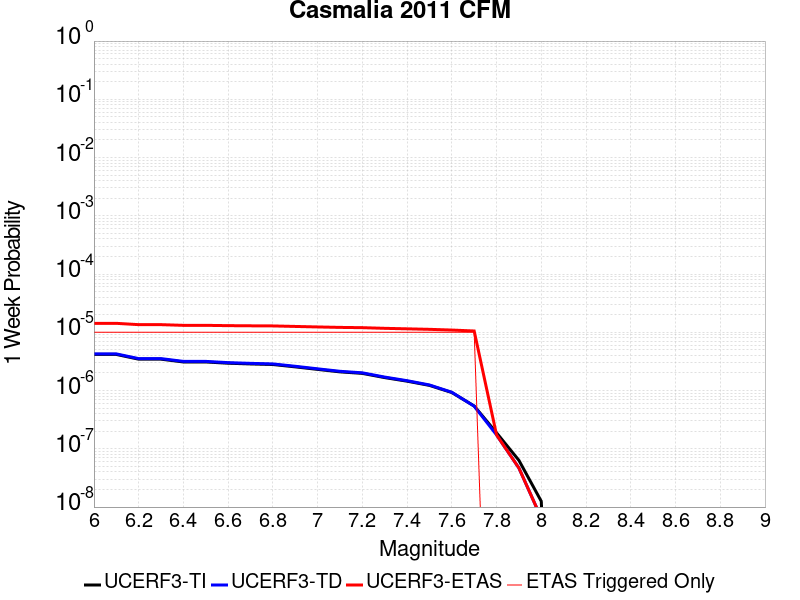 | 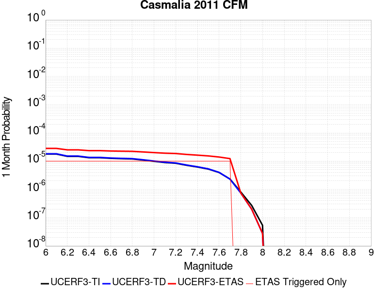 |  |  |

| Magnitude | 1 wk TI Prob | 1 wk TD Prob | 1 wk ETAS Prob | 1 wk ETAS/TD Gain | 1 wk ETAS Triggered Only | 1 mo TI Prob | 1 mo TD Prob | 1 mo ETAS Prob | 1 mo ETAS/TD Gain | 1 mo ETAS Triggered Only | 1 yr TI Prob | 1 yr TD Prob | 1 yr ETAS Prob | 1 yr ETAS/TD Gain | 1 yr ETAS Triggered Only | 10 yr TI Prob | 10 yr TD Prob | 10 yr ETAS Prob | 10 yr ETAS/TD Gain | 10 yr ETAS Triggered Only |
|-----|-----|-----|-----|-----|-----|-----|-----|-----|-----|-----|-----|-----|-----|-----|-----|-----|-----|-----|-----|-----|
| 6.0 | 4.1704893E-6 | 4.262483E-6 | 1.6451608E-5 | 3.85963 | 1.2189176E-5 | 1.7873403E-5 | 1.8267656E-5 | 3.045661E-5 | 1.6672423 | 1.2189176E-5 | 2.1758694E-4 | 2.2238622E-4 | 2.3457268E-4 | 1.0547986 | 1.2189176E-5 | 0.0021737402 | 0.0022216577 | 0.0022338198 | 1.0054743 | 1.2189176E-5 |
| 6.1 | 4.1704893E-6 | 4.262483E-6 | 1.6451608E-5 | 3.85963 | 1.2189176E-5 | 1.7873403E-5 | 1.8267656E-5 | 3.045661E-5 | 1.6672423 | 1.2189176E-5 | 2.1758694E-4 | 2.2238622E-4 | 2.3457268E-4 | 1.0547986 | 1.2189176E-5 | 0.0021737402 | 0.0022216577 | 0.0022338198 | 1.0054743 | 1.2189176E-5 |
| 6.2 | 3.457312E-6 | 3.5370217E-6 | 1.5726155E-5 | 4.446157 | 1.2189176E-5 | 1.4816967E-5 | 1.5158577E-5 | 2.7347569E-5 | 1.8040986 | 1.2189176E-5 | 1.8038164E-4 | 1.8454014E-4 | 1.9672707E-4 | 1.0660394 | 1.2189176E-5 | 0.001802353 | 0.0018438784 | 0.0018560451 | 1.0065985 | 1.2189176E-5 |
| 6.3 | 3.457312E-6 | 3.5370217E-6 | 1.5726155E-5 | 4.446157 | 1.2189176E-5 | 1.4816967E-5 | 1.5158577E-5 | 2.7347569E-5 | 1.8040986 | 1.2189176E-5 | 1.8038164E-4 | 1.8454014E-4 | 1.9672707E-4 | 1.0660394 | 1.2189176E-5 | 0.001802353 | 0.0018438784 | 0.0018560451 | 1.0065985 | 1.2189176E-5 |
| 6.4 | 3.0957337E-6 | 3.1692257E-6 | 1.5358362E-5 | 4.846093 | 1.2189176E-5 | 1.3267363E-5 | 1.3582326E-5 | 2.5771336E-5 | 1.8974171 | 1.2189176E-5 | 1.6151817E-4 | 1.6535232E-4 | 1.7753948E-4 | 1.0737042 | 1.2189176E-5 | 0.0016140083 | 0.0016522991 | 0.0016644681 | 1.0073649 | 1.2189176E-5 |
| 6.5 | 3.0957337E-6 | 3.1692257E-6 | 1.5358362E-5 | 4.846093 | 1.2189176E-5 | 1.3267363E-5 | 1.3582326E-5 | 2.5771336E-5 | 1.8974171 | 1.2189176E-5 | 1.6151817E-4 | 1.6535232E-4 | 1.7753948E-4 | 1.0737042 | 1.2189176E-5 | 0.0016140083 | 0.0016522991 | 0.0016644681 | 1.0073649 | 1.2189176E-5 |
| 6.6 | 2.9459152E-6 | 3.0165752E-6 | 1.5205715E-5 | 5.0407214 | 1.2189176E-5 | 1.262529E-5 | 1.2928115E-5 | 2.5117133E-5 | 1.9428303 | 1.2189176E-5 | 1.5370206E-4 | 1.5738848E-4 | 1.6957574E-4 | 1.0774342 | 1.2189176E-5 | 0.0015359579 | 0.0015727758 | 0.0015849458 | 1.0077379 | 1.2189176E-5 |
| 6.7 | 2.8634809E-6 | 2.9324726E-6 | 1.5121613E-5 | 5.1566086 | 1.2189176E-5 | 1.2272003E-5 | 1.256768E-5 | 2.4756702E-5 | 1.9698706 | 1.2189176E-5 | 1.4940138E-4 | 1.530008E-4 | 1.6518812E-4 | 1.0796552 | 1.2189176E-5 | 0.0014930099 | 0.0015289601 | 0.0015411306 | 1.00796 | 1.2189176E-5 |
| 6.8 | 2.7999822E-6 | 2.8675968E-6 | 1.50567375E-5 | 5.250647 | 1.2189176E-5 | 1.1999869E-5 | 1.2289643E-5 | 2.4478668E-5 | 1.991813 | 1.2189176E-5 | 1.460886E-4 | 1.4961617E-4 | 1.6180353E-4 | 1.0814575 | 1.2189176E-5 | 0.001459926 | 0.0014951597 | 0.0015073307 | 1.0081402 | 1.2189176E-5 |
| 6.9 | 2.551052E-6 | 2.6119649E-6 | 1.4801109E-5 | 5.666657 | 1.2189176E-5 | 1.0933034E-5 | 1.1194087E-5 | 2.3383127E-5 | 2.088882 | 1.2189176E-5 | 1.3310155E-4 | 1.3627953E-4 | 1.4846704E-4 | 1.0894302 | 1.2189176E-5 | 0.0013302186 | 0.0013619636 | 0.0013741362 | 1.0089375 | 1.2189176E-5 |
| 7.0 | 2.3081875E-6 | 2.3624088E-6 | 1.4551556E-5 | 6.1596265 | 1.2189176E-5 | 9.892195E-6 | 1.01245705E-5 | 2.2313623E-5 | 2.2039082 | 1.2189176E-5 | 1.20430814E-4 | 1.232597E-4 | 1.3544736E-4 | 1.098878 | 1.2189176E-5 | 0.0012036557 | 0.0012319161 | 0.0012440903 | 1.0098823 | 1.2189176E-5 |
| 7.1 | 2.093245E-6 | 2.1417243E-6 | 1.4330874E-5 | 6.691279 | 1.2189176E-5 | 8.971019E-6 | 9.178786E-6 | 2.136785E-5 | 2.3279603 | 1.2189176E-5 | 1.09216686E-4 | 1.1174601E-4 | 1.2393383E-4 | 1.1090671 | 1.2189176E-5 | 0.0010916302 | 0.0011169002 | 0.0011290758 | 1.0109012 | 1.2189176E-5 |
| 7.2 | 1.9714576E-6 | 2.0165091E-6 | 1.4205661E-5 | 7.0446796 | 1.2189176E-5 | 8.449076E-6 | 8.642153E-6 | 2.0831223E-5 | 2.4104207 | 1.2189176E-5 | 1.0286264E-4 | 1.05213156E-4 | 1.1740105E-4 | 1.1158401 | 1.2189176E-5 | 0.0010281504 | 0.0010516352 | 0.0010638116 | 1.0115784 | 1.2189176E-5 |
| 7.3 | 1.6689512E-6 | 1.7047131E-6 | 1.38938685E-5 | 8.150268 | 1.2189176E-5 | 7.1526288E-6 | 7.3058927E-6 | 1.9494979E-5 | 2.6683912 | 1.2189176E-5 | 8.7079774E-5 | 8.894562E-5 | 1.0113371E-4 | 1.1370286 | 1.2189176E-5 | 8.7045657E-4 | 8.89101E-4 | 9.0127933E-4 | 1.0136974 | 1.2189176E-5 |
| 7.4 | 1.4490954E-6 | 1.4778908E-6 | 1.3667049E-5 | 9.247672 | 1.2189176E-5 | 6.210394E-6 | 6.333802E-6 | 1.8522902E-5 | 2.924452 | 1.2189176E-5 | 7.560892E-5 | 7.711132E-5 | 8.929955E-5 | 1.1580603 | 1.2189176E-5 | 7.55832E-4 | 7.7084627E-4 | 7.8302604E-4 | 1.0158005 | 1.2189176E-5 |
| 7.5 | 1.226873E-6 | 1.2481701E-6 | 1.3437331E-5 | 10.765625 | 1.2189176E-5 | 5.2580162E-6 | 5.3492895E-6 | 1.7538401E-5 | 3.278641 | 1.2189176E-5 | 6.401447E-5 | 6.5125656E-5 | 7.731404E-5 | 1.1871518 | 1.2189176E-5 | 6.399603E-4 | 6.5106625E-4 | 6.632475E-4 | 1.0187097 | 1.2189176E-5 |
| 7.6 | 9.2561345E-7 | 9.361923E-7 | 1.3125357E-5 | 14.019937 | 1.2189176E-5 | 3.966909E-6 | 4.012247E-6 | 1.6201373E-5 | 4.0379806 | 1.2189176E-5 | 4.8296046E-5 | 4.884801E-5 | 6.103659E-5 | 1.2495205 | 1.2189176E-5 | 4.828555E-4 | 4.8837316E-4 | 5.005564E-4 | 1.0249466 | 1.2189176E-5 |
| 7.7 | 5.4367933E-7 | 5.392888E-7 | 1.2728458E-5 | 23.602303 | 1.2189176E-5 | 2.3300522E-6 | 2.3112357E-6 | 1.4500383E-5 | 6.273866 | 1.2189176E-5 | 2.8368017E-5 | 2.8138933E-5 | 4.0327766E-5 | 1.4331661 | 1.2189176E-5 | 2.8364395E-4 | 2.8135383E-4 | 2.9353958E-4 | 1.0433111 | 1.2189176E-5 |
| 7.8 | 1.8825742E-7 | 1.7342276E-7 | 1.7342276E-7 | 1.0 | 0.0 | 8.068173E-7 | 7.4324015E-7 | 7.4324015E-7 | 1.0 | 0.0 | 9.822956E-6 | 9.048912E-6 | 9.048912E-6 | 1.0 | 0.0 | 9.822522E-5 | 9.048546E-5 | 9.048546E-5 | 1.0 | 0.0 |
| 7.9 | 6.342771E-8 | 4.6790706E-8 | 4.6790706E-8 | 1.0 | 0.0 | 2.7183304E-7 | 2.0053157E-7 | 2.0053157E-7 | 1.0 | 0.0 | 3.3095623E-6 | 2.4414692E-6 | 2.4414692E-6 | 1.0 | 0.0 | 3.309513E-5 | 2.4414428E-5 | 2.4414428E-5 | 1.0 | 0.0 |
| 8.0 | 1.2574819E-8 | 6.4733463E-9 | 6.4733463E-9 | 1.0 | 0.0 | 5.3892084E-8 | 2.7742912E-8 | 2.7742912E-8 | 1.0 | 0.0 | 6.561359E-7 | 3.377699E-7 | 3.377699E-7 | 1.0 | 0.0 | 6.56134E-6 | 3.377694E-6 | 3.377694E-6 | 1.0 | 0.0 |

## San Gabriel (Extension)
*[(top)](#table-of-contents)*

| 1 Week | 1 Month | 1 Year | 10 Year |
|-----|-----|-----|-----|
|  |  |  |  |

| Magnitude | 1 wk TI Prob | 1 wk TD Prob | 1 wk ETAS Prob | 1 wk ETAS/TD Gain | 1 wk ETAS Triggered Only | 1 mo TI Prob | 1 mo TD Prob | 1 mo ETAS Prob | 1 mo ETAS/TD Gain | 1 mo ETAS Triggered Only | 1 yr TI Prob | 1 yr TD Prob | 1 yr ETAS Prob | 1 yr ETAS/TD Gain | 1 yr ETAS Triggered Only | 10 yr TI Prob | 10 yr TD Prob | 10 yr ETAS Prob | 10 yr ETAS/TD Gain | 10 yr ETAS Triggered Only |
|-----|-----|-----|-----|-----|-----|-----|-----|-----|-----|-----|-----|-----|-----|-----|-----|-----|-----|-----|-----|-----|
| 6.0 | 5.6486106E-6 | 5.7168304E-6 | 5.7168304E-6 | 1.0 | 0.0 | 2.4208108E-5 | 2.450048E-5 | 3.6689355E-5 | 1.4974955 | 1.2189176E-5 | 2.9469383E-4 | 2.9825376E-4 | 3.104393E-4 | 1.0408562 | 1.2189176E-5 | 0.0029430336 | 0.0029786653 | 0.0029908181 | 1.0040799 | 1.2189176E-5 |
| 6.1 | 5.6486106E-6 | 5.7168304E-6 | 5.7168304E-6 | 1.0 | 0.0 | 2.4208108E-5 | 2.450048E-5 | 3.6689355E-5 | 1.4974955 | 1.2189176E-5 | 2.9469383E-4 | 2.9825376E-4 | 3.104393E-4 | 1.0408562 | 1.2189176E-5 | 0.0029430336 | 0.0029786653 | 0.0029908181 | 1.0040799 | 1.2189176E-5 |
| 6.2 | 5.6486106E-6 | 5.7168304E-6 | 5.7168304E-6 | 1.0 | 0.0 | 2.4208108E-5 | 2.450048E-5 | 3.6689355E-5 | 1.4974955 | 1.2189176E-5 | 2.9469383E-4 | 2.9825376E-4 | 3.104393E-4 | 1.0408562 | 1.2189176E-5 | 0.0029430336 | 0.0029786653 | 0.0029908181 | 1.0040799 | 1.2189176E-5 |
| 6.3 | 5.6486106E-6 | 5.7168304E-6 | 5.7168304E-6 | 1.0 | 0.0 | 2.4208108E-5 | 2.450048E-5 | 3.6689355E-5 | 1.4974955 | 1.2189176E-5 | 2.9469383E-4 | 2.9825376E-4 | 3.104393E-4 | 1.0408562 | 1.2189176E-5 | 0.0029430336 | 0.0029786653 | 0.0029908181 | 1.0040799 | 1.2189176E-5 |
| 6.4 | 5.6486106E-6 | 5.7168304E-6 | 5.7168304E-6 | 1.0 | 0.0 | 2.4208108E-5 | 2.450048E-5 | 3.6689355E-5 | 1.4974955 | 1.2189176E-5 | 2.9469383E-4 | 2.9825376E-4 | 3.104393E-4 | 1.0408562 | 1.2189176E-5 | 0.0029430336 | 0.0029786653 | 0.0029908181 | 1.0040799 | 1.2189176E-5 |
| 6.5 | 4.7134554E-6 | 4.7542544E-6 | 4.7542544E-6 | 1.0 | 0.0 | 2.0200367E-5 | 2.0375222E-5 | 3.256415E-5 | 1.5982231 | 1.2189176E-5 | 2.459117E-4 | 2.4804095E-4 | 2.602271E-4 | 1.0491296 | 1.2189176E-5 | 0.0024563975 | 0.002477729 | 0.002489888 | 1.0049073 | 1.2189176E-5 |
| 6.6 | 4.7134554E-6 | 4.7542544E-6 | 4.7542544E-6 | 1.0 | 0.0 | 2.0200367E-5 | 2.0375222E-5 | 3.256415E-5 | 1.5982231 | 1.2189176E-5 | 2.459117E-4 | 2.4804095E-4 | 2.602271E-4 | 1.0491296 | 1.2189176E-5 | 0.0024563975 | 0.002477729 | 0.002489888 | 1.0049073 | 1.2189176E-5 |
| 6.7 | 4.2468837E-6 | 4.2740717E-6 | 4.2740717E-6 | 1.0 | 0.0 | 1.8200803E-5 | 1.8317325E-5 | 3.0506279E-5 | 1.6654329 | 1.2189176E-5 | 2.2157225E-4 | 2.2299135E-4 | 2.3517781E-4 | 1.05465 | 1.2189176E-5 | 0.0022135144 | 0.0022277518 | 0.0022399137 | 1.0054593 | 1.2189176E-5 |
| 6.8 | 4.1180615E-6 | 4.1414614E-6 | 4.1414614E-6 | 1.0 | 0.0 | 1.7648716E-5 | 1.7749004E-5 | 2.9937963E-5 | 1.6867405 | 1.2189176E-5 | 2.1485193E-4 | 2.160734E-4 | 2.2825995E-4 | 1.0564001 | 1.2189176E-5 | 0.0021464431 | 0.0021587082 | 0.0021708712 | 1.0056343 | 1.2189176E-5 |
| 6.9 | 3.863861E-6 | 3.8797766E-6 | 3.8797766E-6 | 1.0 | 0.0 | 1.65593E-5 | 1.6627511E-5 | 2.8816485E-5 | 1.7330606 | 1.2189176E-5 | 2.0159081E-4 | 2.0242184E-4 | 2.1460855E-4 | 1.0602045 | 1.2189176E-5 | 0.0020140803 | 0.002022446 | 0.0020346106 | 1.0060147 | 1.2189176E-5 |
| 7.0 | 3.6947372E-6 | 3.705676E-6 | 3.705676E-6 | 1.0 | 0.0 | 1.5834492E-5 | 1.5881375E-5 | 2.8070357E-5 | 1.7675017 | 1.2189176E-5 | 1.9276788E-4 | 1.9333926E-4 | 2.0552608E-4 | 1.0630333 | 1.2189176E-5 | 0.0019260074 | 0.0019317807 | 0.0019439464 | 1.0062976 | 1.2189176E-5 |
| 7.1 | 3.5686835E-6 | 3.5728963E-6 | 3.5728963E-6 | 1.0 | 0.0 | 1.5294268E-5 | 1.5312327E-5 | 2.7501315E-5 | 1.7960247 | 1.2189176E-5 | 1.861918E-4 | 1.8641229E-4 | 1.985992E-4 | 1.065376 | 1.2189176E-5 | 0.0018603588 | 0.0018626289 | 0.0018747954 | 1.0065318 | 1.2189176E-5 |
| 7.2 | 2.8023446E-6 | 2.7767885E-6 | 2.7767885E-6 | 1.0 | 0.0 | 1.2009994E-5 | 1.1900468E-5 | 1.1900468E-5 | 1.0 | 0.0 | 1.4621185E-4 | 1.4487868E-4 | 1.4487868E-4 | 1.0 | 0.0 | 0.001461157 | 0.0014478569 | 0.0014478569 | 1.0 | 0.0 |
| 7.3 | 2.5843012E-6 | 2.5459642E-6 | 2.5459642E-6 | 1.0 | 0.0 | 1.1075529E-5 | 1.0911231E-5 | 1.0911231E-5 | 1.0 | 0.0 | 1.3483623E-4 | 1.3283623E-4 | 1.3283623E-4 | 1.0 | 0.0 | 0.0013475444 | 0.0013275818 | 0.0013275818 | 1.0 | 0.0 |
| 7.4 | 2.4464468E-6 | 2.396665E-6 | 2.396665E-6 | 1.0 | 0.0 | 1.04847295E-5 | 1.0271382E-5 | 1.0271382E-5 | 1.0 | 0.0 | 1.276441E-4 | 1.25047E-4 | 1.25047E-4 | 1.0 | 0.0 | 0.0012757082 | 0.0012497796 | 0.0012497796 | 1.0 | 0.0 |
| 7.5 | 2.0420266E-6 | 1.8910426E-6 | 1.8910426E-6 | 1.0 | 0.0 | 8.751514E-6 | 8.104444E-6 | 8.104444E-6 | 1.0 | 0.0 | 1.0654447E-4 | 9.8667166E-5 | 9.8667166E-5 | 1.0 | 0.0 | 0.001064934 | 9.862408E-4 | 9.862408E-4 | 1.0 | 0.0 |
| 7.6 | 1.8326596E-6 | 1.6398341E-6 | 1.6398341E-6 | 1.0 | 0.0 | 7.854232E-6 | 7.0278415E-6 | 7.0278415E-6 | 1.0 | 0.0 | 9.562107E-5 | 8.5560634E-5 | 8.5560634E-5 | 1.0 | 0.0 | 9.5579936E-4 | 8.5528276E-4 | 8.5528276E-4 | 1.0 | 0.0 |
| 7.7 | 1.4786998E-6 | 1.2523838E-6 | 1.2523838E-6 | 1.0 | 0.0 | 6.3372695E-6 | 5.367348E-6 | 5.367348E-6 | 1.0 | 0.0 | 7.715353E-5 | 6.534551E-5 | 6.534551E-5 | 1.0 | 0.0 | 7.7126746E-4 | 6.532707E-4 | 6.532707E-4 | 1.0 | 0.0 |
| 7.8 | 7.6975533E-7 | 6.0693884E-7 | 6.0693884E-7 | 1.0 | 0.0 | 3.2989474E-6 | 2.601164E-6 | 2.601164E-6 | 1.0 | 0.0 | 4.0163945E-5 | 3.166871E-5 | 3.166871E-5 | 1.0 | 0.0 | 4.0156685E-4 | 3.1664805E-4 | 3.1664805E-4 | 1.0 | 0.0 |
| 7.9 | 1.7645915E-7 | 9.213256E-8 | 9.213256E-8 | 1.0 | 0.0 | 7.562533E-7 | 3.9485377E-7 | 3.9485377E-7 | 1.0 | 0.0 | 9.207345E-6 | 4.807334E-6 | 4.807334E-6 | 1.0 | 0.0 | 9.206964E-5 | 4.807699E-5 | 4.807699E-5 | 1.0 | 0.0 |
| 8.0 | 1.0463461E-7 | 2.4949307E-8 | 2.4949307E-8 | 1.0 | 0.0 | 4.4843398E-7 | 1.0692559E-7 | 1.0692559E-7 | 1.0 | 0.0 | 5.45967E-6 | 1.3018183E-6 | 1.3018183E-6 | 1.0 | 0.0 | 5.459536E-5 | 1.3022789E-5 | 1.3022789E-5 | 1.0 | 0.0 |
| 8.1 | 7.875717E-8 | 1.3866874E-8 | 1.3866874E-8 | 1.0 | 0.0 | 3.3753068E-7 | 5.942946E-8 | 5.942946E-8 | 1.0 | 0.0 | 4.109428E-6 | 7.235534E-7 | 7.235534E-7 | 1.0 | 0.0 | 4.109352E-5 | 7.2401926E-6 | 7.2401926E-6 | 1.0 | 0.0 |
| 8.2 | 1.33163E-8 | 1.7733891E-9 | 1.7733891E-9 | 1.0 | 0.0 | 5.7069855E-8 | 7.600239E-9 | 7.600239E-9 | 1.0 | 0.0 | 6.9482525E-7 | 9.25329E-8 | 9.25329E-8 | 1.0 | 0.0 | 6.9482307E-6 | 9.272953E-7 | 9.272953E-7 | 1.0 | 0.0 |

## Surprise Valley 2011 CFM
*[(top)](#table-of-contents)*

| 1 Week | 1 Month | 1 Year | 10 Year |
|-----|-----|-----|-----|
|  |  |  |  |

| Magnitude | 1 wk TI Prob | 1 wk TD Prob | 1 wk ETAS Prob | 1 wk ETAS/TD Gain | 1 wk ETAS Triggered Only | 1 mo TI Prob | 1 mo TD Prob | 1 mo ETAS Prob | 1 mo ETAS/TD Gain | 1 mo ETAS Triggered Only | 1 yr TI Prob | 1 yr TD Prob | 1 yr ETAS Prob | 1 yr ETAS/TD Gain | 1 yr ETAS Triggered Only | 10 yr TI Prob | 10 yr TD Prob | 10 yr ETAS Prob | 10 yr ETAS/TD Gain | 10 yr ETAS Triggered Only |
|-----|-----|-----|-----|-----|-----|-----|-----|-----|-----|-----|-----|-----|-----|-----|-----|-----|-----|-----|-----|-----|
| 6.0 | 4.0396248E-5 | 4.485131E-5 | 4.485131E-5 | 1.0 | 0.0 | 1.7311527E-4 | 1.9220692E-4 | 2.0439376E-4 | 1.0634048 | 1.2189176E-5 | 0.002105641 | 0.0023378176 | 0.0023499783 | 1.0052017 | 1.2189176E-5 | 0.020858008 | 0.023153966 | 0.023165872 | 1.0005143 | 1.2189176E-5 |
| 6.1 | 4.0396248E-5 | 4.485131E-5 | 4.485131E-5 | 1.0 | 0.0 | 1.7311527E-4 | 1.9220692E-4 | 2.0439376E-4 | 1.0634048 | 1.2189176E-5 | 0.002105641 | 0.0023378176 | 0.0023499783 | 1.0052017 | 1.2189176E-5 | 0.020858008 | 0.023153966 | 0.023165872 | 1.0005143 | 1.2189176E-5 |
| 6.2 | 2.2295266E-5 | 2.440125E-5 | 2.440125E-5 | 1.0 | 0.0 | 9.554764E-5 | 1.0457276E-4 | 1.1676067E-4 | 1.1165495 | 1.2189176E-5 | 0.0011626717 | 0.0012724606 | 0.0012846342 | 1.009567 | 1.2189176E-5 | 0.011566074 | 0.012654981 | 0.012667016 | 1.000951 | 1.2189176E-5 |
| 6.3 | 1.572643E-5 | 1.7096807E-5 | 1.7096807E-5 | 1.0 | 0.0 | 6.7397246E-5 | 7.327003E-5 | 8.545831E-5 | 1.1663475 | 1.2189176E-5 | 8.202525E-4 | 8.91708E-4 | 9.0388634E-4 | 1.0136573 | 1.2189176E-5 | 0.008172315 | 0.008882407 | 0.008894487 | 1.00136 | 1.2189176E-5 |
| 6.4 | 1.5714395E-5 | 1.7084629E-5 | 1.7084629E-5 | 1.0 | 0.0 | 6.734567E-5 | 7.3217845E-5 | 8.540612E-5 | 1.166466 | 1.2189176E-5 | 8.1962504E-4 | 8.9107314E-4 | 9.0325146E-4 | 1.013667 | 1.2189176E-5 | 0.008166086 | 0.008876109 | 0.00888819 | 1.001361 | 1.2189176E-5 |
| 6.5 | 1.2733495E-5 | 1.38016E-5 | 1.38016E-5 | 1.0 | 0.0 | 5.457098E-5 | 5.9148413E-5 | 7.1336864E-5 | 1.2060657 | 1.2189176E-5 | 6.641992E-4 | 7.1990065E-4 | 7.32081E-4 | 1.0169196 | 1.2189176E-5 | 0.0066221743 | 0.0071763797 | 0.0071884813 | 1.0016863 | 1.2189176E-5 |
| 6.6 | 1.0983784E-5 | 1.1886554E-5 | 1.1886554E-5 | 1.0 | 0.0 | 4.7072506E-5 | 5.094141E-5 | 6.312996E-5 | 1.2392662 | 1.2189176E-5 | 5.7295704E-4 | 6.200405E-4 | 6.322221E-4 | 1.0196465 | 1.2189176E-5 | 0.0057148207 | 0.0061836545 | 0.0061957682 | 1.001959 | 1.2189176E-5 |
| 6.7 | 9.104806E-6 | 9.839491E-6 | 9.839491E-6 | 1.0 | 0.0 | 3.902001E-5 | 4.2168587E-5 | 4.2168587E-5 | 1.0 | 0.0 | 4.7496508E-4 | 5.132855E-4 | 5.132855E-4 | 1.0 | 0.0 | 0.004739512 | 0.005121397 | 0.005121397 | 1.0 | 0.0 |
| 6.8 | 6.2162403E-6 | 6.7041337E-6 | 6.7041337E-6 | 1.0 | 0.0 | 2.6640759E-5 | 2.8731698E-5 | 2.8731698E-5 | 1.0 | 0.0 | 3.2430296E-4 | 3.497545E-4 | 3.497545E-4 | 1.0 | 0.0 | 0.003238301 | 0.0034922638 | 0.0034922638 | 1.0 | 0.0 |
| 6.9 | 4.1792696E-6 | 4.50323E-6 | 4.50323E-6 | 1.0 | 0.0 | 1.7911032E-5 | 1.9299423E-5 | 1.9299423E-5 | 1.0 | 0.0 | 2.1804498E-4 | 2.3494668E-4 | 2.3494668E-4 | 1.0 | 0.0 | 0.0021783116 | 0.0023471361 | 0.0023471361 | 1.0 | 0.0 |
| 7.0 | 2.7478413E-6 | 2.9622424E-6 | 2.9622424E-6 | 1.0 | 0.0 | 1.177641E-5 | 1.269527E-5 | 1.269527E-5 | 1.0 | 0.0 | 1.4336836E-4 | 1.545552E-4 | 1.545552E-4 | 1.0 | 0.0 | 0.001432759 | 0.0015445995 | 0.0015445995 | 1.0 | 0.0 |
| 7.1 | 8.128648E-7 | 8.724922E-7 | 8.724922E-7 | 1.0 | 0.0 | 3.4837017E-6 | 3.7392501E-6 | 3.7392501E-6 | 1.0 | 0.0 | 4.2413245E-5 | 4.552502E-5 | 4.552502E-5 | 1.0 | 0.0 | 4.2405148E-4 | 4.5521575E-4 | 4.5521575E-4 | 1.0 | 0.0 |
| 7.2 | 4.8641045E-8 | 4.9402068E-8 | 4.9402068E-8 | 1.0 | 0.0 | 2.084616E-7 | 2.1172312E-7 | 2.1172312E-7 | 1.0 | 0.0 | 2.538017E-6 | 2.577726E-6 | 2.577726E-6 | 1.0 | 0.0 | 2.537988E-5 | 2.5776973E-5 | 2.5776973E-5 | 1.0 | 0.0 |
| 7.3 | 5.3911844E-9 | 5.4758145E-9 | 5.4758145E-9 | 1.0 | 0.0 | 2.3105075E-8 | 2.3467775E-8 | 2.3467775E-8 | 1.0 | 0.0 | 2.8130427E-7 | 2.8572015E-7 | 2.8572015E-7 | 1.0 | 0.0 | 2.8130391E-6 | 2.8571992E-6 | 2.8571992E-6 | 1.0 | 0.0 |

## San Andreas (North Coast) 2011 CFM
*[(top)](#table-of-contents)*

| 1 Week | 1 Month | 1 Year | 10 Year |
|-----|-----|-----|-----|
|  |  |  |  |

| Magnitude | 1 wk TI Prob | 1 wk TD Prob | 1 wk ETAS Prob | 1 wk ETAS/TD Gain | 1 wk ETAS Triggered Only | 1 mo TI Prob | 1 mo TD Prob | 1 mo ETAS Prob | 1 mo ETAS/TD Gain | 1 mo ETAS Triggered Only | 1 yr TI Prob | 1 yr TD Prob | 1 yr ETAS Prob | 1 yr ETAS/TD Gain | 1 yr ETAS Triggered Only | 10 yr TI Prob | 10 yr TD Prob | 10 yr ETAS Prob | 10 yr ETAS/TD Gain | 10 yr ETAS Triggered Only |
|-----|-----|-----|-----|-----|-----|-----|-----|-----|-----|-----|-----|-----|-----|-----|-----|-----|-----|-----|-----|-----|
| 6.0 | 1.5333705E-4 | 7.1106435E-5 | 8.329474E-5 | 1.1714094 | 1.2189176E-5 | 6.5699324E-4 | 3.0470645E-4 | 3.168919E-4 | 1.0399908 | 1.2189176E-5 | 0.007969595 | 0.0037035241 | 0.0037156683 | 1.0032791 | 1.2189176E-5 | 0.0768977 | 0.03935284 | 0.03936455 | 1.0002975 | 1.2189176E-5 |
| 6.1 | 1.5333705E-4 | 7.1106435E-5 | 8.329474E-5 | 1.1714094 | 1.2189176E-5 | 6.5699324E-4 | 3.0470645E-4 | 3.168919E-4 | 1.0399908 | 1.2189176E-5 | 0.007969595 | 0.0037035241 | 0.0037156683 | 1.0032791 | 1.2189176E-5 | 0.0768977 | 0.03935284 | 0.03936455 | 1.0002975 | 1.2189176E-5 |
| 6.2 | 1.3912938E-4 | 6.050204E-5 | 7.269048E-5 | 1.201455 | 1.2189176E-5 | 5.961325E-4 | 2.5926883E-4 | 2.7145483E-4 | 1.0470015 | 1.2189176E-5 | 0.007233787 | 0.003152056 | 0.0031642066 | 1.0038549 | 1.2189176E-5 | 0.07002798 | 0.03369227 | 0.03370405 | 1.0003496 | 1.2189176E-5 |
| 6.3 | 1.3912938E-4 | 6.050204E-5 | 7.269048E-5 | 1.201455 | 1.2189176E-5 | 5.961325E-4 | 2.5926883E-4 | 2.7145483E-4 | 1.0470015 | 1.2189176E-5 | 0.007233787 | 0.003152056 | 0.0031642066 | 1.0038549 | 1.2189176E-5 | 0.07002798 | 0.03369227 | 0.03370405 | 1.0003496 | 1.2189176E-5 |
| 6.4 | 1.2623647E-4 | 5.0442024E-5 | 6.2630585E-5 | 1.2416351 | 1.2189176E-5 | 5.4090127E-4 | 2.161623E-4 | 2.2834884E-4 | 1.0563768 | 1.2189176E-5 | 0.0065656058 | 0.0026286195 | 0.0026407768 | 1.004625 | 1.2189176E-5 | 0.06374981 | 0.028303223 | 0.028315067 | 1.0004184 | 1.2189176E-5 |
| 6.5 | 1.1736096E-4 | 4.3523814E-5 | 5.571246E-5 | 1.2800454 | 1.2189176E-5 | 5.028786E-4 | 1.8651738E-4 | 1.9870428E-4 | 1.0653392 | 1.2189176E-5 | 0.006105373 | 0.0022685004 | 0.0022806618 | 1.0053611 | 1.2189176E-5 | 0.05940335 | 0.024579322 | 0.024591211 | 1.0004838 | 1.2189176E-5 |
| 6.6 | 1.1586959E-4 | 4.2423668E-5 | 5.4612326E-5 | 1.287308 | 1.2189176E-5 | 4.964894E-4 | 1.8180315E-4 | 1.9399011E-4 | 1.0670338 | 1.2189176E-5 | 0.006028018 | 0.0022112224 | 0.0022233846 | 1.0055002 | 1.2189176E-5 | 0.058671024 | 0.023984991 | 0.023996888 | 1.000496 | 1.2189176E-5 |
| 6.7 | 1.13693764E-4 | 4.073593E-5 | 5.2924606E-5 | 1.299212 | 1.2189176E-5 | 4.87168E-4 | 1.7457096E-4 | 1.86758E-4 | 1.0698115 | 1.2189176E-5 | 0.005915152 | 0.0021233456 | 0.002135509 | 1.0057284 | 1.2189176E-5 | 0.057601593 | 0.023076393 | 0.0230883 | 1.000516 | 1.2189176E-5 |
| 6.8 | 1.1204889E-4 | 3.9953447E-5 | 5.214214E-5 | 1.3050723 | 1.2189176E-5 | 4.8012115E-4 | 1.7121792E-4 | 1.83405E-4 | 1.0711788 | 1.2189176E-5 | 0.005829819 | 0.002082601 | 0.0020947647 | 1.0058407 | 1.2189176E-5 | 0.05679232 | 0.022636656 | 0.022648567 | 1.0005263 | 1.2189176E-5 |
| 6.9 | 1.1005794E-4 | 3.900957E-5 | 5.119827E-5 | 1.3124541 | 1.2189176E-5 | 4.7159163E-4 | 1.6717325E-4 | 1.7936039E-4 | 1.0729012 | 1.2189176E-5 | 0.0057265228 | 0.0020334502 | 0.0020456146 | 1.0059822 | 1.2189176E-5 | 0.055811852 | 0.022102542 | 0.022114461 | 1.0005393 | 1.2189176E-5 |
| 7.0 | 1.0647948E-4 | 3.7166337E-5 | 4.9355058E-5 | 1.3279506 | 1.2189176E-5 | 4.562608E-4 | 1.5927466E-4 | 1.714619E-4 | 1.0765171 | 1.2189176E-5 | 0.0055408357 | 0.0019374598 | 0.0019496254 | 1.0062791 | 1.2189176E-5 | 0.054047033 | 0.021062272 | 0.021074204 | 1.0005665 | 1.2189176E-5 |
| 7.1 | 1.04795035E-4 | 3.6215948E-5 | 4.8404683E-5 | 1.3365571 | 1.2189176E-5 | 4.4904428E-4 | 1.5520205E-4 | 1.6738934E-4 | 1.0785253 | 1.2189176E-5 | 0.0054534175 | 0.0018879628 | 0.001900129 | 1.0064441 | 1.2189176E-5 | 0.053215165 | 0.020530313 | 0.020542251 | 1.0005815 | 1.2189176E-5 |
| 7.2 | 1.02724036E-4 | 3.5124547E-5 | 4.7313293E-5 | 1.3470151 | 1.2189176E-5 | 4.401716E-4 | 1.5052517E-4 | 1.6271252E-4 | 1.0809655 | 1.2189176E-5 | 0.0053459285 | 0.0018311188 | 0.0018432857 | 1.0066445 | 1.2189176E-5 | 0.052191395 | 0.019919246 | 0.019931193 | 1.0005997 | 1.2189176E-5 |
| 7.3 | 1.00650694E-4 | 3.4592013E-5 | 4.6780766E-5 | 1.3523575 | 1.2189176E-5 | 4.312888E-4 | 1.4824314E-4 | 1.6043051E-4 | 1.082212 | 1.2189176E-5 | 0.005238306 | 0.0018033815 | 0.0018155486 | 1.0067469 | 1.2189176E-5 | 0.051165357 | 0.019596443 | 0.019608393 | 1.0006099 | 1.2189176E-5 |
| 7.4 | 9.672919E-5 | 3.338123E-5 | 4.557E-5 | 1.3651384 | 1.2189176E-5 | 4.144878E-4 | 1.4305465E-4 | 1.5524209E-4 | 1.0851942 | 1.2189176E-5 | 0.005034718 | 0.0017403142 | 0.0017524821 | 1.0069919 | 1.2189176E-5 | 0.049221683 | 0.018869769 | 0.018881727 | 1.0006337 | 1.2189176E-5 |
| 7.5 | 8.7600405E-5 | 2.2700917E-5 | 2.2700917E-5 | 1.0 | 0.0 | 3.753763E-4 | 9.728602E-5 | 9.728602E-5 | 1.0 | 0.0 | 0.0045606326 | 0.0011838155 | 0.0011838155 | 1.0 | 0.0 | 0.04468165 | 0.013130207 | 0.013130207 | 1.0 | 0.0 |
| 7.6 | 7.9562284E-5 | 1.9226305E-5 | 1.9226305E-5 | 1.0 | 0.0 | 3.4093665E-4 | 8.239586E-5 | 8.239586E-5 | 1.0 | 0.0 | 0.0041430052 | 0.0010027094 | 0.0010027094 | 1.0 | 0.0 | 0.040666126 | 0.011221658 | 0.011221658 | 1.0 | 0.0 |
| 7.7 | 6.3866544E-5 | 1.1941707E-5 | 1.1941707E-5 | 1.0 | 0.0 | 2.7368503E-4 | 5.117774E-5 | 5.117774E-5 | 1.0 | 0.0 | 0.0033270244 | 6.2291115E-4 | 6.2291115E-4 | 1.0 | 0.0 | 0.032776527 | 0.007210334 | 0.007210334 | 1.0 | 0.0 |
| 7.8 | 4.2543215E-5 | 9.076524E-6 | 9.076524E-6 | 1.0 | 0.0 | 1.8231533E-4 | 3.8898812E-5 | 3.8898812E-5 | 1.0 | 0.0 | 0.0022174292 | 4.7349022E-4 | 4.7349022E-4 | 1.0 | 0.0 | 0.021954332 | 0.005490525 | 0.005490525 | 1.0 | 0.0 |
| 7.9 | 2.2636612E-5 | 7.81435E-6 | 7.81435E-6 | 1.0 | 0.0 | 9.7010445E-5 | 3.3489643E-5 | 3.3489643E-5 | 1.0 | 0.0 | 0.0011804621 | 4.076602E-4 | 4.076602E-4 | 1.0 | 0.0 | 0.011742111 | 0.0046832846 | 0.0046832846 | 1.0 | 0.0 |
| 8.0 | 1.5167874E-5 | 7.0494675E-6 | 7.0494675E-6 | 1.0 | 0.0 | 6.500356E-5 | 3.0211655E-5 | 3.0211655E-5 | 1.0 | 0.0 | 7.9113094E-4 | 3.677649E-4 | 3.677649E-4 | 1.0 | 0.0 | 0.007883203 | 0.004215588 | 0.004215588 | 1.0 | 0.0 |
| 8.1 | 1.0681047E-5 | 6.386992E-6 | 6.386992E-6 | 1.0 | 0.0 | 4.5775112E-5 | 2.7372536E-5 | 2.7372536E-5 | 1.0 | 0.0 | 5.5716943E-4 | 3.3320975E-4 | 3.3320975E-4 | 1.0 | 0.0 | 0.0055577457 | 0.003817393 | 0.003817393 | 1.0 | 0.0 |
| 8.2 | 8.226114E-6 | 5.1150587E-6 | 5.1150587E-6 | 1.0 | 0.0 | 3.52543E-5 | 2.1921496E-5 | 2.1921496E-5 | 1.0 | 0.0 | 4.2913653E-4 | 2.668616E-4 | 2.668616E-4 | 1.0 | 0.0 | 0.004283088 | 0.0030450926 | 0.0030450926 | 1.0 | 0.0 |
| 8.3 | 1.983087E-6 | 7.6599065E-7 | 7.6599065E-7 | 1.0 | 0.0 | 8.498917E-6 | 3.282813E-6 | 3.282813E-6 | 1.0 | 0.0 | 1.034694E-4 | 3.9967534E-5 | 3.9967534E-5 | 1.0 | 0.0 | 0.0010342124 | 4.719687E-4 | 4.719687E-4 | 1.0 | 0.0 |

## San Joaquin Hills
*[(top)](#table-of-contents)*

| 1 Week | 1 Month | 1 Year | 10 Year |
|-----|-----|-----|-----|
|  |  |  |  |

| Magnitude | 1 wk TI Prob | 1 wk TD Prob | 1 wk ETAS Prob | 1 wk ETAS/TD Gain | 1 wk ETAS Triggered Only | 1 mo TI Prob | 1 mo TD Prob | 1 mo ETAS Prob | 1 mo ETAS/TD Gain | 1 mo ETAS Triggered Only | 1 yr TI Prob | 1 yr TD Prob | 1 yr ETAS Prob | 1 yr ETAS/TD Gain | 1 yr ETAS Triggered Only | 10 yr TI Prob | 10 yr TD Prob | 10 yr ETAS Prob | 10 yr ETAS/TD Gain | 10 yr ETAS Triggered Only |
|-----|-----|-----|-----|-----|-----|-----|-----|-----|-----|-----|-----|-----|-----|-----|-----|-----|-----|-----|-----|-----|
| 6.0 | 3.4525704E-6 | 2.8139818E-6 | 2.8139818E-6 | 1.0 | 0.0 | 1.4796647E-5 | 1.2059867E-5 | 1.2059867E-5 | 1.0 | 0.0 | 1.8013427E-4 | 1.4681912E-4 | 1.5900651E-4 | 1.0830095 | 1.2189176E-5 | 0.0017998833 | 0.0014672345 | 0.0014794057 | 1.0082954 | 1.2189176E-5 |
| 6.1 | 3.4525704E-6 | 2.8139818E-6 | 2.8139818E-6 | 1.0 | 0.0 | 1.4796647E-5 | 1.2059867E-5 | 1.2059867E-5 | 1.0 | 0.0 | 1.8013427E-4 | 1.4681912E-4 | 1.5900651E-4 | 1.0830095 | 1.2189176E-5 | 0.0017998833 | 0.0014672345 | 0.0014794057 | 1.0082954 | 1.2189176E-5 |
| 6.2 | 3.4525704E-6 | 2.8139818E-6 | 2.8139818E-6 | 1.0 | 0.0 | 1.4796647E-5 | 1.2059867E-5 | 1.2059867E-5 | 1.0 | 0.0 | 1.8013427E-4 | 1.4681912E-4 | 1.5900651E-4 | 1.0830095 | 1.2189176E-5 | 0.0017998833 | 0.0014672345 | 0.0014794057 | 1.0082954 | 1.2189176E-5 |
| 6.3 | 3.4525704E-6 | 2.8139818E-6 | 2.8139818E-6 | 1.0 | 0.0 | 1.4796647E-5 | 1.2059867E-5 | 1.2059867E-5 | 1.0 | 0.0 | 1.8013427E-4 | 1.4681912E-4 | 1.5900651E-4 | 1.0830095 | 1.2189176E-5 | 0.0017998833 | 0.0014672345 | 0.0014794057 | 1.0082954 | 1.2189176E-5 |
| 6.4 | 3.4525704E-6 | 2.8139818E-6 | 2.8139818E-6 | 1.0 | 0.0 | 1.4796647E-5 | 1.2059867E-5 | 1.2059867E-5 | 1.0 | 0.0 | 1.8013427E-4 | 1.4681912E-4 | 1.5900651E-4 | 1.0830095 | 1.2189176E-5 | 0.0017998833 | 0.0014672345 | 0.0014794057 | 1.0082954 | 1.2189176E-5 |
| 6.5 | 3.4525704E-6 | 2.8139818E-6 | 2.8139818E-6 | 1.0 | 0.0 | 1.4796647E-5 | 1.2059867E-5 | 1.2059867E-5 | 1.0 | 0.0 | 1.8013427E-4 | 1.4681912E-4 | 1.5900651E-4 | 1.0830095 | 1.2189176E-5 | 0.0017998833 | 0.0014672345 | 0.0014794057 | 1.0082954 | 1.2189176E-5 |
| 6.6 | 3.4525704E-6 | 2.8139818E-6 | 2.8139818E-6 | 1.0 | 0.0 | 1.4796647E-5 | 1.2059867E-5 | 1.2059867E-5 | 1.0 | 0.0 | 1.8013427E-4 | 1.4681912E-4 | 1.5900651E-4 | 1.0830095 | 1.2189176E-5 | 0.0017998833 | 0.0014672345 | 0.0014794057 | 1.0082954 | 1.2189176E-5 |
| 6.7 | 3.4525704E-6 | 2.8139818E-6 | 2.8139818E-6 | 1.0 | 0.0 | 1.4796647E-5 | 1.2059867E-5 | 1.2059867E-5 | 1.0 | 0.0 | 1.8013427E-4 | 1.4681912E-4 | 1.5900651E-4 | 1.0830095 | 1.2189176E-5 | 0.0017998833 | 0.0014672345 | 0.0014794057 | 1.0082954 | 1.2189176E-5 |
| 6.8 | 3.388654E-6 | 2.7484202E-6 | 2.7484202E-6 | 1.0 | 0.0 | 1.4522722E-5 | 1.1778891E-5 | 1.1778891E-5 | 1.0 | 0.0 | 1.767998E-4 | 1.4339869E-4 | 1.4339869E-4 | 1.0 | 0.0 | 0.001766592 | 0.0014330745 | 0.0014330745 | 1.0 | 0.0 |
| 6.9 | 3.2694352E-6 | 2.6283346E-6 | 2.6283346E-6 | 1.0 | 0.0 | 1.401179E-5 | 1.1264243E-5 | 1.1264243E-5 | 1.0 | 0.0 | 1.7058018E-4 | 1.3713364E-4 | 1.3713364E-4 | 1.0 | 0.0 | 0.0017044931 | 0.0013705015 | 0.0013705015 | 1.0 | 0.0 |
| 7.0 | 3.246912E-6 | 2.6069915E-6 | 2.6069915E-6 | 1.0 | 0.0 | 1.39152635E-5 | 1.1172774E-5 | 1.1172774E-5 | 1.0 | 0.0 | 1.6940516E-4 | 1.3602014E-4 | 1.3602014E-4 | 1.0 | 0.0 | 0.0016927607 | 0.0013593802 | 0.0013593802 | 1.0 | 0.0 |
| 7.1 | 3.1864927E-6 | 2.5523198E-6 | 2.5523198E-6 | 1.0 | 0.0 | 1.3656326E-5 | 1.0938467E-5 | 1.0938467E-5 | 1.0 | 0.0 | 1.6625308E-4 | 1.3316782E-4 | 1.3316782E-4 | 1.0 | 0.0 | 0.0016612876 | 0.0013308912 | 0.0013308912 | 1.0 | 0.0 |
| 7.2 | 3.0220644E-6 | 2.3991677E-6 | 2.3991677E-6 | 1.0 | 0.0 | 1.295164E-5 | 1.0282108E-5 | 1.0282108E-5 | 1.0 | 0.0 | 1.576748E-4 | 1.2517757E-4 | 1.2517757E-4 | 1.0 | 0.0 | 0.0015756298 | 0.0012510809 | 0.0012510809 | 1.0 | 0.0 |
| 7.3 | 2.787619E-6 | 2.2173858E-6 | 2.2173858E-6 | 1.0 | 0.0 | 1.1946884E-5 | 9.503048E-6 | 9.503048E-6 | 1.0 | 0.0 | 1.454436E-4 | 1.1569356E-4 | 1.1569356E-4 | 1.0 | 0.0 | 0.0014534845 | 0.0011563431 | 0.0011563431 | 1.0 | 0.0 |
| 7.4 | 2.4593792E-6 | 1.9226306E-6 | 1.9226306E-6 | 1.0 | 0.0 | 1.0540153E-5 | 8.23982E-6 | 8.23982E-6 | 1.0 | 0.0 | 1.2831882E-4 | 1.0031529E-4 | 1.0031529E-4 | 1.0 | 0.0 | 0.0012824474 | 0.0010027088 | 0.0010027088 | 1.0 | 0.0 |
| 7.5 | 1.926764E-6 | 1.4383021E-6 | 1.4383021E-6 | 1.0 | 0.0 | 8.257534E-6 | 6.1641376E-6 | 6.1641376E-6 | 1.0 | 0.0 | 1.00530844E-4 | 7.504586E-5 | 7.504586E-5 | 1.0 | 0.0 | 0.0010048538 | 7.502115E-4 | 7.502115E-4 | 1.0 | 0.0 |
| 7.6 | 1.1609359E-6 | 8.14558E-7 | 8.14558E-7 | 1.0 | 0.0 | 4.97543E-6 | 3.4909585E-6 | 3.4909585E-6 | 1.0 | 0.0 | 6.0574173E-5 | 4.2501633E-5 | 4.2501633E-5 | 1.0 | 0.0 | 6.055767E-4 | 4.249394E-4 | 4.249394E-4 | 1.0 | 0.0 |
| 7.7 | 5.1168536E-7 | 2.7155914E-7 | 2.7155914E-7 | 1.0 | 0.0 | 2.1929354E-6 | 1.1638244E-6 | 1.1638244E-6 | 1.0 | 0.0 | 2.669866E-5 | 1.41694845E-5 | 1.41694845E-5 | 1.0 | 0.0 | 2.6695454E-4 | 1.4168715E-4 | 1.4168715E-4 | 1.0 | 0.0 |
| 7.8 | 1.16056995E-8 | 9.782373E-9 | 9.782373E-9 | 1.0 | 0.0 | 4.9738713E-8 | 4.1924455E-8 | 4.1924455E-8 | 1.0 | 0.0 | 6.0556863E-7 | 5.1043025E-7 | 5.1043025E-7 | 1.0 | 0.0 | 6.05567E-6 | 5.1043025E-6 | 5.1043025E-6 | 1.0 | 0.0 |

## Anacapa-Dume alt 1
*[(top)](#table-of-contents)*

| 1 Week | 1 Month | 1 Year | 10 Year |
|-----|-----|-----|-----|
|  |  |  |  |

| Magnitude | 1 wk TI Prob | 1 wk TD Prob | 1 wk ETAS Prob | 1 wk ETAS/TD Gain | 1 wk ETAS Triggered Only | 1 mo TI Prob | 1 mo TD Prob | 1 mo ETAS Prob | 1 mo ETAS/TD Gain | 1 mo ETAS Triggered Only | 1 yr TI Prob | 1 yr TD Prob | 1 yr ETAS Prob | 1 yr ETAS/TD Gain | 1 yr ETAS Triggered Only | 10 yr TI Prob | 10 yr TD Prob | 10 yr ETAS Prob | 10 yr ETAS/TD Gain | 10 yr ETAS Triggered Only |
|-----|-----|-----|-----|-----|-----|-----|-----|-----|-----|-----|-----|-----|-----|-----|-----|-----|-----|-----|-----|-----|
| 6.0 | 5.1871802E-6 | 5.3673907E-6 | 1.7556502E-5 | 3.2709565 | 1.2189176E-5 | 2.2230583E-5 | 2.3002905E-5 | 3.5191802E-5 | 1.529885 | 1.2189176E-5 | 2.7062374E-4 | 2.8002524E-4 | 2.9221099E-4 | 1.0435166 | 1.2189176E-5 | 0.002702944 | 0.0027968092 | 0.002808964 | 1.004346 | 1.2189176E-5 |
| 6.1 | 5.1871802E-6 | 5.3673907E-6 | 1.7556502E-5 | 3.2709565 | 1.2189176E-5 | 2.2230583E-5 | 2.3002905E-5 | 3.5191802E-5 | 1.529885 | 1.2189176E-5 | 2.7062374E-4 | 2.8002524E-4 | 2.9221099E-4 | 1.0435166 | 1.2189176E-5 | 0.002702944 | 0.0027968092 | 0.002808964 | 1.004346 | 1.2189176E-5 |
| 6.2 | 5.1871802E-6 | 5.3673907E-6 | 1.7556502E-5 | 3.2709565 | 1.2189176E-5 | 2.2230583E-5 | 2.3002905E-5 | 3.5191802E-5 | 1.529885 | 1.2189176E-5 | 2.7062374E-4 | 2.8002524E-4 | 2.9221099E-4 | 1.0435166 | 1.2189176E-5 | 0.002702944 | 0.0027968092 | 0.002808964 | 1.004346 | 1.2189176E-5 |
| 6.3 | 5.1871802E-6 | 5.3673907E-6 | 1.7556502E-5 | 3.2709565 | 1.2189176E-5 | 2.2230583E-5 | 2.3002905E-5 | 3.5191802E-5 | 1.529885 | 1.2189176E-5 | 2.7062374E-4 | 2.8002524E-4 | 2.9221099E-4 | 1.0435166 | 1.2189176E-5 | 0.002702944 | 0.0027968092 | 0.002808964 | 1.004346 | 1.2189176E-5 |
| 6.4 | 5.1871802E-6 | 5.3673907E-6 | 1.7556502E-5 | 3.2709565 | 1.2189176E-5 | 2.2230583E-5 | 2.3002905E-5 | 3.5191802E-5 | 1.529885 | 1.2189176E-5 | 2.7062374E-4 | 2.8002524E-4 | 2.9221099E-4 | 1.0435166 | 1.2189176E-5 | 0.002702944 | 0.0027968092 | 0.002808964 | 1.004346 | 1.2189176E-5 |
| 6.5 | 5.1871802E-6 | 5.3673907E-6 | 1.7556502E-5 | 3.2709565 | 1.2189176E-5 | 2.2230583E-5 | 2.3002905E-5 | 3.5191802E-5 | 1.529885 | 1.2189176E-5 | 2.7062374E-4 | 2.8002524E-4 | 2.9221099E-4 | 1.0435166 | 1.2189176E-5 | 0.002702944 | 0.0027968092 | 0.002808964 | 1.004346 | 1.2189176E-5 |
| 6.6 | 5.1871802E-6 | 5.3673907E-6 | 1.7556502E-5 | 3.2709565 | 1.2189176E-5 | 2.2230583E-5 | 2.3002905E-5 | 3.5191802E-5 | 1.529885 | 1.2189176E-5 | 2.7062374E-4 | 2.8002524E-4 | 2.9221099E-4 | 1.0435166 | 1.2189176E-5 | 0.002702944 | 0.0027968092 | 0.002808964 | 1.004346 | 1.2189176E-5 |
| 6.7 | 4.7693475E-6 | 4.9366918E-6 | 1.7125807E-5 | 3.469086 | 1.2189176E-5 | 2.04399E-5 | 2.1157082E-5 | 3.3346E-5 | 1.5761153 | 1.2189176E-5 | 2.4882736E-4 | 2.5755778E-4 | 2.6974382E-4 | 1.0473138 | 1.2189176E-5 | 0.0024854892 | 0.002572669 | 0.0025848267 | 1.0047258 | 1.2189176E-5 |
| 6.8 | 4.753408E-6 | 4.92024E-6 | 1.7109356E-5 | 3.477342 | 1.2189176E-5 | 2.037159E-5 | 2.1086576E-5 | 3.3275493E-5 | 1.5780417 | 1.2189176E-5 | 2.4799586E-4 | 2.5669957E-4 | 2.6888563E-4 | 1.047472 | 1.2189176E-5 | 0.002477193 | 0.0025641066 | 0.0025762646 | 1.0047415 | 1.2189176E-5 |
| 6.9 | 3.800069E-6 | 3.937126E-6 | 3.937126E-6 | 1.0 | 0.0 | 1.6285909E-5 | 1.687329E-5 | 1.687329E-5 | 1.0 | 0.0 | 1.9826289E-4 | 2.0541316E-4 | 2.0541316E-4 | 1.0 | 0.0 | 0.001980861 | 0.0020522568 | 0.0020522568 | 1.0 | 0.0 |
| 7.0 | 3.6671938E-6 | 3.7999182E-6 | 3.7999182E-6 | 1.0 | 0.0 | 1.571645E-5 | 1.6285263E-5 | 1.6285263E-5 | 1.0 | 0.0 | 1.9133097E-4 | 1.9825528E-4 | 1.9825528E-4 | 1.0 | 0.0 | 0.0019116632 | 0.0019808074 | 0.0019808074 | 1.0 | 0.0 |
| 7.1 | 3.2394885E-6 | 3.3587933E-6 | 3.3587933E-6 | 1.0 | 0.0 | 1.3883448E-5 | 1.4394749E-5 | 1.4394749E-5 | 1.0 | 0.0 | 1.6901788E-4 | 1.7524208E-4 | 1.7524208E-4 | 1.0 | 0.0 | 0.0016888938 | 0.0017510501 | 0.0017510501 | 1.0 | 0.0 |
| 7.2 | 3.0935948E-6 | 3.2079258E-6 | 3.2079258E-6 | 1.0 | 0.0 | 1.3258196E-5 | 1.3748182E-5 | 1.3748182E-5 | 1.0 | 0.0 | 1.6140658E-4 | 1.6737137E-4 | 1.6737137E-4 | 1.0 | 0.0 | 0.001612894 | 0.0016724641 | 0.0016724641 | 1.0 | 0.0 |
| 7.3 | 2.5604163E-6 | 2.647073E-6 | 2.647073E-6 | 1.0 | 0.0 | 1.0973167E-5 | 1.1344549E-5 | 1.1344549E-5 | 1.0 | 0.0 | 1.3359012E-4 | 1.3811118E-4 | 1.3811118E-4 | 1.0 | 0.0 | 0.0013350984 | 0.0013802581 | 0.0013802581 | 1.0 | 0.0 |
| 7.4 | 2.1429005E-6 | 2.2106028E-6 | 2.2106028E-6 | 1.0 | 0.0 | 9.1838265E-6 | 9.473977E-6 | 9.473977E-6 | 1.0 | 0.0 | 1.11807356E-4 | 1.1533959E-4 | 1.1533959E-4 | 1.0 | 0.0 | 0.0011175112 | 0.0011527999 | 0.0011527999 | 1.0 | 0.0 |
| 7.5 | 1.7237151E-6 | 1.7761449E-6 | 1.7761449E-6 | 1.0 | 0.0 | 7.3873293E-6 | 7.6120277E-6 | 7.6120277E-6 | 1.0 | 0.0 | 8.993702E-5 | 9.267252E-5 | 9.267252E-5 | 1.0 | 0.0 | 8.990063E-4 | 9.2634105E-4 | 9.2634105E-4 | 1.0 | 0.0 |
| 7.6 | 9.541696E-7 | 9.823206E-7 | 9.823206E-7 | 1.0 | 0.0 | 4.089292E-6 | 4.2099387E-6 | 4.2099387E-6 | 1.0 | 0.0 | 4.9785995E-5 | 5.1254807E-5 | 5.1254807E-5 | 1.0 | 0.0 | 4.9774844E-4 | 5.1243114E-4 | 5.1243114E-4 | 1.0 | 0.0 |
| 7.7 | 2.7226676E-7 | 2.7172416E-7 | 2.7172416E-7 | 1.0 | 0.0 | 1.166857E-6 | 1.1645316E-6 | 1.1645316E-6 | 1.0 | 0.0 | 1.4206392E-5 | 1.4178081E-5 | 1.4178081E-5 | 1.0 | 0.0 | 1.4205484E-4 | 1.4177183E-4 | 1.4177183E-4 | 1.0 | 0.0 |
| 7.8 | 4.5017995E-8 | 4.2157676E-8 | 4.2157676E-8 | 1.0 | 0.0 | 1.9293425E-7 | 1.8067574E-7 | 1.8067574E-7 | 1.0 | 0.0 | 2.348972E-6 | 2.1997253E-6 | 2.1997253E-6 | 1.0 | 0.0 | 2.348947E-5 | 2.1997055E-5 | 2.1997055E-5 | 1.0 | 0.0 |
| 7.9 | 8.007447E-10 | 6.1608785E-10 | 6.1608785E-10 | 1.0 | 0.0 | 3.4317629E-9 | 2.6403764E-9 | 2.6403764E-9 | 1.0 | 0.0 | 4.1781714E-8 | 3.2146584E-8 | 3.2146584E-8 | 1.0 | 0.0 | 4.1781706E-7 | 3.214658E-7 | 3.214658E-7 | 1.0 | 0.0 |

## Ozena
*[(top)](#table-of-contents)*

| 1 Week | 1 Month | 1 Year | 10 Year |
|-----|-----|-----|-----|
|  |  |  |  |

| Magnitude | 1 wk TI Prob | 1 wk TD Prob | 1 wk ETAS Prob | 1 wk ETAS/TD Gain | 1 wk ETAS Triggered Only | 1 mo TI Prob | 1 mo TD Prob | 1 mo ETAS Prob | 1 mo ETAS/TD Gain | 1 mo ETAS Triggered Only | 1 yr TI Prob | 1 yr TD Prob | 1 yr ETAS Prob | 1 yr ETAS/TD Gain | 1 yr ETAS Triggered Only | 10 yr TI Prob | 10 yr TD Prob | 10 yr ETAS Prob | 10 yr ETAS/TD Gain | 10 yr ETAS Triggered Only |
|-----|-----|-----|-----|-----|-----|-----|-----|-----|-----|-----|-----|-----|-----|-----|-----|-----|-----|-----|-----|-----|
| 6.0 | 1.4377547E-6 | 1.4513782E-6 | 1.3640537E-5 | 9.398334 | 1.2189176E-5 | 6.161791E-6 | 6.2201793E-6 | 1.8409279E-5 | 2.959606 | 1.2189176E-5 | 7.5017226E-5 | 7.572832E-5 | 8.7916575E-5 | 1.1609471 | 1.2189176E-5 | 7.4991904E-4 | 7.570518E-4 | 7.6923176E-4 | 1.0160886 | 1.2189176E-5 |
| 6.1 | 1.4377547E-6 | 1.4513782E-6 | 1.3640537E-5 | 9.398334 | 1.2189176E-5 | 6.161791E-6 | 6.2201793E-6 | 1.8409279E-5 | 2.959606 | 1.2189176E-5 | 7.5017226E-5 | 7.572832E-5 | 8.7916575E-5 | 1.1609471 | 1.2189176E-5 | 7.4991904E-4 | 7.570518E-4 | 7.6923176E-4 | 1.0160886 | 1.2189176E-5 |
| 6.2 | 1.4377547E-6 | 1.4513782E-6 | 1.3640537E-5 | 9.398334 | 1.2189176E-5 | 6.161791E-6 | 6.2201793E-6 | 1.8409279E-5 | 2.959606 | 1.2189176E-5 | 7.5017226E-5 | 7.572832E-5 | 8.7916575E-5 | 1.1609471 | 1.2189176E-5 | 7.4991904E-4 | 7.570518E-4 | 7.6923176E-4 | 1.0160886 | 1.2189176E-5 |
| 6.3 | 1.4377547E-6 | 1.4513782E-6 | 1.3640537E-5 | 9.398334 | 1.2189176E-5 | 6.161791E-6 | 6.2201793E-6 | 1.8409279E-5 | 2.959606 | 1.2189176E-5 | 7.5017226E-5 | 7.572832E-5 | 8.7916575E-5 | 1.1609471 | 1.2189176E-5 | 7.4991904E-4 | 7.570518E-4 | 7.6923176E-4 | 1.0160886 | 1.2189176E-5 |
| 6.4 | 1.4377547E-6 | 1.4513782E-6 | 1.3640537E-5 | 9.398334 | 1.2189176E-5 | 6.161791E-6 | 6.2201793E-6 | 1.8409279E-5 | 2.959606 | 1.2189176E-5 | 7.5017226E-5 | 7.572832E-5 | 8.7916575E-5 | 1.1609471 | 1.2189176E-5 | 7.4991904E-4 | 7.570518E-4 | 7.6923176E-4 | 1.0160886 | 1.2189176E-5 |
| 6.5 | 1.4377547E-6 | 1.4513782E-6 | 1.3640537E-5 | 9.398334 | 1.2189176E-5 | 6.161791E-6 | 6.2201793E-6 | 1.8409279E-5 | 2.959606 | 1.2189176E-5 | 7.5017226E-5 | 7.572832E-5 | 8.7916575E-5 | 1.1609471 | 1.2189176E-5 | 7.4991904E-4 | 7.570518E-4 | 7.6923176E-4 | 1.0160886 | 1.2189176E-5 |
| 6.6 | 1.4377547E-6 | 1.4513782E-6 | 1.3640537E-5 | 9.398334 | 1.2189176E-5 | 6.161791E-6 | 6.2201793E-6 | 1.8409279E-5 | 2.959606 | 1.2189176E-5 | 7.5017226E-5 | 7.572832E-5 | 8.7916575E-5 | 1.1609471 | 1.2189176E-5 | 7.4991904E-4 | 7.570518E-4 | 7.6923176E-4 | 1.0160886 | 1.2189176E-5 |
| 6.7 | 1.4377547E-6 | 1.4513782E-6 | 1.3640537E-5 | 9.398334 | 1.2189176E-5 | 6.161791E-6 | 6.2201793E-6 | 1.8409279E-5 | 2.959606 | 1.2189176E-5 | 7.5017226E-5 | 7.572832E-5 | 8.7916575E-5 | 1.1609471 | 1.2189176E-5 | 7.4991904E-4 | 7.570518E-4 | 7.6923176E-4 | 1.0160886 | 1.2189176E-5 |
| 6.8 | 9.223257E-7 | 9.317624E-7 | 9.317624E-7 | 1.0 | 0.0 | 3.9528186E-6 | 3.9932615E-6 | 3.9932615E-6 | 1.0 | 0.0 | 4.81245E-5 | 4.8616912E-5 | 4.8616912E-5 | 1.0 | 0.0 | 4.811408E-4 | 4.860668E-4 | 4.860668E-4 | 1.0 | 0.0 |
| 6.9 | 9.141515E-7 | 9.235371E-7 | 9.235371E-7 | 1.0 | 0.0 | 3.917786E-6 | 3.9580104E-6 | 3.9580104E-6 | 1.0 | 0.0 | 4.7698002E-5 | 4.818775E-5 | 4.818775E-5 | 1.0 | 0.0 | 4.7687767E-4 | 4.8177704E-4 | 4.8177704E-4 | 1.0 | 0.0 |
| 7.0 | 8.767648E-7 | 8.8585773E-7 | 8.8585773E-7 | 1.0 | 0.0 | 3.757558E-6 | 3.7965276E-6 | 3.7965276E-6 | 1.0 | 0.0 | 4.5747307E-5 | 4.6221783E-5 | 4.6221783E-5 | 1.0 | 0.0 | 4.5737892E-4 | 4.6212564E-4 | 4.6212564E-4 | 1.0 | 0.0 |
| 7.1 | 8.199402E-7 | 8.2853984E-7 | 8.2853984E-7 | 1.0 | 0.0 | 3.5140247E-6 | 3.5508804E-6 | 3.5508804E-6 | 1.0 | 0.0 | 4.2782412E-5 | 4.323115E-5 | 4.323115E-5 | 1.0 | 0.0 | 4.2774176E-4 | 4.322311E-4 | 4.322311E-4 | 1.0 | 0.0 |
| 7.2 | 7.38705E-7 | 7.464262E-7 | 7.464262E-7 | 1.0 | 0.0 | 3.1658747E-6 | 3.198966E-6 | 3.198966E-6 | 1.0 | 0.0 | 3.8543843E-5 | 3.894675E-5 | 3.894675E-5 | 1.0 | 0.0 | 3.853716E-4 | 3.8940276E-4 | 3.8940276E-4 | 1.0 | 0.0 |
| 7.3 | 6.490017E-7 | 6.557802E-7 | 6.557802E-7 | 1.0 | 0.0 | 2.7814328E-6 | 2.8104837E-6 | 2.8104837E-6 | 1.0 | 0.0 | 3.386342E-5 | 3.4217133E-5 | 3.4217133E-5 | 1.0 | 0.0 | 3.3858258E-4 | 3.4212202E-4 | 3.4212202E-4 | 1.0 | 0.0 |
| 7.4 | 5.346736E-7 | 5.4022604E-7 | 5.4022604E-7 | 1.0 | 0.0 | 2.291456E-6 | 2.3152527E-6 | 2.3152527E-6 | 1.0 | 0.0 | 2.789812E-5 | 2.8187867E-5 | 2.8187867E-5 | 1.0 | 0.0 | 2.789462E-4 | 2.8184598E-4 | 2.8184598E-4 | 1.0 | 0.0 |
| 7.5 | 2.939325E-7 | 2.9666057E-7 | 2.9666057E-7 | 1.0 | 0.0 | 1.25971E-6 | 1.271402E-6 | 1.271402E-6 | 1.0 | 0.0 | 1.5336862E-5 | 1.5479225E-5 | 1.5479225E-5 | 1.0 | 0.0 | 1.5335804E-4 | 1.5478309E-4 | 1.5478309E-4 | 1.0 | 0.0 |
| 7.6 | 1.4151905E-7 | 1.4253266E-7 | 1.4253266E-7 | 1.0 | 0.0 | 6.065101E-7 | 6.108541E-7 | 6.108541E-7 | 1.0 | 0.0 | 7.3842357E-6 | 7.4371237E-6 | 7.4371237E-6 | 1.0 | 0.0 | 7.38399E-5 | 7.436883E-5 | 7.436883E-5 | 1.0 | 0.0 |
| 7.7 | 4.4957577E-8 | 4.5252243E-8 | 4.5252243E-8 | 1.0 | 0.0 | 1.9267533E-7 | 1.9393818E-7 | 1.9393818E-7 | 1.0 | 0.0 | 2.3458194E-6 | 2.3611947E-6 | 2.3611947E-6 | 1.0 | 0.0 | 2.3457947E-5 | 2.3611707E-5 | 2.3611707E-5 | 1.0 | 0.0 |
| 7.8 | 5.9993255E-9 | 6.0412972E-9 | 6.0412972E-9 | 1.0 | 0.0 | 2.5711394E-8 | 2.5891273E-8 | 2.5891273E-8 | 1.0 | 0.0 | 3.1303617E-7 | 3.1522623E-7 | 3.1522623E-7 | 1.0 | 0.0 | 3.1303573E-6 | 3.1522588E-6 | 3.1522588E-6 | 1.0 | 0.0 |

## Rodgers Creek - Healdsburg 2011 CFM
*[(top)](#table-of-contents)*

| 1 Week | 1 Month | 1 Year | 10 Year |
|-----|-----|-----|-----|
|  |  |  |  |

| Magnitude | 1 wk TI Prob | 1 wk TD Prob | 1 wk ETAS Prob | 1 wk ETAS/TD Gain | 1 wk ETAS Triggered Only | 1 mo TI Prob | 1 mo TD Prob | 1 mo ETAS Prob | 1 mo ETAS/TD Gain | 1 mo ETAS Triggered Only | 1 yr TI Prob | 1 yr TD Prob | 1 yr ETAS Prob | 1 yr ETAS/TD Gain | 1 yr ETAS Triggered Only | 10 yr TI Prob | 10 yr TD Prob | 10 yr ETAS Prob | 10 yr ETAS/TD Gain | 10 yr ETAS Triggered Only |
|-----|-----|-----|-----|-----|-----|-----|-----|-----|-----|-----|-----|-----|-----|-----|-----|-----|-----|-----|-----|-----|
| 6.0 | 7.390182E-5 | 1.3136698E-4 | 1.4355456E-4 | 1.092775 | 1.2189176E-5 | 3.1668364E-4 | 5.6287815E-4 | 5.7506043E-4 | 1.0216429 | 1.2189176E-5 | 0.0038488081 | 0.0068315 | 0.0068436065 | 1.001772 | 1.2189176E-5 | 0.037828278 | 0.06619178 | 0.06620316 | 1.000172 | 1.2189176E-5 |
| 6.1 | 7.318768E-5 | 1.3034661E-4 | 1.425342E-4 | 1.0935013 | 1.2189176E-5 | 3.1362378E-4 | 5.585081E-4 | 5.706905E-4 | 1.0218123 | 1.2189176E-5 | 0.0038116854 | 0.0067786723 | 0.0067907786 | 1.001786 | 1.2189176E-5 | 0.037469655 | 0.06569639 | 0.06570778 | 1.0001733 | 1.2189176E-5 |
| 6.2 | 7.1379836E-5 | 1.2727521E-4 | 1.3946283E-4 | 1.0957581 | 1.2189176E-5 | 3.058777E-4 | 5.453505E-4 | 5.5753306E-4 | 1.0223389 | 1.2189176E-5 | 0.003717703 | 0.0066194604 | 0.006631569 | 1.0018293 | 1.2189176E-5 | 0.0365612 | 0.06421462 | 0.064226024 | 1.0001776 | 1.2189176E-5 |
| 6.3 | 6.9255926E-5 | 1.2382054E-4 | 1.3600821E-4 | 1.09843 | 1.2189176E-5 | 2.9677735E-4 | 5.3055194E-4 | 5.427347E-4 | 1.0229623 | 1.2189176E-5 | 0.0036072785 | 0.006440372 | 0.006452483 | 1.0018804 | 1.2189176E-5 | 0.035492823 | 0.06254096 | 0.062552385 | 1.0001827 | 1.2189176E-5 |
| 6.4 | 6.6757144E-5 | 1.1958744E-4 | 1.3177516E-4 | 1.1019146 | 1.2189176E-5 | 2.8607066E-4 | 5.1241735E-4 | 5.2460027E-4 | 1.0237755 | 1.2189176E-5 | 0.0034773487 | 0.0062209065 | 0.0062330198 | 1.0019472 | 1.2189176E-5 | 0.034234364 | 0.060490217 | 0.06050167 | 1.0001893 | 1.2189176E-5 |
| 6.5 | 6.5735134E-5 | 1.1808043E-4 | 1.3026818E-4 | 1.1032156 | 1.2189176E-5 | 2.8169158E-4 | 5.0596124E-4 | 5.181443E-4 | 1.024079 | 1.2189176E-5 | 0.003424202 | 0.0061427657 | 0.0061548804 | 1.0019721 | 1.2189176E-5 | 0.03371918 | 0.059755135 | 0.059766594 | 1.0001918 | 1.2189176E-5 |
| 6.6 | 6.289601E-5 | 1.1343802E-4 | 1.2562583E-4 | 1.1074401 | 1.2189176E-5 | 2.6952647E-4 | 4.8607276E-4 | 4.98256E-4 | 1.0250647 | 1.2189176E-5 | 0.0032765474 | 0.005901959 | 0.005914076 | 1.0020531 | 1.2189176E-5 | 0.032286562 | 0.057494484 | 0.057505973 | 1.0001998 | 1.2189176E-5 |
| 6.7 | 6.115274E-5 | 1.1060895E-4 | 1.2279677E-4 | 1.1101885 | 1.2189176E-5 | 2.6205686E-4 | 4.7395262E-4 | 4.86136E-4 | 1.0257059 | 1.2189176E-5 | 0.0031858748 | 0.0057551847 | 0.0057673035 | 1.0021057 | 1.2189176E-5 | 0.031405866 | 0.05611298 | 0.056124482 | 1.000205 | 1.2189176E-5 |
| 6.8 | 5.9232367E-5 | 1.0728244E-4 | 1.194703E-4 | 1.1136055 | 1.2189176E-5 | 2.538283E-4 | 4.597012E-4 | 4.718848E-4 | 1.0265032 | 1.2189176E-5 | 0.0030859804 | 0.0055825757 | 0.005594697 | 1.0021713 | 1.2189176E-5 | 0.030434765 | 0.054479737 | 0.054491263 | 1.0002116 | 1.2189176E-5 |
| 6.9 | 5.4030377E-5 | 9.8224424E-5 | 1.104124E-4 | 1.1240829 | 1.2189176E-5 | 2.315382E-4 | 4.2089424E-4 | 4.330783E-4 | 1.028948 | 1.2189176E-5 | 0.0028153337 | 0.005112413 | 0.00512454 | 1.002372 | 1.2189176E-5 | 0.027799325 | 0.05001516 | 0.050026737 | 1.0002315 | 1.2189176E-5 |
| 7.0 | 4.8260714E-5 | 8.740524E-5 | 8.740524E-5 | 1.0 | 0.0 | 2.0681522E-4 | 3.745404E-4 | 3.745404E-4 | 1.0 | 0.0 | 0.0025150678 | 0.004550549 | 0.004550549 | 1.0 | 0.0 | 0.024867928 | 0.044667665 | 0.044667665 | 1.0 | 0.0 |
| 7.1 | 4.0294493E-5 | 7.389041E-5 | 7.389041E-5 | 1.0 | 0.0 | 1.7267925E-4 | 3.1663495E-4 | 3.1663495E-4 | 1.0 | 0.0 | 0.0021003427 | 0.0038482544 | 0.0038482544 | 1.0 | 0.0 | 0.02080602 | 0.037923392 | 0.037923392 | 1.0 | 0.0 |
| 7.2 | 3.096388E-5 | 5.697752E-5 | 5.697752E-5 | 1.0 | 0.0 | 1.326956E-4 | 2.4416664E-4 | 2.4416664E-4 | 1.0 | 0.0 | 0.0016143717 | 0.0029686983 | 0.0029686983 | 1.0 | 0.0 | 0.01602694 | 0.029436996 | 0.029436996 | 1.0 | 0.0 |
| 7.3 | 2.3615226E-5 | 4.3628002E-5 | 4.3628002E-5 | 1.0 | 0.0 | 1.0120418E-4 | 1.8696384E-4 | 1.8696384E-4 | 1.0 | 0.0 | 0.0012314644 | 0.002273922 | 0.002273922 | 1.0 | 0.0 | 0.0122466255 | 0.022636993 | 0.022636993 | 1.0 | 0.0 |
| 7.4 | 1.8251132E-5 | 3.3541033E-5 | 3.3541033E-5 | 1.0 | 0.0 | 7.821679E-5 | 1.4373941E-4 | 1.4373941E-4 | 1.0 | 0.0 | 9.518733E-4 | 0.0017486324 | 0.0017486324 | 1.0 | 0.0 | 0.009478063 | 0.017465532 | 0.017465532 | 1.0 | 0.0 |
| 7.5 | 1.2411432E-5 | 2.246003E-5 | 2.246003E-5 | 1.0 | 0.0 | 5.3190768E-5 | 9.625375E-5 | 9.625375E-5 | 1.0 | 0.0 | 6.4740516E-4 | 0.0011712653 | 0.0011712653 | 1.0 | 0.0 | 0.006455223 | 0.011743283 | 0.011743283 | 1.0 | 0.0 |
| 7.6 | 4.4771446E-6 | 8.083989E-6 | 8.083989E-6 | 1.0 | 0.0 | 1.918762E-5 | 3.4645214E-5 | 3.4645214E-5 | 1.0 | 0.0 | 2.3358424E-4 | 4.2172507E-4 | 4.2172507E-4 | 1.0 | 0.0 | 0.0023333887 | 0.004246066 | 0.004246066 | 1.0 | 0.0 |
| 7.7 | 2.157941E-7 | 3.5349316E-7 | 3.5349316E-7 | 1.0 | 0.0 | 9.248315E-7 | 1.5149698E-6 | 1.5149698E-6 | 1.0 | 0.0 | 1.1259765E-5 | 1.8444602E-5 | 1.8444602E-5 | 1.0 | 0.0 | 1.1259195E-4 | 1.9069147E-4 | 1.9069147E-4 | 1.0 | 0.0 |
| 7.8 | 9.9623286E-8 | 1.989979E-7 | 1.989979E-7 | 1.0 | 0.0 | 4.269569E-7 | 8.528478E-7 | 8.528478E-7 | 1.0 | 0.0 | 5.1981874E-6 | 1.0383373E-5 | 1.0383373E-5 | 1.0 | 0.0 | 5.198066E-5 | 1.09018714E-4 | 1.09018714E-4 | 1.0 | 0.0 |
| 7.9 | 5.6745257E-8 | 1.1773924E-7 | 1.1773924E-7 | 1.0 | 0.0 | 2.4319394E-7 | 5.0459664E-7 | 5.0459664E-7 | 1.0 | 0.0 | 2.960882E-6 | 6.1434466E-6 | 6.1434466E-6 | 1.0 | 0.0 | 2.9608427E-5 | 6.470911E-5 | 6.470911E-5 | 1.0 | 0.0 |
| 8.0 | 2.8614323E-8 | 6.57845E-8 | 6.57845E-8 | 1.0 | 0.0 | 1.2263281E-7 | 2.8193355E-7 | 2.8193355E-7 | 1.0 | 0.0 | 1.4930534E-6 | 3.4325356E-6 | 3.4325356E-6 | 1.0 | 0.0 | 1.4930434E-5 | 3.582588E-5 | 3.582588E-5 | 1.0 | 0.0 |
| 8.1 | 3.5045191E-9 | 8.965783E-9 | 8.965783E-9 | 1.0 | 0.0 | 1.5019367E-8 | 3.8424783E-8 | 3.8424783E-8 | 1.0 | 0.0 | 1.8286079E-7 | 4.6782165E-7 | 4.6782165E-7 | 1.0 | 0.0 | 1.8286064E-6 | 4.8327956E-6 | 4.8327956E-6 | 1.0 | 0.0 |

## Greenville (No) 2011 CFM
*[(top)](#table-of-contents)*

| 1 Week | 1 Month | 1 Year | 10 Year |
|-----|-----|-----|-----|
|  |  |  |  |

| Magnitude | 1 wk TI Prob | 1 wk TD Prob | 1 wk ETAS Prob | 1 wk ETAS/TD Gain | 1 wk ETAS Triggered Only | 1 mo TI Prob | 1 mo TD Prob | 1 mo ETAS Prob | 1 mo ETAS/TD Gain | 1 mo ETAS Triggered Only | 1 yr TI Prob | 1 yr TD Prob | 1 yr ETAS Prob | 1 yr ETAS/TD Gain | 1 yr ETAS Triggered Only | 10 yr TI Prob | 10 yr TD Prob | 10 yr ETAS Prob | 10 yr ETAS/TD Gain | 10 yr ETAS Triggered Only |
|-----|-----|-----|-----|-----|-----|-----|-----|-----|-----|-----|-----|-----|-----|-----|-----|-----|-----|-----|-----|-----|
| 6.0 | 3.286654E-5 | 4.036648E-5 | 4.036648E-5 | 1.0 | 0.0 | 1.4084899E-4 | 1.7298796E-4 | 1.7298796E-4 | 1.0 | 0.0 | 0.0017134876 | 0.002104132 | 0.0021162955 | 1.0057808 | 1.2189176E-5 | 0.017003356 | 0.020846982 | 0.020858917 | 1.0005726 | 1.2189176E-5 |
| 6.1 | 3.286654E-5 | 4.036648E-5 | 4.036648E-5 | 1.0 | 0.0 | 1.4084899E-4 | 1.7298796E-4 | 1.7298796E-4 | 1.0 | 0.0 | 0.0017134876 | 0.002104132 | 0.0021162955 | 1.0057808 | 1.2189176E-5 | 0.017003356 | 0.020846982 | 0.020858917 | 1.0005726 | 1.2189176E-5 |
| 6.2 | 3.1697953E-5 | 3.8929385E-5 | 3.8929385E-5 | 1.0 | 0.0 | 1.358413E-4 | 1.6682976E-4 | 1.6682976E-4 | 1.0 | 0.0 | 0.0016526132 | 0.002029298 | 0.0020414626 | 1.0059944 | 1.2189176E-5 | 0.01640377 | 0.020112377 | 0.02012432 | 1.0005939 | 1.2189176E-5 |
| 6.3 | 3.1363317E-5 | 3.851826E-5 | 3.851826E-5 | 1.0 | 0.0 | 1.344073E-4 | 1.6506804E-4 | 1.6506804E-4 | 1.0 | 0.0 | 0.0016351803 | 0.0020078886 | 0.0020200533 | 1.0060585 | 1.2189176E-5 | 0.016232004 | 0.019902144 | 0.01991409 | 1.0006002 | 1.2189176E-5 |
| 6.4 | 3.0228604E-5 | 3.7125395E-5 | 3.7125395E-5 | 1.0 | 0.0 | 1.2954473E-4 | 1.5909935E-4 | 1.5909935E-4 | 1.0 | 0.0 | 0.0015760659 | 0.0019353506 | 0.0019475161 | 1.006286 | 1.2189176E-5 | 0.015649348 | 0.019189484 | 0.01920144 | 1.000623 | 1.2189176E-5 |
| 6.5 | 2.9537814E-5 | 3.6280853E-5 | 3.6280853E-5 | 1.0 | 0.0 | 1.2658449E-4 | 1.554803E-4 | 1.554803E-4 | 1.0 | 0.0 | 0.0015400766 | 0.0018913659 | 0.001903532 | 1.0064324 | 1.2189176E-5 | 0.01529447 | 0.018757146 | 0.018769108 | 1.0006377 | 1.2189176E-5 |
| 6.6 | 2.7345395E-5 | 3.3590182E-5 | 3.3590182E-5 | 1.0 | 0.0 | 1.1718928E-4 | 1.4395016E-4 | 1.4395016E-4 | 1.0 | 0.0 | 0.0014258457 | 0.0017512152 | 0.001763383 | 1.0069482 | 1.2189176E-5 | 0.014167317 | 0.01737797 | 0.017389948 | 1.0006893 | 1.2189176E-5 |
| 6.7 | 2.5615784E-5 | 3.1567088E-5 | 3.1567088E-5 | 1.0 | 0.0 | 1.09777306E-4 | 1.3528067E-4 | 1.3528067E-4 | 1.0 | 0.0 | 0.0013357193 | 0.0016458282 | 0.0016579974 | 1.007394 | 1.2189176E-5 | 0.013277191 | 0.016340064 | 0.016352054 | 1.0007337 | 1.2189176E-5 |
| 6.8 | 2.0059057E-5 | 2.4712073E-5 | 2.4712073E-5 | 1.0 | 0.0 | 8.596455E-5 | 1.0590468E-4 | 1.0590468E-4 | 1.0 | 0.0 | 0.0010461159 | 0.001288643 | 0.001288643 | 1.0 | 0.0 | 0.0104120495 | 0.012813724 | 0.012813724 | 1.0 | 0.0 |
| 6.9 | 1.6321746E-5 | 2.018467E-5 | 2.018467E-5 | 1.0 | 0.0 | 6.9948466E-5 | 8.650293E-5 | 8.650293E-5 | 1.0 | 0.0 | 8.5128983E-4 | 0.0010526767 | 0.0010526767 | 1.0 | 0.0 | 0.008480361 | 0.010478431 | 0.010478431 | 1.0 | 0.0 |
| 7.0 | 1.22527645E-5 | 1.5135633E-5 | 1.5135633E-5 | 1.0 | 0.0 | 5.2510793E-5 | 6.486541E-5 | 6.486541E-5 | 1.0 | 0.0 | 6.3913135E-4 | 7.894544E-4 | 7.894544E-4 | 1.0 | 0.0 | 0.0063729626 | 0.007867137 | 0.007867137 | 1.0 | 0.0 |
| 7.1 | 8.996482E-6 | 1.1164954E-5 | 1.1164954E-5 | 1.0 | 0.0 | 3.8555783E-5 | 4.7848935E-5 | 4.7848935E-5 | 1.0 | 0.0 | 4.6931554E-4 | 5.824063E-4 | 5.824063E-4 | 1.0 | 0.0 | 0.004683256 | 0.0058090906 | 0.0058090906 | 1.0 | 0.0 |
| 7.2 | 6.0273087E-6 | 7.569474E-6 | 7.569474E-6 | 1.0 | 0.0 | 2.5831067E-5 | 3.2440203E-5 | 3.2440203E-5 | 1.0 | 0.0 | 3.1444785E-4 | 3.9488857E-4 | 3.9488857E-4 | 1.0 | 0.0 | 0.0031400328 | 0.003942066 | 0.003942066 | 1.0 | 0.0 |
| 7.3 | 3.1209995E-6 | 3.9663746E-6 | 3.9663746E-6 | 1.0 | 0.0 | 1.3375643E-5 | 1.699864E-5 | 1.699864E-5 | 1.0 | 0.0 | 1.6283628E-4 | 2.0693893E-4 | 2.0693893E-4 | 1.0 | 0.0 | 0.0016271701 | 0.0020675526 | 0.0020675526 | 1.0 | 0.0 |
| 7.4 | 2.0254208E-6 | 2.6096043E-6 | 2.6096043E-6 | 1.0 | 0.0 | 8.680347E-6 | 1.1183971E-5 | 1.1183971E-5 | 1.0 | 0.0 | 1.0567809E-4 | 1.361564E-4 | 1.361564E-4 | 1.0 | 0.0 | 0.0010562785 | 0.0013607866 | 0.0013607866 | 1.0 | 0.0 |
| 7.5 | 1.6763418E-6 | 2.173353E-6 | 2.173353E-6 | 1.0 | 0.0 | 7.184302E-6 | 9.314337E-6 | 9.314337E-6 | 1.0 | 0.0 | 8.746537E-5 | 1.1339621E-4 | 1.1339621E-4 | 1.0 | 0.0 | 8.743095E-4 | 0.0011334305 | 0.0011334305 | 1.0 | 0.0 |
| 7.6 | 1.1935462E-6 | 1.5458467E-6 | 1.5458467E-6 | 1.0 | 0.0 | 5.115188E-6 | 6.6250404E-6 | 6.6250404E-6 | 1.0 | 0.0 | 6.2275634E-5 | 8.065693E-5 | 8.065693E-5 | 1.0 | 0.0 | 6.2258187E-4 | 8.0630725E-4 | 8.0630725E-4 | 1.0 | 0.0 |
| 7.7 | 3.0464201E-7 | 3.9846822E-7 | 3.9846822E-7 | 1.0 | 0.0 | 1.3056081E-6 | 1.7077199E-6 | 1.7077199E-6 | 1.0 | 0.0 | 1.589566E-5 | 2.0791296E-5 | 2.0791296E-5 | 1.0 | 0.0 | 1.5894524E-4 | 2.0789822E-4 | 2.0789822E-4 | 1.0 | 0.0 |

