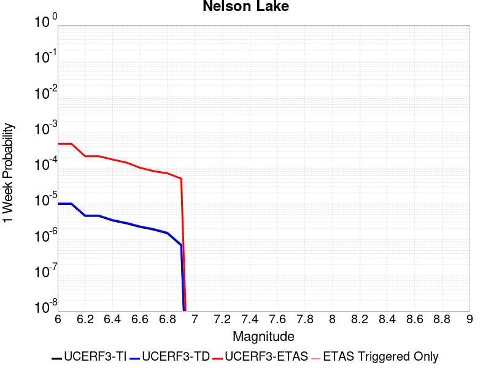
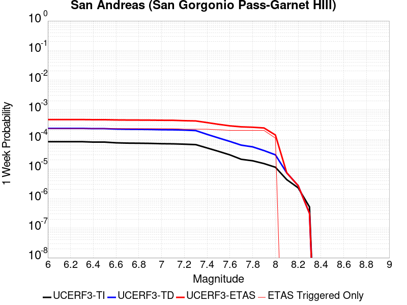
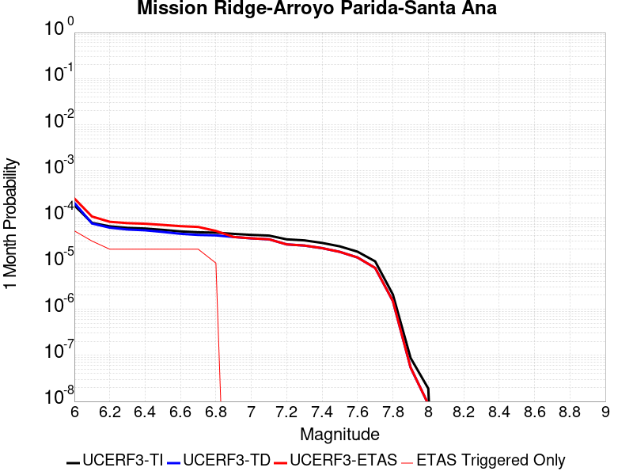
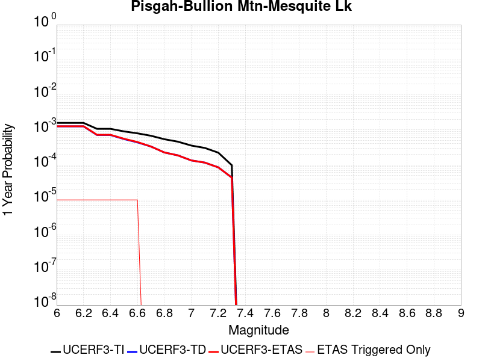
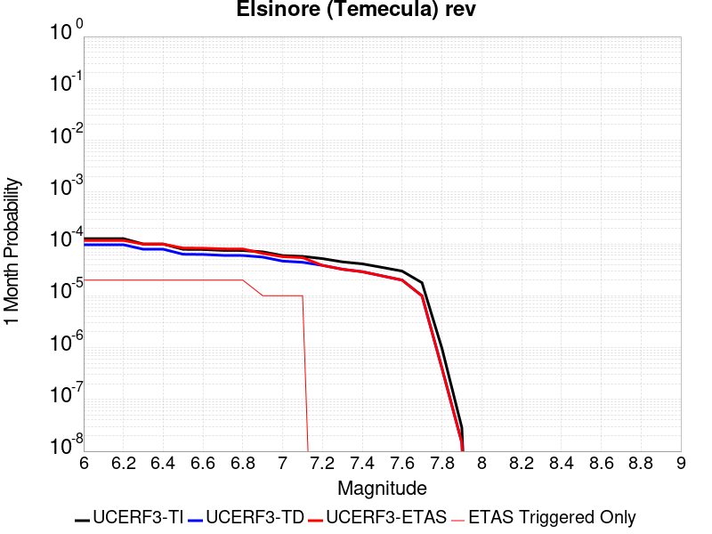
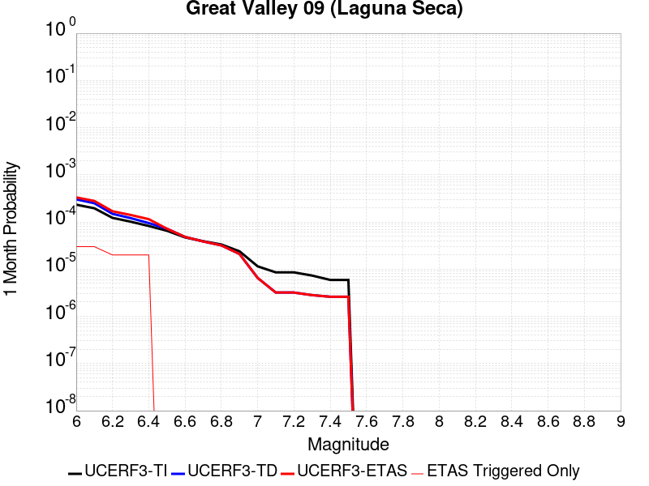

# Parent Section Magnitude-Probability Distributions

Only fault sections with at least one triggered aftershock are plotted. Sections are sorted by total supraseismogenic trigger rate (decreasing)

## Table Of Contents

* [Garlock (Central)](#garlock-central)
* [Tank Canyon](#tank-canyon)
* [Little Lake](#little-lake)
* [Airport Lake](#airport-lake)
* [Owl Lake](#owl-lake)
* [Panamint Valley](#panamint-valley)
* [Garlock (East)](#garlock-east)
* [Hunter Mountain-Saline Valley](#hunter-mountain-saline-valley)
* [Blackwater](#blackwater)
* [Garlock (West)](#garlock-west)
* [Ash Hill](#ash-hill)
* [Gravel Hills-Harper Lk](#gravel-hills-harper-lk)
* [McLean Lake](#mclean-lake)
* [San Andreas (Mojave S)](#san-andreas-mojave-s)
* [San Andreas (Mojave N)](#san-andreas-mojave-n)
* [Goldstone Lake](#goldstone-lake)
* [So Sierra Nevada](#so-sierra-nevada)
* [Death Valley (So)](#death-valley-so)
* [Nelson Lake](#nelson-lake)
* [Lenwood-Lockhart-Old Woman Springs](#lenwood-lockhart-old-woman-springs)
* [Towne Pass](#towne-pass)
* [San Andreas (San Bernardino N)](#san-andreas-san-bernardino-n)
* [Coyote Canyon](#coyote-canyon)
* [Paradise](#paradise)
* [Death Valley (Black Mtns Frontal)](#death-valley-black-mtns-frontal)
* [Bicycle Lake](#bicycle-lake)
* [Helendale-So Lockhart](#helendale-so-lockhart)
* [San Andreas (San Bernardino S)](#san-andreas-san-bernardino-s)
* [Garlic Springs](#garlic-springs)
* [Death Valley (No)](#death-valley-no)
* [San Andreas (Big Bend)](#san-andreas-big-bend)
* [San Andreas (Parkfield)](#san-andreas-parkfield)
* [Coyote Lake](#coyote-lake)
* [San Andreas (Coachella) rev](#san-andreas-coachella-rev)
* [White Wolf (Extension)](#white-wolf-extension)
* [Baker](#baker)
* [San Andreas (Carrizo) rev](#san-andreas-carrizo-rev)
* [Calico-Hidalgo](#calico-hidalgo)
* [Death Valley (Fish Lake Valley)](#death-valley-fish-lake-valley)
* [Lake Isabella (Seismicity)](#lake-isabella-seismicity)
* [San Andreas (San Gorgonio Pass-Garnet HIll)](#san-andreas-san-gorgonio-pass-garnet-hill)
* [San Jacinto (San Bernardino)](#san-jacinto-san-bernardino)
* [Red Pass](#red-pass)
* [Ludlow](#ludlow)
* [Deep Springs](#deep-springs)
* [Coronado Bank alt1](#coronado-bank-alt1)
* [Cleghorn Lake](#cleghorn-lake)
* [Santa Ynez (West)](#santa-ynez-west)
* [Santa Ynez (East)](#santa-ynez-east)
* [San Jacinto (Stepovers Combined)](#san-jacinto-stepovers-combined)
* [San Andreas (Creeping Section) 2011 CFM](#san-andreas-creeping-section-2011-cfm)
* [San Jacinto (San Jacinto Valley) rev](#san-jacinto-san-jacinto-valley-rev)
* [Sierra Nevada  (No Extension)](#sierra-nevada--no-extension)
* [San Andreas (Cholame) rev](#san-andreas-cholame-rev)
* [San Jacinto (Anza) rev](#san-jacinto-anza-rev)
* [Bullion Mountains](#bullion-mountains)
* [Scodie Lineament](#scodie-lineament)
* [San Pedro Basin](#san-pedro-basin)
* [San Gabriel](#san-gabriel)
* [Elsinore (Stepovers Combined)](#elsinore-stepovers-combined)
* [Lost Hills](#lost-hills)
* [Cady](#cady)
* [Mission Ridge-Arroyo Parida-Santa Ana](#mission-ridge-arroyo-parida-santa-ana)
* [Camp Rock 2011](#camp-rock-2011)
* [San Jacinto (Clark) rev](#san-jacinto-clark-rev)
* [Kern Canyon (South Kern) 2011](#kern-canyon-south-kern-2011)
* [Robinson Creek](#robinson-creek)
* [Pisgah-Bullion Mtn-Mesquite Lk](#pisgah-bullion-mtn-mesquite-lk)
* [Ortigalita (North)](#ortigalita-north)
* [South Klamath Lake East](#south-klamath-lake-east)
* [San Diego Trough south](#san-diego-trough-south)
* [Santa Cruz Catalina Ridge alt1](#santa-cruz-catalina-ridge-alt1)
* [Santa Rosa Island](#santa-rosa-island)
* [San Andreas (North Branch Mill Creek)](#san-andreas-north-branch-mill-creek)
* [Elsinore (Glen Ivy) rev](#elsinore-glen-ivy-rev)
* [Surprise Valley 2011 CFM](#surprise-valley-2011-cfm)
* [Whittier alt 1](#whittier-alt-1)
* [Manix-Afton Hills](#manix-afton-hills)
* [Hayward (No) 2011 CFM](#hayward-no-2011-cfm)
* [Big Lagoon - Bald Mtn 2011 CFM](#big-lagoon---bald-mtn-2011-cfm)
* [Palos Verdes](#palos-verdes)
* [San Diego Trough north alt1](#san-diego-trough-north-alt1)
* [Great Valley 05 Pittsburg - Kirby Hills alt1](#great-valley-05-pittsburg---kirby-hills-alt1)
* [Cleghorn Pass](#cleghorn-pass)
* [Channel Islands Thrust](#channel-islands-thrust)
* [Pinto Mtn](#pinto-mtn)
* [Elsinore (Temecula) rev](#elsinore-temecula-rev)
* [Blue Cut](#blue-cut)
* [San Jacinto (Borrego)](#san-jacinto-borrego)
* [Great Valley 09 (Laguna Seca)](#great-valley-09-laguna-seca)
* [Rodgers Creek - Healdsburg 2011 CFM](#rodgers-creek---healdsburg-2011-cfm)
* [San Jacinto (Coyote Creek)](#san-jacinto-coyote-creek)
* [Mono Lake 2011 CFM](#mono-lake-2011-cfm)
* [Emerson-Copper Mtn 2011](#emerson-copper-mtn-2011)

## Garlock (Central)
*[(top)](#table-of-contents)*

| 1 Week | 1 Month | 1 Year | 10 Year |
|-----|-----|-----|-----|
|  |  |  |  |

| Magnitude | 1 wk TI Prob | 1 wk TD Prob | 1 wk ETAS Prob | 1 wk ETAS/TD Gain | 1 wk ETAS Triggered Only | 1 mo TI Prob | 1 mo TD Prob | 1 mo ETAS Prob | 1 mo ETAS/TD Gain | 1 mo ETAS Triggered Only | 1 yr TI Prob | 1 yr TD Prob | 1 yr ETAS Prob | 1 yr ETAS/TD Gain | 1 yr ETAS Triggered Only | 10 yr TI Prob | 10 yr TD Prob | 10 yr ETAS Prob | 10 yr ETAS/TD Gain | 10 yr ETAS Triggered Only |
|-----|-----|-----|-----|-----|-----|-----|-----|-----|-----|-----|-----|-----|-----|-----|-----|-----|-----|-----|-----|-----|
| 6.0 | 5.5131142E-5 | 7.024681E-5 | 0.06261447 | 891.3496 | 0.062548615 | 2.3625491E-4 | 3.010234E-4 | 0.068594344 | 227.87048 | 0.06831389 | 0.0028726095 | 0.0036588663 | 0.07833316 | 21.409136 | 0.07494853 | 0.028357591 | 0.036079824 | 0.11158801 | 3.092809 | 0.07833448 |
| 6.1 | 5.5131142E-5 | 7.024681E-5 | 0.06261447 | 891.3496 | 0.062548615 | 2.3625491E-4 | 3.010234E-4 | 0.068594344 | 227.87048 | 0.06831389 | 0.0028726095 | 0.0036588663 | 0.07833316 | 21.409136 | 0.07494853 | 0.028357591 | 0.036079824 | 0.11158801 | 3.092809 | 0.07833448 |
| 6.2 | 4.216245E-5 | 5.1661493E-5 | 0.03766125 | 729.0004 | 0.03761153 | 1.806837E-4 | 2.2138779E-4 | 0.04093532 | 184.90324 | 0.040722948 | 0.0021976046 | 0.0026920962 | 0.047001682 | 17.459139 | 0.044429194 | 0.021759989 | 0.026689773 | 0.07207084 | 2.7003164 | 0.046625488 |
| 6.3 | 4.216245E-5 | 5.1661493E-5 | 0.03766125 | 729.0004 | 0.03761153 | 1.806837E-4 | 2.2138779E-4 | 0.04093532 | 184.90324 | 0.040722948 | 0.0021976046 | 0.0026920962 | 0.047001682 | 17.459139 | 0.044429194 | 0.021759989 | 0.026689773 | 0.07207084 | 2.7003164 | 0.046625488 |
| 6.4 | 3.6858168E-5 | 4.411054E-5 | 0.028320145 | 642.0267 | 0.028277282 | 1.5795401E-4 | 1.8903162E-4 | 0.03097708 | 163.87247 | 0.030793868 | 0.0019213937 | 0.002299056 | 0.035806835 | 15.574581 | 0.033584993 | 0.019048655 | 0.02284894 | 0.057454977 | 2.5145576 | 0.035415236 |
| 6.5 | 3.39199E-5 | 4.0018083E-5 | 0.025525156 | 637.8406 | 0.025486158 | 1.453629E-4 | 1.7149492E-4 | 0.028032193 | 163.45786 | 0.027865477 | 0.0017683565 | 0.002085973 | 0.032359 | 15.512665 | 0.030336307 | 0.017543508 | 0.020759864 | 0.05216903 | 2.5129755 | 0.03207504 |
| 6.6 | 3.3571985E-5 | 3.9472274E-5 | 0.025478872 | 645.4878 | 0.025440402 | 1.4387199E-4 | 1.6915603E-4 | 0.02798417 | 165.43407 | 0.027819721 | 0.0017502342 | 0.0020575512 | 0.03228578 | 15.691361 | 0.030290551 | 0.017365133 | 0.020481179 | 0.051854465 | 2.5318105 | 0.032029282 |
| 6.7 | 3.2580007E-5 | 3.8088703E-5 | 0.024562435 | 644.8746 | 0.024525281 | 1.3962112E-4 | 1.632272E-4 | 0.026926188 | 164.96141 | 0.02676733 | 0.0016985617 | 0.0019855013 | 0.031119945 | 15.673595 | 0.029192405 | 0.016856372 | 0.019773813 | 0.05000362 | 2.5287797 | 0.030839624 |
| 6.8 | 3.2185937E-5 | 3.7515918E-5 | 0.02419584 | 644.9486 | 0.024159232 | 1.3793244E-4 | 1.6077272E-4 | 0.02651206 | 164.90398 | 0.026355525 | 0.0016780337 | 0.001955672 | 0.030679986 | 15.687695 | 0.0287806 | 0.016654192 | 0.019480614 | 0.049225952 | 2.5269198 | 0.030336307 |
| 6.9 | 3.165394E-5 | 3.6720503E-5 | 0.023783274 | 647.6838 | 0.023747426 | 1.3565269E-4 | 1.5736422E-4 | 0.026051253 | 165.5475 | 0.025897963 | 0.0016503202 | 0.001914247 | 0.030183068 | 15.767592 | 0.028323038 | 0.01638118 | 0.019073246 | 0.048292343 | 2.5319414 | 0.029787235 |
| 7.0 | 3.0903822E-5 | 3.5625766E-5 | 0.023461925 | 658.56616 | 0.023427133 | 1.3243823E-4 | 1.5267303E-4 | 0.02568069 | 168.2071 | 0.025531914 | 0.0016112428 | 0.0018572307 | 0.029762298 | 16.025095 | 0.027956989 | 0.015996104 | 0.018512413 | 0.047344033 | 2.557421 | 0.029375428 |
| 7.1 | 3.0069863E-5 | 3.4392073E-5 | 0.022225346 | 646.2346 | 0.022191718 | 1.2886449E-4 | 1.4738638E-4 | 0.024211558 | 164.27269 | 0.024067719 | 0.0015677959 | 0.0017929734 | 0.027964221 | 15.596562 | 0.026218256 | 0.01556781 | 0.017880075 | 0.04493275 | 2.5130067 | 0.027545184 |
| 7.2 | 2.7957109E-5 | 3.128145E-5 | 0.019110987 | 610.93665 | 0.019080302 | 1.1981068E-4 | 1.340566E-4 | 0.02090455 | 155.93825 | 0.020773279 | 0.0014577188 | 0.0016309366 | 0.024288958 | 14.892644 | 0.022695035 | 0.014481937 | 0.016283695 | 0.039599415 | 2.4318445 | 0.02370167 |
| 7.3 | 2.4519275E-5 | 2.6714795E-5 | 0.013707429 | 513.10254 | 0.01368108 | 1.0507837E-4 | 1.1448703E-4 | 0.01480052 | 129.27682 | 0.014687714 | 0.0012785783 | 0.001393003 | 0.017339645 | 12.447671 | 0.015968885 | 0.012712469 | 0.013928054 | 0.030306188 | 2.1759098 | 0.016609471 |
| 7.4 | 2.3225532E-5 | 2.51994E-5 | 0.012470551 | 494.8749 | 0.012445665 | 9.95342E-5 | 1.0799304E-4 | 0.013513088 | 125.12925 | 0.013406543 | 0.0012111551 | 0.0013140367 | 0.015891058 | 12.093315 | 0.014596202 | 0.012045753 | 0.013145725 | 0.028182214 | 2.143831 | 0.0152367875 |
| 7.5 | 2.097765E-5 | 2.2483688E-5 | 0.010042849 | 446.67267 | 0.01002059 | 8.9901114E-5 | 9.635517E-5 | 0.010848007 | 112.58355 | 0.010752688 | 0.0010939965 | 0.0011725046 | 0.012918039 | 11.017474 | 0.011759323 | 0.010886264 | 0.011740365 | 0.023904257 | 2.0360744 | 0.012308396 |
| 7.6 | 1.511254E-5 | 1.5991332E-5 | 0.0052321055 | 327.18384 | 0.0052161976 | 6.476642E-5 | 6.853253E-5 | 0.0056503965 | 82.44839 | 0.0055822465 | 7.882459E-4 | 8.3407195E-4 | 0.007005996 | 8.399751 | 0.006177076 | 0.007854558 | 0.008383559 | 0.014826457 | 1.7685158 | 0.006497369 |
| 7.7 | 9.934069E-6 | 1.0678794E-5 | 0.0017036372 | 159.5346 | 0.0016929765 | 4.2573887E-5 | 4.5765457E-5 | 0.0017844185 | 38.99051 | 0.0017387326 | 5.182138E-4 | 5.570524E-4 | 0.0024777388 | 4.447946 | 0.001921757 | 0.00517007 | 0.005627684 | 0.0077206204 | 1.3719002 | 0.0021047816 |
| 7.8 | 6.7562896E-6 | 8.428449E-6 | 0.0011523218 | 136.71814 | 0.001143903 | 2.8955206E-5 | 3.6121426E-5 | 0.0012257376 | 33.93381 | 0.0011896591 | 3.5247262E-4 | 4.3968976E-4 | 0.0017202978 | 3.9125264 | 0.0012811713 | 0.0035191406 | 0.004446654 | 0.005767681 | 1.2970834 | 0.0013269274 |
| 7.9 | 3.975453E-6 | 5.37103E-6 | 5.0868565E-4 | 94.70914 | 5.0331734E-4 | 1.7037546E-5 | 2.3018498E-5 | 5.263242E-4 | 22.865273 | 5.0331734E-4 | 2.0741238E-4 | 2.8021427E-4 | 7.8339054E-4 | 2.7956839 | 5.0331734E-4 | 0.002072189 | 0.0028336283 | 0.003381146 | 1.1932213 | 5.4907345E-4 |
| 8.0 | 1.6729537E-6 | 2.0775144E-6 | 2.3085764E-4 | 111.12204 | 2.287806E-4 | 7.169782E-6 | 8.903603E-6 | 2.3768216E-4 | 26.695055 | 2.287806E-4 | 8.7288594E-5 | 1.0839601E-4 | 3.371518E-4 | 3.110371 | 2.287806E-4 | 8.7254314E-4 | 0.0010969337 | 0.0013254634 | 1.2083349 | 2.287806E-4 |
| 8.1 | 3.6733252E-7 | 3.1489964E-7 | 3.1489964E-7 | 1.0 | 0.0 | 1.5742813E-6 | 1.3495693E-6 | 1.3495693E-6 | 1.0 | 0.0 | 1.9166706E-5 | 1.6430899E-5 | 1.6430899E-5 | 1.0 | 0.0 | 1.9165053E-4 | 1.6638759E-4 | 1.6638759E-4 | 1.0 | 0.0 |

## Tank Canyon
*[(top)](#table-of-contents)*

| 1 Week | 1 Month | 1 Year | 10 Year |
|-----|-----|-----|-----|
|  |  |  |  |

| Magnitude | 1 wk TI Prob | 1 wk TD Prob | 1 wk ETAS Prob | 1 wk ETAS/TD Gain | 1 wk ETAS Triggered Only | 1 mo TI Prob | 1 mo TD Prob | 1 mo ETAS Prob | 1 mo ETAS/TD Gain | 1 mo ETAS Triggered Only | 1 yr TI Prob | 1 yr TD Prob | 1 yr ETAS Prob | 1 yr ETAS/TD Gain | 1 yr ETAS Triggered Only | 10 yr TI Prob | 10 yr TD Prob | 10 yr ETAS Prob | 10 yr ETAS/TD Gain | 10 yr ETAS Triggered Only |
|-----|-----|-----|-----|-----|-----|-----|-----|-----|-----|-----|-----|-----|-----|-----|-----|-----|-----|-----|-----|-----|
| 6.0 | 4.8284557E-5 | 5.7964822E-5 | 0.033961285 | 585.8947 | 0.033905286 | 2.0691741E-4 | 2.4840087E-4 | 0.038262293 | 154.03445 | 0.038023334 | 0.0025163088 | 0.0030207601 | 0.045947205 | 15.210478 | 0.04305651 | 0.02488006 | 0.029863637 | 0.07438648 | 2.4908714 | 0.04589339 |
| 6.1 | 1.7796336E-5 | 2.0873314E-5 | 0.012374768 | 592.8511 | 0.012354152 | 7.626778E-5 | 8.945422E-5 | 0.014135326 | 158.01744 | 0.014047129 | 9.281647E-4 | 0.0010885983 | 0.017131513 | 15.737223 | 0.016060399 | 0.009242975 | 0.010836744 | 0.027583044 | 2.545326 | 0.016929764 |
| 6.2 | 1.7796336E-5 | 2.0873314E-5 | 0.012374768 | 592.8511 | 0.012354152 | 7.626778E-5 | 8.945422E-5 | 0.014135326 | 158.01744 | 0.014047129 | 9.281647E-4 | 0.0010885983 | 0.017131513 | 15.737223 | 0.016060399 | 0.009242975 | 0.010836744 | 0.027583044 | 2.545326 | 0.016929764 |
| 6.3 | 1.3515912E-5 | 1.5759564E-5 | 0.008297487 | 526.5048 | 0.008281858 | 5.792405E-5 | 6.753938E-5 | 0.00958417 | 141.9049 | 0.009517273 | 7.049971E-4 | 8.2200574E-4 | 0.011703011 | 14.23714 | 0.010889957 | 0.007027647 | 0.0081922645 | 0.01944682 | 2.373803 | 0.011347517 |
| 6.4 | 1.0870146E-5 | 1.2618021E-5 | 0.006281127 | 497.79022 | 0.0062685884 | 4.658551E-5 | 5.4076212E-5 | 0.0071001374 | 131.29872 | 0.0070464425 | 5.67031E-4 | 6.581969E-4 | 0.008568795 | 13.01859 | 0.007915809 | 0.005655863 | 0.0065644905 | 0.014746526 | 2.2464082 | 0.008236102 |
| 6.5 | 7.964826E-6 | 9.196094E-6 | 0.004127209 | 448.8002 | 0.004118051 | 3.4134522E-5 | 3.9411298E-5 | 0.00447758 | 113.61159 | 0.0044383435 | 4.1550855E-4 | 4.7973756E-4 | 0.005419028 | 11.295817 | 0.004941661 | 0.0041473247 | 0.004788321 | 0.009888467 | 2.0651221 | 0.0051246854 |
| 6.6 | 6.6317E-6 | 7.6122988E-6 | 0.0030274931 | 397.71075 | 0.003019904 | 2.8421264E-5 | 3.2623782E-5 | 0.0033727116 | 103.381996 | 0.0033401968 | 3.4597394E-4 | 3.9713128E-4 | 0.0040561673 | 10.213669 | 0.0036604896 | 0.0034543579 | 0.003965368 | 0.007793641 | 1.9654269 | 0.003843514 |
| 6.7 | 4.793663E-6 | 5.4307857E-6 | 0.0017441539 | 321.16052 | 0.0017387326 | 2.0544108E-5 | 2.3274613E-5 | 0.0018992318 | 81.601006 | 0.0018760009 | 2.500958E-4 | 2.8333595E-4 | 0.0022502916 | 7.9421325 | 0.0019675132 | 0.0024981452 | 0.0028304397 | 0.004883637 | 1.7253988 | 0.0020590255 |
| 6.8 | 4.382823E-6 | 4.9692567E-6 | 0.0016064255 | 323.2728 | 0.0016014642 | 1.8783392E-5 | 2.1296666E-5 | 0.0017599922 | 82.64168 | 0.0017387326 | 2.286638E-4 | 2.5926033E-4 | 0.0020890306 | 8.057656 | 0.0018302448 | 0.0022842865 | 0.002590253 | 0.0044613946 | 1.7223779 | 0.0018760009 |
| 6.9 | 2.729601E-6 | 3.0735416E-6 | 9.6394913E-4 | 313.6281 | 9.608785E-4 | 1.1698237E-5 | 1.3172262E-5 | 0.0011113046 | 84.367035 | 0.0010981469 | 1.4241673E-4 | 1.6036171E-4 | 0.0013040813 | 8.132124 | 0.001143903 | 0.001423255 | 0.0016026258 | 0.0027446956 | 1.7126241 | 0.001143903 |
| 7.0 | 1.8987357E-6 | 2.126939E-6 | 3.6817513E-4 | 173.10092 | 3.6604895E-4 | 8.137413E-6 | 9.115425E-6 | 5.124282E-4 | 56.215496 | 5.0331734E-4 | 9.90685E-5 | 1.1097535E-4 | 6.5998785E-4 | 5.9471574 | 5.4907345E-4 | 9.902435E-4 | 0.0011092679 | 0.0016577323 | 1.4944382 | 5.4907345E-4 |
| 7.1 | 1.4928986E-6 | 1.6641272E-6 | 1.846883E-4 | 110.982086 | 1.8302447E-4 | 6.398121E-6 | 7.1319573E-6 | 2.8166673E-4 | 39.493607 | 2.7453672E-4 | 7.789434E-5 | 8.682871E-5 | 4.0709373E-4 | 4.688469 | 3.2029283E-4 | 7.786704E-4 | 8.6800574E-4 | 0.0011880206 | 1.3686782 | 3.2029283E-4 |
| 7.2 | 1.069082E-6 | 1.1828573E-6 | 4.6938923E-5 | 39.68266 | 4.575612E-5 | 4.581772E-6 | 5.0693816E-6 | 9.6581156E-5 | 19.051863 | 9.151224E-5 | 5.5781646E-5 | 6.171851E-5 | 1.9897839E-4 | 3.2239666 | 1.3726836E-4 | 5.576765E-4 | 6.170659E-4 | 7.542496E-4 | 1.222316 | 1.3726836E-4 |
| 7.3 | 8.776551E-7 | 9.770005E-7 | 9.770005E-7 | 1.0 | 0.0 | 3.7613736E-6 | 4.1871413E-6 | 4.9943068E-5 | 11.927726 | 4.575612E-5 | 4.579376E-5 | 5.097777E-5 | 1.4248534E-4 | 2.7950485 | 9.151224E-5 | 4.5784327E-4 | 5.097118E-4 | 6.011774E-4 | 1.1794457 | 9.151224E-5 |
| 7.4 | 7.55721E-7 | 8.510244E-7 | 8.510244E-7 | 1.0 | 0.0 | 3.2388E-6 | 3.6472454E-6 | 3.6472454E-6 | 1.0 | 0.0 | 3.9431678E-5 | 4.4404827E-5 | 4.4404827E-5 | 1.0 | 0.0 | 3.942468E-4 | 4.440104E-4 | 4.440104E-4 | 1.0 | 0.0 |
| 7.5 | 5.587665E-7 | 6.305619E-7 | 6.305619E-7 | 1.0 | 0.0 | 2.3947114E-6 | 2.702408E-6 | 2.702408E-6 | 1.0 | 0.0 | 2.915522E-5 | 3.290182E-5 | 3.290182E-5 | 1.0 | 0.0 | 2.9151395E-4 | 3.290182E-4 | 3.290182E-4 | 1.0 | 0.0 |

## Little Lake
*[(top)](#table-of-contents)*

| 1 Week | 1 Month | 1 Year | 10 Year |
|-----|-----|-----|-----|
|  |  |  |  |

| Magnitude | 1 wk TI Prob | 1 wk TD Prob | 1 wk ETAS Prob | 1 wk ETAS/TD Gain | 1 wk ETAS Triggered Only | 1 mo TI Prob | 1 mo TD Prob | 1 mo ETAS Prob | 1 mo ETAS/TD Gain | 1 mo ETAS Triggered Only | 1 yr TI Prob | 1 yr TD Prob | 1 yr ETAS Prob | 1 yr ETAS/TD Gain | 1 yr ETAS Triggered Only | 10 yr TI Prob | 10 yr TD Prob | 10 yr ETAS Prob | 10 yr ETAS/TD Gain | 10 yr ETAS Triggered Only |
|-----|-----|-----|-----|-----|-----|-----|-----|-----|-----|-----|-----|-----|-----|-----|-----|-----|-----|-----|-----|-----|
| 6.0 | 2.8424427E-5 | 3.120572E-5 | 0.029222699 | 936.45325 | 0.029192405 | 1.2181328E-4 | 1.337327E-4 | 0.031838484 | 238.07553 | 0.03170899 | 0.0014820677 | 0.0016271127 | 0.035659958 | 21.916094 | 0.03408831 | 0.014722223 | 0.016165402 | 0.050602987 | 3.1303267 | 0.03500343 |
| 6.1 | 2.8424427E-5 | 3.120572E-5 | 0.029222699 | 936.45325 | 0.029192405 | 1.2181328E-4 | 1.337327E-4 | 0.031838484 | 238.07553 | 0.03170899 | 0.0014820677 | 0.0016271127 | 0.035659958 | 21.916094 | 0.03408831 | 0.014722223 | 0.016165402 | 0.050602987 | 3.1303267 | 0.03500343 |
| 6.2 | 2.8424427E-5 | 3.120572E-5 | 0.029222699 | 936.45325 | 0.029192405 | 1.2181328E-4 | 1.337327E-4 | 0.031838484 | 238.07553 | 0.03170899 | 0.0014820677 | 0.0016271127 | 0.035659958 | 21.916094 | 0.03408831 | 0.014722223 | 0.016165402 | 0.050602987 | 3.1303267 | 0.03500343 |
| 6.3 | 1.48860645E-5 | 1.6081389E-5 | 0.019782407 | 1230.143 | 0.019766644 | 6.379586E-5 | 6.8918576E-5 | 0.021206789 | 307.70786 | 0.021139327 | 7.7643775E-4 | 8.3878887E-4 | 0.02388053 | 28.470251 | 0.023061084 | 0.007737305 | 0.008359048 | 0.03181722 | 3.8063211 | 0.023655914 |
| 6.4 | 1.48860645E-5 | 1.6081389E-5 | 0.019782407 | 1230.143 | 0.019766644 | 6.379586E-5 | 6.8918576E-5 | 0.021206789 | 307.70786 | 0.021139327 | 7.7643775E-4 | 8.3878887E-4 | 0.02388053 | 28.470251 | 0.023061084 | 0.007737305 | 0.008359048 | 0.03181722 | 3.8063211 | 0.023655914 |
| 6.5 | 1.2797581E-5 | 1.3765565E-5 | 0.018590495 | 1350.5072 | 0.018576985 | 5.4845623E-5 | 5.899409E-5 | 0.019824471 | 336.04166 | 0.019766644 | 6.675408E-4 | 7.18042E-4 | 0.022207977 | 30.928518 | 0.021505376 | 0.006655392 | 0.00715977 | 0.029056314 | 4.0582747 | 0.02205445 |
| 6.6 | 9.661896E-6 | 1.0289038E-5 | 0.016345056 | 1588.5894 | 0.016334934 | 4.1407468E-5 | 4.409522E-5 | 0.017567916 | 398.40863 | 0.017524594 | 5.040193E-4 | 5.367433E-4 | 0.01946961 | 36.273594 | 0.018943034 | 0.005028777 | 0.0053560743 | 0.024652759 | 4.602766 | 0.019400595 |
| 6.7 | 7.767871E-6 | 8.199687E-6 | 0.014283992 | 1742.0168 | 0.014275909 | 3.329045E-5 | 3.5141118E-5 | 0.0155459205 | 442.3855 | 0.015511325 | 4.0523586E-4 | 4.2777284E-4 | 0.017213086 | 40.238846 | 0.016792497 | 0.004044977 | 0.004270846 | 0.02140167 | 5.011108 | 0.017204301 |
| 6.8 | 6.4235196E-6 | 6.7357446E-6 | 0.010759352 | 1597.3514 | 0.010752688 | 2.752908E-5 | 2.8867229E-5 | 0.01178785 | 408.34714 | 0.011759323 | 3.35115E-4 | 3.5141467E-4 | 0.013112886 | 37.314568 | 0.012765957 | 0.003346101 | 0.00350985 | 0.016595766 | 4.72834 | 0.013132007 |
| 6.9 | 3.1283696E-6 | 3.1121804E-6 | 0.006317437 | 2029.9071 | 0.0063143447 | 1.3407229E-5 | 1.3337856E-5 | 0.0070596864 | 529.29694 | 0.0070464425 | 1.6322079E-4 | 1.6237781E-4 | 0.007939655 | 48.896183 | 0.0077785403 | 0.0016310095 | 0.00162274 | 0.009662749 | 5.9545884 | 0.008053077 |
| 7.0 | 2.290603E-6 | 2.2286815E-6 | 0.0040745144 | 1828.2173 | 0.0040722946 | 9.816834E-6 | 9.551463E-6 | 0.0046308753 | 484.83414 | 0.004621368 | 1.19513395E-4 | 1.162839E-4 | 0.0052403733 | 45.06534 | 0.0051246854 | 0.0011944914 | 0.0011623327 | 0.006463873 | 5.5611215 | 0.00530771 |
| 7.1 | 1.293693E-6 | 1.1776827E-6 | 0.0019686886 | 1671.6628 | 0.0019675132 | 5.5443866E-6 | 5.0472063E-6 | 0.002155574 | 427.0826 | 0.0021505377 | 6.750081E-5 | 6.14487E-5 | 0.002486374 | 40.462597 | 0.0024250743 | 6.7480316E-4 | 6.143856E-4 | 0.003175154 | 5.1680155 | 0.0025623427 |
| 7.2 | 4.715842E-7 | 3.0917857E-7 | 4.6065285E-5 | 148.9925 | 4.575612E-5 | 2.0210737E-6 | 1.3250503E-6 | 4.708111E-5 | 35.531563 | 4.575612E-5 | 2.4606294E-5 | 1.6132375E-5 | 6.188775E-5 | 3.836246 | 4.575612E-5 | 2.460357E-4 | 1.6131258E-4 | 2.0706131E-4 | 1.2836031 | 4.575612E-5 |
| 7.3 | 3.9430947E-7 | 2.3097488E-7 | 4.5987083E-5 | 199.09995 | 4.575612E-5 | 1.6898966E-6 | 9.89892E-7 | 4.6745965E-5 | 47.2233 | 4.575612E-5 | 2.0574296E-5 | 1.2051869E-5 | 5.7807436E-5 | 4.796554 | 4.575612E-5 | 2.0572392E-4 | 1.20512224E-4 | 1.6626283E-4 | 1.3796346 | 4.575612E-5 |
| 7.4 | 3.547123E-7 | 1.9679135E-7 | 1.9679135E-7 | 1.0 | 0.0 | 1.5201948E-6 | 8.4339126E-7 | 8.4339126E-7 | 1.0 | 0.0 | 1.8508214E-5 | 1.0268241E-5 | 1.0268241E-5 | 1.0 | 0.0 | 1.8506673E-4 | 1.02677724E-4 | 1.02677724E-4 | 1.0 | 0.0 |
| 7.5 | 2.6354266E-7 | 1.4423138E-7 | 1.4423138E-7 | 1.0 | 0.0 | 1.129468E-6 | 6.181344E-7 | 6.181344E-7 | 1.0 | 0.0 | 1.3751187E-5 | 7.5257603E-6 | 7.5257603E-6 | 1.0 | 0.0 | 1.3750336E-4 | 7.5255106E-5 | 7.5255106E-5 | 1.0 | 0.0 |
| 7.6 | 1.269913E-7 | 7.572556E-8 | 7.572556E-8 | 1.0 | 0.0 | 5.4424834E-7 | 3.245381E-7 | 3.245381E-7 | 1.0 | 0.0 | 6.6262032E-6 | 3.9512443E-6 | 3.9512443E-6 | 1.0 | 0.0 | 6.626006E-5 | 3.9511775E-5 | 3.9511775E-5 | 1.0 | 0.0 |

## Airport Lake
*[(top)](#table-of-contents)*

| 1 Week | 1 Month | 1 Year | 10 Year |
|-----|-----|-----|-----|
|  |  |  |  |

| Magnitude | 1 wk TI Prob | 1 wk TD Prob | 1 wk ETAS Prob | 1 wk ETAS/TD Gain | 1 wk ETAS Triggered Only | 1 mo TI Prob | 1 mo TD Prob | 1 mo ETAS Prob | 1 mo ETAS/TD Gain | 1 mo ETAS Triggered Only | 1 yr TI Prob | 1 yr TD Prob | 1 yr ETAS Prob | 1 yr ETAS/TD Gain | 1 yr ETAS Triggered Only | 10 yr TI Prob | 10 yr TD Prob | 10 yr ETAS Prob | 10 yr ETAS/TD Gain | 10 yr ETAS Triggered Only |
|-----|-----|-----|-----|-----|-----|-----|-----|-----|-----|-----|-----|-----|-----|-----|-----|-----|-----|-----|-----|-----|
| 6.0 | 1.2387061E-5 | 1.3103157E-5 | 0.025956484 | 1980.9336 | 0.02594372 | 5.3086325E-5 | 5.615534E-5 | 0.028057327 | 499.6378 | 0.028002745 | 6.461343E-4 | 6.8350515E-4 | 0.031227702 | 45.687588 | 0.030565089 | 0.0064425888 | 0.0068168393 | 0.03803701 | 5.57986 | 0.031434454 |
| 6.1 | 1.2387061E-5 | 1.3103157E-5 | 0.025956484 | 1980.9336 | 0.02594372 | 5.3086325E-5 | 5.615534E-5 | 0.028057327 | 499.6378 | 0.028002745 | 6.461343E-4 | 6.8350515E-4 | 0.031227702 | 45.687588 | 0.030565089 | 0.0064425888 | 0.0068168393 | 0.03803701 | 5.57986 | 0.031434454 |
| 6.2 | 1.2387061E-5 | 1.3103157E-5 | 0.025956484 | 1980.9336 | 0.02594372 | 5.3086325E-5 | 5.615534E-5 | 0.028057327 | 499.6378 | 0.028002745 | 6.461343E-4 | 6.8350515E-4 | 0.031227702 | 45.687588 | 0.030565089 | 0.0064425888 | 0.0068168393 | 0.03803701 | 5.57986 | 0.031434454 |
| 6.3 | 1.2387061E-5 | 1.3103157E-5 | 0.025956484 | 1980.9336 | 0.02594372 | 5.3086325E-5 | 5.615534E-5 | 0.028057327 | 499.6378 | 0.028002745 | 6.461343E-4 | 6.8350515E-4 | 0.031227702 | 45.687588 | 0.030565089 | 0.0064425888 | 0.0068168393 | 0.03803701 | 5.57986 | 0.031434454 |
| 6.4 | 1.2387061E-5 | 1.3103157E-5 | 0.025956484 | 1980.9336 | 0.02594372 | 5.3086325E-5 | 5.615534E-5 | 0.028057327 | 499.6378 | 0.028002745 | 6.461343E-4 | 6.8350515E-4 | 0.031227702 | 45.687588 | 0.030565089 | 0.0064425888 | 0.0068168393 | 0.03803701 | 5.57986 | 0.031434454 |
| 6.5 | 6.9922594E-6 | 7.384925E-6 | 0.019453593 | 2634.2302 | 0.01944635 | 2.996648E-5 | 3.1649324E-5 | 0.021078799 | 666.011 | 0.021047816 | 3.6478083E-4 | 3.8526783E-4 | 0.02334599 | 60.59678 | 0.022969572 | 0.003641826 | 0.0038465366 | 0.027274717 | 7.0907207 | 0.023518646 |
| 6.6 | 6.9922594E-6 | 7.384925E-6 | 0.019453593 | 2634.2302 | 0.01944635 | 2.996648E-5 | 3.1649324E-5 | 0.021078799 | 666.011 | 0.021047816 | 3.6478083E-4 | 3.8526783E-4 | 0.02334599 | 60.59678 | 0.022969572 | 0.003641826 | 0.0038465366 | 0.027274717 | 7.0907207 | 0.023518646 |
| 6.7 | 5.477277E-6 | 5.7860684E-6 | 0.016111847 | 2784.5933 | 0.016106155 | 2.3473833E-5 | 2.4797222E-5 | 0.017548956 | 707.6985 | 0.017524594 | 2.8575645E-4 | 3.0186825E-4 | 0.019422153 | 64.339836 | 0.019126058 | 0.0028538927 | 0.003014966 | 0.02258516 | 7.4910164 | 0.019629376 |
| 6.8 | 3.9950432E-6 | 4.2190873E-6 | 0.012266807 | 2907.4553 | 0.0122626405 | 1.7121502E-5 | 1.8081691E-5 | 0.013515893 | 747.4905 | 0.013498056 | 2.0843433E-4 | 2.2012512E-4 | 0.014904606 | 67.7097 | 0.014687714 | 0.0020823893 | 0.0021993418 | 0.017265653 | 7.850373 | 0.01509952 |
| 6.9 | 2.95695E-6 | 3.1230243E-6 | 0.008879783 | 2843.3281 | 0.008876687 | 1.2672582E-5 | 1.3384334E-5 | 0.009896574 | 739.41473 | 0.009883322 | 1.5427776E-4 | 1.6294434E-4 | 0.011096875 | 68.10224 | 0.010935713 | 0.001541707 | 0.0016284712 | 0.012866147 | 7.900752 | 0.011256006 |
| 7.0 | 1.456072E-6 | 1.540812E-6 | 0.0039365613 | 2554.8613 | 0.0039350265 | 6.2402937E-6 | 6.603469E-6 | 0.0044449177 | 673.1186 | 0.0044383435 | 7.597293E-5 | 8.039528E-5 | 0.0049759066 | 61.89302 | 0.004895905 | 7.594696E-4 | 8.0376083E-4 | 0.0058786077 | 7.313877 | 0.0050789295 |
| 7.1 | 6.995192E-7 | 7.4089746E-7 | 0.0019224965 | 2594.8213 | 0.001921757 | 2.997936E-6 | 3.1752747E-6 | 0.0021079502 | 663.86383 | 0.0021047816 | 3.649926E-5 | 3.865897E-5 | 0.0024178852 | 62.543964 | 0.0023793182 | 3.6493264E-4 | 3.865897E-4 | 0.0029022035 | 7.5071926 | 0.0025165866 |

## Owl Lake
*[(top)](#table-of-contents)*

| 1 Week | 1 Month | 1 Year | 10 Year |
|-----|-----|-----|-----|
|  |  |  |  |

| Magnitude | 1 wk TI Prob | 1 wk TD Prob | 1 wk ETAS Prob | 1 wk ETAS/TD Gain | 1 wk ETAS Triggered Only | 1 mo TI Prob | 1 mo TD Prob | 1 mo ETAS Prob | 1 mo ETAS/TD Gain | 1 mo ETAS Triggered Only | 1 yr TI Prob | 1 yr TD Prob | 1 yr ETAS Prob | 1 yr ETAS/TD Gain | 1 yr ETAS Triggered Only | 10 yr TI Prob | 10 yr TD Prob | 10 yr ETAS Prob | 10 yr ETAS/TD Gain | 10 yr ETAS Triggered Only |
|-----|-----|-----|-----|-----|-----|-----|-----|-----|-----|-----|-----|-----|-----|-----|-----|-----|-----|-----|-----|-----|
| 6.0 | 5.0320643E-5 | 6.635816E-5 | 0.01434132 | 216.11993 | 0.014275909 | 2.1564208E-4 | 2.843674E-4 | 0.016431686 | 57.7833 | 0.01615191 | 0.0026222812 | 0.0034577388 | 0.021560108 | 6.23532 | 0.01816518 | 0.02591553 | 0.034140717 | 0.05287896 | 1.5488533 | 0.019400595 |
| 6.1 | 5.0320643E-5 | 6.635816E-5 | 0.01434132 | 216.11993 | 0.014275909 | 2.1564208E-4 | 2.843674E-4 | 0.016431686 | 57.7833 | 0.01615191 | 0.0026222812 | 0.0034577388 | 0.021560108 | 6.23532 | 0.01816518 | 0.02591553 | 0.034140717 | 0.05287896 | 1.5488533 | 0.019400595 |
| 6.2 | 2.4125871E-5 | 3.0981035E-5 | 0.01101211 | 355.44678 | 0.0109814685 | 1.0339249E-4 | 1.3277028E-4 | 0.012256532 | 92.31383 | 0.012125372 | 0.0012580766 | 0.001615439 | 0.015137372 | 9.370439 | 0.013543812 | 0.012509781 | 0.016070465 | 0.030297037 | 1.885262 | 0.014458934 |
| 6.3 | 1.7433485E-5 | 2.2355514E-5 | 0.010179987 | 455.36807 | 0.010157859 | 7.471279E-5 | 9.580672E-5 | 0.011304982 | 117.9978 | 0.01121025 | 9.0924866E-4 | 0.0011659743 | 0.013642831 | 11.700798 | 0.012491421 | 0.009055373 | 0.011628896 | 0.024653416 | 2.1200135 | 0.013177763 |
| 6.4 | 1.7433485E-5 | 2.2355514E-5 | 0.010179987 | 455.36807 | 0.010157859 | 7.471279E-5 | 9.580672E-5 | 0.011304982 | 117.9978 | 0.01121025 | 9.0924866E-4 | 0.0011659743 | 0.013642831 | 11.700798 | 0.012491421 | 0.009055373 | 0.011628896 | 0.024653416 | 2.1200135 | 0.013177763 |
| 6.5 | 1.5182742E-5 | 1.9429144E-5 | 0.009811048 | 504.96555 | 0.00979181 | 6.506727E-5 | 8.326596E-5 | 0.010926563 | 131.22485 | 0.010844201 | 7.919061E-4 | 0.0010134429 | 0.013126526 | 12.952409 | 0.012125372 | 0.0078909 | 0.010118429 | 0.022800507 | 2.2533646 | 0.012811714 |
| 6.6 | 6.7271576E-6 | 8.547361E-6 | 0.007970044 | 932.4567 | 0.007961565 | 2.8830356E-5 | 3.6631063E-5 | 0.00877573 | 239.5707 | 0.008739419 | 3.5095305E-4 | 4.458976E-4 | 0.010096134 | 22.64227 | 0.0096545415 | 0.0035039932 | 0.004467813 | 0.01462584 | 3.2736018 | 0.010203615 |
| 6.7 | 6.682835E-6 | 8.479807E-6 | 0.007969977 | 939.8772 | 0.007961565 | 2.8640408E-5 | 3.6341557E-5 | 0.008775443 | 241.4713 | 0.008739419 | 3.4864116E-4 | 4.4237426E-4 | 0.010092645 | 22.814718 | 0.0096545415 | 0.003480947 | 0.0044327388 | 0.014591124 | 3.2916722 | 0.010203615 |
| 6.8 | 6.5774975E-6 | 8.32628E-6 | 0.007969825 | 957.1891 | 0.007961565 | 2.8188972E-5 | 3.5683603E-5 | 0.008774791 | 245.9054 | 0.008739419 | 3.4314668E-4 | 4.343669E-4 | 0.010084715 | 23.217041 | 0.0096545415 | 0.0034261728 | 0.004352885 | 0.014512084 | 3.3339005 | 0.010203615 |
| 6.9 | 6.363419E-6 | 7.999454E-6 | 0.0079695005 | 996.2555 | 0.007961565 | 2.727151E-5 | 3.428296E-5 | 0.008773402 | 255.91147 | 0.008739419 | 3.3198006E-4 | 4.1732067E-4 | 0.010067833 | 24.124933 | 0.0096545415 | 0.0033148455 | 0.0041828766 | 0.014343811 | 3.4291737 | 0.010203615 |
| 7.0 | 6.1342453E-6 | 7.6316555E-6 | 0.007969135 | 1044.2211 | 0.007961565 | 2.6289357E-5 | 3.2706717E-5 | 0.00877184 | 268.1969 | 0.008739419 | 3.2002592E-4 | 3.9813702E-4 | 0.010048835 | 25.23964 | 0.0096545415 | 0.0031956544 | 0.003991571 | 0.014154457 | 3.546087 | 0.010203615 |
| 7.1 | 5.842926E-6 | 7.142211E-6 | 0.0074653365 | 1045.2416 | 0.0074582477 | 2.504087E-5 | 3.0609146E-5 | 0.008220704 | 268.57016 | 0.008190345 | 3.0482994E-4 | 3.7260808E-4 | 0.009337466 | 25.059753 | 0.0089682 | 0.0030441214 | 0.0037370329 | 0.013218739 | 3.5372286 | 0.009517273 |
| 7.2 | 4.77173E-6 | 5.358483E-6 | 0.0053130398 | 991.51935 | 0.00530771 | 2.045011E-5 | 2.2964748E-5 | 0.0059253685 | 258.02017 | 0.0059025395 | 2.4895166E-4 | 2.79564E-4 | 0.0067751165 | 24.234581 | 0.006497369 | 0.0024867293 | 0.002808645 | 0.009515903 | 3.388076 | 0.0067261495 |
| 7.3 | 3.0494948E-6 | 2.710463E-6 | 0.0013753903 | 507.43744 | 0.0013726836 | 1.3069198E-5 | 1.1616219E-5 | 0.0015215506 | 130.98502 | 0.001509952 | 1.5910587E-4 | 1.4141845E-4 | 0.0017884058 | 12.646198 | 0.0016472203 | 0.0015899199 | 0.0014232415 | 0.0030681174 | 2.1557252 | 0.0016472203 |
| 7.4 | 2.7263884E-6 | 2.3056762E-6 | 9.6318196E-4 | 417.7438 | 9.608785E-4 | 1.1684469E-5 | 9.881433E-6 | 0.0011080174 | 112.131256 | 0.0010981469 | 1.4224913E-4 | 1.20299905E-4 | 0.0013555666 | 11.268226 | 0.0012354152 | 0.0014215811 | 0.0012112238 | 0.0024451427 | 2.0187373 | 0.0012354152 |
| 7.5 | 2.6090431E-6 | 2.1656133E-6 | 8.25774E-4 | 381.31186 | 8.236102E-4 | 1.1181565E-5 | 9.281167E-6 | 9.2439505E-4 | 99.599014 | 9.151224E-4 | 1.3612706E-4 | 1.1299244E-4 | 0.0011652643 | 10.312763 | 0.0010523908 | 0.001360437 | 0.0011379806 | 0.0021891738 | 1.9237355 | 0.0010523908 |
| 7.6 | 2.3008756E-6 | 1.8727933E-6 | 6.8821333E-4 | 367.47958 | 6.863418E-4 | 9.860858E-6 | 8.0262325E-6 | 7.4011827E-4 | 92.21241 | 7.320979E-4 | 1.20049335E-4 | 9.7715085E-5 | 9.669964E-4 | 9.896081 | 8.693663E-4 | 0.001199845 | 9.849932E-4 | 0.0018535032 | 1.8817421 | 8.693663E-4 |
| 7.7 | 1.7184348E-6 | 1.3419171E-6 | 5.0465856E-4 | 376.07285 | 5.0331734E-4 | 7.3646997E-6 | 5.7510606E-6 | 5.0906546E-4 | 88.5168 | 5.0331734E-4 | 8.966153E-5 | 7.0016955E-5 | 6.648049E-4 | 9.494912 | 5.9482956E-4 | 8.962536E-4 | 7.078345E-4 | 0.001302243 | 1.8397564 | 5.9482956E-4 |
| 7.8 | 8.4612907E-7 | 8.4058576E-7 | 2.2962099E-4 | 273.16785 | 2.287806E-4 | 3.6262625E-6 | 3.6025056E-6 | 2.3238228E-4 | 64.50574 | 2.287806E-4 | 4.4148852E-5 | 4.3859643E-5 | 3.6413842E-4 | 8.302358 | 3.2029283E-4 | 4.414008E-4 | 4.4398365E-4 | 7.641343E-4 | 1.7210866 | 3.2029283E-4 |
| 7.9 | 2.716738E-7 | 3.768106E-7 | 3.768106E-7 | 1.0 | 0.0 | 1.1643157E-6 | 1.6149015E-6 | 1.6149015E-6 | 1.0 | 0.0 | 1.4175452E-5 | 1.966126E-5 | 1.966126E-5 | 1.0 | 0.0 | 1.4174548E-4 | 1.9836679E-4 | 1.9836679E-4 | 1.0 | 0.0 |
| 8.0 | 2.1995428E-8 | 3.384878E-8 | 3.384878E-8 | 1.0 | 0.0 | 9.426611E-8 | 1.4506621E-7 | 1.4506621E-7 | 1.0 | 0.0 | 1.1476893E-6 | 1.7661803E-6 | 1.7661803E-6 | 1.0 | 0.0 | 1.14768345E-5 | 1.7963059E-5 | 1.7963059E-5 | 1.0 | 0.0 |

## Panamint Valley
*[(top)](#table-of-contents)*

| 1 Week | 1 Month | 1 Year | 10 Year |
|-----|-----|-----|-----|
|  |  |  |  |

| Magnitude | 1 wk TI Prob | 1 wk TD Prob | 1 wk ETAS Prob | 1 wk ETAS/TD Gain | 1 wk ETAS Triggered Only | 1 mo TI Prob | 1 mo TD Prob | 1 mo ETAS Prob | 1 mo ETAS/TD Gain | 1 mo ETAS Triggered Only | 1 yr TI Prob | 1 yr TD Prob | 1 yr ETAS Prob | 1 yr ETAS/TD Gain | 1 yr ETAS Triggered Only | 10 yr TI Prob | 10 yr TD Prob | 10 yr ETAS Prob | 10 yr ETAS/TD Gain | 10 yr ETAS Triggered Only |
|-----|-----|-----|-----|-----|-----|-----|-----|-----|-----|-----|-----|-----|-----|-----|-----|-----|-----|-----|-----|-----|
| 6.0 | 3.0211835E-5 | 3.3984514E-5 | 0.012113189 | 356.43265 | 0.012079616 | 1.2947287E-4 | 1.4563995E-4 | 0.013504481 | 92.72512 | 0.013360787 | 0.0015751923 | 0.0017717537 | 0.016433446 | 9.275243 | 0.014687714 | 0.015640736 | 0.017583137 | 0.03273182 | 1.8615462 | 0.015419812 |
| 6.1 | 3.0211835E-5 | 3.3984514E-5 | 0.012113189 | 356.43265 | 0.012079616 | 1.2947287E-4 | 1.4563995E-4 | 0.013504481 | 92.72512 | 0.013360787 | 0.0015751923 | 0.0017717537 | 0.016433446 | 9.275243 | 0.014687714 | 0.015640736 | 0.017583137 | 0.03273182 | 1.8615462 | 0.015419812 |
| 6.2 | 3.0211835E-5 | 3.3984514E-5 | 0.012113189 | 356.43265 | 0.012079616 | 1.2947287E-4 | 1.4563995E-4 | 0.013504481 | 92.72512 | 0.013360787 | 0.0015751923 | 0.0017717537 | 0.016433446 | 9.275243 | 0.014687714 | 0.015640736 | 0.017583137 | 0.03273182 | 1.8615462 | 0.015419812 |
| 6.3 | 2.8573924E-5 | 3.210268E-5 | 0.011745294 | 365.86646 | 0.011713566 | 1.2245393E-4 | 1.3757581E-4 | 0.013084777 | 95.109566 | 0.0129489815 | 0.001489857 | 0.0016737265 | 0.015788704 | 9.433264 | 0.014138641 | 0.01479908 | 0.016617801 | 0.03124142 | 1.8799973 | 0.014870739 |
| 6.4 | 2.8573924E-5 | 3.210268E-5 | 0.011745294 | 365.86646 | 0.011713566 | 1.2245393E-4 | 1.3757581E-4 | 0.013084777 | 95.109566 | 0.0129489815 | 0.001489857 | 0.0016737265 | 0.015788704 | 9.433264 | 0.014138641 | 0.01479908 | 0.016617801 | 0.03124142 | 1.8799973 | 0.014870739 |
| 6.5 | 2.7468774E-5 | 3.0828433E-5 | 0.011423751 | 370.55893 | 0.011393274 | 1.1771801E-4 | 1.3211532E-4 | 0.012576136 | 95.19059 | 0.012445665 | 0.0014322745 | 0.0016073446 | 0.015175069 | 9.44108 | 0.0135895675 | 0.014230782 | 0.015963677 | 0.030056715 | 1.8828192 | 0.014321665 |
| 6.6 | 2.6135967E-5 | 2.925248E-5 | 0.011193419 | 382.64856 | 0.011164493 | 1.1200648E-4 | 1.253619E-4 | 0.012294964 | 98.07577 | 0.012171128 | 0.0013628257 | 0.0015252391 | 0.014682902 | 9.626624 | 0.013177763 | 0.013544982 | 0.015154043 | 0.02880805 | 1.9010141 | 0.013864105 |
| 6.7 | 2.4498746E-5 | 2.7341335E-5 | 0.011054264 | 404.30597 | 0.011027225 | 1.04990395E-4 | 1.1717203E-4 | 0.012149622 | 103.69046 | 0.012033859 | 0.0012775084 | 0.0014256609 | 0.014447564 | 10.133941 | 0.013040494 | 0.012701893 | 0.014171274 | 0.027523153 | 1.9421791 | 0.013543812 |
| 6.8 | 2.2244329E-5 | 2.4935423E-5 | 0.010457071 | 419.36606 | 0.010432395 | 9.532935E-5 | 1.0686185E-4 | 0.011453167 | 107.17732 | 0.011347517 | 0.0011600169 | 0.0013002884 | 0.013638376 | 10.488733 | 0.012354152 | 0.011539802 | 0.0129325185 | 0.02553338 | 1.9743547 | 0.012765957 |
| 6.9 | 1.9902658E-5 | 2.2290267E-5 | 0.009676617 | 434.11847 | 0.0096545415 | 8.529431E-5 | 9.552632E-5 | 0.010618429 | 111.1571 | 0.010523908 | 0.0010379635 | 0.0011624309 | 0.012588164 | 10.829171 | 0.01143903 | 0.010331288 | 0.011568608 | 0.023191892 | 2.0047262 | 0.011759323 |
| 7.0 | 1.8353881E-5 | 2.0566185E-5 | 0.009034337 | 439.28107 | 0.0090139555 | 7.865712E-5 | 8.813792E-5 | 0.009924836 | 112.60575 | 0.009837566 | 9.5722964E-4 | 0.0010725686 | 0.0118137235 | 11.014422 | 0.010752688 | 0.009531168 | 0.010678849 | 0.021633584 | 2.0258348 | 0.011072981 |
| 7.1 | 1.7667631E-5 | 1.9772613E-5 | 0.008667508 | 438.35928 | 0.008647907 | 7.571623E-5 | 8.473711E-5 | 0.009463947 | 111.685974 | 0.009380004 | 9.2145515E-4 | 0.0010312037 | 0.011315715 | 10.973307 | 0.010295127 | 0.009176437 | 0.010269073 | 0.020775482 | 2.0231118 | 0.01061542 |
| 7.2 | 1.6381597E-5 | 1.8158249E-5 | 0.0075220256 | 414.24838 | 0.0075040036 | 7.020495E-5 | 7.781885E-5 | 0.0082675265 | 106.24068 | 0.008190345 | 8.544101E-4 | 9.4704994E-4 | 0.009998182 | 10.557185 | 0.009059711 | 0.008511325 | 0.009434792 | 0.018726299 | 1.984813 | 0.009380004 |
| 7.3 | 1.4520491E-5 | 1.5966476E-5 | 0.006421721 | 402.2003 | 0.006405857 | 6.222919E-5 | 6.842605E-5 | 0.006885621 | 100.628654 | 0.0068176617 | 7.57377E-4 | 8.327849E-4 | 0.0083762575 | 10.058127 | 0.00754976 | 0.0075480095 | 0.00829975 | 0.01601373 | 1.9294232 | 0.0077785403 |
| 7.4 | 1.2852287E-5 | 1.4145411E-5 | 0.006374156 | 450.61655 | 0.0063601006 | 5.5080065E-5 | 6.062187E-5 | 0.0067863637 | 111.9458 | 0.0067261495 | 6.7039346E-4 | 7.378371E-4 | 0.008144859 | 11.038831 | 0.0074124914 | 0.0066837464 | 0.0073567946 | 0.014941852 | 2.0310273 | 0.007641272 |
| 7.5 | 1.1637851E-5 | 1.2836797E-5 | 0.006372856 | 496.45215 | 0.0063601006 | 4.987555E-5 | 5.5013777E-5 | 0.0067807934 | 123.25628 | 0.0067261495 | 6.070656E-4 | 6.6960254E-4 | 0.007939954 | 11.857712 | 0.0072752233 | 0.006054099 | 0.0066787465 | 0.014132633 | 2.1160607 | 0.0075040036 |
| 7.6 | 3.0068115E-6 | 3.3330316E-6 | 0.0025199112 | 756.0418 | 0.0025165866 | 1.2886271E-5 | 1.4284384E-5 | 0.002713857 | 189.98767 | 0.002699611 | 1.5687906E-4 | 1.7390578E-4 | 0.0031475364 | 18.09909 | 0.002974148 | 0.0015676835 | 0.0017391363 | 0.0047994647 | 2.759683 | 0.0030656601 |

## Garlock (East)
*[(top)](#table-of-contents)*

| 1 Week | 1 Month | 1 Year | 10 Year |
|-----|-----|-----|-----|
|  |  |  |  |

| Magnitude | 1 wk TI Prob | 1 wk TD Prob | 1 wk ETAS Prob | 1 wk ETAS/TD Gain | 1 wk ETAS Triggered Only | 1 mo TI Prob | 1 mo TD Prob | 1 mo ETAS Prob | 1 mo ETAS/TD Gain | 1 mo ETAS Triggered Only | 1 yr TI Prob | 1 yr TD Prob | 1 yr ETAS Prob | 1 yr ETAS/TD Gain | 1 yr ETAS Triggered Only | 10 yr TI Prob | 10 yr TD Prob | 10 yr ETAS Prob | 10 yr ETAS/TD Gain | 10 yr ETAS Triggered Only |
|-----|-----|-----|-----|-----|-----|-----|-----|-----|-----|-----|-----|-----|-----|-----|-----|-----|-----|-----|-----|-----|
| 6.0 | 4.5092507E-5 | 6.290325E-5 | 0.009396564 | 149.38123 | 0.0093342485 | 1.9323928E-4 | 2.6956003E-4 | 0.010378936 | 38.50325 | 0.010112102 | 0.0023501497 | 0.0032774 | 0.014906971 | 4.5484133 | 0.01166781 | 0.023254504 | 0.032351844 | 0.04448342 | 1.3749887 | 0.012537177 |
| 6.1 | 4.5092507E-5 | 6.290325E-5 | 0.009396564 | 149.38123 | 0.0093342485 | 1.9323928E-4 | 2.6956003E-4 | 0.010378936 | 38.50325 | 0.010112102 | 0.0023501497 | 0.0032774 | 0.014906971 | 4.5484133 | 0.01166781 | 0.023254504 | 0.032351844 | 0.04448342 | 1.3749887 | 0.012537177 |
| 6.2 | 2.6674514E-5 | 3.4509674E-5 | 0.0073094815 | 211.80963 | 0.0072752233 | 1.1431433E-4 | 1.4789042E-4 | 0.008062528 | 54.51691 | 0.007915809 | 0.0013908884 | 0.0017991117 | 0.010659829 | 5.925051 | 0.008876687 | 0.01382215 | 0.017890299 | 0.027147429 | 1.5174387 | 0.00942576 |
| 6.3 | 2.6674514E-5 | 3.4509674E-5 | 0.0073094815 | 211.80963 | 0.0072752233 | 1.1431433E-4 | 1.4789042E-4 | 0.008062528 | 54.51691 | 0.007915809 | 0.0013908884 | 0.0017991117 | 0.010659829 | 5.925051 | 0.008876687 | 0.01382215 | 0.017890299 | 0.027147429 | 1.5174387 | 0.00942576 |
| 6.4 | 2.5312667E-5 | 3.233893E-5 | 0.007170063 | 221.71614 | 0.0071379547 | 1.0847834E-4 | 1.3858822E-4 | 0.007916051 | 57.119217 | 0.0077785403 | 0.0013199237 | 0.0016860351 | 0.01036504 | 6.1475825 | 0.0086936625 | 0.013121112 | 0.016778335 | 0.025865994 | 1.5416305 | 0.009242736 |
| 6.5 | 2.5312667E-5 | 3.233893E-5 | 0.007170063 | 221.71614 | 0.0071379547 | 1.0847834E-4 | 1.3858822E-4 | 0.007916051 | 57.119217 | 0.0077785403 | 0.0013199237 | 0.0016860351 | 0.01036504 | 6.1475825 | 0.0086936625 | 0.013121112 | 0.016778335 | 0.025865994 | 1.5416305 | 0.009242736 |
| 6.6 | 2.246556E-5 | 2.8133776E-5 | 0.0068456037 | 243.32332 | 0.0068176617 | 9.627742E-5 | 1.20567885E-4 | 0.007577916 | 62.85186 | 0.0074582477 | 0.0011715472 | 0.0014669491 | 0.009828036 | 6.699643 | 0.00837337 | 0.011653901 | 0.01461866 | 0.023365583 | 1.5983394 | 0.008876687 |
| 6.7 | 2.2241198E-5 | 2.7803519E-5 | 0.006845276 | 246.20178 | 0.0068176617 | 9.531594E-5 | 1.1915263E-4 | 0.007530761 | 63.20264 | 0.0074124914 | 0.0011598538 | 0.0014497414 | 0.009765282 | 6.735879 | 0.008327614 | 0.011538187 | 0.014448853 | 0.023152187 | 1.6023546 | 0.008830931 |
| 6.8 | 1.9528685E-5 | 2.389819E-5 | 0.006612622 | 276.69968 | 0.0065888814 | 8.369167E-5 | 1.0241691E-4 | 0.007285392 | 71.13466 | 0.007183711 | 0.0010184698 | 0.0012462323 | 0.009289273 | 7.453886 | 0.008053077 | 0.010138147 | 0.012436427 | 0.02088641 | 1.6794542 | 0.008556395 |
| 6.9 | 1.3318621E-5 | 1.5198884E-5 | 0.0061006704 | 401.38934 | 0.006085564 | 5.7078556E-5 | 6.513648E-5 | 0.006699342 | 102.85084 | 0.0066346372 | 6.9470983E-4 | 7.927538E-4 | 0.008290809 | 10.458239 | 0.0075040036 | 0.0069254204 | 0.007939888 | 0.01583824 | 1.9947686 | 0.007961565 |
| 7.0 | 1.1760853E-5 | 1.31077895E-5 | 0.0059613255 | 454.7926 | 0.005948296 | 5.0402683E-5 | 5.6175057E-5 | 0.0065074256 | 115.8419 | 0.006451613 | 6.134799E-4 | 6.8372174E-4 | 0.007908246 | 11.566468 | 0.007229467 | 0.0061178906 | 0.00685652 | 0.014490842 | 2.1134398 | 0.007687028 |
| 7.1 | 1.0064758E-5 | 1.0902931E-5 | 0.0059591336 | 546.56256 | 0.005948296 | 4.3133965E-5 | 4.672603E-5 | 0.0064522834 | 138.08757 | 0.006405857 | 5.2502943E-4 | 5.687444E-4 | 0.0077026393 | 13.543236 | 0.0071379547 | 0.005237907 | 0.0057129986 | 0.013265122 | 2.3219192 | 0.007595516 |
| 7.2 | 9.768808E-6 | 1.0498807E-5 | 0.005821465 | 554.4882 | 0.0058110273 | 4.186565E-5 | 4.499413E-5 | 0.006267546 | 139.29698 | 0.0062228325 | 5.095951E-4 | 5.4766936E-4 | 0.0074987905 | 13.692186 | 0.0069549303 | 0.0050842804 | 0.0055032647 | 0.012874963 | 2.3395138 | 0.0074124914 |
| 7.3 | 9.344516E-6 | 9.944468E-6 | 0.0053633573 | 539.33075 | 0.005353466 | 4.004731E-5 | 4.261847E-5 | 0.0058076438 | 136.27058 | 0.005765271 | 4.8746695E-4 | 5.1875977E-4 | 0.006967026 | 13.430158 | 0.006451613 | 0.0048639905 | 0.0052149445 | 0.01204257 | 2.3092422 | 0.006863418 |
| 7.4 | 9.023491E-6 | 9.490661E-6 | 0.004722326 | 497.5761 | 0.00471288 | 3.867153E-5 | 4.0673647E-5 | 0.0051193964 | 125.8652 | 0.0050789295 | 4.7072413E-4 | 4.950925E-4 | 0.0061660423 | 12.454325 | 0.0056737587 | 0.004697283 | 0.0049783974 | 0.011033665 | 2.2163086 | 0.006085564 |
| 7.5 | 7.081253E-6 | 7.087672E-6 | 0.002432145 | 343.15143 | 0.0024250743 | 3.0347876E-5 | 3.0375388E-5 | 0.002638395 | 86.859634 | 0.0026080988 | 3.6942272E-4 | 3.6975832E-4 | 0.0033885457 | 9.164217 | 0.003019904 | 0.003688092 | 0.0037243143 | 0.007052071 | 1.893522 | 0.0033401968 |
| 7.6 | 6.116396E-6 | 5.959245E-6 | 0.0015159022 | 254.37825 | 0.001509952 | 2.6212863E-5 | 2.5539372E-5 | 0.0015812077 | 61.912556 | 0.0015557081 | 3.1909486E-4 | 3.1089774E-4 | 0.0020948316 | 6.7380085 | 0.0017844887 | 0.0031863707 | 0.0031357552 | 0.005142711 | 1.6400232 | 0.0020132693 |
| 7.7 | 4.797145E-6 | 4.757281E-6 | 7.368517E-4 | 154.88925 | 7.320979E-4 | 2.055903E-5 | 2.0388188E-5 | 7.5247115E-4 | 36.90721 | 7.320979E-4 | 2.5027743E-4 | 2.4819805E-4 | 0.0010716037 | 4.317535 | 8.236102E-4 | 0.0024999576 | 0.0025093474 | 0.0035134559 | 1.4001473 | 0.0010066347 |
| 7.8 | 3.4028885E-6 | 3.978462E-6 | 5.5304973E-4 | 139.01094 | 5.4907345E-4 | 1.4583726E-5 | 1.7050439E-5 | 5.661145E-4 | 33.202343 | 5.4907345E-4 | 1.775424E-4 | 2.0756939E-4 | 7.5652887E-4 | 3.6447034 | 5.4907345E-4 | 0.0017740062 | 0.0021012232 | 0.0026948028 | 1.2824924 | 5.9482956E-4 |
| 7.9 | 2.5928412E-6 | 3.3724489E-6 | 3.694202E-4 | 109.54063 | 3.6604895E-4 | 1.1112129E-5 | 1.4453272E-5 | 3.8049693E-4 | 26.326006 | 3.6604895E-4 | 1.3528178E-4 | 1.7595445E-4 | 5.41939E-4 | 3.079996 | 3.6604895E-4 | 0.0013519945 | 0.0017812408 | 0.0021923124 | 1.2307782 | 4.118051E-4 |
| 8.0 | 1.3743648E-6 | 1.6734747E-6 | 1.8469765E-4 | 110.36776 | 1.8302447E-4 | 5.8901214E-6 | 7.1720146E-6 | 1.9019518E-4 | 26.519073 | 1.8302447E-4 | 7.1709874E-5 | 8.731581E-5 | 2.7032432E-4 | 3.0959377 | 1.8302447E-4 | 7.1686733E-4 | 8.837234E-4 | 0.0010665861 | 1.206923 | 1.8302447E-4 |
| 8.1 | 3.6733252E-7 | 3.1489964E-7 | 3.1489964E-7 | 1.0 | 0.0 | 1.5742813E-6 | 1.3495693E-6 | 1.3495693E-6 | 1.0 | 0.0 | 1.9166706E-5 | 1.6430899E-5 | 1.6430899E-5 | 1.0 | 0.0 | 1.9165053E-4 | 1.6638759E-4 | 1.6638759E-4 | 1.0 | 0.0 |

## Hunter Mountain-Saline Valley
*[(top)](#table-of-contents)*

| 1 Week | 1 Month | 1 Year | 10 Year |
|-----|-----|-----|-----|
|  |  |  |  |

| Magnitude | 1 wk TI Prob | 1 wk TD Prob | 1 wk ETAS Prob | 1 wk ETAS/TD Gain | 1 wk ETAS Triggered Only | 1 mo TI Prob | 1 mo TD Prob | 1 mo ETAS Prob | 1 mo ETAS/TD Gain | 1 mo ETAS Triggered Only | 1 yr TI Prob | 1 yr TD Prob | 1 yr ETAS Prob | 1 yr ETAS/TD Gain | 1 yr ETAS Triggered Only | 10 yr TI Prob | 10 yr TD Prob | 10 yr ETAS Prob | 10 yr ETAS/TD Gain | 10 yr ETAS Triggered Only |
|-----|-----|-----|-----|-----|-----|-----|-----|-----|-----|-----|-----|-----|-----|-----|-----|-----|-----|-----|-----|-----|
| 6.0 | 4.5103672E-5 | 5.4570177E-5 | 0.0065515847 | 120.05797 | 0.006497369 | 1.9328714E-4 | 2.3385242E-4 | 0.007095665 | 30.342491 | 0.006863418 | 0.002350731 | 0.0028435152 | 0.010463059 | 3.6796212 | 0.007641272 | 0.023260195 | 0.028091887 | 0.035740856 | 1.2722839 | 0.007870053 |
| 6.1 | 4.5103672E-5 | 5.4570177E-5 | 0.0065515847 | 120.05797 | 0.006497369 | 1.9328714E-4 | 2.3385242E-4 | 0.007095665 | 30.342491 | 0.006863418 | 0.002350731 | 0.0028435152 | 0.010463059 | 3.6796212 | 0.007641272 | 0.023260195 | 0.028091887 | 0.035740856 | 1.2722839 | 0.007870053 |
| 6.2 | 3.9363465E-5 | 4.706337E-5 | 0.0065441267 | 139.04926 | 0.006497369 | 1.6868966E-4 | 2.0168544E-4 | 0.007063719 | 35.023445 | 0.006863418 | 0.002051862 | 0.0024528175 | 0.010075347 | 4.1076627 | 0.007641272 | 0.020330196 | 0.024273481 | 0.0319525 | 1.3163543 | 0.007870053 |
| 6.3 | 3.9363465E-5 | 4.706337E-5 | 0.0065441267 | 139.04926 | 0.006497369 | 1.6868966E-4 | 2.0168544E-4 | 0.007063719 | 35.023445 | 0.006863418 | 0.002051862 | 0.0024528175 | 0.010075347 | 4.1076627 | 0.007641272 | 0.020330196 | 0.024273481 | 0.0319525 | 1.3163543 | 0.007870053 |
| 6.4 | 3.2311684E-5 | 3.795099E-5 | 0.0064893193 | 170.9921 | 0.006451613 | 1.384713E-4 | 1.6263737E-4 | 0.0069791903 | 42.912586 | 0.0068176617 | 0.0016845843 | 0.0019783843 | 0.009558873 | 4.8316565 | 0.007595516 | 0.016718714 | 0.019616475 | 0.027287286 | 1.3910393 | 0.007824296 |
| 6.5 | 3.2311684E-5 | 3.795099E-5 | 0.0064893193 | 170.9921 | 0.006451613 | 1.384713E-4 | 1.6263737E-4 | 0.0069791903 | 42.912586 | 0.0068176617 | 0.0016845843 | 0.0019783843 | 0.009558873 | 4.8316565 | 0.007595516 | 0.016718714 | 0.019616475 | 0.027287286 | 1.3910393 | 0.007824296 |
| 6.6 | 2.9305844E-5 | 3.418183E-5 | 0.0064855744 | 189.73747 | 0.006451613 | 1.2559042E-4 | 1.4648569E-4 | 0.0069631487 | 47.534668 | 0.0068176617 | 0.0015279909 | 0.001782067 | 0.009364047 | 5.2545986 | 0.007595516 | 0.015175272 | 0.01768569 | 0.02537161 | 1.434584 | 0.007824296 |
| 6.7 | 2.7826512E-5 | 3.2344276E-5 | 0.0064837486 | 200.46046 | 0.006451613 | 1.19251024E-4 | 1.386113E-4 | 0.006955328 | 50.178654 | 0.0068176617 | 0.0014509142 | 0.0016863465 | 0.009269054 | 5.49653 | 0.007595516 | 0.014414776 | 0.016743187 | 0.02443648 | 1.459488 | 0.007824296 |
| 6.8 | 2.3389874E-5 | 2.6866714E-5 | 0.0064325514 | 239.42456 | 0.006405857 | 1.0023846E-4 | 1.15138246E-4 | 0.0068862643 | 59.808662 | 0.006771906 | 0.00121972 | 0.001400954 | 0.008940137 | 6.3814635 | 0.00754976 | 0.01213047 | 0.013927434 | 0.021597639 | 1.5507264 | 0.0077785403 |
| 6.9 | 2.069209E-5 | 2.3570032E-5 | 0.006429276 | 272.77332 | 0.006405857 | 8.867737E-5 | 1.01010715E-4 | 0.0068722325 | 68.03469 | 0.006771906 | 0.0010791123 | 0.0012291478 | 0.008769628 | 7.134722 | 0.00754976 | 0.010738871 | 0.012228523 | 0.019911943 | 1.6283195 | 0.0077785403 |
| 7.0 | 1.7462342E-5 | 1.9633546E-5 | 0.0064253644 | 327.2646 | 0.006405857 | 7.483646E-5 | 8.414118E-5 | 0.006855477 | 81.47588 | 0.006771906 | 9.1075303E-4 | 0.0010239601 | 0.00852028 | 8.32091 | 0.0075040036 | 0.009070295 | 0.0101960525 | 0.017849993 | 1.7506769 | 0.0077327844 |
| 7.1 | 1.4807709E-5 | 1.6441749E-5 | 0.0064221933 | 390.60278 | 0.006405857 | 6.3460066E-5 | 7.046283E-5 | 0.0068418914 | 97.0993 | 0.006771906 | 7.723524E-4 | 8.575638E-4 | 0.008355132 | 9.742869 | 0.0075040036 | 0.007696735 | 0.008545532 | 0.016212236 | 1.8971593 | 0.0077327844 |
| 7.2 | 1.4180048E-5 | 1.5698337E-5 | 0.0064214547 | 409.0532 | 0.006405857 | 6.077022E-5 | 6.727694E-5 | 0.0068387273 | 101.65039 | 0.006771906 | 7.396263E-4 | 8.188051E-4 | 0.008316665 | 10.157074 | 0.0075040036 | 0.0073716943 | 0.008160833 | 0.015830511 | 1.9398156 | 0.0077327844 |
| 7.3 | 1.3730402E-5 | 1.5172075E-5 | 0.006420932 | 423.2072 | 0.006405857 | 5.8843252E-5 | 6.502165E-5 | 0.006836487 | 105.1417 | 0.006771906 | 7.161811E-4 | 7.9136714E-4 | 0.008289432 | 10.474825 | 0.0075040036 | 0.007138774 | 0.007888422 | 0.015560208 | 1.9725373 | 0.0077327844 |
| 7.4 | 1.2810095E-5 | 1.4109277E-5 | 0.0063741202 | 451.76804 | 0.0063601006 | 5.489925E-5 | 6.0467017E-5 | 0.00678621 | 112.22994 | 0.0067261495 | 6.681934E-4 | 7.359531E-4 | 0.008142989 | 11.064549 | 0.0074124914 | 0.006661878 | 0.007338053 | 0.014923253 | 2.0336802 | 0.007641272 |
| 7.5 | 1.1595659E-5 | 1.2800664E-5 | 0.00637282 | 497.85074 | 0.0063601006 | 4.9694736E-5 | 5.4858923E-5 | 0.0067806398 | 123.601395 | 0.0067261495 | 6.0486543E-4 | 6.6771836E-4 | 0.007938083 | 11.8883705 | 0.0072752233 | 0.006032217 | 0.0066599925 | 0.014114019 | 2.1192245 | 0.0075040036 |
| 7.6 | 2.997694E-6 | 3.3251579E-6 | 0.0025199035 | 757.8297 | 0.0025165866 | 1.28471975E-5 | 1.425064E-5 | 0.0027138232 | 190.43518 | 0.002699611 | 1.564034E-4 | 1.73495E-4 | 0.0031471269 | 18.139582 | 0.002974148 | 0.0015629337 | 0.001735031 | 0.004795372 | 2.7638538 | 0.0030656601 |

## Blackwater
*[(top)](#table-of-contents)*

| 1 Week | 1 Month | 1 Year | 10 Year |
|-----|-----|-----|-----|
|  |  |  |  |

| Magnitude | 1 wk TI Prob | 1 wk TD Prob | 1 wk ETAS Prob | 1 wk ETAS/TD Gain | 1 wk ETAS Triggered Only | 1 mo TI Prob | 1 mo TD Prob | 1 mo ETAS Prob | 1 mo ETAS/TD Gain | 1 mo ETAS Triggered Only | 1 yr TI Prob | 1 yr TD Prob | 1 yr ETAS Prob | 1 yr ETAS/TD Gain | 1 yr ETAS Triggered Only | 10 yr TI Prob | 10 yr TD Prob | 10 yr ETAS Prob | 10 yr ETAS/TD Gain | 10 yr ETAS Triggered Only |
|-----|-----|-----|-----|-----|-----|-----|-----|-----|-----|-----|-----|-----|-----|-----|-----|-----|-----|-----|-----|-----|
| 6.0 | 3.0708583E-5 | 3.3095846E-5 | 0.0038764826 | 117.128975 | 0.003843514 | 1.3160157E-4 | 1.4183241E-4 | 0.0045795464 | 32.288437 | 0.0044383435 | 0.0016010714 | 0.0017255784 | 0.0070698066 | 4.0970645 | 0.005353466 | 0.015895851 | 0.017135633 | 0.02293703 | 1.3385574 | 0.0059025395 |
| 6.1 | 3.0708583E-5 | 3.3095846E-5 | 0.0038764826 | 117.128975 | 0.003843514 | 1.3160157E-4 | 1.4183241E-4 | 0.0045795464 | 32.288437 | 0.0044383435 | 0.0016010714 | 0.0017255784 | 0.0070698066 | 4.0970645 | 0.005353466 | 0.015895851 | 0.017135633 | 0.02293703 | 1.3385574 | 0.0059025395 |
| 6.2 | 1.1707779E-5 | 1.2545122E-5 | 0.0013852115 | 110.418335 | 0.0013726836 | 5.017523E-5 | 5.3763757E-5 | 0.0017466492 | 32.487484 | 0.0016929765 | 6.107122E-4 | 6.5438676E-4 | 0.0026206125 | 4.0046844 | 0.0019675132 | 0.006090366 | 0.0065255696 | 0.008662074 | 1.327405 | 0.0021505377 |
| 6.3 | 1.1707779E-5 | 1.2545122E-5 | 0.0013852115 | 110.418335 | 0.0013726836 | 5.017523E-5 | 5.3763757E-5 | 0.0017466492 | 32.487484 | 0.0016929765 | 6.107122E-4 | 6.5438676E-4 | 0.0026206125 | 4.0046844 | 0.0019675132 | 0.006090366 | 0.0065255696 | 0.008662074 | 1.327405 | 0.0021505377 |
| 6.4 | 7.929244E-6 | 8.480098E-6 | 9.2359475E-4 | 108.913216 | 9.151224E-4 | 3.3982033E-5 | 3.6342793E-5 | 0.0010886953 | 29.956291 | 0.0010523908 | 4.136527E-4 | 4.423877E-4 | 0.0016772564 | 3.791372 | 0.0012354152 | 0.0041288356 | 0.0044154758 | 0.0057820985 | 1.3095074 | 0.0013726836 |
| 6.5 | 5.8832115E-6 | 6.285991E-6 | 7.383793E-4 | 117.464264 | 7.320979E-4 | 2.521352E-5 | 2.6939697E-5 | 7.590179E-4 | 28.1747 | 7.320979E-4 | 3.0693135E-4 | 3.27944E-4 | 0.0012427663 | 3.7895687 | 9.151224E-4 | 0.0030650778 | 0.0032748538 | 0.004278192 | 1.3063765 | 0.0010066347 |
| 6.6 | 5.8832115E-6 | 6.285991E-6 | 7.383793E-4 | 117.464264 | 7.320979E-4 | 2.521352E-5 | 2.6939697E-5 | 7.590179E-4 | 28.1747 | 7.320979E-4 | 3.0693135E-4 | 3.27944E-4 | 0.0012427663 | 3.7895687 | 9.151224E-4 | 0.0030650778 | 0.0032748538 | 0.004278192 | 1.3063765 | 0.0010066347 |
| 6.7 | 3.0715053E-6 | 3.2814662E-6 | 3.6932924E-4 | 112.550064 | 3.6604895E-4 | 1.3163528E-5 | 1.4063357E-5 | 3.8010717E-4 | 27.028196 | 3.6604895E-4 | 1.6025416E-4 | 1.7120909E-4 | 5.8294367E-4 | 3.404864 | 4.118051E-4 | 0.0016013865 | 0.0017108864 | 0.0021676647 | 1.2669835 | 4.575612E-4 |
| 6.8 | 2.2722281E-6 | 2.4287538E-6 | 1.3969679E-4 | 57.517887 | 1.3726836E-4 | 9.738084E-6 | 1.0408908E-5 | 1.4767583E-4 | 14.187448 | 1.3726836E-4 | 1.1855473E-4 | 1.26722E-4 | 3.0972328E-4 | 2.444116 | 1.8302447E-4 | 0.001184915 | 0.0012665876 | 0.0014493803 | 1.144319 | 1.8302447E-4 |
| 6.9 | 9.952399E-7 | 1.0653489E-6 | 4.682142E-5 | 43.94938 | 4.575612E-5 | 4.265307E-6 | 4.5657757E-6 | 5.0321687E-5 | 11.021498 | 4.575612E-5 | 5.1928873E-5 | 5.5587418E-5 | 1.4709457E-4 | 2.6461847 | 9.151224E-5 | 5.191674E-4 | 5.557858E-4 | 6.472471E-4 | 1.1645623 | 9.151224E-5 |
| 7.0 | 4.7385504E-7 | 5.0755597E-7 | 4.6263653E-5 | 91.14986 | 4.575612E-5 | 2.0308057E-6 | 2.1752398E-6 | 4.793126E-5 | 22.034931 | 4.575612E-5 | 2.4724779E-5 | 2.6483543E-5 | 7.223845E-5 | 2.727673 | 4.575612E-5 | 2.4722028E-4 | 2.6483546E-4 | 3.1057943E-4 | 1.1727262 | 4.575612E-5 |

## Garlock (West)
*[(top)](#table-of-contents)*

| 1 Week | 1 Month | 1 Year | 10 Year |
|-----|-----|-----|-----|
|  |  |  |  |

| Magnitude | 1 wk TI Prob | 1 wk TD Prob | 1 wk ETAS Prob | 1 wk ETAS/TD Gain | 1 wk ETAS Triggered Only | 1 mo TI Prob | 1 mo TD Prob | 1 mo ETAS Prob | 1 mo ETAS/TD Gain | 1 mo ETAS Triggered Only | 1 yr TI Prob | 1 yr TD Prob | 1 yr ETAS Prob | 1 yr ETAS/TD Gain | 1 yr ETAS Triggered Only | 10 yr TI Prob | 10 yr TD Prob | 10 yr ETAS Prob | 10 yr ETAS/TD Gain | 10 yr ETAS Triggered Only |
|-----|-----|-----|-----|-----|-----|-----|-----|-----|-----|-----|-----|-----|-----|-----|-----|-----|-----|-----|-----|-----|
| 6.0 | 2.5181727E-5 | 2.51973E-5 | 0.004554939 | 180.77092 | 0.0045298557 | 1.0791722E-4 | 1.0798398E-4 | 0.005186365 | 48.029022 | 0.0050789295 | 0.0013131002 | 0.0013139155 | 0.0069345236 | 5.277755 | 0.005628003 | 0.013053683 | 0.013141977 | 0.0190121 | 1.4466697 | 0.005948296 |
| 6.1 | 2.5077732E-5 | 2.5098372E-5 | 0.0045548407 | 181.47952 | 0.0045298557 | 1.0747157E-4 | 1.0756004E-4 | 0.005185943 | 48.214405 | 0.0050789295 | 0.001307681 | 0.0013087603 | 0.006929397 | 5.294627 | 0.005628003 | 0.013000126 | 0.013091032 | 0.01896146 | 1.4484311 | 0.005948296 |
| 6.2 | 2.494612E-5 | 2.498005E-5 | 0.004554723 | 182.33441 | 0.0045298557 | 1.0690756E-4 | 1.0705298E-4 | 0.005185439 | 48.438057 | 0.0050789295 | 0.0013008224 | 0.0013025942 | 0.0069232658 | 5.314983 | 0.005628003 | 0.012932341 | 0.013030097 | 0.018900886 | 1.450556 | 0.005948296 |
| 6.3 | 2.4733758E-5 | 2.479942E-5 | 0.004554543 | 183.65523 | 0.0045298557 | 1.0599751E-4 | 1.06278916E-4 | 0.0051846686 | 48.783604 | 0.0050789295 | 0.0012897556 | 0.0012931811 | 0.006913906 | 5.3464327 | 0.005628003 | 0.012822957 | 0.012937066 | 0.018808408 | 1.4538387 | 0.005948296 |
| 6.4 | 2.3237335E-5 | 2.317873E-5 | 0.0045071747 | 194.45303 | 0.0044841 | 9.958477E-5 | 9.933365E-5 | 0.005132007 | 51.664333 | 0.005033173 | 0.0012117702 | 0.001208719 | 0.0067842184 | 5.612734 | 0.0055822465 | 0.012051838 | 0.012101916 | 0.017933022 | 1.4818335 | 0.0059025395 |
| 6.5 | 2.2732203E-5 | 2.2993298E-5 | 0.00450699 | 196.0132 | 0.0044841 | 9.742009E-5 | 9.8539E-5 | 0.0051312163 | 52.07295 | 0.005033173 | 0.0011854442 | 0.0011990548 | 0.006774608 | 5.6499567 | 0.0055822465 | 0.011791403 | 0.012006322 | 0.017837994 | 1.4857167 | 0.0059025395 |
| 6.6 | 2.1319436E-5 | 2.17735E-5 | 0.0045057754 | 206.93852 | 0.0044841 | 9.136581E-5 | 9.331167E-5 | 0.0051260153 | 54.93434 | 0.005033173 | 0.001111811 | 0.0011354799 | 0.006711388 | 5.9106183 | 0.0055822465 | 0.011062649 | 0.011377227 | 0.01721261 | 1.5129005 | 0.0059025395 |
| 6.7 | 1.970802E-5 | 2.0393396E-5 | 0.0045044017 | 220.8755 | 0.0044841 | 8.446021E-5 | 8.739735E-5 | 0.0051201307 | 58.584507 | 0.005033173 | 0.001027818 | 0.001063545 | 0.0066398545 | 6.2431345 | 0.0055822465 | 0.010230771 | 0.010664964 | 0.016504554 | 1.5475489 | 0.0059025395 |
| 6.8 | 1.8744462E-5 | 1.9901045E-5 | 0.0044581564 | 224.01619 | 0.0044383435 | 8.033094E-5 | 8.5287415E-5 | 0.005072279 | 59.472775 | 0.0049874173 | 9.775903E-4 | 0.0010378812 | 0.0065686256 | 6.3288794 | 0.0055364906 | 0.009733009 | 0.01041075 | 0.01620656 | 1.5567139 | 0.005856783 |
| 6.9 | 1.7559682E-5 | 1.8953415E-5 | 0.004457213 | 235.16675 | 0.0044383435 | 7.5253614E-5 | 8.12264E-5 | 0.0050682384 | 62.396442 | 0.0049874173 | 9.158276E-4 | 9.884841E-4 | 0.006519502 | 6.595454 | 0.0055364906 | 0.0091206245 | 0.009921231 | 0.015719907 | 1.5844715 | 0.005856783 |
| 7.0 | 1.6794445E-5 | 1.8216237E-5 | 0.004456479 | 244.64322 | 0.0044383435 | 7.197421E-5 | 7.8067256E-5 | 0.005065095 | 64.881165 | 0.0049874173 | 8.759337E-4 | 9.5005584E-4 | 0.006481286 | 6.8220057 | 0.0055364906 | 0.008724891 | 0.009540141 | 0.015341049 | 1.6080527 | 0.005856783 |
| 7.1 | 1.6337795E-5 | 1.7717046E-5 | 0.0044559822 | 251.5082 | 0.0044383435 | 7.0017246E-5 | 7.5927994E-5 | 0.0050172135 | 66.078575 | 0.004941661 | 8.521265E-4 | 9.240326E-4 | 0.0064096935 | 6.936653 | 0.0054907342 | 0.008488664 | 0.009281996 | 0.015039085 | 1.6202426 | 0.0058110273 |
| 7.2 | 1.5780008E-5 | 1.7165687E-5 | 0.004455433 | 259.55463 | 0.0044383435 | 6.762685E-5 | 7.356516E-5 | 0.0050148624 | 68.16899 | 0.004941661 | 8.2304585E-4 | 8.9528906E-4 | 0.0063811075 | 7.127427 | 0.0054907342 | 0.008200042 | 0.008996838 | 0.014755584 | 1.6400856 | 0.0058110273 |
| 7.3 | 1.5058865E-5 | 1.6618762E-5 | 0.0044548884 | 268.0638 | 0.0044383435 | 6.45364E-5 | 7.122133E-5 | 0.0050125304 | 70.37962 | 0.004941661 | 7.854473E-4 | 8.667759E-4 | 0.006352751 | 7.3291736 | 0.0054907342 | 0.00782677 | 0.008713539 | 0.014473931 | 1.6610854 | 0.0058110273 |
| 7.4 | 1.4887923E-5 | 1.6454731E-5 | 0.004271704 | 259.60336 | 0.004255319 | 6.380382E-5 | 7.051838E-5 | 0.004828819 | 68.476036 | 0.0047586365 | 7.7653467E-4 | 8.582243E-4 | 0.006161379 | 7.179218 | 0.00530771 | 0.0077382675 | 0.008628399 | 0.014207841 | 1.646637 | 0.005628003 |
| 7.5 | 1.4509299E-5 | 1.6046748E-5 | 0.0039052544 | 243.36734 | 0.0038892701 | 6.218123E-5 | 6.876997E-5 | 0.0043695495 | 63.538624 | 0.0043010754 | 7.567935E-4 | 8.36954E-4 | 0.0056830435 | 6.7901506 | 0.0048501487 | 0.0075422134 | 0.008416704 | 0.013543628 | 1.6091367 | 0.0051704417 |
| 7.6 | 1.2756717E-5 | 1.4050848E-5 | 0.002713624 | 193.12883 | 0.002699611 | 5.4670498E-5 | 6.0216535E-5 | 0.0029426785 | 48.86828 | 0.0028826355 | 6.6541E-4 | 7.328904E-4 | 0.003979194 | 5.4294534 | 0.0032486846 | 0.006634211 | 0.0073816874 | 0.010833483 | 1.4676161 | 0.0034774651 |
| 7.7 | 1.0328985E-5 | 1.1460557E-5 | 0.0017044176 | 148.7203 | 0.0016929765 | 4.4266326E-5 | 4.911575E-5 | 0.0017877629 | 36.398975 | 0.0017387326 | 5.388092E-4 | 5.978206E-4 | 0.0025184287 | 4.212683 | 0.001921757 | 0.0053750467 | 0.006038511 | 0.008130583 | 1.3464549 | 0.0021047816 |
| 7.8 | 7.0306583E-6 | 8.899601E-6 | 0.0011527924 | 129.53305 | 0.001143903 | 3.0131043E-5 | 3.814059E-5 | 0.0012277543 | 32.190228 | 0.0011896591 | 3.667837E-4 | 4.642629E-4 | 0.0017448395 | 3.7583003 | 0.0012811713 | 0.003661789 | 0.0046952725 | 0.0060159694 | 1.2812823 | 0.0013269274 |
| 7.9 | 4.060633E-6 | 5.4653938E-6 | 5.0877995E-4 | 93.09118 | 5.0331734E-4 | 1.7402595E-5 | 2.3422906E-5 | 5.2672846E-4 | 22.48775 | 5.0331734E-4 | 2.11856E-4 | 2.851367E-4 | 7.883105E-4 | 2.7646759 | 5.0331734E-4 | 0.0021165414 | 0.002884201 | 0.0034316909 | 1.1898237 | 5.4907345E-4 |
| 8.0 | 1.6729537E-6 | 2.0775144E-6 | 2.3085764E-4 | 111.12204 | 2.287806E-4 | 7.169782E-6 | 8.903603E-6 | 2.3768216E-4 | 26.695055 | 2.287806E-4 | 8.7288594E-5 | 1.0839601E-4 | 3.371518E-4 | 3.110371 | 2.287806E-4 | 8.7254314E-4 | 0.0010969337 | 0.0013254634 | 1.2083349 | 2.287806E-4 |
| 8.1 | 3.6733252E-7 | 3.1489964E-7 | 3.1489964E-7 | 1.0 | 0.0 | 1.5742813E-6 | 1.3495693E-6 | 1.3495693E-6 | 1.0 | 0.0 | 1.9166706E-5 | 1.6430899E-5 | 1.6430899E-5 | 1.0 | 0.0 | 1.9165053E-4 | 1.6638759E-4 | 1.6638759E-4 | 1.0 | 0.0 |

## Ash Hill
*[(top)](#table-of-contents)*

| 1 Week | 1 Month | 1 Year | 10 Year |
|-----|-----|-----|-----|
|  |  |  |  |

| Magnitude | 1 wk TI Prob | 1 wk TD Prob | 1 wk ETAS Prob | 1 wk ETAS/TD Gain | 1 wk ETAS Triggered Only | 1 mo TI Prob | 1 mo TD Prob | 1 mo ETAS Prob | 1 mo ETAS/TD Gain | 1 mo ETAS Triggered Only | 1 yr TI Prob | 1 yr TD Prob | 1 yr ETAS Prob | 1 yr ETAS/TD Gain | 1 yr ETAS Triggered Only | 10 yr TI Prob | 10 yr TD Prob | 10 yr ETAS Prob | 10 yr ETAS/TD Gain | 10 yr ETAS Triggered Only |
|-----|-----|-----|-----|-----|-----|-----|-----|-----|-----|-----|-----|-----|-----|-----|-----|-----|-----|-----|-----|-----|
| 6.0 | 2.1545662E-5 | 2.3194447E-5 | 0.0033175587 | 143.03246 | 0.0032944407 | 9.2335285E-5 | 9.940143E-5 | 0.0038510303 | 38.7422 | 0.0037520018 | 0.0011236023 | 0.0012096206 | 0.0054597924 | 4.5136404 | 0.004255319 | 0.011179381 | 0.012038348 | 0.016332852 | 1.3567352 | 0.0043468312 |
| 6.1 | 2.1545662E-5 | 2.3194447E-5 | 0.0033175587 | 143.03246 | 0.0032944407 | 9.2335285E-5 | 9.940143E-5 | 0.0038510303 | 38.7422 | 0.0037520018 | 0.0011236023 | 0.0012096206 | 0.0054597924 | 4.5136404 | 0.004255319 | 0.011179381 | 0.012038348 | 0.016332852 | 1.3567352 | 0.0043468312 |
| 6.2 | 2.1545662E-5 | 2.3194447E-5 | 0.0033175587 | 143.03246 | 0.0032944407 | 9.2335285E-5 | 9.940143E-5 | 0.0038510303 | 38.7422 | 0.0037520018 | 0.0011236023 | 0.0012096206 | 0.0054597924 | 4.5136404 | 0.004255319 | 0.011179381 | 0.012038348 | 0.016332852 | 1.3567352 | 0.0043468312 |
| 6.3 | 1.0025529E-5 | 1.0746934E-5 | 0.0011546377 | 107.43879 | 0.001143903 | 4.2965847E-5 | 4.605755E-5 | 0.0012814159 | 27.822058 | 0.0012354152 | 5.229836E-4 | 5.6061964E-4 | 0.0020239947 | 3.6102812 | 0.0014641958 | 0.005217545 | 0.0055933665 | 0.0070948726 | 1.2684441 | 0.001509952 |
| 6.4 | 1.0025529E-5 | 1.0746934E-5 | 0.0011546377 | 107.43879 | 0.001143903 | 4.2965847E-5 | 4.605755E-5 | 0.0012814159 | 27.822058 | 0.0012354152 | 5.229836E-4 | 5.6061964E-4 | 0.0020239947 | 3.6102812 | 0.0014641958 | 0.005217545 | 0.0055933665 | 0.0070948726 | 1.2684441 | 0.001509952 |
| 6.5 | 6.9617327E-6 | 7.456634E-6 | 9.68328E-4 | 129.86127 | 9.608785E-4 | 2.9835655E-5 | 3.195666E-5 | 0.0010843138 | 33.93076 | 0.0010523908 | 3.6318856E-4 | 3.8901155E-4 | 0.0015782078 | 4.056969 | 0.0011896591 | 0.0036259557 | 0.0038841602 | 0.005114777 | 1.3168296 | 0.0012354152 |
| 6.6 | 4.9919777E-6 | 5.3466883E-6 | 6.4592896E-4 | 120.809166 | 6.4058567E-4 | 2.1394015E-5 | 2.2914215E-5 | 7.0924027E-4 | 30.951979 | 6.863418E-4 | 2.60441E-4 | 2.7895154E-4 | 0.0011023319 | 3.9516969 | 8.236102E-4 | 0.0026013597 | 0.0027866727 | 0.0036536162 | 1.3111035 | 8.693663E-4 |
| 6.7 | 3.6630722E-6 | 3.924624E-6 | 4.61484E-4 | 117.58682 | 4.575612E-4 | 1.5698786E-5 | 1.681974E-5 | 5.201286E-4 | 30.9237 | 5.0331734E-4 | 1.9111596E-4 | 2.0476682E-4 | 7.994746E-4 | 3.904317 | 5.9482956E-4 | 0.0019095168 | 0.0020463446 | 0.0026856193 | 1.3123984 | 6.4058567E-4 |
| 6.8 | 2.5599613E-6 | 2.744925E-6 | 3.230369E-4 | 117.685135 | 3.2029283E-4 | 1.0971216E-5 | 1.1763939E-5 | 3.3205302E-4 | 28.226345 | 3.2029283E-4 | 1.3356637E-4 | 1.4322149E-4 | 5.549676E-4 | 3.8748903 | 4.118051E-4 | 0.0013348613 | 0.0014317769 | 0.001888683 | 1.3191183 | 4.575612E-4 |
| 6.9 | 1.7684905E-6 | 1.8968707E-6 | 1.8492101E-4 | 97.487404 | 1.8302447E-4 | 7.579223E-6 | 8.129446E-6 | 1.9115243E-4 | 23.513588 | 1.8302447E-4 | 9.2273134E-5 | 9.8976E-5 | 3.2773396E-4 | 3.3112466 | 2.287806E-4 | 9.223483E-4 | 9.8976E-4 | 0.001264025 | 1.2771025 | 2.7453672E-4 |

## Gravel Hills-Harper Lk
*[(top)](#table-of-contents)*

| 1 Week | 1 Month | 1 Year | 10 Year |
|-----|-----|-----|-----|
|  |  |  |  |

| Magnitude | 1 wk TI Prob | 1 wk TD Prob | 1 wk ETAS Prob | 1 wk ETAS/TD Gain | 1 wk ETAS Triggered Only | 1 mo TI Prob | 1 mo TD Prob | 1 mo ETAS Prob | 1 mo ETAS/TD Gain | 1 mo ETAS Triggered Only | 1 yr TI Prob | 1 yr TD Prob | 1 yr ETAS Prob | 1 yr ETAS/TD Gain | 1 yr ETAS Triggered Only | 10 yr TI Prob | 10 yr TD Prob | 10 yr ETAS Prob | 10 yr ETAS/TD Gain | 10 yr ETAS Triggered Only |
|-----|-----|-----|-----|-----|-----|-----|-----|-----|-----|-----|-----|-----|-----|-----|-----|-----|-----|-----|-----|-----|
| 6.0 | 3.0679566E-5 | 3.1464646E-5 | 0.0019989158 | 63.52895 | 0.0019675132 | 1.3147724E-4 | 1.3484273E-4 | 0.00251384 | 18.642756 | 0.0023793182 | 0.0015995599 | 0.0016406906 | 0.0043358724 | 2.6427119 | 0.002699611 | 0.015880952 | 0.01630734 | 0.019277995 | 1.1821669 | 0.003019904 |
| 6.1 | 3.0679566E-5 | 3.1464646E-5 | 0.0019989158 | 63.52895 | 0.0019675132 | 1.3147724E-4 | 1.3484273E-4 | 0.00251384 | 18.642756 | 0.0023793182 | 0.0015995599 | 0.0016406906 | 0.0043358724 | 2.6427119 | 0.002699611 | 0.015880952 | 0.01630734 | 0.019277995 | 1.1821669 | 0.003019904 |
| 6.2 | 1.514536E-5 | 1.3635206E-5 | 5.1694567E-4 | 37.912563 | 5.0331734E-4 | 6.490707E-5 | 5.843536E-5 | 7.4473704E-4 | 12.744631 | 6.863418E-4 | 7.8995706E-4 | 7.1123015E-4 | 0.0015799782 | 2.2214723 | 8.693663E-4 | 0.007871548 | 0.0070907404 | 0.008044805 | 1.1345508 | 9.608785E-4 |
| 6.3 | 1.514536E-5 | 1.3635206E-5 | 5.1694567E-4 | 37.912563 | 5.0331734E-4 | 6.490707E-5 | 5.843536E-5 | 7.4473704E-4 | 12.744631 | 6.863418E-4 | 7.8995706E-4 | 7.1123015E-4 | 0.0015799782 | 2.2214723 | 8.693663E-4 | 0.007871548 | 0.0070907404 | 0.008044805 | 1.1345508 | 9.608785E-4 |
| 6.4 | 1.2532521E-5 | 1.06896905E-5 | 3.7673474E-4 | 35.24281 | 3.6604895E-4 | 5.37097E-5 | 4.581219E-5 | 5.4910645E-4 | 11.986034 | 5.0331734E-4 | 6.537194E-4 | 5.576265E-4 | 0.0011521244 | 2.066122 | 5.9482956E-4 | 0.0065179965 | 0.005562863 | 0.006199885 | 1.1145134 | 6.4058567E-4 |
| 6.5 | 1.1094058E-5 | 9.083664E-6 | 2.8361788E-4 | 31.222853 | 2.7453672E-4 | 4.7545094E-5 | 3.892943E-5 | 3.592098E-4 | 9.227204 | 3.2029283E-4 | 5.787078E-4 | 4.7386673E-4 | 8.3974225E-4 | 1.7721063 | 3.6604895E-4 | 0.0057720304 | 0.0047289706 | 0.005138828 | 1.0866696 | 4.118051E-4 |
| 6.6 | 9.688328E-6 | 7.5316952E-6 | 2.8206635E-4 | 37.45058 | 2.7453672E-4 | 4.1520743E-5 | 3.227831E-5 | 3.0680618E-4 | 9.505026 | 2.7453672E-4 | 5.053978E-4 | 3.9292008E-4 | 7.130871E-4 | 1.81484 | 3.2029283E-4 | 0.0050424994 | 0.0039225104 | 0.004241547 | 1.0813347 | 3.2029283E-4 |
| 6.7 | 8.974824E-6 | 6.749413E-6 | 1.8977266E-4 | 28.116913 | 1.8302447E-4 | 3.8462964E-5 | 2.8925748E-5 | 2.1194493E-4 | 7.3272066 | 1.8302447E-4 | 4.6818596E-4 | 3.5211627E-4 | 5.808163E-4 | 1.6495014 | 2.287806E-4 | 0.004672008 | 0.0035158044 | 0.0037437808 | 1.0648433 | 2.287806E-4 |
| 6.8 | 7.4780046E-6 | 5.1161933E-6 | 1.4238385E-4 | 27.830038 | 1.3726836E-4 | 3.20482E-5 | 2.1926366E-5 | 1.5919171E-4 | 7.2602873 | 1.3726836E-4 | 3.9011694E-4 | 2.669222E-4 | 4.498978E-4 | 1.6855017 | 1.8302447E-4 | 0.0038943281 | 0.0026661542 | 0.0028486906 | 1.0684644 | 1.8302447E-4 |
| 6.9 | 6.3409307E-6 | 3.9074966E-6 | 9.541938E-5 | 24.419567 | 9.151224E-5 | 2.7175134E-5 | 1.6746313E-5 | 1.0825702E-4 | 6.4645286 | 9.151224E-5 | 3.3080703E-4 | 2.0386827E-4 | 3.4110865E-4 | 1.6731817 | 1.3726836E-4 | 0.0033031502 | 0.0020369107 | 0.0021738994 | 1.0672532 | 1.3726836E-4 |
| 7.0 | 5.1239335E-6 | 2.6058565E-6 | 4.8361857E-5 | 18.55891 | 4.575612E-5 | 2.195953E-5 | 1.116791E-5 | 5.692352E-5 | 5.097061 | 4.575612E-5 | 2.6732447E-4 | 1.3596108E-4 | 1.8171097E-4 | 1.3364927 | 4.575612E-5 | 0.0026700313 | 0.0013588042 | 0.0014044981 | 1.0336281 | 4.575612E-5 |
| 7.1 | 4.438899E-6 | 2.0984728E-6 | 4.7854497E-5 | 22.80444 | 4.575612E-5 | 1.9023713E-5 | 8.993425E-6 | 5.4749133E-5 | 6.0876846 | 4.575612E-5 | 2.315891E-4 | 1.0948967E-4 | 1.5524078E-4 | 1.4178578 | 4.575612E-5 | 0.002313479 | 0.0010943791 | 0.0011400852 | 1.0417644 | 4.575612E-5 |
| 7.2 | 3.50367E-6 | 1.2615716E-6 | 1.2615716E-6 | 1.0 | 0.0 | 1.5015643E-5 | 5.4067245E-6 | 5.4067245E-6 | 1.0 | 0.0 | 1.8280011E-4 | 6.582497E-5 | 6.582497E-5 | 1.0 | 0.0 | 0.0018264982 | 6.580629E-4 | 6.580629E-4 | 1.0 | 0.0 |
| 7.3 | 2.561638E-6 | 7.1191585E-7 | 7.1191585E-7 | 1.0 | 0.0 | 1.0978401E-5 | 3.0510646E-6 | 3.0510646E-6 | 1.0 | 0.0 | 1.3365384E-4 | 3.71461E-5 | 3.71461E-5 | 1.0 | 0.0 | 0.0013357349 | 3.7140088E-4 | 3.7140088E-4 | 1.0 | 0.0 |
| 7.4 | 2.0368864E-6 | 5.304837E-7 | 5.304837E-7 | 1.0 | 0.0 | 8.729483E-6 | 2.2734996E-6 | 2.2734996E-6 | 1.0 | 0.0 | 1.06276275E-4 | 2.7679513E-5 | 2.7679513E-5 | 1.0 | 0.0 | 0.0010622547 | 2.767612E-4 | 2.767612E-4 | 1.0 | 0.0 |
| 7.5 | 1.1681728E-6 | 3.6030585E-7 | 3.6030585E-7 | 1.0 | 0.0 | 5.0064455E-6 | 1.544167E-6 | 1.544167E-6 | 1.0 | 0.0 | 6.0951766E-5 | 1.8800076E-5 | 1.8800076E-5 | 1.0 | 0.0 | 6.093505E-4 | 1.8798532E-4 | 1.8798532E-4 | 1.0 | 0.0 |
| 7.6 | 1.3154387E-7 | 7.1197384E-8 | 7.1197384E-8 | 1.0 | 0.0 | 5.6375933E-7 | 3.051316E-7 | 3.051316E-7 | 1.0 | 0.0 | 6.863748E-6 | 3.7149728E-6 | 3.7149728E-6 | 1.0 | 0.0 | 6.863536E-5 | 3.7149264E-5 | 3.7149264E-5 | 1.0 | 0.0 |

## McLean Lake
*[(top)](#table-of-contents)*

| 1 Week | 1 Month | 1 Year | 10 Year |
|-----|-----|-----|-----|
|  |  |  |  |

| Magnitude | 1 wk TI Prob | 1 wk TD Prob | 1 wk ETAS Prob | 1 wk ETAS/TD Gain | 1 wk ETAS Triggered Only | 1 mo TI Prob | 1 mo TD Prob | 1 mo ETAS Prob | 1 mo ETAS/TD Gain | 1 mo ETAS Triggered Only | 1 yr TI Prob | 1 yr TD Prob | 1 yr ETAS Prob | 1 yr ETAS/TD Gain | 1 yr ETAS Triggered Only | 10 yr TI Prob | 10 yr TD Prob | 10 yr ETAS Prob | 10 yr ETAS/TD Gain | 10 yr ETAS Triggered Only |
|-----|-----|-----|-----|-----|-----|-----|-----|-----|-----|-----|-----|-----|-----|-----|-----|-----|-----|-----|-----|-----|
| 6.0 | 1.7360222E-5 | 1.8501627E-5 | 0.0019402232 | 104.8677 | 0.001921757 | 7.439883E-5 | 7.9290556E-5 | 0.00227541 | 28.697115 | 0.0021962938 | 9.0542925E-4 | 9.6498354E-4 | 0.0034334296 | 3.558019 | 0.0024708305 | 0.009017491 | 0.0096127745 | 0.012241119 | 1.273422 | 0.002653855 |
| 6.1 | 9.062689E-6 | 9.592193E-6 | 0.0011077286 | 115.4823 | 0.0010981469 | 3.8839516E-5 | 4.1108804E-5 | 0.0012764733 | 31.051092 | 0.0012354152 | 4.727685E-4 | 5.003936E-4 | 0.00200959 | 4.0160184 | 0.001509952 | 0.0047176396 | 0.004993552 | 0.0065870187 | 1.319105 | 0.0016014642 |
| 6.2 | 9.062689E-6 | 9.592193E-6 | 0.0011077286 | 115.4823 | 0.0010981469 | 3.8839516E-5 | 4.1108804E-5 | 0.0012764733 | 31.051092 | 0.0012354152 | 4.727685E-4 | 5.003936E-4 | 0.00200959 | 4.0160184 | 0.001509952 | 0.0047176396 | 0.004993552 | 0.0065870187 | 1.319105 | 0.0016014642 |
| 6.3 | 7.2575485E-6 | 7.66771E-6 | 9.227831E-4 | 120.34664 | 9.151224E-4 | 3.110341E-5 | 3.2861237E-5 | 0.0010394627 | 31.631882 | 0.0010066347 | 3.786182E-4 | 4.0001926E-4 | 0.0016806781 | 4.2014933 | 0.0012811713 | 0.0037797375 | 0.0039936965 | 0.005360898 | 1.3423399 | 0.0013726836 |
| 6.4 | 7.2575485E-6 | 7.66771E-6 | 9.227831E-4 | 120.34664 | 9.151224E-4 | 3.110341E-5 | 3.2861237E-5 | 0.0010394627 | 31.631882 | 0.0010066347 | 3.786182E-4 | 4.0001926E-4 | 0.0016806781 | 4.2014933 | 0.0012811713 | 0.0037797375 | 0.0039936965 | 0.005360898 | 1.3423399 | 0.0013726836 |
| 6.5 | 6.06582E-6 | 6.4038773E-6 | 8.757646E-4 | 136.75537 | 8.693663E-4 | 2.5996113E-5 | 2.7444936E-5 | 9.88297E-4 | 36.01018 | 9.608785E-4 | 3.164567E-4 | 3.3409733E-4 | 0.001523359 | 4.559626 | 0.0011896591 | 0.0031600643 | 0.0033365893 | 0.0046134857 | 1.3826952 | 0.0012811713 |
| 6.6 | 5.598744E-6 | 5.910262E-6 | 8.295156E-4 | 140.35173 | 8.236102E-4 | 2.3994397E-5 | 2.5329486E-5 | 9.404287E-4 | 37.127827 | 9.151224E-4 | 2.9209262E-4 | 3.0834923E-4 | 0.0014061575 | 4.5602756 | 0.0010981469 | 0.0029170897 | 0.003079843 | 0.0042658383 | 1.385083 | 0.0011896591 |
| 6.7 | 5.246996E-6 | 5.539162E-6 | 7.3763303E-4 | 133.1669 | 7.320979E-4 | 2.2486933E-5 | 2.3739085E-5 | 8.473297E-4 | 35.693443 | 8.236102E-4 | 2.73744E-4 | 2.8899137E-4 | 0.0012953351 | 4.482262 | 0.0010066347 | 0.0027340704 | 0.0028867796 | 0.0039817565 | 1.3793074 | 0.0010981469 |
| 6.8 | 4.02324E-6 | 4.2469046E-6 | 5.53318E-4 | 130.28737 | 5.4907345E-4 | 1.7242342E-5 | 1.8200926E-5 | 6.587749E-4 | 36.194584 | 6.4058567E-4 | 2.099053E-4 | 2.2157968E-4 | 9.535154E-4 | 4.3032618 | 7.320979E-4 | 0.0020970714 | 0.002214172 | 0.0029903038 | 1.3505291 | 7.7785406E-4 |
| 6.9 | 6.835972E-7 | 7.1399285E-7 | 9.222617E-5 | 129.1696 | 9.151224E-5 | 2.9296991E-6 | 3.0599674E-6 | 9.457193E-5 | 30.906187 | 9.151224E-5 | 3.56685E-5 | 3.7254784E-5 | 1.2876361E-4 | 3.4562974 | 9.151224E-5 | 3.5662777E-4 | 3.7251666E-4 | 4.639948E-4 | 1.2455679 | 9.151224E-5 |

## San Andreas (Mojave S)
*[(top)](#table-of-contents)*

| 1 Week | 1 Month | 1 Year | 10 Year |
|-----|-----|-----|-----|
|  |  |  |  |

| Magnitude | 1 wk TI Prob | 1 wk TD Prob | 1 wk ETAS Prob | 1 wk ETAS/TD Gain | 1 wk ETAS Triggered Only | 1 mo TI Prob | 1 mo TD Prob | 1 mo ETAS Prob | 1 mo ETAS/TD Gain | 1 mo ETAS Triggered Only | 1 yr TI Prob | 1 yr TD Prob | 1 yr ETAS Prob | 1 yr ETAS/TD Gain | 1 yr ETAS Triggered Only | 10 yr TI Prob | 10 yr TD Prob | 10 yr ETAS Prob | 10 yr ETAS/TD Gain | 10 yr ETAS Triggered Only |
|-----|-----|-----|-----|-----|-----|-----|-----|-----|-----|-----|-----|-----|-----|-----|-----|-----|-----|-----|-----|-----|
| 6.0 | 3.1064058E-4 | 6.7460834E-4 | 0.0026865194 | 3.9823396 | 0.0020132693 | 0.0013306376 | 0.0028881032 | 0.005078054 | 1.7582661 | 0.0021962938 | 0.016080605 | 0.03462235 | 0.036875118 | 1.0650669 | 0.0023335621 | 0.1496549 | 0.28660452 | 0.28843248 | 1.006378 | 0.0025623427 |
| 6.1 | 3.1064058E-4 | 6.7460834E-4 | 0.0026865194 | 3.9823396 | 0.0020132693 | 0.0013306376 | 0.0028881032 | 0.005078054 | 1.7582661 | 0.0021962938 | 0.016080605 | 0.03462235 | 0.036875118 | 1.0650669 | 0.0023335621 | 0.1496549 | 0.28660452 | 0.28843248 | 1.006378 | 0.0025623427 |
| 6.2 | 3.1064058E-4 | 6.7460834E-4 | 0.0026865194 | 3.9823396 | 0.0020132693 | 0.0013306376 | 0.0028881032 | 0.005078054 | 1.7582661 | 0.0021962938 | 0.016080605 | 0.03462235 | 0.036875118 | 1.0650669 | 0.0023335621 | 0.1496549 | 0.28660452 | 0.28843248 | 1.006378 | 0.0025623427 |
| 6.3 | 3.1064058E-4 | 6.7460834E-4 | 0.0026865194 | 3.9823396 | 0.0020132693 | 0.0013306376 | 0.0028881032 | 0.005078054 | 1.7582661 | 0.0021962938 | 0.016080605 | 0.03462235 | 0.036875118 | 1.0650669 | 0.0023335621 | 0.1496549 | 0.28660452 | 0.28843248 | 1.006378 | 0.0025623427 |
| 6.4 | 1.9872203E-4 | 4.3179357E-4 | 0.002261248 | 5.236873 | 0.0018302448 | 8.5138786E-4 | 0.0018492596 | 0.0037217913 | 2.0125844 | 0.0018760009 | 0.010316478 | 0.02228844 | 0.024256837 | 1.0883147 | 0.0020132693 | 0.098504856 | 0.19699748 | 0.1987611 | 1.0089525 | 0.0021962938 |
| 6.5 | 1.291105E-4 | 2.875267E-4 | 0.0017513016 | 6.090918 | 0.0014641958 | 5.5321335E-4 | 0.0012316781 | 0.0027397703 | 2.2244208 | 0.001509952 | 0.006714592 | 0.0148934 | 0.016471013 | 1.105927 | 0.0016014642 | 0.065152965 | 0.13803436 | 0.13953309 | 1.0108577 | 0.0017387326 |
| 6.6 | 1.291105E-4 | 2.875267E-4 | 0.0017513016 | 6.090918 | 0.0014641958 | 5.5321335E-4 | 0.0012316781 | 0.0027397703 | 2.2244208 | 0.001509952 | 0.006714592 | 0.0148934 | 0.016471013 | 1.105927 | 0.0016014642 | 0.065152965 | 0.13803436 | 0.13953309 | 1.0108577 | 0.0017387326 |
| 6.7 | 1.08001186E-4 | 2.4333889E-4 | 0.0017071784 | 7.0156417 | 0.0014641958 | 4.6278012E-4 | 0.0010424647 | 0.0025508425 | 2.4469342 | 0.001509952 | 0.0056198016 | 0.012618446 | 0.014199702 | 1.125313 | 0.0016014642 | 0.054797906 | 0.119176775 | 0.120708294 | 1.0128508 | 0.0017387326 |
| 6.8 | 1.0624356E-4 | 2.3851555E-4 | 0.0017023622 | 7.1373215 | 0.0014641958 | 4.5525006E-4 | 0.0010218095 | 0.0025302186 | 2.4762135 | 0.001509952 | 0.0055285925 | 0.012369843 | 0.013951498 | 1.1278638 | 0.0016014642 | 0.053930566 | 0.11712591 | 0.118660994 | 1.0131062 | 0.0017387326 |
| 6.9 | 1.0393785E-4 | 2.3221898E-4 | 0.0016960748 | 7.3037734 | 0.0014641958 | 4.4537184E-4 | 9.948451E-4 | 0.002503295 | 2.516266 | 0.001509952 | 0.0054089287 | 0.012045221 | 0.013627395 | 1.1313529 | 0.0016014642 | 0.05279156 | 0.11442335 | 0.11596313 | 1.0134568 | 0.0017387326 |
| 7.0 | 1.0155622E-4 | 2.2591476E-4 | 0.0016897798 | 7.479723 | 0.0014641958 | 4.3516833E-4 | 9.6784724E-4 | 0.0024763378 | 2.558604 | 0.001509952 | 0.005285311 | 0.0117200995 | 0.013302795 | 1.1350411 | 0.0016014642 | 0.05161361 | 0.111683756 | 0.1132283 | 1.0138296 | 0.0017387326 |
| 7.1 | 9.885595E-5 | 2.1879886E-4 | 0.0016826743 | 7.690508 | 0.0014641958 | 4.2359953E-4 | 9.3737274E-4 | 0.0024459092 | 2.6093242 | 0.001509952 | 0.0051451353 | 0.011352993 | 0.012936275 | 1.1394595 | 0.0016014642 | 0.05027629 | 0.1085682 | 0.110118166 | 1.0142764 | 0.0017387326 |
| 7.2 | 9.6411415E-5 | 2.124288E-4 | 0.0016763136 | 7.8911786 | 0.0014641958 | 4.1312634E-4 | 9.1009185E-4 | 0.0024186696 | 2.6576104 | 0.001509952 | 0.005018219 | 0.011024255 | 0.012608065 | 1.1436659 | 0.0016014642 | 0.049064007 | 0.105758004 | 0.10731285 | 1.014702 | 0.0017387326 |
| 7.3 | 9.1180635E-5 | 1.9471257E-4 | 0.0016586233 | 8.518316 | 0.0014641958 | 3.907156E-4 | 8.342157E-4 | 0.002342908 | 2.8085158 | 0.001509952 | 0.004746591 | 0.01010939 | 0.011694664 | 1.1568121 | 0.0016014642 | 0.046464786 | 0.09795115 | 0.09951957 | 1.0160123 | 0.0017387326 |
| 7.4 | 8.887388E-5 | 1.8719878E-4 | 0.001605373 | 8.575767 | 0.0014184397 | 3.8083247E-4 | 8.020339E-4 | 0.0022650554 | 2.824139 | 0.0014641958 | 0.0046267817 | 0.00972114 | 0.011261725 | 1.1584778 | 0.0015557081 | 0.045316286 | 0.09458615 | 0.096118994 | 1.0162058 | 0.0016929765 |
| 7.5 | 8.6750515E-5 | 1.8051457E-4 | 0.0015986982 | 8.856339 | 0.0014184397 | 3.7173493E-4 | 7.7340455E-4 | 0.002236468 | 2.8917181 | 0.0014641958 | 0.004516484 | 0.009375632 | 0.010916755 | 1.1643753 | 0.0015557081 | 0.04425787 | 0.091549896 | 0.09308788 | 1.0167994 | 0.0016929765 |
| 7.6 | 8.453092E-5 | 1.7439072E-4 | 0.001592583 | 9.13227 | 0.0014184397 | 3.6222505E-4 | 7.471748E-4 | 0.0022102767 | 2.9581788 | 0.0014641958 | 0.0044011753 | 0.009058985 | 0.010600599 | 1.1701752 | 0.0015557081 | 0.04315024 | 0.08870898 | 0.09025177 | 1.0173917 | 0.0016929765 |
| 7.7 | 8.259102E-5 | 1.6961215E-4 | 0.001542063 | 9.091701 | 0.0013726836 | 3.539135E-4 | 7.2670676E-4 | 0.0021441157 | 2.9504552 | 0.0014184397 | 0.004300386 | 0.008811831 | 0.010308477 | 1.1698451 | 0.001509952 | 0.042181134 | 0.08645982 | 0.087964624 | 1.0174047 | 0.0016472203 |
| 7.8 | 7.444844E-5 | 1.5283503E-4 | 0.0013423123 | 8.782753 | 0.0011896591 | 3.1902574E-4 | 6.548429E-4 | 0.0018894491 | 2.8853474 | 0.0012354152 | 0.0038772223 | 0.007943616 | 0.009260003 | 1.1657163 | 0.0013269274 | 0.03810269 | 0.078290746 | 0.07955596 | 1.0161605 | 0.0013726836 |
| 7.9 | 5.2586525E-5 | 1.00064186E-4 | 6.490827E-4 | 6.4866633 | 5.4907345E-4 | 2.2535135E-4 | 4.2877605E-4 | 9.776141E-4 | 2.280011 | 5.4907345E-4 | 0.0027402006 | 0.005207864 | 0.005754078 | 1.1048825 | 5.4907345E-4 | 0.027066574 | 0.052200034 | 0.052763812 | 1.0108004 | 5.9482956E-4 |
| 8.0 | 3.379877E-5 | 5.4074168E-5 | 2.828424E-4 | 5.230638 | 2.287806E-4 | 1.4484383E-4 | 2.3172585E-4 | 4.6045345E-4 | 1.9870611 | 2.287806E-4 | 0.0017620471 | 0.002817614 | 0.00304575 | 1.0809678 | 2.287806E-4 | 0.017481409 | 0.028834904 | 0.029057087 | 1.0077053 | 2.287806E-4 |
| 8.1 | 1.8668277E-5 | 1.9309397E-5 | 1.9309397E-5 | 1.0 | 0.0 | 8.000444E-5 | 8.275194E-5 | 8.275194E-5 | 1.0 | 0.0 | 9.736188E-4 | 0.0010070398 | 0.0010070398 | 1.0 | 0.0 | 0.009693642 | 0.010798888 | 0.010798888 | 1.0 | 0.0 |
| 8.2 | 8.541571E-6 | 5.460819E-6 | 5.460819E-6 | 1.0 | 0.0 | 3.660622E-5 | 2.3403301E-5 | 2.3403301E-5 | 1.0 | 0.0 | 4.455896E-4 | 2.84898E-4 | 2.84898E-4 | 1.0 | 0.0 | 0.0044469717 | 0.0032408056 | 0.0032408056 | 1.0 | 0.0 |
| 8.3 | 1.983087E-6 | 7.6599065E-7 | 7.6599065E-7 | 1.0 | 0.0 | 8.498917E-6 | 3.282813E-6 | 3.282813E-6 | 1.0 | 0.0 | 1.034694E-4 | 3.9967534E-5 | 3.9967534E-5 | 1.0 | 0.0 | 0.0010342124 | 4.719687E-4 | 4.719687E-4 | 1.0 | 0.0 |

## San Andreas (Mojave N)
*[(top)](#table-of-contents)*

| 1 Week | 1 Month | 1 Year | 10 Year |
|-----|-----|-----|-----|
|  |  |  |  |

| Magnitude | 1 wk TI Prob | 1 wk TD Prob | 1 wk ETAS Prob | 1 wk ETAS/TD Gain | 1 wk ETAS Triggered Only | 1 mo TI Prob | 1 mo TD Prob | 1 mo ETAS Prob | 1 mo ETAS/TD Gain | 1 mo ETAS Triggered Only | 1 yr TI Prob | 1 yr TD Prob | 1 yr ETAS Prob | 1 yr ETAS/TD Gain | 1 yr ETAS Triggered Only | 10 yr TI Prob | 10 yr TD Prob | 10 yr ETAS Prob | 10 yr ETAS/TD Gain | 10 yr ETAS Triggered Only |
|-----|-----|-----|-----|-----|-----|-----|-----|-----|-----|-----|-----|-----|-----|-----|-----|-----|-----|-----|-----|-----|
| 6.0 | 9.877682E-5 | 1.9400702E-4 | 0.0022068857 | 11.375288 | 0.0020132693 | 4.2326056E-4 | 8.311939E-4 | 0.002979944 | 3.5851371 | 0.0021505377 | 0.0051410277 | 0.010072956 | 0.012428307 | 1.2338293 | 0.0023793182 | 0.05023708 | 0.09831428 | 0.1006247 | 1.0235004 | 0.0025623427 |
| 6.1 | 9.877682E-5 | 1.9400702E-4 | 0.0022068857 | 11.375288 | 0.0020132693 | 4.2326056E-4 | 8.311939E-4 | 0.002979944 | 3.5851371 | 0.0021505377 | 0.0051410277 | 0.010072956 | 0.012428307 | 1.2338293 | 0.0023793182 | 0.05023708 | 0.09831428 | 0.1006247 | 1.0235004 | 0.0025623427 |
| 6.2 | 9.877682E-5 | 1.9400702E-4 | 0.0022068857 | 11.375288 | 0.0020132693 | 4.2326056E-4 | 8.311939E-4 | 0.002979944 | 3.5851371 | 0.0021505377 | 0.0051410277 | 0.010072956 | 0.012428307 | 1.2338293 | 0.0023793182 | 0.05023708 | 0.09831428 | 0.1006247 | 1.0235004 | 0.0025623427 |
| 6.3 | 9.877682E-5 | 1.9400702E-4 | 0.0022068857 | 11.375288 | 0.0020132693 | 4.2326056E-4 | 8.311939E-4 | 0.002979944 | 3.5851371 | 0.0021505377 | 0.0051410277 | 0.010072956 | 0.012428307 | 1.2338293 | 0.0023793182 | 0.05023708 | 0.09831428 | 0.1006247 | 1.0235004 | 0.0025623427 |
| 6.4 | 9.877682E-5 | 1.9400702E-4 | 0.0022068857 | 11.375288 | 0.0020132693 | 4.2326056E-4 | 8.311939E-4 | 0.002979944 | 3.5851371 | 0.0021505377 | 0.0051410277 | 0.010072956 | 0.012428307 | 1.2338293 | 0.0023793182 | 0.05023708 | 0.09831428 | 0.1006247 | 1.0235004 | 0.0025623427 |
| 6.5 | 9.861474E-5 | 1.9374468E-4 | 0.0022066238 | 11.389339 | 0.0020132693 | 4.2256617E-4 | 8.300703E-4 | 0.002978823 | 3.5886393 | 0.0021505377 | 0.0051326132 | 0.010059402 | 0.012414786 | 1.2341474 | 0.0023793182 | 0.050156746 | 0.098192066 | 0.10050281 | 1.0235329 | 0.0025623427 |
| 6.6 | 9.861474E-5 | 1.9374468E-4 | 0.0022066238 | 11.389339 | 0.0020132693 | 4.2256617E-4 | 8.300703E-4 | 0.002978823 | 3.5886393 | 0.0021505377 | 0.0051326132 | 0.010059402 | 0.012414786 | 1.2341474 | 0.0023793182 | 0.050156746 | 0.098192066 | 0.10050281 | 1.0235329 | 0.0025623427 |
| 6.7 | 9.8552715E-5 | 1.9364421E-4 | 0.0022065237 | 11.394731 | 0.0020132693 | 4.223004E-4 | 8.2964E-4 | 0.0029783936 | 3.589983 | 0.0021505377 | 0.0051293927 | 0.010054212 | 0.012409608 | 1.2342696 | 0.0023793182 | 0.050125998 | 0.098145254 | 0.10045612 | 1.0235453 | 0.0025623427 |
| 6.8 | 9.8464974E-5 | 1.9349584E-4 | 0.0022063756 | 11.402702 | 0.0020132693 | 4.219245E-4 | 8.290045E-4 | 0.0029777593 | 3.59197 | 0.0021505377 | 0.0051248376 | 0.010046546 | 0.012401961 | 1.2344501 | 0.0023793182 | 0.05008251 | 0.09807528 | 0.10038632 | 1.023564 | 0.0025623427 |
| 6.9 | 9.825824E-5 | 1.9317595E-4 | 0.0022060564 | 11.419933 | 0.0020132693 | 4.2103877E-4 | 8.276344E-4 | 0.0029763922 | 3.5962644 | 0.0021505377 | 0.0051141046 | 0.010030019 | 0.012385473 | 1.2348404 | 0.0023793182 | 0.049980022 | 0.09792438 | 0.100235805 | 1.0236042 | 0.0025623427 |
| 7.0 | 9.781462E-5 | 1.924896E-4 | 0.0022053714 | 11.457093 | 0.0020132693 | 4.1913814E-4 | 8.246948E-4 | 0.002973459 | 3.6055264 | 0.0021505377 | 0.005091073 | 0.009994558 | 0.012350096 | 1.235682 | 0.0023793182 | 0.04976007 | 0.09760077 | 0.09991303 | 1.0236909 | 0.0025623427 |
| 7.1 | 9.7121134E-5 | 1.9150671E-4 | 0.0022043905 | 11.510774 | 0.0020132693 | 4.1616702E-4 | 8.204851E-4 | 0.0029692582 | 3.6189058 | 0.0021505377 | 0.005055068 | 0.009943774 | 0.012299433 | 1.2368978 | 0.0023793182 | 0.04941613 | 0.09713728 | 0.09945073 | 1.0238162 | 0.0025623427 |
| 7.2 | 9.663819E-5 | 1.9081456E-4 | 0.0022036997 | 11.548907 | 0.0020132693 | 4.1409794E-4 | 8.175206E-4 | 0.0029663001 | 3.62841 | 0.0021505377 | 0.0050299936 | 0.00990801 | 0.012263754 | 1.2377615 | 0.0023793182 | 0.049176537 | 0.09681055 | 0.09912483 | 1.0239053 | 0.0025623427 |
| 7.3 | 9.6277574E-5 | 1.9033969E-4 | 0.0022032259 | 11.57523 | 0.0020132693 | 4.125529E-4 | 8.154867E-4 | 0.0029642705 | 3.6349711 | 0.0021505377 | 0.0050112694 | 0.009883473 | 0.0122392755 | 1.2383578 | 0.0023793182 | 0.04899759 | 0.09658401 | 0.098898865 | 1.0239674 | 0.0025623427 |
| 7.4 | 9.593308E-5 | 1.897375E-4 | 0.0022026247 | 11.6088 | 0.0020132693 | 4.1107697E-4 | 8.129075E-4 | 0.002961697 | 3.6433382 | 0.0021505377 | 0.0049933824 | 0.009852355 | 0.012208232 | 1.2391181 | 0.0023793182 | 0.04882661 | 0.09630218 | 0.09861777 | 1.024045 | 0.0025623427 |
| 7.5 | 9.561707E-5 | 1.8919831E-4 | 0.0022020866 | 11.63904 | 0.0020132693 | 4.0972308E-4 | 8.1059814E-4 | 0.0029593925 | 3.650875 | 0.0021505377 | 0.0049769743 | 0.009824493 | 0.0121804355 | 1.239803 | 0.0023793182 | 0.048669744 | 0.09604836 | 0.0983646 | 1.0241153 | 0.0025623427 |
| 7.6 | 9.418194E-5 | 1.8572104E-4 | 0.0021986165 | 11.838273 | 0.0020132693 | 4.0357444E-4 | 7.957047E-4 | 0.0029445312 | 3.7005324 | 0.0021505377 | 0.004902454 | 0.009644784 | 0.012001154 | 1.2443155 | 0.0023793182 | 0.047957025 | 0.094430685 | 0.096751064 | 1.0245723 | 0.0025623427 |
| 7.7 | 8.202141E-5 | 1.6021315E-4 | 0.0018986672 | 11.850882 | 0.0017387326 | 3.51473E-4 | 6.8644714E-4 | 0.0024697108 | 3.5978165 | 0.0017844887 | 0.00427079 | 0.008325525 | 0.0102766575 | 1.2343554 | 0.0019675132 | 0.04189639 | 0.08223219 | 0.08420589 | 1.0240015 | 0.0021505377 |
| 7.8 | 7.2859846E-5 | 1.4516473E-4 | 0.0013346511 | 9.194046 | 0.0011896591 | 3.1221908E-4 | 6.219862E-4 | 0.001856633 | 2.9850068 | 0.0012354152 | 0.003794643 | 0.0075464295 | 0.008863344 | 1.1745082 | 0.0013269274 | 0.037304975 | 0.07472468 | 0.07599479 | 1.0169972 | 0.0013726836 |
| 7.9 | 5.3874453E-5 | 1.0045676E-4 | 6.49475E-4 | 6.46522 | 5.4907345E-4 | 2.3087008E-4 | 4.3045796E-4 | 9.79295E-4 | 2.2750075 | 5.4907345E-4 | 0.0028072202 | 0.0052282433 | 0.005774446 | 1.1044716 | 5.4907345E-4 | 0.02772022 | 0.05242443 | 0.052988075 | 1.0107516 | 5.9482956E-4 |
| 8.0 | 3.468538E-5 | 5.4260272E-5 | 2.8302846E-4 | 5.216127 | 2.287806E-4 | 1.4864317E-4 | 2.325233E-4 | 4.612507E-4 | 1.9836752 | 2.287806E-4 | 0.0018082283 | 0.002827298 | 0.0030554316 | 1.0806897 | 2.287806E-4 | 0.017935853 | 0.028947512 | 0.02916967 | 1.0076745 | 2.287806E-4 |
| 8.1 | 1.9152367E-5 | 1.940263E-5 | 1.940263E-5 | 1.0 | 0.0 | 8.207899E-5 | 8.3151484E-5 | 8.3151484E-5 | 1.0 | 0.0 | 9.988535E-4 | 0.0010118998 | 0.0010118998 | 1.0 | 0.0 | 0.009943757 | 0.01085625 | 0.01085625 | 1.0 | 0.0 |
| 8.2 | 8.643924E-6 | 5.4748625E-6 | 5.4748625E-6 | 1.0 | 0.0 | 3.704486E-5 | 2.3463486E-5 | 2.3463486E-5 | 1.0 | 0.0 | 4.5092785E-4 | 2.8563058E-4 | 2.8563058E-4 | 1.0 | 0.0 | 0.0045001395 | 0.0032487072 | 0.0032487072 | 1.0 | 0.0 |
| 8.3 | 1.983087E-6 | 7.6599065E-7 | 7.6599065E-7 | 1.0 | 0.0 | 8.498917E-6 | 3.282813E-6 | 3.282813E-6 | 1.0 | 0.0 | 1.034694E-4 | 3.9967534E-5 | 3.9967534E-5 | 1.0 | 0.0 | 0.0010342124 | 4.719687E-4 | 4.719687E-4 | 1.0 | 0.0 |

## Goldstone Lake
*[(top)](#table-of-contents)*

| 1 Week | 1 Month | 1 Year | 10 Year |
|-----|-----|-----|-----|
|  |  |  |  |

| Magnitude | 1 wk TI Prob | 1 wk TD Prob | 1 wk ETAS Prob | 1 wk ETAS/TD Gain | 1 wk ETAS Triggered Only | 1 mo TI Prob | 1 mo TD Prob | 1 mo ETAS Prob | 1 mo ETAS/TD Gain | 1 mo ETAS Triggered Only | 1 yr TI Prob | 1 yr TD Prob | 1 yr ETAS Prob | 1 yr ETAS/TD Gain | 1 yr ETAS Triggered Only | 10 yr TI Prob | 10 yr TD Prob | 10 yr ETAS Prob | 10 yr ETAS/TD Gain | 10 yr ETAS Triggered Only |
|-----|-----|-----|-----|-----|-----|-----|-----|-----|-----|-----|-----|-----|-----|-----|-----|-----|-----|-----|-----|-----|
| 6.0 | 2.671352E-5 | 3.037609E-5 | 0.0013572633 | 44.68196 | 0.0013269274 | 1.1448149E-4 | 1.3017785E-4 | 0.0018229339 | 14.00341 | 0.0016929765 | 0.001392921 | 0.0015839594 | 0.0035026725 | 2.2113397 | 0.001921757 | 0.013842222 | 0.015746197 | 0.017817834 | 1.1315644 | 0.0021047816 |
| 6.1 | 2.671352E-5 | 3.037609E-5 | 0.0013572633 | 44.68196 | 0.0013269274 | 1.1448149E-4 | 1.3017785E-4 | 0.0018229339 | 14.00341 | 0.0016929765 | 0.001392921 | 0.0015839594 | 0.0035026725 | 2.2113397 | 0.001921757 | 0.013842222 | 0.015746197 | 0.017817834 | 1.1315644 | 0.0021047816 |
| 6.2 | 1.4197047E-5 | 1.6096245E-5 | 4.278947E-4 | 26.583511 | 4.118051E-4 | 6.0843064E-5 | 6.8982634E-5 | 6.637712E-4 | 9.622293 | 5.9482956E-4 | 7.4051257E-4 | 8.3963864E-4 | 0.0015711219 | 1.8711882 | 7.320979E-4 | 0.007380498 | 0.0083743585 | 0.009191072 | 1.0975255 | 8.236102E-4 |
| 6.3 | 1.4197047E-5 | 1.6096245E-5 | 4.278947E-4 | 26.583511 | 4.118051E-4 | 6.0843064E-5 | 6.8982634E-5 | 6.637712E-4 | 9.622293 | 5.9482956E-4 | 7.4051257E-4 | 8.3963864E-4 | 0.0015711219 | 1.8711882 | 7.320979E-4 | 0.007380498 | 0.0083743585 | 0.009191072 | 1.0975255 | 8.236102E-4 |
| 6.4 | 1.3238931E-5 | 1.500846E-5 | 4.2680735E-4 | 28.437786 | 4.118051E-4 | 5.6737044E-5 | 6.4320935E-5 | 6.5911224E-4 | 10.247243 | 5.9482956E-4 | 6.9055456E-4 | 7.82924E-4 | 0.0015144488 | 1.9343495 | 7.320979E-4 | 0.006884126 | 0.0078112837 | 0.008628461 | 1.1046149 | 8.236102E-4 |
| 6.5 | 1.3238931E-5 | 1.500846E-5 | 4.2680735E-4 | 28.437786 | 4.118051E-4 | 5.6737044E-5 | 6.4320935E-5 | 6.5911224E-4 | 10.247243 | 5.9482956E-4 | 6.9055456E-4 | 7.82924E-4 | 0.0015144488 | 1.9343495 | 7.320979E-4 | 0.006884126 | 0.0078112837 | 0.008628461 | 1.1046149 | 8.236102E-4 |
| 6.6 | 1.1328278E-5 | 1.2855166E-5 | 3.331439E-4 | 25.915176 | 3.2029283E-4 | 4.8548856E-5 | 5.5092944E-5 | 5.1262893E-4 | 9.304802 | 4.575612E-4 | 5.90922E-4 | 6.7064585E-4 | 0.0012193511 | 1.8181744 | 5.4907345E-4 | 0.0058935313 | 0.0066956086 | 0.007331905 | 1.095032 | 6.4058567E-4 |
| 6.7 | 8.651175E-6 | 9.824565E-6 | 2.843586E-4 | 28.943632 | 2.7453672E-4 | 3.707594E-5 | 4.2105108E-5 | 4.5389283E-4 | 10.779995 | 4.118051E-4 | 4.5130608E-4 | 5.1259965E-4 | 0.001015659 | 1.9813883 | 5.0331734E-4 | 0.0045039062 | 0.005123051 | 0.0057148333 | 1.1155137 | 5.9482956E-4 |
| 6.8 | 1.0215377E-6 | 1.1754702E-6 | 4.6931535E-5 | 39.925755 | 4.575612E-5 | 4.378012E-6 | 5.0377203E-6 | 5.079361E-5 | 10.082658 | 4.575612E-5 | 5.3300988E-5 | 6.1332634E-5 | 1.0708595E-4 | 1.7459865 | 4.575612E-5 | 5.3288206E-4 | 6.1316835E-4 | 6.588964E-4 | 1.0745767 | 4.575612E-5 |
| 6.9 | 7.9360774E-7 | 9.2833966E-7 | 9.2833966E-7 | 1.0 | 0.0 | 3.4011714E-6 | 3.9785928E-6 | 3.9785928E-6 | 1.0 | 0.0 | 4.1408475E-5 | 4.843836E-5 | 4.843836E-5 | 1.0 | 0.0 | 4.140076E-4 | 4.8428503E-4 | 4.8428503E-4 | 1.0 | 0.0 |
| 7.0 | 7.4382757E-7 | 8.7473285E-7 | 8.7473285E-7 | 1.0 | 0.0 | 3.1878285E-6 | 3.74885E-6 | 3.74885E-6 | 1.0 | 0.0 | 3.8811122E-5 | 4.564136E-5 | 4.564136E-5 | 1.0 | 0.0 | 3.8804344E-4 | 4.5632652E-4 | 4.5632652E-4 | 1.0 | 0.0 |
| 7.1 | 6.4709513E-7 | 7.7113E-7 | 7.7113E-7 | 1.0 | 0.0 | 2.773262E-6 | 3.3048389E-6 | 3.3048389E-6 | 1.0 | 0.0 | 3.376394E-5 | 4.0235733E-5 | 4.0235733E-5 | 1.0 | 0.0 | 3.375881E-4 | 4.0229043E-4 | 4.0229043E-4 | 1.0 | 0.0 |
| 7.2 | 6.356704E-7 | 7.5883594E-7 | 7.5883594E-7 | 1.0 | 0.0 | 2.7242988E-6 | 3.2521505E-6 | 3.2521505E-6 | 1.0 | 0.0 | 3.3167835E-5 | 3.959427E-5 | 3.959427E-5 | 1.0 | 0.0 | 3.3162883E-4 | 3.958781E-4 | 3.958781E-4 | 1.0 | 0.0 |
| 7.3 | 5.7695723E-7 | 6.8965653E-7 | 6.8965653E-7 | 1.0 | 0.0 | 2.4726714E-6 | 2.9556677E-6 | 2.9556677E-6 | 1.0 | 0.0 | 3.0104358E-5 | 3.5984718E-5 | 3.5984718E-5 | 1.0 | 0.0 | 3.0100282E-4 | 3.5979465E-4 | 3.5979465E-4 | 1.0 | 0.0 |
| 7.4 | 5.209647E-7 | 6.193514E-7 | 6.193514E-7 | 1.0 | 0.0 | 2.232704E-6 | 2.6543607E-6 | 2.6543607E-6 | 1.0 | 0.0 | 2.718283E-5 | 3.2316417E-5 | 3.2316417E-5 | 1.0 | 0.0 | 2.7179506E-4 | 3.2312275E-4 | 3.2312275E-4 | 1.0 | 0.0 |
| 7.5 | 4.512955E-7 | 5.348885E-7 | 5.348885E-7 | 1.0 | 0.0 | 1.934122E-6 | 2.2923775E-6 | 2.2923775E-6 | 1.0 | 0.0 | 2.3547682E-5 | 2.7909393E-5 | 2.7909393E-5 | 1.0 | 0.0 | 2.3545188E-4 | 2.7906417E-4 | 2.7906417E-4 | 1.0 | 0.0 |
| 7.6 | 2.21172E-7 | 2.603961E-7 | 2.603961E-7 | 1.0 | 0.0 | 9.478797E-7 | 1.1159829E-6 | 1.1159829E-6 | 1.0 | 0.0 | 1.1540374E-5 | 1.3587036E-5 | 1.3587036E-5 | 1.0 | 0.0 | 1.1539775E-4 | 1.3586486E-4 | 1.3586486E-4 | 1.0 | 0.0 |

## So Sierra Nevada
*[(top)](#table-of-contents)*

| 1 Week | 1 Month | 1 Year | 10 Year |
|-----|-----|-----|-----|
|  |  |  |  |

| Magnitude | 1 wk TI Prob | 1 wk TD Prob | 1 wk ETAS Prob | 1 wk ETAS/TD Gain | 1 wk ETAS Triggered Only | 1 mo TI Prob | 1 mo TD Prob | 1 mo ETAS Prob | 1 mo ETAS/TD Gain | 1 mo ETAS Triggered Only | 1 yr TI Prob | 1 yr TD Prob | 1 yr ETAS Prob | 1 yr ETAS/TD Gain | 1 yr ETAS Triggered Only | 10 yr TI Prob | 10 yr TD Prob | 10 yr ETAS Prob | 10 yr ETAS/TD Gain | 10 yr ETAS Triggered Only |
|-----|-----|-----|-----|-----|-----|-----|-----|-----|-----|-----|-----|-----|-----|-----|-----|-----|-----|-----|-----|-----|
| 6.0 | 1.15488665E-5 | 1.1079643E-5 | 0.0013379924 | 120.76134 | 0.0013269274 | 4.9494203E-5 | 4.748339E-5 | 0.0015116096 | 31.834496 | 0.0014641958 | 6.024253E-4 | 5.7796965E-4 | 0.002361427 | 4.085728 | 0.0017844887 | 0.006007948 | 0.005765934 | 0.0077221026 | 1.3392631 | 0.0019675132 |
| 6.1 | 1.15488665E-5 | 1.1079643E-5 | 0.0013379924 | 120.76134 | 0.0013269274 | 4.9494203E-5 | 4.748339E-5 | 0.0015116096 | 31.834496 | 0.0014641958 | 6.024253E-4 | 5.7796965E-4 | 0.002361427 | 4.085728 | 0.0017844887 | 0.006007948 | 0.005765934 | 0.0077221026 | 1.3392631 | 0.0019675132 |
| 6.2 | 1.15488665E-5 | 1.1079643E-5 | 0.0013379924 | 120.76134 | 0.0013269274 | 4.9494203E-5 | 4.748339E-5 | 0.0015116096 | 31.834496 | 0.0014641958 | 6.024253E-4 | 5.7796965E-4 | 0.002361427 | 4.085728 | 0.0017844887 | 0.006007948 | 0.005765934 | 0.0077221026 | 1.3392631 | 0.0019675132 |
| 6.3 | 1.15488665E-5 | 1.1079643E-5 | 0.0013379924 | 120.76134 | 0.0013269274 | 4.9494203E-5 | 4.748339E-5 | 0.0015116096 | 31.834496 | 0.0014641958 | 6.024253E-4 | 5.7796965E-4 | 0.002361427 | 4.085728 | 0.0017844887 | 0.006007948 | 0.005765934 | 0.0077221026 | 1.3392631 | 0.0019675132 |
| 6.4 | 1.15488665E-5 | 1.1079643E-5 | 0.0013379924 | 120.76134 | 0.0013269274 | 4.9494203E-5 | 4.748339E-5 | 0.0015116096 | 31.834496 | 0.0014641958 | 6.024253E-4 | 5.7796965E-4 | 0.002361427 | 4.085728 | 0.0017844887 | 0.006007948 | 0.005765934 | 0.0077221026 | 1.3392631 | 0.0019675132 |
| 6.5 | 1.15488665E-5 | 1.1079643E-5 | 0.0013379924 | 120.76134 | 0.0013269274 | 4.9494203E-5 | 4.748339E-5 | 0.0015116096 | 31.834496 | 0.0014641958 | 6.024253E-4 | 5.7796965E-4 | 0.002361427 | 4.085728 | 0.0017844887 | 0.006007948 | 0.005765934 | 0.0077221026 | 1.3392631 | 0.0019675132 |
| 6.6 | 7.587044E-6 | 6.935635E-6 | 6.4751686E-4 | 93.36086 | 6.4058567E-4 | 3.2515498E-5 | 2.9723828E-5 | 7.160452E-4 | 24.08994 | 6.863418E-4 | 3.9580427E-4 | 3.6183043E-4 | 0.0012766217 | 3.5282319 | 9.151224E-4 | 0.003951 | 0.0036127048 | 0.0046157027 | 1.2776308 | 0.0010066347 |
| 6.7 | 7.587044E-6 | 6.935635E-6 | 6.4751686E-4 | 93.36086 | 6.4058567E-4 | 3.2515498E-5 | 2.9723828E-5 | 7.160452E-4 | 24.08994 | 6.863418E-4 | 3.9580427E-4 | 3.6183043E-4 | 0.0012766217 | 3.5282319 | 9.151224E-4 | 0.003951 | 0.0036127048 | 0.0046157027 | 1.2776308 | 0.0010066347 |
| 6.8 | 5.9026956E-6 | 5.1793927E-6 | 3.7122646E-4 | 71.673744 | 3.6604895E-4 | 2.5297022E-5 | 2.2197215E-5 | 4.3399315E-4 | 19.551693 | 4.118051E-4 | 3.0794772E-4 | 2.7021873E-4 | 7.7340007E-4 | 2.8621259 | 5.0331734E-4 | 0.0030752132 | 0.002699018 | 0.003292242 | 1.2197926 | 5.9482956E-4 |
| 6.9 | 5.0118915E-6 | 4.2524252E-6 | 2.3303206E-4 | 54.799797 | 2.287806E-4 | 2.1479358E-5 | 1.8224557E-5 | 2.9275627E-4 | 16.063835 | 2.7453672E-4 | 2.614798E-4 | 2.2186211E-4 | 5.8782985E-4 | 2.6495278 | 3.6604895E-4 | 0.0026117235 | 0.0022164788 | 0.0026730257 | 1.2059785 | 4.575612E-4 |
| 7.0 | 4.4924795E-6 | 3.7139177E-6 | 1.8673771E-4 | 50.28052 | 1.8302447E-4 | 1.925334E-5 | 1.5916696E-5 | 2.4469366E-4 | 15.373395 | 2.287806E-4 | 2.3438422E-4 | 1.9376918E-4 | 5.1399996E-4 | 2.6526403 | 3.2029283E-4 | 0.0023413717 | 0.0019360651 | 0.002347073 | 1.2122903 | 4.118051E-4 |
| 7.1 | 3.9118436E-6 | 3.1119775E-6 | 9.462393E-5 | 30.406366 | 9.151224E-5 | 1.6764936E-5 | 1.3336982E-5 | 1.04848004E-4 | 7.861449 | 9.151224E-5 | 2.0409399E-4 | 1.6236622E-4 | 2.996123E-4 | 1.8452871 | 1.3726836E-4 | 0.0020390663 | 0.001622532 | 0.0018509415 | 1.1407734 | 2.287806E-4 |
| 7.2 | 3.4200818E-6 | 2.6054543E-6 | 9.411746E-5 | 36.12324 | 9.151224E-5 | 1.4657411E-5 | 1.11661875E-5 | 1.02677404E-4 | 9.195386 | 9.151224E-5 | 1.7843937E-4 | 1.3594035E-4 | 2.7319006E-4 | 2.0096316 | 1.3726836E-4 | 0.0017829615 | 0.0013586218 | 0.0015870915 | 1.168163 | 2.287806E-4 |
| 7.3 | 2.6593618E-6 | 1.8284203E-6 | 9.3340495E-5 | 51.0498 | 9.151224E-5 | 1.13972155E-5 | 7.836065E-6 | 9.9347584E-5 | 12.678249 | 9.151224E-5 | 1.3875226E-4 | 9.540021E-5 | 2.3265547E-4 | 2.4387312 | 1.3726836E-4 | 0.0013866565 | 9.5362146E-4 | 0.0011364714 | 1.1917427 | 1.8302447E-4 |
| 7.4 | 2.2577992E-6 | 1.436438E-6 | 4.719249E-5 | 32.853832 | 4.575612E-5 | 9.676246E-6 | 6.15615E-6 | 5.191199E-5 | 8.432542 | 4.575612E-5 | 1.1780193E-4 | 7.49488E-5 | 1.6645418E-4 | 2.2209053 | 9.151224E-5 | 0.001177395 | 7.492603E-4 | 8.864258E-4 | 1.1830679 | 1.3726836E-4 |
| 7.5 | 1.489319E-6 | 7.353936E-7 | 7.353936E-7 | 1.0 | 0.0 | 6.3827797E-6 | 3.1516831E-6 | 3.1516831E-6 | 1.0 | 0.0 | 7.770758E-5 | 3.8371072E-5 | 3.8371072E-5 | 1.0 | 0.0 | 7.7680405E-4 | 3.836449E-4 | 3.836449E-4 | 1.0 | 0.0 |
| 7.6 | 1.0680322E-6 | 4.6596554E-7 | 4.6596554E-7 | 1.0 | 0.0 | 4.577273E-6 | 1.9969937E-6 | 1.9969937E-6 | 1.0 | 0.0 | 5.5726876E-5 | 2.4313129E-5 | 2.4313129E-5 | 1.0 | 0.0 | 5.5712904E-4 | 2.4310495E-4 | 2.4310495E-4 | 1.0 | 0.0 |
| 7.7 | 5.509146E-7 | 1.5580486E-7 | 1.5580486E-7 | 1.0 | 0.0 | 2.3610605E-6 | 6.677349E-7 | 6.677349E-7 | 1.0 | 0.0 | 2.8745531E-5 | 8.129644E-6 | 8.129644E-6 | 1.0 | 0.0 | 2.8741814E-4 | 8.1293576E-5 | 8.1293576E-5 | 1.0 | 0.0 |

## Death Valley (So)
*[(top)](#table-of-contents)*

| 1 Week | 1 Month | 1 Year | 10 Year |
|-----|-----|-----|-----|
|  |  |  |  |

| Magnitude | 1 wk TI Prob | 1 wk TD Prob | 1 wk ETAS Prob | 1 wk ETAS/TD Gain | 1 wk ETAS Triggered Only | 1 mo TI Prob | 1 mo TD Prob | 1 mo ETAS Prob | 1 mo ETAS/TD Gain | 1 mo ETAS Triggered Only | 1 yr TI Prob | 1 yr TD Prob | 1 yr ETAS Prob | 1 yr ETAS/TD Gain | 1 yr ETAS Triggered Only | 10 yr TI Prob | 10 yr TD Prob | 10 yr ETAS Prob | 10 yr ETAS/TD Gain | 10 yr ETAS Triggered Only |
|-----|-----|-----|-----|-----|-----|-----|-----|-----|-----|-----|-----|-----|-----|-----|-----|-----|-----|-----|-----|-----|
| 6.0 | 2.0684236E-5 | 2.5617775E-5 | 0.0010779815 | 42.079437 | 0.0010523908 | 8.864371E-5 | 1.0978594E-4 | 0.0013908166 | 12.66844 | 0.0012811713 | 0.0010787029 | 0.0013358411 | 0.0028894711 | 2.163035 | 0.0015557081 | 0.010734817 | 0.013281397 | 0.014861591 | 1.118978 | 0.0016014642 |
| 6.1 | 2.0684236E-5 | 2.5617775E-5 | 0.0010779815 | 42.079437 | 0.0010523908 | 8.864371E-5 | 1.0978594E-4 | 0.0013908166 | 12.66844 | 0.0012811713 | 0.0010787029 | 0.0013358411 | 0.0028894711 | 2.163035 | 0.0015557081 | 0.010734817 | 0.013281397 | 0.014861591 | 1.118978 | 0.0016014642 |
| 6.2 | 2.0684236E-5 | 2.5617775E-5 | 0.0010779815 | 42.079437 | 0.0010523908 | 8.864371E-5 | 1.0978594E-4 | 0.0013908166 | 12.66844 | 0.0012811713 | 0.0010787029 | 0.0013358411 | 0.0028894711 | 2.163035 | 0.0015557081 | 0.010734817 | 0.013281397 | 0.014861591 | 1.118978 | 0.0016014642 |
| 6.3 | 2.0240292E-5 | 2.511786E-5 | 0.0010317272 | 41.075443 | 0.0010066347 | 8.6741224E-5 | 1.07643624E-4 | 0.0013429258 | 12.475665 | 0.0012354152 | 0.0010555626 | 0.00130979 | 0.0028177642 | 2.15131 | 0.001509952 | 0.010505628 | 0.013023956 | 0.014559403 | 1.117894 | 0.0015557081 |
| 6.4 | 2.0240292E-5 | 2.511786E-5 | 0.0010317272 | 41.075443 | 0.0010066347 | 8.6741224E-5 | 1.07643624E-4 | 0.0013429258 | 12.475665 | 0.0012354152 | 0.0010555626 | 0.00130979 | 0.0028177642 | 2.15131 | 0.001509952 | 0.010505628 | 0.013023956 | 0.014559403 | 1.117894 | 0.0015557081 |
| 6.5 | 1.9962767E-5 | 2.4807114E-5 | 9.399068E-4 | 37.8886 | 9.151224E-4 | 8.55519E-5 | 1.0631196E-4 | 0.0012500933 | 11.758727 | 0.001143903 | 0.0010410968 | 0.0012935963 | 0.002710201 | 2.0950904 | 0.0014184397 | 0.010362327 | 0.012863902 | 0.014309263 | 1.1123579 | 0.0014641958 |
| 6.6 | 1.8937297E-5 | 2.3310964E-5 | 8.469019E-4 | 36.330624 | 8.236102E-4 | 8.115732E-5 | 9.990039E-5 | 0.0011521861 | 11.533348 | 0.0010523908 | 9.876423E-4 | 0.0012156231 | 0.0025409376 | 2.0902345 | 0.0013269274 | 0.009832645 | 0.012092789 | 0.013448873 | 1.1121399 | 0.0013726836 |
| 6.7 | 1.8621096E-5 | 2.2911607E-5 | 8.465029E-4 | 36.946465 | 8.236102E-4 | 7.980225E-5 | 9.818898E-5 | 0.0011047248 | 11.251005 | 0.0010066347 | 9.711593E-4 | 0.0011948098 | 0.0024744505 | 2.0709994 | 0.0012811713 | 0.009669261 | 0.011886904 | 0.013198058 | 1.1103024 | 0.0013269274 |
| 6.8 | 1.7830353E-5 | 2.1805688E-5 | 7.9964276E-4 | 36.67129 | 7.7785406E-4 | 7.641356E-5 | 9.344968E-5 | 0.0010084866 | 10.79176 | 9.151224E-4 | 9.29938E-4 | 0.00113717 | 0.0023254764 | 2.044968 | 0.0011896591 | 0.009260561 | 0.011316354 | 0.0125377895 | 1.1079353 | 0.0012354152 |
| 6.9 | 1.3135183E-5 | 1.5303925E-5 | 4.728581E-4 | 30.897833 | 4.575612E-4 | 5.6292425E-5 | 6.558664E-5 | 6.1462406E-4 | 9.371179 | 5.4907345E-4 | 6.8514474E-4 | 7.982312E-4 | 0.0014840252 | 1.859142 | 6.863418E-4 | 0.006830362 | 0.007954649 | 0.008680923 | 1.0913019 | 7.320979E-4 |
| 7.0 | 1.1507512E-5 | 1.3154199E-5 | 3.3344282E-4 | 25.348774 | 3.2029283E-4 | 4.9316975E-5 | 5.6373956E-5 | 4.2240229E-4 | 7.492862 | 3.6604895E-4 | 6.002687E-4 | 6.8614254E-4 | 0.0010519404 | 1.5331222 | 3.6604895E-4 | 0.0059864987 | 0.0068409415 | 0.0072499295 | 1.0597854 | 4.118051E-4 |
| 7.1 | 9.715903E-6 | 1.0865278E-5 | 3.3115465E-4 | 30.478247 | 3.2029283E-4 | 4.1638916E-5 | 4.656467E-5 | 3.668426E-4 | 7.8781314 | 3.2029283E-4 | 5.068359E-4 | 5.667817E-4 | 8.8689296E-4 | 1.5647877 | 3.2029283E-4 | 0.0050568148 | 0.0056538144 | 0.006017794 | 1.0643777 | 3.6604895E-4 |
| 7.2 | 9.233269E-6 | 1.02863105E-5 | 2.848202E-4 | 27.689249 | 2.7453672E-4 | 3.9570554E-5 | 4.4083466E-5 | 3.1860807E-4 | 7.2273827 | 2.7453672E-4 | 4.81665E-4 | 5.3658825E-4 | 8.1097765E-4 | 1.5113593 | 2.7453672E-4 | 0.0048062233 | 0.0053533576 | 0.005671936 | 1.05951 | 3.2029283E-4 |
| 7.3 | 8.8041315E-6 | 9.808164E-6 | 1.9283085E-4 | 19.660238 | 1.8302447E-4 | 3.7731446E-5 | 4.2034335E-5 | 2.2505112E-4 | 5.3539834 | 1.8302447E-4 | 4.592835E-4 | 5.1165203E-4 | 6.945829E-4 | 1.3575298 | 1.8302447E-4 | 0.0045833546 | 0.005105167 | 0.0053327796 | 1.0445848 | 2.287806E-4 |
| 7.4 | 8.708749E-6 | 9.707175E-6 | 1.9272987E-4 | 19.854374 | 1.8302447E-4 | 3.7322676E-5 | 4.160154E-5 | 2.246184E-4 | 5.399281 | 1.8302447E-4 | 4.5430884E-4 | 5.0638523E-4 | 6.89317E-4 | 1.3612503 | 1.8302447E-4 | 0.004533812 | 0.0050527398 | 0.0052803643 | 1.0450498 | 2.287806E-4 |
| 7.5 | 8.612678E-6 | 9.604817E-6 | 1.9262754E-4 | 20.055305 | 1.8302447E-4 | 3.6910955E-5 | 4.1162875E-5 | 2.2417982E-4 | 5.446165 | 1.8302447E-4 | 4.492982E-4 | 5.01047E-4 | 6.839798E-4 | 1.3651011 | 1.8302447E-4 | 0.004483909 | 0.0049995985 | 0.0052272356 | 1.045531 | 2.287806E-4 |
| 7.6 | 8.319024E-6 | 9.283916E-6 | 1.923067E-4 | 20.713963 | 1.8302447E-4 | 3.5652476E-5 | 3.978763E-5 | 2.2280483E-4 | 5.5998516 | 1.8302447E-4 | 4.3398244E-4 | 4.8431093E-4 | 6.6724676E-4 | 1.3777239 | 1.8302447E-4 | 0.0043313587 | 0.0048329784 | 0.005060653 | 1.0471087 | 2.287806E-4 |
| 7.7 | 7.4718328E-6 | 8.34517E-6 | 1.4561239E-4 | 17.448702 | 1.3726836E-4 | 3.2021748E-5 | 3.5764548E-5 | 1.7302799E-4 | 4.8379755 | 1.3726836E-4 | 3.8979502E-4 | 4.353504E-4 | 5.72559E-4 | 1.3151681 | 1.3726836E-4 | 0.00389112 | 0.0043453807 | 0.0044820523 | 1.0314522 | 1.3726836E-4 |
| 7.8 | 3.4586725E-7 | 3.6482615E-7 | 3.6482615E-7 | 1.0 | 0.0 | 1.4822873E-6 | 1.5635396E-6 | 1.5635396E-6 | 1.0 | 0.0 | 1.80467E-5 | 1.9035933E-5 | 1.9035933E-5 | 1.0 | 0.0 | 1.8045233E-4 | 1.9034347E-4 | 1.9034347E-4 | 1.0 | 0.0 |
| 7.9 | 2.5591178E-9 | 2.6696718E-9 | 2.6696718E-9 | 1.0 | 0.0 | 1.0967647E-8 | 1.14414505E-8 | 1.14414505E-8 | 1.0 | 0.0 | 1.335311E-7 | 1.3929966E-7 | 1.3929966E-7 | 1.0 | 0.0 | 1.3353102E-6 | 1.3929966E-6 | 1.3929966E-6 | 1.0 | 0.0 |

## Nelson Lake
*[(top)](#table-of-contents)*

| 1 Week | 1 Month | 1 Year | 10 Year |
|-----|-----|-----|-----|
|  |  |  |  |

| Magnitude | 1 wk TI Prob | 1 wk TD Prob | 1 wk ETAS Prob | 1 wk ETAS/TD Gain | 1 wk ETAS Triggered Only | 1 mo TI Prob | 1 mo TD Prob | 1 mo ETAS Prob | 1 mo ETAS/TD Gain | 1 mo ETAS Triggered Only | 1 yr TI Prob | 1 yr TD Prob | 1 yr ETAS Prob | 1 yr ETAS/TD Gain | 1 yr ETAS Triggered Only | 10 yr TI Prob | 10 yr TD Prob | 10 yr ETAS Prob | 10 yr ETAS/TD Gain | 10 yr ETAS Triggered Only |
|-----|-----|-----|-----|-----|-----|-----|-----|-----|-----|-----|-----|-----|-----|-----|-----|-----|-----|-----|-----|-----|
| 6.0 | 9.913453E-6 | 1.0192255E-5 | 6.507714E-4 | 63.849598 | 6.4058567E-4 | 4.2485535E-5 | 4.3680422E-5 | 9.130087E-4 | 20.902012 | 8.693663E-4 | 5.1713863E-4 | 5.316897E-4 | 0.0015377891 | 2.892268 | 0.0010066347 | 0.0051593683 | 0.005305204 | 0.0063520116 | 1.1973171 | 0.0010523908 |
| 6.1 | 9.913453E-6 | 1.0192255E-5 | 6.507714E-4 | 63.849598 | 6.4058567E-4 | 4.2485535E-5 | 4.3680422E-5 | 9.130087E-4 | 20.902012 | 8.693663E-4 | 5.1713863E-4 | 5.316897E-4 | 0.0015377891 | 2.892268 | 0.0010066347 | 0.0051593683 | 0.005305204 | 0.0063520116 | 1.1973171 | 0.0010523908 |
| 6.2 | 4.5596407E-6 | 4.696313E-6 | 1.8771994E-4 | 39.971767 | 1.8302447E-4 | 1.954117E-5 | 2.0126909E-5 | 2.946581E-4 | 14.640008 | 2.7453672E-4 | 2.3788778E-4 | 2.4501883E-4 | 6.109781E-4 | 2.4935966 | 3.6604895E-4 | 0.0023763329 | 0.0024476128 | 0.0028127658 | 1.1491874 | 3.6604895E-4 |
| 6.3 | 4.5596407E-6 | 4.696313E-6 | 1.8771994E-4 | 39.971767 | 1.8302447E-4 | 1.954117E-5 | 2.0126909E-5 | 2.946581E-4 | 14.640008 | 2.7453672E-4 | 2.3788778E-4 | 2.4501883E-4 | 6.109781E-4 | 2.4935966 | 3.6604895E-4 | 0.0023763329 | 0.0024476128 | 0.0028127658 | 1.1491874 | 3.6604895E-4 |
| 6.4 | 3.4025713E-6 | 3.5098972E-6 | 1.8653374E-4 | 53.14507 | 1.8302447E-4 | 1.4582367E-5 | 1.5042335E-5 | 2.438195E-4 | 16.208887 | 2.287806E-4 | 1.7752586E-4 | 1.8312587E-4 | 5.0336006E-4 | 2.7487109 | 3.2029283E-4 | 0.001773841 | 0.0018298327 | 0.0021495393 | 1.1747191 | 3.2029283E-4 |
| 6.5 | 2.8352947E-6 | 2.927856E-6 | 1.4019581E-4 | 47.88344 | 1.3726836E-4 | 1.2151207E-5 | 1.2547898E-5 | 1.9557009E-4 | 15.585883 | 1.8302447E-4 | 1.479309E-4 | 1.5276071E-4 | 4.272555E-4 | 2.7968938 | 2.7453672E-4 | 0.0014783246 | 0.0015266308 | 0.0018007484 | 1.1795572 | 2.7453672E-4 |
| 6.6 | 2.251518E-6 | 2.3290677E-6 | 1.395971E-4 | 59.93691 | 1.3726836E-4 | 9.649328E-6 | 9.981683E-6 | 1.9300434E-4 | 19.33585 | 1.8302447E-4 | 1.1747423E-4 | 1.2152085E-4 | 3.5027365E-4 | 2.882416 | 2.287806E-4 | 0.0011741214 | 0.0012146058 | 0.0014431084 | 1.1881292 | 2.287806E-4 |
| 6.7 | 1.8911853E-6 | 1.9591396E-6 | 1.3922722E-4 | 71.0655 | 1.3726836E-4 | 8.105055E-6 | 8.39629E-6 | 1.9141923E-4 | 22.798075 | 1.8302447E-4 | 9.867457E-5 | 1.0222061E-4 | 2.852264E-4 | 2.790302 | 1.8302447E-4 | 9.863076E-4 | 0.0010217935 | 0.001204631 | 1.1789378 | 1.8302447E-4 |
| 6.8 | 1.4874814E-6 | 1.5438305E-6 | 1.3881199E-4 | 89.914 | 1.3726836E-4 | 6.374905E-6 | 6.6164025E-6 | 1.8963967E-4 | 28.662052 | 1.8302447E-4 | 7.76117E-5 | 8.055224E-5 | 2.63562E-4 | 3.2719383 | 1.8302447E-4 | 7.75846E-4 | 8.0528157E-4 | 9.881586E-4 | 1.227097 | 1.8302447E-4 |
| 6.9 | 6.835972E-7 | 7.1399285E-7 | 9.222617E-5 | 129.1696 | 9.151224E-5 | 2.9296991E-6 | 3.0599674E-6 | 9.457193E-5 | 30.906187 | 9.151224E-5 | 3.56685E-5 | 3.7254784E-5 | 1.2876361E-4 | 3.4562974 | 9.151224E-5 | 3.5662777E-4 | 3.7251666E-4 | 4.639948E-4 | 1.2455679 | 9.151224E-5 |

## Lenwood-Lockhart-Old Woman Springs
*[(top)](#table-of-contents)*

| 1 Week | 1 Month | 1 Year | 10 Year |
|-----|-----|-----|-----|
|  |  |  |  |

| Magnitude | 1 wk TI Prob | 1 wk TD Prob | 1 wk ETAS Prob | 1 wk ETAS/TD Gain | 1 wk ETAS Triggered Only | 1 mo TI Prob | 1 mo TD Prob | 1 mo ETAS Prob | 1 mo ETAS/TD Gain | 1 mo ETAS Triggered Only | 1 yr TI Prob | 1 yr TD Prob | 1 yr ETAS Prob | 1 yr ETAS/TD Gain | 1 yr ETAS Triggered Only | 10 yr TI Prob | 10 yr TD Prob | 10 yr ETAS Prob | 10 yr ETAS/TD Gain | 10 yr ETAS Triggered Only |
|-----|-----|-----|-----|-----|-----|-----|-----|-----|-----|-----|-----|-----|-----|-----|-----|-----|-----|-----|-----|-----|
| 6.0 | 3.744542E-5 | 4.396252E-5 | 6.8452006E-4 | 15.570537 | 6.4058567E-4 | 1.604705E-4 | 1.8839816E-4 | 9.6610567E-4 | 5.1279993 | 7.7785406E-4 | 0.0019519776 | 0.0022915069 | 0.0032501835 | 1.4183608 | 9.608785E-4 | 0.019349206 | 0.022696787 | 0.023680575 | 1.0433447 | 0.0010066347 |
| 6.1 | 3.744542E-5 | 4.396252E-5 | 6.8452006E-4 | 15.570537 | 6.4058567E-4 | 1.604705E-4 | 1.8839816E-4 | 9.6610567E-4 | 5.1279993 | 7.7785406E-4 | 0.0019519776 | 0.0022915069 | 0.0032501835 | 1.4183608 | 9.608785E-4 | 0.019349206 | 0.022696787 | 0.023680575 | 1.0433447 | 0.0010066347 |
| 6.2 | 3.744542E-5 | 4.396252E-5 | 6.8452006E-4 | 15.570537 | 6.4058567E-4 | 1.604705E-4 | 1.8839816E-4 | 9.6610567E-4 | 5.1279993 | 7.7785406E-4 | 0.0019519776 | 0.0022915069 | 0.0032501835 | 1.4183608 | 9.608785E-4 | 0.019349206 | 0.022696787 | 0.023680575 | 1.0433447 | 0.0010066347 |
| 6.3 | 2.1079984E-5 | 2.5353434E-5 | 2.5412824E-4 | 10.023424 | 2.287806E-4 | 9.0339665E-5 | 1.0865316E-4 | 3.8316005E-4 | 3.526451 | 2.7453672E-4 | 0.0010993304 | 0.0013220694 | 0.0016419388 | 1.241946 | 3.2029283E-4 | 0.010939079 | 0.0131442575 | 0.013505495 | 1.0274825 | 3.6604895E-4 |
| 6.4 | 2.1079984E-5 | 2.5353434E-5 | 2.5412824E-4 | 10.023424 | 2.287806E-4 | 9.0339665E-5 | 1.0865316E-4 | 3.8316005E-4 | 3.526451 | 2.7453672E-4 | 0.0010993304 | 0.0013220694 | 0.0016419388 | 1.241946 | 3.2029283E-4 | 0.010939079 | 0.0131442575 | 0.013505495 | 1.0274825 | 3.6604895E-4 |
| 6.5 | 1.7397282E-5 | 2.066241E-5 | 2.4943828E-4 | 12.072081 | 2.287806E-4 | 7.455765E-5 | 8.8550245E-5 | 3.6306266E-4 | 4.1000752 | 2.7453672E-4 | 9.073613E-4 | 0.0010775778 | 0.0013975255 | 1.2969137 | 3.2029283E-4 | 0.009036654 | 0.010724821 | 0.0110416785 | 1.0295444 | 3.2029283E-4 |
| 6.6 | 1.52050325E-5 | 1.7679693E-5 | 2.0070093E-4 | 11.352059 | 1.8302447E-4 | 6.51628E-5 | 7.576796E-5 | 3.0453122E-4 | 4.0192614 | 2.287806E-4 | 7.9306826E-4 | 9.220924E-4 | 0.0011963759 | 1.2974578 | 2.7453672E-4 | 0.007902439 | 0.009183526 | 0.009455542 | 1.0296199 | 2.7453672E-4 |
| 6.7 | 1.332523E-5 | 1.5264002E-5 | 1.5253027E-4 | 9.992809 | 1.3726836E-4 | 5.7106878E-5 | 6.5415545E-5 | 2.4842806E-4 | 3.7976913 | 1.8302447E-4 | 6.950544E-4 | 7.961491E-4 | 0.0010247475 | 1.2871302 | 2.287806E-4 | 0.006928845 | 0.007933599 | 0.008160564 | 1.0286082 | 2.287806E-4 |
| 6.8 | 1.1525329E-5 | 1.3030979E-5 | 1.5029755E-4 | 11.533865 | 1.3726836E-4 | 4.9393333E-5 | 5.584588E-5 | 2.3886014E-4 | 4.2771306 | 1.8302447E-4 | 6.011979E-4 | 6.797157E-4 | 8.626158E-4 | 1.2690831 | 1.8302447E-4 | 0.00599574 | 0.006776819 | 0.0069586034 | 1.0268244 | 1.8302447E-4 |
| 6.9 | 1.0253909E-5 | 1.15144385E-5 | 1.03025624E-4 | 8.9475155 | 9.151224E-5 | 4.3944583E-5 | 4.9346683E-5 | 1.8660827E-4 | 3.7815769 | 1.3726836E-4 | 5.3489394E-4 | 6.0063385E-4 | 7.3781976E-4 | 1.2284019 | 1.3726836E-4 | 0.0053360825 | 0.0059904843 | 0.0061269305 | 1.0227771 | 1.3726836E-4 |
| 7.0 | 8.104563E-6 | 8.991279E-6 | 5.4746986E-5 | 6.0888987 | 4.575612E-5 | 3.4733377E-5 | 3.8533497E-5 | 1.3004222E-4 | 3.3747835 | 9.151224E-5 | 4.2279682E-4 | 4.6904673E-4 | 5.605161E-4 | 1.1950111 | 9.151224E-5 | 0.0042199334 | 0.0046808156 | 0.0047718994 | 1.019459 | 9.151224E-5 |
| 7.1 | 6.7986157E-6 | 7.515816E-6 | 5.3271593E-5 | 7.087932 | 4.575612E-5 | 2.91366E-5 | 3.2210253E-5 | 1.2371954E-4 | 3.840999 | 9.151224E-5 | 3.5468035E-4 | 3.920914E-4 | 4.8356777E-4 | 1.2333037 | 9.151224E-5 | 0.003541148 | 0.003914213 | 0.0040053665 | 1.023288 | 9.151224E-5 |
| 7.2 | 5.6893327E-6 | 6.2800136E-6 | 6.2800136E-6 | 1.0 | 0.0 | 2.4382627E-5 | 2.6914078E-5 | 2.6914078E-5 | 1.0 | 0.0 | 2.9681803E-4 | 3.2763163E-4 | 3.2763163E-4 | 1.0 | 0.0 | 0.002964219 | 0.0032716845 | 0.0032716845 | 1.0 | 0.0 |
| 7.3 | 4.253348E-6 | 4.7069107E-6 | 4.7069107E-6 | 1.0 | 0.0 | 1.8228506E-5 | 2.0172329E-5 | 2.0172329E-5 | 1.0 | 0.0 | 2.2190946E-4 | 2.4557224E-4 | 2.4557224E-4 | 1.0 | 0.0 | 0.00221688 | 0.0024531898 | 0.0024531898 | 1.0 | 0.0 |
| 7.4 | 2.5448119E-6 | 2.852045E-6 | 2.852045E-6 | 1.0 | 0.0 | 1.0906291E-5 | 1.2223002E-5 | 1.2223002E-5 | 1.0 | 0.0 | 1.3277601E-4 | 1.4880655E-4 | 1.4880655E-4 | 1.0 | 0.0 | 0.001326967 | 0.0014872311 | 0.0014872311 | 1.0 | 0.0 |
| 7.5 | 4.3706837E-8 | 4.562909E-8 | 4.562909E-8 | 1.0 | 0.0 | 1.8731501E-7 | 1.9555324E-7 | 1.9555324E-7 | 1.0 | 0.0 | 2.2805577E-6 | 2.3808586E-6 | 2.3808586E-6 | 1.0 | 0.0 | 2.2805343E-5 | 2.3808387E-5 | 2.3808387E-5 | 1.0 | 0.0 |

## Towne Pass
*[(top)](#table-of-contents)*

| 1 Week | 1 Month | 1 Year | 10 Year |
|-----|-----|-----|-----|
|  |  |  |  |

| Magnitude | 1 wk TI Prob | 1 wk TD Prob | 1 wk ETAS Prob | 1 wk ETAS/TD Gain | 1 wk ETAS Triggered Only | 1 mo TI Prob | 1 mo TD Prob | 1 mo ETAS Prob | 1 mo ETAS/TD Gain | 1 mo ETAS Triggered Only | 1 yr TI Prob | 1 yr TD Prob | 1 yr ETAS Prob | 1 yr ETAS/TD Gain | 1 yr ETAS Triggered Only | 10 yr TI Prob | 10 yr TD Prob | 10 yr ETAS Prob | 10 yr ETAS/TD Gain | 10 yr ETAS Triggered Only |
|-----|-----|-----|-----|-----|-----|-----|-----|-----|-----|-----|-----|-----|-----|-----|-----|-----|-----|-----|-----|-----|
| 6.0 | 3.849728E-6 | 3.8945414E-6 | 5.5296585E-4 | 141.98485 | 5.4907345E-4 | 1.649873E-5 | 1.669081E-5 | 7.487765E-4 | 44.861607 | 7.320979E-4 | 2.0085352E-4 | 2.0319603E-4 | 0.0010723857 | 5.2775917 | 8.693663E-4 | 0.0020067208 | 0.0020305314 | 0.0029894589 | 1.4722544 | 9.608785E-4 |
| 6.1 | 3.849728E-6 | 3.8945414E-6 | 5.5296585E-4 | 141.98485 | 5.4907345E-4 | 1.649873E-5 | 1.669081E-5 | 7.487765E-4 | 44.861607 | 7.320979E-4 | 2.0085352E-4 | 2.0319603E-4 | 0.0010723857 | 5.2775917 | 8.693663E-4 | 0.0020067208 | 0.0020305314 | 0.0029894589 | 1.4722544 | 9.608785E-4 |
| 6.2 | 3.849728E-6 | 3.8945414E-6 | 5.5296585E-4 | 141.98485 | 5.4907345E-4 | 1.649873E-5 | 1.669081E-5 | 7.487765E-4 | 44.861607 | 7.320979E-4 | 2.0085352E-4 | 2.0319603E-4 | 0.0010723857 | 5.2775917 | 8.693663E-4 | 0.0020067208 | 0.0020305314 | 0.0029894589 | 1.4722544 | 9.608785E-4 |
| 6.3 | 3.849728E-6 | 3.8945414E-6 | 5.5296585E-4 | 141.98485 | 5.4907345E-4 | 1.649873E-5 | 1.669081E-5 | 7.487765E-4 | 44.861607 | 7.320979E-4 | 2.0085352E-4 | 2.0319603E-4 | 0.0010723857 | 5.2775917 | 8.693663E-4 | 0.0020067208 | 0.0020305314 | 0.0029894589 | 1.4722544 | 9.608785E-4 |
| 6.4 | 3.849728E-6 | 3.8945414E-6 | 5.5296585E-4 | 141.98485 | 5.4907345E-4 | 1.649873E-5 | 1.669081E-5 | 7.487765E-4 | 44.861607 | 7.320979E-4 | 2.0085352E-4 | 2.0319603E-4 | 0.0010723857 | 5.2775917 | 8.693663E-4 | 0.0020067208 | 0.0020305314 | 0.0029894589 | 1.4722544 | 9.608785E-4 |
| 6.5 | 1.1953545E-6 | 1.203052E-6 | 1.203052E-6 | 1.0 | 0.0 | 5.1229376E-6 | 5.1559277E-6 | 9.6667696E-5 | 18.748846 | 9.151224E-5 | 6.236998E-5 | 6.277173E-5 | 2.0003147E-4 | 3.186649 | 1.3726836E-4 | 6.235248E-4 | 6.275517E-4 | 7.6473394E-4 | 1.2185991 | 1.3726836E-4 |
| 6.6 | 1.1953545E-6 | 1.203052E-6 | 1.203052E-6 | 1.0 | 0.0 | 5.1229376E-6 | 5.1559277E-6 | 9.6667696E-5 | 18.748846 | 9.151224E-5 | 6.236998E-5 | 6.277173E-5 | 2.0003147E-4 | 3.186649 | 1.3726836E-4 | 6.235248E-4 | 6.275517E-4 | 7.6473394E-4 | 1.2185991 | 1.3726836E-4 |
| 6.7 | 8.375951E-7 | 8.4106705E-7 | 8.4106705E-7 | 1.0 | 0.0 | 3.5896885E-6 | 3.6045683E-6 | 9.511648E-5 | 26.387758 | 9.151224E-5 | 4.370358E-5 | 4.3884793E-5 | 1.3539301E-4 | 3.085192 | 9.151224E-5 | 4.3694986E-4 | 4.38767E-4 | 5.302391E-4 | 1.2084754 | 9.151224E-5 |
| 6.8 | 6.38041E-7 | 6.392156E-7 | 6.392156E-7 | 1.0 | 0.0 | 2.7344586E-6 | 2.7394929E-6 | 4.8495487E-5 | 17.702358 | 4.575612E-5 | 3.3291526E-5 | 3.3352855E-5 | 7.910745E-5 | 2.3718345 | 4.575612E-5 | 3.3286537E-4 | 3.334823E-4 | 3.7922317E-4 | 1.1371613 | 4.575612E-5 |
| 6.9 | 5.3460053E-7 | 5.345333E-7 | 5.345333E-7 | 1.0 | 0.0 | 2.2911431E-6 | 2.2908553E-6 | 4.804687E-5 | 20.973333 | 4.575612E-5 | 2.789431E-5 | 2.789084E-5 | 7.3645686E-5 | 2.6404972 | 4.575612E-5 | 2.789081E-4 | 2.7887672E-4 | 3.2462005E-4 | 1.1640272 | 4.575612E-5 |
| 7.0 | 3.557783E-7 | 3.5324226E-7 | 3.5324226E-7 | 1.0 | 0.0 | 1.5247632E-6 | 1.5138945E-6 | 4.7269947E-5 | 31.224068 | 4.575612E-5 | 1.8563835E-5 | 1.843152E-5 | 6.4186795E-5 | 3.4824474 | 4.575612E-5 | 1.8562283E-4 | 1.8430075E-4 | 2.3004843E-4 | 1.2482231 | 4.575612E-5 |
| 7.1 | 3.037942E-7 | 3.0002218E-7 | 3.0002218E-7 | 1.0 | 0.0 | 1.3019744E-6 | 1.2858087E-6 | 4.704187E-5 | 36.585434 | 4.575612E-5 | 1.5851423E-5 | 1.5654618E-5 | 6.141002E-5 | 3.9228058 | 4.575612E-5 | 1.5850292E-4 | 1.5653588E-4 | 2.0228485E-4 | 1.2922586 | 4.575612E-5 |
| 7.2 | 2.0808248E-7 | 2.0217689E-7 | 2.0217689E-7 | 1.0 | 0.0 | 8.917818E-7 | 8.6647213E-7 | 4.6622554E-5 | 53.80733 | 4.575612E-5 | 1.0857389E-5 | 1.0549252E-5 | 5.630489E-5 | 5.337335 | 4.575612E-5 | 1.0856859E-4 | 1.0548797E-4 | 1.5123926E-4 | 1.433711 | 4.575612E-5 |
| 7.3 | 1.1162073E-7 | 1.0636894E-7 | 1.0636894E-7 | 1.0 | 0.0 | 4.7837443E-7 | 4.558668E-7 | 4.6211964E-5 | 101.37164 | 4.575612E-5 | 5.8241935E-6 | 5.550166E-6 | 5.1306033E-5 | 9.244054 | 4.575612E-5 | 5.8240406E-5 | 5.5500474E-5 | 1.0125405E-4 | 1.8243818 | 4.575612E-5 |

## San Andreas (San Bernardino N)
*[(top)](#table-of-contents)*

| 1 Week | 1 Month | 1 Year | 10 Year |
|-----|-----|-----|-----|
|  |  |  |  |

| Magnitude | 1 wk TI Prob | 1 wk TD Prob | 1 wk ETAS Prob | 1 wk ETAS/TD Gain | 1 wk ETAS Triggered Only | 1 mo TI Prob | 1 mo TD Prob | 1 mo ETAS Prob | 1 mo ETAS/TD Gain | 1 mo ETAS Triggered Only | 1 yr TI Prob | 1 yr TD Prob | 1 yr ETAS Prob | 1 yr ETAS/TD Gain | 1 yr ETAS Triggered Only | 10 yr TI Prob | 10 yr TD Prob | 10 yr ETAS Prob | 10 yr ETAS/TD Gain | 10 yr ETAS Triggered Only |
|-----|-----|-----|-----|-----|-----|-----|-----|-----|-----|-----|-----|-----|-----|-----|-----|-----|-----|-----|-----|-----|
| 6.0 | 1.4273766E-4 | 3.1606483E-4 | 0.001093673 | 3.4602804 | 7.7785406E-4 | 6.115894E-4 | 0.0013538664 | 0.0021763614 | 1.6075157 | 8.236102E-4 | 0.0074207084 | 0.016360244 | 0.017170379 | 1.0495186 | 8.236102E-4 | 0.07177748 | 0.15026689 | 0.15100561 | 1.0049161 | 8.693663E-4 |
| 6.1 | 1.4273766E-4 | 3.1606483E-4 | 0.001093673 | 3.4602804 | 7.7785406E-4 | 6.115894E-4 | 0.0013538664 | 0.0021763614 | 1.6075157 | 8.236102E-4 | 0.0074207084 | 0.016360244 | 0.017170379 | 1.0495186 | 8.236102E-4 | 0.07177748 | 0.15026689 | 0.15100561 | 1.0049161 | 8.693663E-4 |
| 6.2 | 1.4273766E-4 | 3.1606483E-4 | 0.001093673 | 3.4602804 | 7.7785406E-4 | 6.115894E-4 | 0.0013538664 | 0.0021763614 | 1.6075157 | 8.236102E-4 | 0.0074207084 | 0.016360244 | 0.017170379 | 1.0495186 | 8.236102E-4 | 0.07177748 | 0.15026689 | 0.15100561 | 1.0049161 | 8.693663E-4 |
| 6.3 | 1.3730655E-4 | 3.0511338E-4 | 0.0010827301 | 3.5486155 | 7.7785406E-4 | 5.883239E-4 | 0.0013069791 | 0.0021295128 | 1.6293396 | 8.236102E-4 | 0.0071393442 | 0.015797773 | 0.01660837 | 1.051311 | 8.236102E-4 | 0.06914291 | 0.14556676 | 0.14630958 | 1.0051029 | 8.693663E-4 |
| 6.4 | 1.3730655E-4 | 3.0511338E-4 | 0.0010827301 | 3.5486155 | 7.7785406E-4 | 5.883239E-4 | 0.0013069791 | 0.0021295128 | 1.6293396 | 8.236102E-4 | 0.0071393442 | 0.015797773 | 0.01660837 | 1.051311 | 8.236102E-4 | 0.06914291 | 0.14556676 | 0.14630958 | 1.0051029 | 8.693663E-4 |
| 6.5 | 1.2942807E-4 | 2.8925808E-4 | 0.0010668872 | 3.6883574 | 7.7785406E-4 | 5.545738E-4 | 0.0012390936 | 0.0020616832 | 1.663864 | 8.236102E-4 | 0.0067310524 | 0.01498286 | 0.01579413 | 1.0541465 | 8.236102E-4 | 0.06530788 | 0.13870941 | 0.1394582 | 1.0053982 | 8.693663E-4 |
| 6.6 | 1.1125901E-4 | 2.536472E-4 | 0.0010313039 | 4.0658994 | 7.7785406E-4 | 4.767372E-4 | 0.0010866089 | 0.0019093241 | 1.7571402 | 8.236102E-4 | 0.005788839 | 0.013149847 | 0.013962626 | 1.0618091 | 8.236102E-4 | 0.056403454 | 0.122999296 | 0.12376173 | 1.0061986 | 8.693663E-4 |
| 6.7 | 1.02209575E-4 | 2.3499702E-4 | 0.0010126682 | 4.3092813 | 7.7785406E-4 | 4.3796748E-4 | 0.0010067427 | 0.0018295237 | 1.8172704 | 8.236102E-4 | 0.0053192247 | 0.012188629 | 0.013002201 | 1.0667484 | 8.236102E-4 | 0.051936906 | 0.114790924 | 0.115560494 | 1.0067041 | 8.693663E-4 |
| 6.8 | 9.610582E-5 | 2.2025521E-4 | 9.979379E-4 | 4.5308256 | 7.7785406E-4 | 4.1181705E-4 | 9.436101E-4 | 0.0017664431 | 1.8720052 | 8.236102E-4 | 0.0050023515 | 0.011428202 | 0.012242399 | 1.0712446 | 8.236102E-4 | 0.048912346 | 0.1081929 | 0.108968206 | 1.007166 | 8.693663E-4 |
| 6.9 | 9.3877505E-5 | 2.1481077E-4 | 9.924978E-4 | 4.620335 | 7.7785406E-4 | 4.0227012E-4 | 9.2029345E-4 | 0.0017431456 | 1.8941194 | 8.236102E-4 | 0.0048866454 | 0.011147255 | 0.011961685 | 1.073061 | 8.236102E-4 | 0.04780577 | 0.10578323 | 0.10656063 | 1.007349 | 8.693663E-4 |
| 7.0 | 9.1019785E-5 | 2.0808022E-4 | 9.857723E-4 | 4.737463 | 7.7785406E-4 | 3.900265E-4 | 8.914682E-4 | 0.0017143441 | 1.923057 | 8.236102E-4 | 0.0047382377 | 0.010799837 | 0.011614553 | 1.0754378 | 8.236102E-4 | 0.046384744 | 0.102753714 | 0.10353375 | 1.0075914 | 8.693663E-4 |
| 7.1 | 8.771155E-5 | 1.9982594E-4 | 9.775246E-4 | 4.89188 | 7.7785406E-4 | 3.758525E-4 | 8.5611636E-4 | 0.0016790214 | 1.961207 | 8.236102E-4 | 0.0045664064 | 0.0103736 | 0.011188665 | 1.0785712 | 8.236102E-4 | 0.044737056 | 0.09906527 | 0.09984851 | 1.0079063 | 8.693663E-4 |
| 7.2 | 8.0830236E-5 | 1.8388197E-4 | 9.61593E-4 | 5.229403 | 7.7785406E-4 | 3.4636928E-4 | 7.8782777E-4 | 0.0016107891 | 2.0445955 | 8.236102E-4 | 0.0042088944 | 0.009549725 | 0.010365469 | 1.0854207 | 8.236102E-4 | 0.041300658 | 0.09179615 | 0.09258571 | 1.0086013 | 8.693663E-4 |
| 7.3 | 7.7668235E-5 | 1.7331762E-4 | 9.5103687E-4 | 5.4872484 | 7.7785406E-4 | 3.328214E-4 | 7.425784E-4 | 0.001565577 | 2.1082985 | 8.236102E-4 | 0.0040445733 | 0.009003494 | 0.009819688 | 1.0906531 | 8.236102E-4 | 0.03971748 | 0.08706327 | 0.08785694 | 1.009116 | 8.693663E-4 |
| 7.4 | 7.520177E-5 | 1.6551897E-4 | 8.974957E-4 | 5.422313 | 7.320979E-4 | 3.2225347E-4 | 7.0917426E-4 | 0.0014864766 | 2.096067 | 7.7785406E-4 | 0.0039163795 | 0.008600081 | 0.009371246 | 1.0896695 | 7.7785406E-4 | 0.038480744 | 0.08351955 | 0.084274374 | 1.0090377 | 8.236102E-4 |
| 7.5 | 7.274697E-5 | 1.5839566E-4 | 8.903776E-4 | 5.621225 | 7.320979E-4 | 3.1173544E-4 | 6.78662E-4 | 0.0014559882 | 2.1453805 | 7.7785406E-4 | 0.003788775 | 0.008231463 | 0.009002914 | 1.0937198 | 7.7785406E-4 | 0.03724827 | 0.08023631 | 0.08099384 | 1.0094411 | 8.236102E-4 |
| 7.6 | 7.1185845E-5 | 1.540943E-4 | 8.860794E-4 | 5.7502413 | 7.320979E-4 | 3.0504653E-4 | 6.6023704E-4 | 0.0014375775 | 2.1773658 | 7.7785406E-4 | 0.0037076178 | 0.008008812 | 0.008780436 | 1.096347 | 7.7785406E-4 | 0.036463667 | 0.07822598 | 0.07898516 | 1.009705 | 8.236102E-4 |
| 7.7 | 6.709961E-5 | 1.4318313E-4 | 8.751762E-4 | 6.1122856 | 7.320979E-4 | 2.8753807E-4 | 6.1349774E-4 | 0.0013908745 | 2.2671225 | 7.7785406E-4 | 0.003495157 | 0.0074437927 | 0.008215857 | 1.1037191 | 7.7785406E-4 | 0.034406938 | 0.07305469 | 0.07381814 | 1.0104502 | 8.236102E-4 |
| 7.8 | 6.300812E-5 | 1.3202413E-4 | 8.640254E-4 | 6.5444508 | 7.320979E-4 | 2.7000686E-4 | 5.65695E-4 | 0.0013431091 | 2.3742635 | 7.7785406E-4 | 0.0032823787 | 0.006865616 | 0.0076381294 | 1.1125191 | 7.7785406E-4 | 0.032343175 | 0.06771354 | 0.06848138 | 1.0113395 | 8.236102E-4 |
| 7.9 | 4.983037E-5 | 9.723488E-5 | 6.462549E-4 | 6.6463284 | 5.4907345E-4 | 2.1354125E-4 | 4.1665437E-4 | 9.65499E-4 | 2.317266 | 5.4907345E-4 | 0.0025967648 | 0.0050609782 | 0.005607273 | 1.1079425 | 5.4907345E-4 | 0.025666296 | 0.05064886 | 0.051213562 | 1.0111494 | 5.9482956E-4 |
| 8.0 | 3.2211527E-5 | 5.3304586E-5 | 2.82073E-4 | 5.291721 | 2.287806E-4 | 1.380421E-4 | 2.2842824E-4 | 4.5715657E-4 | 2.0013137 | 2.287806E-4 | 0.0016793669 | 0.0027775685 | 0.0030057137 | 1.0821384 | 2.287806E-4 | 0.016667323 | 0.028361378 | 0.02858367 | 1.0078379 | 2.287806E-4 |
| 8.1 | 1.743376E-5 | 1.8824427E-5 | 1.8824427E-5 | 1.0 | 0.0 | 7.471398E-5 | 8.067362E-5 | 8.067362E-5 | 1.0 | 0.0 | 9.0926304E-4 | 9.817594E-4 | 9.817594E-4 | 1.0 | 0.0 | 0.009055517 | 0.010484105 | 0.010484105 | 1.0 | 0.0 |
| 8.2 | 7.831616E-6 | 5.1551065E-6 | 5.1551065E-6 | 1.0 | 0.0 | 3.3563636E-5 | 2.2093127E-5 | 2.2093127E-5 | 1.0 | 0.0 | 4.0856065E-4 | 2.6895068E-4 | 2.6895068E-4 | 1.0 | 0.0 | 0.004078103 | 0.0030418145 | 0.0030418145 | 1.0 | 0.0 |
| 8.3 | 1.983087E-6 | 7.6599065E-7 | 7.6599065E-7 | 1.0 | 0.0 | 8.498917E-6 | 3.282813E-6 | 3.282813E-6 | 1.0 | 0.0 | 1.034694E-4 | 3.9967534E-5 | 3.9967534E-5 | 1.0 | 0.0 | 0.0010342124 | 4.719687E-4 | 4.719687E-4 | 1.0 | 0.0 |

## Coyote Canyon
*[(top)](#table-of-contents)*

| 1 Week | 1 Month | 1 Year | 10 Year |
|-----|-----|-----|-----|
|  |  |  |  |

| Magnitude | 1 wk TI Prob | 1 wk TD Prob | 1 wk ETAS Prob | 1 wk ETAS/TD Gain | 1 wk ETAS Triggered Only | 1 mo TI Prob | 1 mo TD Prob | 1 mo ETAS Prob | 1 mo ETAS/TD Gain | 1 mo ETAS Triggered Only | 1 yr TI Prob | 1 yr TD Prob | 1 yr ETAS Prob | 1 yr ETAS/TD Gain | 1 yr ETAS Triggered Only | 10 yr TI Prob | 10 yr TD Prob | 10 yr ETAS Prob | 10 yr ETAS/TD Gain | 10 yr ETAS Triggered Only |
|-----|-----|-----|-----|-----|-----|-----|-----|-----|-----|-----|-----|-----|-----|-----|-----|-----|-----|-----|-----|-----|
| 6.0 | 3.5090034E-5 | 4.0364324E-5 | 5.894156E-4 | 14.60239 | 5.4907345E-4 | 1.503772E-4 | 1.7297994E-4 | 7.219584E-4 | 4.173654 | 5.4907345E-4 | 0.0018293047 | 0.0021042528 | 0.0027434905 | 1.3037838 | 6.4058567E-4 | 0.018143194 | 0.020869201 | 0.021586021 | 1.0343482 | 7.320979E-4 |
| 6.1 | 3.5090034E-5 | 4.0364324E-5 | 5.894156E-4 | 14.60239 | 5.4907345E-4 | 1.503772E-4 | 1.7297994E-4 | 7.219584E-4 | 4.173654 | 5.4907345E-4 | 0.0018293047 | 0.0021042528 | 0.0027434905 | 1.3037838 | 6.4058567E-4 | 0.018143194 | 0.020869201 | 0.021586021 | 1.0343482 | 7.320979E-4 |
| 6.2 | 1.841879E-5 | 2.1059794E-5 | 2.9559073E-4 | 14.035785 | 2.7453672E-4 | 7.8935285E-5 | 9.0253714E-5 | 3.6476564E-4 | 4.0415587 | 2.7453672E-4 | 9.606133E-4 | 0.001098387 | 0.0013726221 | 1.2496709 | 2.7453672E-4 | 0.0095647145 | 0.010939667 | 0.011301711 | 1.0330946 | 3.6604895E-4 |
| 6.3 | 1.841879E-5 | 2.1059794E-5 | 2.9559073E-4 | 14.035785 | 2.7453672E-4 | 7.8935285E-5 | 9.0253714E-5 | 3.6476564E-4 | 4.0415587 | 2.7453672E-4 | 9.606133E-4 | 0.001098387 | 0.0013726221 | 1.2496709 | 2.7453672E-4 | 0.0095647145 | 0.010939667 | 0.011301711 | 1.0330946 | 3.6604895E-4 |
| 6.4 | 1.712201E-5 | 1.9565212E-5 | 2.4834133E-4 | 12.693006 | 2.287806E-4 | 7.337798E-5 | 8.3848776E-5 | 3.126102E-4 | 3.7282617 | 2.287806E-4 | 8.930107E-4 | 0.0010204813 | 0.0012490285 | 1.2239602 | 2.287806E-4 | 0.008894307 | 0.010167871 | 0.010484907 | 1.0311801 | 3.2029283E-4 |
| 6.5 | 1.4744935E-5 | 1.6836972E-5 | 1.9985838E-4 | 11.870209 | 1.8302447E-4 | 6.3191044E-5 | 7.215698E-5 | 2.5516824E-4 | 3.5362933 | 1.8302447E-4 | 7.6907943E-4 | 8.7825063E-4 | 0.0010611144 | 1.2082136 | 1.8302447E-4 | 0.007664232 | 0.008756994 | 0.009029127 | 1.0310761 | 2.7453672E-4 |
| 6.6 | 1.2017839E-5 | 1.37240895E-5 | 1.0523507E-4 | 7.6679096 | 9.151224E-5 | 5.150401E-5 | 5.88167E-5 | 1.5032355E-4 | 2.5557973 | 9.151224E-5 | 6.268809E-4 | 7.159466E-4 | 8.0739334E-4 | 1.1277285 | 9.151224E-5 | 0.0062511545 | 0.0071450938 | 0.0073268106 | 1.0254323 | 1.8302447E-4 |
| 6.7 | 1.00956095E-5 | 1.1533517E-5 | 5.7289108E-5 | 4.967185 | 4.575612E-5 | 4.326618E-5 | 4.942891E-5 | 9.518277E-5 | 1.9256498 | 4.575612E-5 | 5.266384E-4 | 6.017178E-4 | 6.474464E-4 | 1.0759968 | 4.575612E-5 | 0.005253921 | 0.0060094125 | 0.006145856 | 1.022705 | 1.3726836E-4 |

## Paradise
*[(top)](#table-of-contents)*

| 1 Week | 1 Month | 1 Year | 10 Year |
|-----|-----|-----|-----|
|  |  |  |  |

| Magnitude | 1 wk TI Prob | 1 wk TD Prob | 1 wk ETAS Prob | 1 wk ETAS/TD Gain | 1 wk ETAS Triggered Only | 1 mo TI Prob | 1 mo TD Prob | 1 mo ETAS Prob | 1 mo ETAS/TD Gain | 1 mo ETAS Triggered Only | 1 yr TI Prob | 1 yr TD Prob | 1 yr ETAS Prob | 1 yr ETAS/TD Gain | 1 yr ETAS Triggered Only | 10 yr TI Prob | 10 yr TD Prob | 10 yr ETAS Prob | 10 yr ETAS/TD Gain | 10 yr ETAS Triggered Only |
|-----|-----|-----|-----|-----|-----|-----|-----|-----|-----|-----|-----|-----|-----|-----|-----|-----|-----|-----|-----|-----|
| 6.0 | 1.4851273E-5 | 1.6694692E-5 | 4.284929E-4 | 25.666416 | 4.118051E-4 | 6.364676E-5 | 7.154685E-5 | 5.748282E-4 | 8.03429 | 5.0331734E-4 | 7.7462377E-4 | 8.707584E-4 | 0.00146507 | 1.6825218 | 5.9482956E-4 | 0.0077192914 | 0.008675844 | 0.009310872 | 1.073195 | 6.4058567E-4 |
| 6.1 | 1.4851273E-5 | 1.6694692E-5 | 4.284929E-4 | 25.666416 | 4.118051E-4 | 6.364676E-5 | 7.154685E-5 | 5.748282E-4 | 8.03429 | 5.0331734E-4 | 7.7462377E-4 | 8.707584E-4 | 0.00146507 | 1.6825218 | 5.9482956E-4 | 0.0077192914 | 0.008675844 | 0.009310872 | 1.073195 | 6.4058567E-4 |
| 6.2 | 1.4851273E-5 | 1.6694692E-5 | 4.284929E-4 | 25.666416 | 4.118051E-4 | 6.364676E-5 | 7.154685E-5 | 5.748282E-4 | 8.03429 | 5.0331734E-4 | 7.7462377E-4 | 8.707584E-4 | 0.00146507 | 1.6825218 | 5.9482956E-4 | 0.0077192914 | 0.008675844 | 0.009310872 | 1.073195 | 6.4058567E-4 |
| 6.3 | 1.0426831E-5 | 1.188862E-5 | 2.406665E-4 | 20.243435 | 2.287806E-4 | 4.4685654E-5 | 5.0950268E-5 | 3.25473E-4 | 6.388053 | 2.7453672E-4 | 5.43912E-4 | 6.201489E-4 | 8.9451537E-4 | 1.4424204 | 2.7453672E-4 | 0.0054258266 | 0.0061847917 | 0.0064576305 | 1.0441145 | 2.7453672E-4 |
| 6.4 | 1.0426831E-5 | 1.188862E-5 | 2.406665E-4 | 20.243435 | 2.287806E-4 | 4.4685654E-5 | 5.0950268E-5 | 3.25473E-4 | 6.388053 | 2.7453672E-4 | 5.43912E-4 | 6.201489E-4 | 8.9451537E-4 | 1.4424204 | 2.7453672E-4 | 0.0054258266 | 0.0061847917 | 0.0064576305 | 1.0441145 | 2.7453672E-4 |
| 6.5 | 9.25027E-6 | 1.06199595E-5 | 1.936425E-4 | 18.233826 | 1.8302447E-4 | 3.964341E-5 | 4.551335E-5 | 2.7428352E-4 | 6.0264416 | 2.287806E-4 | 4.8255164E-4 | 5.53989E-4 | 7.8264286E-4 | 1.4127408 | 2.287806E-4 | 0.0048150513 | 0.0055265795 | 0.0057540955 | 1.0411676 | 2.287806E-4 |
| 6.6 | 7.904275E-6 | 9.159525E-6 | 1.4642662E-4 | 15.986269 | 1.3726836E-4 | 3.3875025E-5 | 3.9254537E-5 | 1.7651751E-4 | 4.4967413 | 1.3726836E-4 | 4.1235037E-4 | 4.7782314E-4 | 6.150259E-4 | 1.2871413 | 1.3726836E-4 | 0.0041158604 | 0.0047683544 | 0.004904968 | 1.02865 | 1.3726836E-4 |
| 6.7 | 7.2061953E-6 | 8.407248E-6 | 1.4567445E-4 | 17.327246 | 1.3726836E-4 | 3.088333E-5 | 3.6030586E-5 | 1.73294E-4 | 4.8096356 | 1.3726836E-4 | 3.7593965E-4 | 4.3858777E-4 | 5.7579594E-4 | 1.3128408 | 1.3726836E-4 | 0.003753043 | 0.004377591 | 0.0045142584 | 1.0312198 | 1.3726836E-4 |
| 6.8 | 6.6948724E-6 | 7.842166E-6 | 5.3597927E-5 | 6.8345823 | 4.575612E-5 | 2.8691995E-5 | 3.360887E-5 | 7.936345E-5 | 2.3613842 | 4.575612E-5 | 3.4926904E-4 | 4.0911473E-4 | 4.5485212E-4 | 1.111796 | 4.575612E-5 | 0.003487206 | 0.0040839734 | 0.0041295425 | 1.0111581 | 4.575612E-5 |
| 6.9 | 6.0421025E-6 | 7.130621E-6 | 7.130621E-6 | 1.0 | 0.0 | 2.5894467E-5 | 3.0559466E-5 | 3.0559466E-5 | 1.0 | 0.0 | 3.1521954E-4 | 3.7200135E-4 | 3.7200135E-4 | 1.0 | 0.0 | 0.0031477278 | 0.0037141247 | 0.0037141247 | 1.0 | 0.0 |
| 7.0 | 4.134091E-6 | 5.0803087E-6 | 5.0803087E-6 | 1.0 | 0.0 | 1.7717413E-5 | 2.177258E-5 | 2.177258E-5 | 1.0 | 0.0 | 2.1568815E-4 | 2.6505045E-4 | 2.6505045E-4 | 1.0 | 0.0 | 0.0021547892 | 0.0026474963 | 0.0026474963 | 1.0 | 0.0 |
| 7.1 | 3.7674888E-6 | 4.6318696E-6 | 4.6318696E-6 | 1.0 | 0.0 | 1.6146281E-5 | 1.9850726E-5 | 1.9850726E-5 | 1.0 | 0.0 | 1.9656324E-4 | 2.4165731E-4 | 2.4165731E-4 | 1.0 | 0.0 | 0.0019638946 | 0.002414096 | 0.002414096 | 1.0 | 0.0 |
| 7.2 | 3.4065345E-6 | 4.156723E-6 | 4.156723E-6 | 1.0 | 0.0 | 1.4599351E-5 | 1.7814415E-5 | 1.7814415E-5 | 1.0 | 0.0 | 1.777326E-4 | 2.1687041E-4 | 2.1687041E-4 | 1.0 | 0.0 | 0.0017759053 | 0.002166736 | 0.002166736 | 1.0 | 0.0 |
| 7.3 | 2.9934936E-6 | 3.6293168E-6 | 3.6293168E-6 | 1.0 | 0.0 | 1.2829195E-5 | 1.555413E-5 | 1.555413E-5 | 1.0 | 0.0 | 1.5618425E-4 | 1.8935655E-4 | 1.8935655E-4 | 1.0 | 0.0 | 0.0015607453 | 0.0018920974 | 0.0018920974 | 1.0 | 0.0 |
| 7.4 | 2.4049796E-6 | 2.8889842E-6 | 2.8889842E-6 | 1.0 | 0.0 | 1.0307015E-5 | 1.238131E-5 | 1.238131E-5 | 1.0 | 0.0 | 1.2548068E-4 | 1.5073347E-4 | 1.5073347E-4 | 1.0 | 0.0 | 0.0012540985 | 0.0015064536 | 0.0015064536 | 1.0 | 0.0 |
| 7.5 | 1.2710091E-6 | 1.5134682E-6 | 1.5134682E-6 | 1.0 | 0.0 | 5.44717E-6 | 6.4862834E-6 | 6.4862834E-6 | 1.0 | 0.0 | 6.631728E-5 | 7.8968886E-5 | 7.8968886E-5 | 1.0 | 0.0 | 6.6297496E-4 | 7.8953087E-4 | 7.8953087E-4 | 1.0 | 0.0 |
| 7.6 | 2.21172E-7 | 2.603961E-7 | 2.603961E-7 | 1.0 | 0.0 | 9.478797E-7 | 1.1159829E-6 | 1.1159829E-6 | 1.0 | 0.0 | 1.1540374E-5 | 1.3587036E-5 | 1.3587036E-5 | 1.0 | 0.0 | 1.1539775E-4 | 1.3586486E-4 | 1.3586486E-4 | 1.0 | 0.0 |

## Death Valley (Black Mtns Frontal)
*[(top)](#table-of-contents)*

| 1 Week | 1 Month | 1 Year | 10 Year |
|-----|-----|-----|-----|
|  |  |  |  |

| Magnitude | 1 wk TI Prob | 1 wk TD Prob | 1 wk ETAS Prob | 1 wk ETAS/TD Gain | 1 wk ETAS Triggered Only | 1 mo TI Prob | 1 mo TD Prob | 1 mo ETAS Prob | 1 mo ETAS/TD Gain | 1 mo ETAS Triggered Only | 1 yr TI Prob | 1 yr TD Prob | 1 yr ETAS Prob | 1 yr ETAS/TD Gain | 1 yr ETAS Triggered Only | 10 yr TI Prob | 10 yr TD Prob | 10 yr ETAS Prob | 10 yr ETAS/TD Gain | 10 yr ETAS Triggered Only |
|-----|-----|-----|-----|-----|-----|-----|-----|-----|-----|-----|-----|-----|-----|-----|-----|-----|-----|-----|-----|-----|
| 6.0 | 1.6707214E-5 | 1.867027E-5 | 4.7622292E-4 | 25.50702 | 4.575612E-4 | 7.160038E-5 | 8.001302E-5 | 5.375376E-4 | 6.7181263 | 4.575612E-4 | 8.71386E-4 | 9.737309E-4 | 0.0014308465 | 1.4694476 | 4.575612E-4 | 0.00867977 | 0.009695496 | 0.010284559 | 1.0607563 | 5.9482956E-4 |
| 6.1 | 1.6707214E-5 | 1.867027E-5 | 4.7622292E-4 | 25.50702 | 4.575612E-4 | 7.160038E-5 | 8.001302E-5 | 5.375376E-4 | 6.7181263 | 4.575612E-4 | 8.71386E-4 | 9.737309E-4 | 0.0014308465 | 1.4694476 | 4.575612E-4 | 0.00867977 | 0.009695496 | 0.010284559 | 1.0607563 | 5.9482956E-4 |
| 6.2 | 1.6707214E-5 | 1.867027E-5 | 4.7622292E-4 | 25.50702 | 4.575612E-4 | 7.160038E-5 | 8.001302E-5 | 5.375376E-4 | 6.7181263 | 4.575612E-4 | 8.71386E-4 | 9.737309E-4 | 0.0014308465 | 1.4694476 | 4.575612E-4 | 0.00867977 | 0.009695496 | 0.010284559 | 1.0607563 | 5.9482956E-4 |
| 6.3 | 1.6707214E-5 | 1.867027E-5 | 4.7622292E-4 | 25.50702 | 4.575612E-4 | 7.160038E-5 | 8.001302E-5 | 5.375376E-4 | 6.7181263 | 4.575612E-4 | 8.71386E-4 | 9.737309E-4 | 0.0014308465 | 1.4694476 | 4.575612E-4 | 0.00867977 | 0.009695496 | 0.010284559 | 1.0607563 | 5.9482956E-4 |
| 6.4 | 1.5515609E-5 | 1.7338214E-5 | 4.2913615E-4 | 24.750887 | 4.118051E-4 | 6.649377E-5 | 7.4304546E-5 | 4.8607902E-4 | 6.541713 | 4.118051E-4 | 8.0926094E-4 | 9.042885E-4 | 0.0013157212 | 1.4549794 | 4.118051E-4 | 0.008063202 | 0.009006773 | 0.009505557 | 1.0553788 | 5.0331734E-4 |
| 6.5 | 1.5515609E-5 | 1.7338214E-5 | 4.2913615E-4 | 24.750887 | 4.118051E-4 | 6.649377E-5 | 7.4304546E-5 | 4.8607902E-4 | 6.541713 | 4.118051E-4 | 8.0926094E-4 | 9.042885E-4 | 0.0013157212 | 1.4549794 | 4.118051E-4 | 0.008063202 | 0.009006773 | 0.009505557 | 1.0553788 | 5.0331734E-4 |
| 6.6 | 1.5041828E-5 | 1.6809145E-5 | 4.286073E-4 | 25.49846 | 4.118051E-4 | 6.4463384E-5 | 7.203723E-5 | 4.8381265E-4 | 6.716147 | 4.118051E-4 | 7.8455906E-4 | 8.767063E-4 | 0.0012881503 | 1.4693066 | 4.118051E-4 | 0.00781795 | 0.008733132 | 0.009232054 | 1.0571297 | 5.0331734E-4 |
| 6.7 | 1.4634985E-5 | 1.6356016E-5 | 4.2815437E-4 | 26.17718 | 4.118051E-4 | 6.271985E-5 | 7.009536E-5 | 4.8187157E-4 | 6.8745146 | 4.118051E-4 | 7.6334673E-4 | 8.5308263E-4 | 0.0012645364 | 1.4823141 | 4.118051E-4 | 0.007607299 | 0.008498715 | 0.008997755 | 1.0587194 | 5.0331734E-4 |
| 6.8 | 1.4209158E-5 | 1.5882048E-5 | 3.819252E-4 | 24.047604 | 3.6604895E-4 | 6.089497E-5 | 6.8064175E-5 | 4.3408823E-4 | 6.3776317 | 3.6604895E-4 | 7.4114406E-4 | 8.2837185E-4 | 0.0011941176 | 1.4415236 | 3.6604895E-4 | 0.007386771 | 0.008253456 | 0.008661862 | 1.0494831 | 4.118051E-4 |
| 6.9 | 1.3780098E-5 | 1.5404594E-5 | 2.8993707E-4 | 18.82147 | 2.7453672E-4 | 5.9056227E-5 | 6.6018045E-5 | 3.4053664E-4 | 5.158236 | 2.7453672E-4 | 7.1877235E-4 | 8.0347876E-4 | 0.0010777949 | 1.3414105 | 2.7453672E-4 | 0.0071645193 | 0.008006332 | 0.0083240615 | 1.0396847 | 3.2029283E-4 |
| 7.0 | 1.3585064E-5 | 1.5188155E-5 | 2.8972072E-4 | 19.075438 | 2.7453672E-4 | 5.8220405E-5 | 6.50905E-5 | 3.3960934E-4 | 5.217495 | 2.7453672E-4 | 7.086029E-4 | 7.9219416E-4 | 0.0010665134 | 1.3462777 | 2.7453672E-4 | 0.007063476 | 0.007894293 | 0.008212058 | 1.0402524 | 3.2029283E-4 |
| 7.1 | 1.3398601E-5 | 1.49813395E-5 | 2.8951393E-4 | 19.32497 | 2.7453672E-4 | 5.742131E-5 | 6.420419E-5 | 3.3872327E-4 | 5.275719 | 2.7453672E-4 | 6.9888023E-4 | 7.8141113E-4 | 0.0010557333 | 1.35106 | 2.7453672E-4 | 0.0069668638 | 0.007787224 | 0.008105023 | 1.0408102 | 3.2029283E-4 |
| 7.2 | 1.3126312E-5 | 1.4679561E-5 | 2.8921224E-4 | 19.701696 | 2.7453672E-4 | 5.6254412E-5 | 6.291092E-5 | 3.3743036E-4 | 5.3636217 | 2.7453672E-4 | 6.846822E-4 | 7.6567667E-4 | 0.0010400031 | 1.3582798 | 2.7453672E-4 | 0.006825765 | 0.00763097 | 0.007948819 | 1.0416524 | 3.2029283E-4 |
| 7.3 | 1.2922429E-5 | 1.4453788E-5 | 2.4323109E-4 | 16.82819 | 2.287806E-4 | 5.5380664E-5 | 6.194336E-5 | 2.9070978E-4 | 4.693155 | 2.287806E-4 | 6.74051E-4 | 7.53905E-4 | 9.825131E-4 | 1.3032321 | 2.287806E-4 | 0.006720101 | 0.007514055 | 0.0077865287 | 1.0362619 | 2.7453672E-4 |
| 7.4 | 1.2768878E-5 | 1.4283772E-5 | 2.430611E-4 | 17.016592 | 2.287806E-4 | 5.4722615E-5 | 6.1214756E-5 | 2.8998134E-4 | 4.737115 | 2.287806E-4 | 6.660441E-4 | 7.4504025E-4 | 9.7365037E-4 | 1.3068427 | 2.287806E-4 | 0.0066405144 | 0.0074260035 | 0.0076985015 | 1.0366951 | 2.7453672E-4 |
| 7.5 | 1.2521929E-5 | 1.40120155E-5 | 2.427894E-4 | 17.32723 | 2.287806E-4 | 5.366431E-5 | 6.005014E-5 | 2.88817E-4 | 4.8095975 | 2.287806E-4 | 6.531671E-4 | 7.3087064E-4 | 9.59484E-4 | 1.312796 | 2.287806E-4 | 0.006512506 | 0.0072852457 | 0.0075577823 | 1.0374094 | 2.7453672E-4 |
| 7.6 | 1.1301089E-5 | 1.2648149E-5 | 2.4142585E-4 | 19.087841 | 2.287806E-4 | 4.8432343E-5 | 5.4205255E-5 | 2.8297346E-4 | 5.220406 | 2.287806E-4 | 5.895042E-4 | 6.5975444E-4 | 8.883841E-4 | 1.3465375 | 2.287806E-4 | 0.0058794282 | 0.00657851 | 0.006851241 | 1.0414578 | 2.7453672E-4 |
| 7.7 | 9.189108E-6 | 1.0283358E-5 | 1.9330595E-4 | 18.797941 | 1.8302447E-4 | 3.93813E-5 | 4.407082E-5 | 2.2708724E-4 | 5.15278 | 1.8302447E-4 | 4.7936183E-4 | 5.3643517E-4 | 7.193615E-4 | 1.3410035 | 1.8302447E-4 | 0.004783291 | 0.005351914 | 0.005533959 | 1.0340149 | 1.8302447E-4 |
| 7.8 | 3.4586725E-7 | 3.6482615E-7 | 3.6482615E-7 | 1.0 | 0.0 | 1.4822873E-6 | 1.5635396E-6 | 1.5635396E-6 | 1.0 | 0.0 | 1.80467E-5 | 1.9035933E-5 | 1.9035933E-5 | 1.0 | 0.0 | 1.8045233E-4 | 1.9034347E-4 | 1.9034347E-4 | 1.0 | 0.0 |
| 7.9 | 2.5591178E-9 | 2.6696718E-9 | 2.6696718E-9 | 1.0 | 0.0 | 1.0967647E-8 | 1.14414505E-8 | 1.14414505E-8 | 1.0 | 0.0 | 1.335311E-7 | 1.3929966E-7 | 1.3929966E-7 | 1.0 | 0.0 | 1.3353102E-6 | 1.3929966E-6 | 1.3929966E-6 | 1.0 | 0.0 |

## Bicycle Lake
*[(top)](#table-of-contents)*

| 1 Week | 1 Month | 1 Year | 10 Year |
|-----|-----|-----|-----|
|  |  |  |  |

| Magnitude | 1 wk TI Prob | 1 wk TD Prob | 1 wk ETAS Prob | 1 wk ETAS/TD Gain | 1 wk ETAS Triggered Only | 1 mo TI Prob | 1 mo TD Prob | 1 mo ETAS Prob | 1 mo ETAS/TD Gain | 1 mo ETAS Triggered Only | 1 yr TI Prob | 1 yr TD Prob | 1 yr ETAS Prob | 1 yr ETAS/TD Gain | 1 yr ETAS Triggered Only | 10 yr TI Prob | 10 yr TD Prob | 10 yr ETAS Prob | 10 yr ETAS/TD Gain | 10 yr ETAS Triggered Only |
|-----|-----|-----|-----|-----|-----|-----|-----|-----|-----|-----|-----|-----|-----|-----|-----|-----|-----|-----|-----|-----|
| 6.0 | 1.9621975E-5 | 2.2097078E-5 | 4.3389306E-4 | 19.635767 | 4.118051E-4 | 8.4091465E-5 | 9.4699084E-5 | 5.5221695E-4 | 5.8312807 | 4.575612E-4 | 0.0010233327 | 0.0011524865 | 0.0016552238 | 1.4362196 | 5.0331734E-4 | 0.01018633 | 0.011478408 | 0.012021179 | 1.0472863 | 5.4907345E-4 |
| 6.1 | 1.9621975E-5 | 2.2097078E-5 | 4.3389306E-4 | 19.635767 | 4.118051E-4 | 8.4091465E-5 | 9.4699084E-5 | 5.5221695E-4 | 5.8312807 | 4.575612E-4 | 0.0010233327 | 0.0011524865 | 0.0016552238 | 1.4362196 | 5.0331734E-4 | 0.01018633 | 0.011478408 | 0.012021179 | 1.0472863 | 5.4907345E-4 |
| 6.2 | 9.9971285E-6 | 1.1255639E-5 | 1.9427807E-4 | 17.260508 | 1.8302447E-4 | 4.2844134E-5 | 4.8237856E-5 | 2.770074E-4 | 5.742532 | 2.287806E-4 | 5.2150246E-4 | 5.871896E-4 | 8.158359E-4 | 1.3893908 | 2.287806E-4 | 0.0052028033 | 0.005861487 | 0.006134414 | 1.0465629 | 2.7453672E-4 |
| 6.3 | 9.589428E-6 | 1.0798346E-5 | 1.9382084E-4 | 17.949123 | 1.8302447E-4 | 4.10969E-5 | 4.62781E-5 | 2.750481E-4 | 5.9433756 | 2.287806E-4 | 5.002399E-4 | 5.6334207E-4 | 7.9199375E-4 | 1.4058844 | 2.287806E-4 | 0.0049911533 | 0.0056242296 | 0.005897222 | 1.0485387 | 2.7453672E-4 |
| 6.4 | 9.589428E-6 | 1.0798346E-5 | 1.9382084E-4 | 17.949123 | 1.8302447E-4 | 4.10969E-5 | 4.62781E-5 | 2.750481E-4 | 5.9433756 | 2.287806E-4 | 5.002399E-4 | 5.6334207E-4 | 7.9199375E-4 | 1.4058844 | 2.287806E-4 | 0.0049911533 | 0.0056242296 | 0.005897222 | 1.0485387 | 2.7453672E-4 |
| 6.5 | 5.557707E-6 | 6.2856016E-6 | 5.2041432E-5 | 8.279468 | 4.575612E-5 | 2.3818526E-5 | 2.6938165E-5 | 7.269305E-5 | 2.6985154 | 4.575612E-5 | 2.8995197E-4 | 3.2794967E-4 | 3.736908E-4 | 1.1394761 | 4.575612E-5 | 0.0028957394 | 0.0032772934 | 0.0033685057 | 1.0278316 | 9.151224E-5 |
| 6.6 | 4.8742945E-6 | 5.5132896E-6 | 5.5132896E-6 | 1.0 | 0.0 | 2.0889667E-5 | 2.3628318E-5 | 2.3628318E-5 | 1.0 | 0.0 | 2.54302E-4 | 2.87663E-4 | 2.87663E-4 | 1.0 | 0.0 | 0.002540112 | 0.0028754752 | 0.0029210998 | 1.0158668 | 4.575612E-5 |
| 6.7 | 3.991108E-6 | 4.5159104E-6 | 4.5159104E-6 | 1.0 | 0.0 | 1.7104636E-5 | 1.9353902E-5 | 1.9353902E-5 | 1.0 | 0.0 | 2.0822904E-4 | 2.3563375E-4 | 2.3563375E-4 | 1.0 | 0.0 | 0.0020803404 | 0.0023563374 | 0.0024019857 | 1.0193726 | 4.575612E-5 |

## Helendale-So Lockhart
*[(top)](#table-of-contents)*

| 1 Week | 1 Month | 1 Year | 10 Year |
|-----|-----|-----|-----|
|  |  |  |  |

| Magnitude | 1 wk TI Prob | 1 wk TD Prob | 1 wk ETAS Prob | 1 wk ETAS/TD Gain | 1 wk ETAS Triggered Only | 1 mo TI Prob | 1 mo TD Prob | 1 mo ETAS Prob | 1 mo ETAS/TD Gain | 1 mo ETAS Triggered Only | 1 yr TI Prob | 1 yr TD Prob | 1 yr ETAS Prob | 1 yr ETAS/TD Gain | 1 yr ETAS Triggered Only | 10 yr TI Prob | 10 yr TD Prob | 10 yr ETAS Prob | 10 yr ETAS/TD Gain | 10 yr ETAS Triggered Only |
|-----|-----|-----|-----|-----|-----|-----|-----|-----|-----|-----|-----|-----|-----|-----|-----|-----|-----|-----|-----|-----|
| 6.0 | 1.7296055E-5 | 1.8103729E-5 | 2.9263546E-4 | 16.164375 | 2.7453672E-4 | 7.412385E-5 | 7.7585224E-5 | 3.978532E-4 | 5.127951 | 3.2029283E-4 | 9.0208417E-4 | 9.4421144E-4 | 0.0013099147 | 1.3873109 | 3.6604895E-4 | 0.008984311 | 0.009404116 | 0.009857374 | 1.0481979 | 4.575612E-4 |
| 6.1 | 1.7296055E-5 | 1.8103729E-5 | 2.9263546E-4 | 16.164375 | 2.7453672E-4 | 7.412385E-5 | 7.7585224E-5 | 3.978532E-4 | 5.127951 | 3.2029283E-4 | 9.0208417E-4 | 9.4421144E-4 | 0.0013099147 | 1.3873109 | 3.6604895E-4 | 0.008984311 | 0.009404116 | 0.009857374 | 1.0481979 | 4.575612E-4 |
| 6.2 | 1.7296055E-5 | 1.8103729E-5 | 2.9263546E-4 | 16.164375 | 2.7453672E-4 | 7.412385E-5 | 7.7585224E-5 | 3.978532E-4 | 5.127951 | 3.2029283E-4 | 9.0208417E-4 | 9.4421144E-4 | 0.0013099147 | 1.3873109 | 3.6604895E-4 | 0.008984311 | 0.009404116 | 0.009857374 | 1.0481979 | 4.575612E-4 |
| 6.3 | 1.0669118E-5 | 1.1135425E-5 | 1.9415787E-4 | 17.436054 | 1.8302447E-4 | 4.5723988E-5 | 4.772239E-5 | 2.7649206E-4 | 5.79376 | 2.287806E-4 | 5.5654737E-4 | 5.80868E-4 | 8.095157E-4 | 1.3936311 | 2.287806E-4 | 0.0055515557 | 0.0057937936 | 0.0060212486 | 1.0392584 | 2.287806E-4 |
| 6.4 | 1.0669118E-5 | 1.1135425E-5 | 1.9415787E-4 | 17.436054 | 1.8302447E-4 | 4.5723988E-5 | 4.772239E-5 | 2.7649206E-4 | 5.79376 | 2.287806E-4 | 5.5654737E-4 | 5.80868E-4 | 8.095157E-4 | 1.3936311 | 2.287806E-4 | 0.0055515557 | 0.0057937936 | 0.0060212486 | 1.0392584 | 2.287806E-4 |
| 6.5 | 8.790038E-6 | 9.170197E-6 | 1.92193E-4 | 20.958437 | 1.8302447E-4 | 3.767105E-5 | 3.930026E-5 | 2.2231754E-4 | 5.6568975 | 1.8302447E-4 | 4.585485E-4 | 4.7837716E-4 | 6.613141E-4 | 1.3824115 | 1.8302447E-4 | 0.0045760344 | 0.004773638 | 0.004955789 | 1.0381577 | 1.8302447E-4 |
| 6.6 | 7.396949E-6 | 7.715537E-6 | 1.907386E-4 | 24.721365 | 1.8302447E-4 | 3.1700827E-5 | 3.3066175E-5 | 2.160846E-4 | 6.534914 | 1.8302447E-4 | 3.858892E-4 | 4.025073E-4 | 5.854581E-4 | 1.454528 | 1.8302447E-4 | 0.003852198 | 0.00401789 | 0.0042001787 | 1.0453694 | 1.8302447E-4 |
| 6.7 | 6.4600285E-6 | 6.738031E-6 | 1.8976128E-4 | 28.16272 | 1.8302447E-4 | 2.7685543E-5 | 2.887696E-5 | 2.1189616E-4 | 7.337897 | 1.8302447E-4 | 3.3701936E-4 | 3.5152107E-4 | 5.344812E-4 | 1.5204813 | 1.8302447E-4 | 0.0033650869 | 0.003509732 | 0.003692114 | 1.0519646 | 1.8302447E-4 |
| 6.8 | 5.600104E-6 | 5.836009E-6 | 1.8885943E-4 | 32.361053 | 1.8302447E-4 | 2.4000226E-5 | 2.5011232E-5 | 2.0803114E-4 | 8.317509 | 1.8302447E-4 | 2.9216358E-4 | 3.044698E-4 | 4.8743855E-4 | 1.6009423 | 1.8302447E-4 | 0.0029177975 | 0.003040588 | 0.003223056 | 1.0600108 | 1.8302447E-4 |
| 6.9 | 4.839122E-6 | 5.0395092E-6 | 9.655129E-5 | 19.158867 | 9.151224E-5 | 2.0738931E-5 | 2.159772E-5 | 1.13107984E-4 | 5.2370334 | 9.151224E-5 | 2.5246723E-4 | 2.6292098E-4 | 3.5440916E-4 | 1.3479683 | 9.151224E-5 | 0.002521806 | 0.002626147 | 0.0027174186 | 1.0347551 | 9.151224E-5 |
| 7.0 | 3.6937633E-6 | 3.845208E-6 | 4.9601153E-5 | 12.899471 | 4.575612E-5 | 1.5830317E-5 | 1.647936E-5 | 6.223473E-5 | 3.7765255 | 4.575612E-5 | 1.9271708E-4 | 2.0061806E-4 | 2.46365E-4 | 1.2280301 | 4.575612E-5 | 0.0019255003 | 0.002004401 | 0.0020500654 | 1.0227821 | 4.575612E-5 |
| 7.1 | 2.7858857E-6 | 2.8978538E-6 | 4.865384E-5 | 16.789612 | 4.575612E-5 | 1.1939455E-5 | 1.2419316E-5 | 5.8174868E-5 | 4.684225 | 4.575612E-5 | 1.4535317E-4 | 1.511949E-4 | 1.969441E-4 | 1.3025843 | 4.575612E-5 | 0.0014525814 | 0.0015109418 | 0.0015566287 | 1.0302374 | 4.575612E-5 |
| 7.2 | 2.1672065E-6 | 2.2540128E-6 | 2.2540128E-6 | 1.0 | 0.0 | 9.2879945E-6 | 9.66002E-6 | 9.66002E-6 | 1.0 | 0.0 | 1.1307546E-4 | 1.1760458E-4 | 1.1760458E-4 | 1.0 | 0.0 | 0.0011301794 | 0.0011754417 | 0.0011754417 | 1.0 | 0.0 |
| 7.3 | 1.4823496E-6 | 1.5422102E-6 | 1.5422102E-6 | 1.0 | 0.0 | 6.3529114E-6 | 6.6094562E-6 | 6.6094562E-6 | 1.0 | 0.0 | 7.734395E-5 | 8.046731E-5 | 8.046731E-5 | 1.0 | 0.0 | 7.731704E-4 | 8.0439687E-4 | 8.0439687E-4 | 1.0 | 0.0 |
| 7.4 | 4.2321457E-7 | 4.4108765E-7 | 4.4108765E-7 | 1.0 | 0.0 | 1.8137755E-6 | 1.8903745E-6 | 1.8903745E-6 | 1.0 | 0.0 | 2.2082493E-5 | 2.3015113E-5 | 2.3015113E-5 | 1.0 | 0.0 | 2.2080299E-4 | 2.3013182E-4 | 2.3013182E-4 | 1.0 | 0.0 |
| 7.5 | 5.6942316E-8 | 5.9415648E-8 | 5.9415648E-8 | 1.0 | 0.0 | 2.440385E-7 | 2.5463845E-7 | 2.5463845E-7 | 1.0 | 0.0 | 2.9711643E-6 | 3.1002196E-6 | 3.1002196E-6 | 1.0 | 0.0 | 2.9711247E-5 | 3.1001844E-5 | 3.1001844E-5 | 1.0 | 0.0 |

## San Andreas (San Bernardino S)
*[(top)](#table-of-contents)*

| 1 Week | 1 Month | 1 Year | 10 Year |
|-----|-----|-----|-----|
|  |  |  |  |

| Magnitude | 1 wk TI Prob | 1 wk TD Prob | 1 wk ETAS Prob | 1 wk ETAS/TD Gain | 1 wk ETAS Triggered Only | 1 mo TI Prob | 1 mo TD Prob | 1 mo ETAS Prob | 1 mo ETAS/TD Gain | 1 mo ETAS Triggered Only | 1 yr TI Prob | 1 yr TD Prob | 1 yr ETAS Prob | 1 yr ETAS/TD Gain | 1 yr ETAS Triggered Only | 10 yr TI Prob | 10 yr TD Prob | 10 yr ETAS Prob | 10 yr ETAS/TD Gain | 10 yr ETAS Triggered Only |
|-----|-----|-----|-----|-----|-----|-----|-----|-----|-----|-----|-----|-----|-----|-----|-----|-----|-----|-----|-----|-----|
| 6.0 | 1.2336002E-4 | 3.0004102E-4 | 7.1172253E-4 | 2.3720841 | 4.118051E-4 | 5.2857865E-4 | 0.0012852824 | 0.0016965583 | 1.3199886 | 4.118051E-4 | 0.006416472 | 0.015540994 | 0.0159464 | 1.0260862 | 4.118051E-4 | 0.06234337 | 0.14283717 | 0.14319016 | 1.0024712 | 4.118051E-4 |
| 6.1 | 1.2336002E-4 | 3.0004102E-4 | 7.1172253E-4 | 2.3720841 | 4.118051E-4 | 5.2857865E-4 | 0.0012852824 | 0.0016965583 | 1.3199886 | 4.118051E-4 | 0.006416472 | 0.015540994 | 0.0159464 | 1.0260862 | 4.118051E-4 | 0.06234337 | 0.14283717 | 0.14319016 | 1.0024712 | 4.118051E-4 |
| 6.2 | 1.2336002E-4 | 3.0004102E-4 | 7.1172253E-4 | 2.3720841 | 4.118051E-4 | 5.2857865E-4 | 0.0012852824 | 0.0016965583 | 1.3199886 | 4.118051E-4 | 0.006416472 | 0.015540994 | 0.0159464 | 1.0260862 | 4.118051E-4 | 0.06234337 | 0.14283717 | 0.14319016 | 1.0024712 | 4.118051E-4 |
| 6.3 | 1.1712257E-4 | 2.8792414E-4 | 6.996106E-4 | 2.4298437 | 4.118051E-4 | 5.018573E-4 | 0.0012334028 | 0.0016447 | 1.3334655 | 4.118051E-4 | 0.006093008 | 0.014918125 | 0.015323787 | 1.0271926 | 4.118051E-4 | 0.059286322 | 0.13754563 | 0.13790078 | 1.0025822 | 4.118051E-4 |
| 6.4 | 1.1712257E-4 | 2.8792414E-4 | 6.996106E-4 | 2.4298437 | 4.118051E-4 | 5.018573E-4 | 0.0012334028 | 0.0016447 | 1.3334655 | 4.118051E-4 | 0.006093008 | 0.014918125 | 0.015323787 | 1.0271926 | 4.118051E-4 | 0.059286322 | 0.13754563 | 0.13790078 | 1.0025822 | 4.118051E-4 |
| 6.5 | 1.0689076E-4 | 2.680528E-4 | 6.797475E-4 | 2.5358717 | 4.118051E-4 | 4.5802278E-4 | 0.0011483167 | 0.0015596489 | 1.3582045 | 4.118051E-4 | 0.0055621783 | 0.01389575 | 0.014301833 | 1.0292236 | 4.118051E-4 | 0.05425003 | 0.12879294 | 0.12915172 | 1.0027856 | 4.118051E-4 |
| 6.6 | 9.7648895E-5 | 2.50501E-4 | 6.6220295E-4 | 2.643514 | 4.118051E-4 | 4.1842813E-4 | 0.0010731576 | 0.0014845208 | 1.3833203 | 4.118051E-4 | 0.005082469 | 0.012991785 | 0.01339824 | 1.0312855 | 4.118051E-4 | 0.049677886 | 0.12095292 | 0.12131491 | 1.0029929 | 4.118051E-4 |
| 6.7 | 8.757013E-5 | 2.3120902E-4 | 6.4291887E-4 | 2.7806826 | 4.118051E-4 | 3.7524657E-4 | 9.905418E-4 | 0.001401939 | 1.4153254 | 4.118051E-4 | 0.00455906 | 0.011997245 | 0.012404109 | 1.0339131 | 4.118051E-4 | 0.04466656 | 0.11226123 | 0.112626806 | 1.0032564 | 4.118051E-4 |
| 6.8 | 8.562978E-5 | 2.2680782E-4 | 6.3851953E-4 | 2.8152447 | 4.118051E-4 | 3.6693315E-4 | 9.7169366E-4 | 0.0013830985 | 1.4233896 | 4.118051E-4 | 0.004458263 | 0.011770263 | 0.0121772215 | 1.0345751 | 4.118051E-4 | 0.043698758 | 0.11027153 | 0.110637926 | 1.0033226 | 4.118051E-4 |
| 6.9 | 6.124075E-5 | 1.7065753E-4 | 5.823923E-4 | 3.412638 | 4.118051E-4 | 2.6243398E-4 | 7.311852E-4 | 0.0011426891 | 1.5627904 | 4.118051E-4 | 0.0031904527 | 0.008866051 | 0.009274205 | 1.0460356 | 4.118051E-4 | 0.031450346 | 0.08418263 | 0.08455977 | 1.00448 | 4.118051E-4 |
| 7.0 | 5.8598747E-5 | 1.649477E-4 | 5.766849E-4 | 3.4961677 | 4.118051E-4 | 2.5111332E-4 | 7.06728E-4 | 0.001118242 | 1.5822806 | 4.118051E-4 | 0.0030530186 | 0.008570663 | 0.008978939 | 1.0476364 | 4.118051E-4 | 0.03011414 | 0.081500374 | 0.08187862 | 1.0046409 | 4.118051E-4 |
| 7.1 | 5.613814E-5 | 1.5913323E-4 | 5.708728E-4 | 3.587389 | 4.118051E-4 | 2.4056983E-4 | 6.818221E-4 | 0.0010933464 | 1.6035656 | 4.118051E-4 | 0.0029250039 | 0.008269769 | 0.008678168 | 1.0493846 | 4.118051E-4 | 0.028868021 | 0.07879931 | 0.07917866 | 1.0048141 | 4.118051E-4 |
| 7.2 | 4.991222E-5 | 1.4519796E-4 | 5.5694324E-4 | 3.8357513 | 4.118051E-4 | 2.1389198E-4 | 6.2212895E-4 | 0.0010336778 | 1.661517 | 4.118051E-4 | 0.002601025 | 0.007548217 | 0.007956914 | 1.0541447 | 4.118051E-4 | 0.025707912 | 0.07225321 | 0.07263526 | 1.0052876 | 4.118051E-4 |
| 7.3 | 4.7410045E-5 | 1.3714004E-4 | 5.4888864E-4 | 4.002395 | 4.118051E-4 | 2.0317009E-4 | 5.8761094E-4 | 9.991741E-4 | 1.7004007 | 4.118051E-4 | 0.0024707897 | 0.0071307817 | 0.00753965 | 1.0573386 | 4.118051E-4 | 0.024434982 | 0.06853558 | 0.06891916 | 1.0055969 | 4.118051E-4 |
| 7.4 | 4.5556746E-5 | 1.3121912E-4 | 4.9722E-4 | 3.7892349 | 3.6604895E-4 | 1.952286E-4 | 5.622468E-4 | 9.280899E-4 | 1.6506808 | 3.6604895E-4 | 0.002374317 | 0.0068239477 | 0.0071874987 | 1.0532758 | 3.6604895E-4 | 0.023491086 | 0.065788016 | 0.06612998 | 1.005198 | 3.6604895E-4 |
| 7.5 | 4.3084514E-5 | 1.2357246E-4 | 4.895762E-4 | 3.961855 | 3.6604895E-4 | 1.8463485E-4 | 5.2948913E-4 | 8.9534424E-4 | 1.6909587 | 3.6604895E-4 | 0.0022456115 | 0.0064275465 | 0.006791243 | 1.056584 | 3.6604895E-4 | 0.022230545 | 0.062188786 | 0.06253207 | 1.00552 | 3.6604895E-4 |
| 7.6 | 3.408608E-5 | 9.83552E-5 | 4.6436815E-4 | 4.7213383 | 3.6604895E-4 | 1.4607502E-4 | 4.214543E-4 | 7.8734895E-4 | 1.8681717 | 3.6604895E-4 | 0.0017770125 | 0.0051191594 | 0.0054833344 | 1.0711396 | 3.6604895E-4 | 0.017628696 | 0.050020292 | 0.05036803 | 1.0069519 | 3.6604895E-4 |
| 7.7 | 2.8315713E-5 | 8.248679E-5 | 4.4850557E-4 | 5.4373016 | 3.6604895E-4 | 1.2134742E-4 | 3.5346695E-4 | 7.1938656E-4 | 2.03523 | 3.6604895E-4 | 0.0014764034 | 0.0042949775 | 0.0046594543 | 1.0848612 | 3.6604895E-4 | 0.01466633 | 0.0422714 | 0.042621978 | 1.0082934 | 3.6604895E-4 |
| 7.8 | 2.6222975E-5 | 7.463088E-5 | 4.406525E-4 | 5.904426 | 3.6604895E-4 | 1.1237934E-4 | 3.1980744E-4 | 6.8573933E-4 | 2.1442256 | 3.6604895E-4 | 0.0013673597 | 0.0038867102 | 0.004251336 | 1.0938135 | 3.6604895E-4 | 0.013589768 | 0.03843674 | 0.03878872 | 1.0091574 | 3.6604895E-4 |
| 7.9 | 2.1469694E-5 | 5.787864E-5 | 3.7815294E-4 | 6.5335493 | 3.2029283E-4 | 9.200973E-5 | 2.4802773E-4 | 5.682412E-4 | 2.2910385 | 3.2029283E-4 | 0.0011196428 | 0.0030155594 | 0.0033348864 | 1.1058931 | 3.2029283E-4 | 0.011140184 | 0.030152109 | 0.030462744 | 1.0103023 | 3.2029283E-4 |
| 8.0 | 1.2420249E-5 | 3.131896E-5 | 1.6858302E-4 | 5.3827786 | 1.3726836E-4 | 5.322855E-5 | 1.342172E-4 | 2.7146714E-4 | 2.0225956 | 1.3726836E-4 | 6.478649E-4 | 0.0016328706 | 0.0017699149 | 1.0839283 | 1.3726836E-4 | 0.0064597935 | 0.016522504 | 0.016657503 | 1.0081707 | 1.3726836E-4 |
| 8.1 | 4.9197724E-6 | 7.822348E-6 | 7.822348E-6 | 1.0 | 0.0 | 2.1084568E-5 | 3.352392E-5 | 3.352392E-5 | 1.0 | 0.0 | 2.566744E-4 | 4.0807744E-4 | 4.0807744E-4 | 1.0 | 0.0 | 0.002563781 | 0.0043843705 | 0.0043843705 | 1.0 | 0.0 |
| 8.2 | 2.5634774E-6 | 2.9067196E-6 | 2.9067196E-6 | 1.0 | 0.0 | 1.0986286E-5 | 1.2457311E-5 | 1.2457311E-5 | 1.0 | 0.0 | 1.3374983E-4 | 1.5165724E-4 | 1.5165724E-4 | 1.0 | 0.0 | 0.0013366934 | 0.0017049741 | 0.0017049741 | 1.0 | 0.0 |
| 8.3 | 5.2850464E-7 | 3.2088764E-7 | 3.2088764E-7 | 1.0 | 0.0 | 2.2650179E-6 | 1.375232E-6 | 1.375232E-6 | 1.0 | 0.0 | 2.7576245E-5 | 1.6743334E-5 | 1.6743334E-5 | 1.0 | 0.0 | 2.7572823E-4 | 1.9870348E-4 | 1.9870348E-4 | 1.0 | 0.0 |

## Garlic Springs
*[(top)](#table-of-contents)*

| 1 Week | 1 Month | 1 Year | 10 Year |
|-----|-----|-----|-----|
|  |  |  |  |

| Magnitude | 1 wk TI Prob | 1 wk TD Prob | 1 wk ETAS Prob | 1 wk ETAS/TD Gain | 1 wk ETAS Triggered Only | 1 mo TI Prob | 1 mo TD Prob | 1 mo ETAS Prob | 1 mo ETAS/TD Gain | 1 mo ETAS Triggered Only | 1 yr TI Prob | 1 yr TD Prob | 1 yr ETAS Prob | 1 yr ETAS/TD Gain | 1 yr ETAS Triggered Only | 10 yr TI Prob | 10 yr TD Prob | 10 yr ETAS Prob | 10 yr ETAS/TD Gain | 10 yr ETAS Triggered Only |
|-----|-----|-----|-----|-----|-----|-----|-----|-----|-----|-----|-----|-----|-----|-----|-----|-----|-----|-----|-----|-----|
| 6.0 | 1.6760017E-5 | 1.8776833E-5 | 1.5604262E-4 | 8.31038 | 1.3726836E-4 | 7.182667E-5 | 8.0470316E-5 | 3.092325E-4 | 3.8428144 | 2.287806E-4 | 8.7413884E-4 | 9.794032E-4 | 0.001253671 | 1.2800357 | 2.7453672E-4 | 0.008707083 | 0.009762413 | 0.0100795785 | 1.0324885 | 3.2029283E-4 |
| 6.1 | 9.852767E-6 | 1.09735865E-5 | 1.02484824E-4 | 9.339228 | 9.151224E-5 | 4.222546E-5 | 4.702921E-5 | 1.8429112E-4 | 3.918652 | 1.3726836E-4 | 5.139737E-4 | 5.7250116E-4 | 7.554209E-4 | 1.3195097 | 1.8302447E-4 | 0.005127866 | 0.005717221 | 0.0058991993 | 1.0318298 | 1.8302447E-4 |
| 6.2 | 9.852767E-6 | 1.09735865E-5 | 1.02484824E-4 | 9.339228 | 9.151224E-5 | 4.222546E-5 | 4.702921E-5 | 1.8429112E-4 | 3.918652 | 1.3726836E-4 | 5.139737E-4 | 5.7250116E-4 | 7.554209E-4 | 1.3195097 | 1.8302447E-4 | 0.005127866 | 0.005717221 | 0.0058991993 | 1.0318298 | 1.8302447E-4 |
| 6.3 | 4.3167724E-6 | 4.7780286E-6 | 5.053393E-5 | 10.576314 | 4.575612E-5 | 1.8500323E-5 | 2.0477235E-5 | 1.119876E-4 | 5.468883 | 9.151224E-5 | 2.2521814E-4 | 2.4930484E-4 | 3.4079427E-4 | 1.3669782 | 9.151224E-5 | 0.0022499003 | 0.00249251 | 0.002583794 | 1.0366234 | 9.151224E-5 |
| 6.4 | 4.3167724E-6 | 4.7780286E-6 | 5.053393E-5 | 10.576314 | 4.575612E-5 | 1.8500323E-5 | 2.0477235E-5 | 1.119876E-4 | 5.468883 | 9.151224E-5 | 2.2521814E-4 | 2.4930484E-4 | 3.4079427E-4 | 1.3669782 | 9.151224E-5 | 0.0022499003 | 0.00249251 | 0.002583794 | 1.0366234 | 9.151224E-5 |
| 6.5 | 4.3167724E-6 | 4.7780286E-6 | 5.053393E-5 | 10.576314 | 4.575612E-5 | 1.8500323E-5 | 2.0477235E-5 | 1.119876E-4 | 5.468883 | 9.151224E-5 | 2.2521814E-4 | 2.4930484E-4 | 3.4079427E-4 | 1.3669782 | 9.151224E-5 | 0.0022499003 | 0.00249251 | 0.002583794 | 1.0366234 | 9.151224E-5 |
| 6.6 | 4.301311E-6 | 4.760897E-6 | 5.05168E-5 | 10.610773 | 4.575612E-5 | 1.8434059E-5 | 2.0403815E-5 | 1.1191419E-4 | 5.484964 | 9.151224E-5 | 2.2441156E-4 | 2.4841115E-4 | 3.3990067E-4 | 1.3682986 | 9.151224E-5 | 0.0022418506 | 0.002483593 | 0.002574878 | 1.0367552 | 9.151224E-5 |
| 6.7 | 3.8599724E-6 | 4.27106E-6 | 5.0026985E-5 | 11.713015 | 4.575612E-5 | 1.6542634E-5 | 1.8304541E-5 | 1.09815104E-4 | 5.9993362 | 9.151224E-5 | 2.0138794E-4 | 2.228578E-4 | 3.1434966E-4 | 1.4105392 | 9.151224E-5 | 0.0020120554 | 0.002228578 | 0.0023198863 | 1.0409715 | 9.151224E-5 |

## Death Valley (No)
*[(top)](#table-of-contents)*

| 1 Week | 1 Month | 1 Year | 10 Year |
|-----|-----|-----|-----|
|  |  |  |  |

| Magnitude | 1 wk TI Prob | 1 wk TD Prob | 1 wk ETAS Prob | 1 wk ETAS/TD Gain | 1 wk ETAS Triggered Only | 1 mo TI Prob | 1 mo TD Prob | 1 mo ETAS Prob | 1 mo ETAS/TD Gain | 1 mo ETAS Triggered Only | 1 yr TI Prob | 1 yr TD Prob | 1 yr ETAS Prob | 1 yr ETAS/TD Gain | 1 yr ETAS Triggered Only | 10 yr TI Prob | 10 yr TD Prob | 10 yr ETAS Prob | 10 yr ETAS/TD Gain | 10 yr ETAS Triggered Only |
|-----|-----|-----|-----|-----|-----|-----|-----|-----|-----|-----|-----|-----|-----|-----|-----|-----|-----|-----|-----|-----|
| 6.0 | 2.0074807E-5 | 2.2500084E-5 | 2.9703064E-4 | 13.201312 | 2.7453672E-4 | 8.603206E-5 | 9.642541E-5 | 3.7093565E-4 | 3.8468664 | 2.7453672E-4 | 0.001046937 | 0.0011733545 | 0.0014475691 | 1.2337013 | 2.7453672E-4 | 0.010420183 | 0.011672506 | 0.011989061 | 1.0271196 | 3.2029283E-4 |
| 6.1 | 2.0074807E-5 | 2.2500084E-5 | 2.9703064E-4 | 13.201312 | 2.7453672E-4 | 8.603206E-5 | 9.642541E-5 | 3.7093565E-4 | 3.8468664 | 2.7453672E-4 | 0.001046937 | 0.0011733545 | 0.0014475691 | 1.2337013 | 2.7453672E-4 | 0.010420183 | 0.011672506 | 0.011989061 | 1.0271196 | 3.2029283E-4 |
| 6.2 | 2.0074807E-5 | 2.2500084E-5 | 2.9703064E-4 | 13.201312 | 2.7453672E-4 | 8.603206E-5 | 9.642541E-5 | 3.7093565E-4 | 3.8468664 | 2.7453672E-4 | 0.001046937 | 0.0011733545 | 0.0014475691 | 1.2337013 | 2.7453672E-4 | 0.010420183 | 0.011672506 | 0.011989061 | 1.0271196 | 3.2029283E-4 |
| 6.3 | 1.9050609E-5 | 2.1336948E-5 | 2.9586782E-4 | 13.866454 | 2.7453672E-4 | 8.164292E-5 | 9.1440896E-5 | 3.659525E-4 | 4.002066 | 2.7453672E-4 | 9.935491E-4 | 0.001112731 | 0.0013869622 | 1.2464488 | 2.7453672E-4 | 0.009891188 | 0.011072419 | 0.011389165 | 1.0286068 | 3.2029283E-4 |
| 6.4 | 1.9050609E-5 | 2.1336948E-5 | 2.9586782E-4 | 13.866454 | 2.7453672E-4 | 8.164292E-5 | 9.1440896E-5 | 3.659525E-4 | 4.002066 | 2.7453672E-4 | 9.935491E-4 | 0.001112731 | 0.0013869622 | 1.2464488 | 2.7453672E-4 | 0.009891188 | 0.011072419 | 0.011389165 | 1.0286068 | 3.2029283E-4 |
| 6.5 | 1.8367004E-5 | 2.0561009E-5 | 2.950921E-4 | 14.352024 | 2.7453672E-4 | 7.8713354E-5 | 8.811567E-5 | 3.626282E-4 | 4.1153655 | 2.7453672E-4 | 9.5791375E-4 | 0.0010722869 | 0.0013465291 | 1.2557546 | 2.7453672E-4 | 0.009537951 | 0.0106719155 | 0.010988791 | 1.0296924 | 3.2029283E-4 |
| 6.6 | 1.779439E-5 | 1.9910927E-5 | 2.9444217E-4 | 14.787969 | 2.7453672E-4 | 7.625944E-5 | 8.53298E-5 | 3.5984308E-4 | 4.2170863 | 2.7453672E-4 | 9.280632E-4 | 0.0010384015 | 0.0013126532 | 1.2641095 | 2.7453672E-4 | 0.009241969 | 0.010336253 | 0.010653235 | 1.0306671 | 3.2029283E-4 |
| 6.7 | 1.7025437E-5 | 1.9043426E-5 | 2.935749E-4 | 15.416078 | 2.7453672E-4 | 7.296412E-5 | 8.161216E-5 | 3.561265E-4 | 4.3636446 | 2.7453672E-4 | 8.87976E-4 | 9.931813E-4 | 0.0012674454 | 1.276147 | 2.7453672E-4 | 0.008844362 | 0.009888145 | 0.010205271 | 1.0320714 | 3.2029283E-4 |
| 6.8 | 1.6545107E-5 | 1.8512545E-5 | 2.9304417E-4 | 15.829492 | 2.7453672E-4 | 7.090568E-5 | 7.93371E-5 | 3.5385205E-4 | 4.460108 | 2.7453672E-4 | 8.629347E-4 | 9.655073E-4 | 0.0012397789 | 1.28407 | 2.7453672E-4 | 0.008595915 | 0.009613829 | 0.009931043 | 1.0329956 | 3.2029283E-4 |
| 6.9 | 1.615478E-5 | 1.8087594E-5 | 2.9261934E-4 | 16.177904 | 2.7453672E-4 | 6.9232934E-5 | 7.751599E-5 | 3.5203143E-4 | 4.541404 | 2.7453672E-4 | 8.4258494E-4 | 9.433546E-4 | 0.0012176324 | 1.2907472 | 2.7453672E-4 | 0.008393973 | 0.009394196 | 0.00971148 | 1.0337745 | 3.2029283E-4 |
| 7.0 | 1.5894311E-5 | 1.780555E-5 | 2.9233738E-4 | 16.41833 | 2.7453672E-4 | 6.81167E-5 | 7.6307304E-5 | 3.5082307E-4 | 4.597503 | 2.7453672E-4 | 8.2900526E-4 | 9.286515E-4 | 0.0012029333 | 1.2953548 | 2.7453672E-4 | 0.008259195 | 0.009248397 | 0.009565728 | 1.034312 | 3.2029283E-4 |
| 7.1 | 1.5602263E-5 | 1.7483504E-5 | 2.9201544E-4 | 16.702341 | 2.7453672E-4 | 6.6865134E-5 | 7.492718E-5 | 3.4944332E-4 | 4.6637726 | 2.7453672E-4 | 8.137789E-4 | 9.118627E-4 | 0.0011861491 | 1.3007979 | 2.7453672E-4 | 0.008108052 | 0.009081894 | 0.009399278 | 1.0349469 | 3.2029283E-4 |
| 7.2 | 1.5323829E-5 | 1.717063E-5 | 2.9170263E-4 | 16.988464 | 2.7453672E-4 | 6.56719E-5 | 7.358637E-5 | 3.4810288E-4 | 4.7305346 | 2.7453672E-4 | 7.99262E-4 | 8.9555193E-4 | 0.0011698428 | 1.3062813 | 2.7453672E-4 | 0.007963934 | 0.008920107 | 0.009237543 | 1.0355866 | 3.2029283E-4 |
| 7.3 | 1.4556212E-5 | 1.6302456E-5 | 2.908347E-4 | 17.839931 | 2.7453672E-4 | 6.238227E-5 | 6.9865826E-5 | 3.4438336E-4 | 4.9292107 | 2.7453672E-4 | 7.592395E-4 | 8.5029035E-4 | 0.0011245937 | 1.3225995 | 2.7453672E-4 | 0.0075665074 | 0.008471014 | 0.008788594 | 1.0374901 | 3.2029283E-4 |
| 7.4 | 1.411725E-5 | 1.580796E-5 | 2.9034034E-4 | 18.366718 | 2.7453672E-4 | 6.0501097E-5 | 6.7746674E-5 | 3.422648E-4 | 5.052127 | 2.7453672E-4 | 7.363519E-4 | 8.245094E-4 | 0.0010988198 | 1.3326952 | 2.7453672E-4 | 0.0073391674 | 0.008215138 | 0.0085328 | 1.0386678 | 3.2029283E-4 |
| 7.5 | 1.3503312E-5 | 1.5126289E-5 | 2.4390343E-4 | 16.124472 | 2.287806E-4 | 5.7870053E-5 | 6.482538E-5 | 2.9359115E-4 | 4.528954 | 2.287806E-4 | 7.043401E-4 | 7.8896893E-4 | 0.0010175691 | 1.2897453 | 2.287806E-4 | 0.007021119 | 0.007862304 | 0.008134683 | 1.0346435 | 2.7453672E-4 |
| 7.6 | 1.1279839E-5 | 1.2626327E-5 | 2.4140404E-4 | 19.119102 | 2.287806E-4 | 4.834127E-5 | 5.4111737E-5 | 2.8287995E-4 | 5.2277007 | 2.287806E-4 | 5.88396E-4 | 6.5861654E-4 | 8.8724645E-4 | 1.3471366 | 2.287806E-4 | 0.005868405 | 0.006567199 | 0.0068399324 | 1.0415297 | 2.7453672E-4 |
| 7.7 | 9.189108E-6 | 1.0283358E-5 | 1.9330595E-4 | 18.797941 | 1.8302447E-4 | 3.93813E-5 | 4.407082E-5 | 2.2708724E-4 | 5.15278 | 1.8302447E-4 | 4.7936183E-4 | 5.3643517E-4 | 7.193615E-4 | 1.3410035 | 1.8302447E-4 | 0.004783291 | 0.005351914 | 0.005533959 | 1.0340149 | 1.8302447E-4 |
| 7.8 | 3.4586725E-7 | 3.6482615E-7 | 3.6482615E-7 | 1.0 | 0.0 | 1.4822873E-6 | 1.5635396E-6 | 1.5635396E-6 | 1.0 | 0.0 | 1.80467E-5 | 1.9035933E-5 | 1.9035933E-5 | 1.0 | 0.0 | 1.8045233E-4 | 1.9034347E-4 | 1.9034347E-4 | 1.0 | 0.0 |
| 7.9 | 2.5591178E-9 | 2.6696718E-9 | 2.6696718E-9 | 1.0 | 0.0 | 1.0967647E-8 | 1.14414505E-8 | 1.14414505E-8 | 1.0 | 0.0 | 1.335311E-7 | 1.3929966E-7 | 1.3929966E-7 | 1.0 | 0.0 | 1.3353102E-6 | 1.3929966E-6 | 1.3929966E-6 | 1.0 | 0.0 |

## San Andreas (Big Bend)
*[(top)](#table-of-contents)*

| 1 Week | 1 Month | 1 Year | 10 Year |
|-----|-----|-----|-----|
|  |  |  |  |

| Magnitude | 1 wk TI Prob | 1 wk TD Prob | 1 wk ETAS Prob | 1 wk ETAS/TD Gain | 1 wk ETAS Triggered Only | 1 mo TI Prob | 1 mo TD Prob | 1 mo ETAS Prob | 1 mo ETAS/TD Gain | 1 mo ETAS Triggered Only | 1 yr TI Prob | 1 yr TD Prob | 1 yr ETAS Prob | 1 yr ETAS/TD Gain | 1 yr ETAS Triggered Only | 10 yr TI Prob | 10 yr TD Prob | 10 yr ETAS Prob | 10 yr ETAS/TD Gain | 10 yr ETAS Triggered Only |
|-----|-----|-----|-----|-----|-----|-----|-----|-----|-----|-----|-----|-----|-----|-----|-----|-----|-----|-----|-----|-----|
| 6.0 | 1.0179969E-4 | 2.0072258E-4 | 4.2945726E-4 | 2.1395562 | 2.287806E-4 | 4.362114E-4 | 8.599571E-4 | 0.001088541 | 1.2658085 | 2.287806E-4 | 0.0052979486 | 0.010419999 | 0.010646395 | 1.0217271 | 2.287806E-4 | 0.051734097 | 0.10144902 | 0.10169571 | 1.0024316 | 2.7453672E-4 |
| 6.1 | 1.0179969E-4 | 2.0072258E-4 | 4.2945726E-4 | 2.1395562 | 2.287806E-4 | 4.362114E-4 | 8.599571E-4 | 0.001088541 | 1.2658085 | 2.287806E-4 | 0.0052979486 | 0.010419999 | 0.010646395 | 1.0217271 | 2.287806E-4 | 0.051734097 | 0.10144902 | 0.10169571 | 1.0024316 | 2.7453672E-4 |
| 6.2 | 1.0179969E-4 | 2.0072258E-4 | 4.2945726E-4 | 2.1395562 | 2.287806E-4 | 4.362114E-4 | 8.599571E-4 | 0.001088541 | 1.2658085 | 2.287806E-4 | 0.0052979486 | 0.010419999 | 0.010646395 | 1.0217271 | 2.287806E-4 | 0.051734097 | 0.10144902 | 0.10169571 | 1.0024316 | 2.7453672E-4 |
| 6.3 | 1.0179969E-4 | 2.0072258E-4 | 4.2945726E-4 | 2.1395562 | 2.287806E-4 | 4.362114E-4 | 8.599571E-4 | 0.001088541 | 1.2658085 | 2.287806E-4 | 0.0052979486 | 0.010419999 | 0.010646395 | 1.0217271 | 2.287806E-4 | 0.051734097 | 0.10144902 | 0.10169571 | 1.0024316 | 2.7453672E-4 |
| 6.4 | 9.1639464E-5 | 1.8429532E-4 | 3.215384E-4 | 1.744691 | 1.3726836E-4 | 3.9268145E-4 | 7.895982E-4 | 9.267582E-4 | 1.1737086 | 1.3726836E-4 | 0.0047704205 | 0.009571102 | 0.009707057 | 1.0142047 | 1.3726836E-4 | 0.046693064 | 0.09377527 | 0.09389967 | 1.0013266 | 1.3726836E-4 |
| 6.5 | 9.1639464E-5 | 1.8429532E-4 | 3.215384E-4 | 1.744691 | 1.3726836E-4 | 3.9268145E-4 | 7.895982E-4 | 9.267582E-4 | 1.1737086 | 1.3726836E-4 | 0.0047704205 | 0.009571102 | 0.009707057 | 1.0142047 | 1.3726836E-4 | 0.046693064 | 0.09377527 | 0.09389967 | 1.0013266 | 1.3726836E-4 |
| 6.6 | 9.042622E-5 | 1.823659E-4 | 3.1960924E-4 | 1.7525712 | 1.3726836E-4 | 3.8748336E-4 | 7.8133424E-4 | 9.1849535E-4 | 1.1755472 | 1.3726836E-4 | 0.0047074095 | 0.009471365 | 0.009607334 | 1.0143557 | 1.3726836E-4 | 0.046089325 | 0.092869274 | 0.092993796 | 1.0013409 | 1.3726836E-4 |
| 6.7 | 8.9836685E-5 | 1.8150927E-4 | 3.1875272E-4 | 1.7561237 | 1.3726836E-4 | 3.8495753E-4 | 7.776651E-4 | 9.1482676E-4 | 1.1763762 | 1.3726836E-4 | 0.00467679 | 0.00942708 | 0.009563055 | 1.0144238 | 1.3726836E-4 | 0.045795817 | 0.09246355 | 0.09258813 | 1.0013473 | 1.3726836E-4 |
| 6.8 | 8.9471854E-5 | 1.8097709E-4 | 3.182206E-4 | 1.7583475 | 1.3726836E-4 | 3.8339442E-4 | 7.7538576E-4 | 9.125477E-4 | 1.176895 | 1.3726836E-4 | 0.004657841 | 0.009399569 | 0.009535546 | 1.0144664 | 1.3726836E-4 | 0.04561414 | 0.092210755 | 0.092335366 | 1.0013514 | 1.3726836E-4 |
| 6.9 | 8.858234E-5 | 1.7979681E-4 | 3.170405E-4 | 1.7633265 | 1.3726836E-4 | 3.7958333E-4 | 7.703304E-4 | 9.0749306E-4 | 1.1780568 | 1.3726836E-4 | 0.004611638 | 0.009338548 | 0.0094745355 | 1.0145619 | 1.3726836E-4 | 0.04517103 | 0.09165087 | 0.09177556 | 1.0013604 | 1.3726836E-4 |
| 7.0 | 8.7433385E-5 | 1.7818481E-4 | 3.154287E-4 | 1.7702334 | 1.3726836E-4 | 3.746607E-4 | 7.634259E-4 | 9.0058945E-4 | 1.1796684 | 1.3726836E-4 | 0.004551957 | 0.009255203 | 0.009391201 | 1.0146942 | 1.3726836E-4 | 0.044598386 | 0.09088532 | 0.09101011 | 1.001373 | 1.3726836E-4 |
| 7.1 | 8.684964E-5 | 1.7730435E-4 | 3.1454838E-4 | 1.7740589 | 1.3726836E-4 | 3.7215967E-4 | 7.596547E-4 | 8.9681876E-4 | 1.1805611 | 1.3726836E-4 | 0.0045216335 | 0.009209678 | 0.009345681 | 1.0147675 | 1.3726836E-4 | 0.04430731 | 0.09046686 | 0.090591714 | 1.0013801 | 1.3726836E-4 |
| 7.2 | 8.606521E-5 | 1.762105E-4 | 3.134547E-4 | 1.7788649 | 1.3726836E-4 | 3.6879873E-4 | 7.549695E-4 | 8.921342E-4 | 1.1816825 | 1.3726836E-4 | 0.0044808835 | 0.0091531165 | 0.009289128 | 1.0148597 | 1.3726836E-4 | 0.043916024 | 0.089947365 | 0.09007229 | 1.0013888 | 1.3726836E-4 |
| 7.3 | 8.568266E-5 | 1.7563057E-4 | 2.6712674E-4 | 1.5209581 | 9.151224E-5 | 3.6715972E-4 | 7.524855E-4 | 8.4392884E-4 | 1.1215218 | 9.151224E-5 | 0.0044610105 | 0.009123127 | 0.009213804 | 1.0099393 | 9.151224E-5 | 0.043725148 | 0.08966853 | 0.08975183 | 1.000929 | 9.151224E-5 |
| 7.4 | 8.5432206E-5 | 1.7525644E-4 | 2.6675264E-4 | 1.5220704 | 9.151224E-5 | 3.6608664E-4 | 7.50883E-4 | 8.4232655E-4 | 1.1217813 | 9.151224E-5 | 0.004447999 | 0.009103781 | 0.00919446 | 1.0099607 | 9.151224E-5 | 0.043600157 | 0.08948871 | 0.08957203 | 1.0009311 | 9.151224E-5 |
| 7.5 | 8.4791965E-5 | 1.7394972E-4 | 2.1969789E-4 | 1.2629964 | 4.575612E-5 | 3.633435E-4 | 7.4528606E-4 | 7.9100806E-4 | 1.0613483 | 4.575612E-5 | 0.0044147377 | 0.009036204 | 0.009081547 | 1.0050179 | 4.575612E-5 | 0.043280575 | 0.088866346 | 0.08890803 | 1.0004691 | 4.575612E-5 |
| 7.6 | 8.241105E-5 | 1.6840403E-4 | 2.1415245E-4 | 1.2716587 | 4.575612E-5 | 3.531424E-4 | 7.215321E-4 | 7.672552E-4 | 1.0633695 | 4.575612E-5 | 0.0042910352 | 0.008749358 | 0.008794715 | 1.0051839 | 4.575612E-5 | 0.042091176 | 0.086243294 | 0.08628511 | 1.0004848 | 4.575612E-5 |
| 7.7 | 7.00432E-5 | 1.42045E-4 | 1.42045E-4 | 1.0 | 0.0 | 3.001506E-4 | 6.0862233E-4 | 6.0862233E-4 | 1.0 | 0.0 | 0.0036482112 | 0.0073848404 | 0.0073848404 | 1.0 | 0.0 | 0.035888977 | 0.07351733 | 0.07351733 | 1.0 | 0.0 |
| 7.8 | 6.415362E-5 | 1.2968935E-4 | 1.2968935E-4 | 1.0 | 0.0 | 2.749151E-4 | 5.556931E-4 | 5.556931E-4 | 1.0 | 0.0 | 0.0033419547 | 0.0067446055 | 0.0067446055 | 1.0 | 0.0 | 0.03292141 | 0.06725231 | 0.06725231 | 1.0 | 0.0 |
| 7.9 | 4.939911E-5 | 9.3411545E-5 | 9.3411545E-5 | 1.0 | 0.0 | 2.116933E-4 | 4.0027377E-4 | 4.0027377E-4 | 1.0 | 0.0 | 0.0025743195 | 0.004862453 | 0.004862453 | 1.0 | 0.0 | 0.025447013 | 0.048914436 | 0.048914436 | 1.0 | 0.0 |
| 8.0 | 3.344983E-5 | 5.222685E-5 | 5.222685E-5 | 1.0 | 0.0 | 1.4334853E-4 | 2.2381016E-4 | 2.2381016E-4 | 1.0 | 0.0 | 0.0017438711 | 0.0027214854 | 0.0027214854 | 1.0 | 0.0 | 0.017302496 | 0.027922187 | 0.027922187 | 1.0 | 0.0 |
| 8.1 | 1.9104898E-5 | 1.9173063E-5 | 1.9173063E-5 | 1.0 | 0.0 | 8.1875565E-5 | 8.216769E-5 | 8.216769E-5 | 1.0 | 0.0 | 9.963791E-4 | 9.999331E-4 | 9.999331E-4 | 1.0 | 0.0 | 0.009919235 | 0.010749801 | 0.010749801 | 1.0 | 0.0 |
| 8.2 | 8.643924E-6 | 5.4748625E-6 | 5.4748625E-6 | 1.0 | 0.0 | 3.704486E-5 | 2.3463486E-5 | 2.3463486E-5 | 1.0 | 0.0 | 4.5092785E-4 | 2.8563058E-4 | 2.8563058E-4 | 1.0 | 0.0 | 0.0045001395 | 0.0032487072 | 0.0032487072 | 1.0 | 0.0 |
| 8.3 | 1.983087E-6 | 7.6599065E-7 | 7.6599065E-7 | 1.0 | 0.0 | 8.498917E-6 | 3.282813E-6 | 3.282813E-6 | 1.0 | 0.0 | 1.034694E-4 | 3.9967534E-5 | 3.9967534E-5 | 1.0 | 0.0 | 0.0010342124 | 4.719687E-4 | 4.719687E-4 | 1.0 | 0.0 |

## San Andreas (Parkfield)
*[(top)](#table-of-contents)*

| 1 Week | 1 Month | 1 Year | 10 Year |
|-----|-----|-----|-----|
|  |  |  |  |

| Magnitude | 1 wk TI Prob | 1 wk TD Prob | 1 wk ETAS Prob | 1 wk ETAS/TD Gain | 1 wk ETAS Triggered Only | 1 mo TI Prob | 1 mo TD Prob | 1 mo ETAS Prob | 1 mo ETAS/TD Gain | 1 mo ETAS Triggered Only | 1 yr TI Prob | 1 yr TD Prob | 1 yr ETAS Prob | 1 yr ETAS/TD Gain | 1 yr ETAS Triggered Only | 10 yr TI Prob | 10 yr TD Prob | 10 yr ETAS Prob | 10 yr ETAS/TD Gain | 10 yr ETAS Triggered Only |
|-----|-----|-----|-----|-----|-----|-----|-----|-----|-----|-----|-----|-----|-----|-----|-----|-----|-----|-----|-----|-----|
| 6.0 | 5.556969E-4 | 7.7782426E-4 | 9.1498584E-4 | 1.1763401 | 1.3726836E-4 | 0.0023793848 | 0.0033298214 | 0.0034666327 | 1.0410867 | 1.3726836E-4 | 0.028586963 | 0.040191233 | 0.0403669 | 1.0043708 | 1.8302447E-4 | 0.25176284 | 0.33716413 | 0.3373461 | 1.0005397 | 2.7453672E-4 |
| 6.1 | 1.925858E-4 | 3.0276453E-4 | 3.9424907E-4 | 1.302164 | 9.151224E-5 | 8.2510663E-4 | 0.0012970108 | 0.0013884043 | 1.0704647 | 9.151224E-5 | 0.0099994885 | 0.015778083 | 0.015868152 | 1.0057085 | 9.151224E-5 | 0.095613256 | 0.1497237 | 0.1498015 | 1.0005198 | 9.151224E-5 |
| 6.2 | 9.4306815E-5 | 1.8242796E-4 | 2.739235E-4 | 1.5015434 | 9.151224E-5 | 4.0410945E-4 | 7.816011E-4 | 8.730418E-4 | 1.1169915 | 9.151224E-5 | 0.0049089384 | 0.009474681 | 0.009565325 | 1.0095671 | 9.151224E-5 | 0.048019063 | 0.09185409 | 0.09193719 | 1.0009048 | 9.151224E-5 |
| 6.3 | 9.283051E-5 | 1.7939322E-4 | 2.7088902E-4 | 1.5100294 | 9.151224E-5 | 3.9778434E-4 | 7.686027E-4 | 8.600446E-4 | 1.1189716 | 9.151224E-5 | 0.0048322747 | 0.009317789 | 0.009408449 | 1.0097297 | 9.151224E-5 | 0.047285385 | 0.09050704 | 0.09059027 | 1.0009196 | 9.151224E-5 |
| 6.4 | 9.138826E-5 | 1.770153E-4 | 2.6851136E-4 | 1.5168821 | 9.151224E-5 | 3.916052E-4 | 7.5841765E-4 | 8.498605E-4 | 1.1205705 | 9.151224E-5 | 0.0047573745 | 0.00919484 | 0.0092855105 | 1.0098611 | 9.151224E-5 | 0.046568092 | 0.08940927 | 0.089492604 | 1.000932 | 9.151224E-5 |
| 6.5 | 9.000255E-5 | 1.7459576E-4 | 2.66092E-4 | 1.5240463 | 9.151224E-5 | 3.8566816E-4 | 7.480541E-4 | 8.394979E-4 | 1.1222422 | 9.151224E-5 | 0.0046854047 | 0.009069731 | 0.009160414 | 1.0099983 | 9.151224E-5 | 0.045878403 | 0.088295065 | 0.0883785 | 1.000945 | 9.151224E-5 |
| 6.6 | 8.8109264E-5 | 1.7140752E-4 | 2.6290407E-4 | 1.5337955 | 9.151224E-5 | 3.7755648E-4 | 7.3439797E-4 | 8.25843E-4 | 1.124517 | 9.151224E-5 | 0.0045870654 | 0.008904854 | 0.008995552 | 1.0101851 | 9.151224E-5 | 0.04493529 | 0.0868267 | 0.08691026 | 1.0009625 | 9.151224E-5 |
| 6.7 | 8.738073E-5 | 1.7007832E-4 | 2.6157498E-4 | 1.5379679 | 9.151224E-5 | 3.7443507E-4 | 7.287046E-4 | 8.201502E-4 | 1.1254905 | 9.151224E-5 | 0.0045492216 | 0.008836143 | 0.008926847 | 1.0102651 | 9.151224E-5 | 0.04457213 | 0.08622707 | 0.086310685 | 1.0009698 | 9.151224E-5 |
| 6.8 | 8.710195E-5 | 1.6953335E-4 | 2.6103007E-4 | 1.5396975 | 9.151224E-5 | 3.7324068E-4 | 7.263703E-4 | 8.1781606E-4 | 1.1258942 | 9.151224E-5 | 0.0045347405 | 0.008807961 | 0.008898667 | 1.0102983 | 9.151224E-5 | 0.04443313 | 0.08597467 | 0.08605831 | 1.0009729 | 9.151224E-5 |
| 6.9 | 8.6801556E-5 | 1.689429E-4 | 2.6043967E-4 | 1.541584 | 9.151224E-5 | 3.7195362E-4 | 7.2384125E-4 | 8.1528723E-4 | 1.1263343 | 9.151224E-5 | 0.0045191357 | 0.008777418 | 0.008868127 | 1.0103344 | 9.151224E-5 | 0.044283327 | 0.085700735 | 0.085784405 | 1.0009763 | 9.151224E-5 |
| 7.0 | 8.5571606E-5 | 1.6647128E-4 | 2.579683E-4 | 1.5496264 | 9.151224E-5 | 3.6668387E-4 | 7.132544E-4 | 8.0470135E-4 | 1.1282109 | 9.151224E-5 | 0.004455241 | 0.008649553 | 0.008740274 | 1.0104885 | 9.151224E-5 | 0.043669727 | 0.08454914 | 0.08463291 | 1.0009909 | 9.151224E-5 |
| 7.1 | 7.82589E-5 | 1.5128135E-4 | 2.4277974E-4 | 1.6048228 | 9.151224E-5 | 3.3535215E-4 | 6.481883E-4 | 7.396412E-4 | 1.14109 | 9.151224E-5 | 0.0040752706 | 0.007863307 | 0.007954099 | 1.0115464 | 9.151224E-5 | 0.040013418 | 0.07746111 | 0.07754553 | 1.0010899 | 9.151224E-5 |
| 7.2 | 7.690929E-5 | 1.4865391E-4 | 2.4015254E-4 | 1.6155145 | 9.151224E-5 | 3.2956956E-4 | 6.369334E-4 | 7.283873E-4 | 1.1435848 | 9.151224E-5 | 0.004005129 | 0.007727258 | 0.007818063 | 1.0117513 | 9.151224E-5 | 0.0393371 | 0.07623427 | 0.07631881 | 1.0011089 | 9.151224E-5 |
| 7.3 | 7.5543794E-5 | 1.4561978E-4 | 2.371187E-4 | 1.6283412 | 9.151224E-5 | 3.2371894E-4 | 6.2393624E-4 | 7.1539136E-4 | 1.1465777 | 9.151224E-5 | 0.003934157 | 0.007570127 | 0.007660947 | 1.0119971 | 9.151224E-5 | 0.038652334 | 0.074797355 | 0.074882016 | 1.001132 | 9.151224E-5 |
| 7.4 | 7.4214564E-5 | 1.4262961E-4 | 2.341288E-4 | 1.6415161 | 9.151224E-5 | 3.1802364E-4 | 6.111273E-4 | 7.025836E-4 | 1.1496518 | 9.151224E-5 | 0.003865065 | 0.00741525 | 0.0075060837 | 1.0122496 | 9.151224E-5 | 0.03798529 | 0.07337123 | 0.073456034 | 1.0011557 | 9.151224E-5 |
| 7.5 | 6.149578E-5 | 1.11907226E-4 | 1.5765823E-4 | 1.4088297 | 4.575612E-5 | 2.6352672E-4 | 4.7951436E-4 | 5.252485E-4 | 1.095376 | 4.575612E-5 | 0.0032037178 | 0.0058224914 | 0.005867981 | 1.0078127 | 4.575612E-5 | 0.03157923 | 0.058557566 | 0.05860064 | 1.0007356 | 4.575612E-5 |
| 7.6 | 6.0643448E-5 | 1.10193796E-4 | 1.5594487E-4 | 1.4151874 | 4.575612E-5 | 2.598746E-4 | 4.7217376E-4 | 5.1790825E-4 | 1.0968595 | 4.575612E-5 | 0.0031593828 | 0.0057335934 | 0.0057790875 | 1.0079346 | 4.575612E-5 | 0.031148417 | 0.057718582 | 0.057761695 | 1.000747 | 4.575612E-5 |
| 7.7 | 5.1652263E-5 | 9.174698E-5 | 9.174698E-5 | 1.0 | 0.0 | 2.2134806E-4 | 3.931421E-4 | 3.931421E-4 | 1.0 | 0.0 | 0.002691582 | 0.0047760103 | 0.0047760103 | 1.0 | 0.0 | 0.026592141 | 0.04853623 | 0.04853623 | 1.0 | 0.0 |
| 7.8 | 4.8090482E-5 | 8.559635E-5 | 8.559635E-5 | 1.0 | 0.0 | 2.060858E-4 | 3.6678996E-4 | 3.6678996E-4 | 1.0 | 0.0 | 0.0025062072 | 0.0044565317 | 0.0044565317 | 1.0 | 0.0 | 0.024781305 | 0.04530245 | 0.04530245 | 1.0 | 0.0 |
| 7.9 | 3.970278E-5 | 6.750426E-5 | 6.750426E-5 | 1.0 | 0.0 | 1.7014367E-4 | 2.892719E-4 | 2.892719E-4 | 1.0 | 0.0 | 0.002069531 | 0.0035162016 | 0.0035162016 | 1.0 | 0.0 | 0.020503636 | 0.035881363 | 0.035881363 | 1.0 | 0.0 |
| 8.0 | 2.8982335E-5 | 4.069796E-5 | 4.069796E-5 | 1.0 | 0.0 | 1.2420409E-4 | 1.7440817E-4 | 1.7440817E-4 | 1.0 | 0.0 | 0.0015111357 | 0.0021213528 | 0.0021213528 | 1.0 | 0.0 | 0.015009012 | 0.022010697 | 0.022010697 | 1.0 | 0.0 |
| 8.1 | 1.8836186E-5 | 1.8681134E-5 | 1.8681134E-5 | 1.0 | 0.0 | 8.0724014E-5 | 8.005955E-5 | 8.005955E-5 | 1.0 | 0.0 | 9.823717E-4 | 9.742898E-4 | 9.742898E-4 | 1.0 | 0.0 | 0.009780403 | 0.010488115 | 0.010488115 | 1.0 | 0.0 |
| 8.2 | 8.643924E-6 | 5.4748625E-6 | 5.4748625E-6 | 1.0 | 0.0 | 3.704486E-5 | 2.3463486E-5 | 2.3463486E-5 | 1.0 | 0.0 | 4.5092785E-4 | 2.8563058E-4 | 2.8563058E-4 | 1.0 | 0.0 | 0.0045001395 | 0.0032487072 | 0.0032487072 | 1.0 | 0.0 |
| 8.3 | 1.983087E-6 | 7.6599065E-7 | 7.6599065E-7 | 1.0 | 0.0 | 8.498917E-6 | 3.282813E-6 | 3.282813E-6 | 1.0 | 0.0 | 1.034694E-4 | 3.9967534E-5 | 3.9967534E-5 | 1.0 | 0.0 | 0.0010342124 | 4.719687E-4 | 4.719687E-4 | 1.0 | 0.0 |

## Coyote Lake
*[(top)](#table-of-contents)*

| 1 Week | 1 Month | 1 Year | 10 Year |
|-----|-----|-----|-----|
|  |  |  |  |

| Magnitude | 1 wk TI Prob | 1 wk TD Prob | 1 wk ETAS Prob | 1 wk ETAS/TD Gain | 1 wk ETAS Triggered Only | 1 mo TI Prob | 1 mo TD Prob | 1 mo ETAS Prob | 1 mo ETAS/TD Gain | 1 mo ETAS Triggered Only | 1 yr TI Prob | 1 yr TD Prob | 1 yr ETAS Prob | 1 yr ETAS/TD Gain | 1 yr ETAS Triggered Only | 10 yr TI Prob | 10 yr TD Prob | 10 yr ETAS Prob | 10 yr ETAS/TD Gain | 10 yr ETAS Triggered Only |
|-----|-----|-----|-----|-----|-----|-----|-----|-----|-----|-----|-----|-----|-----|-----|-----|-----|-----|-----|-----|-----|
| 6.0 | 1.980352E-5 | 2.1706745E-5 | 1.5897212E-4 | 7.323628 | 1.3726836E-4 | 8.486947E-5 | 9.302599E-5 | 2.7603345E-4 | 2.9672723 | 1.8302447E-4 | 0.0010327959 | 0.0011320751 | 0.0013605966 | 1.2018608 | 2.287806E-4 | 0.010280091 | 0.011270258 | 0.01149646 | 1.0200707 | 2.287806E-4 |
| 6.1 | 1.980352E-5 | 2.1706745E-5 | 1.5897212E-4 | 7.323628 | 1.3726836E-4 | 8.486947E-5 | 9.302599E-5 | 2.7603345E-4 | 2.9672723 | 1.8302447E-4 | 0.0010327959 | 0.0011320751 | 0.0013605966 | 1.2018608 | 2.287806E-4 | 0.010280091 | 0.011270258 | 0.01149646 | 1.0200707 | 2.287806E-4 |
| 6.2 | 1.980352E-5 | 2.1706745E-5 | 1.5897212E-4 | 7.323628 | 1.3726836E-4 | 8.486947E-5 | 9.302599E-5 | 2.7603345E-4 | 2.9672723 | 1.8302447E-4 | 0.0010327959 | 0.0011320751 | 0.0013605966 | 1.2018608 | 2.287806E-4 | 0.010280091 | 0.011270258 | 0.01149646 | 1.0200707 | 2.287806E-4 |
| 6.3 | 1.5344787E-5 | 1.682067E-5 | 1.0833137E-4 | 6.440372 | 9.151224E-5 | 6.576172E-5 | 7.2086936E-5 | 2.093454E-4 | 2.9040685 | 1.3726836E-4 | 8.003548E-4 | 8.773662E-4 | 0.0010602302 | 1.2084237 | 1.8302447E-4 | 0.007974784 | 0.00874507 | 0.008926493 | 1.0207459 | 1.8302447E-4 |
| 6.4 | 1.5344787E-5 | 1.682067E-5 | 1.0833137E-4 | 6.440372 | 9.151224E-5 | 6.576172E-5 | 7.2086936E-5 | 2.093454E-4 | 2.9040685 | 1.3726836E-4 | 8.003548E-4 | 8.773662E-4 | 0.0010602302 | 1.2084237 | 1.8302447E-4 | 0.007974784 | 0.00874507 | 0.008926493 | 1.0207459 | 1.8302447E-4 |
| 6.5 | 1.4189697E-5 | 1.5557987E-5 | 1.070688E-4 | 6.881919 | 9.151224E-5 | 6.081157E-5 | 6.6675726E-5 | 2.0393493E-4 | 3.0586085 | 1.3726836E-4 | 7.401293E-4 | 8.115349E-4 | 9.944108E-4 | 1.2253457 | 1.8302447E-4 | 0.0073766913 | 0.008091656 | 0.008273199 | 1.0224359 | 1.8302447E-4 |
| 6.6 | 1.3469301E-5 | 1.4771577E-5 | 1.0628247E-4 | 7.1950655 | 9.151224E-5 | 5.7724297E-5 | 6.330556E-5 | 2.0056523E-4 | 3.1682086 | 1.3726836E-4 | 7.025667E-4 | 7.7053264E-4 | 9.534161E-4 | 1.2373468 | 1.8302447E-4 | 0.0070034964 | 0.0076845144 | 0.007866132 | 1.0236343 | 1.8302447E-4 |
| 6.7 | 1.3027966E-5 | 1.4281745E-5 | 1.0579268E-4 | 7.4075456 | 9.151224E-5 | 5.5832945E-5 | 6.120638E-5 | 1.9846634E-4 | 3.2425761 | 1.3726836E-4 | 6.7955407E-4 | 7.4499263E-4 | 9.2788076E-4 | 1.2454898 | 1.8302447E-4 | 0.006774798 | 0.0074308286 | 0.0076124934 | 1.0244474 | 1.8302447E-4 |
| 6.8 | 5.695434E-6 | 6.2244176E-6 | 5.1980252E-5 | 8.351023 | 4.575612E-5 | 2.4408775E-5 | 2.6675973E-5 | 7.243087E-5 | 2.7152102 | 4.575612E-5 | 2.971363E-4 | 3.2476155E-4 | 4.1624406E-4 | 1.2816913 | 9.151224E-5 | 0.0029673933 | 0.0032458105 | 0.0033370256 | 1.0281024 | 9.151224E-5 |
| 6.9 | 4.385688E-6 | 4.7930553E-6 | 5.0548955E-5 | 10.54629 | 4.575612E-5 | 1.879567E-5 | 2.0541665E-5 | 6.6296845E-5 | 3.2274327 | 4.575612E-5 | 2.2881327E-4 | 2.5009477E-4 | 3.4158415E-4 | 1.3658187 | 9.151224E-5 | 0.002285778 | 0.0025009478 | 0.0025922311 | 1.0364995 | 9.151224E-5 |

## San Andreas (Coachella) rev
*[(top)](#table-of-contents)*

| 1 Week | 1 Month | 1 Year | 10 Year |
|-----|-----|-----|-----|
|  |  |  |  |

| Magnitude | 1 wk TI Prob | 1 wk TD Prob | 1 wk ETAS Prob | 1 wk ETAS/TD Gain | 1 wk ETAS Triggered Only | 1 mo TI Prob | 1 mo TD Prob | 1 mo ETAS Prob | 1 mo ETAS/TD Gain | 1 mo ETAS Triggered Only | 1 yr TI Prob | 1 yr TD Prob | 1 yr ETAS Prob | 1 yr ETAS/TD Gain | 1 yr ETAS Triggered Only | 10 yr TI Prob | 10 yr TD Prob | 10 yr ETAS Prob | 10 yr ETAS/TD Gain | 10 yr ETAS Triggered Only |
|-----|-----|-----|-----|-----|-----|-----|-----|-----|-----|-----|-----|-----|-----|-----|-----|-----|-----|-----|-----|-----|
| 6.0 | 1.1925945E-4 | 3.2729402E-4 | 5.5599975E-4 | 1.6987776 | 2.287806E-4 | 5.110118E-4 | 0.0014019393 | 0.0016303991 | 1.1629599 | 2.287806E-4 | 0.0062038354 | 0.016936364 | 0.01716127 | 1.0132794 | 2.287806E-4 | 0.060334753 | 0.15265316 | 0.152847 | 1.0012699 | 2.287806E-4 |
| 6.1 | 1.1925945E-4 | 3.2729402E-4 | 5.5599975E-4 | 1.6987776 | 2.287806E-4 | 5.110118E-4 | 0.0014019393 | 0.0016303991 | 1.1629599 | 2.287806E-4 | 0.0062038354 | 0.016936364 | 0.01716127 | 1.0132794 | 2.287806E-4 | 0.060334753 | 0.15265316 | 0.152847 | 1.0012699 | 2.287806E-4 |
| 6.2 | 1.07432395E-4 | 3.0230157E-4 | 5.31013E-4 | 1.7565671 | 2.287806E-4 | 4.603433E-4 | 0.0012949388 | 0.0015234232 | 1.1764442 | 2.287806E-4 | 0.005590286 | 0.015653009 | 0.015878208 | 1.014387 | 2.287806E-4 | 0.05451731 | 0.14182423 | 0.14202057 | 1.0013844 | 2.287806E-4 |
| 6.3 | 1.0718766E-4 | 3.0175463E-4 | 5.304662E-4 | 1.7579389 | 2.287806E-4 | 4.592948E-4 | 0.0012925972 | 0.001521082 | 1.1767641 | 2.287806E-4 | 0.005577586 | 0.015624908 | 0.015850114 | 1.0144132 | 2.287806E-4 | 0.054396555 | 0.14159249 | 0.14178888 | 1.001387 | 2.287806E-4 |
| 6.4 | 1.0355944E-4 | 2.9383553E-4 | 5.225489E-4 | 1.778372 | 2.287806E-4 | 4.4375064E-4 | 0.0012586913 | 0.001487184 | 1.1815319 | 2.287806E-4 | 0.0053892885 | 0.015217941 | 0.01544324 | 1.0148048 | 2.287806E-4 | 0.052604496 | 0.13815255 | 0.13834973 | 1.0014272 | 2.287806E-4 |
| 6.5 | 1.0227914E-4 | 2.9102986E-4 | 5.197439E-4 | 1.7858782 | 2.287806E-4 | 4.382655E-4 | 0.0012466786 | 0.001475174 | 1.1832833 | 2.287806E-4 | 0.0053228354 | 0.01507372 | 0.015299052 | 1.0149487 | 2.287806E-4 | 0.051971316 | 0.13693172 | 0.13712917 | 1.001442 | 2.287806E-4 |
| 6.6 | 1.0116757E-4 | 2.8868738E-4 | 5.1740196E-4 | 1.7922568 | 2.287806E-4 | 4.3350324E-4 | 0.0012366489 | 0.0014651465 | 1.1847717 | 2.287806E-4 | 0.0052651367 | 0.01495329 | 0.01517865 | 1.0150709 | 2.287806E-4 | 0.051421247 | 0.1359099 | 0.13610758 | 1.0014546 | 2.287806E-4 |
| 6.7 | 1.0050676E-4 | 2.8727303E-4 | 5.1598786E-4 | 1.7961586 | 2.287806E-4 | 4.3067214E-4 | 0.0012305931 | 0.0014590921 | 1.185682 | 2.287806E-4 | 0.005230834 | 0.014880571 | 0.015105946 | 1.0151457 | 2.287806E-4 | 0.051094085 | 0.13529462 | 0.13549244 | 1.0014622 | 2.287806E-4 |
| 6.8 | 9.976819E-5 | 2.853096E-4 | 5.140249E-4 | 1.8016391 | 2.287806E-4 | 4.2750788E-4 | 0.0012221863 | 0.0014506873 | 1.1869608 | 2.287806E-4 | 0.0051924936 | 0.0147796115 | 0.01500501 | 1.0152507 | 2.287806E-4 | 0.050728295 | 0.13444631 | 0.13464433 | 1.0014728 | 2.287806E-4 |
| 6.9 | 9.77719E-5 | 2.8027873E-4 | 5.089952E-4 | 1.8160322 | 2.287806E-4 | 4.1895514E-4 | 0.0012006456 | 0.0014291514 | 1.1903192 | 2.287806E-4 | 0.0050888555 | 0.014520878 | 0.014746336 | 1.0155265 | 2.287806E-4 | 0.049738888 | 0.1322748 | 0.13247333 | 1.0015008 | 2.287806E-4 |
| 7.0 | 8.500761E-5 | 2.4762485E-4 | 4.30604E-4 | 1.7389369 | 1.8302447E-4 | 3.6426744E-4 | 0.001060821 | 0.0012436513 | 1.1723479 | 1.8302447E-4 | 0.0044259406 | 0.012839786 | 0.0130204605 | 1.0140715 | 1.8302447E-4 | 0.04338823 | 0.11813272 | 0.11829413 | 1.0013663 | 1.8302447E-4 |
| 7.1 | 8.319876E-5 | 2.4365232E-4 | 4.266322E-4 | 1.7509876 | 1.8302447E-4 | 3.5651738E-4 | 0.0010438096 | 0.001226643 | 1.1751598 | 1.8302447E-4 | 0.004331963 | 0.012635092 | 0.012815804 | 1.0143024 | 1.8302447E-4 | 0.042484846 | 0.116353 | 0.11651473 | 1.00139 | 1.8302447E-4 |
| 7.2 | 7.563917E-5 | 2.2413683E-4 | 4.071203E-4 | 1.8163917 | 1.8302447E-4 | 3.2412758E-4 | 9.602359E-4 | 0.0011430846 | 1.1904206 | 1.8302447E-4 | 0.0039391145 | 0.011628893 | 0.01180979 | 1.0155557 | 1.8302447E-4 | 0.03870018 | 0.10775925 | 0.107922554 | 1.0015154 | 1.8302447E-4 |
| 7.3 | 7.082985E-5 | 2.0729867E-4 | 3.9028522E-4 | 1.8827193 | 1.8302447E-4 | 3.0352117E-4 | 8.881233E-4 | 0.0010709852 | 1.205897 | 1.8302447E-4 | 0.0036891096 | 0.010759917 | 0.010940973 | 1.0168269 | 1.8302447E-4 | 0.03628465 | 0.100282 | 0.10044667 | 1.0016421 | 1.8302447E-4 |
| 7.4 | 5.146215E-5 | 1.4273795E-4 | 3.257363E-4 | 2.2820582 | 1.8302447E-4 | 2.2053342E-4 | 6.115915E-4 | 7.9450407E-4 | 1.2990763 | 1.8302447E-4 | 0.0026816884 | 0.0074208933 | 0.0076025594 | 1.0244803 | 1.8302447E-4 | 0.02649557 | 0.070849575 | 0.071019635 | 1.0024003 | 1.8302447E-4 |
| 7.5 | 4.0285166E-5 | 1.09416E-4 | 2.9242045E-4 | 2.6725566 | 1.8302447E-4 | 1.7263928E-4 | 4.6884175E-4 | 6.5178046E-4 | 1.3901927 | 1.8302447E-4 | 0.002099857 | 0.0056932783 | 0.0058752606 | 1.0319644 | 1.8302447E-4 | 0.020801254 | 0.055011146 | 0.055184104 | 1.003144 | 1.8302447E-4 |
| 7.6 | 3.1168736E-5 | 8.4389096E-5 | 2.6739814E-4 | 3.1686337 | 1.8302447E-4 | 1.3357346E-4 | 3.6161754E-4 | 5.4457586E-4 | 1.5059441 | 1.8302447E-4 | 0.0016250437 | 0.0043938323 | 0.0045760525 | 1.0414718 | 1.8302447E-4 | 0.016132116 | 0.04281005 | 0.042985238 | 1.0040922 | 1.8302447E-4 |
| 7.7 | 2.2100989E-5 | 6.238755E-5 | 2.4540062E-4 | 3.9334867 | 1.8302447E-4 | 9.4715084E-5 | 2.6734784E-4 | 4.503234E-4 | 1.68441 | 1.8302447E-4 | 0.001152546 | 0.0032501083 | 0.003432538 | 1.0561303 | 1.8302447E-4 | 0.011465867 | 0.0319002 | 0.032077387 | 1.0055544 | 1.8302447E-4 |
| 7.8 | 1.7484861E-5 | 5.179572E-5 | 2.3481072E-4 | 4.5334 | 1.8302447E-4 | 7.493296E-5 | 2.2196278E-4 | 4.0494662E-4 | 1.8243898 | 1.8302447E-4 | 9.1192697E-4 | 0.0026990508 | 0.0028815812 | 1.0676277 | 1.8302447E-4 | 0.009081938 | 0.026640115 | 0.026818264 | 1.0066873 | 1.8302447E-4 |
| 7.9 | 1.3967285E-5 | 3.822255E-5 | 2.2124004E-4 | 5.7882066 | 1.8302447E-4 | 5.985842E-5 | 1.6380067E-4 | 3.4679516E-4 | 2.117178 | 1.8302447E-4 | 7.2853256E-4 | 0.00199245 | 0.00217511 | 1.091676 | 1.8302447E-4 | 0.0072614877 | 0.019909438 | 0.020088818 | 1.0090098 | 1.8302447E-4 |
| 8.0 | 1.1887396E-5 | 3.106521E-5 | 2.1408401E-4 | 6.891439 | 1.8302447E-4 | 5.094499E-5 | 1.3312983E-4 | 3.1612994E-4 | 2.374599 | 1.8302447E-4 | 6.200787E-4 | 0.0016196516 | 0.0018023796 | 1.1128193 | 1.8302447E-4 | 0.006183513 | 0.016279267 | 0.016459312 | 1.0110598 | 1.8302447E-4 |
| 8.1 | 5.100864E-6 | 8.973418E-6 | 8.973418E-6 | 1.0 | 0.0 | 2.1860664E-5 | 3.8456936E-5 | 3.8456936E-5 | 1.0 | 0.0 | 2.6612106E-4 | 4.6811273E-4 | 4.6811273E-4 | 1.0 | 0.0 | 0.002658026 | 0.004917731 | 0.004917731 | 1.0 | 0.0 |
| 8.2 | 2.3004484E-6 | 2.7864487E-6 | 2.7864487E-6 | 1.0 | 0.0 | 9.859027E-6 | 1.1941868E-5 | 1.1941868E-5 | 1.0 | 0.0 | 1.2002704E-4 | 1.4538258E-4 | 1.4538258E-4 | 1.0 | 0.0 | 0.0011996223 | 0.0015973912 | 0.0015973912 | 1.0 | 0.0 |
| 8.3 | 1.0424446E-7 | 5.8161504E-8 | 5.8161504E-8 | 1.0 | 0.0 | 4.4676187E-7 | 2.4926356E-7 | 2.4926356E-7 | 1.0 | 0.0 | 5.439312E-6 | 3.03478E-6 | 3.03478E-6 | 1.0 | 0.0 | 5.4391792E-5 | 3.190716E-5 | 3.190716E-5 | 1.0 | 0.0 |

## White Wolf (Extension)
*[(top)](#table-of-contents)*

| 1 Week | 1 Month | 1 Year | 10 Year |
|-----|-----|-----|-----|
|  |  |  |  |

| Magnitude | 1 wk TI Prob | 1 wk TD Prob | 1 wk ETAS Prob | 1 wk ETAS/TD Gain | 1 wk ETAS Triggered Only | 1 mo TI Prob | 1 mo TD Prob | 1 mo ETAS Prob | 1 mo ETAS/TD Gain | 1 mo ETAS Triggered Only | 1 yr TI Prob | 1 yr TD Prob | 1 yr ETAS Prob | 1 yr ETAS/TD Gain | 1 yr ETAS Triggered Only | 10 yr TI Prob | 10 yr TD Prob | 10 yr ETAS Prob | 10 yr ETAS/TD Gain | 10 yr ETAS Triggered Only |
|-----|-----|-----|-----|-----|-----|-----|-----|-----|-----|-----|-----|-----|-----|-----|-----|-----|-----|-----|-----|-----|
| 6.0 | 8.222555E-6 | 6.0666657E-6 | 1.433342E-4 | 23.626518 | 1.3726836E-4 | 3.5239045E-5 | 2.5999774E-5 | 1.6326456E-4 | 6.279461 | 1.3726836E-4 | 4.289509E-4 | 3.1650788E-4 | 5.452161E-4 | 1.7225987 | 2.287806E-4 | 0.0042812387 | 0.003161223 | 0.0033892803 | 1.0721421 | 2.287806E-4 |
| 6.1 | 8.222555E-6 | 6.0666657E-6 | 1.433342E-4 | 23.626518 | 1.3726836E-4 | 3.5239045E-5 | 2.5999774E-5 | 1.6326456E-4 | 6.279461 | 1.3726836E-4 | 4.289509E-4 | 3.1650788E-4 | 5.452161E-4 | 1.7225987 | 2.287806E-4 | 0.0042812387 | 0.003161223 | 0.0033892803 | 1.0721421 | 2.287806E-4 |
| 6.2 | 8.222555E-6 | 6.0666657E-6 | 1.433342E-4 | 23.626518 | 1.3726836E-4 | 3.5239045E-5 | 2.5999774E-5 | 1.6326456E-4 | 6.279461 | 1.3726836E-4 | 4.289509E-4 | 3.1650788E-4 | 5.452161E-4 | 1.7225987 | 2.287806E-4 | 0.0042812387 | 0.003161223 | 0.0033892803 | 1.0721421 | 2.287806E-4 |
| 6.3 | 8.222555E-6 | 6.0666657E-6 | 1.433342E-4 | 23.626518 | 1.3726836E-4 | 3.5239045E-5 | 2.5999774E-5 | 1.6326456E-4 | 6.279461 | 1.3726836E-4 | 4.289509E-4 | 3.1650788E-4 | 5.452161E-4 | 1.7225987 | 2.287806E-4 | 0.0042812387 | 0.003161223 | 0.0033892803 | 1.0721421 | 2.287806E-4 |
| 6.4 | 5.821773E-6 | 3.5571766E-6 | 9.506909E-5 | 26.725998 | 9.151224E-5 | 2.4950215E-5 | 1.5244959E-5 | 1.06755804E-4 | 7.002695 | 9.151224E-5 | 3.0372653E-4 | 1.8559267E-4 | 3.2283555E-4 | 1.7394844 | 1.3726836E-4 | 0.0030331176 | 0.001854485 | 0.001991499 | 1.0738823 | 1.3726836E-4 |
| 6.5 | 5.766023E-6 | 3.4991106E-6 | 9.501103E-5 | 27.152908 | 9.151224E-5 | 2.4711293E-5 | 1.4996108E-5 | 1.06506974E-4 | 7.102308 | 9.151224E-5 | 3.0081844E-4 | 1.8256342E-4 | 3.198067E-4 | 1.7517568 | 1.3726836E-4 | 0.0030041158 | 0.0018242426 | 0.0019612606 | 1.0751095 | 1.3726836E-4 |
| 6.6 | 4.643576E-6 | 2.332624E-6 | 4.8088637E-5 | 20.615683 | 4.575612E-5 | 1.9900888E-5 | 9.996925E-6 | 5.5752585E-5 | 5.576974 | 4.575612E-5 | 2.4226638E-4 | 1.2170619E-4 | 2.1320728E-4 | 1.7518196 | 9.151224E-5 | 0.0024200242 | 0.0012164378 | 0.0013078387 | 1.0751382 | 9.151224E-5 |
| 6.7 | 3.9529173E-6 | 1.6483477E-6 | 4.740439E-5 | 28.758732 | 4.575612E-5 | 1.6940963E-5 | 7.0643296E-6 | 5.2820127E-5 | 7.477019 | 4.575612E-5 | 2.0623671E-4 | 8.6005006E-5 | 1.3175719E-4 | 1.5319712 | 4.575612E-5 | 0.002060454 | 8.597357E-4 | 9.054525E-4 | 1.0531753 | 4.575612E-5 |
| 6.8 | 3.4377522E-6 | 1.2245237E-6 | 4.698059E-5 | 38.366417 | 4.575612E-5 | 1.473314E-5 | 5.2479486E-6 | 5.100383E-5 | 9.718812 | 4.575612E-5 | 1.7936122E-4 | 6.3891996E-5 | 1.0964519E-4 | 1.7161022 | 4.575612E-5 | 0.0017921652 | 6.387454E-4 | 6.8447227E-4 | 1.0715886 | 4.575612E-5 |
| 6.9 | 3.1367306E-6 | 1.0033783E-6 | 1.0033783E-6 | 1.0 | 0.0 | 1.3443062E-5 | 4.3001864E-6 | 4.3001864E-6 | 1.0 | 0.0 | 1.63657E-4 | 5.235359E-5 | 5.235359E-5 | 1.0 | 0.0 | 0.0016353652 | 5.2342017E-4 | 5.2342017E-4 | 1.0 | 0.0 |
| 7.0 | 2.8298145E-6 | 7.4286646E-7 | 7.4286646E-7 | 1.0 | 0.0 | 1.2127721E-5 | 3.1837099E-6 | 3.1837099E-6 | 1.0 | 0.0 | 1.47645E-4 | 3.8761027E-5 | 3.8761027E-5 | 1.0 | 0.0 | 0.0014754693 | 3.8754768E-4 | 3.8754768E-4 | 1.0 | 0.0 |
| 7.1 | 2.4091064E-6 | 5.4227525E-7 | 5.4227525E-7 | 1.0 | 0.0 | 1.03247E-5 | 2.3240348E-6 | 2.3240348E-6 | 1.0 | 0.0 | 1.2569598E-4 | 2.8294799E-5 | 2.8294799E-5 | 1.0 | 0.0 | 0.001256249 | 2.8291598E-4 | 2.8291598E-4 | 1.0 | 0.0 |
| 7.2 | 1.3875518E-6 | 1.0743063E-7 | 1.0743063E-7 | 1.0 | 0.0 | 5.9466374E-6 | 4.6041689E-7 | 4.6041689E-7 | 1.0 | 0.0 | 7.23979E-5 | 5.6055624E-6 | 5.6055624E-6 | 1.0 | 0.0 | 7.2374323E-4 | 5.6054323E-5 | 5.6054323E-5 | 1.0 | 0.0 |
| 7.3 | 7.056077E-7 | 5.002034E-8 | 5.002034E-8 | 1.0 | 0.0 | 3.0240296E-6 | 2.1437286E-7 | 2.1437286E-7 | 1.0 | 0.0 | 3.681694E-5 | 2.609987E-6 | 2.609987E-6 | 1.0 | 0.0 | 3.681084E-4 | 2.609961E-5 | 2.609961E-5 | 1.0 | 0.0 |
| 7.4 | 5.9334678E-8 | 4.8683537E-9 | 4.8683537E-9 | 1.0 | 0.0 | 2.5429145E-7 | 2.0864372E-8 | 2.0864372E-8 | 1.0 | 0.0 | 3.095994E-6 | 2.5402372E-7 | 2.5402372E-7 | 1.0 | 0.0 | 3.095951E-5 | 2.5402353E-6 | 2.5402353E-6 | 1.0 | 0.0 |

## Baker
*[(top)](#table-of-contents)*

| 1 Week | 1 Month | 1 Year | 10 Year |
|-----|-----|-----|-----|
|  |  |  |  |

| Magnitude | 1 wk TI Prob | 1 wk TD Prob | 1 wk ETAS Prob | 1 wk ETAS/TD Gain | 1 wk ETAS Triggered Only | 1 mo TI Prob | 1 mo TD Prob | 1 mo ETAS Prob | 1 mo ETAS/TD Gain | 1 mo ETAS Triggered Only | 1 yr TI Prob | 1 yr TD Prob | 1 yr ETAS Prob | 1 yr ETAS/TD Gain | 1 yr ETAS Triggered Only | 10 yr TI Prob | 10 yr TD Prob | 10 yr ETAS Prob | 10 yr ETAS/TD Gain | 10 yr ETAS Triggered Only |
|-----|-----|-----|-----|-----|-----|-----|-----|-----|-----|-----|-----|-----|-----|-----|-----|-----|-----|-----|-----|-----|
| 6.0 | 5.695525E-6 | 5.8348373E-6 | 1.431024E-4 | 24.525517 | 1.3726836E-4 | 2.4409164E-5 | 2.5006228E-5 | 2.0802613E-4 | 8.318973 | 1.8302447E-4 | 2.9714106E-4 | 3.044123E-4 | 4.8738107E-4 | 1.6010557 | 1.8302447E-4 | 0.0029674405 | 0.0030403486 | 0.0032228166 | 1.0600154 | 1.8302447E-4 |
| 6.1 | 5.695525E-6 | 5.8348373E-6 | 1.431024E-4 | 24.525517 | 1.3726836E-4 | 2.4409164E-5 | 2.5006228E-5 | 2.0802613E-4 | 8.318973 | 1.8302447E-4 | 2.9714106E-4 | 3.044123E-4 | 4.8738107E-4 | 1.6010557 | 1.8302447E-4 | 0.0029674405 | 0.0030403486 | 0.0032228166 | 1.0600154 | 1.8302447E-4 |
| 6.2 | 5.695525E-6 | 5.8348373E-6 | 1.431024E-4 | 24.525517 | 1.3726836E-4 | 2.4409164E-5 | 2.5006228E-5 | 2.0802613E-4 | 8.318973 | 1.8302447E-4 | 2.9714106E-4 | 3.044123E-4 | 4.8738107E-4 | 1.6010557 | 1.8302447E-4 | 0.0029674405 | 0.0030403486 | 0.0032228166 | 1.0600154 | 1.8302447E-4 |
| 6.3 | 3.2995713E-6 | 3.383667E-6 | 1.4065157E-4 | 41.56779 | 1.3726836E-4 | 1.4140943E-5 | 1.4501353E-5 | 1.5176772E-4 | 10.465763 | 1.3726836E-4 | 1.7215237E-4 | 1.7654014E-4 | 3.1378426E-4 | 1.7774104 | 1.3726836E-4 | 0.0017201907 | 0.001764046 | 0.0019010722 | 1.0776772 | 1.3726836E-4 |
| 6.4 | 3.2995713E-6 | 3.383667E-6 | 1.4065157E-4 | 41.56779 | 1.3726836E-4 | 1.4140943E-5 | 1.4501353E-5 | 1.5176772E-4 | 10.465763 | 1.3726836E-4 | 1.7215237E-4 | 1.7654014E-4 | 3.1378426E-4 | 1.7774104 | 1.3726836E-4 | 0.0017201907 | 0.001764046 | 0.0019010722 | 1.0776772 | 1.3726836E-4 |
| 6.5 | 2.782202E-6 | 2.8558404E-6 | 1.4012381E-4 | 49.0657 | 1.3726836E-4 | 1.1923668E-5 | 1.223926E-5 | 1.4950594E-4 | 12.215276 | 1.3726836E-4 | 1.4516099E-4 | 1.4900314E-4 | 2.8625104E-4 | 1.9211075 | 1.3726836E-4 | 0.001450662 | 0.0014890651 | 0.001626129 | 1.092047 | 1.3726836E-4 |
| 6.6 | 2.3163404E-6 | 2.38092E-6 | 1.3964895E-4 | 58.65336 | 1.3726836E-4 | 9.927136E-6 | 1.0203904E-5 | 1.4747087E-4 | 14.452396 | 1.3726836E-4 | 1.20856166E-4 | 1.2422565E-4 | 2.6147696E-4 | 2.1048548 | 1.3726836E-4 | 0.0012079047 | 0.0012415823 | 0.0013786802 | 1.1104219 | 1.3726836E-4 |
| 6.7 | 2.037056E-6 | 2.0965003E-6 | 1.3936457E-4 | 66.47486 | 1.3726836E-4 | 8.7302105E-6 | 8.984972E-6 | 1.462521E-4 | 16.277412 | 1.3726836E-4 | 1.0628513E-4 | 1.093867E-4 | 2.4664006E-4 | 2.2547534 | 1.3726836E-4 | 0.0010623431 | 0.0010933448 | 0.001230463 | 1.1254117 | 1.3726836E-4 |
| 6.8 | 1.8356744E-6 | 1.8915287E-6 | 1.3915963E-4 | 73.56993 | 1.3726836E-4 | 7.867153E-6 | 8.106527E-6 | 1.4537378E-4 | 17.932928 | 1.3726836E-4 | 9.577837E-5 | 9.869264E-5 | 2.3594745E-4 | 2.39073 | 1.3726836E-4 | 9.57371E-4 | 9.86502E-4 | 0.001123635 | 1.1390092 | 1.3726836E-4 |
| 6.9 | 1.6310546E-6 | 1.6832072E-6 | 1.3895133E-4 | 82.55154 | 1.3726836E-4 | 6.9902153E-6 | 7.213726E-6 | 1.4448109E-4 | 20.028637 | 1.3726836E-4 | 8.510255E-5 | 8.782368E-5 | 2.2507999E-4 | 2.562862 | 1.3726836E-4 | 8.5069967E-4 | 8.7790104E-4 | 0.0010150489 | 1.1562225 | 1.3726836E-4 |
| 7.0 | 1.2058036E-6 | 1.2508665E-6 | 9.2762995E-5 | 74.15898 | 9.151224E-5 | 5.1677193E-6 | 5.3608455E-6 | 9.6872594E-5 | 18.070395 | 9.151224E-5 | 6.291517E-5 | 6.5266366E-5 | 1.5677263E-4 | 2.4020433 | 9.151224E-5 | 6.289736E-4 | 6.524743E-4 | 7.4392685E-4 | 1.1401627 | 9.151224E-5 |
| 7.1 | 1.052382E-6 | 1.0951609E-6 | 9.26073E-5 | 84.560455 | 9.151224E-5 | 4.5102006E-6 | 4.693538E-6 | 9.6205345E-5 | 20.497404 | 9.151224E-5 | 5.491031E-5 | 5.7142337E-5 | 1.4864934E-4 | 2.6013873 | 9.151224E-5 | 5.4896745E-4 | 5.7127734E-4 | 6.627373E-4 | 1.1600974 | 9.151224E-5 |
| 7.2 | 1.0067454E-6 | 1.0487711E-6 | 9.256091E-5 | 88.256546 | 9.151224E-5 | 4.3146156E-6 | 4.4947255E-6 | 9.600655E-5 | 21.359827 | 9.151224E-5 | 5.252918E-5 | 5.4721917E-5 | 1.4622915E-4 | 2.6722226 | 9.151224E-5 | 5.251676E-4 | 5.470853E-4 | 6.3854747E-4 | 1.1671809 | 9.151224E-5 |
| 7.3 | 9.3596316E-7 | 9.767723E-7 | 4.6732846E-5 | 47.844154 | 4.575612E-5 | 4.0112645E-6 | 4.1861604E-6 | 4.994209E-5 | 11.930285 | 4.575612E-5 | 4.8836053E-5 | 5.096532E-5 | 9.671911E-5 | 1.8977436 | 4.575612E-5 | 4.8825322E-4 | 5.095371E-4 | 5.552699E-4 | 1.0897536 | 4.575612E-5 |
| 7.4 | 8.8117395E-7 | 9.2076635E-7 | 4.6676843E-5 | 50.693474 | 4.575612E-5 | 3.7764542E-6 | 3.9461356E-6 | 4.9702074E-5 | 12.595126 | 4.575612E-5 | 4.5977362E-5 | 4.8043148E-5 | 9.379707E-5 | 1.9523506 | 4.575612E-5 | 4.596785E-4 | 4.8032837E-4 | 5.260625E-4 | 1.0952144 | 4.575612E-5 |
| 7.5 | 8.292386E-7 | 8.6745956E-7 | 4.662354E-5 | 53.74722 | 4.575612E-5 | 3.5538749E-6 | 3.7176785E-6 | 4.9473627E-5 | 13.307667 | 4.575612E-5 | 4.326757E-5 | 4.5261804E-5 | 9.1015856E-5 | 2.0108755 | 4.575612E-5 | 4.3259145E-4 | 4.5252658E-4 | 4.98262E-4 | 1.1010668 | 4.575612E-5 |
| 7.6 | 7.553842E-7 | 7.9144706E-7 | 4.654753E-5 | 58.813194 | 4.575612E-5 | 3.2373566E-6 | 3.3919116E-6 | 4.9147875E-5 | 14.489728 | 4.575612E-5 | 3.9414106E-5 | 4.129575E-5 | 8.704998E-5 | 2.1079648 | 4.575612E-5 | 3.9407116E-4 | 4.1288146E-4 | 4.5861868E-4 | 1.1107757 | 4.575612E-5 |
| 7.7 | 6.5285366E-7 | 6.852797E-7 | 4.6441368E-5 | 67.76995 | 4.575612E-5 | 2.797941E-6 | 2.9369096E-6 | 4.8692895E-5 | 16.579638 | 4.575612E-5 | 3.40644E-5 | 3.5756293E-5 | 8.151078E-5 | 2.2796204 | 4.575612E-5 | 3.405918E-4 | 3.5750607E-4 | 4.0324585E-4 | 1.1279413 | 4.575612E-5 |
| 7.8 | 3.4586725E-7 | 3.6482615E-7 | 3.6482615E-7 | 1.0 | 0.0 | 1.4822873E-6 | 1.5635396E-6 | 1.5635396E-6 | 1.0 | 0.0 | 1.80467E-5 | 1.9035933E-5 | 1.9035933E-5 | 1.0 | 0.0 | 1.8045233E-4 | 1.9034347E-4 | 1.9034347E-4 | 1.0 | 0.0 |
| 7.9 | 2.5591178E-9 | 2.6696718E-9 | 2.6696718E-9 | 1.0 | 0.0 | 1.0967647E-8 | 1.14414505E-8 | 1.14414505E-8 | 1.0 | 0.0 | 1.335311E-7 | 1.3929966E-7 | 1.3929966E-7 | 1.0 | 0.0 | 1.3353102E-6 | 1.3929966E-6 | 1.3929966E-6 | 1.0 | 0.0 |

## San Andreas (Carrizo) rev
*[(top)](#table-of-contents)*

| 1 Week | 1 Month | 1 Year | 10 Year |
|-----|-----|-----|-----|
|  |  |  |  |

| Magnitude | 1 wk TI Prob | 1 wk TD Prob | 1 wk ETAS Prob | 1 wk ETAS/TD Gain | 1 wk ETAS Triggered Only | 1 mo TI Prob | 1 mo TD Prob | 1 mo ETAS Prob | 1 mo ETAS/TD Gain | 1 mo ETAS Triggered Only | 1 yr TI Prob | 1 yr TD Prob | 1 yr ETAS Prob | 1 yr ETAS/TD Gain | 1 yr ETAS Triggered Only | 10 yr TI Prob | 10 yr TD Prob | 10 yr ETAS Prob | 10 yr ETAS/TD Gain | 10 yr ETAS Triggered Only |
|-----|-----|-----|-----|-----|-----|-----|-----|-----|-----|-----|-----|-----|-----|-----|-----|-----|-----|-----|-----|-----|
| 6.0 | 1.1674632E-4 | 2.432302E-4 | 4.2621017E-4 | 1.7522913 | 1.8302447E-4 | 5.002454E-4 | 0.0010420004 | 0.0012248341 | 1.1754642 | 1.8302447E-4 | 0.006073493 | 0.012613042 | 0.012793758 | 1.0143278 | 1.8302447E-4 | 0.0591016 | 0.12061418 | 0.120775126 | 1.0013344 | 1.8302447E-4 |
| 6.1 | 1.1674632E-4 | 2.432302E-4 | 4.2621017E-4 | 1.7522913 | 1.8302447E-4 | 5.002454E-4 | 0.0010420004 | 0.0012248341 | 1.1754642 | 1.8302447E-4 | 0.006073493 | 0.012613042 | 0.012793758 | 1.0143278 | 1.8302447E-4 | 0.0591016 | 0.12061418 | 0.120775126 | 1.0013344 | 1.8302447E-4 |
| 6.2 | 1.1674632E-4 | 2.432302E-4 | 4.2621017E-4 | 1.7522913 | 1.8302447E-4 | 5.002454E-4 | 0.0010420004 | 0.0012248341 | 1.1754642 | 1.8302447E-4 | 0.006073493 | 0.012613042 | 0.012793758 | 1.0143278 | 1.8302447E-4 | 0.0591016 | 0.12061418 | 0.120775126 | 1.0013344 | 1.8302447E-4 |
| 6.3 | 1.1674632E-4 | 2.432302E-4 | 4.2621017E-4 | 1.7522913 | 1.8302447E-4 | 5.002454E-4 | 0.0010420004 | 0.0012248341 | 1.1754642 | 1.8302447E-4 | 0.006073493 | 0.012613042 | 0.012793758 | 1.0143278 | 1.8302447E-4 | 0.0591016 | 0.12061418 | 0.120775126 | 1.0013344 | 1.8302447E-4 |
| 6.4 | 1.1674632E-4 | 2.432302E-4 | 4.2621017E-4 | 1.7522913 | 1.8302447E-4 | 5.002454E-4 | 0.0010420004 | 0.0012248341 | 1.1754642 | 1.8302447E-4 | 0.006073493 | 0.012613042 | 0.012793758 | 1.0143278 | 1.8302447E-4 | 0.0591016 | 0.12061418 | 0.120775126 | 1.0013344 | 1.8302447E-4 |
| 6.5 | 1.13136164E-4 | 2.3643032E-4 | 4.1941152E-4 | 1.7739329 | 1.8302447E-4 | 4.847792E-4 | 0.0010128808 | 0.0011957199 | 1.180514 | 1.8302447E-4 | 0.0058862255 | 0.012262545 | 0.012443325 | 1.0147425 | 1.8302447E-4 | 0.057327334 | 0.117585555 | 0.11774705 | 1.0013735 | 1.8302447E-4 |
| 6.6 | 1.13136164E-4 | 2.3643032E-4 | 4.1941152E-4 | 1.7739329 | 1.8302447E-4 | 4.847792E-4 | 0.0010128808 | 0.0011957199 | 1.180514 | 1.8302447E-4 | 0.0058862255 | 0.012262545 | 0.012443325 | 1.0147425 | 1.8302447E-4 | 0.057327334 | 0.117585555 | 0.11774705 | 1.0013735 | 1.8302447E-4 |
| 6.7 | 1.1149675E-4 | 2.3334254E-4 | 4.163243E-4 | 1.7841767 | 1.8302447E-4 | 4.777557E-4 | 9.996577E-4 | 0.0011824992 | 1.1829041 | 1.8302447E-4 | 0.0058011734 | 0.012103349 | 0.012284159 | 1.0149388 | 1.8302447E-4 | 0.05652051 | 0.1162071 | 0.11636885 | 1.001392 | 1.8302447E-4 |
| 6.8 | 1.1103589E-4 | 2.3236412E-4 | 4.153461E-4 | 1.7874794 | 1.8302447E-4 | 4.7578133E-4 | 9.954676E-4 | 0.00117831 | 1.1836748 | 1.8302447E-4 | 0.005777263 | 0.012052901 | 0.01223372 | 1.0150021 | 1.8302447E-4 | 0.056293584 | 0.1157674 | 0.11592923 | 1.001398 | 1.8302447E-4 |
| 6.9 | 1.1053259E-4 | 2.3128795E-4 | 4.142701E-4 | 1.7911444 | 1.8302447E-4 | 4.7362508E-4 | 9.90859E-4 | 0.0011737022 | 1.1845299 | 1.8302447E-4 | 0.0057511497 | 0.01199741 | 0.012178239 | 1.0150723 | 1.8302447E-4 | 0.05604569 | 0.11528359 | 0.11544552 | 1.0014045 | 1.8302447E-4 |
| 7.0 | 1.1005377E-4 | 2.3029637E-4 | 4.132787E-4 | 1.7945515 | 1.8302447E-4 | 4.7157376E-4 | 9.866126E-4 | 0.0011694565 | 1.1853249 | 1.8302447E-4 | 0.0057263062 | 0.011946279 | 0.012127116 | 1.0151376 | 1.8302447E-4 | 0.055809796 | 0.11483591 | 0.114997916 | 1.0014107 | 1.8302447E-4 |
| 7.1 | 1.0308142E-4 | 2.1539345E-4 | 3.5263223E-4 | 1.637154 | 1.3726836E-4 | 4.417027E-4 | 9.227892E-4 | 0.0010599309 | 1.1486164 | 1.3726836E-4 | 0.0053644776 | 0.011177397 | 0.011313132 | 1.0121436 | 1.3726836E-4 | 0.052368138 | 0.108092256 | 0.10821469 | 1.0011326 | 1.3726836E-4 |
| 7.2 | 1.0027479E-4 | 2.094724E-4 | 3.46712E-4 | 1.6551679 | 1.3726836E-4 | 4.296783E-4 | 8.9743105E-4 | 0.0010345762 | 1.1528198 | 1.3726836E-4 | 0.0052187922 | 0.010871782 | 0.011007559 | 1.0124888 | 1.3726836E-4 | 0.050979212 | 0.10539625 | 0.10551905 | 1.0011652 | 1.3726836E-4 |
| 7.3 | 9.816942E-5 | 2.0422463E-4 | 2.957182E-4 | 1.4480045 | 9.151224E-5 | 4.2065824E-4 | 8.7495585E-4 | 9.6638803E-4 | 1.1044992 | 9.151224E-5 | 0.005109493 | 0.010600842 | 0.010691384 | 1.008541 | 9.151224E-5 | 0.049935985 | 0.102979995 | 0.103062086 | 1.0007972 | 9.151224E-5 |
| 7.4 | 9.5634205E-5 | 1.9791997E-4 | 2.894141E-4 | 1.4622784 | 9.151224E-5 | 4.0979648E-4 | 8.479536E-4 | 9.3938824E-4 | 1.1078298 | 9.151224E-5 | 0.0049778637 | 0.010275229 | 0.010365801 | 1.0088146 | 9.151224E-5 | 0.048678253 | 0.10006632 | 0.10014867 | 1.000823 | 9.151224E-5 |
| 7.5 | 8.052417E-5 | 1.611261E-4 | 2.0687484E-4 | 1.2839314 | 4.575612E-5 | 3.4505792E-4 | 6.903579E-4 | 7.360824E-4 | 1.066233 | 4.575612E-5 | 0.0041929903 | 0.008372796 | 0.008418169 | 1.0054191 | 4.575612E-5 | 0.04114753 | 0.08281049 | 0.08285246 | 1.0005068 | 4.575612E-5 |
| 7.6 | 7.897024E-5 | 1.5765853E-4 | 2.0340744E-4 | 1.2901771 | 4.575612E-5 | 3.384E-4 | 6.755046E-4 | 7.212298E-4 | 1.0676905 | 4.575612E-5 | 0.0041122385 | 0.008193332 | 0.008238713 | 1.0055388 | 4.575612E-5 | 0.040369697 | 0.08115171 | 0.081193745 | 1.0005181 | 4.575612E-5 |
| 7.7 | 6.707427E-5 | 1.3276102E-4 | 1.3276102E-4 | 1.0 | 0.0 | 2.8742946E-4 | 5.688518E-4 | 5.688518E-4 | 1.0 | 0.0 | 0.003493839 | 0.00690381 | 0.00690381 | 1.0 | 0.0 | 0.034394164 | 0.069048055 | 0.069048055 | 1.0 | 0.0 |
| 7.8 | 6.147705E-5 | 1.2197486E-4 | 1.2197486E-4 | 1.0 | 0.0 | 2.6344648E-4 | 5.226447E-4 | 5.226447E-4 | 1.0 | 0.0 | 0.0032027436 | 0.006344659 | 0.006344659 | 1.0 | 0.0 | 0.031569764 | 0.06351457 | 0.06351457 | 1.0 | 0.0 |
| 7.9 | 4.7636717E-5 | 8.87977E-5 | 8.87977E-5 | 1.0 | 0.0 | 2.0414138E-4 | 3.8050607E-4 | 3.8050607E-4 | 1.0 | 0.0 | 0.0024825884 | 0.0046228287 | 0.0046228287 | 1.0 | 0.0 | 0.024550365 | 0.046628095 | 0.046628095 | 1.0 | 0.0 |
| 8.0 | 3.3554235E-5 | 5.2136907E-5 | 5.2136907E-5 | 1.0 | 0.0 | 1.4379594E-4 | 2.2342477E-4 | 2.2342477E-4 | 1.0 | 0.0 | 0.0017493097 | 0.002716805 | 0.002716805 | 1.0 | 0.0 | 0.017356034 | 0.027880952 | 0.027880952 | 1.0 | 0.0 |
| 8.1 | 1.9175432E-5 | 1.9184976E-5 | 1.9184976E-5 | 1.0 | 0.0 | 8.217783E-5 | 8.2218736E-5 | 8.2218736E-5 | 1.0 | 0.0 | 0.0010000558 | 0.0010005541 | 0.0010005541 | 1.0 | 0.0 | 0.009955673 | 0.0107580265 | 0.0107580265 | 1.0 | 0.0 |
| 8.2 | 8.643924E-6 | 5.4748625E-6 | 5.4748625E-6 | 1.0 | 0.0 | 3.704486E-5 | 2.3463486E-5 | 2.3463486E-5 | 1.0 | 0.0 | 4.5092785E-4 | 2.8563058E-4 | 2.8563058E-4 | 1.0 | 0.0 | 0.0045001395 | 0.0032487072 | 0.0032487072 | 1.0 | 0.0 |
| 8.3 | 1.983087E-6 | 7.6599065E-7 | 7.6599065E-7 | 1.0 | 0.0 | 8.498917E-6 | 3.282813E-6 | 3.282813E-6 | 1.0 | 0.0 | 1.034694E-4 | 3.9967534E-5 | 3.9967534E-5 | 1.0 | 0.0 | 0.0010342124 | 4.719687E-4 | 4.719687E-4 | 1.0 | 0.0 |

## Calico-Hidalgo
*[(top)](#table-of-contents)*

| 1 Week | 1 Month | 1 Year | 10 Year |
|-----|-----|-----|-----|
|  |  |  |  |

| Magnitude | 1 wk TI Prob | 1 wk TD Prob | 1 wk ETAS Prob | 1 wk ETAS/TD Gain | 1 wk ETAS Triggered Only | 1 mo TI Prob | 1 mo TD Prob | 1 mo ETAS Prob | 1 mo ETAS/TD Gain | 1 mo ETAS Triggered Only | 1 yr TI Prob | 1 yr TD Prob | 1 yr ETAS Prob | 1 yr ETAS/TD Gain | 1 yr ETAS Triggered Only | 10 yr TI Prob | 10 yr TD Prob | 10 yr ETAS Prob | 10 yr ETAS/TD Gain | 10 yr ETAS Triggered Only |
|-----|-----|-----|-----|-----|-----|-----|-----|-----|-----|-----|-----|-----|-----|-----|-----|-----|-----|-----|-----|-----|
| 6.0 | 4.0906612E-5 | 5.0703686E-5 | 1.4221128E-4 | 2.8047523 | 9.151224E-5 | 1.7530227E-4 | 2.172857E-4 | 3.5452424E-4 | 1.6316041 | 1.3726836E-4 | 0.0021322158 | 0.002642648 | 0.0027795536 | 1.0518062 | 1.3726836E-4 | 0.02111873 | 0.026152607 | 0.026330845 | 1.0068153 | 1.8302447E-4 |
| 6.1 | 4.0906612E-5 | 5.0703686E-5 | 1.4221128E-4 | 2.8047523 | 9.151224E-5 | 1.7530227E-4 | 2.172857E-4 | 3.5452424E-4 | 1.6316041 | 1.3726836E-4 | 0.0021322158 | 0.002642648 | 0.0027795536 | 1.0518062 | 1.3726836E-4 | 0.02111873 | 0.026152607 | 0.026330845 | 1.0068153 | 1.8302447E-4 |
| 6.2 | 4.0906612E-5 | 5.0703686E-5 | 1.4221128E-4 | 2.8047523 | 9.151224E-5 | 1.7530227E-4 | 2.172857E-4 | 3.5452424E-4 | 1.6316041 | 1.3726836E-4 | 0.0021322158 | 0.002642648 | 0.0027795536 | 1.0518062 | 1.3726836E-4 | 0.02111873 | 0.026152607 | 0.026330845 | 1.0068153 | 1.8302447E-4 |
| 6.3 | 2.4242801E-5 | 3.0090669E-5 | 7.584541E-5 | 2.5205626 | 4.575612E-5 | 1.0389358E-4 | 1.2895382E-4 | 2.2045425E-4 | 1.7095597 | 9.151224E-5 | 0.0012641704 | 0.0015689151 | 0.0016602838 | 1.0582368 | 9.151224E-5 | 0.01257003 | 0.01558206 | 0.015672147 | 1.0057814 | 9.151224E-5 |
| 6.4 | 2.4242801E-5 | 3.0090669E-5 | 7.584541E-5 | 2.5205626 | 4.575612E-5 | 1.0389358E-4 | 1.2895382E-4 | 2.2045425E-4 | 1.7095597 | 9.151224E-5 | 0.0012641704 | 0.0015689151 | 0.0016602838 | 1.0582368 | 9.151224E-5 | 0.01257003 | 0.01558206 | 0.015672147 | 1.0057814 | 9.151224E-5 |
| 6.5 | 2.0286952E-5 | 2.5315738E-5 | 7.10707E-5 | 2.8073723 | 4.575612E-5 | 8.694118E-5 | 1.0849161E-4 | 1.5424276E-4 | 1.4217023 | 4.575612E-5 | 0.0010579949 | 0.001320102 | 0.0013657977 | 1.0346153 | 4.575612E-5 | 0.010529719 | 0.013124538 | 0.013169694 | 1.0034405 | 4.575612E-5 |
| 6.6 | 2.0269223E-5 | 2.5296687E-5 | 7.105165E-5 | 2.8087335 | 4.575612E-5 | 8.6865206E-5 | 1.08409964E-4 | 1.5416113E-4 | 1.4220198 | 4.575612E-5 | 0.0010570707 | 0.0013191093 | 0.001364805 | 1.0346414 | 4.575612E-5 | 0.010520565 | 0.013114728 | 0.013159883 | 1.0034431 | 4.575612E-5 |
| 6.7 | 1.799852E-5 | 2.25406E-5 | 6.829569E-5 | 3.0298967 | 4.575612E-5 | 7.713423E-5 | 9.659908E-5 | 1.4235078E-4 | 1.4736246 | 4.575612E-5 | 9.3870464E-4 | 0.0011754738 | 0.0012211761 | 1.0388799 | 4.575612E-5 | 0.009347493 | 0.011694173 | 0.011739395 | 1.003867 | 4.575612E-5 |
| 6.8 | 1.7458793E-5 | 2.184212E-5 | 6.759724E-5 | 3.0948114 | 4.575612E-5 | 7.4821255E-5 | 9.3605806E-5 | 1.3935764E-4 | 1.4887713 | 4.575612E-5 | 9.10568E-4 | 0.0011390693 | 0.0011847734 | 1.0401239 | 4.575612E-5 | 0.009068459 | 0.011333893 | 0.011379131 | 1.0039914 | 4.575612E-5 |
| 6.9 | 1.542884E-5 | 1.9025927E-5 | 6.4781176E-5 | 3.4048893 | 4.575612E-5 | 6.612192E-5 | 8.153721E-5 | 1.272896E-4 | 1.5611228 | 4.575612E-5 | 8.04737E-4 | 9.922766E-4 | 0.0010379873 | 1.0460665 | 4.575612E-5 | 0.008018291 | 0.009879857 | 0.0099251615 | 1.0045855 | 4.575612E-5 |
| 7.0 | 1.468253E-5 | 1.8030598E-5 | 6.378589E-5 | 3.537647 | 4.575612E-5 | 6.292361E-5 | 7.7271776E-5 | 1.2302437E-4 | 1.5920995 | 4.575612E-5 | 7.658257E-4 | 9.4039086E-4 | 9.861039E-4 | 1.0486107 | 4.575612E-5 | 0.0076319184 | 0.009365481 | 0.009410809 | 1.0048399 | 4.575612E-5 |
| 7.1 | 1.3139281E-5 | 1.6200942E-5 | 6.195632E-5 | 3.8242416 | 4.575612E-5 | 5.6309986E-5 | 6.943083E-5 | 1.1518378E-4 | 1.6589715 | 4.575612E-5 | 6.853584E-4 | 8.4500515E-4 | 8.907226E-4 | 1.0541031 | 4.575612E-5 | 0.0068324856 | 0.0084192185 | 0.00846459 | 1.005389 | 4.575612E-5 |
| 7.2 | 1.1127404E-5 | 1.3866597E-5 | 5.962208E-5 | 4.2996907 | 4.575612E-5 | 4.7688E-5 | 5.942698E-5 | 1.05180385E-4 | 1.7699095 | 4.575612E-5 | 5.8044674E-4 | 7.232942E-4 | 7.6901726E-4 | 1.063215 | 4.575612E-5 | 0.0057893298 | 0.0072105085 | 0.0072559346 | 1.0063 | 4.575612E-5 |
| 7.3 | 9.808154E-6 | 1.2176215E-5 | 5.793178E-5 | 4.757782 | 4.575612E-5 | 4.2034266E-5 | 5.2182797E-5 | 9.793653E-5 | 1.8767973 | 4.575612E-5 | 5.11647E-4 | 6.3515105E-4 | 6.808781E-4 | 1.071994 | 4.575612E-5 | 0.0051047057 | 0.006334433 | 0.0063798996 | 1.0071776 | 4.575612E-5 |
| 7.4 | 7.942452E-6 | 9.792144E-6 | 5.5547815E-5 | 5.6726923 | 4.575612E-5 | 3.4038632E-5 | 4.1965708E-5 | 8.7719905E-5 | 2.090276 | 4.575612E-5 | 4.1434157E-4 | 5.1082217E-4 | 5.5655494E-4 | 1.0895277 | 4.575612E-5 | 0.0041356985 | 0.005097421 | 0.005142944 | 1.0089306 | 4.575612E-5 |
| 7.5 | 4.7121216E-6 | 5.772836E-6 | 5.1528692E-5 | 8.926062 | 4.575612E-5 | 2.019465E-5 | 2.4740535E-5 | 7.0495524E-5 | 2.8493936 | 4.575612E-5 | 2.4584212E-4 | 3.0118204E-4 | 3.4692438E-4 | 1.1518761 | 4.575612E-5 | 0.0024557032 | 0.0030084911 | 0.0030541096 | 1.0151632 | 4.575612E-5 |
| 7.6 | 2.21172E-7 | 2.603961E-7 | 2.603961E-7 | 1.0 | 0.0 | 9.478797E-7 | 1.1159829E-6 | 1.1159829E-6 | 1.0 | 0.0 | 1.1540374E-5 | 1.3587036E-5 | 1.3587036E-5 | 1.0 | 0.0 | 1.1539775E-4 | 1.3586486E-4 | 1.3586486E-4 | 1.0 | 0.0 |

## Death Valley (Fish Lake Valley)
*[(top)](#table-of-contents)*

| 1 Week | 1 Month | 1 Year | 10 Year |
|-----|-----|-----|-----|
|  |  |  |  |

| Magnitude | 1 wk TI Prob | 1 wk TD Prob | 1 wk ETAS Prob | 1 wk ETAS/TD Gain | 1 wk ETAS Triggered Only | 1 mo TI Prob | 1 mo TD Prob | 1 mo ETAS Prob | 1 mo ETAS/TD Gain | 1 mo ETAS Triggered Only | 1 yr TI Prob | 1 yr TD Prob | 1 yr ETAS Prob | 1 yr ETAS/TD Gain | 1 yr ETAS Triggered Only | 10 yr TI Prob | 10 yr TD Prob | 10 yr ETAS Prob | 10 yr ETAS/TD Gain | 10 yr ETAS Triggered Only |
|-----|-----|-----|-----|-----|-----|-----|-----|-----|-----|-----|-----|-----|-----|-----|-----|-----|-----|-----|-----|-----|
| 6.0 | 3.872328E-5 | 4.7267473E-5 | 2.302833E-4 | 4.871919 | 1.8302447E-4 | 1.6594635E-4 | 2.0256084E-4 | 3.8554825E-4 | 1.90337 | 1.8302447E-4 | 0.0020185246 | 0.002463534 | 0.0026461077 | 1.0741104 | 1.8302447E-4 | 0.02000288 | 0.024388181 | 0.024566742 | 1.0073216 | 1.8302447E-4 |
| 6.1 | 3.872328E-5 | 4.7267473E-5 | 2.302833E-4 | 4.871919 | 1.8302447E-4 | 1.6594635E-4 | 2.0256084E-4 | 3.8554825E-4 | 1.90337 | 1.8302447E-4 | 0.0020185246 | 0.002463534 | 0.0026461077 | 1.0741104 | 1.8302447E-4 | 0.02000288 | 0.024388181 | 0.024566742 | 1.0073216 | 1.8302447E-4 |
| 6.2 | 3.872328E-5 | 4.7267473E-5 | 2.302833E-4 | 4.871919 | 1.8302447E-4 | 1.6594635E-4 | 2.0256084E-4 | 3.8554825E-4 | 1.90337 | 1.8302447E-4 | 0.0020185246 | 0.002463534 | 0.0026461077 | 1.0741104 | 1.8302447E-4 | 0.02000288 | 0.024388181 | 0.024566742 | 1.0073216 | 1.8302447E-4 |
| 6.3 | 2.8356371E-5 | 3.3609853E-5 | 2.1662818E-4 | 6.4453773 | 1.8302447E-4 | 1.2152165E-4 | 1.4403471E-4 | 3.2703282E-4 | 2.270514 | 1.8302447E-4 | 0.0014785219 | 0.0017522911 | 0.0019349948 | 1.1042657 | 1.8302447E-4 | 0.014687235 | 0.017391782 | 0.017571624 | 1.0103406 | 1.8302447E-4 |
| 6.4 | 2.8356371E-5 | 3.3609853E-5 | 2.1662818E-4 | 6.4453773 | 1.8302447E-4 | 1.2152165E-4 | 1.4403471E-4 | 3.2703282E-4 | 2.270514 | 1.8302447E-4 | 0.0014785219 | 0.0017522911 | 0.0019349948 | 1.1042657 | 1.8302447E-4 | 0.014687235 | 0.017391782 | 0.017571624 | 1.0103406 | 1.8302447E-4 |
| 6.5 | 2.4448687E-5 | 2.8607552E-5 | 2.116268E-4 | 7.397585 | 1.8302447E-4 | 1.0477588E-4 | 1.2259831E-4 | 3.0560035E-4 | 2.492696 | 1.8302447E-4 | 0.0012748998 | 0.0014916632 | 0.0016744146 | 1.1225152 | 1.8302447E-4 | 0.012676105 | 0.014821377 | 0.015001688 | 1.0121657 | 1.8302447E-4 |
| 6.6 | 2.1298161E-5 | 2.4660083E-5 | 2.0768004E-4 | 8.421709 | 1.8302447E-4 | 9.127464E-5 | 1.0568198E-4 | 2.8868712E-4 | 2.7316587 | 1.8302447E-4 | 0.0011107022 | 0.0012859525 | 0.0014687417 | 1.142143 | 1.8302447E-4 | 0.011051672 | 0.012788526 | 0.012969209 | 1.0141286 | 1.8302447E-4 |
| 6.7 | 1.8959729E-5 | 2.1781025E-5 | 2.0480152E-4 | 9.402749 | 1.8302447E-4 | 8.125345E-5 | 9.334405E-5 | 2.7635146E-4 | 2.9605682 | 1.8302447E-4 | 9.888117E-4 | 0.001135897 | 0.0013187135 | 1.1609447 | 1.8302447E-4 | 0.009844234 | 0.01130357 | 0.011484525 | 1.0160087 | 1.8302447E-4 |
| 6.8 | 1.6691629E-5 | 1.9018353E-5 | 2.0203934E-4 | 10.623389 | 1.8302447E-4 | 7.153359E-5 | 8.150477E-5 | 2.6451432E-4 | 3.2453847 | 1.8302447E-4 | 8.7057345E-4 | 9.918857E-4 | 0.0011747286 | 1.1843387 | 1.8302447E-4 | 0.008671708 | 0.009876343 | 0.01005756 | 1.0183486 | 1.8302447E-4 |
| 6.9 | 1.450505E-5 | 1.638954E-5 | 1.9941102E-4 | 12.166969 | 1.8302447E-4 | 6.216302E-5 | 7.0239046E-5 | 2.5325068E-4 | 3.605554 | 1.8302447E-4 | 7.5657194E-4 | 8.5483363E-4 | 0.0010377016 | 1.2139224 | 1.8302447E-4 | 0.007540013 | 0.008516385 | 0.008697852 | 1.0213078 | 1.8302447E-4 |
| 7.0 | 1.2940855E-5 | 1.4537972E-5 | 1.9755978E-4 | 13.589227 | 1.8302447E-4 | 5.545963E-5 | 6.230414E-5 | 2.453172E-4 | 3.9374144 | 1.8302447E-4 | 6.750118E-4 | 7.5829466E-4 | 9.411804E-4 | 1.2411802 | 1.8302447E-4 | 0.006729651 | 0.0075576897 | 0.007739331 | 1.0240339 | 1.8302447E-4 |
| 7.1 | 1.2544658E-5 | 1.4078208E-5 | 1.971001E-4 | 14.00037 | 1.8302447E-4 | 5.3761712E-5 | 6.0333812E-5 | 2.4334725E-4 | 4.0333476 | 1.8302447E-4 | 6.5435225E-4 | 7.343222E-4 | 9.172123E-4 | 1.2490597 | 1.8302447E-4 | 0.006524288 | 0.007319551 | 0.0075012357 | 1.0248219 | 1.8302447E-4 |
| 7.2 | 1.2489416E-5 | 1.4015674E-5 | 1.9703759E-4 | 14.058373 | 1.8302447E-4 | 5.3524967E-5 | 6.0065824E-5 | 2.4307931E-4 | 4.046882 | 1.8302447E-4 | 6.514716E-4 | 7.310616E-4 | 9.139523E-4 | 1.2501713 | 1.8302447E-4 | 0.006495651 | 0.0072871596 | 0.0074688504 | 1.024933 | 1.8302447E-4 |
| 7.3 | 1.2368307E-5 | 1.3879812E-5 | 1.9690175E-4 | 14.186196 | 1.8302447E-4 | 5.3005948E-5 | 5.9483587E-5 | 2.4249718E-4 | 4.0767074 | 1.8302447E-4 | 6.451563E-4 | 7.2397763E-4 | 9.068696E-4 | 1.252621 | 1.8302447E-4 | 0.0064328653 | 0.007216782 | 0.0073984857 | 1.025178 | 1.8302447E-4 |
| 7.4 | 1.2161707E-5 | 1.36478675E-5 | 1.9666985E-4 | 14.410298 | 1.8302447E-4 | 5.212056E-5 | 5.8489582E-5 | 2.4150335E-4 | 4.128998 | 1.8302447E-4 | 6.3438306E-4 | 7.118836E-4 | 8.9477777E-4 | 1.2569158 | 1.8302447E-4 | 0.006325751 | 0.0070966207 | 0.007278346 | 1.0256073 | 1.8302447E-4 |
| 7.5 | 1.1707948E-5 | 1.3145515E-5 | 1.5041207E-4 | 11.442082 | 1.3726836E-4 | 5.0175953E-5 | 5.6336736E-5 | 1.9359736E-4 | 3.436432 | 1.3726836E-4 | 6.10721E-4 | 6.856895E-4 | 8.228637E-4 | 1.200053 | 1.3726836E-4 | 0.0060904534 | 0.006836321 | 0.006972651 | 1.019942 | 1.3726836E-4 |
| 7.6 | 1.0319538E-5 | 1.1579622E-5 | 1.4884639E-4 | 12.854166 | 1.3726836E-4 | 4.4225842E-5 | 4.9626036E-5 | 1.8688758E-4 | 3.765918 | 1.3726836E-4 | 5.383166E-4 | 6.040347E-4 | 7.4122014E-4 | 1.2271152 | 1.3726836E-4 | 0.0053701443 | 0.0060244603 | 0.006160902 | 1.0226479 | 1.3726836E-4 |
| 7.7 | 8.937764E-6 | 1.0022779E-5 | 1.4728976E-4 | 14.695501 | 1.3726836E-4 | 3.830414E-5 | 4.295409E-5 | 1.8021655E-4 | 4.1955624 | 1.3726836E-4 | 4.6625308E-4 | 5.228456E-4 | 6.6004216E-4 | 1.2624036 | 1.3726836E-4 | 0.0046527605 | 0.005216664 | 0.0053532165 | 1.0261762 | 1.3726836E-4 |
| 7.8 | 3.108007E-7 | 3.284654E-7 | 3.284654E-7 | 1.0 | 0.0 | 1.3320023E-6 | 1.407708E-6 | 1.407708E-6 | 1.0 | 0.0 | 1.6217007E-5 | 1.7138715E-5 | 1.7138715E-5 | 1.0 | 0.0 | 1.6215823E-4 | 1.7137431E-4 | 1.7137431E-4 | 1.0 | 0.0 |
| 7.9 | 2.5591178E-9 | 2.6696718E-9 | 2.6696718E-9 | 1.0 | 0.0 | 1.0967647E-8 | 1.14414505E-8 | 1.14414505E-8 | 1.0 | 0.0 | 1.335311E-7 | 1.3929966E-7 | 1.3929966E-7 | 1.0 | 0.0 | 1.3353102E-6 | 1.3929966E-6 | 1.3929966E-6 | 1.0 | 0.0 |

## Lake Isabella (Seismicity)
*[(top)](#table-of-contents)*

| 1 Week | 1 Month | 1 Year | 10 Year |
|-----|-----|-----|-----|
|  |  |  |  |

| Magnitude | 1 wk TI Prob | 1 wk TD Prob | 1 wk ETAS Prob | 1 wk ETAS/TD Gain | 1 wk ETAS Triggered Only | 1 mo TI Prob | 1 mo TD Prob | 1 mo ETAS Prob | 1 mo ETAS/TD Gain | 1 mo ETAS Triggered Only | 1 yr TI Prob | 1 yr TD Prob | 1 yr ETAS Prob | 1 yr ETAS/TD Gain | 1 yr ETAS Triggered Only | 10 yr TI Prob | 10 yr TD Prob | 10 yr ETAS Prob | 10 yr ETAS/TD Gain | 10 yr ETAS Triggered Only |
|-----|-----|-----|-----|-----|-----|-----|-----|-----|-----|-----|-----|-----|-----|-----|-----|-----|-----|-----|-----|-----|
| 6.0 | 9.431637E-6 | 9.741651E-6 | 1.9276435E-4 | 19.787645 | 1.8302447E-4 | 4.0420677E-5 | 4.1749343E-5 | 2.2476618E-4 | 5.383706 | 1.8302447E-4 | 4.920106E-4 | 5.0819275E-4 | 6.9112424E-4 | 1.3599647 | 1.8302447E-4 | 0.004909227 | 0.005071599 | 0.005253695 | 1.0359051 | 1.8302447E-4 |
| 6.1 | 9.431637E-6 | 9.741651E-6 | 1.9276435E-4 | 19.787645 | 1.8302447E-4 | 4.0420677E-5 | 4.1749343E-5 | 2.2476618E-4 | 5.383706 | 1.8302447E-4 | 4.920106E-4 | 5.0819275E-4 | 6.9112424E-4 | 1.3599647 | 1.8302447E-4 | 0.004909227 | 0.005071599 | 0.005253695 | 1.0359051 | 1.8302447E-4 |
| 6.2 | 9.431637E-6 | 9.741651E-6 | 1.9276435E-4 | 19.787645 | 1.8302447E-4 | 4.0420677E-5 | 4.1749343E-5 | 2.2476618E-4 | 5.383706 | 1.8302447E-4 | 4.920106E-4 | 5.0819275E-4 | 6.9112424E-4 | 1.3599647 | 1.8302447E-4 | 0.004909227 | 0.005071599 | 0.005253695 | 1.0359051 | 1.8302447E-4 |
| 6.3 | 9.431637E-6 | 9.741651E-6 | 1.9276435E-4 | 19.787645 | 1.8302447E-4 | 4.0420677E-5 | 4.1749343E-5 | 2.2476618E-4 | 5.383706 | 1.8302447E-4 | 4.920106E-4 | 5.0819275E-4 | 6.9112424E-4 | 1.3599647 | 1.8302447E-4 | 0.004909227 | 0.005071599 | 0.005253695 | 1.0359051 | 1.8302447E-4 |
| 6.4 | 5.144063E-6 | 5.3000763E-6 | 5.1055955E-5 | 9.63306 | 4.575612E-5 | 2.2045799E-5 | 2.2714434E-5 | 6.846951E-5 | 3.0143614 | 4.575612E-5 | 2.6837454E-4 | 2.765166E-4 | 3.2226005E-4 | 1.1654276 | 4.575612E-5 | 0.0026805066 | 0.0027620657 | 0.0028076954 | 1.0165201 | 4.575612E-5 |
| 6.5 | 5.144063E-6 | 5.3000763E-6 | 5.1055955E-5 | 9.63306 | 4.575612E-5 | 2.2045799E-5 | 2.2714434E-5 | 6.846951E-5 | 3.0143614 | 4.575612E-5 | 2.6837454E-4 | 2.765166E-4 | 3.2226005E-4 | 1.1654276 | 4.575612E-5 | 0.0026805066 | 0.0027620657 | 0.0028076954 | 1.0165201 | 4.575612E-5 |
| 6.6 | 3.4009804E-6 | 3.498786E-6 | 3.498786E-6 | 1.0 | 0.0 | 1.4575549E-5 | 1.4994721E-5 | 1.4994721E-5 | 1.0 | 0.0 | 1.7744285E-4 | 1.8254704E-4 | 1.8254704E-4 | 1.0 | 0.0 | 0.0017730123 | 0.0018241286 | 0.0018241286 | 1.0 | 0.0 |
| 6.7 | 3.3880428E-6 | 3.4856528E-6 | 3.4856528E-6 | 1.0 | 0.0 | 1.4520103E-5 | 1.4938435E-5 | 1.4938435E-5 | 1.0 | 0.0 | 1.767679E-4 | 1.8186188E-4 | 1.8186188E-4 | 1.0 | 0.0 | 0.0017662736 | 0.0018172882 | 0.0018172882 | 1.0 | 0.0 |
| 6.8 | 2.6582E-6 | 2.7337003E-6 | 2.7337003E-6 | 1.0 | 0.0 | 1.1392236E-5 | 1.1715813E-5 | 1.1715813E-5 | 1.0 | 0.0 | 1.3869164E-4 | 1.4263204E-4 | 1.4263204E-4 | 1.0 | 0.0 | 0.0013860512 | 0.0014255369 | 0.0014255369 | 1.0 | 0.0 |
| 6.9 | 2.406011E-6 | 2.4743288E-6 | 2.4743288E-6 | 1.0 | 0.0 | 1.0311434E-5 | 1.0604231E-5 | 1.0604231E-5 | 1.0 | 0.0 | 1.2553448E-4 | 1.2910018E-4 | 1.2910018E-4 | 1.0 | 0.0 | 0.0012546359 | 0.0012903814 | 0.0012903814 | 1.0 | 0.0 |
| 7.0 | 1.6953097E-6 | 1.7429371E-6 | 1.7429371E-6 | 1.0 | 0.0 | 7.265593E-6 | 7.469715E-6 | 7.469715E-6 | 1.0 | 0.0 | 8.8455E-5 | 9.094104E-5 | 9.094104E-5 | 1.0 | 0.0 | 8.84198E-4 | 9.09141E-4 | 9.09141E-4 | 1.0 | 0.0 |
| 7.1 | 3.5013824E-7 | 3.5714822E-7 | 3.5714822E-7 | 1.0 | 0.0 | 1.5005916E-6 | 1.5306344E-6 | 1.5306344E-6 | 1.0 | 0.0 | 1.826955E-5 | 1.8635317E-5 | 1.8635317E-5 | 1.0 | 0.0 | 1.8268047E-4 | 1.863378E-4 | 1.863378E-4 | 1.0 | 0.0 |
| 7.2 | 2.2321095E-7 | 2.2750574E-7 | 2.2750574E-7 | 1.0 | 0.0 | 9.56618E-7 | 9.750242E-7 | 9.750242E-7 | 1.0 | 0.0 | 1.1646762E-5 | 1.1870856E-5 | 1.1870856E-5 | 1.0 | 0.0 | 1.1646151E-4 | 1.1870232E-4 | 1.1870232E-4 | 1.0 | 0.0 |
| 7.3 | 1.5760406E-7 | 1.6060922E-7 | 1.6060922E-7 | 1.0 | 0.0 | 6.7544585E-7 | 6.8832503E-7 | 6.8832503E-7 | 1.0 | 0.0 | 8.223522E-6 | 8.380326E-6 | 8.380326E-6 | 1.0 | 0.0 | 8.2232174E-5 | 8.3800165E-5 | 8.3800165E-5 | 1.0 | 0.0 |
| 7.4 | 1.1216497E-7 | 1.1431706E-7 | 1.1431706E-7 | 1.0 | 0.0 | 4.8070694E-7 | 4.899302E-7 | 4.899302E-7 | 1.0 | 0.0 | 5.852591E-6 | 5.964884E-6 | 5.964884E-6 | 1.0 | 0.0 | 5.8524372E-5 | 5.9647282E-5 | 5.9647282E-5 | 1.0 | 0.0 |
| 7.5 | 4.885185E-8 | 4.9787737E-8 | 4.9787737E-8 | 1.0 | 0.0 | 2.0936506E-7 | 2.13376E-7 | 2.13376E-7 | 1.0 | 0.0 | 2.5490165E-6 | 2.59785E-6 | 2.59785E-6 | 1.0 | 0.0 | 2.5489873E-5 | 2.5978214E-5 | 2.5978214E-5 | 1.0 | 0.0 |
| 7.6 | 1.504641E-9 | 1.5317903E-9 | 1.5317903E-9 | 1.0 | 0.0 | 6.4484613E-9 | 6.5648154E-9 | 6.5648154E-9 | 1.0 | 0.0 | 7.851001E-8 | 7.992663E-8 | 7.992663E-8 | 1.0 | 0.0 | 7.8509987E-7 | 7.992663E-7 | 7.992663E-7 | 1.0 | 0.0 |

## San Andreas (San Gorgonio Pass-Garnet HIll)
*[(top)](#table-of-contents)*

| 1 Week | 1 Month | 1 Year | 10 Year |
|-----|-----|-----|-----|
|  |  |  |  |

| Magnitude | 1 wk TI Prob | 1 wk TD Prob | 1 wk ETAS Prob | 1 wk ETAS/TD Gain | 1 wk ETAS Triggered Only | 1 mo TI Prob | 1 mo TD Prob | 1 mo ETAS Prob | 1 mo ETAS/TD Gain | 1 mo ETAS Triggered Only | 1 yr TI Prob | 1 yr TD Prob | 1 yr ETAS Prob | 1 yr ETAS/TD Gain | 1 yr ETAS Triggered Only | 10 yr TI Prob | 10 yr TD Prob | 10 yr ETAS Prob | 10 yr ETAS/TD Gain | 10 yr ETAS Triggered Only |
|-----|-----|-----|-----|-----|-----|-----|-----|-----|-----|-----|-----|-----|-----|-----|-----|-----|-----|-----|-----|-----|
| 6.0 | 8.31567E-5 | 2.3382473E-4 | 4.168064E-4 | 1.7825592 | 1.8302447E-4 | 3.5633717E-4 | 0.0010017233 | 0.0011845645 | 1.1825266 | 1.8302447E-4 | 0.004329778 | 0.012127888 | 0.0123086935 | 1.0149082 | 1.8302447E-4 | 0.042463828 | 0.11257892 | 0.112741336 | 1.0014427 | 1.8302447E-4 |
| 6.1 | 8.31567E-5 | 2.3382473E-4 | 4.168064E-4 | 1.7825592 | 1.8302447E-4 | 3.5633717E-4 | 0.0010017233 | 0.0011845645 | 1.1825266 | 1.8302447E-4 | 0.004329778 | 0.012127888 | 0.0123086935 | 1.0149082 | 1.8302447E-4 | 0.042463828 | 0.11257892 | 0.112741336 | 1.0014427 | 1.8302447E-4 |
| 6.2 | 8.31567E-5 | 2.3382473E-4 | 4.168064E-4 | 1.7825592 | 1.8302447E-4 | 3.5633717E-4 | 0.0010017233 | 0.0011845645 | 1.1825266 | 1.8302447E-4 | 0.004329778 | 0.012127888 | 0.0123086935 | 1.0149082 | 1.8302447E-4 | 0.042463828 | 0.11257892 | 0.112741336 | 1.0014427 | 1.8302447E-4 |
| 6.3 | 8.31567E-5 | 2.3382473E-4 | 4.168064E-4 | 1.7825592 | 1.8302447E-4 | 3.5633717E-4 | 0.0010017233 | 0.0011845645 | 1.1825266 | 1.8302447E-4 | 0.004329778 | 0.012127888 | 0.0123086935 | 1.0149082 | 1.8302447E-4 | 0.042463828 | 0.11257892 | 0.112741336 | 1.0014427 | 1.8302447E-4 |
| 6.4 | 8.059055E-5 | 2.2940808E-4 | 4.1239057E-4 | 1.7976288 | 1.8302447E-4 | 3.4534236E-4 | 9.828096E-4 | 0.0011656542 | 1.1860428 | 1.8302447E-4 | 0.0041964394 | 0.011900152 | 0.012080998 | 1.015197 | 1.8302447E-4 | 0.041180745 | 0.11056015 | 0.11072294 | 1.0014724 | 1.8302447E-4 |
| 6.5 | 8.059055E-5 | 2.2940808E-4 | 4.1239057E-4 | 1.7976288 | 1.8302447E-4 | 3.4534236E-4 | 9.828096E-4 | 0.0011656542 | 1.1860428 | 1.8302447E-4 | 0.0041964394 | 0.011900152 | 0.012080998 | 1.015197 | 1.8302447E-4 | 0.041180745 | 0.11056015 | 0.11072294 | 1.0014724 | 1.8302447E-4 |
| 6.6 | 7.619237E-5 | 2.218517E-4 | 4.048356E-4 | 1.8248026 | 1.8302447E-4 | 3.2649786E-4 | 9.5044886E-4 | 0.0011332994 | 1.1923833 | 1.8302447E-4 | 0.0039678677 | 0.01151087 | 0.011691788 | 1.0157171 | 1.8302447E-4 | 0.03897764 | 0.10709683 | 0.10726025 | 1.0015259 | 1.8302447E-4 |
| 6.7 | 7.440636E-5 | 2.1860997E-4 | 4.0159444E-4 | 1.8370363 | 1.8302447E-4 | 3.188454E-4 | 9.3656575E-4 | 0.0011194188 | 1.1952379 | 1.8302447E-4 | 0.0038750346 | 0.011343609 | 0.011524556 | 1.0159515 | 1.8302447E-4 | 0.038081564 | 0.105605274 | 0.10576897 | 1.0015501 | 1.8302447E-4 |
| 6.8 | 7.3735864E-5 | 2.1708169E-4 | 4.0006643E-4 | 1.8429304 | 1.8302447E-4 | 3.1597257E-4 | 9.3002064E-4 | 0.001112875 | 1.1966131 | 1.8302447E-4 | 0.0038401815 | 0.011264749 | 0.011445711 | 1.0160645 | 1.8302447E-4 | 0.03774495 | 0.10490683 | 0.10507065 | 1.0015616 | 1.8302447E-4 |
| 6.9 | 7.27575E-5 | 2.1477141E-4 | 3.9775658E-4 | 1.8519996 | 1.8302447E-4 | 3.117806E-4 | 9.201265E-4 | 0.0011029826 | 1.1987293 | 1.8302447E-4 | 0.003789323 | 0.011145527 | 0.01132651 | 1.0162383 | 1.8302447E-4 | 0.037253562 | 0.103854746 | 0.10401876 | 1.0015793 | 1.8302447E-4 |
| 7.0 | 7.102591E-5 | 2.1061185E-4 | 3.935978E-4 | 1.8688302 | 1.8302447E-4 | 3.0436125E-4 | 9.023122E-4 | 0.0010851715 | 1.2026564 | 1.8302447E-4 | 0.003699303 | 0.010930831 | 0.011111855 | 1.0165608 | 1.8302447E-4 | 0.03638325 | 0.10195695 | 0.10212131 | 1.0016121 | 1.8302447E-4 |
| 7.1 | 7.028513E-5 | 2.0896831E-4 | 3.9195456E-4 | 1.875665 | 1.8302447E-4 | 3.0118722E-4 | 8.9527335E-4 | 0.0010781339 | 1.2042512 | 1.8302447E-4 | 0.0036607897 | 0.010845989 | 0.011027029 | 1.0166918 | 1.8302447E-4 | 0.036010686 | 0.101199985 | 0.101364486 | 1.0016255 | 1.8302447E-4 |
| 7.2 | 6.8498244E-5 | 2.0504706E-4 | 3.88034E-4 | 1.8924143 | 1.8302447E-4 | 2.9353087E-4 | 8.784794E-4 | 0.0010613431 | 1.2081593 | 1.8302447E-4 | 0.003567883 | 0.010643536 | 0.010824612 | 1.0170128 | 1.8302447E-4 | 0.035111405 | 0.09939202 | 0.099556856 | 1.0016584 | 1.8302447E-4 |
| 7.3 | 6.622592E-5 | 1.9732013E-4 | 3.8030848E-4 | 1.9273679 | 1.8302447E-4 | 2.8379448E-4 | 8.453858E-4 | 0.0010282556 | 1.2163152 | 1.8302447E-4 | 0.0034497243 | 0.0102444785 | 0.010425628 | 1.0176827 | 1.8302447E-4 | 0.033966612 | 0.095888525 | 0.096054 | 1.0017257 | 1.8302447E-4 |
| 7.4 | 5.1050705E-5 | 1.4689034E-4 | 3.2988793E-4 | 2.245811 | 1.8302447E-4 | 2.1877038E-4 | 6.29379E-4 | 8.1228826E-4 | 1.2906187 | 1.8302447E-4 | 0.002660276 | 0.0076359594 | 0.007817587 | 1.0237857 | 1.8302447E-4 | 0.02628654 | 0.07286301 | 0.07303271 | 1.0023289 | 1.8302447E-4 |
| 7.5 | 3.9302922E-5 | 1.1129847E-4 | 2.943026E-4 | 2.6442645 | 1.8302447E-4 | 1.6843023E-4 | 4.7690657E-4 | 6.5984373E-4 | 1.3835913 | 1.8302447E-4 | 0.0020487092 | 0.005790949 | 0.0059729135 | 1.0314223 | 1.8302447E-4 | 0.020299247 | 0.05600951 | 0.056182284 | 1.0030847 | 1.8302447E-4 |
| 7.6 | 2.9851626E-5 | 8.4949745E-5 | 2.6795868E-4 | 3.15432 | 1.8302447E-4 | 1.2792926E-4 | 3.6401965E-4 | 5.469775E-4 | 1.5026044 | 1.8302447E-4 | 0.0015564259 | 0.0044229585 | 0.0046051736 | 1.0411975 | 1.8302447E-4 | 0.0154556995 | 0.04319374 | 0.043368857 | 1.0040543 | 1.8302447E-4 |
| 7.7 | 2.1135214E-5 | 6.3529005E-5 | 2.4654187E-4 | 3.8807764 | 1.8302447E-4 | 9.0576345E-5 | 2.7223877E-4 | 4.5521342E-4 | 1.6721109 | 1.8302447E-4 | 0.0011022091 | 0.0033094748 | 0.0034918936 | 1.0551201 | 1.8302447E-4 | 0.010967582 | 0.032582592 | 0.032759655 | 1.0054343 | 1.8302447E-4 |
| 7.8 | 1.883379E-5 | 5.564028E-5 | 2.3865458E-4 | 4.2892413 | 1.8302447E-4 | 8.0713755E-5 | 2.3843657E-4 | 4.214174E-4 | 1.7674193 | 1.8302447E-4 | 9.822468E-4 | 0.0028991038 | 0.0030815979 | 1.0629483 | 1.8302447E-4 | 0.0097791655 | 0.028695205 | 0.028872978 | 1.0061952 | 1.8302447E-4 |
| 7.9 | 1.5156185E-5 | 4.1658426E-5 | 2.2467528E-4 | 5.3932734 | 1.8302447E-4 | 6.495346E-5 | 1.785239E-4 | 3.615157E-4 | 2.025027 | 1.8302447E-4 | 7.9052144E-4 | 0.0021713632 | 0.0023539902 | 1.0841072 | 1.8302447E-4 | 0.007877152 | 0.021759422 | 0.021938466 | 1.0082283 | 1.8302447E-4 |
| 8.0 | 1.1405907E-5 | 2.9974231E-5 | 1.6723848E-4 | 5.579408 | 1.3726836E-4 | 4.8881542E-5 | 1.2845467E-4 | 2.657054E-4 | 2.068476 | 1.3726836E-4 | 5.9497025E-4 | 0.0015628147 | 0.0016998685 | 1.0876968 | 1.3726836E-4 | 0.005933798 | 0.015772851 | 0.015907954 | 1.0085655 | 1.3726836E-4 |
| 8.1 | 4.3511436E-6 | 7.369219E-6 | 7.369219E-6 | 1.0 | 0.0 | 1.8647626E-5 | 3.1581985E-5 | 3.1581985E-5 | 1.0 | 0.0 | 2.2701119E-4 | 3.8444297E-4 | 3.8444297E-4 | 1.0 | 0.0 | 0.0022677942 | 0.0041163345 | 0.0041163345 | 1.0 | 0.0 |
| 8.2 | 2.3042528E-6 | 2.7329415E-6 | 2.7329415E-6 | 1.0 | 0.0 | 9.875332E-6 | 1.1712554E-5 | 1.1712554E-5 | 1.0 | 0.0 | 1.2022553E-4 | 1.4259106E-4 | 1.4259106E-4 | 1.0 | 0.0 | 0.0012016051 | 0.0015979785 | 0.0015979785 | 1.0 | 0.0 |
| 8.3 | 5.202968E-7 | 3.1598344E-7 | 3.1598344E-7 | 1.0 | 0.0 | 2.2298414E-6 | 1.3542141E-6 | 1.3542141E-6 | 1.0 | 0.0 | 2.714798E-5 | 1.6487444E-5 | 1.6487444E-5 | 1.0 | 0.0 | 2.7144665E-4 | 1.9563142E-4 | 1.9563142E-4 | 1.0 | 0.0 |

## San Jacinto (San Bernardino)
*[(top)](#table-of-contents)*

| 1 Week | 1 Month | 1 Year | 10 Year |
|-----|-----|-----|-----|
|  |  |  |  |

| Magnitude | 1 wk TI Prob | 1 wk TD Prob | 1 wk ETAS Prob | 1 wk ETAS/TD Gain | 1 wk ETAS Triggered Only | 1 mo TI Prob | 1 mo TD Prob | 1 mo ETAS Prob | 1 mo ETAS/TD Gain | 1 mo ETAS Triggered Only | 1 yr TI Prob | 1 yr TD Prob | 1 yr ETAS Prob | 1 yr ETAS/TD Gain | 1 yr ETAS Triggered Only | 10 yr TI Prob | 10 yr TD Prob | 10 yr ETAS Prob | 10 yr ETAS/TD Gain | 10 yr ETAS Triggered Only |
|-----|-----|-----|-----|-----|-----|-----|-----|-----|-----|-----|-----|-----|-----|-----|-----|-----|-----|-----|-----|-----|
| 6.0 | 3.409352E-5 | 3.5986508E-5 | 1.7324992E-4 | 4.814302 | 1.3726836E-4 | 1.461069E-4 | 1.542188E-4 | 2.9146599E-4 | 1.8899511 | 1.3726836E-4 | 0.0017774 | 0.0018759987 | 0.0020130095 | 1.0730336 | 1.3726836E-4 | 0.01763251 | 0.019349935 | 0.019484548 | 1.0069567 | 1.3726836E-4 |
| 6.1 | 3.409352E-5 | 3.5986508E-5 | 1.7324992E-4 | 4.814302 | 1.3726836E-4 | 1.461069E-4 | 1.542188E-4 | 2.9146599E-4 | 1.8899511 | 1.3726836E-4 | 0.0017774 | 0.0018759987 | 0.0020130095 | 1.0730336 | 1.3726836E-4 | 0.01763251 | 0.019349935 | 0.019484548 | 1.0069567 | 1.3726836E-4 |
| 6.2 | 3.409352E-5 | 3.5986508E-5 | 1.7324992E-4 | 4.814302 | 1.3726836E-4 | 1.461069E-4 | 1.542188E-4 | 2.9146599E-4 | 1.8899511 | 1.3726836E-4 | 0.0017774 | 0.0018759987 | 0.0020130095 | 1.0730336 | 1.3726836E-4 | 0.01763251 | 0.019349935 | 0.019484548 | 1.0069567 | 1.3726836E-4 |
| 6.3 | 3.409352E-5 | 3.5986508E-5 | 1.7324992E-4 | 4.814302 | 1.3726836E-4 | 1.461069E-4 | 1.542188E-4 | 2.9146599E-4 | 1.8899511 | 1.3726836E-4 | 0.0017774 | 0.0018759987 | 0.0020130095 | 1.0730336 | 1.3726836E-4 | 0.01763251 | 0.019349935 | 0.019484548 | 1.0069567 | 1.3726836E-4 |
| 6.4 | 3.400795E-5 | 3.5879173E-5 | 1.731426E-4 | 4.8257136 | 1.3726836E-4 | 1.4574021E-4 | 1.5375883E-4 | 2.910061E-4 | 1.8926138 | 1.3726836E-4 | 0.0017729428 | 0.0018704084 | 0.00200742 | 1.0732522 | 1.3726836E-4 | 0.017588645 | 0.019295016 | 0.019429637 | 1.006977 | 1.3726836E-4 |
| 6.5 | 3.341482E-5 | 3.5139812E-5 | 1.7240335E-4 | 4.9062114 | 1.3726836E-4 | 1.4319851E-4 | 1.5059051E-4 | 2.878382E-4 | 1.9113967 | 1.3726836E-4 | 0.0017420477 | 0.0018318989 | 0.0019689158 | 1.074795 | 1.3726836E-4 | 0.017284546 | 0.018916558 | 0.01905123 | 1.0071193 | 1.3726836E-4 |
| 6.6 | 3.3364955E-5 | 3.5077028E-5 | 1.7234057E-4 | 4.9132032 | 1.3726836E-4 | 1.4298483E-4 | 1.5032147E-4 | 2.875692E-4 | 1.9130281 | 1.3726836E-4 | 0.0017394501 | 0.001828629 | 0.0019656464 | 1.074929 | 1.3726836E-4 | 0.017258976 | 0.018884424 | 0.019019099 | 1.0071316 | 1.3726836E-4 |
| 6.7 | 3.335922E-5 | 3.5066805E-5 | 1.7233034E-4 | 4.9143443 | 1.3726836E-4 | 1.4296026E-4 | 1.5027766E-4 | 2.8752538E-4 | 1.9132943 | 1.3726836E-4 | 0.0017391514 | 0.0018280965 | 0.001965114 | 1.0749508 | 1.3726836E-4 | 0.017256035 | 0.018879214 | 0.019013891 | 1.0071336 | 1.3726836E-4 |
| 6.8 | 3.327683E-5 | 3.496087E-5 | 1.7222443E-4 | 4.9262056 | 1.3726836E-4 | 1.4260718E-4 | 1.498237E-4 | 2.8707148E-4 | 1.916062 | 1.3726836E-4 | 0.0017348597 | 0.0018225788 | 0.001959597 | 1.0751781 | 1.3726836E-4 | 0.017213784 | 0.018824987 | 0.018959671 | 1.0071546 | 1.3726836E-4 |
| 6.9 | 3.3235785E-5 | 3.4901823E-5 | 1.721654E-4 | 4.932848 | 1.3726836E-4 | 1.4243131E-4 | 1.4957068E-4 | 2.868185E-4 | 1.9176118 | 1.3726836E-4 | 0.0017327217 | 0.0018195034 | 0.001956522 | 1.0753055 | 1.3726836E-4 | 0.017192734 | 0.018794855 | 0.018929543 | 1.0071663 | 1.3726836E-4 |
| 7.0 | 3.3197095E-5 | 3.4841752E-5 | 1.7210533E-4 | 4.9396286 | 1.3726836E-4 | 1.422655E-4 | 1.4931326E-4 | 2.8656112E-4 | 1.9191941 | 1.3726836E-4 | 0.0017307063 | 0.0018163746 | 0.0019533937 | 1.0754354 | 1.3726836E-4 | 0.017172894 | 0.018764233 | 0.018898925 | 1.0071782 | 1.3726836E-4 |
| 7.1 | 3.3129716E-5 | 3.4721965E-5 | 1.7198556E-4 | 4.953221 | 1.3726836E-4 | 1.4197677E-4 | 1.4879994E-4 | 2.8604787E-4 | 1.9223655 | 1.3726836E-4 | 0.0017271966 | 0.0018101353 | 0.0019471552 | 1.075696 | 1.3726836E-4 | 0.017138338 | 0.018703312 | 0.018838013 | 1.007202 | 1.3726836E-4 |
| 7.2 | 3.3034008E-5 | 3.458941E-5 | 1.7185303E-4 | 4.968371 | 1.3726836E-4 | 1.4156665E-4 | 1.4823192E-4 | 2.8547994E-4 | 1.9259005 | 1.3726836E-4 | 0.0017222111 | 0.0018032312 | 0.001940252 | 1.0759863 | 1.3726836E-4 | 0.017089253 | 0.018635705 | 0.018770415 | 1.0072286 | 1.3726836E-4 |
| 7.3 | 3.2956614E-5 | 3.445717E-5 | 1.7172079E-4 | 4.9836016 | 1.3726836E-4 | 1.4123498E-4 | 1.4766524E-4 | 2.8491332E-4 | 1.9294543 | 1.3726836E-4 | 0.0017181796 | 0.0017963431 | 0.0019333649 | 1.0762782 | 1.3726836E-4 | 0.017049557 | 0.018568452 | 0.018703172 | 1.0072553 | 1.3726836E-4 |
| 7.4 | 3.2915937E-5 | 3.4378863E-5 | 1.716425E-4 | 4.9926753 | 1.3726836E-4 | 1.4106068E-4 | 1.4732967E-4 | 2.845778E-4 | 1.9315715 | 1.3726836E-4 | 0.0017160608 | 0.0017922645 | 0.0019292869 | 1.076452 | 1.3726836E-4 | 0.017028693 | 0.018528719 | 0.018663444 | 1.0072712 | 1.3726836E-4 |
| 7.5 | 3.281791E-5 | 3.4243778E-5 | 1.7150743E-4 | 5.008426 | 1.3726836E-4 | 1.406406E-4 | 1.4675081E-4 | 2.8399902E-4 | 1.9352467 | 1.3726836E-4 | 0.0017109542 | 0.0017852283 | 0.0019222515 | 1.076754 | 1.3726836E-4 | 0.016978411 | 0.018459605 | 0.01859434 | 1.0072988 | 1.3726836E-4 |
| 7.6 | 3.2521442E-5 | 3.396873E-5 | 1.7123243E-4 | 5.040884 | 1.3726836E-4 | 1.3937015E-4 | 1.4557215E-4 | 2.8282052E-4 | 1.9428203 | 1.3726836E-4 | 0.0016955109 | 0.0017709016 | 0.0019079269 | 1.077376 | 1.3726836E-4 | 0.016826328 | 0.018317232 | 0.018451987 | 1.0073566 | 1.3726836E-4 |
| 7.7 | 3.0287873E-5 | 3.245276E-5 | 1.6971667E-4 | 5.2296524 | 1.3726836E-4 | 1.297987E-4 | 1.3907586E-4 | 2.7632513E-4 | 1.9868662 | 1.3726836E-4 | 0.0015791537 | 0.0016919347 | 0.0018289707 | 1.0809938 | 1.3726836E-4 | 0.01567979 | 0.01752809 | 0.017662954 | 1.0076941 | 1.3726836E-4 |
| 7.8 | 2.6316151E-5 | 2.9663592E-5 | 1.6692787E-4 | 5.6273656 | 1.3726836E-4 | 1.1277862E-4 | 1.2712348E-4 | 2.643744E-4 | 2.0796661 | 1.3726836E-4 | 0.0013722149 | 0.0015466306 | 0.0016836866 | 1.0886159 | 1.3726836E-4 | 0.013637724 | 0.016069634 | 0.016204696 | 1.0084049 | 1.3726836E-4 |
| 7.9 | 2.0761147E-5 | 2.34181E-5 | 1.6068325E-4 | 6.8614974 | 1.3726836E-4 | 8.897331E-5 | 1.0035944E-4 | 2.3761402E-4 | 2.36763 | 1.3726836E-4 | 0.0010827117 | 0.0012211921 | 0.0013582928 | 1.112268 | 1.3726836E-4 | 0.010774517 | 0.012793174 | 0.012928686 | 1.0105926 | 1.3726836E-4 |
| 8.0 | 1.5738568E-5 | 1.6033575E-5 | 6.178896E-5 | 3.8537233 | 4.575612E-5 | 6.744926E-5 | 6.871352E-5 | 1.1446649E-4 | 1.6658511 | 4.575612E-5 | 8.2088535E-4 | 8.3626667E-4 | 8.819845E-4 | 1.054669 | 4.575612E-5 | 0.008178596 | 0.008865921 | 0.008911271 | 1.0051152 | 4.575612E-5 |
| 8.1 | 1.0105832E-5 | 8.3304985E-6 | 8.3304985E-6 | 1.0 | 0.0 | 4.3309992E-5 | 3.570165E-5 | 3.570165E-5 | 1.0 | 0.0 | 5.2717153E-4 | 4.345814E-4 | 4.345814E-4 | 1.0 | 0.0 | 0.005259227 | 0.004677232 | 0.004677232 | 1.0 | 0.0 |
| 8.2 | 4.189207E-6 | 1.5784357E-6 | 1.5784357E-6 | 1.0 | 0.0 | 1.7953622E-5 | 6.7647065E-6 | 6.7647065E-6 | 1.0 | 0.0 | 2.1856341E-4 | 8.235722E-5 | 8.235722E-5 | 1.0 | 0.0 | 0.0021834858 | 9.565867E-4 | 9.565867E-4 | 1.0 | 0.0 |
| 8.3 | 1.2758221E-6 | 3.6149942E-7 | 3.6149942E-7 | 1.0 | 0.0 | 5.4677976E-6 | 1.5492824E-6 | 1.5492824E-6 | 1.0 | 0.0 | 6.65684E-5 | 1.8862354E-5 | 1.8862354E-5 | 1.0 | 0.0 | 6.6548464E-4 | 2.2751294E-4 | 2.2751294E-4 | 1.0 | 0.0 |

## Red Pass
*[(top)](#table-of-contents)*

| 1 Week | 1 Month | 1 Year | 10 Year |
|-----|-----|-----|-----|
|  |  |  |  |

| Magnitude | 1 wk TI Prob | 1 wk TD Prob | 1 wk ETAS Prob | 1 wk ETAS/TD Gain | 1 wk ETAS Triggered Only | 1 mo TI Prob | 1 mo TD Prob | 1 mo ETAS Prob | 1 mo ETAS/TD Gain | 1 mo ETAS Triggered Only | 1 yr TI Prob | 1 yr TD Prob | 1 yr ETAS Prob | 1 yr ETAS/TD Gain | 1 yr ETAS Triggered Only | 10 yr TI Prob | 10 yr TD Prob | 10 yr ETAS Prob | 10 yr ETAS/TD Gain | 10 yr ETAS Triggered Only |
|-----|-----|-----|-----|-----|-----|-----|-----|-----|-----|-----|-----|-----|-----|-----|-----|-----|-----|-----|-----|-----|
| 6.0 | 8.258278E-6 | 8.551265E-6 | 1.4581846E-4 | 17.052267 | 1.3726836E-4 | 3.539214E-5 | 3.6647863E-5 | 1.7391119E-4 | 4.745466 | 1.3726836E-4 | 4.308141E-4 | 4.4611428E-4 | 5.833214E-4 | 1.3075604 | 1.3726836E-4 | 0.0042997985 | 0.004453945 | 0.0045906017 | 1.0306822 | 1.3726836E-4 |
| 6.1 | 3.649988E-6 | 3.7753161E-6 | 9.528721E-5 | 25.239532 | 9.151224E-5 | 1.5642712E-5 | 1.6179853E-5 | 1.0769061E-4 | 6.655846 | 9.151224E-5 | 1.9043336E-4 | 1.9697666E-4 | 2.8847088E-4 | 1.4644927 | 9.151224E-5 | 0.0019027026 | 0.001968488 | 0.00205982 | 1.0463971 | 9.151224E-5 |
| 6.2 | 3.649988E-6 | 3.7753161E-6 | 9.528721E-5 | 25.239532 | 9.151224E-5 | 1.5642712E-5 | 1.6179853E-5 | 1.0769061E-4 | 6.655846 | 9.151224E-5 | 1.9043336E-4 | 1.9697666E-4 | 2.8847088E-4 | 1.4644927 | 9.151224E-5 | 0.0019027026 | 0.001968488 | 0.00205982 | 1.0463971 | 9.151224E-5 |
| 6.3 | 1.3924937E-6 | 1.4411166E-6 | 1.4411166E-6 | 1.0 | 0.0 | 5.9678164E-6 | 6.1762075E-6 | 6.1762075E-6 | 1.0 | 0.0 | 7.265574E-5 | 7.519415E-5 | 7.519415E-5 | 1.0 | 0.0 | 7.263199E-4 | 7.518258E-4 | 7.518258E-4 | 1.0 | 0.0 |
| 6.4 | 1.3924937E-6 | 1.4411166E-6 | 1.4411166E-6 | 1.0 | 0.0 | 5.9678164E-6 | 6.1762075E-6 | 6.1762075E-6 | 1.0 | 0.0 | 7.265574E-5 | 7.519415E-5 | 7.519415E-5 | 1.0 | 0.0 | 7.263199E-4 | 7.518258E-4 | 7.518258E-4 | 1.0 | 0.0 |
| 6.5 | 9.876812E-7 | 1.0221912E-6 | 1.0221912E-6 | 1.0 | 0.0 | 4.2329125E-6 | 4.3808195E-6 | 4.3808195E-6 | 1.0 | 0.0 | 5.153449E-5 | 5.3336476E-5 | 5.3336476E-5 | 1.0 | 0.0 | 5.1522546E-4 | 5.333648E-4 | 5.333648E-4 | 1.0 | 0.0 |

## Ludlow
*[(top)](#table-of-contents)*

| 1 Week | 1 Month | 1 Year | 10 Year |
|-----|-----|-----|-----|
|  |  |  |  |

| Magnitude | 1 wk TI Prob | 1 wk TD Prob | 1 wk ETAS Prob | 1 wk ETAS/TD Gain | 1 wk ETAS Triggered Only | 1 mo TI Prob | 1 mo TD Prob | 1 mo ETAS Prob | 1 mo ETAS/TD Gain | 1 mo ETAS Triggered Only | 1 yr TI Prob | 1 yr TD Prob | 1 yr ETAS Prob | 1 yr ETAS/TD Gain | 1 yr ETAS Triggered Only | 10 yr TI Prob | 10 yr TD Prob | 10 yr ETAS Prob | 10 yr ETAS/TD Gain | 10 yr ETAS Triggered Only |
|-----|-----|-----|-----|-----|-----|-----|-----|-----|-----|-----|-----|-----|-----|-----|-----|-----|-----|-----|-----|-----|
| 6.0 | 2.2407607E-5 | 2.3657254E-5 | 1.1516733E-4 | 4.868161 | 9.151224E-5 | 9.602906E-5 | 1.0138454E-4 | 2.3863898E-4 | 2.3538005 | 1.3726836E-4 | 0.0011685267 | 0.001233702 | 0.0013708009 | 1.1111281 | 1.3726836E-4 | 0.011624013 | 0.012273042 | 0.012408625 | 1.0110472 | 1.3726836E-4 |
| 6.1 | 2.2407607E-5 | 2.3657254E-5 | 1.1516733E-4 | 4.868161 | 9.151224E-5 | 9.602906E-5 | 1.0138454E-4 | 2.3863898E-4 | 2.3538005 | 1.3726836E-4 | 0.0011685267 | 0.001233702 | 0.0013708009 | 1.1111281 | 1.3726836E-4 | 0.011624013 | 0.012273042 | 0.012408625 | 1.0110472 | 1.3726836E-4 |
| 6.2 | 1.0781252E-5 | 1.1365663E-5 | 1.1365663E-5 | 1.0 | 0.0 | 4.620455E-5 | 4.8709102E-5 | 9.4462994E-5 | 1.9393294 | 4.575612E-5 | 5.623952E-4 | 5.9287593E-4 | 6.38605E-4 | 1.0771308 | 4.575612E-5 | 0.00560974 | 0.0059133614 | 0.005958847 | 1.007692 | 4.575612E-5 |
| 6.3 | 1.0781252E-5 | 1.1365663E-5 | 1.1365663E-5 | 1.0 | 0.0 | 4.620455E-5 | 4.8709102E-5 | 9.4462994E-5 | 1.9393294 | 4.575612E-5 | 5.623952E-4 | 5.9287593E-4 | 6.38605E-4 | 1.0771308 | 4.575612E-5 | 0.00560974 | 0.0059133614 | 0.005958847 | 1.007692 | 4.575612E-5 |
| 6.4 | 7.814439E-6 | 8.237729E-6 | 8.237729E-6 | 1.0 | 0.0 | 3.3490025E-5 | 3.530408E-5 | 8.1058584E-5 | 2.2960117 | 4.575612E-5 | 4.0766477E-4 | 4.2974384E-4 | 4.7548028E-4 | 1.1064273 | 4.575612E-5 | 0.0040691774 | 0.0042892746 | 0.0043348344 | 1.0106218 | 4.575612E-5 |
| 6.5 | 6.4986366E-6 | 6.85092E-6 | 6.85092E-6 | 1.0 | 0.0 | 2.7851002E-5 | 2.9360759E-5 | 7.511554E-5 | 2.5583649 | 4.575612E-5 | 3.390332E-4 | 3.5740953E-4 | 4.031493E-4 | 1.1279758 | 4.575612E-5 | 0.003385164 | 0.0035684432 | 0.0036140361 | 1.0127767 | 4.575612E-5 |
| 6.6 | 5.582177E-6 | 5.8860055E-6 | 5.8860055E-6 | 1.0 | 0.0 | 2.3923398E-5 | 2.5225498E-5 | 7.0980466E-5 | 2.813838 | 4.575612E-5 | 2.9122844E-4 | 3.0707786E-4 | 3.5281994E-4 | 1.1489592 | 4.575612E-5 | 0.0029084706 | 0.003066609 | 0.0031122246 | 1.014875 | 4.575612E-5 |
| 6.7 | 4.6858763E-6 | 4.940427E-6 | 4.940427E-6 | 1.0 | 0.0 | 2.0082172E-5 | 2.1173091E-5 | 2.1173091E-5 | 1.0 | 0.0 | 2.4447302E-4 | 2.5775246E-4 | 2.5775246E-4 | 1.0 | 0.0 | 0.0024420423 | 0.0025745912 | 0.0025745912 | 1.0 | 0.0 |
| 6.8 | 3.5584908E-6 | 3.7520183E-6 | 3.7520183E-6 | 1.0 | 0.0 | 1.5250586E-5 | 1.6079981E-5 | 1.6079981E-5 | 1.0 | 0.0 | 1.8566006E-4 | 1.957566E-4 | 1.957566E-4 | 1.0 | 0.0 | 0.0018550502 | 0.0019558826 | 0.0019558826 | 1.0 | 0.0 |
| 6.9 | 2.532834E-6 | 2.6710034E-6 | 2.6710034E-6 | 1.0 | 0.0 | 1.0854958E-5 | 1.1447109E-5 | 1.1447109E-5 | 1.0 | 0.0 | 1.3215111E-4 | 1.3935992E-4 | 1.3935992E-4 | 1.0 | 0.0 | 0.0013207254 | 0.0013927529 | 0.0013927529 | 1.0 | 0.0 |
| 7.0 | 1.7083285E-6 | 1.8019439E-6 | 1.8019439E-6 | 1.0 | 0.0 | 7.3213873E-6 | 7.722595E-6 | 7.722595E-6 | 1.0 | 0.0 | 8.913424E-5 | 9.40187E-5 | 9.40187E-5 | 1.0 | 0.0 | 8.9098496E-4 | 9.3980576E-4 | 9.3980576E-4 | 1.0 | 0.0 |
| 7.1 | 1.0905424E-6 | 1.1497619E-6 | 1.1497619E-6 | 1.0 | 0.0 | 4.6737446E-6 | 4.9275427E-6 | 4.9275427E-6 | 1.0 | 0.0 | 5.6901354E-5 | 5.999128E-5 | 5.999128E-5 | 1.0 | 0.0 | 5.6886784E-4 | 5.997606E-4 | 5.997606E-4 | 1.0 | 0.0 |
| 7.2 | 6.06668E-7 | 6.387277E-7 | 6.387277E-7 | 1.0 | 0.0 | 2.600003E-6 | 2.7374022E-6 | 2.7374022E-6 | 1.0 | 0.0 | 3.1654577E-5 | 3.3327433E-5 | 3.3327433E-5 | 1.0 | 0.0 | 3.1650066E-4 | 3.3323118E-4 | 3.3323118E-4 | 1.0 | 0.0 |

## Deep Springs
*[(top)](#table-of-contents)*

| 1 Week | 1 Month | 1 Year | 10 Year |
|-----|-----|-----|-----|
|  |  |  |  |

| Magnitude | 1 wk TI Prob | 1 wk TD Prob | 1 wk ETAS Prob | 1 wk ETAS/TD Gain | 1 wk ETAS Triggered Only | 1 mo TI Prob | 1 mo TD Prob | 1 mo ETAS Prob | 1 mo ETAS/TD Gain | 1 mo ETAS Triggered Only | 1 yr TI Prob | 1 yr TD Prob | 1 yr ETAS Prob | 1 yr ETAS/TD Gain | 1 yr ETAS Triggered Only | 10 yr TI Prob | 10 yr TD Prob | 10 yr ETAS Prob | 10 yr ETAS/TD Gain | 10 yr ETAS Triggered Only |
|-----|-----|-----|-----|-----|-----|-----|-----|-----|-----|-----|-----|-----|-----|-----|-----|-----|-----|-----|-----|-----|
| 6.0 | 1.9810619E-5 | 2.311252E-5 | 1.603777E-4 | 6.938997 | 1.3726836E-4 | 8.489989E-5 | 9.905276E-5 | 2.3630752E-4 | 2.3856733 | 1.3726836E-4 | 0.001033166 | 0.0012058079 | 0.0013429108 | 1.113702 | 1.3726836E-4 | 0.010283757 | 0.012042425 | 0.01217804 | 1.0112615 | 1.3726836E-4 |
| 6.1 | 1.9810619E-5 | 2.311252E-5 | 1.603777E-4 | 6.938997 | 1.3726836E-4 | 8.489989E-5 | 9.905276E-5 | 2.3630752E-4 | 2.3856733 | 1.3726836E-4 | 0.001033166 | 0.0012058079 | 0.0013429108 | 1.113702 | 1.3726836E-4 | 0.010283757 | 0.012042425 | 0.01217804 | 1.0112615 | 1.3726836E-4 |
| 6.2 | 1.9810619E-5 | 2.311252E-5 | 1.603777E-4 | 6.938997 | 1.3726836E-4 | 8.489989E-5 | 9.905276E-5 | 2.3630752E-4 | 2.3856733 | 1.3726836E-4 | 0.001033166 | 0.0012058079 | 0.0013429108 | 1.113702 | 1.3726836E-4 | 0.010283757 | 0.012042425 | 0.01217804 | 1.0112615 | 1.3726836E-4 |
| 6.3 | 1.9810619E-5 | 2.311252E-5 | 1.603777E-4 | 6.938997 | 1.3726836E-4 | 8.489989E-5 | 9.905276E-5 | 2.3630752E-4 | 2.3856733 | 1.3726836E-4 | 0.001033166 | 0.0012058079 | 0.0013429108 | 1.113702 | 1.3726836E-4 | 0.010283757 | 0.012042425 | 0.01217804 | 1.0112615 | 1.3726836E-4 |
| 6.4 | 1.9810619E-5 | 2.311252E-5 | 1.603777E-4 | 6.938997 | 1.3726836E-4 | 8.489989E-5 | 9.905276E-5 | 2.3630752E-4 | 2.3856733 | 1.3726836E-4 | 0.001033166 | 0.0012058079 | 0.0013429108 | 1.113702 | 1.3726836E-4 | 0.010283757 | 0.012042425 | 0.01217804 | 1.0112615 | 1.3726836E-4 |
| 6.5 | 1.7190405E-5 | 2.0050555E-5 | 1.5731616E-4 | 7.8459754 | 1.3726836E-4 | 7.367108E-5 | 8.593095E-5 | 2.2318751E-4 | 2.597289 | 1.3726836E-4 | 8.9657627E-4 | 0.0010462094 | 0.001183334 | 1.1310682 | 1.3726836E-4 | 0.008929676 | 0.010462056 | 0.010597888 | 1.0129833 | 1.3726836E-4 |
| 6.6 | 1.7190405E-5 | 2.0050555E-5 | 1.5731616E-4 | 7.8459754 | 1.3726836E-4 | 7.367108E-5 | 8.593095E-5 | 2.2318751E-4 | 2.597289 | 1.3726836E-4 | 8.9657627E-4 | 0.0010462094 | 0.001183334 | 1.1310682 | 1.3726836E-4 | 0.008929676 | 0.010462056 | 0.010597888 | 1.0129833 | 1.3726836E-4 |

## Coronado Bank alt1
*[(top)](#table-of-contents)*

| 1 Week | 1 Month | 1 Year | 10 Year |
|-----|-----|-----|-----|
|  |  |  |  |

| Magnitude | 1 wk TI Prob | 1 wk TD Prob | 1 wk ETAS Prob | 1 wk ETAS/TD Gain | 1 wk ETAS Triggered Only | 1 mo TI Prob | 1 mo TD Prob | 1 mo ETAS Prob | 1 mo ETAS/TD Gain | 1 mo ETAS Triggered Only | 1 yr TI Prob | 1 yr TD Prob | 1 yr ETAS Prob | 1 yr ETAS/TD Gain | 1 yr ETAS Triggered Only | 10 yr TI Prob | 10 yr TD Prob | 10 yr ETAS Prob | 10 yr ETAS/TD Gain | 10 yr ETAS Triggered Only |
|-----|-----|-----|-----|-----|-----|-----|-----|-----|-----|-----|-----|-----|-----|-----|-----|-----|-----|-----|-----|-----|
| 6.0 | 7.533492E-5 | 9.394913E-5 | 9.394913E-5 | 1.0 | 0.0 | 3.22824E-4 | 4.0258127E-4 | 4.0258127E-4 | 1.0 | 0.0 | 0.0039233007 | 0.0048909658 | 0.00498203 | 1.018619 | 9.151224E-5 | 0.03854755 | 0.04790356 | 0.04799069 | 1.0018188 | 9.151224E-5 |
| 6.1 | 4.1807285E-5 | 5.049283E-5 | 5.049283E-5 | 1.0 | 0.0 | 1.7916178E-4 | 2.1638049E-4 | 2.1638049E-4 | 1.0 | 0.0 | 0.0021791123 | 0.0026313474 | 0.0027226189 | 1.0346862 | 9.151224E-5 | 0.021578677 | 0.026011046 | 0.02610018 | 1.0034267 | 9.151224E-5 |
| 6.2 | 4.1807285E-5 | 5.049283E-5 | 5.049283E-5 | 1.0 | 0.0 | 1.7916178E-4 | 2.1638049E-4 | 2.1638049E-4 | 1.0 | 0.0 | 0.0021791123 | 0.0026313474 | 0.0027226189 | 1.0346862 | 9.151224E-5 | 0.021578677 | 0.026011046 | 0.02610018 | 1.0034267 | 9.151224E-5 |
| 6.3 | 3.1793104E-5 | 3.7711117E-5 | 3.7711117E-5 | 1.0 | 0.0 | 1.3624904E-4 | 1.6160926E-4 | 1.6160926E-4 | 1.0 | 0.0 | 0.0016575698 | 0.001965848 | 0.0020115143 | 1.0232297 | 4.575612E-5 | 0.016452603 | 0.019488465 | 0.019533329 | 1.002302 | 4.575612E-5 |
| 6.4 | 2.9878007E-5 | 3.5335794E-5 | 3.5335794E-5 | 1.0 | 0.0 | 1.2804232E-4 | 1.5143053E-4 | 1.5143053E-4 | 1.0 | 0.0 | 0.0015578003 | 0.0018421387 | 0.0018878105 | 1.0247928 | 4.575612E-5 | 0.015469253 | 0.01827244 | 0.01831736 | 1.0024583 | 4.575612E-5 |
| 6.5 | 2.4512565E-5 | 2.8764043E-5 | 2.8764043E-5 | 1.0 | 0.0 | 1.0504962E-4 | 1.2326881E-4 | 1.2326881E-4 | 1.0 | 0.0 | 0.0012782287 | 0.0014997921 | 0.0015454796 | 1.0304625 | 4.575612E-5 | 0.012709012 | 0.014899683 | 0.014944757 | 1.0030252 | 4.575612E-5 |
| 6.6 | 2.1317413E-5 | 2.490667E-5 | 2.490667E-5 | 1.0 | 0.0 | 9.135714E-5 | 1.0673863E-4 | 1.0673863E-4 | 1.0 | 0.0 | 0.0011117056 | 0.0012987906 | 0.0013444872 | 1.035184 | 4.575612E-5 | 0.011061605 | 0.012914404 | 0.01295957 | 1.0034972 | 4.575612E-5 |
| 6.7 | 1.8585655E-5 | 2.163488E-5 | 2.163488E-5 | 1.0 | 0.0 | 7.9650374E-5 | 9.271773E-5 | 9.271773E-5 | 1.0 | 0.0 | 9.6931186E-4 | 0.0011282742 | 0.0011739788 | 1.0405083 | 4.575612E-5 | 0.0096509475 | 0.011227623 | 0.011272864 | 1.0040295 | 4.575612E-5 |
| 6.8 | 1.5862879E-5 | 1.8419474E-5 | 1.8419474E-5 | 1.0 | 0.0 | 6.798199E-5 | 7.893833E-5 | 7.893833E-5 | 1.0 | 0.0 | 8.273665E-4 | 9.6066965E-4 | 0.0010063818 | 1.0475837 | 4.575612E-5 | 0.008242928 | 0.00956715 | 0.009612468 | 1.0047369 | 4.575612E-5 |
| 6.9 | 1.3021509E-5 | 1.5095265E-5 | 1.5095265E-5 | 1.0 | 0.0 | 5.5805274E-5 | 6.469249E-5 | 6.469249E-5 | 1.0 | 0.0 | 6.792174E-4 | 7.8736455E-4 | 8.3308463E-4 | 1.0580672 | 4.575612E-5 | 0.006771452 | 0.007847573 | 0.007892969 | 1.0057849 | 4.575612E-5 |
| 7.0 | 1.0974371E-5 | 1.2720104E-5 | 1.2720104E-5 | 1.0 | 0.0 | 4.7032172E-5 | 5.451369E-5 | 5.451369E-5 | 1.0 | 0.0 | 5.7246623E-4 | 6.6351966E-4 | 7.092454E-4 | 1.0689139 | 4.575612E-5 | 0.0057099373 | 0.006617135 | 0.006662588 | 1.0068691 | 4.575612E-5 |
| 7.1 | 8.766221E-6 | 1.01638325E-5 | 1.01638325E-5 | 1.0 | 0.0 | 3.7568978E-5 | 4.355865E-5 | 4.355865E-5 | 1.0 | 0.0 | 4.573063E-4 | 5.3021475E-4 | 5.759466E-4 | 1.0862516 | 4.575612E-5 | 0.0045636636 | 0.0052911965 | 0.0053367107 | 1.0086018 | 4.575612E-5 |
| 7.2 | 8.026024E-7 | 8.331765E-7 | 8.331765E-7 | 1.0 | 0.0 | 3.43972E-6 | 3.5707515E-6 | 3.5707515E-6 | 1.0 | 0.0 | 4.1877785E-5 | 4.3473043E-5 | 4.3473043E-5 | 1.0 | 0.0 | 4.1869894E-4 | 4.3464647E-4 | 4.3464647E-4 | 1.0 | 0.0 |
| 7.3 | 3.7293114E-7 | 3.7000953E-7 | 3.7000953E-7 | 1.0 | 0.0 | 1.5982754E-6 | 1.5857541E-6 | 1.5857541E-6 | 1.0 | 0.0 | 1.9458828E-5 | 1.9306386E-5 | 1.9306386E-5 | 1.0 | 0.0 | 1.9457124E-4 | 1.9304715E-4 | 1.9304715E-4 | 1.0 | 0.0 |
| 7.4 | 2.0557036E-7 | 1.9674363E-7 | 1.9674363E-7 | 1.0 | 0.0 | 8.810155E-7 | 8.431867E-7 | 8.431867E-7 | 1.0 | 0.0 | 1.0726311E-5 | 1.026575E-5 | 1.026575E-5 | 1.0 | 0.0 | 1.0725793E-4 | 1.0265279E-4 | 1.0265279E-4 | 1.0 | 0.0 |
| 7.5 | 6.845446E-8 | 6.279369E-8 | 6.279369E-8 | 1.0 | 0.0 | 2.9337625E-7 | 2.691158E-7 | 2.691158E-7 | 1.0 | 0.0 | 3.5718497E-6 | 3.2764797E-6 | 3.2764797E-6 | 1.0 | 0.0 | 3.5717923E-5 | 3.2764325E-5 | 3.2764325E-5 | 1.0 | 0.0 |
| 7.6 | 6.0975145E-9 | 5.53185E-9 | 5.53185E-9 | 1.0 | 0.0 | 2.6132206E-8 | 2.370793E-8 | 2.370793E-8 | 1.0 | 0.0 | 3.1815955E-7 | 2.88644E-7 | 2.88644E-7 | 1.0 | 0.0 | 3.181591E-6 | 2.8864374E-6 | 2.8864374E-6 | 1.0 | 0.0 |

## Cleghorn Lake
*[(top)](#table-of-contents)*

| 1 Week | 1 Month | 1 Year | 10 Year |
|-----|-----|-----|-----|
|  |  |  |  |

| Magnitude | 1 wk TI Prob | 1 wk TD Prob | 1 wk ETAS Prob | 1 wk ETAS/TD Gain | 1 wk ETAS Triggered Only | 1 mo TI Prob | 1 mo TD Prob | 1 mo ETAS Prob | 1 mo ETAS/TD Gain | 1 mo ETAS Triggered Only | 1 yr TI Prob | 1 yr TD Prob | 1 yr ETAS Prob | 1 yr ETAS/TD Gain | 1 yr ETAS Triggered Only | 10 yr TI Prob | 10 yr TD Prob | 10 yr ETAS Prob | 10 yr ETAS/TD Gain | 10 yr ETAS Triggered Only |
|-----|-----|-----|-----|-----|-----|-----|-----|-----|-----|-----|-----|-----|-----|-----|-----|-----|-----|-----|-----|-----|
| 6.0 | 1.5467183E-5 | 1.6794203E-5 | 1.6794203E-5 | 1.0 | 0.0 | 6.6286244E-5 | 7.197348E-5 | 7.197348E-5 | 1.0 | 0.0 | 8.067362E-4 | 8.759797E-4 | 9.216958E-4 | 1.0521885 | 4.575612E-5 | 0.008038137 | 0.008730696 | 0.008821409 | 1.0103902 | 9.151224E-5 |
| 6.1 | 1.5467183E-5 | 1.6794203E-5 | 1.6794203E-5 | 1.0 | 0.0 | 6.6286244E-5 | 7.197348E-5 | 7.197348E-5 | 1.0 | 0.0 | 8.067362E-4 | 8.759797E-4 | 9.216958E-4 | 1.0521885 | 4.575612E-5 | 0.008038137 | 0.008730696 | 0.008821409 | 1.0103902 | 9.151224E-5 |
| 6.2 | 1.2624631E-5 | 1.3681544E-5 | 1.3681544E-5 | 1.0 | 0.0 | 5.410444E-5 | 5.863415E-5 | 5.863415E-5 | 1.0 | 0.0 | 6.585225E-4 | 7.1368564E-4 | 7.594091E-4 | 1.0640666 | 4.575612E-5 | 0.0065657445 | 0.0071187317 | 0.0072095925 | 1.0127636 | 9.151224E-5 |
| 6.3 | 1.2624631E-5 | 1.3681544E-5 | 1.3681544E-5 | 1.0 | 0.0 | 5.410444E-5 | 5.863415E-5 | 5.863415E-5 | 1.0 | 0.0 | 6.585225E-4 | 7.1368564E-4 | 7.594091E-4 | 1.0640666 | 4.575612E-5 | 0.0065657445 | 0.0071187317 | 0.0072095925 | 1.0127636 | 9.151224E-5 |
| 6.4 | 9.417684E-6 | 1.0170118E-5 | 1.0170118E-5 | 1.0 | 0.0 | 4.036088E-5 | 4.3585722E-5 | 4.3585722E-5 | 1.0 | 0.0 | 4.912829E-4 | 5.3056807E-4 | 5.762999E-4 | 1.0861942 | 4.575612E-5 | 0.004901982 | 0.005297049 | 0.0053880764 | 1.0171846 | 9.151224E-5 |
| 6.5 | 9.368219E-6 | 1.0117545E-5 | 1.0117545E-5 | 1.0 | 0.0 | 4.014889E-5 | 4.3360415E-5 | 4.3360415E-5 | 1.0 | 0.0 | 4.8870314E-4 | 5.2782625E-4 | 5.735582E-4 | 1.086642 | 4.575612E-5 | 0.004876298 | 0.0052697617 | 0.0053607915 | 1.017274 | 9.151224E-5 |
| 6.6 | 7.803798E-6 | 8.441831E-6 | 8.441831E-6 | 1.0 | 0.0 | 3.3444423E-5 | 3.6179E-5 | 3.6179E-5 | 1.0 | 0.0 | 4.0710976E-4 | 4.4043022E-4 | 4.861662E-4 | 1.1038438 | 4.575612E-5 | 0.0040636472 | 0.0043994905 | 0.0044906 | 1.0207092 | 9.151224E-5 |
| 6.7 | 2.3108669E-6 | 2.4438336E-6 | 2.4438336E-6 | 1.0 | 0.0 | 9.903678E-6 | 1.0473532E-5 | 1.0473532E-5 | 1.0 | 0.0 | 1.205706E-4 | 1.2750797E-4 | 1.2750797E-4 | 1.0 | 0.0 | 0.001205052 | 0.0012743667 | 0.0012743667 | 1.0 | 0.0 |
| 6.8 | 2.0882828E-6 | 2.2062823E-6 | 2.2062823E-6 | 1.0 | 0.0 | 8.949753E-6 | 9.455462E-6 | 9.455462E-6 | 1.0 | 0.0 | 1.08957785E-4 | 1.1511434E-4 | 1.1511434E-4 | 1.0 | 0.0 | 0.0010890438 | 0.0011505639 | 0.0011505639 | 1.0 | 0.0 |
| 6.9 | 1.876935E-6 | 1.981051E-6 | 1.981051E-6 | 1.0 | 0.0 | 8.043982E-6 | 8.490192E-6 | 8.490192E-6 | 1.0 | 0.0 | 9.7931086E-5 | 1.03363345E-4 | 1.03363345E-4 | 1.0 | 0.0 | 9.788794E-4 | 0.0010331686 | 0.0010331686 | 1.0 | 0.0 |
| 7.0 | 1.5357559E-6 | 1.6202807E-6 | 1.6202807E-6 | 1.0 | 0.0 | 6.5817944E-6 | 6.9440425E-6 | 6.9440425E-6 | 1.0 | 0.0 | 8.01304E-5 | 8.454057E-5 | 8.454057E-5 | 1.0 | 0.0 | 8.010151E-4 | 8.450965E-4 | 8.450965E-4 | 1.0 | 0.0 |
| 7.1 | 1.0905424E-6 | 1.1497619E-6 | 1.1497619E-6 | 1.0 | 0.0 | 4.6737446E-6 | 4.9275427E-6 | 4.9275427E-6 | 1.0 | 0.0 | 5.6901354E-5 | 5.999128E-5 | 5.999128E-5 | 1.0 | 0.0 | 5.6886784E-4 | 5.997606E-4 | 5.997606E-4 | 1.0 | 0.0 |
| 7.2 | 6.06668E-7 | 6.387277E-7 | 6.387277E-7 | 1.0 | 0.0 | 2.600003E-6 | 2.7374022E-6 | 2.7374022E-6 | 1.0 | 0.0 | 3.1654577E-5 | 3.3327433E-5 | 3.3327433E-5 | 1.0 | 0.0 | 3.1650066E-4 | 3.3323118E-4 | 3.3323118E-4 | 1.0 | 0.0 |

## Santa Ynez (West)
*[(top)](#table-of-contents)*

| 1 Week | 1 Month | 1 Year | 10 Year |
|-----|-----|-----|-----|
|  |  |  |  |

| Magnitude | 1 wk TI Prob | 1 wk TD Prob | 1 wk ETAS Prob | 1 wk ETAS/TD Gain | 1 wk ETAS Triggered Only | 1 mo TI Prob | 1 mo TD Prob | 1 mo ETAS Prob | 1 mo ETAS/TD Gain | 1 mo ETAS Triggered Only | 1 yr TI Prob | 1 yr TD Prob | 1 yr ETAS Prob | 1 yr ETAS/TD Gain | 1 yr ETAS Triggered Only | 10 yr TI Prob | 10 yr TD Prob | 10 yr ETAS Prob | 10 yr ETAS/TD Gain | 10 yr ETAS Triggered Only |
|-----|-----|-----|-----|-----|-----|-----|-----|-----|-----|-----|-----|-----|-----|-----|-----|-----|-----|-----|-----|-----|
| 6.0 | 4.7352758E-5 | 5.4972126E-5 | 1.0072573E-4 | 1.8323056 | 4.575612E-5 | 2.0292461E-4 | 2.3557522E-4 | 2.8132056E-4 | 1.1941857 | 4.575612E-5 | 0.0024678076 | 0.0028645284 | 0.0029557785 | 1.0318552 | 9.151224E-5 | 0.024405818 | 0.028304417 | 0.02839334 | 1.0031416 | 9.151224E-5 |
| 6.1 | 4.7352758E-5 | 5.4972126E-5 | 5.4972126E-5 | 1.0 | 0.0 | 2.0292461E-4 | 2.3557522E-4 | 2.3557522E-4 | 1.0 | 0.0 | 0.0024678076 | 0.0028645284 | 0.0028645284 | 1.0 | 0.0 | 0.024405818 | 0.028304417 | 0.028304417 | 1.0 | 0.0 |
| 6.2 | 3.0415853E-5 | 3.392511E-5 | 3.392511E-5 | 1.0 | 0.0 | 1.3034715E-4 | 1.4538545E-4 | 1.4538545E-4 | 1.0 | 0.0 | 0.0015858212 | 0.0017686661 | 0.0017686661 | 1.0 | 0.0 | 0.015745522 | 0.017549807 | 0.017549807 | 1.0 | 0.0 |
| 6.3 | 3.0415853E-5 | 3.392511E-5 | 3.392511E-5 | 1.0 | 0.0 | 1.3034715E-4 | 1.4538545E-4 | 1.4538545E-4 | 1.0 | 0.0 | 0.0015858212 | 0.0017686661 | 0.0017686661 | 1.0 | 0.0 | 0.015745522 | 0.017549807 | 0.017549807 | 1.0 | 0.0 |
| 6.4 | 2.5452082E-5 | 2.7912422E-5 | 2.7912422E-5 | 1.0 | 0.0 | 1.09075794E-4 | 1.196193E-4 | 1.196193E-4 | 1.0 | 0.0 | 0.0013271887 | 0.0014554089 | 0.0014554089 | 1.0 | 0.0 | 0.013192902 | 0.014460951 | 0.014460951 | 1.0 | 0.0 |
| 6.5 | 2.3143784E-5 | 2.5128256E-5 | 2.5128256E-5 | 1.0 | 0.0 | 9.9183875E-5 | 1.0768817E-4 | 1.0768817E-4 | 1.0 | 0.0 | 0.0012068948 | 0.0013103267 | 0.0013103267 | 1.0 | 0.0 | 0.012003611 | 0.01302768 | 0.01302768 | 1.0 | 0.0 |
| 6.6 | 1.9118515E-5 | 2.035434E-5 | 2.035434E-5 | 1.0 | 0.0 | 8.193392E-5 | 8.7230015E-5 | 8.7230015E-5 | 1.0 | 0.0 | 9.97089E-4 | 0.001061516 | 0.001061516 | 1.0 | 0.0 | 0.00992627 | 0.010565365 | 0.010565365 | 1.0 | 0.0 |
| 6.7 | 1.722807E-5 | 1.8146347E-5 | 1.8146347E-5 | 1.0 | 0.0 | 7.3832496E-5 | 7.776777E-5 | 7.776777E-5 | 1.0 | 0.0 | 8.985399E-4 | 9.464169E-4 | 9.464169E-4 | 1.0 | 0.0 | 0.008949154 | 0.0094245095 | 0.0094245095 | 1.0 | 0.0 |
| 6.8 | 1.5317364E-5 | 1.5926486E-5 | 1.5926486E-5 | 1.0 | 0.0 | 6.56442E-5 | 6.82546E-5 | 6.82546E-5 | 1.0 | 0.0 | 7.98925E-4 | 8.306873E-4 | 8.306873E-4 | 1.0 | 0.0 | 0.007960589 | 0.00827631 | 0.00827631 | 1.0 | 0.0 |
| 6.9 | 1.3071226E-5 | 1.3329624E-5 | 1.3329624E-5 | 1.0 | 0.0 | 5.6018336E-5 | 5.7125722E-5 | 5.7125722E-5 | 1.0 | 0.0 | 6.8180985E-4 | 6.9528597E-4 | 6.9528597E-4 | 1.0 | 0.0 | 0.0067972173 | 0.006931367 | 0.006931367 | 1.0 | 0.0 |
| 7.0 | 1.1836986E-5 | 1.19327815E-5 | 1.19327815E-5 | 1.0 | 0.0 | 5.0728955E-5 | 5.11395E-5 | 5.11395E-5 | 1.0 | 0.0 | 6.1745E-4 | 6.2244723E-4 | 6.2244723E-4 | 1.0 | 0.0 | 0.006157372 | 0.006207231 | 0.006207231 | 1.0 | 0.0 |
| 7.1 | 1.0597169E-5 | 1.0542201E-5 | 1.0542201E-5 | 1.0 | 0.0 | 4.541565E-5 | 4.5180084E-5 | 4.5180084E-5 | 1.0 | 0.0 | 5.5279525E-4 | 5.4992986E-4 | 5.4992986E-4 | 1.0 | 0.0 | 0.0055142213 | 0.005485821 | 0.005485821 | 1.0 | 0.0 |
| 7.2 | 9.59113E-6 | 9.459144E-6 | 9.459144E-6 | 1.0 | 0.0 | 4.11042E-5 | 4.0538565E-5 | 4.0538565E-5 | 1.0 | 0.0 | 5.0032866E-4 | 4.934463E-4 | 4.934463E-4 | 1.0 | 0.0 | 0.004992037 | 0.0049236254 | 0.0049236254 | 1.0 | 0.0 |
| 7.3 | 8.586084E-6 | 8.379583E-6 | 8.379583E-6 | 1.0 | 0.0 | 3.679698E-5 | 3.5912013E-5 | 3.5912013E-5 | 1.0 | 0.0 | 4.4791115E-4 | 4.3714207E-4 | 4.3714207E-4 | 1.0 | 0.0 | 0.004470094 | 0.004362933 | 0.004362933 | 1.0 | 0.0 |
| 7.4 | 7.2622997E-6 | 6.9515427E-6 | 6.9515427E-6 | 1.0 | 0.0 | 3.112377E-5 | 2.979199E-5 | 2.979199E-5 | 1.0 | 0.0 | 3.78866E-4 | 3.626581E-4 | 3.626581E-4 | 1.0 | 0.0 | 0.0037822074 | 0.0036207628 | 0.0036207628 | 1.0 | 0.0 |
| 7.5 | 5.627296E-6 | 5.251588E-6 | 5.251588E-6 | 1.0 | 0.0 | 2.411676E-5 | 2.2506614E-5 | 2.2506614E-5 | 1.0 | 0.0 | 2.9358198E-4 | 2.739843E-4 | 2.739843E-4 | 1.0 | 0.0 | 0.0029319443 | 0.002736537 | 0.002736537 | 1.0 | 0.0 |
| 7.6 | 2.265244E-6 | 2.0608625E-6 | 2.0608625E-6 | 1.0 | 0.0 | 9.708152E-6 | 8.832238E-6 | 8.832238E-6 | 1.0 | 0.0 | 1.18190335E-4 | 1.0752728E-4 | 1.0752728E-4 | 1.0 | 0.0 | 0.001181275 | 0.0010747612 | 0.0010747612 | 1.0 | 0.0 |
| 7.7 | 1.3099874E-6 | 1.1016252E-6 | 1.1016252E-6 | 1.0 | 0.0 | 5.61422E-6 | 4.7212425E-6 | 4.7212425E-6 | 1.0 | 0.0 | 6.8350986E-5 | 5.7479636E-5 | 5.7479636E-5 | 1.0 | 0.0 | 6.832996E-4 | 5.7465007E-4 | 5.7465007E-4 | 1.0 | 0.0 |
| 7.8 | 7.903951E-7 | 6.0711415E-7 | 6.0711415E-7 | 1.0 | 0.0 | 3.3874032E-6 | 2.6019152E-6 | 2.6019152E-6 | 1.0 | 0.0 | 4.1240855E-5 | 3.167787E-5 | 3.167787E-5 | 1.0 | 0.0 | 4.12332E-4 | 3.167349E-4 | 3.167349E-4 | 1.0 | 0.0 |
| 7.9 | 7.0753297E-9 | 5.0899476E-9 | 5.0899476E-9 | 1.0 | 0.0 | 3.032284E-8 | 2.181406E-8 | 2.181406E-8 | 1.0 | 0.0 | 3.6918053E-7 | 2.6558615E-7 | 2.6558615E-7 | 1.0 | 0.0 | 3.691799E-6 | 2.6558594E-6 | 2.6558594E-6 | 1.0 | 0.0 |

## Santa Ynez (East)
*[(top)](#table-of-contents)*

| 1 Week | 1 Month | 1 Year | 10 Year |
|-----|-----|-----|-----|
|  |  |  |  |

| Magnitude | 1 wk TI Prob | 1 wk TD Prob | 1 wk ETAS Prob | 1 wk ETAS/TD Gain | 1 wk ETAS Triggered Only | 1 mo TI Prob | 1 mo TD Prob | 1 mo ETAS Prob | 1 mo ETAS/TD Gain | 1 mo ETAS Triggered Only | 1 yr TI Prob | 1 yr TD Prob | 1 yr ETAS Prob | 1 yr ETAS/TD Gain | 1 yr ETAS Triggered Only | 10 yr TI Prob | 10 yr TD Prob | 10 yr ETAS Prob | 10 yr ETAS/TD Gain | 10 yr ETAS Triggered Only |
|-----|-----|-----|-----|-----|-----|-----|-----|-----|-----|-----|-----|-----|-----|-----|-----|-----|-----|-----|-----|-----|
| 6.0 | 3.2269712E-5 | 3.67505E-5 | 8.250494E-5 | 2.2450018 | 4.575612E-5 | 1.3829143E-4 | 1.5749598E-4 | 2.0324488E-4 | 1.2904767 | 4.575612E-5 | 0.0016823979 | 0.0019164166 | 0.0020077536 | 1.0476602 | 9.151224E-5 | 0.016697178 | 0.019056441 | 0.01914621 | 1.0047107 | 9.151224E-5 |
| 6.1 | 3.2269712E-5 | 3.67505E-5 | 8.250494E-5 | 2.2450018 | 4.575612E-5 | 1.3829143E-4 | 1.5749598E-4 | 2.0324488E-4 | 1.2904767 | 4.575612E-5 | 0.0016823979 | 0.0019164166 | 0.0020077536 | 1.0476602 | 9.151224E-5 | 0.016697178 | 0.019056441 | 0.01914621 | 1.0047107 | 9.151224E-5 |
| 6.2 | 3.2269712E-5 | 3.67505E-5 | 8.250494E-5 | 2.2450018 | 4.575612E-5 | 1.3829143E-4 | 1.5749598E-4 | 2.0324488E-4 | 1.2904767 | 4.575612E-5 | 0.0016823979 | 0.0019164166 | 0.0020077536 | 1.0476602 | 9.151224E-5 | 0.016697178 | 0.019056441 | 0.01914621 | 1.0047107 | 9.151224E-5 |
| 6.3 | 3.2269712E-5 | 3.67505E-5 | 8.250494E-5 | 2.2450018 | 4.575612E-5 | 1.3829143E-4 | 1.5749598E-4 | 2.0324488E-4 | 1.2904767 | 4.575612E-5 | 0.0016823979 | 0.0019164166 | 0.0020077536 | 1.0476602 | 9.151224E-5 | 0.016697178 | 0.019056441 | 0.01914621 | 1.0047107 | 9.151224E-5 |
| 6.4 | 1.4404779E-5 | 1.4849382E-5 | 1.4849382E-5 | 1.0 | 0.0 | 6.1733306E-5 | 6.363868E-5 | 6.363868E-5 | 1.0 | 0.0 | 7.513438E-4 | 7.745306E-4 | 7.745306E-4 | 1.0 | 0.0 | 0.0074880854 | 0.007718862 | 0.007718862 | 1.0 | 0.0 |
| 6.5 | 1.4404779E-5 | 1.4849382E-5 | 1.4849382E-5 | 1.0 | 0.0 | 6.1733306E-5 | 6.363868E-5 | 6.363868E-5 | 1.0 | 0.0 | 7.513438E-4 | 7.745306E-4 | 7.745306E-4 | 1.0 | 0.0 | 0.0074880854 | 0.007718862 | 0.007718862 | 1.0 | 0.0 |
| 6.6 | 1.280208E-5 | 1.3011947E-5 | 1.3011947E-5 | 1.0 | 0.0 | 5.4864904E-5 | 5.5764307E-5 | 5.5764307E-5 | 1.0 | 0.0 | 6.6777546E-4 | 6.787207E-4 | 6.787207E-4 | 1.0 | 0.0 | 0.006657724 | 0.0067666885 | 0.0067666885 | 1.0 | 0.0 |
| 6.7 | 1.2457027E-5 | 1.2628468E-5 | 1.2628468E-5 | 1.0 | 0.0 | 5.3386164E-5 | 5.412089E-5 | 5.412089E-5 | 1.0 | 0.0 | 6.497827E-4 | 6.587243E-4 | 6.587243E-4 | 1.0 | 0.0 | 0.00647886 | 0.006567915 | 0.006567915 | 1.0 | 0.0 |
| 6.8 | 1.2095134E-5 | 1.2230915E-5 | 1.2230915E-5 | 1.0 | 0.0 | 5.1835254E-5 | 5.241716E-5 | 5.241716E-5 | 1.0 | 0.0 | 6.309115E-4 | 6.379937E-4 | 6.379937E-4 | 1.0 | 0.0 | 0.0062912325 | 0.006361809 | 0.006361809 | 1.0 | 0.0 |
| 6.9 | 1.1104036E-5 | 1.1157347E-5 | 1.1157347E-5 | 1.0 | 0.0 | 4.758786E-5 | 4.781633E-5 | 4.781633E-5 | 1.0 | 0.0 | 5.7922816E-4 | 5.820096E-4 | 5.820096E-4 | 1.0 | 0.0 | 0.005777207 | 0.0058049993 | 0.0058049993 | 1.0 | 0.0 |
| 7.0 | 1.0577444E-5 | 1.058168E-5 | 1.058168E-5 | 1.0 | 0.0 | 4.5331115E-5 | 4.5349276E-5 | 4.5349276E-5 | 1.0 | 0.0 | 5.5176654E-4 | 5.519888E-4 | 5.519888E-4 | 1.0 | 0.0 | 0.0055039856 | 0.0055063153 | 0.0055063153 | 1.0 | 0.0 |
| 7.1 | 1.0021775E-5 | 9.980988E-6 | 9.980988E-6 | 1.0 | 0.0 | 4.294976E-5 | 4.2774966E-5 | 4.2774966E-5 | 1.0 | 0.0 | 5.2278786E-4 | 5.2066194E-4 | 5.2066194E-4 | 1.0 | 0.0 | 0.0052155964 | 0.0051945536 | 0.0051945536 | 1.0 | 0.0 |
| 7.2 | 8.874109E-6 | 8.748793E-6 | 8.748793E-6 | 1.0 | 0.0 | 3.8031343E-5 | 3.7494297E-5 | 3.7494297E-5 | 1.0 | 0.0 | 4.629332E-4 | 4.5639853E-4 | 4.5639853E-4 | 1.0 | 0.0 | 0.0046197 | 0.0045547304 | 0.0045547304 | 1.0 | 0.0 |
| 7.3 | 7.5504267E-6 | 7.5051175E-6 | 7.5051175E-6 | 1.0 | 0.0 | 3.235857E-5 | 3.21644E-5 | 3.21644E-5 | 1.0 | 0.0 | 3.9389438E-4 | 3.915322E-4 | 3.915322E-4 | 1.0 | 0.0 | 0.0039319694 | 0.003908531 | 0.003908531 | 1.0 | 0.0 |
| 7.4 | 6.309394E-6 | 6.1831556E-6 | 6.1831556E-6 | 1.0 | 0.0 | 2.703998E-5 | 2.6498974E-5 | 2.6498974E-5 | 1.0 | 0.0 | 3.2916202E-4 | 3.225782E-4 | 3.225782E-4 | 1.0 | 0.0 | 0.003286749 | 0.003221197 | 0.003221197 | 1.0 | 0.0 |
| 7.5 | 4.6103073E-6 | 4.4408903E-6 | 4.4408903E-6 | 1.0 | 0.0 | 1.975831E-5 | 1.9032252E-5 | 1.9032252E-5 | 1.0 | 0.0 | 2.4053088E-4 | 2.3169373E-4 | 2.3169373E-4 | 1.0 | 0.0 | 0.002402707 | 0.002314591 | 0.002314591 | 1.0 | 0.0 |
| 7.6 | 1.2858658E-6 | 1.3008173E-6 | 1.3008173E-6 | 1.0 | 0.0 | 5.5108417E-6 | 5.5749197E-6 | 5.5749197E-6 | 1.0 | 0.0 | 6.7092435E-5 | 6.78726E-5 | 6.78726E-5 | 1.0 | 0.0 | 6.707218E-4 | 6.785256E-4 | 6.785256E-4 | 1.0 | 0.0 |
| 7.7 | 5.3302307E-7 | 5.612138E-7 | 5.612138E-7 | 1.0 | 0.0 | 2.2843826E-6 | 2.4052001E-6 | 2.4052001E-6 | 1.0 | 0.0 | 2.7812002E-5 | 2.9282954E-5 | 2.9282954E-5 | 1.0 | 0.0 | 2.7808524E-4 | 2.9279452E-4 | 2.9279452E-4 | 1.0 | 0.0 |
| 7.8 | 4.613933E-8 | 4.80301E-8 | 4.80301E-8 | 1.0 | 0.0 | 1.9773998E-7 | 2.0584326E-7 | 2.0584326E-7 | 1.0 | 0.0 | 2.4074816E-6 | 2.5061388E-6 | 2.5061388E-6 | 1.0 | 0.0 | 2.4074554E-5 | 2.5061116E-5 | 2.5061116E-5 | 1.0 | 0.0 |

## San Jacinto (Stepovers Combined)
*[(top)](#table-of-contents)*

| 1 Week | 1 Month | 1 Year | 10 Year |
|-----|-----|-----|-----|
|  |  |  |  |

| Magnitude | 1 wk TI Prob | 1 wk TD Prob | 1 wk ETAS Prob | 1 wk ETAS/TD Gain | 1 wk ETAS Triggered Only | 1 mo TI Prob | 1 mo TD Prob | 1 mo ETAS Prob | 1 mo ETAS/TD Gain | 1 mo ETAS Triggered Only | 1 yr TI Prob | 1 yr TD Prob | 1 yr ETAS Prob | 1 yr ETAS/TD Gain | 1 yr ETAS Triggered Only | 10 yr TI Prob | 10 yr TD Prob | 10 yr ETAS Prob | 10 yr ETAS/TD Gain | 10 yr ETAS Triggered Only |
|-----|-----|-----|-----|-----|-----|-----|-----|-----|-----|-----|-----|-----|-----|-----|-----|-----|-----|-----|-----|-----|
| 6.0 | 4.0667746E-5 | 3.5272755E-5 | 1.2678177E-4 | 3.5943255 | 9.151224E-5 | 1.742787E-4 | 1.5116022E-4 | 2.4265861E-4 | 1.6053075 | 9.151224E-5 | 0.0021197782 | 0.0018388226 | 0.0019301666 | 1.0496752 | 9.151224E-5 | 0.020996714 | 0.018986892 | 0.019076666 | 1.0047282 | 9.151224E-5 |
| 6.1 | 4.0667746E-5 | 3.5272755E-5 | 1.2678177E-4 | 3.5943255 | 9.151224E-5 | 1.742787E-4 | 1.5116022E-4 | 2.4265861E-4 | 1.6053075 | 9.151224E-5 | 0.0021197782 | 0.0018388226 | 0.0019301666 | 1.0496752 | 9.151224E-5 | 0.020996714 | 0.018986892 | 0.019076666 | 1.0047282 | 9.151224E-5 |
| 6.2 | 4.0667746E-5 | 3.5272755E-5 | 1.2678177E-4 | 3.5943255 | 9.151224E-5 | 1.742787E-4 | 1.5116022E-4 | 2.4265861E-4 | 1.6053075 | 9.151224E-5 | 0.0021197782 | 0.0018388226 | 0.0019301666 | 1.0496752 | 9.151224E-5 | 0.020996714 | 0.018986892 | 0.019076666 | 1.0047282 | 9.151224E-5 |
| 6.3 | 4.0667746E-5 | 3.5272755E-5 | 1.2678177E-4 | 3.5943255 | 9.151224E-5 | 1.742787E-4 | 1.5116022E-4 | 2.4265861E-4 | 1.6053075 | 9.151224E-5 | 0.0021197782 | 0.0018388226 | 0.0019301666 | 1.0496752 | 9.151224E-5 | 0.020996714 | 0.018986892 | 0.019076666 | 1.0047282 | 9.151224E-5 |
| 6.4 | 4.0577226E-5 | 3.5144654E-5 | 1.2665369E-4 | 3.6037822 | 9.151224E-5 | 1.738908E-4 | 1.5061127E-4 | 2.4210973E-4 | 1.607514 | 9.151224E-5 | 0.0021150648 | 0.0018321523 | 0.0019234968 | 1.0498564 | 9.151224E-5 | 0.020950472 | 0.018921461 | 0.01901124 | 1.0047449 | 9.151224E-5 |
| 6.5 | 4.0577226E-5 | 3.5144654E-5 | 1.2665369E-4 | 3.6037822 | 9.151224E-5 | 1.738908E-4 | 1.5061127E-4 | 2.4210973E-4 | 1.607514 | 9.151224E-5 | 0.0021150648 | 0.0018321523 | 0.0019234968 | 1.0498564 | 9.151224E-5 | 0.020950472 | 0.018921461 | 0.01901124 | 1.0047449 | 9.151224E-5 |
| 6.6 | 4.053861E-5 | 3.509E-5 | 1.2659903E-4 | 3.6078377 | 9.151224E-5 | 1.7372532E-4 | 1.5037706E-4 | 2.4187555E-4 | 1.6084603 | 9.151224E-5 | 0.0021130538 | 0.0018293057 | 0.0019206505 | 1.0499341 | 9.151224E-5 | 0.020930743 | 0.018893538 | 0.018983321 | 1.004752 | 9.151224E-5 |
| 6.7 | 4.0516545E-5 | 3.5059067E-5 | 1.265681E-4 | 3.6101387 | 9.151224E-5 | 1.7363077E-4 | 1.5024451E-4 | 2.4174301E-4 | 1.6089972 | 9.151224E-5 | 0.002111905 | 0.001827695 | 0.00191904 | 1.0499783 | 9.151224E-5 | 0.020919468 | 0.018877735 | 0.01896752 | 1.0047561 | 9.151224E-5 |
| 6.8 | 4.049434E-5 | 3.5030633E-5 | 1.2653967E-4 | 3.6122577 | 9.151224E-5 | 1.7353562E-4 | 1.5012265E-4 | 2.4162115E-4 | 1.6094916 | 9.151224E-5 | 0.0021107488 | 0.0018262138 | 0.001917559 | 1.0500189 | 9.151224E-5 | 0.020908125 | 0.018863149 | 0.018952934 | 1.0047599 | 9.151224E-5 |
| 6.9 | 4.046386E-5 | 3.499319E-5 | 1.2650223E-4 | 3.6150527 | 9.151224E-5 | 1.73405E-4 | 1.4996222E-4 | 2.4146073E-4 | 1.6101438 | 9.151224E-5 | 0.0021091616 | 0.0018242638 | 0.0019156091 | 1.0500724 | 9.151224E-5 | 0.020892553 | 0.01884392 | 0.018933708 | 1.0047648 | 9.151224E-5 |
| 7.0 | 4.036382E-5 | 3.487376E-5 | 1.263828E-4 | 3.624009 | 9.151224E-5 | 1.7297632E-4 | 1.4945042E-4 | 2.4094898E-4 | 1.6122335 | 9.151224E-5 | 0.0021039525 | 0.0018180435 | 0.0019093894 | 1.0502441 | 9.151224E-5 | 0.02084144 | 0.018782536 | 0.01887233 | 1.0047807 | 9.151224E-5 |
| 7.1 | 4.0343282E-5 | 3.4852223E-5 | 1.2636126E-4 | 3.6256304 | 9.151224E-5 | 1.7288832E-4 | 1.4935812E-4 | 2.408567E-4 | 1.6126119 | 9.151224E-5 | 0.002102883 | 0.0018169218 | 0.0019082677 | 1.0502751 | 9.151224E-5 | 0.020830948 | 0.018771412 | 0.018861206 | 1.0047836 | 9.151224E-5 |
| 7.2 | 4.0257353E-5 | 3.4756722E-5 | 1.2626578E-4 | 3.632845 | 9.151224E-5 | 1.725201E-4 | 1.489489E-4 | 2.4044751E-4 | 1.6142954 | 9.151224E-5 | 0.0020984085 | 0.0018119477 | 0.0019032941 | 1.0504134 | 9.151224E-5 | 0.020787042 | 0.018722152 | 0.01881195 | 1.0047964 | 9.151224E-5 |
| 7.3 | 3.9940667E-5 | 3.4584376E-5 | 1.2609345E-4 | 3.6459656 | 9.151224E-5 | 1.7116306E-4 | 1.4821035E-4 | 2.3970903E-4 | 1.6173568 | 9.151224E-5 | 0.0020819185 | 0.0018029709 | 0.0018943181 | 1.0506649 | 9.151224E-5 | 0.020625217 | 0.018630784 | 0.018720591 | 1.0048203 | 9.151224E-5 |
| 7.4 | 3.9721202E-5 | 3.4469766E-5 | 1.2597886E-4 | 3.6547637 | 9.151224E-5 | 1.7022261E-4 | 1.4771923E-4 | 2.3921794E-4 | 1.6194097 | 9.151224E-5 | 0.0020704903 | 0.0017970012 | 0.0018883491 | 1.0508335 | 9.151224E-5 | 0.020513052 | 0.018569905 | 0.018659718 | 1.0048364 | 9.151224E-5 |
| 7.5 | 3.7036873E-5 | 3.3537188E-5 | 1.2504635E-4 | 3.728588 | 9.151224E-5 | 1.5871979E-4 | 1.437229E-4 | 2.3522199E-4 | 1.6366354 | 9.151224E-5 | 0.0019307006 | 0.0017484248 | 0.0018397771 | 1.0522484 | 9.151224E-5 | 0.019140124 | 0.018071463 | 0.018161323 | 1.0049723 | 9.151224E-5 |
| 7.6 | 3.2940967E-5 | 3.1317984E-5 | 1.2282736E-4 | 3.9219432 | 9.151224E-5 | 1.4116794E-4 | 1.3421304E-4 | 2.2571301E-4 | 1.6817516 | 9.151224E-5 | 0.0017173645 | 0.0016328214 | 0.0017241841 | 1.055954 | 9.151224E-5 | 0.01704153 | 0.016904354 | 0.016994318 | 1.005322 | 9.151224E-5 |
| 7.7 | 2.8236149E-5 | 2.7883889E-5 | 1.19393575E-4 | 4.281812 | 9.151224E-5 | 1.2100645E-4 | 1.19496915E-4 | 2.1099822E-4 | 1.7657211 | 9.151224E-5 | 0.0014722579 | 0.001453905 | 0.0015452843 | 1.0628508 | 9.151224E-5 | 0.014625421 | 0.015115095 | 0.015205224 | 1.0059628 | 9.151224E-5 |
| 7.8 | 2.4329287E-5 | 2.5207537E-5 | 1.1671747E-4 | 4.630261 | 9.151224E-5 | 1.042642E-4 | 1.0802783E-4 | 1.9953019E-4 | 1.8470258 | 9.151224E-5 | 0.0012686774 | 0.0013144462 | 0.0014058381 | 1.0695288 | 9.151224E-5 | 0.012614589 | 0.013712396 | 0.013802653 | 1.0065821 | 9.151224E-5 |
| 7.9 | 1.9370926E-5 | 2.0421452E-5 | 1.11931826E-4 | 5.4810905 | 9.151224E-5 | 8.301561E-5 | 8.7517576E-5 | 1.7902181E-4 | 2.0455527 | 9.151224E-5 | 0.0010102465 | 0.0010650064 | 0.0011564211 | 1.085835 | 9.151224E-5 | 0.0100566605 | 0.011199483 | 0.01128997 | 1.0080796 | 9.151224E-5 |
| 8.0 | 1.5583017E-5 | 1.588647E-5 | 6.164186E-5 | 3.8801486 | 4.575612E-5 | 6.6782646E-5 | 6.808309E-5 | 1.138361E-4 | 1.6720171 | 4.575612E-5 | 8.127754E-4 | 8.285971E-4 | 8.7431533E-4 | 1.0551754 | 4.575612E-5 | 0.008098091 | 0.008781809 | 0.008827164 | 1.0051646 | 4.575612E-5 |
| 8.1 | 1.0024873E-5 | 8.292404E-6 | 8.292404E-6 | 1.0 | 0.0 | 4.2963035E-5 | 3.5538393E-5 | 3.5538393E-5 | 1.0 | 0.0 | 5.229494E-4 | 4.3259456E-4 | 4.3259456E-4 | 1.0 | 0.0 | 0.0052172043 | 0.0046534105 | 0.0046534105 | 1.0 | 0.0 |
| 8.2 | 4.142796E-6 | 1.5610041E-6 | 1.5610041E-6 | 1.0 | 0.0 | 1.775472E-5 | 6.69E-6 | 6.69E-6 | 1.0 | 0.0 | 2.1614227E-4 | 8.144774E-5 | 8.144774E-5 | 1.0 | 0.0 | 0.0021593217 | 9.454649E-4 | 9.454649E-4 | 1.0 | 0.0 |
| 8.3 | 1.2750878E-6 | 3.612133E-7 | 3.612133E-7 | 1.0 | 0.0 | 5.4646503E-6 | 1.548056E-6 | 1.548056E-6 | 1.0 | 0.0 | 6.653009E-5 | 1.8847424E-5 | 1.8847424E-5 | 1.0 | 0.0 | 6.6510175E-4 | 2.2734253E-4 | 2.2734253E-4 | 1.0 | 0.0 |

## San Andreas (Creeping Section) 2011 CFM
*[(top)](#table-of-contents)*

| 1 Week | 1 Month | 1 Year | 10 Year |
|-----|-----|-----|-----|
|  |  |  |  |

| Magnitude | 1 wk TI Prob | 1 wk TD Prob | 1 wk ETAS Prob | 1 wk ETAS/TD Gain | 1 wk ETAS Triggered Only | 1 mo TI Prob | 1 mo TD Prob | 1 mo ETAS Prob | 1 mo ETAS/TD Gain | 1 mo ETAS Triggered Only | 1 yr TI Prob | 1 yr TD Prob | 1 yr ETAS Prob | 1 yr ETAS/TD Gain | 1 yr ETAS Triggered Only | 10 yr TI Prob | 10 yr TD Prob | 10 yr ETAS Prob | 10 yr ETAS/TD Gain | 10 yr ETAS Triggered Only |
|-----|-----|-----|-----|-----|-----|-----|-----|-----|-----|-----|-----|-----|-----|-----|-----|-----|-----|-----|-----|-----|
| 6.0 | 5.986481E-4 | 0.001228691 | 0.0013200908 | 1.0743879 | 9.151224E-5 | 0.0025631124 | 0.005246795 | 0.005337827 | 1.0173501 | 9.151224E-5 | 0.030762846 | 0.061203245 | 0.061289158 | 1.0014037 | 9.151224E-5 | 0.26835477 | 0.425928 | 0.42598054 | 1.0001234 | 9.151224E-5 |
| 6.1 | 5.015945E-4 | 0.0010230356 | 0.0010687449 | 1.0446801 | 4.575612E-5 | 0.00214792 | 0.004369436 | 0.004414992 | 1.0104262 | 4.575612E-5 | 0.025839351 | 0.051246606 | 0.051290017 | 1.0008471 | 4.575612E-5 | 0.23032776 | 0.37284943 | 0.37287813 | 1.000077 | 4.575612E-5 |
| 6.2 | 4.073338E-4 | 8.1157376E-4 | 8.5729273E-4 | 1.0563338 | 4.575612E-5 | 0.0017445484 | 0.0034683137 | 0.003513911 | 1.0131469 | 4.575612E-5 | 0.021034058 | 0.04093177 | 0.040975653 | 1.001072 | 4.575612E-5 | 0.19150782 | 0.31302592 | 0.31305733 | 1.0001004 | 4.575612E-5 |
| 6.3 | 3.464099E-4 | 6.7455834E-4 | 7.202836E-4 | 1.0677855 | 4.575612E-5 | 0.0014837692 | 0.0028832308 | 0.0029288551 | 1.015824 | 4.575612E-5 | 0.017915873 | 0.034187846 | 0.03423204 | 1.0012926 | 4.575612E-5 | 0.16538359 | 0.27130842 | 0.27134177 | 1.0001229 | 4.575612E-5 |
| 6.4 | 2.935057E-4 | 5.5516965E-4 | 6.009004E-4 | 1.0823725 | 4.575612E-5 | 0.0012572751 | 0.0023727308 | 0.0024183784 | 1.0192384 | 4.575612E-5 | 0.015200248 | 0.02826279 | 0.028307253 | 1.0015732 | 4.575612E-5 | 0.14201577 | 0.23297668 | 0.23301177 | 1.0001507 | 4.575612E-5 |
| 6.5 | 2.3409708E-4 | 4.2132285E-4 | 4.670597E-4 | 1.1085553 | 4.575612E-5 | 0.0010028875 | 0.0018017791 | 0.0018474528 | 1.0253493 | 4.575612E-5 | 0.012141965 | 0.021586355 | 0.021631123 | 1.0020739 | 4.575612E-5 | 0.11499573 | 0.1868149 | 0.18685211 | 1.0001992 | 4.575612E-5 |
| 6.6 | 1.5842178E-4 | 2.5068692E-4 | 2.9643156E-4 | 1.1824772 | 4.575612E-5 | 6.7877385E-4 | 0.0010739256 | 0.0011196326 | 1.0425607 | 4.575612E-5 | 0.0082328 | 0.012995283 | 0.013040445 | 1.0034752 | 4.575612E-5 | 0.07934396 | 0.12313759 | 0.123177715 | 1.0003258 | 4.575612E-5 |
| 6.7 | 1.5616413E-4 | 2.4605254E-4 | 2.917974E-4 | 1.185915 | 4.575612E-5 | 6.691031E-4 | 0.0010540807 | 0.0010997886 | 1.0433629 | 4.575612E-5 | 0.0081159435 | 0.012757154 | 0.012802326 | 1.003541 | 4.575612E-5 | 0.0782586 | 0.12116472 | 0.12120493 | 1.0003319 | 4.575612E-5 |
| 6.8 | 1.5538467E-4 | 2.442914E-4 | 2.9003638E-4 | 1.1872556 | 4.575612E-5 | 6.6576427E-4 | 0.001046539 | 0.0010922473 | 1.0436757 | 4.575612E-5 | 0.008075596 | 0.012666538 | 0.012711715 | 1.0035666 | 4.575612E-5 | 0.07788358 | 0.12039561 | 0.12043586 | 1.0003343 | 4.575612E-5 |
| 6.9 | 1.5153569E-4 | 2.3538464E-4 | 2.8113E-4 | 1.194343 | 4.575612E-5 | 6.49277E-4 | 0.0010084033 | 0.0010541133 | 1.0453291 | 4.575612E-5 | 0.007876333 | 0.012208726 | 0.012253924 | 1.003702 | 4.575612E-5 | 0.07602952 | 0.11646574 | 0.11650617 | 1.0003471 | 4.575612E-5 |
| 7.0 | 1.4588932E-4 | 2.2395732E-4 | 2.697032E-4 | 1.2042615 | 4.575612E-5 | 6.250901E-4 | 9.59466E-4 | 0.0010051782 | 1.0476434 | 4.575612E-5 | 0.0075839474 | 0.011619428 | 0.011664652 | 1.0038922 | 4.575612E-5 | 0.073302895 | 0.11131206 | 0.11135273 | 1.0003653 | 4.575612E-5 |
| 7.1 | 1.1565079E-4 | 1.6281323E-4 | 2.0856189E-4 | 1.2809887 | 4.575612E-5 | 4.955521E-4 | 6.9758523E-4 | 7.4330944E-4 | 1.0655464 | 4.575612E-5 | 0.006016669 | 0.008460228 | 0.008505597 | 1.0053626 | 4.575612E-5 | 0.058563538 | 0.08366478 | 0.083706714 | 1.0005012 | 4.575612E-5 |
| 7.2 | 1.0393792E-4 | 1.4615392E-4 | 1.9190335E-4 | 1.3130223 | 4.575612E-5 | 4.4537216E-4 | 6.262243E-4 | 6.719518E-4 | 1.0730209 | 4.575612E-5 | 0.005408933 | 0.0075977976 | 0.007643206 | 1.0059766 | 4.575612E-5 | 0.052791595 | 0.07561503 | 0.07565733 | 1.0005593 | 4.575612E-5 |
| 7.3 | 9.332884E-5 | 1.2780601E-4 | 1.7355627E-4 | 1.3579665 | 4.575612E-5 | 3.999194E-4 | 5.4762565E-4 | 5.9335673E-4 | 1.0835079 | 4.575612E-5 | 0.0048581534 | 0.0066470946 | 0.0066925464 | 1.0068378 | 4.575612E-5 | 0.047533102 | 0.06647954 | 0.066522256 | 1.0006425 | 4.575612E-5 |
| 7.4 | 8.670252E-5 | 1.1702972E-4 | 1.6278047E-4 | 1.3909329 | 4.575612E-5 | 3.715293E-4 | 5.014601E-4 | 5.471933E-4 | 1.0912 | 4.575612E-5 | 0.004513991 | 0.0060883067 | 0.006133784 | 1.0074697 | 4.575612E-5 | 0.044233937 | 0.061148684 | 0.06119164 | 1.0007025 | 4.575612E-5 |
| 7.5 | 7.3036405E-5 | 9.005699E-5 | 1.3580898E-4 | 1.5080339 | 4.575612E-5 | 3.129756E-4 | 3.859015E-4 | 4.3163996E-4 | 1.1185237 | 4.575612E-5 | 0.0038038217 | 0.0046882504 | 0.004733792 | 1.009714 | 4.575612E-5 | 0.03739367 | 0.047875606 | 0.047919173 | 1.0009099 | 4.575612E-5 |
| 7.6 | 6.3935775E-5 | 8.280209E-5 | 1.2855443E-4 | 1.5525504 | 4.575612E-5 | 2.7398168E-4 | 3.5481792E-4 | 4.005578E-4 | 1.1289109 | 4.575612E-5 | 0.0033306254 | 0.00431137 | 0.004356929 | 1.0105672 | 4.575612E-5 | 0.032811474 | 0.043990135 | 0.044033878 | 1.0009944 | 4.575612E-5 |
| 7.7 | 5.5050095E-5 | 6.661729E-5 | 6.661729E-5 | 1.0 | 0.0 | 2.3590765E-4 | 2.8547147E-4 | 2.8547147E-4 | 1.0 | 0.0 | 0.0028683927 | 0.0034700802 | 0.0034700802 | 1.0 | 0.0 | 0.0283165 | 0.03579509 | 0.03579509 | 1.0 | 0.0 |
| 7.8 | 5.027131E-5 | 6.1627725E-5 | 6.1627725E-5 | 1.0 | 0.0 | 2.1543067E-4 | 2.640921E-4 | 2.640921E-4 | 1.0 | 0.0 | 0.0026197135 | 0.003210584 | 0.003210584 | 1.0 | 0.0 | 0.025890453 | 0.03312572 | 0.03312572 | 1.0 | 0.0 |
| 7.9 | 3.7271806E-5 | 5.0224386E-5 | 5.0224386E-5 | 1.0 | 0.0 | 1.5972654E-4 | 2.1522962E-4 | 2.1522962E-4 | 1.0 | 0.0 | 0.0019429359 | 0.0026172737 | 0.0026172737 | 1.0 | 0.0 | 0.019260362 | 0.027066687 | 0.027066687 | 1.0 | 0.0 |
| 8.0 | 2.7310243E-5 | 3.1428404E-5 | 3.1428404E-5 | 1.0 | 0.0 | 1.17038646E-4 | 1.3468621E-4 | 1.3468621E-4 | 1.0 | 0.0 | 0.0014240141 | 0.0016385721 | 0.0016385721 | 1.0 | 0.0 | 0.014149235 | 0.01721387 | 0.01721387 | 1.0 | 0.0 |
| 8.1 | 1.7940547E-5 | 1.7400796E-5 | 1.7400796E-5 | 1.0 | 0.0 | 7.688579E-5 | 7.457271E-5 | 7.457271E-5 | 1.0 | 0.0 | 9.3568244E-4 | 9.075451E-4 | 9.075451E-4 | 1.0 | 0.0 | 0.009317525 | 0.009799073 | 0.009799073 | 1.0 | 0.0 |
| 8.2 | 8.643924E-6 | 5.4748625E-6 | 5.4748625E-6 | 1.0 | 0.0 | 3.704486E-5 | 2.3463486E-5 | 2.3463486E-5 | 1.0 | 0.0 | 4.5092785E-4 | 2.8563058E-4 | 2.8563058E-4 | 1.0 | 0.0 | 0.0045001395 | 0.0032487072 | 0.0032487072 | 1.0 | 0.0 |
| 8.3 | 1.983087E-6 | 7.6599065E-7 | 7.6599065E-7 | 1.0 | 0.0 | 8.498917E-6 | 3.282813E-6 | 3.282813E-6 | 1.0 | 0.0 | 1.034694E-4 | 3.9967534E-5 | 3.9967534E-5 | 1.0 | 0.0 | 0.0010342124 | 4.719687E-4 | 4.719687E-4 | 1.0 | 0.0 |

## San Jacinto (San Jacinto Valley) rev
*[(top)](#table-of-contents)*

| 1 Week | 1 Month | 1 Year | 10 Year |
|-----|-----|-----|-----|
|  |  |  |  |

| Magnitude | 1 wk TI Prob | 1 wk TD Prob | 1 wk ETAS Prob | 1 wk ETAS/TD Gain | 1 wk ETAS Triggered Only | 1 mo TI Prob | 1 mo TD Prob | 1 mo ETAS Prob | 1 mo ETAS/TD Gain | 1 mo ETAS Triggered Only | 1 yr TI Prob | 1 yr TD Prob | 1 yr ETAS Prob | 1 yr ETAS/TD Gain | 1 yr ETAS Triggered Only | 10 yr TI Prob | 10 yr TD Prob | 10 yr ETAS Prob | 10 yr ETAS/TD Gain | 10 yr ETAS Triggered Only |
|-----|-----|-----|-----|-----|-----|-----|-----|-----|-----|-----|-----|-----|-----|-----|-----|-----|-----|-----|-----|-----|
| 6.0 | 3.652694E-5 | 3.4402394E-5 | 1.2591148E-4 | 3.6599631 | 9.151224E-5 | 1.5653463E-4 | 1.474305E-4 | 2.3892925E-4 | 1.6206229 | 9.151224E-5 | 0.0019041431 | 0.00179349 | 0.0018848381 | 1.0509331 | 9.151224E-5 | 0.018879099 | 0.018526595 | 0.018616412 | 1.004848 | 9.151224E-5 |
| 6.1 | 3.652694E-5 | 3.4402394E-5 | 1.2591148E-4 | 3.6599631 | 9.151224E-5 | 1.5653463E-4 | 1.474305E-4 | 2.3892925E-4 | 1.6206229 | 9.151224E-5 | 0.0019041431 | 0.00179349 | 0.0018848381 | 1.0509331 | 9.151224E-5 | 0.018879099 | 0.018526595 | 0.018616412 | 1.004848 | 9.151224E-5 |
| 6.2 | 3.652694E-5 | 3.4402394E-5 | 1.2591148E-4 | 3.6599631 | 9.151224E-5 | 1.5653463E-4 | 1.474305E-4 | 2.3892925E-4 | 1.6206229 | 9.151224E-5 | 0.0019041431 | 0.00179349 | 0.0018848381 | 1.0509331 | 9.151224E-5 | 0.018879099 | 0.018526595 | 0.018616412 | 1.004848 | 9.151224E-5 |
| 6.3 | 3.652694E-5 | 3.4402394E-5 | 1.2591148E-4 | 3.6599631 | 9.151224E-5 | 1.5653463E-4 | 1.474305E-4 | 2.3892925E-4 | 1.6206229 | 9.151224E-5 | 0.0019041431 | 0.00179349 | 0.0018848381 | 1.0509331 | 9.151224E-5 | 0.018879099 | 0.018526595 | 0.018616412 | 1.004848 | 9.151224E-5 |
| 6.4 | 3.646941E-5 | 3.432397E-5 | 1.2583307E-4 | 3.6660407 | 9.151224E-5 | 1.5628811E-4 | 1.4709444E-4 | 2.3859322E-4 | 1.622041 | 9.151224E-5 | 0.0019011468 | 0.0017894056 | 0.0018807541 | 1.0510496 | 9.151224E-5 | 0.018849645 | 0.018486476 | 0.018576296 | 1.0048587 | 9.151224E-5 |
| 6.5 | 3.646941E-5 | 3.432397E-5 | 1.2583307E-4 | 3.6660407 | 9.151224E-5 | 1.5628811E-4 | 1.4709444E-4 | 2.3859322E-4 | 1.622041 | 9.151224E-5 | 0.0019011468 | 0.0017894056 | 0.0018807541 | 1.0510496 | 9.151224E-5 | 0.018849645 | 0.018486476 | 0.018576296 | 1.0048587 | 9.151224E-5 |
| 6.6 | 3.6442503E-5 | 3.4287354E-5 | 1.2579646E-4 | 3.6688879 | 9.151224E-5 | 1.561728E-4 | 1.4693754E-4 | 2.3843633E-4 | 1.6227053 | 9.151224E-5 | 0.0018997455 | 0.0017874985 | 0.0018788471 | 1.0511042 | 9.151224E-5 | 0.018835869 | 0.018467745 | 0.018557567 | 1.0048637 | 9.151224E-5 |
| 6.7 | 3.6432113E-5 | 3.4272925E-5 | 1.2578203E-4 | 3.6700113 | 9.151224E-5 | 1.5612828E-4 | 1.4687571E-4 | 2.3837452E-4 | 1.6229675 | 9.151224E-5 | 0.0018992044 | 0.0017867472 | 0.001878096 | 1.0511258 | 9.151224E-5 | 0.018830549 | 0.018460369 | 0.018550191 | 1.0048658 | 9.151224E-5 |
| 6.8 | 3.6409598E-5 | 3.424198E-5 | 1.2575109E-4 | 3.6724243 | 9.151224E-5 | 1.560318E-4 | 1.4674311E-4 | 2.3824192E-4 | 1.6235305 | 9.151224E-5 | 0.0018980318 | 0.0017851355 | 0.0018764844 | 1.051172 | 9.151224E-5 | 0.018819023 | 0.018444523 | 0.018534347 | 1.0048699 | 9.151224E-5 |
| 6.9 | 3.638078E-5 | 3.4202407E-5 | 1.2571152E-4 | 3.6755168 | 9.151224E-5 | 1.5590832E-4 | 1.4657351E-4 | 2.3807235E-4 | 1.6242521 | 9.151224E-5 | 0.0018965311 | 0.001783074 | 0.0018744231 | 1.0512313 | 9.151224E-5 | 0.018804269 | 0.018424258 | 0.018514084 | 1.0048754 | 9.151224E-5 |
| 7.0 | 3.6294874E-5 | 3.408442E-5 | 1.2559353E-4 | 3.6847787 | 9.151224E-5 | 1.5554018E-4 | 1.4606792E-4 | 2.375668E-4 | 1.6264132 | 9.151224E-5 | 0.0018920569 | 0.001776929 | 0.0018682786 | 1.0514088 | 9.151224E-5 | 0.018760284 | 0.018363839 | 0.01845367 | 1.0048918 | 9.151224E-5 |
| 7.1 | 3.6260717E-5 | 3.4040702E-5 | 1.2554982E-4 | 3.6882267 | 9.151224E-5 | 1.5539382E-4 | 1.4588058E-4 | 2.3737947E-4 | 1.6272178 | 9.151224E-5 | 0.001890278 | 0.0017746518 | 0.0018660016 | 1.0514748 | 9.151224E-5 | 0.018742796 | 0.018341439 | 0.018431274 | 1.0048978 | 9.151224E-5 |
| 7.2 | 3.6210204E-5 | 3.397492E-5 | 1.2548405E-4 | 3.6934316 | 9.151224E-5 | 1.5517735E-4 | 1.455987E-4 | 2.3709761E-4 | 1.6284323 | 9.151224E-5 | 0.001887647 | 0.0017712255 | 0.0018625756 | 1.0515746 | 9.151224E-5 | 0.01871693 | 0.01830772 | 0.018397557 | 1.004907 | 9.151224E-5 |
| 7.3 | 3.6119454E-5 | 3.386321E-5 | 1.2537235E-4 | 3.7023175 | 9.151224E-5 | 1.5478847E-4 | 1.4511998E-4 | 2.3661893E-4 | 1.6305056 | 9.151224E-5 | 0.0018829206 | 0.0017654065 | 0.0018567572 | 1.0517448 | 9.151224E-5 | 0.018670462 | 0.018250274 | 0.018340115 | 1.0049227 | 9.151224E-5 |
| 7.4 | 3.607848E-5 | 3.381071E-5 | 1.2531986E-4 | 3.7065136 | 9.151224E-5 | 1.5461289E-4 | 1.44895E-4 | 2.3639399E-4 | 1.6314847 | 9.151224E-5 | 0.0018807866 | 0.0017626719 | 0.0018540228 | 1.0518253 | 9.151224E-5 | 0.018649481 | 0.018223269 | 0.018313114 | 1.0049303 | 9.151224E-5 |
| 7.5 | 3.5856774E-5 | 3.3620483E-5 | 1.2512965E-4 | 3.721828 | 9.151224E-5 | 1.5366284E-4 | 1.4407984E-4 | 2.3557889E-4 | 1.635058 | 9.151224E-5 | 0.0018692396 | 0.0017527633 | 0.0018441151 | 1.0521188 | 9.151224E-5 | 0.018535944 | 0.018124366 | 0.01821422 | 1.0049576 | 9.151224E-5 |
| 7.6 | 3.286655E-5 | 3.2143445E-5 | 1.2365275E-4 | 3.8469038 | 9.151224E-5 | 1.4084904E-4 | 1.3775036E-4 | 2.2925E-4 | 1.6642424 | 9.151224E-5 | 0.001713488 | 0.0016758227 | 0.0017671814 | 1.0545158 | 9.151224E-5 | 0.017003361 | 0.017344031 | 0.017433956 | 1.0051848 | 9.151224E-5 |
| 7.7 | 2.8882527E-5 | 2.9236293E-5 | 1.20745855E-4 | 4.1299987 | 9.151224E-5 | 1.237764E-4 | 1.2529238E-4 | 2.1679317E-4 | 1.7302979 | 9.151224E-5 | 0.0015059357 | 0.0015243685 | 0.0016157413 | 1.0599414 | 9.151224E-5 | 0.014957713 | 0.015830461 | 0.015920524 | 1.0056893 | 9.151224E-5 |
| 7.8 | 2.4950225E-5 | 2.6527203E-5 | 1.1803702E-4 | 4.4496593 | 9.151224E-5 | 1.0692515E-4 | 1.1368306E-4 | 2.051849E-4 | 1.8048854 | 9.151224E-5 | 0.0013010362 | 0.0013832134 | 0.0014745991 | 1.0660677 | 9.151224E-5 | 0.012934455 | 0.014411755 | 0.014501948 | 1.0062584 | 9.151224E-5 |
| 7.9 | 1.9881603E-5 | 2.1507445E-5 | 1.1301772E-4 | 5.2548184 | 9.151224E-5 | 8.520408E-5 | 9.217151E-5 | 1.8367532E-4 | 1.9927558 | 9.151224E-5 | 0.001036866 | 0.0011216112 | 0.0012130209 | 1.0814985 | 9.151224E-5 | 0.010320415 | 0.011777027 | 0.011867461 | 1.0076789 | 9.151224E-5 |
| 8.0 | 1.563292E-5 | 1.5937347E-5 | 6.1692735E-5 | 3.8709543 | 4.575612E-5 | 6.6996516E-5 | 6.8301124E-5 | 1.1405412E-4 | 1.6698717 | 4.575612E-5 | 8.153773E-4 | 8.3124964E-4 | 8.7696774E-4 | 1.0549992 | 4.575612E-5 | 0.00812392 | 0.008810506 | 0.008855859 | 1.0051476 | 4.575612E-5 |
| 8.1 | 1.0045313E-5 | 8.301802E-6 | 8.301802E-6 | 1.0 | 0.0 | 4.305063E-5 | 3.5578672E-5 | 3.5578672E-5 | 1.0 | 0.0 | 5.2401534E-4 | 4.3308473E-4 | 4.3308473E-4 | 1.0 | 0.0 | 0.0052278144 | 0.0046591135 | 0.0046591135 | 1.0 | 0.0 |
| 8.2 | 4.1554413E-6 | 1.5655598E-6 | 1.5655598E-6 | 1.0 | 0.0 | 1.7808914E-5 | 6.709525E-6 | 6.709525E-6 | 1.0 | 0.0 | 2.1680194E-4 | 8.168544E-5 | 8.168544E-5 | 1.0 | 0.0 | 0.0021659054 | 9.482903E-4 | 9.482903E-4 | 1.0 | 0.0 |
| 8.3 | 1.2758221E-6 | 3.6149942E-7 | 3.6149942E-7 | 1.0 | 0.0 | 5.4677976E-6 | 1.5492824E-6 | 1.5492824E-6 | 1.0 | 0.0 | 6.65684E-5 | 1.8862354E-5 | 1.8862354E-5 | 1.0 | 0.0 | 6.6548464E-4 | 2.2751294E-4 | 2.2751294E-4 | 1.0 | 0.0 |

## Sierra Nevada  (No Extension)
*[(top)](#table-of-contents)*

| 1 Week | 1 Month | 1 Year | 10 Year |
|-----|-----|-----|-----|
|  |  |  |  |

| Magnitude | 1 wk TI Prob | 1 wk TD Prob | 1 wk ETAS Prob | 1 wk ETAS/TD Gain | 1 wk ETAS Triggered Only | 1 mo TI Prob | 1 mo TD Prob | 1 mo ETAS Prob | 1 mo ETAS/TD Gain | 1 mo ETAS Triggered Only | 1 yr TI Prob | 1 yr TD Prob | 1 yr ETAS Prob | 1 yr ETAS/TD Gain | 1 yr ETAS Triggered Only | 10 yr TI Prob | 10 yr TD Prob | 10 yr ETAS Prob | 10 yr ETAS/TD Gain | 10 yr ETAS Triggered Only |
|-----|-----|-----|-----|-----|-----|-----|-----|-----|-----|-----|-----|-----|-----|-----|-----|-----|-----|-----|-----|-----|
| 6.0 | 7.7690465E-6 | 6.976322E-6 | 9.848792E-5 | 14.117457 | 9.151224E-5 | 3.329549E-5 | 2.9898381E-5 | 1.2140789E-4 | 4.060684 | 9.151224E-5 | 4.0529718E-4 | 3.6398784E-4 | 4.5546677E-4 | 1.2513242 | 9.151224E-5 | 0.004045588 | 0.0036374326 | 0.003728612 | 1.025067 | 9.151224E-5 |
| 6.1 | 7.7690465E-6 | 6.976322E-6 | 9.848792E-5 | 14.117457 | 9.151224E-5 | 3.329549E-5 | 2.9898381E-5 | 1.2140789E-4 | 4.060684 | 9.151224E-5 | 4.0529718E-4 | 3.6398784E-4 | 4.5546677E-4 | 1.2513242 | 9.151224E-5 | 0.004045588 | 0.0036374326 | 0.003728612 | 1.025067 | 9.151224E-5 |
| 6.2 | 7.7690465E-6 | 6.976322E-6 | 9.848792E-5 | 14.117457 | 9.151224E-5 | 3.329549E-5 | 2.9898381E-5 | 1.2140789E-4 | 4.060684 | 9.151224E-5 | 4.0529718E-4 | 3.6398784E-4 | 4.5546677E-4 | 1.2513242 | 9.151224E-5 | 0.004045588 | 0.0036374326 | 0.003728612 | 1.025067 | 9.151224E-5 |
| 6.3 | 7.7690465E-6 | 6.976322E-6 | 9.848792E-5 | 14.117457 | 9.151224E-5 | 3.329549E-5 | 2.9898381E-5 | 1.2140789E-4 | 4.060684 | 9.151224E-5 | 4.0529718E-4 | 3.6398784E-4 | 4.5546677E-4 | 1.2513242 | 9.151224E-5 | 0.004045588 | 0.0036374326 | 0.003728612 | 1.025067 | 9.151224E-5 |
| 6.4 | 7.7690465E-6 | 6.976322E-6 | 9.848792E-5 | 14.117457 | 9.151224E-5 | 3.329549E-5 | 2.9898381E-5 | 1.2140789E-4 | 4.060684 | 9.151224E-5 | 4.0529718E-4 | 3.6398784E-4 | 4.5546677E-4 | 1.2513242 | 9.151224E-5 | 0.004045588 | 0.0036374326 | 0.003728612 | 1.025067 | 9.151224E-5 |
| 6.5 | 7.7690465E-6 | 6.976322E-6 | 9.848792E-5 | 14.117457 | 9.151224E-5 | 3.329549E-5 | 2.9898381E-5 | 1.2140789E-4 | 4.060684 | 9.151224E-5 | 4.0529718E-4 | 3.6398784E-4 | 4.5546677E-4 | 1.2513242 | 9.151224E-5 | 0.004045588 | 0.0036374326 | 0.003728612 | 1.025067 | 9.151224E-5 |
| 6.6 | 2.653E-6 | 1.614854E-6 | 4.73709E-5 | 29.334478 | 4.575612E-5 | 1.136995E-5 | 6.9207845E-6 | 5.2676587E-5 | 7.6113605 | 4.575612E-5 | 1.3842035E-4 | 8.425733E-5 | 1.3000959E-4 | 1.5430063 | 4.575612E-5 | 0.0013833415 | 8.422573E-4 | 8.8797486E-4 | 1.0542798 | 4.575612E-5 |
| 6.7 | 2.5902466E-6 | 1.5501876E-6 | 4.7306236E-5 | 30.51646 | 4.575612E-5 | 1.11010095E-5 | 6.643644E-6 | 5.239946E-5 | 7.8871565 | 4.575612E-5 | 1.351464E-4 | 8.0883394E-5 | 1.2663582E-4 | 1.565659 | 4.575612E-5 | 0.0013506424 | 8.0854254E-4 | 8.542617E-4 | 1.0565451 | 4.575612E-5 |
| 6.8 | 2.5853892E-6 | 1.5469877E-6 | 4.7303038E-5 | 30.577513 | 4.575612E-5 | 1.1080193E-5 | 6.629931E-6 | 5.238575E-5 | 7.901402 | 4.575612E-5 | 1.34893E-4 | 8.071645E-5 | 1.2646888E-4 | 1.5668291 | 4.575612E-5 | 0.0013481114 | 8.068743E-4 | 8.525935E-4 | 1.0566621 | 4.575612E-5 |
| 6.9 | 2.458257E-6 | 1.4220619E-6 | 4.7178117E-5 | 33.17585 | 4.575612E-5 | 1.0535345E-5 | 6.094537E-6 | 5.1850377E-5 | 8.507681 | 4.575612E-5 | 1.2826028E-4 | 7.4198484E-5 | 1.19951204E-4 | 1.6166261 | 4.575612E-5 | 0.0012818627 | 7.4173906E-4 | 7.8746123E-4 | 1.0616418 | 4.575612E-5 |
| 7.0 | 2.4341468E-6 | 1.3990258E-6 | 4.715508E-5 | 33.705654 | 4.575612E-5 | 1.0432016E-5 | 5.9958115E-6 | 5.1751656E-5 | 8.631302 | 4.575612E-5 | 1.270024E-4 | 7.2996576E-5 | 1.18749354E-4 | 1.6267798 | 4.575612E-5 | 0.0012692984 | 7.297279E-4 | 7.754506E-4 | 1.0626572 | 4.575612E-5 |
| 7.1 | 2.3652476E-6 | 1.3339754E-6 | 4.7090034E-5 | 35.300526 | 4.575612E-5 | 1.0136736E-5 | 5.717025E-6 | 5.147288E-5 | 9.003438 | 4.575612E-5 | 1.2340778E-4 | 6.9602575E-5 | 1.1535551E-4 | 1.6573454 | 4.575612E-5 | 0.0012333926 | 6.9580943E-4 | 7.4153376E-4 | 1.0657138 | 4.575612E-5 |
| 7.2 | 2.272158E-6 | 1.2502821E-6 | 4.7006346E-5 | 37.59659 | 4.575612E-5 | 9.737784E-6 | 5.3583412E-6 | 5.1114217E-5 | 9.5391865 | 4.575612E-5 | 1.1855107E-4 | 6.5235865E-5 | 1.10989E-4 | 1.7013494 | 4.575612E-5 | 0.0011848784 | 6.5216864E-4 | 6.9789495E-4 | 1.0701141 | 4.575612E-5 |
| 7.3 | 2.1382127E-6 | 1.1419703E-6 | 4.6898036E-5 | 41.067654 | 4.575612E-5 | 9.163737E-6 | 4.8941492E-6 | 5.0650044E-5 | 10.349101 | 4.575612E-5 | 1.1156279E-4 | 5.958465E-5 | 1.0533804E-4 | 1.7678722 | 4.575612E-5 | 0.001115068 | 5.956879E-4 | 6.4141676E-4 | 1.0767665 | 4.575612E-5 |
| 7.4 | 1.9048055E-6 | 9.575242E-7 | 9.575242E-7 | 1.0 | 0.0 | 8.163426E-6 | 4.1036687E-6 | 4.1036687E-6 | 1.0 | 0.0 | 9.9385186E-5 | 4.996103E-5 | 4.996103E-5 | 1.0 | 0.0 | 9.934074E-4 | 4.994987E-4 | 4.994987E-4 | 1.0 | 0.0 |
| 7.5 | 1.5373403E-6 | 7.560042E-7 | 7.560042E-7 | 1.0 | 0.0 | 6.5885843E-6 | 3.2400142E-6 | 3.2400142E-6 | 1.0 | 0.0 | 8.021306E-5 | 3.9446462E-5 | 3.9446462E-5 | 1.0 | 0.0 | 8.0184115E-4 | 3.943951E-4 | 3.943951E-4 | 1.0 | 0.0 |
| 7.6 | 1.0680322E-6 | 4.6596554E-7 | 4.6596554E-7 | 1.0 | 0.0 | 4.577273E-6 | 1.9969937E-6 | 1.9969937E-6 | 1.0 | 0.0 | 5.5726876E-5 | 2.4313129E-5 | 2.4313129E-5 | 1.0 | 0.0 | 5.5712904E-4 | 2.4310495E-4 | 2.4310495E-4 | 1.0 | 0.0 |
| 7.7 | 5.509146E-7 | 1.5580486E-7 | 1.5580486E-7 | 1.0 | 0.0 | 2.3610605E-6 | 6.677349E-7 | 6.677349E-7 | 1.0 | 0.0 | 2.8745531E-5 | 8.129644E-6 | 8.129644E-6 | 1.0 | 0.0 | 2.8741814E-4 | 8.1293576E-5 | 8.1293576E-5 | 1.0 | 0.0 |

## San Andreas (Cholame) rev
*[(top)](#table-of-contents)*

| 1 Week | 1 Month | 1 Year | 10 Year |
|-----|-----|-----|-----|
|  |  |  |  |

| Magnitude | 1 wk TI Prob | 1 wk TD Prob | 1 wk ETAS Prob | 1 wk ETAS/TD Gain | 1 wk ETAS Triggered Only | 1 mo TI Prob | 1 mo TD Prob | 1 mo ETAS Prob | 1 mo ETAS/TD Gain | 1 mo ETAS Triggered Only | 1 yr TI Prob | 1 yr TD Prob | 1 yr ETAS Prob | 1 yr ETAS/TD Gain | 1 yr ETAS Triggered Only | 10 yr TI Prob | 10 yr TD Prob | 10 yr ETAS Prob | 10 yr ETAS/TD Gain | 10 yr ETAS Triggered Only |
|-----|-----|-----|-----|-----|-----|-----|-----|-----|-----|-----|-----|-----|-----|-----|-----|-----|-----|-----|-----|-----|
| 6.0 | 1.2302514E-4 | 2.5204287E-4 | 3.4353204E-4 | 1.3629905 | 9.151224E-5 | 5.27144E-4 | 0.0010797381 | 0.0011711516 | 1.0846626 | 9.151224E-5 | 0.0063991086 | 0.0130670825 | 0.013157399 | 1.0069118 | 9.151224E-5 | 0.06217949 | 0.12439073 | 0.12447086 | 1.0006442 | 9.151224E-5 |
| 6.1 | 1.2302514E-4 | 2.5204287E-4 | 3.4353204E-4 | 1.3629905 | 9.151224E-5 | 5.27144E-4 | 0.0010797381 | 0.0011711516 | 1.0846626 | 9.151224E-5 | 0.0063991086 | 0.0130670825 | 0.013157399 | 1.0069118 | 9.151224E-5 | 0.06217949 | 0.12439073 | 0.12447086 | 1.0006442 | 9.151224E-5 |
| 6.2 | 1.2203569E-4 | 2.5021084E-4 | 3.417002E-4 | 1.365649 | 9.151224E-5 | 5.2290526E-4 | 0.0010718931 | 0.0011633072 | 1.0852829 | 9.151224E-5 | 0.006347804 | 0.01297271 | 0.013063035 | 1.0069627 | 9.151224E-5 | 0.061695136 | 0.12357691 | 0.12365711 | 1.000649 | 9.151224E-5 |
| 6.3 | 1.2142645E-4 | 2.4907055E-4 | 3.4056001E-4 | 1.3673234 | 9.151224E-5 | 5.202953E-4 | 0.0010670102 | 0.0011584248 | 1.0856736 | 9.151224E-5 | 0.006316212 | 0.012913967 | 0.013004297 | 1.0069948 | 9.151224E-5 | 0.06139677 | 0.12307103 | 0.12315128 | 1.0006521 | 9.151224E-5 |
| 6.4 | 1.1865206E-4 | 2.44126E-4 | 3.356159E-4 | 1.374765 | 9.151224E-5 | 5.0840975E-4 | 0.0010458364 | 0.0011372529 | 1.08741 | 9.151224E-5 | 0.006172335 | 0.012659196 | 0.01274955 | 1.0071374 | 9.151224E-5 | 0.060036868 | 0.1208638 | 0.120944254 | 1.0006657 | 9.151224E-5 |
| 6.5 | 1.17443946E-4 | 2.4205919E-4 | 3.3354928E-4 | 1.3779658 | 9.151224E-5 | 5.032341E-4 | 0.0010369857 | 0.001128403 | 1.0881568 | 9.151224E-5 | 0.006109677 | 0.012552682 | 0.012643046 | 1.0071987 | 9.151224E-5 | 0.059444077 | 0.11993805 | 0.12001859 | 1.0006715 | 9.151224E-5 |
| 6.6 | 1.13579066E-4 | 2.3514954E-4 | 3.2664026E-4 | 1.3890747 | 9.151224E-5 | 4.866766E-4 | 0.001007396 | 0.001098816 | 1.0907489 | 9.151224E-5 | 0.0059092017 | 0.012196515 | 0.012286911 | 1.0074116 | 9.151224E-5 | 0.057545185 | 0.11685214 | 0.116932966 | 1.0006917 | 9.151224E-5 |
| 6.7 | 1.1271412E-4 | 2.3359268E-4 | 3.2508356E-4 | 1.3916683 | 9.151224E-5 | 4.829711E-4 | 0.0010007289 | 0.0010921496 | 1.091354 | 9.151224E-5 | 0.005864331 | 0.012116249 | 0.012206652 | 1.0074613 | 9.151224E-5 | 0.057119697 | 0.116155714 | 0.1162366 | 1.0006963 | 9.151224E-5 |
| 6.8 | 1.1217975E-4 | 2.3247694E-4 | 3.2396792E-4 | 1.3935485 | 9.151224E-5 | 4.8068175E-4 | 9.959509E-4 | 0.001087372 | 1.0917928 | 9.151224E-5 | 0.005836608 | 0.012058721 | 0.01214913 | 1.0074974 | 9.151224E-5 | 0.056856725 | 0.11565396 | 0.1157349 | 1.0006998 | 9.151224E-5 |
| 6.9 | 1.1146753E-4 | 2.3096445E-4 | 3.2245554E-4 | 1.3961264 | 9.151224E-5 | 4.7763053E-4 | 9.894737E-4 | 0.0010808953 | 1.0923942 | 9.151224E-5 | 0.0057996577 | 0.011980731 | 0.012071148 | 1.0075468 | 9.151224E-5 | 0.056506127 | 0.11497439 | 0.11505538 | 1.0007044 | 9.151224E-5 |
| 7.0 | 1.0965793E-4 | 2.2719789E-4 | 3.1868933E-4 | 1.402695 | 9.151224E-5 | 4.698779E-4 | 9.733434E-4 | 0.0010647665 | 1.0939269 | 9.151224E-5 | 0.005705768 | 0.011786487 | 0.01187692 | 1.0076727 | 9.151224E-5 | 0.055614736 | 0.11327597 | 0.11335711 | 1.0007163 | 9.151224E-5 |
| 7.1 | 9.927982E-5 | 2.0538924E-4 | 2.9688267E-4 | 1.4454637 | 9.151224E-5 | 4.2541555E-4 | 8.7994366E-4 | 9.713754E-4 | 1.1039063 | 9.151224E-5 | 0.0051671406 | 0.010660981 | 0.0107515175 | 1.0084924 | 9.151224E-5 | 0.05048634 | 0.1033706 | 0.10345265 | 1.0007938 | 9.151224E-5 |
| 7.2 | 9.696786E-5 | 2.0043184E-4 | 2.9192574E-4 | 1.4564838 | 9.151224E-5 | 4.1551032E-4 | 8.5871184E-4 | 9.501455E-4 | 1.1064777 | 9.151224E-5 | 0.00504711 | 0.010404981 | 0.010495541 | 1.0087035 | 9.151224E-5 | 0.04934009 | 0.1011086 | 0.10119086 | 1.0008136 | 9.151224E-5 |
| 7.3 | 9.4727984E-5 | 1.9472468E-4 | 2.8621912E-4 | 1.4698656 | 9.151224E-5 | 4.0591392E-4 | 8.3426846E-4 | 9.257043E-4 | 1.1096001 | 9.151224E-5 | 0.0049308087 | 0.010110183 | 0.01020077 | 1.00896 | 9.151224E-5 | 0.048228268 | 0.09847952 | 0.09856202 | 1.0008377 | 9.151224E-5 |
| 7.4 | 9.220358E-5 | 1.8843076E-4 | 2.7992576E-4 | 1.4855629 | 9.151224E-5 | 3.9509835E-4 | 8.073114E-4 | 8.9874974E-4 | 1.1132628 | 9.151224E-5 | 0.004799717 | 0.009784967 | 0.009875583 | 1.0092608 | 9.151224E-5 | 0.046973653 | 0.095557496 | 0.095640264 | 1.0008662 | 9.151224E-5 |
| 7.5 | 7.71631E-5 | 1.5177966E-4 | 1.9752883E-4 | 1.3014183 | 4.575612E-5 | 3.306571E-4 | 6.503223E-4 | 6.9604866E-4 | 1.0703133 | 4.575612E-5 | 0.0040183207 | 0.007889002 | 0.007934396 | 1.0057542 | 4.575612E-5 | 0.03946433 | 0.07828531 | 0.07832748 | 1.0005387 | 4.575612E-5 |
| 7.6 | 7.5634416E-5 | 1.483744E-4 | 1.9412373E-4 | 1.3083371 | 4.575612E-5 | 3.241072E-4 | 6.3573546E-4 | 6.814625E-4 | 1.0719278 | 4.575612E-5 | 0.0039388672 | 0.0077126776 | 0.007758081 | 1.0058868 | 4.575612E-5 | 0.038697794 | 0.07664872 | 0.07669097 | 1.0005512 | 4.575612E-5 |
| 7.7 | 6.3783E-5 | 1.235872E-4 | 1.235872E-4 | 1.0 | 0.0 | 2.7332708E-4 | 5.29552E-4 | 5.29552E-4 | 1.0 | 0.0 | 0.0033226798 | 0.0064282627 | 0.0064282627 | 1.0 | 0.0 | 0.032734364 | 0.06454029 | 0.06454029 | 1.0 | 0.0 |
| 7.8 | 5.863422E-5 | 1.1416107E-4 | 1.1416107E-4 | 1.0 | 0.0 | 2.512653E-4 | 4.8917E-4 | 4.8917E-4 | 1.0 | 0.0 | 0.003054864 | 0.0059394026 | 0.0059394026 | 1.0 | 0.0 | 0.030132094 | 0.059659187 | 0.059659187 | 1.0 | 0.0 |
| 7.9 | 4.595283E-5 | 8.426331E-5 | 8.426331E-5 | 1.0 | 0.0 | 1.9692584E-4 | 3.610785E-4 | 3.610785E-4 | 1.0 | 0.0 | 0.0023949358 | 0.0043872762 | 0.0043872762 | 1.0 | 0.0 | 0.023692891 | 0.044362005 | 0.044362005 | 1.0 | 0.0 |
| 8.0 | 3.2950178E-5 | 5.0772942E-5 | 5.0772942E-5 | 1.0 | 0.0 | 1.412074E-4 | 2.1758018E-4 | 2.1758018E-4 | 1.0 | 0.0 | 0.0017178444 | 0.0026458222 | 0.0026458222 | 1.0 | 0.0 | 0.017046256 | 0.027180137 | 0.027180137 | 1.0 | 0.0 |
| 8.1 | 1.9177472E-5 | 1.9185145E-5 | 1.9185145E-5 | 1.0 | 0.0 | 8.218658E-5 | 8.221946E-5 | 8.221946E-5 | 1.0 | 0.0 | 0.0010001622 | 0.0010005629 | 0.0010005629 | 1.0 | 0.0 | 0.009956728 | 0.010758142 | 0.010758142 | 1.0 | 0.0 |
| 8.2 | 8.643924E-6 | 5.4748625E-6 | 5.4748625E-6 | 1.0 | 0.0 | 3.704486E-5 | 2.3463486E-5 | 2.3463486E-5 | 1.0 | 0.0 | 4.5092785E-4 | 2.8563058E-4 | 2.8563058E-4 | 1.0 | 0.0 | 0.0045001395 | 0.0032487072 | 0.0032487072 | 1.0 | 0.0 |
| 8.3 | 1.983087E-6 | 7.6599065E-7 | 7.6599065E-7 | 1.0 | 0.0 | 8.498917E-6 | 3.282813E-6 | 3.282813E-6 | 1.0 | 0.0 | 1.034694E-4 | 3.9967534E-5 | 3.9967534E-5 | 1.0 | 0.0 | 0.0010342124 | 4.719687E-4 | 4.719687E-4 | 1.0 | 0.0 |

## San Jacinto (Anza) rev
*[(top)](#table-of-contents)*

| 1 Week | 1 Month | 1 Year | 10 Year |
|-----|-----|-----|-----|
|  |  |  |  |

| Magnitude | 1 wk TI Prob | 1 wk TD Prob | 1 wk ETAS Prob | 1 wk ETAS/TD Gain | 1 wk ETAS Triggered Only | 1 mo TI Prob | 1 mo TD Prob | 1 mo ETAS Prob | 1 mo ETAS/TD Gain | 1 mo ETAS Triggered Only | 1 yr TI Prob | 1 yr TD Prob | 1 yr ETAS Prob | 1 yr ETAS/TD Gain | 1 yr ETAS Triggered Only | 10 yr TI Prob | 10 yr TD Prob | 10 yr ETAS Prob | 10 yr ETAS/TD Gain | 10 yr ETAS Triggered Only |
|-----|-----|-----|-----|-----|-----|-----|-----|-----|-----|-----|-----|-----|-----|-----|-----|-----|-----|-----|-----|-----|
| 6.0 | 6.3015636E-5 | 4.3302647E-5 | 1.3481092E-4 | 3.113226 | 9.151224E-5 | 2.7003905E-4 | 1.8556965E-4 | 2.770649E-4 | 1.4930508 | 9.151224E-5 | 0.0032827691 | 0.0022569813 | 0.002348287 | 1.0404547 | 9.151224E-5 | 0.032346968 | 0.023296192 | 0.023385573 | 1.0038368 | 9.151224E-5 |
| 6.1 | 6.3015636E-5 | 4.3302647E-5 | 1.3481092E-4 | 3.113226 | 9.151224E-5 | 2.7003905E-4 | 1.8556965E-4 | 2.770649E-4 | 1.4930508 | 9.151224E-5 | 0.0032827691 | 0.0022569813 | 0.002348287 | 1.0404547 | 9.151224E-5 | 0.032346968 | 0.023296192 | 0.023385573 | 1.0038368 | 9.151224E-5 |
| 6.2 | 6.3015636E-5 | 4.3302647E-5 | 1.3481092E-4 | 3.113226 | 9.151224E-5 | 2.7003905E-4 | 1.8556965E-4 | 2.770649E-4 | 1.4930508 | 9.151224E-5 | 0.0032827691 | 0.0022569813 | 0.002348287 | 1.0404547 | 9.151224E-5 | 0.032346968 | 0.023296192 | 0.023385573 | 1.0038368 | 9.151224E-5 |
| 6.3 | 6.3015636E-5 | 4.3302647E-5 | 1.3481092E-4 | 3.113226 | 9.151224E-5 | 2.7003905E-4 | 1.8556965E-4 | 2.770649E-4 | 1.4930508 | 9.151224E-5 | 0.0032827691 | 0.0022569813 | 0.002348287 | 1.0404547 | 9.151224E-5 | 0.032346968 | 0.023296192 | 0.023385573 | 1.0038368 | 9.151224E-5 |
| 6.4 | 6.3015636E-5 | 4.3302647E-5 | 1.3481092E-4 | 3.113226 | 9.151224E-5 | 2.7003905E-4 | 1.8556965E-4 | 2.770649E-4 | 1.4930508 | 9.151224E-5 | 0.0032827691 | 0.0022569813 | 0.002348287 | 1.0404547 | 9.151224E-5 | 0.032346968 | 0.023296192 | 0.023385573 | 1.0038368 | 9.151224E-5 |
| 6.5 | 5.811017E-5 | 4.0082516E-5 | 1.3159109E-4 | 3.2830048 | 9.151224E-5 | 2.4901982E-4 | 1.7177092E-4 | 2.6326746E-4 | 1.532666 | 9.151224E-5 | 0.0030276014 | 0.002089311 | 0.0021806317 | 1.0437087 | 9.151224E-5 | 0.02986684 | 0.021593736 | 0.021683274 | 1.0041463 | 9.151224E-5 |
| 6.6 | 5.811017E-5 | 4.0082516E-5 | 1.3159109E-4 | 3.2830048 | 9.151224E-5 | 2.4901982E-4 | 1.7177092E-4 | 2.6326746E-4 | 1.532666 | 9.151224E-5 | 0.0030276014 | 0.002089311 | 0.0021806317 | 1.0437087 | 9.151224E-5 | 0.02986684 | 0.021593736 | 0.021683274 | 1.0041463 | 9.151224E-5 |
| 6.7 | 5.712442E-5 | 3.9505223E-5 | 1.3101385E-4 | 3.3163676 | 9.151224E-5 | 2.4479596E-4 | 1.6929714E-4 | 2.607939E-4 | 1.5404506 | 9.151224E-5 | 0.0029763177 | 0.0020592497 | 0.0021505735 | 1.0443481 | 9.151224E-5 | 0.029367693 | 0.021285562 | 0.021375127 | 1.0042077 | 9.151224E-5 |
| 6.8 | 5.6967532E-5 | 3.9361643E-5 | 1.3087028E-4 | 3.3248174 | 9.151224E-5 | 2.4412372E-4 | 1.6868189E-4 | 2.601787E-4 | 1.5424222 | 9.151224E-5 | 0.0029681553 | 0.002051773 | 0.0021430976 | 1.04451 | 9.151224E-5 | 0.029288229 | 0.021210281 | 0.021299852 | 1.004223 | 9.151224E-5 |
| 6.9 | 5.6211324E-5 | 3.9066435E-5 | 1.305751E-4 | 3.3423858 | 9.151224E-5 | 2.4088343E-4 | 1.6741687E-4 | 2.589138E-4 | 1.5465215 | 9.151224E-5 | 0.0029288116 | 0.0020364004 | 0.002127726 | 1.0448468 | 9.151224E-5 | 0.028905109 | 0.021049714 | 0.0211393 | 1.0042559 | 9.151224E-5 |
| 7.0 | 5.4383527E-5 | 3.792697E-5 | 1.2943574E-4 | 3.4127624 | 9.151224E-5 | 2.3305144E-4 | 1.6253405E-4 | 2.5403142E-4 | 1.5629427 | 9.151224E-5 | 0.0028337094 | 0.001977061 | 0.0020683922 | 1.0461955 | 9.151224E-5 | 0.027978465 | 0.020440677 | 0.020530319 | 1.0043855 | 9.151224E-5 |
| 7.1 | 5.1393665E-5 | 3.6389913E-5 | 1.2789882E-4 | 3.514678 | 9.151224E-5 | 2.2023996E-4 | 1.5594746E-4 | 2.4744542E-4 | 1.586723 | 9.151224E-5 | 0.0026781242 | 0.0018970112 | 0.0019883497 | 1.0481488 | 9.151224E-5 | 0.026460782 | 0.019614287 | 0.019704003 | 1.0045741 | 9.151224E-5 |
| 7.2 | 4.785222E-5 | 3.4741795E-5 | 1.2625086E-4 | 3.633976 | 9.151224E-5 | 2.0506482E-4 | 1.4888494E-4 | 2.4038355E-4 | 1.6145593 | 9.151224E-5 | 0.0024938055 | 0.0018111705 | 0.001902517 | 1.0504351 | 9.151224E-5 | 0.024660049 | 0.018728992 | 0.01881879 | 1.0047946 | 9.151224E-5 |
| 7.3 | 4.2143256E-5 | 3.383628E-5 | 1.2534542E-4 | 3.7044683 | 9.151224E-5 | 1.8060145E-4 | 1.4500458E-4 | 2.3650355E-4 | 1.6310074 | 9.151224E-5 | 0.002196605 | 0.0017640047 | 0.0018553555 | 1.0517861 | 9.151224E-5 | 0.02175019 | 0.01823724 | 0.018327085 | 1.0049263 | 9.151224E-5 |
| 7.4 | 4.0264713E-5 | 3.347446E-5 | 1.2498364E-4 | 3.733701 | 9.151224E-5 | 1.7255165E-4 | 1.4345412E-4 | 2.3495323E-4 | 1.6378285 | 9.151224E-5 | 0.002098792 | 0.0017451581 | 0.0018365106 | 1.0523462 | 9.151224E-5 | 0.020790804 | 0.018041821 | 0.018131683 | 1.0049807 | 9.151224E-5 |
| 7.5 | 3.694492E-5 | 3.218847E-5 | 1.2369776E-4 | 3.8429217 | 9.151224E-5 | 1.5832575E-4 | 1.379433E-4 | 2.2944291E-4 | 1.6633133 | 9.151224E-5 | 0.0019259118 | 0.001678169 | 0.0017695277 | 1.0544395 | 9.151224E-5 | 0.01909306 | 0.01735827 | 0.017448194 | 1.0051805 | 9.151224E-5 |
| 7.6 | 3.200565E-5 | 2.9504106E-5 | 1.2101365E-4 | 4.1015863 | 9.151224E-5 | 1.3715986E-4 | 1.2644005E-4 | 2.1794073E-4 | 1.7236683 | 9.151224E-5 | 0.001668642 | 0.0015383229 | 0.0016296944 | 1.0593969 | 9.151224E-5 | 0.01656168 | 0.0159463 | 0.016036354 | 1.0056473 | 9.151224E-5 |
| 7.7 | 2.731642E-5 | 2.6092788E-5 | 1.1760264E-4 | 4.507094 | 9.151224E-5 | 1.1706512E-4 | 1.1182144E-4 | 2.0332345E-4 | 1.8182868 | 9.151224E-5 | 0.001424336 | 0.0013605768 | 0.0014519646 | 1.0671684 | 9.151224E-5 | 0.014152412 | 0.014167004 | 0.014257221 | 1.006368 | 9.151224E-5 |
| 7.8 | 2.3466424E-5 | 2.3504817E-5 | 1.15014904E-4 | 4.893248 | 9.151224E-5 | 1.0056651E-4 | 1.0073105E-4 | 1.9223407E-4 | 1.9083894 | 9.151224E-5 | 0.0012237094 | 0.0012257113 | 0.0013171114 | 1.074569 | 9.151224E-5 | 0.012169928 | 0.012808893 | 0.012899233 | 1.0070529 | 9.151224E-5 |
| 7.9 | 1.8611925E-5 | 1.8908117E-5 | 1.1041862E-4 | 5.8397474 | 9.151224E-5 | 7.9762955E-5 | 8.1032274E-5 | 1.725371E-4 | 2.1292393 | 9.151224E-5 | 9.7068126E-4 | 9.861222E-4 | 0.0010775442 | 1.0927086 | 9.151224E-5 | 0.0096645225 | 0.010393824 | 0.010484385 | 1.008713 | 9.151224E-5 |
| 8.0 | 1.5460775E-5 | 1.5740965E-5 | 6.1496365E-5 | 3.9067724 | 4.575612E-5 | 6.6258784E-5 | 6.7459536E-5 | 1.1321257E-4 | 1.6782293 | 4.575612E-5 | 8.0640207E-4 | 8.21011E-4 | 8.667296E-4 | 1.0556856 | 4.575612E-5 | 0.008034821 | 0.0087028835 | 0.008748242 | 1.0052118 | 4.575612E-5 |
| 8.1 | 9.983884E-6 | 8.269952E-6 | 8.269952E-6 | 1.0 | 0.0 | 4.2787375E-5 | 3.544217E-5 | 3.544217E-5 | 1.0 | 0.0 | 5.2081177E-4 | 4.314235E-4 | 4.314235E-4 | 1.0 | 0.0 | 0.0051959283 | 0.004640022 | 0.004640022 | 1.0 | 0.0 |
| 8.2 | 4.1226E-6 | 1.5529788E-6 | 1.5529788E-6 | 1.0 | 0.0 | 1.7668166E-5 | 6.6556063E-6 | 6.6556063E-6 | 1.0 | 0.0 | 2.1508869E-4 | 8.102902E-5 | 8.102902E-5 | 1.0 | 0.0 | 0.0021488064 | 9.4050163E-4 | 9.4050163E-4 | 1.0 | 0.0 |
| 8.3 | 1.2750878E-6 | 3.612133E-7 | 3.612133E-7 | 1.0 | 0.0 | 5.4646503E-6 | 1.548056E-6 | 1.548056E-6 | 1.0 | 0.0 | 6.653009E-5 | 1.8847424E-5 | 1.8847424E-5 | 1.0 | 0.0 | 6.6510175E-4 | 2.2734253E-4 | 2.2734253E-4 | 1.0 | 0.0 |

## Bullion Mountains
*[(top)](#table-of-contents)*

| 1 Week | 1 Month | 1 Year | 10 Year |
|-----|-----|-----|-----|
|  |  |  |  |

| Magnitude | 1 wk TI Prob | 1 wk TD Prob | 1 wk ETAS Prob | 1 wk ETAS/TD Gain | 1 wk ETAS Triggered Only | 1 mo TI Prob | 1 mo TD Prob | 1 mo ETAS Prob | 1 mo ETAS/TD Gain | 1 mo ETAS Triggered Only | 1 yr TI Prob | 1 yr TD Prob | 1 yr ETAS Prob | 1 yr ETAS/TD Gain | 1 yr ETAS Triggered Only | 10 yr TI Prob | 10 yr TD Prob | 10 yr ETAS Prob | 10 yr ETAS/TD Gain | 10 yr ETAS Triggered Only |
|-----|-----|-----|-----|-----|-----|-----|-----|-----|-----|-----|-----|-----|-----|-----|-----|-----|-----|-----|-----|-----|
| 6.0 | 1.6420427E-5 | 1.4692089E-5 | 1.06202984E-4 | 7.228583 | 9.151224E-5 | 7.037136E-5 | 6.296479E-5 | 1.5447127E-4 | 2.453296 | 9.151224E-5 | 8.5643446E-4 | 7.663651E-4 | 8.5780723E-4 | 1.1193192 | 9.151224E-5 | 0.008531413 | 0.007641016 | 0.0077318293 | 1.0118849 | 9.151224E-5 |
| 6.1 | 1.6420427E-5 | 1.4692089E-5 | 1.06202984E-4 | 7.228583 | 9.151224E-5 | 7.037136E-5 | 6.296479E-5 | 1.5447127E-4 | 2.453296 | 9.151224E-5 | 8.5643446E-4 | 7.663651E-4 | 8.5780723E-4 | 1.1193192 | 9.151224E-5 | 0.008531413 | 0.007641016 | 0.0077318293 | 1.0118849 | 9.151224E-5 |
| 6.2 | 1.6420427E-5 | 1.4692089E-5 | 1.06202984E-4 | 7.228583 | 9.151224E-5 | 7.037136E-5 | 6.296479E-5 | 1.5447127E-4 | 2.453296 | 9.151224E-5 | 8.5643446E-4 | 7.663651E-4 | 8.5780723E-4 | 1.1193192 | 9.151224E-5 | 0.008531413 | 0.007641016 | 0.0077318293 | 1.0118849 | 9.151224E-5 |
| 6.3 | 1.2046778E-5 | 9.862335E-6 | 1.0137367E-4 | 10.278872 | 9.151224E-5 | 5.1628023E-5 | 4.2266598E-5 | 1.3377497E-4 | 3.165028 | 9.151224E-5 | 6.283899E-4 | 5.144975E-4 | 6.0596265E-4 | 1.1777757 | 9.151224E-5 | 0.0062661595 | 0.005135345 | 0.005226387 | 1.0177286 | 9.151224E-5 |
| 6.4 | 1.2046778E-5 | 9.862335E-6 | 1.0137367E-4 | 10.278872 | 9.151224E-5 | 5.1628023E-5 | 4.2266598E-5 | 1.3377497E-4 | 3.165028 | 9.151224E-5 | 6.283899E-4 | 5.144975E-4 | 6.0596265E-4 | 1.1777757 | 9.151224E-5 | 0.0062661595 | 0.005135345 | 0.005226387 | 1.0177286 | 9.151224E-5 |
| 6.5 | 1.0244343E-5 | 7.879458E-6 | 7.879458E-6 | 1.0 | 0.0 | 4.390359E-5 | 3.3768785E-5 | 3.3768785E-5 | 1.0 | 0.0 | 5.343951E-4 | 4.110781E-4 | 4.110781E-4 | 1.0 | 0.0 | 0.005331118 | 0.004105208 | 0.004105208 | 1.0 | 0.0 |
| 6.6 | 9.605408E-6 | 7.1774966E-6 | 7.1774966E-6 | 1.0 | 0.0 | 4.1165385E-5 | 3.076045E-5 | 3.076045E-5 | 1.0 | 0.0 | 5.010733E-4 | 3.744645E-4 | 3.744645E-4 | 1.0 | 0.0 | 0.00499945 | 0.003740332 | 0.003740332 | 1.0 | 0.0 |
| 6.7 | 8.60418E-6 | 6.1240044E-6 | 6.1240044E-6 | 1.0 | 0.0 | 3.687454E-5 | 2.624558E-5 | 2.624558E-5 | 1.0 | 0.0 | 4.48855E-4 | 3.1951256E-4 | 3.1951256E-4 | 1.0 | 0.0 | 0.004479495 | 0.0031924439 | 0.0031924439 | 1.0 | 0.0 |
| 6.8 | 5.187994E-6 | 2.5631666E-6 | 2.5631666E-6 | 1.0 | 0.0 | 2.223407E-5 | 1.0984976E-5 | 1.0984976E-5 | 1.0 | 0.0 | 2.7066618E-4 | 1.3373788E-4 | 1.3373788E-4 | 1.0 | 0.0 | 0.0027033675 | 0.0013369655 | 0.0013369655 | 1.0 | 0.0 |
| 6.9 | 4.5302368E-6 | 2.3443165E-6 | 2.3443165E-6 | 1.0 | 0.0 | 1.9415156E-5 | 1.0047055E-5 | 1.0047055E-5 | 1.0 | 0.0 | 2.3635388E-4 | 1.2232E-4 | 1.2232E-4 | 1.0 | 0.0 | 0.0023610266 | 0.0012229157 | 0.0012229157 | 1.0 | 0.0 |
| 7.0 | 3.431668E-6 | 1.6882402E-6 | 1.6882402E-6 | 1.0 | 0.0 | 1.4707065E-5 | 7.235315E-6 | 7.235315E-6 | 1.0 | 0.0 | 1.7904381E-4 | 8.808996E-5 | 8.808996E-5 | 1.0 | 0.0 | 0.0017889962 | 8.808996E-4 | 8.808996E-4 | 1.0 | 0.0 |

## Scodie Lineament
*[(top)](#table-of-contents)*

| 1 Week | 1 Month | 1 Year | 10 Year |
|-----|-----|-----|-----|
|  |  |  |  |

| Magnitude | 1 wk TI Prob | 1 wk TD Prob | 1 wk ETAS Prob | 1 wk ETAS/TD Gain | 1 wk ETAS Triggered Only | 1 mo TI Prob | 1 mo TD Prob | 1 mo ETAS Prob | 1 mo ETAS/TD Gain | 1 mo ETAS Triggered Only | 1 yr TI Prob | 1 yr TD Prob | 1 yr ETAS Prob | 1 yr ETAS/TD Gain | 1 yr ETAS Triggered Only | 10 yr TI Prob | 10 yr TD Prob | 10 yr ETAS Prob | 10 yr ETAS/TD Gain | 10 yr ETAS Triggered Only |
|-----|-----|-----|-----|-----|-----|-----|-----|-----|-----|-----|-----|-----|-----|-----|-----|-----|-----|-----|-----|-----|
| 6.0 | 3.2919327E-6 | 3.0133422E-6 | 9.4525305E-5 | 31.368925 | 9.151224E-5 | 1.4108206E-5 | 1.2914278E-5 | 1.0442534E-4 | 8.086038 | 9.151224E-5 | 1.7175387E-4 | 1.5722317E-4 | 2.4872101E-4 | 1.5819616 | 9.151224E-5 | 0.0017162118 | 0.0015714309 | 0.0016627994 | 1.0581435 | 9.151224E-5 |
| 6.1 | 1.8663811E-6 | 1.5490499E-6 | 4.73051E-5 | 30.538137 | 4.575612E-5 | 7.998751E-6 | 6.6387715E-6 | 5.239459E-5 | 7.8922114 | 4.575612E-5 | 9.738045E-5 | 8.082454E-5 | 1.2657697E-4 | 1.5660709 | 4.575612E-5 | 9.7337784E-4 | 8.080003E-4 | 8.537194E-4 | 1.056583 | 4.575612E-5 |
| 6.2 | 1.8663811E-6 | 1.5490499E-6 | 4.73051E-5 | 30.538137 | 4.575612E-5 | 7.998751E-6 | 6.6387715E-6 | 5.239459E-5 | 7.8922114 | 4.575612E-5 | 9.738045E-5 | 8.082454E-5 | 1.2657697E-4 | 1.5660709 | 4.575612E-5 | 9.7337784E-4 | 8.080003E-4 | 8.537194E-4 | 1.056583 | 4.575612E-5 |
| 6.3 | 1.8663811E-6 | 1.5490499E-6 | 4.73051E-5 | 30.538137 | 4.575612E-5 | 7.998751E-6 | 6.6387715E-6 | 5.239459E-5 | 7.8922114 | 4.575612E-5 | 9.738045E-5 | 8.082454E-5 | 1.2657697E-4 | 1.5660709 | 4.575612E-5 | 9.7337784E-4 | 8.080003E-4 | 8.537194E-4 | 1.056583 | 4.575612E-5 |
| 6.4 | 1.8663811E-6 | 1.5490499E-6 | 4.73051E-5 | 30.538137 | 4.575612E-5 | 7.998751E-6 | 6.6387715E-6 | 5.239459E-5 | 7.8922114 | 4.575612E-5 | 9.738045E-5 | 8.082454E-5 | 1.2657697E-4 | 1.5660709 | 4.575612E-5 | 9.7337784E-4 | 8.080003E-4 | 8.537194E-4 | 1.056583 | 4.575612E-5 |
| 6.5 | 1.8106311E-6 | 1.4909839E-6 | 4.7247035E-5 | 31.688494 | 4.575612E-5 | 7.759824E-6 | 6.3899183E-6 | 5.2145744E-5 | 8.160628 | 4.575612E-5 | 9.447177E-5 | 7.7794975E-5 | 1.2354754E-4 | 1.5881171 | 4.575612E-5 | 9.4431615E-4 | 7.7772606E-4 | 8.234466E-4 | 1.0587875 | 4.575612E-5 |
| 6.6 | 1.2414679E-6 | 8.997558E-7 | 8.997558E-7 | 1.0 | 0.0 | 5.320566E-6 | 3.856091E-6 | 3.856091E-6 | 1.0 | 0.0 | 6.477596E-5 | 4.6946985E-5 | 4.6946985E-5 | 1.0 | 0.0 | 6.475708E-4 | 4.693793E-4 | 4.693793E-4 | 1.0 | 0.0 |
| 6.7 | 1.1062215E-6 | 7.594311E-7 | 7.594311E-7 | 1.0 | 0.0 | 4.7409408E-6 | 3.2547011E-6 | 3.2547011E-6 | 1.0 | 0.0 | 5.7719422E-5 | 3.9625334E-5 | 3.9625334E-5 | 1.0 | 0.0 | 5.770443E-4 | 3.961897E-4 | 3.961897E-4 | 1.0 | 0.0 |
| 6.8 | 1.0006736E-6 | 6.500397E-7 | 6.500397E-7 | 1.0 | 0.0 | 4.288594E-6 | 2.7858816E-6 | 2.7858816E-6 | 1.0 | 0.0 | 5.221238E-5 | 3.3917644E-5 | 3.3917644E-5 | 1.0 | 0.0 | 5.220012E-4 | 3.3913075E-4 | 3.3913075E-4 | 1.0 | 0.0 |
| 6.9 | 9.167364E-7 | 5.631625E-7 | 5.631625E-7 | 1.0 | 0.0 | 3.9288643E-6 | 2.4135516E-6 | 2.4135516E-6 | 1.0 | 0.0 | 4.7832873E-5 | 2.9384651E-5 | 2.9384651E-5 | 1.0 | 0.0 | 4.782258E-4 | 2.9381333E-4 | 2.9381333E-4 | 1.0 | 0.0 |
| 7.0 | 7.6987664E-7 | 4.113383E-7 | 4.113383E-7 | 1.0 | 0.0 | 3.2994672E-6 | 1.7628774E-6 | 1.7628774E-6 | 1.0 | 0.0 | 4.0170275E-5 | 2.1462862E-5 | 2.1462862E-5 | 1.0 | 0.0 | 4.0163012E-4 | 2.1461173E-4 | 2.1461173E-4 | 1.0 | 0.0 |
| 7.1 | 7.1038727E-7 | 3.5211494E-7 | 3.5211494E-7 | 1.0 | 0.0 | 3.0445133E-6 | 1.5090633E-6 | 1.5090633E-6 | 1.0 | 0.0 | 3.706632E-5 | 1.8372726E-5 | 1.8372726E-5 | 1.0 | 0.0 | 3.7060137E-4 | 1.8371557E-4 | 1.8371557E-4 | 1.0 | 0.0 |
| 7.2 | 2.0799602E-7 | 3.1186854E-8 | 3.1186854E-8 | 1.0 | 0.0 | 8.914113E-7 | 1.3365793E-7 | 1.3365793E-7 | 1.0 | 0.0 | 1.0852878E-5 | 1.6272843E-6 | 1.6272843E-6 | 1.0 | 0.0 | 1.08523476E-4 | 1.627273E-5 | 1.627273E-5 | 1.0 | 0.0 |
| 7.3 | 1.5048182E-7 | 1.5945696E-8 | 1.5945696E-8 | 1.0 | 0.0 | 6.449219E-7 | 6.83387E-8 | 6.83387E-8 | 1.0 | 0.0 | 7.851896E-6 | 8.320234E-7 | 8.320234E-7 | 1.0 | 0.0 | 7.851618E-5 | 8.320206E-6 | 8.320206E-6 | 1.0 | 0.0 |
| 7.4 | 5.9334678E-8 | 4.8683537E-9 | 4.8683537E-9 | 1.0 | 0.0 | 2.5429145E-7 | 2.0864372E-8 | 2.0864372E-8 | 1.0 | 0.0 | 3.095994E-6 | 2.5402372E-7 | 2.5402372E-7 | 1.0 | 0.0 | 3.095951E-5 | 2.5402353E-6 | 2.5402353E-6 | 1.0 | 0.0 |

## San Pedro Basin
*[(top)](#table-of-contents)*

| 1 Week | 1 Month | 1 Year | 10 Year |
|-----|-----|-----|-----|
|  |  |  |  |

| Magnitude | 1 wk TI Prob | 1 wk TD Prob | 1 wk ETAS Prob | 1 wk ETAS/TD Gain | 1 wk ETAS Triggered Only | 1 mo TI Prob | 1 mo TD Prob | 1 mo ETAS Prob | 1 mo ETAS/TD Gain | 1 mo ETAS Triggered Only | 1 yr TI Prob | 1 yr TD Prob | 1 yr ETAS Prob | 1 yr ETAS/TD Gain | 1 yr ETAS Triggered Only | 10 yr TI Prob | 10 yr TD Prob | 10 yr ETAS Prob | 10 yr ETAS/TD Gain | 10 yr ETAS Triggered Only |
|-----|-----|-----|-----|-----|-----|-----|-----|-----|-----|-----|-----|-----|-----|-----|-----|-----|-----|-----|-----|-----|
| 6.0 | 5.3449043E-5 | 6.336954E-5 | 1.0912275E-4 | 1.7220066 | 4.575612E-5 | 2.2904722E-4 | 2.715589E-4 | 3.1730262E-4 | 1.1684484 | 4.575612E-5 | 0.0027850836 | 0.0033018254 | 0.0033930354 | 1.0276241 | 9.151224E-5 | 0.027504366 | 0.03258945 | 0.032677982 | 1.0027165 | 9.151224E-5 |
| 6.1 | 5.3449043E-5 | 6.336954E-5 | 1.0912275E-4 | 1.7220066 | 4.575612E-5 | 2.2904722E-4 | 2.715589E-4 | 3.1730262E-4 | 1.1684484 | 4.575612E-5 | 0.0027850836 | 0.0033018254 | 0.0033930354 | 1.0276241 | 9.151224E-5 | 0.027504366 | 0.03258945 | 0.032677982 | 1.0027165 | 9.151224E-5 |
| 6.2 | 2.3189454E-5 | 2.6642796E-5 | 2.6642796E-5 | 1.0 | 0.0 | 9.9379584E-5 | 1.14178685E-4 | 1.14178685E-4 | 1.0 | 0.0 | 0.0012092749 | 0.0013892864 | 0.0014349789 | 1.0328892 | 4.575612E-5 | 0.012027155 | 0.013810883 | 0.013856008 | 1.0032673 | 4.575612E-5 |
| 6.3 | 2.3189454E-5 | 2.6642796E-5 | 2.6642796E-5 | 1.0 | 0.0 | 9.9379584E-5 | 1.14178685E-4 | 1.14178685E-4 | 1.0 | 0.0 | 0.0012092749 | 0.0013892864 | 0.0014349789 | 1.0328892 | 4.575612E-5 | 0.012027155 | 0.013810883 | 0.013856008 | 1.0032673 | 4.575612E-5 |
| 6.4 | 1.966056E-5 | 2.2463413E-5 | 2.2463413E-5 | 1.0 | 0.0 | 8.425682E-5 | 9.626844E-5 | 9.626844E-5 | 1.0 | 0.0 | 0.001025344 | 0.0011714783 | 0.0011714783 | 1.0 | 0.0 | 0.010206259 | 0.011657117 | 0.011657117 | 1.0 | 0.0 |
| 6.5 | 1.7342953E-5 | 1.9745148E-5 | 1.9745148E-5 | 1.0 | 0.0 | 7.4324824E-5 | 8.4619525E-5 | 8.4619525E-5 | 1.0 | 0.0 | 9.04529E-4 | 0.0010297928 | 0.0010297928 | 1.0 | 0.0 | 0.009008561 | 0.010253931 | 0.010253931 | 1.0 | 0.0 |
| 6.6 | 1.439804E-5 | 1.6322716E-5 | 1.6322716E-5 | 1.0 | 0.0 | 6.170443E-5 | 6.99528E-5 | 6.99528E-5 | 1.0 | 0.0 | 7.509924E-4 | 8.513747E-4 | 8.513747E-4 | 1.0 | 0.0 | 0.0074845953 | 0.008484332 | 0.008484332 | 1.0 | 0.0 |
| 6.7 | 1.2634884E-5 | 1.4285297E-5 | 1.4285297E-5 | 1.0 | 0.0 | 5.414838E-5 | 6.1221435E-5 | 6.1221435E-5 | 1.0 | 0.0 | 6.590571E-4 | 7.4514654E-4 | 7.4514654E-4 | 1.0 | 0.0 | 0.006571059 | 0.007429501 | 0.007429501 | 1.0 | 0.0 |
| 6.8 | 1.146091E-5 | 1.2933192E-5 | 1.2933192E-5 | 1.0 | 0.0 | 4.911726E-5 | 5.5426954E-5 | 5.5426954E-5 | 1.0 | 0.0 | 5.9783855E-4 | 6.7464396E-4 | 6.7464396E-4 | 1.0 | 0.0 | 0.0059623276 | 0.006728899 | 0.006728899 | 1.0 | 0.0 |
| 6.9 | 9.109035E-6 | 1.0235011E-5 | 1.0235011E-5 | 1.0 | 0.0 | 3.9038136E-5 | 4.3863754E-5 | 4.3863754E-5 | 1.0 | 0.0 | 4.7518566E-4 | 5.3393835E-4 | 5.3393835E-4 | 1.0 | 0.0 | 0.0047417083 | 0.005329309 | 0.005329309 | 1.0 | 0.0 |
| 7.0 | 5.9351028E-6 | 6.583964E-6 | 6.583964E-6 | 1.0 | 0.0 | 2.5435906E-5 | 2.8216817E-5 | 2.8216817E-5 | 1.0 | 0.0 | 3.0963816E-4 | 3.435092E-4 | 3.435092E-4 | 1.0 | 0.0 | 0.0030920706 | 0.0034320992 | 0.0034320992 | 1.0 | 0.0 |
| 7.1 | 2.1557585E-6 | 2.209648E-6 | 2.209648E-6 | 1.0 | 0.0 | 9.238933E-6 | 9.469887E-6 | 9.469887E-6 | 1.0 | 0.0 | 1.1247819E-4 | 1.1528993E-4 | 1.1528993E-4 | 1.0 | 0.0 | 0.0011242128 | 0.0011523166 | 0.0011523166 | 1.0 | 0.0 |
| 7.2 | 2.1251979E-6 | 2.1779945E-6 | 2.1779945E-6 | 1.0 | 0.0 | 9.107958E-6 | 9.334229E-6 | 9.334229E-6 | 1.0 | 0.0 | 1.1088375E-4 | 1.1363847E-4 | 1.1363847E-4 | 1.0 | 0.0 | 0.0011082845 | 0.0011358189 | 0.0011358189 | 1.0 | 0.0 |
| 7.3 | 1.7145798E-6 | 1.7442874E-6 | 1.7442874E-6 | 1.0 | 0.0 | 7.3481783E-6 | 7.4754967E-6 | 7.4754967E-6 | 1.0 | 0.0 | 8.94604E-5 | 9.1010465E-5 | 9.1010465E-5 | 1.0 | 0.0 | 8.9424395E-4 | 9.0974104E-4 | 9.0974104E-4 | 1.0 | 0.0 |
| 7.4 | 1.4467993E-6 | 1.4641868E-6 | 1.4641868E-6 | 1.0 | 0.0 | 6.200554E-6 | 6.2750714E-6 | 6.2750714E-6 | 1.0 | 0.0 | 7.548913E-5 | 7.639639E-5 | 7.639639E-5 | 1.0 | 0.0 | 7.546349E-4 | 7.6370855E-4 | 7.6370855E-4 | 1.0 | 0.0 |
| 7.5 | 1.2803735E-6 | 1.2931497E-6 | 1.2931497E-6 | 1.0 | 0.0 | 5.487303E-6 | 5.5420587E-6 | 5.5420587E-6 | 1.0 | 0.0 | 6.680587E-5 | 6.7472545E-5 | 6.7472545E-5 | 1.0 | 0.0 | 6.678579E-4 | 6.7452766E-4 | 6.7452766E-4 | 1.0 | 0.0 |
| 7.6 | 6.755009E-7 | 6.769465E-7 | 6.769465E-7 | 1.0 | 0.0 | 2.8950008E-6 | 2.9011965E-6 | 2.9011965E-6 | 1.0 | 0.0 | 3.5246063E-5 | 3.5321555E-5 | 3.5321555E-5 | 1.0 | 0.0 | 3.5240475E-4 | 3.5316512E-4 | 3.5316512E-4 | 1.0 | 0.0 |
| 7.7 | 6.211885E-8 | 4.569953E-8 | 4.569953E-8 | 1.0 | 0.0 | 2.6622362E-7 | 1.9585512E-7 | 1.9585512E-7 | 1.0 | 0.0 | 3.2412677E-6 | 2.3845337E-6 | 2.3845337E-6 | 1.0 | 0.0 | 3.2412205E-5 | 2.3845101E-5 | 2.3845101E-5 | 1.0 | 0.0 |
| 7.8 | 2.6580573E-9 | 1.5138163E-9 | 1.5138163E-9 | 1.0 | 0.0 | 1.1391674E-8 | 6.487784E-9 | 6.487784E-9 | 1.0 | 0.0 | 1.3869362E-7 | 7.898877E-8 | 7.898877E-8 | 1.0 | 0.0 | 1.3869354E-6 | 7.898877E-7 | 7.898877E-7 | 1.0 | 0.0 |

## San Gabriel
*[(top)](#table-of-contents)*

| 1 Week | 1 Month | 1 Year | 10 Year |
|-----|-----|-----|-----|
|  |  |  |  |

| Magnitude | 1 wk TI Prob | 1 wk TD Prob | 1 wk ETAS Prob | 1 wk ETAS/TD Gain | 1 wk ETAS Triggered Only | 1 mo TI Prob | 1 mo TD Prob | 1 mo ETAS Prob | 1 mo ETAS/TD Gain | 1 mo ETAS Triggered Only | 1 yr TI Prob | 1 yr TD Prob | 1 yr ETAS Prob | 1 yr ETAS/TD Gain | 1 yr ETAS Triggered Only | 10 yr TI Prob | 10 yr TD Prob | 10 yr ETAS Prob | 10 yr ETAS/TD Gain | 10 yr ETAS Triggered Only |
|-----|-----|-----|-----|-----|-----|-----|-----|-----|-----|-----|-----|-----|-----|-----|-----|-----|-----|-----|-----|-----|
| 6.0 | 1.083775E-5 | 1.19851875E-5 | 5.774076E-5 | 4.8176765 | 4.575612E-5 | 4.6446676E-5 | 5.1364143E-5 | 9.711791E-5 | 1.8907726 | 4.575612E-5 | 5.653415E-4 | 6.251903E-4 | 6.709178E-4 | 1.0731417 | 4.575612E-5 | 0.0056390543 | 0.006246409 | 0.0062918793 | 1.0072794 | 4.575612E-5 |
| 6.1 | 1.083775E-5 | 1.19851875E-5 | 5.774076E-5 | 4.8176765 | 4.575612E-5 | 4.6446676E-5 | 5.1364143E-5 | 9.711791E-5 | 1.8907726 | 4.575612E-5 | 5.653415E-4 | 6.251903E-4 | 6.709178E-4 | 1.0731417 | 4.575612E-5 | 0.0056390543 | 0.006246409 | 0.0062918793 | 1.0072794 | 4.575612E-5 |
| 6.2 | 1.083775E-5 | 1.19851875E-5 | 5.774076E-5 | 4.8176765 | 4.575612E-5 | 4.6446676E-5 | 5.1364143E-5 | 9.711791E-5 | 1.8907726 | 4.575612E-5 | 5.653415E-4 | 6.251903E-4 | 6.709178E-4 | 1.0731417 | 4.575612E-5 | 0.0056390543 | 0.006246409 | 0.0062918793 | 1.0072794 | 4.575612E-5 |
| 6.3 | 1.083775E-5 | 1.19851875E-5 | 5.774076E-5 | 4.8176765 | 4.575612E-5 | 4.6446676E-5 | 5.1364143E-5 | 9.711791E-5 | 1.8907726 | 4.575612E-5 | 5.653415E-4 | 6.251903E-4 | 6.709178E-4 | 1.0731417 | 4.575612E-5 | 0.0056390543 | 0.006246409 | 0.0062918793 | 1.0072794 | 4.575612E-5 |
| 6.4 | 1.083775E-5 | 1.19851875E-5 | 5.774076E-5 | 4.8176765 | 4.575612E-5 | 4.6446676E-5 | 5.1364143E-5 | 9.711791E-5 | 1.8907726 | 4.575612E-5 | 5.653415E-4 | 6.251903E-4 | 6.709178E-4 | 1.0731417 | 4.575612E-5 | 0.0056390543 | 0.006246409 | 0.0062918793 | 1.0072794 | 4.575612E-5 |
| 6.5 | 6.7317824E-6 | 7.716944E-6 | 7.716944E-6 | 1.0 | 0.0 | 2.8850178E-5 | 3.3072207E-5 | 3.3072207E-5 | 1.0 | 0.0 | 3.511943E-4 | 4.0258077E-4 | 4.0258077E-4 | 1.0 | 0.0 | 0.003506398 | 0.0040296097 | 0.0040296097 | 1.0 | 0.0 |
| 6.6 | 6.7317824E-6 | 7.716944E-6 | 7.716944E-6 | 1.0 | 0.0 | 2.8850178E-5 | 3.3072207E-5 | 3.3072207E-5 | 1.0 | 0.0 | 3.511943E-4 | 4.0258077E-4 | 4.0258077E-4 | 1.0 | 0.0 | 0.003506398 | 0.0040296097 | 0.0040296097 | 1.0 | 0.0 |
| 6.7 | 6.274881E-6 | 7.2458647E-6 | 7.2458647E-6 | 1.0 | 0.0 | 2.6892068E-5 | 3.1053343E-5 | 3.1053343E-5 | 1.0 | 0.0 | 3.2736175E-4 | 3.780098E-4 | 3.780098E-4 | 1.0 | 0.0 | 0.0032687993 | 0.0037847564 | 0.0037847564 | 1.0 | 0.0 |
| 6.8 | 5.996209E-6 | 6.958585E-6 | 6.958585E-6 | 1.0 | 0.0 | 2.5697784E-5 | 2.9822171E-5 | 2.9822171E-5 | 1.0 | 0.0 | 3.128256E-4 | 3.6302538E-4 | 3.6302538E-4 | 1.0 | 0.0 | 0.003123856 | 0.0036354093 | 0.0036354093 | 1.0 | 0.0 |
| 6.9 | 5.686331E-6 | 6.6236316E-6 | 6.6236316E-6 | 1.0 | 0.0 | 2.4369761E-5 | 2.8386688E-5 | 2.8386688E-5 | 1.0 | 0.0 | 2.9666146E-4 | 3.4555403E-4 | 3.4555403E-4 | 1.0 | 0.0 | 0.0029626573 | 0.0034612515 | 0.0034612515 | 1.0 | 0.0 |
| 7.0 | 5.2329838E-6 | 6.147514E-6 | 6.147514E-6 | 1.0 | 0.0 | 2.242688E-5 | 2.6346226E-5 | 2.6346226E-5 | 1.0 | 0.0 | 2.7301308E-4 | 3.2071886E-4 | 3.2071886E-4 | 1.0 | 0.0 | 0.002726779 | 0.0032136322 | 0.0032136322 | 1.0 | 0.0 |
| 7.1 | 5.135671E-6 | 6.03764E-6 | 6.03764E-6 | 1.0 | 0.0 | 2.2009834E-5 | 2.5875348E-5 | 2.5875348E-5 | 1.0 | 0.0 | 2.6793676E-4 | 3.1498758E-4 | 3.1498758E-4 | 1.0 | 0.0 | 0.0026761394 | 0.0031564834 | 0.0031564834 | 1.0 | 0.0 |
| 7.2 | 4.989062E-6 | 5.87102E-6 | 5.87102E-6 | 1.0 | 0.0 | 2.1381518E-5 | 2.5161276E-5 | 2.5161276E-5 | 1.0 | 0.0 | 2.6028889E-4 | 3.0629625E-4 | 3.0629625E-4 | 1.0 | 0.0 | 0.0025998424 | 0.003069813 | 0.003069813 | 1.0 | 0.0 |
| 7.3 | 4.8219395E-6 | 5.702574E-6 | 5.702574E-6 | 1.0 | 0.0 | 2.0665291E-5 | 2.443938E-5 | 2.443938E-5 | 1.0 | 0.0 | 2.5157086E-4 | 2.9750957E-4 | 2.9750957E-4 | 1.0 | 0.0 | 0.0025128627 | 0.0029821852 | 0.0029821852 | 1.0 | 0.0 |
| 7.4 | 4.7118383E-6 | 5.5911332E-6 | 5.5911332E-6 | 1.0 | 0.0 | 2.0193436E-5 | 2.3961782E-5 | 2.3961782E-5 | 1.0 | 0.0 | 2.4582737E-4 | 2.916964E-4 | 2.916964E-4 | 1.0 | 0.0 | 0.002455556 | 0.0029242067 | 0.0029242067 | 1.0 | 0.0 |
| 7.5 | 4.5506545E-6 | 5.4365014E-6 | 5.4365014E-6 | 1.0 | 0.0 | 1.9502659E-5 | 2.3299088E-5 | 2.3299088E-5 | 1.0 | 0.0 | 2.37419E-4 | 2.8363022E-4 | 2.8363022E-4 | 1.0 | 0.0 | 0.002371655 | 0.002843753 | 0.002843753 | 1.0 | 0.0 |
| 7.6 | 4.343636E-6 | 5.2293817E-6 | 5.2293817E-6 | 1.0 | 0.0 | 1.861545E-5 | 2.2411448E-5 | 2.2411448E-5 | 1.0 | 0.0 | 2.2661954E-4 | 2.7282597E-4 | 2.7282597E-4 | 1.0 | 0.0 | 0.0022638857 | 0.0027359722 | 0.0027359722 | 1.0 | 0.0 |
| 7.7 | 2.936235E-6 | 2.7440458E-6 | 2.7440458E-6 | 1.0 | 0.0 | 1.2583803E-5 | 1.1760143E-5 | 1.1760143E-5 | 1.0 | 0.0 | 1.5319703E-4 | 1.4317037E-4 | 1.4317037E-4 | 1.0 | 0.0 | 0.0015309147 | 0.0014380751 | 0.0014380751 | 1.0 | 0.0 |
| 7.8 | 1.4541639E-6 | 9.1237047E-7 | 9.1237047E-7 | 1.0 | 0.0 | 6.232116E-6 | 3.9101533E-6 | 3.9101533E-6 | 1.0 | 0.0 | 7.587337E-5 | 4.7605077E-5 | 4.7605077E-5 | 1.0 | 0.0 | 7.584747E-4 | 4.8085177E-4 | 4.8085177E-4 | 1.0 | 0.0 |
| 7.9 | 8.098958E-7 | 2.41753E-7 | 2.41753E-7 | 1.0 | 0.0 | 3.4709774E-6 | 1.0360839E-6 | 1.0360839E-6 | 1.0 | 0.0 | 4.225833E-5 | 1.2614248E-5 | 1.2614248E-5 | 1.0 | 0.0 | 4.2250296E-4 | 1.2921814E-4 | 1.2921814E-4 | 1.0 | 0.0 |
| 8.0 | 5.2473234E-7 | 7.6792055E-8 | 7.6792055E-8 | 1.0 | 0.0 | 2.248851E-6 | 3.2910876E-7 | 3.2910876E-7 | 1.0 | 0.0 | 2.7379416E-5 | 4.0068917E-6 | 4.0068917E-6 | 1.0 | 0.0 | 2.7376044E-4 | 4.21918E-5 | 4.21918E-5 | 1.0 | 0.0 |
| 8.1 | 3.3162388E-7 | 4.1496126E-8 | 4.1496126E-8 | 1.0 | 0.0 | 1.4212444E-6 | 1.7784053E-7 | 1.7784053E-7 | 1.0 | 0.0 | 1.7303513E-5 | 2.1652063E-6 | 2.1652063E-6 | 1.0 | 0.0 | 1.7302166E-4 | 2.2965523E-5 | 2.2965523E-5 | 1.0 | 0.0 |
| 8.2 | 1.0235345E-7 | 1.4043474E-8 | 1.4043474E-8 | 1.0 | 0.0 | 4.3865757E-7 | 6.0186316E-8 | 6.0186316E-8 | 1.0 | 0.0 | 5.340643E-6 | 7.327681E-7 | 7.327681E-7 | 1.0 | 0.0 | 5.3405143E-5 | 7.9273705E-6 | 7.9273705E-6 | 1.0 | 0.0 |

## Elsinore (Stepovers Combined)
*[(top)](#table-of-contents)*

| 1 Week | 1 Month | 1 Year | 10 Year |
|-----|-----|-----|-----|
|  |  |  |  |

| Magnitude | 1 wk TI Prob | 1 wk TD Prob | 1 wk ETAS Prob | 1 wk ETAS/TD Gain | 1 wk ETAS Triggered Only | 1 mo TI Prob | 1 mo TD Prob | 1 mo ETAS Prob | 1 mo ETAS/TD Gain | 1 mo ETAS Triggered Only | 1 yr TI Prob | 1 yr TD Prob | 1 yr ETAS Prob | 1 yr ETAS/TD Gain | 1 yr ETAS Triggered Only | 10 yr TI Prob | 10 yr TD Prob | 10 yr ETAS Prob | 10 yr ETAS/TD Gain | 10 yr ETAS Triggered Only |
|-----|-----|-----|-----|-----|-----|-----|-----|-----|-----|-----|-----|-----|-----|-----|-----|-----|-----|-----|-----|-----|
| 6.0 | 2.144392E-5 | 1.9760193E-5 | 6.551541E-5 | 3.3155248 | 4.575612E-5 | 9.189928E-5 | 8.468392E-5 | 1.3043616E-4 | 1.5402708 | 4.575612E-5 | 0.0011182994 | 0.0010305607 | 0.0010762697 | 1.0443535 | 4.575612E-5 | 0.011126885 | 0.010264917 | 0.010310204 | 1.0044118 | 4.575612E-5 |
| 6.1 | 2.144392E-5 | 1.9760193E-5 | 6.551541E-5 | 3.3155248 | 4.575612E-5 | 9.189928E-5 | 8.468392E-5 | 1.3043616E-4 | 1.5402708 | 4.575612E-5 | 0.0011182994 | 0.0010305607 | 0.0010762697 | 1.0443535 | 4.575612E-5 | 0.011126885 | 0.010264917 | 0.010310204 | 1.0044118 | 4.575612E-5 |
| 6.2 | 2.144392E-5 | 1.9760193E-5 | 6.551541E-5 | 3.3155248 | 4.575612E-5 | 9.189928E-5 | 8.468392E-5 | 1.3043616E-4 | 1.5402708 | 4.575612E-5 | 0.0011182994 | 0.0010305607 | 0.0010762697 | 1.0443535 | 4.575612E-5 | 0.011126885 | 0.010264917 | 0.010310204 | 1.0044118 | 4.575612E-5 |
| 6.3 | 1.9751555E-5 | 1.7741453E-5 | 6.349676E-5 | 3.5790057 | 4.575612E-5 | 8.4646774E-5 | 7.603267E-5 | 1.2178531E-4 | 1.6017498 | 4.575612E-5 | 0.0010300872 | 9.253213E-4 | 9.710351E-4 | 1.0494032 | 4.575612E-5 | 0.010253254 | 0.009221276 | 0.00926661 | 1.0049163 | 4.575612E-5 |
| 6.4 | 1.9751555E-5 | 1.7741453E-5 | 6.349676E-5 | 3.5790057 | 4.575612E-5 | 8.4646774E-5 | 7.603267E-5 | 1.2178531E-4 | 1.6017498 | 4.575612E-5 | 0.0010300872 | 9.253213E-4 | 9.710351E-4 | 1.0494032 | 4.575612E-5 | 0.010253254 | 0.009221276 | 0.00926661 | 1.0049163 | 4.575612E-5 |
| 6.5 | 1.9751555E-5 | 1.7741453E-5 | 6.349676E-5 | 3.5790057 | 4.575612E-5 | 8.4646774E-5 | 7.603267E-5 | 1.2178531E-4 | 1.6017498 | 4.575612E-5 | 0.0010300872 | 9.253213E-4 | 9.710351E-4 | 1.0494032 | 4.575612E-5 | 0.010253254 | 0.009221276 | 0.00926661 | 1.0049163 | 4.575612E-5 |
| 6.6 | 1.9188685E-5 | 1.7003393E-5 | 6.2758736E-5 | 3.6909537 | 4.575612E-5 | 8.2234634E-5 | 7.286974E-5 | 1.1862253E-4 | 1.6278708 | 4.575612E-5 | 0.0010007467 | 8.868442E-4 | 9.325597E-4 | 1.0515486 | 4.575612E-5 | 0.00996252 | 0.0088398475 | 0.008885199 | 1.0051304 | 4.575612E-5 |
| 6.7 | 1.7608272E-5 | 1.4732616E-5 | 6.0488062E-5 | 4.1057243 | 4.575612E-5 | 7.546184E-5 | 6.3138315E-5 | 1.08891545E-4 | 1.7246509 | 4.575612E-5 | 9.183606E-4 | 7.684476E-4 | 8.1416854E-4 | 1.0594978 | 4.575612E-5 | 0.009145746 | 0.00766491 | 0.0077103153 | 1.0059237 | 4.575612E-5 |
| 6.8 | 1.697165E-5 | 1.3783365E-5 | 5.9538856E-5 | 4.319617 | 4.575612E-5 | 7.273361E-5 | 5.9070277E-5 | 1.04823695E-4 | 1.774559 | 4.575612E-5 | 8.8517193E-4 | 7.18952E-4 | 7.646752E-4 | 1.0635971 | 4.575612E-5 | 0.008816543 | 0.007172675 | 0.007218103 | 1.0063335 | 4.575612E-5 |
| 6.9 | 1.600365E-5 | 1.2846671E-5 | 1.2846671E-5 | 1.0 | 0.0 | 6.858527E-5 | 5.5056043E-5 | 5.5056043E-5 | 1.0 | 0.0 | 8.347058E-4 | 6.7010894E-4 | 6.7010894E-4 | 1.0 | 0.0 | 0.008315775 | 0.0066867657 | 0.0066867657 | 1.0 | 0.0 |
| 7.0 | 1.3314581E-5 | 1.0447548E-5 | 1.0447548E-5 | 1.0 | 0.0 | 5.7061243E-5 | 4.4774453E-5 | 4.4774453E-5 | 1.0 | 0.0 | 6.944992E-4 | 5.449953E-4 | 5.449953E-4 | 1.0 | 0.0 | 0.006923327 | 0.0054405155 | 0.0054405155 | 1.0 | 0.0 |
| 7.1 | 1.2865345E-5 | 9.937536E-6 | 9.937536E-6 | 1.0 | 0.0 | 5.5136024E-5 | 4.258876E-5 | 4.258876E-5 | 1.0 | 0.0 | 6.710743E-4 | 5.183973E-4 | 5.183973E-4 | 1.0 | 0.0 | 0.0066905143 | 0.0051752133 | 0.0051752133 | 1.0 | 0.0 |
| 7.2 | 1.1650051E-5 | 8.633809E-6 | 8.633809E-6 | 1.0 | 0.0 | 4.9927836E-5 | 3.7001522E-5 | 3.7001522E-5 | 1.0 | 0.0 | 6.0770183E-4 | 4.504022E-4 | 4.504022E-4 | 1.0 | 0.0 | 0.0060604266 | 0.0044963174 | 0.0044963174 | 1.0 | 0.0 |
| 7.3 | 1.0008533E-5 | 7.2010425E-6 | 7.2010425E-6 | 1.0 | 0.0 | 4.2893007E-5 | 3.0861254E-5 | 3.0861254E-5 | 1.0 | 0.0 | 5.220972E-4 | 3.7567242E-4 | 3.7567242E-4 | 1.0 | 0.0 | 0.005208723 | 0.003750761 | 0.003750761 | 1.0 | 0.0 |
| 7.4 | 9.116759E-6 | 6.410068E-6 | 6.410068E-6 | 1.0 | 0.0 | 3.907124E-5 | 2.747144E-5 | 2.747144E-5 | 1.0 | 0.0 | 4.7558855E-4 | 3.3441483E-4 | 3.3441483E-4 | 1.0 | 0.0 | 0.00474572 | 0.0033392678 | 0.0033392678 | 1.0 | 0.0 |
| 7.5 | 7.870524E-6 | 5.3825365E-6 | 5.3825365E-6 | 1.0 | 0.0 | 3.3730383E-5 | 2.3067816E-5 | 2.3067816E-5 | 1.0 | 0.0 | 4.1059E-4 | 2.8081573E-4 | 2.8081573E-4 | 1.0 | 0.0 | 0.0040983222 | 0.0028047354 | 0.0028047354 | 1.0 | 0.0 |
| 7.6 | 6.9774537E-6 | 4.6776067E-6 | 4.6776067E-6 | 1.0 | 0.0 | 2.990303E-5 | 2.0046738E-5 | 2.0046738E-5 | 1.0 | 0.0 | 3.640086E-4 | 2.4404288E-4 | 2.4404288E-4 | 1.0 | 0.0 | 0.003634129 | 0.0024378651 | 0.0024378651 | 1.0 | 0.0 |
| 7.7 | 4.1616954E-6 | 2.32834E-6 | 2.32834E-6 | 1.0 | 0.0 | 1.7835715E-5 | 9.978567E-6 | 9.978567E-6 | 1.0 | 0.0 | 2.171282E-4 | 1.2148302E-4 | 1.2148302E-4 | 1.0 | 0.0 | 0.0021691616 | 0.0012142392 | 0.0012142392 | 1.0 | 0.0 |
| 7.8 | 2.2692414E-7 | 9.3854695E-8 | 9.3854695E-8 | 1.0 | 0.0 | 9.725317E-7 | 4.0223435E-7 | 4.0223435E-7 | 1.0 | 0.0 | 1.1840509E-5 | 4.8971956E-6 | 4.8971956E-6 | 1.0 | 0.0 | 1.1839878E-4 | 4.8971204E-5 | 4.8971204E-5 | 1.0 | 0.0 |
| 7.9 | 6.676829E-9 | 3.439853E-9 | 3.439853E-9 | 1.0 | 0.0 | 2.861498E-8 | 1.4742227E-8 | 1.4742227E-8 | 1.0 | 0.0 | 3.4838732E-7 | 1.7948659E-7 | 1.7948659E-7 | 1.0 | 0.0 | 3.4838679E-6 | 1.7948646E-6 | 1.7948646E-6 | 1.0 | 0.0 |

## Lost Hills
*[(top)](#table-of-contents)*

| 1 Week | 1 Month | 1 Year | 10 Year |
|-----|-----|-----|-----|
|  |  |  |  |

| Magnitude | 1 wk TI Prob | 1 wk TD Prob | 1 wk ETAS Prob | 1 wk ETAS/TD Gain | 1 wk ETAS Triggered Only | 1 mo TI Prob | 1 mo TD Prob | 1 mo ETAS Prob | 1 mo ETAS/TD Gain | 1 mo ETAS Triggered Only | 1 yr TI Prob | 1 yr TD Prob | 1 yr ETAS Prob | 1 yr ETAS/TD Gain | 1 yr ETAS Triggered Only | 10 yr TI Prob | 10 yr TD Prob | 10 yr ETAS Prob | 10 yr ETAS/TD Gain | 10 yr ETAS Triggered Only |
|-----|-----|-----|-----|-----|-----|-----|-----|-----|-----|-----|-----|-----|-----|-----|-----|-----|-----|-----|-----|-----|
| 6.0 | 2.233523E-5 | 2.5106583E-5 | 7.0861555E-5 | 2.8224292 | 4.575612E-5 | 9.571891E-5 | 1.0759615E-4 | 1.5334734E-4 | 1.4252123 | 4.575612E-5 | 0.0011647546 | 0.001309364 | 0.0013550603 | 1.0348996 | 4.575612E-5 | 0.011586686 | 0.013033091 | 0.013078251 | 1.003465 | 4.575612E-5 |
| 6.1 | 2.233523E-5 | 2.5106583E-5 | 7.0861555E-5 | 2.8224292 | 4.575612E-5 | 9.571891E-5 | 1.0759615E-4 | 1.5334734E-4 | 1.4252123 | 4.575612E-5 | 0.0011647546 | 0.001309364 | 0.0013550603 | 1.0348996 | 4.575612E-5 | 0.011586686 | 0.013033091 | 0.013078251 | 1.003465 | 4.575612E-5 |
| 6.2 | 2.233523E-5 | 2.5106583E-5 | 7.0861555E-5 | 2.8224292 | 4.575612E-5 | 9.571891E-5 | 1.0759615E-4 | 1.5334734E-4 | 1.4252123 | 4.575612E-5 | 0.0011647546 | 0.001309364 | 0.0013550603 | 1.0348996 | 4.575612E-5 | 0.011586686 | 0.013033091 | 0.013078251 | 1.003465 | 4.575612E-5 |
| 6.3 | 2.233523E-5 | 2.5106583E-5 | 7.0861555E-5 | 2.8224292 | 4.575612E-5 | 9.571891E-5 | 1.0759615E-4 | 1.5334734E-4 | 1.4252123 | 4.575612E-5 | 0.0011647546 | 0.001309364 | 0.0013550603 | 1.0348996 | 4.575612E-5 | 0.011586686 | 0.013033091 | 0.013078251 | 1.003465 | 4.575612E-5 |
| 6.4 | 1.2288092E-5 | 1.3781108E-5 | 5.9536596E-5 | 4.3201604 | 4.575612E-5 | 5.2662188E-5 | 5.906108E-5 | 1.048145E-4 | 1.7746797 | 4.575612E-5 | 6.409735E-4 | 7.189252E-4 | 7.6464843E-4 | 1.0635995 | 4.575612E-5 | 0.006391279 | 0.0071752006 | 0.0072206287 | 1.0063312 | 4.575612E-5 |
| 6.5 | 1.2288092E-5 | 1.3781108E-5 | 5.9536596E-5 | 4.3201604 | 4.575612E-5 | 5.2662188E-5 | 5.906108E-5 | 1.048145E-4 | 1.7746797 | 4.575612E-5 | 6.409735E-4 | 7.189252E-4 | 7.6464843E-4 | 1.0635995 | 4.575612E-5 | 0.006391279 | 0.0071752006 | 0.0072206287 | 1.0063312 | 4.575612E-5 |
| 6.6 | 8.58281E-6 | 9.63377E-6 | 5.538945E-5 | 5.7495093 | 4.575612E-5 | 3.6782953E-5 | 4.12874E-5 | 8.704163E-5 | 2.1081886 | 4.575612E-5 | 4.4774043E-4 | 5.026414E-4 | 5.483745E-4 | 1.0909855 | 4.575612E-5 | 0.0044683935 | 0.005023205 | 0.0050687315 | 1.0090632 | 4.575612E-5 |
| 6.7 | 7.205685E-6 | 8.088302E-6 | 5.384405E-5 | 6.657028 | 4.575612E-5 | 3.088114E-5 | 3.466415E-5 | 8.0418686E-5 | 2.3199382 | 4.575612E-5 | 3.7591302E-4 | 4.2203604E-4 | 4.6777283E-4 | 1.1083719 | 4.575612E-5 | 0.0037527776 | 0.0042203604 | 0.0042659235 | 1.010796 | 4.575612E-5 |

## Cady
*[(top)](#table-of-contents)*

| 1 Week | 1 Month | 1 Year | 10 Year |
|-----|-----|-----|-----|
|  |  |  |  |

| Magnitude | 1 wk TI Prob | 1 wk TD Prob | 1 wk ETAS Prob | 1 wk ETAS/TD Gain | 1 wk ETAS Triggered Only | 1 mo TI Prob | 1 mo TD Prob | 1 mo ETAS Prob | 1 mo ETAS/TD Gain | 1 mo ETAS Triggered Only | 1 yr TI Prob | 1 yr TD Prob | 1 yr ETAS Prob | 1 yr ETAS/TD Gain | 1 yr ETAS Triggered Only | 10 yr TI Prob | 10 yr TD Prob | 10 yr ETAS Prob | 10 yr ETAS/TD Gain | 10 yr ETAS Triggered Only |
|-----|-----|-----|-----|-----|-----|-----|-----|-----|-----|-----|-----|-----|-----|-----|-----|-----|-----|-----|-----|-----|
| 6.0 | 1.9892565E-5 | 2.1858728E-5 | 6.761385E-5 | 3.0932195 | 4.575612E-5 | 8.525106E-5 | 9.3677416E-5 | 1.3942925E-4 | 1.4883977 | 4.575612E-5 | 0.0010374374 | 0.0011400167 | 0.0011857207 | 1.0400906 | 4.575612E-5 | 0.010326075 | 0.011350701 | 0.011395937 | 1.0039854 | 4.575612E-5 |
| 6.1 | 1.9892565E-5 | 2.1858728E-5 | 6.761385E-5 | 3.0932195 | 4.575612E-5 | 8.525106E-5 | 9.3677416E-5 | 1.3942925E-4 | 1.4883977 | 4.575612E-5 | 0.0010374374 | 0.0011400167 | 0.0011857207 | 1.0400906 | 4.575612E-5 | 0.010326075 | 0.011350701 | 0.011395937 | 1.0039854 | 4.575612E-5 |
| 6.2 | 1.9892565E-5 | 2.1858728E-5 | 6.761385E-5 | 3.0932195 | 4.575612E-5 | 8.525106E-5 | 9.3677416E-5 | 1.3942925E-4 | 1.4883977 | 4.575612E-5 | 0.0010374374 | 0.0011400167 | 0.0011857207 | 1.0400906 | 4.575612E-5 | 0.010326075 | 0.011350701 | 0.011395937 | 1.0039854 | 4.575612E-5 |
| 6.3 | 1.1117327E-5 | 1.2176583E-5 | 5.7932146E-5 | 4.7576685 | 4.575612E-5 | 4.764482E-5 | 5.2184492E-5 | 9.7938224E-5 | 1.8767687 | 4.575612E-5 | 5.7992124E-4 | 6.351925E-4 | 6.8091956E-4 | 1.0719893 | 4.575612E-5 | 0.0057841022 | 0.0063368753 | 0.0063823415 | 1.0071748 | 4.575612E-5 |
| 6.4 | 1.1117327E-5 | 1.2176583E-5 | 5.7932146E-5 | 4.7576685 | 4.575612E-5 | 4.764482E-5 | 5.2184492E-5 | 9.7938224E-5 | 1.8767687 | 4.575612E-5 | 5.7992124E-4 | 6.351925E-4 | 6.8091956E-4 | 1.0719893 | 4.575612E-5 | 0.0057841022 | 0.0063368753 | 0.0063823415 | 1.0071748 | 4.575612E-5 |
| 6.5 | 6.103093E-6 | 6.672021E-6 | 6.672021E-6 | 1.0 | 0.0 | 2.615585E-5 | 2.8594131E-5 | 2.8594131E-5 | 1.0 | 0.0 | 3.1840094E-4 | 3.480905E-4 | 3.480905E-4 | 1.0 | 0.0 | 0.0031794512 | 0.0034766865 | 0.0034766865 | 1.0 | 0.0 |
| 6.6 | 5.817237E-6 | 6.3656585E-6 | 6.3656585E-6 | 1.0 | 0.0 | 2.4930776E-5 | 2.728118E-5 | 2.728118E-5 | 1.0 | 0.0 | 3.034899E-4 | 3.3211018E-4 | 3.3211018E-4 | 1.0 | 0.0 | 0.0030307577 | 0.0033173605 | 0.0033173605 | 1.0 | 0.0 |
| 6.7 | 4.8846314E-6 | 5.3405684E-6 | 5.3405684E-6 | 1.0 | 0.0 | 2.0933967E-5 | 2.2888014E-5 | 2.2888014E-5 | 1.0 | 0.0 | 2.5484123E-4 | 2.7863772E-4 | 2.7863772E-4 | 1.0 | 0.0 | 0.0025454918 | 0.0027840391 | 0.0027840391 | 1.0 | 0.0 |
| 6.8 | 1.7788773E-6 | 1.9399079E-6 | 1.9399079E-6 | 1.0 | 0.0 | 7.6237375E-6 | 8.313874E-6 | 8.313874E-6 | 1.0 | 0.0 | 9.281505E-5 | 1.01218284E-4 | 1.01218284E-4 | 1.0 | 0.0 | 9.2776294E-4 | 0.0010118765 | 0.0010118765 | 1.0 | 0.0 |
| 6.9 | 7.5455404E-7 | 8.297092E-7 | 8.297092E-7 | 1.0 | 0.0 | 3.233799E-6 | 3.5558937E-6 | 3.5558937E-6 | 1.0 | 0.0 | 3.937079E-5 | 4.3292483E-5 | 4.3292483E-5 | 1.0 | 0.0 | 3.9363815E-4 | 4.3287344E-4 | 4.3287344E-4 | 1.0 | 0.0 |
| 7.0 | 6.8578805E-7 | 7.541816E-7 | 7.541816E-7 | 1.0 | 0.0 | 2.9390883E-6 | 3.2322048E-6 | 3.2322048E-6 | 1.0 | 0.0 | 3.578281E-5 | 3.9351715E-5 | 3.9351715E-5 | 1.0 | 0.0 | 3.577705E-4 | 3.9347992E-4 | 3.9347992E-4 | 1.0 | 0.0 |

## Mission Ridge-Arroyo Parida-Santa Ana
*[(top)](#table-of-contents)*

| 1 Week | 1 Month | 1 Year | 10 Year |
|-----|-----|-----|-----|
|  |  |  |  |

| Magnitude | 1 wk TI Prob | 1 wk TD Prob | 1 wk ETAS Prob | 1 wk ETAS/TD Gain | 1 wk ETAS Triggered Only | 1 mo TI Prob | 1 mo TD Prob | 1 mo ETAS Prob | 1 mo ETAS/TD Gain | 1 mo ETAS Triggered Only | 1 yr TI Prob | 1 yr TD Prob | 1 yr ETAS Prob | 1 yr ETAS/TD Gain | 1 yr ETAS Triggered Only | 10 yr TI Prob | 10 yr TD Prob | 10 yr ETAS Prob | 10 yr ETAS/TD Gain | 10 yr ETAS Triggered Only |
|-----|-----|-----|-----|-----|-----|-----|-----|-----|-----|-----|-----|-----|-----|-----|-----|-----|-----|-----|-----|-----|
| 6.0 | 4.169034E-5 | 4.7138263E-5 | 4.7138263E-5 | 1.0 | 0.0 | 1.7866064E-4 | 2.0201034E-4 | 2.0201034E-4 | 1.0 | 0.0 | 0.0021730233 | 0.00245745 | 0.00245745 | 1.0 | 0.0 | 0.021518968 | 0.024384614 | 0.024429254 | 1.0018307 | 4.575612E-5 |
| 6.1 | 1.73813E-5 | 1.6854226E-5 | 1.6854226E-5 | 1.0 | 0.0 | 7.4489166E-5 | 7.223046E-5 | 7.223046E-5 | 1.0 | 0.0 | 9.065282E-4 | 8.790618E-4 | 8.790618E-4 | 1.0 | 0.0 | 0.009028391 | 0.008756988 | 0.008756988 | 1.0 | 0.0 |
| 6.2 | 1.4622182E-5 | 1.367329E-5 | 1.367329E-5 | 1.0 | 0.0 | 6.2664985E-5 | 5.8598518E-5 | 5.8598518E-5 | 1.0 | 0.0 | 7.6267915E-4 | 7.132073E-4 | 7.132073E-4 | 1.0 | 0.0 | 0.007600669 | 0.007109627 | 0.007109627 | 1.0 | 0.0 |
| 6.3 | 1.3552434E-5 | 1.2482201E-5 | 1.2482201E-5 | 1.0 | 0.0 | 5.8080568E-5 | 5.3494066E-5 | 5.3494066E-5 | 1.0 | 0.0 | 7.069015E-4 | 6.510988E-4 | 6.510988E-4 | 1.0 | 0.0 | 0.00704657 | 0.006492275 | 0.006492275 | 1.0 | 0.0 |
| 6.4 | 1.30977305E-5 | 1.1979156E-5 | 1.1979156E-5 | 1.0 | 0.0 | 5.613192E-5 | 5.1338247E-5 | 5.1338247E-5 | 1.0 | 0.0 | 6.831918E-4 | 6.248669E-4 | 6.248669E-4 | 1.0 | 0.0 | 0.006810953 | 0.0062314444 | 0.0062314444 | 1.0 | 0.0 |
| 6.5 | 1.225205E-5 | 1.1048803E-5 | 1.1048803E-5 | 1.0 | 0.0 | 5.2507727E-5 | 4.7351168E-5 | 4.7351168E-5 | 1.0 | 0.0 | 6.3909404E-4 | 5.7635066E-4 | 5.7635066E-4 | 1.0 | 0.0 | 0.006372592 | 0.005748869 | 0.005748869 | 1.0 | 0.0 |
| 6.6 | 1.1352241E-5 | 1.0063535E-5 | 1.0063535E-5 | 1.0 | 0.0 | 4.8651553E-5 | 4.3128734E-5 | 4.3128734E-5 | 1.0 | 0.0 | 5.921717E-4 | 5.2496797E-4 | 5.2496797E-4 | 1.0 | 0.0 | 0.0059059616 | 0.0052375244 | 0.0052375244 | 1.0 | 0.0 |
| 6.7 | 1.0864116E-5 | 9.517027E-6 | 9.517027E-6 | 1.0 | 0.0 | 4.6559664E-5 | 4.0786632E-5 | 4.0786632E-5 | 1.0 | 0.0 | 5.667165E-4 | 4.964661E-4 | 4.964661E-4 | 1.0 | 0.0 | 0.005652734 | 0.004953804 | 0.004953804 | 1.0 | 0.0 |
| 6.8 | 1.0666365E-5 | 9.299779E-6 | 9.299779E-6 | 1.0 | 0.0 | 4.571219E-5 | 3.9855597E-5 | 3.9855597E-5 | 1.0 | 0.0 | 5.564038E-4 | 4.8513585E-4 | 4.8513585E-4 | 1.0 | 0.0 | 0.005550127 | 0.0048410003 | 0.0048410003 | 1.0 | 0.0 |
| 6.9 | 1.0038665E-5 | 8.592046E-6 | 8.592046E-6 | 1.0 | 0.0 | 4.302214E-5 | 3.682254E-5 | 3.682254E-5 | 1.0 | 0.0 | 5.236687E-4 | 4.4822405E-4 | 4.4822405E-4 | 1.0 | 0.0 | 0.005224364 | 0.004473411 | 0.004473411 | 1.0 | 0.0 |
| 7.0 | 9.5379955E-6 | 8.025073E-6 | 8.025073E-6 | 1.0 | 0.0 | 4.0876483E-5 | 3.4392728E-5 | 3.4392728E-5 | 1.0 | 0.0 | 4.975576E-4 | 4.1865272E-4 | 4.1865272E-4 | 1.0 | 0.0 | 0.00496445 | 0.0041788397 | 0.0041788397 | 1.0 | 0.0 |
| 7.1 | 9.207389E-6 | 7.652375E-6 | 7.652375E-6 | 1.0 | 0.0 | 3.945964E-5 | 3.279549E-5 | 3.279549E-5 | 1.0 | 0.0 | 4.803152E-4 | 3.9921363E-4 | 3.9921363E-4 | 1.0 | 0.0 | 0.004792784 | 0.003985161 | 0.003985161 | 1.0 | 0.0 |
| 7.2 | 7.638091E-6 | 5.9311183E-6 | 5.9311183E-6 | 1.0 | 0.0 | 3.2734264E-5 | 2.541883E-5 | 2.541883E-5 | 1.0 | 0.0 | 3.984668E-4 | 3.0943064E-4 | 3.0943064E-4 | 1.0 | 0.0 | 0.0039775306 | 0.0030900547 | 0.0030900547 | 1.0 | 0.0 |
| 7.3 | 7.2500147E-6 | 5.5961527E-6 | 5.5961527E-6 | 1.0 | 0.0 | 3.1071122E-5 | 2.3983293E-5 | 2.3983293E-5 | 1.0 | 0.0 | 3.7822526E-4 | 2.9195778E-4 | 2.9195778E-4 | 1.0 | 0.0 | 0.0037758215 | 0.0029157975 | 0.0029157975 | 1.0 | 0.0 |
| 7.4 | 6.3899715E-6 | 4.9184964E-6 | 4.9184964E-6 | 1.0 | 0.0 | 2.7385306E-5 | 2.10791E-5 | 2.10791E-5 | 1.0 | 0.0 | 3.3336508E-4 | 2.5660804E-4 | 2.5660804E-4 | 1.0 | 0.0 | 0.0033286542 | 0.0025631618 | 0.0025631618 | 1.0 | 0.0 |
| 7.5 | 5.379025E-6 | 4.0838527E-6 | 4.0838527E-6 | 1.0 | 0.0 | 2.305276E-5 | 1.7502109E-5 | 1.7502109E-5 | 1.0 | 0.0 | 2.806312E-4 | 2.1306744E-4 | 2.1306744E-4 | 1.0 | 0.0 | 0.0028027708 | 0.002128643 | 0.002128643 | 1.0 | 0.0 |
| 7.6 | 4.1270696E-6 | 3.0883439E-6 | 3.0883439E-6 | 1.0 | 0.0 | 1.768732E-5 | 1.3235693E-5 | 1.3235693E-5 | 1.0 | 0.0 | 2.1532185E-4 | 1.6113273E-4 | 1.6113273E-4 | 1.0 | 0.0 | 0.0021511333 | 0.001610167 | 0.001610167 | 1.0 | 0.0 |
| 7.7 | 2.5406805E-6 | 1.8282013E-6 | 1.8282013E-6 | 1.0 | 0.0 | 1.0888585E-5 | 7.835125E-6 | 7.835125E-6 | 1.0 | 0.0 | 1.3256045E-4 | 9.538854E-5 | 9.538854E-5 | 1.0 | 0.0 | 0.0013248142 | 9.534821E-4 | 9.534821E-4 | 1.0 | 0.0 |
| 7.8 | 4.8608285E-7 | 3.5098864E-7 | 3.5098864E-7 | 1.0 | 0.0 | 2.0832106E-6 | 1.5042363E-6 | 1.5042363E-6 | 1.0 | 0.0 | 2.5362791E-5 | 1.8313924E-5 | 1.8313924E-5 | 1.0 | 0.0 | 2.5359896E-4 | 1.8312426E-4 | 1.8312426E-4 | 1.0 | 0.0 |
| 7.9 | 2.0472514E-8 | 1.2688783E-8 | 1.2688783E-8 | 1.0 | 0.0 | 8.7739345E-8 | 5.43805E-8 | 5.43805E-8 | 1.0 | 0.0 | 1.068226E-6 | 6.6208236E-7 | 6.6208236E-7 | 1.0 | 0.0 | 1.0682209E-5 | 6.620805E-6 | 6.620805E-6 | 1.0 | 0.0 |
| 8.0 | 4.443582E-9 | 2.0321211E-9 | 2.0321211E-9 | 1.0 | 0.0 | 1.9043922E-8 | 8.70909E-9 | 8.70909E-9 | 1.0 | 0.0 | 2.3185973E-7 | 1.0603316E-7 | 1.0603316E-7 | 1.0 | 0.0 | 2.3185949E-6 | 1.0603312E-6 | 1.0603312E-6 | 1.0 | 0.0 |

## Camp Rock 2011
*[(top)](#table-of-contents)*

| 1 Week | 1 Month | 1 Year | 10 Year |
|-----|-----|-----|-----|
|  |  |  |  |

| Magnitude | 1 wk TI Prob | 1 wk TD Prob | 1 wk ETAS Prob | 1 wk ETAS/TD Gain | 1 wk ETAS Triggered Only | 1 mo TI Prob | 1 mo TD Prob | 1 mo ETAS Prob | 1 mo ETAS/TD Gain | 1 mo ETAS Triggered Only | 1 yr TI Prob | 1 yr TD Prob | 1 yr ETAS Prob | 1 yr ETAS/TD Gain | 1 yr ETAS Triggered Only | 10 yr TI Prob | 10 yr TD Prob | 10 yr ETAS Prob | 10 yr ETAS/TD Gain | 10 yr ETAS Triggered Only |
|-----|-----|-----|-----|-----|-----|-----|-----|-----|-----|-----|-----|-----|-----|-----|-----|-----|-----|-----|-----|-----|
| 6.0 | 1.6710783E-5 | 4.25026E-6 | 5.0006187E-5 | 11.765441 | 4.575612E-5 | 7.161568E-5 | 1.8215276E-5 | 6.397056E-5 | 3.5119183 | 4.575612E-5 | 8.7157206E-4 | 2.2174895E-4 | 2.6749494E-4 | 1.2062962 | 4.575612E-5 | 0.008681616 | 0.0022153298 | 0.0022609844 | 1.0206085 | 4.575612E-5 |
| 6.1 | 1.6710783E-5 | 4.25026E-6 | 5.0006187E-5 | 11.765441 | 4.575612E-5 | 7.161568E-5 | 1.8215276E-5 | 6.397056E-5 | 3.5119183 | 4.575612E-5 | 8.7157206E-4 | 2.2174895E-4 | 2.6749494E-4 | 1.2062962 | 4.575612E-5 | 0.008681616 | 0.0022153298 | 0.0022609844 | 1.0206085 | 4.575612E-5 |
| 6.2 | 1.6710783E-5 | 4.25026E-6 | 5.0006187E-5 | 11.765441 | 4.575612E-5 | 7.161568E-5 | 1.8215276E-5 | 6.397056E-5 | 3.5119183 | 4.575612E-5 | 8.7157206E-4 | 2.2174895E-4 | 2.6749494E-4 | 1.2062962 | 4.575612E-5 | 0.008681616 | 0.0022153298 | 0.0022609844 | 1.0206085 | 4.575612E-5 |
| 6.3 | 1.6710783E-5 | 4.25026E-6 | 5.0006187E-5 | 11.765441 | 4.575612E-5 | 7.161568E-5 | 1.8215276E-5 | 6.397056E-5 | 3.5119183 | 4.575612E-5 | 8.7157206E-4 | 2.2174895E-4 | 2.6749494E-4 | 1.2062962 | 4.575612E-5 | 0.008681616 | 0.0022153298 | 0.0022609844 | 1.0206085 | 4.575612E-5 |
| 6.4 | 7.982846E-6 | 3.6820884E-6 | 4.943804E-5 | 13.42663 | 4.575612E-5 | 3.421175E-5 | 1.5780286E-5 | 6.1535684E-5 | 3.8995292 | 4.575612E-5 | 4.1644843E-4 | 1.9210839E-4 | 2.3785571E-4 | 1.238133 | 4.575612E-5 | 0.0041566887 | 0.001919458 | 0.0019651263 | 1.0237923 | 4.575612E-5 |
| 6.5 | 7.982846E-6 | 3.6820884E-6 | 4.943804E-5 | 13.42663 | 4.575612E-5 | 3.421175E-5 | 1.5780286E-5 | 6.1535684E-5 | 3.8995292 | 4.575612E-5 | 4.1644843E-4 | 1.9210839E-4 | 2.3785571E-4 | 1.238133 | 4.575612E-5 | 0.0041566887 | 0.001919458 | 0.0019651263 | 1.0237923 | 4.575612E-5 |
| 6.6 | 7.048869E-6 | 3.4243571E-6 | 4.9180322E-5 | 14.361913 | 4.575612E-5 | 3.0209088E-5 | 1.4675736E-5 | 6.0431183E-5 | 4.1177616 | 4.575612E-5 | 3.677336E-4 | 1.7866275E-4 | 2.2441069E-4 | 1.2560575 | 4.575612E-5 | 0.0036712566 | 0.0017852228 | 0.0018308972 | 1.0255847 | 4.575612E-5 |
| 6.7 | 6.987307E-6 | 3.3623348E-6 | 4.9118302E-5 | 14.608391 | 4.575612E-5 | 2.9945259E-5 | 1.4409929E-5 | 6.016539E-5 | 4.1752734 | 4.575612E-5 | 3.6452254E-4 | 1.7542706E-4 | 2.2117516E-4 | 1.2607813 | 4.575612E-5 | 0.0036392517 | 0.001752917 | 0.0017985929 | 1.0260571 | 4.575612E-5 |
| 6.8 | 6.3737602E-6 | 3.1179077E-6 | 4.8873884E-5 | 15.675219 | 4.575612E-5 | 2.731583E-5 | 1.3362394E-5 | 5.91179E-5 | 4.4241996 | 4.575612E-5 | 3.3251947E-4 | 1.626753E-4 | 2.0842397E-4 | 1.281227 | 4.575612E-5 | 0.0033202237 | 0.0016255907 | 0.0016712724 | 1.0281017 | 4.575612E-5 |
| 6.9 | 6.112211E-6 | 2.9331156E-6 | 4.86891E-5 | 16.599789 | 4.575612E-5 | 2.6194928E-5 | 1.2570436E-5 | 5.8325983E-5 | 4.639933 | 4.575612E-5 | 3.1887658E-4 | 1.5303459E-4 | 1.9878372E-4 | 1.2989463 | 4.575612E-5 | 0.003184194 | 0.0015293199 | 0.001575006 | 1.0298735 | 4.575612E-5 |
| 7.0 | 5.5140117E-6 | 2.641923E-6 | 4.839792E-5 | 18.319202 | 4.575612E-5 | 2.3631264E-5 | 1.132248E-5 | 5.707808E-5 | 5.041129 | 4.575612E-5 | 2.8767265E-4 | 1.3784273E-4 | 1.8359254E-4 | 1.3318987 | 4.575612E-5 | 0.0028730053 | 0.0013775975 | 0.0014232906 | 1.0331687 | 4.575612E-5 |
| 7.1 | 4.8151105E-6 | 2.1342705E-6 | 4.789029E-5 | 22.438719 | 4.575612E-5 | 2.0636026E-5 | 9.146843E-6 | 5.4902543E-5 | 6.0023494 | 4.575612E-5 | 2.5121463E-4 | 1.1135734E-4 | 1.5710836E-4 | 1.4108487 | 4.575612E-5 | 0.0025093083 | 0.0011130372 | 0.0011587425 | 1.0410634 | 4.575612E-5 |
| 7.2 | 3.818335E-6 | 1.2937425E-6 | 1.2937425E-6 | 1.0 | 0.0 | 1.6364189E-5 | 5.5445994E-6 | 5.5445994E-6 | 1.0 | 0.0 | 1.9921579E-4 | 6.750349E-5 | 6.750349E-5 | 1.0 | 0.0 | 0.0019903728 | 6.748381E-4 | 6.748381E-4 | 1.0 | 0.0 |
| 7.3 | 2.7166698E-6 | 7.3835776E-7 | 7.3835776E-7 | 1.0 | 0.0 | 1.1642818E-5 | 3.1643867E-6 | 3.1643867E-6 | 1.0 | 0.0 | 1.4174209E-4 | 3.8525748E-5 | 3.8525748E-5 | 1.0 | 0.0 | 0.0014165172 | 3.851927E-4 | 3.851927E-4 | 1.0 | 0.0 |
| 7.4 | 2.0893426E-6 | 5.4618386E-7 | 5.4618386E-7 | 1.0 | 0.0 | 8.954295E-6 | 2.3407858E-6 | 2.3407858E-6 | 1.0 | 0.0 | 1.0901308E-4 | 2.84987E-5 | 2.84987E-5 | 1.0 | 0.0 | 0.0010895962 | 2.84951E-4 | 2.84951E-4 | 1.0 | 0.0 |
| 7.5 | 1.1681728E-6 | 3.6030585E-7 | 3.6030585E-7 | 1.0 | 0.0 | 5.0064455E-6 | 1.544167E-6 | 1.544167E-6 | 1.0 | 0.0 | 6.0951766E-5 | 1.8800076E-5 | 1.8800076E-5 | 1.0 | 0.0 | 6.093505E-4 | 1.8798532E-4 | 1.8798532E-4 | 1.0 | 0.0 |
| 7.6 | 1.3154387E-7 | 7.1197384E-8 | 7.1197384E-8 | 1.0 | 0.0 | 5.6375933E-7 | 3.051316E-7 | 3.051316E-7 | 1.0 | 0.0 | 6.863748E-6 | 3.7149728E-6 | 3.7149728E-6 | 1.0 | 0.0 | 6.863536E-5 | 3.7149264E-5 | 3.7149264E-5 | 1.0 | 0.0 |

## San Jacinto (Clark) rev
*[(top)](#table-of-contents)*

| 1 Week | 1 Month | 1 Year | 10 Year |
|-----|-----|-----|-----|
|  |  |  |  |

| Magnitude | 1 wk TI Prob | 1 wk TD Prob | 1 wk ETAS Prob | 1 wk ETAS/TD Gain | 1 wk ETAS Triggered Only | 1 mo TI Prob | 1 mo TD Prob | 1 mo ETAS Prob | 1 mo ETAS/TD Gain | 1 mo ETAS Triggered Only | 1 yr TI Prob | 1 yr TD Prob | 1 yr ETAS Prob | 1 yr ETAS/TD Gain | 1 yr ETAS Triggered Only | 10 yr TI Prob | 10 yr TD Prob | 10 yr ETAS Prob | 10 yr ETAS/TD Gain | 10 yr ETAS Triggered Only |
|-----|-----|-----|-----|-----|-----|-----|-----|-----|-----|-----|-----|-----|-----|-----|-----|-----|-----|-----|-----|-----|
| 6.0 | 4.482615E-5 | 2.1154196E-5 | 6.690935E-5 | 3.1629353 | 4.575612E-5 | 1.9209793E-4 | 9.065773E-5 | 1.3640971E-4 | 1.504667 | 4.575612E-5 | 0.0023362834 | 0.0011032083 | 0.0011489139 | 1.0414298 | 4.575612E-5 | 0.02311874 | 0.011503847 | 0.011549077 | 1.0039318 | 4.575612E-5 |
| 6.1 | 4.482615E-5 | 2.1154196E-5 | 6.690935E-5 | 3.1629353 | 4.575612E-5 | 1.9209793E-4 | 9.065773E-5 | 1.3640971E-4 | 1.504667 | 4.575612E-5 | 0.0023362834 | 0.0011032083 | 0.0011489139 | 1.0414298 | 4.575612E-5 | 0.02311874 | 0.011503847 | 0.011549077 | 1.0039318 | 4.575612E-5 |
| 6.2 | 4.482615E-5 | 2.1154196E-5 | 6.690935E-5 | 3.1629353 | 4.575612E-5 | 1.9209793E-4 | 9.065773E-5 | 1.3640971E-4 | 1.504667 | 4.575612E-5 | 0.0023362834 | 0.0011032083 | 0.0011489139 | 1.0414298 | 4.575612E-5 | 0.02311874 | 0.011503847 | 0.011549077 | 1.0039318 | 4.575612E-5 |
| 6.3 | 4.482615E-5 | 2.1154196E-5 | 6.690935E-5 | 3.1629353 | 4.575612E-5 | 1.9209793E-4 | 9.065773E-5 | 1.3640971E-4 | 1.504667 | 4.575612E-5 | 0.0023362834 | 0.0011032083 | 0.0011489139 | 1.0414298 | 4.575612E-5 | 0.02311874 | 0.011503847 | 0.011549077 | 1.0039318 | 4.575612E-5 |
| 6.4 | 4.482615E-5 | 2.1154196E-5 | 6.690935E-5 | 3.1629353 | 4.575612E-5 | 1.9209793E-4 | 9.065773E-5 | 1.3640971E-4 | 1.504667 | 4.575612E-5 | 0.0023362834 | 0.0011032083 | 0.0011489139 | 1.0414298 | 4.575612E-5 | 0.02311874 | 0.011503847 | 0.011549077 | 1.0039318 | 4.575612E-5 |
| 6.5 | 3.7294863E-5 | 1.7356087E-5 | 6.3111416E-5 | 3.6362696 | 4.575612E-5 | 1.5982533E-4 | 7.438113E-5 | 1.2013385E-4 | 1.6151118 | 4.575612E-5 | 0.0019441366 | 9.052186E-4 | 9.5093326E-4 | 1.0505012 | 4.575612E-5 | 0.01927216 | 0.0094941035 | 0.009539425 | 1.0047736 | 4.575612E-5 |
| 6.6 | 3.7294863E-5 | 1.7356087E-5 | 6.3111416E-5 | 3.6362696 | 4.575612E-5 | 1.5982533E-4 | 7.438113E-5 | 1.2013385E-4 | 1.6151118 | 4.575612E-5 | 0.0019441366 | 9.052186E-4 | 9.5093326E-4 | 1.0505012 | 4.575612E-5 | 0.01927216 | 0.0094941035 | 0.009539425 | 1.0047736 | 4.575612E-5 |
| 6.7 | 3.6039248E-5 | 1.6604314E-5 | 6.235967E-5 | 3.755631 | 4.575612E-5 | 1.5444479E-4 | 7.1159426E-5 | 1.16912284E-4 | 1.6429628 | 4.575612E-5 | 0.0018787434 | 8.6602574E-4 | 9.117423E-4 | 1.0527889 | 4.575612E-5 | 0.01862939 | 0.009096047 | 0.0091413865 | 1.0049846 | 4.575612E-5 |
| 6.8 | 3.5031844E-5 | 1.6232942E-5 | 6.198832E-5 | 3.8186743 | 4.575612E-5 | 1.5012783E-4 | 6.956792E-5 | 1.1532085E-4 | 1.657673 | 4.575612E-5 | 0.0018262739 | 8.4666436E-4 | 8.923817E-4 | 1.053997 | 4.575612E-5 | 0.01811338 | 0.008895969 | 0.008941318 | 1.0050977 | 4.575612E-5 |
| 6.9 | 3.435112E-5 | 1.6063195E-5 | 6.181858E-5 | 3.8484612 | 4.575612E-5 | 1.4721078E-4 | 6.884047E-5 | 1.1459344E-4 | 1.6646231 | 4.575612E-5 | 0.0017908178 | 8.3781447E-4 | 8.835323E-4 | 1.0545679 | 4.575612E-5 | 0.017764548 | 0.008804181 | 0.008849533 | 1.0051514 | 4.575612E-5 |
| 7.0 | 2.8959772E-5 | 1.4336745E-5 | 6.009221E-5 | 4.191482 | 4.575612E-5 | 1.241074E-4 | 6.144176E-5 | 1.0719507E-4 | 1.7446615 | 4.575612E-5 | 0.0015099603 | 7.477995E-4 | 7.935214E-4 | 1.061142 | 4.575612E-5 | 0.014997416 | 0.007868037 | 0.007913432 | 1.0057697 | 4.575612E-5 |
| 7.1 | 2.6002877E-5 | 1.2829002E-5 | 5.8584534E-5 | 4.56657 | 4.575612E-5 | 1.11436144E-4 | 5.498029E-5 | 1.00733894E-4 | 1.8321819 | 4.575612E-5 | 0.0013558907 | 6.691816E-4 | 7.149071E-4 | 1.0683305 | 4.575612E-5 | 0.013476475 | 0.0070465137 | 0.007091948 | 1.0064477 | 4.575612E-5 |
| 7.2 | 2.2544838E-5 | 1.1262543E-5 | 5.7018147E-5 | 5.062635 | 4.575612E-5 | 9.661716E-5 | 4.8267157E-5 | 9.402107E-5 | 1.9479305 | 4.575612E-5 | 0.001175679 | 5.874956E-4 | 6.332249E-4 | 1.0778376 | 4.575612E-5 | 0.011694785 | 0.0061927503 | 0.006238223 | 1.0073429 | 4.575612E-5 |
| 7.3 | 1.75334E-5 | 1.0811715E-5 | 5.656734E-5 | 5.2320414 | 4.575612E-5 | 7.514098E-5 | 4.6335106E-5 | 9.20891E-5 | 1.9874586 | 4.575612E-5 | 9.144575E-4 | 5.6398526E-4 | 6.097156E-4 | 1.0810843 | 4.575612E-5 | 0.009107036 | 0.0059337732 | 0.005979258 | 1.0076654 | 4.575612E-5 |
| 7.4 | 1.5924552E-5 | 1.0611516E-5 | 5.636715E-5 | 5.311885 | 4.575612E-5 | 6.82463E-5 | 4.547714E-5 | 9.123118E-5 | 2.0060887 | 4.575612E-5 | 8.305819E-4 | 5.535449E-4 | 5.992757E-4 | 1.0826144 | 4.575612E-5 | 0.008274844 | 0.0058210334 | 0.005866523 | 1.0078148 | 4.575612E-5 |
| 7.5 | 1.3428931E-5 | 9.8519E-6 | 5.560757E-5 | 5.6443496 | 4.575612E-5 | 5.7551293E-5 | 4.2221753E-5 | 8.797594E-5 | 2.083664 | 4.575612E-5 | 7.004617E-4 | 5.1392964E-4 | 5.5966224E-4 | 1.0889862 | 4.575612E-5 | 0.006982579 | 0.0054066023 | 0.0054521114 | 1.0084172 | 4.575612E-5 |
| 7.6 | 1.0688787E-5 | 8.614839E-6 | 5.4370565E-5 | 6.3112683 | 4.575612E-5 | 4.5808283E-5 | 3.692022E-5 | 8.2674655E-5 | 2.2392783 | 4.575612E-5 | 5.5757316E-4 | 4.4941145E-4 | 4.95147E-4 | 1.1017677 | 4.575612E-5 | 0.005561762 | 0.0047416524 | 0.0047871913 | 1.0096041 | 4.575612E-5 |
| 7.7 | 8.81236E-6 | 7.4680274E-6 | 5.3223805E-5 | 7.126889 | 4.575612E-5 | 3.776671E-5 | 3.2005442E-5 | 7.7760094E-5 | 2.42959 | 4.575612E-5 | 4.597127E-4 | 3.8959677E-4 | 4.3533507E-4 | 1.1173991 | 4.575612E-5 | 0.0045876284 | 0.0041346536 | 0.0041802204 | 1.0110208 | 4.575612E-5 |
| 7.8 | 7.780431E-6 | 6.696579E-6 | 5.2452393E-5 | 7.8327146 | 4.575612E-5 | 3.3344273E-5 | 2.8699309E-5 | 7.445412E-5 | 2.5942824 | 4.575612E-5 | 4.0589093E-4 | 3.4935825E-4 | 3.9509838E-4 | 1.1309261 | 4.575612E-5 | 0.0040515037 | 0.0037227906 | 0.0037683763 | 1.012245 | 4.575612E-5 |
| 7.9 | 6.5437994E-6 | 5.780382E-6 | 5.1536237E-5 | 8.915715 | 4.575612E-5 | 2.8044553E-5 | 2.477283E-5 | 7.0527814E-5 | 2.8469827 | 4.575612E-5 | 3.4138895E-4 | 3.0156763E-4 | 3.4730995E-4 | 1.1516818 | 4.575612E-5 | 0.0034086495 | 0.0032344845 | 0.0032800927 | 1.0141006 | 4.575612E-5 |
| 8.0 | 5.4488164E-6 | 4.8133406E-6 | 5.056924E-5 | 10.506059 | 4.575612E-5 | 2.3351862E-5 | 2.062844E-5 | 6.638362E-5 | 3.2180626 | 4.575612E-5 | 2.8427184E-4 | 2.5112246E-4 | 2.968671E-4 | 1.1821606 | 4.575612E-5 | 0.0028390845 | 0.002710839 | 0.002756471 | 1.0168332 | 4.575612E-5 |
| 8.1 | 2.8397242E-6 | 1.3670389E-6 | 1.3670389E-6 | 1.0 | 0.0 | 1.217019E-5 | 5.858725E-6 | 5.858725E-6 | 1.0 | 0.0 | 1.4816198E-4 | 7.132765E-5 | 7.132765E-5 | 1.0 | 0.0 | 0.0014806325 | 8.115382E-4 | 8.115382E-4 | 1.0 | 0.0 |
| 8.2 | 2.030244E-6 | 6.318974E-7 | 6.318974E-7 | 1.0 | 0.0 | 8.701017E-6 | 2.708129E-6 | 2.708129E-6 | 1.0 | 0.0 | 1.05929736E-4 | 3.2970976E-5 | 3.2970976E-5 | 1.0 | 0.0 | 0.0010587925 | 3.9486602E-4 | 3.9486602E-4 | 1.0 | 0.0 |
| 8.3 | 1.0659804E-6 | 2.9250086E-7 | 2.9250086E-7 | 1.0 | 0.0 | 4.568479E-6 | 1.2535745E-6 | 1.2535745E-6 | 1.0 | 0.0 | 5.5619817E-5 | 1.5262167E-5 | 1.5262167E-5 | 1.0 | 0.0 | 5.5605895E-4 | 1.8566217E-4 | 1.8566217E-4 | 1.0 | 0.0 |

## Kern Canyon (South Kern) 2011
*[(top)](#table-of-contents)*

| 1 Week | 1 Month | 1 Year | 10 Year |
|-----|-----|-----|-----|
|  |  |  |  |

| Magnitude | 1 wk TI Prob | 1 wk TD Prob | 1 wk ETAS Prob | 1 wk ETAS/TD Gain | 1 wk ETAS Triggered Only | 1 mo TI Prob | 1 mo TD Prob | 1 mo ETAS Prob | 1 mo ETAS/TD Gain | 1 mo ETAS Triggered Only | 1 yr TI Prob | 1 yr TD Prob | 1 yr ETAS Prob | 1 yr ETAS/TD Gain | 1 yr ETAS Triggered Only | 10 yr TI Prob | 10 yr TD Prob | 10 yr ETAS Prob | 10 yr ETAS/TD Gain | 10 yr ETAS Triggered Only |
|-----|-----|-----|-----|-----|-----|-----|-----|-----|-----|-----|-----|-----|-----|-----|-----|-----|-----|-----|-----|-----|
| 6.0 | 4.105075E-6 | 4.1137264E-6 | 4.9869657E-5 | 12.1227455 | 4.575612E-5 | 1.7593058E-5 | 1.763014E-5 | 6.338545E-5 | 3.5952892 | 4.575612E-5 | 2.1417443E-4 | 2.1462646E-4 | 2.6037276E-4 | 1.2131438 | 4.575612E-5 | 0.0021396813 | 0.0021442557 | 0.0021899138 | 1.0212932 | 4.575612E-5 |
| 6.1 | 4.105075E-6 | 4.1137264E-6 | 4.9869657E-5 | 12.1227455 | 4.575612E-5 | 1.7593058E-5 | 1.763014E-5 | 6.338545E-5 | 3.5952892 | 4.575612E-5 | 2.1417443E-4 | 2.1462646E-4 | 2.6037276E-4 | 1.2131438 | 4.575612E-5 | 0.0021396813 | 0.0021442557 | 0.0021899138 | 1.0212932 | 4.575612E-5 |
| 6.2 | 4.105075E-6 | 4.1137264E-6 | 4.9869657E-5 | 12.1227455 | 4.575612E-5 | 1.7593058E-5 | 1.763014E-5 | 6.338545E-5 | 3.5952892 | 4.575612E-5 | 2.1417443E-4 | 2.1462646E-4 | 2.6037276E-4 | 1.2131438 | 4.575612E-5 | 0.0021396813 | 0.0021442557 | 0.0021899138 | 1.0212932 | 4.575612E-5 |
| 6.3 | 4.105075E-6 | 4.1137264E-6 | 4.9869657E-5 | 12.1227455 | 4.575612E-5 | 1.7593058E-5 | 1.763014E-5 | 6.338545E-5 | 3.5952892 | 4.575612E-5 | 2.1417443E-4 | 2.1462646E-4 | 2.6037276E-4 | 1.2131438 | 4.575612E-5 | 0.0021396813 | 0.0021442557 | 0.0021899138 | 1.0212932 | 4.575612E-5 |
| 6.4 | 4.105075E-6 | 4.1137264E-6 | 4.9869657E-5 | 12.1227455 | 4.575612E-5 | 1.7593058E-5 | 1.763014E-5 | 6.338545E-5 | 3.5952892 | 4.575612E-5 | 2.1417443E-4 | 2.1462646E-4 | 2.6037276E-4 | 1.2131438 | 4.575612E-5 | 0.0021396813 | 0.0021442557 | 0.0021899138 | 1.0212932 | 4.575612E-5 |
| 6.5 | 2.9849807E-6 | 2.9731548E-6 | 4.872914E-5 | 16.389708 | 4.575612E-5 | 1.2792712E-5 | 1.274203E-5 | 5.8497568E-5 | 4.5909142 | 4.575612E-5 | 1.5574014E-4 | 1.5512333E-4 | 2.0087235E-4 | 1.2949203 | 4.575612E-5 | 0.0015563103 | 0.0015501656 | 0.0015958508 | 1.0294712 | 4.575612E-5 |
| 6.6 | 2.9849807E-6 | 2.9731548E-6 | 4.872914E-5 | 16.389708 | 4.575612E-5 | 1.2792712E-5 | 1.274203E-5 | 5.8497568E-5 | 4.5909142 | 4.575612E-5 | 1.5574014E-4 | 1.5512333E-4 | 2.0087235E-4 | 1.2949203 | 4.575612E-5 | 0.0015563103 | 0.0015501656 | 0.0015958508 | 1.0294712 | 4.575612E-5 |
| 6.7 | 2.6756725E-6 | 2.6582206E-6 | 4.841422E-5 | 18.213017 | 4.575612E-5 | 1.1467117E-5 | 1.1392325E-5 | 5.7147925E-5 | 5.0163527 | 4.575612E-5 | 1.396032E-4 | 1.3869285E-4 | 1.8444262E-4 | 1.329864 | 4.575612E-5 | 0.0013951553 | 0.0013860738 | 0.0014317664 | 1.0329655 | 4.575612E-5 |
| 6.8 | 2.3283721E-6 | 2.3047787E-6 | 4.8060792E-5 | 20.85267 | 4.575612E-5 | 9.9787E-6 | 9.877586E-6 | 5.5633256E-5 | 5.6322722 | 4.575612E-5 | 1.214839E-4 | 1.20253055E-4 | 1.6600367E-4 | 1.3804529 | 4.575612E-5 | 0.001214175 | 0.0012018873 | 0.0012475884 | 1.0380244 | 4.575612E-5 |
| 6.9 | 2.0972677E-6 | 2.0696411E-6 | 4.7825666E-5 | 23.108192 | 4.575612E-5 | 8.988259E-6 | 8.869861E-6 | 5.4625576E-5 | 6.1585608 | 4.575612E-5 | 1.0942656E-4 | 1.0798526E-4 | 1.5373644E-4 | 1.4236798 | 4.575612E-5 | 0.0010937268 | 0.0010793337 | 0.0011250405 | 1.0423472 | 4.575612E-5 |
| 7.0 | 1.7132242E-6 | 1.6787036E-6 | 1.6787036E-6 | 1.0 | 0.0 | 7.3423685E-6 | 7.194424E-6 | 7.194424E-6 | 1.0 | 0.0 | 8.938967E-5 | 8.758863E-5 | 8.758863E-5 | 1.0 | 0.0 | 8.935372E-4 | 8.7554497E-4 | 8.7554497E-4 | 1.0 | 0.0 |
| 7.1 | 1.4215541E-6 | 1.3815752E-6 | 1.3815752E-6 | 1.0 | 0.0 | 6.0923603E-6 | 5.9210233E-6 | 5.9210233E-6 | 1.0 | 0.0 | 7.417196E-5 | 7.20861E-5 | 7.20861E-5 | 1.0 | 0.0 | 7.414721E-4 | 7.206299E-4 | 7.206299E-4 | 1.0 | 0.0 |
| 7.2 | 9.097853E-7 | 8.6037755E-7 | 8.6037755E-7 | 1.0 | 0.0 | 3.899074E-6 | 3.6873273E-6 | 3.6873273E-6 | 1.0 | 0.0 | 4.7470192E-5 | 4.4892295E-5 | 4.4892295E-5 | 1.0 | 0.0 | 4.7460053E-4 | 4.4883334E-4 | 4.4883334E-4 | 1.0 | 0.0 |
| 7.3 | 6.144169E-7 | 5.628206E-7 | 5.628206E-7 | 1.0 | 0.0 | 2.6332125E-6 | 2.4120861E-6 | 2.4120861E-6 | 1.0 | 0.0 | 3.205889E-5 | 2.9366758E-5 | 2.9366758E-5 | 1.0 | 0.0 | 3.2054266E-4 | 2.936293E-4 | 2.936293E-4 | 1.0 | 0.0 |
| 7.4 | 4.049844E-7 | 3.5728314E-7 | 3.5728314E-7 | 1.0 | 0.0 | 1.7356463E-6 | 1.5312125E-6 | 1.5312125E-6 | 1.0 | 0.0 | 2.1131287E-5 | 1.8642357E-5 | 1.8642357E-5 | 1.0 | 0.0 | 2.1129279E-4 | 1.8640817E-4 | 1.8640817E-4 | 1.0 | 0.0 |
| 7.5 | 1.9871162E-7 | 1.583044E-7 | 1.583044E-7 | 1.0 | 0.0 | 8.5162094E-7 | 6.7844724E-7 | 6.7844724E-7 | 1.0 | 0.0 | 1.0368436E-5 | 8.260065E-6 | 8.260065E-6 | 1.0 | 0.0 | 1.0367952E-4 | 8.259767E-5 | 8.259767E-5 | 1.0 | 0.0 |
| 7.6 | 2.572245E-8 | 1.7352555E-8 | 1.7352555E-8 | 1.0 | 0.0 | 1.10239064E-7 | 7.436809E-8 | 7.436809E-8 | 1.0 | 0.0 | 1.3421597E-6 | 9.054312E-7 | 9.054312E-7 | 1.0 | 0.0 | 1.3421517E-5 | 9.05428E-6 | 9.05428E-6 | 1.0 | 0.0 |

## Robinson Creek
*[(top)](#table-of-contents)*

| 1 Week | 1 Month | 1 Year | 10 Year |
|-----|-----|-----|-----|
|  |  |  |  |

| Magnitude | 1 wk TI Prob | 1 wk TD Prob | 1 wk ETAS Prob | 1 wk ETAS/TD Gain | 1 wk ETAS Triggered Only | 1 mo TI Prob | 1 mo TD Prob | 1 mo ETAS Prob | 1 mo ETAS/TD Gain | 1 mo ETAS Triggered Only | 1 yr TI Prob | 1 yr TD Prob | 1 yr ETAS Prob | 1 yr ETAS/TD Gain | 1 yr ETAS Triggered Only | 10 yr TI Prob | 10 yr TD Prob | 10 yr ETAS Prob | 10 yr ETAS/TD Gain | 10 yr ETAS Triggered Only |
|-----|-----|-----|-----|-----|-----|-----|-----|-----|-----|-----|-----|-----|-----|-----|-----|-----|-----|-----|-----|-----|
| 6.0 | 1.3705327E-5 | 1.5285013E-5 | 6.104043E-5 | 3.9934826 | 4.575612E-5 | 5.8735794E-5 | 6.55072E-5 | 1.1126032E-4 | 1.6984441 | 4.575612E-5 | 7.1487366E-4 | 7.9755014E-4 | 8.432698E-4 | 1.0573251 | 4.575612E-5 | 0.0071257832 | 0.007975501 | 0.008020893 | 1.0056913 | 4.575612E-5 |
| 6.1 | 1.3705327E-5 | 1.5285013E-5 | 6.104043E-5 | 3.9934826 | 4.575612E-5 | 5.8735794E-5 | 6.55072E-5 | 1.1126032E-4 | 1.6984441 | 4.575612E-5 | 7.1487366E-4 | 7.9755014E-4 | 8.432698E-4 | 1.0573251 | 4.575612E-5 | 0.0071257832 | 0.007975501 | 0.008020893 | 1.0056913 | 4.575612E-5 |
| 6.2 | 1.3705327E-5 | 1.5285013E-5 | 6.104043E-5 | 3.9934826 | 4.575612E-5 | 5.8735794E-5 | 6.55072E-5 | 1.1126032E-4 | 1.6984441 | 4.575612E-5 | 7.1487366E-4 | 7.9755014E-4 | 8.432698E-4 | 1.0573251 | 4.575612E-5 | 0.0071257832 | 0.007975501 | 0.008020893 | 1.0056913 | 4.575612E-5 |
| 6.3 | 1.3705327E-5 | 1.5285013E-5 | 6.104043E-5 | 3.9934826 | 4.575612E-5 | 5.8735794E-5 | 6.55072E-5 | 1.1126032E-4 | 1.6984441 | 4.575612E-5 | 7.1487366E-4 | 7.9755014E-4 | 8.432698E-4 | 1.0573251 | 4.575612E-5 | 0.0071257832 | 0.007975501 | 0.008020893 | 1.0056913 | 4.575612E-5 |
| 6.4 | 1.3705327E-5 | 1.5285013E-5 | 6.104043E-5 | 3.9934826 | 4.575612E-5 | 5.8735794E-5 | 6.55072E-5 | 1.1126032E-4 | 1.6984441 | 4.575612E-5 | 7.1487366E-4 | 7.9755014E-4 | 8.432698E-4 | 1.0573251 | 4.575612E-5 | 0.0071257832 | 0.007975501 | 0.008020893 | 1.0056913 | 4.575612E-5 |

## Pisgah-Bullion Mtn-Mesquite Lk
*[(top)](#table-of-contents)*

| 1 Week | 1 Month | 1 Year | 10 Year |
|-----|-----|-----|-----|
|  |  |  |  |

| Magnitude | 1 wk TI Prob | 1 wk TD Prob | 1 wk ETAS Prob | 1 wk ETAS/TD Gain | 1 wk ETAS Triggered Only | 1 mo TI Prob | 1 mo TD Prob | 1 mo ETAS Prob | 1 mo ETAS/TD Gain | 1 mo ETAS Triggered Only | 1 yr TI Prob | 1 yr TD Prob | 1 yr ETAS Prob | 1 yr ETAS/TD Gain | 1 yr ETAS Triggered Only | 10 yr TI Prob | 10 yr TD Prob | 10 yr ETAS Prob | 10 yr ETAS/TD Gain | 10 yr ETAS Triggered Only |
|-----|-----|-----|-----|-----|-----|-----|-----|-----|-----|-----|-----|-----|-----|-----|-----|-----|-----|-----|-----|-----|
| 6.0 | 3.0240792E-5 | 2.4091114E-5 | 2.4091114E-5 | 1.0 | 0.0 | 1.2959696E-4 | 1.03244114E-4 | 1.03244114E-4 | 1.0 | 0.0 | 0.0015767008 | 0.0012563728 | 0.0013020714 | 1.0363735 | 4.575612E-5 | 0.015655609 | 0.012502721 | 0.012547905 | 1.003614 | 4.575612E-5 |
| 6.1 | 3.0240792E-5 | 2.4091114E-5 | 2.4091114E-5 | 1.0 | 0.0 | 1.2959696E-4 | 1.03244114E-4 | 1.03244114E-4 | 1.0 | 0.0 | 0.0015767008 | 0.0012563728 | 0.0013020714 | 1.0363735 | 4.575612E-5 | 0.015655609 | 0.012502721 | 0.012547905 | 1.003614 | 4.575612E-5 |
| 6.2 | 3.0240792E-5 | 2.4091114E-5 | 2.4091114E-5 | 1.0 | 0.0 | 1.2959696E-4 | 1.03244114E-4 | 1.03244114E-4 | 1.0 | 0.0 | 0.0015767008 | 0.0012563728 | 0.0013020714 | 1.0363735 | 4.575612E-5 | 0.015655609 | 0.012502721 | 0.012547905 | 1.003614 | 4.575612E-5 |
| 6.3 | 2.0498217E-5 | 1.36380695E-5 | 1.36380695E-5 | 1.0 | 0.0 | 8.784654E-5 | 5.844765E-5 | 5.844765E-5 | 1.0 | 0.0 | 0.0010690069 | 7.1138405E-4 | 7.571076E-4 | 1.0642741 | 4.575612E-5 | 0.01063879 | 0.0070926943 | 0.007138126 | 1.0064054 | 4.575612E-5 |
| 6.4 | 2.0498217E-5 | 1.36380695E-5 | 1.36380695E-5 | 1.0 | 0.0 | 8.784654E-5 | 5.844765E-5 | 5.844765E-5 | 1.0 | 0.0 | 0.0010690069 | 7.1138405E-4 | 7.571076E-4 | 1.0642741 | 4.575612E-5 | 0.01063879 | 0.0070926943 | 0.007138126 | 1.0064054 | 4.575612E-5 |
| 6.5 | 1.7316182E-5 | 1.0477042E-5 | 1.0477042E-5 | 1.0 | 0.0 | 7.42101E-5 | 4.4900895E-5 | 4.4900895E-5 | 1.0 | 0.0 | 9.0313336E-4 | 5.465413E-4 | 5.922724E-4 | 1.0836737 | 4.575612E-5 | 0.008994718 | 0.0054529672 | 0.0054984735 | 1.0083452 | 4.575612E-5 |
| 6.6 | 1.5251077E-5 | 8.414273E-6 | 8.414273E-6 | 1.0 | 0.0 | 6.536012E-5 | 3.6060712E-5 | 3.6060712E-5 | 1.0 | 0.0 | 7.9546886E-4 | 4.3895794E-4 | 4.84694E-4 | 1.1041923 | 4.575612E-5 | 0.007926274 | 0.0043816264 | 0.004427182 | 1.010397 | 4.575612E-5 |
| 6.7 | 1.2997425E-5 | 6.4114965E-6 | 6.4114965E-6 | 1.0 | 0.0 | 5.570206E-5 | 2.7477578E-5 | 2.7477578E-5 | 1.0 | 0.0 | 6.7796157E-4 | 3.3449283E-4 | 3.3449283E-4 | 1.0 | 0.0 | 0.0067589693 | 0.0033403537 | 0.0033403537 | 1.0 | 0.0 |
| 6.8 | 1.035386E-5 | 4.3332193E-6 | 4.3332193E-6 | 1.0 | 0.0 | 4.437293E-5 | 1.8570812E-5 | 1.8570812E-5 | 1.0 | 0.0 | 5.401065E-4 | 2.2607706E-4 | 2.2607706E-4 | 1.0 | 0.0 | 0.0053879567 | 0.0022585576 | 0.0022585576 | 1.0 | 0.0 |
| 6.9 | 8.816252E-6 | 3.580638E-6 | 3.580638E-6 | 1.0 | 0.0 | 3.778339E-5 | 1.5345504E-5 | 1.5345504E-5 | 1.0 | 0.0 | 4.5991567E-4 | 1.8681608E-4 | 1.8681608E-4 | 1.0 | 0.0 | 0.00458965 | 0.0018666488 | 0.0018666488 | 1.0 | 0.0 |
| 7.0 | 6.8232207E-6 | 2.5675843E-6 | 2.5675843E-6 | 1.0 | 0.0 | 2.9242048E-5 | 1.1003888E-5 | 1.1003888E-5 | 1.0 | 0.0 | 3.5596377E-4 | 1.3396442E-4 | 1.3396442E-4 | 1.0 | 0.0 | 0.0035539411 | 0.0013388677 | 0.0013388677 | 1.0 | 0.0 |
| 7.1 | 5.837013E-6 | 2.22738E-6 | 2.22738E-6 | 1.0 | 0.0 | 2.501553E-5 | 9.545881E-6 | 9.545881E-6 | 1.0 | 0.0 | 3.045215E-4 | 1.16215204E-4 | 1.16215204E-4 | 1.0 | 0.0 | 0.0030410455 | 0.0011615733 | 0.0011615733 | 1.0 | 0.0 |
| 7.2 | 4.278052E-6 | 1.6275711E-6 | 1.6275711E-6 | 1.0 | 0.0 | 1.833438E-5 | 6.9752873E-6 | 6.9752873E-6 | 1.0 | 0.0 | 2.231982E-4 | 8.492105E-5 | 8.492105E-5 | 1.0 | 0.0 | 0.0022297418 | 8.489092E-4 | 8.489092E-4 | 1.0 | 0.0 |
| 7.3 | 1.8803692E-6 | 8.344926E-7 | 8.344926E-7 | 1.0 | 0.0 | 8.0587E-6 | 3.5763926E-6 | 3.5763926E-6 | 1.0 | 0.0 | 9.811026E-5 | 4.354186E-5 | 4.354186E-5 | 1.0 | 0.0 | 9.806695E-4 | 4.3534773E-4 | 4.3534773E-4 | 1.0 | 0.0 |

## Ortigalita (North)
*[(top)](#table-of-contents)*

| 1 Week | 1 Month | 1 Year | 10 Year |
|-----|-----|-----|-----|
|  |  |  |  |

| Magnitude | 1 wk TI Prob | 1 wk TD Prob | 1 wk ETAS Prob | 1 wk ETAS/TD Gain | 1 wk ETAS Triggered Only | 1 mo TI Prob | 1 mo TD Prob | 1 mo ETAS Prob | 1 mo ETAS/TD Gain | 1 mo ETAS Triggered Only | 1 yr TI Prob | 1 yr TD Prob | 1 yr ETAS Prob | 1 yr ETAS/TD Gain | 1 yr ETAS Triggered Only | 10 yr TI Prob | 10 yr TD Prob | 10 yr ETAS Prob | 10 yr ETAS/TD Gain | 10 yr ETAS Triggered Only |
|-----|-----|-----|-----|-----|-----|-----|-----|-----|-----|-----|-----|-----|-----|-----|-----|-----|-----|-----|-----|-----|
| 6.0 | 7.711876E-5 | 1.05064966E-4 | 1.5081628E-4 | 1.4354573 | 4.575612E-5 | 3.3046713E-4 | 4.502116E-4 | 4.9594714E-4 | 1.1015867 | 4.575612E-5 | 0.004016016 | 0.0054681194 | 0.0055136257 | 1.008322 | 4.575612E-5 | 0.039442103 | 0.053454787 | 0.053498097 | 1.0008103 | 4.575612E-5 |
| 6.1 | 4.607858E-5 | 6.0239203E-5 | 1.0599256E-4 | 1.759528 | 4.575612E-5 | 1.9746469E-4 | 2.5814527E-4 | 3.0388957E-4 | 1.1772038 | 4.575612E-5 | 0.0024014818 | 0.0031387596 | 0.003184372 | 1.014532 | 4.575612E-5 | 0.023756953 | 0.030975068 | 0.031019408 | 1.0014315 | 4.575612E-5 |
| 6.2 | 4.607858E-5 | 6.0239203E-5 | 1.0599256E-4 | 1.759528 | 4.575612E-5 | 1.9746469E-4 | 2.5814527E-4 | 3.0388957E-4 | 1.1772038 | 4.575612E-5 | 0.0024014818 | 0.0031387596 | 0.003184372 | 1.014532 | 4.575612E-5 | 0.023756953 | 0.030975068 | 0.031019408 | 1.0014315 | 4.575612E-5 |
| 6.3 | 3.327423E-5 | 4.2475127E-5 | 8.82293E-5 | 2.0771992 | 4.575612E-5 | 1.4259605E-4 | 1.8202531E-4 | 2.277731E-4 | 1.2513266 | 4.575612E-5 | 0.0017347244 | 0.002214197 | 0.002259852 | 1.0206192 | 4.575612E-5 | 0.017212452 | 0.021945644 | 0.021990396 | 1.0020392 | 4.575612E-5 |
| 6.4 | 2.7732503E-5 | 3.4998593E-5 | 8.075311E-5 | 2.3073244 | 4.575612E-5 | 1.1884817E-4 | 1.4998685E-4 | 1.9573611E-4 | 1.3050218 | 4.575612E-5 | 0.001446016 | 0.0018248095 | 0.0018704821 | 1.0250287 | 4.575612E-5 | 0.014366428 | 0.018121224 | 0.01816615 | 1.0024792 | 4.575612E-5 |
| 6.5 | 2.7689714E-5 | 3.4948407E-5 | 8.070293E-5 | 2.309202 | 4.575612E-5 | 1.186648E-4 | 1.497718E-4 | 1.9552106E-4 | 1.3054599 | 4.575612E-5 | 0.0014437864 | 0.0018221956 | 0.0018678684 | 1.0250647 | 4.575612E-5 | 0.014344421 | 0.01809551 | 0.018140439 | 1.0024829 | 4.575612E-5 |
| 6.6 | 2.2976905E-5 | 2.8718265E-5 | 7.447307E-5 | 2.59323 | 4.575612E-5 | 9.846873E-5 | 1.230739E-4 | 1.688244E-4 | 1.3717319 | 4.575612E-5 | 0.0011981975 | 0.0014976363 | 0.001543324 | 1.0305065 | 4.575612E-5 | 0.011917574 | 0.014898697 | 0.014943771 | 1.0030254 | 4.575612E-5 |
| 6.7 | 1.9871539E-5 | 2.4904411E-5 | 7.065939E-5 | 2.8372238 | 4.575612E-5 | 8.516096E-5 | 1.0673023E-4 | 1.5248147E-4 | 1.4286624 | 4.575612E-5 | 0.0010363415 | 0.0012989145 | 0.0013446113 | 1.0351807 | 4.575612E-5 | 0.010315218 | 0.012936919 | 0.0129820835 | 1.0034912 | 4.575612E-5 |
| 6.8 | 6.5640475E-6 | 7.6054926E-6 | 7.6054926E-6 | 1.0 | 0.0 | 2.813133E-5 | 3.2594577E-5 | 3.2594577E-5 | 1.0 | 0.0 | 3.424451E-4 | 3.9676955E-4 | 3.9676955E-4 | 1.0 | 0.0 | 0.0034191788 | 0.003960899 | 0.003960899 | 1.0 | 0.0 |
| 6.9 | 5.6219683E-6 | 6.5018376E-6 | 6.5018376E-6 | 1.0 | 0.0 | 2.4093928E-5 | 2.7864735E-5 | 2.7864735E-5 | 1.0 | 0.0 | 2.933041E-4 | 3.3920293E-4 | 3.3920293E-4 | 1.0 | 0.0 | 0.0029291727 | 0.003387109 | 0.003387109 | 1.0 | 0.0 |
| 7.0 | 3.875591E-6 | 4.4847548E-6 | 4.4847548E-6 | 1.0 | 0.0 | 1.6609569E-5 | 1.9220248E-5 | 1.9220248E-5 | 1.0 | 0.0 | 2.0220275E-4 | 2.339835E-4 | 2.339835E-4 | 1.0 | 0.0 | 0.0020201886 | 0.0023375798 | 0.0023375798 | 1.0 | 0.0 |
| 7.1 | 1.6017933E-6 | 1.8570418E-6 | 1.8570418E-6 | 1.0 | 0.0 | 6.8648105E-6 | 7.958732E-6 | 7.958732E-6 | 1.0 | 0.0 | 8.357586E-5 | 9.689432E-5 | 9.689432E-5 | 1.0 | 0.0 | 8.3544437E-4 | 9.686254E-4 | 9.686254E-4 | 1.0 | 0.0 |

## South Klamath Lake East
*[(top)](#table-of-contents)*

| 1 Week | 1 Month | 1 Year | 10 Year |
|-----|-----|-----|-----|
|  |  |  |  |

| Magnitude | 1 wk TI Prob | 1 wk TD Prob | 1 wk ETAS Prob | 1 wk ETAS/TD Gain | 1 wk ETAS Triggered Only | 1 mo TI Prob | 1 mo TD Prob | 1 mo ETAS Prob | 1 mo ETAS/TD Gain | 1 mo ETAS Triggered Only | 1 yr TI Prob | 1 yr TD Prob | 1 yr ETAS Prob | 1 yr ETAS/TD Gain | 1 yr ETAS Triggered Only | 10 yr TI Prob | 10 yr TD Prob | 10 yr ETAS Prob | 10 yr ETAS/TD Gain | 10 yr ETAS Triggered Only |
|-----|-----|-----|-----|-----|-----|-----|-----|-----|-----|-----|-----|-----|-----|-----|-----|-----|-----|-----|-----|-----|
| 6.0 | 2.3539369E-5 | 2.5047308E-5 | 7.080228E-5 | 2.8267422 | 4.575612E-5 | 1.0087911E-4 | 1.0734166E-4 | 1.5309286E-4 | 1.4262204 | 4.575612E-5 | 0.0012275111 | 0.0013061843 | 0.0013518807 | 1.0349846 | 4.575612E-5 | 0.012207527 | 0.012993417 | 0.013038578 | 1.0034758 | 4.575612E-5 |
| 6.1 | 2.3539369E-5 | 2.5047308E-5 | 7.080228E-5 | 2.8267422 | 4.575612E-5 | 1.0087911E-4 | 1.0734166E-4 | 1.5309286E-4 | 1.4262204 | 4.575612E-5 | 0.0012275111 | 0.0013061843 | 0.0013518807 | 1.0349846 | 4.575612E-5 | 0.012207527 | 0.012993417 | 0.013038578 | 1.0034758 | 4.575612E-5 |
| 6.2 | 2.3539369E-5 | 2.5047308E-5 | 7.080228E-5 | 2.8267422 | 4.575612E-5 | 1.0087911E-4 | 1.0734166E-4 | 1.5309286E-4 | 1.4262204 | 4.575612E-5 | 0.0012275111 | 0.0013061843 | 0.0013518807 | 1.0349846 | 4.575612E-5 | 0.012207527 | 0.012993417 | 0.013038578 | 1.0034758 | 4.575612E-5 |
| 6.3 | 9.807823E-6 | 1.0396044E-5 | 1.0396044E-5 | 1.0 | 0.0 | 4.2032847E-5 | 4.455376E-5 | 4.455376E-5 | 1.0 | 0.0 | 5.1162974E-4 | 5.4231536E-4 | 5.4231536E-4 | 1.0 | 0.0 | 0.005104534 | 0.005410756 | 0.005410756 | 1.0 | 0.0 |
| 6.4 | 9.807823E-6 | 1.0396044E-5 | 1.0396044E-5 | 1.0 | 0.0 | 4.2032847E-5 | 4.455376E-5 | 4.455376E-5 | 1.0 | 0.0 | 5.1162974E-4 | 5.4231536E-4 | 5.4231536E-4 | 1.0 | 0.0 | 0.005104534 | 0.005410756 | 0.005410756 | 1.0 | 0.0 |
| 6.5 | 6.191981E-6 | 6.5508398E-6 | 6.5508398E-6 | 1.0 | 0.0 | 2.653679E-5 | 2.8074743E-5 | 2.8074743E-5 | 1.0 | 0.0 | 3.2303753E-4 | 3.4175918E-4 | 3.4175918E-4 | 1.0 | 0.0 | 0.0032256835 | 0.003412614 | 0.003412614 | 1.0 | 0.0 |
| 6.6 | 4.3693776E-6 | 4.6165574E-6 | 4.6165574E-6 | 1.0 | 0.0 | 1.8725768E-5 | 1.9785102E-5 | 1.9785102E-5 | 1.0 | 0.0 | 2.2796239E-4 | 2.4085813E-4 | 2.4085813E-4 | 1.0 | 0.0 | 0.0022772867 | 0.0024060833 | 0.0024060833 | 1.0 | 0.0 |
| 6.7 | 3.360834E-6 | 3.5512403E-6 | 3.5512403E-6 | 1.0 | 0.0 | 1.4403494E-5 | 1.5219517E-5 | 1.5219517E-5 | 1.0 | 0.0 | 1.7534842E-4 | 1.8528267E-4 | 1.8528267E-4 | 1.0 | 0.0 | 0.0017521014 | 0.0018513618 | 0.0018513618 | 1.0 | 0.0 |
| 6.8 | 2.57873E-6 | 2.7251708E-6 | 2.7251708E-6 | 1.0 | 0.0 | 1.1051653E-5 | 1.1679254E-5 | 1.1679254E-5 | 1.0 | 0.0 | 1.3454557E-4 | 1.4218627E-4 | 1.4218627E-4 | 1.0 | 0.0 | 0.0013446413 | 0.0014210136 | 0.0014210136 | 1.0 | 0.0 |
| 6.9 | 9.987825E-7 | 1.0566213E-6 | 1.0566213E-6 | 1.0 | 0.0 | 4.2804895E-6 | 4.528371E-6 | 4.528371E-6 | 1.0 | 0.0 | 5.211371E-5 | 5.5131848E-5 | 5.5131848E-5 | 1.0 | 0.0 | 5.210149E-4 | 5.5121386E-4 | 5.5121386E-4 | 1.0 | 0.0 |

## San Diego Trough south
*[(top)](#table-of-contents)*

| 1 Week | 1 Month | 1 Year | 10 Year |
|-----|-----|-----|-----|
|  |  |  |  |

| Magnitude | 1 wk TI Prob | 1 wk TD Prob | 1 wk ETAS Prob | 1 wk ETAS/TD Gain | 1 wk ETAS Triggered Only | 1 mo TI Prob | 1 mo TD Prob | 1 mo ETAS Prob | 1 mo ETAS/TD Gain | 1 mo ETAS Triggered Only | 1 yr TI Prob | 1 yr TD Prob | 1 yr ETAS Prob | 1 yr ETAS/TD Gain | 1 yr ETAS Triggered Only | 10 yr TI Prob | 10 yr TD Prob | 10 yr ETAS Prob | 10 yr ETAS/TD Gain | 10 yr ETAS Triggered Only |
|-----|-----|-----|-----|-----|-----|-----|-----|-----|-----|-----|-----|-----|-----|-----|-----|-----|-----|-----|-----|-----|
| 6.0 | 8.279495E-5 | 1.04241306E-4 | 1.4999266E-4 | 1.4388984 | 4.575612E-5 | 3.5478722E-4 | 4.4667677E-4 | 4.924125E-4 | 1.102391 | 4.575612E-5 | 0.004310982 | 0.0054256152 | 0.0054711234 | 1.0083876 | 4.575612E-5 | 0.042283054 | 0.05299221 | 0.05303554 | 1.0008177 | 4.575612E-5 |
| 6.1 | 4.6961468E-5 | 5.772944E-5 | 5.772944E-5 | 1.0 | 0.0 | 2.0124791E-4 | 2.473894E-4 | 2.473894E-4 | 1.0 | 0.0 | 0.00244744 | 0.0030079768 | 0.0030079768 | 1.0 | 0.0 | 0.024206603 | 0.029679462 | 0.029679462 | 1.0 | 0.0 |
| 6.2 | 3.5079658E-5 | 4.214154E-5 | 4.214154E-5 | 1.0 | 0.0 | 1.5033272E-4 | 1.8059435E-4 | 1.8059435E-4 | 1.0 | 0.0 | 0.0018287642 | 0.0021965632 | 0.0021965632 | 1.0 | 0.0 | 0.018137876 | 0.021751117 | 0.021751117 | 1.0 | 0.0 |
| 6.3 | 3.5079658E-5 | 4.214154E-5 | 4.214154E-5 | 1.0 | 0.0 | 1.5033272E-4 | 1.8059435E-4 | 1.8059435E-4 | 1.0 | 0.0 | 0.0018287642 | 0.0021965632 | 0.0021965632 | 1.0 | 0.0 | 0.018137876 | 0.021751117 | 0.021751117 | 1.0 | 0.0 |
| 6.4 | 2.7196904E-5 | 3.2087162E-5 | 3.2087162E-5 | 1.0 | 0.0 | 1.16552954E-4 | 1.3750927E-4 | 1.3750927E-4 | 1.0 | 0.0 | 0.0014181085 | 0.0016729041 | 0.0016729041 | 1.0 | 0.0 | 0.014090929 | 0.016604643 | 0.016604643 | 1.0 | 0.0 |
| 6.5 | 2.5584688E-5 | 3.010164E-5 | 3.010164E-5 | 1.0 | 0.0 | 1.0964406E-4 | 1.2900073E-4 | 1.2900073E-4 | 1.0 | 0.0 | 0.0013340989 | 0.0015694655 | 0.0015694655 | 1.0 | 0.0 | 0.013261181 | 0.015585314 | 0.015585314 | 1.0 | 0.0 |
| 6.6 | 2.2034688E-5 | 2.5742738E-5 | 2.5742738E-5 | 1.0 | 0.0 | 9.443096E-5 | 1.1032141E-4 | 1.1032141E-4 | 1.0 | 0.0 | 0.0011490905 | 0.0013423424 | 0.0013423424 | 1.0 | 0.0 | 0.011431668 | 0.013343317 | 0.013343317 | 1.0 | 0.0 |
| 6.7 | 1.9394853E-5 | 2.254176E-5 | 2.254176E-5 | 1.0 | 0.0 | 8.311815E-5 | 9.6603995E-5 | 9.6603995E-5 | 1.0 | 0.0 | 0.0010114936 | 0.0011755243 | 0.0011755243 | 1.0 | 0.0 | 0.01006902 | 0.011693766 | 0.011693766 | 1.0 | 0.0 |
| 6.8 | 1.7615313E-5 | 2.0403182E-5 | 2.0403182E-5 | 1.0 | 0.0 | 7.549201E-5 | 8.74393E-5 | 8.74393E-5 | 1.0 | 0.0 | 9.1872766E-4 | 0.0010640579 | 0.0010640579 | 1.0 | 0.0 | 0.009149387 | 0.010590198 | 0.010590198 | 1.0 | 0.0 |
| 6.9 | 1.5621423E-5 | 1.8026114E-5 | 1.8026114E-5 | 1.0 | 0.0 | 6.6947236E-5 | 7.725251E-5 | 7.725251E-5 | 1.0 | 0.0 | 8.147778E-4 | 9.40147E-4 | 9.40147E-4 | 1.0 | 0.0 | 0.008117969 | 0.009362142 | 0.009362142 | 1.0 | 0.0 |
| 7.0 | 1.3444376E-5 | 1.544809E-5 | 1.544809E-5 | 1.0 | 0.0 | 5.7617483E-5 | 6.620443E-5 | 6.620443E-5 | 1.0 | 0.0 | 7.0126704E-4 | 8.057436E-4 | 8.057436E-4 | 1.0 | 0.0 | 0.006990582 | 0.008028555 | 0.008028555 | 1.0 | 0.0 |
| 7.1 | 1.2268361E-5 | 1.407303E-5 | 1.407303E-5 | 1.0 | 0.0 | 5.2577634E-5 | 6.0311606E-5 | 6.0311606E-5 | 1.0 | 0.0 | 6.399447E-4 | 7.3404907E-4 | 7.3404907E-4 | 1.0 | 0.0 | 0.0063810493 | 0.0073165493 | 0.0073165493 | 1.0 | 0.0 |
| 7.2 | 1.0922655E-5 | 1.2513563E-5 | 1.2513563E-5 | 1.0 | 0.0 | 4.681054E-5 | 5.3628468E-5 | 5.3628468E-5 | 1.0 | 0.0 | 5.697693E-4 | 6.5273355E-4 | 6.5273355E-4 | 1.0 | 0.0 | 0.0056831064 | 0.0065084435 | 0.0065084435 | 1.0 | 0.0 |
| 7.3 | 6.1106753E-6 | 6.928925E-6 | 6.928925E-6 | 1.0 | 0.0 | 2.6188345E-5 | 2.9695057E-5 | 2.9695057E-5 | 1.0 | 0.0 | 3.1879646E-4 | 3.6147775E-4 | 3.6147775E-4 | 1.0 | 0.0 | 0.0031833951 | 0.003608943 | 0.003608943 | 1.0 | 0.0 |
| 7.4 | 4.933187E-6 | 5.5895525E-6 | 5.5895525E-6 | 1.0 | 0.0 | 2.114206E-5 | 2.3955008E-5 | 2.3955008E-5 | 1.0 | 0.0 | 2.5737417E-4 | 2.9161357E-4 | 2.9161357E-4 | 1.0 | 0.0 | 0.002570763 | 0.0029123505 | 0.0029123505 | 1.0 | 0.0 |
| 7.5 | 1.7489613E-6 | 1.969678E-6 | 1.969678E-6 | 1.0 | 0.0 | 7.495527E-6 | 8.4414505E-6 | 8.4414505E-6 | 1.0 | 0.0 | 9.125422E-5 | 1.02770035E-4 | 1.02770035E-4 | 1.0 | 0.0 | 9.1216754E-4 | 0.0010272472 | 0.0010272472 | 1.0 | 0.0 |
| 7.6 | 1.6988751E-7 | 1.7533823E-7 | 1.7533823E-7 | 1.0 | 0.0 | 7.2808916E-7 | 7.5144936E-7 | 7.5144936E-7 | 1.0 | 0.0 | 8.864449E-6 | 9.14886E-6 | 9.14886E-6 | 1.0 | 0.0 | 8.8640954E-5 | 9.1485024E-5 | 9.1485024E-5 | 1.0 | 0.0 |

## Santa Cruz Catalina Ridge alt1
*[(top)](#table-of-contents)*

| 1 Week | 1 Month | 1 Year | 10 Year |
|-----|-----|-----|-----|
|  |  |  |  |

| Magnitude | 1 wk TI Prob | 1 wk TD Prob | 1 wk ETAS Prob | 1 wk ETAS/TD Gain | 1 wk ETAS Triggered Only | 1 mo TI Prob | 1 mo TD Prob | 1 mo ETAS Prob | 1 mo ETAS/TD Gain | 1 mo ETAS Triggered Only | 1 yr TI Prob | 1 yr TD Prob | 1 yr ETAS Prob | 1 yr ETAS/TD Gain | 1 yr ETAS Triggered Only | 10 yr TI Prob | 10 yr TD Prob | 10 yr ETAS Prob | 10 yr ETAS/TD Gain | 10 yr ETAS Triggered Only |
|-----|-----|-----|-----|-----|-----|-----|-----|-----|-----|-----|-----|-----|-----|-----|-----|-----|-----|-----|-----|-----|
| 6.0 | 3.2833184E-5 | 3.65584E-5 | 8.231284E-5 | 2.251544 | 4.575612E-5 | 1.4070606E-4 | 1.5667039E-4 | 2.0241934E-4 | 1.2920077 | 4.575612E-5 | 0.00171175 | 0.0019059596 | 0.0019516285 | 1.0239611 | 4.575612E-5 | 0.016986247 | 0.018913029 | 0.01895792 | 1.0023736 | 4.575612E-5 |
| 6.1 | 1.9835548E-5 | 2.1659505E-5 | 6.7414636E-5 | 3.1124735 | 4.575612E-5 | 8.500672E-5 | 9.282326E-5 | 1.3857514E-4 | 1.4928923 | 4.575612E-5 | 0.0010344655 | 0.0011295575 | 0.0011752619 | 1.0404623 | 4.575612E-5 | 0.010296632 | 0.011240295 | 0.011285537 | 1.004025 | 4.575612E-5 |
| 6.2 | 1.9835548E-5 | 2.1659505E-5 | 6.7414636E-5 | 3.1124735 | 4.575612E-5 | 8.500672E-5 | 9.282326E-5 | 1.3857514E-4 | 1.4928923 | 4.575612E-5 | 0.0010344655 | 0.0011295575 | 0.0011752619 | 1.0404623 | 4.575612E-5 | 0.010296632 | 0.011240295 | 0.011285537 | 1.004025 | 4.575612E-5 |
| 6.3 | 1.5728183E-5 | 1.703395E-5 | 6.278929E-5 | 3.6861265 | 4.575612E-5 | 6.7404755E-5 | 7.300063E-5 | 1.1875341E-4 | 1.626745 | 4.575612E-5 | 8.2034385E-4 | 8.884264E-4 | 9.3414186E-4 | 1.0514567 | 4.575612E-5 | 0.008173222 | 0.008849427 | 0.008894778 | 1.0051248 | 4.575612E-5 |
| 6.4 | 1.5728183E-5 | 1.703395E-5 | 6.278929E-5 | 3.6861265 | 4.575612E-5 | 6.7404755E-5 | 7.300063E-5 | 1.1875341E-4 | 1.626745 | 4.575612E-5 | 8.2034385E-4 | 8.884264E-4 | 9.3414186E-4 | 1.0514567 | 4.575612E-5 | 0.008173222 | 0.008849427 | 0.008894778 | 1.0051248 | 4.575612E-5 |
| 6.5 | 1.3707734E-5 | 1.4794522E-5 | 6.0549966E-5 | 4.0927286 | 4.575612E-5 | 5.8746107E-5 | 6.3403575E-5 | 1.0915679E-4 | 1.7216189 | 4.575612E-5 | 7.1499916E-4 | 7.716686E-4 | 8.1738946E-4 | 1.0592493 | 4.575612E-5 | 0.0071270303 | 0.0076902895 | 0.007735694 | 1.0059041 | 4.575612E-5 |
| 6.6 | 1.2539813E-5 | 1.3510219E-5 | 5.926572E-5 | 4.3867326 | 4.575612E-5 | 5.3740947E-5 | 5.789967E-5 | 1.0365314E-4 | 1.7902199 | 4.575612E-5 | 6.540996E-4 | 7.0470315E-4 | 7.50427E-4 | 1.0648838 | 4.575612E-5 | 0.0065217763 | 0.0070249885 | 0.007070423 | 1.0064676 | 4.575612E-5 |
| 6.7 | 1.1504083E-5 | 1.2377375E-5 | 5.813293E-5 | 4.696709 | 4.575612E-5 | 4.930228E-5 | 5.3044827E-5 | 9.879852E-5 | 1.8625478 | 4.575612E-5 | 6.0008996E-4 | 6.456314E-4 | 6.91358E-4 | 1.0708246 | 4.575612E-5 | 0.005984721 | 0.006437786 | 0.0064832475 | 1.0070617 | 4.575612E-5 |
| 6.8 | 1.012739E-5 | 1.0877071E-5 | 5.6632693E-5 | 5.206612 | 4.575612E-5 | 4.340238E-5 | 4.6615194E-5 | 9.2369184E-5 | 1.9815252 | 4.575612E-5 | 5.282958E-4 | 5.673937E-4 | 6.131239E-4 | 1.0805969 | 4.575612E-5 | 0.0052704164 | 0.0056596193 | 0.005705117 | 1.0080389 | 4.575612E-5 |
| 6.9 | 8.9607865E-6 | 9.609117E-6 | 5.53648E-5 | 5.7616944 | 4.575612E-5 | 3.8402806E-5 | 4.1181287E-5 | 8.693552E-5 | 2.1110444 | 4.575612E-5 | 4.6745385E-4 | 5.012679E-4 | 5.470011E-4 | 1.091235 | 4.575612E-5 | 0.0046647177 | 0.005001492 | 0.005047019 | 1.0091027 | 4.575612E-5 |
| 7.0 | 8.046829E-6 | 8.619746E-6 | 5.4375472E-5 | 6.308245 | 4.575612E-5 | 3.4485955E-5 | 3.694125E-5 | 8.269568E-5 | 2.2385728 | 4.575612E-5 | 4.1978562E-4 | 4.496677E-4 | 4.9540325E-4 | 1.1017096 | 4.575612E-5 | 0.004189935 | 0.0044876686 | 0.0045332196 | 1.0101502 | 4.575612E-5 |
| 7.1 | 7.136131E-6 | 7.637656E-6 | 5.3393425E-5 | 6.9908133 | 4.575612E-5 | 3.0583058E-5 | 3.2732405E-5 | 7.848703E-5 | 2.3978386 | 4.575612E-5 | 3.7228514E-4 | 3.9844486E-4 | 4.4418275E-4 | 1.114791 | 4.575612E-5 | 0.0037166206 | 0.003977381 | 0.0040229554 | 1.0114583 | 4.575612E-5 |
| 7.2 | 6.362014E-6 | 6.8049585E-6 | 5.256077E-5 | 7.723892 | 4.575612E-5 | 2.726549E-5 | 2.9163786E-5 | 7.491857E-5 | 2.5688906 | 4.575612E-5 | 3.3190678E-4 | 3.550119E-4 | 4.0075177E-4 | 1.1288404 | 4.575612E-5 | 0.0033141149 | 0.003544516 | 0.00359011 | 1.0128633 | 4.575612E-5 |
| 7.3 | 5.004101E-6 | 5.351715E-6 | 5.351715E-6 | 1.0 | 0.0 | 2.1445969E-5 | 2.2935723E-5 | 2.2935723E-5 | 1.0 | 0.0 | 2.6107338E-4 | 2.792072E-4 | 2.792072E-4 | 1.0 | 0.0 | 0.002607669 | 0.0027886187 | 0.0027886187 | 1.0 | 0.0 |
| 7.4 | 3.4901443E-6 | 3.7320526E-6 | 3.7320526E-6 | 1.0 | 0.0 | 1.4957676E-5 | 1.5994416E-5 | 1.5994416E-5 | 1.0 | 0.0 | 1.8209449E-4 | 1.9471499E-4 | 1.9471499E-4 | 1.0 | 0.0 | 0.0018194534 | 0.0019454823 | 0.0019454823 | 1.0 | 0.0 |
| 7.5 | 1.1215045E-6 | 1.189387E-6 | 1.189387E-6 | 1.0 | 0.0 | 4.806439E-6 | 5.097363E-6 | 5.097363E-6 | 1.0 | 0.0 | 5.851682E-5 | 6.205866E-5 | 6.205866E-5 | 1.0 | 0.0 | 5.850142E-4 | 6.2041637E-4 | 6.2041637E-4 | 1.0 | 0.0 |
| 7.6 | 2.8599047E-7 | 2.9951994E-7 | 2.9951994E-7 | 1.0 | 0.0 | 1.2256729E-6 | 1.2836562E-6 | 1.2836562E-6 | 1.0 | 0.0 | 1.4922465E-5 | 1.5628404E-5 | 1.5628404E-5 | 1.0 | 0.0 | 1.4921463E-4 | 1.5627318E-4 | 1.5627318E-4 | 1.0 | 0.0 |
| 7.7 | 2.0781519E-7 | 2.1744323E-7 | 2.1744323E-7 | 1.0 | 0.0 | 8.906362E-7 | 9.3189925E-7 | 9.3189925E-7 | 1.0 | 0.0 | 1.08434415E-5 | 1.13458145E-5 | 1.13458145E-5 | 1.0 | 0.0 | 1.0842913E-4 | 1.1345245E-4 | 1.1345245E-4 | 1.0 | 0.0 |
| 7.8 | 3.614776E-8 | 3.764102E-8 | 3.764102E-8 | 1.0 | 0.0 | 1.5491896E-7 | 1.6131864E-7 | 1.6131864E-7 | 1.0 | 0.0 | 1.8861368E-6 | 1.9640527E-6 | 1.9640527E-6 | 1.0 | 0.0 | 1.8861208E-5 | 1.9640367E-5 | 1.9640367E-5 | 1.0 | 0.0 |

## Santa Rosa Island
*[(top)](#table-of-contents)*

| 1 Week | 1 Month | 1 Year | 10 Year |
|-----|-----|-----|-----|
|  |  |  |  |

| Magnitude | 1 wk TI Prob | 1 wk TD Prob | 1 wk ETAS Prob | 1 wk ETAS/TD Gain | 1 wk ETAS Triggered Only | 1 mo TI Prob | 1 mo TD Prob | 1 mo ETAS Prob | 1 mo ETAS/TD Gain | 1 mo ETAS Triggered Only | 1 yr TI Prob | 1 yr TD Prob | 1 yr ETAS Prob | 1 yr ETAS/TD Gain | 1 yr ETAS Triggered Only | 10 yr TI Prob | 10 yr TD Prob | 10 yr ETAS Prob | 10 yr ETAS/TD Gain | 10 yr ETAS Triggered Only |
|-----|-----|-----|-----|-----|-----|-----|-----|-----|-----|-----|-----|-----|-----|-----|-----|-----|-----|-----|-----|-----|
| 6.0 | 4.1143165E-5 | 4.7091133E-5 | 9.28451E-5 | 1.9716047 | 4.575612E-5 | 1.7631594E-4 | 2.0180465E-4 | 2.4755154E-4 | 1.226689 | 4.575612E-5 | 0.002144533 | 0.0024544 | 0.0025000437 | 1.0185968 | 4.575612E-5 | 0.021239553 | 0.024293551 | 0.024338195 | 1.0018377 | 4.575612E-5 |
| 6.1 | 2.1061249E-5 | 2.3864959E-5 | 2.3864959E-5 | 1.0 | 0.0 | 9.0259375E-5 | 1.0227455E-4 | 1.0227455E-4 | 1.0 | 0.0 | 0.0010983539 | 0.0012445104 | 0.0012445104 | 1.0 | 0.0 | 0.01092941 | 0.012378449 | 0.012378449 | 1.0 | 0.0 |
| 6.2 | 2.1061249E-5 | 2.3864959E-5 | 2.3864959E-5 | 1.0 | 0.0 | 9.0259375E-5 | 1.0227455E-4 | 1.0227455E-4 | 1.0 | 0.0 | 0.0010983539 | 0.0012445104 | 0.0012445104 | 1.0 | 0.0 | 0.01092941 | 0.012378449 | 0.012378449 | 1.0 | 0.0 |
| 6.3 | 1.5158236E-5 | 1.7074419E-5 | 1.7074419E-5 | 1.0 | 0.0 | 6.496225E-5 | 7.3174095E-5 | 7.3174095E-5 | 1.0 | 0.0 | 7.906284E-4 | 8.905424E-4 | 8.905424E-4 | 1.0 | 0.0 | 0.007878214 | 0.008870989 | 0.008870989 | 1.0 | 0.0 |
| 6.4 | 1.2341918E-5 | 1.3852917E-5 | 1.3852917E-5 | 1.0 | 0.0 | 5.2892858E-5 | 5.9368336E-5 | 5.9368336E-5 | 1.0 | 0.0 | 6.437803E-4 | 7.225779E-4 | 7.225779E-4 | 1.0 | 0.0 | 0.006419184 | 0.007203121 | 0.007203121 | 1.0 | 0.0 |
| 6.5 | 9.061158E-6 | 1.0117031E-5 | 1.0117031E-5 | 1.0 | 0.0 | 3.883296E-5 | 4.3358013E-5 | 4.3358013E-5 | 1.0 | 0.0 | 4.726887E-4 | 5.277613E-4 | 5.277613E-4 | 1.0 | 0.0 | 0.004716845 | 0.0052656173 | 0.0052656173 | 1.0 | 0.0 |
| 6.6 | 7.5461685E-6 | 8.400733E-6 | 8.400733E-6 | 1.0 | 0.0 | 3.2340322E-5 | 3.600267E-5 | 3.600267E-5 | 1.0 | 0.0 | 3.936723E-4 | 4.3824865E-4 | 4.3824865E-4 | 1.0 | 0.0 | 0.003929756 | 0.0043742736 | 0.0043742736 | 1.0 | 0.0 |
| 6.7 | 5.5023775E-6 | 6.087381E-6 | 6.087381E-6 | 1.0 | 0.0 | 2.3581404E-5 | 2.6088532E-5 | 2.6088532E-5 | 1.0 | 0.0 | 2.8706578E-4 | 3.1758484E-4 | 3.1758484E-4 | 1.0 | 0.0 | 0.0028669522 | 0.0031716314 | 0.0031716314 | 1.0 | 0.0 |
| 6.8 | 3.7351679E-6 | 4.0831405E-6 | 4.0831405E-6 | 1.0 | 0.0 | 1.6007763E-5 | 1.749907E-5 | 1.749907E-5 | 1.0 | 0.0 | 1.948771E-4 | 2.1303284E-4 | 2.1303284E-4 | 1.0 | 0.0 | 0.0019470629 | 0.0021285315 | 0.0021285315 | 1.0 | 0.0 |
| 6.9 | 2.456366E-6 | 2.6292705E-6 | 2.6292705E-6 | 1.0 | 0.0 | 1.0527241E-5 | 1.1268254E-5 | 1.1268254E-5 | 1.0 | 0.0 | 1.2816161E-4 | 1.3718237E-4 | 1.3718237E-4 | 1.0 | 0.0 | 0.0012808773 | 0.0013709799 | 0.0013709799 | 1.0 | 0.0 |
| 7.0 | 2.3245157E-6 | 2.4827782E-6 | 2.4827782E-6 | 1.0 | 0.0 | 9.962172E-6 | 1.0640435E-5 | 1.0640435E-5 | 1.0 | 0.0 | 1.2128269E-4 | 1.2953962E-4 | 1.2953962E-4 | 1.0 | 0.0 | 0.0012121652 | 0.0012946434 | 0.0012946434 | 1.0 | 0.0 |
| 7.1 | 2.2248344E-6 | 2.37325E-6 | 2.37325E-6 | 1.0 | 0.0 | 9.53497E-6 | 1.0171032E-5 | 1.0171032E-5 | 1.0 | 0.0 | 1.1608207E-4 | 1.2382529E-4 | 1.2382529E-4 | 1.0 | 0.0 | 0.0011602144 | 0.001237565 | 0.001237565 | 1.0 | 0.0 |
| 7.2 | 2.1350402E-6 | 2.276154E-6 | 2.276154E-6 | 1.0 | 0.0 | 9.150141E-6 | 9.754909E-6 | 9.754909E-6 | 1.0 | 0.0 | 1.1139726E-4 | 1.1875956E-4 | 1.1875956E-4 | 1.0 | 0.0 | 0.0011134144 | 0.0011869629 | 0.0011869629 | 1.0 | 0.0 |
| 7.3 | 1.9793572E-6 | 2.108719E-6 | 2.108719E-6 | 1.0 | 0.0 | 8.482932E-6 | 9.037336E-6 | 9.037336E-6 | 1.0 | 0.0 | 1.032748E-4 | 1.10024026E-4 | 1.10024026E-4 | 1.0 | 0.0 | 0.0010322682 | 0.0010996973 | 0.0010996973 | 1.0 | 0.0 |
| 7.4 | 1.6951194E-6 | 1.8045733E-6 | 1.8045733E-6 | 1.0 | 0.0 | 7.264777E-6 | 7.733863E-6 | 7.733863E-6 | 1.0 | 0.0 | 8.844508E-5 | 9.415573E-5 | 9.415573E-5 | 1.0 | 0.0 | 8.840988E-4 | 9.4116E-4 | 9.4116E-4 | 1.0 | 0.0 |
| 7.5 | 8.987207E-7 | 9.5122147E-7 | 9.5122147E-7 | 1.0 | 0.0 | 3.8516546E-6 | 4.076657E-6 | 4.076657E-6 | 1.0 | 0.0 | 4.6892885E-5 | 4.963218E-5 | 4.963218E-5 | 1.0 | 0.0 | 4.688299E-4 | 4.9621216E-4 | 4.9621216E-4 | 1.0 | 0.0 |
| 7.6 | 3.8783037E-7 | 4.052932E-7 | 4.052932E-7 | 1.0 | 0.0 | 1.6621291E-6 | 1.7369698E-6 | 1.7369698E-6 | 1.0 | 0.0 | 2.0236233E-5 | 2.1147409E-5 | 2.1147409E-5 | 1.0 | 0.0 | 2.023439E-4 | 2.1145462E-4 | 2.1145462E-4 | 1.0 | 0.0 |
| 7.7 | 6.181804E-8 | 6.339035E-8 | 6.339035E-8 | 1.0 | 0.0 | 2.6493444E-7 | 2.7167292E-7 | 2.7167292E-7 | 1.0 | 0.0 | 3.225572E-6 | 3.3076128E-6 | 3.3076128E-6 | 1.0 | 0.0 | 3.225525E-5 | 3.307564E-5 | 3.307564E-5 | 1.0 | 0.0 |
| 7.8 | 1.3704449E-9 | 1.3964153E-9 | 1.3964153E-9 | 1.0 | 0.0 | 5.873335E-9 | 5.984637E-9 | 5.984637E-9 | 1.0 | 0.0 | 7.1507856E-8 | 7.286295E-8 | 7.286295E-8 | 1.0 | 0.0 | 7.1507833E-7 | 7.286294E-7 | 7.286294E-7 | 1.0 | 0.0 |

## San Andreas (North Branch Mill Creek)
*[(top)](#table-of-contents)*

| 1 Week | 1 Month | 1 Year | 10 Year |
|-----|-----|-----|-----|
|  |  |  |  |

| Magnitude | 1 wk TI Prob | 1 wk TD Prob | 1 wk ETAS Prob | 1 wk ETAS/TD Gain | 1 wk ETAS Triggered Only | 1 mo TI Prob | 1 mo TD Prob | 1 mo ETAS Prob | 1 mo ETAS/TD Gain | 1 mo ETAS Triggered Only | 1 yr TI Prob | 1 yr TD Prob | 1 yr ETAS Prob | 1 yr ETAS/TD Gain | 1 yr ETAS Triggered Only | 10 yr TI Prob | 10 yr TD Prob | 10 yr ETAS Prob | 10 yr ETAS/TD Gain | 10 yr ETAS Triggered Only |
|-----|-----|-----|-----|-----|-----|-----|-----|-----|-----|-----|-----|-----|-----|-----|-----|-----|-----|-----|-----|-----|
| 6.0 | 1.3461156E-5 | 2.3499893E-5 | 6.925494E-5 | 2.947032 | 4.575612E-5 | 5.7689394E-5 | 1.00709956E-4 | 1.4646148E-4 | 1.4542898 | 4.575612E-5 | 7.02142E-4 | 0.0012254574 | 0.0012711574 | 1.0372922 | 4.575612E-5 | 0.0069992766 | 0.01222957 | 0.012274766 | 1.0036957 | 4.575612E-5 |
| 6.1 | 1.3461156E-5 | 2.3499893E-5 | 6.925494E-5 | 2.947032 | 4.575612E-5 | 5.7689394E-5 | 1.00709956E-4 | 1.4646148E-4 | 1.4542898 | 4.575612E-5 | 7.02142E-4 | 0.0012254574 | 0.0012711574 | 1.0372922 | 4.575612E-5 | 0.0069992766 | 0.01222957 | 0.012274766 | 1.0036957 | 4.575612E-5 |
| 6.2 | 1.3461156E-5 | 2.3499893E-5 | 6.925494E-5 | 2.947032 | 4.575612E-5 | 5.7689394E-5 | 1.00709956E-4 | 1.4646148E-4 | 1.4542898 | 4.575612E-5 | 7.02142E-4 | 0.0012254574 | 0.0012711574 | 1.0372922 | 4.575612E-5 | 0.0069992766 | 0.01222957 | 0.012274766 | 1.0036957 | 4.575612E-5 |
| 6.3 | 1.3461156E-5 | 2.3499893E-5 | 6.925494E-5 | 2.947032 | 4.575612E-5 | 5.7689394E-5 | 1.00709956E-4 | 1.4646148E-4 | 1.4542898 | 4.575612E-5 | 7.02142E-4 | 0.0012254574 | 0.0012711574 | 1.0372922 | 4.575612E-5 | 0.0069992766 | 0.01222957 | 0.012274766 | 1.0036957 | 4.575612E-5 |
| 6.4 | 1.3461156E-5 | 2.3499893E-5 | 6.925494E-5 | 2.947032 | 4.575612E-5 | 5.7689394E-5 | 1.00709956E-4 | 1.4646148E-4 | 1.4542898 | 4.575612E-5 | 7.02142E-4 | 0.0012254574 | 0.0012711574 | 1.0372922 | 4.575612E-5 | 0.0069992766 | 0.01222957 | 0.012274766 | 1.0036957 | 4.575612E-5 |
| 6.5 | 1.3450706E-5 | 2.3488852E-5 | 6.92439E-5 | 2.9479473 | 4.575612E-5 | 5.764461E-5 | 1.0066265E-4 | 1.4641415E-4 | 1.4545034 | 4.575612E-5 | 7.0159714E-4 | 0.001224882 | 0.0012705821 | 1.0373098 | 4.575612E-5 | 0.006993862 | 0.01222388 | 0.012269076 | 1.0036974 | 4.575612E-5 |
| 6.6 | 1.3074523E-5 | 2.3103135E-5 | 6.88582E-5 | 2.9804697 | 4.575612E-5 | 5.6032466E-5 | 9.9009696E-5 | 1.4476129E-4 | 1.462092 | 4.575612E-5 | 6.8198174E-4 | 0.0012047797 | 0.0012504808 | 1.0379331 | 4.575612E-5 | 0.006798926 | 0.012025044 | 0.012070251 | 1.0037593 | 4.575612E-5 |
| 6.7 | 1.3050216E-5 | 2.3078432E-5 | 6.88335E-5 | 2.9825897 | 4.575612E-5 | 5.59283E-5 | 9.890384E-5 | 1.4465542E-4 | 1.4625866 | 4.575612E-5 | 6.8071426E-4 | 0.0012034923 | 0.0012491933 | 1.0379736 | 4.575612E-5 | 0.0067863287 | 0.012012309 | 0.012057516 | 1.0037633 | 4.575612E-5 |
| 6.8 | 1.29049395E-5 | 2.292684E-5 | 6.868191E-5 | 2.995699 | 4.575612E-5 | 5.530571E-5 | 9.825421E-5 | 1.4400583E-4 | 1.4656454 | 4.575612E-5 | 6.73139E-4 | 0.0011955918 | 0.0012412932 | 1.0382249 | 4.575612E-5 | 0.0067110364 | 0.011934154 | 0.011979364 | 1.0037882 | 4.575612E-5 |
| 6.9 | 1.2867369E-5 | 2.2886245E-5 | 6.864132E-5 | 2.999239 | 4.575612E-5 | 5.51447E-5 | 9.8080236E-5 | 1.4383187E-4 | 1.4664714 | 4.575612E-5 | 6.711799E-4 | 0.0011934759 | 0.0012391774 | 1.0382928 | 4.575612E-5 | 0.006691564 | 0.011913223 | 0.011958434 | 1.003795 | 4.575612E-5 |
| 7.0 | 1.2495996E-5 | 2.2286325E-5 | 6.804142E-5 | 3.0530572 | 4.575612E-5 | 5.3553173E-5 | 9.550934E-5 | 1.4126109E-4 | 1.479029 | 4.575612E-5 | 6.518148E-4 | 0.0011622087 | 0.0012079118 | 1.0393242 | 4.575612E-5 | 0.0064990623 | 0.0116038285 | 0.011649054 | 1.0038974 | 4.575612E-5 |
| 7.1 | 1.2452067E-5 | 2.2231397E-5 | 6.7986504E-5 | 3.0581298 | 4.575612E-5 | 5.3364907E-5 | 9.527396E-5 | 1.4102572E-4 | 1.4802127 | 4.575612E-5 | 6.4952404E-4 | 0.0011593461 | 0.0012050491 | 1.0394214 | 4.575612E-5 | 0.0064762887 | 0.0115755 | 0.011620726 | 1.0039071 | 4.575612E-5 |
| 7.2 | 1.2002777E-5 | 2.1609963E-5 | 6.7365094E-5 | 3.1173165 | 4.575612E-5 | 5.143946E-5 | 9.2610855E-5 | 1.3836274E-4 | 1.4940228 | 4.575612E-5 | 6.2609545E-4 | 0.0011269567 | 0.0011726612 | 1.0405557 | 4.575612E-5 | 0.006243344 | 0.011254923 | 0.011300164 | 1.0040196 | 4.575612E-5 |
| 7.3 | 1.1923425E-5 | 2.1479793E-5 | 6.723493E-5 | 3.130148 | 4.575612E-5 | 5.109939E-5 | 9.205302E-5 | 1.3780493E-4 | 1.4970169 | 4.575612E-5 | 6.219575E-4 | 0.001120172 | 0.0011658769 | 1.0408016 | 4.575612E-5 | 0.0062021962 | 0.011187789 | 0.011233033 | 1.004044 | 4.575612E-5 |
| 7.4 | 1.16105175E-5 | 2.0853771E-5 | 6.660894E-5 | 3.1940954 | 4.575612E-5 | 4.975841E-5 | 8.937026E-5 | 1.3512229E-4 | 1.511938 | 4.575612E-5 | 6.0564023E-4 | 0.0010875424 | 0.0011332487 | 1.0420272 | 4.575612E-5 | 0.006039923 | 0.010865397 | 0.010910655 | 1.0041654 | 4.575612E-5 |
| 7.5 | 1.1037265E-5 | 1.9553907E-5 | 6.5309134E-5 | 3.3399532 | 4.575612E-5 | 4.7301706E-5 | 8.379978E-5 | 1.2955206E-4 | 1.5459714 | 4.575612E-5 | 5.757461E-4 | 0.0010197869 | 0.0010654965 | 1.0448226 | 4.575612E-5 | 0.005742567 | 0.010194898 | 0.010240187 | 1.0044423 | 4.575612E-5 |
| 7.6 | 1.0720915E-5 | 1.899582E-5 | 6.475107E-5 | 3.4087012 | 4.575612E-5 | 4.5945973E-5 | 8.140812E-5 | 1.2716051E-4 | 1.5620127 | 4.575612E-5 | 5.592486E-4 | 9.906954E-4 | 0.0010364061 | 1.0461401 | 4.575612E-5 | 0.005578433 | 0.009906623 | 0.009951925 | 1.004573 | 4.575612E-5 |
| 7.7 | 9.276279E-6 | 1.6441649E-5 | 6.219702E-5 | 3.7828941 | 4.575612E-5 | 3.9754876E-5 | 7.0462316E-5 | 1.1621521E-4 | 1.6493243 | 4.575612E-5 | 4.839081E-4 | 8.575427E-4 | 9.0325956E-4 | 1.0533115 | 4.575612E-5 | 0.0048285574 | 0.008586041 | 0.0086314045 | 1.0052834 | 4.575612E-5 |
| 7.8 | 5.8346777E-6 | 1.1155013E-5 | 5.6910623E-5 | 5.1017976 | 4.575612E-5 | 2.5005522E-5 | 4.7806327E-5 | 9.356026E-5 | 1.9570686 | 4.575612E-5 | 3.043997E-4 | 5.818867E-4 | 6.276162E-4 | 1.0785884 | 4.575612E-5 | 0.0030398308 | 0.0058469265 | 0.005892415 | 1.00778 | 4.575612E-5 |
| 7.9 | 4.690204E-6 | 8.509093E-6 | 5.4264823E-5 | 6.3772745 | 4.575612E-5 | 2.0100719E-5 | 3.6467034E-5 | 8.2221486E-5 | 2.25468 | 4.575612E-5 | 2.4469878E-4 | 4.4389578E-4 | 4.896316E-4 | 1.1030327 | 4.575612E-5 | 0.002444295 | 0.0044707474 | 0.004516299 | 1.0101888 | 4.575612E-5 |
| 8.0 | 2.9570454E-6 | 4.846947E-6 | 5.0602845E-5 | 10.440148 | 4.575612E-5 | 1.267299E-5 | 2.0772464E-5 | 6.652763E-5 | 3.2026837 | 4.575612E-5 | 1.5428272E-4 | 2.5287544E-4 | 2.9861997E-4 | 1.1808976 | 4.575612E-5 | 0.0015417566 | 0.002549644 | 0.0025952836 | 1.0179003 | 4.575612E-5 |
| 8.1 | 1.6376824E-6 | 2.1968929E-6 | 2.1968929E-6 | 1.0 | 0.0 | 7.01862E-6 | 9.41522E-6 | 9.41522E-6 | 1.0 | 0.0 | 8.544835E-5 | 1.14624294E-4 | 1.14624294E-4 | 1.0 | 0.0 | 8.54155E-4 | 0.0011606582 | 0.0011606582 | 1.0 | 0.0 |
| 8.2 | 6.9631557E-7 | 4.5360213E-7 | 4.5360213E-7 | 1.0 | 0.0 | 2.984206E-6 | 1.9440076E-6 | 1.9440076E-6 | 1.0 | 0.0 | 3.63321E-5 | 2.3668037E-5 | 2.3668037E-5 | 1.0 | 0.0 | 3.6326164E-4 | 2.451564E-4 | 2.451564E-4 | 1.0 | 0.0 |
| 8.3 | 1.7876137E-7 | 8.360375E-8 | 8.360375E-8 | 1.0 | 0.0 | 7.661199E-7 | 3.5830175E-7 | 3.5830175E-7 | 1.0 | 0.0 | 9.32747E-6 | 4.3623154E-6 | 4.3623154E-6 | 1.0 | 0.0 | 9.3270784E-5 | 4.5817014E-5 | 4.5817014E-5 | 1.0 | 0.0 |

## Elsinore (Glen Ivy) rev
*[(top)](#table-of-contents)*

| 1 Week | 1 Month | 1 Year | 10 Year |
|-----|-----|-----|-----|
|  |  |  |  |

| Magnitude | 1 wk TI Prob | 1 wk TD Prob | 1 wk ETAS Prob | 1 wk ETAS/TD Gain | 1 wk ETAS Triggered Only | 1 mo TI Prob | 1 mo TD Prob | 1 mo ETAS Prob | 1 mo ETAS/TD Gain | 1 mo ETAS Triggered Only | 1 yr TI Prob | 1 yr TD Prob | 1 yr ETAS Prob | 1 yr ETAS/TD Gain | 1 yr ETAS Triggered Only | 10 yr TI Prob | 10 yr TD Prob | 10 yr ETAS Prob | 10 yr ETAS/TD Gain | 10 yr ETAS Triggered Only |
|-----|-----|-----|-----|-----|-----|-----|-----|-----|-----|-----|-----|-----|-----|-----|-----|-----|-----|-----|-----|-----|
| 6.0 | 1.6204086E-4 | 2.9360707E-4 | 3.3934976E-4 | 1.1557956 | 4.575612E-5 | 6.94276E-4 | 0.0012578638 | 0.0013035624 | 1.0363303 | 4.575612E-5 | 0.008420097 | 0.015234485 | 0.015279544 | 1.0029577 | 4.575612E-5 | 0.081081145 | 0.13969168 | 0.13973103 | 1.0002818 | 4.575612E-5 |
| 6.1 | 1.6204086E-4 | 2.9360707E-4 | 3.3934976E-4 | 1.1557956 | 4.575612E-5 | 6.94276E-4 | 0.0012578638 | 0.0013035624 | 1.0363303 | 4.575612E-5 | 0.008420097 | 0.015234485 | 0.015279544 | 1.0029577 | 4.575612E-5 | 0.081081145 | 0.13969168 | 0.13973103 | 1.0002818 | 4.575612E-5 |
| 6.2 | 1.6204086E-4 | 2.9360707E-4 | 3.3934976E-4 | 1.1557956 | 4.575612E-5 | 6.94276E-4 | 0.0012578638 | 0.0013035624 | 1.0363303 | 4.575612E-5 | 0.008420097 | 0.015234485 | 0.015279544 | 1.0029577 | 4.575612E-5 | 0.081081145 | 0.13969168 | 0.13973103 | 1.0002818 | 4.575612E-5 |
| 6.3 | 1.0111737E-4 | 1.7703383E-4 | 2.2278185E-4 | 1.258414 | 4.575612E-5 | 4.332882E-4 | 7.5861247E-4 | 8.043339E-4 | 1.0602698 | 4.575612E-5 | 0.005262531 | 0.009217682 | 0.009263016 | 1.0049182 | 4.575612E-5 | 0.0513964 | 0.0870191 | 0.087060876 | 1.00048 | 4.575612E-5 |
| 6.4 | 1.0111737E-4 | 1.7703383E-4 | 2.2278185E-4 | 1.258414 | 4.575612E-5 | 4.332882E-4 | 7.5861247E-4 | 8.043339E-4 | 1.0602698 | 4.575612E-5 | 0.005262531 | 0.009217682 | 0.009263016 | 1.0049182 | 4.575612E-5 | 0.0513964 | 0.0870191 | 0.087060876 | 1.00048 | 4.575612E-5 |
| 6.5 | 3.6624708E-5 | 4.6391084E-5 | 4.6391084E-5 | 1.0 | 0.0 | 1.569536E-4 | 1.9880582E-4 | 1.9880582E-4 | 1.0 | 0.0 | 0.001909235 | 0.0024181372 | 0.0024181372 | 1.0 | 0.0 | 0.01892915 | 0.023739954 | 0.023739954 | 1.0 | 0.0 |
| 6.6 | 2.5051324E-5 | 2.614772E-5 | 2.614772E-5 | 1.0 | 0.0 | 1.073584E-4 | 1.12057096E-4 | 1.12057096E-4 | 1.0 | 0.0 | 0.0013063047 | 0.0013634858 | 0.0013634858 | 1.0 | 0.0 | 0.012986525 | 0.013564618 | 0.013564618 | 1.0 | 0.0 |
| 6.7 | 2.2189772E-5 | 2.2072849E-5 | 2.2072849E-5 | 1.0 | 0.0 | 9.509556E-5 | 9.4594696E-5 | 9.4594696E-5 | 1.0 | 0.0 | 0.0011571734 | 0.0011511183 | 0.0011511183 | 1.0 | 0.0 | 0.011511663 | 0.011465415 | 0.011465415 | 1.0 | 0.0 |
| 6.8 | 1.6654378E-5 | 1.4437705E-5 | 1.4437705E-5 | 1.0 | 0.0 | 7.137396E-5 | 6.187444E-5 | 6.187444E-5 | 1.0 | 0.0 | 8.686314E-4 | 7.530661E-4 | 7.530661E-4 | 1.0 | 0.0 | 0.008652439 | 0.00751048 | 0.00751048 | 1.0 | 0.0 |
| 6.9 | 1.5042909E-5 | 1.2332022E-5 | 1.2332022E-5 | 1.0 | 0.0 | 6.446802E-5 | 5.285047E-5 | 5.285047E-5 | 1.0 | 0.0 | 7.8461546E-4 | 6.4326765E-4 | 6.4326765E-4 | 1.0 | 0.0 | 0.007818509 | 0.00641828 | 0.00641828 | 1.0 | 0.0 |
| 7.0 | 1.4361385E-5 | 1.1451324E-5 | 1.1451324E-5 | 1.0 | 0.0 | 6.154734E-5 | 4.9076196E-5 | 4.9076196E-5 | 1.0 | 0.0 | 7.490812E-4 | 5.973418E-4 | 5.973418E-4 | 1.0 | 0.0 | 0.007465612 | 0.0059613534 | 0.0059613534 | 1.0 | 0.0 |
| 7.1 | 1.3265571E-5 | 1.0244926E-5 | 1.0244926E-5 | 1.0 | 0.0 | 5.6851208E-5 | 4.39061E-5 | 4.39061E-5 | 1.0 | 0.0 | 6.919436E-4 | 5.344282E-4 | 5.344282E-4 | 1.0 | 0.0 | 0.006897931 | 0.0053347866 | 0.0053347866 | 1.0 | 0.0 |
| 7.2 | 1.1596403E-5 | 8.505067E-6 | 8.505067E-6 | 1.0 | 0.0 | 4.9697923E-5 | 3.6449786E-5 | 3.6449786E-5 | 1.0 | 0.0 | 6.049042E-4 | 4.436875E-4 | 4.436875E-4 | 1.0 | 0.0 | 0.006032603 | 0.0044294316 | 0.0044294316 | 1.0 | 0.0 |
| 7.3 | 1.0150827E-5 | 7.2387597E-6 | 7.2387597E-6 | 1.0 | 0.0 | 4.3502816E-5 | 3.1022897E-5 | 3.1022897E-5 | 1.0 | 0.0 | 5.2951806E-4 | 3.7763975E-4 | 3.7763975E-4 | 1.0 | 0.0 | 0.005282581 | 0.0037703665 | 0.0037703665 | 1.0 | 0.0 |
| 7.4 | 9.080705E-6 | 6.352519E-6 | 6.352519E-6 | 1.0 | 0.0 | 3.8916725E-5 | 2.7224805E-5 | 2.7224805E-5 | 1.0 | 0.0 | 4.7370812E-4 | 3.3141294E-4 | 3.3141294E-4 | 1.0 | 0.0 | 0.004726996 | 0.0033093381 | 0.0033093381 | 1.0 | 0.0 |
| 7.5 | 7.671649E-6 | 5.2256332E-6 | 5.2256332E-6 | 1.0 | 0.0 | 3.287808E-5 | 2.2395385E-5 | 2.2395385E-5 | 1.0 | 0.0 | 4.0021708E-4 | 2.7263095E-4 | 2.7263095E-4 | 1.0 | 0.0 | 0.0039949706 | 0.00272309 | 0.00272309 | 1.0 | 0.0 |
| 7.6 | 6.990086E-6 | 4.687545E-6 | 4.687545E-6 | 1.0 | 0.0 | 2.9957167E-5 | 2.008933E-5 | 2.008933E-5 | 1.0 | 0.0 | 3.6466747E-4 | 2.445613E-4 | 2.445613E-4 | 1.0 | 0.0 | 0.0036406964 | 0.002443038 | 0.002443038 | 1.0 | 0.0 |
| 7.7 | 4.163505E-6 | 2.3295343E-6 | 2.3295343E-6 | 1.0 | 0.0 | 1.7843471E-5 | 9.983683E-6 | 9.983683E-6 | 1.0 | 0.0 | 2.172226E-4 | 1.21545316E-4 | 1.21545316E-4 | 1.0 | 0.0 | 0.0021701038 | 0.0012148614 | 0.0012148614 | 1.0 | 0.0 |
| 7.8 | 2.2692414E-7 | 9.3854695E-8 | 9.3854695E-8 | 1.0 | 0.0 | 9.725317E-7 | 4.0223435E-7 | 4.0223435E-7 | 1.0 | 0.0 | 1.1840509E-5 | 4.8971956E-6 | 4.8971956E-6 | 1.0 | 0.0 | 1.1839878E-4 | 4.8971204E-5 | 4.8971204E-5 | 1.0 | 0.0 |
| 7.9 | 6.676829E-9 | 3.439853E-9 | 3.439853E-9 | 1.0 | 0.0 | 2.861498E-8 | 1.4742227E-8 | 1.4742227E-8 | 1.0 | 0.0 | 3.4838732E-7 | 1.7948659E-7 | 1.7948659E-7 | 1.0 | 0.0 | 3.4838679E-6 | 1.7948646E-6 | 1.7948646E-6 | 1.0 | 0.0 |

## Surprise Valley 2011 CFM
*[(top)](#table-of-contents)*

| 1 Week | 1 Month | 1 Year | 10 Year |
|-----|-----|-----|-----|
|  |  |  |  |

| Magnitude | 1 wk TI Prob | 1 wk TD Prob | 1 wk ETAS Prob | 1 wk ETAS/TD Gain | 1 wk ETAS Triggered Only | 1 mo TI Prob | 1 mo TD Prob | 1 mo ETAS Prob | 1 mo ETAS/TD Gain | 1 mo ETAS Triggered Only | 1 yr TI Prob | 1 yr TD Prob | 1 yr ETAS Prob | 1 yr ETAS/TD Gain | 1 yr ETAS Triggered Only | 10 yr TI Prob | 10 yr TD Prob | 10 yr ETAS Prob | 10 yr ETAS/TD Gain | 10 yr ETAS Triggered Only |
|-----|-----|-----|-----|-----|-----|-----|-----|-----|-----|-----|-----|-----|-----|-----|-----|-----|-----|-----|-----|-----|
| 6.0 | 4.0396248E-5 | 4.485131E-5 | 4.485131E-5 | 1.0 | 0.0 | 1.7311527E-4 | 1.9220692E-4 | 2.3795424E-4 | 1.2380108 | 4.575612E-5 | 0.002105641 | 0.0023378176 | 0.0023834668 | 1.0195264 | 4.575612E-5 | 0.020858008 | 0.023153966 | 0.023198662 | 1.0019304 | 4.575612E-5 |
| 6.1 | 4.0396248E-5 | 4.485131E-5 | 4.485131E-5 | 1.0 | 0.0 | 1.7311527E-4 | 1.9220692E-4 | 2.3795424E-4 | 1.2380108 | 4.575612E-5 | 0.002105641 | 0.0023378176 | 0.0023834668 | 1.0195264 | 4.575612E-5 | 0.020858008 | 0.023153966 | 0.023198662 | 1.0019304 | 4.575612E-5 |
| 6.2 | 2.2295266E-5 | 2.440125E-5 | 2.440125E-5 | 1.0 | 0.0 | 9.554764E-5 | 1.0457276E-4 | 1.503241E-4 | 1.4375072 | 4.575612E-5 | 0.0011626717 | 0.0012724606 | 0.0013181585 | 1.035913 | 4.575612E-5 | 0.011566074 | 0.012654981 | 0.012700158 | 1.00357 | 4.575612E-5 |
| 6.3 | 1.572643E-5 | 1.7096807E-5 | 1.7096807E-5 | 1.0 | 0.0 | 6.7397246E-5 | 7.327003E-5 | 1.190228E-4 | 1.6244404 | 4.575612E-5 | 8.202525E-4 | 8.91708E-4 | 9.374233E-4 | 1.0512671 | 4.575612E-5 | 0.008172315 | 0.008882407 | 0.008927757 | 1.0051056 | 4.575612E-5 |
| 6.4 | 1.5714395E-5 | 1.7084629E-5 | 1.7084629E-5 | 1.0 | 0.0 | 6.734567E-5 | 7.3217845E-5 | 1.1897061E-4 | 1.6248856 | 4.575612E-5 | 8.1962504E-4 | 8.9107314E-4 | 9.367885E-4 | 1.0513037 | 4.575612E-5 | 0.008166086 | 0.008876109 | 0.008921458 | 1.0051092 | 4.575612E-5 |
| 6.5 | 1.2733495E-5 | 1.38016E-5 | 1.38016E-5 | 1.0 | 0.0 | 5.457098E-5 | 5.9148413E-5 | 1.04901825E-4 | 1.7735358 | 4.575612E-5 | 6.641992E-4 | 7.1990065E-4 | 7.656238E-4 | 1.0635132 | 4.575612E-5 | 0.0066221743 | 0.0071763797 | 0.0072218073 | 1.0063301 | 4.575612E-5 |
| 6.6 | 1.0983784E-5 | 1.1886554E-5 | 1.1886554E-5 | 1.0 | 0.0 | 4.7072506E-5 | 5.094141E-5 | 9.66952E-5 | 1.898165 | 4.575612E-5 | 5.7295704E-4 | 6.200405E-4 | 6.657682E-4 | 1.0737497 | 4.575612E-5 | 0.0057148207 | 0.0061836545 | 0.0062291278 | 1.0073538 | 4.575612E-5 |
| 6.7 | 9.104806E-6 | 9.839491E-6 | 9.839491E-6 | 1.0 | 0.0 | 3.902001E-5 | 4.2168587E-5 | 4.2168587E-5 | 1.0 | 0.0 | 4.7496508E-4 | 5.132855E-4 | 5.132855E-4 | 1.0 | 0.0 | 0.004739512 | 0.005121397 | 0.005121397 | 1.0 | 0.0 |
| 6.8 | 6.2162403E-6 | 6.7041337E-6 | 6.7041337E-6 | 1.0 | 0.0 | 2.6640759E-5 | 2.8731698E-5 | 2.8731698E-5 | 1.0 | 0.0 | 3.2430296E-4 | 3.497545E-4 | 3.497545E-4 | 1.0 | 0.0 | 0.003238301 | 0.0034922638 | 0.0034922638 | 1.0 | 0.0 |
| 6.9 | 4.1792696E-6 | 4.50323E-6 | 4.50323E-6 | 1.0 | 0.0 | 1.7911032E-5 | 1.9299423E-5 | 1.9299423E-5 | 1.0 | 0.0 | 2.1804498E-4 | 2.3494668E-4 | 2.3494668E-4 | 1.0 | 0.0 | 0.0021783116 | 0.0023471361 | 0.0023471361 | 1.0 | 0.0 |
| 7.0 | 2.7478413E-6 | 2.9622424E-6 | 2.9622424E-6 | 1.0 | 0.0 | 1.177641E-5 | 1.269527E-5 | 1.269527E-5 | 1.0 | 0.0 | 1.4336836E-4 | 1.545552E-4 | 1.545552E-4 | 1.0 | 0.0 | 0.001432759 | 0.0015445995 | 0.0015445995 | 1.0 | 0.0 |
| 7.1 | 8.128648E-7 | 8.724922E-7 | 8.724922E-7 | 1.0 | 0.0 | 3.4837017E-6 | 3.7392501E-6 | 3.7392501E-6 | 1.0 | 0.0 | 4.2413245E-5 | 4.552502E-5 | 4.552502E-5 | 1.0 | 0.0 | 4.2405148E-4 | 4.5521575E-4 | 4.5521575E-4 | 1.0 | 0.0 |
| 7.2 | 4.8641045E-8 | 4.9402068E-8 | 4.9402068E-8 | 1.0 | 0.0 | 2.084616E-7 | 2.1172312E-7 | 2.1172312E-7 | 1.0 | 0.0 | 2.538017E-6 | 2.577726E-6 | 2.577726E-6 | 1.0 | 0.0 | 2.537988E-5 | 2.5776973E-5 | 2.5776973E-5 | 1.0 | 0.0 |
| 7.3 | 5.3911844E-9 | 5.4758145E-9 | 5.4758145E-9 | 1.0 | 0.0 | 2.3105075E-8 | 2.3467775E-8 | 2.3467775E-8 | 1.0 | 0.0 | 2.8130427E-7 | 2.8572015E-7 | 2.8572015E-7 | 1.0 | 0.0 | 2.8130391E-6 | 2.8571992E-6 | 2.8571992E-6 | 1.0 | 0.0 |

## Whittier alt 1
*[(top)](#table-of-contents)*

| 1 Week | 1 Month | 1 Year | 10 Year |
|-----|-----|-----|-----|
|  |  |  |  |

| Magnitude | 1 wk TI Prob | 1 wk TD Prob | 1 wk ETAS Prob | 1 wk ETAS/TD Gain | 1 wk ETAS Triggered Only | 1 mo TI Prob | 1 mo TD Prob | 1 mo ETAS Prob | 1 mo ETAS/TD Gain | 1 mo ETAS Triggered Only | 1 yr TI Prob | 1 yr TD Prob | 1 yr ETAS Prob | 1 yr ETAS/TD Gain | 1 yr ETAS Triggered Only | 10 yr TI Prob | 10 yr TD Prob | 10 yr ETAS Prob | 10 yr ETAS/TD Gain | 10 yr ETAS Triggered Only |
|-----|-----|-----|-----|-----|-----|-----|-----|-----|-----|-----|-----|-----|-----|-----|-----|-----|-----|-----|-----|-----|
| 6.0 | 4.2554693E-5 | 4.725218E-5 | 4.725218E-5 | 1.0 | 0.0 | 1.8236451E-4 | 2.0249544E-4 | 2.0249544E-4 | 1.0 | 0.0 | 0.002218027 | 0.0024629154 | 0.0025085588 | 1.0185323 | 4.575612E-5 | 0.02196019 | 0.024390234 | 0.024434874 | 1.0018302 | 4.575612E-5 |
| 6.1 | 4.2554693E-5 | 4.725218E-5 | 4.725218E-5 | 1.0 | 0.0 | 1.8236451E-4 | 2.0249544E-4 | 2.0249544E-4 | 1.0 | 0.0 | 0.002218027 | 0.0024629154 | 0.0025085588 | 1.0185323 | 4.575612E-5 | 0.02196019 | 0.024390234 | 0.024434874 | 1.0018302 | 4.575612E-5 |
| 6.2 | 4.2554693E-5 | 4.725218E-5 | 4.725218E-5 | 1.0 | 0.0 | 1.8236451E-4 | 2.0249544E-4 | 2.0249544E-4 | 1.0 | 0.0 | 0.002218027 | 0.0024629154 | 0.0025085588 | 1.0185323 | 4.575612E-5 | 0.02196019 | 0.024390234 | 0.024434874 | 1.0018302 | 4.575612E-5 |
| 6.3 | 1.9617712E-5 | 1.8268593E-5 | 1.8268593E-5 | 1.0 | 0.0 | 8.40732E-5 | 7.829172E-5 | 7.829172E-5 | 1.0 | 0.0 | 0.0010231105 | 9.52804E-4 | 9.985165E-4 | 1.0479769 | 4.575612E-5 | 0.01018413 | 0.009490474 | 0.009535796 | 1.0047755 | 4.575612E-5 |
| 6.4 | 1.5611336E-5 | 1.3604271E-5 | 1.3604271E-5 | 1.0 | 0.0 | 6.690401E-5 | 5.8302747E-5 | 5.8302747E-5 | 1.0 | 0.0 | 8.142519E-4 | 7.0961076E-4 | 7.553344E-4 | 1.0644349 | 4.575612E-5 | 0.008112748 | 0.0070754145 | 0.007120847 | 1.0064212 | 4.575612E-5 |
| 6.5 | 1.5150166E-5 | 1.3100925E-5 | 1.3100925E-5 | 1.0 | 0.0 | 6.492767E-5 | 5.6145647E-5 | 5.6145647E-5 | 1.0 | 0.0 | 7.9020765E-4 | 6.8336475E-4 | 7.290896E-4 | 1.0669113 | 4.575612E-5 | 0.007874036 | 0.0068145846 | 0.006860029 | 1.0066687 | 4.575612E-5 |
| 6.6 | 1.295588E-5 | 1.0380725E-5 | 1.0380725E-5 | 1.0 | 0.0 | 5.552402E-5 | 4.4488075E-5 | 4.4488075E-5 | 1.0 | 0.0 | 6.7579525E-4 | 5.4150965E-4 | 5.4150965E-4 | 1.0 | 0.0 | 0.006737438 | 0.0054033357 | 0.0054033357 | 1.0 | 0.0 |
| 6.7 | 1.2542085E-5 | 9.899369E-6 | 9.899369E-6 | 1.0 | 0.0 | 5.3750682E-5 | 4.242519E-5 | 4.242519E-5 | 1.0 | 0.0 | 6.542181E-4 | 5.164061E-4 | 5.164061E-4 | 1.0 | 0.0 | 0.006522954 | 0.0051534795 | 0.0051534795 | 1.0 | 0.0 |
| 6.8 | 1.2195878E-5 | 9.495415E-6 | 9.495415E-6 | 1.0 | 0.0 | 5.2267E-5 | 4.069401E-5 | 4.069401E-5 | 1.0 | 0.0 | 6.36165E-4 | 4.9533875E-4 | 4.9533875E-4 | 1.0 | 0.0 | 0.0063434686 | 0.004943688 | 0.004943688 | 1.0 | 0.0 |
| 6.9 | 1.1580298E-5 | 8.772933E-6 | 8.772933E-6 | 1.0 | 0.0 | 4.9628903E-5 | 3.7597754E-5 | 3.7597754E-5 | 1.0 | 0.0 | 6.040644E-4 | 4.5765814E-4 | 4.5765814E-4 | 1.0 | 0.0 | 0.00602425 | 0.0045684157 | 0.0045684157 | 1.0 | 0.0 |
| 7.0 | 1.0964795E-5 | 8.083994E-6 | 8.083994E-6 | 1.0 | 0.0 | 4.6991136E-5 | 3.4645236E-5 | 3.4645236E-5 | 1.0 | 0.0 | 5.7196687E-4 | 4.2172565E-4 | 4.2172565E-4 | 1.0 | 0.0 | 0.0057049696 | 0.004210462 | 0.004210462 | 1.0 | 0.0 |
| 7.1 | 1.0230601E-5 | 7.3266697E-6 | 7.3266697E-6 | 1.0 | 0.0 | 4.3844695E-5 | 3.1399642E-5 | 3.1399642E-5 | 1.0 | 0.0 | 5.336784E-4 | 3.8222488E-4 | 3.8222488E-4 | 1.0 | 0.0 | 0.005323986 | 0.0038168381 | 0.0038168381 | 1.0 | 0.0 |
| 7.2 | 9.40865E-6 | 6.543289E-6 | 6.543289E-6 | 1.0 | 0.0 | 4.032216E-5 | 2.8042374E-5 | 2.8042374E-5 | 1.0 | 0.0 | 4.908117E-4 | 3.4136363E-4 | 3.4136363E-4 | 1.0 | 0.0 | 0.0048972913 | 0.003409485 | 0.003409485 | 1.0 | 0.0 |
| 7.3 | 8.237384E-6 | 5.5977525E-6 | 5.5977525E-6 | 1.0 | 0.0 | 3.5302593E-5 | 2.3990153E-5 | 2.3990153E-5 | 1.0 | 0.0 | 4.2972428E-4 | 2.92042E-4 | 2.92042E-4 | 1.0 | 0.0 | 0.0042889426 | 0.002916903 | 0.002916903 | 1.0 | 0.0 |
| 7.4 | 7.5316966E-6 | 5.027819E-6 | 5.027819E-6 | 1.0 | 0.0 | 3.2278298E-5 | 2.1547625E-5 | 2.1547625E-5 | 1.0 | 0.0 | 3.9291743E-4 | 2.6231175E-4 | 2.6231175E-4 | 1.0 | 0.0 | 0.0039222343 | 0.0026201333 | 0.0026201333 | 1.0 | 0.0 |
| 7.5 | 6.149649E-6 | 3.933841E-6 | 3.933841E-6 | 1.0 | 0.0 | 2.6355372E-5 | 1.6859214E-5 | 1.6859214E-5 | 1.0 | 0.0 | 3.208294E-4 | 2.052425E-4 | 2.052425E-4 | 1.0 | 0.0 | 0.003203666 | 0.0020506186 | 0.0020506186 | 1.0 | 0.0 |
| 7.6 | 5.457711E-6 | 3.3953788E-6 | 3.3953788E-6 | 1.0 | 0.0 | 2.338998E-5 | 1.4551547E-5 | 1.4551547E-5 | 1.0 | 0.0 | 2.8473578E-4 | 1.771515E-4 | 1.771515E-4 | 1.0 | 0.0 | 0.0028437122 | 0.0017701836 | 0.0017701836 | 1.0 | 0.0 |
| 7.7 | 4.1676276E-6 | 2.3331952E-6 | 2.3331952E-6 | 1.0 | 0.0 | 1.7861139E-5 | 9.999374E-6 | 9.999374E-6 | 1.0 | 0.0 | 2.1743766E-4 | 1.2173632E-4 | 1.2173632E-4 | 1.0 | 0.0 | 0.0021722503 | 0.0012167693 | 0.0012167693 | 1.0 | 0.0 |
| 7.8 | 2.2692414E-7 | 9.3854695E-8 | 9.3854695E-8 | 1.0 | 0.0 | 9.725317E-7 | 4.0223435E-7 | 4.0223435E-7 | 1.0 | 0.0 | 1.1840509E-5 | 4.8971956E-6 | 4.8971956E-6 | 1.0 | 0.0 | 1.1839878E-4 | 4.8971204E-5 | 4.8971204E-5 | 1.0 | 0.0 |
| 7.9 | 6.676829E-9 | 3.439853E-9 | 3.439853E-9 | 1.0 | 0.0 | 2.861498E-8 | 1.4742227E-8 | 1.4742227E-8 | 1.0 | 0.0 | 3.4838732E-7 | 1.7948659E-7 | 1.7948659E-7 | 1.0 | 0.0 | 3.4838679E-6 | 1.7948646E-6 | 1.7948646E-6 | 1.0 | 0.0 |

## Manix-Afton Hills
*[(top)](#table-of-contents)*

| 1 Week | 1 Month | 1 Year | 10 Year |
|-----|-----|-----|-----|
|  |  |  |  |

| Magnitude | 1 wk TI Prob | 1 wk TD Prob | 1 wk ETAS Prob | 1 wk ETAS/TD Gain | 1 wk ETAS Triggered Only | 1 mo TI Prob | 1 mo TD Prob | 1 mo ETAS Prob | 1 mo ETAS/TD Gain | 1 mo ETAS Triggered Only | 1 yr TI Prob | 1 yr TD Prob | 1 yr ETAS Prob | 1 yr ETAS/TD Gain | 1 yr ETAS Triggered Only | 10 yr TI Prob | 10 yr TD Prob | 10 yr ETAS Prob | 10 yr ETAS/TD Gain | 10 yr ETAS Triggered Only |
|-----|-----|-----|-----|-----|-----|-----|-----|-----|-----|-----|-----|-----|-----|-----|-----|-----|-----|-----|-----|-----|
| 6.0 | 1.3783202E-5 | 1.47110895E-5 | 6.0466537E-5 | 4.110269 | 4.575612E-5 | 5.906953E-5 | 6.30461E-5 | 1.0879934E-4 | 1.7257107 | 4.575612E-5 | 7.189342E-4 | 7.6733343E-4 | 8.1305444E-4 | 1.0595843 | 4.575612E-5 | 0.0071661277 | 0.007648596 | 0.0076940022 | 1.0059365 | 4.575612E-5 |
| 6.1 | 1.3783202E-5 | 1.47110895E-5 | 6.0466537E-5 | 4.110269 | 4.575612E-5 | 5.906953E-5 | 6.30461E-5 | 1.0879934E-4 | 1.7257107 | 4.575612E-5 | 7.189342E-4 | 7.6733343E-4 | 8.1305444E-4 | 1.0595843 | 4.575612E-5 | 0.0071661277 | 0.007648596 | 0.0076940022 | 1.0059365 | 4.575612E-5 |
| 6.2 | 1.3783202E-5 | 1.47110895E-5 | 6.0466537E-5 | 4.110269 | 4.575612E-5 | 5.906953E-5 | 6.30461E-5 | 1.0879934E-4 | 1.7257107 | 4.575612E-5 | 7.189342E-4 | 7.6733343E-4 | 8.1305444E-4 | 1.0595843 | 4.575612E-5 | 0.0071661277 | 0.007648596 | 0.0076940022 | 1.0059365 | 4.575612E-5 |
| 6.3 | 1.10494875E-5 | 1.1793136E-5 | 1.1793136E-5 | 1.0 | 0.0 | 4.7354086E-5 | 5.054109E-5 | 5.054109E-5 | 1.0 | 0.0 | 5.763835E-4 | 6.151744E-4 | 6.151744E-4 | 1.0 | 0.0 | 0.005748908 | 0.0061357557 | 0.0061357557 | 1.0 | 0.0 |
| 6.4 | 1.10494875E-5 | 1.1793136E-5 | 1.1793136E-5 | 1.0 | 0.0 | 4.7354086E-5 | 5.054109E-5 | 5.054109E-5 | 1.0 | 0.0 | 5.763835E-4 | 6.151744E-4 | 6.151744E-4 | 1.0 | 0.0 | 0.005748908 | 0.0061357557 | 0.0061357557 | 1.0 | 0.0 |
| 6.5 | 9.788949E-6 | 1.045432E-5 | 1.045432E-5 | 1.0 | 0.0 | 4.1951964E-5 | 4.480351E-5 | 4.480351E-5 | 1.0 | 0.0 | 5.1064545E-4 | 5.453555E-4 | 5.453555E-4 | 1.0 | 0.0 | 0.0050947363 | 0.0054410985 | 0.0054410985 | 1.0 | 0.0 |
| 6.6 | 8.810006E-6 | 9.4136285E-6 | 9.4136285E-6 | 1.0 | 0.0 | 3.775662E-5 | 4.0343548E-5 | 4.0343548E-5 | 1.0 | 0.0 | 4.5958988E-4 | 4.9108086E-4 | 4.9108086E-4 | 1.0 | 0.0 | 0.0045864056 | 0.004900839 | 0.004900839 | 1.0 | 0.0 |
| 6.7 | 8.80128E-6 | 9.404108E-6 | 9.404108E-6 | 1.0 | 0.0 | 3.7719226E-5 | 4.0302748E-5 | 4.0302748E-5 | 1.0 | 0.0 | 4.591348E-4 | 4.9058435E-4 | 4.9058435E-4 | 1.0 | 0.0 | 0.004581874 | 0.0048958957 | 0.0048958957 | 1.0 | 0.0 |
| 6.8 | 6.8994877E-6 | 7.380076E-6 | 7.380076E-6 | 1.0 | 0.0 | 2.9568899E-5 | 3.162856E-5 | 3.162856E-5 | 1.0 | 0.0 | 3.5994186E-4 | 3.8501783E-4 | 3.8501783E-4 | 1.0 | 0.0 | 0.003593594 | 0.0038443129 | 0.0038443129 | 1.0 | 0.0 |
| 6.9 | 4.9328037E-6 | 5.2709615E-6 | 5.2709615E-6 | 1.0 | 0.0 | 2.1140417E-5 | 2.2589675E-5 | 2.2589675E-5 | 1.0 | 0.0 | 2.5735417E-4 | 2.7500073E-4 | 2.7500073E-4 | 1.0 | 0.0 | 0.0025705635 | 0.0027472095 | 0.0027472095 | 1.0 | 0.0 |
| 7.0 | 3.347973E-6 | 3.59003E-6 | 3.59003E-6 | 1.0 | 0.0 | 1.4348378E-5 | 1.5385775E-5 | 1.5385775E-5 | 1.0 | 0.0 | 1.746775E-4 | 1.8730981E-4 | 1.8730981E-4 | 1.0 | 0.0 | 0.0017454025 | 0.0018719219 | 0.0018719219 | 1.0 | 0.0 |
| 7.1 | 1.2073567E-6 | 1.293482E-6 | 1.293482E-6 | 1.0 | 0.0 | 5.1743755E-6 | 5.543492E-6 | 5.543492E-6 | 1.0 | 0.0 | 6.29962E-5 | 6.749156E-5 | 6.749156E-5 | 1.0 | 0.0 | 6.297835E-4 | 6.7487074E-4 | 6.7487074E-4 | 1.0 | 0.0 |

## Hayward (No) 2011 CFM
*[(top)](#table-of-contents)*

| 1 Week | 1 Month | 1 Year | 10 Year |
|-----|-----|-----|-----|
|  |  |  |  |

| Magnitude | 1 wk TI Prob | 1 wk TD Prob | 1 wk ETAS Prob | 1 wk ETAS/TD Gain | 1 wk ETAS Triggered Only | 1 mo TI Prob | 1 mo TD Prob | 1 mo ETAS Prob | 1 mo ETAS/TD Gain | 1 mo ETAS Triggered Only | 1 yr TI Prob | 1 yr TD Prob | 1 yr ETAS Prob | 1 yr ETAS/TD Gain | 1 yr ETAS Triggered Only | 10 yr TI Prob | 10 yr TD Prob | 10 yr ETAS Prob | 10 yr ETAS/TD Gain | 10 yr ETAS Triggered Only |
|-----|-----|-----|-----|-----|-----|-----|-----|-----|-----|-----|-----|-----|-----|-----|-----|-----|-----|-----|-----|-----|
| 6.0 | 9.3068506E-5 | 1.739599E-4 | 2.1970806E-4 | 1.262981 | 4.575612E-5 | 3.9880406E-4 | 7.453244E-4 | 7.910464E-4 | 1.0613451 | 4.575612E-5 | 0.0048446343 | 0.009036438 | 0.009081781 | 1.0050178 | 4.575612E-5 | 0.047403704 | 0.08637534 | 0.086417146 | 1.000484 | 4.575612E-5 |
| 6.1 | 9.055486E-5 | 1.6947114E-4 | 2.152195E-4 | 1.2699479 | 4.575612E-5 | 3.880345E-4 | 7.261021E-4 | 7.7182497E-4 | 1.0629704 | 4.575612E-5 | 0.0047140904 | 0.008804537 | 0.008849891 | 1.0051512 | 4.575612E-5 | 0.046153355 | 0.08426854 | 0.084310435 | 1.0004972 | 4.575612E-5 |
| 6.2 | 9.006742E-5 | 1.6867711E-4 | 2.1442551E-4 | 1.2712188 | 4.575612E-5 | 3.859461E-4 | 7.22701E-4 | 7.6842407E-4 | 1.0632669 | 4.575612E-5 | 0.0046887742 | 0.008763513 | 0.008808868 | 1.0051755 | 4.575612E-5 | 0.0459107 | 0.083892785 | 0.0839347 | 1.0004996 | 4.575612E-5 |
| 6.3 | 8.8336754E-5 | 1.6547246E-4 | 2.1122102E-4 | 1.2764722 | 4.575612E-5 | 3.7853114E-4 | 7.089758E-4 | 7.5469946E-4 | 1.0644926 | 4.575612E-5 | 0.004598882 | 0.008597788 | 0.008643151 | 1.0052761 | 4.575612E-5 | 0.04504866 | 0.08238599 | 0.08242798 | 1.0005096 | 4.575612E-5 |
| 6.4 | 8.526157E-5 | 1.5974249E-4 | 2.0549129E-4 | 1.286391 | 4.575612E-5 | 3.6535555E-4 | 6.8443175E-4 | 7.3015655E-4 | 1.0668069 | 4.575612E-5 | 0.0044391346 | 0.008301278 | 0.0083466545 | 1.0054662 | 4.575612E-5 | 0.043514993 | 0.079682834 | 0.079724945 | 1.0005285 | 4.575612E-5 |
| 6.5 | 8.152396E-5 | 1.530663E-4 | 1.9881541E-4 | 1.2988843 | 4.575612E-5 | 3.493416E-4 | 6.558342E-4 | 7.0156035E-4 | 1.069722 | 4.575612E-5 | 0.0042449418 | 0.007955698 | 0.008001091 | 1.0057056 | 4.575612E-5 | 0.04164765 | 0.07651369 | 0.076555945 | 1.0005523 | 4.575612E-5 |
| 6.6 | 7.987405E-5 | 1.5010842E-4 | 1.9585766E-4 | 1.3047748 | 4.575612E-5 | 3.4227243E-4 | 6.4316386E-4 | 6.888906E-4 | 1.0710965 | 4.575612E-5 | 0.0041592065 | 0.0078025614 | 0.007847961 | 1.0058185 | 4.575612E-5 | 0.04082218 | 0.07510622 | 0.07514854 | 1.0005635 | 4.575612E-5 |
| 6.7 | 7.777665E-5 | 1.4650106E-4 | 1.9225047E-4 | 1.3122804 | 4.575612E-5 | 3.332859E-4 | 6.277113E-4 | 6.7343866E-4 | 1.0728478 | 4.575612E-5 | 0.004050208 | 0.00761576 | 0.0076611675 | 1.0059624 | 4.575612E-5 | 0.039771806 | 0.073382616 | 0.07342501 | 1.0005778 | 4.575612E-5 |
| 6.8 | 7.3284005E-5 | 1.3800753E-4 | 1.8375734E-4 | 1.3315022 | 4.575612E-5 | 3.140365E-4 | 5.913274E-4 | 6.370565E-4 | 1.0773329 | 4.575612E-5 | 0.0038166929 | 0.0071757827 | 0.0072212107 | 1.0063307 | 4.575612E-5 | 0.037518036 | 0.06929621 | 0.0693388 | 1.0006145 | 4.575612E-5 |
| 6.9 | 6.458263E-5 | 1.2131439E-4 | 1.6706497E-4 | 1.377124 | 4.575612E-5 | 2.7675333E-4 | 5.198157E-4 | 5.65548E-4 | 1.087978 | 4.575612E-5 | 0.0033642664 | 0.0063104923 | 0.00635596 | 1.007205 | 4.575612E-5 | 0.033137884 | 0.061225023 | 0.061267976 | 1.0007015 | 4.575612E-5 |
| 7.0 | 5.3853604E-5 | 1.00250414E-4 | 1.00250414E-4 | 1.0 | 0.0 | 2.3078074E-4 | 4.295742E-4 | 4.295742E-4 | 1.0 | 0.0 | 0.0028061352 | 0.0052175885 | 0.0052175885 | 1.0 | 0.0 | 0.027709642 | 0.0509578 | 0.0509578 | 1.0 | 0.0 |
| 7.1 | 4.4308683E-5 | 8.170626E-5 | 8.170626E-5 | 1.0 | 0.0 | 1.8988053E-4 | 3.501229E-4 | 3.501229E-4 | 1.0 | 0.0 | 0.0023093442 | 0.0042544557 | 0.0042544557 | 1.0 | 0.0 | 0.022854926 | 0.04182473 | 0.04182473 | 1.0 | 0.0 |
| 7.2 | 3.295973E-5 | 6.0771144E-5 | 6.0771144E-5 | 1.0 | 0.0 | 1.4124835E-4 | 2.604219E-4 | 2.604219E-4 | 1.0 | 0.0 | 0.0017183421 | 0.0031660495 | 0.0031660495 | 1.0 | 0.0 | 0.017051157 | 0.031369876 | 0.031369876 | 1.0 | 0.0 |
| 7.3 | 2.452256E-5 | 4.5180346E-5 | 4.5180346E-5 | 1.0 | 0.0 | 1.05092455E-4 | 1.9361576E-4 | 1.9361576E-4 | 1.0 | 0.0 | 0.0012787496 | 0.0023547374 | 0.0023547374 | 1.0 | 0.0 | 0.0127141625 | 0.02344111 | 0.02344111 | 1.0 | 0.0 |
| 7.4 | 1.8829967E-5 | 3.4602548E-5 | 3.4602548E-5 | 1.0 | 0.0 | 8.069736E-5 | 1.4828827E-4 | 1.4828827E-4 | 1.0 | 0.0 | 9.820475E-4 | 0.0018039243 | 0.0018039243 | 1.0 | 0.0 | 0.009777189 | 0.0180195 | 0.0180195 | 1.0 | 0.0 |
| 7.5 | 1.26374125E-5 | 2.2921116E-5 | 2.2921116E-5 | 1.0 | 0.0 | 5.4159216E-5 | 9.822969E-5 | 9.822969E-5 | 1.0 | 0.0 | 6.5918895E-4 | 0.0011952962 | 0.0011952962 | 1.0 | 0.0 | 0.00657237 | 0.011988836 | 0.011988836 | 1.0 | 0.0 |
| 7.6 | 4.666429E-6 | 8.4791645E-6 | 8.4791645E-6 | 1.0 | 0.0 | 1.9998828E-5 | 3.6338777E-5 | 3.6338777E-5 | 1.0 | 0.0 | 2.4345852E-4 | 4.4233602E-4 | 4.4233602E-4 | 1.0 | 0.0 | 0.0024319198 | 0.0044591012 | 0.0044591012 | 1.0 | 0.0 |
| 7.7 | 3.8399318E-7 | 7.133867E-7 | 7.133867E-7 | 1.0 | 0.0 | 1.6456839E-6 | 3.057368E-6 | 3.057368E-6 | 1.0 | 0.0 | 2.003602E-5 | 3.722282E-5 | 3.722282E-5 | 1.0 | 0.0 | 2.0034213E-4 | 3.8614936E-4 | 3.8614936E-4 | 1.0 | 0.0 |
| 7.8 | 2.5637698E-7 | 5.3662194E-7 | 5.3662194E-7 | 1.0 | 0.0 | 1.098758E-6 | 2.299806E-6 | 2.299806E-6 | 1.0 | 0.0 | 1.3377297E-5 | 2.7999782E-5 | 2.7999782E-5 | 1.0 | 0.0 | 1.3376492E-4 | 2.9244382E-4 | 2.9244382E-4 | 1.0 | 0.0 |
| 7.9 | 1.7141245E-7 | 3.7290573E-7 | 3.7290573E-7 | 1.0 | 0.0 | 7.3462456E-7 | 1.5981665E-6 | 1.5981665E-6 | 1.0 | 0.0 | 8.944017E-6 | 1.9457504E-5 | 1.9457504E-5 | 1.0 | 0.0 | 8.943657E-5 | 2.0245428E-4 | 2.0245428E-4 | 1.0 | 0.0 |
| 8.0 | 1.1808895E-7 | 2.7509762E-7 | 2.7509762E-7 | 1.0 | 0.0 | 5.060954E-7 | 1.1789892E-6 | 1.1789892E-6 | 1.0 | 0.0 | 6.161694E-6 | 1.43541E-5 | 1.43541E-5 | 1.0 | 0.0 | 6.161523E-5 | 1.4816441E-4 | 1.4816441E-4 | 1.0 | 0.0 |
| 8.1 | 5.138535E-8 | 1.1229867E-7 | 1.1229867E-7 | 1.0 | 0.0 | 2.2022292E-7 | 4.812799E-7 | 4.812799E-7 | 1.0 | 0.0 | 2.6812106E-6 | 5.8595674E-6 | 5.8595674E-6 | 1.0 | 0.0 | 2.6811784E-5 | 6.0158476E-5 | 6.0158476E-5 | 1.0 | 0.0 |

## Big Lagoon - Bald Mtn 2011 CFM
*[(top)](#table-of-contents)*

| 1 Week | 1 Month | 1 Year | 10 Year |
|-----|-----|-----|-----|
|  |  |  |  |

| Magnitude | 1 wk TI Prob | 1 wk TD Prob | 1 wk ETAS Prob | 1 wk ETAS/TD Gain | 1 wk ETAS Triggered Only | 1 mo TI Prob | 1 mo TD Prob | 1 mo ETAS Prob | 1 mo ETAS/TD Gain | 1 mo ETAS Triggered Only | 1 yr TI Prob | 1 yr TD Prob | 1 yr ETAS Prob | 1 yr ETAS/TD Gain | 1 yr ETAS Triggered Only | 10 yr TI Prob | 10 yr TD Prob | 10 yr ETAS Prob | 10 yr ETAS/TD Gain | 10 yr ETAS Triggered Only |
|-----|-----|-----|-----|-----|-----|-----|-----|-----|-----|-----|-----|-----|-----|-----|-----|-----|-----|-----|-----|-----|
| 6.0 | 1.8699735E-5 | 1.985018E-5 | 6.560539E-5 | 3.3050275 | 4.575612E-5 | 8.013926E-5 | 8.5069645E-5 | 1.3082186E-4 | 1.5378208 | 4.575612E-5 | 9.752587E-4 | 0.0010352687 | 0.0010809774 | 1.0441515 | 4.575612E-5 | 0.009709897 | 0.010308274 | 0.010353559 | 1.004393 | 4.575612E-5 |
| 6.1 | 1.8699735E-5 | 1.985018E-5 | 6.560539E-5 | 3.3050275 | 4.575612E-5 | 8.013926E-5 | 8.5069645E-5 | 1.3082186E-4 | 1.5378208 | 4.575612E-5 | 9.752587E-4 | 0.0010352687 | 0.0010809774 | 1.0441515 | 4.575612E-5 | 0.009709897 | 0.010308274 | 0.010353559 | 1.004393 | 4.575612E-5 |
| 6.2 | 1.8699735E-5 | 1.985018E-5 | 6.560539E-5 | 3.3050275 | 4.575612E-5 | 8.013926E-5 | 8.5069645E-5 | 1.3082186E-4 | 1.5378208 | 4.575612E-5 | 9.752587E-4 | 0.0010352687 | 0.0010809774 | 1.0441515 | 4.575612E-5 | 0.009709897 | 0.010308274 | 0.010353559 | 1.004393 | 4.575612E-5 |
| 6.3 | 1.8699735E-5 | 1.985018E-5 | 6.560539E-5 | 3.3050275 | 4.575612E-5 | 8.013926E-5 | 8.5069645E-5 | 1.3082186E-4 | 1.5378208 | 4.575612E-5 | 9.752587E-4 | 0.0010352687 | 0.0010809774 | 1.0441515 | 4.575612E-5 | 0.009709897 | 0.010308274 | 0.010353559 | 1.004393 | 4.575612E-5 |
| 6.4 | 1.8699735E-5 | 1.985018E-5 | 6.560539E-5 | 3.3050275 | 4.575612E-5 | 8.013926E-5 | 8.5069645E-5 | 1.3082186E-4 | 1.5378208 | 4.575612E-5 | 9.752587E-4 | 0.0010352687 | 0.0010809774 | 1.0441515 | 4.575612E-5 | 0.009709897 | 0.010308274 | 0.010353559 | 1.004393 | 4.575612E-5 |
| 6.5 | 1.8699735E-5 | 1.985018E-5 | 6.560539E-5 | 3.3050275 | 4.575612E-5 | 8.013926E-5 | 8.5069645E-5 | 1.3082186E-4 | 1.5378208 | 4.575612E-5 | 9.752587E-4 | 0.0010352687 | 0.0010809774 | 1.0441515 | 4.575612E-5 | 0.009709897 | 0.010308274 | 0.010353559 | 1.004393 | 4.575612E-5 |
| 6.6 | 1.8699735E-5 | 1.985018E-5 | 6.560539E-5 | 3.3050275 | 4.575612E-5 | 8.013926E-5 | 8.5069645E-5 | 1.3082186E-4 | 1.5378208 | 4.575612E-5 | 9.752587E-4 | 0.0010352687 | 0.0010809774 | 1.0441515 | 4.575612E-5 | 0.009709897 | 0.010308274 | 0.010353559 | 1.004393 | 4.575612E-5 |
| 6.7 | 1.8699735E-5 | 1.985018E-5 | 6.560539E-5 | 3.3050275 | 4.575612E-5 | 8.013926E-5 | 8.5069645E-5 | 1.3082186E-4 | 1.5378208 | 4.575612E-5 | 9.752587E-4 | 0.0010352687 | 0.0010809774 | 1.0441515 | 4.575612E-5 | 0.009709897 | 0.010308274 | 0.010353559 | 1.004393 | 4.575612E-5 |
| 6.8 | 1.18505095E-5 | 1.2499804E-5 | 1.2499804E-5 | 1.0 | 0.0 | 5.078691E-5 | 5.3569514E-5 | 5.3569514E-5 | 1.0 | 0.0 | 6.181552E-4 | 6.520185E-4 | 6.520185E-4 | 1.0 | 0.0 | 0.006164385 | 0.0065015587 | 0.0065015587 | 1.0 | 0.0 |
| 6.9 | 1.18505095E-5 | 1.2499804E-5 | 1.2499804E-5 | 1.0 | 0.0 | 5.078691E-5 | 5.3569514E-5 | 5.3569514E-5 | 1.0 | 0.0 | 6.181552E-4 | 6.520185E-4 | 6.520185E-4 | 1.0 | 0.0 | 0.006164385 | 0.0065015587 | 0.0065015587 | 1.0 | 0.0 |
| 7.0 | 9.719786E-6 | 1.0235487E-5 | 1.0235487E-5 | 1.0 | 0.0 | 4.1655563E-5 | 4.386565E-5 | 4.386565E-5 | 1.0 | 0.0 | 5.0703844E-4 | 5.3393573E-4 | 5.3393573E-4 | 1.0 | 0.0 | 0.005058831 | 0.0053267754 | 0.0053267754 | 1.0 | 0.0 |
| 7.1 | 8.523418E-6 | 8.969463E-6 | 8.969463E-6 | 1.0 | 0.0 | 3.652842E-5 | 3.844E-5 | 3.844E-5 | 1.0 | 0.0 | 4.4464276E-4 | 4.6790804E-4 | 4.6790804E-4 | 1.0 | 0.0 | 0.0044375416 | 0.004669392 | 0.004669392 | 1.0 | 0.0 |
| 7.2 | 7.378894E-6 | 7.761112E-6 | 7.761112E-6 | 1.0 | 0.0 | 3.162345E-5 | 3.326149E-5 | 3.326149E-5 | 1.0 | 0.0 | 3.8494746E-4 | 4.048843E-4 | 4.048843E-4 | 1.0 | 0.0 | 0.0038428132 | 0.0040415623 | 0.0040415623 | 1.0 | 0.0 |
| 7.3 | 6.4640294E-6 | 6.7924434E-6 | 6.7924434E-6 | 1.0 | 0.0 | 2.7702688E-5 | 2.9110151E-5 | 2.9110151E-5 | 1.0 | 0.0 | 3.3722803E-4 | 3.5435913E-4 | 3.5435913E-4 | 1.0 | 0.0 | 0.0033671674 | 0.0035380109 | 0.0035380109 | 1.0 | 0.0 |
| 7.4 | 5.9959093E-6 | 6.2988E-6 | 6.2988E-6 | 1.0 | 0.0 | 2.5696501E-5 | 2.6994581E-5 | 2.6994581E-5 | 1.0 | 0.0 | 3.1280998E-4 | 3.2861007E-4 | 3.2861007E-4 | 1.0 | 0.0 | 0.0031237002 | 0.0032813034 | 0.0032813034 | 1.0 | 0.0 |
| 7.5 | 4.929265E-6 | 5.176396E-6 | 5.176396E-6 | 1.0 | 0.0 | 2.112525E-5 | 2.2184367E-5 | 2.2184367E-5 | 1.0 | 0.0 | 2.5716957E-4 | 2.700616E-4 | 2.700616E-4 | 1.0 | 0.0 | 0.0025687215 | 0.002697375 | 0.002697375 | 1.0 | 0.0 |
| 7.6 | 3.8982403E-6 | 4.0889267E-6 | 4.0889267E-6 | 1.0 | 0.0 | 1.6706637E-5 | 1.7523857E-5 | 1.7523857E-5 | 1.0 | 0.0 | 2.0338432E-4 | 2.1333233E-4 | 2.1333233E-4 | 1.0 | 0.0 | 0.0020319829 | 0.002131303 | 0.002131303 | 1.0 | 0.0 |
| 7.7 | 2.820968E-6 | 2.9572116E-6 | 2.9572116E-6 | 1.0 | 0.0 | 1.2089806E-5 | 1.2673704E-5 | 1.2673704E-5 | 1.0 | 0.0 | 1.4718344E-4 | 1.5429159E-4 | 1.5429159E-4 | 1.0 | 0.0 | 0.00147086 | 0.0015418624 | 0.0015418624 | 1.0 | 0.0 |
| 7.8 | 1.9314455E-6 | 2.0260186E-6 | 2.0260186E-6 | 1.0 | 0.0 | 8.277597E-6 | 8.682909E-6 | 8.682909E-6 | 1.0 | 0.0 | 1.0077508E-4 | 1.0570941E-4 | 1.0570941E-4 | 1.0 | 0.0 | 0.0010072939 | 0.0010566041 | 0.0010566041 | 1.0 | 0.0 |
| 7.9 | 4.9586197E-7 | 5.2189216E-7 | 5.2189216E-7 | 1.0 | 0.0 | 2.125121E-6 | 2.2366787E-6 | 2.2366787E-6 | 1.0 | 0.0 | 2.5873042E-5 | 2.7231245E-5 | 2.7231245E-5 | 1.0 | 0.0 | 2.5870028E-4 | 2.7228118E-4 | 2.7228118E-4 | 1.0 | 0.0 |

## Palos Verdes
*[(top)](#table-of-contents)*

| 1 Week | 1 Month | 1 Year | 10 Year |
|-----|-----|-----|-----|
|  |  |  |  |

| Magnitude | 1 wk TI Prob | 1 wk TD Prob | 1 wk ETAS Prob | 1 wk ETAS/TD Gain | 1 wk ETAS Triggered Only | 1 mo TI Prob | 1 mo TD Prob | 1 mo ETAS Prob | 1 mo ETAS/TD Gain | 1 mo ETAS Triggered Only | 1 yr TI Prob | 1 yr TD Prob | 1 yr ETAS Prob | 1 yr ETAS/TD Gain | 1 yr ETAS Triggered Only | 10 yr TI Prob | 10 yr TD Prob | 10 yr ETAS Prob | 10 yr ETAS/TD Gain | 10 yr ETAS Triggered Only |
|-----|-----|-----|-----|-----|-----|-----|-----|-----|-----|-----|-----|-----|-----|-----|-----|-----|-----|-----|-----|-----|
| 6.0 | 6.126063E-5 | 7.622612E-5 | 1.2197875E-4 | 1.6002225 | 4.575612E-5 | 2.6251914E-4 | 3.2664582E-4 | 3.72387E-4 | 1.1400329 | 4.575612E-5 | 0.0031914865 | 0.003970174 | 0.004015749 | 1.0114793 | 4.575612E-5 | 0.031460393 | 0.039048895 | 0.039092865 | 1.001126 | 4.575612E-5 |
| 6.1 | 6.126063E-5 | 7.622612E-5 | 1.2197875E-4 | 1.6002225 | 4.575612E-5 | 2.6251914E-4 | 3.2664582E-4 | 3.72387E-4 | 1.1400329 | 4.575612E-5 | 0.0031914865 | 0.003970174 | 0.004015749 | 1.0114793 | 4.575612E-5 | 0.031460393 | 0.039048895 | 0.039092865 | 1.001126 | 4.575612E-5 |
| 6.2 | 6.126063E-5 | 7.622612E-5 | 1.2197875E-4 | 1.6002225 | 4.575612E-5 | 2.6251914E-4 | 3.2664582E-4 | 3.72387E-4 | 1.1400329 | 4.575612E-5 | 0.0031914865 | 0.003970174 | 0.004015749 | 1.0114793 | 4.575612E-5 | 0.031460393 | 0.039048895 | 0.039092865 | 1.001126 | 4.575612E-5 |
| 6.3 | 4.0838047E-5 | 4.9749437E-5 | 9.550328E-5 | 1.9196857 | 4.575612E-5 | 1.7500846E-4 | 2.1319572E-4 | 2.5894208E-4 | 1.2145745 | 4.575612E-5 | 0.0021286458 | 0.0025927818 | 0.0026384194 | 1.0176017 | 4.575612E-5 | 0.021083709 | 0.025646681 | 0.025691263 | 1.0017383 | 4.575612E-5 |
| 6.4 | 4.0838047E-5 | 4.9749437E-5 | 9.550328E-5 | 1.9196857 | 4.575612E-5 | 1.7500846E-4 | 2.1319572E-4 | 2.5894208E-4 | 1.2145745 | 4.575612E-5 | 0.0021286458 | 0.0025927818 | 0.0026384194 | 1.0176017 | 4.575612E-5 | 0.021083709 | 0.025646681 | 0.025691263 | 1.0017383 | 4.575612E-5 |
| 6.5 | 3.0512005E-5 | 3.656162E-5 | 8.2316066E-5 | 2.2514336 | 4.575612E-5 | 1.3075917E-4 | 1.5668393E-4 | 2.0243289E-4 | 1.2919824 | 4.575612E-5 | 0.0015908304 | 0.0019060767 | 0.0019517455 | 1.0239596 | 4.575612E-5 | 0.015794903 | 0.018909154 | 0.018954044 | 1.002374 | 4.575612E-5 |
| 6.6 | 2.9255087E-5 | 3.515442E-5 | 8.090893E-5 | 2.3015294 | 4.575612E-5 | 1.2537291E-4 | 1.5065377E-4 | 1.9640298E-4 | 1.3036714 | 4.575612E-5 | 0.0015253464 | 0.0018327828 | 0.001878455 | 1.0249196 | 4.575612E-5 | 0.015149189 | 0.018188225 | 0.018233148 | 1.0024699 | 4.575612E-5 |
| 6.7 | 2.287198E-5 | 2.7248278E-5 | 7.300315E-5 | 2.679184 | 4.575612E-5 | 9.801909E-5 | 1.16773626E-4 | 1.625244E-4 | 1.3917903 | 4.575612E-5 | 0.001192729 | 0.0014208833 | 0.0014665745 | 1.0321568 | 4.575612E-5 | 0.011863477 | 0.014127217 | 0.014172327 | 1.0031931 | 4.575612E-5 |
| 6.8 | 2.1325764E-5 | 2.5431877E-5 | 7.1186834E-5 | 2.7991183 | 4.575612E-5 | 9.139293E-5 | 1.0898971E-4 | 1.5474085E-4 | 1.4197748 | 4.575612E-5 | 0.001112141 | 0.0013262323 | 0.0013719277 | 1.0344551 | 4.575612E-5 | 0.011065915 | 0.013192211 | 0.013237364 | 1.0034226 | 4.575612E-5 |
| 6.9 | 1.9009392E-5 | 2.2613547E-5 | 6.836863E-5 | 3.0233483 | 4.575612E-5 | 8.1466285E-5 | 9.6912096E-5 | 1.4266378E-4 | 1.4720947 | 4.575612E-5 | 9.914007E-4 | 0.0011793535 | 0.0012250557 | 1.0387518 | 4.575612E-5 | 0.009869894 | 0.011739632 | 0.011784852 | 1.0038518 | 4.575612E-5 |
| 7.0 | 1.7098473E-5 | 2.0319356E-5 | 6.607454E-5 | 3.2518032 | 4.575612E-5 | 7.3277115E-5 | 8.708052E-5 | 1.3283266E-4 | 1.5254003 | 4.575612E-5 | 8.917837E-4 | 0.001059775 | 0.0011054826 | 1.0431296 | 4.575612E-5 | 0.008882134 | 0.010555646 | 0.01060092 | 1.004289 | 4.575612E-5 |
| 7.1 | 1.5982785E-5 | 1.899476E-5 | 6.475001E-5 | 3.4088354 | 4.575612E-5 | 6.849585E-5 | 8.1404054E-5 | 1.2715645E-4 | 1.5620408 | 4.575612E-5 | 8.336179E-4 | 9.907284E-4 | 0.0010364392 | 1.0461385 | 4.575612E-5 | 0.008304977 | 0.009871479 | 0.009916784 | 1.0045894 | 4.575612E-5 |
| 7.2 | 1.4468002E-5 | 1.7197237E-5 | 6.295257E-5 | 3.6606214 | 4.575612E-5 | 6.200425E-5 | 7.370083E-5 | 1.1945358E-4 | 1.6207901 | 4.575612E-5 | 7.546402E-4 | 8.970222E-4 | 9.427373E-4 | 1.0509632 | 4.575612E-5 | 0.007520827 | 0.008942284 | 0.008987631 | 1.005071 | 4.575612E-5 |
| 7.3 | 5.288233E-6 | 6.2036747E-6 | 5.1959512E-5 | 8.375602 | 4.575612E-5 | 2.2663658E-5 | 2.6587102E-5 | 7.234201E-5 | 2.7209435 | 4.575612E-5 | 2.7589512E-4 | 3.236848E-4 | 3.694261E-4 | 1.1413144 | 4.575612E-5 | 0.0027555283 | 0.0032355562 | 0.0032811642 | 1.0140959 | 4.575612E-5 |
| 7.4 | 8.279556E-7 | 8.408347E-7 | 8.408347E-7 | 1.0 | 0.0 | 3.5483763E-6 | 3.6035726E-6 | 3.6035726E-6 | 1.0 | 0.0 | 4.3200624E-5 | 4.3872686E-5 | 4.3872686E-5 | 1.0 | 0.0 | 4.3192226E-4 | 4.3864746E-4 | 4.3864746E-4 | 1.0 | 0.0 |
| 7.5 | 6.559831E-7 | 6.667229E-7 | 6.667229E-7 | 1.0 | 0.0 | 2.8113532E-6 | 2.857381E-6 | 2.857381E-6 | 1.0 | 0.0 | 3.4227687E-5 | 3.4788125E-5 | 3.4788125E-5 | 1.0 | 0.0 | 3.4222414E-4 | 3.4783344E-4 | 3.4783344E-4 | 1.0 | 0.0 |
| 7.6 | 3.5018968E-7 | 3.5620027E-7 | 3.5620027E-7 | 1.0 | 0.0 | 1.500812E-6 | 1.526572E-6 | 1.526572E-6 | 1.0 | 0.0 | 1.8272232E-5 | 1.8585903E-5 | 1.8585903E-5 | 1.0 | 0.0 | 1.8270731E-4 | 1.8584808E-4 | 1.8584808E-4 | 1.0 | 0.0 |
| 7.7 | 1.1986104E-7 | 1.2198376E-7 | 1.2198376E-7 | 1.0 | 0.0 | 5.1369005E-7 | 5.2278745E-7 | 5.2278745E-7 | 1.0 | 0.0 | 6.2541585E-6 | 6.364919E-6 | 6.364919E-6 | 1.0 | 0.0 | 6.2539824E-5 | 6.364741E-5 | 6.364741E-5 | 1.0 | 0.0 |
| 7.8 | 3.0445005E-8 | 3.1027582E-8 | 3.1027582E-8 | 1.0 | 0.0 | 1.3047858E-7 | 1.3297536E-7 | 1.3297536E-7 | 1.0 | 0.0 | 1.5885756E-6 | 1.6189739E-6 | 1.6189739E-6 | 1.0 | 0.0 | 1.5885644E-5 | 1.6189642E-5 | 1.6189642E-5 | 1.0 | 0.0 |

## San Diego Trough north alt1
*[(top)](#table-of-contents)*

| 1 Week | 1 Month | 1 Year | 10 Year |
|-----|-----|-----|-----|
|  |  |  |  |

| Magnitude | 1 wk TI Prob | 1 wk TD Prob | 1 wk ETAS Prob | 1 wk ETAS/TD Gain | 1 wk ETAS Triggered Only | 1 mo TI Prob | 1 mo TD Prob | 1 mo ETAS Prob | 1 mo ETAS/TD Gain | 1 mo ETAS Triggered Only | 1 yr TI Prob | 1 yr TD Prob | 1 yr ETAS Prob | 1 yr ETAS/TD Gain | 1 yr ETAS Triggered Only | 10 yr TI Prob | 10 yr TD Prob | 10 yr ETAS Prob | 10 yr ETAS/TD Gain | 10 yr ETAS Triggered Only |
|-----|-----|-----|-----|-----|-----|-----|-----|-----|-----|-----|-----|-----|-----|-----|-----|-----|-----|-----|-----|-----|
| 6.0 | 7.329252E-5 | 8.821093E-5 | 1.3396301E-4 | 1.5186669 | 4.575612E-5 | 3.14073E-4 | 3.7799572E-4 | 4.2373454E-4 | 1.1210035 | 4.575612E-5 | 0.0038171355 | 0.004593027 | 0.004638573 | 1.0099163 | 4.575612E-5 | 0.03752231 | 0.045044992 | 0.045088686 | 1.00097 | 4.575612E-5 |
| 6.1 | 3.7940346E-5 | 4.4885E-5 | 4.4885E-5 | 1.0 | 0.0 | 1.6259136E-4 | 1.9235066E-4 | 1.9235066E-4 | 1.0 | 0.0 | 0.0019777524 | 0.0023394432 | 0.0023394432 | 1.0 | 0.0 | 0.019602431 | 0.023156688 | 0.023156688 | 1.0 | 0.0 |
| 6.2 | 2.8645263E-5 | 3.329678E-5 | 3.329678E-5 | 1.0 | 0.0 | 1.2275964E-4 | 1.4269284E-4 | 1.4269284E-4 | 1.0 | 0.0 | 0.0014935739 | 0.0017359189 | 0.0017359189 | 1.0 | 0.0 | 0.0148357535 | 0.017226247 | 0.017226247 | 1.0 | 0.0 |
| 6.3 | 2.8645263E-5 | 3.329678E-5 | 3.329678E-5 | 1.0 | 0.0 | 1.2275964E-4 | 1.4269284E-4 | 1.4269284E-4 | 1.0 | 0.0 | 0.0014935739 | 0.0017359189 | 0.0017359189 | 1.0 | 0.0 | 0.0148357535 | 0.017226247 | 0.017226247 | 1.0 | 0.0 |
| 6.4 | 2.2204576E-5 | 2.5448318E-5 | 2.5448318E-5 | 1.0 | 0.0 | 9.5159E-5 | 1.0905972E-4 | 1.0905972E-4 | 1.0 | 0.0 | 0.001157945 | 0.0013270034 | 0.0013270034 | 1.0 | 0.0 | 0.011519298 | 0.013191955 | 0.013191955 | 1.0 | 0.0 |
| 6.5 | 2.1004838E-5 | 2.4024694E-5 | 2.4024694E-5 | 1.0 | 0.0 | 9.0017624E-5 | 1.0295896E-4 | 1.0295896E-4 | 1.0 | 0.0 | 0.0010954136 | 0.0012528138 | 0.0012528138 | 1.0 | 0.0 | 0.010900296 | 0.012458589 | 0.012458589 | 1.0 | 0.0 |
| 6.6 | 1.820557E-5 | 2.0704787E-5 | 2.0704787E-5 | 1.0 | 0.0 | 7.802154E-5 | 8.873181E-5 | 8.873181E-5 | 1.0 | 0.0 | 9.4949827E-4 | 0.0010797799 | 0.0010797799 | 1.0 | 0.0 | 0.009454516 | 0.010746004 | 0.010746004 | 1.0 | 0.0 |
| 6.7 | 1.5884485E-5 | 1.7983646E-5 | 1.7983646E-5 | 1.0 | 0.0 | 6.807459E-5 | 7.707051E-5 | 7.707051E-5 | 1.0 | 0.0 | 8.284929E-4 | 9.3793223E-4 | 9.3793223E-4 | 1.0 | 0.0 | 0.008254109 | 0.009340104 | 0.009340104 | 1.0 | 0.0 |
| 6.8 | 1.4331171E-5 | 1.6201066E-5 | 1.6201066E-5 | 1.0 | 0.0 | 6.141786E-5 | 6.94313E-5 | 6.94313E-5 | 1.0 | 0.0 | 7.4750587E-4 | 8.450002E-4 | 8.450002E-4 | 1.0 | 0.0 | 0.0074499645 | 0.008418139 | 0.008418139 | 1.0 | 0.0 |
| 6.9 | 1.2574203E-5 | 1.4205835E-5 | 1.4205835E-5 | 1.0 | 0.0 | 5.3888325E-5 | 6.0880735E-5 | 6.0880735E-5 | 1.0 | 0.0 | 6.558929E-4 | 7.409723E-4 | 7.409723E-4 | 1.0 | 0.0 | 0.0065396037 | 0.007385203 | 0.007385203 | 1.0 | 0.0 |
| 7.0 | 1.0883844E-5 | 1.2289262E-5 | 1.2289262E-5 | 1.0 | 0.0 | 4.664421E-5 | 5.2667205E-5 | 5.2667205E-5 | 1.0 | 0.0 | 5.677453E-4 | 6.4103556E-4 | 6.4103556E-4 | 1.0 | 0.0 | 0.00566297 | 0.006391993 | 0.006391993 | 1.0 | 0.0 |
| 7.1 | 9.393088E-6 | 1.060702E-5 | 1.060702E-5 | 1.0 | 0.0 | 4.025547E-5 | 4.545787E-5 | 4.545787E-5 | 1.0 | 0.0 | 4.900001E-4 | 5.533098E-4 | 5.533098E-4 | 1.0 | 0.0 | 0.0048892107 | 0.005519418 | 0.005519418 | 1.0 | 0.0 |
| 7.2 | 8.190791E-6 | 9.258625E-6 | 9.258625E-6 | 1.0 | 0.0 | 3.510292E-5 | 3.9679224E-5 | 3.9679224E-5 | 1.0 | 0.0 | 4.2729423E-4 | 4.8298817E-4 | 4.8298817E-4 | 1.0 | 0.0 | 0.0042647356 | 0.004819465 | 0.004819465 | 1.0 | 0.0 |
| 7.3 | 6.268162E-6 | 7.089716E-6 | 7.089716E-6 | 1.0 | 0.0 | 2.6863276E-5 | 3.0384144E-5 | 3.0384144E-5 | 1.0 | 0.0 | 3.2701128E-4 | 3.6986457E-4 | 3.6986457E-4 | 1.0 | 0.0 | 0.003265305 | 0.003692536 | 0.003692536 | 1.0 | 0.0 |
| 7.4 | 4.985186E-6 | 5.6426816E-6 | 5.6426816E-6 | 1.0 | 0.0 | 2.1364907E-5 | 2.4182698E-5 | 2.4182698E-5 | 1.0 | 0.0 | 2.600867E-4 | 2.9438498E-4 | 2.9438498E-4 | 1.0 | 0.0 | 0.002597825 | 0.0029399914 | 0.0029399914 | 1.0 | 0.0 |
| 7.5 | 1.7489613E-6 | 1.969678E-6 | 1.969678E-6 | 1.0 | 0.0 | 7.495527E-6 | 8.4414505E-6 | 8.4414505E-6 | 1.0 | 0.0 | 9.125422E-5 | 1.02770035E-4 | 1.02770035E-4 | 1.0 | 0.0 | 9.1216754E-4 | 0.0010272472 | 0.0010272472 | 1.0 | 0.0 |
| 7.6 | 1.6988751E-7 | 1.7533823E-7 | 1.7533823E-7 | 1.0 | 0.0 | 7.2808916E-7 | 7.5144936E-7 | 7.5144936E-7 | 1.0 | 0.0 | 8.864449E-6 | 9.14886E-6 | 9.14886E-6 | 1.0 | 0.0 | 8.8640954E-5 | 9.1485024E-5 | 9.1485024E-5 | 1.0 | 0.0 |

## Great Valley 05 Pittsburg - Kirby Hills alt1
*[(top)](#table-of-contents)*

| 1 Week | 1 Month | 1 Year | 10 Year |
|-----|-----|-----|-----|
|  |  |  |  |

| Magnitude | 1 wk TI Prob | 1 wk TD Prob | 1 wk ETAS Prob | 1 wk ETAS/TD Gain | 1 wk ETAS Triggered Only | 1 mo TI Prob | 1 mo TD Prob | 1 mo ETAS Prob | 1 mo ETAS/TD Gain | 1 mo ETAS Triggered Only | 1 yr TI Prob | 1 yr TD Prob | 1 yr ETAS Prob | 1 yr ETAS/TD Gain | 1 yr ETAS Triggered Only | 10 yr TI Prob | 10 yr TD Prob | 10 yr ETAS Prob | 10 yr ETAS/TD Gain | 10 yr ETAS Triggered Only |
|-----|-----|-----|-----|-----|-----|-----|-----|-----|-----|-----|-----|-----|-----|-----|-----|-----|-----|-----|-----|-----|
| 6.0 | 4.187212E-5 | 5.3442072E-5 | 9.919575E-5 | 1.8561358 | 4.575612E-5 | 1.794396E-4 | 2.290231E-4 | 2.7476874E-4 | 1.1997424 | 4.575612E-5 | 0.002182488 | 0.0027857882 | 0.0028314167 | 1.0163791 | 4.575612E-5 | 0.021611776 | 0.02760304 | 0.027647533 | 1.001612 | 4.575612E-5 |
| 6.1 | 4.187212E-5 | 5.3442072E-5 | 9.919575E-5 | 1.8561358 | 4.575612E-5 | 1.794396E-4 | 2.290231E-4 | 2.7476874E-4 | 1.1997424 | 4.575612E-5 | 0.002182488 | 0.0027857882 | 0.0028314167 | 1.0163791 | 4.575612E-5 | 0.021611776 | 0.02760304 | 0.027647533 | 1.001612 | 4.575612E-5 |
| 6.2 | 1.7353306E-5 | 2.2154374E-5 | 6.790948E-5 | 3.0652854 | 4.575612E-5 | 7.436919E-5 | 9.494618E-5 | 1.4069796E-4 | 1.4818707 | 4.575612E-5 | 9.050688E-4 | 0.0011557543 | 0.0012014575 | 1.0395441 | 4.575612E-5 | 0.009013915 | 0.011535114 | 0.0115803415 | 1.0039209 | 4.575612E-5 |
| 6.3 | 1.7353306E-5 | 2.2154374E-5 | 6.790948E-5 | 3.0652854 | 4.575612E-5 | 7.436919E-5 | 9.494618E-5 | 1.4069796E-4 | 1.4818707 | 4.575612E-5 | 9.050688E-4 | 0.0011557543 | 0.0012014575 | 1.0395441 | 4.575612E-5 | 0.009013915 | 0.011535114 | 0.0115803415 | 1.0039209 | 4.575612E-5 |
| 6.4 | 1.4028824E-5 | 1.7900597E-5 | 1.7900597E-5 | 1.0 | 0.0 | 6.0122147E-5 | 7.671684E-5 | 7.671684E-5 | 1.0 | 0.0 | 7.3174125E-4 | 9.340275E-4 | 9.340275E-4 | 1.0 | 0.0 | 0.0072933645 | 0.009338138 | 0.009338138 | 1.0 | 0.0 |

## Cleghorn Pass
*[(top)](#table-of-contents)*

| 1 Week | 1 Month | 1 Year | 10 Year |
|-----|-----|-----|-----|
|  |  |  |  |

| Magnitude | 1 wk TI Prob | 1 wk TD Prob | 1 wk ETAS Prob | 1 wk ETAS/TD Gain | 1 wk ETAS Triggered Only | 1 mo TI Prob | 1 mo TD Prob | 1 mo ETAS Prob | 1 mo ETAS/TD Gain | 1 mo ETAS Triggered Only | 1 yr TI Prob | 1 yr TD Prob | 1 yr ETAS Prob | 1 yr ETAS/TD Gain | 1 yr ETAS Triggered Only | 10 yr TI Prob | 10 yr TD Prob | 10 yr ETAS Prob | 10 yr ETAS/TD Gain | 10 yr ETAS Triggered Only |
|-----|-----|-----|-----|-----|-----|-----|-----|-----|-----|-----|-----|-----|-----|-----|-----|-----|-----|-----|-----|-----|
| 6.0 | 1.0522846E-5 | 1.1040642E-5 | 1.1040642E-5 | 1.0 | 0.0 | 4.509713E-5 | 4.7316473E-5 | 4.7316473E-5 | 1.0 | 0.0 | 5.4891926E-4 | 5.759784E-4 | 5.759784E-4 | 1.0 | 0.0 | 0.0054756533 | 0.005750022 | 0.0057955147 | 1.0079118 | 4.575612E-5 |
| 6.1 | 1.0522846E-5 | 1.1040642E-5 | 1.1040642E-5 | 1.0 | 0.0 | 4.509713E-5 | 4.7316473E-5 | 4.7316473E-5 | 1.0 | 0.0 | 5.4891926E-4 | 5.759784E-4 | 5.759784E-4 | 1.0 | 0.0 | 0.0054756533 | 0.005750022 | 0.0057955147 | 1.0079118 | 4.575612E-5 |
| 6.2 | 2.1045846E-6 | 2.2082024E-6 | 2.2082024E-6 | 1.0 | 0.0 | 9.019617E-6 | 9.463714E-6 | 9.463714E-6 | 1.0 | 0.0 | 1.098083E-4 | 1.1521882E-4 | 1.1521882E-4 | 1.0 | 0.0 | 0.0010975406 | 0.0011520023 | 0.0011520023 | 1.0 | 0.0 |
| 6.3 | 2.1045846E-6 | 2.2082024E-6 | 2.2082024E-6 | 1.0 | 0.0 | 9.019617E-6 | 9.463714E-6 | 9.463714E-6 | 1.0 | 0.0 | 1.098083E-4 | 1.1521882E-4 | 1.1521882E-4 | 1.0 | 0.0 | 0.0010975406 | 0.0011520023 | 0.0011520023 | 1.0 | 0.0 |
| 6.4 | 1.7259927E-6 | 1.810877E-6 | 1.810877E-6 | 1.0 | 0.0 | 7.3970905E-6 | 7.760902E-6 | 7.760902E-6 | 1.0 | 0.0 | 9.005586E-5 | 9.4488976E-5 | 9.4488976E-5 | 1.0 | 0.0 | 9.001937E-4 | 9.448898E-4 | 9.448898E-4 | 1.0 | 0.0 |

## Channel Islands Thrust
*[(top)](#table-of-contents)*

| 1 Week | 1 Month | 1 Year | 10 Year |
|-----|-----|-----|-----|
|  |  |  |  |

| Magnitude | 1 wk TI Prob | 1 wk TD Prob | 1 wk ETAS Prob | 1 wk ETAS/TD Gain | 1 wk ETAS Triggered Only | 1 mo TI Prob | 1 mo TD Prob | 1 mo ETAS Prob | 1 mo ETAS/TD Gain | 1 mo ETAS Triggered Only | 1 yr TI Prob | 1 yr TD Prob | 1 yr ETAS Prob | 1 yr ETAS/TD Gain | 1 yr ETAS Triggered Only | 10 yr TI Prob | 10 yr TD Prob | 10 yr ETAS Prob | 10 yr ETAS/TD Gain | 10 yr ETAS Triggered Only |
|-----|-----|-----|-----|-----|-----|-----|-----|-----|-----|-----|-----|-----|-----|-----|-----|-----|-----|-----|-----|-----|
| 6.0 | 2.2156251E-5 | 2.4092022E-5 | 6.984704E-5 | 2.899177 | 4.575612E-5 | 9.495191E-5 | 1.03248036E-4 | 1.4899943E-4 | 1.4431212 | 4.575612E-5 | 0.0011554264 | 0.0012564264 | 0.0013021252 | 1.036372 | 4.575612E-5 | 0.011494373 | 0.0125038205 | 0.0125490045 | 1.0036136 | 4.575612E-5 |
| 6.1 | 2.2156251E-5 | 2.4092022E-5 | 6.984704E-5 | 2.899177 | 4.575612E-5 | 9.495191E-5 | 1.03248036E-4 | 1.4899943E-4 | 1.4431212 | 4.575612E-5 | 0.0011554264 | 0.0012564264 | 0.0013021252 | 1.036372 | 4.575612E-5 | 0.011494373 | 0.0125038205 | 0.0125490045 | 1.0036136 | 4.575612E-5 |
| 6.2 | 2.2156251E-5 | 2.4092022E-5 | 6.984704E-5 | 2.899177 | 4.575612E-5 | 9.495191E-5 | 1.03248036E-4 | 1.4899943E-4 | 1.4431212 | 4.575612E-5 | 0.0011554264 | 0.0012564264 | 0.0013021252 | 1.036372 | 4.575612E-5 | 0.011494373 | 0.0125038205 | 0.0125490045 | 1.0036136 | 4.575612E-5 |
| 6.3 | 2.2156251E-5 | 2.4092022E-5 | 6.984704E-5 | 2.899177 | 4.575612E-5 | 9.495191E-5 | 1.03248036E-4 | 1.4899943E-4 | 1.4431212 | 4.575612E-5 | 0.0011554264 | 0.0012564264 | 0.0013021252 | 1.036372 | 4.575612E-5 | 0.011494373 | 0.0125038205 | 0.0125490045 | 1.0036136 | 4.575612E-5 |
| 6.4 | 2.2156251E-5 | 2.4092022E-5 | 6.984704E-5 | 2.899177 | 4.575612E-5 | 9.495191E-5 | 1.03248036E-4 | 1.4899943E-4 | 1.4431212 | 4.575612E-5 | 0.0011554264 | 0.0012564264 | 0.0013021252 | 1.036372 | 4.575612E-5 | 0.011494373 | 0.0125038205 | 0.0125490045 | 1.0036136 | 4.575612E-5 |
| 6.5 | 2.2156251E-5 | 2.4092022E-5 | 6.984704E-5 | 2.899177 | 4.575612E-5 | 9.495191E-5 | 1.03248036E-4 | 1.4899943E-4 | 1.4431212 | 4.575612E-5 | 0.0011554264 | 0.0012564264 | 0.0013021252 | 1.036372 | 4.575612E-5 | 0.011494373 | 0.0125038205 | 0.0125490045 | 1.0036136 | 4.575612E-5 |
| 6.6 | 2.2156251E-5 | 2.4092022E-5 | 6.984704E-5 | 2.899177 | 4.575612E-5 | 9.495191E-5 | 1.03248036E-4 | 1.4899943E-4 | 1.4431212 | 4.575612E-5 | 0.0011554264 | 0.0012564264 | 0.0013021252 | 1.036372 | 4.575612E-5 | 0.011494373 | 0.0125038205 | 0.0125490045 | 1.0036136 | 4.575612E-5 |
| 6.7 | 1.0601296E-5 | 1.1379544E-5 | 1.1379544E-5 | 1.0 | 0.0 | 4.5433335E-5 | 4.876859E-5 | 4.876859E-5 | 1.0 | 0.0 | 5.5301044E-4 | 5.936007E-4 | 5.936007E-4 | 1.0 | 0.0 | 0.005516363 | 0.005920653 | 0.005920653 | 1.0 | 0.0 |
| 6.8 | 1.0246747E-5 | 1.0996669E-5 | 1.0996669E-5 | 1.0 | 0.0 | 4.391389E-5 | 4.7127756E-5 | 4.7127756E-5 | 1.0 | 0.0 | 5.345204E-4 | 5.7363417E-4 | 5.7363417E-4 | 1.0 | 0.0 | 0.0053323656 | 0.005722025 | 0.005722025 | 1.0 | 0.0 |
| 6.9 | 9.049551E-6 | 9.699645E-6 | 9.699645E-6 | 1.0 | 0.0 | 3.878322E-5 | 4.1569267E-5 | 4.1569267E-5 | 1.0 | 0.0 | 4.7208337E-4 | 5.059924E-4 | 5.059924E-4 | 1.0 | 0.0 | 0.0047108172 | 0.0050488203 | 0.0050488203 | 1.0 | 0.0 |
| 7.0 | 8.6542195E-6 | 9.274603E-6 | 9.274603E-6 | 1.0 | 0.0 | 3.7088983E-5 | 3.9747716E-5 | 3.9747716E-5 | 1.0 | 0.0 | 4.5146482E-4 | 4.8382508E-4 | 4.8382508E-4 | 1.0 | 0.0 | 0.004505487 | 0.004828129 | 0.004828129 | 1.0 | 0.0 |
| 7.1 | 8.391028E-6 | 8.992924E-6 | 8.992924E-6 | 1.0 | 0.0 | 3.5961057E-5 | 3.854056E-5 | 3.854056E-5 | 1.0 | 0.0 | 4.3773788E-4 | 4.6913436E-4 | 4.6913436E-4 | 1.0 | 0.0 | 0.004368766 | 0.0046818503 | 0.0046818503 | 1.0 | 0.0 |
| 7.2 | 5.965188E-6 | 6.3716952E-6 | 6.3716952E-6 | 1.0 | 0.0 | 2.556484E-5 | 2.7306982E-5 | 2.7306982E-5 | 1.0 | 0.0 | 3.1120746E-4 | 3.3241234E-4 | 3.3241234E-4 | 1.0 | 0.0 | 0.00310772 | 0.0033192092 | 0.0033192092 | 1.0 | 0.0 |
| 7.3 | 4.877518E-6 | 5.2060063E-6 | 5.2060063E-6 | 1.0 | 0.0 | 2.0903482E-5 | 2.2311267E-5 | 2.2311267E-5 | 1.0 | 0.0 | 2.5447016E-4 | 2.716063E-4 | 2.716063E-4 | 1.0 | 0.0 | 0.0025417898 | 0.0027127895 | 0.0027127895 | 1.0 | 0.0 |
| 7.4 | 3.8829853E-6 | 4.141863E-6 | 4.141863E-6 | 1.0 | 0.0 | 1.664126E-5 | 1.7750723E-5 | 1.7750723E-5 | 1.0 | 0.0 | 2.0258849E-4 | 2.1609402E-4 | 2.1609402E-4 | 1.0 | 0.0 | 0.002024039 | 0.0021588807 | 0.0021588807 | 1.0 | 0.0 |
| 7.5 | 1.3489616E-6 | 1.4277903E-6 | 1.4277903E-6 | 1.0 | 0.0 | 5.7812517E-6 | 6.119087E-6 | 6.119087E-6 | 1.0 | 0.0 | 7.038446E-5 | 7.449738E-5 | 7.449738E-5 | 1.0 | 0.0 | 7.036218E-4 | 7.44728E-4 | 7.44728E-4 | 1.0 | 0.0 |
| 7.6 | 6.058192E-7 | 6.353778E-7 | 6.353778E-7 | 1.0 | 0.0 | 2.5963652E-6 | 2.7230449E-6 | 2.7230449E-6 | 1.0 | 0.0 | 3.161029E-5 | 3.3152584E-5 | 3.3152584E-5 | 1.0 | 0.0 | 3.1605794E-4 | 3.31478E-4 | 3.31478E-4 | 1.0 | 0.0 |
| 7.7 | 2.2170494E-7 | 2.2607902E-7 | 2.2607902E-7 | 1.0 | 0.0 | 9.5016367E-7 | 9.689098E-7 | 9.689098E-7 | 1.0 | 0.0 | 1.1568181E-5 | 1.1796425E-5 | 1.1796425E-5 | 1.0 | 0.0 | 1.1567579E-4 | 1.1795909E-4 | 1.1795909E-4 | 1.0 | 0.0 |
| 7.8 | 2.1613102E-8 | 1.5466682E-8 | 1.5466682E-8 | 1.0 | 0.0 | 9.262757E-8 | 6.628578E-8 | 6.628578E-8 | 1.0 | 0.0 | 1.1277401E-6 | 8.070291E-7 | 8.070291E-7 | 1.0 | 0.0 | 1.1277344E-5 | 8.070269E-6 | 8.070269E-6 | 1.0 | 0.0 |

## Pinto Mtn
*[(top)](#table-of-contents)*

| 1 Week | 1 Month | 1 Year | 10 Year |
|-----|-----|-----|-----|
|  |  |  |  |

| Magnitude | 1 wk TI Prob | 1 wk TD Prob | 1 wk ETAS Prob | 1 wk ETAS/TD Gain | 1 wk ETAS Triggered Only | 1 mo TI Prob | 1 mo TD Prob | 1 mo ETAS Prob | 1 mo ETAS/TD Gain | 1 mo ETAS Triggered Only | 1 yr TI Prob | 1 yr TD Prob | 1 yr ETAS Prob | 1 yr ETAS/TD Gain | 1 yr ETAS Triggered Only | 10 yr TI Prob | 10 yr TD Prob | 10 yr ETAS Prob | 10 yr ETAS/TD Gain | 10 yr ETAS Triggered Only |
|-----|-----|-----|-----|-----|-----|-----|-----|-----|-----|-----|-----|-----|-----|-----|-----|-----|-----|-----|-----|-----|
| 6.0 | 4.4194956E-5 | 4.785362E-5 | 9.360755E-5 | 1.9561226 | 4.575612E-5 | 1.893932E-4 | 2.0507174E-4 | 2.5081847E-4 | 1.2230767 | 4.575612E-5 | 0.0023034236 | 0.0024940541 | 0.0025396962 | 1.0183003 | 4.575612E-5 | 0.022796938 | 0.024678145 | 0.024722772 | 1.0018084 | 4.575612E-5 |
| 6.1 | 4.4194956E-5 | 4.785362E-5 | 9.360755E-5 | 1.9561226 | 4.575612E-5 | 1.893932E-4 | 2.0507174E-4 | 2.5081847E-4 | 1.2230767 | 4.575612E-5 | 0.0023034236 | 0.0024940541 | 0.0025396962 | 1.0183003 | 4.575612E-5 | 0.022796938 | 0.024678145 | 0.024722772 | 1.0018084 | 4.575612E-5 |
| 6.2 | 4.4194956E-5 | 4.785362E-5 | 9.360755E-5 | 1.9561226 | 4.575612E-5 | 1.893932E-4 | 2.0507174E-4 | 2.5081847E-4 | 1.2230767 | 4.575612E-5 | 0.0023034236 | 0.0024940541 | 0.0025396962 | 1.0183003 | 4.575612E-5 | 0.022796938 | 0.024678145 | 0.024722772 | 1.0018084 | 4.575612E-5 |
| 6.3 | 4.4194956E-5 | 4.785362E-5 | 9.360755E-5 | 1.9561226 | 4.575612E-5 | 1.893932E-4 | 2.0507174E-4 | 2.5081847E-4 | 1.2230767 | 4.575612E-5 | 0.0023034236 | 0.0024940541 | 0.0025396962 | 1.0183003 | 4.575612E-5 | 0.022796938 | 0.024678145 | 0.024722772 | 1.0018084 | 4.575612E-5 |
| 6.4 | 3.729929E-5 | 3.9603186E-5 | 8.53575E-5 | 2.155319 | 4.575612E-5 | 1.5984432E-4 | 1.6971743E-4 | 2.1546579E-4 | 1.269556 | 4.575612E-5 | 0.0019443673 | 0.002064445 | 0.0021101066 | 1.0221181 | 4.575612E-5 | 0.019274427 | 0.02046269 | 0.02050751 | 1.0021904 | 4.575612E-5 |
| 6.5 | 3.729929E-5 | 3.9603186E-5 | 8.53575E-5 | 2.155319 | 4.575612E-5 | 1.5984432E-4 | 1.6971743E-4 | 2.1546579E-4 | 1.269556 | 4.575612E-5 | 0.0019443673 | 0.002064445 | 0.0021101066 | 1.0221181 | 4.575612E-5 | 0.019274427 | 0.02046269 | 0.02050751 | 1.0021904 | 4.575612E-5 |
| 6.6 | 3.0204548E-5 | 3.1205298E-5 | 7.695999E-5 | 2.4662476 | 4.575612E-5 | 1.2944164E-4 | 1.3373033E-4 | 1.7948032E-4 | 1.3421063 | 4.575612E-5 | 0.0015748127 | 0.0016269855 | 0.0016726671 | 1.0280775 | 4.575612E-5 | 0.015636992 | 0.01615461 | 0.016199626 | 1.0027866 | 4.575612E-5 |
| 6.7 | 2.9857754E-5 | 3.081468E-5 | 7.656939E-5 | 2.4848347 | 4.575612E-5 | 1.2795553E-4 | 1.3205643E-4 | 1.778065E-4 | 1.3464434 | 4.575612E-5 | 0.0015567453 | 0.001606636 | 0.0016523185 | 1.0284337 | 4.575612E-5 | 0.015458848 | 0.01595405 | 0.015999075 | 1.0028223 | 4.575612E-5 |
| 6.8 | 2.4819734E-5 | 2.5009364E-5 | 7.076434E-5 | 2.8295138 | 4.575612E-5 | 1.0636595E-4 | 1.07178705E-4 | 1.5292992E-4 | 1.4268686 | 4.575612E-5 | 0.0012942362 | 0.0013041412 | 0.0013498376 | 1.0350395 | 4.575612E-5 | 0.012867244 | 0.0129672475 | 0.01301241 | 1.0034828 | 4.575612E-5 |
| 6.9 | 2.331124E-5 | 2.3337643E-5 | 6.90927E-5 | 2.9605687 | 4.575612E-5 | 9.990149E-5 | 1.00014746E-4 | 1.4576629E-4 | 1.457448 | 4.575612E-5 | 0.001215622 | 0.0012170197 | 0.0012627201 | 1.037551 | 4.575612E-5 | 0.012089936 | 0.012105742 | 0.012150943 | 1.003734 | 4.575612E-5 |
| 7.0 | 2.1818534E-5 | 2.1760772E-5 | 6.7515895E-5 | 3.1026425 | 4.575612E-5 | 9.3504656E-5 | 9.325723E-5 | 1.3900908E-4 | 1.4905984 | 4.575612E-5 | 0.0011378246 | 0.0011348352 | 0.0011805394 | 1.0402739 | 4.575612E-5 | 0.011320163 | 0.011292503 | 0.011337743 | 1.0040061 | 4.575612E-5 |
| 7.1 | 2.066081E-5 | 2.0540418E-5 | 6.62956E-5 | 3.2275681 | 4.575612E-5 | 8.854332E-5 | 8.8027504E-5 | 1.337796E-4 | 1.5197477 | 4.575612E-5 | 0.0010774818 | 0.0010712275 | 0.0011169346 | 1.042668 | 4.575612E-5 | 0.010722724 | 0.010662688 | 0.010707957 | 1.0042455 | 4.575612E-5 |
| 7.2 | 1.8990233E-5 | 1.9053701E-5 | 6.480895E-5 | 3.4013836 | 4.575612E-5 | 8.138417E-5 | 8.1656275E-5 | 1.2740865E-4 | 1.5603045 | 4.575612E-5 | 9.904018E-4 | 9.937311E-4 | 0.0010394417 | 1.045999 | 4.575612E-5 | 0.009859995 | 0.009894874 | 0.009940177 | 1.0045785 | 4.575612E-5 |
| 7.3 | 1.3335872E-5 | 1.4906372E-5 | 6.066181E-5 | 4.069522 | 4.575612E-5 | 5.7152483E-5 | 6.388296E-5 | 1.0963615E-4 | 1.7162035 | 4.575612E-5 | 6.956093E-4 | 7.775102E-4 | 8.232308E-4 | 1.0588038 | 4.575612E-5 | 0.006934359 | 0.0077491994 | 0.007794601 | 1.0058589 | 4.575612E-5 |
| 7.4 | 9.414066E-6 | 1.186061E-5 | 5.7616187E-5 | 4.857776 | 4.575612E-5 | 4.0345374E-5 | 5.0830247E-5 | 9.6584045E-5 | 1.9001292 | 4.575612E-5 | 4.910942E-4 | 6.1869196E-4 | 6.644198E-4 | 1.0739105 | 4.575612E-5 | 0.0049001034 | 0.006170644 | 0.0062161176 | 1.0073694 | 4.575612E-5 |
| 7.5 | 7.2101157E-6 | 9.157893E-6 | 5.4913595E-5 | 5.9963126 | 4.575612E-5 | 3.090013E-5 | 3.924757E-5 | 8.500189E-5 | 2.1657875 | 4.575612E-5 | 3.7614413E-4 | 4.7774217E-4 | 5.2347645E-4 | 1.09573 | 4.575612E-5 | 0.0037550807 | 0.004767927 | 0.004813465 | 1.0095509 | 4.575612E-5 |
| 7.6 | 3.296375E-6 | 4.5453176E-6 | 4.5453176E-6 | 1.0 | 0.0 | 1.4127245E-5 | 1.9479796E-5 | 1.9479796E-5 | 1.0 | 0.0 | 1.7198564E-4 | 2.3714209E-4 | 2.3714209E-4 | 1.0 | 0.0 | 0.0017185259 | 0.0023690276 | 0.0023690276 | 1.0 | 0.0 |
| 7.7 | 2.5741092E-6 | 3.584251E-6 | 3.584251E-6 | 1.0 | 0.0 | 1.103185E-5 | 1.5360993E-5 | 1.5360993E-5 | 1.0 | 0.0 | 1.3430449E-4 | 1.8700535E-4 | 1.8700535E-4 | 1.0 | 0.0 | 0.0013422335 | 0.0018686098 | 0.0018686098 | 1.0 | 0.0 |

## Elsinore (Temecula) rev
*[(top)](#table-of-contents)*

| 1 Week | 1 Month | 1 Year | 10 Year |
|-----|-----|-----|-----|
|  |  |  |  |

| Magnitude | 1 wk TI Prob | 1 wk TD Prob | 1 wk ETAS Prob | 1 wk ETAS/TD Gain | 1 wk ETAS Triggered Only | 1 mo TI Prob | 1 mo TD Prob | 1 mo ETAS Prob | 1 mo ETAS/TD Gain | 1 mo ETAS Triggered Only | 1 yr TI Prob | 1 yr TD Prob | 1 yr ETAS Prob | 1 yr ETAS/TD Gain | 1 yr ETAS Triggered Only | 10 yr TI Prob | 10 yr TD Prob | 10 yr ETAS Prob | 10 yr ETAS/TD Gain | 10 yr ETAS Triggered Only |
|-----|-----|-----|-----|-----|-----|-----|-----|-----|-----|-----|-----|-----|-----|-----|-----|-----|-----|-----|-----|-----|
| 6.0 | 2.9514995E-5 | 2.2517117E-5 | 6.827221E-5 | 3.0320137 | 4.575612E-5 | 1.264867E-4 | 9.649849E-5 | 1.422502E-4 | 1.4741184 | 4.575612E-5 | 0.0015388876 | 0.0011742581 | 0.0012199604 | 1.0389203 | 4.575612E-5 | 0.015282745 | 0.011696897 | 0.011742119 | 1.0038661 | 4.575612E-5 |
| 6.1 | 2.9514995E-5 | 2.2517117E-5 | 6.827221E-5 | 3.0320137 | 4.575612E-5 | 1.264867E-4 | 9.649849E-5 | 1.422502E-4 | 1.4741184 | 4.575612E-5 | 0.0015388876 | 0.0011742581 | 0.0012199604 | 1.0389203 | 4.575612E-5 | 0.015282745 | 0.011696897 | 0.011742119 | 1.0038661 | 4.575612E-5 |
| 6.2 | 2.9514995E-5 | 2.2517117E-5 | 6.827221E-5 | 3.0320137 | 4.575612E-5 | 1.264867E-4 | 9.649849E-5 | 1.422502E-4 | 1.4741184 | 4.575612E-5 | 0.0015388876 | 0.0011742581 | 0.0012199604 | 1.0389203 | 4.575612E-5 | 0.015282745 | 0.011696897 | 0.011742119 | 1.0038661 | 4.575612E-5 |
| 6.3 | 2.3223649E-5 | 1.8406454E-5 | 6.416173E-5 | 3.485828 | 4.575612E-5 | 9.952613E-5 | 7.888251E-5 | 1.2463503E-4 | 1.5800083 | 4.575612E-5 | 0.001211057 | 9.599888E-4 | 0.001005701 | 1.0476174 | 4.575612E-5 | 0.012044783 | 0.009569948 | 0.009615266 | 1.0047355 | 4.575612E-5 |
| 6.4 | 2.3223649E-5 | 1.8406454E-5 | 6.416173E-5 | 3.485828 | 4.575612E-5 | 9.952613E-5 | 7.888251E-5 | 1.2463503E-4 | 1.5800083 | 4.575612E-5 | 0.001211057 | 9.599888E-4 | 0.001005701 | 1.0476174 | 4.575612E-5 | 0.012044783 | 0.009569948 | 0.009615266 | 1.0047355 | 4.575612E-5 |
| 6.5 | 1.8338875E-5 | 1.4750118E-5 | 6.050556E-5 | 4.1020393 | 4.575612E-5 | 7.8592806E-5 | 6.321331E-5 | 1.0896653E-4 | 1.7237911 | 4.575612E-5 | 9.5644733E-4 | 7.69359E-4 | 8.150799E-4 | 1.0594273 | 4.575612E-5 | 0.009523412 | 0.0076739118 | 0.0077193165 | 1.0059168 | 4.575612E-5 |
| 6.6 | 1.8223333E-5 | 1.4612673E-5 | 6.0368126E-5 | 4.131217 | 4.575612E-5 | 7.809766E-5 | 6.262429E-5 | 1.0837754E-4 | 1.7305992 | 4.575612E-5 | 9.504242E-4 | 7.6219277E-4 | 8.07914E-4 | 1.0599865 | 4.575612E-5 | 0.009463696 | 0.0076027405 | 0.007648149 | 1.0059726 | 4.575612E-5 |
| 6.7 | 1.7512752E-5 | 1.402721E-5 | 5.9782687E-5 | 4.2619085 | 4.575612E-5 | 7.505249E-5 | 6.011528E-5 | 1.0586865E-4 | 1.7610939 | 4.575612E-5 | 9.13381E-4 | 7.3166634E-4 | 7.77389E-4 | 1.062491 | 4.575612E-5 | 0.00909636 | 0.00729892 | 0.007344342 | 1.0062231 | 4.575612E-5 |
| 6.8 | 1.7417142E-5 | 1.3951195E-5 | 5.9706676E-5 | 4.279682 | 4.575612E-5 | 7.4642754E-5 | 5.9789512E-5 | 1.05542895E-4 | 1.7652409 | 4.575612E-5 | 9.083966E-4 | 7.277028E-4 | 7.734256E-4 | 1.0628318 | 4.575612E-5 | 0.009046922 | 0.0072594886 | 0.0073049124 | 1.0062572 | 4.575612E-5 |
| 6.9 | 1.6402591E-5 | 1.2988613E-5 | 1.2988613E-5 | 1.0 | 0.0 | 7.0294926E-5 | 5.5664343E-5 | 5.5664343E-5 | 1.0 | 0.0 | 8.5550465E-4 | 6.775103E-4 | 6.775103E-4 | 1.0 | 0.0 | 0.008522186 | 0.006760169 | 0.006760169 | 1.0 | 0.0 |
| 7.0 | 1.3912486E-5 | 1.0878233E-5 | 1.0878233E-5 | 1.0 | 0.0 | 5.9623577E-5 | 4.6620182E-5 | 4.6620182E-5 | 1.0 | 0.0 | 7.2567526E-4 | 5.674556E-4 | 5.674556E-4 | 1.0 | 0.0 | 0.0072331014 | 0.005663986 | 0.005663986 | 1.0 | 0.0 |
| 7.1 | 1.3405147E-5 | 1.03274215E-5 | 1.03274215E-5 | 1.0 | 0.0 | 5.7449364E-5 | 4.425964E-5 | 4.425964E-5 | 1.0 | 0.0 | 6.9922156E-4 | 5.3873047E-4 | 5.3873047E-4 | 1.0 | 0.0 | 0.0069702556 | 0.005377577 | 0.005377577 | 1.0 | 0.0 |
| 7.2 | 1.21402E-5 | 8.996737E-6 | 8.996737E-6 | 1.0 | 0.0 | 5.202839E-5 | 3.8556886E-5 | 3.8556886E-5 | 1.0 | 0.0 | 6.332616E-4 | 4.6933076E-4 | 4.6933076E-4 | 1.0 | 0.0 | 0.0063146 | 0.004684821 | 0.004684821 | 1.0 | 0.0 |
| 7.3 | 1.05047775E-5 | 7.571771E-6 | 7.571771E-6 | 1.0 | 0.0 | 4.5019697E-5 | 3.245005E-5 | 3.245005E-5 | 1.0 | 0.0 | 5.4797693E-4 | 3.950092E-4 | 3.950092E-4 | 1.0 | 0.0 | 0.005466277 | 0.00394346 | 0.00394346 | 1.0 | 0.0 |
| 7.4 | 9.624483E-6 | 6.7868696E-6 | 6.7868696E-6 | 1.0 | 0.0 | 4.124713E-5 | 2.9086266E-5 | 2.9086266E-5 | 1.0 | 0.0 | 5.0206814E-4 | 3.5406914E-4 | 3.5406914E-4 | 1.0 | 0.0 | 0.005009353 | 0.003535204 | 0.003535204 | 1.0 | 0.0 |
| 7.5 | 8.215151E-6 | 5.635538E-6 | 5.635538E-6 | 1.0 | 0.0 | 3.5207315E-5 | 2.4152088E-5 | 2.4152088E-5 | 1.0 | 0.0 | 4.2856473E-4 | 2.9401327E-4 | 2.9401327E-4 | 1.0 | 0.0 | 0.004277392 | 0.002936371 | 0.002936371 | 1.0 | 0.0 |
| 7.6 | 6.975058E-6 | 4.676045E-6 | 4.676045E-6 | 1.0 | 0.0 | 2.9892764E-5 | 2.0040046E-5 | 2.0040046E-5 | 1.0 | 0.0 | 3.6388362E-4 | 2.439614E-4 | 2.439614E-4 | 1.0 | 0.0 | 0.0036328835 | 0.002437052 | 0.002437052 | 1.0 | 0.0 |
| 7.7 | 4.159604E-6 | 2.3269924E-6 | 2.3269924E-6 | 1.0 | 0.0 | 1.7826753E-5 | 9.97279E-6 | 9.97279E-6 | 1.0 | 0.0 | 2.1701909E-4 | 1.21412704E-4 | 1.21412704E-4 | 1.0 | 0.0 | 0.0021680726 | 0.0012135367 | 0.0012135367 | 1.0 | 0.0 |
| 7.8 | 2.2692414E-7 | 9.3854695E-8 | 9.3854695E-8 | 1.0 | 0.0 | 9.725317E-7 | 4.0223435E-7 | 4.0223435E-7 | 1.0 | 0.0 | 1.1840509E-5 | 4.8971956E-6 | 4.8971956E-6 | 1.0 | 0.0 | 1.1839878E-4 | 4.8971204E-5 | 4.8971204E-5 | 1.0 | 0.0 |
| 7.9 | 6.676829E-9 | 3.439853E-9 | 3.439853E-9 | 1.0 | 0.0 | 2.861498E-8 | 1.4742227E-8 | 1.4742227E-8 | 1.0 | 0.0 | 3.4838732E-7 | 1.7948659E-7 | 1.7948659E-7 | 1.0 | 0.0 | 3.4838679E-6 | 1.7948646E-6 | 1.7948646E-6 | 1.0 | 0.0 |

## Blue Cut
*[(top)](#table-of-contents)*

| 1 Week | 1 Month | 1 Year | 10 Year |
|-----|-----|-----|-----|
|  |  |  |  |

| Magnitude | 1 wk TI Prob | 1 wk TD Prob | 1 wk ETAS Prob | 1 wk ETAS/TD Gain | 1 wk ETAS Triggered Only | 1 mo TI Prob | 1 mo TD Prob | 1 mo ETAS Prob | 1 mo ETAS/TD Gain | 1 mo ETAS Triggered Only | 1 yr TI Prob | 1 yr TD Prob | 1 yr ETAS Prob | 1 yr ETAS/TD Gain | 1 yr ETAS Triggered Only | 10 yr TI Prob | 10 yr TD Prob | 10 yr ETAS Prob | 10 yr ETAS/TD Gain | 10 yr ETAS Triggered Only |
|-----|-----|-----|-----|-----|-----|-----|-----|-----|-----|-----|-----|-----|-----|-----|-----|-----|-----|-----|-----|-----|
| 6.0 | 2.1227985E-5 | 2.2719574E-5 | 6.8474656E-5 | 3.0139058 | 4.575612E-5 | 9.097391E-5 | 9.73663E-5 | 1.4311797E-4 | 1.4698921 | 4.575612E-5 | 0.0011070445 | 0.0011848481 | 0.00123055 | 1.038572 | 4.575612E-5 | 0.011015458 | 0.011791152 | 0.011836369 | 1.0038348 | 4.575612E-5 |
| 6.1 | 2.1227985E-5 | 2.2719574E-5 | 6.8474656E-5 | 3.0139058 | 4.575612E-5 | 9.097391E-5 | 9.73663E-5 | 1.4311797E-4 | 1.4698921 | 4.575612E-5 | 0.0011070445 | 0.0011848481 | 0.00123055 | 1.038572 | 4.575612E-5 | 0.011015458 | 0.011791152 | 0.011836369 | 1.0038348 | 4.575612E-5 |
| 6.2 | 2.1227985E-5 | 2.2719574E-5 | 6.8474656E-5 | 3.0139058 | 4.575612E-5 | 9.097391E-5 | 9.73663E-5 | 1.4311797E-4 | 1.4698921 | 4.575612E-5 | 0.0011070445 | 0.0011848481 | 0.00123055 | 1.038572 | 4.575612E-5 | 0.011015458 | 0.011791152 | 0.011836369 | 1.0038348 | 4.575612E-5 |
| 6.3 | 1.1613981E-5 | 1.2353542E-5 | 5.8109097E-5 | 4.7038407 | 4.575612E-5 | 4.9773254E-5 | 5.2942745E-5 | 9.8696444E-5 | 1.8642108 | 4.575612E-5 | 6.0582085E-4 | 6.443998E-4 | 6.901264E-4 | 1.07096 | 4.575612E-5 | 0.0060417196 | 0.0064265593 | 0.0064720213 | 1.0070741 | 4.575612E-5 |
| 6.4 | 1.1613981E-5 | 1.2353542E-5 | 5.8109097E-5 | 4.7038407 | 4.575612E-5 | 4.9773254E-5 | 5.2942745E-5 | 9.8696444E-5 | 1.8642108 | 4.575612E-5 | 6.0582085E-4 | 6.443998E-4 | 6.901264E-4 | 1.07096 | 4.575612E-5 | 0.0060417196 | 0.0064265593 | 0.0064720213 | 1.0070741 | 4.575612E-5 |
| 6.5 | 8.931326E-6 | 9.4816E-6 | 5.5237284E-5 | 5.8257346 | 4.575612E-5 | 3.8276554E-5 | 4.0634844E-5 | 8.6389104E-5 | 2.1259859 | 4.575612E-5 | 4.6591737E-4 | 4.946261E-4 | 5.403596E-4 | 1.0924608 | 4.575612E-5 | 0.0046494175 | 0.004936161 | 0.0049816915 | 1.0092238 | 4.575612E-5 |
| 6.6 | 7.345353E-6 | 7.79028E-6 | 5.3546042E-5 | 6.873443 | 4.575612E-5 | 3.1479703E-5 | 3.338653E-5 | 7.914112E-5 | 2.3704507 | 4.575612E-5 | 3.83198E-4 | 4.064132E-4 | 4.521507E-4 | 1.1125394 | 4.575612E-5 | 0.0038253788 | 0.0040574907 | 0.0041030613 | 1.0112312 | 4.575612E-5 |
| 6.7 | 6.2775666E-6 | 6.655149E-6 | 5.2410964E-5 | 7.8752503 | 4.575612E-5 | 2.690358E-5 | 2.8521798E-5 | 7.427661E-5 | 2.6042051 | 4.575612E-5 | 3.2750185E-4 | 3.472051E-4 | 3.929453E-4 | 1.1317384 | 4.575612E-5 | 0.0032701963 | 0.003467367 | 0.0035129646 | 1.0131505 | 4.575612E-5 |
| 6.8 | 5.5234095E-6 | 5.8551113E-6 | 5.1610965E-5 | 8.814686 | 4.575612E-5 | 2.367154E-5 | 2.5093133E-5 | 7.08481E-5 | 2.823406 | 4.575612E-5 | 2.8816288E-4 | 3.0547334E-4 | 3.512155E-4 | 1.1497419 | 4.575612E-5 | 0.002877895 | 0.0030512505 | 0.0030968671 | 1.0149502 | 4.575612E-5 |
| 6.9 | 4.7780054E-6 | 5.0654203E-6 | 5.082131E-5 | 10.0329895 | 4.575612E-5 | 2.0477004E-5 | 2.1708804E-5 | 6.746393E-5 | 3.107676 | 4.575612E-5 | 2.4927902E-4 | 2.642797E-4 | 3.1002372E-4 | 1.1730895 | 4.575612E-5 | 0.0024899957 | 0.002640346 | 0.0026859813 | 1.0172838 | 4.575612E-5 |
| 7.0 | 3.883171E-6 | 4.118487E-6 | 4.987442E-5 | 12.109888 | 4.575612E-5 | 1.6642054E-5 | 1.7650578E-5 | 6.340589E-5 | 3.592284 | 4.575612E-5 | 2.0259817E-4 | 2.1488148E-4 | 2.6062777E-4 | 1.2128907 | 4.575612E-5 | 0.0020241356 | 0.0021474129 | 0.0021930707 | 1.0212618 | 4.575612E-5 |
| 7.1 | 2.8358215E-6 | 3.0097158E-6 | 4.8765698E-5 | 16.202759 | 4.575612E-5 | 1.2153464E-5 | 1.2898756E-5 | 5.8654285E-5 | 4.5472827 | 4.575612E-5 | 1.4795837E-4 | 1.5703762E-4 | 2.0278654E-4 | 1.2913247 | 4.575612E-5 | 0.001478599 | 0.0015699116 | 0.0016155959 | 1.0291 | 4.575612E-5 |

## San Jacinto (Borrego)
*[(top)](#table-of-contents)*

| 1 Week | 1 Month | 1 Year | 10 Year |
|-----|-----|-----|-----|
|  |  |  |  |

| Magnitude | 1 wk TI Prob | 1 wk TD Prob | 1 wk ETAS Prob | 1 wk ETAS/TD Gain | 1 wk ETAS Triggered Only | 1 mo TI Prob | 1 mo TD Prob | 1 mo ETAS Prob | 1 mo ETAS/TD Gain | 1 mo ETAS Triggered Only | 1 yr TI Prob | 1 yr TD Prob | 1 yr ETAS Prob | 1 yr ETAS/TD Gain | 1 yr ETAS Triggered Only | 10 yr TI Prob | 10 yr TD Prob | 10 yr ETAS Prob | 10 yr ETAS/TD Gain | 10 yr ETAS Triggered Only |
|-----|-----|-----|-----|-----|-----|-----|-----|-----|-----|-----|-----|-----|-----|-----|-----|-----|-----|-----|-----|-----|
| 6.0 | 3.543992E-5 | 2.7926513E-5 | 7.368135E-5 | 2.6384015 | 4.575612E-5 | 1.5187653E-4 | 1.1967963E-4 | 1.6543028E-4 | 1.3822759 | 4.575612E-5 | 0.0018475284 | 0.0014561379 | 0.0015018274 | 1.0313772 | 4.575612E-5 | 0.018322436 | 0.014869647 | 0.014914723 | 1.0030314 | 4.575612E-5 |
| 6.1 | 3.542281E-5 | 2.7926513E-5 | 7.368135E-5 | 2.6384015 | 4.575612E-5 | 1.5180321E-4 | 1.1967963E-4 | 1.6543028E-4 | 1.3822759 | 4.575612E-5 | 0.0018466372 | 0.0014561379 | 0.0015018274 | 1.0313772 | 4.575612E-5 | 0.018313672 | 0.014869647 | 0.014914723 | 1.0030314 | 4.575612E-5 |
| 6.2 | 3.4688688E-5 | 2.7926511E-5 | 7.368135E-5 | 2.6384015 | 4.575612E-5 | 1.4865733E-4 | 1.1967963E-4 | 1.6543028E-4 | 1.3822759 | 4.575612E-5 | 0.0018084005 | 0.0014561379 | 0.0015018273 | 1.0313772 | 4.575612E-5 | 0.017937548 | 0.014869647 | 0.014914723 | 1.0030314 | 4.575612E-5 |
| 6.3 | 3.2087122E-5 | 2.7771865E-5 | 7.352672E-5 | 2.6475253 | 4.575612E-5 | 1.3750899E-4 | 1.1901691E-4 | 1.6476758E-4 | 1.3844048 | 4.575612E-5 | 0.0016728862 | 0.00144808 | 0.0014937698 | 1.0315521 | 4.575612E-5 | 0.016603488 | 0.014790683 | 0.014835763 | 1.0030478 | 4.575612E-5 |
| 6.4 | 3.1828724E-5 | 2.7738852E-5 | 7.34937E-5 | 2.649486 | 4.575612E-5 | 1.364017E-4 | 1.1887544E-4 | 1.6462612E-4 | 1.3848623 | 4.575612E-5 | 0.0016594254 | 0.0014463598 | 0.0014920498 | 1.0315896 | 4.575612E-5 | 0.016470885 | 0.014773762 | 0.014818842 | 1.0030514 | 4.575612E-5 |
| 6.5 | 3.1563577E-5 | 2.747857E-5 | 7.323343E-5 | 2.6651108 | 4.575612E-5 | 1.3526545E-4 | 1.1776006E-4 | 1.6351079E-4 | 1.3885081 | 4.575612E-5 | 0.0016456128 | 0.0014327979 | 0.0014784884 | 1.0318891 | 4.575612E-5 | 0.0163348 | 0.014640348 | 0.014685434 | 1.0030795 | 4.575612E-5 |
| 6.6 | 3.1467625E-5 | 2.7322796E-5 | 7.307767E-5 | 2.6746042 | 4.575612E-5 | 1.3485427E-4 | 1.1709251E-4 | 1.6284327E-4 | 1.3907232 | 4.575612E-5 | 0.0016406142 | 0.0014246812 | 0.0014703721 | 1.032071 | 4.575612E-5 | 0.016285548 | 0.014560594 | 0.014605684 | 1.0030967 | 4.575612E-5 |
| 6.7 | 3.1223695E-5 | 2.6940816E-5 | 7.26957E-5 | 2.6983483 | 4.575612E-5 | 1.3380898E-4 | 1.15455594E-4 | 1.6120644E-4 | 1.3962635 | 4.575612E-5 | 0.0016279068 | 0.0014047775 | 0.0014504694 | 1.032526 | 4.575612E-5 | 0.01616033 | 0.014364966 | 0.014410065 | 1.0031395 | 4.575612E-5 |
| 6.8 | 3.1015585E-5 | 2.6761822E-5 | 7.251672E-5 | 2.7097077 | 4.575612E-5 | 1.3291716E-4 | 1.1468855E-4 | 1.6043942E-4 | 1.398914 | 4.575612E-5 | 0.001617065 | 0.0013954508 | 0.0014411431 | 1.0327437 | 4.575612E-5 | 0.016053487 | 0.014272246 | 0.014317349 | 1.0031602 | 4.575612E-5 |
| 6.9 | 2.6641965E-5 | 2.2184247E-5 | 6.793935E-5 | 3.0625043 | 4.575612E-5 | 1.1417485E-4 | 9.50719E-5 | 1.4082367E-4 | 1.4812334 | 4.575612E-5 | 0.0013891924 | 0.0011568897 | 0.0012025929 | 1.0395052 | 4.575612E-5 | 0.0138054015 | 0.011882438 | 0.011927651 | 1.0038049 | 4.575612E-5 |
| 7.0 | 2.3854353E-5 | 2.0479023E-5 | 6.6234206E-5 | 3.2342463 | 4.575612E-5 | 1.02228936E-4 | 8.77643E-5 | 1.3351641E-4 | 1.5213065 | 4.575612E-5 | 0.0012439266 | 0.0010680092 | 0.0011137164 | 1.0427967 | 4.575612E-5 | 0.012369866 | 0.0109828 | 0.011028054 | 1.0041203 | 4.575612E-5 |
| 7.1 | 2.3672901E-5 | 2.031551E-5 | 6.60707E-5 | 3.2522295 | 4.575612E-5 | 1.0145135E-4 | 8.7063585E-5 | 1.3281572E-4 | 1.5255026 | 4.575612E-5 | 0.0012344702 | 0.0010594862 | 0.0011051939 | 1.0431414 | 4.575612E-5 | 0.0122763505 | 0.010897976 | 0.010943234 | 1.0041528 | 4.575612E-5 |
| 7.2 | 2.2717244E-5 | 1.9542893E-5 | 6.529812E-5 | 3.3412719 | 4.575612E-5 | 9.735599E-5 | 8.375258E-5 | 1.2950487E-4 | 1.5462792 | 4.575612E-5 | 0.0011846646 | 0.001019213 | 0.0010649224 | 1.0448478 | 4.575612E-5 | 0.01178369 | 0.010495341 | 0.010540618 | 1.004314 | 4.575612E-5 |
| 7.3 | 2.1016205E-5 | 1.8384526E-5 | 6.413981E-5 | 3.4887931 | 4.575612E-5 | 9.006634E-5 | 7.878846E-5 | 1.2454097E-4 | 1.5807008 | 4.575612E-5 | 0.001096006 | 9.5882936E-4 | 0.0010045416 | 1.047675 | 4.575612E-5 | 0.010906163 | 0.009890967 | 0.00993627 | 1.0045803 | 4.575612E-5 |
| 7.4 | 2.0683625E-5 | 1.8187047E-5 | 6.394234E-5 | 3.5158174 | 4.575612E-5 | 8.86411E-5 | 7.794217E-5 | 1.2369473E-4 | 1.5870064 | 4.575612E-5 | 0.001078671 | 9.485349E-4 | 9.942476E-4 | 1.048193 | 4.575612E-5 | 0.010734501 | 0.009787692 | 0.009833001 | 1.0046291 | 4.575612E-5 |
| 7.5 | 1.9993966E-5 | 1.7782075E-5 | 6.353738E-5 | 3.5731142 | 4.575612E-5 | 8.568561E-5 | 7.620667E-5 | 1.219593E-4 | 1.6003757 | 4.575612E-5 | 0.001042723 | 9.2742336E-4 | 9.7313704E-4 | 1.049291 | 4.575612E-5 | 0.010378438 | 0.009574614 | 0.009619933 | 1.0047331 | 4.575612E-5 |
| 7.6 | 1.788966E-5 | 1.6435291E-5 | 6.219066E-5 | 3.7839708 | 4.575612E-5 | 7.666772E-5 | 7.043507E-5 | 1.1618796E-4 | 1.6495756 | 4.575612E-5 | 9.3302975E-4 | 8.572113E-4 | 9.0292824E-4 | 1.0533321 | 4.575612E-5 | 0.00929122 | 0.008866487 | 0.008911837 | 1.0051148 | 4.575612E-5 |
| 7.7 | 1.5125781E-5 | 1.4237377E-5 | 5.9992846E-5 | 4.2137566 | 4.575612E-5 | 6.4823165E-5 | 6.1015908E-5 | 1.06769236E-4 | 1.749859 | 4.575612E-5 | 7.889362E-4 | 7.426163E-4 | 7.883384E-4 | 1.061569 | 4.575612E-5 | 0.007861412 | 0.0077142045 | 0.0077596074 | 1.0058856 | 4.575612E-5 |
| 7.8 | 1.250089E-5 | 1.26304985E-5 | 5.8386042E-5 | 4.6226234 | 4.575612E-5 | 5.3574146E-5 | 5.412959E-5 | 9.988323E-5 | 1.8452612 | 4.575612E-5 | 6.5207E-4 | 6.588291E-4 | 7.045551E-4 | 1.069405 | 4.575612E-5 | 0.006501599 | 0.0068677636 | 0.0069132056 | 1.0066167 | 4.575612E-5 |
| 7.9 | 9.561E-6 | 9.754616E-6 | 5.551029E-5 | 5.6906686 | 4.575612E-5 | 4.0975072E-5 | 4.1804833E-5 | 8.755904E-5 | 2.0944717 | 4.575612E-5 | 4.987573E-4 | 5.088555E-4 | 5.545884E-4 | 1.0898739 | 4.575612E-5 | 0.0049763937 | 0.0053523467 | 0.0053978576 | 1.0085031 | 4.575612E-5 |
| 8.0 | 8.01699E-6 | 8.293488E-6 | 8.293488E-6 | 1.0 | 0.0 | 3.4358076E-5 | 3.554304E-5 | 3.554304E-5 | 1.0 | 0.0 | 4.1822926E-4 | 4.3265108E-4 | 4.3265108E-4 | 1.0 | 0.0 | 0.0041744304 | 0.004573375 | 0.004573375 | 1.0 | 0.0 |
| 8.1 | 6.541947E-6 | 6.4622354E-6 | 6.4622354E-6 | 1.0 | 0.0 | 2.8036617E-5 | 2.7695003E-5 | 2.7695003E-5 | 1.0 | 0.0 | 3.4129233E-4 | 3.37135E-4 | 3.37135E-4 | 1.0 | 0.0 | 0.0034076865 | 0.0035806994 | 0.0035806994 | 1.0 | 0.0 |
| 8.2 | 1.7968189E-6 | 7.9713476E-7 | 7.9713476E-7 | 1.0 | 0.0 | 7.70063E-6 | 3.4162877E-6 | 3.4162877E-6 | 1.0 | 0.0 | 9.3751136E-5 | 4.159253E-5 | 4.159253E-5 | 1.0 | 0.0 | 9.371159E-4 | 4.712058E-4 | 4.712058E-4 | 1.0 | 0.0 |
| 8.3 | 1.5167889E-7 | 4.897714E-8 | 4.897714E-8 | 1.0 | 0.0 | 6.500522E-7 | 2.09902E-7 | 2.09902E-7 | 1.0 | 0.0 | 7.9143565E-6 | 2.5555544E-6 | 2.5555544E-6 | 1.0 | 0.0 | 7.914075E-5 | 2.969505E-5 | 2.969505E-5 | 1.0 | 0.0 |

## Great Valley 09 (Laguna Seca)
*[(top)](#table-of-contents)*

| 1 Week | 1 Month | 1 Year | 10 Year |
|-----|-----|-----|-----|
|  |  |  |  |

| Magnitude | 1 wk TI Prob | 1 wk TD Prob | 1 wk ETAS Prob | 1 wk ETAS/TD Gain | 1 wk ETAS Triggered Only | 1 mo TI Prob | 1 mo TD Prob | 1 mo ETAS Prob | 1 mo ETAS/TD Gain | 1 mo ETAS Triggered Only | 1 yr TI Prob | 1 yr TD Prob | 1 yr ETAS Prob | 1 yr ETAS/TD Gain | 1 yr ETAS Triggered Only | 10 yr TI Prob | 10 yr TD Prob | 10 yr ETAS Prob | 10 yr ETAS/TD Gain | 10 yr ETAS Triggered Only |
|-----|-----|-----|-----|-----|-----|-----|-----|-----|-----|-----|-----|-----|-----|-----|-----|-----|-----|-----|-----|-----|
| 6.0 | 5.4353277E-5 | 7.05022E-5 | 1.162551E-4 | 1.648957 | 4.575612E-5 | 2.3292181E-4 | 3.0211566E-4 | 3.4785797E-4 | 1.1514065 | 4.575612E-5 | 0.0028321352 | 0.0036721937 | 0.003717782 | 1.0124145 | 4.575612E-5 | 0.02796312 | 0.03611547 | 0.036159575 | 1.0012212 | 4.575612E-5 |
| 6.1 | 4.5578287E-5 | 5.822118E-5 | 1.03974635E-4 | 1.7858559 | 4.575612E-5 | 1.953209E-4 | 2.4949326E-4 | 2.9523796E-4 | 1.1833504 | 4.575612E-5 | 0.0023754383 | 0.003033432 | 0.0030790493 | 1.0150381 | 4.575612E-5 | 0.023502063 | 0.029919548 | 0.029963935 | 1.0014836 | 4.575612E-5 |
| 6.2 | 2.8536782E-5 | 3.4737273E-5 | 8.04918E-5 | 2.3171594 | 4.575612E-5 | 1.2229476E-4 | 1.4886224E-4 | 1.9461154E-4 | 1.3073266 | 4.575612E-5 | 0.0014879217 | 0.001810813 | 0.0018564862 | 1.0252225 | 4.575612E-5 | 0.014779986 | 0.017958116 | 0.01800305 | 1.0025022 | 4.575612E-5 |
| 6.3 | 2.3698774E-5 | 2.8213295E-5 | 7.396813E-5 | 2.621747 | 4.575612E-5 | 1.01562226E-4 | 1.20905075E-4 | 1.6665566E-4 | 1.3784009 | 4.575612E-5 | 0.0012358186 | 0.0014710218 | 0.0015167106 | 1.0310593 | 4.575612E-5 | 0.012289686 | 0.014611342 | 0.014656429 | 1.0030857 | 4.575612E-5 |
| 6.4 | 1.9191197E-5 | 2.2123184E-5 | 6.787829E-5 | 3.0681973 | 4.575612E-5 | 8.2245395E-5 | 9.4806666E-5 | 1.4055845E-4 | 1.4825798 | 4.575612E-5 | 0.0010008777 | 0.0011536429 | 0.0011993462 | 1.0396166 | 4.575612E-5 | 0.009963818 | 0.011476948 | 0.011522179 | 1.003941 | 4.575612E-5 |
| 6.5 | 1.5203241E-5 | 1.6802203E-5 | 1.6802203E-5 | 1.0 | 0.0 | 6.5155116E-5 | 7.200386E-5 | 7.200386E-5 | 1.0 | 0.0 | 7.9297484E-4 | 8.7626575E-4 | 8.7626575E-4 | 1.0 | 0.0 | 0.007901512 | 0.0087295165 | 0.0087295165 | 1.0 | 0.0 |
| 6.6 | 1.0984925E-5 | 1.1242595E-5 | 1.1242595E-5 | 1.0 | 0.0 | 4.70774E-5 | 4.8181686E-5 | 4.8181686E-5 | 1.0 | 0.0 | 5.730166E-4 | 5.8645656E-4 | 5.8645656E-4 | 1.0 | 0.0 | 0.005715413 | 0.0058494853 | 0.0058494853 | 1.0 | 0.0 |
| 6.7 | 9.134616E-6 | 9.019894E-6 | 9.019894E-6 | 1.0 | 0.0 | 3.9147766E-5 | 3.865613E-5 | 3.865613E-5 | 1.0 | 0.0 | 4.7651984E-4 | 4.7053912E-4 | 4.7053912E-4 | 1.0 | 0.0 | 0.004754993 | 0.0046956735 | 0.0046956735 | 1.0 | 0.0 |
| 6.8 | 7.785589E-6 | 7.4519444E-6 | 7.4519444E-6 | 1.0 | 0.0 | 3.3366385E-5 | 3.1936524E-5 | 3.1936524E-5 | 1.0 | 0.0 | 4.0616E-4 | 3.8875983E-4 | 3.8875983E-4 | 1.0 | 0.0 | 0.0040541845 | 0.0038810016 | 0.0038810016 | 1.0 | 0.0 |
| 6.9 | 5.579095E-6 | 4.898492E-6 | 4.898492E-6 | 1.0 | 0.0 | 2.3910188E-5 | 2.0993377E-5 | 2.0993377E-5 | 1.0 | 0.0 | 2.9106764E-4 | 2.5556577E-4 | 2.5556577E-4 | 1.0 | 0.0 | 0.002906867 | 0.002552856 | 0.002552856 | 1.0 | 0.0 |
| 7.0 | 2.6816688E-6 | 1.5216126E-6 | 1.5216126E-6 | 1.0 | 0.0 | 1.1492816E-5 | 6.521181E-6 | 6.521181E-6 | 1.0 | 0.0 | 1.3991605E-4 | 7.939258E-5 | 7.939258E-5 | 1.0 | 0.0 | 0.0013982799 | 7.9365086E-4 | 7.9365086E-4 | 1.0 | 0.0 |
| 7.1 | 1.9951021E-6 | 7.453827E-7 | 7.453827E-7 | 1.0 | 0.0 | 8.55041E-6 | 3.1944935E-6 | 3.1944935E-6 | 1.0 | 0.0 | 1.0409627E-4 | 3.8892307E-5 | 3.8892307E-5 | 1.0 | 0.0 | 0.0010404752 | 3.8885913E-4 | 3.8885913E-4 | 1.0 | 0.0 |
| 7.2 | 1.9951021E-6 | 7.453827E-7 | 7.453827E-7 | 1.0 | 0.0 | 8.55041E-6 | 3.1944935E-6 | 3.1944935E-6 | 1.0 | 0.0 | 1.0409627E-4 | 3.8892307E-5 | 3.8892307E-5 | 1.0 | 0.0 | 0.0010404752 | 3.8885913E-4 | 3.8885913E-4 | 1.0 | 0.0 |
| 7.3 | 1.7087556E-6 | 6.578881E-7 | 6.578881E-7 | 1.0 | 0.0 | 7.3232177E-6 | 2.8195177E-6 | 2.8195177E-6 | 1.0 | 0.0 | 8.915652E-5 | 3.4327128E-5 | 3.4327128E-5 | 1.0 | 0.0 | 8.9120766E-4 | 3.432223E-4 | 3.432223E-4 | 1.0 | 0.0 |
| 7.4 | 1.3804846E-6 | 6.073852E-7 | 6.073852E-7 | 1.0 | 0.0 | 5.916349E-6 | 2.6030768E-6 | 2.6030768E-6 | 1.0 | 0.0 | 7.2029165E-5 | 3.169204E-5 | 3.169204E-5 | 1.0 | 0.0 | 7.200583E-4 | 3.1687922E-4 | 3.1687922E-4 | 1.0 | 0.0 |
| 7.5 | 1.3804846E-6 | 6.073852E-7 | 6.073852E-7 | 1.0 | 0.0 | 5.916349E-6 | 2.6030768E-6 | 2.6030768E-6 | 1.0 | 0.0 | 7.2029165E-5 | 3.169204E-5 | 3.169204E-5 | 1.0 | 0.0 | 7.200583E-4 | 3.1687922E-4 | 3.1687922E-4 | 1.0 | 0.0 |

## Rodgers Creek - Healdsburg 2011 CFM
*[(top)](#table-of-contents)*

| 1 Week | 1 Month | 1 Year | 10 Year |
|-----|-----|-----|-----|
|  |  |  |  |

| Magnitude | 1 wk TI Prob | 1 wk TD Prob | 1 wk ETAS Prob | 1 wk ETAS/TD Gain | 1 wk ETAS Triggered Only | 1 mo TI Prob | 1 mo TD Prob | 1 mo ETAS Prob | 1 mo ETAS/TD Gain | 1 mo ETAS Triggered Only | 1 yr TI Prob | 1 yr TD Prob | 1 yr ETAS Prob | 1 yr ETAS/TD Gain | 1 yr ETAS Triggered Only | 10 yr TI Prob | 10 yr TD Prob | 10 yr ETAS Prob | 10 yr ETAS/TD Gain | 10 yr ETAS Triggered Only |
|-----|-----|-----|-----|-----|-----|-----|-----|-----|-----|-----|-----|-----|-----|-----|-----|-----|-----|-----|-----|-----|
| 6.0 | 7.390182E-5 | 1.3136698E-4 | 1.771171E-4 | 1.3482618 | 4.575612E-5 | 3.1668364E-4 | 5.6287815E-4 | 6.086085E-4 | 1.0812438 | 4.575612E-5 | 0.0038488081 | 0.0068315 | 0.006876944 | 1.0066521 | 4.575612E-5 | 0.037828278 | 0.06619178 | 0.06623451 | 1.0006455 | 4.575612E-5 |
| 6.1 | 7.318768E-5 | 1.3034661E-4 | 1.7609677E-4 | 1.3509884 | 4.575612E-5 | 3.1362378E-4 | 5.585081E-4 | 6.042387E-4 | 1.0818799 | 4.575612E-5 | 0.0038116854 | 0.0067786723 | 0.006824118 | 1.0067042 | 4.575612E-5 | 0.037469655 | 0.06569639 | 0.06573914 | 1.0006508 | 4.575612E-5 |
| 6.2 | 7.1379836E-5 | 1.2727521E-4 | 1.730255E-4 | 1.3594596 | 4.575612E-5 | 3.058777E-4 | 5.453505E-4 | 5.910817E-4 | 1.0838565 | 4.575612E-5 | 0.003717703 | 0.0066194604 | 0.0066649136 | 1.0068666 | 4.575612E-5 | 0.0365612 | 0.06421462 | 0.064257436 | 1.0006667 | 4.575612E-5 |
| 6.3 | 6.9255926E-5 | 1.2382054E-4 | 1.69571E-4 | 1.36949 | 4.575612E-5 | 2.9677735E-4 | 5.3055194E-4 | 5.7628384E-4 | 1.0861968 | 4.575612E-5 | 0.0036072785 | 0.006440372 | 0.006485834 | 1.0070589 | 4.575612E-5 | 0.035492823 | 0.06254096 | 0.06258386 | 1.0006858 | 4.575612E-5 |
| 6.4 | 6.6757144E-5 | 1.1958744E-4 | 1.6533809E-4 | 1.3825706 | 4.575612E-5 | 2.8607066E-4 | 5.1241735E-4 | 5.5815006E-4 | 1.0892489 | 4.575612E-5 | 0.0034773487 | 0.0062209065 | 0.006266378 | 1.0073094 | 4.575612E-5 | 0.034234364 | 0.060490217 | 0.060533207 | 1.0007106 | 4.575612E-5 |
| 6.5 | 6.5735134E-5 | 1.1808043E-4 | 1.6383115E-4 | 1.3874538 | 4.575612E-5 | 2.8169158E-4 | 5.0596124E-4 | 5.5169425E-4 | 1.0903883 | 4.575612E-5 | 0.003424202 | 0.0061427657 | 0.006188241 | 1.007403 | 4.575612E-5 | 0.03371918 | 0.059755135 | 0.059798155 | 1.00072 | 4.575612E-5 |
| 6.6 | 6.289601E-5 | 1.1343802E-4 | 1.5918896E-4 | 1.4033121 | 4.575612E-5 | 2.6952647E-4 | 4.8607276E-4 | 5.3180667E-4 | 1.0940886 | 4.575612E-5 | 0.0032765474 | 0.005901959 | 0.005947445 | 1.007707 | 4.575612E-5 | 0.032286562 | 0.057494484 | 0.05753761 | 1.0007501 | 4.575612E-5 |
| 6.7 | 6.115274E-5 | 1.1060895E-4 | 1.5636001E-4 | 1.4136289 | 4.575612E-5 | 2.6205686E-4 | 4.7395262E-4 | 5.196871E-4 | 1.0964957 | 4.575612E-5 | 0.0031858748 | 0.0057551847 | 0.0058006775 | 1.0079046 | 4.575612E-5 | 0.031405866 | 0.05611298 | 0.056156166 | 1.0007696 | 4.575612E-5 |
| 6.8 | 5.9232367E-5 | 1.0728244E-4 | 1.5303364E-4 | 1.4264557 | 4.575612E-5 | 2.538283E-4 | 4.597012E-4 | 5.054363E-4 | 1.0994887 | 4.575612E-5 | 0.0030859804 | 0.0055825757 | 0.0056280764 | 1.0081505 | 4.575612E-5 | 0.030434765 | 0.054479737 | 0.054523002 | 1.0007942 | 4.575612E-5 |
| 6.9 | 5.4030377E-5 | 9.8224424E-5 | 1.4397605E-4 | 1.4657867 | 4.575612E-5 | 2.315382E-4 | 4.2089424E-4 | 4.666311E-4 | 1.108666 | 4.575612E-5 | 0.0028153337 | 0.005112413 | 0.0051579354 | 1.0089042 | 4.575612E-5 | 0.027799325 | 0.05001516 | 0.050058626 | 1.000869 | 4.575612E-5 |
| 7.0 | 4.8260714E-5 | 8.740524E-5 | 8.740524E-5 | 1.0 | 0.0 | 2.0681522E-4 | 3.745404E-4 | 3.745404E-4 | 1.0 | 0.0 | 0.0025150678 | 0.004550549 | 0.004550549 | 1.0 | 0.0 | 0.024867928 | 0.044667665 | 0.044667665 | 1.0 | 0.0 |
| 7.1 | 4.0294493E-5 | 7.389041E-5 | 7.389041E-5 | 1.0 | 0.0 | 1.7267925E-4 | 3.1663495E-4 | 3.1663495E-4 | 1.0 | 0.0 | 0.0021003427 | 0.0038482544 | 0.0038482544 | 1.0 | 0.0 | 0.02080602 | 0.037923392 | 0.037923392 | 1.0 | 0.0 |
| 7.2 | 3.096388E-5 | 5.697752E-5 | 5.697752E-5 | 1.0 | 0.0 | 1.326956E-4 | 2.4416664E-4 | 2.4416664E-4 | 1.0 | 0.0 | 0.0016143717 | 0.0029686983 | 0.0029686983 | 1.0 | 0.0 | 0.01602694 | 0.029436996 | 0.029436996 | 1.0 | 0.0 |
| 7.3 | 2.3615226E-5 | 4.3628002E-5 | 4.3628002E-5 | 1.0 | 0.0 | 1.0120418E-4 | 1.8696384E-4 | 1.8696384E-4 | 1.0 | 0.0 | 0.0012314644 | 0.002273922 | 0.002273922 | 1.0 | 0.0 | 0.0122466255 | 0.022636993 | 0.022636993 | 1.0 | 0.0 |
| 7.4 | 1.8251132E-5 | 3.3541033E-5 | 3.3541033E-5 | 1.0 | 0.0 | 7.821679E-5 | 1.4373941E-4 | 1.4373941E-4 | 1.0 | 0.0 | 9.518733E-4 | 0.0017486324 | 0.0017486324 | 1.0 | 0.0 | 0.009478063 | 0.017465532 | 0.017465532 | 1.0 | 0.0 |
| 7.5 | 1.2411432E-5 | 2.246003E-5 | 2.246003E-5 | 1.0 | 0.0 | 5.3190768E-5 | 9.625375E-5 | 9.625375E-5 | 1.0 | 0.0 | 6.4740516E-4 | 0.0011712653 | 0.0011712653 | 1.0 | 0.0 | 0.006455223 | 0.011743283 | 0.011743283 | 1.0 | 0.0 |
| 7.6 | 4.4771446E-6 | 8.083989E-6 | 8.083989E-6 | 1.0 | 0.0 | 1.918762E-5 | 3.4645214E-5 | 3.4645214E-5 | 1.0 | 0.0 | 2.3358424E-4 | 4.2172507E-4 | 4.2172507E-4 | 1.0 | 0.0 | 0.0023333887 | 0.004246066 | 0.004246066 | 1.0 | 0.0 |
| 7.7 | 2.157941E-7 | 3.5349316E-7 | 3.5349316E-7 | 1.0 | 0.0 | 9.248315E-7 | 1.5149698E-6 | 1.5149698E-6 | 1.0 | 0.0 | 1.1259765E-5 | 1.8444602E-5 | 1.8444602E-5 | 1.0 | 0.0 | 1.1259195E-4 | 1.9069147E-4 | 1.9069147E-4 | 1.0 | 0.0 |
| 7.8 | 9.9623286E-8 | 1.989979E-7 | 1.989979E-7 | 1.0 | 0.0 | 4.269569E-7 | 8.528478E-7 | 8.528478E-7 | 1.0 | 0.0 | 5.1981874E-6 | 1.0383373E-5 | 1.0383373E-5 | 1.0 | 0.0 | 5.198066E-5 | 1.09018714E-4 | 1.09018714E-4 | 1.0 | 0.0 |
| 7.9 | 5.6745257E-8 | 1.1773924E-7 | 1.1773924E-7 | 1.0 | 0.0 | 2.4319394E-7 | 5.0459664E-7 | 5.0459664E-7 | 1.0 | 0.0 | 2.960882E-6 | 6.1434466E-6 | 6.1434466E-6 | 1.0 | 0.0 | 2.9608427E-5 | 6.470911E-5 | 6.470911E-5 | 1.0 | 0.0 |
| 8.0 | 2.8614323E-8 | 6.57845E-8 | 6.57845E-8 | 1.0 | 0.0 | 1.2263281E-7 | 2.8193355E-7 | 2.8193355E-7 | 1.0 | 0.0 | 1.4930534E-6 | 3.4325356E-6 | 3.4325356E-6 | 1.0 | 0.0 | 1.4930434E-5 | 3.582588E-5 | 3.582588E-5 | 1.0 | 0.0 |
| 8.1 | 3.5045191E-9 | 8.965783E-9 | 8.965783E-9 | 1.0 | 0.0 | 1.5019367E-8 | 3.8424783E-8 | 3.8424783E-8 | 1.0 | 0.0 | 1.8286079E-7 | 4.6782165E-7 | 4.6782165E-7 | 1.0 | 0.0 | 1.8286064E-6 | 4.8327956E-6 | 4.8327956E-6 | 1.0 | 0.0 |

## San Jacinto (Coyote Creek)
*[(top)](#table-of-contents)*

| 1 Week | 1 Month | 1 Year | 10 Year |
|-----|-----|-----|-----|
|  |  |  |  |

| Magnitude | 1 wk TI Prob | 1 wk TD Prob | 1 wk ETAS Prob | 1 wk ETAS/TD Gain | 1 wk ETAS Triggered Only | 1 mo TI Prob | 1 mo TD Prob | 1 mo ETAS Prob | 1 mo ETAS/TD Gain | 1 mo ETAS Triggered Only | 1 yr TI Prob | 1 yr TD Prob | 1 yr ETAS Prob | 1 yr ETAS/TD Gain | 1 yr ETAS Triggered Only | 10 yr TI Prob | 10 yr TD Prob | 10 yr ETAS Prob | 10 yr ETAS/TD Gain | 10 yr ETAS Triggered Only |
|-----|-----|-----|-----|-----|-----|-----|-----|-----|-----|-----|-----|-----|-----|-----|-----|-----|-----|-----|-----|-----|
| 6.0 | 2.7374346E-5 | 2.4145214E-5 | 6.990023E-5 | 2.894993 | 4.575612E-5 | 1.1731335E-4 | 1.034754E-4 | 1.4922679E-4 | 1.4421475 | 4.575612E-5 | 0.0014273542 | 0.0012590875 | 0.001304786 | 1.0362949 | 4.575612E-5 | 0.01418221 | 0.012928318 | 0.012973483 | 1.0034934 | 4.575612E-5 |
| 6.1 | 2.7374346E-5 | 2.4145214E-5 | 6.990023E-5 | 2.894993 | 4.575612E-5 | 1.1731335E-4 | 1.034754E-4 | 1.4922679E-4 | 1.4421475 | 4.575612E-5 | 0.0014273542 | 0.0012590875 | 0.001304786 | 1.0362949 | 4.575612E-5 | 0.01418221 | 0.012928318 | 0.012973483 | 1.0034934 | 4.575612E-5 |
| 6.2 | 2.7374346E-5 | 2.4145214E-5 | 6.990023E-5 | 2.894993 | 4.575612E-5 | 1.1731335E-4 | 1.034754E-4 | 1.4922679E-4 | 1.4421475 | 4.575612E-5 | 0.0014273542 | 0.0012590875 | 0.001304786 | 1.0362949 | 4.575612E-5 | 0.01418221 | 0.012928318 | 0.012973483 | 1.0034934 | 4.575612E-5 |
| 6.3 | 2.7374346E-5 | 2.4145214E-5 | 6.990023E-5 | 2.894993 | 4.575612E-5 | 1.1731335E-4 | 1.034754E-4 | 1.4922679E-4 | 1.4421475 | 4.575612E-5 | 0.0014273542 | 0.0012590875 | 0.001304786 | 1.0362949 | 4.575612E-5 | 0.01418221 | 0.012928318 | 0.012973483 | 1.0034934 | 4.575612E-5 |
| 6.4 | 2.7374346E-5 | 2.4145214E-5 | 6.990023E-5 | 2.894993 | 4.575612E-5 | 1.1731335E-4 | 1.034754E-4 | 1.4922679E-4 | 1.4421475 | 4.575612E-5 | 0.0014273542 | 0.0012590875 | 0.001304786 | 1.0362949 | 4.575612E-5 | 0.01418221 | 0.012928318 | 0.012973483 | 1.0034934 | 4.575612E-5 |
| 6.5 | 2.7282445E-5 | 2.4031293E-5 | 6.9786314E-5 | 2.9039767 | 4.575612E-5 | 1.16919524E-4 | 1.029872E-4 | 1.487386E-4 | 1.4442437 | 4.575612E-5 | 0.0014225657 | 0.0012531505 | 0.0012988494 | 1.0364671 | 4.575612E-5 | 0.014134934 | 0.012869646 | 0.012914813 | 1.0035096 | 4.575612E-5 |
| 6.6 | 2.7282445E-5 | 2.4031293E-5 | 6.9786314E-5 | 2.9039767 | 4.575612E-5 | 1.16919524E-4 | 1.029872E-4 | 1.487386E-4 | 1.4442437 | 4.575612E-5 | 0.0014225657 | 0.0012531505 | 0.0012988494 | 1.0364671 | 4.575612E-5 | 0.014134934 | 0.012869646 | 0.012914813 | 1.0035096 | 4.575612E-5 |
| 6.7 | 2.7216198E-5 | 2.3956412E-5 | 6.971144E-5 | 2.909928 | 4.575612E-5 | 1.1663563E-4 | 1.02666316E-4 | 1.4841773E-4 | 1.4456322 | 4.575612E-5 | 0.0014191137 | 0.0012492483 | 0.0012949472 | 1.0365812 | 4.575612E-5 | 0.014100855 | 0.0128310565 | 0.012876226 | 1.0035203 | 4.575612E-5 |
| 6.8 | 2.7078617E-5 | 2.387363E-5 | 6.962866E-5 | 2.9165509 | 4.575612E-5 | 1.1604605E-4 | 1.0231156E-4 | 1.48063E-4 | 1.4471776 | 4.575612E-5 | 0.001411945 | 0.0012449342 | 0.0012906332 | 1.0367081 | 4.575612E-5 | 0.014030075 | 0.012788199 | 0.01283337 | 1.0035323 | 4.575612E-5 |
| 6.9 | 2.6982952E-5 | 2.3793142E-5 | 6.954817E-5 | 2.9230344 | 4.575612E-5 | 1.15636096E-4 | 1.0196664E-4 | 1.4771809E-4 | 1.4486904 | 4.575612E-5 | 0.0014069602 | 0.0012407395 | 0.0012864388 | 1.0368323 | 4.575612E-5 | 0.013980856 | 0.012746515 | 0.012791688 | 1.003544 | 4.575612E-5 |
| 7.0 | 2.6449972E-5 | 2.3370165E-5 | 6.912521E-5 | 2.9578404 | 4.575612E-5 | 1.1335209E-4 | 1.00154015E-4 | 1.4590555E-4 | 1.4568118 | 4.575612E-5 | 0.001379188 | 0.0012186957 | 0.001264396 | 1.0374994 | 4.575612E-5 | 0.0137065975 | 0.0125278765 | 0.01257306 | 1.0036066 | 4.575612E-5 |
| 7.1 | 2.6257849E-5 | 2.3196202E-5 | 6.895126E-5 | 2.9725237 | 4.575612E-5 | 1.1252879E-4 | 9.940852E-5 | 1.4516008E-4 | 1.460238 | 4.575612E-5 | 0.0013691769 | 0.0012096294 | 0.00125533 | 1.0377808 | 4.575612E-5 | 0.013607717 | 0.012437741 | 0.012482928 | 1.003633 | 4.575612E-5 |
| 7.2 | 2.5270041E-5 | 2.2390966E-5 | 6.814606E-5 | 3.0434623 | 4.575612E-5 | 1.0829568E-4 | 9.595777E-5 | 1.4170949E-4 | 1.4767903 | 4.575612E-5 | 0.0013177024 | 0.0011676621 | 0.0012133648 | 1.0391403 | 4.575612E-5 | 0.013099162 | 0.012018777 | 0.012063984 | 1.0037613 | 4.575612E-5 |
| 7.3 | 2.339701E-5 | 2.1122814E-5 | 6.687797E-5 | 3.1661484 | 4.575612E-5 | 1.0026905E-4 | 9.0523215E-5 | 1.362752E-4 | 1.5054171 | 4.575612E-5 | 0.001220092 | 0.0011015651 | 0.0011472708 | 1.0414916 | 4.575612E-5 | 0.012134149 | 0.011357696 | 0.011402932 | 1.0039829 | 4.575612E-5 |
| 7.4 | 2.296333E-5 | 2.0853171E-5 | 6.6608336E-5 | 3.1941588 | 4.575612E-5 | 9.841056E-5 | 8.936768E-5 | 1.3511971E-4 | 1.5119528 | 4.575612E-5 | 0.0011974899 | 0.0010875105 | 0.0011332168 | 1.0420284 | 4.575612E-5 | 0.011910575 | 0.01121681 | 0.011262053 | 1.0040334 | 4.575612E-5 |
| 7.5 | 2.2188895E-5 | 2.0376096E-5 | 6.613128E-5 | 3.2455328 | 4.575612E-5 | 9.50918E-5 | 8.732321E-5 | 1.3307533E-4 | 1.52394 | 4.575612E-5 | 0.0011571277 | 0.0010626436 | 0.001108351 | 1.043013 | 4.575612E-5 | 0.011511209 | 0.010966429 | 0.011011682 | 1.0041267 | 4.575612E-5 |
| 7.6 | 2.0013189E-5 | 1.8962366E-5 | 6.471762E-5 | 3.4129508 | 4.575612E-5 | 8.5767984E-5 | 8.1264756E-5 | 1.2701716E-4 | 1.5630043 | 4.575612E-5 | 0.001043725 | 9.889511E-4 | 0.001034662 | 1.0462216 | 4.575612E-5 | 0.010388365 | 0.010224434 | 0.010269722 | 1.0044295 | 4.575612E-5 |
| 7.7 | 1.7230794E-5 | 1.674371E-5 | 6.2499064E-5 | 3.7326891 | 4.575612E-5 | 7.384417E-5 | 7.175679E-5 | 1.17509626E-4 | 1.6376098 | 4.575612E-5 | 8.986819E-4 | 8.7328954E-4 | 9.190057E-4 | 1.0523493 | 4.575612E-5 | 0.008950562 | 0.009062956 | 0.0091082975 | 1.005003 | 4.575612E-5 |
| 7.8 | 1.4478809E-5 | 1.4990978E-5 | 6.0746414E-5 | 4.052198 | 4.575612E-5 | 6.205057E-5 | 6.424547E-5 | 1.0999865E-4 | 1.712162 | 4.575612E-5 | 7.552038E-4 | 7.819085E-4 | 8.276289E-4 | 1.0584728 | 4.575612E-5 | 0.0075264242 | 0.008141387 | 0.008186771 | 1.0055745 | 4.575612E-5 |
| 7.9 | 1.1114467E-5 | 1.1645102E-5 | 5.7400688E-5 | 4.92917 | 4.575612E-5 | 4.7632562E-5 | 4.990663E-5 | 9.566046E-5 | 1.9167888 | 4.575612E-5 | 5.797721E-4 | 6.074444E-4 | 6.531727E-4 | 1.0752798 | 4.575612E-5 | 0.0057826187 | 0.0063803247 | 0.006425789 | 1.0071257 | 4.575612E-5 |
| 8.0 | 9.327402E-6 | 9.899186E-6 | 9.899186E-6 | 1.0 | 0.0 | 3.9973966E-5 | 4.2424395E-5 | 4.2424395E-5 | 1.0 | 0.0 | 4.8657437E-4 | 5.1639514E-4 | 5.1639514E-4 | 1.0 | 0.0 | 0.0048551033 | 0.0054499684 | 0.0054499684 | 1.0 | 0.0 |
| 8.1 | 7.0235833E-6 | 6.827495E-6 | 6.827495E-6 | 1.0 | 0.0 | 3.0100724E-5 | 2.9260367E-5 | 2.9260367E-5 | 1.0 | 0.0 | 3.664147E-4 | 3.5618723E-4 | 3.5618723E-4 | 1.0 | 0.0 | 0.003658111 | 0.0037876023 | 0.0037876023 | 1.0 | 0.0 |
| 8.2 | 2.0358202E-6 | 8.994527E-7 | 8.994527E-7 | 1.0 | 0.0 | 8.724915E-6 | 3.854792E-6 | 3.854792E-6 | 1.0 | 0.0 | 1.06220665E-4 | 4.69311E-5 | 4.69311E-5 | 1.0 | 0.0 | 0.001061699 | 5.3254166E-4 | 5.3254166E-4 | 1.0 | 0.0 |
| 8.3 | 2.0051264E-7 | 6.617272E-8 | 6.617272E-8 | 1.0 | 0.0 | 8.5933965E-7 | 2.8359733E-7 | 2.8359733E-7 | 1.0 | 0.0 | 1.046241E-5 | 3.4527925E-6 | 3.4527925E-6 | 1.0 | 0.0 | 1.0461917E-4 | 4.01389E-5 | 4.01389E-5 | 1.0 | 0.0 |

## Mono Lake 2011 CFM
*[(top)](#table-of-contents)*

| 1 Week | 1 Month | 1 Year | 10 Year |
|-----|-----|-----|-----|
|  |  |  |  |

| Magnitude | 1 wk TI Prob | 1 wk TD Prob | 1 wk ETAS Prob | 1 wk ETAS/TD Gain | 1 wk ETAS Triggered Only | 1 mo TI Prob | 1 mo TD Prob | 1 mo ETAS Prob | 1 mo ETAS/TD Gain | 1 mo ETAS Triggered Only | 1 yr TI Prob | 1 yr TD Prob | 1 yr ETAS Prob | 1 yr ETAS/TD Gain | 1 yr ETAS Triggered Only | 10 yr TI Prob | 10 yr TD Prob | 10 yr ETAS Prob | 10 yr ETAS/TD Gain | 10 yr ETAS Triggered Only |
|-----|-----|-----|-----|-----|-----|-----|-----|-----|-----|-----|-----|-----|-----|-----|-----|-----|-----|-----|-----|-----|
| 6.0 | 2.0341662E-5 | 2.3828166E-5 | 2.3828166E-5 | 1.0 | 0.0 | 8.717564E-5 | 1.0211971E-4 | 1.0211971E-4 | 1.0 | 0.0 | 0.0010608466 | 0.0012431298 | 0.001288829 | 1.0367614 | 4.575612E-5 | 0.010557966 | 0.012413835 | 0.012459023 | 1.0036402 | 4.575612E-5 |
| 6.1 | 2.0341662E-5 | 2.3828166E-5 | 2.3828166E-5 | 1.0 | 0.0 | 8.717564E-5 | 1.0211971E-4 | 1.0211971E-4 | 1.0 | 0.0 | 0.0010608466 | 0.0012431298 | 0.001288829 | 1.0367614 | 4.575612E-5 | 0.010557966 | 0.012413835 | 0.012459023 | 1.0036402 | 4.575612E-5 |
| 6.2 | 2.0341662E-5 | 2.3828166E-5 | 2.3828166E-5 | 1.0 | 0.0 | 8.717564E-5 | 1.0211971E-4 | 1.0211971E-4 | 1.0 | 0.0 | 0.0010608466 | 0.0012431298 | 0.001288829 | 1.0367614 | 4.575612E-5 | 0.010557966 | 0.012413835 | 0.012459023 | 1.0036402 | 4.575612E-5 |
| 6.3 | 2.0341662E-5 | 2.3828166E-5 | 2.3828166E-5 | 1.0 | 0.0 | 8.717564E-5 | 1.0211971E-4 | 1.0211971E-4 | 1.0 | 0.0 | 0.0010608466 | 0.0012431298 | 0.001288829 | 1.0367614 | 4.575612E-5 | 0.010557966 | 0.012413835 | 0.012459023 | 1.0036402 | 4.575612E-5 |
| 6.4 | 1.749821E-5 | 2.0490985E-5 | 2.0490985E-5 | 1.0 | 0.0 | 7.499018E-5 | 8.781851E-5 | 8.781851E-5 | 1.0 | 0.0 | 9.1262296E-4 | 0.0010691903 | 0.0011148975 | 1.0427494 | 4.575612E-5 | 0.009088841 | 0.010691865 | 0.010737132 | 1.0042337 | 4.575612E-5 |
| 6.5 | 1.749821E-5 | 2.0490985E-5 | 2.0490985E-5 | 1.0 | 0.0 | 7.499018E-5 | 8.781851E-5 | 8.781851E-5 | 1.0 | 0.0 | 9.1262296E-4 | 0.0010691903 | 0.0011148975 | 1.0427494 | 4.575612E-5 | 0.009088841 | 0.010691865 | 0.010737132 | 1.0042337 | 4.575612E-5 |

## Emerson-Copper Mtn 2011
*[(top)](#table-of-contents)*

| 1 Week | 1 Month | 1 Year | 10 Year |
|-----|-----|-----|-----|
|  |  |  |  |

| Magnitude | 1 wk TI Prob | 1 wk TD Prob | 1 wk ETAS Prob | 1 wk ETAS/TD Gain | 1 wk ETAS Triggered Only | 1 mo TI Prob | 1 mo TD Prob | 1 mo ETAS Prob | 1 mo ETAS/TD Gain | 1 mo ETAS Triggered Only | 1 yr TI Prob | 1 yr TD Prob | 1 yr ETAS Prob | 1 yr ETAS/TD Gain | 1 yr ETAS Triggered Only | 10 yr TI Prob | 10 yr TD Prob | 10 yr ETAS Prob | 10 yr ETAS/TD Gain | 10 yr ETAS Triggered Only |
|-----|-----|-----|-----|-----|-----|-----|-----|-----|-----|-----|-----|-----|-----|-----|-----|-----|-----|-----|-----|-----|
| 6.0 | 2.1364202E-5 | 9.968114E-6 | 9.968114E-6 | 1.0 | 0.0 | 9.1557646E-5 | 4.2719836E-5 | 4.2719836E-5 | 1.0 | 0.0 | 0.0011141442 | 5.199986E-4 | 5.199986E-4 | 1.0 | 0.0 | 0.011085749 | 0.005188688 | 0.0052342066 | 1.0087727 | 4.575612E-5 |
| 6.1 | 2.1364202E-5 | 9.968114E-6 | 9.968114E-6 | 1.0 | 0.0 | 9.1557646E-5 | 4.2719836E-5 | 4.2719836E-5 | 1.0 | 0.0 | 0.0011141442 | 5.199986E-4 | 5.199986E-4 | 1.0 | 0.0 | 0.011085749 | 0.005188688 | 0.0052342066 | 1.0087727 | 4.575612E-5 |
| 6.2 | 2.1364202E-5 | 9.968114E-6 | 9.968114E-6 | 1.0 | 0.0 | 9.1557646E-5 | 4.2719836E-5 | 4.2719836E-5 | 1.0 | 0.0 | 0.0011141442 | 5.199986E-4 | 5.199986E-4 | 1.0 | 0.0 | 0.011085749 | 0.005188688 | 0.0052342066 | 1.0087727 | 4.575612E-5 |
| 6.3 | 1.7751237E-5 | 8.089227E-6 | 8.089227E-6 | 1.0 | 0.0 | 7.607452E-5 | 3.466769E-5 | 3.466769E-5 | 1.0 | 0.0 | 9.258136E-4 | 4.2200365E-4 | 4.2200365E-4 | 1.0 | 0.0 | 0.00921966 | 0.0042126453 | 0.0042126453 | 1.0 | 0.0 |
| 6.4 | 1.7751237E-5 | 8.089227E-6 | 8.089227E-6 | 1.0 | 0.0 | 7.607452E-5 | 3.466769E-5 | 3.466769E-5 | 1.0 | 0.0 | 9.258136E-4 | 4.2200365E-4 | 4.2200365E-4 | 1.0 | 0.0 | 0.00921966 | 0.0042126453 | 0.0042126453 | 1.0 | 0.0 |
| 6.5 | 1.5886664E-5 | 6.603819E-6 | 6.603819E-6 | 1.0 | 0.0 | 6.808392E-5 | 2.8301802E-5 | 2.8301802E-5 | 1.0 | 0.0 | 8.286065E-4 | 3.4452465E-4 | 3.4452465E-4 | 1.0 | 0.0 | 0.008255237 | 0.0034403696 | 0.0034403696 | 1.0 | 0.0 |
| 6.6 | 1.5886664E-5 | 6.603819E-6 | 6.603819E-6 | 1.0 | 0.0 | 6.808392E-5 | 2.8301802E-5 | 2.8301802E-5 | 1.0 | 0.0 | 8.286065E-4 | 3.4452465E-4 | 3.4452465E-4 | 1.0 | 0.0 | 0.008255237 | 0.0034403696 | 0.0034403696 | 1.0 | 0.0 |
| 6.7 | 1.428471E-5 | 5.470403E-6 | 5.470403E-6 | 1.0 | 0.0 | 6.121875E-5 | 2.3444394E-5 | 2.3444394E-5 | 1.0 | 0.0 | 7.450834E-4 | 2.8540206E-4 | 2.8540206E-4 | 1.0 | 0.0 | 0.007425902 | 0.0028507432 | 0.0028507432 | 1.0 | 0.0 |
| 6.8 | 1.3490684E-5 | 5.073699E-6 | 5.073699E-6 | 1.0 | 0.0 | 5.7815934E-5 | 2.1744265E-5 | 2.1744265E-5 | 1.0 | 0.0 | 7.0368167E-4 | 2.6470813E-4 | 2.6470813E-4 | 1.0 | 0.0 | 0.007014576 | 0.002644309 | 0.002644309 | 1.0 | 0.0 |
| 6.9 | 1.2235421E-5 | 4.289677E-6 | 4.289677E-6 | 1.0 | 0.0 | 5.2436466E-5 | 1.838422E-5 | 1.838422E-5 | 1.0 | 0.0 | 6.38227E-4 | 2.238085E-4 | 2.238085E-4 | 1.0 | 0.0 | 0.0063639707 | 0.0022361854 | 0.0022361854 | 1.0 | 0.0 |
| 7.0 | 1.1009851E-5 | 3.7189886E-6 | 3.7189886E-6 | 1.0 | 0.0 | 4.7184225E-5 | 1.5938444E-5 | 1.5938444E-5 | 1.0 | 0.0 | 5.743165E-4 | 1.9403672E-4 | 1.9403672E-4 | 1.0 | 0.0 | 0.005728345 | 0.0019390108 | 0.0019390108 | 1.0 | 0.0 |
| 7.1 | 9.726373E-6 | 3.2117953E-6 | 3.2117953E-6 | 1.0 | 0.0 | 4.168379E-5 | 1.3764783E-5 | 1.3764783E-5 | 1.0 | 0.0 | 5.07382E-4 | 1.6757673E-4 | 1.6757673E-4 | 1.0 | 0.0 | 0.0050622504 | 0.0016748349 | 0.0016748349 | 1.0 | 0.0 |
| 7.2 | 3.9335127E-6 | 1.1524792E-6 | 1.1524792E-6 | 1.0 | 0.0 | 1.6857803E-5 | 4.9391874E-6 | 4.9391874E-6 | 1.0 | 0.0 | 2.0522442E-4 | 6.0133007E-5 | 6.0133007E-5 | 1.0 | 0.0 | 0.00205035 | 6.011733E-4 | 6.011733E-4 | 1.0 | 0.0 |
| 7.3 | 2.661632E-6 | 6.911505E-7 | 6.911505E-7 | 1.0 | 0.0 | 1.14069435E-5 | 2.9620703E-6 | 2.9620703E-6 | 1.0 | 0.0 | 1.3887069E-4 | 3.6062618E-5 | 3.6062618E-5 | 1.0 | 0.0 | 0.0013878393 | 3.605687E-4 | 3.605687E-4 | 1.0 | 0.0 |
| 7.4 | 2.0893426E-6 | 5.4618386E-7 | 5.4618386E-7 | 1.0 | 0.0 | 8.954295E-6 | 2.3407858E-6 | 2.3407858E-6 | 1.0 | 0.0 | 1.0901308E-4 | 2.84987E-5 | 2.84987E-5 | 1.0 | 0.0 | 0.0010895962 | 2.84951E-4 | 2.84951E-4 | 1.0 | 0.0 |
| 7.5 | 1.1681728E-6 | 3.6030585E-7 | 3.6030585E-7 | 1.0 | 0.0 | 5.0064455E-6 | 1.544167E-6 | 1.544167E-6 | 1.0 | 0.0 | 6.0951766E-5 | 1.8800076E-5 | 1.8800076E-5 | 1.0 | 0.0 | 6.093505E-4 | 1.8798532E-4 | 1.8798532E-4 | 1.0 | 0.0 |
| 7.6 | 1.3154387E-7 | 7.1197384E-8 | 7.1197384E-8 | 1.0 | 0.0 | 5.6375933E-7 | 3.051316E-7 | 3.051316E-7 | 1.0 | 0.0 | 6.863748E-6 | 3.7149728E-6 | 3.7149728E-6 | 1.0 | 0.0 | 6.863536E-5 | 3.7149264E-5 | 3.7149264E-5 | 1.0 | 0.0 |

