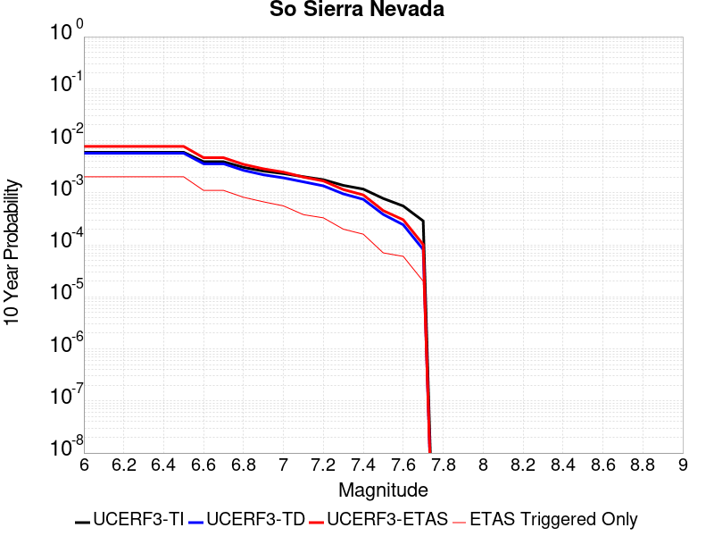
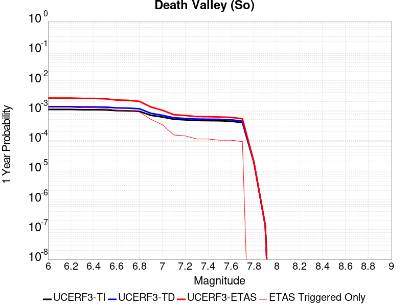
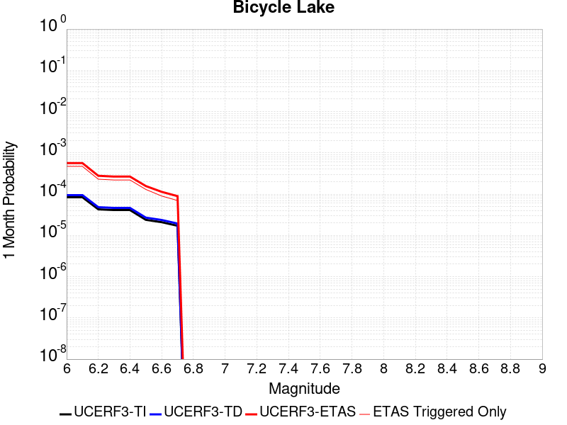
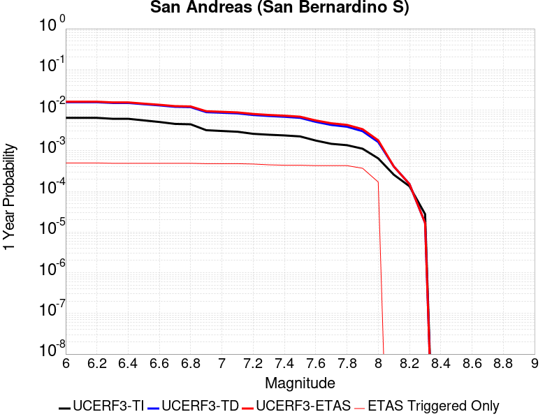
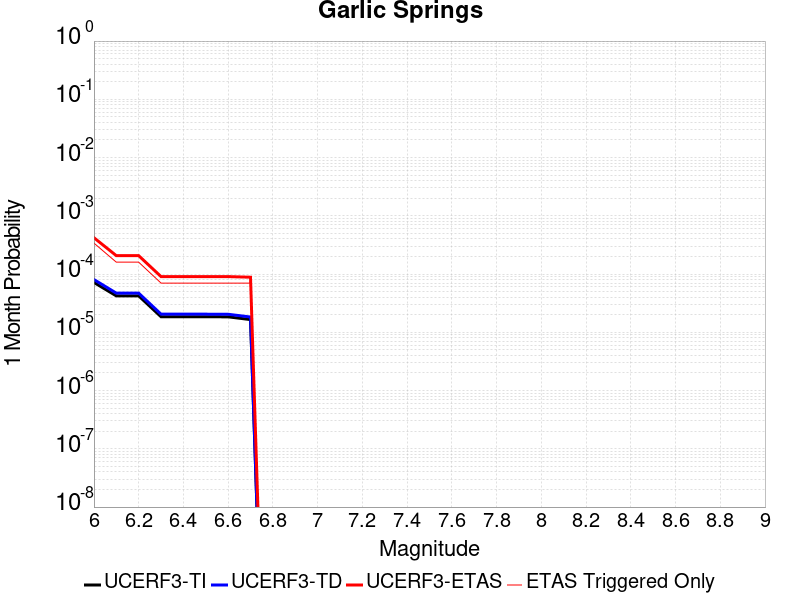
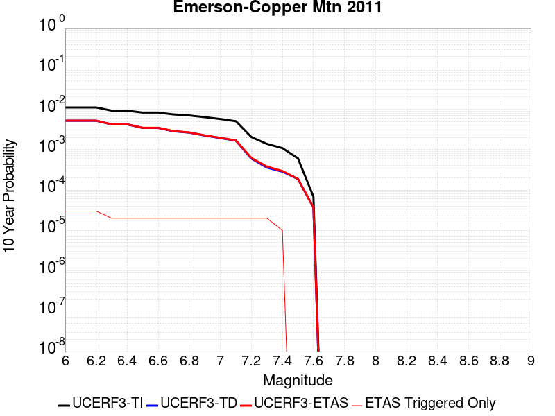
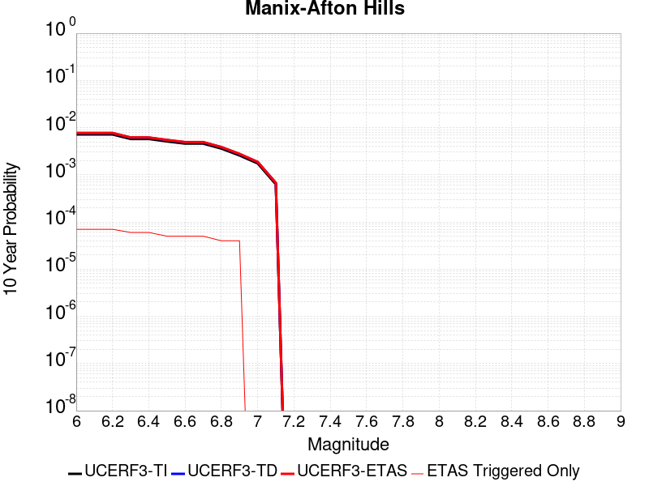
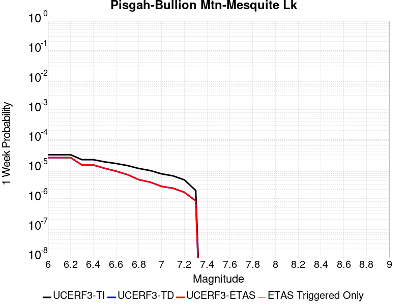
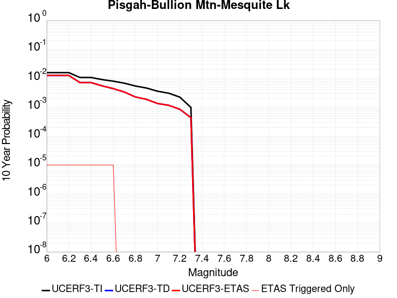
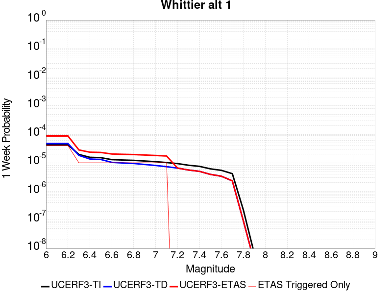

# Parent Section Magnitude-Probability Distributions

Only fault sections with at least one triggered aftershock are plotted. Sections are sorted by total supraseismogenic trigger rate (decreasing)

## Table Of Contents

* [Garlock (Central)](#garlock-central)
* [Tank Canyon](#tank-canyon)
* [Little Lake](#little-lake)
* [Airport Lake](#airport-lake)
* [Owl Lake](#owl-lake)
* [Panamint Valley](#panamint-valley)
* [Garlock (East)](#garlock-east)
* [Hunter Mountain-Saline Valley](#hunter-mountain-saline-valley)
* [Garlock (West)](#garlock-west)
* [Blackwater](#blackwater)
* [Ash Hill](#ash-hill)
* [Gravel Hills-Harper Lk](#gravel-hills-harper-lk)
* [San Andreas (Mojave S)](#san-andreas-mojave-s)
* [McLean Lake](#mclean-lake)
* [San Andreas (Mojave N)](#san-andreas-mojave-n)
* [Goldstone Lake](#goldstone-lake)
* [So Sierra Nevada](#so-sierra-nevada)
* [Death Valley (So)](#death-valley-so)
* [Nelson Lake](#nelson-lake)
* [Lenwood-Lockhart-Old Woman Springs](#lenwood-lockhart-old-woman-springs)
* [Towne Pass](#towne-pass)
* [Coyote Canyon](#coyote-canyon)
* [San Andreas (San Bernardino N)](#san-andreas-san-bernardino-n)
* [Death Valley (Black Mtns Frontal)](#death-valley-black-mtns-frontal)
* [Paradise](#paradise)
* [Bicycle Lake](#bicycle-lake)
* [Helendale-So Lockhart](#helendale-so-lockhart)
* [San Andreas (San Bernardino S)](#san-andreas-san-bernardino-s)
* [San Andreas (Parkfield)](#san-andreas-parkfield)
* [Garlic Springs](#garlic-springs)
* [San Andreas (Big Bend)](#san-andreas-big-bend)
* [Death Valley (No)](#death-valley-no)
* [San Andreas (Coachella) rev](#san-andreas-coachella-rev)
* [Coyote Lake](#coyote-lake)
* [White Wolf (Extension)](#white-wolf-extension)
* [Calico-Hidalgo](#calico-hidalgo)
* [Lake Isabella (Seismicity)](#lake-isabella-seismicity)
* [San Andreas (Carrizo) rev](#san-andreas-carrizo-rev)
* [Baker](#baker)
* [Red Pass](#red-pass)
* [San Andreas (San Gorgonio Pass-Garnet HIll)](#san-andreas-san-gorgonio-pass-garnet-hill)
* [Death Valley (Fish Lake Valley)](#death-valley-fish-lake-valley)
* [Deep Springs](#deep-springs)
* [Santa Ynez (East)](#santa-ynez-east)
* [Scodie Lineament](#scodie-lineament)
* [Santa Ynez (West)](#santa-ynez-west)
* [San Pedro Basin](#san-pedro-basin)
* [Ludlow](#ludlow)
* [San Andreas (Cholame) rev](#san-andreas-cholame-rev)
* [San Jacinto (San Bernardino)](#san-jacinto-san-bernardino)
* [San Andreas (Creeping Section) 2011 CFM](#san-andreas-creeping-section-2011-cfm)
* [Coronado Bank alt1](#coronado-bank-alt1)
* [Cleghorn Lake](#cleghorn-lake)
* [Bullion Mountains](#bullion-mountains)
* [San Jacinto (Anza) rev](#san-jacinto-anza-rev)
* [Kern Canyon (South Kern) 2011](#kern-canyon-south-kern-2011)
* [San Diego Trough south](#san-diego-trough-south)
* [San Andreas (North Branch Mill Creek)](#san-andreas-north-branch-mill-creek)
* [San Diego Trough north alt1](#san-diego-trough-north-alt1)
* [Mono Lake 2011 CFM](#mono-lake-2011-cfm)
* [Great Valley 05 Pittsburg - Kirby Hills alt1](#great-valley-05-pittsburg---kirby-hills-alt1)
* [Emerson-Copper Mtn 2011](#emerson-copper-mtn-2011)
* [Lost Hills](#lost-hills)
* [San Jacinto (Stepovers Combined)](#san-jacinto-stepovers-combined)
* [Blue Cut](#blue-cut)
* [Cleghorn Pass](#cleghorn-pass)
* [Palos Verdes](#palos-verdes)
* [San Jacinto (Clark) rev](#san-jacinto-clark-rev)
* [San Jacinto (San Jacinto Valley) rev](#san-jacinto-san-jacinto-valley-rev)
* [Elsinore (Glen Ivy) rev](#elsinore-glen-ivy-rev)
* [Manix-Afton Hills](#manix-afton-hills)
* [Pisgah-Bullion Mtn-Mesquite Lk](#pisgah-bullion-mtn-mesquite-lk)
* [Elsinore (Temecula) rev](#elsinore-temecula-rev)
* [Elsinore (Stepovers Combined)](#elsinore-stepovers-combined)
* [Surprise Valley 2011 CFM](#surprise-valley-2011-cfm)
* [Hayward (No) 2011 CFM](#hayward-no-2011-cfm)
* [Santa Cruz Catalina Ridge alt1](#santa-cruz-catalina-ridge-alt1)
* [Camp Rock 2011](#camp-rock-2011)
* [Cady](#cady)
* [Rodgers Creek - Healdsburg 2011 CFM](#rodgers-creek---healdsburg-2011-cfm)
* [Santa Rosa Island](#santa-rosa-island)
* [Mission Ridge-Arroyo Parida-Santa Ana](#mission-ridge-arroyo-parida-santa-ana)
* [Sierra Nevada  (No Extension)](#sierra-nevada--no-extension)
* [Pinto Mtn](#pinto-mtn)
* [Channel Islands Thrust](#channel-islands-thrust)
* [Whittier alt 1](#whittier-alt-1)
* [Robinson Creek](#robinson-creek)
* [South Klamath Lake East](#south-klamath-lake-east)

## Garlock (Central)
*[(top)](#table-of-contents)*

| 1 Week | 1 Month | 1 Year | 10 Year |
|-----|-----|-----|-----|
|  |  |  |  |

| Magnitude | 1 wk TI Prob | 1 wk TD Prob | 1 wk ETAS Prob | 1 wk ETAS/TD Gain | 1 wk ETAS Triggered Only | 1 mo TI Prob | 1 mo TD Prob | 1 mo ETAS Prob | 1 mo ETAS/TD Gain | 1 mo ETAS Triggered Only | 1 yr TI Prob | 1 yr TD Prob | 1 yr ETAS Prob | 1 yr ETAS/TD Gain | 1 yr ETAS Triggered Only | 10 yr TI Prob | 10 yr TD Prob | 10 yr ETAS Prob | 10 yr ETAS/TD Gain | 10 yr ETAS Triggered Only |
|-----|-----|-----|-----|-----|-----|-----|-----|-----|-----|-----|-----|-----|-----|-----|-----|-----|-----|-----|-----|-----|
| 6.0 | 5.5131142E-5 | 7.024681E-5 | 0.062358815 | 887.71027 | 0.06229294 | 2.3625491E-4 | 3.010234E-4 | 0.06814527 | 226.37865 | 0.06786467 | 0.0028726095 | 0.0036588663 | 0.077776805 | 21.257078 | 0.07439012 | 0.028357591 | 0.036079824 | 0.11088259 | 3.0732572 | 0.07760265 |
| 6.1 | 5.5131142E-5 | 7.024681E-5 | 0.062358815 | 887.71027 | 0.06229294 | 2.3625491E-4 | 3.010234E-4 | 0.06814527 | 226.37865 | 0.06786467 | 0.0028726095 | 0.0036588663 | 0.077776805 | 21.257078 | 0.07439012 | 0.028357591 | 0.036079824 | 0.11088259 | 3.0732572 | 0.07760265 |
| 6.2 | 4.216245E-5 | 5.1661493E-5 | 0.037495766 | 725.7972 | 0.03744604 | 1.806837E-4 | 2.2138779E-4 | 0.040519662 | 183.02574 | 0.040307198 | 0.0021976046 | 0.0026920962 | 0.046445087 | 17.252388 | 0.043871097 | 0.021759989 | 0.026689773 | 0.071344204 | 2.6730914 | 0.04587893 |
| 6.3 | 4.216245E-5 | 5.1661493E-5 | 0.037495766 | 725.7972 | 0.03744604 | 1.806837E-4 | 2.2138779E-4 | 0.040519662 | 183.02574 | 0.040307198 | 0.0021976046 | 0.0026920962 | 0.046445087 | 17.252388 | 0.043871097 | 0.021759989 | 0.026689773 | 0.071344204 | 2.6730914 | 0.04587893 |
| 6.4 | 3.6858168E-5 | 4.411054E-5 | 0.02845366 | 645.0535 | 0.028410802 | 1.5795401E-4 | 1.8903162E-4 | 0.03080266 | 162.94977 | 0.030619416 | 0.0019213937 | 0.002299056 | 0.035552416 | 15.463919 | 0.033329986 | 0.019048655 | 0.02284894 | 0.057085034 | 2.4983668 | 0.035036642 |
| 6.5 | 3.39199E-5 | 4.0018083E-5 | 0.02573922 | 643.18976 | 0.02570023 | 1.453629E-4 | 1.7149492E-4 | 0.02797518 | 163.12541 | 0.027808454 | 0.0017683565 | 0.002085973 | 0.0321907 | 15.431982 | 0.030167654 | 0.017543508 | 0.020759864 | 0.05187416 | 2.4987717 | 0.031773917 |
| 6.6 | 3.3571985E-5 | 3.9472274E-5 | 0.025688495 | 650.79846 | 0.025650036 | 1.4387199E-4 | 1.6915603E-4 | 0.027922718 | 165.07077 | 0.027758257 | 0.0017502342 | 0.0020575512 | 0.03211304 | 15.607409 | 0.030117458 | 0.017365133 | 0.020481179 | 0.05155516 | 2.5171971 | 0.031723723 |
| 6.7 | 3.2580007E-5 | 3.8088703E-5 | 0.024783658 | 650.6827 | 0.024746511 | 1.3962112E-4 | 1.632272E-4 | 0.026863014 | 164.57437 | 0.026704146 | 0.0016985617 | 0.0019855013 | 0.030941047 | 15.583494 | 0.029013151 | 0.016856372 | 0.019773813 | 0.04968936 | 2.512887 | 0.030519024 |
| 6.8 | 3.2185937E-5 | 3.7515918E-5 | 0.02443174 | 651.23663 | 0.024395142 | 1.3793244E-4 | 1.6077272E-4 | 0.026459124 | 164.5747 | 0.02630258 | 0.0016780337 | 0.001955672 | 0.030511303 | 15.601441 | 0.028611585 | 0.016654192 | 0.019480614 | 0.04891293 | 2.5108516 | 0.030017067 |
| 6.9 | 3.165394E-5 | 3.6720503E-5 | 0.02397922 | 653.0199 | 0.02394338 | 1.3565269E-4 | 1.5736422E-4 | 0.026004115 | 165.24796 | 0.025850818 | 0.0016503202 | 0.001914247 | 0.030020166 | 15.682492 | 0.028159823 | 0.01638118 | 0.019073246 | 0.04797617 | 2.5153646 | 0.029464914 |
| 7.0 | 3.0903822E-5 | 3.5625766E-5 | 0.023626795 | 663.19403 | 0.023592008 | 1.3243823E-4 | 1.5267303E-4 | 0.025648227 | 167.99448 | 0.025499448 | 0.0016112428 | 0.0018572307 | 0.029614037 | 15.945266 | 0.027808454 | 0.015996104 | 0.018512413 | 0.047037728 | 2.540875 | 0.029063348 |
| 7.1 | 3.0069863E-5 | 3.4392073E-5 | 0.022370739 | 650.4621 | 0.022337114 | 1.2886449E-4 | 1.4738638E-4 | 0.024187613 | 164.11023 | 0.02404377 | 0.0015677959 | 0.0017929734 | 0.027797865 | 15.50378 | 0.026051601 | 0.01556781 | 0.017880075 | 0.04459973 | 2.4943817 | 0.027206104 |
| 7.2 | 2.7957109E-5 | 3.128145E-5 | 0.019356046 | 618.7707 | 0.019325368 | 1.1981068E-4 | 1.340566E-4 | 0.021012696 | 156.74496 | 0.020881437 | 0.0014577188 | 0.0016309366 | 0.024282418 | 14.888634 | 0.022688486 | 0.014481937 | 0.016283695 | 0.03939278 | 2.4191551 | 0.023491617 |
| 7.3 | 2.4519275E-5 | 2.6714795E-5 | 0.013579209 | 508.30295 | 0.013552856 | 1.0507837E-4 | 1.1448703E-4 | 0.014619402 | 127.694824 | 0.014506576 | 0.0012785783 | 0.001393003 | 0.017032266 | 12.227012 | 0.015661078 | 0.012712469 | 0.013928054 | 0.029816473 | 2.1407495 | 0.01611284 |
| 7.4 | 2.3225532E-5 | 2.51994E-5 | 0.01252363 | 496.98126 | 0.012498745 | 9.95342E-5 | 1.0799304E-4 | 0.013508814 | 125.089676 | 0.013402269 | 0.0012111551 | 0.0013140367 | 0.01580155 | 12.025197 | 0.014506576 | 0.012045753 | 0.013145725 | 0.027907426 | 2.1229277 | 0.014958338 |
| 7.5 | 2.097765E-5 | 2.2483688E-5 | 0.010011216 | 445.26575 | 0.009988957 | 8.9901114E-5 | 9.635517E-5 | 0.010837213 | 112.471535 | 0.010741893 | 0.0010939965 | 0.0011725046 | 0.012804268 | 10.920441 | 0.011645417 | 0.010886264 | 0.011740365 | 0.023645913 | 2.0140696 | 0.012046983 |
| 7.6 | 1.511254E-5 | 1.5991332E-5 | 0.005336657 | 333.72186 | 0.005320751 | 6.476642E-5 | 6.853253E-5 | 0.005740265 | 83.75972 | 0.0056721214 | 7.882459E-4 | 8.3407195E-4 | 0.007053155 | 8.456291 | 0.0062242746 | 0.007854558 | 0.008383559 | 0.014804526 | 1.7659 | 0.0064752535 |
| 7.7 | 9.934069E-6 | 1.0678794E-5 | 0.0016671213 | 156.11514 | 0.0016564602 | 4.2573887E-5 | 4.5765457E-5 | 0.0017523433 | 38.28965 | 0.001706656 | 5.182138E-4 | 5.570524E-4 | 0.0024634288 | 4.422257 | 0.001907439 | 0.00517007 | 0.005627684 | 0.0076741283 | 1.3636389 | 0.0020580264 |
| 7.8 | 6.7562896E-6 | 8.428449E-6 | 0.0011127259 | 132.02025 | 0.0011043068 | 2.8955206E-5 | 3.6121426E-5 | 0.0011905823 | 32.960556 | 0.0011545025 | 3.5247262E-4 | 4.3968976E-4 | 0.0016940321 | 3.8527894 | 0.0012548941 | 0.0035191406 | 0.004446654 | 0.0056959684 | 1.2809559 | 0.0012548941 |
| 7.9 | 3.975453E-6 | 5.37103E-6 | 5.07326E-4 | 94.455986 | 5.0195766E-4 | 1.7037546E-5 | 2.3018498E-5 | 5.249646E-4 | 22.806204 | 5.0195766E-4 | 2.0741238E-4 | 2.8021427E-4 | 7.820313E-4 | 2.790833 | 5.0195766E-4 | 0.002072189 | 0.0028336283 | 0.0033341635 | 1.1766411 | 5.0195766E-4 |
| 8.0 | 1.6729537E-6 | 2.0775144E-6 | 2.530558E-4 | 121.80701 | 2.5097883E-4 | 7.169782E-6 | 8.903603E-6 | 2.5988018E-4 | 29.188206 | 2.5097883E-4 | 8.7288594E-5 | 1.0839601E-4 | 3.593476E-4 | 3.3151371 | 2.5097883E-4 | 8.7254314E-4 | 0.0010969337 | 0.0013476373 | 1.2285494 | 2.5097883E-4 |
| 8.1 | 3.6733252E-7 | 3.1489964E-7 | 3.1489964E-7 | 1.0 | 0.0 | 1.5742813E-6 | 1.3495693E-6 | 1.3495693E-6 | 1.0 | 0.0 | 1.9166706E-5 | 1.6430899E-5 | 1.6430899E-5 | 1.0 | 0.0 | 1.9165053E-4 | 1.6638759E-4 | 1.6638759E-4 | 1.0 | 0.0 |

## Tank Canyon
*[(top)](#table-of-contents)*

| 1 Week | 1 Month | 1 Year | 10 Year |
|-----|-----|-----|-----|
|  |  |  |  |

| Magnitude | 1 wk TI Prob | 1 wk TD Prob | 1 wk ETAS Prob | 1 wk ETAS/TD Gain | 1 wk ETAS Triggered Only | 1 mo TI Prob | 1 mo TD Prob | 1 mo ETAS Prob | 1 mo ETAS/TD Gain | 1 mo ETAS Triggered Only | 1 yr TI Prob | 1 yr TD Prob | 1 yr ETAS Prob | 1 yr ETAS/TD Gain | 1 yr ETAS Triggered Only | 10 yr TI Prob | 10 yr TD Prob | 10 yr ETAS Prob | 10 yr ETAS/TD Gain | 10 yr ETAS Triggered Only |
|-----|-----|-----|-----|-----|-----|-----|-----|-----|-----|-----|-----|-----|-----|-----|-----|-----|-----|-----|-----|-----|
| 6.0 | 4.8284557E-5 | 5.7964822E-5 | 0.033787563 | 582.8977 | 0.033731554 | 2.0691741E-4 | 2.4840087E-4 | 0.03788587 | 152.51909 | 0.037646823 | 0.0025163088 | 0.0030207601 | 0.04540814 | 15.032024 | 0.04251581 | 0.02488006 | 0.029863637 | 0.07398288 | 2.4773567 | 0.04547736 |
| 6.1 | 1.7796336E-5 | 2.0873314E-5 | 0.012268384 | 587.75446 | 0.012247766 | 7.626778E-5 | 8.945422E-5 | 0.014042628 | 156.98117 | 0.013954422 | 9.281647E-4 | 0.0010885983 | 0.016983334 | 15.601104 | 0.015912058 | 0.009242975 | 0.010836744 | 0.02751975 | 2.5394852 | 0.016865777 |
| 6.2 | 1.7796336E-5 | 2.0873314E-5 | 0.012268384 | 587.75446 | 0.012247766 | 7.626778E-5 | 8.945422E-5 | 0.014042628 | 156.98117 | 0.013954422 | 9.281647E-4 | 0.0010885983 | 0.016983334 | 15.601104 | 0.015912058 | 0.009242975 | 0.010836744 | 0.02751975 | 2.5394852 | 0.016865777 |
| 6.3 | 1.3515912E-5 | 1.5759564E-5 | 0.008147345 | 516.9778 | 0.008131714 | 5.792405E-5 | 6.753938E-5 | 0.009453513 | 139.97038 | 0.009386607 | 7.049971E-4 | 8.2200574E-4 | 0.011504915 | 13.996149 | 0.010691698 | 0.007027647 | 0.0081922645 | 0.01929422 | 2.3551753 | 0.011193655 |
| 6.4 | 1.0870146E-5 | 1.2618021E-5 | 0.0062870095 | 498.25638 | 0.0062744706 | 4.658551E-5 | 5.4076212E-5 | 0.007131296 | 131.87492 | 0.0070776027 | 5.67031E-4 | 6.581969E-4 | 0.008533745 | 12.965337 | 0.007880735 | 0.005655863 | 0.0065644905 | 0.014742556 | 2.2458036 | 0.0082321055 |
| 6.5 | 7.964826E-6 | 9.196094E-6 | 0.004175406 | 454.04126 | 0.0041662483 | 3.4134522E-5 | 3.9411298E-5 | 0.0045066583 | 114.3494 | 0.004467423 | 4.1550855E-4 | 4.7973756E-4 | 0.0054467344 | 11.35357 | 0.004969381 | 0.0041473247 | 0.004788321 | 0.009933729 | 2.0745745 | 0.0051701637 |
| 6.6 | 6.6317E-6 | 7.6122988E-6 | 0.0031699212 | 416.42102 | 0.003162333 | 2.8421264E-5 | 3.2623782E-5 | 0.0034960185 | 107.16166 | 0.0034635076 | 3.4597394E-4 | 3.9713128E-4 | 0.0041603185 | 10.475927 | 0.0037646822 | 0.0034543579 | 0.003965368 | 0.007915108 | 1.9960591 | 0.0039654654 |
| 6.7 | 4.793663E-6 | 5.4307857E-6 | 0.0018124684 | 333.73965 | 0.0018070475 | 2.0544108E-5 | 2.3274613E-5 | 0.0019306692 | 82.95172 | 0.001907439 | 2.500958E-4 | 2.8333595E-4 | 0.0022905977 | 8.084388 | 0.0020078307 | 0.0024981452 | 0.0028304397 | 0.0049326946 | 1.7427309 | 0.002108222 |
| 6.8 | 4.382823E-6 | 4.9692567E-6 | 0.0017116168 | 344.4412 | 0.001706656 | 1.8783392E-5 | 2.1296666E-5 | 0.0018283057 | 85.84939 | 0.0018070475 | 2.286638E-4 | 2.5926033E-4 | 0.0021662049 | 8.355328 | 0.001907439 | 0.0022842865 | 0.002590253 | 0.004542817 | 1.7538121 | 0.0019576347 |
| 6.9 | 2.729601E-6 | 3.0735416E-6 | 0.0010069858 | 327.6304 | 0.0010039153 | 1.1698237E-5 | 1.3172262E-5 | 0.0011174645 | 84.83467 | 0.0011043068 | 1.4241673E-4 | 1.6036171E-4 | 0.0013146792 | 8.198211 | 0.0011545025 | 0.001423255 | 0.0016026258 | 0.0027552783 | 1.7192273 | 0.0011545025 |
| 7.0 | 1.8987357E-6 | 2.126939E-6 | 4.036922E-4 | 189.7996 | 4.015661E-4 | 8.137413E-6 | 9.115425E-6 | 5.110685E-4 | 56.066334 | 5.0195766E-4 | 9.90685E-5 | 1.1097535E-4 | 6.6306745E-4 | 5.974908 | 5.521534E-4 | 9.902435E-4 | 0.0011092679 | 0.0016608089 | 1.4972116 | 5.521534E-4 |
| 7.1 | 1.4928986E-6 | 1.6641272E-6 | 2.0244684E-4 | 121.65347 | 2.0078305E-4 | 6.398121E-6 | 7.1319573E-6 | 2.5810898E-4 | 36.190483 | 2.5097883E-4 | 7.789434E-5 | 8.682871E-5 | 3.8797714E-4 | 4.4683046 | 3.011746E-4 | 7.786704E-4 | 8.6800574E-4 | 0.0011689189 | 1.3466718 | 3.011746E-4 |
| 7.2 | 1.069082E-6 | 1.1828573E-6 | 5.137856E-5 | 43.435978 | 5.0195762E-5 | 4.581772E-6 | 5.0693816E-6 | 1.054604E-4 | 20.803406 | 1.00391524E-4 | 5.5781646E-5 | 6.171851E-5 | 2.122965E-4 | 3.4397545 | 1.505873E-4 | 5.576765E-4 | 6.170659E-4 | 7.6756027E-4 | 1.2438871 | 1.505873E-4 |
| 7.3 | 8.776551E-7 | 9.770005E-7 | 9.770005E-7 | 1.0 | 0.0 | 3.7613736E-6 | 4.1871413E-6 | 5.4382694E-5 | 12.988025 | 5.0195762E-5 | 4.579376E-5 | 5.097777E-5 | 1.5136418E-4 | 2.9692192 | 1.00391524E-4 | 4.5784327E-4 | 5.097118E-4 | 6.1005214E-4 | 1.1968571 | 1.00391524E-4 |
| 7.4 | 7.55721E-7 | 8.510244E-7 | 8.510244E-7 | 1.0 | 0.0 | 3.2388E-6 | 3.6472454E-6 | 3.6472454E-6 | 1.0 | 0.0 | 3.9431678E-5 | 4.4404827E-5 | 4.4404827E-5 | 1.0 | 0.0 | 3.942468E-4 | 4.440104E-4 | 4.440104E-4 | 1.0 | 0.0 |
| 7.5 | 5.587665E-7 | 6.305619E-7 | 6.305619E-7 | 1.0 | 0.0 | 2.3947114E-6 | 2.702408E-6 | 2.702408E-6 | 1.0 | 0.0 | 2.915522E-5 | 3.290182E-5 | 3.290182E-5 | 1.0 | 0.0 | 2.9151395E-4 | 3.290182E-4 | 3.290182E-4 | 1.0 | 0.0 |

## Little Lake
*[(top)](#table-of-contents)*

| 1 Week | 1 Month | 1 Year | 10 Year |
|-----|-----|-----|-----|
|  |  |  |  |

| Magnitude | 1 wk TI Prob | 1 wk TD Prob | 1 wk ETAS Prob | 1 wk ETAS/TD Gain | 1 wk ETAS Triggered Only | 1 mo TI Prob | 1 mo TD Prob | 1 mo ETAS Prob | 1 mo ETAS/TD Gain | 1 mo ETAS Triggered Only | 1 yr TI Prob | 1 yr TD Prob | 1 yr ETAS Prob | 1 yr ETAS/TD Gain | 1 yr ETAS Triggered Only | 10 yr TI Prob | 10 yr TD Prob | 10 yr ETAS Prob | 10 yr ETAS/TD Gain | 10 yr ETAS Triggered Only |
|-----|-----|-----|-----|-----|-----|-----|-----|-----|-----|-----|-----|-----|-----|-----|-----|-----|-----|-----|-----|-----|
| 6.0 | 2.8424427E-5 | 3.120572E-5 | 0.029194035 | 935.53467 | 0.029163739 | 1.2181328E-4 | 1.337327E-4 | 0.031803023 | 237.81038 | 0.03167353 | 0.0014820677 | 0.0016271127 | 0.03555435 | 21.85119 | 0.03398253 | 0.014722223 | 0.016165402 | 0.050438125 | 3.1201284 | 0.03483586 |
| 6.1 | 2.8424427E-5 | 3.120572E-5 | 0.029194035 | 935.53467 | 0.029163739 | 1.2181328E-4 | 1.337327E-4 | 0.031803023 | 237.81038 | 0.03167353 | 0.0014820677 | 0.0016271127 | 0.03555435 | 21.85119 | 0.03398253 | 0.014722223 | 0.016165402 | 0.050438125 | 3.1201284 | 0.03483586 |
| 6.2 | 2.8424427E-5 | 3.120572E-5 | 0.029194035 | 935.53467 | 0.029163739 | 1.2181328E-4 | 1.337327E-4 | 0.031803023 | 237.81038 | 0.03167353 | 0.0014820677 | 0.0016271127 | 0.03555435 | 21.85119 | 0.03398253 | 0.014722223 | 0.016165402 | 0.050438125 | 3.1201284 | 0.03483586 |
| 6.3 | 1.48860645E-5 | 1.6081389E-5 | 0.019491725 | 1212.0671 | 0.019475956 | 6.379586E-5 | 6.8918576E-5 | 0.020848533 | 302.5096 | 0.020781046 | 7.7643775E-4 | 8.3878887E-4 | 0.02345809 | 27.96662 | 0.02263829 | 0.007737305 | 0.008359048 | 0.03135564 | 3.751102 | 0.023190442 |
| 6.4 | 1.48860645E-5 | 1.6081389E-5 | 0.019491725 | 1212.0671 | 0.019475956 | 6.379586E-5 | 6.8918576E-5 | 0.020848533 | 302.5096 | 0.020781046 | 7.7643775E-4 | 8.3878887E-4 | 0.02345809 | 27.96662 | 0.02263829 | 0.007737305 | 0.008359048 | 0.03135564 | 3.751102 | 0.023190442 |
| 6.5 | 1.2797581E-5 | 1.3765565E-5 | 0.018234577 | 1324.6516 | 0.018221062 | 5.4845623E-5 | 5.899409E-5 | 0.019383224 | 328.56213 | 0.019325368 | 6.675408E-4 | 7.18042E-4 | 0.021734966 | 30.269768 | 0.021032024 | 0.006655392 | 0.00715977 | 0.02858941 | 3.9930627 | 0.021584177 |
| 6.6 | 9.661896E-6 | 1.0289038E-5 | 0.015972378 | 1552.3684 | 0.015962252 | 4.1407468E-5 | 4.409522E-5 | 0.017109903 | 388.0217 | 0.017066559 | 5.040193E-4 | 5.367433E-4 | 0.0189487 | 35.303097 | 0.018421846 | 0.005028777 | 0.0053560743 | 0.024128594 | 4.5049024 | 0.018873608 |
| 6.7 | 7.767871E-6 | 8.199687E-6 | 0.013811922 | 1684.4451 | 0.013803835 | 3.329045E-5 | 3.5141118E-5 | 0.014992953 | 426.64984 | 0.014958338 | 4.0523586E-4 | 4.2777284E-4 | 0.01663407 | 38.885284 | 0.01621323 | 0.004044977 | 0.004270846 | 0.020814685 | 4.8736677 | 0.016614798 |
| 6.8 | 6.4235196E-6 | 6.7357446E-6 | 0.010547775 | 1565.9404 | 0.01054111 | 2.752908E-5 | 2.8867229E-5 | 0.01157356 | 400.9238 | 0.011545026 | 3.35115E-4 | 3.5141467E-4 | 0.012895945 | 36.69723 | 0.012548941 | 0.003346101 | 0.00350985 | 0.016364884 | 4.662559 | 0.0129003115 |
| 6.9 | 3.1283696E-6 | 3.1121804E-6 | 0.006177172 | 1984.8373 | 0.0061740787 | 1.3407229E-5 | 1.3337856E-5 | 0.006940261 | 520.343 | 0.0069270153 | 1.6322079E-4 | 1.6237781E-4 | 0.007841082 | 48.289127 | 0.007679952 | 0.0016310095 | 0.00162274 | 0.009540801 | 5.879439 | 0.007930931 |
| 7.0 | 2.290603E-6 | 2.2286815E-6 | 0.0041684676 | 1870.3739 | 0.0041662483 | 9.816834E-6 | 9.551463E-6 | 0.0047781034 | 500.24832 | 0.0047685974 | 1.19513395E-4 | 1.162839E-4 | 0.0054364162 | 46.751236 | 0.005320751 | 0.0011944914 | 0.0011623327 | 0.0066774487 | 5.7448688 | 0.005521534 |
| 7.1 | 1.293693E-6 | 1.1776827E-6 | 0.0020090058 | 1705.8973 | 0.0020078307 | 5.5443866E-6 | 5.0472063E-6 | 0.0022136497 | 438.5891 | 0.0022086136 | 6.750081E-5 | 6.14487E-5 | 0.0025710827 | 41.841125 | 0.0025097881 | 6.7480316E-4 | 6.143856E-4 | 0.0032731264 | 5.3274794 | 0.0026603756 |
| 7.2 | 4.715842E-7 | 3.0917857E-7 | 3.0917857E-7 | 1.0 | 0.0 | 2.0210737E-6 | 1.3250503E-6 | 1.3250503E-6 | 1.0 | 0.0 | 2.4606294E-5 | 1.6132375E-5 | 1.6132375E-5 | 1.0 | 0.0 | 2.460357E-4 | 1.6131258E-4 | 1.6131258E-4 | 1.0 | 0.0 |
| 7.3 | 3.9430947E-7 | 2.3097488E-7 | 2.3097488E-7 | 1.0 | 0.0 | 1.6898966E-6 | 9.89892E-7 | 9.89892E-7 | 1.0 | 0.0 | 2.0574296E-5 | 1.2051869E-5 | 1.2051869E-5 | 1.0 | 0.0 | 2.0572392E-4 | 1.20512224E-4 | 1.20512224E-4 | 1.0 | 0.0 |
| 7.4 | 3.547123E-7 | 1.9679135E-7 | 1.9679135E-7 | 1.0 | 0.0 | 1.5201948E-6 | 8.4339126E-7 | 8.4339126E-7 | 1.0 | 0.0 | 1.8508214E-5 | 1.0268241E-5 | 1.0268241E-5 | 1.0 | 0.0 | 1.8506673E-4 | 1.02677724E-4 | 1.02677724E-4 | 1.0 | 0.0 |
| 7.5 | 2.6354266E-7 | 1.4423138E-7 | 1.4423138E-7 | 1.0 | 0.0 | 1.129468E-6 | 6.181344E-7 | 6.181344E-7 | 1.0 | 0.0 | 1.3751187E-5 | 7.5257603E-6 | 7.5257603E-6 | 1.0 | 0.0 | 1.3750336E-4 | 7.5255106E-5 | 7.5255106E-5 | 1.0 | 0.0 |
| 7.6 | 1.269913E-7 | 7.572556E-8 | 7.572556E-8 | 1.0 | 0.0 | 5.4424834E-7 | 3.245381E-7 | 3.245381E-7 | 1.0 | 0.0 | 6.6262032E-6 | 3.9512443E-6 | 3.9512443E-6 | 1.0 | 0.0 | 6.626006E-5 | 3.9511775E-5 | 3.9511775E-5 | 1.0 | 0.0 |

## Airport Lake
*[(top)](#table-of-contents)*

| 1 Week | 1 Month | 1 Year | 10 Year |
|-----|-----|-----|-----|
|  |  |  |  |

| Magnitude | 1 wk TI Prob | 1 wk TD Prob | 1 wk ETAS Prob | 1 wk ETAS/TD Gain | 1 wk ETAS Triggered Only | 1 mo TI Prob | 1 mo TD Prob | 1 mo ETAS Prob | 1 mo ETAS/TD Gain | 1 mo ETAS Triggered Only | 1 yr TI Prob | 1 yr TD Prob | 1 yr ETAS Prob | 1 yr ETAS/TD Gain | 1 yr ETAS Triggered Only | 10 yr TI Prob | 10 yr TD Prob | 10 yr ETAS Prob | 10 yr ETAS/TD Gain | 10 yr ETAS Triggered Only |
|-----|-----|-----|-----|-----|-----|-----|-----|-----|-----|-----|-----|-----|-----|-----|-----|-----|-----|-----|-----|-----|
| 6.0 | 1.2387061E-5 | 1.3103157E-5 | 0.025160851 | 1920.2129 | 0.025148077 | 5.3086325E-5 | 5.615534E-5 | 0.02721054 | 484.55835 | 0.027155908 | 6.461343E-4 | 6.8350515E-4 | 0.030429248 | 44.51941 | 0.029766088 | 0.0064425888 | 0.0068168393 | 0.037227526 | 5.4611125 | 0.030619416 |
| 6.1 | 1.2387061E-5 | 1.3103157E-5 | 0.025160851 | 1920.2129 | 0.025148077 | 5.3086325E-5 | 5.615534E-5 | 0.02721054 | 484.55835 | 0.027155908 | 6.461343E-4 | 6.8350515E-4 | 0.030429248 | 44.51941 | 0.029766088 | 0.0064425888 | 0.0068168393 | 0.037227526 | 5.4611125 | 0.030619416 |
| 6.2 | 1.2387061E-5 | 1.3103157E-5 | 0.025160851 | 1920.2129 | 0.025148077 | 5.3086325E-5 | 5.615534E-5 | 0.02721054 | 484.55835 | 0.027155908 | 6.461343E-4 | 6.8350515E-4 | 0.030429248 | 44.51941 | 0.029766088 | 0.0064425888 | 0.0068168393 | 0.037227526 | 5.4611125 | 0.030619416 |
| 6.3 | 1.2387061E-5 | 1.3103157E-5 | 0.025160851 | 1920.2129 | 0.025148077 | 5.3086325E-5 | 5.615534E-5 | 0.02721054 | 484.55835 | 0.027155908 | 6.461343E-4 | 6.8350515E-4 | 0.030429248 | 44.51941 | 0.029766088 | 0.0064425888 | 0.0068168393 | 0.037227526 | 5.4611125 | 0.030619416 |
| 6.4 | 1.2387061E-5 | 1.3103157E-5 | 0.025160851 | 1920.2129 | 0.025148077 | 5.3086325E-5 | 5.615534E-5 | 0.02721054 | 484.55835 | 0.027155908 | 6.461343E-4 | 6.8350515E-4 | 0.030429248 | 44.51941 | 0.029766088 | 0.0064425888 | 0.0068168393 | 0.037227526 | 5.4611125 | 0.030619416 |
| 6.5 | 6.9922594E-6 | 7.384925E-6 | 0.018830657 | 2549.878 | 0.018823411 | 2.996648E-5 | 3.1649324E-5 | 0.020360291 | 643.30884 | 0.020329284 | 3.6478083E-4 | 3.8526783E-4 | 0.022613425 | 58.69533 | 0.022236723 | 0.003641826 | 0.0038465366 | 0.026547754 | 6.9017296 | 0.022788877 |
| 6.6 | 6.9922594E-6 | 7.384925E-6 | 0.018830657 | 2549.878 | 0.018823411 | 2.996648E-5 | 3.1649324E-5 | 0.020360291 | 643.30884 | 0.020329284 | 3.6478083E-4 | 3.8526783E-4 | 0.022613425 | 58.69533 | 0.022236723 | 0.003641826 | 0.0038465366 | 0.026547754 | 6.9017296 | 0.022788877 |
| 6.7 | 5.477277E-6 | 5.7860684E-6 | 0.015516187 | 2681.646 | 0.015510491 | 2.3473833E-5 | 2.4797222E-5 | 0.01683996 | 679.10675 | 0.01681558 | 2.8575645E-4 | 3.0186825E-4 | 0.018718153 | 62.00769 | 0.018421846 | 0.0028538927 | 0.003014966 | 0.021881714 | 7.2576985 | 0.018923802 |
| 6.8 | 3.9950432E-6 | 4.2190873E-6 | 0.011850369 | 2808.752 | 0.011846201 | 1.7121502E-5 | 1.8081691E-5 | 0.013018549 | 719.9851 | 0.0130007025 | 2.0843433E-4 | 2.2012512E-4 | 0.014422399 | 65.5191 | 0.014205401 | 0.0020823893 | 0.0021993418 | 0.016774183 | 7.6269107 | 0.014606968 |
| 6.9 | 2.95695E-6 | 3.1230243E-6 | 0.008636767 | 2765.514 | 0.008633671 | 1.2672582E-5 | 1.3384334E-5 | 0.009550451 | 713.5545 | 0.009537195 | 1.5427776E-4 | 1.6294434E-4 | 0.010752524 | 65.98894 | 0.010591306 | 0.001541707 | 0.0016284712 | 0.012503214 | 7.6778846 | 0.010892481 |
| 7.0 | 1.456072E-6 | 1.540812E-6 | 0.004067391 | 2639.7715 | 0.004065857 | 6.2402937E-6 | 6.603469E-6 | 0.0046245833 | 700.32635 | 0.00461801 | 7.597293E-5 | 8.039528E-5 | 0.0051999516 | 64.67982 | 0.0051199677 | 7.594696E-4 | 8.0376083E-4 | 0.006120235 | 7.614498 | 0.005320751 |
| 7.1 | 6.995192E-7 | 7.4089746E-7 | 0.00200857 | 2710.9958 | 0.0020078307 | 2.997936E-6 | 3.1752747E-6 | 0.002211782 | 696.5639 | 0.0022086136 | 3.649926E-5 | 3.865897E-5 | 0.00254835 | 65.918724 | 0.0025097881 | 3.6493264E-4 | 3.865897E-4 | 0.0030459366 | 7.8789907 | 0.0026603756 |

## Owl Lake
*[(top)](#table-of-contents)*

| 1 Week | 1 Month | 1 Year | 10 Year |
|-----|-----|-----|-----|
|  |  |  |  |

| Magnitude | 1 wk TI Prob | 1 wk TD Prob | 1 wk ETAS Prob | 1 wk ETAS/TD Gain | 1 wk ETAS Triggered Only | 1 mo TI Prob | 1 mo TD Prob | 1 mo ETAS Prob | 1 mo ETAS/TD Gain | 1 mo ETAS Triggered Only | 1 yr TI Prob | 1 yr TD Prob | 1 yr ETAS Prob | 1 yr ETAS/TD Gain | 1 yr ETAS Triggered Only | 10 yr TI Prob | 10 yr TD Prob | 10 yr ETAS Prob | 10 yr ETAS/TD Gain | 10 yr ETAS Triggered Only |
|-----|-----|-----|-----|-----|-----|-----|-----|-----|-----|-----|-----|-----|-----|-----|-----|-----|-----|-----|-----|-----|
| 6.0 | 5.0320643E-5 | 6.635816E-5 | 0.014672356 | 221.10855 | 0.014606968 | 2.1564208E-4 | 2.843674E-4 | 0.016593352 | 58.35181 | 0.016313624 | 0.0026222812 | 0.0034577388 | 0.021665819 | 6.2658925 | 0.018271258 | 0.02591553 | 0.034140717 | 0.05295175 | 1.5509853 | 0.019475956 |
| 6.1 | 5.0320643E-5 | 6.635816E-5 | 0.014672356 | 221.10855 | 0.014606968 | 2.1564208E-4 | 2.843674E-4 | 0.016593352 | 58.35181 | 0.016313624 | 0.0026222812 | 0.0034577388 | 0.021665819 | 6.2658925 | 0.018271258 | 0.02591553 | 0.034140717 | 0.05295175 | 1.5509853 | 0.019475956 |
| 6.2 | 2.4125871E-5 | 3.0981035E-5 | 0.011324678 | 365.5358 | 0.011294046 | 1.0339249E-4 | 1.3277028E-4 | 0.012378911 | 93.23556 | 0.012247766 | 0.0012580766 | 0.001615439 | 0.015296745 | 9.469095 | 0.013703443 | 0.012509781 | 0.016070465 | 0.03044269 | 1.8943255 | 0.014606968 |
| 6.3 | 1.7433485E-5 | 2.2355514E-5 | 0.010513036 | 470.2659 | 0.010490915 | 7.471279E-5 | 9.580672E-5 | 0.011489153 | 119.92012 | 0.011394438 | 9.0924866E-4 | 0.0011659743 | 0.013900832 | 11.922074 | 0.012749724 | 0.009055373 | 0.011628896 | 0.024974536 | 2.1476274 | 0.01350266 |
| 6.4 | 1.7433485E-5 | 2.2355514E-5 | 0.010513036 | 470.2659 | 0.010490915 | 7.471279E-5 | 9.580672E-5 | 0.011489153 | 119.92012 | 0.011394438 | 9.0924866E-4 | 0.0011659743 | 0.013900832 | 11.922074 | 0.012749724 | 0.009055373 | 0.011628896 | 0.024974536 | 2.1476274 | 0.01350266 |
| 6.5 | 1.5182742E-5 | 1.9429144E-5 | 0.010108582 | 520.2793 | 0.010089348 | 6.506727E-5 | 8.326596E-5 | 0.011075223 | 133.01021 | 0.0109928725 | 7.919061E-4 | 0.0010134429 | 0.013349087 | 13.172017 | 0.012348157 | 0.0078909 | 0.010118429 | 0.02308696 | 2.2816744 | 0.013101094 |
| 6.6 | 6.7271576E-6 | 8.547361E-6 | 0.008140191 | 952.36316 | 0.008131714 | 2.8830356E-5 | 3.6631063E-5 | 0.008870762 | 242.165 | 0.008834454 | 3.5095305E-4 | 4.458976E-4 | 0.01027988 | 23.054352 | 0.00983837 | 0.0035039932 | 0.004467813 | 0.0148618845 | 3.3264341 | 0.010440718 |
| 6.7 | 6.682835E-6 | 8.479807E-6 | 0.008140124 | 959.9422 | 0.008131714 | 2.8640408E-5 | 3.6341557E-5 | 0.008870475 | 244.08627 | 0.008834454 | 3.4864116E-4 | 4.4237426E-4 | 0.010276392 | 23.230083 | 0.00983837 | 0.003480947 | 0.0044327388 | 0.014827177 | 3.3449244 | 0.010440718 |
| 6.8 | 6.5774975E-6 | 8.32628E-6 | 0.008139973 | 977.6241 | 0.008131714 | 2.8188972E-5 | 3.5683603E-5 | 0.008869823 | 248.56859 | 0.008834454 | 3.4314668E-4 | 4.343669E-4 | 0.010268463 | 23.640068 | 0.00983837 | 0.0034261728 | 0.004352885 | 0.014748156 | 3.3881338 | 0.010440718 |
| 6.9 | 6.363419E-6 | 7.999454E-6 | 0.0081396485 | 1017.5254 | 0.008131714 | 2.727151E-5 | 3.428296E-5 | 0.0088684345 | 258.68347 | 0.008834454 | 3.3198006E-4 | 4.1732067E-4 | 0.010251584 | 24.565245 | 0.00983837 | 0.0033148455 | 0.0041828766 | 0.014579923 | 3.4856212 | 0.010440718 |
| 7.0 | 6.1342453E-6 | 7.6316555E-6 | 0.008139283 | 1066.5161 | 0.008131714 | 2.6289357E-5 | 3.2706717E-5 | 0.008866872 | 271.10248 | 0.008834454 | 3.2002592E-4 | 3.9813702E-4 | 0.010232589 | 25.701176 | 0.00983837 | 0.0031956544 | 0.003991571 | 0.014390615 | 3.605251 | 0.010440718 |
| 7.1 | 5.842926E-6 | 7.142211E-6 | 0.007586648 | 1062.2268 | 0.0075795604 | 2.504087E-5 | 3.0609146E-5 | 0.008262462 | 269.93442 | 0.0082321055 | 3.0482994E-4 | 3.7260808E-4 | 0.009454656 | 25.374266 | 0.009085434 | 0.0030441214 | 0.0037370329 | 0.013388611 | 3.582685 | 0.009687782 |
| 7.2 | 4.77173E-6 | 5.358483E-6 | 0.0055770585 | 1040.7905 | 0.00557173 | 2.045011E-5 | 2.2964748E-5 | 0.006146707 | 267.65836 | 0.006123883 | 2.4895166E-4 | 2.79564E-4 | 0.0070540975 | 25.232496 | 0.006776428 | 0.0024867293 | 0.002808645 | 0.009816314 | 3.4950356 | 0.0070274067 |
| 7.3 | 3.0494948E-6 | 2.710463E-6 | 0.001408188 | 519.53784 | 0.0014054814 | 1.3069198E-5 | 1.1616219E-5 | 0.0015676668 | 134.955 | 0.0015560687 | 1.5910587E-4 | 1.4141845E-4 | 0.001847833 | 13.0664215 | 0.001706656 | 0.0015899199 | 0.0014232415 | 0.0031274683 | 2.1974266 | 0.001706656 |
| 7.4 | 2.7263884E-6 | 2.3056762E-6 | 0.0010062186 | 436.40933 | 0.0010039153 | 1.1684469E-5 | 9.881433E-6 | 0.0011643725 | 117.83439 | 0.0011545025 | 1.4224913E-4 | 1.20299905E-4 | 0.0014252327 | 11.847331 | 0.0013050898 | 0.0014215811 | 0.0012112238 | 0.002514733 | 2.0761917 | 0.0013050898 |
| 7.5 | 2.6090431E-6 | 2.1656133E-6 | 9.056874E-4 | 418.2129 | 9.0352376E-4 | 1.1181565E-5 | 9.281167E-6 | 0.0010131871 | 109.16592 | 0.0010039153 | 1.3612706E-4 | 1.1299244E-4 | 0.0012673646 | 11.216366 | 0.0011545025 | 0.001360437 | 0.0011379806 | 0.0022911695 | 2.013364 | 0.0011545025 |
| 7.6 | 2.3008756E-6 | 1.8727933E-6 | 7.5480784E-4 | 403.0385 | 7.5293647E-4 | 9.860858E-6 | 8.0262325E-6 | 8.11152E-4 | 101.06261 | 8.031322E-4 | 1.20049335E-4 | 9.7715085E-5 | 0.0010513414 | 10.7592535 | 9.537195E-4 | 0.001199845 | 9.849932E-4 | 0.0019377733 | 1.9672961 | 9.537195E-4 |
| 7.7 | 1.7184348E-6 | 1.3419171E-6 | 5.5349455E-4 | 412.46555 | 5.521534E-4 | 7.3646997E-6 | 5.7510606E-6 | 5.579013E-4 | 97.008415 | 5.521534E-4 | 8.966153E-5 | 7.0016955E-5 | 7.225162E-4 | 10.31916 | 6.525449E-4 | 8.962536E-4 | 7.078345E-4 | 0.0013599176 | 1.9212366 | 6.525449E-4 |
| 7.8 | 8.4612907E-7 | 8.4058576E-7 | 2.518192E-4 | 299.57584 | 2.5097883E-4 | 3.6262625E-6 | 3.6025056E-6 | 2.5458043E-4 | 70.6676 | 2.5097883E-4 | 4.4148852E-5 | 4.3859643E-5 | 3.9521456E-4 | 9.010894 | 3.5137034E-4 | 4.414008E-4 | 4.4398365E-4 | 7.9519796E-4 | 1.7910525 | 3.5137034E-4 |
| 7.9 | 2.716738E-7 | 3.768106E-7 | 3.768106E-7 | 1.0 | 0.0 | 1.1643157E-6 | 1.6149015E-6 | 1.6149015E-6 | 1.0 | 0.0 | 1.4175452E-5 | 1.966126E-5 | 1.966126E-5 | 1.0 | 0.0 | 1.4174548E-4 | 1.9836679E-4 | 1.9836679E-4 | 1.0 | 0.0 |
| 8.0 | 2.1995428E-8 | 3.384878E-8 | 3.384878E-8 | 1.0 | 0.0 | 9.426611E-8 | 1.4506621E-7 | 1.4506621E-7 | 1.0 | 0.0 | 1.1476893E-6 | 1.7661803E-6 | 1.7661803E-6 | 1.0 | 0.0 | 1.14768345E-5 | 1.7963059E-5 | 1.7963059E-5 | 1.0 | 0.0 |

## Panamint Valley
*[(top)](#table-of-contents)*

| 1 Week | 1 Month | 1 Year | 10 Year |
|-----|-----|-----|-----|
|  |  |  |  |

| Magnitude | 1 wk TI Prob | 1 wk TD Prob | 1 wk ETAS Prob | 1 wk ETAS/TD Gain | 1 wk ETAS Triggered Only | 1 mo TI Prob | 1 mo TD Prob | 1 mo ETAS Prob | 1 mo ETAS/TD Gain | 1 mo ETAS Triggered Only | 1 yr TI Prob | 1 yr TD Prob | 1 yr ETAS Prob | 1 yr ETAS/TD Gain | 1 yr ETAS Triggered Only | 10 yr TI Prob | 10 yr TD Prob | 10 yr ETAS Prob | 10 yr ETAS/TD Gain | 10 yr ETAS Triggered Only |
|-----|-----|-----|-----|-----|-----|-----|-----|-----|-----|-----|-----|-----|-----|-----|-----|-----|-----|-----|-----|-----|
| 6.0 | 3.0211835E-5 | 3.3984514E-5 | 0.012281335 | 361.38034 | 0.012247766 | 1.2947287E-4 | 1.4563995E-4 | 0.01344558 | 92.32069 | 0.013301877 | 0.0015751923 | 0.0017717537 | 0.016252628 | 9.173186 | 0.014506576 | 0.015640736 | 0.017583137 | 0.032377087 | 1.8413714 | 0.015058729 |
| 6.1 | 3.0211835E-5 | 3.3984514E-5 | 0.012281335 | 361.38034 | 0.012247766 | 1.2947287E-4 | 1.4563995E-4 | 0.01344558 | 92.32069 | 0.013301877 | 0.0015751923 | 0.0017717537 | 0.016252628 | 9.173186 | 0.014506576 | 0.015640736 | 0.017583137 | 0.032377087 | 1.8413714 | 0.015058729 |
| 6.2 | 3.0211835E-5 | 3.3984514E-5 | 0.012281335 | 361.38034 | 0.012247766 | 1.2947287E-4 | 1.4563995E-4 | 0.01344558 | 92.32069 | 0.013301877 | 0.0015751923 | 0.0017717537 | 0.016252628 | 9.173186 | 0.014506576 | 0.015640736 | 0.017583137 | 0.032377087 | 1.8413714 | 0.015058729 |
| 6.3 | 2.8573924E-5 | 3.210268E-5 | 0.011928117 | 371.5614 | 0.011896396 | 1.2245393E-4 | 1.3757581E-4 | 0.013036112 | 94.755844 | 0.0129003115 | 0.001489857 | 0.0016737265 | 0.015604793 | 9.323383 | 0.013954422 | 0.01479908 | 0.016617801 | 0.030883309 | 1.8584474 | 0.014506576 |
| 6.4 | 2.8573924E-5 | 3.210268E-5 | 0.011928117 | 371.5614 | 0.011896396 | 1.2245393E-4 | 1.3757581E-4 | 0.013036112 | 94.755844 | 0.0129003115 | 0.001489857 | 0.0016737265 | 0.015604793 | 9.323383 | 0.013954422 | 0.01479908 | 0.016617801 | 0.030883309 | 1.8584474 | 0.014506576 |
| 6.5 | 2.7468774E-5 | 3.0828433E-5 | 0.011575498 | 375.48123 | 0.011545026 | 1.1771801E-4 | 1.3211532E-4 | 0.012528831 | 94.832535 | 0.012398354 | 0.0014322745 | 0.0016073446 | 0.014988071 | 9.32474 | 0.013402269 | 0.014230782 | 0.015963677 | 0.029695336 | 1.8601815 | 0.013954422 |
| 6.6 | 2.6135967E-5 | 2.925248E-5 | 0.011322969 | 387.0772 | 0.011294046 | 1.1200648E-4 | 1.253619E-4 | 0.012221024 | 97.485954 | 0.012097179 | 0.0013628257 | 0.0015252391 | 0.014506113 | 9.510715 | 0.0130007025 | 0.013544982 | 0.015154043 | 0.028452083 | 1.8775243 | 0.01350266 |
| 6.7 | 2.4498746E-5 | 2.7341335E-5 | 0.011170496 | 408.5571 | 0.01114346 | 1.04990395E-4 | 1.1717203E-4 | 0.012062364 | 102.94576 | 0.011946592 | 0.0012775084 | 0.0014256609 | 0.014257456 | 10.000594 | 0.012850115 | 0.012701893 | 0.014171274 | 0.027235163 | 1.921857 | 0.013251682 |
| 6.8 | 2.2244329E-5 | 2.4935423E-5 | 0.010615977 | 425.7388 | 0.010591306 | 9.532935E-5 | 1.0686185E-4 | 0.011399702 | 106.677 | 0.011294046 | 0.0011600169 | 0.0013002884 | 0.013481999 | 10.368468 | 0.012197571 | 0.011539802 | 0.0129325185 | 0.025269624 | 1.95396 | 0.012498745 |
| 6.9 | 1.9902658E-5 | 2.2290267E-5 | 0.009760051 | 437.86157 | 0.009737978 | 8.529431E-5 | 9.552632E-5 | 0.010535248 | 110.28634 | 0.010440718 | 0.0010379635 | 0.0011624309 | 0.012393212 | 10.661461 | 0.011243851 | 0.010331288 | 0.011568608 | 0.022880843 | 1.977839 | 0.011444634 |
| 7.0 | 1.8353881E-5 | 2.0566185E-5 | 0.009105813 | 442.7565 | 0.009085434 | 7.865712E-5 | 8.813792E-5 | 0.009825258 | 111.475945 | 0.009737978 | 9.5722964E-4 | 0.0010725686 | 0.011602373 | 10.817371 | 0.01054111 | 0.009531168 | 0.010678849 | 0.021306032 | 1.9951618 | 0.010741893 |
| 7.1 | 1.7667631E-5 | 1.9772613E-5 | 0.008703468 | 440.17795 | 0.008683867 | 7.571623E-5 | 8.473711E-5 | 0.009370167 | 110.57925 | 0.009286216 | 9.2145515E-4 | 0.0010312037 | 0.011110148 | 10.773961 | 0.010089348 | 0.009176437 | 0.010269073 | 0.020453533 | 1.9917606 | 0.010290132 |
| 7.2 | 1.6381597E-5 | 1.8158249E-5 | 0.0074971914 | 412.8807 | 0.007479169 | 7.020495E-5 | 7.781885E-5 | 0.008158708 | 104.84231 | 0.008081518 | 8.544101E-4 | 9.4704994E-4 | 0.009823286 | 10.372511 | 0.00888465 | 0.008511325 | 0.009434792 | 0.018434506 | 1.9538858 | 0.009085434 |
| 7.3 | 1.4520491E-5 | 1.5966476E-5 | 0.0062903366 | 393.97153 | 0.0062744706 | 6.222919E-5 | 6.842605E-5 | 0.0066938135 | 97.825516 | 0.006625841 | 7.57377E-4 | 8.327849E-4 | 0.008155263 | 9.79276 | 0.0073285815 | 0.0075480095 | 0.00829975 | 0.015716843 | 1.8936526 | 0.007479169 |
| 7.4 | 1.2852287E-5 | 1.4145411E-5 | 0.006238332 | 441.01456 | 0.0062242746 | 5.5080065E-5 | 6.062187E-5 | 0.0065856758 | 108.63531 | 0.0065254495 | 6.7039346E-4 | 7.378371E-4 | 0.007910535 | 10.721249 | 0.007177994 | 0.0066837464 | 0.0073567946 | 0.014631461 | 1.9888365 | 0.0073285815 |
| 7.5 | 1.1637851E-5 | 1.2836797E-5 | 0.0062370314 | 485.8713 | 0.0062242746 | 4.987555E-5 | 5.5013777E-5 | 0.006580104 | 119.6083 | 0.0065254495 | 6.070656E-4 | 6.6960254E-4 | 0.007692304 | 11.487865 | 0.0070274067 | 0.006054099 | 0.0066787465 | 0.013808801 | 2.0675738 | 0.007177994 |
| 7.6 | 3.0068115E-6 | 3.3330316E-6 | 0.0025633085 | 769.06213 | 0.0025599839 | 1.2886271E-5 | 1.4284384E-5 | 0.0027248168 | 190.75494 | 0.0027105713 | 1.5687906E-4 | 1.7390578E-4 | 0.0031349408 | 18.026663 | 0.0029615501 | 0.0015676835 | 0.0017391363 | 0.004745644 | 2.7287362 | 0.0030117459 |

## Garlock (East)
*[(top)](#table-of-contents)*

| 1 Week | 1 Month | 1 Year | 10 Year |
|-----|-----|-----|-----|
|  |  |  |  |

| Magnitude | 1 wk TI Prob | 1 wk TD Prob | 1 wk ETAS Prob | 1 wk ETAS/TD Gain | 1 wk ETAS Triggered Only | 1 mo TI Prob | 1 mo TD Prob | 1 mo ETAS Prob | 1 mo ETAS/TD Gain | 1 mo ETAS Triggered Only | 1 yr TI Prob | 1 yr TD Prob | 1 yr ETAS Prob | 1 yr ETAS/TD Gain | 1 yr ETAS Triggered Only | 10 yr TI Prob | 10 yr TD Prob | 10 yr ETAS Prob | 10 yr ETAS/TD Gain | 10 yr ETAS Triggered Only |
|-----|-----|-----|-----|-----|-----|-----|-----|-----|-----|-----|-----|-----|-----|-----|-----|-----|-----|-----|-----|-----|
| 6.0 | 4.5092507E-5 | 6.290325E-5 | 0.0095994985 | 152.60735 | 0.009537195 | 1.9323928E-4 | 2.6956003E-4 | 0.010556918 | 39.163513 | 0.010290132 | 0.0023501497 | 0.0032774 | 0.014984713 | 4.5721345 | 0.011745809 | 0.023254504 | 0.032351844 | 0.044494804 | 1.3753406 | 0.012548941 |
| 6.1 | 4.5092507E-5 | 6.290325E-5 | 0.0095994985 | 152.60735 | 0.009537195 | 1.9323928E-4 | 2.6956003E-4 | 0.010556918 | 39.163513 | 0.010290132 | 0.0023501497 | 0.0032774 | 0.014984713 | 4.5721345 | 0.011745809 | 0.023254504 | 0.032351844 | 0.044494804 | 1.3753406 | 0.012548941 |
| 6.2 | 2.6674514E-5 | 3.4509674E-5 | 0.007463226 | 216.26476 | 0.007428973 | 1.1431433E-4 | 1.4789042E-4 | 0.008178025 | 55.29787 | 0.008031323 | 0.0013908884 | 0.0017991117 | 0.010717883 | 5.9573193 | 0.008934846 | 0.01382215 | 0.017890299 | 0.027108977 | 1.5152892 | 0.009386607 |
| 6.3 | 2.6674514E-5 | 3.4509674E-5 | 0.007463226 | 216.26476 | 0.007428973 | 1.1431433E-4 | 1.4789042E-4 | 0.008178025 | 55.29787 | 0.008031323 | 0.0013908884 | 0.0017991117 | 0.010717883 | 5.9573193 | 0.008934846 | 0.01382215 | 0.017890299 | 0.027108977 | 1.5152892 | 0.009386607 |
| 6.4 | 2.5312667E-5 | 3.233893E-5 | 0.007310489 | 226.05847 | 0.0072783856 | 1.0847834E-4 | 1.3858822E-4 | 0.008018231 | 57.85651 | 0.007880735 | 0.0013199237 | 0.0016860351 | 0.010405372 | 6.171504 | 0.008734063 | 0.013121112 | 0.016778335 | 0.025810037 | 1.5382955 | 0.009185825 |
| 6.5 | 2.5312667E-5 | 3.233893E-5 | 0.007310489 | 226.05847 | 0.0072783856 | 1.0847834E-4 | 1.3858822E-4 | 0.008018231 | 57.85651 | 0.007880735 | 0.0013199237 | 0.0016860351 | 0.010405372 | 6.171504 | 0.008734063 | 0.013121112 | 0.016778335 | 0.025810037 | 1.5382955 | 0.009185825 |
| 6.6 | 2.246556E-5 | 2.8133776E-5 | 0.0070051486 | 248.99425 | 0.006977211 | 9.627742E-5 | 1.20567885E-4 | 0.0076992144 | 63.857918 | 0.0075795604 | 0.0011715472 | 0.0014669491 | 0.009887467 | 6.7401567 | 0.008432888 | 0.011653901 | 0.01461866 | 0.023323966 | 1.5954927 | 0.008834454 |
| 6.7 | 2.2241198E-5 | 2.7803519E-5 | 0.0070048207 | 251.94008 | 0.006977211 | 9.531594E-5 | 1.1915263E-4 | 0.00764762 | 64.183395 | 0.0075293644 | 0.0011598538 | 0.0014497414 | 0.0098202815 | 6.7738156 | 0.008382693 | 0.011538187 | 0.014448853 | 0.02310619 | 1.5991712 | 0.008784259 |
| 6.8 | 1.9528685E-5 | 2.389819E-5 | 0.00674997 | 282.4469 | 0.0067262324 | 8.369167E-5 | 1.0241691E-4 | 0.007380057 | 72.058975 | 0.0072783856 | 0.0010184698 | 0.0012462323 | 0.009317678 | 7.4766793 | 0.008081518 | 0.010138147 | 0.012436427 | 0.020814013 | 1.6736327 | 0.008483084 |
| 6.9 | 1.3318621E-5 | 1.5198884E-5 | 0.006189184 | 407.21304 | 0.0061740787 | 5.7078556E-5 | 6.513648E-5 | 0.006740738 | 103.48637 | 0.0066760364 | 6.9470983E-4 | 7.927538E-4 | 0.008265994 | 10.426936 | 0.007479169 | 0.0069254204 | 0.007939888 | 0.015708253 | 1.9783974 | 0.007830539 |
| 7.0 | 1.1760853E-5 | 1.31077895E-5 | 0.0060365205 | 460.52927 | 0.0060234917 | 5.0402683E-5 | 5.6175057E-5 | 0.006531065 | 116.26272 | 0.0064752535 | 6.134799E-4 | 6.8372174E-4 | 0.007856809 | 11.491237 | 0.007177994 | 0.0061178906 | 0.00685652 | 0.01433426 | 2.0906026 | 0.0075293644 |
| 7.1 | 1.0064758E-5 | 1.0902931E-5 | 0.006034329 | 553.45935 | 0.0060234917 | 4.3133965E-5 | 4.672603E-5 | 0.0064714835 | 138.49847 | 0.0064250575 | 5.2502943E-4 | 5.687444E-4 | 0.0076423218 | 13.437181 | 0.0070776027 | 0.005237907 | 0.0057129986 | 0.01309953 | 2.2929342 | 0.007428973 |
| 7.2 | 9.768808E-6 | 1.0498807E-5 | 0.0058833417 | 560.3819 | 0.0058729043 | 4.186565E-5 | 4.499413E-5 | 0.006268989 | 139.32904 | 0.0062242746 | 5.095951E-4 | 5.4766936E-4 | 0.007420723 | 13.549641 | 0.0068768198 | 0.0050842804 | 0.0055032647 | 0.012691676 | 2.3062086 | 0.00722819 |
| 7.3 | 9.344516E-6 | 9.944468E-6 | 0.0053808377 | 541.08856 | 0.0053709466 | 4.004731E-5 | 4.261847E-5 | 0.0057646916 | 135.26276 | 0.005722317 | 4.8746695E-4 | 5.1875977E-4 | 0.006840145 | 13.185573 | 0.006324666 | 0.0048639905 | 0.0052149445 | 0.011806232 | 2.263923 | 0.006625841 |
| 7.4 | 9.023491E-6 | 9.490661E-6 | 0.0048784334 | 514.02466 | 0.004868989 | 3.867153E-5 | 4.0673647E-5 | 0.005210627 | 128.10818 | 0.0051701637 | 4.7072413E-4 | 4.950925E-4 | 0.0062145763 | 12.552355 | 0.005722317 | 0.004697283 | 0.0049783974 | 0.010971902 | 2.2039022 | 0.0060234917 |
| 7.5 | 7.081253E-6 | 7.087672E-6 | 0.0024666626 | 348.02155 | 0.0024595924 | 3.0347876E-5 | 3.0375388E-5 | 0.00269067 | 88.5806 | 0.0026603756 | 3.6942272E-4 | 3.6975832E-4 | 0.0033803906 | 9.142162 | 0.0030117459 | 0.003688092 | 0.0037243143 | 0.0069748876 | 1.8727977 | 0.0032627247 |
| 7.6 | 6.116396E-6 | 5.959245E-6 | 0.0015620186 | 262.11688 | 0.0015560687 | 2.6212863E-5 | 2.5539372E-5 | 0.0016317628 | 63.892048 | 0.0016062644 | 3.1909486E-4 | 3.1089774E-4 | 0.0021173835 | 6.8105464 | 0.0018070475 | 0.0031863707 | 0.0031357552 | 0.0051372894 | 1.6382942 | 0.0020078307 |
| 7.7 | 4.797145E-6 | 4.757281E-6 | 7.074946E-4 | 148.71828 | 7.027407E-4 | 2.055903E-5 | 2.0388188E-5 | 7.231145E-4 | 35.467327 | 7.027407E-4 | 2.5027743E-4 | 2.4819805E-4 | 0.0010511309 | 4.2350492 | 8.031322E-4 | 0.0024999576 | 0.0025093474 | 0.0034606736 | 1.3791131 | 9.537195E-4 |
| 7.8 | 3.4028885E-6 | 3.978462E-6 | 5.561297E-4 | 139.7851 | 5.521534E-4 | 1.4583726E-5 | 1.7050439E-5 | 5.6919444E-4 | 33.382977 | 5.521534E-4 | 1.775424E-4 | 2.0756939E-4 | 7.5960817E-4 | 3.6595385 | 5.521534E-4 | 0.0017740062 | 0.0021012232 | 0.0026522162 | 1.262225 | 5.521534E-4 |
| 7.9 | 2.5928412E-6 | 3.3724489E-6 | 3.547416E-4 | 105.18813 | 3.5137034E-4 | 1.1112129E-5 | 1.4453272E-5 | 3.6581853E-4 | 25.310429 | 3.5137034E-4 | 1.3528178E-4 | 1.7595445E-4 | 5.27263E-4 | 2.996588 | 3.5137034E-4 | 0.0013519945 | 0.0017812408 | 0.0021319853 | 1.1969101 | 3.5137034E-4 |
| 8.0 | 1.3743648E-6 | 1.6734747E-6 | 2.024562E-4 | 120.97954 | 2.0078305E-4 | 5.8901214E-6 | 7.1720146E-6 | 2.0795364E-4 | 28.995148 | 2.0078305E-4 | 7.1709874E-5 | 8.731581E-5 | 2.8808133E-4 | 3.2993033 | 2.0078305E-4 | 7.1686733E-4 | 8.837234E-4 | 0.001084329 | 1.2270005 | 2.0078305E-4 |
| 8.1 | 3.6733252E-7 | 3.1489964E-7 | 3.1489964E-7 | 1.0 | 0.0 | 1.5742813E-6 | 1.3495693E-6 | 1.3495693E-6 | 1.0 | 0.0 | 1.9166706E-5 | 1.6430899E-5 | 1.6430899E-5 | 1.0 | 0.0 | 1.9165053E-4 | 1.6638759E-4 | 1.6638759E-4 | 1.0 | 0.0 |

## Hunter Mountain-Saline Valley
*[(top)](#table-of-contents)*

| 1 Week | 1 Month | 1 Year | 10 Year |
|-----|-----|-----|-----|
|  |  |  |  |

| Magnitude | 1 wk TI Prob | 1 wk TD Prob | 1 wk ETAS Prob | 1 wk ETAS/TD Gain | 1 wk ETAS Triggered Only | 1 mo TI Prob | 1 mo TD Prob | 1 mo ETAS Prob | 1 mo ETAS/TD Gain | 1 mo ETAS Triggered Only | 1 yr TI Prob | 1 yr TD Prob | 1 yr ETAS Prob | 1 yr ETAS/TD Gain | 1 yr ETAS Triggered Only | 10 yr TI Prob | 10 yr TD Prob | 10 yr ETAS Prob | 10 yr ETAS/TD Gain | 10 yr ETAS Triggered Only |
|-----|-----|-----|-----|-----|-----|-----|-----|-----|-----|-----|-----|-----|-----|-----|-----|-----|-----|-----|-----|-----|
| 6.0 | 4.5103672E-5 | 5.4570177E-5 | 0.0063788914 | 116.89336 | 0.006324666 | 1.9328714E-4 | 2.3385242E-4 | 0.006858144 | 29.326801 | 0.006625841 | 0.002350731 | 0.0028435152 | 0.010201311 | 3.5875702 | 0.007378777 | 0.023260195 | 0.028091887 | 0.035409737 | 1.260497 | 0.0075293644 |
| 6.1 | 4.5103672E-5 | 5.4570177E-5 | 0.0063788914 | 116.89336 | 0.006324666 | 1.9328714E-4 | 2.3385242E-4 | 0.006858144 | 29.326801 | 0.006625841 | 0.002350731 | 0.0028435152 | 0.010201311 | 3.5875702 | 0.007378777 | 0.023260195 | 0.028091887 | 0.035409737 | 1.260497 | 0.0075293644 |
| 6.2 | 3.9363465E-5 | 4.706337E-5 | 0.006371432 | 135.37985 | 0.006324666 | 1.6868966E-4 | 2.0168544E-4 | 0.00682619 | 33.845726 | 0.006625841 | 0.002051862 | 0.0024528175 | 0.009813496 | 4.0009074 | 0.007378777 | 0.020330196 | 0.024273481 | 0.03162008 | 1.3026595 | 0.0075293644 |
| 6.3 | 3.9363465E-5 | 4.706337E-5 | 0.006371432 | 135.37985 | 0.006324666 | 1.6868966E-4 | 2.0168544E-4 | 0.00682619 | 33.845726 | 0.006625841 | 0.002051862 | 0.0024528175 | 0.009813496 | 4.0009074 | 0.007378777 | 0.020330196 | 0.024273481 | 0.03162008 | 1.3026595 | 0.0075293644 |
| 6.4 | 3.2311684E-5 | 3.795099E-5 | 0.006362377 | 167.6472 | 0.006324666 | 1.384713E-4 | 1.6263737E-4 | 0.0067874007 | 41.73334 | 0.006625841 | 0.0016845843 | 0.0019783843 | 0.009342563 | 4.7223196 | 0.007378777 | 0.016718714 | 0.019616475 | 0.02699814 | 1.3762993 | 0.0075293644 |
| 6.5 | 3.2311684E-5 | 3.795099E-5 | 0.006362377 | 167.6472 | 0.006324666 | 1.384713E-4 | 1.6263737E-4 | 0.0067874007 | 41.73334 | 0.006625841 | 0.0016845843 | 0.0019783843 | 0.009342563 | 4.7223196 | 0.007378777 | 0.016718714 | 0.019616475 | 0.02699814 | 1.3762993 | 0.0075293644 |
| 6.6 | 2.9305844E-5 | 3.418183E-5 | 0.006358632 | 186.02373 | 0.006324666 | 1.2559042E-4 | 1.4648569E-4 | 0.006771356 | 46.225372 | 0.006625841 | 0.0015279909 | 0.001782067 | 0.009147694 | 5.1331935 | 0.007378777 | 0.015175272 | 0.01768569 | 0.025081893 | 1.4182026 | 0.0075293644 |
| 6.7 | 2.7826512E-5 | 3.2344276E-5 | 0.006356806 | 196.53574 | 0.006324666 | 1.19251024E-4 | 1.386113E-4 | 0.0067635337 | 48.794968 | 0.006625841 | 0.0014509142 | 0.0016863465 | 0.009052681 | 5.3682213 | 0.007378777 | 0.014414776 | 0.016743187 | 0.024146486 | 1.4421679 | 0.0075293644 |
| 6.8 | 2.3389874E-5 | 2.6866714E-5 | 0.0063011684 | 234.5344 | 0.0062744706 | 1.0023846E-4 | 1.15138246E-4 | 0.0066900263 | 58.10429 | 0.006575645 | 0.00121972 | 0.001400954 | 0.008719268 | 6.223808 | 0.0073285815 | 0.01213047 | 0.013927434 | 0.021302437 | 1.5295306 | 0.007479169 |
| 6.9 | 2.069209E-5 | 2.3570032E-5 | 0.0062978924 | 267.19916 | 0.0062744706 | 8.867737E-5 | 1.01010715E-4 | 0.0066759917 | 66.09192 | 0.006575645 | 0.0010791123 | 0.0012291478 | 0.008548722 | 6.954999 | 0.0073285815 | 0.010738871 | 0.012228523 | 0.019616233 | 1.6041375 | 0.007479169 |
| 7.0 | 1.7462342E-5 | 1.9633546E-5 | 0.006293981 | 320.5728 | 0.0062744706 | 7.483646E-5 | 8.414118E-5 | 0.006659233 | 79.14356 | 0.006575645 | 9.1075303E-4 | 0.0010239601 | 0.008294893 | 8.100798 | 0.0072783856 | 0.009070295 | 0.0101960525 | 0.01754928 | 1.7211837 | 0.007428973 |
| 7.1 | 1.4807709E-5 | 1.6441749E-5 | 0.0062908093 | 382.6119 | 0.0062744706 | 6.3460066E-5 | 7.046283E-5 | 0.0066456445 | 94.314186 | 0.006575645 | 7.723524E-4 | 8.575638E-4 | 0.008129708 | 9.480003 | 0.0072783856 | 0.007696735 | 0.008545532 | 0.01591102 | 1.861911 | 0.007428973 |
| 7.2 | 1.4180048E-5 | 1.5698337E-5 | 0.0062900702 | 400.68387 | 0.0062744706 | 6.077022E-5 | 6.727694E-5 | 0.0066424794 | 98.733376 | 0.006575645 | 7.396263E-4 | 8.188051E-4 | 0.008091231 | 9.881754 | 0.0072783856 | 0.0073716943 | 0.008160833 | 0.01552918 | 1.9028914 | 0.007428973 |
| 7.3 | 1.3730402E-5 | 1.5172075E-5 | 0.0062895473 | 414.54758 | 0.0062744706 | 5.8843252E-5 | 6.502165E-5 | 0.006640239 | 102.12351 | 0.006575645 | 7.161811E-4 | 7.9136714E-4 | 0.008063993 | 10.189952 | 0.0072783856 | 0.007138774 | 0.007888422 | 0.015258793 | 1.9343275 | 0.007428973 |
| 7.4 | 1.2810095E-5 | 1.4109277E-5 | 0.006238296 | 442.14145 | 0.0062242746 | 5.489925E-5 | 6.0467017E-5 | 0.0065855216 | 108.91097 | 0.0065254495 | 6.681934E-4 | 7.359531E-4 | 0.007908665 | 10.746153 | 0.007177994 | 0.006661878 | 0.007338053 | 0.014612857 | 1.9913807 | 0.0073285815 |
| 7.5 | 1.1595659E-5 | 1.2800664E-5 | 0.0062369956 | 487.24002 | 0.0062242746 | 4.9694736E-5 | 5.4858923E-5 | 0.00657995 | 119.943115 | 0.0065254495 | 6.0486543E-4 | 6.6771836E-4 | 0.007690433 | 11.51748 | 0.0070274067 | 0.006032217 | 0.0066599925 | 0.013790181 | 2.0706 | 0.007177994 |
| 7.6 | 2.997694E-6 | 3.3251579E-6 | 0.0025633005 | 770.88086 | 0.0025599839 | 1.28471975E-5 | 1.425064E-5 | 0.0027247833 | 191.20427 | 0.0027105713 | 1.564034E-4 | 1.73495E-4 | 0.0031345312 | 18.066982 | 0.0029615501 | 0.0015629337 | 0.001735031 | 0.0047415514 | 2.7328339 | 0.0030117459 |

## Garlock (West)
*[(top)](#table-of-contents)*

| 1 Week | 1 Month | 1 Year | 10 Year |
|-----|-----|-----|-----|
|  |  |  |  |

| Magnitude | 1 wk TI Prob | 1 wk TD Prob | 1 wk ETAS Prob | 1 wk ETAS/TD Gain | 1 wk ETAS Triggered Only | 1 mo TI Prob | 1 mo TD Prob | 1 mo ETAS Prob | 1 mo ETAS/TD Gain | 1 mo ETAS Triggered Only | 1 yr TI Prob | 1 yr TD Prob | 1 yr ETAS Prob | 1 yr ETAS/TD Gain | 1 yr ETAS Triggered Only | 10 yr TI Prob | 10 yr TD Prob | 10 yr ETAS Prob | 10 yr ETAS/TD Gain | 10 yr ETAS Triggered Only |
|-----|-----|-----|-----|-----|-----|-----|-----|-----|-----|-----|-----|-----|-----|-----|-----|-----|-----|-----|-----|-----|
| 6.0 | 2.5181727E-5 | 2.51973E-5 | 0.004592897 | 182.27733 | 0.0045678145 | 1.0791722E-4 | 1.0798398E-4 | 0.0052775894 | 48.873817 | 0.0051701637 | 0.0013131002 | 0.0013139155 | 0.006978584 | 5.3112884 | 0.0056721214 | 0.013053683 | 0.013141977 | 0.018987235 | 1.4447777 | 0.0059231003 |
| 6.1 | 2.5077732E-5 | 2.5098372E-5 | 0.004592798 | 182.99188 | 0.0045678145 | 1.0747157E-4 | 1.0756004E-4 | 0.0052771675 | 49.06253 | 0.0051701637 | 0.001307681 | 0.0013087603 | 0.006973458 | 5.3282933 | 0.0056721214 | 0.013000126 | 0.013091032 | 0.018936593 | 1.4465317 | 0.0059231003 |
| 6.2 | 2.494612E-5 | 2.498005E-5 | 0.0045926804 | 183.85393 | 0.0045678145 | 1.0690756E-4 | 1.0705298E-4 | 0.005276663 | 49.290203 | 0.0051701637 | 0.0013008224 | 0.0013025942 | 0.006967327 | 5.3488083 | 0.0056721214 | 0.012932341 | 0.013030097 | 0.018876018 | 1.4486476 | 0.0059231003 |
| 6.3 | 2.4733758E-5 | 2.479942E-5 | 0.0045925006 | 185.1858 | 0.0045678145 | 1.0599751E-4 | 1.06278916E-4 | 0.005275893 | 49.641956 | 0.0051701637 | 0.0012897556 | 0.0012931811 | 0.0069579673 | 5.3805046 | 0.0056721214 | 0.012822957 | 0.012937066 | 0.01878354 | 1.4519165 | 0.0059231003 |
| 6.4 | 2.3237335E-5 | 2.317873E-5 | 0.0045406925 | 195.89911 | 0.0045176186 | 9.958477E-5 | 9.933365E-5 | 0.0052187927 | 52.538017 | 0.0051199677 | 0.0012117702 | 0.001208719 | 0.0068238494 | 5.6455216 | 0.0056219255 | 0.012051838 | 0.012101916 | 0.017903747 | 1.4794142 | 0.0058729043 |
| 6.5 | 2.2732203E-5 | 2.2993298E-5 | 0.004540508 | 197.47095 | 0.0045176186 | 9.742009E-5 | 9.8539E-5 | 0.0052180025 | 52.95368 | 0.0051199677 | 0.0011854442 | 0.0011990548 | 0.0068142395 | 5.683009 | 0.0056219255 | 0.011791403 | 0.012006322 | 0.017808715 | 1.483278 | 0.0058729043 |
| 6.6 | 2.1319436E-5 | 2.17735E-5 | 0.0045392937 | 208.47792 | 0.0045176186 | 9.136581E-5 | 9.331167E-5 | 0.005212802 | 55.864414 | 0.0051199677 | 0.001111811 | 0.0011354799 | 0.006751022 | 5.9455233 | 0.0056219255 | 0.011062649 | 0.011377227 | 0.017183313 | 1.5103253 | 0.0058729043 |
| 6.7 | 1.970802E-5 | 2.0393396E-5 | 0.00453792 | 222.51909 | 0.0045176186 | 8.446021E-5 | 8.739735E-5 | 0.005206918 | 59.577526 | 0.0051199677 | 0.001027818 | 0.001063545 | 0.006679491 | 6.280403 | 0.0056219255 | 0.010230771 | 0.010664964 | 0.016475234 | 1.5447998 | 0.0058729043 |
| 6.8 | 1.8744462E-5 | 1.9901045E-5 | 0.004487235 | 225.47737 | 0.004467423 | 8.033094E-5 | 8.5287415E-5 | 0.005154627 | 60.438313 | 0.0050697722 | 9.775903E-4 | 0.0010378812 | 0.006603828 | 6.3627973 | 0.00557173 | 0.009733009 | 0.01041075 | 0.016172841 | 1.5534749 | 0.0058227084 |
| 6.9 | 1.7559682E-5 | 1.8953415E-5 | 0.0044862917 | 236.70097 | 0.004467423 | 7.5253614E-5 | 8.12264E-5 | 0.005150587 | 63.410255 | 0.0050697722 | 9.158276E-4 | 9.884841E-4 | 0.0065547065 | 6.6310687 | 0.00557173 | 0.0091206245 | 0.009921231 | 0.015686171 | 1.581071 | 0.0058227084 |
| 7.0 | 1.6794445E-5 | 1.8216237E-5 | 0.004485558 | 246.23953 | 0.004467423 | 7.197421E-5 | 7.8067256E-5 | 0.0051474436 | 65.93601 | 0.0050697722 | 8.759337E-4 | 9.5005584E-4 | 0.006516492 | 6.859062 | 0.00557173 | 0.008724891 | 0.009540141 | 0.0153073 | 1.6045151 | 0.0058227084 |
| 7.1 | 1.6337795E-5 | 1.7717046E-5 | 0.004485061 | 253.14949 | 0.004467423 | 7.0017246E-5 | 7.5927994E-5 | 0.0050951233 | 67.104675 | 0.0050195763 | 8.521265E-4 | 9.240326E-4 | 0.0064404644 | 6.969954 | 0.005521534 | 0.008488664 | 0.009281996 | 0.015000928 | 1.6161318 | 0.005772513 |
| 7.2 | 1.5780008E-5 | 1.7165687E-5 | 0.004484512 | 261.24863 | 0.004467423 | 6.762685E-5 | 7.356516E-5 | 0.005092772 | 69.22804 | 0.0050195763 | 8.2304585E-4 | 8.9528906E-4 | 0.00641188 | 7.161798 | 0.005521534 | 0.008200042 | 0.008996838 | 0.014717417 | 1.6358432 | 0.005772513 |
| 7.3 | 1.5058865E-5 | 1.6618762E-5 | 0.0044839676 | 269.81357 | 0.004467423 | 6.45364E-5 | 7.122133E-5 | 0.00509044 | 71.47353 | 0.0050195763 | 7.854473E-4 | 8.667759E-4 | 0.006383524 | 7.3646765 | 0.005521534 | 0.00782677 | 0.008713539 | 0.014435752 | 1.6567038 | 0.005772513 |
| 7.4 | 1.4887923E-5 | 1.6454731E-5 | 0.0043332195 | 263.34183 | 0.0043168357 | 6.380382E-5 | 7.051838E-5 | 0.004939164 | 70.0408 | 0.004868989 | 7.7653467E-4 | 8.582243E-4 | 0.0062245615 | 7.2528377 | 0.0053709466 | 0.0077382675 | 0.008628399 | 0.014201816 | 1.6459388 | 0.0056219255 |
| 7.5 | 1.4509299E-5 | 1.6046748E-5 | 0.0039814482 | 248.11559 | 0.0039654654 | 6.218123E-5 | 6.876997E-5 | 0.0044856933 | 65.2275 | 0.004417227 | 7.567935E-4 | 8.36954E-4 | 0.0057520214 | 6.872566 | 0.004919185 | 0.0075422134 | 0.008416704 | 0.0135433525 | 1.6091039 | 0.0051701637 |
| 7.6 | 1.2756717E-5 | 1.4050848E-5 | 0.002774779 | 197.48125 | 0.002760767 | 5.4670498E-5 | 6.0216535E-5 | 0.0030215883 | 50.178715 | 0.0029615501 | 6.6541E-4 | 7.328904E-4 | 0.0040433826 | 5.5170364 | 0.0033129205 | 0.006634211 | 0.0073816874 | 0.010869454 | 1.472489 | 0.0035137034 |
| 7.7 | 1.0328985E-5 | 1.1460557E-5 | 0.0016679018 | 145.53409 | 0.0016564602 | 4.4266326E-5 | 4.911575E-5 | 0.0017556879 | 35.745922 | 0.001706656 | 5.388092E-4 | 5.978206E-4 | 0.0025041192 | 4.188747 | 0.001907439 | 0.0053750467 | 0.006038511 | 0.00808411 | 1.3387588 | 0.0020580264 |
| 7.8 | 7.0306583E-6 | 8.899601E-6 | 0.0011131966 | 125.08387 | 0.0011043068 | 3.0131043E-5 | 3.814059E-5 | 0.0011925991 | 31.268501 | 0.0011545025 | 3.667837E-4 | 4.642629E-4 | 0.0017185744 | 3.7017267 | 0.0012548941 | 0.003661789 | 0.0046952725 | 0.0059442744 | 1.2660127 | 0.0012548941 |
| 7.9 | 4.060633E-6 | 5.4653938E-6 | 5.074203E-4 | 92.8424 | 5.0195766E-4 | 1.7402595E-5 | 2.3422906E-5 | 5.253688E-4 | 22.4297 | 5.0195766E-4 | 2.11856E-4 | 2.851367E-4 | 7.8695116E-4 | 2.7599087 | 5.0195766E-4 | 0.0021165414 | 0.002884201 | 0.003384711 | 1.173535 | 5.0195766E-4 |
| 8.0 | 1.6729537E-6 | 2.0775144E-6 | 2.530558E-4 | 121.80701 | 2.5097883E-4 | 7.169782E-6 | 8.903603E-6 | 2.5988018E-4 | 29.188206 | 2.5097883E-4 | 8.7288594E-5 | 1.0839601E-4 | 3.593476E-4 | 3.3151371 | 2.5097883E-4 | 8.7254314E-4 | 0.0010969337 | 0.0013476373 | 1.2285494 | 2.5097883E-4 |
| 8.1 | 3.6733252E-7 | 3.1489964E-7 | 3.1489964E-7 | 1.0 | 0.0 | 1.5742813E-6 | 1.3495693E-6 | 1.3495693E-6 | 1.0 | 0.0 | 1.9166706E-5 | 1.6430899E-5 | 1.6430899E-5 | 1.0 | 0.0 | 1.9165053E-4 | 1.6638759E-4 | 1.6638759E-4 | 1.0 | 0.0 |

## Blackwater
*[(top)](#table-of-contents)*

| 1 Week | 1 Month | 1 Year | 10 Year |
|-----|-----|-----|-----|
|  |  |  |  |

| Magnitude | 1 wk TI Prob | 1 wk TD Prob | 1 wk ETAS Prob | 1 wk ETAS/TD Gain | 1 wk ETAS Triggered Only | 1 mo TI Prob | 1 mo TD Prob | 1 mo ETAS Prob | 1 mo ETAS/TD Gain | 1 mo ETAS Triggered Only | 1 yr TI Prob | 1 yr TD Prob | 1 yr ETAS Prob | 1 yr ETAS/TD Gain | 1 yr ETAS Triggered Only | 10 yr TI Prob | 10 yr TD Prob | 10 yr ETAS Prob | 10 yr ETAS/TD Gain | 10 yr ETAS Triggered Only |
|-----|-----|-----|-----|-----|-----|-----|-----|-----|-----|-----|-----|-----|-----|-----|-----|-----|-----|-----|-----|-----|
| 6.0 | 3.0708583E-5 | 3.3095846E-5 | 0.0037474595 | 113.2305 | 0.0037144865 | 1.3160157E-4 | 1.4183241E-4 | 0.0044078673 | 31.077997 | 0.0042666397 | 0.0016010714 | 0.0017255784 | 0.0069369297 | 4.0200605 | 0.005220359 | 0.015895851 | 0.017135633 | 0.022759894 | 1.3282202 | 0.005722317 |
| 6.1 | 3.0708583E-5 | 3.3095846E-5 | 0.0037474595 | 113.2305 | 0.0037144865 | 1.3160157E-4 | 1.4183241E-4 | 0.0044078673 | 31.077997 | 0.0042666397 | 0.0016010714 | 0.0017255784 | 0.0069369297 | 4.0200605 | 0.005220359 | 0.015895851 | 0.017135633 | 0.022759894 | 1.3282202 | 0.005722317 |
| 6.2 | 1.1707779E-5 | 1.2545122E-5 | 0.0013678138 | 109.03152 | 0.0013552856 | 5.017523E-5 | 5.3763757E-5 | 0.0017101349 | 31.808323 | 0.0016564602 | 6.107122E-4 | 6.5438676E-4 | 0.0026107405 | 3.9895985 | 0.0019576347 | 0.006090366 | 0.0065255696 | 0.008620034 | 1.3209628 | 0.002108222 |
| 6.3 | 1.1707779E-5 | 1.2545122E-5 | 0.0013678138 | 109.03152 | 0.0013552856 | 5.017523E-5 | 5.3763757E-5 | 0.0017101349 | 31.808323 | 0.0016564602 | 6.107122E-4 | 6.5438676E-4 | 0.0026107405 | 3.9895985 | 0.0019576347 | 0.006090366 | 0.0065255696 | 0.008620034 | 1.3209628 | 0.002108222 |
| 6.4 | 7.929244E-6 | 8.480098E-6 | 9.119962E-4 | 107.54548 | 9.0352376E-4 | 3.3982033E-5 | 3.6342793E-5 | 0.0010402215 | 28.6225 | 0.0010039153 | 4.136527E-4 | 4.423877E-4 | 0.001646553 | 3.7219684 | 0.0012046983 | 0.0041288356 | 0.0044154758 | 0.0057148035 | 1.2942666 | 0.0013050898 |
| 6.5 | 5.8832115E-6 | 6.285991E-6 | 7.592177E-4 | 120.77932 | 7.5293647E-4 | 2.521352E-5 | 2.6939697E-5 | 7.798559E-4 | 28.948204 | 7.5293647E-4 | 3.0693135E-4 | 3.27944E-4 | 0.0012813507 | 3.9072242 | 9.537195E-4 | 0.0030650778 | 0.0032748538 | 0.004275481 | 1.3055488 | 0.0010039153 |
| 6.6 | 5.8832115E-6 | 6.285991E-6 | 7.592177E-4 | 120.77932 | 7.5293647E-4 | 2.521352E-5 | 2.6939697E-5 | 7.798559E-4 | 28.948204 | 7.5293647E-4 | 3.0693135E-4 | 3.27944E-4 | 0.0012813507 | 3.9072242 | 9.537195E-4 | 0.0030650778 | 0.0032748538 | 0.004275481 | 1.3055488 | 0.0010039153 |
| 6.7 | 3.0715053E-6 | 3.2814662E-6 | 3.5465066E-4 | 108.07689 | 3.5137034E-4 | 1.3163528E-5 | 1.4063357E-5 | 3.6542877E-4 | 25.98446 | 3.5137034E-4 | 1.6025416E-4 | 1.7120909E-4 | 5.7270646E-4 | 3.3450704 | 4.015661E-4 | 0.0016013865 | 0.0017108864 | 0.0021117656 | 1.2343107 | 4.015661E-4 |
| 6.8 | 2.2722281E-6 | 2.4287538E-6 | 1.5301567E-4 | 63.001728 | 1.505873E-4 | 9.738084E-6 | 1.0408908E-5 | 1.6099463E-4 | 15.467005 | 1.505873E-4 | 1.1855473E-4 | 1.26722E-4 | 3.2747962E-4 | 2.5842364 | 2.0078305E-4 | 0.001184915 | 0.0012665876 | 0.0014671163 | 1.1583221 | 2.0078305E-4 |
| 6.9 | 9.952399E-7 | 1.0653489E-6 | 5.126106E-5 | 48.116688 | 5.0195762E-5 | 4.265307E-6 | 4.5657757E-6 | 5.476131E-5 | 11.993868 | 5.0195762E-5 | 5.1928873E-5 | 5.5587418E-5 | 1.5597336E-4 | 2.8059113 | 1.00391524E-4 | 5.191674E-4 | 5.557858E-4 | 6.5612147E-4 | 1.1805295 | 1.00391524E-4 |
| 7.0 | 4.7385504E-7 | 5.0755597E-7 | 5.0703293E-5 | 99.89696 | 5.0195762E-5 | 2.0308057E-6 | 2.1752398E-6 | 5.2370895E-5 | 24.075918 | 5.0195762E-5 | 2.4724779E-5 | 2.6483543E-5 | 7.667798E-5 | 2.8953066 | 5.0195762E-5 | 2.4722028E-4 | 2.6483546E-4 | 3.150179E-4 | 1.1894854 | 5.0195762E-5 |

## Ash Hill
*[(top)](#table-of-contents)*

| 1 Week | 1 Month | 1 Year | 10 Year |
|-----|-----|-----|-----|
|  |  |  |  |

| Magnitude | 1 wk TI Prob | 1 wk TD Prob | 1 wk ETAS Prob | 1 wk ETAS/TD Gain | 1 wk ETAS Triggered Only | 1 mo TI Prob | 1 mo TD Prob | 1 mo ETAS Prob | 1 mo ETAS/TD Gain | 1 mo ETAS Triggered Only | 1 yr TI Prob | 1 yr TD Prob | 1 yr ETAS Prob | 1 yr ETAS/TD Gain | 1 yr ETAS Triggered Only | 10 yr TI Prob | 10 yr TD Prob | 10 yr ETAS Prob | 10 yr ETAS/TD Gain | 10 yr ETAS Triggered Only |
|-----|-----|-----|-----|-----|-----|-----|-----|-----|-----|-----|-----|-----|-----|-----|-----|-----|-----|-----|-----|-----|
| 6.0 | 2.1545662E-5 | 2.3194447E-5 | 0.003336038 | 143.82916 | 0.0033129205 | 9.2335285E-5 | 9.940143E-5 | 0.0038637095 | 38.869755 | 0.0037646822 | 0.0011236023 | 0.0012096206 | 0.0053708293 | 4.4400945 | 0.0041662483 | 0.011179381 | 0.012038348 | 0.016253626 | 1.350154 | 0.0042666397 |
| 6.1 | 2.1545662E-5 | 2.3194447E-5 | 0.003336038 | 143.82916 | 0.0033129205 | 9.2335285E-5 | 9.940143E-5 | 0.0038637095 | 38.869755 | 0.0037646822 | 0.0011236023 | 0.0012096206 | 0.0053708293 | 4.4400945 | 0.0041662483 | 0.011179381 | 0.012038348 | 0.016253626 | 1.350154 | 0.0042666397 |
| 6.2 | 2.1545662E-5 | 2.3194447E-5 | 0.003336038 | 143.82916 | 0.0033129205 | 9.2335285E-5 | 9.940143E-5 | 0.0038637095 | 38.869755 | 0.0037646822 | 0.0011236023 | 0.0012096206 | 0.0053708293 | 4.4400945 | 0.0041662483 | 0.011179381 | 0.012038348 | 0.016253626 | 1.350154 | 0.0042666397 |
| 6.3 | 1.0025529E-5 | 1.0746934E-5 | 0.0010648466 | 99.083755 | 0.001054111 | 4.2965847E-5 | 4.605755E-5 | 0.0012005069 | 26.065367 | 0.0011545025 | 5.229836E-4 | 5.6061964E-4 | 0.0019151454 | 3.4161227 | 0.0013552856 | 0.005217545 | 0.0055933665 | 0.0069909864 | 1.249871 | 0.0014054814 |
| 6.4 | 1.0025529E-5 | 1.0746934E-5 | 0.0010648466 | 99.083755 | 0.001054111 | 4.2965847E-5 | 4.605755E-5 | 0.0012005069 | 26.065367 | 0.0011545025 | 5.229836E-4 | 5.6061964E-4 | 0.0019151454 | 3.4161227 | 0.0013552856 | 0.005217545 | 0.0055933665 | 0.0069909864 | 1.249871 | 0.0014054814 |
| 6.5 | 6.9617327E-6 | 7.456634E-6 | 8.6077827E-4 | 115.43791 | 8.53328E-4 | 2.9835655E-5 | 3.195666E-5 | 9.856457E-4 | 30.8432 | 9.537195E-4 | 3.6318856E-4 | 3.8901155E-4 | 0.0014427125 | 3.7086625 | 0.001054111 | 0.0036259557 | 0.0038841602 | 0.0049841776 | 1.283206 | 0.0011043068 |
| 6.6 | 4.9919777E-6 | 5.3466883E-6 | 5.0730165E-4 | 94.88147 | 5.0195766E-4 | 2.1394015E-5 | 2.2914215E-5 | 5.7505496E-4 | 25.095993 | 5.521534E-4 | 2.60441E-4 | 2.7895154E-4 | 9.313144E-4 | 3.3386242 | 6.525449E-4 | 0.0026013597 | 0.0027866727 | 0.003487455 | 1.2514764 | 7.027407E-4 |
| 6.7 | 3.6630722E-6 | 3.924624E-6 | 3.0509802E-4 | 77.73943 | 3.011746E-4 | 1.5698786E-5 | 1.681974E-5 | 3.6818418E-4 | 21.890005 | 3.5137034E-4 | 1.9111596E-4 | 2.0476682E-4 | 6.062507E-4 | 2.960688 | 4.015661E-4 | 0.0019095168 | 0.0020463446 | 0.002497182 | 1.2203135 | 4.5176188E-4 |
| 6.8 | 2.5599613E-6 | 2.744925E-6 | 2.5372306E-4 | 92.43351 | 2.5097883E-4 | 1.0971216E-5 | 1.1763939E-5 | 2.627398E-4 | 22.33434 | 2.5097883E-4 | 1.3356637E-4 | 1.4322149E-4 | 4.4435295E-4 | 3.1025577 | 3.011746E-4 | 0.0013348613 | 0.0014317769 | 0.0017826442 | 1.2450572 | 3.5137034E-4 |
| 6.9 | 1.7684905E-6 | 1.8968707E-6 | 1.5248387E-4 | 80.38707 | 1.505873E-4 | 7.579223E-6 | 8.129446E-6 | 1.5871551E-4 | 19.523533 | 1.505873E-4 | 9.2273134E-5 | 9.8976E-5 | 2.997392E-4 | 3.0284026 | 2.0078305E-4 | 9.223483E-4 | 9.8976E-4 | 0.0012404905 | 1.2533244 | 2.5097883E-4 |

## Gravel Hills-Harper Lk
*[(top)](#table-of-contents)*

| 1 Week | 1 Month | 1 Year | 10 Year |
|-----|-----|-----|-----|
|  |  |  |  |

| Magnitude | 1 wk TI Prob | 1 wk TD Prob | 1 wk ETAS Prob | 1 wk ETAS/TD Gain | 1 wk ETAS Triggered Only | 1 mo TI Prob | 1 mo TD Prob | 1 mo ETAS Prob | 1 mo ETAS/TD Gain | 1 mo ETAS Triggered Only | 1 yr TI Prob | 1 yr TD Prob | 1 yr ETAS Prob | 1 yr ETAS/TD Gain | 1 yr ETAS Triggered Only | 10 yr TI Prob | 10 yr TD Prob | 10 yr ETAS Prob | 10 yr ETAS/TD Gain | 10 yr ETAS Triggered Only |
|-----|-----|-----|-----|-----|-----|-----|-----|-----|-----|-----|-----|-----|-----|-----|-----|-----|-----|-----|-----|-----|
| 6.0 | 3.0679566E-5 | 3.1464646E-5 | 0.0020894262 | 66.40552 | 0.0020580264 | 1.3147724E-4 | 1.3484273E-4 | 0.0026442925 | 19.610195 | 0.0025097881 | 0.0015995599 | 0.0016406906 | 0.004497155 | 2.7410133 | 0.0028611585 | 0.015880952 | 0.01630734 | 0.019418102 | 1.1907586 | 0.003162333 |
| 6.1 | 3.0679566E-5 | 3.1464646E-5 | 0.0020894262 | 66.40552 | 0.0020580264 | 1.3147724E-4 | 1.3484273E-4 | 0.0026442925 | 19.610195 | 0.0025097881 | 0.0015995599 | 0.0016406906 | 0.004497155 | 2.7410133 | 0.0028611585 | 0.015880952 | 0.01630734 | 0.019418102 | 1.1907586 | 0.003162333 |
| 6.2 | 1.514536E-5 | 1.3635206E-5 | 5.15586E-4 | 37.812847 | 5.0195766E-4 | 6.490707E-5 | 5.843536E-5 | 7.6113496E-4 | 13.025248 | 7.027407E-4 | 7.8995706E-4 | 7.1123015E-4 | 0.0016141112 | 2.269464 | 9.0352376E-4 | 0.007871548 | 0.0070907404 | 0.0080376975 | 1.1335484 | 9.537195E-4 |
| 6.3 | 1.514536E-5 | 1.3635206E-5 | 5.15586E-4 | 37.812847 | 5.0195766E-4 | 6.490707E-5 | 5.843536E-5 | 7.6113496E-4 | 13.025248 | 7.027407E-4 | 7.8995706E-4 | 7.1123015E-4 | 0.0016141112 | 2.269464 | 9.0352376E-4 | 0.007871548 | 0.0070907404 | 0.0080376975 | 1.1335484 | 9.537195E-4 |
| 6.4 | 1.2532521E-5 | 1.06896905E-5 | 4.122515E-4 | 38.565334 | 4.015661E-4 | 5.37097E-5 | 4.581219E-5 | 5.979403E-4 | 13.051991 | 5.521534E-4 | 6.537194E-4 | 5.576265E-4 | 0.0012098076 | 2.1695662 | 6.525449E-4 | 0.0065179965 | 0.005562863 | 0.0062117777 | 1.1166513 | 6.525449E-4 |
| 6.5 | 1.1094058E-5 | 9.083664E-6 | 3.102555E-4 | 34.155327 | 3.011746E-4 | 4.7545094E-5 | 3.892943E-5 | 3.902861E-4 | 10.025477 | 3.5137034E-4 | 5.787078E-4 | 4.7386673E-4 | 8.752426E-4 | 1.8470225 | 4.015661E-4 | 0.0057720304 | 0.0047289706 | 0.0051286374 | 1.0845146 | 4.015661E-4 |
| 6.6 | 9.688328E-6 | 7.5316952E-6 | 3.08704E-4 | 40.98732 | 3.011746E-4 | 4.1520743E-5 | 3.227831E-5 | 3.3344317E-4 | 10.3302555 | 3.011746E-4 | 5.053978E-4 | 3.9292008E-4 | 7.4415235E-4 | 1.8939025 | 3.5137034E-4 | 0.0050424994 | 0.0039225104 | 0.0042725024 | 1.0892266 | 3.5137034E-4 |
| 6.7 | 8.974824E-6 | 6.749413E-6 | 2.075311E-4 | 30.748024 | 2.0078305E-4 | 3.8462964E-5 | 2.8925748E-5 | 2.29703E-4 | 7.9411254 | 2.0078305E-4 | 4.6818596E-4 | 3.5211627E-4 | 6.030067E-4 | 1.7125216 | 2.5097883E-4 | 0.004672008 | 0.0035158044 | 0.0037659009 | 1.0711349 | 2.5097883E-4 |
| 6.8 | 7.4780046E-6 | 5.1161933E-6 | 1.5570271E-4 | 30.433313 | 1.505873E-4 | 3.20482E-5 | 2.1926366E-5 | 1.7251035E-4 | 7.867713 | 1.505873E-4 | 3.9011694E-4 | 2.669222E-4 | 4.6765164E-4 | 1.7520149 | 2.0078305E-4 | 0.0038943281 | 0.0026661542 | 0.0028664018 | 1.0751073 | 2.0078305E-4 |
| 6.9 | 6.3409307E-6 | 3.9074966E-6 | 1.0429863E-4 | 26.69193 | 1.00391524E-4 | 2.7175134E-5 | 1.6746313E-5 | 1.1713616E-4 | 6.9947433 | 1.00391524E-4 | 3.3080703E-4 | 2.0386827E-4 | 3.5442488E-4 | 1.7384994 | 1.505873E-4 | 0.0033031502 | 0.0020369107 | 0.0021871913 | 1.0737786 | 1.505873E-4 |
| 7.0 | 5.1239335E-6 | 2.6058565E-6 | 5.280149E-5 | 20.262625 | 5.0195762E-5 | 2.195953E-5 | 1.116791E-5 | 6.136311E-5 | 5.494592 | 5.0195762E-5 | 2.6732447E-4 | 1.3596108E-4 | 1.8615E-4 | 1.3691419 | 5.0195762E-5 | 0.0026700313 | 0.0013588042 | 0.0014089317 | 1.036891 | 5.0195762E-5 |
| 7.1 | 4.438899E-6 | 2.0984728E-6 | 5.229413E-5 | 24.92009 | 5.0195762E-5 | 1.9023713E-5 | 8.993425E-6 | 5.9188736E-5 | 6.5813346 | 5.0195762E-5 | 2.315891E-4 | 1.0948967E-4 | 1.5967994E-4 | 1.4584018 | 5.0195762E-5 | 0.002313479 | 0.0010943791 | 0.00114452 | 1.0458167 | 5.0195762E-5 |
| 7.2 | 3.50367E-6 | 1.2615716E-6 | 1.2615716E-6 | 1.0 | 0.0 | 1.5015643E-5 | 5.4067245E-6 | 5.4067245E-6 | 1.0 | 0.0 | 1.8280011E-4 | 6.582497E-5 | 6.582497E-5 | 1.0 | 0.0 | 0.0018264982 | 6.580629E-4 | 6.580629E-4 | 1.0 | 0.0 |
| 7.3 | 2.561638E-6 | 7.1191585E-7 | 7.1191585E-7 | 1.0 | 0.0 | 1.0978401E-5 | 3.0510646E-6 | 3.0510646E-6 | 1.0 | 0.0 | 1.3365384E-4 | 3.71461E-5 | 3.71461E-5 | 1.0 | 0.0 | 0.0013357349 | 3.7140088E-4 | 3.7140088E-4 | 1.0 | 0.0 |
| 7.4 | 2.0368864E-6 | 5.304837E-7 | 5.304837E-7 | 1.0 | 0.0 | 8.729483E-6 | 2.2734996E-6 | 2.2734996E-6 | 1.0 | 0.0 | 1.06276275E-4 | 2.7679513E-5 | 2.7679513E-5 | 1.0 | 0.0 | 0.0010622547 | 2.767612E-4 | 2.767612E-4 | 1.0 | 0.0 |
| 7.5 | 1.1681728E-6 | 3.6030585E-7 | 3.6030585E-7 | 1.0 | 0.0 | 5.0064455E-6 | 1.544167E-6 | 1.544167E-6 | 1.0 | 0.0 | 6.0951766E-5 | 1.8800076E-5 | 1.8800076E-5 | 1.0 | 0.0 | 6.093505E-4 | 1.8798532E-4 | 1.8798532E-4 | 1.0 | 0.0 |
| 7.6 | 1.3154387E-7 | 7.1197384E-8 | 7.1197384E-8 | 1.0 | 0.0 | 5.6375933E-7 | 3.051316E-7 | 3.051316E-7 | 1.0 | 0.0 | 6.863748E-6 | 3.7149728E-6 | 3.7149728E-6 | 1.0 | 0.0 | 6.863536E-5 | 3.7149264E-5 | 3.7149264E-5 | 1.0 | 0.0 |

## San Andreas (Mojave S)
*[(top)](#table-of-contents)*

| 1 Week | 1 Month | 1 Year | 10 Year |
|-----|-----|-----|-----|
|  |  |  |  |

| Magnitude | 1 wk TI Prob | 1 wk TD Prob | 1 wk ETAS Prob | 1 wk ETAS/TD Gain | 1 wk ETAS Triggered Only | 1 mo TI Prob | 1 mo TD Prob | 1 mo ETAS Prob | 1 mo ETAS/TD Gain | 1 mo ETAS Triggered Only | 1 yr TI Prob | 1 yr TD Prob | 1 yr ETAS Prob | 1 yr ETAS/TD Gain | 1 yr ETAS Triggered Only | 10 yr TI Prob | 10 yr TD Prob | 10 yr ETAS Prob | 10 yr ETAS/TD Gain | 10 yr ETAS Triggered Only |
|-----|-----|-----|-----|-----|-----|-----|-----|-----|-----|-----|-----|-----|-----|-----|-----|-----|-----|-----|-----|-----|
| 6.0 | 3.1064058E-4 | 6.7460834E-4 | 0.0026309225 | 3.899926 | 0.0019576347 | 0.0013306376 | 0.0028881032 | 0.0050402875 | 1.7451894 | 0.0021584178 | 0.016080605 | 0.03462235 | 0.03685141 | 1.0643822 | 0.002309005 | 0.1496549 | 0.28660452 | 0.288395 | 1.0062472 | 0.0025097881 |
| 6.1 | 3.1064058E-4 | 6.7460834E-4 | 0.0026309225 | 3.899926 | 0.0019576347 | 0.0013306376 | 0.0028881032 | 0.0050402875 | 1.7451894 | 0.0021584178 | 0.016080605 | 0.03462235 | 0.03685141 | 1.0643822 | 0.002309005 | 0.1496549 | 0.28660452 | 0.288395 | 1.0062472 | 0.0025097881 |
| 6.2 | 3.1064058E-4 | 6.7460834E-4 | 0.0026309225 | 3.899926 | 0.0019576347 | 0.0013306376 | 0.0028881032 | 0.0050402875 | 1.7451894 | 0.0021584178 | 0.016080605 | 0.03462235 | 0.03685141 | 1.0643822 | 0.002309005 | 0.1496549 | 0.28660452 | 0.288395 | 1.0062472 | 0.0025097881 |
| 6.3 | 3.1064058E-4 | 6.7460834E-4 | 0.0026309225 | 3.899926 | 0.0019576347 | 0.0013306376 | 0.0028881032 | 0.0050402875 | 1.7451894 | 0.0021584178 | 0.016080605 | 0.03462235 | 0.03685141 | 1.0643822 | 0.002309005 | 0.1496549 | 0.28660452 | 0.288395 | 1.0062472 | 0.0025097881 |
| 6.4 | 1.9872203E-4 | 4.3179357E-4 | 0.0022380608 | 5.183173 | 0.0018070475 | 8.5138786E-4 | 0.0018492596 | 0.0037030682 | 2.00246 | 0.0018572432 | 0.010316478 | 0.02228844 | 0.024251519 | 1.0880761 | 0.0020078307 | 0.098504856 | 0.19699748 | 0.19873069 | 1.0087981 | 0.0021584178 |
| 6.5 | 1.291105E-4 | 2.875267E-4 | 0.0016926039 | 5.8867717 | 0.0014054814 | 5.5321335E-4 | 0.0012316781 | 0.0026855622 | 2.1804092 | 0.0014556771 | 0.006714592 | 0.0148934 | 0.016426293 | 1.1029243 | 0.0015560687 | 0.065152965 | 0.13803436 | 0.13946217 | 1.0103439 | 0.0016564602 |
| 6.6 | 1.291105E-4 | 2.875267E-4 | 0.0016926039 | 5.8867717 | 0.0014054814 | 5.5321335E-4 | 0.0012316781 | 0.0026855622 | 2.1804092 | 0.0014556771 | 0.006714592 | 0.0148934 | 0.016426293 | 1.1029243 | 0.0015560687 | 0.065152965 | 0.13803436 | 0.13946217 | 1.0103439 | 0.0016564602 |
| 6.7 | 1.08001186E-4 | 2.4333889E-4 | 0.0016484782 | 6.7744136 | 0.0014054814 | 4.6278012E-4 | 0.0010424647 | 0.0024966244 | 2.3949246 | 0.0014556771 | 0.0056198016 | 0.012618446 | 0.014154879 | 1.121761 | 0.0015560687 | 0.054797906 | 0.119176775 | 0.12063582 | 1.0122427 | 0.0016564602 |
| 6.8 | 1.0624356E-4 | 2.3851555E-4 | 0.0016436616 | 6.891214 | 0.0014054814 | 4.5525006E-4 | 0.0010218095 | 0.0024759993 | 2.4231515 | 0.0014556771 | 0.0055285925 | 0.012369843 | 0.013906663 | 1.1242393 | 0.0015560687 | 0.053930566 | 0.11712591 | 0.11858836 | 1.0124861 | 0.0016564602 |
| 6.9 | 1.0393785E-4 | 2.3221898E-4 | 0.0016373739 | 7.050991 | 0.0014054814 | 4.4537184E-4 | 9.948451E-4 | 0.002449074 | 2.4617643 | 0.0014556771 | 0.0054089287 | 0.012045221 | 0.013582546 | 1.1276295 | 0.0015560687 | 0.05279156 | 0.11442335 | 0.11589027 | 1.0128201 | 0.0016564602 |
| 7.0 | 1.0155622E-4 | 2.2591476E-4 | 0.0016310787 | 7.2198853 | 0.0014054814 | 4.3516833E-4 | 9.6784724E-4 | 0.0024221155 | 2.5025804 | 0.0014556771 | 0.005285311 | 0.0117200995 | 0.013257931 | 1.1312132 | 0.0015560687 | 0.05161361 | 0.111683756 | 0.113155216 | 1.0131752 | 0.0016564602 |
| 7.1 | 9.885595E-5 | 2.1879886E-4 | 0.0016239727 | 7.4222174 | 0.0014054814 | 4.2359953E-4 | 9.3737274E-4 | 0.0023916853 | 2.5514774 | 0.0014556771 | 0.0051451353 | 0.011352993 | 0.012891395 | 1.1355064 | 0.0015560687 | 0.05027629 | 0.1085682 | 0.11004482 | 1.0136008 | 0.0016564602 |
| 7.2 | 9.6411415E-5 | 2.124288E-4 | 0.0016176116 | 7.6148415 | 0.0014054814 | 4.1312634E-4 | 9.1009185E-4 | 0.002364444 | 2.5980282 | 0.0014556771 | 0.005018219 | 0.011024255 | 0.01256317 | 1.1395935 | 0.0015560687 | 0.049064007 | 0.105758004 | 0.107239276 | 1.0140063 | 0.0016564602 |
| 7.3 | 9.1180635E-5 | 1.9471257E-4 | 0.0015999203 | 8.216831 | 0.0014054814 | 3.907156E-4 | 8.342157E-4 | 0.0022886784 | 2.7435093 | 0.0014556771 | 0.004746591 | 0.01010939 | 0.011649728 | 1.152367 | 0.0015560687 | 0.046464786 | 0.09795115 | 0.09944536 | 1.0152546 | 0.0016564602 |
| 7.4 | 8.887388E-5 | 1.8719878E-4 | 0.0015422307 | 8.238465 | 0.0013552856 | 3.8083247E-4 | 8.020339E-4 | 0.002206388 | 2.750991 | 0.0014054814 | 0.0046267817 | 0.00972114 | 0.011212374 | 1.1534011 | 0.0015058729 | 0.045316286 | 0.09458615 | 0.09604048 | 1.0153757 | 0.0016062644 |
| 7.5 | 8.6750515E-5 | 1.8051457E-4 | 0.0015355556 | 8.506546 | 0.0013552856 | 3.7173493E-4 | 7.7340455E-4 | 0.002177799 | 2.81586 | 0.0014054814 | 0.004516484 | 0.009375632 | 0.010867386 | 1.1591097 | 0.0015058729 | 0.04425787 | 0.091549896 | 0.09300911 | 1.015939 | 0.0016062644 |
| 7.6 | 8.453092E-5 | 1.7439072E-4 | 0.0015294399 | 8.770191 | 0.0013552856 | 3.6222505E-4 | 7.471748E-4 | 0.002151606 | 2.8796556 | 0.0014054814 | 0.0044011753 | 0.009058985 | 0.010551216 | 1.1647239 | 0.0015058729 | 0.04315024 | 0.08870898 | 0.09017276 | 1.0165008 | 0.0016062644 |
| 7.7 | 8.259102E-5 | 1.6961215E-4 | 0.0014744806 | 8.693249 | 0.0013050898 | 3.539135E-4 | 7.2670676E-4 | 0.0020810075 | 2.8636138 | 0.0013552856 | 0.004300386 | 0.008811831 | 0.01025468 | 1.16374 | 0.0014556771 | 0.042181134 | 0.08645982 | 0.08788136 | 1.0164415 | 0.0015560687 |
| 7.8 | 7.444844E-5 | 1.5283503E-4 | 0.001256973 | 8.224379 | 0.0011043068 | 3.1902574E-4 | 6.548429E-4 | 0.0018085894 | 2.7618678 | 0.0011545025 | 0.0038772223 | 0.007943616 | 0.009188542 | 1.1567203 | 0.0012548941 | 0.03810269 | 0.078290746 | 0.079447396 | 1.0147737 | 0.0012548941 |
| 7.9 | 5.2586525E-5 | 1.00064186E-4 | 6.019716E-4 | 6.0158544 | 5.0195766E-4 | 2.2535135E-4 | 4.2877605E-4 | 9.3051844E-4 | 2.1701736 | 5.0195766E-4 | 0.0027402006 | 0.005207864 | 0.0057072076 | 1.0958827 | 5.0195766E-4 | 0.027066574 | 0.052200034 | 0.05267579 | 1.009114 | 5.0195766E-4 |
| 8.0 | 3.379877E-5 | 5.4074168E-5 | 3.050394E-4 | 5.64113 | 2.5097883E-4 | 1.4484383E-4 | 2.3172585E-4 | 4.8264652E-4 | 2.0828342 | 2.5097883E-4 | 0.0017620471 | 0.002817614 | 0.0030678858 | 1.0888239 | 2.5097883E-4 | 0.017481409 | 0.028834904 | 0.029078644 | 1.008453 | 2.5097883E-4 |
| 8.1 | 1.8668277E-5 | 1.9309397E-5 | 1.9309397E-5 | 1.0 | 0.0 | 8.000444E-5 | 8.275194E-5 | 8.275194E-5 | 1.0 | 0.0 | 9.736188E-4 | 0.0010070398 | 0.0010070398 | 1.0 | 0.0 | 0.009693642 | 0.010798888 | 0.010798888 | 1.0 | 0.0 |
| 8.2 | 8.541571E-6 | 5.460819E-6 | 5.460819E-6 | 1.0 | 0.0 | 3.660622E-5 | 2.3403301E-5 | 2.3403301E-5 | 1.0 | 0.0 | 4.455896E-4 | 2.84898E-4 | 2.84898E-4 | 1.0 | 0.0 | 0.0044469717 | 0.0032408056 | 0.0032408056 | 1.0 | 0.0 |
| 8.3 | 1.983087E-6 | 7.6599065E-7 | 7.6599065E-7 | 1.0 | 0.0 | 8.498917E-6 | 3.282813E-6 | 3.282813E-6 | 1.0 | 0.0 | 1.034694E-4 | 3.9967534E-5 | 3.9967534E-5 | 1.0 | 0.0 | 0.0010342124 | 4.719687E-4 | 4.719687E-4 | 1.0 | 0.0 |

## McLean Lake
*[(top)](#table-of-contents)*

| 1 Week | 1 Month | 1 Year | 10 Year |
|-----|-----|-----|-----|
|  |  |  |  |

| Magnitude | 1 wk TI Prob | 1 wk TD Prob | 1 wk ETAS Prob | 1 wk ETAS/TD Gain | 1 wk ETAS Triggered Only | 1 mo TI Prob | 1 mo TD Prob | 1 mo ETAS Prob | 1 mo ETAS/TD Gain | 1 mo ETAS Triggered Only | 1 yr TI Prob | 1 yr TD Prob | 1 yr ETAS Prob | 1 yr ETAS/TD Gain | 1 yr ETAS Triggered Only | 10 yr TI Prob | 10 yr TD Prob | 10 yr ETAS Prob | 10 yr ETAS/TD Gain | 10 yr ETAS Triggered Only |
|-----|-----|-----|-----|-----|-----|-----|-----|-----|-----|-----|-----|-----|-----|-----|-----|-----|-----|-----|-----|-----|
| 6.0 | 1.7360222E-5 | 1.8501627E-5 | 0.0020764899 | 112.23282 | 0.0020580264 | 7.439883E-5 | 7.9290556E-5 | 0.0023379207 | 29.48549 | 0.0022588093 | 9.0542925E-4 | 9.6498354E-4 | 0.0033720552 | 3.4944172 | 0.0024093967 | 0.009017491 | 0.0096127745 | 0.012197863 | 1.2689222 | 0.0026101796 |
| 6.1 | 9.062689E-6 | 9.592193E-6 | 0.0011640837 | 121.3574 | 0.0011545025 | 3.8839516E-5 | 4.1108804E-5 | 0.0012959513 | 31.52491 | 0.0012548941 | 4.727685E-4 | 5.003936E-4 | 0.0019051717 | 3.807346 | 0.0014054814 | 0.0047176396 | 0.004993552 | 0.006491905 | 1.3000576 | 0.0015058729 |
| 6.2 | 9.062689E-6 | 9.592193E-6 | 0.0011640837 | 121.3574 | 0.0011545025 | 3.8839516E-5 | 4.1108804E-5 | 0.0012959513 | 31.52491 | 0.0012548941 | 4.727685E-4 | 5.003936E-4 | 0.0019051717 | 3.807346 | 0.0014054814 | 0.0047176396 | 0.004993552 | 0.006491905 | 1.3000576 | 0.0015058729 |
| 6.3 | 7.2575485E-6 | 7.66771E-6 | 9.613799E-4 | 125.380325 | 9.537195E-4 | 3.110341E-5 | 3.2861237E-5 | 0.0010367435 | 31.549131 | 0.0010039153 | 3.786182E-4 | 4.0001926E-4 | 0.00155406 | 3.884963 | 0.0011545025 | 0.0037797375 | 0.0039936965 | 0.0052435794 | 1.3129637 | 0.0012548941 |
| 6.4 | 7.2575485E-6 | 7.66771E-6 | 9.613799E-4 | 125.380325 | 9.537195E-4 | 3.110341E-5 | 3.2861237E-5 | 0.0010367435 | 31.549131 | 0.0010039153 | 3.786182E-4 | 4.0001926E-4 | 0.00155406 | 3.884963 | 0.0011545025 | 0.0037797375 | 0.0039936965 | 0.0052435794 | 1.3129637 | 0.0012548941 |
| 6.5 | 6.06582E-6 | 6.4038773E-6 | 9.0992183E-4 | 142.0892 | 9.0352376E-4 | 2.5996113E-5 | 2.7444936E-5 | 9.811383E-4 | 35.749336 | 9.537195E-4 | 3.164567E-4 | 3.3409733E-4 | 0.0013878562 | 4.1540475 | 0.001054111 | 0.0031600643 | 0.0033365893 | 0.0044872398 | 1.3448583 | 0.0011545025 |
| 6.6 | 5.598744E-6 | 5.910262E-6 | 8.592332E-4 | 145.37988 | 8.53328E-4 | 2.3994397E-5 | 2.5329486E-5 | 9.2883036E-4 | 36.669926 | 9.0352376E-4 | 2.9209262E-4 | 3.0834923E-4 | 0.0012617747 | 4.092031 | 9.537195E-4 | 0.0029170897 | 0.003079843 | 0.0041307076 | 1.3412071 | 0.001054111 |
| 6.7 | 5.246996E-6 | 5.539162E-6 | 7.5847143E-4 | 136.92891 | 7.5293647E-4 | 2.2486933E-5 | 2.3739085E-5 | 8.268522E-4 | 34.830837 | 8.031322E-4 | 2.73744E-4 | 2.8899137E-4 | 0.0011420727 | 3.9519267 | 8.53328E-4 | 0.0027340704 | 0.0028867796 | 0.0038377459 | 1.3294212 | 9.537195E-4 |
| 6.8 | 4.02324E-6 | 4.2469046E-6 | 5.5639795E-4 | 131.01259 | 5.521534E-4 | 1.7242342E-5 | 1.8200926E-5 | 6.205391E-4 | 34.093822 | 6.023492E-4 | 2.099053E-4 | 2.2157968E-4 | 8.237954E-4 | 3.717829 | 6.023492E-4 | 0.0020970714 | 0.002214172 | 0.002865272 | 1.2940603 | 6.525449E-4 |
| 6.9 | 6.835972E-7 | 7.1399285E-7 | 1.0110545E-4 | 141.6057 | 1.00391524E-4 | 2.9296991E-6 | 3.0599674E-6 | 1.0345119E-4 | 33.807938 | 1.00391524E-4 | 3.56685E-5 | 3.7254784E-5 | 1.3764258E-4 | 3.694628 | 1.00391524E-4 | 3.5662777E-4 | 3.7251666E-4 | 4.728708E-4 | 1.269395 | 1.00391524E-4 |

## San Andreas (Mojave N)
*[(top)](#table-of-contents)*

| 1 Week | 1 Month | 1 Year | 10 Year |
|-----|-----|-----|-----|
|  |  |  |  |

| Magnitude | 1 wk TI Prob | 1 wk TD Prob | 1 wk ETAS Prob | 1 wk ETAS/TD Gain | 1 wk ETAS Triggered Only | 1 mo TI Prob | 1 mo TD Prob | 1 mo ETAS Prob | 1 mo ETAS/TD Gain | 1 mo ETAS Triggered Only | 1 yr TI Prob | 1 yr TD Prob | 1 yr ETAS Prob | 1 yr ETAS/TD Gain | 1 yr ETAS Triggered Only | 10 yr TI Prob | 10 yr TD Prob | 10 yr ETAS Prob | 10 yr ETAS/TD Gain | 10 yr ETAS Triggered Only |
|-----|-----|-----|-----|-----|-----|-----|-----|-----|-----|-----|-----|-----|-----|-----|-----|-----|-----|-----|-----|-----|
| 6.0 | 9.877682E-5 | 1.9400702E-4 | 0.002151262 | 11.088578 | 0.0019576347 | 4.2326056E-4 | 8.311939E-4 | 0.0029376636 | 3.53427 | 0.002108222 | 0.0051410277 | 0.010072956 | 0.0124083925 | 1.2318522 | 0.002359201 | 0.05023708 | 0.09831428 | 0.10057732 | 1.0230185 | 0.0025097881 |
| 6.1 | 9.877682E-5 | 1.9400702E-4 | 0.002151262 | 11.088578 | 0.0019576347 | 4.2326056E-4 | 8.311939E-4 | 0.0029376636 | 3.53427 | 0.002108222 | 0.0051410277 | 0.010072956 | 0.0124083925 | 1.2318522 | 0.002359201 | 0.05023708 | 0.09831428 | 0.10057732 | 1.0230185 | 0.0025097881 |
| 6.2 | 9.877682E-5 | 1.9400702E-4 | 0.002151262 | 11.088578 | 0.0019576347 | 4.2326056E-4 | 8.311939E-4 | 0.0029376636 | 3.53427 | 0.002108222 | 0.0051410277 | 0.010072956 | 0.0124083925 | 1.2318522 | 0.002359201 | 0.05023708 | 0.09831428 | 0.10057732 | 1.0230185 | 0.0025097881 |
| 6.3 | 9.877682E-5 | 1.9400702E-4 | 0.002151262 | 11.088578 | 0.0019576347 | 4.2326056E-4 | 8.311939E-4 | 0.0029376636 | 3.53427 | 0.002108222 | 0.0051410277 | 0.010072956 | 0.0124083925 | 1.2318522 | 0.002359201 | 0.05023708 | 0.09831428 | 0.10057732 | 1.0230185 | 0.0025097881 |
| 6.4 | 9.877682E-5 | 1.9400702E-4 | 0.002151262 | 11.088578 | 0.0019576347 | 4.2326056E-4 | 8.311939E-4 | 0.0029376636 | 3.53427 | 0.002108222 | 0.0051410277 | 0.010072956 | 0.0124083925 | 1.2318522 | 0.002359201 | 0.05023708 | 0.09831428 | 0.10057732 | 1.0230185 | 0.0025097881 |
| 6.5 | 9.861474E-5 | 1.9374468E-4 | 0.002151 | 11.1022415 | 0.0019576347 | 4.2256617E-4 | 8.300703E-4 | 0.0029365425 | 3.5377033 | 0.002108222 | 0.0051326132 | 0.010059402 | 0.012394872 | 1.2321677 | 0.002359201 | 0.050156746 | 0.098192066 | 0.10045542 | 1.0230502 | 0.0025097881 |
| 6.6 | 9.861474E-5 | 1.9374468E-4 | 0.002151 | 11.1022415 | 0.0019576347 | 4.2256617E-4 | 8.300703E-4 | 0.0029365425 | 3.5377033 | 0.002108222 | 0.0051326132 | 0.010059402 | 0.012394872 | 1.2321677 | 0.002359201 | 0.050156746 | 0.098192066 | 0.10045542 | 1.0230502 | 0.0025097881 |
| 6.7 | 9.8552715E-5 | 1.9364421E-4 | 0.0021509 | 11.107484 | 0.0019576347 | 4.223004E-4 | 8.2964E-4 | 0.002936113 | 3.5390205 | 0.002108222 | 0.0051293927 | 0.010054212 | 0.012389693 | 1.2322888 | 0.002359201 | 0.050125998 | 0.098145254 | 0.10040872 | 1.0230623 | 0.0025097881 |
| 6.8 | 9.8464974E-5 | 1.9349584E-4 | 0.0021507519 | 11.115235 | 0.0019576347 | 4.219245E-4 | 8.290045E-4 | 0.002935479 | 3.5409684 | 0.002108222 | 0.0051248376 | 0.010046546 | 0.012382045 | 1.2324679 | 0.002359201 | 0.05008251 | 0.09807528 | 0.10033892 | 1.0230806 | 0.0025097881 |
| 6.9 | 9.825824E-5 | 1.9317595E-4 | 0.0021504324 | 11.1319895 | 0.0019576347 | 4.2103877E-4 | 8.276344E-4 | 0.0029341115 | 3.5451784 | 0.002108222 | 0.0051141046 | 0.010030019 | 0.012365557 | 1.2328548 | 0.002359201 | 0.049980022 | 0.09792438 | 0.1001884 | 1.02312 | 0.0025097881 |
| 7.0 | 9.781462E-5 | 1.924896E-4 | 0.0021497475 | 11.168123 | 0.0019576347 | 4.1913814E-4 | 8.246948E-4 | 0.0029311783 | 3.554258 | 0.002108222 | 0.005091073 | 0.009994558 | 0.01233018 | 1.2336893 | 0.002359201 | 0.04976007 | 0.09760077 | 0.0998656 | 1.023205 | 0.0025097881 |
| 7.1 | 9.7121134E-5 | 1.9150671E-4 | 0.0021487665 | 11.22032 | 0.0019576347 | 4.1616702E-4 | 8.204851E-4 | 0.0029269774 | 3.5673742 | 0.002108222 | 0.005055068 | 0.009943774 | 0.012279516 | 1.2348949 | 0.002359201 | 0.04941613 | 0.09713728 | 0.09940328 | 1.0233277 | 0.0025097881 |
| 7.2 | 9.663819E-5 | 1.9081456E-4 | 0.0021480757 | 11.2574 | 0.0019576347 | 4.1409794E-4 | 8.175206E-4 | 0.0029240192 | 3.5766916 | 0.002108222 | 0.0050299936 | 0.00990801 | 0.012243836 | 1.2357513 | 0.002359201 | 0.049176537 | 0.09681055 | 0.09907736 | 1.023415 | 0.0025097881 |
| 7.3 | 9.6277574E-5 | 1.9033969E-4 | 0.002147602 | 11.282995 | 0.0019576347 | 4.125529E-4 | 8.154867E-4 | 0.0029219897 | 3.5831234 | 0.002108222 | 0.0050112694 | 0.009883473 | 0.012219356 | 1.2363424 | 0.002359201 | 0.04899759 | 0.09658401 | 0.09885139 | 1.0234758 | 0.0025097881 |
| 7.4 | 9.593308E-5 | 1.897375E-4 | 0.0021470007 | 11.315638 | 0.0019576347 | 4.1107697E-4 | 8.129075E-4 | 0.0029194157 | 3.591326 | 0.002108222 | 0.0049933824 | 0.009852355 | 0.012188313 | 1.2370963 | 0.002359201 | 0.04882661 | 0.09630218 | 0.09857027 | 1.0235518 | 0.0025097881 |
| 7.5 | 9.561707E-5 | 1.8919831E-4 | 0.0021464627 | 11.345041 | 0.0019576347 | 4.0972308E-4 | 8.1059814E-4 | 0.0029171114 | 3.5987146 | 0.002108222 | 0.0049769743 | 0.009824493 | 0.012160515 | 1.2377754 | 0.002359201 | 0.048669744 | 0.09604836 | 0.09831709 | 1.0236207 | 0.0025097881 |
| 7.6 | 9.418194E-5 | 1.8572104E-4 | 0.0021429923 | 11.538769 | 0.0019576347 | 4.0357444E-4 | 7.957047E-4 | 0.0029022493 | 3.647395 | 0.002108222 | 0.004902454 | 0.009644784 | 0.011981231 | 1.2422497 | 0.002359201 | 0.047957025 | 0.094430685 | 0.09670347 | 1.0240684 | 0.0025097881 |
| 7.7 | 8.202141E-5 | 1.6021315E-4 | 0.001816408 | 11.337446 | 0.0016564602 | 3.51473E-4 | 6.8644714E-4 | 0.0023919316 | 3.4845095 | 0.001706656 | 0.00427079 | 0.008325525 | 0.010217084 | 1.2271999 | 0.001907439 | 0.04189639 | 0.08223219 | 0.08412098 | 1.022969 | 0.0020580264 |
| 7.8 | 7.2859846E-5 | 1.4516473E-4 | 0.0012493113 | 8.606163 | 0.0011043068 | 3.1221908E-4 | 6.219862E-4 | 0.0017757707 | 2.855 | 0.0011545025 | 0.003794643 | 0.0075464295 | 0.008791854 | 1.1650349 | 0.0012548941 | 0.037304975 | 0.07472468 | 0.0758858 | 1.0155387 | 0.0012548941 |
| 7.9 | 5.3874453E-5 | 1.0045676E-4 | 6.0236396E-4 | 5.996251 | 5.0195766E-4 | 2.3087008E-4 | 4.3045796E-4 | 9.3219953E-4 | 2.1655996 | 5.0195766E-4 | 0.0028072202 | 0.0052282433 | 0.0057275766 | 1.0955069 | 5.0195766E-4 | 0.02772022 | 0.05242443 | 0.052900072 | 1.0090729 | 5.0195766E-4 |
| 8.0 | 3.468538E-5 | 5.4260272E-5 | 3.0522546E-4 | 5.625211 | 2.5097883E-4 | 1.4864317E-4 | 2.325233E-4 | 4.8344376E-4 | 2.0791197 | 2.5097883E-4 | 0.0018082283 | 0.002827298 | 0.003077567 | 1.0885189 | 2.5097883E-4 | 0.017935853 | 0.028947512 | 0.029191226 | 1.0084192 | 2.5097883E-4 |
| 8.1 | 1.9152367E-5 | 1.940263E-5 | 1.940263E-5 | 1.0 | 0.0 | 8.207899E-5 | 8.3151484E-5 | 8.3151484E-5 | 1.0 | 0.0 | 9.988535E-4 | 0.0010118998 | 0.0010118998 | 1.0 | 0.0 | 0.009943757 | 0.01085625 | 0.01085625 | 1.0 | 0.0 |
| 8.2 | 8.643924E-6 | 5.4748625E-6 | 5.4748625E-6 | 1.0 | 0.0 | 3.704486E-5 | 2.3463486E-5 | 2.3463486E-5 | 1.0 | 0.0 | 4.5092785E-4 | 2.8563058E-4 | 2.8563058E-4 | 1.0 | 0.0 | 0.0045001395 | 0.0032487072 | 0.0032487072 | 1.0 | 0.0 |
| 8.3 | 1.983087E-6 | 7.6599065E-7 | 7.6599065E-7 | 1.0 | 0.0 | 8.498917E-6 | 3.282813E-6 | 3.282813E-6 | 1.0 | 0.0 | 1.034694E-4 | 3.9967534E-5 | 3.9967534E-5 | 1.0 | 0.0 | 0.0010342124 | 4.719687E-4 | 4.719687E-4 | 1.0 | 0.0 |

## Goldstone Lake
*[(top)](#table-of-contents)*

| 1 Week | 1 Month | 1 Year | 10 Year |
|-----|-----|-----|-----|
|  |  |  |  |

| Magnitude | 1 wk TI Prob | 1 wk TD Prob | 1 wk ETAS Prob | 1 wk ETAS/TD Gain | 1 wk ETAS Triggered Only | 1 mo TI Prob | 1 mo TD Prob | 1 mo ETAS Prob | 1 mo ETAS/TD Gain | 1 mo ETAS Triggered Only | 1 yr TI Prob | 1 yr TD Prob | 1 yr ETAS Prob | 1 yr ETAS/TD Gain | 1 yr ETAS Triggered Only | 10 yr TI Prob | 10 yr TD Prob | 10 yr ETAS Prob | 10 yr ETAS/TD Gain | 10 yr ETAS Triggered Only |
|-----|-----|-----|-----|-----|-----|-----|-----|-----|-----|-----|-----|-----|-----|-----|-----|-----|-----|-----|-----|-----|
| 6.0 | 2.671352E-5 | 3.037609E-5 | 0.0014358148 | 47.267925 | 0.0014054814 | 1.1448149E-4 | 1.3017785E-4 | 0.0017864225 | 13.722937 | 0.0016564602 | 0.001392921 | 0.0015839594 | 0.0033380284 | 2.1073952 | 0.0017568517 | 0.013842222 | 0.015746197 | 0.017673006 | 1.1223667 | 0.0019576347 |
| 6.1 | 2.671352E-5 | 3.037609E-5 | 0.0014358148 | 47.267925 | 0.0014054814 | 1.1448149E-4 | 1.3017785E-4 | 0.0017864225 | 13.722937 | 0.0016564602 | 0.001392921 | 0.0015839594 | 0.0033380284 | 2.1073952 | 0.0017568517 | 0.013842222 | 0.015746197 | 0.017673006 | 1.1223667 | 0.0019576347 |
| 6.2 | 1.4197047E-5 | 1.6096245E-5 | 4.176559E-4 | 25.947412 | 4.015661E-4 | 6.0843064E-5 | 6.8982634E-5 | 5.709056E-4 | 8.276077 | 5.0195766E-4 | 7.4051257E-4 | 8.3963864E-4 | 0.0013913284 | 1.6570562 | 5.521534E-4 | 0.007380498 | 0.0083743585 | 0.009021439 | 1.0772692 | 6.525449E-4 |
| 6.3 | 1.4197047E-5 | 1.6096245E-5 | 4.176559E-4 | 25.947412 | 4.015661E-4 | 6.0843064E-5 | 6.8982634E-5 | 5.709056E-4 | 8.276077 | 5.0195766E-4 | 7.4051257E-4 | 8.3963864E-4 | 0.0013913284 | 1.6570562 | 5.521534E-4 | 0.007380498 | 0.0083743585 | 0.009021439 | 1.0772692 | 6.525449E-4 |
| 6.4 | 1.3238931E-5 | 1.500846E-5 | 4.1656854E-4 | 27.755583 | 4.015661E-4 | 5.6737044E-5 | 6.4320935E-5 | 5.662463E-4 | 8.8034525 | 5.0195766E-4 | 6.9055456E-4 | 7.82924E-4 | 0.0013346451 | 1.7046931 | 5.521534E-4 | 0.006884126 | 0.0078112837 | 0.008458731 | 1.0828862 | 6.525449E-4 |
| 6.5 | 1.3238931E-5 | 1.500846E-5 | 4.1656854E-4 | 27.755583 | 4.015661E-4 | 5.6737044E-5 | 6.4320935E-5 | 5.662463E-4 | 8.8034525 | 5.0195766E-4 | 6.9055456E-4 | 7.82924E-4 | 0.0013346451 | 1.7046931 | 5.521534E-4 | 0.006884126 | 0.0078112837 | 0.008458731 | 1.0828862 | 6.525449E-4 |
| 6.6 | 1.1328278E-5 | 1.2855166E-5 | 3.1402588E-4 | 24.427992 | 3.011746E-4 | 4.8548856E-5 | 5.5092944E-5 | 4.0644393E-4 | 7.377423 | 3.5137034E-4 | 5.90922E-4 | 6.7064585E-4 | 0.0010217805 | 1.523577 | 3.5137034E-4 | 0.0058935313 | 0.0066956086 | 0.0071443454 | 1.0670196 | 4.5176188E-4 |
| 6.7 | 8.651175E-6 | 9.824565E-6 | 2.608009E-4 | 26.5458 | 2.5097883E-4 | 3.707594E-5 | 4.2105108E-5 | 3.4326702E-4 | 8.152621 | 3.011746E-4 | 4.5130608E-4 | 5.1259965E-4 | 8.136198E-4 | 1.5872424 | 3.011746E-4 | 0.0045039062 | 0.005123051 | 0.00552256 | 1.0779825 | 4.015661E-4 |
| 6.8 | 1.0215377E-6 | 1.1754702E-6 | 5.1371175E-5 | 43.70266 | 5.0195762E-5 | 4.378012E-6 | 5.0377203E-6 | 5.523323E-5 | 10.963933 | 5.0195762E-5 | 5.3300988E-5 | 6.1332634E-5 | 1.1152532E-4 | 1.8183683 | 5.0195762E-5 | 5.3288206E-4 | 6.1316835E-4 | 6.6333334E-4 | 1.0818127 | 5.0195762E-5 |
| 6.9 | 7.9360774E-7 | 9.2833966E-7 | 9.2833966E-7 | 1.0 | 0.0 | 3.4011714E-6 | 3.9785928E-6 | 3.9785928E-6 | 1.0 | 0.0 | 4.1408475E-5 | 4.843836E-5 | 4.843836E-5 | 1.0 | 0.0 | 4.140076E-4 | 4.8428503E-4 | 4.8428503E-4 | 1.0 | 0.0 |
| 7.0 | 7.4382757E-7 | 8.7473285E-7 | 8.7473285E-7 | 1.0 | 0.0 | 3.1878285E-6 | 3.74885E-6 | 3.74885E-6 | 1.0 | 0.0 | 3.8811122E-5 | 4.564136E-5 | 4.564136E-5 | 1.0 | 0.0 | 3.8804344E-4 | 4.5632652E-4 | 4.5632652E-4 | 1.0 | 0.0 |
| 7.1 | 6.4709513E-7 | 7.7113E-7 | 7.7113E-7 | 1.0 | 0.0 | 2.773262E-6 | 3.3048389E-6 | 3.3048389E-6 | 1.0 | 0.0 | 3.376394E-5 | 4.0235733E-5 | 4.0235733E-5 | 1.0 | 0.0 | 3.375881E-4 | 4.0229043E-4 | 4.0229043E-4 | 1.0 | 0.0 |
| 7.2 | 6.356704E-7 | 7.5883594E-7 | 7.5883594E-7 | 1.0 | 0.0 | 2.7242988E-6 | 3.2521505E-6 | 3.2521505E-6 | 1.0 | 0.0 | 3.3167835E-5 | 3.959427E-5 | 3.959427E-5 | 1.0 | 0.0 | 3.3162883E-4 | 3.958781E-4 | 3.958781E-4 | 1.0 | 0.0 |
| 7.3 | 5.7695723E-7 | 6.8965653E-7 | 6.8965653E-7 | 1.0 | 0.0 | 2.4726714E-6 | 2.9556677E-6 | 2.9556677E-6 | 1.0 | 0.0 | 3.0104358E-5 | 3.5984718E-5 | 3.5984718E-5 | 1.0 | 0.0 | 3.0100282E-4 | 3.5979465E-4 | 3.5979465E-4 | 1.0 | 0.0 |
| 7.4 | 5.209647E-7 | 6.193514E-7 | 6.193514E-7 | 1.0 | 0.0 | 2.232704E-6 | 2.6543607E-6 | 2.6543607E-6 | 1.0 | 0.0 | 2.718283E-5 | 3.2316417E-5 | 3.2316417E-5 | 1.0 | 0.0 | 2.7179506E-4 | 3.2312275E-4 | 3.2312275E-4 | 1.0 | 0.0 |
| 7.5 | 4.512955E-7 | 5.348885E-7 | 5.348885E-7 | 1.0 | 0.0 | 1.934122E-6 | 2.2923775E-6 | 2.2923775E-6 | 1.0 | 0.0 | 2.3547682E-5 | 2.7909393E-5 | 2.7909393E-5 | 1.0 | 0.0 | 2.3545188E-4 | 2.7906417E-4 | 2.7906417E-4 | 1.0 | 0.0 |
| 7.6 | 2.21172E-7 | 2.603961E-7 | 2.603961E-7 | 1.0 | 0.0 | 9.478797E-7 | 1.1159829E-6 | 1.1159829E-6 | 1.0 | 0.0 | 1.1540374E-5 | 1.3587036E-5 | 1.3587036E-5 | 1.0 | 0.0 | 1.1539775E-4 | 1.3586486E-4 | 1.3586486E-4 | 1.0 | 0.0 |

## So Sierra Nevada
*[(top)](#table-of-contents)*

| 1 Week | 1 Month | 1 Year | 10 Year |
|-----|-----|-----|-----|
|  |  |  |  |

| Magnitude | 1 wk TI Prob | 1 wk TD Prob | 1 wk ETAS Prob | 1 wk ETAS/TD Gain | 1 wk ETAS Triggered Only | 1 mo TI Prob | 1 mo TD Prob | 1 mo ETAS Prob | 1 mo ETAS/TD Gain | 1 mo ETAS Triggered Only | 1 yr TI Prob | 1 yr TD Prob | 1 yr ETAS Prob | 1 yr ETAS/TD Gain | 1 yr ETAS Triggered Only | 10 yr TI Prob | 10 yr TD Prob | 10 yr ETAS Prob | 10 yr ETAS/TD Gain | 10 yr ETAS Triggered Only |
|-----|-----|-----|-----|-----|-----|-----|-----|-----|-----|-----|-----|-----|-----|-----|-----|-----|-----|-----|-----|-----|
| 6.0 | 1.15488665E-5 | 1.1079643E-5 | 0.0012157647 | 109.72959 | 0.0012046983 | 4.9494203E-5 | 4.748339E-5 | 0.0014027046 | 29.540955 | 0.0013552856 | 6.024253E-4 | 5.7796965E-4 | 0.0022334724 | 3.864342 | 0.0016564602 | 0.006007948 | 0.005765934 | 0.0076124687 | 1.320249 | 0.0018572432 |
| 6.1 | 1.15488665E-5 | 1.1079643E-5 | 0.0012157647 | 109.72959 | 0.0012046983 | 4.9494203E-5 | 4.748339E-5 | 0.0014027046 | 29.540955 | 0.0013552856 | 6.024253E-4 | 5.7796965E-4 | 0.0022334724 | 3.864342 | 0.0016564602 | 0.006007948 | 0.005765934 | 0.0076124687 | 1.320249 | 0.0018572432 |
| 6.2 | 1.15488665E-5 | 1.1079643E-5 | 0.0012157647 | 109.72959 | 0.0012046983 | 4.9494203E-5 | 4.748339E-5 | 0.0014027046 | 29.540955 | 0.0013552856 | 6.024253E-4 | 5.7796965E-4 | 0.0022334724 | 3.864342 | 0.0016564602 | 0.006007948 | 0.005765934 | 0.0076124687 | 1.320249 | 0.0018572432 |
| 6.3 | 1.15488665E-5 | 1.1079643E-5 | 0.0012157647 | 109.72959 | 0.0012046983 | 4.9494203E-5 | 4.748339E-5 | 0.0014027046 | 29.540955 | 0.0013552856 | 6.024253E-4 | 5.7796965E-4 | 0.0022334724 | 3.864342 | 0.0016564602 | 0.006007948 | 0.005765934 | 0.0076124687 | 1.320249 | 0.0018572432 |
| 6.4 | 1.15488665E-5 | 1.1079643E-5 | 0.0012157647 | 109.72959 | 0.0012046983 | 4.9494203E-5 | 4.748339E-5 | 0.0014027046 | 29.540955 | 0.0013552856 | 6.024253E-4 | 5.7796965E-4 | 0.0022334724 | 3.864342 | 0.0016564602 | 0.006007948 | 0.005765934 | 0.0076124687 | 1.320249 | 0.0018572432 |
| 6.5 | 1.15488665E-5 | 1.1079643E-5 | 0.0012157647 | 109.72959 | 0.0012046983 | 4.9494203E-5 | 4.748339E-5 | 0.0014027046 | 29.540955 | 0.0013552856 | 6.024253E-4 | 5.7796965E-4 | 0.0022334724 | 3.864342 | 0.0016564602 | 0.006007948 | 0.005765934 | 0.0076124687 | 1.320249 | 0.0018572432 |
| 6.6 | 7.587044E-6 | 6.935635E-6 | 5.590852E-4 | 80.61053 | 5.521534E-4 | 3.2515498E-5 | 2.9723828E-5 | 6.320551E-4 | 21.264256 | 6.023492E-4 | 3.9580427E-4 | 3.6183043E-4 | 0.0011646721 | 3.218834 | 8.031322E-4 | 0.003951 | 0.0036127048 | 0.0045129643 | 1.2491927 | 9.0352376E-4 |
| 6.7 | 7.587044E-6 | 6.935635E-6 | 5.590852E-4 | 80.61053 | 5.521534E-4 | 3.2515498E-5 | 2.9723828E-5 | 6.320551E-4 | 21.264256 | 6.023492E-4 | 3.9580427E-4 | 3.6183043E-4 | 0.0011646721 | 3.218834 | 8.031322E-4 | 0.003951 | 0.0036127048 | 0.0045129643 | 1.2491927 | 9.0352376E-4 |
| 6.8 | 5.9026956E-6 | 5.1793927E-6 | 3.0635242E-4 | 59.148327 | 3.011746E-4 | 2.5297022E-5 | 2.2197215E-5 | 3.7355977E-4 | 16.829128 | 3.5137034E-4 | 3.0794772E-4 | 2.7021873E-4 | 7.218585E-4 | 2.671386 | 4.5176188E-4 | 0.0030752132 | 0.002699018 | 0.003249681 | 1.2040235 | 5.521534E-4 |
| 6.9 | 5.0118915E-6 | 4.2524252E-6 | 2.0503462E-4 | 48.215927 | 2.0078305E-4 | 2.1479358E-5 | 1.8224557E-5 | 2.691988E-4 | 14.771213 | 2.5097883E-4 | 2.614798E-4 | 2.2186211E-4 | 5.731545E-4 | 2.5833817 | 3.5137034E-4 | 0.0026117235 | 0.0022164788 | 0.0026672394 | 1.2033678 | 4.5176188E-4 |
| 7.0 | 4.4924795E-6 | 3.7139177E-6 | 1.5430065E-4 | 41.5466 | 1.505873E-4 | 1.925334E-5 | 1.5916696E-5 | 2.1669656E-4 | 13.614418 | 2.0078305E-4 | 2.3438422E-4 | 1.9376918E-4 | 4.948854E-4 | 2.5539944 | 3.011746E-4 | 0.0023413717 | 0.0019360651 | 0.0023368539 | 1.2070119 | 4.015661E-4 |
| 7.1 | 3.9118436E-6 | 3.1119775E-6 | 5.3307584E-5 | 17.12981 | 5.0195762E-5 | 1.6764936E-5 | 1.3336982E-5 | 6.3532076E-5 | 4.7636023 | 5.0195762E-5 | 2.0409399E-4 | 1.6236622E-4 | 2.6274144E-4 | 1.6182027 | 1.00391524E-4 | 0.0020390663 | 0.001622532 | 0.0018229893 | 1.123546 | 2.0078305E-4 |
| 7.2 | 3.4200818E-6 | 2.6054543E-6 | 5.2801086E-5 | 20.265596 | 5.0195762E-5 | 1.4657411E-5 | 1.11661875E-5 | 6.136139E-5 | 5.4952855 | 5.0195762E-5 | 1.7843937E-4 | 1.3594035E-4 | 2.3631824E-4 | 1.7383964 | 1.00391524E-4 | 0.0017829615 | 0.0013586218 | 0.001559132 | 1.1475836 | 2.0078305E-4 |
| 7.3 | 2.6593618E-6 | 1.8284203E-6 | 5.2024094E-5 | 28.453028 | 5.0195762E-5 | 1.13972155E-5 | 7.836065E-6 | 5.8031434E-5 | 7.405686 | 5.0195762E-5 | 1.3875226E-4 | 9.540021E-5 | 1.9578215E-4 | 2.0522194 | 1.00391524E-4 | 0.0013866565 | 9.5362146E-4 | 0.0011040651 | 1.1577604 | 1.505873E-4 |
| 7.4 | 2.2577992E-6 | 1.436438E-6 | 5.163213E-5 | 35.944557 | 5.0195762E-5 | 9.676246E-6 | 6.15615E-6 | 5.6351604E-5 | 9.153709 | 5.0195762E-5 | 1.1780193E-4 | 7.49488E-5 | 1.7533281E-4 | 2.3393676 | 1.00391524E-4 | 0.001177395 | 7.492603E-4 | 8.9973473E-4 | 1.2008307 | 1.505873E-4 |
| 7.5 | 1.489319E-6 | 7.353936E-7 | 7.353936E-7 | 1.0 | 0.0 | 6.3827797E-6 | 3.1516831E-6 | 3.1516831E-6 | 1.0 | 0.0 | 7.770758E-5 | 3.8371072E-5 | 3.8371072E-5 | 1.0 | 0.0 | 7.7680405E-4 | 3.836449E-4 | 3.836449E-4 | 1.0 | 0.0 |
| 7.6 | 1.0680322E-6 | 4.6596554E-7 | 4.6596554E-7 | 1.0 | 0.0 | 4.577273E-6 | 1.9969937E-6 | 1.9969937E-6 | 1.0 | 0.0 | 5.5726876E-5 | 2.4313129E-5 | 2.4313129E-5 | 1.0 | 0.0 | 5.5712904E-4 | 2.4310495E-4 | 2.4310495E-4 | 1.0 | 0.0 |
| 7.7 | 5.509146E-7 | 1.5580486E-7 | 1.5580486E-7 | 1.0 | 0.0 | 2.3610605E-6 | 6.677349E-7 | 6.677349E-7 | 1.0 | 0.0 | 2.8745531E-5 | 8.129644E-6 | 8.129644E-6 | 1.0 | 0.0 | 2.8741814E-4 | 8.1293576E-5 | 8.1293576E-5 | 1.0 | 0.0 |

## Death Valley (So)
*[(top)](#table-of-contents)*

| 1 Week | 1 Month | 1 Year | 10 Year |
|-----|-----|-----|-----|
|  |  |  |  |

| Magnitude | 1 wk TI Prob | 1 wk TD Prob | 1 wk ETAS Prob | 1 wk ETAS/TD Gain | 1 wk ETAS Triggered Only | 1 mo TI Prob | 1 mo TD Prob | 1 mo ETAS Prob | 1 mo ETAS/TD Gain | 1 mo ETAS Triggered Only | 1 yr TI Prob | 1 yr TD Prob | 1 yr ETAS Prob | 1 yr ETAS/TD Gain | 1 yr ETAS Triggered Only | 10 yr TI Prob | 10 yr TD Prob | 10 yr ETAS Prob | 10 yr ETAS/TD Gain | 10 yr ETAS Triggered Only |
|-----|-----|-----|-----|-----|-----|-----|-----|-----|-----|-----|-----|-----|-----|-----|-----|-----|-----|-----|-----|-----|
| 6.0 | 2.0684236E-5 | 2.5617775E-5 | 0.0010295074 | 40.187225 | 0.0010039153 | 8.864371E-5 | 1.0978594E-4 | 0.001314352 | 11.9719515 | 0.0012046983 | 0.0010787029 | 0.0013358411 | 0.002739445 | 2.0507267 | 0.0014054814 | 0.010734817 | 0.013281397 | 0.014717741 | 1.108147 | 0.0014556771 |
| 6.1 | 2.0684236E-5 | 2.5617775E-5 | 0.0010295074 | 40.187225 | 0.0010039153 | 8.864371E-5 | 1.0978594E-4 | 0.001314352 | 11.9719515 | 0.0012046983 | 0.0010787029 | 0.0013358411 | 0.002739445 | 2.0507267 | 0.0014054814 | 0.010734817 | 0.013281397 | 0.014717741 | 1.108147 | 0.0014556771 |
| 6.2 | 2.0684236E-5 | 2.5617775E-5 | 0.0010295074 | 40.187225 | 0.0010039153 | 8.864371E-5 | 1.0978594E-4 | 0.001314352 | 11.9719515 | 0.0012046983 | 0.0010787029 | 0.0013358411 | 0.002739445 | 2.0507267 | 0.0014054814 | 0.010734817 | 0.013281397 | 0.014717741 | 1.108147 | 0.0014556771 |
| 6.3 | 2.0240292E-5 | 2.511786E-5 | 9.788134E-4 | 38.968822 | 9.537195E-4 | 8.6741224E-5 | 1.07643624E-4 | 0.001262022 | 11.724074 | 0.0011545025 | 0.0010555626 | 0.00130979 | 0.0026633004 | 2.0333798 | 0.0013552856 | 0.010505628 | 0.013023956 | 0.014411133 | 1.1065096 | 0.0014054814 |
| 6.4 | 2.0240292E-5 | 2.511786E-5 | 9.788134E-4 | 38.968822 | 9.537195E-4 | 8.6741224E-5 | 1.07643624E-4 | 0.001262022 | 11.724074 | 0.0011545025 | 0.0010555626 | 0.00130979 | 0.0026633004 | 2.0333798 | 0.0013552856 | 0.010505628 | 0.013023956 | 0.014411133 | 1.1065096 | 0.0014054814 |
| 6.5 | 1.9962767E-5 | 2.4807114E-5 | 9.2830847E-4 | 37.42106 | 9.0352376E-4 | 8.55519E-5 | 1.0631196E-4 | 0.0012105013 | 11.386313 | 0.0011043068 | 0.0010410968 | 0.0012935963 | 0.002596998 | 2.0075798 | 0.0013050898 | 0.010362327 | 0.012863902 | 0.014201754 | 1.1040004 | 0.0013552856 |
| 6.6 | 1.8937297E-5 | 2.3310964E-5 | 8.766191E-4 | 37.60544 | 8.53328E-4 | 8.115732E-5 | 9.990039E-5 | 0.0011539061 | 11.550567 | 0.001054111 | 9.876423E-4 | 0.0012156231 | 0.0024689918 | 2.0310502 | 0.0012548941 | 0.009832645 | 0.012092789 | 0.013382096 | 1.1066179 | 0.0013050898 |
| 6.7 | 1.8621096E-5 | 2.2911607E-5 | 8.7622006E-4 | 38.2435 | 8.53328E-4 | 7.980225E-5 | 9.818898E-5 | 0.0011020057 | 11.223312 | 0.0010039153 | 9.711593E-4 | 0.0011948098 | 0.0023980688 | 2.0070715 | 0.0012046983 | 0.009669261 | 0.011886904 | 0.013126881 | 1.1043146 | 0.0012548941 |
| 6.8 | 1.7830353E-5 | 2.1805688E-5 | 8.2492037E-4 | 37.830513 | 8.031322E-4 | 7.641356E-5 | 9.344968E-5 | 0.00104708 | 11.204747 | 9.537195E-4 | 9.29938E-4 | 0.00113717 | 0.0022903597 | 2.0140872 | 0.0011545025 | 0.009260561 | 0.011316354 | 0.01250742 | 1.1052517 | 0.0012046983 |
| 6.9 | 1.3135183E-5 | 1.5303925E-5 | 4.6705888E-4 | 30.518896 | 4.5176188E-4 | 5.6292425E-5 | 6.558664E-5 | 6.1770383E-4 | 9.418136 | 5.521534E-4 | 6.8514474E-4 | 7.982312E-4 | 0.001500411 | 1.8796695 | 7.027407E-4 | 0.006830362 | 0.007954649 | 0.0087015955 | 1.0939007 | 7.5293647E-4 |
| 7.0 | 1.1507512E-5 | 1.3154199E-5 | 3.1432483E-4 | 23.895397 | 3.011746E-4 | 4.9316975E-5 | 5.6373956E-5 | 4.077245E-4 | 7.2324977 | 3.5137034E-4 | 6.002687E-4 | 6.8614254E-4 | 0.0010372718 | 1.5117439 | 3.5137034E-4 | 0.0059864987 | 0.0068409415 | 0.0072397604 | 1.0582988 | 4.015661E-4 |
| 7.1 | 9.715903E-6 | 1.0865278E-5 | 3.1203657E-4 | 28.718693 | 3.011746E-4 | 4.1638916E-5 | 4.656467E-5 | 3.4772523E-4 | 7.467576 | 3.011746E-4 | 5.068359E-4 | 5.667817E-4 | 8.6778554E-4 | 1.5310756 | 3.011746E-4 | 0.0050568148 | 0.0056538144 | 0.006003198 | 1.0617961 | 3.5137034E-4 |
| 7.2 | 9.233269E-6 | 1.02863105E-5 | 2.6126255E-4 | 25.399054 | 2.5097883E-4 | 3.9570554E-5 | 4.4083466E-5 | 2.9505123E-4 | 6.693013 | 2.5097883E-4 | 4.81665E-4 | 5.3658825E-4 | 7.874324E-4 | 1.4674797 | 2.5097883E-4 | 0.0048062233 | 0.0053533576 | 0.00565292 | 1.0559578 | 3.011746E-4 |
| 7.3 | 8.8041315E-6 | 9.808164E-6 | 1.6039397E-4 | 16.35311 | 1.505873E-4 | 3.7731446E-5 | 4.2034335E-5 | 1.9261529E-4 | 4.5823326 | 1.505873E-4 | 4.592835E-4 | 5.1165203E-4 | 6.621623E-4 | 1.2941653 | 1.505873E-4 | 0.0045833546 | 0.005105167 | 0.005304925 | 1.0391285 | 2.0078305E-4 |
| 7.4 | 8.708749E-6 | 9.707175E-6 | 1.60293E-4 | 16.512838 | 1.505873E-4 | 3.7322676E-5 | 4.160154E-5 | 1.9218256E-4 | 4.619602 | 1.505873E-4 | 4.5430884E-4 | 5.0638523E-4 | 6.5689627E-4 | 1.2972263 | 1.505873E-4 | 0.004533812 | 0.0050527398 | 0.005252508 | 1.0395367 | 2.0078305E-4 |
| 7.5 | 8.612678E-6 | 9.604817E-6 | 1.6019066E-4 | 16.678158 | 1.505873E-4 | 3.6910955E-5 | 4.1162875E-5 | 1.9174397E-4 | 4.658177 | 1.505873E-4 | 4.492982E-4 | 5.01047E-4 | 6.515588E-4 | 1.3003947 | 1.505873E-4 | 0.004483909 | 0.0049995985 | 0.005199378 | 1.0399591 | 2.0078305E-4 |
| 7.6 | 8.319024E-6 | 9.283916E-6 | 1.5986981E-4 | 17.220083 | 1.505873E-4 | 3.5652476E-5 | 3.978763E-5 | 1.9036893E-4 | 4.784626 | 1.505873E-4 | 4.3398244E-4 | 4.8431093E-4 | 6.3482526E-4 | 1.3107804 | 1.505873E-4 | 0.0043313587 | 0.0048329784 | 0.005032791 | 1.0413436 | 2.0078305E-4 |
| 7.7 | 7.4718328E-6 | 8.34517E-6 | 1.0873586E-4 | 13.029796 | 1.00391524E-4 | 3.2021748E-5 | 3.5764548E-5 | 1.3615248E-4 | 3.8069122 | 1.00391524E-4 | 3.8979502E-4 | 4.353504E-4 | 5.356982E-4 | 1.230499 | 1.00391524E-4 | 0.00389112 | 0.0043453807 | 0.004445336 | 1.0230026 | 1.00391524E-4 |
| 7.8 | 3.4586725E-7 | 3.6482615E-7 | 3.6482615E-7 | 1.0 | 0.0 | 1.4822873E-6 | 1.5635396E-6 | 1.5635396E-6 | 1.0 | 0.0 | 1.80467E-5 | 1.9035933E-5 | 1.9035933E-5 | 1.0 | 0.0 | 1.8045233E-4 | 1.9034347E-4 | 1.9034347E-4 | 1.0 | 0.0 |
| 7.9 | 2.5591178E-9 | 2.6696718E-9 | 2.6696718E-9 | 1.0 | 0.0 | 1.0967647E-8 | 1.14414505E-8 | 1.14414505E-8 | 1.0 | 0.0 | 1.335311E-7 | 1.3929966E-7 | 1.3929966E-7 | 1.0 | 0.0 | 1.3353102E-6 | 1.3929966E-6 | 1.3929966E-6 | 1.0 | 0.0 |

## Nelson Lake
*[(top)](#table-of-contents)*

| 1 Week | 1 Month | 1 Year | 10 Year |
|-----|-----|-----|-----|
|  |  |  |  |

| Magnitude | 1 wk TI Prob | 1 wk TD Prob | 1 wk ETAS Prob | 1 wk ETAS/TD Gain | 1 wk ETAS Triggered Only | 1 mo TI Prob | 1 mo TD Prob | 1 mo ETAS Prob | 1 mo ETAS/TD Gain | 1 mo ETAS Triggered Only | 1 yr TI Prob | 1 yr TD Prob | 1 yr ETAS Prob | 1 yr ETAS/TD Gain | 1 yr ETAS Triggered Only | 10 yr TI Prob | 10 yr TD Prob | 10 yr ETAS Prob | 10 yr ETAS/TD Gain | 10 yr ETAS Triggered Only |
|-----|-----|-----|-----|-----|-----|-----|-----|-----|-----|-----|-----|-----|-----|-----|-----|-----|-----|-----|-----|-----|
| 6.0 | 9.913453E-6 | 1.0192255E-5 | 7.129258E-4 | 69.94779 | 7.027407E-4 | 4.2485535E-5 | 4.3680422E-5 | 8.9697115E-4 | 20.534855 | 8.53328E-4 | 5.1713863E-4 | 5.316897E-4 | 0.001434733 | 2.6984406 | 9.0352376E-4 | 0.0051593683 | 0.005305204 | 0.0062538637 | 1.1788168 | 9.537195E-4 |
| 6.1 | 9.913453E-6 | 1.0192255E-5 | 7.129258E-4 | 69.94779 | 7.027407E-4 | 4.2485535E-5 | 4.3680422E-5 | 8.9697115E-4 | 20.534855 | 8.53328E-4 | 5.1713863E-4 | 5.316897E-4 | 0.001434733 | 2.6984406 | 9.0352376E-4 | 0.0051593683 | 0.005305204 | 0.0062538637 | 1.1788168 | 9.537195E-4 |
| 6.2 | 4.5596407E-6 | 4.696313E-6 | 2.0547843E-4 | 43.753136 | 2.0078305E-4 | 1.954117E-5 | 2.0126909E-5 | 3.2129543E-4 | 15.963477 | 3.011746E-4 | 2.3788778E-4 | 2.4501883E-4 | 5.461196E-4 | 2.2288885 | 3.011746E-4 | 0.0023763329 | 0.0024476128 | 0.0027480503 | 1.1227471 | 3.011746E-4 |
| 6.3 | 4.5596407E-6 | 4.696313E-6 | 2.0547843E-4 | 43.753136 | 2.0078305E-4 | 1.954117E-5 | 2.0126909E-5 | 3.2129543E-4 | 15.963477 | 3.011746E-4 | 2.3788778E-4 | 2.4501883E-4 | 5.461196E-4 | 2.2288885 | 3.011746E-4 | 0.0023763329 | 0.0024476128 | 0.0027480503 | 1.1227471 | 3.011746E-4 |
| 6.4 | 3.4025713E-6 | 3.5098972E-6 | 2.0429224E-4 | 58.204624 | 2.0078305E-4 | 1.4582367E-5 | 1.5042335E-5 | 2.6601736E-4 | 17.68458 | 2.5097883E-4 | 1.7752586E-4 | 1.8312587E-4 | 4.3405872E-4 | 2.3702753 | 2.5097883E-4 | 0.001773841 | 0.0018298327 | 0.0020803523 | 1.1369084 | 2.5097883E-4 |
| 6.5 | 2.8352947E-6 | 2.927856E-6 | 1.535147E-4 | 52.43246 | 1.505873E-4 | 1.2151207E-5 | 1.2547898E-5 | 2.1332843E-4 | 17.00113 | 2.0078305E-4 | 1.479309E-4 | 1.5276071E-4 | 3.5351308E-4 | 2.3141625 | 2.0078305E-4 | 0.0014783246 | 0.0015266308 | 0.0017271073 | 1.1313196 | 2.0078305E-4 |
| 6.6 | 2.251518E-6 | 2.3290677E-6 | 1.52916E-4 | 65.655464 | 1.505873E-4 | 9.649328E-6 | 9.981683E-6 | 2.1076274E-4 | 21.114948 | 2.0078305E-4 | 1.1747423E-4 | 1.2152085E-4 | 3.222795E-4 | 2.6520512 | 2.0078305E-4 | 0.0011741214 | 0.0012146058 | 0.0014151449 | 1.1651064 | 2.0078305E-4 |
| 6.7 | 1.8911853E-6 | 1.9591396E-6 | 1.5254614E-4 | 77.86384 | 1.505873E-4 | 8.105055E-6 | 8.39629E-6 | 2.0917766E-4 | 24.913107 | 2.0078305E-4 | 9.867457E-5 | 1.0222061E-4 | 3.0298313E-4 | 2.9640121 | 2.0078305E-4 | 9.863076E-4 | 0.0010217935 | 0.0012223714 | 1.1962998 | 2.0078305E-4 |
| 6.8 | 1.4874814E-6 | 1.5438305E-6 | 1.5213089E-4 | 98.54118 | 1.505873E-4 | 6.374905E-6 | 6.6164025E-6 | 2.0739813E-4 | 31.346056 | 2.0078305E-4 | 7.76117E-5 | 8.055224E-5 | 2.8131914E-4 | 3.492381 | 2.0078305E-4 | 7.75846E-4 | 8.0528157E-4 | 0.0010059029 | 1.2491319 | 2.0078305E-4 |
| 6.9 | 6.835972E-7 | 7.1399285E-7 | 1.0110545E-4 | 141.6057 | 1.00391524E-4 | 2.9296991E-6 | 3.0599674E-6 | 1.0345119E-4 | 33.807938 | 1.00391524E-4 | 3.56685E-5 | 3.7254784E-5 | 1.3764258E-4 | 3.694628 | 1.00391524E-4 | 3.5662777E-4 | 3.7251666E-4 | 4.728708E-4 | 1.269395 | 1.00391524E-4 |

## Lenwood-Lockhart-Old Woman Springs
*[(top)](#table-of-contents)*

| 1 Week | 1 Month | 1 Year | 10 Year |
|-----|-----|-----|-----|
|  |  |  |  |

| Magnitude | 1 wk TI Prob | 1 wk TD Prob | 1 wk ETAS Prob | 1 wk ETAS/TD Gain | 1 wk ETAS Triggered Only | 1 mo TI Prob | 1 mo TD Prob | 1 mo ETAS Prob | 1 mo ETAS/TD Gain | 1 mo ETAS Triggered Only | 1 yr TI Prob | 1 yr TD Prob | 1 yr ETAS Prob | 1 yr ETAS/TD Gain | 1 yr ETAS Triggered Only | 10 yr TI Prob | 10 yr TD Prob | 10 yr ETAS Prob | 10 yr ETAS/TD Gain | 10 yr ETAS Triggered Only |
|-----|-----|-----|-----|-----|-----|-----|-----|-----|-----|-----|-----|-----|-----|-----|-----|-----|-----|-----|-----|-----|
| 6.0 | 3.744542E-5 | 4.396252E-5 | 6.462852E-4 | 14.700823 | 6.023492E-4 | 1.604705E-4 | 1.8839816E-4 | 9.411928E-4 | 4.995764 | 7.5293647E-4 | 0.0019519776 | 0.0022915069 | 0.00319296 | 1.3933889 | 9.0352376E-4 | 0.019349206 | 0.022696787 | 0.02362886 | 1.0410663 | 9.537195E-4 |
| 6.1 | 3.744542E-5 | 4.396252E-5 | 6.462852E-4 | 14.700823 | 6.023492E-4 | 1.604705E-4 | 1.8839816E-4 | 9.411928E-4 | 4.995764 | 7.5293647E-4 | 0.0019519776 | 0.0022915069 | 0.00319296 | 1.3933889 | 9.0352376E-4 | 0.019349206 | 0.022696787 | 0.02362886 | 1.0410663 | 9.537195E-4 |
| 6.2 | 3.744542E-5 | 4.396252E-5 | 6.462852E-4 | 14.700823 | 6.023492E-4 | 1.604705E-4 | 1.8839816E-4 | 9.411928E-4 | 4.995764 | 7.5293647E-4 | 0.0019519776 | 0.0022915069 | 0.00319296 | 1.3933889 | 9.0352376E-4 | 0.019349206 | 0.022696787 | 0.02362886 | 1.0410663 | 9.537195E-4 |
| 6.3 | 2.1079984E-5 | 2.5353434E-5 | 2.7632588E-4 | 10.898953 | 2.5097883E-4 | 9.0339665E-5 | 1.0865316E-4 | 4.0979503E-4 | 3.7715886 | 3.011746E-4 | 0.0010993304 | 0.0013220694 | 0.0016228459 | 1.2275043 | 3.011746E-4 | 0.010939079 | 0.0131442575 | 0.013491009 | 1.0263805 | 3.5137034E-4 |
| 6.4 | 2.1079984E-5 | 2.5353434E-5 | 2.7632588E-4 | 10.898953 | 2.5097883E-4 | 9.0339665E-5 | 1.0865316E-4 | 4.0979503E-4 | 3.7715886 | 3.011746E-4 | 0.0010993304 | 0.0013220694 | 0.0016228459 | 1.2275043 | 3.011746E-4 | 0.010939079 | 0.0131442575 | 0.013491009 | 1.0263805 | 3.5137034E-4 |
| 6.5 | 1.7397282E-5 | 2.066241E-5 | 2.7163603E-4 | 13.146387 | 2.5097883E-4 | 7.455765E-5 | 8.8550245E-5 | 3.8969817E-4 | 4.4008703 | 3.011746E-4 | 9.073613E-4 | 0.0010775778 | 0.0013784278 | 1.279191 | 3.011746E-4 | 0.009036654 | 0.010724821 | 0.011022765 | 1.0277809 | 3.011746E-4 |
| 6.6 | 1.52050325E-5 | 1.7679693E-5 | 2.184592E-4 | 12.3565035 | 2.0078305E-4 | 6.51628E-5 | 7.576796E-5 | 3.2672775E-4 | 4.3122153 | 2.5097883E-4 | 7.9306826E-4 | 9.220924E-4 | 0.0011728398 | 1.2719331 | 2.5097883E-4 | 0.007902439 | 0.009183526 | 0.0094322 | 1.0270783 | 2.5097883E-4 |
| 6.7 | 1.332523E-5 | 1.5264002E-5 | 1.65849E-4 | 10.865367 | 1.505873E-4 | 5.7106878E-5 | 6.5415545E-5 | 2.6618547E-4 | 4.069147 | 2.0078305E-4 | 6.950544E-4 | 7.961491E-4 | 9.967723E-4 | 1.251992 | 2.0078305E-4 | 0.006928845 | 0.007933599 | 0.008132789 | 1.0251071 | 2.0078305E-4 |
| 6.8 | 1.1525329E-5 | 1.3030979E-5 | 1.636163E-4 | 12.555949 | 1.505873E-4 | 4.9393333E-5 | 5.584588E-5 | 2.5661773E-4 | 4.5951056 | 2.0078305E-4 | 6.011979E-4 | 6.797157E-4 | 8.803623E-4 | 1.2951919 | 2.0078305E-4 | 0.00599574 | 0.006776819 | 0.0069762417 | 1.0294272 | 2.0078305E-4 |
| 6.9 | 1.0253909E-5 | 1.15144385E-5 | 1.1190481E-4 | 9.718651 | 1.00391524E-4 | 4.3944583E-5 | 4.9346683E-5 | 1.9992654E-4 | 4.051469 | 1.505873E-4 | 5.3489394E-4 | 6.0063385E-4 | 7.511307E-4 | 1.2505634 | 1.505873E-4 | 0.0053360825 | 0.0059904843 | 0.0061401697 | 1.0249872 | 1.505873E-4 |
| 7.0 | 8.104563E-6 | 8.991279E-6 | 5.918659E-5 | 6.5826664 | 5.0195762E-5 | 3.4733377E-5 | 3.8533497E-5 | 1.3892115E-4 | 3.605205 | 1.00391524E-4 | 4.2279682E-4 | 4.6904673E-4 | 5.693912E-4 | 1.2139328 | 1.00391524E-4 | 0.0042199334 | 0.0046808156 | 0.004780737 | 1.021347 | 1.00391524E-4 |
| 7.1 | 6.7986157E-6 | 7.515816E-6 | 5.77112E-5 | 7.6786346 | 5.0195762E-5 | 2.91366E-5 | 3.2210253E-5 | 1.3259855E-4 | 4.1166563 | 1.00391524E-4 | 3.5468035E-4 | 3.920914E-4 | 4.9244356E-4 | 1.2559408 | 1.00391524E-4 | 0.003541148 | 0.003914213 | 0.0040142112 | 1.0255475 | 1.00391524E-4 |
| 7.2 | 5.6893327E-6 | 6.2800136E-6 | 6.2800136E-6 | 1.0 | 0.0 | 2.4382627E-5 | 2.6914078E-5 | 2.6914078E-5 | 1.0 | 0.0 | 2.9681803E-4 | 3.2763163E-4 | 3.2763163E-4 | 1.0 | 0.0 | 0.002964219 | 0.0032716845 | 0.0032716845 | 1.0 | 0.0 |
| 7.3 | 4.253348E-6 | 4.7069107E-6 | 4.7069107E-6 | 1.0 | 0.0 | 1.8228506E-5 | 2.0172329E-5 | 2.0172329E-5 | 1.0 | 0.0 | 2.2190946E-4 | 2.4557224E-4 | 2.4557224E-4 | 1.0 | 0.0 | 0.00221688 | 0.0024531898 | 0.0024531898 | 1.0 | 0.0 |
| 7.4 | 2.5448119E-6 | 2.852045E-6 | 2.852045E-6 | 1.0 | 0.0 | 1.0906291E-5 | 1.2223002E-5 | 1.2223002E-5 | 1.0 | 0.0 | 1.3277601E-4 | 1.4880655E-4 | 1.4880655E-4 | 1.0 | 0.0 | 0.001326967 | 0.0014872311 | 0.0014872311 | 1.0 | 0.0 |
| 7.5 | 4.3706837E-8 | 4.562909E-8 | 4.562909E-8 | 1.0 | 0.0 | 1.8731501E-7 | 1.9555324E-7 | 1.9555324E-7 | 1.0 | 0.0 | 2.2805577E-6 | 2.3808586E-6 | 2.3808586E-6 | 1.0 | 0.0 | 2.2805343E-5 | 2.3808387E-5 | 2.3808387E-5 | 1.0 | 0.0 |

## Towne Pass
*[(top)](#table-of-contents)*

| 1 Week | 1 Month | 1 Year | 10 Year |
|-----|-----|-----|-----|
|  |  |  |  |

| Magnitude | 1 wk TI Prob | 1 wk TD Prob | 1 wk ETAS Prob | 1 wk ETAS/TD Gain | 1 wk ETAS Triggered Only | 1 mo TI Prob | 1 mo TD Prob | 1 mo ETAS Prob | 1 mo ETAS/TD Gain | 1 mo ETAS Triggered Only | 1 yr TI Prob | 1 yr TD Prob | 1 yr ETAS Prob | 1 yr ETAS/TD Gain | 1 yr ETAS Triggered Only | 10 yr TI Prob | 10 yr TD Prob | 10 yr ETAS Prob | 10 yr ETAS/TD Gain | 10 yr ETAS Triggered Only |
|-----|-----|-----|-----|-----|-----|-----|-----|-----|-----|-----|-----|-----|-----|-----|-----|-----|-----|-----|-----|-----|
| 6.0 | 3.849728E-6 | 3.8945414E-6 | 6.0624134E-4 | 155.66438 | 6.023492E-4 | 1.649873E-5 | 1.669081E-5 | 7.194198E-4 | 43.10275 | 7.027407E-4 | 2.0085352E-4 | 2.0319603E-4 | 0.0010563507 | 5.1986775 | 8.53328E-4 | 0.0020067208 | 0.0020305314 | 0.0029322205 | 1.4440656 | 9.0352376E-4 |
| 6.1 | 3.849728E-6 | 3.8945414E-6 | 6.0624134E-4 | 155.66438 | 6.023492E-4 | 1.649873E-5 | 1.669081E-5 | 7.194198E-4 | 43.10275 | 7.027407E-4 | 2.0085352E-4 | 2.0319603E-4 | 0.0010563507 | 5.1986775 | 8.53328E-4 | 0.0020067208 | 0.0020305314 | 0.0029322205 | 1.4440656 | 9.0352376E-4 |
| 6.2 | 3.849728E-6 | 3.8945414E-6 | 6.0624134E-4 | 155.66438 | 6.023492E-4 | 1.649873E-5 | 1.669081E-5 | 7.194198E-4 | 43.10275 | 7.027407E-4 | 2.0085352E-4 | 2.0319603E-4 | 0.0010563507 | 5.1986775 | 8.53328E-4 | 0.0020067208 | 0.0020305314 | 0.0029322205 | 1.4440656 | 9.0352376E-4 |
| 6.3 | 3.849728E-6 | 3.8945414E-6 | 6.0624134E-4 | 155.66438 | 6.023492E-4 | 1.649873E-5 | 1.669081E-5 | 7.194198E-4 | 43.10275 | 7.027407E-4 | 2.0085352E-4 | 2.0319603E-4 | 0.0010563507 | 5.1986775 | 8.53328E-4 | 0.0020067208 | 0.0020305314 | 0.0029322205 | 1.4440656 | 9.0352376E-4 |
| 6.4 | 3.849728E-6 | 3.8945414E-6 | 6.0624134E-4 | 155.66438 | 6.023492E-4 | 1.649873E-5 | 1.669081E-5 | 7.194198E-4 | 43.10275 | 7.027407E-4 | 2.0085352E-4 | 2.0319603E-4 | 0.0010563507 | 5.1986775 | 8.53328E-4 | 0.0020067208 | 0.0020305314 | 0.0029322205 | 1.4440656 | 9.0352376E-4 |
| 6.5 | 1.1953545E-6 | 1.203052E-6 | 1.203052E-6 | 1.0 | 0.0 | 5.1229376E-6 | 5.1559277E-6 | 1.0554694E-4 | 20.47099 | 1.00391524E-4 | 6.236998E-5 | 6.277173E-5 | 2.1334957E-4 | 3.398816 | 1.505873E-4 | 6.235248E-4 | 6.275517E-4 | 7.780445E-4 | 1.2398094 | 1.505873E-4 |
| 6.6 | 1.1953545E-6 | 1.203052E-6 | 1.203052E-6 | 1.0 | 0.0 | 5.1229376E-6 | 5.1559277E-6 | 1.0554694E-4 | 20.47099 | 1.00391524E-4 | 6.236998E-5 | 6.277173E-5 | 2.1334957E-4 | 3.398816 | 1.505873E-4 | 6.235248E-4 | 6.275517E-4 | 7.780445E-4 | 1.2398094 | 1.505873E-4 |
| 6.7 | 8.375951E-7 | 8.4106705E-7 | 8.4106705E-7 | 1.0 | 0.0 | 3.5896885E-6 | 3.6045683E-6 | 1.03995735E-4 | 28.851091 | 1.00391524E-4 | 4.370358E-5 | 4.3884793E-5 | 1.4427192E-4 | 3.287515 | 1.00391524E-4 | 4.3694986E-4 | 4.38767E-4 | 5.3911447E-4 | 1.2287034 | 1.00391524E-4 |
| 6.8 | 6.38041E-7 | 6.392156E-7 | 6.392156E-7 | 1.0 | 0.0 | 2.7344586E-6 | 2.7394929E-6 | 5.293512E-5 | 19.322962 | 5.0195762E-5 | 3.3291526E-5 | 3.3352855E-5 | 8.354695E-5 | 2.5049412 | 5.0195762E-5 | 3.3286537E-4 | 3.334823E-4 | 3.8366133E-4 | 1.1504698 | 5.0195762E-5 |
| 6.9 | 5.3460053E-7 | 5.345333E-7 | 5.345333E-7 | 1.0 | 0.0 | 2.2911431E-6 | 2.2908553E-6 | 5.2486503E-5 | 22.911314 | 5.0195762E-5 | 2.789431E-5 | 2.789084E-5 | 7.8085206E-5 | 2.7996721 | 5.0195762E-5 | 2.789081E-4 | 2.7887672E-4 | 3.2905847E-4 | 1.1799425 | 5.0195762E-5 |
| 7.0 | 3.557783E-7 | 3.5324226E-7 | 3.5324226E-7 | 1.0 | 0.0 | 1.5247632E-6 | 1.5138945E-6 | 5.1709583E-5 | 34.15666 | 5.0195762E-5 | 1.8563835E-5 | 1.843152E-5 | 6.862636E-5 | 3.7233152 | 5.0195762E-5 | 1.8562283E-4 | 1.8430075E-4 | 2.3448726E-4 | 1.2723078 | 5.0195762E-5 |
| 7.1 | 3.037942E-7 | 3.0002218E-7 | 3.0002218E-7 | 1.0 | 0.0 | 1.3019744E-6 | 1.2858087E-6 | 5.1481507E-5 | 40.03823 | 5.0195762E-5 | 1.5851423E-5 | 1.5654618E-5 | 6.584959E-5 | 4.206401 | 5.0195762E-5 | 1.5850292E-4 | 1.5653588E-4 | 2.067238E-4 | 1.320616 | 5.0195762E-5 |
| 7.2 | 2.0808248E-7 | 2.0217689E-7 | 2.0217689E-7 | 1.0 | 0.0 | 8.917818E-7 | 8.6647213E-7 | 5.106219E-5 | 58.931145 | 5.0195762E-5 | 1.0857389E-5 | 1.0549252E-5 | 6.0744485E-5 | 5.7581797 | 5.0195762E-5 | 1.0856859E-4 | 1.0548797E-4 | 1.5567844E-4 | 1.4757932 | 5.0195762E-5 |
| 7.3 | 1.1162073E-7 | 1.0636894E-7 | 1.0636894E-7 | 1.0 | 0.0 | 4.7837443E-7 | 4.558668E-7 | 5.0651608E-5 | 111.11054 | 5.0195762E-5 | 5.8241935E-6 | 5.550166E-6 | 5.574565E-5 | 10.043961 | 5.0195762E-5 | 5.8240406E-5 | 5.5500474E-5 | 1.05693456E-4 | 1.9043702 | 5.0195762E-5 |

## Coyote Canyon
*[(top)](#table-of-contents)*

| 1 Week | 1 Month | 1 Year | 10 Year |
|-----|-----|-----|-----|
|  |  |  |  |

| Magnitude | 1 wk TI Prob | 1 wk TD Prob | 1 wk ETAS Prob | 1 wk ETAS/TD Gain | 1 wk ETAS Triggered Only | 1 mo TI Prob | 1 mo TD Prob | 1 mo ETAS Prob | 1 mo ETAS/TD Gain | 1 mo ETAS Triggered Only | 1 yr TI Prob | 1 yr TD Prob | 1 yr ETAS Prob | 1 yr ETAS/TD Gain | 1 yr ETAS Triggered Only | 10 yr TI Prob | 10 yr TD Prob | 10 yr ETAS Prob | 10 yr ETAS/TD Gain | 10 yr ETAS Triggered Only |
|-----|-----|-----|-----|-----|-----|-----|-----|-----|-----|-----|-----|-----|-----|-----|-----|-----|-----|-----|-----|-----|
| 6.0 | 3.5090034E-5 | 4.0364324E-5 | 5.9249543E-4 | 14.678691 | 5.521534E-4 | 1.503772E-4 | 1.7297994E-4 | 7.250378E-4 | 4.1914563 | 5.521534E-4 | 0.0018293047 | 0.0021042528 | 0.0027053345 | 1.2856508 | 6.023492E-4 | 0.018143194 | 0.020869201 | 0.021557277 | 1.0329708 | 7.027407E-4 |
| 6.1 | 3.5090034E-5 | 4.0364324E-5 | 5.9249543E-4 | 14.678691 | 5.521534E-4 | 1.503772E-4 | 1.7297994E-4 | 7.250378E-4 | 4.1914563 | 5.521534E-4 | 0.0018293047 | 0.0021042528 | 0.0027053345 | 1.2856508 | 6.023492E-4 | 0.018143194 | 0.020869201 | 0.021557277 | 1.0329708 | 7.027407E-4 |
| 6.2 | 1.841879E-5 | 2.1059794E-5 | 3.2222804E-4 | 15.300627 | 3.011746E-4 | 7.8935285E-5 | 9.0253714E-5 | 3.9140112E-4 | 4.336676 | 3.011746E-4 | 9.606133E-4 | 0.001098387 | 0.0013992308 | 1.273896 | 3.011746E-4 | 0.0095647145 | 0.010939667 | 0.01133684 | 1.0363058 | 4.015661E-4 |
| 6.3 | 1.841879E-5 | 2.1059794E-5 | 3.2222804E-4 | 15.300627 | 3.011746E-4 | 7.8935285E-5 | 9.0253714E-5 | 3.9140112E-4 | 4.336676 | 3.011746E-4 | 9.606133E-4 | 0.001098387 | 0.0013992308 | 1.273896 | 3.011746E-4 | 0.0095647145 | 0.010939667 | 0.01133684 | 1.0363058 | 4.015661E-4 |
| 6.4 | 1.712201E-5 | 1.9565212E-5 | 2.705391E-4 | 13.827559 | 2.5097883E-4 | 7.337798E-5 | 8.3848776E-5 | 3.3480657E-4 | 3.9929807 | 2.5097883E-4 | 8.930107E-4 | 0.0010204813 | 0.001271204 | 1.2456906 | 2.5097883E-4 | 0.008894307 | 0.010167871 | 0.010515668 | 1.0342056 | 3.5137034E-4 |
| 6.5 | 1.4744935E-5 | 1.6836972E-5 | 2.1761665E-4 | 12.924928 | 2.0078305E-4 | 6.3191044E-5 | 7.215698E-5 | 2.7292554E-4 | 3.7823858 | 2.0078305E-4 | 7.6907943E-4 | 8.7825063E-4 | 0.0010788573 | 1.2284162 | 2.0078305E-4 | 0.007664232 | 0.008756994 | 0.009055532 | 1.0340912 | 3.011746E-4 |
| 6.6 | 1.2017839E-5 | 1.37240895E-5 | 1.14114235E-4 | 8.314886 | 1.00391524E-4 | 5.150401E-5 | 5.88167E-5 | 1.5920232E-4 | 2.7067537 | 1.00391524E-4 | 6.268809E-4 | 7.159466E-4 | 8.162662E-4 | 1.1401217 | 1.00391524E-4 | 0.0062511545 | 0.0071450938 | 0.007344442 | 1.0279001 | 2.0078305E-4 |
| 6.7 | 1.00956095E-5 | 1.1533517E-5 | 6.17287E-5 | 5.3521147 | 5.0195762E-5 | 4.326618E-5 | 4.942891E-5 | 9.962219E-5 | 2.015464 | 5.0195762E-5 | 5.266384E-4 | 6.017178E-4 | 6.5188337E-4 | 1.0833706 | 5.0195762E-5 | 0.005253921 | 0.0060094125 | 0.0061590946 | 1.024908 | 1.505873E-4 |

## San Andreas (San Bernardino N)
*[(top)](#table-of-contents)*

| 1 Week | 1 Month | 1 Year | 10 Year |
|-----|-----|-----|-----|
|  |  |  |  |

| Magnitude | 1 wk TI Prob | 1 wk TD Prob | 1 wk ETAS Prob | 1 wk ETAS/TD Gain | 1 wk ETAS Triggered Only | 1 mo TI Prob | 1 mo TD Prob | 1 mo ETAS Prob | 1 mo ETAS/TD Gain | 1 mo ETAS Triggered Only | 1 yr TI Prob | 1 yr TD Prob | 1 yr ETAS Prob | 1 yr ETAS/TD Gain | 1 yr ETAS Triggered Only | 10 yr TI Prob | 10 yr TD Prob | 10 yr ETAS Prob | 10 yr ETAS/TD Gain | 10 yr ETAS Triggered Only |
|-----|-----|-----|-----|-----|-----|-----|-----|-----|-----|-----|-----|-----|-----|-----|-----|-----|-----|-----|-----|-----|
| 6.0 | 1.4273766E-4 | 3.1606483E-4 | 0.0010185834 | 3.222704 | 7.027407E-4 | 6.115894E-4 | 0.0013538664 | 0.0021057834 | 1.555385 | 7.5293647E-4 | 0.0074207084 | 0.016360244 | 0.017100861 | 1.0452694 | 7.5293647E-4 | 0.07177748 | 0.15026689 | 0.15090668 | 1.0042577 | 7.5293647E-4 |
| 6.1 | 1.4273766E-4 | 3.1606483E-4 | 0.0010185834 | 3.222704 | 7.027407E-4 | 6.115894E-4 | 0.0013538664 | 0.0021057834 | 1.555385 | 7.5293647E-4 | 0.0074207084 | 0.016360244 | 0.017100861 | 1.0452694 | 7.5293647E-4 | 0.07177748 | 0.15026689 | 0.15090668 | 1.0042577 | 7.5293647E-4 |
| 6.2 | 1.4273766E-4 | 3.1606483E-4 | 0.0010185834 | 3.222704 | 7.027407E-4 | 6.115894E-4 | 0.0013538664 | 0.0021057834 | 1.555385 | 7.5293647E-4 | 0.0074207084 | 0.016360244 | 0.017100861 | 1.0452694 | 7.5293647E-4 | 0.07177748 | 0.15026689 | 0.15090668 | 1.0042577 | 7.5293647E-4 |
| 6.3 | 1.3730655E-4 | 3.0511338E-4 | 0.0010076397 | 3.3025088 | 7.027407E-4 | 5.883239E-4 | 0.0013069791 | 0.0020589316 | 1.5753362 | 7.5293647E-4 | 0.0071393442 | 0.015797773 | 0.016538814 | 1.046908 | 7.5293647E-4 | 0.06914291 | 0.14556676 | 0.1462101 | 1.0044196 | 7.5293647E-4 |
| 6.4 | 1.3730655E-4 | 3.0511338E-4 | 0.0010076397 | 3.3025088 | 7.027407E-4 | 5.883239E-4 | 0.0013069791 | 0.0020589316 | 1.5753362 | 7.5293647E-4 | 0.0071393442 | 0.015797773 | 0.016538814 | 1.046908 | 7.5293647E-4 | 0.06914291 | 0.14556676 | 0.1462101 | 1.0044196 | 7.5293647E-4 |
| 6.5 | 1.2942807E-4 | 2.8925808E-4 | 9.917954E-4 | 3.4287565 | 7.027407E-4 | 5.545738E-4 | 0.0012390936 | 0.0019910971 | 1.6068981 | 7.5293647E-4 | 0.0067310524 | 0.01498286 | 0.015724516 | 1.0495002 | 7.5293647E-4 | 0.06530788 | 0.13870941 | 0.13935791 | 1.0046753 | 7.5293647E-4 |
| 6.6 | 1.1125901E-4 | 2.536472E-4 | 9.562096E-4 | 3.7698412 | 7.027407E-4 | 4.767372E-4 | 0.0010866089 | 0.0018387272 | 1.6921703 | 7.5293647E-4 | 0.005788839 | 0.013149847 | 0.0138928825 | 1.0565052 | 7.5293647E-4 | 0.056403454 | 0.122999296 | 0.12365962 | 1.0053686 | 7.5293647E-4 |
| 6.7 | 1.02209575E-4 | 2.3499702E-4 | 9.3757256E-4 | 3.9897213 | 7.027407E-4 | 4.3796748E-4 | 0.0010067427 | 0.0017589212 | 1.7471406 | 7.5293647E-4 | 0.0053192247 | 0.012188629 | 0.012932389 | 1.0610207 | 7.5293647E-4 | 0.051936906 | 0.114790924 | 0.11545743 | 1.0058062 | 7.5293647E-4 |
| 6.8 | 9.610582E-5 | 2.2025521E-4 | 9.2284114E-4 | 4.189872 | 7.027407E-4 | 4.1181705E-4 | 9.436101E-4 | 0.0016958361 | 1.7971789 | 7.5293647E-4 | 0.0050023515 | 0.011428202 | 0.012172533 | 1.0651312 | 7.5293647E-4 | 0.048912346 | 0.1081929 | 0.108864374 | 1.0062063 | 7.5293647E-4 |
| 6.9 | 9.3877505E-5 | 2.1481077E-4 | 9.174005E-4 | 4.2707376 | 7.027407E-4 | 4.0227012E-4 | 9.2029345E-4 | 0.001672537 | 1.8173953 | 7.5293647E-4 | 0.0048866454 | 0.011147255 | 0.011891799 | 1.0667917 | 7.5293647E-4 | 0.04780577 | 0.10578323 | 0.10645652 | 1.0063648 | 7.5293647E-4 |
| 7.0 | 9.1019785E-5 | 2.0808022E-4 | 9.106747E-4 | 4.3765554 | 7.027407E-4 | 3.900265E-4 | 8.914682E-4 | 0.0016437335 | 1.8438498 | 7.5293647E-4 | 0.0047382377 | 0.010799837 | 0.011544642 | 1.0689645 | 7.5293647E-4 | 0.046384744 | 0.102753714 | 0.10342929 | 1.0065746 | 7.5293647E-4 |
| 7.1 | 8.771155E-5 | 1.9982594E-4 | 9.024262E-4 | 4.5160613 | 7.027407E-4 | 3.758525E-4 | 8.5611636E-4 | 0.0016084082 | 1.8787261 | 7.5293647E-4 | 0.0045664064 | 0.0103736 | 0.011118725 | 1.0718291 | 7.5293647E-4 | 0.044737056 | 0.09906527 | 0.09974361 | 1.0068475 | 7.5293647E-4 |
| 7.2 | 8.0830236E-5 | 1.8388197E-4 | 8.864934E-4 | 4.8209915 | 7.027407E-4 | 3.4636928E-4 | 7.8782777E-4 | 0.001540171 | 1.954959 | 7.5293647E-4 | 0.0042088944 | 0.009549725 | 0.01029547 | 1.0780909 | 7.5293647E-4 | 0.041300658 | 0.09179615 | 0.09247997 | 1.0074494 | 7.5293647E-4 |
| 7.3 | 7.7668235E-5 | 1.7331762E-4 | 8.7593653E-4 | 5.053938 | 7.027407E-4 | 3.328214E-4 | 7.425784E-4 | 0.0014949557 | 2.0131958 | 7.5293647E-4 | 0.0040445733 | 0.009003494 | 0.009749651 | 1.0828742 | 7.5293647E-4 | 0.03971748 | 0.08706327 | 0.08775065 | 1.0078952 | 7.5293647E-4 |
| 7.4 | 7.520177E-5 | 1.6551897E-4 | 8.179559E-4 | 4.941765 | 6.525449E-4 | 3.2225347E-4 | 7.0917426E-4 | 0.0014114166 | 1.9902253 | 7.027407E-4 | 0.0039163795 | 0.008600081 | 0.009296779 | 1.0810105 | 7.027407E-4 | 0.038480744 | 0.08351955 | 0.0841636 | 1.0077113 | 7.027407E-4 |
| 7.5 | 7.274697E-5 | 1.5839566E-4 | 8.108372E-4 | 5.1190624 | 6.525449E-4 | 3.1173544E-4 | 6.78662E-4 | 0.0013809258 | 2.034777 | 7.027407E-4 | 0.003788775 | 0.008231463 | 0.008928419 | 1.0846698 | 7.027407E-4 | 0.03724827 | 0.08023631 | 0.08088266 | 1.0080557 | 7.027407E-4 |
| 7.6 | 7.1185845E-5 | 1.540943E-4 | 8.065387E-4 | 5.234059 | 6.525449E-4 | 3.0504653E-4 | 6.6023704E-4 | 0.0013625138 | 2.0636735 | 7.027407E-4 | 0.0037076178 | 0.008008812 | 0.008705924 | 1.0870432 | 7.027407E-4 | 0.036463667 | 0.07822598 | 0.078873746 | 1.0082808 | 7.027407E-4 |
| 7.7 | 6.709961E-5 | 1.4318313E-4 | 7.9563464E-4 | 5.556762 | 6.525449E-4 | 2.8753807E-4 | 6.1349774E-4 | 0.0013158072 | 2.1447632 | 7.027407E-4 | 0.003495157 | 0.0074437927 | 0.0081413025 | 1.0937035 | 7.027407E-4 | 0.034406938 | 0.07305469 | 0.0737061 | 1.0089166 | 7.027407E-4 |
| 7.8 | 6.300812E-5 | 1.3202413E-4 | 7.844829E-4 | 5.941966 | 6.525449E-4 | 2.7000686E-4 | 5.65695E-4 | 0.0012680382 | 2.241558 | 7.027407E-4 | 0.0032823787 | 0.006865616 | 0.007563532 | 1.1016538 | 7.027407E-4 | 0.032343175 | 0.06771354 | 0.068368696 | 1.0096754 | 7.027407E-4 |
| 7.9 | 4.983037E-5 | 9.723488E-5 | 5.9914374E-4 | 6.161819 | 5.0195766E-4 | 2.1354125E-4 | 4.1665437E-4 | 9.1840286E-4 | 2.204232 | 5.0195766E-4 | 0.0025967648 | 0.0050609782 | 0.0055603953 | 1.09868 | 5.0195766E-4 | 0.025666296 | 0.05064886 | 0.051125392 | 1.0094086 | 5.0195766E-4 |
| 8.0 | 3.2211527E-5 | 5.3304586E-5 | 3.0427E-4 | 5.70814 | 2.5097883E-4 | 1.380421E-4 | 2.2842824E-4 | 4.7934972E-4 | 2.0984697 | 2.5097883E-4 | 0.0016793669 | 0.0027775685 | 0.0030278503 | 1.0901082 | 2.5097883E-4 | 0.016667323 | 0.028361378 | 0.02860524 | 1.0085983 | 2.5097883E-4 |
| 8.1 | 1.743376E-5 | 1.8824427E-5 | 1.8824427E-5 | 1.0 | 0.0 | 7.471398E-5 | 8.067362E-5 | 8.067362E-5 | 1.0 | 0.0 | 9.0926304E-4 | 9.817594E-4 | 9.817594E-4 | 1.0 | 0.0 | 0.009055517 | 0.010484105 | 0.010484105 | 1.0 | 0.0 |
| 8.2 | 7.831616E-6 | 5.1551065E-6 | 5.1551065E-6 | 1.0 | 0.0 | 3.3563636E-5 | 2.2093127E-5 | 2.2093127E-5 | 1.0 | 0.0 | 4.0856065E-4 | 2.6895068E-4 | 2.6895068E-4 | 1.0 | 0.0 | 0.004078103 | 0.0030418145 | 0.0030418145 | 1.0 | 0.0 |
| 8.3 | 1.983087E-6 | 7.6599065E-7 | 7.6599065E-7 | 1.0 | 0.0 | 8.498917E-6 | 3.282813E-6 | 3.282813E-6 | 1.0 | 0.0 | 1.034694E-4 | 3.9967534E-5 | 3.9967534E-5 | 1.0 | 0.0 | 0.0010342124 | 4.719687E-4 | 4.719687E-4 | 1.0 | 0.0 |

## Death Valley (Black Mtns Frontal)
*[(top)](#table-of-contents)*

| 1 Week | 1 Month | 1 Year | 10 Year |
|-----|-----|-----|-----|
|  |  |  |  |

| Magnitude | 1 wk TI Prob | 1 wk TD Prob | 1 wk ETAS Prob | 1 wk ETAS/TD Gain | 1 wk ETAS Triggered Only | 1 mo TI Prob | 1 mo TD Prob | 1 mo ETAS Prob | 1 mo ETAS/TD Gain | 1 mo ETAS Triggered Only | 1 yr TI Prob | 1 yr TD Prob | 1 yr ETAS Prob | 1 yr ETAS/TD Gain | 1 yr ETAS Triggered Only | 10 yr TI Prob | 10 yr TD Prob | 10 yr ETAS Prob | 10 yr ETAS/TD Gain | 10 yr ETAS Triggered Only |
|-----|-----|-----|-----|-----|-----|-----|-----|-----|-----|-----|-----|-----|-----|-----|-----|-----|-----|-----|-----|-----|
| 6.0 | 1.6707214E-5 | 1.867027E-5 | 4.704237E-4 | 25.196407 | 4.5176188E-4 | 7.160038E-5 | 8.001302E-5 | 5.3173874E-4 | 6.6456523 | 4.5176188E-4 | 8.71386E-4 | 9.737309E-4 | 0.0014250529 | 1.4634976 | 4.5176188E-4 | 0.00867977 | 0.009695496 | 0.010292006 | 1.0615244 | 6.023492E-4 |
| 6.1 | 1.6707214E-5 | 1.867027E-5 | 4.704237E-4 | 25.196407 | 4.5176188E-4 | 7.160038E-5 | 8.001302E-5 | 5.3173874E-4 | 6.6456523 | 4.5176188E-4 | 8.71386E-4 | 9.737309E-4 | 0.0014250529 | 1.4634976 | 4.5176188E-4 | 0.00867977 | 0.009695496 | 0.010292006 | 1.0615244 | 6.023492E-4 |
| 6.2 | 1.6707214E-5 | 1.867027E-5 | 4.704237E-4 | 25.196407 | 4.5176188E-4 | 7.160038E-5 | 8.001302E-5 | 5.3173874E-4 | 6.6456523 | 4.5176188E-4 | 8.71386E-4 | 9.737309E-4 | 0.0014250529 | 1.4634976 | 4.5176188E-4 | 0.00867977 | 0.009695496 | 0.010292006 | 1.0615244 | 6.023492E-4 |
| 6.3 | 1.6707214E-5 | 1.867027E-5 | 4.704237E-4 | 25.196407 | 4.5176188E-4 | 7.160038E-5 | 8.001302E-5 | 5.3173874E-4 | 6.6456523 | 4.5176188E-4 | 8.71386E-4 | 9.737309E-4 | 0.0014250529 | 1.4634976 | 4.5176188E-4 | 0.00867977 | 0.009695496 | 0.010292006 | 1.0615244 | 6.023492E-4 |
| 6.4 | 1.5515609E-5 | 1.7338214E-5 | 4.1889737E-4 | 24.160353 | 4.015661E-4 | 6.649377E-5 | 7.4304546E-5 | 4.7584082E-4 | 6.403926 | 4.015661E-4 | 8.0926094E-4 | 9.042885E-4 | 0.0013054914 | 1.443667 | 4.015661E-4 | 0.008063202 | 0.009006773 | 0.009504209 | 1.0552292 | 5.0195766E-4 |
| 6.5 | 1.5515609E-5 | 1.7338214E-5 | 4.1889737E-4 | 24.160353 | 4.015661E-4 | 6.649377E-5 | 7.4304546E-5 | 4.7584082E-4 | 6.403926 | 4.015661E-4 | 8.0926094E-4 | 9.042885E-4 | 0.0013054914 | 1.443667 | 4.015661E-4 | 0.008063202 | 0.009006773 | 0.009504209 | 1.0552292 | 5.0195766E-4 |
| 6.6 | 1.5041828E-5 | 1.6809145E-5 | 4.183685E-4 | 24.88934 | 4.015661E-4 | 6.4463384E-5 | 7.203723E-5 | 4.7357442E-4 | 6.574023 | 4.015661E-4 | 7.8455906E-4 | 8.767063E-4 | 0.0012779203 | 1.4576379 | 4.015661E-4 | 0.00781795 | 0.008733132 | 0.009230706 | 1.0569755 | 5.0195766E-4 |
| 6.7 | 1.4634985E-5 | 1.6356016E-5 | 4.1791555E-4 | 25.551182 | 4.015661E-4 | 6.271985E-5 | 7.009536E-5 | 4.7163334E-4 | 6.7284527 | 4.015661E-4 | 7.6334673E-4 | 8.5308263E-4 | 0.0012543062 | 1.470322 | 4.015661E-4 | 0.007607299 | 0.008498715 | 0.0089964075 | 1.0585608 | 5.0195766E-4 |
| 6.8 | 1.4209158E-5 | 1.5882048E-5 | 3.672468E-4 | 23.123392 | 3.5137034E-4 | 6.089497E-5 | 6.8064175E-5 | 4.1941061E-4 | 6.161988 | 3.5137034E-4 | 7.4114406E-4 | 8.2837185E-4 | 0.0011794511 | 1.4238185 | 3.5137034E-4 | 0.007386771 | 0.008253456 | 0.008651708 | 1.0482527 | 4.015661E-4 |
| 6.9 | 1.3780098E-5 | 1.5404594E-5 | 2.6637953E-4 | 17.292215 | 2.5097883E-4 | 5.9056227E-5 | 6.6018045E-5 | 3.169803E-4 | 4.801419 | 2.5097883E-4 | 7.1877235E-4 | 8.0347876E-4 | 0.0010542559 | 1.3121142 | 2.5097883E-4 | 0.0071645193 | 0.008006332 | 0.008305096 | 1.0373158 | 3.011746E-4 |
| 7.0 | 1.3585064E-5 | 1.5188155E-5 | 2.6616317E-4 | 17.524391 | 2.5097883E-4 | 5.8220405E-5 | 6.50905E-5 | 3.16053E-4 | 4.855593 | 2.5097883E-4 | 7.086029E-4 | 7.9219416E-4 | 0.0010429742 | 1.3165638 | 2.5097883E-4 | 0.007063476 | 0.007894293 | 0.008193091 | 1.0378498 | 3.011746E-4 |
| 7.1 | 1.3398601E-5 | 1.49813395E-5 | 2.659564E-4 | 17.752512 | 2.5097883E-4 | 5.742131E-5 | 6.420419E-5 | 3.151669E-4 | 4.908821 | 2.5097883E-4 | 6.9888023E-4 | 7.8141113E-4 | 0.0010321939 | 1.3209356 | 2.5097883E-4 | 0.0069668638 | 0.007787224 | 0.008086054 | 1.0383743 | 3.011746E-4 |
| 7.2 | 1.3126312E-5 | 1.4679561E-5 | 2.656547E-4 | 18.09691 | 2.5097883E-4 | 5.6254412E-5 | 6.291092E-5 | 3.1387396E-4 | 4.989181 | 2.5097883E-4 | 6.846822E-4 | 7.6567667E-4 | 0.0010164634 | 1.327536 | 2.5097883E-4 | 0.006825765 | 0.00763097 | 0.007929847 | 1.0391662 | 3.011746E-4 |
| 7.3 | 1.2922429E-5 | 1.4453788E-5 | 2.1523394E-4 | 14.891179 | 2.0078305E-4 | 5.5380664E-5 | 6.194336E-5 | 2.62714E-4 | 4.2411966 | 2.0078305E-4 | 6.74051E-4 | 7.53905E-4 | 9.5453666E-4 | 1.2661233 | 2.0078305E-4 | 0.006720101 | 0.007514055 | 0.007763148 | 1.0331503 | 2.5097883E-4 |
| 7.4 | 1.2768878E-5 | 1.4283772E-5 | 2.1506396E-4 | 15.056525 | 2.0078305E-4 | 5.4722615E-5 | 6.1214756E-5 | 2.6198552E-4 | 4.279777 | 2.0078305E-4 | 6.660441E-4 | 7.4504025E-4 | 9.4567373E-4 | 1.2692921 | 2.0078305E-4 | 0.0066405144 | 0.0074260035 | 0.0076751187 | 1.0335463 | 2.5097883E-4 |
| 7.5 | 1.2521929E-5 | 1.40120155E-5 | 2.1479225E-4 | 15.329148 | 2.0078305E-4 | 5.366431E-5 | 6.005014E-5 | 2.6082114E-4 | 4.343389 | 2.0078305E-4 | 6.531671E-4 | 7.3087064E-4 | 9.31507E-4 | 1.2745168 | 2.0078305E-4 | 0.006512506 | 0.0072852457 | 0.007534396 | 1.0341994 | 2.5097883E-4 |
| 7.6 | 1.1301089E-5 | 1.2648149E-5 | 2.1342866E-4 | 16.8743 | 2.0078305E-4 | 4.8432343E-5 | 5.4205255E-5 | 2.5497744E-4 | 4.703924 | 2.0078305E-4 | 5.895042E-4 | 6.5975444E-4 | 8.6040504E-4 | 1.3041291 | 2.0078305E-4 | 0.0058794282 | 0.00657851 | 0.0068278383 | 1.0379003 | 2.5097883E-4 |
| 7.7 | 9.189108E-6 | 1.0283358E-5 | 1.608691E-4 | 15.643635 | 1.505873E-4 | 3.93813E-5 | 4.407082E-5 | 1.9465147E-4 | 4.416788 | 1.505873E-4 | 4.7936183E-4 | 5.3643517E-4 | 6.8694167E-4 | 1.2805679 | 1.505873E-4 | 0.004783291 | 0.005351914 | 0.0055016954 | 1.0279865 | 1.505873E-4 |
| 7.8 | 3.4586725E-7 | 3.6482615E-7 | 3.6482615E-7 | 1.0 | 0.0 | 1.4822873E-6 | 1.5635396E-6 | 1.5635396E-6 | 1.0 | 0.0 | 1.80467E-5 | 1.9035933E-5 | 1.9035933E-5 | 1.0 | 0.0 | 1.8045233E-4 | 1.9034347E-4 | 1.9034347E-4 | 1.0 | 0.0 |
| 7.9 | 2.5591178E-9 | 2.6696718E-9 | 2.6696718E-9 | 1.0 | 0.0 | 1.0967647E-8 | 1.14414505E-8 | 1.14414505E-8 | 1.0 | 0.0 | 1.335311E-7 | 1.3929966E-7 | 1.3929966E-7 | 1.0 | 0.0 | 1.3353102E-6 | 1.3929966E-6 | 1.3929966E-6 | 1.0 | 0.0 |

## Paradise
*[(top)](#table-of-contents)*

| 1 Week | 1 Month | 1 Year | 10 Year |
|-----|-----|-----|-----|
|  |  |  |  |

| Magnitude | 1 wk TI Prob | 1 wk TD Prob | 1 wk ETAS Prob | 1 wk ETAS/TD Gain | 1 wk ETAS Triggered Only | 1 mo TI Prob | 1 mo TD Prob | 1 mo ETAS Prob | 1 mo ETAS/TD Gain | 1 mo ETAS Triggered Only | 1 yr TI Prob | 1 yr TD Prob | 1 yr ETAS Prob | 1 yr ETAS/TD Gain | 1 yr ETAS Triggered Only | 10 yr TI Prob | 10 yr TD Prob | 10 yr ETAS Prob | 10 yr ETAS/TD Gain | 10 yr ETAS Triggered Only |
|-----|-----|-----|-----|-----|-----|-----|-----|-----|-----|-----|-----|-----|-----|-----|-----|-----|-----|-----|-----|-----|
| 6.0 | 1.4851273E-5 | 1.6694692E-5 | 4.182541E-4 | 25.05312 | 4.015661E-4 | 6.364676E-5 | 7.154685E-5 | 5.7346857E-4 | 8.015287 | 5.0195766E-4 | 7.7462377E-4 | 8.707584E-4 | 0.001422431 | 1.6335542 | 5.521534E-4 | 0.0077192914 | 0.008675844 | 0.009223207 | 1.0630904 | 5.521534E-4 |
| 6.1 | 1.4851273E-5 | 1.6694692E-5 | 4.182541E-4 | 25.05312 | 4.015661E-4 | 6.364676E-5 | 7.154685E-5 | 5.7346857E-4 | 8.015287 | 5.0195766E-4 | 7.7462377E-4 | 8.707584E-4 | 0.001422431 | 1.6335542 | 5.521534E-4 | 0.0077192914 | 0.008675844 | 0.009223207 | 1.0630904 | 5.521534E-4 |
| 6.2 | 1.4851273E-5 | 1.6694692E-5 | 4.182541E-4 | 25.05312 | 4.015661E-4 | 6.364676E-5 | 7.154685E-5 | 5.7346857E-4 | 8.015287 | 5.0195766E-4 | 7.7462377E-4 | 8.707584E-4 | 0.001422431 | 1.6335542 | 5.521534E-4 | 0.0077192914 | 0.008675844 | 0.009223207 | 1.0630904 | 5.521534E-4 |
| 6.3 | 1.0426831E-5 | 1.188862E-5 | 2.1266929E-4 | 17.888475 | 2.0078305E-4 | 4.4685654E-5 | 5.0950268E-5 | 3.019163E-4 | 5.925706 | 2.5097883E-4 | 5.43912E-4 | 6.201489E-4 | 8.7097206E-4 | 1.4044564 | 2.5097883E-4 | 0.0054258266 | 0.0061847917 | 0.006434218 | 1.040329 | 2.5097883E-4 |
| 6.4 | 1.0426831E-5 | 1.188862E-5 | 2.1266929E-4 | 17.888475 | 2.0078305E-4 | 4.4685654E-5 | 5.0950268E-5 | 3.019163E-4 | 5.925706 | 2.5097883E-4 | 5.43912E-4 | 6.201489E-4 | 8.7097206E-4 | 1.4044564 | 2.5097883E-4 | 0.0054258266 | 0.0061847917 | 0.006434218 | 1.040329 | 2.5097883E-4 |
| 6.5 | 9.25027E-6 | 1.06199595E-5 | 2.1140088E-4 | 19.905996 | 2.0078305E-4 | 3.964341E-5 | 4.551335E-5 | 2.9648075E-4 | 6.514149 | 2.5097883E-4 | 4.8255164E-4 | 5.53989E-4 | 8.048288E-4 | 1.4527884 | 2.5097883E-4 | 0.0048150513 | 0.0055265795 | 0.005776171 | 1.0451621 | 2.5097883E-4 |
| 6.6 | 7.904275E-6 | 9.159525E-6 | 1.5974544E-4 | 17.440363 | 1.505873E-4 | 3.3875025E-5 | 3.9254537E-5 | 1.8983592E-4 | 4.8360248 | 1.505873E-4 | 4.1235037E-4 | 4.7782314E-4 | 6.283385E-4 | 1.3150022 | 1.505873E-4 | 0.0041158604 | 0.0047683544 | 0.0049182237 | 1.03143 | 1.505873E-4 |
| 6.7 | 7.2061953E-6 | 8.407248E-6 | 1.5899328E-4 | 18.911451 | 1.505873E-4 | 3.088333E-5 | 3.6030586E-5 | 1.8661245E-4 | 5.179279 | 1.505873E-4 | 3.7593965E-4 | 4.3858777E-4 | 5.89109E-4 | 1.3431952 | 1.505873E-4 | 0.003753043 | 0.004377591 | 0.004527519 | 1.034249 | 1.505873E-4 |
| 6.8 | 6.6948724E-6 | 7.842166E-6 | 5.8037534E-5 | 7.4007025 | 5.0195762E-5 | 2.8691995E-5 | 3.360887E-5 | 8.3802945E-5 | 2.493477 | 5.0195762E-5 | 3.4926904E-4 | 4.0911473E-4 | 4.5928996E-4 | 1.1226435 | 5.0195762E-5 | 0.003487206 | 0.0040839734 | 0.004133964 | 1.0122408 | 5.0195762E-5 |
| 6.9 | 6.0421025E-6 | 7.130621E-6 | 7.130621E-6 | 1.0 | 0.0 | 2.5894467E-5 | 3.0559466E-5 | 3.0559466E-5 | 1.0 | 0.0 | 3.1521954E-4 | 3.7200135E-4 | 3.7200135E-4 | 1.0 | 0.0 | 0.0031477278 | 0.0037141247 | 0.0037141247 | 1.0 | 0.0 |
| 7.0 | 4.134091E-6 | 5.0803087E-6 | 5.0803087E-6 | 1.0 | 0.0 | 1.7717413E-5 | 2.177258E-5 | 2.177258E-5 | 1.0 | 0.0 | 2.1568815E-4 | 2.6505045E-4 | 2.6505045E-4 | 1.0 | 0.0 | 0.0021547892 | 0.0026474963 | 0.0026474963 | 1.0 | 0.0 |
| 7.1 | 3.7674888E-6 | 4.6318696E-6 | 4.6318696E-6 | 1.0 | 0.0 | 1.6146281E-5 | 1.9850726E-5 | 1.9850726E-5 | 1.0 | 0.0 | 1.9656324E-4 | 2.4165731E-4 | 2.4165731E-4 | 1.0 | 0.0 | 0.0019638946 | 0.002414096 | 0.002414096 | 1.0 | 0.0 |
| 7.2 | 3.4065345E-6 | 4.156723E-6 | 4.156723E-6 | 1.0 | 0.0 | 1.4599351E-5 | 1.7814415E-5 | 1.7814415E-5 | 1.0 | 0.0 | 1.777326E-4 | 2.1687041E-4 | 2.1687041E-4 | 1.0 | 0.0 | 0.0017759053 | 0.002166736 | 0.002166736 | 1.0 | 0.0 |
| 7.3 | 2.9934936E-6 | 3.6293168E-6 | 3.6293168E-6 | 1.0 | 0.0 | 1.2829195E-5 | 1.555413E-5 | 1.555413E-5 | 1.0 | 0.0 | 1.5618425E-4 | 1.8935655E-4 | 1.8935655E-4 | 1.0 | 0.0 | 0.0015607453 | 0.0018920974 | 0.0018920974 | 1.0 | 0.0 |
| 7.4 | 2.4049796E-6 | 2.8889842E-6 | 2.8889842E-6 | 1.0 | 0.0 | 1.0307015E-5 | 1.238131E-5 | 1.238131E-5 | 1.0 | 0.0 | 1.2548068E-4 | 1.5073347E-4 | 1.5073347E-4 | 1.0 | 0.0 | 0.0012540985 | 0.0015064536 | 0.0015064536 | 1.0 | 0.0 |
| 7.5 | 1.2710091E-6 | 1.5134682E-6 | 1.5134682E-6 | 1.0 | 0.0 | 5.44717E-6 | 6.4862834E-6 | 6.4862834E-6 | 1.0 | 0.0 | 6.631728E-5 | 7.8968886E-5 | 7.8968886E-5 | 1.0 | 0.0 | 6.6297496E-4 | 7.8953087E-4 | 7.8953087E-4 | 1.0 | 0.0 |
| 7.6 | 2.21172E-7 | 2.603961E-7 | 2.603961E-7 | 1.0 | 0.0 | 9.478797E-7 | 1.1159829E-6 | 1.1159829E-6 | 1.0 | 0.0 | 1.1540374E-5 | 1.3587036E-5 | 1.3587036E-5 | 1.0 | 0.0 | 1.1539775E-4 | 1.3586486E-4 | 1.3586486E-4 | 1.0 | 0.0 |

## Bicycle Lake
*[(top)](#table-of-contents)*

| 1 Week | 1 Month | 1 Year | 10 Year |
|-----|-----|-----|-----|
|  |  |  |  |

| Magnitude | 1 wk TI Prob | 1 wk TD Prob | 1 wk ETAS Prob | 1 wk ETAS/TD Gain | 1 wk ETAS Triggered Only | 1 mo TI Prob | 1 mo TD Prob | 1 mo ETAS Prob | 1 mo ETAS/TD Gain | 1 mo ETAS Triggered Only | 1 yr TI Prob | 1 yr TD Prob | 1 yr ETAS Prob | 1 yr ETAS/TD Gain | 1 yr ETAS Triggered Only | 10 yr TI Prob | 10 yr TD Prob | 10 yr ETAS Prob | 10 yr ETAS/TD Gain | 10 yr ETAS Triggered Only |
|-----|-----|-----|-----|-----|-----|-----|-----|-----|-----|-----|-----|-----|-----|-----|-----|-----|-----|-----|-----|-----|
| 6.0 | 1.9621975E-5 | 2.2097078E-5 | 4.7384898E-4 | 21.443966 | 4.5176188E-4 | 8.4091465E-5 | 9.4699084E-5 | 5.464182E-4 | 5.770047 | 4.5176188E-4 | 0.0010233327 | 0.0011524865 | 0.0016538657 | 1.4350412 | 5.0195766E-4 | 0.01018633 | 0.011478408 | 0.012024224 | 1.0475515 | 5.521534E-4 |
| 6.1 | 1.9621975E-5 | 2.2097078E-5 | 4.7384898E-4 | 21.443966 | 4.5176188E-4 | 8.4091465E-5 | 9.4699084E-5 | 5.464182E-4 | 5.770047 | 4.5176188E-4 | 0.0010233327 | 0.0011524865 | 0.0016538657 | 1.4350412 | 5.0195766E-4 | 0.01018633 | 0.011478408 | 0.012024224 | 1.0475515 | 5.521534E-4 |
| 6.2 | 9.9971285E-6 | 1.1255639E-5 | 2.1203644E-4 | 18.83824 | 2.0078305E-4 | 4.2844134E-5 | 4.8237856E-5 | 2.4901124E-4 | 5.1621537 | 2.0078305E-4 | 5.2150246E-4 | 5.871896E-4 | 7.8785483E-4 | 1.3417382 | 2.0078305E-4 | 0.0052028033 | 0.005861487 | 0.006110994 | 1.0425673 | 2.5097883E-4 |
| 6.3 | 9.589428E-6 | 1.0798346E-5 | 2.1157923E-4 | 19.59367 | 2.0078305E-4 | 4.10969E-5 | 4.62781E-5 | 2.4705185E-4 | 5.3384185 | 2.0078305E-4 | 5.002399E-4 | 5.6334207E-4 | 7.64012E-4 | 1.3562133 | 2.0078305E-4 | 0.0049911533 | 0.0056242296 | 0.005873797 | 1.0443736 | 2.5097883E-4 |
| 6.4 | 9.589428E-6 | 1.0798346E-5 | 2.1157923E-4 | 19.59367 | 2.0078305E-4 | 4.10969E-5 | 4.62781E-5 | 2.4705185E-4 | 5.3384185 | 2.0078305E-4 | 5.002399E-4 | 5.6334207E-4 | 7.64012E-4 | 1.3562133 | 2.0078305E-4 | 0.0049911533 | 0.0056242296 | 0.005873797 | 1.0443736 | 2.5097883E-4 |
| 6.5 | 5.557707E-6 | 6.2856016E-6 | 5.648105E-5 | 8.985783 | 5.0195762E-5 | 2.3818526E-5 | 2.6938165E-5 | 7.713258E-5 | 2.8633196 | 5.0195762E-5 | 2.8995197E-4 | 3.2794967E-4 | 3.7812899E-4 | 1.1530092 | 5.0195762E-5 | 0.0028957394 | 0.0032772934 | 0.0033773559 | 1.030532 | 1.00391524E-4 |
| 6.6 | 4.8742945E-6 | 5.5132896E-6 | 5.5132896E-6 | 1.0 | 0.0 | 2.0889667E-5 | 2.3628318E-5 | 2.3628318E-5 | 1.0 | 0.0 | 2.54302E-4 | 2.87663E-4 | 2.87663E-4 | 1.0 | 0.0 | 0.002540112 | 0.0028754752 | 0.0029255266 | 1.0174063 | 5.0195762E-5 |
| 6.7 | 3.991108E-6 | 4.5159104E-6 | 4.5159104E-6 | 1.0 | 0.0 | 1.7104636E-5 | 1.9353902E-5 | 1.9353902E-5 | 1.0 | 0.0 | 2.0822904E-4 | 2.3563375E-4 | 2.3563375E-4 | 1.0 | 0.0 | 0.0020803404 | 0.0023563374 | 0.002406415 | 1.0212523 | 5.0195762E-5 |

## Helendale-So Lockhart
*[(top)](#table-of-contents)*

| 1 Week | 1 Month | 1 Year | 10 Year |
|-----|-----|-----|-----|
|  |  |  |  |

| Magnitude | 1 wk TI Prob | 1 wk TD Prob | 1 wk ETAS Prob | 1 wk ETAS/TD Gain | 1 wk ETAS Triggered Only | 1 mo TI Prob | 1 mo TD Prob | 1 mo ETAS Prob | 1 mo ETAS/TD Gain | 1 mo ETAS Triggered Only | 1 yr TI Prob | 1 yr TD Prob | 1 yr ETAS Prob | 1 yr ETAS/TD Gain | 1 yr ETAS Triggered Only | 10 yr TI Prob | 10 yr TD Prob | 10 yr ETAS Prob | 10 yr ETAS/TD Gain | 10 yr ETAS Triggered Only |
|-----|-----|-----|-----|-----|-----|-----|-----|-----|-----|-----|-----|-----|-----|-----|-----|-----|-----|-----|-----|-----|
| 6.0 | 1.7296055E-5 | 1.8103729E-5 | 3.1927286E-4 | 17.63575 | 3.011746E-4 | 7.412385E-5 | 7.7585224E-5 | 4.289283E-4 | 5.5284796 | 3.5137034E-4 | 9.0208417E-4 | 9.4421144E-4 | 0.0013453984 | 1.424891 | 4.015661E-4 | 0.008984311 | 0.009404116 | 0.00985163 | 1.0475869 | 4.5176188E-4 |
| 6.1 | 1.7296055E-5 | 1.8103729E-5 | 3.1927286E-4 | 17.63575 | 3.011746E-4 | 7.412385E-5 | 7.7585224E-5 | 4.289283E-4 | 5.5284796 | 3.5137034E-4 | 9.0208417E-4 | 9.4421144E-4 | 0.0013453984 | 1.424891 | 4.015661E-4 | 0.008984311 | 0.009404116 | 0.00985163 | 1.0475869 | 4.5176188E-4 |
| 6.2 | 1.7296055E-5 | 1.8103729E-5 | 3.1927286E-4 | 17.63575 | 3.011746E-4 | 7.412385E-5 | 7.7585224E-5 | 4.289283E-4 | 5.5284796 | 3.5137034E-4 | 9.0208417E-4 | 9.4421144E-4 | 0.0013453984 | 1.424891 | 4.015661E-4 | 0.008984311 | 0.009404116 | 0.00985163 | 1.0475869 | 4.5176188E-4 |
| 6.3 | 1.0669118E-5 | 1.1135425E-5 | 2.1191624E-4 | 19.030819 | 2.0078305E-4 | 4.5723988E-5 | 4.772239E-5 | 2.9868924E-4 | 6.2588906 | 2.5097883E-4 | 5.5654737E-4 | 5.80868E-4 | 8.3170104E-4 | 1.4318244 | 2.5097883E-4 | 0.0055515557 | 0.0057937936 | 0.006043318 | 1.0430676 | 2.5097883E-4 |
| 6.4 | 1.0669118E-5 | 1.1135425E-5 | 2.1191624E-4 | 19.030819 | 2.0078305E-4 | 4.5723988E-5 | 4.772239E-5 | 2.9868924E-4 | 6.2588906 | 2.5097883E-4 | 5.5654737E-4 | 5.80868E-4 | 8.3170104E-4 | 1.4318244 | 2.5097883E-4 | 0.0055515557 | 0.0057937936 | 0.006043318 | 1.0430676 | 2.5097883E-4 |
| 6.5 | 8.790038E-6 | 9.170197E-6 | 2.0995141E-4 | 22.894974 | 2.0078305E-4 | 3.767105E-5 | 3.930026E-5 | 2.4007542E-4 | 6.108749 | 2.0078305E-4 | 4.585485E-4 | 4.7837716E-4 | 6.790642E-4 | 1.4195163 | 2.0078305E-4 | 0.0045760344 | 0.004773638 | 0.004973463 | 1.04186 | 2.0078305E-4 |
| 6.6 | 7.396949E-6 | 7.715537E-6 | 2.0849705E-4 | 27.023012 | 2.0078305E-4 | 3.1700827E-5 | 3.3066175E-5 | 2.3384258E-4 | 7.071958 | 2.0078305E-4 | 3.858892E-4 | 4.025073E-4 | 6.0320954E-4 | 1.49863 | 2.0078305E-4 | 0.003852198 | 0.00401789 | 0.0042178663 | 1.0497714 | 2.0078305E-4 |
| 6.7 | 6.4600285E-6 | 6.738031E-6 | 2.0751973E-4 | 30.798275 | 2.0078305E-4 | 2.7685543E-5 | 2.887696E-5 | 2.2965422E-4 | 7.9528527 | 2.0078305E-4 | 3.3701936E-4 | 3.5152107E-4 | 5.5223354E-4 | 1.5709828 | 2.0078305E-4 | 0.0033650869 | 0.003509732 | 0.0037098103 | 1.0570067 | 2.0078305E-4 |
| 6.8 | 5.600104E-6 | 5.836009E-6 | 2.0661789E-4 | 35.40397 | 2.0078305E-4 | 2.4000226E-5 | 2.5011232E-5 | 2.2578926E-4 | 9.027514 | 2.0078305E-4 | 2.9216358E-4 | 3.044698E-4 | 5.0519174E-4 | 1.6592507 | 2.0078305E-4 | 0.0029177975 | 0.003040588 | 0.0032407606 | 1.0658334 | 2.0078305E-4 |
| 6.9 | 4.839122E-6 | 5.0395092E-6 | 1.0543053E-4 | 20.920794 | 1.00391524E-4 | 2.0738931E-5 | 2.159772E-5 | 1.2198708E-4 | 5.648146 | 1.00391524E-4 | 2.5246723E-4 | 2.6292098E-4 | 3.6328612E-4 | 1.3817312 | 1.00391524E-4 | 0.002521806 | 0.002626147 | 0.0027262748 | 1.0381273 | 1.00391524E-4 |
| 7.0 | 3.6937633E-6 | 3.845208E-6 | 5.404078E-5 | 14.054059 | 5.0195762E-5 | 1.5830317E-5 | 1.647936E-5 | 6.66743E-5 | 4.0459275 | 5.0195762E-5 | 1.9271708E-4 | 2.0061806E-4 | 2.5080374E-4 | 1.2501554 | 5.0195762E-5 | 0.0019255003 | 0.002004401 | 0.0020544962 | 1.0249926 | 5.0195762E-5 |
| 7.1 | 2.7858857E-6 | 2.8978538E-6 | 5.309347E-5 | 18.321653 | 5.0195762E-5 | 1.1939455E-5 | 1.2419316E-5 | 6.2614454E-5 | 5.0416994 | 5.0195762E-5 | 1.4535317E-4 | 1.511949E-4 | 2.0138307E-4 | 1.3319436 | 5.0195762E-5 | 0.0014525814 | 0.0015109418 | 0.0015610617 | 1.0331713 | 5.0195762E-5 |
| 7.2 | 2.1672065E-6 | 2.2540128E-6 | 2.2540128E-6 | 1.0 | 0.0 | 9.2879945E-6 | 9.66002E-6 | 9.66002E-6 | 1.0 | 0.0 | 1.1307546E-4 | 1.1760458E-4 | 1.1760458E-4 | 1.0 | 0.0 | 0.0011301794 | 0.0011754417 | 0.0011754417 | 1.0 | 0.0 |
| 7.3 | 1.4823496E-6 | 1.5422102E-6 | 1.5422102E-6 | 1.0 | 0.0 | 6.3529114E-6 | 6.6094562E-6 | 6.6094562E-6 | 1.0 | 0.0 | 7.734395E-5 | 8.046731E-5 | 8.046731E-5 | 1.0 | 0.0 | 7.731704E-4 | 8.0439687E-4 | 8.0439687E-4 | 1.0 | 0.0 |
| 7.4 | 4.2321457E-7 | 4.4108765E-7 | 4.4108765E-7 | 1.0 | 0.0 | 1.8137755E-6 | 1.8903745E-6 | 1.8903745E-6 | 1.0 | 0.0 | 2.2082493E-5 | 2.3015113E-5 | 2.3015113E-5 | 1.0 | 0.0 | 2.2080299E-4 | 2.3013182E-4 | 2.3013182E-4 | 1.0 | 0.0 |
| 7.5 | 5.6942316E-8 | 5.9415648E-8 | 5.9415648E-8 | 1.0 | 0.0 | 2.440385E-7 | 2.5463845E-7 | 2.5463845E-7 | 1.0 | 0.0 | 2.9711643E-6 | 3.1002196E-6 | 3.1002196E-6 | 1.0 | 0.0 | 2.9711247E-5 | 3.1001844E-5 | 3.1001844E-5 | 1.0 | 0.0 |

## San Andreas (San Bernardino S)
*[(top)](#table-of-contents)*

| 1 Week | 1 Month | 1 Year | 10 Year |
|-----|-----|-----|-----|
|  |  |  |  |

| Magnitude | 1 wk TI Prob | 1 wk TD Prob | 1 wk ETAS Prob | 1 wk ETAS/TD Gain | 1 wk ETAS Triggered Only | 1 mo TI Prob | 1 mo TD Prob | 1 mo ETAS Prob | 1 mo ETAS/TD Gain | 1 mo ETAS Triggered Only | 1 yr TI Prob | 1 yr TD Prob | 1 yr ETAS Prob | 1 yr ETAS/TD Gain | 1 yr ETAS Triggered Only | 10 yr TI Prob | 10 yr TD Prob | 10 yr ETAS Prob | 10 yr ETAS/TD Gain | 10 yr ETAS Triggered Only |
|-----|-----|-----|-----|-----|-----|-----|-----|-----|-----|-----|-----|-----|-----|-----|-----|-----|-----|-----|-----|-----|
| 6.0 | 1.2336002E-4 | 3.0004102E-4 | 7.0148666E-4 | 2.337969 | 4.015661E-4 | 5.2857865E-4 | 0.0012852824 | 0.0016863324 | 1.3120326 | 4.015661E-4 | 0.006416472 | 0.015540994 | 0.015936319 | 1.0254376 | 4.015661E-4 | 0.06234337 | 0.14283717 | 0.14318138 | 1.0024098 | 4.015661E-4 |
| 6.1 | 1.2336002E-4 | 3.0004102E-4 | 7.0148666E-4 | 2.337969 | 4.015661E-4 | 5.2857865E-4 | 0.0012852824 | 0.0016863324 | 1.3120326 | 4.015661E-4 | 0.006416472 | 0.015540994 | 0.015936319 | 1.0254376 | 4.015661E-4 | 0.06234337 | 0.14283717 | 0.14318138 | 1.0024098 | 4.015661E-4 |
| 6.2 | 1.2336002E-4 | 3.0004102E-4 | 7.0148666E-4 | 2.337969 | 4.015661E-4 | 5.2857865E-4 | 0.0012852824 | 0.0016863324 | 1.3120326 | 4.015661E-4 | 0.006416472 | 0.015540994 | 0.015936319 | 1.0254376 | 4.015661E-4 | 0.06234337 | 0.14283717 | 0.14318138 | 1.0024098 | 4.015661E-4 |
| 6.3 | 1.1712257E-4 | 2.8792414E-4 | 6.8937463E-4 | 2.3942926 | 4.015661E-4 | 5.018573E-4 | 0.0012334028 | 0.0016344736 | 1.3251742 | 4.015661E-4 | 0.006093008 | 0.014918125 | 0.015313701 | 1.0265164 | 4.015661E-4 | 0.059286322 | 0.13754563 | 0.13789196 | 1.0025179 | 4.015661E-4 |
| 6.4 | 1.1712257E-4 | 2.8792414E-4 | 6.8937463E-4 | 2.3942926 | 4.015661E-4 | 5.018573E-4 | 0.0012334028 | 0.0016344736 | 1.3251742 | 4.015661E-4 | 0.006093008 | 0.014918125 | 0.015313701 | 1.0265164 | 4.015661E-4 | 0.059286322 | 0.13754563 | 0.13789196 | 1.0025179 | 4.015661E-4 |
| 6.5 | 1.0689076E-4 | 2.680528E-4 | 6.6951127E-4 | 2.4976842 | 4.015661E-4 | 4.5802278E-4 | 0.0011483167 | 0.0015494217 | 1.3492982 | 4.015661E-4 | 0.0055621783 | 0.01389575 | 0.014291736 | 1.0284969 | 4.015661E-4 | 0.05425003 | 0.12879294 | 0.12914279 | 1.0027163 | 4.015661E-4 |
| 6.6 | 9.7648895E-5 | 2.50501E-4 | 6.5196655E-4 | 2.6026502 | 4.015661E-4 | 4.1842813E-4 | 0.0010731576 | 0.0014742928 | 1.3737895 | 4.015661E-4 | 0.005082469 | 0.012991785 | 0.013388135 | 1.0305077 | 4.015661E-4 | 0.049677886 | 0.12095292 | 0.12130591 | 1.0029185 | 4.015661E-4 |
| 6.7 | 8.757013E-5 | 2.3120902E-4 | 6.326823E-4 | 2.7364082 | 4.015661E-4 | 3.7524657E-4 | 9.905418E-4 | 0.0013917101 | 1.4049989 | 4.015661E-4 | 0.00455906 | 0.011997245 | 0.012393993 | 1.03307 | 4.015661E-4 | 0.04466656 | 0.11226123 | 0.112617716 | 1.0031755 | 4.015661E-4 |
| 6.8 | 8.562978E-5 | 2.2680782E-4 | 6.2828284E-4 | 2.770111 | 4.015661E-4 | 3.6693315E-4 | 9.7169366E-4 | 0.0013728696 | 1.4128625 | 4.015661E-4 | 0.004458263 | 0.011770263 | 0.012167103 | 1.0337155 | 4.015661E-4 | 0.043698758 | 0.11027153 | 0.11062881 | 1.00324 | 4.015661E-4 |
| 6.9 | 6.124075E-5 | 1.7065753E-4 | 5.721551E-4 | 3.352651 | 4.015661E-4 | 2.6243398E-4 | 7.311852E-4 | 0.0011324577 | 1.5487974 | 4.015661E-4 | 0.0031904527 | 0.008866051 | 0.009264057 | 1.044891 | 4.015661E-4 | 0.031450346 | 0.08418263 | 0.08455039 | 1.0043687 | 4.015661E-4 |
| 7.0 | 5.8598747E-5 | 1.649477E-4 | 5.6644756E-4 | 3.434104 | 4.015661E-4 | 2.5111332E-4 | 7.06728E-4 | 0.0011080103 | 1.567803 | 4.015661E-4 | 0.0030530186 | 0.008570663 | 0.008968787 | 1.046452 | 4.015661E-4 | 0.03011414 | 0.081500374 | 0.08186921 | 1.0045257 | 4.015661E-4 |
| 7.1 | 5.613814E-5 | 1.5913323E-4 | 5.606354E-4 | 3.523057 | 4.015661E-4 | 2.4056983E-4 | 6.818221E-4 | 0.0010831144 | 1.5885587 | 4.015661E-4 | 0.0029250039 | 0.008269769 | 0.008668014 | 1.0481567 | 4.015661E-4 | 0.028868021 | 0.07879931 | 0.079169236 | 1.0046945 | 4.015661E-4 |
| 7.2 | 4.991222E-5 | 1.4519796E-4 | 5.4670573E-4 | 3.7652442 | 4.015661E-4 | 2.1389198E-4 | 6.2212895E-4 | 0.0010234452 | 1.6450694 | 4.015661E-4 | 0.002601025 | 0.007548217 | 0.007946752 | 1.0527985 | 4.015661E-4 | 0.025707912 | 0.07225321 | 0.07262576 | 1.0051562 | 4.015661E-4 |
| 7.3 | 4.7410045E-5 | 1.3714004E-4 | 5.386511E-4 | 3.9277449 | 4.015661E-4 | 2.0317009E-4 | 5.8761094E-4 | 9.88941E-4 | 1.6829861 | 4.015661E-4 | 0.0024707897 | 0.0071307817 | 0.007529484 | 1.0559129 | 4.015661E-4 | 0.024434982 | 0.06853558 | 0.06890962 | 1.0054576 | 4.015661E-4 |
| 7.4 | 4.5556746E-5 | 1.3121912E-4 | 4.8254334E-4 | 3.677386 | 3.5137034E-4 | 1.952286E-4 | 5.622468E-4 | 9.134195E-4 | 1.6245884 | 3.5137034E-4 | 0.002374317 | 0.0068239477 | 0.0071729203 | 1.0511394 | 3.5137034E-4 | 0.023491086 | 0.065788016 | 0.066116266 | 1.0049896 | 3.5137034E-4 |
| 7.5 | 4.3084514E-5 | 1.2357246E-4 | 4.748994E-4 | 3.843084 | 3.5137034E-4 | 1.8463485E-4 | 5.2948913E-4 | 8.806734E-4 | 1.6632513 | 3.5137034E-4 | 0.0022456115 | 0.0064275465 | 0.0067766584 | 1.054315 | 3.5137034E-4 | 0.022230545 | 0.062188786 | 0.062518306 | 1.0052987 | 3.5137034E-4 |
| 7.6 | 3.408608E-5 | 9.83552E-5 | 4.49691E-4 | 4.572112 | 3.5137034E-4 | 1.4607502E-4 | 4.214543E-4 | 7.7267655E-4 | 1.8333579 | 3.5137034E-4 | 0.0017770125 | 0.0051191594 | 0.005468731 | 1.0682869 | 3.5137034E-4 | 0.017628696 | 0.050020292 | 0.050354086 | 1.0066732 | 3.5137034E-4 |
| 7.7 | 2.8315713E-5 | 8.248679E-5 | 4.3382816E-4 | 5.259365 | 3.5137034E-4 | 1.2134742E-4 | 3.5346695E-4 | 7.047131E-4 | 1.9937171 | 3.5137034E-4 | 0.0014764034 | 0.0042949775 | 0.0046448386 | 1.0814582 | 3.5137034E-4 | 0.01466633 | 0.0422714 | 0.04260792 | 1.0079609 | 3.5137034E-4 |
| 7.8 | 2.6222975E-5 | 7.463088E-5 | 4.25975E-4 | 5.707758 | 3.5137034E-4 | 1.1237934E-4 | 3.1980744E-4 | 6.710654E-4 | 2.0983422 | 3.5137034E-4 | 0.0013673597 | 0.0038867102 | 0.004236715 | 1.0900517 | 3.5137034E-4 | 0.013589768 | 0.03843674 | 0.038774606 | 1.0087901 | 3.5137034E-4 |
| 7.9 | 2.1469694E-5 | 5.787864E-5 | 3.590358E-4 | 6.203252 | 3.011746E-4 | 9.200973E-5 | 2.4802773E-4 | 5.4912764E-4 | 2.2139766 | 3.011746E-4 | 0.0011196428 | 0.0030155594 | 0.0033158257 | 1.0995724 | 3.011746E-4 | 0.011140184 | 0.030152109 | 0.030444203 | 1.0096873 | 3.011746E-4 |
| 8.0 | 1.2420249E-5 | 3.131896E-5 | 1.8190153E-4 | 5.8080325 | 1.505873E-4 | 5.322855E-5 | 1.342172E-4 | 2.847843E-4 | 2.1218164 | 1.505873E-4 | 6.478649E-4 | 0.0016328706 | 0.0017832121 | 1.0920719 | 1.505873E-4 | 0.0064597935 | 0.016522504 | 0.016670603 | 1.0089635 | 1.505873E-4 |
| 8.1 | 4.9197724E-6 | 7.822348E-6 | 7.822348E-6 | 1.0 | 0.0 | 2.1084568E-5 | 3.352392E-5 | 3.352392E-5 | 1.0 | 0.0 | 2.566744E-4 | 4.0807744E-4 | 4.0807744E-4 | 1.0 | 0.0 | 0.002563781 | 0.0043843705 | 0.0043843705 | 1.0 | 0.0 |
| 8.2 | 2.5634774E-6 | 2.9067196E-6 | 2.9067196E-6 | 1.0 | 0.0 | 1.0986286E-5 | 1.2457311E-5 | 1.2457311E-5 | 1.0 | 0.0 | 1.3374983E-4 | 1.5165724E-4 | 1.5165724E-4 | 1.0 | 0.0 | 0.0013366934 | 0.0017049741 | 0.0017049741 | 1.0 | 0.0 |
| 8.3 | 5.2850464E-7 | 3.2088764E-7 | 3.2088764E-7 | 1.0 | 0.0 | 2.2650179E-6 | 1.375232E-6 | 1.375232E-6 | 1.0 | 0.0 | 2.7576245E-5 | 1.6743334E-5 | 1.6743334E-5 | 1.0 | 0.0 | 2.7572823E-4 | 1.9870348E-4 | 1.9870348E-4 | 1.0 | 0.0 |

## San Andreas (Parkfield)
*[(top)](#table-of-contents)*

| 1 Week | 1 Month | 1 Year | 10 Year |
|-----|-----|-----|-----|
|  |  |  |  |

| Magnitude | 1 wk TI Prob | 1 wk TD Prob | 1 wk ETAS Prob | 1 wk ETAS/TD Gain | 1 wk ETAS Triggered Only | 1 mo TI Prob | 1 mo TD Prob | 1 mo ETAS Prob | 1 mo ETAS/TD Gain | 1 mo ETAS Triggered Only | 1 yr TI Prob | 1 yr TD Prob | 1 yr ETAS Prob | 1 yr ETAS/TD Gain | 1 yr ETAS Triggered Only | 10 yr TI Prob | 10 yr TD Prob | 10 yr ETAS Prob | 10 yr ETAS/TD Gain | 10 yr ETAS Triggered Only |
|-----|-----|-----|-----|-----|-----|-----|-----|-----|-----|-----|-----|-----|-----|-----|-----|-----|-----|-----|-----|-----|
| 6.0 | 5.556969E-4 | 7.7782426E-4 | 9.282944E-4 | 1.1934501 | 1.505873E-4 | 0.0023793848 | 0.0033298214 | 0.0034799073 | 1.0450733 | 1.505873E-4 | 0.028586963 | 0.040191233 | 0.040383946 | 1.004795 | 2.0078305E-4 | 0.25176284 | 0.33716413 | 0.33736378 | 1.0005921 | 3.011746E-4 |
| 6.1 | 1.925858E-4 | 3.0276453E-4 | 4.0312565E-4 | 1.3314824 | 1.00391524E-4 | 8.2510663E-4 | 0.0012970108 | 0.0013972721 | 1.0773019 | 1.00391524E-4 | 0.0099994885 | 0.015778083 | 0.015876891 | 1.0062623 | 1.00391524E-4 | 0.095613256 | 0.1497237 | 0.14980905 | 1.0005702 | 1.00391524E-4 |
| 6.2 | 9.4306815E-5 | 1.8242796E-4 | 2.8280116E-4 | 1.5502074 | 1.00391524E-4 | 4.0410945E-4 | 7.816011E-4 | 8.8191417E-4 | 1.128343 | 1.00391524E-4 | 0.0049089384 | 0.009474681 | 0.009574121 | 1.0104954 | 1.00391524E-4 | 0.048019063 | 0.09185409 | 0.09194526 | 1.0009925 | 1.00391524E-4 |
| 6.3 | 9.283051E-5 | 1.7939322E-4 | 2.7976674E-4 | 1.5595168 | 1.00391524E-4 | 3.9778434E-4 | 7.686027E-4 | 8.689171E-4 | 1.1305152 | 1.00391524E-4 | 0.0048322747 | 0.009317789 | 0.009417245 | 1.0106738 | 1.00391524E-4 | 0.047285385 | 0.09050704 | 0.09059834 | 1.0010089 | 1.00391524E-4 |
| 6.4 | 9.138826E-5 | 1.770153E-4 | 2.7738907E-4 | 1.5670344 | 1.00391524E-4 | 3.916052E-4 | 7.5841765E-4 | 8.58733E-4 | 1.1322693 | 1.00391524E-4 | 0.0047573745 | 0.00919484 | 0.009294308 | 1.0108179 | 1.00391524E-4 | 0.046568092 | 0.08940927 | 0.08950069 | 1.0010225 | 1.00391524E-4 |
| 6.5 | 9.000255E-5 | 1.7459576E-4 | 2.7496976E-4 | 1.5748937 | 1.00391524E-4 | 3.8566816E-4 | 7.480541E-4 | 8.4837055E-4 | 1.1341032 | 1.00391524E-4 | 0.0046854047 | 0.009069731 | 0.009169213 | 1.0109684 | 1.00391524E-4 | 0.045878403 | 0.088295065 | 0.088386595 | 1.0010366 | 1.00391524E-4 |
| 6.6 | 8.8109264E-5 | 1.7140752E-4 | 2.7178184E-4 | 1.5855888 | 1.00391524E-4 | 3.7755648E-4 | 7.3439797E-4 | 8.347158E-4 | 1.1365987 | 1.00391524E-4 | 0.0045870654 | 0.008904854 | 0.009004352 | 1.0111734 | 1.00391524E-4 | 0.04493529 | 0.0868267 | 0.08691837 | 1.0010558 | 1.00391524E-4 |
| 6.7 | 8.738073E-5 | 1.7007832E-4 | 2.704528E-4 | 1.5901661 | 1.00391524E-4 | 3.7443507E-4 | 7.287046E-4 | 8.29023E-4 | 1.1376667 | 1.00391524E-4 | 0.0045492216 | 0.008836143 | 0.008935647 | 1.0112611 | 1.00391524E-4 | 0.04457213 | 0.08622707 | 0.0863188 | 1.0010638 | 1.00391524E-4 |
| 6.8 | 8.710195E-5 | 1.6953335E-4 | 2.6990785E-4 | 1.5920635 | 1.00391524E-4 | 3.7324068E-4 | 7.263703E-4 | 8.266889E-4 | 1.1381094 | 1.00391524E-4 | 0.0045347405 | 0.008807961 | 0.008907468 | 1.0112975 | 1.00391524E-4 | 0.04443313 | 0.08597467 | 0.08606643 | 1.0010673 | 1.00391524E-4 |
| 6.9 | 8.6801556E-5 | 1.689429E-4 | 2.6931748E-4 | 1.5941331 | 1.00391524E-4 | 3.7195362E-4 | 7.2384125E-4 | 8.241601E-4 | 1.1385924 | 1.00391524E-4 | 0.0045191357 | 0.008777418 | 0.008876928 | 1.011337 | 1.00391524E-4 | 0.044283327 | 0.085700735 | 0.08579252 | 1.001071 | 1.00391524E-4 |
| 7.0 | 8.5571606E-5 | 1.6647128E-4 | 2.668461E-4 | 1.6029557 | 1.00391524E-4 | 3.6668387E-4 | 7.132544E-4 | 8.1357436E-4 | 1.140651 | 1.00391524E-4 | 0.004455241 | 0.008649553 | 0.008749077 | 1.0115062 | 1.00391524E-4 | 0.043669727 | 0.08454914 | 0.08464104 | 1.001087 | 1.00391524E-4 |
| 7.1 | 7.82589E-5 | 1.5128135E-4 | 2.5165768E-4 | 1.6635077 | 1.00391524E-4 | 3.3535215E-4 | 6.481883E-4 | 7.485147E-4 | 1.1547798 | 1.00391524E-4 | 0.0040752706 | 0.007863307 | 0.007962909 | 1.0126667 | 1.00391524E-4 | 0.040013418 | 0.07746111 | 0.07755373 | 1.0011957 | 1.00391524E-4 |
| 7.2 | 7.690929E-5 | 1.4865391E-4 | 2.490305E-4 | 1.6752369 | 1.00391524E-4 | 3.2956956E-4 | 6.369334E-4 | 7.3726097E-4 | 1.1575166 | 1.00391524E-4 | 0.004005129 | 0.007727258 | 0.007826873 | 1.0128915 | 1.00391524E-4 | 0.0393371 | 0.07623427 | 0.07632701 | 1.0012165 | 1.00391524E-4 |
| 7.3 | 7.5543794E-5 | 1.4561978E-4 | 2.459967E-4 | 1.6893082 | 1.00391524E-4 | 3.2371894E-4 | 6.2393624E-4 | 7.242651E-4 | 1.1607999 | 1.00391524E-4 | 0.003934157 | 0.007570127 | 0.007669759 | 1.0131612 | 1.00391524E-4 | 0.038652334 | 0.074797355 | 0.07489023 | 1.0012418 | 1.00391524E-4 |
| 7.4 | 7.4214564E-5 | 1.4262961E-4 | 2.4300683E-4 | 1.7037613 | 1.00391524E-4 | 3.1802364E-4 | 6.111273E-4 | 7.1145745E-4 | 1.1641723 | 1.00391524E-4 | 0.003865065 | 0.00741525 | 0.007514897 | 1.0134381 | 1.00391524E-4 | 0.03798529 | 0.07337123 | 0.07346426 | 1.0012679 | 1.00391524E-4 |
| 7.5 | 6.149578E-5 | 1.11907226E-4 | 1.6209738E-4 | 1.4484978 | 5.0195762E-5 | 2.6352672E-4 | 4.7951436E-4 | 5.2968605E-4 | 1.1046302 | 5.0195762E-5 | 0.0032037178 | 0.0058224914 | 0.005872395 | 1.0085708 | 5.0195762E-5 | 0.03157923 | 0.058557566 | 0.05860482 | 1.000807 | 5.0195762E-5 |
| 7.6 | 6.0643448E-5 | 1.10193796E-4 | 1.6038404E-4 | 1.4554724 | 5.0195762E-5 | 2.598746E-4 | 4.7217376E-4 | 5.223458E-4 | 1.1062577 | 5.0195762E-5 | 0.0031593828 | 0.0057335934 | 0.0057835015 | 1.0087044 | 5.0195762E-5 | 0.031148417 | 0.057718582 | 0.05776588 | 1.0008194 | 5.0195762E-5 |
| 7.7 | 5.1652263E-5 | 9.174698E-5 | 9.174698E-5 | 1.0 | 0.0 | 2.2134806E-4 | 3.931421E-4 | 3.931421E-4 | 1.0 | 0.0 | 0.002691582 | 0.0047760103 | 0.0047760103 | 1.0 | 0.0 | 0.026592141 | 0.04853623 | 0.04853623 | 1.0 | 0.0 |
| 7.8 | 4.8090482E-5 | 8.559635E-5 | 8.559635E-5 | 1.0 | 0.0 | 2.060858E-4 | 3.6678996E-4 | 3.6678996E-4 | 1.0 | 0.0 | 0.0025062072 | 0.0044565317 | 0.0044565317 | 1.0 | 0.0 | 0.024781305 | 0.04530245 | 0.04530245 | 1.0 | 0.0 |
| 7.9 | 3.970278E-5 | 6.750426E-5 | 6.750426E-5 | 1.0 | 0.0 | 1.7014367E-4 | 2.892719E-4 | 2.892719E-4 | 1.0 | 0.0 | 0.002069531 | 0.0035162016 | 0.0035162016 | 1.0 | 0.0 | 0.020503636 | 0.035881363 | 0.035881363 | 1.0 | 0.0 |
| 8.0 | 2.8982335E-5 | 4.069796E-5 | 4.069796E-5 | 1.0 | 0.0 | 1.2420409E-4 | 1.7440817E-4 | 1.7440817E-4 | 1.0 | 0.0 | 0.0015111357 | 0.0021213528 | 0.0021213528 | 1.0 | 0.0 | 0.015009012 | 0.022010697 | 0.022010697 | 1.0 | 0.0 |
| 8.1 | 1.8836186E-5 | 1.8681134E-5 | 1.8681134E-5 | 1.0 | 0.0 | 8.0724014E-5 | 8.005955E-5 | 8.005955E-5 | 1.0 | 0.0 | 9.823717E-4 | 9.742898E-4 | 9.742898E-4 | 1.0 | 0.0 | 0.009780403 | 0.010488115 | 0.010488115 | 1.0 | 0.0 |
| 8.2 | 8.643924E-6 | 5.4748625E-6 | 5.4748625E-6 | 1.0 | 0.0 | 3.704486E-5 | 2.3463486E-5 | 2.3463486E-5 | 1.0 | 0.0 | 4.5092785E-4 | 2.8563058E-4 | 2.8563058E-4 | 1.0 | 0.0 | 0.0045001395 | 0.0032487072 | 0.0032487072 | 1.0 | 0.0 |
| 8.3 | 1.983087E-6 | 7.6599065E-7 | 7.6599065E-7 | 1.0 | 0.0 | 8.498917E-6 | 3.282813E-6 | 3.282813E-6 | 1.0 | 0.0 | 1.034694E-4 | 3.9967534E-5 | 3.9967534E-5 | 1.0 | 0.0 | 0.0010342124 | 4.719687E-4 | 4.719687E-4 | 1.0 | 0.0 |

## Garlic Springs
*[(top)](#table-of-contents)*

| 1 Week | 1 Month | 1 Year | 10 Year |
|-----|-----|-----|-----|
|  |  |  |  |

| Magnitude | 1 wk TI Prob | 1 wk TD Prob | 1 wk ETAS Prob | 1 wk ETAS/TD Gain | 1 wk ETAS Triggered Only | 1 mo TI Prob | 1 mo TD Prob | 1 mo ETAS Prob | 1 mo ETAS/TD Gain | 1 mo ETAS Triggered Only | 1 yr TI Prob | 1 yr TD Prob | 1 yr ETAS Prob | 1 yr ETAS/TD Gain | 1 yr ETAS Triggered Only | 10 yr TI Prob | 10 yr TD Prob | 10 yr ETAS Prob | 10 yr ETAS/TD Gain | 10 yr ETAS Triggered Only |
|-----|-----|-----|-----|-----|-----|-----|-----|-----|-----|-----|-----|-----|-----|-----|-----|-----|-----|-----|-----|-----|
| 6.0 | 1.6760017E-5 | 1.8776833E-5 | 1.1916648E-4 | 6.346463 | 1.00391524E-4 | 7.182667E-5 | 8.0470316E-5 | 2.3104549E-4 | 2.8711889 | 1.505873E-4 | 8.7413884E-4 | 9.794032E-4 | 0.0011799895 | 1.2048048 | 2.0078305E-4 | 0.008707083 | 0.009762413 | 0.010010942 | 1.0254577 | 2.5097883E-4 |
| 6.1 | 9.852767E-6 | 1.09735865E-5 | 6.11688E-5 | 5.5741844 | 5.0195762E-5 | 4.222546E-5 | 4.702921E-5 | 1.4741601E-4 | 3.134563 | 1.00391524E-4 | 5.139737E-4 | 5.7250116E-4 | 7.2300225E-4 | 1.2628834 | 1.505873E-4 | 0.005127866 | 0.005717221 | 0.0058669476 | 1.0261886 | 1.505873E-4 |
| 6.2 | 9.852767E-6 | 1.09735865E-5 | 6.11688E-5 | 5.5741844 | 5.0195762E-5 | 4.222546E-5 | 4.702921E-5 | 1.4741601E-4 | 3.134563 | 1.00391524E-4 | 5.139737E-4 | 5.7250116E-4 | 7.2300225E-4 | 1.2628834 | 1.505873E-4 | 0.005127866 | 0.005717221 | 0.0058669476 | 1.0261886 | 1.505873E-4 |
| 6.3 | 4.3167724E-6 | 4.7780286E-6 | 5.4973552E-5 | 11.505488 | 5.0195762E-5 | 1.8500323E-5 | 2.0477235E-5 | 1.2086671E-4 | 5.9024916 | 1.00391524E-4 | 2.2521814E-4 | 2.4930484E-4 | 3.4967135E-4 | 1.4025854 | 1.00391524E-4 | 0.0022499003 | 0.00249251 | 0.0025926512 | 1.0401769 | 1.00391524E-4 |
| 6.4 | 4.3167724E-6 | 4.7780286E-6 | 5.4973552E-5 | 11.505488 | 5.0195762E-5 | 1.8500323E-5 | 2.0477235E-5 | 1.2086671E-4 | 5.9024916 | 1.00391524E-4 | 2.2521814E-4 | 2.4930484E-4 | 3.4967135E-4 | 1.4025854 | 1.00391524E-4 | 0.0022499003 | 0.00249251 | 0.0025926512 | 1.0401769 | 1.00391524E-4 |
| 6.5 | 4.3167724E-6 | 4.7780286E-6 | 5.4973552E-5 | 11.505488 | 5.0195762E-5 | 1.8500323E-5 | 2.0477235E-5 | 1.2086671E-4 | 5.9024916 | 1.00391524E-4 | 2.2521814E-4 | 2.4930484E-4 | 3.4967135E-4 | 1.4025854 | 1.00391524E-4 | 0.0022499003 | 0.00249251 | 0.0025926512 | 1.0401769 | 1.00391524E-4 |
| 6.6 | 4.301311E-6 | 4.760897E-6 | 5.495642E-5 | 11.543291 | 5.0195762E-5 | 1.8434059E-5 | 2.0403815E-5 | 1.20793295E-4 | 5.9201326 | 1.00391524E-4 | 2.2441156E-4 | 2.4841115E-4 | 3.4877774E-4 | 1.4040341 | 1.00391524E-4 | 0.0022418506 | 0.002483593 | 0.0025837354 | 1.0403215 | 1.00391524E-4 |
| 6.7 | 3.8599724E-6 | 4.27106E-6 | 5.4466607E-5 | 12.7524805 | 5.0195762E-5 | 1.6542634E-5 | 1.8304541E-5 | 1.1869423E-4 | 6.484414 | 1.00391524E-4 | 2.0138794E-4 | 2.228578E-4 | 3.2322697E-4 | 1.450373 | 1.00391524E-4 | 0.0020120554 | 0.002228578 | 0.0023287458 | 1.0449469 | 1.00391524E-4 |

## San Andreas (Big Bend)
*[(top)](#table-of-contents)*

| 1 Week | 1 Month | 1 Year | 10 Year |
|-----|-----|-----|-----|
|  |  |  |  |

| Magnitude | 1 wk TI Prob | 1 wk TD Prob | 1 wk ETAS Prob | 1 wk ETAS/TD Gain | 1 wk ETAS Triggered Only | 1 mo TI Prob | 1 mo TD Prob | 1 mo ETAS Prob | 1 mo ETAS/TD Gain | 1 mo ETAS Triggered Only | 1 yr TI Prob | 1 yr TD Prob | 1 yr ETAS Prob | 1 yr ETAS/TD Gain | 1 yr ETAS Triggered Only | 10 yr TI Prob | 10 yr TD Prob | 10 yr ETAS Prob | 10 yr ETAS/TD Gain | 10 yr ETAS Triggered Only |
|-----|-----|-----|-----|-----|-----|-----|-----|-----|-----|-----|-----|-----|-----|-----|-----|-----|-----|-----|-----|-----|
| 6.0 | 1.0179969E-4 | 2.0072258E-4 | 4.0146534E-4 | 2.0001004 | 2.0078305E-4 | 4.362114E-4 | 8.599571E-4 | 0.0010605674 | 1.2332796 | 2.0078305E-4 | 0.0052979486 | 0.010419999 | 0.0106186895 | 1.0190682 | 2.0078305E-4 | 0.051734097 | 0.10144902 | 0.10167454 | 1.002223 | 2.5097883E-4 |
| 6.1 | 1.0179969E-4 | 2.0072258E-4 | 4.0146534E-4 | 2.0001004 | 2.0078305E-4 | 4.362114E-4 | 8.599571E-4 | 0.0010605674 | 1.2332796 | 2.0078305E-4 | 0.0052979486 | 0.010419999 | 0.0106186895 | 1.0190682 | 2.0078305E-4 | 0.051734097 | 0.10144902 | 0.10167454 | 1.002223 | 2.5097883E-4 |
| 6.2 | 1.0179969E-4 | 2.0072258E-4 | 4.0146534E-4 | 2.0001004 | 2.0078305E-4 | 4.362114E-4 | 8.599571E-4 | 0.0010605674 | 1.2332796 | 2.0078305E-4 | 0.0052979486 | 0.010419999 | 0.0106186895 | 1.0190682 | 2.0078305E-4 | 0.051734097 | 0.10144902 | 0.10167454 | 1.002223 | 2.5097883E-4 |
| 6.3 | 1.0179969E-4 | 2.0072258E-4 | 4.0146534E-4 | 2.0001004 | 2.0078305E-4 | 4.362114E-4 | 8.599571E-4 | 0.0010605674 | 1.2332796 | 2.0078305E-4 | 0.0052979486 | 0.010419999 | 0.0106186895 | 1.0190682 | 2.0078305E-4 | 0.051734097 | 0.10144902 | 0.10167454 | 1.002223 | 2.5097883E-4 |
| 6.4 | 9.1639464E-5 | 1.8429532E-4 | 3.3485485E-4 | 1.8169471 | 1.505873E-4 | 3.9268145E-4 | 7.895982E-4 | 9.400666E-4 | 1.1905632 | 1.505873E-4 | 0.0047704205 | 0.009571102 | 0.009720248 | 1.0155829 | 1.505873E-4 | 0.046693064 | 0.09377527 | 0.09391174 | 1.0014552 | 1.505873E-4 |
| 6.5 | 9.1639464E-5 | 1.8429532E-4 | 3.3485485E-4 | 1.8169471 | 1.505873E-4 | 3.9268145E-4 | 7.895982E-4 | 9.400666E-4 | 1.1905632 | 1.505873E-4 | 0.0047704205 | 0.009571102 | 0.009720248 | 1.0155829 | 1.505873E-4 | 0.046693064 | 0.09377527 | 0.09391174 | 1.0014552 | 1.505873E-4 |
| 6.6 | 9.042622E-5 | 1.823659E-4 | 3.3292573E-4 | 1.825592 | 1.505873E-4 | 3.8748336E-4 | 7.8133424E-4 | 9.318039E-4 | 1.1925803 | 1.505873E-4 | 0.0047074095 | 0.009471365 | 0.009620526 | 1.0157486 | 1.505873E-4 | 0.046089325 | 0.092869274 | 0.09300588 | 1.0014709 | 1.505873E-4 |
| 6.7 | 8.9836685E-5 | 1.8150927E-4 | 3.3206923E-4 | 1.8294891 | 1.505873E-4 | 3.8495753E-4 | 7.776651E-4 | 9.281353E-4 | 1.1934897 | 1.505873E-4 | 0.00467679 | 0.00942708 | 0.009576248 | 1.0158234 | 1.505873E-4 | 0.045795817 | 0.09246355 | 0.09260021 | 1.0014781 | 1.505873E-4 |
| 6.8 | 8.9471854E-5 | 1.8097709E-4 | 3.3153713E-4 | 1.8319287 | 1.505873E-4 | 3.8339442E-4 | 7.7538576E-4 | 9.258563E-4 | 1.1940589 | 1.505873E-4 | 0.004657841 | 0.009399569 | 0.00954874 | 1.0158701 | 1.505873E-4 | 0.04561414 | 0.092210755 | 0.09234746 | 1.0014825 | 1.505873E-4 |
| 6.9 | 8.858234E-5 | 1.7979681E-4 | 3.3035703E-4 | 1.8373909 | 1.505873E-4 | 3.7958333E-4 | 7.703304E-4 | 9.208017E-4 | 1.1953335 | 1.505873E-4 | 0.004611638 | 0.009338548 | 0.0094877295 | 1.0159748 | 1.505873E-4 | 0.04517103 | 0.09165087 | 0.09178766 | 1.0014925 | 1.505873E-4 |
| 7.0 | 8.7433385E-5 | 1.7818481E-4 | 3.287453E-4 | 1.844968 | 1.505873E-4 | 3.746607E-4 | 7.634259E-4 | 9.138982E-4 | 1.1971015 | 1.505873E-4 | 0.004551957 | 0.009255203 | 0.009404397 | 1.01612 | 1.505873E-4 | 0.044598386 | 0.09088532 | 0.091022216 | 1.0015063 | 1.505873E-4 |
| 7.1 | 8.684964E-5 | 1.7730435E-4 | 3.2786495E-4 | 1.8491647 | 1.505873E-4 | 3.7215967E-4 | 7.596547E-4 | 9.101276E-4 | 1.1980807 | 1.505873E-4 | 0.0045216335 | 0.009209678 | 0.009358878 | 1.0162004 | 1.505873E-4 | 0.04430731 | 0.09046686 | 0.09060382 | 1.001514 | 1.505873E-4 |
| 7.2 | 8.606521E-5 | 1.762105E-4 | 3.2677126E-4 | 1.8544369 | 1.505873E-4 | 3.6879873E-4 | 7.549695E-4 | 9.054431E-4 | 1.1993108 | 1.505873E-4 | 0.0044808835 | 0.0091531165 | 0.009302325 | 1.0163014 | 1.505873E-4 | 0.043916024 | 0.089947365 | 0.09008441 | 1.0015236 | 1.505873E-4 |
| 7.3 | 8.568266E-5 | 1.7563057E-4 | 2.7600446E-4 | 1.5715059 | 1.00391524E-4 | 3.6715972E-4 | 7.524855E-4 | 8.528015E-4 | 1.1333128 | 1.00391524E-4 | 0.0044610105 | 0.009123127 | 0.0092226025 | 1.0109037 | 1.00391524E-4 | 0.043725148 | 0.08966853 | 0.089759916 | 1.0010192 | 1.00391524E-4 |
| 7.4 | 8.5432206E-5 | 1.7525644E-4 | 2.756304E-4 | 1.572726 | 1.00391524E-4 | 3.6608664E-4 | 7.50883E-4 | 8.5119915E-4 | 1.1335976 | 1.00391524E-4 | 0.004447999 | 0.009103781 | 0.009203258 | 1.0109271 | 1.00391524E-4 | 0.043600157 | 0.08948871 | 0.08958012 | 1.0010214 | 1.00391524E-4 |
| 7.5 | 8.4791965E-5 | 1.7394972E-4 | 2.2413676E-4 | 1.2885146 | 5.0195762E-5 | 3.633435E-4 | 7.4528606E-4 | 7.954444E-4 | 1.0673008 | 5.0195762E-5 | 0.0044147377 | 0.009036204 | 0.009085947 | 1.0055047 | 5.0195762E-5 | 0.043280575 | 0.088866346 | 0.08891208 | 1.0005146 | 5.0195762E-5 |
| 7.6 | 8.241105E-5 | 1.6840403E-4 | 2.1859135E-4 | 1.2980173 | 5.0195762E-5 | 3.531424E-4 | 7.215321E-4 | 7.716917E-4 | 1.0695181 | 5.0195762E-5 | 0.0042910352 | 0.008749358 | 0.008799115 | 1.0056869 | 5.0195762E-5 | 0.042091176 | 0.086243294 | 0.08628916 | 1.0005318 | 5.0195762E-5 |
| 7.7 | 7.00432E-5 | 1.42045E-4 | 1.42045E-4 | 1.0 | 0.0 | 3.001506E-4 | 6.0862233E-4 | 6.0862233E-4 | 1.0 | 0.0 | 0.0036482112 | 0.0073848404 | 0.0073848404 | 1.0 | 0.0 | 0.035888977 | 0.07351733 | 0.07351733 | 1.0 | 0.0 |
| 7.8 | 6.415362E-5 | 1.2968935E-4 | 1.2968935E-4 | 1.0 | 0.0 | 2.749151E-4 | 5.556931E-4 | 5.556931E-4 | 1.0 | 0.0 | 0.0033419547 | 0.0067446055 | 0.0067446055 | 1.0 | 0.0 | 0.03292141 | 0.06725231 | 0.06725231 | 1.0 | 0.0 |
| 7.9 | 4.939911E-5 | 9.3411545E-5 | 9.3411545E-5 | 1.0 | 0.0 | 2.116933E-4 | 4.0027377E-4 | 4.0027377E-4 | 1.0 | 0.0 | 0.0025743195 | 0.004862453 | 0.004862453 | 1.0 | 0.0 | 0.025447013 | 0.048914436 | 0.048914436 | 1.0 | 0.0 |
| 8.0 | 3.344983E-5 | 5.222685E-5 | 5.222685E-5 | 1.0 | 0.0 | 1.4334853E-4 | 2.2381016E-4 | 2.2381016E-4 | 1.0 | 0.0 | 0.0017438711 | 0.0027214854 | 0.0027214854 | 1.0 | 0.0 | 0.017302496 | 0.027922187 | 0.027922187 | 1.0 | 0.0 |
| 8.1 | 1.9104898E-5 | 1.9173063E-5 | 1.9173063E-5 | 1.0 | 0.0 | 8.1875565E-5 | 8.216769E-5 | 8.216769E-5 | 1.0 | 0.0 | 9.963791E-4 | 9.999331E-4 | 9.999331E-4 | 1.0 | 0.0 | 0.009919235 | 0.010749801 | 0.010749801 | 1.0 | 0.0 |
| 8.2 | 8.643924E-6 | 5.4748625E-6 | 5.4748625E-6 | 1.0 | 0.0 | 3.704486E-5 | 2.3463486E-5 | 2.3463486E-5 | 1.0 | 0.0 | 4.5092785E-4 | 2.8563058E-4 | 2.8563058E-4 | 1.0 | 0.0 | 0.0045001395 | 0.0032487072 | 0.0032487072 | 1.0 | 0.0 |
| 8.3 | 1.983087E-6 | 7.6599065E-7 | 7.6599065E-7 | 1.0 | 0.0 | 8.498917E-6 | 3.282813E-6 | 3.282813E-6 | 1.0 | 0.0 | 1.034694E-4 | 3.9967534E-5 | 3.9967534E-5 | 1.0 | 0.0 | 0.0010342124 | 4.719687E-4 | 4.719687E-4 | 1.0 | 0.0 |

## Death Valley (No)
*[(top)](#table-of-contents)*

| 1 Week | 1 Month | 1 Year | 10 Year |
|-----|-----|-----|-----|
|  |  |  |  |

| Magnitude | 1 wk TI Prob | 1 wk TD Prob | 1 wk ETAS Prob | 1 wk ETAS/TD Gain | 1 wk ETAS Triggered Only | 1 mo TI Prob | 1 mo TD Prob | 1 mo ETAS Prob | 1 mo ETAS/TD Gain | 1 mo ETAS Triggered Only | 1 yr TI Prob | 1 yr TD Prob | 1 yr ETAS Prob | 1 yr ETAS/TD Gain | 1 yr ETAS Triggered Only | 10 yr TI Prob | 10 yr TD Prob | 10 yr ETAS Prob | 10 yr ETAS/TD Gain | 10 yr ETAS Triggered Only |
|-----|-----|-----|-----|-----|-----|-----|-----|-----|-----|-----|-----|-----|-----|-----|-----|-----|-----|-----|-----|-----|
| 6.0 | 2.0074807E-5 | 2.2500084E-5 | 2.7347324E-4 | 12.154322 | 2.5097883E-4 | 8.603206E-5 | 9.642541E-5 | 3.4738003E-4 | 3.6025777 | 2.5097883E-4 | 0.001046937 | 0.0011733545 | 0.0014240388 | 1.2136476 | 2.5097883E-4 | 0.010420183 | 0.011672506 | 0.011970165 | 1.0255009 | 3.011746E-4 |
| 6.1 | 2.0074807E-5 | 2.2500084E-5 | 2.7347324E-4 | 12.154322 | 2.5097883E-4 | 8.603206E-5 | 9.642541E-5 | 3.4738003E-4 | 3.6025777 | 2.5097883E-4 | 0.001046937 | 0.0011733545 | 0.0014240388 | 1.2136476 | 2.5097883E-4 | 0.010420183 | 0.011672506 | 0.011970165 | 1.0255009 | 3.011746E-4 |
| 6.2 | 2.0074807E-5 | 2.2500084E-5 | 2.7347324E-4 | 12.154322 | 2.5097883E-4 | 8.603206E-5 | 9.642541E-5 | 3.4738003E-4 | 3.6025777 | 2.5097883E-4 | 0.001046937 | 0.0011733545 | 0.0014240388 | 1.2136476 | 2.5097883E-4 | 0.010420183 | 0.011672506 | 0.011970165 | 1.0255009 | 3.011746E-4 |
| 6.3 | 1.9050609E-5 | 2.1336948E-5 | 2.723104E-4 | 12.762388 | 2.5097883E-4 | 8.164292E-5 | 9.1440896E-5 | 3.4239676E-4 | 3.7444599 | 2.5097883E-4 | 9.935491E-4 | 0.001112731 | 0.0013634306 | 1.2253011 | 2.5097883E-4 | 0.009891188 | 0.011072419 | 0.011370258 | 1.0268992 | 3.011746E-4 |
| 6.4 | 1.9050609E-5 | 2.1336948E-5 | 2.723104E-4 | 12.762388 | 2.5097883E-4 | 8.164292E-5 | 9.1440896E-5 | 3.4239676E-4 | 3.7444599 | 2.5097883E-4 | 9.935491E-4 | 0.001112731 | 0.0013634306 | 1.2253011 | 2.5097883E-4 | 0.009891188 | 0.011072419 | 0.011370258 | 1.0268992 | 3.011746E-4 |
| 6.5 | 1.8367004E-5 | 2.0561009E-5 | 2.7153466E-4 | 13.206291 | 2.5097883E-4 | 7.8713354E-5 | 8.811567E-5 | 3.3907237E-4 | 3.8480372 | 2.5097883E-4 | 9.5791375E-4 | 0.0010722869 | 0.0013229966 | 1.2338084 | 2.5097883E-4 | 0.009537951 | 0.0106719155 | 0.010969876 | 1.02792 | 3.011746E-4 |
| 6.6 | 1.779439E-5 | 1.9910927E-5 | 2.7088475E-4 | 13.604828 | 2.5097883E-4 | 7.625944E-5 | 8.53298E-5 | 3.362872E-4 | 3.941029 | 2.5097883E-4 | 9.280632E-4 | 0.0010384015 | 0.0012891197 | 1.2414463 | 2.5097883E-4 | 0.009241969 | 0.010336253 | 0.010634314 | 1.0288365 | 3.011746E-4 |
| 6.7 | 1.7025437E-5 | 1.9043426E-5 | 2.7001745E-4 | 14.179039 | 2.5097883E-4 | 7.296412E-5 | 8.161216E-5 | 3.325705E-4 | 4.0750113 | 2.5097883E-4 | 8.87976E-4 | 9.931813E-4 | 0.0012439109 | 1.252451 | 2.5097883E-4 | 0.008844362 | 0.009888145 | 0.010186342 | 1.030157 | 3.011746E-4 |
| 6.8 | 1.6545107E-5 | 1.8512545E-5 | 2.694867E-4 | 14.556978 | 2.5097883E-4 | 7.090568E-5 | 7.93371E-5 | 3.30296E-4 | 4.1631975 | 2.5097883E-4 | 8.629347E-4 | 9.655073E-4 | 0.0012162438 | 1.2596941 | 2.5097883E-4 | 0.008595915 | 0.009613829 | 0.009912108 | 1.031026 | 3.011746E-4 |
| 6.9 | 1.615478E-5 | 1.8087594E-5 | 2.690619E-4 | 14.875493 | 2.5097883E-4 | 6.9232934E-5 | 7.751599E-5 | 3.2847535E-4 | 4.2375174 | 2.5097883E-4 | 8.4258494E-4 | 9.433546E-4 | 0.0011940968 | 1.2657983 | 2.5097883E-4 | 0.008393973 | 0.009394196 | 0.00969254 | 1.0317584 | 3.011746E-4 |
| 7.0 | 1.5894311E-5 | 1.780555E-5 | 2.687799E-4 | 15.095287 | 2.5097883E-4 | 6.81167E-5 | 7.6307304E-5 | 3.2726696E-4 | 4.2888026 | 2.5097883E-4 | 8.2900526E-4 | 9.286515E-4 | 0.0011793972 | 1.2700106 | 2.5097883E-4 | 0.008259195 | 0.009248397 | 0.009546787 | 1.0322639 | 3.011746E-4 |
| 7.1 | 1.5602263E-5 | 1.7483504E-5 | 2.6845792E-4 | 15.354928 | 2.5097883E-4 | 6.6865134E-5 | 7.492718E-5 | 3.258872E-4 | 4.3493853 | 2.5097883E-4 | 8.137789E-4 | 9.118627E-4 | 0.0011626127 | 1.2749865 | 2.5097883E-4 | 0.008108052 | 0.009081894 | 0.009380333 | 1.0328609 | 3.011746E-4 |
| 7.2 | 1.5323829E-5 | 1.717063E-5 | 2.6814514E-4 | 15.6165 | 2.5097883E-4 | 6.56719E-5 | 7.358637E-5 | 3.245467E-4 | 4.410419 | 2.5097883E-4 | 7.99262E-4 | 8.9555193E-4 | 0.0011463059 | 1.2799995 | 2.5097883E-4 | 0.007963934 | 0.008920107 | 0.009218595 | 1.0334624 | 3.011746E-4 |
| 7.3 | 1.4556212E-5 | 1.6302456E-5 | 2.6727718E-4 | 16.394903 | 2.5097883E-4 | 6.238227E-5 | 6.9865826E-5 | 3.2082712E-4 | 4.5920463 | 2.5097883E-4 | 7.592395E-4 | 8.5029035E-4 | 0.0011010558 | 1.2949173 | 2.5097883E-4 | 0.0075665074 | 0.008471014 | 0.008769638 | 1.0352523 | 3.011746E-4 |
| 7.4 | 1.411725E-5 | 1.580796E-5 | 2.6678282E-4 | 16.876486 | 2.5097883E-4 | 6.0501097E-5 | 6.7746674E-5 | 3.1870848E-4 | 4.7044153 | 2.5097883E-4 | 7.363519E-4 | 8.245094E-4 | 0.0010752813 | 1.3041468 | 2.5097883E-4 | 0.0073391674 | 0.008215138 | 0.008513839 | 1.0363598 | 3.011746E-4 |
| 7.5 | 1.3503312E-5 | 1.5126289E-5 | 2.159063E-4 | 14.273581 | 2.0078305E-4 | 5.7870053E-5 | 6.482538E-5 | 2.6559542E-4 | 4.0970902 | 2.0078305E-4 | 7.043401E-4 | 7.8896893E-4 | 9.895936E-4 | 1.2542871 | 2.0078305E-4 | 0.007021119 | 0.007862304 | 0.00811131 | 1.0316708 | 2.5097883E-4 |
| 7.6 | 1.1279839E-5 | 1.2626327E-5 | 2.1340685E-4 | 16.901735 | 2.0078305E-4 | 4.834127E-5 | 5.4111737E-5 | 2.5488393E-4 | 4.710326 | 2.0078305E-4 | 5.88396E-4 | 6.5861654E-4 | 8.5926737E-4 | 1.304655 | 2.0078305E-4 | 0.005868405 | 0.006567199 | 0.006816529 | 1.037966 | 2.5097883E-4 |
| 7.7 | 9.189108E-6 | 1.0283358E-5 | 1.608691E-4 | 15.643635 | 1.505873E-4 | 3.93813E-5 | 4.407082E-5 | 1.9465147E-4 | 4.416788 | 1.505873E-4 | 4.7936183E-4 | 5.3643517E-4 | 6.8694167E-4 | 1.2805679 | 1.505873E-4 | 0.004783291 | 0.005351914 | 0.0055016954 | 1.0279865 | 1.505873E-4 |
| 7.8 | 3.4586725E-7 | 3.6482615E-7 | 3.6482615E-7 | 1.0 | 0.0 | 1.4822873E-6 | 1.5635396E-6 | 1.5635396E-6 | 1.0 | 0.0 | 1.80467E-5 | 1.9035933E-5 | 1.9035933E-5 | 1.0 | 0.0 | 1.8045233E-4 | 1.9034347E-4 | 1.9034347E-4 | 1.0 | 0.0 |
| 7.9 | 2.5591178E-9 | 2.6696718E-9 | 2.6696718E-9 | 1.0 | 0.0 | 1.0967647E-8 | 1.14414505E-8 | 1.14414505E-8 | 1.0 | 0.0 | 1.335311E-7 | 1.3929966E-7 | 1.3929966E-7 | 1.0 | 0.0 | 1.3353102E-6 | 1.3929966E-6 | 1.3929966E-6 | 1.0 | 0.0 |

## San Andreas (Coachella) rev
*[(top)](#table-of-contents)*

| 1 Week | 1 Month | 1 Year | 10 Year |
|-----|-----|-----|-----|
|  |  |  |  |

| Magnitude | 1 wk TI Prob | 1 wk TD Prob | 1 wk ETAS Prob | 1 wk ETAS/TD Gain | 1 wk ETAS Triggered Only | 1 mo TI Prob | 1 mo TD Prob | 1 mo ETAS Prob | 1 mo ETAS/TD Gain | 1 mo ETAS Triggered Only | 1 yr TI Prob | 1 yr TD Prob | 1 yr ETAS Prob | 1 yr ETAS/TD Gain | 1 yr ETAS Triggered Only | 10 yr TI Prob | 10 yr TD Prob | 10 yr ETAS Prob | 10 yr ETAS/TD Gain | 10 yr ETAS Triggered Only |
|-----|-----|-----|-----|-----|-----|-----|-----|-----|-----|-----|-----|-----|-----|-----|-----|-----|-----|-----|-----|-----|
| 6.0 | 1.1925945E-4 | 3.2729402E-4 | 5.7819067E-4 | 1.7665789 | 2.5097883E-4 | 5.110118E-4 | 0.0014019393 | 0.0016525663 | 1.1787716 | 2.5097883E-4 | 0.0062038354 | 0.016936364 | 0.017183091 | 1.014568 | 2.5097883E-4 | 0.060334753 | 0.15265316 | 0.15286583 | 1.0013931 | 2.5097883E-4 |
| 6.1 | 1.1925945E-4 | 3.2729402E-4 | 5.7819067E-4 | 1.7665789 | 2.5097883E-4 | 5.110118E-4 | 0.0014019393 | 0.0016525663 | 1.1787716 | 2.5097883E-4 | 0.0062038354 | 0.016936364 | 0.017183091 | 1.014568 | 2.5097883E-4 | 0.060334753 | 0.15265316 | 0.15286583 | 1.0013931 | 2.5097883E-4 |
| 6.2 | 1.07432395E-4 | 3.0230157E-4 | 5.532045E-4 | 1.8299757 | 2.5097883E-4 | 4.603433E-4 | 0.0012949388 | 0.0015455927 | 1.1935642 | 2.5097883E-4 | 0.005590286 | 0.015653009 | 0.015900059 | 1.015783 | 2.5097883E-4 | 0.05451731 | 0.14182423 | 0.14203961 | 1.0015187 | 2.5097883E-4 |
| 6.3 | 1.0718766E-4 | 3.0175463E-4 | 5.526577E-4 | 1.8314805 | 2.5097883E-4 | 4.592948E-4 | 0.0012925972 | 0.0015432516 | 1.1939154 | 2.5097883E-4 | 0.005577586 | 0.015624908 | 0.015871964 | 1.0158118 | 2.5097883E-4 | 0.054396555 | 0.14159249 | 0.14180793 | 1.0015216 | 2.5097883E-4 |
| 6.4 | 1.0355944E-4 | 2.9383553E-4 | 5.447406E-4 | 1.8538963 | 2.5097883E-4 | 4.4375064E-4 | 0.0012586913 | 0.0015093542 | 1.1991457 | 2.5097883E-4 | 0.0053892885 | 0.015217941 | 0.015465101 | 1.0162413 | 2.5097883E-4 | 0.052604496 | 0.13815255 | 0.13836886 | 1.0015657 | 2.5097883E-4 |
| 6.5 | 1.0227914E-4 | 2.9102986E-4 | 5.419356E-4 | 1.8621306 | 2.5097883E-4 | 4.382655E-4 | 0.0012466786 | 0.0014973446 | 1.201067 | 2.5097883E-4 | 0.0053228354 | 0.01507372 | 0.015320916 | 1.0163991 | 2.5097883E-4 | 0.051971316 | 0.13693172 | 0.13714834 | 1.0015819 | 2.5097883E-4 |
| 6.6 | 1.0116757E-4 | 2.8868738E-4 | 5.3959375E-4 | 1.8691282 | 2.5097883E-4 | 4.3350324E-4 | 0.0012366489 | 0.0014873174 | 1.2026998 | 2.5097883E-4 | 0.0052651367 | 0.01495329 | 0.015200516 | 1.0165333 | 2.5097883E-4 | 0.051421247 | 0.1359099 | 0.13612677 | 1.0015957 | 2.5097883E-4 |
| 6.7 | 1.0050676E-4 | 2.8727303E-4 | 5.381797E-4 | 1.8734086 | 2.5097883E-4 | 4.3067214E-4 | 0.0012305931 | 0.0014812631 | 1.2036985 | 2.5097883E-4 | 0.005230834 | 0.014880571 | 0.015127814 | 1.0166153 | 2.5097883E-4 | 0.051094085 | 0.13529462 | 0.13551164 | 1.0016041 | 2.5097883E-4 |
| 6.8 | 9.976819E-5 | 2.853096E-4 | 5.362168E-4 | 1.8794209 | 2.5097883E-4 | 4.2750788E-4 | 0.0012221863 | 0.0014728584 | 1.2051014 | 2.5097883E-4 | 0.0051924936 | 0.0147796115 | 0.01502688 | 1.0167304 | 2.5097883E-4 | 0.050728295 | 0.13444631 | 0.13466355 | 1.0016158 | 2.5097883E-4 |
| 6.9 | 9.77719E-5 | 2.8027873E-4 | 5.311872E-4 | 1.8952105 | 2.5097883E-4 | 4.1895514E-4 | 0.0012006456 | 0.001451323 | 1.2087855 | 2.5097883E-4 | 0.0050888555 | 0.014520878 | 0.014768212 | 1.017033 | 2.5097883E-4 | 0.049738888 | 0.1322748 | 0.13249259 | 1.0016464 | 2.5097883E-4 |
| 7.0 | 8.500761E-5 | 2.4762485E-4 | 4.483582E-4 | 1.8106349 | 2.0078305E-4 | 3.6426744E-4 | 0.001060821 | 0.0012613911 | 1.1890706 | 2.0078305E-4 | 0.0044259406 | 0.012839786 | 0.013037991 | 1.0154368 | 2.0078305E-4 | 0.04338823 | 0.11813272 | 0.11830979 | 1.0014988 | 2.0078305E-4 |
| 7.1 | 8.319876E-5 | 2.4365232E-4 | 4.4438645E-4 | 1.8238548 | 2.0078305E-4 | 3.5651738E-4 | 0.0010438096 | 0.001244383 | 1.1921552 | 2.0078305E-4 | 0.004331963 | 0.012635092 | 0.012833339 | 1.0156901 | 2.0078305E-4 | 0.042484846 | 0.116353 | 0.11653042 | 1.0015248 | 2.0078305E-4 |
| 7.2 | 7.563917E-5 | 2.2413683E-4 | 4.248749E-4 | 1.8956048 | 2.0078305E-4 | 3.2412758E-4 | 9.602359E-4 | 0.0011608262 | 1.2088969 | 2.0078305E-4 | 0.0039391145 | 0.011628893 | 0.011827341 | 1.017065 | 2.0078305E-4 | 0.03870018 | 0.10775925 | 0.107938394 | 1.0016625 | 2.0078305E-4 |
| 7.3 | 7.082985E-5 | 2.0729867E-4 | 4.080401E-4 | 1.9683682 | 2.0078305E-4 | 3.0352117E-4 | 8.881233E-4 | 0.001088728 | 1.2258749 | 2.0078305E-4 | 0.0036891096 | 0.010759917 | 0.010958539 | 1.0184594 | 2.0078305E-4 | 0.03628465 | 0.100282 | 0.100462645 | 1.0018014 | 2.0078305E-4 |
| 7.4 | 5.146215E-5 | 1.4273795E-4 | 3.4349234E-4 | 2.4064543 | 2.0078305E-4 | 2.2053342E-4 | 6.115915E-4 | 8.1225176E-4 | 1.3280952 | 2.0078305E-4 | 0.0026816884 | 0.0074208933 | 0.0076201865 | 1.0268557 | 2.0078305E-4 | 0.02649557 | 0.070849575 | 0.07103614 | 1.0026331 | 2.0078305E-4 |
| 7.5 | 4.0285166E-5 | 1.09416E-4 | 3.1017707E-4 | 2.8348422 | 2.0078305E-4 | 1.7263928E-4 | 4.6884175E-4 | 6.695307E-4 | 1.4280525 | 2.0078305E-4 | 0.002099857 | 0.0056932783 | 0.005892918 | 1.0350659 | 2.0078305E-4 | 0.020801254 | 0.055011146 | 0.055200886 | 1.0034491 | 2.0078305E-4 |
| 7.6 | 3.1168736E-5 | 8.4389096E-5 | 2.851552E-4 | 3.3790526 | 2.0078305E-4 | 1.3357346E-4 | 3.6161754E-4 | 5.62328E-4 | 1.5550351 | 2.0078305E-4 | 0.0016250437 | 0.0043938323 | 0.004593733 | 1.0454957 | 2.0078305E-4 | 0.016132116 | 0.04281005 | 0.043002237 | 1.0044893 | 2.0078305E-4 |
| 7.7 | 2.2100989E-5 | 6.238755E-5 | 2.631581E-4 | 4.218118 | 2.0078305E-4 | 9.4715084E-5 | 2.6734784E-4 | 4.6807723E-4 | 1.7508172 | 2.0078305E-4 | 0.001152546 | 0.0032501083 | 0.0034502388 | 1.0615766 | 2.0078305E-4 | 0.011465867 | 0.0319002 | 0.03209458 | 1.0060933 | 2.0078305E-4 |
| 7.8 | 1.7484861E-5 | 5.179572E-5 | 2.5256837E-4 | 4.8762403 | 2.0078305E-4 | 7.493296E-5 | 2.2196278E-4 | 4.2270127E-4 | 1.904379 | 2.0078305E-4 | 9.1192697E-4 | 0.0026990508 | 0.002899292 | 1.0741894 | 2.0078305E-4 | 0.009081938 | 0.026640115 | 0.02683555 | 1.0073361 | 2.0078305E-4 |
| 7.9 | 1.3967285E-5 | 3.822255E-5 | 2.3899793E-4 | 6.252799 | 2.0078305E-4 | 5.985842E-5 | 1.6380067E-4 | 3.6455083E-4 | 2.2255762 | 2.0078305E-4 | 7.2853256E-4 | 0.00199245 | 0.0021928332 | 1.1005712 | 2.0078305E-4 | 0.0072614877 | 0.019909438 | 0.020106222 | 1.009884 | 2.0078305E-4 |
| 8.0 | 1.1887396E-5 | 3.106521E-5 | 2.3184203E-4 | 7.463076 | 2.0078305E-4 | 5.094499E-5 | 1.3312983E-4 | 3.3388616E-4 | 2.5079741 | 2.0078305E-4 | 6.200787E-4 | 0.0016196516 | 0.0018201094 | 1.1237661 | 2.0078305E-4 | 0.006183513 | 0.016279267 | 0.016476782 | 1.0121329 | 2.0078305E-4 |
| 8.1 | 5.100864E-6 | 8.973418E-6 | 8.973418E-6 | 1.0 | 0.0 | 2.1860664E-5 | 3.8456936E-5 | 3.8456936E-5 | 1.0 | 0.0 | 2.6612106E-4 | 4.6811273E-4 | 4.6811273E-4 | 1.0 | 0.0 | 0.002658026 | 0.004917731 | 0.004917731 | 1.0 | 0.0 |
| 8.2 | 2.3004484E-6 | 2.7864487E-6 | 2.7864487E-6 | 1.0 | 0.0 | 9.859027E-6 | 1.1941868E-5 | 1.1941868E-5 | 1.0 | 0.0 | 1.2002704E-4 | 1.4538258E-4 | 1.4538258E-4 | 1.0 | 0.0 | 0.0011996223 | 0.0015973912 | 0.0015973912 | 1.0 | 0.0 |
| 8.3 | 1.0424446E-7 | 5.8161504E-8 | 5.8161504E-8 | 1.0 | 0.0 | 4.4676187E-7 | 2.4926356E-7 | 2.4926356E-7 | 1.0 | 0.0 | 5.439312E-6 | 3.03478E-6 | 3.03478E-6 | 1.0 | 0.0 | 5.4391792E-5 | 3.190716E-5 | 3.190716E-5 | 1.0 | 0.0 |

## Coyote Lake
*[(top)](#table-of-contents)*

| 1 Week | 1 Month | 1 Year | 10 Year |
|-----|-----|-----|-----|
|  |  |  |  |

| Magnitude | 1 wk TI Prob | 1 wk TD Prob | 1 wk ETAS Prob | 1 wk ETAS/TD Gain | 1 wk ETAS Triggered Only | 1 mo TI Prob | 1 mo TD Prob | 1 mo ETAS Prob | 1 mo ETAS/TD Gain | 1 mo ETAS Triggered Only | 1 yr TI Prob | 1 yr TD Prob | 1 yr ETAS Prob | 1 yr ETAS/TD Gain | 1 yr ETAS Triggered Only | 10 yr TI Prob | 10 yr TD Prob | 10 yr ETAS Prob | 10 yr ETAS/TD Gain | 10 yr ETAS Triggered Only |
|-----|-----|-----|-----|-----|-----|-----|-----|-----|-----|-----|-----|-----|-----|-----|-----|-----|-----|-----|-----|-----|
| 6.0 | 1.980352E-5 | 2.1706745E-5 | 1.7229076E-4 | 7.9371996 | 1.505873E-4 | 8.486947E-5 | 9.302599E-5 | 2.9379036E-4 | 3.1581535 | 2.0078305E-4 | 0.0010327959 | 0.0011320751 | 0.0013827698 | 1.2214471 | 2.5097883E-4 | 0.010280091 | 0.011270258 | 0.011518409 | 1.0220182 | 2.5097883E-4 |
| 6.1 | 1.980352E-5 | 2.1706745E-5 | 1.7229076E-4 | 7.9371996 | 1.505873E-4 | 8.486947E-5 | 9.302599E-5 | 2.9379036E-4 | 3.1581535 | 2.0078305E-4 | 0.0010327959 | 0.0011320751 | 0.0013827698 | 1.2214471 | 2.5097883E-4 | 0.010280091 | 0.011270258 | 0.011518409 | 1.0220182 | 2.5097883E-4 |
| 6.2 | 1.980352E-5 | 2.1706745E-5 | 1.7229076E-4 | 7.9371996 | 1.505873E-4 | 8.486947E-5 | 9.302599E-5 | 2.9379036E-4 | 3.1581535 | 2.0078305E-4 | 0.0010327959 | 0.0011320751 | 0.0013827698 | 1.2214471 | 2.5097883E-4 | 0.010280091 | 0.011270258 | 0.011518409 | 1.0220182 | 2.5097883E-4 |
| 6.3 | 1.5344787E-5 | 1.682067E-5 | 1.17210504E-4 | 6.9682426 | 1.00391524E-4 | 6.576172E-5 | 7.2086936E-5 | 2.2266337E-4 | 3.0888174 | 1.505873E-4 | 8.003548E-4 | 8.773662E-4 | 0.0010779732 | 1.2286466 | 2.0078305E-4 | 0.007974784 | 0.00874507 | 0.008944096 | 1.0227588 | 2.0078305E-4 |
| 6.4 | 1.5344787E-5 | 1.682067E-5 | 1.17210504E-4 | 6.9682426 | 1.00391524E-4 | 6.576172E-5 | 7.2086936E-5 | 2.2266337E-4 | 3.0888174 | 1.505873E-4 | 8.003548E-4 | 8.773662E-4 | 0.0010779732 | 1.2286466 | 2.0078305E-4 | 0.007974784 | 0.00874507 | 0.008944096 | 1.0227588 | 2.0078305E-4 |
| 6.5 | 1.4189697E-5 | 1.5557987E-5 | 1.1594795E-4 | 7.452632 | 1.00391524E-4 | 6.081157E-5 | 6.6675726E-5 | 2.1725298E-4 | 3.258352 | 1.505873E-4 | 7.401293E-4 | 8.115349E-4 | 0.001012155 | 1.2472107 | 2.0078305E-4 | 0.0073766913 | 0.008091656 | 0.008290814 | 1.0246128 | 2.0078305E-4 |
| 6.6 | 1.3469301E-5 | 1.4771577E-5 | 1.1516162E-4 | 7.7961626 | 1.00391524E-4 | 5.7724297E-5 | 6.330556E-5 | 2.1388332E-4 | 3.3785865 | 1.505873E-4 | 7.025667E-4 | 7.7053264E-4 | 9.71161E-4 | 1.2603762 | 2.0078305E-4 | 0.0070034964 | 0.0076845144 | 0.007883755 | 1.0259275 | 2.0078305E-4 |
| 6.7 | 1.3027966E-5 | 1.4281745E-5 | 1.14671835E-4 | 8.02926 | 1.00391524E-4 | 5.5832945E-5 | 6.120638E-5 | 2.1178446E-4 | 3.4601696 | 1.505873E-4 | 6.7955407E-4 | 7.4499263E-4 | 9.456261E-4 | 1.2693093 | 2.0078305E-4 | 0.006774798 | 0.0074308286 | 0.00763012 | 1.0268195 | 2.0078305E-4 |
| 6.8 | 5.695434E-6 | 6.2244176E-6 | 5.6419867E-5 | 9.0642805 | 5.0195762E-5 | 2.4408775E-5 | 2.6675973E-5 | 7.68704E-5 | 2.8816342 | 5.0195762E-5 | 2.971363E-4 | 3.2476155E-4 | 4.2512047E-4 | 1.3090234 | 1.00391524E-4 | 0.0029673933 | 0.0032458105 | 0.003345876 | 1.0308292 | 1.00391524E-4 |
| 6.9 | 4.385688E-6 | 4.7930553E-6 | 5.4988577E-5 | 11.472552 | 5.0195762E-5 | 1.879567E-5 | 2.0541665E-5 | 7.07364E-5 | 3.443557 | 5.0195762E-5 | 2.2881327E-4 | 2.5009477E-4 | 3.504612E-4 | 1.4013135 | 1.00391524E-4 | 0.002285778 | 0.0025009478 | 0.0026010883 | 1.040041 | 1.00391524E-4 |

## White Wolf (Extension)
*[(top)](#table-of-contents)*

| 1 Week | 1 Month | 1 Year | 10 Year |
|-----|-----|-----|-----|
|  |  |  |  |

| Magnitude | 1 wk TI Prob | 1 wk TD Prob | 1 wk ETAS Prob | 1 wk ETAS/TD Gain | 1 wk ETAS Triggered Only | 1 mo TI Prob | 1 mo TD Prob | 1 mo ETAS Prob | 1 mo ETAS/TD Gain | 1 mo ETAS Triggered Only | 1 yr TI Prob | 1 yr TD Prob | 1 yr ETAS Prob | 1 yr ETAS/TD Gain | 1 yr ETAS Triggered Only | 10 yr TI Prob | 10 yr TD Prob | 10 yr ETAS Prob | 10 yr ETAS/TD Gain | 10 yr ETAS Triggered Only |
|-----|-----|-----|-----|-----|-----|-----|-----|-----|-----|-----|-----|-----|-----|-----|-----|-----|-----|-----|-----|-----|
| 6.0 | 8.222555E-6 | 6.0666657E-6 | 1.5665304E-4 | 25.821934 | 1.505873E-4 | 3.5239045E-5 | 2.5999774E-5 | 1.7658315E-4 | 6.7917185 | 1.505873E-4 | 4.289509E-4 | 3.1650788E-4 | 5.674073E-4 | 1.7927113 | 2.5097883E-4 | 0.0042812387 | 0.003161223 | 0.0034114085 | 1.079142 | 2.5097883E-4 |
| 6.1 | 8.222555E-6 | 6.0666657E-6 | 1.5665304E-4 | 25.821934 | 1.505873E-4 | 3.5239045E-5 | 2.5999774E-5 | 1.7658315E-4 | 6.7917185 | 1.505873E-4 | 4.289509E-4 | 3.1650788E-4 | 5.674073E-4 | 1.7927113 | 2.5097883E-4 | 0.0042812387 | 0.003161223 | 0.0034114085 | 1.079142 | 2.5097883E-4 |
| 6.2 | 8.222555E-6 | 6.0666657E-6 | 1.5665304E-4 | 25.821934 | 1.505873E-4 | 3.5239045E-5 | 2.5999774E-5 | 1.7658315E-4 | 6.7917185 | 1.505873E-4 | 4.289509E-4 | 3.1650788E-4 | 5.674073E-4 | 1.7927113 | 2.5097883E-4 | 0.0042812387 | 0.003161223 | 0.0034114085 | 1.079142 | 2.5097883E-4 |
| 6.3 | 8.222555E-6 | 6.0666657E-6 | 1.5665304E-4 | 25.821934 | 1.505873E-4 | 3.5239045E-5 | 2.5999774E-5 | 1.7658315E-4 | 6.7917185 | 1.505873E-4 | 4.289509E-4 | 3.1650788E-4 | 5.674073E-4 | 1.7927113 | 2.5097883E-4 | 0.0042812387 | 0.003161223 | 0.0034114085 | 1.079142 | 2.5097883E-4 |
| 6.4 | 5.821773E-6 | 3.5571766E-6 | 1.0394835E-4 | 29.22215 | 1.00391524E-4 | 2.4950215E-5 | 1.5244959E-5 | 1.1563495E-4 | 7.5851274 | 1.00391524E-4 | 3.0372653E-4 | 1.8559267E-4 | 3.36152E-4 | 1.8112354 | 1.505873E-4 | 0.0030331176 | 0.001854485 | 0.0020047931 | 1.0810511 | 1.505873E-4 |
| 6.5 | 5.766023E-6 | 3.4991106E-6 | 1.03890285E-4 | 29.690483 | 1.00391524E-4 | 2.4711293E-5 | 1.4996108E-5 | 1.1538613E-4 | 7.694405 | 1.00391524E-4 | 3.0081844E-4 | 1.8256342E-4 | 3.3312323E-4 | 1.8246986 | 1.505873E-4 | 0.0030041158 | 0.0018242426 | 0.0019745552 | 1.0823972 | 1.505873E-4 |
| 6.6 | 4.643576E-6 | 2.332624E-6 | 5.252827E-5 | 22.51896 | 5.0195762E-5 | 1.9900888E-5 | 9.996925E-6 | 6.0192186E-5 | 6.0210705 | 5.0195762E-5 | 2.4226638E-4 | 1.2170619E-4 | 2.220855E-4 | 1.8247675 | 1.00391524E-4 | 0.0024200242 | 0.0012164378 | 0.0013167072 | 1.0824287 | 1.00391524E-4 |
| 6.7 | 3.9529173E-6 | 1.6483477E-6 | 5.184403E-5 | 31.452118 | 5.0195762E-5 | 1.6940963E-5 | 7.0643296E-6 | 5.725974E-5 | 8.1054735 | 5.0195762E-5 | 2.0623671E-4 | 8.6005006E-5 | 1.3619645E-4 | 1.5835875 | 5.0195762E-5 | 0.002060454 | 8.597357E-4 | 9.0988836E-4 | 1.058335 | 5.0195762E-5 |
| 6.8 | 3.4377522E-6 | 1.2245237E-6 | 5.1420226E-5 | 41.992023 | 5.0195762E-5 | 1.473314E-5 | 5.2479486E-6 | 5.544345E-5 | 10.564785 | 5.0195762E-5 | 1.7936122E-4 | 6.3891996E-5 | 1.1408455E-4 | 1.7855844 | 5.0195762E-5 | 0.0017921652 | 6.387454E-4 | 6.8890903E-4 | 1.0785347 | 5.0195762E-5 |
| 6.9 | 3.1367306E-6 | 1.0033783E-6 | 1.0033783E-6 | 1.0 | 0.0 | 1.3443062E-5 | 4.3001864E-6 | 4.3001864E-6 | 1.0 | 0.0 | 1.63657E-4 | 5.235359E-5 | 5.235359E-5 | 1.0 | 0.0 | 0.0016353652 | 5.2342017E-4 | 5.2342017E-4 | 1.0 | 0.0 |
| 7.0 | 2.8298145E-6 | 7.4286646E-7 | 7.4286646E-7 | 1.0 | 0.0 | 1.2127721E-5 | 3.1837099E-6 | 3.1837099E-6 | 1.0 | 0.0 | 1.47645E-4 | 3.8761027E-5 | 3.8761027E-5 | 1.0 | 0.0 | 0.0014754693 | 3.8754768E-4 | 3.8754768E-4 | 1.0 | 0.0 |
| 7.1 | 2.4091064E-6 | 5.4227525E-7 | 5.4227525E-7 | 1.0 | 0.0 | 1.03247E-5 | 2.3240348E-6 | 2.3240348E-6 | 1.0 | 0.0 | 1.2569598E-4 | 2.8294799E-5 | 2.8294799E-5 | 1.0 | 0.0 | 0.001256249 | 2.8291598E-4 | 2.8291598E-4 | 1.0 | 0.0 |
| 7.2 | 1.3875518E-6 | 1.0743063E-7 | 1.0743063E-7 | 1.0 | 0.0 | 5.9466374E-6 | 4.6041689E-7 | 4.6041689E-7 | 1.0 | 0.0 | 7.23979E-5 | 5.6055624E-6 | 5.6055624E-6 | 1.0 | 0.0 | 7.2374323E-4 | 5.6054323E-5 | 5.6054323E-5 | 1.0 | 0.0 |
| 7.3 | 7.056077E-7 | 5.002034E-8 | 5.002034E-8 | 1.0 | 0.0 | 3.0240296E-6 | 2.1437286E-7 | 2.1437286E-7 | 1.0 | 0.0 | 3.681694E-5 | 2.609987E-6 | 2.609987E-6 | 1.0 | 0.0 | 3.681084E-4 | 2.609961E-5 | 2.609961E-5 | 1.0 | 0.0 |
| 7.4 | 5.9334678E-8 | 4.8683537E-9 | 4.8683537E-9 | 1.0 | 0.0 | 2.5429145E-7 | 2.0864372E-8 | 2.0864372E-8 | 1.0 | 0.0 | 3.095994E-6 | 2.5402372E-7 | 2.5402372E-7 | 1.0 | 0.0 | 3.095951E-5 | 2.5402353E-6 | 2.5402353E-6 | 1.0 | 0.0 |

## Calico-Hidalgo
*[(top)](#table-of-contents)*

| 1 Week | 1 Month | 1 Year | 10 Year |
|-----|-----|-----|-----|
|  |  |  |  |

| Magnitude | 1 wk TI Prob | 1 wk TD Prob | 1 wk ETAS Prob | 1 wk ETAS/TD Gain | 1 wk ETAS Triggered Only | 1 mo TI Prob | 1 mo TD Prob | 1 mo ETAS Prob | 1 mo ETAS/TD Gain | 1 mo ETAS Triggered Only | 1 yr TI Prob | 1 yr TD Prob | 1 yr ETAS Prob | 1 yr ETAS/TD Gain | 1 yr ETAS Triggered Only | 10 yr TI Prob | 10 yr TD Prob | 10 yr ETAS Prob | 10 yr ETAS/TD Gain | 10 yr ETAS Triggered Only |
|-----|-----|-----|-----|-----|-----|-----|-----|-----|-----|-----|-----|-----|-----|-----|-----|-----|-----|-----|-----|-----|
| 6.0 | 4.0906612E-5 | 5.0703686E-5 | 1.5109012E-4 | 2.9798646 | 1.00391524E-4 | 1.7530227E-4 | 2.172857E-4 | 3.6784026E-4 | 1.6928877 | 1.505873E-4 | 0.0021322158 | 0.002642648 | 0.0027928373 | 1.0568329 | 1.505873E-4 | 0.02111873 | 0.026152607 | 0.026348138 | 1.0074766 | 2.0078305E-4 |
| 6.1 | 4.0906612E-5 | 5.0703686E-5 | 1.5109012E-4 | 2.9798646 | 1.00391524E-4 | 1.7530227E-4 | 2.172857E-4 | 3.6784026E-4 | 1.6928877 | 1.505873E-4 | 0.0021322158 | 0.002642648 | 0.0027928373 | 1.0568329 | 1.505873E-4 | 0.02111873 | 0.026152607 | 0.026348138 | 1.0074766 | 2.0078305E-4 |
| 6.2 | 4.0906612E-5 | 5.0703686E-5 | 1.5109012E-4 | 2.9798646 | 1.00391524E-4 | 1.7530227E-4 | 2.172857E-4 | 3.6784026E-4 | 1.6928877 | 1.505873E-4 | 0.0021322158 | 0.002642648 | 0.0027928373 | 1.0568329 | 1.505873E-4 | 0.02111873 | 0.026152607 | 0.026348138 | 1.0074766 | 2.0078305E-4 |
| 6.3 | 2.4242801E-5 | 3.0090669E-5 | 8.0284924E-5 | 2.6681004 | 5.0195762E-5 | 1.0389358E-4 | 1.2895382E-4 | 2.293324E-4 | 1.7784072 | 1.00391524E-4 | 0.0012641704 | 0.0015689151 | 0.0016691491 | 1.0638875 | 1.00391524E-4 | 0.01257003 | 0.01558206 | 0.015680887 | 1.0063424 | 1.00391524E-4 |
| 6.4 | 2.4242801E-5 | 3.0090669E-5 | 8.0284924E-5 | 2.6681004 | 5.0195762E-5 | 1.0389358E-4 | 1.2895382E-4 | 2.293324E-4 | 1.7784072 | 1.00391524E-4 | 0.0012641704 | 0.0015689151 | 0.0016691491 | 1.0638875 | 1.00391524E-4 | 0.01257003 | 0.01558206 | 0.015680887 | 1.0063424 | 1.00391524E-4 |
| 6.5 | 2.0286952E-5 | 2.5315738E-5 | 7.551023E-5 | 2.9827387 | 5.0195762E-5 | 8.694118E-5 | 1.0849161E-4 | 1.5868193E-4 | 1.4626194 | 5.0195762E-5 | 0.0010579949 | 0.001320102 | 0.0013702315 | 1.037974 | 5.0195762E-5 | 0.010529719 | 0.013124538 | 0.013174075 | 1.0037744 | 5.0195762E-5 |
| 6.6 | 2.0269223E-5 | 2.5296687E-5 | 7.549118E-5 | 2.984232 | 5.0195762E-5 | 8.6865206E-5 | 1.08409964E-4 | 1.5860029E-4 | 1.4629678 | 5.0195762E-5 | 0.0010570707 | 0.0013191093 | 0.0013692388 | 1.0380026 | 5.0195762E-5 | 0.010520565 | 0.013114728 | 0.013164265 | 1.0037773 | 5.0195762E-5 |
| 6.7 | 1.799852E-5 | 2.25406E-5 | 7.273523E-5 | 3.2268543 | 5.0195762E-5 | 7.713423E-5 | 9.659908E-5 | 1.4678999E-4 | 1.5195796 | 5.0195762E-5 | 9.3870464E-4 | 0.0011754738 | 0.0012256106 | 1.0426524 | 5.0195762E-5 | 0.009347493 | 0.011694173 | 0.011743782 | 1.0042422 | 5.0195762E-5 |
| 6.8 | 1.7458793E-5 | 2.184212E-5 | 7.203679E-5 | 3.2980676 | 5.0195762E-5 | 7.4821255E-5 | 9.3605806E-5 | 1.4379687E-4 | 1.536196 | 5.0195762E-5 | 9.10568E-4 | 0.0011390693 | 0.001189208 | 1.0440172 | 5.0195762E-5 | 0.009068459 | 0.011333893 | 0.01138352 | 1.0043787 | 5.0195762E-5 |
| 6.9 | 1.542884E-5 | 1.9025927E-5 | 6.922073E-5 | 3.638232 | 5.0195762E-5 | 6.612192E-5 | 8.153721E-5 | 1.3172888E-4 | 1.6155677 | 5.0195762E-5 | 8.04737E-4 | 9.922766E-4 | 0.0010424226 | 1.0505363 | 5.0195762E-5 | 0.008018291 | 0.009879857 | 0.009929557 | 1.0050304 | 5.0195762E-5 |
| 7.0 | 1.468253E-5 | 1.8030598E-5 | 6.8225454E-5 | 3.783871 | 5.0195762E-5 | 6.292361E-5 | 7.7271776E-5 | 1.2746366E-4 | 1.64955 | 5.0195762E-5 | 7.658257E-4 | 9.4039086E-4 | 9.905394E-4 | 1.0533273 | 5.0195762E-5 | 0.0076319184 | 0.009365481 | 0.0094152065 | 1.0053095 | 5.0195762E-5 |
| 7.1 | 1.3139281E-5 | 1.6200942E-5 | 6.639589E-5 | 4.0982733 | 5.0195762E-5 | 5.6309986E-5 | 6.943083E-5 | 1.1962311E-4 | 1.7229105 | 5.0195762E-5 | 6.853584E-4 | 8.4500515E-4 | 8.951585E-4 | 1.0593528 | 5.0195762E-5 | 0.0068324856 | 0.0084192185 | 0.008468992 | 1.0059118 | 5.0195762E-5 |
| 7.2 | 1.1127404E-5 | 1.3866597E-5 | 6.406166E-5 | 4.619855 | 5.0195762E-5 | 4.7688E-5 | 5.942698E-5 | 1.0961976E-4 | 1.8446126 | 5.0195762E-5 | 5.8044674E-4 | 7.232942E-4 | 7.734537E-4 | 1.0693486 | 5.0195762E-5 | 0.0057893298 | 0.0072105085 | 0.0072603426 | 1.0069113 | 5.0195762E-5 |
| 7.3 | 9.808154E-6 | 1.2176215E-5 | 6.2371364E-5 | 5.1223936 | 5.0195762E-5 | 4.2034266E-5 | 5.2182797E-5 | 1.0237594E-4 | 1.9618715 | 5.0195762E-5 | 5.11647E-4 | 6.3515105E-4 | 6.8531494E-4 | 1.0789795 | 5.0195762E-5 | 0.0051047057 | 0.006334433 | 0.006384311 | 1.0078741 | 5.0195762E-5 |
| 7.4 | 7.942452E-6 | 9.792144E-6 | 5.9987415E-5 | 6.126076 | 5.0195762E-5 | 3.4038632E-5 | 4.1965708E-5 | 9.215937E-5 | 2.1960638 | 5.0195762E-5 | 4.1434157E-4 | 5.1082217E-4 | 5.609923E-4 | 1.0982145 | 5.0195762E-5 | 0.0041356985 | 0.005097421 | 0.0051473607 | 1.0097971 | 5.0195762E-5 |
| 7.5 | 4.7121216E-6 | 5.772836E-6 | 5.596831E-5 | 9.695114 | 5.0195762E-5 | 2.019465E-5 | 2.4740535E-5 | 7.493506E-5 | 3.0288372 | 5.0195762E-5 | 2.4584212E-4 | 3.0118204E-4 | 3.513627E-4 | 1.1666124 | 5.0195762E-5 | 0.0024557032 | 0.0030084911 | 0.0030585357 | 1.0166345 | 5.0195762E-5 |
| 7.6 | 2.21172E-7 | 2.603961E-7 | 2.603961E-7 | 1.0 | 0.0 | 9.478797E-7 | 1.1159829E-6 | 1.1159829E-6 | 1.0 | 0.0 | 1.1540374E-5 | 1.3587036E-5 | 1.3587036E-5 | 1.0 | 0.0 | 1.1539775E-4 | 1.3586486E-4 | 1.3586486E-4 | 1.0 | 0.0 |

## Lake Isabella (Seismicity)
*[(top)](#table-of-contents)*

| 1 Week | 1 Month | 1 Year | 10 Year |
|-----|-----|-----|-----|
|  |  |  |  |

| Magnitude | 1 wk TI Prob | 1 wk TD Prob | 1 wk ETAS Prob | 1 wk ETAS/TD Gain | 1 wk ETAS Triggered Only | 1 mo TI Prob | 1 mo TD Prob | 1 mo ETAS Prob | 1 mo ETAS/TD Gain | 1 mo ETAS Triggered Only | 1 yr TI Prob | 1 yr TD Prob | 1 yr ETAS Prob | 1 yr ETAS/TD Gain | 1 yr ETAS Triggered Only | 10 yr TI Prob | 10 yr TD Prob | 10 yr ETAS Prob | 10 yr ETAS/TD Gain | 10 yr ETAS Triggered Only |
|-----|-----|-----|-----|-----|-----|-----|-----|-----|-----|-----|-----|-----|-----|-----|-----|-----|-----|-----|-----|-----|
| 6.0 | 9.431637E-6 | 9.741651E-6 | 2.1052275E-4 | 21.61058 | 2.0078305E-4 | 4.0420677E-5 | 4.1749343E-5 | 2.4252401E-4 | 5.80905 | 2.0078305E-4 | 4.920106E-4 | 5.0819275E-4 | 7.088738E-4 | 1.3948915 | 2.0078305E-4 | 0.004909227 | 0.005071599 | 0.0052713635 | 1.0393889 | 2.0078305E-4 |
| 6.1 | 9.431637E-6 | 9.741651E-6 | 2.1052275E-4 | 21.61058 | 2.0078305E-4 | 4.0420677E-5 | 4.1749343E-5 | 2.4252401E-4 | 5.80905 | 2.0078305E-4 | 4.920106E-4 | 5.0819275E-4 | 7.088738E-4 | 1.3948915 | 2.0078305E-4 | 0.004909227 | 0.005071599 | 0.0052713635 | 1.0393889 | 2.0078305E-4 |
| 6.2 | 9.431637E-6 | 9.741651E-6 | 2.1052275E-4 | 21.61058 | 2.0078305E-4 | 4.0420677E-5 | 4.1749343E-5 | 2.4252401E-4 | 5.80905 | 2.0078305E-4 | 4.920106E-4 | 5.0819275E-4 | 7.088738E-4 | 1.3948915 | 2.0078305E-4 | 0.004909227 | 0.005071599 | 0.0052713635 | 1.0393889 | 2.0078305E-4 |
| 6.3 | 9.431637E-6 | 9.741651E-6 | 2.1052275E-4 | 21.61058 | 2.0078305E-4 | 4.0420677E-5 | 4.1749343E-5 | 2.4252401E-4 | 5.80905 | 2.0078305E-4 | 4.920106E-4 | 5.0819275E-4 | 7.088738E-4 | 1.3948915 | 2.0078305E-4 | 0.004909227 | 0.005071599 | 0.0052713635 | 1.0393889 | 2.0078305E-4 |
| 6.4 | 5.144063E-6 | 5.3000763E-6 | 5.5495573E-5 | 10.470713 | 5.0195762E-5 | 2.2045799E-5 | 2.2714434E-5 | 7.290905E-5 | 3.2098117 | 5.0195762E-5 | 2.6837454E-4 | 2.765166E-4 | 3.2669847E-4 | 1.1814787 | 5.0195762E-5 | 0.0026805066 | 0.0027620657 | 0.002812123 | 1.018123 | 5.0195762E-5 |
| 6.5 | 5.144063E-6 | 5.3000763E-6 | 5.5495573E-5 | 10.470713 | 5.0195762E-5 | 2.2045799E-5 | 2.2714434E-5 | 7.290905E-5 | 3.2098117 | 5.0195762E-5 | 2.6837454E-4 | 2.765166E-4 | 3.2669847E-4 | 1.1814787 | 5.0195762E-5 | 0.0026805066 | 0.0027620657 | 0.002812123 | 1.018123 | 5.0195762E-5 |
| 6.6 | 3.4009804E-6 | 3.498786E-6 | 3.498786E-6 | 1.0 | 0.0 | 1.4575549E-5 | 1.4994721E-5 | 1.4994721E-5 | 1.0 | 0.0 | 1.7744285E-4 | 1.8254704E-4 | 1.8254704E-4 | 1.0 | 0.0 | 0.0017730123 | 0.0018241286 | 0.0018241286 | 1.0 | 0.0 |
| 6.7 | 3.3880428E-6 | 3.4856528E-6 | 3.4856528E-6 | 1.0 | 0.0 | 1.4520103E-5 | 1.4938435E-5 | 1.4938435E-5 | 1.0 | 0.0 | 1.767679E-4 | 1.8186188E-4 | 1.8186188E-4 | 1.0 | 0.0 | 0.0017662736 | 0.0018172882 | 0.0018172882 | 1.0 | 0.0 |
| 6.8 | 2.6582E-6 | 2.7337003E-6 | 2.7337003E-6 | 1.0 | 0.0 | 1.1392236E-5 | 1.1715813E-5 | 1.1715813E-5 | 1.0 | 0.0 | 1.3869164E-4 | 1.4263204E-4 | 1.4263204E-4 | 1.0 | 0.0 | 0.0013860512 | 0.0014255369 | 0.0014255369 | 1.0 | 0.0 |
| 6.9 | 2.406011E-6 | 2.4743288E-6 | 2.4743288E-6 | 1.0 | 0.0 | 1.0311434E-5 | 1.0604231E-5 | 1.0604231E-5 | 1.0 | 0.0 | 1.2553448E-4 | 1.2910018E-4 | 1.2910018E-4 | 1.0 | 0.0 | 0.0012546359 | 0.0012903814 | 0.0012903814 | 1.0 | 0.0 |
| 7.0 | 1.6953097E-6 | 1.7429371E-6 | 1.7429371E-6 | 1.0 | 0.0 | 7.265593E-6 | 7.469715E-6 | 7.469715E-6 | 1.0 | 0.0 | 8.8455E-5 | 9.094104E-5 | 9.094104E-5 | 1.0 | 0.0 | 8.84198E-4 | 9.09141E-4 | 9.09141E-4 | 1.0 | 0.0 |
| 7.1 | 3.5013824E-7 | 3.5714822E-7 | 3.5714822E-7 | 1.0 | 0.0 | 1.5005916E-6 | 1.5306344E-6 | 1.5306344E-6 | 1.0 | 0.0 | 1.826955E-5 | 1.8635317E-5 | 1.8635317E-5 | 1.0 | 0.0 | 1.8268047E-4 | 1.863378E-4 | 1.863378E-4 | 1.0 | 0.0 |
| 7.2 | 2.2321095E-7 | 2.2750574E-7 | 2.2750574E-7 | 1.0 | 0.0 | 9.56618E-7 | 9.750242E-7 | 9.750242E-7 | 1.0 | 0.0 | 1.1646762E-5 | 1.1870856E-5 | 1.1870856E-5 | 1.0 | 0.0 | 1.1646151E-4 | 1.1870232E-4 | 1.1870232E-4 | 1.0 | 0.0 |
| 7.3 | 1.5760406E-7 | 1.6060922E-7 | 1.6060922E-7 | 1.0 | 0.0 | 6.7544585E-7 | 6.8832503E-7 | 6.8832503E-7 | 1.0 | 0.0 | 8.223522E-6 | 8.380326E-6 | 8.380326E-6 | 1.0 | 0.0 | 8.2232174E-5 | 8.3800165E-5 | 8.3800165E-5 | 1.0 | 0.0 |
| 7.4 | 1.1216497E-7 | 1.1431706E-7 | 1.1431706E-7 | 1.0 | 0.0 | 4.8070694E-7 | 4.899302E-7 | 4.899302E-7 | 1.0 | 0.0 | 5.852591E-6 | 5.964884E-6 | 5.964884E-6 | 1.0 | 0.0 | 5.8524372E-5 | 5.9647282E-5 | 5.9647282E-5 | 1.0 | 0.0 |
| 7.5 | 4.885185E-8 | 4.9787737E-8 | 4.9787737E-8 | 1.0 | 0.0 | 2.0936506E-7 | 2.13376E-7 | 2.13376E-7 | 1.0 | 0.0 | 2.5490165E-6 | 2.59785E-6 | 2.59785E-6 | 1.0 | 0.0 | 2.5489873E-5 | 2.5978214E-5 | 2.5978214E-5 | 1.0 | 0.0 |
| 7.6 | 1.504641E-9 | 1.5317903E-9 | 1.5317903E-9 | 1.0 | 0.0 | 6.4484613E-9 | 6.5648154E-9 | 6.5648154E-9 | 1.0 | 0.0 | 7.851001E-8 | 7.992663E-8 | 7.992663E-8 | 1.0 | 0.0 | 7.8509987E-7 | 7.992663E-7 | 7.992663E-7 | 1.0 | 0.0 |

## San Andreas (Carrizo) rev
*[(top)](#table-of-contents)*

| 1 Week | 1 Month | 1 Year | 10 Year |
|-----|-----|-----|-----|
|  |  |  |  |

| Magnitude | 1 wk TI Prob | 1 wk TD Prob | 1 wk ETAS Prob | 1 wk ETAS/TD Gain | 1 wk ETAS Triggered Only | 1 mo TI Prob | 1 mo TD Prob | 1 mo ETAS Prob | 1 mo ETAS/TD Gain | 1 mo ETAS Triggered Only | 1 yr TI Prob | 1 yr TD Prob | 1 yr ETAS Prob | 1 yr ETAS/TD Gain | 1 yr ETAS Triggered Only | 10 yr TI Prob | 10 yr TD Prob | 10 yr ETAS Prob | 10 yr ETAS/TD Gain | 10 yr ETAS Triggered Only |
|-----|-----|-----|-----|-----|-----|-----|-----|-----|-----|-----|-----|-----|-----|-----|-----|-----|-----|-----|-----|-----|
| 6.0 | 1.1674632E-4 | 2.432302E-4 | 4.439644E-4 | 1.825285 | 2.0078305E-4 | 5.002454E-4 | 0.0010420004 | 0.0012425742 | 1.1924893 | 2.0078305E-4 | 0.006073493 | 0.012613042 | 0.012811293 | 1.0157179 | 2.0078305E-4 | 0.0591016 | 0.12061418 | 0.12079074 | 1.0014639 | 2.0078305E-4 |
| 6.1 | 1.1674632E-4 | 2.432302E-4 | 4.439644E-4 | 1.825285 | 2.0078305E-4 | 5.002454E-4 | 0.0010420004 | 0.0012425742 | 1.1924893 | 2.0078305E-4 | 0.006073493 | 0.012613042 | 0.012811293 | 1.0157179 | 2.0078305E-4 | 0.0591016 | 0.12061418 | 0.12079074 | 1.0014639 | 2.0078305E-4 |
| 6.2 | 1.1674632E-4 | 2.432302E-4 | 4.439644E-4 | 1.825285 | 2.0078305E-4 | 5.002454E-4 | 0.0010420004 | 0.0012425742 | 1.1924893 | 2.0078305E-4 | 0.006073493 | 0.012613042 | 0.012811293 | 1.0157179 | 2.0078305E-4 | 0.0591016 | 0.12061418 | 0.12079074 | 1.0014639 | 2.0078305E-4 |
| 6.3 | 1.1674632E-4 | 2.432302E-4 | 4.439644E-4 | 1.825285 | 2.0078305E-4 | 5.002454E-4 | 0.0010420004 | 0.0012425742 | 1.1924893 | 2.0078305E-4 | 0.006073493 | 0.012613042 | 0.012811293 | 1.0157179 | 2.0078305E-4 | 0.0591016 | 0.12061418 | 0.12079074 | 1.0014639 | 2.0078305E-4 |
| 6.4 | 1.1674632E-4 | 2.432302E-4 | 4.439644E-4 | 1.825285 | 2.0078305E-4 | 5.002454E-4 | 0.0010420004 | 0.0012425742 | 1.1924893 | 2.0078305E-4 | 0.006073493 | 0.012613042 | 0.012811293 | 1.0157179 | 2.0078305E-4 | 0.0591016 | 0.12061418 | 0.12079074 | 1.0014639 | 2.0078305E-4 |
| 6.5 | 1.13136164E-4 | 2.3643032E-4 | 4.371659E-4 | 1.8490264 | 2.0078305E-4 | 4.847792E-4 | 0.0010128808 | 0.0012134606 | 1.1980289 | 2.0078305E-4 | 0.0058862255 | 0.012262545 | 0.012460865 | 1.0161729 | 2.0078305E-4 | 0.057327334 | 0.117585555 | 0.11776272 | 1.0015068 | 2.0078305E-4 |
| 6.6 | 1.13136164E-4 | 2.3643032E-4 | 4.371659E-4 | 1.8490264 | 2.0078305E-4 | 4.847792E-4 | 0.0010128808 | 0.0012134606 | 1.1980289 | 2.0078305E-4 | 0.0058862255 | 0.012262545 | 0.012460865 | 1.0161729 | 2.0078305E-4 | 0.057327334 | 0.117585555 | 0.11776272 | 1.0015068 | 2.0078305E-4 |
| 6.7 | 1.1149675E-4 | 2.3334254E-4 | 4.3407874E-4 | 1.8602641 | 2.0078305E-4 | 4.777557E-4 | 9.996577E-4 | 0.00120024 | 1.200651 | 2.0078305E-4 | 0.0058011734 | 0.012103349 | 0.012301702 | 1.0163883 | 2.0078305E-4 | 0.05652051 | 0.1162071 | 0.11638455 | 1.0015271 | 2.0078305E-4 |
| 6.8 | 1.1103589E-4 | 2.3236412E-4 | 4.3310053E-4 | 1.8638872 | 2.0078305E-4 | 4.7578133E-4 | 9.954676E-4 | 0.0011960509 | 1.2014965 | 2.0078305E-4 | 0.005777263 | 0.012052901 | 0.012251264 | 1.0164577 | 2.0078305E-4 | 0.056293584 | 0.1157674 | 0.11594494 | 1.0015336 | 2.0078305E-4 |
| 6.9 | 1.1053259E-4 | 2.3128795E-4 | 4.3202456E-4 | 1.8679078 | 2.0078305E-4 | 4.7362508E-4 | 9.90859E-4 | 0.0011914432 | 1.2024345 | 2.0078305E-4 | 0.0057511497 | 0.01199741 | 0.012195785 | 1.0165348 | 2.0078305E-4 | 0.05604569 | 0.11528359 | 0.11546123 | 1.0015409 | 2.0078305E-4 |
| 7.0 | 1.1005377E-4 | 2.3029637E-4 | 4.310332E-4 | 1.8716456 | 2.0078305E-4 | 4.7157376E-4 | 9.866126E-4 | 0.0011871976 | 1.2033067 | 2.0078305E-4 | 0.0057263062 | 0.011946279 | 0.012144663 | 1.0166063 | 2.0078305E-4 | 0.055809796 | 0.11483591 | 0.11501364 | 1.0015477 | 2.0078305E-4 |
| 7.1 | 1.0308142E-4 | 2.1539345E-4 | 3.659483E-4 | 1.698976 | 1.505873E-4 | 4.417027E-4 | 9.227892E-4 | 0.0010732375 | 1.1630365 | 1.505873E-4 | 0.0053644776 | 0.011177397 | 0.011326302 | 1.0133219 | 1.505873E-4 | 0.052368138 | 0.108092256 | 0.10822657 | 1.0012425 | 1.505873E-4 |
| 7.2 | 1.0027479E-4 | 2.094724E-4 | 3.6002815E-4 | 1.7187378 | 1.505873E-4 | 4.296783E-4 | 8.9743105E-4 | 0.0010478832 | 1.1676476 | 1.505873E-4 | 0.0052187922 | 0.010871782 | 0.011020732 | 1.0137006 | 1.505873E-4 | 0.050979212 | 0.10539625 | 0.10553096 | 1.0012782 | 1.505873E-4 |
| 7.3 | 9.816942E-5 | 2.0422463E-4 | 3.0459565E-4 | 1.4914737 | 1.00391524E-4 | 4.2065824E-4 | 8.7495585E-4 | 9.752595E-4 | 1.1146386 | 1.00391524E-4 | 0.005109493 | 0.010600842 | 0.010700169 | 1.0093697 | 1.00391524E-4 | 0.049935985 | 0.102979995 | 0.10307005 | 1.0008745 | 1.00391524E-4 |
| 7.4 | 9.5634205E-5 | 1.9791997E-4 | 2.9829162E-4 | 1.5071325 | 1.00391524E-4 | 4.0979648E-4 | 8.479536E-4 | 9.4826E-4 | 1.1182923 | 1.00391524E-4 | 0.0049778637 | 0.010275229 | 0.010374589 | 1.0096699 | 1.00391524E-4 | 0.048678253 | 0.10006632 | 0.100156665 | 1.0009029 | 1.00391524E-4 |
| 7.5 | 8.052417E-5 | 1.611261E-4 | 2.1131377E-4 | 1.3114808 | 5.0195762E-5 | 3.4505792E-4 | 6.903579E-4 | 7.4051897E-4 | 1.0726596 | 5.0195762E-5 | 0.0041929903 | 0.008372796 | 0.008422571 | 1.0059448 | 5.0195762E-5 | 0.04114753 | 0.08281049 | 0.08285653 | 1.000556 | 5.0195762E-5 |
| 7.6 | 7.897024E-5 | 1.5765853E-4 | 2.0784639E-4 | 1.3183326 | 5.0195762E-5 | 3.384E-4 | 6.755046E-4 | 7.2566647E-4 | 1.0742583 | 5.0195762E-5 | 0.0041122385 | 0.008193332 | 0.008243117 | 1.0060762 | 5.0195762E-5 | 0.040369697 | 0.08115171 | 0.08119783 | 1.0005684 | 5.0195762E-5 |
| 7.7 | 6.707427E-5 | 1.3276102E-4 | 1.3276102E-4 | 1.0 | 0.0 | 2.8742946E-4 | 5.688518E-4 | 5.688518E-4 | 1.0 | 0.0 | 0.003493839 | 0.00690381 | 0.00690381 | 1.0 | 0.0 | 0.034394164 | 0.069048055 | 0.069048055 | 1.0 | 0.0 |
| 7.8 | 6.147705E-5 | 1.2197486E-4 | 1.2197486E-4 | 1.0 | 0.0 | 2.6344648E-4 | 5.226447E-4 | 5.226447E-4 | 1.0 | 0.0 | 0.0032027436 | 0.006344659 | 0.006344659 | 1.0 | 0.0 | 0.031569764 | 0.06351457 | 0.06351457 | 1.0 | 0.0 |
| 7.9 | 4.7636717E-5 | 8.87977E-5 | 8.87977E-5 | 1.0 | 0.0 | 2.0414138E-4 | 3.8050607E-4 | 3.8050607E-4 | 1.0 | 0.0 | 0.0024825884 | 0.0046228287 | 0.0046228287 | 1.0 | 0.0 | 0.024550365 | 0.046628095 | 0.046628095 | 1.0 | 0.0 |
| 8.0 | 3.3554235E-5 | 5.2136907E-5 | 5.2136907E-5 | 1.0 | 0.0 | 1.4379594E-4 | 2.2342477E-4 | 2.2342477E-4 | 1.0 | 0.0 | 0.0017493097 | 0.002716805 | 0.002716805 | 1.0 | 0.0 | 0.017356034 | 0.027880952 | 0.027880952 | 1.0 | 0.0 |
| 8.1 | 1.9175432E-5 | 1.9184976E-5 | 1.9184976E-5 | 1.0 | 0.0 | 8.217783E-5 | 8.2218736E-5 | 8.2218736E-5 | 1.0 | 0.0 | 0.0010000558 | 0.0010005541 | 0.0010005541 | 1.0 | 0.0 | 0.009955673 | 0.0107580265 | 0.0107580265 | 1.0 | 0.0 |
| 8.2 | 8.643924E-6 | 5.4748625E-6 | 5.4748625E-6 | 1.0 | 0.0 | 3.704486E-5 | 2.3463486E-5 | 2.3463486E-5 | 1.0 | 0.0 | 4.5092785E-4 | 2.8563058E-4 | 2.8563058E-4 | 1.0 | 0.0 | 0.0045001395 | 0.0032487072 | 0.0032487072 | 1.0 | 0.0 |
| 8.3 | 1.983087E-6 | 7.6599065E-7 | 7.6599065E-7 | 1.0 | 0.0 | 8.498917E-6 | 3.282813E-6 | 3.282813E-6 | 1.0 | 0.0 | 1.034694E-4 | 3.9967534E-5 | 3.9967534E-5 | 1.0 | 0.0 | 0.0010342124 | 4.719687E-4 | 4.719687E-4 | 1.0 | 0.0 |

## Baker
*[(top)](#table-of-contents)*

| 1 Week | 1 Month | 1 Year | 10 Year |
|-----|-----|-----|-----|
|  |  |  |  |

| Magnitude | 1 wk TI Prob | 1 wk TD Prob | 1 wk ETAS Prob | 1 wk ETAS/TD Gain | 1 wk ETAS Triggered Only | 1 mo TI Prob | 1 mo TD Prob | 1 mo ETAS Prob | 1 mo ETAS/TD Gain | 1 mo ETAS Triggered Only | 1 yr TI Prob | 1 yr TD Prob | 1 yr ETAS Prob | 1 yr ETAS/TD Gain | 1 yr ETAS Triggered Only | 10 yr TI Prob | 10 yr TD Prob | 10 yr ETAS Prob | 10 yr ETAS/TD Gain | 10 yr ETAS Triggered Only |
|-----|-----|-----|-----|-----|-----|-----|-----|-----|-----|-----|-----|-----|-----|-----|-----|-----|-----|-----|-----|-----|
| 6.0 | 5.695525E-6 | 5.8348373E-6 | 1.5642124E-4 | 26.80816 | 1.505873E-4 | 2.4409164E-5 | 2.5006228E-5 | 2.2578426E-4 | 9.029121 | 2.0078305E-4 | 2.9714106E-4 | 3.044123E-4 | 5.0513423E-4 | 1.6593752 | 2.0078305E-4 | 0.0029674405 | 0.0030403486 | 0.0032405213 | 1.0658387 | 2.0078305E-4 |
| 6.1 | 5.695525E-6 | 5.8348373E-6 | 1.5642124E-4 | 26.80816 | 1.505873E-4 | 2.4409164E-5 | 2.5006228E-5 | 2.2578426E-4 | 9.029121 | 2.0078305E-4 | 2.9714106E-4 | 3.044123E-4 | 5.0513423E-4 | 1.6593752 | 2.0078305E-4 | 0.0029674405 | 0.0030403486 | 0.0032405213 | 1.0658387 | 2.0078305E-4 |
| 6.2 | 5.695525E-6 | 5.8348373E-6 | 1.5642124E-4 | 26.80816 | 1.505873E-4 | 2.4409164E-5 | 2.5006228E-5 | 2.2578426E-4 | 9.029121 | 2.0078305E-4 | 2.9714106E-4 | 3.044123E-4 | 5.0513423E-4 | 1.6593752 | 2.0078305E-4 | 0.0029674405 | 0.0030403486 | 0.0032405213 | 1.0658387 | 2.0078305E-4 |
| 6.3 | 3.2995713E-6 | 3.383667E-6 | 1.5397045E-4 | 45.504017 | 1.505873E-4 | 1.4140943E-5 | 1.4501353E-5 | 1.6508646E-4 | 11.384212 | 1.505873E-4 | 1.7215237E-4 | 1.7654014E-4 | 3.2710083E-4 | 1.8528413 | 1.505873E-4 | 0.0017201907 | 0.001764046 | 0.0019143677 | 1.0852141 | 1.505873E-4 |
| 6.4 | 3.2995713E-6 | 3.383667E-6 | 1.5397045E-4 | 45.504017 | 1.505873E-4 | 1.4140943E-5 | 1.4501353E-5 | 1.6508646E-4 | 11.384212 | 1.505873E-4 | 1.7215237E-4 | 1.7654014E-4 | 3.2710083E-4 | 1.8528413 | 1.505873E-4 | 0.0017201907 | 0.001764046 | 0.0019143677 | 1.0852141 | 1.505873E-4 |
| 6.5 | 2.782202E-6 | 2.8558404E-6 | 1.534427E-4 | 53.72944 | 1.505873E-4 | 1.1923668E-5 | 1.223926E-5 | 1.6282471E-4 | 13.303476 | 1.505873E-4 | 1.4516099E-4 | 1.4900314E-4 | 2.99568E-4 | 2.010481 | 1.505873E-4 | 0.001450662 | 0.0014890651 | 0.0016394281 | 1.1009781 | 1.505873E-4 |
| 6.6 | 2.3163404E-6 | 2.38092E-6 | 1.5296786E-4 | 64.247375 | 1.505873E-4 | 9.927136E-6 | 1.0203904E-5 | 1.6078966E-4 | 15.757661 | 1.505873E-4 | 1.20856166E-4 | 1.2422565E-4 | 2.7479423E-4 | 2.212057 | 1.505873E-4 | 0.0012079047 | 0.0012415823 | 0.0013919827 | 1.121136 | 1.505873E-4 |
| 6.7 | 2.037056E-6 | 2.0965003E-6 | 1.5268348E-4 | 72.82778 | 1.505873E-4 | 8.7302105E-6 | 8.984972E-6 | 1.595709E-4 | 17.759756 | 1.505873E-4 | 1.0628513E-4 | 1.093867E-4 | 2.599575E-4 | 2.3765001 | 1.505873E-4 | 0.0010623431 | 0.0010933448 | 0.0012437673 | 1.1375803 | 1.505873E-4 |
| 6.8 | 1.8356744E-6 | 1.8915287E-6 | 1.5247853E-4 | 80.611275 | 1.505873E-4 | 7.867153E-6 | 8.106527E-6 | 1.586926E-4 | 19.575905 | 1.505873E-4 | 9.577837E-5 | 9.869264E-5 | 2.4926505E-4 | 2.5256703 | 1.505873E-4 | 9.57371E-4 | 9.86502E-4 | 0.0011369408 | 1.1524972 | 1.505873E-4 |
| 6.9 | 1.6310546E-6 | 1.6832072E-6 | 1.5227025E-4 | 90.46435 | 1.505873E-4 | 6.9902153E-6 | 7.213726E-6 | 1.5779994E-4 | 21.874956 | 1.505873E-4 | 8.510255E-5 | 8.782368E-5 | 2.3839776E-4 | 2.714504 | 1.505873E-4 | 8.5069967E-4 | 8.7790104E-4 | 0.0010283561 | 1.1713805 | 1.505873E-4 |
| 7.0 | 1.2058036E-6 | 1.2508665E-6 | 1.0164227E-4 | 81.257484 | 1.00391524E-4 | 5.1677193E-6 | 5.3608455E-6 | 1.0575183E-4 | 19.726707 | 1.00391524E-4 | 6.291517E-5 | 6.5266366E-5 | 1.6565133E-4 | 2.5380812 | 1.00391524E-4 | 6.289736E-4 | 6.524743E-4 | 7.528003E-4 | 1.1537625 | 1.00391524E-4 |
| 7.1 | 1.052382E-6 | 1.0951609E-6 | 1.0148658E-4 | 92.66819 | 1.00391524E-4 | 4.5102006E-6 | 4.693538E-6 | 1.050846E-4 | 22.389206 | 1.00391524E-4 | 5.491031E-5 | 5.7142337E-5 | 1.5752812E-4 | 2.7567673 | 1.00391524E-4 | 5.4896745E-4 | 5.7127734E-4 | 6.716115E-4 | 1.1756313 | 1.00391524E-4 |
| 7.2 | 1.0067454E-6 | 1.0487711E-6 | 1.0144019E-4 | 96.722916 | 1.00391524E-4 | 4.3146156E-6 | 4.4947255E-6 | 1.048858E-4 | 23.335308 | 1.00391524E-4 | 5.252918E-5 | 5.4721917E-5 | 1.5510795E-4 | 2.8344758 | 1.00391524E-4 | 5.251676E-4 | 5.470853E-4 | 6.4742187E-4 | 1.1834022 | 1.00391524E-4 |
| 7.3 | 9.3596316E-7 | 9.767723E-7 | 5.1172487E-5 | 52.38937 | 5.0195762E-5 | 4.0112645E-6 | 4.1861604E-6 | 5.4381715E-5 | 12.990833 | 5.0195762E-5 | 4.8836053E-5 | 5.096532E-5 | 1.0115853E-4 | 1.9848502 | 5.0195762E-5 | 4.8825322E-4 | 5.095371E-4 | 5.597073E-4 | 1.0984623 | 5.0195762E-5 |
| 7.4 | 8.8117395E-7 | 9.2076635E-7 | 5.1116484E-5 | 55.515152 | 5.0195762E-5 | 3.7764542E-6 | 3.9461356E-6 | 5.41417E-5 | 13.720183 | 5.0195762E-5 | 4.5977362E-5 | 4.8043148E-5 | 9.82365E-5 | 2.0447557 | 5.0195762E-5 | 4.596785E-4 | 4.8032837E-4 | 5.305E-4 | 1.1044528 | 5.0195762E-5 |
| 7.5 | 8.292386E-7 | 8.6745956E-7 | 5.106318E-5 | 58.8652 | 5.0195762E-5 | 3.5538749E-6 | 3.7176785E-6 | 5.3913256E-5 | 14.501861 | 5.0195762E-5 | 4.326757E-5 | 4.5261804E-5 | 9.5455296E-5 | 2.1089592 | 5.0195762E-5 | 4.3259145E-4 | 4.5252658E-4 | 5.0269964E-4 | 1.1108731 | 5.0195762E-5 |
| 7.6 | 7.553842E-7 | 7.9144706E-7 | 5.098717E-5 | 64.42272 | 5.0195762E-5 | 3.2373566E-6 | 3.3919116E-6 | 5.3587504E-5 | 15.7986145 | 5.0195762E-5 | 3.9414106E-5 | 4.129575E-5 | 9.148944E-5 | 2.2154686 | 5.0195762E-5 | 3.9407116E-4 | 4.1288146E-4 | 4.630565E-4 | 1.1215241 | 5.0195762E-5 |
| 7.7 | 6.5285366E-7 | 6.852797E-7 | 5.0881008E-5 | 74.24853 | 5.0195762E-5 | 2.797941E-6 | 2.9369096E-6 | 5.3132524E-5 | 18.091305 | 5.0195762E-5 | 3.40644E-5 | 3.5756293E-5 | 8.595026E-5 | 2.40378 | 5.0195762E-5 | 3.405918E-4 | 3.5750607E-4 | 4.076839E-4 | 1.1403551 | 5.0195762E-5 |
| 7.8 | 3.4586725E-7 | 3.6482615E-7 | 3.6482615E-7 | 1.0 | 0.0 | 1.4822873E-6 | 1.5635396E-6 | 1.5635396E-6 | 1.0 | 0.0 | 1.80467E-5 | 1.9035933E-5 | 1.9035933E-5 | 1.0 | 0.0 | 1.8045233E-4 | 1.9034347E-4 | 1.9034347E-4 | 1.0 | 0.0 |
| 7.9 | 2.5591178E-9 | 2.6696718E-9 | 2.6696718E-9 | 1.0 | 0.0 | 1.0967647E-8 | 1.14414505E-8 | 1.14414505E-8 | 1.0 | 0.0 | 1.335311E-7 | 1.3929966E-7 | 1.3929966E-7 | 1.0 | 0.0 | 1.3353102E-6 | 1.3929966E-6 | 1.3929966E-6 | 1.0 | 0.0 |

## Red Pass
*[(top)](#table-of-contents)*

| 1 Week | 1 Month | 1 Year | 10 Year |
|-----|-----|-----|-----|
|  |  |  |  |

| Magnitude | 1 wk TI Prob | 1 wk TD Prob | 1 wk ETAS Prob | 1 wk ETAS/TD Gain | 1 wk ETAS Triggered Only | 1 mo TI Prob | 1 mo TD Prob | 1 mo ETAS Prob | 1 mo ETAS/TD Gain | 1 mo ETAS Triggered Only | 1 yr TI Prob | 1 yr TD Prob | 1 yr ETAS Prob | 1 yr ETAS/TD Gain | 1 yr ETAS Triggered Only | 10 yr TI Prob | 10 yr TD Prob | 10 yr ETAS Prob | 10 yr ETAS/TD Gain | 10 yr ETAS Triggered Only |
|-----|-----|-----|-----|-----|-----|-----|-----|-----|-----|-----|-----|-----|-----|-----|-----|-----|-----|-----|-----|-----|
| 6.0 | 8.258278E-6 | 8.551265E-6 | 1.5913727E-4 | 18.609793 | 1.505873E-4 | 3.539214E-5 | 3.6647863E-5 | 1.8722964E-4 | 5.1088824 | 1.505873E-4 | 4.308141E-4 | 4.4611428E-4 | 5.966344E-4 | 1.3374026 | 1.505873E-4 | 0.0042997985 | 0.004453945 | 0.0046038614 | 1.0336593 | 1.505873E-4 |
| 6.1 | 3.649988E-6 | 3.7753161E-6 | 1.04166465E-4 | 27.591455 | 1.00391524E-4 | 1.5642712E-5 | 1.6179853E-5 | 1.16569754E-4 | 7.204624 | 1.00391524E-4 | 1.9043336E-4 | 1.9697666E-4 | 2.9734842E-4 | 1.5095617 | 1.00391524E-4 | 0.0019027026 | 0.001968488 | 0.0020686819 | 1.0508989 | 1.00391524E-4 |
| 6.2 | 3.649988E-6 | 3.7753161E-6 | 1.04166465E-4 | 27.591455 | 1.00391524E-4 | 1.5642712E-5 | 1.6179853E-5 | 1.16569754E-4 | 7.204624 | 1.00391524E-4 | 1.9043336E-4 | 1.9697666E-4 | 2.9734842E-4 | 1.5095617 | 1.00391524E-4 | 0.0019027026 | 0.001968488 | 0.0020686819 | 1.0508989 | 1.00391524E-4 |
| 6.3 | 1.3924937E-6 | 1.4411166E-6 | 1.4411166E-6 | 1.0 | 0.0 | 5.9678164E-6 | 6.1762075E-6 | 6.1762075E-6 | 1.0 | 0.0 | 7.265574E-5 | 7.519415E-5 | 7.519415E-5 | 1.0 | 0.0 | 7.263199E-4 | 7.518258E-4 | 7.518258E-4 | 1.0 | 0.0 |
| 6.4 | 1.3924937E-6 | 1.4411166E-6 | 1.4411166E-6 | 1.0 | 0.0 | 5.9678164E-6 | 6.1762075E-6 | 6.1762075E-6 | 1.0 | 0.0 | 7.265574E-5 | 7.519415E-5 | 7.519415E-5 | 1.0 | 0.0 | 7.263199E-4 | 7.518258E-4 | 7.518258E-4 | 1.0 | 0.0 |
| 6.5 | 9.876812E-7 | 1.0221912E-6 | 1.0221912E-6 | 1.0 | 0.0 | 4.2329125E-6 | 4.3808195E-6 | 4.3808195E-6 | 1.0 | 0.0 | 5.153449E-5 | 5.3336476E-5 | 5.3336476E-5 | 1.0 | 0.0 | 5.1522546E-4 | 5.333648E-4 | 5.333648E-4 | 1.0 | 0.0 |

## San Andreas (San Gorgonio Pass-Garnet HIll)
*[(top)](#table-of-contents)*

| 1 Week | 1 Month | 1 Year | 10 Year |
|-----|-----|-----|-----|
|  |  |  |  |

| Magnitude | 1 wk TI Prob | 1 wk TD Prob | 1 wk ETAS Prob | 1 wk ETAS/TD Gain | 1 wk ETAS Triggered Only | 1 mo TI Prob | 1 mo TD Prob | 1 mo ETAS Prob | 1 mo ETAS/TD Gain | 1 mo ETAS Triggered Only | 1 yr TI Prob | 1 yr TD Prob | 1 yr ETAS Prob | 1 yr ETAS/TD Gain | 1 yr ETAS Triggered Only | 10 yr TI Prob | 10 yr TD Prob | 10 yr ETAS Prob | 10 yr ETAS/TD Gain | 10 yr ETAS Triggered Only |
|-----|-----|-----|-----|-----|-----|-----|-----|-----|-----|-----|-----|-----|-----|-----|-----|-----|-----|-----|-----|-----|
| 6.0 | 8.31567E-5 | 2.3382473E-4 | 3.8437682E-4 | 1.6438673 | 1.505873E-4 | 3.5633717E-4 | 0.0010017233 | 0.0011521599 | 1.1501776 | 1.505873E-4 | 0.004329778 | 0.012127888 | 0.0122766495 | 1.012266 | 1.505873E-4 | 0.042463828 | 0.11257892 | 0.112712555 | 1.0011871 | 1.505873E-4 |
| 6.1 | 8.31567E-5 | 2.3382473E-4 | 3.8437682E-4 | 1.6438673 | 1.505873E-4 | 3.5633717E-4 | 0.0010017233 | 0.0011521599 | 1.1501776 | 1.505873E-4 | 0.004329778 | 0.012127888 | 0.0122766495 | 1.012266 | 1.505873E-4 | 0.042463828 | 0.11257892 | 0.112712555 | 1.0011871 | 1.505873E-4 |
| 6.2 | 8.31567E-5 | 2.3382473E-4 | 3.8437682E-4 | 1.6438673 | 1.505873E-4 | 3.5633717E-4 | 0.0010017233 | 0.0011521599 | 1.1501776 | 1.505873E-4 | 0.004329778 | 0.012127888 | 0.0122766495 | 1.012266 | 1.505873E-4 | 0.042463828 | 0.11257892 | 0.112712555 | 1.0011871 | 1.505873E-4 |
| 6.3 | 8.31567E-5 | 2.3382473E-4 | 3.8437682E-4 | 1.6438673 | 1.505873E-4 | 3.5633717E-4 | 0.0010017233 | 0.0011521599 | 1.1501776 | 1.505873E-4 | 0.004329778 | 0.012127888 | 0.0122766495 | 1.012266 | 1.505873E-4 | 0.042463828 | 0.11257892 | 0.112712555 | 1.0011871 | 1.505873E-4 |
| 6.4 | 8.059055E-5 | 2.2940808E-4 | 3.7996084E-4 | 1.6562661 | 1.505873E-4 | 3.4534236E-4 | 9.828096E-4 | 0.0011332488 | 1.1530707 | 1.505873E-4 | 0.0041964394 | 0.011900152 | 0.012048947 | 1.0125036 | 1.505873E-4 | 0.041180745 | 0.11056015 | 0.11069408 | 1.0012114 | 1.505873E-4 |
| 6.5 | 8.059055E-5 | 2.2940808E-4 | 3.7996084E-4 | 1.6562661 | 1.505873E-4 | 3.4534236E-4 | 9.828096E-4 | 0.0011332488 | 1.1530707 | 1.505873E-4 | 0.0041964394 | 0.011900152 | 0.012048947 | 1.0125036 | 1.505873E-4 | 0.041180745 | 0.11056015 | 0.11069408 | 1.0012114 | 1.505873E-4 |
| 6.6 | 7.619237E-5 | 2.218517E-4 | 3.724056E-4 | 1.6786239 | 1.505873E-4 | 3.2649786E-4 | 9.5044886E-4 | 0.001100893 | 1.1582875 | 1.505873E-4 | 0.0039678677 | 0.01151087 | 0.011659724 | 1.0129316 | 1.505873E-4 | 0.03897764 | 0.10709683 | 0.10723129 | 1.0012555 | 1.505873E-4 |
| 6.7 | 7.440636E-5 | 2.1860997E-4 | 3.6916434E-4 | 1.6886895 | 1.505873E-4 | 3.188454E-4 | 9.3656575E-4 | 0.001087012 | 1.1606361 | 1.505873E-4 | 0.0038750346 | 0.011343609 | 0.011492487 | 1.0131245 | 1.505873E-4 | 0.038081564 | 0.105605274 | 0.10573996 | 1.0012753 | 1.505873E-4 |
| 6.8 | 7.3735864E-5 | 2.1708169E-4 | 3.676363E-4 | 1.6935389 | 1.505873E-4 | 3.1597257E-4 | 9.3002064E-4 | 0.0010804678 | 1.1617676 | 1.505873E-4 | 0.0038401815 | 0.011264749 | 0.011413639 | 1.0132174 | 1.505873E-4 | 0.03774495 | 0.10490683 | 0.105041616 | 1.0012848 | 1.505873E-4 |
| 6.9 | 7.27575E-5 | 2.1477141E-4 | 3.6532636E-4 | 1.7010008 | 1.505873E-4 | 3.117806E-4 | 9.201265E-4 | 0.0010705752 | 1.1635088 | 1.505873E-4 | 0.003789323 | 0.011145527 | 0.011294435 | 1.0133604 | 1.505873E-4 | 0.037253562 | 0.103854746 | 0.10398969 | 1.0012994 | 1.505873E-4 |
| 7.0 | 7.102591E-5 | 2.1061185E-4 | 3.6116742E-4 | 1.7148485 | 1.505873E-4 | 3.0436125E-4 | 9.023122E-4 | 0.0010527637 | 1.1667398 | 1.505873E-4 | 0.003699303 | 0.010930831 | 0.011079772 | 1.0136257 | 1.505873E-4 | 0.03638325 | 0.10195695 | 0.102092184 | 1.0013263 | 1.505873E-4 |
| 7.1 | 7.028513E-5 | 2.0896831E-4 | 3.5952413E-4 | 1.720472 | 1.505873E-4 | 3.0118722E-4 | 8.9527335E-4 | 0.0010457258 | 1.168052 | 1.505873E-4 | 0.0036607897 | 0.010845989 | 0.010994943 | 1.0137335 | 1.505873E-4 | 0.036010686 | 0.101199985 | 0.10133533 | 1.0013374 | 1.505873E-4 |
| 7.2 | 6.8498244E-5 | 2.0504706E-4 | 3.5560346E-4 | 1.7342529 | 1.505873E-4 | 2.9353087E-4 | 8.784794E-4 | 0.0010289344 | 1.1712675 | 1.505873E-4 | 0.003567883 | 0.010643536 | 0.010792521 | 1.0139977 | 1.505873E-4 | 0.035111405 | 0.09939202 | 0.09952764 | 1.0013645 | 1.505873E-4 |
| 7.3 | 6.622592E-5 | 1.9732013E-4 | 3.478777E-4 | 1.7630118 | 1.505873E-4 | 2.8379448E-4 | 8.453858E-4 | 9.958458E-4 | 1.1779779 | 1.505873E-4 | 0.0034497243 | 0.0102444785 | 0.010393524 | 1.0145488 | 1.505873E-4 | 0.033966612 | 0.095888525 | 0.09602468 | 1.0014199 | 1.505873E-4 |
| 7.4 | 5.1050705E-5 | 1.4689034E-4 | 2.974555E-4 | 2.0250175 | 1.505873E-4 | 2.1877038E-4 | 6.29379E-4 | 7.7987154E-4 | 1.2391127 | 1.505873E-4 | 0.002660276 | 0.0076359594 | 0.007785397 | 1.0195702 | 1.505873E-4 | 0.02628654 | 0.07286301 | 0.07300263 | 1.0019162 | 1.505873E-4 |
| 7.5 | 3.9302922E-5 | 1.1129847E-4 | 2.61869E-4 | 2.3528535 | 1.505873E-4 | 1.6843023E-4 | 4.7690657E-4 | 6.27422E-4 | 1.3156079 | 1.505873E-4 | 0.0020487092 | 0.005790949 | 0.005940664 | 1.0258533 | 1.505873E-4 | 0.020299247 | 0.05600951 | 0.056151662 | 1.002538 | 1.505873E-4 |
| 7.6 | 2.9851626E-5 | 8.4949745E-5 | 2.3552425E-4 | 2.7725127 | 1.505873E-4 | 1.2792926E-4 | 3.6401965E-4 | 5.145521E-4 | 1.4135284 | 1.505873E-4 | 0.0015564259 | 0.0044229585 | 0.0045728795 | 1.0338961 | 1.505873E-4 | 0.0154556995 | 0.04319374 | 0.043337822 | 1.0033357 | 1.505873E-4 |
| 7.7 | 2.1135214E-5 | 6.3529005E-5 | 2.1410672E-4 | 3.3702202 | 1.505873E-4 | 9.0576345E-5 | 2.7223877E-4 | 4.2278506E-4 | 1.5529937 | 1.505873E-4 | 0.0011022091 | 0.0033094748 | 0.0034595637 | 1.0453513 | 1.505873E-4 | 0.010967582 | 0.032582592 | 0.032728273 | 1.0044711 | 1.505873E-4 |
| 7.8 | 1.883379E-5 | 5.564028E-5 | 2.0621919E-4 | 3.706293 | 1.505873E-4 | 8.0713755E-5 | 2.3843657E-4 | 3.8898794E-4 | 1.6314106 | 1.505873E-4 | 9.822468E-4 | 0.0028991038 | 0.0030492547 | 1.0517921 | 1.505873E-4 | 0.0097791655 | 0.028695205 | 0.028841473 | 1.0050973 | 1.505873E-4 |
| 7.9 | 1.5156185E-5 | 4.1658426E-5 | 1.9223944E-4 | 4.6146593 | 1.505873E-4 | 6.495346E-5 | 1.785239E-4 | 3.2908432E-4 | 1.8433627 | 1.505873E-4 | 7.9052144E-4 | 0.0021713632 | 0.0023216235 | 1.0692009 | 1.505873E-4 | 0.007877152 | 0.021759422 | 0.021906734 | 1.00677 | 1.505873E-4 |
| 8.0 | 1.1405907E-5 | 2.9974231E-5 | 1.80557E-4 | 6.0237412 | 1.505873E-4 | 4.8881542E-5 | 1.2845467E-4 | 2.790226E-4 | 2.1721485 | 1.505873E-4 | 5.9497025E-4 | 0.0015628147 | 0.0017131666 | 1.0962058 | 1.505873E-4 | 0.005933798 | 0.015772851 | 0.015921062 | 1.0093967 | 1.505873E-4 |
| 8.1 | 4.3511436E-6 | 7.369219E-6 | 7.369219E-6 | 1.0 | 0.0 | 1.8647626E-5 | 3.1581985E-5 | 3.1581985E-5 | 1.0 | 0.0 | 2.2701119E-4 | 3.8444297E-4 | 3.8444297E-4 | 1.0 | 0.0 | 0.0022677942 | 0.0041163345 | 0.0041163345 | 1.0 | 0.0 |
| 8.2 | 2.3042528E-6 | 2.7329415E-6 | 2.7329415E-6 | 1.0 | 0.0 | 9.875332E-6 | 1.1712554E-5 | 1.1712554E-5 | 1.0 | 0.0 | 1.2022553E-4 | 1.4259106E-4 | 1.4259106E-4 | 1.0 | 0.0 | 0.0012016051 | 0.0015979785 | 0.0015979785 | 1.0 | 0.0 |
| 8.3 | 5.202968E-7 | 3.1598344E-7 | 3.1598344E-7 | 1.0 | 0.0 | 2.2298414E-6 | 1.3542141E-6 | 1.3542141E-6 | 1.0 | 0.0 | 2.714798E-5 | 1.6487444E-5 | 1.6487444E-5 | 1.0 | 0.0 | 2.7144665E-4 | 1.9563142E-4 | 1.9563142E-4 | 1.0 | 0.0 |

## Death Valley (Fish Lake Valley)
*[(top)](#table-of-contents)*

| 1 Week | 1 Month | 1 Year | 10 Year |
|-----|-----|-----|-----|
|  |  |  |  |

| Magnitude | 1 wk TI Prob | 1 wk TD Prob | 1 wk ETAS Prob | 1 wk ETAS/TD Gain | 1 wk ETAS Triggered Only | 1 mo TI Prob | 1 mo TD Prob | 1 mo ETAS Prob | 1 mo ETAS/TD Gain | 1 mo ETAS Triggered Only | 1 yr TI Prob | 1 yr TD Prob | 1 yr ETAS Prob | 1 yr ETAS/TD Gain | 1 yr ETAS Triggered Only | 10 yr TI Prob | 10 yr TD Prob | 10 yr ETAS Prob | 10 yr ETAS/TD Gain | 10 yr ETAS Triggered Only |
|-----|-----|-----|-----|-----|-----|-----|-----|-----|-----|-----|-----|-----|-----|-----|-----|-----|-----|-----|-----|-----|
| 6.0 | 3.872328E-5 | 4.7267473E-5 | 1.9784765E-4 | 4.1857038 | 1.505873E-4 | 1.6594635E-4 | 2.0256084E-4 | 3.5311765E-4 | 1.7432669 | 1.505873E-4 | 0.0020185246 | 0.002463534 | 0.0026137503 | 1.0609759 | 1.505873E-4 | 0.02000288 | 0.024388181 | 0.024535095 | 1.006024 | 1.505873E-4 |
| 6.1 | 3.872328E-5 | 4.7267473E-5 | 1.9784765E-4 | 4.1857038 | 1.505873E-4 | 1.6594635E-4 | 2.0256084E-4 | 3.5311765E-4 | 1.7432669 | 1.505873E-4 | 0.0020185246 | 0.002463534 | 0.0026137503 | 1.0609759 | 1.505873E-4 | 0.02000288 | 0.024388181 | 0.024535095 | 1.006024 | 1.505873E-4 |
| 6.2 | 3.872328E-5 | 4.7267473E-5 | 1.9784765E-4 | 4.1857038 | 1.505873E-4 | 1.6594635E-4 | 2.0256084E-4 | 3.5311765E-4 | 1.7432669 | 1.505873E-4 | 0.0020185246 | 0.002463534 | 0.0026137503 | 1.0609759 | 1.505873E-4 | 0.02000288 | 0.024388181 | 0.024535095 | 1.006024 | 1.505873E-4 |
| 6.3 | 2.8356371E-5 | 3.3609853E-5 | 1.8419207E-4 | 5.4803004 | 1.505873E-4 | 1.2152165E-4 | 1.4403471E-4 | 2.9460032E-4 | 2.0453424 | 1.505873E-4 | 0.0014785219 | 0.0017522911 | 0.0019026145 | 1.0857868 | 1.505873E-4 | 0.014687235 | 0.017391782 | 0.01753975 | 1.008508 | 1.505873E-4 |
| 6.4 | 2.8356371E-5 | 3.3609853E-5 | 1.8419207E-4 | 5.4803004 | 1.505873E-4 | 1.2152165E-4 | 1.4403471E-4 | 2.9460032E-4 | 2.0453424 | 1.505873E-4 | 0.0014785219 | 0.0017522911 | 0.0019026145 | 1.0857868 | 1.505873E-4 | 0.014687235 | 0.017391782 | 0.01753975 | 1.008508 | 1.505873E-4 |
| 6.5 | 2.4448687E-5 | 2.8607552E-5 | 1.7919054E-4 | 6.263749 | 1.505873E-4 | 1.0477588E-4 | 1.2259831E-4 | 2.7316716E-4 | 2.2281475 | 1.505873E-4 | 0.0012748998 | 0.0014916632 | 0.0016420258 | 1.1008021 | 1.505873E-4 | 0.012676105 | 0.014821377 | 0.014969732 | 1.0100095 | 1.505873E-4 |
| 6.6 | 2.1298161E-5 | 2.4660083E-5 | 1.7524367E-4 | 7.106369 | 1.505873E-4 | 9.127464E-5 | 1.0568198E-4 | 2.5625335E-4 | 2.4247591 | 1.505873E-4 | 0.0011107022 | 0.0012859525 | 0.0014363462 | 1.1169511 | 1.505873E-4 | 0.011051672 | 0.012788526 | 0.012937187 | 1.0116246 | 1.505873E-4 |
| 6.7 | 1.8959729E-5 | 2.1781025E-5 | 1.7236503E-4 | 7.913541 | 1.505873E-4 | 8.125345E-5 | 9.334405E-5 | 2.439173E-4 | 2.6130993 | 1.505873E-4 | 9.888117E-4 | 0.001135897 | 0.0012863132 | 1.1324207 | 1.505873E-4 | 0.009844234 | 0.01130357 | 0.011452455 | 1.0131716 | 1.505873E-4 |
| 6.8 | 1.6691629E-5 | 1.9018353E-5 | 1.6960278E-4 | 8.917849 | 1.505873E-4 | 7.153359E-5 | 8.150477E-5 | 2.320798E-4 | 2.847438 | 1.505873E-4 | 8.7057345E-4 | 9.918857E-4 | 0.0011423236 | 1.1516687 | 1.505873E-4 | 0.008671708 | 0.009876343 | 0.0100254435 | 1.0150967 | 1.505873E-4 |
| 6.9 | 1.450505E-5 | 1.638954E-5 | 1.6697437E-4 | 10.187861 | 1.505873E-4 | 6.216302E-5 | 7.0239046E-5 | 2.2081575E-4 | 3.1437752 | 1.505873E-4 | 7.5657194E-4 | 8.5483363E-4 | 0.0010052922 | 1.1760092 | 1.505873E-4 | 0.007540013 | 0.008516385 | 0.00866569 | 1.0175315 | 1.505873E-4 |
| 7.0 | 1.2940855E-5 | 1.4537972E-5 | 1.6512307E-4 | 11.358054 | 1.505873E-4 | 5.545963E-5 | 6.230414E-5 | 2.1288205E-4 | 3.4168203 | 1.505873E-4 | 6.750118E-4 | 7.5829466E-4 | 9.087678E-4 | 1.1984361 | 1.505873E-4 | 0.006729651 | 0.0075576897 | 0.007707139 | 1.0197744 | 1.505873E-4 |
| 7.1 | 1.2544658E-5 | 1.4078208E-5 | 1.6466338E-4 | 11.696331 | 1.505873E-4 | 5.3761712E-5 | 6.0333812E-5 | 2.1091201E-4 | 3.4957516 | 1.505873E-4 | 6.5435225E-4 | 7.343222E-4 | 8.847989E-4 | 1.2049192 | 1.505873E-4 | 0.006524288 | 0.007319551 | 0.007469036 | 1.0204227 | 1.505873E-4 |
| 7.2 | 1.2489416E-5 | 1.4015674E-5 | 1.6460086E-4 | 11.744056 | 1.505873E-4 | 5.3524967E-5 | 6.0065824E-5 | 2.1064407E-4 | 3.5068872 | 1.505873E-4 | 6.514716E-4 | 7.310616E-4 | 8.8153884E-4 | 1.2058338 | 1.505873E-4 | 0.006495651 | 0.0072871596 | 0.0074366494 | 1.0205141 | 1.505873E-4 |
| 7.3 | 1.2368307E-5 | 1.3879812E-5 | 1.6446502E-4 | 11.849224 | 1.505873E-4 | 5.3005948E-5 | 5.9483587E-5 | 2.1006192E-4 | 3.5314267 | 1.505873E-4 | 6.451563E-4 | 7.2397763E-4 | 8.744559E-4 | 1.2078494 | 1.505873E-4 | 0.0064328653 | 0.007216782 | 0.0073662824 | 1.0207157 | 1.505873E-4 |
| 7.4 | 1.2161707E-5 | 1.36478675E-5 | 1.642331E-4 | 12.033608 | 1.505873E-4 | 5.212056E-5 | 5.8489582E-5 | 2.0906806E-4 | 3.5744495 | 1.505873E-4 | 6.3438306E-4 | 7.118836E-4 | 8.6236367E-4 | 1.211383 | 1.505873E-4 | 0.006325751 | 0.0070966207 | 0.007246139 | 1.021069 | 1.505873E-4 |
| 7.5 | 1.1707948E-5 | 1.3145515E-5 | 1.1353572E-4 | 8.636841 | 1.00391524E-4 | 5.0175953E-5 | 5.6336736E-5 | 1.5672261E-4 | 2.7818902 | 1.00391524E-4 | 6.10721E-4 | 6.856895E-4 | 7.860122E-4 | 1.1463093 | 1.00391524E-4 | 0.0060904534 | 0.006836321 | 0.0069360263 | 1.0145847 | 1.00391524E-4 |
| 7.6 | 1.0319538E-5 | 1.1579622E-5 | 1.1196999E-4 | 9.669572 | 1.00391524E-4 | 4.4225842E-5 | 4.9626036E-5 | 1.5001258E-4 | 3.0228603 | 1.00391524E-4 | 5.383166E-4 | 6.040347E-4 | 7.0436555E-4 | 1.1661012 | 1.00391524E-4 | 0.0053701443 | 0.0060244603 | 0.006124247 | 1.0165637 | 1.00391524E-4 |
| 7.7 | 8.937764E-6 | 1.0022779E-5 | 1.104133E-4 | 11.016236 | 1.00391524E-4 | 3.830414E-5 | 4.295409E-5 | 1.433413E-4 | 3.3370817 | 1.00391524E-4 | 4.6625308E-4 | 5.228456E-4 | 6.231846E-4 | 1.1919096 | 1.00391524E-4 | 0.0046527605 | 0.005216664 | 0.005316532 | 1.019144 | 1.00391524E-4 |
| 7.8 | 3.108007E-7 | 3.284654E-7 | 3.284654E-7 | 1.0 | 0.0 | 1.3320023E-6 | 1.407708E-6 | 1.407708E-6 | 1.0 | 0.0 | 1.6217007E-5 | 1.7138715E-5 | 1.7138715E-5 | 1.0 | 0.0 | 1.6215823E-4 | 1.7137431E-4 | 1.7137431E-4 | 1.0 | 0.0 |
| 7.9 | 2.5591178E-9 | 2.6696718E-9 | 2.6696718E-9 | 1.0 | 0.0 | 1.0967647E-8 | 1.14414505E-8 | 1.14414505E-8 | 1.0 | 0.0 | 1.335311E-7 | 1.3929966E-7 | 1.3929966E-7 | 1.0 | 0.0 | 1.3353102E-6 | 1.3929966E-6 | 1.3929966E-6 | 1.0 | 0.0 |

## Deep Springs
*[(top)](#table-of-contents)*

| 1 Week | 1 Month | 1 Year | 10 Year |
|-----|-----|-----|-----|
|  |  |  |  |

| Magnitude | 1 wk TI Prob | 1 wk TD Prob | 1 wk ETAS Prob | 1 wk ETAS/TD Gain | 1 wk ETAS Triggered Only | 1 mo TI Prob | 1 mo TD Prob | 1 mo ETAS Prob | 1 mo ETAS/TD Gain | 1 mo ETAS Triggered Only | 1 yr TI Prob | 1 yr TD Prob | 1 yr ETAS Prob | 1 yr ETAS/TD Gain | 1 yr ETAS Triggered Only | 10 yr TI Prob | 10 yr TD Prob | 10 yr ETAS Prob | 10 yr ETAS/TD Gain | 10 yr ETAS Triggered Only |
|-----|-----|-----|-----|-----|-----|-----|-----|-----|-----|-----|-----|-----|-----|-----|-----|-----|-----|-----|-----|-----|
| 6.0 | 1.9810619E-5 | 2.311252E-5 | 1.2350173E-4 | 5.343499 | 1.00391524E-4 | 8.489989E-5 | 9.905276E-5 | 1.9943435E-4 | 2.0134153 | 1.00391524E-4 | 0.001033166 | 0.0012058079 | 0.0013060784 | 1.0831562 | 1.00391524E-4 | 0.010283757 | 0.012042425 | 0.012141608 | 1.008236 | 1.00391524E-4 |
| 6.1 | 1.9810619E-5 | 2.311252E-5 | 1.2350173E-4 | 5.343499 | 1.00391524E-4 | 8.489989E-5 | 9.905276E-5 | 1.9943435E-4 | 2.0134153 | 1.00391524E-4 | 0.001033166 | 0.0012058079 | 0.0013060784 | 1.0831562 | 1.00391524E-4 | 0.010283757 | 0.012042425 | 0.012141608 | 1.008236 | 1.00391524E-4 |
| 6.2 | 1.9810619E-5 | 2.311252E-5 | 1.2350173E-4 | 5.343499 | 1.00391524E-4 | 8.489989E-5 | 9.905276E-5 | 1.9943435E-4 | 2.0134153 | 1.00391524E-4 | 0.001033166 | 0.0012058079 | 0.0013060784 | 1.0831562 | 1.00391524E-4 | 0.010283757 | 0.012042425 | 0.012141608 | 1.008236 | 1.00391524E-4 |
| 6.3 | 1.9810619E-5 | 2.311252E-5 | 1.2350173E-4 | 5.343499 | 1.00391524E-4 | 8.489989E-5 | 9.905276E-5 | 1.9943435E-4 | 2.0134153 | 1.00391524E-4 | 0.001033166 | 0.0012058079 | 0.0013060784 | 1.0831562 | 1.00391524E-4 | 0.010283757 | 0.012042425 | 0.012141608 | 1.008236 | 1.00391524E-4 |
| 6.4 | 1.9810619E-5 | 2.311252E-5 | 1.2350173E-4 | 5.343499 | 1.00391524E-4 | 8.489989E-5 | 9.905276E-5 | 1.9943435E-4 | 2.0134153 | 1.00391524E-4 | 0.001033166 | 0.0012058079 | 0.0013060784 | 1.0831562 | 1.00391524E-4 | 0.010283757 | 0.012042425 | 0.012141608 | 1.008236 | 1.00391524E-4 |
| 6.5 | 1.7190405E-5 | 2.0050555E-5 | 1.2044007E-4 | 6.0068197 | 1.00391524E-4 | 7.367108E-5 | 8.593095E-5 | 1.8631385E-4 | 2.168181 | 1.00391524E-4 | 8.9657627E-4 | 0.0010462094 | 0.0011464958 | 1.095857 | 1.00391524E-4 | 0.008929676 | 0.010462056 | 0.010561397 | 1.0094954 | 1.00391524E-4 |
| 6.6 | 1.7190405E-5 | 2.0050555E-5 | 1.2044007E-4 | 6.0068197 | 1.00391524E-4 | 7.367108E-5 | 8.593095E-5 | 1.8631385E-4 | 2.168181 | 1.00391524E-4 | 8.9657627E-4 | 0.0010462094 | 0.0011464958 | 1.095857 | 1.00391524E-4 | 0.008929676 | 0.010462056 | 0.010561397 | 1.0094954 | 1.00391524E-4 |

## Santa Ynez (East)
*[(top)](#table-of-contents)*

| 1 Week | 1 Month | 1 Year | 10 Year |
|-----|-----|-----|-----|
|  |  |  |  |

| Magnitude | 1 wk TI Prob | 1 wk TD Prob | 1 wk ETAS Prob | 1 wk ETAS/TD Gain | 1 wk ETAS Triggered Only | 1 mo TI Prob | 1 mo TD Prob | 1 mo ETAS Prob | 1 mo ETAS/TD Gain | 1 mo ETAS Triggered Only | 1 yr TI Prob | 1 yr TD Prob | 1 yr ETAS Prob | 1 yr ETAS/TD Gain | 1 yr ETAS Triggered Only | 10 yr TI Prob | 10 yr TD Prob | 10 yr ETAS Prob | 10 yr ETAS/TD Gain | 10 yr ETAS Triggered Only |
|-----|-----|-----|-----|-----|-----|-----|-----|-----|-----|-----|-----|-----|-----|-----|-----|-----|-----|-----|-----|-----|
| 6.0 | 3.2269712E-5 | 3.67505E-5 | 8.694442E-5 | 2.3658023 | 5.0195762E-5 | 1.3829143E-4 | 1.5749598E-4 | 2.0768383E-4 | 1.3186612 | 5.0195762E-5 | 0.0016823979 | 0.0019164166 | 0.0020166158 | 1.0522846 | 1.00391524E-4 | 0.016697178 | 0.019056441 | 0.01915492 | 1.0051677 | 1.00391524E-4 |
| 6.1 | 3.2269712E-5 | 3.67505E-5 | 8.694442E-5 | 2.3658023 | 5.0195762E-5 | 1.3829143E-4 | 1.5749598E-4 | 2.0768383E-4 | 1.3186612 | 5.0195762E-5 | 0.0016823979 | 0.0019164166 | 0.0020166158 | 1.0522846 | 1.00391524E-4 | 0.016697178 | 0.019056441 | 0.01915492 | 1.0051677 | 1.00391524E-4 |
| 6.2 | 3.2269712E-5 | 3.67505E-5 | 8.694442E-5 | 2.3658023 | 5.0195762E-5 | 1.3829143E-4 | 1.5749598E-4 | 2.0768383E-4 | 1.3186612 | 5.0195762E-5 | 0.0016823979 | 0.0019164166 | 0.0020166158 | 1.0522846 | 1.00391524E-4 | 0.016697178 | 0.019056441 | 0.01915492 | 1.0051677 | 1.00391524E-4 |
| 6.3 | 3.2269712E-5 | 3.67505E-5 | 8.694442E-5 | 2.3658023 | 5.0195762E-5 | 1.3829143E-4 | 1.5749598E-4 | 2.0768383E-4 | 1.3186612 | 5.0195762E-5 | 0.0016823979 | 0.0019164166 | 0.0020166158 | 1.0522846 | 1.00391524E-4 | 0.016697178 | 0.019056441 | 0.01915492 | 1.0051677 | 1.00391524E-4 |
| 6.4 | 1.4404779E-5 | 1.4849382E-5 | 1.4849382E-5 | 1.0 | 0.0 | 6.1733306E-5 | 6.363868E-5 | 6.363868E-5 | 1.0 | 0.0 | 7.513438E-4 | 7.745306E-4 | 7.745306E-4 | 1.0 | 0.0 | 0.0074880854 | 0.007718862 | 0.007718862 | 1.0 | 0.0 |
| 6.5 | 1.4404779E-5 | 1.4849382E-5 | 1.4849382E-5 | 1.0 | 0.0 | 6.1733306E-5 | 6.363868E-5 | 6.363868E-5 | 1.0 | 0.0 | 7.513438E-4 | 7.745306E-4 | 7.745306E-4 | 1.0 | 0.0 | 0.0074880854 | 0.007718862 | 0.007718862 | 1.0 | 0.0 |
| 6.6 | 1.280208E-5 | 1.3011947E-5 | 1.3011947E-5 | 1.0 | 0.0 | 5.4864904E-5 | 5.5764307E-5 | 5.5764307E-5 | 1.0 | 0.0 | 6.6777546E-4 | 6.787207E-4 | 6.787207E-4 | 1.0 | 0.0 | 0.006657724 | 0.0067666885 | 0.0067666885 | 1.0 | 0.0 |
| 6.7 | 1.2457027E-5 | 1.2628468E-5 | 1.2628468E-5 | 1.0 | 0.0 | 5.3386164E-5 | 5.412089E-5 | 5.412089E-5 | 1.0 | 0.0 | 6.497827E-4 | 6.587243E-4 | 6.587243E-4 | 1.0 | 0.0 | 0.00647886 | 0.006567915 | 0.006567915 | 1.0 | 0.0 |
| 6.8 | 1.2095134E-5 | 1.2230915E-5 | 1.2230915E-5 | 1.0 | 0.0 | 5.1835254E-5 | 5.241716E-5 | 5.241716E-5 | 1.0 | 0.0 | 6.309115E-4 | 6.379937E-4 | 6.379937E-4 | 1.0 | 0.0 | 0.0062912325 | 0.006361809 | 0.006361809 | 1.0 | 0.0 |
| 6.9 | 1.1104036E-5 | 1.1157347E-5 | 1.1157347E-5 | 1.0 | 0.0 | 4.758786E-5 | 4.781633E-5 | 4.781633E-5 | 1.0 | 0.0 | 5.7922816E-4 | 5.820096E-4 | 5.820096E-4 | 1.0 | 0.0 | 0.005777207 | 0.0058049993 | 0.0058049993 | 1.0 | 0.0 |
| 7.0 | 1.0577444E-5 | 1.058168E-5 | 1.058168E-5 | 1.0 | 0.0 | 4.5331115E-5 | 4.5349276E-5 | 4.5349276E-5 | 1.0 | 0.0 | 5.5176654E-4 | 5.519888E-4 | 5.519888E-4 | 1.0 | 0.0 | 0.0055039856 | 0.0055063153 | 0.0055063153 | 1.0 | 0.0 |
| 7.1 | 1.0021775E-5 | 9.980988E-6 | 9.980988E-6 | 1.0 | 0.0 | 4.294976E-5 | 4.2774966E-5 | 4.2774966E-5 | 1.0 | 0.0 | 5.2278786E-4 | 5.2066194E-4 | 5.2066194E-4 | 1.0 | 0.0 | 0.0052155964 | 0.0051945536 | 0.0051945536 | 1.0 | 0.0 |
| 7.2 | 8.874109E-6 | 8.748793E-6 | 8.748793E-6 | 1.0 | 0.0 | 3.8031343E-5 | 3.7494297E-5 | 3.7494297E-5 | 1.0 | 0.0 | 4.629332E-4 | 4.5639853E-4 | 4.5639853E-4 | 1.0 | 0.0 | 0.0046197 | 0.0045547304 | 0.0045547304 | 1.0 | 0.0 |
| 7.3 | 7.5504267E-6 | 7.5051175E-6 | 7.5051175E-6 | 1.0 | 0.0 | 3.235857E-5 | 3.21644E-5 | 3.21644E-5 | 1.0 | 0.0 | 3.9389438E-4 | 3.915322E-4 | 3.915322E-4 | 1.0 | 0.0 | 0.0039319694 | 0.003908531 | 0.003908531 | 1.0 | 0.0 |
| 7.4 | 6.309394E-6 | 6.1831556E-6 | 6.1831556E-6 | 1.0 | 0.0 | 2.703998E-5 | 2.6498974E-5 | 2.6498974E-5 | 1.0 | 0.0 | 3.2916202E-4 | 3.225782E-4 | 3.225782E-4 | 1.0 | 0.0 | 0.003286749 | 0.003221197 | 0.003221197 | 1.0 | 0.0 |
| 7.5 | 4.6103073E-6 | 4.4408903E-6 | 4.4408903E-6 | 1.0 | 0.0 | 1.975831E-5 | 1.9032252E-5 | 1.9032252E-5 | 1.0 | 0.0 | 2.4053088E-4 | 2.3169373E-4 | 2.3169373E-4 | 1.0 | 0.0 | 0.002402707 | 0.002314591 | 0.002314591 | 1.0 | 0.0 |
| 7.6 | 1.2858658E-6 | 1.3008173E-6 | 1.3008173E-6 | 1.0 | 0.0 | 5.5108417E-6 | 5.5749197E-6 | 5.5749197E-6 | 1.0 | 0.0 | 6.7092435E-5 | 6.78726E-5 | 6.78726E-5 | 1.0 | 0.0 | 6.707218E-4 | 6.785256E-4 | 6.785256E-4 | 1.0 | 0.0 |
| 7.7 | 5.3302307E-7 | 5.612138E-7 | 5.612138E-7 | 1.0 | 0.0 | 2.2843826E-6 | 2.4052001E-6 | 2.4052001E-6 | 1.0 | 0.0 | 2.7812002E-5 | 2.9282954E-5 | 2.9282954E-5 | 1.0 | 0.0 | 2.7808524E-4 | 2.9279452E-4 | 2.9279452E-4 | 1.0 | 0.0 |
| 7.8 | 4.613933E-8 | 4.80301E-8 | 4.80301E-8 | 1.0 | 0.0 | 1.9773998E-7 | 2.0584326E-7 | 2.0584326E-7 | 1.0 | 0.0 | 2.4074816E-6 | 2.5061388E-6 | 2.5061388E-6 | 1.0 | 0.0 | 2.4074554E-5 | 2.5061116E-5 | 2.5061116E-5 | 1.0 | 0.0 |

## Scodie Lineament
*[(top)](#table-of-contents)*

| 1 Week | 1 Month | 1 Year | 10 Year |
|-----|-----|-----|-----|
|  |  |  |  |

| Magnitude | 1 wk TI Prob | 1 wk TD Prob | 1 wk ETAS Prob | 1 wk ETAS/TD Gain | 1 wk ETAS Triggered Only | 1 mo TI Prob | 1 mo TD Prob | 1 mo ETAS Prob | 1 mo ETAS/TD Gain | 1 mo ETAS Triggered Only | 1 yr TI Prob | 1 yr TD Prob | 1 yr ETAS Prob | 1 yr ETAS/TD Gain | 1 yr ETAS Triggered Only | 10 yr TI Prob | 10 yr TD Prob | 10 yr ETAS Prob | 10 yr ETAS/TD Gain | 10 yr ETAS Triggered Only |
|-----|-----|-----|-----|-----|-----|-----|-----|-----|-----|-----|-----|-----|-----|-----|-----|-----|-----|-----|-----|-----|
| 6.0 | 3.2919327E-6 | 3.0133422E-6 | 1.0340456E-4 | 34.315575 | 1.00391524E-4 | 1.4108206E-5 | 1.2914278E-5 | 1.1330451E-4 | 8.773584 | 1.00391524E-4 | 1.7175387E-4 | 1.5722317E-4 | 2.575989E-4 | 1.6384284 | 1.00391524E-4 | 0.0017162118 | 0.0015714309 | 0.0016716646 | 1.0637851 | 1.00391524E-4 |
| 6.1 | 1.8663811E-6 | 1.5490499E-6 | 5.1744737E-5 | 33.404175 | 5.0195762E-5 | 7.998751E-6 | 6.6387715E-6 | 5.68342E-5 | 8.560952 | 5.0195762E-5 | 9.738045E-5 | 8.082454E-5 | 1.3101625E-4 | 1.6209959 | 5.0195762E-5 | 9.7337784E-4 | 8.080003E-4 | 8.581555E-4 | 1.0620732 | 5.0195762E-5 |
| 6.2 | 1.8663811E-6 | 1.5490499E-6 | 5.1744737E-5 | 33.404175 | 5.0195762E-5 | 7.998751E-6 | 6.6387715E-6 | 5.68342E-5 | 8.560952 | 5.0195762E-5 | 9.738045E-5 | 8.082454E-5 | 1.3101625E-4 | 1.6209959 | 5.0195762E-5 | 9.7337784E-4 | 8.080003E-4 | 8.581555E-4 | 1.0620732 | 5.0195762E-5 |
| 6.3 | 1.8663811E-6 | 1.5490499E-6 | 5.1744737E-5 | 33.404175 | 5.0195762E-5 | 7.998751E-6 | 6.6387715E-6 | 5.68342E-5 | 8.560952 | 5.0195762E-5 | 9.738045E-5 | 8.082454E-5 | 1.3101625E-4 | 1.6209959 | 5.0195762E-5 | 9.7337784E-4 | 8.080003E-4 | 8.581555E-4 | 1.0620732 | 5.0195762E-5 |
| 6.4 | 1.8663811E-6 | 1.5490499E-6 | 5.1744737E-5 | 33.404175 | 5.0195762E-5 | 7.998751E-6 | 6.6387715E-6 | 5.68342E-5 | 8.560952 | 5.0195762E-5 | 9.738045E-5 | 8.082454E-5 | 1.3101625E-4 | 1.6209959 | 5.0195762E-5 | 9.7337784E-4 | 8.080003E-4 | 8.581555E-4 | 1.0620732 | 5.0195762E-5 |
| 6.5 | 1.8106311E-6 | 1.4909839E-6 | 5.168667E-5 | 34.66615 | 5.0195762E-5 | 7.759824E-6 | 6.3899183E-6 | 5.6585362E-5 | 8.8554125 | 5.0195762E-5 | 9.447177E-5 | 7.7794975E-5 | 1.2798683E-4 | 1.6451813 | 5.0195762E-5 | 9.4431615E-4 | 7.7772606E-4 | 8.278828E-4 | 1.0644915 | 5.0195762E-5 |
| 6.6 | 1.2414679E-6 | 8.997558E-7 | 8.997558E-7 | 1.0 | 0.0 | 5.320566E-6 | 3.856091E-6 | 3.856091E-6 | 1.0 | 0.0 | 6.477596E-5 | 4.6946985E-5 | 4.6946985E-5 | 1.0 | 0.0 | 6.475708E-4 | 4.693793E-4 | 4.693793E-4 | 1.0 | 0.0 |
| 6.7 | 1.1062215E-6 | 7.594311E-7 | 7.594311E-7 | 1.0 | 0.0 | 4.7409408E-6 | 3.2547011E-6 | 3.2547011E-6 | 1.0 | 0.0 | 5.7719422E-5 | 3.9625334E-5 | 3.9625334E-5 | 1.0 | 0.0 | 5.770443E-4 | 3.961897E-4 | 3.961897E-4 | 1.0 | 0.0 |
| 6.8 | 1.0006736E-6 | 6.500397E-7 | 6.500397E-7 | 1.0 | 0.0 | 4.288594E-6 | 2.7858816E-6 | 2.7858816E-6 | 1.0 | 0.0 | 5.221238E-5 | 3.3917644E-5 | 3.3917644E-5 | 1.0 | 0.0 | 5.220012E-4 | 3.3913075E-4 | 3.3913075E-4 | 1.0 | 0.0 |
| 6.9 | 9.167364E-7 | 5.631625E-7 | 5.631625E-7 | 1.0 | 0.0 | 3.9288643E-6 | 2.4135516E-6 | 2.4135516E-6 | 1.0 | 0.0 | 4.7832873E-5 | 2.9384651E-5 | 2.9384651E-5 | 1.0 | 0.0 | 4.782258E-4 | 2.9381333E-4 | 2.9381333E-4 | 1.0 | 0.0 |
| 7.0 | 7.6987664E-7 | 4.113383E-7 | 4.113383E-7 | 1.0 | 0.0 | 3.2994672E-6 | 1.7628774E-6 | 1.7628774E-6 | 1.0 | 0.0 | 4.0170275E-5 | 2.1462862E-5 | 2.1462862E-5 | 1.0 | 0.0 | 4.0163012E-4 | 2.1461173E-4 | 2.1461173E-4 | 1.0 | 0.0 |
| 7.1 | 7.1038727E-7 | 3.5211494E-7 | 3.5211494E-7 | 1.0 | 0.0 | 3.0445133E-6 | 1.5090633E-6 | 1.5090633E-6 | 1.0 | 0.0 | 3.706632E-5 | 1.8372726E-5 | 1.8372726E-5 | 1.0 | 0.0 | 3.7060137E-4 | 1.8371557E-4 | 1.8371557E-4 | 1.0 | 0.0 |
| 7.2 | 2.0799602E-7 | 3.1186854E-8 | 3.1186854E-8 | 1.0 | 0.0 | 8.914113E-7 | 1.3365793E-7 | 1.3365793E-7 | 1.0 | 0.0 | 1.0852878E-5 | 1.6272843E-6 | 1.6272843E-6 | 1.0 | 0.0 | 1.08523476E-4 | 1.627273E-5 | 1.627273E-5 | 1.0 | 0.0 |
| 7.3 | 1.5048182E-7 | 1.5945696E-8 | 1.5945696E-8 | 1.0 | 0.0 | 6.449219E-7 | 6.83387E-8 | 6.83387E-8 | 1.0 | 0.0 | 7.851896E-6 | 8.320234E-7 | 8.320234E-7 | 1.0 | 0.0 | 7.851618E-5 | 8.320206E-6 | 8.320206E-6 | 1.0 | 0.0 |
| 7.4 | 5.9334678E-8 | 4.8683537E-9 | 4.8683537E-9 | 1.0 | 0.0 | 2.5429145E-7 | 2.0864372E-8 | 2.0864372E-8 | 1.0 | 0.0 | 3.095994E-6 | 2.5402372E-7 | 2.5402372E-7 | 1.0 | 0.0 | 3.095951E-5 | 2.5402353E-6 | 2.5402353E-6 | 1.0 | 0.0 |

## Santa Ynez (West)
*[(top)](#table-of-contents)*

| 1 Week | 1 Month | 1 Year | 10 Year |
|-----|-----|-----|-----|
|  |  |  |  |

| Magnitude | 1 wk TI Prob | 1 wk TD Prob | 1 wk ETAS Prob | 1 wk ETAS/TD Gain | 1 wk ETAS Triggered Only | 1 mo TI Prob | 1 mo TD Prob | 1 mo ETAS Prob | 1 mo ETAS/TD Gain | 1 mo ETAS Triggered Only | 1 yr TI Prob | 1 yr TD Prob | 1 yr ETAS Prob | 1 yr ETAS/TD Gain | 1 yr ETAS Triggered Only | 10 yr TI Prob | 10 yr TD Prob | 10 yr ETAS Prob | 10 yr ETAS/TD Gain | 10 yr ETAS Triggered Only |
|-----|-----|-----|-----|-----|-----|-----|-----|-----|-----|-----|-----|-----|-----|-----|-----|-----|-----|-----|-----|-----|
| 6.0 | 4.7352758E-5 | 5.4972126E-5 | 1.0516513E-4 | 1.9130628 | 5.0195762E-5 | 2.0292461E-4 | 2.3557522E-4 | 2.8575916E-4 | 1.2130272 | 5.0195762E-5 | 0.0024678076 | 0.0028645284 | 0.0029646324 | 1.0349461 | 1.00391524E-4 | 0.024405818 | 0.028304417 | 0.028401967 | 1.0034465 | 1.00391524E-4 |
| 6.1 | 4.7352758E-5 | 5.4972126E-5 | 5.4972126E-5 | 1.0 | 0.0 | 2.0292461E-4 | 2.3557522E-4 | 2.3557522E-4 | 1.0 | 0.0 | 0.0024678076 | 0.0028645284 | 0.0028645284 | 1.0 | 0.0 | 0.024405818 | 0.028304417 | 0.028304417 | 1.0 | 0.0 |
| 6.2 | 3.0415853E-5 | 3.392511E-5 | 3.392511E-5 | 1.0 | 0.0 | 1.3034715E-4 | 1.4538545E-4 | 1.4538545E-4 | 1.0 | 0.0 | 0.0015858212 | 0.0017686661 | 0.0017686661 | 1.0 | 0.0 | 0.015745522 | 0.017549807 | 0.017549807 | 1.0 | 0.0 |
| 6.3 | 3.0415853E-5 | 3.392511E-5 | 3.392511E-5 | 1.0 | 0.0 | 1.3034715E-4 | 1.4538545E-4 | 1.4538545E-4 | 1.0 | 0.0 | 0.0015858212 | 0.0017686661 | 0.0017686661 | 1.0 | 0.0 | 0.015745522 | 0.017549807 | 0.017549807 | 1.0 | 0.0 |
| 6.4 | 2.5452082E-5 | 2.7912422E-5 | 2.7912422E-5 | 1.0 | 0.0 | 1.09075794E-4 | 1.196193E-4 | 1.196193E-4 | 1.0 | 0.0 | 0.0013271887 | 0.0014554089 | 0.0014554089 | 1.0 | 0.0 | 0.013192902 | 0.014460951 | 0.014460951 | 1.0 | 0.0 |
| 6.5 | 2.3143784E-5 | 2.5128256E-5 | 2.5128256E-5 | 1.0 | 0.0 | 9.9183875E-5 | 1.0768817E-4 | 1.0768817E-4 | 1.0 | 0.0 | 0.0012068948 | 0.0013103267 | 0.0013103267 | 1.0 | 0.0 | 0.012003611 | 0.01302768 | 0.01302768 | 1.0 | 0.0 |
| 6.6 | 1.9118515E-5 | 2.035434E-5 | 2.035434E-5 | 1.0 | 0.0 | 8.193392E-5 | 8.7230015E-5 | 8.7230015E-5 | 1.0 | 0.0 | 9.97089E-4 | 0.001061516 | 0.001061516 | 1.0 | 0.0 | 0.00992627 | 0.010565365 | 0.010565365 | 1.0 | 0.0 |
| 6.7 | 1.722807E-5 | 1.8146347E-5 | 1.8146347E-5 | 1.0 | 0.0 | 7.3832496E-5 | 7.776777E-5 | 7.776777E-5 | 1.0 | 0.0 | 8.985399E-4 | 9.464169E-4 | 9.464169E-4 | 1.0 | 0.0 | 0.008949154 | 0.0094245095 | 0.0094245095 | 1.0 | 0.0 |
| 6.8 | 1.5317364E-5 | 1.5926486E-5 | 1.5926486E-5 | 1.0 | 0.0 | 6.56442E-5 | 6.82546E-5 | 6.82546E-5 | 1.0 | 0.0 | 7.98925E-4 | 8.306873E-4 | 8.306873E-4 | 1.0 | 0.0 | 0.007960589 | 0.00827631 | 0.00827631 | 1.0 | 0.0 |
| 6.9 | 1.3071226E-5 | 1.3329624E-5 | 1.3329624E-5 | 1.0 | 0.0 | 5.6018336E-5 | 5.7125722E-5 | 5.7125722E-5 | 1.0 | 0.0 | 6.8180985E-4 | 6.9528597E-4 | 6.9528597E-4 | 1.0 | 0.0 | 0.0067972173 | 0.006931367 | 0.006931367 | 1.0 | 0.0 |
| 7.0 | 1.1836986E-5 | 1.19327815E-5 | 1.19327815E-5 | 1.0 | 0.0 | 5.0728955E-5 | 5.11395E-5 | 5.11395E-5 | 1.0 | 0.0 | 6.1745E-4 | 6.2244723E-4 | 6.2244723E-4 | 1.0 | 0.0 | 0.006157372 | 0.006207231 | 0.006207231 | 1.0 | 0.0 |
| 7.1 | 1.0597169E-5 | 1.0542201E-5 | 1.0542201E-5 | 1.0 | 0.0 | 4.541565E-5 | 4.5180084E-5 | 4.5180084E-5 | 1.0 | 0.0 | 5.5279525E-4 | 5.4992986E-4 | 5.4992986E-4 | 1.0 | 0.0 | 0.0055142213 | 0.005485821 | 0.005485821 | 1.0 | 0.0 |
| 7.2 | 9.59113E-6 | 9.459144E-6 | 9.459144E-6 | 1.0 | 0.0 | 4.11042E-5 | 4.0538565E-5 | 4.0538565E-5 | 1.0 | 0.0 | 5.0032866E-4 | 4.934463E-4 | 4.934463E-4 | 1.0 | 0.0 | 0.004992037 | 0.0049236254 | 0.0049236254 | 1.0 | 0.0 |
| 7.3 | 8.586084E-6 | 8.379583E-6 | 8.379583E-6 | 1.0 | 0.0 | 3.679698E-5 | 3.5912013E-5 | 3.5912013E-5 | 1.0 | 0.0 | 4.4791115E-4 | 4.3714207E-4 | 4.3714207E-4 | 1.0 | 0.0 | 0.004470094 | 0.004362933 | 0.004362933 | 1.0 | 0.0 |
| 7.4 | 7.2622997E-6 | 6.9515427E-6 | 6.9515427E-6 | 1.0 | 0.0 | 3.112377E-5 | 2.979199E-5 | 2.979199E-5 | 1.0 | 0.0 | 3.78866E-4 | 3.626581E-4 | 3.626581E-4 | 1.0 | 0.0 | 0.0037822074 | 0.0036207628 | 0.0036207628 | 1.0 | 0.0 |
| 7.5 | 5.627296E-6 | 5.251588E-6 | 5.251588E-6 | 1.0 | 0.0 | 2.411676E-5 | 2.2506614E-5 | 2.2506614E-5 | 1.0 | 0.0 | 2.9358198E-4 | 2.739843E-4 | 2.739843E-4 | 1.0 | 0.0 | 0.0029319443 | 0.002736537 | 0.002736537 | 1.0 | 0.0 |
| 7.6 | 2.265244E-6 | 2.0608625E-6 | 2.0608625E-6 | 1.0 | 0.0 | 9.708152E-6 | 8.832238E-6 | 8.832238E-6 | 1.0 | 0.0 | 1.18190335E-4 | 1.0752728E-4 | 1.0752728E-4 | 1.0 | 0.0 | 0.001181275 | 0.0010747612 | 0.0010747612 | 1.0 | 0.0 |
| 7.7 | 1.3099874E-6 | 1.1016252E-6 | 1.1016252E-6 | 1.0 | 0.0 | 5.61422E-6 | 4.7212425E-6 | 4.7212425E-6 | 1.0 | 0.0 | 6.8350986E-5 | 5.7479636E-5 | 5.7479636E-5 | 1.0 | 0.0 | 6.832996E-4 | 5.7465007E-4 | 5.7465007E-4 | 1.0 | 0.0 |
| 7.8 | 7.903951E-7 | 6.0711415E-7 | 6.0711415E-7 | 1.0 | 0.0 | 3.3874032E-6 | 2.6019152E-6 | 2.6019152E-6 | 1.0 | 0.0 | 4.1240855E-5 | 3.167787E-5 | 3.167787E-5 | 1.0 | 0.0 | 4.12332E-4 | 3.167349E-4 | 3.167349E-4 | 1.0 | 0.0 |
| 7.9 | 7.0753297E-9 | 5.0899476E-9 | 5.0899476E-9 | 1.0 | 0.0 | 3.032284E-8 | 2.181406E-8 | 2.181406E-8 | 1.0 | 0.0 | 3.6918053E-7 | 2.6558615E-7 | 2.6558615E-7 | 1.0 | 0.0 | 3.691799E-6 | 2.6558594E-6 | 2.6558594E-6 | 1.0 | 0.0 |

## San Pedro Basin
*[(top)](#table-of-contents)*

| 1 Week | 1 Month | 1 Year | 10 Year |
|-----|-----|-----|-----|
|  |  |  |  |

| Magnitude | 1 wk TI Prob | 1 wk TD Prob | 1 wk ETAS Prob | 1 wk ETAS/TD Gain | 1 wk ETAS Triggered Only | 1 mo TI Prob | 1 mo TD Prob | 1 mo ETAS Prob | 1 mo ETAS/TD Gain | 1 mo ETAS Triggered Only | 1 yr TI Prob | 1 yr TD Prob | 1 yr ETAS Prob | 1 yr ETAS/TD Gain | 1 yr ETAS Triggered Only | 10 yr TI Prob | 10 yr TD Prob | 10 yr ETAS Prob | 10 yr ETAS/TD Gain | 10 yr ETAS Triggered Only |
|-----|-----|-----|-----|-----|-----|-----|-----|-----|-----|-----|-----|-----|-----|-----|-----|-----|-----|-----|-----|-----|
| 6.0 | 5.3449043E-5 | 6.336954E-5 | 1.1356212E-4 | 1.7920617 | 5.0195762E-5 | 2.2904722E-4 | 2.715589E-4 | 3.2174104E-4 | 1.1847928 | 5.0195762E-5 | 0.0027850836 | 0.0033018254 | 0.0034018853 | 1.0303044 | 1.00391524E-4 | 0.027504366 | 0.03258945 | 0.032686573 | 1.0029801 | 1.00391524E-4 |
| 6.1 | 5.3449043E-5 | 6.336954E-5 | 1.1356212E-4 | 1.7920617 | 5.0195762E-5 | 2.2904722E-4 | 2.715589E-4 | 3.2174104E-4 | 1.1847928 | 5.0195762E-5 | 0.0027850836 | 0.0033018254 | 0.0034018853 | 1.0303044 | 1.00391524E-4 | 0.027504366 | 0.03258945 | 0.032686573 | 1.0029801 | 1.00391524E-4 |
| 6.2 | 2.3189454E-5 | 2.6642796E-5 | 2.6642796E-5 | 1.0 | 0.0 | 9.9379584E-5 | 1.14178685E-4 | 1.14178685E-4 | 1.0 | 0.0 | 0.0012092749 | 0.0013892864 | 0.0014394125 | 1.0360804 | 5.0195762E-5 | 0.012027155 | 0.013810883 | 0.013860386 | 1.0035843 | 5.0195762E-5 |
| 6.3 | 2.3189454E-5 | 2.6642796E-5 | 2.6642796E-5 | 1.0 | 0.0 | 9.9379584E-5 | 1.14178685E-4 | 1.14178685E-4 | 1.0 | 0.0 | 0.0012092749 | 0.0013892864 | 0.0014394125 | 1.0360804 | 5.0195762E-5 | 0.012027155 | 0.013810883 | 0.013860386 | 1.0035843 | 5.0195762E-5 |
| 6.4 | 1.966056E-5 | 2.2463413E-5 | 2.2463413E-5 | 1.0 | 0.0 | 8.425682E-5 | 9.626844E-5 | 9.626844E-5 | 1.0 | 0.0 | 0.001025344 | 0.0011714783 | 0.0011714783 | 1.0 | 0.0 | 0.010206259 | 0.011657117 | 0.011657117 | 1.0 | 0.0 |
| 6.5 | 1.7342953E-5 | 1.9745148E-5 | 1.9745148E-5 | 1.0 | 0.0 | 7.4324824E-5 | 8.4619525E-5 | 8.4619525E-5 | 1.0 | 0.0 | 9.04529E-4 | 0.0010297928 | 0.0010297928 | 1.0 | 0.0 | 0.009008561 | 0.010253931 | 0.010253931 | 1.0 | 0.0 |
| 6.6 | 1.439804E-5 | 1.6322716E-5 | 1.6322716E-5 | 1.0 | 0.0 | 6.170443E-5 | 6.99528E-5 | 6.99528E-5 | 1.0 | 0.0 | 7.509924E-4 | 8.513747E-4 | 8.513747E-4 | 1.0 | 0.0 | 0.0074845953 | 0.008484332 | 0.008484332 | 1.0 | 0.0 |
| 6.7 | 1.2634884E-5 | 1.4285297E-5 | 1.4285297E-5 | 1.0 | 0.0 | 5.414838E-5 | 6.1221435E-5 | 6.1221435E-5 | 1.0 | 0.0 | 6.590571E-4 | 7.4514654E-4 | 7.4514654E-4 | 1.0 | 0.0 | 0.006571059 | 0.007429501 | 0.007429501 | 1.0 | 0.0 |
| 6.8 | 1.146091E-5 | 1.2933192E-5 | 1.2933192E-5 | 1.0 | 0.0 | 4.911726E-5 | 5.5426954E-5 | 5.5426954E-5 | 1.0 | 0.0 | 5.9783855E-4 | 6.7464396E-4 | 6.7464396E-4 | 1.0 | 0.0 | 0.0059623276 | 0.006728899 | 0.006728899 | 1.0 | 0.0 |
| 6.9 | 9.109035E-6 | 1.0235011E-5 | 1.0235011E-5 | 1.0 | 0.0 | 3.9038136E-5 | 4.3863754E-5 | 4.3863754E-5 | 1.0 | 0.0 | 4.7518566E-4 | 5.3393835E-4 | 5.3393835E-4 | 1.0 | 0.0 | 0.0047417083 | 0.005329309 | 0.005329309 | 1.0 | 0.0 |
| 7.0 | 5.9351028E-6 | 6.583964E-6 | 6.583964E-6 | 1.0 | 0.0 | 2.5435906E-5 | 2.8216817E-5 | 2.8216817E-5 | 1.0 | 0.0 | 3.0963816E-4 | 3.435092E-4 | 3.435092E-4 | 1.0 | 0.0 | 0.0030920706 | 0.0034320992 | 0.0034320992 | 1.0 | 0.0 |
| 7.1 | 2.1557585E-6 | 2.209648E-6 | 2.209648E-6 | 1.0 | 0.0 | 9.238933E-6 | 9.469887E-6 | 9.469887E-6 | 1.0 | 0.0 | 1.1247819E-4 | 1.1528993E-4 | 1.1528993E-4 | 1.0 | 0.0 | 0.0011242128 | 0.0011523166 | 0.0011523166 | 1.0 | 0.0 |
| 7.2 | 2.1251979E-6 | 2.1779945E-6 | 2.1779945E-6 | 1.0 | 0.0 | 9.107958E-6 | 9.334229E-6 | 9.334229E-6 | 1.0 | 0.0 | 1.1088375E-4 | 1.1363847E-4 | 1.1363847E-4 | 1.0 | 0.0 | 0.0011082845 | 0.0011358189 | 0.0011358189 | 1.0 | 0.0 |
| 7.3 | 1.7145798E-6 | 1.7442874E-6 | 1.7442874E-6 | 1.0 | 0.0 | 7.3481783E-6 | 7.4754967E-6 | 7.4754967E-6 | 1.0 | 0.0 | 8.94604E-5 | 9.1010465E-5 | 9.1010465E-5 | 1.0 | 0.0 | 8.9424395E-4 | 9.0974104E-4 | 9.0974104E-4 | 1.0 | 0.0 |
| 7.4 | 1.4467993E-6 | 1.4641868E-6 | 1.4641868E-6 | 1.0 | 0.0 | 6.200554E-6 | 6.2750714E-6 | 6.2750714E-6 | 1.0 | 0.0 | 7.548913E-5 | 7.639639E-5 | 7.639639E-5 | 1.0 | 0.0 | 7.546349E-4 | 7.6370855E-4 | 7.6370855E-4 | 1.0 | 0.0 |
| 7.5 | 1.2803735E-6 | 1.2931497E-6 | 1.2931497E-6 | 1.0 | 0.0 | 5.487303E-6 | 5.5420587E-6 | 5.5420587E-6 | 1.0 | 0.0 | 6.680587E-5 | 6.7472545E-5 | 6.7472545E-5 | 1.0 | 0.0 | 6.678579E-4 | 6.7452766E-4 | 6.7452766E-4 | 1.0 | 0.0 |
| 7.6 | 6.755009E-7 | 6.769465E-7 | 6.769465E-7 | 1.0 | 0.0 | 2.8950008E-6 | 2.9011965E-6 | 2.9011965E-6 | 1.0 | 0.0 | 3.5246063E-5 | 3.5321555E-5 | 3.5321555E-5 | 1.0 | 0.0 | 3.5240475E-4 | 3.5316512E-4 | 3.5316512E-4 | 1.0 | 0.0 |
| 7.7 | 6.211885E-8 | 4.569953E-8 | 4.569953E-8 | 1.0 | 0.0 | 2.6622362E-7 | 1.9585512E-7 | 1.9585512E-7 | 1.0 | 0.0 | 3.2412677E-6 | 2.3845337E-6 | 2.3845337E-6 | 1.0 | 0.0 | 3.2412205E-5 | 2.3845101E-5 | 2.3845101E-5 | 1.0 | 0.0 |
| 7.8 | 2.6580573E-9 | 1.5138163E-9 | 1.5138163E-9 | 1.0 | 0.0 | 1.1391674E-8 | 6.487784E-9 | 6.487784E-9 | 1.0 | 0.0 | 1.3869362E-7 | 7.898877E-8 | 7.898877E-8 | 1.0 | 0.0 | 1.3869354E-6 | 7.898877E-7 | 7.898877E-7 | 1.0 | 0.0 |

## Ludlow
*[(top)](#table-of-contents)*

| 1 Week | 1 Month | 1 Year | 10 Year |
|-----|-----|-----|-----|
|  |  |  |  |

| Magnitude | 1 wk TI Prob | 1 wk TD Prob | 1 wk ETAS Prob | 1 wk ETAS/TD Gain | 1 wk ETAS Triggered Only | 1 mo TI Prob | 1 mo TD Prob | 1 mo ETAS Prob | 1 mo ETAS/TD Gain | 1 mo ETAS Triggered Only | 1 yr TI Prob | 1 yr TD Prob | 1 yr ETAS Prob | 1 yr ETAS/TD Gain | 1 yr ETAS Triggered Only | 10 yr TI Prob | 10 yr TD Prob | 10 yr ETAS Prob | 10 yr ETAS/TD Gain | 10 yr ETAS Triggered Only |
|-----|-----|-----|-----|-----|-----|-----|-----|-----|-----|-----|-----|-----|-----|-----|-----|-----|-----|-----|-----|-----|
| 6.0 | 2.2407607E-5 | 2.3657254E-5 | 7.385183E-5 | 3.1217415 | 5.0195762E-5 | 9.602906E-5 | 1.0138454E-4 | 2.0176588E-4 | 1.9901052 | 1.00391524E-4 | 0.0011685267 | 0.001233702 | 0.0013339696 | 1.0812738 | 1.00391524E-4 | 0.011624013 | 0.012273042 | 0.012372201 | 1.0080794 | 1.00391524E-4 |
| 6.1 | 2.2407607E-5 | 2.3657254E-5 | 7.385183E-5 | 3.1217415 | 5.0195762E-5 | 9.602906E-5 | 1.0138454E-4 | 2.0176588E-4 | 1.9901052 | 1.00391524E-4 | 0.0011685267 | 0.001233702 | 0.0013339696 | 1.0812738 | 1.00391524E-4 | 0.011624013 | 0.012273042 | 0.012372201 | 1.0080794 | 1.00391524E-4 |
| 6.2 | 1.0781252E-5 | 1.1365663E-5 | 1.1365663E-5 | 1.0 | 0.0 | 4.620455E-5 | 4.8709102E-5 | 9.890242E-5 | 2.030471 | 5.0195762E-5 | 5.623952E-4 | 5.9287593E-4 | 6.43042E-4 | 1.0846146 | 5.0195762E-5 | 0.00560974 | 0.0059133614 | 0.0059632603 | 1.0084383 | 5.0195762E-5 |
| 6.3 | 1.0781252E-5 | 1.1365663E-5 | 1.1365663E-5 | 1.0 | 0.0 | 4.620455E-5 | 4.8709102E-5 | 9.890242E-5 | 2.030471 | 5.0195762E-5 | 5.623952E-4 | 5.9287593E-4 | 6.43042E-4 | 1.0846146 | 5.0195762E-5 | 0.00560974 | 0.0059133614 | 0.0059632603 | 1.0084383 | 5.0195762E-5 |
| 6.4 | 7.814439E-6 | 8.237729E-6 | 8.237729E-6 | 1.0 | 0.0 | 3.3490025E-5 | 3.530408E-5 | 8.5498075E-5 | 2.4217618 | 5.0195762E-5 | 4.0766477E-4 | 4.2974384E-4 | 4.7991803E-4 | 1.1167537 | 5.0195762E-5 | 0.0040691774 | 0.0042892746 | 0.004339255 | 1.0116525 | 5.0195762E-5 |
| 6.5 | 6.4986366E-6 | 6.85092E-6 | 6.85092E-6 | 1.0 | 0.0 | 2.7851002E-5 | 2.9360759E-5 | 7.955505E-5 | 2.7095706 | 5.0195762E-5 | 3.390332E-4 | 3.5740953E-4 | 4.0758736E-4 | 1.140393 | 5.0195762E-5 | 0.003385164 | 0.0035684432 | 0.00361846 | 1.0140164 | 5.0195762E-5 |
| 6.6 | 5.582177E-6 | 5.8860055E-6 | 5.8860055E-6 | 1.0 | 0.0 | 2.3923398E-5 | 2.5225498E-5 | 7.5419994E-5 | 2.9898317 | 5.0195762E-5 | 2.9122844E-4 | 3.0707786E-4 | 3.5725822E-4 | 1.1634125 | 5.0195762E-5 | 0.0029084706 | 0.003066609 | 0.0031166507 | 1.0163183 | 5.0195762E-5 |
| 6.7 | 4.6858763E-6 | 4.940427E-6 | 4.940427E-6 | 1.0 | 0.0 | 2.0082172E-5 | 2.1173091E-5 | 2.1173091E-5 | 1.0 | 0.0 | 2.4447302E-4 | 2.5775246E-4 | 2.5775246E-4 | 1.0 | 0.0 | 0.0024420423 | 0.0025745912 | 0.0025745912 | 1.0 | 0.0 |
| 6.8 | 3.5584908E-6 | 3.7520183E-6 | 3.7520183E-6 | 1.0 | 0.0 | 1.5250586E-5 | 1.6079981E-5 | 1.6079981E-5 | 1.0 | 0.0 | 1.8566006E-4 | 1.957566E-4 | 1.957566E-4 | 1.0 | 0.0 | 0.0018550502 | 0.0019558826 | 0.0019558826 | 1.0 | 0.0 |
| 6.9 | 2.532834E-6 | 2.6710034E-6 | 2.6710034E-6 | 1.0 | 0.0 | 1.0854958E-5 | 1.1447109E-5 | 1.1447109E-5 | 1.0 | 0.0 | 1.3215111E-4 | 1.3935992E-4 | 1.3935992E-4 | 1.0 | 0.0 | 0.0013207254 | 0.0013927529 | 0.0013927529 | 1.0 | 0.0 |
| 7.0 | 1.7083285E-6 | 1.8019439E-6 | 1.8019439E-6 | 1.0 | 0.0 | 7.3213873E-6 | 7.722595E-6 | 7.722595E-6 | 1.0 | 0.0 | 8.913424E-5 | 9.40187E-5 | 9.40187E-5 | 1.0 | 0.0 | 8.9098496E-4 | 9.3980576E-4 | 9.3980576E-4 | 1.0 | 0.0 |
| 7.1 | 1.0905424E-6 | 1.1497619E-6 | 1.1497619E-6 | 1.0 | 0.0 | 4.6737446E-6 | 4.9275427E-6 | 4.9275427E-6 | 1.0 | 0.0 | 5.6901354E-5 | 5.999128E-5 | 5.999128E-5 | 1.0 | 0.0 | 5.6886784E-4 | 5.997606E-4 | 5.997606E-4 | 1.0 | 0.0 |
| 7.2 | 6.06668E-7 | 6.387277E-7 | 6.387277E-7 | 1.0 | 0.0 | 2.600003E-6 | 2.7374022E-6 | 2.7374022E-6 | 1.0 | 0.0 | 3.1654577E-5 | 3.3327433E-5 | 3.3327433E-5 | 1.0 | 0.0 | 3.1650066E-4 | 3.3323118E-4 | 3.3323118E-4 | 1.0 | 0.0 |

## San Andreas (Cholame) rev
*[(top)](#table-of-contents)*

| 1 Week | 1 Month | 1 Year | 10 Year |
|-----|-----|-----|-----|
|  |  |  |  |

| Magnitude | 1 wk TI Prob | 1 wk TD Prob | 1 wk ETAS Prob | 1 wk ETAS/TD Gain | 1 wk ETAS Triggered Only | 1 mo TI Prob | 1 mo TD Prob | 1 mo ETAS Prob | 1 mo ETAS/TD Gain | 1 mo ETAS Triggered Only | 1 yr TI Prob | 1 yr TD Prob | 1 yr ETAS Prob | 1 yr ETAS/TD Gain | 1 yr ETAS Triggered Only | 10 yr TI Prob | 10 yr TD Prob | 10 yr ETAS Prob | 10 yr ETAS/TD Gain | 10 yr ETAS Triggered Only |
|-----|-----|-----|-----|-----|-----|-----|-----|-----|-----|-----|-----|-----|-----|-----|-----|-----|-----|-----|-----|-----|
| 6.0 | 1.2302514E-4 | 2.5204287E-4 | 3.524091E-4 | 1.3982109 | 1.00391524E-4 | 5.27144E-4 | 0.0010797381 | 0.0011800213 | 1.0928773 | 1.00391524E-4 | 0.0063991086 | 0.0130670825 | 0.013166162 | 1.0075824 | 1.00391524E-4 | 0.06217949 | 0.12439073 | 0.12447863 | 1.0007067 | 1.00391524E-4 |
| 6.1 | 1.2302514E-4 | 2.5204287E-4 | 3.524091E-4 | 1.3982109 | 1.00391524E-4 | 5.27144E-4 | 0.0010797381 | 0.0011800213 | 1.0928773 | 1.00391524E-4 | 0.0063991086 | 0.0130670825 | 0.013166162 | 1.0075824 | 1.00391524E-4 | 0.06217949 | 0.12439073 | 0.12447863 | 1.0007067 | 1.00391524E-4 |
| 6.2 | 1.2203569E-4 | 2.5021084E-4 | 3.5057723E-4 | 1.4011273 | 1.00391524E-4 | 5.2290526E-4 | 0.0010718931 | 0.001172177 | 1.0935577 | 1.00391524E-4 | 0.006347804 | 0.01297271 | 0.013071799 | 1.0076383 | 1.00391524E-4 | 0.061695136 | 0.12357691 | 0.12366489 | 1.000712 | 1.00391524E-4 |
| 6.3 | 1.2142645E-4 | 2.4907055E-4 | 3.494371E-4 | 1.4029642 | 1.00391524E-4 | 5.202953E-4 | 0.0010670102 | 0.0011672946 | 1.0939864 | 1.00391524E-4 | 0.006316212 | 0.012913967 | 0.013013062 | 1.0076735 | 1.00391524E-4 | 0.06139677 | 0.12307103 | 0.123159066 | 1.0007154 | 1.00391524E-4 |
| 6.4 | 1.1865206E-4 | 2.44126E-4 | 3.4449302E-4 | 1.4111279 | 1.00391524E-4 | 5.0840975E-4 | 0.0010458364 | 0.0011461229 | 1.0958912 | 1.00391524E-4 | 0.006172335 | 0.012659196 | 0.0127583165 | 1.0078299 | 1.00391524E-4 | 0.060036868 | 0.1208638 | 0.12095206 | 1.0007303 | 1.00391524E-4 |
| 6.5 | 1.17443946E-4 | 2.4205919E-4 | 3.424264E-4 | 1.4146392 | 1.00391524E-4 | 5.032341E-4 | 0.0010369857 | 0.001137273 | 1.0967106 | 1.00391524E-4 | 0.006109677 | 0.012552682 | 0.012651814 | 1.0078973 | 1.00391524E-4 | 0.059444077 | 0.11993805 | 0.1200264 | 1.0007366 | 1.00391524E-4 |
| 6.6 | 1.13579066E-4 | 2.3514954E-4 | 3.3551746E-4 | 1.4268259 | 1.00391524E-4 | 4.866766E-4 | 0.001007396 | 0.0011076864 | 1.0995541 | 1.00391524E-4 | 0.0059092017 | 0.012196515 | 0.012295682 | 1.0081308 | 1.00391524E-4 | 0.057545185 | 0.11685214 | 0.116940804 | 1.0007588 | 1.00391524E-4 |
| 6.7 | 1.1271412E-4 | 2.3359268E-4 | 3.3396075E-4 | 1.4296713 | 1.00391524E-4 | 4.829711E-4 | 0.0010007289 | 0.00110102 | 1.100218 | 1.00391524E-4 | 0.005864331 | 0.012116249 | 0.012215423 | 1.0081853 | 1.00391524E-4 | 0.057119697 | 0.116155714 | 0.11624444 | 1.0007639 | 1.00391524E-4 |
| 6.8 | 1.1217975E-4 | 2.3247694E-4 | 3.3284514E-4 | 1.431734 | 1.00391524E-4 | 4.8068175E-4 | 9.959509E-4 | 0.0010962425 | 1.1006993 | 1.00391524E-4 | 0.005836608 | 0.012058721 | 0.012157902 | 1.0082248 | 1.00391524E-4 | 0.056856725 | 0.11565396 | 0.11574274 | 1.0007676 | 1.00391524E-4 |
| 6.9 | 1.1146753E-4 | 2.3096445E-4 | 3.313328E-4 | 1.4345618 | 1.00391524E-4 | 4.7763053E-4 | 9.894737E-4 | 0.0010897658 | 1.1013591 | 1.00391524E-4 | 0.0057996577 | 0.011980731 | 0.012079921 | 1.008279 | 1.00391524E-4 | 0.056506127 | 0.11497439 | 0.115063235 | 1.0007727 | 1.00391524E-4 |
| 7.0 | 1.0965793E-4 | 2.2719789E-4 | 3.275666E-4 | 1.4417678 | 1.00391524E-4 | 4.698779E-4 | 9.733434E-4 | 0.0010736372 | 1.1030406 | 1.00391524E-4 | 0.005705768 | 0.011786487 | 0.011885695 | 1.0084171 | 1.00391524E-4 | 0.055614736 | 0.11327597 | 0.11336499 | 1.0007858 | 1.00391524E-4 |
| 7.1 | 9.927982E-5 | 2.0538924E-4 | 3.0576013E-4 | 1.4886863 | 1.00391524E-4 | 4.2541555E-4 | 8.7994366E-4 | 9.802468E-4 | 1.1139882 | 1.00391524E-4 | 0.0051671406 | 0.010660981 | 0.010760303 | 1.0093163 | 1.00391524E-4 | 0.05048634 | 0.1033706 | 0.10346061 | 1.0008708 | 1.00391524E-4 |
| 7.2 | 9.696786E-5 | 2.0043184E-4 | 3.0080325E-4 | 1.5007757 | 1.00391524E-4 | 4.1551032E-4 | 8.5871184E-4 | 9.5901714E-4 | 1.116809 | 1.00391524E-4 | 0.00504711 | 0.010404981 | 0.010504328 | 1.0095481 | 1.00391524E-4 | 0.04934009 | 0.1011086 | 0.101198845 | 1.0008925 | 1.00391524E-4 |
| 7.3 | 9.4727984E-5 | 1.9472468E-4 | 2.9509666E-4 | 1.5154558 | 1.00391524E-4 | 4.0591392E-4 | 8.3426846E-4 | 9.345762E-4 | 1.1202344 | 1.00391524E-4 | 0.0049308087 | 0.010110183 | 0.010209559 | 1.0098294 | 1.00391524E-4 | 0.048228268 | 0.09847952 | 0.09857002 | 1.000919 | 1.00391524E-4 |
| 7.4 | 9.220358E-5 | 1.8843076E-4 | 2.8880336E-4 | 1.5326763 | 1.00391524E-4 | 3.9509835E-4 | 8.073114E-4 | 9.0762187E-4 | 1.1242526 | 1.00391524E-4 | 0.004799717 | 0.009784967 | 0.009884376 | 1.0101594 | 1.00391524E-4 | 0.046973653 | 0.095557496 | 0.095648296 | 1.0009502 | 1.00391524E-4 |
| 7.5 | 7.71631E-5 | 1.5177966E-4 | 2.019678E-4 | 1.3306645 | 5.0195762E-5 | 3.306571E-4 | 6.503223E-4 | 7.004854E-4 | 1.0771358 | 5.0195762E-5 | 0.0040183207 | 0.007889002 | 0.007938801 | 1.0063126 | 5.0195762E-5 | 0.03946433 | 0.07828531 | 0.078331575 | 1.000591 | 5.0195762E-5 |
| 7.6 | 7.5634416E-5 | 1.483744E-4 | 1.9856272E-4 | 1.3382546 | 5.0195762E-5 | 3.241072E-4 | 6.3573546E-4 | 6.8589934E-4 | 1.0789068 | 5.0195762E-5 | 0.0039388672 | 0.0077126776 | 0.007762486 | 1.006458 | 5.0195762E-5 | 0.038697794 | 0.07664872 | 0.07669507 | 1.0006046 | 5.0195762E-5 |
| 7.7 | 6.3783E-5 | 1.235872E-4 | 1.235872E-4 | 1.0 | 0.0 | 2.7332708E-4 | 5.29552E-4 | 5.29552E-4 | 1.0 | 0.0 | 0.0033226798 | 0.0064282627 | 0.0064282627 | 1.0 | 0.0 | 0.032734364 | 0.06454029 | 0.06454029 | 1.0 | 0.0 |
| 7.8 | 5.863422E-5 | 1.1416107E-4 | 1.1416107E-4 | 1.0 | 0.0 | 2.512653E-4 | 4.8917E-4 | 4.8917E-4 | 1.0 | 0.0 | 0.003054864 | 0.0059394026 | 0.0059394026 | 1.0 | 0.0 | 0.030132094 | 0.059659187 | 0.059659187 | 1.0 | 0.0 |
| 7.9 | 4.595283E-5 | 8.426331E-5 | 8.426331E-5 | 1.0 | 0.0 | 1.9692584E-4 | 3.610785E-4 | 3.610785E-4 | 1.0 | 0.0 | 0.0023949358 | 0.0043872762 | 0.0043872762 | 1.0 | 0.0 | 0.023692891 | 0.044362005 | 0.044362005 | 1.0 | 0.0 |
| 8.0 | 3.2950178E-5 | 5.0772942E-5 | 5.0772942E-5 | 1.0 | 0.0 | 1.412074E-4 | 2.1758018E-4 | 2.1758018E-4 | 1.0 | 0.0 | 0.0017178444 | 0.0026458222 | 0.0026458222 | 1.0 | 0.0 | 0.017046256 | 0.027180137 | 0.027180137 | 1.0 | 0.0 |
| 8.1 | 1.9177472E-5 | 1.9185145E-5 | 1.9185145E-5 | 1.0 | 0.0 | 8.218658E-5 | 8.221946E-5 | 8.221946E-5 | 1.0 | 0.0 | 0.0010001622 | 0.0010005629 | 0.0010005629 | 1.0 | 0.0 | 0.009956728 | 0.010758142 | 0.010758142 | 1.0 | 0.0 |
| 8.2 | 8.643924E-6 | 5.4748625E-6 | 5.4748625E-6 | 1.0 | 0.0 | 3.704486E-5 | 2.3463486E-5 | 2.3463486E-5 | 1.0 | 0.0 | 4.5092785E-4 | 2.8563058E-4 | 2.8563058E-4 | 1.0 | 0.0 | 0.0045001395 | 0.0032487072 | 0.0032487072 | 1.0 | 0.0 |
| 8.3 | 1.983087E-6 | 7.6599065E-7 | 7.6599065E-7 | 1.0 | 0.0 | 8.498917E-6 | 3.282813E-6 | 3.282813E-6 | 1.0 | 0.0 | 1.034694E-4 | 3.9967534E-5 | 3.9967534E-5 | 1.0 | 0.0 | 0.0010342124 | 4.719687E-4 | 4.719687E-4 | 1.0 | 0.0 |

## San Jacinto (San Bernardino)
*[(top)](#table-of-contents)*

| 1 Week | 1 Month | 1 Year | 10 Year |
|-----|-----|-----|-----|
|  |  |  |  |

| Magnitude | 1 wk TI Prob | 1 wk TD Prob | 1 wk ETAS Prob | 1 wk ETAS/TD Gain | 1 wk ETAS Triggered Only | 1 mo TI Prob | 1 mo TD Prob | 1 mo ETAS Prob | 1 mo ETAS/TD Gain | 1 mo ETAS Triggered Only | 1 yr TI Prob | 1 yr TD Prob | 1 yr ETAS Prob | 1 yr ETAS/TD Gain | 1 yr ETAS Triggered Only | 10 yr TI Prob | 10 yr TD Prob | 10 yr ETAS Prob | 10 yr ETAS/TD Gain | 10 yr ETAS Triggered Only |
|-----|-----|-----|-----|-----|-----|-----|-----|-----|-----|-----|-----|-----|-----|-----|-----|-----|-----|-----|-----|-----|
| 6.0 | 3.409352E-5 | 3.5986508E-5 | 1.3637442E-4 | 3.7895985 | 1.00391524E-4 | 1.461069E-4 | 1.542188E-4 | 2.5459484E-4 | 1.6508678 | 1.00391524E-4 | 0.0017774 | 0.0018759987 | 0.001976202 | 1.0534133 | 1.00391524E-4 | 0.01763251 | 0.019349935 | 0.019448385 | 1.0050879 | 1.00391524E-4 |
| 6.1 | 3.409352E-5 | 3.5986508E-5 | 1.3637442E-4 | 3.7895985 | 1.00391524E-4 | 1.461069E-4 | 1.542188E-4 | 2.5459484E-4 | 1.6508678 | 1.00391524E-4 | 0.0017774 | 0.0018759987 | 0.001976202 | 1.0534133 | 1.00391524E-4 | 0.01763251 | 0.019349935 | 0.019448385 | 1.0050879 | 1.00391524E-4 |
| 6.2 | 3.409352E-5 | 3.5986508E-5 | 1.3637442E-4 | 3.7895985 | 1.00391524E-4 | 1.461069E-4 | 1.542188E-4 | 2.5459484E-4 | 1.6508678 | 1.00391524E-4 | 0.0017774 | 0.0018759987 | 0.001976202 | 1.0534133 | 1.00391524E-4 | 0.01763251 | 0.019349935 | 0.019448385 | 1.0050879 | 1.00391524E-4 |
| 6.3 | 3.409352E-5 | 3.5986508E-5 | 1.3637442E-4 | 3.7895985 | 1.00391524E-4 | 1.461069E-4 | 1.542188E-4 | 2.5459484E-4 | 1.6508678 | 1.00391524E-4 | 0.0017774 | 0.0018759987 | 0.001976202 | 1.0534133 | 1.00391524E-4 | 0.01763251 | 0.019349935 | 0.019448385 | 1.0050879 | 1.00391524E-4 |
| 6.4 | 3.400795E-5 | 3.5879173E-5 | 1.362671E-4 | 3.7979443 | 1.00391524E-4 | 1.4574021E-4 | 1.5375883E-4 | 2.541349E-4 | 1.6528151 | 1.00391524E-4 | 0.0017729428 | 0.0018704084 | 0.0019706122 | 1.0535733 | 1.00391524E-4 | 0.017588645 | 0.019295016 | 0.019393472 | 1.0051026 | 1.00391524E-4 |
| 6.5 | 3.341482E-5 | 3.5139812E-5 | 1.3552781E-4 | 3.8568168 | 1.00391524E-4 | 1.4319851E-4 | 1.5059051E-4 | 2.509669E-4 | 1.6665521 | 1.00391524E-4 | 0.0017420477 | 0.0018318989 | 0.0019321066 | 1.0547014 | 1.00391524E-4 | 0.017284546 | 0.018916558 | 0.019015051 | 1.0052067 | 1.00391524E-4 |
| 6.6 | 3.3364955E-5 | 3.5077028E-5 | 1.3546503E-4 | 3.8619301 | 1.00391524E-4 | 1.4298483E-4 | 1.5032147E-4 | 2.5069792E-4 | 1.6677451 | 1.00391524E-4 | 0.0017394501 | 0.001828629 | 0.0019288369 | 1.0547994 | 1.00391524E-4 | 0.017258976 | 0.018884424 | 0.018982919 | 1.0052158 | 1.00391524E-4 |
| 6.7 | 3.335922E-5 | 3.5066805E-5 | 1.3545481E-4 | 3.8627646 | 1.00391524E-4 | 1.4296026E-4 | 1.5027766E-4 | 2.506541E-4 | 1.6679399 | 1.00391524E-4 | 0.0017391514 | 0.0018280965 | 0.0019283044 | 1.0548155 | 1.00391524E-4 | 0.017256035 | 0.018879214 | 0.018977711 | 1.0052172 | 1.00391524E-4 |
| 6.8 | 3.327683E-5 | 3.496087E-5 | 1.3534889E-4 | 3.8714395 | 1.00391524E-4 | 1.4260718E-4 | 1.498237E-4 | 2.502002E-4 | 1.669964 | 1.00391524E-4 | 0.0017348597 | 0.0018225788 | 0.0019227874 | 1.0549817 | 1.00391524E-4 | 0.017213784 | 0.018824987 | 0.018923488 | 1.0052325 | 1.00391524E-4 |
| 6.9 | 3.3235785E-5 | 3.4901823E-5 | 1.3528984E-4 | 3.8762972 | 1.00391524E-4 | 1.4243131E-4 | 1.4957068E-4 | 2.499472E-4 | 1.6710975 | 1.00391524E-4 | 0.0017327217 | 0.0018195034 | 0.0019197123 | 1.0550748 | 1.00391524E-4 | 0.017192734 | 0.018794855 | 0.01889336 | 1.005241 | 1.00391524E-4 |
| 7.0 | 3.3197095E-5 | 3.4841752E-5 | 1.3522978E-4 | 3.8812566 | 1.00391524E-4 | 1.422655E-4 | 1.4931326E-4 | 2.496898E-4 | 1.6722547 | 1.00391524E-4 | 0.0017307063 | 0.0018163746 | 0.0019165839 | 1.0551699 | 1.00391524E-4 | 0.017172894 | 0.018764233 | 0.018862741 | 1.0052497 | 1.00391524E-4 |
| 7.1 | 3.3129716E-5 | 3.4721965E-5 | 1.3511E-4 | 3.891197 | 1.00391524E-4 | 1.4197677E-4 | 1.4879994E-4 | 2.4917652E-4 | 1.6745741 | 1.00391524E-4 | 0.0017271966 | 0.0018101353 | 0.0019103452 | 1.0553604 | 1.00391524E-4 | 0.017138338 | 0.018703312 | 0.018801827 | 1.0052671 | 1.00391524E-4 |
| 7.2 | 3.3034008E-5 | 3.458941E-5 | 1.3497747E-4 | 3.902277 | 1.00391524E-4 | 1.4156665E-4 | 1.4823192E-4 | 2.4860856E-4 | 1.6771594 | 1.00391524E-4 | 0.0017222111 | 0.0018032312 | 0.0019034417 | 1.0555727 | 1.00391524E-4 | 0.017089253 | 0.018635705 | 0.018734226 | 1.0052867 | 1.00391524E-4 |
| 7.3 | 3.2956614E-5 | 3.445717E-5 | 1.3484524E-4 | 3.913416 | 1.00391524E-4 | 1.4123498E-4 | 1.4766524E-4 | 2.4804194E-4 | 1.6797585 | 1.00391524E-4 | 0.0017181796 | 0.0017963431 | 0.0018965544 | 1.0557863 | 1.00391524E-4 | 0.017049557 | 0.018568452 | 0.01866698 | 1.0053061 | 1.00391524E-4 |
| 7.4 | 3.2915937E-5 | 3.4378863E-5 | 1.3476695E-4 | 3.920052 | 1.00391524E-4 | 1.4106068E-4 | 1.4732967E-4 | 2.4770643E-4 | 1.681307 | 1.00391524E-4 | 0.0017160608 | 0.0017922645 | 0.0018924761 | 1.0559134 | 1.00391524E-4 | 0.017028693 | 0.018528719 | 0.01862725 | 1.0053178 | 1.00391524E-4 |
| 7.5 | 3.281791E-5 | 3.4243778E-5 | 1.3463187E-4 | 3.9315715 | 1.00391524E-4 | 1.406406E-4 | 1.4675081E-4 | 2.471276E-4 | 1.6839949 | 1.00391524E-4 | 0.0017109542 | 0.0017852283 | 0.0018854405 | 1.0561342 | 1.00391524E-4 | 0.016978411 | 0.018459605 | 0.018558145 | 1.0053381 | 1.00391524E-4 |
| 7.6 | 3.2521442E-5 | 3.396873E-5 | 1.3435684E-4 | 3.9553096 | 1.00391524E-4 | 1.3937015E-4 | 1.4557215E-4 | 2.4594908E-4 | 1.6895337 | 1.00391524E-4 | 0.0016955109 | 0.0017709016 | 0.0018711154 | 1.0565891 | 1.00391524E-4 | 0.016826328 | 0.018317232 | 0.018415786 | 1.0053803 | 1.00391524E-4 |
| 7.7 | 3.0287873E-5 | 3.245276E-5 | 1.3284103E-4 | 4.093366 | 1.00391524E-4 | 1.297987E-4 | 1.3907586E-4 | 2.3945342E-4 | 1.7217468 | 1.00391524E-4 | 0.0015791537 | 0.0016919347 | 0.0017921563 | 1.059235 | 1.00391524E-4 | 0.01567979 | 0.01752809 | 0.017626721 | 1.005627 | 1.00391524E-4 |
| 7.8 | 2.6316151E-5 | 2.9663592E-5 | 1.3005214E-4 | 4.3842344 | 1.00391524E-4 | 1.1277862E-4 | 1.2712348E-4 | 2.2750226E-4 | 1.7896162 | 1.00391524E-4 | 0.0013722149 | 0.0015466306 | 0.0016468669 | 1.0648094 | 1.00391524E-4 | 0.013637724 | 0.016069634 | 0.016168412 | 1.0061469 | 1.00391524E-4 |
| 7.9 | 2.0761147E-5 | 2.34181E-5 | 1.2380727E-4 | 5.2868195 | 1.00391524E-4 | 8.897331E-5 | 1.0035944E-4 | 2.0074089E-4 | 2.0002193 | 1.00391524E-4 | 0.0010827117 | 0.0012211921 | 0.0013214609 | 1.0821074 | 1.00391524E-4 | 0.010774517 | 0.012793174 | 0.012892282 | 1.0077469 | 1.00391524E-4 |
| 8.0 | 1.5738568E-5 | 1.6033575E-5 | 6.622853E-5 | 4.130615 | 5.0195762E-5 | 6.744926E-5 | 6.871352E-5 | 1.1890583E-4 | 1.7304577 | 5.0195762E-5 | 8.2088535E-4 | 8.3626667E-4 | 8.864204E-4 | 1.0599735 | 5.0195762E-5 | 0.008178596 | 0.008865921 | 0.008915671 | 1.0056114 | 5.0195762E-5 |
| 8.1 | 1.0105832E-5 | 8.3304985E-6 | 8.3304985E-6 | 1.0 | 0.0 | 4.3309992E-5 | 3.570165E-5 | 3.570165E-5 | 1.0 | 0.0 | 5.2717153E-4 | 4.345814E-4 | 4.345814E-4 | 1.0 | 0.0 | 0.005259227 | 0.004677232 | 0.004677232 | 1.0 | 0.0 |
| 8.2 | 4.189207E-6 | 1.5784357E-6 | 1.5784357E-6 | 1.0 | 0.0 | 1.7953622E-5 | 6.7647065E-6 | 6.7647065E-6 | 1.0 | 0.0 | 2.1856341E-4 | 8.235722E-5 | 8.235722E-5 | 1.0 | 0.0 | 0.0021834858 | 9.565867E-4 | 9.565867E-4 | 1.0 | 0.0 |
| 8.3 | 1.2758221E-6 | 3.6149942E-7 | 3.6149942E-7 | 1.0 | 0.0 | 5.4677976E-6 | 1.5492824E-6 | 1.5492824E-6 | 1.0 | 0.0 | 6.65684E-5 | 1.8862354E-5 | 1.8862354E-5 | 1.0 | 0.0 | 6.6548464E-4 | 2.2751294E-4 | 2.2751294E-4 | 1.0 | 0.0 |

## San Andreas (Creeping Section) 2011 CFM
*[(top)](#table-of-contents)*

| 1 Week | 1 Month | 1 Year | 10 Year |
|-----|-----|-----|-----|
|  |  |  |  |

| Magnitude | 1 wk TI Prob | 1 wk TD Prob | 1 wk ETAS Prob | 1 wk ETAS/TD Gain | 1 wk ETAS Triggered Only | 1 mo TI Prob | 1 mo TD Prob | 1 mo ETAS Prob | 1 mo ETAS/TD Gain | 1 mo ETAS Triggered Only | 1 yr TI Prob | 1 yr TD Prob | 1 yr ETAS Prob | 1 yr ETAS/TD Gain | 1 yr ETAS Triggered Only | 10 yr TI Prob | 10 yr TD Prob | 10 yr ETAS Prob | 10 yr ETAS/TD Gain | 10 yr ETAS Triggered Only |
|-----|-----|-----|-----|-----|-----|-----|-----|-----|-----|-----|-----|-----|-----|-----|-----|-----|-----|-----|-----|-----|
| 6.0 | 5.986481E-4 | 0.001228691 | 0.0013289591 | 1.0816057 | 1.00391524E-4 | 0.0025631124 | 0.005246795 | 0.0053466596 | 1.0190334 | 1.00391524E-4 | 0.030762846 | 0.061203245 | 0.061297495 | 1.00154 | 1.00391524E-4 | 0.26835477 | 0.425928 | 0.42598563 | 1.0001353 | 1.00391524E-4 |
| 6.1 | 5.015945E-4 | 0.0010230356 | 0.00107318 | 1.0490153 | 5.0195762E-5 | 0.00214792 | 0.004369436 | 0.004419412 | 1.0114378 | 5.0195762E-5 | 0.025839351 | 0.051246606 | 0.05129423 | 1.0009294 | 5.0195762E-5 | 0.23032776 | 0.37284943 | 0.37288094 | 1.0000844 | 5.0195762E-5 |
| 6.2 | 4.073338E-4 | 8.1157376E-4 | 8.6172874E-4 | 1.0617998 | 5.0195762E-5 | 0.0017445484 | 0.0034683137 | 0.0035183353 | 1.0144224 | 5.0195762E-5 | 0.021034058 | 0.04093177 | 0.04097991 | 1.0011761 | 5.0195762E-5 | 0.19150782 | 0.31302592 | 0.3130604 | 1.0001101 | 5.0195762E-5 |
| 6.3 | 3.464099E-4 | 6.7455834E-4 | 7.2472024E-4 | 1.0743626 | 5.0195762E-5 | 0.0014837692 | 0.0028832308 | 0.002933282 | 1.0173594 | 5.0195762E-5 | 0.017915873 | 0.034187846 | 0.034236327 | 1.001418 | 5.0195762E-5 | 0.16538359 | 0.27130842 | 0.271345 | 1.0001348 | 5.0195762E-5 |
| 6.4 | 2.935057E-4 | 5.5516965E-4 | 6.0533755E-4 | 1.0903649 | 5.0195762E-5 | 0.0012572751 | 0.0023727308 | 0.0024228075 | 1.021105 | 5.0195762E-5 | 0.015200248 | 0.02826279 | 0.028311567 | 1.0017258 | 5.0195762E-5 | 0.14201577 | 0.23297668 | 0.23301518 | 1.0001652 | 5.0195762E-5 |
| 6.5 | 2.3409708E-4 | 4.2132285E-4 | 4.7149748E-4 | 1.1190883 | 5.0195762E-5 | 0.0010028875 | 0.0018017791 | 0.0018518845 | 1.0278088 | 5.0195762E-5 | 0.012141965 | 0.021586355 | 0.021635467 | 1.0022751 | 5.0195762E-5 | 0.11499573 | 0.1868149 | 0.18685573 | 1.0002185 | 5.0195762E-5 |
| 6.6 | 1.5842178E-4 | 2.5068692E-4 | 3.008701E-4 | 1.2001827 | 5.0195762E-5 | 6.7877385E-4 | 0.0010739256 | 0.0011240675 | 1.0466902 | 5.0195762E-5 | 0.0082328 | 0.012995283 | 0.013044827 | 1.0038124 | 5.0195762E-5 | 0.07934396 | 0.12313759 | 0.12318161 | 1.0003574 | 5.0195762E-5 |
| 6.7 | 1.5616413E-4 | 2.4605254E-4 | 2.9623596E-4 | 1.2039541 | 5.0195762E-5 | 6.691031E-4 | 0.0010540807 | 0.0011042235 | 1.0475702 | 5.0195762E-5 | 0.0081159435 | 0.012757154 | 0.012806709 | 1.0038846 | 5.0195762E-5 | 0.0782586 | 0.12116472 | 0.12120883 | 1.0003641 | 5.0195762E-5 |
| 6.8 | 1.5538467E-4 | 2.442914E-4 | 2.944749E-4 | 1.2054248 | 5.0195762E-5 | 6.6576427E-4 | 0.001046539 | 0.0010966823 | 1.0479134 | 5.0195762E-5 | 0.008075596 | 0.012666538 | 0.012716098 | 1.0039127 | 5.0195762E-5 | 0.07788358 | 0.12039561 | 0.12043976 | 1.0003667 | 5.0195762E-5 |
| 6.9 | 1.5153569E-4 | 2.3538464E-4 | 2.855686E-4 | 1.2131997 | 5.0195762E-5 | 6.49277E-4 | 0.0010084033 | 0.0010585485 | 1.0497273 | 5.0195762E-5 | 0.007876333 | 0.012208726 | 0.012258309 | 1.0040612 | 5.0195762E-5 | 0.07602952 | 0.11646574 | 0.11651009 | 1.0003808 | 5.0195762E-5 |
| 7.0 | 1.4588932E-4 | 2.2395732E-4 | 2.7414184E-4 | 1.2240807 | 5.0195762E-5 | 6.250901E-4 | 9.59466E-4 | 0.0010096136 | 1.0522661 | 5.0195762E-5 | 0.0075839474 | 0.011619428 | 0.011669041 | 1.0042698 | 5.0195762E-5 | 0.073302895 | 0.11131206 | 0.11135667 | 1.0004008 | 5.0195762E-5 |
| 7.1 | 1.1565079E-4 | 1.6281323E-4 | 2.1300082E-4 | 1.3082526 | 5.0195762E-5 | 4.955521E-4 | 6.9758523E-4 | 7.47746E-4 | 1.0719062 | 5.0195762E-5 | 0.006016669 | 0.008460228 | 0.008509999 | 1.005883 | 5.0195762E-5 | 0.058563538 | 0.08366478 | 0.08371078 | 1.0005498 | 5.0195762E-5 |
| 7.2 | 1.0393792E-4 | 1.4615392E-4 | 1.9634234E-4 | 1.3433943 | 5.0195762E-5 | 4.4537216E-4 | 6.262243E-4 | 6.763887E-4 | 1.080106 | 5.0195762E-5 | 0.005408933 | 0.0075977976 | 0.007647612 | 1.0065564 | 5.0195762E-5 | 0.052791595 | 0.07561503 | 0.075661436 | 1.0006137 | 5.0195762E-5 |
| 7.3 | 9.332884E-5 | 1.2780601E-4 | 1.7799535E-4 | 1.3926995 | 5.0195762E-5 | 3.999194E-4 | 5.4762565E-4 | 5.9779396E-4 | 1.0916106 | 5.0195762E-5 | 0.0048581534 | 0.0066470946 | 0.0066969567 | 1.0075014 | 5.0195762E-5 | 0.047533102 | 0.06647954 | 0.0665264 | 1.0007049 | 5.0195762E-5 |
| 7.4 | 8.670252E-5 | 1.1702972E-4 | 1.6721961E-4 | 1.4288645 | 5.0195762E-5 | 3.715293E-4 | 5.014601E-4 | 5.516307E-4 | 1.100049 | 5.0195762E-5 | 0.004513991 | 0.0060883067 | 0.0061381967 | 1.0081944 | 5.0195762E-5 | 0.044233937 | 0.061148684 | 0.06119581 | 1.0007707 | 5.0195762E-5 |
| 7.5 | 7.3036405E-5 | 9.005699E-5 | 1.4024823E-4 | 1.5573276 | 5.0195762E-5 | 3.129756E-4 | 3.859015E-4 | 4.3607788E-4 | 1.1300238 | 5.0195762E-5 | 0.0038038217 | 0.0046882504 | 0.0047382107 | 1.0106565 | 5.0195762E-5 | 0.03739367 | 0.047875606 | 0.0479234 | 1.0009983 | 5.0195762E-5 |
| 7.6 | 6.3935775E-5 | 8.280209E-5 | 1.329937E-4 | 1.6061635 | 5.0195762E-5 | 2.7398168E-4 | 3.5481792E-4 | 4.0499587E-4 | 1.1414189 | 5.0195762E-5 | 0.0033306254 | 0.00431137 | 0.0043613496 | 1.0115925 | 5.0195762E-5 | 0.032811474 | 0.043990135 | 0.04403812 | 1.0010909 | 5.0195762E-5 |
| 7.7 | 5.5050095E-5 | 6.661729E-5 | 6.661729E-5 | 1.0 | 0.0 | 2.3590765E-4 | 2.8547147E-4 | 2.8547147E-4 | 1.0 | 0.0 | 0.0028683927 | 0.0034700802 | 0.0034700802 | 1.0 | 0.0 | 0.0283165 | 0.03579509 | 0.03579509 | 1.0 | 0.0 |
| 7.8 | 5.027131E-5 | 6.1627725E-5 | 6.1627725E-5 | 1.0 | 0.0 | 2.1543067E-4 | 2.640921E-4 | 2.640921E-4 | 1.0 | 0.0 | 0.0026197135 | 0.003210584 | 0.003210584 | 1.0 | 0.0 | 0.025890453 | 0.03312572 | 0.03312572 | 1.0 | 0.0 |
| 7.9 | 3.7271806E-5 | 5.0224386E-5 | 5.0224386E-5 | 1.0 | 0.0 | 1.5972654E-4 | 2.1522962E-4 | 2.1522962E-4 | 1.0 | 0.0 | 0.0019429359 | 0.0026172737 | 0.0026172737 | 1.0 | 0.0 | 0.019260362 | 0.027066687 | 0.027066687 | 1.0 | 0.0 |
| 8.0 | 2.7310243E-5 | 3.1428404E-5 | 3.1428404E-5 | 1.0 | 0.0 | 1.17038646E-4 | 1.3468621E-4 | 1.3468621E-4 | 1.0 | 0.0 | 0.0014240141 | 0.0016385721 | 0.0016385721 | 1.0 | 0.0 | 0.014149235 | 0.01721387 | 0.01721387 | 1.0 | 0.0 |
| 8.1 | 1.7940547E-5 | 1.7400796E-5 | 1.7400796E-5 | 1.0 | 0.0 | 7.688579E-5 | 7.457271E-5 | 7.457271E-5 | 1.0 | 0.0 | 9.3568244E-4 | 9.075451E-4 | 9.075451E-4 | 1.0 | 0.0 | 0.009317525 | 0.009799073 | 0.009799073 | 1.0 | 0.0 |
| 8.2 | 8.643924E-6 | 5.4748625E-6 | 5.4748625E-6 | 1.0 | 0.0 | 3.704486E-5 | 2.3463486E-5 | 2.3463486E-5 | 1.0 | 0.0 | 4.5092785E-4 | 2.8563058E-4 | 2.8563058E-4 | 1.0 | 0.0 | 0.0045001395 | 0.0032487072 | 0.0032487072 | 1.0 | 0.0 |
| 8.3 | 1.983087E-6 | 7.6599065E-7 | 7.6599065E-7 | 1.0 | 0.0 | 8.498917E-6 | 3.282813E-6 | 3.282813E-6 | 1.0 | 0.0 | 1.034694E-4 | 3.9967534E-5 | 3.9967534E-5 | 1.0 | 0.0 | 0.0010342124 | 4.719687E-4 | 4.719687E-4 | 1.0 | 0.0 |

## Coronado Bank alt1
*[(top)](#table-of-contents)*

| 1 Week | 1 Month | 1 Year | 10 Year |
|-----|-----|-----|-----|
|  |  |  |  |

| Magnitude | 1 wk TI Prob | 1 wk TD Prob | 1 wk ETAS Prob | 1 wk ETAS/TD Gain | 1 wk ETAS Triggered Only | 1 mo TI Prob | 1 mo TD Prob | 1 mo ETAS Prob | 1 mo ETAS/TD Gain | 1 mo ETAS Triggered Only | 1 yr TI Prob | 1 yr TD Prob | 1 yr ETAS Prob | 1 yr ETAS/TD Gain | 1 yr ETAS Triggered Only | 10 yr TI Prob | 10 yr TD Prob | 10 yr ETAS Prob | 10 yr ETAS/TD Gain | 10 yr ETAS Triggered Only |
|-----|-----|-----|-----|-----|-----|-----|-----|-----|-----|-----|-----|-----|-----|-----|-----|-----|-----|-----|-----|-----|
| 6.0 | 7.533492E-5 | 9.394913E-5 | 9.394913E-5 | 1.0 | 0.0 | 3.22824E-4 | 4.0258127E-4 | 4.0258127E-4 | 1.0 | 0.0 | 0.0039233007 | 0.0048909658 | 0.004990866 | 1.0204256 | 1.00391524E-4 | 0.03854755 | 0.04790356 | 0.047999144 | 1.0019953 | 1.00391524E-4 |
| 6.1 | 4.1807285E-5 | 5.049283E-5 | 5.049283E-5 | 1.0 | 0.0 | 1.7916178E-4 | 2.1638049E-4 | 2.1638049E-4 | 1.0 | 0.0 | 0.0021791123 | 0.0026313474 | 0.0027314748 | 1.0380517 | 1.00391524E-4 | 0.021578677 | 0.026011046 | 0.026108827 | 1.0037591 | 1.00391524E-4 |
| 6.2 | 4.1807285E-5 | 5.049283E-5 | 5.049283E-5 | 1.0 | 0.0 | 1.7916178E-4 | 2.1638049E-4 | 2.1638049E-4 | 1.0 | 0.0 | 0.0021791123 | 0.0026313474 | 0.0027314748 | 1.0380517 | 1.00391524E-4 | 0.021578677 | 0.026011046 | 0.026108827 | 1.0037591 | 1.00391524E-4 |
| 6.3 | 3.1793104E-5 | 3.7711117E-5 | 3.7711117E-5 | 1.0 | 0.0 | 1.3624904E-4 | 1.6160926E-4 | 1.6160926E-4 | 1.0 | 0.0 | 0.0016575698 | 0.001965848 | 0.002015945 | 1.0254837 | 5.0195762E-5 | 0.016452603 | 0.019488465 | 0.019537682 | 1.0025254 | 5.0195762E-5 |
| 6.4 | 2.9878007E-5 | 3.5335794E-5 | 3.5335794E-5 | 1.0 | 0.0 | 1.2804232E-4 | 1.5143053E-4 | 1.5143053E-4 | 1.0 | 0.0 | 0.0015578003 | 0.0018421387 | 0.001892242 | 1.0271984 | 5.0195762E-5 | 0.015469253 | 0.01827244 | 0.018321719 | 1.0026969 | 5.0195762E-5 |
| 6.5 | 2.4512565E-5 | 2.8764043E-5 | 2.8764043E-5 | 1.0 | 0.0 | 1.0504962E-4 | 1.2326881E-4 | 1.2326881E-4 | 1.0 | 0.0 | 0.0012782287 | 0.0014997921 | 0.0015499126 | 1.0334183 | 5.0195762E-5 | 0.012709012 | 0.014899683 | 0.014949131 | 1.0033187 | 5.0195762E-5 |
| 6.6 | 2.1317413E-5 | 2.490667E-5 | 2.490667E-5 | 1.0 | 0.0 | 9.135714E-5 | 1.0673863E-4 | 1.0673863E-4 | 1.0 | 0.0 | 0.0011117056 | 0.0012987906 | 0.0013489211 | 1.038598 | 5.0195762E-5 | 0.011061605 | 0.012914404 | 0.0129639525 | 1.0038366 | 5.0195762E-5 |
| 6.7 | 1.8585655E-5 | 2.163488E-5 | 2.163488E-5 | 1.0 | 0.0 | 7.9650374E-5 | 9.271773E-5 | 9.271773E-5 | 1.0 | 0.0 | 9.6931186E-4 | 0.0011282742 | 0.0011784134 | 1.0444387 | 5.0195762E-5 | 0.0096509475 | 0.011227623 | 0.011277255 | 1.0044205 | 5.0195762E-5 |
| 6.8 | 1.5862879E-5 | 1.8419474E-5 | 1.8419474E-5 | 1.0 | 0.0 | 6.798199E-5 | 7.893833E-5 | 7.893833E-5 | 1.0 | 0.0 | 8.273665E-4 | 9.6066965E-4 | 0.0010108171 | 1.0522006 | 5.0195762E-5 | 0.008242928 | 0.00956715 | 0.009616866 | 1.0051965 | 5.0195762E-5 |
| 6.9 | 1.3021509E-5 | 1.5095265E-5 | 1.5095265E-5 | 1.0 | 0.0 | 5.5805274E-5 | 6.469249E-5 | 6.469249E-5 | 1.0 | 0.0 | 6.792174E-4 | 7.8736455E-4 | 8.3752075E-4 | 1.0637014 | 5.0195762E-5 | 0.006771452 | 0.007847573 | 0.007897374 | 1.0063461 | 5.0195762E-5 |
| 7.0 | 1.0974371E-5 | 1.2720104E-5 | 1.2720104E-5 | 1.0 | 0.0 | 4.7032172E-5 | 5.451369E-5 | 5.451369E-5 | 1.0 | 0.0 | 5.7246623E-4 | 6.6351966E-4 | 7.136821E-4 | 1.0756005 | 5.0195762E-5 | 0.0057099373 | 0.006617135 | 0.0066669984 | 1.0075356 | 5.0195762E-5 |
| 7.1 | 8.766221E-6 | 1.01638325E-5 | 1.01638325E-5 | 1.0 | 0.0 | 3.7568978E-5 | 4.355865E-5 | 4.355865E-5 | 1.0 | 0.0 | 4.573063E-4 | 5.3021475E-4 | 5.803839E-4 | 1.0946205 | 5.0195762E-5 | 0.0045636636 | 0.0052911965 | 0.0053411266 | 1.0094365 | 5.0195762E-5 |
| 7.2 | 8.026024E-7 | 8.331765E-7 | 8.331765E-7 | 1.0 | 0.0 | 3.43972E-6 | 3.5707515E-6 | 3.5707515E-6 | 1.0 | 0.0 | 4.1877785E-5 | 4.3473043E-5 | 4.3473043E-5 | 1.0 | 0.0 | 4.1869894E-4 | 4.3464647E-4 | 4.3464647E-4 | 1.0 | 0.0 |
| 7.3 | 3.7293114E-7 | 3.7000953E-7 | 3.7000953E-7 | 1.0 | 0.0 | 1.5982754E-6 | 1.5857541E-6 | 1.5857541E-6 | 1.0 | 0.0 | 1.9458828E-5 | 1.9306386E-5 | 1.9306386E-5 | 1.0 | 0.0 | 1.9457124E-4 | 1.9304715E-4 | 1.9304715E-4 | 1.0 | 0.0 |
| 7.4 | 2.0557036E-7 | 1.9674363E-7 | 1.9674363E-7 | 1.0 | 0.0 | 8.810155E-7 | 8.431867E-7 | 8.431867E-7 | 1.0 | 0.0 | 1.0726311E-5 | 1.026575E-5 | 1.026575E-5 | 1.0 | 0.0 | 1.0725793E-4 | 1.0265279E-4 | 1.0265279E-4 | 1.0 | 0.0 |
| 7.5 | 6.845446E-8 | 6.279369E-8 | 6.279369E-8 | 1.0 | 0.0 | 2.9337625E-7 | 2.691158E-7 | 2.691158E-7 | 1.0 | 0.0 | 3.5718497E-6 | 3.2764797E-6 | 3.2764797E-6 | 1.0 | 0.0 | 3.5717923E-5 | 3.2764325E-5 | 3.2764325E-5 | 1.0 | 0.0 |
| 7.6 | 6.0975145E-9 | 5.53185E-9 | 5.53185E-9 | 1.0 | 0.0 | 2.6132206E-8 | 2.370793E-8 | 2.370793E-8 | 1.0 | 0.0 | 3.1815955E-7 | 2.88644E-7 | 2.88644E-7 | 1.0 | 0.0 | 3.181591E-6 | 2.8864374E-6 | 2.8864374E-6 | 1.0 | 0.0 |

## Cleghorn Lake
*[(top)](#table-of-contents)*

| 1 Week | 1 Month | 1 Year | 10 Year |
|-----|-----|-----|-----|
|  |  |  |  |

| Magnitude | 1 wk TI Prob | 1 wk TD Prob | 1 wk ETAS Prob | 1 wk ETAS/TD Gain | 1 wk ETAS Triggered Only | 1 mo TI Prob | 1 mo TD Prob | 1 mo ETAS Prob | 1 mo ETAS/TD Gain | 1 mo ETAS Triggered Only | 1 yr TI Prob | 1 yr TD Prob | 1 yr ETAS Prob | 1 yr ETAS/TD Gain | 1 yr ETAS Triggered Only | 10 yr TI Prob | 10 yr TD Prob | 10 yr ETAS Prob | 10 yr ETAS/TD Gain | 10 yr ETAS Triggered Only |
|-----|-----|-----|-----|-----|-----|-----|-----|-----|-----|-----|-----|-----|-----|-----|-----|-----|-----|-----|-----|-----|
| 6.0 | 1.5467183E-5 | 1.6794203E-5 | 1.6794203E-5 | 1.0 | 0.0 | 6.6286244E-5 | 7.197348E-5 | 7.197348E-5 | 1.0 | 0.0 | 8.067362E-4 | 8.759797E-4 | 9.261315E-4 | 1.0572523 | 5.0195762E-5 | 0.008038137 | 0.008730696 | 0.00883021 | 1.0113983 | 1.00391524E-4 |
| 6.1 | 1.5467183E-5 | 1.6794203E-5 | 1.6794203E-5 | 1.0 | 0.0 | 6.6286244E-5 | 7.197348E-5 | 7.197348E-5 | 1.0 | 0.0 | 8.067362E-4 | 8.759797E-4 | 9.261315E-4 | 1.0572523 | 5.0195762E-5 | 0.008038137 | 0.008730696 | 0.00883021 | 1.0113983 | 1.00391524E-4 |
| 6.2 | 1.2624631E-5 | 1.3681544E-5 | 1.3681544E-5 | 1.0 | 0.0 | 5.410444E-5 | 5.863415E-5 | 5.863415E-5 | 1.0 | 0.0 | 6.585225E-4 | 7.1368564E-4 | 7.638456E-4 | 1.0702829 | 5.0195762E-5 | 0.0065657445 | 0.0071187317 | 0.0072184084 | 1.0140021 | 1.00391524E-4 |
| 6.3 | 1.2624631E-5 | 1.3681544E-5 | 1.3681544E-5 | 1.0 | 0.0 | 5.410444E-5 | 5.863415E-5 | 5.863415E-5 | 1.0 | 0.0 | 6.585225E-4 | 7.1368564E-4 | 7.638456E-4 | 1.0702829 | 5.0195762E-5 | 0.0065657445 | 0.0071187317 | 0.0072184084 | 1.0140021 | 1.00391524E-4 |
| 6.4 | 9.417684E-6 | 1.0170118E-5 | 1.0170118E-5 | 1.0 | 0.0 | 4.036088E-5 | 4.3585722E-5 | 4.3585722E-5 | 1.0 | 0.0 | 4.912829E-4 | 5.3056807E-4 | 5.807372E-4 | 1.0945574 | 5.0195762E-5 | 0.004901982 | 0.005297049 | 0.0053969086 | 1.018852 | 1.00391524E-4 |
| 6.5 | 9.368219E-6 | 1.0117545E-5 | 1.0117545E-5 | 1.0 | 0.0 | 4.014889E-5 | 4.3360415E-5 | 4.3360415E-5 | 1.0 | 0.0 | 4.8870314E-4 | 5.2782625E-4 | 5.7799555E-4 | 1.0950488 | 5.0195762E-5 | 0.004876298 | 0.0052697617 | 0.005369624 | 1.0189501 | 1.00391524E-4 |
| 6.6 | 7.803798E-6 | 8.441831E-6 | 8.441831E-6 | 1.0 | 0.0 | 3.3444423E-5 | 3.6179E-5 | 3.6179E-5 | 1.0 | 0.0 | 4.0710976E-4 | 4.4043022E-4 | 4.9060385E-4 | 1.1139196 | 5.0195762E-5 | 0.0040636472 | 0.0043994905 | 0.00449944 | 1.0227185 | 1.00391524E-4 |
| 6.7 | 2.3108669E-6 | 2.4438336E-6 | 2.4438336E-6 | 1.0 | 0.0 | 9.903678E-6 | 1.0473532E-5 | 1.0473532E-5 | 1.0 | 0.0 | 1.205706E-4 | 1.2750797E-4 | 1.2750797E-4 | 1.0 | 0.0 | 0.001205052 | 0.0012743667 | 0.0012743667 | 1.0 | 0.0 |
| 6.8 | 2.0882828E-6 | 2.2062823E-6 | 2.2062823E-6 | 1.0 | 0.0 | 8.949753E-6 | 9.455462E-6 | 9.455462E-6 | 1.0 | 0.0 | 1.08957785E-4 | 1.1511434E-4 | 1.1511434E-4 | 1.0 | 0.0 | 0.0010890438 | 0.0011505639 | 0.0011505639 | 1.0 | 0.0 |
| 6.9 | 1.876935E-6 | 1.981051E-6 | 1.981051E-6 | 1.0 | 0.0 | 8.043982E-6 | 8.490192E-6 | 8.490192E-6 | 1.0 | 0.0 | 9.7931086E-5 | 1.03363345E-4 | 1.03363345E-4 | 1.0 | 0.0 | 9.788794E-4 | 0.0010331686 | 0.0010331686 | 1.0 | 0.0 |
| 7.0 | 1.5357559E-6 | 1.6202807E-6 | 1.6202807E-6 | 1.0 | 0.0 | 6.5817944E-6 | 6.9440425E-6 | 6.9440425E-6 | 1.0 | 0.0 | 8.01304E-5 | 8.454057E-5 | 8.454057E-5 | 1.0 | 0.0 | 8.010151E-4 | 8.450965E-4 | 8.450965E-4 | 1.0 | 0.0 |
| 7.1 | 1.0905424E-6 | 1.1497619E-6 | 1.1497619E-6 | 1.0 | 0.0 | 4.6737446E-6 | 4.9275427E-6 | 4.9275427E-6 | 1.0 | 0.0 | 5.6901354E-5 | 5.999128E-5 | 5.999128E-5 | 1.0 | 0.0 | 5.6886784E-4 | 5.997606E-4 | 5.997606E-4 | 1.0 | 0.0 |
| 7.2 | 6.06668E-7 | 6.387277E-7 | 6.387277E-7 | 1.0 | 0.0 | 2.600003E-6 | 2.7374022E-6 | 2.7374022E-6 | 1.0 | 0.0 | 3.1654577E-5 | 3.3327433E-5 | 3.3327433E-5 | 1.0 | 0.0 | 3.1650066E-4 | 3.3323118E-4 | 3.3323118E-4 | 1.0 | 0.0 |

## Bullion Mountains
*[(top)](#table-of-contents)*

| 1 Week | 1 Month | 1 Year | 10 Year |
|-----|-----|-----|-----|
|  |  |  |  |

| Magnitude | 1 wk TI Prob | 1 wk TD Prob | 1 wk ETAS Prob | 1 wk ETAS/TD Gain | 1 wk ETAS Triggered Only | 1 mo TI Prob | 1 mo TD Prob | 1 mo ETAS Prob | 1 mo ETAS/TD Gain | 1 mo ETAS Triggered Only | 1 yr TI Prob | 1 yr TD Prob | 1 yr ETAS Prob | 1 yr ETAS/TD Gain | 1 yr ETAS Triggered Only | 10 yr TI Prob | 10 yr TD Prob | 10 yr ETAS Prob | 10 yr ETAS/TD Gain | 10 yr ETAS Triggered Only |
|-----|-----|-----|-----|-----|-----|-----|-----|-----|-----|-----|-----|-----|-----|-----|-----|-----|-----|-----|-----|-----|
| 6.0 | 1.6420427E-5 | 1.4692089E-5 | 1.1508214E-4 | 7.8329325 | 1.00391524E-4 | 7.037136E-5 | 6.296479E-5 | 1.6335E-4 | 2.594307 | 1.00391524E-4 | 8.5643446E-4 | 7.663651E-4 | 8.666797E-4 | 1.1308966 | 1.00391524E-4 | 0.008531413 | 0.007641016 | 0.0077406405 | 1.0130382 | 1.00391524E-4 |
| 6.1 | 1.6420427E-5 | 1.4692089E-5 | 1.1508214E-4 | 7.8329325 | 1.00391524E-4 | 7.037136E-5 | 6.296479E-5 | 1.6335E-4 | 2.594307 | 1.00391524E-4 | 8.5643446E-4 | 7.663651E-4 | 8.666797E-4 | 1.1308966 | 1.00391524E-4 | 0.008531413 | 0.007641016 | 0.0077406405 | 1.0130382 | 1.00391524E-4 |
| 6.2 | 1.6420427E-5 | 1.4692089E-5 | 1.1508214E-4 | 7.8329325 | 1.00391524E-4 | 7.037136E-5 | 6.296479E-5 | 1.6335E-4 | 2.594307 | 1.00391524E-4 | 8.5643446E-4 | 7.663651E-4 | 8.666797E-4 | 1.1308966 | 1.00391524E-4 | 0.008531413 | 0.007641016 | 0.0077406405 | 1.0130382 | 1.00391524E-4 |
| 6.3 | 1.2046778E-5 | 9.862335E-6 | 1.1025287E-4 | 11.179185 | 1.00391524E-4 | 5.1628023E-5 | 4.2266598E-5 | 1.4265388E-4 | 3.3750975 | 1.00391524E-4 | 6.283899E-4 | 5.144975E-4 | 6.1483734E-4 | 1.195025 | 1.00391524E-4 | 0.0062661595 | 0.005135345 | 0.005235221 | 1.0194488 | 1.00391524E-4 |
| 6.4 | 1.2046778E-5 | 9.862335E-6 | 1.1025287E-4 | 11.179185 | 1.00391524E-4 | 5.1628023E-5 | 4.2266598E-5 | 1.4265388E-4 | 3.3750975 | 1.00391524E-4 | 6.283899E-4 | 5.144975E-4 | 6.1483734E-4 | 1.195025 | 1.00391524E-4 | 0.0062661595 | 0.005135345 | 0.005235221 | 1.0194488 | 1.00391524E-4 |
| 6.5 | 1.0244343E-5 | 7.879458E-6 | 7.879458E-6 | 1.0 | 0.0 | 4.390359E-5 | 3.3768785E-5 | 3.3768785E-5 | 1.0 | 0.0 | 5.343951E-4 | 4.110781E-4 | 4.110781E-4 | 1.0 | 0.0 | 0.005331118 | 0.004105208 | 0.004105208 | 1.0 | 0.0 |
| 6.6 | 9.605408E-6 | 7.1774966E-6 | 7.1774966E-6 | 1.0 | 0.0 | 4.1165385E-5 | 3.076045E-5 | 3.076045E-5 | 1.0 | 0.0 | 5.010733E-4 | 3.744645E-4 | 3.744645E-4 | 1.0 | 0.0 | 0.00499945 | 0.003740332 | 0.003740332 | 1.0 | 0.0 |
| 6.7 | 8.60418E-6 | 6.1240044E-6 | 6.1240044E-6 | 1.0 | 0.0 | 3.687454E-5 | 2.624558E-5 | 2.624558E-5 | 1.0 | 0.0 | 4.48855E-4 | 3.1951256E-4 | 3.1951256E-4 | 1.0 | 0.0 | 0.004479495 | 0.0031924439 | 0.0031924439 | 1.0 | 0.0 |
| 6.8 | 5.187994E-6 | 2.5631666E-6 | 2.5631666E-6 | 1.0 | 0.0 | 2.223407E-5 | 1.0984976E-5 | 1.0984976E-5 | 1.0 | 0.0 | 2.7066618E-4 | 1.3373788E-4 | 1.3373788E-4 | 1.0 | 0.0 | 0.0027033675 | 0.0013369655 | 0.0013369655 | 1.0 | 0.0 |
| 6.9 | 4.5302368E-6 | 2.3443165E-6 | 2.3443165E-6 | 1.0 | 0.0 | 1.9415156E-5 | 1.0047055E-5 | 1.0047055E-5 | 1.0 | 0.0 | 2.3635388E-4 | 1.2232E-4 | 1.2232E-4 | 1.0 | 0.0 | 0.0023610266 | 0.0012229157 | 0.0012229157 | 1.0 | 0.0 |
| 7.0 | 3.431668E-6 | 1.6882402E-6 | 1.6882402E-6 | 1.0 | 0.0 | 1.4707065E-5 | 7.235315E-6 | 7.235315E-6 | 1.0 | 0.0 | 1.7904381E-4 | 8.808996E-5 | 8.808996E-5 | 1.0 | 0.0 | 0.0017889962 | 8.808996E-4 | 8.808996E-4 | 1.0 | 0.0 |

## San Jacinto (Anza) rev
*[(top)](#table-of-contents)*

| 1 Week | 1 Month | 1 Year | 10 Year |
|-----|-----|-----|-----|
|  |  |  |  |

| Magnitude | 1 wk TI Prob | 1 wk TD Prob | 1 wk ETAS Prob | 1 wk ETAS/TD Gain | 1 wk ETAS Triggered Only | 1 mo TI Prob | 1 mo TD Prob | 1 mo ETAS Prob | 1 mo ETAS/TD Gain | 1 mo ETAS Triggered Only | 1 yr TI Prob | 1 yr TD Prob | 1 yr ETAS Prob | 1 yr ETAS/TD Gain | 1 yr ETAS Triggered Only | 10 yr TI Prob | 10 yr TD Prob | 10 yr ETAS Prob | 10 yr ETAS/TD Gain | 10 yr ETAS Triggered Only |
|-----|-----|-----|-----|-----|-----|-----|-----|-----|-----|-----|-----|-----|-----|-----|-----|-----|-----|-----|-----|-----|
| 6.0 | 6.3015636E-5 | 4.3302647E-5 | 9.349624E-5 | 2.1591344 | 5.0195762E-5 | 2.7003905E-4 | 1.8556965E-4 | 2.3575609E-4 | 1.2704453 | 5.0195762E-5 | 0.0032827691 | 0.0022569813 | 0.0023070637 | 1.02219 | 5.0195762E-5 | 0.032346968 | 0.023296192 | 0.023345219 | 1.0021045 | 5.0195762E-5 |
| 6.1 | 6.3015636E-5 | 4.3302647E-5 | 9.349624E-5 | 2.1591344 | 5.0195762E-5 | 2.7003905E-4 | 1.8556965E-4 | 2.3575609E-4 | 1.2704453 | 5.0195762E-5 | 0.0032827691 | 0.0022569813 | 0.0023070637 | 1.02219 | 5.0195762E-5 | 0.032346968 | 0.023296192 | 0.023345219 | 1.0021045 | 5.0195762E-5 |
| 6.2 | 6.3015636E-5 | 4.3302647E-5 | 9.349624E-5 | 2.1591344 | 5.0195762E-5 | 2.7003905E-4 | 1.8556965E-4 | 2.3575609E-4 | 1.2704453 | 5.0195762E-5 | 0.0032827691 | 0.0022569813 | 0.0023070637 | 1.02219 | 5.0195762E-5 | 0.032346968 | 0.023296192 | 0.023345219 | 1.0021045 | 5.0195762E-5 |
| 6.3 | 6.3015636E-5 | 4.3302647E-5 | 9.349624E-5 | 2.1591344 | 5.0195762E-5 | 2.7003905E-4 | 1.8556965E-4 | 2.3575609E-4 | 1.2704453 | 5.0195762E-5 | 0.0032827691 | 0.0022569813 | 0.0023070637 | 1.02219 | 5.0195762E-5 | 0.032346968 | 0.023296192 | 0.023345219 | 1.0021045 | 5.0195762E-5 |
| 6.4 | 6.3015636E-5 | 4.3302647E-5 | 9.349624E-5 | 2.1591344 | 5.0195762E-5 | 2.7003905E-4 | 1.8556965E-4 | 2.3575609E-4 | 1.2704453 | 5.0195762E-5 | 0.0032827691 | 0.0022569813 | 0.0023070637 | 1.02219 | 5.0195762E-5 | 0.032346968 | 0.023296192 | 0.023345219 | 1.0021045 | 5.0195762E-5 |
| 6.5 | 5.811017E-5 | 4.0082516E-5 | 9.027626E-5 | 2.2522604 | 5.0195762E-5 | 2.4901982E-4 | 1.7177092E-4 | 2.2195806E-4 | 1.2921748 | 5.0195762E-5 | 0.0030276014 | 0.002089311 | 0.0021394016 | 1.0239749 | 5.0195762E-5 | 0.02986684 | 0.021593736 | 0.021642849 | 1.0022744 | 5.0195762E-5 |
| 6.6 | 5.811017E-5 | 4.0082516E-5 | 9.027626E-5 | 2.2522604 | 5.0195762E-5 | 2.4901982E-4 | 1.7177092E-4 | 2.2195806E-4 | 1.2921748 | 5.0195762E-5 | 0.0030276014 | 0.002089311 | 0.0021394016 | 1.0239749 | 5.0195762E-5 | 0.02986684 | 0.021593736 | 0.021642849 | 1.0022744 | 5.0195762E-5 |
| 6.7 | 5.712442E-5 | 3.9505223E-5 | 8.9699E-5 | 2.2705605 | 5.0195762E-5 | 2.4479596E-4 | 1.6929714E-4 | 2.1948441E-4 | 1.2964449 | 5.0195762E-5 | 0.0029763177 | 0.0020592497 | 0.002109342 | 1.0243256 | 5.0195762E-5 | 0.029367693 | 0.021285562 | 0.02133469 | 1.002308 | 5.0195762E-5 |
| 6.8 | 5.6967532E-5 | 3.9361643E-5 | 8.955543E-5 | 2.2751954 | 5.0195762E-5 | 2.4412372E-4 | 1.6868189E-4 | 2.1886917E-4 | 1.2975262 | 5.0195762E-5 | 0.0029681553 | 0.002051773 | 0.0021018658 | 1.0244144 | 5.0195762E-5 | 0.029288229 | 0.021210281 | 0.021259412 | 1.0023164 | 5.0195762E-5 |
| 6.9 | 5.6211324E-5 | 3.9066435E-5 | 8.926024E-5 | 2.2848318 | 5.0195762E-5 | 2.4088343E-4 | 1.6741687E-4 | 2.1760423E-4 | 1.2997748 | 5.0195762E-5 | 0.0029288116 | 0.0020364004 | 0.002086494 | 1.0245991 | 5.0195762E-5 | 0.028905109 | 0.021049714 | 0.021098852 | 1.0023345 | 5.0195762E-5 |
| 7.0 | 5.4383527E-5 | 3.792697E-5 | 8.8120825E-5 | 2.3234346 | 5.0195762E-5 | 2.3305144E-4 | 1.6253405E-4 | 2.1272166E-4 | 1.3087821 | 5.0195762E-5 | 0.0028337094 | 0.001977061 | 0.0020271575 | 1.0253389 | 5.0195762E-5 | 0.027978465 | 0.020440677 | 0.020489845 | 1.0024055 | 5.0195762E-5 |
| 7.1 | 5.1393665E-5 | 3.6389913E-5 | 8.658385E-5 | 2.3793366 | 5.0195762E-5 | 2.2023996E-4 | 1.5594746E-4 | 2.061354E-4 | 1.3218259 | 5.0195762E-5 | 0.0026781242 | 0.0018970112 | 0.0019471117 | 1.0264102 | 5.0195762E-5 | 0.026460782 | 0.019614287 | 0.019663498 | 1.002509 | 5.0195762E-5 |
| 7.2 | 4.785222E-5 | 3.4741795E-5 | 8.493582E-5 | 2.4447732 | 5.0195762E-5 | 2.0506482E-4 | 1.4888494E-4 | 1.9907323E-4 | 1.3370944 | 5.0195762E-5 | 0.0024938055 | 0.0018111705 | 0.0018612754 | 1.0276643 | 5.0195762E-5 | 0.024660049 | 0.018728992 | 0.018778248 | 1.0026299 | 5.0195762E-5 |
| 7.3 | 4.2143256E-5 | 3.383628E-5 | 8.403035E-5 | 2.4834392 | 5.0195762E-5 | 1.8060145E-4 | 1.4500458E-4 | 1.9519306E-4 | 1.3461165 | 5.0195762E-5 | 0.002196605 | 0.0017640047 | 0.0018141118 | 1.0284054 | 5.0195762E-5 | 0.02175019 | 0.01823724 | 0.01828652 | 1.0027022 | 5.0195762E-5 |
| 7.4 | 4.0264713E-5 | 3.347446E-5 | 8.366854E-5 | 2.4994738 | 5.0195762E-5 | 1.7255165E-4 | 1.4345412E-4 | 1.9364267E-4 | 1.3498579 | 5.0195762E-5 | 0.002098792 | 0.0017451581 | 0.0017952663 | 1.0287126 | 5.0195762E-5 | 0.020790804 | 0.018041821 | 0.01809111 | 1.002732 | 5.0195762E-5 |
| 7.5 | 3.694492E-5 | 3.218847E-5 | 8.238261E-5 | 2.559383 | 5.0195762E-5 | 1.5832575E-4 | 1.379433E-4 | 1.8813214E-4 | 1.3638368 | 5.0195762E-5 | 0.0019259118 | 0.001678169 | 0.0017282804 | 1.0298609 | 5.0195762E-5 | 0.01909306 | 0.01735827 | 0.017407594 | 1.0028416 | 5.0195762E-5 |
| 7.6 | 3.200565E-5 | 2.9504106E-5 | 7.969839E-5 | 2.7012644 | 5.0195762E-5 | 1.3715986E-4 | 1.2644005E-4 | 1.7662947E-4 | 1.3969424 | 5.0195762E-5 | 0.001668642 | 0.0015383229 | 0.0015884414 | 1.03258 | 5.0195762E-5 | 0.01656168 | 0.0159463 | 0.015995696 | 1.0030977 | 5.0195762E-5 |
| 7.7 | 2.731642E-5 | 2.6092788E-5 | 7.6287244E-5 | 2.9236908 | 5.0195762E-5 | 1.1706512E-4 | 1.1182144E-4 | 1.620116E-4 | 1.4488419 | 5.0195762E-5 | 0.001424336 | 0.0013605768 | 0.0014107043 | 1.0368428 | 5.0195762E-5 | 0.014152412 | 0.014167004 | 0.014216489 | 1.003493 | 5.0195762E-5 |
| 7.8 | 2.3466424E-5 | 2.3504817E-5 | 7.3699404E-5 | 3.1355019 | 5.0195762E-5 | 1.0056651E-4 | 1.0073105E-4 | 1.5092175E-4 | 1.4982646 | 5.0195762E-5 | 0.0012237094 | 0.0012257113 | 0.0012758456 | 1.0409021 | 5.0195762E-5 | 0.012169928 | 0.012808893 | 0.012858446 | 1.0038686 | 5.0195762E-5 |
| 7.9 | 1.8611925E-5 | 1.8908117E-5 | 6.9102935E-5 | 3.6546702 | 5.0195762E-5 | 7.9762955E-5 | 8.1032274E-5 | 1.3122398E-4 | 1.6194037 | 5.0195762E-5 | 9.7068126E-4 | 9.861222E-4 | 0.0010362684 | 1.050852 | 5.0195762E-5 | 0.0096645225 | 0.010393824 | 0.010443498 | 1.0047792 | 5.0195762E-5 |
| 8.0 | 1.5460775E-5 | 1.5740965E-5 | 6.5935936E-5 | 4.188812 | 5.0195762E-5 | 6.6258784E-5 | 6.7459536E-5 | 1.17651914E-4 | 1.7440368 | 5.0195762E-5 | 8.0640207E-4 | 8.21011E-4 | 8.711656E-4 | 1.0610888 | 5.0195762E-5 | 0.008034821 | 0.0087028835 | 0.008752642 | 1.0057175 | 5.0195762E-5 |
| 8.1 | 9.983884E-6 | 8.269952E-6 | 8.269952E-6 | 1.0 | 0.0 | 4.2787375E-5 | 3.544217E-5 | 3.544217E-5 | 1.0 | 0.0 | 5.2081177E-4 | 4.314235E-4 | 4.314235E-4 | 1.0 | 0.0 | 0.0051959283 | 0.004640022 | 0.004640022 | 1.0 | 0.0 |
| 8.2 | 4.1226E-6 | 1.5529788E-6 | 1.5529788E-6 | 1.0 | 0.0 | 1.7668166E-5 | 6.6556063E-6 | 6.6556063E-6 | 1.0 | 0.0 | 2.1508869E-4 | 8.102902E-5 | 8.102902E-5 | 1.0 | 0.0 | 0.0021488064 | 9.4050163E-4 | 9.4050163E-4 | 1.0 | 0.0 |
| 8.3 | 1.2750878E-6 | 3.612133E-7 | 3.612133E-7 | 1.0 | 0.0 | 5.4646503E-6 | 1.548056E-6 | 1.548056E-6 | 1.0 | 0.0 | 6.653009E-5 | 1.8847424E-5 | 1.8847424E-5 | 1.0 | 0.0 | 6.6510175E-4 | 2.2734253E-4 | 2.2734253E-4 | 1.0 | 0.0 |

## Kern Canyon (South Kern) 2011
*[(top)](#table-of-contents)*

| 1 Week | 1 Month | 1 Year | 10 Year |
|-----|-----|-----|-----|
|  |  |  |  |

| Magnitude | 1 wk TI Prob | 1 wk TD Prob | 1 wk ETAS Prob | 1 wk ETAS/TD Gain | 1 wk ETAS Triggered Only | 1 mo TI Prob | 1 mo TD Prob | 1 mo ETAS Prob | 1 mo ETAS/TD Gain | 1 mo ETAS Triggered Only | 1 yr TI Prob | 1 yr TD Prob | 1 yr ETAS Prob | 1 yr ETAS/TD Gain | 1 yr ETAS Triggered Only | 10 yr TI Prob | 10 yr TD Prob | 10 yr ETAS Prob | 10 yr ETAS/TD Gain | 10 yr ETAS Triggered Only |
|-----|-----|-----|-----|-----|-----|-----|-----|-----|-----|-----|-----|-----|-----|-----|-----|-----|-----|-----|-----|-----|
| 6.0 | 4.105075E-6 | 4.1137264E-6 | 5.4309283E-5 | 13.201967 | 5.0195762E-5 | 1.7593058E-5 | 1.763014E-5 | 6.782502E-5 | 3.847106 | 5.0195762E-5 | 2.1417443E-4 | 2.1462646E-4 | 2.6481145E-4 | 1.2338248 | 5.0195762E-5 | 0.0021396813 | 0.0021442557 | 0.0021943438 | 1.0233592 | 5.0195762E-5 |
| 6.1 | 4.105075E-6 | 4.1137264E-6 | 5.4309283E-5 | 13.201967 | 5.0195762E-5 | 1.7593058E-5 | 1.763014E-5 | 6.782502E-5 | 3.847106 | 5.0195762E-5 | 2.1417443E-4 | 2.1462646E-4 | 2.6481145E-4 | 1.2338248 | 5.0195762E-5 | 0.0021396813 | 0.0021442557 | 0.0021943438 | 1.0233592 | 5.0195762E-5 |
| 6.2 | 4.105075E-6 | 4.1137264E-6 | 5.4309283E-5 | 13.201967 | 5.0195762E-5 | 1.7593058E-5 | 1.763014E-5 | 6.782502E-5 | 3.847106 | 5.0195762E-5 | 2.1417443E-4 | 2.1462646E-4 | 2.6481145E-4 | 1.2338248 | 5.0195762E-5 | 0.0021396813 | 0.0021442557 | 0.0021943438 | 1.0233592 | 5.0195762E-5 |
| 6.3 | 4.105075E-6 | 4.1137264E-6 | 5.4309283E-5 | 13.201967 | 5.0195762E-5 | 1.7593058E-5 | 1.763014E-5 | 6.782502E-5 | 3.847106 | 5.0195762E-5 | 2.1417443E-4 | 2.1462646E-4 | 2.6481145E-4 | 1.2338248 | 5.0195762E-5 | 0.0021396813 | 0.0021442557 | 0.0021943438 | 1.0233592 | 5.0195762E-5 |
| 6.4 | 4.105075E-6 | 4.1137264E-6 | 5.4309283E-5 | 13.201967 | 5.0195762E-5 | 1.7593058E-5 | 1.763014E-5 | 6.782502E-5 | 3.847106 | 5.0195762E-5 | 2.1417443E-4 | 2.1462646E-4 | 2.6481145E-4 | 1.2338248 | 5.0195762E-5 | 0.0021396813 | 0.0021442557 | 0.0021943438 | 1.0233592 | 5.0195762E-5 |
| 6.5 | 2.9849807E-6 | 2.9731548E-6 | 5.316877E-5 | 17.882948 | 5.0195762E-5 | 1.2792712E-5 | 1.274203E-5 | 6.293716E-5 | 4.939335 | 5.0195762E-5 | 1.5574014E-4 | 1.5512333E-4 | 2.053113E-4 | 1.323536 | 5.0195762E-5 | 0.0015563103 | 0.0015501656 | 0.0016002835 | 1.0323308 | 5.0195762E-5 |
| 6.6 | 2.9849807E-6 | 2.9731548E-6 | 5.316877E-5 | 17.882948 | 5.0195762E-5 | 1.2792712E-5 | 1.274203E-5 | 6.293716E-5 | 4.939335 | 5.0195762E-5 | 1.5574014E-4 | 1.5512333E-4 | 2.053113E-4 | 1.323536 | 5.0195762E-5 | 0.0015563103 | 0.0015501656 | 0.0016002835 | 1.0323308 | 5.0195762E-5 |
| 6.7 | 2.6756725E-6 | 2.6582206E-6 | 5.285385E-5 | 19.88317 | 5.0195762E-5 | 1.1467117E-5 | 1.1392325E-5 | 6.158752E-5 | 5.406053 | 5.0195762E-5 | 1.396032E-4 | 1.3869285E-4 | 1.8888165E-4 | 1.3618702 | 5.0195762E-5 | 0.0013951553 | 0.0013860738 | 0.0014362 | 1.0361642 | 5.0195762E-5 |
| 6.8 | 2.3283721E-6 | 2.3047787E-6 | 5.2500425E-5 | 22.778944 | 5.0195762E-5 | 9.9787E-6 | 9.877586E-6 | 6.0072853E-5 | 6.081734 | 5.0195762E-5 | 1.214839E-4 | 1.20253055E-4 | 1.7044279E-4 | 1.4173676 | 5.0195762E-5 | 0.001214175 | 0.0012018873 | 0.0012520227 | 1.041714 | 5.0195762E-5 |
| 6.9 | 2.0972677E-6 | 2.0696411E-6 | 5.22653E-5 | 25.253315 | 5.0195762E-5 | 8.988259E-6 | 8.869861E-6 | 5.906518E-5 | 6.6590877 | 5.0195762E-5 | 1.0942656E-4 | 1.0798526E-4 | 1.5817561E-4 | 1.4647888 | 5.0195762E-5 | 0.0010937268 | 0.0010793337 | 0.0011294753 | 1.0464561 | 5.0195762E-5 |
| 7.0 | 1.7132242E-6 | 1.6787036E-6 | 1.6787036E-6 | 1.0 | 0.0 | 7.3423685E-6 | 7.194424E-6 | 7.194424E-6 | 1.0 | 0.0 | 8.938967E-5 | 8.758863E-5 | 8.758863E-5 | 1.0 | 0.0 | 8.935372E-4 | 8.7554497E-4 | 8.7554497E-4 | 1.0 | 0.0 |
| 7.1 | 1.4215541E-6 | 1.3815752E-6 | 1.3815752E-6 | 1.0 | 0.0 | 6.0923603E-6 | 5.9210233E-6 | 5.9210233E-6 | 1.0 | 0.0 | 7.417196E-5 | 7.20861E-5 | 7.20861E-5 | 1.0 | 0.0 | 7.414721E-4 | 7.206299E-4 | 7.206299E-4 | 1.0 | 0.0 |
| 7.2 | 9.097853E-7 | 8.6037755E-7 | 8.6037755E-7 | 1.0 | 0.0 | 3.899074E-6 | 3.6873273E-6 | 3.6873273E-6 | 1.0 | 0.0 | 4.7470192E-5 | 4.4892295E-5 | 4.4892295E-5 | 1.0 | 0.0 | 4.7460053E-4 | 4.4883334E-4 | 4.4883334E-4 | 1.0 | 0.0 |
| 7.3 | 6.144169E-7 | 5.628206E-7 | 5.628206E-7 | 1.0 | 0.0 | 2.6332125E-6 | 2.4120861E-6 | 2.4120861E-6 | 1.0 | 0.0 | 3.205889E-5 | 2.9366758E-5 | 2.9366758E-5 | 1.0 | 0.0 | 3.2054266E-4 | 2.936293E-4 | 2.936293E-4 | 1.0 | 0.0 |
| 7.4 | 4.049844E-7 | 3.5728314E-7 | 3.5728314E-7 | 1.0 | 0.0 | 1.7356463E-6 | 1.5312125E-6 | 1.5312125E-6 | 1.0 | 0.0 | 2.1131287E-5 | 1.8642357E-5 | 1.8642357E-5 | 1.0 | 0.0 | 2.1129279E-4 | 1.8640817E-4 | 1.8640817E-4 | 1.0 | 0.0 |
| 7.5 | 1.9871162E-7 | 1.583044E-7 | 1.583044E-7 | 1.0 | 0.0 | 8.5162094E-7 | 6.7844724E-7 | 6.7844724E-7 | 1.0 | 0.0 | 1.0368436E-5 | 8.260065E-6 | 8.260065E-6 | 1.0 | 0.0 | 1.0367952E-4 | 8.259767E-5 | 8.259767E-5 | 1.0 | 0.0 |
| 7.6 | 2.572245E-8 | 1.7352555E-8 | 1.7352555E-8 | 1.0 | 0.0 | 1.10239064E-7 | 7.436809E-8 | 7.436809E-8 | 1.0 | 0.0 | 1.3421597E-6 | 9.054312E-7 | 9.054312E-7 | 1.0 | 0.0 | 1.3421517E-5 | 9.05428E-6 | 9.05428E-6 | 1.0 | 0.0 |

## San Diego Trough south
*[(top)](#table-of-contents)*

| 1 Week | 1 Month | 1 Year | 10 Year |
|-----|-----|-----|-----|
|  |  |  |  |

| Magnitude | 1 wk TI Prob | 1 wk TD Prob | 1 wk ETAS Prob | 1 wk ETAS/TD Gain | 1 wk ETAS Triggered Only | 1 mo TI Prob | 1 mo TD Prob | 1 mo ETAS Prob | 1 mo ETAS/TD Gain | 1 mo ETAS Triggered Only | 1 yr TI Prob | 1 yr TD Prob | 1 yr ETAS Prob | 1 yr ETAS/TD Gain | 1 yr ETAS Triggered Only | 10 yr TI Prob | 10 yr TD Prob | 10 yr ETAS Prob | 10 yr ETAS/TD Gain | 10 yr ETAS Triggered Only |
|-----|-----|-----|-----|-----|-----|-----|-----|-----|-----|-----|-----|-----|-----|-----|-----|-----|-----|-----|-----|-----|
| 6.0 | 8.279495E-5 | 1.04241306E-4 | 1.5443184E-4 | 1.481484 | 5.0195762E-5 | 3.5478722E-4 | 4.4667677E-4 | 4.968501E-4 | 1.1123258 | 5.0195762E-5 | 0.004310982 | 0.0054256152 | 0.005475539 | 1.0092014 | 5.0195762E-5 | 0.042283054 | 0.05299221 | 0.053039744 | 1.000897 | 5.0195762E-5 |
| 6.1 | 4.6961468E-5 | 5.772944E-5 | 5.772944E-5 | 1.0 | 0.0 | 2.0124791E-4 | 2.473894E-4 | 2.473894E-4 | 1.0 | 0.0 | 0.00244744 | 0.0030079768 | 0.0030079768 | 1.0 | 0.0 | 0.024206603 | 0.029679462 | 0.029679462 | 1.0 | 0.0 |
| 6.2 | 3.5079658E-5 | 4.214154E-5 | 4.214154E-5 | 1.0 | 0.0 | 1.5033272E-4 | 1.8059435E-4 | 1.8059435E-4 | 1.0 | 0.0 | 0.0018287642 | 0.0021965632 | 0.0021965632 | 1.0 | 0.0 | 0.018137876 | 0.021751117 | 0.021751117 | 1.0 | 0.0 |
| 6.3 | 3.5079658E-5 | 4.214154E-5 | 4.214154E-5 | 1.0 | 0.0 | 1.5033272E-4 | 1.8059435E-4 | 1.8059435E-4 | 1.0 | 0.0 | 0.0018287642 | 0.0021965632 | 0.0021965632 | 1.0 | 0.0 | 0.018137876 | 0.021751117 | 0.021751117 | 1.0 | 0.0 |
| 6.4 | 2.7196904E-5 | 3.2087162E-5 | 3.2087162E-5 | 1.0 | 0.0 | 1.16552954E-4 | 1.3750927E-4 | 1.3750927E-4 | 1.0 | 0.0 | 0.0014181085 | 0.0016729041 | 0.0016729041 | 1.0 | 0.0 | 0.014090929 | 0.016604643 | 0.016604643 | 1.0 | 0.0 |
| 6.5 | 2.5584688E-5 | 3.010164E-5 | 3.010164E-5 | 1.0 | 0.0 | 1.0964406E-4 | 1.2900073E-4 | 1.2900073E-4 | 1.0 | 0.0 | 0.0013340989 | 0.0015694655 | 0.0015694655 | 1.0 | 0.0 | 0.013261181 | 0.015585314 | 0.015585314 | 1.0 | 0.0 |
| 6.6 | 2.2034688E-5 | 2.5742738E-5 | 2.5742738E-5 | 1.0 | 0.0 | 9.443096E-5 | 1.1032141E-4 | 1.1032141E-4 | 1.0 | 0.0 | 0.0011490905 | 0.0013423424 | 0.0013423424 | 1.0 | 0.0 | 0.011431668 | 0.013343317 | 0.013343317 | 1.0 | 0.0 |
| 6.7 | 1.9394853E-5 | 2.254176E-5 | 2.254176E-5 | 1.0 | 0.0 | 8.311815E-5 | 9.6603995E-5 | 9.6603995E-5 | 1.0 | 0.0 | 0.0010114936 | 0.0011755243 | 0.0011755243 | 1.0 | 0.0 | 0.01006902 | 0.011693766 | 0.011693766 | 1.0 | 0.0 |
| 6.8 | 1.7615313E-5 | 2.0403182E-5 | 2.0403182E-5 | 1.0 | 0.0 | 7.549201E-5 | 8.74393E-5 | 8.74393E-5 | 1.0 | 0.0 | 9.1872766E-4 | 0.0010640579 | 0.0010640579 | 1.0 | 0.0 | 0.009149387 | 0.010590198 | 0.010590198 | 1.0 | 0.0 |
| 6.9 | 1.5621423E-5 | 1.8026114E-5 | 1.8026114E-5 | 1.0 | 0.0 | 6.6947236E-5 | 7.725251E-5 | 7.725251E-5 | 1.0 | 0.0 | 8.147778E-4 | 9.40147E-4 | 9.40147E-4 | 1.0 | 0.0 | 0.008117969 | 0.009362142 | 0.009362142 | 1.0 | 0.0 |
| 7.0 | 1.3444376E-5 | 1.544809E-5 | 1.544809E-5 | 1.0 | 0.0 | 5.7617483E-5 | 6.620443E-5 | 6.620443E-5 | 1.0 | 0.0 | 7.0126704E-4 | 8.057436E-4 | 8.057436E-4 | 1.0 | 0.0 | 0.006990582 | 0.008028555 | 0.008028555 | 1.0 | 0.0 |
| 7.1 | 1.2268361E-5 | 1.407303E-5 | 1.407303E-5 | 1.0 | 0.0 | 5.2577634E-5 | 6.0311606E-5 | 6.0311606E-5 | 1.0 | 0.0 | 6.399447E-4 | 7.3404907E-4 | 7.3404907E-4 | 1.0 | 0.0 | 0.0063810493 | 0.0073165493 | 0.0073165493 | 1.0 | 0.0 |
| 7.2 | 1.0922655E-5 | 1.2513563E-5 | 1.2513563E-5 | 1.0 | 0.0 | 4.681054E-5 | 5.3628468E-5 | 5.3628468E-5 | 1.0 | 0.0 | 5.697693E-4 | 6.5273355E-4 | 6.5273355E-4 | 1.0 | 0.0 | 0.0056831064 | 0.0065084435 | 0.0065084435 | 1.0 | 0.0 |
| 7.3 | 6.1106753E-6 | 6.928925E-6 | 6.928925E-6 | 1.0 | 0.0 | 2.6188345E-5 | 2.9695057E-5 | 2.9695057E-5 | 1.0 | 0.0 | 3.1879646E-4 | 3.6147775E-4 | 3.6147775E-4 | 1.0 | 0.0 | 0.0031833951 | 0.003608943 | 0.003608943 | 1.0 | 0.0 |
| 7.4 | 4.933187E-6 | 5.5895525E-6 | 5.5895525E-6 | 1.0 | 0.0 | 2.114206E-5 | 2.3955008E-5 | 2.3955008E-5 | 1.0 | 0.0 | 2.5737417E-4 | 2.9161357E-4 | 2.9161357E-4 | 1.0 | 0.0 | 0.002570763 | 0.0029123505 | 0.0029123505 | 1.0 | 0.0 |
| 7.5 | 1.7489613E-6 | 1.969678E-6 | 1.969678E-6 | 1.0 | 0.0 | 7.495527E-6 | 8.4414505E-6 | 8.4414505E-6 | 1.0 | 0.0 | 9.125422E-5 | 1.02770035E-4 | 1.02770035E-4 | 1.0 | 0.0 | 9.1216754E-4 | 0.0010272472 | 0.0010272472 | 1.0 | 0.0 |
| 7.6 | 1.6988751E-7 | 1.7533823E-7 | 1.7533823E-7 | 1.0 | 0.0 | 7.2808916E-7 | 7.5144936E-7 | 7.5144936E-7 | 1.0 | 0.0 | 8.864449E-6 | 9.14886E-6 | 9.14886E-6 | 1.0 | 0.0 | 8.8640954E-5 | 9.1485024E-5 | 9.1485024E-5 | 1.0 | 0.0 |

## San Andreas (North Branch Mill Creek)
*[(top)](#table-of-contents)*

| 1 Week | 1 Month | 1 Year | 10 Year |
|-----|-----|-----|-----|
|  |  |  |  |

| Magnitude | 1 wk TI Prob | 1 wk TD Prob | 1 wk ETAS Prob | 1 wk ETAS/TD Gain | 1 wk ETAS Triggered Only | 1 mo TI Prob | 1 mo TD Prob | 1 mo ETAS Prob | 1 mo ETAS/TD Gain | 1 mo ETAS Triggered Only | 1 yr TI Prob | 1 yr TD Prob | 1 yr ETAS Prob | 1 yr ETAS/TD Gain | 1 yr ETAS Triggered Only | 10 yr TI Prob | 10 yr TD Prob | 10 yr ETAS Prob | 10 yr ETAS/TD Gain | 10 yr ETAS Triggered Only |
|-----|-----|-----|-----|-----|-----|-----|-----|-----|-----|-----|-----|-----|-----|-----|-----|-----|-----|-----|-----|-----|
| 6.0 | 1.3461156E-5 | 2.3499893E-5 | 7.369448E-5 | 3.1359494 | 5.0195762E-5 | 5.7689394E-5 | 1.00709956E-4 | 1.5090067E-4 | 1.4983689 | 5.0195762E-5 | 7.02142E-4 | 0.0012254574 | 0.0012755917 | 1.0409106 | 5.0195762E-5 | 0.0069992766 | 0.01222957 | 0.012279152 | 1.0040543 | 5.0195762E-5 |
| 6.1 | 1.3461156E-5 | 2.3499893E-5 | 7.369448E-5 | 3.1359494 | 5.0195762E-5 | 5.7689394E-5 | 1.00709956E-4 | 1.5090067E-4 | 1.4983689 | 5.0195762E-5 | 7.02142E-4 | 0.0012254574 | 0.0012755917 | 1.0409106 | 5.0195762E-5 | 0.0069992766 | 0.01222957 | 0.012279152 | 1.0040543 | 5.0195762E-5 |
| 6.2 | 1.3461156E-5 | 2.3499893E-5 | 7.369448E-5 | 3.1359494 | 5.0195762E-5 | 5.7689394E-5 | 1.00709956E-4 | 1.5090067E-4 | 1.4983689 | 5.0195762E-5 | 7.02142E-4 | 0.0012254574 | 0.0012755917 | 1.0409106 | 5.0195762E-5 | 0.0069992766 | 0.01222957 | 0.012279152 | 1.0040543 | 5.0195762E-5 |
| 6.3 | 1.3461156E-5 | 2.3499893E-5 | 7.369448E-5 | 3.1359494 | 5.0195762E-5 | 5.7689394E-5 | 1.00709956E-4 | 1.5090067E-4 | 1.4983689 | 5.0195762E-5 | 7.02142E-4 | 0.0012254574 | 0.0012755917 | 1.0409106 | 5.0195762E-5 | 0.0069992766 | 0.01222957 | 0.012279152 | 1.0040543 | 5.0195762E-5 |
| 6.4 | 1.3461156E-5 | 2.3499893E-5 | 7.369448E-5 | 3.1359494 | 5.0195762E-5 | 5.7689394E-5 | 1.00709956E-4 | 1.5090067E-4 | 1.4983689 | 5.0195762E-5 | 7.02142E-4 | 0.0012254574 | 0.0012755917 | 1.0409106 | 5.0195762E-5 | 0.0069992766 | 0.01222957 | 0.012279152 | 1.0040543 | 5.0195762E-5 |
| 6.5 | 1.3450706E-5 | 2.3488852E-5 | 7.368344E-5 | 3.1369534 | 5.0195762E-5 | 5.764461E-5 | 1.0066265E-4 | 1.5085336E-4 | 1.4986031 | 5.0195762E-5 | 7.0159714E-4 | 0.001224882 | 0.0012750162 | 1.0409299 | 5.0195762E-5 | 0.006993862 | 0.01222388 | 0.012273462 | 1.0040562 | 5.0195762E-5 |
| 6.6 | 1.3074523E-5 | 2.3103135E-5 | 7.329774E-5 | 3.1726317 | 5.0195762E-5 | 5.6032466E-5 | 9.9009696E-5 | 1.492005E-4 | 1.5069281 | 5.0195762E-5 | 6.8198174E-4 | 0.0012047797 | 0.001254915 | 1.0416137 | 5.0195762E-5 | 0.006798926 | 0.012025044 | 0.012074636 | 1.004124 | 5.0195762E-5 |
| 6.7 | 1.3050216E-5 | 2.3078432E-5 | 7.327304E-5 | 3.1749573 | 5.0195762E-5 | 5.59283E-5 | 9.890384E-5 | 1.4909463E-4 | 1.5074707 | 5.0195762E-5 | 6.8071426E-4 | 0.0012034923 | 0.0012536276 | 1.0416583 | 5.0195762E-5 | 0.0067863287 | 0.012012309 | 0.012061902 | 1.0041285 | 5.0195762E-5 |
| 6.8 | 1.29049395E-5 | 2.292684E-5 | 7.312145E-5 | 3.1893384 | 5.0195762E-5 | 5.530571E-5 | 9.825421E-5 | 1.4844503E-4 | 1.5108262 | 5.0195762E-5 | 6.73139E-4 | 0.0011955918 | 0.0012457275 | 1.0419339 | 5.0195762E-5 | 0.0067110364 | 0.011934154 | 0.011983751 | 1.0041559 | 5.0195762E-5 |
| 6.9 | 1.2867369E-5 | 2.2886245E-5 | 7.308086E-5 | 3.193222 | 5.0195762E-5 | 5.51447E-5 | 9.8080236E-5 | 1.4827108E-4 | 1.5117325 | 5.0195762E-5 | 6.711799E-4 | 0.0011934759 | 0.0012436118 | 1.0420083 | 5.0195762E-5 | 0.006691564 | 0.011913223 | 0.011962822 | 1.0041633 | 5.0195762E-5 |
| 7.0 | 1.2495996E-5 | 2.2286325E-5 | 7.248097E-5 | 3.252262 | 5.0195762E-5 | 5.3553173E-5 | 9.550934E-5 | 1.4570031E-4 | 1.5255085 | 5.0195762E-5 | 6.518148E-4 | 0.0011622087 | 0.0012123463 | 1.0431398 | 5.0195762E-5 | 0.0064990623 | 0.0116038285 | 0.011653442 | 1.0042756 | 5.0195762E-5 |
| 7.1 | 1.2452067E-5 | 2.2231397E-5 | 7.2426046E-5 | 3.2578268 | 5.0195762E-5 | 5.3364907E-5 | 9.527396E-5 | 1.4546493E-4 | 1.526807 | 5.0195762E-5 | 6.4952404E-4 | 0.0011593461 | 0.0012094836 | 1.0432464 | 5.0195762E-5 | 0.0064762887 | 0.0115755 | 0.011625115 | 1.0042862 | 5.0195762E-5 |
| 7.2 | 1.2002777E-5 | 2.1609963E-5 | 7.180464E-5 | 3.3227563 | 5.0195762E-5 | 5.143946E-5 | 9.2610855E-5 | 1.4280198E-4 | 1.5419571 | 5.0195762E-5 | 6.2609545E-4 | 0.0011269567 | 0.0011770958 | 1.0444908 | 5.0195762E-5 | 0.006243344 | 0.011254923 | 0.011304554 | 1.0044097 | 5.0195762E-5 |
| 7.3 | 1.1923425E-5 | 2.1479793E-5 | 7.1674476E-5 | 3.3368328 | 5.0195762E-5 | 5.109939E-5 | 9.205302E-5 | 1.4224417E-4 | 1.5452417 | 5.0195762E-5 | 6.219575E-4 | 0.001120172 | 0.0011703115 | 1.0447606 | 5.0195762E-5 | 0.0062021962 | 0.011187789 | 0.011237423 | 1.0044365 | 5.0195762E-5 |
| 7.4 | 1.16105175E-5 | 2.0853771E-5 | 7.104849E-5 | 3.406985 | 5.0195762E-5 | 4.975841E-5 | 8.937026E-5 | 1.3956154E-4 | 1.5616105 | 5.0195762E-5 | 6.0564023E-4 | 0.0010875424 | 0.0011376835 | 1.046105 | 5.0195762E-5 | 0.006039923 | 0.010865397 | 0.010915047 | 1.0045695 | 5.0195762E-5 |
| 7.5 | 1.1037265E-5 | 1.9553907E-5 | 6.974869E-5 | 3.566995 | 5.0195762E-5 | 4.7301706E-5 | 8.379978E-5 | 1.3399134E-4 | 1.5989462 | 5.0195762E-5 | 5.757461E-4 | 0.0010197869 | 0.0010699315 | 1.0491716 | 5.0195762E-5 | 0.005742567 | 0.010194898 | 0.010244582 | 1.0048734 | 5.0195762E-5 |
| 7.6 | 1.0720915E-5 | 1.899582E-5 | 6.919063E-5 | 3.6424136 | 5.0195762E-5 | 4.5945973E-5 | 8.140812E-5 | 1.315998E-4 | 1.6165439 | 5.0195762E-5 | 5.592486E-4 | 9.906954E-4 | 0.0010408415 | 1.050617 | 5.0195762E-5 | 0.005578433 | 0.009906623 | 0.009956321 | 1.0050167 | 5.0195762E-5 |
| 7.7 | 9.276279E-6 | 1.6441649E-5 | 6.663659E-5 | 4.052914 | 5.0195762E-5 | 3.9754876E-5 | 7.0462316E-5 | 1.2065454E-4 | 1.7123272 | 5.0195762E-5 | 4.839081E-4 | 8.575427E-4 | 9.076954E-4 | 1.0584842 | 5.0195762E-5 | 0.0048285574 | 0.008586041 | 0.008635806 | 1.005796 | 5.0195762E-5 |
| 7.8 | 5.8346777E-6 | 1.1155013E-5 | 6.135022E-5 | 5.4997888 | 5.0195762E-5 | 2.5005522E-5 | 4.7806327E-5 | 9.799969E-5 | 2.0499315 | 5.0195762E-5 | 3.043997E-4 | 5.818867E-4 | 6.3205324E-4 | 1.0862136 | 5.0195762E-5 | 0.0030398308 | 0.0058469265 | 0.0058968286 | 1.0085348 | 5.0195762E-5 |
| 7.9 | 4.690204E-6 | 8.509093E-6 | 5.870443E-5 | 6.8990226 | 5.0195762E-5 | 2.0100719E-5 | 3.6467034E-5 | 8.666097E-5 | 2.3764193 | 5.0195762E-5 | 2.4469878E-4 | 4.4389578E-4 | 4.9406925E-4 | 1.1130298 | 5.0195762E-5 | 0.002444295 | 0.0044707474 | 0.0045207185 | 1.0111774 | 5.0195762E-5 |
| 8.0 | 2.9570454E-6 | 4.846947E-6 | 5.5042467E-5 | 11.356112 | 5.0195762E-5 | 1.267299E-5 | 2.0772464E-5 | 7.096719E-5 | 3.4164066 | 5.0195762E-5 | 1.5428272E-4 | 2.5287544E-4 | 3.030585E-4 | 1.1984497 | 5.0195762E-5 | 0.0015417566 | 0.002549644 | 0.002599712 | 1.0196371 | 5.0195762E-5 |
| 8.1 | 1.6376824E-6 | 2.1968929E-6 | 2.1968929E-6 | 1.0 | 0.0 | 7.01862E-6 | 9.41522E-6 | 9.41522E-6 | 1.0 | 0.0 | 8.544835E-5 | 1.14624294E-4 | 1.14624294E-4 | 1.0 | 0.0 | 8.54155E-4 | 0.0011606582 | 0.0011606582 | 1.0 | 0.0 |
| 8.2 | 6.9631557E-7 | 4.5360213E-7 | 4.5360213E-7 | 1.0 | 0.0 | 2.984206E-6 | 1.9440076E-6 | 1.9440076E-6 | 1.0 | 0.0 | 3.63321E-5 | 2.3668037E-5 | 2.3668037E-5 | 1.0 | 0.0 | 3.6326164E-4 | 2.451564E-4 | 2.451564E-4 | 1.0 | 0.0 |
| 8.3 | 1.7876137E-7 | 8.360375E-8 | 8.360375E-8 | 1.0 | 0.0 | 7.661199E-7 | 3.5830175E-7 | 3.5830175E-7 | 1.0 | 0.0 | 9.32747E-6 | 4.3623154E-6 | 4.3623154E-6 | 1.0 | 0.0 | 9.3270784E-5 | 4.5817014E-5 | 4.5817014E-5 | 1.0 | 0.0 |

## San Diego Trough north alt1
*[(top)](#table-of-contents)*

| 1 Week | 1 Month | 1 Year | 10 Year |
|-----|-----|-----|-----|
|  |  |  |  |

| Magnitude | 1 wk TI Prob | 1 wk TD Prob | 1 wk ETAS Prob | 1 wk ETAS/TD Gain | 1 wk ETAS Triggered Only | 1 mo TI Prob | 1 mo TD Prob | 1 mo ETAS Prob | 1 mo ETAS/TD Gain | 1 mo ETAS Triggered Only | 1 yr TI Prob | 1 yr TD Prob | 1 yr ETAS Prob | 1 yr ETAS/TD Gain | 1 yr ETAS Triggered Only | 10 yr TI Prob | 10 yr TD Prob | 10 yr ETAS Prob | 10 yr ETAS/TD Gain | 10 yr ETAS Triggered Only |
|-----|-----|-----|-----|-----|-----|-----|-----|-----|-----|-----|-----|-----|-----|-----|-----|-----|-----|-----|-----|-----|
| 6.0 | 7.329252E-5 | 8.821093E-5 | 1.3840226E-4 | 1.5689923 | 5.0195762E-5 | 3.14073E-4 | 3.7799572E-4 | 4.281725E-4 | 1.1327443 | 5.0195762E-5 | 0.0038171355 | 0.004593027 | 0.0046429923 | 1.0108784 | 5.0195762E-5 | 0.03752231 | 0.045044992 | 0.045092925 | 1.0010642 | 5.0195762E-5 |
| 6.1 | 3.7940346E-5 | 4.4885E-5 | 4.4885E-5 | 1.0 | 0.0 | 1.6259136E-4 | 1.9235066E-4 | 1.9235066E-4 | 1.0 | 0.0 | 0.0019777524 | 0.0023394432 | 0.0023394432 | 1.0 | 0.0 | 0.019602431 | 0.023156688 | 0.023156688 | 1.0 | 0.0 |
| 6.2 | 2.8645263E-5 | 3.329678E-5 | 3.329678E-5 | 1.0 | 0.0 | 1.2275964E-4 | 1.4269284E-4 | 1.4269284E-4 | 1.0 | 0.0 | 0.0014935739 | 0.0017359189 | 0.0017359189 | 1.0 | 0.0 | 0.0148357535 | 0.017226247 | 0.017226247 | 1.0 | 0.0 |
| 6.3 | 2.8645263E-5 | 3.329678E-5 | 3.329678E-5 | 1.0 | 0.0 | 1.2275964E-4 | 1.4269284E-4 | 1.4269284E-4 | 1.0 | 0.0 | 0.0014935739 | 0.0017359189 | 0.0017359189 | 1.0 | 0.0 | 0.0148357535 | 0.017226247 | 0.017226247 | 1.0 | 0.0 |
| 6.4 | 2.2204576E-5 | 2.5448318E-5 | 2.5448318E-5 | 1.0 | 0.0 | 9.5159E-5 | 1.0905972E-4 | 1.0905972E-4 | 1.0 | 0.0 | 0.001157945 | 0.0013270034 | 0.0013270034 | 1.0 | 0.0 | 0.011519298 | 0.013191955 | 0.013191955 | 1.0 | 0.0 |
| 6.5 | 2.1004838E-5 | 2.4024694E-5 | 2.4024694E-5 | 1.0 | 0.0 | 9.0017624E-5 | 1.0295896E-4 | 1.0295896E-4 | 1.0 | 0.0 | 0.0010954136 | 0.0012528138 | 0.0012528138 | 1.0 | 0.0 | 0.010900296 | 0.012458589 | 0.012458589 | 1.0 | 0.0 |
| 6.6 | 1.820557E-5 | 2.0704787E-5 | 2.0704787E-5 | 1.0 | 0.0 | 7.802154E-5 | 8.873181E-5 | 8.873181E-5 | 1.0 | 0.0 | 9.4949827E-4 | 0.0010797799 | 0.0010797799 | 1.0 | 0.0 | 0.009454516 | 0.010746004 | 0.010746004 | 1.0 | 0.0 |
| 6.7 | 1.5884485E-5 | 1.7983646E-5 | 1.7983646E-5 | 1.0 | 0.0 | 6.807459E-5 | 7.707051E-5 | 7.707051E-5 | 1.0 | 0.0 | 8.284929E-4 | 9.3793223E-4 | 9.3793223E-4 | 1.0 | 0.0 | 0.008254109 | 0.009340104 | 0.009340104 | 1.0 | 0.0 |
| 6.8 | 1.4331171E-5 | 1.6201066E-5 | 1.6201066E-5 | 1.0 | 0.0 | 6.141786E-5 | 6.94313E-5 | 6.94313E-5 | 1.0 | 0.0 | 7.4750587E-4 | 8.450002E-4 | 8.450002E-4 | 1.0 | 0.0 | 0.0074499645 | 0.008418139 | 0.008418139 | 1.0 | 0.0 |
| 6.9 | 1.2574203E-5 | 1.4205835E-5 | 1.4205835E-5 | 1.0 | 0.0 | 5.3888325E-5 | 6.0880735E-5 | 6.0880735E-5 | 1.0 | 0.0 | 6.558929E-4 | 7.409723E-4 | 7.409723E-4 | 1.0 | 0.0 | 0.0065396037 | 0.007385203 | 0.007385203 | 1.0 | 0.0 |
| 7.0 | 1.0883844E-5 | 1.2289262E-5 | 1.2289262E-5 | 1.0 | 0.0 | 4.664421E-5 | 5.2667205E-5 | 5.2667205E-5 | 1.0 | 0.0 | 5.677453E-4 | 6.4103556E-4 | 6.4103556E-4 | 1.0 | 0.0 | 0.00566297 | 0.006391993 | 0.006391993 | 1.0 | 0.0 |
| 7.1 | 9.393088E-6 | 1.060702E-5 | 1.060702E-5 | 1.0 | 0.0 | 4.025547E-5 | 4.545787E-5 | 4.545787E-5 | 1.0 | 0.0 | 4.900001E-4 | 5.533098E-4 | 5.533098E-4 | 1.0 | 0.0 | 0.0048892107 | 0.005519418 | 0.005519418 | 1.0 | 0.0 |
| 7.2 | 8.190791E-6 | 9.258625E-6 | 9.258625E-6 | 1.0 | 0.0 | 3.510292E-5 | 3.9679224E-5 | 3.9679224E-5 | 1.0 | 0.0 | 4.2729423E-4 | 4.8298817E-4 | 4.8298817E-4 | 1.0 | 0.0 | 0.0042647356 | 0.004819465 | 0.004819465 | 1.0 | 0.0 |
| 7.3 | 6.268162E-6 | 7.089716E-6 | 7.089716E-6 | 1.0 | 0.0 | 2.6863276E-5 | 3.0384144E-5 | 3.0384144E-5 | 1.0 | 0.0 | 3.2701128E-4 | 3.6986457E-4 | 3.6986457E-4 | 1.0 | 0.0 | 0.003265305 | 0.003692536 | 0.003692536 | 1.0 | 0.0 |
| 7.4 | 4.985186E-6 | 5.6426816E-6 | 5.6426816E-6 | 1.0 | 0.0 | 2.1364907E-5 | 2.4182698E-5 | 2.4182698E-5 | 1.0 | 0.0 | 2.600867E-4 | 2.9438498E-4 | 2.9438498E-4 | 1.0 | 0.0 | 0.002597825 | 0.0029399914 | 0.0029399914 | 1.0 | 0.0 |
| 7.5 | 1.7489613E-6 | 1.969678E-6 | 1.969678E-6 | 1.0 | 0.0 | 7.495527E-6 | 8.4414505E-6 | 8.4414505E-6 | 1.0 | 0.0 | 9.125422E-5 | 1.02770035E-4 | 1.02770035E-4 | 1.0 | 0.0 | 9.1216754E-4 | 0.0010272472 | 0.0010272472 | 1.0 | 0.0 |
| 7.6 | 1.6988751E-7 | 1.7533823E-7 | 1.7533823E-7 | 1.0 | 0.0 | 7.2808916E-7 | 7.5144936E-7 | 7.5144936E-7 | 1.0 | 0.0 | 8.864449E-6 | 9.14886E-6 | 9.14886E-6 | 1.0 | 0.0 | 8.8640954E-5 | 9.1485024E-5 | 9.1485024E-5 | 1.0 | 0.0 |

## Mono Lake 2011 CFM
*[(top)](#table-of-contents)*

| 1 Week | 1 Month | 1 Year | 10 Year |
|-----|-----|-----|-----|
|  |  |  |  |

| Magnitude | 1 wk TI Prob | 1 wk TD Prob | 1 wk ETAS Prob | 1 wk ETAS/TD Gain | 1 wk ETAS Triggered Only | 1 mo TI Prob | 1 mo TD Prob | 1 mo ETAS Prob | 1 mo ETAS/TD Gain | 1 mo ETAS Triggered Only | 1 yr TI Prob | 1 yr TD Prob | 1 yr ETAS Prob | 1 yr ETAS/TD Gain | 1 yr ETAS Triggered Only | 10 yr TI Prob | 10 yr TD Prob | 10 yr ETAS Prob | 10 yr ETAS/TD Gain | 10 yr ETAS Triggered Only |
|-----|-----|-----|-----|-----|-----|-----|-----|-----|-----|-----|-----|-----|-----|-----|-----|-----|-----|-----|-----|-----|
| 6.0 | 2.0341662E-5 | 2.3828166E-5 | 2.3828166E-5 | 1.0 | 0.0 | 8.717564E-5 | 1.0211971E-4 | 1.0211971E-4 | 1.0 | 0.0 | 0.0010608466 | 0.0012431298 | 0.0012932632 | 1.0403284 | 5.0195762E-5 | 0.010557966 | 0.012413835 | 0.012463408 | 1.0039934 | 5.0195762E-5 |
| 6.1 | 2.0341662E-5 | 2.3828166E-5 | 2.3828166E-5 | 1.0 | 0.0 | 8.717564E-5 | 1.0211971E-4 | 1.0211971E-4 | 1.0 | 0.0 | 0.0010608466 | 0.0012431298 | 0.0012932632 | 1.0403284 | 5.0195762E-5 | 0.010557966 | 0.012413835 | 0.012463408 | 1.0039934 | 5.0195762E-5 |
| 6.2 | 2.0341662E-5 | 2.3828166E-5 | 2.3828166E-5 | 1.0 | 0.0 | 8.717564E-5 | 1.0211971E-4 | 1.0211971E-4 | 1.0 | 0.0 | 0.0010608466 | 0.0012431298 | 0.0012932632 | 1.0403284 | 5.0195762E-5 | 0.010557966 | 0.012413835 | 0.012463408 | 1.0039934 | 5.0195762E-5 |
| 6.3 | 2.0341662E-5 | 2.3828166E-5 | 2.3828166E-5 | 1.0 | 0.0 | 8.717564E-5 | 1.0211971E-4 | 1.0211971E-4 | 1.0 | 0.0 | 0.0010608466 | 0.0012431298 | 0.0012932632 | 1.0403284 | 5.0195762E-5 | 0.010557966 | 0.012413835 | 0.012463408 | 1.0039934 | 5.0195762E-5 |
| 6.4 | 1.749821E-5 | 2.0490985E-5 | 2.0490985E-5 | 1.0 | 0.0 | 7.499018E-5 | 8.781851E-5 | 8.781851E-5 | 1.0 | 0.0 | 9.1262296E-4 | 0.0010691903 | 0.0011193324 | 1.0468973 | 5.0195762E-5 | 0.009088841 | 0.010691865 | 0.010741524 | 1.0046445 | 5.0195762E-5 |
| 6.5 | 1.749821E-5 | 2.0490985E-5 | 2.0490985E-5 | 1.0 | 0.0 | 7.499018E-5 | 8.781851E-5 | 8.781851E-5 | 1.0 | 0.0 | 9.1262296E-4 | 0.0010691903 | 0.0011193324 | 1.0468973 | 5.0195762E-5 | 0.009088841 | 0.010691865 | 0.010741524 | 1.0046445 | 5.0195762E-5 |

## Great Valley 05 Pittsburg - Kirby Hills alt1
*[(top)](#table-of-contents)*

| 1 Week | 1 Month | 1 Year | 10 Year |
|-----|-----|-----|-----|
|  |  |  |  |

| Magnitude | 1 wk TI Prob | 1 wk TD Prob | 1 wk ETAS Prob | 1 wk ETAS/TD Gain | 1 wk ETAS Triggered Only | 1 mo TI Prob | 1 mo TD Prob | 1 mo ETAS Prob | 1 mo ETAS/TD Gain | 1 mo ETAS Triggered Only | 1 yr TI Prob | 1 yr TD Prob | 1 yr ETAS Prob | 1 yr ETAS/TD Gain | 1 yr ETAS Triggered Only | 10 yr TI Prob | 10 yr TD Prob | 10 yr ETAS Prob | 10 yr ETAS/TD Gain | 10 yr ETAS Triggered Only |
|-----|-----|-----|-----|-----|-----|-----|-----|-----|-----|-----|-----|-----|-----|-----|-----|-----|-----|-----|-----|-----|
| 6.0 | 4.187212E-5 | 5.3442072E-5 | 1.0363515E-4 | 1.9392054 | 5.0195762E-5 | 1.794396E-4 | 2.290231E-4 | 2.7920736E-4 | 1.2191231 | 5.0195762E-5 | 0.002182488 | 0.0027857882 | 0.002835844 | 1.0179683 | 5.0195762E-5 | 0.021611776 | 0.02760304 | 0.02765185 | 1.0017684 | 5.0195762E-5 |
| 6.1 | 4.187212E-5 | 5.3442072E-5 | 1.0363515E-4 | 1.9392054 | 5.0195762E-5 | 1.794396E-4 | 2.290231E-4 | 2.7920736E-4 | 1.2191231 | 5.0195762E-5 | 0.002182488 | 0.0027857882 | 0.002835844 | 1.0179683 | 5.0195762E-5 | 0.021611776 | 0.02760304 | 0.02765185 | 1.0017684 | 5.0195762E-5 |
| 6.2 | 1.7353306E-5 | 2.2154374E-5 | 7.234902E-5 | 3.2656767 | 5.0195762E-5 | 7.436919E-5 | 9.494618E-5 | 1.4513718E-4 | 1.5286257 | 5.0195762E-5 | 9.050688E-4 | 0.0011557543 | 0.0012058921 | 1.043381 | 5.0195762E-5 | 0.009013915 | 0.011535114 | 0.01158473 | 1.0043013 | 5.0195762E-5 |
| 6.3 | 1.7353306E-5 | 2.2154374E-5 | 7.234902E-5 | 3.2656767 | 5.0195762E-5 | 7.436919E-5 | 9.494618E-5 | 1.4513718E-4 | 1.5286257 | 5.0195762E-5 | 9.050688E-4 | 0.0011557543 | 0.0012058921 | 1.043381 | 5.0195762E-5 | 0.009013915 | 0.011535114 | 0.01158473 | 1.0043013 | 5.0195762E-5 |
| 6.4 | 1.4028824E-5 | 1.7900597E-5 | 1.7900597E-5 | 1.0 | 0.0 | 6.0122147E-5 | 7.671684E-5 | 7.671684E-5 | 1.0 | 0.0 | 7.3174125E-4 | 9.340275E-4 | 9.340275E-4 | 1.0 | 0.0 | 0.0072933645 | 0.009338138 | 0.009338138 | 1.0 | 0.0 |

## Emerson-Copper Mtn 2011
*[(top)](#table-of-contents)*

| 1 Week | 1 Month | 1 Year | 10 Year |
|-----|-----|-----|-----|
|  |  |  |  |

| Magnitude | 1 wk TI Prob | 1 wk TD Prob | 1 wk ETAS Prob | 1 wk ETAS/TD Gain | 1 wk ETAS Triggered Only | 1 mo TI Prob | 1 mo TD Prob | 1 mo ETAS Prob | 1 mo ETAS/TD Gain | 1 mo ETAS Triggered Only | 1 yr TI Prob | 1 yr TD Prob | 1 yr ETAS Prob | 1 yr ETAS/TD Gain | 1 yr ETAS Triggered Only | 10 yr TI Prob | 10 yr TD Prob | 10 yr ETAS Prob | 10 yr ETAS/TD Gain | 10 yr ETAS Triggered Only |
|-----|-----|-----|-----|-----|-----|-----|-----|-----|-----|-----|-----|-----|-----|-----|-----|-----|-----|-----|-----|-----|
| 6.0 | 2.1364202E-5 | 9.968114E-6 | 9.968114E-6 | 1.0 | 0.0 | 9.1557646E-5 | 4.2719836E-5 | 4.2719836E-5 | 1.0 | 0.0 | 0.0011141442 | 5.199986E-4 | 5.199986E-4 | 1.0 | 0.0 | 0.011085749 | 0.005188688 | 0.0052386234 | 1.0096239 | 5.0195762E-5 |
| 6.1 | 2.1364202E-5 | 9.968114E-6 | 9.968114E-6 | 1.0 | 0.0 | 9.1557646E-5 | 4.2719836E-5 | 4.2719836E-5 | 1.0 | 0.0 | 0.0011141442 | 5.199986E-4 | 5.199986E-4 | 1.0 | 0.0 | 0.011085749 | 0.005188688 | 0.0052386234 | 1.0096239 | 5.0195762E-5 |
| 6.2 | 2.1364202E-5 | 9.968114E-6 | 9.968114E-6 | 1.0 | 0.0 | 9.1557646E-5 | 4.2719836E-5 | 4.2719836E-5 | 1.0 | 0.0 | 0.0011141442 | 5.199986E-4 | 5.199986E-4 | 1.0 | 0.0 | 0.011085749 | 0.005188688 | 0.0052386234 | 1.0096239 | 5.0195762E-5 |
| 6.3 | 1.7751237E-5 | 8.089227E-6 | 8.089227E-6 | 1.0 | 0.0 | 7.607452E-5 | 3.466769E-5 | 3.466769E-5 | 1.0 | 0.0 | 9.258136E-4 | 4.2200365E-4 | 4.2200365E-4 | 1.0 | 0.0 | 0.00921966 | 0.0042126453 | 0.0042126453 | 1.0 | 0.0 |
| 6.4 | 1.7751237E-5 | 8.089227E-6 | 8.089227E-6 | 1.0 | 0.0 | 7.607452E-5 | 3.466769E-5 | 3.466769E-5 | 1.0 | 0.0 | 9.258136E-4 | 4.2200365E-4 | 4.2200365E-4 | 1.0 | 0.0 | 0.00921966 | 0.0042126453 | 0.0042126453 | 1.0 | 0.0 |
| 6.5 | 1.5886664E-5 | 6.603819E-6 | 6.603819E-6 | 1.0 | 0.0 | 6.808392E-5 | 2.8301802E-5 | 2.8301802E-5 | 1.0 | 0.0 | 8.286065E-4 | 3.4452465E-4 | 3.4452465E-4 | 1.0 | 0.0 | 0.008255237 | 0.0034403696 | 0.0034403696 | 1.0 | 0.0 |
| 6.6 | 1.5886664E-5 | 6.603819E-6 | 6.603819E-6 | 1.0 | 0.0 | 6.808392E-5 | 2.8301802E-5 | 2.8301802E-5 | 1.0 | 0.0 | 8.286065E-4 | 3.4452465E-4 | 3.4452465E-4 | 1.0 | 0.0 | 0.008255237 | 0.0034403696 | 0.0034403696 | 1.0 | 0.0 |
| 6.7 | 1.428471E-5 | 5.470403E-6 | 5.470403E-6 | 1.0 | 0.0 | 6.121875E-5 | 2.3444394E-5 | 2.3444394E-5 | 1.0 | 0.0 | 7.450834E-4 | 2.8540206E-4 | 2.8540206E-4 | 1.0 | 0.0 | 0.007425902 | 0.0028507432 | 0.0028507432 | 1.0 | 0.0 |
| 6.8 | 1.3490684E-5 | 5.073699E-6 | 5.073699E-6 | 1.0 | 0.0 | 5.7815934E-5 | 2.1744265E-5 | 2.1744265E-5 | 1.0 | 0.0 | 7.0368167E-4 | 2.6470813E-4 | 2.6470813E-4 | 1.0 | 0.0 | 0.007014576 | 0.002644309 | 0.002644309 | 1.0 | 0.0 |
| 6.9 | 1.2235421E-5 | 4.289677E-6 | 4.289677E-6 | 1.0 | 0.0 | 5.2436466E-5 | 1.838422E-5 | 1.838422E-5 | 1.0 | 0.0 | 6.38227E-4 | 2.238085E-4 | 2.238085E-4 | 1.0 | 0.0 | 0.0063639707 | 0.0022361854 | 0.0022361854 | 1.0 | 0.0 |
| 7.0 | 1.1009851E-5 | 3.7189886E-6 | 3.7189886E-6 | 1.0 | 0.0 | 4.7184225E-5 | 1.5938444E-5 | 1.5938444E-5 | 1.0 | 0.0 | 5.743165E-4 | 1.9403672E-4 | 1.9403672E-4 | 1.0 | 0.0 | 0.005728345 | 0.0019390108 | 0.0019390108 | 1.0 | 0.0 |
| 7.1 | 9.726373E-6 | 3.2117953E-6 | 3.2117953E-6 | 1.0 | 0.0 | 4.168379E-5 | 1.3764783E-5 | 1.3764783E-5 | 1.0 | 0.0 | 5.07382E-4 | 1.6757673E-4 | 1.6757673E-4 | 1.0 | 0.0 | 0.0050622504 | 0.0016748349 | 0.0016748349 | 1.0 | 0.0 |
| 7.2 | 3.9335127E-6 | 1.1524792E-6 | 1.1524792E-6 | 1.0 | 0.0 | 1.6857803E-5 | 4.9391874E-6 | 4.9391874E-6 | 1.0 | 0.0 | 2.0522442E-4 | 6.0133007E-5 | 6.0133007E-5 | 1.0 | 0.0 | 0.00205035 | 6.011733E-4 | 6.011733E-4 | 1.0 | 0.0 |
| 7.3 | 2.661632E-6 | 6.911505E-7 | 6.911505E-7 | 1.0 | 0.0 | 1.14069435E-5 | 2.9620703E-6 | 2.9620703E-6 | 1.0 | 0.0 | 1.3887069E-4 | 3.6062618E-5 | 3.6062618E-5 | 1.0 | 0.0 | 0.0013878393 | 3.605687E-4 | 3.605687E-4 | 1.0 | 0.0 |
| 7.4 | 2.0893426E-6 | 5.4618386E-7 | 5.4618386E-7 | 1.0 | 0.0 | 8.954295E-6 | 2.3407858E-6 | 2.3407858E-6 | 1.0 | 0.0 | 1.0901308E-4 | 2.84987E-5 | 2.84987E-5 | 1.0 | 0.0 | 0.0010895962 | 2.84951E-4 | 2.84951E-4 | 1.0 | 0.0 |
| 7.5 | 1.1681728E-6 | 3.6030585E-7 | 3.6030585E-7 | 1.0 | 0.0 | 5.0064455E-6 | 1.544167E-6 | 1.544167E-6 | 1.0 | 0.0 | 6.0951766E-5 | 1.8800076E-5 | 1.8800076E-5 | 1.0 | 0.0 | 6.093505E-4 | 1.8798532E-4 | 1.8798532E-4 | 1.0 | 0.0 |
| 7.6 | 1.3154387E-7 | 7.1197384E-8 | 7.1197384E-8 | 1.0 | 0.0 | 5.6375933E-7 | 3.051316E-7 | 3.051316E-7 | 1.0 | 0.0 | 6.863748E-6 | 3.7149728E-6 | 3.7149728E-6 | 1.0 | 0.0 | 6.863536E-5 | 3.7149264E-5 | 3.7149264E-5 | 1.0 | 0.0 |

## Lost Hills
*[(top)](#table-of-contents)*

| 1 Week | 1 Month | 1 Year | 10 Year |
|-----|-----|-----|-----|
|  |  |  |  |

| Magnitude | 1 wk TI Prob | 1 wk TD Prob | 1 wk ETAS Prob | 1 wk ETAS/TD Gain | 1 wk ETAS Triggered Only | 1 mo TI Prob | 1 mo TD Prob | 1 mo ETAS Prob | 1 mo ETAS/TD Gain | 1 mo ETAS Triggered Only | 1 yr TI Prob | 1 yr TD Prob | 1 yr ETAS Prob | 1 yr ETAS/TD Gain | 1 yr ETAS Triggered Only | 10 yr TI Prob | 10 yr TD Prob | 10 yr ETAS Prob | 10 yr ETAS/TD Gain | 10 yr ETAS Triggered Only |
|-----|-----|-----|-----|-----|-----|-----|-----|-----|-----|-----|-----|-----|-----|-----|-----|-----|-----|-----|-----|-----|
| 6.0 | 2.233523E-5 | 2.5106583E-5 | 7.530108E-5 | 2.9992566 | 5.0195762E-5 | 9.571891E-5 | 1.0759615E-4 | 1.5778652E-4 | 1.4664699 | 5.0195762E-5 | 0.0011647546 | 0.001309364 | 0.001359494 | 1.0382859 | 5.0195762E-5 | 0.011586686 | 0.013033091 | 0.013082632 | 1.0038012 | 5.0195762E-5 |
| 6.1 | 2.233523E-5 | 2.5106583E-5 | 7.530108E-5 | 2.9992566 | 5.0195762E-5 | 9.571891E-5 | 1.0759615E-4 | 1.5778652E-4 | 1.4664699 | 5.0195762E-5 | 0.0011647546 | 0.001309364 | 0.001359494 | 1.0382859 | 5.0195762E-5 | 0.011586686 | 0.013033091 | 0.013082632 | 1.0038012 | 5.0195762E-5 |
| 6.2 | 2.233523E-5 | 2.5106583E-5 | 7.530108E-5 | 2.9992566 | 5.0195762E-5 | 9.571891E-5 | 1.0759615E-4 | 1.5778652E-4 | 1.4664699 | 5.0195762E-5 | 0.0011647546 | 0.001309364 | 0.001359494 | 1.0382859 | 5.0195762E-5 | 0.011586686 | 0.013033091 | 0.013082632 | 1.0038012 | 5.0195762E-5 |
| 6.3 | 2.233523E-5 | 2.5106583E-5 | 7.530108E-5 | 2.9992566 | 5.0195762E-5 | 9.571891E-5 | 1.0759615E-4 | 1.5778652E-4 | 1.4664699 | 5.0195762E-5 | 0.0011647546 | 0.001309364 | 0.001359494 | 1.0382859 | 5.0195762E-5 | 0.011586686 | 0.013033091 | 0.013082632 | 1.0038012 | 5.0195762E-5 |
| 6.4 | 1.2288092E-5 | 1.3781108E-5 | 6.397618E-5 | 4.6423106 | 5.0195762E-5 | 5.2662188E-5 | 5.906108E-5 | 1.0925388E-4 | 1.8498456 | 5.0195762E-5 | 6.409735E-4 | 7.189252E-4 | 7.690849E-4 | 1.0697703 | 5.0195762E-5 | 0.006391279 | 0.0071752006 | 0.007225036 | 1.0069455 | 5.0195762E-5 |
| 6.5 | 1.2288092E-5 | 1.3781108E-5 | 6.397618E-5 | 4.6423106 | 5.0195762E-5 | 5.2662188E-5 | 5.906108E-5 | 1.0925388E-4 | 1.8498456 | 5.0195762E-5 | 6.409735E-4 | 7.189252E-4 | 7.690849E-4 | 1.0697703 | 5.0195762E-5 | 0.006391279 | 0.0071752006 | 0.007225036 | 1.0069455 | 5.0195762E-5 |
| 6.6 | 8.58281E-6 | 9.63377E-6 | 5.982905E-5 | 6.2103467 | 5.0195762E-5 | 3.6782953E-5 | 4.12874E-5 | 9.1481095E-5 | 2.2157145 | 5.0195762E-5 | 4.4774043E-4 | 5.026414E-4 | 5.528119E-4 | 1.0998138 | 5.0195762E-5 | 0.0044683935 | 0.005023205 | 0.0050731488 | 1.0099425 | 5.0195762E-5 |
| 6.7 | 7.205685E-6 | 8.088302E-6 | 5.828366E-5 | 7.2059207 | 5.0195762E-5 | 3.088114E-5 | 3.466415E-5 | 8.485818E-5 | 2.4480097 | 5.0195762E-5 | 3.7591302E-4 | 4.2203604E-4 | 4.722106E-4 | 1.118887 | 5.0195762E-5 | 0.0037527776 | 0.0042203604 | 0.004270344 | 1.0118436 | 5.0195762E-5 |

## San Jacinto (Stepovers Combined)
*[(top)](#table-of-contents)*

| 1 Week | 1 Month | 1 Year | 10 Year |
|-----|-----|-----|-----|
|  |  |  |  |

| Magnitude | 1 wk TI Prob | 1 wk TD Prob | 1 wk ETAS Prob | 1 wk ETAS/TD Gain | 1 wk ETAS Triggered Only | 1 mo TI Prob | 1 mo TD Prob | 1 mo ETAS Prob | 1 mo ETAS/TD Gain | 1 mo ETAS Triggered Only | 1 yr TI Prob | 1 yr TD Prob | 1 yr ETAS Prob | 1 yr ETAS/TD Gain | 1 yr ETAS Triggered Only | 10 yr TI Prob | 10 yr TD Prob | 10 yr ETAS Prob | 10 yr ETAS/TD Gain | 10 yr ETAS Triggered Only |
|-----|-----|-----|-----|-----|-----|-----|-----|-----|-----|-----|-----|-----|-----|-----|-----|-----|-----|-----|-----|-----|
| 6.0 | 4.0667746E-5 | 3.5272755E-5 | 8.5466745E-5 | 2.4230244 | 5.0195762E-5 | 1.742787E-4 | 1.5116022E-4 | 2.0134839E-4 | 1.3320198 | 5.0195762E-5 | 0.0021197782 | 0.0018388226 | 0.0018889261 | 1.0272475 | 5.0195762E-5 | 0.020996714 | 0.018986892 | 0.019036135 | 1.0025935 | 5.0195762E-5 |
| 6.1 | 4.0667746E-5 | 3.5272755E-5 | 8.5466745E-5 | 2.4230244 | 5.0195762E-5 | 1.742787E-4 | 1.5116022E-4 | 2.0134839E-4 | 1.3320198 | 5.0195762E-5 | 0.0021197782 | 0.0018388226 | 0.0018889261 | 1.0272475 | 5.0195762E-5 | 0.020996714 | 0.018986892 | 0.019036135 | 1.0025935 | 5.0195762E-5 |
| 6.2 | 4.0667746E-5 | 3.5272755E-5 | 8.5466745E-5 | 2.4230244 | 5.0195762E-5 | 1.742787E-4 | 1.5116022E-4 | 2.0134839E-4 | 1.3320198 | 5.0195762E-5 | 0.0021197782 | 0.0018388226 | 0.0018889261 | 1.0272475 | 5.0195762E-5 | 0.020996714 | 0.018986892 | 0.019036135 | 1.0025935 | 5.0195762E-5 |
| 6.3 | 4.0667746E-5 | 3.5272755E-5 | 8.5466745E-5 | 2.4230244 | 5.0195762E-5 | 1.742787E-4 | 1.5116022E-4 | 2.0134839E-4 | 1.3320198 | 5.0195762E-5 | 0.0021197782 | 0.0018388226 | 0.0018889261 | 1.0272475 | 5.0195762E-5 | 0.020996714 | 0.018986892 | 0.019036135 | 1.0025935 | 5.0195762E-5 |
| 6.4 | 4.0577226E-5 | 3.5144654E-5 | 8.533865E-5 | 2.4282115 | 5.0195762E-5 | 1.738908E-4 | 1.5061127E-4 | 2.0079948E-4 | 1.33323 | 5.0195762E-5 | 0.0021150648 | 0.0018321523 | 0.0018822561 | 1.027347 | 5.0195762E-5 | 0.020950472 | 0.018921461 | 0.018970706 | 1.0026027 | 5.0195762E-5 |
| 6.5 | 4.0577226E-5 | 3.5144654E-5 | 8.533865E-5 | 2.4282115 | 5.0195762E-5 | 1.738908E-4 | 1.5061127E-4 | 2.0079948E-4 | 1.33323 | 5.0195762E-5 | 0.0021150648 | 0.0018321523 | 0.0018822561 | 1.027347 | 5.0195762E-5 | 0.020950472 | 0.018921461 | 0.018970706 | 1.0026027 | 5.0195762E-5 |
| 6.6 | 4.053861E-5 | 3.509E-5 | 8.5284E-5 | 2.4304361 | 5.0195762E-5 | 1.7372532E-4 | 1.5037706E-4 | 2.0056528E-4 | 1.3337492 | 5.0195762E-5 | 0.0021130538 | 0.0018293057 | 0.0018794095 | 1.0273896 | 5.0195762E-5 | 0.020930743 | 0.018893538 | 0.018942786 | 1.0026066 | 5.0195762E-5 |
| 6.7 | 4.0516545E-5 | 3.5059067E-5 | 8.525307E-5 | 2.431698 | 5.0195762E-5 | 1.7363077E-4 | 1.5024451E-4 | 2.0043274E-4 | 1.3340436 | 5.0195762E-5 | 0.002111905 | 0.001827695 | 0.001877799 | 1.0274137 | 5.0195762E-5 | 0.020919468 | 0.018877735 | 0.018926984 | 1.0026088 | 5.0195762E-5 |
| 6.8 | 4.049434E-5 | 3.5030633E-5 | 8.522464E-5 | 2.4328604 | 5.0195762E-5 | 1.7353562E-4 | 1.5012265E-4 | 2.0031088E-4 | 1.3343148 | 5.0195762E-5 | 0.0021107488 | 0.0018262138 | 0.0018763179 | 1.027436 | 5.0195762E-5 | 0.020908125 | 0.018863149 | 0.018912397 | 1.0026108 | 5.0195762E-5 |
| 6.9 | 4.046386E-5 | 3.499319E-5 | 8.5187196E-5 | 2.4343934 | 5.0195762E-5 | 1.73405E-4 | 1.4996222E-4 | 2.0015045E-4 | 1.3346726 | 5.0195762E-5 | 0.0021091616 | 0.0018242638 | 0.0018743679 | 1.0274655 | 5.0195762E-5 | 0.020892553 | 0.01884392 | 0.018893171 | 1.0026135 | 5.0195762E-5 |
| 7.0 | 4.036382E-5 | 3.487376E-5 | 8.506777E-5 | 2.439306 | 5.0195762E-5 | 1.7297632E-4 | 1.4945042E-4 | 1.9963869E-4 | 1.3358188 | 5.0195762E-5 | 0.0021039525 | 0.0018180435 | 0.0018681481 | 1.0275595 | 5.0195762E-5 | 0.02084144 | 0.018782536 | 0.01883179 | 1.0026222 | 5.0195762E-5 |
| 7.1 | 4.0343282E-5 | 3.4852223E-5 | 8.504624E-5 | 2.4401956 | 5.0195762E-5 | 1.7288832E-4 | 1.4935812E-4 | 1.995464E-4 | 1.3360263 | 5.0195762E-5 | 0.002102883 | 0.0018169218 | 0.0018670263 | 1.0275766 | 5.0195762E-5 | 0.020830948 | 0.018771412 | 0.018820666 | 1.0026239 | 5.0195762E-5 |
| 7.2 | 4.0257353E-5 | 3.4756722E-5 | 8.495074E-5 | 2.4441528 | 5.0195762E-5 | 1.725201E-4 | 1.489489E-4 | 1.9913718E-4 | 1.3369497 | 5.0195762E-5 | 0.0020984085 | 0.0018119477 | 0.0018620525 | 1.0276525 | 5.0195762E-5 | 0.020787042 | 0.018722152 | 0.018771408 | 1.002631 | 5.0195762E-5 |
| 7.3 | 3.9940667E-5 | 3.4584376E-5 | 8.47784E-5 | 2.4513497 | 5.0195762E-5 | 1.7116306E-4 | 1.4821035E-4 | 1.9839869E-4 | 1.338629 | 5.0195762E-5 | 0.0020819185 | 0.0018029709 | 0.0018530762 | 1.0277904 | 5.0195762E-5 | 0.020625217 | 0.018630784 | 0.018680045 | 1.0026441 | 5.0195762E-5 |
| 7.4 | 3.9721202E-5 | 3.4469766E-5 | 8.46638E-5 | 2.4561756 | 5.0195762E-5 | 1.7022261E-4 | 1.4771923E-4 | 1.9790758E-4 | 1.339755 | 5.0195762E-5 | 0.0020704903 | 0.0017970012 | 0.0018471068 | 1.0278829 | 5.0195762E-5 | 0.020513052 | 0.018569905 | 0.01861917 | 1.0026529 | 5.0195762E-5 |
| 7.5 | 3.7036873E-5 | 3.3537188E-5 | 8.373127E-5 | 2.4966693 | 5.0195762E-5 | 1.5871979E-4 | 1.437229E-4 | 1.9391144E-4 | 1.3492036 | 5.0195762E-5 | 0.0019307006 | 0.0017484248 | 0.0017985328 | 1.028659 | 5.0195762E-5 | 0.019140124 | 0.018071463 | 0.018120753 | 1.0027274 | 5.0195762E-5 |
| 7.6 | 3.2940967E-5 | 3.1317984E-5 | 8.1512175E-5 | 2.6027274 | 5.0195762E-5 | 1.4116794E-4 | 1.3421304E-4 | 1.8440207E-4 | 1.3739505 | 5.0195762E-5 | 0.0017173645 | 0.0016328214 | 0.0016829352 | 1.0306915 | 5.0195762E-5 | 0.01704153 | 0.016904354 | 0.016953701 | 1.0029192 | 5.0195762E-5 |
| 7.7 | 2.8236149E-5 | 2.7883889E-5 | 7.807825E-5 | 2.8001206 | 5.0195762E-5 | 1.2100645E-4 | 1.19496915E-4 | 1.6968668E-4 | 1.4200089 | 5.0195762E-5 | 0.0014722579 | 0.001453905 | 0.0015040279 | 1.0344746 | 5.0195762E-5 | 0.014625421 | 0.015115095 | 0.015164533 | 1.0032707 | 5.0195762E-5 |
| 7.8 | 2.4329287E-5 | 2.5207537E-5 | 7.540204E-5 | 2.9912496 | 5.0195762E-5 | 1.042642E-4 | 1.0802783E-4 | 1.5821817E-4 | 1.4646057 | 5.0195762E-5 | 0.0012686774 | 0.0013144462 | 0.0013645759 | 1.0381376 | 5.0195762E-5 | 0.012614589 | 0.013712396 | 0.013761903 | 1.0036104 | 5.0195762E-5 |
| 7.9 | 1.9370926E-5 | 2.0421452E-5 | 7.061619E-5 | 3.4579418 | 5.0195762E-5 | 8.301561E-5 | 8.7517576E-5 | 1.3770895E-4 | 1.5735005 | 5.0195762E-5 | 0.0010102465 | 0.0010650064 | 0.0011151487 | 1.0470817 | 5.0195762E-5 | 0.0100566605 | 0.011199483 | 0.011249116 | 1.0044317 | 5.0195762E-5 |
| 8.0 | 1.5583017E-5 | 1.588647E-5 | 6.608143E-5 | 4.159605 | 5.0195762E-5 | 6.6782646E-5 | 6.808309E-5 | 1.1827544E-4 | 1.7372218 | 5.0195762E-5 | 8.127754E-4 | 8.285971E-4 | 8.787513E-4 | 1.060529 | 5.0195762E-5 | 0.008098091 | 0.008781809 | 0.008831564 | 1.0056657 | 5.0195762E-5 |
| 8.1 | 1.0024873E-5 | 8.292404E-6 | 8.292404E-6 | 1.0 | 0.0 | 4.2963035E-5 | 3.5538393E-5 | 3.5538393E-5 | 1.0 | 0.0 | 5.229494E-4 | 4.3259456E-4 | 4.3259456E-4 | 1.0 | 0.0 | 0.0052172043 | 0.0046534105 | 0.0046534105 | 1.0 | 0.0 |
| 8.2 | 4.142796E-6 | 1.5610041E-6 | 1.5610041E-6 | 1.0 | 0.0 | 1.775472E-5 | 6.69E-6 | 6.69E-6 | 1.0 | 0.0 | 2.1614227E-4 | 8.144774E-5 | 8.144774E-5 | 1.0 | 0.0 | 0.0021593217 | 9.454649E-4 | 9.454649E-4 | 1.0 | 0.0 |
| 8.3 | 1.2750878E-6 | 3.612133E-7 | 3.612133E-7 | 1.0 | 0.0 | 5.4646503E-6 | 1.548056E-6 | 1.548056E-6 | 1.0 | 0.0 | 6.653009E-5 | 1.8847424E-5 | 1.8847424E-5 | 1.0 | 0.0 | 6.6510175E-4 | 2.2734253E-4 | 2.2734253E-4 | 1.0 | 0.0 |

## Blue Cut
*[(top)](#table-of-contents)*

| 1 Week | 1 Month | 1 Year | 10 Year |
|-----|-----|-----|-----|
|  |  |  |  |

| Magnitude | 1 wk TI Prob | 1 wk TD Prob | 1 wk ETAS Prob | 1 wk ETAS/TD Gain | 1 wk ETAS Triggered Only | 1 mo TI Prob | 1 mo TD Prob | 1 mo ETAS Prob | 1 mo ETAS/TD Gain | 1 mo ETAS Triggered Only | 1 yr TI Prob | 1 yr TD Prob | 1 yr ETAS Prob | 1 yr ETAS/TD Gain | 1 yr ETAS Triggered Only | 10 yr TI Prob | 10 yr TD Prob | 10 yr ETAS Prob | 10 yr ETAS/TD Gain | 10 yr ETAS Triggered Only |
|-----|-----|-----|-----|-----|-----|-----|-----|-----|-----|-----|-----|-----|-----|-----|-----|-----|-----|-----|-----|-----|
| 6.0 | 2.1227985E-5 | 2.2719574E-5 | 7.29142E-5 | 3.2093117 | 5.0195762E-5 | 9.097391E-5 | 9.73663E-5 | 1.4755718E-4 | 1.515485 | 5.0195762E-5 | 0.0011070445 | 0.0011848481 | 0.0012349844 | 1.0423145 | 5.0195762E-5 | 0.011015458 | 0.011791152 | 0.011840755 | 1.0042069 | 5.0195762E-5 |
| 6.1 | 2.1227985E-5 | 2.2719574E-5 | 7.29142E-5 | 3.2093117 | 5.0195762E-5 | 9.097391E-5 | 9.73663E-5 | 1.4755718E-4 | 1.515485 | 5.0195762E-5 | 0.0011070445 | 0.0011848481 | 0.0012349844 | 1.0423145 | 5.0195762E-5 | 0.011015458 | 0.011791152 | 0.011840755 | 1.0042069 | 5.0195762E-5 |
| 6.2 | 2.1227985E-5 | 2.2719574E-5 | 7.29142E-5 | 3.2093117 | 5.0195762E-5 | 9.097391E-5 | 9.73663E-5 | 1.4755718E-4 | 1.515485 | 5.0195762E-5 | 0.0011070445 | 0.0011848481 | 0.0012349844 | 1.0423145 | 5.0195762E-5 | 0.011015458 | 0.011791152 | 0.011840755 | 1.0042069 | 5.0195762E-5 |
| 6.3 | 1.1613981E-5 | 1.2353542E-5 | 6.254869E-5 | 5.0632186 | 5.0195762E-5 | 4.9773254E-5 | 5.2942745E-5 | 1.03135855E-4 | 1.9480639 | 5.0195762E-5 | 6.0582085E-4 | 6.443998E-4 | 6.945632E-4 | 1.0778452 | 5.0195762E-5 | 0.0060417196 | 0.0064265593 | 0.0064764326 | 1.0077605 | 5.0195762E-5 |
| 6.4 | 1.1613981E-5 | 1.2353542E-5 | 6.254869E-5 | 5.0632186 | 5.0195762E-5 | 4.9773254E-5 | 5.2942745E-5 | 1.03135855E-4 | 1.9480639 | 5.0195762E-5 | 6.0582085E-4 | 6.443998E-4 | 6.945632E-4 | 1.0778452 | 5.0195762E-5 | 0.0060417196 | 0.0064265593 | 0.0064764326 | 1.0077605 | 5.0195762E-5 |
| 6.5 | 8.931326E-6 | 9.4816E-6 | 5.9676888E-5 | 6.293968 | 5.0195762E-5 | 3.8276554E-5 | 4.0634844E-5 | 9.082857E-5 | 2.2352386 | 5.0195762E-5 | 4.6591737E-4 | 4.946261E-4 | 5.4479705E-4 | 1.1014321 | 5.0195762E-5 | 0.0046494175 | 0.004936161 | 0.004986109 | 1.0101188 | 5.0195762E-5 |
| 6.6 | 7.345353E-6 | 7.79028E-6 | 5.7985653E-5 | 7.443334 | 5.0195762E-5 | 3.1479703E-5 | 3.338653E-5 | 8.358061E-5 | 2.5034235 | 5.0195762E-5 | 3.83198E-4 | 4.064132E-4 | 4.5658855E-4 | 1.123459 | 5.0195762E-5 | 0.0038253788 | 0.0040574907 | 0.0041074827 | 1.012321 | 5.0195762E-5 |
| 6.7 | 6.2775666E-6 | 6.655149E-6 | 5.685058E-5 | 8.542345 | 5.0195762E-5 | 2.690358E-5 | 2.8521798E-5 | 7.8716126E-5 | 2.7598586 | 5.0195762E-5 | 3.2750185E-4 | 3.472051E-4 | 3.973834E-4 | 1.1445208 | 5.0195762E-5 | 0.0032701963 | 0.003467367 | 0.0035173888 | 1.0144265 | 5.0195762E-5 |
| 6.8 | 5.5234095E-6 | 5.8551113E-6 | 5.605058E-5 | 9.572932 | 5.0195762E-5 | 2.367154E-5 | 2.5093133E-5 | 7.528764E-5 | 3.0003283 | 5.0195762E-5 | 2.8816288E-4 | 3.0547334E-4 | 3.5565378E-4 | 1.164271 | 5.0195762E-5 | 0.002877895 | 0.0030512505 | 0.0031012932 | 1.0164007 | 5.0195762E-5 |
| 6.9 | 4.7780054E-6 | 5.0654203E-6 | 5.526093E-5 | 10.909446 | 5.0195762E-5 | 2.0477004E-5 | 2.1708804E-5 | 7.190348E-5 | 3.3121805 | 5.0195762E-5 | 2.4927902E-4 | 2.642797E-4 | 3.1446217E-4 | 1.1898841 | 5.0195762E-5 | 0.0024899957 | 0.002640346 | 0.0026904093 | 1.0189608 | 5.0195762E-5 |
| 7.0 | 3.883171E-6 | 4.118487E-6 | 5.4314045E-5 | 13.187863 | 5.0195762E-5 | 1.6642054E-5 | 1.7650578E-5 | 6.784545E-5 | 3.8438091 | 5.0195762E-5 | 2.0259817E-4 | 2.1488148E-4 | 2.6506645E-4 | 1.2335472 | 5.0195762E-5 | 0.0020241356 | 0.0021474129 | 0.0021975008 | 1.0233248 | 5.0195762E-5 |
| 7.1 | 2.8358215E-6 | 3.0097158E-6 | 5.3205327E-5 | 17.677858 | 5.0195762E-5 | 1.2153464E-5 | 1.2898756E-5 | 6.3093874E-5 | 4.8914695 | 5.0195762E-5 | 1.4795837E-4 | 1.5703762E-4 | 2.0722549E-4 | 1.3195915 | 5.0195762E-5 | 0.001478599 | 0.0015699116 | 0.0016200286 | 1.0319234 | 5.0195762E-5 |

## Cleghorn Pass
*[(top)](#table-of-contents)*

| 1 Week | 1 Month | 1 Year | 10 Year |
|-----|-----|-----|-----|
|  |  |  |  |

| Magnitude | 1 wk TI Prob | 1 wk TD Prob | 1 wk ETAS Prob | 1 wk ETAS/TD Gain | 1 wk ETAS Triggered Only | 1 mo TI Prob | 1 mo TD Prob | 1 mo ETAS Prob | 1 mo ETAS/TD Gain | 1 mo ETAS Triggered Only | 1 yr TI Prob | 1 yr TD Prob | 1 yr ETAS Prob | 1 yr ETAS/TD Gain | 1 yr ETAS Triggered Only | 10 yr TI Prob | 10 yr TD Prob | 10 yr ETAS Prob | 10 yr ETAS/TD Gain | 10 yr ETAS Triggered Only |
|-----|-----|-----|-----|-----|-----|-----|-----|-----|-----|-----|-----|-----|-----|-----|-----|-----|-----|-----|-----|-----|
| 6.0 | 1.0522846E-5 | 1.1040642E-5 | 1.1040642E-5 | 1.0 | 0.0 | 4.509713E-5 | 4.7316473E-5 | 4.7316473E-5 | 1.0 | 0.0 | 5.4891926E-4 | 5.759784E-4 | 5.759784E-4 | 1.0 | 0.0 | 0.0054756533 | 0.005750022 | 0.005799929 | 1.0086795 | 5.0195762E-5 |
| 6.1 | 1.0522846E-5 | 1.1040642E-5 | 1.1040642E-5 | 1.0 | 0.0 | 4.509713E-5 | 4.7316473E-5 | 4.7316473E-5 | 1.0 | 0.0 | 5.4891926E-4 | 5.759784E-4 | 5.759784E-4 | 1.0 | 0.0 | 0.0054756533 | 0.005750022 | 0.005799929 | 1.0086795 | 5.0195762E-5 |
| 6.2 | 2.1045846E-6 | 2.2082024E-6 | 2.2082024E-6 | 1.0 | 0.0 | 9.019617E-6 | 9.463714E-6 | 9.463714E-6 | 1.0 | 0.0 | 1.098083E-4 | 1.1521882E-4 | 1.1521882E-4 | 1.0 | 0.0 | 0.0010975406 | 0.0011520023 | 0.0011520023 | 1.0 | 0.0 |
| 6.3 | 2.1045846E-6 | 2.2082024E-6 | 2.2082024E-6 | 1.0 | 0.0 | 9.019617E-6 | 9.463714E-6 | 9.463714E-6 | 1.0 | 0.0 | 1.098083E-4 | 1.1521882E-4 | 1.1521882E-4 | 1.0 | 0.0 | 0.0010975406 | 0.0011520023 | 0.0011520023 | 1.0 | 0.0 |
| 6.4 | 1.7259927E-6 | 1.810877E-6 | 1.810877E-6 | 1.0 | 0.0 | 7.3970905E-6 | 7.760902E-6 | 7.760902E-6 | 1.0 | 0.0 | 9.005586E-5 | 9.4488976E-5 | 9.4488976E-5 | 1.0 | 0.0 | 9.001937E-4 | 9.448898E-4 | 9.448898E-4 | 1.0 | 0.0 |

## Palos Verdes
*[(top)](#table-of-contents)*

| 1 Week | 1 Month | 1 Year | 10 Year |
|-----|-----|-----|-----|
|  |  |  |  |

| Magnitude | 1 wk TI Prob | 1 wk TD Prob | 1 wk ETAS Prob | 1 wk ETAS/TD Gain | 1 wk ETAS Triggered Only | 1 mo TI Prob | 1 mo TD Prob | 1 mo ETAS Prob | 1 mo ETAS/TD Gain | 1 mo ETAS Triggered Only | 1 yr TI Prob | 1 yr TD Prob | 1 yr ETAS Prob | 1 yr ETAS/TD Gain | 1 yr ETAS Triggered Only | 10 yr TI Prob | 10 yr TD Prob | 10 yr ETAS Prob | 10 yr ETAS/TD Gain | 10 yr ETAS Triggered Only |
|-----|-----|-----|-----|-----|-----|-----|-----|-----|-----|-----|-----|-----|-----|-----|-----|-----|-----|-----|-----|-----|
| 6.0 | 6.126063E-5 | 7.622612E-5 | 1.2641806E-4 | 1.6584611 | 5.0195762E-5 | 2.6251914E-4 | 3.2664582E-4 | 3.768252E-4 | 1.1536201 | 5.0195762E-5 | 0.0031914865 | 0.003970174 | 0.004020171 | 1.012593 | 5.0195762E-5 | 0.031460393 | 0.039048895 | 0.039097134 | 1.0012352 | 5.0195762E-5 |
| 6.1 | 6.126063E-5 | 7.622612E-5 | 1.2641806E-4 | 1.6584611 | 5.0195762E-5 | 2.6251914E-4 | 3.2664582E-4 | 3.768252E-4 | 1.1536201 | 5.0195762E-5 | 0.0031914865 | 0.003970174 | 0.004020171 | 1.012593 | 5.0195762E-5 | 0.031460393 | 0.039048895 | 0.039097134 | 1.0012352 | 5.0195762E-5 |
| 6.2 | 6.126063E-5 | 7.622612E-5 | 1.2641806E-4 | 1.6584611 | 5.0195762E-5 | 2.6251914E-4 | 3.2664582E-4 | 3.768252E-4 | 1.1536201 | 5.0195762E-5 | 0.0031914865 | 0.003970174 | 0.004020171 | 1.012593 | 5.0195762E-5 | 0.031460393 | 0.039048895 | 0.039097134 | 1.0012352 | 5.0195762E-5 |
| 6.3 | 4.0838047E-5 | 4.9749437E-5 | 9.99427E-5 | 2.0089214 | 5.0195762E-5 | 1.7500846E-4 | 2.1319572E-4 | 2.6338076E-4 | 1.2353944 | 5.0195762E-5 | 0.0021286458 | 0.0025927818 | 0.0026428474 | 1.0193096 | 5.0195762E-5 | 0.021083709 | 0.025646681 | 0.025695588 | 1.001907 | 5.0195762E-5 |
| 6.4 | 4.0838047E-5 | 4.9749437E-5 | 9.99427E-5 | 2.0089214 | 5.0195762E-5 | 1.7500846E-4 | 2.1319572E-4 | 2.6338076E-4 | 1.2353944 | 5.0195762E-5 | 0.0021286458 | 0.0025927818 | 0.0026428474 | 1.0193096 | 5.0195762E-5 | 0.021083709 | 0.025646681 | 0.025695588 | 1.001907 | 5.0195762E-5 |
| 6.5 | 3.0512005E-5 | 3.656162E-5 | 8.675555E-5 | 2.3728583 | 5.0195762E-5 | 1.3075917E-4 | 1.5668393E-4 | 2.0687183E-4 | 1.320313 | 5.0195762E-5 | 0.0015908304 | 0.0019060767 | 0.0019561767 | 1.0262845 | 5.0195762E-5 | 0.015794903 | 0.018909154 | 0.018958401 | 1.0026044 | 5.0195762E-5 |
| 6.6 | 2.9255087E-5 | 3.515442E-5 | 8.5348416E-5 | 2.4278147 | 5.0195762E-5 | 1.2537291E-4 | 1.5065377E-4 | 2.0084197E-4 | 1.3331361 | 5.0195762E-5 | 0.0015253464 | 0.0018327828 | 0.0018828866 | 1.0273376 | 5.0195762E-5 | 0.015149189 | 0.018188225 | 0.018237507 | 1.0027096 | 5.0195762E-5 |
| 6.7 | 2.287198E-5 | 2.7248278E-5 | 7.744267E-5 | 2.8421125 | 5.0195762E-5 | 9.801909E-5 | 1.16773626E-4 | 1.6696352E-4 | 1.4298052 | 5.0195762E-5 | 0.001192729 | 0.0014208833 | 0.0014710078 | 1.035277 | 5.0195762E-5 | 0.011863477 | 0.014127217 | 0.014176704 | 1.003503 | 5.0195762E-5 |
| 6.8 | 2.1325764E-5 | 2.5431877E-5 | 7.562636E-5 | 2.9736838 | 5.0195762E-5 | 9.139293E-5 | 1.0898971E-4 | 1.5918001E-4 | 1.4605049 | 5.0195762E-5 | 0.001112141 | 0.0013262323 | 0.0013763615 | 1.0377982 | 5.0195762E-5 | 0.011065915 | 0.013192211 | 0.013241745 | 1.0037547 | 5.0195762E-5 |
| 6.9 | 1.9009392E-5 | 2.2613547E-5 | 7.280818E-5 | 3.2196708 | 5.0195762E-5 | 8.1466285E-5 | 9.6912096E-5 | 1.47103E-4 | 1.5179013 | 5.0195762E-5 | 9.914007E-4 | 0.0011793535 | 0.00122949 | 1.0425119 | 5.0195762E-5 | 0.009869894 | 0.011739632 | 0.011789239 | 1.0042256 | 5.0195762E-5 |
| 7.0 | 1.7098473E-5 | 2.0319356E-5 | 7.05141E-5 | 3.470292 | 5.0195762E-5 | 7.3277115E-5 | 8.708052E-5 | 1.3727191E-4 | 1.5763791 | 5.0195762E-5 | 8.917837E-4 | 0.001059775 | 0.0011099175 | 1.0473144 | 5.0195762E-5 | 0.008882134 | 0.010555646 | 0.010605313 | 1.0047052 | 5.0195762E-5 |
| 7.1 | 1.5982785E-5 | 1.899476E-5 | 6.918957E-5 | 3.642561 | 5.0195762E-5 | 6.849585E-5 | 8.1404054E-5 | 1.3159573E-4 | 1.6165746 | 5.0195762E-5 | 8.336179E-4 | 9.907284E-4 | 0.0010408744 | 1.0506153 | 5.0195762E-5 | 0.008304977 | 0.009871479 | 0.00992118 | 1.0050347 | 5.0195762E-5 |
| 7.2 | 1.4468002E-5 | 1.7197237E-5 | 6.739214E-5 | 3.9187772 | 5.0195762E-5 | 6.200425E-5 | 7.370083E-5 | 1.238929E-4 | 1.6810244 | 5.0195762E-5 | 7.546402E-4 | 8.970222E-4 | 9.471729E-4 | 1.055908 | 5.0195762E-5 | 0.007520827 | 0.008942284 | 0.00899203 | 1.0055631 | 5.0195762E-5 |
| 7.3 | 5.288233E-6 | 6.2036747E-6 | 5.6399127E-5 | 9.091245 | 5.0195762E-5 | 2.2663658E-5 | 2.6587102E-5 | 7.678153E-5 | 2.887924 | 5.0195762E-5 | 2.7589512E-4 | 3.236848E-4 | 3.738643E-4 | 1.1550258 | 5.0195762E-5 | 0.0027555283 | 0.0032355562 | 0.0032855894 | 1.0154636 | 5.0195762E-5 |
| 7.4 | 8.279556E-7 | 8.408347E-7 | 8.408347E-7 | 1.0 | 0.0 | 3.5483763E-6 | 3.6035726E-6 | 3.6035726E-6 | 1.0 | 0.0 | 4.3200624E-5 | 4.3872686E-5 | 4.3872686E-5 | 1.0 | 0.0 | 4.3192226E-4 | 4.3864746E-4 | 4.3864746E-4 | 1.0 | 0.0 |
| 7.5 | 6.559831E-7 | 6.667229E-7 | 6.667229E-7 | 1.0 | 0.0 | 2.8113532E-6 | 2.857381E-6 | 2.857381E-6 | 1.0 | 0.0 | 3.4227687E-5 | 3.4788125E-5 | 3.4788125E-5 | 1.0 | 0.0 | 3.4222414E-4 | 3.4783344E-4 | 3.4783344E-4 | 1.0 | 0.0 |
| 7.6 | 3.5018968E-7 | 3.5620027E-7 | 3.5620027E-7 | 1.0 | 0.0 | 1.500812E-6 | 1.526572E-6 | 1.526572E-6 | 1.0 | 0.0 | 1.8272232E-5 | 1.8585903E-5 | 1.8585903E-5 | 1.0 | 0.0 | 1.8270731E-4 | 1.8584808E-4 | 1.8584808E-4 | 1.0 | 0.0 |
| 7.7 | 1.1986104E-7 | 1.2198376E-7 | 1.2198376E-7 | 1.0 | 0.0 | 5.1369005E-7 | 5.2278745E-7 | 5.2278745E-7 | 1.0 | 0.0 | 6.2541585E-6 | 6.364919E-6 | 6.364919E-6 | 1.0 | 0.0 | 6.2539824E-5 | 6.364741E-5 | 6.364741E-5 | 1.0 | 0.0 |
| 7.8 | 3.0445005E-8 | 3.1027582E-8 | 3.1027582E-8 | 1.0 | 0.0 | 1.3047858E-7 | 1.3297536E-7 | 1.3297536E-7 | 1.0 | 0.0 | 1.5885756E-6 | 1.6189739E-6 | 1.6189739E-6 | 1.0 | 0.0 | 1.5885644E-5 | 1.6189642E-5 | 1.6189642E-5 | 1.0 | 0.0 |

## San Jacinto (Clark) rev
*[(top)](#table-of-contents)*

| 1 Week | 1 Month | 1 Year | 10 Year |
|-----|-----|-----|-----|
|  |  |  |  |

| Magnitude | 1 wk TI Prob | 1 wk TD Prob | 1 wk ETAS Prob | 1 wk ETAS/TD Gain | 1 wk ETAS Triggered Only | 1 mo TI Prob | 1 mo TD Prob | 1 mo ETAS Prob | 1 mo ETAS/TD Gain | 1 mo ETAS Triggered Only | 1 yr TI Prob | 1 yr TD Prob | 1 yr ETAS Prob | 1 yr ETAS/TD Gain | 1 yr ETAS Triggered Only | 10 yr TI Prob | 10 yr TD Prob | 10 yr ETAS Prob | 10 yr ETAS/TD Gain | 10 yr ETAS Triggered Only |
|-----|-----|-----|-----|-----|-----|-----|-----|-----|-----|-----|-----|-----|-----|-----|-----|-----|-----|-----|-----|-----|
| 6.0 | 4.482615E-5 | 2.1154196E-5 | 7.13489E-5 | 3.3728013 | 5.0195762E-5 | 1.9209793E-4 | 9.065773E-5 | 1.4084895E-4 | 1.553634 | 5.0195762E-5 | 0.0023362834 | 0.0011032083 | 0.0011533487 | 1.0454496 | 5.0195762E-5 | 0.02311874 | 0.011503847 | 0.011553465 | 1.0043132 | 5.0195762E-5 |
| 6.1 | 4.482615E-5 | 2.1154196E-5 | 7.13489E-5 | 3.3728013 | 5.0195762E-5 | 1.9209793E-4 | 9.065773E-5 | 1.4084895E-4 | 1.553634 | 5.0195762E-5 | 0.0023362834 | 0.0011032083 | 0.0011533487 | 1.0454496 | 5.0195762E-5 | 0.02311874 | 0.011503847 | 0.011553465 | 1.0043132 | 5.0195762E-5 |
| 6.2 | 4.482615E-5 | 2.1154196E-5 | 7.13489E-5 | 3.3728013 | 5.0195762E-5 | 1.9209793E-4 | 9.065773E-5 | 1.4084895E-4 | 1.553634 | 5.0195762E-5 | 0.0023362834 | 0.0011032083 | 0.0011533487 | 1.0454496 | 5.0195762E-5 | 0.02311874 | 0.011503847 | 0.011553465 | 1.0043132 | 5.0195762E-5 |
| 6.3 | 4.482615E-5 | 2.1154196E-5 | 7.13489E-5 | 3.3728013 | 5.0195762E-5 | 1.9209793E-4 | 9.065773E-5 | 1.4084895E-4 | 1.553634 | 5.0195762E-5 | 0.0023362834 | 0.0011032083 | 0.0011533487 | 1.0454496 | 5.0195762E-5 | 0.02311874 | 0.011503847 | 0.011553465 | 1.0043132 | 5.0195762E-5 |
| 6.4 | 4.482615E-5 | 2.1154196E-5 | 7.13489E-5 | 3.3728013 | 5.0195762E-5 | 1.9209793E-4 | 9.065773E-5 | 1.4084895E-4 | 1.553634 | 5.0195762E-5 | 0.0023362834 | 0.0011032083 | 0.0011533487 | 1.0454496 | 5.0195762E-5 | 0.02311874 | 0.011503847 | 0.011553465 | 1.0043132 | 5.0195762E-5 |
| 6.5 | 3.7294863E-5 | 1.7356087E-5 | 6.755098E-5 | 3.8920627 | 5.0195762E-5 | 1.5982533E-4 | 7.438113E-5 | 1.2457317E-4 | 1.6747952 | 5.0195762E-5 | 0.0019441366 | 9.052186E-4 | 9.553689E-4 | 1.0554013 | 5.0195762E-5 | 0.01927216 | 0.0094941035 | 0.009543822 | 1.0052369 | 5.0195762E-5 |
| 6.6 | 3.7294863E-5 | 1.7356087E-5 | 6.755098E-5 | 3.8920627 | 5.0195762E-5 | 1.5982533E-4 | 7.438113E-5 | 1.2457317E-4 | 1.6747952 | 5.0195762E-5 | 0.0019441366 | 9.052186E-4 | 9.553689E-4 | 1.0554013 | 5.0195762E-5 | 0.01927216 | 0.0094941035 | 0.009543822 | 1.0052369 | 5.0195762E-5 |
| 6.7 | 3.6039248E-5 | 1.6604314E-5 | 6.679924E-5 | 4.0230055 | 5.0195762E-5 | 1.5444479E-4 | 7.1159426E-5 | 1.21351615E-4 | 1.7053485 | 5.0195762E-5 | 0.0018787434 | 8.6602574E-4 | 9.1617805E-4 | 1.0579108 | 5.0195762E-5 | 0.01862939 | 0.009096047 | 0.009145786 | 1.0054682 | 5.0195762E-5 |
| 6.8 | 3.5031844E-5 | 1.6232942E-5 | 6.642789E-5 | 4.092166 | 5.0195762E-5 | 1.5012783E-4 | 6.956792E-5 | 1.1976019E-4 | 1.7214859 | 5.0195762E-5 | 0.0018262739 | 8.4666436E-4 | 8.968176E-4 | 1.0592363 | 5.0195762E-5 | 0.01811338 | 0.008895969 | 0.008945718 | 1.0055923 | 5.0195762E-5 |
| 6.9 | 3.435112E-5 | 1.6063195E-5 | 6.625815E-5 | 4.1248426 | 5.0195762E-5 | 1.4721078E-4 | 6.884047E-5 | 1.19032775E-4 | 1.7291105 | 5.0195762E-5 | 0.0017908178 | 8.3781447E-4 | 8.879682E-4 | 1.0598625 | 5.0195762E-5 | 0.017764548 | 0.008804181 | 0.008853934 | 1.0056511 | 5.0195762E-5 |
| 7.0 | 2.8959772E-5 | 1.4336745E-5 | 6.453179E-5 | 4.5011463 | 5.0195762E-5 | 1.241074E-4 | 6.144176E-5 | 1.1163444E-4 | 1.8169147 | 5.0195762E-5 | 0.0015099603 | 7.477995E-4 | 7.979577E-4 | 1.0670744 | 5.0195762E-5 | 0.014997416 | 0.007868037 | 0.007917837 | 1.0063295 | 5.0195762E-5 |
| 7.1 | 2.6002877E-5 | 1.2829002E-5 | 6.302412E-5 | 4.9126287 | 5.0195762E-5 | 1.11436144E-4 | 5.498029E-5 | 1.0517329E-4 | 1.9129273 | 5.0195762E-5 | 0.0013558907 | 6.691816E-4 | 7.193437E-4 | 1.0749605 | 5.0195762E-5 | 0.013476475 | 0.0070465137 | 0.007096356 | 1.0070733 | 5.0195762E-5 |
| 7.2 | 2.2544838E-5 | 1.1262543E-5 | 6.1457744E-5 | 5.456826 | 5.0195762E-5 | 9.661716E-5 | 4.8267157E-5 | 9.84605E-5 | 2.0399067 | 5.0195762E-5 | 0.001175679 | 5.874956E-4 | 6.376619E-4 | 1.0853901 | 5.0195762E-5 | 0.011694785 | 0.0061927503 | 0.006242635 | 1.0080553 | 5.0195762E-5 |
| 7.3 | 1.75334E-5 | 1.0811715E-5 | 6.1006936E-5 | 5.6426697 | 5.0195762E-5 | 7.514098E-5 | 4.6335106E-5 | 9.652854E-5 | 2.08327 | 5.0195762E-5 | 9.144575E-4 | 5.6398526E-4 | 6.141527E-4 | 1.0889517 | 5.0195762E-5 | 0.009107036 | 0.0059337732 | 0.005983671 | 1.0084091 | 5.0195762E-5 |
| 7.4 | 1.5924552E-5 | 1.0611516E-5 | 6.0806746E-5 | 5.73026 | 5.0195762E-5 | 6.82463E-5 | 4.547714E-5 | 9.567062E-5 | 2.1037078 | 5.0195762E-5 | 8.305819E-4 | 5.535449E-4 | 6.0371286E-4 | 1.0906304 | 5.0195762E-5 | 0.008274844 | 0.0058210334 | 0.005870937 | 1.0085729 | 5.0195762E-5 |
| 7.5 | 1.3428931E-5 | 9.8519E-6 | 6.004717E-5 | 6.0949836 | 5.0195762E-5 | 5.7551293E-5 | 4.2221753E-5 | 9.2415394E-5 | 2.18881 | 5.0195762E-5 | 7.004617E-4 | 5.1392964E-4 | 5.6409964E-4 | 1.0976202 | 5.0195762E-5 | 0.006982579 | 0.0054066023 | 0.0054565268 | 1.009234 | 5.0195762E-5 |
| 7.6 | 1.0688787E-5 | 8.614839E-6 | 5.8810172E-5 | 6.8266125 | 5.0195762E-5 | 4.5808283E-5 | 3.692022E-5 | 8.711413E-5 | 2.3595235 | 5.0195762E-5 | 5.5757316E-4 | 4.4941145E-4 | 4.9958465E-4 | 1.111642 | 5.0195762E-5 | 0.005561762 | 0.0047416524 | 0.00479161 | 1.010536 | 5.0195762E-5 |
| 7.7 | 8.81236E-6 | 7.4680274E-6 | 5.7663416E-5 | 7.7213717 | 5.0195762E-5 | 3.776671E-5 | 3.2005442E-5 | 8.21996E-5 | 2.5683007 | 5.0195762E-5 | 4.597127E-4 | 3.8959677E-4 | 4.39773E-4 | 1.1287901 | 5.0195762E-5 | 0.0045876284 | 0.0041346536 | 0.004184642 | 1.0120901 | 5.0195762E-5 |
| 7.8 | 7.780431E-6 | 6.696579E-6 | 5.6892008E-5 | 8.495682 | 5.0195762E-5 | 3.3344273E-5 | 2.8699309E-5 | 7.889363E-5 | 2.7489731 | 5.0195762E-5 | 4.0589093E-4 | 3.4935825E-4 | 3.9953648E-4 | 1.1436297 | 5.0195762E-5 | 0.0040515037 | 0.0037227906 | 0.0037727996 | 1.0134332 | 5.0195762E-5 |
| 7.9 | 6.5437994E-6 | 5.780382E-6 | 5.5975856E-5 | 9.683764 | 5.0195762E-5 | 2.8044553E-5 | 2.477283E-5 | 7.496735E-5 | 3.0261924 | 5.0195762E-5 | 3.4138895E-4 | 3.0156763E-4 | 3.5174825E-4 | 1.1663992 | 5.0195762E-5 | 0.0034086495 | 0.0032344845 | 0.003284518 | 1.0154687 | 5.0195762E-5 |
| 8.0 | 5.4488164E-6 | 4.8133406E-6 | 5.5008863E-5 | 11.428416 | 5.0195762E-5 | 2.3351862E-5 | 2.062844E-5 | 7.082317E-5 | 3.4332778 | 5.0195762E-5 | 2.8427184E-4 | 2.5112246E-4 | 3.0130564E-4 | 1.1998354 | 5.0195762E-5 | 0.0028390845 | 0.002710839 | 0.0027608988 | 1.0184665 | 5.0195762E-5 |
| 8.1 | 2.8397242E-6 | 1.3670389E-6 | 1.3670389E-6 | 1.0 | 0.0 | 1.217019E-5 | 5.858725E-6 | 5.858725E-6 | 1.0 | 0.0 | 1.4816198E-4 | 7.132765E-5 | 7.132765E-5 | 1.0 | 0.0 | 0.0014806325 | 8.115382E-4 | 8.115382E-4 | 1.0 | 0.0 |
| 8.2 | 2.030244E-6 | 6.318974E-7 | 6.318974E-7 | 1.0 | 0.0 | 8.701017E-6 | 2.708129E-6 | 2.708129E-6 | 1.0 | 0.0 | 1.05929736E-4 | 3.2970976E-5 | 3.2970976E-5 | 1.0 | 0.0 | 0.0010587925 | 3.9486602E-4 | 3.9486602E-4 | 1.0 | 0.0 |
| 8.3 | 1.0659804E-6 | 2.9250086E-7 | 2.9250086E-7 | 1.0 | 0.0 | 4.568479E-6 | 1.2535745E-6 | 1.2535745E-6 | 1.0 | 0.0 | 5.5619817E-5 | 1.5262167E-5 | 1.5262167E-5 | 1.0 | 0.0 | 5.5605895E-4 | 1.8566217E-4 | 1.8566217E-4 | 1.0 | 0.0 |

## San Jacinto (San Jacinto Valley) rev
*[(top)](#table-of-contents)*

| 1 Week | 1 Month | 1 Year | 10 Year |
|-----|-----|-----|-----|
|  |  |  |  |

| Magnitude | 1 wk TI Prob | 1 wk TD Prob | 1 wk ETAS Prob | 1 wk ETAS/TD Gain | 1 wk ETAS Triggered Only | 1 mo TI Prob | 1 mo TD Prob | 1 mo ETAS Prob | 1 mo ETAS/TD Gain | 1 mo ETAS Triggered Only | 1 yr TI Prob | 1 yr TD Prob | 1 yr ETAS Prob | 1 yr ETAS/TD Gain | 1 yr ETAS Triggered Only | 10 yr TI Prob | 10 yr TD Prob | 10 yr ETAS Prob | 10 yr ETAS/TD Gain | 10 yr ETAS Triggered Only |
|-----|-----|-----|-----|-----|-----|-----|-----|-----|-----|-----|-----|-----|-----|-----|-----|-----|-----|-----|-----|-----|
| 6.0 | 3.652694E-5 | 3.4402394E-5 | 8.459643E-5 | 2.4590275 | 5.0195762E-5 | 1.5653463E-4 | 1.474305E-4 | 1.9761887E-4 | 1.3404205 | 5.0195762E-5 | 0.0019041431 | 0.00179349 | 0.0018435958 | 1.0279375 | 5.0195762E-5 | 0.018879099 | 0.018526595 | 0.01857586 | 1.0026592 | 5.0195762E-5 |
| 6.1 | 3.652694E-5 | 3.4402394E-5 | 8.459643E-5 | 2.4590275 | 5.0195762E-5 | 1.5653463E-4 | 1.474305E-4 | 1.9761887E-4 | 1.3404205 | 5.0195762E-5 | 0.0019041431 | 0.00179349 | 0.0018435958 | 1.0279375 | 5.0195762E-5 | 0.018879099 | 0.018526595 | 0.01857586 | 1.0026592 | 5.0195762E-5 |
| 6.2 | 3.652694E-5 | 3.4402394E-5 | 8.459643E-5 | 2.4590275 | 5.0195762E-5 | 1.5653463E-4 | 1.474305E-4 | 1.9761887E-4 | 1.3404205 | 5.0195762E-5 | 0.0019041431 | 0.00179349 | 0.0018435958 | 1.0279375 | 5.0195762E-5 | 0.018879099 | 0.018526595 | 0.01857586 | 1.0026592 | 5.0195762E-5 |
| 6.3 | 3.652694E-5 | 3.4402394E-5 | 8.459643E-5 | 2.4590275 | 5.0195762E-5 | 1.5653463E-4 | 1.474305E-4 | 1.9761887E-4 | 1.3404205 | 5.0195762E-5 | 0.0019041431 | 0.00179349 | 0.0018435958 | 1.0279375 | 5.0195762E-5 | 0.018879099 | 0.018526595 | 0.01857586 | 1.0026592 | 5.0195762E-5 |
| 6.4 | 3.646941E-5 | 3.432397E-5 | 8.451801E-5 | 2.462361 | 5.0195762E-5 | 1.5628811E-4 | 1.4709444E-4 | 1.9728282E-4 | 1.3411983 | 5.0195762E-5 | 0.0019011468 | 0.0017894056 | 0.0018395116 | 1.0280014 | 5.0195762E-5 | 0.018849645 | 0.018486476 | 0.018535744 | 1.002665 | 5.0195762E-5 |
| 6.5 | 3.646941E-5 | 3.432397E-5 | 8.451801E-5 | 2.462361 | 5.0195762E-5 | 1.5628811E-4 | 1.4709444E-4 | 1.9728282E-4 | 1.3411983 | 5.0195762E-5 | 0.0019011468 | 0.0017894056 | 0.0018395116 | 1.0280014 | 5.0195762E-5 | 0.018849645 | 0.018486476 | 0.018535744 | 1.002665 | 5.0195762E-5 |
| 6.6 | 3.6442503E-5 | 3.4287354E-5 | 8.44814E-5 | 2.463923 | 5.0195762E-5 | 1.561728E-4 | 1.4693754E-4 | 1.9712593E-4 | 1.3415627 | 5.0195762E-5 | 0.0018997455 | 0.0017874985 | 0.0018376046 | 1.0280313 | 5.0195762E-5 | 0.018835869 | 0.018467745 | 0.018517014 | 1.0026678 | 5.0195762E-5 |
| 6.7 | 3.6432113E-5 | 3.4272925E-5 | 8.446697E-5 | 2.4645393 | 5.0195762E-5 | 1.5612828E-4 | 1.4687571E-4 | 1.970641E-4 | 1.3417065 | 5.0195762E-5 | 0.0018992044 | 0.0017867472 | 0.0018368533 | 1.0280432 | 5.0195762E-5 | 0.018830549 | 0.018460369 | 0.018509638 | 1.0026689 | 5.0195762E-5 |
| 6.8 | 3.6409598E-5 | 3.424198E-5 | 8.4436026E-5 | 2.4658628 | 5.0195762E-5 | 1.560318E-4 | 1.4674311E-4 | 1.969315E-4 | 1.3420154 | 5.0195762E-5 | 0.0018980318 | 0.0017851355 | 0.0018352416 | 1.0280685 | 5.0195762E-5 | 0.018819023 | 0.018444523 | 0.018493794 | 1.0026712 | 5.0195762E-5 |
| 6.9 | 3.638078E-5 | 3.4202407E-5 | 8.439645E-5 | 2.4675589 | 5.0195762E-5 | 1.5590832E-4 | 1.4657351E-4 | 1.9676192E-4 | 1.3424112 | 5.0195762E-5 | 0.0018965311 | 0.001783074 | 0.0018331803 | 1.0281011 | 5.0195762E-5 | 0.018804269 | 0.018424258 | 0.018473528 | 1.0026742 | 5.0195762E-5 |
| 7.0 | 3.6294874E-5 | 3.408442E-5 | 8.427847E-5 | 2.472639 | 5.0195762E-5 | 1.5554018E-4 | 1.4606792E-4 | 1.9625635E-4 | 1.3435966 | 5.0195762E-5 | 0.0018920569 | 0.001776929 | 0.0018270356 | 1.0281984 | 5.0195762E-5 | 0.018760284 | 0.018363839 | 0.018413113 | 1.0026832 | 5.0195762E-5 |
| 7.1 | 3.6260717E-5 | 3.4040702E-5 | 8.423476E-5 | 2.4745305 | 5.0195762E-5 | 1.5539382E-4 | 1.4588058E-4 | 1.9606903E-4 | 1.3440379 | 5.0195762E-5 | 0.001890278 | 0.0017746518 | 0.0018247585 | 1.0282346 | 5.0195762E-5 | 0.018742796 | 0.018341439 | 0.018390715 | 1.0026865 | 5.0195762E-5 |
| 7.2 | 3.6210204E-5 | 3.397492E-5 | 8.4168976E-5 | 2.4773855 | 5.0195762E-5 | 1.5517735E-4 | 1.455987E-4 | 1.9578714E-4 | 1.344704 | 5.0195762E-5 | 0.001887647 | 0.0017712255 | 0.0018213323 | 1.0282893 | 5.0195762E-5 | 0.01871693 | 0.01830772 | 0.018356996 | 1.0026916 | 5.0195762E-5 |
| 7.3 | 3.6119454E-5 | 3.386321E-5 | 8.405727E-5 | 2.4822595 | 5.0195762E-5 | 1.5478847E-4 | 1.4511998E-4 | 1.9530846E-4 | 1.3458413 | 5.0195762E-5 | 0.0018829206 | 0.0017654065 | 0.0018155136 | 1.0283828 | 5.0195762E-5 | 0.018670462 | 0.018250274 | 0.018299552 | 1.0027002 | 5.0195762E-5 |
| 7.4 | 3.607848E-5 | 3.381071E-5 | 8.400477E-5 | 2.4845612 | 5.0195762E-5 | 1.5461289E-4 | 1.44895E-4 | 1.950835E-4 | 1.3463783 | 5.0195762E-5 | 0.0018807866 | 0.0017626719 | 0.0018127792 | 1.0284269 | 5.0195762E-5 | 0.018649481 | 0.018223269 | 0.018272549 | 1.0027043 | 5.0195762E-5 |
| 7.5 | 3.5856774E-5 | 3.3620483E-5 | 8.381456E-5 | 2.4929612 | 5.0195762E-5 | 1.5366284E-4 | 1.4407984E-4 | 1.9426836E-4 | 1.3483384 | 5.0195762E-5 | 0.0018692396 | 0.0017527633 | 0.001802871 | 1.0285879 | 5.0195762E-5 | 0.018535944 | 0.018124366 | 0.018173654 | 1.0027193 | 5.0195762E-5 |
| 7.6 | 3.286655E-5 | 3.2143445E-5 | 8.2337596E-5 | 2.561567 | 5.0195762E-5 | 1.4084904E-4 | 1.3775036E-4 | 1.8793921E-4 | 1.3643464 | 5.0195762E-5 | 0.001713488 | 0.0016758227 | 0.0017259342 | 1.0299027 | 5.0195762E-5 | 0.017003361 | 0.017344031 | 0.017393356 | 1.002844 | 5.0195762E-5 |
| 7.7 | 2.8882527E-5 | 2.9236293E-5 | 7.943059E-5 | 2.7168489 | 5.0195762E-5 | 1.237764E-4 | 1.2529238E-4 | 1.7548187E-4 | 1.4005787 | 5.0195762E-5 | 0.0015059357 | 0.0015243685 | 0.0015744878 | 1.0328786 | 5.0195762E-5 | 0.014957713 | 0.015830461 | 0.015879862 | 1.0031207 | 5.0195762E-5 |
| 7.8 | 2.4950225E-5 | 2.6527203E-5 | 7.672163E-5 | 2.892187 | 5.0195762E-5 | 1.0692515E-4 | 1.1368306E-4 | 1.6387312E-4 | 1.441491 | 5.0195762E-5 | 0.0013010362 | 0.0013832134 | 0.0014333398 | 1.036239 | 5.0195762E-5 | 0.012934455 | 0.014411755 | 0.014461227 | 1.0034328 | 5.0195762E-5 |
| 7.9 | 1.9881603E-5 | 2.1507445E-5 | 7.170213E-5 | 3.3338282 | 5.0195762E-5 | 8.520408E-5 | 9.217151E-5 | 1.4236265E-4 | 1.5445406 | 5.0195762E-5 | 0.001036866 | 0.0011216112 | 0.0011717507 | 1.0447031 | 5.0195762E-5 | 0.010320415 | 0.011777027 | 0.011826632 | 1.004212 | 5.0195762E-5 |
| 8.0 | 1.563292E-5 | 1.5937347E-5 | 6.613231E-5 | 4.1495185 | 5.0195762E-5 | 6.6996516E-5 | 6.8301124E-5 | 1.1849346E-4 | 1.7348683 | 5.0195762E-5 | 8.153773E-4 | 8.3124964E-4 | 8.814037E-4 | 1.0603358 | 5.0195762E-5 | 0.00812392 | 0.008810506 | 0.008860259 | 1.0056471 | 5.0195762E-5 |
| 8.1 | 1.0045313E-5 | 8.301802E-6 | 8.301802E-6 | 1.0 | 0.0 | 4.305063E-5 | 3.5578672E-5 | 3.5578672E-5 | 1.0 | 0.0 | 5.2401534E-4 | 4.3308473E-4 | 4.3308473E-4 | 1.0 | 0.0 | 0.0052278144 | 0.0046591135 | 0.0046591135 | 1.0 | 0.0 |
| 8.2 | 4.1554413E-6 | 1.5655598E-6 | 1.5655598E-6 | 1.0 | 0.0 | 1.7808914E-5 | 6.709525E-6 | 6.709525E-6 | 1.0 | 0.0 | 2.1680194E-4 | 8.168544E-5 | 8.168544E-5 | 1.0 | 0.0 | 0.0021659054 | 9.482903E-4 | 9.482903E-4 | 1.0 | 0.0 |
| 8.3 | 1.2758221E-6 | 3.6149942E-7 | 3.6149942E-7 | 1.0 | 0.0 | 5.4677976E-6 | 1.5492824E-6 | 1.5492824E-6 | 1.0 | 0.0 | 6.65684E-5 | 1.8862354E-5 | 1.8862354E-5 | 1.0 | 0.0 | 6.6548464E-4 | 2.2751294E-4 | 2.2751294E-4 | 1.0 | 0.0 |

## Elsinore (Glen Ivy) rev
*[(top)](#table-of-contents)*

| 1 Week | 1 Month | 1 Year | 10 Year |
|-----|-----|-----|-----|
|  |  |  |  |

| Magnitude | 1 wk TI Prob | 1 wk TD Prob | 1 wk ETAS Prob | 1 wk ETAS/TD Gain | 1 wk ETAS Triggered Only | 1 mo TI Prob | 1 mo TD Prob | 1 mo ETAS Prob | 1 mo ETAS/TD Gain | 1 mo ETAS Triggered Only | 1 yr TI Prob | 1 yr TD Prob | 1 yr ETAS Prob | 1 yr ETAS/TD Gain | 1 yr ETAS Triggered Only | 10 yr TI Prob | 10 yr TD Prob | 10 yr ETAS Prob | 10 yr ETAS/TD Gain | 10 yr ETAS Triggered Only |
|-----|-----|-----|-----|-----|-----|-----|-----|-----|-----|-----|-----|-----|-----|-----|-----|-----|-----|-----|-----|-----|
| 6.0 | 1.6204086E-4 | 2.9360707E-4 | 3.437881E-4 | 1.1709121 | 5.0195762E-5 | 6.94276E-4 | 0.0012578638 | 0.0013079965 | 1.0398554 | 5.0195762E-5 | 0.008420097 | 0.015234485 | 0.015283916 | 1.0032446 | 5.0195762E-5 | 0.081081145 | 0.13969168 | 0.13973486 | 1.0003091 | 5.0195762E-5 |
| 6.1 | 1.6204086E-4 | 2.9360707E-4 | 3.437881E-4 | 1.1709121 | 5.0195762E-5 | 6.94276E-4 | 0.0012578638 | 0.0013079965 | 1.0398554 | 5.0195762E-5 | 0.008420097 | 0.015234485 | 0.015283916 | 1.0032446 | 5.0195762E-5 | 0.081081145 | 0.13969168 | 0.13973486 | 1.0003091 | 5.0195762E-5 |
| 6.2 | 1.6204086E-4 | 2.9360707E-4 | 3.437881E-4 | 1.1709121 | 5.0195762E-5 | 6.94276E-4 | 0.0012578638 | 0.0013079965 | 1.0398554 | 5.0195762E-5 | 0.008420097 | 0.015234485 | 0.015283916 | 1.0032446 | 5.0195762E-5 | 0.081081145 | 0.13969168 | 0.13973486 | 1.0003091 | 5.0195762E-5 |
| 6.3 | 1.0111737E-4 | 1.7703383E-4 | 2.272207E-4 | 1.2834876 | 5.0195762E-5 | 4.332882E-4 | 7.5861247E-4 | 8.087701E-4 | 1.0661176 | 5.0195762E-5 | 0.005262531 | 0.009217682 | 0.009267415 | 1.0053954 | 5.0195762E-5 | 0.0513964 | 0.0870191 | 0.08706493 | 1.0005267 | 5.0195762E-5 |
| 6.4 | 1.0111737E-4 | 1.7703383E-4 | 2.272207E-4 | 1.2834876 | 5.0195762E-5 | 4.332882E-4 | 7.5861247E-4 | 8.087701E-4 | 1.0661176 | 5.0195762E-5 | 0.005262531 | 0.009217682 | 0.009267415 | 1.0053954 | 5.0195762E-5 | 0.0513964 | 0.0870191 | 0.08706493 | 1.0005267 | 5.0195762E-5 |
| 6.5 | 3.6624708E-5 | 4.6391084E-5 | 4.6391084E-5 | 1.0 | 0.0 | 1.569536E-4 | 1.9880582E-4 | 1.9880582E-4 | 1.0 | 0.0 | 0.001909235 | 0.0024181372 | 0.0024181372 | 1.0 | 0.0 | 0.01892915 | 0.023739954 | 0.023739954 | 1.0 | 0.0 |
| 6.6 | 2.5051324E-5 | 2.614772E-5 | 2.614772E-5 | 1.0 | 0.0 | 1.073584E-4 | 1.12057096E-4 | 1.12057096E-4 | 1.0 | 0.0 | 0.0013063047 | 0.0013634858 | 0.0013634858 | 1.0 | 0.0 | 0.012986525 | 0.013564618 | 0.013564618 | 1.0 | 0.0 |
| 6.7 | 2.2189772E-5 | 2.2072849E-5 | 2.2072849E-5 | 1.0 | 0.0 | 9.509556E-5 | 9.4594696E-5 | 9.4594696E-5 | 1.0 | 0.0 | 0.0011571734 | 0.0011511183 | 0.0011511183 | 1.0 | 0.0 | 0.011511663 | 0.011465415 | 0.011465415 | 1.0 | 0.0 |
| 6.8 | 1.6654378E-5 | 1.4437705E-5 | 1.4437705E-5 | 1.0 | 0.0 | 7.137396E-5 | 6.187444E-5 | 6.187444E-5 | 1.0 | 0.0 | 8.686314E-4 | 7.530661E-4 | 7.530661E-4 | 1.0 | 0.0 | 0.008652439 | 0.00751048 | 0.00751048 | 1.0 | 0.0 |
| 6.9 | 1.5042909E-5 | 1.2332022E-5 | 1.2332022E-5 | 1.0 | 0.0 | 6.446802E-5 | 5.285047E-5 | 5.285047E-5 | 1.0 | 0.0 | 7.8461546E-4 | 6.4326765E-4 | 6.4326765E-4 | 1.0 | 0.0 | 0.007818509 | 0.00641828 | 0.00641828 | 1.0 | 0.0 |
| 7.0 | 1.4361385E-5 | 1.1451324E-5 | 1.1451324E-5 | 1.0 | 0.0 | 6.154734E-5 | 4.9076196E-5 | 4.9076196E-5 | 1.0 | 0.0 | 7.490812E-4 | 5.973418E-4 | 5.973418E-4 | 1.0 | 0.0 | 0.007465612 | 0.0059613534 | 0.0059613534 | 1.0 | 0.0 |
| 7.1 | 1.3265571E-5 | 1.0244926E-5 | 1.0244926E-5 | 1.0 | 0.0 | 5.6851208E-5 | 4.39061E-5 | 4.39061E-5 | 1.0 | 0.0 | 6.919436E-4 | 5.344282E-4 | 5.344282E-4 | 1.0 | 0.0 | 0.006897931 | 0.0053347866 | 0.0053347866 | 1.0 | 0.0 |
| 7.2 | 1.1596403E-5 | 8.505067E-6 | 8.505067E-6 | 1.0 | 0.0 | 4.9697923E-5 | 3.6449786E-5 | 3.6449786E-5 | 1.0 | 0.0 | 6.049042E-4 | 4.436875E-4 | 4.436875E-4 | 1.0 | 0.0 | 0.006032603 | 0.0044294316 | 0.0044294316 | 1.0 | 0.0 |
| 7.3 | 1.0150827E-5 | 7.2387597E-6 | 7.2387597E-6 | 1.0 | 0.0 | 4.3502816E-5 | 3.1022897E-5 | 3.1022897E-5 | 1.0 | 0.0 | 5.2951806E-4 | 3.7763975E-4 | 3.7763975E-4 | 1.0 | 0.0 | 0.005282581 | 0.0037703665 | 0.0037703665 | 1.0 | 0.0 |
| 7.4 | 9.080705E-6 | 6.352519E-6 | 6.352519E-6 | 1.0 | 0.0 | 3.8916725E-5 | 2.7224805E-5 | 2.7224805E-5 | 1.0 | 0.0 | 4.7370812E-4 | 3.3141294E-4 | 3.3141294E-4 | 1.0 | 0.0 | 0.004726996 | 0.0033093381 | 0.0033093381 | 1.0 | 0.0 |
| 7.5 | 7.671649E-6 | 5.2256332E-6 | 5.2256332E-6 | 1.0 | 0.0 | 3.287808E-5 | 2.2395385E-5 | 2.2395385E-5 | 1.0 | 0.0 | 4.0021708E-4 | 2.7263095E-4 | 2.7263095E-4 | 1.0 | 0.0 | 0.0039949706 | 0.00272309 | 0.00272309 | 1.0 | 0.0 |
| 7.6 | 6.990086E-6 | 4.687545E-6 | 4.687545E-6 | 1.0 | 0.0 | 2.9957167E-5 | 2.008933E-5 | 2.008933E-5 | 1.0 | 0.0 | 3.6466747E-4 | 2.445613E-4 | 2.445613E-4 | 1.0 | 0.0 | 0.0036406964 | 0.002443038 | 0.002443038 | 1.0 | 0.0 |
| 7.7 | 4.163505E-6 | 2.3295343E-6 | 2.3295343E-6 | 1.0 | 0.0 | 1.7843471E-5 | 9.983683E-6 | 9.983683E-6 | 1.0 | 0.0 | 2.172226E-4 | 1.21545316E-4 | 1.21545316E-4 | 1.0 | 0.0 | 0.0021701038 | 0.0012148614 | 0.0012148614 | 1.0 | 0.0 |
| 7.8 | 2.2692414E-7 | 9.3854695E-8 | 9.3854695E-8 | 1.0 | 0.0 | 9.725317E-7 | 4.0223435E-7 | 4.0223435E-7 | 1.0 | 0.0 | 1.1840509E-5 | 4.8971956E-6 | 4.8971956E-6 | 1.0 | 0.0 | 1.1839878E-4 | 4.8971204E-5 | 4.8971204E-5 | 1.0 | 0.0 |
| 7.9 | 6.676829E-9 | 3.439853E-9 | 3.439853E-9 | 1.0 | 0.0 | 2.861498E-8 | 1.4742227E-8 | 1.4742227E-8 | 1.0 | 0.0 | 3.4838732E-7 | 1.7948659E-7 | 1.7948659E-7 | 1.0 | 0.0 | 3.4838679E-6 | 1.7948646E-6 | 1.7948646E-6 | 1.0 | 0.0 |

## Manix-Afton Hills
*[(top)](#table-of-contents)*

| 1 Week | 1 Month | 1 Year | 10 Year |
|-----|-----|-----|-----|
|  |  |  |  |

| Magnitude | 1 wk TI Prob | 1 wk TD Prob | 1 wk ETAS Prob | 1 wk ETAS/TD Gain | 1 wk ETAS Triggered Only | 1 mo TI Prob | 1 mo TD Prob | 1 mo ETAS Prob | 1 mo ETAS/TD Gain | 1 mo ETAS Triggered Only | 1 yr TI Prob | 1 yr TD Prob | 1 yr ETAS Prob | 1 yr ETAS/TD Gain | 1 yr ETAS Triggered Only | 10 yr TI Prob | 10 yr TD Prob | 10 yr ETAS Prob | 10 yr ETAS/TD Gain | 10 yr ETAS Triggered Only |
|-----|-----|-----|-----|-----|-----|-----|-----|-----|-----|-----|-----|-----|-----|-----|-----|-----|-----|-----|-----|-----|
| 6.0 | 1.3783202E-5 | 1.47110895E-5 | 6.490612E-5 | 4.4120536 | 5.0195762E-5 | 5.906953E-5 | 6.30461E-5 | 1.13238704E-4 | 1.7961253 | 5.0195762E-5 | 7.189342E-4 | 7.6733343E-4 | 8.174907E-4 | 1.0653657 | 5.0195762E-5 | 0.0071661277 | 0.007648596 | 0.007698408 | 1.0065125 | 5.0195762E-5 |
| 6.1 | 1.3783202E-5 | 1.47110895E-5 | 6.490612E-5 | 4.4120536 | 5.0195762E-5 | 5.906953E-5 | 6.30461E-5 | 1.13238704E-4 | 1.7961253 | 5.0195762E-5 | 7.189342E-4 | 7.6733343E-4 | 8.174907E-4 | 1.0653657 | 5.0195762E-5 | 0.0071661277 | 0.007648596 | 0.007698408 | 1.0065125 | 5.0195762E-5 |
| 6.2 | 1.3783202E-5 | 1.47110895E-5 | 6.490612E-5 | 4.4120536 | 5.0195762E-5 | 5.906953E-5 | 6.30461E-5 | 1.13238704E-4 | 1.7961253 | 5.0195762E-5 | 7.189342E-4 | 7.6733343E-4 | 8.174907E-4 | 1.0653657 | 5.0195762E-5 | 0.0071661277 | 0.007648596 | 0.007698408 | 1.0065125 | 5.0195762E-5 |
| 6.3 | 1.10494875E-5 | 1.1793136E-5 | 1.1793136E-5 | 1.0 | 0.0 | 4.7354086E-5 | 5.054109E-5 | 5.054109E-5 | 1.0 | 0.0 | 5.763835E-4 | 6.151744E-4 | 6.151744E-4 | 1.0 | 0.0 | 0.005748908 | 0.0061357557 | 0.0061357557 | 1.0 | 0.0 |
| 6.4 | 1.10494875E-5 | 1.1793136E-5 | 1.1793136E-5 | 1.0 | 0.0 | 4.7354086E-5 | 5.054109E-5 | 5.054109E-5 | 1.0 | 0.0 | 5.763835E-4 | 6.151744E-4 | 6.151744E-4 | 1.0 | 0.0 | 0.005748908 | 0.0061357557 | 0.0061357557 | 1.0 | 0.0 |
| 6.5 | 9.788949E-6 | 1.045432E-5 | 1.045432E-5 | 1.0 | 0.0 | 4.1951964E-5 | 4.480351E-5 | 4.480351E-5 | 1.0 | 0.0 | 5.1064545E-4 | 5.453555E-4 | 5.453555E-4 | 1.0 | 0.0 | 0.0050947363 | 0.0054410985 | 0.0054410985 | 1.0 | 0.0 |
| 6.6 | 8.810006E-6 | 9.4136285E-6 | 9.4136285E-6 | 1.0 | 0.0 | 3.775662E-5 | 4.0343548E-5 | 4.0343548E-5 | 1.0 | 0.0 | 4.5958988E-4 | 4.9108086E-4 | 4.9108086E-4 | 1.0 | 0.0 | 0.0045864056 | 0.004900839 | 0.004900839 | 1.0 | 0.0 |
| 6.7 | 8.80128E-6 | 9.404108E-6 | 9.404108E-6 | 1.0 | 0.0 | 3.7719226E-5 | 4.0302748E-5 | 4.0302748E-5 | 1.0 | 0.0 | 4.591348E-4 | 4.9058435E-4 | 4.9058435E-4 | 1.0 | 0.0 | 0.004581874 | 0.0048958957 | 0.0048958957 | 1.0 | 0.0 |
| 6.8 | 6.8994877E-6 | 7.380076E-6 | 7.380076E-6 | 1.0 | 0.0 | 2.9568899E-5 | 3.162856E-5 | 3.162856E-5 | 1.0 | 0.0 | 3.5994186E-4 | 3.8501783E-4 | 3.8501783E-4 | 1.0 | 0.0 | 0.003593594 | 0.0038443129 | 0.0038443129 | 1.0 | 0.0 |
| 6.9 | 4.9328037E-6 | 5.2709615E-6 | 5.2709615E-6 | 1.0 | 0.0 | 2.1140417E-5 | 2.2589675E-5 | 2.2589675E-5 | 1.0 | 0.0 | 2.5735417E-4 | 2.7500073E-4 | 2.7500073E-4 | 1.0 | 0.0 | 0.0025705635 | 0.0027472095 | 0.0027472095 | 1.0 | 0.0 |
| 7.0 | 3.347973E-6 | 3.59003E-6 | 3.59003E-6 | 1.0 | 0.0 | 1.4348378E-5 | 1.5385775E-5 | 1.5385775E-5 | 1.0 | 0.0 | 1.746775E-4 | 1.8730981E-4 | 1.8730981E-4 | 1.0 | 0.0 | 0.0017454025 | 0.0018719219 | 0.0018719219 | 1.0 | 0.0 |
| 7.1 | 1.2073567E-6 | 1.293482E-6 | 1.293482E-6 | 1.0 | 0.0 | 5.1743755E-6 | 5.543492E-6 | 5.543492E-6 | 1.0 | 0.0 | 6.29962E-5 | 6.749156E-5 | 6.749156E-5 | 1.0 | 0.0 | 6.297835E-4 | 6.7487074E-4 | 6.7487074E-4 | 1.0 | 0.0 |

## Pisgah-Bullion Mtn-Mesquite Lk
*[(top)](#table-of-contents)*

| 1 Week | 1 Month | 1 Year | 10 Year |
|-----|-----|-----|-----|
|  |  |  |  |

| Magnitude | 1 wk TI Prob | 1 wk TD Prob | 1 wk ETAS Prob | 1 wk ETAS/TD Gain | 1 wk ETAS Triggered Only | 1 mo TI Prob | 1 mo TD Prob | 1 mo ETAS Prob | 1 mo ETAS/TD Gain | 1 mo ETAS Triggered Only | 1 yr TI Prob | 1 yr TD Prob | 1 yr ETAS Prob | 1 yr ETAS/TD Gain | 1 yr ETAS Triggered Only | 10 yr TI Prob | 10 yr TD Prob | 10 yr ETAS Prob | 10 yr ETAS/TD Gain | 10 yr ETAS Triggered Only |
|-----|-----|-----|-----|-----|-----|-----|-----|-----|-----|-----|-----|-----|-----|-----|-----|-----|-----|-----|-----|-----|
| 6.0 | 3.0240792E-5 | 2.4091114E-5 | 2.4091114E-5 | 1.0 | 0.0 | 1.2959696E-4 | 1.03244114E-4 | 1.03244114E-4 | 1.0 | 0.0 | 0.0015767008 | 0.0012563728 | 0.0013065054 | 1.0399027 | 5.0195762E-5 | 0.015655609 | 0.012502721 | 0.012552289 | 1.0039645 | 5.0195762E-5 |
| 6.1 | 3.0240792E-5 | 2.4091114E-5 | 2.4091114E-5 | 1.0 | 0.0 | 1.2959696E-4 | 1.03244114E-4 | 1.03244114E-4 | 1.0 | 0.0 | 0.0015767008 | 0.0012563728 | 0.0013065054 | 1.0399027 | 5.0195762E-5 | 0.015655609 | 0.012502721 | 0.012552289 | 1.0039645 | 5.0195762E-5 |
| 6.2 | 3.0240792E-5 | 2.4091114E-5 | 2.4091114E-5 | 1.0 | 0.0 | 1.2959696E-4 | 1.03244114E-4 | 1.03244114E-4 | 1.0 | 0.0 | 0.0015767008 | 0.0012563728 | 0.0013065054 | 1.0399027 | 5.0195762E-5 | 0.015655609 | 0.012502721 | 0.012552289 | 1.0039645 | 5.0195762E-5 |
| 6.3 | 2.0498217E-5 | 1.36380695E-5 | 1.36380695E-5 | 1.0 | 0.0 | 8.784654E-5 | 5.844765E-5 | 5.844765E-5 | 1.0 | 0.0 | 0.0010690069 | 7.1138405E-4 | 7.615441E-4 | 1.0705105 | 5.0195762E-5 | 0.01063879 | 0.0070926943 | 0.007142534 | 1.0070269 | 5.0195762E-5 |
| 6.4 | 2.0498217E-5 | 1.36380695E-5 | 1.36380695E-5 | 1.0 | 0.0 | 8.784654E-5 | 5.844765E-5 | 5.844765E-5 | 1.0 | 0.0 | 0.0010690069 | 7.1138405E-4 | 7.615441E-4 | 1.0705105 | 5.0195762E-5 | 0.01063879 | 0.0070926943 | 0.007142534 | 1.0070269 | 5.0195762E-5 |
| 6.5 | 1.7316182E-5 | 1.0477042E-5 | 1.0477042E-5 | 1.0 | 0.0 | 7.42101E-5 | 4.4900895E-5 | 4.4900895E-5 | 1.0 | 0.0 | 9.0313336E-4 | 5.465413E-4 | 5.967096E-4 | 1.0917923 | 5.0195762E-5 | 0.008994718 | 0.0054529672 | 0.005502889 | 1.009155 | 5.0195762E-5 |
| 6.6 | 1.5251077E-5 | 8.414273E-6 | 8.414273E-6 | 1.0 | 0.0 | 6.536012E-5 | 3.6060712E-5 | 3.6060712E-5 | 1.0 | 0.0 | 7.9546886E-4 | 4.3895794E-4 | 4.8913166E-4 | 1.1143019 | 5.0195762E-5 | 0.007926274 | 0.0043816264 | 0.004431602 | 1.0114058 | 5.0195762E-5 |
| 6.7 | 1.2997425E-5 | 6.4114965E-6 | 6.4114965E-6 | 1.0 | 0.0 | 5.570206E-5 | 2.7477578E-5 | 2.7477578E-5 | 1.0 | 0.0 | 6.7796157E-4 | 3.3449283E-4 | 3.3449283E-4 | 1.0 | 0.0 | 0.0067589693 | 0.0033403537 | 0.0033403537 | 1.0 | 0.0 |
| 6.8 | 1.035386E-5 | 4.3332193E-6 | 4.3332193E-6 | 1.0 | 0.0 | 4.437293E-5 | 1.8570812E-5 | 1.8570812E-5 | 1.0 | 0.0 | 5.401065E-4 | 2.2607706E-4 | 2.2607706E-4 | 1.0 | 0.0 | 0.0053879567 | 0.0022585576 | 0.0022585576 | 1.0 | 0.0 |
| 6.9 | 8.816252E-6 | 3.580638E-6 | 3.580638E-6 | 1.0 | 0.0 | 3.778339E-5 | 1.5345504E-5 | 1.5345504E-5 | 1.0 | 0.0 | 4.5991567E-4 | 1.8681608E-4 | 1.8681608E-4 | 1.0 | 0.0 | 0.00458965 | 0.0018666488 | 0.0018666488 | 1.0 | 0.0 |
| 7.0 | 6.8232207E-6 | 2.5675843E-6 | 2.5675843E-6 | 1.0 | 0.0 | 2.9242048E-5 | 1.1003888E-5 | 1.1003888E-5 | 1.0 | 0.0 | 3.5596377E-4 | 1.3396442E-4 | 1.3396442E-4 | 1.0 | 0.0 | 0.0035539411 | 0.0013388677 | 0.0013388677 | 1.0 | 0.0 |
| 7.1 | 5.837013E-6 | 2.22738E-6 | 2.22738E-6 | 1.0 | 0.0 | 2.501553E-5 | 9.545881E-6 | 9.545881E-6 | 1.0 | 0.0 | 3.045215E-4 | 1.16215204E-4 | 1.16215204E-4 | 1.0 | 0.0 | 0.0030410455 | 0.0011615733 | 0.0011615733 | 1.0 | 0.0 |
| 7.2 | 4.278052E-6 | 1.6275711E-6 | 1.6275711E-6 | 1.0 | 0.0 | 1.833438E-5 | 6.9752873E-6 | 6.9752873E-6 | 1.0 | 0.0 | 2.231982E-4 | 8.492105E-5 | 8.492105E-5 | 1.0 | 0.0 | 0.0022297418 | 8.489092E-4 | 8.489092E-4 | 1.0 | 0.0 |
| 7.3 | 1.8803692E-6 | 8.344926E-7 | 8.344926E-7 | 1.0 | 0.0 | 8.0587E-6 | 3.5763926E-6 | 3.5763926E-6 | 1.0 | 0.0 | 9.811026E-5 | 4.354186E-5 | 4.354186E-5 | 1.0 | 0.0 | 9.806695E-4 | 4.3534773E-4 | 4.3534773E-4 | 1.0 | 0.0 |

## Elsinore (Temecula) rev
*[(top)](#table-of-contents)*

| 1 Week | 1 Month | 1 Year | 10 Year |
|-----|-----|-----|-----|
|  |  |  |  |

| Magnitude | 1 wk TI Prob | 1 wk TD Prob | 1 wk ETAS Prob | 1 wk ETAS/TD Gain | 1 wk ETAS Triggered Only | 1 mo TI Prob | 1 mo TD Prob | 1 mo ETAS Prob | 1 mo ETAS/TD Gain | 1 mo ETAS Triggered Only | 1 yr TI Prob | 1 yr TD Prob | 1 yr ETAS Prob | 1 yr ETAS/TD Gain | 1 yr ETAS Triggered Only | 10 yr TI Prob | 10 yr TD Prob | 10 yr ETAS Prob | 10 yr ETAS/TD Gain | 10 yr ETAS Triggered Only |
|-----|-----|-----|-----|-----|-----|-----|-----|-----|-----|-----|-----|-----|-----|-----|-----|-----|-----|-----|-----|-----|
| 6.0 | 2.9514995E-5 | 2.2517117E-5 | 7.271175E-5 | 3.2291768 | 5.0195762E-5 | 1.264867E-4 | 9.649849E-5 | 1.466894E-4 | 1.5201213 | 5.0195762E-5 | 0.0015388876 | 0.0011742581 | 0.0012243949 | 1.0426966 | 5.0195762E-5 | 0.015282745 | 0.011696897 | 0.011746506 | 1.0042412 | 5.0195762E-5 |
| 6.1 | 2.9514995E-5 | 2.2517117E-5 | 7.271175E-5 | 3.2291768 | 5.0195762E-5 | 1.264867E-4 | 9.649849E-5 | 1.466894E-4 | 1.5201213 | 5.0195762E-5 | 0.0015388876 | 0.0011742581 | 0.0012243949 | 1.0426966 | 5.0195762E-5 | 0.015282745 | 0.011696897 | 0.011746506 | 1.0042412 | 5.0195762E-5 |
| 6.2 | 2.9514995E-5 | 2.2517117E-5 | 7.271175E-5 | 3.2291768 | 5.0195762E-5 | 1.264867E-4 | 9.649849E-5 | 1.466894E-4 | 1.5201213 | 5.0195762E-5 | 0.0015388876 | 0.0011742581 | 0.0012243949 | 1.0426966 | 5.0195762E-5 | 0.015282745 | 0.011696897 | 0.011746506 | 1.0042412 | 5.0195762E-5 |
| 6.3 | 2.3223649E-5 | 1.8406454E-5 | 6.860129E-5 | 3.7270238 | 5.0195762E-5 | 9.952613E-5 | 7.888251E-5 | 1.2907432E-4 | 1.6362855 | 5.0195762E-5 | 0.001211057 | 9.599888E-4 | 0.0010101363 | 1.0522376 | 5.0195762E-5 | 0.012044783 | 0.009569948 | 0.009619663 | 1.0051949 | 5.0195762E-5 |
| 6.4 | 2.3223649E-5 | 1.8406454E-5 | 6.860129E-5 | 3.7270238 | 5.0195762E-5 | 9.952613E-5 | 7.888251E-5 | 1.2907432E-4 | 1.6362855 | 5.0195762E-5 | 0.001211057 | 9.599888E-4 | 0.0010101363 | 1.0522376 | 5.0195762E-5 | 0.012044783 | 0.009569948 | 0.009619663 | 1.0051949 | 5.0195762E-5 |
| 6.5 | 1.8338875E-5 | 1.4750118E-5 | 6.494514E-5 | 4.403025 | 5.0195762E-5 | 7.8592806E-5 | 6.321331E-5 | 1.134059E-4 | 1.7940193 | 5.0195762E-5 | 9.5644733E-4 | 7.69359E-4 | 8.1951614E-4 | 1.0651934 | 5.0195762E-5 | 0.009523412 | 0.0076739118 | 0.007723722 | 1.006491 | 5.0195762E-5 |
| 6.6 | 1.8223333E-5 | 1.4612673E-5 | 6.4807704E-5 | 4.435034 | 5.0195762E-5 | 7.809766E-5 | 6.262429E-5 | 1.1281691E-4 | 1.801488 | 5.0195762E-5 | 9.504242E-4 | 7.6219277E-4 | 8.1235025E-4 | 1.0658069 | 5.0195762E-5 | 0.009463696 | 0.0076027405 | 0.0076525547 | 1.0065521 | 5.0195762E-5 |
| 6.7 | 1.7512752E-5 | 1.402721E-5 | 6.422227E-5 | 4.5784063 | 5.0195762E-5 | 7.505249E-5 | 6.011528E-5 | 1.1030802E-4 | 1.8349416 | 5.0195762E-5 | 9.13381E-4 | 7.3166634E-4 | 7.8182534E-4 | 1.0685545 | 5.0195762E-5 | 0.00909636 | 0.00729892 | 0.0073487493 | 1.006827 | 5.0195762E-5 |
| 6.8 | 1.7417142E-5 | 1.3951195E-5 | 6.414626E-5 | 4.597904 | 5.0195762E-5 | 7.4642754E-5 | 5.9789512E-5 | 1.0998228E-4 | 1.8394911 | 5.0195762E-5 | 9.083966E-4 | 7.277028E-4 | 7.7786203E-4 | 1.0689282 | 5.0195762E-5 | 0.009046922 | 0.0072594886 | 0.00730932 | 1.0068643 | 5.0195762E-5 |
| 6.9 | 1.6402591E-5 | 1.2988613E-5 | 1.2988613E-5 | 1.0 | 0.0 | 7.0294926E-5 | 5.5664343E-5 | 5.5664343E-5 | 1.0 | 0.0 | 8.5550465E-4 | 6.775103E-4 | 6.775103E-4 | 1.0 | 0.0 | 0.008522186 | 0.006760169 | 0.006760169 | 1.0 | 0.0 |
| 7.0 | 1.3912486E-5 | 1.0878233E-5 | 1.0878233E-5 | 1.0 | 0.0 | 5.9623577E-5 | 4.6620182E-5 | 4.6620182E-5 | 1.0 | 0.0 | 7.2567526E-4 | 5.674556E-4 | 5.674556E-4 | 1.0 | 0.0 | 0.0072331014 | 0.005663986 | 0.005663986 | 1.0 | 0.0 |
| 7.1 | 1.3405147E-5 | 1.03274215E-5 | 1.03274215E-5 | 1.0 | 0.0 | 5.7449364E-5 | 4.425964E-5 | 4.425964E-5 | 1.0 | 0.0 | 6.9922156E-4 | 5.3873047E-4 | 5.3873047E-4 | 1.0 | 0.0 | 0.0069702556 | 0.005377577 | 0.005377577 | 1.0 | 0.0 |
| 7.2 | 1.21402E-5 | 8.996737E-6 | 8.996737E-6 | 1.0 | 0.0 | 5.202839E-5 | 3.8556886E-5 | 3.8556886E-5 | 1.0 | 0.0 | 6.332616E-4 | 4.6933076E-4 | 4.6933076E-4 | 1.0 | 0.0 | 0.0063146 | 0.004684821 | 0.004684821 | 1.0 | 0.0 |
| 7.3 | 1.05047775E-5 | 7.571771E-6 | 7.571771E-6 | 1.0 | 0.0 | 4.5019697E-5 | 3.245005E-5 | 3.245005E-5 | 1.0 | 0.0 | 5.4797693E-4 | 3.950092E-4 | 3.950092E-4 | 1.0 | 0.0 | 0.005466277 | 0.00394346 | 0.00394346 | 1.0 | 0.0 |
| 7.4 | 9.624483E-6 | 6.7868696E-6 | 6.7868696E-6 | 1.0 | 0.0 | 4.124713E-5 | 2.9086266E-5 | 2.9086266E-5 | 1.0 | 0.0 | 5.0206814E-4 | 3.5406914E-4 | 3.5406914E-4 | 1.0 | 0.0 | 0.005009353 | 0.003535204 | 0.003535204 | 1.0 | 0.0 |
| 7.5 | 8.215151E-6 | 5.635538E-6 | 5.635538E-6 | 1.0 | 0.0 | 3.5207315E-5 | 2.4152088E-5 | 2.4152088E-5 | 1.0 | 0.0 | 4.2856473E-4 | 2.9401327E-4 | 2.9401327E-4 | 1.0 | 0.0 | 0.004277392 | 0.002936371 | 0.002936371 | 1.0 | 0.0 |
| 7.6 | 6.975058E-6 | 4.676045E-6 | 4.676045E-6 | 1.0 | 0.0 | 2.9892764E-5 | 2.0040046E-5 | 2.0040046E-5 | 1.0 | 0.0 | 3.6388362E-4 | 2.439614E-4 | 2.439614E-4 | 1.0 | 0.0 | 0.0036328835 | 0.002437052 | 0.002437052 | 1.0 | 0.0 |
| 7.7 | 4.159604E-6 | 2.3269924E-6 | 2.3269924E-6 | 1.0 | 0.0 | 1.7826753E-5 | 9.97279E-6 | 9.97279E-6 | 1.0 | 0.0 | 2.1701909E-4 | 1.21412704E-4 | 1.21412704E-4 | 1.0 | 0.0 | 0.0021680726 | 0.0012135367 | 0.0012135367 | 1.0 | 0.0 |
| 7.8 | 2.2692414E-7 | 9.3854695E-8 | 9.3854695E-8 | 1.0 | 0.0 | 9.725317E-7 | 4.0223435E-7 | 4.0223435E-7 | 1.0 | 0.0 | 1.1840509E-5 | 4.8971956E-6 | 4.8971956E-6 | 1.0 | 0.0 | 1.1839878E-4 | 4.8971204E-5 | 4.8971204E-5 | 1.0 | 0.0 |
| 7.9 | 6.676829E-9 | 3.439853E-9 | 3.439853E-9 | 1.0 | 0.0 | 2.861498E-8 | 1.4742227E-8 | 1.4742227E-8 | 1.0 | 0.0 | 3.4838732E-7 | 1.7948659E-7 | 1.7948659E-7 | 1.0 | 0.0 | 3.4838679E-6 | 1.7948646E-6 | 1.7948646E-6 | 1.0 | 0.0 |

## Elsinore (Stepovers Combined)
*[(top)](#table-of-contents)*

| 1 Week | 1 Month | 1 Year | 10 Year |
|-----|-----|-----|-----|
|  |  |  |  |

| Magnitude | 1 wk TI Prob | 1 wk TD Prob | 1 wk ETAS Prob | 1 wk ETAS/TD Gain | 1 wk ETAS Triggered Only | 1 mo TI Prob | 1 mo TD Prob | 1 mo ETAS Prob | 1 mo ETAS/TD Gain | 1 mo ETAS Triggered Only | 1 yr TI Prob | 1 yr TD Prob | 1 yr ETAS Prob | 1 yr ETAS/TD Gain | 1 yr ETAS Triggered Only | 10 yr TI Prob | 10 yr TD Prob | 10 yr ETAS Prob | 10 yr ETAS/TD Gain | 10 yr ETAS Triggered Only |
|-----|-----|-----|-----|-----|-----|-----|-----|-----|-----|-----|-----|-----|-----|-----|-----|-----|-----|-----|-----|-----|
| 6.0 | 2.144392E-5 | 1.9760193E-5 | 6.9954964E-5 | 3.5401964 | 5.0195762E-5 | 9.189928E-5 | 8.468392E-5 | 1.3487543E-4 | 1.5926924 | 5.0195762E-5 | 0.0011182994 | 0.0010305607 | 0.0010807047 | 1.0486571 | 5.0195762E-5 | 0.011126885 | 0.010264917 | 0.010314598 | 1.0048398 | 5.0195762E-5 |
| 6.1 | 2.144392E-5 | 1.9760193E-5 | 6.9954964E-5 | 3.5401964 | 5.0195762E-5 | 9.189928E-5 | 8.468392E-5 | 1.3487543E-4 | 1.5926924 | 5.0195762E-5 | 0.0011182994 | 0.0010305607 | 0.0010807047 | 1.0486571 | 5.0195762E-5 | 0.011126885 | 0.010264917 | 0.010314598 | 1.0048398 | 5.0195762E-5 |
| 6.2 | 2.144392E-5 | 1.9760193E-5 | 6.9954964E-5 | 3.5401964 | 5.0195762E-5 | 9.189928E-5 | 8.468392E-5 | 1.3487543E-4 | 1.5926924 | 5.0195762E-5 | 0.0011182994 | 0.0010305607 | 0.0010807047 | 1.0486571 | 5.0195762E-5 | 0.011126885 | 0.010264917 | 0.010314598 | 1.0048398 | 5.0195762E-5 |
| 6.3 | 1.9751555E-5 | 1.7741453E-5 | 6.793632E-5 | 3.8292427 | 5.0195762E-5 | 8.4646774E-5 | 7.603267E-5 | 1.2622462E-4 | 1.6601366 | 5.0195762E-5 | 0.0010300872 | 9.253213E-4 | 9.754706E-4 | 1.0541966 | 5.0195762E-5 | 0.010253254 | 0.009221276 | 0.009271009 | 1.0053933 | 5.0195762E-5 |
| 6.4 | 1.9751555E-5 | 1.7741453E-5 | 6.793632E-5 | 3.8292427 | 5.0195762E-5 | 8.4646774E-5 | 7.603267E-5 | 1.2622462E-4 | 1.6601366 | 5.0195762E-5 | 0.0010300872 | 9.253213E-4 | 9.754706E-4 | 1.0541966 | 5.0195762E-5 | 0.010253254 | 0.009221276 | 0.009271009 | 1.0053933 | 5.0195762E-5 |
| 6.5 | 1.9751555E-5 | 1.7741453E-5 | 6.793632E-5 | 3.8292427 | 5.0195762E-5 | 8.4646774E-5 | 7.603267E-5 | 1.2622462E-4 | 1.6601366 | 5.0195762E-5 | 0.0010300872 | 9.253213E-4 | 9.754706E-4 | 1.0541966 | 5.0195762E-5 | 0.010253254 | 0.009221276 | 0.009271009 | 1.0053933 | 5.0195762E-5 |
| 6.6 | 1.9188685E-5 | 1.7003393E-5 | 6.71983E-5 | 3.9520526 | 5.0195762E-5 | 8.2234634E-5 | 7.286974E-5 | 1.2306185E-4 | 1.6887921 | 5.0195762E-5 | 0.0010007467 | 8.868442E-4 | 9.369954E-4 | 1.0565503 | 5.0195762E-5 | 0.00996252 | 0.0088398475 | 0.0088896 | 1.0056281 | 5.0195762E-5 |
| 6.7 | 1.7608272E-5 | 1.4732616E-5 | 6.492764E-5 | 4.407068 | 5.0195762E-5 | 7.546184E-5 | 6.3138315E-5 | 1.13330905E-4 | 1.7949625 | 5.0195762E-5 | 9.183606E-4 | 7.684476E-4 | 8.186048E-4 | 1.0652708 | 5.0195762E-5 | 0.009145746 | 0.00766491 | 0.007714721 | 1.0064986 | 5.0195762E-5 |
| 6.8 | 1.697165E-5 | 1.3783365E-5 | 6.3978434E-5 | 4.641714 | 5.0195762E-5 | 7.273361E-5 | 5.9070277E-5 | 1.0926308E-4 | 1.8497133 | 5.0195762E-5 | 8.8517193E-4 | 7.18952E-4 | 7.691117E-4 | 1.0697677 | 5.0195762E-5 | 0.008816543 | 0.007172675 | 0.007222511 | 1.006948 | 5.0195762E-5 |
| 6.9 | 1.600365E-5 | 1.2846671E-5 | 1.2846671E-5 | 1.0 | 0.0 | 6.858527E-5 | 5.5056043E-5 | 5.5056043E-5 | 1.0 | 0.0 | 8.347058E-4 | 6.7010894E-4 | 6.7010894E-4 | 1.0 | 0.0 | 0.008315775 | 0.0066867657 | 0.0066867657 | 1.0 | 0.0 |
| 7.0 | 1.3314581E-5 | 1.0447548E-5 | 1.0447548E-5 | 1.0 | 0.0 | 5.7061243E-5 | 4.4774453E-5 | 4.4774453E-5 | 1.0 | 0.0 | 6.944992E-4 | 5.449953E-4 | 5.449953E-4 | 1.0 | 0.0 | 0.006923327 | 0.0054405155 | 0.0054405155 | 1.0 | 0.0 |
| 7.1 | 1.2865345E-5 | 9.937536E-6 | 9.937536E-6 | 1.0 | 0.0 | 5.5136024E-5 | 4.258876E-5 | 4.258876E-5 | 1.0 | 0.0 | 6.710743E-4 | 5.183973E-4 | 5.183973E-4 | 1.0 | 0.0 | 0.0066905143 | 0.0051752133 | 0.0051752133 | 1.0 | 0.0 |
| 7.2 | 1.1650051E-5 | 8.633809E-6 | 8.633809E-6 | 1.0 | 0.0 | 4.9927836E-5 | 3.7001522E-5 | 3.7001522E-5 | 1.0 | 0.0 | 6.0770183E-4 | 4.504022E-4 | 4.504022E-4 | 1.0 | 0.0 | 0.0060604266 | 0.0044963174 | 0.0044963174 | 1.0 | 0.0 |
| 7.3 | 1.0008533E-5 | 7.2010425E-6 | 7.2010425E-6 | 1.0 | 0.0 | 4.2893007E-5 | 3.0861254E-5 | 3.0861254E-5 | 1.0 | 0.0 | 5.220972E-4 | 3.7567242E-4 | 3.7567242E-4 | 1.0 | 0.0 | 0.005208723 | 0.003750761 | 0.003750761 | 1.0 | 0.0 |
| 7.4 | 9.116759E-6 | 6.410068E-6 | 6.410068E-6 | 1.0 | 0.0 | 3.907124E-5 | 2.747144E-5 | 2.747144E-5 | 1.0 | 0.0 | 4.7558855E-4 | 3.3441483E-4 | 3.3441483E-4 | 1.0 | 0.0 | 0.00474572 | 0.0033392678 | 0.0033392678 | 1.0 | 0.0 |
| 7.5 | 7.870524E-6 | 5.3825365E-6 | 5.3825365E-6 | 1.0 | 0.0 | 3.3730383E-5 | 2.3067816E-5 | 2.3067816E-5 | 1.0 | 0.0 | 4.1059E-4 | 2.8081573E-4 | 2.8081573E-4 | 1.0 | 0.0 | 0.0040983222 | 0.0028047354 | 0.0028047354 | 1.0 | 0.0 |
| 7.6 | 6.9774537E-6 | 4.6776067E-6 | 4.6776067E-6 | 1.0 | 0.0 | 2.990303E-5 | 2.0046738E-5 | 2.0046738E-5 | 1.0 | 0.0 | 3.640086E-4 | 2.4404288E-4 | 2.4404288E-4 | 1.0 | 0.0 | 0.003634129 | 0.0024378651 | 0.0024378651 | 1.0 | 0.0 |
| 7.7 | 4.1616954E-6 | 2.32834E-6 | 2.32834E-6 | 1.0 | 0.0 | 1.7835715E-5 | 9.978567E-6 | 9.978567E-6 | 1.0 | 0.0 | 2.171282E-4 | 1.2148302E-4 | 1.2148302E-4 | 1.0 | 0.0 | 0.0021691616 | 0.0012142392 | 0.0012142392 | 1.0 | 0.0 |
| 7.8 | 2.2692414E-7 | 9.3854695E-8 | 9.3854695E-8 | 1.0 | 0.0 | 9.725317E-7 | 4.0223435E-7 | 4.0223435E-7 | 1.0 | 0.0 | 1.1840509E-5 | 4.8971956E-6 | 4.8971956E-6 | 1.0 | 0.0 | 1.1839878E-4 | 4.8971204E-5 | 4.8971204E-5 | 1.0 | 0.0 |
| 7.9 | 6.676829E-9 | 3.439853E-9 | 3.439853E-9 | 1.0 | 0.0 | 2.861498E-8 | 1.4742227E-8 | 1.4742227E-8 | 1.0 | 0.0 | 3.4838732E-7 | 1.7948659E-7 | 1.7948659E-7 | 1.0 | 0.0 | 3.4838679E-6 | 1.7948646E-6 | 1.7948646E-6 | 1.0 | 0.0 |

## Surprise Valley 2011 CFM
*[(top)](#table-of-contents)*

| 1 Week | 1 Month | 1 Year | 10 Year |
|-----|-----|-----|-----|
|  |  |  |  |

| Magnitude | 1 wk TI Prob | 1 wk TD Prob | 1 wk ETAS Prob | 1 wk ETAS/TD Gain | 1 wk ETAS Triggered Only | 1 mo TI Prob | 1 mo TD Prob | 1 mo ETAS Prob | 1 mo ETAS/TD Gain | 1 mo ETAS Triggered Only | 1 yr TI Prob | 1 yr TD Prob | 1 yr ETAS Prob | 1 yr ETAS/TD Gain | 1 yr ETAS Triggered Only | 10 yr TI Prob | 10 yr TD Prob | 10 yr ETAS Prob | 10 yr ETAS/TD Gain | 10 yr ETAS Triggered Only |
|-----|-----|-----|-----|-----|-----|-----|-----|-----|-----|-----|-----|-----|-----|-----|-----|-----|-----|-----|-----|-----|
| 6.0 | 4.0396248E-5 | 4.485131E-5 | 4.485131E-5 | 1.0 | 0.0 | 1.7311527E-4 | 1.9220692E-4 | 2.4239304E-4 | 1.2611046 | 5.0195762E-5 | 0.002105641 | 0.0023378176 | 0.0023878962 | 1.021421 | 5.0195762E-5 | 0.020858008 | 0.023153966 | 0.023202999 | 1.0021178 | 5.0195762E-5 |
| 6.1 | 4.0396248E-5 | 4.485131E-5 | 4.485131E-5 | 1.0 | 0.0 | 1.7311527E-4 | 1.9220692E-4 | 2.4239304E-4 | 1.2611046 | 5.0195762E-5 | 0.002105641 | 0.0023378176 | 0.0023878962 | 1.021421 | 5.0195762E-5 | 0.020858008 | 0.023153966 | 0.023202999 | 1.0021178 | 5.0195762E-5 |
| 6.2 | 2.2295266E-5 | 2.440125E-5 | 2.440125E-5 | 1.0 | 0.0 | 9.554764E-5 | 1.0457276E-4 | 1.5476329E-4 | 1.4799578 | 5.0195762E-5 | 0.0011626717 | 0.0012724606 | 0.0013225925 | 1.0393976 | 5.0195762E-5 | 0.011566074 | 0.012654981 | 0.012704541 | 1.0039163 | 5.0195762E-5 |
| 6.3 | 1.572643E-5 | 1.7096807E-5 | 1.7096807E-5 | 1.0 | 0.0 | 6.7397246E-5 | 7.327003E-5 | 1.2346212E-4 | 1.6850289 | 5.0195762E-5 | 8.202525E-4 | 8.91708E-4 | 9.4185903E-4 | 1.0562415 | 5.0195762E-5 | 0.008172315 | 0.008882407 | 0.0089321565 | 1.0056009 | 5.0195762E-5 |
| 6.4 | 1.5714395E-5 | 1.7084629E-5 | 1.7084629E-5 | 1.0 | 0.0 | 6.734567E-5 | 7.3217845E-5 | 1.2340993E-4 | 1.6855172 | 5.0195762E-5 | 8.1962504E-4 | 8.9107314E-4 | 9.4122416E-4 | 1.0562816 | 5.0195762E-5 | 0.008166086 | 0.008876109 | 0.008925859 | 1.005605 | 5.0195762E-5 |
| 6.5 | 1.2733495E-5 | 1.38016E-5 | 1.38016E-5 | 1.0 | 0.0 | 5.457098E-5 | 5.9148413E-5 | 1.0934121E-4 | 1.8485907 | 5.0195762E-5 | 6.641992E-4 | 7.1990065E-4 | 7.700603E-4 | 1.0696758 | 5.0195762E-5 | 0.0066221743 | 0.0071763797 | 0.007226215 | 1.0069444 | 5.0195762E-5 |
| 6.6 | 1.0983784E-5 | 1.1886554E-5 | 1.1886554E-5 | 1.0 | 0.0 | 4.7072506E-5 | 5.094141E-5 | 1.0113462E-4 | 1.9853125 | 5.0195762E-5 | 5.7295704E-4 | 6.200405E-4 | 6.7020516E-4 | 1.0809054 | 5.0195762E-5 | 0.0057148207 | 0.0061836545 | 0.00623354 | 1.0080673 | 5.0195762E-5 |
| 6.7 | 9.104806E-6 | 9.839491E-6 | 9.839491E-6 | 1.0 | 0.0 | 3.902001E-5 | 4.2168587E-5 | 4.2168587E-5 | 1.0 | 0.0 | 4.7496508E-4 | 5.132855E-4 | 5.132855E-4 | 1.0 | 0.0 | 0.004739512 | 0.005121397 | 0.005121397 | 1.0 | 0.0 |
| 6.8 | 6.2162403E-6 | 6.7041337E-6 | 6.7041337E-6 | 1.0 | 0.0 | 2.6640759E-5 | 2.8731698E-5 | 2.8731698E-5 | 1.0 | 0.0 | 3.2430296E-4 | 3.497545E-4 | 3.497545E-4 | 1.0 | 0.0 | 0.003238301 | 0.0034922638 | 0.0034922638 | 1.0 | 0.0 |
| 6.9 | 4.1792696E-6 | 4.50323E-6 | 4.50323E-6 | 1.0 | 0.0 | 1.7911032E-5 | 1.9299423E-5 | 1.9299423E-5 | 1.0 | 0.0 | 2.1804498E-4 | 2.3494668E-4 | 2.3494668E-4 | 1.0 | 0.0 | 0.0021783116 | 0.0023471361 | 0.0023471361 | 1.0 | 0.0 |
| 7.0 | 2.7478413E-6 | 2.9622424E-6 | 2.9622424E-6 | 1.0 | 0.0 | 1.177641E-5 | 1.269527E-5 | 1.269527E-5 | 1.0 | 0.0 | 1.4336836E-4 | 1.545552E-4 | 1.545552E-4 | 1.0 | 0.0 | 0.001432759 | 0.0015445995 | 0.0015445995 | 1.0 | 0.0 |
| 7.1 | 8.128648E-7 | 8.724922E-7 | 8.724922E-7 | 1.0 | 0.0 | 3.4837017E-6 | 3.7392501E-6 | 3.7392501E-6 | 1.0 | 0.0 | 4.2413245E-5 | 4.552502E-5 | 4.552502E-5 | 1.0 | 0.0 | 4.2405148E-4 | 4.5521575E-4 | 4.5521575E-4 | 1.0 | 0.0 |
| 7.2 | 4.8641045E-8 | 4.9402068E-8 | 4.9402068E-8 | 1.0 | 0.0 | 2.084616E-7 | 2.1172312E-7 | 2.1172312E-7 | 1.0 | 0.0 | 2.538017E-6 | 2.577726E-6 | 2.577726E-6 | 1.0 | 0.0 | 2.537988E-5 | 2.5776973E-5 | 2.5776973E-5 | 1.0 | 0.0 |
| 7.3 | 5.3911844E-9 | 5.4758145E-9 | 5.4758145E-9 | 1.0 | 0.0 | 2.3105075E-8 | 2.3467775E-8 | 2.3467775E-8 | 1.0 | 0.0 | 2.8130427E-7 | 2.8572015E-7 | 2.8572015E-7 | 1.0 | 0.0 | 2.8130391E-6 | 2.8571992E-6 | 2.8571992E-6 | 1.0 | 0.0 |

## Hayward (No) 2011 CFM
*[(top)](#table-of-contents)*

| 1 Week | 1 Month | 1 Year | 10 Year |
|-----|-----|-----|-----|
|  |  |  |  |

| Magnitude | 1 wk TI Prob | 1 wk TD Prob | 1 wk ETAS Prob | 1 wk ETAS/TD Gain | 1 wk ETAS Triggered Only | 1 mo TI Prob | 1 mo TD Prob | 1 mo ETAS Prob | 1 mo ETAS/TD Gain | 1 mo ETAS Triggered Only | 1 yr TI Prob | 1 yr TD Prob | 1 yr ETAS Prob | 1 yr ETAS/TD Gain | 1 yr ETAS Triggered Only | 10 yr TI Prob | 10 yr TD Prob | 10 yr ETAS Prob | 10 yr ETAS/TD Gain | 10 yr ETAS Triggered Only |
|-----|-----|-----|-----|-----|-----|-----|-----|-----|-----|-----|-----|-----|-----|-----|-----|-----|-----|-----|-----|-----|
| 6.0 | 9.3068506E-5 | 1.739599E-4 | 2.2414692E-4 | 1.2884977 | 5.0195762E-5 | 3.9880406E-4 | 7.453244E-4 | 7.954828E-4 | 1.0672973 | 5.0195762E-5 | 0.0048446343 | 0.009036438 | 0.0090861805 | 1.0055046 | 5.0195762E-5 | 0.047403704 | 0.08637534 | 0.0864212 | 1.000531 | 5.0195762E-5 |
| 6.1 | 9.055486E-5 | 1.6947114E-4 | 2.196584E-4 | 1.2961404 | 5.0195762E-5 | 3.880345E-4 | 7.261021E-4 | 7.762614E-4 | 1.0690802 | 5.0195762E-5 | 0.0047140904 | 0.008804537 | 0.008854291 | 1.0056509 | 5.0195762E-5 | 0.046153355 | 0.08426854 | 0.0843145 | 1.0005455 | 5.0195762E-5 |
| 6.2 | 9.006742E-5 | 1.6867711E-4 | 2.1886441E-4 | 1.2975347 | 5.0195762E-5 | 3.859461E-4 | 7.22701E-4 | 7.7286054E-4 | 1.0694056 | 5.0195762E-5 | 0.0046887742 | 0.008763513 | 0.0088132685 | 1.0056776 | 5.0195762E-5 | 0.0459107 | 0.083892785 | 0.08393877 | 1.0005481 | 5.0195762E-5 |
| 6.3 | 8.8336754E-5 | 1.6547246E-4 | 2.1565992E-4 | 1.3032979 | 5.0195762E-5 | 3.7853114E-4 | 7.089758E-4 | 7.59136E-4 | 1.0707502 | 5.0195762E-5 | 0.004598882 | 0.008597788 | 0.008647553 | 1.005788 | 5.0195762E-5 | 0.04504866 | 0.08238599 | 0.082432054 | 1.0005591 | 5.0195762E-5 |
| 6.4 | 8.526157E-5 | 1.5974249E-4 | 2.0993022E-4 | 1.3141791 | 5.0195762E-5 | 3.6535555E-4 | 6.8443175E-4 | 7.345932E-4 | 1.0732892 | 5.0195762E-5 | 0.0044391346 | 0.008301278 | 0.008351057 | 1.0059966 | 5.0195762E-5 | 0.043514993 | 0.079682834 | 0.079729035 | 1.0005797 | 5.0195762E-5 |
| 6.5 | 8.152396E-5 | 1.530663E-4 | 2.0325439E-4 | 1.3278846 | 5.0195762E-5 | 3.493416E-4 | 6.558342E-4 | 7.0599705E-4 | 1.0764871 | 5.0195762E-5 | 0.0042449418 | 0.007955698 | 0.008005495 | 1.0062592 | 5.0195762E-5 | 0.04164765 | 0.07651369 | 0.07656004 | 1.0006058 | 5.0195762E-5 |
| 6.6 | 7.987405E-5 | 1.5010842E-4 | 2.0029665E-4 | 1.3343465 | 5.0195762E-5 | 3.4227243E-4 | 6.4316386E-4 | 6.9332734E-4 | 1.0779948 | 5.0195762E-5 | 0.0041592065 | 0.0078025614 | 0.007852365 | 1.0063831 | 5.0195762E-5 | 0.04082218 | 0.07510622 | 0.07515264 | 1.0006181 | 5.0195762E-5 |
| 6.7 | 7.777665E-5 | 1.4650106E-4 | 1.9668946E-4 | 1.3425806 | 5.0195762E-5 | 3.332859E-4 | 6.277113E-4 | 6.7787553E-4 | 1.0799161 | 5.0195762E-5 | 0.004050208 | 0.00761576 | 0.007665573 | 1.0065409 | 5.0195762E-5 | 0.039771806 | 0.073382616 | 0.07342913 | 1.0006338 | 5.0195762E-5 |
| 6.8 | 7.3284005E-5 | 1.3800753E-4 | 1.8819637E-4 | 1.3636674 | 5.0195762E-5 | 3.140365E-4 | 5.913274E-4 | 6.414935E-4 | 1.0848364 | 5.0195762E-5 | 0.0038166929 | 0.0071757827 | 0.007225618 | 1.006945 | 5.0195762E-5 | 0.037518036 | 0.06929621 | 0.069342926 | 1.0006741 | 5.0195762E-5 |
| 6.9 | 6.458263E-5 | 1.2131439E-4 | 1.7150407E-4 | 1.4137157 | 5.0195762E-5 | 2.7675333E-4 | 5.198157E-4 | 5.6998536E-4 | 1.0965143 | 5.0195762E-5 | 0.0033642664 | 0.0063104923 | 0.0063603716 | 1.0079042 | 5.0195762E-5 | 0.033137884 | 0.061225023 | 0.061272144 | 1.0007696 | 5.0195762E-5 |
| 7.0 | 5.3853604E-5 | 1.00250414E-4 | 1.00250414E-4 | 1.0 | 0.0 | 2.3078074E-4 | 4.295742E-4 | 4.295742E-4 | 1.0 | 0.0 | 0.0028061352 | 0.0052175885 | 0.0052175885 | 1.0 | 0.0 | 0.027709642 | 0.0509578 | 0.0509578 | 1.0 | 0.0 |
| 7.1 | 4.4308683E-5 | 8.170626E-5 | 8.170626E-5 | 1.0 | 0.0 | 1.8988053E-4 | 3.501229E-4 | 3.501229E-4 | 1.0 | 0.0 | 0.0023093442 | 0.0042544557 | 0.0042544557 | 1.0 | 0.0 | 0.022854926 | 0.04182473 | 0.04182473 | 1.0 | 0.0 |
| 7.2 | 3.295973E-5 | 6.0771144E-5 | 6.0771144E-5 | 1.0 | 0.0 | 1.4124835E-4 | 2.604219E-4 | 2.604219E-4 | 1.0 | 0.0 | 0.0017183421 | 0.0031660495 | 0.0031660495 | 1.0 | 0.0 | 0.017051157 | 0.031369876 | 0.031369876 | 1.0 | 0.0 |
| 7.3 | 2.452256E-5 | 4.5180346E-5 | 4.5180346E-5 | 1.0 | 0.0 | 1.05092455E-4 | 1.9361576E-4 | 1.9361576E-4 | 1.0 | 0.0 | 0.0012787496 | 0.0023547374 | 0.0023547374 | 1.0 | 0.0 | 0.0127141625 | 0.02344111 | 0.02344111 | 1.0 | 0.0 |
| 7.4 | 1.8829967E-5 | 3.4602548E-5 | 3.4602548E-5 | 1.0 | 0.0 | 8.069736E-5 | 1.4828827E-4 | 1.4828827E-4 | 1.0 | 0.0 | 9.820475E-4 | 0.0018039243 | 0.0018039243 | 1.0 | 0.0 | 0.009777189 | 0.0180195 | 0.0180195 | 1.0 | 0.0 |
| 7.5 | 1.26374125E-5 | 2.2921116E-5 | 2.2921116E-5 | 1.0 | 0.0 | 5.4159216E-5 | 9.822969E-5 | 9.822969E-5 | 1.0 | 0.0 | 6.5918895E-4 | 0.0011952962 | 0.0011952962 | 1.0 | 0.0 | 0.00657237 | 0.011988836 | 0.011988836 | 1.0 | 0.0 |
| 7.6 | 4.666429E-6 | 8.4791645E-6 | 8.4791645E-6 | 1.0 | 0.0 | 1.9998828E-5 | 3.6338777E-5 | 3.6338777E-5 | 1.0 | 0.0 | 2.4345852E-4 | 4.4233602E-4 | 4.4233602E-4 | 1.0 | 0.0 | 0.0024319198 | 0.0044591012 | 0.0044591012 | 1.0 | 0.0 |
| 7.7 | 3.8399318E-7 | 7.133867E-7 | 7.133867E-7 | 1.0 | 0.0 | 1.6456839E-6 | 3.057368E-6 | 3.057368E-6 | 1.0 | 0.0 | 2.003602E-5 | 3.722282E-5 | 3.722282E-5 | 1.0 | 0.0 | 2.0034213E-4 | 3.8614936E-4 | 3.8614936E-4 | 1.0 | 0.0 |
| 7.8 | 2.5637698E-7 | 5.3662194E-7 | 5.3662194E-7 | 1.0 | 0.0 | 1.098758E-6 | 2.299806E-6 | 2.299806E-6 | 1.0 | 0.0 | 1.3377297E-5 | 2.7999782E-5 | 2.7999782E-5 | 1.0 | 0.0 | 1.3376492E-4 | 2.9244382E-4 | 2.9244382E-4 | 1.0 | 0.0 |
| 7.9 | 1.7141245E-7 | 3.7290573E-7 | 3.7290573E-7 | 1.0 | 0.0 | 7.3462456E-7 | 1.5981665E-6 | 1.5981665E-6 | 1.0 | 0.0 | 8.944017E-6 | 1.9457504E-5 | 1.9457504E-5 | 1.0 | 0.0 | 8.943657E-5 | 2.0245428E-4 | 2.0245428E-4 | 1.0 | 0.0 |
| 8.0 | 1.1808895E-7 | 2.7509762E-7 | 2.7509762E-7 | 1.0 | 0.0 | 5.060954E-7 | 1.1789892E-6 | 1.1789892E-6 | 1.0 | 0.0 | 6.161694E-6 | 1.43541E-5 | 1.43541E-5 | 1.0 | 0.0 | 6.161523E-5 | 1.4816441E-4 | 1.4816441E-4 | 1.0 | 0.0 |
| 8.1 | 5.138535E-8 | 1.1229867E-7 | 1.1229867E-7 | 1.0 | 0.0 | 2.2022292E-7 | 4.812799E-7 | 4.812799E-7 | 1.0 | 0.0 | 2.6812106E-6 | 5.8595674E-6 | 5.8595674E-6 | 1.0 | 0.0 | 2.6811784E-5 | 6.0158476E-5 | 6.0158476E-5 | 1.0 | 0.0 |

## Santa Cruz Catalina Ridge alt1
*[(top)](#table-of-contents)*

| 1 Week | 1 Month | 1 Year | 10 Year |
|-----|-----|-----|-----|
|  |  |  |  |

| Magnitude | 1 wk TI Prob | 1 wk TD Prob | 1 wk ETAS Prob | 1 wk ETAS/TD Gain | 1 wk ETAS Triggered Only | 1 mo TI Prob | 1 mo TD Prob | 1 mo ETAS Prob | 1 mo ETAS/TD Gain | 1 mo ETAS Triggered Only | 1 yr TI Prob | 1 yr TD Prob | 1 yr ETAS Prob | 1 yr ETAS/TD Gain | 1 yr ETAS Triggered Only | 10 yr TI Prob | 10 yr TD Prob | 10 yr ETAS Prob | 10 yr ETAS/TD Gain | 10 yr ETAS Triggered Only |
|-----|-----|-----|-----|-----|-----|-----|-----|-----|-----|-----|-----|-----|-----|-----|-----|-----|-----|-----|-----|-----|
| 6.0 | 3.2833184E-5 | 3.65584E-5 | 8.675233E-5 | 2.3729794 | 5.0195762E-5 | 1.4070606E-4 | 1.5667039E-4 | 2.0685828E-4 | 1.3203408 | 5.0195762E-5 | 0.00171175 | 0.0019059596 | 0.0019560596 | 1.026286 | 5.0195762E-5 | 0.016986247 | 0.018913029 | 0.018962275 | 1.0026039 | 5.0195762E-5 |
| 6.1 | 1.9835548E-5 | 2.1659505E-5 | 7.185418E-5 | 3.3174434 | 5.0195762E-5 | 8.500672E-5 | 9.282326E-5 | 1.4301436E-4 | 1.5407169 | 5.0195762E-5 | 0.0010344655 | 0.0011295575 | 0.0011796965 | 1.0443883 | 5.0195762E-5 | 0.010296632 | 0.011240295 | 0.011289927 | 1.0044155 | 5.0195762E-5 |
| 6.2 | 1.9835548E-5 | 2.1659505E-5 | 7.185418E-5 | 3.3174434 | 5.0195762E-5 | 8.500672E-5 | 9.282326E-5 | 1.4301436E-4 | 1.5407169 | 5.0195762E-5 | 0.0010344655 | 0.0011295575 | 0.0011796965 | 1.0443883 | 5.0195762E-5 | 0.010296632 | 0.011240295 | 0.011289927 | 1.0044155 | 5.0195762E-5 |
| 6.3 | 1.5728183E-5 | 1.703395E-5 | 6.722886E-5 | 3.946757 | 5.0195762E-5 | 6.7404755E-5 | 7.300063E-5 | 1.2319273E-4 | 1.6875571 | 5.0195762E-5 | 8.2034385E-4 | 8.884264E-4 | 9.385776E-4 | 1.0564494 | 5.0195762E-5 | 0.008173222 | 0.008849427 | 0.008899178 | 1.005622 | 5.0195762E-5 |
| 6.4 | 1.5728183E-5 | 1.703395E-5 | 6.722886E-5 | 3.946757 | 5.0195762E-5 | 6.7404755E-5 | 7.300063E-5 | 1.2319273E-4 | 1.6875571 | 5.0195762E-5 | 8.2034385E-4 | 8.884264E-4 | 9.385776E-4 | 1.0564494 | 5.0195762E-5 | 0.008173222 | 0.008849427 | 0.008899178 | 1.005622 | 5.0195762E-5 |
| 6.5 | 1.3707734E-5 | 1.4794522E-5 | 6.4989545E-5 | 4.3928113 | 5.0195762E-5 | 5.8746107E-5 | 6.3403575E-5 | 1.1359615E-4 | 1.7916365 | 5.0195762E-5 | 7.1499916E-4 | 7.716686E-4 | 8.2182564E-4 | 1.0649981 | 5.0195762E-5 | 0.0071270303 | 0.0076902895 | 0.0077400994 | 1.006477 | 5.0195762E-5 |
| 6.6 | 1.2539813E-5 | 1.3510219E-5 | 6.37053E-5 | 4.715342 | 5.0195762E-5 | 5.3740947E-5 | 5.789967E-5 | 1.0809253E-4 | 1.8668936 | 5.0195762E-5 | 6.540996E-4 | 7.0470315E-4 | 7.5486355E-4 | 1.0711795 | 5.0195762E-5 | 0.0065217763 | 0.0070249885 | 0.0070748315 | 1.0070951 | 5.0195762E-5 |
| 6.7 | 1.1504083E-5 | 1.2377375E-5 | 6.2572515E-5 | 5.0553946 | 5.0195762E-5 | 4.930228E-5 | 5.3044827E-5 | 1.0323793E-4 | 1.9462394 | 5.0195762E-5 | 6.0008996E-4 | 6.456314E-4 | 6.9579476E-4 | 1.0776966 | 5.0195762E-5 | 0.005984721 | 0.006437786 | 0.0064876587 | 1.0077468 | 5.0195762E-5 |
| 6.8 | 1.012739E-5 | 1.0877071E-5 | 6.1072285E-5 | 5.6147733 | 5.0195762E-5 | 4.340238E-5 | 4.6615194E-5 | 9.680862E-5 | 2.076761 | 5.0195762E-5 | 5.282958E-4 | 5.673937E-4 | 6.17561E-4 | 1.088417 | 5.0195762E-5 | 0.0052704164 | 0.0056596193 | 0.0057095313 | 1.0088189 | 5.0195762E-5 |
| 6.9 | 8.9607865E-6 | 9.609117E-6 | 5.98044E-5 | 6.223714 | 5.0195762E-5 | 3.8402806E-5 | 4.1181287E-5 | 9.137498E-5 | 2.2188473 | 5.0195762E-5 | 4.6745385E-4 | 5.012679E-4 | 5.514385E-4 | 1.1000874 | 5.0195762E-5 | 0.0046647177 | 0.005001492 | 0.0050514364 | 1.0099859 | 5.0195762E-5 |
| 7.0 | 8.046829E-6 | 8.619746E-6 | 5.8815076E-5 | 6.823296 | 5.0195762E-5 | 3.4485955E-5 | 3.694125E-5 | 8.713516E-5 | 2.3587496 | 5.0195762E-5 | 4.1978562E-4 | 4.496677E-4 | 4.998409E-4 | 1.1115783 | 5.0195762E-5 | 0.004189935 | 0.0044876686 | 0.004537639 | 1.0111351 | 5.0195762E-5 |
| 7.1 | 7.136131E-6 | 7.637656E-6 | 5.7833036E-5 | 7.572092 | 5.0195762E-5 | 3.0583058E-5 | 3.2732405E-5 | 8.292653E-5 | 2.5334687 | 5.0195762E-5 | 3.7228514E-4 | 3.9844486E-4 | 4.4862062E-4 | 1.125929 | 5.0195762E-5 | 0.0037166206 | 0.003977381 | 0.0040273773 | 1.0125701 | 5.0195762E-5 |
| 7.2 | 6.362014E-6 | 6.8049585E-6 | 5.700038E-5 | 8.376301 | 5.0195762E-5 | 2.726549E-5 | 2.9163786E-5 | 7.9358084E-5 | 2.7211175 | 5.0195762E-5 | 3.3190678E-4 | 3.550119E-4 | 4.0518984E-4 | 1.1413416 | 5.0195762E-5 | 0.0033141149 | 0.003544516 | 0.0035945338 | 1.0141113 | 5.0195762E-5 |
| 7.3 | 5.004101E-6 | 5.351715E-6 | 5.351715E-6 | 1.0 | 0.0 | 2.1445969E-5 | 2.2935723E-5 | 2.2935723E-5 | 1.0 | 0.0 | 2.6107338E-4 | 2.792072E-4 | 2.792072E-4 | 1.0 | 0.0 | 0.002607669 | 0.0027886187 | 0.0027886187 | 1.0 | 0.0 |
| 7.4 | 3.4901443E-6 | 3.7320526E-6 | 3.7320526E-6 | 1.0 | 0.0 | 1.4957676E-5 | 1.5994416E-5 | 1.5994416E-5 | 1.0 | 0.0 | 1.8209449E-4 | 1.9471499E-4 | 1.9471499E-4 | 1.0 | 0.0 | 0.0018194534 | 0.0019454823 | 0.0019454823 | 1.0 | 0.0 |
| 7.5 | 1.1215045E-6 | 1.189387E-6 | 1.189387E-6 | 1.0 | 0.0 | 4.806439E-6 | 5.097363E-6 | 5.097363E-6 | 1.0 | 0.0 | 5.851682E-5 | 6.205866E-5 | 6.205866E-5 | 1.0 | 0.0 | 5.850142E-4 | 6.2041637E-4 | 6.2041637E-4 | 1.0 | 0.0 |
| 7.6 | 2.8599047E-7 | 2.9951994E-7 | 2.9951994E-7 | 1.0 | 0.0 | 1.2256729E-6 | 1.2836562E-6 | 1.2836562E-6 | 1.0 | 0.0 | 1.4922465E-5 | 1.5628404E-5 | 1.5628404E-5 | 1.0 | 0.0 | 1.4921463E-4 | 1.5627318E-4 | 1.5627318E-4 | 1.0 | 0.0 |
| 7.7 | 2.0781519E-7 | 2.1744323E-7 | 2.1744323E-7 | 1.0 | 0.0 | 8.906362E-7 | 9.3189925E-7 | 9.3189925E-7 | 1.0 | 0.0 | 1.08434415E-5 | 1.13458145E-5 | 1.13458145E-5 | 1.0 | 0.0 | 1.0842913E-4 | 1.1345245E-4 | 1.1345245E-4 | 1.0 | 0.0 |
| 7.8 | 3.614776E-8 | 3.764102E-8 | 3.764102E-8 | 1.0 | 0.0 | 1.5491896E-7 | 1.6131864E-7 | 1.6131864E-7 | 1.0 | 0.0 | 1.8861368E-6 | 1.9640527E-6 | 1.9640527E-6 | 1.0 | 0.0 | 1.8861208E-5 | 1.9640367E-5 | 1.9640367E-5 | 1.0 | 0.0 |

## Camp Rock 2011
*[(top)](#table-of-contents)*

| 1 Week | 1 Month | 1 Year | 10 Year |
|-----|-----|-----|-----|
|  |  |  |  |

| Magnitude | 1 wk TI Prob | 1 wk TD Prob | 1 wk ETAS Prob | 1 wk ETAS/TD Gain | 1 wk ETAS Triggered Only | 1 mo TI Prob | 1 mo TD Prob | 1 mo ETAS Prob | 1 mo ETAS/TD Gain | 1 mo ETAS Triggered Only | 1 yr TI Prob | 1 yr TD Prob | 1 yr ETAS Prob | 1 yr ETAS/TD Gain | 1 yr ETAS Triggered Only | 10 yr TI Prob | 10 yr TD Prob | 10 yr ETAS Prob | 10 yr ETAS/TD Gain | 10 yr ETAS Triggered Only |
|-----|-----|-----|-----|-----|-----|-----|-----|-----|-----|-----|-----|-----|-----|-----|-----|-----|-----|-----|-----|-----|
| 6.0 | 1.6710783E-5 | 4.25026E-6 | 5.444581E-5 | 12.809995 | 5.0195762E-5 | 7.161568E-5 | 1.8215276E-5 | 6.8410125E-5 | 3.7556458 | 5.0195762E-5 | 8.7157206E-4 | 2.2174895E-4 | 2.719336E-4 | 1.2263129 | 5.0195762E-5 | 0.008681616 | 0.0022153298 | 0.0022654142 | 1.0226082 | 5.0195762E-5 |
| 6.1 | 1.6710783E-5 | 4.25026E-6 | 5.444581E-5 | 12.809995 | 5.0195762E-5 | 7.161568E-5 | 1.8215276E-5 | 6.8410125E-5 | 3.7556458 | 5.0195762E-5 | 8.7157206E-4 | 2.2174895E-4 | 2.719336E-4 | 1.2263129 | 5.0195762E-5 | 0.008681616 | 0.0022153298 | 0.0022654142 | 1.0226082 | 5.0195762E-5 |
| 6.2 | 1.6710783E-5 | 4.25026E-6 | 5.444581E-5 | 12.809995 | 5.0195762E-5 | 7.161568E-5 | 1.8215276E-5 | 6.8410125E-5 | 3.7556458 | 5.0195762E-5 | 8.7157206E-4 | 2.2174895E-4 | 2.719336E-4 | 1.2263129 | 5.0195762E-5 | 0.008681616 | 0.0022153298 | 0.0022654142 | 1.0226082 | 5.0195762E-5 |
| 6.3 | 1.6710783E-5 | 4.25026E-6 | 5.444581E-5 | 12.809995 | 5.0195762E-5 | 7.161568E-5 | 1.8215276E-5 | 6.8410125E-5 | 3.7556458 | 5.0195762E-5 | 8.7157206E-4 | 2.2174895E-4 | 2.719336E-4 | 1.2263129 | 5.0195762E-5 | 0.008681616 | 0.0022153298 | 0.0022654142 | 1.0226082 | 5.0195762E-5 |
| 6.4 | 7.982846E-6 | 3.6820884E-6 | 5.3877666E-5 | 14.632366 | 5.0195762E-5 | 3.421175E-5 | 1.5780286E-5 | 6.5975255E-5 | 4.180866 | 5.0195762E-5 | 4.1644843E-4 | 1.9210839E-4 | 2.4229451E-4 | 1.2612386 | 5.0195762E-5 | 0.0041566887 | 0.001919458 | 0.0019695575 | 1.0261008 | 5.0195762E-5 |
| 6.5 | 7.982846E-6 | 3.6820884E-6 | 5.3877666E-5 | 14.632366 | 5.0195762E-5 | 3.421175E-5 | 1.5780286E-5 | 6.5975255E-5 | 4.180866 | 5.0195762E-5 | 4.1644843E-4 | 1.9210839E-4 | 2.4229451E-4 | 1.2612386 | 5.0195762E-5 | 0.0041566887 | 0.001919458 | 0.0019695575 | 1.0261008 | 5.0195762E-5 |
| 6.6 | 7.048869E-6 | 3.4243571E-6 | 5.3619948E-5 | 15.658399 | 5.0195762E-5 | 3.0209088E-5 | 1.4675736E-5 | 6.4870765E-5 | 4.4202733 | 5.0195762E-5 | 3.677336E-4 | 1.7866275E-4 | 2.2884955E-4 | 1.2809024 | 5.0195762E-5 | 0.0036712566 | 0.0017852228 | 0.0018353289 | 1.0280671 | 5.0195762E-5 |
| 6.7 | 6.987307E-6 | 3.3623348E-6 | 5.355793E-5 | 15.928792 | 5.0195762E-5 | 2.9945259E-5 | 1.4409929E-5 | 6.460497E-5 | 4.483365 | 5.0195762E-5 | 3.6452254E-4 | 1.7542706E-4 | 2.2561401E-4 | 1.2860844 | 5.0195762E-5 | 0.0036392517 | 0.001752917 | 0.0018030248 | 1.0285853 | 5.0195762E-5 |
| 6.8 | 6.3737602E-6 | 3.1179077E-6 | 5.3313513E-5 | 17.099133 | 5.0195762E-5 | 2.731583E-5 | 1.3362394E-5 | 6.355749E-5 | 4.7564445 | 5.0195762E-5 | 3.3251947E-4 | 1.626753E-4 | 2.128629E-4 | 1.308514 | 5.0195762E-5 | 0.0033202237 | 0.0016255907 | 0.001675705 | 1.0308282 | 5.0195762E-5 |
| 6.9 | 6.112211E-6 | 2.9331156E-6 | 5.3128733E-5 | 18.113413 | 5.0195762E-5 | 2.6194928E-5 | 1.2570436E-5 | 6.276557E-5 | 4.9931097 | 5.0195762E-5 | 3.1887658E-4 | 1.5303459E-4 | 2.0322268E-4 | 1.3279525 | 5.0195762E-5 | 0.003184194 | 0.0015293199 | 0.0015794388 | 1.0327721 | 5.0195762E-5 |
| 7.0 | 5.5140117E-6 | 2.641923E-6 | 5.2837553E-5 | 19.999657 | 5.0195762E-5 | 2.3631264E-5 | 1.132248E-5 | 6.1517676E-5 | 5.4332337 | 5.0195762E-5 | 2.8767265E-4 | 1.3784273E-4 | 1.8803157E-4 | 1.3641022 | 5.0195762E-5 | 0.0028730053 | 0.0013775975 | 0.001427724 | 1.036387 | 5.0195762E-5 |
| 7.1 | 4.8151105E-6 | 2.1342705E-6 | 5.2329928E-5 | 24.518883 | 5.0195762E-5 | 2.0636026E-5 | 9.146843E-6 | 5.9342146E-5 | 6.4877195 | 5.0195762E-5 | 2.5121463E-4 | 1.1135734E-4 | 1.615475E-4 | 1.4507128 | 5.0195762E-5 | 0.0025093083 | 0.0011130372 | 0.0011631772 | 1.0450478 | 5.0195762E-5 |
| 7.2 | 3.818335E-6 | 1.2937425E-6 | 1.2937425E-6 | 1.0 | 0.0 | 1.6364189E-5 | 5.5445994E-6 | 5.5445994E-6 | 1.0 | 0.0 | 1.9921579E-4 | 6.750349E-5 | 6.750349E-5 | 1.0 | 0.0 | 0.0019903728 | 6.748381E-4 | 6.748381E-4 | 1.0 | 0.0 |
| 7.3 | 2.7166698E-6 | 7.3835776E-7 | 7.3835776E-7 | 1.0 | 0.0 | 1.1642818E-5 | 3.1643867E-6 | 3.1643867E-6 | 1.0 | 0.0 | 1.4174209E-4 | 3.8525748E-5 | 3.8525748E-5 | 1.0 | 0.0 | 0.0014165172 | 3.851927E-4 | 3.851927E-4 | 1.0 | 0.0 |
| 7.4 | 2.0893426E-6 | 5.4618386E-7 | 5.4618386E-7 | 1.0 | 0.0 | 8.954295E-6 | 2.3407858E-6 | 2.3407858E-6 | 1.0 | 0.0 | 1.0901308E-4 | 2.84987E-5 | 2.84987E-5 | 1.0 | 0.0 | 0.0010895962 | 2.84951E-4 | 2.84951E-4 | 1.0 | 0.0 |
| 7.5 | 1.1681728E-6 | 3.6030585E-7 | 3.6030585E-7 | 1.0 | 0.0 | 5.0064455E-6 | 1.544167E-6 | 1.544167E-6 | 1.0 | 0.0 | 6.0951766E-5 | 1.8800076E-5 | 1.8800076E-5 | 1.0 | 0.0 | 6.093505E-4 | 1.8798532E-4 | 1.8798532E-4 | 1.0 | 0.0 |
| 7.6 | 1.3154387E-7 | 7.1197384E-8 | 7.1197384E-8 | 1.0 | 0.0 | 5.6375933E-7 | 3.051316E-7 | 3.051316E-7 | 1.0 | 0.0 | 6.863748E-6 | 3.7149728E-6 | 3.7149728E-6 | 1.0 | 0.0 | 6.863536E-5 | 3.7149264E-5 | 3.7149264E-5 | 1.0 | 0.0 |

## Cady
*[(top)](#table-of-contents)*

| 1 Week | 1 Month | 1 Year | 10 Year |
|-----|-----|-----|-----|
|  |  |  |  |

| Magnitude | 1 wk TI Prob | 1 wk TD Prob | 1 wk ETAS Prob | 1 wk ETAS/TD Gain | 1 wk ETAS Triggered Only | 1 mo TI Prob | 1 mo TD Prob | 1 mo ETAS Prob | 1 mo ETAS/TD Gain | 1 mo ETAS Triggered Only | 1 yr TI Prob | 1 yr TD Prob | 1 yr ETAS Prob | 1 yr ETAS/TD Gain | 1 yr ETAS Triggered Only | 10 yr TI Prob | 10 yr TD Prob | 10 yr ETAS Prob | 10 yr ETAS/TD Gain | 10 yr ETAS Triggered Only |
|-----|-----|-----|-----|-----|-----|-----|-----|-----|-----|-----|-----|-----|-----|-----|-----|-----|-----|-----|-----|-----|
| 6.0 | 1.9892565E-5 | 2.1858728E-5 | 7.205339E-5 | 3.2963214 | 5.0195762E-5 | 8.525106E-5 | 9.3677416E-5 | 1.4386848E-4 | 1.5357862 | 5.0195762E-5 | 0.0010374374 | 0.0011400167 | 0.0011901553 | 1.0439805 | 5.0195762E-5 | 0.010326075 | 0.011350701 | 0.011400326 | 1.0043721 | 5.0195762E-5 |
| 6.1 | 1.9892565E-5 | 2.1858728E-5 | 7.205339E-5 | 3.2963214 | 5.0195762E-5 | 8.525106E-5 | 9.3677416E-5 | 1.4386848E-4 | 1.5357862 | 5.0195762E-5 | 0.0010374374 | 0.0011400167 | 0.0011901553 | 1.0439805 | 5.0195762E-5 | 0.010326075 | 0.011350701 | 0.011400326 | 1.0043721 | 5.0195762E-5 |
| 6.2 | 1.9892565E-5 | 2.1858728E-5 | 7.205339E-5 | 3.2963214 | 5.0195762E-5 | 8.525106E-5 | 9.3677416E-5 | 1.4386848E-4 | 1.5357862 | 5.0195762E-5 | 0.0010374374 | 0.0011400167 | 0.0011901553 | 1.0439805 | 5.0195762E-5 | 0.010326075 | 0.011350701 | 0.011400326 | 1.0043721 | 5.0195762E-5 |
| 6.3 | 1.1117327E-5 | 1.2176583E-5 | 6.2371735E-5 | 5.122269 | 5.0195762E-5 | 4.764482E-5 | 5.2184492E-5 | 1.02377635E-4 | 1.9618403 | 5.0195762E-5 | 5.7992124E-4 | 6.351925E-4 | 6.853564E-4 | 1.0789742 | 5.0195762E-5 | 0.0057841022 | 0.0063368753 | 0.006386753 | 1.007871 | 5.0195762E-5 |
| 6.4 | 1.1117327E-5 | 1.2176583E-5 | 6.2371735E-5 | 5.122269 | 5.0195762E-5 | 4.764482E-5 | 5.2184492E-5 | 1.02377635E-4 | 1.9618403 | 5.0195762E-5 | 5.7992124E-4 | 6.351925E-4 | 6.853564E-4 | 1.0789742 | 5.0195762E-5 | 0.0057841022 | 0.0063368753 | 0.006386753 | 1.007871 | 5.0195762E-5 |
| 6.5 | 6.103093E-6 | 6.672021E-6 | 6.672021E-6 | 1.0 | 0.0 | 2.615585E-5 | 2.8594131E-5 | 2.8594131E-5 | 1.0 | 0.0 | 3.1840094E-4 | 3.480905E-4 | 3.480905E-4 | 1.0 | 0.0 | 0.0031794512 | 0.0034766865 | 0.0034766865 | 1.0 | 0.0 |
| 6.6 | 5.817237E-6 | 6.3656585E-6 | 6.3656585E-6 | 1.0 | 0.0 | 2.4930776E-5 | 2.728118E-5 | 2.728118E-5 | 1.0 | 0.0 | 3.034899E-4 | 3.3211018E-4 | 3.3211018E-4 | 1.0 | 0.0 | 0.0030307577 | 0.0033173605 | 0.0033173605 | 1.0 | 0.0 |
| 6.7 | 4.8846314E-6 | 5.3405684E-6 | 5.3405684E-6 | 1.0 | 0.0 | 2.0933967E-5 | 2.2888014E-5 | 2.2888014E-5 | 1.0 | 0.0 | 2.5484123E-4 | 2.7863772E-4 | 2.7863772E-4 | 1.0 | 0.0 | 0.0025454918 | 0.0027840391 | 0.0027840391 | 1.0 | 0.0 |
| 6.8 | 1.7788773E-6 | 1.9399079E-6 | 1.9399079E-6 | 1.0 | 0.0 | 7.6237375E-6 | 8.313874E-6 | 8.313874E-6 | 1.0 | 0.0 | 9.281505E-5 | 1.01218284E-4 | 1.01218284E-4 | 1.0 | 0.0 | 9.2776294E-4 | 0.0010118765 | 0.0010118765 | 1.0 | 0.0 |
| 6.9 | 7.5455404E-7 | 8.297092E-7 | 8.297092E-7 | 1.0 | 0.0 | 3.233799E-6 | 3.5558937E-6 | 3.5558937E-6 | 1.0 | 0.0 | 3.937079E-5 | 4.3292483E-5 | 4.3292483E-5 | 1.0 | 0.0 | 3.9363815E-4 | 4.3287344E-4 | 4.3287344E-4 | 1.0 | 0.0 |
| 7.0 | 6.8578805E-7 | 7.541816E-7 | 7.541816E-7 | 1.0 | 0.0 | 2.9390883E-6 | 3.2322048E-6 | 3.2322048E-6 | 1.0 | 0.0 | 3.578281E-5 | 3.9351715E-5 | 3.9351715E-5 | 1.0 | 0.0 | 3.577705E-4 | 3.9347992E-4 | 3.9347992E-4 | 1.0 | 0.0 |

## Rodgers Creek - Healdsburg 2011 CFM
*[(top)](#table-of-contents)*

| 1 Week | 1 Month | 1 Year | 10 Year |
|-----|-----|-----|-----|
|  |  |  |  |

| Magnitude | 1 wk TI Prob | 1 wk TD Prob | 1 wk ETAS Prob | 1 wk ETAS/TD Gain | 1 wk ETAS Triggered Only | 1 mo TI Prob | 1 mo TD Prob | 1 mo ETAS Prob | 1 mo ETAS/TD Gain | 1 mo ETAS Triggered Only | 1 yr TI Prob | 1 yr TD Prob | 1 yr ETAS Prob | 1 yr ETAS/TD Gain | 1 yr ETAS Triggered Only | 10 yr TI Prob | 10 yr TD Prob | 10 yr ETAS Prob | 10 yr ETAS/TD Gain | 10 yr ETAS Triggered Only |
|-----|-----|-----|-----|-----|-----|-----|-----|-----|-----|-----|-----|-----|-----|-----|-----|-----|-----|-----|-----|-----|
| 6.0 | 7.390182E-5 | 1.3136698E-4 | 1.8155616E-4 | 1.3820531 | 5.0195762E-5 | 3.1668364E-4 | 5.6287815E-4 | 6.1304565E-4 | 1.0891268 | 5.0195762E-5 | 0.0038488081 | 0.0068315 | 0.0068813534 | 1.0072975 | 5.0195762E-5 | 0.037828278 | 0.06619178 | 0.06623865 | 1.0007081 | 5.0195762E-5 |
| 6.1 | 7.318768E-5 | 1.3034661E-4 | 1.8053583E-4 | 1.3850443 | 5.0195762E-5 | 3.1362378E-4 | 5.585081E-4 | 6.086759E-4 | 1.0898246 | 5.0195762E-5 | 0.0038116854 | 0.0067786723 | 0.006828528 | 1.0073547 | 5.0195762E-5 | 0.037469655 | 0.06569639 | 0.06574329 | 1.0007138 | 5.0195762E-5 |
| 6.2 | 7.1379836E-5 | 1.2727521E-4 | 1.7746458E-4 | 1.3943374 | 5.0195762E-5 | 3.058777E-4 | 5.453505E-4 | 5.955189E-4 | 1.091993 | 5.0195762E-5 | 0.003717703 | 0.0066194604 | 0.006669324 | 1.0075328 | 5.0195762E-5 | 0.0365612 | 0.06421462 | 0.06426159 | 1.0007315 | 5.0195762E-5 |
| 6.3 | 6.9255926E-5 | 1.2382054E-4 | 1.7401009E-4 | 1.405341 | 5.0195762E-5 | 2.9677735E-4 | 5.3055194E-4 | 5.807211E-4 | 1.0945603 | 5.0195762E-5 | 0.0036072785 | 0.006440372 | 0.006490245 | 1.0077437 | 5.0195762E-5 | 0.035492823 | 0.06254096 | 0.06258801 | 1.0007524 | 5.0195762E-5 |
| 6.4 | 6.6757144E-5 | 1.1958744E-4 | 1.6977721E-4 | 1.4196908 | 5.0195762E-5 | 2.8607066E-4 | 5.1241735E-4 | 5.625874E-4 | 1.0979085 | 5.0195762E-5 | 0.0034773487 | 0.0062209065 | 0.00627079 | 1.0080187 | 5.0195762E-5 | 0.034234364 | 0.060490217 | 0.060537376 | 1.0007796 | 5.0195762E-5 |
| 6.5 | 6.5735134E-5 | 1.1808043E-4 | 1.6827027E-4 | 1.4250479 | 5.0195762E-5 | 2.8169158E-4 | 5.0596124E-4 | 5.5613165E-4 | 1.0991585 | 5.0195762E-5 | 0.003424202 | 0.0061427657 | 0.0061926534 | 1.0081214 | 5.0195762E-5 | 0.03371918 | 0.059755135 | 0.05980233 | 1.0007899 | 5.0195762E-5 |
| 6.6 | 6.289601E-5 | 1.1343802E-4 | 1.636281E-4 | 1.4424448 | 5.0195762E-5 | 2.6952647E-4 | 4.8607276E-4 | 5.3624413E-4 | 1.1032178 | 5.0195762E-5 | 0.0032765474 | 0.005901959 | 0.005951858 | 1.0084547 | 5.0195762E-5 | 0.032286562 | 0.057494484 | 0.057541795 | 1.0008229 | 5.0195762E-5 |
| 6.7 | 6.115274E-5 | 1.1060895E-4 | 1.6079916E-4 | 1.4537627 | 5.0195762E-5 | 2.6205686E-4 | 4.7395262E-4 | 5.241246E-4 | 1.1058587 | 5.0195762E-5 | 0.0031858748 | 0.0057551847 | 0.0058050915 | 1.0086716 | 5.0195762E-5 | 0.031405866 | 0.05611298 | 0.056160357 | 1.0008444 | 5.0195762E-5 |
| 6.8 | 5.9232367E-5 | 1.0728244E-4 | 1.5747281E-4 | 1.4678341 | 5.0195762E-5 | 2.538283E-4 | 4.597012E-4 | 5.098739E-4 | 1.109142 | 5.0195762E-5 | 0.0030859804 | 0.0055825757 | 0.0056324913 | 1.0089413 | 5.0195762E-5 | 0.030434765 | 0.054479737 | 0.054527197 | 1.0008712 | 5.0195762E-5 |
| 6.9 | 5.4030377E-5 | 9.8224424E-5 | 1.4841526E-4 | 1.5109812 | 5.0195762E-5 | 2.315382E-4 | 4.2089424E-4 | 4.7106887E-4 | 1.1192096 | 5.0195762E-5 | 0.0028153337 | 0.005112413 | 0.005162352 | 1.0097682 | 5.0195762E-5 | 0.027799325 | 0.05001516 | 0.050062843 | 1.0009534 | 5.0195762E-5 |
| 7.0 | 4.8260714E-5 | 8.740524E-5 | 8.740524E-5 | 1.0 | 0.0 | 2.0681522E-4 | 3.745404E-4 | 3.745404E-4 | 1.0 | 0.0 | 0.0025150678 | 0.004550549 | 0.004550549 | 1.0 | 0.0 | 0.024867928 | 0.044667665 | 0.044667665 | 1.0 | 0.0 |
| 7.1 | 4.0294493E-5 | 7.389041E-5 | 7.389041E-5 | 1.0 | 0.0 | 1.7267925E-4 | 3.1663495E-4 | 3.1663495E-4 | 1.0 | 0.0 | 0.0021003427 | 0.0038482544 | 0.0038482544 | 1.0 | 0.0 | 0.02080602 | 0.037923392 | 0.037923392 | 1.0 | 0.0 |
| 7.2 | 3.096388E-5 | 5.697752E-5 | 5.697752E-5 | 1.0 | 0.0 | 1.326956E-4 | 2.4416664E-4 | 2.4416664E-4 | 1.0 | 0.0 | 0.0016143717 | 0.0029686983 | 0.0029686983 | 1.0 | 0.0 | 0.01602694 | 0.029436996 | 0.029436996 | 1.0 | 0.0 |
| 7.3 | 2.3615226E-5 | 4.3628002E-5 | 4.3628002E-5 | 1.0 | 0.0 | 1.0120418E-4 | 1.8696384E-4 | 1.8696384E-4 | 1.0 | 0.0 | 0.0012314644 | 0.002273922 | 0.002273922 | 1.0 | 0.0 | 0.0122466255 | 0.022636993 | 0.022636993 | 1.0 | 0.0 |
| 7.4 | 1.8251132E-5 | 3.3541033E-5 | 3.3541033E-5 | 1.0 | 0.0 | 7.821679E-5 | 1.4373941E-4 | 1.4373941E-4 | 1.0 | 0.0 | 9.518733E-4 | 0.0017486324 | 0.0017486324 | 1.0 | 0.0 | 0.009478063 | 0.017465532 | 0.017465532 | 1.0 | 0.0 |
| 7.5 | 1.2411432E-5 | 2.246003E-5 | 2.246003E-5 | 1.0 | 0.0 | 5.3190768E-5 | 9.625375E-5 | 9.625375E-5 | 1.0 | 0.0 | 6.4740516E-4 | 0.0011712653 | 0.0011712653 | 1.0 | 0.0 | 0.006455223 | 0.011743283 | 0.011743283 | 1.0 | 0.0 |
| 7.6 | 4.4771446E-6 | 8.083989E-6 | 8.083989E-6 | 1.0 | 0.0 | 1.918762E-5 | 3.4645214E-5 | 3.4645214E-5 | 1.0 | 0.0 | 2.3358424E-4 | 4.2172507E-4 | 4.2172507E-4 | 1.0 | 0.0 | 0.0023333887 | 0.004246066 | 0.004246066 | 1.0 | 0.0 |
| 7.7 | 2.157941E-7 | 3.5349316E-7 | 3.5349316E-7 | 1.0 | 0.0 | 9.248315E-7 | 1.5149698E-6 | 1.5149698E-6 | 1.0 | 0.0 | 1.1259765E-5 | 1.8444602E-5 | 1.8444602E-5 | 1.0 | 0.0 | 1.1259195E-4 | 1.9069147E-4 | 1.9069147E-4 | 1.0 | 0.0 |
| 7.8 | 9.9623286E-8 | 1.989979E-7 | 1.989979E-7 | 1.0 | 0.0 | 4.269569E-7 | 8.528478E-7 | 8.528478E-7 | 1.0 | 0.0 | 5.1981874E-6 | 1.0383373E-5 | 1.0383373E-5 | 1.0 | 0.0 | 5.198066E-5 | 1.09018714E-4 | 1.09018714E-4 | 1.0 | 0.0 |
| 7.9 | 5.6745257E-8 | 1.1773924E-7 | 1.1773924E-7 | 1.0 | 0.0 | 2.4319394E-7 | 5.0459664E-7 | 5.0459664E-7 | 1.0 | 0.0 | 2.960882E-6 | 6.1434466E-6 | 6.1434466E-6 | 1.0 | 0.0 | 2.9608427E-5 | 6.470911E-5 | 6.470911E-5 | 1.0 | 0.0 |
| 8.0 | 2.8614323E-8 | 6.57845E-8 | 6.57845E-8 | 1.0 | 0.0 | 1.2263281E-7 | 2.8193355E-7 | 2.8193355E-7 | 1.0 | 0.0 | 1.4930534E-6 | 3.4325356E-6 | 3.4325356E-6 | 1.0 | 0.0 | 1.4930434E-5 | 3.582588E-5 | 3.582588E-5 | 1.0 | 0.0 |
| 8.1 | 3.5045191E-9 | 8.965783E-9 | 8.965783E-9 | 1.0 | 0.0 | 1.5019367E-8 | 3.8424783E-8 | 3.8424783E-8 | 1.0 | 0.0 | 1.8286079E-7 | 4.6782165E-7 | 4.6782165E-7 | 1.0 | 0.0 | 1.8286064E-6 | 4.8327956E-6 | 4.8327956E-6 | 1.0 | 0.0 |

## Santa Rosa Island
*[(top)](#table-of-contents)*

| 1 Week | 1 Month | 1 Year | 10 Year |
|-----|-----|-----|-----|
|  |  |  |  |

| Magnitude | 1 wk TI Prob | 1 wk TD Prob | 1 wk ETAS Prob | 1 wk ETAS/TD Gain | 1 wk ETAS Triggered Only | 1 mo TI Prob | 1 mo TD Prob | 1 mo ETAS Prob | 1 mo ETAS/TD Gain | 1 mo ETAS Triggered Only | 1 yr TI Prob | 1 yr TD Prob | 1 yr ETAS Prob | 1 yr ETAS/TD Gain | 1 yr ETAS Triggered Only | 10 yr TI Prob | 10 yr TD Prob | 10 yr ETAS Prob | 10 yr ETAS/TD Gain | 10 yr ETAS Triggered Only |
|-----|-----|-----|-----|-----|-----|-----|-----|-----|-----|-----|-----|-----|-----|-----|-----|-----|-----|-----|-----|-----|
| 6.0 | 4.1143165E-5 | 4.7091133E-5 | 9.728453E-5 | 2.065878 | 5.0195762E-5 | 1.7631594E-4 | 2.0180465E-4 | 2.5199028E-4 | 1.2486843 | 5.0195762E-5 | 0.002144533 | 0.0024544 | 0.0025044726 | 1.0204011 | 5.0195762E-5 | 0.021239553 | 0.024293551 | 0.024342528 | 1.0020161 | 5.0195762E-5 |
| 6.1 | 2.1061249E-5 | 2.3864959E-5 | 2.3864959E-5 | 1.0 | 0.0 | 9.0259375E-5 | 1.0227455E-4 | 1.0227455E-4 | 1.0 | 0.0 | 0.0010983539 | 0.0012445104 | 0.0012445104 | 1.0 | 0.0 | 0.01092941 | 0.012378449 | 0.012378449 | 1.0 | 0.0 |
| 6.2 | 2.1061249E-5 | 2.3864959E-5 | 2.3864959E-5 | 1.0 | 0.0 | 9.0259375E-5 | 1.0227455E-4 | 1.0227455E-4 | 1.0 | 0.0 | 0.0010983539 | 0.0012445104 | 0.0012445104 | 1.0 | 0.0 | 0.01092941 | 0.012378449 | 0.012378449 | 1.0 | 0.0 |
| 6.3 | 1.5158236E-5 | 1.7074419E-5 | 1.7074419E-5 | 1.0 | 0.0 | 6.496225E-5 | 7.3174095E-5 | 7.3174095E-5 | 1.0 | 0.0 | 7.906284E-4 | 8.905424E-4 | 8.905424E-4 | 1.0 | 0.0 | 0.007878214 | 0.008870989 | 0.008870989 | 1.0 | 0.0 |
| 6.4 | 1.2341918E-5 | 1.3852917E-5 | 1.3852917E-5 | 1.0 | 0.0 | 5.2892858E-5 | 5.9368336E-5 | 5.9368336E-5 | 1.0 | 0.0 | 6.437803E-4 | 7.225779E-4 | 7.225779E-4 | 1.0 | 0.0 | 0.006419184 | 0.007203121 | 0.007203121 | 1.0 | 0.0 |
| 6.5 | 9.061158E-6 | 1.0117031E-5 | 1.0117031E-5 | 1.0 | 0.0 | 3.883296E-5 | 4.3358013E-5 | 4.3358013E-5 | 1.0 | 0.0 | 4.726887E-4 | 5.277613E-4 | 5.277613E-4 | 1.0 | 0.0 | 0.004716845 | 0.0052656173 | 0.0052656173 | 1.0 | 0.0 |
| 6.6 | 7.5461685E-6 | 8.400733E-6 | 8.400733E-6 | 1.0 | 0.0 | 3.2340322E-5 | 3.600267E-5 | 3.600267E-5 | 1.0 | 0.0 | 3.936723E-4 | 4.3824865E-4 | 4.3824865E-4 | 1.0 | 0.0 | 0.003929756 | 0.0043742736 | 0.0043742736 | 1.0 | 0.0 |
| 6.7 | 5.5023775E-6 | 6.087381E-6 | 6.087381E-6 | 1.0 | 0.0 | 2.3581404E-5 | 2.6088532E-5 | 2.6088532E-5 | 1.0 | 0.0 | 2.8706578E-4 | 3.1758484E-4 | 3.1758484E-4 | 1.0 | 0.0 | 0.0028669522 | 0.0031716314 | 0.0031716314 | 1.0 | 0.0 |
| 6.8 | 3.7351679E-6 | 4.0831405E-6 | 4.0831405E-6 | 1.0 | 0.0 | 1.6007763E-5 | 1.749907E-5 | 1.749907E-5 | 1.0 | 0.0 | 1.948771E-4 | 2.1303284E-4 | 2.1303284E-4 | 1.0 | 0.0 | 0.0019470629 | 0.0021285315 | 0.0021285315 | 1.0 | 0.0 |
| 6.9 | 2.456366E-6 | 2.6292705E-6 | 2.6292705E-6 | 1.0 | 0.0 | 1.0527241E-5 | 1.1268254E-5 | 1.1268254E-5 | 1.0 | 0.0 | 1.2816161E-4 | 1.3718237E-4 | 1.3718237E-4 | 1.0 | 0.0 | 0.0012808773 | 0.0013709799 | 0.0013709799 | 1.0 | 0.0 |
| 7.0 | 2.3245157E-6 | 2.4827782E-6 | 2.4827782E-6 | 1.0 | 0.0 | 9.962172E-6 | 1.0640435E-5 | 1.0640435E-5 | 1.0 | 0.0 | 1.2128269E-4 | 1.2953962E-4 | 1.2953962E-4 | 1.0 | 0.0 | 0.0012121652 | 0.0012946434 | 0.0012946434 | 1.0 | 0.0 |
| 7.1 | 2.2248344E-6 | 2.37325E-6 | 2.37325E-6 | 1.0 | 0.0 | 9.53497E-6 | 1.0171032E-5 | 1.0171032E-5 | 1.0 | 0.0 | 1.1608207E-4 | 1.2382529E-4 | 1.2382529E-4 | 1.0 | 0.0 | 0.0011602144 | 0.001237565 | 0.001237565 | 1.0 | 0.0 |
| 7.2 | 2.1350402E-6 | 2.276154E-6 | 2.276154E-6 | 1.0 | 0.0 | 9.150141E-6 | 9.754909E-6 | 9.754909E-6 | 1.0 | 0.0 | 1.1139726E-4 | 1.1875956E-4 | 1.1875956E-4 | 1.0 | 0.0 | 0.0011134144 | 0.0011869629 | 0.0011869629 | 1.0 | 0.0 |
| 7.3 | 1.9793572E-6 | 2.108719E-6 | 2.108719E-6 | 1.0 | 0.0 | 8.482932E-6 | 9.037336E-6 | 9.037336E-6 | 1.0 | 0.0 | 1.032748E-4 | 1.10024026E-4 | 1.10024026E-4 | 1.0 | 0.0 | 0.0010322682 | 0.0010996973 | 0.0010996973 | 1.0 | 0.0 |
| 7.4 | 1.6951194E-6 | 1.8045733E-6 | 1.8045733E-6 | 1.0 | 0.0 | 7.264777E-6 | 7.733863E-6 | 7.733863E-6 | 1.0 | 0.0 | 8.844508E-5 | 9.415573E-5 | 9.415573E-5 | 1.0 | 0.0 | 8.840988E-4 | 9.4116E-4 | 9.4116E-4 | 1.0 | 0.0 |
| 7.5 | 8.987207E-7 | 9.5122147E-7 | 9.5122147E-7 | 1.0 | 0.0 | 3.8516546E-6 | 4.076657E-6 | 4.076657E-6 | 1.0 | 0.0 | 4.6892885E-5 | 4.963218E-5 | 4.963218E-5 | 1.0 | 0.0 | 4.688299E-4 | 4.9621216E-4 | 4.9621216E-4 | 1.0 | 0.0 |
| 7.6 | 3.8783037E-7 | 4.052932E-7 | 4.052932E-7 | 1.0 | 0.0 | 1.6621291E-6 | 1.7369698E-6 | 1.7369698E-6 | 1.0 | 0.0 | 2.0236233E-5 | 2.1147409E-5 | 2.1147409E-5 | 1.0 | 0.0 | 2.023439E-4 | 2.1145462E-4 | 2.1145462E-4 | 1.0 | 0.0 |
| 7.7 | 6.181804E-8 | 6.339035E-8 | 6.339035E-8 | 1.0 | 0.0 | 2.6493444E-7 | 2.7167292E-7 | 2.7167292E-7 | 1.0 | 0.0 | 3.225572E-6 | 3.3076128E-6 | 3.3076128E-6 | 1.0 | 0.0 | 3.225525E-5 | 3.307564E-5 | 3.307564E-5 | 1.0 | 0.0 |
| 7.8 | 1.3704449E-9 | 1.3964153E-9 | 1.3964153E-9 | 1.0 | 0.0 | 5.873335E-9 | 5.984637E-9 | 5.984637E-9 | 1.0 | 0.0 | 7.1507856E-8 | 7.286295E-8 | 7.286295E-8 | 1.0 | 0.0 | 7.1507833E-7 | 7.286294E-7 | 7.286294E-7 | 1.0 | 0.0 |

## Mission Ridge-Arroyo Parida-Santa Ana
*[(top)](#table-of-contents)*

| 1 Week | 1 Month | 1 Year | 10 Year |
|-----|-----|-----|-----|
|  |  |  |  |

| Magnitude | 1 wk TI Prob | 1 wk TD Prob | 1 wk ETAS Prob | 1 wk ETAS/TD Gain | 1 wk ETAS Triggered Only | 1 mo TI Prob | 1 mo TD Prob | 1 mo ETAS Prob | 1 mo ETAS/TD Gain | 1 mo ETAS Triggered Only | 1 yr TI Prob | 1 yr TD Prob | 1 yr ETAS Prob | 1 yr ETAS/TD Gain | 1 yr ETAS Triggered Only | 10 yr TI Prob | 10 yr TD Prob | 10 yr ETAS Prob | 10 yr ETAS/TD Gain | 10 yr ETAS Triggered Only |
|-----|-----|-----|-----|-----|-----|-----|-----|-----|-----|-----|-----|-----|-----|-----|-----|-----|-----|-----|-----|-----|
| 6.0 | 4.169034E-5 | 4.7138263E-5 | 4.7138263E-5 | 1.0 | 0.0 | 1.7866064E-4 | 2.0201034E-4 | 2.0201034E-4 | 1.0 | 0.0 | 0.0021730233 | 0.00245745 | 0.00245745 | 1.0 | 0.0 | 0.021518968 | 0.024384614 | 0.024433587 | 1.0020083 | 5.0195762E-5 |
| 6.1 | 1.73813E-5 | 1.6854226E-5 | 1.6854226E-5 | 1.0 | 0.0 | 7.4489166E-5 | 7.223046E-5 | 7.223046E-5 | 1.0 | 0.0 | 9.065282E-4 | 8.790618E-4 | 8.790618E-4 | 1.0 | 0.0 | 0.009028391 | 0.008756988 | 0.008756988 | 1.0 | 0.0 |
| 6.2 | 1.4622182E-5 | 1.367329E-5 | 1.367329E-5 | 1.0 | 0.0 | 6.2664985E-5 | 5.8598518E-5 | 5.8598518E-5 | 1.0 | 0.0 | 7.6267915E-4 | 7.132073E-4 | 7.132073E-4 | 1.0 | 0.0 | 0.007600669 | 0.007109627 | 0.007109627 | 1.0 | 0.0 |
| 6.3 | 1.3552434E-5 | 1.2482201E-5 | 1.2482201E-5 | 1.0 | 0.0 | 5.8080568E-5 | 5.3494066E-5 | 5.3494066E-5 | 1.0 | 0.0 | 7.069015E-4 | 6.510988E-4 | 6.510988E-4 | 1.0 | 0.0 | 0.00704657 | 0.006492275 | 0.006492275 | 1.0 | 0.0 |
| 6.4 | 1.30977305E-5 | 1.1979156E-5 | 1.1979156E-5 | 1.0 | 0.0 | 5.613192E-5 | 5.1338247E-5 | 5.1338247E-5 | 1.0 | 0.0 | 6.831918E-4 | 6.248669E-4 | 6.248669E-4 | 1.0 | 0.0 | 0.006810953 | 0.0062314444 | 0.0062314444 | 1.0 | 0.0 |
| 6.5 | 1.225205E-5 | 1.1048803E-5 | 1.1048803E-5 | 1.0 | 0.0 | 5.2507727E-5 | 4.7351168E-5 | 4.7351168E-5 | 1.0 | 0.0 | 6.3909404E-4 | 5.7635066E-4 | 5.7635066E-4 | 1.0 | 0.0 | 0.006372592 | 0.005748869 | 0.005748869 | 1.0 | 0.0 |
| 6.6 | 1.1352241E-5 | 1.0063535E-5 | 1.0063535E-5 | 1.0 | 0.0 | 4.8651553E-5 | 4.3128734E-5 | 4.3128734E-5 | 1.0 | 0.0 | 5.921717E-4 | 5.2496797E-4 | 5.2496797E-4 | 1.0 | 0.0 | 0.0059059616 | 0.0052375244 | 0.0052375244 | 1.0 | 0.0 |
| 6.7 | 1.0864116E-5 | 9.517027E-6 | 9.517027E-6 | 1.0 | 0.0 | 4.6559664E-5 | 4.0786632E-5 | 4.0786632E-5 | 1.0 | 0.0 | 5.667165E-4 | 4.964661E-4 | 4.964661E-4 | 1.0 | 0.0 | 0.005652734 | 0.004953804 | 0.004953804 | 1.0 | 0.0 |
| 6.8 | 1.0666365E-5 | 9.299779E-6 | 9.299779E-6 | 1.0 | 0.0 | 4.571219E-5 | 3.9855597E-5 | 3.9855597E-5 | 1.0 | 0.0 | 5.564038E-4 | 4.8513585E-4 | 4.8513585E-4 | 1.0 | 0.0 | 0.005550127 | 0.0048410003 | 0.0048410003 | 1.0 | 0.0 |
| 6.9 | 1.0038665E-5 | 8.592046E-6 | 8.592046E-6 | 1.0 | 0.0 | 4.302214E-5 | 3.682254E-5 | 3.682254E-5 | 1.0 | 0.0 | 5.236687E-4 | 4.4822405E-4 | 4.4822405E-4 | 1.0 | 0.0 | 0.005224364 | 0.004473411 | 0.004473411 | 1.0 | 0.0 |
| 7.0 | 9.5379955E-6 | 8.025073E-6 | 8.025073E-6 | 1.0 | 0.0 | 4.0876483E-5 | 3.4392728E-5 | 3.4392728E-5 | 1.0 | 0.0 | 4.975576E-4 | 4.1865272E-4 | 4.1865272E-4 | 1.0 | 0.0 | 0.00496445 | 0.0041788397 | 0.0041788397 | 1.0 | 0.0 |
| 7.1 | 9.207389E-6 | 7.652375E-6 | 7.652375E-6 | 1.0 | 0.0 | 3.945964E-5 | 3.279549E-5 | 3.279549E-5 | 1.0 | 0.0 | 4.803152E-4 | 3.9921363E-4 | 3.9921363E-4 | 1.0 | 0.0 | 0.004792784 | 0.003985161 | 0.003985161 | 1.0 | 0.0 |
| 7.2 | 7.638091E-6 | 5.9311183E-6 | 5.9311183E-6 | 1.0 | 0.0 | 3.2734264E-5 | 2.541883E-5 | 2.541883E-5 | 1.0 | 0.0 | 3.984668E-4 | 3.0943064E-4 | 3.0943064E-4 | 1.0 | 0.0 | 0.0039775306 | 0.0030900547 | 0.0030900547 | 1.0 | 0.0 |
| 7.3 | 7.2500147E-6 | 5.5961527E-6 | 5.5961527E-6 | 1.0 | 0.0 | 3.1071122E-5 | 2.3983293E-5 | 2.3983293E-5 | 1.0 | 0.0 | 3.7822526E-4 | 2.9195778E-4 | 2.9195778E-4 | 1.0 | 0.0 | 0.0037758215 | 0.0029157975 | 0.0029157975 | 1.0 | 0.0 |
| 7.4 | 6.3899715E-6 | 4.9184964E-6 | 4.9184964E-6 | 1.0 | 0.0 | 2.7385306E-5 | 2.10791E-5 | 2.10791E-5 | 1.0 | 0.0 | 3.3336508E-4 | 2.5660804E-4 | 2.5660804E-4 | 1.0 | 0.0 | 0.0033286542 | 0.0025631618 | 0.0025631618 | 1.0 | 0.0 |
| 7.5 | 5.379025E-6 | 4.0838527E-6 | 4.0838527E-6 | 1.0 | 0.0 | 2.305276E-5 | 1.7502109E-5 | 1.7502109E-5 | 1.0 | 0.0 | 2.806312E-4 | 2.1306744E-4 | 2.1306744E-4 | 1.0 | 0.0 | 0.0028027708 | 0.002128643 | 0.002128643 | 1.0 | 0.0 |
| 7.6 | 4.1270696E-6 | 3.0883439E-6 | 3.0883439E-6 | 1.0 | 0.0 | 1.768732E-5 | 1.3235693E-5 | 1.3235693E-5 | 1.0 | 0.0 | 2.1532185E-4 | 1.6113273E-4 | 1.6113273E-4 | 1.0 | 0.0 | 0.0021511333 | 0.001610167 | 0.001610167 | 1.0 | 0.0 |
| 7.7 | 2.5406805E-6 | 1.8282013E-6 | 1.8282013E-6 | 1.0 | 0.0 | 1.0888585E-5 | 7.835125E-6 | 7.835125E-6 | 1.0 | 0.0 | 1.3256045E-4 | 9.538854E-5 | 9.538854E-5 | 1.0 | 0.0 | 0.0013248142 | 9.534821E-4 | 9.534821E-4 | 1.0 | 0.0 |
| 7.8 | 4.8608285E-7 | 3.5098864E-7 | 3.5098864E-7 | 1.0 | 0.0 | 2.0832106E-6 | 1.5042363E-6 | 1.5042363E-6 | 1.0 | 0.0 | 2.5362791E-5 | 1.8313924E-5 | 1.8313924E-5 | 1.0 | 0.0 | 2.5359896E-4 | 1.8312426E-4 | 1.8312426E-4 | 1.0 | 0.0 |
| 7.9 | 2.0472514E-8 | 1.2688783E-8 | 1.2688783E-8 | 1.0 | 0.0 | 8.7739345E-8 | 5.43805E-8 | 5.43805E-8 | 1.0 | 0.0 | 1.068226E-6 | 6.6208236E-7 | 6.6208236E-7 | 1.0 | 0.0 | 1.0682209E-5 | 6.620805E-6 | 6.620805E-6 | 1.0 | 0.0 |
| 8.0 | 4.443582E-9 | 2.0321211E-9 | 2.0321211E-9 | 1.0 | 0.0 | 1.9043922E-8 | 8.70909E-9 | 8.70909E-9 | 1.0 | 0.0 | 2.3185973E-7 | 1.0603316E-7 | 1.0603316E-7 | 1.0 | 0.0 | 2.3185949E-6 | 1.0603312E-6 | 1.0603312E-6 | 1.0 | 0.0 |

## Sierra Nevada  (No Extension)
*[(top)](#table-of-contents)*

| 1 Week | 1 Month | 1 Year | 10 Year |
|-----|-----|-----|-----|
|  |  |  |  |

| Magnitude | 1 wk TI Prob | 1 wk TD Prob | 1 wk ETAS Prob | 1 wk ETAS/TD Gain | 1 wk ETAS Triggered Only | 1 mo TI Prob | 1 mo TD Prob | 1 mo ETAS Prob | 1 mo ETAS/TD Gain | 1 mo ETAS Triggered Only | 1 yr TI Prob | 1 yr TD Prob | 1 yr ETAS Prob | 1 yr ETAS/TD Gain | 1 yr ETAS Triggered Only | 10 yr TI Prob | 10 yr TD Prob | 10 yr ETAS Prob | 10 yr ETAS/TD Gain | 10 yr ETAS Triggered Only |
|-----|-----|-----|-----|-----|-----|-----|-----|-----|-----|-----|-----|-----|-----|-----|-----|-----|-----|-----|-----|-----|
| 6.0 | 7.7690465E-6 | 6.976322E-6 | 5.7171736E-5 | 8.195111 | 5.0195762E-5 | 3.329549E-5 | 2.9898381E-5 | 8.009264E-5 | 2.6788287 | 5.0195762E-5 | 4.0529718E-4 | 3.6398784E-4 | 4.1416532E-4 | 1.1378548 | 5.0195762E-5 | 0.004045588 | 0.0036374326 | 0.0036874458 | 1.0137496 | 5.0195762E-5 |
| 6.1 | 7.7690465E-6 | 6.976322E-6 | 5.7171736E-5 | 8.195111 | 5.0195762E-5 | 3.329549E-5 | 2.9898381E-5 | 8.009264E-5 | 2.6788287 | 5.0195762E-5 | 4.0529718E-4 | 3.6398784E-4 | 4.1416532E-4 | 1.1378548 | 5.0195762E-5 | 0.004045588 | 0.0036374326 | 0.0036874458 | 1.0137496 | 5.0195762E-5 |
| 6.2 | 7.7690465E-6 | 6.976322E-6 | 5.7171736E-5 | 8.195111 | 5.0195762E-5 | 3.329549E-5 | 2.9898381E-5 | 8.009264E-5 | 2.6788287 | 5.0195762E-5 | 4.0529718E-4 | 3.6398784E-4 | 4.1416532E-4 | 1.1378548 | 5.0195762E-5 | 0.004045588 | 0.0036374326 | 0.0036874458 | 1.0137496 | 5.0195762E-5 |
| 6.3 | 7.7690465E-6 | 6.976322E-6 | 5.7171736E-5 | 8.195111 | 5.0195762E-5 | 3.329549E-5 | 2.9898381E-5 | 8.009264E-5 | 2.6788287 | 5.0195762E-5 | 4.0529718E-4 | 3.6398784E-4 | 4.1416532E-4 | 1.1378548 | 5.0195762E-5 | 0.004045588 | 0.0036374326 | 0.0036874458 | 1.0137496 | 5.0195762E-5 |
| 6.4 | 7.7690465E-6 | 6.976322E-6 | 5.7171736E-5 | 8.195111 | 5.0195762E-5 | 3.329549E-5 | 2.9898381E-5 | 8.009264E-5 | 2.6788287 | 5.0195762E-5 | 4.0529718E-4 | 3.6398784E-4 | 4.1416532E-4 | 1.1378548 | 5.0195762E-5 | 0.004045588 | 0.0036374326 | 0.0036874458 | 1.0137496 | 5.0195762E-5 |
| 6.5 | 7.7690465E-6 | 6.976322E-6 | 5.7171736E-5 | 8.195111 | 5.0195762E-5 | 3.329549E-5 | 2.9898381E-5 | 8.009264E-5 | 2.6788287 | 5.0195762E-5 | 4.0529718E-4 | 3.6398784E-4 | 4.1416532E-4 | 1.1378548 | 5.0195762E-5 | 0.004045588 | 0.0036374326 | 0.0036874458 | 1.0137496 | 5.0195762E-5 |
| 6.6 | 2.653E-6 | 1.614854E-6 | 1.614854E-6 | 1.0 | 0.0 | 1.136995E-5 | 6.9207845E-6 | 6.9207845E-6 | 1.0 | 0.0 | 1.3842035E-4 | 8.425733E-5 | 8.425733E-5 | 1.0 | 0.0 | 0.0013833415 | 8.422573E-4 | 8.422573E-4 | 1.0 | 0.0 |
| 6.7 | 2.5902466E-6 | 1.5501876E-6 | 1.5501876E-6 | 1.0 | 0.0 | 1.11010095E-5 | 6.643644E-6 | 6.643644E-6 | 1.0 | 0.0 | 1.351464E-4 | 8.0883394E-5 | 8.0883394E-5 | 1.0 | 0.0 | 0.0013506424 | 8.0854254E-4 | 8.0854254E-4 | 1.0 | 0.0 |
| 6.8 | 2.5853892E-6 | 1.5469877E-6 | 1.5469877E-6 | 1.0 | 0.0 | 1.1080193E-5 | 6.629931E-6 | 6.629931E-6 | 1.0 | 0.0 | 1.34893E-4 | 8.071645E-5 | 8.071645E-5 | 1.0 | 0.0 | 0.0013481114 | 8.068743E-4 | 8.068743E-4 | 1.0 | 0.0 |
| 6.9 | 2.458257E-6 | 1.4220619E-6 | 1.4220619E-6 | 1.0 | 0.0 | 1.0535345E-5 | 6.094537E-6 | 6.094537E-6 | 1.0 | 0.0 | 1.2826028E-4 | 7.4198484E-5 | 7.4198484E-5 | 1.0 | 0.0 | 0.0012818627 | 7.4173906E-4 | 7.4173906E-4 | 1.0 | 0.0 |
| 7.0 | 2.4341468E-6 | 1.3990258E-6 | 1.3990258E-6 | 1.0 | 0.0 | 1.0432016E-5 | 5.9958115E-6 | 5.9958115E-6 | 1.0 | 0.0 | 1.270024E-4 | 7.2996576E-5 | 7.2996576E-5 | 1.0 | 0.0 | 0.0012692984 | 7.297279E-4 | 7.297279E-4 | 1.0 | 0.0 |
| 7.1 | 2.3652476E-6 | 1.3339754E-6 | 1.3339754E-6 | 1.0 | 0.0 | 1.0136736E-5 | 5.717025E-6 | 5.717025E-6 | 1.0 | 0.0 | 1.2340778E-4 | 6.9602575E-5 | 6.9602575E-5 | 1.0 | 0.0 | 0.0012333926 | 6.9580943E-4 | 6.9580943E-4 | 1.0 | 0.0 |
| 7.2 | 2.272158E-6 | 1.2502821E-6 | 1.2502821E-6 | 1.0 | 0.0 | 9.737784E-6 | 5.3583412E-6 | 5.3583412E-6 | 1.0 | 0.0 | 1.1855107E-4 | 6.5235865E-5 | 6.5235865E-5 | 1.0 | 0.0 | 0.0011848784 | 6.5216864E-4 | 6.5216864E-4 | 1.0 | 0.0 |
| 7.3 | 2.1382127E-6 | 1.1419703E-6 | 1.1419703E-6 | 1.0 | 0.0 | 9.163737E-6 | 4.8941492E-6 | 4.8941492E-6 | 1.0 | 0.0 | 1.1156279E-4 | 5.958465E-5 | 5.958465E-5 | 1.0 | 0.0 | 0.001115068 | 5.956879E-4 | 5.956879E-4 | 1.0 | 0.0 |
| 7.4 | 1.9048055E-6 | 9.575242E-7 | 9.575242E-7 | 1.0 | 0.0 | 8.163426E-6 | 4.1036687E-6 | 4.1036687E-6 | 1.0 | 0.0 | 9.9385186E-5 | 4.996103E-5 | 4.996103E-5 | 1.0 | 0.0 | 9.934074E-4 | 4.994987E-4 | 4.994987E-4 | 1.0 | 0.0 |
| 7.5 | 1.5373403E-6 | 7.560042E-7 | 7.560042E-7 | 1.0 | 0.0 | 6.5885843E-6 | 3.2400142E-6 | 3.2400142E-6 | 1.0 | 0.0 | 8.021306E-5 | 3.9446462E-5 | 3.9446462E-5 | 1.0 | 0.0 | 8.0184115E-4 | 3.943951E-4 | 3.943951E-4 | 1.0 | 0.0 |
| 7.6 | 1.0680322E-6 | 4.6596554E-7 | 4.6596554E-7 | 1.0 | 0.0 | 4.577273E-6 | 1.9969937E-6 | 1.9969937E-6 | 1.0 | 0.0 | 5.5726876E-5 | 2.4313129E-5 | 2.4313129E-5 | 1.0 | 0.0 | 5.5712904E-4 | 2.4310495E-4 | 2.4310495E-4 | 1.0 | 0.0 |
| 7.7 | 5.509146E-7 | 1.5580486E-7 | 1.5580486E-7 | 1.0 | 0.0 | 2.3610605E-6 | 6.677349E-7 | 6.677349E-7 | 1.0 | 0.0 | 2.8745531E-5 | 8.129644E-6 | 8.129644E-6 | 1.0 | 0.0 | 2.8741814E-4 | 8.1293576E-5 | 8.1293576E-5 | 1.0 | 0.0 |

## Pinto Mtn
*[(top)](#table-of-contents)*

| 1 Week | 1 Month | 1 Year | 10 Year |
|-----|-----|-----|-----|
|  |  |  |  |

| Magnitude | 1 wk TI Prob | 1 wk TD Prob | 1 wk ETAS Prob | 1 wk ETAS/TD Gain | 1 wk ETAS Triggered Only | 1 mo TI Prob | 1 mo TD Prob | 1 mo ETAS Prob | 1 mo ETAS/TD Gain | 1 mo ETAS Triggered Only | 1 yr TI Prob | 1 yr TD Prob | 1 yr ETAS Prob | 1 yr ETAS/TD Gain | 1 yr ETAS Triggered Only | 10 yr TI Prob | 10 yr TD Prob | 10 yr ETAS Prob | 10 yr ETAS/TD Gain | 10 yr ETAS Triggered Only |
|-----|-----|-----|-----|-----|-----|-----|-----|-----|-----|-----|-----|-----|-----|-----|-----|-----|-----|-----|-----|-----|
| 6.0 | 4.4194956E-5 | 4.785362E-5 | 9.804698E-5 | 2.0488937 | 5.0195762E-5 | 1.893932E-4 | 2.0507174E-4 | 2.552572E-4 | 1.2447215 | 5.0195762E-5 | 0.0023034236 | 0.0024940541 | 0.0025441248 | 1.0200759 | 5.0195762E-5 | 0.022796938 | 0.024678145 | 0.024727102 | 1.0019838 | 5.0195762E-5 |
| 6.1 | 4.4194956E-5 | 4.785362E-5 | 9.804698E-5 | 2.0488937 | 5.0195762E-5 | 1.893932E-4 | 2.0507174E-4 | 2.552572E-4 | 1.2447215 | 5.0195762E-5 | 0.0023034236 | 0.0024940541 | 0.0025441248 | 1.0200759 | 5.0195762E-5 | 0.022796938 | 0.024678145 | 0.024727102 | 1.0019838 | 5.0195762E-5 |
| 6.2 | 4.4194956E-5 | 4.785362E-5 | 9.804698E-5 | 2.0488937 | 5.0195762E-5 | 1.893932E-4 | 2.0507174E-4 | 2.552572E-4 | 1.2447215 | 5.0195762E-5 | 0.0023034236 | 0.0024940541 | 0.0025441248 | 1.0200759 | 5.0195762E-5 | 0.022796938 | 0.024678145 | 0.024727102 | 1.0019838 | 5.0195762E-5 |
| 6.3 | 4.4194956E-5 | 4.785362E-5 | 9.804698E-5 | 2.0488937 | 5.0195762E-5 | 1.893932E-4 | 2.0507174E-4 | 2.552572E-4 | 1.2447215 | 5.0195762E-5 | 0.0023034236 | 0.0024940541 | 0.0025441248 | 1.0200759 | 5.0195762E-5 | 0.022796938 | 0.024678145 | 0.024727102 | 1.0019838 | 5.0195762E-5 |
| 6.4 | 3.729929E-5 | 3.9603186E-5 | 8.979696E-5 | 2.2674177 | 5.0195762E-5 | 1.5984432E-4 | 1.6971743E-4 | 2.1990467E-4 | 1.2957106 | 5.0195762E-5 | 0.0019443673 | 0.002064445 | 0.0021145372 | 1.0242642 | 5.0195762E-5 | 0.019274427 | 0.02046269 | 0.020511858 | 1.0024029 | 5.0195762E-5 |
| 6.5 | 3.729929E-5 | 3.9603186E-5 | 8.979696E-5 | 2.2674177 | 5.0195762E-5 | 1.5984432E-4 | 1.6971743E-4 | 2.1990467E-4 | 1.2957106 | 5.0195762E-5 | 0.0019443673 | 0.002064445 | 0.0021145372 | 1.0242642 | 5.0195762E-5 | 0.019274427 | 0.02046269 | 0.020511858 | 1.0024029 | 5.0195762E-5 |
| 6.6 | 3.0204548E-5 | 3.1205298E-5 | 8.139949E-5 | 2.6085153 | 5.0195762E-5 | 1.2944164E-4 | 1.3373033E-4 | 1.8391939E-4 | 1.3753004 | 5.0195762E-5 | 0.0015748127 | 0.0016269855 | 0.0016770995 | 1.0308018 | 5.0195762E-5 | 0.015636992 | 0.01615461 | 0.016203994 | 1.003057 | 5.0195762E-5 |
| 6.7 | 2.9857754E-5 | 3.081468E-5 | 8.10089E-5 | 2.6289058 | 5.0195762E-5 | 1.2795553E-4 | 1.3205643E-4 | 1.8224557E-4 | 1.3800583 | 5.0195762E-5 | 0.0015567453 | 0.001606636 | 0.001656751 | 1.0311925 | 5.0195762E-5 | 0.015458848 | 0.01595405 | 0.016003443 | 1.0030961 | 5.0195762E-5 |
| 6.8 | 2.4819734E-5 | 2.5009364E-5 | 7.520387E-5 | 3.0070286 | 5.0195762E-5 | 1.0636595E-4 | 1.07178705E-4 | 1.5736908E-4 | 1.4682869 | 5.0195762E-5 | 0.0012942362 | 0.0013041412 | 0.0013542715 | 1.0384393 | 5.0195762E-5 | 0.012867244 | 0.0129672475 | 0.013016792 | 1.0038208 | 5.0195762E-5 |
| 6.9 | 2.331124E-5 | 2.3337643E-5 | 7.353223E-5 | 3.1507995 | 5.0195762E-5 | 9.990149E-5 | 1.00014746E-4 | 1.502055E-4 | 1.5018334 | 5.0195762E-5 | 0.001215622 | 0.0012170197 | 0.0012671544 | 1.0411947 | 5.0195762E-5 | 0.012089936 | 0.012105742 | 0.012155329 | 1.0040963 | 5.0195762E-5 |
| 7.0 | 2.1818534E-5 | 2.1760772E-5 | 7.1955445E-5 | 3.3066585 | 5.0195762E-5 | 9.3504656E-5 | 9.325723E-5 | 1.4344831E-4 | 1.5382004 | 5.0195762E-5 | 0.0011378246 | 0.0011348352 | 0.001184974 | 1.0441816 | 5.0195762E-5 | 0.011320163 | 0.011292503 | 0.011342132 | 1.0043949 | 5.0195762E-5 |
| 7.1 | 2.066081E-5 | 2.0540418E-5 | 7.073515E-5 | 3.4437056 | 5.0195762E-5 | 8.854332E-5 | 8.8027504E-5 | 1.3821885E-4 | 1.570178 | 5.0195762E-5 | 0.0010774818 | 0.0010712275 | 0.0011213694 | 1.046808 | 5.0195762E-5 | 0.010722724 | 0.010662688 | 0.010712349 | 1.0046574 | 5.0195762E-5 |
| 7.2 | 1.8990233E-5 | 1.9053701E-5 | 6.924851E-5 | 3.634386 | 5.0195762E-5 | 8.138417E-5 | 8.1656275E-5 | 1.3184793E-4 | 1.61467 | 5.0195762E-5 | 9.904018E-4 | 9.937311E-4 | 0.001043877 | 1.0504622 | 5.0195762E-5 | 0.009859995 | 0.009894874 | 0.009944573 | 1.0050228 | 5.0195762E-5 |
| 7.3 | 1.3335872E-5 | 1.4906372E-5 | 6.510138E-5 | 4.367353 | 5.0195762E-5 | 5.7152483E-5 | 6.388296E-5 | 1.1407551E-4 | 1.7856956 | 5.0195762E-5 | 6.956093E-4 | 7.775102E-4 | 8.2766695E-4 | 1.0645094 | 5.0195762E-5 | 0.006934359 | 0.0077491994 | 0.007799006 | 1.0064273 | 5.0195762E-5 |
| 7.4 | 9.414066E-6 | 1.186061E-5 | 6.205578E-5 | 5.23209 | 5.0195762E-5 | 4.0345374E-5 | 5.0830247E-5 | 1.0102346E-4 | 1.9874674 | 5.0195762E-5 | 4.910942E-4 | 6.1869196E-4 | 6.6885666E-4 | 1.0810819 | 5.0195762E-5 | 0.0049001034 | 0.006170644 | 0.00622053 | 1.0080844 | 5.0195762E-5 |
| 7.5 | 7.2101157E-6 | 9.157893E-6 | 5.93532E-5 | 6.481097 | 5.0195762E-5 | 3.090013E-5 | 3.924757E-5 | 8.944136E-5 | 2.278902 | 5.0195762E-5 | 3.7614413E-4 | 4.7774217E-4 | 5.27914E-4 | 1.1050185 | 5.0195762E-5 | 0.0037550807 | 0.004767927 | 0.0048178835 | 1.0104775 | 5.0195762E-5 |
| 7.6 | 3.296375E-6 | 4.5453176E-6 | 4.5453176E-6 | 1.0 | 0.0 | 1.4127245E-5 | 1.9479796E-5 | 1.9479796E-5 | 1.0 | 0.0 | 1.7198564E-4 | 2.3714209E-4 | 2.3714209E-4 | 1.0 | 0.0 | 0.0017185259 | 0.0023690276 | 0.0023690276 | 1.0 | 0.0 |
| 7.7 | 2.5741092E-6 | 3.584251E-6 | 3.584251E-6 | 1.0 | 0.0 | 1.103185E-5 | 1.5360993E-5 | 1.5360993E-5 | 1.0 | 0.0 | 1.3430449E-4 | 1.8700535E-4 | 1.8700535E-4 | 1.0 | 0.0 | 0.0013422335 | 0.0018686098 | 0.0018686098 | 1.0 | 0.0 |

## Channel Islands Thrust
*[(top)](#table-of-contents)*

| 1 Week | 1 Month | 1 Year | 10 Year |
|-----|-----|-----|-----|
|  |  |  |  |

| Magnitude | 1 wk TI Prob | 1 wk TD Prob | 1 wk ETAS Prob | 1 wk ETAS/TD Gain | 1 wk ETAS Triggered Only | 1 mo TI Prob | 1 mo TD Prob | 1 mo ETAS Prob | 1 mo ETAS/TD Gain | 1 mo ETAS Triggered Only | 1 yr TI Prob | 1 yr TD Prob | 1 yr ETAS Prob | 1 yr ETAS/TD Gain | 1 yr ETAS Triggered Only | 10 yr TI Prob | 10 yr TD Prob | 10 yr ETAS Prob | 10 yr ETAS/TD Gain | 10 yr ETAS Triggered Only |
|-----|-----|-----|-----|-----|-----|-----|-----|-----|-----|-----|-----|-----|-----|-----|-----|-----|-----|-----|-----|-----|
| 6.0 | 2.2156251E-5 | 2.4092022E-5 | 7.4286574E-5 | 3.0834513 | 5.0195762E-5 | 9.495191E-5 | 1.03248036E-4 | 1.5343862E-4 | 1.4861165 | 5.0195762E-5 | 0.0011554264 | 0.0012564264 | 0.0013065592 | 1.039901 | 5.0195762E-5 | 0.011494373 | 0.0125038205 | 0.012553388 | 1.0039642 | 5.0195762E-5 |
| 6.1 | 2.2156251E-5 | 2.4092022E-5 | 7.4286574E-5 | 3.0834513 | 5.0195762E-5 | 9.495191E-5 | 1.03248036E-4 | 1.5343862E-4 | 1.4861165 | 5.0195762E-5 | 0.0011554264 | 0.0012564264 | 0.0013065592 | 1.039901 | 5.0195762E-5 | 0.011494373 | 0.0125038205 | 0.012553388 | 1.0039642 | 5.0195762E-5 |
| 6.2 | 2.2156251E-5 | 2.4092022E-5 | 7.4286574E-5 | 3.0834513 | 5.0195762E-5 | 9.495191E-5 | 1.03248036E-4 | 1.5343862E-4 | 1.4861165 | 5.0195762E-5 | 0.0011554264 | 0.0012564264 | 0.0013065592 | 1.039901 | 5.0195762E-5 | 0.011494373 | 0.0125038205 | 0.012553388 | 1.0039642 | 5.0195762E-5 |
| 6.3 | 2.2156251E-5 | 2.4092022E-5 | 7.4286574E-5 | 3.0834513 | 5.0195762E-5 | 9.495191E-5 | 1.03248036E-4 | 1.5343862E-4 | 1.4861165 | 5.0195762E-5 | 0.0011554264 | 0.0012564264 | 0.0013065592 | 1.039901 | 5.0195762E-5 | 0.011494373 | 0.0125038205 | 0.012553388 | 1.0039642 | 5.0195762E-5 |
| 6.4 | 2.2156251E-5 | 2.4092022E-5 | 7.4286574E-5 | 3.0834513 | 5.0195762E-5 | 9.495191E-5 | 1.03248036E-4 | 1.5343862E-4 | 1.4861165 | 5.0195762E-5 | 0.0011554264 | 0.0012564264 | 0.0013065592 | 1.039901 | 5.0195762E-5 | 0.011494373 | 0.0125038205 | 0.012553388 | 1.0039642 | 5.0195762E-5 |
| 6.5 | 2.2156251E-5 | 2.4092022E-5 | 7.4286574E-5 | 3.0834513 | 5.0195762E-5 | 9.495191E-5 | 1.03248036E-4 | 1.5343862E-4 | 1.4861165 | 5.0195762E-5 | 0.0011554264 | 0.0012564264 | 0.0013065592 | 1.039901 | 5.0195762E-5 | 0.011494373 | 0.0125038205 | 0.012553388 | 1.0039642 | 5.0195762E-5 |
| 6.6 | 2.2156251E-5 | 2.4092022E-5 | 7.4286574E-5 | 3.0834513 | 5.0195762E-5 | 9.495191E-5 | 1.03248036E-4 | 1.5343862E-4 | 1.4861165 | 5.0195762E-5 | 0.0011554264 | 0.0012564264 | 0.0013065592 | 1.039901 | 5.0195762E-5 | 0.011494373 | 0.0125038205 | 0.012553388 | 1.0039642 | 5.0195762E-5 |
| 6.7 | 1.0601296E-5 | 1.1379544E-5 | 1.1379544E-5 | 1.0 | 0.0 | 4.5433335E-5 | 4.876859E-5 | 4.876859E-5 | 1.0 | 0.0 | 5.5301044E-4 | 5.936007E-4 | 5.936007E-4 | 1.0 | 0.0 | 0.005516363 | 0.005920653 | 0.005920653 | 1.0 | 0.0 |
| 6.8 | 1.0246747E-5 | 1.0996669E-5 | 1.0996669E-5 | 1.0 | 0.0 | 4.391389E-5 | 4.7127756E-5 | 4.7127756E-5 | 1.0 | 0.0 | 5.345204E-4 | 5.7363417E-4 | 5.7363417E-4 | 1.0 | 0.0 | 0.0053323656 | 0.005722025 | 0.005722025 | 1.0 | 0.0 |
| 6.9 | 9.049551E-6 | 9.699645E-6 | 9.699645E-6 | 1.0 | 0.0 | 3.878322E-5 | 4.1569267E-5 | 4.1569267E-5 | 1.0 | 0.0 | 4.7208337E-4 | 5.059924E-4 | 5.059924E-4 | 1.0 | 0.0 | 0.0047108172 | 0.0050488203 | 0.0050488203 | 1.0 | 0.0 |
| 7.0 | 8.6542195E-6 | 9.274603E-6 | 9.274603E-6 | 1.0 | 0.0 | 3.7088983E-5 | 3.9747716E-5 | 3.9747716E-5 | 1.0 | 0.0 | 4.5146482E-4 | 4.8382508E-4 | 4.8382508E-4 | 1.0 | 0.0 | 0.004505487 | 0.004828129 | 0.004828129 | 1.0 | 0.0 |
| 7.1 | 8.391028E-6 | 8.992924E-6 | 8.992924E-6 | 1.0 | 0.0 | 3.5961057E-5 | 3.854056E-5 | 3.854056E-5 | 1.0 | 0.0 | 4.3773788E-4 | 4.6913436E-4 | 4.6913436E-4 | 1.0 | 0.0 | 0.004368766 | 0.0046818503 | 0.0046818503 | 1.0 | 0.0 |
| 7.2 | 5.965188E-6 | 6.3716952E-6 | 6.3716952E-6 | 1.0 | 0.0 | 2.556484E-5 | 2.7306982E-5 | 2.7306982E-5 | 1.0 | 0.0 | 3.1120746E-4 | 3.3241234E-4 | 3.3241234E-4 | 1.0 | 0.0 | 0.00310772 | 0.0033192092 | 0.0033192092 | 1.0 | 0.0 |
| 7.3 | 4.877518E-6 | 5.2060063E-6 | 5.2060063E-6 | 1.0 | 0.0 | 2.0903482E-5 | 2.2311267E-5 | 2.2311267E-5 | 1.0 | 0.0 | 2.5447016E-4 | 2.716063E-4 | 2.716063E-4 | 1.0 | 0.0 | 0.0025417898 | 0.0027127895 | 0.0027127895 | 1.0 | 0.0 |
| 7.4 | 3.8829853E-6 | 4.141863E-6 | 4.141863E-6 | 1.0 | 0.0 | 1.664126E-5 | 1.7750723E-5 | 1.7750723E-5 | 1.0 | 0.0 | 2.0258849E-4 | 2.1609402E-4 | 2.1609402E-4 | 1.0 | 0.0 | 0.002024039 | 0.0021588807 | 0.0021588807 | 1.0 | 0.0 |
| 7.5 | 1.3489616E-6 | 1.4277903E-6 | 1.4277903E-6 | 1.0 | 0.0 | 5.7812517E-6 | 6.119087E-6 | 6.119087E-6 | 1.0 | 0.0 | 7.038446E-5 | 7.449738E-5 | 7.449738E-5 | 1.0 | 0.0 | 7.036218E-4 | 7.44728E-4 | 7.44728E-4 | 1.0 | 0.0 |
| 7.6 | 6.058192E-7 | 6.353778E-7 | 6.353778E-7 | 1.0 | 0.0 | 2.5963652E-6 | 2.7230449E-6 | 2.7230449E-6 | 1.0 | 0.0 | 3.161029E-5 | 3.3152584E-5 | 3.3152584E-5 | 1.0 | 0.0 | 3.1605794E-4 | 3.31478E-4 | 3.31478E-4 | 1.0 | 0.0 |
| 7.7 | 2.2170494E-7 | 2.2607902E-7 | 2.2607902E-7 | 1.0 | 0.0 | 9.5016367E-7 | 9.689098E-7 | 9.689098E-7 | 1.0 | 0.0 | 1.1568181E-5 | 1.1796425E-5 | 1.1796425E-5 | 1.0 | 0.0 | 1.1567579E-4 | 1.1795909E-4 | 1.1795909E-4 | 1.0 | 0.0 |
| 7.8 | 2.1613102E-8 | 1.5466682E-8 | 1.5466682E-8 | 1.0 | 0.0 | 9.262757E-8 | 6.628578E-8 | 6.628578E-8 | 1.0 | 0.0 | 1.1277401E-6 | 8.070291E-7 | 8.070291E-7 | 1.0 | 0.0 | 1.1277344E-5 | 8.070269E-6 | 8.070269E-6 | 1.0 | 0.0 |

## Whittier alt 1
*[(top)](#table-of-contents)*

| 1 Week | 1 Month | 1 Year | 10 Year |
|-----|-----|-----|-----|
|  |  |  |  |

| Magnitude | 1 wk TI Prob | 1 wk TD Prob | 1 wk ETAS Prob | 1 wk ETAS/TD Gain | 1 wk ETAS Triggered Only | 1 mo TI Prob | 1 mo TD Prob | 1 mo ETAS Prob | 1 mo ETAS/TD Gain | 1 mo ETAS Triggered Only | 1 yr TI Prob | 1 yr TD Prob | 1 yr ETAS Prob | 1 yr ETAS/TD Gain | 1 yr ETAS Triggered Only | 10 yr TI Prob | 10 yr TD Prob | 10 yr ETAS Prob | 10 yr ETAS/TD Gain | 10 yr ETAS Triggered Only |
|-----|-----|-----|-----|-----|-----|-----|-----|-----|-----|-----|-----|-----|-----|-----|-----|-----|-----|-----|-----|-----|
| 6.0 | 4.2554693E-5 | 4.725218E-5 | 4.725218E-5 | 1.0 | 0.0 | 1.8236451E-4 | 2.0249544E-4 | 2.0249544E-4 | 1.0 | 0.0 | 0.002218027 | 0.0024629154 | 0.0025129875 | 1.0203304 | 5.0195762E-5 | 0.02196019 | 0.024390234 | 0.024439206 | 1.0020078 | 5.0195762E-5 |
| 6.1 | 4.2554693E-5 | 4.725218E-5 | 4.725218E-5 | 1.0 | 0.0 | 1.8236451E-4 | 2.0249544E-4 | 2.0249544E-4 | 1.0 | 0.0 | 0.002218027 | 0.0024629154 | 0.0025129875 | 1.0203304 | 5.0195762E-5 | 0.02196019 | 0.024390234 | 0.024439206 | 1.0020078 | 5.0195762E-5 |
| 6.2 | 4.2554693E-5 | 4.725218E-5 | 4.725218E-5 | 1.0 | 0.0 | 1.8236451E-4 | 2.0249544E-4 | 2.0249544E-4 | 1.0 | 0.0 | 0.002218027 | 0.0024629154 | 0.0025129875 | 1.0203304 | 5.0195762E-5 | 0.02196019 | 0.024390234 | 0.024439206 | 1.0020078 | 5.0195762E-5 |
| 6.3 | 1.9617712E-5 | 1.8268593E-5 | 1.8268593E-5 | 1.0 | 0.0 | 8.40732E-5 | 7.829172E-5 | 7.829172E-5 | 1.0 | 0.0 | 0.0010231105 | 9.52804E-4 | 0.0010029519 | 1.052632 | 5.0195762E-5 | 0.01018413 | 0.009490474 | 0.009540194 | 1.0052389 | 5.0195762E-5 |
| 6.4 | 1.5611336E-5 | 1.3604271E-5 | 1.3604271E-5 | 1.0 | 0.0 | 6.690401E-5 | 5.8302747E-5 | 5.8302747E-5 | 1.0 | 0.0 | 8.142519E-4 | 7.0961076E-4 | 7.597709E-4 | 1.0706868 | 5.0195762E-5 | 0.008112748 | 0.0070754145 | 0.007125255 | 1.0070442 | 5.0195762E-5 |
| 6.5 | 1.5150166E-5 | 1.3100925E-5 | 1.3100925E-5 | 1.0 | 0.0 | 6.492767E-5 | 5.6145647E-5 | 5.6145647E-5 | 1.0 | 0.0 | 7.9020765E-4 | 6.8336475E-4 | 7.335262E-4 | 1.0734036 | 5.0195762E-5 | 0.007874036 | 0.0068145846 | 0.0068644383 | 1.0073158 | 5.0195762E-5 |
| 6.6 | 1.295588E-5 | 1.0380725E-5 | 1.0380725E-5 | 1.0 | 0.0 | 5.552402E-5 | 4.4488075E-5 | 4.4488075E-5 | 1.0 | 0.0 | 6.7579525E-4 | 5.4150965E-4 | 5.4150965E-4 | 1.0 | 0.0 | 0.006737438 | 0.0054033357 | 0.0054033357 | 1.0 | 0.0 |
| 6.7 | 1.2542085E-5 | 9.899369E-6 | 9.899369E-6 | 1.0 | 0.0 | 5.3750682E-5 | 4.242519E-5 | 4.242519E-5 | 1.0 | 0.0 | 6.542181E-4 | 5.164061E-4 | 5.164061E-4 | 1.0 | 0.0 | 0.006522954 | 0.0051534795 | 0.0051534795 | 1.0 | 0.0 |
| 6.8 | 1.2195878E-5 | 9.495415E-6 | 9.495415E-6 | 1.0 | 0.0 | 5.2267E-5 | 4.069401E-5 | 4.069401E-5 | 1.0 | 0.0 | 6.36165E-4 | 4.9533875E-4 | 4.9533875E-4 | 1.0 | 0.0 | 0.0063434686 | 0.004943688 | 0.004943688 | 1.0 | 0.0 |
| 6.9 | 1.1580298E-5 | 8.772933E-6 | 8.772933E-6 | 1.0 | 0.0 | 4.9628903E-5 | 3.7597754E-5 | 3.7597754E-5 | 1.0 | 0.0 | 6.040644E-4 | 4.5765814E-4 | 4.5765814E-4 | 1.0 | 0.0 | 0.00602425 | 0.0045684157 | 0.0045684157 | 1.0 | 0.0 |
| 7.0 | 1.0964795E-5 | 8.083994E-6 | 8.083994E-6 | 1.0 | 0.0 | 4.6991136E-5 | 3.4645236E-5 | 3.4645236E-5 | 1.0 | 0.0 | 5.7196687E-4 | 4.2172565E-4 | 4.2172565E-4 | 1.0 | 0.0 | 0.0057049696 | 0.004210462 | 0.004210462 | 1.0 | 0.0 |
| 7.1 | 1.0230601E-5 | 7.3266697E-6 | 7.3266697E-6 | 1.0 | 0.0 | 4.3844695E-5 | 3.1399642E-5 | 3.1399642E-5 | 1.0 | 0.0 | 5.336784E-4 | 3.8222488E-4 | 3.8222488E-4 | 1.0 | 0.0 | 0.005323986 | 0.0038168381 | 0.0038168381 | 1.0 | 0.0 |
| 7.2 | 9.40865E-6 | 6.543289E-6 | 6.543289E-6 | 1.0 | 0.0 | 4.032216E-5 | 2.8042374E-5 | 2.8042374E-5 | 1.0 | 0.0 | 4.908117E-4 | 3.4136363E-4 | 3.4136363E-4 | 1.0 | 0.0 | 0.0048972913 | 0.003409485 | 0.003409485 | 1.0 | 0.0 |
| 7.3 | 8.237384E-6 | 5.5977525E-6 | 5.5977525E-6 | 1.0 | 0.0 | 3.5302593E-5 | 2.3990153E-5 | 2.3990153E-5 | 1.0 | 0.0 | 4.2972428E-4 | 2.92042E-4 | 2.92042E-4 | 1.0 | 0.0 | 0.0042889426 | 0.002916903 | 0.002916903 | 1.0 | 0.0 |
| 7.4 | 7.5316966E-6 | 5.027819E-6 | 5.027819E-6 | 1.0 | 0.0 | 3.2278298E-5 | 2.1547625E-5 | 2.1547625E-5 | 1.0 | 0.0 | 3.9291743E-4 | 2.6231175E-4 | 2.6231175E-4 | 1.0 | 0.0 | 0.0039222343 | 0.0026201333 | 0.0026201333 | 1.0 | 0.0 |
| 7.5 | 6.149649E-6 | 3.933841E-6 | 3.933841E-6 | 1.0 | 0.0 | 2.6355372E-5 | 1.6859214E-5 | 1.6859214E-5 | 1.0 | 0.0 | 3.208294E-4 | 2.052425E-4 | 2.052425E-4 | 1.0 | 0.0 | 0.003203666 | 0.0020506186 | 0.0020506186 | 1.0 | 0.0 |
| 7.6 | 5.457711E-6 | 3.3953788E-6 | 3.3953788E-6 | 1.0 | 0.0 | 2.338998E-5 | 1.4551547E-5 | 1.4551547E-5 | 1.0 | 0.0 | 2.8473578E-4 | 1.771515E-4 | 1.771515E-4 | 1.0 | 0.0 | 0.0028437122 | 0.0017701836 | 0.0017701836 | 1.0 | 0.0 |
| 7.7 | 4.1676276E-6 | 2.3331952E-6 | 2.3331952E-6 | 1.0 | 0.0 | 1.7861139E-5 | 9.999374E-6 | 9.999374E-6 | 1.0 | 0.0 | 2.1743766E-4 | 1.2173632E-4 | 1.2173632E-4 | 1.0 | 0.0 | 0.0021722503 | 0.0012167693 | 0.0012167693 | 1.0 | 0.0 |
| 7.8 | 2.2692414E-7 | 9.3854695E-8 | 9.3854695E-8 | 1.0 | 0.0 | 9.725317E-7 | 4.0223435E-7 | 4.0223435E-7 | 1.0 | 0.0 | 1.1840509E-5 | 4.8971956E-6 | 4.8971956E-6 | 1.0 | 0.0 | 1.1839878E-4 | 4.8971204E-5 | 4.8971204E-5 | 1.0 | 0.0 |
| 7.9 | 6.676829E-9 | 3.439853E-9 | 3.439853E-9 | 1.0 | 0.0 | 2.861498E-8 | 1.4742227E-8 | 1.4742227E-8 | 1.0 | 0.0 | 3.4838732E-7 | 1.7948659E-7 | 1.7948659E-7 | 1.0 | 0.0 | 3.4838679E-6 | 1.7948646E-6 | 1.7948646E-6 | 1.0 | 0.0 |

## Robinson Creek
*[(top)](#table-of-contents)*

| 1 Week | 1 Month | 1 Year | 10 Year |
|-----|-----|-----|-----|
|  |  |  |  |

| Magnitude | 1 wk TI Prob | 1 wk TD Prob | 1 wk ETAS Prob | 1 wk ETAS/TD Gain | 1 wk ETAS Triggered Only | 1 mo TI Prob | 1 mo TD Prob | 1 mo ETAS Prob | 1 mo ETAS/TD Gain | 1 mo ETAS Triggered Only | 1 yr TI Prob | 1 yr TD Prob | 1 yr ETAS Prob | 1 yr ETAS/TD Gain | 1 yr ETAS Triggered Only | 10 yr TI Prob | 10 yr TD Prob | 10 yr ETAS Prob | 10 yr ETAS/TD Gain | 10 yr ETAS Triggered Only |
|-----|-----|-----|-----|-----|-----|-----|-----|-----|-----|-----|-----|-----|-----|-----|-----|-----|-----|-----|-----|-----|
| 6.0 | 1.3705327E-5 | 1.5285013E-5 | 6.548001E-5 | 4.2839355 | 5.0195762E-5 | 5.8735794E-5 | 6.55072E-5 | 1.1569967E-4 | 1.766213 | 5.0195762E-5 | 7.1487366E-4 | 7.9755014E-4 | 8.477059E-4 | 1.0628872 | 5.0195762E-5 | 0.0071257832 | 0.007975501 | 0.008025297 | 1.0062436 | 5.0195762E-5 |
| 6.1 | 1.3705327E-5 | 1.5285013E-5 | 6.548001E-5 | 4.2839355 | 5.0195762E-5 | 5.8735794E-5 | 6.55072E-5 | 1.1569967E-4 | 1.766213 | 5.0195762E-5 | 7.1487366E-4 | 7.9755014E-4 | 8.477059E-4 | 1.0628872 | 5.0195762E-5 | 0.0071257832 | 0.007975501 | 0.008025297 | 1.0062436 | 5.0195762E-5 |
| 6.2 | 1.3705327E-5 | 1.5285013E-5 | 6.548001E-5 | 4.2839355 | 5.0195762E-5 | 5.8735794E-5 | 6.55072E-5 | 1.1569967E-4 | 1.766213 | 5.0195762E-5 | 7.1487366E-4 | 7.9755014E-4 | 8.477059E-4 | 1.0628872 | 5.0195762E-5 | 0.0071257832 | 0.007975501 | 0.008025297 | 1.0062436 | 5.0195762E-5 |
| 6.3 | 1.3705327E-5 | 1.5285013E-5 | 6.548001E-5 | 4.2839355 | 5.0195762E-5 | 5.8735794E-5 | 6.55072E-5 | 1.1569967E-4 | 1.766213 | 5.0195762E-5 | 7.1487366E-4 | 7.9755014E-4 | 8.477059E-4 | 1.0628872 | 5.0195762E-5 | 0.0071257832 | 0.007975501 | 0.008025297 | 1.0062436 | 5.0195762E-5 |
| 6.4 | 1.3705327E-5 | 1.5285013E-5 | 6.548001E-5 | 4.2839355 | 5.0195762E-5 | 5.8735794E-5 | 6.55072E-5 | 1.1569967E-4 | 1.766213 | 5.0195762E-5 | 7.1487366E-4 | 7.9755014E-4 | 8.477059E-4 | 1.0628872 | 5.0195762E-5 | 0.0071257832 | 0.007975501 | 0.008025297 | 1.0062436 | 5.0195762E-5 |

## South Klamath Lake East
*[(top)](#table-of-contents)*

| 1 Week | 1 Month | 1 Year | 10 Year |
|-----|-----|-----|-----|
|  |  |  |  |

| Magnitude | 1 wk TI Prob | 1 wk TD Prob | 1 wk ETAS Prob | 1 wk ETAS/TD Gain | 1 wk ETAS Triggered Only | 1 mo TI Prob | 1 mo TD Prob | 1 mo ETAS Prob | 1 mo ETAS/TD Gain | 1 mo ETAS Triggered Only | 1 yr TI Prob | 1 yr TD Prob | 1 yr ETAS Prob | 1 yr ETAS/TD Gain | 1 yr ETAS Triggered Only | 10 yr TI Prob | 10 yr TD Prob | 10 yr ETAS Prob | 10 yr ETAS/TD Gain | 10 yr ETAS Triggered Only |
|-----|-----|-----|-----|-----|-----|-----|-----|-----|-----|-----|-----|-----|-----|-----|-----|-----|-----|-----|-----|-----|
| 6.0 | 2.3539369E-5 | 2.5047308E-5 | 7.524181E-5 | 3.003988 | 5.0195762E-5 | 1.0087911E-4 | 1.0734166E-4 | 1.5753203E-4 | 1.4675759 | 5.0195762E-5 | 0.0012275111 | 0.0013061843 | 0.0013563145 | 1.0383791 | 5.0195762E-5 | 0.012207527 | 0.012993417 | 0.01304296 | 1.003813 | 5.0195762E-5 |
| 6.1 | 2.3539369E-5 | 2.5047308E-5 | 7.524181E-5 | 3.003988 | 5.0195762E-5 | 1.0087911E-4 | 1.0734166E-4 | 1.5753203E-4 | 1.4675759 | 5.0195762E-5 | 0.0012275111 | 0.0013061843 | 0.0013563145 | 1.0383791 | 5.0195762E-5 | 0.012207527 | 0.012993417 | 0.01304296 | 1.003813 | 5.0195762E-5 |
| 6.2 | 2.3539369E-5 | 2.5047308E-5 | 7.524181E-5 | 3.003988 | 5.0195762E-5 | 1.0087911E-4 | 1.0734166E-4 | 1.5753203E-4 | 1.4675759 | 5.0195762E-5 | 0.0012275111 | 0.0013061843 | 0.0013563145 | 1.0383791 | 5.0195762E-5 | 0.012207527 | 0.012993417 | 0.01304296 | 1.003813 | 5.0195762E-5 |
| 6.3 | 9.807823E-6 | 1.0396044E-5 | 1.0396044E-5 | 1.0 | 0.0 | 4.2032847E-5 | 4.455376E-5 | 4.455376E-5 | 1.0 | 0.0 | 5.1162974E-4 | 5.4231536E-4 | 5.4231536E-4 | 1.0 | 0.0 | 0.005104534 | 0.005410756 | 0.005410756 | 1.0 | 0.0 |
| 6.4 | 9.807823E-6 | 1.0396044E-5 | 1.0396044E-5 | 1.0 | 0.0 | 4.2032847E-5 | 4.455376E-5 | 4.455376E-5 | 1.0 | 0.0 | 5.1162974E-4 | 5.4231536E-4 | 5.4231536E-4 | 1.0 | 0.0 | 0.005104534 | 0.005410756 | 0.005410756 | 1.0 | 0.0 |
| 6.5 | 6.191981E-6 | 6.5508398E-6 | 6.5508398E-6 | 1.0 | 0.0 | 2.653679E-5 | 2.8074743E-5 | 2.8074743E-5 | 1.0 | 0.0 | 3.2303753E-4 | 3.4175918E-4 | 3.4175918E-4 | 1.0 | 0.0 | 0.0032256835 | 0.003412614 | 0.003412614 | 1.0 | 0.0 |
| 6.6 | 4.3693776E-6 | 4.6165574E-6 | 4.6165574E-6 | 1.0 | 0.0 | 1.8725768E-5 | 1.9785102E-5 | 1.9785102E-5 | 1.0 | 0.0 | 2.2796239E-4 | 2.4085813E-4 | 2.4085813E-4 | 1.0 | 0.0 | 0.0022772867 | 0.0024060833 | 0.0024060833 | 1.0 | 0.0 |
| 6.7 | 3.360834E-6 | 3.5512403E-6 | 3.5512403E-6 | 1.0 | 0.0 | 1.4403494E-5 | 1.5219517E-5 | 1.5219517E-5 | 1.0 | 0.0 | 1.7534842E-4 | 1.8528267E-4 | 1.8528267E-4 | 1.0 | 0.0 | 0.0017521014 | 0.0018513618 | 0.0018513618 | 1.0 | 0.0 |
| 6.8 | 2.57873E-6 | 2.7251708E-6 | 2.7251708E-6 | 1.0 | 0.0 | 1.1051653E-5 | 1.1679254E-5 | 1.1679254E-5 | 1.0 | 0.0 | 1.3454557E-4 | 1.4218627E-4 | 1.4218627E-4 | 1.0 | 0.0 | 0.0013446413 | 0.0014210136 | 0.0014210136 | 1.0 | 0.0 |
| 6.9 | 9.987825E-7 | 1.0566213E-6 | 1.0566213E-6 | 1.0 | 0.0 | 4.2804895E-6 | 4.528371E-6 | 4.528371E-6 | 1.0 | 0.0 | 5.211371E-5 | 5.5131848E-5 | 5.5131848E-5 | 1.0 | 0.0 | 5.210149E-4 | 5.5121386E-4 | 5.5121386E-4 | 1.0 | 0.0 |

