# Parent Section Magnitude-Probability Distributions

Only fault sections with at least one triggered aftershock are plotted. Sections are sorted by total supraseismogenic trigger rate (decreasing)

## Table Of Contents

* [Garlock (Central)](#garlock-central)
* [Tank Canyon](#tank-canyon)
* [Little Lake](#little-lake)
* [Airport Lake](#airport-lake)
* [Owl Lake](#owl-lake)
* [Panamint Valley](#panamint-valley)
* [Garlock (East)](#garlock-east)
* [Hunter Mountain-Saline Valley](#hunter-mountain-saline-valley)
* [Garlock (West)](#garlock-west)
* [Blackwater](#blackwater)
* [Ash Hill](#ash-hill)
* [Gravel Hills-Harper Lk](#gravel-hills-harper-lk)
* [McLean Lake](#mclean-lake)
* [San Andreas (Mojave S)](#san-andreas-mojave-s)
* [San Andreas (Mojave N)](#san-andreas-mojave-n)
* [Goldstone Lake](#goldstone-lake)
* [So Sierra Nevada](#so-sierra-nevada)
* [Lenwood-Lockhart-Old Woman Springs](#lenwood-lockhart-old-woman-springs)
* [Death Valley (So)](#death-valley-so)
* [Coyote Canyon](#coyote-canyon)
* [San Andreas (San Bernardino N)](#san-andreas-san-bernardino-n)
* [Towne Pass](#towne-pass)
* [Nelson Lake](#nelson-lake)
* [Paradise](#paradise)
* [Bicycle Lake](#bicycle-lake)
* [San Andreas (San Bernardino S)](#san-andreas-san-bernardino-s)
* [Helendale-So Lockhart](#helendale-so-lockhart)
* [Garlic Springs](#garlic-springs)
* [Death Valley (Black Mtns Frontal)](#death-valley-black-mtns-frontal)
* [San Andreas (San Gorgonio Pass-Garnet HIll)](#san-andreas-san-gorgonio-pass-garnet-hill)
* [San Andreas (Big Bend)](#san-andreas-big-bend)
* [Coyote Lake](#coyote-lake)
* [Elsinore (Glen Ivy) rev](#elsinore-glen-ivy-rev)
* [Death Valley (No)](#death-valley-no)
* [San Andreas (Parkfield)](#san-andreas-parkfield)
* [Sierra Nevada  (No Extension)](#sierra-nevada--no-extension)
* [White Wolf (Extension)](#white-wolf-extension)
* [Red Pass](#red-pass)
* [Lake Isabella (Seismicity)](#lake-isabella-seismicity)
* [San Jacinto (San Bernardino)](#san-jacinto-san-bernardino)
* [San Andreas (Coachella) rev](#san-andreas-coachella-rev)
* [San Andreas (Carrizo) rev](#san-andreas-carrizo-rev)
* [San Andreas (Cholame) rev](#san-andreas-cholame-rev)
* [San Andreas (North Branch Mill Creek)](#san-andreas-north-branch-mill-creek)
* [Scodie Lineament](#scodie-lineament)
* [San Jacinto (San Jacinto Valley) rev](#san-jacinto-san-jacinto-valley-rev)
* [San Jacinto (Stepovers Combined)](#san-jacinto-stepovers-combined)
* [Calico-Hidalgo](#calico-hidalgo)
* [Santa Ynez (West)](#santa-ynez-west)
* [Santa Ynez (East)](#santa-ynez-east)
* [San Jacinto (Anza) rev](#san-jacinto-anza-rev)
* [Death Valley (Fish Lake Valley)](#death-valley-fish-lake-valley)
* [San Andreas (Creeping Section) 2011 CFM](#san-andreas-creeping-section-2011-cfm)
* [Cady](#cady)
* [Ludlow](#ludlow)
* [Baker](#baker)
* [Kern Canyon (North Kern) 2011](#kern-canyon-north-kern-2011)
* [Cleghorn Lake](#cleghorn-lake)
* [Owens Valley](#owens-valley)
* [Santa Cruz Catalina Ridge alt1](#santa-cruz-catalina-ridge-alt1)
* [Mission Ridge-Arroyo Parida-Santa Ana](#mission-ridge-arroyo-parida-santa-ana)
* [Santa Rosa Island](#santa-rosa-island)
* [Manix-Afton Hills](#manix-afton-hills)
* [Mission Creek](#mission-creek)
* [San Jacinto (Coyote Creek)](#san-jacinto-coyote-creek)
* [Deep Springs](#deep-springs)
* [Cleghorn Pass](#cleghorn-pass)
* [Whittier alt 1](#whittier-alt-1)
* [San Jacinto (Lytle Creek connector)](#san-jacinto-lytle-creek-connector)
* [Pinto Mtn](#pinto-mtn)
* [San Diego Trough north alt1](#san-diego-trough-north-alt1)
* [Ortigalita (North)](#ortigalita-north)
* [San Jacinto (Borrego)](#san-jacinto-borrego)
* [White Mountains](#white-mountains)
* [Blue Cut](#blue-cut)
* [Newport-Inglewood alt 1](#newport-inglewood-alt-1)
* [Lost Hills](#lost-hills)
* [Mono Lake 2011 CFM](#mono-lake-2011-cfm)
* [San Cayetano](#san-cayetano)
* [Rose Canyon](#rose-canyon)
* [Ventura-Pitas Point](#ventura-pitas-point)
* [San Pedro Basin](#san-pedro-basin)
* [Ortigalita (South)](#ortigalita-south)
* [Robinson Creek](#robinson-creek)
* [Great Valley 09 (Laguna Seca)](#great-valley-09-laguna-seca)
* [Coronado Bank alt1](#coronado-bank-alt1)
* [Emerson-Copper Mtn 2011](#emerson-copper-mtn-2011)
* [Oceanic - West Huasna](#oceanic---west-huasna)
* [Camp Rock 2011](#camp-rock-2011)
* [San Jacinto (Clark) rev](#san-jacinto-clark-rev)
* [Bullion Mountains](#bullion-mountains)
* [San Gregorio (North) 2011 CFM](#san-gregorio-north-2011-cfm)
* [Red Mountain](#red-mountain)
* [Kern Canyon (South Kern) 2011](#kern-canyon-south-kern-2011)
* [Independence rev 2011](#independence-rev-2011)
* [Palos Verdes](#palos-verdes)
* [Brawley (Seismic Zone) alt 1](#brawley-seismic-zone-alt-1)
* [Chino alt 1](#chino-alt-1)
* [Santa Cruz Island](#santa-cruz-island)
* [Imperial](#imperial)
* [San Jacinto (Superstition Mtn)](#san-jacinto-superstition-mtn)
* [Elsinore (Temecula) rev](#elsinore-temecula-rev)
* [Hayward (No) 2011 CFM](#hayward-no-2011-cfm)
* [Big Pine (East)](#big-pine-east)
* [Greenville (So) 2011 CFM](#greenville-so-2011-cfm)
* [Big Pine (Central)](#big-pine-central)
* [Pleito](#pleito)
* [Channel Islands Thrust](#channel-islands-thrust)
* [San Juan](#san-juan)
* [Simi-Santa Rosa](#simi-santa-rosa)
* [Malibu Coast alt 1](#malibu-coast-alt-1)
* [Mission Hills 2011](#mission-hills-2011)
* [Goose Lake 2011 CFM](#goose-lake-2011-cfm)
* [Kern Canyon (Lake Isabella) 2011](#kern-canyon-lake-isabella-2011)
* [Elsinore (Stepovers Combined)](#elsinore-stepovers-combined)
* [Point Reyes 2011 CFM](#point-reyes-2011-cfm)
* [Eureka Peak](#eureka-peak)
* [Great Valley 03a Dunnigan Hills](#great-valley-03a-dunnigan-hills)
* [San Andreas (Santa Cruz Mts) 2011 CFM](#san-andreas-santa-cruz-mts-2011-cfm)
* [Rodgers Creek - Healdsburg 2011 CFM](#rodgers-creek---healdsburg-2011-cfm)
* [Homestead Valley 2011](#homestead-valley-2011)
* [Sheephole](#sheephole)
* [Monterey Bay-Tularcitos](#monterey-bay-tularcitos)
* [Greenville (No) 2011 CFM](#greenville-no-2011-cfm)
* [San Luis Range 2011 CFM](#san-luis-range-2011-cfm)
* [Hunting Creek - Berryessa 2011 CFM](#hunting-creek---berryessa-2011-cfm)
* [Compton](#compton)
* [Los Alamos extension](#los-alamos-extension)
* [Earthquake Valley (No  Extension)](#earthquake-valley-no--extension)
* [San Clemente](#san-clemente)
* [Pilarcitos 2011 CFM](#pilarcitos-2011-cfm)
* [Sargent 2011 CFM](#sargent-2011-cfm)
* [Ozena](#ozena)
* [Casmalia 2011 CFM](#casmalia-2011-cfm)
* [Elysian Park (Upper)](#elysian-park-upper)
* [Great Valley 07 (Orestimba)](#great-valley-07-orestimba)
* [San Andreas (Peninsula) 2011 CFM](#san-andreas-peninsula-2011-cfm)
* [Los Alamos 2011 CFM](#los-alamos-2011-cfm)
* [Malibu Coast (Extension) alt 1](#malibu-coast-extension-alt-1)
* [Pisgah-Bullion Mtn-Mesquite Lk](#pisgah-bullion-mtn-mesquite-lk)
* [Gillem - Big Crack 2011 CFM](#gillem---big-crack-2011-cfm)
* [Raymond](#raymond)
* [Cedar Mtn-Mahogany Mtn](#cedar-mtn-mahogany-mtn)
* [Pine Mtn](#pine-mtn)
* [Anacapa-Dume alt 1](#anacapa-dume-alt-1)
* [Del Valle](#del-valle)
* [Oak Ridge (Onshore)](#oak-ridge-onshore)
* [Great Valley 08 (Quinto)](#great-valley-08-quinto)
* [Santa Susana alt 1](#santa-susana-alt-1)
* [Hartley Springs 2011 CFM](#hartley-springs-2011-cfm)
* [Newport-Inglewood (Offshore)](#newport-inglewood-offshore)
* [San Gabriel](#san-gabriel)
* [San Gregorio (South) 2011 CFM](#san-gregorio-south-2011-cfm)
* [San Gabriel (Extension)](#san-gabriel-extension)
* [Elsinore (Coyote Mountains)](#elsinore-coyote-mountains)
* [South Klamath Lake East](#south-klamath-lake-east)
* [Great Valley 05 Pittsburg - Kirby Hills alt1](#great-valley-05-pittsburg---kirby-hills-alt1)
* [Likely 2011 CFM](#likely-2011-cfm)
* [San Andreas (North Coast) 2011 CFM](#san-andreas-north-coast-2011-cfm)
* [Channel Islands Western Deep Ramp](#channel-islands-western-deep-ramp)
* [Morales (East)](#morales-east)
* [Hosgri](#hosgri)
* [Dry Mountain](#dry-mountain)
* [Surprise Valley 2011 CFM](#surprise-valley-2011-cfm)
* [San Diego Trough south](#san-diego-trough-south)
* [La Panza 2011](#la-panza-2011)
* [San Joaquin Hills](#san-joaquin-hills)
* [Hayward (So) 2011 CFM](#hayward-so-2011-cfm)
* [Owens Valley Keough Hot Springs](#owens-valley-keough-hot-springs)
* [Green Valley 2011 CFM](#green-valley-2011-cfm)
* [Big Lagoon - Bald Mtn 2011 CFM](#big-lagoon---bald-mtn-2011-cfm)
* [Cleghorn](#cleghorn)

## Garlock (Central)
*[(top)](#table-of-contents)*

| 1 Week | 1 Month | 1 Year | 10 Year |
|-----|-----|-----|-----|
|  |  |  |  |

| Magnitude | 1 wk TI Prob | 1 wk TD Prob | 1 wk ETAS Prob | 1 wk ETAS/TD Gain | 1 wk ETAS Triggered Only | 1 mo TI Prob | 1 mo TD Prob | 1 mo ETAS Prob | 1 mo ETAS/TD Gain | 1 mo ETAS Triggered Only | 1 yr TI Prob | 1 yr TD Prob | 1 yr ETAS Prob | 1 yr ETAS/TD Gain | 1 yr ETAS Triggered Only | 10 yr TI Prob | 10 yr TD Prob | 10 yr ETAS Prob | 10 yr ETAS/TD Gain | 10 yr ETAS Triggered Only |
|-----|-----|-----|-----|-----|-----|-----|-----|-----|-----|-----|-----|-----|-----|-----|-----|-----|-----|-----|-----|-----|
| 6.0 | 5.5131142E-5 | 7.02476E-5 | 0.06109596 | 869.7231 | 0.06103 | 2.3625491E-4 | 3.0102677E-4 | 0.0671409 | 223.03964 | 0.06686 | 0.0028726095 | 0.003658906 | 0.076710634 | 20.965456 | 0.07332 | 0.028357591 | 0.036136657 | 0.10991076 | 3.0415308 | 0.07654 |
| 6.1 | 5.5131142E-5 | 7.02476E-5 | 0.06109596 | 869.7231 | 0.06103 | 2.3625491E-4 | 3.0102677E-4 | 0.0671409 | 223.03964 | 0.06686 | 0.0028726095 | 0.003658906 | 0.076710634 | 20.965456 | 0.07332 | 0.028357591 | 0.036136657 | 0.10991076 | 3.0415308 | 0.07654 |
| 6.2 | 4.216245E-5 | 5.1661802E-5 | 0.03740973 | 724.1275 | 0.03736 | 1.806837E-4 | 2.213891E-4 | 0.040972367 | 185.06947 | 0.04076 | 0.0021976046 | 0.002692112 | 0.04744132 | 17.622341 | 0.04487 | 0.021759989 | 0.026701318 | 0.07230036 | 2.707745 | 0.04685 |
| 6.3 | 4.216245E-5 | 5.1661802E-5 | 0.03740973 | 724.1275 | 0.03736 | 1.806837E-4 | 2.213891E-4 | 0.040972367 | 185.06947 | 0.04076 | 0.0021976046 | 0.002692112 | 0.04744132 | 17.622341 | 0.04487 | 0.021759989 | 0.026701318 | 0.07230036 | 2.707745 | 0.04685 |
| 6.4 | 3.6858168E-5 | 4.411026E-5 | 0.028292865 | 641.4123 | 0.02825 | 1.5795401E-4 | 1.8903041E-4 | 0.031193169 | 165.01666 | 0.03101 | 0.0019213937 | 0.0022990413 | 0.03644037 | 15.8502445 | 0.03422 | 0.019048655 | 0.022866098 | 0.05790612 | 2.5324006 | 0.03586 |
| 6.5 | 3.39199E-5 | 4.0018425E-5 | 0.025409004 | 634.9326 | 0.02537 | 1.453629E-4 | 1.7149639E-4 | 0.028026719 | 163.42455 | 0.02786 | 0.0017683565 | 0.0020859907 | 0.032761868 | 15.705663 | 0.03074 | 0.017543508 | 0.020758783 | 0.0523589 | 2.5222528 | 0.03227 |
| 6.6 | 3.3571985E-5 | 3.947258E-5 | 0.025388472 | 643.1926 | 0.02535 | 1.4387199E-4 | 1.6915736E-4 | 0.028004449 | 165.55264 | 0.02784 | 0.0017502342 | 0.0020575672 | 0.0326944 | 15.889833 | 0.0307 | 0.017365133 | 0.020480042 | 0.05204997 | 2.5414972 | 0.03223 |
| 6.7 | 3.2580007E-5 | 3.808902E-5 | 0.02442716 | 641.3176 | 0.02439 | 1.3962112E-4 | 1.6322857E-4 | 0.026938858 | 165.03764 | 0.02678 | 0.0016985617 | 0.0019855178 | 0.031456884 | 15.843164 | 0.02953 | 0.016856372 | 0.019770874 | 0.05017758 | 2.5379548 | 0.03102 |
| 6.8 | 3.2185937E-5 | 3.7516216E-5 | 0.023856623 | 635.9016 | 0.02382 | 1.3793244E-4 | 1.60774E-4 | 0.026346562 | 163.87329 | 0.02619 | 0.0016780337 | 0.0019556875 | 0.03081913 | 15.758719 | 0.02892 | 0.016654192 | 0.019477878 | 0.04926614 | 2.5293381 | 0.03038 |
| 6.9 | 3.165394E-5 | 3.672075E-5 | 0.023285868 | 634.1337 | 0.02325 | 1.3565269E-4 | 1.5736527E-4 | 0.02573334 | 163.52617 | 0.02558 | 0.0016503202 | 0.00191426 | 0.030120162 | 15.734625 | 0.02826 | 0.01638118 | 0.019071518 | 0.048146237 | 2.52451 | 0.02964 |
| 7.0 | 3.0903822E-5 | 3.562591E-5 | 0.022794815 | 639.83813 | 0.02276 | 1.3243823E-4 | 1.5267366E-4 | 0.02518885 | 164.98492 | 0.02504 | 0.0016112428 | 0.0018572382 | 0.029465867 | 15.865421 | 0.02766 | 0.015996104 | 0.018513493 | 0.04695697 | 2.5363648 | 0.02898 |
| 7.1 | 3.0069863E-5 | 3.4392175E-5 | 0.021783644 | 633.3895 | 0.02175 | 1.2886449E-4 | 1.4738683E-4 | 0.02407386 | 163.33794 | 0.02393 | 0.0015677959 | 0.0017929787 | 0.028145645 | 15.697701 | 0.0264 | 0.01556781 | 0.01788099 | 0.045026757 | 2.5181358 | 0.02764 |
| 7.2 | 2.7957109E-5 | 3.128141E-5 | 0.018130716 | 579.6003 | 0.0181 | 1.1981068E-4 | 1.3405642E-4 | 0.020051386 | 149.57423 | 0.01992 | 0.0014577188 | 0.0016309345 | 0.023605037 | 14.47332 | 0.02201 | 0.014481937 | 0.016284352 | 0.03890981 | 2.3893988 | 0.023 |
| 7.3 | 2.4519275E-5 | 2.6714602E-5 | 0.0128363725 | 480.5002 | 0.01281 | 1.0507837E-4 | 1.1448621E-4 | 0.014232869 | 124.31951 | 0.01412 | 0.0012785783 | 0.001392993 | 0.016931318 | 12.154633 | 0.01556 | 0.012712469 | 0.01392861 | 0.029991712 | 2.1532452 | 0.01629 |
| 7.4 | 2.3225532E-5 | 2.5199166E-5 | 0.011574908 | 459.33694 | 0.01155 | 9.95342E-5 | 1.0799204E-4 | 0.01290661 | 119.51446 | 0.0128 | 0.0012111551 | 0.0013140244 | 0.015425458 | 11.739094 | 0.01413 | 0.012045753 | 0.013146196 | 0.027791107 | 2.1140037 | 0.01484 |
| 7.5 | 2.097765E-5 | 2.2483406E-5 | 0.009302274 | 413.73956 | 0.00928 | 8.9901114E-5 | 9.6353964E-5 | 0.010335367 | 107.26458 | 0.01024 | 0.0010939965 | 0.00117249 | 0.012509182 | 10.668903 | 0.01135 | 0.010886264 | 0.0117406575 | 0.02349106 | 2.0008302 | 0.01189 |
| 7.6 | 1.511254E-5 | 1.5990969E-5 | 0.005155909 | 322.4263 | 0.00514 | 6.476642E-5 | 6.8530964E-5 | 0.005858134 | 85.48156 | 0.00579 | 7.882459E-4 | 8.34053E-4 | 0.0072686817 | 8.714892 | 0.00644 | 0.007854558 | 0.008383867 | 0.015057444 | 1.7960021 | 0.00673 |
| 7.7 | 9.934069E-6 | 1.0678523E-5 | 0.0016106614 | 150.83185 | 0.0016 | 4.2573887E-5 | 4.5764296E-5 | 0.001865681 | 40.76717 | 0.00182 | 5.182138E-4 | 5.570383E-4 | 0.0025459297 | 4.5704756 | 0.00199 | 0.00517007 | 0.005627419 | 0.007725545 | 1.3728398 | 0.00211 |
| 7.8 | 6.7562896E-6 | 8.42837E-6 | 0.0010984192 | 130.32404 | 0.00109 | 2.8955206E-5 | 3.6121084E-5 | 0.001256077 | 34.774067 | 0.00122 | 3.5247262E-4 | 4.3968562E-4 | 0.0017591052 | 4.000825 | 0.00132 | 0.0035191406 | 0.004446416 | 0.005850147 | 1.3156993 | 0.00141 |
| 7.9 | 3.975453E-6 | 5.3710532E-6 | 6.153678E-4 | 114.57116 | 6.1E-4 | 1.7037546E-5 | 2.3018596E-5 | 7.230025E-4 | 31.409494 | 7.0E-4 | 2.0741238E-4 | 2.8021546E-4 | 0.0010300053 | 3.6757617 | 7.5E-4 | 0.002072189 | 0.0028335669 | 0.0036412717 | 1.2850488 | 8.1E-4 |
| 8.0 | 1.6729537E-6 | 2.0775192E-6 | 2.2207707E-4 | 106.89531 | 2.2E-4 | 7.169782E-6 | 8.903624E-6 | 2.7890122E-4 | 31.324461 | 2.7E-4 | 8.7288594E-5 | 1.0839626E-4 | 3.9836482E-4 | 3.675079 | 2.9E-4 | 8.7254314E-4 | 0.001096854 | 0.001406514 | 1.2823164 | 3.1E-4 |
| 8.1 | 3.6733252E-7 | 3.1489736E-7 | 2.031489E-5 | 64.51273 | 2.0E-5 | 1.5742813E-6 | 1.3495595E-6 | 2.1349533E-5 | 15.81963 | 2.0E-5 | 1.9166706E-5 | 1.643078E-5 | 3.643045E-5 | 2.2172077 | 2.0E-5 | 1.9165053E-4 | 1.662928E-4 | 1.8628947E-4 | 1.1202497 | 2.0E-5 |

## Tank Canyon
*[(top)](#table-of-contents)*

| 1 Week | 1 Month | 1 Year | 10 Year |
|-----|-----|-----|-----|
|  |  |  |  |

| Magnitude | 1 wk TI Prob | 1 wk TD Prob | 1 wk ETAS Prob | 1 wk ETAS/TD Gain | 1 wk ETAS Triggered Only | 1 mo TI Prob | 1 mo TD Prob | 1 mo ETAS Prob | 1 mo ETAS/TD Gain | 1 mo ETAS Triggered Only | 1 yr TI Prob | 1 yr TD Prob | 1 yr ETAS Prob | 1 yr ETAS/TD Gain | 1 yr ETAS Triggered Only | 10 yr TI Prob | 10 yr TD Prob | 10 yr ETAS Prob | 10 yr ETAS/TD Gain | 10 yr ETAS Triggered Only |
|-----|-----|-----|-----|-----|-----|-----|-----|-----|-----|-----|-----|-----|-----|-----|-----|-----|-----|-----|-----|-----|
| 6.0 | 4.8284557E-5 | 5.796445E-5 | 0.03374601 | 582.18463 | 0.03369 | 2.0691741E-4 | 2.4839927E-4 | 0.037929036 | 152.69385 | 0.03769 | 0.0025163088 | 0.0030207336 | 0.045342505 | 15.010427 | 0.04245 | 0.02488006 | 0.029863616 | 0.073616765 | 2.4650989 | 0.0451 |
| 6.1 | 1.7796336E-5 | 2.0873378E-5 | 0.011750628 | 562.9481 | 0.01173 | 7.626778E-5 | 8.945448E-5 | 0.013398264 | 149.77745 | 0.01331 | 9.281647E-4 | 0.0010886024 | 0.01622211 | 14.901778 | 0.01515 | 0.009242975 | 0.010836642 | 0.02674239 | 2.4677744 | 0.01608 |
| 6.2 | 1.7796336E-5 | 2.0873378E-5 | 0.011750628 | 562.9481 | 0.01173 | 7.626778E-5 | 8.945448E-5 | 0.013398264 | 149.77745 | 0.01331 | 9.281647E-4 | 0.0010886024 | 0.01622211 | 14.901778 | 0.01515 | 0.009242975 | 0.010836642 | 0.02674239 | 2.4677744 | 0.01608 |
| 6.3 | 1.3515912E-5 | 1.5759651E-5 | 0.00823563 | 522.5769 | 0.00822 | 5.792405E-5 | 6.7539746E-5 | 0.009356912 | 138.53934 | 0.00929 | 7.049971E-4 | 8.2200987E-4 | 0.011343354 | 13.799536 | 0.01053 | 0.007027647 | 0.008192157 | 0.019240897 | 2.3486972 | 0.01114 |
| 6.4 | 1.0870146E-5 | 1.2618114E-5 | 0.0062925387 | 498.69092 | 0.00628 | 4.658551E-5 | 5.4076605E-5 | 0.007073697 | 130.80882 | 0.00702 | 5.67031E-4 | 6.582015E-4 | 0.008553002 | 12.994503 | 0.0079 | 0.005655863 | 0.006564382 | 0.014859569 | 2.2636662 | 0.00835 |
| 6.5 | 7.964826E-6 | 9.196184E-6 | 0.004049159 | 440.30862 | 0.00404 | 3.4134522E-5 | 3.941168E-5 | 0.0044692373 | 113.398796 | 0.00443 | 4.1550855E-4 | 4.797421E-4 | 0.0054373625 | 11.333928 | 0.00496 | 0.0041473247 | 0.004788209 | 0.010032975 | 2.0953503 | 0.00527 |
| 6.6 | 6.6317E-6 | 7.612378E-6 | 0.0030275893 | 397.71927 | 0.00302 | 2.8421264E-5 | 3.262412E-5 | 0.0033225168 | 101.84234 | 0.00329 | 3.4597394E-4 | 3.9713533E-4 | 0.004075674 | 10.262682 | 0.00368 | 0.0034543579 | 0.0039652516 | 0.007879668 | 1.9871799 | 0.00393 |
| 6.7 | 4.793663E-6 | 5.4308593E-6 | 0.0017754212 | 326.9135 | 0.00177 | 2.0544108E-5 | 2.3274928E-5 | 0.0019332304 | 83.060646 | 0.00191 | 2.500958E-4 | 2.833398E-4 | 0.0023727475 | 8.374213 | 0.00209 | 0.0024981452 | 0.0028303189 | 0.0050739506 | 1.7927134 | 0.00225 |
| 6.8 | 4.382823E-6 | 4.969325E-6 | 0.0016249613 | 326.99838 | 0.00162 | 1.8783392E-5 | 2.1296957E-5 | 0.0017812594 | 83.63915 | 0.00176 | 2.286638E-4 | 2.5926388E-4 | 0.0021987609 | 8.480784 | 0.00194 | 0.0022842865 | 0.0025901233 | 0.004654762 | 1.7971197 | 0.00207 |
| 6.9 | 2.729601E-6 | 3.0735862E-6 | 8.4307103E-4 | 274.29556 | 8.4E-4 | 1.1698237E-5 | 1.3172453E-5 | 9.5316005E-4 | 72.36011 | 9.4E-4 | 1.4241673E-4 | 1.6036403E-4 | 0.0012001973 | 7.484205 | 0.00104 | 0.001423255 | 0.0016024808 | 0.002690734 | 1.6791054 | 0.00109 |
| 7.0 | 1.8987357E-6 | 2.126971E-6 | 4.62126E-4 | 217.26953 | 4.6E-4 | 8.137413E-6 | 9.115562E-6 | 5.3911074E-4 | 59.1418 | 5.3E-4 | 9.90685E-5 | 1.1097702E-4 | 6.9091265E-4 | 6.2257276 | 5.8E-4 | 9.902435E-4 | 0.0011092846 | 0.001718608 | 1.549294 | 6.1E-4 |
| 7.1 | 1.4928986E-6 | 1.6641525E-6 | 2.4166376E-4 | 145.21732 | 2.4E-4 | 6.398121E-6 | 7.132066E-6 | 2.9713E-4 | 41.66114 | 2.9E-4 | 7.789434E-5 | 8.6830034E-5 | 4.268005E-4 | 4.9153557 | 3.4E-4 | 7.786704E-4 | 8.6801895E-4 | 0.0012177151 | 1.402867 | 3.5E-4 |
| 7.2 | 1.069082E-6 | 1.1828765E-6 | 1.11182744E-4 | 93.99353 | 1.1E-4 | 4.581772E-6 | 5.0694644E-6 | 1.3506881E-4 | 26.643606 | 1.3E-4 | 5.5781646E-5 | 6.171951E-5 | 2.2170963E-4 | 3.5922132 | 1.6E-4 | 5.576765E-4 | 6.1707594E-4 | 7.769772E-4 | 1.2591274 | 1.6E-4 |
| 7.3 | 8.776551E-7 | 9.770151E-7 | 8.097693E-5 | 82.881966 | 8.0E-5 | 3.7613736E-6 | 4.187204E-6 | 9.418683E-5 | 22.493967 | 9.0E-5 | 4.579376E-5 | 5.0978535E-5 | 1.7097242E-4 | 3.353812 | 1.2E-4 | 4.5784327E-4 | 5.097194E-4 | 6.296583E-4 | 1.2353036 | 1.2E-4 |
| 7.4 | 7.55721E-7 | 8.5103835E-7 | 8.085097E-5 | 95.00273 | 8.0E-5 | 3.2388E-6 | 3.6473052E-6 | 8.364701E-5 | 22.933922 | 8.0E-5 | 3.9431678E-5 | 4.4405555E-5 | 1.4440111E-4 | 3.2518706 | 1.0E-4 | 3.942468E-4 | 4.4401767E-4 | 5.4397323E-4 | 1.2251163 | 1.0E-4 |
| 7.5 | 5.587665E-7 | 6.305732E-7 | 7.063053E-5 | 112.01004 | 7.0E-5 | 2.3947114E-6 | 2.7024564E-6 | 7.270227E-5 | 26.90229 | 7.0E-5 | 2.915522E-5 | 3.2902408E-5 | 1.2289945E-4 | 3.7352722 | 9.0E-5 | 2.9151395E-4 | 3.2902407E-4 | 4.1899446E-4 | 1.2734462 | 9.0E-5 |

## Little Lake
*[(top)](#table-of-contents)*

| 1 Week | 1 Month | 1 Year | 10 Year |
|-----|-----|-----|-----|
|  |  |  |  |

| Magnitude | 1 wk TI Prob | 1 wk TD Prob | 1 wk ETAS Prob | 1 wk ETAS/TD Gain | 1 wk ETAS Triggered Only | 1 mo TI Prob | 1 mo TD Prob | 1 mo ETAS Prob | 1 mo ETAS/TD Gain | 1 mo ETAS Triggered Only | 1 yr TI Prob | 1 yr TD Prob | 1 yr ETAS Prob | 1 yr ETAS/TD Gain | 1 yr ETAS Triggered Only | 10 yr TI Prob | 10 yr TD Prob | 10 yr ETAS Prob | 10 yr ETAS/TD Gain | 10 yr ETAS Triggered Only |
|-----|-----|-----|-----|-----|-----|-----|-----|-----|-----|-----|-----|-----|-----|-----|-----|-----|-----|-----|-----|-----|
| 6.0 | 2.8424427E-5 | 3.1205716E-5 | 0.030140266 | 965.85724 | 0.03011 | 1.2181328E-4 | 1.3373268E-4 | 0.032929346 | 246.2326 | 0.0328 | 0.0014820677 | 0.0016271125 | 0.03695953 | 22.714796 | 0.03539 | 0.014722223 | 0.016165398 | 0.05260663 | 3.254274 | 0.03704 |
| 6.1 | 2.8424427E-5 | 3.1205716E-5 | 0.030140266 | 965.85724 | 0.03011 | 1.2181328E-4 | 1.3373268E-4 | 0.032929346 | 246.2326 | 0.0328 | 0.0014820677 | 0.0016271125 | 0.03695953 | 22.714796 | 0.03539 | 0.014722223 | 0.016165398 | 0.05260663 | 3.254274 | 0.03704 |
| 6.2 | 2.8424427E-5 | 3.1205716E-5 | 0.030140266 | 965.85724 | 0.03011 | 1.2181328E-4 | 1.3373268E-4 | 0.032929346 | 246.2326 | 0.0328 | 0.0014820677 | 0.0016271125 | 0.03695953 | 22.714796 | 0.03539 | 0.014722223 | 0.016165398 | 0.05260663 | 3.254274 | 0.03704 |
| 6.3 | 1.48860645E-5 | 1.6081383E-5 | 0.020965744 | 1303.7277 | 0.02095 | 6.379586E-5 | 6.8918554E-5 | 0.022787353 | 330.64175 | 0.02272 | 7.7643775E-4 | 8.387886E-4 | 0.025338221 | 30.208115 | 0.02452 | 0.007737305 | 0.008359045 | 0.03380455 | 4.044069 | 0.02566 |
| 6.4 | 1.48860645E-5 | 1.6081383E-5 | 0.020965744 | 1303.7277 | 0.02095 | 6.379586E-5 | 6.8918554E-5 | 0.022787353 | 330.64175 | 0.02272 | 7.7643775E-4 | 8.387886E-4 | 0.025338221 | 30.208115 | 0.02452 | 0.007737305 | 0.008359045 | 0.03380455 | 4.044069 | 0.02566 |
| 6.5 | 1.2797581E-5 | 1.376556E-5 | 0.019533496 | 1419.0122 | 0.01952 | 5.4845623E-5 | 5.8994065E-5 | 0.021187747 | 359.15048 | 0.02113 | 6.675408E-4 | 7.1804173E-4 | 0.023521656 | 32.75806 | 0.02282 | 0.006655392 | 0.007159767 | 0.030779436 | 4.2989435 | 0.02379 |
| 6.6 | 9.661896E-6 | 1.0289033E-5 | 0.016810115 | 1633.7898 | 0.0168 | 4.1407468E-5 | 4.40952E-5 | 0.018243292 | 413.72516 | 0.0182 | 5.040193E-4 | 5.36743E-4 | 0.020236164 | 37.70177 | 0.01971 | 0.005028777 | 0.0053560715 | 0.025825843 | 4.8217883 | 0.02058 |
| 6.7 | 7.767871E-6 | 8.199681E-6 | 0.015018077 | 1831.544 | 0.01501 | 3.329045E-5 | 3.5141096E-5 | 0.016344568 | 465.11264 | 0.01631 | 4.0523586E-4 | 4.2777258E-4 | 0.018110204 | 42.33606 | 0.01769 | 0.004044977 | 0.004270843 | 0.022652004 | 5.3038716 | 0.01846 |
| 6.8 | 6.4235196E-6 | 6.735739E-6 | 0.011686657 | 1735.0222 | 0.01168 | 2.752908E-5 | 2.8867207E-5 | 0.012798498 | 443.3577 | 0.01277 | 3.35115E-4 | 3.5141438E-4 | 0.014326502 | 40.768112 | 0.01398 | 0.003346101 | 0.0035098472 | 0.018028708 | 5.1366076 | 0.01457 |
| 6.9 | 3.1283696E-6 | 3.1121751E-6 | 0.007503089 | 2410.8826 | 0.0075 | 1.3407229E-5 | 1.33378335E-5 | 0.008203229 | 615.03455 | 0.00819 | 1.6322079E-4 | 1.6237753E-4 | 0.009050934 | 55.740063 | 0.00889 | 0.0016310095 | 0.0016227372 | 0.010877694 | 6.7033 | 0.00927 |
| 7.0 | 2.290603E-6 | 2.2286763E-6 | 0.0046122186 | 2069.4878 | 0.00461 | 9.816834E-6 | 9.551441E-6 | 0.005099503 | 533.8988 | 0.00509 | 1.19513395E-4 | 1.1628362E-4 | 0.0056556393 | 48.636597 | 0.00554 | 0.0011944914 | 0.0011623299 | 0.006975565 | 6.001364 | 0.00582 |
| 7.1 | 1.293693E-6 | 1.1776774E-6 | 0.0020411753 | 1733.2211 | 0.00204 | 5.5443866E-6 | 5.047183E-6 | 0.002205036 | 436.88452 | 0.0022 | 6.750081E-5 | 6.1448416E-5 | 0.0025012984 | 40.70566 | 0.00244 | 6.7480316E-4 | 6.1438273E-4 | 0.0031828037 | 5.18049 | 0.00257 |
| 7.2 | 4.715842E-7 | 3.091732E-7 | 9.030914E-5 | 292.09888 | 9.0E-5 | 2.0210737E-6 | 1.3250274E-6 | 1.2132487E-4 | 91.56405 | 1.2E-4 | 2.4606294E-5 | 1.6132095E-5 | 1.6612967E-4 | 10.298085 | 1.5E-4 | 2.460357E-4 | 1.6130977E-4 | 3.1128558E-4 | 1.9297378 | 1.5E-4 |
| 7.3 | 3.9430947E-7 | 2.3096938E-7 | 7.0230955E-5 | 304.0704 | 7.0E-5 | 1.6898966E-6 | 9.898685E-7 | 9.098978E-5 | 91.92109 | 9.0E-5 | 2.0574296E-5 | 1.2051582E-5 | 1.1205038E-4 | 9.297565 | 1.0E-4 | 2.0572392E-4 | 1.2050936E-4 | 2.2049731E-4 | 1.8297111 | 1.0E-4 |
| 7.4 | 3.547123E-7 | 1.9678579E-7 | 4.0196777E-5 | 204.26666 | 4.0E-5 | 1.5201948E-6 | 8.433674E-7 | 6.084332E-5 | 72.14331 | 6.0E-5 | 1.8508214E-5 | 1.02679505E-5 | 7.0267335E-5 | 6.843365 | 6.0E-5 | 1.8506673E-4 | 1.0267482E-4 | 1.6266866E-4 | 1.5843091 | 6.0E-5 |
| 7.5 | 2.6354266E-7 | 1.4422719E-7 | 2.0144224E-5 | 139.67009 | 2.0E-5 | 1.129468E-6 | 6.1811636E-7 | 4.061809E-5 | 65.71269 | 4.0E-5 | 1.3751187E-5 | 7.525541E-6 | 4.7525242E-5 | 6.315192 | 4.0E-5 | 1.3750336E-4 | 7.5252916E-5 | 1.1524991E-4 | 1.5315008 | 4.0E-5 |
| 7.6 | 1.269913E-7 | 7.572344E-8 | 2.0075722E-5 | 265.119 | 2.0E-5 | 5.4424834E-7 | 3.24529E-7 | 3.032452E-5 | 93.441635 | 3.0E-5 | 6.6262032E-6 | 3.9511337E-6 | 3.3951015E-5 | 8.592728 | 3.0E-5 | 6.626006E-5 | 3.9510673E-5 | 6.9509486E-5 | 1.7592585 | 3.0E-5 |

## Airport Lake
*[(top)](#table-of-contents)*

| 1 Week | 1 Month | 1 Year | 10 Year |
|-----|-----|-----|-----|
|  |  |  |  |

| Magnitude | 1 wk TI Prob | 1 wk TD Prob | 1 wk ETAS Prob | 1 wk ETAS/TD Gain | 1 wk ETAS Triggered Only | 1 mo TI Prob | 1 mo TD Prob | 1 mo ETAS Prob | 1 mo ETAS/TD Gain | 1 mo ETAS Triggered Only | 1 yr TI Prob | 1 yr TD Prob | 1 yr ETAS Prob | 1 yr ETAS/TD Gain | 1 yr ETAS Triggered Only | 10 yr TI Prob | 10 yr TD Prob | 10 yr ETAS Prob | 10 yr ETAS/TD Gain | 10 yr ETAS Triggered Only |
|-----|-----|-----|-----|-----|-----|-----|-----|-----|-----|-----|-----|-----|-----|-----|-----|-----|-----|-----|-----|-----|
| 6.0 | 1.2387061E-5 | 1.3103157E-5 | 0.027342744 | 2086.7295 | 0.02733 | 5.3086325E-5 | 5.615534E-5 | 0.029504502 | 525.4087 | 0.02945 | 6.461343E-4 | 6.8350515E-4 | 0.03266163 | 47.785496 | 0.032 | 0.0064425888 | 0.0068168393 | 0.03979052 | 5.8370924 | 0.0332 |
| 6.1 | 1.2387061E-5 | 1.3103157E-5 | 0.027342744 | 2086.7295 | 0.02733 | 5.3086325E-5 | 5.615534E-5 | 0.029504502 | 525.4087 | 0.02945 | 6.461343E-4 | 6.8350515E-4 | 0.03266163 | 47.785496 | 0.032 | 0.0064425888 | 0.0068168393 | 0.03979052 | 5.8370924 | 0.0332 |
| 6.2 | 1.2387061E-5 | 1.3103157E-5 | 0.027342744 | 2086.7295 | 0.02733 | 5.3086325E-5 | 5.615534E-5 | 0.029504502 | 525.4087 | 0.02945 | 6.461343E-4 | 6.8350515E-4 | 0.03266163 | 47.785496 | 0.032 | 0.0064425888 | 0.0068168393 | 0.03979052 | 5.8370924 | 0.0332 |
| 6.3 | 1.2387061E-5 | 1.3103157E-5 | 0.027342744 | 2086.7295 | 0.02733 | 5.3086325E-5 | 5.615534E-5 | 0.029504502 | 525.4087 | 0.02945 | 6.461343E-4 | 6.8350515E-4 | 0.03266163 | 47.785496 | 0.032 | 0.0064425888 | 0.0068168393 | 0.03979052 | 5.8370924 | 0.0332 |
| 6.4 | 1.2387061E-5 | 1.3103157E-5 | 0.027342744 | 2086.7295 | 0.02733 | 5.3086325E-5 | 5.615534E-5 | 0.029504502 | 525.4087 | 0.02945 | 6.461343E-4 | 6.8350515E-4 | 0.03266163 | 47.785496 | 0.032 | 0.0064425888 | 0.0068168393 | 0.03979052 | 5.8370924 | 0.0332 |
| 6.5 | 6.9922594E-6 | 7.384925E-6 | 0.020947231 | 2836.485 | 0.02094 | 2.996648E-5 | 3.1649324E-5 | 0.022630934 | 715.0526 | 0.0226 | 3.6478083E-4 | 3.8526783E-4 | 0.024755875 | 64.25627 | 0.02438 | 0.003641826 | 0.0038465366 | 0.029079104 | 7.5598145 | 0.02533 |
| 6.6 | 6.9922594E-6 | 7.384925E-6 | 0.020947231 | 2836.485 | 0.02094 | 2.996648E-5 | 3.1649324E-5 | 0.022630934 | 715.0526 | 0.0226 | 3.6478083E-4 | 3.8526783E-4 | 0.024755875 | 64.25627 | 0.02438 | 0.003641826 | 0.0038465366 | 0.029079104 | 7.5598145 | 0.02533 |
| 6.7 | 5.477277E-6 | 5.7860684E-6 | 0.017925682 | 3098.0764 | 0.01792 | 2.3473833E-5 | 2.4797222E-5 | 0.019364318 | 780.90674 | 0.01934 | 2.8575645E-4 | 3.0186825E-4 | 0.021125581 | 69.98278 | 0.02083 | 0.0028538927 | 0.003014966 | 0.024599692 | 8.159194 | 0.02165 |
| 6.8 | 3.9950432E-6 | 4.2190873E-6 | 0.013664162 | 3238.6536 | 0.01366 | 1.7121502E-5 | 1.8081691E-5 | 0.014857814 | 821.70483 | 0.01484 | 2.0843433E-4 | 2.2012512E-4 | 0.016256595 | 73.85161 | 0.01604 | 0.0020823893 | 0.0021993418 | 0.018812723 | 8.553797 | 0.01665 |
| 6.9 | 2.95695E-6 | 3.1230243E-6 | 0.009993092 | 3199.8123 | 0.00999 | 1.2672582E-5 | 1.3384334E-5 | 0.010883239 | 813.1326 | 0.01087 | 1.5427776E-4 | 1.6294434E-4 | 0.01191103 | 73.09876 | 0.01175 | 0.001541707 | 0.0016284712 | 0.013838555 | 8.497882 | 0.01223 |
| 7.0 | 1.456072E-6 | 1.540812E-6 | 0.004421534 | 2869.6128 | 0.00442 | 6.2402937E-6 | 6.603469E-6 | 0.0048465715 | 733.94324 | 0.00484 | 7.597293E-5 | 8.039528E-5 | 0.005329973 | 66.2971 | 0.00525 | 7.594696E-4 | 8.0376083E-4 | 0.006319324 | 7.8621945 | 0.00552 |
| 7.1 | 6.995192E-7 | 7.4089746E-7 | 0.0019407395 | 2619.444 | 0.00194 | 2.997936E-6 | 3.1752747E-6 | 0.0020731688 | 652.91003 | 0.00207 | 3.649926E-5 | 3.865897E-5 | 0.0023185709 | 59.974976 | 0.00228 | 3.6493264E-4 | 3.865897E-4 | 0.002795658 | 7.2315893 | 0.00241 |

## Owl Lake
*[(top)](#table-of-contents)*

| 1 Week | 1 Month | 1 Year | 10 Year |
|-----|-----|-----|-----|
|  |  |  |  |

| Magnitude | 1 wk TI Prob | 1 wk TD Prob | 1 wk ETAS Prob | 1 wk ETAS/TD Gain | 1 wk ETAS Triggered Only | 1 mo TI Prob | 1 mo TD Prob | 1 mo ETAS Prob | 1 mo ETAS/TD Gain | 1 mo ETAS Triggered Only | 1 yr TI Prob | 1 yr TD Prob | 1 yr ETAS Prob | 1 yr ETAS/TD Gain | 1 yr ETAS Triggered Only | 10 yr TI Prob | 10 yr TD Prob | 10 yr ETAS Prob | 10 yr ETAS/TD Gain | 10 yr ETAS Triggered Only |
|-----|-----|-----|-----|-----|-----|-----|-----|-----|-----|-----|-----|-----|-----|-----|-----|-----|-----|-----|-----|-----|
| 6.0 | 5.0320643E-5 | 6.6358676E-5 | 0.014435405 | 217.53606 | 0.01437 | 2.1564208E-4 | 2.843643E-4 | 0.016489755 | 57.988132 | 0.01621 | 0.0026222812 | 0.003457547 | 0.021893583 | 6.332114 | 0.0185 | 0.02591553 | 0.034141295 | 0.053004514 | 1.5525045 | 0.01953 |
| 6.1 | 5.0320643E-5 | 6.6358676E-5 | 0.014435405 | 217.53606 | 0.01437 | 2.1564208E-4 | 2.843643E-4 | 0.016489755 | 57.988132 | 0.01621 | 0.0026222812 | 0.003457547 | 0.021893583 | 6.332114 | 0.0185 | 0.02591553 | 0.034141295 | 0.053004514 | 1.5525045 | 0.01953 |
| 6.2 | 2.4125871E-5 | 3.0980515E-5 | 0.011310631 | 365.08853 | 0.01128 | 1.0339249E-4 | 1.3276804E-4 | 0.012761091 | 96.115685 | 0.01263 | 0.0012580766 | 0.0016154252 | 0.015992163 | 9.899661 | 0.0144 | 0.012509781 | 0.016070755 | 0.03102648 | 1.9306175 | 0.0152 |
| 6.3 | 1.7433485E-5 | 2.2355545E-5 | 0.010212128 | 456.80515 | 0.01019 | 7.471279E-5 | 9.580685E-5 | 0.011464718 | 119.66491 | 0.01137 | 9.0924866E-4 | 0.001165962 | 0.013951038 | 11.96526 | 0.0128 | 0.009055373 | 0.0116291465 | 0.02491285 | 2.1422768 | 0.01344 |
| 6.4 | 1.7433485E-5 | 2.2355545E-5 | 0.010212128 | 456.80515 | 0.01019 | 7.471279E-5 | 9.580685E-5 | 0.011464718 | 119.66491 | 0.01137 | 9.0924866E-4 | 0.001165962 | 0.013951038 | 11.96526 | 0.0128 | 0.009055373 | 0.0116291465 | 0.02491285 | 2.1422768 | 0.01344 |
| 6.5 | 1.5182742E-5 | 1.9429277E-5 | 0.009869238 | 507.95703 | 0.00985 | 6.506727E-5 | 8.3266525E-5 | 0.011042354 | 132.61456 | 0.01096 | 7.919061E-4 | 0.0010134344 | 0.013340929 | 13.164078 | 0.01234 | 0.0078909 | 0.010118678 | 0.02294754 | 2.2678397 | 0.01296 |
| 6.6 | 6.7271576E-6 | 8.547518E-6 | 0.008398476 | 982.5631 | 0.00839 | 2.8830356E-5 | 3.6631736E-5 | 0.009226295 | 251.86617 | 0.00919 | 3.5095305E-4 | 4.4590578E-4 | 0.010661349 | 23.90942 | 0.01022 | 0.0035039932 | 0.0044680187 | 0.015070435 | 3.3729568 | 0.01065 |
| 6.7 | 6.682835E-6 | 8.479961E-6 | 0.008398409 | 990.38293 | 0.00839 | 2.8640408E-5 | 3.6342215E-5 | 0.009226008 | 253.86478 | 0.00919 | 3.4864116E-4 | 4.423823E-4 | 0.010647866 | 24.069376 | 0.01021 | 0.003480947 | 0.0044329325 | 0.015025766 | 3.3895772 | 0.01064 |
| 6.8 | 6.5774975E-6 | 8.326427E-6 | 0.008388257 | 1007.4257 | 0.00838 | 2.8188972E-5 | 3.5684232E-5 | 0.009215357 | 258.2473 | 0.00918 | 3.4314668E-4 | 4.3437455E-4 | 0.010629944 | 24.47184 | 0.0102 | 0.0034261728 | 0.0043531056 | 0.014936832 | 3.4313047 | 0.01063 |
| 6.9 | 6.363419E-6 | 7.999591E-6 | 0.008377933 | 1047.2952 | 0.00837 | 2.727151E-5 | 3.428354E-5 | 0.0092039695 | 268.46613 | 0.00917 | 3.3198006E-4 | 4.1732774E-4 | 0.010603075 | 25.40707 | 0.01019 | 0.0033148455 | 0.0041830647 | 0.014758641 | 3.5281885 | 0.01062 |
| 7.0 | 6.1342453E-6 | 7.631779E-6 | 0.008327568 | 1091.1699 | 0.00832 | 2.6289357E-5 | 3.2707245E-5 | 0.009152409 | 279.8282 | 0.00912 | 3.2002592E-4 | 3.9814346E-4 | 0.010494122 | 26.35764 | 0.0101 | 0.0031956544 | 0.003991739 | 0.014469746 | 3.6249228 | 0.01052 |
| 7.1 | 5.842926E-6 | 7.142312E-6 | 0.007917086 | 1108.4766 | 0.00791 | 2.504087E-5 | 3.060958E-5 | 0.008730344 | 285.21603 | 0.0087 | 3.0482994E-4 | 3.7261334E-4 | 0.009989029 | 26.80803 | 0.00962 | 0.0030441214 | 0.0037371595 | 0.013729676 | 3.6738265 | 0.01003 |
| 7.2 | 4.77173E-6 | 5.358478E-6 | 0.0052253306 | 975.1519 | 0.00522 | 2.045011E-5 | 2.2964727E-5 | 0.005752833 | 250.50735 | 0.00573 | 2.4895166E-4 | 2.7956374E-4 | 0.0066177915 | 23.671852 | 0.00634 | 0.0024867293 | 0.0028086212 | 0.009340225 | 3.325555 | 0.00655 |
| 7.3 | 3.0494948E-6 | 2.710356E-6 | 0.0014927064 | 550.74176 | 0.00149 | 1.3069198E-5 | 1.1615762E-5 | 0.0016815964 | 144.76851 | 0.00167 | 1.5910587E-4 | 1.4141288E-4 | 0.0019411583 | 13.726885 | 0.0018 | 0.0015899199 | 0.0014231089 | 0.0032604905 | 2.2911038 | 0.00184 |
| 7.4 | 2.7263884E-6 | 2.3055634E-6 | 0.001072303 | 465.09375 | 0.00107 | 1.1684469E-5 | 9.880949E-6 | 0.0012398688 | 125.48074 | 0.00123 | 1.4224913E-4 | 1.2029401E-4 | 0.0014601328 | 12.138034 | 0.00134 | 0.0014215811 | 0.0012110578 | 0.0025694107 | 2.1216252 | 0.00136 |
| 7.5 | 2.6090431E-6 | 2.1655019E-6 | 9.321635E-4 | 430.46072 | 9.3E-4 | 1.1181565E-5 | 9.2806895E-6 | 0.0010892707 | 117.36958 | 0.00108 | 1.3612706E-4 | 1.1298663E-4 | 0.0012828545 | 11.354037 | 0.00117 | 0.001360437 | 0.0011378126 | 0.0023264587 | 2.0446763 | 0.00119 |
| 7.6 | 2.3008756E-6 | 1.8726826E-6 | 6.6187145E-4 | 353.43494 | 6.6E-4 | 9.860858E-6 | 8.025758E-6 | 7.6801964E-4 | 95.69434 | 7.6E-4 | 1.20049335E-4 | 9.770931E-5 | 9.276282E-4 | 9.493755 | 8.3E-4 | 0.001199845 | 9.848307E-4 | 0.0018339935 | 1.8622426 | 8.5E-4 |
| 7.7 | 1.7184348E-6 | 1.341808E-6 | 3.9134128E-4 | 291.65222 | 3.9E-4 | 7.3646997E-6 | 5.750593E-6 | 4.55748E-4 | 79.25234 | 4.5E-4 | 8.966153E-5 | 7.0011265E-5 | 5.5997696E-4 | 7.9983835 | 4.9E-4 | 8.962536E-4 | 7.0769014E-4 | 0.0012073363 | 1.7060239 | 5.0E-4 |
| 7.8 | 8.4612907E-7 | 8.4054994E-7 | 1.808404E-4 | 215.14532 | 1.8E-4 | 3.6262625E-6 | 3.602352E-6 | 2.0360164E-4 | 56.51908 | 2.0E-4 | 4.4148852E-5 | 4.3857777E-5 | 2.738477E-4 | 6.2439938 | 2.3E-4 | 4.414008E-4 | 4.4386165E-4 | 6.837551E-4 | 1.540469 | 2.4E-4 |
| 7.9 | 2.716738E-7 | 3.7681625E-7 | 5.03768E-5 | 133.69061 | 5.0E-5 | 1.1643157E-6 | 1.6149258E-6 | 5.1614847E-5 | 31.961124 | 5.0E-5 | 1.4175452E-5 | 1.9661555E-5 | 6.966057E-5 | 3.5429838 | 5.0E-5 | 1.4174548E-4 | 1.9829652E-4 | 2.5828462E-4 | 1.3025172 | 6.0E-5 |
| 8.0 | 2.1995428E-8 | 3.3853325E-8 | 1.0033853E-5 | 296.39194 | 1.0E-5 | 9.426611E-8 | 1.4508568E-7 | 1.0145084E-5 | 69.92478 | 1.0E-5 | 1.1476893E-6 | 1.7664173E-6 | 1.1766399E-5 | 6.661166 | 1.0E-5 | 1.14768345E-5 | 1.7869768E-5 | 2.786959E-5 | 1.5595943 | 1.0E-5 |

## Panamint Valley
*[(top)](#table-of-contents)*

| 1 Week | 1 Month | 1 Year | 10 Year |
|-----|-----|-----|-----|
|  |  |  |  |

| Magnitude | 1 wk TI Prob | 1 wk TD Prob | 1 wk ETAS Prob | 1 wk ETAS/TD Gain | 1 wk ETAS Triggered Only | 1 mo TI Prob | 1 mo TD Prob | 1 mo ETAS Prob | 1 mo ETAS/TD Gain | 1 mo ETAS Triggered Only | 1 yr TI Prob | 1 yr TD Prob | 1 yr ETAS Prob | 1 yr ETAS/TD Gain | 1 yr ETAS Triggered Only | 10 yr TI Prob | 10 yr TD Prob | 10 yr ETAS Prob | 10 yr ETAS/TD Gain | 10 yr ETAS Triggered Only |
|-----|-----|-----|-----|-----|-----|-----|-----|-----|-----|-----|-----|-----|-----|-----|-----|-----|-----|-----|-----|-----|
| 6.0 | 3.0211835E-5 | 3.3984263E-5 | 0.011603591 | 341.44012 | 0.01157 | 1.2947287E-4 | 1.4563887E-4 | 0.012943774 | 88.875824 | 0.0128 | 0.0015751923 | 0.0017717406 | 0.016106298 | 9.090664 | 0.01436 | 0.015640736 | 0.017583003 | 0.032525565 | 1.8498299 | 0.01521 |
| 6.1 | 3.0211835E-5 | 3.3984263E-5 | 0.011603591 | 341.44012 | 0.01157 | 1.2947287E-4 | 1.4563887E-4 | 0.012943774 | 88.875824 | 0.0128 | 0.0015751923 | 0.0017717406 | 0.016106298 | 9.090664 | 0.01436 | 0.015640736 | 0.017583003 | 0.032525565 | 1.8498299 | 0.01521 |
| 6.2 | 3.0211835E-5 | 3.3984263E-5 | 0.011603591 | 341.44012 | 0.01157 | 1.2947287E-4 | 1.4563887E-4 | 0.012943774 | 88.875824 | 0.0128 | 0.0015751923 | 0.0017717406 | 0.016106298 | 9.090664 | 0.01436 | 0.015640736 | 0.017583003 | 0.032525565 | 1.8498299 | 0.01521 |
| 6.3 | 2.8573924E-5 | 3.2102445E-5 | 0.011231743 | 349.8719 | 0.0112 | 1.2245393E-4 | 1.375748E-4 | 0.012495874 | 90.82967 | 0.01236 | 0.001489857 | 0.0016737141 | 0.015450617 | 9.231336 | 0.0138 | 0.01479908 | 0.016618038 | 0.030975414 | 1.8639635 | 0.0146 |
| 6.4 | 2.8573924E-5 | 3.2102445E-5 | 0.011231743 | 349.8719 | 0.0112 | 1.2245393E-4 | 1.375748E-4 | 0.012495874 | 90.82967 | 0.01236 | 0.001489857 | 0.0016737141 | 0.015450617 | 9.231336 | 0.0138 | 0.01479908 | 0.016618038 | 0.030975414 | 1.8639635 | 0.0146 |
| 6.5 | 2.7468774E-5 | 3.0828138E-5 | 0.010920492 | 354.2378 | 0.01089 | 1.1771801E-4 | 1.3211406E-4 | 0.01212053 | 91.74292 | 0.01199 | 0.0014322745 | 0.0016073292 | 0.014965823 | 9.310987 | 0.01338 | 0.014230782 | 0.015963882 | 0.029897833 | 1.8728423 | 0.01416 |
| 6.6 | 2.6135967E-5 | 2.9252153E-5 | 0.010668941 | 364.7233 | 0.01064 | 1.1200648E-4 | 1.2536049E-4 | 0.0118238935 | 94.31914 | 0.0117 | 0.0013628257 | 0.0015252219 | 0.014535348 | 9.529989 | 0.01303 | 0.013544982 | 0.015154343 | 0.028725516 | 1.8955302 | 0.01378 |
| 6.7 | 2.4498746E-5 | 2.7341044E-5 | 0.010437056 | 381.73584 | 0.01041 | 1.04990395E-4 | 1.17170785E-4 | 0.011495837 | 98.11181 | 0.01138 | 0.0012775084 | 0.0014256459 | 0.014067597 | 9.867526 | 0.01266 | 0.012701893 | 0.014171593 | 0.027322544 | 1.9279797 | 0.01334 |
| 6.8 | 2.2244329E-5 | 2.4935374E-5 | 0.009944688 | 398.81848 | 0.00992 | 9.532935E-5 | 1.0686163E-4 | 0.010905707 | 102.05447 | 0.0108 | 0.0011600169 | 0.0013002857 | 0.013334617 | 10.255144 | 0.01205 | 0.011539802 | 0.012932955 | 0.025409482 | 1.9647081 | 0.01264 |
| 6.9 | 1.9902658E-5 | 2.2290182E-5 | 0.009042089 | 405.65344 | 0.00902 | 8.529431E-5 | 9.552596E-5 | 0.009944585 | 104.103485 | 0.00985 | 0.0010379635 | 0.0011624265 | 0.012139651 | 10.443371 | 0.01099 | 0.010331288 | 0.011569021 | 0.022926094 | 1.9816796 | 0.01149 |
| 7.0 | 1.8353881E-5 | 2.056605E-5 | 0.008550391 | 415.75266 | 0.00853 | 7.865712E-5 | 8.813734E-5 | 0.009397317 | 106.621284 | 0.00931 | 9.5722964E-4 | 0.0010725616 | 0.011431439 | 10.658072 | 0.01037 | 0.009531168 | 0.01067939 | 0.021403626 | 2.0041993 | 0.01084 |
| 7.1 | 1.7667631E-5 | 1.9772435E-5 | 0.00823961 | 416.72208 | 0.00822 | 7.571623E-5 | 8.4736355E-5 | 0.009043977 | 106.73078 | 0.00896 | 9.2145515E-4 | 0.0010311945 | 0.011000903 | 10.668118 | 0.00998 | 0.009176437 | 0.0102695925 | 0.020572687 | 2.003262 | 0.01041 |
| 7.2 | 1.6381597E-5 | 1.8158042E-5 | 0.007178028 | 395.30847 | 0.00716 | 7.020495E-5 | 7.781795E-5 | 0.00788721 | 101.35463 | 0.00781 | 8.544101E-4 | 9.470391E-4 | 0.009668771 | 10.209475 | 0.00873 | 0.008511325 | 0.009435269 | 0.01846922 | 1.9574661 | 0.00912 |
| 7.3 | 1.4520491E-5 | 1.596657E-5 | 0.0059158723 | 370.51614 | 0.0059 | 6.222919E-5 | 6.842646E-5 | 0.0064379903 | 94.08627 | 0.00637 | 7.57377E-4 | 8.327899E-4 | 0.00800681 | 9.614442 | 0.00718 | 0.0075480095 | 0.008300399 | 0.015748063 | 1.8972657 | 0.00751 |
| 7.4 | 1.2852287E-5 | 1.41454875E-5 | 0.0057240645 | 404.6566 | 0.00571 | 5.5080065E-5 | 6.06222E-5 | 0.006230248 | 102.77173 | 0.00617 | 6.7039346E-4 | 7.378411E-4 | 0.007692706 | 10.425965 | 0.00696 | 0.0066837464 | 0.007357429 | 0.014593793 | 1.9835453 | 0.00729 |
| 7.5 | 1.1637851E-5 | 1.2836868E-5 | 0.0056627644 | 441.13287 | 0.00565 | 4.987555E-5 | 5.5014076E-5 | 0.0061546783 | 111.87461 | 0.0061 | 6.070656E-4 | 6.696062E-4 | 0.0075150193 | 11.223043 | 0.00685 | 0.006054099 | 0.0066793845 | 0.013811426 | 2.0677693 | 0.00718 |
| 7.6 | 3.0068115E-6 | 3.3330623E-6 | 0.0024733248 | 742.0578 | 0.00247 | 1.2886271E-5 | 1.4284516E-5 | 0.0027642453 | 193.5134 | 0.00275 | 1.5687906E-4 | 1.7390738E-4 | 0.0032833666 | 18.879972 | 0.00311 | 0.0015676835 | 0.0017397973 | 0.004964178 | 2.853308 | 0.00323 |

## Garlock (East)
*[(top)](#table-of-contents)*

| 1 Week | 1 Month | 1 Year | 10 Year |
|-----|-----|-----|-----|
|  |  |  | 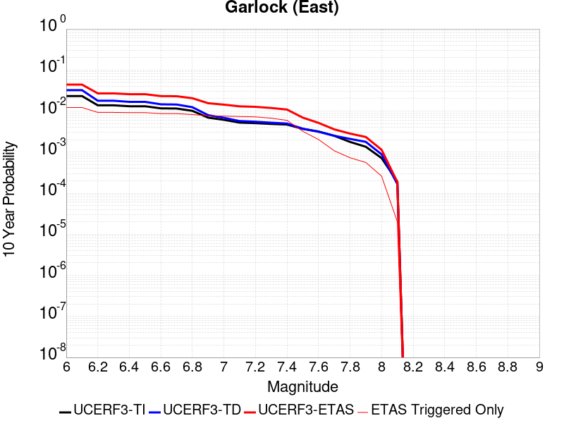 |

| Magnitude | 1 wk TI Prob | 1 wk TD Prob | 1 wk ETAS Prob | 1 wk ETAS/TD Gain | 1 wk ETAS Triggered Only | 1 mo TI Prob | 1 mo TD Prob | 1 mo ETAS Prob | 1 mo ETAS/TD Gain | 1 mo ETAS Triggered Only | 1 yr TI Prob | 1 yr TD Prob | 1 yr ETAS Prob | 1 yr ETAS/TD Gain | 1 yr ETAS Triggered Only | 10 yr TI Prob | 10 yr TD Prob | 10 yr ETAS Prob | 10 yr ETAS/TD Gain | 10 yr ETAS Triggered Only |
|-----|-----|-----|-----|-----|-----|-----|-----|-----|-----|-----|-----|-----|-----|-----|-----|-----|-----|-----|-----|-----|
| 6.0 | 4.5092507E-5 | 6.2904815E-5 | 0.008972344 | 142.63365 | 0.00891 | 1.9323928E-4 | 2.6956675E-4 | 0.010336853 | 38.346172 | 0.01007 | 0.0023501497 | 0.003277482 | 0.014759725 | 4.5033736 | 0.01152 | 0.023254504 | 0.03235377 | 0.04419776 | 1.3660775 | 0.01224 |
| 6.1 | 4.5092507E-5 | 6.2904815E-5 | 0.008972344 | 142.63365 | 0.00891 | 1.9323928E-4 | 2.6956675E-4 | 0.010336853 | 38.346172 | 0.01007 | 0.0023501497 | 0.003277482 | 0.014759725 | 4.5033736 | 0.01152 | 0.023254504 | 0.03235377 | 0.04419776 | 1.3660775 | 0.01224 |
| 6.2 | 2.6674514E-5 | 3.4511588E-5 | 0.006994271 | 202.66443 | 0.00696 | 1.1431433E-4 | 1.4789861E-4 | 0.007976741 | 53.933846 | 0.00783 | 0.0013908884 | 0.0017992114 | 0.010603342 | 5.8933277 | 0.00882 | 0.01382215 | 0.017872788 | 0.02699675 | 1.5104946 | 0.00929 |
| 6.3 | 2.6674514E-5 | 3.4511588E-5 | 0.006994271 | 202.66443 | 0.00696 | 1.1431433E-4 | 1.4789861E-4 | 0.007976741 | 53.933846 | 0.00783 | 0.0013908884 | 0.0017992114 | 0.010603342 | 5.8933277 | 0.00882 | 0.01382215 | 0.017872788 | 0.02699675 | 1.5104946 | 0.00929 |
| 6.4 | 2.5312667E-5 | 3.2340467E-5 | 0.006902118 | 213.42047 | 0.00687 | 1.0847834E-4 | 1.3859481E-4 | 0.007857525 | 56.69422 | 0.00772 | 0.0013199237 | 0.0016861152 | 0.010371446 | 6.1510897 | 0.0087 | 0.013121112 | 0.016772287 | 0.025788484 | 1.5375652 | 0.00917 |
| 6.5 | 2.5312667E-5 | 3.2340467E-5 | 0.006902118 | 213.42047 | 0.00687 | 1.0847834E-4 | 1.3859481E-4 | 0.007857525 | 56.69422 | 0.00772 | 0.0013199237 | 0.0016861152 | 0.010371446 | 6.1510897 | 0.0087 | 0.013121112 | 0.016772287 | 0.025788484 | 1.5375652 | 0.00917 |
| 6.6 | 2.246556E-5 | 2.8134691E-5 | 0.006567951 | 233.4467 | 0.00654 | 9.627742E-5 | 1.2057181E-4 | 0.0074596866 | 61.869244 | 0.00734 | 0.0011715472 | 0.0014669969 | 0.009704894 | 6.615484 | 0.00825 | 0.011653901 | 0.014613169 | 0.02317618 | 1.5859791 | 0.00869 |
| 6.7 | 2.2241198E-5 | 2.7804432E-5 | 0.0065676225 | 236.20776 | 0.00654 | 9.531594E-5 | 1.1915654E-4 | 0.007448283 | 62.50839 | 0.00733 | 0.0011598538 | 0.0014497889 | 0.009677842 | 6.675346 | 0.00824 | 0.011538187 | 0.014442829 | 0.022997465 | 1.5923103 | 0.00868 |
| 6.8 | 1.9528685E-5 | 2.3898969E-5 | 0.0062237508 | 260.41922 | 0.0062 | 8.369167E-5 | 1.0242024E-4 | 0.0070617073 | 68.94836 | 0.00696 | 0.0010184698 | 0.0012462728 | 0.009036552 | 7.250862 | 0.0078 | 0.010138147 | 0.012436723 | 0.02056437 | 1.6535199 | 0.00823 |
| 6.9 | 1.3318621E-5 | 1.5198818E-5 | 0.00586511 | 385.8925 | 0.00585 | 5.7078556E-5 | 6.51362E-5 | 0.006594711 | 101.24494 | 0.00653 | 6.9470983E-4 | 7.927504E-4 | 0.008056987 | 10.163334 | 0.00727 | 0.0069254204 | 0.007940721 | 0.015549815 | 1.9582373 | 0.00767 |
| 7.0 | 1.1760853E-5 | 1.3107653E-5 | 0.005783032 | 441.1951 | 0.00577 | 5.0402683E-5 | 5.6174475E-5 | 0.006495813 | 115.63638 | 0.00644 | 6.134799E-4 | 6.8371464E-4 | 0.007828826 | 11.45043 | 0.00715 | 0.0061178906 | 0.006857401 | 0.014345696 | 2.092002 | 0.00754 |
| 7.1 | 1.0064758E-5 | 1.0902761E-5 | 0.0056608412 | 519.21173 | 0.00565 | 4.3133965E-5 | 4.67253E-5 | 0.0063564302 | 136.0383 | 0.00631 | 5.2502943E-4 | 5.6873553E-4 | 0.00755476 | 13.283432 | 0.00699 | 0.005237907 | 0.0057133473 | 0.01304124 | 2.2825918 | 0.00737 |
| 7.2 | 9.768808E-6 | 1.0498628E-5 | 0.0055504404 | 528.68243 | 0.00554 | 4.186565E-5 | 4.499337E-5 | 0.006224715 | 138.3474 | 0.00618 | 5.095951E-4 | 5.4766005E-4 | 0.007403903 | 13.519158 | 0.00686 | 0.0050842804 | 0.005503584 | 0.012703738 | 2.3082664 | 0.00724 |
| 7.3 | 9.344516E-6 | 9.9442705E-6 | 0.0051298933 | 515.8642 | 0.00512 | 4.004731E-5 | 4.2617627E-5 | 0.005782373 | 135.68031 | 0.00574 | 4.8746695E-4 | 5.187495E-4 | 0.0068754503 | 13.253892 | 0.00636 | 0.0048639905 | 0.005215269 | 0.0118902745 | 2.2798967 | 0.00671 |
| 7.4 | 9.023491E-6 | 9.490441E-6 | 0.004489448 | 473.04944 | 0.00448 | 3.867153E-5 | 4.0672705E-5 | 0.005100467 | 125.4027 | 0.00506 | 4.7072413E-4 | 4.95081E-4 | 0.0060923086 | 12.30568 | 0.0056 | 0.004697283 | 0.0049787266 | 0.010899103 | 2.1891346 | 0.00595 |
| 7.5 | 7.081253E-6 | 7.0873994E-6 | 0.0023970704 | 338.21582 | 0.00239 | 3.0347876E-5 | 3.0374218E-5 | 0.0027302923 | 89.88847 | 0.0027 | 3.6942272E-4 | 3.697441E-4 | 0.0033986238 | 9.191827 | 0.00303 | 0.003688092 | 0.0037244745 | 0.0069324817 | 1.8613315 | 0.00322 |
| 7.6 | 6.116396E-6 | 5.9589424E-6 | 0.00150595 | 252.72102 | 0.0015 | 2.6212863E-5 | 2.5538076E-5 | 0.0017354944 | 67.95713 | 0.00171 | 3.1909486E-4 | 3.1088197E-4 | 0.0022202882 | 7.1419005 | 0.00191 | 0.0031863707 | 0.0031359126 | 0.0051595466 | 1.6453094 | 0.00203 |
| 7.7 | 4.797145E-6 | 4.7571157E-6 | 7.647535E-4 | 160.75992 | 7.6E-4 | 2.055903E-5 | 2.0387479E-5 | 9.0036954E-4 | 44.16287 | 8.8E-4 | 2.5027743E-4 | 2.481894E-4 | 0.0012379437 | 4.987899 | 9.9E-4 | 0.0024999576 | 0.0025094065 | 0.0035866965 | 1.4293007 | 0.00108 |
| 7.8 | 3.4028885E-6 | 3.978375E-6 | 5.439762E-4 | 136.73328 | 5.4E-4 | 1.4583726E-5 | 1.7050066E-5 | 6.370395E-4 | 37.362873 | 6.2E-4 | 1.775424E-4 | 2.0756487E-4 | 8.774258E-4 | 4.2272367 | 6.7E-4 | 0.0017740062 | 0.0021012141 | 0.0028296802 | 1.3466882 | 7.3E-4 |
| 7.9 | 2.5928412E-6 | 3.372436E-6 | 3.9337113E-4 | 116.64302 | 3.9E-4 | 1.1112129E-5 | 1.4453217E-5 | 4.844464E-4 | 33.51824 | 4.7E-4 | 1.3528178E-4 | 1.7595377E-4 | 6.85864E-4 | 3.8979785 | 5.1E-4 | 0.0013519945 | 0.0017812426 | 0.002340245 | 1.3138273 | 5.6E-4 |
| 8.0 | 1.3743648E-6 | 1.6734741E-6 | 1.716732E-4 | 102.584915 | 1.7E-4 | 5.8901214E-6 | 7.1720124E-6 | 2.2717043E-4 | 31.674574 | 2.2E-4 | 7.1709874E-5 | 8.731578E-5 | 3.272948E-4 | 3.748404 | 2.4E-4 | 7.1686733E-4 | 8.837377E-4 | 0.0011435079 | 1.293945 | 2.6E-4 |
| 8.1 | 3.6733252E-7 | 3.1489736E-7 | 2.031489E-5 | 64.51273 | 2.0E-5 | 1.5742813E-6 | 1.3495595E-6 | 2.1349533E-5 | 15.81963 | 2.0E-5 | 1.9166706E-5 | 1.643078E-5 | 3.643045E-5 | 2.2172077 | 2.0E-5 | 1.9165053E-4 | 1.662928E-4 | 1.8628947E-4 | 1.1202497 | 2.0E-5 |

## Hunter Mountain-Saline Valley
*[(top)](#table-of-contents)*

| 1 Week | 1 Month | 1 Year | 10 Year |
|-----|-----|-----|-----|
|  |  |  |  |

| Magnitude | 1 wk TI Prob | 1 wk TD Prob | 1 wk ETAS Prob | 1 wk ETAS/TD Gain | 1 wk ETAS Triggered Only | 1 mo TI Prob | 1 mo TD Prob | 1 mo ETAS Prob | 1 mo ETAS/TD Gain | 1 mo ETAS Triggered Only | 1 yr TI Prob | 1 yr TD Prob | 1 yr ETAS Prob | 1 yr ETAS/TD Gain | 1 yr ETAS Triggered Only | 10 yr TI Prob | 10 yr TD Prob | 10 yr ETAS Prob | 10 yr ETAS/TD Gain | 10 yr ETAS Triggered Only |
|-----|-----|-----|-----|-----|-----|-----|-----|-----|-----|-----|-----|-----|-----|-----|-----|-----|-----|-----|-----|-----|
| 6.0 | 4.5103672E-5 | 5.456906E-5 | 0.0058942502 | 108.01451 | 0.00584 | 1.9328714E-4 | 2.3384714E-4 | 0.0065523693 | 28.019882 | 0.00632 | 0.002350731 | 0.0028435462 | 0.009963243 | 3.5038092 | 0.00714 | 0.023260195 | 0.028092625 | 0.035362493 | 1.258782 | 0.00748 |
| 6.1 | 4.5103672E-5 | 5.456906E-5 | 0.0058942502 | 108.01451 | 0.00584 | 1.9328714E-4 | 2.3384714E-4 | 0.0065523693 | 28.019882 | 0.00632 | 0.002350731 | 0.0028435462 | 0.009963243 | 3.5038092 | 0.00714 | 0.023260195 | 0.028092625 | 0.035362493 | 1.258782 | 0.00748 |
| 6.2 | 3.9363465E-5 | 4.706271E-5 | 0.005886788 | 125.083916 | 0.00584 | 1.6868966E-4 | 2.016826E-4 | 0.006500412 | 32.2309 | 0.0063 | 0.002051862 | 0.0024528534 | 0.009555389 | 3.8956218 | 0.00712 | 0.020330196 | 0.024274187 | 0.0315531 | 1.2998624 | 0.00746 |
| 6.3 | 3.9363465E-5 | 4.706271E-5 | 0.005886788 | 125.083916 | 0.00584 | 1.6868966E-4 | 2.016826E-4 | 0.006500412 | 32.2309 | 0.0063 | 0.002051862 | 0.0024528534 | 0.009555389 | 3.8956218 | 0.00712 | 0.020330196 | 0.024274187 | 0.0315531 | 1.2998624 | 0.00746 |
| 6.4 | 3.2311684E-5 | 3.795112E-5 | 0.00586773 | 154.61284 | 0.00583 | 1.384713E-4 | 1.6263791E-4 | 0.006451615 | 39.66858 | 0.00629 | 0.0016845843 | 0.001978387 | 0.00906434 | 4.581682 | 0.0071 | 0.016718714 | 0.019617118 | 0.026911167 | 1.3718206 | 0.00744 |
| 6.5 | 3.2311684E-5 | 3.795112E-5 | 0.00586773 | 154.61284 | 0.00583 | 1.384713E-4 | 1.6263791E-4 | 0.006451615 | 39.66858 | 0.00629 | 0.0016845843 | 0.001978387 | 0.00906434 | 4.581682 | 0.0071 | 0.016718714 | 0.019617118 | 0.026911167 | 1.3718206 | 0.00744 |
| 6.6 | 2.9305844E-5 | 3.418196E-5 | 0.0058439835 | 170.96687 | 0.00581 | 1.2559042E-4 | 1.4648624E-4 | 0.006415568 | 43.796383 | 0.00627 | 0.0015279909 | 0.0017820727 | 0.008849456 | 4.965822 | 0.00708 | 0.015175272 | 0.017686324 | 0.024975091 | 1.4121132 | 0.00742 |
| 6.7 | 2.7826512E-5 | 3.2344353E-5 | 0.005822157 | 180.00536 | 0.00579 | 1.19251024E-4 | 1.3861163E-4 | 0.0063877455 | 46.08376 | 0.00625 | 0.0014509142 | 0.0016863506 | 0.008734445 | 5.1794953 | 0.00706 | 0.014414776 | 0.016743818 | 0.024019914 | 1.4345541 | 0.0074 |
| 6.8 | 2.3389874E-5 | 2.6866792E-5 | 0.005796712 | 215.7575 | 0.00577 | 1.0023846E-4 | 1.1513857E-4 | 0.0063444213 | 55.10248 | 0.00623 | 0.00121972 | 0.001400958 | 0.008431096 | 6.0180926 | 0.00704 | 0.01213047 | 0.013928067 | 0.021195417 | 1.5217774 | 0.00737 |
| 6.9 | 2.069209E-5 | 2.357011E-5 | 0.005793434 | 245.7958 | 0.00577 | 8.867737E-5 | 1.0101105E-4 | 0.0063303816 | 62.670193 | 0.00623 | 0.0010791123 | 0.0012291519 | 0.008260499 | 6.7204866 | 0.00704 | 0.010738871 | 0.012229158 | 0.019509029 | 1.595288 | 0.00737 |
| 7.0 | 1.7462342E-5 | 1.9633622E-5 | 0.0057695205 | 293.8592 | 0.00575 | 7.483646E-5 | 8.414151E-5 | 0.006293619 | 74.79803 | 0.00621 | 9.1075303E-4 | 0.0010239641 | 0.008026786 | 7.838933 | 0.00701 | 0.009070295 | 0.010196688 | 0.017461844 | 1.7125016 | 0.00734 |
| 7.1 | 1.4807709E-5 | 1.6441827E-5 | 0.0057563474 | 350.10388 | 0.00574 | 6.3460066E-5 | 7.046316E-5 | 0.0062700263 | 88.98304 | 0.0062 | 7.723524E-4 | 8.575678E-4 | 0.007851565 | 9.15562 | 0.007 | 0.007696735 | 0.008546168 | 0.015813524 | 1.8503643 | 0.00733 |
| 7.2 | 1.4180048E-5 | 1.5698413E-5 | 0.0057556084 | 366.63632 | 0.00574 | 6.077022E-5 | 6.727727E-5 | 0.0062668603 | 93.14974 | 0.0062 | 7.396263E-4 | 8.1880915E-4 | 0.007813077 | 9.542001 | 0.007 | 0.0073716943 | 0.008161469 | 0.015431646 | 1.8907926 | 0.00733 |
| 7.3 | 1.3730402E-5 | 1.5172151E-5 | 0.005755085 | 379.319 | 0.00574 | 5.8843252E-5 | 6.502197E-5 | 0.006264619 | 96.34618 | 0.0062 | 7.161811E-4 | 7.9137104E-4 | 0.0077858316 | 9.838408 | 0.007 | 0.007138774 | 0.007889058 | 0.015161231 | 1.921805 | 0.00733 |
| 7.4 | 1.2810095E-5 | 1.4109353E-5 | 0.005704029 | 404.2729 | 0.00569 | 5.489925E-5 | 6.0467344E-5 | 0.0062100952 | 102.70164 | 0.00615 | 6.681934E-4 | 7.3595706E-4 | 0.0076708496 | 10.422958 | 0.00694 | 0.006661878 | 0.0073386896 | 0.014555337 | 1.9833701 | 0.00727 |
| 7.5 | 1.1595659E-5 | 1.2800734E-5 | 0.005642729 | 440.8129 | 0.00563 | 4.9694736E-5 | 5.485922E-5 | 0.006134526 | 111.82305 | 0.00608 | 6.0486543E-4 | 6.67722E-4 | 0.0074931616 | 11.221977 | 0.00683 | 0.006032217 | 0.006660632 | 0.013772942 | 2.0678132 | 0.00716 |
| 7.6 | 2.997694E-6 | 3.3251877E-6 | 0.002463317 | 740.8054 | 0.00246 | 1.28471975E-5 | 1.4250767E-5 | 0.0027542117 | 193.26761 | 0.00274 | 1.564034E-4 | 1.7349655E-4 | 0.0032729588 | 18.86469 | 0.0031 | 0.0015629337 | 0.0017356955 | 0.0049501066 | 2.8519442 | 0.00322 |

## Garlock (West)
*[(top)](#table-of-contents)*

| 1 Week | 1 Month | 1 Year | 10 Year |
|-----|-----|-----|-----|
| 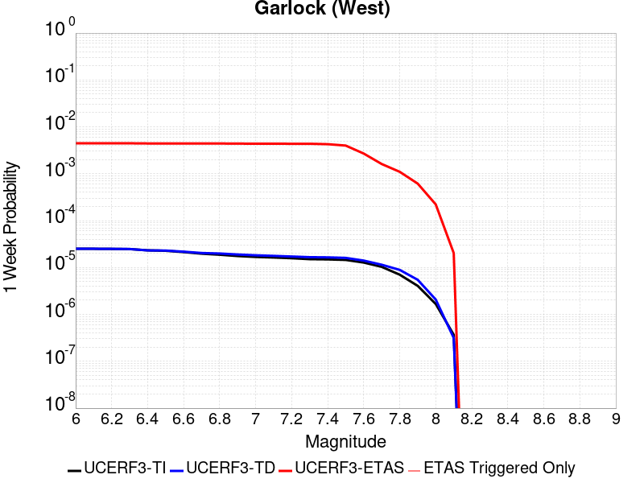 |  |  |  |

| Magnitude | 1 wk TI Prob | 1 wk TD Prob | 1 wk ETAS Prob | 1 wk ETAS/TD Gain | 1 wk ETAS Triggered Only | 1 mo TI Prob | 1 mo TD Prob | 1 mo ETAS Prob | 1 mo ETAS/TD Gain | 1 mo ETAS Triggered Only | 1 yr TI Prob | 1 yr TD Prob | 1 yr ETAS Prob | 1 yr ETAS/TD Gain | 1 yr ETAS Triggered Only | 10 yr TI Prob | 10 yr TD Prob | 10 yr ETAS Prob | 10 yr ETAS/TD Gain | 10 yr ETAS Triggered Only |
|-----|-----|-----|-----|-----|-----|-----|-----|-----|-----|-----|-----|-----|-----|-----|-----|-----|-----|-----|-----|-----|
| 6.0 | 2.5181727E-5 | 2.5197181E-5 | 0.0044650855 | 177.20575 | 0.00444 | 1.0791722E-4 | 1.0798347E-4 | 0.0051374403 | 47.57617 | 0.00503 | 0.0013131002 | 0.0013139093 | 0.0068366434 | 5.2032843 | 0.00553 | 0.013053683 | 0.013141794 | 0.018855704 | 1.4347891 | 0.00579 |
| 6.1 | 2.5077732E-5 | 2.5098223E-5 | 0.0044649867 | 177.90051 | 0.00444 | 1.0747157E-4 | 1.075594E-4 | 0.0051370184 | 47.759827 | 0.00503 | 0.001307681 | 0.0013087525 | 0.006831515 | 5.219868 | 0.00553 | 0.013000126 | 0.013090835 | 0.01880504 | 1.4365041 | 0.00579 |
| 6.2 | 2.494612E-5 | 2.4979914E-5 | 0.0044548693 | 178.33804 | 0.00443 | 1.0690756E-4 | 1.070524E-4 | 0.005126515 | 47.8879 | 0.00502 | 0.0013008224 | 0.0013025872 | 0.0068153967 | 5.2322 | 0.00552 | 0.012932341 | 0.013029906 | 0.018734593 | 1.437815 | 0.00578 |
| 6.3 | 2.4733758E-5 | 2.4799276E-5 | 0.0044546896 | 179.6298 | 0.00443 | 1.0599751E-4 | 1.06278305E-4 | 0.0051257447 | 48.229458 | 0.00502 | 0.0012897556 | 0.0012931736 | 0.0068060355 | 5.263048 | 0.00552 | 0.012822957 | 0.0129368715 | 0.018642096 | 1.441005 | 0.00578 |
| 6.4 | 2.3237335E-5 | 2.3178607E-5 | 0.0044230768 | 190.8258 | 0.0044 | 9.958477E-5 | 9.933313E-5 | 0.0050788387 | 51.129353 | 0.00498 | 0.0012117702 | 0.0012087126 | 0.006682089 | 5.5282693 | 0.00548 | 0.012051838 | 0.012101731 | 0.017772267 | 1.4685723 | 0.00574 |
| 6.5 | 2.2732203E-5 | 2.2992977E-5 | 0.004422892 | 192.35838 | 0.0044 | 9.742009E-5 | 9.8537625E-5 | 0.005078047 | 51.534092 | 0.00498 | 0.0011854442 | 0.0011990381 | 0.0066724676 | 5.5648503 | 0.00548 | 0.011791403 | 0.012006035 | 0.01767712 | 1.4723529 | 0.00574 |
| 6.6 | 2.1319436E-5 | 2.1773201E-5 | 0.0044216774 | 203.07887 | 0.0044 | 9.136581E-5 | 9.3310395E-5 | 0.0050728456 | 54.36528 | 0.00498 | 0.001111811 | 0.0011354643 | 0.006609242 | 5.8207393 | 0.00548 | 0.011062649 | 0.011376952 | 0.017051648 | 1.4987888 | 0.00574 |
| 6.7 | 1.970802E-5 | 2.0393094E-5 | 0.0044203033 | 216.75491 | 0.0044 | 8.446021E-5 | 8.739606E-5 | 0.005066961 | 57.976994 | 0.00498 | 0.001027818 | 0.0010635294 | 0.006537701 | 6.1471753 | 0.00548 | 0.010230771 | 0.0106646875 | 0.016343473 | 1.5324849 | 0.00574 |
| 6.8 | 1.8744462E-5 | 1.9900775E-5 | 0.0044098133 | 221.59004 | 0.00439 | 8.033094E-5 | 8.528626E-5 | 0.0050548622 | 59.269367 | 0.00497 | 9.775903E-4 | 0.0010378672 | 0.00650219 | 6.2649536 | 0.00547 | 0.009733009 | 0.010410495 | 0.016080843 | 1.5446761 | 0.00573 |
| 6.9 | 1.7559682E-5 | 1.8953151E-5 | 0.00438887 | 231.56415 | 0.00437 | 7.5253614E-5 | 8.122527E-5 | 0.0050308234 | 61.936676 | 0.00495 | 9.158276E-4 | 9.884704E-4 | 0.006433083 | 6.508119 | 0.00545 | 0.0091206245 | 0.009921073 | 0.015574424 | 1.5698326 | 0.00571 |
| 7.0 | 1.6794445E-5 | 1.8215967E-5 | 0.0043681366 | 239.79712 | 0.00435 | 7.197421E-5 | 7.806611E-5 | 0.0050076814 | 64.146675 | 0.00493 | 8.759337E-4 | 9.5004175E-4 | 0.006374883 | 6.7101083 | 0.00543 | 0.008724891 | 0.009539958 | 0.015175676 | 1.5907487 | 0.00569 |
| 7.1 | 1.6337795E-5 | 1.771677E-5 | 0.00436764 | 246.52574 | 0.00435 | 7.0017246E-5 | 7.592681E-5 | 0.0049955533 | 65.79433 | 0.00492 | 8.521265E-4 | 9.2401815E-4 | 0.00633901 | 6.8602653 | 0.00542 | 0.008488664 | 0.009281721 | 0.014909001 | 1.6062754 | 0.00568 |
| 7.2 | 1.5780008E-5 | 1.71654E-5 | 0.0043570907 | 253.82986 | 0.00434 | 6.762685E-5 | 7.3563926E-5 | 0.0049832026 | 67.73976 | 0.00491 | 8.2304585E-4 | 8.952741E-4 | 0.0063004307 | 7.037432 | 0.00541 | 0.008200042 | 0.008996559 | 0.014605639 | 1.6234694 | 0.00566 |
| 7.3 | 1.5058865E-5 | 1.6618484E-5 | 0.0043565463 | 262.15067 | 0.00434 | 6.45364E-5 | 7.122013E-5 | 0.0049808705 | 69.93627 | 0.00491 | 7.854473E-4 | 8.667614E-4 | 0.006272072 | 7.2362156 | 0.00541 | 0.00782677 | 0.008713263 | 0.014323946 | 1.6439245 | 0.00566 |
| 7.4 | 1.4887923E-5 | 1.6454453E-5 | 0.0042663845 | 259.28452 | 0.00425 | 6.380382E-5 | 7.0517184E-5 | 0.0048901774 | 69.34731 | 0.00482 | 7.7653467E-4 | 8.5820974E-4 | 0.006173644 | 7.193631 | 0.00532 | 0.0077382675 | 0.008628101 | 0.014150043 | 1.639995 | 0.00557 |
| 7.5 | 1.4509299E-5 | 1.6046468E-5 | 0.003985983 | 248.4025 | 0.00397 | 6.218123E-5 | 6.876877E-5 | 0.0045684595 | 66.432175 | 0.0045 | 7.567935E-4 | 8.369394E-4 | 0.005792788 | 6.9213953 | 0.00496 | 0.0075422134 | 0.008416411 | 0.013572645 | 1.6126406 | 0.0052 |
| 7.6 | 1.2756717E-5 | 1.4050529E-5 | 0.0026940128 | 191.73747 | 0.00268 | 5.4670498E-5 | 6.0215163E-5 | 0.0031100316 | 51.648643 | 0.00305 | 6.6541E-4 | 7.328737E-4 | 0.0040804185 | 5.567697 | 0.00335 | 0.006634211 | 0.007381374 | 0.010875392 | 1.473356 | 0.00352 |
| 7.7 | 1.0328985E-5 | 1.146033E-5 | 0.001611442 | 140.61043 | 0.0016 | 4.4266326E-5 | 4.9114777E-5 | 0.0018690254 | 38.054237 | 0.00182 | 5.388092E-4 | 5.9780874E-4 | 0.002586619 | 4.3268337 | 0.00199 | 0.0053750467 | 0.006038286 | 0.008135545 | 1.3473269 | 0.00211 |
| 7.8 | 7.0306583E-6 | 8.899537E-6 | 0.0010988899 | 123.477196 | 0.00109 | 3.0131043E-5 | 3.8140315E-5 | 0.0012580937 | 32.98593 | 0.00122 | 3.667837E-4 | 4.6425956E-4 | 0.0017836468 | 3.8419173 | 0.00132 | 0.003661789 | 0.0046950667 | 0.0060984464 | 1.2989053 | 0.00141 |
| 7.9 | 4.060633E-6 | 5.465412E-6 | 6.154621E-4 | 112.61037 | 6.1E-4 | 1.7402595E-5 | 2.3422985E-5 | 7.234066E-4 | 30.884476 | 7.0E-4 | 2.11856E-4 | 2.8513762E-4 | 0.0010349237 | 3.6295588 | 7.5E-4 | 0.0021165414 | 0.002884143 | 0.003691807 | 1.280036 | 8.1E-4 |
| 8.0 | 1.6729537E-6 | 2.0775192E-6 | 2.2207707E-4 | 106.89531 | 2.2E-4 | 7.169782E-6 | 8.903624E-6 | 2.7890122E-4 | 31.324461 | 2.7E-4 | 8.7288594E-5 | 1.0839626E-4 | 3.9836482E-4 | 3.675079 | 2.9E-4 | 8.7254314E-4 | 0.001096854 | 0.001406514 | 1.2823164 | 3.1E-4 |
| 8.1 | 3.6733252E-7 | 3.1489736E-7 | 2.031489E-5 | 64.51273 | 2.0E-5 | 1.5742813E-6 | 1.3495595E-6 | 2.1349533E-5 | 15.81963 | 2.0E-5 | 1.9166706E-5 | 1.643078E-5 | 3.643045E-5 | 2.2172077 | 2.0E-5 | 1.9165053E-4 | 1.662928E-4 | 1.8628947E-4 | 1.1202497 | 2.0E-5 |

## Blackwater
*[(top)](#table-of-contents)*

| 1 Week | 1 Month | 1 Year | 10 Year |
|-----|-----|-----|-----|
|  | 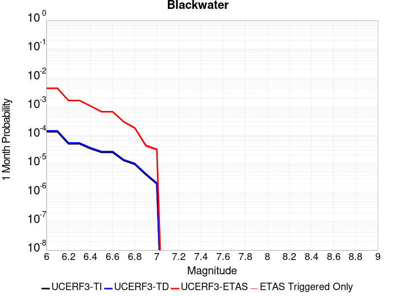 |  |  |

| Magnitude | 1 wk TI Prob | 1 wk TD Prob | 1 wk ETAS Prob | 1 wk ETAS/TD Gain | 1 wk ETAS Triggered Only | 1 mo TI Prob | 1 mo TD Prob | 1 mo ETAS Prob | 1 mo ETAS/TD Gain | 1 mo ETAS Triggered Only | 1 yr TI Prob | 1 yr TD Prob | 1 yr ETAS Prob | 1 yr ETAS/TD Gain | 1 yr ETAS Triggered Only | 10 yr TI Prob | 10 yr TD Prob | 10 yr ETAS Prob | 10 yr ETAS/TD Gain | 10 yr ETAS Triggered Only |
|-----|-----|-----|-----|-----|-----|-----|-----|-----|-----|-----|-----|-----|-----|-----|-----|-----|-----|-----|-----|-----|
| 6.0 | 3.0708583E-5 | 3.3095846E-5 | 0.0035829784 | 108.26066 | 0.00355 | 1.3160157E-4 | 1.4183241E-4 | 0.0043012425 | 30.326231 | 0.00416 | 0.0016010714 | 0.0017255784 | 0.0066470713 | 3.852083 | 0.00493 | 0.015895851 | 0.017135633 | 0.0223743 | 1.3057177 | 0.00533 |
| 6.1 | 3.0708583E-5 | 3.3095846E-5 | 0.0035829784 | 108.26066 | 0.00355 | 1.3160157E-4 | 1.4183241E-4 | 0.0043012425 | 30.326231 | 0.00416 | 0.0016010714 | 0.0017255784 | 0.0066470713 | 3.852083 | 0.00493 | 0.015895851 | 0.017135633 | 0.0223743 | 1.3057177 | 0.00533 |
| 6.2 | 1.1707779E-5 | 1.2545122E-5 | 0.0013525283 | 107.81309 | 0.00134 | 5.017523E-5 | 5.3763757E-5 | 0.0016136799 | 30.01427 | 0.00156 | 6.107122E-4 | 6.5438676E-4 | 0.0024432153 | 3.7335954 | 0.00179 | 0.006090366 | 0.0065255696 | 0.008423106 | 1.2907847 | 0.00191 |
| 6.3 | 1.1707779E-5 | 1.2545122E-5 | 0.0013525283 | 107.81309 | 0.00134 | 5.017523E-5 | 5.3763757E-5 | 0.0016136799 | 30.01427 | 0.00156 | 6.107122E-4 | 6.5438676E-4 | 0.0024432153 | 3.7335954 | 0.00179 | 0.006090366 | 0.0065255696 | 0.008423106 | 1.2907847 | 0.00191 |
| 6.4 | 7.929244E-6 | 8.480098E-6 | 8.784727E-4 | 103.592285 | 8.7E-4 | 3.3982033E-5 | 3.6342793E-5 | 0.0010363065 | 28.51477 | 0.001 | 4.136527E-4 | 4.423877E-4 | 0.0016018746 | 3.6209743 | 0.00116 | 0.0041288356 | 0.0044154758 | 0.005640045 | 1.2773356 | 0.00123 |
| 6.5 | 5.8832115E-6 | 6.285991E-6 | 5.762824E-4 | 91.67726 | 5.7E-4 | 2.521352E-5 | 2.6939697E-5 | 6.569227E-4 | 24.384933 | 6.3E-4 | 3.0693135E-4 | 3.27944E-4 | 0.0010776981 | 3.2862258 | 7.5E-4 | 0.0030650778 | 0.0032748538 | 0.0040622666 | 1.2404422 | 7.9E-4 |
| 6.6 | 5.8832115E-6 | 6.285991E-6 | 5.762824E-4 | 91.67726 | 5.7E-4 | 2.521352E-5 | 2.6939697E-5 | 6.569227E-4 | 24.384933 | 6.3E-4 | 3.0693135E-4 | 3.27944E-4 | 0.0010776981 | 3.2862258 | 7.5E-4 | 0.0030650778 | 0.0032748538 | 0.0040622666 | 1.2404422 | 7.9E-4 |
| 6.7 | 3.0715053E-6 | 3.2814662E-6 | 2.632806E-4 | 80.23261 | 2.6E-4 | 1.3163528E-5 | 1.4063357E-5 | 2.9405943E-4 | 20.909618 | 2.8E-4 | 1.6025416E-4 | 1.7120909E-4 | 4.7115772E-4 | 2.7519433 | 3.0E-4 | 0.0016013865 | 0.0017108864 | 0.0020303389 | 1.1867175 | 3.2E-4 |
| 6.8 | 2.2722281E-6 | 2.4287538E-6 | 1.5242839E-4 | 62.759922 | 1.5E-4 | 9.738084E-6 | 1.0408908E-5 | 1.8040714E-4 | 17.331995 | 1.7E-4 | 1.1855473E-4 | 1.26722E-4 | 3.066992E-4 | 2.420252 | 1.8E-4 | 0.001184915 | 0.0012665876 | 0.001456347 | 1.1498194 | 1.9E-4 |
| 6.9 | 9.952399E-7 | 1.0653489E-6 | 4.1065305E-5 | 38.546345 | 4.0E-5 | 4.265307E-6 | 4.5657757E-6 | 4.4565593E-5 | 9.760794 | 4.0E-5 | 5.1928873E-5 | 5.5587418E-5 | 1.0558464E-4 | 1.8994341 | 5.0E-5 | 5.191674E-4 | 5.557858E-4 | 6.05758E-4 | 1.0899128 | 5.0E-5 |
| 7.0 | 4.7385504E-7 | 5.0755597E-7 | 3.0507541E-5 | 60.106754 | 3.0E-5 | 2.0308057E-6 | 2.1752398E-6 | 3.2175176E-5 | 14.7915535 | 3.0E-5 | 2.4724779E-5 | 2.6483543E-5 | 5.648275E-5 | 2.1327488 | 3.0E-5 | 2.4722028E-4 | 2.6483546E-4 | 2.948275E-4 | 1.1132479 | 3.0E-5 |

## Ash Hill
*[(top)](#table-of-contents)*

| 1 Week | 1 Month | 1 Year | 10 Year |
|-----|-----|-----|-----|
|  |  |  |  |

| Magnitude | 1 wk TI Prob | 1 wk TD Prob | 1 wk ETAS Prob | 1 wk ETAS/TD Gain | 1 wk ETAS Triggered Only | 1 mo TI Prob | 1 mo TD Prob | 1 mo ETAS Prob | 1 mo ETAS/TD Gain | 1 mo ETAS Triggered Only | 1 yr TI Prob | 1 yr TD Prob | 1 yr ETAS Prob | 1 yr ETAS/TD Gain | 1 yr ETAS Triggered Only | 10 yr TI Prob | 10 yr TD Prob | 10 yr ETAS Prob | 10 yr ETAS/TD Gain | 10 yr ETAS Triggered Only |
|-----|-----|-----|-----|-----|-----|-----|-----|-----|-----|-----|-----|-----|-----|-----|-----|-----|-----|-----|-----|-----|
| 6.0 | 2.1545662E-5 | 2.3194447E-5 | 0.0029931255 | 129.04492 | 0.00297 | 9.2335285E-5 | 9.940143E-5 | 0.0035990535 | 36.20726 | 0.0035 | 0.0011236023 | 0.0012096206 | 0.005204782 | 4.302822 | 0.004 | 0.011179381 | 0.012038348 | 0.016207546 | 1.3463265 | 0.00422 |
| 6.1 | 2.1545662E-5 | 2.3194447E-5 | 0.0029931255 | 129.04492 | 0.00297 | 9.2335285E-5 | 9.940143E-5 | 0.0035990535 | 36.20726 | 0.0035 | 0.0011236023 | 0.0012096206 | 0.005204782 | 4.302822 | 0.004 | 0.011179381 | 0.012038348 | 0.016207546 | 1.3463265 | 0.00422 |
| 6.2 | 2.1545662E-5 | 2.3194447E-5 | 0.0029931255 | 129.04492 | 0.00297 | 9.2335285E-5 | 9.940143E-5 | 0.0035990535 | 36.20726 | 0.0035 | 0.0011236023 | 0.0012096206 | 0.005204782 | 4.302822 | 0.004 | 0.011179381 | 0.012038348 | 0.016207546 | 1.3463265 | 0.00422 |
| 6.3 | 1.0025529E-5 | 1.0746934E-5 | 0.001220734 | 113.589035 | 0.00121 | 4.2965847E-5 | 4.605755E-5 | 0.0014159945 | 30.744024 | 0.00137 | 5.229836E-4 | 5.6061964E-4 | 0.0021497284 | 3.8345575 | 0.00159 | 0.005217545 | 0.0055933665 | 0.0072440812 | 1.2951201 | 0.00166 |
| 6.4 | 1.0025529E-5 | 1.0746934E-5 | 0.001220734 | 113.589035 | 0.00121 | 4.2965847E-5 | 4.605755E-5 | 0.0014159945 | 30.744024 | 0.00137 | 5.229836E-4 | 5.6061964E-4 | 0.0021497284 | 3.8345575 | 0.00159 | 0.005217545 | 0.0055933665 | 0.0072440812 | 1.2951201 | 0.00166 |
| 6.5 | 6.9617327E-6 | 7.456634E-6 | 8.7745016E-4 | 117.67376 | 8.7E-4 | 2.9835655E-5 | 3.195666E-5 | 0.001021925 | 31.978468 | 9.9E-4 | 3.6318856E-4 | 3.8901155E-4 | 0.001518572 | 3.9036682 | 0.00113 | 0.0036259557 | 0.0038841602 | 0.0050396547 | 1.2974888 | 0.00116 |
| 6.6 | 4.9919777E-6 | 5.3466883E-6 | 6.6534313E-4 | 124.44024 | 6.6E-4 | 2.1394015E-5 | 2.2914215E-5 | 7.5289747E-4 | 32.857224 | 7.3E-4 | 2.60441E-4 | 2.7895154E-4 | 0.00110872 | 3.974597 | 8.3E-4 | 0.0026013597 | 0.0027866727 | 0.003634304 | 1.3041732 | 8.5E-4 |
| 6.7 | 3.6630722E-6 | 3.924624E-6 | 4.939227E-4 | 125.85224 | 4.9E-4 | 1.5698786E-5 | 1.681974E-5 | 5.5681064E-4 | 33.104595 | 5.4E-4 | 1.9111596E-4 | 2.0476682E-4 | 8.0464396E-4 | 3.929562 | 6.0E-4 | 0.0019095168 | 0.0020463446 | 0.0026650757 | 1.3023593 | 6.2E-4 |
| 6.8 | 2.5599613E-6 | 2.744925E-6 | 3.827439E-4 | 139.43692 | 3.8E-4 | 1.0971216E-5 | 1.1763939E-5 | 4.2175912E-4 | 35.85186 | 4.1E-4 | 1.3356637E-4 | 1.4322149E-4 | 6.131542E-4 | 4.2811604 | 4.7E-4 | 0.0013348613 | 0.0014317769 | 0.0019210753 | 1.341742 | 4.9E-4 |
| 6.9 | 1.7684905E-6 | 1.8968707E-6 | 2.8189633E-4 | 148.61125 | 2.8E-4 | 7.579223E-6 | 8.129446E-6 | 3.1812693E-4 | 39.13267 | 3.1E-4 | 9.2273134E-5 | 9.8976E-5 | 4.4894137E-4 | 4.5358605 | 3.5E-4 | 9.223483E-4 | 9.8976E-4 | 0.0013494038 | 1.3633646 | 3.6E-4 |

## Gravel Hills-Harper Lk
*[(top)](#table-of-contents)*

| 1 Week | 1 Month | 1 Year | 10 Year |
|-----|-----|-----|-----|
|  |  |  |  |

| Magnitude | 1 wk TI Prob | 1 wk TD Prob | 1 wk ETAS Prob | 1 wk ETAS/TD Gain | 1 wk ETAS Triggered Only | 1 mo TI Prob | 1 mo TD Prob | 1 mo ETAS Prob | 1 mo ETAS/TD Gain | 1 mo ETAS Triggered Only | 1 yr TI Prob | 1 yr TD Prob | 1 yr ETAS Prob | 1 yr ETAS/TD Gain | 1 yr ETAS Triggered Only | 10 yr TI Prob | 10 yr TD Prob | 10 yr ETAS Prob | 10 yr ETAS/TD Gain | 10 yr ETAS Triggered Only |
|-----|-----|-----|-----|-----|-----|-----|-----|-----|-----|-----|-----|-----|-----|-----|-----|-----|-----|-----|-----|-----|
| 6.0 | 3.0679566E-5 | 3.1464628E-5 | 0.0021913967 | 69.64636 | 0.00216 | 1.3147724E-4 | 1.3484266E-4 | 0.002534519 | 18.796124 | 0.0024 | 0.0015995599 | 0.00164069 | 0.004466047 | 2.722054 | 0.00283 | 0.015880952 | 0.016307337 | 0.019317437 | 1.1845856 | 0.00306 |
| 6.1 | 3.0679566E-5 | 3.1464628E-5 | 0.0021913967 | 69.64636 | 0.00216 | 1.3147724E-4 | 1.3484266E-4 | 0.002534519 | 18.796124 | 0.0024 | 0.0015995599 | 0.00164069 | 0.004466047 | 2.722054 | 0.00283 | 0.015880952 | 0.016307337 | 0.019317437 | 1.1845856 | 0.00306 |
| 6.2 | 1.514536E-5 | 1.36352E-5 | 5.8362744E-4 | 42.802998 | 5.7E-4 | 6.490707E-5 | 5.843533E-5 | 7.283962E-4 | 12.464996 | 6.7E-4 | 7.8995706E-4 | 7.112298E-4 | 0.0015106609 | 2.1240122 | 8.0E-4 | 0.007871548 | 0.007090737 | 0.007944639 | 1.120425 | 8.6E-4 |
| 6.3 | 1.514536E-5 | 1.36352E-5 | 5.8362744E-4 | 42.802998 | 5.7E-4 | 6.490707E-5 | 5.843533E-5 | 7.283962E-4 | 12.464996 | 6.7E-4 | 7.8995706E-4 | 7.112298E-4 | 0.0015106609 | 2.1240122 | 8.0E-4 | 0.007871548 | 0.007090737 | 0.007944639 | 1.120425 | 8.6E-4 |
| 6.4 | 1.2532521E-5 | 1.0689684E-5 | 4.106854E-4 | 38.418854 | 4.0E-4 | 5.37097E-5 | 4.581216E-5 | 5.1579066E-4 | 11.258815 | 4.7E-4 | 6.537194E-4 | 5.5762613E-4 | 0.0010873306 | 1.9499276 | 5.3E-4 | 0.0065179965 | 0.005562859 | 0.006139633 | 1.1036829 | 5.8E-4 |
| 6.5 | 1.1094058E-5 | 9.083657E-6 | 3.0908093E-4 | 34.026047 | 3.0E-4 | 4.7545094E-5 | 3.89294E-5 | 3.7891616E-4 | 9.733419 | 3.4E-4 | 5.787078E-4 | 4.7386638E-4 | 8.636816E-4 | 1.8226268 | 3.9E-4 | 0.0057720304 | 0.004728967 | 0.005127075 | 1.0841851 | 4.0E-4 |
| 6.6 | 9.688328E-6 | 7.531688E-6 | 2.4752988E-4 | 32.865128 | 2.4E-4 | 4.1520743E-5 | 3.227828E-5 | 2.922699E-4 | 9.054692 | 2.6E-4 | 5.053978E-4 | 3.9291973E-4 | 6.828058E-4 | 1.7377743 | 2.9E-4 | 0.0050424994 | 0.0039225067 | 0.0042113694 | 1.0736423 | 2.9E-4 |
| 6.7 | 8.974824E-6 | 6.749406E-6 | 1.7674826E-4 | 26.187231 | 1.7E-4 | 3.8462964E-5 | 2.8925719E-5 | 2.1892022E-4 | 7.5683594 | 1.9E-4 | 4.6818596E-4 | 3.5211592E-4 | 5.7203847E-4 | 1.6245743 | 2.2E-4 | 0.004672008 | 0.003515801 | 0.0037350275 | 1.0623547 | 2.2E-4 |
| 6.8 | 7.4780046E-6 | 5.1161865E-6 | 8.5115775E-5 | 16.636566 | 8.0E-5 | 3.20482E-5 | 2.1926337E-5 | 1.0192458E-4 | 4.6485004 | 8.0E-5 | 3.9011694E-4 | 2.6692182E-4 | 3.7689248E-4 | 1.4119956 | 1.1E-4 | 0.0038943281 | 0.0026661505 | 0.0027758572 | 1.041148 | 1.1E-4 |
| 6.9 | 6.3409307E-6 | 3.907489E-6 | 4.3907334E-5 | 11.236713 | 4.0E-5 | 2.7175134E-5 | 1.674628E-5 | 5.6745608E-5 | 3.3885503 | 4.0E-5 | 3.3080703E-4 | 2.0386786E-4 | 2.738536E-4 | 1.3432896 | 7.0E-5 | 0.0033031502 | 0.0020369065 | 0.0021067641 | 1.0342958 | 7.0E-5 |
| 7.0 | 5.1239335E-6 | 2.6058492E-6 | 1.2605823E-5 | 4.8375106 | 1.0E-5 | 2.195953E-5 | 1.1167879E-5 | 2.1167767E-5 | 1.8954152 | 1.0E-5 | 2.6732447E-4 | 1.359607E-4 | 1.6595662E-4 | 1.220622 | 3.0E-5 | 0.0026700313 | 0.0013588005 | 0.0013887597 | 1.0220484 | 3.0E-5 |
| 7.1 | 4.438899E-6 | 2.0984692E-6 | 1.2098449E-5 | 5.7653685 | 1.0E-5 | 1.9023713E-5 | 8.99341E-6 | 1.899332E-5 | 2.1119153 | 1.0E-5 | 2.315891E-4 | 1.0948948E-4 | 1.394862E-4 | 1.2739689 | 3.0E-5 | 0.002313479 | 0.0010943774 | 0.0011243445 | 1.0273829 | 3.0E-5 |
| 7.2 | 3.50367E-6 | 1.2615715E-6 | 1.2615715E-6 | 1.0 | 0.0 | 1.5015643E-5 | 5.406724E-6 | 5.406724E-6 | 1.0 | 0.0 | 1.8280011E-4 | 6.5824956E-5 | 8.5823645E-5 | 1.3038161 | 2.0E-5 | 0.0018264982 | 6.580628E-4 | 6.780497E-4 | 1.0303723 | 2.0E-5 |
| 7.3 | 2.561638E-6 | 7.118686E-7 | 7.118686E-7 | 1.0 | 0.0 | 1.0978401E-5 | 3.050862E-6 | 3.050862E-6 | 1.0 | 0.0 | 1.3365384E-4 | 3.7143633E-5 | 5.714289E-5 | 1.5384303 | 2.0E-5 | 0.0013357349 | 3.7137623E-4 | 3.913688E-4 | 1.0538337 | 2.0E-5 |
| 7.4 | 2.0368864E-6 | 5.304471E-7 | 5.304471E-7 | 1.0 | 0.0 | 8.729483E-6 | 2.2733427E-6 | 2.2733427E-6 | 1.0 | 0.0 | 1.06276275E-4 | 2.76776E-5 | 3.7677324E-5 | 1.361293 | 1.0E-5 | 0.0010622547 | 2.767421E-4 | 2.8673932E-4 | 1.0361247 | 1.0E-5 |
| 7.5 | 1.1681728E-6 | 3.6028484E-7 | 3.6028484E-7 | 1.0 | 0.0 | 5.0064455E-6 | 1.544077E-6 | 1.544077E-6 | 1.0 | 0.0 | 6.0951766E-5 | 1.879898E-5 | 1.879898E-5 | 1.0 | 0.0 | 6.093505E-4 | 1.8797436E-4 | 1.8797436E-4 | 1.0 | 0.0 |
| 7.6 | 1.3154387E-7 | 7.1196716E-8 | 7.1196716E-8 | 1.0 | 0.0 | 5.6375933E-7 | 3.0512876E-7 | 3.0512876E-7 | 1.0 | 0.0 | 6.863748E-6 | 3.714938E-6 | 3.714938E-6 | 1.0 | 0.0 | 6.863536E-5 | 3.7148915E-5 | 3.7148915E-5 | 1.0 | 0.0 |

## McLean Lake
*[(top)](#table-of-contents)*

| 1 Week | 1 Month | 1 Year | 10 Year |
|-----|-----|-----|-----|
|  |  |  |  |

| Magnitude | 1 wk TI Prob | 1 wk TD Prob | 1 wk ETAS Prob | 1 wk ETAS/TD Gain | 1 wk ETAS Triggered Only | 1 mo TI Prob | 1 mo TD Prob | 1 mo ETAS Prob | 1 mo ETAS/TD Gain | 1 mo ETAS Triggered Only | 1 yr TI Prob | 1 yr TD Prob | 1 yr ETAS Prob | 1 yr ETAS/TD Gain | 1 yr ETAS Triggered Only | 10 yr TI Prob | 10 yr TD Prob | 10 yr ETAS Prob | 10 yr ETAS/TD Gain | 10 yr ETAS Triggered Only |
|-----|-----|-----|-----|-----|-----|-----|-----|-----|-----|-----|-----|-----|-----|-----|-----|-----|-----|-----|-----|-----|
| 6.0 | 1.7360222E-5 | 1.8501627E-5 | 0.0014884744 | 80.451 | 0.00147 | 7.439883E-5 | 7.9290556E-5 | 0.0019191446 | 24.20395 | 0.00184 | 9.0542925E-4 | 9.6498354E-4 | 0.0031428798 | 3.2569258 | 0.00218 | 0.009017491 | 0.0096127745 | 0.0119798 | 1.2462375 | 0.00239 |
| 6.1 | 9.062689E-6 | 9.592193E-6 | 8.195844E-4 | 85.442856 | 8.1E-4 | 3.8839516E-5 | 4.1108804E-5 | 0.0010210685 | 24.838196 | 9.8E-4 | 4.727685E-4 | 5.003936E-4 | 0.0016798031 | 3.3569636 | 0.00118 | 0.0047176396 | 0.004993552 | 0.00628706 | 1.2590357 | 0.0013 |
| 6.2 | 9.062689E-6 | 9.592193E-6 | 8.195844E-4 | 85.442856 | 8.1E-4 | 3.8839516E-5 | 4.1108804E-5 | 0.0010210685 | 24.838196 | 9.8E-4 | 4.727685E-4 | 5.003936E-4 | 0.0016798031 | 3.3569636 | 0.00118 | 0.0047176396 | 0.004993552 | 0.00628706 | 1.2590357 | 0.0013 |
| 6.3 | 7.2575485E-6 | 7.66771E-6 | 6.376629E-4 | 83.16211 | 6.3E-4 | 3.110341E-5 | 3.2861237E-5 | 8.028359E-4 | 24.431093 | 7.7E-4 | 3.786182E-4 | 4.0001926E-4 | 0.0013496393 | 3.3739357 | 9.5E-4 | 0.0037797375 | 0.0039936965 | 0.0050395033 | 1.2618643 | 0.00105 |
| 6.4 | 7.2575485E-6 | 7.66771E-6 | 6.376629E-4 | 83.16211 | 6.3E-4 | 3.110341E-5 | 3.2861237E-5 | 8.028359E-4 | 24.431093 | 7.7E-4 | 3.786182E-4 | 4.0001926E-4 | 0.0013496393 | 3.3739357 | 9.5E-4 | 0.0037797375 | 0.0039936965 | 0.0050395033 | 1.2618643 | 0.00105 |
| 6.5 | 6.06582E-6 | 6.4038773E-6 | 6.064E-4 | 94.69264 | 6.0E-4 | 2.5996113E-5 | 2.7444936E-5 | 7.574249E-4 | 27.597984 | 7.3E-4 | 3.164567E-4 | 3.3409733E-4 | 0.0012038067 | 3.6031616 | 8.7E-4 | 0.0031600643 | 0.0033365893 | 0.004293386 | 1.286759 | 9.6E-4 |
| 6.6 | 5.598744E-6 | 5.910262E-6 | 5.4590707E-4 | 92.36597 | 5.4E-4 | 2.3994397E-5 | 2.5329486E-5 | 6.953125E-4 | 27.450716 | 6.7E-4 | 2.9209262E-4 | 3.0834923E-4 | 0.0010981057 | 3.56124 | 7.9E-4 | 0.0029170897 | 0.003079843 | 0.0039371946 | 1.278375 | 8.6E-4 |
| 6.7 | 5.246996E-6 | 5.539162E-6 | 4.4553672E-4 | 80.43396 | 4.4E-4 | 2.2486933E-5 | 2.3739085E-5 | 5.837258E-4 | 24.589228 | 5.6E-4 | 2.73744E-4 | 2.8899137E-4 | 9.6879486E-4 | 3.3523314 | 6.8E-4 | 0.0027340704 | 0.0028867796 | 0.0036346146 | 1.259055 | 7.5E-4 |
| 6.8 | 4.02324E-6 | 4.2469046E-6 | 3.2424554E-4 | 76.34868 | 3.2E-4 | 1.7242342E-5 | 1.8200926E-5 | 4.2819345E-4 | 23.525917 | 4.1E-4 | 2.099053E-4 | 2.2157968E-4 | 7.1147113E-4 | 3.2109041 | 4.9E-4 | 0.0020970714 | 0.002214172 | 0.0027529763 | 1.2433435 | 5.4E-4 |
| 6.9 | 6.835972E-7 | 7.1399285E-7 | 5.0713956E-5 | 71.02866 | 5.0E-5 | 2.9296991E-6 | 3.0599674E-6 | 8.305972E-5 | 27.14399 | 8.0E-5 | 3.56685E-5 | 3.7254784E-5 | 1.2725143E-4 | 3.415707 | 9.0E-5 | 3.5662777E-4 | 3.7251666E-4 | 4.6248312E-4 | 1.2415099 | 9.0E-5 |

## San Andreas (Mojave S)
*[(top)](#table-of-contents)*

| 1 Week | 1 Month | 1 Year | 10 Year |
|-----|-----|-----|-----|
|  | 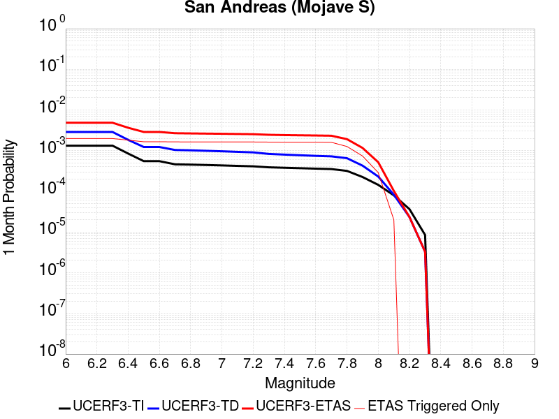 |  |  |

| Magnitude | 1 wk TI Prob | 1 wk TD Prob | 1 wk ETAS Prob | 1 wk ETAS/TD Gain | 1 wk ETAS Triggered Only | 1 mo TI Prob | 1 mo TD Prob | 1 mo ETAS Prob | 1 mo ETAS/TD Gain | 1 mo ETAS Triggered Only | 1 yr TI Prob | 1 yr TD Prob | 1 yr ETAS Prob | 1 yr ETAS/TD Gain | 1 yr ETAS Triggered Only | 10 yr TI Prob | 10 yr TD Prob | 10 yr ETAS Prob | 10 yr ETAS/TD Gain | 10 yr ETAS Triggered Only |
|-----|-----|-----|-----|-----|-----|-----|-----|-----|-----|-----|-----|-----|-----|-----|-----|-----|-----|-----|-----|-----|
| 6.0 | 3.1064058E-4 | 6.7462435E-4 | 0.0024134505 | 3.5774732 | 0.00174 | 0.0013306376 | 0.002888172 | 0.0048724245 | 1.6870271 | 0.00199 | 0.016080605 | 0.034565594 | 0.036679897 | 1.0611678 | 0.00219 | 0.1496549 | 0.28654557 | 0.2882222 | 1.0058511 | 0.00235 |
| 6.1 | 3.1064058E-4 | 6.7462435E-4 | 0.0024134505 | 3.5774732 | 0.00174 | 0.0013306376 | 0.002888172 | 0.0048724245 | 1.6870271 | 0.00199 | 0.016080605 | 0.034565594 | 0.036679897 | 1.0611678 | 0.00219 | 0.1496549 | 0.28654557 | 0.2882222 | 1.0058511 | 0.00235 |
| 6.2 | 3.1064058E-4 | 6.7462435E-4 | 0.0024134505 | 3.5774732 | 0.00174 | 0.0013306376 | 0.002888172 | 0.0048724245 | 1.6870271 | 0.00199 | 0.016080605 | 0.034565594 | 0.036679897 | 1.0611678 | 0.00219 | 0.1496549 | 0.28654557 | 0.2882222 | 1.0058511 | 0.00235 |
| 6.3 | 3.1064058E-4 | 6.7462435E-4 | 0.0024134505 | 3.5774732 | 0.00174 | 0.0013306376 | 0.002888172 | 0.0048724245 | 1.6870271 | 0.00199 | 0.016080605 | 0.034565594 | 0.036679897 | 1.0611678 | 0.00219 | 0.1496549 | 0.28654557 | 0.2882222 | 1.0058511 | 0.00235 |
| 6.4 | 1.9872203E-4 | 4.3181062E-4 | 0.0020411154 | 4.7268763 | 0.00161 | 8.5138786E-4 | 0.0018493326 | 0.003665967 | 1.9823188 | 0.00182 | 0.010316478 | 0.02228931 | 0.024244731 | 1.0877291 | 0.002 | 0.098504856 | 0.19686839 | 0.19858709 | 1.0087302 | 0.00214 |
| 6.5 | 1.291105E-4 | 2.8754136E-4 | 0.0017471216 | 6.0760703 | 0.00146 | 5.5321335E-4 | 0.0012317409 | 0.0028896963 | 2.346026 | 0.00166 | 0.006714592 | 0.014894155 | 0.016687047 | 1.1203756 | 0.00182 | 0.065152965 | 0.13800792 | 0.13968882 | 1.0121796 | 0.00195 |
| 6.6 | 1.291105E-4 | 2.8754136E-4 | 0.0017471216 | 6.0760703 | 0.00146 | 5.5321335E-4 | 0.0012317409 | 0.0028896963 | 2.346026 | 0.00166 | 0.006714592 | 0.014894155 | 0.016687047 | 1.1203756 | 0.00182 | 0.065152965 | 0.13800792 | 0.13968882 | 1.0121796 | 0.00195 |
| 6.7 | 1.08001186E-4 | 2.4335351E-4 | 0.0016930007 | 6.95696 | 0.00145 | 4.6278012E-4 | 0.0010425274 | 0.0026908072 | 2.5810423 | 0.00165 | 0.0056198016 | 0.0126192 | 0.014406359 | 1.1416222 | 0.00181 | 0.054797906 | 0.11918431 | 0.120884284 | 1.0142634 | 0.00193 |
| 6.8 | 1.0624356E-4 | 2.3853009E-4 | 0.0016881842 | 7.077448 | 0.00145 | 4.5525006E-4 | 0.0010218718 | 0.002660196 | 2.603258 | 0.00164 | 0.0055285925 | 0.012370593 | 0.014148326 | 1.1437063 | 0.0018 | 0.053930566 | 0.11713308 | 0.118828185 | 1.0144717 | 0.00192 |
| 6.9 | 1.0393785E-4 | 2.3223337E-4 | 0.0016818966 | 7.242269 | 0.00145 | 4.4537184E-4 | 9.949068E-4 | 0.002633275 | 2.6467557 | 0.00164 | 0.0054089287 | 0.012045963 | 0.01382428 | 1.1476277 | 0.0018 | 0.05279156 | 0.114433445 | 0.116133735 | 1.0148584 | 0.00192 |
| 7.0 | 1.0155622E-4 | 2.2592908E-4 | 0.0016756015 | 7.4164934 | 0.00145 | 4.3516833E-4 | 9.6790853E-4 | 0.0026063211 | 2.692735 | 0.00164 | 0.005285311 | 0.011720838 | 0.0134997405 | 1.1517726 | 0.0018 | 0.05161361 | 0.11169745 | 0.11340299 | 1.0152693 | 0.00192 |
| 7.1 | 9.885595E-5 | 2.188132E-4 | 0.0016684959 | 7.6252065 | 0.00145 | 4.2359953E-4 | 9.374342E-4 | 0.002575897 | 2.747816 | 0.00164 | 0.0051451353 | 0.011353733 | 0.013133297 | 1.1567382 | 0.0018 | 0.05027629 | 0.10857607 | 0.1102876 | 1.0157634 | 0.00192 |
| 7.2 | 9.6411415E-5 | 2.1244297E-4 | 0.0016621349 | 7.823911 | 0.00145 | 4.1312634E-4 | 9.101525E-4 | 0.00254866 | 2.8002558 | 0.00164 | 0.005018219 | 0.011024987 | 0.0128051415 | 1.1614655 | 0.0018 | 0.049064007 | 0.1057697 | 0.10747768 | 1.0161481 | 0.00191 |
| 7.3 | 9.1180635E-5 | 1.9472656E-4 | 0.0016344462 | 8.393545 | 0.00144 | 3.907156E-4 | 8.342756E-4 | 0.0024629156 | 2.9521608 | 0.00163 | 0.004746591 | 0.010110112 | 0.0118721165 | 1.1742814 | 0.00178 | 0.046464786 | 0.09796176 | 0.09966661 | 1.0174032 | 0.00189 |
| 7.4 | 8.887388E-5 | 1.872126E-4 | 0.0016169449 | 8.636945 | 0.00143 | 3.8083247E-4 | 8.020931E-4 | 0.0024207938 | 3.0180957 | 0.00162 | 0.0046267817 | 0.009721855 | 0.011474647 | 1.180294 | 0.00177 | 0.045316286 | 0.094593845 | 0.09629601 | 1.0179944 | 0.00188 |
| 7.5 | 8.6750515E-5 | 1.80528E-4 | 0.0016102699 | 8.919779 | 0.00143 | 3.7173493E-4 | 7.734621E-4 | 0.0023922091 | 3.0928588 | 0.00162 | 0.004516484 | 0.009376327 | 0.01112973 | 1.1870033 | 0.00177 | 0.04425787 | 0.09155606 | 0.09326393 | 1.0186539 | 0.00188 |
| 7.6 | 8.453092E-5 | 1.7440386E-4 | 0.0016041545 | 9.197929 | 0.00143 | 3.6222505E-4 | 7.4723107E-4 | 0.0023660206 | 3.166384 | 0.00162 | 0.0044011753 | 0.009059664 | 0.010813628 | 1.1936015 | 0.00177 | 0.04315024 | 0.08871447 | 0.09042769 | 1.0193115 | 0.00188 |
| 7.7 | 8.259102E-5 | 1.6962511E-4 | 0.0015893843 | 9.369983 | 0.00142 | 3.539135E-4 | 7.267622E-4 | 0.0023355922 | 3.2136948 | 0.00161 | 0.004300386 | 0.0088125 | 0.01055699 | 1.1979563 | 0.00176 | 0.042181134 | 0.086465426 | 0.08817374 | 1.0197572 | 0.00187 |
| 7.8 | 7.444844E-5 | 1.528469E-4 | 0.0012926727 | 8.457304 | 0.00114 | 3.1902574E-4 | 6.5489375E-4 | 0.001924062 | 2.937976 | 0.00127 | 0.0038772223 | 0.007944231 | 0.009323189 | 1.1735797 | 0.00139 | 0.03810269 | 0.078293875 | 0.079658 | 1.0174232 | 0.00148 |
| 7.9 | 5.2586525E-5 | 1.0007023E-4 | 7.500052E-4 | 7.494788 | 6.5E-4 | 2.2535135E-4 | 4.2880196E-4 | 0.0011684847 | 2.7249985 | 7.4E-4 | 0.0027402006 | 0.005208178 | 0.0060040113 | 1.1528046 | 8.0E-4 | 0.027066574 | 0.052201588 | 0.053016696 | 1.0156146 | 8.6E-4 |
| 8.0 | 3.379877E-5 | 5.4075565E-5 | 2.9406257E-4 | 5.437994 | 2.4E-4 | 1.4484383E-4 | 2.3173184E-4 | 5.216646E-4 | 2.2511566 | 2.9E-4 | 0.0017620471 | 0.0028176866 | 0.0031268133 | 1.1097094 | 3.1E-4 | 0.017481409 | 0.028835917 | 0.0291564 | 1.0111141 | 3.3E-4 |
| 8.1 | 1.8668277E-5 | 1.9308145E-5 | 3.9307757E-5 | 2.0358124 | 2.0E-5 | 8.000444E-5 | 8.274657E-5 | 1.0274491E-4 | 1.2416818 | 2.0E-5 | 9.736188E-4 | 0.0010069745 | 0.0010269544 | 1.0198414 | 2.0E-5 | 0.009693642 | 0.010798624 | 0.010818408 | 1.0018321 | 2.0E-5 |
| 8.2 | 8.541571E-6 | 5.4596358E-6 | 5.4596358E-6 | 1.0 | 0.0 | 3.660622E-5 | 2.339823E-5 | 2.339823E-5 | 1.0 | 0.0 | 4.455896E-4 | 2.848363E-4 | 2.848363E-4 | 1.0 | 0.0 | 0.0044469717 | 0.003240283 | 0.003240283 | 1.0 | 0.0 |
| 8.3 | 1.983087E-6 | 7.6564595E-7 | 7.6564595E-7 | 1.0 | 0.0 | 8.498917E-6 | 3.281336E-6 | 3.281336E-6 | 1.0 | 0.0 | 1.034694E-4 | 3.9949547E-5 | 3.9949547E-5 | 1.0 | 0.0 | 0.0010342124 | 4.717979E-4 | 4.717979E-4 | 1.0 | 0.0 |

## San Andreas (Mojave N)
*[(top)](#table-of-contents)*

| 1 Week | 1 Month | 1 Year | 10 Year |
|-----|-----|-----|-----|
|  |  |  |  |

| Magnitude | 1 wk TI Prob | 1 wk TD Prob | 1 wk ETAS Prob | 1 wk ETAS/TD Gain | 1 wk ETAS Triggered Only | 1 mo TI Prob | 1 mo TD Prob | 1 mo ETAS Prob | 1 mo ETAS/TD Gain | 1 mo ETAS Triggered Only | 1 yr TI Prob | 1 yr TD Prob | 1 yr ETAS Prob | 1 yr ETAS/TD Gain | 1 yr ETAS Triggered Only | 10 yr TI Prob | 10 yr TD Prob | 10 yr ETAS Prob | 10 yr ETAS/TD Gain | 10 yr ETAS Triggered Only |
|-----|-----|-----|-----|-----|-----|-----|-----|-----|-----|-----|-----|-----|-----|-----|-----|-----|-----|-----|-----|-----|
| 6.0 | 9.877682E-5 | 1.9402112E-4 | 0.0020336641 | 10.481664 | 0.00184 | 4.2326056E-4 | 8.312543E-4 | 0.0029295087 | 3.5242028 | 0.0021 | 0.0051410277 | 0.010073684 | 0.0123604145 | 1.2270004 | 0.00231 | 0.05023708 | 0.09832245 | 0.10052255 | 1.0223763 | 0.00244 |
| 6.1 | 9.877682E-5 | 1.9402112E-4 | 0.0020336641 | 10.481664 | 0.00184 | 4.2326056E-4 | 8.312543E-4 | 0.0029295087 | 3.5242028 | 0.0021 | 0.0051410277 | 0.010073684 | 0.0123604145 | 1.2270004 | 0.00231 | 0.05023708 | 0.09832245 | 0.10052255 | 1.0223763 | 0.00244 |
| 6.2 | 9.877682E-5 | 1.9402112E-4 | 0.0020336641 | 10.481664 | 0.00184 | 4.2326056E-4 | 8.312543E-4 | 0.0029295087 | 3.5242028 | 0.0021 | 0.0051410277 | 0.010073684 | 0.0123604145 | 1.2270004 | 0.00231 | 0.05023708 | 0.09832245 | 0.10052255 | 1.0223763 | 0.00244 |
| 6.3 | 9.877682E-5 | 1.9402112E-4 | 0.0020336641 | 10.481664 | 0.00184 | 4.2326056E-4 | 8.312543E-4 | 0.0029295087 | 3.5242028 | 0.0021 | 0.0051410277 | 0.010073684 | 0.0123604145 | 1.2270004 | 0.00231 | 0.05023708 | 0.09832245 | 0.10052255 | 1.0223763 | 0.00244 |
| 6.4 | 9.877682E-5 | 1.9402112E-4 | 0.0020336641 | 10.481664 | 0.00184 | 4.2326056E-4 | 8.312543E-4 | 0.0029295087 | 3.5242028 | 0.0021 | 0.0051410277 | 0.010073684 | 0.0123604145 | 1.2270004 | 0.00231 | 0.05023708 | 0.09832245 | 0.10052255 | 1.0223763 | 0.00244 |
| 6.5 | 9.861474E-5 | 1.937588E-4 | 0.0020334022 | 10.494503 | 0.00184 | 4.2256617E-4 | 8.3013077E-4 | 0.0029283876 | 3.5276217 | 0.0021 | 0.0051326132 | 0.0100601325 | 0.012346894 | 1.2273092 | 0.00231 | 0.050156746 | 0.09820035 | 0.10040074 | 1.0224072 | 0.00244 |
| 6.6 | 9.861474E-5 | 1.937588E-4 | 0.0020334022 | 10.494503 | 0.00184 | 4.2256617E-4 | 8.3013077E-4 | 0.0029283876 | 3.5276217 | 0.0021 | 0.0051326132 | 0.0100601325 | 0.012346894 | 1.2273092 | 0.00231 | 0.050156746 | 0.09820035 | 0.10040074 | 1.0224072 | 0.00244 |
| 6.7 | 9.8552715E-5 | 1.9365833E-4 | 0.002033302 | 10.49943 | 0.00184 | 4.223004E-4 | 8.2970044E-4 | 0.002927958 | 3.528934 | 0.0021 | 0.0051293927 | 0.010054941 | 0.012341714 | 1.2274278 | 0.00231 | 0.050125998 | 0.09815356 | 0.10035407 | 1.022419 | 0.00244 |
| 6.8 | 9.8464974E-5 | 1.9350994E-4 | 0.0020331538 | 10.506716 | 0.00184 | 4.219245E-4 | 8.290649E-4 | 0.0029273238 | 3.5308743 | 0.0021 | 0.0051248376 | 0.010047276 | 0.0123340655 | 1.2276031 | 0.00231 | 0.05008251 | 0.09808378 | 0.10028446 | 1.0224367 | 0.00244 |
| 6.9 | 9.825824E-5 | 1.9319002E-4 | 0.0020328346 | 10.522462 | 0.00184 | 4.2103877E-4 | 8.276947E-4 | 0.0029259566 | 3.5350673 | 0.0021 | 0.0051141046 | 0.010030746 | 0.0123175755 | 1.2279819 | 0.00231 | 0.049980022 | 0.097932965 | 0.10013401 | 1.022475 | 0.00244 |
| 7.0 | 9.781462E-5 | 1.9250368E-4 | 0.0020321496 | 10.556419 | 0.00184 | 4.1913814E-4 | 8.247551E-4 | 0.0029230232 | 3.5441105 | 0.0021 | 0.005091073 | 0.009995285 | 0.012282196 | 1.228799 | 0.00231 | 0.04976007 | 0.09760912 | 0.09981096 | 1.0225576 | 0.00244 |
| 7.1 | 9.7121134E-5 | 1.9152075E-4 | 0.0020311684 | 10.605474 | 0.00184 | 4.1616702E-4 | 8.205452E-4 | 0.002918822 | 3.557174 | 0.0021 | 0.005055068 | 0.0099444995 | 0.012231528 | 1.2299793 | 0.00231 | 0.04941613 | 0.09714571 | 0.09934867 | 1.022677 | 0.00244 |
| 7.2 | 9.663819E-5 | 1.9082859E-4 | 0.0020304774 | 10.640321 | 0.00184 | 4.1409794E-4 | 8.175807E-4 | 0.0029158636 | 3.566454 | 0.0021 | 0.0050299936 | 0.009908735 | 0.012195846 | 1.2308177 | 0.00231 | 0.049176537 | 0.09681883 | 0.09902259 | 1.0227617 | 0.00244 |
| 7.3 | 9.6277574E-5 | 1.9035369E-4 | 0.0020300034 | 10.664377 | 0.00184 | 4.125529E-4 | 8.1554666E-4 | 0.002913834 | 3.57286 | 0.0021 | 0.0050112694 | 0.009884195 | 0.012171363 | 1.2313964 | 0.00231 | 0.04899759 | 0.09659228 | 0.09879659 | 1.0228208 | 0.00244 |
| 7.4 | 9.593308E-5 | 1.8975153E-4 | 0.0020294024 | 10.695051 | 0.00184 | 4.1107697E-4 | 8.129676E-4 | 0.0029112604 | 3.5810287 | 0.0021 | 0.0049933824 | 0.009853081 | 0.01214032 | 1.2321345 | 0.00231 | 0.04882661 | 0.09630986 | 0.09851486 | 1.0228949 | 0.00244 |
| 7.5 | 9.561707E-5 | 1.8921228E-4 | 0.002028864 | 10.722688 | 0.00184 | 4.0972308E-4 | 8.106579E-4 | 0.0029089556 | 3.5883884 | 0.0021 | 0.0049769743 | 0.009825215 | 0.012112518 | 1.2327994 | 0.00231 | 0.048669744 | 0.096056245 | 0.09826187 | 1.0229617 | 0.00244 |
| 7.6 | 9.418194E-5 | 1.8573487E-4 | 0.002025393 | 10.904754 | 0.00184 | 4.0357444E-4 | 7.95764E-4 | 0.0028940928 | 3.6368735 | 0.0021 | 0.004902454 | 0.009645499 | 0.011933218 | 1.23718 | 0.00231 | 0.047957025 | 0.094437465 | 0.09664704 | 1.0233972 | 0.00244 |
| 7.7 | 8.202141E-5 | 1.6022482E-4 | 0.0018099605 | 11.29638 | 0.00165 | 3.51473E-4 | 6.8649714E-4 | 0.0025552134 | 3.7221036 | 0.00187 | 0.00427079 | 0.008326128 | 0.010368977 | 1.2453539 | 0.00206 | 0.04189639 | 0.082237914 | 0.08423863 | 1.0243285 | 0.00218 |
| 7.8 | 7.2859846E-5 | 1.4517571E-4 | 0.0012850103 | 8.851414 | 0.00114 | 3.1221908E-4 | 6.2203326E-4 | 0.0018912433 | 3.0404215 | 0.00127 | 0.003794643 | 0.0075469986 | 0.008926508 | 1.1827892 | 0.00139 | 0.037304975 | 0.07472766 | 0.07609706 | 1.0183252 | 0.00148 |
| 7.9 | 5.3874453E-5 | 1.00462625E-4 | 7.5039733E-4 | 7.4694176 | 6.5E-4 | 2.3087008E-4 | 4.3048308E-4 | 0.0011701646 | 2.718259 | 7.4E-4 | 0.0028072202 | 0.0052285474 | 0.006024365 | 1.1522062 | 8.0E-4 | 0.02772022 | 0.052425884 | 0.0532408 | 1.015544 | 8.6E-4 |
| 8.0 | 3.468538E-5 | 5.4261534E-5 | 2.9424852E-4 | 5.4227824 | 2.4E-4 | 1.4864317E-4 | 2.3252872E-4 | 5.224613E-4 | 2.2468677 | 2.9E-4 | 0.0018082283 | 0.0028273636 | 0.0031364872 | 1.1093328 | 3.1E-4 | 0.017935853 | 0.028948462 | 0.02926891 | 1.0110695 | 3.3E-4 |
| 8.1 | 1.9152367E-5 | 1.9401303E-5 | 3.9400915E-5 | 2.0308387 | 2.0E-5 | 8.207899E-5 | 8.3145795E-5 | 1.0314413E-4 | 1.2405213 | 2.0E-5 | 9.988535E-4 | 0.0010118305 | 0.0010318103 | 1.0197462 | 2.0E-5 | 0.009943757 | 0.01085595 | 0.010875734 | 1.0018224 | 2.0E-5 |
| 8.2 | 8.643924E-6 | 5.473668E-6 | 5.473668E-6 | 1.0 | 0.0 | 3.704486E-5 | 2.3458366E-5 | 2.3458366E-5 | 1.0 | 0.0 | 4.5092785E-4 | 2.8556827E-4 | 2.8556827E-4 | 1.0 | 0.0 | 0.0045001395 | 0.0032481793 | 0.0032481793 | 1.0 | 0.0 |
| 8.3 | 1.983087E-6 | 7.6564595E-7 | 7.6564595E-7 | 1.0 | 0.0 | 8.498917E-6 | 3.281336E-6 | 3.281336E-6 | 1.0 | 0.0 | 1.034694E-4 | 3.9949547E-5 | 3.9949547E-5 | 1.0 | 0.0 | 0.0010342124 | 4.717979E-4 | 4.717979E-4 | 1.0 | 0.0 |

## Goldstone Lake
*[(top)](#table-of-contents)*

| 1 Week | 1 Month | 1 Year | 10 Year |
|-----|-----|-----|-----|
|  |  |  |  |

| Magnitude | 1 wk TI Prob | 1 wk TD Prob | 1 wk ETAS Prob | 1 wk ETAS/TD Gain | 1 wk ETAS Triggered Only | 1 mo TI Prob | 1 mo TD Prob | 1 mo ETAS Prob | 1 mo ETAS/TD Gain | 1 mo ETAS Triggered Only | 1 yr TI Prob | 1 yr TD Prob | 1 yr ETAS Prob | 1 yr ETAS/TD Gain | 1 yr ETAS Triggered Only | 10 yr TI Prob | 10 yr TD Prob | 10 yr ETAS Prob | 10 yr ETAS/TD Gain | 10 yr ETAS Triggered Only |
|-----|-----|-----|-----|-----|-----|-----|-----|-----|-----|-----|-----|-----|-----|-----|-----|-----|-----|-----|-----|-----|
| 6.0 | 2.671352E-5 | 3.0376103E-5 | 0.0013303367 | 43.795498 | 0.0013 | 1.1448149E-4 | 1.3017791E-4 | 0.001719971 | 13.212463 | 0.00159 | 0.001392921 | 0.0015839601 | 0.003450998 | 2.1787152 | 0.00187 | 0.013842222 | 0.015746202 | 0.01775408 | 1.1275151 | 0.00204 |
| 6.1 | 2.671352E-5 | 3.0376103E-5 | 0.0013303367 | 43.795498 | 0.0013 | 1.1448149E-4 | 1.3017791E-4 | 0.001719971 | 13.212463 | 0.00159 | 0.001392921 | 0.0015839601 | 0.003450998 | 2.1787152 | 0.00187 | 0.013842222 | 0.015746202 | 0.01775408 | 1.1275151 | 0.00204 |
| 6.2 | 1.4197047E-5 | 1.6096254E-5 | 6.7608565E-4 | 42.002666 | 6.6E-4 | 6.0843064E-5 | 6.898268E-5 | 9.289234E-4 | 13.466038 | 8.6E-4 | 7.4051257E-4 | 8.3963916E-4 | 0.0018487911 | 2.2018876 | 0.00101 | 0.007380498 | 0.008374364 | 0.009455236 | 1.1290691 | 0.00109 |
| 6.3 | 1.4197047E-5 | 1.6096254E-5 | 6.7608565E-4 | 42.002666 | 6.6E-4 | 6.0843064E-5 | 6.898268E-5 | 9.289234E-4 | 13.466038 | 8.6E-4 | 7.4051257E-4 | 8.3963916E-4 | 0.0018487911 | 2.2018876 | 0.00101 | 0.007380498 | 0.008374364 | 0.009455236 | 1.1290691 | 0.00109 |
| 6.4 | 1.3238931E-5 | 1.500847E-5 | 6.4499903E-4 | 42.97567 | 6.3E-4 | 5.6737044E-5 | 6.432098E-5 | 8.742689E-4 | 13.592282 | 8.1E-4 | 6.9055456E-4 | 7.8292453E-4 | 0.0017321807 | 2.212449 | 9.5E-4 | 0.006884126 | 0.007811289 | 0.008823321 | 1.1295602 | 0.00102 |
| 6.5 | 1.3238931E-5 | 1.500847E-5 | 6.4499903E-4 | 42.97567 | 6.3E-4 | 5.6737044E-5 | 6.432098E-5 | 8.742689E-4 | 13.592282 | 8.1E-4 | 6.9055456E-4 | 7.8292453E-4 | 0.0017321807 | 2.212449 | 9.5E-4 | 0.006884126 | 0.007811289 | 0.008823321 | 1.1295602 | 0.00102 |
| 6.6 | 1.1328278E-5 | 1.2855176E-5 | 5.3284847E-4 | 41.450115 | 5.2E-4 | 4.8548856E-5 | 5.5092984E-5 | 7.2505604E-4 | 13.160588 | 6.7E-4 | 5.90922E-4 | 6.706464E-4 | 0.0014501233 | 2.162277 | 7.8E-4 | 0.0058935313 | 0.0066956137 | 0.0075299894 | 1.1246153 | 8.4E-4 |
| 6.7 | 8.651175E-6 | 9.824575E-6 | 3.9982074E-4 | 40.695988 | 3.9E-4 | 3.707594E-5 | 4.2105148E-5 | 5.5208366E-4 | 13.112022 | 5.1E-4 | 4.5130608E-4 | 5.126002E-4 | 0.0010923028 | 2.130906 | 5.8E-4 | 0.0045039062 | 0.0051230565 | 0.00573988 | 1.1204015 | 6.2E-4 |
| 6.8 | 1.0215377E-6 | 1.1754802E-6 | 3.1175445E-5 | 26.521456 | 3.0E-5 | 4.378012E-6 | 5.037763E-6 | 3.503761E-5 | 6.954994 | 3.0E-5 | 5.3300988E-5 | 6.133315E-5 | 9.133131E-5 | 1.4891019 | 3.0E-5 | 5.3288206E-4 | 6.131735E-4 | 6.4315513E-4 | 1.0488958 | 3.0E-5 |
| 6.9 | 7.9360774E-7 | 9.283496E-7 | 9.283496E-7 | 1.0 | 0.0 | 3.4011714E-6 | 3.9786355E-6 | 3.9786355E-6 | 1.0 | 0.0 | 4.1408475E-5 | 4.843888E-5 | 4.843888E-5 | 1.0 | 0.0 | 4.140076E-4 | 4.842902E-4 | 4.842902E-4 | 1.0 | 0.0 |
| 7.0 | 7.4382757E-7 | 8.747428E-7 | 8.747428E-7 | 1.0 | 0.0 | 3.1878285E-6 | 3.7488926E-6 | 3.7488926E-6 | 1.0 | 0.0 | 3.8811122E-5 | 4.564188E-5 | 4.564188E-5 | 1.0 | 0.0 | 3.8804344E-4 | 4.563317E-4 | 4.563317E-4 | 1.0 | 0.0 |
| 7.1 | 6.4709513E-7 | 7.711399E-7 | 7.711399E-7 | 1.0 | 0.0 | 2.773262E-6 | 3.3048816E-6 | 3.3048816E-6 | 1.0 | 0.0 | 3.376394E-5 | 4.023625E-5 | 4.023625E-5 | 1.0 | 0.0 | 3.375881E-4 | 4.022956E-4 | 4.022956E-4 | 1.0 | 0.0 |
| 7.2 | 6.356704E-7 | 7.588459E-7 | 7.588459E-7 | 1.0 | 0.0 | 2.7242988E-6 | 3.252193E-6 | 3.252193E-6 | 1.0 | 0.0 | 3.3167835E-5 | 3.959479E-5 | 3.959479E-5 | 1.0 | 0.0 | 3.3162883E-4 | 3.9588328E-4 | 3.9588328E-4 | 1.0 | 0.0 |
| 7.3 | 5.7695723E-7 | 6.896648E-7 | 6.896648E-7 | 1.0 | 0.0 | 2.4726714E-6 | 2.9557032E-6 | 2.9557032E-6 | 1.0 | 0.0 | 3.0104358E-5 | 3.598515E-5 | 3.598515E-5 | 1.0 | 0.0 | 3.0100282E-4 | 3.5979896E-4 | 3.5979896E-4 | 1.0 | 0.0 |
| 7.4 | 5.209647E-7 | 6.193583E-7 | 6.193583E-7 | 1.0 | 0.0 | 2.232704E-6 | 2.6543903E-6 | 2.6543903E-6 | 1.0 | 0.0 | 2.718283E-5 | 3.2316777E-5 | 3.2316777E-5 | 1.0 | 0.0 | 2.7179506E-4 | 3.2312635E-4 | 3.2312635E-4 | 1.0 | 0.0 |
| 7.5 | 4.512955E-7 | 5.3489487E-7 | 5.3489487E-7 | 1.0 | 0.0 | 1.934122E-6 | 2.2924048E-6 | 2.2924048E-6 | 1.0 | 0.0 | 2.3547682E-5 | 2.7909726E-5 | 2.7909726E-5 | 1.0 | 0.0 | 2.3545188E-4 | 2.7906752E-4 | 2.7906752E-4 | 1.0 | 0.0 |
| 7.6 | 2.21172E-7 | 2.6040198E-7 | 2.6040198E-7 | 1.0 | 0.0 | 9.478797E-7 | 1.1160082E-6 | 1.1160082E-6 | 1.0 | 0.0 | 1.1540374E-5 | 1.3587343E-5 | 1.3587343E-5 | 1.0 | 0.0 | 1.1539775E-4 | 1.3586794E-4 | 1.3586794E-4 | 1.0 | 0.0 |

## So Sierra Nevada
*[(top)](#table-of-contents)*

| 1 Week | 1 Month | 1 Year | 10 Year |
|-----|-----|-----|-----|
|  |  |  |  |

| Magnitude | 1 wk TI Prob | 1 wk TD Prob | 1 wk ETAS Prob | 1 wk ETAS/TD Gain | 1 wk ETAS Triggered Only | 1 mo TI Prob | 1 mo TD Prob | 1 mo ETAS Prob | 1 mo ETAS/TD Gain | 1 mo ETAS Triggered Only | 1 yr TI Prob | 1 yr TD Prob | 1 yr ETAS Prob | 1 yr ETAS/TD Gain | 1 yr ETAS Triggered Only | 10 yr TI Prob | 10 yr TD Prob | 10 yr ETAS Prob | 10 yr ETAS/TD Gain | 10 yr ETAS Triggered Only |
|-----|-----|-----|-----|-----|-----|-----|-----|-----|-----|-----|-----|-----|-----|-----|-----|-----|-----|-----|-----|-----|
| 6.0 | 1.15488665E-5 | 1.1079612E-5 | 0.0013510648 | 121.94153 | 0.00134 | 4.9494203E-5 | 4.7483256E-5 | 0.0016274082 | 34.273308 | 0.00158 | 6.024253E-4 | 5.779681E-4 | 0.0024169046 | 4.181727 | 0.00184 | 0.006007948 | 0.005765918 | 0.0077842134 | 1.3500388 | 0.00203 |
| 6.1 | 1.15488665E-5 | 1.1079612E-5 | 0.0013510648 | 121.94153 | 0.00134 | 4.9494203E-5 | 4.7483256E-5 | 0.0016274082 | 34.273308 | 0.00158 | 6.024253E-4 | 5.779681E-4 | 0.0024169046 | 4.181727 | 0.00184 | 0.006007948 | 0.005765918 | 0.0077842134 | 1.3500388 | 0.00203 |
| 6.2 | 1.15488665E-5 | 1.1079612E-5 | 0.0013510648 | 121.94153 | 0.00134 | 4.9494203E-5 | 4.7483256E-5 | 0.0016274082 | 34.273308 | 0.00158 | 6.024253E-4 | 5.779681E-4 | 0.0024169046 | 4.181727 | 0.00184 | 0.006007948 | 0.005765918 | 0.0077842134 | 1.3500388 | 0.00203 |
| 6.3 | 1.15488665E-5 | 1.1079612E-5 | 0.0013510648 | 121.94153 | 0.00134 | 4.9494203E-5 | 4.7483256E-5 | 0.0016274082 | 34.273308 | 0.00158 | 6.024253E-4 | 5.779681E-4 | 0.0024169046 | 4.181727 | 0.00184 | 0.006007948 | 0.005765918 | 0.0077842134 | 1.3500388 | 0.00203 |
| 6.4 | 1.15488665E-5 | 1.1079612E-5 | 0.0013510648 | 121.94153 | 0.00134 | 4.9494203E-5 | 4.7483256E-5 | 0.0016274082 | 34.273308 | 0.00158 | 6.024253E-4 | 5.779681E-4 | 0.0024169046 | 4.181727 | 0.00184 | 0.006007948 | 0.005765918 | 0.0077842134 | 1.3500388 | 0.00203 |
| 6.5 | 1.15488665E-5 | 1.1079612E-5 | 0.0013510648 | 121.94153 | 0.00134 | 4.9494203E-5 | 4.7483256E-5 | 0.0016274082 | 34.273308 | 0.00158 | 6.024253E-4 | 5.779681E-4 | 0.0024169046 | 4.181727 | 0.00184 | 0.006007948 | 0.005765918 | 0.0077842134 | 1.3500388 | 0.00203 |
| 6.6 | 7.587044E-6 | 6.9356042E-6 | 7.569304E-4 | 109.13691 | 7.5E-4 | 3.2515498E-5 | 2.9723697E-5 | 9.0969756E-4 | 30.60513 | 8.8E-4 | 3.9580427E-4 | 3.6182883E-4 | 0.0013714634 | 3.7903652 | 0.00101 | 0.003951 | 0.0036126887 | 0.0047186785 | 1.3061404 | 0.00111 |
| 6.7 | 7.587044E-6 | 6.9356042E-6 | 7.569304E-4 | 109.13691 | 7.5E-4 | 3.2515498E-5 | 2.9723697E-5 | 9.0969756E-4 | 30.60513 | 8.8E-4 | 3.9580427E-4 | 3.6182883E-4 | 0.0013714634 | 3.7903652 | 0.00101 | 0.003951 | 0.0036126887 | 0.0047186785 | 1.3061404 | 0.00111 |
| 6.8 | 5.9026956E-6 | 5.179362E-6 | 5.551765E-4 | 107.19014 | 5.5E-4 | 2.5297022E-5 | 2.2197082E-5 | 6.7218265E-4 | 30.282476 | 6.5E-4 | 3.0794772E-4 | 2.7021713E-4 | 0.0010100171 | 3.7377985 | 7.4E-4 | 0.0030752132 | 0.002699002 | 0.0035167888 | 1.302996 | 8.2E-4 |
| 6.9 | 5.0118915E-6 | 4.2523943E-6 | 4.1425065E-4 | 97.415855 | 4.1E-4 | 2.1479358E-5 | 1.8224424E-5 | 5.2821514E-4 | 28.983913 | 5.1E-4 | 2.614798E-4 | 2.2186051E-4 | 8.117296E-4 | 3.6587386 | 5.9E-4 | 0.0026117235 | 0.0022164627 | 0.0028849777 | 1.3016135 | 6.7E-4 |
| 7.0 | 4.4924795E-6 | 3.7138868E-6 | 3.237127E-4 | 87.16278 | 3.2E-4 | 1.925334E-5 | 1.5916565E-5 | 4.3590987E-4 | 27.387184 | 4.2E-4 | 2.3438422E-4 | 1.9376757E-4 | 6.836726E-4 | 3.528313 | 4.9E-4 | 0.0023413717 | 0.0019360491 | 0.002494965 | 1.2886889 | 5.6E-4 |
| 7.1 | 3.9118436E-6 | 3.1119469E-6 | 2.2311126E-4 | 71.695076 | 2.2E-4 | 1.6764936E-5 | 1.333685E-5 | 2.8333324E-4 | 21.24439 | 2.7E-4 | 2.0409399E-4 | 1.6236462E-4 | 4.8231267E-4 | 2.9705527 | 3.2E-4 | 0.0020390663 | 0.0016225161 | 0.0020018995 | 1.2338241 | 3.8E-4 |
| 7.2 | 3.4200818E-6 | 2.6054236E-6 | 2.026049E-4 | 77.76275 | 2.0E-4 | 1.4657411E-5 | 1.11660565E-5 | 2.5116338E-4 | 22.493471 | 2.4E-4 | 1.7843937E-4 | 1.3593875E-4 | 4.2589934E-4 | 3.1330235 | 2.9E-4 | 0.0017829615 | 0.0013586058 | 0.0016881574 | 1.2425661 | 3.3E-4 |
| 7.3 | 2.6593618E-6 | 1.8283897E-6 | 1.2182817E-4 | 66.6314 | 1.2E-4 | 1.13972155E-5 | 7.8359335E-6 | 1.5783476E-4 | 20.142431 | 1.5E-4 | 1.3875226E-4 | 9.539862E-5 | 2.7538143E-4 | 2.8866398 | 1.8E-4 | 0.0013866565 | 9.536055E-4 | 0.0011534148 | 1.2095304 | 2.0E-4 |
| 7.4 | 2.2577992E-6 | 1.4364078E-6 | 9.1436275E-5 | 63.65621 | 9.0E-5 | 9.676246E-6 | 6.1560204E-6 | 1.2615528E-4 | 20.492992 | 1.2E-4 | 1.1780193E-4 | 7.4947224E-5 | 2.1493674E-4 | 2.867841 | 1.4E-4 | 0.001177395 | 7.4924453E-4 | 9.091247E-4 | 1.2133884 | 1.6E-4 |
| 7.5 | 1.489319E-6 | 7.353661E-7 | 3.0735344E-5 | 41.79598 | 3.0E-5 | 6.3827797E-6 | 3.1515651E-6 | 6.3151376E-5 | 20.0381 | 6.0E-5 | 7.770758E-5 | 3.8369635E-5 | 1.0836695E-4 | 2.8242893 | 7.0E-5 | 7.7680405E-4 | 3.8363054E-4 | 4.536037E-4 | 1.1823972 | 7.0E-5 |
| 7.6 | 1.0680322E-6 | 4.65941E-7 | 3.0465928E-5 | 65.3858 | 3.0E-5 | 4.577273E-6 | 1.9968884E-6 | 5.1996787E-5 | 26.038904 | 5.0E-5 | 5.5726876E-5 | 2.4311848E-5 | 8.431039E-5 | 3.4678724 | 6.0E-5 | 5.5712904E-4 | 2.4309216E-4 | 3.0307757E-4 | 1.24676 | 6.0E-5 |
| 7.7 | 5.509146E-7 | 1.5578539E-7 | 1.01557835E-5 | 65.190865 | 1.0E-5 | 2.3610605E-6 | 6.676515E-7 | 1.0667645E-5 | 15.977864 | 1.0E-5 | 2.8745531E-5 | 8.128628E-6 | 2.8128465E-5 | 3.46042 | 2.0E-5 | 2.8741814E-4 | 8.128342E-5 | 1.01281796E-4 | 1.2460326 | 2.0E-5 |

## Lenwood-Lockhart-Old Woman Springs
*[(top)](#table-of-contents)*

| 1 Week | 1 Month | 1 Year | 10 Year |
|-----|-----|-----|-----|
|  |  |  |  |

| Magnitude | 1 wk TI Prob | 1 wk TD Prob | 1 wk ETAS Prob | 1 wk ETAS/TD Gain | 1 wk ETAS Triggered Only | 1 mo TI Prob | 1 mo TD Prob | 1 mo ETAS Prob | 1 mo ETAS/TD Gain | 1 mo ETAS Triggered Only | 1 yr TI Prob | 1 yr TD Prob | 1 yr ETAS Prob | 1 yr ETAS/TD Gain | 1 yr ETAS Triggered Only | 10 yr TI Prob | 10 yr TD Prob | 10 yr ETAS Prob | 10 yr ETAS/TD Gain | 10 yr ETAS Triggered Only |
|-----|-----|-----|-----|-----|-----|-----|-----|-----|-----|-----|-----|-----|-----|-----|-----|-----|-----|-----|-----|-----|
| 6.0 | 3.744542E-5 | 4.396349E-5 | 9.939218E-4 | 22.607891 | 9.5E-4 | 1.604705E-4 | 1.8840231E-4 | 0.001288195 | 6.8374696 | 0.0011 | 0.0019519776 | 0.0022915571 | 0.0035386928 | 1.5442306 | 0.00125 | 0.019349206 | 0.022697281 | 0.023987321 | 1.0568367 | 0.00132 |
| 6.1 | 3.744542E-5 | 4.396349E-5 | 9.939218E-4 | 22.607891 | 9.5E-4 | 1.604705E-4 | 1.8840231E-4 | 0.001288195 | 6.8374696 | 0.0011 | 0.0019519776 | 0.0022915571 | 0.0035386928 | 1.5442306 | 0.00125 | 0.019349206 | 0.022697281 | 0.023987321 | 1.0568367 | 0.00132 |
| 6.2 | 3.744542E-5 | 4.396349E-5 | 9.939218E-4 | 22.607891 | 9.5E-4 | 1.604705E-4 | 1.8840231E-4 | 0.001288195 | 6.8374696 | 0.0011 | 0.0019519776 | 0.0022915571 | 0.0035386928 | 1.5442306 | 0.00125 | 0.019349206 | 0.022697281 | 0.023987321 | 1.0568367 | 0.00132 |
| 6.3 | 2.1079984E-5 | 2.5354384E-5 | 4.2534425E-4 | 16.775965 | 4.0E-4 | 9.0339665E-5 | 1.0865723E-4 | 5.98604E-4 | 5.509104 | 4.9E-4 | 0.0010993304 | 0.0013221189 | 0.0018514183 | 1.4003416 | 5.3E-4 | 0.010939079 | 0.013144747 | 0.013707255 | 1.0427933 | 5.7E-4 |
| 6.4 | 2.1079984E-5 | 2.5354384E-5 | 4.2534425E-4 | 16.775965 | 4.0E-4 | 9.0339665E-5 | 1.0865723E-4 | 5.98604E-4 | 5.509104 | 4.9E-4 | 0.0010993304 | 0.0013221189 | 0.0018514183 | 1.4003416 | 5.3E-4 | 0.010939079 | 0.013144747 | 0.013707255 | 1.0427933 | 5.7E-4 |
| 6.5 | 1.7397282E-5 | 2.0663285E-5 | 3.3065688E-4 | 16.002144 | 3.1E-4 | 7.455765E-5 | 8.8554E-5 | 4.7851945E-4 | 5.4037027 | 3.9E-4 | 9.073613E-4 | 0.0010776235 | 0.00150716 | 1.3985962 | 4.3E-4 | 0.009036654 | 0.010725273 | 0.011180339 | 1.0424293 | 4.6E-4 |
| 6.6 | 1.52050325E-5 | 1.7680086E-5 | 2.876753E-4 | 16.271149 | 2.7E-4 | 6.51628E-5 | 7.576964E-5 | 4.1574388E-4 | 5.4869456 | 3.4E-4 | 7.9306826E-4 | 9.221128E-4 | 0.0012917717 | 1.4008825 | 3.7E-4 | 0.007902439 | 0.009183729 | 0.009570147 | 1.0420765 | 3.9E-4 |
| 6.7 | 1.332523E-5 | 1.5264379E-5 | 2.552607E-4 | 16.72264 | 2.4E-4 | 5.7106878E-5 | 6.541716E-5 | 3.6539754E-4 | 5.5856524 | 3.0E-4 | 6.950544E-4 | 7.9616875E-4 | 0.0011059219 | 1.3890547 | 3.1E-4 | 0.006928845 | 0.0079337945 | 0.008261176 | 1.0412642 | 3.3E-4 |
| 6.8 | 1.1525329E-5 | 1.3031365E-5 | 2.2302863E-4 | 17.114756 | 2.1E-4 | 4.9393333E-5 | 5.5847537E-5 | 3.2583246E-4 | 5.834321 | 2.7E-4 | 6.011979E-4 | 6.7973585E-4 | 9.4955234E-4 | 1.3969431 | 2.7E-4 | 0.00599574 | 0.0067770192 | 0.007065054 | 1.0425017 | 2.9E-4 |
| 6.9 | 1.0253909E-5 | 1.1514835E-5 | 1.615131E-4 | 14.026525 | 1.5E-4 | 4.3944583E-5 | 4.934838E-5 | 2.59338E-4 | 5.255249 | 2.1E-4 | 5.3489394E-4 | 6.006545E-4 | 8.1052835E-4 | 1.3494086 | 2.1E-4 | 0.0053360825 | 0.0059906896 | 0.0062193116 | 1.038163 | 2.3E-4 |
| 7.0 | 8.104563E-6 | 8.99143E-6 | 1.2899034E-4 | 14.345921 | 1.2E-4 | 3.4733377E-5 | 3.853415E-5 | 1.9852798E-4 | 5.1520014 | 1.6E-4 | 4.2279682E-4 | 4.6905465E-4 | 6.289796E-4 | 1.3409517 | 1.6E-4 | 0.0042199334 | 0.0046808943 | 0.0048500984 | 1.0361478 | 1.7E-4 |
| 7.1 | 6.7986157E-6 | 7.5159796E-6 | 9.75153E-5 | 12.974397 | 9.0E-5 | 2.91366E-5 | 3.2210955E-5 | 1.6220676E-4 | 5.0357637 | 1.3E-4 | 3.5468035E-4 | 3.9209996E-4 | 5.2204897E-4 | 1.3314182 | 1.3E-4 | 0.003541148 | 0.003914298 | 0.0040537496 | 1.0356263 | 1.4E-4 |
| 7.2 | 5.6893327E-6 | 6.280132E-6 | 7.627969E-5 | 12.146193 | 7.0E-5 | 2.4382627E-5 | 2.6914584E-5 | 1.1691216E-4 | 4.343822 | 9.0E-5 | 2.9681803E-4 | 3.276378E-4 | 4.176083E-4 | 1.2746036 | 9.0E-5 | 0.002964219 | 0.003271746 | 0.003371419 | 1.0304648 | 1.0E-4 |
| 7.3 | 4.253348E-6 | 4.707075E-6 | 6.470679E-5 | 13.746711 | 6.0E-5 | 1.8228506E-5 | 2.017303E-5 | 9.017162E-5 | 4.469909 | 7.0E-5 | 2.2190946E-4 | 2.455808E-4 | 3.155636E-4 | 1.2849686 | 7.0E-5 | 0.00221688 | 0.0024532753 | 0.002533079 | 1.0325295 | 8.0E-5 |
| 7.4 | 2.5448119E-6 | 2.8520594E-6 | 3.2851975E-5 | 11.518684 | 3.0E-5 | 1.0906291E-5 | 1.2223064E-5 | 4.22227E-5 | 3.4543464 | 3.0E-5 | 1.3277601E-4 | 1.4880729E-4 | 1.7880283E-4 | 1.201573 | 3.0E-5 | 0.001326967 | 0.0014872387 | 0.0015171941 | 1.0201416 | 3.0E-5 |
| 7.5 | 4.3706837E-8 | 4.562909E-8 | 4.562909E-8 | 1.0 | 0.0 | 1.8731501E-7 | 1.9555324E-7 | 1.9555324E-7 | 1.0 | 0.0 | 2.2805577E-6 | 2.3808586E-6 | 2.3808586E-6 | 1.0 | 0.0 | 2.2805343E-5 | 2.3808387E-5 | 2.3808387E-5 | 1.0 | 0.0 |

## Death Valley (So)
*[(top)](#table-of-contents)*

| 1 Week | 1 Month | 1 Year | 10 Year |
|-----|-----|-----|-----|
|  |  |  |  |

| Magnitude | 1 wk TI Prob | 1 wk TD Prob | 1 wk ETAS Prob | 1 wk ETAS/TD Gain | 1 wk ETAS Triggered Only | 1 mo TI Prob | 1 mo TD Prob | 1 mo ETAS Prob | 1 mo ETAS/TD Gain | 1 mo ETAS Triggered Only | 1 yr TI Prob | 1 yr TD Prob | 1 yr ETAS Prob | 1 yr ETAS/TD Gain | 1 yr ETAS Triggered Only | 10 yr TI Prob | 10 yr TD Prob | 10 yr ETAS Prob | 10 yr ETAS/TD Gain | 10 yr ETAS Triggered Only |
|-----|-----|-----|-----|-----|-----|-----|-----|-----|-----|-----|-----|-----|-----|-----|-----|-----|-----|-----|-----|-----|
| 6.0 | 2.0684236E-5 | 2.5618314E-5 | 9.2559523E-4 | 36.13022 | 9.0E-4 | 8.864371E-5 | 1.0978825E-4 | 0.0011496741 | 10.471741 | 0.00104 | 0.0010787029 | 0.0013358692 | 0.0026041726 | 1.9494219 | 0.00127 | 0.010734817 | 0.013279985 | 0.014582455 | 1.0980777 | 0.00132 |
| 6.1 | 2.0684236E-5 | 2.5618314E-5 | 9.2559523E-4 | 36.13022 | 9.0E-4 | 8.864371E-5 | 1.0978825E-4 | 0.0011496741 | 10.471741 | 0.00104 | 0.0010787029 | 0.0013358692 | 0.0026041726 | 1.9494219 | 0.00127 | 0.010734817 | 0.013279985 | 0.014582455 | 1.0980777 | 0.00132 |
| 6.2 | 2.0684236E-5 | 2.5618314E-5 | 9.2559523E-4 | 36.13022 | 9.0E-4 | 8.864371E-5 | 1.0978825E-4 | 0.0011496741 | 10.471741 | 0.00104 | 0.0010787029 | 0.0013358692 | 0.0026041726 | 1.9494219 | 0.00127 | 0.010734817 | 0.013279985 | 0.014582455 | 1.0980777 | 0.00132 |
| 6.3 | 2.0240292E-5 | 2.51184E-5 | 8.950966E-4 | 35.635098 | 8.7E-4 | 8.6741224E-5 | 1.0764593E-4 | 0.0011075382 | 10.288714 | 0.001 | 0.0010555626 | 0.001309818 | 0.00252822 | 1.9302071 | 0.00122 | 0.010505628 | 0.013022543 | 0.014276004 | 1.0962532 | 0.00127 |
| 6.4 | 2.0240292E-5 | 2.51184E-5 | 8.950966E-4 | 35.635098 | 8.7E-4 | 8.6741224E-5 | 1.0764593E-4 | 0.0011075382 | 10.288714 | 0.001 | 0.0010555626 | 0.001309818 | 0.00252822 | 1.9302071 | 0.00122 | 0.010505628 | 0.013022543 | 0.014276004 | 1.0962532 | 0.00127 |
| 6.5 | 1.9962767E-5 | 2.4807652E-5 | 8.447873E-4 | 34.053497 | 8.2E-4 | 8.55519E-5 | 1.0631427E-4 | 0.0010562133 | 9.934821 | 9.5E-4 | 0.0010410968 | 0.0012936244 | 0.0024521237 | 1.8955455 | 0.00116 | 0.010362327 | 0.01286249 | 0.014056926 | 1.092862 | 0.00121 |
| 6.6 | 1.8937297E-5 | 2.3311462E-5 | 7.3329493E-4 | 31.45641 | 7.1E-4 | 8.115732E-5 | 9.990252E-5 | 9.198206E-4 | 9.207181 | 8.2E-4 | 9.876423E-4 | 0.0012156491 | 0.002234409 | 1.838038 | 0.00102 | 0.009832645 | 0.0120915035 | 0.013138686 | 1.0866048 | 0.00106 |
| 6.7 | 1.8621096E-5 | 2.2912098E-5 | 7.228961E-4 | 31.550846 | 7.0E-4 | 7.980225E-5 | 9.8191085E-5 | 8.9811254E-4 | 9.146579 | 8.0E-4 | 9.711593E-4 | 0.0011948354 | 0.0021836525 | 1.827576 | 9.9E-4 | 0.009669261 | 0.011885625 | 0.012903383 | 1.0856293 | 0.00103 |
| 6.8 | 1.7830353E-5 | 2.1806083E-5 | 6.717919E-4 | 30.807545 | 6.5E-4 | 7.641356E-5 | 9.3451374E-5 | 8.133841E-4 | 8.703821 | 7.2E-4 | 9.29938E-4 | 0.0011371907 | 0.00201619 | 1.7729568 | 8.8E-4 | 0.009260561 | 0.01131609 | 0.012225679 | 1.0803802 | 9.2E-4 |
| 6.9 | 1.3135183E-5 | 1.5304031E-5 | 3.7529852E-4 | 24.522856 | 3.6E-4 | 5.6292425E-5 | 6.558709E-5 | 4.6556085E-4 | 7.0983615 | 4.0E-4 | 6.8514474E-4 | 7.982367E-4 | 0.0012978376 | 1.6258806 | 5.0E-4 | 0.006830362 | 0.007955158 | 0.008490862 | 1.0673405 | 5.4E-4 |
| 7.0 | 1.1507512E-5 | 1.3154237E-5 | 2.6315096E-4 | 20.005032 | 2.5E-4 | 4.9316975E-5 | 5.637412E-5 | 3.3635832E-4 | 5.9665384 | 2.8E-4 | 6.002687E-4 | 6.861445E-4 | 0.0010159181 | 1.4806182 | 3.3E-4 | 0.0059864987 | 0.0068414924 | 0.0071990294 | 1.05226 | 3.6E-4 |
| 7.1 | 9.715903E-6 | 1.0865287E-5 | 1.4086388E-4 | 12.96458 | 1.3E-4 | 4.1638916E-5 | 4.6564706E-5 | 1.7655865E-4 | 3.791684 | 1.3E-4 | 5.068359E-4 | 5.667821E-4 | 7.166971E-4 | 1.2645019 | 1.5E-4 | 0.0050568148 | 0.005653834 | 0.0058228727 | 1.029898 | 1.7E-4 |
| 7.2 | 9.233269E-6 | 1.0286314E-5 | 1.3028507E-4 | 12.665867 | 1.2E-4 | 3.9570554E-5 | 4.408348E-5 | 1.6407818E-4 | 3.7219882 | 1.2E-4 | 4.81665E-4 | 5.365884E-4 | 6.765133E-4 | 1.2607676 | 1.4E-4 | 0.0048062233 | 0.0053533595 | 0.005512503 | 1.0297278 | 1.6E-4 |
| 7.3 | 8.8041315E-6 | 9.808164E-6 | 9.980728E-5 | 10.17594 | 9.0E-5 | 3.7731446E-5 | 4.2034335E-5 | 1.3203055E-4 | 3.1410167 | 9.0E-5 | 4.592835E-4 | 5.1165203E-4 | 6.2159577E-4 | 1.2148799 | 1.1E-4 | 0.0045833546 | 0.005105167 | 0.0052345037 | 1.0253344 | 1.3E-4 |
| 7.4 | 8.708749E-6 | 9.707175E-6 | 9.97063E-5 | 10.271402 | 9.0E-5 | 3.7322676E-5 | 4.160154E-5 | 1.315978E-4 | 3.1632915 | 9.0E-5 | 4.5430884E-4 | 5.0638523E-4 | 6.1632955E-4 | 1.2171159 | 1.1E-4 | 0.004533812 | 0.0050527398 | 0.0051820828 | 1.0255986 | 1.3E-4 |
| 7.5 | 8.612678E-6 | 9.604817E-6 | 8.960405E-5 | 9.329074 | 8.0E-5 | 3.6910955E-5 | 4.1162875E-5 | 1.2115958E-4 | 2.9434187 | 8.0E-5 | 4.492982E-4 | 5.01047E-4 | 6.009969E-4 | 1.1994821 | 1.0E-4 | 0.004483909 | 0.0049995985 | 0.0051189987 | 1.0238819 | 1.2E-4 |
| 7.6 | 8.319024E-6 | 9.283916E-6 | 8.9283174E-5 | 9.616973 | 8.0E-5 | 3.5652476E-5 | 3.978763E-5 | 1.1978445E-4 | 3.010595 | 8.0E-5 | 4.3398244E-4 | 4.8431093E-4 | 5.842625E-4 | 1.2063789 | 1.0E-4 | 0.0043313587 | 0.0048329784 | 0.004952398 | 1.0247095 | 1.2E-4 |
| 7.7 | 7.4718328E-6 | 8.34517E-6 | 7.834459E-5 | 9.388016 | 7.0E-5 | 3.2021748E-5 | 3.5764548E-5 | 1.0576204E-4 | 2.9571755 | 7.0E-5 | 3.8979502E-4 | 4.353504E-4 | 5.253112E-4 | 1.20664 | 9.0E-5 | 0.00389112 | 0.0043453807 | 0.0044349893 | 1.0206217 | 9.0E-5 |
| 7.8 | 3.4586725E-7 | 3.6482615E-7 | 3.6482615E-7 | 1.0 | 0.0 | 1.4822873E-6 | 1.5635396E-6 | 1.5635396E-6 | 1.0 | 0.0 | 1.80467E-5 | 1.9035933E-5 | 1.9035933E-5 | 1.0 | 0.0 | 1.8045233E-4 | 1.9034347E-4 | 1.9034347E-4 | 1.0 | 0.0 |
| 7.9 | 2.5591178E-9 | 2.6696718E-9 | 2.6696718E-9 | 1.0 | 0.0 | 1.0967647E-8 | 1.14414505E-8 | 1.14414505E-8 | 1.0 | 0.0 | 1.335311E-7 | 1.3929966E-7 | 1.3929966E-7 | 1.0 | 0.0 | 1.3353102E-6 | 1.3929966E-6 | 1.3929966E-6 | 1.0 | 0.0 |

## Coyote Canyon
*[(top)](#table-of-contents)*

| 1 Week | 1 Month | 1 Year | 10 Year |
|-----|-----|-----|-----|
|  |  |  |  |

| Magnitude | 1 wk TI Prob | 1 wk TD Prob | 1 wk ETAS Prob | 1 wk ETAS/TD Gain | 1 wk ETAS Triggered Only | 1 mo TI Prob | 1 mo TD Prob | 1 mo ETAS Prob | 1 mo ETAS/TD Gain | 1 mo ETAS Triggered Only | 1 yr TI Prob | 1 yr TD Prob | 1 yr ETAS Prob | 1 yr ETAS/TD Gain | 1 yr ETAS Triggered Only | 10 yr TI Prob | 10 yr TD Prob | 10 yr ETAS Prob | 10 yr ETAS/TD Gain | 10 yr ETAS Triggered Only |
|-----|-----|-----|-----|-----|-----|-----|-----|-----|-----|-----|-----|-----|-----|-----|-----|-----|-----|-----|-----|-----|
| 6.0 | 3.5090034E-5 | 4.0364317E-5 | 7.1033725E-4 | 17.59815 | 6.7E-4 | 1.503772E-4 | 1.7297991E-4 | 9.428467E-4 | 5.450614 | 7.7E-4 | 0.0018293047 | 0.0021042533 | 0.0030921702 | 1.4694856 | 9.9E-4 | 0.018143194 | 0.020869205 | 0.021926666 | 1.0506709 | 0.00108 |
| 6.1 | 3.5090034E-5 | 4.0364317E-5 | 7.1033725E-4 | 17.59815 | 6.7E-4 | 1.503772E-4 | 1.7297991E-4 | 9.428467E-4 | 5.450614 | 7.7E-4 | 0.0018293047 | 0.0021042533 | 0.0030921702 | 1.4694856 | 9.9E-4 | 0.018143194 | 0.020869205 | 0.021926666 | 1.0506709 | 0.00108 |
| 6.2 | 1.841879E-5 | 2.1059794E-5 | 3.91052E-4 | 18.568653 | 3.7E-4 | 7.8935285E-5 | 9.025371E-5 | 5.102158E-4 | 5.653128 | 4.2E-4 | 9.606133E-4 | 0.0010983871 | 0.0015778597 | 1.4365244 | 4.8E-4 | 0.0095647145 | 0.010939668 | 0.011463869 | 1.0479175 | 5.3E-4 |
| 6.3 | 1.841879E-5 | 2.1059794E-5 | 3.91052E-4 | 18.568653 | 3.7E-4 | 7.8935285E-5 | 9.025371E-5 | 5.102158E-4 | 5.653128 | 4.2E-4 | 9.606133E-4 | 0.0010983871 | 0.0015778597 | 1.4365244 | 4.8E-4 | 0.0095647145 | 0.010939668 | 0.011463869 | 1.0479175 | 5.3E-4 |
| 6.4 | 1.712201E-5 | 1.9565212E-5 | 3.5955856E-4 | 18.377443 | 3.4E-4 | 7.337798E-5 | 8.3848776E-5 | 4.7381606E-4 | 5.6508408 | 3.9E-4 | 8.930107E-4 | 0.0010204813 | 0.0014700221 | 1.4405184 | 4.5E-4 | 0.008894307 | 0.010167871 | 0.010662787 | 1.0486745 | 5.0E-4 |
| 6.5 | 1.4744935E-5 | 1.6836972E-5 | 3.0683208E-4 | 18.22371 | 2.9E-4 | 6.3191044E-5 | 7.215698E-5 | 4.0213318E-4 | 5.573032 | 3.3E-4 | 7.6907943E-4 | 8.782507E-4 | 0.0012679081 | 1.4436746 | 3.9E-4 | 0.007664232 | 0.008756994 | 0.009193142 | 1.0498055 | 4.4E-4 |
| 6.6 | 1.2017839E-5 | 1.3724089E-5 | 2.1372135E-4 | 15.572716 | 2.0E-4 | 5.150401E-5 | 5.88167E-5 | 2.6880435E-4 | 4.5702047 | 2.1E-4 | 6.268809E-4 | 7.159466E-4 | 9.7576046E-4 | 1.3628956 | 2.6E-4 | 0.0062511545 | 0.0071450938 | 0.0074528786 | 1.0430764 | 3.1E-4 |
| 6.7 | 1.00956095E-5 | 1.1533517E-5 | 1.7153168E-4 | 14.872452 | 1.6E-4 | 4.326618E-5 | 4.942891E-5 | 2.194205E-4 | 4.4391127 | 1.7E-4 | 5.266384E-4 | 6.017178E-4 | 8.215854E-4 | 1.3654 | 2.2E-4 | 0.005253921 | 0.0060094125 | 0.00626785 | 1.0430055 | 2.6E-4 |

## San Andreas (San Bernardino N)
*[(top)](#table-of-contents)*

| 1 Week | 1 Month | 1 Year | 10 Year |
|-----|-----|-----|-----|
|  |  |  |  |

| Magnitude | 1 wk TI Prob | 1 wk TD Prob | 1 wk ETAS Prob | 1 wk ETAS/TD Gain | 1 wk ETAS Triggered Only | 1 mo TI Prob | 1 mo TD Prob | 1 mo ETAS Prob | 1 mo ETAS/TD Gain | 1 mo ETAS Triggered Only | 1 yr TI Prob | 1 yr TD Prob | 1 yr ETAS Prob | 1 yr ETAS/TD Gain | 1 yr ETAS Triggered Only | 10 yr TI Prob | 10 yr TD Prob | 10 yr ETAS Prob | 10 yr ETAS/TD Gain | 10 yr ETAS Triggered Only |
|-----|-----|-----|-----|-----|-----|-----|-----|-----|-----|-----|-----|-----|-----|-----|-----|-----|-----|-----|-----|-----|
| 6.0 | 1.4273766E-4 | 3.160784E-4 | 0.0011758066 | 3.7199838 | 8.6E-4 | 6.115894E-4 | 0.0013539245 | 0.0023226112 | 1.7154658 | 9.7E-4 | 0.0074207084 | 0.016360939 | 0.01739376 | 1.0631273 | 0.00105 | 0.07177748 | 0.15021163 | 0.1511719 | 1.0063927 | 0.00113 |
| 6.1 | 1.4273766E-4 | 3.160784E-4 | 0.0011758066 | 3.7199838 | 8.6E-4 | 6.115894E-4 | 0.0013539245 | 0.0023226112 | 1.7154658 | 9.7E-4 | 0.0074207084 | 0.016360939 | 0.01739376 | 1.0631273 | 0.00105 | 0.07177748 | 0.15021163 | 0.1511719 | 1.0063927 | 0.00113 |
| 6.2 | 1.4273766E-4 | 3.160784E-4 | 0.0011758066 | 3.7199838 | 8.6E-4 | 6.115894E-4 | 0.0013539245 | 0.0023226112 | 1.7154658 | 9.7E-4 | 0.0074207084 | 0.016360939 | 0.01739376 | 1.0631273 | 0.00105 | 0.07177748 | 0.15021163 | 0.1511719 | 1.0063927 | 0.00113 |
| 6.3 | 1.3730655E-4 | 3.0512668E-4 | 0.0011648643 | 3.8176415 | 8.6E-4 | 5.883239E-4 | 0.001307036 | 0.0022757682 | 1.7411672 | 9.7E-4 | 0.0071393442 | 0.015798455 | 0.016831867 | 1.0654122 | 0.00105 | 0.06914291 | 0.1455135 | 0.14647909 | 1.0066355 | 0.00113 |
| 6.4 | 1.3730655E-4 | 3.0512668E-4 | 0.0011648643 | 3.8176415 | 8.6E-4 | 5.883239E-4 | 0.001307036 | 0.0022757682 | 1.7411672 | 9.7E-4 | 0.0071393442 | 0.015798455 | 0.016831867 | 1.0654122 | 0.00105 | 0.06914291 | 0.1455135 | 0.14647909 | 1.0066355 | 0.00113 |
| 6.5 | 1.2942807E-4 | 2.8927144E-4 | 0.0011490227 | 3.9721262 | 8.6E-4 | 5.545738E-4 | 0.0012391509 | 0.0022079488 | 1.7818241 | 9.7E-4 | 0.0067310524 | 0.014983548 | 0.016017815 | 1.0690268 | 0.00105 | 0.06530788 | 0.13865088 | 0.13962421 | 1.00702 | 0.00113 |
| 6.6 | 1.1125901E-4 | 2.5365927E-4 | 0.0011034437 | 4.350102 | 8.5E-4 | 4.767372E-4 | 0.0010866605 | 0.0020456172 | 1.8824806 | 9.6E-4 | 0.005788839 | 0.0131504685 | 0.0141767915 | 1.0780447 | 0.00104 | 0.056403454 | 0.12300496 | 0.12398719 | 1.0079854 | 0.00112 |
| 6.7 | 1.02209575E-4 | 2.3500937E-4 | 0.001074812 | 4.5734854 | 8.4E-4 | 4.3796748E-4 | 0.0010067957 | 0.001955839 | 1.9426377 | 9.5E-4 | 0.0053192247 | 0.012189267 | 0.013206712 | 1.0834706 | 0.00103 | 0.051936906 | 0.114792764 | 0.11577535 | 1.0085596 | 0.00111 |
| 6.8 | 9.610582E-5 | 2.2026796E-4 | 0.0010600829 | 4.812697 | 8.4E-4 | 4.1181705E-4 | 9.436647E-4 | 0.0018927682 | 2.0057635 | 9.5E-4 | 0.0050023515 | 0.011428859 | 0.012447087 | 1.0890927 | 0.00103 | 0.048912346 | 0.10820469 | 0.109194584 | 1.0091484 | 0.00111 |
| 6.9 | 9.3877505E-5 | 2.1482339E-4 | 0.001054643 | 4.9093485 | 8.4E-4 | 4.0227012E-4 | 9.203475E-4 | 0.0018694731 | 2.0312688 | 9.5E-4 | 0.0048866454 | 0.011147907 | 0.012166425 | 1.091364 | 0.00103 | 0.04780577 | 0.105798274 | 0.10679083 | 1.0093817 | 0.00111 |
| 7.0 | 9.1019785E-5 | 2.0809306E-4 | 0.0010479182 | 5.0358157 | 8.4E-4 | 3.900265E-4 | 8.915232E-4 | 0.0018406763 | 2.064642 | 9.5E-4 | 0.0047382377 | 0.0108004995 | 0.011819375 | 1.0943359 | 0.00103 | 0.046384744 | 0.10276815 | 0.10376408 | 1.009691 | 0.00111 |
| 7.1 | 8.771155E-5 | 1.9983841E-4 | 0.0010396705 | 5.202556 | 8.4E-4 | 3.758525E-4 | 8.5616973E-4 | 0.0018053564 | 2.108643 | 9.5E-4 | 0.0045664064 | 0.010374243 | 0.011393557 | 1.0982543 | 0.00103 | 0.044737056 | 0.09907644 | 0.10007647 | 1.0100935 | 0.00111 |
| 7.2 | 8.0830236E-5 | 1.8389444E-4 | 0.0010237399 | 5.566998 | 8.4E-4 | 3.4636928E-4 | 7.8788114E-4 | 0.0017371327 | 2.2048156 | 9.5E-4 | 0.0042088944 | 0.009550368 | 0.010570532 | 1.1068193 | 0.00103 | 0.041300658 | 0.09180518 | 0.0928042 | 1.0108819 | 0.0011 |
| 7.3 | 7.7668235E-5 | 1.7333007E-4 | 0.0010031862 | 5.7877216 | 8.3E-4 | 3.328214E-4 | 7.426318E-4 | 0.0016819338 | 2.2648287 | 9.4E-4 | 0.0040445733 | 0.009004138 | 0.010005044 | 1.1111606 | 0.00101 | 0.03971748 | 0.08706761 | 0.088053584 | 1.0113242 | 0.00108 |
| 7.4 | 7.520177E-5 | 1.655312E-4 | 9.853954E-4 | 5.952929 | 8.2E-4 | 3.2225347E-4 | 7.092266E-4 | 0.001638567 | 2.3103576 | 9.3E-4 | 0.0039163795 | 0.008600714 | 0.009592112 | 1.1152694 | 0.001 | 0.038480744 | 0.08352157 | 0.0845022 | 1.011741 | 0.00107 |
| 7.5 | 7.274697E-5 | 1.584075E-4 | 9.782776E-4 | 6.1757026 | 8.2E-4 | 3.1173544E-4 | 6.7871273E-4 | 0.0016080815 | 2.369311 | 9.3E-4 | 0.003788775 | 0.008232076 | 0.009223844 | 1.120476 | 0.001 | 0.03724827 | 0.08023654 | 0.08122069 | 1.0122656 | 0.00107 |
| 7.6 | 7.1185845E-5 | 1.5410586E-4 | 9.739795E-4 | 6.3201976 | 8.2E-4 | 3.0504653E-4 | 6.602866E-4 | 0.0015896725 | 2.4075494 | 9.3E-4 | 0.0037076178 | 0.0080094095 | 0.0090014 | 1.1238532 | 0.001 | 0.036463667 | 0.07822661 | 0.07921291 | 1.0126082 | 0.00107 |
| 7.7 | 6.709961E-5 | 1.4319421E-4 | 9.630768E-4 | 6.7256684 | 8.2E-4 | 2.8753807E-4 | 6.135452E-4 | 0.0015429746 | 2.5148509 | 9.3E-4 | 0.003495157 | 0.0074443663 | 0.008436922 | 1.1333297 | 0.001 | 0.034406938 | 0.07305558 | 0.07404741 | 1.0135764 | 0.00107 |
| 7.8 | 6.300812E-5 | 1.320343E-4 | 9.5192605E-4 | 7.209687 | 8.2E-4 | 2.7000686E-4 | 5.657386E-4 | 0.0014952124 | 2.6429386 | 9.3E-4 | 0.0032823787 | 0.006866143 | 0.007859278 | 1.1446421 | 0.001 | 0.032343175 | 0.06771385 | 0.06871139 | 1.0147318 | 0.00107 |
| 7.9 | 4.983037E-5 | 9.7241085E-5 | 7.4717787E-4 | 7.6837673 | 6.5E-4 | 2.1354125E-4 | 4.1668097E-4 | 0.0011563726 | 2.7751992 | 7.4E-4 | 0.0025967648 | 0.0050613005 | 0.005857251 | 1.1572622 | 8.0E-4 | 0.025666296 | 0.050650507 | 0.05146695 | 1.0161191 | 8.6E-4 |
| 8.0 | 3.2211527E-5 | 5.3306234E-5 | 2.9329344E-4 | 5.502048 | 2.4E-4 | 1.380421E-4 | 2.2843528E-4 | 5.18369E-4 | 2.269216 | 2.9E-4 | 0.0016793669 | 0.0027776542 | 0.0030867932 | 1.111295 | 3.1E-4 | 0.016667323 | 0.028362568 | 0.02868321 | 1.0113051 | 3.3E-4 |
| 8.1 | 1.743376E-5 | 1.8823403E-5 | 3.8823026E-5 | 2.0624871 | 2.0E-5 | 7.471398E-5 | 8.066923E-5 | 1.0066762E-4 | 1.247906 | 2.0E-5 | 9.0926304E-4 | 9.81706E-4 | 0.0010016863 | 1.0203527 | 2.0E-5 | 0.009055517 | 0.010483979 | 0.01050377 | 1.0018877 | 2.0E-5 |
| 8.2 | 7.831616E-6 | 5.1540533E-6 | 5.1540533E-6 | 1.0 | 0.0 | 3.3563636E-5 | 2.2088612E-5 | 2.2088612E-5 | 1.0 | 0.0 | 4.0856065E-4 | 2.6889573E-4 | 2.6889573E-4 | 1.0 | 0.0 | 0.004078103 | 0.0030413668 | 0.0030413668 | 1.0 | 0.0 |
| 8.3 | 1.983087E-6 | 7.6564595E-7 | 7.6564595E-7 | 1.0 | 0.0 | 8.498917E-6 | 3.281336E-6 | 3.281336E-6 | 1.0 | 0.0 | 1.034694E-4 | 3.9949547E-5 | 3.9949547E-5 | 1.0 | 0.0 | 0.0010342124 | 4.717979E-4 | 4.717979E-4 | 1.0 | 0.0 |

## Towne Pass
*[(top)](#table-of-contents)*

| 1 Week | 1 Month | 1 Year | 10 Year |
|-----|-----|-----|-----|
|  |  |  |  |

| Magnitude | 1 wk TI Prob | 1 wk TD Prob | 1 wk ETAS Prob | 1 wk ETAS/TD Gain | 1 wk ETAS Triggered Only | 1 mo TI Prob | 1 mo TD Prob | 1 mo ETAS Prob | 1 mo ETAS/TD Gain | 1 mo ETAS Triggered Only | 1 yr TI Prob | 1 yr TD Prob | 1 yr ETAS Prob | 1 yr ETAS/TD Gain | 1 yr ETAS Triggered Only | 10 yr TI Prob | 10 yr TD Prob | 10 yr ETAS Prob | 10 yr ETAS/TD Gain | 10 yr ETAS Triggered Only |
|-----|-----|-----|-----|-----|-----|-----|-----|-----|-----|-----|-----|-----|-----|-----|-----|-----|-----|-----|-----|-----|
| 6.0 | 3.849728E-6 | 3.894542E-6 | 8.0389145E-4 | 206.41489 | 8.0E-4 | 1.649873E-5 | 1.6690812E-5 | 9.166758E-4 | 54.920982 | 9.0E-4 | 2.0085352E-4 | 2.0319606E-4 | 0.0013229685 | 6.510798 | 0.00112 | 0.0020067208 | 0.0020305319 | 0.0031981561 | 1.5750338 | 0.00117 |
| 6.1 | 3.849728E-6 | 3.894542E-6 | 8.0389145E-4 | 206.41489 | 8.0E-4 | 1.649873E-5 | 1.6690812E-5 | 9.166758E-4 | 54.920982 | 9.0E-4 | 2.0085352E-4 | 2.0319606E-4 | 0.0013229685 | 6.510798 | 0.00112 | 0.0020067208 | 0.0020305319 | 0.0031981561 | 1.5750338 | 0.00117 |
| 6.2 | 3.849728E-6 | 3.894542E-6 | 8.0389145E-4 | 206.41489 | 8.0E-4 | 1.649873E-5 | 1.6690812E-5 | 9.166758E-4 | 54.920982 | 9.0E-4 | 2.0085352E-4 | 2.0319606E-4 | 0.0013229685 | 6.510798 | 0.00112 | 0.0020067208 | 0.0020305319 | 0.0031981561 | 1.5750338 | 0.00117 |
| 6.3 | 3.849728E-6 | 3.894542E-6 | 8.0389145E-4 | 206.41489 | 8.0E-4 | 1.649873E-5 | 1.6690812E-5 | 9.166758E-4 | 54.920982 | 9.0E-4 | 2.0085352E-4 | 2.0319606E-4 | 0.0013229685 | 6.510798 | 0.00112 | 0.0020067208 | 0.0020305319 | 0.0031981561 | 1.5750338 | 0.00117 |
| 6.4 | 3.849728E-6 | 3.894542E-6 | 8.0389145E-4 | 206.41489 | 8.0E-4 | 1.649873E-5 | 1.6690812E-5 | 9.166758E-4 | 54.920982 | 9.0E-4 | 2.0085352E-4 | 2.0319606E-4 | 0.0013229685 | 6.510798 | 0.00112 | 0.0020067208 | 0.0020305319 | 0.0031981561 | 1.5750338 | 0.00117 |
| 6.5 | 1.1953545E-6 | 1.2030526E-6 | 8.1202954E-5 | 67.49743 | 8.0E-5 | 5.1229376E-6 | 5.15593E-6 | 1.0515541E-4 | 20.395042 | 1.0E-4 | 6.236998E-5 | 6.277176E-5 | 1.7276486E-4 | 2.7522705 | 1.1E-4 | 6.235248E-4 | 6.2755204E-4 | 7.37483E-4 | 1.1751742 | 1.1E-4 |
| 6.6 | 1.1953545E-6 | 1.2030526E-6 | 8.1202954E-5 | 67.49743 | 8.0E-5 | 5.1229376E-6 | 5.15593E-6 | 1.0515541E-4 | 20.395042 | 1.0E-4 | 6.236998E-5 | 6.277176E-5 | 1.7276486E-4 | 2.7522705 | 1.1E-4 | 6.235248E-4 | 6.2755204E-4 | 7.37483E-4 | 1.1751742 | 1.1E-4 |
| 6.7 | 8.375951E-7 | 8.410676E-7 | 6.0841016E-5 | 72.337845 | 6.0E-5 | 3.5896885E-6 | 3.6045708E-6 | 8.360428E-5 | 23.193962 | 8.0E-5 | 4.370358E-5 | 4.3884826E-5 | 1.2388131E-4 | 2.8228736 | 8.0E-5 | 4.3694986E-4 | 4.3876728E-4 | 5.187322E-4 | 1.182249 | 8.0E-5 |
| 6.8 | 6.38041E-7 | 6.3921624E-7 | 6.0639177E-5 | 94.86489 | 6.0E-5 | 2.7344586E-6 | 2.7394954E-6 | 7.2739305E-5 | 26.55208 | 7.0E-5 | 3.3291526E-5 | 3.3352884E-5 | 1.0335055E-4 | 3.0986989 | 7.0E-5 | 3.3286537E-4 | 3.334826E-4 | 4.0345927E-4 | 1.209836 | 7.0E-5 |
| 6.9 | 5.3460053E-7 | 5.345339E-7 | 5.053451E-5 | 94.53939 | 5.0E-5 | 2.2911431E-6 | 2.2908578E-6 | 6.229072E-5 | 27.191004 | 6.0E-5 | 2.789431E-5 | 2.7890868E-5 | 8.7889195E-5 | 3.1511817 | 6.0E-5 | 2.789081E-4 | 2.78877E-4 | 3.3886026E-4 | 1.2150886 | 6.0E-5 |
| 7.0 | 3.557783E-7 | 3.5324283E-7 | 2.0353236E-5 | 57.618256 | 2.0E-5 | 1.5247632E-6 | 1.513897E-6 | 3.1513853E-5 | 20.816378 | 3.0E-5 | 1.8563835E-5 | 1.8431549E-5 | 4.8430997E-5 | 2.627614 | 3.0E-5 | 1.8562283E-4 | 1.8430105E-4 | 2.1429552E-4 | 1.1627471 | 3.0E-5 |
| 7.1 | 3.037942E-7 | 3.0002275E-7 | 2.0300016E-5 | 67.66159 | 2.0E-5 | 1.3019744E-6 | 1.2858112E-6 | 3.1285774E-5 | 24.331545 | 3.0E-5 | 1.5851423E-5 | 1.5654647E-5 | 4.565418E-5 | 2.916334 | 3.0E-5 | 1.5850292E-4 | 1.5653619E-4 | 1.865315E-4 | 1.1916189 | 3.0E-5 |
| 7.2 | 2.0808248E-7 | 2.0217735E-7 | 2.0202173E-5 | 99.923035 | 2.0E-5 | 8.917818E-7 | 8.6647407E-7 | 3.086645E-5 | 35.62305 | 3.0E-5 | 1.0857389E-5 | 1.0549275E-5 | 4.054896E-5 | 3.8437672 | 3.0E-5 | 1.0856859E-4 | 1.0548821E-4 | 1.3548504E-4 | 1.284362 | 3.0E-5 |
| 7.3 | 1.1162073E-7 | 1.0636902E-7 | 1.0106368E-5 | 95.01232 | 1.0E-5 | 4.7837443E-7 | 4.5586717E-7 | 2.0455858E-5 | 44.87241 | 2.0E-5 | 5.8241935E-6 | 5.5501705E-6 | 2.555006E-5 | 4.6034727 | 2.0E-5 | 5.8240406E-5 | 5.550052E-5 | 7.549941E-5 | 1.360337 | 2.0E-5 |

## Nelson Lake
*[(top)](#table-of-contents)*

| 1 Week | 1 Month | 1 Year | 10 Year |
|-----|-----|-----|-----|
|  | 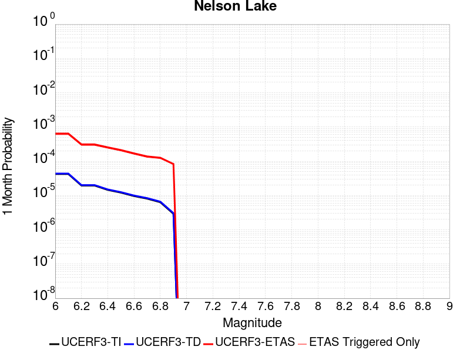 |  |  |

| Magnitude | 1 wk TI Prob | 1 wk TD Prob | 1 wk ETAS Prob | 1 wk ETAS/TD Gain | 1 wk ETAS Triggered Only | 1 mo TI Prob | 1 mo TD Prob | 1 mo ETAS Prob | 1 mo ETAS/TD Gain | 1 mo ETAS Triggered Only | 1 yr TI Prob | 1 yr TD Prob | 1 yr ETAS Prob | 1 yr ETAS/TD Gain | 1 yr ETAS Triggered Only | 10 yr TI Prob | 10 yr TD Prob | 10 yr ETAS Prob | 10 yr ETAS/TD Gain | 10 yr ETAS Triggered Only |
|-----|-----|-----|-----|-----|-----|-----|-----|-----|-----|-----|-----|-----|-----|-----|-----|-----|-----|-----|-----|-----|
| 6.0 | 9.913453E-6 | 1.0192255E-5 | 4.8018747E-4 | 47.112976 | 4.7E-4 | 4.2485535E-5 | 4.3680422E-5 | 6.436542E-4 | 14.735531 | 6.0E-4 | 5.1713863E-4 | 5.316897E-4 | 0.0012812909 | 2.4098473 | 7.5E-4 | 0.0051593683 | 0.005305204 | 0.0061308006 | 1.1556202 | 8.3E-4 |
| 6.1 | 9.913453E-6 | 1.0192255E-5 | 4.8018747E-4 | 47.112976 | 4.7E-4 | 4.2485535E-5 | 4.3680422E-5 | 6.436542E-4 | 14.735531 | 6.0E-4 | 5.1713863E-4 | 5.316897E-4 | 0.0012812909 | 2.4098473 | 7.5E-4 | 0.0051593683 | 0.005305204 | 0.0061308006 | 1.1556202 | 8.3E-4 |
| 6.2 | 4.5596407E-6 | 4.696313E-6 | 2.1469533E-4 | 45.715717 | 2.1E-4 | 1.954117E-5 | 2.0126909E-5 | 3.1012108E-4 | 15.408282 | 2.9E-4 | 2.3788778E-4 | 2.4501883E-4 | 6.049306E-4 | 2.468915 | 3.6E-4 | 0.0023763329 | 0.0024476128 | 0.0028167071 | 1.1507977 | 3.7E-4 |
| 6.3 | 4.5596407E-6 | 4.696313E-6 | 2.1469533E-4 | 45.715717 | 2.1E-4 | 1.954117E-5 | 2.0126909E-5 | 3.1012108E-4 | 15.408282 | 2.9E-4 | 2.3788778E-4 | 2.4501883E-4 | 6.049306E-4 | 2.468915 | 3.6E-4 | 0.0023763329 | 0.0024476128 | 0.0028167071 | 1.1507977 | 3.7E-4 |
| 6.4 | 3.4025713E-6 | 3.5098972E-6 | 1.735093E-4 | 49.434296 | 1.7E-4 | 1.4582367E-5 | 1.5042335E-5 | 2.5503873E-4 | 16.95473 | 2.4E-4 | 1.7752586E-4 | 1.8312587E-4 | 4.7307278E-4 | 2.5833201 | 2.9E-4 | 0.001773841 | 0.0018298327 | 0.0021292837 | 1.1636494 | 3.0E-4 |
| 6.5 | 2.8352947E-6 | 2.927856E-6 | 1.4292744E-4 | 48.816418 | 1.4E-4 | 1.2151207E-5 | 1.2547898E-5 | 2.1254539E-4 | 16.938725 | 2.0E-4 | 1.479309E-4 | 1.5276071E-4 | 3.9272403E-4 | 2.5708447 | 2.4E-4 | 0.0014783246 | 0.0015266308 | 0.0017762491 | 1.1635092 | 2.5E-4 |
| 6.6 | 2.251518E-6 | 2.3290677E-6 | 1.02328835E-4 | 43.935535 | 1.0E-4 | 9.649328E-6 | 9.981683E-6 | 1.6998009E-4 | 17.0292 | 1.6E-4 | 1.1747423E-4 | 1.2152085E-4 | 3.1149774E-4 | 2.5633278 | 1.9E-4 | 0.0011741214 | 0.0012146058 | 0.0014143628 | 1.1644624 | 2.0E-4 |
| 6.7 | 1.8911853E-6 | 1.9591396E-6 | 8.1958984E-5 | 41.83417 | 8.0E-5 | 8.105055E-6 | 8.39629E-6 | 1.383952E-4 | 16.4829 | 1.3E-4 | 9.867457E-5 | 1.0222061E-4 | 2.5220527E-4 | 2.4672644 | 1.5E-4 | 9.863076E-4 | 0.0010217935 | 0.00118163 | 1.1564274 | 1.6E-4 |
| 6.8 | 1.4874814E-6 | 1.5438305E-6 | 7.154372E-5 | 46.341694 | 7.0E-5 | 6.374905E-6 | 6.6164025E-6 | 1.266156E-4 | 19.136623 | 1.2E-4 | 7.76117E-5 | 8.055224E-5 | 2.2054097E-4 | 2.7378626 | 1.4E-4 | 7.75846E-4 | 8.0528157E-4 | 9.5516077E-4 | 1.1861203 | 1.5E-4 |
| 6.9 | 6.835972E-7 | 7.1399285E-7 | 5.0713956E-5 | 71.02866 | 5.0E-5 | 2.9296991E-6 | 3.0599674E-6 | 8.305972E-5 | 27.14399 | 8.0E-5 | 3.56685E-5 | 3.7254784E-5 | 1.2725143E-4 | 3.415707 | 9.0E-5 | 3.5662777E-4 | 3.7251666E-4 | 4.6248312E-4 | 1.2415099 | 9.0E-5 |

## Paradise
*[(top)](#table-of-contents)*

| 1 Week | 1 Month | 1 Year | 10 Year |
|-----|-----|-----|-----|
|  |  |  |  |

| Magnitude | 1 wk TI Prob | 1 wk TD Prob | 1 wk ETAS Prob | 1 wk ETAS/TD Gain | 1 wk ETAS Triggered Only | 1 mo TI Prob | 1 mo TD Prob | 1 mo ETAS Prob | 1 mo ETAS/TD Gain | 1 mo ETAS Triggered Only | 1 yr TI Prob | 1 yr TD Prob | 1 yr ETAS Prob | 1 yr ETAS/TD Gain | 1 yr ETAS Triggered Only | 10 yr TI Prob | 10 yr TD Prob | 10 yr ETAS Prob | 10 yr ETAS/TD Gain | 10 yr ETAS Triggered Only |
|-----|-----|-----|-----|-----|-----|-----|-----|-----|-----|-----|-----|-----|-----|-----|-----|-----|-----|-----|-----|-----|
| 6.0 | 1.4851273E-5 | 1.6694768E-5 | 4.566874E-4 | 27.355122 | 4.4E-4 | 6.364676E-5 | 7.154718E-5 | 6.0150924E-4 | 8.407169 | 5.3E-4 | 7.7462377E-4 | 8.707624E-4 | 0.0015002139 | 1.7228739 | 6.3E-4 | 0.0077192914 | 0.008675884 | 0.009340071 | 1.0765556 | 6.7E-4 |
| 6.1 | 1.4851273E-5 | 1.6694768E-5 | 4.566874E-4 | 27.355122 | 4.4E-4 | 6.364676E-5 | 7.154718E-5 | 6.0150924E-4 | 8.407169 | 5.3E-4 | 7.7462377E-4 | 8.707624E-4 | 0.0015002139 | 1.7228739 | 6.3E-4 | 0.0077192914 | 0.008675884 | 0.009340071 | 1.0765556 | 6.7E-4 |
| 6.2 | 1.4851273E-5 | 1.6694768E-5 | 4.566874E-4 | 27.355122 | 4.4E-4 | 6.364676E-5 | 7.154718E-5 | 6.0150924E-4 | 8.407169 | 5.3E-4 | 7.7462377E-4 | 8.707624E-4 | 0.0015002139 | 1.7228739 | 6.3E-4 | 0.0077192914 | 0.008675884 | 0.009340071 | 1.0765556 | 6.7E-4 |
| 6.3 | 1.0426831E-5 | 1.1888697E-5 | 2.5188585E-4 | 21.187 | 2.4E-4 | 4.4685654E-5 | 5.09506E-5 | 3.3093634E-4 | 6.4952393 | 2.8E-4 | 5.43912E-4 | 6.201529E-4 | 9.4994827E-4 | 1.5317968 | 3.3E-4 | 0.0054258266 | 0.0061848317 | 0.006522729 | 1.0546333 | 3.4E-4 |
| 6.4 | 1.0426831E-5 | 1.1888697E-5 | 2.5188585E-4 | 21.187 | 2.4E-4 | 4.4685654E-5 | 5.09506E-5 | 3.3093634E-4 | 6.4952393 | 2.8E-4 | 5.43912E-4 | 6.201529E-4 | 9.4994827E-4 | 1.5317968 | 3.3E-4 | 0.0054258266 | 0.0061848317 | 0.006522729 | 1.0546333 | 3.4E-4 |
| 6.5 | 9.25027E-6 | 1.0620037E-5 | 1.9061813E-4 | 17.948914 | 1.8E-4 | 3.964341E-5 | 4.551368E-5 | 2.4550458E-4 | 5.3940835 | 2.0E-4 | 4.8255164E-4 | 5.5399304E-4 | 7.938601E-4 | 1.4329784 | 2.4E-4 | 0.0048150513 | 0.0055266195 | 0.005775238 | 1.0449857 | 2.5E-4 |
| 6.6 | 7.904275E-6 | 9.159602E-6 | 1.0915869E-4 | 11.917404 | 1.0E-4 | 3.3875025E-5 | 3.925487E-5 | 1.4925055E-4 | 3.80209 | 1.1E-4 | 4.1235037E-4 | 4.7782718E-4 | 5.9776986E-4 | 1.2510169 | 1.2E-4 | 0.0041158604 | 0.004768395 | 0.0048878225 | 1.0250458 | 1.2E-4 |
| 6.7 | 7.2061953E-6 | 8.407326E-6 | 1.08406486E-4 | 12.894288 | 1.0E-4 | 3.088333E-5 | 3.603092E-5 | 1.3602732E-4 | 3.775294 | 1.0E-4 | 3.7593965E-4 | 4.3859181E-4 | 5.3854793E-4 | 1.2279024 | 1.0E-4 | 0.003753043 | 0.004377631 | 0.0044771936 | 1.0227435 | 1.0E-4 |
| 6.8 | 6.6948724E-6 | 7.842242E-6 | 5.784185E-5 | 7.375678 | 5.0E-5 | 2.8691995E-5 | 3.3609194E-5 | 8.360751E-5 | 2.487638 | 5.0E-5 | 3.4926904E-4 | 4.091187E-4 | 4.5909823E-4 | 1.1221639 | 5.0E-5 | 0.003487206 | 0.0040840125 | 0.0041338084 | 1.0121928 | 5.0E-5 |
| 6.9 | 6.0421025E-6 | 7.1306963E-6 | 2.7130554E-5 | 3.8047552 | 2.0E-5 | 2.5894467E-5 | 3.0559786E-5 | 5.0559178E-5 | 1.6544348 | 2.0E-5 | 3.1521954E-4 | 3.7200528E-4 | 3.9199786E-4 | 1.0537426 | 2.0E-5 | 0.0031477278 | 0.0037141638 | 0.0037340897 | 1.0053648 | 2.0E-5 |
| 7.0 | 4.134091E-6 | 5.0803824E-6 | 1.5080332E-5 | 2.9683456 | 1.0E-5 | 1.7717413E-5 | 2.1772896E-5 | 3.1772677E-5 | 1.4592767 | 1.0E-5 | 2.1568815E-4 | 2.650543E-4 | 2.7505163E-4 | 1.0377182 | 1.0E-5 | 0.0021547892 | 0.0026475347 | 0.0026575082 | 1.0037671 | 1.0E-5 |
| 7.1 | 3.7674888E-6 | 4.631936E-6 | 1.463189E-5 | 3.1589146 | 1.0E-5 | 1.6146281E-5 | 1.9851012E-5 | 2.9850813E-5 | 1.5037427 | 1.0E-5 | 1.9656324E-4 | 2.4166079E-4 | 2.5165838E-4 | 1.0413703 | 1.0E-5 | 0.0019638946 | 0.0024141306 | 0.0024241065 | 1.0041323 | 1.0E-5 |
| 7.2 | 3.4065345E-6 | 4.156782E-6 | 4.156782E-6 | 1.0 | 0.0 | 1.4599351E-5 | 1.7814667E-5 | 1.7814667E-5 | 1.0 | 0.0 | 1.777326E-4 | 2.168735E-4 | 2.168735E-4 | 1.0 | 0.0 | 0.0017759053 | 0.0021667667 | 0.0021667667 | 1.0 | 0.0 |
| 7.3 | 2.9934936E-6 | 3.6293673E-6 | 3.6293673E-6 | 1.0 | 0.0 | 1.2829195E-5 | 1.5554348E-5 | 1.5554348E-5 | 1.0 | 0.0 | 1.5618425E-4 | 1.8935918E-4 | 1.8935918E-4 | 1.0 | 0.0 | 0.0015607453 | 0.0018921237 | 0.0018921237 | 1.0 | 0.0 |
| 7.4 | 2.4049796E-6 | 2.8890186E-6 | 2.8890186E-6 | 1.0 | 0.0 | 1.0307015E-5 | 1.2381457E-5 | 1.2381457E-5 | 1.0 | 0.0 | 1.2548068E-4 | 1.5073526E-4 | 1.5073526E-4 | 1.0 | 0.0 | 0.0012540985 | 0.0015064715 | 0.0015064715 | 1.0 | 0.0 |
| 7.5 | 1.2710091E-6 | 1.5134859E-6 | 1.5134859E-6 | 1.0 | 0.0 | 5.44717E-6 | 6.4863593E-6 | 6.4863593E-6 | 1.0 | 0.0 | 6.631728E-5 | 7.896981E-5 | 7.896981E-5 | 1.0 | 0.0 | 6.6297496E-4 | 7.895401E-4 | 7.895401E-4 | 1.0 | 0.0 |
| 7.6 | 2.21172E-7 | 2.6040198E-7 | 2.6040198E-7 | 1.0 | 0.0 | 9.478797E-7 | 1.1160082E-6 | 1.1160082E-6 | 1.0 | 0.0 | 1.1540374E-5 | 1.3587343E-5 | 1.3587343E-5 | 1.0 | 0.0 | 1.1539775E-4 | 1.3586794E-4 | 1.3586794E-4 | 1.0 | 0.0 |

## Bicycle Lake
*[(top)](#table-of-contents)*

| 1 Week | 1 Month | 1 Year | 10 Year |
|-----|-----|-----|-----|
|  |  |  |  |

| Magnitude | 1 wk TI Prob | 1 wk TD Prob | 1 wk ETAS Prob | 1 wk ETAS/TD Gain | 1 wk ETAS Triggered Only | 1 mo TI Prob | 1 mo TD Prob | 1 mo ETAS Prob | 1 mo ETAS/TD Gain | 1 mo ETAS Triggered Only | 1 yr TI Prob | 1 yr TD Prob | 1 yr ETAS Prob | 1 yr ETAS/TD Gain | 1 yr ETAS Triggered Only | 10 yr TI Prob | 10 yr TD Prob | 10 yr ETAS Prob | 10 yr ETAS/TD Gain | 10 yr ETAS Triggered Only |
|-----|-----|-----|-----|-----|-----|-----|-----|-----|-----|-----|-----|-----|-----|-----|-----|-----|-----|-----|-----|-----|
| 6.0 | 1.9621975E-5 | 2.2097078E-5 | 4.32088E-4 | 19.55408 | 4.1E-4 | 8.4091465E-5 | 9.4699084E-5 | 5.646546E-4 | 5.9626193 | 4.7E-4 | 0.0010233327 | 0.0011524865 | 0.0017218296 | 1.4940128 | 5.7E-4 | 0.01018633 | 0.011478408 | 0.012071521 | 1.0516721 | 6.0E-4 |
| 6.1 | 1.9621975E-5 | 2.2097078E-5 | 4.32088E-4 | 19.55408 | 4.1E-4 | 8.4091465E-5 | 9.4699084E-5 | 5.646546E-4 | 5.9626193 | 4.7E-4 | 0.0010233327 | 0.0011524865 | 0.0017218296 | 1.4940128 | 5.7E-4 | 0.01018633 | 0.011478408 | 0.012071521 | 1.0516721 | 6.0E-4 |
| 6.2 | 9.9971285E-6 | 1.125564E-5 | 2.2125327E-4 | 19.657104 | 2.1E-4 | 4.2844134E-5 | 4.8237856E-5 | 2.7822677E-4 | 5.7678094 | 2.3E-4 | 5.2150246E-4 | 5.871897E-4 | 8.670252E-4 | 1.4765676 | 2.8E-4 | 0.0052028033 | 0.005861487 | 0.0061597284 | 1.0508815 | 3.0E-4 |
| 6.3 | 9.589428E-6 | 1.0798346E-5 | 2.1079619E-4 | 19.521154 | 2.0E-4 | 4.10969E-5 | 4.62781E-5 | 2.6626792E-4 | 5.7536488 | 2.2E-4 | 5.002399E-4 | 5.6334207E-4 | 8.3318993E-4 | 1.4790125 | 2.7E-4 | 0.0049911533 | 0.0056242296 | 0.0059125987 | 1.0512726 | 2.9E-4 |
| 6.4 | 9.589428E-6 | 1.0798346E-5 | 2.1079619E-4 | 19.521154 | 2.0E-4 | 4.10969E-5 | 4.62781E-5 | 2.6626792E-4 | 5.7536488 | 2.2E-4 | 5.002399E-4 | 5.6334207E-4 | 8.3318993E-4 | 1.4790125 | 2.7E-4 | 0.0049911533 | 0.0056242296 | 0.0059125987 | 1.0512726 | 2.9E-4 |
| 6.5 | 5.557707E-6 | 6.2856016E-6 | 1.2628485E-4 | 20.091131 | 1.2E-4 | 2.3818526E-5 | 2.6938165E-5 | 1.5693466E-4 | 5.825737 | 1.3E-4 | 2.8995197E-4 | 3.279497E-4 | 4.9789395E-4 | 1.5182022 | 1.7E-4 | 0.0028957394 | 0.0032772934 | 0.0034666709 | 1.0577847 | 1.9E-4 |
| 6.6 | 4.8742945E-6 | 5.5132896E-6 | 8.5512846E-5 | 15.510313 | 8.0E-5 | 2.0889667E-5 | 2.3628318E-5 | 1.1362619E-4 | 4.808899 | 9.0E-5 | 2.54302E-4 | 2.87663E-4 | 4.0762848E-4 | 1.4170347 | 1.2E-4 | 0.002540112 | 0.0028754752 | 0.0030150726 | 1.0485476 | 1.4E-4 |
| 6.7 | 3.991108E-6 | 4.5159104E-6 | 6.451564E-5 | 14.286298 | 6.0E-5 | 1.7104636E-5 | 1.9353902E-5 | 8.935254E-5 | 4.6167717 | 7.0E-5 | 2.0822904E-4 | 2.3563375E-4 | 3.3561018E-4 | 1.4242874 | 1.0E-4 | 0.0020803404 | 0.0023563374 | 0.0024760547 | 1.0508065 | 1.2E-4 |

## San Andreas (San Bernardino S)
*[(top)](#table-of-contents)*

| 1 Week | 1 Month | 1 Year | 10 Year |
|-----|-----|-----|-----|
|  |  |  |  |

| Magnitude | 1 wk TI Prob | 1 wk TD Prob | 1 wk ETAS Prob | 1 wk ETAS/TD Gain | 1 wk ETAS Triggered Only | 1 mo TI Prob | 1 mo TD Prob | 1 mo ETAS Prob | 1 mo ETAS/TD Gain | 1 mo ETAS Triggered Only | 1 yr TI Prob | 1 yr TD Prob | 1 yr ETAS Prob | 1 yr ETAS/TD Gain | 1 yr ETAS Triggered Only | 10 yr TI Prob | 10 yr TD Prob | 10 yr ETAS Prob | 10 yr ETAS/TD Gain | 10 yr ETAS Triggered Only |
|-----|-----|-----|-----|-----|-----|-----|-----|-----|-----|-----|-----|-----|-----|-----|-----|-----|-----|-----|-----|-----|
| 6.0 | 1.2336002E-4 | 3.0005194E-4 | 7.299229E-4 | 2.4326553 | 4.3E-4 | 5.2857865E-4 | 0.0012853292 | 0.0017547251 | 1.365195 | 4.7E-4 | 0.006416472 | 0.015541554 | 0.016033784 | 1.0316718 | 5.0E-4 | 0.06234337 | 0.14294699 | 0.14342694 | 1.0033575 | 5.6E-4 |
| 6.1 | 1.2336002E-4 | 3.0005194E-4 | 7.299229E-4 | 2.4326553 | 4.3E-4 | 5.2857865E-4 | 0.0012853292 | 0.0017547251 | 1.365195 | 4.7E-4 | 0.006416472 | 0.015541554 | 0.016033784 | 1.0316718 | 5.0E-4 | 0.06234337 | 0.14294699 | 0.14342694 | 1.0033575 | 5.6E-4 |
| 6.2 | 1.2336002E-4 | 3.0005194E-4 | 7.299229E-4 | 2.4326553 | 4.3E-4 | 5.2857865E-4 | 0.0012853292 | 0.0017547251 | 1.365195 | 4.7E-4 | 0.006416472 | 0.015541554 | 0.016033784 | 1.0316718 | 5.0E-4 | 0.06234337 | 0.14294699 | 0.14342694 | 1.0033575 | 5.6E-4 |
| 6.3 | 1.1712257E-4 | 2.8793467E-4 | 7.078137E-4 | 2.4582443 | 4.2E-4 | 5.018573E-4 | 0.0012334478 | 0.0016928804 | 1.3724784 | 4.6E-4 | 0.006093008 | 0.014918666 | 0.015401356 | 1.0323547 | 4.9E-4 | 0.059286322 | 0.13765779 | 0.13813207 | 1.0034454 | 5.5E-4 |
| 6.4 | 1.1712257E-4 | 2.8793467E-4 | 7.078137E-4 | 2.4582443 | 4.2E-4 | 5.018573E-4 | 0.0012334478 | 0.0016928804 | 1.3724784 | 4.6E-4 | 0.006093008 | 0.014918666 | 0.015401356 | 1.0323547 | 4.9E-4 | 0.059286322 | 0.13765779 | 0.13813207 | 1.0034454 | 5.5E-4 |
| 6.5 | 1.0689076E-4 | 2.6806415E-4 | 6.879516E-4 | 2.566369 | 4.2E-4 | 4.5802278E-4 | 0.0011483653 | 0.001607837 | 1.4001094 | 4.6E-4 | 0.0055621783 | 0.013896335 | 0.0143795265 | 1.0347711 | 4.9E-4 | 0.05425003 | 0.1288989 | 0.129378 | 1.003717 | 5.5E-4 |
| 6.6 | 9.7648895E-5 | 2.505129E-4 | 6.704077E-4 | 2.6761403 | 4.2E-4 | 4.1842813E-4 | 0.0010732086 | 0.0015327149 | 1.4281613 | 4.6E-4 | 0.005082469 | 0.012992399 | 0.013476033 | 1.0372244 | 4.9E-4 | 0.049677886 | 0.121077746 | 0.121561155 | 1.0039926 | 5.5E-4 |
| 6.7 | 8.757013E-5 | 2.3122175E-4 | 6.5112463E-4 | 2.816018 | 4.2E-4 | 3.7524657E-4 | 9.905964E-4 | 0.0014501406 | 1.4639068 | 4.6E-4 | 0.00455906 | 0.011997902 | 0.012482023 | 1.0403504 | 4.9E-4 | 0.04466656 | 0.112373024 | 0.112861216 | 1.0043445 | 5.5E-4 |
| 6.8 | 8.562978E-5 | 2.2682057E-4 | 6.467253E-4 | 2.851264 | 4.2E-4 | 3.6693315E-4 | 9.7174826E-4 | 0.0014313012 | 1.4729136 | 4.6E-4 | 0.004458263 | 0.011770921 | 0.012255154 | 1.041138 | 4.9E-4 | 0.043698758 | 0.11037863 | 0.110867925 | 1.0044328 | 5.5E-4 |
| 6.9 | 6.124075E-5 | 1.7066885E-4 | 5.805989E-4 | 3.4019032 | 4.1E-4 | 2.6243398E-4 | 7.312337E-4 | 0.0011809047 | 1.6149483 | 4.5E-4 | 0.0031904527 | 0.008866636 | 0.009342381 | 1.0536555 | 4.8E-4 | 0.031450346 | 0.08420262 | 0.08468799 | 1.0057644 | 5.3E-4 |
| 7.0 | 5.8598747E-5 | 1.6495936E-4 | 5.7489175E-4 | 3.4850507 | 4.1E-4 | 2.5111332E-4 | 7.067779E-4 | 0.0011564599 | 1.6362423 | 4.5E-4 | 0.0030530186 | 0.008571265 | 0.009047152 | 1.055521 | 4.8E-4 | 0.03011414 | 0.08151562 | 0.08200241 | 1.0059718 | 5.3E-4 |
| 7.1 | 5.613814E-5 | 1.5914452E-4 | 5.6907925E-4 | 3.5758648 | 4.1E-4 | 2.4056983E-4 | 6.818704E-4 | 0.0011315636 | 1.6594994 | 4.5E-4 | 0.0029250039 | 0.008270353 | 0.008746383 | 1.0575587 | 4.8E-4 | 0.028868021 | 0.07881268 | 0.07930091 | 1.0061948 | 5.3E-4 |
| 7.2 | 4.991222E-5 | 1.4520933E-4 | 5.4515124E-4 | 3.754244 | 4.0E-4 | 2.1389198E-4 | 6.221777E-4 | 0.0010619039 | 1.7067535 | 4.4E-4 | 0.002601025 | 0.0075488063 | 0.008015258 | 1.0617915 | 4.7E-4 | 0.025707912 | 0.07226191 | 0.07274433 | 1.0066761 | 5.2E-4 |
| 7.3 | 4.7410045E-5 | 1.371513E-4 | 5.2709784E-4 | 3.8431847 | 3.9E-4 | 2.0317009E-4 | 5.8765925E-4 | 0.0010174066 | 1.7312865 | 4.3E-4 | 0.0024707897 | 0.0071313656 | 0.0075781564 | 1.0626515 | 4.5E-4 | 0.024434982 | 0.068541944 | 0.06900767 | 1.0067948 | 5.0E-4 |
| 7.4 | 4.5556746E-5 | 1.3123035E-4 | 5.111805E-4 | 3.8952918 | 3.8E-4 | 1.952286E-4 | 5.6229485E-4 | 9.820587E-4 | 1.7465191 | 4.2E-4 | 0.002374317 | 0.0068245293 | 0.007261527 | 1.0640333 | 4.4E-4 | 0.023491086 | 0.06579143 | 0.06624919 | 1.0069578 | 4.9E-4 |
| 7.5 | 4.3084514E-5 | 1.2358342E-4 | 5.035365E-4 | 4.074466 | 3.8E-4 | 1.8463485E-4 | 5.2953605E-4 | 9.4931363E-4 | 1.7927271 | 4.2E-4 | 0.0022456115 | 0.0064281146 | 0.0068652863 | 1.0680093 | 4.4E-4 | 0.022230545 | 0.062190283 | 0.06264981 | 1.0073891 | 4.9E-4 |
| 7.6 | 3.408608E-5 | 9.836477E-5 | 4.6832836E-4 | 4.7611394 | 3.7E-4 | 1.4607502E-4 | 4.214953E-4 | 8.3132245E-4 | 1.9723173 | 4.1E-4 | 0.0017770125 | 0.005119656 | 0.0055474546 | 1.08356 | 4.3E-4 | 0.017628696 | 0.05002244 | 0.050478425 | 1.0091157 | 4.8E-4 |
| 7.7 | 2.8315713E-5 | 8.2495724E-5 | 4.524652E-4 | 5.4847107 | 3.7E-4 | 1.2134742E-4 | 3.5350522E-4 | 7.633603E-4 | 2.159403 | 4.1E-4 | 0.0014764034 | 0.004295442 | 0.0047235945 | 1.0996761 | 4.3E-4 | 0.01466633 | 0.042272415 | 0.042732127 | 1.0108749 | 4.8E-4 |
| 7.8 | 2.6222975E-5 | 7.463898E-5 | 4.4461136E-4 | 5.9568253 | 3.7E-4 | 1.1237934E-4 | 3.1984213E-4 | 7.29711E-4 | 2.2814724 | 4.1E-4 | 0.0013673597 | 0.003887131 | 0.0043154596 | 1.1101915 | 4.3E-4 | 0.013589768 | 0.038437475 | 0.038899023 | 1.0120078 | 4.8E-4 |
| 7.9 | 2.1469694E-5 | 5.7884805E-5 | 3.778663E-4 | 6.527901 | 3.2E-4 | 9.200973E-5 | 2.4805416E-4 | 5.9796736E-4 | 2.4106321 | 3.5E-4 | 0.0011196428 | 0.00301588 | 0.0033847643 | 1.122314 | 3.7E-4 | 0.011140184 | 0.030153265 | 0.030550903 | 1.0131872 | 4.1E-4 |
| 8.0 | 1.2420249E-5 | 3.1321662E-5 | 1.6131758E-4 | 5.150352 | 1.3E-4 | 5.322855E-5 | 1.342288E-4 | 2.9420733E-4 | 2.1918347 | 1.6E-4 | 6.478649E-4 | 0.0016330116 | 0.001802734 | 1.1039321 | 1.7E-4 | 0.0064597935 | 0.01652369 | 0.016710551 | 1.0113087 | 1.9E-4 |
| 8.1 | 4.9197724E-6 | 7.822525E-6 | 7.822525E-6 | 1.0 | 0.0 | 2.1084568E-5 | 3.3524673E-5 | 3.3524673E-5 | 1.0 | 0.0 | 2.566744E-4 | 4.080866E-4 | 4.080866E-4 | 1.0 | 0.0 | 0.002563781 | 0.004384557 | 0.004384557 | 1.0 | 0.0 |
| 8.2 | 2.5634774E-6 | 2.9065757E-6 | 2.9065757E-6 | 1.0 | 0.0 | 1.0986286E-5 | 1.2456694E-5 | 1.2456694E-5 | 1.0 | 0.0 | 1.3374983E-4 | 1.5164974E-4 | 1.5164974E-4 | 1.0 | 0.0 | 0.0013366934 | 0.001704941 | 0.001704941 | 1.0 | 0.0 |
| 8.3 | 5.2850464E-7 | 3.2080476E-7 | 3.2080476E-7 | 1.0 | 0.0 | 2.2650179E-6 | 1.3748769E-6 | 1.3748769E-6 | 1.0 | 0.0 | 2.7576245E-5 | 1.673901E-5 | 1.673901E-5 | 1.0 | 0.0 | 2.7572823E-4 | 1.986671E-4 | 1.986671E-4 | 1.0 | 0.0 |

## Helendale-So Lockhart
*[(top)](#table-of-contents)*

| 1 Week | 1 Month | 1 Year | 10 Year |
|-----|-----|-----|-----|
|  |  |  |  |

| Magnitude | 1 wk TI Prob | 1 wk TD Prob | 1 wk ETAS Prob | 1 wk ETAS/TD Gain | 1 wk ETAS Triggered Only | 1 mo TI Prob | 1 mo TD Prob | 1 mo ETAS Prob | 1 mo ETAS/TD Gain | 1 mo ETAS Triggered Only | 1 yr TI Prob | 1 yr TD Prob | 1 yr ETAS Prob | 1 yr ETAS/TD Gain | 1 yr ETAS Triggered Only | 10 yr TI Prob | 10 yr TD Prob | 10 yr ETAS Prob | 10 yr ETAS/TD Gain | 10 yr ETAS Triggered Only |
|-----|-----|-----|-----|-----|-----|-----|-----|-----|-----|-----|-----|-----|-----|-----|-----|-----|-----|-----|-----|-----|
| 6.0 | 1.7296055E-5 | 1.8103729E-5 | 3.180983E-4 | 17.570871 | 3.0E-4 | 7.412385E-5 | 7.7585224E-5 | 4.4755652E-4 | 5.7685795 | 3.7E-4 | 9.0208417E-4 | 9.4421144E-4 | 0.0013738055 | 1.4549764 | 4.3E-4 | 0.008984311 | 0.009404116 | 0.00985979 | 1.0484548 | 4.6E-4 |
| 6.1 | 1.7296055E-5 | 1.8103729E-5 | 3.180983E-4 | 17.570871 | 3.0E-4 | 7.412385E-5 | 7.7585224E-5 | 4.4755652E-4 | 5.7685795 | 3.7E-4 | 9.0208417E-4 | 9.4421144E-4 | 0.0013738055 | 1.4549764 | 4.3E-4 | 0.008984311 | 0.009404116 | 0.00985979 | 1.0484548 | 4.6E-4 |
| 6.2 | 1.7296055E-5 | 1.8103729E-5 | 3.180983E-4 | 17.570871 | 3.0E-4 | 7.412385E-5 | 7.7585224E-5 | 4.4755652E-4 | 5.7685795 | 3.7E-4 | 9.0208417E-4 | 9.4421144E-4 | 0.0013738055 | 1.4549764 | 4.3E-4 | 0.008984311 | 0.009404116 | 0.00985979 | 1.0484548 | 4.6E-4 |
| 6.3 | 1.0669118E-5 | 1.1135425E-5 | 2.6113263E-4 | 23.450623 | 2.5E-4 | 4.5723988E-5 | 4.772239E-5 | 3.5770758E-4 | 7.4955926 | 3.1E-4 | 5.5654737E-4 | 5.80868E-4 | 9.106763E-4 | 1.5677853 | 3.3E-4 | 0.0055515557 | 0.0057937936 | 0.006121882 | 1.0566275 | 3.3E-4 |
| 6.4 | 1.0669118E-5 | 1.1135425E-5 | 2.6113263E-4 | 23.450623 | 2.5E-4 | 4.5723988E-5 | 4.772239E-5 | 3.5770758E-4 | 7.4955926 | 3.1E-4 | 5.5654737E-4 | 5.80868E-4 | 9.106763E-4 | 1.5677853 | 3.3E-4 | 0.0055515557 | 0.0057937936 | 0.006121882 | 1.0566275 | 3.3E-4 |
| 6.5 | 8.790038E-6 | 9.170197E-6 | 2.591679E-4 | 28.261978 | 2.5E-4 | 3.767105E-5 | 3.930026E-5 | 3.2928886E-4 | 8.378796 | 2.9E-4 | 4.585485E-4 | 4.7837716E-4 | 7.882289E-4 | 1.6477143 | 3.1E-4 | 0.0045760344 | 0.004773638 | 0.0050821584 | 1.06463 | 3.1E-4 |
| 6.6 | 7.396949E-6 | 7.715537E-6 | 2.1771391E-4 | 28.217598 | 2.1E-4 | 3.1700827E-5 | 3.3066175E-5 | 2.8305792E-4 | 8.560347 | 2.5E-4 | 3.858892E-4 | 4.025073E-4 | 6.6240266E-4 | 1.645691 | 2.6E-4 | 0.003852198 | 0.00401789 | 0.004276845 | 1.0644506 | 2.6E-4 |
| 6.7 | 6.4600285E-6 | 6.738031E-6 | 2.0673669E-4 | 30.682062 | 2.0E-4 | 2.7685543E-5 | 2.887696E-5 | 2.6887003E-4 | 9.310884 | 2.4E-4 | 3.3701936E-4 | 3.5152107E-4 | 5.914367E-4 | 1.6825072 | 2.4E-4 | 0.0033650869 | 0.003509732 | 0.0037488895 | 1.0681413 | 2.4E-4 |
| 6.8 | 5.600104E-6 | 5.836009E-6 | 1.7583501E-4 | 30.129324 | 1.7E-4 | 2.4000226E-5 | 2.5011232E-5 | 2.3500598E-4 | 9.396018 | 2.1E-4 | 2.9216358E-4 | 3.044698E-4 | 5.1440584E-4 | 1.6895136 | 2.1E-4 | 0.0029177975 | 0.003040588 | 0.0032499495 | 1.0688556 | 2.1E-4 |
| 6.9 | 4.839122E-6 | 5.0395092E-6 | 1.3503885E-4 | 26.796032 | 1.3E-4 | 2.0738931E-5 | 2.159772E-5 | 1.9159405E-4 | 8.871031 | 1.7E-4 | 2.5246723E-4 | 2.6292098E-4 | 4.328763E-4 | 1.6464121 | 1.7E-4 | 0.002521806 | 0.002626147 | 0.0027957004 | 1.0645636 | 1.7E-4 |
| 7.0 | 3.6937633E-6 | 3.845208E-6 | 1.03844824E-4 | 27.006296 | 1.0E-4 | 1.5830317E-5 | 1.647936E-5 | 1.4647722E-4 | 8.888526 | 1.3E-4 | 1.9271708E-4 | 2.0061806E-4 | 3.3059198E-4 | 1.6478676 | 1.3E-4 | 0.0019255003 | 0.002004401 | 0.0021341403 | 1.0647273 | 1.3E-4 |
| 7.1 | 2.7858857E-6 | 2.8978538E-6 | 6.289768E-5 | 21.704918 | 6.0E-5 | 1.1939455E-5 | 1.2419316E-5 | 1.024182E-4 | 8.246686 | 9.0E-5 | 1.4535317E-4 | 1.511949E-4 | 2.4118129E-4 | 1.5951682 | 9.0E-5 | 0.0014525814 | 0.0015109418 | 0.0016008058 | 1.0594755 | 9.0E-5 |
| 7.2 | 2.1672065E-6 | 2.2540128E-6 | 5.22539E-5 | 23.18261 | 5.0E-5 | 9.2879945E-6 | 9.66002E-6 | 7.9659345E-5 | 8.246292 | 7.0E-5 | 1.1307546E-4 | 1.1760458E-4 | 1.8759635E-4 | 1.5951449 | 7.0E-5 | 0.0011301794 | 0.0011754417 | 0.0012453593 | 1.0594821 | 7.0E-5 |
| 7.3 | 1.4823496E-6 | 1.5422102E-6 | 5.1542134E-5 | 33.42095 | 5.0E-5 | 6.3529114E-6 | 6.6094562E-6 | 6.660906E-5 | 10.077843 | 6.0E-5 | 7.734395E-5 | 8.046731E-5 | 1.4046249E-4 | 1.7455844 | 6.0E-5 | 7.731704E-4 | 8.0439687E-4 | 8.643486E-4 | 1.07453 | 6.0E-5 |
| 7.4 | 4.2321457E-7 | 4.4108765E-7 | 1.0441083E-5 | 23.67122 | 1.0E-5 | 1.8137755E-6 | 1.8903745E-6 | 1.1890355E-5 | 6.289947 | 1.0E-5 | 2.2082493E-5 | 2.3015113E-5 | 3.3014883E-5 | 1.4344871 | 1.0E-5 | 2.2080299E-4 | 2.3013182E-4 | 2.4012952E-4 | 1.0434433 | 1.0E-5 |
| 7.5 | 5.6942316E-8 | 5.9415648E-8 | 5.9415648E-8 | 1.0 | 0.0 | 2.440385E-7 | 2.5463845E-7 | 2.5463845E-7 | 1.0 | 0.0 | 2.9711643E-6 | 3.1002196E-6 | 3.1002196E-6 | 1.0 | 0.0 | 2.9711247E-5 | 3.1001844E-5 | 3.1001844E-5 | 1.0 | 0.0 |

## Garlic Springs
*[(top)](#table-of-contents)*

| 1 Week | 1 Month | 1 Year | 10 Year |
|-----|-----|-----|-----|
|  |  |  |  |

| Magnitude | 1 wk TI Prob | 1 wk TD Prob | 1 wk ETAS Prob | 1 wk ETAS/TD Gain | 1 wk ETAS Triggered Only | 1 mo TI Prob | 1 mo TD Prob | 1 mo ETAS Prob | 1 mo ETAS/TD Gain | 1 mo ETAS Triggered Only | 1 yr TI Prob | 1 yr TD Prob | 1 yr ETAS Prob | 1 yr ETAS/TD Gain | 1 yr ETAS Triggered Only | 10 yr TI Prob | 10 yr TD Prob | 10 yr ETAS Prob | 10 yr ETAS/TD Gain | 10 yr ETAS Triggered Only |
|-----|-----|-----|-----|-----|-----|-----|-----|-----|-----|-----|-----|-----|-----|-----|-----|-----|-----|-----|-----|-----|
| 6.0 | 1.6760017E-5 | 1.8776833E-5 | 2.9877157E-4 | 15.911714 | 2.8E-4 | 7.182667E-5 | 8.0470316E-5 | 4.2044296E-4 | 5.22482 | 3.4E-4 | 8.7413884E-4 | 9.794032E-4 | 0.0013690213 | 1.3978117 | 3.9E-4 | 0.008707083 | 0.009762413 | 0.010178313 | 1.0426022 | 4.2E-4 |
| 6.1 | 9.852767E-6 | 1.0973587E-5 | 1.4097216E-4 | 12.846498 | 1.3E-4 | 4.222546E-5 | 4.702921E-5 | 2.0702169E-4 | 4.401981 | 1.6E-4 | 5.139737E-4 | 5.7250116E-4 | 7.623924E-4 | 1.3316871 | 1.9E-4 | 0.005127866 | 0.005717221 | 0.005926021 | 1.0365211 | 2.1E-4 |
| 6.2 | 9.852767E-6 | 1.0973587E-5 | 1.4097216E-4 | 12.846498 | 1.3E-4 | 4.222546E-5 | 4.702921E-5 | 2.0702169E-4 | 4.401981 | 1.6E-4 | 5.139737E-4 | 5.7250116E-4 | 7.623924E-4 | 1.3316871 | 1.9E-4 | 0.005127866 | 0.005717221 | 0.005926021 | 1.0365211 | 2.1E-4 |
| 6.3 | 4.3167724E-6 | 4.7780286E-6 | 5.477779E-5 | 11.464517 | 5.0E-5 | 1.8500323E-5 | 2.0477235E-5 | 9.04758E-5 | 4.41836 | 7.0E-5 | 2.2521814E-4 | 2.4930484E-4 | 3.3928241E-4 | 1.3609139 | 9.0E-5 | 0.0022499003 | 0.00249251 | 0.0025822856 | 1.0360181 | 9.0E-5 |
| 6.4 | 4.3167724E-6 | 4.7780286E-6 | 5.477779E-5 | 11.464517 | 5.0E-5 | 1.8500323E-5 | 2.0477235E-5 | 9.04758E-5 | 4.41836 | 7.0E-5 | 2.2521814E-4 | 2.4930484E-4 | 3.3928241E-4 | 1.3609139 | 9.0E-5 | 0.0022499003 | 0.00249251 | 0.0025822856 | 1.0360181 | 9.0E-5 |
| 6.5 | 4.3167724E-6 | 4.7780286E-6 | 5.477779E-5 | 11.464517 | 5.0E-5 | 1.8500323E-5 | 2.0477235E-5 | 9.04758E-5 | 4.41836 | 7.0E-5 | 2.2521814E-4 | 2.4930484E-4 | 3.3928241E-4 | 1.3609139 | 9.0E-5 | 0.0022499003 | 0.00249251 | 0.0025822856 | 1.0360181 | 9.0E-5 |
| 6.6 | 4.301311E-6 | 4.760897E-6 | 5.4760658E-5 | 11.502172 | 5.0E-5 | 1.8434059E-5 | 2.0403815E-5 | 9.0402384E-5 | 4.430661 | 7.0E-5 | 2.2441156E-4 | 2.4841115E-4 | 3.383888E-4 | 1.3622125 | 9.0E-5 | 0.0022418506 | 0.002483593 | 0.0025733695 | 1.0361478 | 9.0E-5 |
| 6.7 | 3.8599724E-6 | 4.27106E-6 | 5.4270848E-5 | 12.706646 | 5.0E-5 | 1.6542634E-5 | 1.8304541E-5 | 8.830326E-5 | 4.8241177 | 7.0E-5 | 2.0138794E-4 | 2.228578E-4 | 3.0283997E-4 | 1.3588933 | 8.0E-5 | 0.0020120554 | 0.002228578 | 0.0023083996 | 1.0358174 | 8.0E-5 |

## Death Valley (Black Mtns Frontal)
*[(top)](#table-of-contents)*

| 1 Week | 1 Month | 1 Year | 10 Year |
|-----|-----|-----|-----|
|  |  |  |  |

| Magnitude | 1 wk TI Prob | 1 wk TD Prob | 1 wk ETAS Prob | 1 wk ETAS/TD Gain | 1 wk ETAS Triggered Only | 1 mo TI Prob | 1 mo TD Prob | 1 mo ETAS Prob | 1 mo ETAS/TD Gain | 1 mo ETAS Triggered Only | 1 yr TI Prob | 1 yr TD Prob | 1 yr ETAS Prob | 1 yr ETAS/TD Gain | 1 yr ETAS Triggered Only | 10 yr TI Prob | 10 yr TD Prob | 10 yr ETAS Prob | 10 yr ETAS/TD Gain | 10 yr ETAS Triggered Only |
|-----|-----|-----|-----|-----|-----|-----|-----|-----|-----|-----|-----|-----|-----|-----|-----|-----|-----|-----|-----|-----|
| 6.0 | 1.6707214E-5 | 1.867027E-5 | 2.586658E-4 | 13.854423 | 2.4E-4 | 7.160038E-5 | 8.001303E-5 | 3.3999223E-4 | 4.249211 | 2.6E-4 | 8.71386E-4 | 9.737309E-4 | 0.0012634485 | 1.2975336 | 2.9E-4 | 0.00867977 | 0.009695496 | 0.0100222975 | 1.0337064 | 3.3E-4 |
| 6.1 | 1.6707214E-5 | 1.867027E-5 | 2.586658E-4 | 13.854423 | 2.4E-4 | 7.160038E-5 | 8.001303E-5 | 3.3999223E-4 | 4.249211 | 2.6E-4 | 8.71386E-4 | 9.737309E-4 | 0.0012634485 | 1.2975336 | 2.9E-4 | 0.00867977 | 0.009695496 | 0.0100222975 | 1.0337064 | 3.3E-4 |
| 6.2 | 1.6707214E-5 | 1.867027E-5 | 2.586658E-4 | 13.854423 | 2.4E-4 | 7.160038E-5 | 8.001303E-5 | 3.3999223E-4 | 4.249211 | 2.6E-4 | 8.71386E-4 | 9.737309E-4 | 0.0012634485 | 1.2975336 | 2.9E-4 | 0.00867977 | 0.009695496 | 0.0100222975 | 1.0337064 | 3.3E-4 |
| 6.3 | 1.6707214E-5 | 1.867027E-5 | 2.586658E-4 | 13.854423 | 2.4E-4 | 7.160038E-5 | 8.001303E-5 | 3.3999223E-4 | 4.249211 | 2.6E-4 | 8.71386E-4 | 9.737309E-4 | 0.0012634485 | 1.2975336 | 2.9E-4 | 0.00867977 | 0.009695496 | 0.0100222975 | 1.0337064 | 3.3E-4 |
| 6.4 | 1.5515609E-5 | 1.7338214E-5 | 2.4733422E-4 | 14.265266 | 2.3E-4 | 6.649377E-5 | 7.4304546E-5 | 3.2428597E-4 | 4.3642817 | 2.5E-4 | 8.0926094E-4 | 9.042885E-4 | 0.0011840353 | 1.3093557 | 2.8E-4 | 0.008063202 | 0.009006773 | 0.009313981 | 1.0341085 | 3.1E-4 |
| 6.5 | 1.5515609E-5 | 1.7338214E-5 | 2.4733422E-4 | 14.265266 | 2.3E-4 | 6.649377E-5 | 7.4304546E-5 | 3.2428597E-4 | 4.3642817 | 2.5E-4 | 8.0926094E-4 | 9.042885E-4 | 0.0011840353 | 1.3093557 | 2.8E-4 | 0.008063202 | 0.009006773 | 0.009313981 | 1.0341085 | 3.1E-4 |
| 6.6 | 1.5041828E-5 | 1.6809145E-5 | 2.3680544E-4 | 14.0878935 | 2.2E-4 | 6.4463384E-5 | 7.203723E-5 | 3.1201995E-4 | 4.3313704 | 2.4E-4 | 7.8455906E-4 | 8.767063E-4 | 0.0011464696 | 1.3077009 | 2.7E-4 | 0.00781795 | 0.008733132 | 0.0090305125 | 1.0340519 | 3.0E-4 |
| 6.7 | 1.4634985E-5 | 1.6356016E-5 | 2.2635258E-4 | 13.839102 | 2.1E-4 | 6.271985E-5 | 7.009536E-5 | 3.0007923E-4 | 4.2810144 | 2.3E-4 | 7.6334673E-4 | 8.5308263E-4 | 0.0011028694 | 1.2928048 | 2.5E-4 | 0.007607299 | 0.008498715 | 0.008776336 | 1.0326662 | 2.8E-4 |
| 6.8 | 1.4209158E-5 | 1.5882048E-5 | 1.9587918E-4 | 12.333371 | 1.8E-4 | 6.089497E-5 | 6.8064175E-5 | 2.6805056E-4 | 3.9382033 | 2.0E-4 | 7.4114406E-4 | 8.2837185E-4 | 0.0010481896 | 1.2653612 | 2.2E-4 | 0.007386771 | 0.008253456 | 0.008491475 | 1.0288388 | 2.4E-4 |
| 6.9 | 1.3780098E-5 | 1.5404594E-5 | 1.6540228E-4 | 10.7372055 | 1.5E-4 | 5.9056227E-5 | 6.6018045E-5 | 2.2600748E-4 | 3.4234197 | 1.6E-4 | 7.1877235E-4 | 8.0347876E-4 | 9.833341E-4 | 1.2238458 | 1.8E-4 | 0.0071645193 | 0.008006332 | 0.008204731 | 1.0247803 | 2.0E-4 |
| 7.0 | 1.3585064E-5 | 1.5188155E-5 | 1.4518618E-4 | 9.559172 | 1.3E-4 | 5.8220405E-5 | 6.50905E-5 | 2.050814E-4 | 3.1507115 | 1.4E-4 | 7.086029E-4 | 7.9219416E-4 | 9.5206744E-4 | 1.2018107 | 1.6E-4 | 0.007063476 | 0.007894293 | 0.008072873 | 1.0226213 | 1.8E-4 |
| 7.1 | 1.3398601E-5 | 1.49813395E-5 | 1.4497939E-4 | 9.677332 | 1.3E-4 | 5.742131E-5 | 6.420419E-5 | 1.9419585E-4 | 3.0246599 | 1.3E-4 | 6.9888023E-4 | 7.8141113E-4 | 9.3129394E-4 | 1.1918104 | 1.5E-4 | 0.0069668638 | 0.007787224 | 0.0079559 | 1.0216607 | 1.7E-4 |
| 7.2 | 1.3126312E-5 | 1.4679561E-5 | 1.4467766E-4 | 9.8557205 | 1.3E-4 | 5.6254412E-5 | 6.291092E-5 | 1.9290273E-4 | 3.066284 | 1.3E-4 | 6.846822E-4 | 7.6567667E-4 | 9.155618E-4 | 1.1957551 | 1.5E-4 | 0.006825765 | 0.00763097 | 0.007799673 | 1.0221076 | 1.7E-4 |
| 7.3 | 1.2922429E-5 | 1.4453788E-5 | 1.3445206E-4 | 9.302202 | 1.2E-4 | 5.5380664E-5 | 6.194336E-5 | 1.8193593E-4 | 2.9371336 | 1.2E-4 | 6.74051E-4 | 7.53905E-4 | 8.937994E-4 | 1.1855597 | 1.4E-4 | 0.006720101 | 0.007514055 | 0.0076728524 | 1.0211334 | 1.6E-4 |
| 7.4 | 1.2768878E-5 | 1.4283772E-5 | 1.3428206E-4 | 9.401023 | 1.2E-4 | 5.4722615E-5 | 6.1214756E-5 | 1.812074E-4 | 2.9601917 | 1.2E-4 | 6.660441E-4 | 7.4504025E-4 | 8.8493596E-4 | 1.1877693 | 1.4E-4 | 0.0066405144 | 0.0074260035 | 0.0075848154 | 1.0213859 | 1.6E-4 |
| 7.5 | 1.2521929E-5 | 1.40120155E-5 | 1.2401048E-4 | 8.850295 | 1.1E-4 | 5.366431E-5 | 6.005014E-5 | 1.7004354E-4 | 2.8316925 | 1.1E-4 | 6.531671E-4 | 7.3087064E-4 | 8.6077565E-4 | 1.1777401 | 1.3E-4 | 0.006512506 | 0.0072852457 | 0.007434153 | 1.0204395 | 1.5E-4 |
| 7.6 | 1.1301089E-5 | 1.2648149E-5 | 1.0264701E-4 | 8.115576 | 9.0E-5 | 4.8432343E-5 | 5.4205255E-5 | 1.4420037E-4 | 2.6602657 | 9.0E-5 | 5.895042E-4 | 6.5975444E-4 | 7.696819E-4 | 1.1666187 | 1.1E-4 | 0.0058794282 | 0.00657851 | 0.0067076553 | 1.0196313 | 1.3E-4 |
| 7.7 | 9.189108E-6 | 1.0283358E-5 | 9.0282534E-5 | 8.77948 | 8.0E-5 | 3.93813E-5 | 4.407082E-5 | 1.240673E-4 | 2.81518 | 8.0E-5 | 4.7936183E-4 | 5.3643517E-4 | 6.363815E-4 | 1.1863158 | 1.0E-4 | 0.004783291 | 0.005351914 | 0.005451379 | 1.0185848 | 1.0E-4 |
| 7.8 | 3.4586725E-7 | 3.6482615E-7 | 3.6482615E-7 | 1.0 | 0.0 | 1.4822873E-6 | 1.5635396E-6 | 1.5635396E-6 | 1.0 | 0.0 | 1.80467E-5 | 1.9035933E-5 | 1.9035933E-5 | 1.0 | 0.0 | 1.8045233E-4 | 1.9034347E-4 | 1.9034347E-4 | 1.0 | 0.0 |
| 7.9 | 2.5591178E-9 | 2.6696718E-9 | 2.6696718E-9 | 1.0 | 0.0 | 1.0967647E-8 | 1.14414505E-8 | 1.14414505E-8 | 1.0 | 0.0 | 1.335311E-7 | 1.3929966E-7 | 1.3929966E-7 | 1.0 | 0.0 | 1.3353102E-6 | 1.3929966E-6 | 1.3929966E-6 | 1.0 | 0.0 |

## San Andreas (San Gorgonio Pass-Garnet HIll)
*[(top)](#table-of-contents)*

| 1 Week | 1 Month | 1 Year | 10 Year |
|-----|-----|-----|-----|
|  |  |  |  |

| Magnitude | 1 wk TI Prob | 1 wk TD Prob | 1 wk ETAS Prob | 1 wk ETAS/TD Gain | 1 wk ETAS Triggered Only | 1 mo TI Prob | 1 mo TD Prob | 1 mo ETAS Prob | 1 mo ETAS/TD Gain | 1 mo ETAS Triggered Only | 1 yr TI Prob | 1 yr TD Prob | 1 yr ETAS Prob | 1 yr ETAS/TD Gain | 1 yr ETAS Triggered Only | 10 yr TI Prob | 10 yr TD Prob | 10 yr ETAS Prob | 10 yr ETAS/TD Gain | 10 yr ETAS Triggered Only |
|-----|-----|-----|-----|-----|-----|-----|-----|-----|-----|-----|-----|-----|-----|-----|-----|-----|-----|-----|-----|-----|
| 6.0 | 8.31567E-5 | 2.3384395E-4 | 4.6379017E-4 | 1.9833319 | 2.3E-4 | 3.5633717E-4 | 0.0010018025 | 0.0012615421 | 1.2592722 | 2.6E-4 | 0.004329778 | 0.012128622 | 0.0123953475 | 1.0219914 | 2.7E-4 | 0.042463828 | 0.11258187 | 0.11283922 | 1.002286 | 2.9E-4 |
| 6.1 | 8.31567E-5 | 2.3384395E-4 | 4.6379017E-4 | 1.9833319 | 2.3E-4 | 3.5633717E-4 | 0.0010018025 | 0.0012615421 | 1.2592722 | 2.6E-4 | 0.004329778 | 0.012128622 | 0.0123953475 | 1.0219914 | 2.7E-4 | 0.042463828 | 0.11258187 | 0.11283922 | 1.002286 | 2.9E-4 |
| 6.2 | 8.31567E-5 | 2.3384395E-4 | 4.6379017E-4 | 1.9833319 | 2.3E-4 | 3.5633717E-4 | 0.0010018025 | 0.0012615421 | 1.2592722 | 2.6E-4 | 0.004329778 | 0.012128622 | 0.0123953475 | 1.0219914 | 2.7E-4 | 0.042463828 | 0.11258187 | 0.11283922 | 1.002286 | 2.9E-4 |
| 6.3 | 8.31567E-5 | 2.3384395E-4 | 4.6379017E-4 | 1.9833319 | 2.3E-4 | 3.5633717E-4 | 0.0010018025 | 0.0012615421 | 1.2592722 | 2.6E-4 | 0.004329778 | 0.012128622 | 0.0123953475 | 1.0219914 | 2.7E-4 | 0.042463828 | 0.11258187 | 0.11283922 | 1.002286 | 2.9E-4 |
| 6.4 | 8.059055E-5 | 2.2941893E-4 | 4.5936616E-4 | 2.002303 | 2.3E-4 | 3.4534236E-4 | 9.828559E-4 | 0.0012426004 | 1.2642752 | 2.6E-4 | 0.0041964394 | 0.011900819 | 0.012167606 | 1.0224175 | 2.7E-4 | 0.041180745 | 0.110562965 | 0.1108209 | 1.0023329 | 2.9E-4 |
| 6.5 | 8.059055E-5 | 2.2941893E-4 | 4.5936616E-4 | 2.002303 | 2.3E-4 | 3.4534236E-4 | 9.828559E-4 | 0.0012426004 | 1.2642752 | 2.6E-4 | 0.0041964394 | 0.011900819 | 0.012167606 | 1.0224175 | 2.7E-4 | 0.041180745 | 0.110562965 | 0.1108209 | 1.0023329 | 2.9E-4 |
| 6.6 | 7.619237E-5 | 2.2186468E-4 | 4.5181366E-4 | 2.036438 | 2.3E-4 | 3.2649786E-4 | 9.5050444E-4 | 0.0012102573 | 1.273279 | 2.6E-4 | 0.0039678677 | 0.0115115335 | 0.011778425 | 1.0231848 | 2.7E-4 | 0.03897764 | 0.10709954 | 0.107358485 | 1.0024178 | 2.9E-4 |
| 6.7 | 7.440636E-5 | 2.1862281E-4 | 4.4857254E-4 | 2.0518103 | 2.3E-4 | 3.188454E-4 | 9.3662075E-4 | 0.0011963772 | 1.2773337 | 2.6E-4 | 0.0038750346 | 0.011344268 | 0.0116112055 | 1.0235306 | 2.7E-4 | 0.038081564 | 0.1056081 | 0.105867475 | 1.002456 | 2.9E-4 |
| 6.8 | 7.3735864E-5 | 2.1709445E-4 | 4.4704453E-4 | 2.0592167 | 2.3E-4 | 3.1597257E-4 | 9.300753E-4 | 0.0011898335 | 1.2792872 | 2.6E-4 | 0.0038401815 | 0.011265406 | 0.011532365 | 1.0236971 | 2.7E-4 | 0.03774495 | 0.104909696 | 0.105169274 | 1.0024743 | 2.9E-4 |
| 6.9 | 7.27575E-5 | 2.1478413E-4 | 4.4473473E-4 | 2.0706127 | 2.3E-4 | 3.117806E-4 | 9.20181E-4 | 0.0011799417 | 1.2822931 | 2.6E-4 | 0.003789323 | 0.011146182 | 0.011413173 | 1.0239536 | 2.7E-4 | 0.037253562 | 0.10385753 | 0.10411741 | 1.0025023 | 2.9E-4 |
| 7.0 | 7.102591E-5 | 2.1062451E-4 | 4.4057606E-4 | 2.0917606 | 2.3E-4 | 3.0436125E-4 | 9.023664E-4 | 0.0011621318 | 1.2878712 | 2.6E-4 | 0.003699303 | 0.010931484 | 0.011198533 | 1.0244293 | 2.7E-4 | 0.03638325 | 0.101959534 | 0.10221997 | 1.0025543 | 2.9E-4 |
| 7.1 | 7.028513E-5 | 2.0898094E-4 | 4.3893288E-4 | 2.100349 | 2.3E-4 | 3.0118722E-4 | 8.953274E-4 | 0.0011550946 | 1.2901366 | 2.6E-4 | 0.0036607897 | 0.010846641 | 0.011113713 | 1.0246224 | 2.7E-4 | 0.036010686 | 0.10120243 | 0.10146308 | 1.0025755 | 2.9E-4 |
| 7.2 | 6.8498244E-5 | 2.050596E-4 | 4.250145E-4 | 2.0726388 | 2.2E-4 | 2.9353087E-4 | 8.7853306E-4 | 0.0011283135 | 1.2843152 | 2.5E-4 | 0.003567883 | 0.0106441835 | 0.010901416 | 1.0241665 | 2.6E-4 | 0.035111405 | 0.09939449 | 0.09964666 | 1.002537 | 2.8E-4 |
| 7.3 | 6.622592E-5 | 1.9733235E-4 | 4.1728895E-4 | 2.1146505 | 2.2E-4 | 2.8379448E-4 | 8.4543816E-4 | 0.0010952268 | 1.2954546 | 2.5E-4 | 0.0034497243 | 0.010245111 | 0.010502446 | 1.025118 | 2.6E-4 | 0.033966612 | 0.095891245 | 0.0961444 | 1.00264 | 2.8E-4 |
| 7.4 | 5.1050705E-5 | 1.4690042E-4 | 3.668681E-4 | 2.4973931 | 2.2E-4 | 2.1877038E-4 | 6.294222E-4 | 8.7926484E-4 | 1.3969396 | 2.5E-4 | 0.002660276 | 0.007636482 | 0.007894496 | 1.0337871 | 2.6E-4 | 0.02628654 | 0.07286554 | 0.07312513 | 1.0035627 | 2.8E-4 |
| 7.5 | 3.9302922E-5 | 1.11307076E-4 | 3.212837E-4 | 2.8864625 | 2.1E-4 | 1.6843023E-4 | 4.7694342E-4 | 7.16829E-4 | 1.5029644 | 2.4E-4 | 0.0020487092 | 0.0057913954 | 0.0060399473 | 1.0429175 | 2.5E-4 | 0.020299247 | 0.05601151 | 0.056266386 | 1.0045505 | 2.7E-4 |
| 7.6 | 2.9851626E-5 | 8.4956984E-5 | 2.8494E-4 | 3.3539324 | 2.0E-4 | 1.2792926E-4 | 3.6405068E-4 | 5.93967E-4 | 1.6315502 | 2.3E-4 | 0.0015564259 | 0.0044233347 | 0.004662273 | 1.0540177 | 2.4E-4 | 0.0154556995 | 0.043196145 | 0.043444917 | 1.005759 | 2.6E-4 |
| 7.7 | 2.1135214E-5 | 6.353527E-5 | 2.6352255E-4 | 4.147658 | 2.0E-4 | 9.0576345E-5 | 2.722656E-4 | 5.02203E-4 | 1.8445333 | 2.3E-4 | 0.0011022091 | 0.0033098008 | 0.0035490063 | 1.072272 | 2.4E-4 | 0.010967582 | 0.03258456 | 0.032836087 | 1.0077193 | 2.6E-4 |
| 7.8 | 1.883379E-5 | 5.564576E-5 | 2.5563463E-4 | 4.593964 | 2.0E-4 | 8.0713755E-5 | 2.3846005E-4 | 4.684052E-4 | 1.9642922 | 2.3E-4 | 9.822468E-4 | 0.002899389 | 0.0031386933 | 1.0825361 | 2.4E-4 | 0.0097791655 | 0.028696978 | 0.028949518 | 1.0088001 | 2.6E-4 |
| 7.9 | 1.5156185E-5 | 4.1662403E-5 | 2.4165407E-4 | 5.800291 | 2.0E-4 | 6.495346E-5 | 1.7854095E-4 | 4.0849988E-4 | 2.2879899 | 2.3E-4 | 7.9052144E-4 | 0.0021715704 | 0.002411049 | 1.1102791 | 2.4E-4 | 0.007877152 | 0.021760946 | 0.022015287 | 1.011688 | 2.6E-4 |
| 8.0 | 1.1405907E-5 | 2.9976925E-5 | 1.3997364E-4 | 4.6693788 | 1.1E-4 | 4.8881542E-5 | 1.2846621E-4 | 2.6844823E-4 | 2.0896406 | 1.4E-4 | 5.9497025E-4 | 0.0015629551 | 0.0017127206 | 1.0958221 | 1.5E-4 | 0.005933798 | 0.015774013 | 0.015941331 | 1.0106072 | 1.7E-4 |
| 8.1 | 4.3511436E-6 | 7.369465E-6 | 7.369465E-6 | 1.0 | 0.0 | 1.8647626E-5 | 3.158304E-5 | 3.158304E-5 | 1.0 | 0.0 | 2.2701119E-4 | 3.844558E-4 | 3.844558E-4 | 1.0 | 0.0 | 0.0022677942 | 0.0041165445 | 0.0041165445 | 1.0 | 0.0 |
| 8.2 | 2.3042528E-6 | 2.7328301E-6 | 2.7328301E-6 | 1.0 | 0.0 | 9.875332E-6 | 1.1712076E-5 | 1.1712076E-5 | 1.0 | 0.0 | 1.2022553E-4 | 1.4258524E-4 | 1.4258524E-4 | 1.0 | 0.0 | 0.0012016051 | 0.0015979637 | 0.0015979637 | 1.0 | 0.0 |
| 8.3 | 5.202968E-7 | 3.1590292E-7 | 3.1590292E-7 | 1.0 | 0.0 | 2.2298414E-6 | 1.353869E-6 | 1.353869E-6 | 1.0 | 0.0 | 2.714798E-5 | 1.6483244E-5 | 1.6483244E-5 | 1.0 | 0.0 | 2.7144665E-4 | 1.955901E-4 | 1.955901E-4 | 1.0 | 0.0 |

## San Andreas (Big Bend)
*[(top)](#table-of-contents)*

| 1 Week | 1 Month | 1 Year | 10 Year |
|-----|-----|-----|-----|
|  |  |  | 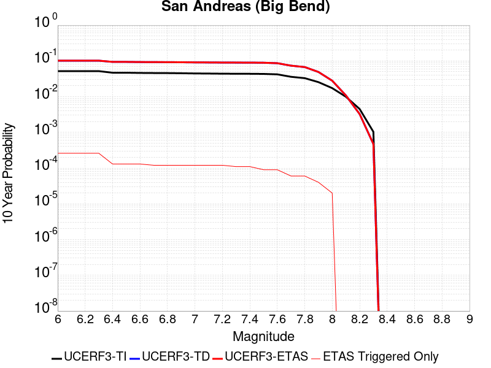 |

| Magnitude | 1 wk TI Prob | 1 wk TD Prob | 1 wk ETAS Prob | 1 wk ETAS/TD Gain | 1 wk ETAS Triggered Only | 1 mo TI Prob | 1 mo TD Prob | 1 mo ETAS Prob | 1 mo ETAS/TD Gain | 1 mo ETAS Triggered Only | 1 yr TI Prob | 1 yr TD Prob | 1 yr ETAS Prob | 1 yr ETAS/TD Gain | 1 yr ETAS Triggered Only | 10 yr TI Prob | 10 yr TD Prob | 10 yr ETAS Prob | 10 yr ETAS/TD Gain | 10 yr ETAS Triggered Only |
|-----|-----|-----|-----|-----|-----|-----|-----|-----|-----|-----|-----|-----|-----|-----|-----|-----|-----|-----|-----|-----|
| 6.0 | 1.0179969E-4 | 2.0073925E-4 | 3.6070714E-4 | 1.7968938 | 1.6E-4 | 4.362114E-4 | 8.6002843E-4 | 0.0010698478 | 1.243968 | 2.1E-4 | 0.0052979486 | 0.010420859 | 0.010668254 | 1.0237403 | 2.5E-4 | 0.051734097 | 0.101455905 | 0.10168953 | 1.0023026 | 2.6E-4 |
| 6.1 | 1.0179969E-4 | 2.0073925E-4 | 3.6070714E-4 | 1.7968938 | 1.6E-4 | 4.362114E-4 | 8.6002843E-4 | 0.0010698478 | 1.243968 | 2.1E-4 | 0.0052979486 | 0.010420859 | 0.010668254 | 1.0237403 | 2.5E-4 | 0.051734097 | 0.101455905 | 0.10168953 | 1.0023026 | 2.6E-4 |
| 6.2 | 1.0179969E-4 | 2.0073925E-4 | 3.6070714E-4 | 1.7968938 | 1.6E-4 | 4.362114E-4 | 8.6002843E-4 | 0.0010698478 | 1.243968 | 2.1E-4 | 0.0052979486 | 0.010420859 | 0.010668254 | 1.0237403 | 2.5E-4 | 0.051734097 | 0.101455905 | 0.10168953 | 1.0023026 | 2.6E-4 |
| 6.3 | 1.0179969E-4 | 2.0073925E-4 | 3.6070714E-4 | 1.7968938 | 1.6E-4 | 4.362114E-4 | 8.6002843E-4 | 0.0010698478 | 1.243968 | 2.1E-4 | 0.0052979486 | 0.010420859 | 0.010668254 | 1.0237403 | 2.5E-4 | 0.051734097 | 0.101455905 | 0.10168953 | 1.0023026 | 2.6E-4 |
| 6.4 | 9.1639464E-5 | 1.8430917E-4 | 2.7429257E-4 | 1.48822 | 9.0E-5 | 3.9268145E-4 | 7.896575E-4 | 8.995707E-4 | 1.1391909 | 1.1E-4 | 0.0047704205 | 0.009571818 | 0.009700574 | 1.0134516 | 1.3E-4 | 0.046693064 | 0.09378695 | 0.093904756 | 1.0012561 | 1.3E-4 |
| 6.5 | 9.1639464E-5 | 1.8430917E-4 | 2.7429257E-4 | 1.48822 | 9.0E-5 | 3.9268145E-4 | 7.896575E-4 | 8.995707E-4 | 1.1391909 | 1.1E-4 | 0.0047704205 | 0.009571818 | 0.009700574 | 1.0134516 | 1.3E-4 | 0.046693064 | 0.09378695 | 0.093904756 | 1.0012561 | 1.3E-4 |
| 6.6 | 9.042622E-5 | 1.8238011E-4 | 2.7236372E-4 | 1.4933848 | 9.0E-5 | 3.8748336E-4 | 7.813951E-4 | 8.913092E-4 | 1.1406639 | 1.1E-4 | 0.0047074095 | 0.0094721 | 0.009600868 | 1.0135945 | 1.3E-4 | 0.046089325 | 0.09287721 | 0.09299514 | 1.0012697 | 1.3E-4 |
| 6.7 | 8.9836685E-5 | 1.8152347E-4 | 2.7150713E-4 | 1.4957137 | 9.0E-5 | 3.8495753E-4 | 7.7772595E-4 | 8.776482E-4 | 1.12848 | 1.0E-4 | 0.00467679 | 0.009427815 | 0.009546683 | 1.0126083 | 1.2E-4 | 0.045795817 | 0.09247148 | 0.092580386 | 1.0011777 | 1.2E-4 |
| 6.8 | 8.9471854E-5 | 1.8099119E-4 | 2.709749E-4 | 1.4971718 | 9.0E-5 | 3.8339442E-4 | 7.754462E-4 | 8.753686E-4 | 1.128858 | 1.0E-4 | 0.004657841 | 0.009400298 | 0.00951917 | 1.0126456 | 1.2E-4 | 0.04561414 | 0.0922192 | 0.09232814 | 1.0011812 | 1.2E-4 |
| 6.9 | 8.858234E-5 | 1.7981093E-4 | 2.6979475E-4 | 1.5004357 | 9.0E-5 | 3.7958333E-4 | 7.7039085E-4 | 8.703138E-4 | 1.1297042 | 1.0E-4 | 0.004611638 | 0.009339278 | 0.009458157 | 1.0127289 | 1.2E-4 | 0.04517103 | 0.09165911 | 0.09176811 | 1.0011892 | 1.2E-4 |
| 7.0 | 8.7433385E-5 | 1.7819891E-4 | 2.6818286E-4 | 1.5049636 | 9.0E-5 | 3.746607E-4 | 7.6348626E-4 | 8.634099E-4 | 1.1308781 | 1.0E-4 | 0.004551957 | 0.009255932 | 0.009374822 | 1.0128447 | 1.2E-4 | 0.044598386 | 0.09089323 | 0.09100232 | 1.0012002 | 1.2E-4 |
| 7.1 | 8.684964E-5 | 1.7731842E-4 | 2.6730247E-4 | 1.5074714 | 9.0E-5 | 3.7215967E-4 | 7.597149E-4 | 8.5963897E-4 | 1.1315284 | 1.0E-4 | 0.0045216335 | 0.009210405 | 0.009329299 | 1.0129087 | 1.2E-4 | 0.04430731 | 0.09047475 | 0.09058389 | 1.0012063 | 1.2E-4 |
| 7.2 | 8.606521E-5 | 1.7622454E-4 | 2.6620866E-4 | 1.5106221 | 9.0E-5 | 3.6879873E-4 | 7.550296E-4 | 8.5495407E-4 | 1.1323452 | 1.0E-4 | 0.0044808835 | 0.009153842 | 0.009272743 | 1.0129893 | 1.2E-4 | 0.043916024 | 0.08995518 | 0.090064384 | 1.001214 | 1.2E-4 |
| 7.3 | 8.568266E-5 | 1.7564454E-4 | 2.556305E-4 | 1.4553853 | 8.0E-5 | 3.6715972E-4 | 7.5254537E-4 | 8.4247766E-4 | 1.1195041 | 9.0E-5 | 0.0044610105 | 0.00912385 | 0.009232846 | 1.0119463 | 1.1E-4 | 0.043725148 | 0.08967623 | 0.08977637 | 1.0011166 | 1.1E-4 |
| 7.4 | 8.5432206E-5 | 1.752704E-4 | 2.5525637E-4 | 1.4563576 | 8.0E-5 | 3.6608664E-4 | 7.509428E-4 | 8.408752E-4 | 1.1197593 | 9.0E-5 | 0.004447999 | 0.009104501 | 0.009213501 | 1.011972 | 1.1E-4 | 0.043600157 | 0.08949642 | 0.08959658 | 1.0011191 | 1.1E-4 |
| 7.5 | 8.4791965E-5 | 1.7396381E-4 | 2.4395164E-4 | 1.4023125 | 7.0E-5 | 3.633435E-4 | 7.4534636E-4 | 8.1529416E-4 | 1.0938461 | 7.0E-5 | 0.0044147377 | 0.009036932 | 0.009126119 | 1.0098691 | 9.0E-5 | 0.043280575 | 0.08887209 | 0.08895409 | 1.0009227 | 9.0E-5 |
| 7.6 | 8.241105E-5 | 1.6841735E-4 | 2.3840556E-4 | 1.4155642 | 7.0E-5 | 3.531424E-4 | 7.2158914E-4 | 7.915386E-4 | 1.0969381 | 7.0E-5 | 0.0042910352 | 0.008750047 | 0.00883926 | 1.0101956 | 9.0E-5 | 0.042091176 | 0.08625032 | 0.08633256 | 1.0009534 | 9.0E-5 |
| 7.7 | 7.00432E-5 | 1.4205615E-4 | 1.8205047E-4 | 1.2815388 | 4.0E-5 | 3.001506E-4 | 6.0867006E-4 | 6.486457E-4 | 1.065677 | 4.0E-5 | 0.0036482112 | 0.0073854174 | 0.0074449745 | 1.0080642 | 6.0E-5 | 0.035888977 | 0.07352299 | 0.07357858 | 1.000756 | 6.0E-5 |
| 7.8 | 6.415362E-5 | 1.2969968E-4 | 1.696945E-4 | 1.3083647 | 4.0E-5 | 2.749151E-4 | 5.557374E-4 | 5.9571513E-4 | 1.0719365 | 4.0E-5 | 0.0033419547 | 0.0067451415 | 0.006804737 | 1.0088353 | 6.0E-5 | 0.03292141 | 0.06725514 | 0.0673111 | 1.0008321 | 6.0E-5 |
| 7.9 | 4.939911E-5 | 9.341721E-5 | 1.2341441E-4 | 1.3211099 | 3.0E-5 | 2.116933E-4 | 4.0029807E-4 | 4.3028608E-4 | 1.0749141 | 3.0E-5 | 0.0025743195 | 0.004862747 | 0.004902553 | 1.0081857 | 4.0E-5 | 0.025447013 | 0.048915803 | 0.048953846 | 1.0007777 | 4.0E-5 |
| 8.0 | 3.344983E-5 | 5.2228E-5 | 7.2226954E-5 | 1.3829163 | 2.0E-5 | 1.4334853E-4 | 2.2381509E-4 | 2.4381062E-4 | 1.0893395 | 2.0E-5 | 0.0017438711 | 0.0027215453 | 0.002741491 | 1.0073287 | 2.0E-5 | 0.017302496 | 0.027923161 | 0.027942603 | 1.0006963 | 2.0E-5 |
| 8.1 | 1.9104898E-5 | 1.9171663E-5 | 1.9171663E-5 | 1.0 | 0.0 | 8.1875565E-5 | 8.2161685E-5 | 8.2161685E-5 | 1.0 | 0.0 | 9.963791E-4 | 9.9986E-4 | 9.9986E-4 | 1.0 | 0.0 | 0.009919235 | 0.010749552 | 0.010749552 | 1.0 | 0.0 |
| 8.2 | 8.643924E-6 | 5.473668E-6 | 5.473668E-6 | 1.0 | 0.0 | 3.704486E-5 | 2.3458366E-5 | 2.3458366E-5 | 1.0 | 0.0 | 4.5092785E-4 | 2.8556827E-4 | 2.8556827E-4 | 1.0 | 0.0 | 0.0045001395 | 0.0032481793 | 0.0032481793 | 1.0 | 0.0 |
| 8.3 | 1.983087E-6 | 7.6564595E-7 | 7.6564595E-7 | 1.0 | 0.0 | 8.498917E-6 | 3.281336E-6 | 3.281336E-6 | 1.0 | 0.0 | 1.034694E-4 | 3.9949547E-5 | 3.9949547E-5 | 1.0 | 0.0 | 0.0010342124 | 4.717979E-4 | 4.717979E-4 | 1.0 | 0.0 |

## Coyote Lake
*[(top)](#table-of-contents)*

| 1 Week | 1 Month | 1 Year | 10 Year |
|-----|-----|-----|-----|
|  |  |  |  |

| Magnitude | 1 wk TI Prob | 1 wk TD Prob | 1 wk ETAS Prob | 1 wk ETAS/TD Gain | 1 wk ETAS Triggered Only | 1 mo TI Prob | 1 mo TD Prob | 1 mo ETAS Prob | 1 mo ETAS/TD Gain | 1 mo ETAS Triggered Only | 1 yr TI Prob | 1 yr TD Prob | 1 yr ETAS Prob | 1 yr ETAS/TD Gain | 1 yr ETAS Triggered Only | 10 yr TI Prob | 10 yr TD Prob | 10 yr ETAS Prob | 10 yr ETAS/TD Gain | 10 yr ETAS Triggered Only |
|-----|-----|-----|-----|-----|-----|-----|-----|-----|-----|-----|-----|-----|-----|-----|-----|-----|-----|-----|-----|-----|
| 6.0 | 1.980352E-5 | 2.1706745E-5 | 1.4170413E-4 | 6.5281157 | 1.2E-4 | 8.486947E-5 | 9.302599E-5 | 2.6301018E-4 | 2.8272762 | 1.7E-4 | 0.0010327959 | 0.0011320751 | 0.001351826 | 1.1941134 | 2.2E-4 | 0.010280091 | 0.011270258 | 0.011487778 | 1.0193005 | 2.2E-4 |
| 6.1 | 1.980352E-5 | 2.1706745E-5 | 1.4170413E-4 | 6.5281157 | 1.2E-4 | 8.486947E-5 | 9.302599E-5 | 2.6301018E-4 | 2.8272762 | 1.7E-4 | 0.0010327959 | 0.0011320751 | 0.001351826 | 1.1941134 | 2.2E-4 | 0.010280091 | 0.011270258 | 0.011487778 | 1.0193005 | 2.2E-4 |
| 6.2 | 1.980352E-5 | 2.1706745E-5 | 1.4170413E-4 | 6.5281157 | 1.2E-4 | 8.486947E-5 | 9.302599E-5 | 2.6301018E-4 | 2.8272762 | 1.7E-4 | 0.0010327959 | 0.0011320751 | 0.001351826 | 1.1941134 | 2.2E-4 | 0.010280091 | 0.011270258 | 0.011487778 | 1.0193005 | 2.2E-4 |
| 6.3 | 1.5344787E-5 | 1.682067E-5 | 9.681932E-5 | 5.7559733 | 8.0E-5 | 6.576172E-5 | 7.2086936E-5 | 2.0207756E-4 | 2.8032482 | 1.3E-4 | 8.003548E-4 | 8.773662E-4 | 0.001047217 | 1.1935917 | 1.7E-4 | 0.007974784 | 0.00874507 | 0.008913582 | 1.0192695 | 1.7E-4 |
| 6.4 | 1.5344787E-5 | 1.682067E-5 | 9.681932E-5 | 5.7559733 | 8.0E-5 | 6.576172E-5 | 7.2086936E-5 | 2.0207756E-4 | 2.8032482 | 1.3E-4 | 8.003548E-4 | 8.773662E-4 | 0.001047217 | 1.1935917 | 1.7E-4 | 0.007974784 | 0.00874507 | 0.008913582 | 1.0192695 | 1.7E-4 |
| 6.5 | 1.4189697E-5 | 1.5557987E-5 | 9.5556745E-5 | 6.1419735 | 8.0E-5 | 6.081157E-5 | 6.6675726E-5 | 1.9666705E-4 | 2.9496052 | 1.3E-4 | 7.401293E-4 | 8.115349E-4 | 9.813969E-4 | 1.2093096 | 1.7E-4 | 0.0073766913 | 0.008091656 | 0.008260281 | 1.0208393 | 1.7E-4 |
| 6.6 | 1.3469301E-5 | 1.4771577E-5 | 9.4770396E-5 | 6.415726 | 8.0E-5 | 5.7724297E-5 | 6.330556E-5 | 1.9329734E-4 | 3.053402 | 1.3E-4 | 7.025667E-4 | 7.7053264E-4 | 9.3040935E-4 | 1.2074885 | 1.6E-4 | 0.0070034964 | 0.0076845144 | 0.007843285 | 1.0206611 | 1.6E-4 |
| 6.7 | 1.3027966E-5 | 1.4281745E-5 | 9.42806E-5 | 6.601476 | 8.0E-5 | 5.5832945E-5 | 6.120638E-5 | 1.9119843E-4 | 3.1238315 | 1.3E-4 | 6.7955407E-4 | 7.4499263E-4 | 8.948809E-4 | 1.2011943 | 1.5E-4 | 0.006774798 | 0.0074308286 | 0.007579714 | 1.0200362 | 1.5E-4 |
| 6.8 | 5.695434E-6 | 6.2244176E-6 | 3.622423E-5 | 5.819698 | 3.0E-5 | 2.4408775E-5 | 2.6675973E-5 | 7.667464E-5 | 2.874296 | 5.0E-5 | 2.971363E-4 | 3.2476155E-4 | 3.8474207E-4 | 1.184691 | 6.0E-5 | 0.0029673933 | 0.0032458105 | 0.0033056156 | 1.0184253 | 6.0E-5 |
| 6.9 | 4.385688E-6 | 4.7930553E-6 | 3.4792913E-5 | 7.2590256 | 3.0E-5 | 1.879567E-5 | 2.0541665E-5 | 7.054064E-5 | 3.4340272 | 5.0E-5 | 2.2881327E-4 | 2.5009477E-4 | 3.1007978E-4 | 1.2398491 | 6.0E-5 | 0.002285778 | 0.0025009478 | 0.0025607978 | 1.0239309 | 6.0E-5 |

## Elsinore (Glen Ivy) rev
*[(top)](#table-of-contents)*

| 1 Week | 1 Month | 1 Year | 10 Year |
|-----|-----|-----|-----|
|  |  |  |  |

| Magnitude | 1 wk TI Prob | 1 wk TD Prob | 1 wk ETAS Prob | 1 wk ETAS/TD Gain | 1 wk ETAS Triggered Only | 1 mo TI Prob | 1 mo TD Prob | 1 mo ETAS Prob | 1 mo ETAS/TD Gain | 1 mo ETAS Triggered Only | 1 yr TI Prob | 1 yr TD Prob | 1 yr ETAS Prob | 1 yr ETAS/TD Gain | 1 yr ETAS Triggered Only | 10 yr TI Prob | 10 yr TD Prob | 10 yr ETAS Prob | 10 yr ETAS/TD Gain | 10 yr ETAS Triggered Only |
|-----|-----|-----|-----|-----|-----|-----|-----|-----|-----|-----|-----|-----|-----|-----|-----|-----|-----|-----|-----|-----|
| 6.0 | 1.6204086E-4 | 2.937271E-4 | 4.5368008E-4 | 1.5445633 | 1.6E-4 | 6.94276E-4 | 0.0012583778 | 0.0014381513 | 1.1428612 | 1.8E-4 | 0.008420097 | 0.0152346175 | 0.015421723 | 1.0122815 | 1.9E-4 | 0.081081145 | 0.13962454 | 0.13979661 | 1.0012324 | 2.0E-4 |
| 6.1 | 1.6204086E-4 | 2.937271E-4 | 4.5368008E-4 | 1.5445633 | 1.6E-4 | 6.94276E-4 | 0.0012583778 | 0.0014381513 | 1.1428612 | 1.8E-4 | 0.008420097 | 0.0152346175 | 0.015421723 | 1.0122815 | 1.9E-4 | 0.081081145 | 0.13962454 | 0.13979661 | 1.0012324 | 2.0E-4 |
| 6.2 | 1.6204086E-4 | 2.937271E-4 | 4.5368008E-4 | 1.5445633 | 1.6E-4 | 6.94276E-4 | 0.0012583778 | 0.0014381513 | 1.1428612 | 1.8E-4 | 0.008420097 | 0.0152346175 | 0.015421723 | 1.0122815 | 1.9E-4 | 0.081081145 | 0.13962454 | 0.13979661 | 1.0012324 | 2.0E-4 |
| 6.3 | 1.0111737E-4 | 1.7703463E-4 | 2.5702047E-4 | 1.451809 | 8.0E-5 | 4.332882E-4 | 7.5861585E-4 | 8.485476E-4 | 1.1185471 | 9.0E-5 | 0.005262531 | 0.0092177205 | 0.009316799 | 1.0107486 | 1.0E-4 | 0.0513964 | 0.08707393 | 0.087174356 | 1.0011533 | 1.1E-4 |
| 6.4 | 1.0111737E-4 | 1.7703463E-4 | 2.5702047E-4 | 1.451809 | 8.0E-5 | 4.332882E-4 | 7.5861585E-4 | 8.485476E-4 | 1.1185471 | 9.0E-5 | 0.005262531 | 0.0092177205 | 0.009316799 | 1.0107486 | 1.0E-4 | 0.0513964 | 0.08707393 | 0.087174356 | 1.0011533 | 1.1E-4 |
| 6.5 | 3.6624708E-5 | 4.6391986E-5 | 6.6391054E-5 | 1.4310889 | 2.0E-5 | 1.569536E-4 | 1.9880968E-4 | 2.188057E-4 | 1.1005788 | 2.0E-5 | 0.001909235 | 0.0024181814 | 0.0024481087 | 1.0123761 | 3.0E-5 | 0.01892915 | 0.023697061 | 0.023726352 | 1.001236 | 3.0E-5 |
| 6.6 | 2.5051324E-5 | 2.6147465E-5 | 3.61472E-5 | 1.3824363 | 1.0E-5 | 1.073584E-4 | 1.12056E-4 | 1.2205488E-4 | 1.0892311 | 1.0E-5 | 0.0013063047 | 0.0013634725 | 0.0013834452 | 1.0146484 | 2.0E-5 | 0.012986525 | 0.013565759 | 0.013585488 | 1.0014544 | 2.0E-5 |
| 6.7 | 2.2189772E-5 | 2.2072489E-5 | 3.207227E-5 | 1.4530426 | 1.0E-5 | 9.509556E-5 | 9.459316E-5 | 1.0459221E-4 | 1.1057059 | 1.0E-5 | 0.0011571734 | 0.0011510996 | 0.0011610881 | 1.0086774 | 1.0E-5 | 0.011511663 | 0.0114663225 | 0.011476208 | 1.0008621 | 1.0E-5 |
| 6.8 | 1.6654378E-5 | 1.44376E-5 | 2.4437455E-5 | 1.6926259 | 1.0E-5 | 7.137396E-5 | 6.187399E-5 | 7.187337E-5 | 1.1616088 | 1.0E-5 | 8.686314E-4 | 7.5306057E-4 | 7.630531E-4 | 1.0132692 | 1.0E-5 | 0.008652439 | 0.0075100763 | 0.0075200014 | 1.0013216 | 1.0E-5 |
| 6.9 | 1.5042909E-5 | 1.2331886E-5 | 2.2331762E-5 | 1.810896 | 1.0E-5 | 6.446802E-5 | 5.2849886E-5 | 6.284936E-5 | 1.1892052 | 1.0E-5 | 7.8461546E-4 | 6.4326054E-4 | 6.532541E-4 | 1.0155358 | 1.0E-5 | 0.007818509 | 0.006417925 | 0.006427861 | 1.0015482 | 1.0E-5 |
| 7.0 | 1.4361385E-5 | 1.1451172E-5 | 2.1451058E-5 | 1.8732631 | 1.0E-5 | 6.154734E-5 | 4.9075545E-5 | 5.9075053E-5 | 1.2037575 | 1.0E-5 | 7.490812E-4 | 5.973339E-4 | 6.073279E-4 | 1.016731 | 1.0E-5 | 0.007465612 | 0.005960982 | 0.0059709223 | 1.0016676 | 1.0E-5 |
| 7.1 | 1.3265571E-5 | 1.0244736E-5 | 2.0244634E-5 | 1.9761012 | 1.0E-5 | 5.6851208E-5 | 4.3905282E-5 | 5.3904845E-5 | 1.227753 | 1.0E-5 | 6.919436E-4 | 5.344183E-4 | 5.4441293E-4 | 1.0187019 | 1.0E-5 | 0.006897931 | 0.0053346003 | 0.005344547 | 1.0018646 | 1.0E-5 |
| 7.2 | 1.1596403E-5 | 8.504847E-6 | 8.504847E-6 | 1.0 | 0.0 | 4.9697923E-5 | 3.6448844E-5 | 3.6448844E-5 | 1.0 | 0.0 | 6.049042E-4 | 4.4367602E-4 | 4.4367602E-4 | 1.0 | 0.0 | 0.006032603 | 0.004429357 | 0.004429357 | 1.0 | 0.0 |
| 7.3 | 1.0150827E-5 | 7.238537E-6 | 7.238537E-6 | 1.0 | 0.0 | 4.3502816E-5 | 3.102194E-5 | 3.102194E-5 | 1.0 | 0.0 | 5.2951806E-4 | 3.776281E-4 | 3.776281E-4 | 1.0 | 0.0 | 0.005282581 | 0.003770271 | 0.003770271 | 1.0 | 0.0 |
| 7.4 | 9.080705E-6 | 6.352307E-6 | 6.352307E-6 | 1.0 | 0.0 | 3.8916725E-5 | 2.7223898E-5 | 2.7223898E-5 | 1.0 | 0.0 | 4.7370812E-4 | 3.314019E-4 | 3.314019E-4 | 1.0 | 0.0 | 0.004726996 | 0.0033092257 | 0.0033092257 | 1.0 | 0.0 |
| 7.5 | 7.671649E-6 | 5.225419E-6 | 5.225419E-6 | 1.0 | 0.0 | 3.287808E-5 | 2.2394468E-5 | 2.2394468E-5 | 1.0 | 0.0 | 4.0021708E-4 | 2.7261977E-4 | 2.7261977E-4 | 1.0 | 0.0 | 0.0039949706 | 0.0027229784 | 0.0027229784 | 1.0 | 0.0 |
| 7.6 | 6.990086E-6 | 4.687336E-6 | 4.687336E-6 | 1.0 | 0.0 | 2.9957167E-5 | 2.0088435E-5 | 2.0088435E-5 | 1.0 | 0.0 | 3.6466747E-4 | 2.445504E-4 | 2.445504E-4 | 1.0 | 0.0 | 0.0036406964 | 0.0024429292 | 0.0024429292 | 1.0 | 0.0 |
| 7.7 | 4.163505E-6 | 2.329331E-6 | 2.329331E-6 | 1.0 | 0.0 | 1.7843471E-5 | 9.982813E-6 | 9.982813E-6 | 1.0 | 0.0 | 2.172226E-4 | 1.2153471E-4 | 1.2153471E-4 | 1.0 | 0.0 | 0.0021701038 | 0.0012147555 | 0.0012147555 | 1.0 | 0.0 |
| 7.8 | 2.2692414E-7 | 9.384417E-8 | 9.384417E-8 | 1.0 | 0.0 | 9.725317E-7 | 4.0218927E-7 | 4.0218927E-7 | 1.0 | 0.0 | 1.1840509E-5 | 4.8966467E-6 | 4.8966467E-6 | 1.0 | 0.0 | 1.1839878E-4 | 4.8965718E-5 | 4.8965718E-5 | 1.0 | 0.0 |
| 7.9 | 6.676829E-9 | 3.4397174E-9 | 3.4397174E-9 | 1.0 | 0.0 | 2.861498E-8 | 1.4741646E-8 | 1.4741646E-8 | 1.0 | 0.0 | 3.4838732E-7 | 1.7947953E-7 | 1.7947953E-7 | 1.0 | 0.0 | 3.4838679E-6 | 1.794794E-6 | 1.794794E-6 | 1.0 | 0.0 |

## Death Valley (No)
*[(top)](#table-of-contents)*

| 1 Week | 1 Month | 1 Year | 10 Year |
|-----|-----|-----|-----|
|  |  |  |  |

| Magnitude | 1 wk TI Prob | 1 wk TD Prob | 1 wk ETAS Prob | 1 wk ETAS/TD Gain | 1 wk ETAS Triggered Only | 1 mo TI Prob | 1 mo TD Prob | 1 mo ETAS Prob | 1 mo ETAS/TD Gain | 1 mo ETAS Triggered Only | 1 yr TI Prob | 1 yr TD Prob | 1 yr ETAS Prob | 1 yr ETAS/TD Gain | 1 yr ETAS Triggered Only | 10 yr TI Prob | 10 yr TD Prob | 10 yr ETAS Prob | 10 yr ETAS/TD Gain | 10 yr ETAS Triggered Only |
|-----|-----|-----|-----|-----|-----|-----|-----|-----|-----|-----|-----|-----|-----|-----|-----|-----|-----|-----|-----|-----|
| 6.0 | 2.0074807E-5 | 2.2500084E-5 | 1.8249649E-4 | 8.110925 | 1.6E-4 | 8.603206E-5 | 9.642541E-5 | 2.5640999E-4 | 2.6591537 | 1.6E-4 | 0.001046937 | 0.0011733545 | 0.0013631316 | 1.1617389 | 1.9E-4 | 0.010420183 | 0.011672506 | 0.011880055 | 1.017781 | 2.1E-4 |
| 6.1 | 2.0074807E-5 | 2.2500084E-5 | 1.8249649E-4 | 8.110925 | 1.6E-4 | 8.603206E-5 | 9.642541E-5 | 2.5640999E-4 | 2.6591537 | 1.6E-4 | 0.001046937 | 0.0011733545 | 0.0013631316 | 1.1617389 | 1.9E-4 | 0.010420183 | 0.011672506 | 0.011880055 | 1.017781 | 2.1E-4 |
| 6.2 | 2.0074807E-5 | 2.2500084E-5 | 1.8249649E-4 | 8.110925 | 1.6E-4 | 8.603206E-5 | 9.642541E-5 | 2.5640999E-4 | 2.6591537 | 1.6E-4 | 0.001046937 | 0.0011733545 | 0.0013631316 | 1.1617389 | 1.9E-4 | 0.010420183 | 0.011672506 | 0.011880055 | 1.017781 | 2.1E-4 |
| 6.3 | 1.9050609E-5 | 2.1336948E-5 | 1.8133354E-4 | 8.4985695 | 1.6E-4 | 8.164292E-5 | 9.1440896E-5 | 2.5142627E-4 | 2.7496042 | 1.6E-4 | 9.935491E-4 | 0.001112731 | 0.0013025196 | 1.1705611 | 1.9E-4 | 0.009891188 | 0.011072419 | 0.011280093 | 1.018756 | 2.1E-4 |
| 6.4 | 1.9050609E-5 | 2.1336948E-5 | 1.8133354E-4 | 8.4985695 | 1.6E-4 | 8.164292E-5 | 9.1440896E-5 | 2.5142627E-4 | 2.7496042 | 1.6E-4 | 9.935491E-4 | 0.001112731 | 0.0013025196 | 1.1705611 | 1.9E-4 | 0.009891188 | 0.011072419 | 0.011280093 | 1.018756 | 2.1E-4 |
| 6.5 | 1.8367004E-5 | 2.0561009E-5 | 1.7055792E-4 | 8.295212 | 1.5E-4 | 7.8713354E-5 | 8.811567E-5 | 2.3810245E-4 | 2.702158 | 1.5E-4 | 9.5791375E-4 | 0.0010722869 | 0.0012520938 | 1.1676855 | 1.8E-4 | 0.009537951 | 0.0106719155 | 0.0108697815 | 1.0185407 | 2.0E-4 |
| 6.6 | 1.779439E-5 | 1.9910927E-5 | 1.5990814E-4 | 8.031175 | 1.4E-4 | 7.625944E-5 | 8.53298E-5 | 2.2531785E-4 | 2.640553 | 1.4E-4 | 9.280632E-4 | 0.0010384015 | 0.0012082249 | 1.1635432 | 1.7E-4 | 0.009241969 | 0.010336253 | 0.010524289 | 1.0181919 | 1.9E-4 |
| 6.7 | 1.7025437E-5 | 1.9043426E-5 | 1.4904095E-4 | 7.826373 | 1.3E-4 | 7.296412E-5 | 8.161216E-5 | 2.1160155E-4 | 2.5927699 | 1.3E-4 | 8.87976E-4 | 9.931813E-4 | 0.0011530224 | 1.1609385 | 1.6E-4 | 0.008844362 | 0.009888145 | 0.010066366 | 1.0180236 | 1.8E-4 |
| 6.8 | 1.6545107E-5 | 1.8512545E-5 | 1.4851014E-4 | 8.022135 | 1.3E-4 | 7.090568E-5 | 7.93371E-5 | 2.0932678E-4 | 2.6384475 | 1.3E-4 | 8.629347E-4 | 9.655073E-4 | 0.0011253528 | 1.165556 | 1.6E-4 | 0.008595915 | 0.009613829 | 0.009792098 | 1.018543 | 1.8E-4 |
| 6.9 | 1.615478E-5 | 1.8087594E-5 | 1.4808524E-4 | 8.187117 | 1.3E-4 | 6.9232934E-5 | 7.751599E-5 | 2.0750592E-4 | 2.6769433 | 1.3E-4 | 8.4258494E-4 | 9.433546E-4 | 0.0011032037 | 1.1694474 | 1.6E-4 | 0.008393973 | 0.009394196 | 0.009572505 | 1.0189807 | 1.8E-4 |
| 7.0 | 1.5894311E-5 | 1.780555E-5 | 1.4780324E-4 | 8.300964 | 1.3E-4 | 6.81167E-5 | 7.6307304E-5 | 2.0629738E-4 | 2.7035077 | 1.3E-4 | 8.2900526E-4 | 9.286515E-4 | 0.0010885029 | 1.1721328 | 1.6E-4 | 0.008259195 | 0.009248397 | 0.009426733 | 1.0192828 | 1.8E-4 |
| 7.1 | 1.5602263E-5 | 1.7483504E-5 | 1.4748123E-4 | 8.435451 | 1.3E-4 | 6.6865134E-5 | 7.492718E-5 | 2.0491744E-4 | 2.7348878 | 1.3E-4 | 8.137789E-4 | 9.118627E-4 | 0.0010717168 | 1.175305 | 1.6E-4 | 0.008108052 | 0.009081894 | 0.00926026 | 1.0196396 | 1.8E-4 |
| 7.2 | 1.5323829E-5 | 1.717063E-5 | 1.471684E-4 | 8.570937 | 1.3E-4 | 6.56719E-5 | 7.358637E-5 | 2.0357681E-4 | 2.7665014 | 1.3E-4 | 7.99262E-4 | 8.9555193E-4 | 0.0010554086 | 1.1785008 | 1.6E-4 | 0.007963934 | 0.008920107 | 0.009098501 | 1.0199991 | 1.8E-4 |
| 7.3 | 1.4556212E-5 | 1.6302456E-5 | 1.363005E-4 | 8.360734 | 1.2E-4 | 6.238227E-5 | 6.9865826E-5 | 1.8985744E-4 | 2.7174578 | 1.2E-4 | 7.592395E-4 | 8.5029035E-4 | 0.0010001628 | 1.1762604 | 1.5E-4 | 0.0075665074 | 0.008471014 | 0.008639574 | 1.0198984 | 1.7E-4 |
| 7.4 | 1.411725E-5 | 1.580796E-5 | 1.3580607E-4 | 8.590992 | 1.2E-4 | 6.0501097E-5 | 6.7746674E-5 | 1.8773854E-4 | 2.7711847 | 1.2E-4 | 7.363519E-4 | 8.245094E-4 | 9.7438577E-4 | 1.1817764 | 1.5E-4 | 0.0073391674 | 0.008215138 | 0.008383742 | 1.0205235 | 1.7E-4 |
| 7.5 | 1.3503312E-5 | 1.5126289E-5 | 1.2512463E-4 | 8.271997 | 1.1E-4 | 5.7870053E-5 | 6.482538E-5 | 1.7481824E-4 | 2.6967564 | 1.1E-4 | 7.043401E-4 | 7.8896893E-4 | 9.2885847E-4 | 1.1773068 | 1.4E-4 | 0.007021119 | 0.007862304 | 0.008021046 | 1.0201902 | 1.6E-4 |
| 7.6 | 1.1279839E-5 | 1.2626327E-5 | 1.0262519E-4 | 8.127873 | 9.0E-5 | 4.834127E-5 | 5.4111737E-5 | 1.4410686E-4 | 2.663135 | 9.0E-5 | 5.88396E-4 | 6.5861654E-4 | 7.685441E-4 | 1.1669067 | 1.1E-4 | 0.005868405 | 0.006567199 | 0.006696345 | 1.0196654 | 1.3E-4 |
| 7.7 | 9.189108E-6 | 1.0283358E-5 | 9.0282534E-5 | 8.77948 | 8.0E-5 | 3.93813E-5 | 4.407082E-5 | 1.240673E-4 | 2.81518 | 8.0E-5 | 4.7936183E-4 | 5.3643517E-4 | 6.363815E-4 | 1.1863158 | 1.0E-4 | 0.004783291 | 0.005351914 | 0.005451379 | 1.0185848 | 1.0E-4 |
| 7.8 | 3.4586725E-7 | 3.6482615E-7 | 3.6482615E-7 | 1.0 | 0.0 | 1.4822873E-6 | 1.5635396E-6 | 1.5635396E-6 | 1.0 | 0.0 | 1.80467E-5 | 1.9035933E-5 | 1.9035933E-5 | 1.0 | 0.0 | 1.8045233E-4 | 1.9034347E-4 | 1.9034347E-4 | 1.0 | 0.0 |
| 7.9 | 2.5591178E-9 | 2.6696718E-9 | 2.6696718E-9 | 1.0 | 0.0 | 1.0967647E-8 | 1.14414505E-8 | 1.14414505E-8 | 1.0 | 0.0 | 1.335311E-7 | 1.3929966E-7 | 1.3929966E-7 | 1.0 | 0.0 | 1.3353102E-6 | 1.3929966E-6 | 1.3929966E-6 | 1.0 | 0.0 |

## San Andreas (Parkfield)
*[(top)](#table-of-contents)*

| 1 Week | 1 Month | 1 Year | 10 Year |
|-----|-----|-----|-----|
|  |  |  |  |

| Magnitude | 1 wk TI Prob | 1 wk TD Prob | 1 wk ETAS Prob | 1 wk ETAS/TD Gain | 1 wk ETAS Triggered Only | 1 mo TI Prob | 1 mo TD Prob | 1 mo ETAS Prob | 1 mo ETAS/TD Gain | 1 mo ETAS Triggered Only | 1 yr TI Prob | 1 yr TD Prob | 1 yr ETAS Prob | 1 yr ETAS/TD Gain | 1 yr ETAS Triggered Only | 10 yr TI Prob | 10 yr TD Prob | 10 yr ETAS Prob | 10 yr ETAS/TD Gain | 10 yr ETAS Triggered Only |
|-----|-----|-----|-----|-----|-----|-----|-----|-----|-----|-----|-----|-----|-----|-----|-----|-----|-----|-----|-----|-----|
| 6.0 | 5.556969E-4 | 7.778562E-4 | 9.177473E-4 | 1.1798419 | 1.4E-4 | 0.0023793848 | 0.0033299583 | 0.0034794586 | 1.0448956 | 1.5E-4 | 0.028586963 | 0.040235043 | 0.040417396 | 1.0045322 | 1.9E-4 | 0.25176284 | 0.3371973 | 0.33733648 | 1.0004128 | 2.1E-4 |
| 6.1 | 1.925858E-4 | 3.0278185E-4 | 3.8275763E-4 | 1.2641367 | 8.0E-5 | 8.2510663E-4 | 0.001297085 | 0.0013869682 | 1.0692964 | 9.0E-5 | 0.0099994885 | 0.01577393 | 0.015872352 | 1.0062395 | 1.0E-4 | 0.095613256 | 0.14975825 | 0.14984328 | 1.0005678 | 1.0E-4 |
| 6.2 | 9.4306815E-5 | 1.8243887E-4 | 2.624243E-4 | 1.438423 | 8.0E-5 | 4.0410945E-4 | 7.8164786E-4 | 8.715775E-4 | 1.1150514 | 9.0E-5 | 0.0049089384 | 0.009475246 | 0.009574299 | 1.0104538 | 1.0E-4 | 0.048019063 | 0.0918565 | 0.09194732 | 1.0009886 | 1.0E-4 |
| 6.3 | 9.283051E-5 | 1.794041E-4 | 2.5938975E-4 | 1.4458407 | 8.0E-5 | 3.9778434E-4 | 7.686494E-4 | 8.5858017E-4 | 1.1169986 | 9.0E-5 | 0.0048322747 | 0.009318355 | 0.009417422 | 1.0106316 | 1.0E-4 | 0.047285385 | 0.090509474 | 0.09060042 | 1.0010048 | 1.0E-4 |
| 6.4 | 9.138826E-5 | 1.7702584E-4 | 2.5701168E-4 | 1.4518315 | 8.0E-5 | 3.916052E-4 | 7.5846276E-4 | 8.4839447E-4 | 1.118571 | 9.0E-5 | 0.0047573745 | 0.009195387 | 0.009294468 | 1.010775 | 1.0E-4 | 0.046568092 | 0.0894136 | 0.08950466 | 1.0010184 | 1.0E-4 |
| 6.5 | 9.000255E-5 | 1.746064E-4 | 2.5459242E-4 | 1.4580934 | 8.0E-5 | 3.8566816E-4 | 7.4809964E-4 | 8.3803234E-4 | 1.1202148 | 9.0E-5 | 0.0046854047 | 0.009070284 | 0.009169377 | 1.010925 | 1.0E-4 | 0.045878403 | 0.08829608 | 0.08838724 | 1.0010326 | 1.0E-4 |
| 6.6 | 8.8109264E-5 | 1.7141816E-4 | 2.5140445E-4 | 1.4666151 | 8.0E-5 | 3.7755648E-4 | 7.3444354E-4 | 8.2437746E-4 | 1.1224518 | 9.0E-5 | 0.0045870654 | 0.008905404 | 0.009004514 | 1.0111291 | 1.0E-4 | 0.04493529 | 0.08682707 | 0.08691839 | 1.0010517 | 1.0E-4 |
| 6.7 | 8.738073E-5 | 1.7008898E-4 | 2.500754E-4 | 1.470262 | 8.0E-5 | 3.7443507E-4 | 7.287503E-4 | 8.1868476E-4 | 1.123409 | 9.0E-5 | 0.0045492216 | 0.008836695 | 0.008935811 | 1.0112164 | 1.0E-4 | 0.04457213 | 0.0862268 | 0.08631817 | 1.0010598 | 1.0E-4 |
| 6.8 | 8.710195E-5 | 1.6954402E-4 | 2.4953045E-4 | 1.4717739 | 8.0E-5 | 3.7324068E-4 | 7.26416E-4 | 8.163506E-4 | 1.123806 | 9.0E-5 | 0.0045347405 | 0.008808513 | 0.008907632 | 1.0112526 | 1.0E-4 | 0.04443313 | 0.08597436 | 0.08606576 | 1.0010631 | 1.0E-4 |
| 6.9 | 8.6801556E-5 | 1.6895356E-4 | 2.4894005E-4 | 1.4734229 | 8.0E-5 | 3.7195362E-4 | 7.238869E-4 | 8.1382174E-4 | 1.1242388 | 9.0E-5 | 0.0045191357 | 0.0087779695 | 0.008877092 | 1.0112921 | 1.0E-4 | 0.044283327 | 0.08570042 | 0.08579185 | 1.0010668 | 1.0E-4 |
| 7.0 | 8.5571606E-5 | 1.664819E-4 | 2.4646858E-4 | 1.4804528 | 8.0E-5 | 3.6668387E-4 | 7.132999E-4 | 8.032357E-4 | 1.1260841 | 9.0E-5 | 0.004455241 | 0.008650103 | 0.008749238 | 1.0114605 | 1.0E-4 | 0.043669727 | 0.08454836 | 0.08463991 | 1.0010828 | 1.0E-4 |
| 7.1 | 7.82589E-5 | 1.5128969E-4 | 2.3127758E-4 | 1.5287069 | 8.0E-5 | 3.3535215E-4 | 6.4822397E-4 | 7.281721E-4 | 1.1233342 | 8.0E-5 | 0.0040752706 | 0.007863738 | 0.00795303 | 1.0113549 | 9.0E-5 | 0.040013418 | 0.077460445 | 0.077543475 | 1.0010719 | 9.0E-5 |
| 7.2 | 7.690929E-5 | 1.4866212E-4 | 2.2865023E-4 | 1.538053 | 8.0E-5 | 3.2956956E-4 | 6.369685E-4 | 7.1691757E-4 | 1.1255149 | 8.0E-5 | 0.004005129 | 0.0077276826 | 0.007816987 | 1.0115564 | 9.0E-5 | 0.0393371 | 0.07623341 | 0.07631655 | 1.0010905 | 9.0E-5 |
| 7.3 | 7.5543794E-5 | 1.4562748E-4 | 2.2561583E-4 | 1.5492669 | 8.0E-5 | 3.2371894E-4 | 6.239692E-4 | 7.039193E-4 | 1.1281315 | 8.0E-5 | 0.003934157 | 0.0075705256 | 0.0076598446 | 1.0117983 | 9.0E-5 | 0.038652334 | 0.07479777 | 0.07488104 | 1.0011133 | 9.0E-5 |
| 7.4 | 7.4214564E-5 | 1.4263717E-4 | 2.2262576E-4 | 1.5607836 | 8.0E-5 | 3.1802364E-4 | 6.1115966E-4 | 6.911108E-4 | 1.1308187 | 8.0E-5 | 0.003865065 | 0.0074156416 | 0.007504974 | 1.0120465 | 9.0E-5 | 0.03798529 | 0.07337152 | 0.073454924 | 1.0011367 | 9.0E-5 |
| 7.5 | 6.149578E-5 | 1.1191443E-4 | 1.819066E-4 | 1.6254079 | 7.0E-5 | 2.6352672E-4 | 4.795452E-4 | 5.4951163E-4 | 1.1459017 | 7.0E-5 | 0.0032037178 | 0.005822865 | 0.0059023993 | 1.013659 | 8.0E-5 | 0.03157923 | 0.058559462 | 0.05863478 | 1.0012861 | 8.0E-5 |
| 7.6 | 6.0643448E-5 | 1.102009E-4 | 1.8019318E-4 | 1.6351335 | 7.0E-5 | 2.598746E-4 | 4.7220418E-4 | 5.421711E-4 | 1.148171 | 7.0E-5 | 0.0031593828 | 0.005733962 | 0.005813503 | 1.0138719 | 8.0E-5 | 0.031148417 | 0.05772042 | 0.0577958 | 1.0013059 | 8.0E-5 |
| 7.7 | 5.1652263E-5 | 9.175265E-5 | 1.3174898E-4 | 1.4359148 | 4.0E-5 | 2.2134806E-4 | 3.9316638E-4 | 4.3315065E-4 | 1.101698 | 4.0E-5 | 0.002691582 | 0.0047763046 | 0.0048260656 | 1.0104183 | 5.0E-5 | 0.026592141 | 0.04853641 | 0.04858398 | 1.0009801 | 5.0E-5 |
| 7.8 | 4.8090482E-5 | 8.560165E-5 | 1.2559822E-4 | 1.4672407 | 4.0E-5 | 2.060858E-4 | 3.6681266E-4 | 4.0679798E-4 | 1.1090075 | 4.0E-5 | 0.0025062072 | 0.004456807 | 0.0045065843 | 1.0111688 | 5.0E-5 | 0.024781305 | 0.045302264 | 0.04535 | 1.0010537 | 5.0E-5 |
| 7.9 | 3.970278E-5 | 6.7507375E-5 | 9.750535E-5 | 1.4443659 | 3.0E-5 | 1.7014367E-4 | 2.8928524E-4 | 3.1927656E-4 | 1.1036738 | 3.0E-5 | 0.002069531 | 0.0035163634 | 0.003556223 | 1.0113354 | 4.0E-5 | 0.020503636 | 0.03588176 | 0.035920326 | 1.0010748 | 4.0E-5 |
| 8.0 | 2.8982335E-5 | 4.0698153E-5 | 6.069734E-5 | 1.4914027 | 2.0E-5 | 1.2420409E-4 | 1.7440901E-4 | 1.9440551E-4 | 1.114653 | 2.0E-5 | 0.0015111357 | 0.0021213628 | 0.0021413204 | 1.0094079 | 2.0E-5 | 0.015009012 | 0.02201118 | 0.02203074 | 1.0008886 | 2.0E-5 |
| 8.1 | 1.8836186E-5 | 1.867974E-5 | 1.867974E-5 | 1.0 | 0.0 | 8.0724014E-5 | 8.005358E-5 | 8.005358E-5 | 1.0 | 0.0 | 9.823717E-4 | 9.742171E-4 | 9.742171E-4 | 1.0 | 0.0 | 0.009780403 | 0.010487711 | 0.010487711 | 1.0 | 0.0 |
| 8.2 | 8.643924E-6 | 5.473668E-6 | 5.473668E-6 | 1.0 | 0.0 | 3.704486E-5 | 2.3458366E-5 | 2.3458366E-5 | 1.0 | 0.0 | 4.5092785E-4 | 2.8556827E-4 | 2.8556827E-4 | 1.0 | 0.0 | 0.0045001395 | 0.0032481793 | 0.0032481793 | 1.0 | 0.0 |
| 8.3 | 1.983087E-6 | 7.6564595E-7 | 7.6564595E-7 | 1.0 | 0.0 | 8.498917E-6 | 3.281336E-6 | 3.281336E-6 | 1.0 | 0.0 | 1.034694E-4 | 3.9949547E-5 | 3.9949547E-5 | 1.0 | 0.0 | 0.0010342124 | 4.717979E-4 | 4.717979E-4 | 1.0 | 0.0 |

## Sierra Nevada  (No Extension)
*[(top)](#table-of-contents)*

| 1 Week | 1 Month | 1 Year | 10 Year |
|-----|-----|-----|-----|
|  |  |  |  |

| Magnitude | 1 wk TI Prob | 1 wk TD Prob | 1 wk ETAS Prob | 1 wk ETAS/TD Gain | 1 wk ETAS Triggered Only | 1 mo TI Prob | 1 mo TD Prob | 1 mo ETAS Prob | 1 mo ETAS/TD Gain | 1 mo ETAS Triggered Only | 1 yr TI Prob | 1 yr TD Prob | 1 yr ETAS Prob | 1 yr ETAS/TD Gain | 1 yr ETAS Triggered Only | 10 yr TI Prob | 10 yr TD Prob | 10 yr ETAS Prob | 10 yr ETAS/TD Gain | 10 yr ETAS Triggered Only |
|-----|-----|-----|-----|-----|-----|-----|-----|-----|-----|-----|-----|-----|-----|-----|-----|-----|-----|-----|-----|-----|
| 6.0 | 7.7690465E-6 | 6.9762887E-6 | 1.1697552E-4 | 16.767586 | 1.1E-4 | 3.329549E-5 | 2.989824E-5 | 1.8989346E-4 | 6.3513255 | 1.6E-4 | 4.0529718E-4 | 3.6398612E-4 | 5.439206E-4 | 1.4943444 | 1.8E-4 | 0.004045588 | 0.0036374154 | 0.0038167608 | 1.0493057 | 1.8E-4 |
| 6.1 | 7.7690465E-6 | 6.9762887E-6 | 1.1697552E-4 | 16.767586 | 1.1E-4 | 3.329549E-5 | 2.989824E-5 | 1.8989346E-4 | 6.3513255 | 1.6E-4 | 4.0529718E-4 | 3.6398612E-4 | 5.439206E-4 | 1.4943444 | 1.8E-4 | 0.004045588 | 0.0036374154 | 0.0038167608 | 1.0493057 | 1.8E-4 |
| 6.2 | 7.7690465E-6 | 6.9762887E-6 | 1.1697552E-4 | 16.767586 | 1.1E-4 | 3.329549E-5 | 2.989824E-5 | 1.8989346E-4 | 6.3513255 | 1.6E-4 | 4.0529718E-4 | 3.6398612E-4 | 5.439206E-4 | 1.4943444 | 1.8E-4 | 0.004045588 | 0.0036374154 | 0.0038167608 | 1.0493057 | 1.8E-4 |
| 6.3 | 7.7690465E-6 | 6.9762887E-6 | 1.1697552E-4 | 16.767586 | 1.1E-4 | 3.329549E-5 | 2.989824E-5 | 1.8989346E-4 | 6.3513255 | 1.6E-4 | 4.0529718E-4 | 3.6398612E-4 | 5.439206E-4 | 1.4943444 | 1.8E-4 | 0.004045588 | 0.0036374154 | 0.0038167608 | 1.0493057 | 1.8E-4 |
| 6.4 | 7.7690465E-6 | 6.9762887E-6 | 1.1697552E-4 | 16.767586 | 1.1E-4 | 3.329549E-5 | 2.989824E-5 | 1.8989346E-4 | 6.3513255 | 1.6E-4 | 4.0529718E-4 | 3.6398612E-4 | 5.439206E-4 | 1.4943444 | 1.8E-4 | 0.004045588 | 0.0036374154 | 0.0038167608 | 1.0493057 | 1.8E-4 |
| 6.5 | 7.7690465E-6 | 6.9762887E-6 | 1.1697552E-4 | 16.767586 | 1.1E-4 | 3.329549E-5 | 2.989824E-5 | 1.8989346E-4 | 6.3513255 | 1.6E-4 | 4.0529718E-4 | 3.6398612E-4 | 5.439206E-4 | 1.4943444 | 1.8E-4 | 0.004045588 | 0.0036374154 | 0.0038167608 | 1.0493057 | 1.8E-4 |
| 6.6 | 2.653E-6 | 1.6148208E-6 | 8.161469E-5 | 50.54102 | 8.0E-5 | 1.136995E-5 | 6.9206426E-6 | 1.2691981E-4 | 18.33931 | 1.2E-4 | 1.3842035E-4 | 8.42556E-5 | 2.242438E-4 | 2.6614707 | 1.4E-4 | 0.0013833415 | 8.4224E-4 | 9.82122E-4 | 1.1660835 | 1.4E-4 |
| 6.7 | 2.5902466E-6 | 1.5501544E-6 | 8.155003E-5 | 52.60768 | 8.0E-5 | 1.11010095E-5 | 6.643502E-6 | 1.266427E-4 | 19.062643 | 1.2E-4 | 1.351464E-4 | 8.088166E-5 | 2.2087034E-4 | 2.7307837 | 1.4E-4 | 0.0013506424 | 8.0852525E-4 | 9.4841205E-4 | 1.1730148 | 1.4E-4 |
| 6.8 | 2.5853892E-6 | 1.5469546E-6 | 8.154683E-5 | 52.714428 | 8.0E-5 | 1.1080193E-5 | 6.629789E-6 | 1.2662899E-4 | 19.100004 | 1.2E-4 | 1.34893E-4 | 8.071472E-5 | 2.2070343E-4 | 2.734364 | 1.4E-4 | 0.0013481114 | 8.06857E-4 | 9.4674405E-4 | 1.1733727 | 1.4E-4 |
| 6.9 | 2.458257E-6 | 1.422029E-6 | 8.142192E-5 | 57.257565 | 8.0E-5 | 1.0535345E-5 | 6.0943958E-6 | 1.2609367E-4 | 20.690102 | 1.2E-4 | 1.2826028E-4 | 7.419676E-5 | 2.1418637E-4 | 2.886735 | 1.4E-4 | 0.0012818627 | 7.4172183E-4 | 8.81618E-4 | 1.18861 | 1.4E-4 |
| 7.0 | 2.4341468E-6 | 1.3989927E-6 | 8.139888E-5 | 58.183918 | 8.0E-5 | 1.0432016E-5 | 5.9956697E-6 | 1.2599495E-4 | 21.014326 | 1.2E-4 | 1.270024E-4 | 7.299485E-5 | 2.1298463E-4 | 2.9178035 | 1.4E-4 | 0.0012692984 | 7.297107E-4 | 8.696085E-4 | 1.1917169 | 1.4E-4 |
| 7.1 | 2.3652476E-6 | 1.3339427E-6 | 8.1333834E-5 | 60.97251 | 8.0E-5 | 1.0136736E-5 | 5.716885E-6 | 1.257162E-4 | 21.990334 | 1.2E-4 | 1.2340778E-4 | 6.9600865E-5 | 2.0959112E-4 | 3.0113292 | 1.4E-4 | 0.0012333926 | 6.957924E-4 | 8.3569495E-4 | 1.2010695 | 1.4E-4 |
| 7.2 | 2.272158E-6 | 1.2502497E-6 | 8.125015E-5 | 64.98714 | 8.0E-5 | 9.737784E-6 | 5.358202E-6 | 1.2535756E-4 | 23.395452 | 1.2E-4 | 1.1855107E-4 | 6.523417E-5 | 2.0522503E-4 | 3.1459744 | 1.4E-4 | 0.0011848784 | 6.5215176E-4 | 7.9206045E-4 | 1.2145339 | 1.4E-4 |
| 7.3 | 2.1382127E-6 | 1.1419382E-6 | 8.114185E-5 | 71.05625 | 8.0E-5 | 9.163737E-6 | 4.894012E-6 | 1.14893475E-4 | 23.476337 | 1.1E-4 | 1.1156279E-4 | 5.9582977E-5 | 1.8957524E-4 | 3.1817012 | 1.3E-4 | 0.001115068 | 5.956712E-4 | 7.2559377E-4 | 1.2181112 | 1.3E-4 |
| 7.4 | 1.9048055E-6 | 9.574928E-7 | 5.0957446E-5 | 53.21966 | 5.0E-5 | 8.163426E-6 | 4.103534E-6 | 8.410321E-5 | 20.49531 | 8.0E-5 | 9.9385186E-5 | 4.995939E-5 | 1.399549E-4 | 2.801373 | 9.0E-5 | 9.934074E-4 | 4.9948227E-4 | 5.894373E-4 | 1.1800966 | 9.0E-5 |
| 7.5 | 1.5373403E-6 | 7.559763E-7 | 3.0755953E-5 | 40.683754 | 3.0E-5 | 6.5885843E-6 | 3.2398946E-6 | 6.32397E-5 | 19.519062 | 6.0E-5 | 8.021306E-5 | 3.9445007E-5 | 1.0944225E-4 | 2.7745526 | 7.0E-5 | 8.0184115E-4 | 3.9438053E-4 | 4.6435292E-4 | 1.1774236 | 7.0E-5 |
| 7.6 | 1.0680322E-6 | 4.65941E-7 | 3.0465928E-5 | 65.3858 | 3.0E-5 | 4.577273E-6 | 1.9968884E-6 | 5.1996787E-5 | 26.038904 | 5.0E-5 | 5.5726876E-5 | 2.4311848E-5 | 8.431039E-5 | 3.4678724 | 6.0E-5 | 5.5712904E-4 | 2.4309216E-4 | 3.0307757E-4 | 1.24676 | 6.0E-5 |
| 7.7 | 5.509146E-7 | 1.5578539E-7 | 1.01557835E-5 | 65.190865 | 1.0E-5 | 2.3610605E-6 | 6.676515E-7 | 1.0667645E-5 | 15.977864 | 1.0E-5 | 2.8745531E-5 | 8.128628E-6 | 2.8128465E-5 | 3.46042 | 2.0E-5 | 2.8741814E-4 | 8.128342E-5 | 1.01281796E-4 | 1.2460326 | 2.0E-5 |

## White Wolf (Extension)
*[(top)](#table-of-contents)*

| 1 Week | 1 Month | 1 Year | 10 Year |
|-----|-----|-----|-----|
|  |  |  |  |

| Magnitude | 1 wk TI Prob | 1 wk TD Prob | 1 wk ETAS Prob | 1 wk ETAS/TD Gain | 1 wk ETAS Triggered Only | 1 mo TI Prob | 1 mo TD Prob | 1 mo ETAS Prob | 1 mo ETAS/TD Gain | 1 mo ETAS Triggered Only | 1 yr TI Prob | 1 yr TD Prob | 1 yr ETAS Prob | 1 yr ETAS/TD Gain | 1 yr ETAS Triggered Only | 10 yr TI Prob | 10 yr TD Prob | 10 yr ETAS Prob | 10 yr ETAS/TD Gain | 10 yr ETAS Triggered Only |
|-----|-----|-----|-----|-----|-----|-----|-----|-----|-----|-----|-----|-----|-----|-----|-----|-----|-----|-----|-----|-----|
| 6.0 | 8.222555E-6 | 6.066615E-6 | 1.2606589E-4 | 20.78027 | 1.2E-4 | 3.5239045E-5 | 2.5999556E-5 | 1.6599592E-4 | 6.3845673 | 1.4E-4 | 4.289509E-4 | 3.1650523E-4 | 4.8645143E-4 | 1.5369459 | 1.7E-4 | 0.0042812387 | 0.0031611966 | 0.0033406275 | 1.0567604 | 1.8E-4 |
| 6.1 | 8.222555E-6 | 6.066615E-6 | 1.2606589E-4 | 20.78027 | 1.2E-4 | 3.5239045E-5 | 2.5999556E-5 | 1.6599592E-4 | 6.3845673 | 1.4E-4 | 4.289509E-4 | 3.1650523E-4 | 4.8645143E-4 | 1.5369459 | 1.7E-4 | 0.0042812387 | 0.0031611966 | 0.0033406275 | 1.0567604 | 1.8E-4 |
| 6.2 | 8.222555E-6 | 6.066615E-6 | 1.2606589E-4 | 20.78027 | 1.2E-4 | 3.5239045E-5 | 2.5999556E-5 | 1.6599592E-4 | 6.3845673 | 1.4E-4 | 4.289509E-4 | 3.1650523E-4 | 4.8645143E-4 | 1.5369459 | 1.7E-4 | 0.0042812387 | 0.0031611966 | 0.0033406275 | 1.0567604 | 1.8E-4 |
| 6.3 | 8.222555E-6 | 6.066615E-6 | 1.2606589E-4 | 20.78027 | 1.2E-4 | 3.5239045E-5 | 2.5999556E-5 | 1.6599592E-4 | 6.3845673 | 1.4E-4 | 4.289509E-4 | 3.1650523E-4 | 4.8645143E-4 | 1.5369459 | 1.7E-4 | 0.0042812387 | 0.0031611966 | 0.0033406275 | 1.0567604 | 1.8E-4 |
| 6.4 | 5.821773E-6 | 3.5571256E-6 | 4.3556982E-5 | 12.244994 | 4.0E-5 | 2.4950215E-5 | 1.5244741E-5 | 6.524398E-5 | 4.2797694 | 5.0E-5 | 3.0372653E-4 | 1.8559002E-4 | 2.5557703E-4 | 1.3771055 | 7.0E-5 | 0.0030331176 | 0.0018544586 | 0.0019343102 | 1.0430592 | 8.0E-5 |
| 6.5 | 5.766023E-6 | 3.4990599E-6 | 4.349892E-5 | 12.4316025 | 4.0E-5 | 2.4711293E-5 | 1.49958905E-5 | 6.499514E-5 | 4.334197 | 5.0E-5 | 3.0081844E-4 | 1.8256076E-4 | 2.52548E-4 | 1.383364 | 7.0E-5 | 0.0030041158 | 0.0018242161 | 0.0019040701 | 1.0437745 | 8.0E-5 |
| 6.6 | 4.643576E-6 | 2.3325733E-6 | 1.233255E-5 | 5.287101 | 1.0E-5 | 1.9900888E-5 | 9.9967065E-6 | 1.9996607E-5 | 2.0003195 | 1.0E-5 | 2.4226638E-4 | 1.2170354E-4 | 1.4170111E-4 | 1.1643138 | 2.0E-5 | 0.0024200242 | 0.0012164112 | 0.0012463748 | 1.0246327 | 3.0E-5 |
| 6.7 | 3.9529173E-6 | 1.6482975E-6 | 1.1648281E-5 | 7.066856 | 1.0E-5 | 1.6940963E-5 | 7.064114E-6 | 1.7064043E-5 | 2.4155958 | 1.0E-5 | 2.0623671E-4 | 8.600239E-5 | 9.6001524E-5 | 1.1162659 | 1.0E-5 | 0.002060454 | 8.597095E-4 | 8.697009E-4 | 1.0116218 | 1.0E-5 |
| 6.8 | 3.4377522E-6 | 1.2244764E-6 | 1.1224464E-5 | 9.166746 | 1.0E-5 | 1.473314E-5 | 5.247746E-6 | 1.5247693E-5 | 2.90557 | 1.0E-5 | 1.7936122E-4 | 6.388952E-5 | 7.3888885E-5 | 1.1565102 | 1.0E-5 | 0.0017921652 | 6.3872064E-4 | 6.4871425E-4 | 1.0156463 | 1.0E-5 |
| 6.9 | 3.1367306E-6 | 1.0033316E-6 | 1.0033316E-6 | 1.0 | 0.0 | 1.3443062E-5 | 4.299986E-6 | 4.299986E-6 | 1.0 | 0.0 | 1.63657E-4 | 5.2351144E-5 | 5.2351144E-5 | 1.0 | 0.0 | 0.0016353652 | 5.233958E-4 | 5.233958E-4 | 1.0 | 0.0 |
| 7.0 | 2.8298145E-6 | 7.4282326E-7 | 7.4282326E-7 | 1.0 | 0.0 | 1.2127721E-5 | 3.1835248E-6 | 3.1835248E-6 | 1.0 | 0.0 | 1.47645E-4 | 3.8758775E-5 | 3.8758775E-5 | 1.0 | 0.0 | 0.0014754693 | 3.8752513E-4 | 3.8752513E-4 | 1.0 | 0.0 |
| 7.1 | 2.4091064E-6 | 5.4223835E-7 | 5.4223835E-7 | 1.0 | 0.0 | 1.03247E-5 | 2.3238767E-6 | 2.3238767E-6 | 1.0 | 0.0 | 1.2569598E-4 | 2.8292874E-5 | 2.8292874E-5 | 1.0 | 0.0 | 0.001256249 | 2.8289677E-4 | 2.8289677E-4 | 1.0 | 0.0 |
| 7.2 | 1.3875518E-6 | 1.0740268E-7 | 1.0740268E-7 | 1.0 | 0.0 | 5.9466374E-6 | 4.6029712E-7 | 4.6029712E-7 | 1.0 | 0.0 | 7.23979E-5 | 5.604104E-6 | 5.604104E-6 | 1.0 | 0.0 | 7.2374323E-4 | 5.6039742E-5 | 5.6039742E-5 | 1.0 | 0.0 |
| 7.3 | 7.056077E-7 | 5.0002956E-8 | 5.0002956E-8 | 1.0 | 0.0 | 3.0240296E-6 | 2.1429837E-7 | 2.1429837E-7 | 1.0 | 0.0 | 3.681694E-5 | 2.60908E-6 | 2.60908E-6 | 1.0 | 0.0 | 3.681084E-4 | 2.609054E-5 | 2.609054E-5 | 1.0 | 0.0 |
| 7.4 | 5.9334678E-8 | 4.8638475E-9 | 4.8638475E-9 | 1.0 | 0.0 | 2.5429145E-7 | 2.084506E-8 | 2.084506E-8 | 1.0 | 0.0 | 3.095994E-6 | 2.5378858E-7 | 2.5378858E-7 | 1.0 | 0.0 | 3.095951E-5 | 2.5378843E-6 | 2.5378843E-6 | 1.0 | 0.0 |

## Red Pass
*[(top)](#table-of-contents)*

| 1 Week | 1 Month | 1 Year | 10 Year |
|-----|-----|-----|-----|
|  |  |  |  |

| Magnitude | 1 wk TI Prob | 1 wk TD Prob | 1 wk ETAS Prob | 1 wk ETAS/TD Gain | 1 wk ETAS Triggered Only | 1 mo TI Prob | 1 mo TD Prob | 1 mo ETAS Prob | 1 mo ETAS/TD Gain | 1 mo ETAS Triggered Only | 1 yr TI Prob | 1 yr TD Prob | 1 yr ETAS Prob | 1 yr ETAS/TD Gain | 1 yr ETAS Triggered Only | 10 yr TI Prob | 10 yr TD Prob | 10 yr ETAS Prob | 10 yr ETAS/TD Gain | 10 yr ETAS Triggered Only |
|-----|-----|-----|-----|-----|-----|-----|-----|-----|-----|-----|-----|-----|-----|-----|-----|-----|-----|-----|-----|-----|
| 6.0 | 8.258278E-6 | 8.551265E-6 | 1.5854998E-4 | 18.541115 | 1.5E-4 | 3.539214E-5 | 3.6647863E-5 | 2.1664127E-4 | 5.9114294 | 1.8E-4 | 4.308141E-4 | 4.4611428E-4 | 6.26034E-4 | 1.4033041 | 1.8E-4 | 0.0042997985 | 0.004453945 | 0.004633143 | 1.0402336 | 1.8E-4 |
| 6.1 | 3.649988E-6 | 3.7753161E-6 | 9.377498E-5 | 24.838974 | 9.0E-5 | 1.5642712E-5 | 1.6179853E-5 | 1.16178235E-4 | 7.180426 | 1.0E-4 | 1.9043336E-4 | 1.9697666E-4 | 2.9695698E-4 | 1.5075743 | 1.0E-4 | 0.0019027026 | 0.001968488 | 0.0020682912 | 1.0507004 | 1.0E-4 |
| 6.2 | 3.649988E-6 | 3.7753161E-6 | 9.377498E-5 | 24.838974 | 9.0E-5 | 1.5642712E-5 | 1.6179853E-5 | 1.16178235E-4 | 7.180426 | 1.0E-4 | 1.9043336E-4 | 1.9697666E-4 | 2.9695698E-4 | 1.5075743 | 1.0E-4 | 0.0019027026 | 0.001968488 | 0.0020682912 | 1.0507004 | 1.0E-4 |
| 6.3 | 1.3924937E-6 | 1.4411166E-6 | 1.1441102E-5 | 7.9390535 | 1.0E-5 | 5.9678164E-6 | 6.1762075E-6 | 1.6176145E-5 | 2.6191065 | 1.0E-5 | 7.265574E-5 | 7.519415E-5 | 8.5193395E-5 | 1.132979 | 1.0E-5 | 7.263199E-4 | 7.518258E-4 | 7.6181826E-4 | 1.013291 | 1.0E-5 |
| 6.4 | 1.3924937E-6 | 1.4411166E-6 | 1.1441102E-5 | 7.9390535 | 1.0E-5 | 5.9678164E-6 | 6.1762075E-6 | 1.6176145E-5 | 2.6191065 | 1.0E-5 | 7.265574E-5 | 7.519415E-5 | 8.5193395E-5 | 1.132979 | 1.0E-5 | 7.263199E-4 | 7.518258E-4 | 7.6181826E-4 | 1.013291 | 1.0E-5 |
| 6.5 | 9.876812E-7 | 1.0221912E-6 | 1.1022181E-5 | 10.782895 | 1.0E-5 | 4.2329125E-6 | 4.3808195E-6 | 1.4380776E-5 | 3.2826679 | 1.0E-5 | 5.153449E-5 | 5.3336476E-5 | 6.3335945E-5 | 1.1874789 | 1.0E-5 | 5.1522546E-4 | 5.333648E-4 | 5.4335943E-4 | 1.0187389 | 1.0E-5 |

## Lake Isabella (Seismicity)
*[(top)](#table-of-contents)*

| 1 Week | 1 Month | 1 Year | 10 Year |
|-----|-----|-----|-----|
|  |  |  |  |

| Magnitude | 1 wk TI Prob | 1 wk TD Prob | 1 wk ETAS Prob | 1 wk ETAS/TD Gain | 1 wk ETAS Triggered Only | 1 mo TI Prob | 1 mo TD Prob | 1 mo ETAS Prob | 1 mo ETAS/TD Gain | 1 mo ETAS Triggered Only | 1 yr TI Prob | 1 yr TD Prob | 1 yr ETAS Prob | 1 yr ETAS/TD Gain | 1 yr ETAS Triggered Only | 10 yr TI Prob | 10 yr TD Prob | 10 yr ETAS Prob | 10 yr ETAS/TD Gain | 10 yr ETAS Triggered Only |
|-----|-----|-----|-----|-----|-----|-----|-----|-----|-----|-----|-----|-----|-----|-----|-----|-----|-----|-----|-----|-----|
| 6.0 | 9.431637E-6 | 9.741651E-6 | 1.4974028E-4 | 15.37114 | 1.4E-4 | 4.0420677E-5 | 4.1749343E-5 | 1.817435E-4 | 4.353206 | 1.4E-4 | 4.920106E-4 | 5.0819275E-4 | 6.781064E-4 | 1.3343488 | 1.7E-4 | 0.004909227 | 0.005071599 | 0.005250686 | 1.0353118 | 1.8E-4 |
| 6.1 | 9.431637E-6 | 9.741651E-6 | 1.4974028E-4 | 15.37114 | 1.4E-4 | 4.0420677E-5 | 4.1749343E-5 | 1.817435E-4 | 4.353206 | 1.4E-4 | 4.920106E-4 | 5.0819275E-4 | 6.781064E-4 | 1.3343488 | 1.7E-4 | 0.004909227 | 0.005071599 | 0.005250686 | 1.0353118 | 1.8E-4 |
| 6.2 | 9.431637E-6 | 9.741651E-6 | 1.4974028E-4 | 15.37114 | 1.4E-4 | 4.0420677E-5 | 4.1749343E-5 | 1.817435E-4 | 4.353206 | 1.4E-4 | 4.920106E-4 | 5.0819275E-4 | 6.781064E-4 | 1.3343488 | 1.7E-4 | 0.004909227 | 0.005071599 | 0.005250686 | 1.0353118 | 1.8E-4 |
| 6.3 | 9.431637E-6 | 9.741651E-6 | 1.4974028E-4 | 15.37114 | 1.4E-4 | 4.0420677E-5 | 4.1749343E-5 | 1.817435E-4 | 4.353206 | 1.4E-4 | 4.920106E-4 | 5.0819275E-4 | 6.781064E-4 | 1.3343488 | 1.7E-4 | 0.004909227 | 0.005071599 | 0.005250686 | 1.0353118 | 1.8E-4 |
| 6.4 | 5.144063E-6 | 5.3000763E-6 | 8.529965E-5 | 16.094044 | 8.0E-5 | 2.2045799E-5 | 2.2714434E-5 | 1.0271262E-4 | 4.5219097 | 8.0E-5 | 2.6837454E-4 | 2.765166E-4 | 3.7648893E-4 | 1.361542 | 1.0E-4 | 0.0026805066 | 0.0027620657 | 0.0028717618 | 1.0397153 | 1.1E-4 |
| 6.5 | 5.144063E-6 | 5.3000763E-6 | 8.529965E-5 | 16.094044 | 8.0E-5 | 2.2045799E-5 | 2.2714434E-5 | 1.0271262E-4 | 4.5219097 | 8.0E-5 | 2.6837454E-4 | 2.765166E-4 | 3.7648893E-4 | 1.361542 | 1.0E-4 | 0.0026805066 | 0.0027620657 | 0.0028717618 | 1.0397153 | 1.1E-4 |
| 6.6 | 3.4009804E-6 | 3.498786E-6 | 6.349858E-5 | 18.148745 | 6.0E-5 | 1.4575549E-5 | 1.4994721E-5 | 7.499382E-5 | 5.0013485 | 6.0E-5 | 1.7744285E-4 | 1.8254704E-4 | 2.6253244E-4 | 1.4381633 | 8.0E-5 | 0.0017730123 | 0.0018241286 | 0.0019139644 | 1.0492486 | 9.0E-5 |
| 6.7 | 3.3880428E-6 | 3.4856528E-6 | 6.3485444E-5 | 18.213358 | 6.0E-5 | 1.4520103E-5 | 1.4938435E-5 | 7.493754E-5 | 5.0164247 | 6.0E-5 | 1.767679E-4 | 1.8186188E-4 | 2.6184734E-4 | 1.4398143 | 8.0E-5 | 0.0017662736 | 0.0018172882 | 0.0019071246 | 1.0494343 | 9.0E-5 |
| 6.8 | 2.6582E-6 | 2.7337003E-6 | 4.273359E-5 | 15.632142 | 4.0E-5 | 1.1392236E-5 | 1.1715813E-5 | 5.1715346E-5 | 4.414149 | 4.0E-5 | 1.3869164E-4 | 1.4263204E-4 | 2.0262347E-4 | 1.4206029 | 6.0E-5 | 0.0013860512 | 0.0014255369 | 0.0014854514 | 1.0420294 | 6.0E-5 |
| 6.9 | 2.406011E-6 | 2.4743288E-6 | 4.247423E-5 | 17.16596 | 4.0E-5 | 1.0311434E-5 | 1.0604231E-5 | 5.0603805E-5 | 4.7720394 | 4.0E-5 | 1.2553448E-4 | 1.2910018E-4 | 1.8909243E-4 | 1.4646953 | 6.0E-5 | 0.0012546359 | 0.0012903814 | 0.001350304 | 1.0464379 | 6.0E-5 |
| 7.0 | 1.6953097E-6 | 1.7429371E-6 | 2.1742902E-5 | 12.474863 | 2.0E-5 | 7.265593E-6 | 7.469715E-6 | 2.7469567E-5 | 3.6774583 | 2.0E-5 | 8.8455E-5 | 9.094104E-5 | 1.20938304E-4 | 1.3298541 | 3.0E-5 | 8.84198E-4 | 9.09141E-4 | 9.3911367E-4 | 1.0329682 | 3.0E-5 |
| 7.1 | 3.5013824E-7 | 3.5714822E-7 | 3.5714822E-7 | 1.0 | 0.0 | 1.5005916E-6 | 1.5306344E-6 | 1.5306344E-6 | 1.0 | 0.0 | 1.826955E-5 | 1.8635317E-5 | 1.8635317E-5 | 1.0 | 0.0 | 1.8268047E-4 | 1.863378E-4 | 1.863378E-4 | 1.0 | 0.0 |
| 7.2 | 2.2321095E-7 | 2.2750574E-7 | 2.2750574E-7 | 1.0 | 0.0 | 9.56618E-7 | 9.750242E-7 | 9.750242E-7 | 1.0 | 0.0 | 1.1646762E-5 | 1.1870856E-5 | 1.1870856E-5 | 1.0 | 0.0 | 1.1646151E-4 | 1.1870232E-4 | 1.1870232E-4 | 1.0 | 0.0 |
| 7.3 | 1.5760406E-7 | 1.6060922E-7 | 1.6060922E-7 | 1.0 | 0.0 | 6.7544585E-7 | 6.8832503E-7 | 6.8832503E-7 | 1.0 | 0.0 | 8.223522E-6 | 8.380326E-6 | 8.380326E-6 | 1.0 | 0.0 | 8.2232174E-5 | 8.3800165E-5 | 8.3800165E-5 | 1.0 | 0.0 |
| 7.4 | 1.1216497E-7 | 1.1431706E-7 | 1.1431706E-7 | 1.0 | 0.0 | 4.8070694E-7 | 4.899302E-7 | 4.899302E-7 | 1.0 | 0.0 | 5.852591E-6 | 5.964884E-6 | 5.964884E-6 | 1.0 | 0.0 | 5.8524372E-5 | 5.9647282E-5 | 5.9647282E-5 | 1.0 | 0.0 |
| 7.5 | 4.885185E-8 | 4.9787737E-8 | 4.9787737E-8 | 1.0 | 0.0 | 2.0936506E-7 | 2.13376E-7 | 2.13376E-7 | 1.0 | 0.0 | 2.5490165E-6 | 2.59785E-6 | 2.59785E-6 | 1.0 | 0.0 | 2.5489873E-5 | 2.5978214E-5 | 2.5978214E-5 | 1.0 | 0.0 |
| 7.6 | 1.504641E-9 | 1.5317903E-9 | 1.5317903E-9 | 1.0 | 0.0 | 6.4484613E-9 | 6.5648154E-9 | 6.5648154E-9 | 1.0 | 0.0 | 7.851001E-8 | 7.992663E-8 | 7.992663E-8 | 1.0 | 0.0 | 7.8509987E-7 | 7.992663E-7 | 7.992663E-7 | 1.0 | 0.0 |

## San Jacinto (San Bernardino)
*[(top)](#table-of-contents)*

| 1 Week | 1 Month | 1 Year | 10 Year |
|-----|-----|-----|-----|
|  |  |  |  |

| Magnitude | 1 wk TI Prob | 1 wk TD Prob | 1 wk ETAS Prob | 1 wk ETAS/TD Gain | 1 wk ETAS Triggered Only | 1 mo TI Prob | 1 mo TD Prob | 1 mo ETAS Prob | 1 mo ETAS/TD Gain | 1 mo ETAS Triggered Only | 1 yr TI Prob | 1 yr TD Prob | 1 yr ETAS Prob | 1 yr ETAS/TD Gain | 1 yr ETAS Triggered Only | 10 yr TI Prob | 10 yr TD Prob | 10 yr ETAS Prob | 10 yr ETAS/TD Gain | 10 yr ETAS Triggered Only |
|-----|-----|-----|-----|-----|-----|-----|-----|-----|-----|-----|-----|-----|-----|-----|-----|-----|-----|-----|-----|-----|
| 6.0 | 3.409352E-5 | 3.598562E-5 | 1.8598023E-4 | 5.168182 | 1.5E-4 | 1.461069E-4 | 1.5421498E-4 | 3.2418876E-4 | 2.1021872 | 1.7E-4 | 0.0017774 | 0.0018759521 | 0.0020556145 | 1.0957713 | 1.8E-4 | 0.01763251 | 0.019349992 | 0.01952651 | 1.0091224 | 1.8E-4 |
| 6.1 | 3.409352E-5 | 3.598562E-5 | 1.8598023E-4 | 5.168182 | 1.5E-4 | 1.461069E-4 | 1.5421498E-4 | 3.2418876E-4 | 2.1021872 | 1.7E-4 | 0.0017774 | 0.0018759521 | 0.0020556145 | 1.0957713 | 1.8E-4 | 0.01763251 | 0.019349992 | 0.01952651 | 1.0091224 | 1.8E-4 |
| 6.2 | 3.409352E-5 | 3.598562E-5 | 1.8598023E-4 | 5.168182 | 1.5E-4 | 1.461069E-4 | 1.5421498E-4 | 3.2418876E-4 | 2.1021872 | 1.7E-4 | 0.0017774 | 0.0018759521 | 0.0020556145 | 1.0957713 | 1.8E-4 | 0.01763251 | 0.019349992 | 0.01952651 | 1.0091224 | 1.8E-4 |
| 6.3 | 3.409352E-5 | 3.598562E-5 | 1.8598023E-4 | 5.168182 | 1.5E-4 | 1.461069E-4 | 1.5421498E-4 | 3.2418876E-4 | 2.1021872 | 1.7E-4 | 0.0017774 | 0.0018759521 | 0.0020556145 | 1.0957713 | 1.8E-4 | 0.01763251 | 0.019349992 | 0.01952651 | 1.0091224 | 1.8E-4 |
| 6.4 | 3.400795E-5 | 3.5878285E-5 | 1.8587291E-4 | 5.180652 | 1.5E-4 | 1.4574021E-4 | 1.5375503E-4 | 3.237289E-4 | 2.105485 | 1.7E-4 | 0.0017729428 | 0.0018703619 | 0.0020500252 | 1.096058 | 1.8E-4 | 0.017588645 | 0.019295074 | 0.0194716 | 1.0091488 | 1.8E-4 |
| 6.5 | 3.341482E-5 | 3.5138914E-5 | 1.8513364E-4 | 5.2686214 | 1.5E-4 | 1.4319851E-4 | 1.5058667E-4 | 3.2056106E-4 | 2.128748 | 1.7E-4 | 0.0017420477 | 0.0018318522 | 0.0020115224 | 1.0980812 | 1.8E-4 | 0.017284546 | 0.018916616 | 0.019093212 | 1.0093354 | 1.8E-4 |
| 6.6 | 3.3364955E-5 | 3.5076133E-5 | 1.8507086E-4 | 5.2762623 | 1.5E-4 | 1.4298483E-4 | 1.5031763E-4 | 3.2029208E-4 | 2.1307685 | 1.7E-4 | 0.0017394501 | 0.0018285823 | 0.0020082532 | 1.098257 | 1.8E-4 | 0.017258976 | 0.01888448 | 0.019061081 | 1.0093516 | 1.8E-4 |
| 6.7 | 3.335922E-5 | 3.5065907E-5 | 1.8506065E-4 | 5.277509 | 1.5E-4 | 1.4296026E-4 | 1.5027382E-4 | 3.2024828E-4 | 2.1310983 | 1.7E-4 | 0.0017391514 | 0.0018280497 | 0.0020077208 | 1.0982856 | 1.8E-4 | 0.017256035 | 0.018879272 | 0.019055873 | 1.0093542 | 1.8E-4 |
| 6.8 | 3.327683E-5 | 3.4959972E-5 | 1.8495473E-4 | 5.290471 | 1.5E-4 | 1.4260718E-4 | 1.4981985E-4 | 3.1979437E-4 | 2.134526 | 1.7E-4 | 0.0017348597 | 0.001822532 | 0.002002204 | 1.0985837 | 1.8E-4 | 0.017213784 | 0.018825045 | 0.019001655 | 1.0093818 | 1.8E-4 |
| 6.9 | 3.3235785E-5 | 3.4900928E-5 | 1.8489569E-4 | 5.29773 | 1.5E-4 | 1.4243131E-4 | 1.4956683E-4 | 3.195414E-4 | 2.1364458 | 1.7E-4 | 0.0017327217 | 0.0018194567 | 0.001999129 | 1.0987506 | 1.8E-4 | 0.017192734 | 0.018794911 | 0.018971527 | 1.009397 | 1.8E-4 |
| 7.0 | 3.3197095E-5 | 3.4840854E-5 | 1.8483563E-4 | 5.3051405 | 1.5E-4 | 1.422655E-4 | 1.4930942E-4 | 3.1928404E-4 | 2.1384053 | 1.7E-4 | 0.0017307063 | 0.0018163278 | 0.001996001 | 1.0989211 | 1.8E-4 | 0.017172894 | 0.01876429 | 0.018940913 | 1.0094126 | 1.8E-4 |
| 7.1 | 3.3129716E-5 | 3.4721066E-5 | 1.8471586E-4 | 5.319994 | 1.5E-4 | 1.4197677E-4 | 1.4879608E-4 | 3.187708E-4 | 2.1423333 | 1.7E-4 | 0.0017271966 | 0.0018100884 | 0.0019897625 | 1.0992627 | 1.8E-4 | 0.017138338 | 0.018703366 | 0.018879998 | 1.0094439 | 1.8E-4 |
| 7.2 | 3.3034008E-5 | 3.4588513E-5 | 1.8458332E-4 | 5.33655 | 1.5E-4 | 1.4156665E-4 | 1.4822806E-4 | 3.1820286E-4 | 2.1467113 | 1.7E-4 | 0.0017222111 | 0.0018031843 | 0.0019828598 | 1.0996433 | 1.8E-4 | 0.017089253 | 0.01863575 | 0.018812396 | 1.0094788 | 1.8E-4 |
| 7.3 | 3.2956614E-5 | 3.4456265E-5 | 1.844511E-4 | 5.3531947 | 1.5E-4 | 1.4123498E-4 | 1.4766137E-4 | 3.1763627E-4 | 2.1511128 | 1.7E-4 | 0.0017181796 | 0.0017962961 | 0.0019759727 | 1.1000262 | 1.8E-4 | 0.017049557 | 0.018568495 | 0.018745154 | 1.0095139 | 1.8E-4 |
| 7.4 | 3.2915937E-5 | 3.4377957E-5 | 1.843728E-4 | 5.363111 | 1.5E-4 | 1.4106068E-4 | 1.473258E-4 | 3.1730076E-4 | 2.1537352 | 1.7E-4 | 0.0017160608 | 0.0017922173 | 0.0019718946 | 1.1002543 | 1.8E-4 | 0.017028693 | 0.018528769 | 0.018705433 | 1.0095346 | 1.8E-4 |
| 7.5 | 3.281791E-5 | 3.424287E-5 | 1.8423774E-4 | 5.380324 | 1.5E-4 | 1.406406E-4 | 1.4674691E-4 | 3.1672197E-4 | 2.158287 | 1.7E-4 | 0.0017109542 | 0.0017851809 | 0.0019648597 | 1.1006501 | 1.8E-4 | 0.016978411 | 0.018459652 | 0.01863633 | 1.009571 | 1.8E-4 |
| 7.6 | 3.2521442E-5 | 3.396782E-5 | 1.8396272E-4 | 5.4157944 | 1.5E-4 | 1.3937015E-4 | 1.4556825E-4 | 3.155435E-4 | 2.1676672 | 1.7E-4 | 0.0016955109 | 0.0017708542 | 0.0019505355 | 1.1014658 | 1.8E-4 | 0.016826328 | 0.018317295 | 0.018493999 | 1.0096468 | 1.8E-4 |
| 7.7 | 3.0287873E-5 | 3.245191E-5 | 1.8244704E-4 | 5.622074 | 1.5E-4 | 1.297987E-4 | 1.3907222E-4 | 3.0904857E-4 | 2.2222166 | 1.7E-4 | 0.0015791537 | 0.0016918903 | 0.0018715857 | 1.1062099 | 1.8E-4 | 0.01567979 | 0.017528199 | 0.017705044 | 1.0100892 | 1.8E-4 |
| 7.8 | 2.6316151E-5 | 2.9662837E-5 | 1.7965838E-4 | 6.0566826 | 1.5E-4 | 1.1277862E-4 | 1.2712025E-4 | 2.9709865E-4 | 2.3371465 | 1.7E-4 | 0.0013722149 | 0.0015465913 | 0.0017263129 | 1.116205 | 1.8E-4 | 0.013637724 | 0.016069878 | 0.016246986 | 1.0110211 | 1.8E-4 |
| 7.9 | 2.0761147E-5 | 2.3417291E-5 | 1.7341378E-4 | 7.405373 | 1.5E-4 | 8.897331E-5 | 1.0035596E-4 | 2.703389E-4 | 2.6938002 | 1.7E-4 | 0.0010827117 | 0.0012211498 | 0.00140093 | 1.147222 | 1.8E-4 | 0.010774517 | 0.012793272 | 0.012970969 | 1.0138899 | 1.8E-4 |
| 8.0 | 1.5738568E-5 | 1.6032505E-5 | 9.6031225E-5 | 5.989783 | 8.0E-5 | 6.744926E-5 | 6.8708934E-5 | 1.6870206E-4 | 2.4553149 | 1.0E-4 | 8.2088535E-4 | 8.3621085E-4 | 9.461189E-4 | 1.1314358 | 1.1E-4 | 0.008178596 | 0.008865741 | 0.008974765 | 1.0122973 | 1.1E-4 |
| 8.1 | 1.0105832E-5 | 8.329479E-6 | 2.8329312E-5 | 3.4010906 | 2.0E-5 | 4.3309992E-5 | 3.569728E-5 | 5.5696564E-5 | 1.5602468 | 2.0E-5 | 5.2717153E-4 | 4.3452822E-4 | 4.5451953E-4 | 1.0460069 | 2.0E-5 | 0.005259227 | 0.0046768794 | 0.0046967855 | 1.0042564 | 2.0E-5 |
| 8.2 | 4.189207E-6 | 1.577699E-6 | 1.577699E-6 | 1.0 | 0.0 | 1.7953622E-5 | 6.7615497E-6 | 6.7615497E-6 | 1.0 | 0.0 | 2.1856341E-4 | 8.231879E-5 | 8.231879E-5 | 1.0 | 0.0 | 0.0021834858 | 9.562628E-4 | 9.562628E-4 | 1.0 | 0.0 |
| 8.3 | 1.2758221E-6 | 3.612677E-7 | 3.612677E-7 | 1.0 | 0.0 | 5.4677976E-6 | 1.5482892E-6 | 1.5482892E-6 | 1.0 | 0.0 | 6.65684E-5 | 1.8850264E-5 | 1.8850264E-5 | 1.0 | 0.0 | 6.6548464E-4 | 2.2739546E-4 | 2.2739546E-4 | 1.0 | 0.0 |

## San Andreas (Coachella) rev
*[(top)](#table-of-contents)*

| 1 Week | 1 Month | 1 Year | 10 Year |
|-----|-----|-----|-----|
|  |  |  |  |

| Magnitude | 1 wk TI Prob | 1 wk TD Prob | 1 wk ETAS Prob | 1 wk ETAS/TD Gain | 1 wk ETAS Triggered Only | 1 mo TI Prob | 1 mo TD Prob | 1 mo ETAS Prob | 1 mo ETAS/TD Gain | 1 mo ETAS Triggered Only | 1 yr TI Prob | 1 yr TD Prob | 1 yr ETAS Prob | 1 yr ETAS/TD Gain | 1 yr ETAS Triggered Only | 10 yr TI Prob | 10 yr TD Prob | 10 yr ETAS Prob | 10 yr ETAS/TD Gain | 10 yr ETAS Triggered Only |
|-----|-----|-----|-----|-----|-----|-----|-----|-----|-----|-----|-----|-----|-----|-----|-----|-----|-----|-----|-----|-----|
| 6.0 | 1.1925945E-4 | 3.273077E-4 | 4.6726188E-4 | 1.427592 | 1.4E-4 | 5.110118E-4 | 0.001401998 | 0.0015517876 | 1.1068401 | 1.5E-4 | 0.0062038354 | 0.016937068 | 0.017084526 | 1.0087063 | 1.5E-4 | 0.060334753 | 0.15267672 | 0.15281229 | 1.000888 | 1.6E-4 |
| 6.1 | 1.1925945E-4 | 3.273077E-4 | 4.6726188E-4 | 1.427592 | 1.4E-4 | 5.110118E-4 | 0.001401998 | 0.0015517876 | 1.1068401 | 1.5E-4 | 0.0062038354 | 0.016937068 | 0.017084526 | 1.0087063 | 1.5E-4 | 0.060334753 | 0.15267672 | 0.15281229 | 1.000888 | 1.6E-4 |
| 6.2 | 1.07432395E-4 | 3.0231563E-4 | 4.422733E-4 | 1.4629521 | 1.4E-4 | 4.603433E-4 | 0.001294999 | 0.0014448048 | 1.1156802 | 1.5E-4 | 0.005590286 | 0.015653731 | 0.015801383 | 1.0094324 | 1.5E-4 | 0.05451731 | 0.14182784 | 0.14196514 | 1.0009681 | 1.6E-4 |
| 6.3 | 1.0718766E-4 | 3.0176868E-4 | 4.4172644E-4 | 1.4637915 | 1.4E-4 | 4.592948E-4 | 0.0012926573 | 0.0014424634 | 1.11589 | 1.5E-4 | 0.005577586 | 0.01562563 | 0.015773285 | 1.0094496 | 1.5E-4 | 0.054396555 | 0.14159605 | 0.1417334 | 1.00097 | 1.6E-4 |
| 6.4 | 1.0355944E-4 | 2.9384956E-4 | 4.338084E-4 | 1.4762943 | 1.4E-4 | 4.4375064E-4 | 0.0012587514 | 0.0014085625 | 1.1190157 | 1.5E-4 | 0.0053892885 | 0.015218662 | 0.015366379 | 1.0097064 | 1.5E-4 | 0.052604496 | 0.13815795 | 0.13829584 | 1.0009981 | 1.6E-4 |
| 6.5 | 1.0227914E-4 | 2.9104383E-4 | 4.310031E-4 | 1.4808872 | 1.4E-4 | 4.382655E-4 | 0.0012467385 | 0.0013965515 | 1.1201639 | 1.5E-4 | 0.0053228354 | 0.015074439 | 0.015222178 | 1.0098007 | 1.5E-4 | 0.051971316 | 0.13694239 | 0.13708048 | 1.0010084 | 1.6E-4 |
| 6.6 | 1.0116757E-4 | 2.8870135E-4 | 4.2866092E-4 | 1.4847902 | 1.4E-4 | 4.3350324E-4 | 0.0012367087 | 0.0013865232 | 1.1211396 | 1.5E-4 | 0.0052651367 | 0.014954008 | 0.015101765 | 1.0098808 | 1.5E-4 | 0.051421247 | 0.13591973 | 0.13605799 | 1.0010172 | 1.6E-4 |
| 6.7 | 1.0050676E-4 | 2.8728697E-4 | 4.2724676E-4 | 1.4871776 | 1.4E-4 | 4.3067214E-4 | 0.0012306528 | 0.0013804683 | 1.1217365 | 1.5E-4 | 0.005230834 | 0.014881288 | 0.015029056 | 1.0099298 | 1.5E-4 | 0.051094085 | 0.13530464 | 0.135443 | 1.0010225 | 1.6E-4 |
| 6.8 | 9.976819E-5 | 2.8532353E-4 | 4.252836E-4 | 1.4905311 | 1.4E-4 | 4.2750788E-4 | 0.001222246 | 0.0013720626 | 1.1225749 | 1.5E-4 | 0.0051924936 | 0.014780328 | 0.014928111 | 1.0099987 | 1.5E-4 | 0.050728295 | 0.13445628 | 0.13459477 | 1.00103 | 1.6E-4 |
| 6.9 | 9.77719E-5 | 2.802926E-4 | 4.2025335E-4 | 1.499338 | 1.4E-4 | 4.1895514E-4 | 0.0012007048 | 0.0013505247 | 1.1247766 | 1.5E-4 | 0.0050888555 | 0.0145215895 | 0.014669412 | 1.0101794 | 1.5E-4 | 0.049738888 | 0.13228476 | 0.1324236 | 1.0010495 | 1.6E-4 |
| 7.0 | 8.500761E-5 | 2.4763815E-4 | 3.7760596E-4 | 1.5248295 | 1.3E-4 | 3.6426744E-4 | 0.0010608779 | 0.0012007294 | 1.1318262 | 1.4E-4 | 0.0044259406 | 0.01284047 | 0.012978673 | 1.010763 | 1.4E-4 | 0.04338823 | 0.11813616 | 0.11826844 | 1.0011197 | 1.5E-4 |
| 7.1 | 8.319876E-5 | 2.4366553E-4 | 3.7363384E-4 | 1.5333883 | 1.3E-4 | 3.5651738E-4 | 0.0010438662 | 0.00118372 | 1.1339768 | 1.4E-4 | 0.004331963 | 0.012635773 | 0.012774005 | 1.0109396 | 1.4E-4 | 0.042484846 | 0.11635632 | 0.11648887 | 1.0011392 | 1.5E-4 |
| 7.2 | 7.563917E-5 | 2.2414974E-4 | 3.541206E-4 | 1.5798395 | 1.3E-4 | 3.2412758E-4 | 9.602912E-4 | 0.0011001567 | 1.1456491 | 1.4E-4 | 0.0039391145 | 0.011629559 | 0.011767931 | 1.0118983 | 1.4E-4 | 0.03870018 | 0.10776202 | 0.10789585 | 1.0012419 | 1.5E-4 |
| 7.3 | 7.082985E-5 | 2.07311E-4 | 3.3728406E-4 | 1.6269472 | 1.3E-4 | 3.0352117E-4 | 8.881761E-4 | 0.0010280517 | 1.1574864 | 1.4E-4 | 0.0036891096 | 0.010760553 | 0.010899047 | 1.0128704 | 1.4E-4 | 0.03628465 | 0.10028403 | 0.10041899 | 1.0013458 | 1.5E-4 |
| 7.4 | 5.146215E-5 | 1.4274761E-4 | 2.7272906E-4 | 1.9105682 | 1.3E-4 | 2.2053342E-4 | 6.1163295E-4 | 7.515473E-4 | 1.2287555 | 1.4E-4 | 0.0026816884 | 0.0074213943 | 0.007560355 | 1.0187243 | 1.4E-4 | 0.02649557 | 0.07085049 | 0.07098986 | 1.0019672 | 1.5E-4 |
| 7.5 | 4.0285166E-5 | 1.0942422E-4 | 2.2941109E-4 | 2.0965295 | 1.2E-4 | 1.7263928E-4 | 4.6887697E-4 | 5.98816E-4 | 1.2771282 | 1.3E-4 | 0.002099857 | 0.0056937044 | 0.0058229645 | 1.0227022 | 1.3E-4 | 0.020801254 | 0.055013083 | 0.05514538 | 1.0024048 | 1.4E-4 |
| 7.6 | 3.1168736E-5 | 8.439599E-5 | 1.9438671E-4 | 2.3032694 | 1.1E-4 | 1.3357346E-4 | 3.616471E-4 | 4.8160373E-4 | 1.3316952 | 1.2E-4 | 0.0016250437 | 0.004394191 | 0.0045136637 | 1.0271888 | 1.2E-4 | 0.016132116 | 0.042812478 | 0.04293691 | 1.0029064 | 1.3E-4 |
| 7.7 | 2.2100989E-5 | 6.239345E-5 | 1.7238659E-4 | 2.7628956 | 1.1E-4 | 9.4715084E-5 | 2.6737314E-4 | 3.8734105E-4 | 1.448691 | 1.2E-4 | 0.001152546 | 0.0032504152 | 0.003370025 | 1.0367984 | 1.2E-4 | 0.011465867 | 0.031902168 | 0.032028023 | 1.003945 | 1.3E-4 |
| 7.8 | 1.7484861E-5 | 5.180078E-5 | 1.6179508E-4 | 3.12341 | 1.1E-4 | 7.493296E-5 | 2.2198448E-4 | 3.4195784E-4 | 1.5404583 | 1.2E-4 | 9.1192697E-4 | 0.0026993142 | 0.0028189903 | 1.0443357 | 1.2E-4 | 0.009081938 | 0.026641788 | 0.026768323 | 1.0047495 | 1.3E-4 |
| 7.9 | 1.3967285E-5 | 3.8226146E-5 | 1.4822194E-4 | 3.8775015 | 1.1E-4 | 5.985842E-5 | 1.6381606E-4 | 2.837964E-4 | 1.7324089 | 1.2E-4 | 7.2853256E-4 | 0.0019926373 | 0.0021123982 | 1.0601017 | 1.2E-4 | 0.0072614877 | 0.019911002 | 0.020038415 | 1.006399 | 1.3E-4 |
| 8.0 | 1.1887396E-5 | 3.106798E-5 | 1.4106456E-4 | 4.540513 | 1.1E-4 | 5.094499E-5 | 1.331417E-4 | 2.5312573E-4 | 1.9011754 | 1.2E-4 | 6.200787E-4 | 0.0016197958 | 0.0017396015 | 1.0739634 | 1.2E-4 | 0.006183513 | 0.016280567 | 0.01640845 | 1.0078549 | 1.3E-4 |
| 8.1 | 5.100864E-6 | 8.973766E-6 | 8.973766E-6 | 1.0 | 0.0 | 2.1860664E-5 | 3.845843E-5 | 3.845843E-5 | 1.0 | 0.0 | 2.6612106E-4 | 4.6813092E-4 | 4.6813092E-4 | 1.0 | 0.0 | 0.002658026 | 0.004918092 | 0.004918092 | 1.0 | 0.0 |
| 8.2 | 2.3004484E-6 | 2.7863473E-6 | 2.7863473E-6 | 1.0 | 0.0 | 9.859027E-6 | 1.19414335E-5 | 1.19414335E-5 | 1.0 | 0.0 | 1.2002704E-4 | 1.4537729E-4 | 1.4537729E-4 | 1.0 | 0.0 | 0.0011996223 | 0.0015973782 | 0.0015973782 | 1.0 | 0.0 |
| 8.3 | 1.0424446E-7 | 5.814421E-8 | 5.814421E-8 | 1.0 | 0.0 | 4.4676187E-7 | 2.4918944E-7 | 2.4918944E-7 | 1.0 | 0.0 | 5.439312E-6 | 3.0338776E-6 | 3.0338776E-6 | 1.0 | 0.0 | 5.4391792E-5 | 3.189592E-5 | 3.189592E-5 | 1.0 | 0.0 |

## San Andreas (Carrizo) rev
*[(top)](#table-of-contents)*

| 1 Week | 1 Month | 1 Year | 10 Year |
|-----|-----|-----|-----|
|  |  |  |  |

| Magnitude | 1 wk TI Prob | 1 wk TD Prob | 1 wk ETAS Prob | 1 wk ETAS/TD Gain | 1 wk ETAS Triggered Only | 1 mo TI Prob | 1 mo TD Prob | 1 mo ETAS Prob | 1 mo ETAS/TD Gain | 1 mo ETAS Triggered Only | 1 yr TI Prob | 1 yr TD Prob | 1 yr ETAS Prob | 1 yr ETAS/TD Gain | 1 yr ETAS Triggered Only | 10 yr TI Prob | 10 yr TD Prob | 10 yr ETAS Prob | 10 yr ETAS/TD Gain | 10 yr ETAS Triggered Only |
|-----|-----|-----|-----|-----|-----|-----|-----|-----|-----|-----|-----|-----|-----|-----|-----|-----|-----|-----|-----|-----|
| 6.0 | 1.1674632E-4 | 2.4324407E-4 | 3.6321487E-4 | 1.4932116 | 1.2E-4 | 5.002454E-4 | 0.0010420597 | 0.0011719243 | 1.124623 | 1.3E-4 | 0.006073493 | 0.012613757 | 0.012761865 | 1.0117418 | 1.5E-4 | 0.0591016 | 0.120640226 | 0.12077213 | 1.0010934 | 1.5E-4 |
| 6.1 | 1.1674632E-4 | 2.4324407E-4 | 3.6321487E-4 | 1.4932116 | 1.2E-4 | 5.002454E-4 | 0.0010420597 | 0.0011719243 | 1.124623 | 1.3E-4 | 0.006073493 | 0.012613757 | 0.012761865 | 1.0117418 | 1.5E-4 | 0.0591016 | 0.120640226 | 0.12077213 | 1.0010934 | 1.5E-4 |
| 6.2 | 1.1674632E-4 | 2.4324407E-4 | 3.6321487E-4 | 1.4932116 | 1.2E-4 | 5.002454E-4 | 0.0010420597 | 0.0011719243 | 1.124623 | 1.3E-4 | 0.006073493 | 0.012613757 | 0.012761865 | 1.0117418 | 1.5E-4 | 0.0591016 | 0.120640226 | 0.12077213 | 1.0010934 | 1.5E-4 |
| 6.3 | 1.1674632E-4 | 2.4324407E-4 | 3.6321487E-4 | 1.4932116 | 1.2E-4 | 5.002454E-4 | 0.0010420597 | 0.0011719243 | 1.124623 | 1.3E-4 | 0.006073493 | 0.012613757 | 0.012761865 | 1.0117418 | 1.5E-4 | 0.0591016 | 0.120640226 | 0.12077213 | 1.0010934 | 1.5E-4 |
| 6.4 | 1.1674632E-4 | 2.4324407E-4 | 3.6321487E-4 | 1.4932116 | 1.2E-4 | 5.002454E-4 | 0.0010420597 | 0.0011719243 | 1.124623 | 1.3E-4 | 0.006073493 | 0.012613757 | 0.012761865 | 1.0117418 | 1.5E-4 | 0.0591016 | 0.120640226 | 0.12077213 | 1.0010934 | 1.5E-4 |
| 6.5 | 1.13136164E-4 | 2.3644442E-4 | 3.5641604E-4 | 1.5073988 | 1.2E-4 | 4.847792E-4 | 0.0010129412 | 0.0011428095 | 1.1282091 | 1.3E-4 | 0.0058862255 | 0.012263271 | 0.012411431 | 1.0120816 | 1.5E-4 | 0.057327334 | 0.11761008 | 0.11774244 | 1.0011255 | 1.5E-4 |
| 6.6 | 1.13136164E-4 | 2.3644442E-4 | 3.5641604E-4 | 1.5073988 | 1.2E-4 | 4.847792E-4 | 0.0010129412 | 0.0011428095 | 1.1282091 | 1.3E-4 | 0.0058862255 | 0.012263271 | 0.012411431 | 1.0120816 | 1.5E-4 | 0.057327334 | 0.11761008 | 0.11774244 | 1.0011255 | 1.5E-4 |
| 6.7 | 1.1149675E-4 | 2.3335687E-4 | 3.5332888E-4 | 1.5141138 | 1.2E-4 | 4.777557E-4 | 9.997191E-4 | 0.0011295892 | 1.1299065 | 1.3E-4 | 0.0058011734 | 0.012104088 | 0.012252273 | 1.0122426 | 1.5E-4 | 0.05652051 | 0.1162291 | 0.11636167 | 1.0011406 | 1.5E-4 |
| 6.8 | 1.1103589E-4 | 2.3237852E-4 | 3.5235062E-4 | 1.5162789 | 1.2E-4 | 4.7578133E-4 | 9.955293E-4 | 0.0011253998 | 1.1304538 | 1.3E-4 | 0.005777263 | 0.012053643 | 0.012201835 | 1.0122944 | 1.5E-4 | 0.056293584 | 0.11578894 | 0.11592157 | 1.0011455 | 1.5E-4 |
| 6.9 | 1.1053259E-4 | 2.3130233E-4 | 3.512746E-4 | 1.5186815 | 1.2E-4 | 4.7362508E-4 | 9.909206E-4 | 0.0011207918 | 1.1310611 | 1.3E-4 | 0.0057511497 | 0.011998152 | 0.012146353 | 1.0123519 | 1.5E-4 | 0.05604569 | 0.11530445 | 0.11543715 | 1.0011508 | 1.5E-4 |
| 7.0 | 1.1005377E-4 | 2.3031076E-4 | 3.5028314E-4 | 1.5209152 | 1.2E-4 | 4.7157376E-4 | 9.866742E-4 | 0.001116546 | 1.1316258 | 1.3E-4 | 0.0057263062 | 0.011947021 | 0.012095229 | 1.0124054 | 1.5E-4 | 0.055809796 | 0.11485658 | 0.114989355 | 1.001156 | 1.5E-4 |
| 7.1 | 1.0308142E-4 | 2.1540876E-4 | 3.153872E-4 | 1.4641336 | 1.0E-4 | 4.417027E-4 | 9.228548E-4 | 0.0010327533 | 1.1190853 | 1.1E-4 | 0.0053644776 | 0.011178188 | 0.011306736 | 1.0114998 | 1.3E-4 | 0.052368138 | 0.10809042 | 0.10820638 | 1.0010726 | 1.3E-4 |
| 7.2 | 1.0027479E-4 | 2.094876E-4 | 2.9946875E-4 | 1.4295297 | 9.0E-5 | 4.296783E-4 | 8.9749607E-4 | 9.974063E-4 | 1.1113211 | 1.0E-4 | 0.0052187922 | 0.010872566 | 0.010991261 | 1.010917 | 1.2E-4 | 0.050979212 | 0.10539086 | 0.10549822 | 1.0010186 | 1.2E-4 |
| 7.3 | 9.816942E-5 | 2.0423878E-4 | 2.8422245E-4 | 1.3916184 | 8.0E-5 | 4.2065824E-4 | 8.7501644E-4 | 9.649377E-4 | 1.1027652 | 9.0E-5 | 0.005109493 | 0.010601572 | 0.010710406 | 1.0102658 | 1.1E-4 | 0.049935985 | 0.10297546 | 0.103074126 | 1.0009582 | 1.1E-4 |
| 7.4 | 9.5634205E-5 | 1.9793298E-4 | 2.7791716E-4 | 1.4040972 | 8.0E-5 | 4.0979648E-4 | 8.4800937E-4 | 9.3793304E-4 | 1.106041 | 9.0E-5 | 0.0049778637 | 0.010275901 | 0.010384771 | 1.0105946 | 1.1E-4 | 0.048678253 | 0.100067884 | 0.10016688 | 1.0009892 | 1.1E-4 |
| 7.5 | 8.052417E-5 | 1.6113915E-4 | 2.3112788E-4 | 1.4343371 | 7.0E-5 | 3.4505792E-4 | 6.9041376E-4 | 7.6036545E-4 | 1.1013185 | 7.0E-5 | 0.0041929903 | 0.008373471 | 0.008462718 | 1.0106583 | 9.0E-5 | 0.04114753 | 0.082815245 | 0.08289779 | 1.0009967 | 9.0E-5 |
| 7.6 | 7.897024E-5 | 1.5767086E-4 | 2.2765982E-4 | 1.4438928 | 7.0E-5 | 3.384E-4 | 6.755574E-4 | 7.4551016E-4 | 1.1035482 | 7.0E-5 | 0.0041122385 | 0.00819397 | 0.008283232 | 1.0108937 | 9.0E-5 | 0.040369697 | 0.08115866 | 0.081241354 | 1.0010189 | 9.0E-5 |
| 7.7 | 6.707427E-5 | 1.3277122E-4 | 1.7276591E-4 | 1.3012301 | 4.0E-5 | 2.8742946E-4 | 5.688955E-4 | 6.0887274E-4 | 1.0702717 | 4.0E-5 | 0.003493839 | 0.0069043385 | 0.006963924 | 1.0086302 | 6.0E-5 | 0.034394164 | 0.06905339 | 0.069109246 | 1.0008088 | 6.0E-5 |
| 7.8 | 6.147705E-5 | 1.2198445E-4 | 1.6197957E-4 | 1.3278706 | 4.0E-5 | 2.6344648E-4 | 5.226858E-4 | 5.626649E-4 | 1.0764878 | 4.0E-5 | 0.0032027436 | 0.006345156 | 0.0064047757 | 1.0093961 | 6.0E-5 | 0.031569764 | 0.0635172 | 0.06357338 | 1.0008847 | 6.0E-5 |
| 7.9 | 4.7636717E-5 | 8.8802946E-5 | 1.18800286E-4 | 1.3377966 | 3.0E-5 | 2.0414138E-4 | 3.8052857E-4 | 4.1051715E-4 | 1.0788077 | 3.0E-5 | 0.0024825884 | 0.004623101 | 0.0046629165 | 1.0086122 | 4.0E-5 | 0.024550365 | 0.046629366 | 0.0466675 | 1.0008178 | 4.0E-5 |
| 8.0 | 3.3554235E-5 | 5.2138024E-5 | 7.213698E-5 | 1.3835772 | 2.0E-5 | 1.4379594E-4 | 2.2342955E-4 | 2.4342508E-4 | 1.0894936 | 2.0E-5 | 0.0017493097 | 0.002716863 | 0.0027368087 | 1.0073414 | 2.0E-5 | 0.017356034 | 0.027881905 | 0.027901348 | 1.0006973 | 2.0E-5 |
| 8.1 | 1.9175432E-5 | 1.9183564E-5 | 1.9183564E-5 | 1.0 | 0.0 | 8.217783E-5 | 8.221269E-5 | 8.221269E-5 | 1.0 | 0.0 | 0.0010000558 | 0.0010004805 | 0.0010004805 | 1.0 | 0.0 | 0.009955673 | 0.010757771 | 0.010757771 | 1.0 | 0.0 |
| 8.2 | 8.643924E-6 | 5.473668E-6 | 5.473668E-6 | 1.0 | 0.0 | 3.704486E-5 | 2.3458366E-5 | 2.3458366E-5 | 1.0 | 0.0 | 4.5092785E-4 | 2.8556827E-4 | 2.8556827E-4 | 1.0 | 0.0 | 0.0045001395 | 0.0032481793 | 0.0032481793 | 1.0 | 0.0 |
| 8.3 | 1.983087E-6 | 7.6564595E-7 | 7.6564595E-7 | 1.0 | 0.0 | 8.498917E-6 | 3.281336E-6 | 3.281336E-6 | 1.0 | 0.0 | 1.034694E-4 | 3.9949547E-5 | 3.9949547E-5 | 1.0 | 0.0 | 0.0010342124 | 4.717979E-4 | 4.717979E-4 | 1.0 | 0.0 |

## San Andreas (Cholame) rev
*[(top)](#table-of-contents)*

| 1 Week | 1 Month | 1 Year | 10 Year |
|-----|-----|-----|-----|
|  |  |  |  |

| Magnitude | 1 wk TI Prob | 1 wk TD Prob | 1 wk ETAS Prob | 1 wk ETAS/TD Gain | 1 wk ETAS Triggered Only | 1 mo TI Prob | 1 mo TD Prob | 1 mo ETAS Prob | 1 mo ETAS/TD Gain | 1 mo ETAS Triggered Only | 1 yr TI Prob | 1 yr TD Prob | 1 yr ETAS Prob | 1 yr ETAS/TD Gain | 1 yr ETAS Triggered Only | 10 yr TI Prob | 10 yr TD Prob | 10 yr ETAS Prob | 10 yr ETAS/TD Gain | 10 yr ETAS Triggered Only |
|-----|-----|-----|-----|-----|-----|-----|-----|-----|-----|-----|-----|-----|-----|-----|-----|-----|-----|-----|-----|-----|
| 6.0 | 1.2302514E-4 | 2.5205986E-4 | 3.4203718E-4 | 1.356968 | 9.0E-5 | 5.27144E-4 | 0.0010798109 | 0.0012096706 | 1.1202614 | 1.3E-4 | 0.0063991086 | 0.013067958 | 0.013215997 | 1.0113285 | 1.5E-4 | 0.06217949 | 0.12438412 | 0.12451546 | 1.001056 | 1.5E-4 |
| 6.1 | 1.2302514E-4 | 2.5205986E-4 | 3.4203718E-4 | 1.356968 | 9.0E-5 | 5.27144E-4 | 0.0010798109 | 0.0012096706 | 1.1202614 | 1.3E-4 | 0.0063991086 | 0.013067958 | 0.013215997 | 1.0113285 | 1.5E-4 | 0.06217949 | 0.12438412 | 0.12451546 | 1.001056 | 1.5E-4 |
| 6.2 | 1.2203569E-4 | 2.502277E-4 | 3.4020518E-4 | 1.3595824 | 9.0E-5 | 5.2290526E-4 | 0.0010719653 | 0.0012018259 | 1.1211426 | 1.3E-4 | 0.006347804 | 0.012973578 | 0.013121632 | 1.0114119 | 1.5E-4 | 0.061695136 | 0.123571314 | 0.12370278 | 1.0010638 | 1.5E-4 |
| 6.3 | 1.2142645E-4 | 2.4908737E-4 | 3.3906495E-4 | 1.361229 | 9.0E-5 | 5.202953E-4 | 0.0010670823 | 0.0011969436 | 1.1216975 | 1.3E-4 | 0.006316212 | 0.012914834 | 0.013062896 | 1.0114646 | 1.5E-4 | 0.06139677 | 0.12306532 | 0.12319686 | 1.0010688 | 1.5E-4 |
| 6.4 | 1.1865206E-4 | 2.4414246E-4 | 3.3412047E-4 | 1.3685472 | 9.0E-5 | 5.0840975E-4 | 0.0010459068 | 0.0011757709 | 1.1241641 | 1.3E-4 | 0.006172335 | 0.012660044 | 0.012808145 | 1.0116982 | 1.5E-4 | 0.060036868 | 0.12085904 | 0.12099091 | 1.0010911 | 1.5E-4 |
| 6.5 | 1.17443946E-4 | 2.4207575E-4 | 3.3205395E-4 | 1.3716944 | 9.0E-5 | 5.032341E-4 | 0.0010370566 | 0.0011669218 | 1.1252248 | 1.3E-4 | 0.006109677 | 0.012553536 | 0.012701653 | 1.0117989 | 1.5E-4 | 0.059444077 | 0.11993008 | 0.12006209 | 1.0011008 | 1.5E-4 |
| 6.6 | 1.13579066E-4 | 2.3516564E-4 | 3.2514447E-4 | 1.382619 | 9.0E-5 | 4.866766E-4 | 0.001007465 | 0.0011173541 | 1.109075 | 1.1E-4 | 0.0059092017 | 0.012197345 | 0.012325759 | 1.0105281 | 1.3E-4 | 0.057545185 | 0.1168492 | 0.11696401 | 1.0009825 | 1.3E-4 |
| 6.7 | 1.1271412E-4 | 2.336088E-4 | 3.2358777E-4 | 1.3851695 | 9.0E-5 | 4.829711E-4 | 0.001000798 | 0.0011106879 | 1.1098022 | 1.1E-4 | 0.005864331 | 0.012117079 | 0.012245504 | 1.0105987 | 1.3E-4 | 0.057119697 | 0.11615275 | 0.11626765 | 1.0009892 | 1.3E-4 |
| 6.8 | 1.1217975E-4 | 2.3249313E-4 | 3.224722E-4 | 1.3870182 | 9.0E-5 | 4.8068175E-4 | 9.960202E-4 | 0.0011059105 | 1.1103295 | 1.1E-4 | 0.005836608 | 0.012059555 | 0.012187988 | 1.0106498 | 1.3E-4 | 0.056856725 | 0.11565061 | 0.11576558 | 1.0009941 | 1.3E-4 |
| 6.9 | 1.1146753E-4 | 2.3098059E-4 | 3.209598E-4 | 1.3895532 | 9.0E-5 | 4.7763053E-4 | 9.895428E-4 | 0.0010994339 | 1.1110524 | 1.1E-4 | 0.0057996577 | 0.011981564 | 0.012110006 | 1.01072 | 1.3E-4 | 0.056506127 | 0.11497027 | 0.11508532 | 1.0010008 | 1.3E-4 |
| 7.0 | 1.0965793E-4 | 2.2721413E-4 | 3.1719368E-4 | 1.3960122 | 9.0E-5 | 4.698779E-4 | 9.734129E-4 | 0.0010833058 | 1.1128944 | 1.1E-4 | 0.005705768 | 0.011787324 | 0.011915792 | 1.0108988 | 1.3E-4 | 0.055614736 | 0.11327011 | 0.11338539 | 1.0010177 | 1.3E-4 |
| 7.1 | 9.927982E-5 | 2.0540332E-4 | 2.9538485E-4 | 1.4380723 | 9.0E-5 | 4.2541555E-4 | 8.8000396E-4 | 9.79916E-4 | 1.1135359 | 1.0E-4 | 0.0051671406 | 0.010661708 | 0.0107804295 | 1.0111352 | 1.2E-4 | 0.05048634 | 0.10336573 | 0.10347333 | 1.0010409 | 1.2E-4 |
| 7.2 | 9.696786E-5 | 2.0044584E-4 | 2.804298E-4 | 1.3990303 | 8.0E-5 | 4.1551032E-4 | 8.587718E-4 | 9.486945E-4 | 1.1047108 | 9.0E-5 | 0.00504711 | 0.010405703 | 0.010514559 | 1.0104611 | 1.1E-4 | 0.04934009 | 0.10110233 | 0.101201214 | 1.000978 | 1.1E-4 |
| 7.3 | 9.4727984E-5 | 1.9473763E-4 | 2.7472206E-4 | 1.4107292 | 8.0E-5 | 4.0591392E-4 | 8.343239E-4 | 9.242488E-4 | 1.1077818 | 9.0E-5 | 0.0049308087 | 0.010110851 | 0.010219739 | 1.0107694 | 1.1E-4 | 0.048228268 | 0.09847412 | 0.09857329 | 1.0010071 | 1.1E-4 |
| 7.4 | 9.220358E-5 | 1.8844259E-4 | 2.684275E-4 | 1.4244525 | 8.0E-5 | 3.9509835E-4 | 8.07362E-4 | 8.9728937E-4 | 1.1113842 | 9.0E-5 | 0.004799717 | 0.009785578 | 0.009894501 | 1.011131 | 1.1E-4 | 0.046973653 | 0.09555831 | 0.095657796 | 1.0010412 | 1.1E-4 |
| 7.5 | 7.71631E-5 | 1.5179155E-4 | 2.2178092E-4 | 1.4610888 | 7.0E-5 | 3.306571E-4 | 6.5037323E-4 | 7.2032766E-4 | 1.1075605 | 7.0E-5 | 0.0040183207 | 0.007889617 | 0.007978907 | 1.0113174 | 9.0E-5 | 0.03946433 | 0.078289196 | 0.07837215 | 1.0010595 | 9.0E-5 |
| 7.6 | 7.5634416E-5 | 1.4838556E-4 | 2.1837518E-4 | 1.471674 | 7.0E-5 | 3.241072E-4 | 6.357833E-4 | 7.057388E-4 | 1.1100304 | 7.0E-5 | 0.0039388672 | 0.007713256 | 0.0078025614 | 1.0115782 | 9.0E-5 | 0.038697794 | 0.076654874 | 0.07673798 | 1.0010841 | 9.0E-5 |
| 7.7 | 6.3783E-5 | 1.2359623E-4 | 1.6359129E-4 | 1.3235945 | 4.0E-5 | 2.7332708E-4 | 5.2959064E-4 | 5.6956947E-4 | 1.07549 | 4.0E-5 | 0.0033226798 | 0.0064287307 | 0.0064883446 | 1.009273 | 6.0E-5 | 0.032734364 | 0.06454488 | 0.064601004 | 1.0008696 | 6.0E-5 |
| 7.8 | 5.863422E-5 | 1.14169685E-4 | 1.5416511E-4 | 1.3503157 | 4.0E-5 | 2.512653E-4 | 4.892069E-4 | 5.291874E-4 | 1.081725 | 4.0E-5 | 0.003054864 | 0.0059398497 | 0.005999493 | 1.0100412 | 6.0E-5 | 0.030132094 | 0.05966162 | 0.05971804 | 1.0009457 | 6.0E-5 |
| 7.9 | 4.595283E-5 | 8.426815E-5 | 1.14265626E-4 | 1.3559763 | 3.0E-5 | 1.9692584E-4 | 3.6109926E-4 | 3.910884E-4 | 1.0830497 | 3.0E-5 | 0.0023949358 | 0.0043875277 | 0.004427352 | 1.0090767 | 4.0E-5 | 0.023692891 | 0.044363137 | 0.044401366 | 1.0008616 | 4.0E-5 |
| 8.0 | 3.2950178E-5 | 5.077396E-5 | 7.077295E-5 | 1.3938826 | 2.0E-5 | 1.412074E-4 | 2.1758456E-4 | 2.375802E-4 | 1.0918983 | 2.0E-5 | 0.0017178444 | 0.0026458753 | 0.0026658224 | 1.0075389 | 2.0E-5 | 0.017046256 | 0.027181072 | 0.02720053 | 1.0007159 | 2.0E-5 |
| 8.1 | 1.9177472E-5 | 1.9183733E-5 | 1.9183733E-5 | 1.0 | 0.0 | 8.218658E-5 | 8.221342E-5 | 8.221342E-5 | 1.0 | 0.0 | 0.0010001622 | 0.0010004893 | 0.0010004893 | 1.0 | 0.0 | 0.009956728 | 0.010757887 | 0.010757887 | 1.0 | 0.0 |
| 8.2 | 8.643924E-6 | 5.473668E-6 | 5.473668E-6 | 1.0 | 0.0 | 3.704486E-5 | 2.3458366E-5 | 2.3458366E-5 | 1.0 | 0.0 | 4.5092785E-4 | 2.8556827E-4 | 2.8556827E-4 | 1.0 | 0.0 | 0.0045001395 | 0.0032481793 | 0.0032481793 | 1.0 | 0.0 |
| 8.3 | 1.983087E-6 | 7.6564595E-7 | 7.6564595E-7 | 1.0 | 0.0 | 8.498917E-6 | 3.281336E-6 | 3.281336E-6 | 1.0 | 0.0 | 1.034694E-4 | 3.9949547E-5 | 3.9949547E-5 | 1.0 | 0.0 | 0.0010342124 | 4.717979E-4 | 4.717979E-4 | 1.0 | 0.0 |

## San Andreas (North Branch Mill Creek)
*[(top)](#table-of-contents)*

| 1 Week | 1 Month | 1 Year | 10 Year |
|-----|-----|-----|-----|
|  |  |  |  |

| Magnitude | 1 wk TI Prob | 1 wk TD Prob | 1 wk ETAS Prob | 1 wk ETAS/TD Gain | 1 wk ETAS Triggered Only | 1 mo TI Prob | 1 mo TD Prob | 1 mo ETAS Prob | 1 mo ETAS/TD Gain | 1 mo ETAS Triggered Only | 1 yr TI Prob | 1 yr TD Prob | 1 yr ETAS Prob | 1 yr ETAS/TD Gain | 1 yr ETAS Triggered Only | 10 yr TI Prob | 10 yr TD Prob | 10 yr ETAS Prob | 10 yr ETAS/TD Gain | 10 yr ETAS Triggered Only |
|-----|-----|-----|-----|-----|-----|-----|-----|-----|-----|-----|-----|-----|-----|-----|-----|-----|-----|-----|-----|-----|
| 6.0 | 1.3461156E-5 | 2.3500992E-5 | 1.3349841E-4 | 5.6805434 | 1.1E-4 | 5.7689394E-5 | 1.00714664E-4 | 2.3070157E-4 | 2.2906454 | 1.3E-4 | 7.02142E-4 | 0.0012255146 | 0.001365343 | 1.1140977 | 1.4E-4 | 0.0069992766 | 0.012228744 | 0.0123670325 | 1.0113084 | 1.4E-4 |
| 6.1 | 1.3461156E-5 | 2.3500992E-5 | 1.3349841E-4 | 5.6805434 | 1.1E-4 | 5.7689394E-5 | 1.00714664E-4 | 2.3070157E-4 | 2.2906454 | 1.3E-4 | 7.02142E-4 | 0.0012255146 | 0.001365343 | 1.1140977 | 1.4E-4 | 0.0069992766 | 0.012228744 | 0.0123670325 | 1.0113084 | 1.4E-4 |
| 6.2 | 1.3461156E-5 | 2.3500992E-5 | 1.3349841E-4 | 5.6805434 | 1.1E-4 | 5.7689394E-5 | 1.00714664E-4 | 2.3070157E-4 | 2.2906454 | 1.3E-4 | 7.02142E-4 | 0.0012255146 | 0.001365343 | 1.1140977 | 1.4E-4 | 0.0069992766 | 0.012228744 | 0.0123670325 | 1.0113084 | 1.4E-4 |
| 6.3 | 1.3461156E-5 | 2.3500992E-5 | 1.3349841E-4 | 5.6805434 | 1.1E-4 | 5.7689394E-5 | 1.00714664E-4 | 2.3070157E-4 | 2.2906454 | 1.3E-4 | 7.02142E-4 | 0.0012255146 | 0.001365343 | 1.1140977 | 1.4E-4 | 0.0069992766 | 0.012228744 | 0.0123670325 | 1.0113084 | 1.4E-4 |
| 6.4 | 1.3461156E-5 | 2.3500992E-5 | 1.3349841E-4 | 5.6805434 | 1.1E-4 | 5.7689394E-5 | 1.00714664E-4 | 2.3070157E-4 | 2.2906454 | 1.3E-4 | 7.02142E-4 | 0.0012255146 | 0.001365343 | 1.1140977 | 1.4E-4 | 0.0069992766 | 0.012228744 | 0.0123670325 | 1.0113084 | 1.4E-4 |
| 6.5 | 1.3450706E-5 | 2.348995E-5 | 1.3348737E-4 | 5.6827435 | 1.1E-4 | 5.764461E-5 | 1.00667356E-4 | 2.3065427E-4 | 2.291252 | 1.3E-4 | 7.0159714E-4 | 0.0012249392 | 0.0013647678 | 1.1141514 | 1.4E-4 | 0.006993862 | 0.012223054 | 0.012361343 | 1.0113138 | 1.4E-4 |
| 6.6 | 1.3074523E-5 | 2.3104236E-5 | 1.331017E-4 | 5.760922 | 1.1E-4 | 5.6032466E-5 | 9.901441E-5 | 2.2900154E-4 | 2.3128102 | 1.3E-4 | 6.8198174E-4 | 0.001204837 | 0.0013446683 | 1.1160582 | 1.4E-4 | 0.006798926 | 0.012024219 | 0.012162535 | 1.0115032 | 1.4E-4 |
| 6.7 | 1.3050216E-5 | 2.3079532E-5 | 1.3307699E-4 | 5.766018 | 1.1E-4 | 5.59283E-5 | 9.890855E-5 | 2.2889569E-4 | 2.3142154 | 1.3E-4 | 6.8071426E-4 | 0.0012035496 | 0.0013433811 | 1.1161826 | 1.4E-4 | 0.0067863287 | 0.012011484 | 0.012149802 | 1.0115155 | 1.4E-4 |
| 6.8 | 1.29049395E-5 | 2.2927941E-5 | 1.3292542E-4 | 5.7975297 | 1.1E-4 | 5.530571E-5 | 9.825892E-5 | 2.2824615E-4 | 2.322905 | 1.3E-4 | 6.73139E-4 | 0.001195649 | 0.0013354816 | 1.1169512 | 1.4E-4 | 0.0067110364 | 0.011933329 | 0.012071658 | 1.0115918 | 1.4E-4 |
| 6.9 | 1.2867369E-5 | 2.2887343E-5 | 1.3288483E-4 | 5.80604 | 1.1E-4 | 5.51447E-5 | 9.808494E-5 | 2.280722E-4 | 2.3252518 | 1.3E-4 | 6.711799E-4 | 0.0011935332 | 0.0013333661 | 1.1171588 | 1.4E-4 | 0.006691564 | 0.011912397 | 0.01205073 | 1.0116124 | 1.4E-4 |
| 7.0 | 1.2495996E-5 | 2.2287419E-5 | 1.3228497E-4 | 5.93541 | 1.1E-4 | 5.3553173E-5 | 9.551403E-5 | 2.2550162E-4 | 2.3609266 | 1.3E-4 | 6.518148E-4 | 0.0011622658 | 0.001302103 | 1.1203144 | 1.4E-4 | 0.0064990623 | 0.011603 | 0.011741376 | 1.0119258 | 1.4E-4 |
| 7.1 | 1.2452067E-5 | 2.2232492E-5 | 1.3223005E-4 | 5.9476037 | 1.1E-4 | 5.3364907E-5 | 9.527864E-5 | 2.2526625E-4 | 2.364289 | 1.3E-4 | 6.4952404E-4 | 0.001159403 | 0.0012992407 | 1.1206118 | 1.4E-4 | 0.0064762887 | 0.011574671 | 0.01171305 | 1.0119554 | 1.4E-4 |
| 7.2 | 1.2002777E-5 | 2.1611015E-5 | 1.3160864E-4 | 6.089887 | 1.1E-4 | 5.143946E-5 | 9.261536E-5 | 2.2260332E-4 | 2.4035249 | 1.3E-4 | 6.2609545E-4 | 0.0011270114 | 0.0012668537 | 1.1240823 | 1.4E-4 | 0.006243344 | 0.011254058 | 0.011392483 | 1.0123 | 1.4E-4 |
| 7.3 | 1.1923425E-5 | 2.1480853E-5 | 1.3147849E-4 | 6.120729 | 1.1E-4 | 5.109939E-5 | 9.205757E-5 | 2.2204561E-4 | 2.4120297 | 1.3E-4 | 6.219575E-4 | 0.0011202273 | 0.0012600705 | 1.1248347 | 1.4E-4 | 0.0062021962 | 0.011186945 | 0.011325379 | 1.0123746 | 1.4E-4 |
| 7.4 | 1.16105175E-5 | 2.0854808E-5 | 1.3085251E-4 | 6.274453 | 1.1E-4 | 4.975841E-5 | 8.93747E-5 | 2.1936308E-4 | 2.4544203 | 1.3E-4 | 6.0564023E-4 | 0.0010875963 | 0.001227444 | 1.1285843 | 1.4E-4 | 0.006039923 | 0.010864409 | 0.011002888 | 1.0127461 | 1.4E-4 |
| 7.5 | 1.1037265E-5 | 1.9554842E-5 | 1.2955269E-4 | 6.6250954 | 1.1E-4 | 4.7301706E-5 | 8.380379E-5 | 2.137929E-4 | 2.5511127 | 1.3E-4 | 5.757461E-4 | 0.0010198357 | 0.0011596929 | 1.137137 | 1.4E-4 | 0.005742567 | 0.010195527 | 0.010334101 | 1.0135915 | 1.4E-4 |
| 7.6 | 1.0720915E-5 | 1.8996727E-5 | 1.2899464E-4 | 6.790361 | 1.1E-4 | 4.5945973E-5 | 8.141202E-5 | 2.1140144E-4 | 2.596686 | 1.3E-4 | 5.592486E-4 | 9.907428E-4 | 0.0011306041 | 1.1411681 | 1.4E-4 | 0.005578433 | 0.009907238 | 0.010045852 | 1.0139911 | 1.4E-4 |
| 7.7 | 9.276279E-6 | 1.6442464E-5 | 1.2644066E-4 | 7.689885 | 1.1E-4 | 3.9754876E-5 | 7.046581E-5 | 2.0045665E-4 | 2.8447363 | 1.3E-4 | 4.839081E-4 | 8.5758517E-4 | 9.974651E-4 | 1.1631091 | 1.4E-4 | 0.0048285574 | 0.008586576 | 0.008725374 | 1.0161645 | 1.4E-4 |
| 7.8 | 5.8346777E-6 | 1.11555855E-5 | 1.2115436E-4 | 10.860421 | 1.1E-4 | 2.5005522E-5 | 4.7808775E-5 | 1.7780256E-4 | 3.719036 | 1.3E-4 | 3.043997E-4 | 5.819165E-4 | 7.2183507E-4 | 1.2404443 | 1.4E-4 | 0.0030398308 | 0.0058473335 | 0.0059865145 | 1.0238025 | 1.4E-4 |
| 7.9 | 4.690204E-6 | 8.509473E-6 | 1.18508535E-4 | 13.926659 | 1.1E-4 | 2.0100719E-5 | 3.6468664E-5 | 1.6646393E-4 | 4.5645742 | 1.3E-4 | 2.4469878E-4 | 4.439156E-4 | 5.8385346E-4 | 1.3152353 | 1.4E-4 | 0.002444295 | 0.004471165 | 0.004610539 | 1.0311718 | 1.4E-4 |
| 8.0 | 2.9570454E-6 | 4.8470656E-6 | 3.4846922E-5 | 7.1892815 | 3.0E-5 | 1.267299E-5 | 2.0772974E-5 | 5.077235E-5 | 2.4441543 | 3.0E-5 | 1.5428272E-4 | 2.5288164E-4 | 2.8287404E-4 | 1.1186026 | 3.0E-5 | 0.0015417566 | 0.002549932 | 0.0025798557 | 1.011735 | 3.0E-5 |
| 8.1 | 1.6376824E-6 | 2.1968672E-6 | 2.1968672E-6 | 1.0 | 0.0 | 7.01862E-6 | 9.415111E-6 | 9.415111E-6 | 1.0 | 0.0 | 8.544835E-5 | 1.1462297E-4 | 1.1462297E-4 | 1.0 | 0.0 | 8.54155E-4 | 0.0011607445 | 0.0011607445 | 1.0 | 0.0 |
| 8.2 | 6.9631557E-7 | 4.535001E-7 | 4.535001E-7 | 1.0 | 0.0 | 2.984206E-6 | 1.9435704E-6 | 1.9435704E-6 | 1.0 | 0.0 | 3.63321E-5 | 2.3662713E-5 | 2.3662713E-5 | 1.0 | 0.0 | 3.6326164E-4 | 2.4510184E-4 | 2.4510184E-4 | 1.0 | 0.0 |
| 8.3 | 1.7876137E-7 | 8.357368E-8 | 8.357368E-8 | 1.0 | 0.0 | 7.661199E-7 | 3.5817288E-7 | 3.5817288E-7 | 1.0 | 0.0 | 9.32747E-6 | 4.3607465E-6 | 4.3607465E-6 | 1.0 | 0.0 | 9.3270784E-5 | 4.5800018E-5 | 4.5800018E-5 | 1.0 | 0.0 |

## Scodie Lineament
*[(top)](#table-of-contents)*

| 1 Week | 1 Month | 1 Year | 10 Year |
|-----|-----|-----|-----|
|  | 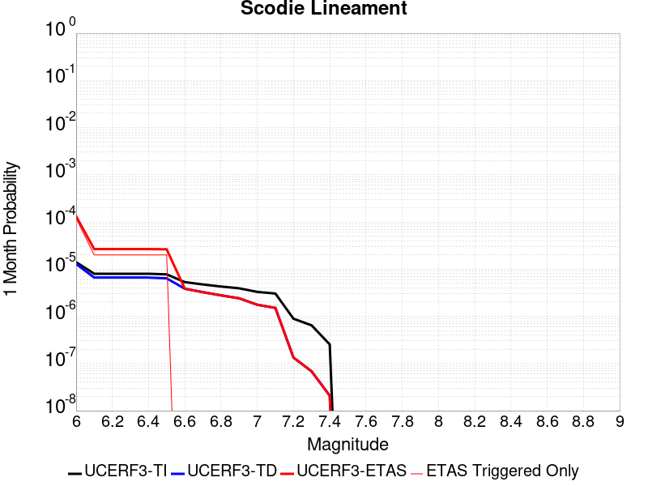 |  |  |

| Magnitude | 1 wk TI Prob | 1 wk TD Prob | 1 wk ETAS Prob | 1 wk ETAS/TD Gain | 1 wk ETAS Triggered Only | 1 mo TI Prob | 1 mo TD Prob | 1 mo ETAS Prob | 1 mo ETAS/TD Gain | 1 mo ETAS Triggered Only | 1 yr TI Prob | 1 yr TD Prob | 1 yr ETAS Prob | 1 yr ETAS/TD Gain | 1 yr ETAS Triggered Only | 10 yr TI Prob | 10 yr TD Prob | 10 yr ETAS Prob | 10 yr ETAS/TD Gain | 10 yr ETAS Triggered Only |
|-----|-----|-----|-----|-----|-----|-----|-----|-----|-----|-----|-----|-----|-----|-----|-----|-----|-----|-----|-----|-----|
| 6.0 | 3.2919327E-6 | 3.0133303E-6 | 1.13013E-4 | 37.50435 | 1.1E-4 | 1.4108206E-5 | 1.2914227E-5 | 1.3291268E-4 | 10.291958 | 1.2E-4 | 1.7175387E-4 | 1.5722254E-4 | 2.7720368E-4 | 1.7631294 | 1.2E-4 | 0.0017162118 | 0.0015714248 | 0.0017012205 | 1.0825975 | 1.3E-4 |
| 6.1 | 1.8663811E-6 | 1.5490382E-6 | 1.1549023E-5 | 7.455609 | 1.0E-5 | 7.998751E-6 | 6.6387206E-6 | 2.6638589E-5 | 4.0126085 | 2.0E-5 | 9.738045E-5 | 8.082393E-5 | 1.0082231E-4 | 1.2474315 | 2.0E-5 | 9.7337784E-4 | 8.079941E-4 | 8.379699E-4 | 1.037099 | 3.0E-5 |
| 6.2 | 1.8663811E-6 | 1.5490382E-6 | 1.1549023E-5 | 7.455609 | 1.0E-5 | 7.998751E-6 | 6.6387206E-6 | 2.6638589E-5 | 4.0126085 | 2.0E-5 | 9.738045E-5 | 8.082393E-5 | 1.0082231E-4 | 1.2474315 | 2.0E-5 | 9.7337784E-4 | 8.079941E-4 | 8.379699E-4 | 1.037099 | 3.0E-5 |
| 6.3 | 1.8663811E-6 | 1.5490382E-6 | 1.1549023E-5 | 7.455609 | 1.0E-5 | 7.998751E-6 | 6.6387206E-6 | 2.6638589E-5 | 4.0126085 | 2.0E-5 | 9.738045E-5 | 8.082393E-5 | 1.0082231E-4 | 1.2474315 | 2.0E-5 | 9.7337784E-4 | 8.079941E-4 | 8.379699E-4 | 1.037099 | 3.0E-5 |
| 6.4 | 1.8663811E-6 | 1.5490382E-6 | 1.1549023E-5 | 7.455609 | 1.0E-5 | 7.998751E-6 | 6.6387206E-6 | 2.6638589E-5 | 4.0126085 | 2.0E-5 | 9.738045E-5 | 8.082393E-5 | 1.0082231E-4 | 1.2474315 | 2.0E-5 | 9.7337784E-4 | 8.079941E-4 | 8.379699E-4 | 1.037099 | 3.0E-5 |
| 6.5 | 1.8106311E-6 | 1.4909722E-6 | 1.1490957E-5 | 7.7070236 | 1.0E-5 | 7.759824E-6 | 6.389868E-6 | 2.638974E-5 | 4.1299353 | 2.0E-5 | 9.447177E-5 | 7.779436E-5 | 9.779281E-5 | 1.257068 | 2.0E-5 | 9.4431615E-4 | 7.7771995E-4 | 8.076966E-4 | 1.0385443 | 3.0E-5 |
| 6.6 | 1.2414679E-6 | 8.9974395E-7 | 8.9974395E-7 | 1.0 | 0.0 | 5.320566E-6 | 3.85604E-6 | 3.85604E-6 | 1.0 | 0.0 | 6.477596E-5 | 4.6946367E-5 | 4.6946367E-5 | 1.0 | 0.0 | 6.475708E-4 | 4.6937316E-4 | 4.7936846E-4 | 1.021295 | 1.0E-5 |
| 6.7 | 1.1062215E-6 | 7.594193E-7 | 7.594193E-7 | 1.0 | 0.0 | 4.7409408E-6 | 3.2546504E-6 | 3.2546504E-6 | 1.0 | 0.0 | 5.7719422E-5 | 3.962472E-5 | 3.962472E-5 | 1.0 | 0.0 | 5.770443E-4 | 3.9618355E-4 | 3.9618355E-4 | 1.0 | 0.0 |
| 6.8 | 1.0006736E-6 | 6.5002786E-7 | 6.5002786E-7 | 1.0 | 0.0 | 4.288594E-6 | 2.7858312E-6 | 2.7858312E-6 | 1.0 | 0.0 | 5.221238E-5 | 3.391703E-5 | 3.391703E-5 | 1.0 | 0.0 | 5.220012E-4 | 3.3912458E-4 | 3.3912458E-4 | 1.0 | 0.0 |
| 6.9 | 9.167364E-7 | 5.6315065E-7 | 5.6315065E-7 | 1.0 | 0.0 | 3.9288643E-6 | 2.413501E-6 | 2.413501E-6 | 1.0 | 0.0 | 4.7832873E-5 | 2.9384037E-5 | 2.9384037E-5 | 1.0 | 0.0 | 4.782258E-4 | 2.9380718E-4 | 2.9380718E-4 | 1.0 | 0.0 |
| 7.0 | 7.6987664E-7 | 4.113265E-7 | 4.113265E-7 | 1.0 | 0.0 | 3.2994672E-6 | 1.7628269E-6 | 1.7628269E-6 | 1.0 | 0.0 | 4.0170275E-5 | 2.1462245E-5 | 2.1462245E-5 | 1.0 | 0.0 | 4.0163012E-4 | 2.1460558E-4 | 2.1460558E-4 | 1.0 | 0.0 |
| 7.1 | 7.1038727E-7 | 3.5210306E-7 | 3.5210306E-7 | 1.0 | 0.0 | 3.0445133E-6 | 1.5090123E-6 | 1.5090123E-6 | 1.0 | 0.0 | 3.706632E-5 | 1.8372106E-5 | 1.8372106E-5 | 1.0 | 0.0 | 3.7060137E-4 | 1.8370937E-4 | 1.8370937E-4 | 1.0 | 0.0 |
| 7.2 | 2.0799602E-7 | 3.1178534E-8 | 3.1178534E-8 | 1.0 | 0.0 | 8.914113E-7 | 1.3362228E-7 | 1.3362228E-7 | 1.0 | 0.0 | 1.0852878E-5 | 1.6268501E-6 | 1.6268501E-6 | 1.0 | 0.0 | 1.08523476E-4 | 1.626839E-5 | 1.626839E-5 | 1.0 | 0.0 |
| 7.3 | 1.5048182E-7 | 1.5939106E-8 | 1.5939106E-8 | 1.0 | 0.0 | 6.449219E-7 | 6.8310456E-8 | 6.8310456E-8 | 1.0 | 0.0 | 7.851896E-6 | 8.316795E-7 | 8.316795E-7 | 1.0 | 0.0 | 7.851618E-5 | 8.316767E-6 | 8.316767E-6 | 1.0 | 0.0 |
| 7.4 | 5.9334678E-8 | 4.8638475E-9 | 4.8638475E-9 | 1.0 | 0.0 | 2.5429145E-7 | 2.084506E-8 | 2.084506E-8 | 1.0 | 0.0 | 3.095994E-6 | 2.5378858E-7 | 2.5378858E-7 | 1.0 | 0.0 | 3.095951E-5 | 2.5378843E-6 | 2.5378843E-6 | 1.0 | 0.0 |

## San Jacinto (San Jacinto Valley) rev
*[(top)](#table-of-contents)*

| 1 Week | 1 Month | 1 Year | 10 Year |
|-----|-----|-----|-----|
|  |  |  |  |

| Magnitude | 1 wk TI Prob | 1 wk TD Prob | 1 wk ETAS Prob | 1 wk ETAS/TD Gain | 1 wk ETAS Triggered Only | 1 mo TI Prob | 1 mo TD Prob | 1 mo ETAS Prob | 1 mo ETAS/TD Gain | 1 mo ETAS Triggered Only | 1 yr TI Prob | 1 yr TD Prob | 1 yr ETAS Prob | 1 yr ETAS/TD Gain | 1 yr ETAS Triggered Only | 10 yr TI Prob | 10 yr TD Prob | 10 yr ETAS Prob | 10 yr ETAS/TD Gain | 10 yr ETAS Triggered Only |
|-----|-----|-----|-----|-----|-----|-----|-----|-----|-----|-----|-----|-----|-----|-----|-----|-----|-----|-----|-----|-----|
| 6.0 | 3.652694E-5 | 3.4401106E-5 | 1.3439766E-4 | 3.9067833 | 1.0E-4 | 1.5653463E-4 | 1.4742499E-4 | 2.674073E-4 | 1.8138533 | 1.2E-4 | 0.0019041431 | 0.0017934233 | 0.0019231902 | 1.072357 | 1.3E-4 | 0.018879099 | 0.018526303 | 0.018653894 | 1.0068871 | 1.3E-4 |
| 6.1 | 3.652694E-5 | 3.4401106E-5 | 1.3439766E-4 | 3.9067833 | 1.0E-4 | 1.5653463E-4 | 1.4742499E-4 | 2.674073E-4 | 1.8138533 | 1.2E-4 | 0.0019041431 | 0.0017934233 | 0.0019231902 | 1.072357 | 1.3E-4 | 0.018879099 | 0.018526303 | 0.018653894 | 1.0068871 | 1.3E-4 |
| 6.2 | 3.652694E-5 | 3.4401106E-5 | 1.3439766E-4 | 3.9067833 | 1.0E-4 | 1.5653463E-4 | 1.4742499E-4 | 2.674073E-4 | 1.8138533 | 1.2E-4 | 0.0019041431 | 0.0017934233 | 0.0019231902 | 1.072357 | 1.3E-4 | 0.018879099 | 0.018526303 | 0.018653894 | 1.0068871 | 1.3E-4 |
| 6.3 | 3.652694E-5 | 3.4401106E-5 | 1.3439766E-4 | 3.9067833 | 1.0E-4 | 1.5653463E-4 | 1.4742499E-4 | 2.674073E-4 | 1.8138533 | 1.2E-4 | 0.0019041431 | 0.0017934233 | 0.0019231902 | 1.072357 | 1.3E-4 | 0.018879099 | 0.018526303 | 0.018653894 | 1.0068871 | 1.3E-4 |
| 6.4 | 3.646941E-5 | 3.432268E-5 | 1.3431924E-4 | 3.9134254 | 1.0E-4 | 1.5628811E-4 | 1.4708891E-4 | 2.6707127E-4 | 1.815713 | 1.2E-4 | 0.0019011468 | 0.0017893389 | 0.0019191062 | 1.0725225 | 1.3E-4 | 0.018849645 | 0.018486181 | 0.018613778 | 1.0069023 | 1.3E-4 |
| 6.5 | 3.646941E-5 | 3.432268E-5 | 1.3431924E-4 | 3.9134254 | 1.0E-4 | 1.5628811E-4 | 1.4708891E-4 | 2.6707127E-4 | 1.815713 | 1.2E-4 | 0.0019011468 | 0.0017893389 | 0.0019191062 | 1.0725225 | 1.3E-4 | 0.018849645 | 0.018486181 | 0.018613778 | 1.0069023 | 1.3E-4 |
| 6.6 | 3.6442503E-5 | 3.4286066E-5 | 1.3428264E-4 | 3.9165366 | 1.0E-4 | 1.561728E-4 | 1.4693203E-4 | 2.669144E-4 | 1.8165842 | 1.2E-4 | 0.0018997455 | 0.001787432 | 0.0019171996 | 1.0726 | 1.3E-4 | 0.018835869 | 0.01846745 | 0.018595051 | 1.0069094 | 1.3E-4 |
| 6.7 | 3.6432113E-5 | 3.427164E-5 | 1.3426821E-4 | 3.9177642 | 1.0E-4 | 1.5612828E-4 | 1.4687021E-4 | 2.6685258E-4 | 1.8169279 | 1.2E-4 | 0.0018992044 | 0.0017866807 | 0.0019164485 | 1.0726306 | 1.3E-4 | 0.018830549 | 0.018460074 | 0.018587675 | 1.0069122 | 1.3E-4 |
| 6.8 | 3.6409598E-5 | 3.4240697E-5 | 1.3423727E-4 | 3.9204013 | 1.0E-4 | 1.560318E-4 | 1.4673761E-4 | 2.6672E-4 | 1.8176663 | 1.2E-4 | 0.0018980318 | 0.0017850689 | 0.0019148368 | 1.0726963 | 1.3E-4 | 0.018819023 | 0.018444229 | 0.018571831 | 1.0069183 | 1.3E-4 |
| 6.9 | 3.638078E-5 | 3.4201123E-5 | 1.341977E-4 | 3.9237807 | 1.0E-4 | 1.5590832E-4 | 1.4656801E-4 | 2.6655043E-4 | 1.8186126 | 1.2E-4 | 0.0018965311 | 0.0017830075 | 0.0019127757 | 1.0727805 | 1.3E-4 | 0.018804269 | 0.018423963 | 0.018551568 | 1.0069261 | 1.3E-4 |
| 7.0 | 3.6294874E-5 | 3.408314E-5 | 1.3407973E-4 | 3.933902 | 1.0E-4 | 1.5554018E-4 | 1.4606243E-4 | 2.660449E-4 | 1.8214465 | 1.2E-4 | 0.0018920569 | 0.0017768623 | 0.0019066313 | 1.0730326 | 1.3E-4 | 0.018760284 | 0.018363545 | 0.018491156 | 1.0069492 | 1.3E-4 |
| 7.1 | 3.6260717E-5 | 3.403942E-5 | 1.3403602E-4 | 3.9376702 | 1.0E-4 | 1.5539382E-4 | 1.4587509E-4 | 2.6585758E-4 | 1.8225015 | 1.2E-4 | 0.001890278 | 0.0017745851 | 0.0019043544 | 1.0731266 | 1.3E-4 | 0.018742796 | 0.018341139 | 0.018468754 | 1.0069579 | 1.3E-4 |
| 7.2 | 3.6210204E-5 | 3.397364E-5 | 1.3397024E-4 | 3.9433584 | 1.0E-4 | 1.5517735E-4 | 1.455932E-4 | 2.6557574E-4 | 1.8240943 | 1.2E-4 | 0.001887647 | 0.0017711588 | 0.0019009286 | 1.0732683 | 1.3E-4 | 0.01871693 | 0.018307408 | 0.018435027 | 1.006971 | 1.3E-4 |
| 7.3 | 3.6119454E-5 | 3.386193E-5 | 1.3385854E-4 | 3.9530692 | 1.0E-4 | 1.5478847E-4 | 1.4511449E-4 | 2.6509707E-4 | 1.8268133 | 1.2E-4 | 0.0018829206 | 0.0017653398 | 0.0018951104 | 1.0735102 | 1.3E-4 | 0.018670462 | 0.01824996 | 0.018377587 | 1.0069933 | 1.3E-4 |
| 7.4 | 3.607848E-5 | 3.380943E-5 | 1.3380605E-4 | 3.957655 | 1.0E-4 | 1.5461289E-4 | 1.4488952E-4 | 2.6487213E-4 | 1.8280972 | 1.2E-4 | 0.0018807866 | 0.0017626052 | 0.0018923761 | 1.0736245 | 1.3E-4 | 0.018649481 | 0.018222956 | 0.018350586 | 1.0070039 | 1.3E-4 |
| 7.5 | 3.5856774E-5 | 3.3619202E-5 | 1.3361585E-4 | 3.9743905 | 1.0E-4 | 1.5366284E-4 | 1.4407437E-4 | 2.6405707E-4 | 1.8327832 | 1.2E-4 | 0.0018692396 | 0.0017526967 | 0.0018824688 | 1.0740414 | 1.3E-4 | 0.018535944 | 0.018124057 | 0.0182517 | 1.0070428 | 1.3E-4 |
| 7.6 | 3.286655E-5 | 3.2142278E-5 | 1.3213906E-4 | 4.1110673 | 1.0E-4 | 1.4084904E-4 | 1.3774536E-4 | 2.5772883E-4 | 1.8710527 | 1.2E-4 | 0.001713488 | 0.0016757617 | 0.0018055438 | 1.0774467 | 1.3E-4 | 0.017003361 | 0.017343804 | 0.017471548 | 1.0073655 | 1.3E-4 |
| 7.7 | 2.8882527E-5 | 2.9235205E-5 | 1.2923228E-4 | 4.4204335 | 1.0E-4 | 1.237764E-4 | 1.2528773E-4 | 2.4527268E-4 | 1.9576753 | 1.2E-4 | 0.0015059357 | 0.0015243118 | 0.0016541136 | 1.0851544 | 1.3E-4 | 0.014957713 | 0.015830338 | 0.01595828 | 1.008082 | 1.3E-4 |
| 7.8 | 2.4950225E-5 | 2.6526219E-5 | 1.2652356E-4 | 4.769755 | 1.0E-4 | 1.0692515E-4 | 1.1367885E-4 | 2.3366521E-4 | 2.0554852 | 1.2E-4 | 0.0013010362 | 0.0013831621 | 0.0015129823 | 1.0938575 | 1.3E-4 | 0.012934455 | 0.01441176 | 0.014539886 | 1.0088904 | 1.3E-4 |
| 7.9 | 1.9881603E-5 | 2.150649E-5 | 1.2150434E-4 | 5.649659 | 1.0E-4 | 8.520408E-5 | 9.216742E-5 | 2.1215636E-4 | 2.3018584 | 1.2E-4 | 0.001036866 | 0.0011215615 | 0.0012514157 | 1.1157799 | 1.3E-4 | 0.010320415 | 0.011776998 | 0.011905467 | 1.0109085 | 1.3E-4 |
| 8.0 | 1.563292E-5 | 1.5936288E-5 | 9.5935015E-5 | 6.01991 | 8.0E-5 | 6.6996516E-5 | 6.829659E-5 | 1.6828976E-4 | 2.464102 | 1.0E-4 | 8.153773E-4 | 8.3119445E-4 | 9.4110303E-4 | 1.1322297 | 1.1E-4 | 0.00812392 | 0.008810331 | 0.008919362 | 1.0123754 | 1.1E-4 |
| 8.1 | 1.0045313E-5 | 8.300794E-6 | 2.8300628E-5 | 3.409388 | 2.0E-5 | 4.305063E-5 | 3.557435E-5 | 5.557364E-5 | 1.5621828 | 2.0E-5 | 5.2401534E-4 | 4.3303217E-4 | 4.530235E-4 | 1.046166 | 2.0E-5 | 0.0052278144 | 0.0046587666 | 0.0046786736 | 1.0042729 | 2.0E-5 |
| 8.2 | 4.1554413E-6 | 1.5648296E-6 | 1.5648296E-6 | 1.0 | 0.0 | 1.7808914E-5 | 6.7063957E-6 | 6.7063957E-6 | 1.0 | 0.0 | 2.1680194E-4 | 8.164734E-5 | 8.164734E-5 | 1.0 | 0.0 | 0.0021659054 | 9.479703E-4 | 9.479703E-4 | 1.0 | 0.0 |
| 8.3 | 1.2758221E-6 | 3.612677E-7 | 3.612677E-7 | 1.0 | 0.0 | 5.4677976E-6 | 1.5482892E-6 | 1.5482892E-6 | 1.0 | 0.0 | 6.65684E-5 | 1.8850264E-5 | 1.8850264E-5 | 1.0 | 0.0 | 6.6548464E-4 | 2.2739546E-4 | 2.2739546E-4 | 1.0 | 0.0 |

## San Jacinto (Stepovers Combined)
*[(top)](#table-of-contents)*

| 1 Week | 1 Month | 1 Year | 10 Year |
|-----|-----|-----|-----|
|  |  |  |  |

| Magnitude | 1 wk TI Prob | 1 wk TD Prob | 1 wk ETAS Prob | 1 wk ETAS/TD Gain | 1 wk ETAS Triggered Only | 1 mo TI Prob | 1 mo TD Prob | 1 mo ETAS Prob | 1 mo ETAS/TD Gain | 1 mo ETAS Triggered Only | 1 yr TI Prob | 1 yr TD Prob | 1 yr ETAS Prob | 1 yr ETAS/TD Gain | 1 yr ETAS Triggered Only | 10 yr TI Prob | 10 yr TD Prob | 10 yr ETAS Prob | 10 yr ETAS/TD Gain | 10 yr ETAS Triggered Only |
|-----|-----|-----|-----|-----|-----|-----|-----|-----|-----|-----|-----|-----|-----|-----|-----|-----|-----|-----|-----|-----|
| 6.0 | 4.0667746E-5 | 3.5271103E-5 | 1.2526794E-4 | 3.551574 | 9.0E-5 | 1.742787E-4 | 1.5115313E-4 | 2.611365E-4 | 1.7276288 | 1.1E-4 | 0.0021197782 | 0.0018387372 | 0.0019585167 | 1.0651422 | 1.2E-4 | 0.020996714 | 0.018986495 | 0.019104216 | 1.0062003 | 1.2E-4 |
| 6.1 | 4.0667746E-5 | 3.5271103E-5 | 1.2526794E-4 | 3.551574 | 9.0E-5 | 1.742787E-4 | 1.5115313E-4 | 2.611365E-4 | 1.7276288 | 1.1E-4 | 0.0021197782 | 0.0018387372 | 0.0019585167 | 1.0651422 | 1.2E-4 | 0.020996714 | 0.018986495 | 0.019104216 | 1.0062003 | 1.2E-4 |
| 6.2 | 4.0667746E-5 | 3.5271103E-5 | 1.2526794E-4 | 3.551574 | 9.0E-5 | 1.742787E-4 | 1.5115313E-4 | 2.611365E-4 | 1.7276288 | 1.1E-4 | 0.0021197782 | 0.0018387372 | 0.0019585167 | 1.0651422 | 1.2E-4 | 0.020996714 | 0.018986495 | 0.019104216 | 1.0062003 | 1.2E-4 |
| 6.3 | 4.0667746E-5 | 3.5271103E-5 | 1.2526794E-4 | 3.551574 | 9.0E-5 | 1.742787E-4 | 1.5115313E-4 | 2.611365E-4 | 1.7276288 | 1.1E-4 | 0.0021197782 | 0.0018387372 | 0.0019585167 | 1.0651422 | 1.2E-4 | 0.020996714 | 0.018986495 | 0.019104216 | 1.0062003 | 1.2E-4 |
| 6.4 | 4.0577226E-5 | 3.5143014E-5 | 1.2513985E-4 | 3.5608742 | 9.0E-5 | 1.738908E-4 | 1.5060425E-4 | 2.6058767E-4 | 1.7302811 | 1.1E-4 | 0.0021150648 | 0.0018320669 | 0.0019518471 | 1.0653797 | 1.2E-4 | 0.020950472 | 0.018921062 | 0.019038793 | 1.0062221 | 1.2E-4 |
| 6.5 | 4.0577226E-5 | 3.5143014E-5 | 1.2513985E-4 | 3.5608742 | 9.0E-5 | 1.738908E-4 | 1.5060425E-4 | 2.6058767E-4 | 1.7302811 | 1.1E-4 | 0.0021150648 | 0.0018320669 | 0.0019518471 | 1.0653797 | 1.2E-4 | 0.020950472 | 0.018921062 | 0.019038793 | 1.0062221 | 1.2E-4 |
| 6.6 | 4.053861E-5 | 3.5088357E-5 | 1.250852E-4 | 3.5648634 | 9.0E-5 | 1.7372532E-4 | 1.5037002E-4 | 2.603535E-4 | 1.7314187 | 1.1E-4 | 0.0021130538 | 0.0018292206 | 0.0019490011 | 1.0654817 | 1.2E-4 | 0.020930743 | 0.01889314 | 0.019010874 | 1.0062315 | 1.2E-4 |
| 6.7 | 4.0516545E-5 | 3.505743E-5 | 1.2505427E-4 | 3.567126 | 9.0E-5 | 1.7363077E-4 | 1.502375E-4 | 2.60221E-4 | 1.732064 | 1.1E-4 | 0.002111905 | 0.0018276101 | 0.0019473907 | 1.0655395 | 1.2E-4 | 0.020919468 | 0.018877337 | 0.01899507 | 1.0062368 | 1.2E-4 |
| 6.8 | 4.049434E-5 | 3.5028992E-5 | 1.2502584E-4 | 3.5692103 | 9.0E-5 | 1.7353562E-4 | 1.5011564E-4 | 2.6009913E-4 | 1.7326584 | 1.1E-4 | 0.0021107488 | 0.0018261289 | 0.0019459098 | 1.0655928 | 1.2E-4 | 0.020908125 | 0.018862749 | 0.018980484 | 1.0062418 | 1.2E-4 |
| 6.9 | 4.046386E-5 | 3.4991554E-5 | 1.2498841E-4 | 3.5719593 | 9.0E-5 | 1.73405E-4 | 1.499552E-4 | 2.599387E-4 | 1.7334424 | 1.1E-4 | 0.0021091616 | 0.0018241788 | 0.00194396 | 1.065663 | 1.2E-4 | 0.020892553 | 0.018843522 | 0.018961262 | 1.0062482 | 1.2E-4 |
| 7.0 | 4.036382E-5 | 3.4872126E-5 | 1.2486898E-4 | 3.5807679 | 9.0E-5 | 1.7297632E-4 | 1.4944343E-4 | 2.5942698E-4 | 1.7359545 | 1.1E-4 | 0.0021039525 | 0.0018179584 | 0.0019377404 | 1.0658882 | 1.2E-4 | 0.02084144 | 0.018782137 | 0.018899882 | 1.0062691 | 1.2E-4 |
| 7.1 | 4.0343282E-5 | 3.485059E-5 | 1.2484746E-4 | 3.582363 | 9.0E-5 | 1.7288832E-4 | 1.4935112E-4 | 2.593347E-4 | 1.7364094 | 1.1E-4 | 0.002102883 | 0.0018168368 | 0.0019366187 | 1.0659288 | 1.2E-4 | 0.020830948 | 0.018771008 | 0.018888755 | 1.0062728 | 1.2E-4 |
| 7.2 | 4.0257353E-5 | 3.475509E-5 | 1.2475195E-4 | 3.589459 | 9.0E-5 | 1.725201E-4 | 1.489419E-4 | 2.5892552E-4 | 1.7384331 | 1.1E-4 | 0.0020984085 | 0.0018118626 | 0.0019316451 | 1.0661101 | 1.2E-4 | 0.020787042 | 0.018721746 | 0.0188395 | 1.0062896 | 1.2E-4 |
| 7.3 | 3.9940667E-5 | 3.458276E-5 | 1.2457964E-4 | 3.6023629 | 9.0E-5 | 1.7116306E-4 | 1.4820343E-4 | 2.5818712E-4 | 1.7421131 | 1.1E-4 | 0.0020819185 | 0.0018028866 | 0.0019226703 | 1.0664399 | 1.2E-4 | 0.020625217 | 0.018630387 | 0.018748151 | 1.0063211 | 1.2E-4 |
| 7.4 | 3.9721202E-5 | 3.4468165E-5 | 1.2446506E-4 | 3.611015 | 9.0E-5 | 1.7022261E-4 | 1.4771236E-4 | 2.576961E-4 | 1.7445805 | 1.1E-4 | 0.0020704903 | 0.0017969179 | 0.0019167023 | 1.066661 | 1.2E-4 | 0.020513052 | 0.018569522 | 0.018687293 | 1.0063422 | 1.2E-4 |
| 7.5 | 3.7036873E-5 | 3.3535776E-5 | 1.2353275E-4 | 3.6836112 | 9.0E-5 | 1.5871979E-4 | 1.4371685E-4 | 2.5370103E-4 | 1.765284 | 1.1E-4 | 0.0019307006 | 0.0017483513 | 0.0018681415 | 1.0685161 | 1.2E-4 | 0.019140124 | 0.018071128 | 0.01818896 | 1.0065204 | 1.2E-4 |
| 7.6 | 3.2940967E-5 | 3.13167E-5 | 1.2131388E-4 | 3.873776 | 9.0E-5 | 1.4116794E-4 | 1.3420754E-4 | 2.4419278E-4 | 1.8195161 | 1.1E-4 | 0.0017173645 | 0.0016327545 | 0.0017525585 | 1.0733755 | 1.2E-4 | 0.01704153 | 0.016904091 | 0.017022062 | 1.0069789 | 1.2E-4 |
| 7.7 | 2.8236149E-5 | 2.7882697E-5 | 1.1788019E-4 | 4.2277184 | 9.0E-5 | 1.2100645E-4 | 1.1949181E-4 | 2.2947865E-4 | 1.9204552 | 1.1E-4 | 0.0014722579 | 0.0014538429 | 0.0015736684 | 1.0824199 | 1.2E-4 | 0.014625421 | 0.015114912 | 0.015233098 | 1.0078192 | 1.2E-4 |
| 7.8 | 2.4329287E-5 | 2.5206451E-5 | 1.1520418E-4 | 4.5704246 | 9.0E-5 | 1.042642E-4 | 1.08023174E-4 | 2.180113E-4 | 2.01819 | 1.1E-4 | 0.0012686774 | 0.0013143895 | 0.0014342319 | 1.0911771 | 1.2E-4 | 0.012614589 | 0.013712341 | 0.013830695 | 1.0086312 | 1.2E-4 |
| 7.9 | 1.9370926E-5 | 2.0420413E-5 | 1.1041857E-4 | 5.4072647 | 9.0E-5 | 8.301561E-5 | 8.751312E-5 | 1.975035E-4 | 2.2568443 | 1.1E-4 | 0.0010102465 | 0.0010649522 | 0.0011848245 | 1.1125611 | 1.2E-4 | 0.0100566605 | 0.011199402 | 0.011318058 | 1.0105948 | 1.2E-4 |
| 8.0 | 1.5583017E-5 | 1.5885415E-5 | 9.588414E-5 | 6.035986 | 8.0E-5 | 6.6782646E-5 | 6.807858E-5 | 1.6807177E-4 | 2.4687908 | 1.0E-4 | 8.127754E-4 | 8.2854216E-4 | 9.3845103E-4 | 1.1326534 | 1.1E-4 | 0.008098091 | 0.008781636 | 0.008890671 | 1.0124161 | 1.1E-4 |
| 8.1 | 1.0024873E-5 | 8.291399E-6 | 2.8291233E-5 | 3.412118 | 2.0E-5 | 4.2963035E-5 | 3.553409E-5 | 5.5533375E-5 | 1.5628198 | 2.0E-5 | 5.229494E-4 | 4.3254215E-4 | 4.525335E-4 | 1.0462183 | 2.0E-5 | 0.0052172043 | 0.0046530655 | 0.0046729725 | 1.0042782 | 2.0E-5 |
| 8.2 | 4.142796E-6 | 1.5602761E-6 | 1.5602761E-6 | 1.0 | 0.0 | 1.775472E-5 | 6.6868806E-6 | 6.6868806E-6 | 1.0 | 0.0 | 2.1614227E-4 | 8.140976E-5 | 8.140976E-5 | 1.0 | 0.0 | 0.0021593217 | 9.4514614E-4 | 9.4514614E-4 | 1.0 | 0.0 |
| 8.3 | 1.2750878E-6 | 3.609817E-7 | 3.609817E-7 | 1.0 | 0.0 | 5.4646503E-6 | 1.5470634E-6 | 1.5470634E-6 | 1.0 | 0.0 | 6.653009E-5 | 1.8835339E-5 | 1.8835339E-5 | 1.0 | 0.0 | 6.6510175E-4 | 2.272251E-4 | 2.272251E-4 | 1.0 | 0.0 |

## Calico-Hidalgo
*[(top)](#table-of-contents)*

| 1 Week | 1 Month | 1 Year | 10 Year |
|-----|-----|-----|-----|
|  |  |  |  |

| Magnitude | 1 wk TI Prob | 1 wk TD Prob | 1 wk ETAS Prob | 1 wk ETAS/TD Gain | 1 wk ETAS Triggered Only | 1 mo TI Prob | 1 mo TD Prob | 1 mo ETAS Prob | 1 mo ETAS/TD Gain | 1 mo ETAS Triggered Only | 1 yr TI Prob | 1 yr TD Prob | 1 yr ETAS Prob | 1 yr ETAS/TD Gain | 1 yr ETAS Triggered Only | 10 yr TI Prob | 10 yr TD Prob | 10 yr ETAS Prob | 10 yr ETAS/TD Gain | 10 yr ETAS Triggered Only |
|-----|-----|-----|-----|-----|-----|-----|-----|-----|-----|-----|-----|-----|-----|-----|-----|-----|-----|-----|-----|-----|
| 6.0 | 4.0906612E-5 | 5.0704355E-5 | 1.10701316E-4 | 2.1832702 | 6.0E-5 | 1.7530227E-4 | 2.1728857E-4 | 3.0726902E-4 | 1.4141058 | 9.0E-5 | 0.0021322158 | 0.002642678 | 0.002742414 | 1.0377403 | 1.0E-4 | 0.02111873 | 0.026152814 | 0.026269676 | 1.0044684 | 1.2E-4 |
| 6.1 | 4.0906612E-5 | 5.0704355E-5 | 1.10701316E-4 | 2.1832702 | 6.0E-5 | 1.7530227E-4 | 2.1728857E-4 | 3.0726902E-4 | 1.4141058 | 9.0E-5 | 0.0021322158 | 0.002642678 | 0.002742414 | 1.0377403 | 1.0E-4 | 0.02111873 | 0.026152814 | 0.026269676 | 1.0044684 | 1.2E-4 |
| 6.2 | 4.0906612E-5 | 5.0704355E-5 | 1.10701316E-4 | 2.1832702 | 6.0E-5 | 1.7530227E-4 | 2.1728857E-4 | 3.0726902E-4 | 1.4141058 | 9.0E-5 | 0.0021322158 | 0.002642678 | 0.002742414 | 1.0377403 | 1.0E-4 | 0.02111873 | 0.026152814 | 0.026269676 | 1.0044684 | 1.2E-4 |
| 6.3 | 2.4242801E-5 | 3.0090967E-5 | 7.0089765E-5 | 2.3292625 | 4.0E-5 | 1.0389358E-4 | 1.289551E-4 | 1.7894866E-4 | 1.3876818 | 5.0E-5 | 0.0012641704 | 0.0015689312 | 0.0016188527 | 1.0318189 | 5.0E-5 | 0.01257003 | 0.015582229 | 0.01563145 | 1.0031588 | 5.0E-5 |
| 6.4 | 2.4242801E-5 | 3.0090967E-5 | 7.0089765E-5 | 2.3292625 | 4.0E-5 | 1.0389358E-4 | 1.289551E-4 | 1.7894866E-4 | 1.3876818 | 5.0E-5 | 0.0012641704 | 0.0015689312 | 0.0016188527 | 1.0318189 | 5.0E-5 | 0.01257003 | 0.015582229 | 0.01563145 | 1.0031588 | 5.0E-5 |
| 6.5 | 2.0286952E-5 | 2.5316054E-5 | 5.5315297E-5 | 2.1849887 | 3.0E-5 | 8.694118E-5 | 1.0849296E-4 | 1.384897E-4 | 1.2764857 | 3.0E-5 | 0.0010579949 | 0.0013201186 | 0.001350079 | 1.0226952 | 3.0E-5 | 0.010529719 | 0.013124701 | 0.013154306 | 1.0022558 | 3.0E-5 |
| 6.6 | 2.0269223E-5 | 2.5297004E-5 | 5.5296245E-5 | 2.1858811 | 3.0E-5 | 8.6865206E-5 | 1.08411325E-4 | 1.3840807E-4 | 1.2766938 | 3.0E-5 | 0.0010570707 | 0.0013191258 | 0.0013490862 | 1.0227123 | 3.0E-5 | 0.010520565 | 0.01311489 | 0.013144497 | 1.0022575 | 3.0E-5 |
| 6.7 | 1.799852E-5 | 2.2540933E-5 | 5.2540257E-5 | 2.330882 | 3.0E-5 | 7.713423E-5 | 9.660051E-5 | 1.265976E-4 | 1.3105273 | 3.0E-5 | 9.3870464E-4 | 0.0011754911 | 0.001205456 | 1.0254912 | 3.0E-5 | 0.009347493 | 0.011694346 | 0.011723995 | 1.0025353 | 3.0E-5 |
| 6.8 | 1.7458793E-5 | 2.184258E-5 | 5.1841926E-5 | 2.373434 | 3.0E-5 | 7.4821255E-5 | 9.360778E-5 | 1.2360497E-4 | 1.3204561 | 3.0E-5 | 9.10568E-4 | 0.0011390933 | 0.0011690592 | 1.0263067 | 3.0E-5 | 0.009068459 | 0.011334131 | 0.01136379 | 1.0026169 | 3.0E-5 |
| 6.9 | 1.542884E-5 | 1.9026285E-5 | 3.9025905E-5 | 2.0511572 | 2.0E-5 | 6.612192E-5 | 8.153875E-5 | 1.01537116E-4 | 1.2452621 | 2.0E-5 | 8.04737E-4 | 9.922953E-4 | 0.0010122755 | 1.0201353 | 2.0E-5 | 0.008018291 | 0.009880043 | 0.009899845 | 1.0020043 | 2.0E-5 |
| 7.0 | 1.468253E-5 | 1.803109E-5 | 3.8030732E-5 | 2.1091752 | 2.0E-5 | 6.292361E-5 | 7.727389E-5 | 9.727234E-5 | 1.2587997 | 2.0E-5 | 7.658257E-4 | 9.4041653E-4 | 9.6039777E-4 | 1.0212471 | 2.0E-5 | 0.0076319184 | 0.009365736 | 0.0093855485 | 1.0021155 | 2.0E-5 |
| 7.1 | 1.3139281E-5 | 1.620139E-5 | 3.6201065E-5 | 2.234442 | 2.0E-5 | 5.6309986E-5 | 6.943275E-5 | 8.9431356E-5 | 1.2880285 | 2.0E-5 | 6.853584E-4 | 8.4502844E-4 | 8.6501153E-4 | 1.0236478 | 2.0E-5 | 0.0068324856 | 0.008419449 | 0.008439281 | 1.0023555 | 2.0E-5 |
| 7.2 | 1.1127404E-5 | 1.3867038E-5 | 2.38669E-5 | 1.7211245 | 1.0E-5 | 4.7688E-5 | 5.9428872E-5 | 6.942828E-5 | 1.1682584 | 1.0E-5 | 5.8044674E-4 | 7.233172E-4 | 7.3331E-4 | 1.0138152 | 1.0E-5 | 0.0057893298 | 0.007210737 | 0.007220665 | 1.0013769 | 1.0E-5 |
| 7.3 | 9.808154E-6 | 1.2176586E-5 | 2.2176464E-5 | 1.8212383 | 1.0E-5 | 4.2034266E-5 | 5.2184383E-5 | 6.218386E-5 | 1.1916182 | 1.0E-5 | 5.11647E-4 | 6.351704E-4 | 6.4516405E-4 | 1.0157338 | 1.0E-5 | 0.0051047057 | 0.006334625 | 0.006344562 | 1.0015687 | 1.0E-5 |
| 7.4 | 7.942452E-6 | 9.792348E-6 | 1.979225E-5 | 2.0211957 | 1.0E-5 | 3.4038632E-5 | 4.1966585E-5 | 5.1966163E-5 | 1.2382748 | 1.0E-5 | 4.1434157E-4 | 5.108328E-4 | 5.208277E-4 | 1.0195658 | 1.0E-5 | 0.0041356985 | 0.005097527 | 0.0051074764 | 1.0019517 | 1.0E-5 |
| 7.5 | 4.7121216E-6 | 5.7729717E-6 | 1.5772914E-5 | 2.7322001 | 1.0E-5 | 2.019465E-5 | 2.4741115E-5 | 3.4740868E-5 | 1.4041755 | 1.0E-5 | 2.4584212E-4 | 3.011891E-4 | 3.111861E-4 | 1.0331917 | 1.0E-5 | 0.0024557032 | 0.0030085614 | 0.0030185315 | 1.0033139 | 1.0E-5 |
| 7.6 | 2.21172E-7 | 2.6040198E-7 | 2.6040198E-7 | 1.0 | 0.0 | 9.478797E-7 | 1.1160082E-6 | 1.1160082E-6 | 1.0 | 0.0 | 1.1540374E-5 | 1.3587343E-5 | 1.3587343E-5 | 1.0 | 0.0 | 1.1539775E-4 | 1.3586794E-4 | 1.3586794E-4 | 1.0 | 0.0 |

## Santa Ynez (West)
*[(top)](#table-of-contents)*

| 1 Week | 1 Month | 1 Year | 10 Year |
|-----|-----|-----|-----|
|  |  |  |  |

| Magnitude | 1 wk TI Prob | 1 wk TD Prob | 1 wk ETAS Prob | 1 wk ETAS/TD Gain | 1 wk ETAS Triggered Only | 1 mo TI Prob | 1 mo TD Prob | 1 mo ETAS Prob | 1 mo ETAS/TD Gain | 1 mo ETAS Triggered Only | 1 yr TI Prob | 1 yr TD Prob | 1 yr ETAS Prob | 1 yr ETAS/TD Gain | 1 yr ETAS Triggered Only | 10 yr TI Prob | 10 yr TD Prob | 10 yr ETAS Prob | 10 yr ETAS/TD Gain | 10 yr ETAS Triggered Only |
|-----|-----|-----|-----|-----|-----|-----|-----|-----|-----|-----|-----|-----|-----|-----|-----|-----|-----|-----|-----|-----|
| 6.0 | 4.7352758E-5 | 5.497084E-5 | 1.3496644E-4 | 2.4552372 | 8.0E-5 | 2.0292461E-4 | 2.3556968E-4 | 3.2554846E-4 | 1.3819625 | 9.0E-5 | 0.0024678076 | 0.002864558 | 0.0029642715 | 1.0348094 | 1.0E-4 | 0.024405818 | 0.028304456 | 0.028411342 | 1.0037763 | 1.1E-4 |
| 6.1 | 4.7352758E-5 | 5.497084E-5 | 1.14967545E-4 | 2.0914278 | 6.0E-5 | 2.0292461E-4 | 2.3556968E-4 | 3.055532E-4 | 1.297082 | 7.0E-5 | 0.0024678076 | 0.002864558 | 0.0029343574 | 1.0243666 | 7.0E-5 | 0.024405818 | 0.028304456 | 0.028382191 | 1.0027465 | 8.0E-5 |
| 6.2 | 3.0415853E-5 | 3.3925004E-5 | 7.392364E-5 | 2.1790314 | 4.0E-5 | 1.3034715E-4 | 1.4538495E-4 | 1.953777E-4 | 1.3438646 | 5.0E-5 | 0.0015858212 | 0.0017686592 | 0.0018185708 | 1.02822 | 5.0E-5 | 0.015745522 | 0.01754978 | 0.017598901 | 1.002799 | 5.0E-5 |
| 6.3 | 3.0415853E-5 | 3.3925004E-5 | 7.392364E-5 | 2.1790314 | 4.0E-5 | 1.3034715E-4 | 1.4538495E-4 | 1.953777E-4 | 1.3438646 | 5.0E-5 | 0.0015858212 | 0.0017686592 | 0.0018185708 | 1.02822 | 5.0E-5 | 0.015745522 | 0.01754978 | 0.017598901 | 1.002799 | 5.0E-5 |
| 6.4 | 2.5452082E-5 | 2.7912318E-5 | 5.7911482E-5 | 2.0747643 | 3.0E-5 | 1.09075794E-4 | 1.1961885E-4 | 1.5961406E-4 | 1.3343555 | 4.0E-5 | 0.0013271887 | 0.0014554056 | 0.0014953474 | 1.0274438 | 4.0E-5 | 0.013192902 | 0.01446091 | 0.014500331 | 1.0027261 | 4.0E-5 |
| 6.5 | 2.3143784E-5 | 2.5128133E-5 | 5.5127377E-5 | 2.193851 | 3.0E-5 | 9.9183875E-5 | 1.07687636E-4 | 1.4768333E-4 | 1.3714046 | 4.0E-5 | 0.0012068948 | 0.001310323 | 0.0013502706 | 1.0304868 | 4.0E-5 | 0.012003611 | 0.013027638 | 0.013067117 | 1.0030304 | 4.0E-5 |
| 6.6 | 1.9118515E-5 | 2.0354244E-5 | 5.0353636E-5 | 2.473864 | 3.0E-5 | 8.193392E-5 | 8.722961E-5 | 1.1722699E-4 | 1.34389 | 3.0E-5 | 9.97089E-4 | 0.001061511 | 0.0010914791 | 1.0282316 | 3.0E-5 | 0.00992627 | 0.010565317 | 0.010595 | 1.0028095 | 3.0E-5 |
| 6.7 | 1.722807E-5 | 1.8146253E-5 | 3.814589E-5 | 2.102136 | 2.0E-5 | 7.3832496E-5 | 7.776737E-5 | 9.776581E-5 | 1.2571573 | 2.0E-5 | 8.985399E-4 | 9.4641204E-4 | 9.663931E-4 | 1.0211124 | 2.0E-5 | 0.008949154 | 0.009424461 | 0.009444273 | 1.0021021 | 2.0E-5 |
| 6.8 | 1.5317364E-5 | 1.5926391E-5 | 2.5926232E-5 | 1.6278787 | 1.0E-5 | 6.56442E-5 | 6.82542E-5 | 7.825352E-5 | 1.1465012 | 1.0E-5 | 7.98925E-4 | 8.3068234E-4 | 8.4067404E-4 | 1.0120283 | 1.0E-5 | 0.007960589 | 0.008276261 | 0.008286178 | 1.0011983 | 1.0E-5 |
| 6.9 | 1.3071226E-5 | 1.332953E-5 | 2.3329396E-5 | 1.750204 | 1.0E-5 | 5.6018336E-5 | 5.712532E-5 | 6.712475E-5 | 1.1750437 | 1.0E-5 | 6.8180985E-4 | 6.952811E-4 | 7.052741E-4 | 1.0143727 | 1.0E-5 | 0.0067972173 | 0.0069313184 | 0.006941249 | 1.0014328 | 1.0E-5 |
| 7.0 | 1.1836986E-5 | 1.1932688E-5 | 2.1932568E-5 | 1.8380241 | 1.0E-5 | 5.0728955E-5 | 5.1139097E-5 | 6.1138584E-5 | 1.1955351 | 1.0E-5 | 6.1745E-4 | 6.2244234E-4 | 6.324361E-4 | 1.0160557 | 1.0E-5 | 0.006157372 | 0.0062071825 | 0.00621712 | 1.001601 | 1.0E-5 |
| 7.1 | 1.0597169E-5 | 1.0542107E-5 | 2.0542002E-5 | 1.9485669 | 1.0E-5 | 4.541565E-5 | 4.5179684E-5 | 5.5179233E-5 | 1.2213284 | 1.0E-5 | 5.5279525E-4 | 5.4992497E-4 | 5.5991946E-4 | 1.0181743 | 1.0E-5 | 0.0055142213 | 0.005485772 | 0.0054957173 | 1.0018129 | 1.0E-5 |
| 7.2 | 9.59113E-6 | 9.45905E-6 | 1.9458956E-5 | 2.0571787 | 1.0E-5 | 4.11042E-5 | 4.053816E-5 | 5.0537757E-5 | 1.2466712 | 1.0E-5 | 5.0032866E-4 | 4.934414E-4 | 5.034365E-4 | 1.0202558 | 1.0E-5 | 0.004992037 | 0.0049235765 | 0.004933527 | 1.0020211 | 1.0E-5 |
| 7.3 | 8.586084E-6 | 8.379489E-6 | 1.8379405E-5 | 2.19338 | 1.0E-5 | 3.679698E-5 | 3.591161E-5 | 4.591125E-5 | 1.2784514 | 1.0E-5 | 4.4791115E-4 | 4.3713715E-4 | 4.4713277E-4 | 1.0228661 | 1.0E-5 | 0.004470094 | 0.004362884 | 0.0043728403 | 1.002282 | 1.0E-5 |
| 7.4 | 7.2622997E-6 | 6.9514485E-6 | 1.6951379E-5 | 2.438539 | 1.0E-5 | 3.112377E-5 | 2.9791589E-5 | 3.9791288E-5 | 1.3356552 | 1.0E-5 | 3.78866E-4 | 3.6265317E-4 | 3.7264955E-4 | 1.0275645 | 1.0E-5 | 0.0037822074 | 0.003620714 | 0.0036306777 | 1.0027518 | 1.0E-5 |
| 7.5 | 5.627296E-6 | 5.2514984E-6 | 1.5251446E-5 | 2.9042084 | 1.0E-5 | 2.411676E-5 | 2.2506232E-5 | 3.2506006E-5 | 1.4443114 | 1.0E-5 | 2.9358198E-4 | 2.7397962E-4 | 2.839769E-4 | 1.036489 | 1.0E-5 | 0.0029319443 | 0.0027364905 | 0.002746463 | 1.0036443 | 1.0E-5 |
| 7.6 | 2.265244E-6 | 2.0608632E-6 | 1.2060843E-5 | 5.852326 | 1.0E-5 | 9.708152E-6 | 8.832241E-6 | 1.8832152E-5 | 2.1322055 | 1.0E-5 | 1.18190335E-4 | 1.0752732E-4 | 1.1752624E-4 | 1.0929897 | 1.0E-5 | 0.001181275 | 0.0010747615 | 0.0010847508 | 1.0092944 | 1.0E-5 |
| 7.7 | 1.3099874E-6 | 1.1016228E-6 | 1.1101612E-5 | 10.077506 | 1.0E-5 | 5.61422E-6 | 4.7212325E-6 | 1.4721185E-5 | 3.1180809 | 1.0E-5 | 6.8350986E-5 | 5.7479516E-5 | 6.747894E-5 | 1.173965 | 1.0E-5 | 6.832996E-4 | 5.7464885E-4 | 5.846431E-4 | 1.0173919 | 1.0E-5 |
| 7.8 | 7.903951E-7 | 6.0710704E-7 | 6.0710704E-7 | 1.0 | 0.0 | 3.3874032E-6 | 2.601885E-6 | 2.601885E-6 | 1.0 | 0.0 | 4.1240855E-5 | 3.16775E-5 | 3.16775E-5 | 1.0 | 0.0 | 4.12332E-4 | 3.167312E-4 | 3.167312E-4 | 1.0 | 0.0 |
| 7.9 | 7.0753297E-9 | 5.090092E-9 | 5.090092E-9 | 1.0 | 0.0 | 3.032284E-8 | 2.181468E-8 | 2.181468E-8 | 1.0 | 0.0 | 3.6918053E-7 | 2.655937E-7 | 2.655937E-7 | 1.0 | 0.0 | 3.691799E-6 | 2.6559348E-6 | 2.6559348E-6 | 1.0 | 0.0 |

## Santa Ynez (East)
*[(top)](#table-of-contents)*

| 1 Week | 1 Month | 1 Year | 10 Year |
|-----|-----|-----|-----|
|  |  |  |  |

| Magnitude | 1 wk TI Prob | 1 wk TD Prob | 1 wk ETAS Prob | 1 wk ETAS/TD Gain | 1 wk ETAS Triggered Only | 1 mo TI Prob | 1 mo TD Prob | 1 mo ETAS Prob | 1 mo ETAS/TD Gain | 1 mo ETAS Triggered Only | 1 yr TI Prob | 1 yr TD Prob | 1 yr ETAS Prob | 1 yr ETAS/TD Gain | 1 yr ETAS Triggered Only | 10 yr TI Prob | 10 yr TD Prob | 10 yr ETAS Prob | 10 yr ETAS/TD Gain | 10 yr ETAS Triggered Only |
|-----|-----|-----|-----|-----|-----|-----|-----|-----|-----|-----|-----|-----|-----|-----|-----|-----|-----|-----|-----|-----|
| 6.0 | 3.2269712E-5 | 3.6750775E-5 | 9.674857E-5 | 2.6325586 | 6.0E-5 | 1.3829143E-4 | 1.5749714E-4 | 2.3748454E-4 | 1.5078658 | 8.0E-5 | 0.0016823979 | 0.0019164253 | 0.0020062528 | 1.0468724 | 9.0E-5 | 0.016697178 | 0.019056438 | 0.019154532 | 1.0051476 | 1.0E-4 |
| 6.1 | 3.2269712E-5 | 3.6750775E-5 | 9.674857E-5 | 2.6325586 | 6.0E-5 | 1.3829143E-4 | 1.5749714E-4 | 2.3748454E-4 | 1.5078658 | 8.0E-5 | 0.0016823979 | 0.0019164253 | 0.0020062528 | 1.0468724 | 9.0E-5 | 0.016697178 | 0.019056438 | 0.019154532 | 1.0051476 | 1.0E-4 |
| 6.2 | 3.2269712E-5 | 3.6750775E-5 | 9.674857E-5 | 2.6325586 | 6.0E-5 | 1.3829143E-4 | 1.5749714E-4 | 2.3748454E-4 | 1.5078658 | 8.0E-5 | 0.0016823979 | 0.0019164253 | 0.0020062528 | 1.0468724 | 9.0E-5 | 0.016697178 | 0.019056438 | 0.019154532 | 1.0051476 | 1.0E-4 |
| 6.3 | 3.2269712E-5 | 3.6750775E-5 | 9.674857E-5 | 2.6325586 | 6.0E-5 | 1.3829143E-4 | 1.5749714E-4 | 2.3748454E-4 | 1.5078658 | 8.0E-5 | 0.0016823979 | 0.0019164253 | 0.0020062528 | 1.0468724 | 9.0E-5 | 0.016697178 | 0.019056438 | 0.019154532 | 1.0051476 | 1.0E-4 |
| 6.4 | 1.4404779E-5 | 1.48492945E-5 | 3.4848996E-5 | 2.3468454 | 2.0E-5 | 6.1733306E-5 | 6.363831E-5 | 1.03635764E-4 | 1.6285123 | 4.0E-5 | 7.513438E-4 | 7.7452604E-4 | 8.144951E-4 | 1.0516045 | 4.0E-5 | 0.0074880854 | 0.007718817 | 0.0077684307 | 1.0064276 | 5.0E-5 |
| 6.5 | 1.4404779E-5 | 1.48492945E-5 | 3.4848996E-5 | 2.3468454 | 2.0E-5 | 6.1733306E-5 | 6.363831E-5 | 1.03635764E-4 | 1.6285123 | 4.0E-5 | 7.513438E-4 | 7.7452604E-4 | 8.144951E-4 | 1.0516045 | 4.0E-5 | 0.0074880854 | 0.007718817 | 0.0077684307 | 1.0064276 | 5.0E-5 |
| 6.6 | 1.280208E-5 | 1.301186E-5 | 3.3011598E-5 | 2.5370393 | 2.0E-5 | 5.4864904E-5 | 5.5763932E-5 | 9.57617E-5 | 1.7172695 | 4.0E-5 | 6.6777546E-4 | 6.7871617E-4 | 7.18689E-4 | 1.0588948 | 4.0E-5 | 0.006657724 | 0.0067666434 | 0.0068063727 | 1.0058713 | 4.0E-5 |
| 6.7 | 1.2457027E-5 | 1.262838E-5 | 3.2628126E-5 | 2.5837145 | 2.0E-5 | 5.3386164E-5 | 5.4120515E-5 | 9.411835E-5 | 1.7390512 | 4.0E-5 | 6.497827E-4 | 6.5871974E-4 | 6.986934E-4 | 1.0606838 | 4.0E-5 | 0.00647886 | 0.00656787 | 0.006607607 | 1.0060502 | 4.0E-5 |
| 6.8 | 1.2095134E-5 | 1.2230827E-5 | 3.2230582E-5 | 2.6351924 | 2.0E-5 | 5.1835254E-5 | 5.2416784E-5 | 9.241469E-5 | 1.7630743 | 4.0E-5 | 6.309115E-4 | 6.3798914E-4 | 6.779636E-4 | 1.062657 | 4.0E-5 | 0.0062912325 | 0.006361764 | 0.006401509 | 1.0062475 | 4.0E-5 |
| 6.9 | 1.1104036E-5 | 1.115726E-5 | 3.1157037E-5 | 2.7925348 | 2.0E-5 | 4.758786E-5 | 4.781596E-5 | 7.7814526E-5 | 1.6273756 | 3.0E-5 | 5.7922816E-4 | 5.82005E-4 | 6.119876E-4 | 1.0515159 | 3.0E-5 | 0.005777207 | 0.0058049536 | 0.0058347797 | 1.005138 | 3.0E-5 |
| 7.0 | 1.0577444E-5 | 1.05815925E-5 | 3.058138E-5 | 2.8900547 | 2.0E-5 | 4.5331115E-5 | 4.53489E-5 | 7.534754E-5 | 1.6615075 | 3.0E-5 | 5.5176654E-4 | 5.5198424E-4 | 5.8196764E-4 | 1.0543194 | 3.0E-5 | 0.0055039856 | 0.00550627 | 0.005536105 | 1.0054183 | 3.0E-5 |
| 7.1 | 1.0021775E-5 | 9.9809E-6 | 1.99808E-5 | 2.0019035 | 1.0E-5 | 4.294976E-5 | 4.277459E-5 | 6.277374E-5 | 1.4675473 | 2.0E-5 | 5.2278786E-4 | 5.206574E-4 | 5.4064696E-4 | 1.038393 | 2.0E-5 | 0.0052155964 | 0.005194508 | 0.0052144043 | 1.0038302 | 2.0E-5 |
| 7.2 | 8.874109E-6 | 8.748706E-6 | 1.8748618E-5 | 2.143016 | 1.0E-5 | 3.8031343E-5 | 3.7493923E-5 | 5.7493173E-5 | 1.5333998 | 2.0E-5 | 4.629332E-4 | 4.56394E-4 | 4.7638486E-4 | 1.0438018 | 2.0E-5 | 0.0046197 | 0.0045546847 | 0.004574594 | 1.004371 | 2.0E-5 |
| 7.3 | 7.5504267E-6 | 7.5050243E-6 | 1.750495E-5 | 2.3324308 | 1.0E-5 | 3.235857E-5 | 3.2164E-5 | 4.2163676E-5 | 1.3108966 | 1.0E-5 | 3.9389438E-4 | 3.9152734E-4 | 4.0152343E-4 | 1.025531 | 1.0E-5 | 0.0039319694 | 0.0039084824 | 0.0039184433 | 1.0025486 | 1.0E-5 |
| 7.4 | 6.309394E-6 | 6.183062E-6 | 1.6183E-5 | 2.6173117 | 1.0E-5 | 2.703998E-5 | 2.6498574E-5 | 3.649831E-5 | 1.3773688 | 1.0E-5 | 3.2916202E-4 | 3.2257332E-4 | 3.325701E-4 | 1.0309907 | 1.0E-5 | 0.003286749 | 0.0032211484 | 0.003231116 | 1.0030944 | 1.0E-5 |
| 7.5 | 4.6103073E-6 | 4.4408016E-6 | 1.4440757E-5 | 3.2518356 | 1.0E-5 | 1.975831E-5 | 1.9031871E-5 | 2.9031682E-5 | 1.5254244 | 1.0E-5 | 2.4053088E-4 | 2.316891E-4 | 2.4168678E-4 | 1.0431513 | 1.0E-5 | 0.002402707 | 0.002314545 | 0.0023245218 | 1.0043105 | 1.0E-5 |
| 7.6 | 1.2858658E-6 | 1.3008196E-6 | 1.1300806E-5 | 8.687451 | 1.0E-5 | 5.5108417E-6 | 5.574929E-6 | 1.5574873E-5 | 2.7937348 | 1.0E-5 | 6.7092435E-5 | 6.787272E-5 | 7.787204E-5 | 1.1473246 | 1.0E-5 | 6.707218E-4 | 6.7852676E-4 | 6.8852E-4 | 1.0147278 | 1.0E-5 |
| 7.7 | 5.3302307E-7 | 5.612138E-7 | 1.0561208E-5 | 18.81851 | 1.0E-5 | 2.2843826E-6 | 2.4052001E-6 | 1.2405176E-5 | 5.157648 | 1.0E-5 | 2.7812002E-5 | 2.9282955E-5 | 3.9282662E-5 | 1.3414856 | 1.0E-5 | 2.7808524E-4 | 2.9279455E-4 | 3.0279162E-4 | 1.0341437 | 1.0E-5 |
| 7.8 | 4.613933E-8 | 4.80301E-8 | 4.80301E-8 | 1.0 | 0.0 | 1.9773998E-7 | 2.0584326E-7 | 2.0584326E-7 | 1.0 | 0.0 | 2.4074816E-6 | 2.5061388E-6 | 2.5061388E-6 | 1.0 | 0.0 | 2.4074554E-5 | 2.5061116E-5 | 2.5061116E-5 | 1.0 | 0.0 |

## San Jacinto (Anza) rev
*[(top)](#table-of-contents)*

| 1 Week | 1 Month | 1 Year | 10 Year |
|-----|-----|-----|-----|
|  |  |  |  |

| Magnitude | 1 wk TI Prob | 1 wk TD Prob | 1 wk ETAS Prob | 1 wk ETAS/TD Gain | 1 wk ETAS Triggered Only | 1 mo TI Prob | 1 mo TD Prob | 1 mo ETAS Prob | 1 mo ETAS/TD Gain | 1 mo ETAS Triggered Only | 1 yr TI Prob | 1 yr TD Prob | 1 yr ETAS Prob | 1 yr ETAS/TD Gain | 1 yr ETAS Triggered Only | 10 yr TI Prob | 10 yr TD Prob | 10 yr ETAS Prob | 10 yr ETAS/TD Gain | 10 yr ETAS Triggered Only |
|-----|-----|-----|-----|-----|-----|-----|-----|-----|-----|-----|-----|-----|-----|-----|-----|-----|-----|-----|-----|-----|
| 6.0 | 6.3015636E-5 | 4.3298347E-5 | 1.2329489E-4 | 2.8475657 | 8.0E-5 | 2.7003905E-4 | 1.8555121E-4 | 2.8553267E-4 | 1.5388348 | 1.0E-4 | 0.0032827691 | 0.0022567573 | 0.002366509 | 1.0486325 | 1.1E-4 | 0.032346968 | 0.02329361 | 0.023401048 | 1.0046123 | 1.1E-4 |
| 6.1 | 6.3015636E-5 | 4.3298347E-5 | 1.2329489E-4 | 2.8475657 | 8.0E-5 | 2.7003905E-4 | 1.8555121E-4 | 2.8553267E-4 | 1.5388348 | 1.0E-4 | 0.0032827691 | 0.0022567573 | 0.002366509 | 1.0486325 | 1.1E-4 | 0.032346968 | 0.02329361 | 0.023401048 | 1.0046123 | 1.1E-4 |
| 6.2 | 6.3015636E-5 | 4.3298347E-5 | 1.2329489E-4 | 2.8475657 | 8.0E-5 | 2.7003905E-4 | 1.8555121E-4 | 2.8553267E-4 | 1.5388348 | 1.0E-4 | 0.0032827691 | 0.0022567573 | 0.002366509 | 1.0486325 | 1.1E-4 | 0.032346968 | 0.02329361 | 0.023401048 | 1.0046123 | 1.1E-4 |
| 6.3 | 6.3015636E-5 | 4.3298347E-5 | 1.2329489E-4 | 2.8475657 | 8.0E-5 | 2.7003905E-4 | 1.8555121E-4 | 2.8553267E-4 | 1.5388348 | 1.0E-4 | 0.0032827691 | 0.0022567573 | 0.002366509 | 1.0486325 | 1.1E-4 | 0.032346968 | 0.02329361 | 0.023401048 | 1.0046123 | 1.1E-4 |
| 6.4 | 6.3015636E-5 | 4.3298347E-5 | 1.2329489E-4 | 2.8475657 | 8.0E-5 | 2.7003905E-4 | 1.8555121E-4 | 2.8553267E-4 | 1.5388348 | 1.0E-4 | 0.0032827691 | 0.0022567573 | 0.002366509 | 1.0486325 | 1.1E-4 | 0.032346968 | 0.02329361 | 0.023401048 | 1.0046123 | 1.1E-4 |
| 6.5 | 5.811017E-5 | 4.0080286E-5 | 1.2007708E-4 | 2.9959137 | 8.0E-5 | 2.4901982E-4 | 1.7176138E-4 | 2.7174418E-4 | 1.5821031 | 1.0E-4 | 0.0030276014 | 0.0020891947 | 0.0021989648 | 1.0525419 | 1.1E-4 | 0.02986684 | 0.021590833 | 0.021698458 | 1.0049847 | 1.1E-4 |
| 6.6 | 5.811017E-5 | 4.0080286E-5 | 1.2007708E-4 | 2.9959137 | 8.0E-5 | 2.4901982E-4 | 1.7176138E-4 | 2.7174418E-4 | 1.5821031 | 1.0E-4 | 0.0030276014 | 0.0020891947 | 0.0021989648 | 1.0525419 | 1.1E-4 | 0.02986684 | 0.021590833 | 0.021698458 | 1.0049847 | 1.1E-4 |
| 6.7 | 5.712442E-5 | 3.950301E-5 | 1.19499855E-4 | 3.025082 | 8.0E-5 | 2.4479596E-4 | 1.6928767E-4 | 2.6927073E-4 | 1.5906105 | 1.0E-4 | 0.0029763177 | 0.0020591344 | 0.002168908 | 1.0533105 | 1.1E-4 | 0.029367693 | 0.021282919 | 0.021390576 | 1.0050584 | 1.1E-4 |
| 6.8 | 5.6967532E-5 | 3.93593E-5 | 1.1935615E-4 | 3.0324764 | 8.0E-5 | 2.4412372E-4 | 1.6867183E-4 | 2.6865496E-4 | 1.5927672 | 1.0E-4 | 0.0029681553 | 0.0020516508 | 0.0021614253 | 1.0535053 | 1.1E-4 | 0.029288229 | 0.02120852 | 0.021316186 | 1.0050766 | 1.1E-4 |
| 6.9 | 5.6211324E-5 | 3.9064216E-5 | 1.1906109E-4 | 3.04783 | 8.0E-5 | 2.4088343E-4 | 1.6740736E-4 | 2.6739063E-4 | 1.5972453 | 1.0E-4 | 0.0029288116 | 0.0020362847 | 0.0021460608 | 1.0539099 | 1.1E-4 | 0.028905109 | 0.021047527 | 0.021155212 | 1.0051162 | 1.1E-4 |
| 7.0 | 5.4383527E-5 | 3.7925012E-5 | 1.17921976E-4 | 3.109346 | 8.0E-5 | 2.3305144E-4 | 1.6252567E-4 | 2.6250942E-4 | 1.6151874 | 1.0E-4 | 0.0028337094 | 0.001976959 | 0.0020867416 | 1.055531 | 1.1E-4 | 0.027978465 | 0.02044095 | 0.020548701 | 1.0052713 | 1.1E-4 |
| 7.1 | 5.1393665E-5 | 3.638787E-5 | 1.1638496E-4 | 3.1984549 | 8.0E-5 | 2.2023996E-4 | 1.5593872E-4 | 2.5592314E-4 | 1.6411775 | 1.0E-4 | 0.0026781242 | 0.0018969048 | 0.002006696 | 1.0578792 | 1.1E-4 | 0.026460782 | 0.019616077 | 0.019723918 | 1.0054977 | 1.1E-4 |
| 7.2 | 4.785222E-5 | 3.4738845E-5 | 1.1473607E-4 | 3.3028176 | 8.0E-5 | 2.0506482E-4 | 1.4887229E-4 | 2.488574E-4 | 1.6716167 | 1.0E-4 | 0.0024938055 | 0.0018110167 | 0.0019208175 | 1.0606294 | 1.1E-4 | 0.024660049 | 0.018728783 | 0.018836724 | 1.0057633 | 1.1E-4 |
| 7.3 | 4.2143256E-5 | 3.3834414E-5 | 1.1383171E-4 | 3.3643765 | 8.0E-5 | 1.8060145E-4 | 1.449966E-4 | 2.4498207E-4 | 1.6895714 | 1.0E-4 | 0.002196605 | 0.0017639075 | 0.0018737135 | 1.0622516 | 1.1E-4 | 0.02175019 | 0.018236695 | 0.01834469 | 1.0059218 | 1.1E-4 |
| 7.4 | 4.0264713E-5 | 3.3472694E-5 | 1.13470014E-4 | 3.3899279 | 8.0E-5 | 1.7255165E-4 | 1.4344654E-4 | 2.434322E-4 | 1.6970239 | 1.0E-4 | 0.002098792 | 0.0017450659 | 0.001854874 | 1.0629249 | 1.1E-4 | 0.020790804 | 0.018041389 | 0.018149404 | 1.005987 | 1.1E-4 |
| 7.5 | 3.694492E-5 | 3.2186905E-5 | 1.1218433E-4 | 3.4854028 | 8.0E-5 | 1.5832575E-4 | 1.379366E-4 | 2.3792281E-4 | 1.7248707 | 1.0E-4 | 0.0019259118 | 0.0016780876 | 0.001787903 | 1.0654408 | 1.1E-4 | 0.01909306 | 0.017357888 | 0.017465979 | 1.0062271 | 1.1E-4 |
| 7.6 | 3.200565E-5 | 2.9502702E-5 | 1.0950034E-4 | 3.711536 | 8.0E-5 | 1.3715986E-4 | 1.2643404E-4 | 2.264214E-4 | 1.7908262 | 1.0E-4 | 0.001668642 | 0.0015382497 | 0.0016480805 | 1.0713998 | 1.1E-4 | 0.01656168 | 0.015946016 | 0.016054263 | 1.0067883 | 1.1E-4 |
| 7.7 | 2.731642E-5 | 2.6091477E-5 | 1.0608939E-4 | 4.0660553 | 8.0E-5 | 1.1706512E-4 | 1.11815825E-4 | 2.1180464E-4 | 1.8942277 | 1.0E-4 | 0.001424336 | 0.0013605085 | 0.0014703588 | 1.0807421 | 1.1E-4 | 0.014152412 | 0.0141668 | 0.014275242 | 1.0076547 | 1.1E-4 |
| 7.8 | 2.3466424E-5 | 2.3503619E-5 | 1.0350174E-4 | 4.403651 | 8.0E-5 | 1.0056651E-4 | 1.0072591E-4 | 2.0071583E-4 | 1.9926932 | 1.0E-4 | 0.0012237094 | 0.0012256489 | 0.001335514 | 1.0896384 | 1.1E-4 | 0.012169928 | 0.012808796 | 0.012917387 | 1.0084778 | 1.1E-4 |
| 7.9 | 1.8611925E-5 | 1.890698E-5 | 9.890547E-5 | 5.2311616 | 8.0E-5 | 7.9762955E-5 | 8.10274E-5 | 1.8101929E-4 | 2.2340505 | 1.0E-4 | 9.7068126E-4 | 9.860628E-4 | 0.0010959544 | 1.1114447 | 1.1E-4 | 0.0096645225 | 0.010393705 | 0.010502562 | 1.0104734 | 1.1E-4 |
| 8.0 | 1.5460775E-5 | 1.5739915E-5 | 8.5738815E-5 | 5.4472218 | 7.0E-5 | 6.6258784E-5 | 6.745504E-5 | 1.5744897E-4 | 2.334132 | 9.0E-5 | 8.0640207E-4 | 8.2095637E-4 | 9.2087424E-4 | 1.1217091 | 1.0E-4 | 0.008034821 | 0.008702706 | 0.008801836 | 1.0113907 | 1.0E-4 |
| 8.1 | 9.983884E-6 | 8.268954E-6 | 2.8268789E-5 | 3.4186654 | 2.0E-5 | 4.2787375E-5 | 3.5437897E-5 | 5.5437187E-5 | 1.5643476 | 2.0E-5 | 5.2081177E-4 | 4.313715E-4 | 4.5136287E-4 | 1.0463438 | 2.0E-5 | 0.0051959283 | 0.00463968 | 0.0046595875 | 1.0042907 | 2.0E-5 |
| 8.2 | 4.1226E-6 | 1.5522551E-6 | 1.5522551E-6 | 1.0 | 0.0 | 1.7668166E-5 | 6.6525045E-6 | 6.6525045E-6 | 1.0 | 0.0 | 2.1508869E-4 | 8.099126E-5 | 8.099126E-5 | 1.0 | 0.0 | 0.0021488064 | 9.401847E-4 | 9.401847E-4 | 1.0 | 0.0 |
| 8.3 | 1.2750878E-6 | 3.609817E-7 | 3.609817E-7 | 1.0 | 0.0 | 5.4646503E-6 | 1.5470634E-6 | 1.5470634E-6 | 1.0 | 0.0 | 6.653009E-5 | 1.8835339E-5 | 1.8835339E-5 | 1.0 | 0.0 | 6.6510175E-4 | 2.272251E-4 | 2.272251E-4 | 1.0 | 0.0 |

## Death Valley (Fish Lake Valley)
*[(top)](#table-of-contents)*

| 1 Week | 1 Month | 1 Year | 10 Year |
|-----|-----|-----|-----|
| 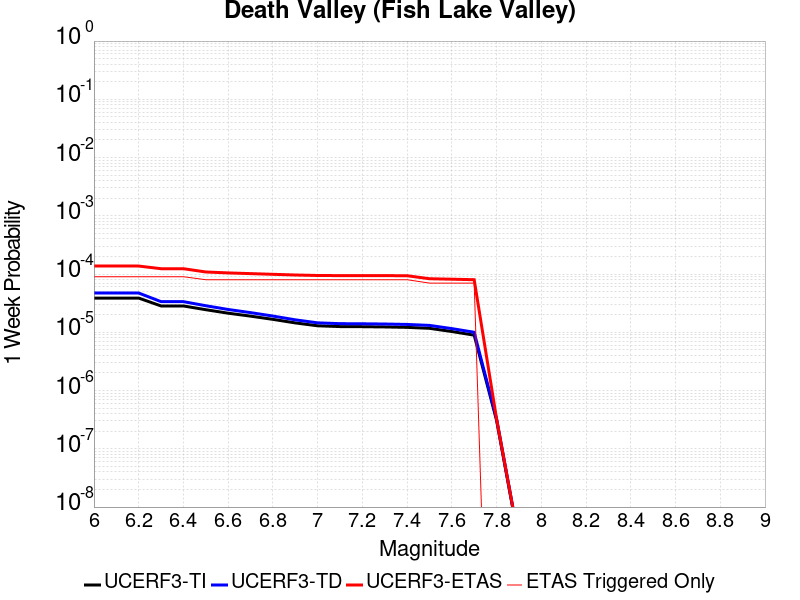 |  |  |  |

| Magnitude | 1 wk TI Prob | 1 wk TD Prob | 1 wk ETAS Prob | 1 wk ETAS/TD Gain | 1 wk ETAS Triggered Only | 1 mo TI Prob | 1 mo TD Prob | 1 mo ETAS Prob | 1 mo ETAS/TD Gain | 1 mo ETAS Triggered Only | 1 yr TI Prob | 1 yr TD Prob | 1 yr ETAS Prob | 1 yr ETAS/TD Gain | 1 yr ETAS Triggered Only | 10 yr TI Prob | 10 yr TD Prob | 10 yr ETAS Prob | 10 yr ETAS/TD Gain | 10 yr ETAS Triggered Only |
|-----|-----|-----|-----|-----|-----|-----|-----|-----|-----|-----|-----|-----|-----|-----|-----|-----|-----|-----|-----|-----|
| 6.0 | 3.872328E-5 | 4.7265705E-5 | 1.3726145E-4 | 2.9040391 | 9.0E-5 | 1.6594635E-4 | 2.0255324E-4 | 2.9253503E-4 | 1.4442376 | 9.0E-5 | 0.0020185246 | 0.0024635606 | 0.0025732897 | 1.0445408 | 1.1E-4 | 0.02000288 | 0.024388338 | 0.024495654 | 1.0044004 | 1.1E-4 |
| 6.1 | 3.872328E-5 | 4.7265705E-5 | 1.3726145E-4 | 2.9040391 | 9.0E-5 | 1.6594635E-4 | 2.0255324E-4 | 2.9253503E-4 | 1.4442376 | 9.0E-5 | 0.0020185246 | 0.0024635606 | 0.0025732897 | 1.0445408 | 1.1E-4 | 0.02000288 | 0.024388338 | 0.024495654 | 1.0044004 | 1.1E-4 |
| 6.2 | 3.872328E-5 | 4.7265705E-5 | 1.3726145E-4 | 2.9040391 | 9.0E-5 | 1.6594635E-4 | 2.0255324E-4 | 2.9253503E-4 | 1.4442376 | 9.0E-5 | 0.0020185246 | 0.0024635606 | 0.0025732897 | 1.0445408 | 1.1E-4 | 0.02000288 | 0.024388338 | 0.024495654 | 1.0044004 | 1.1E-4 |
| 6.3 | 2.8356371E-5 | 3.360979E-5 | 1.2360676E-4 | 3.6777012 | 9.0E-5 | 1.2152165E-4 | 1.4403443E-4 | 2.3402147E-4 | 1.6247606 | 9.0E-5 | 0.0014785219 | 0.0017522788 | 0.001862086 | 1.0626653 | 1.1E-4 | 0.014687235 | 0.017391816 | 0.017499903 | 1.0062149 | 1.1E-4 |
| 6.4 | 2.8356371E-5 | 3.360979E-5 | 1.2360676E-4 | 3.6777012 | 9.0E-5 | 1.2152165E-4 | 1.4403443E-4 | 2.3402147E-4 | 1.6247606 | 9.0E-5 | 0.0014785219 | 0.0017522788 | 0.001862086 | 1.0626653 | 1.1E-4 | 0.014687235 | 0.017391816 | 0.017499903 | 1.0062149 | 1.1E-4 |
| 6.5 | 2.4448687E-5 | 2.8607585E-5 | 1.08605294E-4 | 3.7963812 | 8.0E-5 | 1.0477588E-4 | 1.2259845E-4 | 2.0258864E-4 | 1.6524569 | 8.0E-5 | 0.0012748998 | 0.0014916616 | 0.0015915125 | 1.0669394 | 1.0E-4 | 0.012676105 | 0.014821392 | 0.01491991 | 1.006647 | 1.0E-4 |
| 6.6 | 2.1298161E-5 | 2.4660083E-5 | 1.0465811E-4 | 4.244029 | 8.0E-5 | 9.127464E-5 | 1.0568197E-4 | 1.8567352E-4 | 1.7569082 | 8.0E-5 | 0.0011107022 | 0.0012859512 | 0.0013858227 | 1.0776634 | 1.0E-4 | 0.011051672 | 0.01278853 | 0.012887252 | 1.0077195 | 1.0E-4 |
| 6.7 | 1.8959729E-5 | 2.1781027E-5 | 1.0177928E-4 | 4.6728415 | 8.0E-5 | 8.125345E-5 | 9.334406E-5 | 1.733366E-4 | 1.8569643 | 8.0E-5 | 9.888117E-4 | 0.001135897 | 0.0012357833 | 1.0879362 | 1.0E-4 | 0.009844234 | 0.01130357 | 0.01140244 | 1.0087467 | 1.0E-4 |
| 6.8 | 1.6691629E-5 | 1.9018351E-5 | 9.9016834E-5 | 5.206383 | 8.0E-5 | 7.153359E-5 | 8.150477E-5 | 1.6149825E-4 | 1.9814576 | 8.0E-5 | 8.7057345E-4 | 9.918857E-4 | 0.0010917865 | 1.100718 | 1.0E-4 | 0.008671708 | 0.009876343 | 0.009975356 | 1.0100253 | 1.0E-4 |
| 6.9 | 1.450505E-5 | 1.638954E-5 | 9.638823E-5 | 5.881082 | 8.0E-5 | 6.216302E-5 | 7.0239046E-5 | 1.5023342E-4 | 2.1388876 | 8.0E-5 | 7.5657194E-4 | 8.5483363E-4 | 9.5474813E-4 | 1.1168818 | 1.0E-4 | 0.007540013 | 0.008516386 | 0.008615534 | 1.0116421 | 1.0E-4 |
| 7.0 | 1.2940855E-5 | 1.4537972E-5 | 9.453681E-5 | 6.502751 | 8.0E-5 | 5.545963E-5 | 6.230414E-5 | 1.4229915E-4 | 2.283944 | 8.0E-5 | 6.750118E-4 | 7.5829466E-4 | 8.582189E-4 | 1.1317749 | 1.0E-4 | 0.006729651 | 0.0075576897 | 0.007656934 | 1.0131315 | 1.0E-4 |
| 7.1 | 1.2544658E-5 | 1.4078208E-5 | 9.4077084E-5 | 6.6824617 | 8.0E-5 | 5.3761712E-5 | 6.0333812E-5 | 1.4032898E-4 | 2.3258762 | 8.0E-5 | 6.5435225E-4 | 7.343222E-4 | 8.342488E-4 | 1.13608 | 1.0E-4 | 0.006524288 | 0.007319551 | 0.007418819 | 1.0135621 | 1.0E-4 |
| 7.2 | 1.2489416E-5 | 1.4015674E-5 | 9.4014555E-5 | 6.707815 | 8.0E-5 | 5.3524967E-5 | 6.0065824E-5 | 1.4006102E-4 | 2.331792 | 8.0E-5 | 6.514716E-4 | 7.310616E-4 | 8.309885E-4 | 1.1366874 | 1.0E-4 | 0.006495651 | 0.0072871596 | 0.007386431 | 1.0136228 | 1.0E-4 |
| 7.3 | 1.2368307E-5 | 1.3879812E-5 | 9.3878705E-5 | 6.7636867 | 8.0E-5 | 5.3005948E-5 | 5.9483587E-5 | 1.3947883E-4 | 2.3448288 | 8.0E-5 | 6.451563E-4 | 7.2397763E-4 | 8.239052E-4 | 1.1380258 | 1.0E-4 | 0.0064328653 | 0.007216782 | 0.0073160604 | 1.0137566 | 1.0E-4 |
| 7.4 | 1.2161707E-5 | 1.36478675E-5 | 9.364678E-5 | 6.8616414 | 8.0E-5 | 5.212056E-5 | 5.8489582E-5 | 1.384849E-4 | 2.3676848 | 8.0E-5 | 6.3438306E-4 | 7.118836E-4 | 8.118124E-4 | 1.1403724 | 1.0E-4 | 0.006325751 | 0.0070966207 | 0.007195911 | 1.0139912 | 1.0E-4 |
| 7.5 | 1.1707948E-5 | 1.3145515E-5 | 8.3144594E-5 | 6.32494 | 7.0E-5 | 5.0175953E-5 | 5.6336736E-5 | 1.2633279E-4 | 2.2424586 | 7.0E-5 | 6.10721E-4 | 6.856895E-4 | 7.756278E-4 | 1.1311648 | 9.0E-5 | 0.0060904534 | 0.006836321 | 0.006925706 | 1.013075 | 9.0E-5 |
| 7.6 | 1.0319538E-5 | 1.1579622E-5 | 8.1578815E-5 | 7.045032 | 7.0E-5 | 4.4225842E-5 | 4.9626036E-5 | 1.19622564E-4 | 2.4104798 | 7.0E-5 | 5.383166E-4 | 6.040347E-4 | 6.8398635E-4 | 1.1323627 | 8.0E-5 | 0.0053701443 | 0.0060244603 | 0.0061039785 | 1.0131992 | 8.0E-5 |
| 7.7 | 8.937764E-6 | 1.0022779E-5 | 8.002208E-5 | 7.9840207 | 7.0E-5 | 3.830414E-5 | 4.295409E-5 | 1.12951086E-4 | 2.629577 | 7.0E-5 | 4.6625308E-4 | 5.228456E-4 | 6.028038E-4 | 1.1529288 | 8.0E-5 | 0.0046527605 | 0.005216664 | 0.005296247 | 1.0152555 | 8.0E-5 |
| 7.8 | 3.108007E-7 | 3.284654E-7 | 3.284654E-7 | 1.0 | 0.0 | 1.3320023E-6 | 1.407708E-6 | 1.407708E-6 | 1.0 | 0.0 | 1.6217007E-5 | 1.7138715E-5 | 1.7138715E-5 | 1.0 | 0.0 | 1.6215823E-4 | 1.7137431E-4 | 1.7137431E-4 | 1.0 | 0.0 |
| 7.9 | 2.5591178E-9 | 2.6696718E-9 | 2.6696718E-9 | 1.0 | 0.0 | 1.0967647E-8 | 1.14414505E-8 | 1.14414505E-8 | 1.0 | 0.0 | 1.335311E-7 | 1.3929966E-7 | 1.3929966E-7 | 1.0 | 0.0 | 1.3353102E-6 | 1.3929966E-6 | 1.3929966E-6 | 1.0 | 0.0 |

## San Andreas (Creeping Section) 2011 CFM
*[(top)](#table-of-contents)*

| 1 Week | 1 Month | 1 Year | 10 Year |
|-----|-----|-----|-----|
|  |  |  |  |

| Magnitude | 1 wk TI Prob | 1 wk TD Prob | 1 wk ETAS Prob | 1 wk ETAS/TD Gain | 1 wk ETAS Triggered Only | 1 mo TI Prob | 1 mo TD Prob | 1 mo ETAS Prob | 1 mo ETAS/TD Gain | 1 mo ETAS Triggered Only | 1 yr TI Prob | 1 yr TD Prob | 1 yr ETAS Prob | 1 yr ETAS/TD Gain | 1 yr ETAS Triggered Only | 10 yr TI Prob | 10 yr TD Prob | 10 yr ETAS Prob | 10 yr ETAS/TD Gain | 10 yr ETAS Triggered Only |
|-----|-----|-----|-----|-----|-----|-----|-----|-----|-----|-----|-----|-----|-----|-----|-----|-----|-----|-----|-----|-----|
| 6.0 | 5.986481E-4 | 0.0012275929 | 0.0013174824 | 1.0732242 | 9.0E-5 | 0.0025631124 | 0.005245547 | 0.005335075 | 1.0170674 | 9.0E-5 | 0.030762846 | 0.06120491 | 0.06129879 | 1.0015339 | 1.0E-4 | 0.26835477 | 0.42593494 | 0.42599234 | 1.0001348 | 1.0E-4 |
| 6.1 | 5.015945E-4 | 0.0010217986 | 0.0011017168 | 1.0782133 | 8.0E-5 | 0.00214792 | 0.0043678596 | 0.00444751 | 1.0182356 | 8.0E-5 | 0.025839351 | 0.05124837 | 0.05133376 | 1.0016662 | 9.0E-5 | 0.23032776 | 0.37285668 | 0.37291312 | 1.0001514 | 9.0E-5 |
| 6.2 | 4.073338E-4 | 8.1073755E-4 | 8.906727E-4 | 1.0985956 | 8.0E-5 | 0.0017445484 | 0.0034671477 | 0.0035468703 | 1.0229937 | 8.0E-5 | 0.021034058 | 0.04093317 | 0.041019484 | 1.0021087 | 9.0E-5 | 0.19150782 | 0.31303346 | 0.3130953 | 1.0001975 | 9.0E-5 |
| 6.3 | 3.464099E-4 | 6.7391695E-4 | 7.53863E-4 | 1.118629 | 8.0E-5 | 0.0014837692 | 0.0028829593 | 0.0029627287 | 1.0276693 | 8.0E-5 | 0.017915873 | 0.034189582 | 0.034276504 | 1.0025424 | 9.0E-5 | 0.16538359 | 0.2713166 | 0.27138215 | 1.0002418 | 9.0E-5 |
| 6.4 | 2.935057E-4 | 5.5442745E-4 | 6.3438306E-4 | 1.144213 | 8.0E-5 | 0.0012572751 | 0.0023725363 | 0.0024523465 | 1.0336392 | 8.0E-5 | 0.015200248 | 0.02826451 | 0.028351966 | 1.0030942 | 9.0E-5 | 0.14201577 | 0.23298529 | 0.23305431 | 1.0002962 | 9.0E-5 |
| 6.5 | 2.3409708E-4 | 4.2093755E-4 | 4.909081E-4 | 1.1662254 | 7.0E-5 | 0.0010028875 | 0.0018019684 | 0.0018718423 | 1.0387764 | 7.0E-5 | 0.012141965 | 0.021587461 | 0.021665735 | 1.0036259 | 8.0E-5 | 0.11499573 | 0.18682368 | 0.18688874 | 1.0003482 | 8.0E-5 |
| 6.6 | 1.5842178E-4 | 2.506933E-4 | 3.1067827E-4 | 1.2392763 | 6.0E-5 | 6.7877385E-4 | 0.0010739497 | 0.0011338854 | 1.0558085 | 6.0E-5 | 0.0082328 | 0.012995575 | 0.013064665 | 1.0053165 | 7.0E-5 | 0.07934396 | 0.12314638 | 0.123207755 | 1.0004984 | 7.0E-5 |
| 6.7 | 1.5616413E-4 | 2.4605883E-4 | 3.0604406E-4 | 1.2437842 | 6.0E-5 | 6.691031E-4 | 0.0010541069 | 0.0011140436 | 1.0568602 | 6.0E-5 | 0.0081159435 | 0.01275744 | 0.012826547 | 1.005417 | 7.0E-5 | 0.0782586 | 0.12117351 | 0.12123503 | 1.0005077 | 7.0E-5 |
| 6.8 | 1.5538467E-4 | 2.4429744E-4 | 3.042828E-4 | 1.2455423 | 6.0E-5 | 6.6576427E-4 | 0.0010465645 | 0.0011065018 | 1.0572704 | 6.0E-5 | 0.008075596 | 0.012666838 | 0.012735952 | 1.0054562 | 7.0E-5 | 0.07788358 | 0.120404355 | 0.12046593 | 1.0005114 | 7.0E-5 |
| 6.9 | 1.5153569E-4 | 2.3539034E-4 | 2.953762E-4 | 1.2548357 | 6.0E-5 | 6.49277E-4 | 0.0010084276 | 0.0010683672 | 1.0594386 | 6.0E-5 | 0.007876333 | 0.01220901 | 0.012278156 | 1.0056635 | 7.0E-5 | 0.07602952 | 0.11647445 | 0.1165363 | 1.000531 | 7.0E-5 |
| 7.0 | 1.4588932E-4 | 2.2396253E-4 | 2.839491E-4 | 1.2678419 | 6.0E-5 | 6.250901E-4 | 9.5948833E-4 | 0.0010194308 | 1.0624733 | 6.0E-5 | 0.0075839474 | 0.011619697 | 0.011688883 | 1.0059543 | 7.0E-5 | 0.073302895 | 0.11132046 | 0.11138266 | 1.0005589 | 7.0E-5 |
| 7.1 | 1.1565079E-4 | 1.6281738E-4 | 2.2280762E-4 | 1.368451 | 6.0E-5 | 4.955521E-4 | 6.9760304E-4 | 7.575612E-4 | 1.0859488 | 6.0E-5 | 0.006016669 | 0.0084604435 | 0.008529851 | 1.0082037 | 7.0E-5 | 0.058563538 | 0.08367046 | 0.0837346 | 1.0007666 | 7.0E-5 |
| 7.2 | 1.0393792E-4 | 1.4615769E-4 | 2.0614892E-4 | 1.4104556 | 6.0E-5 | 4.4537216E-4 | 6.2624045E-4 | 6.862029E-4 | 1.0957499 | 6.0E-5 | 0.005408933 | 0.0075979927 | 0.007667461 | 1.009143 | 7.0E-5 | 0.052791595 | 0.07561969 | 0.0756844 | 1.0008557 | 7.0E-5 |
| 7.3 | 9.332884E-5 | 1.2780898E-4 | 1.8780131E-4 | 1.4693906 | 6.0E-5 | 3.999194E-4 | 5.4763845E-4 | 6.0760556E-4 | 1.1095014 | 6.0E-5 | 0.0048581534 | 0.006647249 | 0.0067167836 | 1.0104606 | 7.0E-5 | 0.047533102 | 0.06648326 | 0.0665486 | 1.0009829 | 7.0E-5 |
| 7.4 | 8.670252E-5 | 1.17032345E-4 | 1.7702531E-4 | 1.5126188 | 6.0E-5 | 3.715293E-4 | 5.0147134E-4 | 5.614413E-4 | 1.1195879 | 6.0E-5 | 0.004513991 | 0.006088443 | 0.0061580166 | 1.0114272 | 7.0E-5 | 0.044233937 | 0.061151642 | 0.061217364 | 1.0010747 | 7.0E-5 |
| 7.5 | 7.3036405E-5 | 9.005856E-5 | 1.5005315E-4 | 1.6661732 | 6.0E-5 | 3.129756E-4 | 3.8590826E-4 | 4.4588512E-4 | 1.1554173 | 6.0E-5 | 0.0038038217 | 0.0046883323 | 0.004758004 | 1.0148606 | 7.0E-5 | 0.03739367 | 0.047877792 | 0.04794444 | 1.001392 | 7.0E-5 |
| 7.6 | 6.3935775E-5 | 8.280385E-5 | 1.4279888E-4 | 1.724544 | 6.0E-5 | 2.7398168E-4 | 3.5482543E-4 | 4.1480415E-4 | 1.1690372 | 6.0E-5 | 0.0033306254 | 0.004311461 | 0.0043811593 | 1.0161659 | 7.0E-5 | 0.032811474 | 0.04399201 | 0.04405893 | 1.0015212 | 7.0E-5 |
| 7.7 | 5.5050095E-5 | 6.6618326E-5 | 9.661633E-5 | 1.4502965 | 3.0E-5 | 2.3590765E-4 | 2.854759E-4 | 3.1546733E-4 | 1.1050577 | 3.0E-5 | 0.0028683927 | 0.003470134 | 0.003509995 | 1.0114869 | 4.0E-5 | 0.0283165 | 0.035796214 | 0.03583478 | 1.0010774 | 4.0E-5 |
| 7.8 | 5.027131E-5 | 6.162871E-5 | 9.1626855E-5 | 1.4867562 | 3.0E-5 | 2.1543067E-4 | 2.640963E-4 | 2.940884E-4 | 1.113565 | 3.0E-5 | 0.0026197135 | 0.003210635 | 0.0032505065 | 1.0124186 | 4.0E-5 | 0.025890453 | 0.03312666 | 0.033165336 | 1.0011675 | 4.0E-5 |
| 7.9 | 3.7271806E-5 | 5.022507E-5 | 7.0224065E-5 | 1.3981875 | 2.0E-5 | 1.5972654E-4 | 2.1523255E-4 | 2.3522823E-4 | 1.0929028 | 2.0E-5 | 0.0019429359 | 0.002617309 | 0.0026472306 | 1.0114322 | 3.0E-5 | 0.019260362 | 0.027067466 | 0.027096653 | 1.0010784 | 3.0E-5 |
| 8.0 | 2.7310243E-5 | 3.1427757E-5 | 4.1427444E-5 | 1.3181801 | 1.0E-5 | 1.17038646E-4 | 1.3468343E-4 | 1.446821E-4 | 1.0742382 | 1.0E-5 | 0.0014240141 | 0.0016385383 | 0.001648522 | 1.006093 | 1.0E-5 | 0.014149235 | 0.01721386 | 0.017223688 | 1.0005709 | 1.0E-5 |
| 8.1 | 1.7940547E-5 | 1.7399378E-5 | 1.7399378E-5 | 1.0 | 0.0 | 7.688579E-5 | 7.456663E-5 | 7.456663E-5 | 1.0 | 0.0 | 9.3568244E-4 | 9.074711E-4 | 9.074711E-4 | 1.0 | 0.0 | 0.009317525 | 0.009798636 | 0.009798636 | 1.0 | 0.0 |
| 8.2 | 8.643924E-6 | 5.473668E-6 | 5.473668E-6 | 1.0 | 0.0 | 3.704486E-5 | 2.3458366E-5 | 2.3458366E-5 | 1.0 | 0.0 | 4.5092785E-4 | 2.8556827E-4 | 2.8556827E-4 | 1.0 | 0.0 | 0.0045001395 | 0.0032481793 | 0.0032481793 | 1.0 | 0.0 |
| 8.3 | 1.983087E-6 | 7.6564595E-7 | 7.6564595E-7 | 1.0 | 0.0 | 8.498917E-6 | 3.281336E-6 | 3.281336E-6 | 1.0 | 0.0 | 1.034694E-4 | 3.9949547E-5 | 3.9949547E-5 | 1.0 | 0.0 | 0.0010342124 | 4.717979E-4 | 4.717979E-4 | 1.0 | 0.0 |

## Cady
*[(top)](#table-of-contents)*

| 1 Week | 1 Month | 1 Year | 10 Year |
|-----|-----|-----|-----|
|  |  |  |  |

| Magnitude | 1 wk TI Prob | 1 wk TD Prob | 1 wk ETAS Prob | 1 wk ETAS/TD Gain | 1 wk ETAS Triggered Only | 1 mo TI Prob | 1 mo TD Prob | 1 mo ETAS Prob | 1 mo ETAS/TD Gain | 1 mo ETAS Triggered Only | 1 yr TI Prob | 1 yr TD Prob | 1 yr ETAS Prob | 1 yr ETAS/TD Gain | 1 yr ETAS Triggered Only | 10 yr TI Prob | 10 yr TD Prob | 10 yr ETAS Prob | 10 yr ETAS/TD Gain | 10 yr ETAS Triggered Only |
|-----|-----|-----|-----|-----|-----|-----|-----|-----|-----|-----|-----|-----|-----|-----|-----|-----|-----|-----|-----|-----|
| 6.0 | 1.9892565E-5 | 2.1858728E-5 | 9.18572E-5 | 4.202312 | 7.0E-5 | 8.525106E-5 | 9.3677416E-5 | 1.6367086E-4 | 1.7471752 | 7.0E-5 | 0.0010374374 | 0.0011400167 | 0.0012399027 | 1.087618 | 1.0E-4 | 0.010326075 | 0.011350701 | 0.011449565 | 1.00871 | 1.0E-4 |
| 6.1 | 1.9892565E-5 | 2.1858728E-5 | 9.18572E-5 | 4.202312 | 7.0E-5 | 8.525106E-5 | 9.3677416E-5 | 1.6367086E-4 | 1.7471752 | 7.0E-5 | 0.0010374374 | 0.0011400167 | 0.0012399027 | 1.087618 | 1.0E-4 | 0.010326075 | 0.011350701 | 0.011449565 | 1.00871 | 1.0E-4 |
| 6.2 | 1.9892565E-5 | 2.1858728E-5 | 9.18572E-5 | 4.202312 | 7.0E-5 | 8.525106E-5 | 9.3677416E-5 | 1.6367086E-4 | 1.7471752 | 7.0E-5 | 0.0010374374 | 0.0011400167 | 0.0012399027 | 1.087618 | 1.0E-4 | 0.010326075 | 0.011350701 | 0.011449565 | 1.00871 | 1.0E-4 |
| 6.3 | 1.1117327E-5 | 1.2176583E-5 | 4.217622E-5 | 3.4637153 | 3.0E-5 | 4.764482E-5 | 5.2184492E-5 | 8.218292E-5 | 1.5748534 | 3.0E-5 | 5.7992124E-4 | 6.351925E-4 | 6.8516075E-4 | 1.0786663 | 5.0E-5 | 0.0057841022 | 0.0063368753 | 0.0063865585 | 1.0078403 | 5.0E-5 |
| 6.4 | 1.1117327E-5 | 1.2176583E-5 | 4.217622E-5 | 3.4637153 | 3.0E-5 | 4.764482E-5 | 5.2184492E-5 | 8.218292E-5 | 1.5748534 | 3.0E-5 | 5.7992124E-4 | 6.351925E-4 | 6.8516075E-4 | 1.0786663 | 5.0E-5 | 0.0057841022 | 0.0063368753 | 0.0063865585 | 1.0078403 | 5.0E-5 |
| 6.5 | 6.103093E-6 | 6.672021E-6 | 1.6671955E-5 | 2.4987862 | 1.0E-5 | 2.615585E-5 | 2.8594131E-5 | 3.8593847E-5 | 1.3497121 | 1.0E-5 | 3.1840094E-4 | 3.480905E-4 | 3.6808354E-4 | 1.0574363 | 2.0E-5 | 0.0031794512 | 0.0034766865 | 0.003496617 | 1.0057327 | 2.0E-5 |
| 6.6 | 5.817237E-6 | 6.3656585E-6 | 1.6365595E-5 | 2.5709193 | 1.0E-5 | 2.4930776E-5 | 2.728118E-5 | 3.7280905E-5 | 1.366543 | 1.0E-5 | 3.034899E-4 | 3.3211018E-4 | 3.5210353E-4 | 1.0602009 | 2.0E-5 | 0.0030307577 | 0.0033173605 | 0.0033372943 | 1.0060089 | 2.0E-5 |
| 6.7 | 4.8846314E-6 | 5.3405684E-6 | 5.3405684E-6 | 1.0 | 0.0 | 2.0933967E-5 | 2.2888014E-5 | 2.2888014E-5 | 1.0 | 0.0 | 2.5484123E-4 | 2.7863772E-4 | 2.8863494E-4 | 1.0358789 | 1.0E-5 | 0.0025454918 | 0.0027840391 | 0.0027940113 | 1.0035819 | 1.0E-5 |
| 6.8 | 1.7788773E-6 | 1.9399079E-6 | 1.9399079E-6 | 1.0 | 0.0 | 7.6237375E-6 | 8.313874E-6 | 8.313874E-6 | 1.0 | 0.0 | 9.281505E-5 | 1.01218284E-4 | 1.01218284E-4 | 1.0 | 0.0 | 9.2776294E-4 | 0.0010118765 | 0.0010118765 | 1.0 | 0.0 |
| 6.9 | 7.5455404E-7 | 8.297092E-7 | 8.297092E-7 | 1.0 | 0.0 | 3.233799E-6 | 3.5558937E-6 | 3.5558937E-6 | 1.0 | 0.0 | 3.937079E-5 | 4.3292483E-5 | 4.3292483E-5 | 1.0 | 0.0 | 3.9363815E-4 | 4.3287344E-4 | 4.3287344E-4 | 1.0 | 0.0 |
| 7.0 | 6.8578805E-7 | 7.541816E-7 | 7.541816E-7 | 1.0 | 0.0 | 2.9390883E-6 | 3.2322048E-6 | 3.2322048E-6 | 1.0 | 0.0 | 3.578281E-5 | 3.9351715E-5 | 3.9351715E-5 | 1.0 | 0.0 | 3.577705E-4 | 3.9347992E-4 | 3.9347992E-4 | 1.0 | 0.0 |

## Ludlow
*[(top)](#table-of-contents)*

| 1 Week | 1 Month | 1 Year | 10 Year |
|-----|-----|-----|-----|
|  |  |  |  |

| Magnitude | 1 wk TI Prob | 1 wk TD Prob | 1 wk ETAS Prob | 1 wk ETAS/TD Gain | 1 wk ETAS Triggered Only | 1 mo TI Prob | 1 mo TD Prob | 1 mo ETAS Prob | 1 mo ETAS/TD Gain | 1 mo ETAS Triggered Only | 1 yr TI Prob | 1 yr TD Prob | 1 yr ETAS Prob | 1 yr ETAS/TD Gain | 1 yr ETAS Triggered Only | 10 yr TI Prob | 10 yr TD Prob | 10 yr ETAS Prob | 10 yr ETAS/TD Gain | 10 yr ETAS Triggered Only |
|-----|-----|-----|-----|-----|-----|-----|-----|-----|-----|-----|-----|-----|-----|-----|-----|-----|-----|-----|-----|-----|
| 6.0 | 2.2407607E-5 | 2.3657254E-5 | 6.3656305E-5 | 2.6907732 | 4.0E-5 | 9.602906E-5 | 1.0138454E-4 | 1.9137541E-4 | 1.8876194 | 9.0E-5 | 0.0011685267 | 0.001233702 | 0.0013235909 | 1.0728612 | 9.0E-5 | 0.011624013 | 0.012273042 | 0.012371815 | 1.0080479 | 1.0E-4 |
| 6.1 | 2.2407607E-5 | 2.3657254E-5 | 6.3656305E-5 | 2.6907732 | 4.0E-5 | 9.602906E-5 | 1.0138454E-4 | 1.9137541E-4 | 1.8876194 | 9.0E-5 | 0.0011685267 | 0.001233702 | 0.0013235909 | 1.0728612 | 9.0E-5 | 0.011624013 | 0.012273042 | 0.012371815 | 1.0080479 | 1.0E-4 |
| 6.2 | 1.0781252E-5 | 1.1365663E-5 | 2.136555E-5 | 1.879833 | 1.0E-5 | 4.620455E-5 | 4.8709102E-5 | 8.870715E-5 | 1.8211617 | 4.0E-5 | 5.623952E-4 | 5.9287593E-4 | 6.3285226E-4 | 1.0674278 | 4.0E-5 | 0.00560974 | 0.0059133614 | 0.0059531247 | 1.0067244 | 4.0E-5 |
| 6.3 | 1.0781252E-5 | 1.1365663E-5 | 2.136555E-5 | 1.879833 | 1.0E-5 | 4.620455E-5 | 4.8709102E-5 | 8.870715E-5 | 1.8211617 | 4.0E-5 | 5.623952E-4 | 5.9287593E-4 | 6.3285226E-4 | 1.0674278 | 4.0E-5 | 0.00560974 | 0.0059133614 | 0.0059531247 | 1.0067244 | 4.0E-5 |
| 6.4 | 7.814439E-6 | 8.237729E-6 | 1.8237646E-5 | 2.2139168 | 1.0E-5 | 3.3490025E-5 | 3.530408E-5 | 7.530267E-5 | 2.1329734 | 4.0E-5 | 4.0766477E-4 | 4.2974384E-4 | 4.6972663E-4 | 1.0930387 | 4.0E-5 | 0.0040691774 | 0.0042892746 | 0.004329103 | 1.0092856 | 4.0E-5 |
| 6.5 | 6.4986366E-6 | 6.85092E-6 | 1.685085E-5 | 2.4596481 | 1.0E-5 | 2.7851002E-5 | 2.9360759E-5 | 6.935959E-5 | 2.3623226 | 4.0E-5 | 3.390332E-4 | 3.5740953E-4 | 3.9739523E-4 | 1.1118765 | 4.0E-5 | 0.003385164 | 0.0035684432 | 0.0036083006 | 1.0111693 | 4.0E-5 |
| 6.6 | 5.582177E-6 | 5.8860055E-6 | 1.5885948E-5 | 2.698935 | 1.0E-5 | 2.3923398E-5 | 2.5225498E-5 | 6.522449E-5 | 2.5856571 | 4.0E-5 | 2.9122844E-4 | 3.0707786E-4 | 3.470656E-4 | 1.1302202 | 4.0E-5 | 0.0029084706 | 0.003066609 | 0.0031064863 | 1.0130037 | 4.0E-5 |
| 6.7 | 4.6858763E-6 | 4.940427E-6 | 1.4940378E-5 | 3.0241065 | 1.0E-5 | 2.0082172E-5 | 2.1173091E-5 | 4.117267E-5 | 1.9445752 | 2.0E-5 | 2.4447302E-4 | 2.5775246E-4 | 2.7774728E-4 | 1.0775738 | 2.0E-5 | 0.0024420423 | 0.0025745912 | 0.00259454 | 1.0077482 | 2.0E-5 |
| 6.8 | 3.5584908E-6 | 3.7520183E-6 | 3.7520183E-6 | 1.0 | 0.0 | 1.5250586E-5 | 1.6079981E-5 | 1.6079981E-5 | 1.0 | 0.0 | 1.8566006E-4 | 1.957566E-4 | 1.957566E-4 | 1.0 | 0.0 | 0.0018550502 | 0.0019558826 | 0.0019558826 | 1.0 | 0.0 |
| 6.9 | 2.532834E-6 | 2.6710034E-6 | 2.6710034E-6 | 1.0 | 0.0 | 1.0854958E-5 | 1.1447109E-5 | 1.1447109E-5 | 1.0 | 0.0 | 1.3215111E-4 | 1.3935992E-4 | 1.3935992E-4 | 1.0 | 0.0 | 0.0013207254 | 0.0013927529 | 0.0013927529 | 1.0 | 0.0 |
| 7.0 | 1.7083285E-6 | 1.8019439E-6 | 1.8019439E-6 | 1.0 | 0.0 | 7.3213873E-6 | 7.722595E-6 | 7.722595E-6 | 1.0 | 0.0 | 8.913424E-5 | 9.40187E-5 | 9.40187E-5 | 1.0 | 0.0 | 8.9098496E-4 | 9.3980576E-4 | 9.3980576E-4 | 1.0 | 0.0 |
| 7.1 | 1.0905424E-6 | 1.1497619E-6 | 1.1497619E-6 | 1.0 | 0.0 | 4.6737446E-6 | 4.9275427E-6 | 4.9275427E-6 | 1.0 | 0.0 | 5.6901354E-5 | 5.999128E-5 | 5.999128E-5 | 1.0 | 0.0 | 5.6886784E-4 | 5.997606E-4 | 5.997606E-4 | 1.0 | 0.0 |
| 7.2 | 6.06668E-7 | 6.387277E-7 | 6.387277E-7 | 1.0 | 0.0 | 2.600003E-6 | 2.7374022E-6 | 2.7374022E-6 | 1.0 | 0.0 | 3.1654577E-5 | 3.3327433E-5 | 3.3327433E-5 | 1.0 | 0.0 | 3.1650066E-4 | 3.3323118E-4 | 3.3323118E-4 | 1.0 | 0.0 |

## Baker
*[(top)](#table-of-contents)*

| 1 Week | 1 Month | 1 Year | 10 Year |
|-----|-----|-----|-----|
|  |  |  |  |

| Magnitude | 1 wk TI Prob | 1 wk TD Prob | 1 wk ETAS Prob | 1 wk ETAS/TD Gain | 1 wk ETAS Triggered Only | 1 mo TI Prob | 1 mo TD Prob | 1 mo ETAS Prob | 1 mo ETAS/TD Gain | 1 mo ETAS Triggered Only | 1 yr TI Prob | 1 yr TD Prob | 1 yr ETAS Prob | 1 yr ETAS/TD Gain | 1 yr ETAS Triggered Only | 10 yr TI Prob | 10 yr TD Prob | 10 yr ETAS Prob | 10 yr ETAS/TD Gain | 10 yr ETAS Triggered Only |
|-----|-----|-----|-----|-----|-----|-----|-----|-----|-----|-----|-----|-----|-----|-----|-----|-----|-----|-----|-----|-----|
| 6.0 | 5.695525E-6 | 5.8348373E-6 | 5.5834545E-5 | 9.569169 | 5.0E-5 | 2.4409164E-5 | 2.5006228E-5 | 8.500473E-5 | 3.3993423 | 6.0E-5 | 2.9714106E-4 | 3.044123E-4 | 3.8438794E-4 | 1.2627214 | 8.0E-5 | 0.0029674405 | 0.0030403486 | 0.003130075 | 1.0295118 | 9.0E-5 |
| 6.1 | 5.695525E-6 | 5.8348373E-6 | 5.5834545E-5 | 9.569169 | 5.0E-5 | 2.4409164E-5 | 2.5006228E-5 | 8.500473E-5 | 3.3993423 | 6.0E-5 | 2.9714106E-4 | 3.044123E-4 | 3.8438794E-4 | 1.2627214 | 8.0E-5 | 0.0029674405 | 0.0030403486 | 0.003130075 | 1.0295118 | 9.0E-5 |
| 6.2 | 5.695525E-6 | 5.8348373E-6 | 5.5834545E-5 | 9.569169 | 5.0E-5 | 2.4409164E-5 | 2.5006228E-5 | 8.500473E-5 | 3.3993423 | 6.0E-5 | 2.9714106E-4 | 3.044123E-4 | 3.8438794E-4 | 1.2627214 | 8.0E-5 | 0.0029674405 | 0.0030403486 | 0.003130075 | 1.0295118 | 9.0E-5 |
| 6.3 | 3.2995713E-6 | 3.383667E-6 | 5.3383497E-5 | 15.776817 | 5.0E-5 | 1.4140943E-5 | 1.4501353E-5 | 6.450063E-5 | 4.447904 | 5.0E-5 | 1.7215237E-4 | 1.7654014E-4 | 2.3652954E-4 | 1.3398061 | 6.0E-5 | 0.0017201907 | 0.001764046 | 0.0018339226 | 1.0396115 | 7.0E-5 |
| 6.4 | 3.2995713E-6 | 3.383667E-6 | 5.3383497E-5 | 15.776817 | 5.0E-5 | 1.4140943E-5 | 1.4501353E-5 | 6.450063E-5 | 4.447904 | 5.0E-5 | 1.7215237E-4 | 1.7654014E-4 | 2.3652954E-4 | 1.3398061 | 6.0E-5 | 0.0017201907 | 0.001764046 | 0.0018339226 | 1.0396115 | 7.0E-5 |
| 6.5 | 2.782202E-6 | 2.8558404E-6 | 4.2855725E-5 | 15.006345 | 4.0E-5 | 1.1923668E-5 | 1.223926E-5 | 5.223877E-5 | 4.2681313 | 4.0E-5 | 1.4516099E-4 | 1.4900314E-4 | 1.989957E-4 | 1.3355134 | 5.0E-5 | 0.001450662 | 0.0014890651 | 0.0015489757 | 1.0402337 | 6.0E-5 |
| 6.6 | 2.3163404E-6 | 2.38092E-6 | 4.2380823E-5 | 17.800188 | 4.0E-5 | 9.927136E-6 | 1.0203904E-5 | 5.0203496E-5 | 4.920028 | 4.0E-5 | 1.20856166E-4 | 1.2422565E-4 | 1.7421944E-4 | 1.4024434 | 5.0E-5 | 0.0012079047 | 0.0012415823 | 0.0013015078 | 1.0482655 | 6.0E-5 |
| 6.7 | 2.037056E-6 | 2.0965003E-6 | 4.2096417E-5 | 20.079374 | 4.0E-5 | 8.7302105E-6 | 8.984972E-6 | 4.8984613E-5 | 5.451838 | 4.0E-5 | 1.0628513E-4 | 1.093867E-4 | 1.5938123E-4 | 1.4570439 | 5.0E-5 | 0.0010623431 | 0.0010933448 | 0.0011532791 | 1.0548174 | 6.0E-5 |
| 6.8 | 1.8356744E-6 | 1.8915287E-6 | 4.1891453E-5 | 22.146877 | 4.0E-5 | 7.867153E-6 | 8.106527E-6 | 4.81062E-5 | 5.9342556 | 4.0E-5 | 9.577837E-5 | 9.869264E-5 | 1.486877E-4 | 1.5065734 | 5.0E-5 | 9.57371E-4 | 9.86502E-4 | 0.0010464429 | 1.060761 | 6.0E-5 |
| 6.9 | 1.6310546E-6 | 1.6832072E-6 | 4.168314E-5 | 24.764116 | 4.0E-5 | 6.9902153E-6 | 7.213726E-6 | 4.7213438E-5 | 6.544945 | 4.0E-5 | 8.510255E-5 | 8.782368E-5 | 1.378193E-4 | 1.5692725 | 5.0E-5 | 8.5069967E-4 | 8.7790104E-4 | 9.3784835E-4 | 1.0682849 | 6.0E-5 |
| 7.0 | 1.2058036E-6 | 1.2508665E-6 | 3.1250827E-5 | 24.983343 | 3.0E-5 | 5.1677193E-6 | 5.3608455E-6 | 3.5360685E-5 | 6.5961018 | 3.0E-5 | 6.291517E-5 | 6.5266366E-5 | 1.0526375E-4 | 1.6128331 | 4.0E-5 | 6.289736E-4 | 6.524743E-4 | 7.0244167E-4 | 1.0765814 | 5.0E-5 |
| 7.1 | 1.052382E-6 | 1.0951609E-6 | 3.109513E-5 | 28.393206 | 3.0E-5 | 4.5102006E-6 | 4.693538E-6 | 3.4693396E-5 | 7.3917365 | 3.0E-5 | 5.491031E-5 | 5.7142337E-5 | 9.714005E-5 | 1.6999664 | 4.0E-5 | 5.4896745E-4 | 5.7127734E-4 | 6.2124874E-4 | 1.0874732 | 5.0E-5 |
| 7.2 | 1.0067454E-6 | 1.0487711E-6 | 3.104874E-5 | 29.604877 | 3.0E-5 | 4.3146156E-6 | 4.4947255E-6 | 3.449459E-5 | 7.67446 | 3.0E-5 | 5.252918E-5 | 5.4721917E-5 | 9.4719726E-5 | 1.7309285 | 4.0E-5 | 5.251676E-4 | 5.470853E-4 | 5.970579E-4 | 1.0913434 | 5.0E-5 |
| 7.3 | 9.3596316E-7 | 9.767723E-7 | 2.0976753E-5 | 21.47558 | 2.0E-5 | 4.0112645E-6 | 4.1861604E-6 | 2.4186076E-5 | 5.7776275 | 2.0E-5 | 4.8836053E-5 | 5.096532E-5 | 8.096379E-5 | 1.5886055 | 3.0E-5 | 4.8825322E-4 | 5.095371E-4 | 5.495167E-4 | 1.0784626 | 4.0E-5 |
| 7.4 | 8.8117395E-7 | 9.2076635E-7 | 2.0920748E-5 | 22.721018 | 2.0E-5 | 3.7764542E-6 | 3.9461356E-6 | 2.3946057E-5 | 6.0682297 | 2.0E-5 | 4.5977362E-5 | 4.8043148E-5 | 7.804171E-5 | 1.6244087 | 3.0E-5 | 4.596785E-4 | 4.8032837E-4 | 5.2030914E-4 | 1.0832363 | 4.0E-5 |
| 7.5 | 8.292386E-7 | 8.6745956E-7 | 1.0867451E-5 | 12.5279045 | 1.0E-5 | 3.5538749E-6 | 3.7176785E-6 | 1.3717641E-5 | 3.6898406 | 1.0E-5 | 4.326757E-5 | 4.5261804E-5 | 6.52609E-5 | 1.4418536 | 2.0E-5 | 4.3259145E-4 | 4.5252658E-4 | 4.8251302E-4 | 1.0662644 | 3.0E-5 |
| 7.6 | 7.553842E-7 | 7.9144706E-7 | 1.0791439E-5 | 13.635074 | 1.0E-5 | 3.2373566E-6 | 3.3919116E-6 | 1.33918775E-5 | 3.94818 | 1.0E-5 | 3.9414106E-5 | 4.129575E-5 | 6.129492E-5 | 1.4842913 | 2.0E-5 | 3.9407116E-4 | 4.1288146E-4 | 4.4286906E-4 | 1.07263 | 3.0E-5 |
| 7.7 | 6.5285366E-7 | 6.852797E-7 | 1.0685273E-5 | 15.592572 | 1.0E-5 | 2.797941E-6 | 2.9369096E-6 | 1.293688E-5 | 4.4049296 | 1.0E-5 | 3.40644E-5 | 3.5756293E-5 | 5.575558E-5 | 1.5593221 | 2.0E-5 | 3.405918E-4 | 3.5750607E-4 | 3.7749892E-4 | 1.0559231 | 2.0E-5 |
| 7.8 | 3.4586725E-7 | 3.6482615E-7 | 3.6482615E-7 | 1.0 | 0.0 | 1.4822873E-6 | 1.5635396E-6 | 1.5635396E-6 | 1.0 | 0.0 | 1.80467E-5 | 1.9035933E-5 | 1.9035933E-5 | 1.0 | 0.0 | 1.8045233E-4 | 1.9034347E-4 | 1.9034347E-4 | 1.0 | 0.0 |
| 7.9 | 2.5591178E-9 | 2.6696718E-9 | 2.6696718E-9 | 1.0 | 0.0 | 1.0967647E-8 | 1.14414505E-8 | 1.14414505E-8 | 1.0 | 0.0 | 1.335311E-7 | 1.3929966E-7 | 1.3929966E-7 | 1.0 | 0.0 | 1.3353102E-6 | 1.3929966E-6 | 1.3929966E-6 | 1.0 | 0.0 |

## Kern Canyon (North Kern) 2011
*[(top)](#table-of-contents)*

| 1 Week | 1 Month | 1 Year | 10 Year |
|-----|-----|-----|-----|
|  |  |  |  |

| Magnitude | 1 wk TI Prob | 1 wk TD Prob | 1 wk ETAS Prob | 1 wk ETAS/TD Gain | 1 wk ETAS Triggered Only | 1 mo TI Prob | 1 mo TD Prob | 1 mo ETAS Prob | 1 mo ETAS/TD Gain | 1 mo ETAS Triggered Only | 1 yr TI Prob | 1 yr TD Prob | 1 yr ETAS Prob | 1 yr ETAS/TD Gain | 1 yr ETAS Triggered Only | 10 yr TI Prob | 10 yr TD Prob | 10 yr ETAS Prob | 10 yr ETAS/TD Gain | 10 yr ETAS Triggered Only |
|-----|-----|-----|-----|-----|-----|-----|-----|-----|-----|-----|-----|-----|-----|-----|-----|-----|-----|-----|-----|-----|
| 6.0 | 6.6264497E-6 | 6.75733E-6 | 8.675679E-5 | 12.838915 | 8.0E-5 | 2.8398761E-5 | 2.895971E-5 | 1.0895739E-4 | 3.7623787 | 8.0E-5 | 3.4570007E-4 | 3.5253543E-4 | 4.3250722E-4 | 1.2268475 | 8.0E-5 | 0.0034516277 | 0.0035205502 | 0.0036102335 | 1.0254742 | 9.0E-5 |
| 6.1 | 6.6264497E-6 | 6.75733E-6 | 8.675679E-5 | 12.838915 | 8.0E-5 | 2.8398761E-5 | 2.895971E-5 | 1.0895739E-4 | 3.7623787 | 8.0E-5 | 3.4570007E-4 | 3.5253543E-4 | 4.3250722E-4 | 1.2268475 | 8.0E-5 | 0.0034516277 | 0.0035205502 | 0.0036102335 | 1.0254742 | 9.0E-5 |
| 6.2 | 6.6264497E-6 | 6.75733E-6 | 8.675679E-5 | 12.838915 | 8.0E-5 | 2.8398761E-5 | 2.895971E-5 | 1.0895739E-4 | 3.7623787 | 8.0E-5 | 3.4570007E-4 | 3.5253543E-4 | 4.3250722E-4 | 1.2268475 | 8.0E-5 | 0.0034516277 | 0.0035205502 | 0.0036102335 | 1.0254742 | 9.0E-5 |
| 6.3 | 6.6264497E-6 | 6.75733E-6 | 8.675679E-5 | 12.838915 | 8.0E-5 | 2.8398761E-5 | 2.895971E-5 | 1.0895739E-4 | 3.7623787 | 8.0E-5 | 3.4570007E-4 | 3.5253543E-4 | 4.3250722E-4 | 1.2268475 | 8.0E-5 | 0.0034516277 | 0.0035205502 | 0.0036102335 | 1.0254742 | 9.0E-5 |
| 6.4 | 6.6264497E-6 | 6.75733E-6 | 8.675679E-5 | 12.838915 | 8.0E-5 | 2.8398761E-5 | 2.895971E-5 | 1.0895739E-4 | 3.7623787 | 8.0E-5 | 3.4570007E-4 | 3.5253543E-4 | 4.3250722E-4 | 1.2268475 | 8.0E-5 | 0.0034516277 | 0.0035205502 | 0.0036102335 | 1.0254742 | 9.0E-5 |
| 6.5 | 3.2162225E-6 | 3.2570915E-6 | 4.325696E-5 | 13.280855 | 4.0E-5 | 1.3783738E-5 | 1.3958894E-5 | 5.3958334E-5 | 3.8655167 | 4.0E-5 | 1.6780409E-4 | 1.6993708E-4 | 2.0993028E-4 | 1.2353412 | 4.0E-5 | 0.0016767744 | 0.001698151 | 0.0017380831 | 1.023515 | 4.0E-5 |
| 6.6 | 3.2162225E-6 | 3.2570915E-6 | 4.325696E-5 | 13.280855 | 4.0E-5 | 1.3783738E-5 | 1.3958894E-5 | 5.3958334E-5 | 3.8655167 | 4.0E-5 | 1.6780409E-4 | 1.6993708E-4 | 2.0993028E-4 | 1.2353412 | 4.0E-5 | 0.0016767744 | 0.001698151 | 0.0017380831 | 1.023515 | 4.0E-5 |
| 6.7 | 2.1908265E-6 | 2.2071222E-6 | 1.2207101E-5 | 5.5307765 | 1.0E-5 | 9.389223E-6 | 9.459062E-6 | 1.9458968E-5 | 2.0571773 | 1.0E-5 | 1.1430779E-4 | 1.1515819E-4 | 1.2515704E-4 | 1.086827 | 1.0E-5 | 0.0011424901 | 0.0011510046 | 0.0011609931 | 1.0086781 | 1.0E-5 |
| 6.8 | 1.7303895E-6 | 1.736553E-6 | 1.1736535E-5 | 6.7585244 | 1.0E-5 | 7.415934E-6 | 7.442349E-6 | 1.7442275E-5 | 2.3436518 | 1.0E-5 | 9.028525E-5 | 9.060693E-5 | 1.0060603E-4 | 1.1103568 | 1.0E-5 | 9.024858E-4 | 9.0570963E-4 | 9.1570057E-4 | 1.011031 | 1.0E-5 |
| 6.9 | 1.3700314E-6 | 1.3688623E-6 | 1.1368848E-5 | 8.305326 | 1.0E-5 | 5.87155E-6 | 5.86654E-6 | 1.586648E-5 | 2.7045722 | 1.0E-5 | 7.148377E-5 | 7.142283E-5 | 8.142211E-5 | 1.1400013 | 1.0E-5 | 7.146078E-4 | 7.140033E-4 | 7.2399614E-4 | 1.0139955 | 1.0E-5 |
| 7.0 | 1.1467797E-6 | 1.1413805E-6 | 1.1141369E-5 | 9.76131 | 1.0E-5 | 4.9147607E-6 | 4.8916218E-6 | 1.4891573E-5 | 3.0443017 | 1.0E-5 | 5.983557E-5 | 5.95539E-5 | 6.95533E-5 | 1.1679051 | 1.0E-5 | 5.981946E-4 | 5.9538253E-4 | 6.053766E-4 | 1.016786 | 1.0E-5 |
| 7.1 | 9.3952065E-7 | 9.3026915E-7 | 1.093026E-5 | 11.749567 | 1.0E-5 | 4.026511E-6 | 3.986862E-6 | 1.3986822E-5 | 3.5082285 | 1.0E-5 | 4.9021666E-5 | 4.853898E-5 | 5.853849E-5 | 1.20601 | 1.0E-5 | 4.901085E-4 | 4.8528553E-4 | 4.9528066E-4 | 1.0205964 | 1.0E-5 |
| 7.2 | 6.858055E-7 | 6.7193014E-7 | 6.7193014E-7 | 1.0 | 0.0 | 2.939163E-6 | 2.8796974E-6 | 2.8796974E-6 | 1.0 | 0.0 | 3.5783723E-5 | 3.5059762E-5 | 3.5059762E-5 | 1.0 | 0.0 | 3.5777962E-4 | 3.5054318E-4 | 3.5054318E-4 | 1.0 | 0.0 |
| 7.3 | 5.1101983E-7 | 4.939301E-7 | 4.939301E-7 | 1.0 | 0.0 | 2.1900833E-6 | 2.1168414E-6 | 2.1168414E-6 | 1.0 | 0.0 | 2.6663936E-5 | 2.5772246E-5 | 2.5772246E-5 | 1.0 | 0.0 | 2.6660739E-4 | 2.5769303E-4 | 2.5769303E-4 | 1.0 | 0.0 |
| 7.4 | 3.4999414E-7 | 3.2995916E-7 | 3.2995916E-7 | 1.0 | 0.0 | 1.499974E-6 | 1.4141099E-6 | 1.4141099E-6 | 1.0 | 0.0 | 1.8262032E-5 | 1.7216655E-5 | 1.7216655E-5 | 1.0 | 0.0 | 1.826053E-4 | 1.7215345E-4 | 1.7215345E-4 | 1.0 | 0.0 |
| 7.5 | 1.7021522E-7 | 1.4750053E-7 | 1.4750053E-7 | 1.0 | 0.0 | 7.2949354E-7 | 6.32145E-7 | 6.32145E-7 | 1.0 | 0.0 | 8.881548E-6 | 7.696339E-6 | 7.696339E-6 | 1.0 | 0.0 | 8.8811925E-5 | 7.696081E-5 | 7.696081E-5 | 1.0 | 0.0 |
| 7.6 | 2.572245E-8 | 1.735264E-8 | 1.735264E-8 | 1.0 | 0.0 | 1.10239064E-7 | 7.436845E-8 | 7.436845E-8 | 1.0 | 0.0 | 1.3421597E-6 | 9.0543557E-7 | 9.0543557E-7 | 1.0 | 0.0 | 1.3421517E-5 | 9.054324E-6 | 9.054324E-6 | 1.0 | 0.0 |

## Cleghorn Lake
*[(top)](#table-of-contents)*

| 1 Week | 1 Month | 1 Year | 10 Year |
|-----|-----|-----|-----|
|  |  |  |  |

| Magnitude | 1 wk TI Prob | 1 wk TD Prob | 1 wk ETAS Prob | 1 wk ETAS/TD Gain | 1 wk ETAS Triggered Only | 1 mo TI Prob | 1 mo TD Prob | 1 mo ETAS Prob | 1 mo ETAS/TD Gain | 1 mo ETAS Triggered Only | 1 yr TI Prob | 1 yr TD Prob | 1 yr ETAS Prob | 1 yr ETAS/TD Gain | 1 yr ETAS Triggered Only | 10 yr TI Prob | 10 yr TD Prob | 10 yr ETAS Prob | 10 yr ETAS/TD Gain | 10 yr ETAS Triggered Only |
|-----|-----|-----|-----|-----|-----|-----|-----|-----|-----|-----|-----|-----|-----|-----|-----|-----|-----|-----|-----|-----|
| 6.0 | 1.5467183E-5 | 1.6794203E-5 | 5.679353E-5 | 3.3817341 | 4.0E-5 | 6.6286244E-5 | 7.197348E-5 | 1.1197061E-4 | 1.5557202 | 4.0E-5 | 8.067362E-4 | 8.759797E-4 | 9.3592715E-4 | 1.0684347 | 6.0E-5 | 0.008038137 | 0.008730696 | 0.008800085 | 1.0079477 | 7.0E-5 |
| 6.1 | 1.5467183E-5 | 1.6794203E-5 | 5.679353E-5 | 3.3817341 | 4.0E-5 | 6.6286244E-5 | 7.197348E-5 | 1.1197061E-4 | 1.5557202 | 4.0E-5 | 8.067362E-4 | 8.759797E-4 | 9.3592715E-4 | 1.0684347 | 6.0E-5 | 0.008038137 | 0.008730696 | 0.008800085 | 1.0079477 | 7.0E-5 |
| 6.2 | 1.2624631E-5 | 1.3681544E-5 | 5.3680997E-5 | 3.9236064 | 4.0E-5 | 5.410444E-5 | 5.863415E-5 | 9.8631805E-5 | 1.6821563 | 4.0E-5 | 6.585225E-4 | 7.1368564E-4 | 7.736428E-4 | 1.0840106 | 6.0E-5 | 0.0065657445 | 0.0071187317 | 0.0071882335 | 1.0097632 | 7.0E-5 |
| 6.3 | 1.2624631E-5 | 1.3681544E-5 | 5.3680997E-5 | 3.9236064 | 4.0E-5 | 5.410444E-5 | 5.863415E-5 | 9.8631805E-5 | 1.6821563 | 4.0E-5 | 6.585225E-4 | 7.1368564E-4 | 7.736428E-4 | 1.0840106 | 6.0E-5 | 0.0065657445 | 0.0071187317 | 0.0071882335 | 1.0097632 | 7.0E-5 |
| 6.4 | 9.417684E-6 | 1.0170118E-5 | 4.0169813E-5 | 3.9497883 | 3.0E-5 | 4.036088E-5 | 4.3585722E-5 | 7.3584415E-5 | 1.6882688 | 3.0E-5 | 4.912829E-4 | 5.3056807E-4 | 5.7054684E-4 | 1.0753509 | 4.0E-5 | 0.004901982 | 0.005297049 | 0.0053467844 | 1.0093892 | 5.0E-5 |
| 6.5 | 9.368219E-6 | 1.0117545E-5 | 4.011724E-5 | 3.9651165 | 3.0E-5 | 4.014889E-5 | 4.3360415E-5 | 7.3359115E-5 | 1.6918453 | 3.0E-5 | 4.8870314E-4 | 5.2782625E-4 | 5.6780514E-4 | 1.0757425 | 4.0E-5 | 0.004876298 | 0.0052697617 | 0.005319498 | 1.009438 | 5.0E-5 |
| 6.6 | 7.803798E-6 | 8.441831E-6 | 3.8441576E-5 | 4.5537014 | 3.0E-5 | 3.3444423E-5 | 3.6179E-5 | 6.617791E-5 | 1.8291804 | 3.0E-5 | 4.0710976E-4 | 4.4043022E-4 | 4.804126E-4 | 1.0907803 | 4.0E-5 | 0.0040636472 | 0.0043994905 | 0.00444927 | 1.011315 | 5.0E-5 |
| 6.7 | 2.3108669E-6 | 2.4438336E-6 | 2.4438336E-6 | 1.0 | 0.0 | 9.903678E-6 | 1.0473532E-5 | 1.0473532E-5 | 1.0 | 0.0 | 1.205706E-4 | 1.2750797E-4 | 1.2750797E-4 | 1.0 | 0.0 | 0.001205052 | 0.0012743667 | 0.0012743667 | 1.0 | 0.0 |
| 6.8 | 2.0882828E-6 | 2.2062823E-6 | 2.2062823E-6 | 1.0 | 0.0 | 8.949753E-6 | 9.455462E-6 | 9.455462E-6 | 1.0 | 0.0 | 1.08957785E-4 | 1.1511434E-4 | 1.1511434E-4 | 1.0 | 0.0 | 0.0010890438 | 0.0011505639 | 0.0011505639 | 1.0 | 0.0 |
| 6.9 | 1.876935E-6 | 1.981051E-6 | 1.981051E-6 | 1.0 | 0.0 | 8.043982E-6 | 8.490192E-6 | 8.490192E-6 | 1.0 | 0.0 | 9.7931086E-5 | 1.03363345E-4 | 1.03363345E-4 | 1.0 | 0.0 | 9.788794E-4 | 0.0010331686 | 0.0010331686 | 1.0 | 0.0 |
| 7.0 | 1.5357559E-6 | 1.6202807E-6 | 1.6202807E-6 | 1.0 | 0.0 | 6.5817944E-6 | 6.9440425E-6 | 6.9440425E-6 | 1.0 | 0.0 | 8.01304E-5 | 8.454057E-5 | 8.454057E-5 | 1.0 | 0.0 | 8.010151E-4 | 8.450965E-4 | 8.450965E-4 | 1.0 | 0.0 |
| 7.1 | 1.0905424E-6 | 1.1497619E-6 | 1.1497619E-6 | 1.0 | 0.0 | 4.6737446E-6 | 4.9275427E-6 | 4.9275427E-6 | 1.0 | 0.0 | 5.6901354E-5 | 5.999128E-5 | 5.999128E-5 | 1.0 | 0.0 | 5.6886784E-4 | 5.997606E-4 | 5.997606E-4 | 1.0 | 0.0 |
| 7.2 | 6.06668E-7 | 6.387277E-7 | 6.387277E-7 | 1.0 | 0.0 | 2.600003E-6 | 2.7374022E-6 | 2.7374022E-6 | 1.0 | 0.0 | 3.1654577E-5 | 3.3327433E-5 | 3.3327433E-5 | 1.0 | 0.0 | 3.1650066E-4 | 3.3323118E-4 | 3.3323118E-4 | 1.0 | 0.0 |

## Owens Valley
*[(top)](#table-of-contents)*

| 1 Week | 1 Month | 1 Year | 10 Year |
|-----|-----|-----|-----|
| 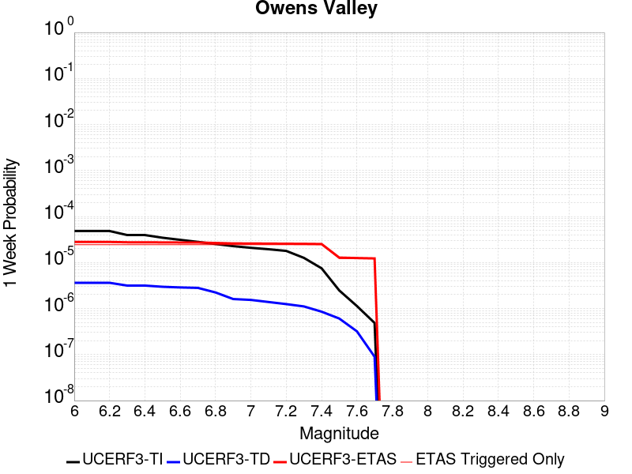 | 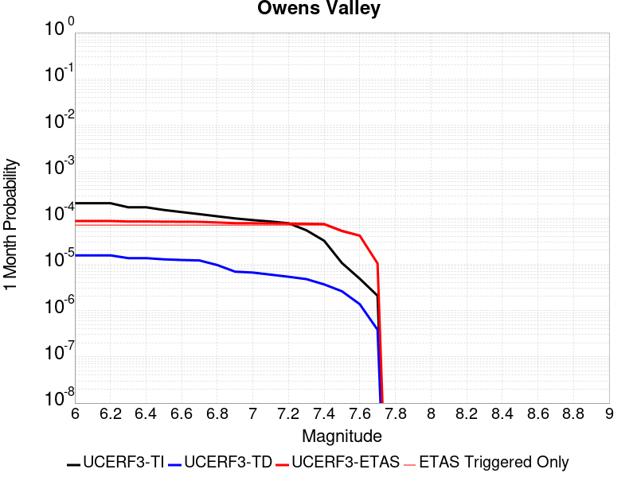 | 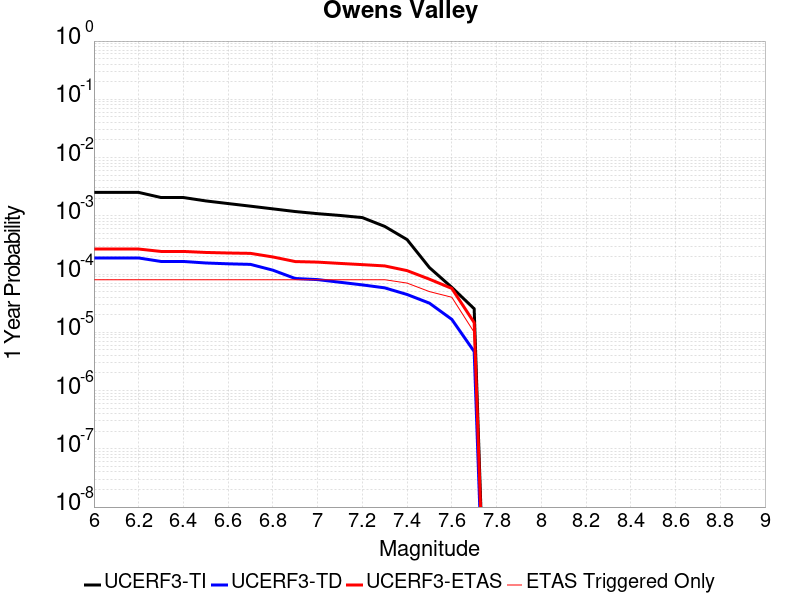 | 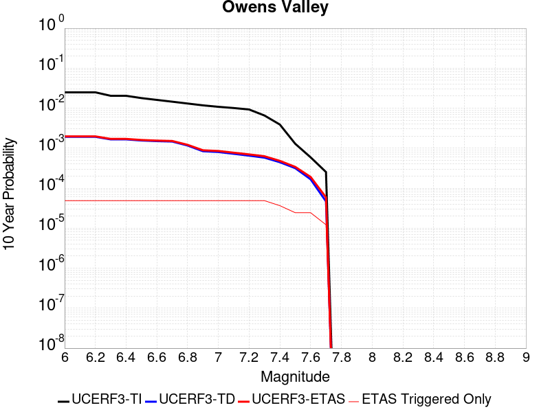 |

| Magnitude | 1 wk TI Prob | 1 wk TD Prob | 1 wk ETAS Prob | 1 wk ETAS/TD Gain | 1 wk ETAS Triggered Only | 1 mo TI Prob | 1 mo TD Prob | 1 mo ETAS Prob | 1 mo ETAS/TD Gain | 1 mo ETAS Triggered Only | 1 yr TI Prob | 1 yr TD Prob | 1 yr ETAS Prob | 1 yr ETAS/TD Gain | 1 yr ETAS Triggered Only | 10 yr TI Prob | 10 yr TD Prob | 10 yr ETAS Prob | 10 yr ETAS/TD Gain | 10 yr ETAS Triggered Only |
|-----|-----|-----|-----|-----|-----|-----|-----|-----|-----|-----|-----|-----|-----|-----|-----|-----|-----|-----|-----|-----|
| 6.0 | 4.83821E-5 | 3.6210524E-6 | 4.362091E-5 | 12.046473 | 4.0E-5 | 2.0733538E-4 | 1.551871E-5 | 8.5517626E-5 | 5.5106144 | 7.0E-5 | 0.002521386 | 1.889249E-4 | 2.689098E-4 | 1.4233687 | 8.0E-5 | 0.024929691 | 0.0019297141 | 0.00200956 | 1.041377 | 8.0E-5 |
| 6.1 | 4.83821E-5 | 3.6210524E-6 | 4.362091E-5 | 12.046473 | 4.0E-5 | 2.0733538E-4 | 1.551871E-5 | 8.5517626E-5 | 5.5106144 | 7.0E-5 | 0.002521386 | 1.889249E-4 | 2.689098E-4 | 1.4233687 | 8.0E-5 | 0.024929691 | 0.0019297141 | 0.00200956 | 1.041377 | 8.0E-5 |
| 6.2 | 4.83821E-5 | 3.6210524E-6 | 4.362091E-5 | 12.046473 | 4.0E-5 | 2.0733538E-4 | 1.551871E-5 | 8.5517626E-5 | 5.5106144 | 7.0E-5 | 0.002521386 | 1.889249E-4 | 2.689098E-4 | 1.4233687 | 8.0E-5 | 0.024929691 | 0.0019297141 | 0.00200956 | 1.041377 | 8.0E-5 |
| 6.3 | 3.953008E-5 | 3.1530958E-6 | 4.315297E-5 | 13.6859045 | 4.0E-5 | 1.6940363E-4 | 1.3513202E-5 | 8.3512256E-5 | 6.1800494 | 7.0E-5 | 0.002060538 | 1.6451156E-4 | 2.444984E-4 | 1.4862081 | 8.0E-5 | 0.020415364 | 0.0016621627 | 0.0017420298 | 1.04805 | 8.0E-5 |
| 6.4 | 3.953008E-5 | 3.1530958E-6 | 4.315297E-5 | 13.6859045 | 4.0E-5 | 1.6940363E-4 | 1.3513202E-5 | 8.3512256E-5 | 6.1800494 | 7.0E-5 | 0.002060538 | 1.6451156E-4 | 2.444984E-4 | 1.4862081 | 8.0E-5 | 0.020415364 | 0.0016621627 | 0.0017420298 | 1.04805 | 8.0E-5 |
| 6.5 | 3.457342E-5 | 2.9707387E-6 | 4.297062E-5 | 14.464624 | 4.0E-5 | 1.4816338E-4 | 1.273168E-5 | 8.273079E-5 | 6.4980264 | 7.0E-5 | 0.0018023965 | 1.5499788E-4 | 2.3498548E-4 | 1.5160562 | 8.0E-5 | 0.017878477 | 0.0015563119 | 0.0016361873 | 1.0513235 | 8.0E-5 |
| 6.6 | 3.1127765E-5 | 2.8737306E-6 | 4.2873617E-5 | 14.919149 | 4.0E-5 | 1.3339789E-4 | 1.2315934E-5 | 8.231507E-5 | 6.683624 | 7.0E-5 | 0.0016229092 | 1.4993687E-4 | 2.2992487E-4 | 1.5334779 | 8.0E-5 | 0.016111081 | 0.0015013438 | 0.0015812237 | 1.0532056 | 8.0E-5 |
| 6.7 | 2.806885E-5 | 2.8101606E-6 | 4.2810047E-5 | 15.234022 | 4.0E-5 | 1.2028952E-4 | 1.2043493E-5 | 8.204265E-5 | 6.812197 | 7.0E-5 | 0.001463541 | 1.4662035E-4 | 2.2660862E-4 | 1.5455469 | 8.0E-5 | 0.014539397 | 0.0014656087 | 0.0015454915 | 1.0545049 | 8.0E-5 |
| 6.8 | 2.524524E-5 | 2.2351392E-6 | 4.223505E-5 | 18.895937 | 4.0E-5 | 1.0818939E-4 | 9.579134E-6 | 7.9578465E-5 | 8.30748 | 7.0E-5 | 0.0013164099 | 1.16620016E-4 | 1.966107E-4 | 1.6859086 | 8.0E-5 | 0.01308639 | 0.001165827 | 0.0012457338 | 1.0685408 | 8.0E-5 |
| 6.9 | 2.2704568E-5 | 1.6079711E-6 | 4.1607906E-5 | 25.87603 | 4.0E-5 | 9.730166E-5 | 6.8912864E-6 | 7.689081E-5 | 11.157685 | 7.0E-5 | 0.0011840039 | 8.38982E-5 | 1.6389148E-4 | 1.9534565 | 8.0E-5 | 0.011777153 | 8.38853E-4 | 9.187859E-4 | 1.0952883 | 8.0E-5 |
| 7.0 | 2.0871712E-5 | 1.5393621E-6 | 4.15393E-5 | 26.984749 | 4.0E-5 | 8.944713E-5 | 6.5972495E-6 | 7.6596785E-5 | 11.610413 | 7.0E-5 | 0.0010884746 | 8.031857E-5 | 1.6031215E-4 | 1.9959537 | 8.0E-5 | 0.010831586 | 8.030395E-4 | 8.829753E-4 | 1.0995415 | 8.0E-5 |
| 7.1 | 1.944928E-5 | 1.3862556E-6 | 4.13862E-5 | 29.85467 | 4.0E-5 | 8.335139E-5 | 5.941082E-6 | 7.594067E-5 | 12.782296 | 7.0E-5 | 0.0010143308 | 7.233028E-5 | 1.5232449E-4 | 2.1059575 | 8.0E-5 | 0.010097133 | 7.2319806E-4 | 8.031402E-4 | 1.1105398 | 8.0E-5 |
| 7.2 | 1.7876306E-5 | 1.2487686E-6 | 4.1248717E-5 | 33.031517 | 4.0E-5 | 7.6610486E-5 | 5.3518543E-6 | 7.535148E-5 | 14.079509 | 7.0E-5 | 9.3233347E-4 | 6.515689E-5 | 1.4515167E-4 | 2.2277257 | 8.0E-5 | 0.009284316 | 6.5148395E-4 | 7.314318E-4 | 1.1227165 | 8.0E-5 |
| 7.3 | 1.2618672E-5 | 1.1113839E-6 | 4.111134E-5 | 36.991123 | 4.0E-5 | 5.40789E-5 | 4.763065E-6 | 7.4762735E-5 | 15.696348 | 7.0E-5 | 6.582117E-4 | 5.7988782E-5 | 1.3798414E-4 | 2.379497 | 8.0E-5 | 0.0065626553 | 5.7983754E-4 | 6.5979117E-4 | 1.1378896 | 8.0E-5 |
| 7.4 | 7.4874442E-6 | 8.547518E-7 | 4.0854717E-5 | 47.797173 | 4.0E-5 | 3.208865E-5 | 3.6632168E-6 | 7.366296E-5 | 20.108818 | 7.0E-5 | 3.906093E-4 | 4.4598757E-5 | 1.14595634E-4 | 2.5694804 | 7.0E-5 | 0.003899234 | 4.459579E-4 | 5.159267E-4 | 1.1568955 | 7.0E-5 |
| 7.5 | 2.4734156E-6 | 6.0679935E-7 | 2.0606787E-5 | 33.959805 | 2.0E-5 | 1.060031E-5 | 2.6005662E-6 | 5.2600437E-5 | 20.226532 | 5.0E-5 | 1.2905113E-4 | 3.1661435E-5 | 8.1659855E-5 | 2.5791583 | 5.0E-5 | 0.0012897621 | 3.1656958E-4 | 3.6655375E-4 | 1.1578932 | 5.0E-5 |
| 7.6 | 1.1328841E-6 | 3.1961991E-7 | 2.0319614E-5 | 63.574303 | 2.0E-5 | 4.8552088E-6 | 1.369799E-6 | 4.1369745E-5 | 30.201324 | 4.0E-5 | 5.9110564E-5 | 1.6677177E-5 | 5.667651E-5 | 3.3984475 | 4.0E-5 | 5.9094845E-4 | 1.6675945E-4 | 2.0675277E-4 | 1.2398264 | 4.0E-5 |
| 7.7 | 4.8613185E-7 | 8.962742E-8 | 1.0089627E-5 | 112.57299 | 1.0E-5 | 2.0834207E-6 | 3.8411747E-7 | 1.0384114E-5 | 27.033693 | 1.0E-5 | 2.536535E-5 | 4.676621E-6 | 1.4676574E-5 | 3.138286 | 1.0E-5 | 2.5362454E-4 | 4.676529E-5 | 5.6764824E-5 | 1.2138238 | 1.0E-5 |

## Santa Cruz Catalina Ridge alt1
*[(top)](#table-of-contents)*

| 1 Week | 1 Month | 1 Year | 10 Year |
|-----|-----|-----|-----|
|  |  |  |  |

| Magnitude | 1 wk TI Prob | 1 wk TD Prob | 1 wk ETAS Prob | 1 wk ETAS/TD Gain | 1 wk ETAS Triggered Only | 1 mo TI Prob | 1 mo TD Prob | 1 mo ETAS Prob | 1 mo ETAS/TD Gain | 1 mo ETAS Triggered Only | 1 yr TI Prob | 1 yr TD Prob | 1 yr ETAS Prob | 1 yr ETAS/TD Gain | 1 yr ETAS Triggered Only | 10 yr TI Prob | 10 yr TD Prob | 10 yr ETAS Prob | 10 yr ETAS/TD Gain | 10 yr ETAS Triggered Only |
|-----|-----|-----|-----|-----|-----|-----|-----|-----|-----|-----|-----|-----|-----|-----|-----|-----|-----|-----|-----|-----|
| 6.0 | 3.2833184E-5 | 3.6558402E-5 | 9.655621E-5 | 2.6411498 | 6.0E-5 | 1.4070606E-4 | 1.5667039E-4 | 2.1666099E-4 | 1.3829097 | 6.0E-5 | 0.00171175 | 0.0019059594 | 0.001985807 | 1.0418936 | 8.0E-5 | 0.016986247 | 0.018913032 | 0.01899152 | 1.0041499 | 8.0E-5 |
| 6.1 | 1.9835548E-5 | 2.1659505E-5 | 7.1658425E-5 | 3.3084054 | 5.0E-5 | 8.500672E-5 | 9.282326E-5 | 1.4281862E-4 | 1.5386081 | 5.0E-5 | 0.0010344655 | 0.0011295575 | 0.0011994784 | 1.0619012 | 7.0E-5 | 0.010296632 | 0.011240296 | 0.011309509 | 1.0061576 | 7.0E-5 |
| 6.2 | 1.9835548E-5 | 2.1659505E-5 | 7.1658425E-5 | 3.3084054 | 5.0E-5 | 8.500672E-5 | 9.282326E-5 | 1.4281862E-4 | 1.5386081 | 5.0E-5 | 0.0010344655 | 0.0011295575 | 0.0011994784 | 1.0619012 | 7.0E-5 | 0.010296632 | 0.011240296 | 0.011309509 | 1.0061576 | 7.0E-5 |
| 6.3 | 1.5728183E-5 | 1.703395E-5 | 4.7033438E-5 | 2.7611587 | 3.0E-5 | 6.7404755E-5 | 7.300063E-5 | 1.0299844E-4 | 1.4109254 | 3.0E-5 | 8.2034385E-4 | 8.884264E-4 | 9.3838194E-4 | 1.0562292 | 5.0E-5 | 0.008173222 | 0.008849427 | 0.008898985 | 1.0056001 | 5.0E-5 |
| 6.4 | 1.5728183E-5 | 1.703395E-5 | 4.7033438E-5 | 2.7611587 | 3.0E-5 | 6.7404755E-5 | 7.300063E-5 | 1.0299844E-4 | 1.4109254 | 3.0E-5 | 8.2034385E-4 | 8.884264E-4 | 9.3838194E-4 | 1.0562292 | 5.0E-5 | 0.008173222 | 0.008849427 | 0.008898985 | 1.0056001 | 5.0E-5 |
| 6.5 | 1.3707734E-5 | 1.4794522E-5 | 3.4794226E-5 | 2.3518317 | 2.0E-5 | 5.8746107E-5 | 6.3403575E-5 | 8.34023E-5 | 1.3154197 | 2.0E-5 | 7.1499916E-4 | 7.716686E-4 | 8.0164545E-4 | 1.0388469 | 3.0E-5 | 0.0071270303 | 0.0076902895 | 0.007720059 | 1.003871 | 3.0E-5 |
| 6.6 | 1.2539813E-5 | 1.3510219E-5 | 3.350995E-5 | 2.480341 | 2.0E-5 | 5.3740947E-5 | 5.789967E-5 | 7.789851E-5 | 1.3454051 | 2.0E-5 | 6.540996E-4 | 7.0470315E-4 | 7.34682E-4 | 1.0425411 | 3.0E-5 | 0.0065217763 | 0.0070249885 | 0.007054778 | 1.0042405 | 3.0E-5 |
| 6.7 | 1.1504083E-5 | 1.2377375E-5 | 3.2377127E-5 | 2.6158316 | 2.0E-5 | 4.930228E-5 | 5.3044827E-5 | 7.304377E-5 | 1.3770196 | 2.0E-5 | 6.0008996E-4 | 6.456314E-4 | 6.75612E-4 | 1.0464362 | 3.0E-5 | 0.005984721 | 0.006437786 | 0.006467593 | 1.00463 | 3.0E-5 |
| 6.8 | 1.012739E-5 | 1.0877071E-5 | 2.0876963E-5 | 1.9193552 | 1.0E-5 | 4.340238E-5 | 4.6615194E-5 | 5.661473E-5 | 1.2145123 | 1.0E-5 | 5.282958E-4 | 5.673937E-4 | 5.8738235E-4 | 1.0352288 | 2.0E-5 | 0.0052704164 | 0.0056596193 | 0.0056795063 | 1.0035138 | 2.0E-5 |
| 6.9 | 8.9607865E-6 | 9.609117E-6 | 1.960902E-5 | 2.0406682 | 1.0E-5 | 3.8402806E-5 | 4.1181287E-5 | 5.1180876E-5 | 1.2428187 | 1.0E-5 | 4.6745385E-4 | 5.012679E-4 | 5.2125787E-4 | 1.0398788 | 2.0E-5 | 0.0046647177 | 0.005001492 | 0.005021392 | 1.0039788 | 2.0E-5 |
| 7.0 | 8.046829E-6 | 8.619746E-6 | 1.861966E-5 | 2.160117 | 1.0E-5 | 3.4485955E-5 | 3.694125E-5 | 4.694088E-5 | 1.2706901 | 1.0E-5 | 4.1978562E-4 | 4.496677E-4 | 4.6965873E-4 | 1.0444573 | 2.0E-5 | 0.004189935 | 0.0044876686 | 0.004507579 | 1.0044366 | 2.0E-5 |
| 7.1 | 7.136131E-6 | 7.637656E-6 | 1.763758E-5 | 2.3092923 | 1.0E-5 | 3.0583058E-5 | 3.2732405E-5 | 4.2732077E-5 | 1.3054976 | 1.0E-5 | 3.7228514E-4 | 3.9844486E-4 | 4.084409E-4 | 1.0250876 | 1.0E-5 | 0.0037166206 | 0.003977381 | 0.0039873417 | 1.0025042 | 1.0E-5 |
| 7.2 | 6.362014E-6 | 6.8049585E-6 | 1.680489E-5 | 2.4695067 | 1.0E-5 | 2.726549E-5 | 2.9163786E-5 | 3.9163493E-5 | 1.342881 | 1.0E-5 | 3.3190678E-4 | 3.550119E-4 | 3.6500834E-4 | 1.0281581 | 1.0E-5 | 0.0033141149 | 0.003544516 | 0.0035544806 | 1.0028113 | 1.0E-5 |
| 7.3 | 5.004101E-6 | 5.351715E-6 | 5.351715E-6 | 1.0 | 0.0 | 2.1445969E-5 | 2.2935723E-5 | 2.2935723E-5 | 1.0 | 0.0 | 2.6107338E-4 | 2.792072E-4 | 2.792072E-4 | 1.0 | 0.0 | 0.002607669 | 0.0027886187 | 0.0027886187 | 1.0 | 0.0 |
| 7.4 | 3.4901443E-6 | 3.7320526E-6 | 3.7320526E-6 | 1.0 | 0.0 | 1.4957676E-5 | 1.5994416E-5 | 1.5994416E-5 | 1.0 | 0.0 | 1.8209449E-4 | 1.9471499E-4 | 1.9471499E-4 | 1.0 | 0.0 | 0.0018194534 | 0.0019454823 | 0.0019454823 | 1.0 | 0.0 |
| 7.5 | 1.1215045E-6 | 1.189387E-6 | 1.189387E-6 | 1.0 | 0.0 | 4.806439E-6 | 5.097363E-6 | 5.097363E-6 | 1.0 | 0.0 | 5.851682E-5 | 6.205866E-5 | 6.205866E-5 | 1.0 | 0.0 | 5.850142E-4 | 6.2041637E-4 | 6.2041637E-4 | 1.0 | 0.0 |
| 7.6 | 2.8599047E-7 | 2.9951994E-7 | 2.9951994E-7 | 1.0 | 0.0 | 1.2256729E-6 | 1.2836562E-6 | 1.2836562E-6 | 1.0 | 0.0 | 1.4922465E-5 | 1.5628404E-5 | 1.5628404E-5 | 1.0 | 0.0 | 1.4921463E-4 | 1.5627318E-4 | 1.5627318E-4 | 1.0 | 0.0 |
| 7.7 | 2.0781519E-7 | 2.1744323E-7 | 2.1744323E-7 | 1.0 | 0.0 | 8.906362E-7 | 9.3189925E-7 | 9.3189925E-7 | 1.0 | 0.0 | 1.08434415E-5 | 1.13458145E-5 | 1.13458145E-5 | 1.0 | 0.0 | 1.0842913E-4 | 1.1345245E-4 | 1.1345245E-4 | 1.0 | 0.0 |
| 7.8 | 3.614776E-8 | 3.764102E-8 | 3.764102E-8 | 1.0 | 0.0 | 1.5491896E-7 | 1.6131864E-7 | 1.6131864E-7 | 1.0 | 0.0 | 1.8861368E-6 | 1.9640527E-6 | 1.9640527E-6 | 1.0 | 0.0 | 1.8861208E-5 | 1.9640367E-5 | 1.9640367E-5 | 1.0 | 0.0 |

## Mission Ridge-Arroyo Parida-Santa Ana
*[(top)](#table-of-contents)*

| 1 Week | 1 Month | 1 Year | 10 Year |
|-----|-----|-----|-----|
|  |  |  |  |

| Magnitude | 1 wk TI Prob | 1 wk TD Prob | 1 wk ETAS Prob | 1 wk ETAS/TD Gain | 1 wk ETAS Triggered Only | 1 mo TI Prob | 1 mo TD Prob | 1 mo ETAS Prob | 1 mo ETAS/TD Gain | 1 mo ETAS Triggered Only | 1 yr TI Prob | 1 yr TD Prob | 1 yr ETAS Prob | 1 yr ETAS/TD Gain | 1 yr ETAS Triggered Only | 10 yr TI Prob | 10 yr TD Prob | 10 yr ETAS Prob | 10 yr ETAS/TD Gain | 10 yr ETAS Triggered Only |
|-----|-----|-----|-----|-----|-----|-----|-----|-----|-----|-----|-----|-----|-----|-----|-----|-----|-----|-----|-----|-----|
| 6.0 | 4.169034E-5 | 4.7137048E-5 | 7.7135635E-5 | 1.636412 | 3.0E-5 | 1.7866064E-4 | 2.0200513E-4 | 2.5199502E-4 | 1.2474685 | 5.0E-5 | 0.0021730233 | 0.0024574657 | 0.0025272937 | 1.0284146 | 7.0E-5 | 0.021518968 | 0.02438483 | 0.024462879 | 1.0032008 | 8.0E-5 |
| 6.1 | 1.73813E-5 | 1.6854203E-5 | 3.6853868E-5 | 2.1866276 | 2.0E-5 | 7.4489166E-5 | 7.223036E-5 | 1.02228194E-4 | 1.4153078 | 3.0E-5 | 9.065282E-4 | 8.790605E-4 | 9.090341E-4 | 1.0340973 | 3.0E-5 | 0.009028391 | 0.008757128 | 0.008786866 | 1.0033958 | 3.0E-5 |
| 6.2 | 1.4622182E-5 | 1.3673262E-5 | 2.3673127E-5 | 1.7313443 | 1.0E-5 | 6.2664985E-5 | 5.85984E-5 | 7.859723E-5 | 1.3412862 | 2.0E-5 | 7.6267915E-4 | 7.132059E-4 | 7.331916E-4 | 1.0280224 | 2.0E-5 | 0.007600669 | 0.007109767 | 0.007129625 | 1.0027931 | 2.0E-5 |
| 6.3 | 1.3552434E-5 | 1.2482174E-5 | 2.2482049E-5 | 1.8011326 | 1.0E-5 | 5.8080568E-5 | 5.349395E-5 | 7.349288E-5 | 1.373854 | 2.0E-5 | 7.069015E-4 | 6.510974E-4 | 6.7108433E-4 | 1.0306973 | 2.0E-5 | 0.00704657 | 0.006492415 | 0.0065122847 | 1.0030605 | 2.0E-5 |
| 6.4 | 1.30977305E-5 | 1.1979128E-5 | 2.1979009E-5 | 1.8347752 | 1.0E-5 | 5.613192E-5 | 5.133813E-5 | 7.1337105E-5 | 1.389554 | 2.0E-5 | 6.831918E-4 | 6.2486547E-4 | 6.44853E-4 | 1.0319868 | 2.0E-5 | 0.006810953 | 0.006231584 | 0.0062514595 | 1.0031894 | 2.0E-5 |
| 6.5 | 1.225205E-5 | 1.1048776E-5 | 2.1048665E-5 | 1.9050677 | 1.0E-5 | 5.2507727E-5 | 4.735105E-5 | 6.7350105E-5 | 1.4223571 | 2.0E-5 | 6.3909404E-4 | 5.7634927E-4 | 5.963377E-4 | 1.0346812 | 2.0E-5 | 0.006372592 | 0.005749009 | 0.0057688938 | 1.0034589 | 2.0E-5 |
| 6.6 | 1.1352241E-5 | 1.0063508E-5 | 2.0063408E-5 | 1.9936793 | 1.0E-5 | 4.8651553E-5 | 4.3128617E-5 | 6.312776E-5 | 1.4637092 | 2.0E-5 | 5.921717E-4 | 5.249665E-4 | 5.44956E-4 | 1.0380777 | 2.0E-5 | 0.0059059616 | 0.0052376646 | 0.0052575595 | 1.0037985 | 2.0E-5 |
| 6.7 | 1.0864116E-5 | 9.517E-6 | 1.9516905E-5 | 2.0507412 | 1.0E-5 | 4.6559664E-5 | 4.0786515E-5 | 6.07857E-5 | 1.4903381 | 2.0E-5 | 5.667165E-4 | 4.964647E-4 | 5.164548E-4 | 1.0402648 | 2.0E-5 | 0.005652734 | 0.0049539437 | 0.0049738446 | 1.0040172 | 2.0E-5 |
| 6.8 | 1.0666365E-5 | 9.299752E-6 | 9.299752E-6 | 1.0 | 0.0 | 4.571219E-5 | 3.985548E-5 | 4.9855083E-5 | 1.2508966 | 1.0E-5 | 5.564038E-4 | 4.8513446E-4 | 4.951296E-4 | 1.0206028 | 1.0E-5 | 0.005550127 | 0.00484114 | 0.0048510917 | 1.0020556 | 1.0E-5 |
| 6.9 | 1.0038665E-5 | 8.592018E-6 | 8.592018E-6 | 1.0 | 0.0 | 4.302214E-5 | 3.682243E-5 | 3.682243E-5 | 1.0 | 0.0 | 5.236687E-4 | 4.4822265E-4 | 4.4822265E-4 | 1.0 | 0.0 | 0.005224364 | 0.0044735507 | 0.0044735507 | 1.0 | 0.0 |
| 7.0 | 9.5379955E-6 | 8.025047E-6 | 8.025047E-6 | 1.0 | 0.0 | 4.0876483E-5 | 3.439261E-5 | 3.439261E-5 | 1.0 | 0.0 | 4.975576E-4 | 4.1865133E-4 | 4.1865133E-4 | 1.0 | 0.0 | 0.00496445 | 0.00417898 | 0.00417898 | 1.0 | 0.0 |
| 7.1 | 9.207389E-6 | 7.652347E-6 | 7.652347E-6 | 1.0 | 0.0 | 3.945964E-5 | 3.2795375E-5 | 3.2795375E-5 | 1.0 | 0.0 | 4.803152E-4 | 3.992122E-4 | 3.992122E-4 | 1.0 | 0.0 | 0.004792784 | 0.003985301 | 0.003985301 | 1.0 | 0.0 |
| 7.2 | 7.638091E-6 | 5.9310923E-6 | 5.9310923E-6 | 1.0 | 0.0 | 3.2734264E-5 | 2.5418722E-5 | 2.5418722E-5 | 1.0 | 0.0 | 3.984668E-4 | 3.094293E-4 | 3.094293E-4 | 1.0 | 0.0 | 0.0039775306 | 0.0030901956 | 0.0030901956 | 1.0 | 0.0 |
| 7.3 | 7.2500147E-6 | 5.596131E-6 | 5.596131E-6 | 1.0 | 0.0 | 3.1071122E-5 | 2.3983199E-5 | 2.3983199E-5 | 1.0 | 0.0 | 3.7822526E-4 | 2.9195662E-4 | 2.9195662E-4 | 1.0 | 0.0 | 0.0037758215 | 0.0029159402 | 0.0029159402 | 1.0 | 0.0 |
| 7.4 | 6.3899715E-6 | 4.9184864E-6 | 4.9184864E-6 | 1.0 | 0.0 | 2.7385306E-5 | 2.1079059E-5 | 2.1079059E-5 | 1.0 | 0.0 | 3.3336508E-4 | 2.566075E-4 | 2.566075E-4 | 1.0 | 0.0 | 0.0033286542 | 0.002563311 | 0.002563311 | 1.0 | 0.0 |
| 7.5 | 5.379025E-6 | 4.0838477E-6 | 4.0838477E-6 | 1.0 | 0.0 | 2.305276E-5 | 1.7502087E-5 | 1.7502087E-5 | 1.0 | 0.0 | 2.806312E-4 | 2.1306718E-4 | 2.1306718E-4 | 1.0 | 0.0 | 0.0028027708 | 0.0021286402 | 0.0021286402 | 1.0 | 0.0 |
| 7.6 | 4.1270696E-6 | 3.0883373E-6 | 3.0883373E-6 | 1.0 | 0.0 | 1.768732E-5 | 1.32356645E-5 | 1.32356645E-5 | 1.0 | 0.0 | 2.1532185E-4 | 1.6113237E-4 | 1.6113237E-4 | 1.0 | 0.0 | 0.0021511333 | 0.0016101635 | 0.0016101635 | 1.0 | 0.0 |
| 7.7 | 2.5406805E-6 | 1.8282044E-6 | 1.8282044E-6 | 1.0 | 0.0 | 1.0888585E-5 | 7.835139E-6 | 7.835139E-6 | 1.0 | 0.0 | 1.3256045E-4 | 9.53887E-5 | 9.53887E-5 | 1.0 | 0.0 | 0.0013248142 | 9.534837E-4 | 9.534837E-4 | 1.0 | 0.0 |
| 7.8 | 4.8608285E-7 | 3.509864E-7 | 3.509864E-7 | 1.0 | 0.0 | 2.0832106E-6 | 1.5042266E-6 | 1.5042266E-6 | 1.0 | 0.0 | 2.5362791E-5 | 1.8313805E-5 | 1.8313805E-5 | 1.0 | 0.0 | 2.5359896E-4 | 1.8312308E-4 | 1.8312308E-4 | 1.0 | 0.0 |
| 7.9 | 2.0472514E-8 | 1.2688718E-8 | 1.2688718E-8 | 1.0 | 0.0 | 8.7739345E-8 | 5.438022E-8 | 5.438022E-8 | 1.0 | 0.0 | 1.068226E-6 | 6.6207895E-7 | 6.6207895E-7 | 1.0 | 0.0 | 1.0682209E-5 | 6.620771E-6 | 6.620771E-6 | 1.0 | 0.0 |
| 8.0 | 4.443582E-9 | 2.032067E-9 | 2.032067E-9 | 1.0 | 0.0 | 1.9043922E-8 | 8.7088585E-9 | 8.7088585E-9 | 1.0 | 0.0 | 2.3185973E-7 | 1.0603035E-7 | 1.0603035E-7 | 1.0 | 0.0 | 2.3185949E-6 | 1.0603031E-6 | 1.0603031E-6 | 1.0 | 0.0 |

## Santa Rosa Island
*[(top)](#table-of-contents)*

| 1 Week | 1 Month | 1 Year | 10 Year |
|-----|-----|-----|-----|
|  |  |  |  |

| Magnitude | 1 wk TI Prob | 1 wk TD Prob | 1 wk ETAS Prob | 1 wk ETAS/TD Gain | 1 wk ETAS Triggered Only | 1 mo TI Prob | 1 mo TD Prob | 1 mo ETAS Prob | 1 mo ETAS/TD Gain | 1 mo ETAS Triggered Only | 1 yr TI Prob | 1 yr TD Prob | 1 yr ETAS Prob | 1 yr ETAS/TD Gain | 1 yr ETAS Triggered Only | 10 yr TI Prob | 10 yr TD Prob | 10 yr ETAS Prob | 10 yr ETAS/TD Gain | 10 yr ETAS Triggered Only |
|-----|-----|-----|-----|-----|-----|-----|-----|-----|-----|-----|-----|-----|-----|-----|-----|-----|-----|-----|-----|-----|
| 6.0 | 4.1143165E-5 | 4.709113E-5 | 1.1708783E-4 | 2.4864097 | 7.0E-5 | 1.7631594E-4 | 2.0180462E-4 | 2.717905E-4 | 1.3468002 | 7.0E-5 | 0.002144533 | 0.0024543991 | 0.0025342028 | 1.0325146 | 8.0E-5 | 0.021239553 | 0.024293557 | 0.024371613 | 1.003213 | 8.0E-5 |
| 6.1 | 2.1061249E-5 | 2.3864959E-5 | 3.3864722E-5 | 1.4190143 | 1.0E-5 | 9.0259375E-5 | 1.0227455E-4 | 1.1227353E-4 | 1.097766 | 1.0E-5 | 0.0010983539 | 0.0012445103 | 0.0012544979 | 1.0080253 | 1.0E-5 | 0.01092941 | 0.01237845 | 0.012388326 | 1.0007979 | 1.0E-5 |
| 6.2 | 2.1061249E-5 | 2.3864959E-5 | 3.3864722E-5 | 1.4190143 | 1.0E-5 | 9.0259375E-5 | 1.0227455E-4 | 1.1227353E-4 | 1.097766 | 1.0E-5 | 0.0010983539 | 0.0012445103 | 0.0012544979 | 1.0080253 | 1.0E-5 | 0.01092941 | 0.01237845 | 0.012388326 | 1.0007979 | 1.0E-5 |
| 6.3 | 1.5158236E-5 | 1.7074419E-5 | 1.7074419E-5 | 1.0 | 0.0 | 6.496225E-5 | 7.3174095E-5 | 7.3174095E-5 | 1.0 | 0.0 | 7.906284E-4 | 8.9054246E-4 | 8.9054246E-4 | 1.0 | 0.0 | 0.007878214 | 0.00887099 | 0.00887099 | 1.0 | 0.0 |
| 6.4 | 1.2341918E-5 | 1.3852917E-5 | 1.3852917E-5 | 1.0 | 0.0 | 5.2892858E-5 | 5.9368336E-5 | 5.9368336E-5 | 1.0 | 0.0 | 6.437803E-4 | 7.225779E-4 | 7.225779E-4 | 1.0 | 0.0 | 0.006419184 | 0.0072031217 | 0.0072031217 | 1.0 | 0.0 |
| 6.5 | 9.061158E-6 | 1.0117032E-5 | 1.0117032E-5 | 1.0 | 0.0 | 3.883296E-5 | 4.3358017E-5 | 4.3358017E-5 | 1.0 | 0.0 | 4.726887E-4 | 5.277613E-4 | 5.277613E-4 | 1.0 | 0.0 | 0.004716845 | 0.0052656177 | 0.0052656177 | 1.0 | 0.0 |
| 6.6 | 7.5461685E-6 | 8.400734E-6 | 8.400734E-6 | 1.0 | 0.0 | 3.2340322E-5 | 3.600267E-5 | 3.600267E-5 | 1.0 | 0.0 | 3.936723E-4 | 4.3824868E-4 | 4.3824868E-4 | 1.0 | 0.0 | 0.003929756 | 0.0043742736 | 0.0043742736 | 1.0 | 0.0 |
| 6.7 | 5.5023775E-6 | 6.087381E-6 | 6.087381E-6 | 1.0 | 0.0 | 2.3581404E-5 | 2.6088532E-5 | 2.6088532E-5 | 1.0 | 0.0 | 2.8706578E-4 | 3.1758484E-4 | 3.1758484E-4 | 1.0 | 0.0 | 0.0028669522 | 0.0031716316 | 0.0031716316 | 1.0 | 0.0 |
| 6.8 | 3.7351679E-6 | 4.0831405E-6 | 4.0831405E-6 | 1.0 | 0.0 | 1.6007763E-5 | 1.7499071E-5 | 1.7499071E-5 | 1.0 | 0.0 | 1.948771E-4 | 2.1303285E-4 | 2.1303285E-4 | 1.0 | 0.0 | 0.0019470629 | 0.0021285315 | 0.0021285315 | 1.0 | 0.0 |
| 6.9 | 2.456366E-6 | 2.6292707E-6 | 2.6292707E-6 | 1.0 | 0.0 | 1.0527241E-5 | 1.1268255E-5 | 1.1268255E-5 | 1.0 | 0.0 | 1.2816161E-4 | 1.3718239E-4 | 1.3718239E-4 | 1.0 | 0.0 | 0.0012808773 | 0.0013709799 | 0.0013709799 | 1.0 | 0.0 |
| 7.0 | 2.3245157E-6 | 2.4827784E-6 | 2.4827784E-6 | 1.0 | 0.0 | 9.962172E-6 | 1.0640436E-5 | 1.0640436E-5 | 1.0 | 0.0 | 1.2128269E-4 | 1.2953962E-4 | 1.2953962E-4 | 1.0 | 0.0 | 0.0012121652 | 0.0012946434 | 0.0012946434 | 1.0 | 0.0 |
| 7.1 | 2.2248344E-6 | 2.37325E-6 | 2.37325E-6 | 1.0 | 0.0 | 9.53497E-6 | 1.0171032E-5 | 1.0171032E-5 | 1.0 | 0.0 | 1.1608207E-4 | 1.238253E-4 | 1.238253E-4 | 1.0 | 0.0 | 0.0011602144 | 0.0012375651 | 0.0012375651 | 1.0 | 0.0 |
| 7.2 | 2.1350402E-6 | 2.2761542E-6 | 2.2761542E-6 | 1.0 | 0.0 | 9.150141E-6 | 9.75491E-6 | 9.75491E-6 | 1.0 | 0.0 | 1.1139726E-4 | 1.1875957E-4 | 1.1875957E-4 | 1.0 | 0.0 | 0.0011134144 | 0.0011869629 | 0.0011869629 | 1.0 | 0.0 |
| 7.3 | 1.9793572E-6 | 2.1087192E-6 | 2.1087192E-6 | 1.0 | 0.0 | 8.482932E-6 | 9.037337E-6 | 9.037337E-6 | 1.0 | 0.0 | 1.032748E-4 | 1.1002403E-4 | 1.1002403E-4 | 1.0 | 0.0 | 0.0010322682 | 0.0010996974 | 0.0010996974 | 1.0 | 0.0 |
| 7.4 | 1.6951194E-6 | 1.8045735E-6 | 1.8045735E-6 | 1.0 | 0.0 | 7.264777E-6 | 7.733864E-6 | 7.733864E-6 | 1.0 | 0.0 | 8.844508E-5 | 9.415574E-5 | 9.415574E-5 | 1.0 | 0.0 | 8.840988E-4 | 9.411601E-4 | 9.411601E-4 | 1.0 | 0.0 |
| 7.5 | 8.987207E-7 | 9.512216E-7 | 9.512216E-7 | 1.0 | 0.0 | 3.8516546E-6 | 4.0766577E-6 | 4.0766577E-6 | 1.0 | 0.0 | 4.6892885E-5 | 4.9632188E-5 | 4.9632188E-5 | 1.0 | 0.0 | 4.688299E-4 | 4.962122E-4 | 4.962122E-4 | 1.0 | 0.0 |
| 7.6 | 3.8783037E-7 | 4.0529335E-7 | 4.0529335E-7 | 1.0 | 0.0 | 1.6621291E-6 | 1.7369704E-6 | 1.7369704E-6 | 1.0 | 0.0 | 2.0236233E-5 | 2.1147416E-5 | 2.1147416E-5 | 1.0 | 0.0 | 2.023439E-4 | 2.114547E-4 | 2.114547E-4 | 1.0 | 0.0 |
| 7.7 | 6.181804E-8 | 6.339047E-8 | 6.339047E-8 | 1.0 | 0.0 | 2.6493444E-7 | 2.7167343E-7 | 2.7167343E-7 | 1.0 | 0.0 | 3.225572E-6 | 3.307619E-6 | 3.307619E-6 | 1.0 | 0.0 | 3.225525E-5 | 3.3075703E-5 | 3.3075703E-5 | 1.0 | 0.0 |
| 7.8 | 1.3704449E-9 | 1.3964153E-9 | 1.3964153E-9 | 1.0 | 0.0 | 5.873335E-9 | 5.984637E-9 | 5.984637E-9 | 1.0 | 0.0 | 7.1507856E-8 | 7.286295E-8 | 7.286295E-8 | 1.0 | 0.0 | 7.1507833E-7 | 7.286294E-7 | 7.286294E-7 | 1.0 | 0.0 |

## Manix-Afton Hills
*[(top)](#table-of-contents)*

| 1 Week | 1 Month | 1 Year | 10 Year |
|-----|-----|-----|-----|
|  |  |  |  |

| Magnitude | 1 wk TI Prob | 1 wk TD Prob | 1 wk ETAS Prob | 1 wk ETAS/TD Gain | 1 wk ETAS Triggered Only | 1 mo TI Prob | 1 mo TD Prob | 1 mo ETAS Prob | 1 mo ETAS/TD Gain | 1 mo ETAS Triggered Only | 1 yr TI Prob | 1 yr TD Prob | 1 yr ETAS Prob | 1 yr ETAS/TD Gain | 1 yr ETAS Triggered Only | 10 yr TI Prob | 10 yr TD Prob | 10 yr ETAS Prob | 10 yr ETAS/TD Gain | 10 yr ETAS Triggered Only |
|-----|-----|-----|-----|-----|-----|-----|-----|-----|-----|-----|-----|-----|-----|-----|-----|-----|-----|-----|-----|-----|
| 6.0 | 1.3783202E-5 | 1.47110895E-5 | 6.471035E-5 | 4.3987465 | 5.0E-5 | 5.906953E-5 | 6.30461E-5 | 1.3304169E-4 | 2.1102285 | 7.0E-5 | 7.189342E-4 | 7.6733343E-4 | 8.372797E-4 | 1.091155 | 7.0E-5 | 0.0071661277 | 0.007648596 | 0.0077180606 | 1.009082 | 7.0E-5 |
| 6.1 | 1.3783202E-5 | 1.47110895E-5 | 6.471035E-5 | 4.3987465 | 5.0E-5 | 5.906953E-5 | 6.30461E-5 | 1.3304169E-4 | 2.1102285 | 7.0E-5 | 7.189342E-4 | 7.6733343E-4 | 8.372797E-4 | 1.091155 | 7.0E-5 | 0.0071661277 | 0.007648596 | 0.0077180606 | 1.009082 | 7.0E-5 |
| 6.2 | 1.3783202E-5 | 1.47110895E-5 | 6.471035E-5 | 4.3987465 | 5.0E-5 | 5.906953E-5 | 6.30461E-5 | 1.3304169E-4 | 2.1102285 | 7.0E-5 | 7.189342E-4 | 7.6733343E-4 | 8.372797E-4 | 1.091155 | 7.0E-5 | 0.0071661277 | 0.007648596 | 0.0077180606 | 1.009082 | 7.0E-5 |
| 6.3 | 1.10494875E-5 | 1.1793136E-5 | 5.1792664E-5 | 4.3917637 | 4.0E-5 | 4.7354086E-5 | 5.054109E-5 | 1.1053806E-4 | 2.1870928 | 6.0E-5 | 5.763835E-4 | 6.151744E-4 | 6.751375E-4 | 1.0974733 | 6.0E-5 | 0.005748908 | 0.0061357557 | 0.0061953873 | 1.0097188 | 6.0E-5 |
| 6.4 | 1.10494875E-5 | 1.1793136E-5 | 5.1792664E-5 | 4.3917637 | 4.0E-5 | 4.7354086E-5 | 5.054109E-5 | 1.1053806E-4 | 2.1870928 | 6.0E-5 | 5.763835E-4 | 6.151744E-4 | 6.751375E-4 | 1.0974733 | 6.0E-5 | 0.005748908 | 0.0061357557 | 0.0061953873 | 1.0097188 | 6.0E-5 |
| 6.5 | 9.788949E-6 | 1.045432E-5 | 4.0454004E-5 | 3.8695972 | 3.0E-5 | 4.1951964E-5 | 4.480351E-5 | 9.480127E-5 | 2.115934 | 5.0E-5 | 5.1064545E-4 | 5.453555E-4 | 5.953282E-4 | 1.0916333 | 5.0E-5 | 0.0050947363 | 0.0054410985 | 0.0054908264 | 1.0091393 | 5.0E-5 |
| 6.6 | 8.810006E-6 | 9.4136285E-6 | 3.9413346E-5 | 4.186839 | 3.0E-5 | 3.775662E-5 | 4.0343548E-5 | 9.034153E-5 | 2.2393055 | 5.0E-5 | 4.5958988E-4 | 4.9108086E-4 | 5.4105633E-4 | 1.1017662 | 5.0E-5 | 0.0045864056 | 0.004900839 | 0.004950594 | 1.0101523 | 5.0E-5 |
| 6.7 | 8.80128E-6 | 9.404108E-6 | 3.9403825E-5 | 4.1900654 | 3.0E-5 | 3.7719226E-5 | 4.0302748E-5 | 9.030073E-5 | 2.2405603 | 5.0E-5 | 4.591348E-4 | 4.9058435E-4 | 5.405598E-4 | 1.1018692 | 5.0E-5 | 0.004581874 | 0.0048958957 | 0.004945651 | 1.0101626 | 5.0E-5 |
| 6.8 | 6.8994877E-6 | 7.380076E-6 | 3.7379854E-5 | 5.0649686 | 3.0E-5 | 2.9568899E-5 | 3.162856E-5 | 7.162729E-5 | 2.2646399 | 4.0E-5 | 3.5994186E-4 | 3.8501783E-4 | 4.2500242E-4 | 1.1038513 | 4.0E-5 | 0.003593594 | 0.0038443129 | 0.003884159 | 1.010365 | 4.0E-5 |
| 6.9 | 4.9328037E-6 | 5.2709615E-6 | 3.5270805E-5 | 6.691531 | 3.0E-5 | 2.1140417E-5 | 2.2589675E-5 | 6.258877E-5 | 2.7706807 | 4.0E-5 | 2.5735417E-4 | 2.7500073E-4 | 3.1498974E-4 | 1.1454141 | 4.0E-5 | 0.0025705635 | 0.0027472095 | 0.0027870997 | 1.0145203 | 4.0E-5 |
| 7.0 | 3.347973E-6 | 3.59003E-6 | 3.59003E-6 | 1.0 | 0.0 | 1.4348378E-5 | 1.5385775E-5 | 1.5385775E-5 | 1.0 | 0.0 | 1.746775E-4 | 1.8730981E-4 | 1.8730981E-4 | 1.0 | 0.0 | 0.0017454025 | 0.0018719219 | 0.0018719219 | 1.0 | 0.0 |
| 7.1 | 1.2073567E-6 | 1.293482E-6 | 1.293482E-6 | 1.0 | 0.0 | 5.1743755E-6 | 5.543492E-6 | 5.543492E-6 | 1.0 | 0.0 | 6.29962E-5 | 6.749156E-5 | 6.749156E-5 | 1.0 | 0.0 | 6.297835E-4 | 6.7487074E-4 | 6.7487074E-4 | 1.0 | 0.0 |

## Mission Creek
*[(top)](#table-of-contents)*

| 1 Week | 1 Month | 1 Year | 10 Year |
|-----|-----|-----|-----|
|  |  |  |  |

| Magnitude | 1 wk TI Prob | 1 wk TD Prob | 1 wk ETAS Prob | 1 wk ETAS/TD Gain | 1 wk ETAS Triggered Only | 1 mo TI Prob | 1 mo TD Prob | 1 mo ETAS Prob | 1 mo ETAS/TD Gain | 1 mo ETAS Triggered Only | 1 yr TI Prob | 1 yr TD Prob | 1 yr ETAS Prob | 1 yr ETAS/TD Gain | 1 yr ETAS Triggered Only | 10 yr TI Prob | 10 yr TD Prob | 10 yr ETAS Prob | 10 yr ETAS/TD Gain | 10 yr ETAS Triggered Only |
|-----|-----|-----|-----|-----|-----|-----|-----|-----|-----|-----|-----|-----|-----|-----|-----|-----|-----|-----|-----|-----|
| 6.0 | 1.1549387E-5 | 1.6322783E-5 | 7.6321805E-5 | 4.675784 | 6.0E-5 | 4.9496433E-5 | 6.995299E-5 | 1.2994879E-4 | 1.8576589 | 6.0E-5 | 6.0245243E-4 | 8.5135986E-4 | 9.113088E-4 | 1.0704155 | 6.0E-5 | 0.006008218 | 0.008510157 | 0.008579561 | 1.0081555 | 7.0E-5 |
| 6.1 | 1.1549387E-5 | 1.6322783E-5 | 7.6321805E-5 | 4.675784 | 6.0E-5 | 4.9496433E-5 | 6.995299E-5 | 1.2994879E-4 | 1.8576589 | 6.0E-5 | 6.0245243E-4 | 8.5135986E-4 | 9.113088E-4 | 1.0704155 | 6.0E-5 | 0.006008218 | 0.008510157 | 0.008579561 | 1.0081555 | 7.0E-5 |
| 6.2 | 1.1549387E-5 | 1.6322783E-5 | 7.6321805E-5 | 4.675784 | 6.0E-5 | 4.9496433E-5 | 6.995299E-5 | 1.2994879E-4 | 1.8576589 | 6.0E-5 | 6.0245243E-4 | 8.5135986E-4 | 9.113088E-4 | 1.0704155 | 6.0E-5 | 0.006008218 | 0.008510157 | 0.008579561 | 1.0081555 | 7.0E-5 |
| 6.3 | 1.1549387E-5 | 1.6322783E-5 | 7.6321805E-5 | 4.675784 | 6.0E-5 | 4.9496433E-5 | 6.995299E-5 | 1.2994879E-4 | 1.8576589 | 6.0E-5 | 6.0245243E-4 | 8.5135986E-4 | 9.113088E-4 | 1.0704155 | 6.0E-5 | 0.006008218 | 0.008510157 | 0.008579561 | 1.0081555 | 7.0E-5 |
| 6.4 | 1.1549387E-5 | 1.6322783E-5 | 7.6321805E-5 | 4.675784 | 6.0E-5 | 4.9496433E-5 | 6.995299E-5 | 1.2994879E-4 | 1.8576589 | 6.0E-5 | 6.0245243E-4 | 8.5135986E-4 | 9.113088E-4 | 1.0704155 | 6.0E-5 | 0.006008218 | 0.008510157 | 0.008579561 | 1.0081555 | 7.0E-5 |
| 6.5 | 1.1549387E-5 | 1.6322783E-5 | 7.6321805E-5 | 4.675784 | 6.0E-5 | 4.9496433E-5 | 6.995299E-5 | 1.2994879E-4 | 1.8576589 | 6.0E-5 | 6.0245243E-4 | 8.5135986E-4 | 9.113088E-4 | 1.0704155 | 6.0E-5 | 0.006008218 | 0.008510157 | 0.008579561 | 1.0081555 | 7.0E-5 |
| 6.6 | 9.202681E-6 | 1.3846059E-5 | 7.384523E-5 | 5.333303 | 6.0E-5 | 3.9439463E-5 | 5.9338956E-5 | 1.193354E-4 | 2.0110803 | 6.0E-5 | 4.800697E-4 | 7.2222133E-4 | 7.82178E-4 | 1.083017 | 6.0E-5 | 0.004790339 | 0.0072273402 | 0.007296834 | 1.0096154 | 7.0E-5 |
| 6.7 | 9.019164E-6 | 1.3651728E-5 | 7.365091E-5 | 5.394988 | 6.0E-5 | 3.8652986E-5 | 5.8506146E-5 | 1.18502634E-4 | 2.0254734 | 6.0E-5 | 4.7049852E-4 | 7.1208854E-4 | 7.720458E-4 | 1.0841992 | 6.0E-5 | 0.004695036 | 0.0071266647 | 0.0071961656 | 1.0097523 | 7.0E-5 |
| 6.8 | 8.673558E-6 | 1.3273839E-5 | 7.327304E-5 | 5.520109 | 6.0E-5 | 3.717186E-5 | 5.688669E-5 | 1.16883275E-4 | 2.0546682 | 6.0E-5 | 4.524734E-4 | 6.923842E-4 | 7.5234263E-4 | 1.0865971 | 6.0E-5 | 0.0045155324 | 0.0069308523 | 0.007000367 | 1.0100298 | 7.0E-5 |
| 6.9 | 7.002255E-6 | 1.1478069E-5 | 7.147738E-5 | 6.2273006 | 6.0E-5 | 3.000932E-5 | 4.9190832E-5 | 1.0918788E-4 | 2.2196796 | 6.0E-5 | 3.653022E-4 | 5.9874065E-4 | 6.587047E-4 | 1.1001503 | 6.0E-5 | 0.0036470229 | 0.005999676 | 0.006069256 | 1.0115973 | 7.0E-5 |
| 7.0 | 5.84644E-6 | 9.675359E-6 | 6.967478E-5 | 7.20126 | 6.0E-5 | 2.5055931E-5 | 4.146519E-5 | 1.01462705E-4 | 2.4469368 | 6.0E-5 | 3.0501327E-4 | 5.047263E-4 | 5.6469603E-4 | 1.1188163 | 6.0E-5 | 0.0030459496 | 0.005063994 | 0.0051336396 | 1.013753 | 7.0E-5 |
| 7.1 | 5.54703E-6 | 9.329834E-6 | 6.9329275E-5 | 7.4309225 | 6.0E-5 | 2.377277E-5 | 3.9984414E-5 | 9.998202E-5 | 2.5005248 | 6.0E-5 | 2.8939504E-4 | 4.8670598E-4 | 5.4667675E-4 | 1.1232177 | 6.0E-5 | 0.0028901845 | 0.0048845876 | 0.0049542454 | 1.0142608 | 7.0E-5 |
| 7.2 | 4.384709E-6 | 7.681918E-6 | 6.768146E-5 | 8.81049 | 6.0E-5 | 1.8791474E-5 | 3.292211E-5 | 9.2920134E-5 | 2.8224235 | 6.0E-5 | 2.2876218E-4 | 4.0075663E-4 | 4.6073258E-4 | 1.1496568 | 6.0E-5 | 0.0022852682 | 0.004028542 | 0.00409826 | 1.017306 | 7.0E-5 |
| 7.3 | 3.7888456E-6 | 6.915788E-6 | 6.6915374E-5 | 9.67574 | 6.0E-5 | 1.623781E-5 | 2.9638775E-5 | 8.9637E-5 | 3.024315 | 6.0E-5 | 1.9767738E-4 | 3.6079568E-4 | 4.2077404E-4 | 1.1662391 | 6.0E-5 | 0.0019750162 | 0.00363027 | 0.0037000158 | 1.0192124 | 7.0E-5 |
| 7.4 | 2.1982462E-6 | 5.0241033E-6 | 6.50238E-5 | 12.942369 | 6.0E-5 | 9.421021E-6 | 2.1531694E-5 | 8.15304E-5 | 3.7865298 | 6.0E-5 | 1.1469489E-4 | 2.6211704E-4 | 3.221013E-4 | 1.2288454 | 6.0E-5 | 0.0011463572 | 0.0026460327 | 0.0027158475 | 1.0263847 | 7.0E-5 |
| 7.5 | 2.051923E-6 | 4.6153277E-6 | 6.461505E-5 | 14.000101 | 6.0E-5 | 8.793926E-6 | 1.9779825E-5 | 7.977864E-5 | 4.033334 | 6.0E-5 | 1.0706078E-4 | 2.4079291E-4 | 3.0077845E-4 | 1.2491168 | 6.0E-5 | 0.0010700922 | 0.0024335932 | 0.0025034228 | 1.028694 | 7.0E-5 |
| 7.6 | 1.8733427E-6 | 4.1236603E-6 | 6.4123415E-5 | 15.550119 | 6.0E-5 | 8.028587E-6 | 1.7672712E-5 | 7.767165E-5 | 4.3950047 | 6.0E-5 | 9.774366E-5 | 2.151441E-4 | 2.751312E-4 | 1.2788229 | 6.0E-5 | 9.770069E-4 | 0.0021782513 | 0.0022480988 | 1.0320659 | 7.0E-5 |
| 7.7 | 1.8411953E-6 | 4.0433315E-6 | 6.404309E-5 | 15.839188 | 6.0E-5 | 7.890813E-6 | 1.732845E-5 | 7.732741E-5 | 4.462454 | 6.0E-5 | 9.606641E-5 | 2.1095353E-4 | 2.7094086E-4 | 1.2843628 | 6.0E-5 | 9.6024893E-4 | 0.0021365292 | 0.0022063795 | 1.0326934 | 7.0E-5 |
| 7.8 | 1.7194251E-6 | 3.71068E-6 | 6.371046E-5 | 17.169483 | 6.0E-5 | 7.368944E-6 | 1.5902819E-5 | 7.5901866E-5 | 4.772856 | 6.0E-5 | 8.97132E-5 | 1.9359968E-4 | 2.5358808E-4 | 1.3098578 | 6.0E-5 | 8.967699E-4 | 0.0019624757 | 0.0020323382 | 1.0355992 | 7.0E-5 |
| 7.9 | 1.4035052E-6 | 2.9502596E-6 | 6.295008E-5 | 21.337133 | 6.0E-5 | 6.0150082E-6 | 1.2643909E-5 | 7.264315E-5 | 5.745308 | 6.0E-5 | 7.3230265E-5 | 1.5392878E-4 | 2.1391954E-4 | 1.3897307 | 6.0E-5 | 7.3206134E-4 | 0.0015631174 | 0.0016330079 | 1.0447123 | 7.0E-5 |
| 8.0 | 3.9318823E-7 | 5.528477E-7 | 2.0552836E-5 | 37.176304 | 2.0E-5 | 1.6850913E-6 | 2.3693453E-6 | 2.2369299E-5 | 9.44113 | 2.0E-5 | 2.0515794E-5 | 2.8846403E-5 | 4.8845828E-5 | 1.6933073 | 2.0E-5 | 2.0513899E-4 | 2.990952E-4 | 3.1908925E-4 | 1.0668484 | 2.0E-5 |
| 8.1 | 1.596793E-7 | 1.13775044E-7 | 1.13775044E-7 | 1.0 | 0.0 | 6.8433974E-7 | 4.876072E-7 | 4.876072E-7 | 1.0 | 0.0 | 8.331805E-6 | 5.936602E-6 | 5.936602E-6 | 1.0 | 0.0 | 8.331492E-5 | 6.5494125E-5 | 6.5494125E-5 | 1.0 | 0.0 |
| 8.2 | 4.9003038E-8 | 2.5435753E-8 | 2.5435753E-8 | 1.0 | 0.0 | 2.10013E-7 | 1.09010365E-7 | 1.09010365E-7 | 1.0 | 0.0 | 2.5569052E-6 | 1.3272004E-6 | 1.3272004E-6 | 1.0 | 0.0 | 2.556876E-5 | 1.4952613E-5 | 1.4952613E-5 | 1.0 | 0.0 |

## San Jacinto (Coyote Creek)
*[(top)](#table-of-contents)*

| 1 Week | 1 Month | 1 Year | 10 Year |
|-----|-----|-----|-----|
|  |  | 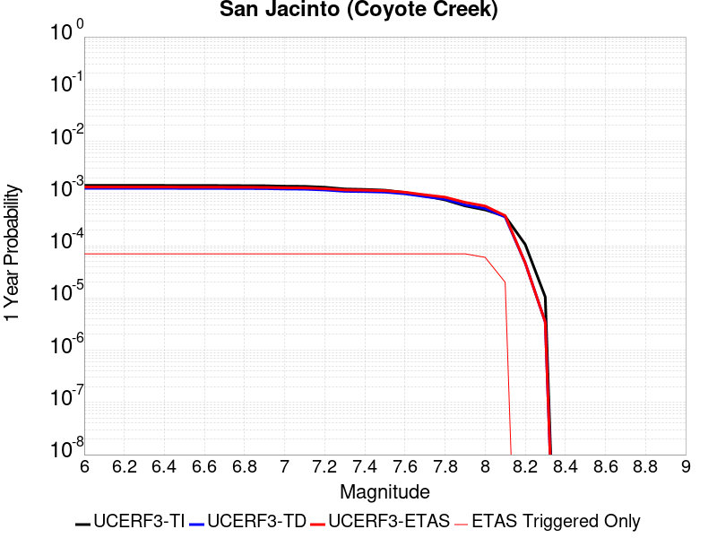 |  |

| Magnitude | 1 wk TI Prob | 1 wk TD Prob | 1 wk ETAS Prob | 1 wk ETAS/TD Gain | 1 wk ETAS Triggered Only | 1 mo TI Prob | 1 mo TD Prob | 1 mo ETAS Prob | 1 mo ETAS/TD Gain | 1 mo ETAS Triggered Only | 1 yr TI Prob | 1 yr TD Prob | 1 yr ETAS Prob | 1 yr ETAS/TD Gain | 1 yr ETAS Triggered Only | 10 yr TI Prob | 10 yr TD Prob | 10 yr ETAS Prob | 10 yr ETAS/TD Gain | 10 yr ETAS Triggered Only |
|-----|-----|-----|-----|-----|-----|-----|-----|-----|-----|-----|-----|-----|-----|-----|-----|-----|-----|-----|-----|-----|
| 6.0 | 2.7374346E-5 | 2.41444E-5 | 8.414295E-5 | 3.4849885 | 6.0E-5 | 1.1731335E-4 | 1.034719E-4 | 1.7346466E-4 | 1.6764421 | 7.0E-5 | 0.0014273542 | 0.001259045 | 0.0013289569 | 1.0555277 | 7.0E-5 | 0.01418221 | 0.012928195 | 0.01299729 | 1.0053445 | 7.0E-5 |
| 6.1 | 2.7374346E-5 | 2.41444E-5 | 8.414295E-5 | 3.4849885 | 6.0E-5 | 1.1731335E-4 | 1.034719E-4 | 1.7346466E-4 | 1.6764421 | 7.0E-5 | 0.0014273542 | 0.001259045 | 0.0013289569 | 1.0555277 | 7.0E-5 | 0.01418221 | 0.012928195 | 0.01299729 | 1.0053445 | 7.0E-5 |
| 6.2 | 2.7374346E-5 | 2.41444E-5 | 8.414295E-5 | 3.4849885 | 6.0E-5 | 1.1731335E-4 | 1.034719E-4 | 1.7346466E-4 | 1.6764421 | 7.0E-5 | 0.0014273542 | 0.001259045 | 0.0013289569 | 1.0555277 | 7.0E-5 | 0.01418221 | 0.012928195 | 0.01299729 | 1.0053445 | 7.0E-5 |
| 6.3 | 2.7374346E-5 | 2.41444E-5 | 8.414295E-5 | 3.4849885 | 6.0E-5 | 1.1731335E-4 | 1.034719E-4 | 1.7346466E-4 | 1.6764421 | 7.0E-5 | 0.0014273542 | 0.001259045 | 0.0013289569 | 1.0555277 | 7.0E-5 | 0.01418221 | 0.012928195 | 0.01299729 | 1.0053445 | 7.0E-5 |
| 6.4 | 2.7374346E-5 | 2.41444E-5 | 8.414295E-5 | 3.4849885 | 6.0E-5 | 1.1731335E-4 | 1.034719E-4 | 1.7346466E-4 | 1.6764421 | 7.0E-5 | 0.0014273542 | 0.001259045 | 0.0013289569 | 1.0555277 | 7.0E-5 | 0.01418221 | 0.012928195 | 0.01299729 | 1.0053445 | 7.0E-5 |
| 6.5 | 2.7282445E-5 | 2.4030476E-5 | 8.402904E-5 | 3.4967694 | 6.0E-5 | 1.16919524E-4 | 1.0298371E-4 | 1.7297649E-4 | 1.6796492 | 7.0E-5 | 0.0014225657 | 0.001253108 | 0.0013230203 | 1.0557911 | 7.0E-5 | 0.014134934 | 0.012869522 | 0.012938621 | 1.0053692 | 7.0E-5 |
| 6.6 | 2.7282445E-5 | 2.4030476E-5 | 8.402904E-5 | 3.4967694 | 6.0E-5 | 1.16919524E-4 | 1.0298371E-4 | 1.7297649E-4 | 1.6796492 | 7.0E-5 | 0.0014225657 | 0.001253108 | 0.0013230203 | 1.0557911 | 7.0E-5 | 0.014134934 | 0.012869522 | 0.012938621 | 1.0053692 | 7.0E-5 |
| 6.7 | 2.7216198E-5 | 2.3955597E-5 | 8.395416E-5 | 3.5045738 | 6.0E-5 | 1.1663563E-4 | 1.02662816E-4 | 1.7265564E-4 | 1.6817738 | 7.0E-5 | 0.0014191137 | 0.0012492058 | 0.0013191183 | 1.0559657 | 7.0E-5 | 0.014100855 | 0.012830934 | 0.012900036 | 1.0053855 | 7.0E-5 |
| 6.8 | 2.7078617E-5 | 2.3872815E-5 | 8.387138E-5 | 3.513259 | 6.0E-5 | 1.1604605E-4 | 1.0230807E-4 | 1.723009E-4 | 1.6841381 | 7.0E-5 | 0.001411945 | 0.0012448917 | 0.0013148045 | 1.0561597 | 7.0E-5 | 0.014030075 | 0.0127880825 | 0.012857188 | 1.0054039 | 7.0E-5 |
| 6.9 | 2.6982952E-5 | 2.3792329E-5 | 8.37909E-5 | 3.5217612 | 6.0E-5 | 1.15636096E-4 | 1.0196315E-4 | 1.7195602E-4 | 1.6864525 | 7.0E-5 | 0.0014069602 | 0.0012406971 | 0.0013106102 | 1.0563499 | 7.0E-5 | 0.013980856 | 0.012746378 | 0.012815486 | 1.0054218 | 7.0E-5 |
| 7.0 | 2.6449972E-5 | 2.3369357E-5 | 8.336795E-5 | 3.5674047 | 6.0E-5 | 1.1335209E-4 | 1.0015055E-4 | 1.7014354E-4 | 1.6988777 | 7.0E-5 | 0.001379188 | 0.0012186535 | 0.0012885683 | 1.0573704 | 7.0E-5 | 0.0137065975 | 0.012527733 | 0.012596856 | 1.0055176 | 7.0E-5 |
| 7.1 | 2.6257849E-5 | 2.3195396E-5 | 8.3194005E-5 | 3.5866601 | 6.0E-5 | 1.1252879E-4 | 9.940507E-5 | 1.693981E-4 | 1.7041194 | 7.0E-5 | 0.0013691769 | 0.0012095873 | 0.0012795026 | 1.057801 | 7.0E-5 | 0.013607717 | 0.012437661 | 0.01250679 | 1.005558 | 7.0E-5 |
| 7.2 | 2.5270041E-5 | 2.2390155E-5 | 8.238881E-5 | 3.6796892 | 6.0E-5 | 1.0829568E-4 | 9.5954296E-5 | 1.6594758E-4 | 1.729444 | 7.0E-5 | 0.0013177024 | 0.0011676198 | 0.0012375381 | 1.059881 | 7.0E-5 | 0.013099162 | 0.0120187905 | 0.012087949 | 1.0057542 | 7.0E-5 |
| 7.3 | 2.339701E-5 | 2.1122027E-5 | 8.112076E-5 | 3.8405764 | 6.0E-5 | 1.0026905E-4 | 9.051985E-5 | 1.605135E-4 | 1.7732412 | 7.0E-5 | 0.001220092 | 0.001101524 | 0.0011714469 | 1.0634784 | 7.0E-5 | 0.012134149 | 0.011357642 | 0.0114268465 | 1.0060933 | 7.0E-5 |
| 7.4 | 2.296333E-5 | 2.0852396E-5 | 8.085115E-5 | 3.8773072 | 6.0E-5 | 9.841056E-5 | 8.936436E-5 | 1.593581E-4 | 1.7832401 | 7.0E-5 | 0.0011974899 | 0.0010874701 | 0.0011573939 | 1.0642996 | 7.0E-5 | 0.011910575 | 0.011216754 | 0.011285969 | 1.0061706 | 7.0E-5 |
| 7.5 | 2.2188895E-5 | 2.037534E-5 | 8.037412E-5 | 3.944676 | 6.0E-5 | 9.50918E-5 | 8.731998E-5 | 1.5731387E-4 | 1.8015792 | 7.0E-5 | 0.0011571277 | 0.0010626042 | 0.0011325299 | 1.0658059 | 7.0E-5 | 0.011511209 | 0.010966369 | 0.011035602 | 1.0063132 | 7.0E-5 |
| 7.6 | 2.0013189E-5 | 1.8961666E-5 | 7.8960526E-5 | 4.164219 | 6.0E-5 | 8.5767984E-5 | 8.126176E-5 | 1.5125607E-4 | 1.8613437 | 7.0E-5 | 0.001043725 | 9.889146E-4 | 0.0010588454 | 1.0707147 | 7.0E-5 | 0.010388365 | 0.010224371 | 0.010293656 | 1.0067763 | 7.0E-5 |
| 7.7 | 1.7230794E-5 | 1.6743043E-5 | 7.6742035E-5 | 4.583518 | 6.0E-5 | 7.384417E-5 | 7.175393E-5 | 1.4174891E-4 | 1.9754864 | 7.0E-5 | 8.986819E-4 | 8.732547E-4 | 9.431936E-4 | 1.0800899 | 7.0E-5 | 0.008950562 | 0.00906292 | 0.009132286 | 1.0076538 | 7.0E-5 |
| 7.8 | 1.4478809E-5 | 1.499039E-5 | 7.498949E-5 | 5.0025043 | 6.0E-5 | 6.205057E-5 | 6.424295E-5 | 1.3423845E-4 | 2.0895438 | 7.0E-5 | 7.552038E-4 | 7.8187784E-4 | 8.5182313E-4 | 1.0894581 | 7.0E-5 | 0.0075264242 | 0.008141388 | 0.008210818 | 1.008528 | 7.0E-5 |
| 7.9 | 1.1114467E-5 | 1.1644517E-5 | 7.1643815E-5 | 6.15258 | 6.0E-5 | 4.7632562E-5 | 4.990412E-5 | 1.1990063E-4 | 2.4026198 | 7.0E-5 | 5.797721E-4 | 6.074139E-4 | 6.7737134E-4 | 1.1151726 | 7.0E-5 | 0.0057826187 | 0.0063803545 | 0.006449908 | 1.0109012 | 7.0E-5 |
| 8.0 | 9.327402E-6 | 9.8986575E-6 | 5.9898164E-5 | 6.05114 | 5.0E-5 | 3.9973966E-5 | 4.2422133E-5 | 1.0241959E-4 | 2.4142962 | 6.0E-5 | 4.8657437E-4 | 5.163676E-4 | 5.7633664E-4 | 1.1161363 | 6.0E-5 | 0.0048551033 | 0.00544994 | 0.005509613 | 1.0109493 | 6.0E-5 |
| 8.1 | 7.0235833E-6 | 6.826985E-6 | 2.6826849E-5 | 3.9295309 | 2.0E-5 | 3.0100724E-5 | 2.9258183E-5 | 4.9257596E-5 | 1.6835495 | 2.0E-5 | 3.664147E-4 | 3.5616063E-4 | 3.7615353E-4 | 1.0561345 | 2.0E-5 | 0.003658111 | 0.0037874572 | 0.0038073815 | 1.0052606 | 2.0E-5 |
| 8.2 | 2.0358202E-6 | 8.9912584E-7 | 8.9912584E-7 | 1.0 | 0.0 | 8.724915E-6 | 3.853391E-6 | 3.853391E-6 | 1.0 | 0.0 | 1.06220665E-4 | 4.6914047E-5 | 4.6914047E-5 | 1.0 | 0.0 | 0.001061699 | 5.3239096E-4 | 5.3239096E-4 | 1.0 | 0.0 |
| 8.3 | 2.0051264E-7 | 6.61379E-8 | 6.61379E-8 | 1.0 | 0.0 | 8.5933965E-7 | 2.8344812E-7 | 2.8344812E-7 | 1.0 | 0.0 | 1.046241E-5 | 3.450976E-6 | 3.450976E-6 | 1.0 | 0.0 | 1.0461917E-4 | 4.0120205E-5 | 4.0120205E-5 | 1.0 | 0.0 |

## Deep Springs
*[(top)](#table-of-contents)*

| 1 Week | 1 Month | 1 Year | 10 Year |
|-----|-----|-----|-----|
|  |  |  |  |

| Magnitude | 1 wk TI Prob | 1 wk TD Prob | 1 wk ETAS Prob | 1 wk ETAS/TD Gain | 1 wk ETAS Triggered Only | 1 mo TI Prob | 1 mo TD Prob | 1 mo ETAS Prob | 1 mo ETAS/TD Gain | 1 mo ETAS Triggered Only | 1 yr TI Prob | 1 yr TD Prob | 1 yr ETAS Prob | 1 yr ETAS/TD Gain | 1 yr ETAS Triggered Only | 10 yr TI Prob | 10 yr TD Prob | 10 yr ETAS Prob | 10 yr ETAS/TD Gain | 10 yr ETAS Triggered Only |
|-----|-----|-----|-----|-----|-----|-----|-----|-----|-----|-----|-----|-----|-----|-----|-----|-----|-----|-----|-----|-----|
| 6.0 | 1.9810619E-5 | 2.311252E-5 | 7.311136E-5 | 3.1632798 | 5.0E-5 | 8.489989E-5 | 9.9052755E-5 | 1.5904682E-4 | 1.6056778 | 6.0E-5 | 0.001033166 | 0.0012058078 | 0.0012657355 | 1.0496992 | 6.0E-5 | 0.010283757 | 0.01204243 | 0.012101708 | 1.0049224 | 6.0E-5 |
| 6.1 | 1.9810619E-5 | 2.311252E-5 | 7.311136E-5 | 3.1632798 | 5.0E-5 | 8.489989E-5 | 9.9052755E-5 | 1.5904682E-4 | 1.6056778 | 6.0E-5 | 0.001033166 | 0.0012058078 | 0.0012657355 | 1.0496992 | 6.0E-5 | 0.010283757 | 0.01204243 | 0.012101708 | 1.0049224 | 6.0E-5 |
| 6.2 | 1.9810619E-5 | 2.311252E-5 | 7.311136E-5 | 3.1632798 | 5.0E-5 | 8.489989E-5 | 9.9052755E-5 | 1.5904682E-4 | 1.6056778 | 6.0E-5 | 0.001033166 | 0.0012058078 | 0.0012657355 | 1.0496992 | 6.0E-5 | 0.010283757 | 0.01204243 | 0.012101708 | 1.0049224 | 6.0E-5 |
| 6.3 | 1.9810619E-5 | 2.311252E-5 | 7.311136E-5 | 3.1632798 | 5.0E-5 | 8.489989E-5 | 9.9052755E-5 | 1.5904682E-4 | 1.6056778 | 6.0E-5 | 0.001033166 | 0.0012058078 | 0.0012657355 | 1.0496992 | 6.0E-5 | 0.010283757 | 0.01204243 | 0.012101708 | 1.0049224 | 6.0E-5 |
| 6.4 | 1.9810619E-5 | 2.311252E-5 | 7.311136E-5 | 3.1632798 | 5.0E-5 | 8.489989E-5 | 9.9052755E-5 | 1.5904682E-4 | 1.6056778 | 6.0E-5 | 0.001033166 | 0.0012058078 | 0.0012657355 | 1.0496992 | 6.0E-5 | 0.010283757 | 0.01204243 | 0.012101708 | 1.0049224 | 6.0E-5 |
| 6.5 | 1.7190405E-5 | 2.0050558E-5 | 7.004956E-5 | 3.4936461 | 5.0E-5 | 7.367108E-5 | 8.593096E-5 | 1.459258E-4 | 1.698175 | 6.0E-5 | 8.9657627E-4 | 0.0010462092 | 0.0011061465 | 1.05729 | 6.0E-5 | 0.008929676 | 0.010462061 | 0.010521433 | 1.005675 | 6.0E-5 |
| 6.6 | 1.7190405E-5 | 2.0050558E-5 | 7.004956E-5 | 3.4936461 | 5.0E-5 | 7.367108E-5 | 8.593096E-5 | 1.459258E-4 | 1.698175 | 6.0E-5 | 8.9657627E-4 | 0.0010462092 | 0.0011061465 | 1.05729 | 6.0E-5 | 0.008929676 | 0.010462061 | 0.010521433 | 1.005675 | 6.0E-5 |

## Cleghorn Pass
*[(top)](#table-of-contents)*

| 1 Week | 1 Month | 1 Year | 10 Year |
|-----|-----|-----|-----|
|  |  |  |  |

| Magnitude | 1 wk TI Prob | 1 wk TD Prob | 1 wk ETAS Prob | 1 wk ETAS/TD Gain | 1 wk ETAS Triggered Only | 1 mo TI Prob | 1 mo TD Prob | 1 mo ETAS Prob | 1 mo ETAS/TD Gain | 1 mo ETAS Triggered Only | 1 yr TI Prob | 1 yr TD Prob | 1 yr ETAS Prob | 1 yr ETAS/TD Gain | 1 yr ETAS Triggered Only | 10 yr TI Prob | 10 yr TD Prob | 10 yr ETAS Prob | 10 yr ETAS/TD Gain | 10 yr ETAS Triggered Only |
|-----|-----|-----|-----|-----|-----|-----|-----|-----|-----|-----|-----|-----|-----|-----|-----|-----|-----|-----|-----|-----|
| 6.0 | 1.0522846E-5 | 1.1040642E-5 | 2.104053E-5 | 1.9057344 | 1.0E-5 | 4.509713E-5 | 4.7316473E-5 | 7.731505E-5 | 1.6339986 | 3.0E-5 | 5.4891926E-4 | 5.759784E-4 | 6.2594964E-4 | 1.0867589 | 5.0E-5 | 0.0054756533 | 0.005750022 | 0.005809677 | 1.0103748 | 6.0E-5 |
| 6.1 | 1.0522846E-5 | 1.1040642E-5 | 2.104053E-5 | 1.9057344 | 1.0E-5 | 4.509713E-5 | 4.7316473E-5 | 7.731505E-5 | 1.6339986 | 3.0E-5 | 5.4891926E-4 | 5.759784E-4 | 6.2594964E-4 | 1.0867589 | 5.0E-5 | 0.0054756533 | 0.005750022 | 0.005809677 | 1.0103748 | 6.0E-5 |
| 6.2 | 2.1045846E-6 | 2.2082024E-6 | 2.2082024E-6 | 1.0 | 0.0 | 9.019617E-6 | 9.463714E-6 | 9.463714E-6 | 1.0 | 0.0 | 1.098083E-4 | 1.1521882E-4 | 1.1521882E-4 | 1.0 | 0.0 | 0.0010975406 | 0.0011520023 | 0.0011520023 | 1.0 | 0.0 |
| 6.3 | 2.1045846E-6 | 2.2082024E-6 | 2.2082024E-6 | 1.0 | 0.0 | 9.019617E-6 | 9.463714E-6 | 9.463714E-6 | 1.0 | 0.0 | 1.098083E-4 | 1.1521882E-4 | 1.1521882E-4 | 1.0 | 0.0 | 0.0010975406 | 0.0011520023 | 0.0011520023 | 1.0 | 0.0 |
| 6.4 | 1.7259927E-6 | 1.810877E-6 | 1.810877E-6 | 1.0 | 0.0 | 7.3970905E-6 | 7.760902E-6 | 7.760902E-6 | 1.0 | 0.0 | 9.005586E-5 | 9.4488976E-5 | 9.4488976E-5 | 1.0 | 0.0 | 9.001937E-4 | 9.448898E-4 | 9.448898E-4 | 1.0 | 0.0 |

## Whittier alt 1
*[(top)](#table-of-contents)*

| 1 Week | 1 Month | 1 Year | 10 Year |
|-----|-----|-----|-----|
|  |  |  |  |

| Magnitude | 1 wk TI Prob | 1 wk TD Prob | 1 wk ETAS Prob | 1 wk ETAS/TD Gain | 1 wk ETAS Triggered Only | 1 mo TI Prob | 1 mo TD Prob | 1 mo ETAS Prob | 1 mo ETAS/TD Gain | 1 mo ETAS Triggered Only | 1 yr TI Prob | 1 yr TD Prob | 1 yr ETAS Prob | 1 yr ETAS/TD Gain | 1 yr ETAS Triggered Only | 10 yr TI Prob | 10 yr TD Prob | 10 yr ETAS Prob | 10 yr ETAS/TD Gain | 10 yr ETAS Triggered Only |
|-----|-----|-----|-----|-----|-----|-----|-----|-----|-----|-----|-----|-----|-----|-----|-----|-----|-----|-----|-----|-----|
| 6.0 | 4.2554693E-5 | 4.7252182E-5 | 8.725029E-5 | 1.8464817 | 4.0E-5 | 1.8236451E-4 | 2.0249544E-4 | 2.4248734E-4 | 1.1974953 | 4.0E-5 | 0.002218027 | 0.0024629163 | 0.0025227687 | 1.0243014 | 6.0E-5 | 0.02196019 | 0.024390263 | 0.0244488 | 1.0024 | 6.0E-5 |
| 6.1 | 4.2554693E-5 | 4.7252182E-5 | 8.725029E-5 | 1.8464817 | 4.0E-5 | 1.8236451E-4 | 2.0249544E-4 | 2.4248734E-4 | 1.1974953 | 4.0E-5 | 0.002218027 | 0.0024629163 | 0.0025227687 | 1.0243014 | 6.0E-5 | 0.02196019 | 0.024390263 | 0.0244488 | 1.0024 | 6.0E-5 |
| 6.2 | 4.2554693E-5 | 4.7252182E-5 | 8.725029E-5 | 1.8464817 | 4.0E-5 | 1.8236451E-4 | 2.0249544E-4 | 2.4248734E-4 | 1.1974953 | 4.0E-5 | 0.002218027 | 0.0024629163 | 0.0025227687 | 1.0243014 | 6.0E-5 | 0.02196019 | 0.024390263 | 0.0244488 | 1.0024 | 6.0E-5 |
| 6.3 | 1.9617712E-5 | 1.826841E-5 | 2.8268229E-5 | 1.547383 | 1.0E-5 | 8.40732E-5 | 7.829095E-5 | 8.8290166E-5 | 1.1277187 | 1.0E-5 | 0.0010231105 | 9.527944E-4 | 9.827658E-4 | 1.0314564 | 3.0E-5 | 0.01018413 | 0.0094904 | 0.009520114 | 1.003131 | 3.0E-5 |
| 6.4 | 1.5611336E-5 | 1.3604089E-5 | 2.3603954E-5 | 1.7350631 | 1.0E-5 | 6.690401E-5 | 5.8301972E-5 | 6.8301386E-5 | 1.1715108 | 1.0E-5 | 8.142519E-4 | 7.096013E-4 | 7.295871E-4 | 1.0281649 | 2.0E-5 | 0.008112748 | 0.0070753377 | 0.0070951963 | 1.0028067 | 2.0E-5 |
| 6.5 | 1.5150166E-5 | 1.3100744E-5 | 2.3100612E-5 | 1.7633054 | 1.0E-5 | 6.492767E-5 | 5.614487E-5 | 6.6144305E-5 | 1.1781007 | 1.0E-5 | 7.9020765E-4 | 6.8335526E-4 | 7.033416E-4 | 1.0292474 | 2.0E-5 | 0.007874036 | 0.006814508 | 0.0068343715 | 1.0029149 | 2.0E-5 |
| 6.6 | 1.295588E-5 | 1.0380544E-5 | 2.0380441E-5 | 1.9633306 | 1.0E-5 | 5.552402E-5 | 4.44873E-5 | 5.4486853E-5 | 1.2247733 | 1.0E-5 | 6.7579525E-4 | 5.415002E-4 | 5.5149477E-4 | 1.0184572 | 1.0E-5 | 0.006737438 | 0.005403343 | 0.005413289 | 1.0018407 | 1.0E-5 |
| 6.7 | 1.2542085E-5 | 9.899189E-6 | 1.989909E-5 | 2.0101738 | 1.0E-5 | 5.3750682E-5 | 4.2424414E-5 | 5.242399E-5 | 1.2357033 | 1.0E-5 | 6.542181E-4 | 5.163967E-4 | 5.2639155E-4 | 1.0193549 | 1.0E-5 | 0.006522954 | 0.005153464 | 0.0051634125 | 1.0019305 | 1.0E-5 |
| 6.8 | 1.2195878E-5 | 9.49523E-6 | 1.9495135E-5 | 2.0531504 | 1.0E-5 | 5.2267E-5 | 4.069322E-5 | 5.069281E-5 | 1.2457312 | 1.0E-5 | 6.36165E-4 | 4.9532915E-4 | 5.053242E-4 | 1.0201786 | 1.0E-5 | 0.0063434686 | 0.0049436963 | 0.004953647 | 1.0020127 | 1.0E-5 |
| 6.9 | 1.1580298E-5 | 8.772739E-6 | 1.8772653E-5 | 2.1398847 | 1.0E-5 | 4.9628903E-5 | 3.759692E-5 | 4.7596546E-5 | 1.2659692 | 1.0E-5 | 6.040644E-4 | 4.5764804E-4 | 4.6764346E-4 | 1.0218408 | 1.0E-5 | 0.00602425 | 0.0045684646 | 0.0045784186 | 1.0021789 | 1.0E-5 |
| 7.0 | 1.0964795E-5 | 8.083794E-6 | 1.8083712E-5 | 2.237033 | 1.0E-5 | 4.6991136E-5 | 3.4644378E-5 | 4.464403E-5 | 1.2886372 | 1.0E-5 | 5.7196687E-4 | 4.217152E-4 | 4.3171097E-4 | 1.0237027 | 1.0E-5 | 0.0057049696 | 0.004210459 | 0.004220417 | 1.002365 | 1.0E-5 |
| 7.1 | 1.0230601E-5 | 7.32646E-6 | 1.7326387E-5 | 2.3649056 | 1.0E-5 | 4.3844695E-5 | 3.1398744E-5 | 4.139843E-5 | 1.318474 | 1.0E-5 | 5.336784E-4 | 3.8221394E-4 | 3.9221012E-4 | 1.0261533 | 1.0E-5 | 0.005323986 | 0.0038167592 | 0.003826721 | 1.00261 | 1.0E-5 |
| 7.2 | 9.40865E-6 | 6.5430822E-6 | 6.5430822E-6 | 1.0 | 0.0 | 4.032216E-5 | 2.8041486E-5 | 2.8041486E-5 | 1.0 | 0.0 | 4.908117E-4 | 3.4135283E-4 | 3.4135283E-4 | 1.0 | 0.0 | 0.0048972913 | 0.0034094024 | 0.0034094024 | 1.0 | 0.0 |
| 7.3 | 8.237384E-6 | 5.5975433E-6 | 5.5975433E-6 | 1.0 | 0.0 | 3.5302593E-5 | 2.3989258E-5 | 2.3989258E-5 | 1.0 | 0.0 | 4.2972428E-4 | 2.920311E-4 | 2.920311E-4 | 1.0 | 0.0 | 0.0042889426 | 0.0029167992 | 0.0029167992 | 1.0 | 0.0 |
| 7.4 | 7.5316966E-6 | 5.0276153E-6 | 5.0276153E-6 | 1.0 | 0.0 | 3.2278298E-5 | 2.154675E-5 | 2.154675E-5 | 1.0 | 0.0 | 3.9291743E-4 | 2.623011E-4 | 2.623011E-4 | 1.0 | 0.0 | 0.0039222343 | 0.0026200267 | 0.0026200267 | 1.0 | 0.0 |
| 7.5 | 6.149649E-6 | 3.9336355E-6 | 3.9336355E-6 | 1.0 | 0.0 | 2.6355372E-5 | 1.6858336E-5 | 1.6858336E-5 | 1.0 | 0.0 | 3.208294E-4 | 2.052318E-4 | 2.052318E-4 | 1.0 | 0.0 | 0.003203666 | 0.0020505118 | 0.0020505118 | 1.0 | 0.0 |
| 7.6 | 5.457711E-6 | 3.3951796E-6 | 3.3951796E-6 | 1.0 | 0.0 | 2.338998E-5 | 1.4550694E-5 | 1.4550694E-5 | 1.0 | 0.0 | 2.8473578E-4 | 1.771411E-4 | 1.771411E-4 | 1.0 | 0.0 | 0.0028437122 | 0.0017700798 | 0.0017700798 | 1.0 | 0.0 |
| 7.7 | 4.1676276E-6 | 2.3329922E-6 | 2.3329922E-6 | 1.0 | 0.0 | 1.7861139E-5 | 9.998504E-6 | 9.998504E-6 | 1.0 | 0.0 | 2.1743766E-4 | 1.2172572E-4 | 1.2172572E-4 | 1.0 | 0.0 | 0.0021722503 | 0.0012166635 | 0.0012166635 | 1.0 | 0.0 |
| 7.8 | 2.2692414E-7 | 9.384417E-8 | 9.384417E-8 | 1.0 | 0.0 | 9.725317E-7 | 4.0218927E-7 | 4.0218927E-7 | 1.0 | 0.0 | 1.1840509E-5 | 4.8966467E-6 | 4.8966467E-6 | 1.0 | 0.0 | 1.1839878E-4 | 4.8965718E-5 | 4.8965718E-5 | 1.0 | 0.0 |
| 7.9 | 6.676829E-9 | 3.4397174E-9 | 3.4397174E-9 | 1.0 | 0.0 | 2.861498E-8 | 1.4741646E-8 | 1.4741646E-8 | 1.0 | 0.0 | 3.4838732E-7 | 1.7947953E-7 | 1.7947953E-7 | 1.0 | 0.0 | 3.4838679E-6 | 1.794794E-6 | 1.794794E-6 | 1.0 | 0.0 |

## San Jacinto (Lytle Creek connector)
*[(top)](#table-of-contents)*

| 1 Week | 1 Month | 1 Year | 10 Year |
|-----|-----|-----|-----|
|  |  |  |  |

| Magnitude | 1 wk TI Prob | 1 wk TD Prob | 1 wk ETAS Prob | 1 wk ETAS/TD Gain | 1 wk ETAS Triggered Only | 1 mo TI Prob | 1 mo TD Prob | 1 mo ETAS Prob | 1 mo ETAS/TD Gain | 1 mo ETAS Triggered Only | 1 yr TI Prob | 1 yr TD Prob | 1 yr ETAS Prob | 1 yr ETAS/TD Gain | 1 yr ETAS Triggered Only | 10 yr TI Prob | 10 yr TD Prob | 10 yr ETAS Prob | 10 yr ETAS/TD Gain | 10 yr ETAS Triggered Only |
|-----|-----|-----|-----|-----|-----|-----|-----|-----|-----|-----|-----|-----|-----|-----|-----|-----|-----|-----|-----|-----|
| 6.0 | 6.693995E-6 | 6.660123E-6 | 4.6659858E-5 | 7.005855 | 4.0E-5 | 2.8688235E-5 | 2.8543072E-5 | 6.854193E-5 | 2.4013507 | 4.0E-5 | 3.492233E-4 | 3.4745657E-4 | 3.974392E-4 | 1.1438528 | 5.0E-5 | 0.00348675 | 0.0035491167 | 0.0035989392 | 1.014038 | 5.0E-5 |
| 6.1 | 6.693995E-6 | 6.660123E-6 | 4.6659858E-5 | 7.005855 | 4.0E-5 | 2.8688235E-5 | 2.8543072E-5 | 6.854193E-5 | 2.4013507 | 4.0E-5 | 3.492233E-4 | 3.4745657E-4 | 3.974392E-4 | 1.1438528 | 5.0E-5 | 0.00348675 | 0.0035491167 | 0.0035989392 | 1.014038 | 5.0E-5 |
| 6.2 | 6.693995E-6 | 6.660123E-6 | 4.6659858E-5 | 7.005855 | 4.0E-5 | 2.8688235E-5 | 2.8543072E-5 | 6.854193E-5 | 2.4013507 | 4.0E-5 | 3.492233E-4 | 3.4745657E-4 | 3.974392E-4 | 1.1438528 | 5.0E-5 | 0.00348675 | 0.0035491167 | 0.0035989392 | 1.014038 | 5.0E-5 |
| 6.3 | 6.693995E-6 | 6.660123E-6 | 4.6659858E-5 | 7.005855 | 4.0E-5 | 2.8688235E-5 | 2.8543072E-5 | 6.854193E-5 | 2.4013507 | 4.0E-5 | 3.492233E-4 | 3.4745657E-4 | 3.974392E-4 | 1.1438528 | 5.0E-5 | 0.00348675 | 0.0035491167 | 0.0035989392 | 1.014038 | 5.0E-5 |
| 6.4 | 6.693995E-6 | 6.660123E-6 | 4.6659858E-5 | 7.005855 | 4.0E-5 | 2.8688235E-5 | 2.8543072E-5 | 6.854193E-5 | 2.4013507 | 4.0E-5 | 3.492233E-4 | 3.4745657E-4 | 3.974392E-4 | 1.1438528 | 5.0E-5 | 0.00348675 | 0.0035491167 | 0.0035989392 | 1.014038 | 5.0E-5 |
| 6.5 | 6.6561875E-6 | 6.620341E-6 | 4.6620076E-5 | 7.041945 | 4.0E-5 | 2.8526205E-5 | 2.8372582E-5 | 6.8371446E-5 | 2.4097717 | 4.0E-5 | 3.472512E-4 | 3.453815E-4 | 3.9536424E-4 | 1.1447175 | 5.0E-5 | 0.0034670907 | 0.0035284322 | 0.003578256 | 1.0141206 | 5.0E-5 |
| 6.6 | 6.6561875E-6 | 6.620341E-6 | 4.6620076E-5 | 7.041945 | 4.0E-5 | 2.8526205E-5 | 2.8372582E-5 | 6.8371446E-5 | 2.4097717 | 4.0E-5 | 3.472512E-4 | 3.453815E-4 | 3.9536424E-4 | 1.1447175 | 5.0E-5 | 0.0034670907 | 0.0035284322 | 0.003578256 | 1.0141206 | 5.0E-5 |
| 6.7 | 6.5802237E-6 | 6.539518E-6 | 4.6539255E-5 | 7.116619 | 4.0E-5 | 2.8200653E-5 | 2.8026205E-5 | 6.802508E-5 | 2.4271958 | 4.0E-5 | 3.4328885E-4 | 3.4116567E-4 | 3.911486E-4 | 1.1465063 | 5.0E-5 | 0.0034275902 | 0.0034864065 | 0.0035362323 | 1.0142914 | 5.0E-5 |
| 6.8 | 6.575632E-6 | 6.5340073E-6 | 4.6533747E-5 | 7.1217775 | 4.0E-5 | 2.8180975E-5 | 2.8002589E-5 | 6.800147E-5 | 2.4283993 | 4.0E-5 | 3.4304935E-4 | 3.4087826E-4 | 3.908612E-4 | 1.1466299 | 5.0E-5 | 0.0034252026 | 0.0034835413 | 0.0035333673 | 1.0143032 | 5.0E-5 |
| 6.9 | 6.570433E-6 | 6.525401E-6 | 4.652514E-5 | 7.1298513 | 4.0E-5 | 2.8158694E-5 | 2.7965707E-5 | 6.796459E-5 | 2.4302833 | 4.0E-5 | 3.4277816E-4 | 3.4042934E-4 | 3.9041234E-4 | 1.1468234 | 5.0E-5 | 0.0034224992 | 0.0034790665 | 0.0035288925 | 1.0143217 | 5.0E-5 |
| 7.0 | 6.5643826E-6 | 6.5155223E-6 | 4.6515263E-5 | 7.1391454 | 4.0E-5 | 2.8132765E-5 | 2.7923368E-5 | 6.792225E-5 | 2.432452 | 4.0E-5 | 3.424626E-4 | 3.3991406E-4 | 3.8989706E-4 | 1.147046 | 5.0E-5 | 0.0034193532 | 0.0034739296 | 0.0035237558 | 1.0143429 | 5.0E-5 |
| 7.1 | 6.557402E-6 | 6.504234E-6 | 4.6503974E-5 | 7.1498003 | 4.0E-5 | 2.8102848E-5 | 2.7874992E-5 | 6.787388E-5 | 2.434938 | 4.0E-5 | 3.4209844E-4 | 3.3932526E-4 | 3.8930826E-4 | 1.1473012 | 5.0E-5 | 0.0034157229 | 0.0034680606 | 0.0035178873 | 1.0143672 | 5.0E-5 |
| 7.2 | 6.546394E-6 | 6.4862006E-6 | 4.648594E-5 | 7.1668987 | 4.0E-5 | 2.8055672E-5 | 2.7797707E-5 | 6.7796595E-5 | 2.4389277 | 4.0E-5 | 3.4152428E-4 | 3.383846E-4 | 3.8836765E-4 | 1.1477109 | 5.0E-5 | 0.0034099987 | 0.0034586883 | 0.0035085152 | 1.0144063 | 5.0E-5 |
| 7.3 | 6.5364216E-6 | 6.4669857E-6 | 4.646673E-5 | 7.1852217 | 4.0E-5 | 2.8012933E-5 | 2.771536E-5 | 6.771425E-5 | 2.443203 | 4.0E-5 | 3.4100408E-4 | 3.373823E-4 | 3.8736546E-4 | 1.1481498 | 5.0E-5 | 0.003404813 | 0.0034487103 | 0.003498538 | 1.0144482 | 5.0E-5 |
| 7.4 | 6.5269523E-6 | 6.4480723E-6 | 4.6447814E-5 | 7.2033644 | 4.0E-5 | 2.7972354E-5 | 2.7634303E-5 | 6.76332E-5 | 2.4474363 | 4.0E-5 | 3.4051016E-4 | 3.3639578E-4 | 3.8637896E-4 | 1.1485845 | 5.0E-5 | 0.0033998888 | 0.0034388923 | 0.0034887202 | 1.0144895 | 5.0E-5 |
| 7.5 | 6.5111835E-6 | 6.424346E-6 | 4.6424087E-5 | 7.226275 | 4.0E-5 | 2.7904773E-5 | 2.753262E-5 | 6.753152E-5 | 2.4527822 | 4.0E-5 | 3.3968766E-4 | 3.3515817E-4 | 3.851414E-4 | 1.1491333 | 5.0E-5 | 0.0033916887 | 0.0034265644 | 0.003476393 | 1.0145419 | 5.0E-5 |
| 7.6 | 6.4768806E-6 | 6.383454E-6 | 4.63832E-5 | 7.26616 | 4.0E-5 | 2.7757764E-5 | 2.7357375E-5 | 6.735628E-5 | 2.4620886 | 4.0E-5 | 3.3789838E-4 | 3.330252E-4 | 3.8300856E-4 | 1.1500888 | 5.0E-5 | 0.0033738504 | 0.0034052972 | 0.003455127 | 1.014633 | 5.0E-5 |
| 7.7 | 6.1655364E-6 | 6.1759456E-6 | 4.6175697E-5 | 7.476701 | 4.0E-5 | 2.642346E-5 | 2.646807E-5 | 6.646701E-5 | 2.511215 | 4.0E-5 | 3.2165812E-4 | 3.2220117E-4 | 3.7218505E-4 | 1.1551325 | 5.0E-5 | 0.0032119295 | 0.0032969362 | 0.0033467715 | 1.0151156 | 5.0E-5 |
| 7.8 | 5.5043524E-6 | 5.7370175E-6 | 4.573679E-5 | 7.9722238 | 4.0E-5 | 2.3589868E-5 | 2.4586987E-5 | 6.4586005E-5 | 2.6268368 | 4.0E-5 | 2.871688E-4 | 2.993055E-4 | 3.4929055E-4 | 1.1670034 | 5.0E-5 | 0.0028679797 | 0.0030670585 | 0.0031169052 | 1.0162523 | 5.0E-5 |
| 7.9 | 3.889249E-6 | 4.0766436E-6 | 4.407648E-5 | 10.811954 | 4.0E-5 | 1.6668104E-5 | 1.7471213E-5 | 5.7470515E-5 | 3.2894404 | 4.0E-5 | 2.0291525E-4 | 2.126913E-4 | 2.6268067E-4 | 1.2350324 | 5.0E-5 | 0.0020273007 | 0.0021941073 | 0.0022439978 | 1.0227383 | 5.0E-5 |
| 8.0 | 2.668535E-6 | 2.5313454E-6 | 3.253127E-5 | 12.851376 | 3.0E-5 | 1.1436528E-5 | 1.0848577E-5 | 4.0848252E-5 | 3.7653093 | 3.0E-5 | 1.3923083E-4 | 1.3207346E-4 | 1.620695E-4 | 1.2271163 | 3.0E-5 | 0.0013914363 | 0.0013755665 | 0.0014055253 | 1.0217792 | 3.0E-5 |
| 8.1 | 1.5911459E-6 | 1.2185134E-6 | 2.121849E-5 | 17.413424 | 2.0E-5 | 6.8191785E-6 | 5.2221894E-6 | 2.5222085E-5 | 4.829791 | 2.0E-5 | 8.3020335E-5 | 6.357832E-5 | 8.3577055E-5 | 1.3145527 | 2.0E-5 | 8.298933E-4 | 6.6911156E-4 | 6.8909815E-4 | 1.0298704 | 2.0E-5 |
| 8.2 | 6.1294963E-7 | 2.1802066E-7 | 2.1802066E-7 | 1.0 | 0.0 | 2.6269242E-6 | 9.3437393E-7 | 9.3437393E-7 | 1.0 | 0.0 | 3.1982334E-5 | 1.1375943E-5 | 1.1375943E-5 | 1.0 | 0.0 | 3.1977732E-4 | 1.2778955E-4 | 1.2778955E-4 | 1.0 | 0.0 |
| 8.3 | 1.762871E-7 | 4.7516316E-8 | 4.7516316E-8 | 1.0 | 0.0 | 7.5551594E-7 | 2.0364133E-7 | 2.0364133E-7 | 1.0 | 0.0 | 9.1983675E-6 | 2.4793305E-6 | 2.4793305E-6 | 1.0 | 0.0 | 9.197987E-5 | 2.8671833E-5 | 2.8671833E-5 | 1.0 | 0.0 |

## Pinto Mtn
*[(top)](#table-of-contents)*

| 1 Week | 1 Month | 1 Year | 10 Year |
|-----|-----|-----|-----|
|  |  |  |  |

| Magnitude | 1 wk TI Prob | 1 wk TD Prob | 1 wk ETAS Prob | 1 wk ETAS/TD Gain | 1 wk ETAS Triggered Only | 1 mo TI Prob | 1 mo TD Prob | 1 mo ETAS Prob | 1 mo ETAS/TD Gain | 1 mo ETAS Triggered Only | 1 yr TI Prob | 1 yr TD Prob | 1 yr ETAS Prob | 1 yr ETAS/TD Gain | 1 yr ETAS Triggered Only | 10 yr TI Prob | 10 yr TD Prob | 10 yr ETAS Prob | 10 yr ETAS/TD Gain | 10 yr ETAS Triggered Only |
|-----|-----|-----|-----|-----|-----|-----|-----|-----|-----|-----|-----|-----|-----|-----|-----|-----|-----|-----|-----|-----|
| 6.0 | 4.4194956E-5 | 4.7853926E-5 | 8.785201E-5 | 1.8358371 | 4.0E-5 | 1.893932E-4 | 2.0507304E-4 | 2.4506485E-4 | 1.1950125 | 4.0E-5 | 0.0023034236 | 0.0024940688 | 0.002533969 | 1.015998 | 4.0E-5 | 0.022796938 | 0.024678305 | 0.02472707 | 1.001976 | 5.0E-5 |
| 6.1 | 4.4194956E-5 | 4.7853926E-5 | 8.785201E-5 | 1.8358371 | 4.0E-5 | 1.893932E-4 | 2.0507304E-4 | 2.4506485E-4 | 1.1950125 | 4.0E-5 | 0.0023034236 | 0.0024940688 | 0.002533969 | 1.015998 | 4.0E-5 | 0.022796938 | 0.024678305 | 0.02472707 | 1.001976 | 5.0E-5 |
| 6.2 | 4.4194956E-5 | 4.7853926E-5 | 8.785201E-5 | 1.8358371 | 4.0E-5 | 1.893932E-4 | 2.0507304E-4 | 2.4506485E-4 | 1.1950125 | 4.0E-5 | 0.0023034236 | 0.0024940688 | 0.002533969 | 1.015998 | 4.0E-5 | 0.022796938 | 0.024678305 | 0.02472707 | 1.001976 | 5.0E-5 |
| 6.3 | 4.4194956E-5 | 4.7853926E-5 | 8.785201E-5 | 1.8358371 | 4.0E-5 | 1.893932E-4 | 2.0507304E-4 | 2.4506485E-4 | 1.1950125 | 4.0E-5 | 0.0023034236 | 0.0024940688 | 0.002533969 | 1.015998 | 4.0E-5 | 0.022796938 | 0.024678305 | 0.02472707 | 1.001976 | 5.0E-5 |
| 6.4 | 3.729929E-5 | 3.960349E-5 | 5.96027E-5 | 1.504986 | 2.0E-5 | 1.5984432E-4 | 1.6971873E-4 | 1.8971533E-4 | 1.117822 | 2.0E-5 | 0.0019443673 | 0.0020644604 | 0.0020844191 | 1.0096678 | 2.0E-5 | 0.019274427 | 0.020462848 | 0.020492235 | 1.0014361 | 3.0E-5 |
| 6.5 | 3.729929E-5 | 3.960349E-5 | 5.96027E-5 | 1.504986 | 2.0E-5 | 1.5984432E-4 | 1.6971873E-4 | 1.8971533E-4 | 1.117822 | 2.0E-5 | 0.0019443673 | 0.0020644604 | 0.0020844191 | 1.0096678 | 2.0E-5 | 0.019274427 | 0.020462848 | 0.020492235 | 1.0014361 | 3.0E-5 |
| 6.6 | 3.0204548E-5 | 3.12056E-5 | 4.1205287E-5 | 1.3204453 | 1.0E-5 | 1.2944164E-4 | 1.3373162E-4 | 1.4373029E-4 | 1.0747666 | 1.0E-5 | 0.0015748127 | 0.0016270012 | 0.001636985 | 1.0061363 | 1.0E-5 | 0.015636992 | 0.016154764 | 0.016164603 | 1.000609 | 1.0E-5 |
| 6.7 | 2.9857754E-5 | 3.0814987E-5 | 4.0814677E-5 | 1.3245075 | 1.0E-5 | 1.2795553E-4 | 1.3205773E-4 | 1.4205641E-4 | 1.0757145 | 1.0E-5 | 0.0015567453 | 0.0016066517 | 0.0016166356 | 1.0062141 | 1.0E-5 | 0.015458848 | 0.015954204 | 0.015964044 | 1.0006168 | 1.0E-5 |
| 6.8 | 2.4819734E-5 | 2.5009665E-5 | 3.5009416E-5 | 1.3998355 | 1.0E-5 | 1.0636595E-4 | 1.0718E-4 | 1.17178926E-4 | 1.093291 | 1.0E-5 | 0.0012942362 | 0.001304157 | 0.001314144 | 1.0076578 | 1.0E-5 | 0.012867244 | 0.012967403 | 0.012977273 | 1.0007612 | 1.0E-5 |
| 6.9 | 2.331124E-5 | 2.3337945E-5 | 3.333771E-5 | 1.4284767 | 1.0E-5 | 9.990149E-5 | 1.0001605E-4 | 1.1001505E-4 | 1.0999739 | 1.0E-5 | 0.001215622 | 0.0012170355 | 0.0012270233 | 1.0082067 | 1.0E-5 | 0.012089936 | 0.012105897 | 0.012115777 | 1.000816 | 1.0E-5 |
| 7.0 | 2.1818534E-5 | 2.1761074E-5 | 3.1760857E-5 | 1.4595262 | 1.0E-5 | 9.3504656E-5 | 9.3258524E-5 | 1.0325759E-4 | 1.1072189 | 1.0E-5 | 0.0011378246 | 0.0011348509 | 0.0011448396 | 1.0088017 | 1.0E-5 | 0.011320163 | 0.01129266 | 0.011302547 | 1.0008755 | 1.0E-5 |
| 7.1 | 2.066081E-5 | 2.0540718E-5 | 3.0540512E-5 | 1.4868279 | 1.0E-5 | 8.854332E-5 | 8.8028784E-5 | 9.802791E-5 | 1.1135892 | 1.0E-5 | 0.0010774818 | 0.0010712431 | 0.0010812324 | 1.0093249 | 1.0E-5 | 0.010722724 | 0.0106628435 | 0.010672737 | 1.0009278 | 1.0E-5 |
| 7.2 | 1.8990233E-5 | 1.9054001E-5 | 2.9053812E-5 | 1.5248141 | 1.0E-5 | 8.138417E-5 | 8.165756E-5 | 9.1656744E-5 | 1.1224526 | 1.0E-5 | 9.904018E-4 | 9.937467E-4 | 0.0010037367 | 1.0100529 | 1.0E-5 | 0.009859995 | 0.009895029 | 0.00990493 | 1.0010006 | 1.0E-5 |
| 7.3 | 1.3335872E-5 | 1.4906713E-5 | 2.4906563E-5 | 1.6708287 | 1.0E-5 | 5.7152483E-5 | 6.388442E-5 | 7.388378E-5 | 1.1565228 | 1.0E-5 | 6.956093E-4 | 7.77528E-4 | 7.875202E-4 | 1.0128512 | 1.0E-5 | 0.006934359 | 0.007749376 | 0.007759298 | 1.0012804 | 1.0E-5 |
| 7.4 | 9.414066E-6 | 1.186096E-5 | 2.1860842E-5 | 1.8430921 | 1.0E-5 | 4.0345374E-5 | 5.083175E-5 | 6.083124E-5 | 1.1967175 | 1.0E-5 | 4.910942E-4 | 6.1871024E-4 | 6.2870403E-4 | 1.0161526 | 1.0E-5 | 0.0049001034 | 0.0061708256 | 0.0061807637 | 1.0016105 | 1.0E-5 |
| 7.5 | 7.2101157E-6 | 9.158192E-6 | 1.91581E-5 | 2.0919085 | 1.0E-5 | 3.090013E-5 | 3.9248847E-5 | 4.9248454E-5 | 1.2547746 | 1.0E-5 | 3.7614413E-4 | 4.7775774E-4 | 4.87753E-4 | 1.0209211 | 1.0E-5 | 0.0037550807 | 0.004768082 | 0.0047780345 | 1.0020872 | 1.0E-5 |
| 7.6 | 3.296375E-6 | 4.5455017E-6 | 4.5455017E-6 | 1.0 | 0.0 | 1.4127245E-5 | 1.9480583E-5 | 1.9480583E-5 | 1.0 | 0.0 | 1.7198564E-4 | 2.3715167E-4 | 2.3715167E-4 | 1.0 | 0.0 | 0.0017185259 | 0.0023691233 | 0.0023691233 | 1.0 | 0.0 |
| 7.7 | 2.5741092E-6 | 3.5844084E-6 | 3.5844084E-6 | 1.0 | 0.0 | 1.103185E-5 | 1.5361667E-5 | 1.5361667E-5 | 1.0 | 0.0 | 1.3430449E-4 | 1.8701357E-4 | 1.8701357E-4 | 1.0 | 0.0 | 0.0013422335 | 0.0018686918 | 0.0018686918 | 1.0 | 0.0 |

## San Diego Trough north alt1
*[(top)](#table-of-contents)*

| 1 Week | 1 Month | 1 Year | 10 Year |
|-----|-----|-----|-----|
|  |  |  |  |

| Magnitude | 1 wk TI Prob | 1 wk TD Prob | 1 wk ETAS Prob | 1 wk ETAS/TD Gain | 1 wk ETAS Triggered Only | 1 mo TI Prob | 1 mo TD Prob | 1 mo ETAS Prob | 1 mo ETAS/TD Gain | 1 mo ETAS Triggered Only | 1 yr TI Prob | 1 yr TD Prob | 1 yr ETAS Prob | 1 yr ETAS/TD Gain | 1 yr ETAS Triggered Only | 10 yr TI Prob | 10 yr TD Prob | 10 yr ETAS Prob | 10 yr ETAS/TD Gain | 10 yr ETAS Triggered Only |
|-----|-----|-----|-----|-----|-----|-----|-----|-----|-----|-----|-----|-----|-----|-----|-----|-----|-----|-----|-----|-----|
| 6.0 | 7.329252E-5 | 8.821269E-5 | 1.3820828E-4 | 1.5667619 | 5.0E-5 | 3.14073E-4 | 3.7800326E-4 | 4.2798437E-4 | 1.132224 | 5.0E-5 | 0.0038171355 | 0.0045930487 | 0.004642819 | 1.010836 | 5.0E-5 | 0.03752231 | 0.045045137 | 0.045092884 | 1.00106 | 5.0E-5 |
| 6.1 | 3.7940346E-5 | 4.4884906E-5 | 4.4884906E-5 | 1.0 | 0.0 | 1.6259136E-4 | 1.9235026E-4 | 1.9235026E-4 | 1.0 | 0.0 | 0.0019777524 | 0.002339431 | 0.002339431 | 1.0 | 0.0 | 0.019602431 | 0.023156732 | 0.023156732 | 1.0 | 0.0 |
| 6.2 | 2.8645263E-5 | 3.329672E-5 | 3.329672E-5 | 1.0 | 0.0 | 1.2275964E-4 | 1.4269259E-4 | 1.4269259E-4 | 1.0 | 0.0 | 0.0014935739 | 0.0017359206 | 0.0017359206 | 1.0 | 0.0 | 0.0148357535 | 0.017226268 | 0.017226268 | 1.0 | 0.0 |
| 6.3 | 2.8645263E-5 | 3.329672E-5 | 3.329672E-5 | 1.0 | 0.0 | 1.2275964E-4 | 1.4269259E-4 | 1.4269259E-4 | 1.0 | 0.0 | 0.0014935739 | 0.0017359206 | 0.0017359206 | 1.0 | 0.0 | 0.0148357535 | 0.017226268 | 0.017226268 | 1.0 | 0.0 |
| 6.4 | 2.2204576E-5 | 2.544832E-5 | 2.544832E-5 | 1.0 | 0.0 | 9.5159E-5 | 1.0905972E-4 | 1.0905972E-4 | 1.0 | 0.0 | 0.001157945 | 0.0013270028 | 0.0013270028 | 1.0 | 0.0 | 0.011519298 | 0.013191959 | 0.013191959 | 1.0 | 0.0 |
| 6.5 | 2.1004838E-5 | 2.4024695E-5 | 2.4024695E-5 | 1.0 | 0.0 | 9.0017624E-5 | 1.0295897E-4 | 1.0295897E-4 | 1.0 | 0.0 | 0.0010954136 | 0.0012528135 | 0.0012528135 | 1.0 | 0.0 | 0.010900296 | 0.012458592 | 0.012458592 | 1.0 | 0.0 |
| 6.6 | 1.820557E-5 | 2.070479E-5 | 2.070479E-5 | 1.0 | 0.0 | 7.802154E-5 | 8.8731824E-5 | 8.8731824E-5 | 1.0 | 0.0 | 9.4949827E-4 | 0.0010797799 | 0.0010797799 | 1.0 | 0.0 | 0.009454516 | 0.010746005 | 0.010746005 | 1.0 | 0.0 |
| 6.7 | 1.5884485E-5 | 1.7983646E-5 | 1.7983646E-5 | 1.0 | 0.0 | 6.807459E-5 | 7.707051E-5 | 7.707051E-5 | 1.0 | 0.0 | 8.284929E-4 | 9.3793223E-4 | 9.3793223E-4 | 1.0 | 0.0 | 0.008254109 | 0.009340104 | 0.009340104 | 1.0 | 0.0 |
| 6.8 | 1.4331171E-5 | 1.6201066E-5 | 1.6201066E-5 | 1.0 | 0.0 | 6.141786E-5 | 6.94313E-5 | 6.94313E-5 | 1.0 | 0.0 | 7.4750587E-4 | 8.450002E-4 | 8.450002E-4 | 1.0 | 0.0 | 0.0074499645 | 0.008418139 | 0.008418139 | 1.0 | 0.0 |
| 6.9 | 1.2574203E-5 | 1.4205835E-5 | 1.4205835E-5 | 1.0 | 0.0 | 5.3888325E-5 | 6.0880735E-5 | 6.0880735E-5 | 1.0 | 0.0 | 6.558929E-4 | 7.409723E-4 | 7.409723E-4 | 1.0 | 0.0 | 0.0065396037 | 0.007385203 | 0.007385203 | 1.0 | 0.0 |
| 7.0 | 1.0883844E-5 | 1.2289262E-5 | 1.2289262E-5 | 1.0 | 0.0 | 4.664421E-5 | 5.2667205E-5 | 5.2667205E-5 | 1.0 | 0.0 | 5.677453E-4 | 6.4103556E-4 | 6.4103556E-4 | 1.0 | 0.0 | 0.00566297 | 0.006391993 | 0.006391993 | 1.0 | 0.0 |
| 7.1 | 9.393088E-6 | 1.060702E-5 | 1.060702E-5 | 1.0 | 0.0 | 4.025547E-5 | 4.545787E-5 | 4.545787E-5 | 1.0 | 0.0 | 4.900001E-4 | 5.533098E-4 | 5.533098E-4 | 1.0 | 0.0 | 0.0048892107 | 0.005519418 | 0.005519418 | 1.0 | 0.0 |
| 7.2 | 8.190791E-6 | 9.258625E-6 | 9.258625E-6 | 1.0 | 0.0 | 3.510292E-5 | 3.9679224E-5 | 3.9679224E-5 | 1.0 | 0.0 | 4.2729423E-4 | 4.8298817E-4 | 4.8298817E-4 | 1.0 | 0.0 | 0.0042647356 | 0.004819465 | 0.004819465 | 1.0 | 0.0 |
| 7.3 | 6.268162E-6 | 7.089716E-6 | 7.089716E-6 | 1.0 | 0.0 | 2.6863276E-5 | 3.0384144E-5 | 3.0384144E-5 | 1.0 | 0.0 | 3.2701128E-4 | 3.6986457E-4 | 3.6986457E-4 | 1.0 | 0.0 | 0.003265305 | 0.003692536 | 0.003692536 | 1.0 | 0.0 |
| 7.4 | 4.985186E-6 | 5.6426816E-6 | 5.6426816E-6 | 1.0 | 0.0 | 2.1364907E-5 | 2.4182698E-5 | 2.4182698E-5 | 1.0 | 0.0 | 2.600867E-4 | 2.9438498E-4 | 2.9438498E-4 | 1.0 | 0.0 | 0.002597825 | 0.0029399914 | 0.0029399914 | 1.0 | 0.0 |
| 7.5 | 1.7489613E-6 | 1.969678E-6 | 1.969678E-6 | 1.0 | 0.0 | 7.495527E-6 | 8.4414505E-6 | 8.4414505E-6 | 1.0 | 0.0 | 9.125422E-5 | 1.02770035E-4 | 1.02770035E-4 | 1.0 | 0.0 | 9.1216754E-4 | 0.0010272472 | 0.0010272472 | 1.0 | 0.0 |
| 7.6 | 1.6988751E-7 | 1.7533823E-7 | 1.7533823E-7 | 1.0 | 0.0 | 7.2808916E-7 | 7.5144936E-7 | 7.5144936E-7 | 1.0 | 0.0 | 8.864449E-6 | 9.14886E-6 | 9.14886E-6 | 1.0 | 0.0 | 8.8640954E-5 | 9.1485024E-5 | 9.1485024E-5 | 1.0 | 0.0 |

## Ortigalita (North)
*[(top)](#table-of-contents)*

| 1 Week | 1 Month | 1 Year | 10 Year |
|-----|-----|-----|-----|
|  |  |  |  |

| Magnitude | 1 wk TI Prob | 1 wk TD Prob | 1 wk ETAS Prob | 1 wk ETAS/TD Gain | 1 wk ETAS Triggered Only | 1 mo TI Prob | 1 mo TD Prob | 1 mo ETAS Prob | 1 mo ETAS/TD Gain | 1 mo ETAS Triggered Only | 1 yr TI Prob | 1 yr TD Prob | 1 yr ETAS Prob | 1 yr ETAS/TD Gain | 1 yr ETAS Triggered Only | 10 yr TI Prob | 10 yr TD Prob | 10 yr ETAS Prob | 10 yr ETAS/TD Gain | 10 yr ETAS Triggered Only |
|-----|-----|-----|-----|-----|-----|-----|-----|-----|-----|-----|-----|-----|-----|-----|-----|-----|-----|-----|-----|-----|
| 6.0 | 7.711876E-5 | 1.0505308E-4 | 1.3504992E-4 | 1.28554 | 3.0E-5 | 3.3046713E-4 | 4.501601E-4 | 4.8014658E-4 | 1.066613 | 3.0E-5 | 0.004016016 | 0.0054680547 | 0.0054978905 | 1.0054564 | 3.0E-5 | 0.039442103 | 0.053455614 | 0.053484008 | 1.0005312 | 3.0E-5 |
| 6.1 | 4.607858E-5 | 6.0239887E-5 | 9.023808E-5 | 1.4979789 | 3.0E-5 | 1.9746469E-4 | 2.5814763E-4 | 2.8813988E-4 | 1.1161826 | 3.0E-5 | 0.0024014818 | 0.0031387366 | 0.0031686425 | 1.009528 | 3.0E-5 | 0.023756953 | 0.030975312 | 0.031004382 | 1.0009385 | 3.0E-5 |
| 6.2 | 4.607858E-5 | 6.0239887E-5 | 9.023808E-5 | 1.4979789 | 3.0E-5 | 1.9746469E-4 | 2.5814763E-4 | 2.8813988E-4 | 1.1161826 | 3.0E-5 | 0.0024014818 | 0.0031387366 | 0.0031686425 | 1.009528 | 3.0E-5 | 0.023756953 | 0.030975312 | 0.031004382 | 1.0009385 | 3.0E-5 |
| 6.3 | 3.327423E-5 | 4.2476124E-5 | 6.247527E-5 | 1.4708327 | 2.0E-5 | 1.4259605E-4 | 1.8202956E-4 | 2.0202591E-4 | 1.1098523 | 2.0E-5 | 0.0017347244 | 0.002214206 | 0.0022341616 | 1.0090126 | 2.0E-5 | 0.017212452 | 0.02194574 | 0.0219653 | 1.0008913 | 2.0E-5 |
| 6.4 | 2.7732503E-5 | 3.4999008E-5 | 5.4998305E-5 | 1.5714248 | 2.0E-5 | 1.1884817E-4 | 1.499886E-4 | 1.699856E-4 | 1.1333234 | 2.0E-5 | 0.001446016 | 0.0018248158 | 0.0018447792 | 1.01094 | 2.0E-5 | 0.014366428 | 0.018121297 | 0.018140934 | 1.0010837 | 2.0E-5 |
| 6.5 | 2.7689714E-5 | 3.4948822E-5 | 5.4948123E-5 | 1.5722454 | 2.0E-5 | 1.186648E-4 | 1.4977354E-4 | 1.6977054E-4 | 1.1335149 | 2.0E-5 | 0.0014437864 | 0.0018222018 | 0.0018421654 | 1.0109557 | 2.0E-5 | 0.014344421 | 0.018095585 | 0.018115222 | 1.0010853 | 2.0E-5 |
| 6.6 | 2.2976905E-5 | 2.871829E-5 | 4.8717717E-5 | 1.6964003 | 2.0E-5 | 9.846873E-5 | 1.23074E-4 | 1.4307155E-4 | 1.1624838 | 2.0E-5 | 0.0011981975 | 0.0014976348 | 0.0015176049 | 1.0133344 | 2.0E-5 | 0.011917574 | 0.014898733 | 0.014918435 | 1.0013224 | 2.0E-5 |
| 6.7 | 1.9871539E-5 | 2.4904637E-5 | 4.490414E-5 | 1.8030432 | 2.0E-5 | 8.516096E-5 | 1.067312E-4 | 1.2672906E-4 | 1.1873666 | 2.0E-5 | 0.0010363415 | 0.0012989199 | 0.001318894 | 1.0153774 | 2.0E-5 | 0.010315218 | 0.012936938 | 0.012956679 | 1.001526 | 2.0E-5 |
| 6.8 | 6.5640475E-6 | 7.6054926E-6 | 1.7605416E-5 | 2.3148293 | 1.0E-5 | 2.813133E-5 | 3.2594577E-5 | 4.259425E-5 | 1.3067895 | 1.0E-5 | 3.424451E-4 | 3.9676955E-4 | 4.0676558E-4 | 1.0251936 | 1.0E-5 | 0.0034191788 | 0.003960899 | 0.003970859 | 1.0025147 | 1.0E-5 |
| 6.9 | 5.6219683E-6 | 6.5018376E-6 | 1.6501772E-5 | 2.5380168 | 1.0E-5 | 2.4093928E-5 | 2.7864735E-5 | 3.7864458E-5 | 1.3588666 | 1.0E-5 | 2.933041E-4 | 3.3920293E-4 | 3.4919954E-4 | 1.0294709 | 1.0E-5 | 0.0029291727 | 0.003387109 | 0.003397075 | 1.0029423 | 1.0E-5 |
| 7.0 | 3.875591E-6 | 4.4847548E-6 | 1.448471E-5 | 3.2297661 | 1.0E-5 | 1.6609569E-5 | 1.9220248E-5 | 2.9220057E-5 | 1.5202746 | 1.0E-5 | 2.0220275E-4 | 2.339835E-4 | 2.4398117E-4 | 1.0427281 | 1.0E-5 | 0.0020201886 | 0.0023375798 | 0.0023475564 | 1.0042679 | 1.0E-5 |
| 7.1 | 1.6017933E-6 | 1.8570418E-6 | 1.8570418E-6 | 1.0 | 0.0 | 6.8648105E-6 | 7.958732E-6 | 7.958732E-6 | 1.0 | 0.0 | 8.357586E-5 | 9.689432E-5 | 9.689432E-5 | 1.0 | 0.0 | 8.3544437E-4 | 9.686254E-4 | 9.686254E-4 | 1.0 | 0.0 |

## San Jacinto (Borrego)
*[(top)](#table-of-contents)*

| 1 Week | 1 Month | 1 Year | 10 Year |
|-----|-----|-----|-----|
|  |  |  |  |

| Magnitude | 1 wk TI Prob | 1 wk TD Prob | 1 wk ETAS Prob | 1 wk ETAS/TD Gain | 1 wk ETAS Triggered Only | 1 mo TI Prob | 1 mo TD Prob | 1 mo ETAS Prob | 1 mo ETAS/TD Gain | 1 mo ETAS Triggered Only | 1 yr TI Prob | 1 yr TD Prob | 1 yr ETAS Prob | 1 yr ETAS/TD Gain | 1 yr ETAS Triggered Only | 10 yr TI Prob | 10 yr TD Prob | 10 yr ETAS Prob | 10 yr ETAS/TD Gain | 10 yr ETAS Triggered Only |
|-----|-----|-----|-----|-----|-----|-----|-----|-----|-----|-----|-----|-----|-----|-----|-----|-----|-----|-----|-----|-----|
| 6.0 | 3.543992E-5 | 2.7925962E-5 | 6.792485E-5 | 2.432319 | 4.0E-5 | 1.5187653E-4 | 1.1967727E-4 | 1.5967249E-4 | 1.3341922 | 4.0E-5 | 0.0018475284 | 0.0014561092 | 0.001496051 | 1.0274304 | 4.0E-5 | 0.018322436 | 0.01486815 | 0.014907557 | 1.0026503 | 4.0E-5 |
| 6.1 | 3.542281E-5 | 2.7925962E-5 | 6.792485E-5 | 2.432319 | 4.0E-5 | 1.5180321E-4 | 1.1967727E-4 | 1.5967249E-4 | 1.3341922 | 4.0E-5 | 0.0018466372 | 0.0014561092 | 0.001496051 | 1.0274304 | 4.0E-5 | 0.018313672 | 0.01486815 | 0.014907557 | 1.0026503 | 4.0E-5 |
| 6.2 | 3.4688688E-5 | 2.7925962E-5 | 6.792485E-5 | 2.432319 | 4.0E-5 | 1.4865733E-4 | 1.1967727E-4 | 1.5967249E-4 | 1.3341923 | 4.0E-5 | 0.0018084005 | 0.0014561091 | 0.0014960509 | 1.0274304 | 4.0E-5 | 0.017937548 | 0.01486815 | 0.014907556 | 1.0026503 | 4.0E-5 |
| 6.3 | 3.2087122E-5 | 2.7771312E-5 | 6.77702E-5 | 2.4402952 | 4.0E-5 | 1.3750899E-4 | 1.1901455E-4 | 1.5900978E-4 | 1.3360534 | 4.0E-5 | 0.0016728862 | 0.0014480512 | 0.0014879933 | 1.0275834 | 4.0E-5 | 0.016603488 | 0.014789308 | 0.014828716 | 1.0026647 | 4.0E-5 |
| 6.4 | 3.1828724E-5 | 2.773829E-5 | 6.773718E-5 | 2.44201 | 4.0E-5 | 1.364017E-4 | 1.1887303E-4 | 1.5886828E-4 | 1.3364534 | 4.0E-5 | 0.0016594254 | 0.0014463306 | 0.0014862727 | 1.0276161 | 4.0E-5 | 0.016470885 | 0.014772502 | 0.014811911 | 1.0026678 | 4.0E-5 |
| 6.5 | 3.1563577E-5 | 2.7477974E-5 | 6.7476874E-5 | 2.4556713 | 4.0E-5 | 1.3526545E-4 | 1.17757496E-4 | 1.5775279E-4 | 1.3396411 | 4.0E-5 | 0.0016456128 | 0.0014327668 | 0.0014727095 | 1.027878 | 4.0E-5 | 0.0163348 | 0.01463991 | 0.014679325 | 1.0026922 | 4.0E-5 |
| 6.6 | 3.1467625E-5 | 2.7322194E-5 | 6.73211E-5 | 2.4639714 | 4.0E-5 | 1.3485427E-4 | 1.17089934E-4 | 1.5708525E-4 | 1.3415778 | 4.0E-5 | 0.0016406142 | 0.0014246498 | 0.0014645929 | 1.0280371 | 4.0E-5 | 0.016285548 | 0.014560228 | 0.0145996455 | 1.0027072 | 4.0E-5 |
| 6.7 | 3.1223695E-5 | 2.6940217E-5 | 6.693914E-5 | 2.484729 | 4.0E-5 | 1.3380898E-4 | 1.1545303E-4 | 1.5544842E-4 | 1.3464212 | 4.0E-5 | 0.0016279068 | 0.0014047464 | 0.0014446903 | 1.0284349 | 4.0E-5 | 0.01616033 | 0.01436451 | 0.014403935 | 1.0027447 | 4.0E-5 |
| 6.8 | 3.1015585E-5 | 2.6761221E-5 | 6.676015E-5 | 2.4946601 | 4.0E-5 | 1.3291716E-4 | 1.1468597E-4 | 1.5468139E-4 | 1.3487384 | 4.0E-5 | 0.001617065 | 0.0013954195 | 0.0014353637 | 1.0286252 | 4.0E-5 | 0.016053487 | 0.014271772 | 0.014311201 | 1.0027628 | 4.0E-5 |
| 6.9 | 2.6641965E-5 | 2.2183434E-5 | 6.2182546E-5 | 2.8031073 | 4.0E-5 | 1.1417485E-4 | 9.506842E-5 | 1.3506462E-4 | 1.4207096 | 4.0E-5 | 0.0013891924 | 0.0011568473 | 0.0011968011 | 1.0345367 | 4.0E-5 | 0.0138054015 | 0.011882191 | 0.011921715 | 1.0033264 | 4.0E-5 |
| 7.0 | 2.3854353E-5 | 2.047825E-5 | 6.0477432E-5 | 2.9532518 | 4.0E-5 | 1.02228936E-4 | 8.776099E-5 | 1.2775748E-4 | 1.4557433 | 4.0E-5 | 0.0012439266 | 0.0010679689 | 0.0011079261 | 1.0374143 | 4.0E-5 | 0.012369866 | 0.0109826205 | 0.011022181 | 1.0036021 | 4.0E-5 |
| 7.1 | 2.3672901E-5 | 2.0314741E-5 | 6.0313927E-5 | 2.9689736 | 4.0E-5 | 1.0145135E-4 | 8.706028E-5 | 1.270568E-4 | 1.4594117 | 4.0E-5 | 0.0012344702 | 0.0010594461 | 0.0010994037 | 1.0377156 | 4.0E-5 | 0.0122763505 | 0.010897858 | 0.0109374225 | 1.0036304 | 4.0E-5 |
| 7.2 | 2.2717244E-5 | 1.9542116E-5 | 5.9541333E-5 | 3.046821 | 4.0E-5 | 9.735599E-5 | 8.3749255E-5 | 1.2374591E-4 | 1.4775763 | 4.0E-5 | 0.0011846646 | 0.0010191725 | 0.0010591317 | 1.0392076 | 4.0E-5 | 0.01178369 | 0.010495322 | 0.010534902 | 1.0037712 | 4.0E-5 |
| 7.3 | 2.1016205E-5 | 1.8383771E-5 | 5.8383037E-5 | 3.1757922 | 4.0E-5 | 9.006634E-5 | 7.878522E-5 | 1.1878207E-4 | 1.5076694 | 4.0E-5 | 0.001096006 | 9.5879E-4 | 9.987517E-4 | 1.0416793 | 4.0E-5 | 0.010906163 | 0.009890901 | 0.009930505 | 1.0040041 | 4.0E-5 |
| 7.4 | 2.0683625E-5 | 1.8186302E-5 | 5.8185575E-5 | 3.1994176 | 4.0E-5 | 8.86411E-5 | 7.7938974E-5 | 1.1793586E-4 | 1.513182 | 4.0E-5 | 0.001078671 | 9.48496E-4 | 9.88458E-4 | 1.042132 | 4.0E-5 | 0.010734501 | 0.0097876275 | 0.009827237 | 1.0040468 | 4.0E-5 |
| 7.5 | 1.9993966E-5 | 1.7781347E-5 | 5.7780635E-5 | 3.2495084 | 4.0E-5 | 8.568561E-5 | 7.6203556E-5 | 1.16200514E-4 | 1.5248699 | 4.0E-5 | 0.001042723 | 9.2738547E-4 | 9.6734834E-4 | 1.043092 | 4.0E-5 | 0.010378438 | 0.009574548 | 0.009614166 | 1.0041378 | 4.0E-5 |
| 7.6 | 1.788966E-5 | 1.6434618E-5 | 5.643396E-5 | 3.4338467 | 4.0E-5 | 7.666772E-5 | 7.043219E-5 | 1.1042937E-4 | 1.5678822 | 4.0E-5 | 9.3302975E-4 | 8.5717626E-4 | 8.97142E-4 | 1.0466249 | 4.0E-5 | 0.00929122 | 0.008866415 | 0.008906061 | 1.0044714 | 4.0E-5 |
| 7.7 | 1.5125781E-5 | 1.4236738E-5 | 5.4236167E-5 | 3.8095925 | 4.0E-5 | 6.4823165E-5 | 6.101317E-5 | 1.0101073E-4 | 1.6555562 | 4.0E-5 | 7.889362E-4 | 7.4258295E-4 | 7.825533E-4 | 1.0538261 | 4.0E-5 | 0.007861412 | 0.007714161 | 0.0077538528 | 1.0051453 | 4.0E-5 |
| 7.8 | 1.250089E-5 | 1.262994E-5 | 5.2629435E-5 | 4.1670375 | 4.0E-5 | 5.3574146E-5 | 5.4127195E-5 | 9.412503E-5 | 1.73896 | 4.0E-5 | 6.5207E-4 | 6.588E-4 | 6.9877366E-4 | 1.0606765 | 4.0E-5 | 0.006501599 | 0.006867759 | 0.0069074845 | 1.0057843 | 4.0E-5 |
| 7.9 | 9.561E-6 | 9.754065E-6 | 4.9753675E-5 | 5.1008143 | 4.0E-5 | 4.0975072E-5 | 4.180247E-5 | 8.18008E-5 | 1.9568412 | 4.0E-5 | 4.987573E-4 | 5.0882675E-4 | 5.488064E-4 | 1.0785723 | 4.0E-5 | 0.0049763937 | 0.0053523607 | 0.0053921463 | 1.0074333 | 4.0E-5 |
| 8.0 | 8.01699E-6 | 8.292994E-6 | 3.8292746E-5 | 4.6174817 | 3.0E-5 | 3.4358076E-5 | 3.554092E-5 | 6.5539854E-5 | 1.8440675 | 3.0E-5 | 4.1822926E-4 | 4.3262533E-4 | 4.6261234E-4 | 1.0693141 | 3.0E-5 | 0.0041744304 | 0.0045733186 | 0.0046031815 | 1.0065298 | 3.0E-5 |
| 8.1 | 6.541947E-6 | 6.461784E-6 | 2.6461654E-5 | 4.0951004 | 2.0E-5 | 2.8036617E-5 | 2.7693068E-5 | 4.7692516E-5 | 1.7221824 | 2.0E-5 | 3.4129233E-4 | 3.3711144E-4 | 3.571047E-4 | 1.0593076 | 2.0E-5 | 0.0034076865 | 0.0035805756 | 0.0036005038 | 1.0055656 | 2.0E-5 |
| 8.2 | 1.7968189E-6 | 7.9684827E-7 | 7.9684827E-7 | 1.0 | 0.0 | 7.70063E-6 | 3.4150596E-6 | 3.4150596E-6 | 1.0 | 0.0 | 9.3751136E-5 | 4.157758E-5 | 4.157758E-5 | 1.0 | 0.0 | 9.371159E-4 | 4.7107413E-4 | 4.7107413E-4 | 1.0 | 0.0 |
| 8.3 | 1.5167889E-7 | 4.8951257E-8 | 4.8951257E-8 | 1.0 | 0.0 | 6.500522E-7 | 2.0979108E-7 | 2.0979108E-7 | 1.0 | 0.0 | 7.9143565E-6 | 2.5542038E-6 | 2.5542038E-6 | 1.0 | 0.0 | 7.914075E-5 | 2.9679897E-5 | 2.9679897E-5 | 1.0 | 0.0 |

## White Mountains
*[(top)](#table-of-contents)*

| 1 Week | 1 Month | 1 Year | 10 Year |
|-----|-----|-----|-----|
| 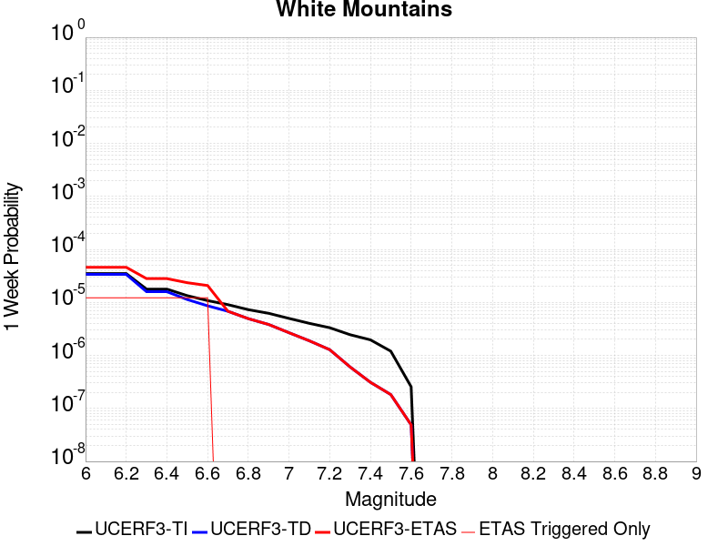 | 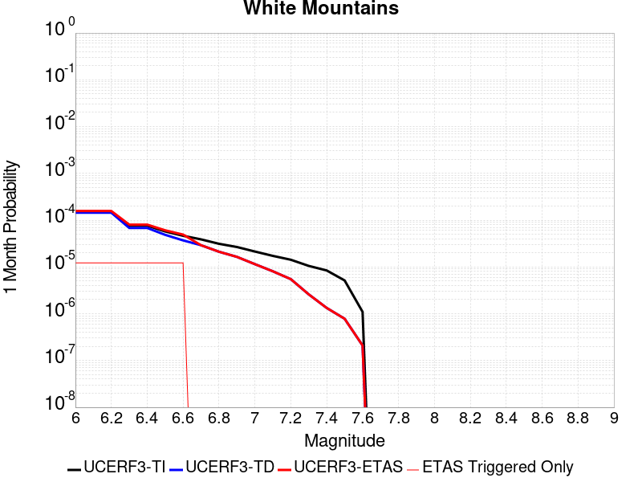 | 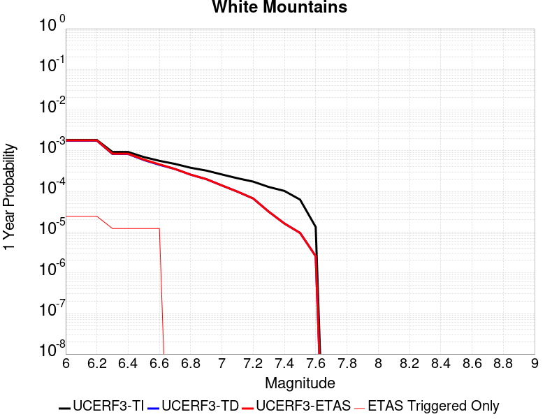 | 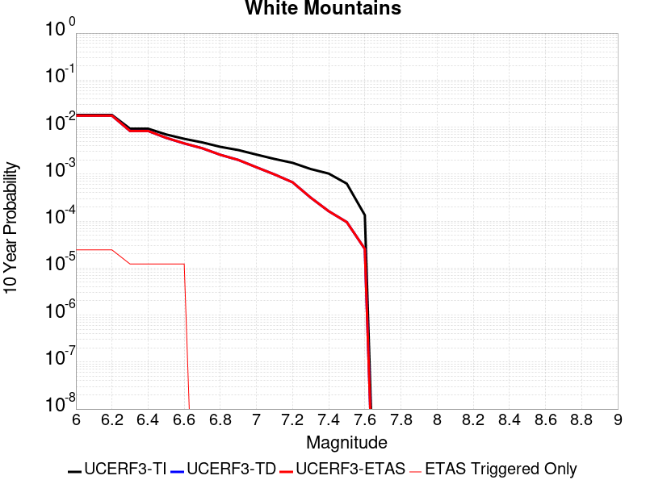 |

| Magnitude | 1 wk TI Prob | 1 wk TD Prob | 1 wk ETAS Prob | 1 wk ETAS/TD Gain | 1 wk ETAS Triggered Only | 1 mo TI Prob | 1 mo TD Prob | 1 mo ETAS Prob | 1 mo ETAS/TD Gain | 1 mo ETAS Triggered Only | 1 yr TI Prob | 1 yr TD Prob | 1 yr ETAS Prob | 1 yr ETAS/TD Gain | 1 yr ETAS Triggered Only | 10 yr TI Prob | 10 yr TD Prob | 10 yr ETAS Prob | 10 yr ETAS/TD Gain | 10 yr ETAS Triggered Only |
|-----|-----|-----|-----|-----|-----|-----|-----|-----|-----|-----|-----|-----|-----|-----|-----|-----|-----|-----|-----|-----|
| 6.0 | 3.503579E-5 | 3.3784127E-5 | 5.378345E-5 | 1.591974 | 2.0E-5 | 1.5014476E-4 | 1.4478175E-4 | 1.6477886E-4 | 1.138119 | 2.0E-5 | 0.0018264796 | 0.0017614134 | 0.0018013429 | 1.0226691 | 4.0E-5 | 0.018115403 | 0.017486857 | 0.017526157 | 1.0022475 | 4.0E-5 |
| 6.1 | 3.503579E-5 | 3.3784127E-5 | 5.378345E-5 | 1.591974 | 2.0E-5 | 1.5014476E-4 | 1.4478175E-4 | 1.6477886E-4 | 1.138119 | 2.0E-5 | 0.0018264796 | 0.0017614134 | 0.0018013429 | 1.0226691 | 4.0E-5 | 0.018115403 | 0.017486857 | 0.017526157 | 1.0022475 | 4.0E-5 |
| 6.2 | 3.503579E-5 | 3.3784127E-5 | 5.378345E-5 | 1.591974 | 2.0E-5 | 1.5014476E-4 | 1.4478175E-4 | 1.6477886E-4 | 1.138119 | 2.0E-5 | 0.0018264796 | 0.0017614134 | 0.0018013429 | 1.0226691 | 4.0E-5 | 0.018115403 | 0.017486857 | 0.017526157 | 1.0022475 | 4.0E-5 |
| 6.3 | 1.7818425E-5 | 1.591616E-5 | 3.591584E-5 | 2.2565646 | 2.0E-5 | 7.636245E-5 | 6.821041E-5 | 8.8209046E-5 | 1.2931904 | 2.0E-5 | 9.293162E-4 | 8.301596E-4 | 8.6013466E-4 | 1.0361077 | 3.0E-5 | 0.009254395 | 0.0082720425 | 0.0083017945 | 1.0035967 | 3.0E-5 |
| 6.4 | 1.7818425E-5 | 1.591616E-5 | 3.591584E-5 | 2.2565646 | 2.0E-5 | 7.636245E-5 | 6.821041E-5 | 8.8209046E-5 | 1.2931904 | 2.0E-5 | 9.293162E-4 | 8.301596E-4 | 8.6013466E-4 | 1.0361077 | 3.0E-5 | 0.009254395 | 0.0082720425 | 0.0083017945 | 1.0035967 | 3.0E-5 |
| 6.5 | 1.3397557E-5 | 1.1336374E-5 | 2.133626E-5 | 1.8821063 | 1.0E-5 | 5.741684E-5 | 4.8583595E-5 | 5.8583108E-5 | 1.2058208 | 1.0E-5 | 6.988258E-4 | 5.913517E-4 | 6.1133987E-4 | 1.0338008 | 2.0E-5 | 0.006966323 | 0.005898487 | 0.0059183687 | 1.0033706 | 2.0E-5 |
| 6.6 | 1.0818695E-5 | 8.625434E-6 | 1.8625347E-5 | 2.1593518 | 1.0E-5 | 4.6365014E-5 | 3.6965648E-5 | 4.6965277E-5 | 1.2705114 | 1.0E-5 | 5.6434784E-4 | 4.4996818E-4 | 4.6995917E-4 | 1.0444276 | 2.0E-5 | 0.005629168 | 0.0044910074 | 0.0045109177 | 1.0044334 | 2.0E-5 |
| 6.7 | 9.067908E-6 | 6.802476E-6 | 6.802476E-6 | 1.0 | 0.0 | 3.8861883E-5 | 2.915316E-5 | 2.915316E-5 | 1.0 | 0.0 | 4.7304068E-4 | 3.548851E-4 | 3.548851E-4 | 1.0 | 0.0 | 0.00472035 | 0.003543501 | 0.003543501 | 1.0 | 0.0 |
| 6.8 | 7.295947E-6 | 4.9364285E-6 | 4.9364285E-6 | 1.0 | 0.0 | 3.126797E-5 | 2.1155956E-5 | 2.1155956E-5 | 1.0 | 0.0 | 3.8062103E-4 | 2.5754445E-4 | 2.5754445E-4 | 1.0 | 0.0 | 0.0037996976 | 0.0025725728 | 0.0025725728 | 1.0 | 0.0 |
| 6.9 | 6.2243444E-6 | 3.8322546E-6 | 3.8322546E-6 | 1.0 | 0.0 | 2.6675489E-5 | 1.6423846E-5 | 1.6423846E-5 | 1.0 | 0.0 | 3.2472567E-4 | 1.9994251E-4 | 1.9994251E-4 | 1.0 | 0.0 | 0.0032425157 | 0.001997679 | 0.001997679 | 1.0 | 0.0 |
| 7.0 | 4.9878413E-6 | 2.679564E-6 | 2.679564E-6 | 1.0 | 0.0 | 2.1376287E-5 | 1.1483797E-5 | 1.1483797E-5 | 1.0 | 0.0 | 2.602252E-4 | 1.3980652E-4 | 1.3980652E-4 | 1.0 | 0.0 | 0.002599207 | 0.0013972119 | 0.0013972119 | 1.0 | 0.0 |
| 7.1 | 4.0252844E-6 | 1.885702E-6 | 1.885702E-6 | 1.0 | 0.0 | 1.7251105E-5 | 8.081555E-6 | 8.081555E-6 | 1.0 | 0.0 | 2.1001195E-4 | 9.838863E-5 | 9.838863E-5 | 1.0 | 0.0 | 0.0020981359 | 9.834635E-4 | 9.834635E-4 | 1.0 | 0.0 |
| 7.2 | 3.3284066E-6 | 1.2818929E-6 | 1.2818929E-6 | 1.0 | 0.0 | 1.4264522E-5 | 5.4938155E-6 | 5.4938155E-6 | 1.0 | 0.0 | 1.736567E-4 | 6.688525E-5 | 6.688525E-5 | 1.0 | 0.0 | 0.0017352107 | 6.6866126E-4 | 6.6866126E-4 | 1.0 | 0.0 |
| 7.3 | 2.458226E-6 | 6.056684E-7 | 6.056684E-7 | 1.0 | 0.0 | 1.0535211E-5 | 2.5957193E-6 | 2.5957193E-6 | 1.0 | 0.0 | 1.2825865E-4 | 3.160246E-5 | 3.160246E-5 | 1.0 | 0.0 | 0.0012818464 | 3.1598343E-4 | 3.1598343E-4 | 1.0 | 0.0 |
| 7.4 | 1.965953E-6 | 3.1084684E-7 | 3.1084684E-7 | 1.0 | 0.0 | 8.425486E-6 | 1.3322001E-6 | 1.3322001E-6 | 1.0 | 0.0 | 1.0257547E-4 | 1.6219417E-5 | 1.6219417E-5 | 1.0 | 0.0 | 0.0010252813 | 1.6218246E-4 | 1.6218246E-4 | 1.0 | 0.0 |
| 7.5 | 1.2014192E-6 | 1.8241002E-7 | 1.8241002E-7 | 1.0 | 0.0 | 5.148929E-6 | 7.8175697E-7 | 7.8175697E-7 | 1.0 | 0.0 | 6.2686406E-5 | 9.51785E-6 | 9.51785E-6 | 1.0 | 0.0 | 6.266873E-4 | 9.517451E-5 | 9.517451E-5 | 1.0 | 0.0 |
| 7.6 | 2.5612175E-7 | 4.893784E-8 | 4.893784E-8 | 1.0 | 0.0 | 1.0976642E-6 | 2.0973359E-7 | 2.0973359E-7 | 1.0 | 0.0 | 1.3363979E-5 | 2.5535037E-6 | 2.5535037E-6 | 1.0 | 0.0 | 1.3363175E-4 | 2.553478E-5 | 2.553478E-5 | 1.0 | 0.0 |

## Blue Cut
*[(top)](#table-of-contents)*

| 1 Week | 1 Month | 1 Year | 10 Year |
|-----|-----|-----|-----|
|  |  |  |  |

| Magnitude | 1 wk TI Prob | 1 wk TD Prob | 1 wk ETAS Prob | 1 wk ETAS/TD Gain | 1 wk ETAS Triggered Only | 1 mo TI Prob | 1 mo TD Prob | 1 mo ETAS Prob | 1 mo ETAS/TD Gain | 1 mo ETAS Triggered Only | 1 yr TI Prob | 1 yr TD Prob | 1 yr ETAS Prob | 1 yr ETAS/TD Gain | 1 yr ETAS Triggered Only | 10 yr TI Prob | 10 yr TD Prob | 10 yr ETAS Prob | 10 yr ETAS/TD Gain | 10 yr ETAS Triggered Only |
|-----|-----|-----|-----|-----|-----|-----|-----|-----|-----|-----|-----|-----|-----|-----|-----|-----|-----|-----|-----|-----|
| 6.0 | 2.1227985E-5 | 2.2719574E-5 | 4.271912E-5 | 1.8802782 | 2.0E-5 | 9.097391E-5 | 9.73663E-5 | 1.17364354E-4 | 1.2053899 | 2.0E-5 | 0.0011070445 | 0.0011848481 | 0.0012148125 | 1.0252897 | 3.0E-5 | 0.011015458 | 0.011791152 | 0.01183068 | 1.0033524 | 4.0E-5 |
| 6.1 | 2.1227985E-5 | 2.2719574E-5 | 4.271912E-5 | 1.8802782 | 2.0E-5 | 9.097391E-5 | 9.73663E-5 | 1.17364354E-4 | 1.2053899 | 2.0E-5 | 0.0011070445 | 0.0011848481 | 0.0012148125 | 1.0252897 | 3.0E-5 | 0.011015458 | 0.011791152 | 0.01183068 | 1.0033524 | 4.0E-5 |
| 6.2 | 2.1227985E-5 | 2.2719574E-5 | 4.271912E-5 | 1.8802782 | 2.0E-5 | 9.097391E-5 | 9.73663E-5 | 1.17364354E-4 | 1.2053899 | 2.0E-5 | 0.0011070445 | 0.0011848481 | 0.0012148125 | 1.0252897 | 3.0E-5 | 0.011015458 | 0.011791152 | 0.01183068 | 1.0033524 | 4.0E-5 |
| 6.3 | 1.1613981E-5 | 1.2353542E-5 | 2.2353419E-5 | 1.8094745 | 1.0E-5 | 4.9773254E-5 | 5.2942745E-5 | 6.2942214E-5 | 1.1888733 | 1.0E-5 | 6.0582085E-4 | 6.443998E-4 | 6.5439334E-4 | 1.0155083 | 1.0E-5 | 0.0060417196 | 0.0064265593 | 0.006446431 | 1.003092 | 2.0E-5 |
| 6.4 | 1.1613981E-5 | 1.2353542E-5 | 2.2353419E-5 | 1.8094745 | 1.0E-5 | 4.9773254E-5 | 5.2942745E-5 | 6.2942214E-5 | 1.1888733 | 1.0E-5 | 6.0582085E-4 | 6.443998E-4 | 6.5439334E-4 | 1.0155083 | 1.0E-5 | 0.0060417196 | 0.0064265593 | 0.006446431 | 1.003092 | 2.0E-5 |
| 6.5 | 8.931326E-6 | 9.4816E-6 | 1.9481506E-5 | 2.0546644 | 1.0E-5 | 3.8276554E-5 | 4.0634844E-5 | 5.063444E-5 | 1.2460842 | 1.0E-5 | 4.6591737E-4 | 4.946261E-4 | 5.0462113E-4 | 1.0202073 | 1.0E-5 | 0.0046494175 | 0.004936161 | 0.0049560624 | 1.0040318 | 2.0E-5 |
| 6.6 | 7.345353E-6 | 7.79028E-6 | 1.7790202E-5 | 2.283641 | 1.0E-5 | 3.1479703E-5 | 3.338653E-5 | 4.3386193E-5 | 1.299512 | 1.0E-5 | 3.83198E-4 | 4.064132E-4 | 4.164091E-4 | 1.0245955 | 1.0E-5 | 0.0038253788 | 0.0040574907 | 0.00407741 | 1.0049092 | 2.0E-5 |
| 6.7 | 6.2775666E-6 | 6.655149E-6 | 1.6655082E-5 | 2.502586 | 1.0E-5 | 2.690358E-5 | 2.8521798E-5 | 3.8521513E-5 | 1.350599 | 1.0E-5 | 3.2750185E-4 | 3.472051E-4 | 3.572016E-4 | 1.0287914 | 1.0E-5 | 0.0032701963 | 0.003467367 | 0.0034872978 | 1.005748 | 2.0E-5 |
| 6.8 | 5.5234095E-6 | 5.8551113E-6 | 1.5855052E-5 | 2.7078996 | 1.0E-5 | 2.367154E-5 | 2.5093133E-5 | 3.5092882E-5 | 1.3985054 | 1.0E-5 | 2.8816288E-4 | 3.0547334E-4 | 3.154703E-4 | 1.032726 | 1.0E-5 | 0.002877895 | 0.0030512505 | 0.0030711896 | 1.0065347 | 2.0E-5 |
| 6.9 | 4.7780054E-6 | 5.0654203E-6 | 1.506537E-5 | 2.9741597 | 1.0E-5 | 2.0477004E-5 | 2.1708804E-5 | 3.1708587E-5 | 1.4606326 | 1.0E-5 | 2.4927902E-4 | 2.642797E-4 | 2.7427703E-4 | 1.0378287 | 1.0E-5 | 0.0024899957 | 0.002640346 | 0.0026503198 | 1.0037774 | 1.0E-5 |
| 7.0 | 3.883171E-6 | 4.118487E-6 | 1.41184455E-5 | 3.428066 | 1.0E-5 | 1.6642054E-5 | 1.7650578E-5 | 2.7650402E-5 | 1.5665437 | 1.0E-5 | 2.0259817E-4 | 2.1488148E-4 | 2.2487935E-4 | 1.0465273 | 1.0E-5 | 0.0020241356 | 0.0021474129 | 0.0021573913 | 1.0046468 | 1.0E-5 |
| 7.1 | 2.8358215E-6 | 3.0097158E-6 | 1.3009686E-5 | 4.3225627 | 1.0E-5 | 1.2153464E-5 | 1.2898756E-5 | 2.2898626E-5 | 1.7752585 | 1.0E-5 | 1.4795837E-4 | 1.5703762E-4 | 1.6703604E-4 | 1.063669 | 1.0E-5 | 0.001478599 | 0.0015699116 | 0.001579896 | 1.0063598 | 1.0E-5 |

## Newport-Inglewood alt 1
*[(top)](#table-of-contents)*

| 1 Week | 1 Month | 1 Year | 10 Year |
|-----|-----|-----|-----|
|  |  |  | 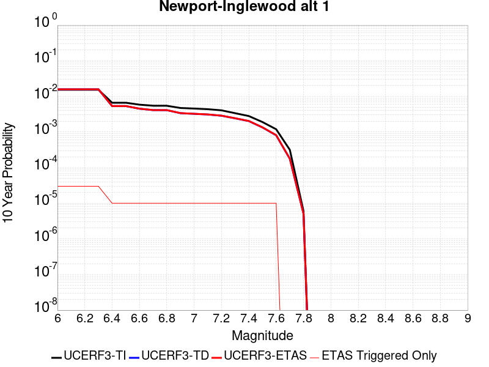 |

| Magnitude | 1 wk TI Prob | 1 wk TD Prob | 1 wk ETAS Prob | 1 wk ETAS/TD Gain | 1 wk ETAS Triggered Only | 1 mo TI Prob | 1 mo TD Prob | 1 mo ETAS Prob | 1 mo ETAS/TD Gain | 1 mo ETAS Triggered Only | 1 yr TI Prob | 1 yr TD Prob | 1 yr ETAS Prob | 1 yr ETAS/TD Gain | 1 yr ETAS Triggered Only | 10 yr TI Prob | 10 yr TD Prob | 10 yr ETAS Prob | 10 yr ETAS/TD Gain | 10 yr ETAS Triggered Only |
|-----|-----|-----|-----|-----|-----|-----|-----|-----|-----|-----|-----|-----|-----|-----|-----|-----|-----|-----|-----|-----|
| 6.0 | 2.9668912E-5 | 3.0404828E-5 | 5.0404222E-5 | 1.6577703 | 2.0E-5 | 1.2714628E-4 | 1.3030265E-4 | 1.5030004E-4 | 1.1534688 | 2.0E-5 | 0.0015469068 | 0.0015857654 | 0.0016157179 | 1.0188884 | 3.0E-5 | 0.015361829 | 0.01579211 | 0.015821636 | 1.0018697 | 3.0E-5 |
| 6.1 | 2.9668912E-5 | 3.0404828E-5 | 5.0404222E-5 | 1.6577703 | 2.0E-5 | 1.2714628E-4 | 1.3030265E-4 | 1.5030004E-4 | 1.1534688 | 2.0E-5 | 0.0015469068 | 0.0015857654 | 0.0016157179 | 1.0188884 | 3.0E-5 | 0.015361829 | 0.01579211 | 0.015821636 | 1.0018697 | 3.0E-5 |
| 6.2 | 2.9668912E-5 | 3.0404828E-5 | 5.0404222E-5 | 1.6577703 | 2.0E-5 | 1.2714628E-4 | 1.3030265E-4 | 1.5030004E-4 | 1.1534688 | 2.0E-5 | 0.0015469068 | 0.0015857654 | 0.0016157179 | 1.0188884 | 3.0E-5 | 0.015361829 | 0.01579211 | 0.015821636 | 1.0018697 | 3.0E-5 |
| 6.3 | 2.9668912E-5 | 3.0404828E-5 | 5.0404222E-5 | 1.6577703 | 2.0E-5 | 1.2714628E-4 | 1.3030265E-4 | 1.5030004E-4 | 1.1534688 | 2.0E-5 | 0.0015469068 | 0.0015857654 | 0.0016157179 | 1.0188884 | 3.0E-5 | 0.015361829 | 0.01579211 | 0.015821636 | 1.0018697 | 3.0E-5 |
| 6.4 | 1.275942E-5 | 1.02725335E-5 | 2.0272431E-5 | 1.9734597 | 1.0E-5 | 5.4682085E-5 | 4.4024422E-5 | 5.402398E-5 | 1.2271366 | 1.0E-5 | 6.65551E-4 | 5.358697E-4 | 5.4586434E-4 | 1.0186512 | 1.0E-5 | 0.0066356123 | 0.0053462 | 0.0053561465 | 1.0018605 | 1.0E-5 |
| 6.5 | 1.275942E-5 | 1.02725335E-5 | 2.0272431E-5 | 1.9734597 | 1.0E-5 | 5.4682085E-5 | 4.4024422E-5 | 5.402398E-5 | 1.2271366 | 1.0E-5 | 6.65551E-4 | 5.358697E-4 | 5.4586434E-4 | 1.0186512 | 1.0E-5 | 0.0066356123 | 0.0053462 | 0.0053561465 | 1.0018605 | 1.0E-5 |
| 6.6 | 1.1255358E-5 | 8.661911E-6 | 1.8661825E-5 | 2.1544695 | 1.0E-5 | 4.8236358E-5 | 3.7121958E-5 | 4.7121586E-5 | 1.2693723 | 1.0E-5 | 5.871194E-4 | 4.5186782E-4 | 4.618633E-4 | 1.0221204 | 1.0E-5 | 0.005855706 | 0.0045096674 | 0.0045196223 | 1.0022075 | 1.0E-5 |
| 6.7 | 1.0504745E-5 | 7.8998455E-6 | 1.7899767E-5 | 2.2658374 | 1.0E-5 | 4.5019555E-5 | 3.385605E-5 | 4.385571E-5 | 1.2953582 | 1.0E-5 | 5.4797524E-4 | 4.121207E-4 | 4.2211654E-4 | 1.0242547 | 1.0E-5 | 0.0054662596 | 0.004113694 | 0.004123653 | 1.0024209 | 1.0E-5 |
| 6.8 | 1.0476007E-5 | 7.881227E-6 | 1.7881148E-5 | 2.268828 | 1.0E-5 | 4.4896402E-5 | 3.3776258E-5 | 4.377592E-5 | 1.2960559 | 1.0E-5 | 5.464766E-4 | 4.1114958E-4 | 4.2114547E-4 | 1.024312 | 1.0E-5 | 0.005451347 | 0.004104019 | 0.004113978 | 1.0024266 | 1.0E-5 |
| 6.9 | 9.076797E-6 | 6.4896567E-6 | 1.6489592E-5 | 2.5409036 | 1.0E-5 | 3.889998E-5 | 2.7812519E-5 | 3.7812242E-5 | 1.3595403 | 1.0E-5 | 4.7350433E-4 | 3.3856515E-4 | 3.4856176E-4 | 1.0295265 | 1.0E-5 | 0.004724967 | 0.003380531 | 0.003390497 | 1.0029482 | 1.0E-5 |
| 7.0 | 8.73795E-6 | 6.2120503E-6 | 1.6211989E-5 | 2.6097646 | 1.0E-5 | 3.7447822E-5 | 2.6622802E-5 | 3.6622536E-5 | 1.3756078 | 1.0E-5 | 4.5583185E-4 | 3.2408469E-4 | 3.3408144E-4 | 1.0308461 | 1.0E-5 | 0.0045489795 | 0.0032361522 | 0.00324612 | 1.0030801 | 1.0E-5 |
| 7.1 | 8.391299E-6 | 5.9557533E-6 | 1.5955693E-5 | 2.6790388 | 1.0E-5 | 3.5962214E-5 | 2.5524409E-5 | 3.5524154E-5 | 1.3917718 | 1.0E-5 | 4.37752E-4 | 3.1071564E-4 | 3.207125E-4 | 1.0321738 | 1.0E-5 | 0.004368907 | 0.0031028416 | 0.0031128104 | 1.0032128 | 1.0E-5 |
| 7.2 | 7.796882E-6 | 5.4964826E-6 | 1.5496427E-5 | 2.8193352 | 1.0E-5 | 3.341478E-5 | 2.3556144E-5 | 3.355591E-5 | 1.4245077 | 1.0E-5 | 4.06749E-4 | 2.867585E-4 | 2.9675564E-4 | 1.0348625 | 1.0E-5 | 0.0040600533 | 0.002863909 | 0.0028738803 | 1.0034817 | 1.0E-5 |
| 7.3 | 6.4738833E-6 | 4.6477753E-6 | 1.4647729E-5 | 3.151557 | 1.0E-5 | 2.774492E-5 | 1.9918885E-5 | 2.9918687E-5 | 1.5020261 | 1.0E-5 | 3.3774204E-4 | 2.424856E-4 | 2.5248318E-4 | 1.0412296 | 1.0E-5 | 0.0033722918 | 0.0024222268 | 0.0024322027 | 1.0041184 | 1.0E-5 |
| 7.4 | 5.382145E-6 | 3.8857215E-6 | 1.3885683E-5 | 3.5735145 | 1.0E-5 | 2.3066134E-5 | 1.6652988E-5 | 2.665282E-5 | 1.6004828 | 1.0E-5 | 2.8079396E-4 | 2.0273139E-4 | 2.1272937E-4 | 1.0493164 | 1.0E-5 | 0.0028043943 | 0.002025479 | 0.0020354588 | 1.0049272 | 1.0E-5 |
| 7.5 | 3.648244E-6 | 2.5737634E-6 | 1.2573738E-5 | 4.8853507 | 1.0E-5 | 1.5635238E-5 | 1.1030369E-5 | 2.1030259E-5 | 1.906578 | 1.0E-5 | 1.9034238E-4 | 1.3428657E-4 | 1.4428522E-4 | 1.0744576 | 1.0E-5 | 0.0019017943 | 0.0013420646 | 0.0013520513 | 1.0074412 | 1.0E-5 |
| 7.6 | 2.2906888E-6 | 1.547986E-6 | 1.1547971E-5 | 7.4599967 | 1.0E-5 | 9.817201E-6 | 6.634209E-6 | 1.6634143E-5 | 2.5073287 | 1.0E-5 | 1.1951787E-4 | 8.076857E-5 | 9.076776E-5 | 1.1238005 | 1.0E-5 | 0.0011945361 | 8.073989E-4 | 8.173908E-4 | 1.0123755 | 1.0E-5 |
| 7.7 | 6.0479874E-7 | 3.397468E-7 | 3.397468E-7 | 1.0 | 0.0 | 2.5919921E-6 | 1.456057E-6 | 1.456057E-6 | 1.0 | 0.0 | 3.1557047E-5 | 1.7727363E-5 | 1.7727363E-5 | 1.0 | 0.0 | 3.1552566E-4 | 1.7726087E-4 | 1.7726087E-4 | 1.0 | 0.0 |
| 7.8 | 1.16056995E-8 | 9.782997E-9 | 9.782997E-9 | 1.0 | 0.0 | 4.9738713E-8 | 4.1927127E-8 | 4.1927127E-8 | 1.0 | 0.0 | 6.0556863E-7 | 5.1046277E-7 | 5.1046277E-7 | 1.0 | 0.0 | 6.05567E-6 | 5.1046277E-6 | 5.1046277E-6 | 1.0 | 0.0 |

## Lost Hills
*[(top)](#table-of-contents)*

| 1 Week | 1 Month | 1 Year | 10 Year |
|-----|-----|-----|-----|
|  |  |  |  |

| Magnitude | 1 wk TI Prob | 1 wk TD Prob | 1 wk ETAS Prob | 1 wk ETAS/TD Gain | 1 wk ETAS Triggered Only | 1 mo TI Prob | 1 mo TD Prob | 1 mo ETAS Prob | 1 mo ETAS/TD Gain | 1 mo ETAS Triggered Only | 1 yr TI Prob | 1 yr TD Prob | 1 yr ETAS Prob | 1 yr ETAS/TD Gain | 1 yr ETAS Triggered Only | 10 yr TI Prob | 10 yr TD Prob | 10 yr ETAS Prob | 10 yr ETAS/TD Gain | 10 yr ETAS Triggered Only |
|-----|-----|-----|-----|-----|-----|-----|-----|-----|-----|-----|-----|-----|-----|-----|-----|-----|-----|-----|-----|-----|
| 6.0 | 2.233523E-5 | 2.5106583E-5 | 5.510583E-5 | 2.1948757 | 3.0E-5 | 9.571891E-5 | 1.0759615E-4 | 1.3759293E-4 | 1.2787904 | 3.0E-5 | 0.0011647546 | 0.001309364 | 0.0013493117 | 1.0305092 | 4.0E-5 | 0.011586686 | 0.013033091 | 0.01307257 | 1.0030291 | 4.0E-5 |
| 6.1 | 2.233523E-5 | 2.5106583E-5 | 5.510583E-5 | 2.1948757 | 3.0E-5 | 9.571891E-5 | 1.0759615E-4 | 1.3759293E-4 | 1.2787904 | 3.0E-5 | 0.0011647546 | 0.001309364 | 0.0013493117 | 1.0305092 | 4.0E-5 | 0.011586686 | 0.013033091 | 0.01307257 | 1.0030291 | 4.0E-5 |
| 6.2 | 2.233523E-5 | 2.5106583E-5 | 5.510583E-5 | 2.1948757 | 3.0E-5 | 9.571891E-5 | 1.0759615E-4 | 1.3759293E-4 | 1.2787904 | 3.0E-5 | 0.0011647546 | 0.001309364 | 0.0013493117 | 1.0305092 | 4.0E-5 | 0.011586686 | 0.013033091 | 0.01307257 | 1.0030291 | 4.0E-5 |
| 6.3 | 2.233523E-5 | 2.5106583E-5 | 5.510583E-5 | 2.1948757 | 3.0E-5 | 9.571891E-5 | 1.0759615E-4 | 1.3759293E-4 | 1.2787904 | 3.0E-5 | 0.0011647546 | 0.001309364 | 0.0013493117 | 1.0305092 | 4.0E-5 | 0.011586686 | 0.013033091 | 0.01307257 | 1.0030291 | 4.0E-5 |
| 6.4 | 1.2288092E-5 | 1.3781108E-5 | 2.3780969E-5 | 1.7256211 | 1.0E-5 | 5.2662188E-5 | 5.906108E-5 | 6.906049E-5 | 1.1693063 | 1.0E-5 | 6.409735E-4 | 7.189252E-4 | 7.28918E-4 | 1.0138997 | 1.0E-5 | 0.006391279 | 0.0071752006 | 0.007185129 | 1.0013837 | 1.0E-5 |
| 6.5 | 1.2288092E-5 | 1.3781108E-5 | 2.3780969E-5 | 1.7256211 | 1.0E-5 | 5.2662188E-5 | 5.906108E-5 | 6.906049E-5 | 1.1693063 | 1.0E-5 | 6.409735E-4 | 7.189252E-4 | 7.28918E-4 | 1.0138997 | 1.0E-5 | 0.006391279 | 0.0071752006 | 0.007185129 | 1.0013837 | 1.0E-5 |
| 6.6 | 8.58281E-6 | 9.63377E-6 | 1.9633673E-5 | 2.0380054 | 1.0E-5 | 3.6782953E-5 | 4.12874E-5 | 5.128699E-5 | 1.2421947 | 1.0E-5 | 4.4774043E-4 | 5.026414E-4 | 5.126363E-4 | 1.019885 | 1.0E-5 | 0.0044683935 | 0.005023205 | 0.005033155 | 1.0019808 | 1.0E-5 |
| 6.7 | 7.205685E-6 | 8.088302E-6 | 1.8088222E-5 | 2.2363434 | 1.0E-5 | 3.088114E-5 | 3.466415E-5 | 4.4663804E-5 | 1.2884725 | 1.0E-5 | 3.7591302E-4 | 4.2203604E-4 | 4.320318E-4 | 1.0236846 | 1.0E-5 | 0.0037527776 | 0.0042203604 | 0.004230318 | 1.0023595 | 1.0E-5 |

## Mono Lake 2011 CFM
*[(top)](#table-of-contents)*

| 1 Week | 1 Month | 1 Year | 10 Year |
|-----|-----|-----|-----|
|  |  |  |  |

| Magnitude | 1 wk TI Prob | 1 wk TD Prob | 1 wk ETAS Prob | 1 wk ETAS/TD Gain | 1 wk ETAS Triggered Only | 1 mo TI Prob | 1 mo TD Prob | 1 mo ETAS Prob | 1 mo ETAS/TD Gain | 1 mo ETAS Triggered Only | 1 yr TI Prob | 1 yr TD Prob | 1 yr ETAS Prob | 1 yr ETAS/TD Gain | 1 yr ETAS Triggered Only | 10 yr TI Prob | 10 yr TD Prob | 10 yr ETAS Prob | 10 yr ETAS/TD Gain | 10 yr ETAS Triggered Only |
|-----|-----|-----|-----|-----|-----|-----|-----|-----|-----|-----|-----|-----|-----|-----|-----|-----|-----|-----|-----|-----|
| 6.0 | 2.0341662E-5 | 2.3828192E-5 | 4.3827713E-5 | 1.839322 | 2.0E-5 | 8.717564E-5 | 1.0211982E-4 | 1.3211675E-4 | 1.2937425 | 3.0E-5 | 0.0010608466 | 0.0012431308 | 0.001283081 | 1.0321368 | 4.0E-5 | 0.010557966 | 0.012413842 | 0.012453345 | 1.0031822 | 4.0E-5 |
| 6.1 | 2.0341662E-5 | 2.3828192E-5 | 4.3827713E-5 | 1.839322 | 2.0E-5 | 8.717564E-5 | 1.0211982E-4 | 1.3211675E-4 | 1.2937425 | 3.0E-5 | 0.0010608466 | 0.0012431308 | 0.001283081 | 1.0321368 | 4.0E-5 | 0.010557966 | 0.012413842 | 0.012453345 | 1.0031822 | 4.0E-5 |
| 6.2 | 2.0341662E-5 | 2.3828192E-5 | 4.3827713E-5 | 1.839322 | 2.0E-5 | 8.717564E-5 | 1.0211982E-4 | 1.3211675E-4 | 1.2937425 | 3.0E-5 | 0.0010608466 | 0.0012431308 | 0.001283081 | 1.0321368 | 4.0E-5 | 0.010557966 | 0.012413842 | 0.012453345 | 1.0031822 | 4.0E-5 |
| 6.3 | 2.0341662E-5 | 2.3828192E-5 | 4.3827713E-5 | 1.839322 | 2.0E-5 | 8.717564E-5 | 1.0211982E-4 | 1.3211675E-4 | 1.2937425 | 3.0E-5 | 0.0010608466 | 0.0012431308 | 0.001283081 | 1.0321368 | 4.0E-5 | 0.010557966 | 0.012413842 | 0.012453345 | 1.0031822 | 4.0E-5 |
| 6.4 | 1.749821E-5 | 2.049101E-5 | 4.04906E-5 | 1.9760178 | 2.0E-5 | 7.499018E-5 | 8.781861E-5 | 1.1781598E-4 | 1.3415833 | 3.0E-5 | 9.1262296E-4 | 0.0010691914 | 0.0011091486 | 1.0373714 | 4.0E-5 | 0.009088841 | 0.01069187 | 0.010731443 | 1.0037012 | 4.0E-5 |
| 6.5 | 1.749821E-5 | 2.049101E-5 | 4.04906E-5 | 1.9760178 | 2.0E-5 | 7.499018E-5 | 8.781861E-5 | 1.1781598E-4 | 1.3415833 | 3.0E-5 | 9.1262296E-4 | 0.0010691914 | 0.0011091486 | 1.0373714 | 4.0E-5 | 0.009088841 | 0.01069187 | 0.010731443 | 1.0037012 | 4.0E-5 |

## San Cayetano
*[(top)](#table-of-contents)*

| 1 Week | 1 Month | 1 Year | 10 Year |
|-----|-----|-----|-----|
|  |  |  |  |

| Magnitude | 1 wk TI Prob | 1 wk TD Prob | 1 wk ETAS Prob | 1 wk ETAS/TD Gain | 1 wk ETAS Triggered Only | 1 mo TI Prob | 1 mo TD Prob | 1 mo ETAS Prob | 1 mo ETAS/TD Gain | 1 mo ETAS Triggered Only | 1 yr TI Prob | 1 yr TD Prob | 1 yr ETAS Prob | 1 yr ETAS/TD Gain | 1 yr ETAS Triggered Only | 10 yr TI Prob | 10 yr TD Prob | 10 yr ETAS Prob | 10 yr ETAS/TD Gain | 10 yr ETAS Triggered Only |
|-----|-----|-----|-----|-----|-----|-----|-----|-----|-----|-----|-----|-----|-----|-----|-----|-----|-----|-----|-----|-----|
| 6.0 | 2.3476267E-5 | 1.8169216E-5 | 3.816885E-5 | 2.100743 | 2.0E-5 | 1.0060869E-4 | 7.786576E-5 | 1.1786265E-4 | 1.5136646 | 4.0E-5 | 0.0012242225 | 9.4760704E-4 | 9.875691E-4 | 1.0421716 | 4.0E-5 | 0.012175002 | 0.00943675 | 0.009476372 | 1.0041988 | 4.0E-5 |
| 6.1 | 2.3476267E-5 | 1.8169216E-5 | 3.816885E-5 | 2.100743 | 2.0E-5 | 1.0060869E-4 | 7.786576E-5 | 1.1786265E-4 | 1.5136646 | 4.0E-5 | 0.0012242225 | 9.4760704E-4 | 9.875691E-4 | 1.0421716 | 4.0E-5 | 0.012175002 | 0.00943675 | 0.009476372 | 1.0041988 | 4.0E-5 |
| 6.2 | 2.3476267E-5 | 1.8169216E-5 | 3.816885E-5 | 2.100743 | 2.0E-5 | 1.0060869E-4 | 7.786576E-5 | 1.1786265E-4 | 1.5136646 | 4.0E-5 | 0.0012242225 | 9.4760704E-4 | 9.875691E-4 | 1.0421716 | 4.0E-5 | 0.012175002 | 0.00943675 | 0.009476372 | 1.0041988 | 4.0E-5 |
| 6.3 | 2.3476267E-5 | 1.8169216E-5 | 3.816885E-5 | 2.100743 | 2.0E-5 | 1.0060869E-4 | 7.786576E-5 | 1.1786265E-4 | 1.5136646 | 4.0E-5 | 0.0012242225 | 9.4760704E-4 | 9.875691E-4 | 1.0421716 | 4.0E-5 | 0.012175002 | 0.00943675 | 0.009476372 | 1.0041988 | 4.0E-5 |
| 6.4 | 2.3476267E-5 | 1.8169216E-5 | 3.816885E-5 | 2.100743 | 2.0E-5 | 1.0060869E-4 | 7.786576E-5 | 1.1786265E-4 | 1.5136646 | 4.0E-5 | 0.0012242225 | 9.4760704E-4 | 9.875691E-4 | 1.0421716 | 4.0E-5 | 0.012175002 | 0.00943675 | 0.009476372 | 1.0041988 | 4.0E-5 |
| 6.5 | 2.3476267E-5 | 1.8169216E-5 | 3.816885E-5 | 2.100743 | 2.0E-5 | 1.0060869E-4 | 7.786576E-5 | 1.1786265E-4 | 1.5136646 | 4.0E-5 | 0.0012242225 | 9.4760704E-4 | 9.875691E-4 | 1.0421716 | 4.0E-5 | 0.012175002 | 0.00943675 | 0.009476372 | 1.0041988 | 4.0E-5 |
| 6.6 | 2.3476267E-5 | 1.8169216E-5 | 3.816885E-5 | 2.100743 | 2.0E-5 | 1.0060869E-4 | 7.786576E-5 | 1.1786265E-4 | 1.5136646 | 4.0E-5 | 0.0012242225 | 9.4760704E-4 | 9.875691E-4 | 1.0421716 | 4.0E-5 | 0.012175002 | 0.00943675 | 0.009476372 | 1.0041988 | 4.0E-5 |
| 6.7 | 2.3476267E-5 | 1.8169216E-5 | 3.816885E-5 | 2.100743 | 2.0E-5 | 1.0060869E-4 | 7.786576E-5 | 1.1786265E-4 | 1.5136646 | 4.0E-5 | 0.0012242225 | 9.4760704E-4 | 9.875691E-4 | 1.0421716 | 4.0E-5 | 0.012175002 | 0.00943675 | 0.009476372 | 1.0041988 | 4.0E-5 |
| 6.8 | 2.3241924E-5 | 1.7936945E-5 | 3.793659E-5 | 2.114997 | 2.0E-5 | 9.960445E-5 | 7.687038E-5 | 1.16867304E-4 | 1.5203165 | 4.0E-5 | 0.0012120095 | 9.354987E-4 | 9.7546127E-4 | 1.0427179 | 4.0E-5 | 0.012054204 | 0.0093166195 | 0.009356246 | 1.0042534 | 4.0E-5 |
| 6.9 | 2.2761007E-5 | 1.7432383E-5 | 3.7432037E-5 | 2.14727 | 2.0E-5 | 9.7543525E-5 | 7.47081E-5 | 1.04705854E-4 | 1.4015329 | 3.0E-5 | 0.0011869454 | 9.09195E-4 | 9.391677E-4 | 1.0329663 | 3.0E-5 | 0.011806256 | 0.009055741 | 0.00908547 | 1.0032828 | 3.0E-5 |
| 7.0 | 2.240283E-5 | 1.7066137E-5 | 3.7065794E-5 | 2.1718915 | 2.0E-5 | 9.600859E-5 | 7.313856E-5 | 1.03136364E-4 | 1.4101504 | 3.0E-5 | 0.0011682777 | 8.9010154E-4 | 9.200749E-4 | 1.033674 | 3.0E-5 | 0.011621549 | 0.008866336 | 0.0088960705 | 1.0033536 | 3.0E-5 |
| 7.1 | 2.1871154E-5 | 1.658602E-5 | 2.6585854E-5 | 1.6029074 | 1.0E-5 | 9.373015E-5 | 7.108103E-5 | 9.10796E-5 | 1.2813491 | 2.0E-5 | 0.0011405671 | 8.6507126E-4 | 8.8505395E-4 | 1.0230995 | 2.0E-5 | 0.011347309 | 0.008617996 | 0.008637824 | 1.0023007 | 2.0E-5 |
| 7.2 | 2.0714133E-5 | 1.5564563E-5 | 2.5564406E-5 | 1.6424751 | 1.0E-5 | 8.8771834E-5 | 6.670358E-5 | 8.6702246E-5 | 1.299814 | 2.0E-5 | 0.0010802611 | 8.118168E-4 | 8.318005E-4 | 1.0246161 | 2.0E-5 | 0.010750249 | 0.008089443 | 0.008109281 | 1.0024524 | 2.0E-5 |
| 7.3 | 1.8408395E-5 | 1.3996829E-5 | 2.3996688E-5 | 1.7144376 | 1.0E-5 | 7.8890735E-5 | 5.9985046E-5 | 6.9984446E-5 | 1.1666982 | 1.0E-5 | 9.600714E-4 | 7.300762E-4 | 7.400689E-4 | 1.0136873 | 1.0E-5 | 0.009559342 | 0.0072776447 | 0.0072875717 | 1.0013641 | 1.0E-5 |
| 7.4 | 1.6856795E-5 | 1.285006E-5 | 2.284993E-5 | 1.7781966 | 1.0E-5 | 7.2241404E-5 | 5.5070537E-5 | 6.506999E-5 | 1.1815753 | 1.0E-5 | 8.7918417E-4 | 6.7028037E-4 | 6.802737E-4 | 1.0149091 | 1.0E-5 | 0.00875714 | 0.0066834087 | 0.006693342 | 1.0014863 | 1.0E-5 |
| 7.5 | 1.2822778E-5 | 9.577415E-6 | 1.957732E-5 | 2.0441132 | 1.0E-5 | 5.495361E-5 | 4.1045427E-5 | 5.1045015E-5 | 1.2436225 | 1.0E-5 | 6.688548E-4 | 4.9961504E-4 | 5.0961005E-4 | 1.0200055 | 1.0E-5 | 0.006668452 | 0.0049851923 | 0.004995142 | 1.0019959 | 1.0E-5 |
| 7.6 | 5.6272684E-6 | 3.854899E-6 | 3.854899E-6 | 1.0 | 0.0 | 2.4116642E-5 | 1.6520893E-5 | 1.6520893E-5 | 1.0 | 0.0 | 2.9358055E-4 | 2.0112342E-4 | 2.0112342E-4 | 1.0 | 0.0 | 0.0029319301 | 0.0020094248 | 0.0020094248 | 1.0 | 0.0 |
| 7.7 | 3.5261346E-6 | 2.3407094E-6 | 2.3407094E-6 | 1.0 | 0.0 | 1.5111918E-5 | 1.0031574E-5 | 1.0031574E-5 | 1.0 | 0.0 | 1.8397206E-4 | 1.2212765E-4 | 1.2212765E-4 | 1.0 | 0.0 | 0.0018381984 | 0.0012206127 | 0.0012206127 | 1.0 | 0.0 |
| 7.8 | 1.4826929E-6 | 1.0564395E-6 | 1.0564395E-6 | 1.0 | 0.0 | 6.354383E-6 | 4.52759E-6 | 4.52759E-6 | 1.0 | 0.0 | 7.736187E-5 | 5.5122033E-5 | 5.5122033E-5 | 1.0 | 0.0 | 7.733494E-4 | 5.510856E-4 | 5.510856E-4 | 1.0 | 0.0 |
| 7.9 | 2.7568166E-7 | 1.6977887E-7 | 1.6977887E-7 | 1.0 | 0.0 | 1.1814923E-6 | 7.276235E-7 | 7.276235E-7 | 1.0 | 0.0 | 1.4384574E-5 | 8.85878E-6 | 8.85878E-6 | 1.0 | 0.0 | 1.4383643E-4 | 8.858431E-5 | 8.858431E-5 | 1.0 | 0.0 |
| 8.0 | 5.407832E-8 | 2.688677E-8 | 2.688677E-8 | 1.0 | 0.0 | 2.3176422E-7 | 1.15229014E-7 | 1.15229014E-7 | 1.0 | 0.0 | 2.8217257E-6 | 1.4029123E-6 | 1.4029123E-6 | 1.0 | 0.0 | 2.8216898E-5 | 1.40290385E-5 | 1.40290385E-5 | 1.0 | 0.0 |

## Rose Canyon
*[(top)](#table-of-contents)*

| 1 Week | 1 Month | 1 Year | 10 Year |
|-----|-----|-----|-----|
|  |  |  |  |

| Magnitude | 1 wk TI Prob | 1 wk TD Prob | 1 wk ETAS Prob | 1 wk ETAS/TD Gain | 1 wk ETAS Triggered Only | 1 mo TI Prob | 1 mo TD Prob | 1 mo ETAS Prob | 1 mo ETAS/TD Gain | 1 mo ETAS Triggered Only | 1 yr TI Prob | 1 yr TD Prob | 1 yr ETAS Prob | 1 yr ETAS/TD Gain | 1 yr ETAS Triggered Only | 10 yr TI Prob | 10 yr TD Prob | 10 yr ETAS Prob | 10 yr ETAS/TD Gain | 10 yr ETAS Triggered Only |
|-----|-----|-----|-----|-----|-----|-----|-----|-----|-----|-----|-----|-----|-----|-----|-----|-----|-----|-----|-----|-----|
| 6.0 | 4.5923203E-5 | 4.9714607E-5 | 7.9713114E-5 | 1.6034144 | 3.0E-5 | 1.9679888E-4 | 2.1304654E-4 | 2.5303802E-4 | 1.1877124 | 4.0E-5 | 0.0023933933 | 0.0025909478 | 0.0026308442 | 1.0153984 | 4.0E-5 | 0.023677798 | 0.025618518 | 0.025657494 | 1.0015213 | 4.0E-5 |
| 6.1 | 4.5923203E-5 | 4.9714607E-5 | 7.9713114E-5 | 1.6034144 | 3.0E-5 | 1.9679888E-4 | 2.1304654E-4 | 2.4304015E-4 | 1.1407843 | 3.0E-5 | 0.0023933933 | 0.0025909478 | 0.00262087 | 1.0115488 | 3.0E-5 | 0.023677798 | 0.025618518 | 0.02564775 | 1.0011411 | 3.0E-5 |
| 6.2 | 2.8844734E-5 | 2.9669678E-5 | 4.9669085E-5 | 1.6740689 | 2.0E-5 | 1.2361443E-4 | 1.2714976E-4 | 1.4714722E-4 | 1.1572748 | 2.0E-5 | 0.0015039665 | 0.001546976 | 0.0015669451 | 1.0129085 | 2.0E-5 | 0.0149382865 | 0.015364873 | 0.015384566 | 1.0012816 | 2.0E-5 |
| 6.3 | 2.3171577E-5 | 2.3162425E-5 | 4.3161963E-5 | 1.8634474 | 2.0E-5 | 9.9302975E-5 | 9.926383E-5 | 1.19261844E-4 | 1.2014632 | 2.0E-5 | 0.0012083431 | 0.0012078804 | 0.0012278563 | 1.0165379 | 2.0E-5 | 0.012017938 | 0.012012152 | 0.012031912 | 1.001645 | 2.0E-5 |
| 6.4 | 2.0066604E-5 | 1.9668067E-5 | 3.9667673E-5 | 2.0168567 | 2.0E-5 | 8.599689E-5 | 8.428905E-5 | 1.0428736E-4 | 1.2372588 | 2.0E-5 | 0.0010465092 | 0.001025746 | 0.0010457255 | 1.019478 | 2.0E-5 | 0.010415946 | 0.010211479 | 0.010231274 | 1.0019386 | 2.0E-5 |
| 6.5 | 1.776989E-5 | 1.7115402E-5 | 2.7115231E-5 | 1.584259 | 1.0E-5 | 7.615444E-5 | 7.33497E-5 | 8.334896E-5 | 1.1363232 | 1.0E-5 | 9.267859E-4 | 8.926737E-4 | 9.0266473E-4 | 1.0111923 | 1.0E-5 | 0.009229303 | 0.008874663 | 0.008884574 | 1.0011168 | 1.0E-5 |
| 6.6 | 1.5227364E-5 | 1.4340872E-5 | 2.4340728E-5 | 1.6972976 | 1.0E-5 | 6.52585E-5 | 6.145947E-5 | 7.145885E-5 | 1.1626989 | 1.0E-5 | 7.942326E-4 | 7.480173E-4 | 7.580098E-4 | 1.0133587 | 1.0E-5 | 0.007914 | 0.0074410336 | 0.007450959 | 1.001334 | 1.0E-5 |
| 6.7 | 1.2703898E-5 | 1.1674277E-5 | 2.1674161E-5 | 1.856574 | 1.0E-5 | 5.4444143E-5 | 5.0031682E-5 | 6.003118E-5 | 1.1998633 | 1.0E-5 | 6.626558E-4 | 6.089697E-4 | 6.189636E-4 | 1.0164112 | 1.0E-5 | 0.006606833 | 0.0060623093 | 0.006072249 | 1.0016395 | 1.0E-5 |
| 6.8 | 1.1554917E-5 | 1.0610384E-5 | 2.0610278E-5 | 1.9424629 | 1.0E-5 | 4.9520135E-5 | 4.547231E-5 | 5.5471854E-5 | 1.2199041 | 1.0E-5 | 6.0274085E-4 | 5.5348873E-4 | 5.634832E-4 | 1.0180572 | 1.0E-5 | 0.0060110865 | 0.005504414 | 0.005514359 | 1.0018067 | 1.0E-5 |
| 6.9 | 8.732078E-6 | 7.882285E-6 | 1.7882207E-5 | 2.2686577 | 1.0E-5 | 3.7422655E-5 | 3.37808E-5 | 4.3780463E-5 | 1.2960161 | 1.0E-5 | 4.5552556E-4 | 4.112066E-4 | 4.2120248E-4 | 1.0243087 | 1.0E-5 | 0.0045459294 | 0.004089515 | 0.0040994743 | 1.0024353 | 1.0E-5 |
| 7.0 | 5.9337494E-6 | 5.107436E-6 | 1.51073855E-5 | 2.9579196 | 1.0E-5 | 2.5430107E-5 | 2.1888829E-5 | 3.1888612E-5 | 1.456844 | 1.0E-5 | 3.0956755E-4 | 2.6646405E-4 | 2.764614E-4 | 1.0375185 | 1.0E-5 | 0.0030913667 | 0.002661461 | 0.0026714345 | 1.0037473 | 1.0E-5 |
| 7.1 | 5.013409E-6 | 4.17734E-6 | 1.4177298E-5 | 3.393858 | 1.0E-5 | 2.1485863E-5 | 1.7902763E-5 | 2.7902584E-5 | 1.558563 | 1.0E-5 | 2.6155898E-4 | 2.1794444E-4 | 2.2794226E-4 | 1.0458733 | 1.0E-5 | 0.0026125133 | 0.0021773188 | 0.002187297 | 1.0045828 | 1.0E-5 |
| 7.2 | 4.120763E-6 | 3.2820917E-6 | 1.3282059E-5 | 4.0468273 | 1.0E-5 | 1.7660293E-5 | 1.4066032E-5 | 2.4065892E-5 | 1.7109226 | 1.0E-5 | 2.1499286E-4 | 1.7124058E-4 | 1.8123887E-4 | 1.0583874 | 1.0E-5 | 0.0021478499 | 0.0017110958 | 0.0017210786 | 1.0058342 | 1.0E-5 |
| 7.3 | 3.2081239E-6 | 2.4404965E-6 | 1.2440472E-5 | 5.097517 | 1.0E-5 | 1.374903E-5 | 1.0459229E-5 | 2.0459123E-5 | 1.9560834 | 1.0E-5 | 1.6738157E-4 | 1.2733374E-4 | 1.3733246E-4 | 1.0785238 | 1.0E-5 | 0.0016725556 | 0.0012726148 | 0.0012826021 | 1.0078478 | 1.0E-5 |
| 7.4 | 2.4194755E-6 | 1.7680321E-6 | 1.1768015E-5 | 6.655996 | 1.0E-5 | 1.0369139E-5 | 7.5772587E-6 | 1.7577182E-5 | 2.3197286 | 1.0E-5 | 1.2623696E-4 | 9.224927E-5 | 1.0224835E-4 | 1.1083919 | 1.0E-5 | 0.0012616527 | 9.221151E-4 | 9.3210593E-4 | 1.0108346 | 1.0E-5 |
| 7.5 | 1.3842889E-6 | 9.3782967E-7 | 1.0937821E-5 | 11.662908 | 1.0E-5 | 5.9326535E-6 | 4.019264E-6 | 1.4019224E-5 | 3.4880078 | 1.0E-5 | 7.222766E-5 | 4.8933474E-5 | 5.8932987E-5 | 1.204349 | 1.0E-5 | 7.220419E-4 | 4.8923056E-4 | 4.992256E-4 | 1.0204302 | 1.0E-5 |
| 7.6 | 1.0021575E-6 | 6.4113493E-7 | 1.0641129E-5 | 16.59733 | 1.0E-5 | 4.2949537E-6 | 2.7477186E-6 | 1.2747691E-5 | 4.6393733 | 1.0E-5 | 5.2289808E-5 | 3.345298E-5 | 4.3452645E-5 | 1.298917 | 1.0E-5 | 5.2277505E-4 | 3.344816E-4 | 3.4447823E-4 | 1.029887 | 1.0E-5 |
| 7.7 | 8.7620116E-8 | 6.449304E-8 | 6.449304E-8 | 1.0 | 0.0 | 3.7551473E-7 | 2.763987E-7 | 2.763987E-7 | 1.0 | 0.0 | 4.5718825E-6 | 3.3651493E-6 | 3.3651493E-6 | 1.0 | 0.0 | 4.5717883E-5 | 3.3651013E-5 | 3.3651013E-5 | 1.0 | 0.0 |

## Ventura-Pitas Point
*[(top)](#table-of-contents)*

| 1 Week | 1 Month | 1 Year | 10 Year |
|-----|-----|-----|-----|
|  |  |  | 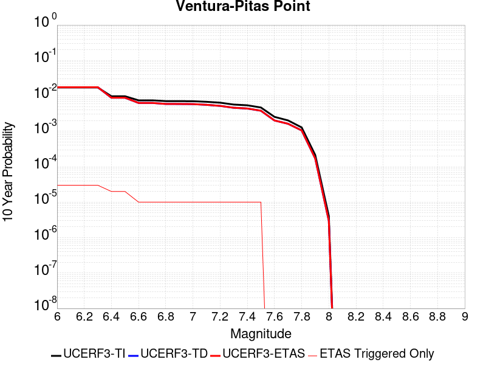 |

| Magnitude | 1 wk TI Prob | 1 wk TD Prob | 1 wk ETAS Prob | 1 wk ETAS/TD Gain | 1 wk ETAS Triggered Only | 1 mo TI Prob | 1 mo TD Prob | 1 mo ETAS Prob | 1 mo ETAS/TD Gain | 1 mo ETAS Triggered Only | 1 yr TI Prob | 1 yr TD Prob | 1 yr ETAS Prob | 1 yr ETAS/TD Gain | 1 yr ETAS Triggered Only | 10 yr TI Prob | 10 yr TD Prob | 10 yr ETAS Prob | 10 yr ETAS/TD Gain | 10 yr ETAS Triggered Only |
|-----|-----|-----|-----|-----|-----|-----|-----|-----|-----|-----|-----|-----|-----|-----|-----|-----|-----|-----|-----|-----|
| 6.0 | 3.3179622E-5 | 3.373519E-5 | 5.373451E-5 | 1.5928328 | 2.0E-5 | 1.4219063E-4 | 1.4457281E-4 | 1.7456847E-4 | 1.2074779 | 3.0E-5 | 0.0017297962 | 0.0017590097 | 0.0017889569 | 1.017025 | 3.0E-5 | 0.017163932 | 0.017476497 | 0.017505974 | 1.0016866 | 3.0E-5 |
| 6.1 | 3.3179622E-5 | 3.373519E-5 | 5.373451E-5 | 1.5928328 | 2.0E-5 | 1.4219063E-4 | 1.4457281E-4 | 1.7456847E-4 | 1.2074779 | 3.0E-5 | 0.0017297962 | 0.0017590097 | 0.0017889569 | 1.017025 | 3.0E-5 | 0.017163932 | 0.017476497 | 0.017505974 | 1.0016866 | 3.0E-5 |
| 6.2 | 3.3179622E-5 | 3.373519E-5 | 5.373451E-5 | 1.5928328 | 2.0E-5 | 1.4219063E-4 | 1.4457281E-4 | 1.7456847E-4 | 1.2074779 | 3.0E-5 | 0.0017297962 | 0.0017590097 | 0.0017889569 | 1.017025 | 3.0E-5 | 0.017163932 | 0.017476497 | 0.017505974 | 1.0016866 | 3.0E-5 |
| 6.3 | 3.3179622E-5 | 3.373519E-5 | 5.373451E-5 | 1.5928328 | 2.0E-5 | 1.4219063E-4 | 1.4457281E-4 | 1.7456847E-4 | 1.2074779 | 3.0E-5 | 0.0017297962 | 0.0017590097 | 0.0017889569 | 1.017025 | 3.0E-5 | 0.017163932 | 0.017476497 | 0.017505974 | 1.0016866 | 3.0E-5 |
| 6.4 | 1.8754668E-5 | 1.7019594E-5 | 3.7019254E-5 | 2.1750963 | 2.0E-5 | 8.037467E-5 | 7.2939205E-5 | 9.293775E-5 | 1.274181 | 2.0E-5 | 9.781223E-4 | 8.8769617E-4 | 9.076784E-4 | 1.0225103 | 2.0E-5 | 0.009738282 | 0.008843943 | 0.008863766 | 1.0022415 | 2.0E-5 |
| 6.5 | 1.8754668E-5 | 1.7019594E-5 | 3.7019254E-5 | 2.1750963 | 2.0E-5 | 8.037467E-5 | 7.2939205E-5 | 9.293775E-5 | 1.274181 | 2.0E-5 | 9.781223E-4 | 8.8769617E-4 | 9.076784E-4 | 1.0225103 | 2.0E-5 | 0.009738282 | 0.008843943 | 0.008863766 | 1.0022415 | 2.0E-5 |
| 6.6 | 1.4361558E-5 | 1.2122258E-5 | 2.2122136E-5 | 1.8249189 | 1.0E-5 | 6.154808E-5 | 5.1951512E-5 | 6.1950996E-5 | 1.1924772 | 1.0E-5 | 7.490902E-4 | 6.323284E-4 | 6.4232206E-4 | 1.0158045 | 1.0E-5 | 0.0074657016 | 0.006305652 | 0.0063155894 | 1.0015758 | 1.0E-5 |
| 6.7 | 1.4361558E-5 | 1.2122258E-5 | 2.2122136E-5 | 1.8249189 | 1.0E-5 | 6.154808E-5 | 5.1951512E-5 | 6.1950996E-5 | 1.1924772 | 1.0E-5 | 7.490902E-4 | 6.323284E-4 | 6.4232206E-4 | 1.0158045 | 1.0E-5 | 0.0074657016 | 0.006305652 | 0.0063155894 | 1.0015758 | 1.0E-5 |
| 6.8 | 1.3663846E-5 | 1.1344401E-5 | 2.1344287E-5 | 1.8814821 | 1.0E-5 | 5.8558027E-5 | 4.8617967E-5 | 5.861748E-5 | 1.2056752 | 1.0E-5 | 7.127108E-4 | 5.917649E-4 | 6.01759E-4 | 1.0168886 | 1.0E-5 | 0.007104293 | 0.0059022107 | 0.0059121517 | 1.0016843 | 1.0E-5 |
| 6.9 | 1.3644157E-5 | 1.1322501E-5 | 2.1322388E-5 | 1.883187 | 1.0E-5 | 5.8473648E-5 | 4.8524114E-5 | 5.852363E-5 | 1.206073 | 1.0E-5 | 7.116841E-4 | 5.906229E-4 | 6.00617E-4 | 1.0169213 | 1.0E-5 | 0.007094092 | 0.0058908514 | 0.0059007923 | 1.0016875 | 1.0E-5 |
| 7.0 | 1.3568845E-5 | 1.12420685E-5 | 2.1241956E-5 | 1.889506 | 1.0E-5 | 5.8150898E-5 | 4.8179416E-5 | 5.817893E-5 | 1.2075475 | 1.0E-5 | 7.077572E-4 | 5.8642845E-4 | 5.964226E-4 | 1.0170424 | 1.0E-5 | 0.007055073 | 0.005849128 | 0.0058590695 | 1.0016997 | 1.0E-5 |
| 7.1 | 1.306572E-5 | 1.0720521E-5 | 2.0720414E-5 | 1.9327805 | 1.0E-5 | 5.599474E-5 | 4.594429E-5 | 5.594383E-5 | 1.2176449 | 1.0E-5 | 6.815227E-4 | 5.5923004E-4 | 5.692244E-4 | 1.0178717 | 1.0E-5 | 0.0067943637 | 0.005578536 | 0.0055884803 | 1.0017825 | 1.0E-5 |
| 7.2 | 1.232604E-5 | 9.995121E-6 | 1.9995021E-5 | 2.000478 | 1.0E-5 | 5.2824813E-5 | 4.283554E-5 | 5.2835112E-5 | 1.233441 | 1.0E-5 | 6.429523E-4 | 5.2139966E-4 | 5.3139444E-4 | 1.0191691 | 1.0E-5 | 0.0064109527 | 0.005202059 | 0.005212007 | 1.0019124 | 1.0E-5 |
| 7.3 | 1.0917261E-5 | 8.843812E-6 | 1.8843724E-5 | 2.1307242 | 1.0E-5 | 4.678742E-5 | 3.7901507E-5 | 4.790113E-5 | 1.2638317 | 1.0E-5 | 5.69488E-4 | 4.6135474E-4 | 4.713501E-4 | 1.0216653 | 1.0E-5 | 0.0056803077 | 0.004604239 | 0.004614193 | 1.0021619 | 1.0E-5 |
| 7.4 | 1.039959E-5 | 8.42354E-6 | 1.8423456E-5 | 2.1871393 | 1.0E-5 | 4.456891E-5 | 3.6100395E-5 | 4.6100035E-5 | 1.2769953 | 1.0E-5 | 5.424914E-4 | 4.394352E-4 | 4.494308E-4 | 1.0227464 | 1.0E-5 | 0.0054116896 | 0.0043859277 | 0.004395884 | 1.00227 | 1.0E-5 |
| 7.5 | 9.015877E-6 | 7.29752E-6 | 1.7297447E-5 | 2.3703187 | 1.0E-5 | 3.86389E-5 | 3.1274718E-5 | 4.1274405E-5 | 1.3197371 | 1.0E-5 | 4.7032707E-4 | 3.8070456E-4 | 3.9070076E-4 | 1.026257 | 1.0E-5 | 0.004693329 | 0.003800772 | 0.003810734 | 1.002621 | 1.0E-5 |
| 7.6 | 4.900162E-6 | 3.874119E-6 | 3.874119E-6 | 1.0 | 0.0 | 2.1000526E-5 | 1.6603262E-5 | 1.6603262E-5 | 1.0 | 0.0 | 2.556514E-4 | 2.0212609E-4 | 2.0212609E-4 | 1.0 | 0.0 | 0.0025535747 | 0.002019436 | 0.002019436 | 1.0 | 0.0 |
| 7.7 | 3.8850626E-6 | 3.12676E-6 | 3.12676E-6 | 1.0 | 0.0 | 1.6650163E-5 | 1.3400332E-5 | 1.3400332E-5 | 1.0 | 0.0 | 2.0269687E-4 | 1.6313691E-4 | 1.6313691E-4 | 1.0 | 0.0 | 0.002025121 | 0.0016301809 | 0.0016301809 | 1.0 | 0.0 |
| 7.8 | 2.4654719E-6 | 2.029902E-6 | 2.029902E-6 | 1.0 | 0.0 | 1.0566265E-5 | 8.699551E-6 | 8.699551E-6 | 1.0 | 0.0 | 1.2863669E-4 | 1.0591193E-4 | 1.0591193E-4 | 1.0 | 0.0 | 0.0012856225 | 0.0010586192 | 0.0010586192 | 1.0 | 0.0 |
| 7.9 | 4.095894E-7 | 3.2765078E-7 | 3.2765078E-7 | 1.0 | 0.0 | 1.7553821E-6 | 1.4042168E-6 | 1.4042168E-6 | 1.0 | 0.0 | 2.1371567E-5 | 1.709621E-5 | 1.709621E-5 | 1.0 | 0.0 | 2.1369511E-4 | 1.7094925E-4 | 1.7094925E-4 | 1.0 | 0.0 |
| 8.0 | 7.791402E-9 | 5.6836056E-9 | 5.6836056E-9 | 1.0 | 0.0 | 3.3391725E-8 | 2.4358311E-8 | 2.4358311E-8 | 1.0 | 0.0 | 4.0654416E-7 | 2.965624E-7 | 2.965624E-7 | 1.0 | 0.0 | 4.065434E-6 | 2.9656223E-6 | 2.9656223E-6 | 1.0 | 0.0 |

## San Pedro Basin
*[(top)](#table-of-contents)*

| 1 Week | 1 Month | 1 Year | 10 Year |
|-----|-----|-----|-----|
|  |  |  |  |

| Magnitude | 1 wk TI Prob | 1 wk TD Prob | 1 wk ETAS Prob | 1 wk ETAS/TD Gain | 1 wk ETAS Triggered Only | 1 mo TI Prob | 1 mo TD Prob | 1 mo ETAS Prob | 1 mo ETAS/TD Gain | 1 mo ETAS Triggered Only | 1 yr TI Prob | 1 yr TD Prob | 1 yr ETAS Prob | 1 yr ETAS/TD Gain | 1 yr ETAS Triggered Only | 10 yr TI Prob | 10 yr TD Prob | 10 yr ETAS Prob | 10 yr ETAS/TD Gain | 10 yr ETAS Triggered Only |
|-----|-----|-----|-----|-----|-----|-----|-----|-----|-----|-----|-----|-----|-----|-----|-----|-----|-----|-----|-----|-----|
| 6.0 | 5.3449043E-5 | 6.337018E-5 | 8.336891E-5 | 1.3155859 | 2.0E-5 | 2.2904722E-4 | 2.7156167E-4 | 2.9155624E-4 | 1.0736281 | 2.0E-5 | 0.0027850836 | 0.0033018515 | 0.0033317523 | 1.0090559 | 3.0E-5 | 0.027504366 | 0.03258948 | 0.032618504 | 1.0008905 | 3.0E-5 |
| 6.1 | 5.3449043E-5 | 6.337018E-5 | 8.336891E-5 | 1.3155859 | 2.0E-5 | 2.2904722E-4 | 2.7156167E-4 | 2.9155624E-4 | 1.0736281 | 2.0E-5 | 0.0027850836 | 0.0033018515 | 0.0033317523 | 1.0090559 | 3.0E-5 | 0.027504366 | 0.03258948 | 0.032618504 | 1.0008905 | 3.0E-5 |
| 6.2 | 2.3189454E-5 | 2.6642829E-5 | 3.6642563E-5 | 1.3753256 | 1.0E-5 | 9.9379584E-5 | 1.1417881E-4 | 1.2417766E-4 | 1.087572 | 1.0E-5 | 0.0012092749 | 0.0013892875 | 0.0014092597 | 1.0143759 | 2.0E-5 | 0.012027155 | 0.01381089 | 0.013830613 | 1.0014281 | 2.0E-5 |
| 6.3 | 2.3189454E-5 | 2.6642829E-5 | 3.6642563E-5 | 1.3753256 | 1.0E-5 | 9.9379584E-5 | 1.1417881E-4 | 1.2417766E-4 | 1.087572 | 1.0E-5 | 0.0012092749 | 0.0013892875 | 0.0014092597 | 1.0143759 | 2.0E-5 | 0.012027155 | 0.01381089 | 0.013830613 | 1.0014281 | 2.0E-5 |
| 6.4 | 1.966056E-5 | 2.246342E-5 | 3.2463195E-5 | 1.4451581 | 1.0E-5 | 8.425682E-5 | 9.626848E-5 | 1.06267515E-4 | 1.1038662 | 1.0E-5 | 0.001025344 | 0.0011714787 | 0.001181467 | 1.0085262 | 1.0E-5 | 0.010206259 | 0.011657119 | 0.011667003 | 1.0008478 | 1.0E-5 |
| 6.5 | 1.7342953E-5 | 1.9745152E-5 | 2.9744955E-5 | 1.5064434 | 1.0E-5 | 7.4324824E-5 | 8.461954E-5 | 9.46187E-5 | 1.118166 | 1.0E-5 | 9.04529E-4 | 0.0010297929 | 0.0010397827 | 1.0097007 | 1.0E-5 | 0.009008561 | 0.010253932 | 0.01026383 | 1.0009652 | 1.0E-5 |
| 6.6 | 1.439804E-5 | 1.6322716E-5 | 2.6322554E-5 | 1.6126331 | 1.0E-5 | 6.170443E-5 | 6.99528E-5 | 7.995211E-5 | 1.1429435 | 1.0E-5 | 7.509924E-4 | 8.513747E-4 | 8.613662E-4 | 1.0117357 | 1.0E-5 | 0.0074845953 | 0.008484333 | 0.008494249 | 1.0011686 | 1.0E-5 |
| 6.7 | 1.2634884E-5 | 1.4285298E-5 | 2.4285155E-5 | 1.7000104 | 1.0E-5 | 5.414838E-5 | 6.122144E-5 | 7.122083E-5 | 1.1633315 | 1.0E-5 | 6.590571E-4 | 7.451466E-4 | 7.5513916E-4 | 1.0134102 | 1.0E-5 | 0.006571059 | 0.007429502 | 0.0074394275 | 1.001336 | 1.0E-5 |
| 6.8 | 1.146091E-5 | 1.2933193E-5 | 2.2933064E-5 | 1.7731943 | 1.0E-5 | 4.911726E-5 | 5.542696E-5 | 6.542641E-5 | 1.1804076 | 1.0E-5 | 5.9783855E-4 | 6.74644E-4 | 6.846373E-4 | 1.0148126 | 1.0E-5 | 0.0059623276 | 0.0067288997 | 0.006738832 | 1.0014762 | 1.0E-5 |
| 6.9 | 9.109035E-6 | 1.0235013E-5 | 1.0235013E-5 | 1.0 | 0.0 | 3.9038136E-5 | 4.386376E-5 | 4.386376E-5 | 1.0 | 0.0 | 4.7518566E-4 | 5.339384E-4 | 5.339384E-4 | 1.0 | 0.0 | 0.0047417083 | 0.0053293095 | 0.0053293095 | 1.0 | 0.0 |
| 7.0 | 5.9351028E-6 | 6.583965E-6 | 6.583965E-6 | 1.0 | 0.0 | 2.5435906E-5 | 2.821682E-5 | 2.821682E-5 | 1.0 | 0.0 | 3.0963816E-4 | 3.4350925E-4 | 3.4350925E-4 | 1.0 | 0.0 | 0.0030920706 | 0.0034320997 | 0.0034320997 | 1.0 | 0.0 |
| 7.1 | 2.1557585E-6 | 2.2096492E-6 | 2.2096492E-6 | 1.0 | 0.0 | 9.238933E-6 | 9.469892E-6 | 9.469892E-6 | 1.0 | 0.0 | 1.1247819E-4 | 1.15289986E-4 | 1.15289986E-4 | 1.0 | 0.0 | 0.0011242128 | 0.0011523172 | 0.0011523172 | 1.0 | 0.0 |
| 7.2 | 2.1251979E-6 | 2.1779954E-6 | 2.1779954E-6 | 1.0 | 0.0 | 9.107958E-6 | 9.334234E-6 | 9.334234E-6 | 1.0 | 0.0 | 1.1088375E-4 | 1.13638525E-4 | 1.13638525E-4 | 1.0 | 0.0 | 0.0011082845 | 0.0011358195 | 0.0011358195 | 1.0 | 0.0 |
| 7.3 | 1.7145798E-6 | 1.7442885E-6 | 1.7442885E-6 | 1.0 | 0.0 | 7.3481783E-6 | 7.475501E-6 | 7.475501E-6 | 1.0 | 0.0 | 8.94604E-5 | 9.1010515E-5 | 9.1010515E-5 | 1.0 | 0.0 | 8.9424395E-4 | 9.0974156E-4 | 9.0974156E-4 | 1.0 | 0.0 |
| 7.4 | 1.4467993E-6 | 1.4641878E-6 | 1.4641878E-6 | 1.0 | 0.0 | 6.200554E-6 | 6.275076E-6 | 6.275076E-6 | 1.0 | 0.0 | 7.548913E-5 | 7.639644E-5 | 7.639644E-5 | 1.0 | 0.0 | 7.546349E-4 | 7.6370913E-4 | 7.6370913E-4 | 1.0 | 0.0 |
| 7.5 | 1.2803735E-6 | 1.2931506E-6 | 1.2931506E-6 | 1.0 | 0.0 | 5.487303E-6 | 5.5420624E-6 | 5.5420624E-6 | 1.0 | 0.0 | 6.680587E-5 | 6.747259E-5 | 6.747259E-5 | 1.0 | 0.0 | 6.678579E-4 | 6.745281E-4 | 6.745281E-4 | 1.0 | 0.0 |
| 7.6 | 6.755009E-7 | 6.76947E-7 | 6.76947E-7 | 1.0 | 0.0 | 2.8950008E-6 | 2.9011985E-6 | 2.9011985E-6 | 1.0 | 0.0 | 3.5246063E-5 | 3.532158E-5 | 3.532158E-5 | 1.0 | 0.0 | 3.5240475E-4 | 3.5316538E-4 | 3.5316538E-4 | 1.0 | 0.0 |
| 7.7 | 6.211885E-8 | 4.5699714E-8 | 4.5699714E-8 | 1.0 | 0.0 | 2.6622362E-7 | 1.9585592E-7 | 1.9585592E-7 | 1.0 | 0.0 | 3.2412677E-6 | 2.3845432E-6 | 2.3845432E-6 | 1.0 | 0.0 | 3.2412205E-5 | 2.3845198E-5 | 2.3845198E-5 | 1.0 | 0.0 |
| 7.8 | 2.6580573E-9 | 1.5138054E-9 | 1.5138054E-9 | 1.0 | 0.0 | 1.1391674E-8 | 6.4877375E-9 | 6.4877375E-9 | 1.0 | 0.0 | 1.3869362E-7 | 7.89882E-8 | 7.89882E-8 | 1.0 | 0.0 | 1.3869354E-6 | 7.89882E-7 | 7.89882E-7 | 1.0 | 0.0 |

## Ortigalita (South)
*[(top)](#table-of-contents)*

| 1 Week | 1 Month | 1 Year | 10 Year |
|-----|-----|-----|-----|
| 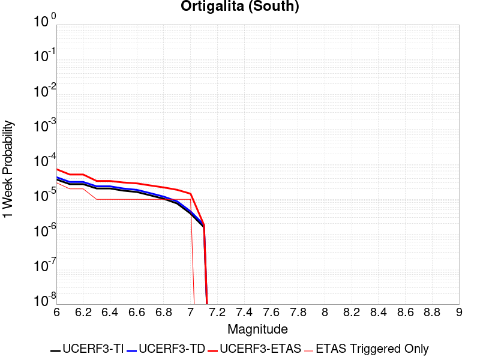 | 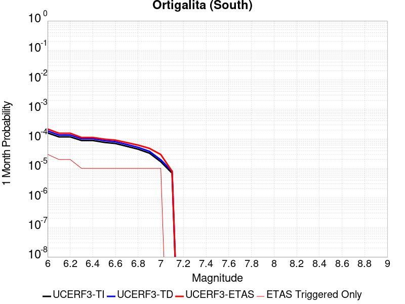 | 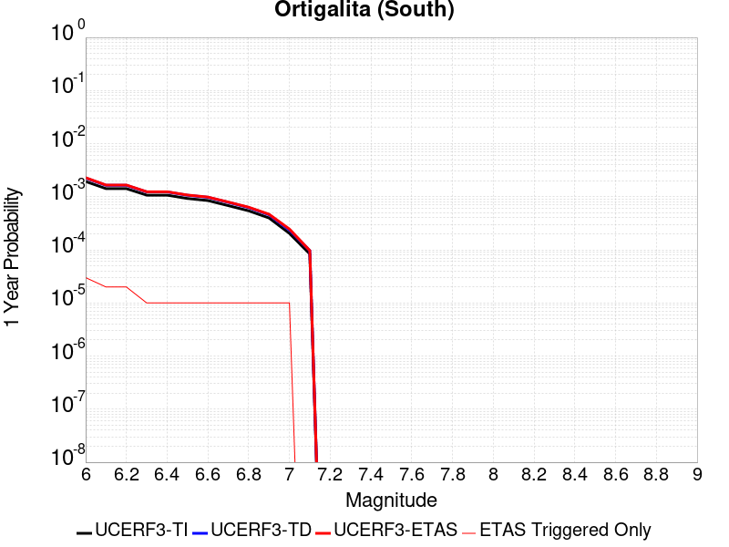 | 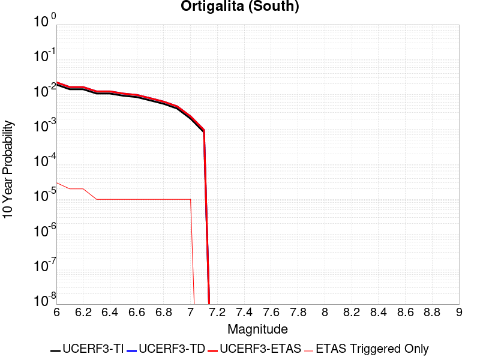 |

| Magnitude | 1 wk TI Prob | 1 wk TD Prob | 1 wk ETAS Prob | 1 wk ETAS/TD Gain | 1 wk ETAS Triggered Only | 1 mo TI Prob | 1 mo TD Prob | 1 mo ETAS Prob | 1 mo ETAS/TD Gain | 1 mo ETAS Triggered Only | 1 yr TI Prob | 1 yr TD Prob | 1 yr ETAS Prob | 1 yr ETAS/TD Gain | 1 yr ETAS Triggered Only | 10 yr TI Prob | 10 yr TD Prob | 10 yr ETAS Prob | 10 yr ETAS/TD Gain | 10 yr ETAS Triggered Only |
|-----|-----|-----|-----|-----|-----|-----|-----|-----|-----|-----|-----|-----|-----|-----|-----|-----|-----|-----|-----|-----|
| 6.0 | 3.72394E-5 | 4.32556E-5 | 7.3254305E-5 | 1.6935219 | 3.0E-5 | 1.5958765E-4 | 1.8536886E-4 | 2.153633E-4 | 1.1618094 | 3.0E-5 | 0.0019412481 | 0.0022546863 | 0.0022846186 | 1.0132756 | 3.0E-5 | 0.019243775 | 0.022334501 | 0.022363832 | 1.0013132 | 3.0E-5 |
| 6.1 | 2.7299884E-5 | 3.1492036E-5 | 5.1491406E-5 | 1.6350613 | 2.0E-5 | 1.16994255E-4 | 1.349592E-4 | 1.549565E-4 | 1.148173 | 2.0E-5 | 0.0014234743 | 0.0016419457 | 0.0016619129 | 1.0121607 | 2.0E-5 | 0.014143906 | 0.016304072 | 0.016323747 | 1.0012066 | 2.0E-5 |
| 6.2 | 2.7299884E-5 | 3.1492036E-5 | 5.1491406E-5 | 1.6350613 | 2.0E-5 | 1.16994255E-4 | 1.349592E-4 | 1.549565E-4 | 1.148173 | 2.0E-5 | 0.0014234743 | 0.0016419457 | 0.0016619129 | 1.0121607 | 2.0E-5 | 0.014143906 | 0.016304072 | 0.016323747 | 1.0012066 | 2.0E-5 |
| 6.3 | 2.0546433E-5 | 2.3631454E-5 | 3.3631215E-5 | 1.4231548 | 1.0E-5 | 8.805317E-5 | 1.0127383E-4 | 1.1127282E-4 | 1.0987322 | 1.0E-5 | 0.00107152 | 0.0012323305 | 0.0012423181 | 1.0081047 | 1.0E-5 | 0.010663681 | 0.012257031 | 0.012266909 | 1.0008059 | 1.0E-5 |
| 6.4 | 2.0546433E-5 | 2.3631454E-5 | 3.3631215E-5 | 1.4231548 | 1.0E-5 | 8.805317E-5 | 1.0127383E-4 | 1.1127282E-4 | 1.0987322 | 1.0E-5 | 0.00107152 | 0.0012323305 | 0.0012423181 | 1.0081047 | 1.0E-5 | 0.010663681 | 0.012257031 | 0.012266909 | 1.0008059 | 1.0E-5 |
| 6.5 | 1.7779594E-5 | 2.0446974E-5 | 3.044677E-5 | 1.4890599 | 1.0E-5 | 7.619603E-5 | 8.762703E-5 | 9.762615E-5 | 1.11411 | 1.0E-5 | 9.272918E-4 | 0.0010663505 | 0.0010763399 | 1.0093678 | 1.0E-5 | 0.009234319 | 0.010613804 | 0.010623697 | 1.0009322 | 1.0E-5 |
| 6.6 | 1.6272212E-5 | 1.8714967E-5 | 2.871478E-5 | 1.5343217 | 1.0E-5 | 6.973618E-5 | 8.0204605E-5 | 9.020381E-5 | 1.1246711 | 1.0E-5 | 8.487073E-4 | 9.760659E-4 | 9.86056E-4 | 1.0102352 | 1.0E-5 | 0.008454733 | 0.009719091 | 0.009728993 | 1.0010189 | 1.0E-5 |
| 6.7 | 1.3051484E-5 | 1.5038758E-5 | 2.5038607E-5 | 1.6649386 | 1.0E-5 | 5.593373E-5 | 6.445028E-5 | 7.4449636E-5 | 1.1551484 | 1.0E-5 | 6.807804E-4 | 7.844092E-4 | 7.9440133E-4 | 1.0127385 | 1.0E-5 | 0.006786986 | 0.007817388 | 0.00782731 | 1.0012692 | 1.0E-5 |
| 6.8 | 1.04277415E-5 | 1.1987235E-5 | 2.1987114E-5 | 1.8342108 | 1.0E-5 | 4.4689557E-5 | 5.1372896E-5 | 6.137238E-5 | 1.1946452 | 1.0E-5 | 5.439595E-4 | 6.2529295E-4 | 6.352867E-4 | 1.0159825 | 1.0E-5 | 0.0054262993 | 0.00623609 | 0.0062460275 | 1.0015936 | 1.0E-5 |
| 6.9 | 7.639968E-6 | 8.791503E-6 | 1.8791416E-5 | 2.137452 | 1.0E-5 | 3.274231E-5 | 3.767736E-5 | 4.7676982E-5 | 1.2654014 | 1.0E-5 | 3.9856473E-4 | 4.586312E-4 | 4.686266E-4 | 1.021794 | 1.0E-5 | 0.003978506 | 0.004577433 | 0.004587387 | 1.0021746 | 1.0E-5 |
| 7.0 | 3.919831E-6 | 4.5334014E-6 | 1.4533356E-5 | 3.2058394 | 1.0E-5 | 1.679917E-5 | 1.942873E-5 | 2.9428536E-5 | 1.5146917 | 1.0E-5 | 2.045107E-4 | 2.3652123E-4 | 2.4651887E-4 | 1.0422695 | 1.0E-5 | 0.0020432258 | 0.0023629034 | 0.0023728798 | 1.004222 | 1.0E-5 |
| 7.1 | 1.6017933E-6 | 1.8570418E-6 | 1.8570418E-6 | 1.0 | 0.0 | 6.8648105E-6 | 7.958732E-6 | 7.958732E-6 | 1.0 | 0.0 | 8.357586E-5 | 9.689432E-5 | 9.689432E-5 | 1.0 | 0.0 | 8.3544437E-4 | 9.686254E-4 | 9.686254E-4 | 1.0 | 0.0 |

## Robinson Creek
*[(top)](#table-of-contents)*

| 1 Week | 1 Month | 1 Year | 10 Year |
|-----|-----|-----|-----|
|  |  |  |  |

| Magnitude | 1 wk TI Prob | 1 wk TD Prob | 1 wk ETAS Prob | 1 wk ETAS/TD Gain | 1 wk ETAS Triggered Only | 1 mo TI Prob | 1 mo TD Prob | 1 mo ETAS Prob | 1 mo ETAS/TD Gain | 1 mo ETAS Triggered Only | 1 yr TI Prob | 1 yr TD Prob | 1 yr ETAS Prob | 1 yr ETAS/TD Gain | 1 yr ETAS Triggered Only | 10 yr TI Prob | 10 yr TD Prob | 10 yr ETAS Prob | 10 yr ETAS/TD Gain | 10 yr ETAS Triggered Only |
|-----|-----|-----|-----|-----|-----|-----|-----|-----|-----|-----|-----|-----|-----|-----|-----|-----|-----|-----|-----|-----|
| 6.0 | 1.3705327E-5 | 1.5285013E-5 | 3.528471E-5 | 2.3084512 | 2.0E-5 | 5.8735794E-5 | 6.55072E-5 | 9.550524E-5 | 1.457935 | 3.0E-5 | 7.1487366E-4 | 7.9755014E-4 | 8.275262E-4 | 1.0375851 | 3.0E-5 | 0.0071257832 | 0.007975501 | 0.008005262 | 1.0037315 | 3.0E-5 |
| 6.1 | 1.3705327E-5 | 1.5285013E-5 | 3.528471E-5 | 2.3084512 | 2.0E-5 | 5.8735794E-5 | 6.55072E-5 | 9.550524E-5 | 1.457935 | 3.0E-5 | 7.1487366E-4 | 7.9755014E-4 | 8.275262E-4 | 1.0375851 | 3.0E-5 | 0.0071257832 | 0.007975501 | 0.008005262 | 1.0037315 | 3.0E-5 |
| 6.2 | 1.3705327E-5 | 1.5285013E-5 | 3.528471E-5 | 2.3084512 | 2.0E-5 | 5.8735794E-5 | 6.55072E-5 | 9.550524E-5 | 1.457935 | 3.0E-5 | 7.1487366E-4 | 7.9755014E-4 | 8.275262E-4 | 1.0375851 | 3.0E-5 | 0.0071257832 | 0.007975501 | 0.008005262 | 1.0037315 | 3.0E-5 |
| 6.3 | 1.3705327E-5 | 1.5285013E-5 | 3.528471E-5 | 2.3084512 | 2.0E-5 | 5.8735794E-5 | 6.55072E-5 | 9.550524E-5 | 1.457935 | 3.0E-5 | 7.1487366E-4 | 7.9755014E-4 | 8.275262E-4 | 1.0375851 | 3.0E-5 | 0.0071257832 | 0.007975501 | 0.008005262 | 1.0037315 | 3.0E-5 |
| 6.4 | 1.3705327E-5 | 1.5285013E-5 | 3.528471E-5 | 2.3084512 | 2.0E-5 | 5.8735794E-5 | 6.55072E-5 | 9.550524E-5 | 1.457935 | 3.0E-5 | 7.1487366E-4 | 7.9755014E-4 | 8.275262E-4 | 1.0375851 | 3.0E-5 | 0.0071257832 | 0.007975501 | 0.008005262 | 1.0037315 | 3.0E-5 |

## Great Valley 09 (Laguna Seca)
*[(top)](#table-of-contents)*

| 1 Week | 1 Month | 1 Year | 10 Year |
|-----|-----|-----|-----|
|  |  | 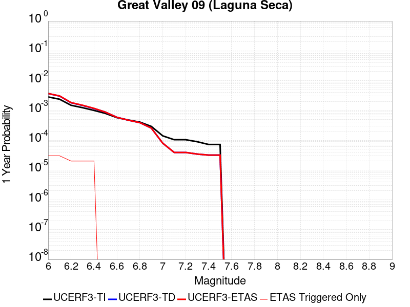 |  |

| Magnitude | 1 wk TI Prob | 1 wk TD Prob | 1 wk ETAS Prob | 1 wk ETAS/TD Gain | 1 wk ETAS Triggered Only | 1 mo TI Prob | 1 mo TD Prob | 1 mo ETAS Prob | 1 mo ETAS/TD Gain | 1 mo ETAS Triggered Only | 1 yr TI Prob | 1 yr TD Prob | 1 yr ETAS Prob | 1 yr ETAS/TD Gain | 1 yr ETAS Triggered Only | 10 yr TI Prob | 10 yr TD Prob | 10 yr ETAS Prob | 10 yr ETAS/TD Gain | 10 yr ETAS Triggered Only |
|-----|-----|-----|-----|-----|-----|-----|-----|-----|-----|-----|-----|-----|-----|-----|-----|-----|-----|-----|-----|-----|
| 6.0 | 5.4353277E-5 | 7.050019E-5 | 1.0049807E-4 | 1.4255008 | 3.0E-5 | 2.3292181E-4 | 3.0211007E-4 | 3.3210102E-4 | 1.0992715 | 3.0E-5 | 0.0028321352 | 0.0036720056 | 0.0037018955 | 1.00814 | 3.0E-5 | 0.02796312 | 0.036115844 | 0.03614476 | 1.0008006 | 3.0E-5 |
| 6.1 | 4.5578287E-5 | 5.822054E-5 | 8.8218796E-5 | 1.5152521 | 3.0E-5 | 1.953209E-4 | 2.4949352E-4 | 2.7948603E-4 | 1.1202136 | 3.0E-5 | 0.0023754383 | 0.0030333549 | 0.003063264 | 1.00986 | 3.0E-5 | 0.023502063 | 0.029919893 | 0.029948995 | 1.0009726 | 3.0E-5 |
| 6.2 | 2.8536782E-5 | 3.4736422E-5 | 5.4735727E-5 | 1.5757445 | 2.0E-5 | 1.2229476E-4 | 1.4886161E-4 | 1.6885863E-4 | 1.134333 | 2.0E-5 | 0.0014879217 | 0.0018108576 | 0.0018308214 | 1.0110245 | 2.0E-5 | 0.014779986 | 0.017958276 | 0.017977918 | 1.0010937 | 2.0E-5 |
| 6.3 | 2.3698774E-5 | 2.8213344E-5 | 4.821278E-5 | 1.7088645 | 2.0E-5 | 1.01562226E-4 | 1.2090833E-4 | 1.409059E-4 | 1.1653945 | 2.0E-5 | 0.0012358186 | 0.001471051 | 0.0014910216 | 1.0135757 | 2.0E-5 | 0.012289686 | 0.014611455 | 0.014631162 | 1.0013487 | 2.0E-5 |
| 6.4 | 1.9191197E-5 | 2.212289E-5 | 4.2122447E-5 | 1.904021 | 2.0E-5 | 8.2245395E-5 | 9.4808805E-5 | 1.1480691E-4 | 1.2109308 | 2.0E-5 | 0.0010008777 | 0.0011536906 | 0.0011736675 | 1.0173156 | 2.0E-5 | 0.009963818 | 0.011477022 | 0.011496793 | 1.0017226 | 2.0E-5 |
| 6.5 | 1.5203241E-5 | 1.6801298E-5 | 1.6801298E-5 | 1.0 | 0.0 | 6.5155116E-5 | 7.200338E-5 | 7.200338E-5 | 1.0 | 0.0 | 7.9297484E-4 | 8.76301E-4 | 8.76301E-4 | 1.0 | 0.0 | 0.007901512 | 0.008729581 | 0.008729581 | 1.0 | 0.0 |
| 6.6 | 1.0984925E-5 | 1.12425605E-5 | 1.12425605E-5 | 1.0 | 0.0 | 4.70774E-5 | 4.8181533E-5 | 4.8181533E-5 | 1.0 | 0.0 | 5.730166E-4 | 5.8645604E-4 | 5.8645604E-4 | 1.0 | 0.0 | 0.005715413 | 0.0058494755 | 0.0058494755 | 1.0 | 0.0 |
| 6.7 | 9.134616E-6 | 9.019868E-6 | 9.019868E-6 | 1.0 | 0.0 | 3.9147766E-5 | 3.865602E-5 | 3.865602E-5 | 1.0 | 0.0 | 4.7651984E-4 | 4.7053778E-4 | 4.7053778E-4 | 1.0 | 0.0 | 0.004754993 | 0.00469566 | 0.00469566 | 1.0 | 0.0 |
| 6.8 | 7.785589E-6 | 7.4519185E-6 | 7.4519185E-6 | 1.0 | 0.0 | 3.3366385E-5 | 3.1936415E-5 | 3.1936415E-5 | 1.0 | 0.0 | 4.0616E-4 | 3.887585E-4 | 3.887585E-4 | 1.0 | 0.0 | 0.0040541845 | 0.003880988 | 0.003880988 | 1.0 | 0.0 |
| 6.9 | 5.579095E-6 | 4.8984666E-6 | 4.8984666E-6 | 1.0 | 0.0 | 2.3910188E-5 | 2.0993268E-5 | 2.0993268E-5 | 1.0 | 0.0 | 2.9106764E-4 | 2.5556443E-4 | 2.5556443E-4 | 1.0 | 0.0 | 0.002906867 | 0.0025528427 | 0.0025528427 | 1.0 | 0.0 |
| 7.0 | 2.6816688E-6 | 1.521587E-6 | 1.521587E-6 | 1.0 | 0.0 | 1.1492816E-5 | 6.521071E-6 | 6.521071E-6 | 1.0 | 0.0 | 1.3991605E-4 | 7.939124E-5 | 7.939124E-5 | 1.0 | 0.0 | 0.0013982799 | 7.936375E-4 | 7.936375E-4 | 1.0 | 0.0 |
| 7.1 | 1.9951021E-6 | 7.45357E-7 | 7.45357E-7 | 1.0 | 0.0 | 8.55041E-6 | 3.1943835E-6 | 3.1943835E-6 | 1.0 | 0.0 | 1.0409627E-4 | 3.889097E-5 | 3.889097E-5 | 1.0 | 0.0 | 0.0010404752 | 3.8884574E-4 | 3.8884574E-4 | 1.0 | 0.0 |
| 7.2 | 1.9951021E-6 | 7.45357E-7 | 7.45357E-7 | 1.0 | 0.0 | 8.55041E-6 | 3.1943835E-6 | 3.1943835E-6 | 1.0 | 0.0 | 1.0409627E-4 | 3.889097E-5 | 3.889097E-5 | 1.0 | 0.0 | 0.0010404752 | 3.8884574E-4 | 3.8884574E-4 | 1.0 | 0.0 |
| 7.3 | 1.7087556E-6 | 6.578663E-7 | 6.578663E-7 | 1.0 | 0.0 | 7.3232177E-6 | 2.819424E-6 | 2.819424E-6 | 1.0 | 0.0 | 8.915652E-5 | 3.432599E-5 | 3.432599E-5 | 1.0 | 0.0 | 8.9120766E-4 | 3.432109E-4 | 3.432109E-4 | 1.0 | 0.0 |
| 7.4 | 1.3804846E-6 | 6.0737113E-7 | 6.0737113E-7 | 1.0 | 0.0 | 5.916349E-6 | 2.6030168E-6 | 2.6030168E-6 | 1.0 | 0.0 | 7.2029165E-5 | 3.169131E-5 | 3.169131E-5 | 1.0 | 0.0 | 7.200583E-4 | 3.168719E-4 | 3.168719E-4 | 1.0 | 0.0 |
| 7.5 | 1.3804846E-6 | 6.0737113E-7 | 6.0737113E-7 | 1.0 | 0.0 | 5.916349E-6 | 2.6030168E-6 | 2.6030168E-6 | 1.0 | 0.0 | 7.2029165E-5 | 3.169131E-5 | 3.169131E-5 | 1.0 | 0.0 | 7.200583E-4 | 3.168719E-4 | 3.168719E-4 | 1.0 | 0.0 |

## Coronado Bank alt1
*[(top)](#table-of-contents)*

| 1 Week | 1 Month | 1 Year | 10 Year |
|-----|-----|-----|-----|
|  |  |  |  |

| Magnitude | 1 wk TI Prob | 1 wk TD Prob | 1 wk ETAS Prob | 1 wk ETAS/TD Gain | 1 wk ETAS Triggered Only | 1 mo TI Prob | 1 mo TD Prob | 1 mo ETAS Prob | 1 mo ETAS/TD Gain | 1 mo ETAS Triggered Only | 1 yr TI Prob | 1 yr TD Prob | 1 yr ETAS Prob | 1 yr ETAS/TD Gain | 1 yr ETAS Triggered Only | 10 yr TI Prob | 10 yr TD Prob | 10 yr ETAS Prob | 10 yr ETAS/TD Gain | 10 yr ETAS Triggered Only |
|-----|-----|-----|-----|-----|-----|-----|-----|-----|-----|-----|-----|-----|-----|-----|-----|-----|-----|-----|-----|-----|
| 6.0 | 7.533492E-5 | 9.3951705E-5 | 1.0395077E-4 | 1.1064277 | 1.0E-5 | 3.22824E-4 | 4.025903E-4 | 4.1258626E-4 | 1.0248291 | 1.0E-5 | 0.0039233007 | 0.004891121 | 0.0049209744 | 1.0061035 | 3.0E-5 | 0.03854755 | 0.047904 | 0.04793256 | 1.0005963 | 3.0E-5 |
| 6.1 | 4.1807285E-5 | 5.0493105E-5 | 5.0493105E-5 | 1.0 | 0.0 | 1.7916178E-4 | 2.1638138E-4 | 2.1638138E-4 | 1.0 | 0.0 | 0.0021791123 | 0.0026313365 | 0.002651284 | 1.0075808 | 2.0E-5 | 0.021578677 | 0.026011124 | 0.026030604 | 1.0007489 | 2.0E-5 |
| 6.2 | 4.1807285E-5 | 5.0493105E-5 | 5.0493105E-5 | 1.0 | 0.0 | 1.7916178E-4 | 2.1638138E-4 | 2.1638138E-4 | 1.0 | 0.0 | 0.0021791123 | 0.0026313365 | 0.002651284 | 1.0075808 | 2.0E-5 | 0.021578677 | 0.026011124 | 0.026030604 | 1.0007489 | 2.0E-5 |
| 6.3 | 3.1793104E-5 | 3.7711125E-5 | 3.7711125E-5 | 1.0 | 0.0 | 1.3624904E-4 | 1.6160926E-4 | 1.6160926E-4 | 1.0 | 0.0 | 0.0016575698 | 0.001965849 | 0.0019758292 | 1.0050769 | 1.0E-5 | 0.016452603 | 0.019488495 | 0.0194983 | 1.0005032 | 1.0E-5 |
| 6.4 | 2.9878007E-5 | 3.5335797E-5 | 3.5335797E-5 | 1.0 | 0.0 | 1.2804232E-4 | 1.5143053E-4 | 1.5143053E-4 | 1.0 | 0.0 | 0.0015578003 | 0.0018421395 | 0.0018521211 | 1.0054184 | 1.0E-5 | 0.015469253 | 0.018272463 | 0.018282281 | 1.0005373 | 1.0E-5 |
| 6.5 | 2.4512565E-5 | 2.8764101E-5 | 2.8764101E-5 | 1.0 | 0.0 | 1.0504962E-4 | 1.2326906E-4 | 1.2326906E-4 | 1.0 | 0.0 | 0.0012782287 | 0.0014997943 | 0.0015097794 | 1.0066576 | 1.0E-5 | 0.012709012 | 0.0148996925 | 0.014909544 | 1.0006611 | 1.0E-5 |
| 6.6 | 2.1317413E-5 | 2.490667E-5 | 2.490667E-5 | 1.0 | 0.0 | 9.135714E-5 | 1.0673863E-4 | 1.0673863E-4 | 1.0 | 0.0 | 0.0011117056 | 0.0012987903 | 0.0013087774 | 1.0076895 | 1.0E-5 | 0.011061605 | 0.012914407 | 0.012924278 | 1.0007644 | 1.0E-5 |
| 6.7 | 1.8585655E-5 | 2.1634882E-5 | 2.1634882E-5 | 1.0 | 0.0 | 7.9650374E-5 | 9.271774E-5 | 9.271774E-5 | 1.0 | 0.0 | 9.6931186E-4 | 0.0011282744 | 0.001138263 | 1.0088531 | 1.0E-5 | 0.0096509475 | 0.011227623 | 0.0112375105 | 1.0008807 | 1.0E-5 |
| 6.8 | 1.5862879E-5 | 1.8419476E-5 | 1.8419476E-5 | 1.0 | 0.0 | 6.798199E-5 | 7.8938334E-5 | 7.8938334E-5 | 1.0 | 0.0 | 8.273665E-4 | 9.606697E-4 | 9.7066007E-4 | 1.0103995 | 1.0E-5 | 0.008242928 | 0.009567151 | 0.0095770545 | 1.0010352 | 1.0E-5 |
| 6.9 | 1.3021509E-5 | 1.5095266E-5 | 1.5095266E-5 | 1.0 | 0.0 | 5.5805274E-5 | 6.46925E-5 | 6.46925E-5 | 1.0 | 0.0 | 6.792174E-4 | 7.873646E-4 | 7.973567E-4 | 1.0126905 | 1.0E-5 | 0.006771452 | 0.007847573 | 0.007857494 | 1.0012643 | 1.0E-5 |
| 7.0 | 1.0974371E-5 | 1.2720105E-5 | 1.2720105E-5 | 1.0 | 0.0 | 4.7032172E-5 | 5.4513697E-5 | 5.4513697E-5 | 1.0 | 0.0 | 5.7246623E-4 | 6.635197E-4 | 6.7351304E-4 | 1.0150611 | 1.0E-5 | 0.0057099373 | 0.0066171354 | 0.0066270693 | 1.0015012 | 1.0E-5 |
| 7.1 | 8.766221E-6 | 1.0163833E-5 | 1.0163833E-5 | 1.0 | 0.0 | 3.7568978E-5 | 4.3558655E-5 | 4.3558655E-5 | 1.0 | 0.0 | 4.573063E-4 | 5.302148E-4 | 5.4020947E-4 | 1.0188503 | 1.0E-5 | 0.0045636636 | 0.005291197 | 0.0053011444 | 1.0018799 | 1.0E-5 |
| 7.2 | 8.026024E-7 | 8.331776E-7 | 8.331776E-7 | 1.0 | 0.0 | 3.43972E-6 | 3.5707562E-6 | 3.5707562E-6 | 1.0 | 0.0 | 4.1877785E-5 | 4.34731E-5 | 4.34731E-5 | 1.0 | 0.0 | 4.1869894E-4 | 4.3464705E-4 | 4.3464705E-4 | 1.0 | 0.0 |
| 7.3 | 3.7293114E-7 | 3.700106E-7 | 3.700106E-7 | 1.0 | 0.0 | 1.5982754E-6 | 1.5857588E-6 | 1.5857588E-6 | 1.0 | 0.0 | 1.9458828E-5 | 1.9306442E-5 | 1.9306442E-5 | 1.0 | 0.0 | 1.9457124E-4 | 1.9304773E-4 | 1.9304773E-4 | 1.0 | 0.0 |
| 7.4 | 2.0557036E-7 | 1.9674441E-7 | 1.9674441E-7 | 1.0 | 0.0 | 8.810155E-7 | 8.4319004E-7 | 8.4319004E-7 | 1.0 | 0.0 | 1.0726311E-5 | 1.02657905E-5 | 1.02657905E-5 | 1.0 | 0.0 | 1.0725793E-4 | 1.026532E-4 | 1.026532E-4 | 1.0 | 0.0 |
| 7.5 | 6.845446E-8 | 6.2794086E-8 | 6.2794086E-8 | 1.0 | 0.0 | 2.9337625E-7 | 2.6911746E-7 | 2.6911746E-7 | 1.0 | 0.0 | 3.5718497E-6 | 3.2765004E-6 | 3.2765004E-6 | 1.0 | 0.0 | 3.5717923E-5 | 3.276453E-5 | 3.276453E-5 | 1.0 | 0.0 |
| 7.6 | 6.0975145E-9 | 5.531901E-9 | 5.531901E-9 | 1.0 | 0.0 | 2.6132206E-8 | 2.3708148E-8 | 2.3708148E-8 | 1.0 | 0.0 | 3.1815955E-7 | 2.8864667E-7 | 2.8864667E-7 | 1.0 | 0.0 | 3.181591E-6 | 2.886464E-6 | 2.886464E-6 | 1.0 | 0.0 |

## Emerson-Copper Mtn 2011
*[(top)](#table-of-contents)*

| 1 Week | 1 Month | 1 Year | 10 Year |
|-----|-----|-----|-----|
|  |  |  |  |

| Magnitude | 1 wk TI Prob | 1 wk TD Prob | 1 wk ETAS Prob | 1 wk ETAS/TD Gain | 1 wk ETAS Triggered Only | 1 mo TI Prob | 1 mo TD Prob | 1 mo ETAS Prob | 1 mo ETAS/TD Gain | 1 mo ETAS Triggered Only | 1 yr TI Prob | 1 yr TD Prob | 1 yr ETAS Prob | 1 yr ETAS/TD Gain | 1 yr ETAS Triggered Only | 10 yr TI Prob | 10 yr TD Prob | 10 yr ETAS Prob | 10 yr ETAS/TD Gain | 10 yr ETAS Triggered Only |
|-----|-----|-----|-----|-----|-----|-----|-----|-----|-----|-----|-----|-----|-----|-----|-----|-----|-----|-----|-----|-----|
| 6.0 | 2.1364202E-5 | 9.967999E-6 | 9.967999E-6 | 1.0 | 0.0 | 9.1557646E-5 | 4.2719344E-5 | 4.2719344E-5 | 1.0 | 0.0 | 0.0011141442 | 5.1999267E-4 | 5.399822E-4 | 1.0384421 | 2.0E-5 | 0.011085749 | 0.0051886286 | 0.005218473 | 1.0057518 | 3.0E-5 |
| 6.1 | 2.1364202E-5 | 9.967999E-6 | 9.967999E-6 | 1.0 | 0.0 | 9.1557646E-5 | 4.2719344E-5 | 4.2719344E-5 | 1.0 | 0.0 | 0.0011141442 | 5.1999267E-4 | 5.399822E-4 | 1.0384421 | 2.0E-5 | 0.011085749 | 0.0051886286 | 0.005218473 | 1.0057518 | 3.0E-5 |
| 6.2 | 2.1364202E-5 | 9.967999E-6 | 9.967999E-6 | 1.0 | 0.0 | 9.1557646E-5 | 4.2719344E-5 | 4.2719344E-5 | 1.0 | 0.0 | 0.0011141442 | 5.1999267E-4 | 5.399822E-4 | 1.0384421 | 2.0E-5 | 0.011085749 | 0.0051886286 | 0.005218473 | 1.0057518 | 3.0E-5 |
| 6.3 | 1.7751237E-5 | 8.089109E-6 | 8.089109E-6 | 1.0 | 0.0 | 7.607452E-5 | 3.4667184E-5 | 3.4667184E-5 | 1.0 | 0.0 | 9.258136E-4 | 4.2199748E-4 | 4.4198905E-4 | 1.0473737 | 2.0E-5 | 0.00921966 | 0.004212584 | 0.0042324997 | 1.0047277 | 2.0E-5 |
| 6.4 | 1.7751237E-5 | 8.089109E-6 | 8.089109E-6 | 1.0 | 0.0 | 7.607452E-5 | 3.4667184E-5 | 3.4667184E-5 | 1.0 | 0.0 | 9.258136E-4 | 4.2199748E-4 | 4.4198905E-4 | 1.0473737 | 2.0E-5 | 0.00921966 | 0.004212584 | 0.0042324997 | 1.0047277 | 2.0E-5 |
| 6.5 | 1.5886664E-5 | 6.6037437E-6 | 6.6037437E-6 | 1.0 | 0.0 | 6.808392E-5 | 2.830148E-5 | 2.830148E-5 | 1.0 | 0.0 | 8.286065E-4 | 3.4452073E-4 | 3.6451383E-4 | 1.0580317 | 2.0E-5 | 0.008255237 | 0.0034403303 | 0.0034602615 | 1.0057935 | 2.0E-5 |
| 6.6 | 1.5886664E-5 | 6.6037437E-6 | 6.6037437E-6 | 1.0 | 0.0 | 6.808392E-5 | 2.830148E-5 | 2.830148E-5 | 1.0 | 0.0 | 8.286065E-4 | 3.4452073E-4 | 3.6451383E-4 | 1.0580317 | 2.0E-5 | 0.008255237 | 0.0034403303 | 0.0034602615 | 1.0057935 | 2.0E-5 |
| 6.7 | 1.428471E-5 | 5.4703055E-6 | 5.4703055E-6 | 1.0 | 0.0 | 6.121875E-5 | 2.3443978E-5 | 2.3443978E-5 | 1.0 | 0.0 | 7.450834E-4 | 2.8539696E-4 | 3.0539127E-4 | 1.0700579 | 2.0E-5 | 0.007425902 | 0.0028506925 | 0.0028706356 | 1.0069958 | 2.0E-5 |
| 6.8 | 1.3490684E-5 | 5.0735894E-6 | 5.0735894E-6 | 1.0 | 0.0 | 5.7815934E-5 | 2.1743796E-5 | 2.1743796E-5 | 1.0 | 0.0 | 7.0368167E-4 | 2.6470242E-4 | 2.8469713E-4 | 1.0755365 | 2.0E-5 | 0.007014576 | 0.002644252 | 0.002664199 | 1.0075436 | 2.0E-5 |
| 6.9 | 1.2235421E-5 | 4.289545E-6 | 4.289545E-6 | 1.0 | 0.0 | 5.2436466E-5 | 1.8383655E-5 | 1.8383655E-5 | 1.0 | 0.0 | 6.38227E-4 | 2.238016E-4 | 2.4379713E-4 | 1.0893449 | 2.0E-5 | 0.0063639707 | 0.0022361164 | 0.0022560717 | 1.0089241 | 2.0E-5 |
| 7.0 | 1.1009851E-5 | 3.7188345E-6 | 3.7188345E-6 | 1.0 | 0.0 | 4.7184225E-5 | 1.5937783E-5 | 1.5937783E-5 | 1.0 | 0.0 | 5.743165E-4 | 1.9402867E-4 | 2.140248E-4 | 1.1030575 | 2.0E-5 | 0.005728345 | 0.0019389305 | 0.0019588917 | 1.0102949 | 2.0E-5 |
| 7.1 | 9.726373E-6 | 3.2115693E-6 | 3.2115693E-6 | 1.0 | 0.0 | 4.168379E-5 | 1.3763814E-5 | 1.3763814E-5 | 1.0 | 0.0 | 5.07382E-4 | 1.6756494E-4 | 1.8756159E-4 | 1.1193367 | 2.0E-5 | 0.0050622504 | 0.0016747171 | 0.0016946836 | 1.0119224 | 2.0E-5 |
| 7.2 | 3.9335127E-6 | 1.1524114E-6 | 1.1524114E-6 | 1.0 | 0.0 | 1.6857803E-5 | 4.9388973E-6 | 4.9388973E-6 | 1.0 | 0.0 | 2.0522442E-4 | 6.0129474E-5 | 8.012827E-5 | 1.3325956 | 2.0E-5 | 0.00205035 | 6.01138E-4 | 6.21126E-4 | 1.0332502 | 2.0E-5 |
| 7.3 | 2.661632E-6 | 6.91098E-7 | 6.91098E-7 | 1.0 | 0.0 | 1.14069435E-5 | 2.9618452E-6 | 2.9618452E-6 | 1.0 | 0.0 | 1.3887069E-4 | 3.605988E-5 | 5.6059158E-5 | 1.554613 | 2.0E-5 | 0.0013878393 | 3.6054134E-4 | 3.8053413E-4 | 1.0554521 | 2.0E-5 |
| 7.4 | 2.0893426E-6 | 5.4614605E-7 | 5.4614605E-7 | 1.0 | 0.0 | 8.954295E-6 | 2.340624E-6 | 2.340624E-6 | 1.0 | 0.0 | 1.0901308E-4 | 2.8496728E-5 | 3.8496444E-5 | 1.3509074 | 1.0E-5 | 0.0010895962 | 2.849313E-4 | 2.9492844E-4 | 1.0350862 | 1.0E-5 |
| 7.5 | 1.1681728E-6 | 3.6028484E-7 | 3.6028484E-7 | 1.0 | 0.0 | 5.0064455E-6 | 1.544077E-6 | 1.544077E-6 | 1.0 | 0.0 | 6.0951766E-5 | 1.879898E-5 | 1.879898E-5 | 1.0 | 0.0 | 6.093505E-4 | 1.8797436E-4 | 1.8797436E-4 | 1.0 | 0.0 |
| 7.6 | 1.3154387E-7 | 7.1196716E-8 | 7.1196716E-8 | 1.0 | 0.0 | 5.6375933E-7 | 3.0512876E-7 | 3.0512876E-7 | 1.0 | 0.0 | 6.863748E-6 | 3.714938E-6 | 3.714938E-6 | 1.0 | 0.0 | 6.863536E-5 | 3.7148915E-5 | 3.7148915E-5 | 1.0 | 0.0 |

## Oceanic - West Huasna
*[(top)](#table-of-contents)*

| 1 Week | 1 Month | 1 Year | 10 Year |
|-----|-----|-----|-----|
|  |  |  |  |

| Magnitude | 1 wk TI Prob | 1 wk TD Prob | 1 wk ETAS Prob | 1 wk ETAS/TD Gain | 1 wk ETAS Triggered Only | 1 mo TI Prob | 1 mo TD Prob | 1 mo ETAS Prob | 1 mo ETAS/TD Gain | 1 mo ETAS Triggered Only | 1 yr TI Prob | 1 yr TD Prob | 1 yr ETAS Prob | 1 yr ETAS/TD Gain | 1 yr ETAS Triggered Only | 10 yr TI Prob | 10 yr TD Prob | 10 yr ETAS Prob | 10 yr ETAS/TD Gain | 10 yr ETAS Triggered Only |
|-----|-----|-----|-----|-----|-----|-----|-----|-----|-----|-----|-----|-----|-----|-----|-----|-----|-----|-----|-----|-----|
| 6.0 | 3.195567E-5 | 2.7926368E-5 | 5.792553E-5 | 2.0742235 | 3.0E-5 | 1.3694567E-4 | 1.19679185E-4 | 1.496756E-4 | 1.2506402 | 3.0E-5 | 0.0016660384 | 0.0014561634 | 0.0014861196 | 1.0205721 | 3.0E-5 | 0.016536033 | 0.01447077 | 0.014500336 | 1.0020431 | 3.0E-5 |
| 6.1 | 2.1156782E-5 | 1.7573117E-5 | 2.7572942E-5 | 1.569041 | 1.0E-5 | 9.066878E-5 | 7.531123E-5 | 8.531048E-5 | 1.1327723 | 1.0E-5 | 0.0011033333 | 9.1653795E-4 | 9.265288E-4 | 1.0109006 | 1.0E-5 | 0.010978713 | 0.009128587 | 0.009138496 | 1.0010854 | 1.0E-5 |
| 6.2 | 1.6195117E-5 | 1.3327227E-5 | 2.3327093E-5 | 1.7503337 | 1.0E-5 | 6.9405796E-5 | 5.7115452E-5 | 6.711488E-5 | 1.175074 | 1.0E-5 | 8.44688E-4 | 6.9516135E-4 | 7.051544E-4 | 1.0143751 | 1.0E-5 | 0.008414844 | 0.0069301617 | 0.0069400924 | 1.001433 | 1.0E-5 |
| 6.3 | 1.3559345E-5 | 1.1179013E-5 | 1.1179013E-5 | 1.0 | 0.0 | 5.811018E-5 | 4.7909183E-5 | 4.7909183E-5 | 1.0 | 0.0 | 7.072618E-4 | 5.8313913E-4 | 5.8313913E-4 | 1.0 | 0.0 | 0.0070501505 | 0.005816208 | 0.005816208 | 1.0 | 0.0 |
| 6.4 | 1.2120619E-5 | 1.0000874E-5 | 1.0000874E-5 | 1.0 | 0.0 | 5.1944477E-5 | 4.2860185E-5 | 4.2860185E-5 | 1.0 | 0.0 | 6.322405E-4 | 5.216983E-4 | 5.216983E-4 | 1.0 | 0.0 | 0.006304447 | 0.005204804 | 0.005204804 | 1.0 | 0.0 |
| 6.5 | 1.13511915E-5 | 9.367378E-6 | 9.367378E-6 | 1.0 | 0.0 | 4.8647056E-5 | 4.0145293E-5 | 4.0145293E-5 | 1.0 | 0.0 | 5.9211696E-4 | 4.886598E-4 | 4.886598E-4 | 1.0 | 0.0 | 0.0059054173 | 0.0048759114 | 0.0048759114 | 1.0 | 0.0 |
| 6.6 | 9.850605E-6 | 8.1353155E-6 | 8.1353155E-6 | 1.0 | 0.0 | 4.2216197E-5 | 3.4865174E-5 | 3.4865174E-5 | 1.0 | 0.0 | 5.1386096E-4 | 4.2440102E-4 | 4.2440102E-4 | 1.0 | 0.0 | 0.0051267436 | 0.0042359377 | 0.0042359377 | 1.0 | 0.0 |
| 6.7 | 8.8558645E-6 | 7.318341E-6 | 7.318341E-6 | 1.0 | 0.0 | 3.7953152E-5 | 3.1363943E-5 | 3.1363943E-5 | 1.0 | 0.0 | 4.6198163E-4 | 3.8178926E-4 | 3.8178926E-4 | 1.0 | 0.0 | 0.004610224 | 0.0038113592 | 0.0038113592 | 1.0 | 0.0 |
| 6.8 | 7.67136E-6 | 6.39169E-6 | 6.39169E-6 | 1.0 | 0.0 | 3.2876844E-5 | 2.739267E-5 | 2.739267E-5 | 1.0 | 0.0 | 4.0020206E-4 | 3.3345487E-4 | 3.3345487E-4 | 1.0 | 0.0 | 0.003994821 | 0.0033295664 | 0.0033295664 | 1.0 | 0.0 |
| 6.9 | 6.534529E-6 | 5.458261E-6 | 5.458261E-6 | 1.0 | 0.0 | 2.8004823E-5 | 2.3392338E-5 | 2.3392338E-5 | 1.0 | 0.0 | 3.4090536E-4 | 2.8476462E-4 | 2.8476462E-4 | 1.0 | 0.0 | 0.0034038287 | 0.002844014 | 0.002844014 | 1.0 | 0.0 |
| 7.0 | 5.460525E-6 | 4.5699203E-6 | 4.5699203E-6 | 1.0 | 0.0 | 2.3402039E-5 | 1.9585226E-5 | 1.9585226E-5 | 1.0 | 0.0 | 2.8488258E-4 | 2.3842414E-4 | 2.3842414E-4 | 1.0 | 0.0 | 0.0028451765 | 0.0023816973 | 0.0023816973 | 1.0 | 0.0 |
| 7.1 | 4.4825083E-6 | 3.7524153E-6 | 3.7524153E-6 | 1.0 | 0.0 | 1.9210609E-5 | 1.6081682E-5 | 1.6081682E-5 | 1.0 | 0.0 | 2.3386406E-4 | 1.9577699E-4 | 1.9577699E-4 | 1.0 | 0.0 | 0.002336181 | 0.001956057 | 0.001956057 | 1.0 | 0.0 |
| 7.2 | 2.821708E-6 | 2.424941E-6 | 2.424941E-6 | 1.0 | 0.0 | 1.2092979E-5 | 1.0392562E-5 | 1.0392562E-5 | 1.0 | 0.0 | 1.4722206E-4 | 1.265221E-4 | 1.265221E-4 | 1.0 | 0.0 | 0.0014712457 | 0.0012645032 | 0.0012645032 | 1.0 | 0.0 |
| 7.3 | 2.0644757E-6 | 1.7687502E-6 | 1.7687502E-6 | 1.0 | 0.0 | 8.847723E-6 | 7.580336E-6 | 7.580336E-6 | 1.0 | 0.0 | 1.0771569E-4 | 9.228668E-5 | 9.228668E-5 | 1.0 | 0.0 | 0.001076635 | 9.224854E-4 | 9.224854E-4 | 1.0 | 0.0 |
| 7.4 | 1.6980367E-6 | 1.4379966E-6 | 1.4379966E-6 | 1.0 | 0.0 | 7.27728E-6 | 6.1628284E-6 | 6.1628284E-6 | 1.0 | 0.0 | 8.8597284E-5 | 7.502986E-5 | 7.502986E-5 | 1.0 | 0.0 | 8.8561967E-4 | 7.5004686E-4 | 7.5004686E-4 | 1.0 | 0.0 |
| 7.5 | 1.3637683E-6 | 1.1302697E-6 | 1.1302697E-6 | 1.0 | 0.0 | 5.844708E-6 | 4.844004E-6 | 4.844004E-6 | 1.0 | 0.0 | 7.1156996E-5 | 5.897415E-5 | 5.897415E-5 | 1.0 | 0.0 | 7.1134215E-4 | 5.8958656E-4 | 5.8958656E-4 | 1.0 | 0.0 |
| 7.6 | 9.802994E-7 | 7.6772847E-7 | 7.6772847E-7 | 1.0 | 0.0 | 4.2012766E-6 | 3.2902608E-6 | 3.2902608E-6 | 1.0 | 0.0 | 5.1149345E-5 | 4.005819E-5 | 4.005819E-5 | 1.0 | 0.0 | 5.113757E-4 | 4.0051117E-4 | 4.0051117E-4 | 1.0 | 0.0 |
| 7.7 | 5.986191E-7 | 4.0050708E-7 | 4.0050708E-7 | 1.0 | 0.0 | 2.5655079E-6 | 1.7164577E-6 | 1.7164577E-6 | 1.0 | 0.0 | 3.1234613E-5 | 2.0897673E-5 | 2.0897673E-5 | 1.0 | 0.0 | 3.123022E-4 | 2.0895849E-4 | 2.0895849E-4 | 1.0 | 0.0 |
| 7.8 | 2.9189815E-7 | 1.5285202E-7 | 1.5285202E-7 | 1.0 | 0.0 | 1.2509914E-6 | 6.5507993E-7 | 6.5507993E-7 | 1.0 | 0.0 | 1.5230714E-5 | 7.975569E-6 | 7.975569E-6 | 1.0 | 0.0 | 1.522967E-4 | 7.97542E-5 | 7.97542E-5 | 1.0 | 0.0 |
| 7.9 | 1.2057845E-7 | 4.6208047E-8 | 4.6208047E-8 | 1.0 | 0.0 | 5.1676466E-7 | 1.9803447E-7 | 1.9803447E-7 | 1.0 | 0.0 | 6.2915915E-6 | 2.411067E-6 | 2.411067E-6 | 1.0 | 0.0 | 6.2914136E-5 | 2.4111772E-5 | 2.4111772E-5 | 1.0 | 0.0 |
| 8.0 | 3.3806387E-9 | 9.0093144E-10 | 9.0093144E-10 | 1.0 | 0.0 | 1.4488451E-8 | 3.8611354E-9 | 3.8611354E-9 | 1.0 | 0.0 | 1.7639688E-7 | 4.7009323E-8 | 4.7009323E-8 | 1.0 | 0.0 | 1.7639674E-6 | 4.712806E-7 | 4.712806E-7 | 1.0 | 0.0 |

## Camp Rock 2011
*[(top)](#table-of-contents)*

| 1 Week | 1 Month | 1 Year | 10 Year |
|-----|-----|-----|-----|
|  |  |  |  |

| Magnitude | 1 wk TI Prob | 1 wk TD Prob | 1 wk ETAS Prob | 1 wk ETAS/TD Gain | 1 wk ETAS Triggered Only | 1 mo TI Prob | 1 mo TD Prob | 1 mo ETAS Prob | 1 mo ETAS/TD Gain | 1 mo ETAS Triggered Only | 1 yr TI Prob | 1 yr TD Prob | 1 yr ETAS Prob | 1 yr ETAS/TD Gain | 1 yr ETAS Triggered Only | 10 yr TI Prob | 10 yr TD Prob | 10 yr ETAS Prob | 10 yr ETAS/TD Gain | 10 yr ETAS Triggered Only |
|-----|-----|-----|-----|-----|-----|-----|-----|-----|-----|-----|-----|-----|-----|-----|-----|-----|-----|-----|-----|-----|
| 6.0 | 1.6710783E-5 | 4.249999E-6 | 1.4249957E-5 | 3.3529315 | 1.0E-5 | 7.161568E-5 | 1.8214158E-5 | 2.8213975E-5 | 1.5490135 | 1.0E-5 | 8.7157206E-4 | 2.2173533E-4 | 2.517287E-4 | 1.1352664 | 3.0E-5 | 0.008681616 | 0.0022151938 | 0.0022451272 | 1.0135128 | 3.0E-5 |
| 6.1 | 1.6710783E-5 | 4.249999E-6 | 1.4249957E-5 | 3.3529315 | 1.0E-5 | 7.161568E-5 | 1.8214158E-5 | 2.8213975E-5 | 1.5490135 | 1.0E-5 | 8.7157206E-4 | 2.2173533E-4 | 2.517287E-4 | 1.1352664 | 3.0E-5 | 0.008681616 | 0.0022151938 | 0.0022451272 | 1.0135128 | 3.0E-5 |
| 6.2 | 1.6710783E-5 | 4.249999E-6 | 1.4249957E-5 | 3.3529315 | 1.0E-5 | 7.161568E-5 | 1.8214158E-5 | 2.8213975E-5 | 1.5490135 | 1.0E-5 | 8.7157206E-4 | 2.2173533E-4 | 2.517287E-4 | 1.1352664 | 3.0E-5 | 0.008681616 | 0.0022151938 | 0.0022451272 | 1.0135128 | 3.0E-5 |
| 6.3 | 1.6710783E-5 | 4.249999E-6 | 1.4249957E-5 | 3.3529315 | 1.0E-5 | 7.161568E-5 | 1.8214158E-5 | 2.8213975E-5 | 1.5490135 | 1.0E-5 | 8.7157206E-4 | 2.2173533E-4 | 2.517287E-4 | 1.1352664 | 3.0E-5 | 0.008681616 | 0.0022151938 | 0.0022451272 | 1.0135128 | 3.0E-5 |
| 6.4 | 7.982846E-6 | 3.6820359E-6 | 1.3681999E-5 | 3.7158787 | 1.0E-5 | 3.421175E-5 | 1.578006E-5 | 2.5779902E-5 | 1.6337011 | 1.0E-5 | 4.1644843E-4 | 1.9210564E-4 | 2.2209987E-4 | 1.1561341 | 3.0E-5 | 0.0041566887 | 0.0019194306 | 0.001949373 | 1.0155996 | 3.0E-5 |
| 6.5 | 7.982846E-6 | 3.6820359E-6 | 1.3681999E-5 | 3.7158787 | 1.0E-5 | 3.421175E-5 | 1.578006E-5 | 2.5779902E-5 | 1.6337011 | 1.0E-5 | 4.1644843E-4 | 1.9210564E-4 | 2.2209987E-4 | 1.1561341 | 3.0E-5 | 0.0041566887 | 0.0019194306 | 0.001949373 | 1.0155996 | 3.0E-5 |
| 6.6 | 7.048869E-6 | 3.4242998E-6 | 1.34242655E-5 | 3.920295 | 1.0E-5 | 3.0209088E-5 | 1.467549E-5 | 2.4675343E-5 | 1.6813983 | 1.0E-5 | 3.677336E-4 | 1.7865976E-4 | 2.086544E-4 | 1.167887 | 3.0E-5 | 0.0036712566 | 0.0017851929 | 0.0018151393 | 1.0167749 | 3.0E-5 |
| 6.7 | 6.987307E-6 | 3.3622775E-6 | 1.3362243E-5 | 3.9741645 | 1.0E-5 | 2.9945259E-5 | 1.4409683E-5 | 2.4409539E-5 | 1.6939678 | 1.0E-5 | 3.6452254E-4 | 1.7542407E-4 | 2.0541881E-4 | 1.1709841 | 3.0E-5 | 0.0036392517 | 0.0017528872 | 0.0017828345 | 1.0170846 | 3.0E-5 |
| 6.8 | 6.3737602E-6 | 3.1178672E-6 | 1.3117836E-5 | 4.2073107 | 1.0E-5 | 2.731583E-5 | 1.3362222E-5 | 2.3362089E-5 | 1.7483685 | 1.0E-5 | 3.3251947E-4 | 1.6267318E-4 | 1.926683E-4 | 1.1843889 | 3.0E-5 | 0.0033202237 | 0.0016255698 | 0.001655521 | 1.0184251 | 3.0E-5 |
| 6.9 | 6.112211E-6 | 2.933078E-6 | 1.2933048E-5 | 4.4093776 | 1.0E-5 | 2.6194928E-5 | 1.2570275E-5 | 2.257015E-5 | 1.7955176 | 1.0E-5 | 3.1887658E-4 | 1.5303263E-4 | 1.8302804E-4 | 1.1960067 | 3.0E-5 | 0.003184194 | 0.0015293002 | 0.0015592544 | 1.0195868 | 3.0E-5 |
| 7.0 | 5.5140117E-6 | 2.64191E-6 | 1.2641884E-5 | 4.7851305 | 1.0E-5 | 2.3631264E-5 | 1.1322423E-5 | 2.132231E-5 | 1.8831931 | 1.0E-5 | 2.8767265E-4 | 1.3784204E-4 | 1.678379E-4 | 1.2176105 | 3.0E-5 | 0.0028730053 | 0.0013775907 | 0.0014075494 | 1.0217471 | 3.0E-5 |
| 7.1 | 4.8151105E-6 | 2.1342612E-6 | 1.213424E-5 | 5.6854525 | 1.0E-5 | 2.0636026E-5 | 9.146803E-6 | 1.9146712E-5 | 2.0932682 | 1.0E-5 | 2.5121463E-4 | 1.1135685E-4 | 1.413535E-4 | 1.2693741 | 3.0E-5 | 0.0025093083 | 0.0011130325 | 0.001142999 | 1.0269234 | 3.0E-5 |
| 7.2 | 3.818335E-6 | 1.2937372E-6 | 1.2937372E-6 | 1.0 | 0.0 | 1.6364189E-5 | 5.5445767E-6 | 5.5445767E-6 | 1.0 | 0.0 | 1.9921579E-4 | 6.750321E-5 | 8.750187E-5 | 1.2962621 | 2.0E-5 | 0.0019903728 | 6.7483535E-4 | 6.948218E-4 | 1.0296168 | 2.0E-5 |
| 7.3 | 2.7166698E-6 | 7.383078E-7 | 7.383078E-7 | 1.0 | 0.0 | 1.1642818E-5 | 3.1641725E-6 | 3.1641725E-6 | 1.0 | 0.0 | 1.4174209E-4 | 3.852314E-5 | 5.852237E-5 | 1.5191485 | 2.0E-5 | 0.0014165172 | 3.8516664E-4 | 4.0515893E-4 | 1.0519056 | 2.0E-5 |
| 7.4 | 2.0893426E-6 | 5.4614605E-7 | 5.4614605E-7 | 1.0 | 0.0 | 8.954295E-6 | 2.340624E-6 | 2.340624E-6 | 1.0 | 0.0 | 1.0901308E-4 | 2.8496728E-5 | 3.8496444E-5 | 1.3509074 | 1.0E-5 | 0.0010895962 | 2.849313E-4 | 2.9492844E-4 | 1.0350862 | 1.0E-5 |
| 7.5 | 1.1681728E-6 | 3.6028484E-7 | 3.6028484E-7 | 1.0 | 0.0 | 5.0064455E-6 | 1.544077E-6 | 1.544077E-6 | 1.0 | 0.0 | 6.0951766E-5 | 1.879898E-5 | 1.879898E-5 | 1.0 | 0.0 | 6.093505E-4 | 1.8797436E-4 | 1.8797436E-4 | 1.0 | 0.0 |
| 7.6 | 1.3154387E-7 | 7.1196716E-8 | 7.1196716E-8 | 1.0 | 0.0 | 5.6375933E-7 | 3.0512876E-7 | 3.0512876E-7 | 1.0 | 0.0 | 6.863748E-6 | 3.714938E-6 | 3.714938E-6 | 1.0 | 0.0 | 6.863536E-5 | 3.7148915E-5 | 3.7148915E-5 | 1.0 | 0.0 |

## San Jacinto (Clark) rev
*[(top)](#table-of-contents)*

| 1 Week | 1 Month | 1 Year | 10 Year |
|-----|-----|-----|-----|
|  |  |  |  |

| Magnitude | 1 wk TI Prob | 1 wk TD Prob | 1 wk ETAS Prob | 1 wk ETAS/TD Gain | 1 wk ETAS Triggered Only | 1 mo TI Prob | 1 mo TD Prob | 1 mo ETAS Prob | 1 mo ETAS/TD Gain | 1 mo ETAS Triggered Only | 1 yr TI Prob | 1 yr TD Prob | 1 yr ETAS Prob | 1 yr ETAS/TD Gain | 1 yr ETAS Triggered Only | 10 yr TI Prob | 10 yr TD Prob | 10 yr ETAS Prob | 10 yr ETAS/TD Gain | 10 yr ETAS Triggered Only |
|-----|-----|-----|-----|-----|-----|-----|-----|-----|-----|-----|-----|-----|-----|-----|-----|-----|-----|-----|-----|-----|
| 6.0 | 4.482615E-5 | 2.1153059E-5 | 4.1152634E-5 | 1.9454697 | 2.0E-5 | 1.9209793E-4 | 9.065287E-5 | 1.2065015E-4 | 1.3309027 | 3.0E-5 | 0.0023362834 | 0.0011031491 | 0.001133116 | 1.0271648 | 3.0E-5 | 0.02311874 | 0.011485709 | 0.011515364 | 1.002582 | 3.0E-5 |
| 6.1 | 4.482615E-5 | 2.1153059E-5 | 4.1152634E-5 | 1.9454697 | 2.0E-5 | 1.9209793E-4 | 9.065287E-5 | 1.2065015E-4 | 1.3309027 | 3.0E-5 | 0.0023362834 | 0.0011031491 | 0.001133116 | 1.0271648 | 3.0E-5 | 0.02311874 | 0.011485709 | 0.011515364 | 1.002582 | 3.0E-5 |
| 6.2 | 4.482615E-5 | 2.1153059E-5 | 4.1152634E-5 | 1.9454697 | 2.0E-5 | 1.9209793E-4 | 9.065287E-5 | 1.2065015E-4 | 1.3309027 | 3.0E-5 | 0.0023362834 | 0.0011031491 | 0.001133116 | 1.0271648 | 3.0E-5 | 0.02311874 | 0.011485709 | 0.011515364 | 1.002582 | 3.0E-5 |
| 6.3 | 4.482615E-5 | 2.1153059E-5 | 4.1152634E-5 | 1.9454697 | 2.0E-5 | 1.9209793E-4 | 9.065287E-5 | 1.2065015E-4 | 1.3309027 | 3.0E-5 | 0.0023362834 | 0.0011031491 | 0.001133116 | 1.0271648 | 3.0E-5 | 0.02311874 | 0.011485709 | 0.011515364 | 1.002582 | 3.0E-5 |
| 6.4 | 4.482615E-5 | 2.1153059E-5 | 4.1152634E-5 | 1.9454697 | 2.0E-5 | 1.9209793E-4 | 9.065287E-5 | 1.2065015E-4 | 1.3309027 | 3.0E-5 | 0.0023362834 | 0.0011031491 | 0.001133116 | 1.0271648 | 3.0E-5 | 0.02311874 | 0.011485709 | 0.011515364 | 1.002582 | 3.0E-5 |
| 6.5 | 3.7294863E-5 | 1.7354667E-5 | 3.735432E-5 | 2.152408 | 2.0E-5 | 1.5982533E-4 | 7.437504E-5 | 1.0437281E-4 | 1.403331 | 3.0E-5 | 0.0019441366 | 9.051445E-4 | 9.351173E-4 | 1.0331138 | 3.0E-5 | 0.01927216 | 0.009485902 | 0.009515618 | 1.0031326 | 3.0E-5 |
| 6.6 | 3.7294863E-5 | 1.7354667E-5 | 3.735432E-5 | 2.152408 | 2.0E-5 | 1.5982533E-4 | 7.437504E-5 | 1.0437281E-4 | 1.403331 | 3.0E-5 | 0.0019441366 | 9.051445E-4 | 9.351173E-4 | 1.0331138 | 3.0E-5 | 0.01927216 | 0.009485902 | 0.009515618 | 1.0031326 | 3.0E-5 |
| 6.7 | 3.6039248E-5 | 1.6602684E-5 | 3.6602352E-5 | 2.2046046 | 2.0E-5 | 1.5444479E-4 | 7.115244E-5 | 1.01150305E-4 | 1.4216 | 3.0E-5 | 0.0018787434 | 8.659408E-4 | 8.9591485E-4 | 1.0346144 | 3.0E-5 | 0.01862939 | 0.009088189 | 0.009117916 | 1.003271 | 3.0E-5 |
| 6.8 | 3.5031844E-5 | 1.6231123E-5 | 3.62308E-5 | 2.2321806 | 2.0E-5 | 1.5012783E-4 | 6.956012E-5 | 9.9558034E-5 | 1.4312515 | 3.0E-5 | 0.0018262739 | 8.4656954E-4 | 8.765441E-4 | 1.0354072 | 3.0E-5 | 0.01811338 | 0.008888788 | 0.008918521 | 1.003345 | 3.0E-5 |
| 6.9 | 3.435112E-5 | 1.6061658E-5 | 3.6061338E-5 | 2.2451813 | 2.0E-5 | 1.4721078E-4 | 6.8833884E-5 | 9.883182E-5 | 1.4358019 | 3.0E-5 | 0.0017908178 | 8.377344E-4 | 8.677093E-4 | 1.0357809 | 3.0E-5 | 0.017764548 | 0.008796512 | 0.008826248 | 1.0033804 | 3.0E-5 |
| 7.0 | 2.8959772E-5 | 1.43355255E-5 | 3.4335237E-5 | 2.3951156 | 2.0E-5 | 1.241074E-4 | 6.1436534E-5 | 9.143469E-5 | 1.4882787 | 3.0E-5 | 0.0015099603 | 7.477359E-4 | 7.7771343E-4 | 1.0400912 | 3.0E-5 | 0.014997416 | 0.007868331 | 0.007898095 | 1.0037827 | 3.0E-5 |
| 7.1 | 2.6002877E-5 | 1.2827699E-5 | 3.2827444E-5 | 2.559106 | 2.0E-5 | 1.11436144E-4 | 5.4974706E-5 | 8.497306E-5 | 1.5456755 | 3.0E-5 | 0.0013558907 | 6.6911365E-4 | 6.9909357E-4 | 1.0448054 | 3.0E-5 | 0.013476475 | 0.0070483433 | 0.007078132 | 1.0042263 | 3.0E-5 |
| 7.2 | 2.2544838E-5 | 1.1260331E-5 | 3.1260108E-5 | 2.7761266 | 2.0E-5 | 9.661716E-5 | 4.825768E-5 | 7.8256235E-5 | 1.6216327 | 3.0E-5 | 0.001175679 | 5.873803E-4 | 6.173627E-4 | 1.0510442 | 3.0E-5 | 0.011694785 | 0.00619256 | 0.0062223743 | 1.0048145 | 3.0E-5 |
| 7.3 | 1.75334E-5 | 1.0810585E-5 | 3.081037E-5 | 2.8500187 | 2.0E-5 | 7.514098E-5 | 4.6330264E-5 | 7.632888E-5 | 1.6474949 | 3.0E-5 | 9.144575E-4 | 5.6392635E-4 | 5.9390947E-4 | 1.0531684 | 3.0E-5 | 0.009107036 | 0.0059332196 | 0.0059630414 | 1.0050262 | 3.0E-5 |
| 7.4 | 1.5924552E-5 | 1.0610475E-5 | 3.0610263E-5 | 2.8849096 | 2.0E-5 | 6.82463E-5 | 4.547268E-5 | 7.547132E-5 | 1.6597068 | 3.0E-5 | 8.305819E-4 | 5.534906E-4 | 5.83474E-4 | 1.0541714 | 3.0E-5 | 0.008274844 | 0.0058205863 | 0.0058504115 | 1.0051241 | 3.0E-5 |
| 7.5 | 1.3428931E-5 | 9.851045E-6 | 2.9850848E-5 | 3.0302215 | 2.0E-5 | 5.7551293E-5 | 4.221809E-5 | 7.221682E-5 | 1.7105659 | 3.0E-5 | 7.004617E-4 | 5.1388505E-4 | 5.438697E-4 | 1.0583488 | 3.0E-5 | 0.006982579 | 0.005406209 | 0.0054360465 | 1.0055192 | 3.0E-5 |
| 7.6 | 1.0688787E-5 | 8.614091E-6 | 2.8613918E-5 | 3.3217573 | 2.0E-5 | 4.5808283E-5 | 3.6917012E-5 | 6.6915905E-5 | 1.8126035 | 3.0E-5 | 5.5757316E-4 | 4.4937237E-4 | 4.793589E-4 | 1.0667298 | 3.0E-5 | 0.005561762 | 0.0047413614 | 0.004771219 | 1.0062973 | 3.0E-5 |
| 7.7 | 8.81236E-6 | 7.4673385E-6 | 2.746719E-5 | 3.6783104 | 2.0E-5 | 3.776671E-5 | 3.200249E-5 | 6.200153E-5 | 1.9373971 | 3.0E-5 | 4.597127E-4 | 3.8956082E-4 | 4.1954915E-4 | 1.0769798 | 3.0E-5 | 0.0045876284 | 0.0041344194 | 0.0041642953 | 1.0072261 | 3.0E-5 |
| 7.8 | 7.780431E-6 | 6.695928E-6 | 2.6695794E-5 | 3.98687 | 2.0E-5 | 3.3344273E-5 | 2.8696519E-5 | 5.8695656E-5 | 2.045393 | 3.0E-5 | 4.0589093E-4 | 3.4932428E-4 | 3.793138E-4 | 1.0858501 | 3.0E-5 | 0.0040515037 | 0.0037226272 | 0.0037525154 | 1.0080289 | 3.0E-5 |
| 7.9 | 6.5437994E-6 | 5.7797783E-6 | 2.5779662E-5 | 4.4603205 | 2.0E-5 | 2.8044553E-5 | 2.4770245E-5 | 5.47695E-5 | 2.2111006 | 3.0E-5 | 3.4138895E-4 | 3.0153614E-4 | 3.3152712E-4 | 1.0994606 | 3.0E-5 | 0.0034086495 | 0.0032343294 | 0.0032642323 | 1.0092455 | 3.0E-5 |
| 8.0 | 5.4488164E-6 | 4.812793E-6 | 2.4812696E-5 | 5.155571 | 2.0E-5 | 2.3351862E-5 | 2.0626094E-5 | 5.0625476E-5 | 2.4544384 | 3.0E-5 | 2.8427184E-4 | 2.510939E-4 | 2.8108637E-4 | 1.1194472 | 3.0E-5 | 0.0028390845 | 0.0027107038 | 0.0027406223 | 1.0110372 | 3.0E-5 |
| 8.1 | 2.8397242E-6 | 1.3665673E-6 | 1.3665673E-6 | 1.0 | 0.0 | 1.217019E-5 | 5.856704E-6 | 5.856704E-6 | 1.0 | 0.0 | 1.4816198E-4 | 7.1303046E-5 | 7.1303046E-5 | 1.0 | 0.0 | 0.0014806325 | 8.113543E-4 | 8.113543E-4 | 1.0 | 0.0 |
| 8.2 | 2.030244E-6 | 6.3151083E-7 | 6.3151083E-7 | 1.0 | 0.0 | 8.701017E-6 | 2.7064723E-6 | 2.7064723E-6 | 1.0 | 0.0 | 1.05929736E-4 | 3.2950808E-5 | 3.2950808E-5 | 1.0 | 0.0 | 0.0010587925 | 3.9470522E-4 | 3.9470522E-4 | 1.0 | 0.0 |
| 8.3 | 1.0659804E-6 | 2.9230563E-7 | 2.9230563E-7 | 1.0 | 0.0 | 4.568479E-6 | 1.2527379E-6 | 1.2527379E-6 | 1.0 | 0.0 | 5.5619817E-5 | 1.5251981E-5 | 1.5251981E-5 | 1.0 | 0.0 | 5.5605895E-4 | 1.8556409E-4 | 1.8556409E-4 | 1.0 | 0.0 |

## Bullion Mountains
*[(top)](#table-of-contents)*

| 1 Week | 1 Month | 1 Year | 10 Year |
|-----|-----|-----|-----|
| 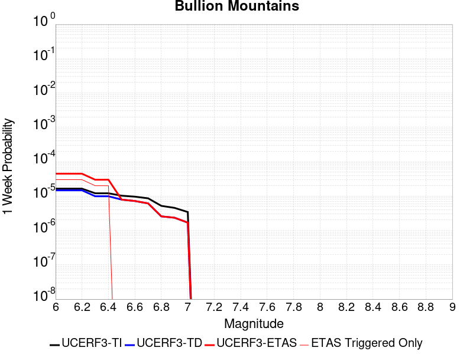 |  |  |  |

| Magnitude | 1 wk TI Prob | 1 wk TD Prob | 1 wk ETAS Prob | 1 wk ETAS/TD Gain | 1 wk ETAS Triggered Only | 1 mo TI Prob | 1 mo TD Prob | 1 mo ETAS Prob | 1 mo ETAS/TD Gain | 1 mo ETAS Triggered Only | 1 yr TI Prob | 1 yr TD Prob | 1 yr ETAS Prob | 1 yr ETAS/TD Gain | 1 yr ETAS Triggered Only | 10 yr TI Prob | 10 yr TD Prob | 10 yr ETAS Prob | 10 yr ETAS/TD Gain | 10 yr ETAS Triggered Only |
|-----|-----|-----|-----|-----|-----|-----|-----|-----|-----|-----|-----|-----|-----|-----|-----|-----|-----|-----|-----|-----|
| 6.0 | 1.6420427E-5 | 1.4692009E-5 | 4.469157E-5 | 3.0418963 | 3.0E-5 | 7.037136E-5 | 6.296445E-5 | 9.296256E-5 | 1.4764293 | 3.0E-5 | 8.5643446E-4 | 7.6636096E-4 | 7.9633796E-4 | 1.039116 | 3.0E-5 | 0.008531413 | 0.0076409746 | 0.0076707457 | 1.0038962 | 3.0E-5 |
| 6.1 | 1.6420427E-5 | 1.4692009E-5 | 4.469157E-5 | 3.0418963 | 3.0E-5 | 7.037136E-5 | 6.296445E-5 | 9.296256E-5 | 1.4764293 | 3.0E-5 | 8.5643446E-4 | 7.6636096E-4 | 7.9633796E-4 | 1.039116 | 3.0E-5 | 0.008531413 | 0.0076409746 | 0.0076707457 | 1.0038962 | 3.0E-5 |
| 6.2 | 1.6420427E-5 | 1.4692009E-5 | 4.469157E-5 | 3.0418963 | 3.0E-5 | 7.037136E-5 | 6.296445E-5 | 9.296256E-5 | 1.4764293 | 3.0E-5 | 8.5643446E-4 | 7.6636096E-4 | 7.9633796E-4 | 1.039116 | 3.0E-5 | 0.008531413 | 0.0076409746 | 0.0076707457 | 1.0038962 | 3.0E-5 |
| 6.3 | 1.2046778E-5 | 9.862255E-6 | 2.9862058E-5 | 3.0279138 | 2.0E-5 | 5.1628023E-5 | 4.2266256E-5 | 6.226541E-5 | 1.4731708 | 2.0E-5 | 6.283899E-4 | 5.144933E-4 | 5.3448306E-4 | 1.0388532 | 2.0E-5 | 0.0062661595 | 0.0051353034 | 0.0051552006 | 1.0038747 | 2.0E-5 |
| 6.4 | 1.2046778E-5 | 9.862255E-6 | 2.9862058E-5 | 3.0279138 | 2.0E-5 | 5.1628023E-5 | 4.2266256E-5 | 6.226541E-5 | 1.4731708 | 2.0E-5 | 6.283899E-4 | 5.144933E-4 | 5.3448306E-4 | 1.0388532 | 2.0E-5 | 0.0062661595 | 0.0051353034 | 0.0051552006 | 1.0038747 | 2.0E-5 |
| 6.5 | 1.0244343E-5 | 7.879378E-6 | 7.879378E-6 | 1.0 | 0.0 | 4.390359E-5 | 3.3768443E-5 | 3.3768443E-5 | 1.0 | 0.0 | 5.343951E-4 | 4.1107394E-4 | 4.1107394E-4 | 1.0 | 0.0 | 0.005331118 | 0.0041051665 | 0.0041051665 | 1.0 | 0.0 |
| 6.6 | 9.605408E-6 | 7.1774166E-6 | 7.1774166E-6 | 1.0 | 0.0 | 4.1165385E-5 | 3.0760108E-5 | 3.0760108E-5 | 1.0 | 0.0 | 5.010733E-4 | 3.7446033E-4 | 3.7446033E-4 | 1.0 | 0.0 | 0.00499945 | 0.0037402906 | 0.0037402906 | 1.0 | 0.0 |
| 6.7 | 8.60418E-6 | 6.123926E-6 | 6.123926E-6 | 1.0 | 0.0 | 3.687454E-5 | 2.6245243E-5 | 2.6245243E-5 | 1.0 | 0.0 | 4.48855E-4 | 3.195085E-4 | 3.195085E-4 | 1.0 | 0.0 | 0.004479495 | 0.0031924031 | 0.0031924031 | 1.0 | 0.0 |
| 6.8 | 5.187994E-6 | 2.563117E-6 | 2.563117E-6 | 1.0 | 0.0 | 2.223407E-5 | 1.0984763E-5 | 1.0984763E-5 | 1.0 | 0.0 | 2.7066618E-4 | 1.3373529E-4 | 1.3373529E-4 | 1.0 | 0.0 | 0.0027033675 | 0.0013369396 | 0.0013369396 | 1.0 | 0.0 |
| 6.9 | 4.5302368E-6 | 2.3442778E-6 | 2.3442778E-6 | 1.0 | 0.0 | 1.9415156E-5 | 1.0046889E-5 | 1.0046889E-5 | 1.0 | 0.0 | 2.3635388E-4 | 1.2231797E-4 | 1.2231797E-4 | 1.0 | 0.0 | 0.0023610266 | 0.0012228956 | 0.0012228956 | 1.0 | 0.0 |
| 7.0 | 3.431668E-6 | 1.6882177E-6 | 1.6882177E-6 | 1.0 | 0.0 | 1.4707065E-5 | 7.2352186E-6 | 7.2352186E-6 | 1.0 | 0.0 | 1.7904381E-4 | 8.808879E-5 | 8.808879E-5 | 1.0 | 0.0 | 0.0017889962 | 8.8088785E-4 | 8.8088785E-4 | 1.0 | 0.0 |

## San Gregorio (North) 2011 CFM
*[(top)](#table-of-contents)*

| 1 Week | 1 Month | 1 Year | 10 Year |
|-----|-----|-----|-----|
| 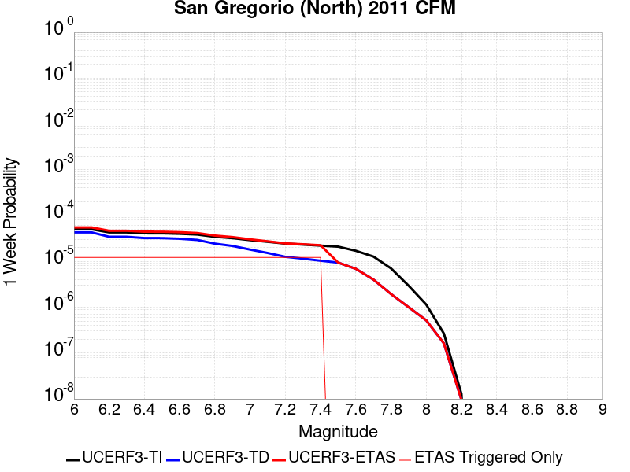 | 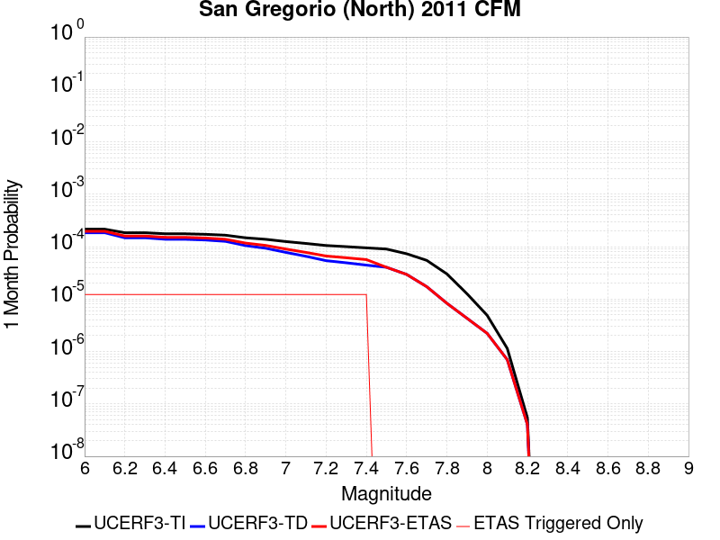 | 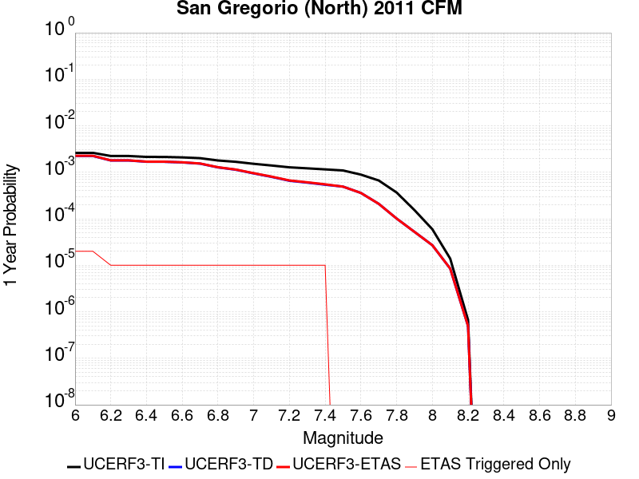 |  |

| Magnitude | 1 wk TI Prob | 1 wk TD Prob | 1 wk ETAS Prob | 1 wk ETAS/TD Gain | 1 wk ETAS Triggered Only | 1 mo TI Prob | 1 mo TD Prob | 1 mo ETAS Prob | 1 mo ETAS/TD Gain | 1 mo ETAS Triggered Only | 1 yr TI Prob | 1 yr TD Prob | 1 yr ETAS Prob | 1 yr ETAS/TD Gain | 1 yr ETAS Triggered Only | 10 yr TI Prob | 10 yr TD Prob | 10 yr ETAS Prob | 10 yr ETAS/TD Gain | 10 yr ETAS Triggered Only |
|-----|-----|-----|-----|-----|-----|-----|-----|-----|-----|-----|-----|-----|-----|-----|-----|-----|-----|-----|-----|-----|
| 6.0 | 5.0283932E-5 | 4.3057098E-5 | 5.305667E-5 | 1.2322397 | 1.0E-5 | 2.1548476E-4 | 1.8451746E-4 | 1.9451561E-4 | 1.0541854 | 1.0E-5 | 0.0026203706 | 0.002244199 | 0.0022641541 | 1.0088918 | 2.0E-5 | 0.02589687 | 0.022295918 | 0.02232525 | 1.0013156 | 3.0E-5 |
| 6.1 | 5.0283932E-5 | 4.3057098E-5 | 5.305667E-5 | 1.2322397 | 1.0E-5 | 2.1548476E-4 | 1.8451746E-4 | 1.9451561E-4 | 1.0541854 | 1.0E-5 | 0.0026203706 | 0.002244199 | 0.0022641541 | 1.0088918 | 2.0E-5 | 0.02589687 | 0.022295918 | 0.02232525 | 1.0013156 | 3.0E-5 |
| 6.2 | 4.2998647E-5 | 3.4440873E-5 | 4.4440527E-5 | 1.2903427 | 1.0E-5 | 1.842669E-4 | 1.4759546E-4 | 1.5759398E-4 | 1.0677427 | 1.0E-5 | 0.0022411412 | 0.001795506 | 0.001805488 | 1.0055594 | 1.0E-5 | 0.022186736 | 0.017884884 | 0.017894706 | 1.0005491 | 1.0E-5 |
| 6.3 | 4.2998647E-5 | 3.4440873E-5 | 4.4440527E-5 | 1.2903427 | 1.0E-5 | 1.842669E-4 | 1.4759546E-4 | 1.5759398E-4 | 1.0677427 | 1.0E-5 | 0.0022411412 | 0.001795506 | 0.001805488 | 1.0055594 | 1.0E-5 | 0.022186736 | 0.017884884 | 0.017894706 | 1.0005491 | 1.0E-5 |
| 6.4 | 4.1101295E-5 | 3.2326076E-5 | 4.232575E-5 | 1.3093379 | 1.0E-5 | 1.7613651E-4 | 1.3853304E-4 | 1.4853165E-4 | 1.0721749 | 1.0E-5 | 0.0021423528 | 0.0016853481 | 0.0016953313 | 1.0059235 | 1.0E-5 | 0.02121817 | 0.016800618 | 0.01681045 | 1.0005852 | 1.0E-5 |
| 6.5 | 4.1032585E-5 | 3.224411E-5 | 4.2243788E-5 | 1.3101242 | 1.0E-5 | 1.7584208E-4 | 1.381818E-4 | 1.4818042E-4 | 1.0723585 | 1.0E-5 | 0.0021387753 | 0.0016810785 | 0.0016910617 | 1.0059385 | 1.0E-5 | 0.021183075 | 0.01675857 | 0.016768403 | 1.0005867 | 1.0E-5 |
| 6.6 | 4.011629E-5 | 3.1265718E-5 | 4.1265404E-5 | 1.3198291 | 1.0E-5 | 1.7191563E-4 | 1.3398913E-4 | 1.4398778E-4 | 1.0746229 | 1.0E-5 | 0.0020910634 | 0.0016301107 | 0.0016400943 | 1.0061245 | 1.0E-5 | 0.020714961 | 0.016257357 | 0.016267195 | 1.0006051 | 1.0E-5 |
| 6.7 | 3.8583938E-5 | 2.9452754E-5 | 3.945246E-5 | 1.3395168 | 1.0E-5 | 1.6534925E-4 | 1.2622007E-4 | 1.362188E-4 | 1.0792167 | 1.0E-5 | 0.0020112682 | 0.0015356604 | 0.001545645 | 1.0065019 | 1.0E-5 | 0.019931622 | 0.015326062 | 0.015335909 | 1.0006425 | 1.0E-5 |
| 6.8 | 3.44341E-5 | 2.4450024E-5 | 3.444978E-5 | 1.4089875 | 1.0E-5 | 1.4756636E-4 | 1.0478167E-4 | 1.1478062E-4 | 1.0954266 | 1.0E-5 | 0.0017951399 | 0.0012749807 | 0.001284968 | 1.0078332 | 1.0E-5 | 0.017807078 | 0.012751525 | 0.012761398 | 1.0007743 | 1.0E-5 |
| 6.9 | 3.221199E-5 | 2.1777196E-5 | 3.1776977E-5 | 1.459186 | 1.0E-5 | 1.3804408E-4 | 9.3327544E-5 | 1.0332661E-4 | 1.1071395 | 1.0E-5 | 0.0016793909 | 0.0011356788 | 0.0011456675 | 1.0087953 | 1.0E-5 | 0.01666756 | 0.011372544 | 0.01138243 | 1.0008693 | 1.0E-5 |
| 7.0 | 2.9186718E-5 | 1.814604E-5 | 2.814586E-5 | 1.5510744 | 1.0E-5 | 1.2507994E-4 | 7.776645E-5 | 8.776567E-5 | 1.1285802 | 1.0E-5 | 0.0015217843 | 9.463997E-4 | 9.563902E-4 | 1.0105563 | 1.0E-5 | 0.015114053 | 0.0094966395 | 0.009506545 | 1.001043 | 1.0E-5 |
| 7.1 | 2.6840138E-5 | 1.5283675E-5 | 2.5283522E-5 | 1.6542829 | 1.0E-5 | 1.1502409E-4 | 6.549983E-5 | 7.549918E-5 | 1.1526622 | 1.0E-5 | 0.0013995186 | 7.971706E-4 | 8.0716267E-4 | 1.0125344 | 1.0E-5 | 0.013907375 | 0.0080155255 | 0.008025446 | 1.0012376 | 1.0E-5 |
| 7.2 | 2.453002E-5 | 1.2605825E-5 | 2.2605698E-5 | 1.793274 | 1.0E-5 | 1.05124425E-4 | 5.4023847E-5 | 6.4023305E-5 | 1.1850934 | 1.0E-5 | 0.0012791384 | 6.5754243E-4 | 6.675359E-4 | 1.0151981 | 1.0E-5 | 0.012718005 | 0.006627395 | 0.0066373283 | 1.0014989 | 1.0E-5 |
| 7.3 | 2.3330727E-5 | 1.1487833E-5 | 2.1487718E-5 | 1.8704762 | 1.0E-5 | 9.9985E-5 | 4.923264E-5 | 5.923215E-5 | 1.2031072 | 1.0E-5 | 0.0012166376 | 5.99243E-4 | 6.09237E-4 | 1.0166777 | 1.0E-5 | 0.012099981 | 0.0060462817 | 0.006056221 | 1.0016439 | 1.0E-5 |
| 7.4 | 2.2136466E-5 | 1.0368137E-5 | 2.0368032E-5 | 1.9644835 | 1.0E-5 | 9.486712E-5 | 4.4434113E-5 | 5.443367E-5 | 1.2250423 | 1.0E-5 | 0.0011543952 | 5.408513E-4 | 5.508459E-4 | 1.0184793 | 1.0E-5 | 0.011484168 | 0.0054640025 | 0.005473948 | 1.0018202 | 1.0E-5 |
| 7.5 | 2.0994974E-5 | 9.426374E-6 | 9.426374E-6 | 1.0 | 0.0 | 8.997535E-5 | 4.0398125E-5 | 4.0398125E-5 | 1.0 | 0.0 | 0.0010948994 | 4.917364E-4 | 4.917364E-4 | 1.0 | 0.0 | 0.010895205 | 0.004973108 | 0.004973108 | 1.0 | 0.0 |
| 7.6 | 1.7091823E-5 | 6.892992E-6 | 6.892992E-6 | 1.0 | 0.0 | 7.3248615E-5 | 2.9541061E-5 | 2.9541061E-5 | 1.0 | 0.0 | 8.9143694E-4 | 3.5960317E-4 | 3.5960317E-4 | 1.0 | 0.0 | 0.008878695 | 0.0036480771 | 0.0036480771 | 1.0 | 0.0 |
| 7.7 | 1.2772179E-5 | 4.0202267E-6 | 4.0202267E-6 | 1.0 | 0.0 | 5.473676E-5 | 1.722943E-5 | 1.722943E-5 | 1.0 | 0.0 | 6.6621625E-4 | 2.0974813E-4 | 2.0974813E-4 | 1.0 | 0.0 | 0.006642225 | 0.0021365841 | 0.0021365841 | 1.0 | 0.0 |
| 7.8 | 7.041923E-6 | 1.9402341E-6 | 1.9402341E-6 | 1.0 | 0.0 | 3.017932E-5 | 8.315263E-6 | 8.315263E-6 | 1.0 | 0.0 | 3.6737128E-4 | 1.01233614E-4 | 1.01233614E-4 | 1.0 | 0.0 | 0.0036676454 | 0.0010376878 | 0.0010376878 | 1.0 | 0.0 |
| 7.9 | 2.946768E-6 | 1.0031822E-6 | 1.0031822E-6 | 1.0 | 0.0 | 1.2628945E-5 | 4.299345E-6 | 4.299345E-6 | 1.0 | 0.0 | 1.5374656E-4 | 5.2343268E-5 | 5.2343268E-5 | 1.0 | 0.0 | 0.0015364023 | 5.339059E-4 | 5.339059E-4 | 1.0 | 0.0 |
| 8.0 | 1.1433375E-6 | 5.180804E-7 | 5.180804E-7 | 1.0 | 0.0 | 4.9000087E-6 | 2.2203426E-6 | 2.2203426E-6 | 1.0 | 0.0 | 5.965597E-5 | 2.7032334E-5 | 2.7032334E-5 | 1.0 | 0.0 | 5.963996E-4 | 2.7394458E-4 | 2.7394458E-4 | 1.0 | 0.0 |
| 8.1 | 2.6675295E-7 | 1.6288074E-7 | 1.6288074E-7 | 1.0 | 0.0 | 1.1432264E-6 | 6.9806015E-7 | 6.9806015E-7 | 1.0 | 0.0 | 1.3918692E-5 | 8.498849E-6 | 8.498849E-6 | 1.0 | 0.0 | 1.391782E-4 | 8.6366665E-5 | 8.6366665E-5 | 1.0 | 0.0 |
| 8.2 | 1.2704569E-8 | 9.429871E-9 | 9.429871E-9 | 1.0 | 0.0 | 5.444815E-8 | 4.041373E-8 | 4.041373E-8 | 1.0 | 0.0 | 6.629061E-7 | 4.920371E-7 | 4.920371E-7 | 1.0 | 0.0 | 6.629041E-6 | 5.1106863E-6 | 5.1106863E-6 | 1.0 | 0.0 |

## Red Mountain
*[(top)](#table-of-contents)*

| 1 Week | 1 Month | 1 Year | 10 Year |
|-----|-----|-----|-----|
| 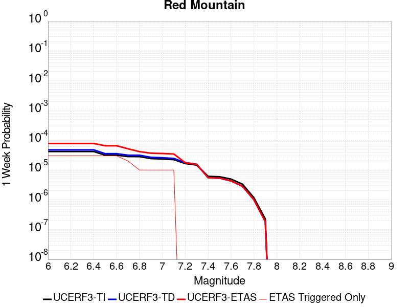 |  |  | 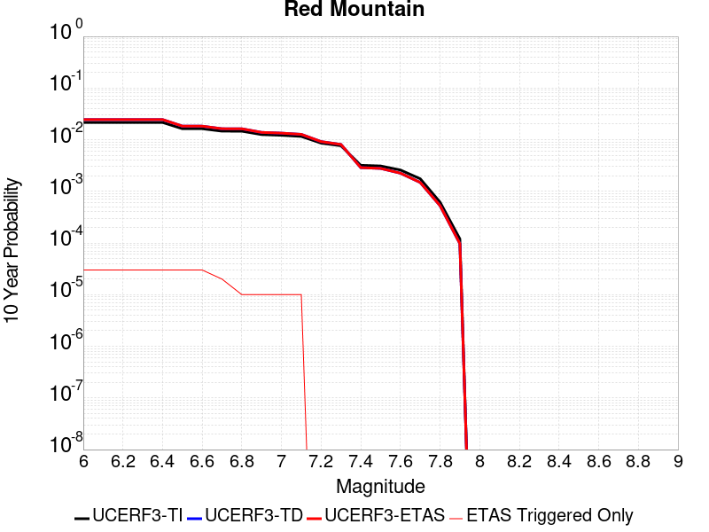 |

| Magnitude | 1 wk TI Prob | 1 wk TD Prob | 1 wk ETAS Prob | 1 wk ETAS/TD Gain | 1 wk ETAS Triggered Only | 1 mo TI Prob | 1 mo TD Prob | 1 mo ETAS Prob | 1 mo ETAS/TD Gain | 1 mo ETAS Triggered Only | 1 yr TI Prob | 1 yr TD Prob | 1 yr ETAS Prob | 1 yr ETAS/TD Gain | 1 yr ETAS Triggered Only | 10 yr TI Prob | 10 yr TD Prob | 10 yr ETAS Prob | 10 yr ETAS/TD Gain | 10 yr ETAS Triggered Only |
|-----|-----|-----|-----|-----|-----|-----|-----|-----|-----|-----|-----|-----|-----|-----|-----|-----|-----|-----|-----|-----|
| 6.0 | 4.1810763E-5 | 4.7590016E-5 | 7.7588586E-5 | 1.6303543 | 3.0E-5 | 1.7917668E-4 | 2.039422E-4 | 2.3393608E-4 | 1.1470705 | 3.0E-5 | 0.0021792934 | 0.0024803334 | 0.002510259 | 1.0120652 | 3.0E-5 | 0.021580452 | 0.02454411 | 0.024573375 | 1.0011923 | 3.0E-5 |
| 6.1 | 4.1810763E-5 | 4.7590016E-5 | 7.7588586E-5 | 1.6303543 | 3.0E-5 | 1.7917668E-4 | 2.039422E-4 | 2.3393608E-4 | 1.1470705 | 3.0E-5 | 0.0021792934 | 0.0024803334 | 0.002510259 | 1.0120652 | 3.0E-5 | 0.021580452 | 0.02454411 | 0.024573375 | 1.0011923 | 3.0E-5 |
| 6.2 | 4.1810763E-5 | 4.7590016E-5 | 7.7588586E-5 | 1.6303543 | 3.0E-5 | 1.7917668E-4 | 2.039422E-4 | 2.3393608E-4 | 1.1470705 | 3.0E-5 | 0.0021792934 | 0.0024803334 | 0.002510259 | 1.0120652 | 3.0E-5 | 0.021580452 | 0.02454411 | 0.024573375 | 1.0011923 | 3.0E-5 |
| 6.3 | 4.1810763E-5 | 4.7590016E-5 | 7.7588586E-5 | 1.6303543 | 3.0E-5 | 1.7917668E-4 | 2.039422E-4 | 2.3393608E-4 | 1.1470705 | 3.0E-5 | 0.0021792934 | 0.0024803334 | 0.002510259 | 1.0120652 | 3.0E-5 | 0.021580452 | 0.02454411 | 0.024573375 | 1.0011923 | 3.0E-5 |
| 6.4 | 4.1810763E-5 | 4.7590016E-5 | 7.7588586E-5 | 1.6303543 | 3.0E-5 | 1.7917668E-4 | 2.039422E-4 | 2.3393608E-4 | 1.1470705 | 3.0E-5 | 0.0021792934 | 0.0024803334 | 0.002510259 | 1.0120652 | 3.0E-5 | 0.021580452 | 0.02454411 | 0.024573375 | 1.0011923 | 3.0E-5 |
| 6.5 | 3.154503E-5 | 3.5359757E-5 | 6.53587E-5 | 1.8483921 | 3.0E-5 | 1.3518598E-4 | 1.5153353E-4 | 1.8152899E-4 | 1.197946 | 3.0E-5 | 0.0016446467 | 0.0018434518 | 0.0018733965 | 1.0162438 | 3.0E-5 | 0.01632528 | 0.018291244 | 0.018320696 | 1.0016102 | 3.0E-5 |
| 6.6 | 3.1535834E-5 | 3.5349138E-5 | 6.534808E-5 | 1.848647 | 3.0E-5 | 1.3514658E-4 | 1.5148803E-4 | 1.8148348E-4 | 1.1980054 | 3.0E-5 | 0.0016441676 | 0.0018428987 | 0.0018728434 | 1.0162487 | 3.0E-5 | 0.01632056 | 0.018285805 | 0.018315258 | 1.0016106 | 3.0E-5 |
| 6.7 | 2.8267326E-5 | 3.1469353E-5 | 5.1468727E-5 | 1.6355189 | 2.0E-5 | 1.2114006E-4 | 1.3486217E-4 | 1.5485947E-4 | 1.1482795 | 2.0E-5 | 0.0014738824 | 0.0016407954 | 0.0016607626 | 1.0121692 | 2.0E-5 | 0.014641452 | 0.01629557 | 0.016315246 | 1.0012074 | 2.0E-5 |
| 6.8 | 2.8212884E-5 | 3.1407242E-5 | 4.1406925E-5 | 1.3183879 | 1.0E-5 | 1.20906756E-4 | 1.3459599E-4 | 1.4459465E-4 | 1.0742865 | 1.0E-5 | 0.0014710457 | 0.0016375595 | 0.0016475432 | 1.0060966 | 1.0E-5 | 0.014613459 | 0.016263688 | 0.016273525 | 1.0006049 | 1.0E-5 |
| 6.9 | 2.4227871E-5 | 2.6706994E-5 | 3.6706726E-5 | 1.3744237 | 1.0E-5 | 1.03829596E-4 | 1.1445395E-4 | 1.2445281E-4 | 1.0873613 | 1.0E-5 | 0.0012633923 | 0.0013926621 | 0.001402648 | 1.0071704 | 1.0E-5 | 0.012562336 | 0.0138470335 | 0.013856895 | 1.0007122 | 1.0E-5 |
| 7.0 | 2.348524E-5 | 2.5835778E-5 | 3.583552E-5 | 1.3870502 | 1.0E-5 | 1.0064714E-4 | 1.10720495E-4 | 1.20719385E-4 | 1.0903075 | 1.0E-5 | 0.0012246901 | 0.001347264 | 0.0013572506 | 1.0074124 | 1.0E-5 | 0.012179627 | 0.013398598 | 0.013408463 | 1.0007364 | 1.0E-5 |
| 7.1 | 2.2311642E-5 | 2.4462845E-5 | 3.44626E-5 | 1.4087732 | 1.0E-5 | 9.561782E-5 | 1.04836974E-4 | 1.1483592E-4 | 1.0953763 | 1.0E-5 | 0.0011635252 | 0.0012757176 | 0.0012857048 | 1.0078287 | 1.0E-5 | 0.01157452 | 0.01269146 | 0.012701333 | 1.000778 | 1.0E-5 |
| 7.2 | 1.6533986E-5 | 1.7670362E-5 | 1.7670362E-5 | 1.0 | 0.0 | 7.085802E-5 | 7.572828E-5 | 7.572828E-5 | 1.0 | 0.0 | 8.623549E-4 | 9.2166534E-4 | 9.2166534E-4 | 1.0 | 0.0 | 0.008590161 | 0.009184707 | 0.009184707 | 1.0 | 0.0 |
| 7.3 | 1.4703092E-5 | 1.5559537E-5 | 1.5559537E-5 | 1.0 | 0.0 | 6.301173E-5 | 6.668237E-5 | 6.668237E-5 | 1.0 | 0.0 | 7.668978E-4 | 8.1161706E-4 | 8.1161706E-4 | 1.0 | 0.0 | 0.0076425658 | 0.008092604 | 0.008092604 | 1.0 | 0.0 |
| 7.4 | 6.1331984E-6 | 5.5288874E-6 | 5.5288874E-6 | 1.0 | 0.0 | 2.6284872E-5 | 2.3695018E-5 | 2.3695018E-5 | 1.0 | 0.0 | 3.199713E-4 | 2.884492E-4 | 2.884492E-4 | 1.0 | 0.0 | 0.0031951098 | 0.0028808024 | 0.0028808024 | 1.0 | 0.0 |
| 7.5 | 5.954766E-6 | 5.338517E-6 | 5.338517E-6 | 1.0 | 0.0 | 2.5520176E-5 | 2.2879161E-5 | 2.2879161E-5 | 1.0 | 0.0 | 3.1066386E-4 | 2.785187E-4 | 2.785187E-4 | 1.0 | 0.0 | 0.003102299 | 0.0027817504 | 0.0027817504 | 1.0 | 0.0 |
| 7.6 | 4.9726646E-6 | 4.315309E-6 | 4.315309E-6 | 1.0 | 0.0 | 2.1311245E-5 | 1.8494053E-5 | 1.8494053E-5 | 1.0 | 0.0 | 2.5943352E-4 | 2.2514217E-4 | 2.2514217E-4 | 1.0 | 0.0 | 0.0025913084 | 0.0022491754 | 0.0022491754 | 1.0 | 0.0 |
| 7.7 | 3.3613894E-6 | 2.8526886E-6 | 2.8526886E-6 | 1.0 | 0.0 | 1.4405875E-5 | 1.22257525E-5 | 1.22257525E-5 | 1.0 | 0.0 | 1.7537741E-4 | 1.4883863E-4 | 1.4883863E-4 | 1.0 | 0.0 | 0.0017523908 | 0.0014874157 | 0.0014874157 | 1.0 | 0.0 |
| 7.8 | 1.1828961E-6 | 1.0122935E-6 | 1.0122935E-6 | 1.0 | 0.0 | 5.069545E-6 | 4.338394E-6 | 4.338394E-6 | 1.0 | 0.0 | 6.171996E-5 | 5.281869E-5 | 5.281869E-5 | 1.0 | 0.0 | 6.170282E-4 | 5.280643E-4 | 5.280643E-4 | 1.0 | 0.0 |
| 7.9 | 2.2967266E-7 | 1.861919E-7 | 1.861919E-7 | 1.0 | 0.0 | 9.843111E-7 | 7.97965E-7 | 7.97965E-7 | 1.0 | 0.0 | 1.19839215E-5 | 9.715184E-6 | 9.715184E-6 | 1.0 | 0.0 | 1.1983275E-4 | 9.714788E-5 | 9.714788E-5 | 1.0 | 0.0 |

## Kern Canyon (South Kern) 2011
*[(top)](#table-of-contents)*

| 1 Week | 1 Month | 1 Year | 10 Year |
|-----|-----|-----|-----|
|  |  |  |  |

| Magnitude | 1 wk TI Prob | 1 wk TD Prob | 1 wk ETAS Prob | 1 wk ETAS/TD Gain | 1 wk ETAS Triggered Only | 1 mo TI Prob | 1 mo TD Prob | 1 mo ETAS Prob | 1 mo ETAS/TD Gain | 1 mo ETAS Triggered Only | 1 yr TI Prob | 1 yr TD Prob | 1 yr ETAS Prob | 1 yr ETAS/TD Gain | 1 yr ETAS Triggered Only | 10 yr TI Prob | 10 yr TD Prob | 10 yr ETAS Prob | 10 yr ETAS/TD Gain | 10 yr ETAS Triggered Only |
|-----|-----|-----|-----|-----|-----|-----|-----|-----|-----|-----|-----|-----|-----|-----|-----|-----|-----|-----|-----|-----|
| 6.0 | 4.105075E-6 | 4.113726E-6 | 3.4113604E-5 | 8.292629 | 3.0E-5 | 1.7593058E-5 | 1.7630138E-5 | 4.7629608E-5 | 2.7016015 | 3.0E-5 | 2.1417443E-4 | 2.1462643E-4 | 2.4462E-4 | 1.1397477 | 3.0E-5 | 0.0021396813 | 0.0021442554 | 0.002174191 | 1.0139608 | 3.0E-5 |
| 6.1 | 4.105075E-6 | 4.113726E-6 | 3.4113604E-5 | 8.292629 | 3.0E-5 | 1.7593058E-5 | 1.7630138E-5 | 4.7629608E-5 | 2.7016015 | 3.0E-5 | 2.1417443E-4 | 2.1462643E-4 | 2.4462E-4 | 1.1397477 | 3.0E-5 | 0.0021396813 | 0.0021442554 | 0.002174191 | 1.0139608 | 3.0E-5 |
| 6.2 | 4.105075E-6 | 4.113726E-6 | 3.4113604E-5 | 8.292629 | 3.0E-5 | 1.7593058E-5 | 1.7630138E-5 | 4.7629608E-5 | 2.7016015 | 3.0E-5 | 2.1417443E-4 | 2.1462643E-4 | 2.4462E-4 | 1.1397477 | 3.0E-5 | 0.0021396813 | 0.0021442554 | 0.002174191 | 1.0139608 | 3.0E-5 |
| 6.3 | 4.105075E-6 | 4.113726E-6 | 3.4113604E-5 | 8.292629 | 3.0E-5 | 1.7593058E-5 | 1.7630138E-5 | 4.7629608E-5 | 2.7016015 | 3.0E-5 | 2.1417443E-4 | 2.1462643E-4 | 2.4462E-4 | 1.1397477 | 3.0E-5 | 0.0021396813 | 0.0021442554 | 0.002174191 | 1.0139608 | 3.0E-5 |
| 6.4 | 4.105075E-6 | 4.113726E-6 | 3.4113604E-5 | 8.292629 | 3.0E-5 | 1.7593058E-5 | 1.7630138E-5 | 4.7629608E-5 | 2.7016015 | 3.0E-5 | 2.1417443E-4 | 2.1462643E-4 | 2.4462E-4 | 1.1397477 | 3.0E-5 | 0.0021396813 | 0.0021442554 | 0.002174191 | 1.0139608 | 3.0E-5 |
| 6.5 | 2.9849807E-6 | 2.973154E-6 | 3.2973065E-5 | 11.090264 | 3.0E-5 | 1.2792712E-5 | 1.2742028E-5 | 4.2741645E-5 | 3.3543832 | 3.0E-5 | 1.5574014E-4 | 1.551233E-4 | 1.8511864E-4 | 1.1933645 | 3.0E-5 | 0.0015563103 | 0.0015501654 | 0.0015801188 | 1.0193228 | 3.0E-5 |
| 6.6 | 2.9849807E-6 | 2.973154E-6 | 3.2973065E-5 | 11.090264 | 3.0E-5 | 1.2792712E-5 | 1.2742028E-5 | 4.2741645E-5 | 3.3543832 | 3.0E-5 | 1.5574014E-4 | 1.551233E-4 | 1.8511864E-4 | 1.1933645 | 3.0E-5 | 0.0015563103 | 0.0015501654 | 0.0015801188 | 1.0193228 | 3.0E-5 |
| 6.7 | 2.6756725E-6 | 2.6582202E-6 | 2.2658167E-5 | 8.523811 | 2.0E-5 | 1.1467117E-5 | 1.1392323E-5 | 3.1392094E-5 | 2.7555482 | 2.0E-5 | 1.396032E-4 | 1.386928E-4 | 1.5869003E-4 | 1.1441836 | 2.0E-5 | 0.0013951553 | 0.0013860734 | 0.0014060457 | 1.0144093 | 2.0E-5 |
| 6.8 | 2.3283721E-6 | 2.3047783E-6 | 2.2304732E-5 | 9.677605 | 2.0E-5 | 9.9787E-6 | 9.877584E-6 | 2.9877387E-5 | 3.0247667 | 2.0E-5 | 1.214839E-4 | 1.2025302E-4 | 1.4025062E-4 | 1.166296 | 2.0E-5 | 0.001214175 | 0.001201887 | 0.001221863 | 1.0166205 | 2.0E-5 |
| 6.9 | 2.0972677E-6 | 2.0696405E-6 | 2.2069598E-5 | 10.663494 | 2.0E-5 | 8.988259E-6 | 8.869858E-6 | 2.8869681E-5 | 3.2548075 | 2.0E-5 | 1.0942656E-4 | 1.0798523E-4 | 1.2798308E-4 | 1.1851906 | 2.0E-5 | 0.0010937268 | 0.0010793334 | 0.0010993119 | 1.01851 | 2.0E-5 |
| 7.0 | 1.7132242E-6 | 1.6787029E-6 | 1.1678686E-5 | 6.95697 | 1.0E-5 | 7.3423685E-6 | 7.1944214E-6 | 1.719435E-5 | 2.3899558 | 1.0E-5 | 8.938967E-5 | 8.75886E-5 | 9.758773E-5 | 1.1141601 | 1.0E-5 | 8.935372E-4 | 8.755446E-4 | 8.855359E-4 | 1.0114114 | 1.0E-5 |
| 7.1 | 1.4215541E-6 | 1.3815746E-6 | 1.138156E-5 | 8.238108 | 1.0E-5 | 6.0923603E-6 | 5.9210206E-6 | 1.5920961E-5 | 2.688888 | 1.0E-5 | 7.417196E-5 | 7.208607E-5 | 8.2085346E-5 | 1.138713 | 1.0E-5 | 7.414721E-4 | 7.206296E-4 | 7.306224E-4 | 1.0138668 | 1.0E-5 |
| 7.2 | 9.097853E-7 | 8.60377E-7 | 8.60377E-7 | 1.0 | 0.0 | 3.899074E-6 | 3.6873246E-6 | 3.6873246E-6 | 1.0 | 0.0 | 4.7470192E-5 | 4.4892266E-5 | 4.4892266E-5 | 1.0 | 0.0 | 4.7460053E-4 | 4.4883305E-4 | 4.4883305E-4 | 1.0 | 0.0 |
| 7.3 | 6.144169E-7 | 5.628199E-7 | 5.628199E-7 | 1.0 | 0.0 | 2.6332125E-6 | 2.4120832E-6 | 2.4120832E-6 | 1.0 | 0.0 | 3.205889E-5 | 2.9366722E-5 | 2.9366722E-5 | 1.0 | 0.0 | 3.2054266E-4 | 2.9362892E-4 | 2.9362892E-4 | 1.0 | 0.0 |
| 7.4 | 4.049844E-7 | 3.5728252E-7 | 3.5728252E-7 | 1.0 | 0.0 | 1.7356463E-6 | 1.5312098E-6 | 1.5312098E-6 | 1.0 | 0.0 | 2.1131287E-5 | 1.8642324E-5 | 1.8642324E-5 | 1.0 | 0.0 | 2.1129279E-4 | 1.8640784E-4 | 1.8640784E-4 | 1.0 | 0.0 |
| 7.5 | 1.9871162E-7 | 1.5830383E-7 | 1.5830383E-7 | 1.0 | 0.0 | 8.5162094E-7 | 6.784448E-7 | 6.784448E-7 | 1.0 | 0.0 | 1.0368436E-5 | 8.260035E-6 | 8.260035E-6 | 1.0 | 0.0 | 1.0367952E-4 | 8.259736E-5 | 8.259736E-5 | 1.0 | 0.0 |
| 7.6 | 2.572245E-8 | 1.735264E-8 | 1.735264E-8 | 1.0 | 0.0 | 1.10239064E-7 | 7.436845E-8 | 7.436845E-8 | 1.0 | 0.0 | 1.3421597E-6 | 9.0543557E-7 | 9.0543557E-7 | 1.0 | 0.0 | 1.3421517E-5 | 9.054324E-6 | 9.054324E-6 | 1.0 | 0.0 |

## Independence rev 2011
*[(top)](#table-of-contents)*

| 1 Week | 1 Month | 1 Year | 10 Year |
|-----|-----|-----|-----|
| 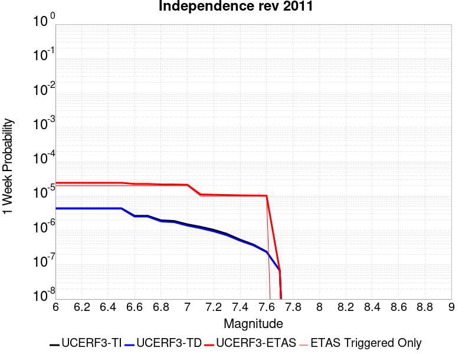 |  | 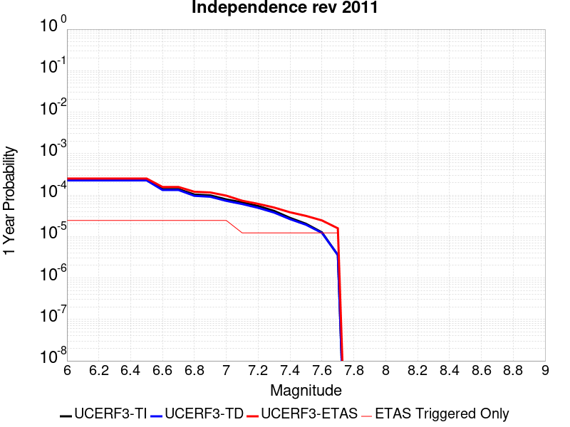 | 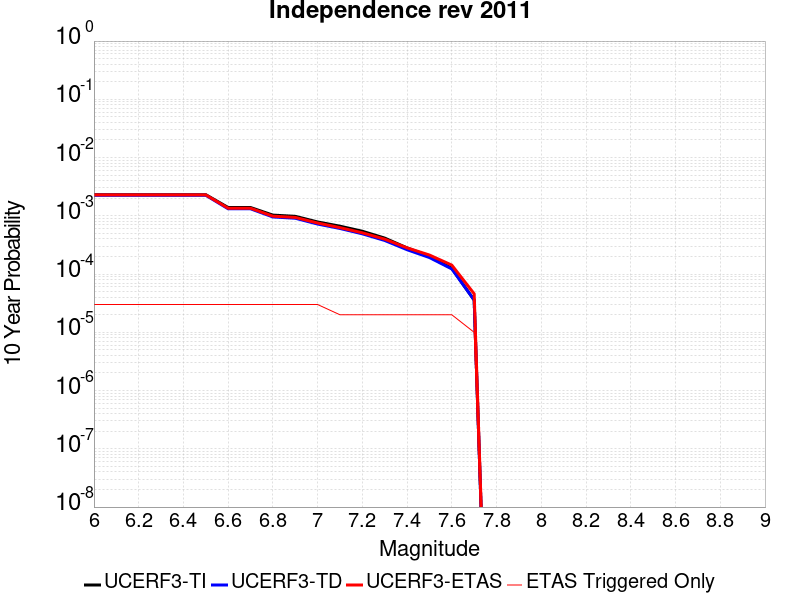 |

| Magnitude | 1 wk TI Prob | 1 wk TD Prob | 1 wk ETAS Prob | 1 wk ETAS/TD Gain | 1 wk ETAS Triggered Only | 1 mo TI Prob | 1 mo TD Prob | 1 mo ETAS Prob | 1 mo ETAS/TD Gain | 1 mo ETAS Triggered Only | 1 yr TI Prob | 1 yr TD Prob | 1 yr ETAS Prob | 1 yr ETAS/TD Gain | 1 yr ETAS Triggered Only | 10 yr TI Prob | 10 yr TD Prob | 10 yr ETAS Prob | 10 yr ETAS/TD Gain | 10 yr ETAS Triggered Only |
|-----|-----|-----|-----|-----|-----|-----|-----|-----|-----|-----|-----|-----|-----|-----|-----|-----|-----|-----|-----|-----|
| 6.0 | 4.422171E-6 | 4.3262253E-6 | 2.4326138E-5 | 5.6229477 | 2.0E-5 | 1.8952025E-5 | 1.8540852E-5 | 3.854048E-5 | 2.078679 | 2.0E-5 | 2.3071647E-4 | 2.2571447E-4 | 2.5570768E-4 | 1.1328813 | 3.0E-5 | 0.0023047708 | 0.0022551457 | 0.002285078 | 1.0132729 | 3.0E-5 |
| 6.1 | 4.422171E-6 | 4.3262253E-6 | 2.4326138E-5 | 5.6229477 | 2.0E-5 | 1.8952025E-5 | 1.8540852E-5 | 3.854048E-5 | 2.078679 | 2.0E-5 | 2.3071647E-4 | 2.2571447E-4 | 2.5570768E-4 | 1.1328813 | 3.0E-5 | 0.0023047708 | 0.0022551457 | 0.002285078 | 1.0132729 | 3.0E-5 |
| 6.2 | 4.422171E-6 | 4.3262253E-6 | 2.4326138E-5 | 5.6229477 | 2.0E-5 | 1.8952025E-5 | 1.8540852E-5 | 3.854048E-5 | 2.078679 | 2.0E-5 | 2.3071647E-4 | 2.2571447E-4 | 2.5570768E-4 | 1.1328813 | 3.0E-5 | 0.0023047708 | 0.0022551457 | 0.002285078 | 1.0132729 | 3.0E-5 |
| 6.3 | 4.422171E-6 | 4.3262253E-6 | 2.4326138E-5 | 5.6229477 | 2.0E-5 | 1.8952025E-5 | 1.8540852E-5 | 3.854048E-5 | 2.078679 | 2.0E-5 | 2.3071647E-4 | 2.2571447E-4 | 2.5570768E-4 | 1.1328813 | 3.0E-5 | 0.0023047708 | 0.0022551457 | 0.002285078 | 1.0132729 | 3.0E-5 |
| 6.4 | 4.422171E-6 | 4.3262253E-6 | 2.4326138E-5 | 5.6229477 | 2.0E-5 | 1.8952025E-5 | 1.8540852E-5 | 3.854048E-5 | 2.078679 | 2.0E-5 | 2.3071647E-4 | 2.2571447E-4 | 2.5570768E-4 | 1.1328813 | 3.0E-5 | 0.0023047708 | 0.0022551457 | 0.002285078 | 1.0132729 | 3.0E-5 |
| 6.5 | 4.422171E-6 | 4.3262253E-6 | 2.4326138E-5 | 5.6229477 | 2.0E-5 | 1.8952025E-5 | 1.8540852E-5 | 3.854048E-5 | 2.078679 | 2.0E-5 | 2.3071647E-4 | 2.2571447E-4 | 2.5570768E-4 | 1.1328813 | 3.0E-5 | 0.0023047708 | 0.0022551457 | 0.002285078 | 1.0132729 | 3.0E-5 |
| 6.6 | 2.663744E-6 | 2.5319846E-6 | 2.2531935E-5 | 8.898922 | 2.0E-5 | 1.1415996E-5 | 1.08513195E-5 | 3.0851104E-5 | 2.8430738 | 2.0E-5 | 1.3898089E-4 | 1.321073E-4 | 1.6210333E-4 | 1.2270582 | 3.0E-5 | 0.0013889399 | 0.0013203359 | 0.0013502963 | 1.0226915 | 3.0E-5 |
| 6.7 | 2.663744E-6 | 2.5319846E-6 | 2.2531935E-5 | 8.898922 | 2.0E-5 | 1.1415996E-5 | 1.08513195E-5 | 3.0851104E-5 | 2.8430738 | 2.0E-5 | 1.3898089E-4 | 1.321073E-4 | 1.6210333E-4 | 1.2270582 | 3.0E-5 | 0.0013889399 | 0.0013203359 | 0.0013502963 | 1.0226915 | 3.0E-5 |
| 6.8 | 1.9716529E-6 | 1.8322567E-6 | 2.183222E-5 | 11.915482 | 2.0E-5 | 8.449913E-6 | 7.852505E-6 | 2.7852348E-5 | 3.5469377 | 2.0E-5 | 1.0287284E-4 | 9.560019E-5 | 1.2559732E-4 | 1.3137769 | 3.0E-5 | 0.0010282523 | 9.5560355E-4 | 9.855749E-4 | 1.0313637 | 3.0E-5 |
| 6.9 | 1.8788617E-6 | 1.7429976E-6 | 2.1742962E-5 | 12.474465 | 2.0E-5 | 8.0522395E-6 | 7.4699688E-6 | 2.746982E-5 | 3.6773674 | 2.0E-5 | 9.80316E-5 | 9.09432E-5 | 1.20940465E-4 | 1.3298463 | 3.0E-5 | 9.798837E-4 | 9.090718E-4 | 9.390446E-4 | 1.0329707 | 3.0E-5 |
| 7.0 | 1.5045488E-6 | 1.3849498E-6 | 2.1384922E-5 | 15.440937 | 2.0E-5 | 6.44805E-6 | 5.9354857E-6 | 2.5935367E-5 | 4.369544 | 2.0E-5 | 7.8502184E-5 | 7.226219E-5 | 1.02260026E-4 | 1.4151249 | 3.0E-5 | 7.8474457E-4 | 7.223921E-4 | 7.523704E-4 | 1.0414987 | 3.0E-5 |
| 7.1 | 1.272341E-6 | 1.1625089E-6 | 1.1162498E-5 | 9.602075 | 1.0E-5 | 5.4528787E-6 | 4.9821715E-6 | 1.4982122E-5 | 3.0071468 | 1.0E-5 | 6.6386776E-5 | 6.0656283E-5 | 8.065507E-5 | 1.3297068 | 2.0E-5 | 6.636695E-4 | 6.064005E-4 | 6.2638836E-4 | 1.0329615 | 2.0E-5 |
| 7.2 | 1.0416892E-6 | 9.409871E-7 | 1.09409775E-5 | 11.627129 | 1.0E-5 | 4.464375E-6 | 4.032796E-6 | 1.4032756E-5 | 3.4796593 | 1.0E-5 | 5.4352407E-5 | 4.9098202E-5 | 6.9097216E-5 | 1.4073269 | 2.0E-5 | 5.4339116E-4 | 4.908754E-4 | 5.108656E-4 | 1.0407236 | 2.0E-5 |
| 7.3 | 7.9450155E-7 | 7.2350036E-7 | 1.0723493E-5 | 14.821683 | 1.0E-5 | 3.4050022E-6 | 3.1007123E-6 | 1.3100681E-5 | 4.2250557 | 1.0E-5 | 4.1455114E-5 | 3.7750528E-5 | 5.7749774E-5 | 1.529774 | 2.0E-5 | 4.144738E-4 | 3.7744228E-4 | 3.9743472E-4 | 1.0529683 | 2.0E-5 |
| 7.4 | 5.3893444E-7 | 5.0195166E-7 | 1.0501946E-5 | 20.922228 | 1.0E-5 | 2.309717E-6 | 2.1512196E-6 | 1.21511985E-5 | 5.6485157 | 1.0E-5 | 2.8120441E-5 | 2.6190788E-5 | 4.6190264E-5 | 1.7636073 | 2.0E-5 | 2.8116882E-4 | 2.6187746E-4 | 2.8187223E-4 | 1.0763516 | 2.0E-5 |
| 7.5 | 3.8852085E-7 | 3.6825622E-7 | 1.0368252E-5 | 28.154995 | 1.0E-5 | 1.6650882E-6 | 1.57824E-6 | 1.1578224E-5 | 7.3361616 | 1.0E-5 | 2.027226E-5 | 1.9214905E-5 | 3.921452E-5 | 2.0408387 | 2.0E-5 | 2.0270412E-4 | 1.9213265E-4 | 2.1212881E-4 | 1.1040747 | 2.0E-5 |
| 7.6 | 2.414929E-7 | 2.3457605E-7 | 1.0234574E-5 | 43.63009 | 1.0E-5 | 1.0349692E-6 | 1.0053255E-6 | 1.1005315E-5 | 10.947017 | 1.0E-5 | 1.2600677E-5 | 1.2239771E-5 | 3.2239524E-5 | 2.6339974 | 2.0E-5 | 1.2599962E-4 | 1.223911E-4 | 1.4238864E-4 | 1.1633906 | 2.0E-5 |
| 7.7 | 6.8298014E-8 | 6.8589785E-8 | 6.8589785E-8 | 1.0 | 0.0 | 2.9270575E-7 | 2.939562E-7 | 2.939562E-7 | 1.0 | 0.0 | 3.5636867E-6 | 3.5789112E-6 | 1.3578875E-5 | 3.7941358 | 1.0E-5 | 3.5636294E-5 | 3.5788584E-5 | 4.5788227E-5 | 1.2794087 | 1.0E-5 |

## Palos Verdes
*[(top)](#table-of-contents)*

| 1 Week | 1 Month | 1 Year | 10 Year |
|-----|-----|-----|-----|
|  |  |  |  |

| Magnitude | 1 wk TI Prob | 1 wk TD Prob | 1 wk ETAS Prob | 1 wk ETAS/TD Gain | 1 wk ETAS Triggered Only | 1 mo TI Prob | 1 mo TD Prob | 1 mo ETAS Prob | 1 mo ETAS/TD Gain | 1 mo ETAS Triggered Only | 1 yr TI Prob | 1 yr TD Prob | 1 yr ETAS Prob | 1 yr ETAS/TD Gain | 1 yr ETAS Triggered Only | 10 yr TI Prob | 10 yr TD Prob | 10 yr ETAS Prob | 10 yr ETAS/TD Gain | 10 yr ETAS Triggered Only |
|-----|-----|-----|-----|-----|-----|-----|-----|-----|-----|-----|-----|-----|-----|-----|-----|-----|-----|-----|-----|-----|
| 6.0 | 6.126063E-5 | 7.622572E-5 | 1.0622344E-4 | 1.3935379 | 3.0E-5 | 2.6251914E-4 | 3.266441E-4 | 3.5663432E-4 | 1.0918131 | 3.0E-5 | 0.0031914865 | 0.0039701737 | 0.0040000547 | 1.0075264 | 3.0E-5 | 0.031460393 | 0.03904909 | 0.039077915 | 1.0007383 | 3.0E-5 |
| 6.1 | 6.126063E-5 | 7.622572E-5 | 1.0622344E-4 | 1.3935379 | 3.0E-5 | 2.6251914E-4 | 3.266441E-4 | 3.5663432E-4 | 1.0918131 | 3.0E-5 | 0.0031914865 | 0.0039701737 | 0.0040000547 | 1.0075264 | 3.0E-5 | 0.031460393 | 0.03904909 | 0.039077915 | 1.0007383 | 3.0E-5 |
| 6.2 | 6.126063E-5 | 7.622572E-5 | 1.0622344E-4 | 1.3935379 | 3.0E-5 | 2.6251914E-4 | 3.266441E-4 | 3.5663432E-4 | 1.0918131 | 3.0E-5 | 0.0031914865 | 0.0039701737 | 0.0040000547 | 1.0075264 | 3.0E-5 | 0.031460393 | 0.03904909 | 0.039077915 | 1.0007383 | 3.0E-5 |
| 6.3 | 4.0838047E-5 | 4.9749007E-5 | 6.974801E-5 | 1.401998 | 2.0E-5 | 1.7500846E-4 | 2.1319388E-4 | 2.3318961E-4 | 1.0937914 | 2.0E-5 | 0.0021286458 | 0.002592754 | 0.0026127023 | 1.0076938 | 2.0E-5 | 0.021083709 | 0.025646746 | 0.025666233 | 1.0007598 | 2.0E-5 |
| 6.4 | 4.0838047E-5 | 4.9749007E-5 | 6.974801E-5 | 1.401998 | 2.0E-5 | 1.7500846E-4 | 2.1319388E-4 | 2.3318961E-4 | 1.0937914 | 2.0E-5 | 0.0021286458 | 0.002592754 | 0.0026127023 | 1.0076938 | 2.0E-5 | 0.021083709 | 0.025646746 | 0.025666233 | 1.0007598 | 2.0E-5 |
| 6.5 | 3.0512005E-5 | 3.6561592E-5 | 5.6560864E-5 | 1.5470021 | 2.0E-5 | 1.3075917E-4 | 1.566838E-4 | 1.7668068E-4 | 1.1276256 | 2.0E-5 | 0.0015908304 | 0.001906072 | 0.0019260339 | 1.0104728 | 2.0E-5 | 0.015794903 | 0.018909173 | 0.018928794 | 1.0010377 | 2.0E-5 |
| 6.6 | 2.9255087E-5 | 3.5154393E-5 | 5.5153687E-5 | 1.5688989 | 2.0E-5 | 1.2537291E-4 | 1.5065364E-4 | 1.7065063E-4 | 1.1327349 | 2.0E-5 | 0.0015253464 | 0.0018327782 | 0.0018527416 | 1.0108924 | 2.0E-5 | 0.015149189 | 0.018188244 | 0.01820788 | 1.0010796 | 2.0E-5 |
| 6.7 | 2.287198E-5 | 2.724828E-5 | 4.7247733E-5 | 1.7339714 | 2.0E-5 | 9.801909E-5 | 1.16773626E-4 | 1.367713E-4 | 1.1712515 | 2.0E-5 | 0.001192729 | 0.0014208833 | 0.001440855 | 1.0140557 | 2.0E-5 | 0.011863477 | 0.014127217 | 0.014146935 | 1.0013957 | 2.0E-5 |
| 6.8 | 2.1325764E-5 | 2.5431878E-5 | 4.543137E-5 | 1.7863946 | 2.0E-5 | 9.139293E-5 | 1.0898972E-4 | 1.2898754E-4 | 1.1834836 | 2.0E-5 | 0.001112141 | 0.0013262323 | 0.0013462058 | 1.0150603 | 2.0E-5 | 0.011065915 | 0.013192211 | 0.013211948 | 1.0014961 | 2.0E-5 |
| 6.9 | 1.9009392E-5 | 2.2613547E-5 | 4.2613097E-5 | 1.8844056 | 2.0E-5 | 8.1466285E-5 | 9.6912096E-5 | 1.1691016E-4 | 1.2063526 | 2.0E-5 | 9.914007E-4 | 0.0011793535 | 0.0011993299 | 1.0169384 | 2.0E-5 | 0.009869894 | 0.011739633 | 0.011759398 | 1.0016836 | 2.0E-5 |
| 7.0 | 1.7098473E-5 | 2.0319356E-5 | 4.0318948E-5 | 1.9842632 | 2.0E-5 | 7.3277115E-5 | 8.708052E-5 | 1.07078784E-4 | 1.2296525 | 2.0E-5 | 8.917837E-4 | 0.001059775 | 0.0010797537 | 1.0188519 | 2.0E-5 | 0.008882134 | 0.010555646 | 0.010575435 | 1.0018747 | 2.0E-5 |
| 7.1 | 1.5982785E-5 | 1.899476E-5 | 3.899438E-5 | 2.052902 | 2.0E-5 | 6.849585E-5 | 8.1404054E-5 | 1.01402424E-4 | 1.245668 | 2.0E-5 | 8.336179E-4 | 9.907284E-4 | 0.0010107086 | 1.0201671 | 2.0E-5 | 0.008304977 | 0.009871479 | 0.009891282 | 1.002006 | 2.0E-5 |
| 7.2 | 1.4468002E-5 | 1.7197237E-5 | 3.7196893E-5 | 2.1629577 | 2.0E-5 | 6.200425E-5 | 7.370083E-5 | 9.369936E-5 | 1.2713474 | 2.0E-5 | 7.546402E-4 | 8.970222E-4 | 9.1700425E-4 | 1.022276 | 2.0E-5 | 0.007520827 | 0.008942284 | 0.008962105 | 1.0022166 | 2.0E-5 |
| 7.3 | 5.288233E-6 | 6.2036747E-6 | 1.6203612E-5 | 2.6119378 | 1.0E-5 | 2.2663658E-5 | 2.6587102E-5 | 3.6586836E-5 | 1.3761122 | 1.0E-5 | 2.7589512E-4 | 3.236848E-4 | 3.3368156E-4 | 1.0308843 | 1.0E-5 | 0.0027555283 | 0.0032355562 | 0.003245524 | 1.0030806 | 1.0E-5 |
| 7.4 | 8.279556E-7 | 8.408347E-7 | 8.408347E-7 | 1.0 | 0.0 | 3.5483763E-6 | 3.6035726E-6 | 3.6035726E-6 | 1.0 | 0.0 | 4.3200624E-5 | 4.3872686E-5 | 4.3872686E-5 | 1.0 | 0.0 | 4.3192226E-4 | 4.3864746E-4 | 4.3864746E-4 | 1.0 | 0.0 |
| 7.5 | 6.559831E-7 | 6.667229E-7 | 6.667229E-7 | 1.0 | 0.0 | 2.8113532E-6 | 2.857381E-6 | 2.857381E-6 | 1.0 | 0.0 | 3.4227687E-5 | 3.4788125E-5 | 3.4788125E-5 | 1.0 | 0.0 | 3.4222414E-4 | 3.4783344E-4 | 3.4783344E-4 | 1.0 | 0.0 |
| 7.6 | 3.5018968E-7 | 3.5620027E-7 | 3.5620027E-7 | 1.0 | 0.0 | 1.500812E-6 | 1.526572E-6 | 1.526572E-6 | 1.0 | 0.0 | 1.8272232E-5 | 1.8585903E-5 | 1.8585903E-5 | 1.0 | 0.0 | 1.8270731E-4 | 1.8584808E-4 | 1.8584808E-4 | 1.0 | 0.0 |
| 7.7 | 1.1986104E-7 | 1.2198376E-7 | 1.2198376E-7 | 1.0 | 0.0 | 5.1369005E-7 | 5.2278745E-7 | 5.2278745E-7 | 1.0 | 0.0 | 6.2541585E-6 | 6.364919E-6 | 6.364919E-6 | 1.0 | 0.0 | 6.2539824E-5 | 6.364741E-5 | 6.364741E-5 | 1.0 | 0.0 |
| 7.8 | 3.0445005E-8 | 3.1027582E-8 | 3.1027582E-8 | 1.0 | 0.0 | 1.3047858E-7 | 1.3297536E-7 | 1.3297536E-7 | 1.0 | 0.0 | 1.5885756E-6 | 1.6189739E-6 | 1.6189739E-6 | 1.0 | 0.0 | 1.5885644E-5 | 1.6189642E-5 | 1.6189642E-5 | 1.0 | 0.0 |

## Brawley (Seismic Zone) alt 1
*[(top)](#table-of-contents)*

| 1 Week | 1 Month | 1 Year | 10 Year |
|-----|-----|-----|-----|
|  |  | 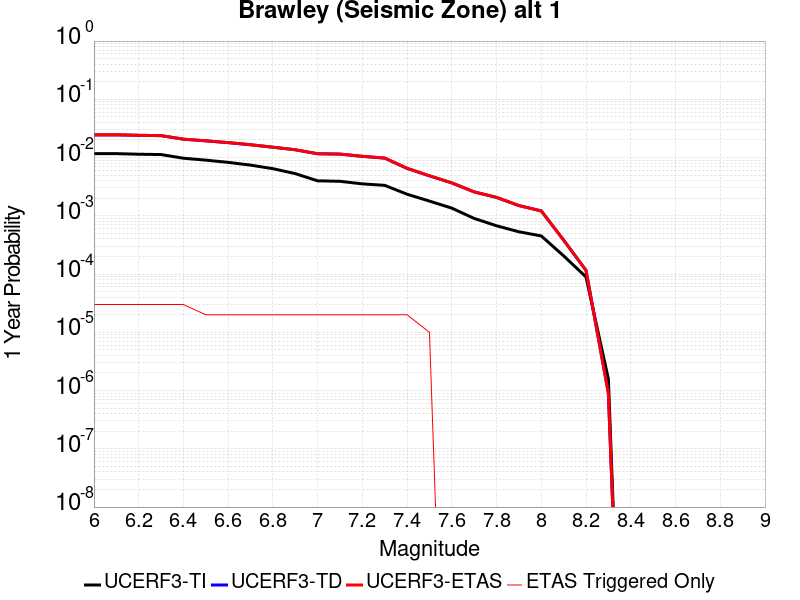 |  |

| Magnitude | 1 wk TI Prob | 1 wk TD Prob | 1 wk ETAS Prob | 1 wk ETAS/TD Gain | 1 wk ETAS Triggered Only | 1 mo TI Prob | 1 mo TD Prob | 1 mo ETAS Prob | 1 mo ETAS/TD Gain | 1 mo ETAS Triggered Only | 1 yr TI Prob | 1 yr TD Prob | 1 yr ETAS Prob | 1 yr ETAS/TD Gain | 1 yr ETAS Triggered Only | 10 yr TI Prob | 10 yr TD Prob | 10 yr ETAS Prob | 10 yr ETAS/TD Gain | 10 yr ETAS Triggered Only |
|-----|-----|-----|-----|-----|-----|-----|-----|-----|-----|-----|-----|-----|-----|-----|-----|-----|-----|-----|-----|-----|
| 6.0 | 2.2521618E-4 | 4.763429E-4 | 5.063286E-4 | 1.0629499 | 3.0E-5 | 9.6485513E-4 | 0.0020399094 | 0.0020698481 | 1.0146766 | 3.0E-5 | 0.011683988 | 0.024544531 | 0.024573795 | 1.0011922 | 3.0E-5 | 0.11088423 | 0.21349923 | 0.21352282 | 1.0001105 | 3.0E-5 |
| 6.1 | 2.2521618E-4 | 4.763429E-4 | 5.063286E-4 | 1.0629499 | 3.0E-5 | 9.6485513E-4 | 0.0020399094 | 0.0020698481 | 1.0146766 | 3.0E-5 | 0.011683988 | 0.024544531 | 0.024573795 | 1.0011922 | 3.0E-5 | 0.11088423 | 0.21349923 | 0.21352282 | 1.0001105 | 3.0E-5 |
| 6.2 | 2.198148E-4 | 4.6718874E-4 | 4.9717474E-4 | 1.0641838 | 3.0E-5 | 9.417233E-4 | 0.0020007377 | 0.0020306776 | 1.0149645 | 3.0E-5 | 0.011405343 | 0.024078513 | 0.024107791 | 1.0012159 | 3.0E-5 | 0.10837428 | 0.20993572 | 0.20995943 | 1.0001129 | 3.0E-5 |
| 6.3 | 2.1704129E-4 | 4.615455E-4 | 4.915317E-4 | 1.0649691 | 3.0E-5 | 9.298453E-4 | 0.0019765892 | 0.00200653 | 1.0151477 | 3.0E-5 | 0.011262234 | 0.023792034 | 0.02382132 | 1.001231 | 3.0E-5 | 0.107082725 | 0.20782684 | 0.2078506 | 1.0001143 | 3.0E-5 |
| 6.4 | 1.876142E-4 | 4.004663E-4 | 4.3045427E-4 | 1.0748826 | 3.0E-5 | 8.038131E-4 | 0.0017151695 | 0.0017451181 | 1.017461 | 3.0E-5 | 0.00974259 | 0.020678662 | 0.020708041 | 1.0014207 | 3.0E-5 | 0.093263686 | 0.18457787 | 0.18460234 | 1.0001326 | 3.0E-5 |
| 6.5 | 1.7390939E-4 | 3.7478763E-4 | 3.9478013E-4 | 1.0533435 | 2.0E-5 | 7.45113E-4 | 0.0016052561 | 0.001625224 | 1.012439 | 2.0E-5 | 0.009034078 | 0.019367293 | 0.019386906 | 1.0010127 | 2.0E-5 | 0.086755216 | 0.17440015 | 0.17441666 | 1.0000947 | 2.0E-5 |
| 6.6 | 1.591791E-4 | 3.4893592E-4 | 3.6892894E-4 | 1.0572971 | 2.0E-5 | 6.8201777E-4 | 0.0014945926 | 0.0015145628 | 1.0133616 | 2.0E-5 | 0.008271996 | 0.018045008 | 0.018064648 | 1.0010884 | 2.0E-5 | 0.07970774 | 0.16380787 | 0.16382459 | 1.000102 | 2.0E-5 |
| 6.7 | 1.4268003E-4 | 3.2059717E-4 | 3.4059078E-4 | 1.0623636 | 2.0E-5 | 6.1134255E-4 | 0.0013732726 | 0.0013932452 | 1.0145438 | 2.0E-5 | 0.007417723 | 0.01659171 | 0.016611377 | 1.0011854 | 2.0E-5 | 0.07174956 | 0.15193594 | 0.15195289 | 1.0001116 | 2.0E-5 |
| 6.8 | 1.239713E-4 | 2.9055026E-4 | 3.1054445E-4 | 1.0688149 | 2.0E-5 | 5.3119735E-4 | 0.0012446274 | 0.0012646025 | 1.016049 | 2.0E-5 | 0.0064481674 | 0.015049482 | 0.015069181 | 1.0013089 | 2.0E-5 | 0.06264243 | 0.13838051 | 0.13839774 | 1.0001246 | 2.0E-5 |
| 6.9 | 1.0180238E-4 | 2.6255674E-4 | 2.825515E-4 | 1.076154 | 2.0E-5 | 4.3622297E-4 | 0.0011247622 | 0.0011447398 | 1.0177616 | 2.0E-5 | 0.005298089 | 0.013608998 | 0.013628725 | 1.0014496 | 2.0E-5 | 0.05173543 | 0.12496473 | 0.12498222 | 1.0001401 | 2.0E-5 |
| 7.0 | 7.6619996E-5 | 2.2400476E-4 | 2.4400029E-4 | 1.0892638 | 2.0E-5 | 3.283301E-4 | 9.596704E-4 | 9.796512E-4 | 1.0208205 | 2.0E-5 | 0.0039900932 | 0.011622103 | 0.01164187 | 1.0017009 | 2.0E-5 | 0.039192066 | 0.10726982 | 0.10728768 | 1.0001664 | 2.0E-5 |
| 7.1 | 7.5127435E-5 | 2.2083633E-4 | 2.4083191E-4 | 1.0905448 | 2.0E-5 | 3.2193496E-4 | 9.461013E-4 | 9.660824E-4 | 1.0211194 | 2.0E-5 | 0.0039125155 | 0.011458648 | 0.0114784185 | 1.0017254 | 2.0E-5 | 0.038443442 | 0.10583378 | 0.10585166 | 1.0001689 | 2.0E-5 |
| 7.2 | 6.788582E-5 | 2.0211334E-4 | 2.221093E-4 | 1.0989344 | 2.0E-5 | 2.9090676E-4 | 8.6591556E-4 | 8.858982E-4 | 1.0230769 | 2.0E-5 | 0.0035360386 | 0.0104922 | 0.01051199 | 1.0018861 | 2.0E-5 | 0.034803 | 0.097503684 | 0.09752174 | 1.0001851 | 2.0E-5 |
| 7.3 | 6.399602E-5 | 1.8842232E-4 | 2.0841854E-4 | 1.1061245 | 2.0E-5 | 2.7423984E-4 | 8.0727716E-4 | 8.27261E-4 | 1.0247546 | 2.0E-5 | 0.0033337586 | 0.009784897 | 0.0098047005 | 1.0020239 | 2.0E-5 | 0.03284188 | 0.091397986 | 0.09141616 | 1.0001988 | 2.0E-5 |
| 7.4 | 4.506759E-5 | 1.2530042E-4 | 1.452979E-4 | 1.1595964 | 2.0E-5 | 1.9313251E-4 | 5.3689216E-4 | 5.568814E-4 | 1.0372314 | 2.0E-5 | 0.0023488526 | 0.006517245 | 0.0065371147 | 1.0030488 | 2.0E-5 | 0.023241805 | 0.062364522 | 0.062383275 | 1.0003006 | 2.0E-5 |
| 7.5 | 3.43289E-5 | 9.336103E-5 | 1.0336009E-4 | 1.1071011 | 1.0E-5 | 1.4711556E-4 | 4.0005764E-4 | 4.1005365E-4 | 1.0249864 | 1.0E-5 | 0.0017896603 | 0.004859886 | 0.004869838 | 1.0020477 | 1.0E-5 | 0.01775316 | 0.047057066 | 0.047066595 | 1.0002025 | 1.0E-5 |
| 7.6 | 2.5980507E-5 | 7.053672E-5 | 7.053672E-5 | 1.0 | 0.0 | 1.1134028E-4 | 3.0226534E-4 | 3.0226534E-4 | 1.0 | 0.0 | 0.001354725 | 0.0036738948 | 0.0036738948 | 1.0 | 0.0 | 0.013464959 | 0.03584298 | 0.03584298 | 1.0 | 0.0 |
| 7.7 | 1.7292105E-5 | 4.9412036E-5 | 4.9412036E-5 | 1.0 | 0.0 | 7.4106916E-5 | 2.1174872E-4 | 2.1174872E-4 | 1.0 | 0.0 | 9.018782E-4 | 0.0025749984 | 0.0025749984 | 1.0 | 0.0 | 0.008982267 | 0.025292097 | 0.025292097 | 1.0 | 0.0 |
| 7.8 | 1.2927471E-5 | 3.9697254E-5 | 3.9697254E-5 | 1.0 | 0.0 | 5.5402274E-5 | 1.7012001E-4 | 1.7012001E-4 | 1.0 | 0.0 | 6.743139E-4 | 0.0020692463 | 0.0020692463 | 1.0 | 0.0 | 0.0067227143 | 0.020433145 | 0.020433145 | 1.0 | 0.0 |
| 7.9 | 1.0200774E-5 | 2.8748475E-5 | 2.8748475E-5 | 1.0 | 0.0 | 4.371687E-5 | 1.2320194E-4 | 1.2320194E-4 | 1.0 | 0.0 | 5.321229E-4 | 0.0014989526 | 0.0014989526 | 1.0 | 0.0 | 0.005308505 | 0.014992895 | 0.014992895 | 1.0 | 0.0 |
| 8.0 | 8.650396E-6 | 2.3279512E-5 | 2.3279512E-5 | 1.0 | 0.0 | 3.70726E-5 | 9.976552E-5 | 9.976552E-5 | 1.0 | 0.0 | 4.5126543E-4 | 0.0012139693 | 0.0012139693 | 1.0 | 0.0 | 0.0045035016 | 0.012212164 | 0.012212164 | 1.0 | 0.0 |
| 8.1 | 3.9368224E-6 | 7.3283345E-6 | 7.3283345E-6 | 1.0 | 0.0 | 1.6871985E-5 | 3.1406773E-5 | 3.1406773E-5 | 1.0 | 0.0 | 2.0539707E-4 | 3.8231048E-4 | 3.8231048E-4 | 1.0 | 0.0 | 0.0020520731 | 0.0040015313 | 0.0040015313 | 1.0 | 0.0 |
| 8.2 | 1.7101195E-6 | 2.2178374E-6 | 2.2178374E-6 | 1.0 | 0.0 | 7.329063E-6 | 9.504983E-6 | 9.504983E-6 | 1.0 | 0.0 | 8.922769E-5 | 1.15717055E-4 | 1.15717055E-4 | 1.0 | 0.0 | 8.9191867E-4 | 0.00126669 | 0.00126669 | 1.0 | 0.0 |
| 8.3 | 3.0346666E-8 | 1.721086E-8 | 1.721086E-8 | 1.0 | 0.0 | 1.3005713E-7 | 7.376083E-8 | 7.376083E-8 | 1.0 | 0.0 | 1.5834444E-6 | 8.98038E-7 | 8.98038E-7 | 1.0 | 0.0 | 1.5834332E-5 | 9.36379E-6 | 9.36379E-6 | 1.0 | 0.0 |

## Chino alt 1
*[(top)](#table-of-contents)*

| 1 Week | 1 Month | 1 Year | 10 Year |
|-----|-----|-----|-----|
|  |  |  |  |

| Magnitude | 1 wk TI Prob | 1 wk TD Prob | 1 wk ETAS Prob | 1 wk ETAS/TD Gain | 1 wk ETAS Triggered Only | 1 mo TI Prob | 1 mo TD Prob | 1 mo ETAS Prob | 1 mo ETAS/TD Gain | 1 mo ETAS Triggered Only | 1 yr TI Prob | 1 yr TD Prob | 1 yr ETAS Prob | 1 yr ETAS/TD Gain | 1 yr ETAS Triggered Only | 10 yr TI Prob | 10 yr TD Prob | 10 yr ETAS Prob | 10 yr ETAS/TD Gain | 10 yr ETAS Triggered Only |
|-----|-----|-----|-----|-----|-----|-----|-----|-----|-----|-----|-----|-----|-----|-----|-----|-----|-----|-----|-----|-----|
| 6.0 | 3.939946E-5 | 4.894798E-5 | 5.894749E-5 | 1.2042885 | 1.0E-5 | 1.6884391E-4 | 2.0976314E-4 | 2.1976103E-4 | 1.0476629 | 1.0E-5 | 0.0020537362 | 0.002551385 | 0.0025813086 | 1.0117283 | 3.0E-5 | 0.020348595 | 0.025280168 | 0.02530941 | 1.0011567 | 3.0E-5 |
| 6.1 | 2.1505624E-5 | 2.6878823E-5 | 3.6878555E-5 | 1.3720301 | 1.0E-5 | 9.2163704E-5 | 1.15190494E-4 | 1.2518934E-4 | 1.0868027 | 1.0E-5 | 0.0011215154 | 0.0014016517 | 0.0014316096 | 1.0213733 | 3.0E-5 | 0.011158722 | 0.013947425 | 0.013977007 | 1.002121 | 3.0E-5 |
| 6.2 | 2.1505624E-5 | 2.6878823E-5 | 3.6878555E-5 | 1.3720301 | 1.0E-5 | 9.2163704E-5 | 1.15190494E-4 | 1.2518934E-4 | 1.0868027 | 1.0E-5 | 0.0011215154 | 0.0014016517 | 0.0014316096 | 1.0213733 | 3.0E-5 | 0.011158722 | 0.013947425 | 0.013977007 | 1.002121 | 3.0E-5 |
| 6.3 | 1.4290785E-5 | 1.8164832E-5 | 2.816465E-5 | 1.5505043 | 1.0E-5 | 6.1244784E-5 | 7.784722E-5 | 8.7846434E-5 | 1.1284467 | 1.0E-5 | 7.454001E-4 | 9.4742293E-4 | 9.773945E-4 | 1.0316348 | 3.0E-5 | 0.007429048 | 0.00944674 | 0.009476457 | 1.0031457 | 3.0E-5 |
| 6.4 | 1.4290785E-5 | 1.8164832E-5 | 2.816465E-5 | 1.5505043 | 1.0E-5 | 6.1244784E-5 | 7.784722E-5 | 8.7846434E-5 | 1.1284467 | 1.0E-5 | 7.454001E-4 | 9.4742293E-4 | 9.773945E-4 | 1.0316348 | 3.0E-5 | 0.007429048 | 0.00944674 | 0.009476457 | 1.0031457 | 3.0E-5 |
| 6.5 | 1.3017944E-5 | 1.6651793E-5 | 1.6651793E-5 | 1.0 | 0.0 | 5.5789995E-5 | 7.1363116E-5 | 7.1363116E-5 | 1.0 | 0.0 | 6.790315E-4 | 8.6854334E-4 | 8.88526E-4 | 1.023007 | 2.0E-5 | 0.0067696036 | 0.008664233 | 0.00868406 | 1.0022883 | 2.0E-5 |
| 6.6 | 9.470016E-6 | 1.2039209E-5 | 1.2039209E-5 | 1.0 | 0.0 | 4.058515E-5 | 5.159578E-5 | 5.159578E-5 | 1.0 | 0.0 | 4.940122E-4 | 6.280315E-4 | 6.3802523E-4 | 1.0159128 | 1.0E-5 | 0.004929154 | 0.006273248 | 0.006283185 | 1.001584 | 1.0E-5 |
| 6.7 | 8.314155E-6 | 1.040749E-5 | 1.040749E-5 | 1.0 | 0.0 | 3.5631605E-5 | 4.4602948E-5 | 4.4602948E-5 | 1.0 | 0.0 | 4.3372845E-4 | 5.4293784E-4 | 5.4293784E-4 | 1.0 | 0.0 | 0.004328829 | 0.0054270807 | 0.0054270807 | 1.0 | 0.0 |
| 6.8 | 3.4856364E-6 | 3.8134033E-6 | 3.8134033E-6 | 1.0 | 0.0 | 1.4938357E-5 | 1.6343065E-5 | 1.6343065E-5 | 1.0 | 0.0 | 1.8185932E-4 | 1.9896074E-4 | 1.9896074E-4 | 1.0 | 0.0 | 0.0018171056 | 0.0019894529 | 0.0019894529 | 1.0 | 0.0 |
| 6.9 | 2.2645952E-6 | 2.152909E-6 | 2.152909E-6 | 1.0 | 0.0 | 9.705372E-6 | 9.226722E-6 | 9.226722E-6 | 1.0 | 0.0 | 1.18156495E-4 | 1.12329755E-4 | 1.12329755E-4 | 1.0 | 0.0 | 0.0011809369 | 0.0011233138 | 0.0011233138 | 1.0 | 0.0 |
| 7.0 | 1.7864003E-6 | 1.5430741E-6 | 1.5430741E-6 | 1.0 | 0.0 | 7.655979E-6 | 6.613158E-6 | 6.613158E-6 | 1.0 | 0.0 | 9.3207556E-5 | 8.051228E-5 | 8.051228E-5 | 1.0 | 0.0 | 9.316847E-4 | 8.052856E-4 | 8.052856E-4 | 1.0 | 0.0 |
| 7.1 | 1.7315456E-6 | 1.4733466E-6 | 1.4733466E-6 | 1.0 | 0.0 | 7.420889E-6 | 6.314328E-6 | 6.314328E-6 | 1.0 | 0.0 | 9.034557E-5 | 7.687428E-5 | 7.687428E-5 | 1.0 | 0.0 | 9.0308854E-4 | 7.68921E-4 | 7.68921E-4 | 1.0 | 0.0 |
| 7.2 | 1.6008337E-6 | 1.3574178E-6 | 1.3574178E-6 | 1.0 | 0.0 | 6.860698E-6 | 5.817492E-6 | 5.817492E-6 | 1.0 | 0.0 | 8.352579E-5 | 7.082572E-5 | 7.082572E-5 | 1.0 | 0.0 | 8.34944E-4 | 7.0846075E-4 | 7.0846075E-4 | 1.0 | 0.0 |
| 7.3 | 1.3320939E-6 | 1.1217794E-6 | 1.1217794E-6 | 1.0 | 0.0 | 5.7089615E-6 | 4.8076176E-6 | 4.8076176E-6 | 1.0 | 0.0 | 6.9504385E-5 | 5.853122E-5 | 5.853122E-5 | 1.0 | 0.0 | 6.9482654E-4 | 5.8530655E-4 | 5.8530655E-4 | 1.0 | 0.0 |
| 7.4 | 1.114294E-6 | 9.237087E-7 | 9.237087E-7 | 1.0 | 0.0 | 4.775537E-6 | 3.9587458E-6 | 3.9587458E-6 | 1.0 | 0.0 | 5.8140613E-5 | 4.81967E-5 | 4.81967E-5 | 1.0 | 0.0 | 5.81254E-4 | 4.8187698E-4 | 4.8187698E-4 | 1.0 | 0.0 |
| 7.5 | 9.354081E-7 | 7.6233886E-7 | 7.6233886E-7 | 1.0 | 0.0 | 4.0088858E-6 | 3.2671626E-6 | 3.2671626E-6 | 1.0 | 0.0 | 4.8807087E-5 | 3.9777013E-5 | 3.9777013E-5 | 1.0 | 0.0 | 4.879637E-4 | 3.9770233E-4 | 3.9770233E-4 | 1.0 | 0.0 |
| 7.6 | 8.521771E-7 | 6.880688E-7 | 6.880688E-7 | 1.0 | 0.0 | 3.6521824E-6 | 2.948863E-6 | 2.948863E-6 | 1.0 | 0.0 | 4.4464414E-5 | 3.590185E-5 | 3.590185E-5 | 1.0 | 0.0 | 4.4455516E-4 | 3.5896365E-4 | 3.5896365E-4 | 1.0 | 0.0 |
| 7.7 | 2.1803626E-7 | 1.4186368E-7 | 1.4186368E-7 | 1.0 | 0.0 | 9.344408E-7 | 6.0798715E-7 | 6.0798715E-7 | 1.0 | 0.0 | 1.1376757E-5 | 7.4022278E-6 | 7.4022278E-6 | 1.0 | 0.0 | 1.13761744E-4 | 7.402077E-5 | 7.402077E-5 | 1.0 | 0.0 |

## Santa Cruz Island
*[(top)](#table-of-contents)*

| 1 Week | 1 Month | 1 Year | 10 Year |
|-----|-----|-----|-----|
| 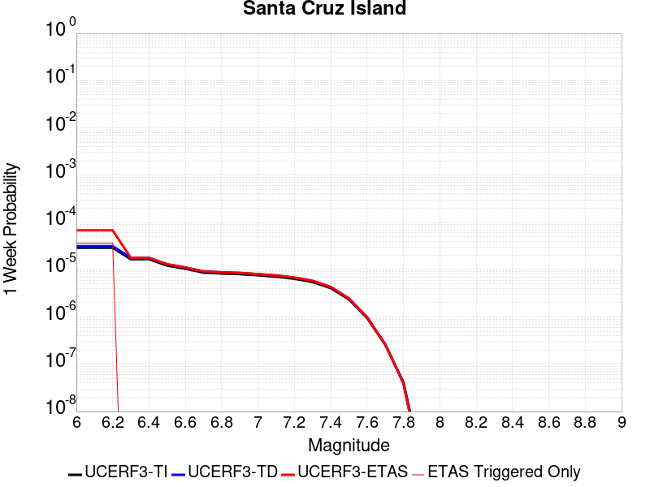 | 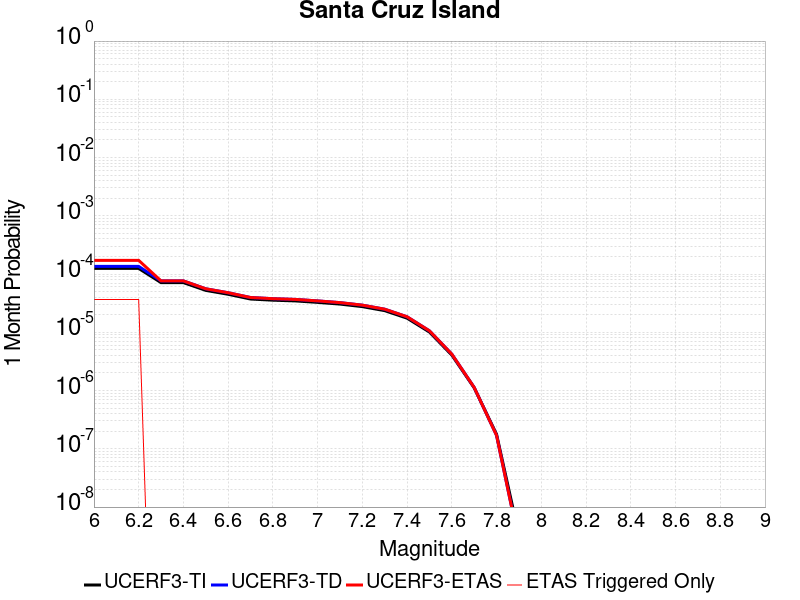 | 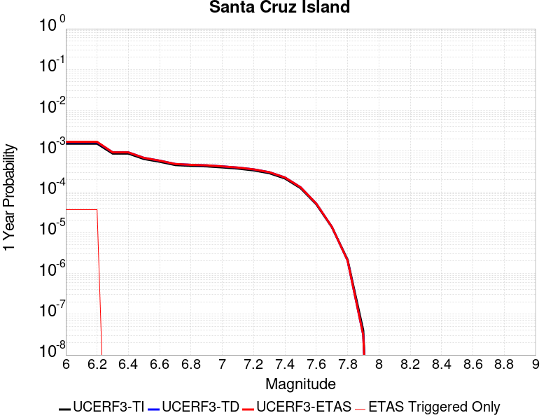 | 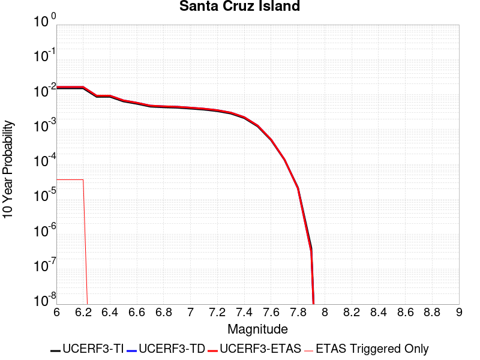 |

| Magnitude | 1 wk TI Prob | 1 wk TD Prob | 1 wk ETAS Prob | 1 wk ETAS/TD Gain | 1 wk ETAS Triggered Only | 1 mo TI Prob | 1 mo TD Prob | 1 mo ETAS Prob | 1 mo ETAS/TD Gain | 1 mo ETAS Triggered Only | 1 yr TI Prob | 1 yr TD Prob | 1 yr ETAS Prob | 1 yr ETAS/TD Gain | 1 yr ETAS Triggered Only | 10 yr TI Prob | 10 yr TD Prob | 10 yr ETAS Prob | 10 yr ETAS/TD Gain | 10 yr ETAS Triggered Only |
|-----|-----|-----|-----|-----|-----|-----|-----|-----|-----|-----|-----|-----|-----|-----|-----|-----|-----|-----|-----|-----|
| 6.0 | 2.9164563E-5 | 3.1599742E-5 | 6.1598796E-5 | 1.9493448 | 3.0E-5 | 1.2498499E-4 | 1.3542121E-4 | 1.6541715E-4 | 1.221501 | 3.0E-5 | 0.0015206301 | 0.0016476426 | 0.0016775931 | 1.0181779 | 3.0E-5 | 0.015102667 | 0.016368 | 0.016397508 | 1.0018028 | 3.0E-5 |
| 6.1 | 2.9164563E-5 | 3.1599742E-5 | 6.1598796E-5 | 1.9493448 | 3.0E-5 | 1.2498499E-4 | 1.3542121E-4 | 1.6541715E-4 | 1.221501 | 3.0E-5 | 0.0015206301 | 0.0016476426 | 0.0016775931 | 1.0181779 | 3.0E-5 | 0.015102667 | 0.016368 | 0.016397508 | 1.0018028 | 3.0E-5 |
| 6.2 | 2.9164563E-5 | 3.1599742E-5 | 6.1598796E-5 | 1.9493448 | 3.0E-5 | 1.2498499E-4 | 1.3542121E-4 | 1.6541715E-4 | 1.221501 | 3.0E-5 | 0.0015206301 | 0.0016476426 | 0.0016775931 | 1.0181779 | 3.0E-5 | 0.015102667 | 0.016368 | 0.016397508 | 1.0018028 | 3.0E-5 |
| 6.3 | 1.6635553E-5 | 1.780436E-5 | 1.780436E-5 | 1.0 | 0.0 | 7.1293274E-5 | 7.630227E-5 | 7.630227E-5 | 1.0 | 0.0 | 8.6765E-4 | 9.286024E-4 | 9.286024E-4 | 1.0 | 0.0 | 0.008642701 | 0.009249094 | 0.009249094 | 1.0 | 0.0 |
| 6.4 | 1.6635553E-5 | 1.780436E-5 | 1.780436E-5 | 1.0 | 0.0 | 7.1293274E-5 | 7.630227E-5 | 7.630227E-5 | 1.0 | 0.0 | 8.6765E-4 | 9.286024E-4 | 9.286024E-4 | 1.0 | 0.0 | 0.008642701 | 0.009249094 | 0.009249094 | 1.0 | 0.0 |
| 6.5 | 1.2238748E-5 | 1.3042996E-5 | 1.3042996E-5 | 1.0 | 0.0 | 5.2450723E-5 | 5.5897377E-5 | 5.5897377E-5 | 1.0 | 0.0 | 6.3840044E-4 | 6.8034173E-4 | 6.8034173E-4 | 1.0 | 0.0 | 0.0063656955 | 0.006782988 | 0.006782988 | 1.0 | 0.0 |
| 6.6 | 1.0489767E-5 | 1.1156636E-5 | 1.1156636E-5 | 1.0 | 0.0 | 4.495537E-5 | 4.781329E-5 | 4.781329E-5 | 1.0 | 0.0 | 5.4719415E-4 | 5.819736E-4 | 5.819736E-4 | 1.0 | 0.0 | 0.005458487 | 0.005804736 | 0.005804736 | 1.0 | 0.0 |
| 6.7 | 8.699222E-6 | 9.236783E-6 | 9.236783E-6 | 1.0 | 0.0 | 3.7281847E-5 | 3.958561E-5 | 3.958561E-5 | 1.0 | 0.0 | 4.5381195E-4 | 4.818488E-4 | 4.818488E-4 | 1.0 | 0.0 | 0.0045288634 | 0.004808108 | 0.004808108 | 1.0 | 0.0 |
| 6.8 | 8.307732E-6 | 8.8169045E-6 | 8.8169045E-6 | 1.0 | 0.0 | 3.560408E-5 | 3.7786187E-5 | 3.7786187E-5 | 1.0 | 0.0 | 4.3339343E-4 | 4.5995016E-4 | 4.5995016E-4 | 1.0 | 0.0 | 0.004325492 | 0.0045900354 | 0.0045900354 | 1.0 | 0.0 |
| 6.9 | 8.073121E-6 | 8.564939E-6 | 8.564939E-6 | 1.0 | 0.0 | 3.459863E-5 | 3.670637E-5 | 3.670637E-5 | 1.0 | 0.0 | 4.2115687E-4 | 4.4680882E-4 | 4.4680882E-4 | 1.0 | 0.0 | 0.004203596 | 0.004459156 | 0.004459156 | 1.0 | 0.0 |
| 7.0 | 7.617019E-6 | 8.074665E-6 | 8.074665E-6 | 1.0 | 0.0 | 3.264396E-5 | 3.4605247E-5 | 3.4605247E-5 | 1.0 | 0.0 | 3.9736772E-4 | 4.2123784E-4 | 4.2123784E-4 | 1.0 | 0.0 | 0.003966579 | 0.0042044413 | 0.0042044413 | 1.0 | 0.0 |
| 7.1 | 7.1224836E-6 | 7.5457883E-6 | 7.5457883E-6 | 1.0 | 0.0 | 3.052457E-5 | 3.2338692E-5 | 3.2338692E-5 | 1.0 | 0.0 | 3.715733E-4 | 3.9365282E-4 | 3.9365282E-4 | 1.0 | 0.0 | 0.003709526 | 0.0039295983 | 0.0039295983 | 1.0 | 0.0 |
| 7.2 | 6.441115E-6 | 6.8273835E-6 | 6.8273835E-6 | 1.0 | 0.0 | 2.7604487E-5 | 2.9259889E-5 | 2.9259889E-5 | 1.0 | 0.0 | 3.360328E-4 | 3.5618115E-4 | 3.5618115E-4 | 1.0 | 0.0 | 0.0033552512 | 0.0035561312 | 0.0035561312 | 1.0 | 0.0 |
| 7.3 | 5.494274E-6 | 5.8199944E-6 | 5.8199944E-6 | 1.0 | 0.0 | 2.3546674E-5 | 2.4942596E-5 | 2.4942596E-5 | 1.0 | 0.0 | 2.8664304E-4 | 3.03634E-4 | 3.03634E-4 | 1.0 | 0.0 | 0.002862736 | 0.0030322145 | 0.0030322145 | 1.0 | 0.0 |
| 7.4 | 4.0802624E-6 | 4.3122564E-6 | 4.3122564E-6 | 1.0 | 0.0 | 1.7486722E-5 | 1.8480969E-5 | 1.8480969E-5 | 1.0 | 0.0 | 2.1288003E-4 | 2.2498264E-4 | 2.2498264E-4 | 1.0 | 0.0 | 0.0021267622 | 0.0022475577 | 0.0022475577 | 1.0 | 0.0 |
| 7.5 | 2.3584746E-6 | 2.4753099E-6 | 2.4753099E-6 | 1.0 | 0.0 | 1.0107709E-5 | 1.0608428E-5 | 1.0608428E-5 | 1.0 | 0.0 | 1.2305441E-4 | 1.2915001E-4 | 1.2915001E-4 | 1.0 | 0.0 | 0.0012298629 | 0.0012907545 | 0.0012907545 | 1.0 | 0.0 |
| 7.6 | 9.4981914E-7 | 9.860934E-7 | 9.860934E-7 | 1.0 | 0.0 | 4.0706473E-6 | 4.2261076E-6 | 4.2261076E-6 | 1.0 | 0.0 | 4.9559E-5 | 5.1451658E-5 | 5.1451658E-5 | 1.0 | 0.0 | 4.954795E-4 | 5.1439874E-4 | 5.1439874E-4 | 1.0 | 0.0 |
| 7.7 | 2.6013532E-7 | 2.6416632E-7 | 2.6416632E-7 | 1.0 | 0.0 | 1.1148652E-6 | 1.1321408E-6 | 1.1321408E-6 | 1.0 | 0.0 | 1.3573399E-5 | 1.3783729E-5 | 1.3783729E-5 | 1.0 | 0.0 | 1.357257E-4 | 1.378288E-4 | 1.378288E-4 | 1.0 | 0.0 |
| 7.8 | 4.1522263E-8 | 3.965698E-8 | 3.965698E-8 | 1.0 | 0.0 | 1.7795254E-7 | 1.6995848E-7 | 1.6995848E-7 | 1.0 | 0.0 | 2.16657E-6 | 2.0692428E-6 | 2.0692428E-6 | 1.0 | 0.0 | 2.1665488E-5 | 2.0692256E-5 | 2.0692256E-5 | 1.0 | 0.0 |
| 7.9 | 7.7242046E-10 | 5.9475225E-10 | 5.9475225E-10 | 1.0 | 0.0 | 3.3103735E-9 | 2.5489382E-9 | 2.5489382E-9 | 1.0 | 0.0 | 4.0303796E-8 | 3.1033323E-8 | 3.1033323E-8 | 1.0 | 0.0 | 4.030379E-7 | 3.103332E-7 | 3.103332E-7 | 1.0 | 0.0 |

## Imperial
*[(top)](#table-of-contents)*

| 1 Week | 1 Month | 1 Year | 10 Year |
|-----|-----|-----|-----|
|  |  |  |  |

| Magnitude | 1 wk TI Prob | 1 wk TD Prob | 1 wk ETAS Prob | 1 wk ETAS/TD Gain | 1 wk ETAS Triggered Only | 1 mo TI Prob | 1 mo TD Prob | 1 mo ETAS Prob | 1 mo ETAS/TD Gain | 1 mo ETAS Triggered Only | 1 yr TI Prob | 1 yr TD Prob | 1 yr ETAS Prob | 1 yr ETAS/TD Gain | 1 yr ETAS Triggered Only | 10 yr TI Prob | 10 yr TD Prob | 10 yr ETAS Prob | 10 yr ETAS/TD Gain | 10 yr ETAS Triggered Only |
|-----|-----|-----|-----|-----|-----|-----|-----|-----|-----|-----|-----|-----|-----|-----|-----|-----|-----|-----|-----|-----|
| 6.0 | 2.7496446E-4 | 5.055345E-4 | 5.355194E-4 | 1.0593132 | 3.0E-5 | 0.0011778869 | 0.002164817 | 0.002194752 | 1.013828 | 3.0E-5 | 0.0142467655 | 0.026048409 | 0.026077628 | 1.0011218 | 3.0E-5 | 0.13367249 | 0.22807029 | 0.22809345 | 1.0001016 | 3.0E-5 |
| 6.1 | 2.5356023E-4 | 4.8657708E-4 | 5.165625E-4 | 1.0616252 | 3.0E-5 | 0.001086234 | 0.002083702 | 0.0021136396 | 1.0143675 | 3.0E-5 | 0.013144928 | 0.02507094 | 0.025100186 | 1.0011666 | 3.0E-5 | 0.123940155 | 0.21949561 | 0.21951903 | 1.0001067 | 3.0E-5 |
| 6.2 | 2.4820742E-4 | 4.775311E-4 | 5.075168E-4 | 1.0627931 | 3.0E-5 | 0.0010633124 | 0.0020449946 | 0.0020749334 | 1.01464 | 3.0E-5 | 0.01286919 | 0.024610676 | 0.024639938 | 1.001189 | 3.0E-5 | 0.12148927 | 0.21600136 | 0.21602489 | 1.0001088 | 3.0E-5 |
| 6.3 | 2.3205351E-4 | 4.5892023E-4 | 4.8890646E-4 | 1.0653409 | 3.0E-5 | 9.94136E-4 | 0.0019653554 | 0.0019952965 | 1.0152345 | 3.0E-5 | 0.012036599 | 0.023661187 | 0.023690477 | 1.0012379 | 3.0E-5 | 0.11405133 | 0.20793827 | 0.20796204 | 1.0001143 | 3.0E-5 |
| 6.4 | 2.0304754E-4 | 3.9878016E-4 | 4.287682E-4 | 1.0751994 | 3.0E-5 | 8.6991355E-4 | 0.0017079529 | 0.0017379017 | 1.0175349 | 3.0E-5 | 0.010539869 | 0.020595418 | 0.0206248 | 1.0014266 | 3.0E-5 | 0.100537635 | 0.18507113 | 0.18509556 | 1.0001321 | 3.0E-5 |
| 6.5 | 1.854992E-4 | 3.6990462E-4 | 3.8989724E-4 | 1.054048 | 2.0E-5 | 7.9475436E-4 | 0.0015843548 | 0.001604323 | 1.0126034 | 2.0E-5 | 0.009633281 | 0.01911443 | 0.019134047 | 1.0010263 | 2.0E-5 | 0.0922623 | 0.1733039 | 0.17332043 | 1.0000954 | 2.0E-5 |
| 6.6 | 1.6586106E-4 | 3.4036173E-4 | 3.6035493E-4 | 1.058741 | 2.0E-5 | 7.106394E-4 | 0.0014578878 | 0.0014778588 | 1.0136985 | 2.0E-5 | 0.008617763 | 0.017607626 | 0.017627273 | 1.0011159 | 2.0E-5 | 0.08291132 | 0.16078055 | 0.16079733 | 1.0001044 | 2.0E-5 |
| 6.7 | 1.4224656E-4 | 3.076812E-4 | 3.2767505E-4 | 1.0649823 | 2.0E-5 | 6.094856E-4 | 0.0013179756 | 0.0013379492 | 1.0151548 | 2.0E-5 | 0.0073952693 | 0.015928522 | 0.015948202 | 1.0012356 | 2.0E-5 | 0.07153955 | 0.14648798 | 0.14650506 | 1.0001166 | 2.0E-5 |
| 6.8 | 1.2317259E-4 | 2.779231E-4 | 2.9791755E-4 | 1.0719423 | 2.0E-5 | 5.2777573E-4 | 0.0011905615 | 0.0012105376 | 1.0167788 | 2.0E-5 | 0.0064067547 | 0.014400131 | 0.0144198425 | 1.0013689 | 2.0E-5 | 0.06225166 | 0.13294089 | 0.13295822 | 1.0001304 | 2.0E-5 |
| 6.9 | 9.859898E-5 | 2.5015484E-4 | 2.7014982E-4 | 1.0799305 | 2.0E-5 | 4.2249862E-4 | 0.0010716559 | 0.0010916345 | 1.0186427 | 2.0E-5 | 0.0051317946 | 0.012970319 | 0.012990059 | 1.001522 | 2.0E-5 | 0.05014893 | 0.119408876 | 0.11942648 | 1.0001475 | 2.0E-5 |
| 7.0 | 7.3191884E-5 | 2.1267848E-4 | 2.3267423E-4 | 1.0940187 | 2.0E-5 | 3.136418E-4 | 9.11164E-4 | 9.311458E-4 | 1.02193 | 2.0E-5 | 0.003811904 | 0.011037681 | 0.011057461 | 1.001792 | 2.0E-5 | 0.037471764 | 0.10206756 | 0.10208552 | 1.000176 | 2.0E-5 |
| 7.1 | 7.1760296E-5 | 2.0969207E-4 | 2.2968788E-4 | 1.0953579 | 2.0E-5 | 3.0750787E-4 | 8.9837395E-4 | 9.18356E-4 | 1.0222424 | 2.0E-5 | 0.003737482 | 0.010883528 | 0.01090331 | 1.0018176 | 2.0E-5 | 0.03675245 | 0.10070406 | 0.100722045 | 1.0001786 | 2.0E-5 |
| 7.2 | 6.46614E-5 | 1.9137723E-4 | 2.113734E-4 | 1.1044856 | 2.0E-5 | 2.7709085E-4 | 8.199333E-4 | 8.3991693E-4 | 1.0243722 | 2.0E-5 | 0.0033683628 | 0.009937617 | 0.009957419 | 1.0019926 | 2.0E-5 | 0.033177625 | 0.092511006 | 0.092529155 | 1.0001962 | 2.0E-5 |
| 7.3 | 6.088115E-5 | 1.780939E-4 | 1.9809033E-4 | 1.1122802 | 2.0E-5 | 2.6089314E-4 | 7.6303916E-4 | 7.830239E-4 | 1.026191 | 2.0E-5 | 0.0031717476 | 0.009251006 | 0.009270821 | 1.002142 | 2.0E-5 | 0.031268585 | 0.08656135 | 0.08657962 | 1.000211 | 2.0E-5 |
| 7.4 | 4.199346E-5 | 1.1511097E-4 | 1.3510867E-4 | 1.1737254 | 2.0E-5 | 1.7995955E-4 | 4.932403E-4 | 5.1323045E-4 | 1.0405282 | 2.0E-5 | 0.0021888057 | 0.005988835 | 0.0060087154 | 1.0033195 | 2.0E-5 | 0.02167372 | 0.05744024 | 0.05745909 | 1.0003282 | 2.0E-5 |
| 7.5 | 3.130448E-5 | 8.333871E-5 | 9.3337876E-5 | 1.1199822 | 1.0E-5 | 1.3415517E-4 | 3.5711733E-4 | 3.6711377E-4 | 1.027992 | 1.0E-5 | 0.0016321153 | 0.0043392954 | 0.0043492517 | 1.0022945 | 1.0E-5 | 0.016201803 | 0.042133506 | 0.042143084 | 1.0002273 | 1.0E-5 |
| 7.6 | 2.3074248E-5 | 6.0849357E-5 | 6.0849357E-5 | 1.0 | 0.0 | 9.888588E-5 | 2.6075702E-4 | 2.6075702E-4 | 1.0 | 0.0 | 0.0012032706 | 0.0031701182 | 0.0031701182 | 1.0 | 0.0 | 0.011967761 | 0.03102816 | 0.03102816 | 1.0 | 0.0 |
| 7.7 | 1.45864815E-5 | 4.0128452E-5 | 4.0128452E-5 | 1.0 | 0.0 | 6.2511994E-5 | 1.7196777E-4 | 1.7196777E-4 | 1.0 | 0.0 | 7.608177E-4 | 0.0020917025 | 0.0020917025 | 1.0 | 0.0 | 0.007582182 | 0.02062909 | 0.02062909 | 1.0 | 0.0 |
| 7.8 | 1.0352979E-5 | 3.096395E-5 | 3.096395E-5 | 1.0 | 0.0 | 4.4369157E-5 | 1.326959E-4 | 1.326959E-4 | 1.0 | 0.0 | 5.400606E-4 | 0.0016143778 | 0.0016143778 | 1.0 | 0.0 | 0.0053875 | 0.016017893 | 0.016017893 | 1.0 | 0.0 |
| 7.9 | 8.137906E-6 | 2.2151205E-5 | 2.2151205E-5 | 1.0 | 0.0 | 3.4876273E-5 | 9.493029E-5 | 9.493029E-5 | 1.0 | 0.0 | 4.2453592E-4 | 0.0011551644 | 0.0011551644 | 1.0 | 0.0 | 0.004237258 | 0.011618842 | 0.011618842 | 1.0 | 0.0 |
| 8.0 | 6.93792E-6 | 1.8010365E-5 | 1.8010365E-5 | 1.0 | 0.0 | 2.9733603E-5 | 7.7185E-5 | 7.7185E-5 | 1.0 | 0.0 | 3.6194647E-4 | 9.3932304E-4 | 9.3932304E-4 | 1.0 | 0.0 | 0.0036135751 | 0.009502415 | 0.009502415 | 1.0 | 0.0 |
| 8.1 | 3.4286315E-6 | 6.380179E-6 | 6.380179E-6 | 1.0 | 0.0 | 1.4694053E-5 | 2.734334E-5 | 2.734334E-5 | 1.0 | 0.0 | 1.7888541E-4 | 3.3285443E-4 | 3.3285443E-4 | 1.0 | 0.0 | 0.0017874148 | 0.0034863674 | 0.0034863674 | 1.0 | 0.0 |
| 8.2 | 1.4906886E-6 | 1.936633E-6 | 1.936633E-6 | 1.0 | 0.0 | 6.3886496E-6 | 8.2998295E-6 | 8.2998295E-6 | 1.0 | 0.0 | 7.7779034E-5 | 1.0104576E-4 | 1.0104576E-4 | 1.0 | 0.0 | 7.775182E-4 | 0.0011075423 | 0.0011075423 | 1.0 | 0.0 |
| 8.3 | 2.5758007E-8 | 1.4495866E-8 | 1.4495866E-8 | 1.0 | 0.0 | 1.10391454E-7 | 6.212514E-8 | 6.212514E-8 | 1.0 | 0.0 | 1.3440151E-6 | 7.563736E-7 | 7.563736E-7 | 1.0 | 0.0 | 1.344007E-5 | 7.884359E-6 | 7.884359E-6 | 1.0 | 0.0 |

## San Jacinto (Superstition Mtn)
*[(top)](#table-of-contents)*

| 1 Week | 1 Month | 1 Year | 10 Year |
|-----|-----|-----|-----|
| 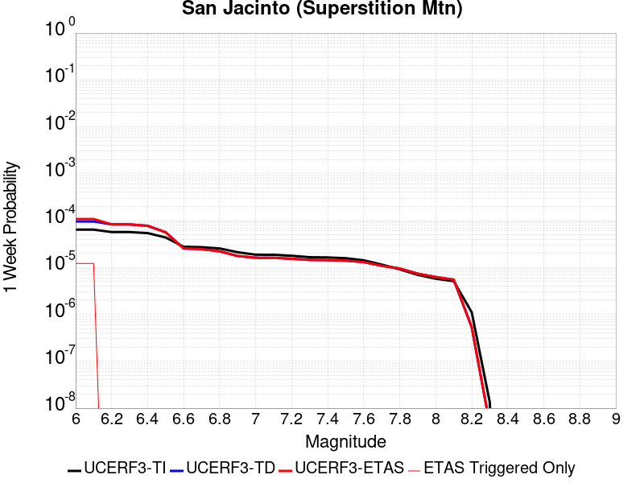 | 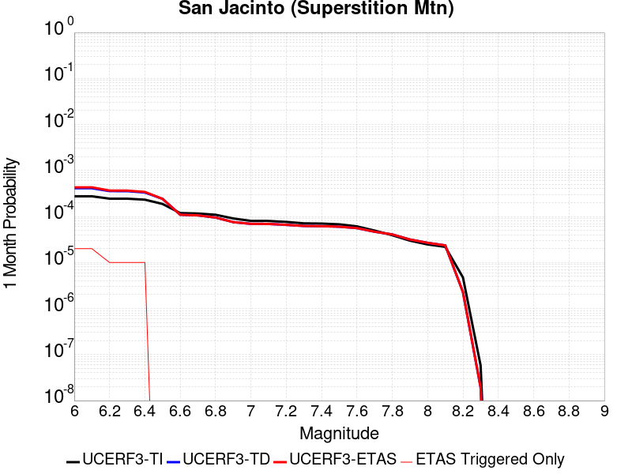 | 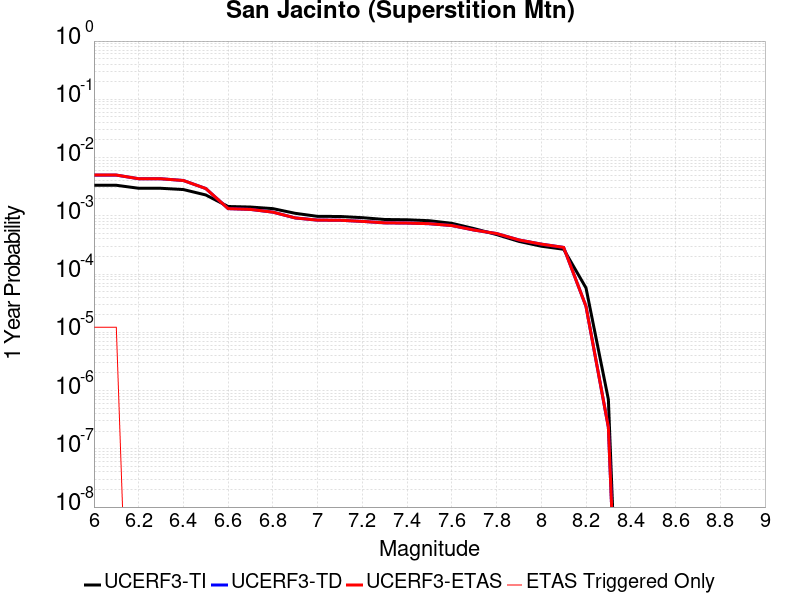 | 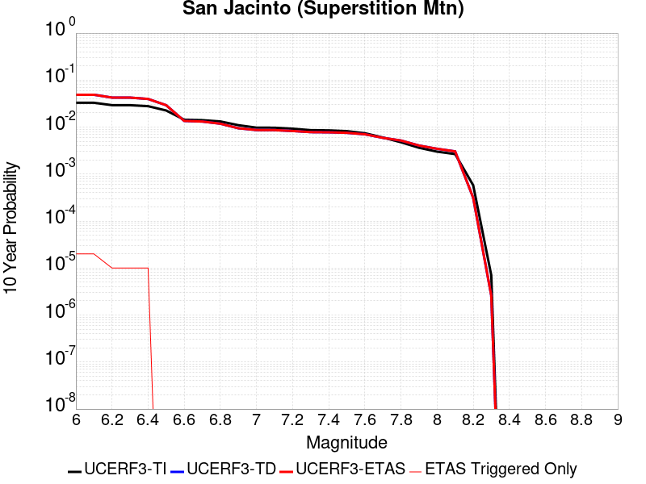 |

| Magnitude | 1 wk TI Prob | 1 wk TD Prob | 1 wk ETAS Prob | 1 wk ETAS/TD Gain | 1 wk ETAS Triggered Only | 1 mo TI Prob | 1 mo TD Prob | 1 mo ETAS Prob | 1 mo ETAS/TD Gain | 1 mo ETAS Triggered Only | 1 yr TI Prob | 1 yr TD Prob | 1 yr ETAS Prob | 1 yr ETAS/TD Gain | 1 yr ETAS Triggered Only | 10 yr TI Prob | 10 yr TD Prob | 10 yr ETAS Prob | 10 yr ETAS/TD Gain | 10 yr ETAS Triggered Only |
|-----|-----|-----|-----|-----|-----|-----|-----|-----|-----|-----|-----|-----|-----|-----|-----|-----|-----|-----|-----|-----|
| 6.0 | 6.4193904E-5 | 9.599558E-5 | 1.15993666E-4 | 1.2083229 | 2.0E-5 | 2.7508775E-4 | 4.1135435E-4 | 4.3134612E-4 | 1.0485998 | 2.0E-5 | 0.0033440501 | 0.0049981694 | 0.0050180694 | 1.0039815 | 2.0E-5 | 0.03294174 | 0.048820045 | 0.04883907 | 1.0003897 | 2.0E-5 |
| 6.1 | 6.4193904E-5 | 9.599558E-5 | 1.15993666E-4 | 1.2083229 | 2.0E-5 | 2.7508775E-4 | 4.1135435E-4 | 4.3134612E-4 | 1.0485998 | 2.0E-5 | 0.0033440501 | 0.0049981694 | 0.0050180694 | 1.0039815 | 2.0E-5 | 0.03294174 | 0.048820045 | 0.04883907 | 1.0003897 | 2.0E-5 |
| 6.2 | 5.7023593E-5 | 8.3144616E-5 | 9.314378E-5 | 1.1202624 | 1.0E-5 | 2.4436394E-4 | 3.5629462E-4 | 3.6629106E-4 | 1.0280566 | 1.0E-5 | 0.002971072 | 0.0043309047 | 0.0043408615 | 1.002299 | 1.0E-5 | 0.029316625 | 0.042502448 | 0.042512026 | 1.0002253 | 1.0E-5 |
| 6.3 | 5.6940098E-5 | 8.298998E-5 | 9.298915E-5 | 1.1204865 | 1.0E-5 | 2.4400617E-4 | 3.5563204E-4 | 3.656285E-4 | 1.028109 | 1.0E-5 | 0.002966728 | 0.00432287 | 0.004332827 | 1.0023032 | 1.0E-5 | 0.029274331 | 0.04242582 | 0.042435396 | 1.0002257 | 1.0E-5 |
| 6.4 | 5.4171585E-5 | 7.748391E-5 | 8.748314E-5 | 1.1290491 | 1.0E-5 | 2.3214328E-4 | 3.3204095E-4 | 3.4203762E-4 | 1.0301068 | 1.0E-5 | 0.0028226813 | 0.0040367534 | 0.004046713 | 1.0024673 | 1.0E-5 | 0.02787096 | 0.039715026 | 0.03972463 | 1.0002418 | 1.0E-5 |
| 6.5 | 4.375144E-5 | 5.6421442E-5 | 5.6421442E-5 | 1.0 | 0.0 | 1.874927E-4 | 2.417904E-4 | 2.417904E-4 | 1.0 | 0.0 | 0.0022803338 | 0.002941 | 0.002941 | 1.0 | 0.0 | 0.022570757 | 0.029235592 | 0.029235592 | 1.0 | 0.0 |
| 6.6 | 2.772192E-5 | 2.5488029E-5 | 2.5488029E-5 | 1.0 | 0.0 | 1.1880282E-4 | 1.0922994E-4 | 1.0922994E-4 | 1.0 | 0.0 | 0.0014454646 | 0.0013290826 | 0.0013290826 | 1.0 | 0.0 | 0.014360986 | 0.013540891 | 0.013540891 | 1.0 | 0.0 |
| 6.7 | 2.7124124E-5 | 2.4699055E-5 | 2.4699055E-5 | 1.0 | 0.0 | 1.1624106E-4 | 1.0584891E-4 | 1.0584891E-4 | 1.0 | 0.0 | 0.0014143161 | 0.0012879678 | 0.0012879678 | 1.0 | 0.0 | 0.014053487 | 0.013134248 | 0.013134248 | 1.0 | 0.0 |
| 6.8 | 2.5475807E-5 | 2.2164071E-5 | 2.2164071E-5 | 1.0 | 0.0 | 1.0917746E-4 | 9.498548E-5 | 9.498548E-5 | 1.0 | 0.0 | 0.001328425 | 0.0011558468 | 0.0011558468 | 1.0 | 0.0 | 0.0132051185 | 0.011821818 | 0.011821818 | 1.0 | 0.0 |
| 6.9 | 2.1162023E-5 | 1.762564E-5 | 1.762564E-5 | 1.0 | 0.0 | 9.069123E-5 | 7.553629E-5 | 7.553629E-5 | 1.0 | 0.0 | 0.0011036064 | 9.1927015E-4 | 9.1927015E-4 | 1.0 | 0.0 | 0.010981417 | 0.009446762 | 0.009446762 | 1.0 | 0.0 |
| 7.0 | 1.8754288E-5 | 1.616099E-5 | 1.616099E-5 | 1.0 | 0.0 | 8.037304E-5 | 6.9259564E-5 | 6.9259564E-5 | 1.0 | 0.0 | 9.781026E-4 | 8.429114E-4 | 8.429114E-4 | 1.0 | 0.0 | 0.009738087 | 0.008669995 | 0.008669995 | 1.0 | 0.0 |
| 7.1 | 1.8678527E-5 | 1.6086136E-5 | 1.6086136E-5 | 1.0 | 0.0 | 8.0048376E-5 | 6.8938774E-5 | 6.8938774E-5 | 1.0 | 0.0 | 9.7415317E-4 | 8.3900883E-4 | 8.3900883E-4 | 1.0 | 0.0 | 0.009698939 | 0.008631011 | 0.008631011 | 1.0 | 0.0 |
| 7.2 | 1.7804578E-5 | 1.5380709E-5 | 1.5380709E-5 | 1.0 | 0.0 | 7.6303106E-5 | 6.591567E-5 | 6.591567E-5 | 1.0 | 0.0 | 9.285943E-4 | 8.022301E-4 | 8.022301E-4 | 1.0 | 0.0 | 0.009247236 | 0.008262424 | 0.008262424 | 1.0 | 0.0 |
| 7.3 | 1.6583685E-5 | 1.4529837E-5 | 1.4529837E-5 | 1.0 | 0.0 | 7.1070994E-5 | 6.226926E-5 | 6.226926E-5 | 1.0 | 0.0 | 8.649459E-4 | 7.5786654E-4 | 7.5786654E-4 | 1.0 | 0.0 | 0.00861587 | 0.007817646 | 0.007817646 | 1.0 | 0.0 |
| 7.4 | 1.6387552E-5 | 1.4394727E-5 | 1.4394727E-5 | 1.0 | 0.0 | 7.023047E-5 | 6.169024E-5 | 6.169024E-5 | 1.0 | 0.0 | 8.5472054E-4 | 7.508219E-4 | 7.508219E-4 | 1.0 | 0.0 | 0.008514405 | 0.0077470187 | 0.0077470187 | 1.0 | 0.0 |
| 7.5 | 1.5790754E-5 | 1.40354305E-5 | 1.40354305E-5 | 1.0 | 0.0 | 6.767291E-5 | 6.015047E-5 | 6.015047E-5 | 1.0 | 0.0 | 8.236062E-4 | 7.320879E-4 | 7.320879E-4 | 1.0 | 0.0 | 0.008205604 | 0.007557581 | 0.007557581 | 1.0 | 0.0 |
| 7.6 | 1.4248672E-5 | 1.3054444E-5 | 1.3054444E-5 | 1.0 | 0.0 | 6.106431E-5 | 5.5946428E-5 | 5.5946428E-5 | 1.0 | 0.0 | 7.432043E-4 | 6.809366E-4 | 6.809366E-4 | 1.0 | 0.0 | 0.007407237 | 0.007040175 | 0.007040175 | 1.0 | 0.0 |
| 7.7 | 1.15449975E-5 | 1.0903222E-5 | 1.0903222E-5 | 1.0 | 0.0 | 4.947762E-5 | 4.672726E-5 | 4.672726E-5 | 1.0 | 0.0 | 6.022235E-4 | 5.6875666E-4 | 5.6875666E-4 | 1.0 | 0.0 | 0.006005941 | 0.0059102564 | 0.0059102564 | 1.0 | 0.0 |
| 7.8 | 9.1391985E-6 | 9.5139185E-6 | 9.5139185E-6 | 1.0 | 0.0 | 3.9167408E-5 | 4.0773306E-5 | 4.0773306E-5 | 1.0 | 0.0 | 4.767588E-4 | 4.963025E-4 | 4.963025E-4 | 1.0 | 0.0 | 0.0047573727 | 0.005176809 | 0.005176809 | 1.0 | 0.0 |
| 7.9 | 6.973017E-6 | 7.3817937E-6 | 7.3817937E-6 | 1.0 | 0.0 | 2.9884017E-5 | 3.163588E-5 | 3.163588E-5 | 1.0 | 0.0 | 3.6377716E-4 | 3.8509927E-4 | 3.8509927E-4 | 1.0 | 0.0 | 0.0036318225 | 0.004051976 | 0.004051976 | 1.0 | 0.0 |
| 8.0 | 5.7638235E-6 | 6.259641E-6 | 6.259641E-6 | 1.0 | 0.0 | 2.4701867E-5 | 2.682676E-5 | 2.682676E-5 | 1.0 | 0.0 | 3.0070372E-4 | 3.2656736E-4 | 3.2656736E-4 | 1.0 | 0.0 | 0.0030029714 | 0.0034535413 | 0.0034535413 | 1.0 | 0.0 |
| 8.1 | 5.1124434E-6 | 5.4953657E-6 | 5.4953657E-6 | 1.0 | 0.0 | 2.1910288E-5 | 2.3551356E-5 | 2.3551356E-5 | 1.0 | 0.0 | 2.6672508E-4 | 2.8670052E-4 | 2.8670052E-4 | 1.0 | 0.0 | 0.0026640517 | 0.0030403896 | 0.0030403896 | 1.0 | 0.0 |
| 8.2 | 1.1075938E-6 | 5.3348367E-7 | 5.3348367E-7 | 1.0 | 0.0 | 4.7468216E-6 | 2.2863567E-6 | 2.2863567E-6 | 1.0 | 0.0 | 5.779102E-5 | 2.7836059E-5 | 2.7836059E-5 | 1.0 | 0.0 | 5.777599E-4 | 3.133962E-4 | 3.133962E-4 | 1.0 | 0.0 |
| 8.3 | 1.3584393E-8 | 4.4718784E-9 | 4.4718784E-9 | 1.0 | 0.0 | 5.8218827E-8 | 1.9165192E-8 | 1.9165192E-8 | 1.0 | 0.0 | 7.0881396E-7 | 2.3333622E-7 | 2.3333622E-7 | 1.0 | 0.0 | 7.0881174E-6 | 2.6140672E-6 | 2.6140672E-6 | 1.0 | 0.0 |

## Elsinore (Temecula) rev
*[(top)](#table-of-contents)*

| 1 Week | 1 Month | 1 Year | 10 Year |
|-----|-----|-----|-----|
|  |  |  |  |

| Magnitude | 1 wk TI Prob | 1 wk TD Prob | 1 wk ETAS Prob | 1 wk ETAS/TD Gain | 1 wk ETAS Triggered Only | 1 mo TI Prob | 1 mo TD Prob | 1 mo ETAS Prob | 1 mo ETAS/TD Gain | 1 mo ETAS Triggered Only | 1 yr TI Prob | 1 yr TD Prob | 1 yr ETAS Prob | 1 yr ETAS/TD Gain | 1 yr ETAS Triggered Only | 10 yr TI Prob | 10 yr TD Prob | 10 yr ETAS Prob | 10 yr ETAS/TD Gain | 10 yr ETAS Triggered Only |
|-----|-----|-----|-----|-----|-----|-----|-----|-----|-----|-----|-----|-----|-----|-----|-----|-----|-----|-----|-----|-----|
| 6.0 | 2.9514995E-5 | 2.251887E-5 | 4.251842E-5 | 1.888124 | 2.0E-5 | 1.264867E-4 | 9.6505995E-5 | 1.1650407E-4 | 1.207221 | 2.0E-5 | 0.0015388876 | 0.0011743492 | 0.0011943257 | 1.0170107 | 2.0E-5 | 0.015282745 | 0.011688135 | 0.011707901 | 1.0016911 | 2.0E-5 |
| 6.1 | 2.9514995E-5 | 2.251887E-5 | 4.251842E-5 | 1.888124 | 2.0E-5 | 1.264867E-4 | 9.6505995E-5 | 1.1650407E-4 | 1.207221 | 2.0E-5 | 0.0015388876 | 0.0011743492 | 0.0011943257 | 1.0170107 | 2.0E-5 | 0.015282745 | 0.011688135 | 0.011707901 | 1.0016911 | 2.0E-5 |
| 6.2 | 2.9514995E-5 | 2.251887E-5 | 4.251842E-5 | 1.888124 | 2.0E-5 | 1.264867E-4 | 9.6505995E-5 | 1.1650407E-4 | 1.207221 | 2.0E-5 | 0.0015388876 | 0.0011743492 | 0.0011943257 | 1.0170107 | 2.0E-5 | 0.015282745 | 0.011688135 | 0.011707901 | 1.0016911 | 2.0E-5 |
| 6.3 | 2.3223649E-5 | 1.840822E-5 | 3.8407852E-5 | 2.0864513 | 2.0E-5 | 9.952613E-5 | 7.889008E-5 | 9.88885E-5 | 1.2534972 | 2.0E-5 | 0.001211057 | 9.600807E-4 | 9.800615E-4 | 1.0208116 | 2.0E-5 | 0.012044783 | 0.009551284 | 0.009571092 | 1.002074 | 2.0E-5 |
| 6.4 | 2.3223649E-5 | 1.840822E-5 | 3.8407852E-5 | 2.0864513 | 2.0E-5 | 9.952613E-5 | 7.889008E-5 | 9.88885E-5 | 1.2534972 | 2.0E-5 | 0.001211057 | 9.600807E-4 | 9.800615E-4 | 1.0208116 | 2.0E-5 | 0.012044783 | 0.009551284 | 0.009571092 | 1.002074 | 2.0E-5 |
| 6.5 | 1.8338875E-5 | 1.4750074E-5 | 3.4749777E-5 | 2.3559053 | 2.0E-5 | 7.8592806E-5 | 6.321312E-5 | 8.321185E-5 | 1.31637 | 2.0E-5 | 9.5644733E-4 | 7.6935673E-4 | 7.8934134E-4 | 1.0259757 | 2.0E-5 | 0.009523412 | 0.0076699676 | 0.007689814 | 1.0025876 | 2.0E-5 |
| 6.6 | 1.8223333E-5 | 1.461263E-5 | 3.4612338E-5 | 2.368659 | 2.0E-5 | 7.809766E-5 | 6.26241E-5 | 8.262285E-5 | 1.3193458 | 2.0E-5 | 9.504242E-4 | 7.621905E-4 | 7.821753E-4 | 1.0262202 | 2.0E-5 | 0.009463696 | 0.007598796 | 0.0076186443 | 1.002612 | 2.0E-5 |
| 6.7 | 1.7512752E-5 | 1.4026963E-5 | 3.402668E-5 | 2.4258053 | 2.0E-5 | 7.505249E-5 | 6.0114216E-5 | 8.0113015E-5 | 1.33268 | 2.0E-5 | 9.13381E-4 | 7.316534E-4 | 7.516388E-4 | 1.0273154 | 2.0E-5 | 0.00909636 | 0.0072983317 | 0.0073181856 | 1.0027204 | 2.0E-5 |
| 6.8 | 1.7417142E-5 | 1.395093E-5 | 3.395065E-5 | 2.433576 | 2.0E-5 | 7.4642754E-5 | 5.978838E-5 | 7.978718E-5 | 1.3344932 | 2.0E-5 | 9.083966E-4 | 7.27689E-4 | 7.4767444E-4 | 1.0274643 | 2.0E-5 | 0.009046922 | 0.007259359 | 0.007279214 | 1.002735 | 2.0E-5 |
| 6.9 | 1.6402591E-5 | 1.29883665E-5 | 2.2988237E-5 | 1.7699097 | 1.0E-5 | 7.0294926E-5 | 5.5663284E-5 | 6.566273E-5 | 1.1796416 | 1.0E-5 | 8.5550465E-4 | 6.774974E-4 | 6.874907E-4 | 1.0147502 | 1.0E-5 | 0.008522186 | 0.0067598647 | 0.006769797 | 1.0014694 | 1.0E-5 |
| 7.0 | 1.3912486E-5 | 1.0878067E-5 | 2.0877958E-5 | 1.919271 | 1.0E-5 | 5.9623577E-5 | 4.661947E-5 | 5.6619003E-5 | 1.2144927 | 1.0E-5 | 7.2567526E-4 | 5.674469E-4 | 5.774413E-4 | 1.0176128 | 1.0E-5 | 0.0072331014 | 0.0056635314 | 0.005673475 | 1.0017557 | 1.0E-5 |
| 7.1 | 1.3405147E-5 | 1.0327192E-5 | 2.0327088E-5 | 1.9683074 | 1.0E-5 | 5.7449364E-5 | 4.4258657E-5 | 5.4258217E-5 | 1.2259345 | 1.0E-5 | 6.9922156E-4 | 5.3871854E-4 | 5.4871314E-4 | 1.0185525 | 1.0E-5 | 0.0069702556 | 0.005377366 | 0.0053873123 | 1.0018497 | 1.0E-5 |
| 7.2 | 1.21402E-5 | 8.996479E-6 | 8.996479E-6 | 1.0 | 0.0 | 5.202839E-5 | 3.8555776E-5 | 3.8555776E-5 | 1.0 | 0.0 | 6.332616E-4 | 4.6931725E-4 | 4.6931725E-4 | 1.0 | 0.0 | 0.0063146 | 0.0046847262 | 0.0046847262 | 1.0 | 0.0 |
| 7.3 | 1.05047775E-5 | 7.571515E-6 | 7.571515E-6 | 1.0 | 0.0 | 4.5019697E-5 | 3.2448956E-5 | 3.2448956E-5 | 1.0 | 0.0 | 5.4797693E-4 | 3.9499588E-4 | 3.9499588E-4 | 1.0 | 0.0 | 0.005466277 | 0.003943348 | 0.003943348 | 1.0 | 0.0 |
| 7.4 | 9.624483E-6 | 6.786621E-6 | 6.786621E-6 | 1.0 | 0.0 | 4.124713E-5 | 2.90852E-5 | 2.90852E-5 | 1.0 | 0.0 | 5.0206814E-4 | 3.5405616E-4 | 3.5405616E-4 | 1.0 | 0.0 | 0.005009353 | 0.0035350726 | 0.0035350726 | 1.0 | 0.0 |
| 7.5 | 8.215151E-6 | 5.6353133E-6 | 5.6353133E-6 | 1.0 | 0.0 | 3.5207315E-5 | 2.4151126E-5 | 2.4151126E-5 | 1.0 | 0.0 | 4.2856473E-4 | 2.9400157E-4 | 2.9400157E-4 | 1.0 | 0.0 | 0.004277392 | 0.002936254 | 0.002936254 | 1.0 | 0.0 |
| 7.6 | 6.975058E-6 | 4.675836E-6 | 4.675836E-6 | 1.0 | 0.0 | 2.9892764E-5 | 2.003915E-5 | 2.003915E-5 | 1.0 | 0.0 | 3.6388362E-4 | 2.439505E-4 | 2.439505E-4 | 1.0 | 0.0 | 0.0036328835 | 0.0024369434 | 0.0024369434 | 1.0 | 0.0 |
| 7.7 | 4.159604E-6 | 2.326789E-6 | 2.326789E-6 | 1.0 | 0.0 | 1.7826753E-5 | 9.971919E-6 | 9.971919E-6 | 1.0 | 0.0 | 2.1701909E-4 | 1.2140209E-4 | 1.2140209E-4 | 1.0 | 0.0 | 0.0021680726 | 0.0012134308 | 0.0012134308 | 1.0 | 0.0 |
| 7.8 | 2.2692414E-7 | 9.384417E-8 | 9.384417E-8 | 1.0 | 0.0 | 9.725317E-7 | 4.0218927E-7 | 4.0218927E-7 | 1.0 | 0.0 | 1.1840509E-5 | 4.8966467E-6 | 4.8966467E-6 | 1.0 | 0.0 | 1.1839878E-4 | 4.8965718E-5 | 4.8965718E-5 | 1.0 | 0.0 |
| 7.9 | 6.676829E-9 | 3.4397174E-9 | 3.4397174E-9 | 1.0 | 0.0 | 2.861498E-8 | 1.4741646E-8 | 1.4741646E-8 | 1.0 | 0.0 | 3.4838732E-7 | 1.7947953E-7 | 1.7947953E-7 | 1.0 | 0.0 | 3.4838679E-6 | 1.794794E-6 | 1.794794E-6 | 1.0 | 0.0 |

## Hayward (No) 2011 CFM
*[(top)](#table-of-contents)*

| 1 Week | 1 Month | 1 Year | 10 Year |
|-----|-----|-----|-----|
|  |  |  |  |

| Magnitude | 1 wk TI Prob | 1 wk TD Prob | 1 wk ETAS Prob | 1 wk ETAS/TD Gain | 1 wk ETAS Triggered Only | 1 mo TI Prob | 1 mo TD Prob | 1 mo ETAS Prob | 1 mo ETAS/TD Gain | 1 mo ETAS Triggered Only | 1 yr TI Prob | 1 yr TD Prob | 1 yr ETAS Prob | 1 yr ETAS/TD Gain | 1 yr ETAS Triggered Only | 10 yr TI Prob | 10 yr TD Prob | 10 yr ETAS Prob | 10 yr ETAS/TD Gain | 10 yr ETAS Triggered Only |
|-----|-----|-----|-----|-----|-----|-----|-----|-----|-----|-----|-----|-----|-----|-----|-----|-----|-----|-----|-----|-----|
| 6.0 | 9.3068506E-5 | 1.739643E-4 | 1.9396083E-4 | 1.1149461 | 2.0E-5 | 3.9880406E-4 | 7.453474E-4 | 7.653325E-4 | 1.0268131 | 2.0E-5 | 0.0048446343 | 0.009036727 | 0.009056547 | 1.0021932 | 2.0E-5 | 0.047403704 | 0.086396605 | 0.08641488 | 1.0002115 | 2.0E-5 |
| 6.1 | 9.055486E-5 | 1.6947639E-4 | 1.89473E-4 | 1.1179905 | 2.0E-5 | 3.880345E-4 | 7.2612526E-4 | 7.4611075E-4 | 1.0275234 | 2.0E-5 | 0.0047140904 | 0.008804814 | 0.008824638 | 1.0022515 | 2.0E-5 | 0.046153355 | 0.08428568 | 0.08430399 | 1.0002173 | 2.0E-5 |
| 6.2 | 9.006742E-5 | 1.6868232E-4 | 1.8867894E-4 | 1.1185461 | 2.0E-5 | 3.859461E-4 | 7.227246E-4 | 7.4271014E-4 | 1.0276531 | 2.0E-5 | 0.0046887742 | 0.00876378 | 0.008783604 | 1.0022621 | 2.0E-5 | 0.0459107 | 0.08390991 | 0.08392823 | 1.0002184 | 2.0E-5 |
| 6.3 | 8.8336754E-5 | 1.6547782E-4 | 1.854745E-4 | 1.1208421 | 2.0E-5 | 3.7853114E-4 | 7.0899865E-4 | 7.289845E-4 | 1.0281888 | 2.0E-5 | 0.004598882 | 0.008598051 | 0.00861788 | 1.0023061 | 2.0E-5 | 0.04504866 | 0.08240195 | 0.082420304 | 1.0002227 | 2.0E-5 |
| 6.4 | 8.526157E-5 | 1.5974796E-4 | 1.7974476E-4 | 1.1251773 | 2.0E-5 | 3.6535555E-4 | 6.844552E-4 | 7.044415E-4 | 1.0292003 | 2.0E-5 | 0.0044391346 | 0.00830156 | 0.008321393 | 1.0023892 | 2.0E-5 | 0.043514993 | 0.07968467 | 0.07970307 | 1.000231 | 2.0E-5 |
| 6.5 | 8.152396E-5 | 1.5307199E-4 | 1.7306894E-4 | 1.1306375 | 2.0E-5 | 3.493416E-4 | 6.558586E-4 | 6.758455E-4 | 1.0304744 | 2.0E-5 | 0.0042449418 | 0.007955993 | 0.0079758335 | 1.0024939 | 2.0E-5 | 0.04164765 | 0.07651448 | 0.07653295 | 1.0002414 | 2.0E-5 |
| 6.6 | 7.987405E-5 | 1.5011412E-4 | 1.7011112E-4 | 1.133212 | 2.0E-5 | 3.4227243E-4 | 6.431883E-4 | 6.631754E-4 | 1.0310751 | 2.0E-5 | 0.0041592065 | 0.007802858 | 0.007822702 | 1.0025432 | 2.0E-5 | 0.04082218 | 0.075105876 | 0.07512437 | 1.0002463 | 2.0E-5 |
| 6.7 | 7.777665E-5 | 1.4650672E-4 | 1.6650379E-4 | 1.1364925 | 2.0E-5 | 3.332859E-4 | 6.277355E-4 | 6.47723E-4 | 1.0318406 | 2.0E-5 | 0.004050208 | 0.007616053 | 0.0076359003 | 1.002606 | 2.0E-5 | 0.039771806 | 0.0733825 | 0.073401034 | 1.0002525 | 2.0E-5 |
| 6.8 | 7.3284005E-5 | 1.3801287E-4 | 1.5801011E-4 | 1.144894 | 2.0E-5 | 3.140365E-4 | 5.9135025E-4 | 6.113384E-4 | 1.033801 | 2.0E-5 | 0.0038166929 | 0.007176059 | 0.0071959156 | 1.0027671 | 2.0E-5 | 0.037518036 | 0.06929624 | 0.06931486 | 1.0002686 | 2.0E-5 |
| 6.9 | 6.458263E-5 | 1.21319164E-4 | 1.4131673E-4 | 1.1648344 | 2.0E-5 | 2.7675333E-4 | 5.1983615E-4 | 5.398257E-4 | 1.0384537 | 2.0E-5 | 0.0033642664 | 0.0063107396 | 0.0063306135 | 1.0031492 | 2.0E-5 | 0.033137884 | 0.061224625 | 0.0612434 | 1.0003067 | 2.0E-5 |
| 7.0 | 5.3853604E-5 | 1.00254634E-4 | 1.1025363E-4 | 1.099736 | 1.0E-5 | 2.3078074E-4 | 4.295923E-4 | 4.39588E-4 | 1.0232679 | 1.0E-5 | 0.0028061352 | 0.0052178074 | 0.0052277553 | 1.0019065 | 1.0E-5 | 0.027709642 | 0.050957024 | 0.050966512 | 1.0001862 | 1.0E-5 |
| 7.1 | 4.4308683E-5 | 8.17098E-5 | 8.17098E-5 | 1.0 | 0.0 | 1.8988053E-4 | 3.5013806E-4 | 3.5013806E-4 | 1.0 | 0.0 | 0.0023093442 | 0.0042546396 | 0.0042546396 | 1.0 | 0.0 | 0.022854926 | 0.041824497 | 0.041824497 | 1.0 | 0.0 |
| 7.2 | 3.295973E-5 | 6.0774026E-5 | 6.0774026E-5 | 1.0 | 0.0 | 1.4124835E-4 | 2.6043423E-4 | 2.6043423E-4 | 1.0 | 0.0 | 0.0017183421 | 0.0031661994 | 0.0031661994 | 1.0 | 0.0 | 0.017051157 | 0.031370014 | 0.031370014 | 1.0 | 0.0 |
| 7.3 | 2.452256E-5 | 4.518223E-5 | 4.518223E-5 | 1.0 | 0.0 | 1.05092455E-4 | 1.9362383E-4 | 1.9362383E-4 | 1.0 | 0.0 | 0.0012787496 | 0.0023548352 | 0.0023548352 | 1.0 | 0.0 | 0.0127141625 | 0.023442036 | 0.023442036 | 1.0 | 0.0 |
| 7.4 | 1.8829967E-5 | 3.4604043E-5 | 3.4604043E-5 | 1.0 | 0.0 | 8.069736E-5 | 1.4829468E-4 | 1.4829468E-4 | 1.0 | 0.0 | 9.820475E-4 | 0.0018040023 | 0.0018040023 | 1.0 | 0.0 | 0.009777189 | 0.01802003 | 0.01802003 | 1.0 | 0.0 |
| 7.5 | 1.26374125E-5 | 2.292219E-5 | 2.292219E-5 | 1.0 | 0.0 | 5.4159216E-5 | 9.823428E-5 | 9.823428E-5 | 1.0 | 0.0 | 6.5918895E-4 | 0.0011953521 | 0.0011953521 | 1.0 | 0.0 | 0.00657237 | 0.011988704 | 0.011988704 | 1.0 | 0.0 |
| 7.6 | 4.666429E-6 | 8.479636E-6 | 8.479636E-6 | 1.0 | 0.0 | 1.9998828E-5 | 3.6340796E-5 | 3.6340796E-5 | 1.0 | 0.0 | 2.4345852E-4 | 4.423606E-4 | 4.423606E-4 | 1.0 | 0.0 | 0.0024319198 | 0.004458377 | 0.004458377 | 1.0 | 0.0 |
| 7.7 | 3.8399318E-7 | 7.1343146E-7 | 7.1343146E-7 | 1.0 | 0.0 | 1.6456839E-6 | 3.0575598E-6 | 3.0575598E-6 | 1.0 | 0.0 | 2.003602E-5 | 3.7225156E-5 | 3.7225156E-5 | 1.0 | 0.0 | 2.0034213E-4 | 3.86166E-4 | 3.86166E-4 | 1.0 | 0.0 |
| 7.8 | 2.5637698E-7 | 5.3666145E-7 | 5.3666145E-7 | 1.0 | 0.0 | 1.098758E-6 | 2.2999754E-6 | 2.2999754E-6 | 1.0 | 0.0 | 1.3377297E-5 | 2.8001843E-5 | 2.8001843E-5 | 1.0 | 0.0 | 1.3376492E-4 | 2.9246495E-4 | 2.9246495E-4 | 1.0 | 0.0 |
| 7.9 | 1.7141245E-7 | 3.7293606E-7 | 3.7293606E-7 | 1.0 | 0.0 | 7.3462456E-7 | 1.5982963E-6 | 1.5982963E-6 | 1.0 | 0.0 | 8.944017E-6 | 1.9459085E-5 | 1.9459085E-5 | 1.0 | 0.0 | 8.943657E-5 | 2.0246378E-4 | 2.0246378E-4 | 1.0 | 0.0 |
| 8.0 | 1.1808895E-7 | 2.7512246E-7 | 2.7512246E-7 | 1.0 | 0.0 | 5.060954E-7 | 1.1790958E-6 | 1.1790958E-6 | 1.0 | 0.0 | 6.161694E-6 | 1.4355397E-5 | 1.4355397E-5 | 1.0 | 0.0 | 6.161523E-5 | 1.4817173E-4 | 1.4817173E-4 | 1.0 | 0.0 |
| 8.1 | 5.138535E-8 | 1.12307575E-7 | 1.12307575E-7 | 1.0 | 0.0 | 2.2022292E-7 | 4.8131807E-7 | 4.8131807E-7 | 1.0 | 0.0 | 2.6812106E-6 | 5.860032E-6 | 5.860032E-6 | 1.0 | 0.0 | 2.6811784E-5 | 6.0156468E-5 | 6.0156468E-5 | 1.0 | 0.0 |

## Big Pine (East)
*[(top)](#table-of-contents)*

| 1 Week | 1 Month | 1 Year | 10 Year |
|-----|-----|-----|-----|
| 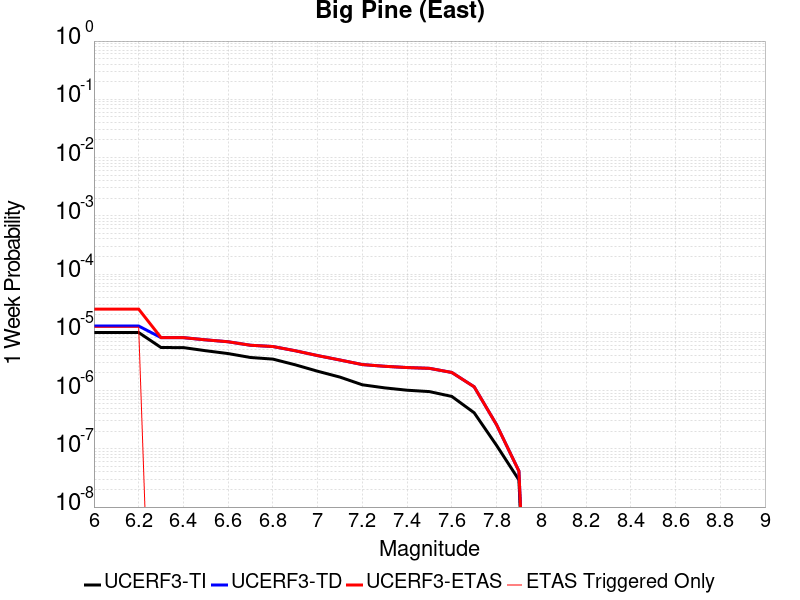 | 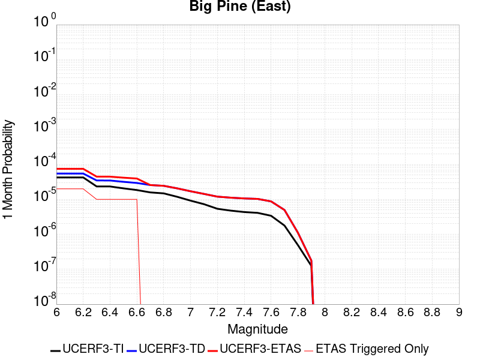 | 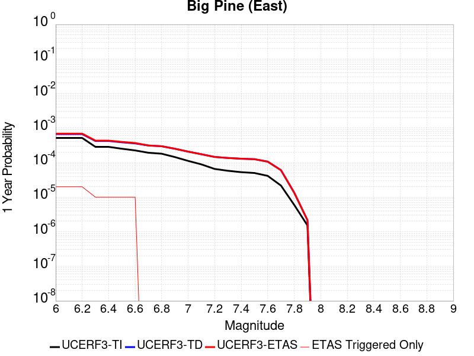 | 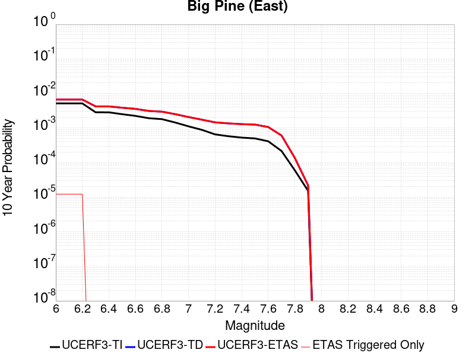 |

| Magnitude | 1 wk TI Prob | 1 wk TD Prob | 1 wk ETAS Prob | 1 wk ETAS/TD Gain | 1 wk ETAS Triggered Only | 1 mo TI Prob | 1 mo TD Prob | 1 mo ETAS Prob | 1 mo ETAS/TD Gain | 1 mo ETAS Triggered Only | 1 yr TI Prob | 1 yr TD Prob | 1 yr ETAS Prob | 1 yr ETAS/TD Gain | 1 yr ETAS Triggered Only | 10 yr TI Prob | 10 yr TD Prob | 10 yr ETAS Prob | 10 yr ETAS/TD Gain | 10 yr ETAS Triggered Only |
|-----|-----|-----|-----|-----|-----|-----|-----|-----|-----|-----|-----|-----|-----|-----|-----|-----|-----|-----|-----|-----|
| 6.0 | 9.916913E-6 | 1.28172705E-5 | 2.2817143E-5 | 1.7801872 | 1.0E-5 | 4.250036E-5 | 5.493013E-5 | 7.492903E-5 | 1.3640789 | 2.0E-5 | 5.173191E-4 | 6.685912E-4 | 6.885778E-4 | 1.0298936 | 2.0E-5 | 0.0051611643 | 0.006670449 | 0.0066903154 | 1.0029783 | 2.0E-5 |
| 6.1 | 9.916913E-6 | 1.28172705E-5 | 2.2817143E-5 | 1.7801872 | 1.0E-5 | 4.250036E-5 | 5.493013E-5 | 7.492903E-5 | 1.3640789 | 2.0E-5 | 5.173191E-4 | 6.685912E-4 | 6.885778E-4 | 1.0298936 | 2.0E-5 | 0.0051611643 | 0.006670449 | 0.0066903154 | 1.0029783 | 2.0E-5 |
| 6.2 | 9.916913E-6 | 1.28172705E-5 | 2.2817143E-5 | 1.7801872 | 1.0E-5 | 4.250036E-5 | 5.493013E-5 | 7.492903E-5 | 1.3640789 | 2.0E-5 | 5.173191E-4 | 6.685912E-4 | 6.885778E-4 | 1.0298936 | 2.0E-5 | 0.0051611643 | 0.006670449 | 0.0066903154 | 1.0029783 | 2.0E-5 |
| 6.3 | 5.479711E-6 | 8.1132375E-6 | 8.1132375E-6 | 1.0 | 0.0 | 2.3484265E-5 | 3.4770575E-5 | 4.4770226E-5 | 1.2875896 | 1.0E-5 | 2.858834E-4 | 4.232527E-4 | 4.3324847E-4 | 1.0236166 | 1.0E-5 | 0.0028551589 | 0.0042272513 | 0.004237209 | 1.0023556 | 1.0E-5 |
| 6.4 | 5.465009E-6 | 8.0975315E-6 | 8.0975315E-6 | 1.0 | 0.0 | 2.3421257E-5 | 3.4703262E-5 | 4.4702916E-5 | 1.2881473 | 1.0E-5 | 2.851165E-4 | 4.2243348E-4 | 4.3242925E-4 | 1.0236623 | 1.0E-5 | 0.0028475097 | 0.00421909 | 0.0042290483 | 1.0023602 | 1.0E-5 |
| 6.5 | 4.826767E-6 | 7.4225877E-6 | 7.4225877E-6 | 1.0 | 0.0 | 2.068598E-5 | 3.1810716E-5 | 4.18104E-5 | 1.3143494 | 1.0E-5 | 2.518227E-4 | 3.8722943E-4 | 3.9722555E-4 | 1.0258145 | 1.0E-5 | 0.0025153751 | 0.0038682907 | 0.0038782519 | 1.0025752 | 1.0E-5 |
| 6.6 | 4.3146847E-6 | 6.8825234E-6 | 6.8825234E-6 | 1.0 | 0.0 | 1.8491375E-5 | 2.949621E-5 | 3.9495913E-5 | 1.3390166 | 1.0E-5 | 2.2510924E-4 | 3.5905963E-4 | 3.6905604E-4 | 1.0278405 | 1.0E-5 | 0.0022488134 | 0.0035875062 | 0.0035974702 | 1.0027775 | 1.0E-5 |
| 6.7 | 3.6968106E-6 | 5.9957474E-6 | 5.9957474E-6 | 1.0 | 0.0 | 1.5843378E-5 | 2.5695816E-5 | 2.5695816E-5 | 1.0 | 0.0 | 1.9287605E-4 | 3.128032E-4 | 3.128032E-4 | 1.0 | 0.0 | 0.0019270873 | 0.0031262499 | 0.0031262499 | 1.0 | 0.0 |
| 6.8 | 3.4671132E-6 | 5.7024477E-6 | 5.7024477E-6 | 1.0 | 0.0 | 1.4858972E-5 | 2.4438841E-5 | 2.4438841E-5 | 1.0 | 0.0 | 1.8089297E-4 | 2.9750372E-4 | 2.9750372E-4 | 1.0 | 0.0 | 0.0018074579 | 0.0029736666 | 0.0029736666 | 1.0 | 0.0 |
| 6.9 | 2.7686972E-6 | 4.8254797E-6 | 4.8254797E-6 | 1.0 | 0.0 | 1.1865792E-5 | 2.0680467E-5 | 2.0680467E-5 | 1.0 | 0.0 | 1.4445644E-4 | 2.5175634E-4 | 2.5175634E-4 | 1.0 | 0.0 | 0.0014436257 | 0.002517256 | 0.002517256 | 1.0 | 0.0 |
| 7.0 | 2.1472624E-6 | 3.985277E-6 | 3.985277E-6 | 1.0 | 0.0 | 9.20252E-6 | 1.707965E-5 | 1.707965E-5 | 1.0 | 0.0 | 1.12034926E-4 | 2.0792543E-4 | 2.0792543E-4 | 1.0 | 0.0 | 0.0011197845 | 0.0020798238 | 0.0020798238 | 1.0 | 0.0 |
| 7.1 | 1.7018335E-6 | 3.3450835E-6 | 3.3450835E-6 | 1.0 | 0.0 | 7.293552E-6 | 1.4335996E-5 | 1.4335996E-5 | 1.0 | 0.0 | 8.879537E-5 | 1.7452713E-4 | 1.7452713E-4 | 1.0 | 0.0 | 8.87599E-4 | 0.0017463792 | 0.0017463792 | 1.0 | 0.0 |
| 7.2 | 1.25603E-6 | 2.794679E-6 | 2.794679E-6 | 1.0 | 0.0 | 5.3829745E-6 | 1.1977142E-5 | 1.1977142E-5 | 1.0 | 0.0 | 6.553574E-5 | 1.4581217E-4 | 1.4581217E-4 | 1.0 | 0.0 | 6.551642E-4 | 0.0014596173 | 0.0014596173 | 1.0 | 0.0 |
| 7.3 | 1.112297E-6 | 2.610519E-6 | 2.610519E-6 | 1.0 | 0.0 | 4.7669787E-6 | 1.1187892E-5 | 1.1187892E-5 | 1.0 | 0.0 | 5.803642E-5 | 1.3620428E-4 | 1.3620428E-4 | 1.0 | 0.0 | 5.802127E-4 | 0.001363502 | 0.001363502 | 1.0 | 0.0 |
| 7.4 | 1.0137181E-6 | 2.4836752E-6 | 2.4836752E-6 | 1.0 | 0.0 | 4.3444993E-6 | 1.064428E-5 | 1.064428E-5 | 1.0 | 0.0 | 5.2892992E-5 | 1.2958662E-4 | 1.2958662E-4 | 1.0 | 0.0 | 5.288041E-4 | 0.0012971918 | 0.0012971918 | 1.0 | 0.0 |
| 7.5 | 9.598608E-7 | 2.407328E-6 | 2.407328E-6 | 1.0 | 0.0 | 4.1136827E-6 | 1.03170805E-5 | 1.03170805E-5 | 1.0 | 0.0 | 5.0082934E-5 | 1.2560343E-4 | 1.2560343E-4 | 1.0 | 0.0 | 5.007165E-4 | 0.0012572132 | 0.0012572132 | 1.0 | 0.0 |
| 7.6 | 7.929459E-7 | 2.0450152E-6 | 2.0450152E-6 | 1.0 | 0.0 | 3.3983351E-6 | 8.764322E-6 | 8.764322E-6 | 1.0 | 0.0 | 4.1373947E-5 | 1.0670057E-4 | 1.0670057E-4 | 1.0 | 0.0 | 4.1366243E-4 | 0.0010685825 | 0.0010685825 | 1.0 | 0.0 |
| 7.7 | 4.155788E-7 | 1.1606729E-6 | 1.1606729E-6 | 1.0 | 0.0 | 1.7810507E-6 | 4.974303E-6 | 4.974303E-6 | 1.0 | 0.0 | 2.1684076E-5 | 6.05605E-5 | 6.05605E-5 | 1.0 | 0.0 | 2.1681961E-4 | 6.085995E-4 | 6.085995E-4 | 1.0 | 0.0 |
| 7.8 | 1.14666925E-7 | 2.592197E-7 | 2.592197E-7 | 1.0 | 0.0 | 4.914296E-7 | 1.1109411E-6 | 1.1109411E-6 | 1.0 | 0.0 | 5.9831386E-6 | 1.3525627E-5 | 1.3525627E-5 | 1.0 | 0.0 | 5.9829777E-5 | 1.3636416E-4 | 1.3636416E-4 | 1.0 | 0.0 |
| 7.9 | 2.9231824E-8 | 4.1462318E-8 | 4.1462318E-8 | 1.0 | 0.0 | 1.2527924E-7 | 1.7769564E-7 | 1.7769564E-7 | 1.0 | 0.0 | 1.5252737E-6 | 2.1634426E-6 | 2.1634426E-6 | 1.0 | 0.0 | 1.5252632E-5 | 2.197062E-5 | 2.197062E-5 | 1.0 | 0.0 |

## Greenville (So) 2011 CFM
*[(top)](#table-of-contents)*

| 1 Week | 1 Month | 1 Year | 10 Year |
|-----|-----|-----|-----|
| 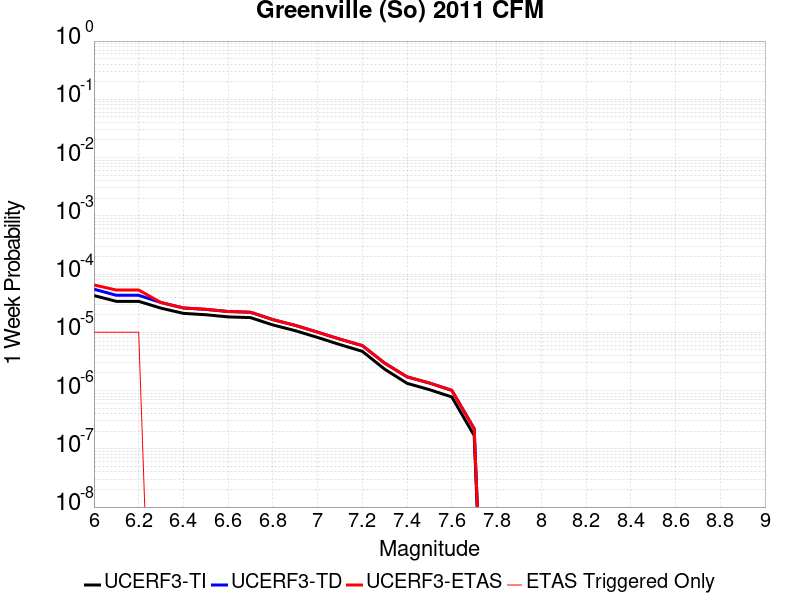 | 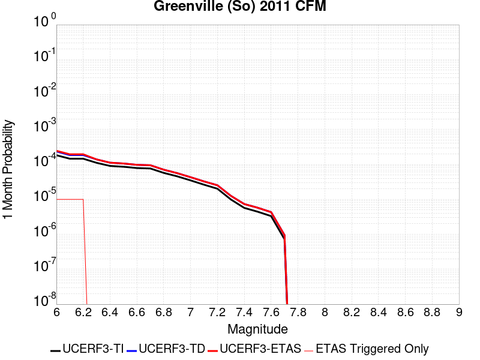 | 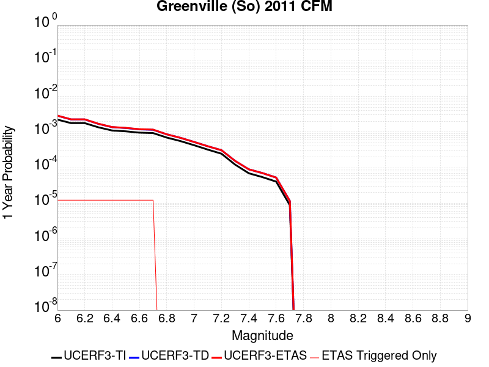 | 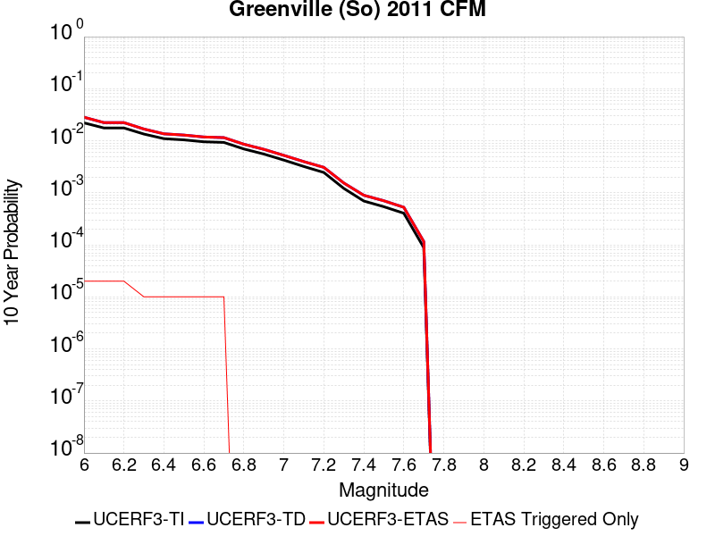 |

| Magnitude | 1 wk TI Prob | 1 wk TD Prob | 1 wk ETAS Prob | 1 wk ETAS/TD Gain | 1 wk ETAS Triggered Only | 1 mo TI Prob | 1 mo TD Prob | 1 mo ETAS Prob | 1 mo ETAS/TD Gain | 1 mo ETAS Triggered Only | 1 yr TI Prob | 1 yr TD Prob | 1 yr ETAS Prob | 1 yr ETAS/TD Gain | 1 yr ETAS Triggered Only | 10 yr TI Prob | 10 yr TD Prob | 10 yr ETAS Prob | 10 yr ETAS/TD Gain | 10 yr ETAS Triggered Only |
|-----|-----|-----|-----|-----|-----|-----|-----|-----|-----|-----|-----|-----|-----|-----|-----|-----|-----|-----|-----|-----|
| 6.0 | 4.279693E-5 | 5.5040568E-5 | 6.504002E-5 | 1.1816741 | 1.0E-5 | 1.8340252E-4 | 2.3586866E-4 | 2.458663E-4 | 1.0423865 | 1.0E-5 | 0.0022306389 | 0.0028681692 | 0.0028881119 | 1.0069531 | 2.0E-5 | 0.022083808 | 0.028338658 | 0.02835809 | 1.0006857 | 2.0E-5 |
| 6.1 | 3.4037297E-5 | 4.319238E-5 | 5.319195E-5 | 1.2315123 | 1.0E-5 | 1.4586597E-4 | 1.8509808E-4 | 1.9509622E-4 | 1.0540154 | 1.0E-5 | 0.0017744715 | 0.0022513992 | 0.002271354 | 1.0088633 | 2.0E-5 | 0.01760369 | 0.022303047 | 0.0223226 | 1.0008768 | 2.0E-5 |
| 6.2 | 3.4037297E-5 | 4.319238E-5 | 5.319195E-5 | 1.2315123 | 1.0E-5 | 1.4586597E-4 | 1.8509808E-4 | 1.9509622E-4 | 1.0540154 | 1.0E-5 | 0.0017744715 | 0.0022513992 | 0.002271354 | 1.0088633 | 2.0E-5 | 0.01760369 | 0.022303047 | 0.0223226 | 1.0008768 | 2.0E-5 |
| 6.3 | 2.5956324E-5 | 3.242939E-5 | 3.242939E-5 | 1.0 | 0.0 | 1.11236644E-4 | 1.3897609E-4 | 1.3897609E-4 | 1.0 | 0.0 | 0.0013534647 | 0.0016907848 | 0.0017007679 | 1.0059044 | 1.0E-5 | 0.013452509 | 0.016786316 | 0.016796147 | 1.0005857 | 1.0E-5 |
| 6.4 | 2.1145053E-5 | 2.6197793E-5 | 2.6197793E-5 | 1.0 | 0.0 | 9.061851E-5 | 1.1227157E-4 | 1.1227157E-4 | 1.0 | 0.0 | 0.0011027219 | 0.0013660807 | 0.001376067 | 1.0073103 | 1.0E-5 | 0.01097266 | 0.013580576 | 0.013590439 | 1.0007263 | 1.0E-5 |
| 6.5 | 2.0030959E-5 | 2.4795921E-5 | 2.4795921E-5 | 1.0 | 0.0 | 8.584414E-5 | 1.0626408E-4 | 1.0626408E-4 | 1.0 | 0.0 | 0.0010446513 | 0.0012930284 | 0.0013030154 | 1.0077238 | 1.0E-5 | 0.010397541 | 0.01285873 | 0.012868602 | 1.0007677 | 1.0E-5 |
| 6.6 | 1.8395405E-5 | 2.275458E-5 | 2.275458E-5 | 1.0 | 0.0 | 7.8835066E-5 | 9.7516146E-5 | 9.7516146E-5 | 1.0 | 0.0 | 9.5939427E-4 | 0.0011866409 | 0.001196629 | 1.0084171 | 1.0E-5 | 0.009552629 | 0.01180643 | 0.011816312 | 1.000837 | 1.0E-5 |
| 6.7 | 1.7883482E-5 | 2.2125625E-5 | 2.2125625E-5 | 1.0 | 0.0 | 7.664124E-5 | 9.482082E-5 | 9.482082E-5 | 1.0 | 0.0 | 9.3270757E-4 | 0.0011538607 | 0.0011638491 | 1.0086565 | 1.0E-5 | 0.009288026 | 0.011482077 | 0.011491962 | 1.0008609 | 1.0E-5 |
| 6.8 | 1.3373564E-5 | 1.650608E-5 | 1.650608E-5 | 1.0 | 0.0 | 5.7314013E-5 | 7.0738504E-5 | 7.0738504E-5 | 1.0 | 0.0 | 6.975747E-4 | 8.609158E-4 | 8.609158E-4 | 1.0 | 0.0 | 0.0069538904 | 0.008577745 | 0.008577745 | 1.0 | 0.0 |
| 6.9 | 1.06692905E-5 | 1.3152695E-5 | 1.3152695E-5 | 1.0 | 0.0 | 4.5724726E-5 | 5.636754E-5 | 5.636754E-5 | 1.0 | 0.0 | 5.5655633E-4 | 6.8606995E-4 | 6.8606995E-4 | 1.0 | 0.0 | 0.005551645 | 0.006841082 | 0.006841082 | 1.0 | 0.0 |
| 7.0 | 8.157512E-6 | 1.0062752E-5 | 1.0062752E-5 | 1.0 | 0.0 | 3.4960296E-5 | 4.312539E-5 | 4.312539E-5 | 1.0 | 0.0 | 4.2555845E-4 | 5.2492885E-4 | 5.2492885E-4 | 1.0 | 0.0 | 0.004247444 | 0.0052376967 | 0.0052376967 | 1.0 | 0.0 |
| 7.1 | 6.1467113E-6 | 7.627545E-6 | 7.627545E-6 | 1.0 | 0.0 | 2.6342783E-5 | 3.2689073E-5 | 3.2689073E-5 | 1.0 | 0.0 | 3.206762E-4 | 3.9791764E-4 | 3.9791764E-4 | 1.0 | 0.0 | 0.0032021382 | 0.0039725704 | 0.0039725704 | 1.0 | 0.0 |
| 7.2 | 4.713467E-6 | 5.9142685E-6 | 5.9142685E-6 | 1.0 | 0.0 | 2.0200418E-5 | 2.5346622E-5 | 2.5346622E-5 | 1.0 | 0.0 | 2.4591232E-4 | 3.0855203E-4 | 3.0855203E-4 | 1.0 | 0.0 | 0.0024564038 | 0.0030816782 | 0.0030816782 | 1.0 | 0.0 |
| 7.3 | 2.3266216E-6 | 2.954067E-6 | 2.954067E-6 | 1.0 | 0.0 | 9.971197E-6 | 1.2660226E-5 | 1.2660226E-5 | 1.0 | 0.0 | 1.2139256E-4 | 1.541275E-4 | 1.541275E-4 | 1.0 | 0.0 | 0.0012132627 | 0.0015404817 | 0.0015404817 | 1.0 | 0.0 |
| 7.4 | 1.3314E-6 | 1.7179866E-6 | 1.7179866E-6 | 1.0 | 0.0 | 5.7059874E-6 | 7.362779E-6 | 7.362779E-6 | 1.0 | 0.0 | 6.946818E-5 | 8.96382E-5 | 8.96382E-5 | 1.0 | 0.0 | 6.9446466E-4 | 8.963211E-4 | 8.963211E-4 | 1.0 | 0.0 |
| 7.5 | 1.0362941E-6 | 1.3469155E-6 | 1.3469155E-6 | 1.0 | 0.0 | 4.4412527E-6 | 5.7724824E-6 | 5.7724824E-6 | 1.0 | 0.0 | 5.407091E-5 | 7.0277754E-5 | 7.0277754E-5 | 1.0 | 0.0 | 5.405776E-4 | 7.028451E-4 | 7.028451E-4 | 1.0 | 0.0 |
| 7.6 | 7.764784E-7 | 1.0088881E-6 | 1.0088881E-6 | 1.0 | 0.0 | 3.3277602E-6 | 4.3237997E-6 | 4.3237997E-6 | 1.0 | 0.0 | 4.0514726E-5 | 5.264103E-5 | 5.264103E-5 | 1.0 | 0.0 | 4.050734E-4 | 5.265317E-4 | 5.265317E-4 | 1.0 | 0.0 |
| 7.7 | 1.6927763E-7 | 2.2140186E-7 | 2.2140186E-7 | 1.0 | 0.0 | 7.2547533E-7 | 9.488648E-7 | 9.488648E-7 | 1.0 | 0.0 | 8.832627E-6 | 1.1552371E-5 | 1.1552371E-5 | 1.0 | 0.0 | 8.8322755E-5 | 1.1554653E-4 | 1.1554653E-4 | 1.0 | 0.0 |

## Big Pine (Central)
*[(top)](#table-of-contents)*

| 1 Week | 1 Month | 1 Year | 10 Year |
|-----|-----|-----|-----|
| 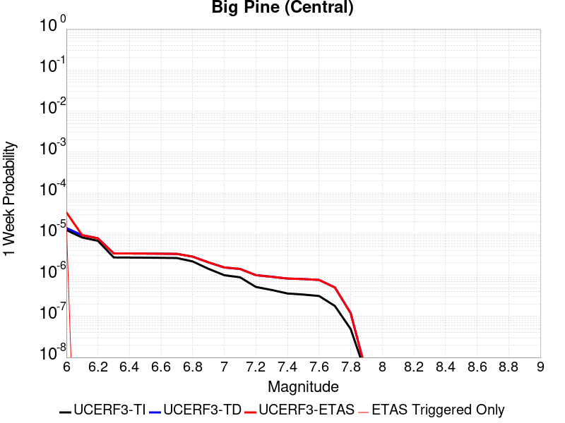 | 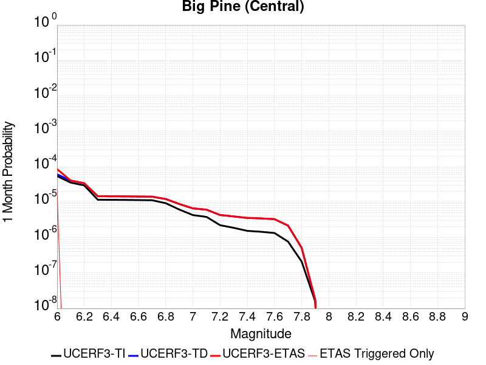 | 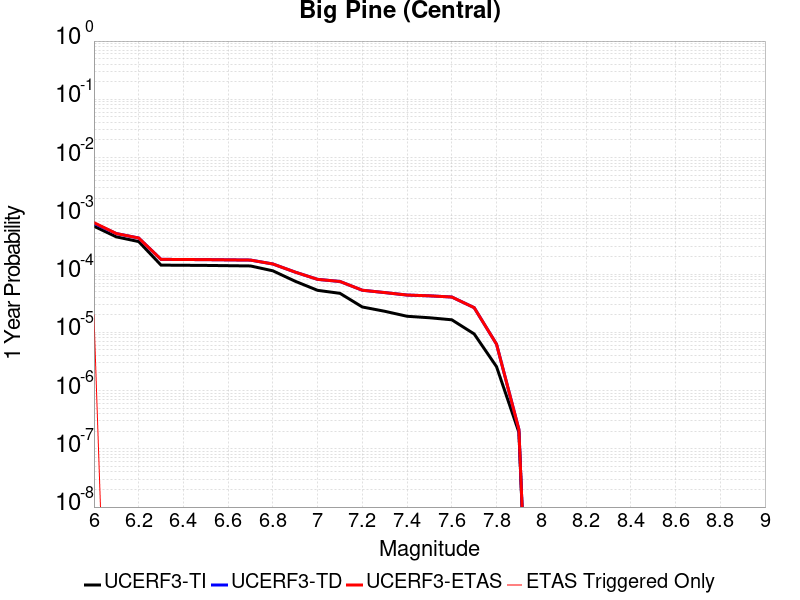 | 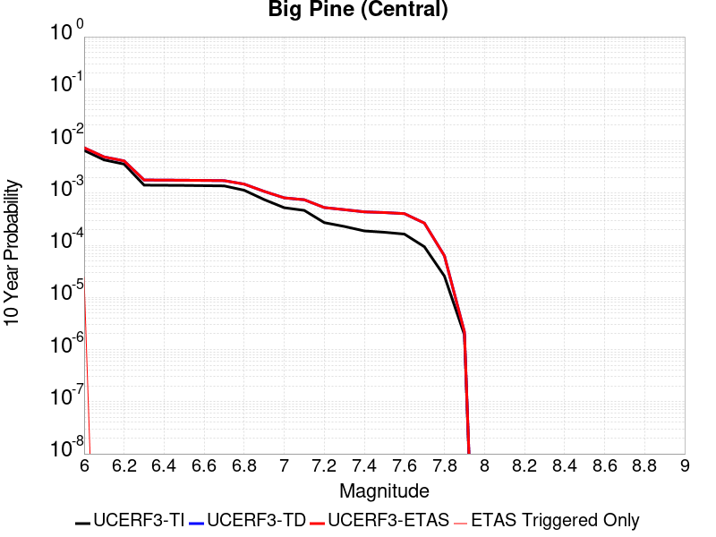 |

| Magnitude | 1 wk TI Prob | 1 wk TD Prob | 1 wk ETAS Prob | 1 wk ETAS/TD Gain | 1 wk ETAS Triggered Only | 1 mo TI Prob | 1 mo TD Prob | 1 mo ETAS Prob | 1 mo ETAS/TD Gain | 1 mo ETAS Triggered Only | 1 yr TI Prob | 1 yr TD Prob | 1 yr ETAS Prob | 1 yr ETAS/TD Gain | 1 yr ETAS Triggered Only | 10 yr TI Prob | 10 yr TD Prob | 10 yr ETAS Prob | 10 yr ETAS/TD Gain | 10 yr ETAS Triggered Only |
|-----|-----|-----|-----|-----|-----|-----|-----|-----|-----|-----|-----|-----|-----|-----|-----|-----|-----|-----|-----|-----|
| 6.0 | 1.2706755E-5 | 1.4250602E-5 | 3.425032E-5 | 2.4034295 | 2.0E-5 | 5.4456385E-5 | 6.107279E-5 | 8.1071565E-5 | 1.3274581 | 2.0E-5 | 6.628048E-4 | 7.433441E-4 | 7.633292E-4 | 1.0268854 | 2.0E-5 | 0.006608314 | 0.007413639 | 0.007433491 | 1.0026777 | 2.0E-5 |
| 6.1 | 8.342579E-6 | 9.510835E-6 | 9.510835E-6 | 1.0 | 0.0 | 3.5753423E-5 | 4.076021E-5 | 4.076021E-5 | 1.0 | 0.0 | 4.3521097E-4 | 4.9616426E-4 | 4.9616426E-4 | 1.0 | 0.0 | 0.0043435963 | 0.004954155 | 0.004954155 | 1.0 | 0.0 |
| 6.2 | 6.923899E-6 | 7.967221E-6 | 7.967221E-6 | 1.0 | 0.0 | 2.9673516E-5 | 3.4144894E-5 | 3.4144894E-5 | 1.0 | 0.0 | 3.6121515E-4 | 4.1565404E-4 | 4.1565404E-4 | 1.0 | 0.0 | 0.003606286 | 0.0041521094 | 0.0041521094 | 1.0 | 0.0 |
| 6.3 | 2.728396E-6 | 3.4243646E-6 | 3.4243646E-6 | 1.0 | 0.0 | 1.1693074E-5 | 1.4675771E-5 | 1.4675771E-5 | 1.0 | 0.0 | 1.4235388E-4 | 1.7866373E-4 | 1.7866373E-4 | 1.0 | 0.0 | 0.0014226272 | 0.0017867433 | 0.0017867433 | 1.0 | 0.0 |
| 6.4 | 2.7136944E-6 | 3.4086581E-6 | 3.4086581E-6 | 1.0 | 0.0 | 1.1630066E-5 | 1.4608458E-5 | 1.4608458E-5 | 1.0 | 0.0 | 1.4158686E-4 | 1.7784433E-4 | 1.7784433E-4 | 1.0 | 0.0 | 0.0014149669 | 0.0017785623 | 0.0017785623 | 1.0 | 0.0 |
| 6.5 | 2.6971882E-6 | 3.3910032E-6 | 3.3910032E-6 | 1.0 | 0.0 | 1.1559327E-5 | 1.4532795E-5 | 1.4532795E-5 | 1.0 | 0.0 | 1.4072572E-4 | 1.7692328E-4 | 1.7692328E-4 | 1.0 | 0.0 | 0.0014063664 | 0.0017693666 | 0.0017693666 | 1.0 | 0.0 |
| 6.6 | 2.669092E-6 | 3.3610236E-6 | 3.3610236E-6 | 1.0 | 0.0 | 1.1438916E-5 | 1.4404312E-5 | 1.4404312E-5 | 1.0 | 0.0 | 1.3925991E-4 | 1.7535927E-4 | 1.7535927E-4 | 1.0 | 0.0 | 0.0013917267 | 0.0017537511 | 0.0017537511 | 1.0 | 0.0 |
| 6.7 | 2.6408059E-6 | 3.3310494E-6 | 3.3310494E-6 | 1.0 | 0.0 | 1.1317691E-5 | 1.4275853E-5 | 1.4275853E-5 | 1.0 | 0.0 | 1.3778417E-4 | 1.737955E-4 | 1.737955E-4 | 1.0 | 0.0 | 0.0013769877 | 0.0017381381 | 0.0017381381 | 1.0 | 0.0 |
| 6.8 | 2.1786943E-6 | 2.8545066E-6 | 2.8545066E-6 | 1.0 | 0.0 | 9.337228E-6 | 1.2233547E-5 | 1.2233547E-5 | 1.0 | 0.0 | 1.1367482E-4 | 1.4893398E-4 | 1.4893398E-4 | 1.0 | 0.0 | 0.0011361669 | 0.0014898704 | 0.0014898704 | 1.0 | 0.0 |
| 6.9 | 1.4411696E-6 | 2.0685677E-6 | 2.0685677E-6 | 1.0 | 0.0 | 6.1764263E-6 | 8.865261E-6 | 8.865261E-6 | 1.0 | 0.0 | 7.51954E-5 | 1.0792949E-4 | 1.0792949E-4 | 1.0 | 0.0 | 7.5169955E-4 | 0.0010802548 | 0.0010802548 | 1.0 | 0.0 |
| 7.0 | 1.0073411E-6 | 1.5543274E-6 | 1.5543274E-6 | 1.0 | 0.0 | 4.317169E-6 | 6.661387E-6 | 6.661387E-6 | 1.0 | 0.0 | 5.2560266E-5 | 8.109952E-5 | 8.109952E-5 | 1.0 | 0.0 | 5.2547833E-4 | 8.1217213E-4 | 8.1217213E-4 | 1.0 | 0.0 |
| 7.1 | 8.947104E-7 | 1.430316E-6 | 1.430316E-6 | 1.0 | 0.0 | 3.834468E-6 | 6.1299124E-6 | 6.1299124E-6 | 1.0 | 0.0 | 4.6683643E-5 | 7.462928E-5 | 7.462928E-5 | 1.0 | 0.0 | 4.6673836E-4 | 7.4751483E-4 | 7.4751483E-4 | 1.0 | 0.0 |
| 7.2 | 5.215166E-7 | 1.0112277E-6 | 1.0112277E-6 | 1.0 | 0.0 | 2.2350691E-6 | 4.333826E-6 | 4.333826E-6 | 1.0 | 0.0 | 2.7211627E-5 | 5.27631E-5 | 5.27631E-5 | 1.0 | 0.0 | 2.7208295E-4 | 5.289683E-4 | 5.289683E-4 | 1.0 | 0.0 |
| 7.3 | 4.4024807E-7 | 9.220183E-7 | 9.220183E-7 | 1.0 | 0.0 | 1.8867761E-6 | 3.951501E-6 | 3.951501E-6 | 1.0 | 0.0 | 2.2971257E-5 | 4.8108504E-5 | 4.8108504E-5 | 1.0 | 0.0 | 2.2968883E-4 | 4.824433E-4 | 4.824433E-4 | 1.0 | 0.0 |
| 7.4 | 3.6130905E-7 | 8.359109E-7 | 8.359109E-7 | 1.0 | 0.0 | 1.5484665E-6 | 3.5824705E-6 | 3.5824705E-6 | 1.0 | 0.0 | 1.8852415E-5 | 4.3615746E-5 | 4.3615746E-5 | 1.0 | 0.0 | 1.8850817E-4 | 4.3752496E-4 | 4.3752496E-4 | 1.0 | 0.0 |
| 7.5 | 3.408184E-7 | 8.1087245E-7 | 8.1087245E-7 | 1.0 | 0.0 | 1.4606494E-6 | 3.475163E-6 | 3.475163E-6 | 1.0 | 0.0 | 1.7783263E-5 | 4.230933E-5 | 4.230933E-5 | 1.0 | 0.0 | 1.778184E-4 | 4.2444657E-4 | 4.2444657E-4 | 1.0 | 0.0 |
| 7.6 | 3.1428627E-7 | 7.732167E-7 | 7.732167E-7 | 1.0 | 0.0 | 1.3469405E-6 | 3.313782E-6 | 3.313782E-6 | 1.0 | 0.0 | 1.6398877E-5 | 4.0344585E-5 | 4.0344585E-5 | 1.0 | 0.0 | 1.6397667E-4 | 4.0477706E-4 | 4.0477706E-4 | 1.0 | 0.0 |
| 7.7 | 1.7972785E-7 | 5.0782415E-7 | 5.0782415E-7 | 1.0 | 0.0 | 7.70262E-7 | 2.1763874E-6 | 2.1763874E-6 | 1.0 | 0.0 | 9.377899E-6 | 2.6497206E-5 | 2.6497206E-5 | 1.0 | 0.0 | 9.377503E-5 | 2.6633305E-4 | 2.6633305E-4 | 1.0 | 0.0 |
| 7.8 | 4.9230927E-8 | 1.1981747E-7 | 1.1981747E-7 | 1.0 | 0.0 | 2.1098968E-7 | 5.135033E-7 | 5.135033E-7 | 1.0 | 0.0 | 2.5687964E-6 | 6.2518866E-6 | 6.2518866E-6 | 1.0 | 0.0 | 2.5687666E-5 | 6.2971965E-5 | 6.2971965E-5 | 1.0 | 0.0 |
| 7.9 | 3.6805972E-9 | 4.1051638E-9 | 4.1051638E-9 | 1.0 | 0.0 | 1.5773987E-8 | 1.7593557E-8 | 1.7593557E-8 | 1.0 | 0.0 | 1.9204828E-7 | 2.1420155E-7 | 2.1420155E-7 | 1.0 | 0.0 | 1.920481E-6 | 2.1898923E-6 | 2.1898923E-6 | 1.0 | 0.0 |

## Pleito
*[(top)](#table-of-contents)*

| 1 Week | 1 Month | 1 Year | 10 Year |
|-----|-----|-----|-----|
| 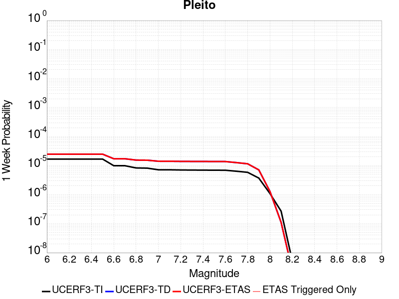 | 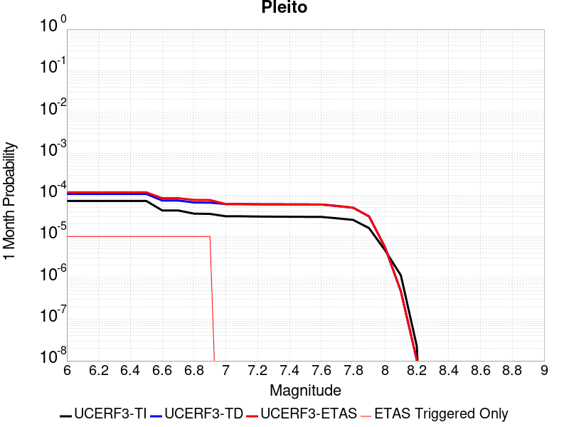 | 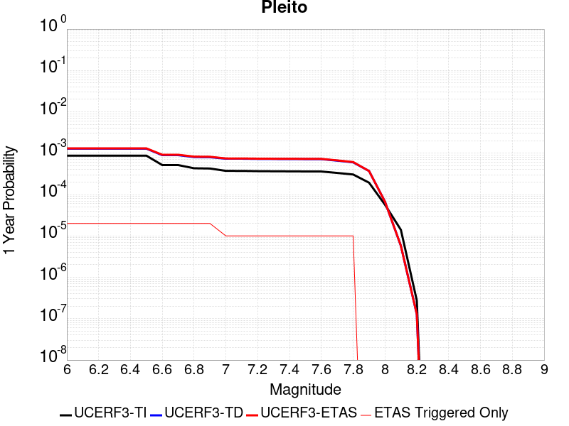 | 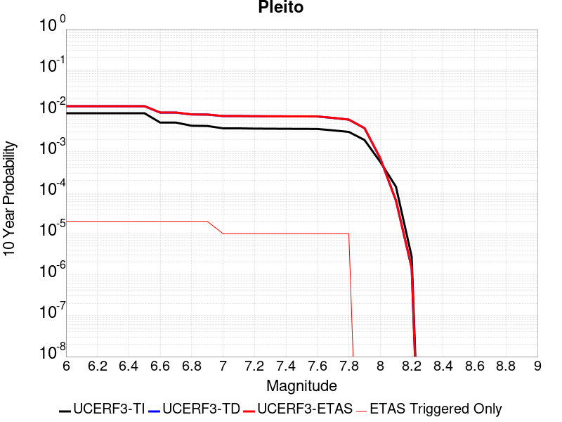 |

| Magnitude | 1 wk TI Prob | 1 wk TD Prob | 1 wk ETAS Prob | 1 wk ETAS/TD Gain | 1 wk ETAS Triggered Only | 1 mo TI Prob | 1 mo TD Prob | 1 mo ETAS Prob | 1 mo ETAS/TD Gain | 1 mo ETAS Triggered Only | 1 yr TI Prob | 1 yr TD Prob | 1 yr ETAS Prob | 1 yr ETAS/TD Gain | 1 yr ETAS Triggered Only | 10 yr TI Prob | 10 yr TD Prob | 10 yr ETAS Prob | 10 yr ETAS/TD Gain | 10 yr ETAS Triggered Only |
|-----|-----|-----|-----|-----|-----|-----|-----|-----|-----|-----|-----|-----|-----|-----|-----|-----|-----|-----|-----|-----|
| 6.0 | 1.6763008E-5 | 2.4764735E-5 | 2.4764735E-5 | 1.0 | 0.0 | 7.183948E-5 | 1.0613067E-4 | 1.1612961E-4 | 1.0942135 | 1.0E-5 | 8.742947E-4 | 0.001291447 | 0.0013114212 | 1.0154665 | 2.0E-5 | 0.00870863 | 0.012954412 | 0.012974152 | 1.0015239 | 2.0E-5 |
| 6.1 | 1.6763008E-5 | 2.4764735E-5 | 2.4764735E-5 | 1.0 | 0.0 | 7.183948E-5 | 1.0613067E-4 | 1.1612961E-4 | 1.0942135 | 1.0E-5 | 8.742947E-4 | 0.001291447 | 0.0013114212 | 1.0154665 | 2.0E-5 | 0.00870863 | 0.012954412 | 0.012974152 | 1.0015239 | 2.0E-5 |
| 6.2 | 1.6763008E-5 | 2.4764735E-5 | 2.4764735E-5 | 1.0 | 0.0 | 7.183948E-5 | 1.0613067E-4 | 1.1612961E-4 | 1.0942135 | 1.0E-5 | 8.742947E-4 | 0.001291447 | 0.0013114212 | 1.0154665 | 2.0E-5 | 0.00870863 | 0.012954412 | 0.012974152 | 1.0015239 | 2.0E-5 |
| 6.3 | 1.6763008E-5 | 2.4764735E-5 | 2.4764735E-5 | 1.0 | 0.0 | 7.183948E-5 | 1.0613067E-4 | 1.1612961E-4 | 1.0942135 | 1.0E-5 | 8.742947E-4 | 0.001291447 | 0.0013114212 | 1.0154665 | 2.0E-5 | 0.00870863 | 0.012954412 | 0.012974152 | 1.0015239 | 2.0E-5 |
| 6.4 | 1.6763008E-5 | 2.4764735E-5 | 2.4764735E-5 | 1.0 | 0.0 | 7.183948E-5 | 1.0613067E-4 | 1.1612961E-4 | 1.0942135 | 1.0E-5 | 8.742947E-4 | 0.001291447 | 0.0013114212 | 1.0154665 | 2.0E-5 | 0.00870863 | 0.012954412 | 0.012974152 | 1.0015239 | 2.0E-5 |
| 6.5 | 1.6763008E-5 | 2.4764735E-5 | 2.4764735E-5 | 1.0 | 0.0 | 7.183948E-5 | 1.0613067E-4 | 1.1612961E-4 | 1.0942135 | 1.0E-5 | 8.742947E-4 | 0.001291447 | 0.0013114212 | 1.0154665 | 2.0E-5 | 0.00870863 | 0.012954412 | 0.012974152 | 1.0015239 | 2.0E-5 |
| 6.6 | 9.910213E-6 | 1.721552E-5 | 1.721552E-5 | 1.0 | 0.0 | 4.247165E-5 | 7.3778734E-5 | 8.3777995E-5 | 1.1355304 | 1.0E-5 | 5.169696E-4 | 8.9788967E-4 | 9.1787166E-4 | 1.0222545 | 2.0E-5 | 0.0051576863 | 0.009051226 | 0.009071045 | 1.0021896 | 2.0E-5 |
| 6.7 | 9.910213E-6 | 1.721552E-5 | 1.721552E-5 | 1.0 | 0.0 | 4.247165E-5 | 7.3778734E-5 | 8.3777995E-5 | 1.1355304 | 1.0E-5 | 5.169696E-4 | 8.9788967E-4 | 9.1787166E-4 | 1.0222545 | 2.0E-5 | 0.0051576863 | 0.009051226 | 0.009071045 | 1.0021896 | 2.0E-5 |
| 6.8 | 8.300162E-6 | 1.5475129E-5 | 1.5475129E-5 | 1.0 | 0.0 | 3.557164E-5 | 6.63203E-5 | 7.6319644E-5 | 1.1507734 | 1.0E-5 | 4.3299864E-4 | 8.07152E-4 | 8.2713587E-4 | 1.0247585 | 2.0E-5 | 0.004321559 | 0.008150663 | 0.0081705 | 1.0024338 | 2.0E-5 |
| 6.9 | 8.183114E-6 | 1.5346344E-5 | 1.5346344E-5 | 1.0 | 0.0 | 3.5070017E-5 | 6.57684E-5 | 7.576774E-5 | 1.1520387 | 1.0E-5 | 4.2689382E-4 | 8.0043747E-4 | 8.204215E-4 | 1.0249664 | 2.0E-5 | 0.0042607468 | 0.008084008 | 0.008103847 | 1.002454 | 2.0E-5 |
| 7.0 | 7.1748823E-6 | 1.4133306E-5 | 1.4133306E-5 | 1.0 | 0.0 | 3.0749135E-5 | 6.0569906E-5 | 6.0569906E-5 | 1.0 | 0.0 | 3.743064E-4 | 7.3718966E-4 | 7.471823E-4 | 1.013555 | 1.0E-5 | 0.0037367654 | 0.0074553755 | 0.007465301 | 1.0013313 | 1.0E-5 |
| 7.1 | 7.1671807E-6 | 1.4123676E-5 | 1.4123676E-5 | 1.0 | 0.0 | 3.0716128E-5 | 6.0528637E-5 | 6.0528637E-5 | 1.0 | 0.0 | 3.7390468E-4 | 7.366875E-4 | 7.4668013E-4 | 1.0135642 | 1.0E-5 | 0.0037327618 | 0.0074503883 | 0.0074603134 | 1.0013322 | 1.0E-5 |
| 7.2 | 7.0649667E-6 | 1.3970962E-5 | 1.3970962E-5 | 1.0 | 0.0 | 3.0278077E-5 | 5.987418E-5 | 5.987418E-5 | 1.0 | 0.0 | 3.6857324E-4 | 7.287248E-4 | 7.3871756E-4 | 1.0137126 | 1.0E-5 | 0.0036796255 | 0.0073711374 | 0.007381064 | 1.0013466 | 1.0E-5 |
| 7.3 | 7.02082E-6 | 1.3914415E-5 | 1.3914415E-5 | 1.0 | 0.0 | 3.008888E-5 | 5.9631846E-5 | 5.9631846E-5 | 1.0 | 0.0 | 3.6627054E-4 | 7.257764E-4 | 7.3576916E-4 | 1.0137683 | 1.0E-5 | 0.0036566744 | 0.0073416373 | 0.0073515642 | 1.0013521 | 1.0E-5 |
| 7.4 | 6.987146E-6 | 1.3873975E-5 | 1.3873975E-5 | 1.0 | 0.0 | 2.9944567E-5 | 5.9458544E-5 | 5.9458544E-5 | 1.0 | 0.0 | 3.6451413E-4 | 7.2366785E-4 | 7.336606E-4 | 1.0138085 | 1.0E-5 | 0.0036391679 | 0.007320571 | 0.007330498 | 1.001356 | 1.0E-5 |
| 7.5 | 6.9494554E-6 | 1.383088E-5 | 1.383088E-5 | 1.0 | 0.0 | 2.9783041E-5 | 5.9273858E-5 | 5.9273858E-5 | 1.0 | 0.0 | 3.625482E-4 | 7.2142074E-4 | 7.3141354E-4 | 1.0138515 | 1.0E-5 | 0.0036195726 | 0.007298199 | 0.007308126 | 1.0013602 | 1.0E-5 |
| 7.6 | 6.92694E-6 | 1.3789992E-5 | 1.3789992E-5 | 1.0 | 0.0 | 2.9686547E-5 | 5.909863E-5 | 5.909863E-5 | 1.0 | 0.0 | 3.6137376E-4 | 7.192888E-4 | 7.292816E-4 | 1.0138927 | 1.0E-5 | 0.0036078666 | 0.007276951 | 0.0072868783 | 1.0013642 | 1.0E-5 |
| 7.7 | 6.395867E-6 | 1.26690065E-5 | 1.26690065E-5 | 1.0 | 0.0 | 2.741057E-5 | 5.4294615E-5 | 5.4294615E-5 | 1.0 | 0.0 | 3.336726E-4 | 6.6083675E-4 | 6.7083014E-4 | 1.0151223 | 1.0E-5 | 0.0033317201 | 0.0066955453 | 0.0067054783 | 1.0014836 | 1.0E-5 |
| 7.8 | 5.8664327E-6 | 1.1536581E-5 | 1.1536581E-5 | 1.0 | 0.0 | 2.5141611E-5 | 4.9441554E-5 | 4.9441554E-5 | 1.0 | 0.0 | 3.060561E-4 | 6.0178485E-4 | 6.117789E-4 | 1.0166073 | 1.0E-5 | 0.0030563495 | 0.0061010164 | 0.0061109555 | 1.0016291 | 1.0E-5 |
| 7.9 | 3.7167474E-6 | 7.1145205E-6 | 7.1145205E-6 | 1.0 | 0.0 | 1.592882E-5 | 3.0490448E-5 | 3.0490448E-5 | 1.0 | 0.0 | 1.9391612E-4 | 3.7115812E-4 | 3.7115812E-4 | 1.0 | 0.0 | 0.0019374699 | 0.0037676243 | 0.0037676243 | 1.0 | 0.0 |
| 8.0 | 1.0903841E-6 | 1.2879104E-6 | 1.2879104E-6 | 1.0 | 0.0 | 4.6730665E-6 | 5.5196047E-6 | 5.5196047E-6 | 1.0 | 0.0 | 5.68931E-5 | 6.719913E-5 | 6.719913E-5 | 1.0 | 0.0 | 5.6878536E-4 | 6.942094E-4 | 6.942094E-4 | 1.0 | 0.0 |
| 8.1 | 2.6894583E-7 | 1.1056095E-7 | 1.1056095E-7 | 1.0 | 0.0 | 1.1526245E-6 | 4.7383253E-7 | 4.7383253E-7 | 1.0 | 0.0 | 1.4033113E-5 | 5.768896E-6 | 5.768896E-6 | 1.0 | 0.0 | 1.4032227E-4 | 6.454915E-5 | 6.454915E-5 | 1.0 | 0.0 |
| 8.2 | 5.2967013E-9 | 2.4567874E-9 | 2.4567874E-9 | 1.0 | 0.0 | 2.2700148E-8 | 1.0529089E-8 | 1.0529089E-8 | 1.0 | 0.0 | 2.7637427E-7 | 1.2819166E-7 | 1.2819166E-7 | 1.0 | 0.0 | 2.7637393E-6 | 1.4588004E-6 | 1.4588004E-6 | 1.0 | 0.0 |

## Channel Islands Thrust
*[(top)](#table-of-contents)*

| 1 Week | 1 Month | 1 Year | 10 Year |
|-----|-----|-----|-----|
|  | 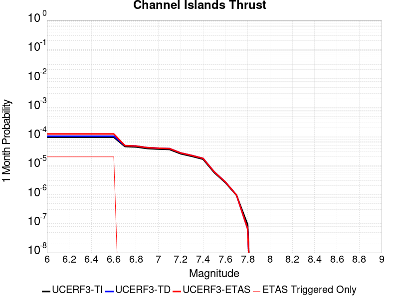 |  |  |

| Magnitude | 1 wk TI Prob | 1 wk TD Prob | 1 wk ETAS Prob | 1 wk ETAS/TD Gain | 1 wk ETAS Triggered Only | 1 mo TI Prob | 1 mo TD Prob | 1 mo ETAS Prob | 1 mo ETAS/TD Gain | 1 mo ETAS Triggered Only | 1 yr TI Prob | 1 yr TD Prob | 1 yr ETAS Prob | 1 yr ETAS/TD Gain | 1 yr ETAS Triggered Only | 10 yr TI Prob | 10 yr TD Prob | 10 yr ETAS Prob | 10 yr ETAS/TD Gain | 10 yr ETAS Triggered Only |
|-----|-----|-----|-----|-----|-----|-----|-----|-----|-----|-----|-----|-----|-----|-----|-----|-----|-----|-----|-----|-----|
| 6.0 | 2.2156251E-5 | 2.4092022E-5 | 4.409154E-5 | 1.8301303 | 2.0E-5 | 9.495191E-5 | 1.03248036E-4 | 1.2324598E-4 | 1.1936883 | 2.0E-5 | 0.0011554264 | 0.0012564266 | 0.0012764013 | 1.0158981 | 2.0E-5 | 0.011494373 | 0.0125038205 | 0.012523571 | 1.0015795 | 2.0E-5 |
| 6.1 | 2.2156251E-5 | 2.4092022E-5 | 4.409154E-5 | 1.8301303 | 2.0E-5 | 9.495191E-5 | 1.03248036E-4 | 1.2324598E-4 | 1.1936883 | 2.0E-5 | 0.0011554264 | 0.0012564266 | 0.0012764013 | 1.0158981 | 2.0E-5 | 0.011494373 | 0.0125038205 | 0.012523571 | 1.0015795 | 2.0E-5 |
| 6.2 | 2.2156251E-5 | 2.4092022E-5 | 4.409154E-5 | 1.8301303 | 2.0E-5 | 9.495191E-5 | 1.03248036E-4 | 1.2324598E-4 | 1.1936883 | 2.0E-5 | 0.0011554264 | 0.0012564266 | 0.0012764013 | 1.0158981 | 2.0E-5 | 0.011494373 | 0.0125038205 | 0.012523571 | 1.0015795 | 2.0E-5 |
| 6.3 | 2.2156251E-5 | 2.4092022E-5 | 4.409154E-5 | 1.8301303 | 2.0E-5 | 9.495191E-5 | 1.03248036E-4 | 1.2324598E-4 | 1.1936883 | 2.0E-5 | 0.0011554264 | 0.0012564266 | 0.0012764013 | 1.0158981 | 2.0E-5 | 0.011494373 | 0.0125038205 | 0.012523571 | 1.0015795 | 2.0E-5 |
| 6.4 | 2.2156251E-5 | 2.4092022E-5 | 4.409154E-5 | 1.8301303 | 2.0E-5 | 9.495191E-5 | 1.03248036E-4 | 1.2324598E-4 | 1.1936883 | 2.0E-5 | 0.0011554264 | 0.0012564266 | 0.0012764013 | 1.0158981 | 2.0E-5 | 0.011494373 | 0.0125038205 | 0.012523571 | 1.0015795 | 2.0E-5 |
| 6.5 | 2.2156251E-5 | 2.4092022E-5 | 4.409154E-5 | 1.8301303 | 2.0E-5 | 9.495191E-5 | 1.03248036E-4 | 1.2324598E-4 | 1.1936883 | 2.0E-5 | 0.0011554264 | 0.0012564266 | 0.0012764013 | 1.0158981 | 2.0E-5 | 0.011494373 | 0.0125038205 | 0.012523571 | 1.0015795 | 2.0E-5 |
| 6.6 | 2.2156251E-5 | 2.4092022E-5 | 4.409154E-5 | 1.8301303 | 2.0E-5 | 9.495191E-5 | 1.03248036E-4 | 1.2324598E-4 | 1.1936883 | 2.0E-5 | 0.0011554264 | 0.0012564266 | 0.0012764013 | 1.0158981 | 2.0E-5 | 0.011494373 | 0.0125038205 | 0.012523571 | 1.0015795 | 2.0E-5 |
| 6.7 | 1.0601296E-5 | 1.1379544E-5 | 1.1379544E-5 | 1.0 | 0.0 | 4.5433335E-5 | 4.876859E-5 | 4.876859E-5 | 1.0 | 0.0 | 5.5301044E-4 | 5.936007E-4 | 5.936007E-4 | 1.0 | 0.0 | 0.005516363 | 0.005920653 | 0.005920653 | 1.0 | 0.0 |
| 6.8 | 1.0246747E-5 | 1.0996669E-5 | 1.0996669E-5 | 1.0 | 0.0 | 4.391389E-5 | 4.7127756E-5 | 4.7127756E-5 | 1.0 | 0.0 | 5.345204E-4 | 5.7363417E-4 | 5.7363417E-4 | 1.0 | 0.0 | 0.0053323656 | 0.005722025 | 0.005722025 | 1.0 | 0.0 |
| 6.9 | 9.049551E-6 | 9.699645E-6 | 9.699645E-6 | 1.0 | 0.0 | 3.878322E-5 | 4.1569267E-5 | 4.1569267E-5 | 1.0 | 0.0 | 4.7208337E-4 | 5.059924E-4 | 5.059924E-4 | 1.0 | 0.0 | 0.0047108172 | 0.0050488203 | 0.0050488203 | 1.0 | 0.0 |
| 7.0 | 8.6542195E-6 | 9.274603E-6 | 9.274603E-6 | 1.0 | 0.0 | 3.7088983E-5 | 3.9747716E-5 | 3.9747716E-5 | 1.0 | 0.0 | 4.5146482E-4 | 4.8382508E-4 | 4.8382508E-4 | 1.0 | 0.0 | 0.004505487 | 0.0048281294 | 0.0048281294 | 1.0 | 0.0 |
| 7.1 | 8.391028E-6 | 8.992925E-6 | 8.992925E-6 | 1.0 | 0.0 | 3.5961057E-5 | 3.8540562E-5 | 3.8540562E-5 | 1.0 | 0.0 | 4.3773788E-4 | 4.6913436E-4 | 4.6913436E-4 | 1.0 | 0.0 | 0.004368766 | 0.0046818503 | 0.0046818503 | 1.0 | 0.0 |
| 7.2 | 5.965188E-6 | 6.3716957E-6 | 6.3716957E-6 | 1.0 | 0.0 | 2.556484E-5 | 2.7306984E-5 | 2.7306984E-5 | 1.0 | 0.0 | 3.1120746E-4 | 3.3241237E-4 | 3.3241237E-4 | 1.0 | 0.0 | 0.00310772 | 0.0033192094 | 0.0033192094 | 1.0 | 0.0 |
| 7.3 | 4.877518E-6 | 5.206007E-6 | 5.206007E-6 | 1.0 | 0.0 | 2.0903482E-5 | 2.231127E-5 | 2.231127E-5 | 1.0 | 0.0 | 2.5447016E-4 | 2.716063E-4 | 2.716063E-4 | 1.0 | 0.0 | 0.0025417898 | 0.0027127897 | 0.0027127897 | 1.0 | 0.0 |
| 7.4 | 3.8829853E-6 | 4.141863E-6 | 4.141863E-6 | 1.0 | 0.0 | 1.664126E-5 | 1.7750723E-5 | 1.7750723E-5 | 1.0 | 0.0 | 2.0258849E-4 | 2.1609403E-4 | 2.1609403E-4 | 1.0 | 0.0 | 0.002024039 | 0.002158881 | 0.002158881 | 1.0 | 0.0 |
| 7.5 | 1.3489616E-6 | 1.4277905E-6 | 1.4277905E-6 | 1.0 | 0.0 | 5.7812517E-6 | 6.119088E-6 | 6.119088E-6 | 1.0 | 0.0 | 7.038446E-5 | 7.449739E-5 | 7.449739E-5 | 1.0 | 0.0 | 7.036218E-4 | 7.4472814E-4 | 7.4472814E-4 | 1.0 | 0.0 |
| 7.6 | 6.058192E-7 | 6.35378E-7 | 6.35378E-7 | 1.0 | 0.0 | 2.5963652E-6 | 2.7230458E-6 | 2.7230458E-6 | 1.0 | 0.0 | 3.161029E-5 | 3.3152595E-5 | 3.3152595E-5 | 1.0 | 0.0 | 3.1605794E-4 | 3.314781E-4 | 3.314781E-4 | 1.0 | 0.0 |
| 7.7 | 2.2170494E-7 | 2.2607924E-7 | 2.2607924E-7 | 1.0 | 0.0 | 9.5016367E-7 | 9.689107E-7 | 9.689107E-7 | 1.0 | 0.0 | 1.1568181E-5 | 1.17964355E-5 | 1.17964355E-5 | 1.0 | 0.0 | 1.1567579E-4 | 1.179592E-4 | 1.179592E-4 | 1.0 | 0.0 |
| 7.8 | 2.1613102E-8 | 1.5466837E-8 | 1.5466837E-8 | 1.0 | 0.0 | 9.262757E-8 | 6.628645E-8 | 6.628645E-8 | 1.0 | 0.0 | 1.1277401E-6 | 8.070372E-7 | 8.070372E-7 | 1.0 | 0.0 | 1.1277344E-5 | 8.07035E-6 | 8.07035E-6 | 1.0 | 0.0 |

## San Juan
*[(top)](#table-of-contents)*

| 1 Week | 1 Month | 1 Year | 10 Year |
|-----|-----|-----|-----|
|  |  |  |  |

| Magnitude | 1 wk TI Prob | 1 wk TD Prob | 1 wk ETAS Prob | 1 wk ETAS/TD Gain | 1 wk ETAS Triggered Only | 1 mo TI Prob | 1 mo TD Prob | 1 mo ETAS Prob | 1 mo ETAS/TD Gain | 1 mo ETAS Triggered Only | 1 yr TI Prob | 1 yr TD Prob | 1 yr ETAS Prob | 1 yr ETAS/TD Gain | 1 yr ETAS Triggered Only | 10 yr TI Prob | 10 yr TD Prob | 10 yr ETAS Prob | 10 yr ETAS/TD Gain | 10 yr ETAS Triggered Only |
|-----|-----|-----|-----|-----|-----|-----|-----|-----|-----|-----|-----|-----|-----|-----|-----|-----|-----|-----|-----|-----|
| 6.0 | 8.682808E-6 | 8.74917E-6 | 1.8749082E-5 | 2.1429555 | 1.0E-5 | 3.72115E-5 | 3.749593E-5 | 4.7495556E-5 | 1.2666856 | 1.0E-5 | 4.5295584E-4 | 4.5642213E-4 | 4.76413E-4 | 1.043799 | 2.0E-5 | 0.004520337 | 0.004555389 | 0.0045752977 | 1.0043705 | 2.0E-5 |
| 6.1 | 8.682808E-6 | 8.74917E-6 | 1.8749082E-5 | 2.1429555 | 1.0E-5 | 3.72115E-5 | 3.749593E-5 | 4.7495556E-5 | 1.2666856 | 1.0E-5 | 4.5295584E-4 | 4.5642213E-4 | 4.76413E-4 | 1.043799 | 2.0E-5 | 0.004520337 | 0.004555389 | 0.0045752977 | 1.0043705 | 2.0E-5 |
| 6.2 | 8.682808E-6 | 8.74917E-6 | 1.8749082E-5 | 2.1429555 | 1.0E-5 | 3.72115E-5 | 3.749593E-5 | 4.7495556E-5 | 1.2666856 | 1.0E-5 | 4.5295584E-4 | 4.5642213E-4 | 4.76413E-4 | 1.043799 | 2.0E-5 | 0.004520337 | 0.004555389 | 0.0045752977 | 1.0043705 | 2.0E-5 |
| 6.3 | 6.3054235E-6 | 6.282591E-6 | 1.6282529E-5 | 2.59169 | 1.0E-5 | 2.7022963E-5 | 2.692512E-5 | 3.6924852E-5 | 1.3713903 | 1.0E-5 | 3.2895492E-4 | 3.2776545E-4 | 3.4775888E-4 | 1.0609993 | 2.0E-5 | 0.003284684 | 0.0032730205 | 0.003292955 | 1.0060905 | 2.0E-5 |
| 6.4 | 6.1490473E-6 | 6.1144706E-6 | 1.6114409E-5 | 2.6354547 | 1.0E-5 | 2.6352795E-5 | 2.6204618E-5 | 3.6204357E-5 | 1.3816022 | 1.0E-5 | 3.2079802E-4 | 3.189959E-4 | 3.389895E-4 | 1.0626768 | 2.0E-5 | 0.0032033534 | 0.0031855768 | 0.003205513 | 1.0062582 | 2.0E-5 |
| 6.5 | 5.204848E-6 | 5.137238E-6 | 1.5137187E-5 | 2.9465613 | 1.0E-5 | 2.23063E-5 | 2.2016555E-5 | 3.2016334E-5 | 1.4541937 | 1.0E-5 | 2.7154534E-4 | 2.6801953E-4 | 2.8801415E-4 | 1.0746014 | 2.0E-5 | 0.0027121378 | 0.0026771172 | 0.0026970638 | 1.0074507 | 2.0E-5 |
| 6.6 | 4.5179986E-6 | 4.415036E-6 | 1.4414992E-5 | 3.2649772 | 1.0E-5 | 1.9362706E-5 | 1.892145E-5 | 2.8921262E-5 | 1.5284907 | 1.0E-5 | 2.3571544E-4 | 2.303451E-4 | 2.503405E-4 | 1.0868063 | 2.0E-5 | 0.0023546559 | 0.0023012008 | 0.0023211548 | 1.0086712 | 2.0E-5 |
| 6.7 | 3.9442616E-6 | 3.8198336E-6 | 1.3819796E-5 | 3.6179051 | 1.0E-5 | 1.6903869E-5 | 1.6370615E-5 | 2.6370451E-5 | 1.6108406 | 1.0E-5 | 2.0578515E-4 | 1.9929469E-4 | 2.092927E-4 | 1.050167 | 1.0E-5 | 0.002055947 | 0.001991285 | 0.002001265 | 1.0050119 | 1.0E-5 |
| 6.8 | 3.4536245E-6 | 3.3163408E-6 | 1.3316308E-5 | 4.015362 | 1.0E-5 | 1.4801163E-5 | 1.4212815E-5 | 2.4212673E-5 | 1.7035804 | 1.0E-5 | 1.8018926E-4 | 1.7302789E-4 | 1.8302616E-4 | 1.0577842 | 1.0E-5 | 0.0018004322 | 0.001729051 | 0.0017390337 | 1.0057735 | 1.0E-5 |
| 6.9 | 3.059865E-6 | 2.9120363E-6 | 1.2912007E-5 | 4.434013 | 1.0E-5 | 1.3113641E-5 | 1.2480099E-5 | 2.2479975E-5 | 1.8012657 | 1.0E-5 | 1.596469E-4 | 1.5193518E-4 | 1.6193367E-4 | 1.0658076 | 1.0E-5 | 0.0015953224 | 0.0015184281 | 0.0015284129 | 1.0065757 | 1.0E-5 |
| 7.0 | 2.6504351E-6 | 2.492005E-6 | 1.249198E-5 | 5.012823 | 1.0E-5 | 1.1358958E-5 | 1.0679981E-5 | 2.0679874E-5 | 1.9363213 | 1.0E-5 | 1.3828653E-4 | 1.3002155E-4 | 1.4002025E-4 | 1.0769004 | 1.0E-5 | 0.0013820052 | 0.001299567 | 0.0013095541 | 1.0076848 | 1.0E-5 |
| 7.1 | 2.2039317E-6 | 2.0338366E-6 | 1.2033816E-5 | 5.9168057 | 1.0E-5 | 9.445387E-6 | 8.716416E-6 | 1.871633E-5 | 2.1472504 | 1.0E-5 | 1.1499152E-4 | 1.0611773E-4 | 1.1611667E-4 | 1.0942249 | 1.0E-5 | 0.0011493203 | 0.0010607811 | 0.0010707704 | 1.009417 | 1.0E-5 |
| 7.2 | 1.0786707E-6 | 8.770239E-7 | 8.770239E-7 | 1.0 | 0.0 | 4.622866E-6 | 3.7586685E-6 | 3.7586685E-6 | 1.0 | 0.0 | 5.628194E-5 | 4.576084E-5 | 4.576084E-5 | 1.0 | 0.0 | 5.6267687E-4 | 4.5757365E-4 | 4.5757365E-4 | 1.0 | 0.0 |
| 7.3 | 6.846433E-7 | 4.868812E-7 | 4.868812E-7 | 1.0 | 0.0 | 2.9341822E-6 | 2.086632E-6 | 2.086632E-6 | 1.0 | 0.0 | 3.5723086E-5 | 2.5404452E-5 | 2.5404452E-5 | 1.0 | 0.0 | 3.571734E-4 | 2.5405022E-4 | 2.5405022E-4 | 1.0 | 0.0 |
| 7.4 | 5.23043E-7 | 3.2627884E-7 | 3.2627884E-7 | 1.0 | 0.0 | 2.2416111E-6 | 1.3983371E-6 | 1.3983371E-6 | 1.0 | 0.0 | 2.7291273E-5 | 1.7024622E-5 | 1.7024622E-5 | 1.0 | 0.0 | 2.7287923E-4 | 1.7026608E-4 | 1.7026608E-4 | 1.0 | 0.0 |
| 7.5 | 4.648444E-7 | 2.723464E-7 | 2.723464E-7 | 1.0 | 0.0 | 1.9921886E-6 | 1.1671983E-6 | 1.1671983E-6 | 1.0 | 0.0 | 2.4254627E-5 | 1.4210547E-5 | 1.4210547E-5 | 1.0 | 0.0 | 2.425198E-4 | 1.4212691E-4 | 1.4212691E-4 | 1.0 | 0.0 |
| 7.6 | 3.9906567E-7 | 2.2083036E-7 | 2.2083036E-7 | 1.0 | 0.0 | 1.7102802E-6 | 9.4641547E-7 | 9.4641547E-7 | 1.0 | 0.0 | 2.0822463E-5 | 1.1522548E-5 | 1.1522548E-5 | 1.0 | 0.0 | 2.0820512E-4 | 1.15244526E-4 | 1.15244526E-4 | 1.0 | 0.0 |
| 7.7 | 1.8784601E-7 | 5.366277E-8 | 5.366277E-8 | 1.0 | 0.0 | 8.0505407E-7 | 2.2998329E-7 | 2.2998329E-7 | 1.0 | 0.0 | 9.80149E-6 | 2.800043E-6 | 2.800043E-6 | 1.0 | 0.0 | 9.801057E-5 | 2.8008939E-5 | 2.8008939E-5 | 1.0 | 0.0 |
| 7.8 | 1.00154914E-7 | 1.2412917E-8 | 1.2412917E-8 | 1.0 | 0.0 | 4.2923529E-7 | 5.3198217E-8 | 5.3198217E-8 | 1.0 | 0.0 | 5.225927E-6 | 6.476881E-7 | 6.476881E-7 | 1.0 | 0.0 | 5.225804E-5 | 6.4827886E-6 | 6.4827886E-6 | 1.0 | 0.0 |
| 7.9 | 6.171429E-8 | 4.2946513E-9 | 4.2946513E-9 | 1.0 | 0.0 | 2.6448978E-7 | 1.8405647E-8 | 1.8405647E-8 | 1.0 | 0.0 | 3.2201583E-6 | 2.2408874E-7 | 2.2408874E-7 | 1.0 | 0.0 | 3.2201115E-5 | 2.2462114E-6 | 2.2462114E-6 | 1.0 | 0.0 |
| 8.0 | 1.3974572E-8 | 3.3737857E-10 | 3.3737857E-10 | 1.0 | 0.0 | 5.989102E-8 | 1.4459075E-9 | 1.4459075E-9 | 1.0 | 0.0 | 7.2917294E-7 | 1.760392E-8 | 1.760392E-8 | 1.0 | 0.0 | 7.2917055E-6 | 1.8038004E-7 | 1.8038004E-7 | 1.0 | 0.0 |
| 8.1 | 1.8403477E-9 | 1.1291601E-10 | 1.1291601E-10 | 1.0 | 0.0 | 7.887204E-9 | 4.839261E-10 | 4.839261E-10 | 1.0 | 0.0 | 9.602671E-8 | 5.8917977E-9 | 5.8917977E-9 | 1.0 | 0.0 | 9.602667E-7 | 6.0206084E-8 | 6.0206084E-8 | 1.0 | 0.0 |

## Simi-Santa Rosa
*[(top)](#table-of-contents)*

| 1 Week | 1 Month | 1 Year | 10 Year |
|-----|-----|-----|-----|
| 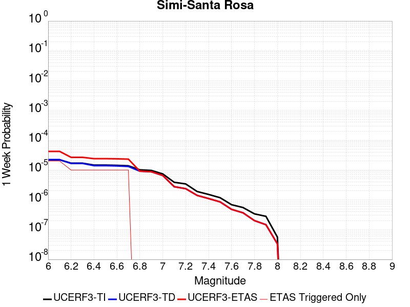 | 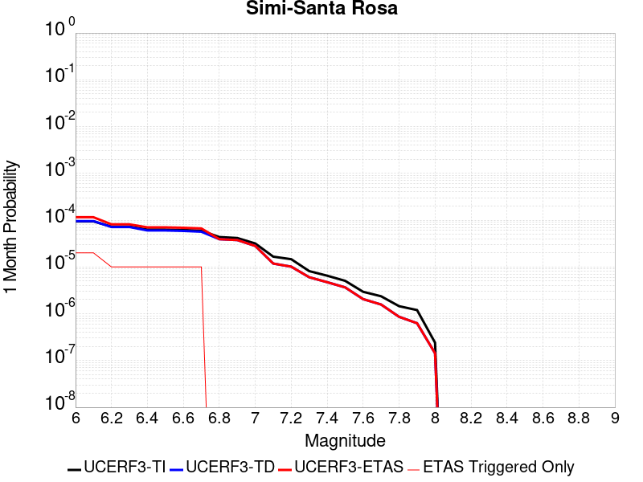 | 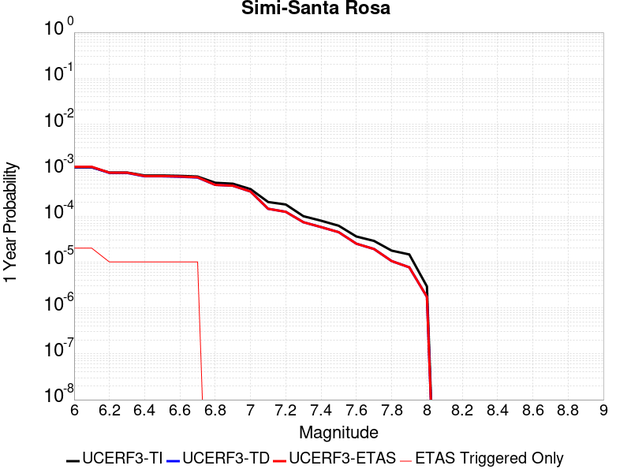 | 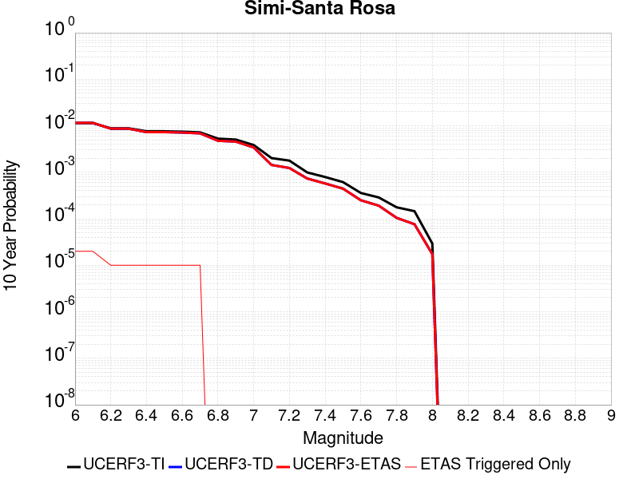 |

| Magnitude | 1 wk TI Prob | 1 wk TD Prob | 1 wk ETAS Prob | 1 wk ETAS/TD Gain | 1 wk ETAS Triggered Only | 1 mo TI Prob | 1 mo TD Prob | 1 mo ETAS Prob | 1 mo ETAS/TD Gain | 1 mo ETAS Triggered Only | 1 yr TI Prob | 1 yr TD Prob | 1 yr ETAS Prob | 1 yr ETAS/TD Gain | 1 yr ETAS Triggered Only | 10 yr TI Prob | 10 yr TD Prob | 10 yr ETAS Prob | 10 yr ETAS/TD Gain | 10 yr ETAS Triggered Only |
|-----|-----|-----|-----|-----|-----|-----|-----|-----|-----|-----|-----|-----|-----|-----|-----|-----|-----|-----|-----|-----|
| 6.0 | 2.198912E-5 | 2.2275388E-5 | 4.2274944E-5 | 1.8978319 | 2.0E-5 | 9.4235686E-5 | 9.54627E-5 | 1.15460796E-4 | 1.2094859 | 2.0E-5 | 0.0011467156 | 0.0011616825 | 0.0011816593 | 1.0171964 | 2.0E-5 | 0.011408163 | 0.011560547 | 0.011580316 | 1.00171 | 2.0E-5 |
| 6.1 | 2.198912E-5 | 2.2275388E-5 | 4.2274944E-5 | 1.8978319 | 2.0E-5 | 9.4235686E-5 | 9.54627E-5 | 1.15460796E-4 | 1.2094859 | 2.0E-5 | 0.0011467156 | 0.0011616825 | 0.0011816593 | 1.0171964 | 2.0E-5 | 0.011408163 | 0.011560547 | 0.011580316 | 1.00171 | 2.0E-5 |
| 6.2 | 1.69983E-5 | 1.6668506E-5 | 2.6668338E-5 | 1.5999238 | 1.0E-5 | 7.284782E-5 | 7.143466E-5 | 8.1433944E-5 | 1.139978 | 1.0E-5 | 8.865613E-4 | 8.6939917E-4 | 8.7939046E-4 | 1.0114923 | 1.0E-5 | 0.008830327 | 0.0086629 | 0.008672813 | 1.0011443 | 1.0E-5 |
| 6.3 | 1.69983E-5 | 1.6668506E-5 | 2.6668338E-5 | 1.5999238 | 1.0E-5 | 7.284782E-5 | 7.143466E-5 | 8.1433944E-5 | 1.139978 | 1.0E-5 | 8.865613E-4 | 8.6939917E-4 | 8.7939046E-4 | 1.0114923 | 1.0E-5 | 0.008830327 | 0.0086629 | 0.008672813 | 1.0011443 | 1.0E-5 |
| 6.4 | 1.4666188E-5 | 1.4052489E-5 | 2.4052348E-5 | 1.7116077 | 1.0E-5 | 6.285358E-5 | 6.0223705E-5 | 7.0223105E-5 | 1.1660376 | 1.0E-5 | 7.6497364E-4 | 7.330018E-4 | 7.429945E-4 | 1.0136325 | 1.0E-5 | 0.0076234564 | 0.0073083164 | 0.0073182434 | 1.0013583 | 1.0E-5 |
| 6.5 | 1.4666188E-5 | 1.4052489E-5 | 2.4052348E-5 | 1.7116077 | 1.0E-5 | 6.285358E-5 | 6.0223705E-5 | 7.0223105E-5 | 1.1660376 | 1.0E-5 | 7.6497364E-4 | 7.330018E-4 | 7.429945E-4 | 1.0136325 | 1.0E-5 | 0.0076234564 | 0.0073083164 | 0.0073182434 | 1.0013583 | 1.0E-5 |
| 6.6 | 1.4377586E-5 | 1.3729529E-5 | 2.3729392E-5 | 1.7283471 | 1.0E-5 | 6.1616774E-5 | 5.883965E-5 | 6.8839065E-5 | 1.1699435 | 1.0E-5 | 7.4992597E-4 | 7.1616215E-4 | 7.26155E-4 | 1.0139533 | 1.0E-5 | 0.007474003 | 0.0071410104 | 0.007150939 | 1.0013903 | 1.0E-5 |
| 6.7 | 1.3881404E-5 | 1.3207497E-5 | 2.3207365E-5 | 1.7571357 | 1.0E-5 | 5.9490372E-5 | 5.6602472E-5 | 6.6601904E-5 | 1.1766608 | 1.0E-5 | 7.240546E-4 | 6.889419E-4 | 6.98935E-4 | 1.014505 | 1.0E-5 | 0.007217 | 0.0068705105 | 0.006880442 | 1.0014455 | 1.0E-5 |
| 6.8 | 1.0176516E-5 | 9.1541E-6 | 9.1541E-6 | 1.0 | 0.0 | 4.3612912E-5 | 3.923136E-5 | 3.923136E-5 | 1.0 | 0.0 | 5.308578E-4 | 4.775537E-4 | 4.775537E-4 | 1.0 | 0.0 | 0.0052959146 | 0.004766908 | 0.004766908 | 1.0 | 0.0 |
| 6.9 | 9.699797E-6 | 8.774672E-6 | 8.774672E-6 | 1.0 | 0.0 | 4.15699E-5 | 3.760529E-5 | 3.760529E-5 | 1.0 | 0.0 | 5.05996E-4 | 4.5776463E-4 | 4.5776463E-4 | 1.0 | 0.0 | 0.005048454 | 0.0045698346 | 0.0045698346 | 1.0 | 0.0 |
| 7.0 | 7.4049476E-6 | 6.559291E-6 | 6.559291E-6 | 1.0 | 0.0 | 3.1735104E-5 | 2.8111013E-5 | 2.8111013E-5 | 1.0 | 0.0 | 3.8630638E-4 | 3.422105E-4 | 3.422105E-4 | 1.0 | 0.0 | 0.0038563553 | 0.0034180775 | 0.0034180775 | 1.0 | 0.0 |
| 7.1 | 3.873439E-6 | 2.759473E-6 | 2.759473E-6 | 1.0 | 0.0 | 1.6600346E-5 | 1.1826261E-5 | 1.1826261E-5 | 1.0 | 0.0 | 2.0209046E-4 | 1.4397544E-4 | 1.4397544E-4 | 1.0 | 0.0 | 0.0020190678 | 0.0014388453 | 0.0014388453 | 1.0 | 0.0 |
| 7.2 | 3.417706E-6 | 2.367616E-6 | 2.367616E-6 | 1.0 | 0.0 | 1.4647229E-5 | 1.0146887E-5 | 1.0146887E-5 | 1.0 | 0.0 | 1.7831543E-4 | 1.2353157E-4 | 1.2353157E-4 | 1.0 | 0.0 | 0.0017817242 | 0.0012346513 | 0.0012346513 | 1.0 | 0.0 |
| 7.3 | 1.90225E-6 | 1.4073756E-6 | 1.4073756E-6 | 1.0 | 0.0 | 8.152474E-6 | 6.031596E-6 | 6.031596E-6 | 1.0 | 0.0 | 9.9251854E-5 | 7.343223E-5 | 7.343223E-5 | 1.0 | 0.0 | 9.920754E-4 | 7.340819E-4 | 7.340819E-4 | 1.0 | 0.0 |
| 7.4 | 1.5170556E-6 | 1.1024792E-6 | 1.1024792E-6 | 1.0 | 0.0 | 6.5016507E-6 | 4.7249023E-6 | 4.7249023E-6 | 1.0 | 0.0 | 7.915472E-5 | 5.752418E-5 | 5.752418E-5 | 1.0 | 0.0 | 7.9126534E-4 | 5.75094E-4 | 5.75094E-4 | 1.0 | 0.0 |
| 7.5 | 1.178732E-6 | 8.5351127E-7 | 8.5351127E-7 | 1.0 | 0.0 | 5.0516987E-6 | 3.6579004E-6 | 3.6579004E-6 | 1.0 | 0.0 | 6.1502695E-5 | 4.4534037E-5 | 4.4534037E-5 | 1.0 | 0.0 | 6.148568E-4 | 4.4525208E-4 | 4.4525208E-4 | 1.0 | 0.0 |
| 7.6 | 6.8722386E-7 | 4.793211E-7 | 4.793211E-7 | 1.0 | 0.0 | 2.9452417E-6 | 2.0542318E-6 | 2.0542318E-6 | 1.0 | 0.0 | 3.5857727E-5 | 2.5009986E-5 | 2.5009986E-5 | 1.0 | 0.0 | 3.5851944E-4 | 2.5007184E-4 | 2.5007184E-4 | 1.0 | 0.0 |
| 7.7 | 5.5126515E-7 | 3.6731117E-7 | 3.6731117E-7 | 1.0 | 0.0 | 2.3625628E-6 | 1.5741898E-6 | 1.5741898E-6 | 1.0 | 0.0 | 2.8763823E-5 | 1.9165593E-5 | 1.9165593E-5 | 1.0 | 0.0 | 2.87601E-4 | 1.9163951E-4 | 1.9163951E-4 | 1.0 | 0.0 |
| 7.8 | 3.3860243E-7 | 2.0075514E-7 | 2.0075514E-7 | 1.0 | 0.0 | 1.4511525E-6 | 8.6037886E-7 | 8.6037886E-7 | 1.0 | 0.0 | 1.7667637E-5 | 1.0475063E-5 | 1.0475063E-5 | 1.0 | 0.0 | 1.7666233E-4 | 1.0474575E-4 | 1.0474575E-4 | 1.0 | 0.0 |
| 7.9 | 2.7955386E-7 | 1.4648724E-7 | 1.4648724E-7 | 1.0 | 0.0 | 1.1980875E-6 | 6.278023E-7 | 6.278023E-7 | 1.0 | 0.0 | 1.4586617E-5 | 7.643467E-6 | 7.643467E-6 | 1.0 | 0.0 | 1.458566E-4 | 7.643208E-5 | 7.643208E-5 | 1.0 | 0.0 |
| 8.0 | 5.6259015E-8 | 3.335318E-8 | 3.335318E-8 | 1.0 | 0.0 | 2.4111003E-7 | 1.429422E-7 | 1.429422E-7 | 1.0 | 0.0 | 2.9355108E-6 | 1.7403199E-6 | 1.7403199E-6 | 1.0 | 0.0 | 2.935472E-5 | 1.7403077E-5 | 1.7403077E-5 | 1.0 | 0.0 |

## Malibu Coast alt 1
*[(top)](#table-of-contents)*

| 1 Week | 1 Month | 1 Year | 10 Year |
|-----|-----|-----|-----|
|  |  |  |  |

| Magnitude | 1 wk TI Prob | 1 wk TD Prob | 1 wk ETAS Prob | 1 wk ETAS/TD Gain | 1 wk ETAS Triggered Only | 1 mo TI Prob | 1 mo TD Prob | 1 mo ETAS Prob | 1 mo ETAS/TD Gain | 1 mo ETAS Triggered Only | 1 yr TI Prob | 1 yr TD Prob | 1 yr ETAS Prob | 1 yr ETAS/TD Gain | 1 yr ETAS Triggered Only | 10 yr TI Prob | 10 yr TD Prob | 10 yr ETAS Prob | 10 yr ETAS/TD Gain | 10 yr ETAS Triggered Only |
|-----|-----|-----|-----|-----|-----|-----|-----|-----|-----|-----|-----|-----|-----|-----|-----|-----|-----|-----|-----|-----|
| 6.0 | 1.6572556E-5 | 1.759807E-5 | 3.7597718E-5 | 2.1364684 | 2.0E-5 | 7.102331E-5 | 7.5418226E-5 | 9.541671E-5 | 1.265168 | 2.0E-5 | 8.6436566E-4 | 9.1784896E-4 | 9.378306E-4 | 1.0217701 | 2.0E-5 | 0.0086101135 | 0.009142514 | 0.009162331 | 1.0021676 | 2.0E-5 |
| 6.1 | 1.6572556E-5 | 1.759807E-5 | 2.7597893E-5 | 1.5682342 | 1.0E-5 | 7.102331E-5 | 7.5418226E-5 | 8.5417465E-5 | 1.132584 | 1.0E-5 | 8.6436566E-4 | 9.1784896E-4 | 9.278398E-4 | 1.010885 | 1.0E-5 | 0.0086101135 | 0.009142514 | 0.009152423 | 1.0010837 | 1.0E-5 |
| 6.2 | 1.1085717E-5 | 1.155715E-5 | 2.1557034E-5 | 1.8652552 | 1.0E-5 | 4.750935E-5 | 4.9529724E-5 | 5.9529226E-5 | 1.2018889 | 1.0E-5 | 5.782728E-4 | 6.0286105E-4 | 6.12855E-4 | 1.0165776 | 1.0E-5 | 0.0057677035 | 0.0060126274 | 0.0060225674 | 1.0016532 | 1.0E-5 |
| 6.3 | 1.0208568E-5 | 1.0592241E-5 | 2.0592135E-5 | 1.9440774 | 1.0E-5 | 4.375027E-5 | 4.5394543E-5 | 5.5394088E-5 | 1.2202808 | 1.0E-5 | 5.325294E-4 | 5.5254134E-4 | 5.6253583E-4 | 1.0180882 | 1.0E-5 | 0.0053125503 | 0.0055119833 | 0.005521928 | 1.0018042 | 1.0E-5 |
| 6.4 | 9.0682315E-6 | 9.342641E-6 | 1.9342548E-5 | 2.0703511 | 1.0E-5 | 3.8863272E-5 | 4.0039286E-5 | 5.0038885E-5 | 1.2497448 | 1.0E-5 | 4.730576E-4 | 4.873713E-4 | 4.973664E-4 | 1.0205083 | 1.0E-5 | 0.0047205184 | 0.004863238 | 0.004873189 | 1.0020462 | 1.0E-5 |
| 6.5 | 7.605796E-6 | 7.74859E-6 | 7.74859E-6 | 1.0 | 0.0 | 3.259586E-5 | 3.320783E-5 | 3.320783E-5 | 1.0 | 0.0 | 3.9678233E-4 | 4.0423166E-4 | 4.0423166E-4 | 1.0 | 0.0 | 0.0039607463 | 0.0040351013 | 0.0040351013 | 1.0 | 0.0 |
| 6.6 | 5.889873E-6 | 5.8795417E-6 | 5.8795417E-6 | 1.0 | 0.0 | 2.5242069E-5 | 2.5197793E-5 | 2.5197793E-5 | 1.0 | 0.0 | 3.0727885E-4 | 3.0674002E-4 | 3.0674002E-4 | 1.0 | 0.0 | 0.003068543 | 0.0030631793 | 0.0030631793 | 1.0 | 0.0 |
| 6.7 | 5.66586E-6 | 5.6416443E-6 | 5.6416443E-6 | 1.0 | 0.0 | 2.428203E-5 | 2.4178253E-5 | 2.4178253E-5 | 1.0 | 0.0 | 2.955936E-4 | 2.9433056E-4 | 2.9433056E-4 | 1.0 | 0.0 | 0.0029520073 | 0.0029394194 | 0.0029394194 | 1.0 | 0.0 |
| 6.8 | 5.521556E-6 | 5.48943E-6 | 5.48943E-6 | 1.0 | 0.0 | 2.3663597E-5 | 2.3525918E-5 | 2.3525918E-5 | 1.0 | 0.0 | 2.880662E-4 | 2.8639048E-4 | 2.8639048E-4 | 1.0 | 0.0 | 0.0028769306 | 0.0028602257 | 0.0028602257 | 1.0 | 0.0 |
| 6.9 | 5.29752E-6 | 5.2499345E-6 | 5.2499345E-6 | 1.0 | 0.0 | 2.270346E-5 | 2.2499526E-5 | 2.2499526E-5 | 1.0 | 0.0 | 2.7637955E-4 | 2.7389737E-4 | 2.7389737E-4 | 1.0 | 0.0 | 0.0027603607 | 0.0027356083 | 0.0027356083 | 1.0 | 0.0 |
| 7.0 | 5.106743E-6 | 5.0476815E-6 | 5.0476815E-6 | 1.0 | 0.0 | 2.1885859E-5 | 2.1632743E-5 | 2.1632743E-5 | 1.0 | 0.0 | 2.6642776E-4 | 2.6334688E-4 | 2.6334688E-4 | 1.0 | 0.0 | 0.0026610855 | 0.0026303576 | 0.0026303576 | 1.0 | 0.0 |
| 7.1 | 4.8469647E-6 | 4.770376E-6 | 4.770376E-6 | 1.0 | 0.0 | 2.0772539E-5 | 2.044431E-5 | 2.044431E-5 | 1.0 | 0.0 | 2.528763E-4 | 2.488811E-4 | 2.488811E-4 | 1.0 | 0.0 | 0.0025258875 | 0.0024860317 | 0.0024860317 | 1.0 | 0.0 |
| 7.2 | 4.545514E-6 | 4.4481967E-6 | 4.4481967E-6 | 1.0 | 0.0 | 1.9480629E-5 | 1.906356E-5 | 1.906356E-5 | 1.0 | 0.0 | 2.3715083E-4 | 2.3207419E-4 | 2.3207419E-4 | 1.0 | 0.0 | 0.0023689792 | 0.002318326 | 0.002318326 | 1.0 | 0.0 |
| 7.3 | 3.794097E-6 | 3.6519373E-6 | 3.6519373E-6 | 1.0 | 0.0 | 1.6260314E-5 | 1.5651065E-5 | 1.5651065E-5 | 1.0 | 0.0 | 1.9795135E-4 | 1.9053511E-4 | 1.9053511E-4 | 1.0 | 0.0 | 0.001977751 | 0.0019037221 | 0.0019037221 | 1.0 | 0.0 |
| 7.4 | 2.808217E-6 | 2.7190777E-6 | 2.7190777E-6 | 1.0 | 0.0 | 1.203516E-5 | 1.1653137E-5 | 1.1653137E-5 | 1.0 | 0.0 | 1.4651821E-4 | 1.4186774E-4 | 1.4186774E-4 | 1.0 | 0.0 | 0.0014642165 | 0.0014177744 | 0.0014177744 | 1.0 | 0.0 |
| 7.5 | 1.83809E-6 | 1.8190703E-6 | 1.8190703E-6 | 1.0 | 0.0 | 7.877505E-6 | 7.795992E-6 | 7.795992E-6 | 1.0 | 0.0 | 9.59044E-5 | 9.4912095E-5 | 9.4912095E-5 | 1.0 | 0.0 | 9.5863023E-4 | 9.487176E-4 | 9.487176E-4 | 1.0 | 0.0 |
| 7.6 | 1.1292672E-6 | 1.1001456E-6 | 1.1001456E-6 | 1.0 | 0.0 | 4.839708E-6 | 4.7149015E-6 | 4.7149015E-6 | 1.0 | 0.0 | 5.8921847E-5 | 5.7402427E-5 | 5.7402427E-5 | 1.0 | 0.0 | 5.890623E-4 | 5.7387765E-4 | 5.7387765E-4 | 1.0 | 0.0 |
| 7.7 | 5.065272E-7 | 4.6091537E-7 | 4.6091537E-7 | 1.0 | 0.0 | 2.170829E-6 | 1.9753502E-6 | 1.9753502E-6 | 1.0 | 0.0 | 2.6429525E-5 | 2.4049634E-5 | 2.4049634E-5 | 1.0 | 0.0 | 2.642638E-4 | 2.4047145E-4 | 2.4047145E-4 | 1.0 | 0.0 |
| 7.8 | 8.952991E-8 | 6.707853E-8 | 6.707853E-8 | 1.0 | 0.0 | 3.8369956E-7 | 2.874794E-7 | 2.874794E-7 | 1.0 | 0.0 | 4.671532E-6 | 3.5000562E-6 | 3.5000562E-6 | 1.0 | 0.0 | 4.671434E-5 | 3.500003E-5 | 3.500003E-5 | 1.0 | 0.0 |
| 7.9 | 8.007447E-10 | 6.161581E-10 | 6.161581E-10 | 1.0 | 0.0 | 3.4317629E-9 | 2.640678E-9 | 2.640678E-9 | 1.0 | 0.0 | 4.1781714E-8 | 3.2150254E-8 | 3.2150254E-8 | 1.0 | 0.0 | 4.1781706E-7 | 3.2150248E-7 | 3.2150248E-7 | 1.0 | 0.0 |

## Mission Hills 2011
*[(top)](#table-of-contents)*

| 1 Week | 1 Month | 1 Year | 10 Year |
|-----|-----|-----|-----|
| 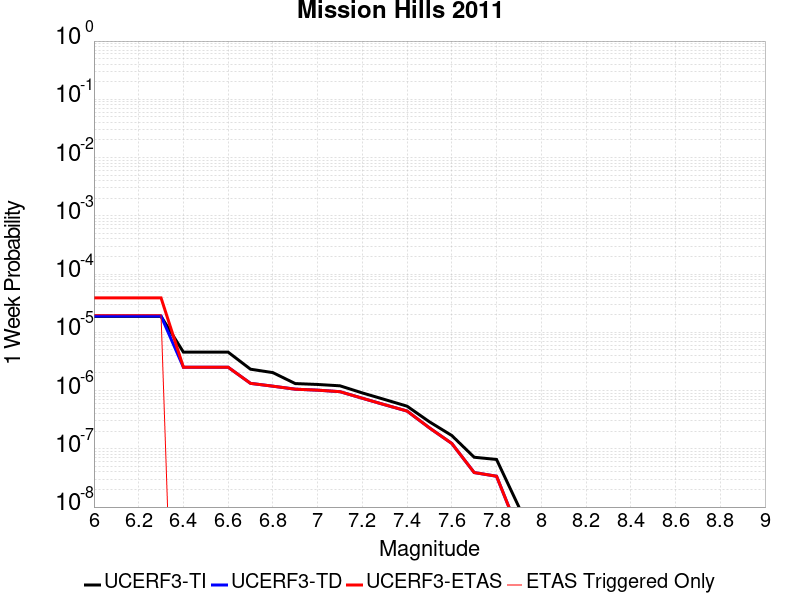 | 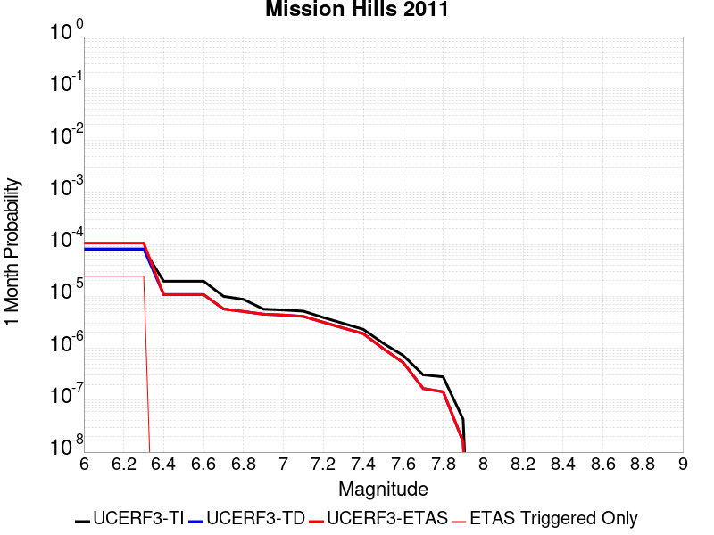 | 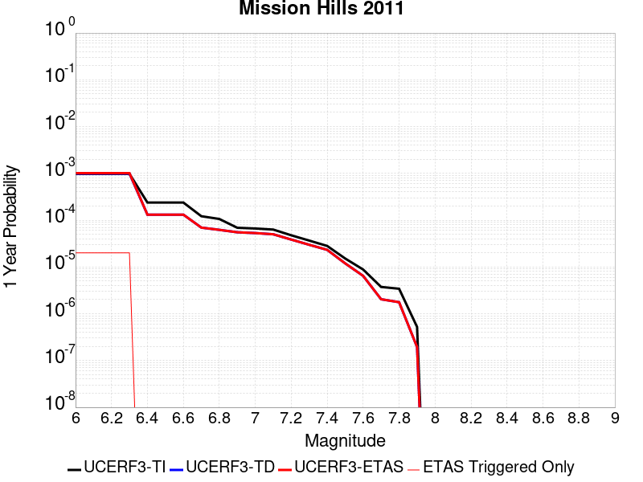 | 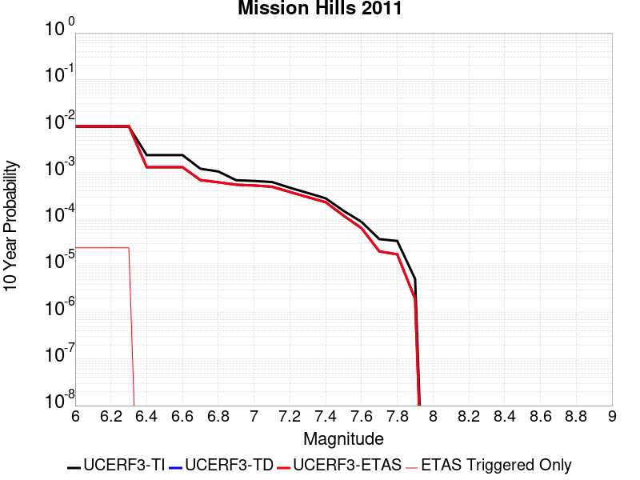 |

| Magnitude | 1 wk TI Prob | 1 wk TD Prob | 1 wk ETAS Prob | 1 wk ETAS/TD Gain | 1 wk ETAS Triggered Only | 1 mo TI Prob | 1 mo TD Prob | 1 mo ETAS Prob | 1 mo ETAS/TD Gain | 1 mo ETAS Triggered Only | 1 yr TI Prob | 1 yr TD Prob | 1 yr ETAS Prob | 1 yr ETAS/TD Gain | 1 yr ETAS Triggered Only | 10 yr TI Prob | 10 yr TD Prob | 10 yr ETAS Prob | 10 yr ETAS/TD Gain | 10 yr ETAS Triggered Only |
|-----|-----|-----|-----|-----|-----|-----|-----|-----|-----|-----|-----|-----|-----|-----|-----|-----|-----|-----|-----|-----|
| 6.0 | 1.8765717E-5 | 1.9054629E-5 | 3.905425E-5 | 2.0495937 | 2.0E-5 | 8.0422025E-5 | 8.1662074E-5 | 1.0166044E-4 | 1.2448918 | 2.0E-5 | 9.786983E-4 | 9.941256E-4 | 0.0010141057 | 1.0200982 | 2.0E-5 | 0.009743992 | 0.00993045 | 0.009950251 | 1.001994 | 2.0E-5 |
| 6.1 | 1.8765717E-5 | 1.9054629E-5 | 3.905425E-5 | 2.0495937 | 2.0E-5 | 8.0422025E-5 | 8.1662074E-5 | 1.0166044E-4 | 1.2448918 | 2.0E-5 | 9.786983E-4 | 9.941256E-4 | 0.0010141057 | 1.0200982 | 2.0E-5 | 0.009743992 | 0.00993045 | 0.009950251 | 1.001994 | 2.0E-5 |
| 6.2 | 1.8765717E-5 | 1.9054629E-5 | 3.905425E-5 | 2.0495937 | 2.0E-5 | 8.0422025E-5 | 8.1662074E-5 | 1.0166044E-4 | 1.2448918 | 2.0E-5 | 9.786983E-4 | 9.941256E-4 | 0.0010141057 | 1.0200982 | 2.0E-5 | 0.009743992 | 0.00993045 | 0.009950251 | 1.001994 | 2.0E-5 |
| 6.3 | 1.8765717E-5 | 1.9054629E-5 | 3.905425E-5 | 2.0495937 | 2.0E-5 | 8.0422025E-5 | 8.1662074E-5 | 1.0166044E-4 | 1.2448918 | 2.0E-5 | 9.786983E-4 | 9.941256E-4 | 0.0010141057 | 1.0200982 | 2.0E-5 | 0.009743992 | 0.00993045 | 0.009950251 | 1.001994 | 2.0E-5 |
| 6.4 | 4.566357E-6 | 2.5148213E-6 | 2.5148213E-6 | 1.0 | 0.0 | 1.9569954E-5 | 1.0777771E-5 | 1.0777771E-5 | 1.0 | 0.0 | 2.3823815E-4 | 1.3121328E-4 | 1.3121328E-4 | 1.0 | 0.0 | 0.002379829 | 0.0013115364 | 0.0013115364 | 1.0 | 0.0 |
| 6.5 | 4.566357E-6 | 2.5148213E-6 | 2.5148213E-6 | 1.0 | 0.0 | 1.9569954E-5 | 1.0777771E-5 | 1.0777771E-5 | 1.0 | 0.0 | 2.3823815E-4 | 1.3121328E-4 | 1.3121328E-4 | 1.0 | 0.0 | 0.002379829 | 0.0013115364 | 0.0013115364 | 1.0 | 0.0 |
| 6.6 | 4.566357E-6 | 2.5148213E-6 | 2.5148213E-6 | 1.0 | 0.0 | 1.9569954E-5 | 1.0777771E-5 | 1.0777771E-5 | 1.0 | 0.0 | 2.3823815E-4 | 1.3121328E-4 | 1.3121328E-4 | 1.0 | 0.0 | 0.002379829 | 0.0013115364 | 0.0013115364 | 1.0 | 0.0 |
| 6.7 | 2.3266773E-6 | 1.3296132E-6 | 1.3296132E-6 | 1.0 | 0.0 | 9.971435E-6 | 5.69833E-6 | 5.69833E-6 | 1.0 | 0.0 | 1.2139547E-4 | 6.937502E-5 | 6.937502E-5 | 1.0 | 0.0 | 0.0012132917 | 6.935397E-4 | 6.935397E-4 | 1.0 | 0.0 |
| 6.8 | 2.032735E-6 | 1.1894101E-6 | 1.1894101E-6 | 1.0 | 0.0 | 8.711692E-6 | 5.0974622E-6 | 5.0974622E-6 | 1.0 | 0.0 | 1.06059684E-4 | 6.205988E-5 | 6.205988E-5 | 1.0 | 0.0 | 0.0010600908 | 6.204304E-4 | 6.204304E-4 | 1.0 | 0.0 |
| 6.9 | 1.3186259E-6 | 1.0561989E-6 | 1.0561989E-6 | 1.0 | 0.0 | 5.6512413E-6 | 4.526559E-6 | 4.526559E-6 | 1.0 | 0.0 | 6.8801695E-5 | 5.5109493E-5 | 5.5109493E-5 | 1.0 | 0.0 | 6.8780396E-4 | 5.5096124E-4 | 5.5096124E-4 | 1.0 | 0.0 |
| 7.0 | 1.2726016E-6 | 1.0159295E-6 | 1.0159295E-6 | 1.0 | 0.0 | 5.4539955E-6 | 4.3539762E-6 | 4.3539762E-6 | 1.0 | 0.0 | 6.6400375E-5 | 5.30084E-5 | 5.30084E-5 | 1.0 | 0.0 | 6.6380535E-4 | 5.299604E-4 | 5.299604E-4 | 1.0 | 0.0 |
| 7.1 | 1.2063913E-6 | 9.570282E-7 | 9.570282E-7 | 1.0 | 0.0 | 5.170238E-6 | 4.101543E-6 | 4.101543E-6 | 1.0 | 0.0 | 6.294583E-5 | 4.9935166E-5 | 4.9935166E-5 | 1.0 | 0.0 | 6.2928005E-4 | 4.9924204E-4 | 4.9924204E-4 | 1.0 | 0.0 |
| 7.2 | 9.105806E-7 | 7.3767757E-7 | 7.3767757E-7 | 1.0 | 0.0 | 3.9024826E-6 | 3.1614716E-6 | 3.1614716E-6 | 1.0 | 0.0 | 4.7511687E-5 | 3.8490252E-5 | 3.8490252E-5 | 1.0 | 0.0 | 4.7501532E-4 | 3.8483742E-4 | 3.8483742E-4 | 1.0 | 0.0 |
| 7.3 | 7.020432E-7 | 5.7103375E-7 | 5.7103375E-7 | 1.0 | 0.0 | 3.0087533E-6 | 2.4472852E-6 | 2.4472852E-6 | 1.0 | 0.0 | 3.6630954E-5 | 2.9795303E-5 | 2.9795303E-5 | 1.0 | 0.0 | 3.6624918E-4 | 2.979144E-4 | 2.979144E-4 | 1.0 | 0.0 |
| 7.4 | 5.3900635E-7 | 4.4483278E-7 | 4.4483278E-7 | 1.0 | 0.0 | 2.3100251E-6 | 1.9064248E-6 | 1.9064248E-6 | 1.0 | 0.0 | 2.8124194E-5 | 2.3210489E-5 | 2.3210489E-5 | 1.0 | 0.0 | 2.8120633E-4 | 2.3208185E-4 | 2.3208185E-4 | 1.0 | 0.0 |
| 7.5 | 2.907075E-7 | 2.2875324E-7 | 2.2875324E-7 | 1.0 | 0.0 | 1.2458887E-6 | 9.803706E-7 | 9.803706E-7 | 1.0 | 0.0 | 1.5168589E-5 | 1.1935949E-5 | 1.1935949E-5 | 1.0 | 0.0 | 1.5167553E-4 | 1.1935326E-4 | 1.1935326E-4 | 1.0 | 0.0 |
| 7.6 | 1.6903675E-7 | 1.2353401E-7 | 1.2353401E-7 | 1.0 | 0.0 | 7.2444305E-7 | 5.2943136E-7 | 5.2943136E-7 | 1.0 | 0.0 | 8.820059E-6 | 6.4458086E-6 | 6.4458086E-6 | 1.0 | 0.0 | 8.8197085E-5 | 6.445634E-5 | 6.445634E-5 | 1.0 | 0.0 |
| 7.7 | 7.168073E-8 | 3.9134374E-8 | 3.9134374E-8 | 1.0 | 0.0 | 3.072031E-7 | 1.6771872E-7 | 1.6771872E-7 | 1.0 | 0.0 | 3.7401915E-6 | 2.0419736E-6 | 2.0419736E-6 | 1.0 | 0.0 | 3.7401285E-5 | 2.041956E-5 | 2.041956E-5 | 1.0 | 0.0 |
| 7.8 | 6.564101E-8 | 3.3834656E-8 | 3.3834656E-8 | 1.0 | 0.0 | 2.813186E-7 | 1.4500566E-7 | 1.4500566E-7 | 1.0 | 0.0 | 3.4250486E-6 | 1.7654426E-6 | 1.7654426E-6 | 1.0 | 0.0 | 3.424996E-5 | 1.7654296E-5 | 1.7654296E-5 | 1.0 | 0.0 |
| 7.9 | 1.0029074E-8 | 3.728858E-9 | 3.728858E-9 | 1.0 | 0.0 | 4.2981743E-8 | 1.598082E-8 | 1.598082E-8 | 1.0 | 0.0 | 5.2330256E-7 | 1.945665E-7 | 1.945665E-7 | 1.0 | 0.0 | 5.2330133E-6 | 1.9456643E-6 | 1.9456643E-6 | 1.0 | 0.0 |

## Goose Lake 2011 CFM
*[(top)](#table-of-contents)*

| 1 Week | 1 Month | 1 Year | 10 Year |
|-----|-----|-----|-----|
|  |  |  |  |

| Magnitude | 1 wk TI Prob | 1 wk TD Prob | 1 wk ETAS Prob | 1 wk ETAS/TD Gain | 1 wk ETAS Triggered Only | 1 mo TI Prob | 1 mo TD Prob | 1 mo ETAS Prob | 1 mo ETAS/TD Gain | 1 mo ETAS Triggered Only | 1 yr TI Prob | 1 yr TD Prob | 1 yr ETAS Prob | 1 yr ETAS/TD Gain | 1 yr ETAS Triggered Only | 10 yr TI Prob | 10 yr TD Prob | 10 yr ETAS Prob | 10 yr ETAS/TD Gain | 10 yr ETAS Triggered Only |
|-----|-----|-----|-----|-----|-----|-----|-----|-----|-----|-----|-----|-----|-----|-----|-----|-----|-----|-----|-----|-----|
| 6.0 | 3.780968E-6 | 3.8230223E-6 | 1.3822984E-5 | 3.6157215 | 1.0E-5 | 1.6204049E-5 | 1.6384285E-5 | 3.6383957E-5 | 2.2206619 | 2.0E-5 | 1.9726643E-4 | 1.994615E-4 | 2.194575E-4 | 1.10025 | 2.0E-5 | 0.001970914 | 0.001992933 | 0.002012893 | 1.0100155 | 2.0E-5 |
| 6.1 | 2.2035124E-6 | 2.229801E-6 | 2.229801E-6 | 1.0 | 0.0 | 9.443591E-6 | 9.556257E-6 | 1.955616E-5 | 2.0464249 | 1.0E-5 | 1.1496965E-4 | 1.163414E-4 | 1.2634024E-4 | 1.0859439 | 1.0E-5 | 0.0011491019 | 0.0011628233 | 0.0011728116 | 1.0085897 | 1.0E-5 |
| 6.2 | 1.5624689E-6 | 1.5826923E-6 | 1.5826923E-6 | 1.0 | 0.0 | 6.6962784E-6 | 6.7829496E-6 | 6.7829496E-6 | 1.0 | 0.0 | 8.152414E-5 | 8.2579325E-5 | 8.2579325E-5 | 1.0 | 0.0 | 8.1494235E-4 | 8.2549086E-4 | 8.2549086E-4 | 1.0 | 0.0 |
| 6.3 | 1.5624689E-6 | 1.5826923E-6 | 1.5826923E-6 | 1.0 | 0.0 | 6.6962784E-6 | 6.7829496E-6 | 6.7829496E-6 | 1.0 | 0.0 | 8.152414E-5 | 8.2579325E-5 | 8.2579325E-5 | 1.0 | 0.0 | 8.1494235E-4 | 8.2549086E-4 | 8.2549086E-4 | 1.0 | 0.0 |
| 6.4 | 1.256464E-6 | 1.2738695E-6 | 1.2738695E-6 | 1.0 | 0.0 | 5.3848344E-6 | 5.4594293E-6 | 5.4594293E-6 | 1.0 | 0.0 | 6.5558386E-5 | 6.646655E-5 | 6.646655E-5 | 1.0 | 0.0 | 6.553905E-4 | 6.644687E-4 | 6.644687E-4 | 1.0 | 0.0 |
| 6.5 | 1.0910911E-6 | 1.1069404E-6 | 1.1069404E-6 | 1.0 | 0.0 | 4.6760965E-6 | 4.7440217E-6 | 4.7440217E-6 | 1.0 | 0.0 | 5.692999E-5 | 5.7756948E-5 | 5.7756948E-5 | 1.0 | 0.0 | 5.6915404E-4 | 5.7742064E-4 | 5.7742064E-4 | 1.0 | 0.0 |
| 6.6 | 9.546601E-7 | 9.691246E-7 | 9.691246E-7 | 1.0 | 0.0 | 4.091394E-6 | 4.1533845E-6 | 4.1533845E-6 | 1.0 | 0.0 | 4.9811584E-5 | 5.056629E-5 | 5.056629E-5 | 1.0 | 0.0 | 4.980042E-4 | 5.055487E-4 | 5.055487E-4 | 1.0 | 0.0 |
| 6.7 | 7.790316E-7 | 7.9159634E-7 | 7.9159634E-7 | 1.0 | 0.0 | 3.3387028E-6 | 3.3925514E-6 | 3.3925514E-6 | 1.0 | 0.0 | 4.0647945E-5 | 4.1303538E-5 | 4.1303538E-5 | 1.0 | 0.0 | 4.0640513E-4 | 4.129592E-4 | 4.129592E-4 | 1.0 | 0.0 |
| 6.8 | 6.3714384E-7 | 6.4787395E-7 | 6.4787395E-7 | 1.0 | 0.0 | 2.7306137E-6 | 2.7765998E-6 | 2.7765998E-6 | 1.0 | 0.0 | 3.3244716E-5 | 3.3804583E-5 | 3.3804583E-5 | 1.0 | 0.0 | 3.323974E-4 | 3.379949E-4 | 3.379949E-4 | 1.0 | 0.0 |
| 6.9 | 4.92586E-7 | 5.0139147E-7 | 5.0139147E-7 | 1.0 | 0.0 | 2.1110811E-6 | 2.1488188E-6 | 2.1488188E-6 | 1.0 | 0.0 | 2.5702111E-5 | 2.616156E-5 | 2.616156E-5 | 1.0 | 0.0 | 2.569914E-4 | 2.6158517E-4 | 2.6158517E-4 | 1.0 | 0.0 |
| 7.0 | 3.130245E-7 | 3.190354E-7 | 3.190354E-7 | 1.0 | 0.0 | 1.3415328E-6 | 1.3672939E-6 | 1.3672939E-6 | 1.0 | 0.0 | 1.6333039E-5 | 1.6646678E-5 | 1.6646678E-5 | 1.0 | 0.0 | 1.6331839E-4 | 1.6645451E-4 | 1.6645451E-4 | 1.0 | 0.0 |
| 7.1 | 1.7680084E-7 | 1.8023923E-7 | 1.8023923E-7 | 1.0 | 0.0 | 7.5771766E-7 | 7.724536E-7 | 7.724536E-7 | 1.0 | 0.0 | 9.225173E-6 | 9.404583E-6 | 9.404583E-6 | 1.0 | 0.0 | 9.22479E-5 | 9.4041956E-5 | 9.4041956E-5 | 1.0 | 0.0 |
| 7.2 | 4.8641045E-8 | 4.9402068E-8 | 4.9402068E-8 | 1.0 | 0.0 | 2.084616E-7 | 2.1172312E-7 | 2.1172312E-7 | 1.0 | 0.0 | 2.538017E-6 | 2.577726E-6 | 2.577726E-6 | 1.0 | 0.0 | 2.537988E-5 | 2.5776973E-5 | 2.5776973E-5 | 1.0 | 0.0 |
| 7.3 | 5.3911844E-9 | 5.4758145E-9 | 5.4758145E-9 | 1.0 | 0.0 | 2.3105075E-8 | 2.3467775E-8 | 2.3467775E-8 | 1.0 | 0.0 | 2.8130427E-7 | 2.8572015E-7 | 2.8572015E-7 | 1.0 | 0.0 | 2.8130391E-6 | 2.8571992E-6 | 2.8571992E-6 | 1.0 | 0.0 |

## Kern Canyon (Lake Isabella) 2011
*[(top)](#table-of-contents)*

| 1 Week | 1 Month | 1 Year | 10 Year |
|-----|-----|-----|-----|
| 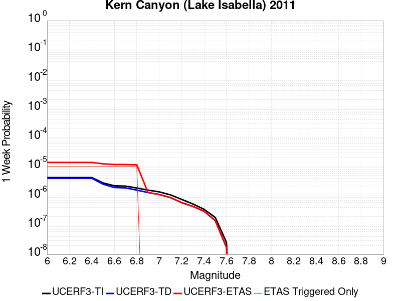 | 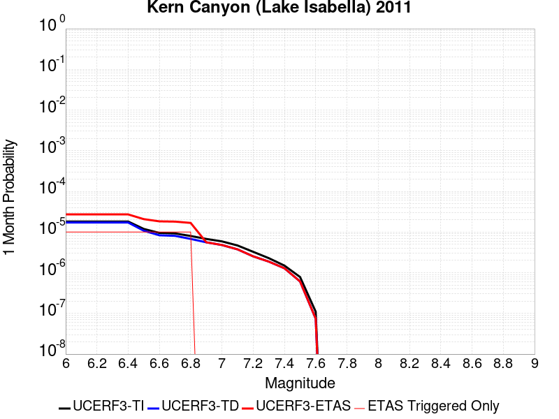 | 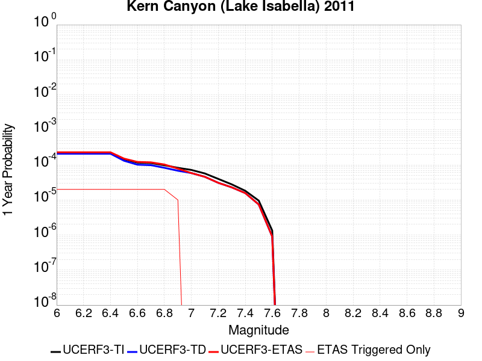 | 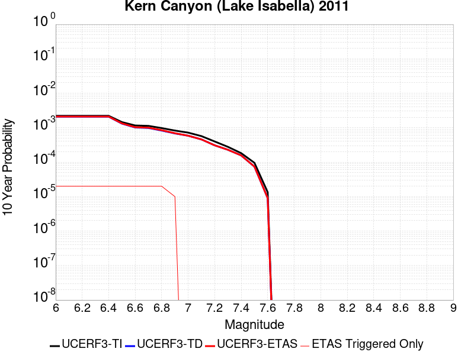 |

| Magnitude | 1 wk TI Prob | 1 wk TD Prob | 1 wk ETAS Prob | 1 wk ETAS/TD Gain | 1 wk ETAS Triggered Only | 1 mo TI Prob | 1 mo TD Prob | 1 mo ETAS Prob | 1 mo ETAS/TD Gain | 1 mo ETAS Triggered Only | 1 yr TI Prob | 1 yr TD Prob | 1 yr ETAS Prob | 1 yr ETAS/TD Gain | 1 yr ETAS Triggered Only | 10 yr TI Prob | 10 yr TD Prob | 10 yr ETAS Prob | 10 yr ETAS/TD Gain | 10 yr ETAS Triggered Only |
|-----|-----|-----|-----|-----|-----|-----|-----|-----|-----|-----|-----|-----|-----|-----|-----|-----|-----|-----|-----|-----|
| 6.0 | 4.2387383E-6 | 4.0016344E-6 | 1.40015945E-5 | 3.498969 | 1.0E-5 | 1.8165894E-5 | 1.7149758E-5 | 2.7149586E-5 | 1.5830886 | 1.0E-5 | 2.2114732E-4 | 2.0878017E-4 | 2.28776E-4 | 1.0957745 | 2.0E-5 | 0.0022092736 | 0.002086024 | 0.0021059825 | 1.0095676 | 2.0E-5 |
| 6.1 | 4.2387383E-6 | 4.0016344E-6 | 1.40015945E-5 | 3.498969 | 1.0E-5 | 1.8165894E-5 | 1.7149758E-5 | 2.7149586E-5 | 1.5830886 | 1.0E-5 | 2.2114732E-4 | 2.0878017E-4 | 2.28776E-4 | 1.0957745 | 2.0E-5 | 0.0022092736 | 0.002086024 | 0.0021059825 | 1.0095676 | 2.0E-5 |
| 6.2 | 4.2387383E-6 | 4.0016344E-6 | 1.40015945E-5 | 3.498969 | 1.0E-5 | 1.8165894E-5 | 1.7149758E-5 | 2.7149586E-5 | 1.5830886 | 1.0E-5 | 2.2114732E-4 | 2.0878017E-4 | 2.28776E-4 | 1.0957745 | 2.0E-5 | 0.0022092736 | 0.002086024 | 0.0021059825 | 1.0095676 | 2.0E-5 |
| 6.3 | 4.2387383E-6 | 4.0016344E-6 | 1.40015945E-5 | 3.498969 | 1.0E-5 | 1.8165894E-5 | 1.7149758E-5 | 2.7149586E-5 | 1.5830886 | 1.0E-5 | 2.2114732E-4 | 2.0878017E-4 | 2.28776E-4 | 1.0957745 | 2.0E-5 | 0.0022092736 | 0.002086024 | 0.0021059825 | 1.0095676 | 2.0E-5 |
| 6.4 | 4.2387383E-6 | 4.0016344E-6 | 1.40015945E-5 | 3.498969 | 1.0E-5 | 1.8165894E-5 | 1.7149758E-5 | 2.7149586E-5 | 1.5830886 | 1.0E-5 | 2.2114732E-4 | 2.0878017E-4 | 2.28776E-4 | 1.0957745 | 2.0E-5 | 0.0022092736 | 0.002086024 | 0.0021059825 | 1.0095676 | 2.0E-5 |
| 6.5 | 2.7857532E-6 | 2.5178624E-6 | 1.2517838E-5 | 4.971613 | 1.0E-5 | 1.1938888E-5 | 1.0790796E-5 | 2.0790689E-5 | 1.9267057 | 1.0E-5 | 1.4534626E-4 | 1.3137035E-4 | 1.5136773E-4 | 1.1522213 | 2.0E-5 | 0.0014525123 | 0.0013129596 | 0.0013329334 | 1.0152128 | 2.0E-5 |
| 6.6 | 2.2233348E-6 | 1.944119E-6 | 1.1944099E-5 | 6.1437078 | 1.0E-5 | 9.528543E-6 | 8.331913E-6 | 1.833183E-5 | 2.2001946 | 1.0E-5 | 1.1600384E-4 | 1.014364E-4 | 1.2143437E-4 | 1.1971478 | 2.0E-5 | 0.001159433 | 0.0010139096 | 0.0010338894 | 1.0197057 | 2.0E-5 |
| 6.7 | 2.1635126E-6 | 1.8834991E-6 | 1.18834805E-5 | 6.3092575 | 1.0E-5 | 9.272164E-6 | 8.072114E-6 | 1.8072033E-5 | 2.238823 | 1.0E-5 | 1.1288274E-4 | 9.827364E-5 | 1.1827167E-4 | 1.2034934 | 2.0E-5 | 0.0011282542 | 9.8231E-4 | 0.0010022903 | 1.0203402 | 2.0E-5 |
| 6.8 | 1.8685711E-6 | 1.583138E-6 | 1.1583122E-5 | 7.316559 | 1.0E-5 | 8.008137E-6 | 6.7848596E-6 | 1.6784792E-5 | 2.4738598 | 1.0E-5 | 9.74947E-5 | 8.2602586E-5 | 1.02600934E-4 | 1.2421032 | 2.0E-5 | 9.745194E-4 | 8.2572375E-4 | 8.457072E-4 | 1.0242012 | 2.0E-5 |
| 6.9 | 1.5815071E-6 | 1.3064887E-6 | 1.3064887E-6 | 1.0 | 0.0 | 6.77787E-6 | 5.5992255E-6 | 5.5992255E-6 | 1.0 | 0.0 | 8.251744E-5 | 6.816846E-5 | 7.816778E-5 | 1.1466854 | 1.0E-5 | 8.248681E-4 | 6.8147824E-4 | 6.914714E-4 | 1.0146639 | 1.0E-5 |
| 7.0 | 1.3772564E-6 | 1.1210681E-6 | 1.1210681E-6 | 1.0 | 0.0 | 5.9025137E-6 | 4.8045686E-6 | 4.8045686E-6 | 1.0 | 0.0 | 7.186073E-5 | 5.8494075E-5 | 5.8494075E-5 | 1.0 | 0.0 | 7.18375E-4 | 5.8478885E-4 | 5.8478885E-4 | 1.0 | 0.0 |
| 7.1 | 1.0916998E-6 | 8.7637505E-7 | 8.7637505E-7 | 1.0 | 0.0 | 4.678705E-6 | 3.7558877E-6 | 3.7558877E-6 | 1.0 | 0.0 | 5.6961744E-5 | 4.5726985E-5 | 4.5726985E-5 | 1.0 | 0.0 | 5.6947145E-4 | 4.571771E-4 | 4.571771E-4 | 1.0 | 0.0 |
| 7.2 | 7.6277024E-7 | 5.901439E-7 | 5.901439E-7 | 1.0 | 0.0 | 3.2690114E-6 | 2.5291856E-6 | 2.5291856E-6 | 1.0 | 0.0 | 3.9799485E-5 | 3.0792406E-5 | 3.0792406E-5 | 1.0 | 0.0 | 3.9792358E-4 | 3.07882E-4 | 3.07882E-4 | 1.0 | 0.0 |
| 7.3 | 5.3265916E-7 | 4.3824264E-7 | 4.3824264E-7 | 1.0 | 0.0 | 2.282823E-6 | 1.8781814E-6 | 1.8781814E-6 | 1.0 | 0.0 | 2.7793016E-5 | 2.2866623E-5 | 2.2866623E-5 | 1.0 | 0.0 | 2.778954E-4 | 2.2864307E-4 | 2.2864307E-4 | 1.0 | 0.0 |
| 7.4 | 3.4946007E-7 | 3.0065647E-7 | 3.0065647E-7 | 1.0 | 0.0 | 1.497685E-6 | 1.2885271E-6 | 1.2885271E-6 | 1.0 | 0.0 | 1.8234163E-5 | 1.5687707E-5 | 1.5687707E-5 | 1.0 | 0.0 | 1.8232666E-4 | 1.5686621E-4 | 1.5686621E-4 | 1.0 | 0.0 |
| 7.5 | 1.8317026E-7 | 1.4244755E-7 | 1.4244755E-7 | 1.0 | 0.0 | 7.850152E-7 | 6.1048934E-7 | 6.1048934E-7 | 1.0 | 0.0 | 9.557518E-6 | 7.432683E-6 | 7.432683E-6 | 1.0 | 0.0 | 9.5571064E-5 | 7.432442E-5 | 7.432442E-5 | 1.0 | 0.0 |
| 7.6 | 2.572245E-8 | 1.735264E-8 | 1.735264E-8 | 1.0 | 0.0 | 1.10239064E-7 | 7.436845E-8 | 7.436845E-8 | 1.0 | 0.0 | 1.3421597E-6 | 9.0543557E-7 | 9.0543557E-7 | 1.0 | 0.0 | 1.3421517E-5 | 9.054324E-6 | 9.054324E-6 | 1.0 | 0.0 |

## Elsinore (Stepovers Combined)
*[(top)](#table-of-contents)*

| 1 Week | 1 Month | 1 Year | 10 Year |
|-----|-----|-----|-----|
|  |  |  |  |

| Magnitude | 1 wk TI Prob | 1 wk TD Prob | 1 wk ETAS Prob | 1 wk ETAS/TD Gain | 1 wk ETAS Triggered Only | 1 mo TI Prob | 1 mo TD Prob | 1 mo ETAS Prob | 1 mo ETAS/TD Gain | 1 mo ETAS Triggered Only | 1 yr TI Prob | 1 yr TD Prob | 1 yr ETAS Prob | 1 yr ETAS/TD Gain | 1 yr ETAS Triggered Only | 10 yr TI Prob | 10 yr TD Prob | 10 yr ETAS Prob | 10 yr ETAS/TD Gain | 10 yr ETAS Triggered Only |
|-----|-----|-----|-----|-----|-----|-----|-----|-----|-----|-----|-----|-----|-----|-----|-----|-----|-----|-----|-----|-----|
| 6.0 | 2.144392E-5 | 1.976007E-5 | 3.9759674E-5 | 2.0121222 | 2.0E-5 | 9.189928E-5 | 8.468338E-5 | 1.0468168E-4 | 1.2361538 | 2.0E-5 | 0.0011182994 | 0.0010305515 | 0.0010505309 | 1.0193871 | 2.0E-5 | 0.011126885 | 0.010264617 | 0.010284412 | 1.0019284 | 2.0E-5 |
| 6.1 | 2.144392E-5 | 1.976007E-5 | 3.9759674E-5 | 2.0121222 | 2.0E-5 | 9.189928E-5 | 8.468338E-5 | 1.0468168E-4 | 1.2361538 | 2.0E-5 | 0.0011182994 | 0.0010305515 | 0.0010505309 | 1.0193871 | 2.0E-5 | 0.011126885 | 0.010264617 | 0.010284412 | 1.0019284 | 2.0E-5 |
| 6.2 | 2.144392E-5 | 1.976007E-5 | 3.9759674E-5 | 2.0121222 | 2.0E-5 | 9.189928E-5 | 8.468338E-5 | 1.0468168E-4 | 1.2361538 | 2.0E-5 | 0.0011182994 | 0.0010305515 | 0.0010505309 | 1.0193871 | 2.0E-5 | 0.011126885 | 0.010264617 | 0.010284412 | 1.0019284 | 2.0E-5 |
| 6.3 | 1.9751555E-5 | 1.7741326E-5 | 3.774097E-5 | 2.1272914 | 2.0E-5 | 8.4646774E-5 | 7.603211E-5 | 9.603059E-5 | 1.2630267 | 2.0E-5 | 0.0010300872 | 9.25312E-4 | 9.4529346E-4 | 1.0215943 | 2.0E-5 | 0.010253254 | 0.0092209745 | 0.00924079 | 1.002149 | 2.0E-5 |
| 6.4 | 1.9751555E-5 | 1.7741326E-5 | 3.774097E-5 | 2.1272914 | 2.0E-5 | 8.4646774E-5 | 7.603211E-5 | 9.603059E-5 | 1.2630267 | 2.0E-5 | 0.0010300872 | 9.25312E-4 | 9.4529346E-4 | 1.0215943 | 2.0E-5 | 0.010253254 | 0.0092209745 | 0.00924079 | 1.002149 | 2.0E-5 |
| 6.5 | 1.9751555E-5 | 1.7741326E-5 | 3.774097E-5 | 2.1272914 | 2.0E-5 | 8.4646774E-5 | 7.603211E-5 | 9.603059E-5 | 1.2630267 | 2.0E-5 | 0.0010300872 | 9.25312E-4 | 9.4529346E-4 | 1.0215943 | 2.0E-5 | 0.010253254 | 0.0092209745 | 0.00924079 | 1.002149 | 2.0E-5 |
| 6.6 | 1.9188685E-5 | 1.7003247E-5 | 3.700291E-5 | 2.176226 | 2.0E-5 | 8.2234634E-5 | 7.2869116E-5 | 9.286765E-5 | 1.2744447 | 2.0E-5 | 0.0010007467 | 8.8683655E-4 | 9.068188E-4 | 1.0225321 | 2.0E-5 | 0.00996252 | 0.008839546 | 0.008859369 | 1.0022426 | 2.0E-5 |
| 6.7 | 1.7608272E-5 | 1.4732402E-5 | 3.4732107E-5 | 2.3575318 | 2.0E-5 | 7.546184E-5 | 6.313739E-5 | 8.313613E-5 | 1.3167495 | 2.0E-5 | 9.183606E-4 | 7.684364E-4 | 7.88421E-4 | 1.0260068 | 2.0E-5 | 0.009145746 | 0.007664441 | 0.0076842876 | 1.0025895 | 2.0E-5 |
| 6.8 | 1.697165E-5 | 1.3783126E-5 | 3.378285E-5 | 2.4510295 | 2.0E-5 | 7.273361E-5 | 5.906925E-5 | 7.906807E-5 | 1.3385656 | 2.0E-5 | 8.8517193E-4 | 7.189395E-4 | 7.389251E-4 | 1.0277988 | 2.0E-5 | 0.008816543 | 0.0071722106 | 0.0071920673 | 1.0027685 | 2.0E-5 |
| 6.9 | 1.600365E-5 | 1.2846429E-5 | 2.2846301E-5 | 1.7784164 | 1.0E-5 | 6.858527E-5 | 5.5055007E-5 | 6.505445E-5 | 1.1816266 | 1.0E-5 | 8.347058E-4 | 6.700963E-4 | 6.8008964E-4 | 1.0149132 | 1.0E-5 | 0.008315775 | 0.006686422 | 0.006696355 | 1.0014856 | 1.0E-5 |
| 7.0 | 1.3314581E-5 | 1.044738E-5 | 2.0447276E-5 | 1.9571677 | 1.0E-5 | 5.7061243E-5 | 4.4773733E-5 | 5.4773285E-5 | 1.2233353 | 1.0E-5 | 6.944992E-4 | 5.449866E-4 | 5.549811E-4 | 1.018339 | 1.0E-5 | 0.006923327 | 0.005440055 | 0.005450001 | 1.0018282 | 1.0E-5 |
| 7.1 | 1.2865345E-5 | 9.937339E-6 | 1.993724E-5 | 2.0062954 | 1.0E-5 | 5.5136024E-5 | 4.258792E-5 | 5.2587493E-5 | 1.2347984 | 1.0E-5 | 6.710743E-4 | 5.1838707E-4 | 5.283819E-4 | 1.0192806 | 1.0E-5 | 0.0066905143 | 0.005175021 | 0.0051849694 | 1.0019224 | 1.0E-5 |
| 7.2 | 1.1650051E-5 | 8.633585E-6 | 8.633585E-6 | 1.0 | 0.0 | 4.9927836E-5 | 3.7000562E-5 | 3.7000562E-5 | 1.0 | 0.0 | 6.0770183E-4 | 4.503905E-4 | 4.503905E-4 | 1.0 | 0.0 | 0.0060604266 | 0.00449624 | 0.00449624 | 1.0 | 0.0 |
| 7.3 | 1.0008533E-5 | 7.2008215E-6 | 7.2008215E-6 | 1.0 | 0.0 | 4.2893007E-5 | 3.0860305E-5 | 3.0860305E-5 | 1.0 | 0.0 | 5.220972E-4 | 3.756609E-4 | 3.756609E-4 | 1.0 | 0.0 | 0.005208723 | 0.0037506663 | 0.0037506663 | 1.0 | 0.0 |
| 7.4 | 9.116759E-6 | 6.409854E-6 | 6.409854E-6 | 1.0 | 0.0 | 3.907124E-5 | 2.7470522E-5 | 2.7470522E-5 | 1.0 | 0.0 | 4.7558855E-4 | 3.3440365E-4 | 3.3440365E-4 | 1.0 | 0.0 | 0.00474572 | 0.0033391542 | 0.0033391542 | 1.0 | 0.0 |
| 7.5 | 7.870524E-6 | 5.382316E-6 | 5.382316E-6 | 1.0 | 0.0 | 3.3730383E-5 | 2.306687E-5 | 2.306687E-5 | 1.0 | 0.0 | 4.1059E-4 | 2.8080423E-4 | 2.8080423E-4 | 1.0 | 0.0 | 0.0040983222 | 0.0028046207 | 0.0028046207 | 1.0 | 0.0 |
| 7.6 | 6.9774537E-6 | 4.677398E-6 | 4.677398E-6 | 1.0 | 0.0 | 2.990303E-5 | 2.0045845E-5 | 2.0045845E-5 | 1.0 | 0.0 | 3.640086E-4 | 2.44032E-4 | 2.44032E-4 | 1.0 | 0.0 | 0.003634129 | 0.0024377564 | 0.0024377564 | 1.0 | 0.0 |
| 7.7 | 4.1616954E-6 | 2.3281368E-6 | 2.3281368E-6 | 1.0 | 0.0 | 1.7835715E-5 | 9.977695E-6 | 9.977695E-6 | 1.0 | 0.0 | 2.171282E-4 | 1.2147242E-4 | 1.2147242E-4 | 1.0 | 0.0 | 0.0021691616 | 0.0012141332 | 0.0012141332 | 1.0 | 0.0 |
| 7.8 | 2.2692414E-7 | 9.384417E-8 | 9.384417E-8 | 1.0 | 0.0 | 9.725317E-7 | 4.0218927E-7 | 4.0218927E-7 | 1.0 | 0.0 | 1.1840509E-5 | 4.8966467E-6 | 4.8966467E-6 | 1.0 | 0.0 | 1.1839878E-4 | 4.8965718E-5 | 4.8965718E-5 | 1.0 | 0.0 |
| 7.9 | 6.676829E-9 | 3.4397174E-9 | 3.4397174E-9 | 1.0 | 0.0 | 2.861498E-8 | 1.4741646E-8 | 1.4741646E-8 | 1.0 | 0.0 | 3.4838732E-7 | 1.7947953E-7 | 1.7947953E-7 | 1.0 | 0.0 | 3.4838679E-6 | 1.794794E-6 | 1.794794E-6 | 1.0 | 0.0 |

## Point Reyes 2011 CFM
*[(top)](#table-of-contents)*

| 1 Week | 1 Month | 1 Year | 10 Year |
|-----|-----|-----|-----|
|  | 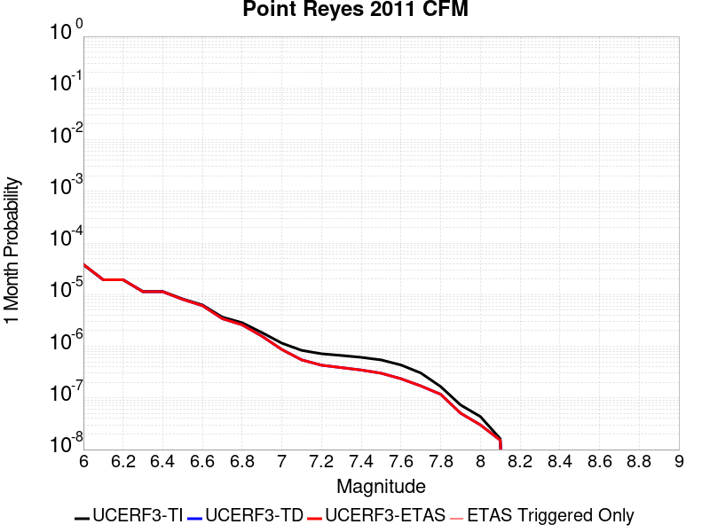 | 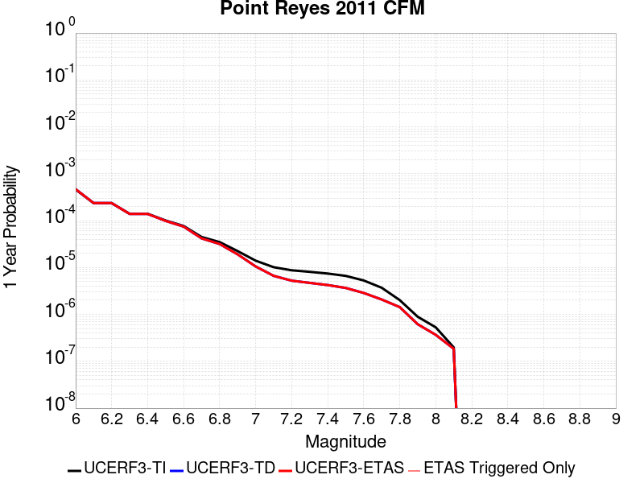 | 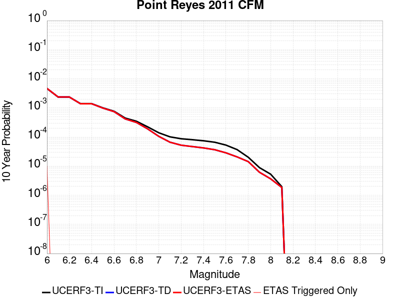 |

| Magnitude | 1 wk TI Prob | 1 wk TD Prob | 1 wk ETAS Prob | 1 wk ETAS/TD Gain | 1 wk ETAS Triggered Only | 1 mo TI Prob | 1 mo TD Prob | 1 mo ETAS Prob | 1 mo ETAS/TD Gain | 1 mo ETAS Triggered Only | 1 yr TI Prob | 1 yr TD Prob | 1 yr ETAS Prob | 1 yr ETAS/TD Gain | 1 yr ETAS Triggered Only | 10 yr TI Prob | 10 yr TD Prob | 10 yr ETAS Prob | 10 yr ETAS/TD Gain | 10 yr ETAS Triggered Only |
|-----|-----|-----|-----|-----|-----|-----|-----|-----|-----|-----|-----|-----|-----|-----|-----|-----|-----|-----|-----|-----|
| 6.0 | 8.8644965E-6 | 8.96716E-6 | 8.96716E-6 | 1.0 | 0.0 | 3.7990147E-5 | 3.8430157E-5 | 3.8430157E-5 | 1.0 | 0.0 | 4.624319E-4 | 4.67793E-4 | 4.67793E-4 | 1.0 | 0.0 | 0.0046147075 | 0.004668711 | 0.0046786647 | 1.0021319 | 1.0E-5 |
| 6.1 | 4.526405E-6 | 4.5392153E-6 | 4.5392153E-6 | 1.0 | 0.0 | 1.9398734E-5 | 1.945364E-5 | 1.945364E-5 | 1.0 | 0.0 | 2.36154E-4 | 2.3682338E-4 | 2.3682338E-4 | 1.0 | 0.0 | 0.002359032 | 0.0023658164 | 0.0023658164 | 1.0 | 0.0 |
| 6.2 | 4.526405E-6 | 4.5392153E-6 | 4.5392153E-6 | 1.0 | 0.0 | 1.9398734E-5 | 1.945364E-5 | 1.945364E-5 | 1.0 | 0.0 | 2.36154E-4 | 2.3682338E-4 | 2.3682338E-4 | 1.0 | 0.0 | 0.002359032 | 0.0023658164 | 0.0023658164 | 1.0 | 0.0 |
| 6.3 | 2.6842322E-6 | 2.660673E-6 | 2.660673E-6 | 1.0 | 0.0 | 1.1503801E-5 | 1.1402836E-5 | 1.1402836E-5 | 1.0 | 0.0 | 1.4004979E-4 | 1.3882088E-4 | 1.3882088E-4 | 1.0 | 0.0 | 0.0013996155 | 0.0013873635 | 0.0013873635 | 1.0 | 0.0 |
| 6.4 | 2.6842322E-6 | 2.660673E-6 | 2.660673E-6 | 1.0 | 0.0 | 1.1503801E-5 | 1.1402836E-5 | 1.1402836E-5 | 1.0 | 0.0 | 1.4004979E-4 | 1.3882088E-4 | 1.3882088E-4 | 1.0 | 0.0 | 0.0013996155 | 0.0013873635 | 0.0013873635 | 1.0 | 0.0 |
| 6.5 | 1.9281833E-6 | 1.8906233E-6 | 1.8906233E-6 | 1.0 | 0.0 | 8.263617E-6 | 8.1026465E-6 | 8.1026465E-6 | 1.0 | 0.0 | 1.0060489E-4 | 9.864534E-5 | 9.864534E-5 | 1.0 | 0.0 | 0.0010055936 | 9.860265E-4 | 9.860265E-4 | 1.0 | 0.0 |
| 6.6 | 1.4726726E-6 | 1.4269547E-6 | 1.4269547E-6 | 1.0 | 0.0 | 6.3114385E-6 | 6.115506E-6 | 6.115506E-6 | 1.0 | 0.0 | 7.683905E-5 | 7.445379E-5 | 7.445379E-5 | 1.0 | 0.0 | 7.6812494E-4 | 7.442957E-4 | 7.442957E-4 | 1.0 | 0.0 |
| 6.7 | 8.572307E-7 | 8.007182E-7 | 8.007182E-7 | 1.0 | 0.0 | 3.6738406E-6 | 3.431645E-6 | 3.431645E-6 | 1.0 | 0.0 | 4.472809E-5 | 4.1779494E-5 | 4.1779494E-5 | 1.0 | 0.0 | 4.471909E-4 | 4.177204E-4 | 4.177204E-4 | 1.0 | 0.0 |
| 6.8 | 6.6745434E-7 | 6.07727E-7 | 6.07727E-7 | 1.0 | 0.0 | 2.8605155E-6 | 2.6045416E-6 | 2.6045416E-6 | 1.0 | 0.0 | 3.482622E-5 | 3.1709842E-5 | 3.1709842E-5 | 1.0 | 0.0 | 3.4820763E-4 | 3.170566E-4 | 3.170566E-4 | 1.0 | 0.0 |
| 6.9 | 4.291521E-7 | 3.6535639E-7 | 3.6535639E-7 | 1.0 | 0.0 | 1.839222E-6 | 1.5658121E-6 | 1.5658121E-6 | 1.0 | 0.0 | 2.2392298E-5 | 1.90636E-5 | 1.90636E-5 | 1.0 | 0.0 | 2.2390042E-4 | 1.906224E-4 | 1.906224E-4 | 1.0 | 0.0 |
| 7.0 | 2.6812808E-7 | 2.0187117E-7 | 2.0187117E-7 | 1.0 | 0.0 | 1.1491198E-6 | 8.6516184E-7 | 8.6516184E-7 | 1.0 | 0.0 | 1.3990444E-5 | 1.0533295E-5 | 1.0533295E-5 | 1.0 | 0.0 | 1.3989564E-4 | 1.05330415E-4 | 1.05330415E-4 | 1.0 | 0.0 |
| 7.1 | 1.9451231E-7 | 1.2725201E-7 | 1.2725201E-7 | 1.0 | 0.0 | 8.336239E-7 | 5.4536565E-7 | 5.4536565E-7 | 1.0 | 0.0 | 1.0149324E-5 | 6.639806E-6 | 6.639806E-6 | 1.0 | 0.0 | 1.014886E-4 | 6.639846E-5 | 6.639846E-5 | 1.0 | 0.0 |
| 7.2 | 1.6715143E-7 | 1.0042555E-7 | 1.0042555E-7 | 1.0 | 0.0 | 7.1636305E-7 | 4.3039515E-7 | 4.3039515E-7 | 1.0 | 0.0 | 8.721685E-6 | 5.2400483E-6 | 5.2400483E-6 | 1.0 | 0.0 | 8.721343E-5 | 5.240162E-5 | 5.240162E-5 | 1.0 | 0.0 |
| 7.3 | 1.5503173E-7 | 9.012816E-8 | 9.012816E-8 | 1.0 | 0.0 | 6.644215E-7 | 3.8626348E-7 | 3.8626348E-7 | 1.0 | 0.0 | 8.089301E-6 | 4.7027474E-6 | 4.7027474E-6 | 1.0 | 0.0 | 8.089007E-5 | 4.7028854E-5 | 4.7028854E-5 | 1.0 | 0.0 |
| 7.4 | 1.4251614E-7 | 8.097342E-8 | 8.097342E-8 | 1.0 | 0.0 | 6.1078333E-7 | 3.4702887E-7 | 3.4702887E-7 | 1.0 | 0.0 | 7.4362615E-6 | 4.225068E-6 | 4.225068E-6 | 1.0 | 0.0 | 7.436013E-5 | 4.2252257E-5 | 4.2252257E-5 | 1.0 | 0.0 |
| 7.5 | 1.2710186E-7 | 7.029377E-8 | 7.029377E-8 | 1.0 | 0.0 | 5.447221E-7 | 3.0125898E-7 | 3.0125898E-7 | 1.0 | 0.0 | 6.6319717E-6 | 3.6678218E-6 | 3.6678218E-6 | 1.0 | 0.0 | 6.6317734E-5 | 3.667999E-5 | 3.667999E-5 | 1.0 | 0.0 |
| 7.6 | 1.0144708E-7 | 5.494996E-8 | 5.494996E-8 | 1.0 | 0.0 | 4.347731E-7 | 2.354998E-7 | 2.354998E-7 | 1.0 | 0.0 | 5.2933497E-6 | 2.8672061E-6 | 2.8672061E-6 | 1.0 | 0.0 | 5.293224E-5 | 2.8674069E-5 | 2.8674069E-5 | 1.0 | 0.0 |
| 7.7 | 7.090527E-8 | 3.9821334E-8 | 3.9821334E-8 | 1.0 | 0.0 | 3.038797E-7 | 1.7066284E-7 | 1.7066284E-7 | 1.0 | 0.0 | 3.699729E-6 | 2.0778182E-6 | 2.0778182E-6 | 1.0 | 0.0 | 3.6996673E-5 | 2.0780362E-5 | 2.0780362E-5 | 1.0 | 0.0 |
| 7.8 | 3.8712045E-8 | 2.7438638E-8 | 2.7438638E-8 | 1.0 | 0.0 | 1.6590876E-7 | 1.1759416E-7 | 1.1759416E-7 | 1.0 | 0.0 | 2.0199373E-6 | 1.4317079E-6 | 1.4317079E-6 | 1.0 | 0.0 | 2.0199188E-5 | 1.4319363E-5 | 1.4319363E-5 | 1.0 | 0.0 |
| 7.9 | 1.7068782E-8 | 1.183186E-8 | 1.183186E-8 | 1.0 | 0.0 | 7.315192E-8 | 5.0707975E-8 | 5.0707975E-8 | 1.0 | 0.0 | 8.906242E-7 | 6.173694E-7 | 6.173694E-7 | 1.0 | 0.0 | 8.906207E-6 | 6.1760525E-6 | 6.1760525E-6 | 1.0 | 0.0 |
| 8.0 | 1.0172592E-8 | 7.0268076E-9 | 7.0268076E-9 | 1.0 | 0.0 | 4.359682E-8 | 3.011489E-8 | 3.011489E-8 | 1.0 | 0.0 | 5.3079117E-7 | 3.6664872E-7 | 3.6664872E-7 | 1.0 | 0.0 | 5.307899E-6 | 3.6688568E-6 | 3.6688568E-6 | 1.0 | 0.0 |
| 8.1 | 3.7861243E-9 | 3.5448604E-9 | 3.5448604E-9 | 1.0 | 0.0 | 1.6226247E-8 | 1.5192258E-8 | 1.5192258E-8 | 1.0 | 0.0 | 1.9755454E-7 | 1.8496571E-7 | 1.8496571E-7 | 1.0 | 0.0 | 1.9755437E-6 | 1.8514592E-6 | 1.8514592E-6 | 1.0 | 0.0 |

## Eureka Peak
*[(top)](#table-of-contents)*

| 1 Week | 1 Month | 1 Year | 10 Year |
|-----|-----|-----|-----|
| 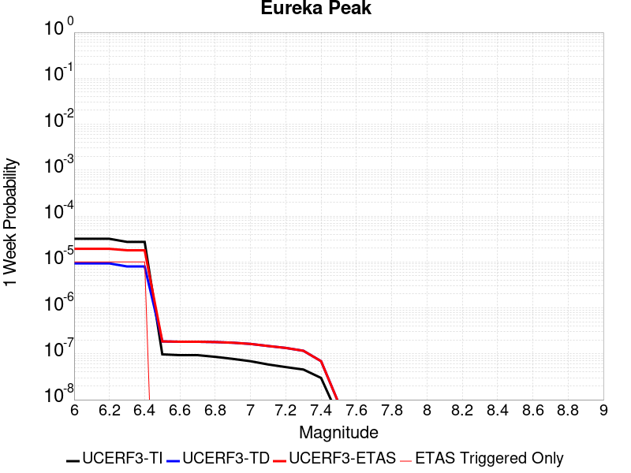 | 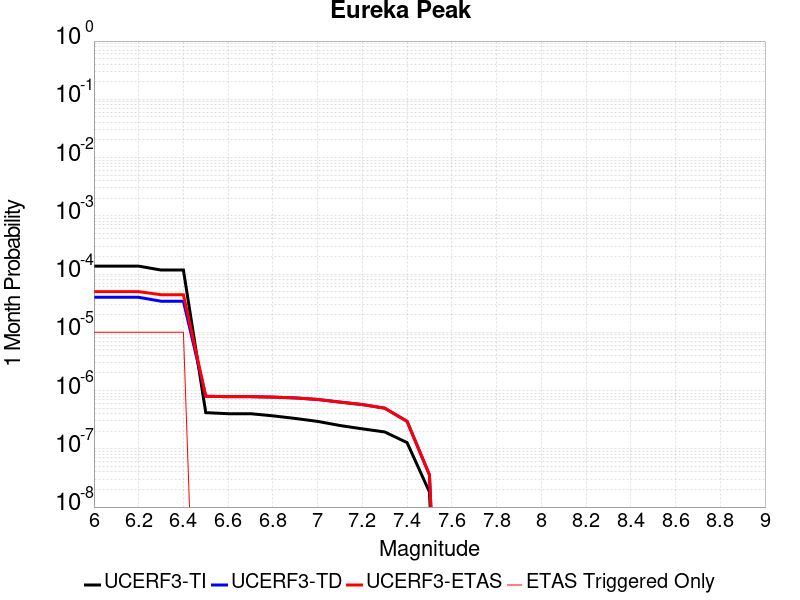 |  | 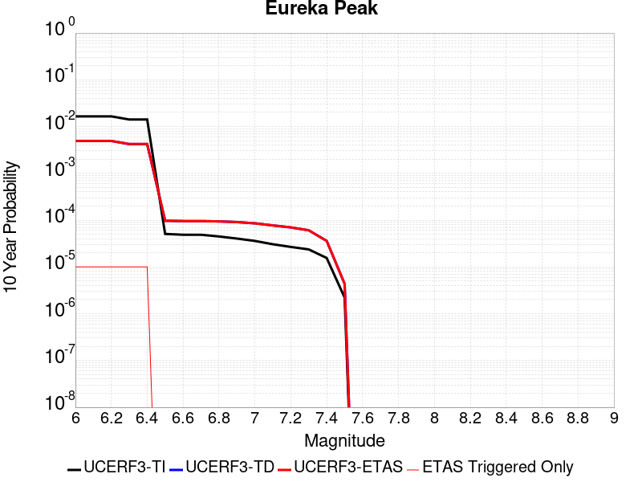 |

| Magnitude | 1 wk TI Prob | 1 wk TD Prob | 1 wk ETAS Prob | 1 wk ETAS/TD Gain | 1 wk ETAS Triggered Only | 1 mo TI Prob | 1 mo TD Prob | 1 mo ETAS Prob | 1 mo ETAS/TD Gain | 1 mo ETAS Triggered Only | 1 yr TI Prob | 1 yr TD Prob | 1 yr ETAS Prob | 1 yr ETAS/TD Gain | 1 yr ETAS Triggered Only | 10 yr TI Prob | 10 yr TD Prob | 10 yr ETAS Prob | 10 yr ETAS/TD Gain | 10 yr ETAS Triggered Only |
|-----|-----|-----|-----|-----|-----|-----|-----|-----|-----|-----|-----|-----|-----|-----|-----|-----|-----|-----|-----|-----|
| 6.0 | 3.1949054E-5 | 9.310979E-6 | 1.9310886E-5 | 2.0739908 | 1.0E-5 | 1.3691733E-4 | 3.9904025E-5 | 4.9903625E-5 | 1.2505913 | 1.0E-5 | 0.0016656938 | 4.858013E-4 | 4.9579644E-4 | 1.0205746 | 1.0E-5 | 0.016532637 | 0.004921293 | 0.0049312436 | 1.002022 | 1.0E-5 |
| 6.1 | 3.1949054E-5 | 9.310979E-6 | 1.9310886E-5 | 2.0739908 | 1.0E-5 | 1.3691733E-4 | 3.9904025E-5 | 4.9903625E-5 | 1.2505913 | 1.0E-5 | 0.0016656938 | 4.858013E-4 | 4.9579644E-4 | 1.0205746 | 1.0E-5 | 0.016532637 | 0.004921293 | 0.0049312436 | 1.002022 | 1.0E-5 |
| 6.2 | 3.1949054E-5 | 9.310979E-6 | 1.9310886E-5 | 2.0739908 | 1.0E-5 | 1.3691733E-4 | 3.9904025E-5 | 4.9903625E-5 | 1.2505913 | 1.0E-5 | 0.0016656938 | 4.858013E-4 | 4.9579644E-4 | 1.0205746 | 1.0E-5 | 0.016532637 | 0.004921293 | 0.0049312436 | 1.002022 | 1.0E-5 |
| 6.3 | 2.7339745E-5 | 7.980821E-6 | 1.7980741E-5 | 2.252994 | 1.0E-5 | 1.1716507E-4 | 3.4203495E-5 | 4.4203152E-5 | 1.2923578 | 1.0E-5 | 0.0014255513 | 4.164239E-4 | 4.2641972E-4 | 1.024004 | 1.0E-5 | 0.0141644105 | 0.0042259954 | 0.004235953 | 1.0023563 | 1.0E-5 |
| 6.4 | 2.7339745E-5 | 7.980821E-6 | 1.7980741E-5 | 2.252994 | 1.0E-5 | 1.1716507E-4 | 3.4203495E-5 | 4.4203152E-5 | 1.2923578 | 1.0E-5 | 0.0014255513 | 4.164239E-4 | 4.2641972E-4 | 1.024004 | 1.0E-5 | 0.0141644105 | 0.0042259954 | 0.004235953 | 1.0023563 | 1.0E-5 |
| 6.5 | 9.738388E-8 | 1.8620014E-7 | 1.8620014E-7 | 1.0 | 0.0 | 4.1735944E-7 | 7.980003E-7 | 7.980003E-7 | 1.0 | 0.0 | 5.081339E-6 | 9.715612E-6 | 9.715612E-6 | 1.0 | 0.0 | 5.0812232E-5 | 9.715195E-5 | 9.715195E-5 | 1.0 | 0.0 |
| 6.6 | 9.3495956E-8 | 1.8328839E-7 | 1.8328839E-7 | 1.0 | 0.0 | 4.0069688E-7 | 7.855215E-7 | 7.855215E-7 | 1.0 | 0.0 | 4.8784736E-6 | 9.563682E-6 | 9.563682E-6 | 1.0 | 0.0 | 4.8783666E-5 | 9.563279E-5 | 9.563279E-5 | 1.0 | 0.0 |
| 6.7 | 9.3495956E-8 | 1.8328839E-7 | 1.8328839E-7 | 1.0 | 0.0 | 4.0069688E-7 | 7.855215E-7 | 7.855215E-7 | 1.0 | 0.0 | 4.8784736E-6 | 9.563682E-6 | 9.563682E-6 | 1.0 | 0.0 | 4.8783666E-5 | 9.563279E-5 | 9.563279E-5 | 1.0 | 0.0 |
| 6.8 | 8.591428E-8 | 1.8021817E-7 | 1.8021817E-7 | 1.0 | 0.0 | 3.68204E-7 | 7.7236336E-7 | 7.7236336E-7 | 1.0 | 0.0 | 4.4828744E-6 | 9.403484E-6 | 9.403484E-6 | 1.0 | 0.0 | 4.482784E-5 | 9.403094E-5 | 9.403094E-5 | 1.0 | 0.0 |
| 6.9 | 7.749723E-8 | 1.7439834E-7 | 1.7439834E-7 | 1.0 | 0.0 | 3.3213098E-7 | 7.4742127E-7 | 7.4742127E-7 | 1.0 | 0.0 | 4.043687E-6 | 9.099816E-6 | 9.099816E-6 | 1.0 | 0.0 | 4.0436134E-5 | 9.0994516E-5 | 9.0994516E-5 | 1.0 | 0.0 |
| 7.0 | 6.897872E-8 | 1.6416043E-7 | 1.6416043E-7 | 1.0 | 0.0 | 2.9562307E-7 | 7.035445E-7 | 7.035445E-7 | 1.0 | 0.0 | 3.5992048E-6 | 8.565621E-6 | 8.565621E-6 | 1.0 | 0.0 | 3.5991467E-5 | 8.565299E-5 | 8.565299E-5 | 1.0 | 0.0 |
| 7.1 | 5.859318E-8 | 1.4787899E-7 | 1.4787899E-7 | 1.0 | 0.0 | 2.5111362E-7 | 6.33767E-7 | 6.33767E-7 | 1.0 | 0.0 | 3.057304E-6 | 7.716087E-6 | 7.716087E-6 | 1.0 | 0.0 | 3.0572617E-5 | 7.715825E-5 | 7.715825E-5 | 1.0 | 0.0 |
| 7.2 | 5.1375338E-8 | 1.3421746E-7 | 1.3421746E-7 | 1.0 | 0.0 | 2.2018E-7 | 5.7521754E-7 | 5.7521754E-7 | 1.0 | 0.0 | 2.680688E-6 | 7.003252E-6 | 7.003252E-6 | 1.0 | 0.0 | 2.6806558E-5 | 7.003037E-5 | 7.003037E-5 | 1.0 | 0.0 |
| 7.3 | 4.5441396E-8 | 1.1636931E-7 | 1.1636931E-7 | 1.0 | 0.0 | 1.9474882E-7 | 4.987255E-7 | 4.987255E-7 | 1.0 | 0.0 | 2.3710643E-6 | 6.0719667E-6 | 6.0719667E-6 | 1.0 | 0.0 | 2.371039E-5 | 6.0718063E-5 | 6.0718063E-5 | 1.0 | 0.0 |
| 7.4 | 2.981918E-8 | 6.911723E-8 | 6.911723E-8 | 1.0 | 0.0 | 1.2779647E-7 | 2.9621668E-7 | 2.9621668E-7 | 1.0 | 0.0 | 1.5559209E-6 | 3.6064325E-6 | 3.6064325E-6 | 1.0 | 0.0 | 1.55591E-5 | 3.6063782E-5 | 3.6063782E-5 | 1.0 | 0.0 |
| 7.5 | 4.24214E-9 | 8.34289E-9 | 8.34289E-9 | 1.0 | 0.0 | 1.81806E-8 | 3.5755242E-8 | 3.5755242E-8 | 1.0 | 0.0 | 2.213488E-7 | 4.3532006E-7 | 4.3532006E-7 | 1.0 | 0.0 | 2.2134857E-6 | 4.3531986E-6 | 4.3531986E-6 | 1.0 | 0.0 |

## Great Valley 03a Dunnigan Hills
*[(top)](#table-of-contents)*

| 1 Week | 1 Month | 1 Year | 10 Year |
|-----|-----|-----|-----|
| 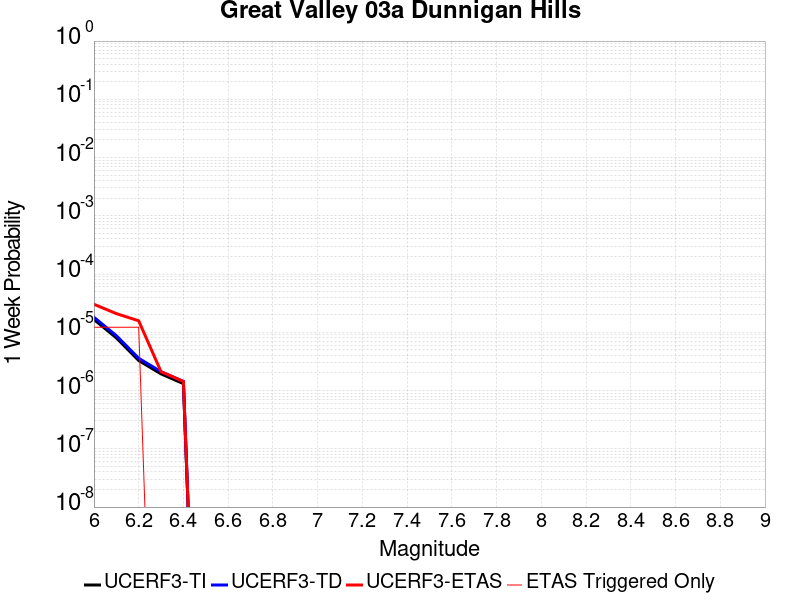 | 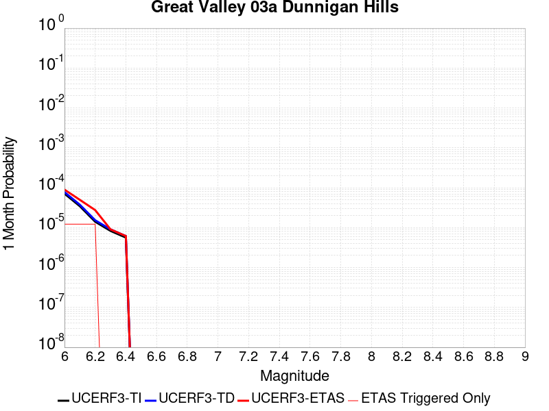 | 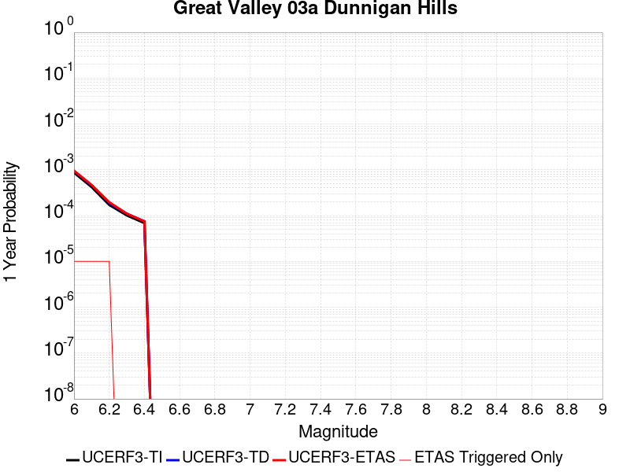 | 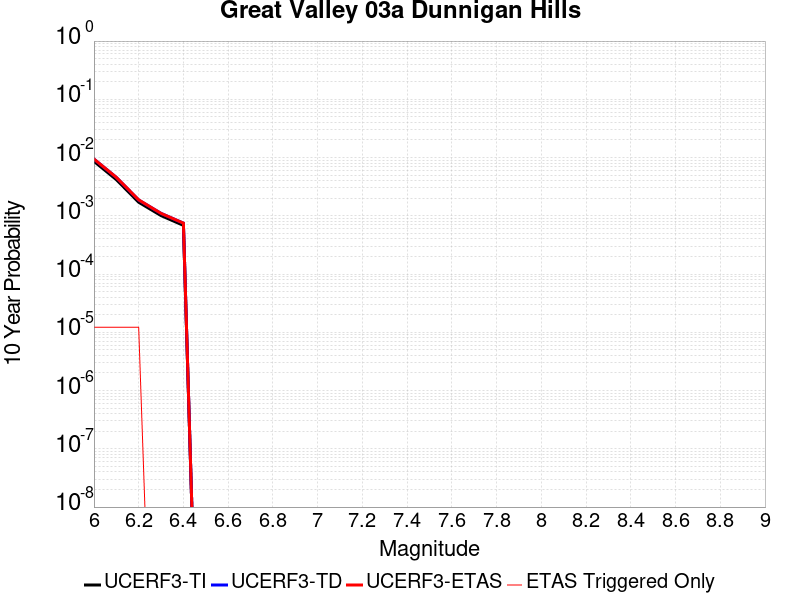 |

| Magnitude | 1 wk TI Prob | 1 wk TD Prob | 1 wk ETAS Prob | 1 wk ETAS/TD Gain | 1 wk ETAS Triggered Only | 1 mo TI Prob | 1 mo TD Prob | 1 mo ETAS Prob | 1 mo ETAS/TD Gain | 1 mo ETAS Triggered Only | 1 yr TI Prob | 1 yr TD Prob | 1 yr ETAS Prob | 1 yr ETAS/TD Gain | 1 yr ETAS Triggered Only | 10 yr TI Prob | 10 yr TD Prob | 10 yr ETAS Prob | 10 yr ETAS/TD Gain | 10 yr ETAS Triggered Only |
|-----|-----|-----|-----|-----|-----|-----|-----|-----|-----|-----|-----|-----|-----|-----|-----|-----|-----|-----|-----|-----|
| 6.0 | 1.6591328E-5 | 1.8107954E-5 | 2.8107774E-5 | 1.5522335 | 1.0E-5 | 7.110376E-5 | 7.7603596E-5 | 8.760282E-5 | 1.12885 | 1.0E-5 | 8.6534437E-4 | 9.444834E-4 | 9.54474E-4 | 1.0105778 | 1.0E-5 | 0.008619824 | 0.009411525 | 0.0094214305 | 1.0010525 | 1.0E-5 |
| 6.1 | 8.041125E-6 | 8.769726E-6 | 1.8769639E-5 | 2.1402764 | 1.0E-5 | 3.4461507E-5 | 3.7584115E-5 | 4.758374E-5 | 1.2660599 | 1.0E-5 | 4.194881E-4 | 4.5751085E-4 | 4.6750627E-4 | 1.0218474 | 1.0E-5 | 0.004186971 | 0.004567687 | 0.0045776414 | 1.0021793 | 1.0E-5 |
| 6.2 | 3.2807004E-6 | 3.5795688E-6 | 1.3579533E-5 | 3.7936225 | 1.0E-5 | 1.4060069E-5 | 1.5340942E-5 | 2.5340789E-5 | 1.6518404 | 1.0E-5 | 1.7116789E-4 | 1.8676413E-4 | 1.9676225E-4 | 1.0535334 | 1.0E-5 | 0.0017103611 | 0.0018664796 | 0.001876461 | 1.0053477 | 1.0E-5 |
| 6.3 | 1.9339366E-6 | 2.1103806E-6 | 2.1103806E-6 | 1.0 | 0.0 | 8.288273E-6 | 9.044474E-6 | 9.044474E-6 | 1.0 | 0.0 | 1.00905054E-4 | 1.1011375E-4 | 1.1011375E-4 | 1.0 | 0.0 | 0.0010085925 | 0.0011008718 | 0.0011008718 | 1.0 | 0.0 |
| 6.4 | 1.3142635E-6 | 1.4339867E-6 | 1.4339867E-6 | 1.0 | 0.0 | 5.6325457E-6 | 6.145657E-6 | 6.145657E-6 | 1.0 | 0.0 | 6.857408E-5 | 7.482337E-5 | 7.482337E-5 | 1.0 | 0.0 | 6.8552926E-4 | 7.4823375E-4 | 7.4823375E-4 | 1.0 | 0.0 |

## San Andreas (Santa Cruz Mts) 2011 CFM
*[(top)](#table-of-contents)*

| 1 Week | 1 Month | 1 Year | 10 Year |
|-----|-----|-----|-----|
| 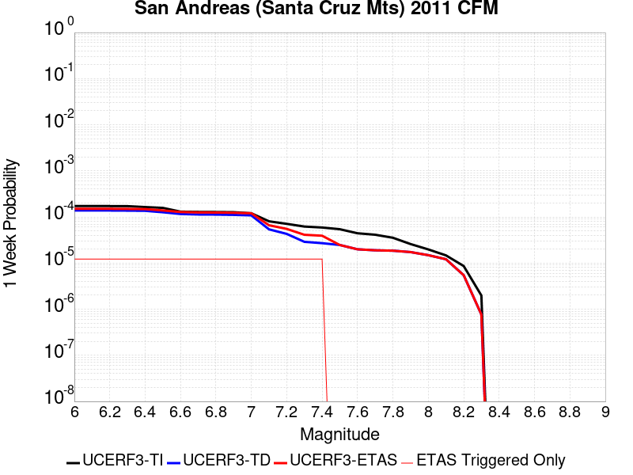 | 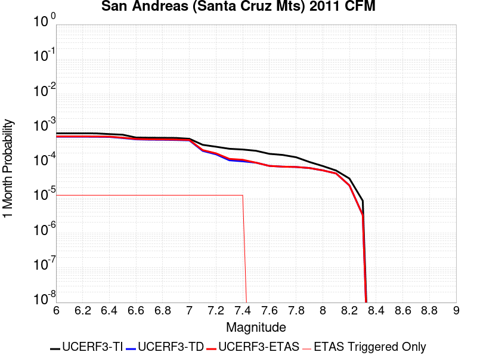 | 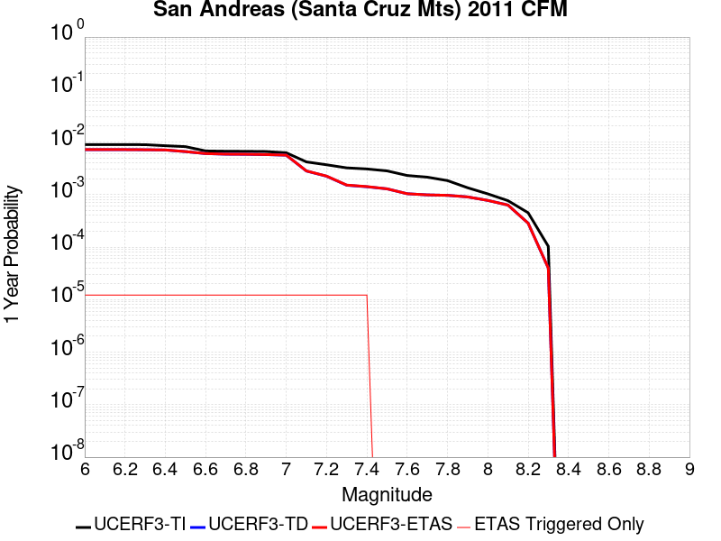 | 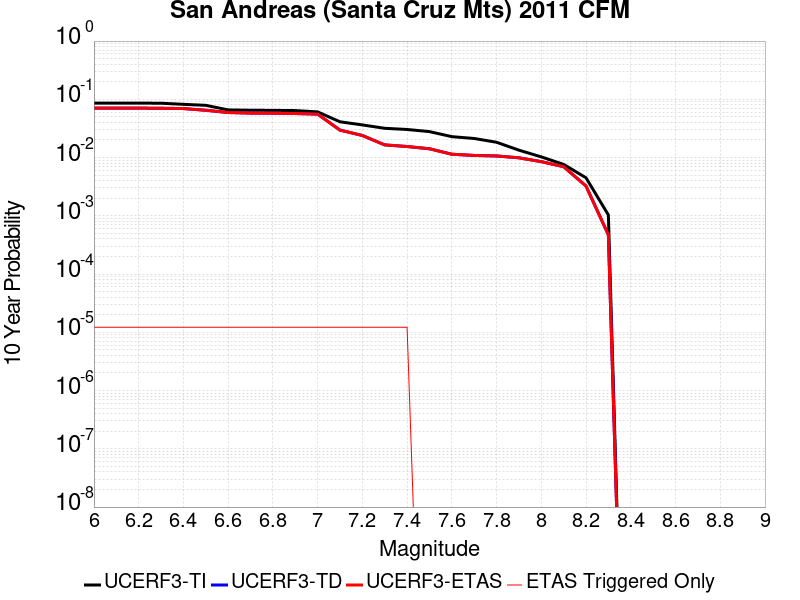 |

| Magnitude | 1 wk TI Prob | 1 wk TD Prob | 1 wk ETAS Prob | 1 wk ETAS/TD Gain | 1 wk ETAS Triggered Only | 1 mo TI Prob | 1 mo TD Prob | 1 mo ETAS Prob | 1 mo ETAS/TD Gain | 1 mo ETAS Triggered Only | 1 yr TI Prob | 1 yr TD Prob | 1 yr ETAS Prob | 1 yr ETAS/TD Gain | 1 yr ETAS Triggered Only | 10 yr TI Prob | 10 yr TD Prob | 10 yr ETAS Prob | 10 yr ETAS/TD Gain | 10 yr ETAS Triggered Only |
|-----|-----|-----|-----|-----|-----|-----|-----|-----|-----|-----|-----|-----|-----|-----|-----|-----|-----|-----|-----|-----|
| 6.0 | 1.7221631E-4 | 1.3792426E-4 | 1.4792288E-4 | 1.0724936 | 1.0E-5 | 7.378611E-4 | 5.9097214E-4 | 6.009662E-4 | 1.0169113 | 1.0E-5 | 0.008946515 | 0.0071717235 | 0.007181652 | 1.0013844 | 1.0E-5 | 0.08594794 | 0.07054796 | 0.07055726 | 1.0001317 | 1.0E-5 |
| 6.1 | 1.7221631E-4 | 1.3792426E-4 | 1.4792288E-4 | 1.0724936 | 1.0E-5 | 7.378611E-4 | 5.9097214E-4 | 6.009662E-4 | 1.0169113 | 1.0E-5 | 0.008946515 | 0.0071717235 | 0.007181652 | 1.0013844 | 1.0E-5 | 0.08594794 | 0.07054796 | 0.07055726 | 1.0001317 | 1.0E-5 |
| 6.2 | 1.7221631E-4 | 1.3792426E-4 | 1.4792288E-4 | 1.0724936 | 1.0E-5 | 7.378611E-4 | 5.9097214E-4 | 6.009662E-4 | 1.0169113 | 1.0E-5 | 0.008946515 | 0.0071717235 | 0.007181652 | 1.0013844 | 1.0E-5 | 0.08594794 | 0.07054796 | 0.07055726 | 1.0001317 | 1.0E-5 |
| 6.3 | 1.716926E-4 | 1.3711878E-4 | 1.4711742E-4 | 1.0729195 | 1.0E-5 | 7.3561794E-4 | 5.8752164E-4 | 5.975158E-4 | 1.0170107 | 1.0E-5 | 0.008919428 | 0.007129989 | 0.007139918 | 1.0013925 | 1.0E-5 | 0.08569809 | 0.07015993 | 0.070169225 | 1.0001326 | 1.0E-5 |
| 6.4 | 1.6392978E-4 | 1.3587909E-4 | 1.4587774E-4 | 1.0735848 | 1.0E-5 | 7.02367E-4 | 5.82211E-4 | 5.922052E-4 | 1.0171659 | 1.0E-5 | 0.008517839 | 0.0070657525 | 0.007075682 | 1.0014052 | 1.0E-5 | 0.08198654 | 0.069394976 | 0.06940428 | 1.0001341 | 1.0E-5 |
| 6.5 | 1.5742714E-4 | 1.2647794E-4 | 1.3647668E-4 | 1.0790552 | 1.0E-5 | 6.745133E-4 | 5.419374E-4 | 5.51932E-4 | 1.0184423 | 1.0E-5 | 0.00818132 | 0.0065784375 | 0.0065883715 | 1.0015101 | 1.0E-5 | 0.078865945 | 0.06486093 | 0.06487028 | 1.0001441 | 1.0E-5 |
| 6.6 | 1.3038084E-4 | 1.1587992E-4 | 1.2587877E-4 | 1.0862862 | 1.0E-5 | 5.5865536E-4 | 4.96535E-4 | 5.0653005E-4 | 1.0201296 | 1.0E-5 | 0.006780438 | 0.006028784 | 0.006038724 | 1.0016487 | 1.0E-5 | 0.0657725 | 0.059330538 | 0.059339944 | 1.0001585 | 1.0E-5 |
| 6.7 | 1.2867592E-4 | 1.1314491E-4 | 1.2314378E-4 | 1.0883722 | 1.0E-5 | 5.5135164E-4 | 4.8481792E-4 | 4.948131E-4 | 1.0206163 | 1.0E-5 | 0.0066920654 | 0.005886907 | 0.005896848 | 1.0016887 | 1.0E-5 | 0.06494093 | 0.058041416 | 0.058050834 | 1.0001622 | 1.0E-5 |
| 6.8 | 1.2801298E-4 | 1.12520516E-4 | 1.2251938E-4 | 1.0888627 | 1.0E-5 | 5.485117E-4 | 4.8214293E-4 | 4.921381E-4 | 1.0207307 | 1.0E-5 | 0.0066577005 | 0.0058545293 | 0.0058644707 | 1.0016981 | 1.0E-5 | 0.06461738 | 0.05775524 | 0.057764664 | 1.0001632 | 1.0E-5 |
| 6.9 | 1.269149E-4 | 1.1094256E-4 | 1.2094145E-4 | 1.0901268 | 1.0E-5 | 5.4380763E-4 | 4.7538272E-4 | 4.8537797E-4 | 1.0210257 | 1.0E-5 | 0.006600777 | 0.005772663 | 0.005782605 | 1.0017223 | 1.0E-5 | 0.06408122 | 0.057027116 | 0.057036545 | 1.0001653 | 1.0E-5 |
| 7.0 | 1.2030331E-4 | 1.0824356E-4 | 1.1824248E-4 | 1.0923742 | 1.0E-5 | 5.154837E-4 | 4.638198E-4 | 4.7381516E-4 | 1.02155 | 1.0E-5 | 0.006257969 | 0.0056326203 | 0.005642564 | 1.0017654 | 1.0E-5 | 0.06084648 | 0.055699922 | 0.055709366 | 1.0001695 | 1.0E-5 |
| 7.1 | 8.049617E-5 | 5.392429E-5 | 6.392375E-5 | 1.1854352 | 1.0E-5 | 3.4493793E-4 | 2.3108382E-4 | 2.410815E-4 | 1.0432644 | 1.0E-5 | 0.0041915346 | 0.0028098505 | 0.0028198224 | 1.0035489 | 1.0E-5 | 0.041133516 | 0.029618833 | 0.029628536 | 1.0003276 | 1.0E-5 |
| 7.2 | 7.093979E-5 | 4.2935415E-5 | 5.2934985E-5 | 1.232898 | 1.0E-5 | 3.0399222E-4 | 1.8399608E-4 | 1.9399423E-4 | 1.0543389 | 1.0E-5 | 0.0036948253 | 0.0022378736 | 0.002247851 | 1.0044585 | 1.0E-5 | 0.03633994 | 0.023941126 | 0.023950886 | 1.0004077 | 1.0E-5 |
| 7.3 | 6.193693E-5 | 2.8891074E-5 | 3.8890787E-5 | 1.3461176 | 1.0E-5 | 2.6541698E-4 | 1.2381302E-4 | 1.3381179E-4 | 1.0807569 | 1.0E-5 | 0.0032266637 | 0.001506383 | 0.0015163679 | 1.0066284 | 1.0E-5 | 0.031802133 | 0.016497677 | 0.016507512 | 1.0005962 | 1.0E-5 |
| 7.4 | 5.906492E-5 | 2.7020369E-5 | 3.7020098E-5 | 1.3700812 | 1.0E-5 | 2.5311083E-4 | 1.1579645E-4 | 1.2579528E-4 | 1.0863484 | 1.0E-5 | 0.0030772698 | 0.0014089114 | 0.0014188973 | 1.0070877 | 1.0E-5 | 0.030350044 | 0.0154695045 | 0.0154793495 | 1.0006365 | 1.0E-5 |
| 7.5 | 5.424296E-5 | 2.4675093E-5 | 2.4675093E-5 | 1.0 | 0.0 | 2.324491E-4 | 1.0574612E-4 | 1.0574612E-4 | 1.0 | 0.0 | 0.002826395 | 0.0012866998 | 0.0012866998 | 1.0 | 0.0 | 0.027907165 | 0.014161854 | 0.014161854 | 1.0 | 0.0 |
| 7.6 | 4.43084E-5 | 1.990151E-5 | 1.990151E-5 | 1.0 | 0.0 | 1.8987931E-4 | 8.528939E-5 | 8.528939E-5 | 1.0 | 0.0 | 0.0023093296 | 0.001037904 | 0.001037904 | 1.0 | 0.0 | 0.022854783 | 0.011411123 | 0.011411123 | 1.0 | 0.0 |
| 7.7 | 4.118098E-5 | 1.8933848E-5 | 1.8933848E-5 | 1.0 | 0.0 | 1.7647797E-4 | 8.1142534E-5 | 8.1142534E-5 | 1.0 | 0.0 | 0.002146502 | 9.874629E-4 | 9.874629E-4 | 1.0 | 0.0 | 0.021258866 | 0.010868995 | 0.010868995 | 1.0 | 0.0 |
| 7.8 | 3.5408906E-5 | 1.856201E-5 | 1.856201E-5 | 1.0 | 0.0 | 1.5174363E-4 | 7.954905E-5 | 7.954905E-5 | 1.0 | 0.0 | 0.0018459131 | 9.6807955E-4 | 9.6807955E-4 | 1.0 | 0.0 | 0.018306552 | 0.0106506655 | 0.0106506655 | 1.0 | 0.0 |
| 7.9 | 2.5860836E-5 | 1.7313954E-5 | 1.7313954E-5 | 1.0 | 0.0 | 1.10827445E-4 | 7.420055E-5 | 7.420055E-5 | 1.0 | 0.0 | 0.001348489 | 9.030175E-4 | 9.030175E-4 | 1.0 | 0.0 | 0.013403354 | 0.009906601 | 0.009906601 | 1.0 | 0.0 |
| 8.0 | 1.9777332E-5 | 1.4837888E-5 | 1.4837888E-5 | 1.0 | 0.0 | 8.4757245E-5 | 6.3589396E-5 | 6.3589396E-5 | 1.0 | 0.0 | 0.0010314309 | 7.739261E-4 | 7.739261E-4 | 1.0 | 0.0 | 0.010266567 | 0.008508087 | 0.008508087 | 1.0 | 0.0 |
| 8.1 | 1.468494E-5 | 1.2105831E-5 | 1.2105831E-5 | 1.0 | 0.0 | 6.293394E-5 | 5.1881103E-5 | 5.1881103E-5 | 1.0 | 0.0 | 7.6595135E-4 | 6.3146953E-4 | 6.3146953E-4 | 1.0 | 0.0 | 0.0076331664 | 0.0069684954 | 0.0069684954 | 1.0 | 0.0 |
| 8.2 | 8.63836E-6 | 5.4678667E-6 | 5.4678667E-6 | 1.0 | 0.0 | 3.7021015E-5 | 2.3433504E-5 | 2.3433504E-5 | 1.0 | 0.0 | 4.5063766E-4 | 2.8526565E-4 | 2.8526565E-4 | 1.0 | 0.0 | 0.004497249 | 0.003245162 | 0.003245162 | 1.0 | 0.0 |
| 8.3 | 1.983087E-6 | 7.6564595E-7 | 7.6564595E-7 | 1.0 | 0.0 | 8.498917E-6 | 3.281336E-6 | 3.281336E-6 | 1.0 | 0.0 | 1.034694E-4 | 3.9949547E-5 | 3.9949547E-5 | 1.0 | 0.0 | 0.0010342124 | 4.717979E-4 | 4.717979E-4 | 1.0 | 0.0 |

## Rodgers Creek - Healdsburg 2011 CFM
*[(top)](#table-of-contents)*

| 1 Week | 1 Month | 1 Year | 10 Year |
|-----|-----|-----|-----|
|  |  |  |  |

| Magnitude | 1 wk TI Prob | 1 wk TD Prob | 1 wk ETAS Prob | 1 wk ETAS/TD Gain | 1 wk ETAS Triggered Only | 1 mo TI Prob | 1 mo TD Prob | 1 mo ETAS Prob | 1 mo ETAS/TD Gain | 1 mo ETAS Triggered Only | 1 yr TI Prob | 1 yr TD Prob | 1 yr ETAS Prob | 1 yr ETAS/TD Gain | 1 yr ETAS Triggered Only | 10 yr TI Prob | 10 yr TD Prob | 10 yr ETAS Prob | 10 yr ETAS/TD Gain | 10 yr ETAS Triggered Only |
|-----|-----|-----|-----|-----|-----|-----|-----|-----|-----|-----|-----|-----|-----|-----|-----|-----|-----|-----|-----|-----|
| 6.0 | 7.390182E-5 | 1.3137296E-4 | 1.4137164E-4 | 1.0761092 | 1.0E-5 | 3.1668364E-4 | 5.629057E-4 | 5.7290005E-4 | 1.0177549 | 1.0E-5 | 0.0038488081 | 0.0068318076 | 0.006841739 | 1.0014538 | 1.0E-5 | 0.037828278 | 0.06618395 | 0.06619328 | 1.0001411 | 1.0E-5 |
| 6.1 | 7.318768E-5 | 1.303531E-4 | 1.403518E-4 | 1.0767047 | 1.0E-5 | 3.1362378E-4 | 5.585369E-4 | 5.6853134E-4 | 1.0178939 | 1.0E-5 | 0.0038116854 | 0.006778966 | 0.0067888983 | 1.0014652 | 1.0E-5 | 0.037469655 | 0.06568854 | 0.065697886 | 1.0001422 | 1.0E-5 |
| 6.2 | 7.1379836E-5 | 1.2728151E-4 | 1.3728025E-4 | 1.0785561 | 1.0E-5 | 3.058777E-4 | 5.453785E-4 | 5.5537303E-4 | 1.0183259 | 1.0E-5 | 0.003717703 | 0.0066197454 | 0.006629679 | 1.0015006 | 1.0E-5 | 0.0365612 | 0.06421061 | 0.06421997 | 1.0001458 | 1.0E-5 |
| 6.3 | 6.9255926E-5 | 1.2382482E-4 | 1.3382357E-4 | 1.0807493 | 1.0E-5 | 2.9677735E-4 | 5.305703E-4 | 5.4056494E-4 | 1.0188377 | 1.0E-5 | 0.0036072785 | 0.0064406106 | 0.0064505464 | 1.0015427 | 1.0E-5 | 0.035492823 | 0.062541805 | 0.062551185 | 1.0001498 | 1.0E-5 |
| 6.4 | 6.6757144E-5 | 1.195919E-4 | 1.2959071E-4 | 1.0836077 | 1.0E-5 | 2.8607066E-4 | 5.1243644E-4 | 5.2243134E-4 | 1.0195047 | 1.0E-5 | 0.0034773487 | 0.00622114 | 0.006231078 | 1.0015974 | 1.0E-5 | 0.034234364 | 0.060491614 | 0.06050101 | 1.0001553 | 1.0E-5 |
| 6.5 | 6.5735134E-5 | 1.180849E-4 | 1.2808372E-4 | 1.0846748 | 1.0E-5 | 2.8169158E-4 | 5.059804E-4 | 5.1597535E-4 | 1.0197536 | 1.0E-5 | 0.003424202 | 0.0061429944 | 0.006152933 | 1.0016179 | 1.0E-5 | 0.03371918 | 0.059755705 | 0.059765108 | 1.0001574 | 1.0E-5 |
| 6.6 | 6.289601E-5 | 1.13442366E-4 | 1.2344123E-4 | 1.0881405 | 1.0E-5 | 2.6952647E-4 | 4.8609133E-4 | 4.960865E-4 | 1.0205623 | 1.0E-5 | 0.0032765474 | 0.005902183 | 0.0059121237 | 1.0016843 | 1.0E-5 | 0.032286562 | 0.057495043 | 0.057504468 | 1.0001639 | 1.0E-5 |
| 6.7 | 6.115274E-5 | 1.106132E-4 | 1.20612094E-4 | 1.0903951 | 1.0E-5 | 2.6205686E-4 | 4.739708E-4 | 4.8396608E-4 | 1.0210884 | 1.0E-5 | 0.0031858748 | 0.0057554054 | 0.0057653477 | 1.0017275 | 1.0E-5 | 0.031405866 | 0.05611361 | 0.056123048 | 1.0001682 | 1.0E-5 |
| 6.8 | 5.9232367E-5 | 1.0728657E-4 | 1.172855E-4 | 1.0931983 | 1.0E-5 | 2.538283E-4 | 4.5971893E-4 | 4.6971434E-4 | 1.0217425 | 1.0E-5 | 0.0030859804 | 0.005582791 | 0.005592735 | 1.0017812 | 1.0E-5 | 0.030434765 | 0.05448041 | 0.054489866 | 1.0001736 | 1.0E-5 |
| 6.9 | 5.4030377E-5 | 9.8228295E-5 | 1.0822731E-4 | 1.1017936 | 1.0E-5 | 2.315382E-4 | 4.209108E-4 | 4.309066E-4 | 1.023748 | 1.0E-5 | 0.0028153337 | 0.0051126136 | 0.0051225624 | 1.001946 | 1.0E-5 | 0.027799325 | 0.05001572 | 0.05002522 | 1.0001899 | 1.0E-5 |
| 7.0 | 4.8260714E-5 | 8.7408924E-5 | 8.7408924E-5 | 1.0 | 0.0 | 2.0681522E-4 | 3.7455617E-4 | 3.7455617E-4 | 1.0 | 0.0 | 0.0025150678 | 0.0045507406 | 0.0045507406 | 1.0 | 0.0 | 0.024867928 | 0.044667073 | 0.044667073 | 1.0 | 0.0 |
| 7.1 | 4.0294493E-5 | 7.389363E-5 | 7.389363E-5 | 1.0 | 0.0 | 1.7267925E-4 | 3.1664874E-4 | 3.1664874E-4 | 1.0 | 0.0 | 0.0021003427 | 0.0038484214 | 0.0038484214 | 1.0 | 0.0 | 0.02080602 | 0.037923187 | 0.037923187 | 1.0 | 0.0 |
| 7.2 | 3.096388E-5 | 5.698023E-5 | 5.698023E-5 | 1.0 | 0.0 | 1.326956E-4 | 2.4417826E-4 | 2.4417826E-4 | 1.0 | 0.0 | 0.0016143717 | 0.0029688394 | 0.0029688394 | 1.0 | 0.0 | 0.01602694 | 0.029437006 | 0.029437006 | 1.0 | 0.0 |
| 7.3 | 2.3615226E-5 | 4.3629818E-5 | 4.3629818E-5 | 1.0 | 0.0 | 1.0120418E-4 | 1.869716E-4 | 1.869716E-4 | 1.0 | 0.0 | 0.0012314644 | 0.0022740164 | 0.0022740164 | 1.0 | 0.0 | 0.0122466255 | 0.022637889 | 0.022637889 | 1.0 | 0.0 |
| 7.4 | 1.8251132E-5 | 3.3542477E-5 | 3.3542477E-5 | 1.0 | 0.0 | 7.821679E-5 | 1.4374561E-4 | 1.4374561E-4 | 1.0 | 0.0 | 9.518733E-4 | 0.0017487077 | 0.0017487077 | 1.0 | 0.0 | 0.009478063 | 0.017466031 | 0.017466031 | 1.0 | 0.0 |
| 7.5 | 1.2411432E-5 | 2.2461069E-5 | 2.2461069E-5 | 1.0 | 0.0 | 5.3190768E-5 | 9.6258205E-5 | 9.6258205E-5 | 1.0 | 0.0 | 6.4740516E-4 | 0.0011713194 | 0.0011713194 | 1.0 | 0.0 | 0.006455223 | 0.011743137 | 0.011743137 | 1.0 | 0.0 |
| 7.6 | 4.4771446E-6 | 8.08443E-6 | 8.08443E-6 | 1.0 | 0.0 | 1.918762E-5 | 3.4647102E-5 | 3.4647102E-5 | 1.0 | 0.0 | 2.3358424E-4 | 4.2174806E-4 | 4.2174806E-4 | 1.0 | 0.0 | 0.0023333887 | 0.0042453306 | 0.0042453306 | 1.0 | 0.0 |
| 7.7 | 2.157941E-7 | 3.5350925E-7 | 3.5350925E-7 | 1.0 | 0.0 | 9.248315E-7 | 1.5150388E-6 | 1.5150388E-6 | 1.0 | 0.0 | 1.1259765E-5 | 1.844544E-5 | 1.844544E-5 | 1.0 | 0.0 | 1.1259195E-4 | 1.9069649E-4 | 1.9069649E-4 | 1.0 | 0.0 |
| 7.8 | 9.9623286E-8 | 1.9900986E-7 | 1.9900986E-7 | 1.0 | 0.0 | 4.269569E-7 | 8.528991E-7 | 8.528991E-7 | 1.0 | 0.0 | 5.1981874E-6 | 1.03839975E-5 | 1.03839975E-5 | 1.0 | 0.0 | 5.198066E-5 | 1.0902916E-4 | 1.0902916E-4 | 1.0 | 0.0 |
| 7.9 | 5.6745257E-8 | 1.1774714E-7 | 1.1774714E-7 | 1.0 | 0.0 | 2.4319394E-7 | 5.046305E-7 | 5.046305E-7 | 1.0 | 0.0 | 2.960882E-6 | 6.143859E-6 | 6.143859E-6 | 1.0 | 0.0 | 2.9608427E-5 | 6.471445E-5 | 6.471445E-5 | 1.0 | 0.0 |
| 8.0 | 2.8614323E-8 | 6.5789635E-8 | 6.5789635E-8 | 1.0 | 0.0 | 1.2263281E-7 | 2.8195555E-7 | 2.8195555E-7 | 1.0 | 0.0 | 1.4930534E-6 | 3.4328034E-6 | 3.4328034E-6 | 1.0 | 0.0 | 1.4930434E-5 | 3.5830046E-5 | 3.5830046E-5 | 1.0 | 0.0 |
| 8.1 | 3.5045191E-9 | 8.966459E-9 | 8.966459E-9 | 1.0 | 0.0 | 1.5019367E-8 | 3.8427682E-8 | 3.8427682E-8 | 1.0 | 0.0 | 1.8286079E-7 | 4.6785692E-7 | 4.6785692E-7 | 1.0 | 0.0 | 1.8286064E-6 | 4.834128E-6 | 4.834128E-6 | 1.0 | 0.0 |

## Homestead Valley 2011
*[(top)](#table-of-contents)*

| 1 Week | 1 Month | 1 Year | 10 Year |
|-----|-----|-----|-----|
|  |  | 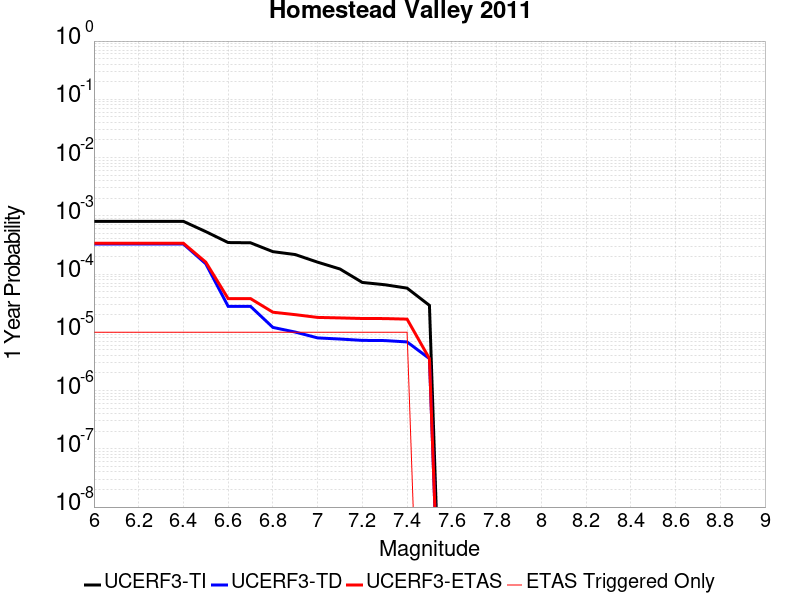 | 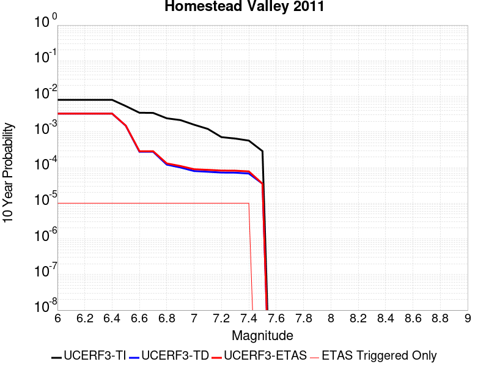 |

| Magnitude | 1 wk TI Prob | 1 wk TD Prob | 1 wk ETAS Prob | 1 wk ETAS/TD Gain | 1 wk ETAS Triggered Only | 1 mo TI Prob | 1 mo TD Prob | 1 mo ETAS Prob | 1 mo ETAS/TD Gain | 1 mo ETAS Triggered Only | 1 yr TI Prob | 1 yr TD Prob | 1 yr ETAS Prob | 1 yr ETAS/TD Gain | 1 yr ETAS Triggered Only | 10 yr TI Prob | 10 yr TD Prob | 10 yr ETAS Prob | 10 yr ETAS/TD Gain | 10 yr ETAS Triggered Only |
|-----|-----|-----|-----|-----|-----|-----|-----|-----|-----|-----|-----|-----|-----|-----|-----|-----|-----|-----|-----|-----|
| 6.0 | 1.539795E-5 | 6.286469E-6 | 6.286469E-6 | 1.0 | 0.0 | 6.5989545E-5 | 2.6941849E-5 | 2.6941849E-5 | 1.0 | 0.0 | 8.0312655E-4 | 3.2798824E-4 | 3.3798497E-4 | 1.030479 | 1.0E-5 | 0.008002302 | 0.0032770627 | 0.00328703 | 1.0030415 | 1.0E-5 |
| 6.1 | 1.539795E-5 | 6.286469E-6 | 6.286469E-6 | 1.0 | 0.0 | 6.5989545E-5 | 2.6941849E-5 | 2.6941849E-5 | 1.0 | 0.0 | 8.0312655E-4 | 3.2798824E-4 | 3.3798497E-4 | 1.030479 | 1.0E-5 | 0.008002302 | 0.0032770627 | 0.00328703 | 1.0030415 | 1.0E-5 |
| 6.2 | 1.539795E-5 | 6.286469E-6 | 6.286469E-6 | 1.0 | 0.0 | 6.5989545E-5 | 2.6941849E-5 | 2.6941849E-5 | 1.0 | 0.0 | 8.0312655E-4 | 3.2798824E-4 | 3.3798497E-4 | 1.030479 | 1.0E-5 | 0.008002302 | 0.0032770627 | 0.00328703 | 1.0030415 | 1.0E-5 |
| 6.3 | 1.539795E-5 | 6.286469E-6 | 6.286469E-6 | 1.0 | 0.0 | 6.5989545E-5 | 2.6941849E-5 | 2.6941849E-5 | 1.0 | 0.0 | 8.0312655E-4 | 3.2798824E-4 | 3.3798497E-4 | 1.030479 | 1.0E-5 | 0.008002302 | 0.0032770627 | 0.00328703 | 1.0030415 | 1.0E-5 |
| 6.4 | 1.539795E-5 | 6.286469E-6 | 6.286469E-6 | 1.0 | 0.0 | 6.5989545E-5 | 2.6941849E-5 | 2.6941849E-5 | 1.0 | 0.0 | 8.0312655E-4 | 3.2798824E-4 | 3.3798497E-4 | 1.030479 | 1.0E-5 | 0.008002302 | 0.0032770627 | 0.00328703 | 1.0030415 | 1.0E-5 |
| 6.5 | 1.0265258E-5 | 2.8786876E-6 | 2.8786876E-6 | 1.0 | 0.0 | 4.3993223E-5 | 1.2337214E-5 | 1.2337214E-5 | 1.0 | 0.0 | 5.3548586E-4 | 1.5020218E-4 | 1.6020068E-4 | 1.066567 | 1.0E-5 | 0.005341973 | 0.0015016886 | 0.0015116736 | 1.0066491 | 1.0E-5 |
| 6.6 | 6.664671E-6 | 5.343859E-7 | 5.343859E-7 | 1.0 | 0.0 | 2.8562565E-5 | 2.2902238E-6 | 2.2902238E-6 | 1.0 | 0.0 | 3.476937E-4 | 2.7883236E-5 | 3.7882957E-5 | 1.3586284 | 1.0E-5 | 0.003471502 | 2.78809E-4 | 2.8880622E-4 | 1.0358568 | 1.0E-5 |
| 6.7 | 6.5954046E-6 | 5.343859E-7 | 5.343859E-7 | 1.0 | 0.0 | 2.8265715E-5 | 2.2902238E-6 | 2.2902238E-6 | 1.0 | 0.0 | 3.4408073E-4 | 2.7883236E-5 | 3.7882957E-5 | 1.3586284 | 1.0E-5 | 0.0034354846 | 2.78809E-4 | 2.8880622E-4 | 1.0358568 | 1.0E-5 |
| 6.8 | 4.648189E-6 | 2.3257238E-7 | 2.3257238E-7 | 1.0 | 0.0 | 1.9920659E-5 | 9.967384E-7 | 9.967384E-7 | 1.0 | 0.0 | 2.4250703E-4 | 1.2135227E-5 | 2.2135106E-5 | 1.8240372 | 1.0E-5 | 0.0024224254 | 1.2134612E-4 | 1.3134492E-4 | 1.0823989 | 1.0E-5 |
| 6.9 | 4.1428534E-6 | 1.9342777E-7 | 1.9342777E-7 | 1.0 | 0.0 | 1.7754966E-5 | 8.289759E-7 | 8.289759E-7 | 1.0 | 0.0 | 2.1614527E-4 | 1.0092737E-5 | 2.0092637E-5 | 1.9908015 | 1.0E-5 | 0.0021593515 | 1.0092309E-4 | 1.1092208E-4 | 1.0990753 | 1.0E-5 |
| 7.0 | 3.0673707E-6 | 1.5364343E-7 | 1.5364343E-7 | 1.0 | 0.0 | 1.3145808E-5 | 6.5847166E-7 | 6.5847166E-7 | 1.0 | 0.0 | 1.6003846E-4 | 8.016864E-6 | 1.8016784E-5 | 2.2473605 | 1.0E-5 | 0.0015992324 | 8.016585E-5 | 9.016505E-5 | 1.1247314 | 1.0E-5 |
| 7.1 | 2.340854E-6 | 1.4684727E-7 | 1.4684727E-7 | 1.0 | 0.0 | 1.0032193E-5 | 6.293453E-7 | 6.293453E-7 | 1.0 | 0.0 | 1.221351E-4 | 7.662254E-6 | 1.7662176E-5 | 2.3050892 | 1.0E-5 | 0.00122068 | 7.661999E-5 | 8.661922E-5 | 1.1305043 | 1.0E-5 |
| 7.2 | 1.3754182E-6 | 1.3920152E-7 | 1.3920152E-7 | 1.0 | 0.0 | 5.8946357E-6 | 5.965778E-7 | 5.965778E-7 | 1.0 | 0.0 | 7.176483E-5 | 7.2633115E-6 | 1.7263239E-5 | 2.3767724 | 1.0E-5 | 7.174166E-4 | 7.2630835E-5 | 8.2630104E-5 | 1.1376725 | 1.0E-5 |
| 7.3 | 1.2573237E-6 | 1.3824703E-7 | 1.3824703E-7 | 1.0 | 0.0 | 5.388519E-6 | 5.9248714E-7 | 5.9248714E-7 | 1.0 | 0.0 | 6.560324E-5 | 7.213508E-6 | 1.7213435E-5 | 2.3862782 | 1.0E-5 | 6.558388E-4 | 7.213283E-5 | 8.213211E-5 | 1.1386231 | 1.0E-5 |
| 7.4 | 1.0994207E-6 | 1.3103899E-7 | 1.3103899E-7 | 1.0 | 0.0 | 4.7117946E-6 | 5.615955E-7 | 5.615955E-7 | 1.0 | 0.0 | 5.736459E-5 | 6.837405E-6 | 1.6837337E-5 | 2.4625332 | 1.0E-5 | 5.734978E-4 | 6.837204E-5 | 7.8371355E-5 | 1.1462486 | 1.0E-5 |
| 7.5 | 5.5569126E-7 | 6.7717565E-8 | 6.7717565E-8 | 1.0 | 0.0 | 2.3815317E-6 | 2.902181E-7 | 2.902181E-7 | 1.0 | 0.0 | 2.8994764E-5 | 3.5334003E-6 | 3.5334003E-6 | 1.0 | 0.0 | 2.899098E-4 | 3.5333505E-5 | 3.5333505E-5 | 1.0 | 0.0 |

## Sheephole
*[(top)](#table-of-contents)*

| 1 Week | 1 Month | 1 Year | 10 Year |
|-----|-----|-----|-----|
| 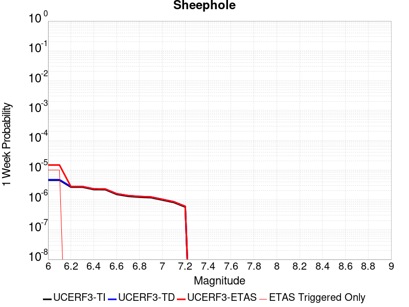 |  | 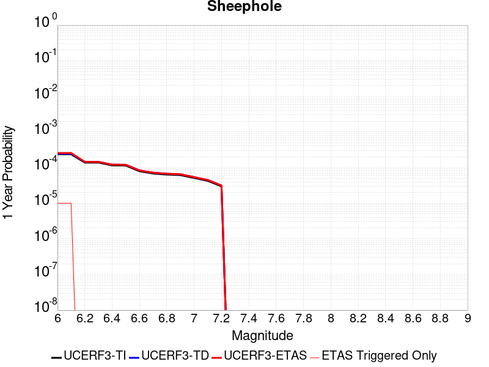 | 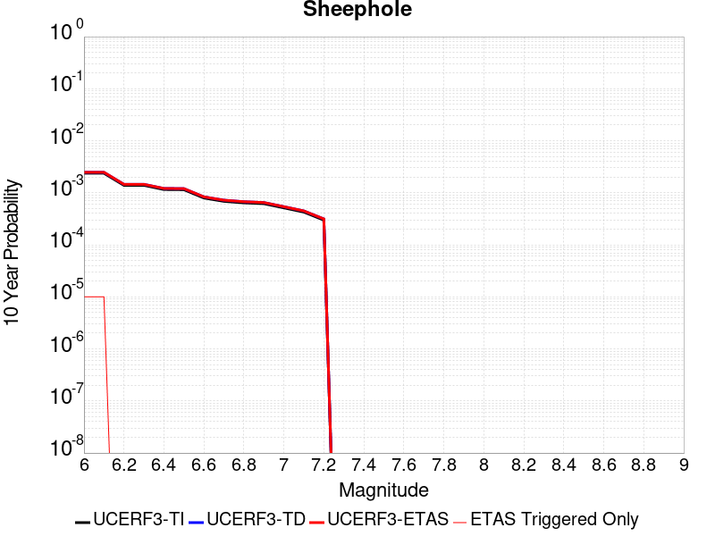 |

| Magnitude | 1 wk TI Prob | 1 wk TD Prob | 1 wk ETAS Prob | 1 wk ETAS/TD Gain | 1 wk ETAS Triggered Only | 1 mo TI Prob | 1 mo TD Prob | 1 mo ETAS Prob | 1 mo ETAS/TD Gain | 1 mo ETAS Triggered Only | 1 yr TI Prob | 1 yr TD Prob | 1 yr ETAS Prob | 1 yr ETAS/TD Gain | 1 yr ETAS Triggered Only | 10 yr TI Prob | 10 yr TD Prob | 10 yr ETAS Prob | 10 yr ETAS/TD Gain | 10 yr ETAS Triggered Only |
|-----|-----|-----|-----|-----|-----|-----|-----|-----|-----|-----|-----|-----|-----|-----|-----|-----|-----|-----|-----|-----|
| 6.0 | 4.5579695E-6 | 4.7412627E-6 | 1.4741215E-5 | 3.1091328 | 1.0E-5 | 1.9534009E-5 | 2.031957E-5 | 3.0319366E-5 | 1.4921265 | 1.0E-5 | 2.3780059E-4 | 2.473682E-4 | 2.5736575E-4 | 1.0404155 | 1.0E-5 | 0.0023754628 | 0.002471473 | 0.0024814485 | 1.0040362 | 1.0E-5 |
| 6.1 | 4.5579695E-6 | 4.7412627E-6 | 1.4741215E-5 | 3.1091328 | 1.0E-5 | 1.9534009E-5 | 2.031957E-5 | 3.0319366E-5 | 1.4921265 | 1.0E-5 | 2.3780059E-4 | 2.473682E-4 | 2.5736575E-4 | 1.0404155 | 1.0E-5 | 0.0023754628 | 0.002471473 | 0.0024814485 | 1.0040362 | 1.0E-5 |
| 6.2 | 2.6677674E-6 | 2.7873941E-6 | 2.7873941E-6 | 1.0 | 0.0 | 1.1433239E-5 | 1.1945926E-5 | 1.1945926E-5 | 1.0 | 0.0 | 1.3919079E-4 | 1.4543302E-4 | 1.4543302E-4 | 1.0 | 0.0 | 0.0013910364 | 0.0014534844 | 0.0014534844 | 1.0 | 0.0 |
| 6.3 | 2.6677674E-6 | 2.7873941E-6 | 2.7873941E-6 | 1.0 | 0.0 | 1.1433239E-5 | 1.1945926E-5 | 1.1945926E-5 | 1.0 | 0.0 | 1.3919079E-4 | 1.4543302E-4 | 1.4543302E-4 | 1.0 | 0.0 | 0.0013910364 | 0.0014534844 | 0.0014534844 | 1.0 | 0.0 |
| 6.4 | 2.2159759E-6 | 2.3228788E-6 | 2.3228788E-6 | 1.0 | 0.0 | 9.497005E-6 | 9.955161E-6 | 9.955161E-6 | 1.0 | 0.0 | 1.156199E-4 | 1.2119815E-4 | 1.2119815E-4 | 1.0 | 0.0 | 0.0011555976 | 0.0012113999 | 0.0012113999 | 1.0 | 0.0 |
| 6.5 | 2.1986082E-6 | 2.304759E-6 | 2.304759E-6 | 1.0 | 0.0 | 9.4225725E-6 | 9.877506E-6 | 9.877506E-6 | 1.0 | 0.0 | 1.1471378E-4 | 1.2025281E-4 | 1.2025281E-4 | 1.0 | 0.0 | 0.0011465458 | 0.0012019566 | 0.0012019566 | 1.0 | 0.0 |
| 6.6 | 1.5232331E-6 | 1.6018919E-6 | 1.6018919E-6 | 1.0 | 0.0 | 6.5281256E-6 | 6.865234E-6 | 6.865234E-6 | 1.0 | 0.0 | 7.947703E-5 | 8.35812E-5 | 8.35812E-5 | 1.0 | 0.0 | 7.9448614E-4 | 8.3551643E-4 | 8.3551643E-4 | 1.0 | 0.0 |
| 6.7 | 1.3137362E-6 | 1.382819E-6 | 1.382819E-6 | 1.0 | 0.0 | 5.6302856E-6 | 5.926355E-6 | 5.926355E-6 | 1.0 | 0.0 | 6.854657E-5 | 7.215112E-5 | 7.215112E-5 | 1.0 | 0.0 | 6.8525434E-4 | 7.212908E-4 | 7.212908E-4 | 1.0 | 0.0 |
| 6.8 | 1.2275751E-6 | 1.2922847E-6 | 1.2922847E-6 | 1.0 | 0.0 | 5.2610258E-6 | 5.5383516E-6 | 5.5383516E-6 | 1.0 | 0.0 | 6.4051106E-5 | 6.7427485E-5 | 6.7427485E-5 | 1.0 | 0.0 | 6.4032647E-4 | 6.740836E-4 | 6.740836E-4 | 1.0 | 0.0 |
| 6.9 | 1.1837088E-6 | 1.246102E-6 | 1.246102E-6 | 1.0 | 0.0 | 5.0730278E-6 | 5.340427E-6 | 5.340427E-6 | 1.0 | 0.0 | 6.176237E-5 | 6.501789E-5 | 6.501789E-5 | 1.0 | 0.0 | 6.17452E-4 | 6.5000186E-4 | 6.5000186E-4 | 1.0 | 0.0 |
| 7.0 | 9.849371E-7 | 1.0366288E-6 | 1.0366288E-6 | 1.0 | 0.0 | 4.2211523E-6 | 4.442688E-6 | 4.442688E-6 | 1.0 | 0.0 | 5.1391315E-5 | 5.4088487E-5 | 5.4088487E-5 | 1.0 | 0.0 | 5.137943E-4 | 5.407633E-4 | 5.407633E-4 | 1.0 | 0.0 |
| 7.1 | 8.1643645E-7 | 8.591669E-7 | 8.591669E-7 | 1.0 | 0.0 | 3.4990085E-6 | 3.682139E-6 | 3.682139E-6 | 1.0 | 0.0 | 4.2599597E-5 | 4.482921E-5 | 4.482921E-5 | 1.0 | 0.0 | 4.259143E-4 | 4.4821028E-4 | 4.4821028E-4 | 1.0 | 0.0 |
| 7.2 | 5.7295756E-7 | 6.029502E-7 | 6.029502E-7 | 1.0 | 0.0 | 2.45553E-6 | 2.58407E-6 | 2.58407E-6 | 1.0 | 0.0 | 2.9895667E-5 | 3.1460666E-5 | 3.1460666E-5 | 1.0 | 0.0 | 2.9891645E-4 | 3.145688E-4 | 3.145688E-4 | 1.0 | 0.0 |

## Monterey Bay-Tularcitos
*[(top)](#table-of-contents)*

| 1 Week | 1 Month | 1 Year | 10 Year |
|-----|-----|-----|-----|
| 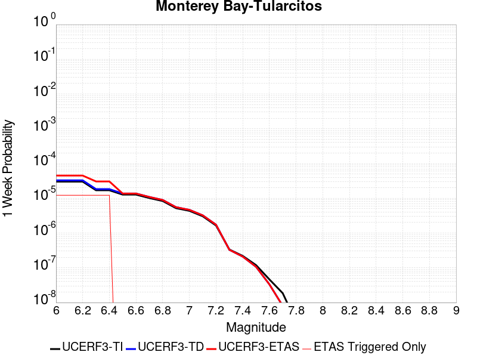 | 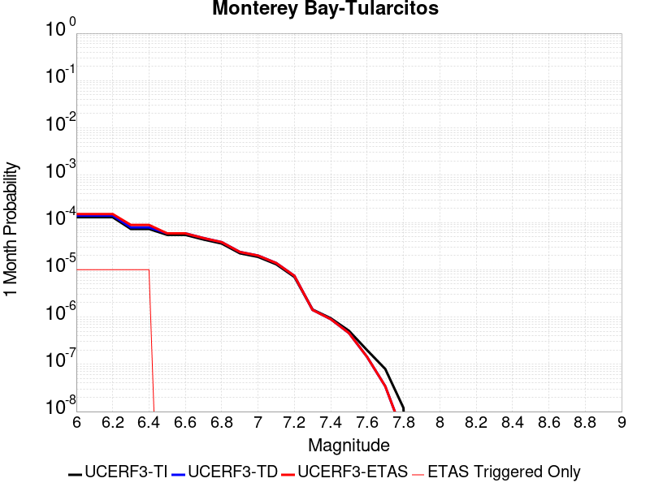 | 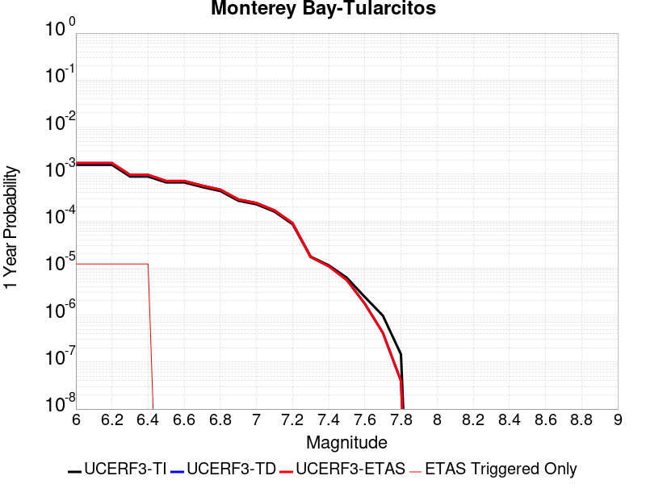 | 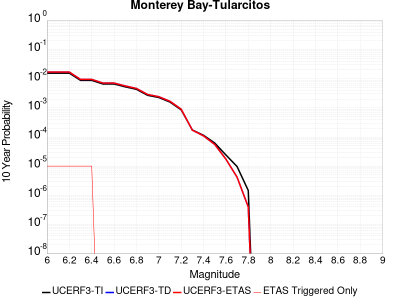 |

| Magnitude | 1 wk TI Prob | 1 wk TD Prob | 1 wk ETAS Prob | 1 wk ETAS/TD Gain | 1 wk ETAS Triggered Only | 1 mo TI Prob | 1 mo TD Prob | 1 mo ETAS Prob | 1 mo ETAS/TD Gain | 1 mo ETAS Triggered Only | 1 yr TI Prob | 1 yr TD Prob | 1 yr ETAS Prob | 1 yr ETAS/TD Gain | 1 yr ETAS Triggered Only | 10 yr TI Prob | 10 yr TD Prob | 10 yr ETAS Prob | 10 yr ETAS/TD Gain | 10 yr ETAS Triggered Only |
|-----|-----|-----|-----|-----|-----|-----|-----|-----|-----|-----|-----|-----|-----|-----|-----|-----|-----|-----|-----|-----|
| 6.0 | 3.0131365E-5 | 3.279877E-5 | 4.279844E-5 | 1.3048794 | 1.0E-5 | 1.2912804E-4 | 1.4055918E-4 | 1.5055778E-4 | 1.0711344 | 1.0E-5 | 0.001571 | 0.0017100703 | 0.0017200531 | 1.0058377 | 1.0E-5 | 0.015599402 | 0.016979916 | 0.016989747 | 1.0005789 | 1.0E-5 |
| 6.1 | 3.0131365E-5 | 3.279877E-5 | 4.279844E-5 | 1.3048794 | 1.0E-5 | 1.2912804E-4 | 1.4055918E-4 | 1.5055778E-4 | 1.0711344 | 1.0E-5 | 0.001571 | 0.0017100703 | 0.0017200531 | 1.0058377 | 1.0E-5 | 0.015599402 | 0.016979916 | 0.016989747 | 1.0005789 | 1.0E-5 |
| 6.2 | 3.0131365E-5 | 3.279877E-5 | 4.279844E-5 | 1.3048794 | 1.0E-5 | 1.2912804E-4 | 1.4055918E-4 | 1.5055778E-4 | 1.0711344 | 1.0E-5 | 0.001571 | 0.0017100703 | 0.0017200531 | 1.0058377 | 1.0E-5 | 0.015599402 | 0.016979916 | 0.016989747 | 1.0005789 | 1.0E-5 |
| 6.3 | 1.6998249E-5 | 1.8330798E-5 | 2.8330614E-5 | 1.54552 | 1.0E-5 | 7.28476E-5 | 7.85583E-5 | 8.8557514E-5 | 1.127284 | 1.0E-5 | 8.865586E-4 | 9.5604634E-4 | 9.6603675E-4 | 1.0104498 | 1.0E-5 | 0.0088303005 | 0.009521258 | 0.009531163 | 1.0010403 | 1.0E-5 |
| 6.4 | 1.6998249E-5 | 1.8330798E-5 | 2.8330614E-5 | 1.54552 | 1.0E-5 | 7.28476E-5 | 7.85583E-5 | 8.8557514E-5 | 1.127284 | 1.0E-5 | 8.865586E-4 | 9.5604634E-4 | 9.6603675E-4 | 1.0104498 | 1.0E-5 | 0.0088303005 | 0.009521258 | 0.009531163 | 1.0010403 | 1.0E-5 |
| 6.5 | 1.27470785E-5 | 1.3693312E-5 | 1.3693312E-5 | 1.0 | 0.0 | 5.4629192E-5 | 5.8684363E-5 | 5.8684363E-5 | 1.0 | 0.0 | 6.649074E-4 | 7.1425823E-4 | 7.1425823E-4 | 1.0 | 0.0 | 0.0066292146 | 0.007120678 | 0.007120678 | 1.0 | 0.0 |
| 6.6 | 1.2739422E-5 | 1.36854E-5 | 1.36854E-5 | 1.0 | 0.0 | 5.4596385E-5 | 5.8650454E-5 | 5.8650454E-5 | 1.0 | 0.0 | 6.645082E-4 | 7.1384566E-4 | 7.1384566E-4 | 1.0 | 0.0 | 0.0066252467 | 0.007116579 | 0.007116579 | 1.0 | 0.0 |
| 6.7 | 1.0160109E-5 | 1.0885755E-5 | 1.0885755E-5 | 1.0 | 0.0 | 4.35426E-5 | 4.665244E-5 | 4.665244E-5 | 1.0 | 0.0 | 5.300022E-4 | 5.6785246E-4 | 5.6785246E-4 | 1.0 | 0.0 | 0.005287399 | 0.0056647263 | 0.0056647263 | 1.0 | 0.0 |
| 6.8 | 8.349859E-6 | 8.932587E-6 | 8.932587E-6 | 1.0 | 0.0 | 3.578462E-5 | 3.8281985E-5 | 3.8281985E-5 | 1.0 | 0.0 | 4.3559066E-4 | 4.6598914E-4 | 4.6598914E-4 | 1.0 | 0.0 | 0.004347378 | 0.004650685 | 0.004650685 | 1.0 | 0.0 |
| 6.9 | 5.193639E-6 | 5.53643E-6 | 5.53643E-6 | 1.0 | 0.0 | 2.2258262E-5 | 2.372736E-5 | 2.372736E-5 | 1.0 | 0.0 | 2.7096065E-4 | 2.8884556E-4 | 2.8884556E-4 | 1.0 | 0.0 | 0.0027063051 | 0.0028850224 | 0.0028850224 | 1.0 | 0.0 |
| 7.0 | 4.359381E-6 | 4.643366E-6 | 4.643366E-6 | 1.0 | 0.0 | 1.8682927E-5 | 1.9900004E-5 | 1.9900004E-5 | 1.0 | 0.0 | 2.274409E-4 | 2.422586E-4 | 2.422586E-4 | 1.0 | 0.0 | 0.0022720827 | 0.002420238 | 0.002420238 | 1.0 | 0.0 |
| 7.1 | 3.0398533E-6 | 3.2310427E-6 | 3.2310427E-6 | 1.0 | 0.0 | 1.3027877E-5 | 1.3847267E-5 | 1.3847267E-5 | 1.0 | 0.0 | 1.5860285E-4 | 1.6858005E-4 | 1.6858005E-4 | 1.0 | 0.0 | 0.001584897 | 0.0016847793 | 0.0016847793 | 1.0 | 0.0 |
| 7.2 | 1.642335E-6 | 1.7333153E-6 | 1.7333153E-6 | 1.0 | 0.0 | 7.0385595E-6 | 7.428485E-6 | 7.428485E-6 | 1.0 | 0.0 | 8.569109E-5 | 9.044012E-5 | 9.044012E-5 | 1.0 | 0.0 | 8.5658056E-4 | 9.042358E-4 | 9.042358E-4 | 1.0 | 0.0 |
| 7.3 | 3.356842E-7 | 3.2952389E-7 | 3.2952389E-7 | 1.0 | 0.0 | 1.4386458E-6 | 1.4122445E-6 | 1.4122445E-6 | 1.0 | 0.0 | 1.7515373E-5 | 1.7193941E-5 | 1.7193941E-5 | 1.0 | 0.0 | 1.7513991E-4 | 1.719262E-4 | 1.719262E-4 | 1.0 | 0.0 |
| 7.4 | 2.1973483E-7 | 2.1006414E-7 | 2.1006414E-7 | 1.0 | 0.0 | 9.417204E-7 | 9.002746E-7 | 9.002746E-7 | 1.0 | 0.0 | 1.1465385E-5 | 1.0960788E-5 | 1.0960788E-5 | 1.0 | 0.0 | 1.1464794E-4 | 1.0960251E-4 | 1.0960251E-4 | 1.0 | 0.0 |
| 7.5 | 1.1944135E-7 | 1.0696035E-7 | 1.0696035E-7 | 1.0 | 0.0 | 5.118914E-7 | 4.5840142E-7 | 4.5840142E-7 | 1.0 | 0.0 | 6.23226E-6 | 5.581023E-6 | 5.581023E-6 | 1.0 | 0.0 | 6.2320854E-5 | 5.5808843E-5 | 5.5808843E-5 | 1.0 | 0.0 |
| 7.6 | 4.636058E-8 | 3.3364433E-8 | 3.3364433E-8 | 1.0 | 0.0 | 1.9868818E-7 | 1.4299042E-7 | 1.4299042E-7 | 1.0 | 0.0 | 2.419026E-6 | 1.740907E-6 | 1.740907E-6 | 1.0 | 0.0 | 2.4189996E-5 | 1.7408936E-5 | 1.7408936E-5 | 1.0 | 0.0 |
| 7.7 | 1.8588572E-8 | 8.003168E-9 | 8.003168E-9 | 1.0 | 0.0 | 7.9665305E-8 | 3.429929E-8 | 3.429929E-8 | 1.0 | 0.0 | 9.699246E-7 | 4.1759378E-7 | 4.1759378E-7 | 1.0 | 0.0 | 9.699204E-6 | 4.1759304E-6 | 4.1759304E-6 | 1.0 | 0.0 |
| 7.8 | 2.7960154E-9 | 7.608624E-10 | 7.608624E-10 | 1.0 | 0.0 | 1.1982923E-8 | 3.2608392E-9 | 3.2608392E-9 | 1.0 | 0.0 | 1.4589209E-7 | 3.9700716E-8 | 3.9700716E-8 | 1.0 | 0.0 | 1.4589199E-6 | 3.970071E-7 | 3.970071E-7 | 1.0 | 0.0 |

## Greenville (No) 2011 CFM
*[(top)](#table-of-contents)*

| 1 Week | 1 Month | 1 Year | 10 Year |
|-----|-----|-----|-----|
| 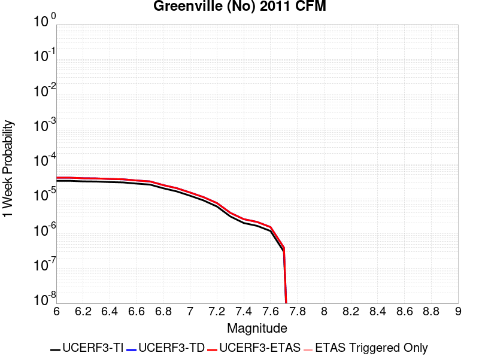 | 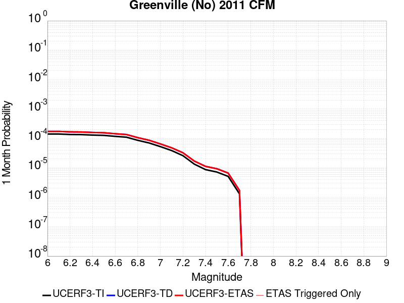 | 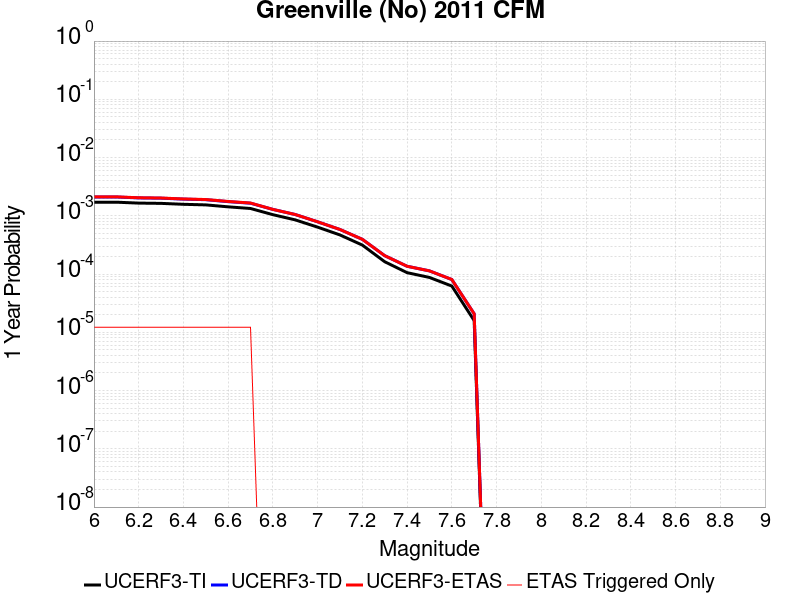 | 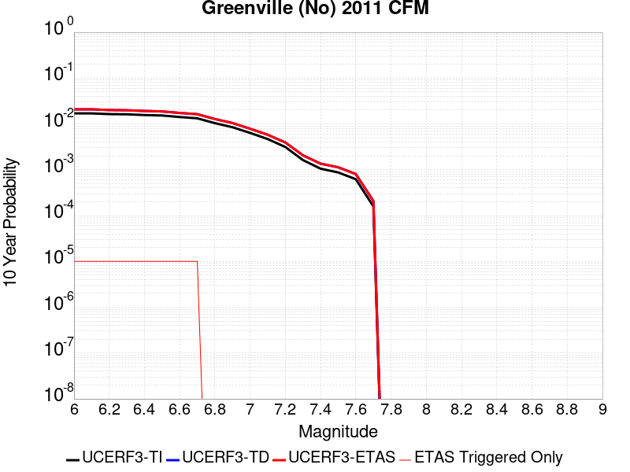 |

| Magnitude | 1 wk TI Prob | 1 wk TD Prob | 1 wk ETAS Prob | 1 wk ETAS/TD Gain | 1 wk ETAS Triggered Only | 1 mo TI Prob | 1 mo TD Prob | 1 mo ETAS Prob | 1 mo ETAS/TD Gain | 1 mo ETAS Triggered Only | 1 yr TI Prob | 1 yr TD Prob | 1 yr ETAS Prob | 1 yr ETAS/TD Gain | 1 yr ETAS Triggered Only | 10 yr TI Prob | 10 yr TD Prob | 10 yr ETAS Prob | 10 yr ETAS/TD Gain | 10 yr ETAS Triggered Only |
|-----|-----|-----|-----|-----|-----|-----|-----|-----|-----|-----|-----|-----|-----|-----|-----|-----|-----|-----|-----|-----|
| 6.0 | 3.286654E-5 | 4.036671E-5 | 4.036671E-5 | 1.0 | 0.0 | 1.4084899E-4 | 1.7298892E-4 | 1.7298892E-4 | 1.0 | 0.0 | 0.0017134876 | 0.0021041434 | 0.0021141223 | 1.0047425 | 1.0E-5 | 0.017003356 | 0.02084759 | 0.02085738 | 1.0004697 | 1.0E-5 |
| 6.1 | 3.286654E-5 | 4.036671E-5 | 4.036671E-5 | 1.0 | 0.0 | 1.4084899E-4 | 1.7298892E-4 | 1.7298892E-4 | 1.0 | 0.0 | 0.0017134876 | 0.0021041434 | 0.0021141223 | 1.0047425 | 1.0E-5 | 0.017003356 | 0.02084759 | 0.02085738 | 1.0004697 | 1.0E-5 |
| 6.2 | 3.1697953E-5 | 3.8929615E-5 | 3.8929615E-5 | 1.0 | 0.0 | 1.358413E-4 | 1.6683072E-4 | 1.6683072E-4 | 1.0 | 0.0 | 0.0016526132 | 0.0020293088 | 0.0020392886 | 1.0049177 | 1.0E-5 | 0.01640377 | 0.020112982 | 0.020122781 | 1.0004872 | 1.0E-5 |
| 6.3 | 3.1363317E-5 | 3.8518487E-5 | 3.8518487E-5 | 1.0 | 0.0 | 1.344073E-4 | 1.6506898E-4 | 1.6506898E-4 | 1.0 | 0.0 | 0.0016351803 | 0.0020078993 | 0.0020178794 | 1.0049703 | 1.0E-5 | 0.016232004 | 0.019902749 | 0.01991255 | 1.0004925 | 1.0E-5 |
| 6.4 | 3.0228604E-5 | 3.712561E-5 | 3.712561E-5 | 1.0 | 0.0 | 1.2954473E-4 | 1.5910025E-4 | 1.5910025E-4 | 1.0 | 0.0 | 0.0015760659 | 0.001935361 | 0.0019453416 | 1.005157 | 1.0E-5 | 0.015649348 | 0.01919009 | 0.019199898 | 1.000511 | 1.0E-5 |
| 6.5 | 2.9537814E-5 | 3.628106E-5 | 3.628106E-5 | 1.0 | 0.0 | 1.2658449E-4 | 1.5548118E-4 | 1.5548118E-4 | 1.0 | 0.0 | 0.0015400766 | 0.0018913761 | 0.0019013572 | 1.0052772 | 1.0E-5 | 0.01529447 | 0.018757751 | 0.018767564 | 1.0005231 | 1.0E-5 |
| 6.6 | 2.7345395E-5 | 3.359038E-5 | 3.359038E-5 | 1.0 | 0.0 | 1.1718928E-4 | 1.43951E-4 | 1.43951E-4 | 1.0 | 0.0 | 0.0014258457 | 0.0017512254 | 0.0017612079 | 1.0057002 | 1.0E-5 | 0.014167317 | 0.017378574 | 0.0173884 | 1.0005654 | 1.0E-5 |
| 6.7 | 2.5615784E-5 | 3.1567277E-5 | 3.1567277E-5 | 1.0 | 0.0 | 1.09777306E-4 | 1.352815E-4 | 1.352815E-4 | 1.0 | 0.0 | 0.0013357193 | 0.0016458385 | 0.0016558219 | 1.006066 | 1.0E-5 | 0.013277191 | 0.016340667 | 0.016350504 | 1.000602 | 1.0E-5 |
| 6.8 | 2.0059057E-5 | 2.4712264E-5 | 2.4712264E-5 | 1.0 | 0.0 | 8.596455E-5 | 1.059055E-4 | 1.059055E-4 | 1.0 | 0.0 | 0.0010461159 | 0.001288653 | 0.001288653 | 1.0 | 0.0 | 0.0104120495 | 0.012814328 | 0.012814328 | 1.0 | 0.0 |
| 6.9 | 1.6321746E-5 | 2.018486E-5 | 2.018486E-5 | 1.0 | 0.0 | 6.9948466E-5 | 8.6503744E-5 | 8.6503744E-5 | 1.0 | 0.0 | 8.5128983E-4 | 0.0010526866 | 0.0010526866 | 1.0 | 0.0 | 0.008480361 | 0.010479037 | 0.010479037 | 1.0 | 0.0 |
| 7.0 | 1.22527645E-5 | 1.5135808E-5 | 1.5135808E-5 | 1.0 | 0.0 | 5.2510793E-5 | 6.486616E-5 | 6.486616E-5 | 1.0 | 0.0 | 6.3913135E-4 | 7.894636E-4 | 7.894636E-4 | 1.0 | 0.0 | 0.0063729626 | 0.007867573 | 0.007867573 | 1.0 | 0.0 |
| 7.1 | 8.996482E-6 | 1.1165116E-5 | 1.1165116E-5 | 1.0 | 0.0 | 3.8555783E-5 | 4.784963E-5 | 4.784963E-5 | 1.0 | 0.0 | 4.6931554E-4 | 5.8241474E-4 | 5.8241474E-4 | 1.0 | 0.0 | 0.004683256 | 0.0058096354 | 0.0058096354 | 1.0 | 0.0 |
| 7.2 | 6.0273087E-6 | 7.569621E-6 | 7.569621E-6 | 1.0 | 0.0 | 2.5831067E-5 | 3.2440836E-5 | 3.2440836E-5 | 1.0 | 0.0 | 3.1444785E-4 | 3.9489628E-4 | 3.9489628E-4 | 1.0 | 0.0 | 0.0031400328 | 0.003942419 | 0.003942419 | 1.0 | 0.0 |
| 7.3 | 3.1209995E-6 | 3.9664565E-6 | 3.9664565E-6 | 1.0 | 0.0 | 1.3375643E-5 | 1.6998989E-5 | 1.6998989E-5 | 1.0 | 0.0 | 1.6283628E-4 | 2.069432E-4 | 2.069432E-4 | 1.0 | 0.0 | 0.0016271701 | 0.0020678395 | 0.0020678395 | 1.0 | 0.0 |
| 7.4 | 2.0254208E-6 | 2.6096657E-6 | 2.6096657E-6 | 1.0 | 0.0 | 8.680347E-6 | 1.1184234E-5 | 1.1184234E-5 | 1.0 | 0.0 | 1.0567809E-4 | 1.361596E-4 | 1.361596E-4 | 1.0 | 0.0 | 0.0010562785 | 0.0013611179 | 0.0013611179 | 1.0 | 0.0 |
| 7.5 | 1.6763418E-6 | 2.1734072E-6 | 2.1734072E-6 | 1.0 | 0.0 | 7.184302E-6 | 9.314569E-6 | 9.314569E-6 | 1.0 | 0.0 | 8.746537E-5 | 1.1339904E-4 | 1.1339904E-4 | 1.0 | 0.0 | 8.743095E-4 | 0.0011337536 | 0.0011337536 | 1.0 | 0.0 |
| 7.6 | 1.1935462E-6 | 1.5458915E-6 | 1.5458915E-6 | 1.0 | 0.0 | 5.115188E-6 | 6.625233E-6 | 6.625233E-6 | 1.0 | 0.0 | 6.2275634E-5 | 8.0659265E-5 | 8.0659265E-5 | 1.0 | 0.0 | 6.2258187E-4 | 8.0655375E-4 | 8.0655375E-4 | 1.0 | 0.0 |
| 7.7 | 3.0464201E-7 | 3.9848686E-7 | 3.9848686E-7 | 1.0 | 0.0 | 1.3056081E-6 | 1.7077997E-6 | 1.7077997E-6 | 1.0 | 0.0 | 1.589566E-5 | 2.0792268E-5 | 2.0792268E-5 | 1.0 | 0.0 | 1.5894524E-4 | 2.0793018E-4 | 2.0793018E-4 | 1.0 | 0.0 |

## San Luis Range 2011 CFM
*[(top)](#table-of-contents)*

| 1 Week | 1 Month | 1 Year | 10 Year |
|-----|-----|-----|-----|
| 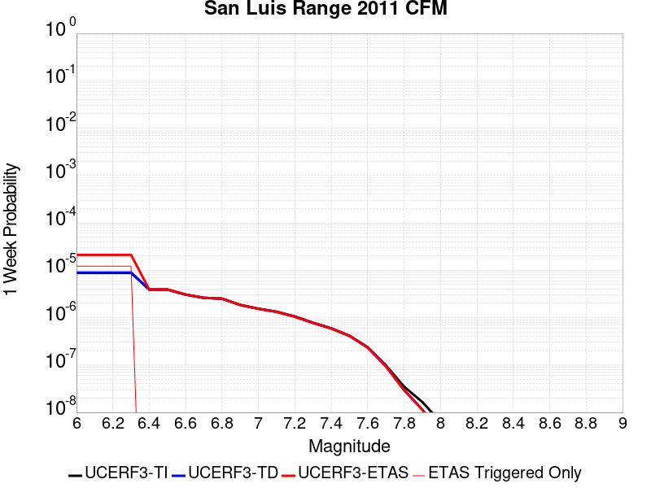 | 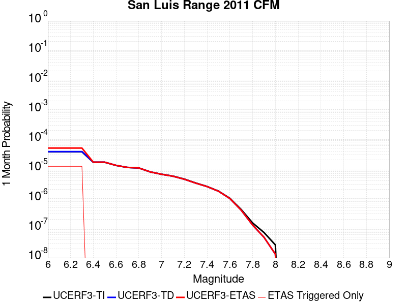 | 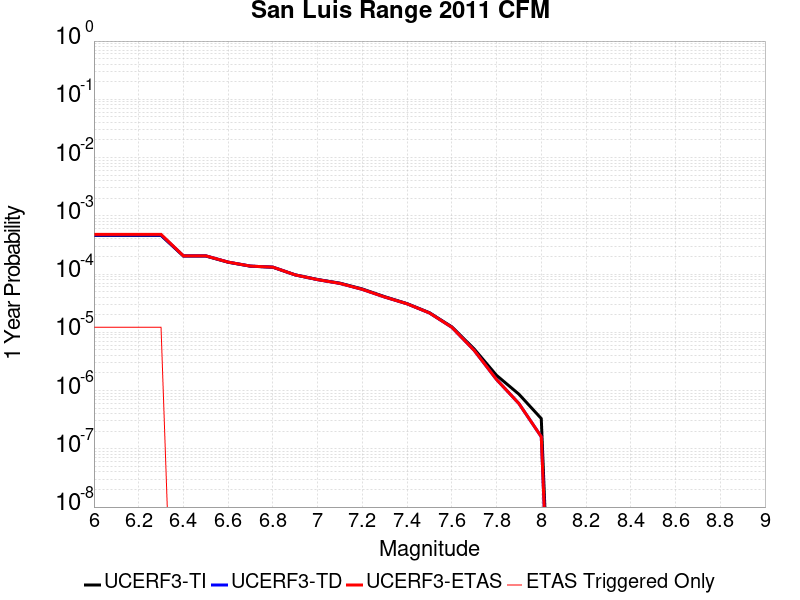 | 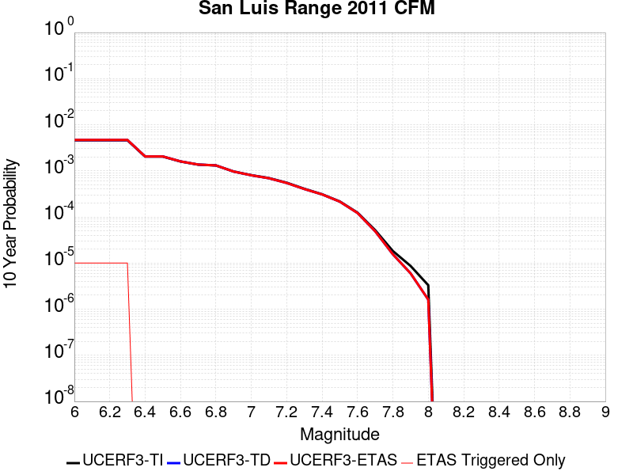 |

| Magnitude | 1 wk TI Prob | 1 wk TD Prob | 1 wk ETAS Prob | 1 wk ETAS/TD Gain | 1 wk ETAS Triggered Only | 1 mo TI Prob | 1 mo TD Prob | 1 mo ETAS Prob | 1 mo ETAS/TD Gain | 1 mo ETAS Triggered Only | 1 yr TI Prob | 1 yr TD Prob | 1 yr ETAS Prob | 1 yr ETAS/TD Gain | 1 yr ETAS Triggered Only | 10 yr TI Prob | 10 yr TD Prob | 10 yr ETAS Prob | 10 yr ETAS/TD Gain | 10 yr ETAS Triggered Only |
|-----|-----|-----|-----|-----|-----|-----|-----|-----|-----|-----|-----|-----|-----|-----|-----|-----|-----|-----|-----|-----|
| 6.0 | 8.8368415E-6 | 8.965455E-6 | 1.8965366E-5 | 2.1153824 | 1.0E-5 | 3.787163E-5 | 3.8422855E-5 | 4.8422473E-5 | 1.2602518 | 1.0E-5 | 4.609895E-4 | 4.6770574E-4 | 4.7770108E-4 | 1.021371 | 1.0E-5 | 0.0046003438 | 0.004667997 | 0.00467795 | 1.0021323 | 1.0E-5 |
| 6.1 | 8.8368415E-6 | 8.965455E-6 | 1.8965366E-5 | 2.1153824 | 1.0E-5 | 3.787163E-5 | 3.8422855E-5 | 4.8422473E-5 | 1.2602518 | 1.0E-5 | 4.609895E-4 | 4.6770574E-4 | 4.7770108E-4 | 1.021371 | 1.0E-5 | 0.0046003438 | 0.004667997 | 0.00467795 | 1.0021323 | 1.0E-5 |
| 6.2 | 8.8368415E-6 | 8.965455E-6 | 1.8965366E-5 | 2.1153824 | 1.0E-5 | 3.787163E-5 | 3.8422855E-5 | 4.8422473E-5 | 1.2602518 | 1.0E-5 | 4.609895E-4 | 4.6770574E-4 | 4.7770108E-4 | 1.021371 | 1.0E-5 | 0.0046003438 | 0.004667997 | 0.00467795 | 1.0021323 | 1.0E-5 |
| 6.3 | 8.8368415E-6 | 8.965455E-6 | 1.8965366E-5 | 2.1153824 | 1.0E-5 | 3.787163E-5 | 3.8422855E-5 | 4.8422473E-5 | 1.2602518 | 1.0E-5 | 4.609895E-4 | 4.6770574E-4 | 4.7770108E-4 | 1.021371 | 1.0E-5 | 0.0046003438 | 0.004667997 | 0.00467795 | 1.0021323 | 1.0E-5 |
| 6.4 | 3.9094193E-6 | 3.941204E-6 | 3.941204E-6 | 1.0 | 0.0 | 1.6754546E-5 | 1.6890766E-5 | 1.6890766E-5 | 1.0 | 0.0 | 2.039675E-4 | 2.0562594E-4 | 2.0562594E-4 | 1.0 | 0.0 | 0.0020378039 | 0.0020543856 | 0.0020543856 | 1.0 | 0.0 |
| 6.5 | 3.9094193E-6 | 3.941204E-6 | 3.941204E-6 | 1.0 | 0.0 | 1.6754546E-5 | 1.6890766E-5 | 1.6890766E-5 | 1.0 | 0.0 | 2.039675E-4 | 2.0562594E-4 | 2.0562594E-4 | 1.0 | 0.0 | 0.0020378039 | 0.0020543856 | 0.0020543856 | 1.0 | 0.0 |
| 6.6 | 3.0587726E-6 | 3.0753893E-6 | 3.0753893E-6 | 1.0 | 0.0 | 1.3108959E-5 | 1.3180174E-5 | 1.3180174E-5 | 1.0 | 0.0 | 1.595899E-4 | 1.6045693E-4 | 1.6045693E-4 | 1.0 | 0.0 | 0.0015947534 | 0.0016034227 | 0.0016034227 | 1.0 | 0.0 |
| 6.7 | 2.6160574E-6 | 2.6251284E-6 | 2.6251284E-6 | 1.0 | 0.0 | 1.1211626E-5 | 1.1250502E-5 | 1.1250502E-5 | 1.0 | 0.0 | 1.3649299E-4 | 1.3696631E-4 | 1.3696631E-4 | 1.0 | 0.0 | 0.0013640919 | 0.0013688251 | 0.0013688251 | 1.0 | 0.0 |
| 6.8 | 2.5110312E-6 | 2.5181412E-6 | 2.5181412E-6 | 1.0 | 0.0 | 1.0761518E-5 | 1.079199E-5 | 1.079199E-5 | 1.0 | 0.0 | 1.310136E-4 | 1.313846E-4 | 1.313846E-4 | 1.0 | 0.0 | 0.0013093639 | 0.0013130752 | 0.0013130752 | 1.0 | 0.0 |
| 6.9 | 1.8564405E-6 | 1.852488E-6 | 1.852488E-6 | 1.0 | 0.0 | 7.95615E-6 | 7.93921E-6 | 7.93921E-6 | 1.0 | 0.0 | 9.686181E-5 | 9.665562E-5 | 9.665562E-5 | 1.0 | 0.0 | 9.68196E-4 | 9.6613786E-4 | 9.6613786E-4 | 1.0 | 0.0 |
| 7.0 | 1.546127E-6 | 1.5369549E-6 | 1.5369549E-6 | 1.0 | 0.0 | 6.626242E-6 | 6.5869326E-6 | 6.5869326E-6 | 1.0 | 0.0 | 8.06715E-5 | 8.019296E-5 | 8.019296E-5 | 1.0 | 0.0 | 8.0642226E-4 | 8.016409E-4 | 8.016409E-4 | 1.0 | 0.0 |
| 7.1 | 1.3368208E-6 | 1.3235336E-6 | 1.3235336E-6 | 1.0 | 0.0 | 5.7292195E-6 | 5.6722747E-6 | 5.6722747E-6 | 1.0 | 0.0 | 6.975101E-5 | 6.905776E-5 | 6.905776E-5 | 1.0 | 0.0 | 6.972912E-4 | 6.903635E-4 | 6.903635E-4 | 1.0 | 0.0 |
| 7.2 | 1.0623363E-6 | 1.0454378E-6 | 1.0454378E-6 | 1.0 | 0.0 | 4.5528623E-6 | 4.4804397E-6 | 4.4804397E-6 | 1.0 | 0.0 | 5.5429686E-5 | 5.4547992E-5 | 5.4547992E-5 | 1.0 | 0.0 | 5.5415864E-4 | 5.453463E-4 | 5.453463E-4 | 1.0 | 0.0 |
| 7.3 | 7.831679E-7 | 7.727399E-7 | 7.727399E-7 | 1.0 | 0.0 | 3.3564295E-6 | 3.3117383E-6 | 3.3117383E-6 | 1.0 | 0.0 | 4.086376E-5 | 4.031967E-5 | 4.031967E-5 | 1.0 | 0.0 | 4.0856248E-4 | 4.0312367E-4 | 4.0312367E-4 | 1.0 | 0.0 |
| 7.4 | 5.9558846E-7 | 5.910646E-7 | 5.910646E-7 | 1.0 | 0.0 | 2.5525194E-6 | 2.5331315E-6 | 2.5331315E-6 | 1.0 | 0.0 | 3.107648E-5 | 3.084044E-5 | 3.084044E-5 | 1.0 | 0.0 | 3.1072134E-4 | 3.083617E-4 | 3.083617E-4 | 1.0 | 0.0 |
| 7.5 | 4.1616502E-7 | 4.1196404E-7 | 4.1196404E-7 | 1.0 | 0.0 | 1.7835631E-6 | 1.765559E-6 | 1.765559E-6 | 1.0 | 0.0 | 2.1714664E-5 | 2.1495469E-5 | 2.1495469E-5 | 1.0 | 0.0 | 2.1712543E-4 | 2.1493394E-4 | 2.1493394E-4 | 1.0 | 0.0 |
| 7.6 | 2.3816014E-7 | 2.3376614E-7 | 2.3376614E-7 | 1.0 | 0.0 | 1.0206859E-6 | 1.0018545E-6 | 1.0018545E-6 | 1.0 | 0.0 | 1.242678E-5 | 1.219751E-5 | 1.219751E-5 | 1.0 | 0.0 | 1.2426086E-4 | 1.2196843E-4 | 1.2196843E-4 | 1.0 | 0.0 |
| 7.7 | 9.918777E-8 | 9.3868096E-8 | 9.3868096E-8 | 1.0 | 0.0 | 4.2509038E-7 | 4.022918E-7 | 4.022918E-7 | 1.0 | 0.0 | 5.1754632E-6 | 4.8978914E-6 | 4.8978914E-6 | 1.0 | 0.0 | 5.1753424E-5 | 4.897784E-5 | 4.897784E-5 | 1.0 | 0.0 |
| 7.8 | 3.4982556E-8 | 2.968672E-8 | 2.968672E-8 | 1.0 | 0.0 | 1.4992524E-7 | 1.272288E-7 | 1.272288E-7 | 1.0 | 0.0 | 1.8253382E-6 | 1.5490094E-6 | 1.5490094E-6 | 1.0 | 0.0 | 1.8253233E-5 | 1.5489988E-5 | 1.5489988E-5 | 1.0 | 0.0 |
| 7.9 | 1.6624908E-8 | 1.1476994E-8 | 1.1476994E-8 | 1.0 | 0.0 | 7.12496E-8 | 4.9187115E-8 | 4.9187115E-8 | 1.0 | 0.0 | 8.6746354E-7 | 5.988529E-7 | 5.988529E-7 | 1.0 | 0.0 | 8.674601E-6 | 5.9885133E-6 | 5.9885133E-6 | 1.0 | 0.0 |
| 8.0 | 6.3352315E-9 | 3.0886564E-9 | 3.0886564E-9 | 1.0 | 0.0 | 2.715099E-8 | 1.32370985E-8 | 1.32370985E-8 | 1.0 | 0.0 | 3.3056327E-7 | 1.6116167E-7 | 1.6116167E-7 | 1.0 | 0.0 | 3.3056278E-6 | 1.6116155E-6 | 1.6116155E-6 | 1.0 | 0.0 |

## Hunting Creek - Berryessa 2011 CFM
*[(top)](#table-of-contents)*

| 1 Week | 1 Month | 1 Year | 10 Year |
|-----|-----|-----|-----|
| 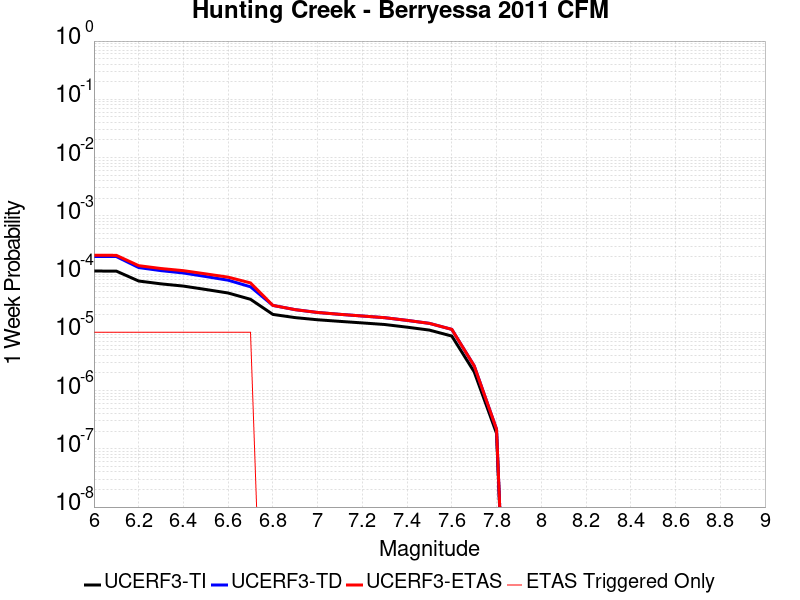 | 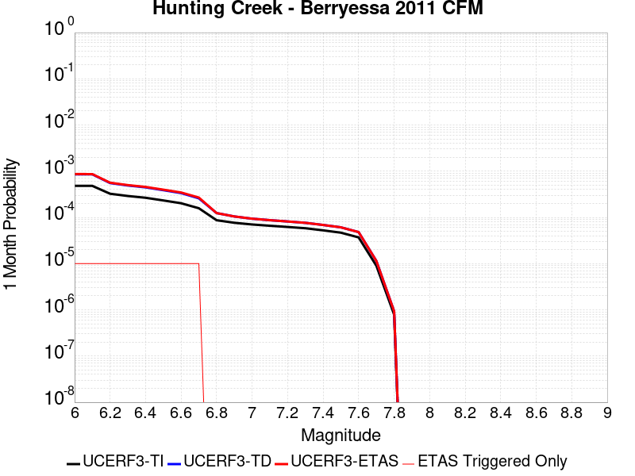 | 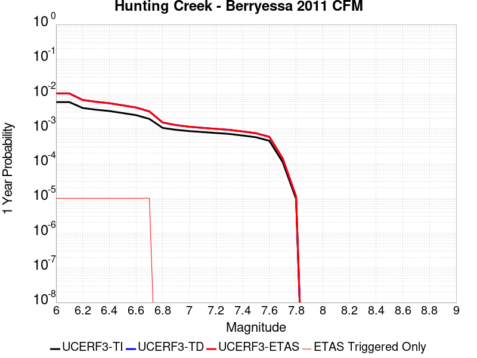 | 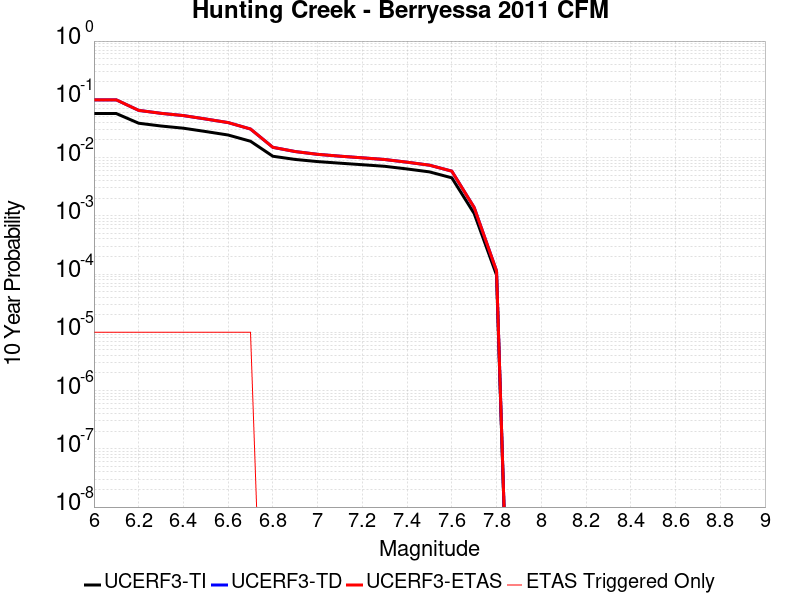 |

| Magnitude | 1 wk TI Prob | 1 wk TD Prob | 1 wk ETAS Prob | 1 wk ETAS/TD Gain | 1 wk ETAS Triggered Only | 1 mo TI Prob | 1 mo TD Prob | 1 mo ETAS Prob | 1 mo ETAS/TD Gain | 1 mo ETAS Triggered Only | 1 yr TI Prob | 1 yr TD Prob | 1 yr ETAS Prob | 1 yr ETAS/TD Gain | 1 yr ETAS Triggered Only | 10 yr TI Prob | 10 yr TD Prob | 10 yr ETAS Prob | 10 yr ETAS/TD Gain | 10 yr ETAS Triggered Only |
|-----|-----|-----|-----|-----|-----|-----|-----|-----|-----|-----|-----|-----|-----|-----|-----|-----|-----|-----|-----|-----|
| 6.0 | 1.1270982E-4 | 2.0028367E-4 | 2.1028167E-4 | 1.0499191 | 1.0E-5 | 4.8295266E-4 | 8.579912E-4 | 8.679827E-4 | 1.0116451 | 1.0E-5 | 0.0058641075 | 0.010386173 | 0.010396069 | 1.0009528 | 1.0E-5 | 0.057117578 | 0.09804048 | 0.0980495 | 1.000092 | 1.0E-5 |
| 6.1 | 1.1239393E-4 | 1.9976508E-4 | 2.097631E-4 | 1.0500488 | 1.0E-5 | 4.8159933E-4 | 8.557703E-4 | 8.657618E-4 | 1.0116754 | 1.0E-5 | 0.0058477195 | 0.010359417 | 0.010369313 | 1.0009553 | 1.0E-5 | 0.056962132 | 0.09779895 | 0.09780797 | 1.0000923 | 1.0E-5 |
| 6.2 | 7.596265E-5 | 1.2933646E-4 | 1.3933517E-4 | 1.0773077 | 1.0E-5 | 3.2551357E-4 | 5.5415573E-4 | 5.6415016E-4 | 1.0180354 | 1.0E-5 | 0.0039559277 | 0.0067213587 | 0.006731292 | 1.0014778 | 1.0E-5 | 0.038862433 | 0.06459229 | 0.064601645 | 1.0001448 | 1.0E-5 |
| 6.3 | 6.78794E-5 | 1.1448377E-4 | 1.2448263E-4 | 1.0873386 | 1.0E-5 | 2.9087928E-4 | 4.9052597E-4 | 5.0052104E-4 | 1.0203763 | 1.0E-5 | 0.003535705 | 0.005952661 | 0.0059626014 | 1.0016699 | 1.0E-5 | 0.034799766 | 0.057466213 | 0.057475638 | 1.000164 | 1.0E-5 |
| 6.4 | 6.2165134E-5 | 1.0434825E-4 | 1.143472E-4 | 1.0958229 | 1.0E-5 | 2.6639478E-4 | 4.4711027E-4 | 4.5710578E-4 | 1.0223558 | 1.0E-5 | 0.0032385332 | 0.0054274183 | 0.005437364 | 1.0018325 | 1.0E-5 | 0.03191742 | 0.05255138 | 0.052560855 | 1.0001802 | 1.0E-5 |
| 6.5 | 5.4368087E-5 | 9.070258E-5 | 1.00701676E-4 | 1.1102405 | 1.0E-5 | 2.3298527E-4 | 3.886537E-4 | 3.986498E-4 | 1.0257199 | 1.0E-5 | 0.0028329059 | 0.0047197016 | 0.0047296546 | 1.0021088 | 1.0E-5 | 0.027970633 | 0.045881182 | 0.045890722 | 1.0002079 | 1.0E-5 |
| 6.6 | 4.729947E-5 | 7.847101E-5 | 8.8470224E-5 | 1.1274256 | 1.0E-5 | 2.0269625E-4 | 3.3624718E-4 | 3.4624382E-4 | 1.0297301 | 1.0E-5 | 0.002465034 | 0.004084746 | 0.004094705 | 1.0024382 | 1.0E-5 | 0.02437869 | 0.03985269 | 0.03986229 | 1.0002409 | 1.0E-5 |
| 6.7 | 3.6875328E-5 | 6.0443555E-5 | 7.044295E-5 | 1.1654336 | 1.0E-5 | 1.5802756E-4 | 2.5900968E-4 | 2.6900708E-4 | 1.0385985 | 1.0E-5 | 0.0019222875 | 0.0031482724 | 0.0031582408 | 1.0031663 | 1.0E-5 | 0.019057442 | 0.03089371 | 0.0309034 | 1.0003136 | 1.0E-5 |
| 6.8 | 2.0292036E-5 | 2.8976721E-5 | 2.8976721E-5 | 1.0 | 0.0 | 8.6962966E-5 | 1.2417998E-4 | 1.2417998E-4 | 1.0 | 0.0 | 0.0010582599 | 0.0015108302 | 0.0015108302 | 1.0 | 0.0 | 0.010532344 | 0.0149790775 | 0.0149790775 | 1.0 | 0.0 |
| 6.9 | 1.7871042E-5 | 2.4472653E-5 | 2.4472653E-5 | 1.0 | 0.0 | 7.658793E-5 | 1.04878585E-4 | 1.04878585E-4 | 1.0 | 0.0 | 9.320591E-4 | 0.0012761486 | 0.0012761486 | 1.0 | 0.0 | 0.009281595 | 0.012680395 | 0.012680395 | 1.0 | 0.0 |
| 7.0 | 1.6415532E-5 | 2.1906566E-5 | 2.1906566E-5 | 1.0 | 0.0 | 7.035038E-5 | 9.388191E-5 | 9.388191E-5 | 1.0 | 0.0 | 8.561793E-4 | 0.0011424144 | 0.0011424144 | 1.0 | 0.0 | 0.008528882 | 0.011365017 | 0.011365017 | 1.0 | 0.0 |
| 7.1 | 1.5409885E-5 | 2.0346588E-5 | 2.0346588E-5 | 1.0 | 0.0 | 6.6040695E-5 | 8.719676E-5 | 8.719676E-5 | 1.0 | 0.0 | 8.0374884E-4 | 0.0010611062 | 0.0010611062 | 1.0 | 0.0 | 0.00800848 | 0.010560924 | 0.010560924 | 1.0 | 0.0 |
| 7.2 | 1.4497423E-5 | 1.905519E-5 | 1.905519E-5 | 1.0 | 0.0 | 6.213033E-5 | 8.166256E-5 | 8.166256E-5 | 1.0 | 0.0 | 7.5617427E-4 | 9.937913E-4 | 9.937913E-4 | 1.0 | 0.0 | 0.0075360634 | 0.00989425 | 0.00989425 | 1.0 | 0.0 |
| 7.3 | 1.3615175E-5 | 1.7826347E-5 | 1.7826347E-5 | 1.0 | 0.0 | 5.8349444E-5 | 7.6396405E-5 | 7.6396405E-5 | 1.0 | 0.0 | 7.101729E-4 | 9.297323E-4 | 9.297323E-4 | 1.0 | 0.0 | 0.0070790765 | 0.009259124 | 0.009259124 | 1.0 | 0.0 |
| 7.4 | 1.2252825E-5 | 1.6026455E-5 | 1.6026455E-5 | 1.0 | 0.0 | 5.251105E-5 | 6.868302E-5 | 6.868302E-5 | 1.0 | 0.0 | 6.391345E-4 | 8.3589775E-4 | 8.3589775E-4 | 1.0 | 0.0 | 0.0063729943 | 0.008328172 | 0.008328172 | 1.0 | 0.0 |
| 7.5 | 1.0913301E-5 | 1.4241286E-5 | 1.4241286E-5 | 1.0 | 0.0 | 4.6770452E-5 | 6.103267E-5 | 6.103267E-5 | 1.0 | 0.0 | 5.6928146E-4 | 7.428222E-4 | 7.428222E-4 | 1.0 | 0.0 | 0.0056782532 | 0.0074039865 | 0.0074039865 | 1.0 | 0.0 |
| 7.6 | 8.623192E-6 | 1.12347825E-5 | 1.12347825E-5 | 1.0 | 0.0 | 3.6956015E-5 | 4.8148195E-5 | 4.8148195E-5 | 1.0 | 0.0 | 4.4984656E-4 | 5.8604917E-4 | 5.8604917E-4 | 1.0 | 0.0 | 0.00448937 | 0.005845504 | 0.005845504 | 1.0 | 0.0 |
| 7.7 | 2.0993634E-6 | 2.66264E-6 | 2.66264E-6 | 1.0 | 0.0 | 8.997241E-6 | 1.1411265E-5 | 1.1411265E-5 | 1.0 | 0.0 | 1.09535904E-4 | 1.3892337E-4 | 1.3892337E-4 | 1.0 | 0.0 | 0.0010948193 | 0.0013883994 | 0.0013883994 | 1.0 | 0.0 |
| 7.8 | 1.8428308E-7 | 2.1674624E-7 | 2.1674624E-7 | 1.0 | 0.0 | 7.897844E-7 | 9.289122E-7 | 9.289122E-7 | 1.0 | 0.0 | 9.615583E-6 | 1.130945E-5 | 1.130945E-5 | 1.0 | 0.0 | 9.615166E-5 | 1.1308173E-4 | 1.1308173E-4 | 1.0 | 0.0 |

## Compton
*[(top)](#table-of-contents)*

| 1 Week | 1 Month | 1 Year | 10 Year |
|-----|-----|-----|-----|
|  |  |  |  |

| Magnitude | 1 wk TI Prob | 1 wk TD Prob | 1 wk ETAS Prob | 1 wk ETAS/TD Gain | 1 wk ETAS Triggered Only | 1 mo TI Prob | 1 mo TD Prob | 1 mo ETAS Prob | 1 mo ETAS/TD Gain | 1 mo ETAS Triggered Only | 1 yr TI Prob | 1 yr TD Prob | 1 yr ETAS Prob | 1 yr ETAS/TD Gain | 1 yr ETAS Triggered Only | 10 yr TI Prob | 10 yr TD Prob | 10 yr ETAS Prob | 10 yr ETAS/TD Gain | 10 yr ETAS Triggered Only |
|-----|-----|-----|-----|-----|-----|-----|-----|-----|-----|-----|-----|-----|-----|-----|-----|-----|-----|-----|-----|-----|
| 6.0 | 1.06050875E-5 | 6.35892E-6 | 1.6358856E-5 | 2.5725842 | 1.0E-5 | 4.5449582E-5 | 2.7252245E-5 | 3.725197E-5 | 1.3669323 | 1.0E-5 | 5.5320817E-4 | 3.3174842E-4 | 3.4174512E-4 | 1.0301334 | 1.0E-5 | 0.0055183303 | 0.003312816 | 0.0033227827 | 1.0030086 | 1.0E-5 |
| 6.1 | 1.06050875E-5 | 6.35892E-6 | 1.6358856E-5 | 2.5725842 | 1.0E-5 | 4.5449582E-5 | 2.7252245E-5 | 3.725197E-5 | 1.3669323 | 1.0E-5 | 5.5320817E-4 | 3.3174842E-4 | 3.4174512E-4 | 1.0301334 | 1.0E-5 | 0.0055183303 | 0.003312816 | 0.0033227827 | 1.0030086 | 1.0E-5 |
| 6.2 | 1.06050875E-5 | 6.35892E-6 | 1.6358856E-5 | 2.5725842 | 1.0E-5 | 4.5449582E-5 | 2.7252245E-5 | 3.725197E-5 | 1.3669323 | 1.0E-5 | 5.5320817E-4 | 3.3174842E-4 | 3.4174512E-4 | 1.0301334 | 1.0E-5 | 0.0055183303 | 0.003312816 | 0.0033227827 | 1.0030086 | 1.0E-5 |
| 6.3 | 1.06050875E-5 | 6.35892E-6 | 1.6358856E-5 | 2.5725842 | 1.0E-5 | 4.5449582E-5 | 2.7252245E-5 | 3.725197E-5 | 1.3669323 | 1.0E-5 | 5.5320817E-4 | 3.3174842E-4 | 3.4174512E-4 | 1.0301334 | 1.0E-5 | 0.0055183303 | 0.003312816 | 0.0033227827 | 1.0030086 | 1.0E-5 |
| 6.4 | 1.06050875E-5 | 6.35892E-6 | 1.6358856E-5 | 2.5725842 | 1.0E-5 | 4.5449582E-5 | 2.7252245E-5 | 3.725197E-5 | 1.3669323 | 1.0E-5 | 5.5320817E-4 | 3.3174842E-4 | 3.4174512E-4 | 1.0301334 | 1.0E-5 | 0.0055183303 | 0.003312816 | 0.0033227827 | 1.0030086 | 1.0E-5 |
| 6.5 | 1.06050875E-5 | 6.35892E-6 | 1.6358856E-5 | 2.5725842 | 1.0E-5 | 4.5449582E-5 | 2.7252245E-5 | 3.725197E-5 | 1.3669323 | 1.0E-5 | 5.5320817E-4 | 3.3174842E-4 | 3.4174512E-4 | 1.0301334 | 1.0E-5 | 0.0055183303 | 0.003312816 | 0.0033227827 | 1.0030086 | 1.0E-5 |
| 6.6 | 1.06050875E-5 | 6.35892E-6 | 1.6358856E-5 | 2.5725842 | 1.0E-5 | 4.5449582E-5 | 2.7252245E-5 | 3.725197E-5 | 1.3669323 | 1.0E-5 | 5.5320817E-4 | 3.3174842E-4 | 3.4174512E-4 | 1.0301334 | 1.0E-5 | 0.0055183303 | 0.003312816 | 0.0033227827 | 1.0030086 | 1.0E-5 |
| 6.7 | 1.06050875E-5 | 6.35892E-6 | 1.6358856E-5 | 2.5725842 | 1.0E-5 | 4.5449582E-5 | 2.7252245E-5 | 3.725197E-5 | 1.3669323 | 1.0E-5 | 5.5320817E-4 | 3.3174842E-4 | 3.4174512E-4 | 1.0301334 | 1.0E-5 | 0.0055183303 | 0.003312816 | 0.0033227827 | 1.0030086 | 1.0E-5 |
| 6.8 | 1.06050875E-5 | 6.35892E-6 | 1.6358856E-5 | 2.5725842 | 1.0E-5 | 4.5449582E-5 | 2.7252245E-5 | 3.725197E-5 | 1.3669323 | 1.0E-5 | 5.5320817E-4 | 3.3174842E-4 | 3.4174512E-4 | 1.0301334 | 1.0E-5 | 0.0055183303 | 0.003312816 | 0.0033227827 | 1.0030086 | 1.0E-5 |
| 6.9 | 1.06050875E-5 | 6.35892E-6 | 1.6358856E-5 | 2.5725842 | 1.0E-5 | 4.5449582E-5 | 2.7252245E-5 | 3.725197E-5 | 1.3669323 | 1.0E-5 | 5.5320817E-4 | 3.3174842E-4 | 3.4174512E-4 | 1.0301334 | 1.0E-5 | 0.0055183303 | 0.003312816 | 0.0033227827 | 1.0030086 | 1.0E-5 |
| 7.0 | 7.672486E-6 | 4.272077E-6 | 1.4272035E-5 | 3.3407717 | 1.0E-5 | 3.288167E-5 | 1.8308778E-5 | 2.8308594E-5 | 1.5461761 | 1.0E-5 | 4.0026082E-4 | 2.2288719E-4 | 2.3288497E-4 | 1.0448557 | 1.0E-5 | 0.0039954064 | 0.0022266984 | 0.0022366764 | 1.004481 | 1.0E-5 |
| 7.1 | 7.163992E-6 | 3.883783E-6 | 1.3883744E-5 | 3.574799 | 1.0E-5 | 3.0702464E-5 | 1.664468E-5 | 2.6644515E-5 | 1.6007825 | 1.0E-5 | 3.7373835E-4 | 2.0263072E-4 | 2.126287E-4 | 1.0493408 | 1.0E-5 | 0.0037311043 | 0.0020245167 | 0.0020344963 | 1.0049294 | 1.0E-5 |
| 7.2 | 6.3689185E-6 | 3.3101053E-6 | 1.3310072E-5 | 4.021042 | 1.0E-5 | 2.729508E-5 | 1.4186091E-5 | 2.4185949E-5 | 1.7049059 | 1.0E-5 | 3.322669E-4 | 1.7270239E-4 | 1.8270066E-4 | 1.057893 | 1.0E-5 | 0.0033177056 | 0.0017257235 | 0.0017357062 | 1.0057846 | 1.0E-5 |
| 7.3 | 4.4987873E-6 | 2.4480198E-6 | 1.2447996E-5 | 5.084924 | 1.0E-5 | 1.9280375E-5 | 1.0491473E-5 | 2.0491369E-5 | 1.953145 | 1.0E-5 | 2.3471327E-4 | 1.2772651E-4 | 1.3772523E-4 | 1.0782822 | 1.0E-5 | 0.002344655 | 0.0012765612 | 0.0012865484 | 1.0078236 | 1.0E-5 |
| 7.4 | 2.987296E-6 | 1.7394043E-6 | 1.17393865E-5 | 6.7490845 | 1.0E-5 | 1.2802635E-5 | 7.4545687E-6 | 1.7454495E-5 | 2.3414493 | 1.0E-5 | 1.5586092E-4 | 9.075565E-5 | 1.0075475E-4 | 1.110176 | 1.0E-5 | 0.0015575165 | 9.071917E-4 | 9.171826E-4 | 1.011013 | 1.0E-5 |
| 7.5 | 2.4111696E-6 | 1.4471991E-6 | 1.1447185E-5 | 7.909889 | 1.0E-5 | 1.0333543E-5 | 6.2022677E-6 | 1.6202206E-5 | 2.6123035 | 1.0E-5 | 1.2580362E-4 | 7.551004E-5 | 8.550928E-5 | 1.1324227 | 1.0E-5 | 0.0012573242 | 7.548485E-4 | 7.648409E-4 | 1.0132377 | 1.0E-5 |
| 7.6 | 1.8783096E-6 | 1.1360306E-6 | 1.113602E-5 | 9.802569 | 1.0E-5 | 8.049874E-6 | 4.868694E-6 | 1.4868645E-5 | 3.053929 | 1.0E-5 | 9.8002805E-5 | 5.9274775E-5 | 6.927418E-5 | 1.1686958 | 1.0E-5 | 9.795959E-4 | 5.925936E-4 | 6.025877E-4 | 1.016865 | 1.0E-5 |
| 7.7 | 6.6646817E-7 | 3.5601457E-7 | 3.5601457E-7 | 1.0 | 0.0 | 2.856289E-6 | 1.5257759E-6 | 1.5257759E-6 | 1.0 | 0.0 | 3.4774763E-5 | 1.8576176E-5 | 1.8576176E-5 | 1.0 | 0.0 | 3.4769322E-4 | 1.8574759E-4 | 1.8574759E-4 | 1.0 | 0.0 |
| 7.8 | 7.054689E-8 | 4.1342012E-8 | 4.1342012E-8 | 1.0 | 0.0 | 3.0234378E-7 | 1.7718004E-7 | 1.7718004E-7 | 1.0 | 0.0 | 3.6810293E-6 | 2.157165E-6 | 2.157165E-6 | 1.0 | 0.0 | 3.6809684E-5 | 2.157145E-5 | 2.157145E-5 | 1.0 | 0.0 |
| 7.9 | 7.420925E-9 | 4.0130637E-9 | 4.0130637E-9 | 1.0 | 0.0 | 3.1803964E-8 | 1.7198845E-8 | 1.7198845E-8 | 1.0 | 0.0 | 3.872132E-7 | 2.0939592E-7 | 2.0939592E-7 | 1.0 | 0.0 | 3.872125E-6 | 2.0939574E-6 | 2.0939574E-6 | 1.0 | 0.0 |

## Los Alamos extension
*[(top)](#table-of-contents)*

| 1 Week | 1 Month | 1 Year | 10 Year |
|-----|-----|-----|-----|
| 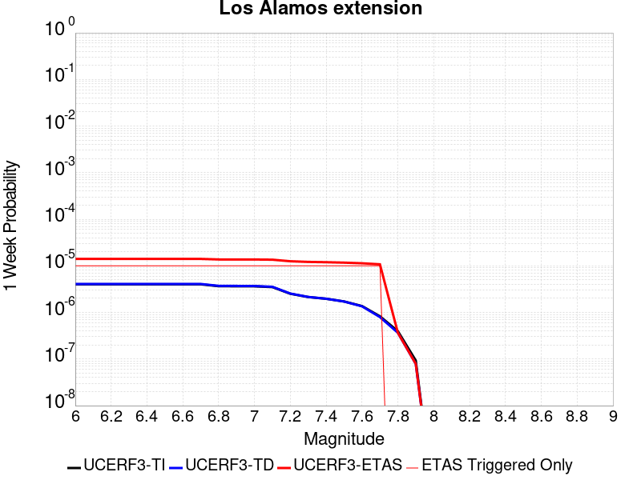 | 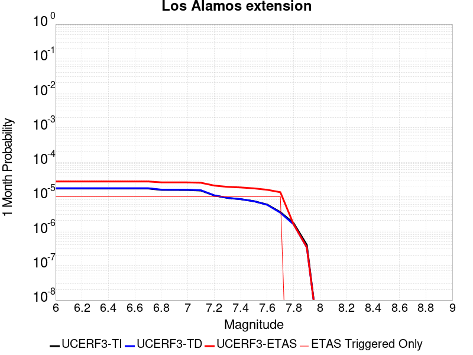 | 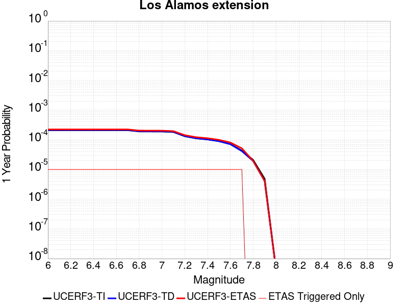 | 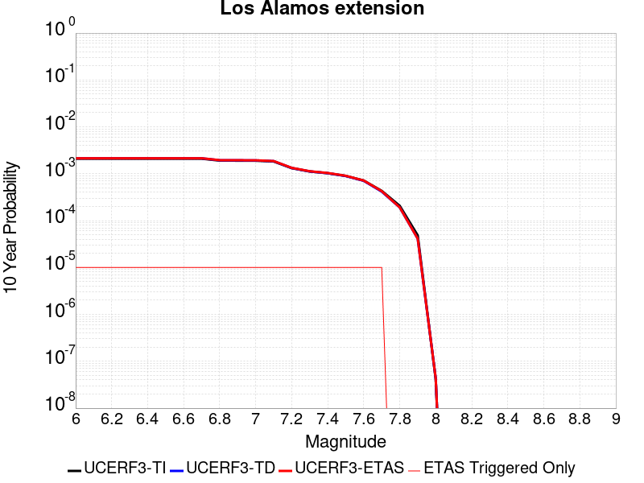 |

| Magnitude | 1 wk TI Prob | 1 wk TD Prob | 1 wk ETAS Prob | 1 wk ETAS/TD Gain | 1 wk ETAS Triggered Only | 1 mo TI Prob | 1 mo TD Prob | 1 mo ETAS Prob | 1 mo ETAS/TD Gain | 1 mo ETAS Triggered Only | 1 yr TI Prob | 1 yr TD Prob | 1 yr ETAS Prob | 1 yr ETAS/TD Gain | 1 yr ETAS Triggered Only | 10 yr TI Prob | 10 yr TD Prob | 10 yr ETAS Prob | 10 yr ETAS/TD Gain | 10 yr ETAS Triggered Only |
|-----|-----|-----|-----|-----|-----|-----|-----|-----|-----|-----|-----|-----|-----|-----|-----|-----|-----|-----|-----|-----|
| 6.0 | 4.0146506E-6 | 4.086164E-6 | 1.4086124E-5 | 3.4472728 | 1.0E-5 | 1.7205533E-5 | 1.7512022E-5 | 2.7511845E-5 | 1.5710263 | 1.0E-5 | 2.0945723E-4 | 2.1318911E-4 | 2.2318697E-4 | 1.0468967 | 1.0E-5 | 0.0020925992 | 0.002129955 | 0.0021399339 | 1.0046849 | 1.0E-5 |
| 6.1 | 4.0146506E-6 | 4.086164E-6 | 1.4086124E-5 | 3.4472728 | 1.0E-5 | 1.7205533E-5 | 1.7512022E-5 | 2.7511845E-5 | 1.5710263 | 1.0E-5 | 2.0945723E-4 | 2.1318911E-4 | 2.2318697E-4 | 1.0468967 | 1.0E-5 | 0.0020925992 | 0.002129955 | 0.0021399339 | 1.0046849 | 1.0E-5 |
| 6.2 | 4.0146506E-6 | 4.086164E-6 | 1.4086124E-5 | 3.4472728 | 1.0E-5 | 1.7205533E-5 | 1.7512022E-5 | 2.7511845E-5 | 1.5710263 | 1.0E-5 | 2.0945723E-4 | 2.1318911E-4 | 2.2318697E-4 | 1.0468967 | 1.0E-5 | 0.0020925992 | 0.002129955 | 0.0021399339 | 1.0046849 | 1.0E-5 |
| 6.3 | 4.0146506E-6 | 4.086164E-6 | 1.4086124E-5 | 3.4472728 | 1.0E-5 | 1.7205533E-5 | 1.7512022E-5 | 2.7511845E-5 | 1.5710263 | 1.0E-5 | 2.0945723E-4 | 2.1318911E-4 | 2.2318697E-4 | 1.0468967 | 1.0E-5 | 0.0020925992 | 0.002129955 | 0.0021399339 | 1.0046849 | 1.0E-5 |
| 6.4 | 4.0146506E-6 | 4.086164E-6 | 1.4086124E-5 | 3.4472728 | 1.0E-5 | 1.7205533E-5 | 1.7512022E-5 | 2.7511845E-5 | 1.5710263 | 1.0E-5 | 2.0945723E-4 | 2.1318911E-4 | 2.2318697E-4 | 1.0468967 | 1.0E-5 | 0.0020925992 | 0.002129955 | 0.0021399339 | 1.0046849 | 1.0E-5 |
| 6.5 | 4.0146506E-6 | 4.086164E-6 | 1.4086124E-5 | 3.4472728 | 1.0E-5 | 1.7205533E-5 | 1.7512022E-5 | 2.7511845E-5 | 1.5710263 | 1.0E-5 | 2.0945723E-4 | 2.1318911E-4 | 2.2318697E-4 | 1.0468967 | 1.0E-5 | 0.0020925992 | 0.002129955 | 0.0021399339 | 1.0046849 | 1.0E-5 |
| 6.6 | 4.0146506E-6 | 4.086164E-6 | 1.4086124E-5 | 3.4472728 | 1.0E-5 | 1.7205533E-5 | 1.7512022E-5 | 2.7511845E-5 | 1.5710263 | 1.0E-5 | 2.0945723E-4 | 2.1318911E-4 | 2.2318697E-4 | 1.0468967 | 1.0E-5 | 0.0020925992 | 0.002129955 | 0.0021399339 | 1.0046849 | 1.0E-5 |
| 6.7 | 4.0146506E-6 | 4.086164E-6 | 1.4086124E-5 | 3.4472728 | 1.0E-5 | 1.7205533E-5 | 1.7512022E-5 | 2.7511845E-5 | 1.5710263 | 1.0E-5 | 2.0945723E-4 | 2.1318911E-4 | 2.2318697E-4 | 1.0468967 | 1.0E-5 | 0.0020925992 | 0.002129955 | 0.0021399339 | 1.0046849 | 1.0E-5 |
| 6.8 | 3.6584688E-6 | 3.7188636E-6 | 1.3718826E-5 | 3.6889834 | 1.0E-5 | 1.5679057E-5 | 1.5937894E-5 | 2.5937736E-5 | 1.6274254 | 1.0E-5 | 1.9087581E-4 | 1.9402753E-4 | 2.0402558E-4 | 1.051529 | 1.0E-5 | 0.0019071194 | 0.0019386737 | 0.0019486542 | 1.0051482 | 1.0E-5 |
| 6.9 | 3.644631E-6 | 3.7045736E-6 | 1.3704536E-5 | 3.699356 | 1.0E-5 | 1.5619753E-5 | 1.5876652E-5 | 2.5876494E-5 | 1.6298457 | 1.0E-5 | 1.901539E-4 | 1.9328203E-4 | 2.032801E-4 | 1.0517279 | 1.0E-5 | 0.0018999127 | 0.0019312317 | 0.0019412123 | 1.0051681 | 1.0E-5 |
| 7.0 | 3.6318522E-6 | 3.691334E-6 | 1.3691297E-5 | 3.7090378 | 1.0E-5 | 1.5564989E-5 | 1.5819913E-5 | 2.5819754E-5 | 1.6321048 | 1.0E-5 | 1.8948725E-4 | 1.9259135E-4 | 2.0258942E-4 | 1.0519134 | 1.0E-5 | 0.0018932576 | 0.0019243368 | 0.0019343175 | 1.0051866 | 1.0E-5 |
| 7.1 | 3.5001724E-6 | 3.5554046E-6 | 1.3555369E-5 | 3.8126094 | 1.0E-5 | 1.5000653E-5 | 1.5237365E-5 | 2.5237212E-5 | 1.6562715 | 1.0E-5 | 1.8261763E-4 | 1.8550004E-4 | 1.9549819E-4 | 1.0538983 | 1.0E-5 | 0.0018246764 | 0.0018535426 | 0.0018635241 | 1.005385 | 1.0E-5 |
| 7.2 | 2.5204702E-6 | 2.5436989E-6 | 1.2543674E-5 | 4.931273 | 1.0E-5 | 1.080197E-5 | 1.0901522E-5 | 2.0901412E-5 | 1.9172932 | 1.0E-5 | 1.3150605E-4 | 1.3271799E-4 | 1.4271667E-4 | 1.0753378 | 1.0E-5 | 0.0013142825 | 0.001326393 | 0.0013363797 | 1.0075293 | 1.0E-5 |
| 7.3 | 2.1399692E-6 | 2.1501362E-6 | 1.2150114E-5 | 5.650858 | 1.0E-5 | 9.1712645E-6 | 9.2148375E-6 | 1.9214745E-5 | 2.0851963 | 1.0E-5 | 1.1165442E-4 | 1.121849E-4 | 1.2218377E-4 | 1.0891286 | 1.0E-5 | 0.0011159834 | 0.001121286 | 0.0011312747 | 1.0089084 | 1.0E-5 |
| 7.4 | 1.9660122E-6 | 1.970241E-6 | 1.1970222E-5 | 6.075511 | 1.0E-5 | 8.42574E-6 | 8.4438625E-6 | 1.8443778E-5 | 2.184282 | 1.0E-5 | 1.0257855E-4 | 1.0279921E-4 | 1.1279818E-4 | 1.097267 | 1.0E-5 | 0.0010253121 | 0.0010275197 | 0.0010375094 | 1.0097222 | 1.0E-5 |
| 7.5 | 1.7204633E-6 | 1.7151029E-6 | 1.1715086E-5 | 6.8305435 | 1.0E-5 | 7.373393E-6 | 7.3504207E-6 | 1.7350347E-5 | 2.3604562 | 1.0E-5 | 8.976737E-5 | 8.948772E-5 | 9.948683E-5 | 1.1117371 | 1.0E-5 | 8.9731114E-4 | 8.945199E-4 | 9.0451096E-4 | 1.0111692 | 1.0E-5 |
| 7.6 | 1.3717638E-6 | 1.3535872E-6 | 1.1353573E-5 | 8.387767 | 1.0E-5 | 5.878974E-6 | 5.801075E-6 | 1.5801017E-5 | 2.7238083 | 1.0E-5 | 7.157416E-5 | 7.062583E-5 | 8.062512E-5 | 1.1415813 | 1.0E-5 | 7.1551115E-4 | 7.0603646E-4 | 7.160294E-4 | 1.0141536 | 1.0E-5 |
| 7.7 | 8.272564E-7 | 7.9576733E-7 | 1.0795759E-5 | 13.566478 | 1.0E-5 | 3.5453797E-6 | 3.4104269E-6 | 1.3410393E-5 | 3.9321742 | 1.0E-5 | 4.3164142E-5 | 4.1521158E-5 | 5.1520743E-5 | 1.240831 | 1.0E-5 | 4.315576E-4 | 4.151342E-4 | 4.2513004E-4 | 1.0240786 | 1.0E-5 |
| 7.8 | 3.9708277E-7 | 3.671937E-7 | 3.671937E-7 | 1.0 | 0.0 | 1.7017821E-6 | 1.5736864E-6 | 1.5736864E-6 | 1.0 | 0.0 | 2.0719E-5 | 1.9159465E-5 | 1.9159465E-5 | 1.0 | 0.0 | 2.071707E-4 | 1.9157819E-4 | 1.9157819E-4 | 1.0 | 0.0 |
| 7.9 | 9.292528E-8 | 7.889168E-8 | 7.889168E-8 | 1.0 | 0.0 | 3.9825116E-7 | 3.3810713E-7 | 3.3810713E-7 | 1.0 | 0.0 | 4.848697E-6 | 4.1164467E-6 | 4.1164467E-6 | 1.0 | 0.0 | 4.8485912E-5 | 4.1163716E-5 | 4.1163716E-5 | 1.0 | 0.0 |
| 8.0 | 7.880441E-11 | 8.2353124E-11 | 8.2353124E-11 | 1.0 | 0.0 | 3.3773329E-10 | 3.52942E-10 | 3.52942E-10 | 1.0 | 0.0 | 4.1119033E-9 | 4.2970694E-9 | 4.2970694E-9 | 1.0 | 0.0 | 4.1119034E-8 | 4.2970694E-8 | 4.2970694E-8 | 1.0 | 0.0 |

## Earthquake Valley (No  Extension)
*[(top)](#table-of-contents)*

| 1 Week | 1 Month | 1 Year | 10 Year |
|-----|-----|-----|-----|
| 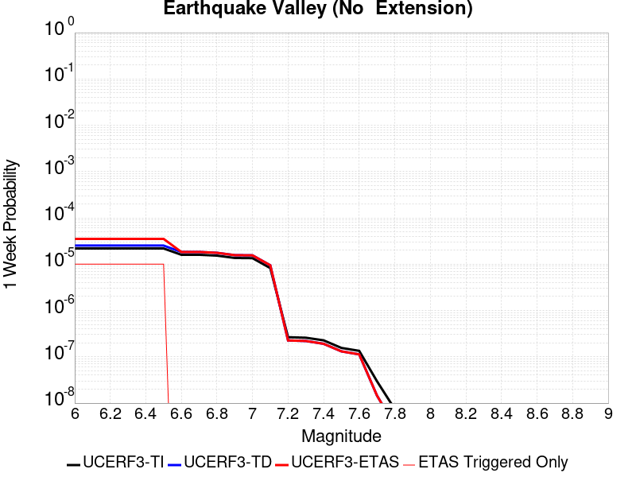 | 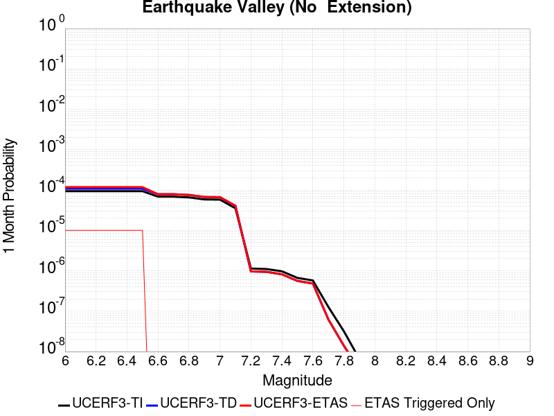 | 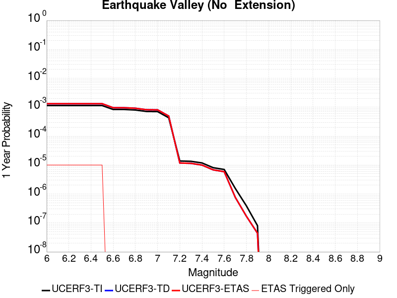 | 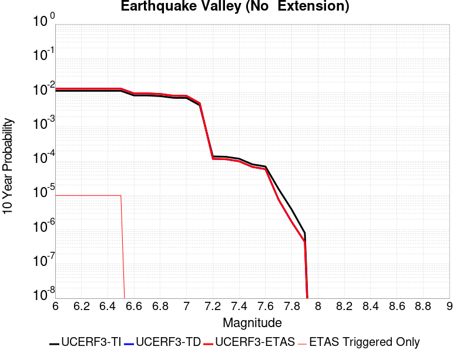 |

| Magnitude | 1 wk TI Prob | 1 wk TD Prob | 1 wk ETAS Prob | 1 wk ETAS/TD Gain | 1 wk ETAS Triggered Only | 1 mo TI Prob | 1 mo TD Prob | 1 mo ETAS Prob | 1 mo ETAS/TD Gain | 1 mo ETAS Triggered Only | 1 yr TI Prob | 1 yr TD Prob | 1 yr ETAS Prob | 1 yr ETAS/TD Gain | 1 yr ETAS Triggered Only | 10 yr TI Prob | 10 yr TD Prob | 10 yr ETAS Prob | 10 yr ETAS/TD Gain | 10 yr ETAS Triggered Only |
|-----|-----|-----|-----|-----|-----|-----|-----|-----|-----|-----|-----|-----|-----|-----|-----|-----|-----|-----|-----|-----|
| 6.0 | 2.1859703E-5 | 2.5198351E-5 | 3.51981E-5 | 1.3968414 | 1.0E-5 | 9.3681076E-5 | 1.0798928E-4 | 1.179882E-4 | 1.0925918 | 1.0E-5 | 0.0011399703 | 0.0013141216 | 0.0013241085 | 1.0075996 | 1.0E-5 | 0.011341401 | 0.013077869 | 0.013087738 | 1.0007546 | 1.0E-5 |
| 6.1 | 2.1859703E-5 | 2.5198351E-5 | 3.51981E-5 | 1.3968414 | 1.0E-5 | 9.3681076E-5 | 1.0798928E-4 | 1.179882E-4 | 1.0925918 | 1.0E-5 | 0.0011399703 | 0.0013141216 | 0.0013241085 | 1.0075996 | 1.0E-5 | 0.011341401 | 0.013077869 | 0.013087738 | 1.0007546 | 1.0E-5 |
| 6.2 | 2.1859703E-5 | 2.5198351E-5 | 3.51981E-5 | 1.3968414 | 1.0E-5 | 9.3681076E-5 | 1.0798928E-4 | 1.179882E-4 | 1.0925918 | 1.0E-5 | 0.0011399703 | 0.0013141216 | 0.0013241085 | 1.0075996 | 1.0E-5 | 0.011341401 | 0.013077869 | 0.013087738 | 1.0007546 | 1.0E-5 |
| 6.3 | 2.1859703E-5 | 2.5198351E-5 | 3.51981E-5 | 1.3968414 | 1.0E-5 | 9.3681076E-5 | 1.0798928E-4 | 1.179882E-4 | 1.0925918 | 1.0E-5 | 0.0011399703 | 0.0013141216 | 0.0013241085 | 1.0075996 | 1.0E-5 | 0.011341401 | 0.013077869 | 0.013087738 | 1.0007546 | 1.0E-5 |
| 6.4 | 2.1859703E-5 | 2.5198351E-5 | 3.51981E-5 | 1.3968414 | 1.0E-5 | 9.3681076E-5 | 1.0798928E-4 | 1.179882E-4 | 1.0925918 | 1.0E-5 | 0.0011399703 | 0.0013141216 | 0.0013241085 | 1.0075996 | 1.0E-5 | 0.011341401 | 0.013077869 | 0.013087738 | 1.0007546 | 1.0E-5 |
| 6.5 | 2.1859703E-5 | 2.5198351E-5 | 3.51981E-5 | 1.3968414 | 1.0E-5 | 9.3681076E-5 | 1.0798928E-4 | 1.179882E-4 | 1.0925918 | 1.0E-5 | 0.0011399703 | 0.0013141216 | 0.0013241085 | 1.0075996 | 1.0E-5 | 0.011341401 | 0.013077869 | 0.013087738 | 1.0007546 | 1.0E-5 |
| 6.6 | 1.597E-5 | 1.835627E-5 | 1.835627E-5 | 1.0 | 0.0 | 6.8441055E-5 | 7.866784E-5 | 7.866784E-5 | 1.0 | 0.0 | 8.329513E-4 | 9.5744745E-4 | 9.5744745E-4 | 1.0 | 0.0 | 0.008298361 | 0.009541833 | 0.009541833 | 1.0 | 0.0 |
| 6.7 | 1.597E-5 | 1.835627E-5 | 1.835627E-5 | 1.0 | 0.0 | 6.8441055E-5 | 7.866784E-5 | 7.866784E-5 | 1.0 | 0.0 | 8.329513E-4 | 9.5744745E-4 | 9.5744745E-4 | 1.0 | 0.0 | 0.008298361 | 0.009541833 | 0.009541833 | 1.0 | 0.0 |
| 6.8 | 1.5315149E-5 | 1.7602086E-5 | 1.7602086E-5 | 1.0 | 0.0 | 6.5634704E-5 | 7.543582E-5 | 7.543582E-5 | 1.0 | 0.0 | 7.988095E-4 | 9.1813074E-4 | 9.1813074E-4 | 1.0 | 0.0 | 0.007959441 | 0.009151915 | 0.009151915 | 1.0 | 0.0 |
| 6.9 | 1.3634728E-5 | 1.5675814E-5 | 1.5675814E-5 | 1.0 | 0.0 | 5.8433237E-5 | 6.7180794E-5 | 6.7180794E-5 | 1.0 | 0.0 | 7.1119244E-4 | 8.1770134E-4 | 8.1770134E-4 | 1.0 | 0.0 | 0.007089207 | 0.008154998 | 0.008154998 | 1.0 | 0.0 |
| 7.0 | 1.3496271E-5 | 1.5517848E-5 | 1.5517848E-5 | 1.0 | 0.0 | 5.783988E-5 | 6.6503824E-5 | 6.6503824E-5 | 1.0 | 0.0 | 7.03973E-4 | 8.0946536E-4 | 8.0946536E-4 | 1.0 | 0.0 | 0.007017471 | 0.008073238 | 0.008073238 | 1.0 | 0.0 |
| 7.1 | 8.242798E-6 | 9.472594E-6 | 9.472594E-6 | 1.0 | 0.0 | 3.53258E-5 | 4.0596577E-5 | 4.0596577E-5 | 1.0 | 0.0 | 4.300067E-4 | 4.9421826E-4 | 4.9421826E-4 | 1.0 | 0.0 | 0.004291756 | 0.0049377684 | 0.0049377684 | 1.0 | 0.0 |
| 7.2 | 2.6506527E-7 | 2.2559628E-7 | 2.2559628E-7 | 1.0 | 0.0 | 1.1359936E-6 | 9.668408E-7 | 9.668408E-7 | 1.0 | 0.0 | 1.3830633E-5 | 1.1771229E-5 | 1.1771229E-5 | 1.0 | 0.0 | 1.3829772E-4 | 1.1770646E-4 | 1.1770646E-4 | 1.0 | 0.0 |
| 7.3 | 2.5810488E-7 | 2.1954757E-7 | 2.1954757E-7 | 1.0 | 0.0 | 1.1061633E-6 | 9.4091786E-7 | 9.4091786E-7 | 1.0 | 0.0 | 1.3467455E-5 | 1.1455619E-5 | 1.1455619E-5 | 1.0 | 0.0 | 1.3466639E-4 | 1.145507E-4 | 1.145507E-4 | 1.0 | 0.0 |
| 7.4 | 2.2676066E-7 | 1.9109943E-7 | 1.9109943E-7 | 1.0 | 0.0 | 9.71831E-7 | 8.189973E-7 | 8.189973E-7 | 1.0 | 0.0 | 1.1831979E-5 | 9.971251E-6 | 9.971251E-6 | 1.0 | 0.0 | 1.1831349E-4 | 9.970842E-5 | 9.970842E-5 | 1.0 | 0.0 |
| 7.5 | 1.5553917E-7 | 1.311138E-7 | 1.311138E-7 | 1.0 | 0.0 | 6.6659624E-7 | 5.619162E-7 | 5.619162E-7 | 1.0 | 0.0 | 8.115779E-6 | 6.84131E-6 | 6.84131E-6 | 1.0 | 0.0 | 8.115482E-5 | 6.841121E-5 | 6.841121E-5 | 1.0 | 0.0 |
| 7.6 | 1.3448629E-7 | 1.1287708E-7 | 1.1287708E-7 | 1.0 | 0.0 | 5.7636964E-7 | 4.8375887E-7 | 4.8375887E-7 | 1.0 | 0.0 | 7.017278E-6 | 5.8897504E-6 | 5.8897504E-6 | 1.0 | 0.0 | 7.0170565E-5 | 5.8896156E-5 | 5.8896156E-5 | 1.0 | 0.0 |
| 7.7 | 2.9719402E-8 | 1.4581234E-8 | 1.4581234E-8 | 1.0 | 0.0 | 1.2736886E-7 | 6.2491004E-8 | 6.2491004E-8 | 1.0 | 0.0 | 1.5507147E-6 | 7.6082773E-7 | 7.6082773E-7 | 1.0 | 0.0 | 1.550704E-5 | 7.608257E-6 | 7.608257E-6 | 1.0 | 0.0 |
| 7.8 | 7.4390196E-9 | 3.249962E-9 | 3.249962E-9 | 1.0 | 0.0 | 3.1881513E-8 | 1.39284095E-8 | 1.39284095E-8 | 1.0 | 0.0 | 3.8815733E-7 | 1.6957837E-7 | 1.6957837E-7 | 1.0 | 0.0 | 3.8815665E-6 | 1.6957828E-6 | 1.6957828E-6 | 1.0 | 0.0 |
| 7.9 | 1.5373532E-9 | 8.4400953E-10 | 8.4400953E-10 | 1.0 | 0.0 | 6.5886567E-9 | 3.6171839E-9 | 3.6171839E-9 | 1.0 | 0.0 | 8.021689E-8 | 4.403921E-8 | 4.403921E-8 | 1.0 | 0.0 | 8.0216864E-7 | 4.403921E-7 | 4.403921E-7 | 1.0 | 0.0 |

## San Clemente
*[(top)](#table-of-contents)*

| 1 Week | 1 Month | 1 Year | 10 Year |
|-----|-----|-----|-----|
| 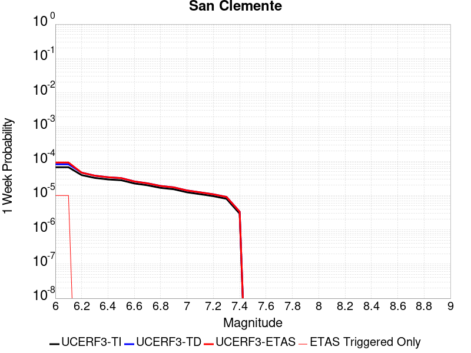 | 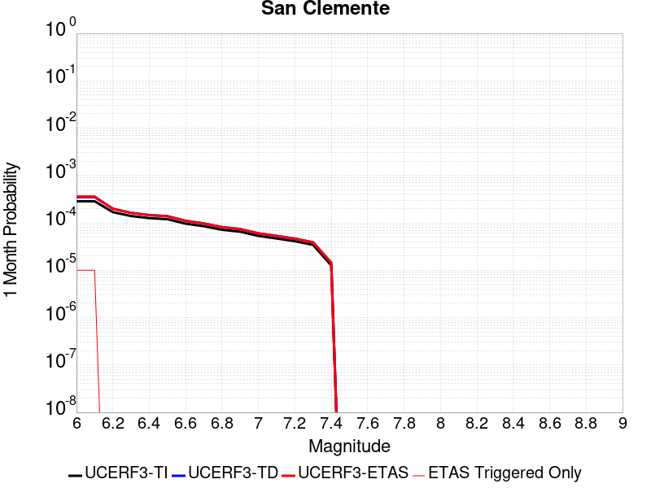 | 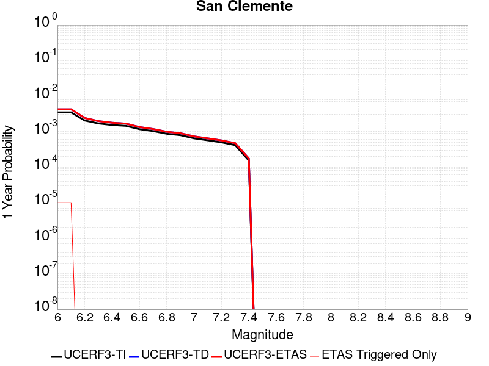 | 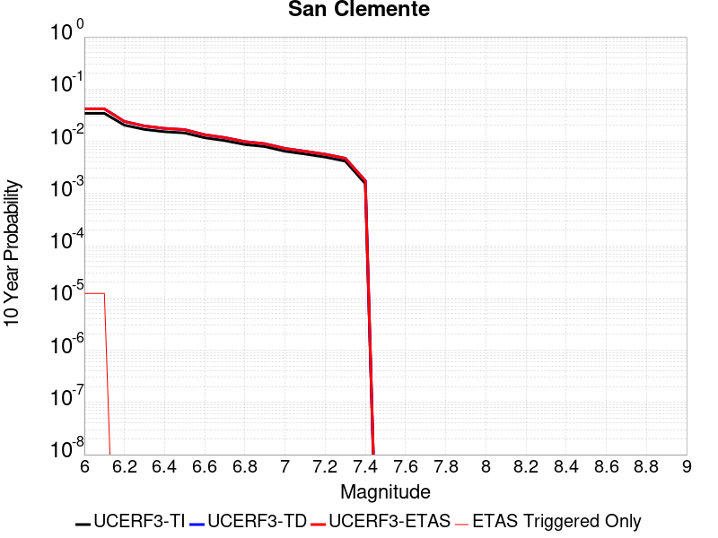 |

| Magnitude | 1 wk TI Prob | 1 wk TD Prob | 1 wk ETAS Prob | 1 wk ETAS/TD Gain | 1 wk ETAS Triggered Only | 1 mo TI Prob | 1 mo TD Prob | 1 mo ETAS Prob | 1 mo ETAS/TD Gain | 1 mo ETAS Triggered Only | 1 yr TI Prob | 1 yr TD Prob | 1 yr ETAS Prob | 1 yr ETAS/TD Gain | 1 yr ETAS Triggered Only | 10 yr TI Prob | 10 yr TD Prob | 10 yr ETAS Prob | 10 yr ETAS/TD Gain | 10 yr ETAS Triggered Only |
|-----|-----|-----|-----|-----|-----|-----|-----|-----|-----|-----|-----|-----|-----|-----|-----|-----|-----|-----|-----|-----|
| 6.0 | 6.681379E-5 | 8.163834E-5 | 9.163752E-5 | 1.1224815 | 1.0E-5 | 2.8631336E-4 | 3.4983488E-4 | 3.598314E-4 | 1.028575 | 1.0E-5 | 0.003480294 | 0.00425141 | 0.0042613675 | 1.0023421 | 1.0E-5 | 0.03426291 | 0.04175603 | 0.04176561 | 1.0002295 | 1.0E-5 |
| 6.1 | 6.681379E-5 | 8.163834E-5 | 9.163752E-5 | 1.1224815 | 1.0E-5 | 2.8631336E-4 | 3.4983488E-4 | 3.598314E-4 | 1.028575 | 1.0E-5 | 0.003480294 | 0.00425141 | 0.0042613675 | 1.0023421 | 1.0E-5 | 0.03426291 | 0.04175603 | 0.04176561 | 1.0002295 | 1.0E-5 |
| 6.2 | 3.9400576E-5 | 4.6452373E-5 | 4.6452373E-5 | 1.0 | 0.0 | 1.6884868E-4 | 1.9906677E-4 | 1.9906677E-4 | 1.0 | 0.0 | 0.0020537945 | 0.0024209984 | 0.0024209984 | 1.0 | 0.0 | 0.020349167 | 0.023952903 | 0.023952903 | 1.0 | 0.0 |
| 6.3 | 3.2590255E-5 | 3.792912E-5 | 3.792912E-5 | 1.0 | 0.0 | 1.3966505E-4 | 1.6254342E-4 | 1.6254342E-4 | 1.0 | 0.0 | 0.0016990956 | 0.0019772002 | 0.0019772002 | 1.0 | 0.0 | 0.01686163 | 0.019599883 | 0.019599883 | 1.0 | 0.0 |
| 6.4 | 2.9454652E-5 | 3.4097764E-5 | 3.4097764E-5 | 1.0 | 0.0 | 1.2622811E-4 | 1.4612524E-4 | 1.4612524E-4 | 1.0 | 0.0 | 0.0015357438 | 0.0017776493 | 0.0017776493 | 1.0 | 0.0 | 0.015251739 | 0.01763747 | 0.01763747 | 1.0 | 0.0 |
| 6.5 | 2.790836E-5 | 3.2247463E-5 | 3.2247463E-5 | 1.0 | 0.0 | 1.1960178E-4 | 1.3819624E-4 | 1.3819624E-4 | 1.0 | 0.0 | 0.001455179 | 0.0016812662 | 0.0016812662 | 1.0 | 0.0 | 0.014456868 | 0.016688485 | 0.016688485 | 1.0 | 0.0 |
| 6.6 | 2.2492153E-5 | 2.5762702E-5 | 2.5762702E-5 | 1.0 | 0.0 | 9.639138E-5 | 1.1040699E-4 | 1.1040699E-4 | 1.0 | 0.0 | 0.0011729331 | 0.0013433909 | 0.0013433909 | 1.0 | 0.0 | 0.011667615 | 0.013354417 | 0.013354417 | 1.0 | 0.0 |
| 6.7 | 1.9862755E-5 | 2.2666423E-5 | 2.2666423E-5 | 1.0 | 0.0 | 8.512331E-5 | 9.713826E-5 | 9.713826E-5 | 1.0 | 0.0 | 0.0010358836 | 0.0011820279 | 0.0011820279 | 1.0 | 0.0 | 0.010310682 | 0.011758701 | 0.011758701 | 1.0 | 0.0 |
| 6.8 | 1.6697575E-5 | 1.897771E-5 | 1.897771E-5 | 1.0 | 0.0 | 7.155907E-5 | 8.133056E-5 | 8.133056E-5 | 1.0 | 0.0 | 8.7088346E-4 | 9.897591E-4 | 9.897591E-4 | 1.0 | 0.0 | 0.008674784 | 0.0098545365 | 0.0098545365 | 1.0 | 0.0 |
| 6.9 | 1.5218415E-5 | 1.72694E-5 | 1.72694E-5 | 1.0 | 0.0 | 6.522015E-5 | 7.4009666E-5 | 7.4009666E-5 | 1.0 | 0.0 | 7.93766E-4 | 9.00704E-4 | 9.00704E-4 | 1.0 | 0.0 | 0.007909367 | 0.008971481 | 0.008971481 | 1.0 | 0.0 |
| 7.0 | 1.2392958E-5 | 1.4033016E-5 | 1.4033016E-5 | 1.0 | 0.0 | 5.3111595E-5 | 6.014015E-5 | 6.014015E-5 | 1.0 | 0.0 | 6.4644177E-4 | 7.319679E-4 | 7.319679E-4 | 1.0 | 0.0 | 0.0064456454 | 0.0072963564 | 0.0072963564 | 1.0 | 0.0 |
| 7.1 | 1.0934128E-5 | 1.2375138E-5 | 1.2375138E-5 | 1.0 | 0.0 | 4.6859706E-5 | 5.303527E-5 | 5.303527E-5 | 1.0 | 0.0 | 5.7036756E-4 | 6.455204E-4 | 6.455204E-4 | 1.0 | 0.0 | 0.0056890585 | 0.0064371997 | 0.0064371997 | 1.0 | 0.0 |
| 7.2 | 9.5798805E-6 | 1.0844935E-5 | 1.0844935E-5 | 1.0 | 0.0 | 4.1055984E-5 | 4.6477508E-5 | 4.6477508E-5 | 1.0 | 0.0 | 4.9974193E-4 | 5.657239E-4 | 5.657239E-4 | 1.0 | 0.0 | 0.0049861963 | 0.0056435615 | 0.0056435615 | 1.0 | 0.0 |
| 7.3 | 8.0167365E-6 | 9.083918E-6 | 9.083918E-6 | 1.0 | 0.0 | 3.4356988E-5 | 3.8930535E-5 | 3.8930535E-5 | 1.0 | 0.0 | 4.1821605E-4 | 4.7388324E-4 | 4.7388324E-4 | 1.0 | 0.0 | 0.0041742986 | 0.0047294297 | 0.0047294297 | 1.0 | 0.0 |
| 7.4 | 2.9581017E-6 | 3.3623792E-6 | 3.3623792E-6 | 1.0 | 0.0 | 1.2677518E-5 | 1.4410146E-5 | 1.4410146E-5 | 1.0 | 0.0 | 1.5433785E-4 | 1.7543444E-4 | 1.7543444E-4 | 1.0 | 0.0 | 0.001542307 | 0.0017534546 | 0.0017534546 | 1.0 | 0.0 |

## Pilarcitos 2011 CFM
*[(top)](#table-of-contents)*

| 1 Week | 1 Month | 1 Year | 10 Year |
|-----|-----|-----|-----|
| 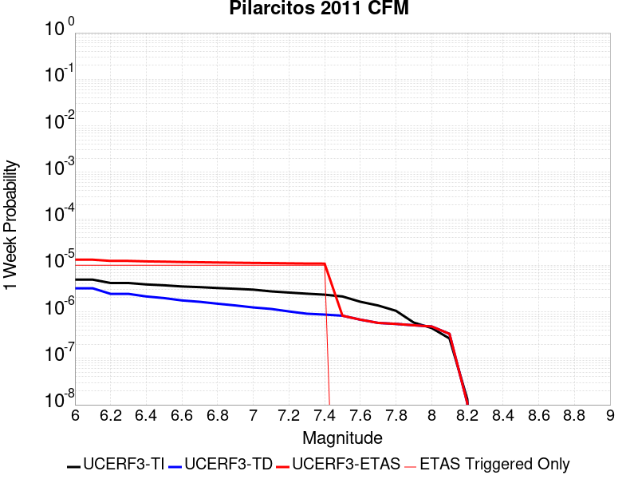 | 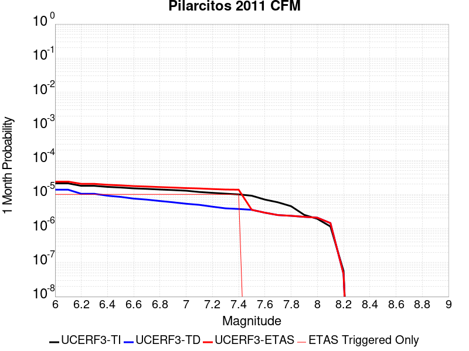 | 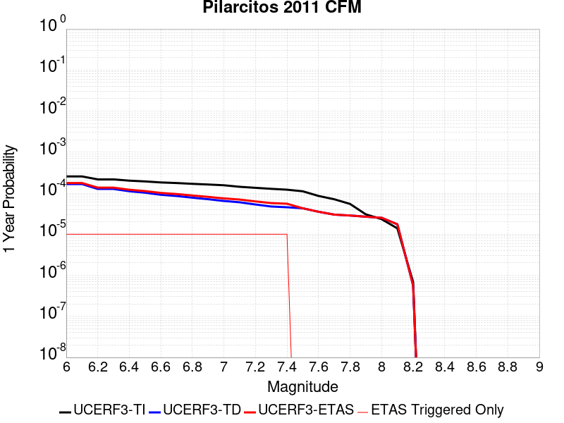 | 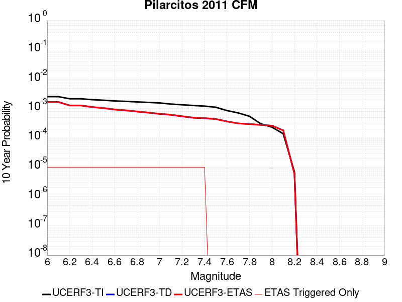 |

| Magnitude | 1 wk TI Prob | 1 wk TD Prob | 1 wk ETAS Prob | 1 wk ETAS/TD Gain | 1 wk ETAS Triggered Only | 1 mo TI Prob | 1 mo TD Prob | 1 mo ETAS Prob | 1 mo ETAS/TD Gain | 1 mo ETAS Triggered Only | 1 yr TI Prob | 1 yr TD Prob | 1 yr ETAS Prob | 1 yr ETAS/TD Gain | 1 yr ETAS Triggered Only | 10 yr TI Prob | 10 yr TD Prob | 10 yr ETAS Prob | 10 yr ETAS/TD Gain | 10 yr ETAS Triggered Only |
|-----|-----|-----|-----|-----|-----|-----|-----|-----|-----|-----|-----|-----|-----|-----|-----|-----|-----|-----|-----|-----|
| 6.0 | 4.9150476E-6 | 3.2016114E-6 | 1.3201579E-5 | 4.1234174 | 1.0E-5 | 2.1064321E-5 | 1.3721121E-5 | 2.3720984E-5 | 1.7287934 | 1.0E-5 | 2.564279E-4 | 1.6704215E-4 | 1.7704048E-4 | 1.0598551 | 1.0E-5 | 0.0025613222 | 0.0016816513 | 0.0016916345 | 1.0059365 | 1.0E-5 |
| 6.1 | 4.9150476E-6 | 3.2016114E-6 | 1.3201579E-5 | 4.1234174 | 1.0E-5 | 2.1064321E-5 | 1.3721121E-5 | 2.3720984E-5 | 1.7287934 | 1.0E-5 | 2.564279E-4 | 1.6704215E-4 | 1.7704048E-4 | 1.0598551 | 1.0E-5 | 0.0025613222 | 0.0016816513 | 0.0016916345 | 1.0059365 | 1.0E-5 |
| 6.2 | 4.162343E-6 | 2.4300016E-6 | 1.2429977E-5 | 5.115214 | 1.0E-5 | 1.783849E-5 | 1.0414251E-5 | 2.0414147E-5 | 1.9602127 | 1.0E-5 | 2.1716199E-4 | 1.2678621E-4 | 1.3678493E-4 | 1.0788629 | 1.0E-5 | 0.002169499 | 0.001279606 | 0.0012895933 | 1.0078049 | 1.0E-5 |
| 6.3 | 4.162343E-6 | 2.4300016E-6 | 1.2429977E-5 | 5.115214 | 1.0E-5 | 1.783849E-5 | 1.0414251E-5 | 2.0414147E-5 | 1.9602127 | 1.0E-5 | 2.1716199E-4 | 1.2678621E-4 | 1.3678493E-4 | 1.0788629 | 1.0E-5 | 0.002169499 | 0.001279606 | 0.0012895933 | 1.0078049 | 1.0E-5 |
| 6.4 | 3.8768926E-6 | 2.137421E-6 | 1.21374E-5 | 5.6785254 | 1.0E-5 | 1.6615148E-5 | 9.160343E-6 | 1.9160252E-5 | 2.0916522 | 1.0E-5 | 2.0227065E-4 | 1.1152151E-4 | 1.21520396E-4 | 1.0896589 | 1.0E-5 | 0.0020208664 | 0.001127121 | 0.0011371098 | 1.0088621 | 1.0E-5 |
| 6.5 | 3.7137002E-6 | 1.9707802E-6 | 1.197076E-5 | 6.074123 | 1.0E-5 | 1.591576E-5 | 8.4461735E-6 | 1.8446088E-5 | 2.183958 | 1.0E-5 | 1.9375715E-4 | 1.0282734E-4 | 1.1282631E-4 | 1.0972404 | 1.0E-5 | 0.001935883 | 0.0010402631 | 0.0010502527 | 1.0096029 | 1.0E-5 |
| 6.6 | 3.5048733E-6 | 1.7557347E-6 | 1.1755717E-5 | 6.695611 | 1.0E-5 | 1.5020799E-5 | 7.5245557E-6 | 1.752448E-5 | 2.328972 | 1.0E-5 | 1.8286289E-4 | 9.160764E-5 | 1.01606725E-4 | 1.1091512 | 1.0E-5 | 0.0018271249 | 9.2816487E-4 | 9.381556E-4 | 1.010764 | 1.0E-5 |
| 6.7 | 3.3908584E-6 | 1.6394266E-6 | 1.163941E-5 | 7.0996833 | 1.0E-5 | 1.453217E-5 | 7.0260953E-6 | 1.7026025E-5 | 2.4232557 | 1.0E-5 | 1.7691481E-4 | 8.553937E-5 | 9.553851E-5 | 1.1168952 | 1.0E-5 | 0.0017677402 | 8.675308E-4 | 8.775221E-4 | 1.0115169 | 1.0E-5 |
| 6.8 | 3.2451449E-6 | 1.492648E-6 | 1.1492633E-5 | 7.699493 | 1.0E-5 | 1.3907689E-5 | 6.3970474E-6 | 1.6396983E-5 | 2.5632112 | 1.0E-5 | 1.6931296E-4 | 7.7881276E-5 | 8.78805E-5 | 1.1283906 | 1.0E-5 | 0.0016918402 | 7.9100643E-4 | 8.0099853E-4 | 1.0126321 | 1.0E-5 |
| 6.9 | 3.1239128E-6 | 1.3691754E-6 | 1.1369161E-5 | 8.303657 | 1.0E-5 | 1.3388129E-5 | 5.867881E-6 | 1.5867823E-5 | 2.7041826 | 1.0E-5 | 1.6298829E-4 | 7.143912E-5 | 8.1438404E-5 | 1.1399693 | 1.0E-5 | 0.001628688 | 7.2662864E-4 | 7.366214E-4 | 1.0137522 | 1.0E-5 |
| 7.0 | 2.9940109E-6 | 1.2404895E-6 | 1.1240477E-5 | 9.061324 | 1.0E-5 | 1.2831412E-5 | 5.3163726E-6 | 1.531632E-5 | 2.880972 | 1.0E-5 | 1.5621124E-4 | 6.472491E-5 | 7.472427E-5 | 1.15449 | 1.0E-5 | 0.0015610148 | 6.5952796E-4 | 6.695214E-4 | 1.0151523 | 1.0E-5 |
| 7.1 | 2.7471217E-6 | 1.1522303E-6 | 1.1152219E-5 | 9.67881 | 1.0E-5 | 1.1773326E-5 | 4.9381206E-6 | 1.4938071E-5 | 3.0250518 | 1.0E-5 | 1.4333082E-4 | 6.011996E-5 | 7.0119364E-5 | 1.1663241 | 1.0E-5 | 0.001432384 | 6.134525E-4 | 6.2344637E-4 | 1.0162911 | 1.0E-5 |
| 7.2 | 2.592675E-6 | 1.0182824E-6 | 1.1018272E-5 | 10.820449 | 1.0E-5 | 1.1111417E-5 | 4.36406E-6 | 1.4364016E-5 | 3.2914343 | 1.0E-5 | 1.3527309E-4 | 5.3131134E-5 | 6.31306E-5 | 1.1882036 | 1.0E-5 | 0.0013519078 | 5.436006E-4 | 5.5359513E-4 | 1.0183859 | 1.0E-5 |
| 7.3 | 2.4518663E-6 | 9.0924055E-7 | 1.0909232E-5 | 11.998179 | 1.0E-5 | 1.0507956E-5 | 3.8967396E-6 | 1.3896701E-5 | 3.5662382 | 1.0E-5 | 1.2792686E-4 | 4.744177E-5 | 5.7441295E-5 | 1.2107747 | 1.0E-5 | 0.0012785323 | 4.8673138E-4 | 4.967265E-4 | 1.0205352 | 1.0E-5 |
| 7.4 | 2.3349535E-6 | 8.714187E-7 | 1.087141E-5 | 12.47553 | 1.0E-5 | 1.0006905E-5 | 3.7346463E-6 | 1.3734609E-5 | 3.6776197 | 1.0E-5 | 1.2182725E-4 | 4.546837E-5 | 5.5467914E-5 | 1.2199231 | 1.0E-5 | 0.0012176048 | 4.6698053E-4 | 4.7697587E-4 | 1.0214041 | 1.0E-5 |
| 7.5 | 2.1358665E-6 | 8.234828E-7 | 8.234828E-7 | 1.0 | 0.0 | 9.15368E-6 | 3.529207E-6 | 3.529207E-6 | 1.0 | 0.0 | 1.11440364E-4 | 4.296725E-5 | 4.296725E-5 | 1.0 | 0.0 | 0.0011138449 | 4.4188576E-4 | 4.4188576E-4 | 1.0 | 0.0 |
| 7.6 | 1.6445446E-6 | 6.777282E-7 | 6.777282E-7 | 1.0 | 0.0 | 7.048029E-6 | 2.9045461E-6 | 2.9045461E-6 | 1.0 | 0.0 | 8.580638E-5 | 3.5362275E-5 | 3.5362275E-5 | 1.0 | 0.0 | 8.5773255E-4 | 3.657945E-4 | 3.657945E-4 | 1.0 | 0.0 |
| 7.7 | 1.3650961E-6 | 5.7706814E-7 | 5.7706814E-7 | 1.0 | 0.0 | 5.850399E-6 | 2.4731469E-6 | 2.4731469E-6 | 1.0 | 0.0 | 7.122628E-5 | 3.0110148E-5 | 3.0110148E-5 | 1.0 | 0.0 | 7.120345E-4 | 3.1317066E-4 | 3.1317066E-4 | 1.0 | 0.0 |
| 7.8 | 1.0500993E-6 | 5.4866143E-7 | 5.4866143E-7 | 1.0 | 0.0 | 4.5004176E-6 | 2.351404E-6 | 2.351404E-6 | 1.0 | 0.0 | 5.4791206E-5 | 2.8627966E-5 | 2.8627966E-5 | 1.0 | 0.0 | 5.47777E-4 | 2.9822122E-4 | 2.9822122E-4 | 1.0 | 0.0 |
| 7.9 | 5.856431E-7 | 5.128745E-7 | 5.128745E-7 | 1.0 | 0.0 | 2.5098966E-6 | 2.1980318E-6 | 2.1980318E-6 | 1.0 | 0.0 | 3.0557563E-5 | 2.676071E-5 | 2.676071E-5 | 1.0 | 0.0 | 3.055336E-4 | 2.7880984E-4 | 2.7880984E-4 | 1.0 | 0.0 |
| 8.0 | 4.4768265E-7 | 4.835379E-7 | 4.835379E-7 | 1.0 | 0.0 | 1.9186384E-6 | 2.0723037E-6 | 2.0723037E-6 | 1.0 | 0.0 | 2.3359173E-5 | 2.5230007E-5 | 2.5230007E-5 | 1.0 | 0.0 | 2.3356717E-4 | 2.629721E-4 | 2.629721E-4 | 1.0 | 0.0 |
| 8.1 | 2.6692538E-7 | 3.3572303E-7 | 3.3572303E-7 | 1.0 | 0.0 | 1.1439654E-6 | 1.4388122E-6 | 1.4388122E-6 | 1.0 | 0.0 | 1.392769E-5 | 1.75174E-5 | 1.75174E-5 | 1.0 | 0.0 | 1.3926817E-4 | 1.8253841E-4 | 1.8253841E-4 | 1.0 | 0.0 |
| 8.2 | 1.3198862E-8 | 1.0823697E-8 | 1.0823697E-8 | 1.0 | 0.0 | 5.656655E-8 | 4.6387267E-8 | 4.6387267E-8 | 1.0 | 0.0 | 6.886975E-7 | 5.647649E-7 | 5.647649E-7 | 1.0 | 0.0 | 6.8869535E-6 | 5.880692E-6 | 5.880692E-6 | 1.0 | 0.0 |

## Sargent 2011 CFM
*[(top)](#table-of-contents)*

| 1 Week | 1 Month | 1 Year | 10 Year |
|-----|-----|-----|-----|
| 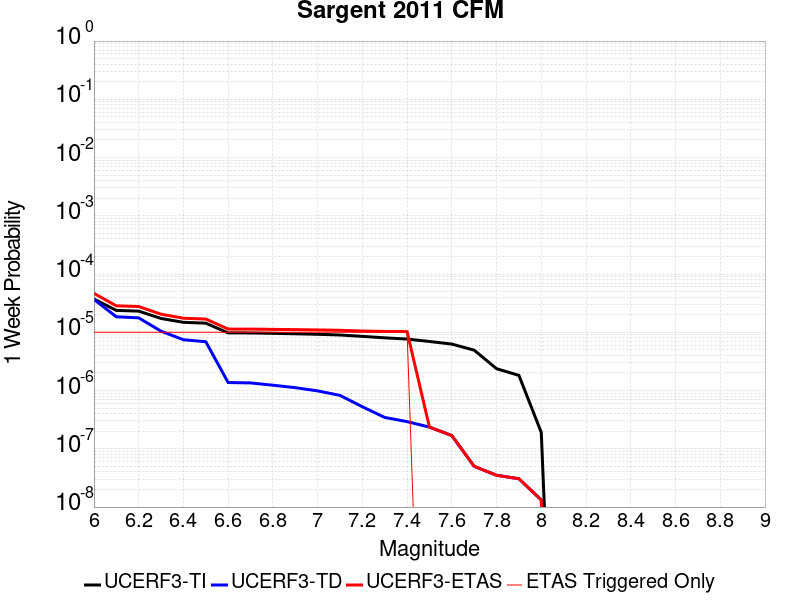 |  | 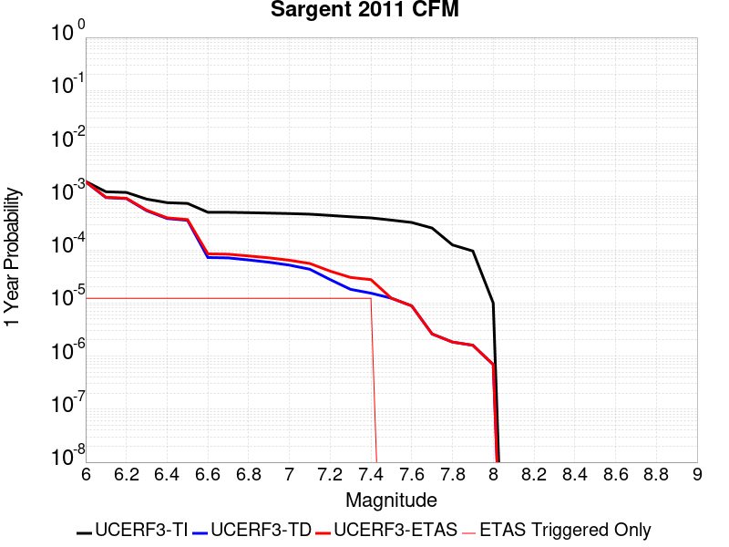 | 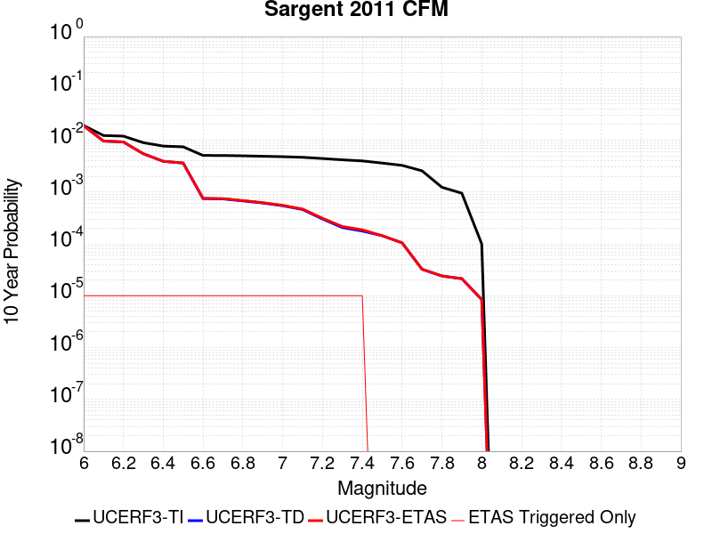 |

| Magnitude | 1 wk TI Prob | 1 wk TD Prob | 1 wk ETAS Prob | 1 wk ETAS/TD Gain | 1 wk ETAS Triggered Only | 1 mo TI Prob | 1 mo TD Prob | 1 mo ETAS Prob | 1 mo ETAS/TD Gain | 1 mo ETAS Triggered Only | 1 yr TI Prob | 1 yr TD Prob | 1 yr ETAS Prob | 1 yr ETAS/TD Gain | 1 yr ETAS Triggered Only | 10 yr TI Prob | 10 yr TD Prob | 10 yr ETAS Prob | 10 yr ETAS/TD Gain | 10 yr ETAS Triggered Only |
|-----|-----|-----|-----|-----|-----|-----|-----|-----|-----|-----|-----|-----|-----|-----|-----|-----|-----|-----|-----|-----|
| 6.0 | 3.7327867E-5 | 3.665065E-5 | 4.6650282E-5 | 1.2728364 | 1.0E-5 | 1.5996677E-4 | 1.5706717E-4 | 1.6706559E-4 | 1.063657 | 1.0E-5 | 0.0019458556 | 0.0019110267 | 0.0019210076 | 1.0052228 | 1.0E-5 | 0.01928905 | 0.019017996 | 0.019027807 | 1.0005158 | 1.0E-5 |
| 6.1 | 2.3771476E-5 | 1.8478724E-5 | 2.8478538E-5 | 1.541153 | 1.0E-5 | 1.01873775E-4 | 7.919262E-5 | 8.919183E-5 | 1.1262643 | 1.0E-5 | 0.0012396075 | 9.638239E-4 | 9.738143E-4 | 1.0103654 | 1.0E-5 | 0.012327154 | 0.009635902 | 0.009645806 | 1.0010278 | 1.0E-5 |
| 6.2 | 2.3112721E-5 | 1.7710081E-5 | 2.7709904E-5 | 1.5646402 | 1.0E-5 | 9.9050754E-5 | 7.5898635E-5 | 8.5897875E-5 | 1.1317446 | 1.0E-5 | 0.0012052758 | 9.2375383E-4 | 9.337446E-4 | 1.0108154 | 1.0E-5 | 0.011987597 | 0.009238554 | 0.009248462 | 1.0010724 | 1.0E-5 |
| 6.3 | 1.728509E-5 | 1.0458513E-5 | 2.0458408E-5 | 1.9561489 | 1.0E-5 | 7.407686E-5 | 4.4821696E-5 | 5.482125E-5 | 1.2230963 | 1.0E-5 | 9.015125E-4 | 5.456136E-4 | 5.5560813E-4 | 1.0183179 | 1.0E-5 | 0.008978641 | 0.0054789106 | 0.0054888558 | 1.0018152 | 1.0E-5 |
| 6.4 | 1.48395575E-5 | 7.4555796E-6 | 1.7455504E-5 | 2.3412673 | 1.0E-5 | 6.3596555E-5 | 3.195231E-5 | 4.195199E-5 | 1.3129565 | 1.0E-5 | 7.7401294E-4 | 3.889874E-4 | 3.989835E-4 | 1.0256978 | 1.0E-5 | 0.0077132257 | 0.00391845 | 0.003928411 | 1.002542 | 1.0E-5 |
| 6.5 | 1.4358964E-5 | 6.894356E-6 | 1.6894286E-5 | 2.4504519 | 1.0E-5 | 6.1536964E-5 | 2.9547118E-5 | 3.9546823E-5 | 1.3384324 | 1.0E-5 | 7.48955E-4 | 3.5971415E-4 | 3.6971053E-4 | 1.0277898 | 1.0E-5 | 0.0074643586 | 0.0036266989 | 0.0036366626 | 1.0027473 | 1.0E-5 |
| 6.6 | 9.772591E-6 | 1.3732375E-6 | 1.1373224E-5 | 8.282051 | 1.0E-5 | 4.188186E-5 | 5.8852906E-6 | 1.5885233E-5 | 2.6991415 | 1.0E-5 | 5.097923E-4 | 7.165109E-5 | 8.1650374E-5 | 1.1395552 | 1.0E-5 | 0.005086244 | 7.480871E-4 | 7.580797E-4 | 1.0133574 | 1.0E-5 |
| 6.7 | 9.752745E-6 | 1.3519289E-6 | 1.1351915E-5 | 8.396829 | 1.0E-5 | 4.179681E-5 | 5.7939683E-6 | 1.579391E-5 | 2.7259228 | 1.0E-5 | 5.0875737E-4 | 7.053931E-5 | 8.05386E-5 | 1.141755 | 1.0E-5 | 0.005075942 | 7.369768E-4 | 7.469694E-4 | 1.013559 | 1.0E-5 |
| 6.8 | 9.608213E-6 | 1.235796E-6 | 1.1235784E-5 | 9.09194 | 1.0E-5 | 4.1177405E-5 | 5.296258E-6 | 1.5296206E-5 | 2.8881156 | 1.0E-5 | 5.012196E-4 | 6.448006E-5 | 7.4479416E-5 | 1.1550767 | 1.0E-5 | 0.005000906 | 6.7611714E-4 | 6.8611035E-4 | 1.0147803 | 1.0E-5 |
| 6.9 | 9.427164E-6 | 1.1205796E-6 | 1.1120568E-5 | 9.9239435 | 1.0E-5 | 4.04015E-5 | 4.8024754E-6 | 1.4802427E-5 | 3.0822496 | 1.0E-5 | 4.9177726E-4 | 5.8468588E-5 | 6.8468005E-5 | 1.171022 | 1.0E-5 | 0.004906904 | 6.1537215E-4 | 6.2536594E-4 | 1.0162404 | 1.0E-5 |
| 7.0 | 9.247601E-6 | 9.87042E-7 | 1.0987032E-5 | 11.131272 | 1.0E-5 | 3.9631974E-5 | 4.2301726E-6 | 1.4230131E-5 | 3.3639596 | 1.0E-5 | 4.8241246E-4 | 5.1501152E-5 | 6.1500636E-5 | 1.1941605 | 1.0E-5 | 0.0048136655 | 5.452185E-4 | 5.552131E-4 | 1.0183313 | 1.0E-5 |
| 7.1 | 8.995454E-6 | 8.267614E-7 | 1.0826753E-5 | 13.095378 | 1.0E-5 | 3.8551374E-5 | 3.5432583E-6 | 1.3543223E-5 | 3.822251 | 1.0E-5 | 4.6926187E-4 | 4.313833E-5 | 5.3137897E-5 | 1.2318025 | 1.0E-5 | 0.004682722 | 4.6070307E-4 | 4.706985E-4 | 1.021696 | 1.0E-5 |
| 7.2 | 8.520861E-6 | 5.27322E-7 | 1.0527317E-5 | 19.963734 | 1.0E-5 | 3.6517464E-5 | 2.2599497E-6 | 1.2259927E-5 | 5.4248676 | 1.0E-5 | 4.445094E-4 | 2.7514547E-5 | 3.751427E-5 | 1.3634341 | 1.0E-5 | 0.004436213 | 3.0276953E-4 | 3.1276653E-4 | 1.0330185 | 1.0E-5 |
| 7.3 | 8.043592E-6 | 3.453237E-7 | 1.034532E-5 | 29.958326 | 1.0E-5 | 3.4472083E-5 | 1.4799579E-6 | 1.1479943E-5 | 7.756939 | 1.0E-5 | 4.196168E-4 | 1.801834E-5 | 2.801816E-5 | 1.5549802 | 1.0E-5 | 0.004188253 | 2.0650218E-4 | 2.1650012E-4 | 1.0484157 | 1.0E-5 |
| 7.4 | 7.662316E-6 | 2.9259107E-7 | 1.0292588E-5 | 35.177383 | 1.0E-5 | 3.2838085E-5 | 1.2539612E-6 | 1.1253948E-5 | 8.974719 | 1.0E-5 | 3.9973034E-4 | 1.526687E-5 | 2.5266718E-5 | 1.6550031 | 1.0E-5 | 0.0039901207 | 1.7718194E-4 | 1.8718017E-4 | 1.0564291 | 1.0E-5 |
| 7.5 | 6.961638E-6 | 2.3549052E-7 | 2.3549052E-7 | 1.0 | 0.0 | 2.9835252E-5 | 1.0092447E-6 | 1.0092447E-6 | 1.0 | 0.0 | 3.6318362E-4 | 1.2287485E-5 | 1.2287485E-5 | 1.0 | 0.0 | 0.0036259065 | 1.4393168E-4 | 1.4393168E-4 | 1.0 | 0.0 |
| 7.6 | 6.282332E-6 | 1.6871925E-7 | 1.6871925E-7 | 1.0 | 0.0 | 2.6924003E-5 | 7.230823E-7 | 7.230823E-7 | 1.0 | 0.0 | 3.2775043E-4 | 8.803492E-6 | 8.803492E-6 | 1.0 | 0.0 | 0.0032726745 | 1.0492336E-4 | 1.0492336E-4 | 1.0 | 0.0 |
| 7.7 | 4.934408E-6 | 4.9918345E-8 | 4.9918345E-8 | 1.0 | 0.0 | 2.114729E-5 | 2.1393575E-7 | 2.1393575E-7 | 1.0 | 0.0 | 2.5743784E-4 | 2.6046646E-6 | 2.6046646E-6 | 1.0 | 0.0 | 0.0025713982 | 3.2479504E-5 | 3.2479504E-5 | 1.0 | 0.0 |
| 7.8 | 2.373212E-6 | 3.5100808E-8 | 3.5100808E-8 | 1.0 | 0.0 | 1.0170869E-5 | 1.5043203E-7 | 1.5043203E-7 | 1.0 | 0.0 | 1.238233E-4 | 1.8315084E-6 | 1.8315084E-6 | 1.0 | 0.0 | 0.0012375432 | 2.4073881E-5 | 2.4073881E-5 | 1.0 | 0.0 |
| 7.9 | 1.8227792E-6 | 3.055616E-8 | 3.055616E-8 | 1.0 | 0.0 | 7.811887E-6 | 1.3095496E-7 | 1.3095496E-7 | 1.0 | 0.0 | 9.510558E-5 | 1.5943755E-6 | 1.5943755E-6 | 1.0 | 0.0 | 9.5064886E-4 | 2.1365537E-5 | 2.1365537E-5 | 1.0 | 0.0 |
| 8.0 | 1.9095137E-7 | 1.3250629E-8 | 1.3250629E-8 | 1.0 | 0.0 | 8.1836276E-7 | 5.678841E-8 | 5.678841E-8 | 1.0 | 0.0 | 9.963521E-6 | 6.9139867E-7 | 6.9139867E-7 | 1.0 | 0.0 | 9.963074E-5 | 8.455456E-6 | 8.455456E-6 | 1.0 | 0.0 |

## Ozena
*[(top)](#table-of-contents)*

| 1 Week | 1 Month | 1 Year | 10 Year |
|-----|-----|-----|-----|
| 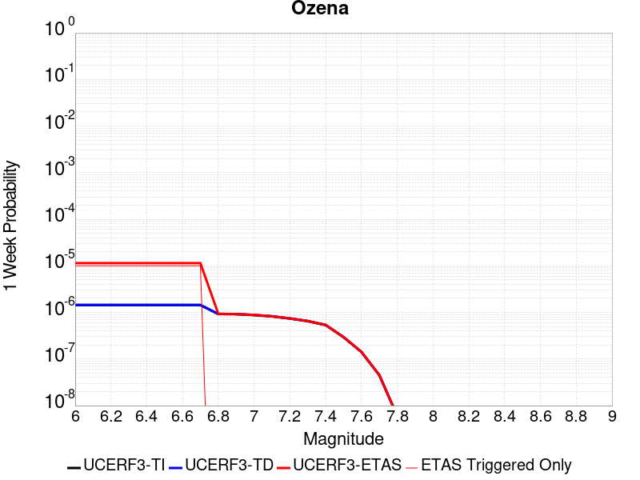 | 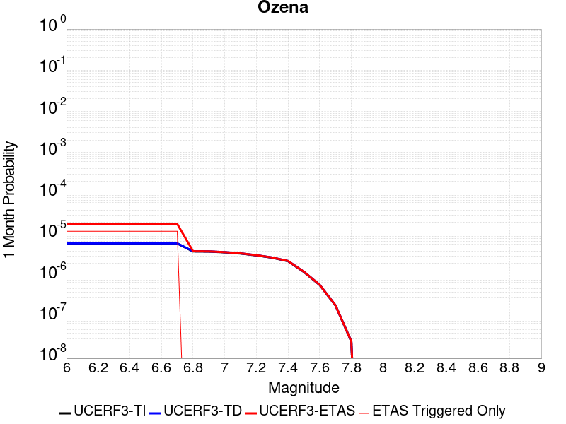 | 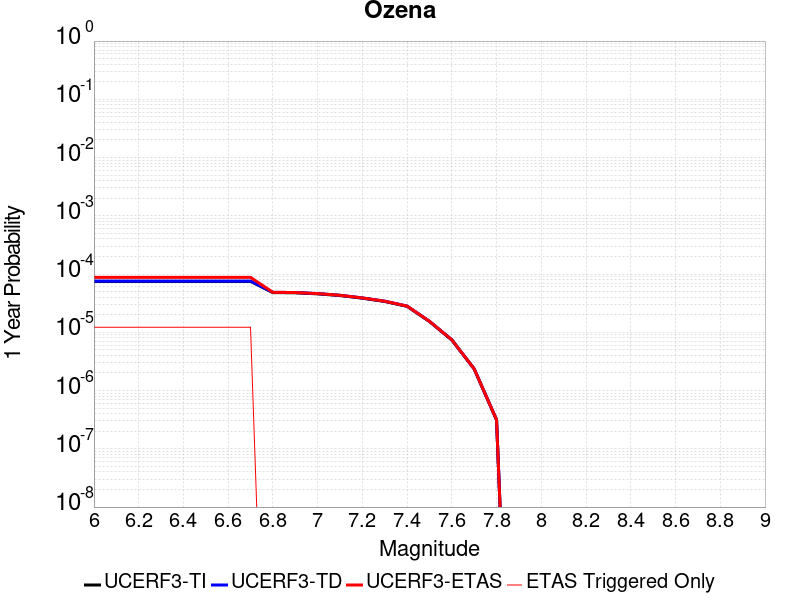 | 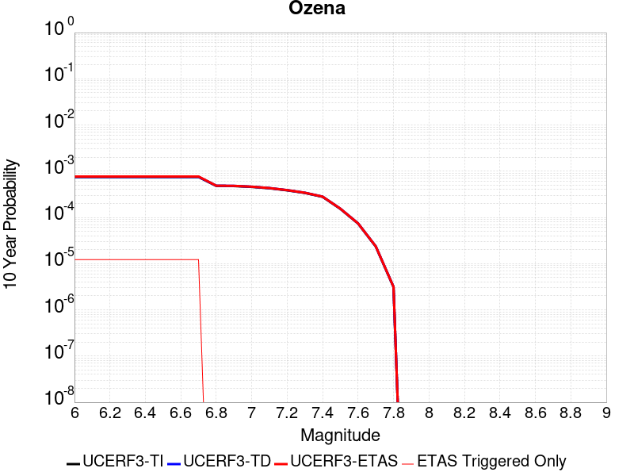 |

| Magnitude | 1 wk TI Prob | 1 wk TD Prob | 1 wk ETAS Prob | 1 wk ETAS/TD Gain | 1 wk ETAS Triggered Only | 1 mo TI Prob | 1 mo TD Prob | 1 mo ETAS Prob | 1 mo ETAS/TD Gain | 1 mo ETAS Triggered Only | 1 yr TI Prob | 1 yr TD Prob | 1 yr ETAS Prob | 1 yr ETAS/TD Gain | 1 yr ETAS Triggered Only | 10 yr TI Prob | 10 yr TD Prob | 10 yr ETAS Prob | 10 yr ETAS/TD Gain | 10 yr ETAS Triggered Only |
|-----|-----|-----|-----|-----|-----|-----|-----|-----|-----|-----|-----|-----|-----|-----|-----|-----|-----|-----|-----|-----|
| 6.0 | 1.4377547E-6 | 1.4513782E-6 | 1.1451364E-5 | 7.889992 | 1.0E-5 | 6.161791E-6 | 6.2201793E-6 | 1.6220118E-5 | 2.6076608 | 1.0E-5 | 7.5017226E-5 | 7.572832E-5 | 8.5727566E-5 | 1.132041 | 1.0E-5 | 7.4991904E-4 | 7.570518E-4 | 7.670442E-4 | 1.0131991 | 1.0E-5 |
| 6.1 | 1.4377547E-6 | 1.4513782E-6 | 1.1451364E-5 | 7.889992 | 1.0E-5 | 6.161791E-6 | 6.2201793E-6 | 1.6220118E-5 | 2.6076608 | 1.0E-5 | 7.5017226E-5 | 7.572832E-5 | 8.5727566E-5 | 1.132041 | 1.0E-5 | 7.4991904E-4 | 7.570518E-4 | 7.670442E-4 | 1.0131991 | 1.0E-5 |
| 6.2 | 1.4377547E-6 | 1.4513782E-6 | 1.1451364E-5 | 7.889992 | 1.0E-5 | 6.161791E-6 | 6.2201793E-6 | 1.6220118E-5 | 2.6076608 | 1.0E-5 | 7.5017226E-5 | 7.572832E-5 | 8.5727566E-5 | 1.132041 | 1.0E-5 | 7.4991904E-4 | 7.570518E-4 | 7.670442E-4 | 1.0131991 | 1.0E-5 |
| 6.3 | 1.4377547E-6 | 1.4513782E-6 | 1.1451364E-5 | 7.889992 | 1.0E-5 | 6.161791E-6 | 6.2201793E-6 | 1.6220118E-5 | 2.6076608 | 1.0E-5 | 7.5017226E-5 | 7.572832E-5 | 8.5727566E-5 | 1.132041 | 1.0E-5 | 7.4991904E-4 | 7.570518E-4 | 7.670442E-4 | 1.0131991 | 1.0E-5 |
| 6.4 | 1.4377547E-6 | 1.4513782E-6 | 1.1451364E-5 | 7.889992 | 1.0E-5 | 6.161791E-6 | 6.2201793E-6 | 1.6220118E-5 | 2.6076608 | 1.0E-5 | 7.5017226E-5 | 7.572832E-5 | 8.5727566E-5 | 1.132041 | 1.0E-5 | 7.4991904E-4 | 7.570518E-4 | 7.670442E-4 | 1.0131991 | 1.0E-5 |
| 6.5 | 1.4377547E-6 | 1.4513782E-6 | 1.1451364E-5 | 7.889992 | 1.0E-5 | 6.161791E-6 | 6.2201793E-6 | 1.6220118E-5 | 2.6076608 | 1.0E-5 | 7.5017226E-5 | 7.572832E-5 | 8.5727566E-5 | 1.132041 | 1.0E-5 | 7.4991904E-4 | 7.570518E-4 | 7.670442E-4 | 1.0131991 | 1.0E-5 |
| 6.6 | 1.4377547E-6 | 1.4513782E-6 | 1.1451364E-5 | 7.889992 | 1.0E-5 | 6.161791E-6 | 6.2201793E-6 | 1.6220118E-5 | 2.6076608 | 1.0E-5 | 7.5017226E-5 | 7.572832E-5 | 8.5727566E-5 | 1.132041 | 1.0E-5 | 7.4991904E-4 | 7.570518E-4 | 7.670442E-4 | 1.0131991 | 1.0E-5 |
| 6.7 | 1.4377547E-6 | 1.4513782E-6 | 1.1451364E-5 | 7.889992 | 1.0E-5 | 6.161791E-6 | 6.2201793E-6 | 1.6220118E-5 | 2.6076608 | 1.0E-5 | 7.5017226E-5 | 7.572832E-5 | 8.5727566E-5 | 1.132041 | 1.0E-5 | 7.4991904E-4 | 7.570518E-4 | 7.670442E-4 | 1.0131991 | 1.0E-5 |
| 6.8 | 9.223257E-7 | 9.317624E-7 | 9.317624E-7 | 1.0 | 0.0 | 3.9528186E-6 | 3.9932615E-6 | 3.9932615E-6 | 1.0 | 0.0 | 4.81245E-5 | 4.8616912E-5 | 4.8616912E-5 | 1.0 | 0.0 | 4.811408E-4 | 4.860668E-4 | 4.860668E-4 | 1.0 | 0.0 |
| 6.9 | 9.141515E-7 | 9.235371E-7 | 9.235371E-7 | 1.0 | 0.0 | 3.917786E-6 | 3.9580104E-6 | 3.9580104E-6 | 1.0 | 0.0 | 4.7698002E-5 | 4.818775E-5 | 4.818775E-5 | 1.0 | 0.0 | 4.7687767E-4 | 4.8177704E-4 | 4.8177704E-4 | 1.0 | 0.0 |
| 7.0 | 8.767648E-7 | 8.8585773E-7 | 8.8585773E-7 | 1.0 | 0.0 | 3.757558E-6 | 3.7965276E-6 | 3.7965276E-6 | 1.0 | 0.0 | 4.5747307E-5 | 4.6221783E-5 | 4.6221783E-5 | 1.0 | 0.0 | 4.5737892E-4 | 4.6212564E-4 | 4.6212564E-4 | 1.0 | 0.0 |
| 7.1 | 8.199402E-7 | 8.2853984E-7 | 8.2853984E-7 | 1.0 | 0.0 | 3.5140247E-6 | 3.5508804E-6 | 3.5508804E-6 | 1.0 | 0.0 | 4.2782412E-5 | 4.323115E-5 | 4.323115E-5 | 1.0 | 0.0 | 4.2774176E-4 | 4.322311E-4 | 4.322311E-4 | 1.0 | 0.0 |
| 7.2 | 7.38705E-7 | 7.464262E-7 | 7.464262E-7 | 1.0 | 0.0 | 3.1658747E-6 | 3.198966E-6 | 3.198966E-6 | 1.0 | 0.0 | 3.8543843E-5 | 3.894675E-5 | 3.894675E-5 | 1.0 | 0.0 | 3.853716E-4 | 3.8940276E-4 | 3.8940276E-4 | 1.0 | 0.0 |
| 7.3 | 6.490017E-7 | 6.557802E-7 | 6.557802E-7 | 1.0 | 0.0 | 2.7814328E-6 | 2.8104837E-6 | 2.8104837E-6 | 1.0 | 0.0 | 3.386342E-5 | 3.4217133E-5 | 3.4217133E-5 | 1.0 | 0.0 | 3.3858258E-4 | 3.4212202E-4 | 3.4212202E-4 | 1.0 | 0.0 |
| 7.4 | 5.346736E-7 | 5.4022604E-7 | 5.4022604E-7 | 1.0 | 0.0 | 2.291456E-6 | 2.3152527E-6 | 2.3152527E-6 | 1.0 | 0.0 | 2.789812E-5 | 2.8187867E-5 | 2.8187867E-5 | 1.0 | 0.0 | 2.789462E-4 | 2.8184598E-4 | 2.8184598E-4 | 1.0 | 0.0 |
| 7.5 | 2.939325E-7 | 2.9666057E-7 | 2.9666057E-7 | 1.0 | 0.0 | 1.25971E-6 | 1.271402E-6 | 1.271402E-6 | 1.0 | 0.0 | 1.5336862E-5 | 1.5479225E-5 | 1.5479225E-5 | 1.0 | 0.0 | 1.5335804E-4 | 1.5478309E-4 | 1.5478309E-4 | 1.0 | 0.0 |
| 7.6 | 1.4151905E-7 | 1.4253266E-7 | 1.4253266E-7 | 1.0 | 0.0 | 6.065101E-7 | 6.108541E-7 | 6.108541E-7 | 1.0 | 0.0 | 7.3842357E-6 | 7.4371237E-6 | 7.4371237E-6 | 1.0 | 0.0 | 7.38399E-5 | 7.436883E-5 | 7.436883E-5 | 1.0 | 0.0 |
| 7.7 | 4.4957577E-8 | 4.5252243E-8 | 4.5252243E-8 | 1.0 | 0.0 | 1.9267533E-7 | 1.9393818E-7 | 1.9393818E-7 | 1.0 | 0.0 | 2.3458194E-6 | 2.3611947E-6 | 2.3611947E-6 | 1.0 | 0.0 | 2.3457947E-5 | 2.3611707E-5 | 2.3611707E-5 | 1.0 | 0.0 |
| 7.8 | 5.9993255E-9 | 6.0412972E-9 | 6.0412972E-9 | 1.0 | 0.0 | 2.5711394E-8 | 2.5891273E-8 | 2.5891273E-8 | 1.0 | 0.0 | 3.1303617E-7 | 3.1522623E-7 | 3.1522623E-7 | 1.0 | 0.0 | 3.1303573E-6 | 3.1522588E-6 | 3.1522588E-6 | 1.0 | 0.0 |

## Casmalia 2011 CFM
*[(top)](#table-of-contents)*

| 1 Week | 1 Month | 1 Year | 10 Year |
|-----|-----|-----|-----|
| 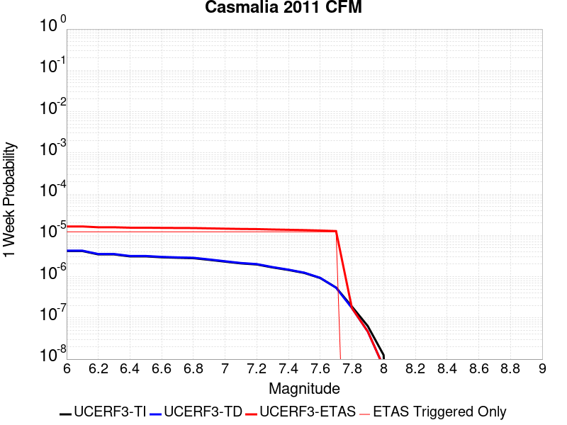 | 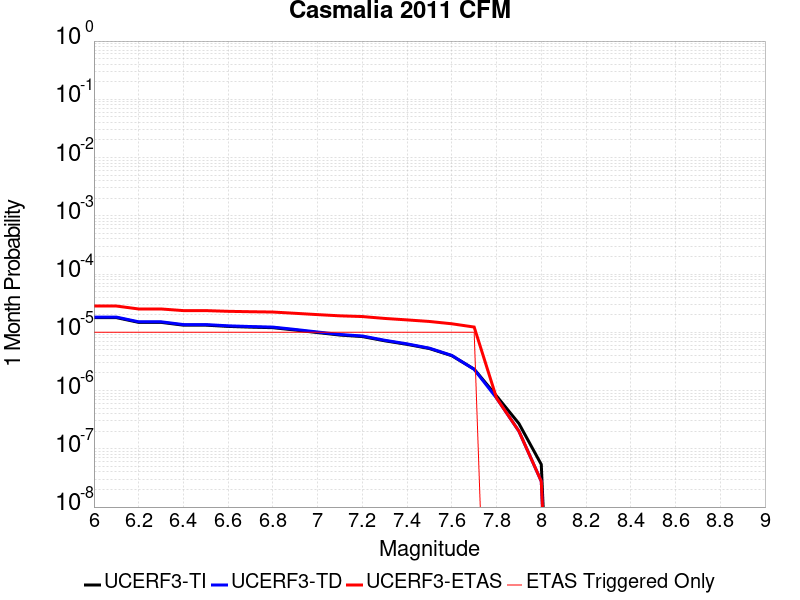 | 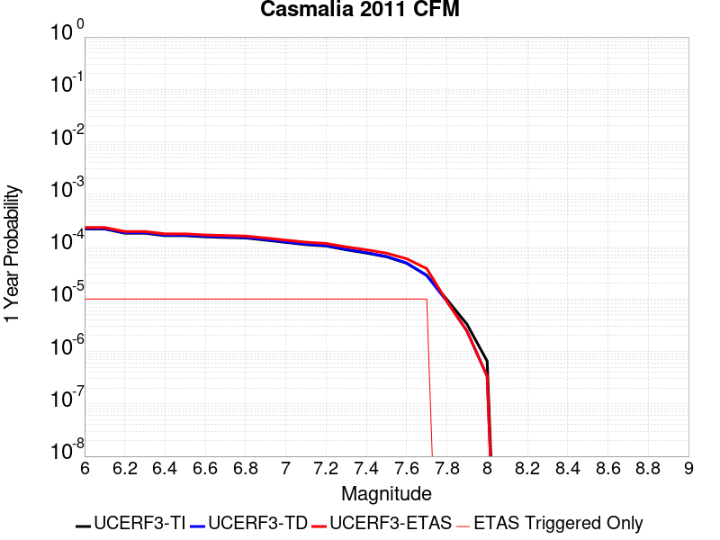 | 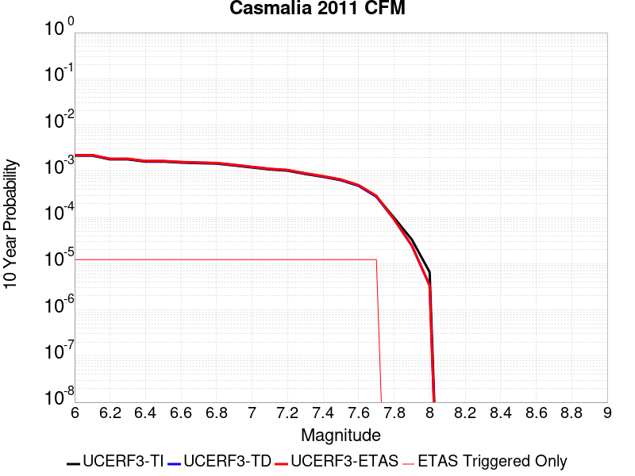 |

| Magnitude | 1 wk TI Prob | 1 wk TD Prob | 1 wk ETAS Prob | 1 wk ETAS/TD Gain | 1 wk ETAS Triggered Only | 1 mo TI Prob | 1 mo TD Prob | 1 mo ETAS Prob | 1 mo ETAS/TD Gain | 1 mo ETAS Triggered Only | 1 yr TI Prob | 1 yr TD Prob | 1 yr ETAS Prob | 1 yr ETAS/TD Gain | 1 yr ETAS Triggered Only | 10 yr TI Prob | 10 yr TD Prob | 10 yr ETAS Prob | 10 yr ETAS/TD Gain | 10 yr ETAS Triggered Only |
|-----|-----|-----|-----|-----|-----|-----|-----|-----|-----|-----|-----|-----|-----|-----|-----|-----|-----|-----|-----|-----|
| 6.0 | 4.1704893E-6 | 4.2624843E-6 | 1.4262441E-5 | 3.3460398 | 1.0E-5 | 1.7873403E-5 | 1.8267663E-5 | 2.826748E-5 | 1.5474054 | 1.0E-5 | 2.1758694E-4 | 2.223863E-4 | 2.3238407E-4 | 1.0449568 | 1.0E-5 | 0.0021737402 | 0.0022216584 | 0.0022316363 | 1.0044911 | 1.0E-5 |
| 6.1 | 4.1704893E-6 | 4.2624843E-6 | 1.4262441E-5 | 3.3460398 | 1.0E-5 | 1.7873403E-5 | 1.8267663E-5 | 2.826748E-5 | 1.5474054 | 1.0E-5 | 2.1758694E-4 | 2.223863E-4 | 2.3238407E-4 | 1.0449568 | 1.0E-5 | 0.0021737402 | 0.0022216584 | 0.0022316363 | 1.0044911 | 1.0E-5 |
| 6.2 | 3.457312E-6 | 3.537023E-6 | 1.3536987E-5 | 3.8272262 | 1.0E-5 | 1.4816967E-5 | 1.5158583E-5 | 2.5158432E-5 | 1.6596823 | 1.0E-5 | 1.8038164E-4 | 1.845402E-4 | 1.9453836E-4 | 1.0541787 | 1.0E-5 | 0.001802353 | 0.0018438791 | 0.0018538607 | 1.0054133 | 1.0E-5 |
| 6.3 | 3.457312E-6 | 3.537023E-6 | 1.3536987E-5 | 3.8272262 | 1.0E-5 | 1.4816967E-5 | 1.5158583E-5 | 2.5158432E-5 | 1.6596823 | 1.0E-5 | 1.8038164E-4 | 1.845402E-4 | 1.9453836E-4 | 1.0541787 | 1.0E-5 | 0.001802353 | 0.0018438791 | 0.0018538607 | 1.0054133 | 1.0E-5 |
| 6.4 | 3.0957337E-6 | 3.169227E-6 | 1.3169195E-5 | 4.1553335 | 1.0E-5 | 1.3267363E-5 | 1.3582331E-5 | 2.3582195E-5 | 1.7362406 | 1.0E-5 | 1.6151817E-4 | 1.653524E-4 | 1.7535074E-4 | 1.0604669 | 1.0E-5 | 0.0016140083 | 0.0016522998 | 0.0016622832 | 1.0060421 | 1.0E-5 |
| 6.5 | 3.0957337E-6 | 3.169227E-6 | 1.3169195E-5 | 4.1553335 | 1.0E-5 | 1.3267363E-5 | 1.3582331E-5 | 2.3582195E-5 | 1.7362406 | 1.0E-5 | 1.6151817E-4 | 1.653524E-4 | 1.7535074E-4 | 1.0604669 | 1.0E-5 | 0.0016140083 | 0.0016522998 | 0.0016622832 | 1.0060421 | 1.0E-5 |
| 6.6 | 2.9459152E-6 | 3.0165766E-6 | 1.3016546E-5 | 4.3150063 | 1.0E-5 | 1.262529E-5 | 1.2928121E-5 | 2.2927992E-5 | 1.7734976 | 1.0E-5 | 1.5370206E-4 | 1.5738855E-4 | 1.6738698E-4 | 1.063527 | 1.0E-5 | 0.0015359579 | 0.0015727765 | 0.0015827608 | 1.0063481 | 1.0E-5 |
| 6.7 | 2.8634809E-6 | 2.932474E-6 | 1.2932444E-5 | 4.41008 | 1.0E-5 | 1.2272003E-5 | 1.2567685E-5 | 2.256756E-5 | 1.7956815 | 1.0E-5 | 1.4940138E-4 | 1.5300087E-4 | 1.6299935E-4 | 1.0653491 | 1.0E-5 | 0.0014930099 | 0.0015289608 | 0.0015389455 | 1.0065304 | 1.0E-5 |
| 6.8 | 2.7999822E-6 | 2.867598E-6 | 1.2867569E-5 | 4.4872293 | 1.0E-5 | 1.1999869E-5 | 1.2289648E-5 | 2.2289525E-5 | 1.8136829 | 1.0E-5 | 1.460886E-4 | 1.4961624E-4 | 1.5961475E-4 | 1.0668277 | 1.0E-5 | 0.001459926 | 0.0014951604 | 0.0015051455 | 1.0066782 | 1.0E-5 |
| 6.9 | 2.551052E-6 | 2.6119662E-6 | 1.261194E-5 | 4.8285236 | 1.0E-5 | 1.0933034E-5 | 1.1194093E-5 | 2.119398E-5 | 1.8933183 | 1.0E-5 | 1.3310155E-4 | 1.3627959E-4 | 1.4627824E-4 | 1.0733685 | 1.0E-5 | 0.0013302186 | 0.0013619643 | 0.0013719506 | 1.0073323 | 1.0E-5 |
| 7.0 | 2.3081875E-6 | 2.3624102E-6 | 1.2362387E-5 | 5.232955 | 1.0E-5 | 9.892195E-6 | 1.0124576E-5 | 2.0124475E-5 | 1.9876857 | 1.0E-5 | 1.20430814E-4 | 1.2325977E-4 | 1.3325854E-4 | 1.0811194 | 1.0E-5 | 0.0012036557 | 0.0012319168 | 0.0012419046 | 1.0081074 | 1.0E-5 |
| 7.1 | 2.093245E-6 | 2.1417256E-6 | 1.2141704E-5 | 5.669122 | 1.0E-5 | 8.971019E-6 | 9.1787915E-6 | 1.91787E-5 | 2.089458 | 1.0E-5 | 1.09216686E-4 | 1.1174608E-4 | 1.2174496E-4 | 1.0894786 | 1.0E-5 | 0.0010916302 | 0.0011169009 | 0.0011268897 | 1.0089433 | 1.0E-5 |
| 7.2 | 1.9714576E-6 | 2.0165105E-6 | 1.20164905E-5 | 5.9590516 | 1.0E-5 | 8.449076E-6 | 8.642159E-6 | 1.8642073E-5 | 2.1571083 | 1.0E-5 | 1.0286264E-4 | 1.0521322E-4 | 1.1521217E-4 | 1.0950351 | 1.0E-5 | 0.0010281504 | 0.001051636 | 0.0010616254 | 1.009499 | 1.0E-5 |
| 7.3 | 1.6689512E-6 | 1.7047145E-6 | 1.17046975E-5 | 6.866075 | 1.0E-5 | 7.1526288E-6 | 7.3058986E-6 | 1.7305825E-5 | 2.368747 | 1.0E-5 | 8.7079774E-5 | 8.894569E-5 | 9.89448E-5 | 1.1124182 | 1.0E-5 | 8.7045657E-4 | 8.891017E-4 | 8.990928E-4 | 1.0112373 | 1.0E-5 |
| 7.4 | 1.4490954E-6 | 1.4778922E-6 | 1.1477878E-5 | 7.7663836 | 1.0E-5 | 6.210394E-6 | 6.333808E-6 | 1.6333744E-5 | 2.578819 | 1.0E-5 | 7.560892E-5 | 7.711139E-5 | 8.711062E-5 | 1.1296725 | 1.0E-5 | 7.55832E-4 | 7.7084696E-4 | 7.8083924E-4 | 1.0129627 | 1.0E-5 |
| 7.5 | 1.226873E-6 | 1.2481714E-6 | 1.1248159E-5 | 9.01171 | 1.0E-5 | 5.2580162E-6 | 5.3492954E-6 | 1.5349242E-5 | 2.869395 | 1.0E-5 | 6.401447E-5 | 6.512573E-5 | 7.512508E-5 | 1.1535392 | 1.0E-5 | 6.399603E-4 | 6.5106695E-4 | 6.6106045E-4 | 1.0153494 | 1.0E-5 |
| 7.6 | 9.2561345E-7 | 9.3619366E-7 | 1.09361845E-5 | 11.6815405 | 1.0E-5 | 3.966909E-6 | 4.0122522E-6 | 1.4012212E-5 | 3.4923556 | 1.0E-5 | 4.8296046E-5 | 4.884808E-5 | 5.8847592E-5 | 1.2047063 | 1.0E-5 | 4.828555E-4 | 4.8837386E-4 | 4.98369E-4 | 1.0204661 | 1.0E-5 |
| 7.7 | 5.4367933E-7 | 5.3929017E-7 | 1.0539285E-5 | 19.542883 | 1.0E-5 | 2.3300522E-6 | 2.3112416E-6 | 1.2311219E-5 | 5.3266687 | 1.0E-5 | 2.8368017E-5 | 2.8139004E-5 | 3.813872E-5 | 1.3553686 | 1.0E-5 | 2.8364395E-4 | 2.8135453E-4 | 2.9135172E-4 | 1.0355324 | 1.0E-5 |
| 7.8 | 1.8825742E-7 | 1.7342425E-7 | 1.7342425E-7 | 1.0 | 0.0 | 8.068173E-7 | 7.432466E-7 | 7.432466E-7 | 1.0 | 0.0 | 9.822956E-6 | 9.048989E-6 | 9.048989E-6 | 1.0 | 0.0 | 9.822522E-5 | 9.048623E-5 | 9.048623E-5 | 1.0 | 0.0 |
| 7.9 | 6.342771E-8 | 4.679002E-8 | 4.679002E-8 | 1.0 | 0.0 | 2.7183304E-7 | 2.0052863E-7 | 2.0052863E-7 | 1.0 | 0.0 | 3.3095623E-6 | 2.4414335E-6 | 2.4414335E-6 | 1.0 | 0.0 | 3.309513E-5 | 2.441407E-5 | 2.441407E-5 | 1.0 | 0.0 |
| 8.0 | 1.2574819E-8 | 6.4727095E-9 | 6.4727095E-9 | 1.0 | 0.0 | 5.3892084E-8 | 2.7740182E-8 | 2.7740182E-8 | 1.0 | 0.0 | 6.561359E-7 | 3.3773665E-7 | 3.3773665E-7 | 1.0 | 0.0 | 6.56134E-6 | 3.3773617E-6 | 3.3773617E-6 | 1.0 | 0.0 |

## Elysian Park (Upper)
*[(top)](#table-of-contents)*

| 1 Week | 1 Month | 1 Year | 10 Year |
|-----|-----|-----|-----|
| 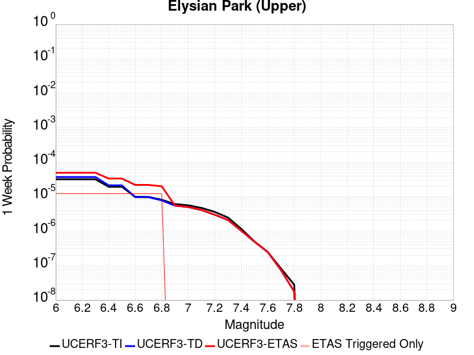 | 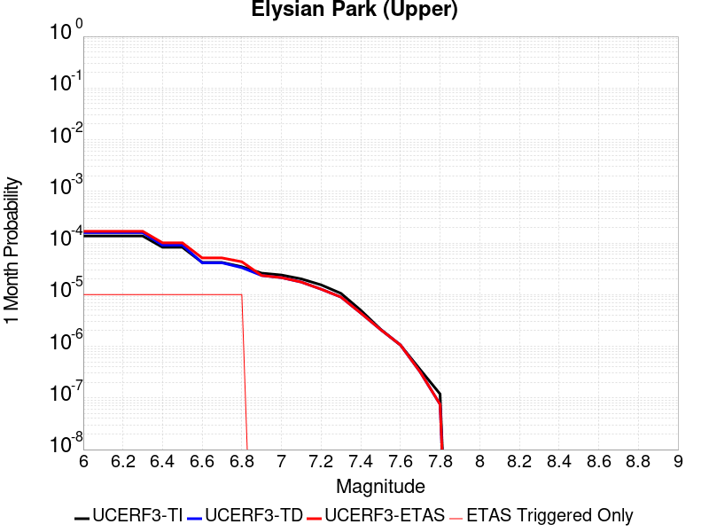 | 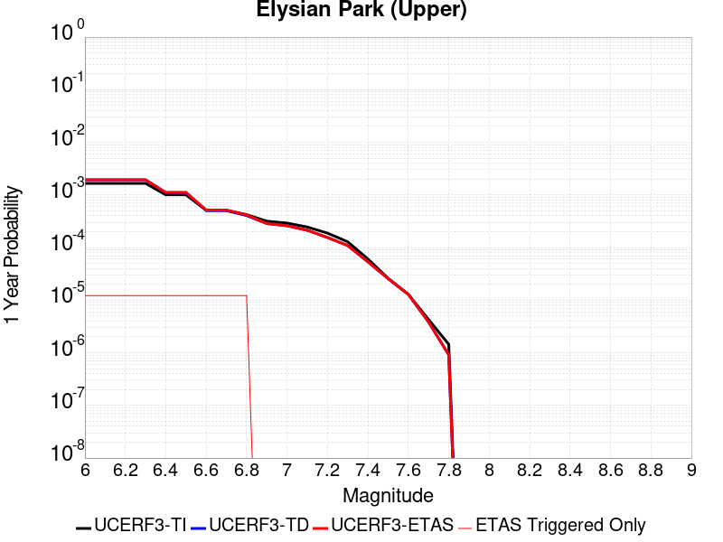 | 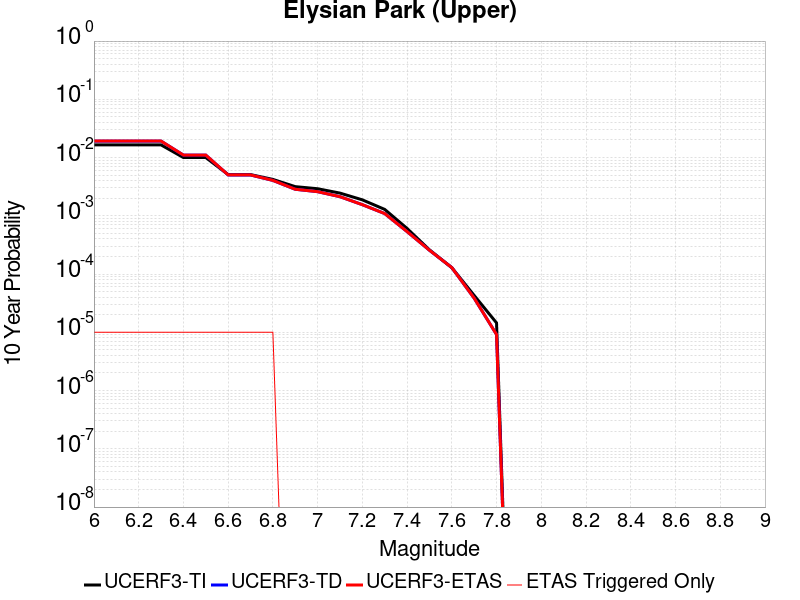 |

| Magnitude | 1 wk TI Prob | 1 wk TD Prob | 1 wk ETAS Prob | 1 wk ETAS/TD Gain | 1 wk ETAS Triggered Only | 1 mo TI Prob | 1 mo TD Prob | 1 mo ETAS Prob | 1 mo ETAS/TD Gain | 1 mo ETAS Triggered Only | 1 yr TI Prob | 1 yr TD Prob | 1 yr ETAS Prob | 1 yr ETAS/TD Gain | 1 yr ETAS Triggered Only | 10 yr TI Prob | 10 yr TD Prob | 10 yr ETAS Prob | 10 yr ETAS/TD Gain | 10 yr ETAS Triggered Only |
|-----|-----|-----|-----|-----|-----|-----|-----|-----|-----|-----|-----|-----|-----|-----|-----|-----|-----|-----|-----|-----|
| 6.0 | 3.1876025E-5 | 3.7035275E-5 | 4.7034904E-5 | 1.2700028 | 1.0E-5 | 1.3660437E-4 | 1.5871569E-4 | 1.687141E-4 | 1.0629958 | 1.0E-5 | 0.0016618895 | 0.001931122 | 0.0019411027 | 1.0051683 | 1.0E-5 | 0.016495159 | 0.019189863 | 0.01919967 | 1.000511 | 1.0E-5 |
| 6.1 | 3.1876025E-5 | 3.7035275E-5 | 4.7034904E-5 | 1.2700028 | 1.0E-5 | 1.3660437E-4 | 1.5871569E-4 | 1.687141E-4 | 1.0629958 | 1.0E-5 | 0.0016618895 | 0.001931122 | 0.0019411027 | 1.0051683 | 1.0E-5 | 0.016495159 | 0.019189863 | 0.01919967 | 1.000511 | 1.0E-5 |
| 6.2 | 3.1876025E-5 | 3.7035275E-5 | 4.7034904E-5 | 1.2700028 | 1.0E-5 | 1.3660437E-4 | 1.5871569E-4 | 1.687141E-4 | 1.0629958 | 1.0E-5 | 0.0016618895 | 0.001931122 | 0.0019411027 | 1.0051683 | 1.0E-5 | 0.016495159 | 0.019189863 | 0.01919967 | 1.000511 | 1.0E-5 |
| 6.3 | 3.1876025E-5 | 3.7035275E-5 | 4.7034904E-5 | 1.2700028 | 1.0E-5 | 1.3660437E-4 | 1.5871569E-4 | 1.687141E-4 | 1.0629958 | 1.0E-5 | 0.0016618895 | 0.001931122 | 0.0019411027 | 1.0051683 | 1.0E-5 | 0.016495159 | 0.019189863 | 0.01919967 | 1.000511 | 1.0E-5 |
| 6.4 | 1.9273462E-5 | 2.120244E-5 | 3.1202228E-5 | 1.4716338 | 1.0E-5 | 8.259794E-5 | 9.086542E-5 | 1.0086451E-4 | 1.1100428 | 1.0E-5 | 0.001005166 | 0.0011058967 | 0.0011158857 | 1.0090325 | 1.0E-5 | 0.010006315 | 0.011020744 | 0.011030634 | 1.0008974 | 1.0E-5 |
| 6.5 | 1.9273462E-5 | 2.120244E-5 | 3.1202228E-5 | 1.4716338 | 1.0E-5 | 8.259794E-5 | 9.086542E-5 | 1.0086451E-4 | 1.1100428 | 1.0E-5 | 0.001005166 | 0.0011058967 | 0.0011158857 | 1.0090325 | 1.0E-5 | 0.010006315 | 0.011020744 | 0.011030634 | 1.0008974 | 1.0E-5 |
| 6.6 | 9.813258E-6 | 9.665589E-6 | 1.9665491E-5 | 2.034588 | 1.0E-5 | 4.205614E-5 | 4.1423333E-5 | 5.1422918E-5 | 1.2413999 | 1.0E-5 | 5.119132E-4 | 5.042196E-4 | 5.1421457E-4 | 1.0198226 | 1.0E-5 | 0.005107356 | 0.0050314795 | 0.0050414293 | 1.0019774 | 1.0E-5 |
| 6.7 | 9.801478E-6 | 9.653158E-6 | 1.9653062E-5 | 2.0359204 | 1.0E-5 | 4.2005657E-5 | 4.137006E-5 | 5.1369647E-5 | 1.2417107 | 1.0E-5 | 5.112989E-4 | 5.0357135E-4 | 5.135663E-4 | 1.0198481 | 1.0E-5 | 0.0051012407 | 0.005025026 | 0.0050349757 | 1.0019801 | 1.0E-5 |
| 6.8 | 8.102489E-6 | 7.772994E-6 | 1.7772916E-5 | 2.2864957 | 1.0E-5 | 3.4724493E-5 | 3.3312434E-5 | 4.3312102E-5 | 1.3001782 | 1.0E-5 | 4.2268867E-4 | 4.0550836E-4 | 4.1550433E-4 | 1.0246505 | 1.0E-5 | 0.004218856 | 0.0040481784 | 0.0040581375 | 1.0024602 | 1.0E-5 |
| 6.9 | 6.08275E-6 | 5.481441E-6 | 5.481441E-6 | 1.0 | 0.0 | 2.6068668E-5 | 2.3491682E-5 | 2.3491682E-5 | 1.0 | 0.0 | 3.173398E-4 | 2.8597447E-4 | 2.8597447E-4 | 1.0 | 0.0 | 0.0031688702 | 0.0028561424 | 0.0028561424 | 1.0 | 0.0 |
| 7.0 | 5.5995934E-6 | 4.9827686E-6 | 4.9827686E-6 | 1.0 | 0.0 | 2.3998036E-5 | 2.1354552E-5 | 2.1354552E-5 | 1.0 | 0.0 | 2.9213692E-4 | 2.5996132E-4 | 2.5996132E-4 | 1.0 | 0.0 | 0.0029175316 | 0.0025966396 | 0.0025966396 | 1.0 | 0.0 |
| 7.1 | 4.709881E-6 | 4.0873906E-6 | 4.0873906E-6 | 1.0 | 0.0 | 2.0185047E-5 | 1.7517272E-5 | 1.7517272E-5 | 1.0 | 0.0 | 2.4572524E-4 | 2.1325232E-4 | 2.1325232E-4 | 1.0 | 0.0 | 0.002454537 | 0.0021305184 | 0.0021305184 | 1.0 | 0.0 |
| 7.2 | 3.6063436E-6 | 2.9779412E-6 | 2.9779412E-6 | 1.0 | 0.0 | 1.5455667E-5 | 1.27625435E-5 | 1.27625435E-5 | 1.0 | 0.0 | 1.881565E-4 | 1.55373E-4 | 1.55373E-4 | 1.0 | 0.0 | 0.0018799726 | 0.0015526549 | 0.0015526549 | 1.0 | 0.0 |
| 7.3 | 2.471135E-6 | 2.0954562E-6 | 2.0954562E-6 | 1.0 | 0.0 | 1.0590536E-5 | 8.980496E-6 | 8.980496E-6 | 1.0 | 0.0 | 1.2893214E-4 | 1.0933213E-4 | 1.0933213E-4 | 1.0 | 0.0 | 0.0012885736 | 0.0010927906 | 0.0010927906 | 1.0 | 0.0 |
| 7.4 | 1.163943E-6 | 1.0275061E-6 | 1.0275061E-6 | 1.0 | 0.0 | 4.988318E-6 | 4.40359E-6 | 4.40359E-6 | 1.0 | 0.0 | 6.0731076E-5 | 5.361242E-5 | 5.361242E-5 | 1.0 | 0.0 | 6.071448E-4 | 5.3599785E-4 | 5.3599785E-4 | 1.0 | 0.0 |
| 7.5 | 4.99459E-7 | 4.917601E-7 | 4.917601E-7 | 1.0 | 0.0 | 2.140537E-6 | 2.1075416E-6 | 2.1075416E-6 | 1.0 | 0.0 | 2.6060725E-5 | 2.5659032E-5 | 2.5659032E-5 | 1.0 | 0.0 | 2.605767E-4 | 2.5656226E-4 | 2.5656226E-4 | 1.0 | 0.0 |
| 7.6 | 2.4667852E-7 | 2.4778313E-7 | 2.4778313E-7 | 1.0 | 0.0 | 1.0571932E-6 | 1.0619274E-6 | 1.0619274E-6 | 1.0 | 0.0 | 1.2871251E-5 | 1.2928893E-5 | 1.2928893E-5 | 1.0 | 0.0 | 1.2870505E-4 | 1.2928178E-4 | 1.2928178E-4 | 1.0 | 0.0 |
| 7.7 | 8.2312795E-8 | 7.3864214E-8 | 7.3864214E-8 | 1.0 | 0.0 | 3.527691E-7 | 3.165609E-7 | 3.165609E-7 | 1.0 | 0.0 | 4.294955E-6 | 3.854123E-6 | 3.854123E-6 | 1.0 | 0.0 | 4.2948723E-5 | 3.854068E-5 | 3.854068E-5 | 1.0 | 0.0 |
| 7.8 | 2.7819295E-8 | 1.7565618E-8 | 1.7565618E-8 | 1.0 | 0.0 | 1.1922555E-7 | 7.528122E-8 | 7.528122E-8 | 1.0 | 0.0 | 1.45157E-6 | 9.1654863E-7 | 9.1654863E-7 | 1.0 | 0.0 | 1.45156055E-5 | 9.165463E-6 | 9.165463E-6 | 1.0 | 0.0 |

## Great Valley 07 (Orestimba)
*[(top)](#table-of-contents)*

| 1 Week | 1 Month | 1 Year | 10 Year |
|-----|-----|-----|-----|
|  |  | 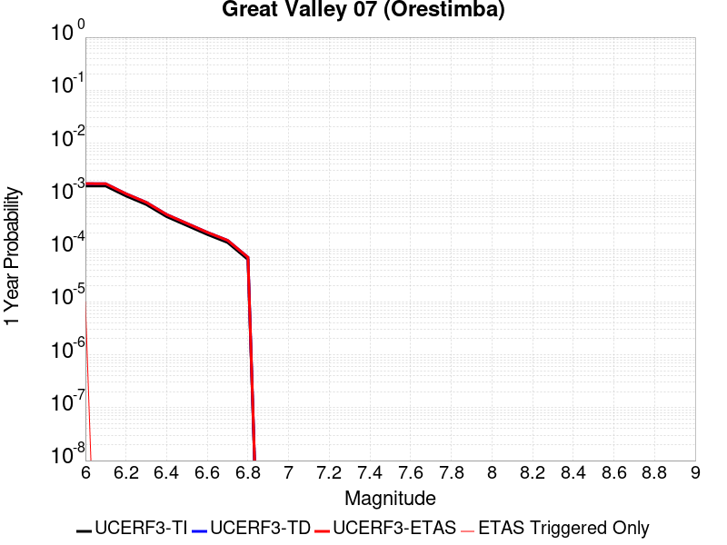 | 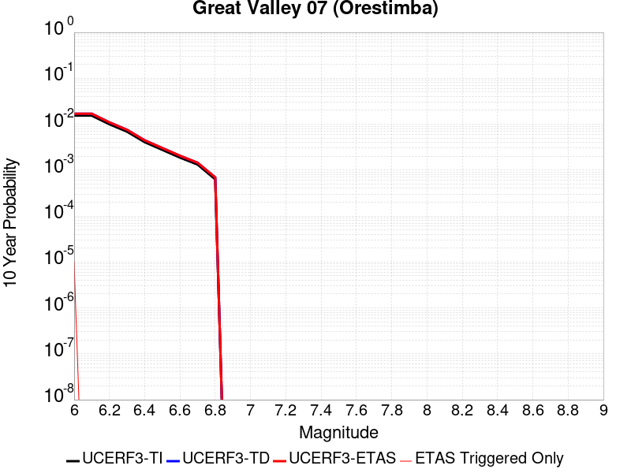 |

| Magnitude | 1 wk TI Prob | 1 wk TD Prob | 1 wk ETAS Prob | 1 wk ETAS/TD Gain | 1 wk ETAS Triggered Only | 1 mo TI Prob | 1 mo TD Prob | 1 mo ETAS Prob | 1 mo ETAS/TD Gain | 1 mo ETAS Triggered Only | 1 yr TI Prob | 1 yr TD Prob | 1 yr ETAS Prob | 1 yr ETAS/TD Gain | 1 yr ETAS Triggered Only | 10 yr TI Prob | 10 yr TD Prob | 10 yr ETAS Prob | 10 yr ETAS/TD Gain | 10 yr ETAS Triggered Only |
|-----|-----|-----|-----|-----|-----|-----|-----|-----|-----|-----|-----|-----|-----|-----|-----|-----|-----|-----|-----|-----|
| 6.0 | 2.9687902E-5 | 3.27575E-5 | 3.27575E-5 | 1.0 | 0.0 | 1.2722766E-4 | 1.4038214E-4 | 1.5038073E-4 | 1.0712241 | 1.0E-5 | 0.0015478961 | 0.0017078844 | 0.0017178673 | 1.0058452 | 1.0E-5 | 0.015371585 | 0.016955135 | 0.016964966 | 1.0005798 | 1.0E-5 |
| 6.1 | 2.9687902E-5 | 3.27575E-5 | 3.27575E-5 | 1.0 | 0.0 | 1.2722766E-4 | 1.4038214E-4 | 1.4038214E-4 | 1.0 | 0.0 | 0.0015478961 | 0.0017078844 | 0.0017078844 | 1.0 | 0.0 | 0.015371585 | 0.016955135 | 0.016955135 | 1.0 | 0.0 |
| 6.2 | 1.9231524E-5 | 2.1159167E-5 | 2.1159167E-5 | 1.0 | 0.0 | 8.2418206E-5 | 9.067912E-5 | 9.067912E-5 | 1.0 | 0.0 | 0.0010029797 | 0.0011034822 | 0.0011034822 | 1.0 | 0.0 | 0.00998465 | 0.010982441 | 0.010982441 | 1.0 | 0.0 |
| 6.3 | 1.324766E-5 | 1.4548534E-5 | 1.4548534E-5 | 1.0 | 0.0 | 5.6774446E-5 | 6.234942E-5 | 6.234942E-5 | 1.0 | 0.0 | 6.910097E-4 | 7.5884897E-4 | 7.5884897E-4 | 1.0 | 0.0 | 0.006888649 | 0.0075635235 | 0.0075635235 | 1.0 | 0.0 |
| 6.4 | 7.818645E-6 | 8.57284E-6 | 8.57284E-6 | 1.0 | 0.0 | 3.3508048E-5 | 3.6740246E-5 | 3.6740246E-5 | 1.0 | 0.0 | 4.078841E-4 | 4.4722404E-4 | 4.4722404E-4 | 1.0 | 0.0 | 0.004071363 | 0.0044635804 | 0.0044635804 | 1.0 | 0.0 |
| 6.5 | 5.3076565E-6 | 5.8178007E-6 | 5.8178007E-6 | 1.0 | 0.0 | 2.27469E-5 | 2.4933206E-5 | 2.4933206E-5 | 1.0 | 0.0 | 2.7690834E-4 | 3.035216E-4 | 3.035216E-4 | 1.0 | 0.0 | 0.0027656353 | 0.00303128 | 0.00303128 | 1.0 | 0.0 |
| 6.6 | 3.6003578E-6 | 3.9484953E-6 | 3.9484953E-6 | 1.0 | 0.0 | 1.5430012E-5 | 1.6922022E-5 | 1.6922022E-5 | 1.0 | 0.0 | 1.8784421E-4 | 2.0600771E-4 | 2.0600771E-4 | 1.0 | 0.0 | 0.0018768552 | 0.0020583214 | 0.0020583214 | 1.0 | 0.0 |
| 6.7 | 2.5361826E-6 | 2.7834678E-6 | 2.7834678E-6 | 1.0 | 0.0 | 1.0869308E-5 | 1.1929101E-5 | 1.1929101E-5 | 1.0 | 0.0 | 1.3232579E-4 | 1.4522845E-4 | 1.4522845E-4 | 1.0 | 0.0 | 0.0013224703 | 0.0014514653 | 0.0014514653 | 1.0 | 0.0 |
| 6.8 | 1.2115831E-6 | 1.3313797E-6 | 1.3313797E-6 | 1.0 | 0.0 | 5.1924885E-6 | 5.7059065E-6 | 5.7059065E-6 | 1.0 | 0.0 | 6.3216714E-5 | 6.9468166E-5 | 6.9468166E-5 | 1.0 | 0.0 | 6.3198735E-4 | 6.945596E-4 | 6.945596E-4 | 1.0 | 0.0 |

## San Andreas (Peninsula) 2011 CFM
*[(top)](#table-of-contents)*

| 1 Week | 1 Month | 1 Year | 10 Year |
|-----|-----|-----|-----|
| 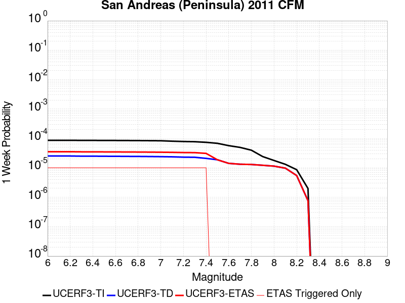 | 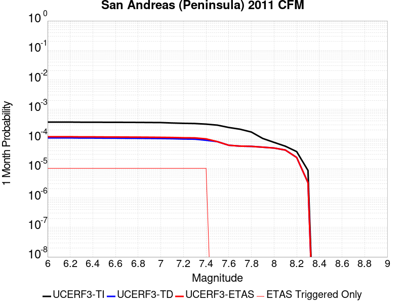 | 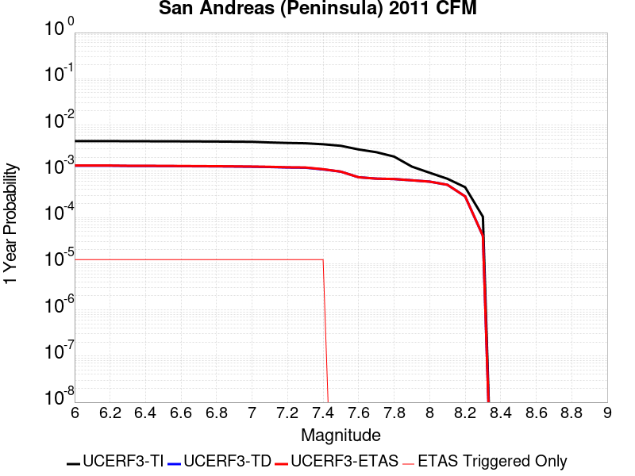 | 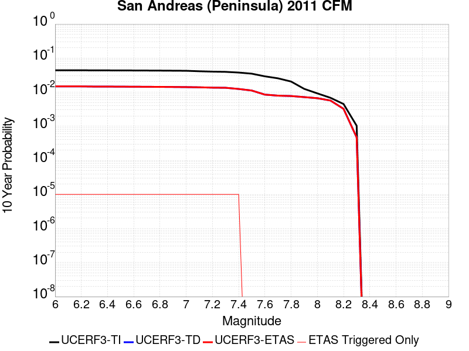 |

| Magnitude | 1 wk TI Prob | 1 wk TD Prob | 1 wk ETAS Prob | 1 wk ETAS/TD Gain | 1 wk ETAS Triggered Only | 1 mo TI Prob | 1 mo TD Prob | 1 mo ETAS Prob | 1 mo ETAS/TD Gain | 1 mo ETAS Triggered Only | 1 yr TI Prob | 1 yr TD Prob | 1 yr ETAS Prob | 1 yr ETAS/TD Gain | 1 yr ETAS Triggered Only | 10 yr TI Prob | 10 yr TD Prob | 10 yr ETAS Prob | 10 yr ETAS/TD Gain | 10 yr ETAS Triggered Only |
|-----|-----|-----|-----|-----|-----|-----|-----|-----|-----|-----|-----|-----|-----|-----|-----|-----|-----|-----|-----|-----|
| 6.0 | 8.6200685E-5 | 2.5207937E-5 | 3.5207686E-5 | 1.3966905 | 1.0E-5 | 3.6937918E-4 | 1.0802955E-4 | 1.1802847E-4 | 1.0925573 | 1.0E-5 | 0.0044879215 | 0.0013144679 | 0.0013244547 | 1.0075977 | 1.0E-5 | 0.043983612 | 0.01477218 | 0.014782031 | 1.000667 | 1.0E-5 |
| 6.1 | 8.6200685E-5 | 2.5207937E-5 | 3.5207686E-5 | 1.3966905 | 1.0E-5 | 3.6937918E-4 | 1.0802955E-4 | 1.1802847E-4 | 1.0925573 | 1.0E-5 | 0.0044879215 | 0.0013144679 | 0.0013244547 | 1.0075977 | 1.0E-5 | 0.043983612 | 0.01477218 | 0.014782031 | 1.000667 | 1.0E-5 |
| 6.2 | 8.6200685E-5 | 2.5207937E-5 | 3.5207686E-5 | 1.3966905 | 1.0E-5 | 3.6937918E-4 | 1.0802955E-4 | 1.1802847E-4 | 1.0925573 | 1.0E-5 | 0.0044879215 | 0.0013144679 | 0.0013244547 | 1.0075977 | 1.0E-5 | 0.043983612 | 0.01477218 | 0.014782031 | 1.000667 | 1.0E-5 |
| 6.3 | 8.551163E-5 | 2.4899866E-5 | 3.4899615E-5 | 1.4015986 | 1.0E-5 | 3.6642692E-4 | 1.06709354E-4 | 1.1670828E-4 | 1.0937026 | 1.0E-5 | 0.004452125 | 0.0012984137 | 0.0013084006 | 1.0076917 | 1.0E-5 | 0.043639794 | 0.01459892 | 0.014608774 | 1.000675 | 1.0E-5 |
| 6.4 | 8.551163E-5 | 2.4899866E-5 | 3.4899615E-5 | 1.4015986 | 1.0E-5 | 3.6642692E-4 | 1.06709354E-4 | 1.1670828E-4 | 1.0937026 | 1.0E-5 | 0.004452125 | 0.0012984137 | 0.0013084006 | 1.0076917 | 1.0E-5 | 0.043639794 | 0.01459892 | 0.014608774 | 1.000675 | 1.0E-5 |
| 6.5 | 8.511146E-5 | 2.4721267E-5 | 3.472102E-5 | 1.4045 | 1.0E-5 | 3.647124E-4 | 1.0594399E-4 | 1.1594293E-4 | 1.0943795 | 1.0E-5 | 0.004431336 | 0.0012891064 | 0.0012990936 | 1.0077473 | 1.0E-5 | 0.04344007 | 0.014498963 | 0.014508818 | 1.0006797 | 1.0E-5 |
| 6.6 | 8.4985084E-5 | 2.4651948E-5 | 3.46517E-5 | 1.4056375 | 1.0E-5 | 3.6417096E-4 | 1.0564694E-4 | 1.1564588E-4 | 1.0946449 | 1.0E-5 | 0.0044247704 | 0.0012854942 | 0.0012954812 | 1.0077691 | 1.0E-5 | 0.043376986 | 0.0144609315 | 0.014470788 | 1.0006815 | 1.0E-5 |
| 6.7 | 8.462618E-5 | 2.4480485E-5 | 3.448024E-5 | 1.4084786 | 1.0E-5 | 3.6263323E-4 | 1.0491216E-4 | 1.14911105E-4 | 1.0953078 | 1.0E-5 | 0.004406125 | 0.0012765586 | 0.0012865459 | 1.0078236 | 1.0E-5 | 0.043197807 | 0.014365727 | 0.014375583 | 1.000686 | 1.0E-5 |
| 6.8 | 8.42337E-5 | 2.4376272E-5 | 3.437603E-5 | 1.410225 | 1.0E-5 | 3.6095164E-4 | 1.04465566E-4 | 1.14464514E-4 | 1.0957153 | 1.0E-5 | 0.004385734 | 0.0012711277 | 0.001281115 | 1.0078571 | 1.0E-5 | 0.043001823 | 0.014306363 | 0.01431622 | 1.000689 | 1.0E-5 |
| 6.9 | 8.365989E-5 | 2.4180892E-5 | 3.418065E-5 | 1.4135396 | 1.0E-5 | 3.5849313E-4 | 1.0362829E-4 | 1.13627255E-4 | 1.0964887 | 1.0E-5 | 0.004355922 | 0.0012609458 | 0.0012709332 | 1.0079205 | 1.0E-5 | 0.04271523 | 0.014198911 | 0.014208769 | 1.0006943 | 1.0E-5 |
| 7.0 | 8.30936E-5 | 2.3942457E-5 | 3.394222E-5 | 1.4176581 | 1.0E-5 | 3.560668E-4 | 1.026065E-4 | 1.1260548E-4 | 1.0974497 | 1.0E-5 | 0.004326499 | 0.0012485199 | 0.0012585074 | 1.0079995 | 1.0E-5 | 0.042432297 | 0.014069902 | 0.014079762 | 1.0007007 | 1.0E-5 |
| 7.1 | 8.041264E-5 | 2.3628894E-5 | 3.3628658E-5 | 1.4232006 | 1.0E-5 | 3.4458007E-4 | 1.0126277E-4 | 1.1126176E-4 | 1.098743 | 1.0E-5 | 0.0041871946 | 0.0012321785 | 0.0012421663 | 1.0081058 | 1.0E-5 | 0.041091725 | 0.013892905 | 0.013902767 | 1.0007098 | 1.0E-5 |
| 7.2 | 7.8427016E-5 | 2.3052688E-5 | 3.3052456E-5 | 1.4337789 | 1.0E-5 | 3.3607247E-4 | 9.87935E-5 | 1.08792505E-4 | 1.1012112 | 1.0E-5 | 0.004084008 | 0.0012021487 | 0.0012121367 | 1.0083084 | 1.0E-5 | 0.040097635 | 0.013576745 | 0.01358661 | 1.0007266 | 1.0E-5 |
| 7.3 | 7.721087E-5 | 2.2837554E-5 | 3.2837324E-5 | 1.4378653 | 1.0E-5 | 3.3086175E-4 | 9.787157E-5 | 1.0787059E-4 | 1.1021647 | 1.0E-5 | 0.004020803 | 0.0011909365 | 0.0012009246 | 1.0083867 | 1.0E-5 | 0.03948827 | 0.013460464 | 0.013470329 | 1.0007329 | 1.0E-5 |
| 7.4 | 7.3536525E-5 | 2.095521E-5 | 3.0955E-5 | 1.4771982 | 1.0E-5 | 3.1511846E-4 | 8.980496E-5 | 9.980406E-5 | 1.1113424 | 1.0E-5 | 0.0038298194 | 0.0010928282 | 0.0011028174 | 1.0091406 | 1.0E-5 | 0.037644852 | 0.0124172745 | 0.01242715 | 1.0007954 | 1.0E-5 |
| 7.5 | 6.806207E-5 | 1.876151E-5 | 1.876151E-5 | 1.0 | 0.0 | 2.9166197E-4 | 8.0404E-5 | 8.0404E-5 | 1.0 | 0.0 | 0.0035452035 | 9.784801E-4 | 9.784801E-4 | 1.0 | 0.0 | 0.034891766 | 0.011170478 | 0.011170478 | 1.0 | 0.0 |
| 7.6 | 5.6731416E-5 | 1.4173155E-5 | 1.4173155E-5 | 1.0 | 0.0 | 2.43112E-4 | 6.074068E-5 | 6.074068E-5 | 1.0 | 0.0 | 0.0029558712 | 7.3926704E-4 | 7.3926704E-4 | 1.0 | 0.0 | 0.02916862 | 0.00848332 | 0.00848332 | 1.0 | 0.0 |
| 7.7 | 4.946994E-5 | 1.3242368E-5 | 1.3242368E-5 | 1.0 | 0.0 | 2.1199681E-4 | 5.675177E-5 | 5.675177E-5 | 1.0 | 0.0 | 0.002578006 | 6.907339E-4 | 6.907339E-4 | 1.0 | 0.0 | 0.02548303 | 0.007905742 | 0.007905742 | 1.0 | 0.0 |
| 7.8 | 3.9718198E-5 | 1.2979126E-5 | 1.2979126E-5 | 1.0 | 0.0 | 1.7020974E-4 | 5.562364E-5 | 5.562364E-5 | 1.0 | 0.0 | 0.0020703338 | 6.7700754E-4 | 6.7700754E-4 | 1.0 | 0.0 | 0.020511515 | 0.007716547 | 0.007716547 | 1.0 | 0.0 |
| 7.9 | 2.4115114E-5 | 1.2183215E-5 | 1.2183215E-5 | 1.0 | 0.0 | 1.0334639E-4 | 5.2212738E-5 | 5.2212738E-5 | 1.0 | 0.0 | 0.001257516 | 6.355048E-4 | 6.355048E-4 | 1.0 | 0.0 | 0.012504238 | 0.0071578487 | 0.0071578487 | 1.0 | 0.0 |
| 8.0 | 1.7756569E-5 | 1.1408184E-5 | 1.1408184E-5 | 1.0 | 0.0 | 7.6097356E-5 | 4.8891303E-5 | 4.8891303E-5 | 1.0 | 0.0 | 9.260915E-4 | 5.9508916E-4 | 5.9508916E-4 | 1.0 | 0.0 | 0.009222416 | 0.006658535 | 0.006658535 | 1.0 | 0.0 |
| 8.1 | 1.3159258E-5 | 9.744603E-6 | 9.744603E-6 | 1.0 | 0.0 | 5.6395602E-5 | 4.1761916E-5 | 4.1761916E-5 | 1.0 | 0.0 | 6.864001E-4 | 5.083328E-4 | 5.083328E-4 | 1.0 | 0.0 | 0.0068428386 | 0.005688865 | 0.005688865 | 1.0 | 0.0 |
| 8.2 | 8.635426E-6 | 5.465718E-6 | 5.465718E-6 | 1.0 | 0.0 | 3.700844E-5 | 2.3424296E-5 | 2.3424296E-5 | 1.0 | 0.0 | 4.5048463E-4 | 2.8515357E-4 | 2.8515357E-4 | 1.0 | 0.0 | 0.004495725 | 0.0032439749 | 0.0032439749 | 1.0 | 0.0 |
| 8.3 | 1.983087E-6 | 7.6564595E-7 | 7.6564595E-7 | 1.0 | 0.0 | 8.498917E-6 | 3.281336E-6 | 3.281336E-6 | 1.0 | 0.0 | 1.034694E-4 | 3.9949547E-5 | 3.9949547E-5 | 1.0 | 0.0 | 0.0010342124 | 4.717979E-4 | 4.717979E-4 | 1.0 | 0.0 |

## Los Alamos 2011 CFM
*[(top)](#table-of-contents)*

| 1 Week | 1 Month | 1 Year | 10 Year |
|-----|-----|-----|-----|
|  | 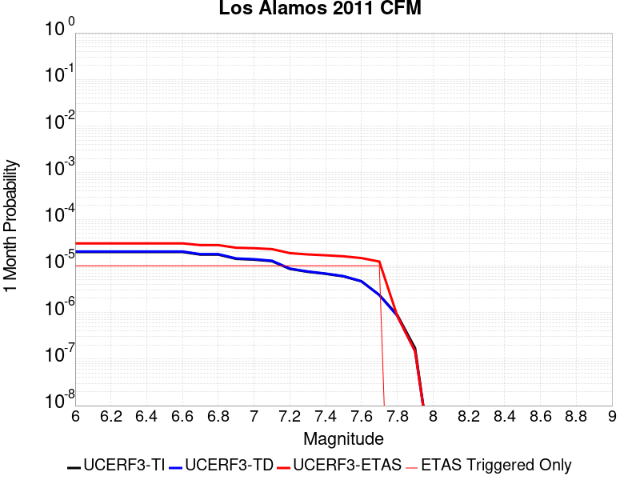 | 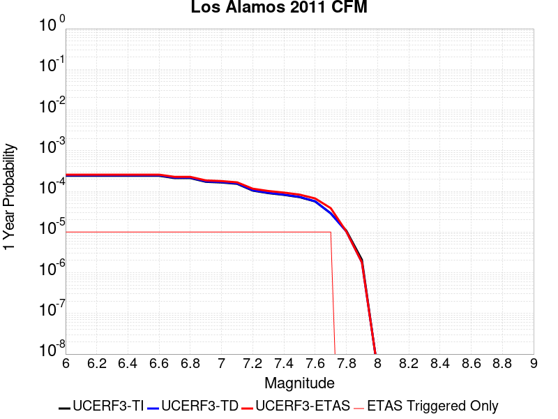 | 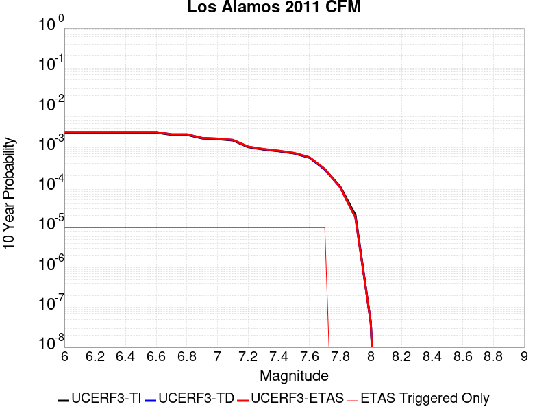 |

| Magnitude | 1 wk TI Prob | 1 wk TD Prob | 1 wk ETAS Prob | 1 wk ETAS/TD Gain | 1 wk ETAS Triggered Only | 1 mo TI Prob | 1 mo TD Prob | 1 mo ETAS Prob | 1 mo ETAS/TD Gain | 1 mo ETAS Triggered Only | 1 yr TI Prob | 1 yr TD Prob | 1 yr ETAS Prob | 1 yr ETAS/TD Gain | 1 yr ETAS Triggered Only | 10 yr TI Prob | 10 yr TD Prob | 10 yr ETAS Prob | 10 yr ETAS/TD Gain | 10 yr ETAS Triggered Only |
|-----|-----|-----|-----|-----|-----|-----|-----|-----|-----|-----|-----|-----|-----|-----|-----|-----|-----|-----|-----|-----|
| 6.0 | 4.6284417E-6 | 4.7517333E-6 | 1.4751686E-5 | 3.1044853 | 1.0E-5 | 1.9836029E-5 | 2.0364423E-5 | 3.036422E-5 | 1.4910425 | 1.0E-5 | 2.4147688E-4 | 2.479104E-4 | 2.5790793E-4 | 1.0403272 | 1.0E-5 | 0.0024121467 | 0.0024765125 | 0.0024864879 | 1.004028 | 1.0E-5 |
| 6.1 | 4.6284417E-6 | 4.7517333E-6 | 1.4751686E-5 | 3.1044853 | 1.0E-5 | 1.9836029E-5 | 2.0364423E-5 | 3.036422E-5 | 1.4910425 | 1.0E-5 | 2.4147688E-4 | 2.479104E-4 | 2.5790793E-4 | 1.0403272 | 1.0E-5 | 0.0024121467 | 0.0024765125 | 0.0024864879 | 1.004028 | 1.0E-5 |
| 6.2 | 4.6284417E-6 | 4.7517333E-6 | 1.4751686E-5 | 3.1044853 | 1.0E-5 | 1.9836029E-5 | 2.0364423E-5 | 3.036422E-5 | 1.4910425 | 1.0E-5 | 2.4147688E-4 | 2.479104E-4 | 2.5790793E-4 | 1.0403272 | 1.0E-5 | 0.0024121467 | 0.0024765125 | 0.0024864879 | 1.004028 | 1.0E-5 |
| 6.3 | 4.6284417E-6 | 4.7517333E-6 | 1.4751686E-5 | 3.1044853 | 1.0E-5 | 1.9836029E-5 | 2.0364423E-5 | 3.036422E-5 | 1.4910425 | 1.0E-5 | 2.4147688E-4 | 2.479104E-4 | 2.5790793E-4 | 1.0403272 | 1.0E-5 | 0.0024121467 | 0.0024765125 | 0.0024864879 | 1.004028 | 1.0E-5 |
| 6.4 | 4.6284417E-6 | 4.7517333E-6 | 1.4751686E-5 | 3.1044853 | 1.0E-5 | 1.9836029E-5 | 2.0364423E-5 | 3.036422E-5 | 1.4910425 | 1.0E-5 | 2.4147688E-4 | 2.479104E-4 | 2.5790793E-4 | 1.0403272 | 1.0E-5 | 0.0024121467 | 0.0024765125 | 0.0024864879 | 1.004028 | 1.0E-5 |
| 6.5 | 4.6284417E-6 | 4.7517333E-6 | 1.4751686E-5 | 3.1044853 | 1.0E-5 | 1.9836029E-5 | 2.0364423E-5 | 3.036422E-5 | 1.4910425 | 1.0E-5 | 2.4147688E-4 | 2.479104E-4 | 2.5790793E-4 | 1.0403272 | 1.0E-5 | 0.0024121467 | 0.0024765125 | 0.0024864879 | 1.004028 | 1.0E-5 |
| 6.6 | 4.6284417E-6 | 4.7517333E-6 | 1.4751686E-5 | 3.1044853 | 1.0E-5 | 1.9836029E-5 | 2.0364423E-5 | 3.036422E-5 | 1.4910425 | 1.0E-5 | 2.4147688E-4 | 2.479104E-4 | 2.5790793E-4 | 1.0403272 | 1.0E-5 | 0.0024121467 | 0.0024765125 | 0.0024864879 | 1.004028 | 1.0E-5 |
| 6.7 | 4.062321E-6 | 4.166351E-6 | 1.41663095E-5 | 3.4001718 | 1.0E-5 | 1.7409831E-5 | 1.7855677E-5 | 2.7855498E-5 | 1.560036 | 1.0E-5 | 2.1194408E-4 | 2.1737268E-4 | 2.2737052E-4 | 1.0459939 | 1.0E-5 | 0.0021174205 | 0.0021717504 | 0.0021817286 | 1.0045946 | 1.0E-5 |
| 6.8 | 4.062321E-6 | 4.166351E-6 | 1.41663095E-5 | 3.4001718 | 1.0E-5 | 1.7409831E-5 | 1.7855677E-5 | 2.7855498E-5 | 1.560036 | 1.0E-5 | 2.1194408E-4 | 2.1737268E-4 | 2.2737052E-4 | 1.0459939 | 1.0E-5 | 0.0021174205 | 0.0021717504 | 0.0021817286 | 1.0045946 | 1.0E-5 |
| 6.9 | 3.2936077E-6 | 3.37296E-6 | 1.3372926E-5 | 3.964745 | 1.0E-5 | 1.4115385E-5 | 1.4455468E-5 | 2.4455323E-5 | 1.6917697 | 1.0E-5 | 1.7184127E-4 | 1.7598206E-4 | 1.8598029E-4 | 1.056814 | 1.0E-5 | 0.0017170844 | 0.0017585196 | 0.0017685019 | 1.0056766 | 1.0E-5 |
| 7.0 | 3.1687898E-6 | 3.2448177E-6 | 1.3244785E-5 | 4.081827 | 1.0E-5 | 1.3580457E-5 | 1.3906293E-5 | 2.3906154E-5 | 1.7190889 | 1.0E-5 | 1.6532952E-4 | 1.692969E-4 | 1.792952E-4 | 1.0590578 | 1.0E-5 | 0.0016520657 | 0.0016917707 | 0.0017017538 | 1.005901 | 1.0E-5 |
| 7.1 | 2.9379228E-6 | 3.007328E-6 | 1.3007298E-5 | 4.325201 | 1.0E-5 | 1.25910365E-5 | 1.288849E-5 | 2.2888362E-5 | 1.775876 | 1.0E-5 | 1.5328509E-4 | 1.5690697E-4 | 1.669054E-4 | 1.063722 | 1.0E-5 | 0.001531794 | 0.001568051 | 0.0015780353 | 1.0063673 | 1.0E-5 |
| 7.2 | 2.0020686E-6 | 2.041632E-6 | 1.2041612E-5 | 5.898032 | 1.0E-5 | 8.580266E-6 | 8.749822E-6 | 1.8749735E-5 | 2.1428704 | 1.0E-5 | 1.0445973E-4 | 1.0652392E-4 | 1.1652285E-4 | 1.0938656 | 1.0E-5 | 0.0010441064 | 0.001064733 | 0.0010747224 | 1.009382 | 1.0E-5 |
| 7.3 | 1.7364243E-6 | 1.7678824E-6 | 1.1767865E-5 | 6.6564746 | 1.0E-5 | 7.441797E-6 | 7.576617E-6 | 1.7576542E-5 | 2.3198402 | 1.0E-5 | 9.0600115E-5 | 9.224144E-5 | 1.0224052E-4 | 1.1084012 | 1.0E-5 | 9.0563187E-4 | 9.2203467E-4 | 9.3202543E-4 | 1.0108355 | 1.0E-5 |
| 7.4 | 1.5718434E-6 | 1.5983198E-6 | 1.1598304E-5 | 7.25656 | 1.0E-5 | 6.7364545E-6 | 6.8499244E-6 | 1.6849855E-5 | 2.45986 | 1.0E-5 | 8.201325E-5 | 8.339467E-5 | 9.3393835E-5 | 1.1199018 | 1.0E-5 | 8.198299E-4 | 8.3363673E-4 | 8.4362837E-4 | 1.0119857 | 1.0E-5 |
| 7.5 | 1.3841119E-6 | 1.4042814E-6 | 1.1404268E-5 | 8.12107 | 1.0E-5 | 5.9318945E-6 | 6.018335E-6 | 1.6018275E-5 | 2.6615791 | 1.0E-5 | 7.221842E-5 | 7.327079E-5 | 8.327006E-5 | 1.1364701 | 1.0E-5 | 7.2194956E-4 | 7.3246926E-4 | 7.4246194E-4 | 1.0136424 | 1.0E-5 |
| 7.6 | 1.0843726E-6 | 1.0934443E-6 | 1.1093433E-5 | 10.145404 | 1.0E-5 | 4.647303E-6 | 4.6861815E-6 | 1.4686135E-5 | 3.1339235 | 1.0E-5 | 5.6579443E-5 | 5.705279E-5 | 6.705222E-5 | 1.1752663 | 1.0E-5 | 5.656504E-4 | 5.70384E-4 | 5.8037834E-4 | 1.0175221 | 1.0E-5 |
| 7.7 | 5.544814E-7 | 5.501884E-7 | 1.0550183E-5 | 19.175581 | 1.0E-5 | 2.3763469E-6 | 2.3579482E-6 | 1.2357925E-5 | 5.2409654 | 1.0E-5 | 2.8931638E-5 | 2.8707644E-5 | 3.8707356E-5 | 1.3483293 | 1.0E-5 | 2.8927872E-4 | 2.870395E-4 | 2.9703663E-4 | 1.0348284 | 1.0E-5 |
| 7.8 | 2.0707465E-7 | 1.9778598E-7 | 1.9778598E-7 | 1.0 | 0.0 | 8.874625E-7 | 8.476539E-7 | 8.476539E-7 | 1.0 | 0.0 | 1.08048025E-5 | 1.0320137E-5 | 1.0320137E-5 | 1.0 | 0.0 | 1.0804277E-4 | 1.0319663E-4 | 1.0319663E-4 | 1.0 | 0.0 |
| 7.9 | 3.9821284E-8 | 3.4331528E-8 | 3.4331528E-8 | 1.0 | 0.0 | 1.7066264E-7 | 1.4713511E-7 | 1.4713511E-7 | 1.0 | 0.0 | 2.0778157E-6 | 1.7913685E-6 | 1.7913685E-6 | 1.0 | 0.0 | 2.0777963E-5 | 1.7913546E-5 | 1.7913546E-5 | 1.0 | 0.0 |
| 8.0 | 7.880441E-11 | 8.2353124E-11 | 8.2353124E-11 | 1.0 | 0.0 | 3.3773329E-10 | 3.52942E-10 | 3.52942E-10 | 1.0 | 0.0 | 4.1119033E-9 | 4.2970694E-9 | 4.2970694E-9 | 1.0 | 0.0 | 4.1119034E-8 | 4.2970694E-8 | 4.2970694E-8 | 1.0 | 0.0 |

## Malibu Coast (Extension) alt 1
*[(top)](#table-of-contents)*

| 1 Week | 1 Month | 1 Year | 10 Year |
|-----|-----|-----|-----|
| 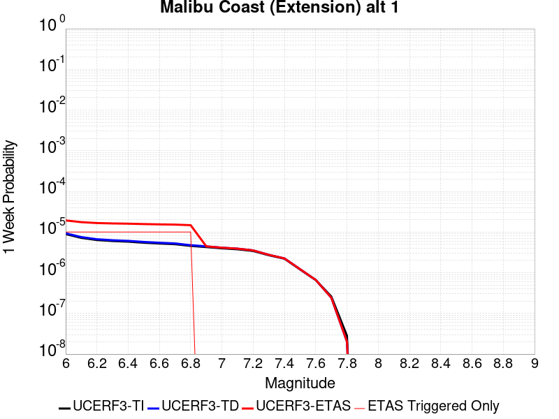 | 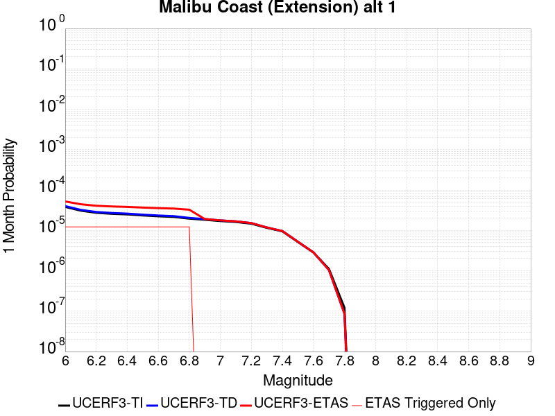 | 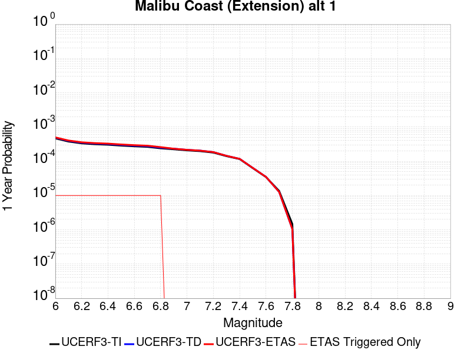 | 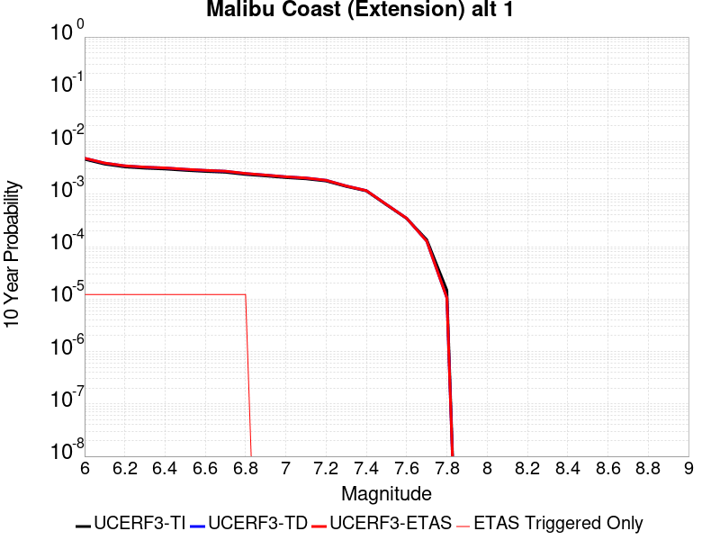 |

| Magnitude | 1 wk TI Prob | 1 wk TD Prob | 1 wk ETAS Prob | 1 wk ETAS/TD Gain | 1 wk ETAS Triggered Only | 1 mo TI Prob | 1 mo TD Prob | 1 mo ETAS Prob | 1 mo ETAS/TD Gain | 1 mo ETAS Triggered Only | 1 yr TI Prob | 1 yr TD Prob | 1 yr ETAS Prob | 1 yr ETAS/TD Gain | 1 yr ETAS Triggered Only | 10 yr TI Prob | 10 yr TD Prob | 10 yr ETAS Prob | 10 yr ETAS/TD Gain | 10 yr ETAS Triggered Only |
|-----|-----|-----|-----|-----|-----|-----|-----|-----|-----|-----|-----|-----|-----|-----|-----|-----|-----|-----|-----|-----|
| 6.0 | 8.930738E-6 | 9.3292765E-6 | 1.9329183E-5 | 2.0718844 | 1.0E-5 | 3.827403E-5 | 3.998201E-5 | 4.9981612E-5 | 1.2501025 | 1.0E-5 | 4.6588664E-4 | 4.86674E-4 | 4.966691E-4 | 1.0205376 | 1.0E-5 | 0.0046491115 | 0.004856264 | 0.004866216 | 1.0020492 | 1.0E-5 |
| 6.1 | 7.199952E-6 | 7.5302974E-6 | 1.7530221E-5 | 2.3279588 | 1.0E-5 | 3.0856572E-5 | 3.2272306E-5 | 4.2271986E-5 | 1.3098532 | 1.0E-5 | 3.75614E-4 | 3.928451E-4 | 4.0284116E-4 | 1.0254453 | 1.0E-5 | 0.0037497976 | 0.0039215726 | 0.0039315335 | 1.00254 | 1.0E-5 |
| 6.2 | 6.3721413E-6 | 6.666792E-6 | 1.6666725E-5 | 2.4999616 | 1.0E-5 | 2.7308892E-5 | 2.8571656E-5 | 3.8571372E-5 | 1.3499873 | 1.0E-5 | 3.3243504E-4 | 3.4780474E-4 | 3.5780127E-4 | 1.0287417 | 1.0E-5 | 0.0033193815 | 0.0034726441 | 0.0034826095 | 1.0028696 | 1.0E-5 |
| 6.3 | 6.016345E-6 | 6.295159E-6 | 1.6295096E-5 | 2.5885122 | 1.0E-5 | 2.578408E-5 | 2.6978976E-5 | 3.6978705E-5 | 1.370649 | 1.0E-5 | 3.1387596E-4 | 3.2841985E-4 | 3.3841658E-4 | 1.0304388 | 1.0E-5 | 0.00313433 | 0.0032793812 | 0.0032893484 | 1.0030394 | 1.0E-5 |
| 6.4 | 5.8104883E-6 | 6.0795455E-6 | 1.6079484E-5 | 2.6448498 | 1.0E-5 | 2.4901856E-5 | 2.6054937E-5 | 3.6054676E-5 | 1.3837944 | 1.0E-5 | 3.031379E-4 | 3.17173E-4 | 3.271698E-4 | 1.0315186 | 1.0E-5 | 0.0030272473 | 0.0031672379 | 0.003177206 | 1.0031474 | 1.0E-5 |
| 6.5 | 5.476925E-6 | 5.727514E-6 | 1.5727457E-5 | 2.745948 | 1.0E-5 | 2.3472323E-5 | 2.454626E-5 | 3.4546014E-5 | 1.407384 | 1.0E-5 | 2.8573806E-4 | 2.9881002E-4 | 3.0880704E-4 | 1.0334561 | 1.0E-5 | 0.0028537093 | 0.0029841145 | 0.0029940845 | 1.0033411 | 1.0E-5 |
| 6.6 | 5.222387E-6 | 5.4585807E-6 | 1.5458527E-5 | 2.831968 | 1.0E-5 | 2.2381464E-5 | 2.3393708E-5 | 3.3393473E-5 | 1.4274553 | 1.0E-5 | 2.7246025E-4 | 2.8478145E-4 | 2.947786E-4 | 1.0351046 | 1.0E-5 | 0.0027212645 | 0.002844196 | 0.0028541675 | 1.003506 | 1.0E-5 |
| 6.7 | 5.0337076E-6 | 5.259104E-6 | 1.5259051E-5 | 2.9014547 | 1.0E-5 | 2.1572854E-5 | 2.2538823E-5 | 3.25386E-5 | 1.4436688 | 1.0E-5 | 2.6261783E-4 | 2.743759E-4 | 2.8437315E-4 | 1.0364363 | 1.0E-5 | 0.002623077 | 0.0027404015 | 0.0027503741 | 1.0036391 | 1.0E-5 |
| 6.8 | 4.5675624E-6 | 4.7587173E-6 | 1.475867E-5 | 3.1013966 | 1.0E-5 | 1.9575122E-5 | 2.0394344E-5 | 3.039414E-5 | 1.490322 | 1.0E-5 | 2.3830103E-4 | 2.4827302E-4 | 2.5827056E-4 | 1.0402682 | 1.0E-5 | 0.0023804565 | 0.0024799763 | 0.0024899517 | 1.0040222 | 1.0E-5 |
| 6.9 | 4.2802412E-6 | 4.4520216E-6 | 4.4520216E-6 | 1.0 | 0.0 | 1.8343762E-5 | 1.9079953E-5 | 1.9079953E-5 | 1.0 | 0.0 | 2.2331243E-4 | 2.3227383E-4 | 2.3227383E-4 | 1.0 | 0.0 | 0.0022308815 | 0.0023203273 | 0.0023203273 | 1.0 | 0.0 |
| 7.0 | 3.9794063E-6 | 4.1301E-6 | 4.1301E-6 | 1.0 | 0.0 | 1.7054486E-5 | 1.770031E-5 | 1.770031E-5 | 1.0 | 0.0 | 2.0761859E-4 | 2.1548007E-4 | 2.1548007E-4 | 1.0 | 0.0 | 0.0020742472 | 0.002152725 | 0.002152725 | 1.0 | 0.0 |
| 7.1 | 3.7730424E-6 | 3.911218E-6 | 3.911218E-6 | 1.0 | 0.0 | 1.6170083E-5 | 1.6762255E-5 | 1.6762255E-5 | 1.0 | 0.0 | 1.9685295E-4 | 2.0406146E-4 | 2.0406146E-4 | 1.0 | 0.0 | 0.0019667868 | 0.0020387538 | 0.0020387538 | 1.0 | 0.0 |
| 7.2 | 3.424985E-6 | 3.541338E-6 | 3.541338E-6 | 1.0 | 0.0 | 1.4678424E-5 | 1.5177075E-5 | 1.5177075E-5 | 1.0 | 0.0 | 1.7869516E-4 | 1.8476533E-4 | 1.8476533E-4 | 1.0 | 0.0 | 0.0017855153 | 0.0018461292 | 0.0018461292 | 1.0 | 0.0 |
| 7.3 | 2.6966375E-6 | 2.759654E-6 | 2.759654E-6 | 1.0 | 0.0 | 1.15569665E-5 | 1.1827035E-5 | 1.1827035E-5 | 1.0 | 0.0 | 1.4069698E-4 | 1.4398468E-4 | 1.4398468E-4 | 1.0 | 0.0 | 0.0014060794 | 0.001438918 | 0.001438918 | 1.0 | 0.0 |
| 7.4 | 2.215957E-6 | 2.249379E-6 | 2.249379E-6 | 1.0 | 0.0 | 9.496924E-6 | 9.64016E-6 | 9.64016E-6 | 1.0 | 0.0 | 1.1561892E-4 | 1.1736266E-4 | 1.1736266E-4 | 1.0 | 0.0 | 0.0011555878 | 0.0011730106 | 0.0011730106 | 1.0 | 0.0 |
| 7.5 | 1.2040218E-6 | 1.2219067E-6 | 1.2219067E-6 | 1.0 | 0.0 | 5.160083E-6 | 5.2367327E-6 | 5.2367327E-6 | 1.0 | 0.0 | 6.2822204E-5 | 6.3755375E-5 | 6.3755375E-5 | 1.0 | 0.0 | 6.280445E-4 | 6.3737266E-4 | 6.3737266E-4 | 1.0 | 0.0 |
| 7.6 | 6.6157446E-7 | 6.6789755E-7 | 6.6789755E-7 | 1.0 | 0.0 | 2.835316E-6 | 2.8624152E-6 | 2.8624152E-6 | 1.0 | 0.0 | 3.4519428E-5 | 3.4849363E-5 | 3.4849363E-5 | 1.0 | 0.0 | 3.4514067E-4 | 3.484405E-4 | 3.484405E-4 | 1.0 | 0.0 |
| 7.7 | 2.6012302E-7 | 2.4357584E-7 | 2.4357584E-7 | 1.0 | 0.0 | 1.1148124E-6 | 1.0438962E-6 | 1.0438962E-6 | 1.0 | 0.0 | 1.3572758E-5 | 1.2709373E-5 | 1.2709373E-5 | 1.0 | 0.0 | 1.3571928E-4 | 1.2708752E-4 | 1.2708752E-4 | 1.0 | 0.0 |
| 7.8 | 2.8323132E-8 | 2.0266642E-8 | 2.0266642E-8 | 1.0 | 0.0 | 1.2138484E-7 | 8.685703E-8 | 8.685703E-8 | 1.0 | 0.0 | 1.4778595E-6 | 1.0574839E-6 | 1.0574839E-6 | 1.0 | 0.0 | 1.4778497E-5 | 1.0574797E-5 | 1.0574797E-5 | 1.0 | 0.0 |

## Pisgah-Bullion Mtn-Mesquite Lk
*[(top)](#table-of-contents)*

| 1 Week | 1 Month | 1 Year | 10 Year |
|-----|-----|-----|-----|
|  |  |  |  |

| Magnitude | 1 wk TI Prob | 1 wk TD Prob | 1 wk ETAS Prob | 1 wk ETAS/TD Gain | 1 wk ETAS Triggered Only | 1 mo TI Prob | 1 mo TD Prob | 1 mo ETAS Prob | 1 mo ETAS/TD Gain | 1 mo ETAS Triggered Only | 1 yr TI Prob | 1 yr TD Prob | 1 yr ETAS Prob | 1 yr ETAS/TD Gain | 1 yr ETAS Triggered Only | 10 yr TI Prob | 10 yr TD Prob | 10 yr ETAS Prob | 10 yr ETAS/TD Gain | 10 yr ETAS Triggered Only |
|-----|-----|-----|-----|-----|-----|-----|-----|-----|-----|-----|-----|-----|-----|-----|-----|-----|-----|-----|-----|-----|
| 6.0 | 3.0240792E-5 | 2.40909E-5 | 2.40909E-5 | 1.0 | 0.0 | 1.2959696E-4 | 1.032432E-4 | 1.032432E-4 | 1.0 | 0.0 | 0.0015767008 | 0.0012563618 | 0.0012663492 | 1.0079495 | 1.0E-5 | 0.015655609 | 0.012502613 | 0.012512488 | 1.0007899 | 1.0E-5 |
| 6.1 | 3.0240792E-5 | 2.40909E-5 | 2.40909E-5 | 1.0 | 0.0 | 1.2959696E-4 | 1.032432E-4 | 1.032432E-4 | 1.0 | 0.0 | 0.0015767008 | 0.0012563618 | 0.0012663492 | 1.0079495 | 1.0E-5 | 0.015655609 | 0.012502613 | 0.012512488 | 1.0007899 | 1.0E-5 |
| 6.2 | 3.0240792E-5 | 2.40909E-5 | 2.40909E-5 | 1.0 | 0.0 | 1.2959696E-4 | 1.032432E-4 | 1.032432E-4 | 1.0 | 0.0 | 0.0015767008 | 0.0012563618 | 0.0012663492 | 1.0079495 | 1.0E-5 | 0.015655609 | 0.012502613 | 0.012512488 | 1.0007899 | 1.0E-5 |
| 6.3 | 2.0498217E-5 | 1.3638054E-5 | 1.3638054E-5 | 1.0 | 0.0 | 8.784654E-5 | 5.8447586E-5 | 5.8447586E-5 | 1.0 | 0.0 | 0.0010690069 | 7.1138324E-4 | 7.2137616E-4 | 1.0140471 | 1.0E-5 | 0.01063879 | 0.0070926864 | 0.0071026157 | 1.0013999 | 1.0E-5 |
| 6.4 | 2.0498217E-5 | 1.3638054E-5 | 1.3638054E-5 | 1.0 | 0.0 | 8.784654E-5 | 5.8447586E-5 | 5.8447586E-5 | 1.0 | 0.0 | 0.0010690069 | 7.1138324E-4 | 7.2137616E-4 | 1.0140471 | 1.0E-5 | 0.01063879 | 0.0070926864 | 0.0071026157 | 1.0013999 | 1.0E-5 |
| 6.5 | 1.7316182E-5 | 1.04769715E-5 | 1.04769715E-5 | 1.0 | 0.0 | 7.42101E-5 | 4.490059E-5 | 4.490059E-5 | 1.0 | 0.0 | 9.0313336E-4 | 5.465376E-4 | 5.565321E-4 | 1.0182871 | 1.0E-5 | 0.008994718 | 0.00545293 | 0.0054628756 | 1.0018239 | 1.0E-5 |
| 6.6 | 1.5251077E-5 | 8.414133E-6 | 8.414133E-6 | 1.0 | 0.0 | 6.536012E-5 | 3.606011E-5 | 3.606011E-5 | 1.0 | 0.0 | 7.9546886E-4 | 4.3895066E-4 | 4.4894626E-4 | 1.0227716 | 1.0E-5 | 0.007926274 | 0.0043815537 | 0.0043915096 | 1.0022722 | 1.0E-5 |
| 6.7 | 1.2997425E-5 | 6.4112146E-6 | 6.4112146E-6 | 1.0 | 0.0 | 5.570206E-5 | 2.7476372E-5 | 2.7476372E-5 | 1.0 | 0.0 | 6.7796157E-4 | 3.3447813E-4 | 3.3447813E-4 | 1.0 | 0.0 | 0.0067589693 | 0.003340207 | 0.003340207 | 1.0 | 0.0 |
| 6.8 | 1.035386E-5 | 4.333145E-6 | 4.333145E-6 | 1.0 | 0.0 | 4.437293E-5 | 1.8570496E-5 | 1.8570496E-5 | 1.0 | 0.0 | 5.401065E-4 | 2.260732E-4 | 2.260732E-4 | 1.0 | 0.0 | 0.0053879567 | 0.002258519 | 0.002258519 | 1.0 | 0.0 |
| 6.9 | 8.816252E-6 | 3.5805879E-6 | 3.5805879E-6 | 1.0 | 0.0 | 3.778339E-5 | 1.534529E-5 | 1.534529E-5 | 1.0 | 0.0 | 4.5991567E-4 | 1.8681347E-4 | 1.8681347E-4 | 1.0 | 0.0 | 0.00458965 | 0.0018666228 | 0.0018666228 | 1.0 | 0.0 |
| 7.0 | 6.8232207E-6 | 2.5674399E-6 | 2.5674399E-6 | 1.0 | 0.0 | 2.9242048E-5 | 1.100327E-5 | 1.100327E-5 | 1.0 | 0.0 | 3.5596377E-4 | 1.3395688E-4 | 1.3395688E-4 | 1.0 | 0.0 | 0.0035539411 | 0.0013387925 | 0.0013387925 | 1.0 | 0.0 |
| 7.1 | 5.837013E-6 | 2.2273143E-6 | 2.2273143E-6 | 1.0 | 0.0 | 2.501553E-5 | 9.5456E-6 | 9.5456E-6 | 1.0 | 0.0 | 3.045215E-4 | 1.1621177E-4 | 1.1621177E-4 | 1.0 | 0.0 | 0.0030410455 | 0.001161539 | 0.001161539 | 1.0 | 0.0 |
| 7.2 | 4.278052E-6 | 1.6275065E-6 | 1.6275065E-6 | 1.0 | 0.0 | 1.833438E-5 | 6.975011E-6 | 6.975011E-6 | 1.0 | 0.0 | 2.231982E-4 | 8.491768E-5 | 8.491768E-5 | 1.0 | 0.0 | 0.0022297418 | 8.4887556E-4 | 8.4887556E-4 | 1.0 | 0.0 |
| 7.3 | 1.8803692E-6 | 8.344788E-7 | 8.344788E-7 | 1.0 | 0.0 | 8.0587E-6 | 3.5763337E-6 | 3.5763337E-6 | 1.0 | 0.0 | 9.811026E-5 | 4.354114E-5 | 4.354114E-5 | 1.0 | 0.0 | 9.806695E-4 | 4.3534054E-4 | 4.3534054E-4 | 1.0 | 0.0 |

## Gillem - Big Crack 2011 CFM
*[(top)](#table-of-contents)*

| 1 Week | 1 Month | 1 Year | 10 Year |
|-----|-----|-----|-----|
| 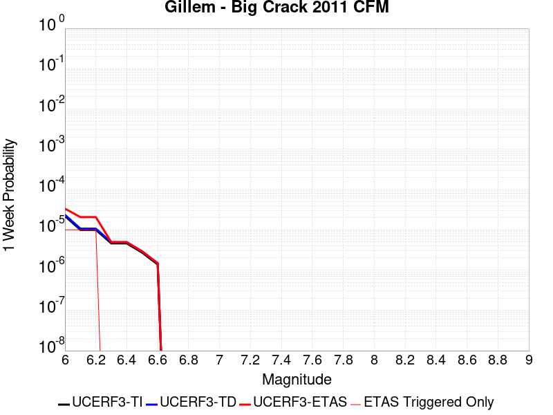 | 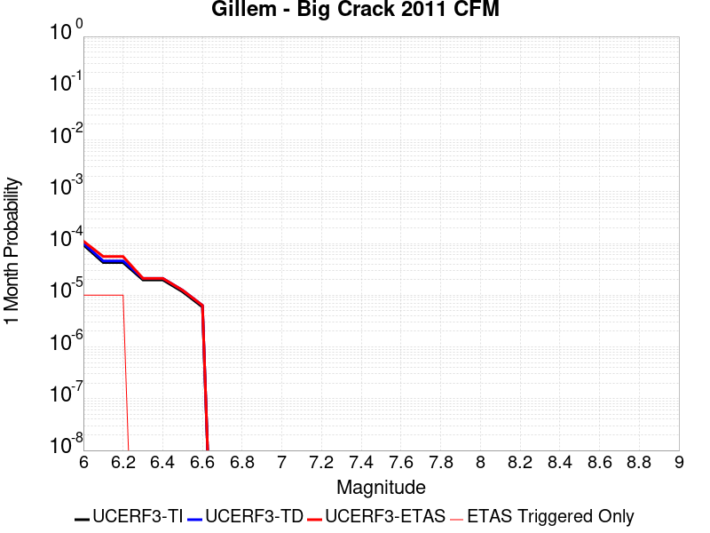 | 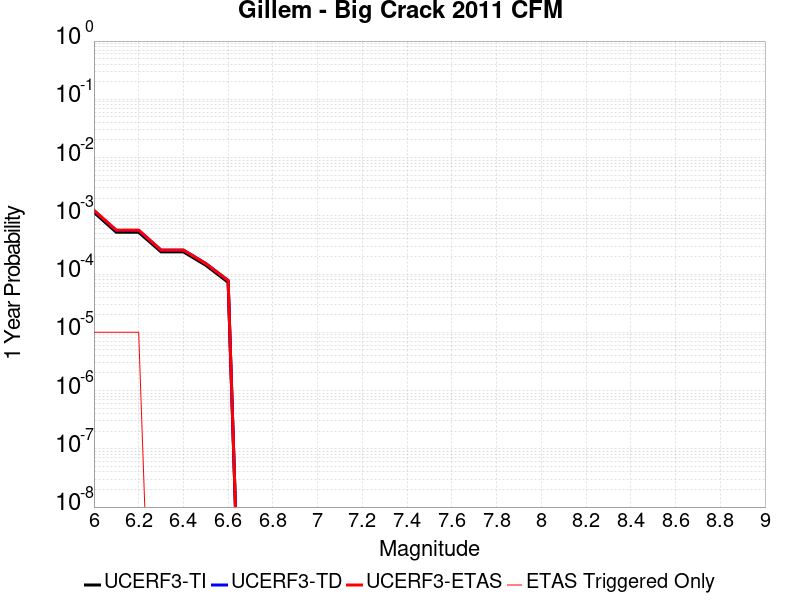 | 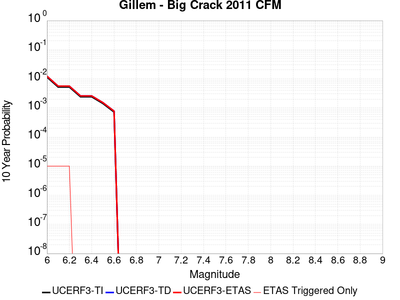 |

| Magnitude | 1 wk TI Prob | 1 wk TD Prob | 1 wk ETAS Prob | 1 wk ETAS/TD Gain | 1 wk ETAS Triggered Only | 1 mo TI Prob | 1 mo TD Prob | 1 mo ETAS Prob | 1 mo ETAS/TD Gain | 1 mo ETAS Triggered Only | 1 yr TI Prob | 1 yr TD Prob | 1 yr ETAS Prob | 1 yr ETAS/TD Gain | 1 yr ETAS Triggered Only | 10 yr TI Prob | 10 yr TD Prob | 10 yr ETAS Prob | 10 yr ETAS/TD Gain | 10 yr ETAS Triggered Only |
|-----|-----|-----|-----|-----|-----|-----|-----|-----|-----|-----|-----|-----|-----|-----|-----|-----|-----|-----|-----|-----|
| 6.0 | 2.196852E-5 | 2.3604485E-5 | 3.360425E-5 | 1.4236383 | 1.0E-5 | 9.4147406E-5 | 1.01158665E-4 | 1.1115765E-4 | 1.0988446 | 1.0E-5 | 0.0011456419 | 0.0012309998 | 0.0012409874 | 1.0081135 | 1.0E-5 | 0.011397537 | 0.012250669 | 0.012260547 | 1.0008063 | 1.0E-5 |
| 6.1 | 9.992795E-6 | 1.071189E-5 | 2.0711783E-5 | 1.9335321 | 1.0E-5 | 4.2825563E-5 | 4.5907396E-5 | 5.5906938E-5 | 1.2178198 | 1.0E-5 | 5.2127644E-4 | 5.587975E-4 | 5.6879193E-4 | 1.0178856 | 1.0E-5 | 0.0052005537 | 0.0055757347 | 0.005585679 | 1.0017835 | 1.0E-5 |
| 6.2 | 9.992795E-6 | 1.071189E-5 | 2.0711783E-5 | 1.9335321 | 1.0E-5 | 4.2825563E-5 | 4.5907396E-5 | 5.5906938E-5 | 1.2178198 | 1.0E-5 | 5.2127644E-4 | 5.587975E-4 | 5.6879193E-4 | 1.0178856 | 1.0E-5 | 0.0052005537 | 0.0055757347 | 0.005585679 | 1.0017835 | 1.0E-5 |
| 6.3 | 4.6127884E-6 | 4.942657E-6 | 4.942657E-6 | 1.0 | 0.0 | 1.9768944E-5 | 2.1182668E-5 | 2.1182668E-5 | 1.0 | 0.0 | 2.406603E-4 | 2.5787292E-4 | 2.5787292E-4 | 1.0 | 0.0 | 0.0024039985 | 0.0025761751 | 0.0025761751 | 1.0 | 0.0 |
| 6.4 | 4.6127884E-6 | 4.942657E-6 | 4.942657E-6 | 1.0 | 0.0 | 1.9768944E-5 | 2.1182668E-5 | 2.1182668E-5 | 1.0 | 0.0 | 2.406603E-4 | 2.5787292E-4 | 2.5787292E-4 | 1.0 | 0.0 | 0.0024039985 | 0.0025761751 | 0.0025761751 | 1.0 | 0.0 |
| 6.5 | 2.716712E-6 | 2.9111113E-6 | 2.9111113E-6 | 1.0 | 0.0 | 1.1643E-5 | 1.24761455E-5 | 1.24761455E-5 | 1.0 | 0.0 | 1.417443E-4 | 1.5188892E-4 | 1.5188892E-4 | 1.0 | 0.0 | 0.0014165393 | 0.001518089 | 0.001518089 | 1.0 | 0.0 |
| 6.6 | 1.3818255E-6 | 1.4820689E-6 | 1.4820689E-6 | 1.0 | 0.0 | 5.922096E-6 | 6.3517155E-6 | 6.3517155E-6 | 1.0 | 0.0 | 7.209913E-5 | 7.7330624E-5 | 7.7330624E-5 | 1.0 | 0.0 | 7.2075747E-4 | 7.7315804E-4 | 7.7315804E-4 | 1.0 | 0.0 |

## Raymond
*[(top)](#table-of-contents)*

| 1 Week | 1 Month | 1 Year | 10 Year |
|-----|-----|-----|-----|
| 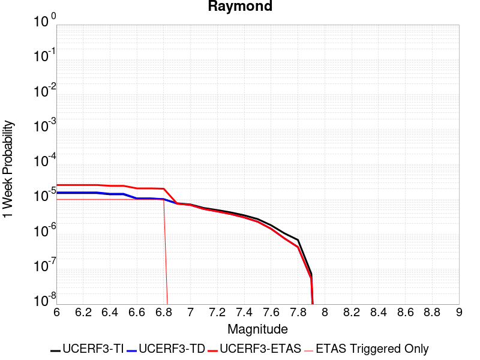 | 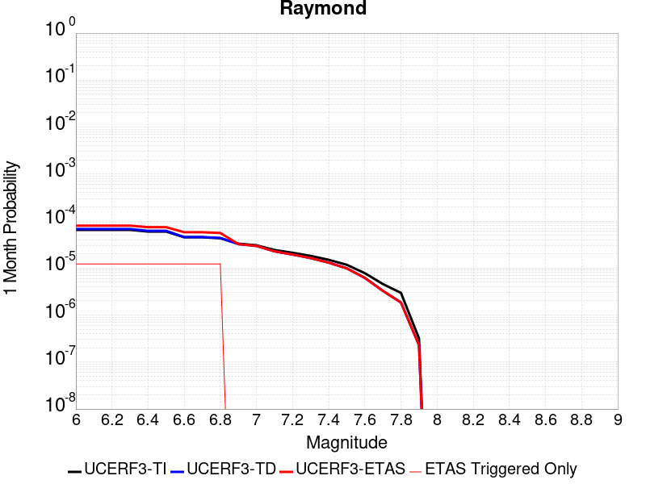 | 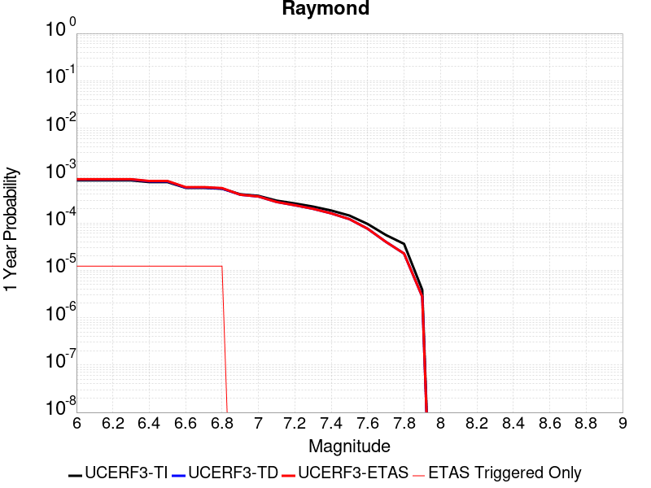 | 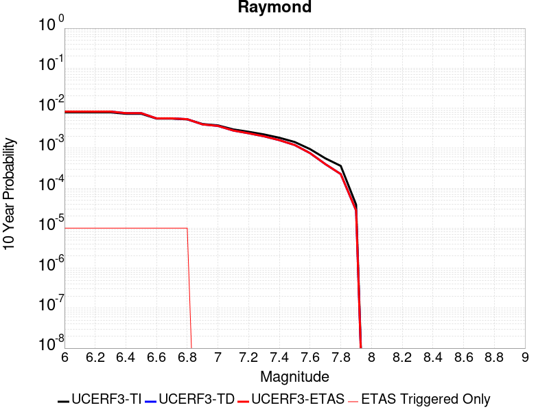 |

| Magnitude | 1 wk TI Prob | 1 wk TD Prob | 1 wk ETAS Prob | 1 wk ETAS/TD Gain | 1 wk ETAS Triggered Only | 1 mo TI Prob | 1 mo TD Prob | 1 mo ETAS Prob | 1 mo ETAS/TD Gain | 1 mo ETAS Triggered Only | 1 yr TI Prob | 1 yr TD Prob | 1 yr ETAS Prob | 1 yr ETAS/TD Gain | 1 yr ETAS Triggered Only | 10 yr TI Prob | 10 yr TD Prob | 10 yr ETAS Prob | 10 yr ETAS/TD Gain | 10 yr ETAS Triggered Only |
|-----|-----|-----|-----|-----|-----|-----|-----|-----|-----|-----|-----|-----|-----|-----|-----|-----|-----|-----|-----|-----|
| 6.0 | 1.5157413E-5 | 1.5810125E-5 | 2.5809968E-5 | 1.632496 | 1.0E-5 | 6.4958724E-5 | 6.775606E-5 | 7.775539E-5 | 1.1475782 | 1.0E-5 | 7.905855E-4 | 8.246429E-4 | 8.3463464E-4 | 1.0121164 | 1.0E-5 | 0.007877788 | 0.008218355 | 0.008228272 | 1.0012068 | 1.0E-5 |
| 6.1 | 1.5157413E-5 | 1.5810125E-5 | 2.5809968E-5 | 1.632496 | 1.0E-5 | 6.4958724E-5 | 6.775606E-5 | 7.775539E-5 | 1.1475782 | 1.0E-5 | 7.905855E-4 | 8.246429E-4 | 8.3463464E-4 | 1.0121164 | 1.0E-5 | 0.007877788 | 0.008218355 | 0.008228272 | 1.0012068 | 1.0E-5 |
| 6.2 | 1.5157413E-5 | 1.5810125E-5 | 2.5809968E-5 | 1.632496 | 1.0E-5 | 6.4958724E-5 | 6.775606E-5 | 7.775539E-5 | 1.1475782 | 1.0E-5 | 7.905855E-4 | 8.246429E-4 | 8.3463464E-4 | 1.0121164 | 1.0E-5 | 0.007877788 | 0.008218355 | 0.008228272 | 1.0012068 | 1.0E-5 |
| 6.3 | 1.5157413E-5 | 1.5810125E-5 | 2.5809968E-5 | 1.632496 | 1.0E-5 | 6.4958724E-5 | 6.775606E-5 | 7.775539E-5 | 1.1475782 | 1.0E-5 | 7.905855E-4 | 8.246429E-4 | 8.3463464E-4 | 1.0121164 | 1.0E-5 | 0.007877788 | 0.008218355 | 0.008228272 | 1.0012068 | 1.0E-5 |
| 6.4 | 1.3941944E-5 | 1.4454688E-5 | 2.4454543E-5 | 1.691807 | 1.0E-5 | 5.9749822E-5 | 6.194732E-5 | 7.1946706E-5 | 1.1614175 | 1.0E-5 | 7.2721124E-4 | 7.53971E-4 | 7.6396344E-4 | 1.0132531 | 1.0E-5 | 0.007248361 | 0.007516471 | 0.007526396 | 1.0013204 | 1.0E-5 |
| 6.5 | 1.3941944E-5 | 1.4454688E-5 | 2.4454543E-5 | 1.691807 | 1.0E-5 | 5.9749822E-5 | 6.194732E-5 | 7.1946706E-5 | 1.1614175 | 1.0E-5 | 7.2721124E-4 | 7.53971E-4 | 7.6396344E-4 | 1.0132531 | 1.0E-5 | 0.007248361 | 0.007516471 | 0.007526396 | 1.0013204 | 1.0E-5 |
| 6.6 | 1.0542609E-5 | 1.067111E-5 | 2.0671003E-5 | 1.9370996 | 1.0E-5 | 4.5181827E-5 | 4.573256E-5 | 5.57321E-5 | 1.2186526 | 1.0E-5 | 5.499499E-4 | 5.566571E-4 | 5.666515E-4 | 1.0179543 | 1.0E-5 | 0.005485909 | 0.0055531966 | 0.005563141 | 1.0017908 | 1.0E-5 |
| 6.7 | 1.0542609E-5 | 1.067111E-5 | 2.0671003E-5 | 1.9370996 | 1.0E-5 | 4.5181827E-5 | 4.573256E-5 | 5.57321E-5 | 1.2186526 | 1.0E-5 | 5.499499E-4 | 5.566571E-4 | 5.666515E-4 | 1.0179543 | 1.0E-5 | 0.005485909 | 0.0055531966 | 0.005563141 | 1.0017908 | 1.0E-5 |
| 6.8 | 1.0079132E-5 | 1.0176644E-5 | 2.0176542E-5 | 1.9826323 | 1.0E-5 | 4.3195567E-5 | 4.3613487E-5 | 5.361305E-5 | 1.2292769 | 1.0E-5 | 5.257791E-4 | 5.308702E-4 | 5.408649E-4 | 1.018827 | 1.0E-5 | 0.0052453685 | 0.0052965777 | 0.0053065247 | 1.001878 | 1.0E-5 |
| 6.9 | 7.721598E-6 | 7.548902E-6 | 7.548902E-6 | 1.0 | 0.0 | 3.3092143E-5 | 3.2352043E-5 | 3.2352043E-5 | 1.0 | 0.0 | 4.0282236E-4 | 3.9381615E-4 | 3.9381615E-4 | 1.0 | 0.0 | 0.0040209293 | 0.003931324 | 0.003931324 | 1.0 | 0.0 |
| 7.0 | 7.137566E-6 | 6.911303E-6 | 6.911303E-6 | 1.0 | 0.0 | 3.058921E-5 | 2.961954E-5 | 2.961954E-5 | 1.0 | 0.0 | 3.7236E-4 | 3.605593E-4 | 3.605593E-4 | 1.0 | 0.0 | 0.0037173668 | 0.003599869 | 0.003599869 | 1.0 | 0.0 |
| 7.1 | 5.654976E-6 | 5.299538E-6 | 5.299538E-6 | 1.0 | 0.0 | 2.4235387E-5 | 2.2712107E-5 | 2.2712107E-5 | 1.0 | 0.0 | 2.9502588E-4 | 2.7648505E-4 | 2.7648505E-4 | 1.0 | 0.0 | 0.0029463451 | 0.0027614492 | 0.0027614492 | 1.0 | 0.0 |
| 7.2 | 4.9358455E-6 | 4.526655E-6 | 4.526655E-6 | 1.0 | 0.0 | 2.1153453E-5 | 1.9399806E-5 | 1.9399806E-5 | 1.0 | 0.0 | 2.5751285E-4 | 2.3616718E-4 | 2.3616718E-4 | 1.0 | 0.0 | 0.0025721465 | 0.002359192 | 0.002359192 | 1.0 | 0.0 |
| 7.3 | 4.2368597E-6 | 3.8056128E-6 | 3.8056128E-6 | 1.0 | 0.0 | 1.8157843E-5 | 1.6309668E-5 | 1.6309668E-5 | 1.0 | 0.0 | 2.2104931E-4 | 1.9855222E-4 | 1.9855222E-4 | 1.0 | 0.0 | 0.0022082955 | 0.0019837746 | 0.0019837746 | 1.0 | 0.0 |
| 7.4 | 3.4999923E-6 | 3.0437407E-6 | 3.0437407E-6 | 1.0 | 0.0 | 1.49998805E-5 | 1.3044538E-5 | 1.3044538E-5 | 1.0 | 0.0 | 1.8260824E-4 | 1.5880575E-4 | 1.5880575E-4 | 1.0 | 0.0 | 0.0018245826 | 0.0015869461 | 0.0015869461 | 1.0 | 0.0 |
| 7.5 | 2.738017E-6 | 2.3020405E-6 | 2.3020405E-6 | 1.0 | 0.0 | 1.1734306E-5 | 9.865851E-6 | 9.865851E-6 | 1.0 | 0.0 | 1.428558E-4 | 1.20110184E-4 | 1.20110184E-4 | 1.0 | 0.0 | 0.0014276401 | 0.0012004747 | 0.0012004747 | 1.0 | 0.0 |
| 7.6 | 1.8186392E-6 | 1.442302E-6 | 1.442302E-6 | 1.0 | 0.0 | 7.794145E-6 | 6.1812802E-6 | 6.1812802E-6 | 1.0 | 0.0 | 9.488958E-5 | 7.5254524E-5 | 7.5254524E-5 | 1.0 | 0.0 | 9.4849075E-4 | 7.5230957E-4 | 7.5230957E-4 | 1.0 | 0.0 |
| 7.7 | 1.0660348E-6 | 7.6437E-7 | 7.6437E-7 | 1.0 | 0.0 | 4.5687125E-6 | 3.2758674E-6 | 3.2758674E-6 | 1.0 | 0.0 | 5.5622655E-5 | 3.988297E-5 | 3.988297E-5 | 1.0 | 0.0 | 5.5608735E-4 | 3.9877492E-4 | 3.9877492E-4 | 1.0 | 0.0 |
| 7.8 | 6.913602E-7 | 4.3202903E-7 | 4.3202903E-7 | 1.0 | 0.0 | 2.962969E-6 | 1.8515517E-6 | 1.8515517E-6 | 1.0 | 0.0 | 3.607355E-5 | 2.2542416E-5 | 2.2542416E-5 | 1.0 | 0.0 | 3.6067693E-4 | 2.2541684E-4 | 2.2541684E-4 | 1.0 | 0.0 |
| 7.9 | 7.425201E-8 | 5.322267E-8 | 5.322267E-8 | 1.0 | 0.0 | 3.1822285E-7 | 2.2809714E-7 | 2.2809714E-7 | 1.0 | 0.0 | 3.874356E-6 | 2.7770805E-6 | 2.7770805E-6 | 1.0 | 0.0 | 3.8742884E-5 | 2.7770588E-5 | 2.7770588E-5 | 1.0 | 0.0 |

## Cedar Mtn-Mahogany Mtn
*[(top)](#table-of-contents)*

| 1 Week | 1 Month | 1 Year | 10 Year |
|-----|-----|-----|-----|
| 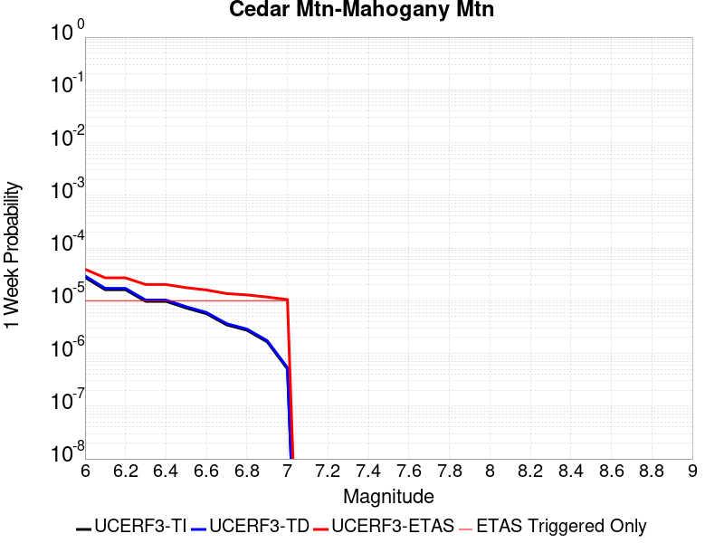 | 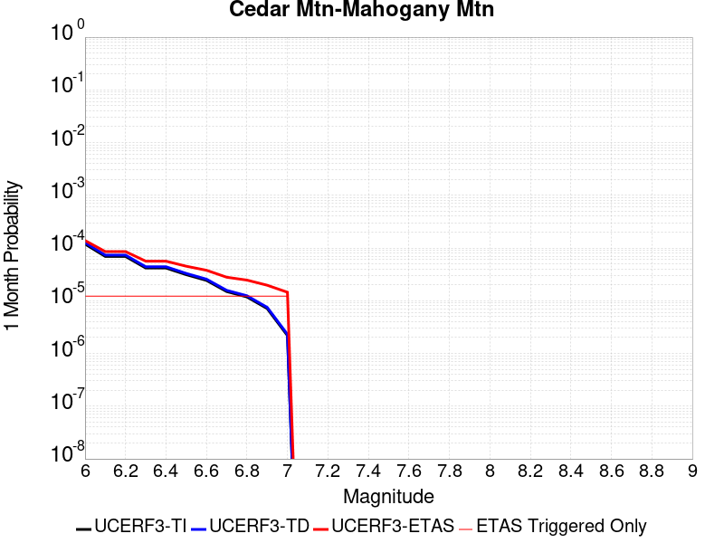 | 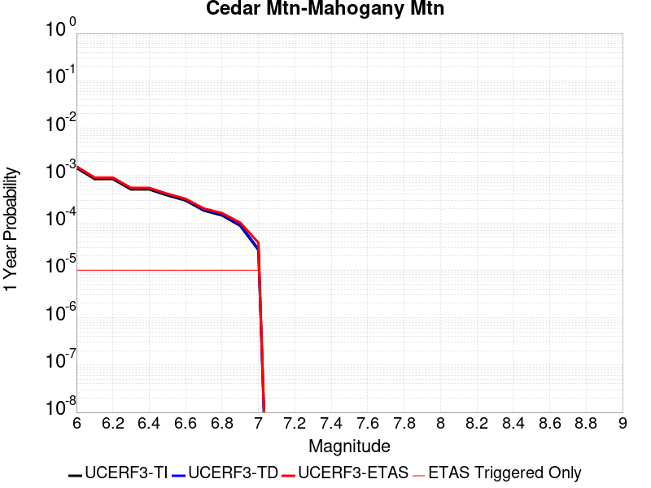 | 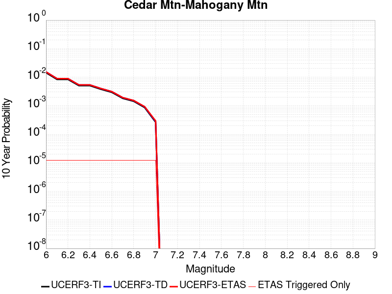 |

| Magnitude | 1 wk TI Prob | 1 wk TD Prob | 1 wk ETAS Prob | 1 wk ETAS/TD Gain | 1 wk ETAS Triggered Only | 1 mo TI Prob | 1 mo TD Prob | 1 mo ETAS Prob | 1 mo ETAS/TD Gain | 1 mo ETAS Triggered Only | 1 yr TI Prob | 1 yr TD Prob | 1 yr ETAS Prob | 1 yr ETAS/TD Gain | 1 yr ETAS Triggered Only | 10 yr TI Prob | 10 yr TD Prob | 10 yr ETAS Prob | 10 yr ETAS/TD Gain | 10 yr ETAS Triggered Only |
|-----|-----|-----|-----|-----|-----|-----|-----|-----|-----|-----|-----|-----|-----|-----|-----|-----|-----|-----|-----|-----|
| 6.0 | 2.7763876E-5 | 2.9588866E-5 | 3.958857E-5 | 1.337955 | 1.0E-5 | 1.1898261E-4 | 1.2680366E-4 | 1.3680238E-4 | 1.078852 | 1.0E-5 | 0.0014476506 | 0.0015428112 | 0.0015527958 | 1.0064716 | 1.0E-5 | 0.0143825635 | 0.015328225 | 0.015338072 | 1.0006424 | 1.0E-5 |
| 6.1 | 1.6162443E-5 | 1.7142966E-5 | 2.7142794E-5 | 1.5833197 | 1.0E-5 | 6.926578E-5 | 7.346788E-5 | 8.346715E-5 | 1.1361039 | 1.0E-5 | 8.4298453E-4 | 8.941221E-4 | 9.0411317E-4 | 1.0111742 | 1.0E-5 | 0.008397939 | 0.008907059 | 0.008916969 | 1.0011127 | 1.0E-5 |
| 6.2 | 1.6162443E-5 | 1.7142966E-5 | 2.7142794E-5 | 1.5833197 | 1.0E-5 | 6.926578E-5 | 7.346788E-5 | 8.346715E-5 | 1.1361039 | 1.0E-5 | 8.4298453E-4 | 8.941221E-4 | 9.0411317E-4 | 1.0111742 | 1.0E-5 | 0.008397939 | 0.008907059 | 0.008916969 | 1.0011127 | 1.0E-5 |
| 6.3 | 9.746053E-6 | 1.0303152E-5 | 2.0303049E-5 | 1.9705667 | 1.0E-5 | 4.1768133E-5 | 4.415564E-5 | 5.41552E-5 | 1.2264616 | 1.0E-5 | 5.0840835E-4 | 5.3746643E-4 | 5.4746104E-4 | 1.0185958 | 1.0E-5 | 0.0050724675 | 0.005362084 | 0.0053720307 | 1.0018549 | 1.0E-5 |
| 6.4 | 9.746053E-6 | 1.0303152E-5 | 2.0303049E-5 | 1.9705667 | 1.0E-5 | 4.1768133E-5 | 4.415564E-5 | 5.41552E-5 | 1.2264616 | 1.0E-5 | 5.0840835E-4 | 5.3746643E-4 | 5.4746104E-4 | 1.0185958 | 1.0E-5 | 0.0050724675 | 0.005362084 | 0.0053720307 | 1.0018549 | 1.0E-5 |
| 6.5 | 7.290083E-6 | 7.695325E-6 | 1.7695247E-5 | 2.2994804 | 1.0E-5 | 3.124284E-5 | 3.297956E-5 | 4.2979227E-5 | 1.3032081 | 1.0E-5 | 3.8031515E-4 | 4.014543E-4 | 4.1145028E-4 | 1.0248995 | 1.0E-5 | 0.0037966494 | 0.004007511 | 0.004017471 | 1.0024853 | 1.0E-5 |
| 6.6 | 5.67907E-6 | 5.9891527E-6 | 1.5989093E-5 | 2.6696754 | 1.0E-5 | 2.4338644E-5 | 2.5667552E-5 | 3.5667297E-5 | 1.3895869 | 1.0E-5 | 2.962827E-4 | 3.12459E-4 | 3.2245586E-4 | 1.0319942 | 1.0E-5 | 0.0029588798 | 0.003120333 | 0.0031303016 | 1.0031948 | 1.0E-5 |
| 6.7 | 3.4853963E-6 | 3.672631E-6 | 1.3672594E-5 | 3.7228336 | 1.0E-5 | 1.4937327E-5 | 1.5739755E-5 | 2.5739599E-5 | 1.6353239 | 1.0E-5 | 1.8184677E-4 | 1.916153E-4 | 2.0161338E-4 | 1.0521779 | 1.0E-5 | 0.0018169804 | 0.0019145629 | 0.0019245436 | 1.0052131 | 1.0E-5 |
| 6.8 | 2.7535168E-6 | 2.9015764E-6 | 1.2901547E-5 | 4.4463925 | 1.0E-5 | 1.1800733E-5 | 1.2435271E-5 | 2.2435146E-5 | 1.8041543 | 1.0E-5 | 1.4366445E-4 | 1.5138938E-4 | 1.6138787E-4 | 1.0660448 | 1.0E-5 | 0.0014357162 | 0.0015129098 | 0.0015228946 | 1.0065998 | 1.0E-5 |
| 6.9 | 1.6594106E-6 | 1.7496985E-6 | 1.1749681E-5 | 6.71526 | 1.0E-5 | 7.1117406E-6 | 7.4986883E-6 | 1.7498613E-5 | 2.3335567 | 1.0E-5 | 8.6582E-5 | 9.129302E-5 | 1.01292106E-4 | 1.1095273 | 1.0E-5 | 8.654827E-4 | 9.125856E-4 | 9.2257647E-4 | 1.0109478 | 1.0E-5 |
| 7.0 | 5.10215E-7 | 5.389254E-7 | 1.053892E-5 | 19.555435 | 1.0E-5 | 2.186634E-6 | 2.3096788E-6 | 1.2309656E-5 | 5.329596 | 1.0E-5 | 2.6621943E-5 | 2.8120105E-5 | 3.8119826E-5 | 1.3556074 | 1.0E-5 | 2.6618753E-4 | 2.81178E-4 | 2.911752E-4 | 1.0355546 | 1.0E-5 |

## Pine Mtn
*[(top)](#table-of-contents)*

| 1 Week | 1 Month | 1 Year | 10 Year |
|-----|-----|-----|-----|
| 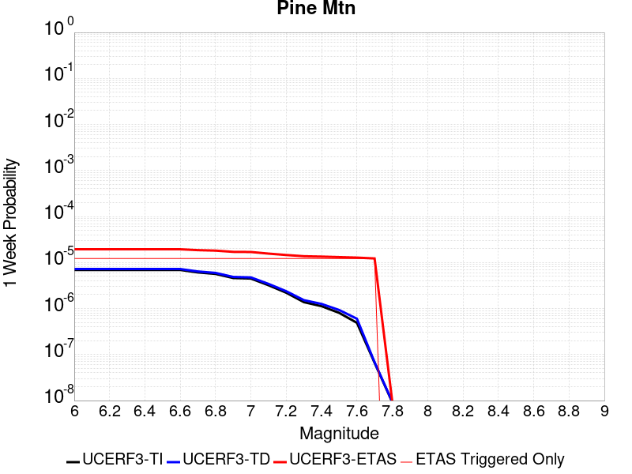 | 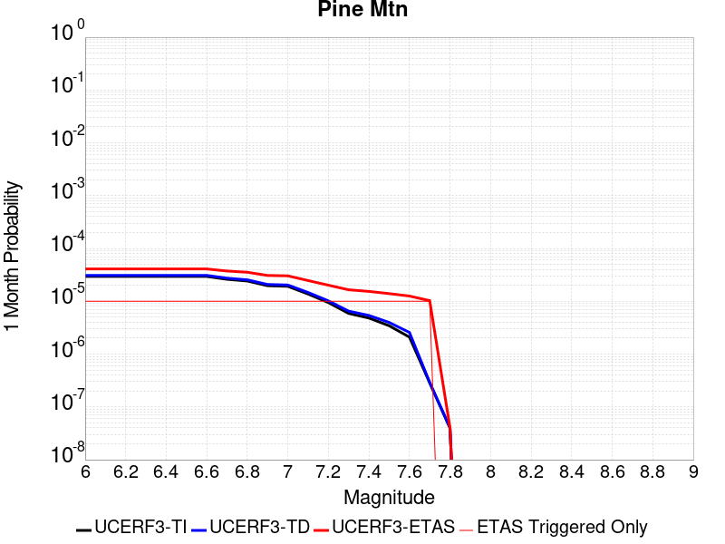 |  | 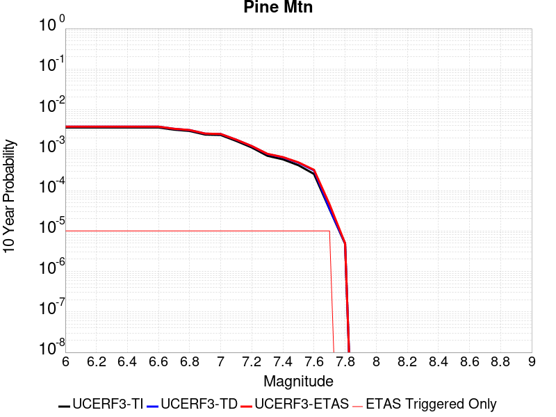 |

| Magnitude | 1 wk TI Prob | 1 wk TD Prob | 1 wk ETAS Prob | 1 wk ETAS/TD Gain | 1 wk ETAS Triggered Only | 1 mo TI Prob | 1 mo TD Prob | 1 mo ETAS Prob | 1 mo ETAS/TD Gain | 1 mo ETAS Triggered Only | 1 yr TI Prob | 1 yr TD Prob | 1 yr ETAS Prob | 1 yr ETAS/TD Gain | 1 yr ETAS Triggered Only | 10 yr TI Prob | 10 yr TD Prob | 10 yr ETAS Prob | 10 yr ETAS/TD Gain | 10 yr ETAS Triggered Only |
|-----|-----|-----|-----|-----|-----|-----|-----|-----|-----|-----|-----|-----|-----|-----|-----|-----|-----|-----|-----|-----|
| 6.0 | 6.894797E-6 | 7.2254716E-6 | 1.72254E-5 | 2.3839827 | 1.0E-5 | 2.9548795E-5 | 3.0965955E-5 | 4.0965646E-5 | 1.3229253 | 1.0E-5 | 3.596972E-4 | 3.7694827E-4 | 3.869445E-4 | 1.0265188 | 1.0E-5 | 0.0035911554 | 0.0037633865 | 0.0037733489 | 1.0026472 | 1.0E-5 |
| 6.1 | 6.894797E-6 | 7.2254716E-6 | 1.72254E-5 | 2.3839827 | 1.0E-5 | 2.9548795E-5 | 3.0965955E-5 | 4.0965646E-5 | 1.3229253 | 1.0E-5 | 3.596972E-4 | 3.7694827E-4 | 3.869445E-4 | 1.0265188 | 1.0E-5 | 0.0035911554 | 0.0037633865 | 0.0037733489 | 1.0026472 | 1.0E-5 |
| 6.2 | 6.894797E-6 | 7.2254716E-6 | 1.72254E-5 | 2.3839827 | 1.0E-5 | 2.9548795E-5 | 3.0965955E-5 | 4.0965646E-5 | 1.3229253 | 1.0E-5 | 3.596972E-4 | 3.7694827E-4 | 3.869445E-4 | 1.0265188 | 1.0E-5 | 0.0035911554 | 0.0037633865 | 0.0037733489 | 1.0026472 | 1.0E-5 |
| 6.3 | 6.894797E-6 | 7.2254716E-6 | 1.72254E-5 | 2.3839827 | 1.0E-5 | 2.9548795E-5 | 3.0965955E-5 | 4.0965646E-5 | 1.3229253 | 1.0E-5 | 3.596972E-4 | 3.7694827E-4 | 3.869445E-4 | 1.0265188 | 1.0E-5 | 0.0035911554 | 0.0037633865 | 0.0037733489 | 1.0026472 | 1.0E-5 |
| 6.4 | 6.894797E-6 | 7.2254716E-6 | 1.72254E-5 | 2.3839827 | 1.0E-5 | 2.9548795E-5 | 3.0965955E-5 | 4.0965646E-5 | 1.3229253 | 1.0E-5 | 3.596972E-4 | 3.7694827E-4 | 3.869445E-4 | 1.0265188 | 1.0E-5 | 0.0035911554 | 0.0037633865 | 0.0037733489 | 1.0026472 | 1.0E-5 |
| 6.5 | 6.894797E-6 | 7.2254716E-6 | 1.72254E-5 | 2.3839827 | 1.0E-5 | 2.9548795E-5 | 3.0965955E-5 | 4.0965646E-5 | 1.3229253 | 1.0E-5 | 3.596972E-4 | 3.7694827E-4 | 3.869445E-4 | 1.0265188 | 1.0E-5 | 0.0035911554 | 0.0037633865 | 0.0037733489 | 1.0026472 | 1.0E-5 |
| 6.6 | 6.894797E-6 | 7.2254716E-6 | 1.72254E-5 | 2.3839827 | 1.0E-5 | 2.9548795E-5 | 3.0965955E-5 | 4.0965646E-5 | 1.3229253 | 1.0E-5 | 3.596972E-4 | 3.7694827E-4 | 3.869445E-4 | 1.0265188 | 1.0E-5 | 0.0035911554 | 0.0037633865 | 0.0037733489 | 1.0026472 | 1.0E-5 |
| 6.7 | 6.0867933E-6 | 6.397124E-6 | 1.639706E-5 | 2.5631926 | 1.0E-5 | 2.6085996E-5 | 2.7415968E-5 | 3.7415695E-5 | 1.364741 | 1.0E-5 | 3.1755073E-4 | 3.337405E-4 | 3.4373713E-4 | 1.0299534 | 1.0E-5 | 0.0031709734 | 0.0033326119 | 0.0033425784 | 1.0029906 | 1.0E-5 |
| 6.8 | 5.6530425E-6 | 5.950606E-6 | 1.5950547E-5 | 2.6804912 | 1.0E-5 | 2.42271E-5 | 2.5502359E-5 | 3.5502104E-5 | 1.3921106 | 1.0E-5 | 2.94925E-4 | 3.1044905E-4 | 3.2044595E-4 | 1.0322014 | 1.0E-5 | 0.002945339 | 0.0031003582 | 0.0031103273 | 1.0032154 | 1.0E-5 |
| 6.9 | 4.6015225E-6 | 4.8638444E-6 | 1.48637955E-5 | 3.0559769 | 1.0E-5 | 1.9720663E-5 | 2.084489E-5 | 3.084468E-5 | 1.4797239 | 1.0E-5 | 2.4007261E-4 | 2.5375842E-4 | 2.6375588E-4 | 1.0393976 | 1.0E-5 | 0.0023981342 | 0.002534831 | 0.0025448054 | 1.003935 | 1.0E-5 |
| 7.0 | 4.4875965E-6 | 4.7474837E-6 | 1.4747436E-5 | 3.106369 | 1.0E-5 | 1.9232413E-5 | 2.0346208E-5 | 3.0346004E-5 | 1.4914821 | 1.0E-5 | 2.3412947E-4 | 2.4768838E-4 | 2.576859E-4 | 1.0403633 | 1.0E-5 | 0.0023388295 | 0.0024742668 | 0.0024842422 | 1.0040317 | 1.0E-5 |
| 7.1 | 3.203907E-6 | 3.42942E-6 | 1.3429386E-5 | 3.915935 | 1.0E-5 | 1.3730958E-5 | 1.4697435E-5 | 2.4697289E-5 | 1.6803808 | 1.0E-5 | 1.6716159E-4 | 1.7892725E-4 | 1.8892546E-4 | 1.0558786 | 1.0E-5 | 0.0016703589 | 0.001787898 | 0.0017978802 | 1.0055832 | 1.0E-5 |
| 7.2 | 2.2060601E-6 | 2.3784874E-6 | 1.2378464E-5 | 5.204343 | 1.0E-5 | 9.4545085E-6 | 1.019348E-5 | 2.0193378E-5 | 1.9810092 | 1.0E-5 | 1.15102564E-4 | 1.2409901E-4 | 1.3409776E-4 | 1.0805708 | 1.0E-5 | 0.0011504296 | 0.0012403419 | 0.0012503295 | 1.0080523 | 1.0E-5 |
| 7.3 | 1.3765207E-6 | 1.5216535E-6 | 1.1521638E-5 | 7.5717883 | 1.0E-5 | 5.899361E-6 | 6.5213567E-6 | 1.6521291E-5 | 2.5334132 | 1.0E-5 | 7.182235E-5 | 7.939472E-5 | 8.939392E-5 | 1.125943 | 1.0E-5 | 7.1799144E-4 | 7.9367263E-4 | 8.036647E-4 | 1.0125897 | 1.0E-5 |
| 7.4 | 1.1245983E-6 | 1.2587126E-6 | 1.12587E-5 | 8.944615 | 1.0E-5 | 4.819698E-6 | 5.394472E-6 | 1.5394418E-5 | 2.8537395 | 1.0E-5 | 5.8678244E-5 | 6.56758E-5 | 7.567515E-5 | 1.152253 | 1.0E-5 | 5.866275E-4 | 6.565722E-4 | 6.6656567E-4 | 1.0152206 | 1.0E-5 |
| 7.5 | 8.031682E-7 | 9.276999E-7 | 1.0927691E-5 | 11.779338 | 1.0E-5 | 3.4421448E-6 | 3.975851E-6 | 1.3975811E-5 | 3.5151746 | 1.0E-5 | 4.1907308E-5 | 4.840498E-5 | 5.8404497E-5 | 1.2065803 | 1.0E-5 | 4.1899405E-4 | 4.8395112E-4 | 4.939463E-4 | 1.0206532 | 1.0E-5 |
| 7.6 | 4.8953444E-7 | 6.0030544E-7 | 1.0600299E-5 | 17.658176 | 1.0E-5 | 2.098003E-6 | 2.5727354E-6 | 1.2572709E-5 | 4.886904 | 1.0E-5 | 2.5542888E-5 | 3.1322652E-5 | 4.132234E-5 | 1.3192477 | 1.0E-5 | 2.5539953E-4 | 3.1318725E-4 | 3.231841E-4 | 1.0319198 | 1.0E-5 |
| 7.7 | 6.634529E-8 | 6.788826E-8 | 1.0067887E-5 | 148.30087 | 1.0E-5 | 2.843369E-7 | 2.9094966E-7 | 1.0290947E-5 | 35.370197 | 1.0E-5 | 3.4617963E-6 | 3.5423066E-6 | 1.35422715E-5 | 3.8230093 | 1.0E-5 | 3.4617424E-5 | 3.542255E-5 | 4.5422195E-5 | 1.2822961 | 1.0E-5 |
| 7.8 | 9.235578E-9 | 9.488566E-9 | 9.488566E-9 | 1.0 | 0.0 | 3.9581046E-8 | 4.0665284E-8 | 4.0665284E-8 | 1.0 | 0.0 | 4.818991E-7 | 4.950997E-7 | 4.950997E-7 | 1.0 | 0.0 | 4.8189804E-6 | 4.950988E-6 | 4.950988E-6 | 1.0 | 0.0 |

## Anacapa-Dume alt 1
*[(top)](#table-of-contents)*

| 1 Week | 1 Month | 1 Year | 10 Year |
|-----|-----|-----|-----|
| 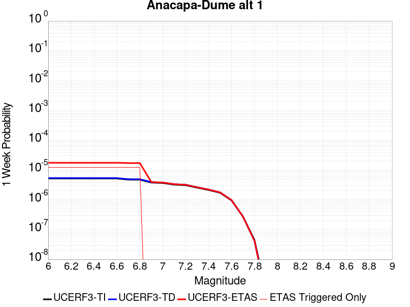 | 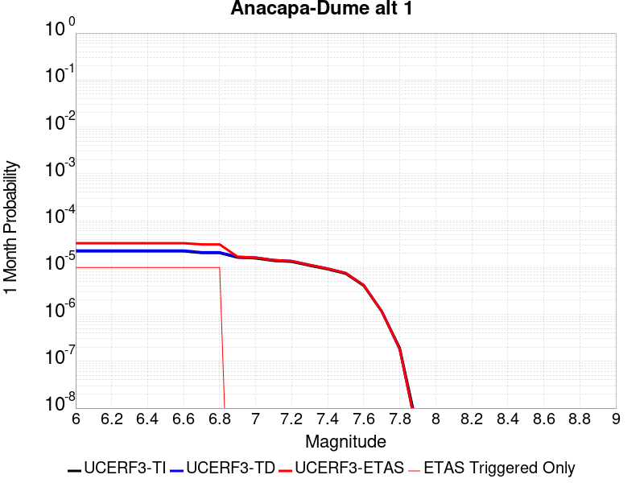 | 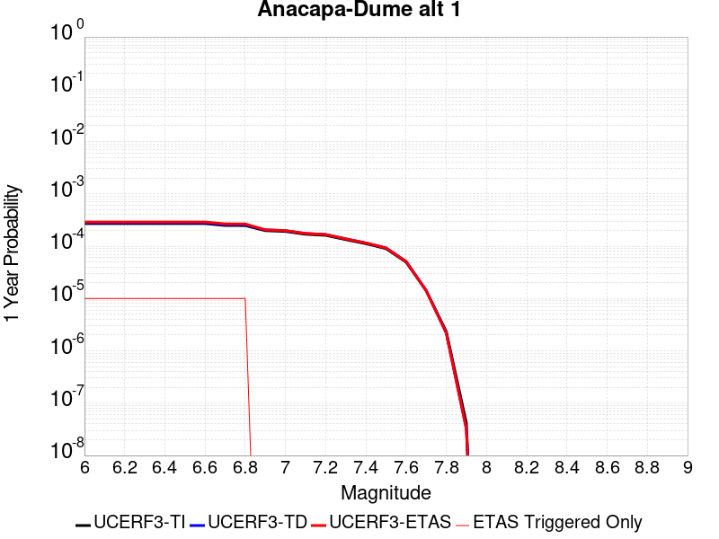 | 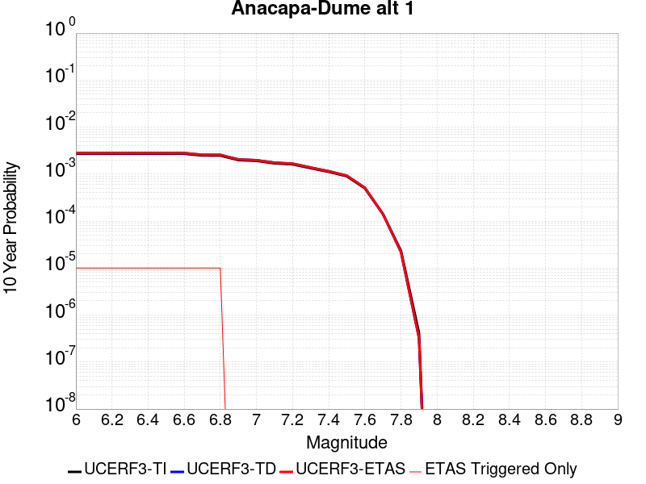 |

| Magnitude | 1 wk TI Prob | 1 wk TD Prob | 1 wk ETAS Prob | 1 wk ETAS/TD Gain | 1 wk ETAS Triggered Only | 1 mo TI Prob | 1 mo TD Prob | 1 mo ETAS Prob | 1 mo ETAS/TD Gain | 1 mo ETAS Triggered Only | 1 yr TI Prob | 1 yr TD Prob | 1 yr ETAS Prob | 1 yr ETAS/TD Gain | 1 yr ETAS Triggered Only | 10 yr TI Prob | 10 yr TD Prob | 10 yr ETAS Prob | 10 yr ETAS/TD Gain | 10 yr ETAS Triggered Only |
|-----|-----|-----|-----|-----|-----|-----|-----|-----|-----|-----|-----|-----|-----|-----|-----|-----|-----|-----|-----|-----|
| 6.0 | 5.1871802E-6 | 5.3673916E-6 | 1.5367337E-5 | 2.8630924 | 1.0E-5 | 2.2230583E-5 | 2.3002909E-5 | 3.3002678E-5 | 1.4347177 | 1.0E-5 | 2.7062374E-4 | 2.8002527E-4 | 2.9002246E-4 | 1.035701 | 1.0E-5 | 0.002702944 | 0.0027968097 | 0.0028067816 | 1.0035655 | 1.0E-5 |
| 6.1 | 5.1871802E-6 | 5.3673916E-6 | 1.5367337E-5 | 2.8630924 | 1.0E-5 | 2.2230583E-5 | 2.3002909E-5 | 3.3002678E-5 | 1.4347177 | 1.0E-5 | 2.7062374E-4 | 2.8002527E-4 | 2.9002246E-4 | 1.035701 | 1.0E-5 | 0.002702944 | 0.0027968097 | 0.0028067816 | 1.0035655 | 1.0E-5 |
| 6.2 | 5.1871802E-6 | 5.3673916E-6 | 1.5367337E-5 | 2.8630924 | 1.0E-5 | 2.2230583E-5 | 2.3002909E-5 | 3.3002678E-5 | 1.4347177 | 1.0E-5 | 2.7062374E-4 | 2.8002527E-4 | 2.9002246E-4 | 1.035701 | 1.0E-5 | 0.002702944 | 0.0027968097 | 0.0028067816 | 1.0035655 | 1.0E-5 |
| 6.3 | 5.1871802E-6 | 5.3673916E-6 | 1.5367337E-5 | 2.8630924 | 1.0E-5 | 2.2230583E-5 | 2.3002909E-5 | 3.3002678E-5 | 1.4347177 | 1.0E-5 | 2.7062374E-4 | 2.8002527E-4 | 2.9002246E-4 | 1.035701 | 1.0E-5 | 0.002702944 | 0.0027968097 | 0.0028067816 | 1.0035655 | 1.0E-5 |
| 6.4 | 5.1871802E-6 | 5.3673916E-6 | 1.5367337E-5 | 2.8630924 | 1.0E-5 | 2.2230583E-5 | 2.3002909E-5 | 3.3002678E-5 | 1.4347177 | 1.0E-5 | 2.7062374E-4 | 2.8002527E-4 | 2.9002246E-4 | 1.035701 | 1.0E-5 | 0.002702944 | 0.0027968097 | 0.0028067816 | 1.0035655 | 1.0E-5 |
| 6.5 | 5.1871802E-6 | 5.3673916E-6 | 1.5367337E-5 | 2.8630924 | 1.0E-5 | 2.2230583E-5 | 2.3002909E-5 | 3.3002678E-5 | 1.4347177 | 1.0E-5 | 2.7062374E-4 | 2.8002527E-4 | 2.9002246E-4 | 1.035701 | 1.0E-5 | 0.002702944 | 0.0027968097 | 0.0028067816 | 1.0035655 | 1.0E-5 |
| 6.6 | 5.1871802E-6 | 5.3673916E-6 | 1.5367337E-5 | 2.8630924 | 1.0E-5 | 2.2230583E-5 | 2.3002909E-5 | 3.3002678E-5 | 1.4347177 | 1.0E-5 | 2.7062374E-4 | 2.8002527E-4 | 2.9002246E-4 | 1.035701 | 1.0E-5 | 0.002702944 | 0.0027968097 | 0.0028067816 | 1.0035655 | 1.0E-5 |
| 6.7 | 4.7693475E-6 | 4.9366927E-6 | 1.4936643E-5 | 3.0256376 | 1.0E-5 | 2.04399E-5 | 2.1157086E-5 | 3.1156873E-5 | 1.4726449 | 1.0E-5 | 2.4882736E-4 | 2.5755784E-4 | 2.6755527E-4 | 1.0388162 | 1.0E-5 | 0.0024854892 | 0.0025726694 | 0.0025826436 | 1.003877 | 1.0E-5 |
| 6.8 | 4.753408E-6 | 4.920241E-6 | 1.49201915E-5 | 3.0324109 | 1.0E-5 | 2.037159E-5 | 2.108658E-5 | 3.108637E-5 | 1.4742253 | 1.0E-5 | 2.4799586E-4 | 2.5669963E-4 | 2.6669705E-4 | 1.038946 | 1.0E-5 | 0.002477193 | 0.002564107 | 0.0025740813 | 1.00389 | 1.0E-5 |
| 6.9 | 3.800069E-6 | 3.937127E-6 | 3.937127E-6 | 1.0 | 0.0 | 1.6285909E-5 | 1.6873293E-5 | 1.6873293E-5 | 1.0 | 0.0 | 1.9826289E-4 | 2.054132E-4 | 2.054132E-4 | 1.0 | 0.0 | 0.001980861 | 0.0020522573 | 0.0020522573 | 1.0 | 0.0 |
| 7.0 | 3.6671938E-6 | 3.799919E-6 | 3.799919E-6 | 1.0 | 0.0 | 1.571645E-5 | 1.6285267E-5 | 1.6285267E-5 | 1.0 | 0.0 | 1.9133097E-4 | 1.9825532E-4 | 1.9825532E-4 | 1.0 | 0.0 | 0.0019116632 | 0.0019808079 | 0.0019808079 | 1.0 | 0.0 |
| 7.1 | 3.2394885E-6 | 3.3587942E-6 | 3.3587942E-6 | 1.0 | 0.0 | 1.3883448E-5 | 1.4394753E-5 | 1.4394753E-5 | 1.0 | 0.0 | 1.6901788E-4 | 1.7524212E-4 | 1.7524212E-4 | 1.0 | 0.0 | 0.0016888938 | 0.0017510506 | 0.0017510506 | 1.0 | 0.0 |
| 7.2 | 3.0935948E-6 | 3.2079267E-6 | 3.2079267E-6 | 1.0 | 0.0 | 1.3258196E-5 | 1.3748186E-5 | 1.3748186E-5 | 1.0 | 0.0 | 1.6140658E-4 | 1.6737141E-4 | 1.6737141E-4 | 1.0 | 0.0 | 0.001612894 | 0.0016724645 | 0.0016724645 | 1.0 | 0.0 |
| 7.3 | 2.5604163E-6 | 2.6470739E-6 | 2.6470739E-6 | 1.0 | 0.0 | 1.0973167E-5 | 1.1344553E-5 | 1.1344553E-5 | 1.0 | 0.0 | 1.3359012E-4 | 1.3811122E-4 | 1.3811122E-4 | 1.0 | 0.0 | 0.0013350984 | 0.0013802585 | 0.0013802585 | 1.0 | 0.0 |
| 7.4 | 2.1429005E-6 | 2.2106035E-6 | 2.2106035E-6 | 1.0 | 0.0 | 9.1838265E-6 | 9.473981E-6 | 9.473981E-6 | 1.0 | 0.0 | 1.11807356E-4 | 1.1533964E-4 | 1.1533964E-4 | 1.0 | 0.0 | 0.0011175112 | 0.0011528004 | 0.0011528004 | 1.0 | 0.0 |
| 7.5 | 1.7237151E-6 | 1.7761457E-6 | 1.7761457E-6 | 1.0 | 0.0 | 7.3873293E-6 | 7.6120314E-6 | 7.6120314E-6 | 1.0 | 0.0 | 8.993702E-5 | 9.267256E-5 | 9.267256E-5 | 1.0 | 0.0 | 8.990063E-4 | 9.263415E-4 | 9.263415E-4 | 1.0 | 0.0 |
| 7.6 | 9.541696E-7 | 9.823211E-7 | 9.823211E-7 | 1.0 | 0.0 | 4.089292E-6 | 4.2099414E-6 | 4.2099414E-6 | 1.0 | 0.0 | 4.9785995E-5 | 5.125484E-5 | 5.125484E-5 | 1.0 | 0.0 | 4.9774844E-4 | 5.124315E-4 | 5.124315E-4 | 1.0 | 0.0 |
| 7.7 | 2.7226676E-7 | 2.7172473E-7 | 2.7172473E-7 | 1.0 | 0.0 | 1.166857E-6 | 1.1645341E-6 | 1.1645341E-6 | 1.0 | 0.0 | 1.4206392E-5 | 1.4178111E-5 | 1.4178111E-5 | 1.0 | 0.0 | 1.4205484E-4 | 1.4177214E-4 | 1.4177214E-4 | 1.0 | 0.0 |
| 7.8 | 4.5017995E-8 | 4.215797E-8 | 4.215797E-8 | 1.0 | 0.0 | 1.9293425E-7 | 1.80677E-7 | 1.80677E-7 | 1.0 | 0.0 | 2.348972E-6 | 2.1997405E-6 | 2.1997405E-6 | 1.0 | 0.0 | 2.348947E-5 | 2.1997208E-5 | 2.1997208E-5 | 1.0 | 0.0 |
| 7.9 | 8.007447E-10 | 6.161581E-10 | 6.161581E-10 | 1.0 | 0.0 | 3.4317629E-9 | 2.640678E-9 | 2.640678E-9 | 1.0 | 0.0 | 4.1781714E-8 | 3.2150254E-8 | 3.2150254E-8 | 1.0 | 0.0 | 4.1781706E-7 | 3.2150248E-7 | 3.2150248E-7 | 1.0 | 0.0 |

## Del Valle
*[(top)](#table-of-contents)*

| 1 Week | 1 Month | 1 Year | 10 Year |
|-----|-----|-----|-----|
|  | 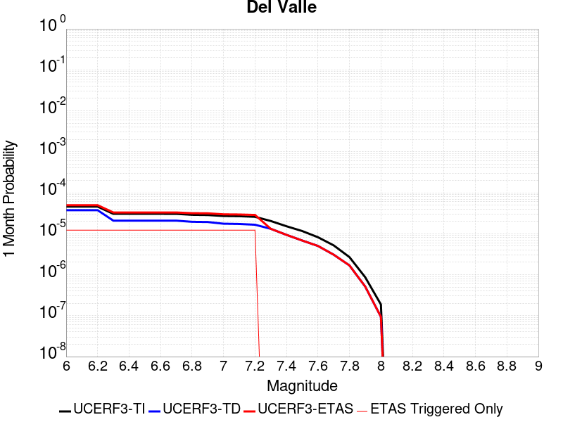 | 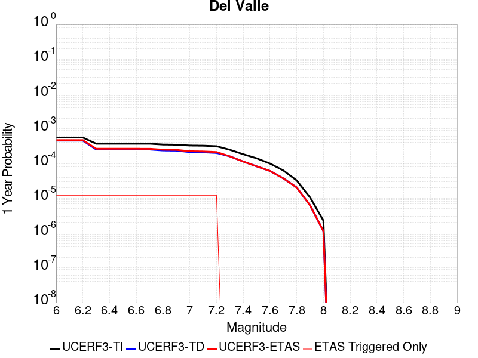 | 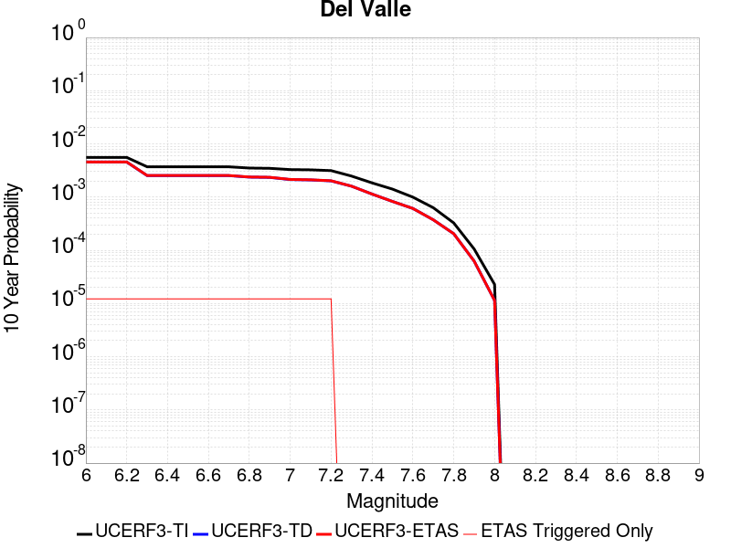 |

| Magnitude | 1 wk TI Prob | 1 wk TD Prob | 1 wk ETAS Prob | 1 wk ETAS/TD Gain | 1 wk ETAS Triggered Only | 1 mo TI Prob | 1 mo TD Prob | 1 mo ETAS Prob | 1 mo ETAS/TD Gain | 1 mo ETAS Triggered Only | 1 yr TI Prob | 1 yr TD Prob | 1 yr ETAS Prob | 1 yr ETAS/TD Gain | 1 yr ETAS Triggered Only | 10 yr TI Prob | 10 yr TD Prob | 10 yr ETAS Prob | 10 yr ETAS/TD Gain | 10 yr ETAS Triggered Only |
|-----|-----|-----|-----|-----|-----|-----|-----|-----|-----|-----|-----|-----|-----|-----|-----|-----|-----|-----|-----|-----|
| 6.0 | 1.0716125E-5 | 8.767882E-6 | 8.767882E-6 | 1.0 | 0.0 | 4.592544E-5 | 3.7576207E-5 | 4.7575828E-5 | 1.2661159 | 1.0E-5 | 5.589988E-4 | 4.5741402E-4 | 4.6740944E-4 | 1.021852 | 1.0E-5 | 0.0055759475 | 0.004566694 | 0.0045766486 | 1.0021797 | 1.0E-5 |
| 6.1 | 1.0716125E-5 | 8.767882E-6 | 8.767882E-6 | 1.0 | 0.0 | 4.592544E-5 | 3.7576207E-5 | 4.7575828E-5 | 1.2661159 | 1.0E-5 | 5.589988E-4 | 4.5741402E-4 | 4.6740944E-4 | 1.021852 | 1.0E-5 | 0.0055759475 | 0.004566694 | 0.0045766486 | 1.0021797 | 1.0E-5 |
| 6.2 | 1.0716125E-5 | 8.767882E-6 | 8.767882E-6 | 1.0 | 0.0 | 4.592544E-5 | 3.7576207E-5 | 4.7575828E-5 | 1.2661159 | 1.0E-5 | 5.589988E-4 | 4.5741402E-4 | 4.6740944E-4 | 1.021852 | 1.0E-5 | 0.0055759475 | 0.004566694 | 0.0045766486 | 1.0021797 | 1.0E-5 |
| 6.3 | 7.1293784E-6 | 4.8658226E-6 | 4.8658226E-6 | 1.0 | 0.0 | 3.055412E-5 | 2.0853362E-5 | 3.0853153E-5 | 1.479529 | 1.0E-5 | 3.7193293E-4 | 2.5386084E-4 | 2.638583E-4 | 1.0393816 | 1.0E-5 | 0.0037131102 | 0.0025358086 | 0.0025457833 | 1.0039335 | 1.0E-5 |
| 6.4 | 7.1293784E-6 | 4.8658226E-6 | 4.8658226E-6 | 1.0 | 0.0 | 3.055412E-5 | 2.0853362E-5 | 3.0853153E-5 | 1.479529 | 1.0E-5 | 3.7193293E-4 | 2.5386084E-4 | 2.638583E-4 | 1.0393816 | 1.0E-5 | 0.0037131102 | 0.0025358086 | 0.0025457833 | 1.0039335 | 1.0E-5 |
| 6.5 | 7.1293784E-6 | 4.8658226E-6 | 4.8658226E-6 | 1.0 | 0.0 | 3.055412E-5 | 2.0853362E-5 | 3.0853153E-5 | 1.479529 | 1.0E-5 | 3.7193293E-4 | 2.5386084E-4 | 2.638583E-4 | 1.0393816 | 1.0E-5 | 0.0037131102 | 0.0025358086 | 0.0025457833 | 1.0039335 | 1.0E-5 |
| 6.6 | 7.1293784E-6 | 4.8658226E-6 | 4.8658226E-6 | 1.0 | 0.0 | 3.055412E-5 | 2.0853362E-5 | 3.0853153E-5 | 1.479529 | 1.0E-5 | 3.7193293E-4 | 2.5386084E-4 | 2.638583E-4 | 1.0393816 | 1.0E-5 | 0.0037131102 | 0.0025358086 | 0.0025457833 | 1.0039335 | 1.0E-5 |
| 6.7 | 7.12272E-6 | 4.8631982E-6 | 4.8631982E-6 | 1.0 | 0.0 | 3.0525585E-5 | 2.0842115E-5 | 3.0841908E-5 | 1.4797877 | 1.0E-5 | 3.7158563E-4 | 2.5372393E-4 | 2.6372142E-4 | 1.039403 | 1.0E-5 | 0.003709649 | 0.0025344428 | 0.0025444175 | 1.0039357 | 1.0E-5 |
| 6.8 | 6.7558703E-6 | 4.559404E-6 | 4.559404E-6 | 1.0 | 0.0 | 2.895341E-5 | 1.954016E-5 | 2.9539964E-5 | 1.5117565 | 1.0E-5 | 3.5245073E-4 | 2.3787611E-4 | 2.4787372E-4 | 1.0420287 | 1.0E-5 | 0.0035189227 | 0.0023763045 | 0.0023862806 | 1.0041982 | 1.0E-5 |
| 6.9 | 6.6700386E-6 | 4.5025436E-6 | 4.5025436E-6 | 1.0 | 0.0 | 2.8585566E-5 | 1.9296476E-5 | 2.9296283E-5 | 1.5182194 | 1.0E-5 | 3.479737E-4 | 2.349099E-4 | 2.4490754E-4 | 1.0425595 | 1.0E-5 | 0.003474293 | 0.0023467052 | 0.0023566815 | 1.0042512 | 1.0E-5 |
| 7.0 | 6.3181424E-6 | 4.098708E-6 | 4.098708E-6 | 1.0 | 0.0 | 2.7077473E-5 | 1.7565775E-5 | 2.7565598E-5 | 1.5692788 | 1.0E-5 | 3.2961834E-4 | 2.1384275E-4 | 2.238406E-4 | 1.0467533 | 1.0E-5 | 0.0032912986 | 0.0021364389 | 0.0021464175 | 1.0046707 | 1.0E-5 |
| 7.1 | 6.248759E-6 | 4.033899E-6 | 4.033899E-6 | 1.0 | 0.0 | 2.678012E-5 | 1.7288028E-5 | 2.7287855E-5 | 1.5784249 | 1.0E-5 | 3.2599916E-4 | 2.1046183E-4 | 2.2045973E-4 | 1.0475045 | 1.0E-5 | 0.0032552136 | 0.0021026938 | 0.002112673 | 1.0047458 | 1.0E-5 |
| 7.2 | 6.0411944E-6 | 3.869892E-6 | 3.869892E-6 | 1.0 | 0.0 | 2.5890577E-5 | 1.658515E-5 | 2.6584985E-5 | 1.602939 | 1.0E-5 | 3.1517216E-4 | 2.019059E-4 | 2.1190388E-4 | 1.049518 | 1.0E-5 | 0.0031472554 | 0.0020172922 | 0.002027272 | 1.0049472 | 1.0E-5 |
| 7.3 | 4.7691183E-6 | 3.0780905E-6 | 3.0780905E-6 | 1.0 | 0.0 | 2.0438918E-5 | 1.3191751E-5 | 1.3191751E-5 | 1.0 | 0.0 | 2.488154E-4 | 1.6059795E-4 | 1.6059795E-4 | 1.0 | 0.0 | 0.00248537 | 0.0016048512 | 0.0016048512 | 1.0 | 0.0 |
| 7.4 | 3.5524722E-6 | 2.1893159E-6 | 2.1893159E-6 | 1.0 | 0.0 | 1.5224792E-5 | 9.382749E-6 | 9.382749E-6 | 1.0 | 0.0 | 1.8534607E-4 | 1.14229064E-4 | 1.14229064E-4 | 1.0 | 0.0 | 0.0018519156 | 0.0011417117 | 0.0011417117 | 1.0 | 0.0 |
| 7.5 | 2.7133442E-6 | 1.5915855E-6 | 1.5915855E-6 | 1.0 | 0.0 | 1.1628566E-5 | 6.821063E-6 | 6.821063E-6 | 1.0 | 0.0 | 1.415686E-4 | 8.30433E-5 | 8.30433E-5 | 1.0 | 0.0 | 0.0014147845 | 8.301246E-4 | 8.301246E-4 | 1.0 | 0.0 |
| 7.6 | 1.915338E-6 | 1.1738952E-6 | 1.1738952E-6 | 1.0 | 0.0 | 8.208566E-6 | 5.0309695E-6 | 5.0309695E-6 | 1.0 | 0.0 | 9.993471E-5 | 6.125034E-5 | 6.125034E-5 | 1.0 | 0.0 | 9.988978E-4 | 6.123355E-4 | 6.123355E-4 | 1.0 | 0.0 |
| 7.7 | 1.2120448E-6 | 7.1801645E-7 | 7.1801645E-7 | 1.0 | 0.0 | 5.194467E-6 | 3.0772098E-6 | 3.0772098E-6 | 1.0 | 0.0 | 6.3240805E-5 | 3.746439E-5 | 3.746439E-5 | 1.0 | 0.0 | 6.322281E-4 | 3.745811E-4 | 3.745811E-4 | 1.0 | 0.0 |
| 7.8 | 6.272381E-7 | 3.93245E-7 | 3.93245E-7 | 1.0 | 0.0 | 2.6881603E-6 | 1.6853346E-6 | 1.6853346E-6 | 1.0 | 0.0 | 3.272786E-5 | 2.0518757E-5 | 2.0518757E-5 | 1.0 | 0.0 | 3.272304E-4 | 2.0516879E-4 | 2.0516879E-4 | 1.0 | 0.0 |
| 7.9 | 2.0292627E-7 | 1.2004223E-7 | 1.2004223E-7 | 1.0 | 0.0 | 8.6968373E-7 | 5.144666E-7 | 5.144666E-7 | 1.0 | 0.0 | 1.0588348E-5 | 6.2636127E-6 | 6.2636127E-6 | 1.0 | 0.0 | 1.0587843E-4 | 6.263438E-5 | 6.263438E-5 | 1.0 | 0.0 |
| 8.0 | 4.374492E-8 | 2.1898856E-8 | 2.1898856E-8 | 1.0 | 0.0 | 1.8747821E-7 | 9.3852236E-8 | 9.3852236E-8 | 1.0 | 0.0 | 2.2825448E-6 | 1.1426505E-6 | 1.1426505E-6 | 1.0 | 0.0 | 2.2825214E-5 | 1.1426449E-5 | 1.1426449E-5 | 1.0 | 0.0 |

## Oak Ridge (Onshore)
*[(top)](#table-of-contents)*

| 1 Week | 1 Month | 1 Year | 10 Year |
|-----|-----|-----|-----|
|  |  |  |  |

| Magnitude | 1 wk TI Prob | 1 wk TD Prob | 1 wk ETAS Prob | 1 wk ETAS/TD Gain | 1 wk ETAS Triggered Only | 1 mo TI Prob | 1 mo TD Prob | 1 mo ETAS Prob | 1 mo ETAS/TD Gain | 1 mo ETAS Triggered Only | 1 yr TI Prob | 1 yr TD Prob | 1 yr ETAS Prob | 1 yr ETAS/TD Gain | 1 yr ETAS Triggered Only | 10 yr TI Prob | 10 yr TD Prob | 10 yr ETAS Prob | 10 yr ETAS/TD Gain | 10 yr ETAS Triggered Only |
|-----|-----|-----|-----|-----|-----|-----|-----|-----|-----|-----|-----|-----|-----|-----|-----|-----|-----|-----|-----|-----|
| 6.0 | 3.155064E-5 | 2.9526076E-5 | 3.952578E-5 | 1.3386737 | 1.0E-5 | 1.3521002E-4 | 1.265344E-4 | 1.3653314E-4 | 1.0790199 | 1.0E-5 | 0.001644939 | 0.0015395058 | 0.0015494904 | 1.0064856 | 1.0E-5 | 0.01632816 | 0.015293054 | 0.015302902 | 1.0006438 | 1.0E-5 |
| 6.1 | 3.155064E-5 | 2.9526076E-5 | 3.952578E-5 | 1.3386737 | 1.0E-5 | 1.3521002E-4 | 1.265344E-4 | 1.3653314E-4 | 1.0790199 | 1.0E-5 | 0.001644939 | 0.0015395058 | 0.0015494904 | 1.0064856 | 1.0E-5 | 0.01632816 | 0.015293054 | 0.015302902 | 1.0006438 | 1.0E-5 |
| 6.2 | 3.155064E-5 | 2.9526076E-5 | 3.952578E-5 | 1.3386737 | 1.0E-5 | 1.3521002E-4 | 1.265344E-4 | 1.3653314E-4 | 1.0790199 | 1.0E-5 | 0.001644939 | 0.0015395058 | 0.0015494904 | 1.0064856 | 1.0E-5 | 0.01632816 | 0.015293054 | 0.015302902 | 1.0006438 | 1.0E-5 |
| 6.3 | 3.155064E-5 | 2.9526076E-5 | 3.952578E-5 | 1.3386737 | 1.0E-5 | 1.3521002E-4 | 1.265344E-4 | 1.3653314E-4 | 1.0790199 | 1.0E-5 | 0.001644939 | 0.0015395058 | 0.0015494904 | 1.0064856 | 1.0E-5 | 0.01632816 | 0.015293054 | 0.015302902 | 1.0006438 | 1.0E-5 |
| 6.4 | 3.155064E-5 | 2.9526076E-5 | 3.952578E-5 | 1.3386737 | 1.0E-5 | 1.3521002E-4 | 1.265344E-4 | 1.3653314E-4 | 1.0790199 | 1.0E-5 | 0.001644939 | 0.0015395058 | 0.0015494904 | 1.0064856 | 1.0E-5 | 0.01632816 | 0.015293054 | 0.015302902 | 1.0006438 | 1.0E-5 |
| 6.5 | 3.155064E-5 | 2.9526076E-5 | 3.952578E-5 | 1.3386737 | 1.0E-5 | 1.3521002E-4 | 1.265344E-4 | 1.3653314E-4 | 1.0790199 | 1.0E-5 | 0.001644939 | 0.0015395058 | 0.0015494904 | 1.0064856 | 1.0E-5 | 0.01632816 | 0.015293054 | 0.015302902 | 1.0006438 | 1.0E-5 |
| 6.6 | 3.155064E-5 | 2.9526076E-5 | 3.952578E-5 | 1.3386737 | 1.0E-5 | 1.3521002E-4 | 1.265344E-4 | 1.3653314E-4 | 1.0790199 | 1.0E-5 | 0.001644939 | 0.0015395058 | 0.0015494904 | 1.0064856 | 1.0E-5 | 0.01632816 | 0.015293054 | 0.015302902 | 1.0006438 | 1.0E-5 |
| 6.7 | 3.098897E-5 | 2.8864279E-5 | 3.886399E-5 | 1.346439 | 1.0E-5 | 1.328031E-4 | 1.236984E-4 | 1.3369716E-4 | 1.0808318 | 1.0E-5 | 0.0016156785 | 0.0015050253 | 0.0015150103 | 1.0066344 | 1.0E-5 | 0.016039822 | 0.014952909 | 0.01496276 | 1.0006588 | 1.0E-5 |
| 6.8 | 3.0449872E-5 | 2.8239476E-5 | 3.8239195E-5 | 1.3541042 | 1.0E-5 | 1.3049292E-4 | 1.2102092E-4 | 1.3101971E-4 | 1.0826204 | 1.0E-5 | 0.0015875935 | 0.001472471 | 0.0014824563 | 1.0067813 | 1.0E-5 | 0.015762992 | 0.014631658 | 0.014641511 | 1.0006734 | 1.0E-5 |
| 6.9 | 2.697928E-5 | 2.4219877E-5 | 3.4219636E-5 | 1.412874 | 1.0E-5 | 1.15620365E-4 | 1.03795464E-4 | 1.1379443E-4 | 1.0963333 | 1.0E-5 | 0.0014067689 | 0.0012629988 | 0.0012729861 | 1.0079076 | 1.0E-5 | 0.0139789665 | 0.012561066 | 0.01257094 | 1.0007861 | 1.0E-5 |
| 7.0 | 2.4893961E-5 | 2.1862146E-5 | 3.1861928E-5 | 1.4574016 | 1.0E-5 | 1.0668404E-4 | 9.369165E-5 | 1.0369071E-4 | 1.1067231 | 1.0E-5 | 0.0012981043 | 0.0011401166 | 0.0011501053 | 1.008761 | 1.0E-5 | 0.012905477 | 0.011345102 | 0.011354988 | 1.0008714 | 1.0E-5 |
| 7.1 | 2.0945363E-5 | 1.7354592E-5 | 2.735442E-5 | 1.5762063 | 1.0E-5 | 8.976275E-5 | 7.437473E-5 | 8.437399E-5 | 1.1344442 | 1.0E-5 | 0.0010923136 | 9.0514094E-4 | 9.151319E-4 | 1.011038 | 1.0E-5 | 0.0108696 | 0.009015621 | 0.00902553 | 1.0010992 | 1.0E-5 |
| 7.2 | 2.0439404E-5 | 1.680953E-5 | 2.680936E-5 | 1.5948906 | 1.0E-5 | 8.7594504E-5 | 7.203888E-5 | 8.203816E-5 | 1.138804 | 1.0E-5 | 0.0010659413 | 8.767251E-4 | 8.8671636E-4 | 1.011396 | 1.0E-5 | 0.010608427 | 0.008733723 | 0.008743636 | 1.001135 | 1.0E-5 |
| 7.3 | 1.8463334E-5 | 1.5381947E-5 | 2.5381793E-5 | 1.6501027 | 1.0E-5 | 7.912617E-5 | 6.592098E-5 | 7.5920325E-5 | 1.1516868 | 1.0E-5 | 9.6293533E-4 | 8.0229685E-4 | 8.1228884E-4 | 1.0124543 | 1.0E-5 | 0.009587734 | 0.0079950085 | 0.008004929 | 1.0012407 | 1.0E-5 |
| 7.4 | 1.763139E-5 | 1.4516977E-5 | 2.4516832E-5 | 1.6888386 | 1.0E-5 | 7.556091E-5 | 6.221415E-5 | 7.221353E-5 | 1.1607251 | 1.0E-5 | 9.1956573E-4 | 7.57198E-4 | 7.671905E-4 | 1.0131966 | 1.0E-5 | 0.009157699 | 0.007547126 | 0.0075570503 | 1.001315 | 1.0E-5 |
| 7.5 | 1.3594944E-5 | 1.1163363E-5 | 2.116325E-5 | 1.8957775 | 1.0E-5 | 5.8262744E-5 | 4.7842117E-5 | 5.784164E-5 | 1.2090108 | 1.0E-5 | 7.0911803E-4 | 5.8232463E-4 | 5.9231883E-4 | 1.0171626 | 1.0E-5 | 0.007068595 | 0.005808362 | 0.0058183037 | 1.0017116 | 1.0E-5 |
| 7.6 | 6.9889534E-6 | 5.6367194E-6 | 5.6367194E-6 | 1.0 | 0.0 | 2.9952313E-5 | 2.4157147E-5 | 2.4157147E-5 | 1.0 | 0.0 | 3.646084E-4 | 2.94074E-4 | 2.94074E-4 | 1.0 | 0.0 | 0.0036401073 | 0.0029368924 | 0.0029368924 | 1.0 | 0.0 |
| 7.7 | 4.0824193E-6 | 3.2832731E-6 | 3.2832731E-6 | 1.0 | 0.0 | 1.7495966E-5 | 1.4071096E-5 | 1.4071096E-5 | 1.0 | 0.0 | 2.1299256E-4 | 1.7130225E-4 | 1.7130225E-4 | 1.0 | 0.0 | 0.0021278851 | 0.0017117155 | 0.0017117155 | 1.0 | 0.0 |
| 7.8 | 1.7023609E-6 | 1.43706E-6 | 1.43706E-6 | 1.0 | 0.0 | 7.295812E-6 | 6.158814E-6 | 6.158814E-6 | 1.0 | 0.0 | 8.882289E-5 | 7.4981006E-5 | 7.4981006E-5 | 1.0 | 0.0 | 8.8787393E-4 | 7.4955984E-4 | 7.4955984E-4 | 1.0 | 0.0 |
| 7.9 | 2.721225E-7 | 2.261692E-7 | 2.261692E-7 | 1.0 | 0.0 | 1.1662388E-6 | 9.692963E-7 | 9.692963E-7 | 1.0 | 0.0 | 1.4198865E-5 | 1.1801121E-5 | 1.1801121E-5 | 1.0 | 0.0 | 1.4197957E-4 | 1.1800523E-4 | 1.1800523E-4 | 1.0 | 0.0 |
| 8.0 | 9.364255E-9 | 5.1204916E-9 | 5.1204916E-9 | 1.0 | 0.0 | 4.0132523E-8 | 2.1944963E-8 | 2.1944963E-8 | 1.0 | 0.0 | 4.8861335E-7 | 2.671799E-7 | 2.671799E-7 | 1.0 | 0.0 | 4.8861225E-6 | 2.6717962E-6 | 2.6717962E-6 | 1.0 | 0.0 |

## Great Valley 08 (Quinto)
*[(top)](#table-of-contents)*

| 1 Week | 1 Month | 1 Year | 10 Year |
|-----|-----|-----|-----|
| 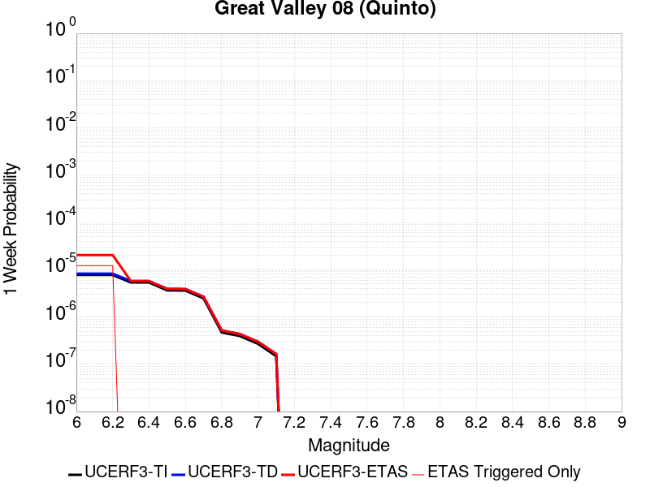 | 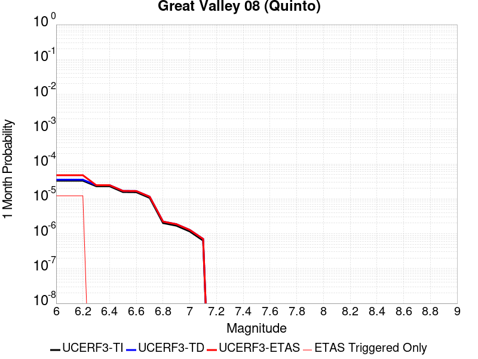 | 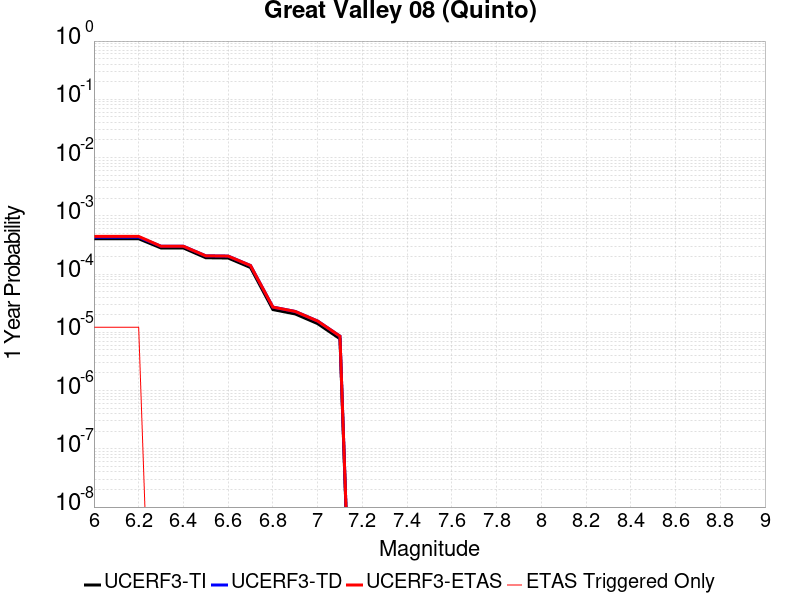 | 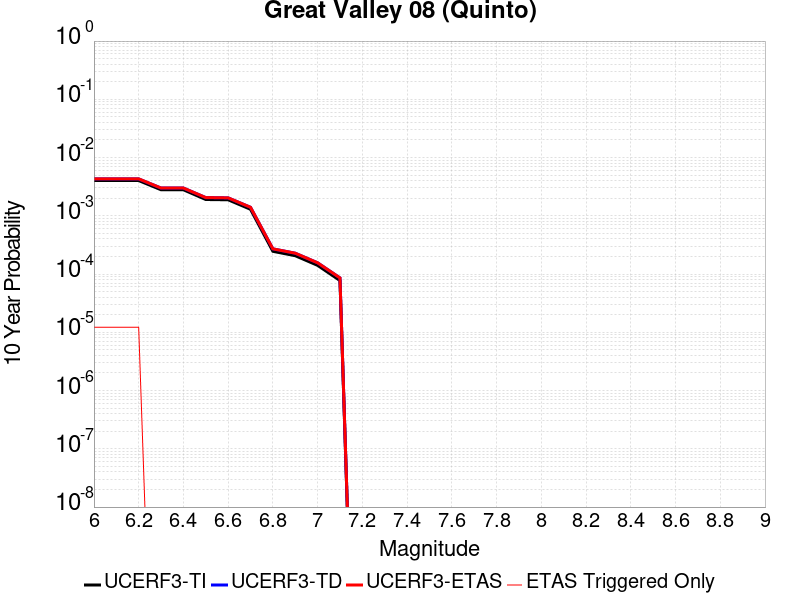 |

| Magnitude | 1 wk TI Prob | 1 wk TD Prob | 1 wk ETAS Prob | 1 wk ETAS/TD Gain | 1 wk ETAS Triggered Only | 1 mo TI Prob | 1 mo TD Prob | 1 mo ETAS Prob | 1 mo ETAS/TD Gain | 1 mo ETAS Triggered Only | 1 yr TI Prob | 1 yr TD Prob | 1 yr ETAS Prob | 1 yr ETAS/TD Gain | 1 yr ETAS Triggered Only | 10 yr TI Prob | 10 yr TD Prob | 10 yr ETAS Prob | 10 yr ETAS/TD Gain | 10 yr ETAS Triggered Only |
|-----|-----|-----|-----|-----|-----|-----|-----|-----|-----|-----|-----|-----|-----|-----|-----|-----|-----|-----|-----|-----|
| 6.0 | 7.737697E-6 | 8.253038E-6 | 1.8252955E-5 | 2.211665 | 1.0E-5 | 3.3161137E-5 | 3.536979E-5 | 4.5369437E-5 | 1.2827171 | 1.0E-5 | 4.0366207E-4 | 4.3056096E-4 | 4.4055664E-4 | 1.0232155 | 1.0E-5 | 0.004029296 | 0.0042991205 | 0.0043090777 | 1.002316 | 1.0E-5 |
| 6.1 | 7.737697E-6 | 8.253038E-6 | 1.8252955E-5 | 2.211665 | 1.0E-5 | 3.3161137E-5 | 3.536979E-5 | 4.5369437E-5 | 1.2827171 | 1.0E-5 | 4.0366207E-4 | 4.3056096E-4 | 4.4055664E-4 | 1.0232155 | 1.0E-5 | 0.004029296 | 0.0042991205 | 0.0043090777 | 1.002316 | 1.0E-5 |
| 6.2 | 7.737697E-6 | 8.253038E-6 | 1.8252955E-5 | 2.211665 | 1.0E-5 | 3.3161137E-5 | 3.536979E-5 | 4.5369437E-5 | 1.2827171 | 1.0E-5 | 4.0366207E-4 | 4.3056096E-4 | 4.4055664E-4 | 1.0232155 | 1.0E-5 | 0.004029296 | 0.0042991205 | 0.0043090777 | 1.002316 | 1.0E-5 |
| 6.3 | 5.374012E-6 | 5.7505736E-6 | 5.7505736E-6 | 1.0 | 0.0 | 2.3031276E-5 | 2.4645145E-5 | 2.4645145E-5 | 1.0 | 0.0 | 2.803697E-4 | 3.0002446E-4 | 3.0002446E-4 | 1.0 | 0.0 | 0.0028001624 | 0.0029972875 | 0.0029972875 | 1.0 | 0.0 |
| 6.4 | 5.374012E-6 | 5.7505736E-6 | 5.7505736E-6 | 1.0 | 0.0 | 2.3031276E-5 | 2.4645145E-5 | 2.4645145E-5 | 1.0 | 0.0 | 2.803697E-4 | 3.0002446E-4 | 3.0002446E-4 | 1.0 | 0.0 | 0.0028001624 | 0.0029972875 | 0.0029972875 | 1.0 | 0.0 |
| 6.5 | 3.65427E-6 | 3.941324E-6 | 3.941324E-6 | 1.0 | 0.0 | 1.5661062E-5 | 1.689132E-5 | 1.689132E-5 | 1.0 | 0.0 | 1.9065675E-4 | 2.0563944E-4 | 2.0563944E-4 | 1.0 | 0.0 | 0.0019049325 | 0.0020551833 | 0.0020551833 | 1.0 | 0.0 |
| 6.6 | 3.6143538E-6 | 3.8985104E-6 | 3.8985104E-6 | 1.0 | 0.0 | 1.5489995E-5 | 1.6707834E-5 | 1.6707834E-5 | 1.0 | 0.0 | 1.8857437E-4 | 2.0340596E-4 | 2.0340596E-4 | 1.0 | 0.0 | 0.0018841444 | 0.0020328893 | 0.0020328893 | 1.0 | 0.0 |
| 6.7 | 2.4821015E-6 | 2.6857067E-6 | 2.6857067E-6 | 1.0 | 0.0 | 1.0637535E-5 | 1.1510153E-5 | 1.1510153E-5 | 1.0 | 0.0 | 1.2950429E-4 | 1.4013276E-4 | 1.4013276E-4 | 1.0 | 0.0 | 0.0012942884 | 0.0014009989 | 0.0014009989 | 1.0 | 0.0 |
| 6.8 | 4.7110538E-7 | 5.193021E-7 | 5.193021E-7 | 1.0 | 0.0 | 2.0190216E-6 | 2.2255786E-6 | 2.2255786E-6 | 1.0 | 0.0 | 2.458131E-5 | 2.70961E-5 | 2.70961E-5 | 1.0 | 0.0 | 2.457859E-4 | 2.7092977E-4 | 2.7092977E-4 | 1.0 | 0.0 |
| 6.9 | 3.958685E-7 | 4.3703452E-7 | 4.3703452E-7 | 1.0 | 0.0 | 1.6965782E-6 | 1.8730038E-6 | 1.8730038E-6 | 1.0 | 0.0 | 2.0655643E-5 | 2.28036E-5 | 2.28036E-5 | 1.0 | 0.0 | 2.0653724E-4 | 2.2801422E-4 | 2.2801422E-4 | 1.0 | 0.0 |
| 7.0 | 2.70294E-7 | 2.9920008E-7 | 2.9920008E-7 | 1.0 | 0.0 | 1.1584025E-6 | 1.2822856E-6 | 1.2822856E-6 | 1.0 | 0.0 | 1.4103458E-5 | 1.5611728E-5 | 1.5611728E-5 | 1.0 | 0.0 | 1.4102564E-4 | 1.5610759E-4 | 1.5610759E-4 | 1.0 | 0.0 |
| 7.1 | 1.4828602E-7 | 1.6469107E-7 | 1.6469107E-7 | 1.0 | 0.0 | 6.3551136E-7 | 7.058187E-7 | 7.058187E-7 | 1.0 | 0.0 | 7.737323E-6 | 8.593317E-6 | 8.593317E-6 | 1.0 | 0.0 | 7.737054E-5 | 8.593065E-5 | 8.593065E-5 | 1.0 | 0.0 |

## Santa Susana alt 1
*[(top)](#table-of-contents)*

| 1 Week | 1 Month | 1 Year | 10 Year |
|-----|-----|-----|-----|
| 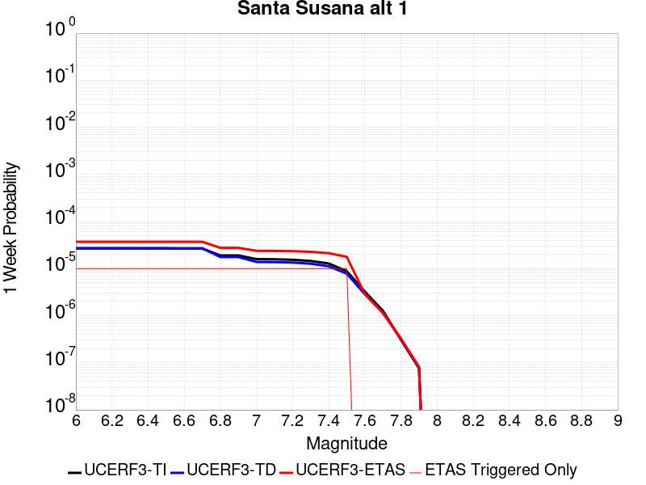 | 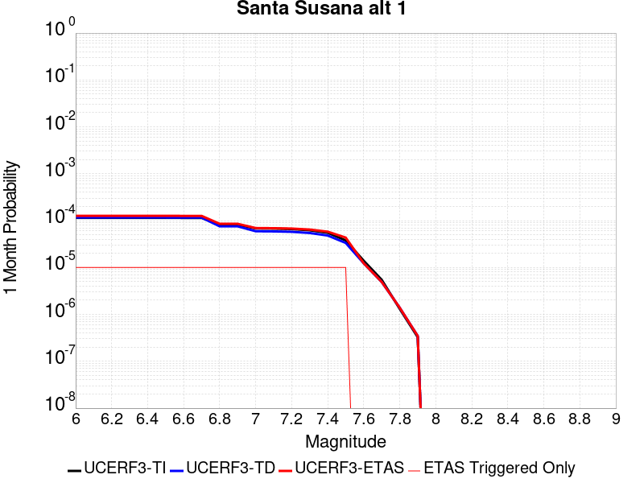 |  |  |

| Magnitude | 1 wk TI Prob | 1 wk TD Prob | 1 wk ETAS Prob | 1 wk ETAS/TD Gain | 1 wk ETAS Triggered Only | 1 mo TI Prob | 1 mo TD Prob | 1 mo ETAS Prob | 1 mo ETAS/TD Gain | 1 mo ETAS Triggered Only | 1 yr TI Prob | 1 yr TD Prob | 1 yr ETAS Prob | 1 yr ETAS/TD Gain | 1 yr ETAS Triggered Only | 10 yr TI Prob | 10 yr TD Prob | 10 yr ETAS Prob | 10 yr ETAS/TD Gain | 10 yr ETAS Triggered Only |
|-----|-----|-----|-----|-----|-----|-----|-----|-----|-----|-----|-----|-----|-----|-----|-----|-----|-----|-----|-----|-----|
| 6.0 | 2.674877E-5 | 2.7198214E-5 | 3.719794E-5 | 1.3676612 | 1.0E-5 | 1.1463255E-4 | 1.16559204E-4 | 1.2655804E-4 | 1.0857834 | 1.0E-5 | 0.0013947578 | 0.0014182981 | 0.001428284 | 1.0070407 | 1.0E-5 | 0.013860362 | 0.014104388 | 0.014114247 | 1.000699 | 1.0E-5 |
| 6.1 | 2.674877E-5 | 2.7198214E-5 | 3.719794E-5 | 1.3676612 | 1.0E-5 | 1.1463255E-4 | 1.16559204E-4 | 1.2655804E-4 | 1.0857834 | 1.0E-5 | 0.0013947578 | 0.0014182981 | 0.001428284 | 1.0070407 | 1.0E-5 | 0.013860362 | 0.014104388 | 0.014114247 | 1.000699 | 1.0E-5 |
| 6.2 | 2.674877E-5 | 2.7198214E-5 | 3.719794E-5 | 1.3676612 | 1.0E-5 | 1.1463255E-4 | 1.16559204E-4 | 1.2655804E-4 | 1.0857834 | 1.0E-5 | 0.0013947578 | 0.0014182981 | 0.001428284 | 1.0070407 | 1.0E-5 | 0.013860362 | 0.014104388 | 0.014114247 | 1.000699 | 1.0E-5 |
| 6.3 | 2.674877E-5 | 2.7198214E-5 | 3.719794E-5 | 1.3676612 | 1.0E-5 | 1.1463255E-4 | 1.16559204E-4 | 1.2655804E-4 | 1.0857834 | 1.0E-5 | 0.0013947578 | 0.0014182981 | 0.001428284 | 1.0070407 | 1.0E-5 | 0.013860362 | 0.014104388 | 0.014114247 | 1.000699 | 1.0E-5 |
| 6.4 | 2.674877E-5 | 2.7198214E-5 | 3.719794E-5 | 1.3676612 | 1.0E-5 | 1.1463255E-4 | 1.16559204E-4 | 1.2655804E-4 | 1.0857834 | 1.0E-5 | 0.0013947578 | 0.0014182981 | 0.001428284 | 1.0070407 | 1.0E-5 | 0.013860362 | 0.014104388 | 0.014114247 | 1.000699 | 1.0E-5 |
| 6.5 | 2.674877E-5 | 2.7198214E-5 | 3.719794E-5 | 1.3676612 | 1.0E-5 | 1.1463255E-4 | 1.16559204E-4 | 1.2655804E-4 | 1.0857834 | 1.0E-5 | 0.0013947578 | 0.0014182981 | 0.001428284 | 1.0070407 | 1.0E-5 | 0.013860362 | 0.014104388 | 0.014114247 | 1.000699 | 1.0E-5 |
| 6.6 | 2.6647976E-5 | 2.7074553E-5 | 3.7074282E-5 | 1.3693405 | 1.0E-5 | 1.14200615E-4 | 1.16029274E-4 | 1.2602811E-4 | 1.0861752 | 1.0E-5 | 0.0013895056 | 0.0014118546 | 0.0014218405 | 1.0070729 | 1.0E-5 | 0.013808494 | 0.014040773 | 0.014050633 | 1.0007023 | 1.0E-5 |
| 6.7 | 2.6647976E-5 | 2.7074553E-5 | 3.7074282E-5 | 1.3693405 | 1.0E-5 | 1.14200615E-4 | 1.16029274E-4 | 1.2602811E-4 | 1.0861752 | 1.0E-5 | 0.0013895056 | 0.0014118546 | 0.0014218405 | 1.0070729 | 1.0E-5 | 0.013808494 | 0.014040773 | 0.014050633 | 1.0007023 | 1.0E-5 |
| 6.8 | 1.9073179E-5 | 1.7637467E-5 | 2.763729E-5 | 1.5669649 | 1.0E-5 | 8.1739636E-5 | 7.558706E-5 | 8.5586296E-5 | 1.1322877 | 1.0E-5 | 9.947256E-4 | 9.19902E-4 | 9.2989276E-4 | 1.0108607 | 1.0E-5 | 0.009902848 | 0.009163361 | 0.009173269 | 1.0010813 | 1.0E-5 |
| 6.9 | 1.9041876E-5 | 1.7619597E-5 | 2.7619422E-5 | 1.5675398 | 1.0E-5 | 8.160549E-5 | 7.551048E-5 | 8.5509724E-5 | 1.132422 | 1.0E-5 | 9.930939E-4 | 9.189705E-4 | 9.2896126E-4 | 1.0108718 | 1.0E-5 | 0.0098866755 | 0.009154123 | 0.009164032 | 1.0010824 | 1.0E-5 |
| 7.0 | 1.5917482E-5 | 1.3864049E-5 | 2.386391E-5 | 1.72128 | 1.0E-5 | 6.8215995E-5 | 5.9416023E-5 | 6.941543E-5 | 1.1682948 | 1.0E-5 | 8.302132E-4 | 7.2315463E-4 | 7.3314743E-4 | 1.0138183 | 1.0E-5 | 0.008271185 | 0.0072090672 | 0.007218995 | 1.0013771 | 1.0E-5 |
| 7.1 | 1.577788E-5 | 1.3744056E-5 | 2.3743918E-5 | 1.7275773 | 1.0E-5 | 6.761774E-5 | 5.890179E-5 | 6.89012E-5 | 1.1697642 | 1.0E-5 | 8.2293496E-4 | 7.16898E-4 | 7.2689087E-4 | 1.013939 | 1.0E-5 | 0.008198941 | 0.0071469042 | 0.007156833 | 1.0013893 | 1.0E-5 |
| 7.2 | 1.5416446E-5 | 1.34701295E-5 | 2.3469995E-5 | 1.7423733 | 1.0E-5 | 6.606882E-5 | 5.7727877E-5 | 6.77273E-5 | 1.1732166 | 1.0E-5 | 8.0409093E-4 | 7.026149E-4 | 7.1260787E-4 | 1.0142225 | 1.0E-5 | 0.008011877 | 0.0070049763 | 0.0070149065 | 1.0014175 | 1.0E-5 |
| 7.3 | 1.4534083E-5 | 1.2718032E-5 | 2.2717904E-5 | 1.7862751 | 1.0E-5 | 6.228744E-5 | 5.4504737E-5 | 6.450419E-5 | 1.1834604 | 1.0E-5 | 7.580857E-4 | 6.633976E-4 | 6.733909E-4 | 1.0150639 | 1.0E-5 | 0.007555048 | 0.0066151717 | 0.0066251056 | 1.0015017 | 1.0E-5 |
| 7.4 | 1.2858995E-5 | 1.1229814E-5 | 2.1229702E-5 | 1.8904767 | 1.0E-5 | 5.5108816E-5 | 4.812691E-5 | 5.812643E-5 | 1.2077739 | 1.0E-5 | 6.7074323E-4 | 5.8579154E-4 | 5.957857E-4 | 1.0170609 | 1.0E-5 | 0.0066872234 | 0.0058433902 | 0.005853332 | 1.0017014 | 1.0E-5 |
| 7.5 | 8.827668E-6 | 7.805494E-6 | 1.7805416E-5 | 2.281139 | 1.0E-5 | 3.7832317E-5 | 3.3451703E-5 | 4.3451368E-5 | 1.2989285 | 1.0E-5 | 4.605111E-4 | 4.072008E-4 | 4.1719674E-4 | 1.0245479 | 1.0E-5 | 0.0045955796 | 0.0040648985 | 0.004074858 | 1.0024501 | 1.0E-5 |
| 7.6 | 3.2533426E-6 | 2.8720106E-6 | 2.8720106E-6 | 1.0 | 0.0 | 1.3942822E-5 | 1.230856E-5 | 1.230856E-5 | 1.0 | 0.0 | 1.6974064E-4 | 1.4984679E-4 | 1.4984679E-4 | 1.0 | 0.0 | 0.0016961104 | 0.0014974943 | 0.0014974943 | 1.0 | 0.0 |
| 7.7 | 1.2751709E-6 | 1.1491339E-6 | 1.1491339E-6 | 1.0 | 0.0 | 5.4650063E-6 | 4.9248506E-6 | 4.9248506E-6 | 1.0 | 0.0 | 6.653442E-5 | 5.99585E-5 | 5.99585E-5 | 1.0 | 0.0 | 6.6514505E-4 | 5.9943215E-4 | 5.9943215E-4 | 1.0 | 0.0 |
| 7.8 | 3.067544E-7 | 3.240052E-7 | 3.240052E-7 | 1.0 | 0.0 | 1.3146611E-6 | 1.3885931E-6 | 1.3885931E-6 | 1.0 | 0.0 | 1.600588E-5 | 1.6906E-5 | 1.6906E-5 | 1.0 | 0.0 | 1.6004729E-4 | 1.6904817E-4 | 1.6904817E-4 | 1.0 | 0.0 |
| 7.9 | 7.622999E-8 | 8.0879715E-8 | 8.0879715E-8 | 1.0 | 0.0 | 3.2669993E-7 | 3.4662733E-7 | 3.4662733E-7 | 1.0 | 0.0 | 3.977564E-6 | 4.220182E-6 | 4.220182E-6 | 1.0 | 0.0 | 3.977493E-5 | 4.2201224E-5 | 4.2201224E-5 | 1.0 | 0.0 |

## Hartley Springs 2011 CFM
*[(top)](#table-of-contents)*

| 1 Week | 1 Month | 1 Year | 10 Year |
|-----|-----|-----|-----|
| 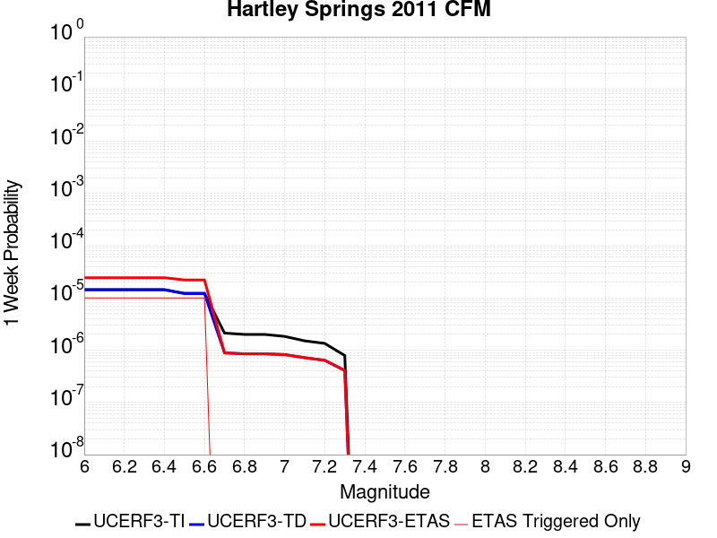 |  |  |  |

| Magnitude | 1 wk TI Prob | 1 wk TD Prob | 1 wk ETAS Prob | 1 wk ETAS/TD Gain | 1 wk ETAS Triggered Only | 1 mo TI Prob | 1 mo TD Prob | 1 mo ETAS Prob | 1 mo ETAS/TD Gain | 1 mo ETAS Triggered Only | 1 yr TI Prob | 1 yr TD Prob | 1 yr ETAS Prob | 1 yr ETAS/TD Gain | 1 yr ETAS Triggered Only | 10 yr TI Prob | 10 yr TD Prob | 10 yr ETAS Prob | 10 yr ETAS/TD Gain | 10 yr ETAS Triggered Only |
|-----|-----|-----|-----|-----|-----|-----|-----|-----|-----|-----|-----|-----|-----|-----|-----|-----|-----|-----|-----|-----|
| 6.0 | 1.4352418E-5 | 1.4434111E-5 | 2.4433966E-5 | 1.6927933 | 1.0E-5 | 6.1508916E-5 | 6.185994E-5 | 7.185932E-5 | 1.1616455 | 1.0E-5 | 7.486137E-4 | 7.5304887E-4 | 7.630413E-4 | 1.0132693 | 1.0E-5 | 0.007460968 | 0.007521092 | 0.0075310166 | 1.0013196 | 1.0E-5 |
| 6.1 | 1.4352418E-5 | 1.4434111E-5 | 2.4433966E-5 | 1.6927933 | 1.0E-5 | 6.1508916E-5 | 6.185994E-5 | 7.185932E-5 | 1.1616455 | 1.0E-5 | 7.486137E-4 | 7.5304887E-4 | 7.630413E-4 | 1.0132693 | 1.0E-5 | 0.007460968 | 0.007521092 | 0.0075310166 | 1.0013196 | 1.0E-5 |
| 6.2 | 1.4352418E-5 | 1.4434111E-5 | 2.4433966E-5 | 1.6927933 | 1.0E-5 | 6.1508916E-5 | 6.185994E-5 | 7.185932E-5 | 1.1616455 | 1.0E-5 | 7.486137E-4 | 7.5304887E-4 | 7.630413E-4 | 1.0132693 | 1.0E-5 | 0.007460968 | 0.007521092 | 0.0075310166 | 1.0013196 | 1.0E-5 |
| 6.3 | 1.4352418E-5 | 1.4434111E-5 | 2.4433966E-5 | 1.6927933 | 1.0E-5 | 6.1508916E-5 | 6.185994E-5 | 7.185932E-5 | 1.1616455 | 1.0E-5 | 7.486137E-4 | 7.5304887E-4 | 7.630413E-4 | 1.0132693 | 1.0E-5 | 0.007460968 | 0.007521092 | 0.0075310166 | 1.0013196 | 1.0E-5 |
| 6.4 | 1.4352418E-5 | 1.4434111E-5 | 2.4433966E-5 | 1.6927933 | 1.0E-5 | 6.1508916E-5 | 6.185994E-5 | 7.185932E-5 | 1.1616455 | 1.0E-5 | 7.486137E-4 | 7.5304887E-4 | 7.630413E-4 | 1.0132693 | 1.0E-5 | 0.007460968 | 0.007521092 | 0.0075310166 | 1.0013196 | 1.0E-5 |
| 6.5 | 1.2279858E-5 | 1.2133036E-5 | 2.2132914E-5 | 1.8241861 | 1.0E-5 | 5.26269E-5 | 5.199858E-5 | 6.199806E-5 | 1.192303 | 1.0E-5 | 6.4054417E-4 | 6.33057E-4 | 6.4305065E-4 | 1.0157864 | 1.0E-5 | 0.0063870098 | 0.006328048 | 0.006337985 | 1.0015702 | 1.0E-5 |
| 6.6 | 1.2279858E-5 | 1.2133036E-5 | 2.2132914E-5 | 1.8241861 | 1.0E-5 | 5.26269E-5 | 5.199858E-5 | 6.199806E-5 | 1.192303 | 1.0E-5 | 6.4054417E-4 | 6.33057E-4 | 6.4305065E-4 | 1.0157864 | 1.0E-5 | 0.0063870098 | 0.006328048 | 0.006337985 | 1.0015702 | 1.0E-5 |
| 6.7 | 2.1282601E-6 | 8.894127E-7 | 8.894127E-7 | 1.0 | 0.0 | 9.121083E-6 | 3.8117648E-6 | 3.8117648E-6 | 1.0 | 0.0 | 1.11043526E-4 | 4.6407506E-5 | 4.6407506E-5 | 1.0 | 0.0 | 0.0011098806 | 4.6400347E-4 | 4.6400347E-4 | 1.0 | 0.0 |
| 6.8 | 2.00516E-6 | 8.516916E-7 | 8.516916E-7 | 1.0 | 0.0 | 8.593515E-6 | 3.6501033E-6 | 3.6501033E-6 | 1.0 | 0.0 | 1.04621024E-4 | 4.443936E-5 | 4.443936E-5 | 1.0 | 0.0 | 0.0010457177 | 4.4432987E-4 | 4.4432987E-4 | 1.0 | 0.0 |
| 6.9 | 2.00516E-6 | 8.516916E-7 | 8.516916E-7 | 1.0 | 0.0 | 8.593515E-6 | 3.6501033E-6 | 3.6501033E-6 | 1.0 | 0.0 | 1.04621024E-4 | 4.443936E-5 | 4.443936E-5 | 1.0 | 0.0 | 0.0010457177 | 4.4432987E-4 | 4.4432987E-4 | 1.0 | 0.0 |
| 7.0 | 1.8366732E-6 | 8.2366813E-7 | 8.2366813E-7 | 1.0 | 0.0 | 7.871433E-6 | 3.5300031E-6 | 3.5300031E-6 | 1.0 | 0.0 | 9.583048E-5 | 4.2977194E-5 | 4.2977194E-5 | 1.0 | 0.0 | 9.5789164E-4 | 4.297139E-4 | 4.297139E-4 | 1.0 | 0.0 |
| 7.1 | 1.5097997E-6 | 7.1897E-7 | 7.1897E-7 | 1.0 | 0.0 | 6.470554E-6 | 3.0812978E-6 | 3.0812978E-6 | 1.0 | 0.0 | 7.877615E-5 | 3.7514397E-5 | 3.7514397E-5 | 1.0 | 0.0 | 7.874823E-4 | 3.7510434E-4 | 3.7510434E-4 | 1.0 | 0.0 |
| 7.2 | 1.3490993E-6 | 6.404769E-7 | 6.404769E-7 | 1.0 | 0.0 | 5.7818415E-6 | 2.7448996E-6 | 2.7448996E-6 | 1.0 | 0.0 | 7.0391645E-5 | 3.3418873E-5 | 3.3418873E-5 | 1.0 | 0.0 | 7.0369354E-4 | 3.3416142E-4 | 3.3416142E-4 | 1.0 | 0.0 |
| 7.3 | 7.900015E-7 | 4.0888176E-7 | 4.0888176E-7 | 1.0 | 0.0 | 3.3857161E-6 | 1.7523504E-6 | 1.7523504E-6 | 1.0 | 0.0 | 4.1220315E-5 | 2.1334865E-5 | 2.1334865E-5 | 1.0 | 0.0 | 4.121267E-4 | 2.1334866E-4 | 2.1334866E-4 | 1.0 | 0.0 |

## Newport-Inglewood (Offshore)
*[(top)](#table-of-contents)*

| 1 Week | 1 Month | 1 Year | 10 Year |
|-----|-----|-----|-----|
|  |  |  |  |

| Magnitude | 1 wk TI Prob | 1 wk TD Prob | 1 wk ETAS Prob | 1 wk ETAS/TD Gain | 1 wk ETAS Triggered Only | 1 mo TI Prob | 1 mo TD Prob | 1 mo ETAS Prob | 1 mo ETAS/TD Gain | 1 mo ETAS Triggered Only | 1 yr TI Prob | 1 yr TD Prob | 1 yr ETAS Prob | 1 yr ETAS/TD Gain | 1 yr ETAS Triggered Only | 10 yr TI Prob | 10 yr TD Prob | 10 yr ETAS Prob | 10 yr ETAS/TD Gain | 10 yr ETAS Triggered Only |
|-----|-----|-----|-----|-----|-----|-----|-----|-----|-----|-----|-----|-----|-----|-----|-----|-----|-----|-----|-----|-----|
| 6.0 | 1.9626508E-5 | 1.8965342E-5 | 2.8965153E-5 | 1.5272676 | 1.0E-5 | 8.411089E-5 | 8.1277576E-5 | 9.1276765E-5 | 1.1230252 | 1.0E-5 | 0.001023569 | 9.891179E-4 | 9.99108E-4 | 1.0101 | 1.0E-5 | 0.010188672 | 0.009848497 | 0.009858398 | 1.0010054 | 1.0E-5 |
| 6.1 | 1.331886E-5 | 1.2218078E-5 | 2.2217957E-5 | 1.8184493 | 1.0E-5 | 5.707958E-5 | 5.2362153E-5 | 6.236163E-5 | 1.1909677 | 1.0E-5 | 6.947222E-4 | 6.3732424E-4 | 6.4731785E-4 | 1.0156806 | 1.0E-5 | 0.006925544 | 0.006355142 | 0.0063650785 | 1.0015635 | 1.0E-5 |
| 6.2 | 1.2250852E-5 | 1.1076016E-5 | 2.1075904E-5 | 1.9028417 | 1.0E-5 | 5.2502597E-5 | 4.746778E-5 | 5.7467307E-5 | 1.2106593 | 1.0E-5 | 6.3903164E-4 | 5.7776796E-4 | 5.877622E-4 | 1.017298 | 1.0E-5 | 0.006371971 | 0.0057627796 | 0.005772722 | 1.0017253 | 1.0E-5 |
| 6.3 | 1.2106258E-5 | 1.0918878E-5 | 2.091877E-5 | 1.915835 | 1.0E-5 | 5.1882926E-5 | 4.6794354E-5 | 5.6793888E-5 | 1.213691 | 1.0E-5 | 6.3149154E-4 | 5.695733E-4 | 5.795676E-4 | 1.017547 | 1.0E-5 | 0.0062970007 | 0.005681252 | 0.0056911954 | 1.0017502 | 1.0E-5 |
| 6.4 | 1.1348758E-5 | 1.0109348E-5 | 2.0109248E-5 | 1.9891734 | 1.0E-5 | 4.8636626E-5 | 4.3325064E-5 | 5.332463E-5 | 1.2308033 | 1.0E-5 | 5.919901E-4 | 5.2735576E-4 | 5.3735054E-4 | 1.0189525 | 1.0E-5 | 0.005904155 | 0.0052611395 | 0.005271087 | 1.0018908 | 1.0E-5 |
| 6.5 | 1.100837E-5 | 9.743376E-6 | 1.9743278E-5 | 2.0263283 | 1.0E-5 | 4.7177873E-5 | 4.175666E-5 | 5.1756244E-5 | 1.2394727 | 1.0E-5 | 5.7423924E-4 | 5.082695E-4 | 5.182644E-4 | 1.0196646 | 1.0E-5 | 0.005727576 | 0.005071162 | 0.005081111 | 1.001962 | 1.0E-5 |
| 6.6 | 1.0634696E-5 | 9.34553E-6 | 1.9345436E-5 | 2.0700202 | 1.0E-5 | 4.557647E-5 | 4.0051662E-5 | 5.005126E-5 | 1.2496675 | 1.0E-5 | 5.5475225E-4 | 4.875206E-4 | 4.975157E-4 | 1.020502 | 1.0E-5 | 0.0055336943 | 0.0048645977 | 0.004874549 | 1.0020456 | 1.0E-5 |
| 6.7 | 9.9780855E-6 | 8.667898E-6 | 1.8667812E-5 | 2.1536722 | 1.0E-5 | 4.276252E-5 | 3.7147613E-5 | 4.714724E-5 | 1.2691863 | 1.0E-5 | 5.205093E-4 | 4.5217903E-4 | 4.621745E-4 | 1.0221051 | 1.0E-5 | 0.0051929182 | 0.0045126686 | 0.0045226235 | 1.002206 | 1.0E-5 |
| 6.8 | 9.59546E-6 | 8.272933E-6 | 1.827285E-5 | 2.2087512 | 1.0E-5 | 4.1122752E-5 | 3.545495E-5 | 4.545459E-5 | 1.2820381 | 1.0E-5 | 5.0055445E-4 | 4.3157916E-4 | 4.4157484E-4 | 1.0231607 | 1.0E-5 | 0.004994285 | 0.004307486 | 0.004317443 | 1.0023116 | 1.0E-5 |
| 6.9 | 9.000614E-6 | 7.706823E-6 | 1.7706747E-5 | 2.2975414 | 1.0E-5 | 3.857349E-5 | 3.3028828E-5 | 4.30285E-5 | 1.3027558 | 1.0E-5 | 4.6953102E-4 | 4.0205245E-4 | 4.1204842E-4 | 1.0248624 | 1.0E-5 | 0.004685402 | 0.0040133223 | 0.004023282 | 1.0024817 | 1.0E-5 |
| 7.0 | 7.4070194E-6 | 6.148865E-6 | 1.6148802E-5 | 2.6263065 | 1.0E-5 | 3.1743984E-5 | 2.6352012E-5 | 3.635175E-5 | 1.3794676 | 1.0E-5 | 3.8641447E-4 | 3.2078868E-4 | 3.3078546E-4 | 1.0311632 | 1.0E-5 | 0.0038574322 | 0.0032032758 | 0.0032132438 | 1.0031118 | 1.0E-5 |
| 7.1 | 6.299615E-6 | 5.0565613E-6 | 1.5056511E-5 | 2.9776185 | 1.0E-5 | 2.699807E-5 | 2.1670798E-5 | 3.167058E-5 | 1.4614404 | 1.0E-5 | 3.2865192E-4 | 2.6381016E-4 | 2.7380753E-4 | 1.037896 | 1.0E-5 | 0.003281663 | 0.0026349847 | 0.0026449582 | 1.0037851 | 1.0E-5 |
| 7.2 | 5.096653E-6 | 3.892733E-6 | 1.38926935E-5 | 3.5688794 | 1.0E-5 | 2.1842614E-5 | 1.6683034E-5 | 2.6682868E-5 | 1.5994014 | 1.0E-5 | 2.6590136E-4 | 2.0309711E-4 | 2.1309509E-4 | 1.0492275 | 1.0E-5 | 0.0026558342 | 0.0020291263 | 0.0020391059 | 1.0049182 | 1.0E-5 |
| 7.3 | 3.9753018E-6 | 2.9098787E-6 | 1.290985E-5 | 4.436559 | 1.0E-5 | 1.7036897E-5 | 1.24708495E-5 | 2.2470726E-5 | 1.80186 | 1.0E-5 | 2.0740448E-4 | 1.518221E-4 | 1.6182057E-4 | 1.0658566 | 1.0E-5 | 0.00207211 | 0.0015171919 | 0.0015271767 | 1.0065811 | 1.0E-5 |
| 7.4 | 3.0568392E-6 | 2.1449732E-6 | 1.2144952E-5 | 5.6620526 | 1.0E-5 | 1.3100675E-5 | 9.19271E-6 | 1.919262E-5 | 2.0878084 | 1.0E-5 | 1.5948903E-4 | 1.11915564E-4 | 1.2191445E-4 | 1.0893431 | 1.0E-5 | 0.0015937461 | 0.0011185983 | 0.0011285872 | 1.0089297 | 1.0E-5 |
| 7.5 | 1.7279019E-6 | 1.1469651E-6 | 1.11469535E-5 | 9.718651 | 1.0E-5 | 7.405273E-6 | 4.9155556E-6 | 1.4915507E-5 | 3.034348 | 1.0E-5 | 9.015547E-5 | 5.9845286E-5 | 6.984469E-5 | 1.1670876 | 1.0E-5 | 9.01189E-4 | 5.982956E-4 | 6.082896E-4 | 1.0167042 | 1.0E-5 |
| 7.6 | 1.1156416E-6 | 7.222962E-7 | 1.0722289E-5 | 14.844727 | 1.0E-5 | 4.7813123E-6 | 3.0955514E-6 | 1.309552E-5 | 4.230432 | 1.0E-5 | 5.821092E-5 | 3.768771E-5 | 4.7687336E-5 | 1.2653285 | 1.0E-5 | 5.8195676E-4 | 3.7681553E-4 | 3.8681176E-4 | 1.0265282 | 1.0E-5 |
| 7.7 | 9.117973E-8 | 6.7342256E-8 | 6.7342256E-8 | 1.0 | 0.0 | 3.907702E-7 | 2.8860964E-7 | 2.8860964E-7 | 1.0 | 0.0 | 4.757617E-6 | 3.5138169E-6 | 3.5138169E-6 | 1.0 | 0.0 | 4.7575148E-5 | 3.5137644E-5 | 3.5137644E-5 | 1.0 | 0.0 |

## San Gabriel
*[(top)](#table-of-contents)*

| 1 Week | 1 Month | 1 Year | 10 Year |
|-----|-----|-----|-----|
|  |  |  |  |

| Magnitude | 1 wk TI Prob | 1 wk TD Prob | 1 wk ETAS Prob | 1 wk ETAS/TD Gain | 1 wk ETAS Triggered Only | 1 mo TI Prob | 1 mo TD Prob | 1 mo ETAS Prob | 1 mo ETAS/TD Gain | 1 mo ETAS Triggered Only | 1 yr TI Prob | 1 yr TD Prob | 1 yr ETAS Prob | 1 yr ETAS/TD Gain | 1 yr ETAS Triggered Only | 10 yr TI Prob | 10 yr TD Prob | 10 yr ETAS Prob | 10 yr ETAS/TD Gain | 10 yr ETAS Triggered Only |
|-----|-----|-----|-----|-----|-----|-----|-----|-----|-----|-----|-----|-----|-----|-----|-----|-----|-----|-----|-----|-----|
| 6.0 | 1.083775E-5 | 1.198525E-5 | 2.198513E-5 | 1.8343489 | 1.0E-5 | 4.6446676E-5 | 5.1364408E-5 | 6.13639E-5 | 1.1946774 | 1.0E-5 | 5.653415E-4 | 6.251936E-4 | 6.351873E-4 | 1.015985 | 1.0E-5 | 0.0056390543 | 0.0062463325 | 0.00625627 | 1.001591 | 1.0E-5 |
| 6.1 | 1.083775E-5 | 1.198525E-5 | 2.198513E-5 | 1.8343489 | 1.0E-5 | 4.6446676E-5 | 5.1364408E-5 | 6.13639E-5 | 1.1946774 | 1.0E-5 | 5.653415E-4 | 6.251936E-4 | 6.351873E-4 | 1.015985 | 1.0E-5 | 0.0056390543 | 0.0062463325 | 0.00625627 | 1.001591 | 1.0E-5 |
| 6.2 | 1.083775E-5 | 1.198525E-5 | 2.198513E-5 | 1.8343489 | 1.0E-5 | 4.6446676E-5 | 5.1364408E-5 | 6.13639E-5 | 1.1946774 | 1.0E-5 | 5.653415E-4 | 6.251936E-4 | 6.351873E-4 | 1.015985 | 1.0E-5 | 0.0056390543 | 0.0062463325 | 0.00625627 | 1.001591 | 1.0E-5 |
| 6.3 | 1.083775E-5 | 1.198525E-5 | 2.198513E-5 | 1.8343489 | 1.0E-5 | 4.6446676E-5 | 5.1364408E-5 | 6.13639E-5 | 1.1946774 | 1.0E-5 | 5.653415E-4 | 6.251936E-4 | 6.351873E-4 | 1.015985 | 1.0E-5 | 0.0056390543 | 0.0062463325 | 0.00625627 | 1.001591 | 1.0E-5 |
| 6.4 | 1.083775E-5 | 1.198525E-5 | 2.198513E-5 | 1.8343489 | 1.0E-5 | 4.6446676E-5 | 5.1364408E-5 | 6.13639E-5 | 1.1946774 | 1.0E-5 | 5.653415E-4 | 6.251936E-4 | 6.351873E-4 | 1.015985 | 1.0E-5 | 0.0056390543 | 0.0062463325 | 0.00625627 | 1.001591 | 1.0E-5 |
| 6.5 | 6.7317824E-6 | 7.717007E-6 | 7.717007E-6 | 1.0 | 0.0 | 2.8850178E-5 | 3.3072472E-5 | 3.3072472E-5 | 1.0 | 0.0 | 3.511943E-4 | 4.0258403E-4 | 4.0258403E-4 | 1.0 | 0.0 | 0.003506398 | 0.004029533 | 0.004029533 | 1.0 | 0.0 |
| 6.6 | 6.7317824E-6 | 7.717007E-6 | 7.717007E-6 | 1.0 | 0.0 | 2.8850178E-5 | 3.3072472E-5 | 3.3072472E-5 | 1.0 | 0.0 | 3.511943E-4 | 4.0258403E-4 | 4.0258403E-4 | 1.0 | 0.0 | 0.003506398 | 0.004029533 | 0.004029533 | 1.0 | 0.0 |
| 6.7 | 6.274881E-6 | 7.2459275E-6 | 7.2459275E-6 | 1.0 | 0.0 | 2.6892068E-5 | 3.105361E-5 | 3.105361E-5 | 1.0 | 0.0 | 3.2736175E-4 | 3.7801306E-4 | 3.7801306E-4 | 1.0 | 0.0 | 0.0032687993 | 0.0037846796 | 0.0037846796 | 1.0 | 0.0 |
| 6.8 | 5.996209E-6 | 6.958647E-6 | 6.958647E-6 | 1.0 | 0.0 | 2.5697784E-5 | 2.9822439E-5 | 2.9822439E-5 | 1.0 | 0.0 | 3.128256E-4 | 3.6302864E-4 | 3.6302864E-4 | 1.0 | 0.0 | 0.003123856 | 0.0036353325 | 0.0036353325 | 1.0 | 0.0 |
| 6.9 | 5.686331E-6 | 6.6236917E-6 | 6.6236917E-6 | 1.0 | 0.0 | 2.4369761E-5 | 2.8386947E-5 | 2.8386947E-5 | 1.0 | 0.0 | 2.9666146E-4 | 3.4555717E-4 | 3.4555717E-4 | 1.0 | 0.0 | 0.0029626573 | 0.0034611735 | 0.0034611735 | 1.0 | 0.0 |
| 7.0 | 5.2329838E-6 | 6.1475757E-6 | 6.1475757E-6 | 1.0 | 0.0 | 2.242688E-5 | 2.6346492E-5 | 2.6346492E-5 | 1.0 | 0.0 | 2.7301308E-4 | 3.207221E-4 | 3.207221E-4 | 1.0 | 0.0 | 0.002726779 | 0.0032135549 | 0.0032135549 | 1.0 | 0.0 |
| 7.1 | 5.135671E-6 | 6.0377E-6 | 6.0377E-6 | 1.0 | 0.0 | 2.2009834E-5 | 2.5875606E-5 | 2.5875606E-5 | 1.0 | 0.0 | 2.6793676E-4 | 3.1499073E-4 | 3.1499073E-4 | 1.0 | 0.0 | 0.0026761394 | 0.0031564054 | 0.0031564054 | 1.0 | 0.0 |
| 7.2 | 4.989062E-6 | 5.8710784E-6 | 5.8710784E-6 | 1.0 | 0.0 | 2.1381518E-5 | 2.5161527E-5 | 2.5161527E-5 | 1.0 | 0.0 | 2.6028889E-4 | 3.0629928E-4 | 3.0629928E-4 | 1.0 | 0.0 | 0.0025998424 | 0.003069734 | 0.003069734 | 1.0 | 0.0 |
| 7.3 | 4.8219395E-6 | 5.7026323E-6 | 5.7026323E-6 | 1.0 | 0.0 | 2.0665291E-5 | 2.4439627E-5 | 2.4439627E-5 | 1.0 | 0.0 | 2.5157086E-4 | 2.975126E-4 | 2.975126E-4 | 1.0 | 0.0 | 0.0025128627 | 0.002982106 | 0.002982106 | 1.0 | 0.0 |
| 7.4 | 4.7118383E-6 | 5.5911896E-6 | 5.5911896E-6 | 1.0 | 0.0 | 2.0193436E-5 | 2.3962024E-5 | 2.3962024E-5 | 1.0 | 0.0 | 2.4582737E-4 | 2.9169934E-4 | 2.9169934E-4 | 1.0 | 0.0 | 0.002455556 | 0.0029241266 | 0.0029241266 | 1.0 | 0.0 |
| 7.5 | 4.5506545E-6 | 5.4365555E-6 | 5.4365555E-6 | 1.0 | 0.0 | 1.9502659E-5 | 2.329932E-5 | 2.329932E-5 | 1.0 | 0.0 | 2.37419E-4 | 2.8363304E-4 | 2.8363304E-4 | 1.0 | 0.0 | 0.002371655 | 0.0028436715 | 0.0028436715 | 1.0 | 0.0 |
| 7.6 | 4.343636E-6 | 5.2294336E-6 | 5.2294336E-6 | 1.0 | 0.0 | 1.861545E-5 | 2.241167E-5 | 2.241167E-5 | 1.0 | 0.0 | 2.2661954E-4 | 2.7282868E-4 | 2.7282868E-4 | 1.0 | 0.0 | 0.0022638857 | 0.0027358893 | 0.0027358893 | 1.0 | 0.0 |
| 7.7 | 2.936235E-6 | 2.743946E-6 | 2.743946E-6 | 1.0 | 0.0 | 1.2583803E-5 | 1.1759716E-5 | 1.1759716E-5 | 1.0 | 0.0 | 1.5319703E-4 | 1.4316518E-4 | 1.4316518E-4 | 1.0 | 0.0 | 0.0015309147 | 0.0014379849 | 0.0014379849 | 1.0 | 0.0 |
| 7.8 | 1.4541639E-6 | 9.122518E-7 | 9.122518E-7 | 1.0 | 0.0 | 6.232116E-6 | 3.9096444E-6 | 3.9096444E-6 | 1.0 | 0.0 | 7.587337E-5 | 4.7598885E-5 | 4.7598885E-5 | 1.0 | 0.0 | 7.584747E-4 | 4.8078224E-4 | 4.8078224E-4 | 1.0 | 0.0 |
| 7.9 | 8.098958E-7 | 2.4165956E-7 | 2.4165956E-7 | 1.0 | 0.0 | 3.4709774E-6 | 1.0356835E-6 | 1.0356835E-6 | 1.0 | 0.0 | 4.225833E-5 | 1.2609373E-5 | 1.2609373E-5 | 1.0 | 0.0 | 4.2250296E-4 | 1.2917137E-4 | 1.2917137E-4 | 1.0 | 0.0 |
| 8.0 | 5.2473234E-7 | 7.672734E-8 | 7.672734E-8 | 1.0 | 0.0 | 2.248851E-6 | 3.2883142E-7 | 3.2883142E-7 | 1.0 | 0.0 | 2.7379416E-5 | 4.003515E-6 | 4.003515E-6 | 1.0 | 0.0 | 2.7376044E-4 | 4.215796E-5 | 4.215796E-5 | 1.0 | 0.0 |
| 8.1 | 3.3162388E-7 | 4.1457096E-8 | 4.1457096E-8 | 1.0 | 0.0 | 1.4212444E-6 | 1.7767324E-7 | 1.7767324E-7 | 1.0 | 0.0 | 1.7303513E-5 | 2.1631695E-6 | 2.1631695E-6 | 1.0 | 0.0 | 1.7302166E-4 | 2.294416E-5 | 2.294416E-5 | 1.0 | 0.0 |
| 8.2 | 1.0235345E-7 | 1.4032201E-8 | 1.4032201E-8 | 1.0 | 0.0 | 4.3865757E-7 | 6.013801E-8 | 6.013801E-8 | 1.0 | 0.0 | 5.340643E-6 | 7.3217996E-7 | 7.3217996E-7 | 1.0 | 0.0 | 5.3405143E-5 | 7.921925E-6 | 7.921925E-6 | 1.0 | 0.0 |

## San Gregorio (South) 2011 CFM
*[(top)](#table-of-contents)*

| 1 Week | 1 Month | 1 Year | 10 Year |
|-----|-----|-----|-----|
| 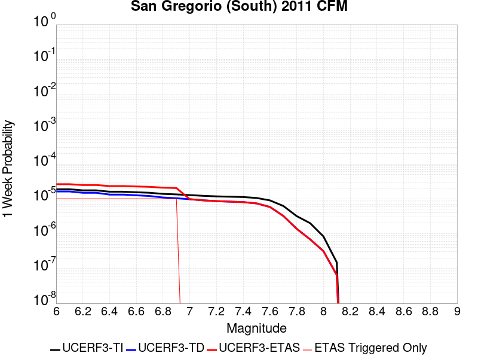 | 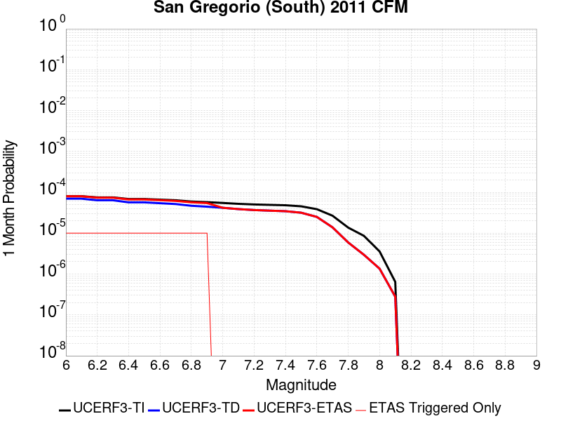 | 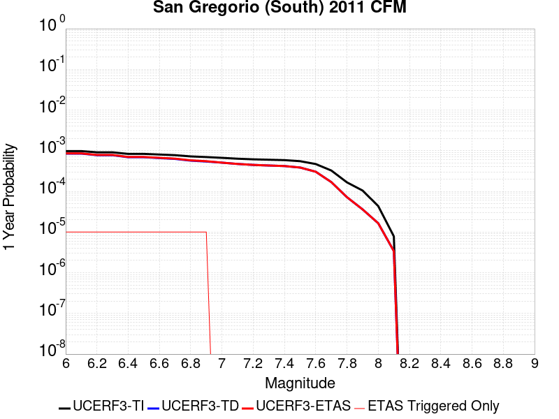 |  |

| Magnitude | 1 wk TI Prob | 1 wk TD Prob | 1 wk ETAS Prob | 1 wk ETAS/TD Gain | 1 wk ETAS Triggered Only | 1 mo TI Prob | 1 mo TD Prob | 1 mo ETAS Prob | 1 mo ETAS/TD Gain | 1 mo ETAS Triggered Only | 1 yr TI Prob | 1 yr TD Prob | 1 yr ETAS Prob | 1 yr ETAS/TD Gain | 1 yr ETAS Triggered Only | 10 yr TI Prob | 10 yr TD Prob | 10 yr ETAS Prob | 10 yr ETAS/TD Gain | 10 yr ETAS Triggered Only |
|-----|-----|-----|-----|-----|-----|-----|-----|-----|-----|-----|-----|-----|-----|-----|-----|-----|-----|-----|-----|-----|
| 6.0 | 1.8770423E-5 | 1.6279559E-5 | 2.6279396E-5 | 1.6142572 | 1.0E-5 | 8.044219E-5 | 6.9767695E-5 | 7.976699E-5 | 1.1433228 | 1.0E-5 | 9.789435E-4 | 8.490944E-4 | 8.5908594E-4 | 1.0117673 | 1.0E-5 | 0.009746423 | 0.008471475 | 0.008481391 | 1.0011704 | 1.0E-5 |
| 6.1 | 1.8770423E-5 | 1.6279559E-5 | 2.6279396E-5 | 1.6142572 | 1.0E-5 | 8.044219E-5 | 6.9767695E-5 | 7.976699E-5 | 1.1433228 | 1.0E-5 | 9.789435E-4 | 8.490944E-4 | 8.5908594E-4 | 1.0117673 | 1.0E-5 | 0.009746423 | 0.008471475 | 0.008481391 | 1.0011704 | 1.0E-5 |
| 6.2 | 1.7508692E-5 | 1.4899064E-5 | 2.4898914E-5 | 1.6711731 | 1.0E-5 | 7.5035096E-5 | 6.3851585E-5 | 7.385095E-5 | 1.1566032 | 1.0E-5 | 9.1316935E-4 | 7.7711884E-4 | 7.8711106E-4 | 1.012858 | 1.0E-5 | 0.00909426 | 0.007756904 | 0.007766826 | 1.0012791 | 1.0E-5 |
| 6.3 | 1.7508692E-5 | 1.4899064E-5 | 2.4898914E-5 | 1.6711731 | 1.0E-5 | 7.5035096E-5 | 6.3851585E-5 | 7.385095E-5 | 1.1566032 | 1.0E-5 | 9.1316935E-4 | 7.7711884E-4 | 7.8711106E-4 | 1.012858 | 1.0E-5 | 0.00909426 | 0.007756904 | 0.007766826 | 1.0012791 | 1.0E-5 |
| 6.4 | 1.6004591E-5 | 1.3248901E-5 | 2.324877E-5 | 1.7547696 | 1.0E-5 | 6.85893E-5 | 5.6779776E-5 | 6.677921E-5 | 1.1761091 | 1.0E-5 | 8.347548E-4 | 6.910755E-4 | 7.010686E-4 | 1.0144602 | 1.0E-5 | 0.008316261 | 0.0069019548 | 0.006911886 | 1.0014389 | 1.0E-5 |
| 6.5 | 1.6004591E-5 | 1.3248901E-5 | 2.324877E-5 | 1.7547696 | 1.0E-5 | 6.85893E-5 | 5.6779776E-5 | 6.677921E-5 | 1.1761091 | 1.0E-5 | 8.347548E-4 | 6.910755E-4 | 7.010686E-4 | 1.0144602 | 1.0E-5 | 0.008316261 | 0.0069019548 | 0.006911886 | 1.0014389 | 1.0E-5 |
| 6.6 | 1.5442201E-5 | 1.2633533E-5 | 2.2633407E-5 | 1.7915342 | 1.0E-5 | 6.617918E-5 | 5.414259E-5 | 6.414205E-5 | 1.1846875 | 1.0E-5 | 8.0543366E-4 | 6.5898756E-4 | 6.6898094E-4 | 1.0151649 | 1.0E-5 | 0.008025207 | 0.0065830066 | 0.0065929405 | 1.0015091 | 1.0E-5 |
| 6.7 | 1.489921E-5 | 1.2042042E-5 | 2.204192E-5 | 1.8304139 | 1.0E-5 | 6.3852196E-5 | 5.1607734E-5 | 6.1607214E-5 | 1.1937594 | 1.0E-5 | 7.7712315E-4 | 6.281437E-4 | 6.3813746E-4 | 1.0159099 | 1.0E-5 | 0.0077441116 | 0.0062763398 | 0.006286277 | 1.0015833 | 1.0E-5 |
| 6.8 | 1.3876024E-5 | 1.0920992E-5 | 2.0920883E-5 | 1.9156578 | 1.0E-5 | 5.9467322E-5 | 4.6803412E-5 | 5.6802946E-5 | 1.2136496 | 1.0E-5 | 7.237741E-4 | 5.696829E-4 | 5.7967723E-4 | 1.0175437 | 1.0E-5 | 0.0072142133 | 0.005694849 | 0.0057047918 | 1.0017459 | 1.0E-5 |
| 6.9 | 1.33922495E-5 | 1.0392495E-5 | 2.039239E-5 | 1.9622229 | 1.0E-5 | 5.7394092E-5 | 4.4538505E-5 | 5.4538057E-5 | 1.2245148 | 1.0E-5 | 6.9854903E-4 | 5.4212165E-4 | 5.521162E-4 | 1.0184361 | 1.0E-5 | 0.0069635725 | 0.0054206066 | 0.005430552 | 1.0018349 | 1.0E-5 |
| 7.0 | 1.2807324E-5 | 9.752456E-6 | 9.752456E-6 | 1.0 | 0.0 | 5.4887376E-5 | 4.179557E-5 | 4.179557E-5 | 1.0 | 0.0 | 6.680489E-4 | 5.0874247E-4 | 5.0874247E-4 | 1.0 | 0.0 | 0.006660442 | 0.0050883847 | 0.0050883847 | 1.0 | 0.0 |
| 7.1 | 1.2191438E-5 | 9.061344E-6 | 9.061344E-6 | 1.0 | 0.0 | 5.224797E-5 | 3.8833754E-5 | 3.8833754E-5 | 1.0 | 0.0 | 6.3593336E-4 | 4.7269845E-4 | 4.7269845E-4 | 1.0 | 0.0 | 0.0063411663 | 0.004729529 | 0.004729529 | 1.0 | 0.0 |
| 7.2 | 1.1769438E-5 | 8.581538E-6 | 8.581538E-6 | 1.0 | 0.0 | 5.0439474E-5 | 3.6777503E-5 | 3.6777503E-5 | 1.0 | 0.0 | 6.1392755E-4 | 4.476742E-4 | 4.476742E-4 | 1.0 | 0.0 | 0.0061223423 | 0.0044803214 | 0.0044803214 | 1.0 | 0.0 |
| 7.3 | 1.150374E-5 | 8.296966E-6 | 8.296966E-6 | 1.0 | 0.0 | 4.9300812E-5 | 3.5557943E-5 | 3.5557943E-5 | 1.0 | 0.0 | 6.0007203E-4 | 4.3283202E-4 | 4.3283202E-4 | 1.0 | 0.0 | 0.0059845424 | 0.004332466 | 0.004332466 | 1.0 | 0.0 |
| 7.4 | 1.12514E-5 | 8.042707E-6 | 8.042707E-6 | 1.0 | 0.0 | 4.8219394E-5 | 3.446829E-5 | 3.446829E-5 | 1.0 | 0.0 | 5.8691297E-4 | 4.1957066E-4 | 4.1957066E-4 | 1.0 | 0.0 | 0.005853653 | 0.0042003556 | 0.0042003556 | 1.0 | 0.0 |
| 7.5 | 1.059696E-5 | 7.39299E-6 | 7.39299E-6 | 1.0 | 0.0 | 4.5414752E-5 | 3.168386E-5 | 3.168386E-5 | 1.0 | 0.0 | 5.5278436E-4 | 3.8568274E-4 | 3.8568274E-4 | 1.0 | 0.0 | 0.0055141128 | 0.003862607 | 0.003862607 | 1.0 | 0.0 |
| 7.6 | 9.018592E-6 | 5.836751E-6 | 5.836751E-6 | 1.0 | 0.0 | 3.8650534E-5 | 2.5014408E-5 | 2.5014408E-5 | 1.0 | 0.0 | 4.7046866E-4 | 3.0450788E-4 | 3.0450788E-4 | 1.0 | 0.0 | 0.004694739 | 0.0030530049 | 0.0030530049 | 1.0 | 0.0 |
| 7.7 | 6.243489E-6 | 3.239351E-6 | 3.239351E-6 | 1.0 | 0.0 | 2.6757538E-5 | 1.3882858E-5 | 1.3882858E-5 | 1.0 | 0.0 | 3.257243E-4 | 1.690107E-4 | 1.690107E-4 | 1.0 | 0.0 | 0.003252473 | 0.0016990631 | 0.0016990631 | 1.0 | 0.0 |
| 7.8 | 3.1941963E-6 | 1.380876E-6 | 1.380876E-6 | 1.0 | 0.0 | 1.368934E-5 | 5.9180265E-6 | 5.9180265E-6 | 1.0 | 0.0 | 1.6665498E-4 | 7.2049595E-5 | 7.2049595E-5 | 1.0 | 0.0 | 0.0016653005 | 7.2625576E-4 | 7.2625576E-4 | 1.0 | 0.0 |
| 7.9 | 2.0098398E-6 | 6.915071E-7 | 6.915071E-7 | 1.0 | 0.0 | 8.6135715E-6 | 2.9635985E-6 | 2.9635985E-6 | 1.0 | 0.0 | 1.0486518E-4 | 3.6081216E-5 | 3.6081216E-5 | 1.0 | 0.0 | 0.0010481571 | 3.6566515E-4 | 3.6566515E-4 | 1.0 | 0.0 |
| 8.0 | 8.353119E-7 | 3.1619197E-7 | 3.1619197E-7 | 1.0 | 0.0 | 3.579903E-6 | 1.3551078E-6 | 1.3551078E-6 | 1.0 | 0.0 | 4.358445E-5 | 1.6498312E-5 | 1.6498312E-5 | 1.0 | 0.0 | 4.3575902E-4 | 1.6616881E-4 | 1.6616881E-4 | 1.0 | 0.0 |
| 8.1 | 1.5033264E-7 | 6.52693E-8 | 6.52693E-8 | 1.0 | 0.0 | 6.442826E-7 | 2.7972553E-7 | 2.7972553E-7 | 1.0 | 0.0 | 7.844113E-6 | 3.4056532E-6 | 3.4056532E-6 | 1.0 | 0.0 | 7.843835E-5 | 3.4072833E-5 | 3.4072833E-5 | 1.0 | 0.0 |

## San Gabriel (Extension)
*[(top)](#table-of-contents)*

| 1 Week | 1 Month | 1 Year | 10 Year |
|-----|-----|-----|-----|
|  | 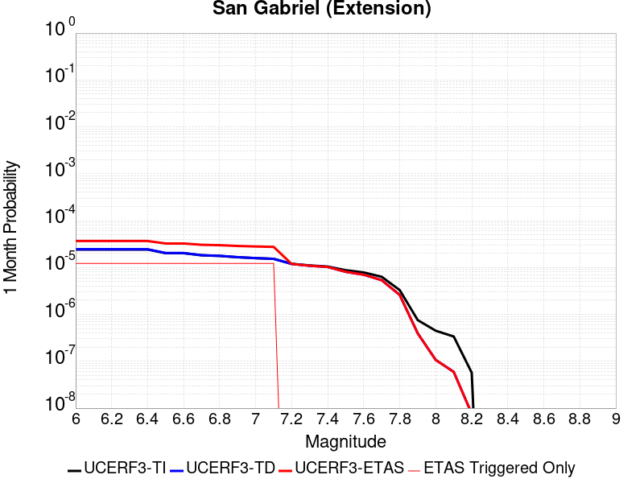 | 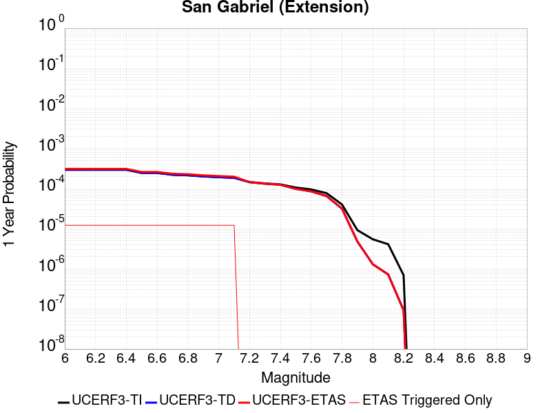 | 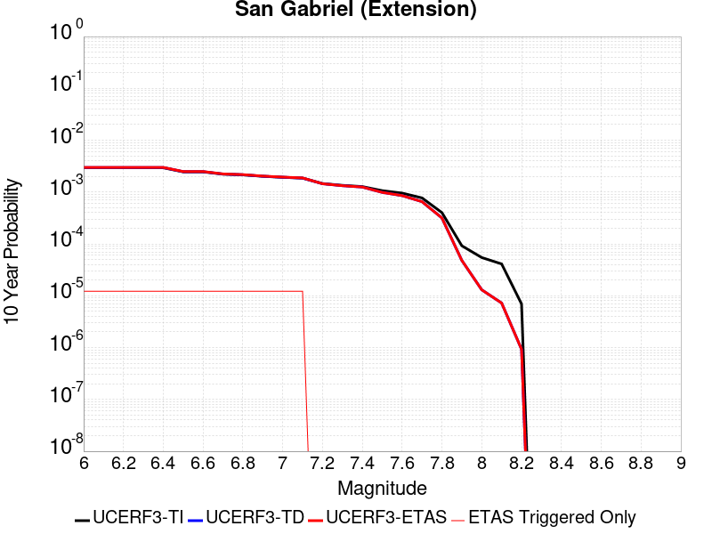 |

| Magnitude | 1 wk TI Prob | 1 wk TD Prob | 1 wk ETAS Prob | 1 wk ETAS/TD Gain | 1 wk ETAS Triggered Only | 1 mo TI Prob | 1 mo TD Prob | 1 mo ETAS Prob | 1 mo ETAS/TD Gain | 1 mo ETAS Triggered Only | 1 yr TI Prob | 1 yr TD Prob | 1 yr ETAS Prob | 1 yr ETAS/TD Gain | 1 yr ETAS Triggered Only | 10 yr TI Prob | 10 yr TD Prob | 10 yr ETAS Prob | 10 yr ETAS/TD Gain | 10 yr ETAS Triggered Only |
|-----|-----|-----|-----|-----|-----|-----|-----|-----|-----|-----|-----|-----|-----|-----|-----|-----|-----|-----|-----|-----|
| 6.0 | 5.6486106E-6 | 5.7168368E-6 | 5.7168368E-6 | 1.0 | 0.0 | 2.4208108E-5 | 2.4500505E-5 | 3.450026E-5 | 1.4081448 | 1.0E-5 | 2.9469383E-4 | 2.9825408E-4 | 3.082511E-4 | 1.0335184 | 1.0E-5 | 0.0029430336 | 0.0029786646 | 0.0029886349 | 1.0033472 | 1.0E-5 |
| 6.1 | 5.6486106E-6 | 5.7168368E-6 | 5.7168368E-6 | 1.0 | 0.0 | 2.4208108E-5 | 2.4500505E-5 | 3.450026E-5 | 1.4081448 | 1.0E-5 | 2.9469383E-4 | 2.9825408E-4 | 3.082511E-4 | 1.0335184 | 1.0E-5 | 0.0029430336 | 0.0029786646 | 0.0029886349 | 1.0033472 | 1.0E-5 |
| 6.2 | 5.6486106E-6 | 5.7168368E-6 | 5.7168368E-6 | 1.0 | 0.0 | 2.4208108E-5 | 2.4500505E-5 | 3.450026E-5 | 1.4081448 | 1.0E-5 | 2.9469383E-4 | 2.9825408E-4 | 3.082511E-4 | 1.0335184 | 1.0E-5 | 0.0029430336 | 0.0029786646 | 0.0029886349 | 1.0033472 | 1.0E-5 |
| 6.3 | 5.6486106E-6 | 5.7168368E-6 | 5.7168368E-6 | 1.0 | 0.0 | 2.4208108E-5 | 2.4500505E-5 | 3.450026E-5 | 1.4081448 | 1.0E-5 | 2.9469383E-4 | 2.9825408E-4 | 3.082511E-4 | 1.0335184 | 1.0E-5 | 0.0029430336 | 0.0029786646 | 0.0029886349 | 1.0033472 | 1.0E-5 |
| 6.4 | 5.6486106E-6 | 5.7168368E-6 | 5.7168368E-6 | 1.0 | 0.0 | 2.4208108E-5 | 2.4500505E-5 | 3.450026E-5 | 1.4081448 | 1.0E-5 | 2.9469383E-4 | 2.9825408E-4 | 3.082511E-4 | 1.0335184 | 1.0E-5 | 0.0029430336 | 0.0029786646 | 0.0029886349 | 1.0033472 | 1.0E-5 |
| 6.5 | 4.7134554E-6 | 4.7542608E-6 | 4.7542608E-6 | 1.0 | 0.0 | 2.0200367E-5 | 2.0375248E-5 | 3.0375044E-5 | 1.4907815 | 1.0E-5 | 2.459117E-4 | 2.4804127E-4 | 2.5803878E-4 | 1.0403059 | 1.0E-5 | 0.0024563975 | 0.0024777285 | 0.0024877037 | 1.0040259 | 1.0E-5 |
| 6.6 | 4.7134554E-6 | 4.7542608E-6 | 4.7542608E-6 | 1.0 | 0.0 | 2.0200367E-5 | 2.0375248E-5 | 3.0375044E-5 | 1.4907815 | 1.0E-5 | 2.459117E-4 | 2.4804127E-4 | 2.5803878E-4 | 1.0403059 | 1.0E-5 | 0.0024563975 | 0.0024777285 | 0.0024877037 | 1.0040259 | 1.0E-5 |
| 6.7 | 4.2468837E-6 | 4.274078E-6 | 4.274078E-6 | 1.0 | 0.0 | 1.8200803E-5 | 1.8317352E-5 | 2.8317168E-5 | 1.5459204 | 1.0E-5 | 2.2157225E-4 | 2.2299167E-4 | 2.3298943E-4 | 1.0448347 | 1.0E-5 | 0.0022135144 | 0.0022277513 | 0.002237729 | 1.0044788 | 1.0E-5 |
| 6.8 | 4.1180615E-6 | 4.1414673E-6 | 4.1414673E-6 | 1.0 | 0.0 | 1.7648716E-5 | 1.774903E-5 | 2.7748853E-5 | 1.5634011 | 1.0E-5 | 2.1485193E-4 | 2.1607373E-4 | 2.2607157E-4 | 1.0462705 | 1.0E-5 | 0.0021464431 | 0.0021587077 | 0.0021686861 | 1.0046225 | 1.0E-5 |
| 6.9 | 3.863861E-6 | 3.879783E-6 | 3.879783E-6 | 1.0 | 0.0 | 1.65593E-5 | 1.6627539E-5 | 2.6627373E-5 | 1.6014019 | 1.0E-5 | 2.0159081E-4 | 2.0242216E-4 | 2.1242014E-4 | 1.0493917 | 1.0E-5 | 0.0020140803 | 0.0020224454 | 0.0020324253 | 1.0049345 | 1.0E-5 |
| 7.0 | 3.6947372E-6 | 3.705682E-6 | 3.705682E-6 | 1.0 | 0.0 | 1.5834492E-5 | 1.5881402E-5 | 2.5881243E-5 | 1.6296574 | 1.0E-5 | 1.9276788E-4 | 1.9333958E-4 | 2.0333765E-4 | 1.0517125 | 1.0E-5 | 0.0019260074 | 0.0019317803 | 0.0019417609 | 1.0051665 | 1.0E-5 |
| 7.1 | 3.5686835E-6 | 3.5729024E-6 | 3.5729024E-6 | 1.0 | 0.0 | 1.5294268E-5 | 1.5312353E-5 | 2.53122E-5 | 1.6530575 | 1.0E-5 | 1.861918E-4 | 1.8641262E-4 | 1.9641075E-4 | 1.0536344 | 1.0E-5 | 0.0018603588 | 0.0018626284 | 0.0018726097 | 1.0053588 | 1.0E-5 |
| 7.2 | 2.8023446E-6 | 2.776794E-6 | 2.776794E-6 | 1.0 | 0.0 | 1.2009994E-5 | 1.1900492E-5 | 1.1900492E-5 | 1.0 | 0.0 | 1.4621185E-4 | 1.4487897E-4 | 1.4487897E-4 | 1.0 | 0.0 | 0.001461157 | 0.001447856 | 0.001447856 | 1.0 | 0.0 |
| 7.3 | 2.5843012E-6 | 2.5459692E-6 | 2.5459692E-6 | 1.0 | 0.0 | 1.1075529E-5 | 1.0911252E-5 | 1.0911252E-5 | 1.0 | 0.0 | 1.3483623E-4 | 1.3283649E-4 | 1.3283649E-4 | 1.0 | 0.0 | 0.0013475444 | 0.0013275805 | 0.0013275805 | 1.0 | 0.0 |
| 7.4 | 2.4464468E-6 | 2.396669E-6 | 2.396669E-6 | 1.0 | 0.0 | 1.04847295E-5 | 1.0271398E-5 | 1.0271398E-5 | 1.0 | 0.0 | 1.276441E-4 | 1.250472E-4 | 1.250472E-4 | 1.0 | 0.0 | 0.0012757082 | 0.001249778 | 0.001249778 | 1.0 | 0.0 |
| 7.5 | 2.0420266E-6 | 1.8910376E-6 | 1.8910376E-6 | 1.0 | 0.0 | 8.751514E-6 | 8.104422E-6 | 8.104422E-6 | 1.0 | 0.0 | 1.0654447E-4 | 9.866691E-5 | 9.866691E-5 | 1.0 | 0.0 | 0.001064934 | 9.862344E-4 | 9.862344E-4 | 1.0 | 0.0 |
| 7.6 | 1.8326596E-6 | 1.6398233E-6 | 1.6398233E-6 | 1.0 | 0.0 | 7.854232E-6 | 7.027795E-6 | 7.027795E-6 | 1.0 | 0.0 | 9.562107E-5 | 8.556007E-5 | 8.556007E-5 | 1.0 | 0.0 | 9.5579936E-4 | 8.552735E-4 | 8.552735E-4 | 1.0 | 0.0 |
| 7.7 | 1.4786998E-6 | 1.2523672E-6 | 1.2523672E-6 | 1.0 | 0.0 | 6.3372695E-6 | 5.3672766E-6 | 5.3672766E-6 | 1.0 | 0.0 | 7.715353E-5 | 6.534465E-5 | 6.534465E-5 | 1.0 | 0.0 | 7.7126746E-4 | 6.5325975E-4 | 6.5325975E-4 | 1.0 | 0.0 |
| 7.8 | 7.6975533E-7 | 6.069207E-7 | 6.069207E-7 | 1.0 | 0.0 | 3.2989474E-6 | 2.6010862E-6 | 2.6010862E-6 | 1.0 | 0.0 | 4.0163945E-5 | 3.1667765E-5 | 3.1667765E-5 | 1.0 | 0.0 | 4.0156685E-4 | 3.166365E-4 | 3.166365E-4 | 1.0 | 0.0 |
| 7.9 | 1.7645915E-7 | 9.211899E-8 | 9.211899E-8 | 1.0 | 0.0 | 7.562533E-7 | 3.947956E-7 | 3.947956E-7 | 1.0 | 0.0 | 9.207345E-6 | 4.806626E-6 | 4.806626E-6 | 1.0 | 0.0 | 9.206964E-5 | 4.8069025E-5 | 4.8069025E-5 | 1.0 | 0.0 |
| 8.0 | 1.0463461E-7 | 2.4937416E-8 | 2.4937416E-8 | 1.0 | 0.0 | 4.4843398E-7 | 1.0687464E-7 | 1.0687464E-7 | 1.0 | 0.0 | 5.45967E-6 | 1.3011979E-6 | 1.3011979E-6 | 1.0 | 0.0 | 5.459536E-5 | 1.3015701E-5 | 1.3015701E-5 | 1.0 | 0.0 |
| 8.1 | 7.875717E-8 | 1.3857542E-8 | 1.3857542E-8 | 1.0 | 0.0 | 3.3753068E-7 | 5.9389468E-8 | 5.9389468E-8 | 1.0 | 0.0 | 4.109428E-6 | 7.2306653E-7 | 7.2306653E-7 | 1.0 | 0.0 | 4.109352E-5 | 7.234439E-6 | 7.234439E-6 | 1.0 | 0.0 |
| 8.2 | 1.33163E-8 | 1.7720816E-9 | 1.7720816E-9 | 1.0 | 0.0 | 5.7069855E-8 | 7.594638E-9 | 7.594638E-9 | 1.0 | 0.0 | 6.9482525E-7 | 9.246471E-8 | 9.246471E-8 | 1.0 | 0.0 | 6.9482307E-6 | 9.2664203E-7 | 9.2664203E-7 | 1.0 | 0.0 |

## Elsinore (Coyote Mountains)
*[(top)](#table-of-contents)*

| 1 Week | 1 Month | 1 Year | 10 Year |
|-----|-----|-----|-----|
| 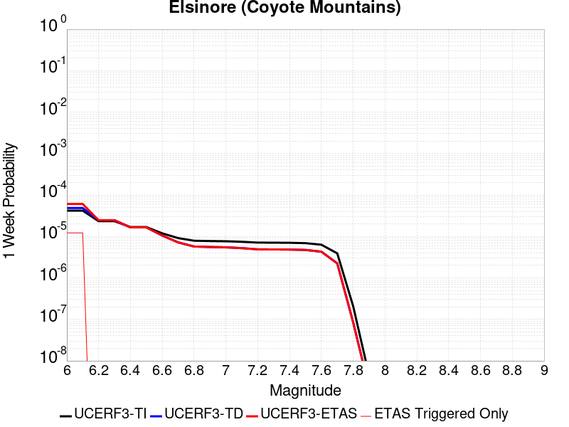 | 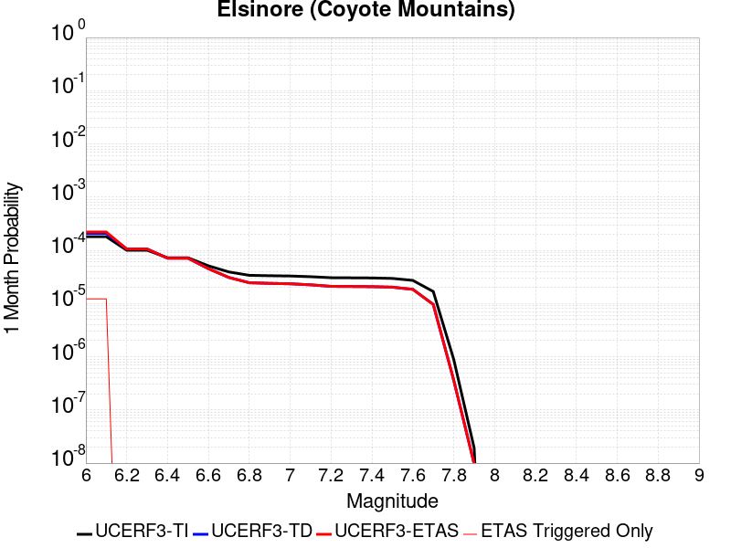 | 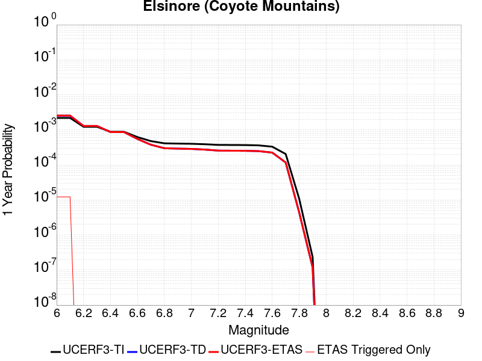 | 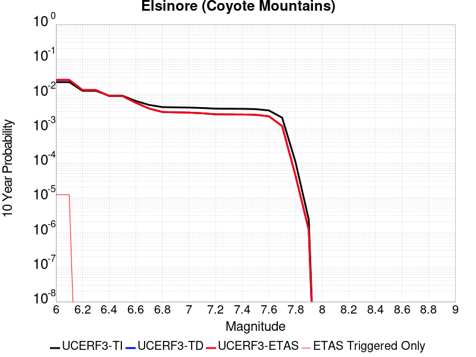 |

| Magnitude | 1 wk TI Prob | 1 wk TD Prob | 1 wk ETAS Prob | 1 wk ETAS/TD Gain | 1 wk ETAS Triggered Only | 1 mo TI Prob | 1 mo TD Prob | 1 mo ETAS Prob | 1 mo ETAS/TD Gain | 1 mo ETAS Triggered Only | 1 yr TI Prob | 1 yr TD Prob | 1 yr ETAS Prob | 1 yr ETAS/TD Gain | 1 yr ETAS Triggered Only | 10 yr TI Prob | 10 yr TD Prob | 10 yr ETAS Prob | 10 yr ETAS/TD Gain | 10 yr ETAS Triggered Only |
|-----|-----|-----|-----|-----|-----|-----|-----|-----|-----|-----|-----|-----|-----|-----|-----|-----|-----|-----|-----|-----|
| 6.0 | 4.20513E-5 | 4.8630944E-5 | 5.8630456E-5 | 1.2056204 | 1.0E-5 | 1.8020741E-4 | 2.0840492E-4 | 2.1840284E-4 | 1.0479735 | 1.0E-5 | 0.0021918174 | 0.0025349057 | 0.0025448804 | 1.0039349 | 1.0E-5 | 0.021703249 | 0.025111204 | 0.025120951 | 1.0003883 | 1.0E-5 |
| 6.1 | 4.20513E-5 | 4.8630944E-5 | 5.8630456E-5 | 1.2056204 | 1.0E-5 | 1.8020741E-4 | 2.0840492E-4 | 2.1840284E-4 | 1.0479735 | 1.0E-5 | 0.0021918174 | 0.0025349057 | 0.0025448804 | 1.0039349 | 1.0E-5 | 0.021703249 | 0.025111204 | 0.025120951 | 1.0003883 | 1.0E-5 |
| 6.2 | 2.3413893E-5 | 2.4695422E-5 | 2.4695422E-5 | 1.0 | 0.0 | 1.0034139E-4 | 1.0583377E-4 | 1.0583377E-4 | 1.0 | 0.0 | 0.0012209718 | 0.0012878523 | 0.0012878523 | 1.0 | 0.0 | 0.012142851 | 0.012812569 | 0.012812569 | 1.0 | 0.0 |
| 6.3 | 2.3413893E-5 | 2.4695422E-5 | 2.4695422E-5 | 1.0 | 0.0 | 1.0034139E-4 | 1.0583377E-4 | 1.0583377E-4 | 1.0 | 0.0 | 0.0012209718 | 0.0012878523 | 0.0012878523 | 1.0 | 0.0 | 0.012142851 | 0.012812569 | 0.012812569 | 1.0 | 0.0 |
| 6.4 | 1.6894814E-5 | 1.6568214E-5 | 1.6568214E-5 | 1.0 | 0.0 | 7.240433E-5 | 7.100491E-5 | 7.100491E-5 | 1.0 | 0.0 | 8.811662E-4 | 8.641788E-4 | 8.641788E-4 | 1.0 | 0.0 | 0.0087768035 | 0.008611842 | 0.008611842 | 1.0 | 0.0 |
| 6.5 | 1.6894814E-5 | 1.6568214E-5 | 1.6568214E-5 | 1.0 | 0.0 | 7.240433E-5 | 7.100491E-5 | 7.100491E-5 | 1.0 | 0.0 | 8.811662E-4 | 8.641788E-4 | 8.641788E-4 | 1.0 | 0.0 | 0.0087768035 | 0.008611842 | 0.008611842 | 1.0 | 0.0 |
| 6.6 | 1.1910969E-5 | 1.0530538E-5 | 1.0530538E-5 | 1.0 | 0.0 | 5.1046012E-5 | 4.513017E-5 | 4.513017E-5 | 1.0 | 0.0 | 6.21308E-4 | 5.493346E-4 | 5.493346E-4 | 1.0 | 0.0 | 0.0061957375 | 0.0054810685 | 0.0054810685 | 1.0 | 0.0 |
| 6.7 | 9.1486E-6 | 7.2026473E-6 | 7.2026473E-6 | 1.0 | 0.0 | 3.9207694E-5 | 3.0868145E-5 | 3.0868145E-5 | 1.0 | 0.0 | 4.7724912E-4 | 3.7575865E-4 | 3.7575865E-4 | 1.0 | 0.0 | 0.0047622547 | 0.0037516125 | 0.0037516125 | 1.0 | 0.0 |
| 6.8 | 7.90441E-6 | 5.7288153E-6 | 5.7288153E-6 | 1.0 | 0.0 | 3.3875604E-5 | 2.4551842E-5 | 2.4551842E-5 | 1.0 | 0.0 | 4.1235742E-4 | 2.9887896E-4 | 2.9887896E-4 | 1.0 | 0.0 | 0.0041159308 | 0.0029848986 | 0.0029848986 | 1.0 | 0.0 |
| 6.9 | 7.77015E-6 | 5.5827695E-6 | 5.5827695E-6 | 1.0 | 0.0 | 3.3300217E-5 | 2.3925944E-5 | 2.3925944E-5 | 1.0 | 0.0 | 4.0535472E-4 | 2.912607E-4 | 2.912607E-4 | 1.0 | 0.0 | 0.004046161 | 0.0029089167 | 0.0029089167 | 1.0 | 0.0 |
| 7.0 | 7.675798E-6 | 5.4796283E-6 | 5.4796283E-6 | 1.0 | 0.0 | 3.289586E-5 | 2.3483917E-5 | 2.3483917E-5 | 1.0 | 0.0 | 4.004335E-4 | 2.8588044E-4 | 2.8588044E-4 | 1.0 | 0.0 | 0.003997127 | 0.0028552532 | 0.0028552532 | 1.0 | 0.0 |
| 7.1 | 7.447814E-6 | 5.2385003E-6 | 5.2385003E-6 | 1.0 | 0.0 | 3.191881E-5 | 2.245053E-5 | 2.245053E-5 | 1.0 | 0.0 | 3.8854225E-4 | 2.7330214E-4 | 2.7330214E-4 | 1.0 | 0.0 | 0.003878636 | 0.0027297847 | 0.0027297847 | 1.0 | 0.0 |
| 7.2 | 7.128185E-6 | 4.905146E-6 | 4.905146E-6 | 1.0 | 0.0 | 3.0549007E-5 | 2.1021891E-5 | 2.1021891E-5 | 1.0 | 0.0 | 3.7187067E-4 | 2.5591266E-4 | 2.5591266E-4 | 1.0 | 0.0 | 0.00371249 | 0.002556298 | 0.002556298 | 1.0 | 0.0 |
| 7.3 | 7.0913875E-6 | 4.873821E-6 | 4.873821E-6 | 1.0 | 0.0 | 3.0391306E-5 | 2.0887644E-5 | 2.0887644E-5 | 1.0 | 0.0 | 3.6995133E-4 | 2.542786E-4 | 2.542786E-4 | 1.0 | 0.0 | 0.0036933604 | 0.0025399947 | 0.0025399947 | 1.0 | 0.0 |
| 7.4 | 7.051521E-6 | 4.837673E-6 | 4.837673E-6 | 1.0 | 0.0 | 3.0220453E-5 | 2.0732725E-5 | 2.0732725E-5 | 1.0 | 0.0 | 3.6787192E-4 | 2.5239287E-4 | 2.5239287E-4 | 1.0 | 0.0 | 0.0036726352 | 0.0025211805 | 0.0025211805 | 1.0 | 0.0 |
| 7.5 | 6.910666E-6 | 4.7332255E-6 | 4.7332255E-6 | 1.0 | 0.0 | 2.9616802E-5 | 2.02851E-5 | 2.02851E-5 | 1.0 | 0.0 | 3.605249E-4 | 2.4694428E-4 | 2.4694428E-4 | 1.0 | 0.0 | 0.0035994058 | 0.002466817 | 0.002466817 | 1.0 | 0.0 |
| 7.6 | 6.341753E-6 | 4.306345E-6 | 4.306345E-6 | 1.0 | 0.0 | 2.7178658E-5 | 1.8455641E-5 | 1.8455641E-5 | 1.0 | 0.0 | 3.3084993E-4 | 2.2467543E-4 | 2.2467543E-4 | 1.0 | 0.0 | 0.0033035777 | 0.002244598 | 0.002244598 | 1.0 | 0.0 |
| 7.7 | 3.9205916E-6 | 2.2437468E-6 | 2.2437468E-6 | 1.0 | 0.0 | 1.6802427E-5 | 9.616027E-6 | 9.616027E-6 | 1.0 | 0.0 | 2.0455034E-4 | 1.17069576E-4 | 1.17069576E-4 | 1.0 | 0.0 | 0.0020436216 | 0.001170152 | 0.001170152 | 1.0 | 0.0 |
| 7.8 | 2.0846227E-7 | 8.4853966E-8 | 8.4853966E-8 | 1.0 | 0.0 | 8.9340944E-7 | 3.6365984E-7 | 3.6365984E-7 | 1.0 | 0.0 | 1.0877206E-5 | 4.427553E-6 | 4.427553E-6 | 1.0 | 0.0 | 1.0876673E-4 | 4.4274973E-5 | 4.4274973E-5 | 1.0 | 0.0 |
| 7.9 | 4.4969806E-9 | 2.269088E-9 | 2.269088E-9 | 1.0 | 0.0 | 1.9272775E-8 | 9.724664E-9 | 9.724664E-9 | 1.0 | 0.0 | 2.3464601E-7 | 1.1839777E-7 | 1.1839777E-7 | 1.0 | 0.0 | 2.3464577E-6 | 1.1839772E-6 | 1.1839772E-6 | 1.0 | 0.0 |

## South Klamath Lake East
*[(top)](#table-of-contents)*

| 1 Week | 1 Month | 1 Year | 10 Year |
|-----|-----|-----|-----|
|  |  |  |  |

| Magnitude | 1 wk TI Prob | 1 wk TD Prob | 1 wk ETAS Prob | 1 wk ETAS/TD Gain | 1 wk ETAS Triggered Only | 1 mo TI Prob | 1 mo TD Prob | 1 mo ETAS Prob | 1 mo ETAS/TD Gain | 1 mo ETAS Triggered Only | 1 yr TI Prob | 1 yr TD Prob | 1 yr ETAS Prob | 1 yr ETAS/TD Gain | 1 yr ETAS Triggered Only | 10 yr TI Prob | 10 yr TD Prob | 10 yr ETAS Prob | 10 yr ETAS/TD Gain | 10 yr ETAS Triggered Only |
|-----|-----|-----|-----|-----|-----|-----|-----|-----|-----|-----|-----|-----|-----|-----|-----|-----|-----|-----|-----|-----|
| 6.0 | 2.3539369E-5 | 2.5047308E-5 | 3.504706E-5 | 1.3992345 | 1.0E-5 | 1.0087911E-4 | 1.0734166E-4 | 1.1734058E-4 | 1.0931505 | 1.0E-5 | 0.0012275111 | 0.0013061843 | 0.0013161713 | 1.0076458 | 1.0E-5 | 0.012207527 | 0.012993417 | 0.013003287 | 1.0007596 | 1.0E-5 |
| 6.1 | 2.3539369E-5 | 2.5047308E-5 | 3.504706E-5 | 1.3992345 | 1.0E-5 | 1.0087911E-4 | 1.0734166E-4 | 1.1734058E-4 | 1.0931505 | 1.0E-5 | 0.0012275111 | 0.0013061843 | 0.0013161713 | 1.0076458 | 1.0E-5 | 0.012207527 | 0.012993417 | 0.013003287 | 1.0007596 | 1.0E-5 |
| 6.2 | 2.3539369E-5 | 2.5047308E-5 | 3.504706E-5 | 1.3992345 | 1.0E-5 | 1.0087911E-4 | 1.0734166E-4 | 1.1734058E-4 | 1.0931505 | 1.0E-5 | 0.0012275111 | 0.0013061843 | 0.0013161713 | 1.0076458 | 1.0E-5 | 0.012207527 | 0.012993417 | 0.013003287 | 1.0007596 | 1.0E-5 |
| 6.3 | 9.807823E-6 | 1.0396044E-5 | 1.0396044E-5 | 1.0 | 0.0 | 4.2032847E-5 | 4.455376E-5 | 4.455376E-5 | 1.0 | 0.0 | 5.1162974E-4 | 5.4231536E-4 | 5.4231536E-4 | 1.0 | 0.0 | 0.005104534 | 0.005410756 | 0.005410756 | 1.0 | 0.0 |
| 6.4 | 9.807823E-6 | 1.0396044E-5 | 1.0396044E-5 | 1.0 | 0.0 | 4.2032847E-5 | 4.455376E-5 | 4.455376E-5 | 1.0 | 0.0 | 5.1162974E-4 | 5.4231536E-4 | 5.4231536E-4 | 1.0 | 0.0 | 0.005104534 | 0.005410756 | 0.005410756 | 1.0 | 0.0 |
| 6.5 | 6.191981E-6 | 6.5508398E-6 | 6.5508398E-6 | 1.0 | 0.0 | 2.653679E-5 | 2.8074743E-5 | 2.8074743E-5 | 1.0 | 0.0 | 3.2303753E-4 | 3.4175918E-4 | 3.4175918E-4 | 1.0 | 0.0 | 0.0032256835 | 0.003412614 | 0.003412614 | 1.0 | 0.0 |
| 6.6 | 4.3693776E-6 | 4.6165574E-6 | 4.6165574E-6 | 1.0 | 0.0 | 1.8725768E-5 | 1.9785102E-5 | 1.9785102E-5 | 1.0 | 0.0 | 2.2796239E-4 | 2.4085813E-4 | 2.4085813E-4 | 1.0 | 0.0 | 0.0022772867 | 0.0024060833 | 0.0024060833 | 1.0 | 0.0 |
| 6.7 | 3.360834E-6 | 3.5512403E-6 | 3.5512403E-6 | 1.0 | 0.0 | 1.4403494E-5 | 1.5219517E-5 | 1.5219517E-5 | 1.0 | 0.0 | 1.7534842E-4 | 1.8528267E-4 | 1.8528267E-4 | 1.0 | 0.0 | 0.0017521014 | 0.0018513618 | 0.0018513618 | 1.0 | 0.0 |
| 6.8 | 2.57873E-6 | 2.7251708E-6 | 2.7251708E-6 | 1.0 | 0.0 | 1.1051653E-5 | 1.1679254E-5 | 1.1679254E-5 | 1.0 | 0.0 | 1.3454557E-4 | 1.4218627E-4 | 1.4218627E-4 | 1.0 | 0.0 | 0.0013446413 | 0.0014210136 | 0.0014210136 | 1.0 | 0.0 |
| 6.9 | 9.987825E-7 | 1.0566213E-6 | 1.0566213E-6 | 1.0 | 0.0 | 4.2804895E-6 | 4.528371E-6 | 4.528371E-6 | 1.0 | 0.0 | 5.211371E-5 | 5.5131848E-5 | 5.5131848E-5 | 1.0 | 0.0 | 5.210149E-4 | 5.5121386E-4 | 5.5121386E-4 | 1.0 | 0.0 |

## Great Valley 05 Pittsburg - Kirby Hills alt1
*[(top)](#table-of-contents)*

| 1 Week | 1 Month | 1 Year | 10 Year |
|-----|-----|-----|-----|
|  |  |  |  |

| Magnitude | 1 wk TI Prob | 1 wk TD Prob | 1 wk ETAS Prob | 1 wk ETAS/TD Gain | 1 wk ETAS Triggered Only | 1 mo TI Prob | 1 mo TD Prob | 1 mo ETAS Prob | 1 mo ETAS/TD Gain | 1 mo ETAS Triggered Only | 1 yr TI Prob | 1 yr TD Prob | 1 yr ETAS Prob | 1 yr ETAS/TD Gain | 1 yr ETAS Triggered Only | 10 yr TI Prob | 10 yr TD Prob | 10 yr ETAS Prob | 10 yr ETAS/TD Gain | 10 yr ETAS Triggered Only |
|-----|-----|-----|-----|-----|-----|-----|-----|-----|-----|-----|-----|-----|-----|-----|-----|-----|-----|-----|-----|-----|
| 6.0 | 4.187212E-5 | 5.344289E-5 | 6.3442356E-5 | 1.1871057 | 1.0E-5 | 1.794396E-4 | 2.2902661E-4 | 2.3902432E-4 | 1.043653 | 1.0E-5 | 0.002182488 | 0.0027857998 | 0.002795772 | 1.0035796 | 1.0E-5 | 0.021611776 | 0.027603218 | 0.027612941 | 1.0003523 | 1.0E-5 |
| 6.1 | 4.187212E-5 | 5.344289E-5 | 6.3442356E-5 | 1.1871057 | 1.0E-5 | 1.794396E-4 | 2.2902661E-4 | 2.3902432E-4 | 1.043653 | 1.0E-5 | 0.002182488 | 0.0027857998 | 0.002795772 | 1.0035796 | 1.0E-5 | 0.021611776 | 0.027603218 | 0.027612941 | 1.0003523 | 1.0E-5 |
| 6.2 | 1.7353306E-5 | 2.2154672E-5 | 3.215445E-5 | 1.451362 | 1.0E-5 | 7.436919E-5 | 9.4947456E-5 | 1.04946506E-4 | 1.1053114 | 1.0E-5 | 9.050688E-4 | 0.0011557573 | 0.0011657458 | 1.0086423 | 1.0E-5 | 0.009013915 | 0.0115352 | 0.011545085 | 1.0008569 | 1.0E-5 |
| 6.3 | 1.7353306E-5 | 2.2154672E-5 | 3.215445E-5 | 1.451362 | 1.0E-5 | 7.436919E-5 | 9.4947456E-5 | 1.04946506E-4 | 1.1053114 | 1.0E-5 | 9.050688E-4 | 0.0011557573 | 0.0011657458 | 1.0086423 | 1.0E-5 | 0.009013915 | 0.0115352 | 0.011545085 | 1.0008569 | 1.0E-5 |
| 6.4 | 1.4028824E-5 | 1.7901062E-5 | 1.7901062E-5 | 1.0 | 0.0 | 6.0122147E-5 | 7.671883E-5 | 7.671883E-5 | 1.0 | 0.0 | 7.3174125E-4 | 9.340303E-4 | 9.340303E-4 | 1.0 | 0.0 | 0.0072933645 | 0.009338211 | 0.009338211 | 1.0 | 0.0 |

## Likely 2011 CFM
*[(top)](#table-of-contents)*

| 1 Week | 1 Month | 1 Year | 10 Year |
|-----|-----|-----|-----|
| 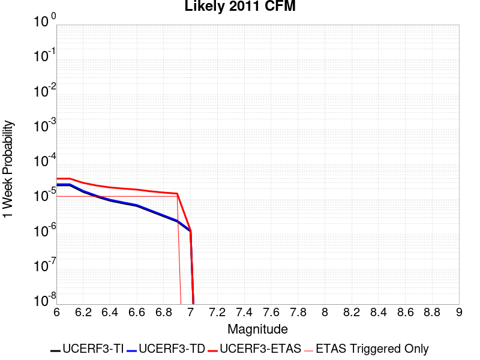 | 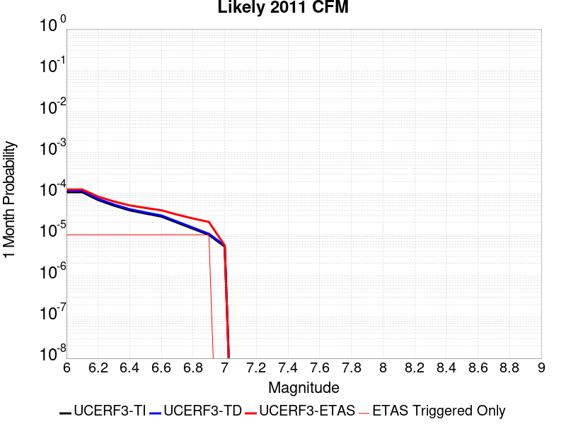 | 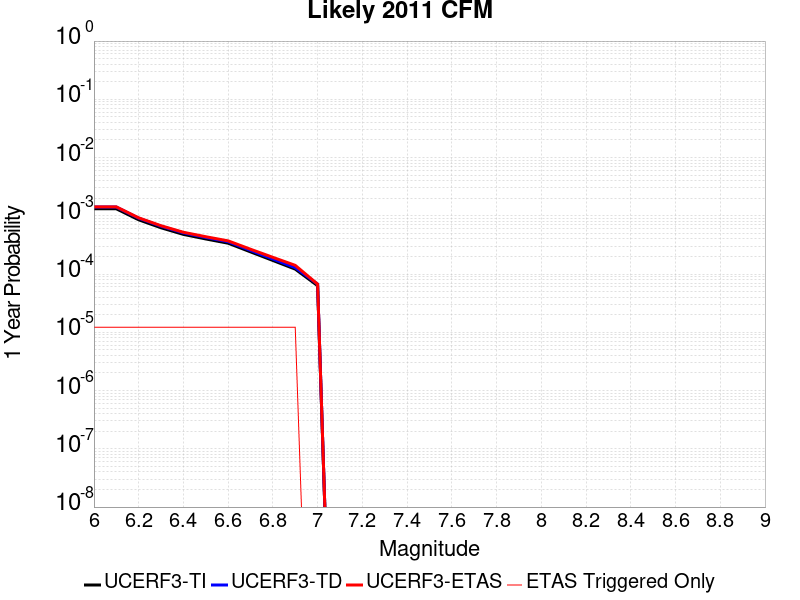 | 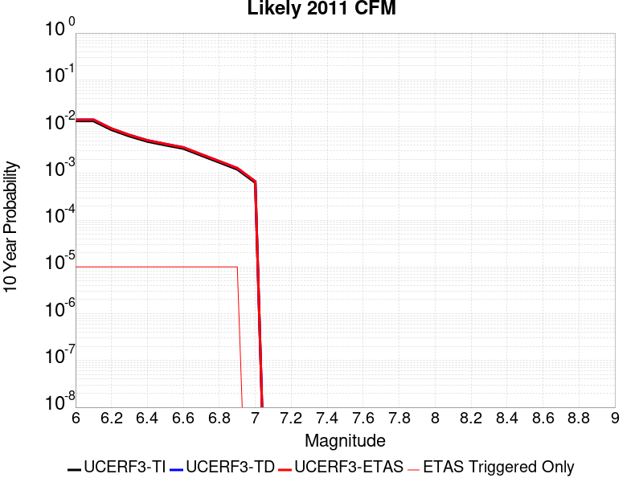 |

| Magnitude | 1 wk TI Prob | 1 wk TD Prob | 1 wk ETAS Prob | 1 wk ETAS/TD Gain | 1 wk ETAS Triggered Only | 1 mo TI Prob | 1 mo TD Prob | 1 mo ETAS Prob | 1 mo ETAS/TD Gain | 1 mo ETAS Triggered Only | 1 yr TI Prob | 1 yr TD Prob | 1 yr ETAS Prob | 1 yr ETAS/TD Gain | 1 yr ETAS Triggered Only | 10 yr TI Prob | 10 yr TD Prob | 10 yr ETAS Prob | 10 yr ETAS/TD Gain | 10 yr ETAS Triggered Only |
|-----|-----|-----|-----|-----|-----|-----|-----|-----|-----|-----|-----|-----|-----|-----|-----|-----|-----|-----|-----|-----|
| 6.0 | 2.5315949E-5 | 2.7104748E-5 | 3.7104477E-5 | 1.368929 | 1.0E-5 | 1.0849241E-4 | 1.16158284E-4 | 1.2615713E-4 | 1.0860795 | 1.0E-5 | 0.0013200947 | 0.0014133542 | 0.00142334 | 1.0070654 | 1.0E-5 | 0.013122803 | 0.01404831 | 0.01405817 | 1.0007018 | 1.0E-5 |
| 6.1 | 2.5315949E-5 | 2.7104748E-5 | 3.7104477E-5 | 1.368929 | 1.0E-5 | 1.0849241E-4 | 1.16158284E-4 | 1.2615713E-4 | 1.0860795 | 1.0E-5 | 0.0013200947 | 0.0014133542 | 0.00142334 | 1.0070654 | 1.0E-5 | 0.013122803 | 0.01404831 | 0.01405817 | 1.0007018 | 1.0E-5 |
| 6.2 | 1.6375941E-5 | 1.7465842E-5 | 2.7465667E-5 | 1.5725361 | 1.0E-5 | 7.0180715E-5 | 7.485153E-5 | 8.4850784E-5 | 1.1335878 | 1.0E-5 | 8.5411523E-4 | 9.109487E-4 | 9.2093955E-4 | 1.0109676 | 1.0E-5 | 0.008508399 | 0.009073433 | 0.009083342 | 1.0010921 | 1.0E-5 |
| 6.3 | 1.1945543E-5 | 1.2712587E-5 | 2.271246E-5 | 1.7866119 | 1.0E-5 | 5.119418E-5 | 5.4481407E-5 | 6.448086E-5 | 1.1835389 | 1.0E-5 | 6.2311086E-4 | 6.631146E-4 | 6.73108E-4 | 1.0150703 | 1.0E-5 | 0.0062136655 | 0.0066119144 | 0.0066218483 | 1.0015024 | 1.0E-5 |
| 6.4 | 9.192729E-6 | 9.768488E-6 | 1.976839E-5 | 2.02369 | 1.0E-5 | 3.939681E-5 | 4.1864292E-5 | 5.1863874E-5 | 1.238857 | 1.0E-5 | 4.7955062E-4 | 5.0958124E-4 | 5.195762E-4 | 1.019614 | 1.0E-5 | 0.004785171 | 0.0050844094 | 0.005094358 | 1.0019568 | 1.0E-5 |
| 6.5 | 7.67906E-6 | 8.152622E-6 | 1.8152541E-5 | 2.2265892 | 1.0E-5 | 3.2909844E-5 | 3.4939352E-5 | 4.4939003E-5 | 1.2862003 | 1.0E-5 | 4.006037E-4 | 4.2530545E-4 | 4.3530122E-4 | 1.0235025 | 1.0E-5 | 0.0039988225 | 0.004245108 | 0.0042550657 | 1.0023457 | 1.0E-5 |
| 6.6 | 6.4884057E-6 | 6.8847507E-6 | 1.6884682E-5 | 2.4524755 | 1.0E-5 | 2.7807157E-5 | 2.9505749E-5 | 3.9505452E-5 | 1.338907 | 1.0E-5 | 3.3849955E-4 | 3.591747E-4 | 3.6917112E-4 | 1.0278316 | 1.0E-5 | 0.003379844 | 0.0035860867 | 0.003596051 | 1.0027785 | 1.0E-5 |
| 6.7 | 4.6060636E-6 | 4.884041E-6 | 1.4883993E-5 | 3.0474749 | 1.0E-5 | 1.9740122E-5 | 2.0931442E-5 | 3.0931235E-5 | 1.4777402 | 1.0E-5 | 2.403095E-4 | 2.5481134E-4 | 2.648088E-4 | 1.0392348 | 1.0E-5 | 0.002400498 | 0.0025452746 | 0.0025552493 | 1.0039189 | 1.0E-5 |
| 6.8 | 3.2795615E-6 | 3.4773732E-6 | 1.3477338E-5 | 3.875724 | 1.0E-5 | 1.4055187E-5 | 1.4902946E-5 | 2.4902796E-5 | 1.6709983 | 1.0E-5 | 1.7110848E-4 | 1.8142881E-4 | 1.91427E-4 | 1.0551081 | 1.0E-5 | 0.0017097679 | 0.0018128622 | 0.001822844 | 1.0055062 | 1.0E-5 |
| 6.9 | 2.3289967E-6 | 2.4705569E-6 | 1.2470532E-5 | 5.0476604 | 1.0E-5 | 9.981376E-6 | 1.058806E-5 | 2.0587955E-5 | 1.94445 | 1.0E-5 | 1.2151648E-4 | 1.2890245E-4 | 1.3890116E-4 | 1.077568 | 1.0E-5 | 0.0012145005 | 0.0012883197 | 0.0012983069 | 1.0077521 | 1.0E-5 |
| 7.0 | 1.211292E-6 | 1.2863958E-6 | 1.2863958E-6 | 1.0 | 0.0 | 5.1912407E-6 | 5.5131145E-6 | 5.5131145E-6 | 1.0 | 0.0 | 6.320152E-5 | 6.712041E-5 | 6.712041E-5 | 1.0 | 0.0 | 6.3183554E-4 | 6.710312E-4 | 6.710312E-4 | 1.0 | 0.0 |

## San Andreas (North Coast) 2011 CFM
*[(top)](#table-of-contents)*

| 1 Week | 1 Month | 1 Year | 10 Year |
|-----|-----|-----|-----|
| 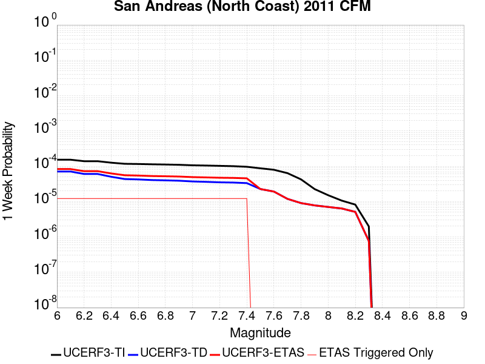 | 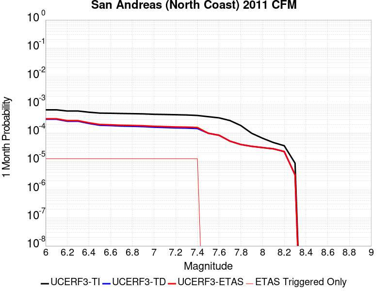 | 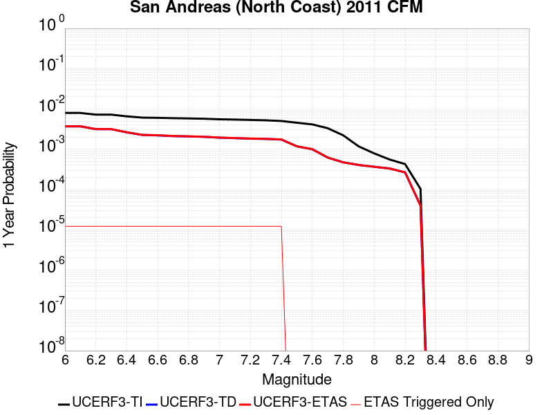 | 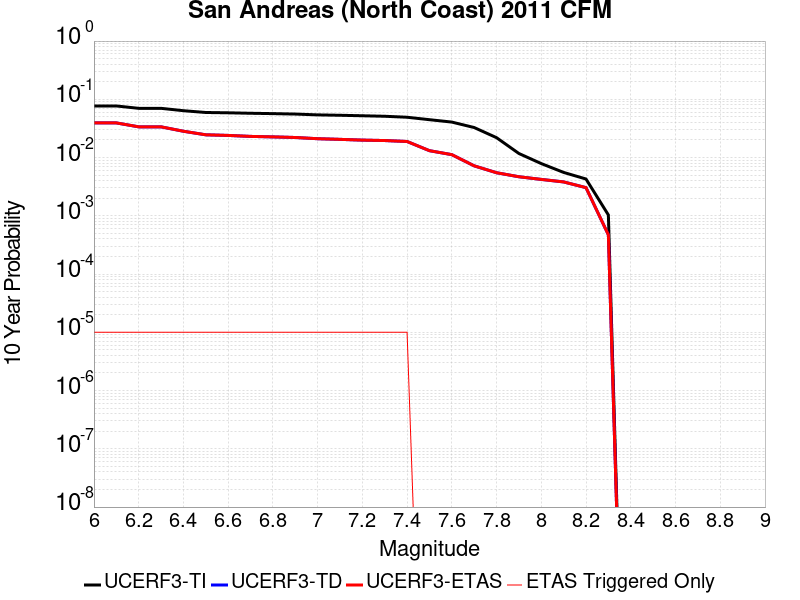 |

| Magnitude | 1 wk TI Prob | 1 wk TD Prob | 1 wk ETAS Prob | 1 wk ETAS/TD Gain | 1 wk ETAS Triggered Only | 1 mo TI Prob | 1 mo TD Prob | 1 mo ETAS Prob | 1 mo ETAS/TD Gain | 1 mo ETAS Triggered Only | 1 yr TI Prob | 1 yr TD Prob | 1 yr ETAS Prob | 1 yr ETAS/TD Gain | 1 yr ETAS Triggered Only | 10 yr TI Prob | 10 yr TD Prob | 10 yr ETAS Prob | 10 yr ETAS/TD Gain | 10 yr ETAS Triggered Only |
|-----|-----|-----|-----|-----|-----|-----|-----|-----|-----|-----|-----|-----|-----|-----|-----|-----|-----|-----|-----|-----|
| 6.0 | 1.5333705E-4 | 7.109695E-5 | 8.109623E-5 | 1.140643 | 1.0E-5 | 6.5699324E-4 | 3.046658E-4 | 3.1466273E-4 | 1.0328128 | 1.0E-5 | 0.007969595 | 0.0037030308 | 0.0037129938 | 1.0026904 | 1.0E-5 | 0.0768977 | 0.039364267 | 0.039373875 | 1.000244 | 1.0E-5 |
| 6.1 | 1.5333705E-4 | 7.109695E-5 | 8.109623E-5 | 1.140643 | 1.0E-5 | 6.5699324E-4 | 3.046658E-4 | 3.1466273E-4 | 1.0328128 | 1.0E-5 | 0.007969595 | 0.0037030308 | 0.0037129938 | 1.0026904 | 1.0E-5 | 0.0768977 | 0.039364267 | 0.039373875 | 1.000244 | 1.0E-5 |
| 6.2 | 1.3912938E-4 | 6.049243E-5 | 7.049183E-5 | 1.1652999 | 1.0E-5 | 5.961325E-4 | 2.5922767E-4 | 2.6922507E-4 | 1.0385661 | 1.0E-5 | 0.007233787 | 0.0031515562 | 0.0031615247 | 1.003163 | 1.0E-5 | 0.07002798 | 0.03369792 | 0.033707585 | 1.0002867 | 1.0E-5 |
| 6.3 | 1.3912938E-4 | 6.049243E-5 | 7.049183E-5 | 1.1652999 | 1.0E-5 | 5.961325E-4 | 2.5922767E-4 | 2.6922507E-4 | 1.0385661 | 1.0E-5 | 0.007233787 | 0.0031515562 | 0.0031615247 | 1.003163 | 1.0E-5 | 0.07002798 | 0.03369792 | 0.033707585 | 1.0002867 | 1.0E-5 |
| 6.4 | 1.2623647E-4 | 5.0433562E-5 | 6.043306E-5 | 1.1982707 | 1.0E-5 | 5.4090127E-4 | 2.1612605E-4 | 2.2612388E-4 | 1.0462593 | 1.0E-5 | 0.0065656058 | 0.0026281793 | 0.002638153 | 1.0037949 | 1.0E-5 | 0.06374981 | 0.02830552 | 0.028315235 | 1.0003433 | 1.0E-5 |
| 6.5 | 1.1736096E-4 | 4.3516375E-5 | 5.351594E-5 | 1.2297885 | 1.0E-5 | 5.028786E-4 | 1.8648551E-4 | 1.9648364E-4 | 1.0536134 | 1.0E-5 | 0.006105373 | 0.0022681132 | 0.0022780905 | 1.004399 | 1.0E-5 | 0.05940335 | 0.024576947 | 0.024586702 | 1.0003968 | 1.0E-5 |
| 6.6 | 1.1586959E-4 | 4.2416294E-5 | 5.2415868E-5 | 1.2357484 | 1.0E-5 | 4.964894E-4 | 1.8177154E-4 | 1.9176972E-4 | 1.0550041 | 1.0E-5 | 0.006028018 | 0.0022108385 | 0.0022208162 | 1.0045131 | 1.0E-5 | 0.058671024 | 0.023982164 | 0.023991924 | 1.000407 | 1.0E-5 |
| 6.7 | 1.13693764E-4 | 4.0728228E-5 | 5.072782E-5 | 1.24552 | 1.0E-5 | 4.87168E-4 | 1.7453796E-4 | 1.8453621E-4 | 1.0572841 | 1.0E-5 | 0.005915152 | 0.0021229447 | 0.0021329233 | 1.0047004 | 1.0E-5 | 0.057601593 | 0.023075242 | 0.023085011 | 1.0004233 | 1.0E-5 |
| 6.8 | 1.1204889E-4 | 3.9945848E-5 | 4.994545E-5 | 1.2503289 | 1.0E-5 | 4.8012115E-4 | 1.7118535E-4 | 1.8118364E-4 | 1.0584062 | 1.0E-5 | 0.005829819 | 0.0020822054 | 0.0020921845 | 1.0047926 | 1.0E-5 | 0.05679232 | 0.022635331 | 0.022645107 | 1.0004318 | 1.0E-5 |
| 6.9 | 1.1005794E-4 | 3.9001738E-5 | 4.9001348E-5 | 1.2563888 | 1.0E-5 | 4.7159163E-4 | 1.6713967E-4 | 1.77138E-4 | 1.0598202 | 1.0E-5 | 0.0057265228 | 0.0020330423 | 0.0020430218 | 1.0049087 | 1.0E-5 | 0.055811852 | 0.02210134 | 0.02211112 | 1.0004425 | 1.0E-5 |
| 7.0 | 1.0647948E-4 | 3.7159174E-5 | 4.7158803E-5 | 1.2691026 | 1.0E-5 | 4.562608E-4 | 1.5924397E-4 | 1.6924237E-4 | 1.0627867 | 1.0E-5 | 0.0055408357 | 0.0019370868 | 0.0019470674 | 1.0051523 | 1.0E-5 | 0.054047033 | 0.02105931 | 0.0210691 | 1.0004648 | 1.0E-5 |
| 7.1 | 1.04795035E-4 | 3.620866E-5 | 4.62083E-5 | 1.276167 | 1.0E-5 | 4.4904428E-4 | 1.5517084E-4 | 1.6516929E-4 | 1.0644351 | 1.0E-5 | 0.0054534175 | 0.0018875834 | 0.0018975645 | 1.0052878 | 1.0E-5 | 0.053215165 | 0.02052821 | 0.020538004 | 1.0004771 | 1.0E-5 |
| 7.2 | 1.02724036E-4 | 3.5117457E-5 | 4.5117107E-5 | 1.2847487 | 1.0E-5 | 4.401716E-4 | 1.5049479E-4 | 1.6049329E-4 | 1.0664375 | 1.0E-5 | 0.0053459285 | 0.0018307496 | 0.0018407312 | 1.0054523 | 1.0E-5 | 0.052191395 | 0.01991573 | 0.019925531 | 1.0004921 | 1.0E-5 |
| 7.3 | 1.00650694E-4 | 3.45853E-5 | 4.4584955E-5 | 1.2891302 | 1.0E-5 | 4.312888E-4 | 1.4821437E-4 | 1.5821289E-4 | 1.0674598 | 1.0E-5 | 0.005238306 | 0.0018030318 | 0.0018130138 | 1.0055362 | 1.0E-5 | 0.051165357 | 0.01959264 | 0.019602444 | 1.0005004 | 1.0E-5 |
| 7.4 | 9.672919E-5 | 3.3374814E-5 | 4.337448E-5 | 1.2996172 | 1.0E-5 | 4.144878E-4 | 1.4302715E-4 | 1.5302573E-4 | 1.0699068 | 1.0E-5 | 0.005034718 | 0.00173998 | 0.0017499626 | 1.0057372 | 1.0E-5 | 0.049221683 | 0.01886682 | 0.01887663 | 1.00052 | 1.0E-5 |
| 7.5 | 8.7600405E-5 | 2.2694192E-5 | 2.2694192E-5 | 1.0 | 0.0 | 3.753763E-4 | 9.725721E-5 | 9.725721E-5 | 1.0 | 0.0 | 0.0045606326 | 0.0011834651 | 0.0011834651 | 1.0 | 0.0 | 0.04468165 | 0.013127938 | 0.013127938 | 1.0 | 0.0 |
| 7.6 | 7.9562284E-5 | 1.922004E-5 | 1.922004E-5 | 1.0 | 0.0 | 3.4093665E-4 | 8.236901E-5 | 8.236901E-5 | 1.0 | 0.0 | 0.0041430052 | 0.0010023828 | 0.0010023828 | 1.0 | 0.0 | 0.040666126 | 0.0112194 | 0.0112194 | 1.0 | 0.0 |
| 7.7 | 6.3866544E-5 | 1.1936281E-5 | 1.1936281E-5 | 1.0 | 0.0 | 2.7368503E-4 | 5.115449E-5 | 5.115449E-5 | 1.0 | 0.0 | 0.0033270244 | 6.226282E-4 | 6.226282E-4 | 1.0 | 0.0 | 0.032776527 | 0.0072073294 | 0.0072073294 | 1.0 | 0.0 |
| 7.8 | 4.2543215E-5 | 9.0726735E-6 | 9.0726735E-6 | 1.0 | 0.0 | 1.8231533E-4 | 3.888231E-5 | 3.888231E-5 | 1.0 | 0.0 | 0.0022174292 | 4.7328937E-4 | 4.7328937E-4 | 1.0 | 0.0 | 0.021954332 | 0.0054884683 | 0.0054884683 | 1.0 | 0.0 |
| 7.9 | 2.2636612E-5 | 7.811842E-6 | 7.811842E-6 | 1.0 | 0.0 | 9.7010445E-5 | 3.3478893E-5 | 3.3478893E-5 | 1.0 | 0.0 | 0.0011804621 | 4.0752938E-4 | 4.0752938E-4 | 1.0 | 0.0 | 0.011742111 | 0.0046821116 | 0.0046821116 | 1.0 | 0.0 |
| 8.0 | 1.5167874E-5 | 7.0475517E-6 | 7.0475517E-6 | 1.0 | 0.0 | 6.500356E-5 | 3.0203442E-5 | 3.0203442E-5 | 1.0 | 0.0 | 7.9113094E-4 | 3.6766496E-4 | 3.6766496E-4 | 1.0 | 0.0 | 0.007883203 | 0.004214701 | 0.004214701 | 1.0 | 0.0 |
| 8.1 | 1.0681047E-5 | 6.3854363E-6 | 6.3854363E-6 | 1.0 | 0.0 | 4.5775112E-5 | 2.7365868E-5 | 2.7365868E-5 | 1.0 | 0.0 | 5.5716943E-4 | 3.331286E-4 | 3.331286E-4 | 1.0 | 0.0 | 0.0055577457 | 0.003816698 | 0.003816698 | 1.0 | 0.0 |
| 8.2 | 8.226114E-6 | 5.1139064E-6 | 5.1139064E-6 | 1.0 | 0.0 | 3.52543E-5 | 2.1916558E-5 | 2.1916558E-5 | 1.0 | 0.0 | 4.2913653E-4 | 2.6680148E-4 | 2.6680148E-4 | 1.0 | 0.0 | 0.004283088 | 0.0030445685 | 0.0030445685 | 1.0 | 0.0 |
| 8.3 | 1.983087E-6 | 7.6564595E-7 | 7.6564595E-7 | 1.0 | 0.0 | 8.498917E-6 | 3.281336E-6 | 3.281336E-6 | 1.0 | 0.0 | 1.034694E-4 | 3.9949547E-5 | 3.9949547E-5 | 1.0 | 0.0 | 0.0010342124 | 4.717979E-4 | 4.717979E-4 | 1.0 | 0.0 |

## Channel Islands Western Deep Ramp
*[(top)](#table-of-contents)*

| 1 Week | 1 Month | 1 Year | 10 Year |
|-----|-----|-----|-----|
|  |  | 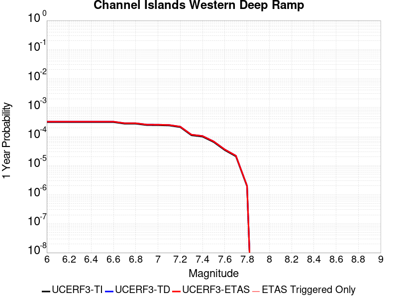 | 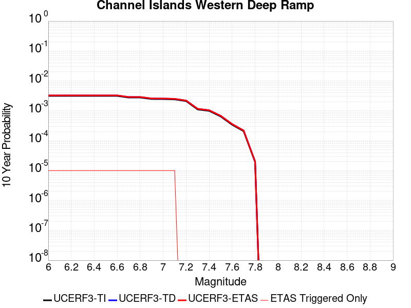 |

| Magnitude | 1 wk TI Prob | 1 wk TD Prob | 1 wk ETAS Prob | 1 wk ETAS/TD Gain | 1 wk ETAS Triggered Only | 1 mo TI Prob | 1 mo TD Prob | 1 mo ETAS Prob | 1 mo ETAS/TD Gain | 1 mo ETAS Triggered Only | 1 yr TI Prob | 1 yr TD Prob | 1 yr ETAS Prob | 1 yr ETAS/TD Gain | 1 yr ETAS Triggered Only | 10 yr TI Prob | 10 yr TD Prob | 10 yr ETAS Prob | 10 yr ETAS/TD Gain | 10 yr ETAS Triggered Only |
|-----|-----|-----|-----|-----|-----|-----|-----|-----|-----|-----|-----|-----|-----|-----|-----|-----|-----|-----|-----|-----|
| 6.0 | 6.0213506E-6 | 6.2548684E-6 | 6.2548684E-6 | 1.0 | 0.0 | 2.5805533E-5 | 2.6806329E-5 | 2.6806329E-5 | 1.0 | 0.0 | 3.1413708E-4 | 3.2632265E-4 | 3.2632265E-4 | 1.0 | 0.0 | 0.0031369338 | 0.0032588763 | 0.0032688437 | 1.0030586 | 1.0E-5 |
| 6.1 | 6.0213506E-6 | 6.2548684E-6 | 6.2548684E-6 | 1.0 | 0.0 | 2.5805533E-5 | 2.6806329E-5 | 2.6806329E-5 | 1.0 | 0.0 | 3.1413708E-4 | 3.2632265E-4 | 3.2632265E-4 | 1.0 | 0.0 | 0.0031369338 | 0.0032588763 | 0.0032688437 | 1.0030586 | 1.0E-5 |
| 6.2 | 6.0213506E-6 | 6.2548684E-6 | 6.2548684E-6 | 1.0 | 0.0 | 2.5805533E-5 | 2.6806329E-5 | 2.6806329E-5 | 1.0 | 0.0 | 3.1413708E-4 | 3.2632265E-4 | 3.2632265E-4 | 1.0 | 0.0 | 0.0031369338 | 0.0032588763 | 0.0032688437 | 1.0030586 | 1.0E-5 |
| 6.3 | 6.0213506E-6 | 6.2548684E-6 | 6.2548684E-6 | 1.0 | 0.0 | 2.5805533E-5 | 2.6806329E-5 | 2.6806329E-5 | 1.0 | 0.0 | 3.1413708E-4 | 3.2632265E-4 | 3.2632265E-4 | 1.0 | 0.0 | 0.0031369338 | 0.0032588763 | 0.0032688437 | 1.0030586 | 1.0E-5 |
| 6.4 | 6.0213506E-6 | 6.2548684E-6 | 6.2548684E-6 | 1.0 | 0.0 | 2.5805533E-5 | 2.6806329E-5 | 2.6806329E-5 | 1.0 | 0.0 | 3.1413708E-4 | 3.2632265E-4 | 3.2632265E-4 | 1.0 | 0.0 | 0.0031369338 | 0.0032588763 | 0.0032688437 | 1.0030586 | 1.0E-5 |
| 6.5 | 6.0213506E-6 | 6.2548684E-6 | 6.2548684E-6 | 1.0 | 0.0 | 2.5805533E-5 | 2.6806329E-5 | 2.6806329E-5 | 1.0 | 0.0 | 3.1413708E-4 | 3.2632265E-4 | 3.2632265E-4 | 1.0 | 0.0 | 0.0031369338 | 0.0032588763 | 0.0032688437 | 1.0030586 | 1.0E-5 |
| 6.6 | 6.0213506E-6 | 6.2548684E-6 | 6.2548684E-6 | 1.0 | 0.0 | 2.5805533E-5 | 2.6806329E-5 | 2.6806329E-5 | 1.0 | 0.0 | 3.1413708E-4 | 3.2632265E-4 | 3.2632265E-4 | 1.0 | 0.0 | 0.0031369338 | 0.0032588763 | 0.0032688437 | 1.0030586 | 1.0E-5 |
| 6.7 | 5.313309E-6 | 5.5252403E-6 | 5.5252403E-6 | 1.0 | 0.0 | 2.2771126E-5 | 2.367941E-5 | 2.367941E-5 | 1.0 | 0.0 | 2.772032E-4 | 2.8826276E-4 | 2.8826276E-4 | 1.0 | 0.0 | 0.0027685766 | 0.0028792918 | 0.002889263 | 1.003463 | 1.0E-5 |
| 6.8 | 5.313309E-6 | 5.5252403E-6 | 5.5252403E-6 | 1.0 | 0.0 | 2.2771126E-5 | 2.367941E-5 | 2.367941E-5 | 1.0 | 0.0 | 2.772032E-4 | 2.8826276E-4 | 2.8826276E-4 | 1.0 | 0.0 | 0.0027685766 | 0.0028792918 | 0.002889263 | 1.003463 | 1.0E-5 |
| 6.9 | 4.744377E-6 | 4.9394303E-6 | 4.9394303E-6 | 1.0 | 0.0 | 2.0332885E-5 | 2.1168837E-5 | 2.1168837E-5 | 1.0 | 0.0 | 2.4752476E-4 | 2.5770385E-4 | 2.5770385E-4 | 1.0 | 0.0 | 0.0024724922 | 0.0025744175 | 0.0025843917 | 1.0038744 | 1.0E-5 |
| 7.0 | 4.722209E-6 | 4.9164732E-6 | 4.9164732E-6 | 1.0 | 0.0 | 2.0237881E-5 | 2.107045E-5 | 2.107045E-5 | 1.0 | 0.0 | 2.4636835E-4 | 2.5650626E-4 | 2.5650626E-4 | 1.0 | 0.0 | 0.002460954 | 0.0025624693 | 0.0025724438 | 1.0038925 | 1.0E-5 |
| 7.1 | 4.611174E-6 | 4.801409E-6 | 4.801409E-6 | 1.0 | 0.0 | 1.9762025E-5 | 2.0577325E-5 | 2.0577325E-5 | 1.0 | 0.0 | 2.4057609E-4 | 2.5050386E-4 | 2.5050386E-4 | 1.0 | 0.0 | 0.002403158 | 0.002502582 | 0.002512557 | 1.0039859 | 1.0E-5 |
| 7.2 | 4.043994E-6 | 4.2120264E-6 | 4.2120264E-6 | 1.0 | 0.0 | 1.7331287E-5 | 1.8051438E-5 | 1.8051438E-5 | 1.0 | 0.0 | 2.10988E-4 | 2.1975765E-4 | 2.1975765E-4 | 1.0 | 0.0 | 0.002107878 | 0.0021957543 | 0.0021957543 | 1.0 | 0.0 |
| 7.3 | 2.1233036E-6 | 2.2297875E-6 | 2.2297875E-6 | 1.0 | 0.0 | 9.099841E-6 | 9.556197E-6 | 9.556197E-6 | 1.0 | 0.0 | 1.1078493E-4 | 1.1634055E-4 | 1.1634055E-4 | 1.0 | 0.0 | 0.0011072971 | 0.001162802 | 0.001162802 | 1.0 | 0.0 |
| 7.4 | 1.9051884E-6 | 2.0014973E-6 | 2.0014973E-6 | 1.0 | 0.0 | 8.165067E-6 | 8.577817E-6 | 8.577817E-6 | 1.0 | 0.0 | 9.940516E-5 | 1.0442998E-4 | 1.0442998E-4 | 1.0 | 0.0 | 9.93607E-4 | 0.0010438144 | 0.0010438144 | 1.0 | 0.0 |
| 7.5 | 1.2408497E-6 | 1.3038839E-6 | 1.3038839E-6 | 1.0 | 0.0 | 5.317916E-6 | 5.588062E-6 | 5.588062E-6 | 1.0 | 0.0 | 6.4743705E-5 | 6.8032554E-5 | 6.8032554E-5 | 1.0 | 0.0 | 6.4724847E-4 | 6.8011944E-4 | 6.8011944E-4 | 1.0 | 0.0 |
| 7.6 | 6.5440025E-7 | 6.886718E-7 | 6.886718E-7 | 1.0 | 0.0 | 2.8045695E-6 | 2.9514472E-6 | 2.9514472E-6 | 1.0 | 0.0 | 3.4145098E-5 | 3.593329E-5 | 3.593329E-5 | 1.0 | 0.0 | 3.4139853E-4 | 3.5927625E-4 | 3.5927625E-4 | 1.0 | 0.0 |
| 7.7 | 3.985963E-7 | 4.1930787E-7 | 4.1930787E-7 | 1.0 | 0.0 | 1.7082689E-6 | 1.7970326E-6 | 1.7970326E-6 | 1.0 | 0.0 | 2.0797976E-5 | 2.1878664E-5 | 2.1878664E-5 | 1.0 | 0.0 | 2.0796029E-4 | 2.1876628E-4 | 2.1876628E-4 | 1.0 | 0.0 |
| 7.8 | 3.706329E-8 | 3.8591796E-8 | 3.8591796E-8 | 1.0 | 0.0 | 1.5884267E-7 | 1.653934E-7 | 1.653934E-7 | 1.0 | 0.0 | 1.9339077E-6 | 2.0136629E-6 | 2.0136629E-6 | 1.0 | 0.0 | 1.933891E-5 | 2.0136458E-5 | 2.0136458E-5 | 1.0 | 0.0 |

## Morales (East)
*[(top)](#table-of-contents)*

| 1 Week | 1 Month | 1 Year | 10 Year |
|-----|-----|-----|-----|
|  |  | 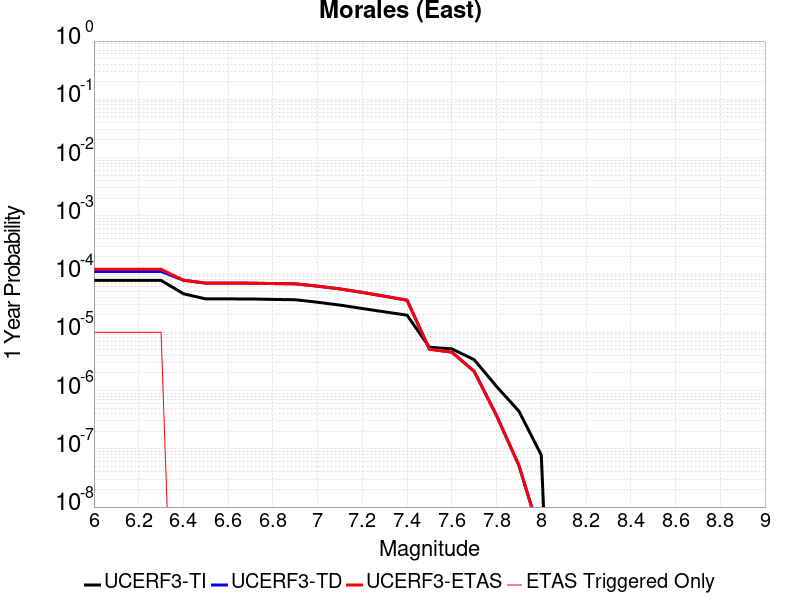 | 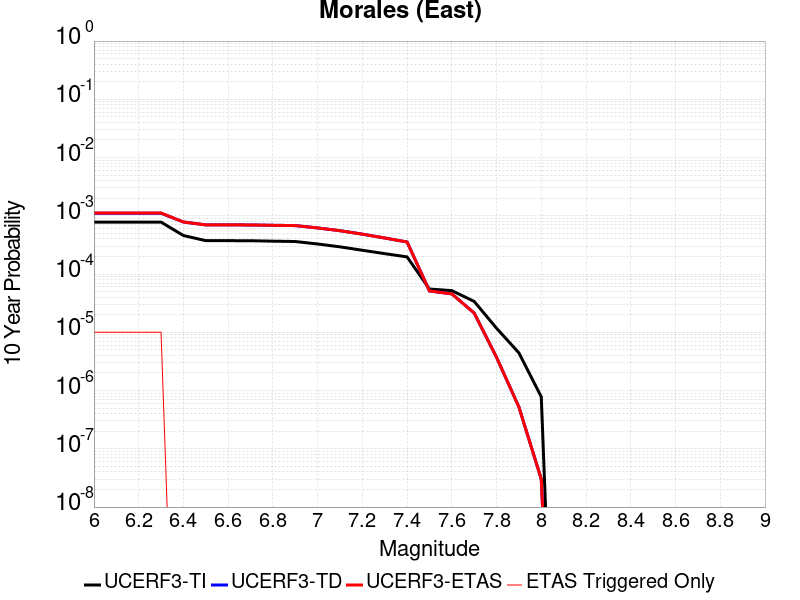 |

| Magnitude | 1 wk TI Prob | 1 wk TD Prob | 1 wk ETAS Prob | 1 wk ETAS/TD Gain | 1 wk ETAS Triggered Only | 1 mo TI Prob | 1 mo TD Prob | 1 mo ETAS Prob | 1 mo ETAS/TD Gain | 1 mo ETAS Triggered Only | 1 yr TI Prob | 1 yr TD Prob | 1 yr ETAS Prob | 1 yr ETAS/TD Gain | 1 yr ETAS Triggered Only | 10 yr TI Prob | 10 yr TD Prob | 10 yr ETAS Prob | 10 yr ETAS/TD Gain | 10 yr ETAS Triggered Only |
|-----|-----|-----|-----|-----|-----|-----|-----|-----|-----|-----|-----|-----|-----|-----|-----|-----|-----|-----|-----|-----|
| 6.0 | 1.4942771E-6 | 2.123544E-6 | 2.123544E-6 | 1.0 | 0.0 | 6.404029E-6 | 9.100874E-6 | 9.100874E-6 | 1.0 | 0.0 | 7.7966266E-5 | 1.1079809E-4 | 1.2079698E-4 | 1.0902443 | 1.0E-5 | 7.793892E-4 | 0.0011074883 | 0.0011174772 | 1.0090195 | 1.0E-5 |
| 6.1 | 1.4942771E-6 | 2.123544E-6 | 2.123544E-6 | 1.0 | 0.0 | 6.404029E-6 | 9.100874E-6 | 9.100874E-6 | 1.0 | 0.0 | 7.7966266E-5 | 1.1079809E-4 | 1.2079698E-4 | 1.0902443 | 1.0E-5 | 7.793892E-4 | 0.0011074883 | 0.0011174772 | 1.0090195 | 1.0E-5 |
| 6.2 | 1.4942771E-6 | 2.123544E-6 | 2.123544E-6 | 1.0 | 0.0 | 6.404029E-6 | 9.100874E-6 | 9.100874E-6 | 1.0 | 0.0 | 7.7966266E-5 | 1.1079809E-4 | 1.2079698E-4 | 1.0902443 | 1.0E-5 | 7.793892E-4 | 0.0011074883 | 0.0011174772 | 1.0090195 | 1.0E-5 |
| 6.3 | 1.4942771E-6 | 2.123544E-6 | 2.123544E-6 | 1.0 | 0.0 | 6.404029E-6 | 9.100874E-6 | 9.100874E-6 | 1.0 | 0.0 | 7.7966266E-5 | 1.1079809E-4 | 1.2079698E-4 | 1.0902443 | 1.0E-5 | 7.793892E-4 | 0.0011074883 | 0.0011174772 | 1.0090195 | 1.0E-5 |
| 6.4 | 8.798845E-7 | 1.5023381E-6 | 1.5023381E-6 | 1.0 | 0.0 | 3.7709283E-6 | 6.4385767E-6 | 6.4385767E-6 | 1.0 | 0.0 | 4.5910085E-5 | 7.838696E-5 | 7.838696E-5 | 1.0 | 0.0 | 4.59006E-4 | 7.836066E-4 | 7.836066E-4 | 1.0 | 0.0 |
| 6.5 | 7.1751725E-7 | 1.3384879E-6 | 1.3384879E-6 | 1.0 | 0.0 | 3.0750705E-6 | 5.7363645E-6 | 5.7363645E-6 | 1.0 | 0.0 | 3.7438338E-5 | 6.9838075E-5 | 6.9838075E-5 | 1.0 | 0.0 | 3.743203E-4 | 6.981715E-4 | 6.981715E-4 | 1.0 | 0.0 |
| 6.6 | 7.1751725E-7 | 1.3384879E-6 | 1.3384879E-6 | 1.0 | 0.0 | 3.0750705E-6 | 5.7363645E-6 | 5.7363645E-6 | 1.0 | 0.0 | 3.7438338E-5 | 6.9838075E-5 | 6.9838075E-5 | 1.0 | 0.0 | 3.743203E-4 | 6.981715E-4 | 6.981715E-4 | 1.0 | 0.0 |
| 6.7 | 7.159057E-7 | 1.3359539E-6 | 1.3359539E-6 | 1.0 | 0.0 | 3.0681638E-6 | 5.7255043E-6 | 5.7255043E-6 | 1.0 | 0.0 | 3.7354253E-5 | 6.9705864E-5 | 6.9705864E-5 | 1.0 | 0.0 | 3.7347974E-4 | 6.968502E-4 | 6.968502E-4 | 1.0 | 0.0 |
| 6.8 | 7.032203E-7 | 1.3175089E-6 | 1.3175089E-6 | 1.0 | 0.0 | 3.0137978E-6 | 5.646455E-6 | 5.646455E-6 | 1.0 | 0.0 | 3.669237E-5 | 6.87435E-5 | 6.87435E-5 | 1.0 | 0.0 | 3.6686313E-4 | 6.872325E-4 | 6.872325E-4 | 1.0 | 0.0 |
| 6.9 | 6.941549E-7 | 1.3025701E-6 | 1.3025701E-6 | 1.0 | 0.0 | 2.974946E-6 | 5.5824316E-6 | 5.5824316E-6 | 1.0 | 0.0 | 3.6219368E-5 | 6.7964065E-5 | 6.7964065E-5 | 1.0 | 0.0 | 3.6213463E-4 | 6.794429E-4 | 6.794429E-4 | 1.0 | 0.0 |
| 7.0 | 6.2932247E-7 | 1.1877994E-6 | 1.1877994E-6 | 1.0 | 0.0 | 2.6970936E-6 | 5.090559E-6 | 5.090559E-6 | 1.0 | 0.0 | 3.283662E-5 | 6.197586E-5 | 6.197586E-5 | 1.0 | 0.0 | 3.283177E-4 | 6.1959465E-4 | 6.1959465E-4 | 1.0 | 0.0 |
| 7.1 | 5.6200963E-7 | 1.064093E-6 | 1.064093E-6 | 1.0 | 0.0 | 2.4086105E-6 | 4.560391E-6 | 4.560391E-6 | 1.0 | 0.0 | 2.9324437E-5 | 5.5521392E-5 | 5.5521392E-5 | 1.0 | 0.0 | 2.9320567E-4 | 5.5508246E-4 | 5.5508246E-4 | 1.0 | 0.0 |
| 7.2 | 4.91044E-7 | 9.2862194E-7 | 9.2862194E-7 | 1.0 | 0.0 | 2.1044725E-6 | 3.9798024E-6 | 3.9798024E-6 | 1.0 | 0.0 | 2.5621652E-5 | 4.8453054E-5 | 4.8453054E-5 | 1.0 | 0.0 | 2.56187E-4 | 4.8443122E-4 | 4.8443122E-4 | 1.0 | 0.0 |
| 7.3 | 4.2978448E-7 | 7.974413E-7 | 7.974413E-7 | 1.0 | 0.0 | 1.8419321E-6 | 3.4176012E-6 | 3.4176012E-6 | 1.0 | 0.0 | 2.2425293E-5 | 4.160853E-5 | 4.160853E-5 | 1.0 | 0.0 | 2.242303E-4 | 4.1601306E-4 | 4.1601306E-4 | 1.0 | 0.0 |
| 7.4 | 3.774317E-7 | 6.807105E-7 | 6.807105E-7 | 1.0 | 0.0 | 1.6175634E-6 | 2.9173275E-6 | 2.9173275E-6 | 1.0 | 0.0 | 1.9693656E-5 | 3.551791E-5 | 3.551791E-5 | 1.0 | 0.0 | 1.969191E-4 | 3.5512767E-4 | 3.5512767E-4 | 1.0 | 0.0 |
| 7.5 | 1.0603232E-7 | 9.8406424E-8 | 9.8406424E-8 | 1.0 | 0.0 | 4.5442414E-7 | 4.2174173E-7 | 4.2174173E-7 | 1.0 | 0.0 | 5.5326E-6 | 5.1346938E-6 | 5.1346938E-6 | 1.0 | 0.0 | 5.532462E-5 | 5.1348336E-5 | 5.1348336E-5 | 1.0 | 0.0 |
| 7.6 | 9.960384E-8 | 8.755028E-8 | 8.755028E-8 | 1.0 | 0.0 | 4.2687353E-7 | 3.7521542E-7 | 3.7521542E-7 | 1.0 | 0.0 | 5.197173E-6 | 4.568238E-6 | 4.568238E-6 | 1.0 | 0.0 | 5.1970514E-5 | 4.5684028E-5 | 4.5684028E-5 | 1.0 | 0.0 |
| 7.7 | 6.499468E-8 | 4.103351E-8 | 4.103351E-8 | 1.0 | 0.0 | 2.785486E-7 | 1.7585788E-7 | 1.7585788E-7 | 1.0 | 0.0 | 3.3913238E-6 | 2.1410676E-6 | 2.1410676E-6 | 1.0 | 0.0 | 3.3912722E-5 | 2.1413045E-5 | 2.1413045E-5 | 1.0 | 0.0 |
| 7.8 | 2.2517119E-8 | 7.1293824E-9 | 7.1293824E-9 | 1.0 | 0.0 | 9.6501935E-8 | 3.0554492E-8 | 3.0554492E-8 | 1.0 | 0.0 | 1.1749105E-6 | 3.720009E-7 | 3.720009E-7 | 1.0 | 0.0 | 1.1749043E-5 | 3.7225666E-6 | 3.7225666E-6 | 1.0 | 0.0 |
| 7.9 | 8.493023E-9 | 9.962774E-10 | 9.962774E-10 | 1.0 | 0.0 | 3.639867E-8 | 4.2697574E-9 | 4.2697574E-9 | 1.0 | 0.0 | 4.4315374E-7 | 5.19843E-8 | 5.19843E-8 | 1.0 | 0.0 | 4.4315284E-6 | 5.2196486E-7 | 5.2196486E-7 | 1.0 | 0.0 |
| 8.0 | 1.4971842E-9 | 5.5340177E-11 | 5.5340177E-11 | 1.0 | 0.0 | 6.4165038E-9 | 2.3717173E-10 | 2.3717173E-10 | 1.0 | 0.0 | 7.812093E-8 | 2.887568E-9 | 2.887568E-9 | 1.0 | 0.0 | 7.81209E-7 | 3.0142694E-8 | 3.0142694E-8 | 1.0 | 0.0 |

## Hosgri
*[(top)](#table-of-contents)*

| 1 Week | 1 Month | 1 Year | 10 Year |
|-----|-----|-----|-----|
| 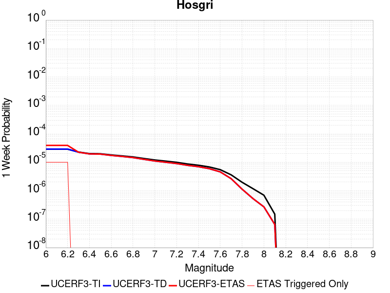 | 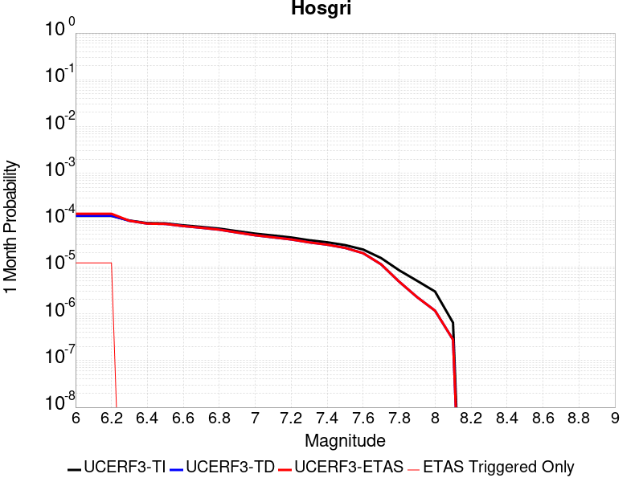 | 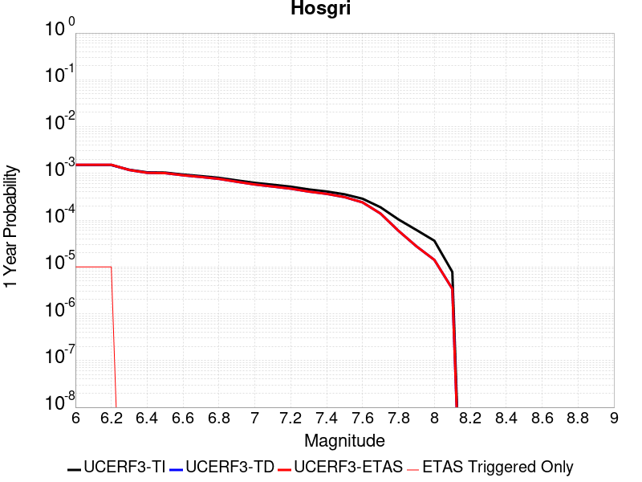 | 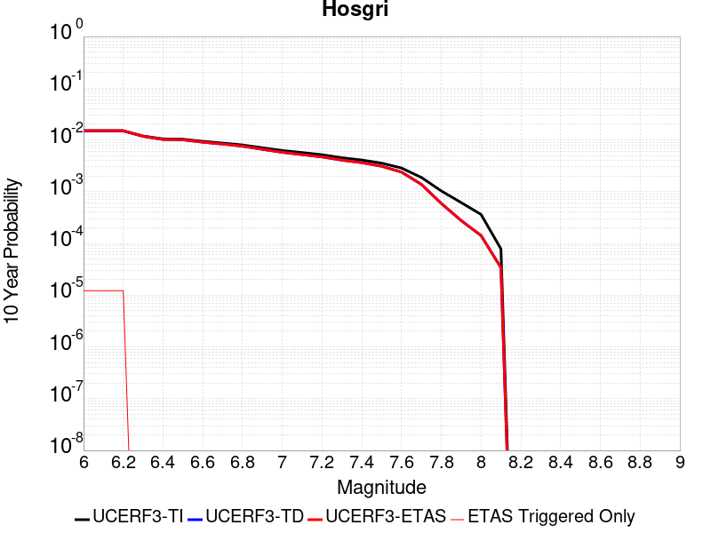 |

| Magnitude | 1 wk TI Prob | 1 wk TD Prob | 1 wk ETAS Prob | 1 wk ETAS/TD Gain | 1 wk ETAS Triggered Only | 1 mo TI Prob | 1 mo TD Prob | 1 mo ETAS Prob | 1 mo ETAS/TD Gain | 1 mo ETAS Triggered Only | 1 yr TI Prob | 1 yr TD Prob | 1 yr ETAS Prob | 1 yr ETAS/TD Gain | 1 yr ETAS Triggered Only | 10 yr TI Prob | 10 yr TD Prob | 10 yr ETAS Prob | 10 yr ETAS/TD Gain | 10 yr ETAS Triggered Only |
|-----|-----|-----|-----|-----|-----|-----|-----|-----|-----|-----|-----|-----|-----|-----|-----|-----|-----|-----|-----|-----|
| 6.0 | 2.883978E-5 | 2.9128403E-5 | 3.912811E-5 | 1.3432975 | 1.0E-5 | 1.235932E-4 | 1.248302E-4 | 1.3482895E-4 | 1.0800989 | 1.0E-5 | 0.0015037085 | 0.0015187752 | 0.0015287601 | 1.0065743 | 1.0E-5 | 0.01493574 | 0.01508773 | 0.015097579 | 1.0006528 | 1.0E-5 |
| 6.1 | 2.883978E-5 | 2.9128403E-5 | 3.912811E-5 | 1.3432975 | 1.0E-5 | 1.235932E-4 | 1.248302E-4 | 1.3482895E-4 | 1.0800989 | 1.0E-5 | 0.0015037085 | 0.0015187752 | 0.0015287601 | 1.0065743 | 1.0E-5 | 0.01493574 | 0.01508773 | 0.015097579 | 1.0006528 | 1.0E-5 |
| 6.2 | 2.883978E-5 | 2.9128403E-5 | 3.912811E-5 | 1.3432975 | 1.0E-5 | 1.235932E-4 | 1.248302E-4 | 1.3482895E-4 | 1.0800989 | 1.0E-5 | 0.0015037085 | 0.0015187752 | 0.0015287601 | 1.0065743 | 1.0E-5 | 0.01493574 | 0.01508773 | 0.015097579 | 1.0006528 | 1.0E-5 |
| 6.3 | 2.2914428E-5 | 2.2641956E-5 | 2.2641956E-5 | 1.0 | 0.0 | 9.8200995E-5 | 9.703337E-5 | 9.703337E-5 | 1.0 | 0.0 | 0.0011949413 | 0.001180746 | 0.001180746 | 1.0 | 0.0 | 0.011885363 | 0.011746123 | 0.011746123 | 1.0 | 0.0 |
| 6.4 | 2.0195741E-5 | 1.9696547E-5 | 1.9696547E-5 | 1.0 | 0.0 | 8.65503E-5 | 8.4411055E-5 | 8.4411055E-5 | 1.0 | 0.0 | 0.0010532405 | 0.001027222 | 0.001027222 | 1.0 | 0.0 | 0.010482626 | 0.010225783 | 0.010225783 | 1.0 | 0.0 |
| 6.5 | 1.9924333E-5 | 1.9408968E-5 | 1.9408968E-5 | 1.0 | 0.0 | 8.53872E-5 | 8.317865E-5 | 8.317865E-5 | 1.0 | 0.0 | 0.0010390934 | 0.0010122315 | 0.0010122315 | 1.0 | 0.0 | 0.010342481 | 0.010077244 | 0.010077244 | 1.0 | 0.0 |
| 6.6 | 1.809694E-5 | 1.7458287E-5 | 1.7458287E-5 | 1.0 | 0.0 | 7.7556004E-5 | 7.4819094E-5 | 7.4819094E-5 | 1.0 | 0.0 | 9.438353E-4 | 9.105431E-4 | 9.105431E-4 | 1.0 | 0.0 | 0.009398366 | 0.009069063 | 0.009069063 | 1.0 | 0.0 |
| 6.7 | 1.675989E-5 | 1.6042752E-5 | 1.6042752E-5 | 1.0 | 0.0 | 7.182612E-5 | 6.8752845E-5 | 6.8752845E-5 | 1.0 | 0.0 | 8.7413215E-4 | 8.3674554E-4 | 8.3674554E-4 | 1.0 | 0.0 | 0.008707017 | 0.008336853 | 0.008336853 | 1.0 | 0.0 |
| 6.8 | 1.5401129E-5 | 1.4614069E-5 | 1.4614069E-5 | 1.0 | 0.0 | 6.6003166E-5 | 6.263023E-5 | 6.263023E-5 | 1.0 | 0.0 | 8.032922E-4 | 7.6225714E-4 | 7.6225714E-4 | 1.0 | 0.0 | 0.008003947 | 0.0075972863 | 0.0075972863 | 1.0 | 0.0 |
| 6.9 | 1.356559E-5 | 1.2689955E-5 | 1.2689955E-5 | 1.0 | 0.0 | 5.8136946E-5 | 5.438439E-5 | 5.438439E-5 | 1.0 | 0.0 | 7.0758746E-4 | 6.6192925E-4 | 6.6192925E-4 | 1.0 | 0.0 | 0.007053386 | 0.006600378 | 0.006600378 | 1.0 | 0.0 |
| 7.0 | 1.2030819E-5 | 1.1095949E-5 | 1.1095949E-5 | 1.0 | 0.0 | 5.155963E-5 | 4.75532E-5 | 4.75532E-5 | 1.0 | 0.0 | 6.275577E-4 | 5.788065E-4 | 5.788065E-4 | 1.0 | 0.0 | 0.006257884 | 0.0057737473 | 0.0057737473 | 1.0 | 0.0 |
| 7.1 | 1.0972698E-5 | 1.0022167E-5 | 1.0022167E-5 | 1.0 | 0.0 | 4.7025E-5 | 4.2951437E-5 | 4.2951437E-5 | 1.0 | 0.0 | 5.72379E-4 | 5.2280835E-4 | 5.2280835E-4 | 1.0 | 0.0 | 0.0057090693 | 0.005216533 | 0.005216533 | 1.0 | 0.0 |
| 7.2 | 9.961926E-6 | 9.034732E-6 | 9.034732E-6 | 1.0 | 0.0 | 4.2693267E-5 | 3.8719707E-5 | 3.8719707E-5 | 1.0 | 0.0 | 5.1966653E-4 | 4.7131052E-4 | 4.7131052E-4 | 1.0 | 0.0 | 0.00518453 | 0.0047038523 | 0.0047038523 | 1.0 | 0.0 |
| 7.3 | 8.700929E-6 | 7.828089E-6 | 7.828089E-6 | 1.0 | 0.0 | 3.7289166E-5 | 3.354852E-5 | 3.354852E-5 | 1.0 | 0.0 | 4.53901E-4 | 4.083767E-4 | 4.083767E-4 | 1.0 | 0.0 | 0.00452975 | 0.004076999 | 0.004076999 | 1.0 | 0.0 |
| 7.4 | 7.866285E-6 | 6.9987263E-6 | 6.9987263E-6 | 1.0 | 0.0 | 3.3712215E-5 | 2.9994197E-5 | 2.9994197E-5 | 1.0 | 0.0 | 4.103689E-4 | 3.6511818E-4 | 3.6511818E-4 | 1.0 | 0.0 | 0.004096119 | 0.0036459167 | 0.0036459167 | 1.0 | 0.0 |
| 7.5 | 6.8381305E-6 | 5.9596814E-6 | 5.9596814E-6 | 1.0 | 0.0 | 2.9305946E-5 | 2.5541241E-5 | 2.5541241E-5 | 1.0 | 0.0 | 3.5674145E-4 | 3.1092027E-4 | 3.1092027E-4 | 1.0 | 0.0 | 0.0035616932 | 0.003105584 | 0.003105584 | 1.0 | 0.0 |
| 7.6 | 5.503376E-6 | 4.595227E-6 | 4.595227E-6 | 1.0 | 0.0 | 2.3585684E-5 | 1.9693682E-5 | 1.9693682E-5 | 1.0 | 0.0 | 2.8711787E-4 | 2.397442E-4 | 2.397442E-4 | 1.0 | 0.0 | 0.002867472 | 0.0023955852 | 0.0023955852 | 1.0 | 0.0 |
| 7.7 | 3.6144982E-6 | 2.6521896E-6 | 2.6521896E-6 | 1.0 | 0.0 | 1.5490614E-5 | 1.1366477E-5 | 1.1366477E-5 | 1.0 | 0.0 | 1.8858191E-4 | 1.3837808E-4 | 1.3837808E-4 | 1.0 | 0.0 | 0.0018842196 | 0.001383647 | 0.001383647 | 1.0 | 0.0 |
| 7.8 | 1.9853494E-6 | 1.1360784E-6 | 1.1360784E-6 | 1.0 | 0.0 | 8.508612E-6 | 4.8688985E-6 | 4.8688985E-6 | 1.0 | 0.0 | 1.0358743E-4 | 5.9277223E-5 | 5.9277223E-5 | 1.0 | 0.0 | 0.0010353916 | 5.933389E-4 | 5.933389E-4 | 1.0 | 0.0 |
| 7.9 | 1.1818757E-6 | 5.29477E-7 | 5.29477E-7 | 1.0 | 0.0 | 5.0651715E-6 | 2.269185E-6 | 2.269185E-6 | 1.0 | 0.0 | 6.1666724E-5 | 2.7626977E-5 | 2.7626977E-5 | 1.0 | 0.0 | 6.1649614E-4 | 2.7691363E-4 | 2.7691363E-4 | 1.0 | 0.0 |
| 8.0 | 6.962958E-7 | 2.71365E-7 | 2.71365E-7 | 1.0 | 0.0 | 2.9841215E-6 | 1.1629924E-6 | 1.1629924E-6 | 1.0 | 0.0 | 3.6331072E-5 | 1.415934E-5 | 1.415934E-5 | 1.0 | 0.0 | 3.6325134E-4 | 1.4215276E-4 | 1.4215276E-4 | 1.0 | 0.0 |
| 8.1 | 1.5033264E-7 | 6.52693E-8 | 6.52693E-8 | 1.0 | 0.0 | 6.442826E-7 | 2.7972553E-7 | 2.7972553E-7 | 1.0 | 0.0 | 7.844113E-6 | 3.4056532E-6 | 3.4056532E-6 | 1.0 | 0.0 | 7.843835E-5 | 3.4072833E-5 | 3.4072833E-5 | 1.0 | 0.0 |

## Dry Mountain
*[(top)](#table-of-contents)*

| 1 Week | 1 Month | 1 Year | 10 Year |
|-----|-----|-----|-----|
| 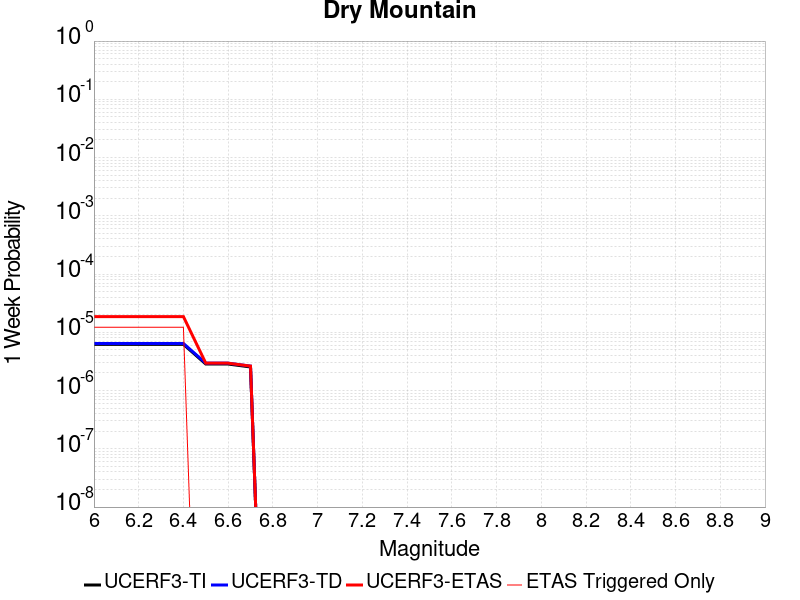 | 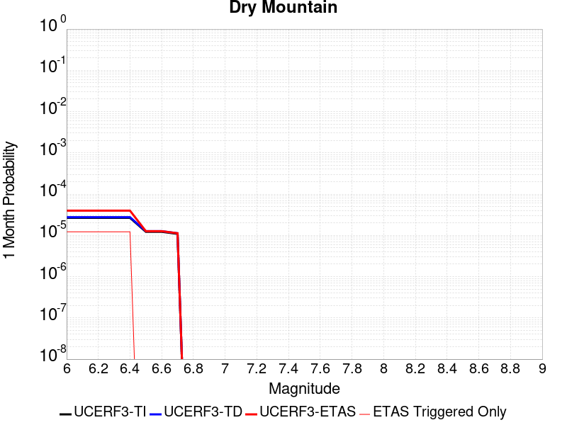 | 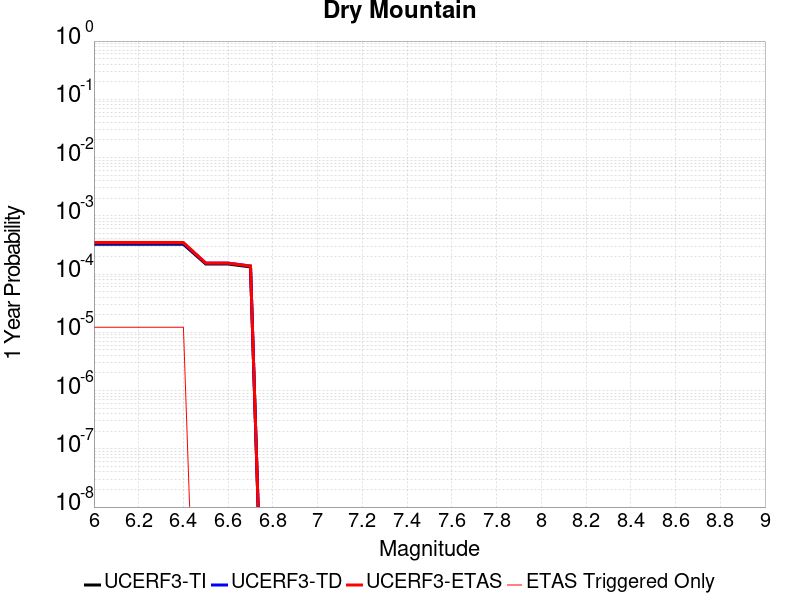 | 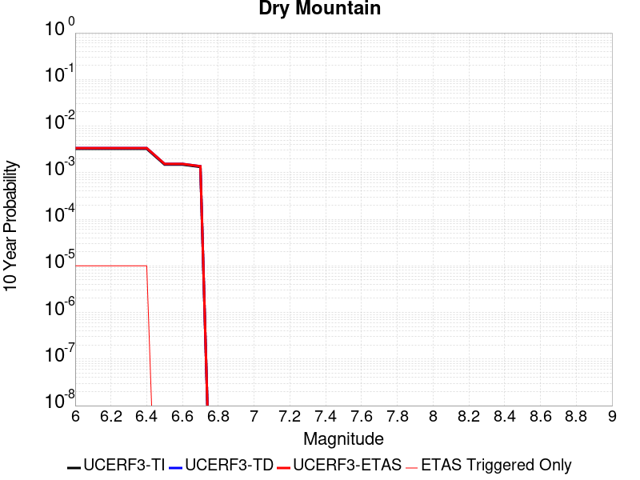 |

| Magnitude | 1 wk TI Prob | 1 wk TD Prob | 1 wk ETAS Prob | 1 wk ETAS/TD Gain | 1 wk ETAS Triggered Only | 1 mo TI Prob | 1 mo TD Prob | 1 mo ETAS Prob | 1 mo ETAS/TD Gain | 1 mo ETAS Triggered Only | 1 yr TI Prob | 1 yr TD Prob | 1 yr ETAS Prob | 1 yr ETAS/TD Gain | 1 yr ETAS Triggered Only | 10 yr TI Prob | 10 yr TD Prob | 10 yr ETAS Prob | 10 yr ETAS/TD Gain | 10 yr ETAS Triggered Only |
|-----|-----|-----|-----|-----|-----|-----|-----|-----|-----|-----|-----|-----|-----|-----|-----|-----|-----|-----|-----|-----|
| 6.0 | 6.222801E-6 | 6.439381E-6 | 1.6439317E-5 | 2.5529342 | 1.0E-5 | 2.6668875E-5 | 2.7597147E-5 | 3.759687E-5 | 1.3623463 | 1.0E-5 | 3.2464517E-4 | 3.3595937E-4 | 3.45956E-4 | 1.0297555 | 1.0E-5 | 0.0032417132 | 0.0033560768 | 0.0033660433 | 1.0029696 | 1.0E-5 |
| 6.1 | 6.222801E-6 | 6.439381E-6 | 1.6439317E-5 | 2.5529342 | 1.0E-5 | 2.6668875E-5 | 2.7597147E-5 | 3.759687E-5 | 1.3623463 | 1.0E-5 | 3.2464517E-4 | 3.3595937E-4 | 3.45956E-4 | 1.0297555 | 1.0E-5 | 0.0032417132 | 0.0033560768 | 0.0033660433 | 1.0029696 | 1.0E-5 |
| 6.2 | 6.222801E-6 | 6.439381E-6 | 1.6439317E-5 | 2.5529342 | 1.0E-5 | 2.6668875E-5 | 2.7597147E-5 | 3.759687E-5 | 1.3623463 | 1.0E-5 | 3.2464517E-4 | 3.3595937E-4 | 3.45956E-4 | 1.0297555 | 1.0E-5 | 0.0032417132 | 0.0033560768 | 0.0033660433 | 1.0029696 | 1.0E-5 |
| 6.3 | 6.222801E-6 | 6.439381E-6 | 1.6439317E-5 | 2.5529342 | 1.0E-5 | 2.6668875E-5 | 2.7597147E-5 | 3.759687E-5 | 1.3623463 | 1.0E-5 | 3.2464517E-4 | 3.3595937E-4 | 3.45956E-4 | 1.0297555 | 1.0E-5 | 0.0032417132 | 0.0033560768 | 0.0033660433 | 1.0029696 | 1.0E-5 |
| 6.4 | 6.222801E-6 | 6.439381E-6 | 1.6439317E-5 | 2.5529342 | 1.0E-5 | 2.6668875E-5 | 2.7597147E-5 | 3.759687E-5 | 1.3623463 | 1.0E-5 | 3.2464517E-4 | 3.3595937E-4 | 3.45956E-4 | 1.0297555 | 1.0E-5 | 0.0032417132 | 0.0033560768 | 0.0033660433 | 1.0029696 | 1.0E-5 |
| 6.5 | 2.8528623E-6 | 2.9521684E-6 | 2.9521684E-6 | 1.0 | 0.0 | 1.22264955E-5 | 1.2652138E-5 | 1.2652138E-5 | 1.0 | 0.0 | 1.4884741E-4 | 1.540376E-4 | 1.540376E-4 | 1.0 | 0.0 | 0.0014874774 | 0.0015401616 | 0.0015401616 | 1.0 | 0.0 |
| 6.6 | 2.8528623E-6 | 2.9521684E-6 | 2.9521684E-6 | 1.0 | 0.0 | 1.22264955E-5 | 1.2652138E-5 | 1.2652138E-5 | 1.0 | 0.0 | 1.4884741E-4 | 1.540376E-4 | 1.540376E-4 | 1.0 | 0.0 | 0.0014874774 | 0.0015401616 | 0.0015401616 | 1.0 | 0.0 |
| 6.7 | 2.541E-6 | 2.6293578E-6 | 2.6293578E-6 | 1.0 | 0.0 | 1.0889954E-5 | 1.1268677E-5 | 1.1268677E-5 | 1.0 | 0.0 | 1.3257713E-4 | 1.3719614E-4 | 1.3719614E-4 | 1.0 | 0.0 | 0.0013249806 | 0.0013719613 | 0.0013719613 | 1.0 | 0.0 |

## Surprise Valley 2011 CFM
*[(top)](#table-of-contents)*

| 1 Week | 1 Month | 1 Year | 10 Year |
|-----|-----|-----|-----|
|  |  |  |  |

| Magnitude | 1 wk TI Prob | 1 wk TD Prob | 1 wk ETAS Prob | 1 wk ETAS/TD Gain | 1 wk ETAS Triggered Only | 1 mo TI Prob | 1 mo TD Prob | 1 mo ETAS Prob | 1 mo ETAS/TD Gain | 1 mo ETAS Triggered Only | 1 yr TI Prob | 1 yr TD Prob | 1 yr ETAS Prob | 1 yr ETAS/TD Gain | 1 yr ETAS Triggered Only | 10 yr TI Prob | 10 yr TD Prob | 10 yr ETAS Prob | 10 yr ETAS/TD Gain | 10 yr ETAS Triggered Only |
|-----|-----|-----|-----|-----|-----|-----|-----|-----|-----|-----|-----|-----|-----|-----|-----|-----|-----|-----|-----|-----|
| 6.0 | 4.0396248E-5 | 4.485131E-5 | 4.485131E-5 | 1.0 | 0.0 | 1.7311527E-4 | 1.9220692E-4 | 2.02205E-4 | 1.0520172 | 1.0E-5 | 0.002105641 | 0.0023378176 | 0.0023477941 | 1.0042675 | 1.0E-5 | 0.020858008 | 0.023153966 | 0.023163736 | 1.0004219 | 1.0E-5 |
| 6.1 | 4.0396248E-5 | 4.485131E-5 | 4.485131E-5 | 1.0 | 0.0 | 1.7311527E-4 | 1.9220692E-4 | 2.02205E-4 | 1.0520172 | 1.0E-5 | 0.002105641 | 0.0023378176 | 0.0023477941 | 1.0042675 | 1.0E-5 | 0.020858008 | 0.023153966 | 0.023163736 | 1.0004219 | 1.0E-5 |
| 6.2 | 2.2295266E-5 | 2.440125E-5 | 2.440125E-5 | 1.0 | 0.0 | 9.554764E-5 | 1.0457276E-4 | 1.1457172E-4 | 1.0956172 | 1.0E-5 | 0.0011626717 | 0.0012724606 | 0.0012824478 | 1.0078487 | 1.0E-5 | 0.011566074 | 0.012654981 | 0.0126648545 | 1.0007802 | 1.0E-5 |
| 6.3 | 1.572643E-5 | 1.7096807E-5 | 1.7096807E-5 | 1.0 | 0.0 | 6.7397246E-5 | 7.327003E-5 | 8.32693E-5 | 1.1364714 | 1.0E-5 | 8.202525E-4 | 8.91708E-4 | 9.016991E-4 | 1.0112045 | 1.0E-5 | 0.008172315 | 0.008882407 | 0.008892318 | 1.0011158 | 1.0E-5 |
| 6.4 | 1.5714395E-5 | 1.7084629E-5 | 1.7084629E-5 | 1.0 | 0.0 | 6.734567E-5 | 7.3217845E-5 | 8.3217106E-5 | 1.1365688 | 1.0E-5 | 8.1962504E-4 | 8.9107314E-4 | 9.0106425E-4 | 1.0112125 | 1.0E-5 | 0.008166086 | 0.008876109 | 0.00888602 | 1.0011166 | 1.0E-5 |
| 6.5 | 1.2733495E-5 | 1.38016E-5 | 1.38016E-5 | 1.0 | 0.0 | 5.457098E-5 | 5.9148413E-5 | 6.914782E-5 | 1.1690563 | 1.0E-5 | 6.641992E-4 | 7.1990065E-4 | 7.2989345E-4 | 1.0138808 | 1.0E-5 | 0.0066221743 | 0.0071763797 | 0.007186308 | 1.0013834 | 1.0E-5 |
| 6.6 | 1.0983784E-5 | 1.1886554E-5 | 1.1886554E-5 | 1.0 | 0.0 | 4.7072506E-5 | 5.094141E-5 | 6.09409E-5 | 1.196294 | 1.0E-5 | 5.7295704E-4 | 6.200405E-4 | 6.300343E-4 | 1.0161179 | 1.0E-5 | 0.0057148207 | 0.0061836545 | 0.0061935927 | 1.0016072 | 1.0E-5 |
| 6.7 | 9.104806E-6 | 9.839491E-6 | 9.839491E-6 | 1.0 | 0.0 | 3.902001E-5 | 4.2168587E-5 | 4.2168587E-5 | 1.0 | 0.0 | 4.7496508E-4 | 5.132855E-4 | 5.132855E-4 | 1.0 | 0.0 | 0.004739512 | 0.005121397 | 0.005121397 | 1.0 | 0.0 |
| 6.8 | 6.2162403E-6 | 6.7041337E-6 | 6.7041337E-6 | 1.0 | 0.0 | 2.6640759E-5 | 2.8731698E-5 | 2.8731698E-5 | 1.0 | 0.0 | 3.2430296E-4 | 3.497545E-4 | 3.497545E-4 | 1.0 | 0.0 | 0.003238301 | 0.0034922638 | 0.0034922638 | 1.0 | 0.0 |
| 6.9 | 4.1792696E-6 | 4.50323E-6 | 4.50323E-6 | 1.0 | 0.0 | 1.7911032E-5 | 1.9299423E-5 | 1.9299423E-5 | 1.0 | 0.0 | 2.1804498E-4 | 2.3494668E-4 | 2.3494668E-4 | 1.0 | 0.0 | 0.0021783116 | 0.0023471361 | 0.0023471361 | 1.0 | 0.0 |
| 7.0 | 2.7478413E-6 | 2.9622424E-6 | 2.9622424E-6 | 1.0 | 0.0 | 1.177641E-5 | 1.269527E-5 | 1.269527E-5 | 1.0 | 0.0 | 1.4336836E-4 | 1.545552E-4 | 1.545552E-4 | 1.0 | 0.0 | 0.001432759 | 0.0015445995 | 0.0015445995 | 1.0 | 0.0 |
| 7.1 | 8.128648E-7 | 8.724922E-7 | 8.724922E-7 | 1.0 | 0.0 | 3.4837017E-6 | 3.7392501E-6 | 3.7392501E-6 | 1.0 | 0.0 | 4.2413245E-5 | 4.552502E-5 | 4.552502E-5 | 1.0 | 0.0 | 4.2405148E-4 | 4.5521575E-4 | 4.5521575E-4 | 1.0 | 0.0 |
| 7.2 | 4.8641045E-8 | 4.9402068E-8 | 4.9402068E-8 | 1.0 | 0.0 | 2.084616E-7 | 2.1172312E-7 | 2.1172312E-7 | 1.0 | 0.0 | 2.538017E-6 | 2.577726E-6 | 2.577726E-6 | 1.0 | 0.0 | 2.537988E-5 | 2.5776973E-5 | 2.5776973E-5 | 1.0 | 0.0 |
| 7.3 | 5.3911844E-9 | 5.4758145E-9 | 5.4758145E-9 | 1.0 | 0.0 | 2.3105075E-8 | 2.3467775E-8 | 2.3467775E-8 | 1.0 | 0.0 | 2.8130427E-7 | 2.8572015E-7 | 2.8572015E-7 | 1.0 | 0.0 | 2.8130391E-6 | 2.8571992E-6 | 2.8571992E-6 | 1.0 | 0.0 |

## San Diego Trough south
*[(top)](#table-of-contents)*

| 1 Week | 1 Month | 1 Year | 10 Year |
|-----|-----|-----|-----|
|  |  |  |  |

| Magnitude | 1 wk TI Prob | 1 wk TD Prob | 1 wk ETAS Prob | 1 wk ETAS/TD Gain | 1 wk ETAS Triggered Only | 1 mo TI Prob | 1 mo TD Prob | 1 mo ETAS Prob | 1 mo ETAS/TD Gain | 1 mo ETAS Triggered Only | 1 yr TI Prob | 1 yr TD Prob | 1 yr ETAS Prob | 1 yr ETAS/TD Gain | 1 yr ETAS Triggered Only | 10 yr TI Prob | 10 yr TD Prob | 10 yr ETAS Prob | 10 yr ETAS/TD Gain | 10 yr ETAS Triggered Only |
|-----|-----|-----|-----|-----|-----|-----|-----|-----|-----|-----|-----|-----|-----|-----|-----|-----|-----|-----|-----|-----|
| 6.0 | 8.279495E-5 | 1.0425541E-4 | 1.1425436E-4 | 1.0959083 | 1.0E-5 | 3.5478722E-4 | 4.4673498E-4 | 4.5673051E-4 | 1.0223746 | 1.0E-5 | 0.004310982 | 0.0054259133 | 0.0054358593 | 1.001833 | 1.0E-5 | 0.042283054 | 0.05299303 | 0.0530025 | 1.0001787 | 1.0E-5 |
| 6.1 | 4.6961468E-5 | 5.773024E-5 | 5.773024E-5 | 1.0 | 0.0 | 2.0124791E-4 | 2.473905E-4 | 2.473905E-4 | 1.0 | 0.0 | 0.00244744 | 0.003007886 | 0.003007886 | 1.0 | 0.0 | 0.024206603 | 0.029679636 | 0.029679636 | 1.0 | 0.0 |
| 6.2 | 3.5079658E-5 | 4.214258E-5 | 4.214258E-5 | 1.0 | 0.0 | 1.5033272E-4 | 1.8059829E-4 | 1.8059829E-4 | 1.0 | 0.0 | 0.0018287642 | 0.002196587 | 0.002196587 | 1.0 | 0.0 | 0.018137876 | 0.021751188 | 0.021751188 | 1.0 | 0.0 |
| 6.3 | 3.5079658E-5 | 4.214258E-5 | 4.214258E-5 | 1.0 | 0.0 | 1.5033272E-4 | 1.8059829E-4 | 1.8059829E-4 | 1.0 | 0.0 | 0.0018287642 | 0.002196587 | 0.002196587 | 1.0 | 0.0 | 0.018137876 | 0.021751188 | 0.021751188 | 1.0 | 0.0 |
| 6.4 | 2.7196904E-5 | 3.208715E-5 | 3.208715E-5 | 1.0 | 0.0 | 1.16552954E-4 | 1.3750911E-4 | 1.3750911E-4 | 1.0 | 0.0 | 0.0014181085 | 0.0016728995 | 0.0016728995 | 1.0 | 0.0 | 0.014090929 | 0.016604666 | 0.016604666 | 1.0 | 0.0 |
| 6.5 | 2.5584688E-5 | 3.0101632E-5 | 3.0101632E-5 | 1.0 | 0.0 | 1.0964406E-4 | 1.2900059E-4 | 1.2900059E-4 | 1.0 | 0.0 | 0.0013340989 | 0.0015694627 | 0.0015694627 | 1.0 | 0.0 | 0.013261181 | 0.015585332 | 0.015585332 | 1.0 | 0.0 |
| 6.6 | 2.2034688E-5 | 2.574271E-5 | 2.574271E-5 | 1.0 | 0.0 | 9.443096E-5 | 1.1032127E-4 | 1.1032127E-4 | 1.0 | 0.0 | 0.0011490905 | 0.0013423412 | 0.0013423412 | 1.0 | 0.0 | 0.011431668 | 0.013343325 | 0.013343325 | 1.0 | 0.0 |
| 6.7 | 1.9394853E-5 | 2.254176E-5 | 2.254176E-5 | 1.0 | 0.0 | 8.311815E-5 | 9.6604E-5 | 9.6604E-5 | 1.0 | 0.0 | 0.0010114936 | 0.0011755243 | 0.0011755243 | 1.0 | 0.0 | 0.01006902 | 0.011693766 | 0.011693766 | 1.0 | 0.0 |
| 6.8 | 1.7615313E-5 | 2.0403182E-5 | 2.0403182E-5 | 1.0 | 0.0 | 7.549201E-5 | 8.743931E-5 | 8.743931E-5 | 1.0 | 0.0 | 9.1872766E-4 | 0.0010640579 | 0.0010640579 | 1.0 | 0.0 | 0.009149387 | 0.010590198 | 0.010590198 | 1.0 | 0.0 |
| 6.9 | 1.5621423E-5 | 1.8026114E-5 | 1.8026114E-5 | 1.0 | 0.0 | 6.6947236E-5 | 7.725251E-5 | 7.725251E-5 | 1.0 | 0.0 | 8.147778E-4 | 9.40147E-4 | 9.40147E-4 | 1.0 | 0.0 | 0.008117969 | 0.009362142 | 0.009362142 | 1.0 | 0.0 |
| 7.0 | 1.3444376E-5 | 1.544809E-5 | 1.544809E-5 | 1.0 | 0.0 | 5.7617483E-5 | 6.620443E-5 | 6.620443E-5 | 1.0 | 0.0 | 7.0126704E-4 | 8.057436E-4 | 8.057436E-4 | 1.0 | 0.0 | 0.006990582 | 0.008028555 | 0.008028555 | 1.0 | 0.0 |
| 7.1 | 1.2268361E-5 | 1.407303E-5 | 1.407303E-5 | 1.0 | 0.0 | 5.2577634E-5 | 6.0311606E-5 | 6.0311606E-5 | 1.0 | 0.0 | 6.399447E-4 | 7.3404907E-4 | 7.3404907E-4 | 1.0 | 0.0 | 0.0063810493 | 0.0073165493 | 0.0073165493 | 1.0 | 0.0 |
| 7.2 | 1.0922655E-5 | 1.2513563E-5 | 1.2513563E-5 | 1.0 | 0.0 | 4.681054E-5 | 5.3628468E-5 | 5.3628468E-5 | 1.0 | 0.0 | 5.697693E-4 | 6.5273355E-4 | 6.5273355E-4 | 1.0 | 0.0 | 0.0056831064 | 0.0065084435 | 0.0065084435 | 1.0 | 0.0 |
| 7.3 | 6.1106753E-6 | 6.928925E-6 | 6.928925E-6 | 1.0 | 0.0 | 2.6188345E-5 | 2.9695057E-5 | 2.9695057E-5 | 1.0 | 0.0 | 3.1879646E-4 | 3.6147775E-4 | 3.6147775E-4 | 1.0 | 0.0 | 0.0031833951 | 0.003608943 | 0.003608943 | 1.0 | 0.0 |
| 7.4 | 4.933187E-6 | 5.5895525E-6 | 5.5895525E-6 | 1.0 | 0.0 | 2.114206E-5 | 2.3955008E-5 | 2.3955008E-5 | 1.0 | 0.0 | 2.5737417E-4 | 2.9161357E-4 | 2.9161357E-4 | 1.0 | 0.0 | 0.002570763 | 0.0029123505 | 0.0029123505 | 1.0 | 0.0 |
| 7.5 | 1.7489613E-6 | 1.969678E-6 | 1.969678E-6 | 1.0 | 0.0 | 7.495527E-6 | 8.4414505E-6 | 8.4414505E-6 | 1.0 | 0.0 | 9.125422E-5 | 1.02770035E-4 | 1.02770035E-4 | 1.0 | 0.0 | 9.1216754E-4 | 0.0010272472 | 0.0010272472 | 1.0 | 0.0 |
| 7.6 | 1.6988751E-7 | 1.7533823E-7 | 1.7533823E-7 | 1.0 | 0.0 | 7.2808916E-7 | 7.5144936E-7 | 7.5144936E-7 | 1.0 | 0.0 | 8.864449E-6 | 9.14886E-6 | 9.14886E-6 | 1.0 | 0.0 | 8.8640954E-5 | 9.1485024E-5 | 9.1485024E-5 | 1.0 | 0.0 |

## La Panza 2011
*[(top)](#table-of-contents)*

| 1 Week | 1 Month | 1 Year | 10 Year |
|-----|-----|-----|-----|
| 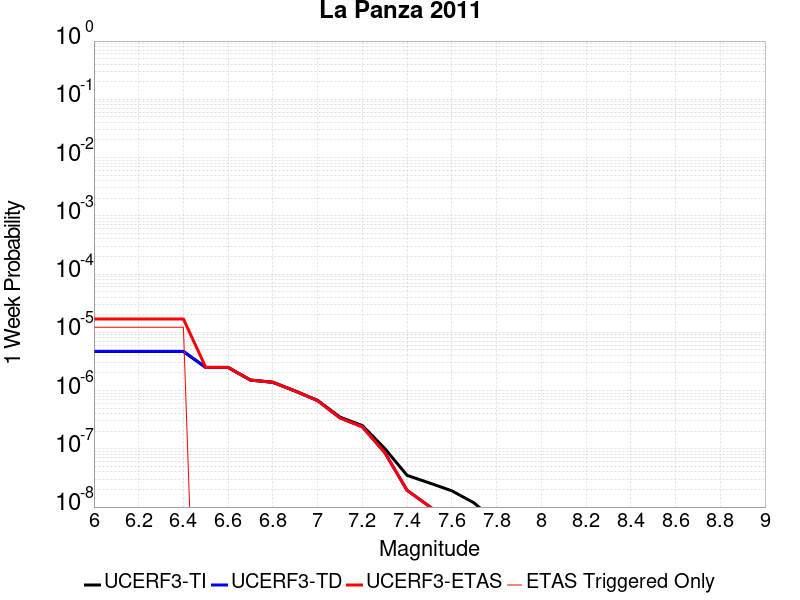 |  | 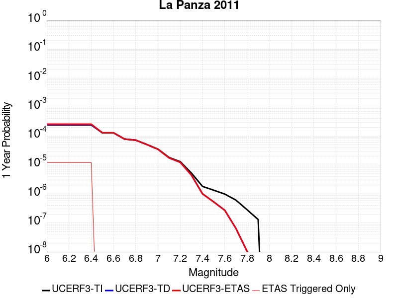 | 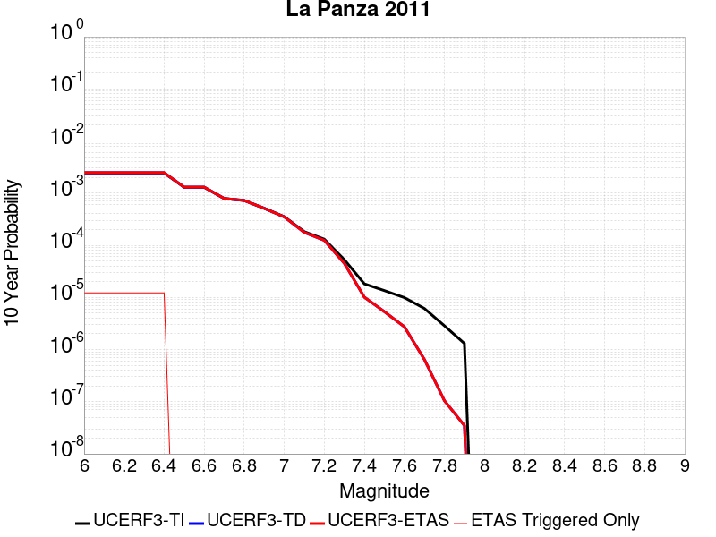 |

| Magnitude | 1 wk TI Prob | 1 wk TD Prob | 1 wk ETAS Prob | 1 wk ETAS/TD Gain | 1 wk ETAS Triggered Only | 1 mo TI Prob | 1 mo TD Prob | 1 mo ETAS Prob | 1 mo ETAS/TD Gain | 1 mo ETAS Triggered Only | 1 yr TI Prob | 1 yr TD Prob | 1 yr ETAS Prob | 1 yr ETAS/TD Gain | 1 yr ETAS Triggered Only | 10 yr TI Prob | 10 yr TD Prob | 10 yr ETAS Prob | 10 yr ETAS/TD Gain | 10 yr ETAS Triggered Only |
|-----|-----|-----|-----|-----|-----|-----|-----|-----|-----|-----|-----|-----|-----|-----|-----|-----|-----|-----|-----|-----|
| 6.0 | 4.6754544E-6 | 4.7175886E-6 | 1.47175415E-5 | 3.119717 | 1.0E-5 | 2.0037509E-5 | 2.021809E-5 | 3.0217889E-5 | 1.4945965 | 1.0E-5 | 2.4392935E-4 | 2.4612944E-4 | 2.5612698E-4 | 1.040619 | 1.0E-5 | 0.0024366176 | 0.0024587628 | 0.0024687382 | 1.004057 | 1.0E-5 |
| 6.1 | 4.6754544E-6 | 4.7175886E-6 | 1.47175415E-5 | 3.119717 | 1.0E-5 | 2.0037509E-5 | 2.021809E-5 | 3.0217889E-5 | 1.4945965 | 1.0E-5 | 2.4392935E-4 | 2.4612944E-4 | 2.5612698E-4 | 1.040619 | 1.0E-5 | 0.0024366176 | 0.0024587628 | 0.0024687382 | 1.004057 | 1.0E-5 |
| 6.2 | 4.6754544E-6 | 4.7175886E-6 | 1.47175415E-5 | 3.119717 | 1.0E-5 | 2.0037509E-5 | 2.021809E-5 | 3.0217889E-5 | 1.4945965 | 1.0E-5 | 2.4392935E-4 | 2.4612944E-4 | 2.5612698E-4 | 1.040619 | 1.0E-5 | 0.0024366176 | 0.0024587628 | 0.0024687382 | 1.004057 | 1.0E-5 |
| 6.3 | 4.6754544E-6 | 4.7175886E-6 | 1.47175415E-5 | 3.119717 | 1.0E-5 | 2.0037509E-5 | 2.021809E-5 | 3.0217889E-5 | 1.4945965 | 1.0E-5 | 2.4392935E-4 | 2.4612944E-4 | 2.5612698E-4 | 1.040619 | 1.0E-5 | 0.0024366176 | 0.0024587628 | 0.0024687382 | 1.004057 | 1.0E-5 |
| 6.4 | 4.6754544E-6 | 4.7175886E-6 | 1.47175415E-5 | 3.119717 | 1.0E-5 | 2.0037509E-5 | 2.021809E-5 | 3.0217889E-5 | 1.4945965 | 1.0E-5 | 2.4392935E-4 | 2.4612944E-4 | 2.5612698E-4 | 1.040619 | 1.0E-5 | 0.0024366176 | 0.0024587628 | 0.0024687382 | 1.004057 | 1.0E-5 |
| 6.5 | 2.485343E-6 | 2.5006007E-6 | 2.5006007E-6 | 1.0 | 0.0 | 1.0651426E-5 | 1.0716818E-5 | 1.0716818E-5 | 1.0 | 0.0 | 1.296734E-4 | 1.3046984E-4 | 1.3046984E-4 | 1.0 | 0.0 | 0.0012959775 | 0.0013039707 | 0.0013039707 | 1.0 | 0.0 |
| 6.6 | 2.485343E-6 | 2.5006007E-6 | 2.5006007E-6 | 1.0 | 0.0 | 1.0651426E-5 | 1.0716818E-5 | 1.0716818E-5 | 1.0 | 0.0 | 1.296734E-4 | 1.3046984E-4 | 1.3046984E-4 | 1.0 | 0.0 | 0.0012959775 | 0.0013039707 | 0.0013039707 | 1.0 | 0.0 |
| 6.7 | 1.5108508E-6 | 1.514639E-6 | 1.514639E-6 | 1.0 | 0.0 | 6.4750584E-6 | 6.4912947E-6 | 6.4912947E-6 | 1.0 | 0.0 | 7.8830984E-5 | 7.902876E-5 | 7.902876E-5 | 1.0 | 0.0 | 7.880303E-4 | 7.9001737E-4 | 7.9001737E-4 | 1.0 | 0.0 |
| 6.8 | 1.3865837E-6 | 1.3885118E-6 | 1.3885118E-6 | 1.0 | 0.0 | 5.942488E-6 | 5.950752E-6 | 5.950752E-6 | 1.0 | 0.0 | 7.234739E-5 | 7.244809E-5 | 7.244809E-5 | 1.0 | 0.0 | 7.232384E-4 | 7.242546E-4 | 7.242546E-4 | 1.0 | 0.0 |
| 6.9 | 9.826583E-7 | 9.796303E-7 | 9.796303E-7 | 1.0 | 0.0 | 4.2113857E-6 | 4.198409E-6 | 4.198409E-6 | 1.0 | 0.0 | 5.1272415E-5 | 5.1114486E-5 | 5.1114486E-5 | 1.0 | 0.0 | 5.126059E-4 | 5.1103265E-4 | 5.1103265E-4 | 1.0 | 0.0 |
| 7.0 | 6.7797646E-7 | 6.710231E-7 | 6.710231E-7 | 1.0 | 0.0 | 2.9056102E-6 | 2.8758104E-6 | 2.8758104E-6 | 1.0 | 0.0 | 3.537523E-5 | 3.501246E-5 | 3.501246E-5 | 1.0 | 0.0 | 3.5369597E-4 | 3.5007254E-4 | 3.5007254E-4 | 1.0 | 0.0 |
| 7.1 | 3.4979826E-7 | 3.3874045E-7 | 3.3874045E-7 | 1.0 | 0.0 | 1.4991346E-6 | 1.4517441E-6 | 1.4517441E-6 | 1.0 | 0.0 | 1.825181E-5 | 1.7674853E-5 | 1.7674853E-5 | 1.0 | 0.0 | 1.825031E-4 | 1.7673563E-4 | 1.7673563E-4 | 1.0 | 0.0 |
| 7.2 | 2.5088332E-7 | 2.3832064E-7 | 2.3832064E-7 | 1.0 | 0.0 | 1.0752137E-6 | 1.0213738E-6 | 1.0213738E-6 | 1.0 | 0.0 | 1.3090649E-5 | 1.2435164E-5 | 1.2435164E-5 | 1.0 | 0.0 | 1.3089878E-4 | 1.2434553E-4 | 1.2434553E-4 | 1.0 | 0.0 |
| 7.3 | 1.0159086E-7 | 8.644785E-8 | 8.644785E-8 | 1.0 | 0.0 | 4.3538932E-7 | 3.704907E-7 | 3.704907E-7 | 1.0 | 0.0 | 5.300852E-6 | 4.510716E-6 | 4.510716E-6 | 1.0 | 0.0 | 5.3007258E-5 | 4.510628E-5 | 4.510628E-5 | 1.0 | 0.0 |
| 7.4 | 3.5006252E-8 | 1.9403883E-8 | 1.9403883E-8 | 1.0 | 0.0 | 1.5002678E-7 | 8.315949E-8 | 8.315949E-8 | 1.0 | 0.0 | 1.8265745E-6 | 1.0124663E-6 | 1.0124663E-6 | 1.0 | 0.0 | 1.8265595E-5 | 1.012462E-5 | 1.012462E-5 | 1.0 | 0.0 |
| 7.5 | 2.592274E-8 | 1.0238468E-8 | 1.0238468E-8 | 1.0 | 0.0 | 1.1109746E-7 | 4.3879147E-8 | 4.3879147E-8 | 1.0 | 0.0 | 1.3526106E-6 | 5.342285E-7 | 5.342285E-7 | 1.0 | 0.0 | 1.3526024E-5 | 5.342273E-6 | 5.342273E-6 | 1.0 | 0.0 |
| 7.6 | 1.9016717E-8 | 5.2442264E-9 | 5.2442264E-9 | 1.0 | 0.0 | 8.150022E-8 | 2.2475257E-8 | 2.2475257E-8 | 1.0 | 0.0 | 9.922647E-7 | 2.736362E-7 | 2.736362E-7 | 1.0 | 0.0 | 9.922603E-6 | 2.736359E-6 | 2.736359E-6 | 1.0 | 0.0 |
| 7.7 | 1.17738495E-8 | 1.2393437E-9 | 1.2393437E-9 | 1.0 | 0.0 | 5.0459356E-8 | 5.3114735E-9 | 5.3114735E-9 | 1.0 | 0.0 | 6.1434247E-7 | 6.466719E-8 | 6.466719E-8 | 1.0 | 0.0 | 6.143408E-6 | 6.466717E-7 | 6.466717E-7 | 1.0 | 0.0 |
| 7.8 | 5.489079E-9 | 2.009185E-10 | 2.009185E-10 | 1.0 | 0.0 | 2.3524624E-8 | 8.61079E-10 | 8.61079E-10 | 1.0 | 0.0 | 2.8641225E-7 | 1.0483639E-8 | 1.0483639E-8 | 1.0 | 0.0 | 2.8641189E-6 | 1.0483638E-7 | 1.0483638E-7 | 1.0 | 0.0 |
| 7.9 | 2.5081048E-9 | 6.675449E-11 | 6.675449E-11 | 1.0 | 0.0 | 1.0749021E-8 | 2.8609015E-10 | 2.8609015E-10 | 1.0 | 0.0 | 1.3086932E-7 | 3.483148E-9 | 3.483148E-9 | 1.0 | 0.0 | 1.3086925E-6 | 3.483148E-8 | 3.483148E-8 | 1.0 | 0.0 |

## San Joaquin Hills
*[(top)](#table-of-contents)*

| 1 Week | 1 Month | 1 Year | 10 Year |
|-----|-----|-----|-----|
|  |  |  |  |

| Magnitude | 1 wk TI Prob | 1 wk TD Prob | 1 wk ETAS Prob | 1 wk ETAS/TD Gain | 1 wk ETAS Triggered Only | 1 mo TI Prob | 1 mo TD Prob | 1 mo ETAS Prob | 1 mo ETAS/TD Gain | 1 mo ETAS Triggered Only | 1 yr TI Prob | 1 yr TD Prob | 1 yr ETAS Prob | 1 yr ETAS/TD Gain | 1 yr ETAS Triggered Only | 10 yr TI Prob | 10 yr TD Prob | 10 yr ETAS Prob | 10 yr ETAS/TD Gain | 10 yr ETAS Triggered Only |
|-----|-----|-----|-----|-----|-----|-----|-----|-----|-----|-----|-----|-----|-----|-----|-----|-----|-----|-----|-----|-----|
| 6.0 | 3.4525704E-6 | 2.8139727E-6 | 2.8139727E-6 | 1.0 | 0.0 | 1.4796647E-5 | 1.2059828E-5 | 1.2059828E-5 | 1.0 | 0.0 | 1.8013427E-4 | 1.4681864E-4 | 1.5681717E-4 | 1.0681013 | 1.0E-5 | 0.0017998833 | 0.0014672297 | 0.0014772151 | 1.0068055 | 1.0E-5 |
| 6.1 | 3.4525704E-6 | 2.8139727E-6 | 2.8139727E-6 | 1.0 | 0.0 | 1.4796647E-5 | 1.2059828E-5 | 1.2059828E-5 | 1.0 | 0.0 | 1.8013427E-4 | 1.4681864E-4 | 1.5681717E-4 | 1.0681013 | 1.0E-5 | 0.0017998833 | 0.0014672297 | 0.0014772151 | 1.0068055 | 1.0E-5 |
| 6.2 | 3.4525704E-6 | 2.8139727E-6 | 2.8139727E-6 | 1.0 | 0.0 | 1.4796647E-5 | 1.2059828E-5 | 1.2059828E-5 | 1.0 | 0.0 | 1.8013427E-4 | 1.4681864E-4 | 1.5681717E-4 | 1.0681013 | 1.0E-5 | 0.0017998833 | 0.0014672297 | 0.0014772151 | 1.0068055 | 1.0E-5 |
| 6.3 | 3.4525704E-6 | 2.8139727E-6 | 2.8139727E-6 | 1.0 | 0.0 | 1.4796647E-5 | 1.2059828E-5 | 1.2059828E-5 | 1.0 | 0.0 | 1.8013427E-4 | 1.4681864E-4 | 1.5681717E-4 | 1.0681013 | 1.0E-5 | 0.0017998833 | 0.0014672297 | 0.0014772151 | 1.0068055 | 1.0E-5 |
| 6.4 | 3.4525704E-6 | 2.8139727E-6 | 2.8139727E-6 | 1.0 | 0.0 | 1.4796647E-5 | 1.2059828E-5 | 1.2059828E-5 | 1.0 | 0.0 | 1.8013427E-4 | 1.4681864E-4 | 1.5681717E-4 | 1.0681013 | 1.0E-5 | 0.0017998833 | 0.0014672297 | 0.0014772151 | 1.0068055 | 1.0E-5 |
| 6.5 | 3.4525704E-6 | 2.8139727E-6 | 2.8139727E-6 | 1.0 | 0.0 | 1.4796647E-5 | 1.2059828E-5 | 1.2059828E-5 | 1.0 | 0.0 | 1.8013427E-4 | 1.4681864E-4 | 1.5681717E-4 | 1.0681013 | 1.0E-5 | 0.0017998833 | 0.0014672297 | 0.0014772151 | 1.0068055 | 1.0E-5 |
| 6.6 | 3.4525704E-6 | 2.8139727E-6 | 2.8139727E-6 | 1.0 | 0.0 | 1.4796647E-5 | 1.2059828E-5 | 1.2059828E-5 | 1.0 | 0.0 | 1.8013427E-4 | 1.4681864E-4 | 1.5681717E-4 | 1.0681013 | 1.0E-5 | 0.0017998833 | 0.0014672297 | 0.0014772151 | 1.0068055 | 1.0E-5 |
| 6.7 | 3.4525704E-6 | 2.8139727E-6 | 2.8139727E-6 | 1.0 | 0.0 | 1.4796647E-5 | 1.2059828E-5 | 1.2059828E-5 | 1.0 | 0.0 | 1.8013427E-4 | 1.4681864E-4 | 1.5681717E-4 | 1.0681013 | 1.0E-5 | 0.0017998833 | 0.0014672297 | 0.0014772151 | 1.0068055 | 1.0E-5 |
| 6.8 | 3.388654E-6 | 2.7484111E-6 | 2.7484111E-6 | 1.0 | 0.0 | 1.4522722E-5 | 1.1778852E-5 | 1.1778852E-5 | 1.0 | 0.0 | 1.767998E-4 | 1.4339821E-4 | 1.4339821E-4 | 1.0 | 0.0 | 0.001766592 | 0.0014330697 | 0.0014330697 | 1.0 | 0.0 |
| 6.9 | 3.2694352E-6 | 2.6283255E-6 | 2.6283255E-6 | 1.0 | 0.0 | 1.401179E-5 | 1.1264204E-5 | 1.1264204E-5 | 1.0 | 0.0 | 1.7058018E-4 | 1.3713316E-4 | 1.3713316E-4 | 1.0 | 0.0 | 0.0017044931 | 0.0013704967 | 0.0013704967 | 1.0 | 0.0 |
| 7.0 | 3.246912E-6 | 2.6069824E-6 | 2.6069824E-6 | 1.0 | 0.0 | 1.39152635E-5 | 1.1172735E-5 | 1.1172735E-5 | 1.0 | 0.0 | 1.6940516E-4 | 1.3601968E-4 | 1.3601968E-4 | 1.0 | 0.0 | 0.0016927607 | 0.0013593754 | 0.0013593754 | 1.0 | 0.0 |
| 7.1 | 3.1864927E-6 | 2.5523102E-6 | 2.5523102E-6 | 1.0 | 0.0 | 1.3656326E-5 | 1.0938427E-5 | 1.0938427E-5 | 1.0 | 0.0 | 1.6625308E-4 | 1.3316733E-4 | 1.3316733E-4 | 1.0 | 0.0 | 0.0016612876 | 0.0013308863 | 0.0013308863 | 1.0 | 0.0 |
| 7.2 | 3.0220644E-6 | 2.3991581E-6 | 2.3991581E-6 | 1.0 | 0.0 | 1.295164E-5 | 1.0282067E-5 | 1.0282067E-5 | 1.0 | 0.0 | 1.576748E-4 | 1.2517707E-4 | 1.2517707E-4 | 1.0 | 0.0 | 0.0015756298 | 0.001251076 | 0.001251076 | 1.0 | 0.0 |
| 7.3 | 2.787619E-6 | 2.2173751E-6 | 2.2173751E-6 | 1.0 | 0.0 | 1.1946884E-5 | 9.503003E-6 | 9.503003E-6 | 1.0 | 0.0 | 1.454436E-4 | 1.1569301E-4 | 1.1569301E-4 | 1.0 | 0.0 | 0.0014534845 | 0.0011563377 | 0.0011563377 | 1.0 | 0.0 |
| 7.4 | 2.4593792E-6 | 1.9226163E-6 | 1.9226163E-6 | 1.0 | 0.0 | 1.0540153E-5 | 8.239759E-6 | 8.239759E-6 | 1.0 | 0.0 | 1.2831882E-4 | 1.0031454E-4 | 1.0031454E-4 | 1.0 | 0.0 | 0.0012824474 | 0.0010027013 | 0.0010027013 | 1.0 | 0.0 |
| 7.5 | 1.926764E-6 | 1.4383043E-6 | 1.4383043E-6 | 1.0 | 0.0 | 8.257534E-6 | 6.1641467E-6 | 6.1641467E-6 | 1.0 | 0.0 | 1.00530844E-4 | 7.5045966E-5 | 7.5045966E-5 | 1.0 | 0.0 | 0.0010048538 | 7.502126E-4 | 7.502126E-4 | 1.0 | 0.0 |
| 7.6 | 1.1609359E-6 | 8.145649E-7 | 8.145649E-7 | 1.0 | 0.0 | 4.97543E-6 | 3.4909879E-6 | 3.4909879E-6 | 1.0 | 0.0 | 6.0574173E-5 | 4.2501993E-5 | 4.2501993E-5 | 1.0 | 0.0 | 6.055767E-4 | 4.24943E-4 | 4.24943E-4 | 1.0 | 0.0 |
| 7.7 | 5.1168536E-7 | 2.7155397E-7 | 2.7155397E-7 | 1.0 | 0.0 | 2.1929354E-6 | 1.1638023E-6 | 1.1638023E-6 | 1.0 | 0.0 | 2.669866E-5 | 1.4169214E-5 | 1.4169214E-5 | 1.0 | 0.0 | 2.6695454E-4 | 1.4168446E-4 | 1.4168446E-4 | 1.0 | 0.0 |
| 7.8 | 1.16056995E-8 | 9.782997E-9 | 9.782997E-9 | 1.0 | 0.0 | 4.9738713E-8 | 4.1927127E-8 | 4.1927127E-8 | 1.0 | 0.0 | 6.0556863E-7 | 5.1046277E-7 | 5.1046277E-7 | 1.0 | 0.0 | 6.05567E-6 | 5.1046277E-6 | 5.1046277E-6 | 1.0 | 0.0 |

## Hayward (So) 2011 CFM
*[(top)](#table-of-contents)*

| 1 Week | 1 Month | 1 Year | 10 Year |
|-----|-----|-----|-----|
| 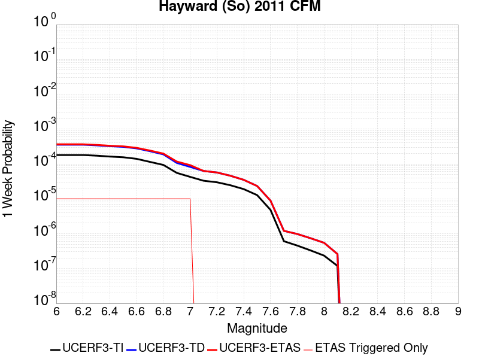 | 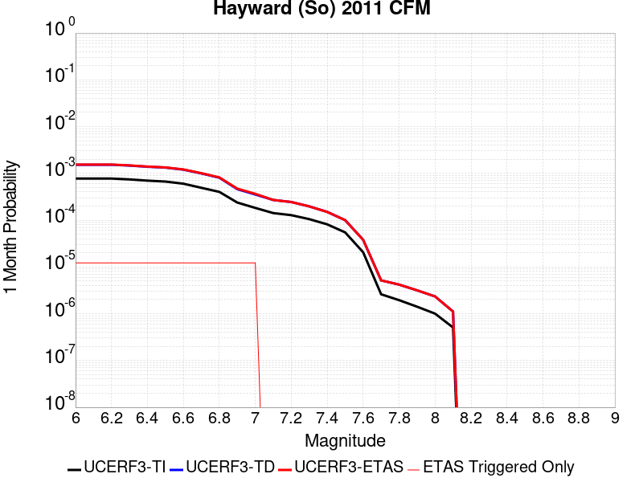 | 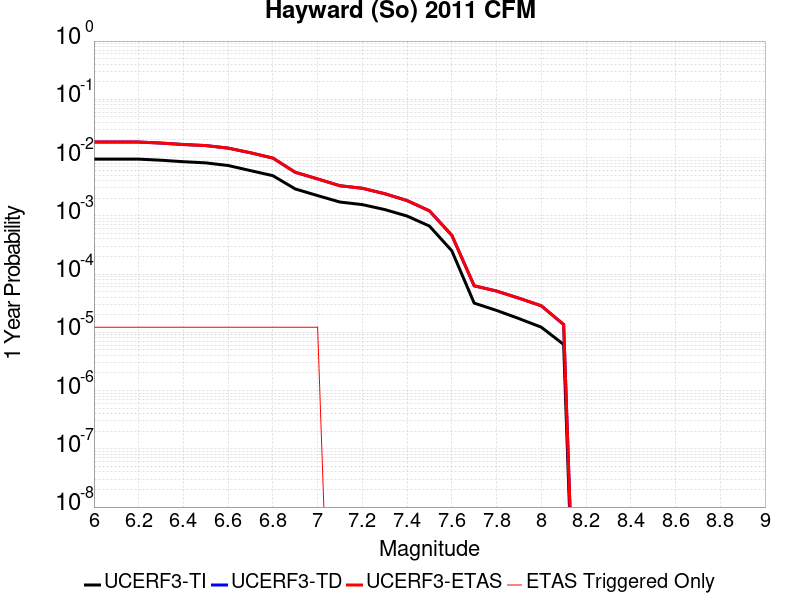 | 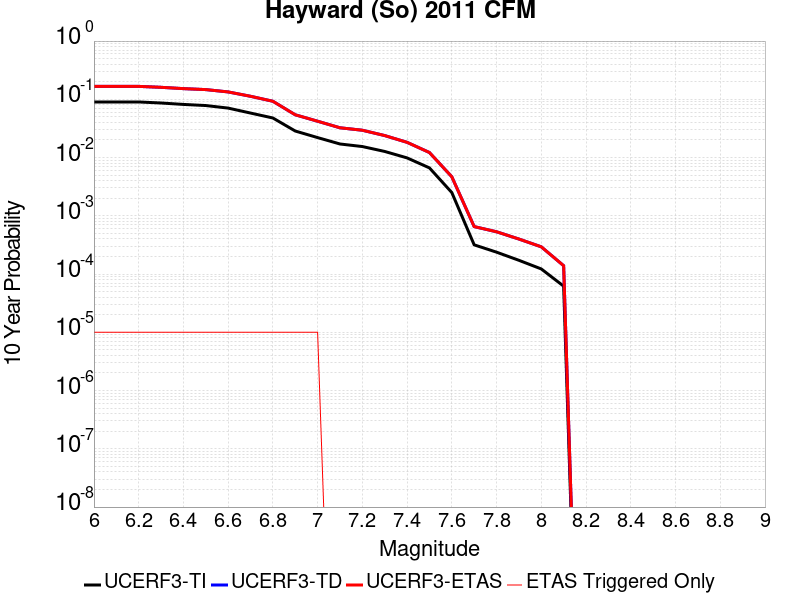 |

| Magnitude | 1 wk TI Prob | 1 wk TD Prob | 1 wk ETAS Prob | 1 wk ETAS/TD Gain | 1 wk ETAS Triggered Only | 1 mo TI Prob | 1 mo TD Prob | 1 mo ETAS Prob | 1 mo ETAS/TD Gain | 1 mo ETAS Triggered Only | 1 yr TI Prob | 1 yr TD Prob | 1 yr ETAS Prob | 1 yr ETAS/TD Gain | 1 yr ETAS Triggered Only | 10 yr TI Prob | 10 yr TD Prob | 10 yr ETAS Prob | 10 yr ETAS/TD Gain | 10 yr ETAS Triggered Only |
|-----|-----|-----|-----|-----|-----|-----|-----|-----|-----|-----|-----|-----|-----|-----|-----|-----|-----|-----|-----|-----|
| 6.0 | 1.8091932E-4 | 3.570673E-4 | 3.670637E-4 | 1.027996 | 1.0E-5 | 7.751381E-4 | 0.0015294008 | 0.0015393855 | 1.0065285 | 1.0E-5 | 0.00939654 | 0.018463885 | 0.0184737 | 1.0005316 | 1.0E-5 | 0.090090066 | 0.1667085 | 0.16671683 | 1.00005 | 1.0E-5 |
| 6.1 | 1.8091932E-4 | 3.570673E-4 | 3.670637E-4 | 1.027996 | 1.0E-5 | 7.751381E-4 | 0.0015294008 | 0.0015393855 | 1.0065285 | 1.0E-5 | 0.00939654 | 0.018463885 | 0.0184737 | 1.0005316 | 1.0E-5 | 0.090090066 | 0.1667085 | 0.16671683 | 1.00005 | 1.0E-5 |
| 6.2 | 1.8091932E-4 | 3.570673E-4 | 3.670637E-4 | 1.027996 | 1.0E-5 | 7.751381E-4 | 0.0015294008 | 0.0015393855 | 1.0065285 | 1.0E-5 | 0.00939654 | 0.018463885 | 0.0184737 | 1.0005316 | 1.0E-5 | 0.090090066 | 0.1667085 | 0.16671683 | 1.00005 | 1.0E-5 |
| 6.3 | 1.7322872E-4 | 3.4263515E-4 | 3.5263173E-4 | 1.0291755 | 1.0E-5 | 7.4219756E-4 | 0.0014676197 | 0.001477605 | 1.0068038 | 1.0E-5 | 0.0089988755 | 0.017724147 | 0.01773397 | 1.0005542 | 1.0E-5 | 0.08643075 | 0.16065954 | 0.16066793 | 1.0000522 | 1.0E-5 |
| 6.4 | 1.6334097E-4 | 3.2345165E-4 | 3.334484E-4 | 1.0309066 | 1.0E-5 | 6.998449E-4 | 0.0013854936 | 0.0013954798 | 1.0072076 | 1.0E-5 | 0.008487372 | 0.016739927 | 0.01674976 | 1.0005873 | 1.0E-5 | 0.081704415 | 0.15256606 | 0.15257452 | 1.0000556 | 1.0E-5 |
| 6.5 | 1.5600289E-4 | 3.101982E-4 | 3.2019507E-4 | 1.0322274 | 1.0E-5 | 6.684125E-4 | 0.0013287518 | 0.0013387385 | 1.0075159 | 1.0E-5 | 0.008107598 | 0.016059443 | 0.016069284 | 1.0006127 | 1.0E-5 | 0.078181036 | 0.14684291 | 0.14685144 | 1.000058 | 1.0E-5 |
| 6.6 | 1.4046066E-4 | 2.8034003E-4 | 2.9033722E-4 | 1.035661 | 1.0E-5 | 6.018354E-4 | 0.0012009109 | 0.0012108989 | 1.008317 | 1.0E-5 | 0.0073027555 | 0.014524571 | 0.014534425 | 1.0006785 | 1.0E-5 | 0.07067384 | 0.13393044 | 0.13393912 | 1.0000646 | 1.0E-5 |
| 6.7 | 1.14696966E-4 | 2.3272466E-4 | 2.4272234E-4 | 1.0429592 | 1.0E-5 | 4.914658E-4 | 9.970153E-4 | 0.0010070052 | 1.0100199 | 1.0E-5 | 0.0059671924 | 0.012072163 | 0.012082042 | 1.0008184 | 1.0E-5 | 0.058094822 | 0.11274141 | 0.112750284 | 1.0000787 | 1.0E-5 |
| 6.8 | 9.3874296E-5 | 1.8862431E-4 | 1.9862242E-4 | 1.0530055 | 1.0E-5 | 4.0225635E-4 | 8.081431E-4 | 8.1813504E-4 | 1.012364 | 1.0E-5 | 0.0048864787 | 0.009795489 | 0.009805392 | 1.0010109 | 1.0E-5 | 0.047804173 | 0.092592984 | 0.09260206 | 1.000098 | 1.0E-5 |
| 6.9 | 5.551852E-5 | 1.0729875E-4 | 1.1729768E-4 | 1.0931877 | 1.0E-5 | 2.3791482E-4 | 4.5977137E-4 | 4.6976676E-4 | 1.02174 | 1.0E-5 | 0.0028927654 | 0.005583468 | 0.0055934116 | 1.001781 | 1.0E-5 | 0.028553981 | 0.054246075 | 0.05425553 | 1.0001744 | 1.0E-5 |
| 7.0 | 4.2662363E-5 | 8.246792E-5 | 9.24671E-5 | 1.1212493 | 1.0E-5 | 1.8282588E-4 | 3.5338648E-4 | 3.6338295E-4 | 1.0282876 | 1.0E-5 | 0.0022236328 | 0.0042940658 | 0.004304023 | 1.0023187 | 1.0E-5 | 0.022015138 | 0.04206509 | 0.04207467 | 1.0002277 | 1.0E-5 |
| 7.1 | 3.305886E-5 | 6.302183E-5 | 6.302183E-5 | 1.0 | 0.0 | 1.4167312E-4 | 2.7006568E-4 | 2.7006568E-4 | 1.0 | 0.0 | 0.0017235056 | 0.003283111 | 0.003283111 | 1.0 | 0.0 | 0.017101998 | 0.032453902 | 0.032453902 | 1.0 | 0.0 |
| 7.2 | 2.9856887E-5 | 5.701622E-5 | 5.701622E-5 | 1.0 | 0.0 | 1.2795182E-4 | 2.4433242E-4 | 2.4433242E-4 | 1.0 | 0.0 | 0.0015567001 | 0.0029707062 | 0.0029707062 | 1.0 | 0.0 | 0.015458403 | 0.029454801 | 0.029454801 | 1.0 | 0.0 |
| 7.3 | 2.4559737E-5 | 4.599286E-5 | 4.599286E-5 | 1.0 | 0.0 | 1.0525176E-4 | 1.9709744E-4 | 1.9709744E-4 | 1.0 | 0.0 | 0.0012806869 | 0.0023970334 | 0.0023970334 | 1.0 | 0.0 | 0.012733313 | 0.023858516 | 0.023858516 | 1.0 | 0.0 |
| 7.4 | 1.9002231E-5 | 3.505084E-5 | 3.505084E-5 | 1.0 | 0.0 | 8.143559E-5 | 1.502093E-4 | 1.502093E-4 | 1.0 | 0.0 | 9.910273E-4 | 0.001827274 | 0.001827274 | 1.0 | 0.0 | 0.009866194 | 0.018258808 | 0.018258808 | 1.0 | 0.0 |
| 7.5 | 1.2783333E-5 | 2.3331182E-5 | 2.3331182E-5 | 1.0 | 0.0 | 5.4784563E-5 | 9.998698E-5 | 9.998698E-5 | 1.0 | 0.0 | 6.667979E-4 | 0.0012166675 | 0.0012166675 | 1.0 | 0.0 | 0.006648007 | 0.012209443 | 0.012209443 | 1.0 | 0.0 |
| 7.6 | 4.8149627E-6 | 8.888056E-6 | 8.888056E-6 | 1.0 | 0.0 | 2.063539E-5 | 3.8091122E-5 | 3.8091122E-5 | 1.0 | 0.0 | 2.5120692E-4 | 4.6366194E-4 | 4.6366194E-4 | 1.0 | 0.0 | 0.0025092314 | 0.0046805087 | 0.0046805087 | 1.0 | 0.0 |
| 7.7 | 6.0838227E-7 | 1.205754E-6 | 1.205754E-6 | 1.0 | 0.0 | 2.6073499E-6 | 5.1675065E-6 | 5.1675065E-6 | 1.0 | 0.0 | 3.174402E-5 | 6.291258E-5 | 6.291258E-5 | 1.0 | 0.0 | 3.1739488E-4 | 6.5296254E-4 | 6.5296254E-4 | 1.0 | 0.0 |
| 7.8 | 4.5542808E-7 | 9.792941E-7 | 9.792941E-7 | 1.0 | 0.0 | 1.9518332E-6 | 4.196968E-6 | 4.196968E-6 | 1.0 | 0.0 | 2.376331E-5 | 5.109689E-5 | 5.109689E-5 | 1.0 | 0.0 | 2.3760769E-4 | 5.321693E-4 | 5.321693E-4 | 1.0 | 0.0 |
| 7.9 | 3.3016747E-7 | 7.3869535E-7 | 7.3869535E-7 | 1.0 | 0.0 | 1.4150027E-6 | 3.1658333E-6 | 3.1658333E-6 | 1.0 | 0.0 | 1.7227521E-5 | 3.854334E-5 | 3.854334E-5 | 1.0 | 0.0 | 1.7226185E-4 | 3.9932923E-4 | 3.9932923E-4 | 1.0 | 0.0 |
| 8.0 | 2.347038E-7 | 5.471963E-7 | 5.471963E-7 | 1.0 | 0.0 | 1.0058731E-6 | 2.3451248E-6 | 2.3451248E-6 | 1.0 | 0.0 | 1.2246436E-5 | 2.8551523E-5 | 2.8551523E-5 | 1.0 | 0.0 | 1.2245761E-4 | 2.9357258E-4 | 2.9357258E-4 | 1.0 | 0.0 |
| 8.1 | 1.18822804E-7 | 2.6060948E-7 | 2.6060948E-7 | 1.0 | 0.0 | 5.092405E-7 | 1.1168972E-6 | 1.1168972E-6 | 1.0 | 0.0 | 6.1999854E-6 | 1.359814E-5 | 1.359814E-5 | 1.0 | 0.0 | 6.199812E-5 | 1.3918082E-4 | 1.3918082E-4 | 1.0 | 0.0 |

## Owens Valley Keough Hot Springs
*[(top)](#table-of-contents)*

| 1 Week | 1 Month | 1 Year | 10 Year |
|-----|-----|-----|-----|
| 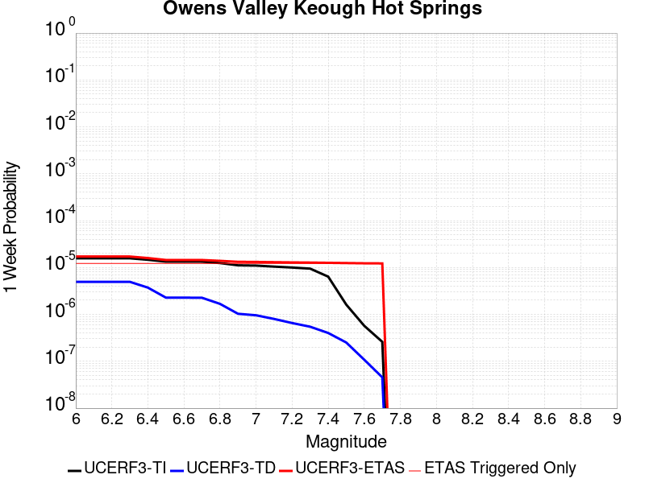 |  | 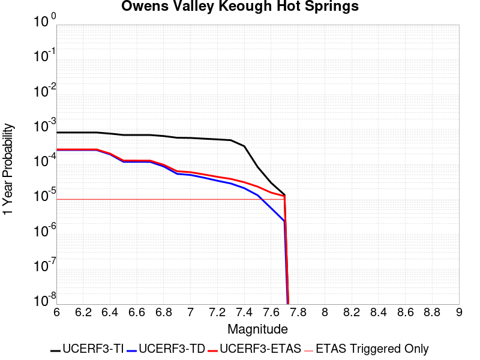 | 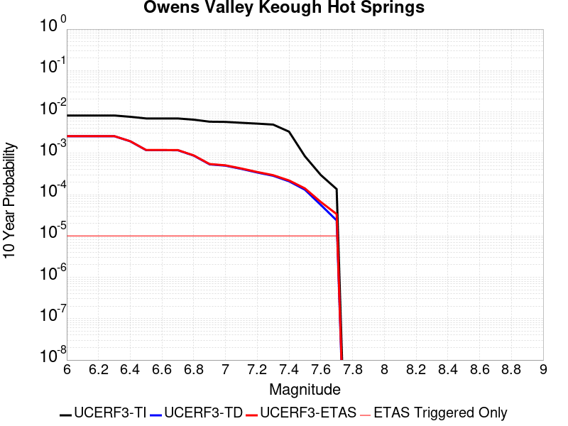 |

| Magnitude | 1 wk TI Prob | 1 wk TD Prob | 1 wk ETAS Prob | 1 wk ETAS/TD Gain | 1 wk ETAS Triggered Only | 1 mo TI Prob | 1 mo TD Prob | 1 mo ETAS Prob | 1 mo ETAS/TD Gain | 1 mo ETAS Triggered Only | 1 yr TI Prob | 1 yr TD Prob | 1 yr ETAS Prob | 1 yr ETAS/TD Gain | 1 yr ETAS Triggered Only | 10 yr TI Prob | 10 yr TD Prob | 10 yr ETAS Prob | 10 yr ETAS/TD Gain | 10 yr ETAS Triggered Only |
|-----|-----|-----|-----|-----|-----|-----|-----|-----|-----|-----|-----|-----|-----|-----|-----|-----|-----|-----|-----|-----|
| 6.0 | 1.5708529E-5 | 4.950463E-6 | 1.4950414E-5 | 3.020003 | 1.0E-5 | 6.7320536E-5 | 2.1216127E-5 | 3.1215914E-5 | 1.4713296 | 1.0E-5 | 8.193192E-4 | 2.5828084E-4 | 2.6827827E-4 | 1.0387075 | 1.0E-5 | 0.008163051 | 0.0025804387 | 0.002590413 | 1.0038654 | 1.0E-5 |
| 6.1 | 1.5708529E-5 | 4.950463E-6 | 1.4950414E-5 | 3.020003 | 1.0E-5 | 6.7320536E-5 | 2.1216127E-5 | 3.1215914E-5 | 1.4713296 | 1.0E-5 | 8.193192E-4 | 2.5828084E-4 | 2.6827827E-4 | 1.0387075 | 1.0E-5 | 0.008163051 | 0.0025804387 | 0.002590413 | 1.0038654 | 1.0E-5 |
| 6.2 | 1.5708529E-5 | 4.950463E-6 | 1.4950414E-5 | 3.020003 | 1.0E-5 | 6.7320536E-5 | 2.1216127E-5 | 3.1215914E-5 | 1.4713296 | 1.0E-5 | 8.193192E-4 | 2.5828084E-4 | 2.6827827E-4 | 1.0387075 | 1.0E-5 | 0.008163051 | 0.0025804387 | 0.002590413 | 1.0038654 | 1.0E-5 |
| 6.3 | 1.5708529E-5 | 4.950463E-6 | 1.4950414E-5 | 3.020003 | 1.0E-5 | 6.7320536E-5 | 2.1216127E-5 | 3.1215914E-5 | 1.4713296 | 1.0E-5 | 8.193192E-4 | 2.5828084E-4 | 2.6827827E-4 | 1.0387075 | 1.0E-5 | 0.008163051 | 0.0025804387 | 0.002590413 | 1.0038654 | 1.0E-5 |
| 6.4 | 1.4622509E-5 | 3.7263276E-6 | 1.37262905E-5 | 3.6835973 | 1.0E-5 | 6.266639E-5 | 1.5969896E-5 | 2.5969737E-5 | 1.6261681 | 1.0E-5 | 7.626962E-4 | 1.9441944E-4 | 2.044175E-4 | 1.0514252 | 1.0E-5 | 0.007600839 | 0.0019429466 | 0.0019529272 | 1.0051368 | 1.0E-5 |
| 6.5 | 1.3335527E-5 | 2.2775241E-6 | 1.2277502E-5 | 5.3907228 | 1.0E-5 | 5.7151006E-5 | 9.760785E-6 | 1.9760688E-5 | 2.0244977 | 1.0E-5 | 6.955913E-4 | 1.1883176E-4 | 1.2883058E-4 | 1.0841426 | 1.0E-5 | 0.0069341804 | 0.001187878 | 0.0011978662 | 1.0084084 | 1.0E-5 |
| 6.6 | 1.3332855E-5 | 2.2746733E-6 | 1.22746505E-5 | 5.3962255 | 1.0E-5 | 5.7139558E-5 | 9.748568E-6 | 1.974847E-5 | 2.0257816 | 1.0E-5 | 6.9545204E-4 | 1.1868303E-4 | 1.2868184E-4 | 1.0842481 | 1.0E-5 | 0.0069327964 | 0.0011863923 | 0.0011963804 | 1.0084189 | 1.0E-5 |
| 6.7 | 1.3318214E-5 | 2.2639038E-6 | 1.2263881E-5 | 5.4171386 | 1.0E-5 | 5.707681E-5 | 9.702413E-6 | 1.9702316E-5 | 2.0306613 | 1.0E-5 | 6.946886E-4 | 1.18121156E-4 | 1.2811998E-4 | 1.0846488 | 1.0E-5 | 0.0069252094 | 0.0011807795 | 0.0011907677 | 1.008459 | 1.0E-5 |
| 6.8 | 1.2441338E-5 | 1.677594E-6 | 1.1677577E-5 | 6.960908 | 1.0E-5 | 5.331893E-5 | 7.1896707E-6 | 1.7189599E-5 | 2.3908744 | 1.0E-5 | 6.489646E-4 | 8.753102E-5 | 9.7530145E-5 | 1.1142352 | 1.0E-5 | 0.0064707273 | 8.751236E-4 | 8.8511483E-4 | 1.0114169 | 1.0E-5 |
| 6.9 | 1.1130476E-5 | 1.0302234E-6 | 1.10302135E-5 | 10.706622 | 1.0E-5 | 4.7701167E-5 | 4.4152357E-6 | 1.4415192E-5 | 3.2648747 | 1.0E-5 | 5.806069E-4 | 5.3754186E-5 | 6.375365E-5 | 1.186022 | 1.0E-5 | 0.0057909233 | 5.375404E-4 | 5.47535E-4 | 1.0185933 | 1.0E-5 |
| 7.0 | 1.0986073E-5 | 9.577824E-7 | 1.0957773E-5 | 11.440775 | 1.0E-5 | 4.7082318E-5 | 4.1047756E-6 | 1.4104734E-5 | 3.4361768 | 1.0E-5 | 5.730765E-4 | 4.9974507E-5 | 5.997401E-5 | 1.2000921 | 1.0E-5 | 0.0057160086 | 4.997603E-4 | 5.0975534E-4 | 1.0199996 | 1.0E-5 |
| 7.1 | 1.0451338E-5 | 7.9988575E-7 | 1.0799878E-5 | 13.501776 | 1.0E-5 | 4.4790682E-5 | 3.4280772E-6 | 1.3428043E-5 | 3.917077 | 1.0E-5 | 5.451901E-4 | 4.1736046E-5 | 5.1735627E-5 | 1.239591 | 1.0E-5 | 0.005438545 | 4.1740583E-4 | 4.2740165E-4 | 1.0239475 | 1.0E-5 |
| 7.2 | 9.989061E-6 | 6.543693E-7 | 1.0654363E-5 | 16.281881 | 1.0E-5 | 4.280956E-5 | 2.8044367E-6 | 1.28044085E-5 | 4.5657687 | 1.0E-5 | 5.2108173E-4 | 3.4143486E-5 | 4.4143144E-5 | 1.2928716 | 1.0E-5 | 0.0051986156 | 3.41488E-4 | 3.5148457E-4 | 1.0292736 | 1.0E-5 |
| 7.3 | 9.465365E-6 | 5.458855E-7 | 1.054588E-5 | 19.31885 | 1.0E-5 | 4.056522E-5 | 2.3395073E-6 | 1.2339484E-5 | 5.2743945 | 1.0E-5 | 4.937696E-4 | 2.8483131E-5 | 3.8482845E-5 | 1.351075 | 1.0E-5 | 0.0049267393 | 2.8489542E-4 | 2.9489255E-4 | 1.0350906 | 1.0E-5 |
| 7.4 | 6.3824805E-6 | 4.0153776E-7 | 1.04015335E-5 | 25.904247 | 1.0E-5 | 2.73532E-5 | 1.7208749E-6 | 1.1720857E-5 | 6.8109875 | 1.0E-5 | 3.3297433E-4 | 2.0951453E-5 | 3.0951243E-5 | 1.4772838 | 1.0E-5 | 0.0033247585 | 2.0955436E-4 | 2.1955227E-4 | 1.0477103 | 1.0E-5 |
| 7.5 | 1.6192645E-6 | 2.5156373E-7 | 1.0251561E-5 | 40.751347 | 1.0E-5 | 6.9396865E-6 | 1.0781299E-6 | 1.1078119E-5 | 10.2753105 | 1.0E-5 | 8.448741E-5 | 1.3126153E-5 | 2.3126022E-5 | 1.7618278 | 1.0E-5 | 8.4455294E-4 | 1.3125391E-4 | 1.412526E-4 | 1.0761782 | 1.0E-5 |
| 7.6 | 5.7062545E-7 | 1.0790214E-7 | 1.0107901E-5 | 93.67656 | 1.0E-5 | 2.4455355E-6 | 4.6243767E-7 | 1.0462433E-5 | 22.624525 | 1.0E-5 | 2.9773988E-5 | 5.630165E-6 | 1.5630108E-5 | 2.7761369 | 1.0E-5 | 2.977E-4 | 5.6300305E-5 | 6.629974E-5 | 1.177609 | 1.0E-5 |
| 7.7 | 2.5988817E-7 | 4.5445965E-8 | 1.0045445E-5 | 221.04152 | 1.0E-5 | 1.113806E-6 | 1.9476842E-7 | 1.0194766E-5 | 52.343018 | 1.0E-5 | 1.3560503E-5 | 2.3713033E-6 | 1.237128E-5 | 5.21708 | 1.0E-5 | 1.3559677E-4 | 2.3712824E-5 | 3.3712586E-5 | 1.4217027 | 1.0E-5 |

## Green Valley 2011 CFM
*[(top)](#table-of-contents)*

| 1 Week | 1 Month | 1 Year | 10 Year |
|-----|-----|-----|-----|
| 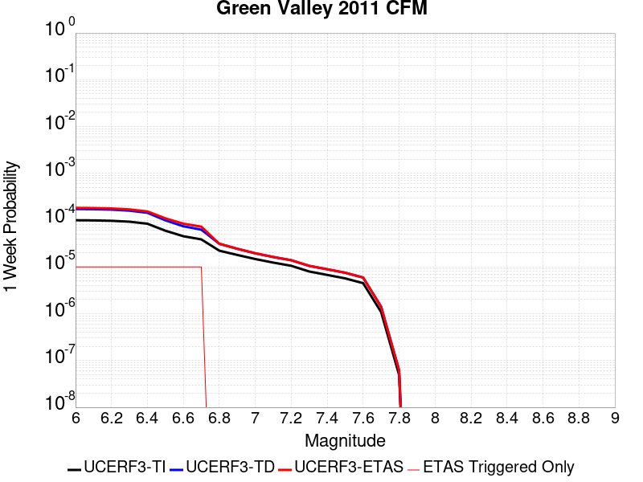 | 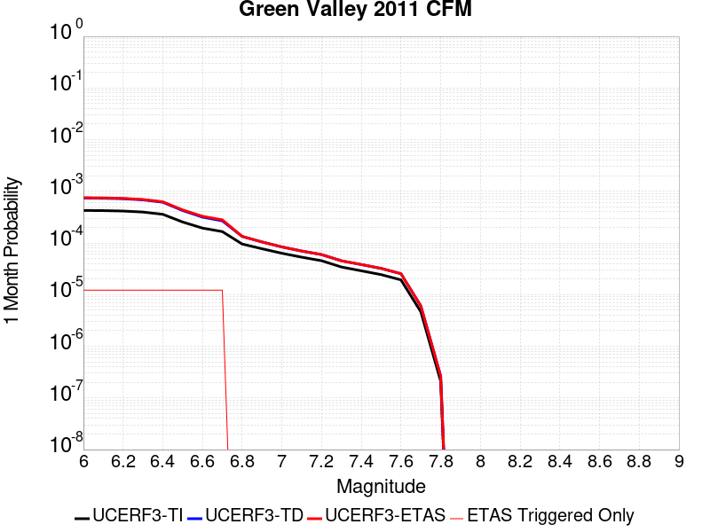 | 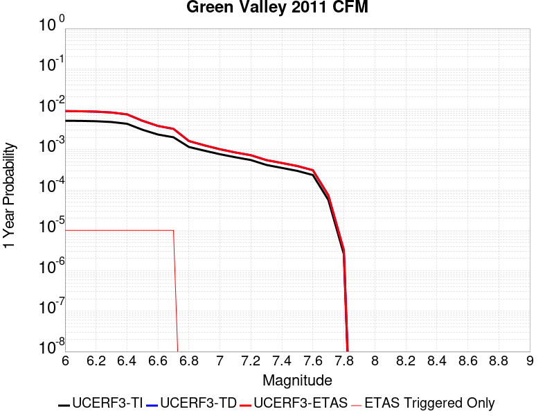 |  |

| Magnitude | 1 wk TI Prob | 1 wk TD Prob | 1 wk ETAS Prob | 1 wk ETAS/TD Gain | 1 wk ETAS Triggered Only | 1 mo TI Prob | 1 mo TD Prob | 1 mo ETAS Prob | 1 mo ETAS/TD Gain | 1 mo ETAS Triggered Only | 1 yr TI Prob | 1 yr TD Prob | 1 yr ETAS Prob | 1 yr ETAS/TD Gain | 1 yr ETAS Triggered Only | 10 yr TI Prob | 10 yr TD Prob | 10 yr ETAS Prob | 10 yr ETAS/TD Gain | 10 yr ETAS Triggered Only |
|-----|-----|-----|-----|-----|-----|-----|-----|-----|-----|-----|-----|-----|-----|-----|-----|-----|-----|-----|-----|-----|
| 6.0 | 9.9629346E-5 | 1.7302863E-4 | 1.8302689E-4 | 1.057784 | 1.0E-5 | 4.2691303E-4 | 7.41326E-4 | 7.513186E-4 | 1.0134794 | 1.0E-5 | 0.0051852856 | 0.00898692 | 0.008996829 | 1.0011027 | 1.0E-5 | 0.050659515 | 0.08553951 | 0.085548654 | 1.0001069 | 1.0E-5 |
| 6.1 | 9.88615E-5 | 1.7150163E-4 | 1.8149991E-4 | 1.0582985 | 1.0E-5 | 4.2362334E-4 | 7.347854E-4 | 7.447781E-4 | 1.0135994 | 1.0E-5 | 0.0051454236 | 0.008907947 | 0.008917858 | 1.0011126 | 1.0E-5 | 0.050279044 | 0.08482712 | 0.08483627 | 1.0001079 | 1.0E-5 |
| 6.2 | 9.696895E-5 | 1.6789208E-4 | 1.7789041E-4 | 1.0595521 | 1.0E-5 | 4.15515E-4 | 7.1932544E-4 | 7.2931824E-4 | 1.0138919 | 1.0E-5 | 0.0050471667 | 0.00872133 | 0.008731242 | 1.0011367 | 1.0E-5 | 0.04934063 | 0.08313578 | 0.083144955 | 1.0001103 | 1.0E-5 |
| 6.3 | 9.275224E-5 | 1.5968543E-4 | 1.6968383E-4 | 1.0626131 | 1.0E-5 | 3.9744904E-4 | 6.841728E-4 | 6.9416594E-4 | 1.0146062 | 1.0E-5 | 0.0048282105 | 0.008296652 | 0.0083065685 | 1.0011953 | 1.0E-5 | 0.047246475 | 0.07927481 | 0.07928401 | 1.0001161 | 1.0E-5 |
| 6.4 | 8.391499E-5 | 1.4365884E-4 | 1.536574E-4 | 1.0695994 | 1.0E-5 | 3.595861E-4 | 6.155238E-4 | 6.255176E-4 | 1.0162363 | 1.0E-5 | 0.004369175 | 0.007467181 | 0.007477106 | 1.0013292 | 1.0E-5 | 0.04284265 | 0.07164672 | 0.071656 | 1.0001296 | 1.0E-5 |
| 6.5 | 5.9519385E-5 | 9.932622E-5 | 1.0932523E-4 | 1.1006683 | 1.0E-5 | 2.5505814E-4 | 4.2560388E-4 | 4.3559962E-4 | 1.023486 | 1.0E-5 | 0.0031009112 | 0.005168341 | 0.0051782895 | 1.0019249 | 1.0E-5 | 0.030579966 | 0.05014692 | 0.05015642 | 1.0001894 | 1.0E-5 |
| 6.6 | 4.5361558E-5 | 7.4019794E-5 | 8.4019055E-5 | 1.135089 | 1.0E-5 | 1.9439218E-4 | 3.1717744E-4 | 3.2717426E-4 | 1.0315181 | 1.0E-5 | 0.0023641558 | 0.0038538678 | 0.0038638292 | 1.0025848 | 1.0E-5 | 0.023391623 | 0.03766727 | 0.037676893 | 1.0002555 | 1.0E-5 |
| 6.7 | 3.8808106E-5 | 6.264382E-5 | 7.264319E-5 | 1.1596227 | 1.0E-5 | 1.6630985E-4 | 2.6843755E-4 | 2.7843486E-4 | 1.0372427 | 1.0E-5 | 0.0020229418 | 0.0032627317 | 0.003272699 | 1.0030549 | 1.0E-5 | 0.020046256 | 0.032007415 | 0.032017097 | 1.0003024 | 1.0E-5 |
| 6.8 | 2.2284667E-5 | 3.128574E-5 | 3.128574E-5 | 1.0 | 0.0 | 9.550222E-5 | 1.3407487E-4 | 1.3407487E-4 | 1.0 | 0.0 | 0.0011621192 | 0.0016311383 | 0.0016311383 | 1.0 | 0.0 | 0.011560607 | 0.01616672 | 0.01616672 | 1.0 | 0.0 |
| 6.9 | 1.8050168E-5 | 2.4448536E-5 | 2.4448536E-5 | 1.0 | 0.0 | 7.735557E-5 | 1.0477527E-4 | 1.0477527E-4 | 1.0 | 0.0 | 9.4139716E-4 | 0.0012748954 | 0.0012748954 | 1.0 | 0.0 | 0.009374191 | 0.012669067 | 0.012669067 | 1.0 | 0.0 |
| 7.0 | 1.4763166E-5 | 1.9583236E-5 | 1.9583236E-5 | 1.0 | 0.0 | 6.326917E-5 | 8.3925464E-5 | 8.3925464E-5 | 1.0 | 0.0 | 7.7002996E-4 | 0.001021315 | 0.001021315 | 1.0 | 0.0 | 0.007673672 | 0.01016625 | 0.01016625 | 1.0 | 0.0 |
| 7.1 | 1.2399713E-5 | 1.6304042E-5 | 1.6304042E-5 | 1.0 | 0.0 | 5.3140546E-5 | 6.987261E-5 | 6.987261E-5 | 1.0 | 0.0 | 6.467941E-4 | 8.5036893E-4 | 8.5036893E-4 | 1.0 | 0.0 | 0.006449148 | 0.008471781 | 0.008471781 | 1.0 | 0.0 |
| 7.2 | 1.0584195E-5 | 1.39220465E-5 | 1.39220465E-5 | 1.0 | 0.0 | 4.5360044E-5 | 5.966456E-5 | 5.966456E-5 | 1.0 | 0.0 | 5.521186E-4 | 7.2617555E-4 | 7.2617555E-4 | 1.0 | 0.0 | 0.0055074887 | 0.0072386027 | 0.0072386027 | 1.0 | 0.0 |
| 7.3 | 7.998173E-6 | 1.0544255E-5 | 1.0544255E-5 | 1.0 | 0.0 | 3.4277433E-5 | 4.5188888E-5 | 4.5188888E-5 | 1.0 | 0.0 | 4.1724785E-4 | 5.500369E-4 | 5.500369E-4 | 1.0 | 0.0 | 0.004164653 | 0.005487135 | 0.005487135 | 1.0 | 0.0 |
| 7.4 | 6.7571127E-6 | 8.932903E-6 | 8.932903E-6 | 1.0 | 0.0 | 2.8958733E-5 | 3.8283313E-5 | 3.8283313E-5 | 1.0 | 0.0 | 3.5251552E-4 | 4.660006E-4 | 4.660006E-4 | 1.0 | 0.0 | 0.0035195686 | 0.004650633 | 0.004650633 | 1.0 | 0.0 |
| 7.5 | 5.69878E-6 | 7.516483E-6 | 7.516483E-6 | 1.0 | 0.0 | 2.4423114E-5 | 3.2213105E-5 | 3.2213105E-5 | 1.0 | 0.0 | 2.9731085E-4 | 3.9212484E-4 | 3.9212484E-4 | 1.0 | 0.0 | 0.002969134 | 0.0039147018 | 0.0039147018 | 1.0 | 0.0 |
| 7.6 | 4.503664E-6 | 5.9358217E-6 | 5.9358217E-6 | 1.0 | 0.0 | 1.9301275E-5 | 2.5438992E-5 | 2.5438992E-5 | 1.0 | 0.0 | 2.3496768E-4 | 3.0967654E-4 | 3.0967654E-4 | 1.0 | 0.0 | 0.002347194 | 0.0030927279 | 0.0030927279 | 1.0 | 0.0 |
| 7.7 | 1.0873546E-6 | 1.410754E-6 | 1.410754E-6 | 1.0 | 0.0 | 4.6600826E-6 | 6.0460743E-6 | 6.0460743E-6 | 1.0 | 0.0 | 5.6735033E-5 | 7.36085E-5 | 7.36085E-5 | 1.0 | 0.0 | 5.672055E-4 | 7.3587085E-4 | 7.3587085E-4 | 1.0 | 0.0 |
| 7.8 | 4.9373917E-8 | 6.177967E-8 | 6.177967E-8 | 1.0 | 0.0 | 2.1160248E-7 | 2.6477002E-7 | 2.6477002E-7 | 1.0 | 0.0 | 2.5762572E-6 | 3.2235714E-6 | 3.2235714E-6 | 1.0 | 0.0 | 2.5762274E-5 | 3.2228E-5 | 3.2228E-5 | 1.0 | 0.0 |

## Big Lagoon - Bald Mtn 2011 CFM
*[(top)](#table-of-contents)*

| 1 Week | 1 Month | 1 Year | 10 Year |
|-----|-----|-----|-----|
|  |  |  |  |

| Magnitude | 1 wk TI Prob | 1 wk TD Prob | 1 wk ETAS Prob | 1 wk ETAS/TD Gain | 1 wk ETAS Triggered Only | 1 mo TI Prob | 1 mo TD Prob | 1 mo ETAS Prob | 1 mo ETAS/TD Gain | 1 mo ETAS Triggered Only | 1 yr TI Prob | 1 yr TD Prob | 1 yr ETAS Prob | 1 yr ETAS/TD Gain | 1 yr ETAS Triggered Only | 10 yr TI Prob | 10 yr TD Prob | 10 yr ETAS Prob | 10 yr ETAS/TD Gain | 10 yr ETAS Triggered Only |
|-----|-----|-----|-----|-----|-----|-----|-----|-----|-----|-----|-----|-----|-----|-----|-----|-----|-----|-----|-----|-----|
| 6.0 | 1.8699735E-5 | 1.985018E-5 | 2.9849982E-5 | 1.5037638 | 1.0E-5 | 8.013926E-5 | 8.5069645E-5 | 9.506879E-5 | 1.1175407 | 1.0E-5 | 9.752587E-4 | 0.0010352687 | 0.0010452583 | 1.0096493 | 1.0E-5 | 0.009709897 | 0.010308274 | 0.010318171 | 1.0009601 | 1.0E-5 |
| 6.1 | 1.8699735E-5 | 1.985018E-5 | 2.9849982E-5 | 1.5037638 | 1.0E-5 | 8.013926E-5 | 8.5069645E-5 | 9.506879E-5 | 1.1175407 | 1.0E-5 | 9.752587E-4 | 0.0010352687 | 0.0010452583 | 1.0096493 | 1.0E-5 | 0.009709897 | 0.010308274 | 0.010318171 | 1.0009601 | 1.0E-5 |
| 6.2 | 1.8699735E-5 | 1.985018E-5 | 2.9849982E-5 | 1.5037638 | 1.0E-5 | 8.013926E-5 | 8.5069645E-5 | 9.506879E-5 | 1.1175407 | 1.0E-5 | 9.752587E-4 | 0.0010352687 | 0.0010452583 | 1.0096493 | 1.0E-5 | 0.009709897 | 0.010308274 | 0.010318171 | 1.0009601 | 1.0E-5 |
| 6.3 | 1.8699735E-5 | 1.985018E-5 | 2.9849982E-5 | 1.5037638 | 1.0E-5 | 8.013926E-5 | 8.5069645E-5 | 9.506879E-5 | 1.1175407 | 1.0E-5 | 9.752587E-4 | 0.0010352687 | 0.0010452583 | 1.0096493 | 1.0E-5 | 0.009709897 | 0.010308274 | 0.010318171 | 1.0009601 | 1.0E-5 |
| 6.4 | 1.8699735E-5 | 1.985018E-5 | 2.9849982E-5 | 1.5037638 | 1.0E-5 | 8.013926E-5 | 8.5069645E-5 | 9.506879E-5 | 1.1175407 | 1.0E-5 | 9.752587E-4 | 0.0010352687 | 0.0010452583 | 1.0096493 | 1.0E-5 | 0.009709897 | 0.010308274 | 0.010318171 | 1.0009601 | 1.0E-5 |
| 6.5 | 1.8699735E-5 | 1.985018E-5 | 2.9849982E-5 | 1.5037638 | 1.0E-5 | 8.013926E-5 | 8.5069645E-5 | 9.506879E-5 | 1.1175407 | 1.0E-5 | 9.752587E-4 | 0.0010352687 | 0.0010452583 | 1.0096493 | 1.0E-5 | 0.009709897 | 0.010308274 | 0.010318171 | 1.0009601 | 1.0E-5 |
| 6.6 | 1.8699735E-5 | 1.985018E-5 | 2.9849982E-5 | 1.5037638 | 1.0E-5 | 8.013926E-5 | 8.5069645E-5 | 9.506879E-5 | 1.1175407 | 1.0E-5 | 9.752587E-4 | 0.0010352687 | 0.0010452583 | 1.0096493 | 1.0E-5 | 0.009709897 | 0.010308274 | 0.010318171 | 1.0009601 | 1.0E-5 |
| 6.7 | 1.8699735E-5 | 1.985018E-5 | 2.9849982E-5 | 1.5037638 | 1.0E-5 | 8.013926E-5 | 8.5069645E-5 | 9.506879E-5 | 1.1175407 | 1.0E-5 | 9.752587E-4 | 0.0010352687 | 0.0010452583 | 1.0096493 | 1.0E-5 | 0.009709897 | 0.010308274 | 0.010318171 | 1.0009601 | 1.0E-5 |
| 6.8 | 1.18505095E-5 | 1.2499804E-5 | 1.2499804E-5 | 1.0 | 0.0 | 5.078691E-5 | 5.3569514E-5 | 5.3569514E-5 | 1.0 | 0.0 | 6.181552E-4 | 6.520185E-4 | 6.520185E-4 | 1.0 | 0.0 | 0.006164385 | 0.0065015587 | 0.0065015587 | 1.0 | 0.0 |
| 6.9 | 1.18505095E-5 | 1.2499804E-5 | 1.2499804E-5 | 1.0 | 0.0 | 5.078691E-5 | 5.3569514E-5 | 5.3569514E-5 | 1.0 | 0.0 | 6.181552E-4 | 6.520185E-4 | 6.520185E-4 | 1.0 | 0.0 | 0.006164385 | 0.0065015587 | 0.0065015587 | 1.0 | 0.0 |
| 7.0 | 9.719786E-6 | 1.0235487E-5 | 1.0235487E-5 | 1.0 | 0.0 | 4.1655563E-5 | 4.386565E-5 | 4.386565E-5 | 1.0 | 0.0 | 5.0703844E-4 | 5.3393573E-4 | 5.3393573E-4 | 1.0 | 0.0 | 0.005058831 | 0.0053267754 | 0.0053267754 | 1.0 | 0.0 |
| 7.1 | 8.523418E-6 | 8.969463E-6 | 8.969463E-6 | 1.0 | 0.0 | 3.652842E-5 | 3.844E-5 | 3.844E-5 | 1.0 | 0.0 | 4.4464276E-4 | 4.6790804E-4 | 4.6790804E-4 | 1.0 | 0.0 | 0.0044375416 | 0.004669392 | 0.004669392 | 1.0 | 0.0 |
| 7.2 | 7.378894E-6 | 7.761112E-6 | 7.761112E-6 | 1.0 | 0.0 | 3.162345E-5 | 3.326149E-5 | 3.326149E-5 | 1.0 | 0.0 | 3.8494746E-4 | 4.048843E-4 | 4.048843E-4 | 1.0 | 0.0 | 0.0038428132 | 0.0040415623 | 0.0040415623 | 1.0 | 0.0 |
| 7.3 | 6.4640294E-6 | 6.7924434E-6 | 6.7924434E-6 | 1.0 | 0.0 | 2.7702688E-5 | 2.9110151E-5 | 2.9110151E-5 | 1.0 | 0.0 | 3.3722803E-4 | 3.5435913E-4 | 3.5435913E-4 | 1.0 | 0.0 | 0.0033671674 | 0.0035380109 | 0.0035380109 | 1.0 | 0.0 |
| 7.4 | 5.9959093E-6 | 6.2988E-6 | 6.2988E-6 | 1.0 | 0.0 | 2.5696501E-5 | 2.6994581E-5 | 2.6994581E-5 | 1.0 | 0.0 | 3.1280998E-4 | 3.2861007E-4 | 3.2861007E-4 | 1.0 | 0.0 | 0.0031237002 | 0.0032813034 | 0.0032813034 | 1.0 | 0.0 |
| 7.5 | 4.929265E-6 | 5.176396E-6 | 5.176396E-6 | 1.0 | 0.0 | 2.112525E-5 | 2.2184367E-5 | 2.2184367E-5 | 1.0 | 0.0 | 2.5716957E-4 | 2.700616E-4 | 2.700616E-4 | 1.0 | 0.0 | 0.0025687215 | 0.002697375 | 0.002697375 | 1.0 | 0.0 |
| 7.6 | 3.8982403E-6 | 4.0889267E-6 | 4.0889267E-6 | 1.0 | 0.0 | 1.6706637E-5 | 1.7523857E-5 | 1.7523857E-5 | 1.0 | 0.0 | 2.0338432E-4 | 2.1333233E-4 | 2.1333233E-4 | 1.0 | 0.0 | 0.0020319829 | 0.002131303 | 0.002131303 | 1.0 | 0.0 |
| 7.7 | 2.820968E-6 | 2.9572116E-6 | 2.9572116E-6 | 1.0 | 0.0 | 1.2089806E-5 | 1.2673704E-5 | 1.2673704E-5 | 1.0 | 0.0 | 1.4718344E-4 | 1.5429159E-4 | 1.5429159E-4 | 1.0 | 0.0 | 0.00147086 | 0.0015418624 | 0.0015418624 | 1.0 | 0.0 |
| 7.8 | 1.9314455E-6 | 2.0260186E-6 | 2.0260186E-6 | 1.0 | 0.0 | 8.277597E-6 | 8.682909E-6 | 8.682909E-6 | 1.0 | 0.0 | 1.0077508E-4 | 1.0570941E-4 | 1.0570941E-4 | 1.0 | 0.0 | 0.0010072939 | 0.0010566041 | 0.0010566041 | 1.0 | 0.0 |
| 7.9 | 4.9586197E-7 | 5.2189216E-7 | 5.2189216E-7 | 1.0 | 0.0 | 2.125121E-6 | 2.2366787E-6 | 2.2366787E-6 | 1.0 | 0.0 | 2.5873042E-5 | 2.7231245E-5 | 2.7231245E-5 | 1.0 | 0.0 | 2.5870028E-4 | 2.7228118E-4 | 2.7228118E-4 | 1.0 | 0.0 |

## Cleghorn
*[(top)](#table-of-contents)*

| 1 Week | 1 Month | 1 Year | 10 Year |
|-----|-----|-----|-----|
|  |  | 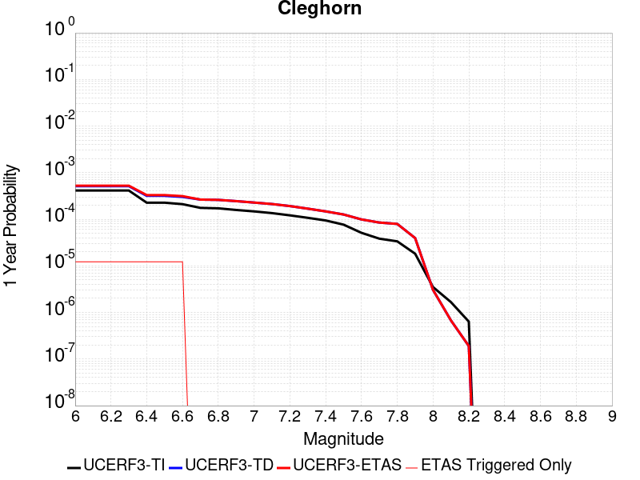 | 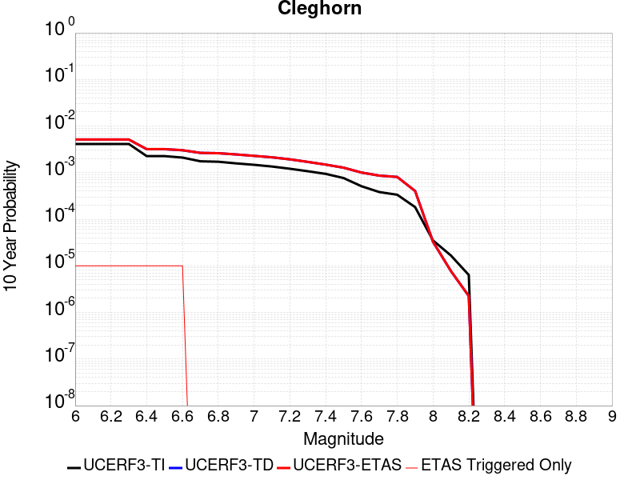 |

| Magnitude | 1 wk TI Prob | 1 wk TD Prob | 1 wk ETAS Prob | 1 wk ETAS/TD Gain | 1 wk ETAS Triggered Only | 1 mo TI Prob | 1 mo TD Prob | 1 mo ETAS Prob | 1 mo ETAS/TD Gain | 1 mo ETAS Triggered Only | 1 yr TI Prob | 1 yr TD Prob | 1 yr ETAS Prob | 1 yr ETAS/TD Gain | 1 yr ETAS Triggered Only | 10 yr TI Prob | 10 yr TD Prob | 10 yr ETAS Prob | 10 yr ETAS/TD Gain | 10 yr ETAS Triggered Only |
|-----|-----|-----|-----|-----|-----|-----|-----|-----|-----|-----|-----|-----|-----|-----|-----|-----|-----|-----|-----|-----|
| 6.0 | 7.9267165E-6 | 9.831764E-6 | 9.831764E-6 | 1.0 | 0.0 | 3.39712E-5 | 4.2135514E-5 | 4.2135514E-5 | 1.0 | 0.0 | 4.1352084E-4 | 5.1288976E-4 | 5.228846E-4 | 1.0194874 | 1.0E-5 | 0.004127522 | 0.005132214 | 0.005142163 | 1.0019385 | 1.0E-5 |
| 6.1 | 7.9267165E-6 | 9.831764E-6 | 9.831764E-6 | 1.0 | 0.0 | 3.39712E-5 | 4.2135514E-5 | 4.2135514E-5 | 1.0 | 0.0 | 4.1352084E-4 | 5.1288976E-4 | 5.228846E-4 | 1.0194874 | 1.0E-5 | 0.004127522 | 0.005132214 | 0.005142163 | 1.0019385 | 1.0E-5 |
| 6.2 | 7.9267165E-6 | 9.831764E-6 | 9.831764E-6 | 1.0 | 0.0 | 3.39712E-5 | 4.2135514E-5 | 4.2135514E-5 | 1.0 | 0.0 | 4.1352084E-4 | 5.1288976E-4 | 5.228846E-4 | 1.0194874 | 1.0E-5 | 0.004127522 | 0.005132214 | 0.005142163 | 1.0019385 | 1.0E-5 |
| 6.3 | 7.9267165E-6 | 9.831764E-6 | 9.831764E-6 | 1.0 | 0.0 | 3.39712E-5 | 4.2135514E-5 | 4.2135514E-5 | 1.0 | 0.0 | 4.1352084E-4 | 5.1288976E-4 | 5.228846E-4 | 1.0194874 | 1.0E-5 | 0.004127522 | 0.005132214 | 0.005142163 | 1.0019385 | 1.0E-5 |
| 6.4 | 4.3445207E-6 | 6.0916254E-6 | 6.0916254E-6 | 1.0 | 0.0 | 1.8619241E-5 | 2.6106709E-5 | 2.6106709E-5 | 1.0 | 0.0 | 2.2666567E-4 | 3.1780385E-4 | 3.2780066E-4 | 1.031456 | 1.0E-5 | 0.0022643462 | 0.0031877246 | 0.0031976928 | 1.003127 | 1.0E-5 |
| 6.5 | 4.3445207E-6 | 6.0916254E-6 | 6.0916254E-6 | 1.0 | 0.0 | 1.8619241E-5 | 2.6106709E-5 | 2.6106709E-5 | 1.0 | 0.0 | 2.2666567E-4 | 3.1780385E-4 | 3.2780066E-4 | 1.031456 | 1.0E-5 | 0.0022643462 | 0.0031877246 | 0.0031976928 | 1.003127 | 1.0E-5 |
| 6.6 | 4.040109E-6 | 5.774033E-6 | 5.774033E-6 | 1.0 | 0.0 | 1.7314638E-5 | 2.4745626E-5 | 2.4745626E-5 | 1.0 | 0.0 | 2.1078532E-4 | 3.0123728E-4 | 3.1123427E-4 | 1.0331864 | 1.0E-5 | 0.002105855 | 0.0030225143 | 0.003032484 | 1.0032985 | 1.0E-5 |
| 6.7 | 3.3632055E-6 | 5.06753E-6 | 5.06753E-6 | 1.0 | 0.0 | 1.4413658E-5 | 2.1717806E-5 | 2.1717806E-5 | 1.0 | 0.0 | 1.7547216E-4 | 2.643825E-4 | 2.643825E-4 | 1.0 | 0.0 | 0.0017533366 | 0.0026548486 | 0.0026548486 | 1.0 | 0.0 |
| 6.8 | 3.2902772E-6 | 4.9894375E-6 | 4.9894375E-6 | 1.0 | 0.0 | 1.4101111E-5 | 2.138313E-5 | 2.138313E-5 | 1.0 | 0.0 | 1.716675E-4 | 2.6030882E-4 | 2.6030882E-4 | 1.0 | 0.0 | 0.0017153495 | 0.0026142076 | 0.0026142076 | 1.0 | 0.0 |
| 6.9 | 3.031547E-6 | 4.6911987E-6 | 4.6911987E-6 | 1.0 | 0.0 | 1.299228E-5 | 2.0104984E-5 | 2.0104984E-5 | 1.0 | 0.0 | 1.5816953E-4 | 2.4475096E-4 | 2.4475096E-4 | 1.0 | 0.0 | 0.00158057 | 0.0024589805 | 0.0024589805 | 1.0 | 0.0 |
| 7.0 | 2.8259715E-6 | 4.3707637E-6 | 4.3707637E-6 | 1.0 | 0.0 | 1.211125E-5 | 1.8731711E-5 | 1.8731711E-5 | 1.0 | 0.0 | 1.4744449E-4 | 2.2803496E-4 | 2.2803496E-4 | 1.0 | 0.0 | 0.001473467 | 0.0022921748 | 0.0022921748 | 1.0 | 0.0 |
| 7.1 | 2.5962665E-6 | 4.065983E-6 | 4.065983E-6 | 1.0 | 0.0 | 1.1126809E-5 | 1.7425526E-5 | 1.7425526E-5 | 1.0 | 0.0 | 1.3546048E-4 | 2.1213535E-4 | 2.1213535E-4 | 1.0 | 0.0 | 0.0013537793 | 0.0021334959 | 0.0021334959 | 1.0 | 0.0 |
| 7.2 | 2.3247253E-6 | 3.6765352E-6 | 3.6765352E-6 | 1.0 | 0.0 | 9.96307E-6 | 1.5756486E-5 | 1.5756486E-5 | 1.0 | 0.0 | 1.21293626E-4 | 1.9181852E-4 | 1.9181852E-4 | 1.0 | 0.0 | 0.0012122744 | 0.0019307166 | 0.0019307166 | 1.0 | 0.0 |
| 7.3 | 2.056928E-6 | 3.235253E-6 | 3.235253E-6 | 1.0 | 0.0 | 8.815376E-6 | 1.3865297E-5 | 1.3865297E-5 | 1.0 | 0.0 | 1.0732192E-4 | 1.6879707E-4 | 1.6879707E-4 | 1.0 | 0.0 | 0.001072701 | 0.0017009423 | 0.0017009423 | 1.0 | 0.0 |
| 7.4 | 1.8055999E-6 | 2.8256538E-6 | 2.8256538E-6 | 1.0 | 0.0 | 7.738263E-6 | 1.210989E-5 | 1.210989E-5 | 1.0 | 0.0 | 9.4209274E-5 | 1.4742807E-4 | 1.4742807E-4 | 1.0 | 0.0 | 9.4169343E-4 | 0.0014876705 | 0.0014876705 | 1.0 | 0.0 |
| 7.5 | 1.4683443E-6 | 2.4248943E-6 | 2.4248943E-6 | 1.0 | 0.0 | 6.292889E-6 | 1.0392363E-5 | 1.0392363E-5 | 1.0 | 0.0 | 7.661323E-5 | 1.2651978E-4 | 1.2651978E-4 | 1.0 | 0.0 | 7.658682E-4 | 0.0012788812 | 0.0012788812 | 1.0 | 0.0 |
| 7.6 | 9.804088E-7 | 1.9004091E-6 | 1.9004091E-6 | 1.0 | 0.0 | 4.201745E-6 | 8.144585E-6 | 8.144585E-6 | 1.0 | 0.0 | 5.1155046E-5 | 9.915586E-5 | 9.915586E-5 | 1.0 | 0.0 | 5.114327E-4 | 0.0010055583 | 0.0010055583 | 1.0 | 0.0 |
| 7.7 | 7.3434086E-7 | 1.6285549E-6 | 1.6285549E-6 | 1.0 | 0.0 | 3.1471714E-6 | 6.9795024E-6 | 6.9795024E-6 | 1.0 | 0.0 | 3.831614E-5 | 8.4972155E-5 | 8.4972155E-5 | 1.0 | 0.0 | 3.8309532E-4 | 8.6387293E-4 | 8.6387293E-4 | 1.0 | 0.0 |
| 7.8 | 6.434184E-7 | 1.5221389E-6 | 1.5221389E-6 | 1.0 | 0.0 | 2.7575045E-6 | 6.523436E-6 | 6.523436E-6 | 1.0 | 0.0 | 3.35721E-5 | 7.9419966E-5 | 7.9419966E-5 | 1.0 | 0.0 | 3.3567028E-4 | 8.080443E-4 | 8.080443E-4 | 1.0 | 0.0 |
| 7.9 | 3.4943926E-7 | 7.5750586E-7 | 7.5750586E-7 | 1.0 | 0.0 | 1.497596E-6 | 3.2464498E-6 | 3.2464498E-6 | 1.0 | 0.0 | 1.8233079E-5 | 3.9524817E-5 | 3.9524817E-5 | 1.0 | 0.0 | 1.8231584E-4 | 4.0401975E-4 | 4.0401975E-4 | 1.0 | 0.0 |
| 8.0 | 6.717524E-8 | 5.837515E-8 | 5.837515E-8 | 1.0 | 0.0 | 2.8789387E-7 | 2.501792E-7 | 2.501792E-7 | 1.0 | 0.0 | 3.505102E-6 | 3.0459275E-6 | 3.0459275E-6 | 1.0 | 0.0 | 3.5050467E-5 | 3.2751934E-5 | 3.2751934E-5 | 1.0 | 0.0 |
| 8.1 | 3.1984914E-8 | 1.2949885E-8 | 1.2949885E-8 | 1.0 | 0.0 | 1.370782E-7 | 5.549951E-8 | 5.549951E-8 | 1.0 | 0.0 | 1.6689258E-6 | 6.757063E-7 | 6.757063E-7 | 1.0 | 0.0 | 1.6689133E-5 | 7.741151E-6 | 7.741151E-6 | 1.0 | 0.0 |
| 8.2 | 1.21887656E-8 | 3.6471115E-9 | 3.6471115E-9 | 1.0 | 0.0 | 5.2237567E-8 | 1.563048E-8 | 1.563048E-8 | 1.0 | 0.0 | 6.359922E-7 | 1.9030107E-7 | 1.9030107E-7 | 1.0 | 0.0 | 6.3599036E-6 | 2.245849E-6 | 2.245849E-6 | 1.0 | 0.0 |

