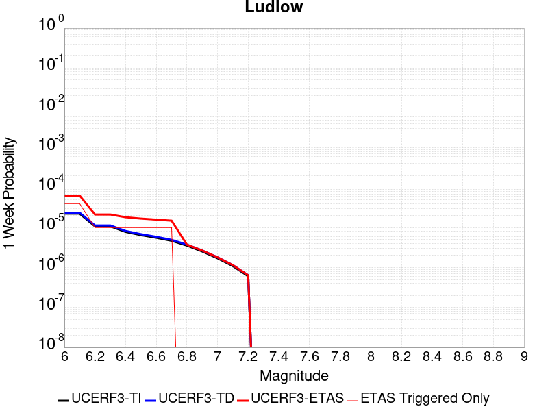
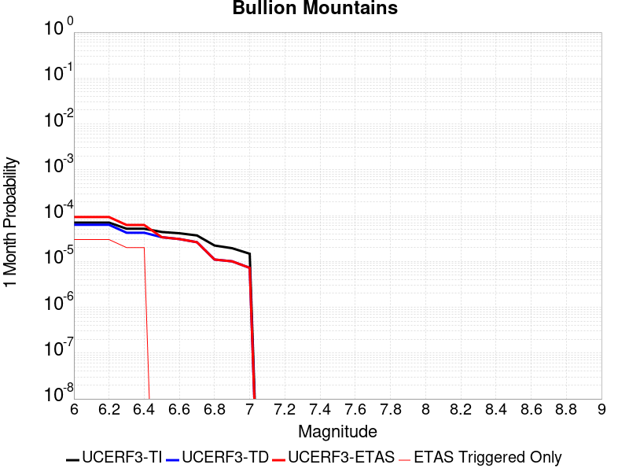
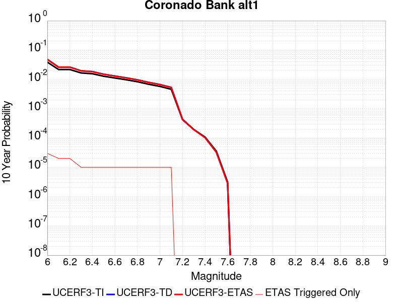

# Parent Section Magnitude-Probability Distributions

Only fault sections with at least one triggered aftershock are plotted. Sections are sorted by total supraseismogenic trigger rate (decreasing)

## Table Of Contents

* [Garlock (Central)](#garlock-central)
* [Tank Canyon](#tank-canyon)
* [Little Lake](#little-lake)
* [Airport Lake](#airport-lake)
* [Owl Lake](#owl-lake)
* [Panamint Valley](#panamint-valley)
* [Garlock (East)](#garlock-east)
* [Hunter Mountain-Saline Valley](#hunter-mountain-saline-valley)
* [Garlock (West)](#garlock-west)
* [Blackwater](#blackwater)
* [Gravel Hills-Harper Lk](#gravel-hills-harper-lk)
* [Ash Hill](#ash-hill)
* [McLean Lake](#mclean-lake)
* [San Andreas (Mojave S)](#san-andreas-mojave-s)
* [San Andreas (Mojave N)](#san-andreas-mojave-n)
* [So Sierra Nevada](#so-sierra-nevada)
* [Death Valley (So)](#death-valley-so)
* [Nelson Lake](#nelson-lake)
* [Goldstone Lake](#goldstone-lake)
* [Lenwood-Lockhart-Old Woman Springs](#lenwood-lockhart-old-woman-springs)
* [Towne Pass](#towne-pass)
* [Coyote Canyon](#coyote-canyon)
* [Death Valley (Black Mtns Frontal)](#death-valley-black-mtns-frontal)
* [Helendale-So Lockhart](#helendale-so-lockhart)
* [San Andreas (Big Bend)](#san-andreas-big-bend)
* [Paradise](#paradise)
* [Bicycle Lake](#bicycle-lake)
* [Garlic Springs](#garlic-springs)
* [San Andreas (San Bernardino N)](#san-andreas-san-bernardino-n)
* [Calico-Hidalgo](#calico-hidalgo)
* [Baker](#baker)
* [San Andreas (Parkfield)](#san-andreas-parkfield)
* [San Andreas (Carrizo) rev](#san-andreas-carrizo-rev)
* [Coyote Lake](#coyote-lake)
* [Red Pass](#red-pass)
* [White Wolf (Extension)](#white-wolf-extension)
* [Death Valley (No)](#death-valley-no)
* [Santa Ynez (West)](#santa-ynez-west)
* [San Jacinto (San Bernardino)](#san-jacinto-san-bernardino)
* [Ludlow](#ludlow)
* [San Andreas (Cholame) rev](#san-andreas-cholame-rev)
* [Bullion Mountains](#bullion-mountains)
* [Lake Isabella (Seismicity)](#lake-isabella-seismicity)
* [Scodie Lineament](#scodie-lineament)
* [San Andreas (Coachella) rev](#san-andreas-coachella-rev)
* [San Pedro Basin](#san-pedro-basin)
* [Deep Springs](#deep-springs)
* [Lost Hills](#lost-hills)
* [Coronado Bank alt1](#coronado-bank-alt1)
* [Cleghorn Lake](#cleghorn-lake)
* [Mission Ridge-Arroyo Parida-Santa Ana](#mission-ridge-arroyo-parida-santa-ana)
* [Santa Ynez (East)](#santa-ynez-east)
* [Camp Rock 2011](#camp-rock-2011)
* [San Jacinto (Clark) rev](#san-jacinto-clark-rev)
* [San Jacinto (Stepovers Combined)](#san-jacinto-stepovers-combined)
* [San Andreas (Creeping Section) 2011 CFM](#san-andreas-creeping-section-2011-cfm)
* [San Andreas (San Bernardino S)](#san-andreas-san-bernardino-s)
* [Pisgah-Bullion Mtn-Mesquite Lk](#pisgah-bullion-mtn-mesquite-lk)
* [San Jacinto (San Jacinto Valley) rev](#san-jacinto-san-jacinto-valley-rev)
* [Santa Cruz Catalina Ridge alt1](#santa-cruz-catalina-ridge-alt1)
* [Sierra Nevada  (No Extension)](#sierra-nevada--no-extension)
* [Santa Rosa Island](#santa-rosa-island)
* [San Andreas (North Branch Mill Creek)](#san-andreas-north-branch-mill-creek)
* [Elsinore (Glen Ivy) rev](#elsinore-glen-ivy-rev)
* [Surprise Valley 2011 CFM](#surprise-valley-2011-cfm)
* [Whittier alt 1](#whittier-alt-1)
* [San Jacinto (Anza) rev](#san-jacinto-anza-rev)
* [Hayward (No) 2011 CFM](#hayward-no-2011-cfm)
* [Palos Verdes](#palos-verdes)
* [Great Valley 05 Pittsburg - Kirby Hills alt1](#great-valley-05-pittsburg---kirby-hills-alt1)
* [Cleghorn Pass](#cleghorn-pass)
* [Pinto Mtn](#pinto-mtn)
* [San Andreas (San Gorgonio Pass-Garnet HIll)](#san-andreas-san-gorgonio-pass-garnet-hill)
* [Blue Cut](#blue-cut)
* [Rodgers Creek - Healdsburg 2011 CFM](#rodgers-creek---healdsburg-2011-cfm)
* [Mono Lake 2011 CFM](#mono-lake-2011-cfm)

## Garlock (Central)
*[(top)](#table-of-contents)*

| 1 Week | 1 Month | 1 Year | 10 Year |
|-----|-----|-----|-----|
|  |  |  |  |

| Magnitude | 1 wk TI Prob | 1 wk TD Prob | 1 wk ETAS Prob | 1 wk ETAS/TD Gain | 1 wk ETAS Triggered Only | 1 mo TI Prob | 1 mo TD Prob | 1 mo ETAS Prob | 1 mo ETAS/TD Gain | 1 mo ETAS Triggered Only | 1 yr TI Prob | 1 yr TD Prob | 1 yr ETAS Prob | 1 yr ETAS/TD Gain | 1 yr ETAS Triggered Only | 10 yr TI Prob | 10 yr TD Prob | 10 yr ETAS Prob | 10 yr ETAS/TD Gain | 10 yr ETAS Triggered Only |
|-----|-----|-----|-----|-----|-----|-----|-----|-----|-----|-----|-----|-----|-----|-----|-----|-----|-----|-----|-----|-----|
| 6.0 | 5.5131142E-5 | 7.024681E-5 | 0.06315494 | 899.0436 | 0.063089125 | 2.3625491E-4 | 3.010234E-4 | 0.0687825 | 228.49554 | 0.0685021 | 0.0028726095 | 0.0036588663 | 0.07925619 | 21.661407 | 0.07587494 | 0.028357591 | 0.036079824 | 0.11218589 | 3.10938 | 0.078954734 |
| 6.1 | 5.5131142E-5 | 7.024681E-5 | 0.06315494 | 899.0436 | 0.063089125 | 2.3625491E-4 | 3.010234E-4 | 0.0687825 | 228.49554 | 0.0685021 | 0.0028726095 | 0.0036588663 | 0.07925619 | 21.661407 | 0.07587494 | 0.028357591 | 0.036079824 | 0.11218589 | 3.10938 | 0.078954734 |
| 6.2 | 4.216245E-5 | 5.1661493E-5 | 0.038500447 | 745.2445 | 0.03845077 | 1.806837E-4 | 2.2138779E-4 | 0.041742757 | 188.55042 | 0.041530564 | 0.0021976046 | 0.0026920962 | 0.04829927 | 17.941137 | 0.045730285 | 0.021759989 | 0.026689773 | 0.07328876 | 2.745949 | 0.04787681 |
| 6.3 | 4.216245E-5 | 5.1661493E-5 | 0.038500447 | 745.2445 | 0.03845077 | 1.806837E-4 | 2.2138779E-4 | 0.041742757 | 188.55042 | 0.041530564 | 0.0021976046 | 0.0026920962 | 0.04829927 | 17.941137 | 0.045730285 | 0.021759989 | 0.026689773 | 0.07328876 | 2.745949 | 0.04787681 |
| 6.4 | 3.6858168E-5 | 4.411054E-5 | 0.028507624 | 646.2769 | 0.02846477 | 1.5795401E-4 | 1.8903162E-4 | 0.030887848 | 163.40042 | 0.03070462 | 0.0019213937 | 0.002299056 | 0.036098912 | 15.701623 | 0.03387774 | 0.019048655 | 0.02284894 | 0.057776503 | 2.5286295 | 0.035744283 |
| 6.5 | 3.39199E-5 | 4.0018083E-5 | 0.026170563 | 653.96844 | 0.02613159 | 1.453629E-4 | 1.7149492E-4 | 0.02844476 | 165.86357 | 0.028278114 | 0.0017683565 | 0.002085973 | 0.03300594 | 15.8228035 | 0.030984601 | 0.017543508 | 0.020759864 | 0.052837633 | 2.545182 | 0.032757815 |
| 6.6 | 3.3571985E-5 | 3.9472274E-5 | 0.026076708 | 660.6336 | 0.026038265 | 1.4387199E-4 | 1.6915603E-4 | 0.028349176 | 167.59187 | 0.028184788 | 0.0017502342 | 0.0020575512 | 0.032885265 | 15.98272 | 0.030891273 | 0.017365133 | 0.020481179 | 0.05247666 | 2.5621896 | 0.03266449 |
| 6.7 | 3.2580007E-5 | 3.8088703E-5 | 0.02523545 | 662.5442 | 0.02519832 | 1.3962112E-4 | 1.632272E-4 | 0.027316984 | 167.35559 | 0.02715819 | 0.0016985617 | 0.0019855013 | 0.031790882 | 16.011513 | 0.029864676 | 0.016856372 | 0.019773813 | 0.05060314 | 2.5590987 | 0.031451236 |
| 6.8 | 3.2185937E-5 | 3.7515918E-5 | 0.02495492 | 665.1821 | 0.024918338 | 1.3793244E-4 | 1.6077272E-4 | 0.026941348 | 167.57411 | 0.02678488 | 0.0016780337 | 0.001955672 | 0.031389363 | 16.050423 | 0.029491367 | 0.016654192 | 0.019480614 | 0.049861617 | 2.5595505 | 0.030984601 |
| 6.9 | 3.165394E-5 | 3.6720503E-5 | 0.024487525 | 666.8625 | 0.024451703 | 1.3565269E-4 | 1.5736422E-4 | 0.026471468 | 168.21783 | 0.026318245 | 0.0016503202 | 0.001914247 | 0.030883418 | 16.133455 | 0.029024731 | 0.01638118 | 0.019073246 | 0.048917588 | 2.5647228 | 0.030424638 |
| 7.0 | 3.0903822E-5 | 3.5625766E-5 | 0.024206486 | 679.4657 | 0.024171721 | 1.3243823E-4 | 1.5267303E-4 | 0.026186962 | 171.52316 | 0.026038265 | 0.0016112428 | 0.0018572307 | 0.030548595 | 16.448465 | 0.02874475 | 0.015996104 | 0.018512413 | 0.04809902 | 2.5982037 | 0.030144658 |
| 7.1 | 3.0069863E-5 | 3.4392073E-5 | 0.023458691 | 682.09595 | 0.023425104 | 1.2886449E-4 | 1.4738638E-4 | 0.025155365 | 170.67633 | 0.025011666 | 0.0015677959 | 0.0017929734 | 0.029088788 | 16.22377 | 0.027344843 | 0.01556781 | 0.017880075 | 0.046019208 | 2.5737705 | 0.028651424 |
| 7.2 | 2.7957109E-5 | 3.128145E-5 | 0.020842576 | 666.2918 | 0.020811945 | 1.1981068E-4 | 1.340566E-4 | 0.022436246 | 167.36398 | 0.02230518 | 0.0014577188 | 0.0016309366 | 0.02622911 | 16.082237 | 0.024638357 | 0.014481937 | 0.016283695 | 0.041438922 | 2.5448108 | 0.02557163 |
| 7.3 | 2.4519275E-5 | 2.6714795E-5 | 0.013932083 | 521.5119 | 0.013905739 | 1.0507837E-4 | 1.1448703E-4 | 0.014951799 | 130.59819 | 0.01483901 | 0.0012785783 | 0.001393003 | 0.017702498 | 12.708153 | 0.016332245 | 0.012712469 | 0.013928054 | 0.030677013 | 2.202534 | 0.016985534 |
| 7.4 | 2.3225532E-5 | 2.51994E-5 | 0.012904016 | 512.07635 | 0.012879142 | 9.95342E-5 | 1.0799304E-4 | 0.013918914 | 128.88715 | 0.0138124125 | 0.0012111551 | 0.0013140367 | 0.016506366 | 12.561572 | 0.015212319 | 0.012045753 | 0.013145725 | 0.02880277 | 2.191037 | 0.015865609 |
| 7.5 | 2.097765E-5 | 2.2483688E-5 | 0.01056821 | 470.039 | 0.010545963 | 8.9901114E-5 | 9.635517E-5 | 0.011387847 | 118.18616 | 0.0112925805 | 0.0010939965 | 0.0011725046 | 0.013570457 | 11.573904 | 0.012412506 | 0.010886264 | 0.011740365 | 0.024560532 | 2.0919735 | 0.0129724685 |
| 7.6 | 1.511254E-5 | 1.5991332E-5 | 0.0055222027 | 345.32474 | 0.0055062994 | 6.476642E-5 | 6.853253E-5 | 0.005854417 | 85.42538 | 0.005786281 | 7.882459E-4 | 8.3407195E-4 | 0.007361521 | 8.826002 | 0.0065328977 | 0.007854558 | 0.008383559 | 0.015139322 | 1.8058348 | 0.0068128794 |
| 7.7 | 9.934069E-6 | 1.0678794E-5 | 0.0015038967 | 140.8302 | 0.0014932338 | 4.2573887E-5 | 4.5765457E-5 | 0.0015389309 | 33.626472 | 0.0014932338 | 5.182138E-4 | 5.570524E-4 | 0.0022360047 | 4.0139933 | 0.001679888 | 0.00517007 | 0.005627684 | 0.007576524 | 1.3462952 | 0.0019598694 |
| 7.8 | 6.7562896E-6 | 8.428449E-6 | 0.0011283443 | 133.8733 | 0.0011199253 | 2.8955206E-5 | 3.6121426E-5 | 0.0011560064 | 32.00334 | 0.0011199253 | 3.5247262E-4 | 4.3968976E-4 | 0.0016524087 | 3.7581244 | 0.0012132524 | 0.0035191406 | 0.004446654 | 0.005654512 | 1.2716329 | 0.0012132524 |
| 7.9 | 3.975453E-6 | 5.37103E-6 | 3.7867748E-4 | 70.50369 | 3.7330846E-4 | 1.7037546E-5 | 2.3018498E-5 | 3.9631836E-4 | 17.217384 | 3.7330846E-4 | 2.0741238E-4 | 2.8021427E-4 | 6.5341813E-4 | 2.3318517 | 3.7330846E-4 | 0.002072189 | 0.0028336283 | 0.003205879 | 1.1313689 | 3.7330846E-4 |
| 8.0 | 1.6729537E-6 | 2.0775144E-6 | 2.8205826E-4 | 135.76718 | 2.7998132E-4 | 7.169782E-6 | 8.903603E-6 | 2.8888244E-4 | 32.445568 | 2.7998132E-4 | 8.7288594E-5 | 1.0839601E-4 | 3.88347E-4 | 3.5826688 | 2.7998132E-4 | 8.7254314E-4 | 0.0010969337 | 0.001376608 | 1.25496 | 2.7998132E-4 |
| 8.1 | 3.6733252E-7 | 3.1489964E-7 | 3.1489964E-7 | 1.0 | 0.0 | 1.5742813E-6 | 1.3495693E-6 | 1.3495693E-6 | 1.0 | 0.0 | 1.9166706E-5 | 1.6430899E-5 | 1.6430899E-5 | 1.0 | 0.0 | 1.9165053E-4 | 1.6638759E-4 | 1.6638759E-4 | 1.0 | 0.0 |

## Tank Canyon
*[(top)](#table-of-contents)*

| 1 Week | 1 Month | 1 Year | 10 Year |
|-----|-----|-----|-----|
|  |  |  |  |

| Magnitude | 1 wk TI Prob | 1 wk TD Prob | 1 wk ETAS Prob | 1 wk ETAS/TD Gain | 1 wk ETAS Triggered Only | 1 mo TI Prob | 1 mo TD Prob | 1 mo ETAS Prob | 1 mo ETAS/TD Gain | 1 mo ETAS Triggered Only | 1 yr TI Prob | 1 yr TD Prob | 1 yr ETAS Prob | 1 yr ETAS/TD Gain | 1 yr ETAS Triggered Only | 10 yr TI Prob | 10 yr TD Prob | 10 yr ETAS Prob | 10 yr ETAS/TD Gain | 10 yr ETAS Triggered Only |
|-----|-----|-----|-----|-----|-----|-----|-----|-----|-----|-----|-----|-----|-----|-----|-----|-----|-----|-----|-----|-----|
| 6.0 | 4.8284557E-5 | 5.7964822E-5 | 0.03384042 | 583.80963 | 0.033784416 | 2.0691741E-4 | 2.4840087E-4 | 0.037849884 | 152.3742 | 0.037610825 | 0.0025163088 | 0.0030207601 | 0.045914594 | 15.199682 | 0.0430238 | 0.02488006 | 0.029863637 | 0.074952565 | 2.5098274 | 0.0464769 |
| 6.1 | 1.7796336E-5 | 2.0873314E-5 | 0.012899746 | 618.0018 | 0.012879142 | 7.626778E-5 | 8.945422E-5 | 0.014553863 | 162.69621 | 0.014465703 | 9.281647E-4 | 0.0010885983 | 0.017403064 | 15.986672 | 0.016332245 | 0.009242975 | 0.010836744 | 0.028007474 | 2.5844915 | 0.017358843 |
| 6.2 | 1.7796336E-5 | 2.0873314E-5 | 0.012899746 | 618.0018 | 0.012879142 | 7.626778E-5 | 8.945422E-5 | 0.014553863 | 162.69621 | 0.014465703 | 9.281647E-4 | 0.0010885983 | 0.017403064 | 15.986672 | 0.016332245 | 0.009242975 | 0.010836744 | 0.028007474 | 2.5844915 | 0.017358843 |
| 6.3 | 1.3515912E-5 | 1.5759564E-5 | 0.00878837 | 557.6531 | 0.0087727485 | 5.792405E-5 | 6.753938E-5 | 0.010052866 | 148.84451 | 0.009986001 | 7.049971E-4 | 8.2200574E-4 | 0.012105304 | 14.726543 | 0.0112925805 | 0.007027647 | 0.0081922645 | 0.019947708 | 2.4349444 | 0.011852543 |
| 6.4 | 1.0870146E-5 | 1.2618021E-5 | 0.0066387593 | 526.1332 | 0.006626225 | 4.658551E-5 | 5.4076212E-5 | 0.0074265194 | 137.3343 | 0.0073728417 | 5.67031E-4 | 6.581969E-4 | 0.008679045 | 13.186093 | 0.008026131 | 0.005655863 | 0.0065644905 | 0.014908792 | 2.2711272 | 0.00839944 |
| 6.5 | 7.964826E-6 | 9.196094E-6 | 0.0043022037 | 467.82947 | 0.0042930474 | 3.4134522E-5 | 3.9411298E-5 | 0.0046122596 | 117.02887 | 0.0045730285 | 4.1550855E-4 | 4.7973756E-4 | 0.0054237014 | 11.305559 | 0.004946337 | 0.0041473247 | 0.004788321 | 0.009989614 | 2.0862458 | 0.0052263183 |
| 6.6 | 6.6317E-6 | 7.6122988E-6 | 0.00318071 | 417.8383 | 0.0031731217 | 2.8421264E-5 | 3.2623782E-5 | 0.0035789383 | 109.703354 | 0.0035464303 | 3.4597394E-4 | 3.9713128E-4 | 0.004128733 | 10.396394 | 0.0037330845 | 0.0034543579 | 0.003965368 | 0.00796252 | 2.0080156 | 0.0040130657 |
| 6.7 | 4.793663E-6 | 5.4307857E-6 | 0.0018719629 | 344.69467 | 0.0018665423 | 2.0544108E-5 | 2.3274613E-5 | 0.0019830985 | 85.20435 | 0.0019598694 | 2.500958E-4 | 2.8333595E-4 | 0.0023359507 | 8.244456 | 0.0020531965 | 0.0024981452 | 0.0028304397 | 0.0049708877 | 1.7562245 | 0.0021465237 |
| 6.8 | 4.382823E-6 | 4.9692567E-6 | 0.0017781756 | 357.8353 | 0.0017732151 | 1.8783392E-5 | 2.1296666E-5 | 0.0018877991 | 88.642944 | 0.0018665423 | 2.286638E-4 | 2.5926033E-4 | 0.0022186216 | 8.557506 | 0.0019598694 | 0.0022842865 | 0.002590253 | 0.0045450456 | 1.7546725 | 0.0019598694 |
| 6.9 | 2.729601E-6 | 3.0735416E-6 | 0.0010296686 | 335.01047 | 0.0010265983 | 1.1698237E-5 | 1.3172262E-5 | 0.0011330829 | 86.02037 | 0.0011199253 | 1.4241673E-4 | 1.6036171E-4 | 0.0012801074 | 7.982625 | 0.0011199253 | 0.001423255 | 0.0016026258 | 0.0027207565 | 1.6976866 | 0.0011199253 |
| 7.0 | 1.8987357E-6 | 2.126939E-6 | 5.620884E-4 | 264.27106 | 5.5996265E-4 | 8.137413E-6 | 9.115425E-6 | 6.623992E-4 | 72.667946 | 6.532898E-4 | 9.90685E-5 | 1.1097535E-4 | 7.641926E-4 | 6.8861475 | 6.532898E-4 | 9.902435E-4 | 0.0011092679 | 0.0017618331 | 1.5882845 | 6.532898E-4 |
| 7.1 | 1.4928986E-6 | 1.6641272E-6 | 1.8831804E-4 | 113.163246 | 1.8665423E-4 | 6.398121E-6 | 7.1319573E-6 | 1.9378484E-4 | 27.17134 | 1.8665423E-4 | 7.789434E-5 | 8.682871E-5 | 2.7346672E-4 | 3.1494966 | 1.8665423E-4 | 7.786704E-4 | 8.6800574E-4 | 0.0010544979 | 1.2148514 | 1.8665423E-4 |
| 7.2 | 1.069082E-6 | 1.1828573E-6 | 1.1828573E-6 | 1.0 | 0.0 | 4.581772E-6 | 5.0693816E-6 | 5.0693816E-6 | 1.0 | 0.0 | 5.5781646E-5 | 6.171851E-5 | 6.171851E-5 | 1.0 | 0.0 | 5.576765E-4 | 6.170659E-4 | 6.170659E-4 | 1.0 | 0.0 |
| 7.3 | 8.776551E-7 | 9.770005E-7 | 9.770005E-7 | 1.0 | 0.0 | 3.7613736E-6 | 4.1871413E-6 | 4.1871413E-6 | 1.0 | 0.0 | 4.579376E-5 | 5.097777E-5 | 5.097777E-5 | 1.0 | 0.0 | 4.5784327E-4 | 5.097118E-4 | 5.097118E-4 | 1.0 | 0.0 |
| 7.4 | 7.55721E-7 | 8.510244E-7 | 8.510244E-7 | 1.0 | 0.0 | 3.2388E-6 | 3.6472454E-6 | 3.6472454E-6 | 1.0 | 0.0 | 3.9431678E-5 | 4.4404827E-5 | 4.4404827E-5 | 1.0 | 0.0 | 3.942468E-4 | 4.440104E-4 | 4.440104E-4 | 1.0 | 0.0 |
| 7.5 | 5.587665E-7 | 6.305619E-7 | 6.305619E-7 | 1.0 | 0.0 | 2.3947114E-6 | 2.702408E-6 | 2.702408E-6 | 1.0 | 0.0 | 2.915522E-5 | 3.290182E-5 | 3.290182E-5 | 1.0 | 0.0 | 2.9151395E-4 | 3.290182E-4 | 3.290182E-4 | 1.0 | 0.0 |

## Little Lake
*[(top)](#table-of-contents)*

| 1 Week | 1 Month | 1 Year | 10 Year |
|-----|-----|-----|-----|
|  |  |  |  |

| Magnitude | 1 wk TI Prob | 1 wk TD Prob | 1 wk ETAS Prob | 1 wk ETAS/TD Gain | 1 wk ETAS Triggered Only | 1 mo TI Prob | 1 mo TD Prob | 1 mo ETAS Prob | 1 mo ETAS/TD Gain | 1 mo ETAS Triggered Only | 1 yr TI Prob | 1 yr TD Prob | 1 yr ETAS Prob | 1 yr ETAS/TD Gain | 1 yr ETAS Triggered Only | 10 yr TI Prob | 10 yr TD Prob | 10 yr ETAS Prob | 10 yr ETAS/TD Gain | 10 yr ETAS Triggered Only |
|-----|-----|-----|-----|-----|-----|-----|-----|-----|-----|-----|-----|-----|-----|-----|-----|-----|-----|-----|-----|-----|
| 6.0 | 2.8424427E-5 | 3.120572E-5 | 0.02924168 | 937.0615 | 0.029211385 | 1.2181328E-4 | 1.337327E-4 | 0.03130082 | 234.0551 | 0.031171255 | 0.0014820677 | 0.0016271127 | 0.035356555 | 21.72963 | 0.033784416 | 0.014722223 | 0.016165402 | 0.049954586 | 3.0902164 | 0.03434438 |
| 6.1 | 2.8424427E-5 | 3.120572E-5 | 0.02924168 | 937.0615 | 0.029211385 | 1.2181328E-4 | 1.337327E-4 | 0.03130082 | 234.0551 | 0.031171255 | 0.0014820677 | 0.0016271127 | 0.035356555 | 21.72963 | 0.033784416 | 0.014722223 | 0.016165402 | 0.049954586 | 3.0902164 | 0.03434438 |
| 6.2 | 2.8424427E-5 | 3.120572E-5 | 0.02924168 | 937.0615 | 0.029211385 | 1.2181328E-4 | 1.337327E-4 | 0.03130082 | 234.0551 | 0.031171255 | 0.0014820677 | 0.0016271127 | 0.035356555 | 21.72963 | 0.033784416 | 0.014722223 | 0.016165402 | 0.049954586 | 3.0902164 | 0.03434438 |
| 6.3 | 1.48860645E-5 | 1.6081389E-5 | 0.019241158 | 1196.486 | 0.019225385 | 6.379586E-5 | 6.8918576E-5 | 0.020319507 | 294.8335 | 0.020251984 | 7.7643775E-4 | 8.3878887E-4 | 0.022938762 | 27.347479 | 0.022118526 | 0.007737305 | 0.008359048 | 0.030662872 | 3.6682253 | 0.022491833 |
| 6.4 | 1.48860645E-5 | 1.6081389E-5 | 0.019241158 | 1196.486 | 0.019225385 | 6.379586E-5 | 6.8918576E-5 | 0.020319507 | 294.8335 | 0.020251984 | 7.7643775E-4 | 8.3878887E-4 | 0.022938762 | 27.347479 | 0.022118526 | 0.007737305 | 0.008359048 | 0.030662872 | 3.6682253 | 0.022491833 |
| 6.5 | 1.2797581E-5 | 1.3765565E-5 | 0.01802565 | 1309.474 | 0.018012132 | 5.4845623E-5 | 5.899409E-5 | 0.01890996 | 320.5399 | 0.018852077 | 6.675408E-4 | 7.18042E-4 | 0.021328524 | 29.703726 | 0.020625291 | 0.006655392 | 0.00715977 | 0.028008025 | 3.911861 | 0.0209986 |
| 6.6 | 9.661896E-6 | 1.0289038E-5 | 0.015782408 | 1533.9053 | 0.015772281 | 4.1407468E-5 | 4.409522E-5 | 0.016655589 | 377.71866 | 0.016612226 | 5.040193E-4 | 5.367433E-4 | 0.018352654 | 34.192608 | 0.017825479 | 0.005028777 | 0.0053560743 | 0.02336456 | 4.3622546 | 0.01810546 |
| 6.7 | 7.767871E-6 | 8.199687E-6 | 0.013913825 | 1696.8728 | 0.013905739 | 3.329045E-5 | 3.5141118E-5 | 0.014780306 | 420.59863 | 0.014745683 | 4.0523586E-4 | 4.2777284E-4 | 0.016193308 | 37.854923 | 0.015772281 | 0.004044977 | 0.004270846 | 0.020161623 | 4.7207565 | 0.015958937 |
| 6.8 | 6.4235196E-6 | 6.7357446E-6 | 0.010925935 | 1622.0826 | 0.010919272 | 2.752908E-5 | 2.8867229E-5 | 0.011694419 | 405.11057 | 0.011665889 | 3.35115E-4 | 3.5141467E-4 | 0.012666265 | 36.04364 | 0.012319178 | 0.003346101 | 0.00350985 | 0.01597179 | 4.550562 | 0.012505833 |
| 6.9 | 3.1283696E-6 | 3.1121804E-6 | 0.0066293166 | 2130.1196 | 0.006626225 | 1.3407229E-5 | 1.3337856E-5 | 0.0072927554 | 546.7712 | 0.007279515 | 1.6322079E-4 | 1.6237781E-4 | 0.008000582 | 49.2714 | 0.007839478 | 0.0016310095 | 0.00162274 | 0.009635847 | 5.9380107 | 0.008026131 |
| 7.0 | 2.290603E-6 | 2.2286815E-6 | 0.0047619008 | 2136.6448 | 0.004759683 | 9.816834E-6 | 9.551463E-6 | 0.005329146 | 557.94025 | 0.005319645 | 1.19513395E-4 | 1.162839E-4 | 0.0058085755 | 49.951675 | 0.0056929537 | 0.0011944914 | 0.0011623327 | 0.006941888 | 5.972376 | 0.005786281 |
| 7.1 | 1.293693E-6 | 1.1776827E-6 | 0.0022410257 | 1902.9111 | 0.0022398506 | 5.5443866E-6 | 5.0472063E-6 | 0.0024315398 | 481.75958 | 0.0024265049 | 6.750081E-5 | 6.14487E-5 | 0.0027677687 | 45.04194 | 0.0027064863 | 6.7480316E-4 | 6.143856E-4 | 0.0034124788 | 5.554295 | 0.0027998134 |
| 7.2 | 4.715842E-7 | 3.0917857E-7 | 3.0917857E-7 | 1.0 | 0.0 | 2.0210737E-6 | 1.3250503E-6 | 1.3250503E-6 | 1.0 | 0.0 | 2.4606294E-5 | 1.6132375E-5 | 1.6132375E-5 | 1.0 | 0.0 | 2.460357E-4 | 1.6131258E-4 | 1.6131258E-4 | 1.0 | 0.0 |
| 7.3 | 3.9430947E-7 | 2.3097488E-7 | 2.3097488E-7 | 1.0 | 0.0 | 1.6898966E-6 | 9.89892E-7 | 9.89892E-7 | 1.0 | 0.0 | 2.0574296E-5 | 1.2051869E-5 | 1.2051869E-5 | 1.0 | 0.0 | 2.0572392E-4 | 1.20512224E-4 | 1.20512224E-4 | 1.0 | 0.0 |
| 7.4 | 3.547123E-7 | 1.9679135E-7 | 1.9679135E-7 | 1.0 | 0.0 | 1.5201948E-6 | 8.4339126E-7 | 8.4339126E-7 | 1.0 | 0.0 | 1.8508214E-5 | 1.0268241E-5 | 1.0268241E-5 | 1.0 | 0.0 | 1.8506673E-4 | 1.02677724E-4 | 1.02677724E-4 | 1.0 | 0.0 |
| 7.5 | 2.6354266E-7 | 1.4423138E-7 | 1.4423138E-7 | 1.0 | 0.0 | 1.129468E-6 | 6.181344E-7 | 6.181344E-7 | 1.0 | 0.0 | 1.3751187E-5 | 7.5257603E-6 | 7.5257603E-6 | 1.0 | 0.0 | 1.3750336E-4 | 7.5255106E-5 | 7.5255106E-5 | 1.0 | 0.0 |
| 7.6 | 1.269913E-7 | 7.572556E-8 | 7.572556E-8 | 1.0 | 0.0 | 5.4424834E-7 | 3.245381E-7 | 3.245381E-7 | 1.0 | 0.0 | 6.6262032E-6 | 3.9512443E-6 | 3.9512443E-6 | 1.0 | 0.0 | 6.626006E-5 | 3.9511775E-5 | 3.9511775E-5 | 1.0 | 0.0 |

## Airport Lake
*[(top)](#table-of-contents)*

| 1 Week | 1 Month | 1 Year | 10 Year |
|-----|-----|-----|-----|
|  |  |  |  |

| Magnitude | 1 wk TI Prob | 1 wk TD Prob | 1 wk ETAS Prob | 1 wk ETAS/TD Gain | 1 wk ETAS Triggered Only | 1 mo TI Prob | 1 mo TD Prob | 1 mo ETAS Prob | 1 mo ETAS/TD Gain | 1 mo ETAS Triggered Only | 1 yr TI Prob | 1 yr TD Prob | 1 yr ETAS Prob | 1 yr ETAS/TD Gain | 1 yr ETAS Triggered Only | 10 yr TI Prob | 10 yr TD Prob | 10 yr ETAS Prob | 10 yr ETAS/TD Gain | 10 yr ETAS Triggered Only |
|-----|-----|-----|-----|-----|-----|-----|-----|-----|-----|-----|-----|-----|-----|-----|-----|-----|-----|-----|-----|-----|
| 6.0 | 1.2387061E-5 | 1.3103157E-5 | 0.025864374 | 1973.904 | 0.02585161 | 5.3086325E-5 | 5.615534E-5 | 0.02777275 | 494.5701 | 0.027718153 | 6.461343E-4 | 6.8350515E-4 | 0.031087348 | 45.482243 | 0.030424638 | 0.0064425888 | 0.0068168393 | 0.038053676 | 5.5823054 | 0.031451236 |
| 6.1 | 1.2387061E-5 | 1.3103157E-5 | 0.025864374 | 1973.904 | 0.02585161 | 5.3086325E-5 | 5.615534E-5 | 0.02777275 | 494.5701 | 0.027718153 | 6.461343E-4 | 6.8350515E-4 | 0.031087348 | 45.482243 | 0.030424638 | 0.0064425888 | 0.0068168393 | 0.038053676 | 5.5823054 | 0.031451236 |
| 6.2 | 1.2387061E-5 | 1.3103157E-5 | 0.025864374 | 1973.904 | 0.02585161 | 5.3086325E-5 | 5.615534E-5 | 0.02777275 | 494.5701 | 0.027718153 | 6.461343E-4 | 6.8350515E-4 | 0.031087348 | 45.482243 | 0.030424638 | 0.0064425888 | 0.0068168393 | 0.038053676 | 5.5823054 | 0.031451236 |
| 6.3 | 1.2387061E-5 | 1.3103157E-5 | 0.025864374 | 1973.904 | 0.02585161 | 5.3086325E-5 | 5.615534E-5 | 0.02777275 | 494.5701 | 0.027718153 | 6.461343E-4 | 6.8350515E-4 | 0.031087348 | 45.482243 | 0.030424638 | 0.0064425888 | 0.0068168393 | 0.038053676 | 5.5823054 | 0.031451236 |
| 6.4 | 1.2387061E-5 | 1.3103157E-5 | 0.025864374 | 1973.904 | 0.02585161 | 5.3086325E-5 | 5.615534E-5 | 0.02777275 | 494.5701 | 0.027718153 | 6.461343E-4 | 6.8350515E-4 | 0.031087348 | 45.482243 | 0.030424638 | 0.0064425888 | 0.0068168393 | 0.038053676 | 5.5823054 | 0.031451236 |
| 6.5 | 6.9922594E-6 | 7.384925E-6 | 0.019232627 | 2604.309 | 0.019225385 | 2.996648E-5 | 3.1649324E-5 | 0.020562964 | 649.7125 | 0.020531965 | 3.6478083E-4 | 3.8526783E-4 | 0.022961728 | 59.59939 | 0.022585161 | 0.003641826 | 0.0038465366 | 0.0269956 | 7.0181575 | 0.02323845 |
| 6.6 | 6.9922594E-6 | 7.384925E-6 | 0.019232627 | 2604.309 | 0.019225385 | 2.996648E-5 | 3.1649324E-5 | 0.020562964 | 649.7125 | 0.020531965 | 3.6478083E-4 | 3.8526783E-4 | 0.022961728 | 59.59939 | 0.022585161 | 0.003641826 | 0.0038465366 | 0.0269956 | 7.0181575 | 0.02323845 |
| 6.7 | 5.477277E-6 | 5.7860684E-6 | 0.015591323 | 2694.6316 | 0.015585627 | 2.3473833E-5 | 2.4797222E-5 | 0.016729936 | 674.66974 | 0.016705552 | 2.8575645E-4 | 3.0186825E-4 | 0.018775059 | 62.1962 | 0.018478768 | 0.0028538927 | 0.003014966 | 0.021996295 | 7.295703 | 0.019038731 |
| 6.8 | 3.9950432E-6 | 4.2190873E-6 | 0.012323346 | 2920.856 | 0.012319178 | 1.7121502E-5 | 1.8081691E-5 | 0.0133636175 | 739.069 | 0.013345777 | 2.0843433E-4 | 2.2012512E-4 | 0.0147759495 | 67.12524 | 0.01455903 | 0.0020823893 | 0.0021993418 | 0.017098838 | 7.774525 | 0.014932338 |
| 6.9 | 2.95695E-6 | 3.1230243E-6 | 0.009335805 | 2989.3474 | 0.009332711 | 1.2672582E-5 | 1.3384334E-5 | 0.010185903 | 761.03174 | 0.010172655 | 1.5427776E-4 | 1.6294434E-4 | 0.011360372 | 69.719345 | 0.011199254 | 0.001541707 | 0.0016284712 | 0.013089012 | 8.037608 | 0.011479234 |
| 7.0 | 1.456072E-6 | 1.540812E-6 | 0.0046678893 | 3029.4995 | 0.0046663554 | 6.2402937E-6 | 6.603469E-6 | 0.005139561 | 778.31226 | 0.0051329914 | 7.597293E-5 | 8.039528E-5 | 0.005586252 | 69.48483 | 0.0055062994 | 7.594696E-4 | 8.0376083E-4 | 0.006398887 | 7.9611826 | 0.005599627 |
| 7.1 | 6.995192E-7 | 7.4089746E-7 | 0.0022405898 | 3024.1567 | 0.0022398506 | 2.997936E-6 | 3.1752747E-6 | 0.0024296725 | 765.18494 | 0.0024265049 | 3.649926E-5 | 3.865897E-5 | 0.0027450405 | 71.00656 | 0.0027064863 | 3.6493264E-4 | 3.865897E-4 | 0.0031853206 | 8.239538 | 0.0027998134 |

## Owl Lake
*[(top)](#table-of-contents)*

| 1 Week | 1 Month | 1 Year | 10 Year |
|-----|-----|-----|-----|
|  |  |  |  |

| Magnitude | 1 wk TI Prob | 1 wk TD Prob | 1 wk ETAS Prob | 1 wk ETAS/TD Gain | 1 wk ETAS Triggered Only | 1 mo TI Prob | 1 mo TD Prob | 1 mo ETAS Prob | 1 mo ETAS/TD Gain | 1 mo ETAS Triggered Only | 1 yr TI Prob | 1 yr TD Prob | 1 yr ETAS Prob | 1 yr ETAS/TD Gain | 1 yr ETAS Triggered Only | 10 yr TI Prob | 10 yr TD Prob | 10 yr ETAS Prob | 10 yr ETAS/TD Gain | 10 yr ETAS Triggered Only |
|-----|-----|-----|-----|-----|-----|-----|-----|-----|-----|-----|-----|-----|-----|-----|-----|-----|-----|-----|-----|-----|
| 6.0 | 5.0320643E-5 | 6.635816E-5 | 0.015744273 | 237.26205 | 0.015678955 | 2.1564208E-4 | 2.843674E-4 | 0.017358372 | 61.042065 | 0.017078862 | 0.0026222812 | 0.0034577388 | 0.02270965 | 6.5677752 | 0.019318713 | 0.02591553 | 0.034140717 | 0.054061845 | 1.5835006 | 0.020625291 |
| 6.1 | 5.0320643E-5 | 6.635816E-5 | 0.015744273 | 237.26205 | 0.015678955 | 2.1564208E-4 | 2.843674E-4 | 0.017358372 | 61.042065 | 0.017078862 | 0.0026222812 | 0.0034577388 | 0.02270965 | 6.5677752 | 0.019318713 | 0.02591553 | 0.034140717 | 0.054061845 | 1.5835006 | 0.020625291 |
| 6.2 | 2.4125871E-5 | 3.0981035E-5 | 0.012256454 | 395.61148 | 0.012225851 | 1.0339249E-4 | 1.3277028E-4 | 0.013290145 | 100.0988 | 0.013159122 | 0.0012580766 | 0.001615439 | 0.016337302 | 10.113228 | 0.014745683 | 0.012509781 | 0.016070465 | 0.031497452 | 1.959959 | 0.015678955 |
| 6.3 | 1.7433485E-5 | 2.2355514E-5 | 0.0111280335 | 497.7758 | 0.011105927 | 7.471279E-5 | 9.580672E-5 | 0.012040532 | 125.67524 | 0.011945871 | 9.0924866E-4 | 0.0011659743 | 0.014589408 | 12.512633 | 0.013439104 | 0.009055373 | 0.011628896 | 0.025649652 | 2.2056825 | 0.014185721 |
| 6.4 | 1.7433485E-5 | 2.2355514E-5 | 0.0111280335 | 497.7758 | 0.011105927 | 7.471279E-5 | 9.580672E-5 | 0.012040532 | 125.67524 | 0.011945871 | 9.0924866E-4 | 0.0011659743 | 0.014589408 | 12.512633 | 0.013439104 | 0.009055373 | 0.011628896 | 0.025649652 | 2.2056825 | 0.014185721 |
| 6.5 | 1.5182742E-5 | 1.9429144E-5 | 0.010565188 | 543.7804 | 0.010545963 | 6.506727E-5 | 8.326596E-5 | 0.011468225 | 137.73006 | 0.011385907 | 7.919061E-4 | 0.0010134429 | 0.013879532 | 13.695426 | 0.012879142 | 0.0078909 | 0.010118429 | 0.023606315 | 2.333002 | 0.013625759 |
| 6.6 | 6.7271576E-6 | 8.547361E-6 | 0.008781221 | 1027.3605 | 0.0087727485 | 2.8830356E-5 | 3.6631063E-5 | 0.009369001 | 255.76653 | 0.009332711 | 3.5095305E-4 | 4.458976E-4 | 0.010707302 | 24.012917 | 0.010265983 | 0.0035039932 | 0.004467813 | 0.0151524795 | 3.391476 | 0.010732618 |
| 6.7 | 6.682835E-6 | 8.479807E-6 | 0.008781154 | 1035.537 | 0.0087727485 | 2.8640408E-5 | 3.6341557E-5 | 0.009368714 | 257.79617 | 0.009332711 | 3.4864116E-4 | 4.4237426E-4 | 0.010703815 | 24.196287 | 0.010265983 | 0.003480947 | 0.0044327388 | 0.015117782 | 3.4104834 | 0.010732618 |
| 6.8 | 6.5774975E-6 | 8.32628E-6 | 0.008781002 | 1054.6128 | 0.0087727485 | 2.8188972E-5 | 3.5683603E-5 | 0.009368062 | 262.53128 | 0.009332711 | 3.4314668E-4 | 4.343669E-4 | 0.01069589 | 24.62409 | 0.010265983 | 0.0034261728 | 0.004352885 | 0.015038785 | 3.4549007 | 0.010732618 |
| 6.9 | 6.363419E-6 | 7.999454E-6 | 0.008780678 | 1097.6595 | 0.0087727485 | 2.727151E-5 | 3.428296E-5 | 0.009366674 | 273.2166 | 0.009332711 | 3.3198006E-4 | 4.1732067E-4 | 0.010679019 | 25.58948 | 0.010265983 | 0.0033148455 | 0.0041828766 | 0.014870601 | 3.5551136 | 0.010732618 |
| 7.0 | 6.1342453E-6 | 7.6316555E-6 | 0.008780313 | 1150.5122 | 0.0087727485 | 2.6289357E-5 | 3.2706717E-5 | 0.0093651125 | 286.33606 | 0.009332711 | 3.2002592E-4 | 3.9813702E-4 | 0.010660032 | 26.774782 | 0.010265983 | 0.0031956544 | 0.003991571 | 0.014681349 | 3.6780882 | 0.010732618 |
| 7.1 | 5.842926E-6 | 7.142211E-6 | 0.00821987 | 1150.8857 | 0.008212786 | 2.504087E-5 | 3.0609146E-5 | 0.008709765 | 284.54776 | 0.008679422 | 3.0482994E-4 | 3.7260808E-4 | 0.009795134 | 26.288036 | 0.009426039 | 0.0030441214 | 0.0037370329 | 0.013592738 | 3.6373074 | 0.009892674 |
| 7.2 | 4.77173E-6 | 5.358483E-6 | 0.0064448947 | 1202.7461 | 0.006439571 | 2.045011E-5 | 2.2964748E-5 | 0.0068356874 | 297.66 | 0.0068128794 | 2.4895166E-4 | 2.79564E-4 | 0.007836946 | 28.032745 | 0.007559496 | 0.0024867293 | 0.002808645 | 0.010439974 | 3.7170856 | 0.0076528233 |
| 7.3 | 3.0494948E-6 | 2.710463E-6 | 0.0014026134 | 517.4811 | 0.0013999067 | 1.3069198E-5 | 1.1616219E-5 | 0.0015048326 | 129.54582 | 0.0014932338 | 1.5910587E-4 | 1.4141845E-4 | 0.001727755 | 12.217323 | 0.0015865609 | 0.0015899199 | 0.0014232415 | 0.0030075442 | 2.1131651 | 0.0015865609 |
| 7.4 | 2.7263884E-6 | 2.3056762E-6 | 0.0010289015 | 446.2472 | 0.0010265983 | 1.1684469E-5 | 9.881433E-6 | 0.0011297957 | 114.33521 | 0.0011199253 | 1.4224913E-4 | 1.20299905E-4 | 0.0013334064 | 11.084019 | 0.0012132524 | 0.0014215811 | 0.0012112238 | 0.0024230068 | 2.0004616 | 0.0012132524 |
| 7.5 | 2.6090431E-6 | 2.1656133E-6 | 9.354347E-4 | 431.9491 | 9.3327113E-4 | 1.1181565E-5 | 9.281167E-6 | 9.425436E-4 | 101.55443 | 9.3327113E-4 | 1.3612706E-4 | 1.1299244E-4 | 0.0011394747 | 10.084521 | 0.0010265983 | 0.001360437 | 0.0011379806 | 0.0021634107 | 1.9010962 | 0.0010265983 |
| 7.6 | 2.3008756E-6 | 1.8727933E-6 | 7.484883E-4 | 399.66412 | 7.466169E-4 | 9.860858E-6 | 8.0262325E-6 | 7.546371E-4 | 94.02133 | 7.466169E-4 | 1.20049335E-4 | 9.7715085E-5 | 9.37577E-4 | 9.595008 | 8.39944E-4 | 0.001199845 | 9.849932E-4 | 0.0018241098 | 1.851901 | 8.39944E-4 |
| 7.7 | 1.7184348E-6 | 1.3419171E-6 | 7.479578E-4 | 557.38007 | 7.466169E-4 | 7.3646997E-6 | 5.7510606E-6 | 7.5236365E-4 | 130.82172 | 7.466169E-4 | 8.966153E-5 | 7.0016955E-5 | 9.0990216E-4 | 12.995454 | 8.39944E-4 | 8.962536E-4 | 7.078345E-4 | 0.001547184 | 2.1857991 | 8.39944E-4 |
| 7.8 | 8.4612907E-7 | 8.4058576E-7 | 4.6747577E-4 | 556.1309 | 4.6663557E-4 | 3.6262625E-6 | 3.6025056E-6 | 4.7023638E-4 | 130.53036 | 4.6663557E-4 | 4.4148852E-5 | 4.3859643E-5 | 6.0379773E-4 | 13.76659 | 5.5996265E-4 | 4.414008E-4 | 4.4398365E-4 | 0.0010036977 | 2.2606637 | 5.5996265E-4 |
| 7.9 | 2.716738E-7 | 3.768106E-7 | 3.768106E-7 | 1.0 | 0.0 | 1.1643157E-6 | 1.6149015E-6 | 1.6149015E-6 | 1.0 | 0.0 | 1.4175452E-5 | 1.966126E-5 | 1.966126E-5 | 1.0 | 0.0 | 1.4174548E-4 | 1.9836679E-4 | 1.9836679E-4 | 1.0 | 0.0 |
| 8.0 | 2.1995428E-8 | 3.384878E-8 | 3.384878E-8 | 1.0 | 0.0 | 9.426611E-8 | 1.4506621E-7 | 1.4506621E-7 | 1.0 | 0.0 | 1.1476893E-6 | 1.7661803E-6 | 1.7661803E-6 | 1.0 | 0.0 | 1.14768345E-5 | 1.7963059E-5 | 1.7963059E-5 | 1.0 | 0.0 |

## Panamint Valley
*[(top)](#table-of-contents)*

| 1 Week | 1 Month | 1 Year | 10 Year |
|-----|-----|-----|-----|
|  |  |  |  |

| Magnitude | 1 wk TI Prob | 1 wk TD Prob | 1 wk ETAS Prob | 1 wk ETAS/TD Gain | 1 wk ETAS Triggered Only | 1 mo TI Prob | 1 mo TD Prob | 1 mo ETAS Prob | 1 mo ETAS/TD Gain | 1 mo ETAS Triggered Only | 1 yr TI Prob | 1 yr TD Prob | 1 yr ETAS Prob | 1 yr ETAS/TD Gain | 1 yr ETAS Triggered Only | 10 yr TI Prob | 10 yr TD Prob | 10 yr ETAS Prob | 10 yr ETAS/TD Gain | 10 yr ETAS Triggered Only |
|-----|-----|-----|-----|-----|-----|-----|-----|-----|-----|-----|-----|-----|-----|-----|-----|-----|-----|-----|-----|-----|
| 6.0 | 3.0211835E-5 | 3.3984514E-5 | 0.012539392 | 368.97372 | 0.012505833 | 1.2947287E-4 | 1.4563995E-4 | 0.013582787 | 93.26279 | 0.013439104 | 0.0015751923 | 0.0017717537 | 0.016677635 | 9.413066 | 0.014932338 | 0.015640736 | 0.017583137 | 0.03289472 | 1.8708106 | 0.015585627 |
| 6.1 | 3.0211835E-5 | 3.3984514E-5 | 0.012539392 | 368.97372 | 0.012505833 | 1.2947287E-4 | 1.4563995E-4 | 0.013582787 | 93.26279 | 0.013439104 | 0.0015751923 | 0.0017717537 | 0.016677635 | 9.413066 | 0.014932338 | 0.015640736 | 0.017583137 | 0.03289472 | 1.8708106 | 0.015585627 |
| 6.2 | 3.0211835E-5 | 3.3984514E-5 | 0.012539392 | 368.97372 | 0.012505833 | 1.2947287E-4 | 1.4563995E-4 | 0.013582787 | 93.26279 | 0.013439104 | 0.0015751923 | 0.0017717537 | 0.016677635 | 9.413066 | 0.014932338 | 0.015640736 | 0.017583137 | 0.03289472 | 1.8708106 | 0.015585627 |
| 6.3 | 2.8573924E-5 | 3.210268E-5 | 0.012257562 | 381.82364 | 0.012225851 | 1.2245393E-4 | 1.3757581E-4 | 0.013294888 | 96.63681 | 0.013159122 | 0.001489857 | 0.0016737265 | 0.016208388 | 9.684012 | 0.01455903 | 0.01479908 | 0.016617801 | 0.031577326 | 1.9002109 | 0.015212319 |
| 6.4 | 2.8573924E-5 | 3.210268E-5 | 0.012257562 | 381.82364 | 0.012225851 | 1.2245393E-4 | 1.3757581E-4 | 0.013294888 | 96.63681 | 0.013159122 | 0.001489857 | 0.0016737265 | 0.016208388 | 9.684012 | 0.01455903 | 0.01479908 | 0.016617801 | 0.031577326 | 1.9002109 | 0.015212319 |
| 6.5 | 2.7468774E-5 | 3.0828433E-5 | 0.011789682 | 382.42883 | 0.011759216 | 1.1771801E-4 | 1.3211532E-4 | 0.012729611 | 96.352264 | 0.01259916 | 0.0014322745 | 0.0016073446 | 0.015490733 | 9.637468 | 0.013905739 | 0.014230782 | 0.015963677 | 0.03029029 | 1.8974508 | 0.01455903 |
| 6.6 | 2.6135967E-5 | 2.925248E-5 | 0.011508151 | 393.4077 | 0.011479234 | 1.1200648E-4 | 1.253619E-4 | 0.012349681 | 98.51224 | 0.012225851 | 0.0013628257 | 0.0015252391 | 0.01503703 | 9.858802 | 0.013532431 | 0.013544982 | 0.015154043 | 0.029124793 | 1.9219157 | 0.014185721 |
| 6.7 | 2.4498746E-5 | 2.7341335E-5 | 0.011226289 | 410.5977 | 0.011199254 | 1.04990395E-4 | 1.1717203E-4 | 0.0120616425 | 102.939606 | 0.011945871 | 0.0012775084 | 0.0014256609 | 0.014659218 | 10.282401 | 0.01325245 | 0.012701893 | 0.014171274 | 0.027695943 | 1.954372 | 0.013719086 |
| 6.8 | 2.2244329E-5 | 2.4935423E-5 | 0.01085061 | 435.1484 | 0.010825945 | 9.532935E-5 | 1.0686185E-4 | 0.011678187 | 109.283035 | 0.011572562 | 0.0011600169 | 0.0013002884 | 0.014162683 | 10.891956 | 0.012879142 | 0.011539802 | 0.0129325185 | 0.02592146 | 2.0043628 | 0.013159122 |
| 6.9 | 1.9902658E-5 | 2.2290267E-5 | 0.009821419 | 440.6147 | 0.009799346 | 8.529431E-5 | 9.552632E-5 | 0.010640482 | 111.38796 | 0.010545963 | 0.0010379635 | 0.0011624309 | 0.012907978 | 11.104297 | 0.011759216 | 0.010331288 | 0.011568608 | 0.023468528 | 2.028639 | 0.012039198 |
| 7.0 | 1.8353881E-5 | 2.0566185E-5 | 0.00925976 | 450.24197 | 0.009239384 | 7.865712E-5 | 8.813792E-5 | 0.010073259 | 114.28973 | 0.009986001 | 9.5722964E-4 | 0.0010725686 | 0.01225981 | 11.430327 | 0.011199254 | 0.009531168 | 0.010678849 | 0.022035498 | 2.0634713 | 0.011479234 |
| 7.1 | 1.7667631E-5 | 1.9772613E-5 | 0.008792347 | 444.67303 | 0.0087727485 | 7.571623E-5 | 8.473711E-5 | 0.009509977 | 112.22918 | 0.009426039 | 9.2145515E-4 | 0.0010312037 | 0.0116595235 | 11.306712 | 0.01063929 | 0.009176437 | 0.010269073 | 0.021076214 | 2.052397 | 0.010919272 |
| 7.2 | 1.6381597E-5 | 1.8158249E-5 | 0.0077641676 | 427.5835 | 0.0077461503 | 7.020495E-5 | 7.781885E-5 | 0.008476606 | 108.92741 | 0.00839944 | 8.544101E-4 | 9.4704994E-4 | 0.010550639 | 11.140531 | 0.0096126925 | 0.008511325 | 0.009434792 | 0.01923413 | 2.0386386 | 0.009892674 |
| 7.3 | 1.4520491E-5 | 1.5966476E-5 | 0.00654876 | 410.1569 | 0.0065328977 | 6.222919E-5 | 6.842605E-5 | 0.0069741597 | 101.922585 | 0.0069062063 | 7.57377E-4 | 8.327849E-4 | 0.008758983 | 10.517701 | 0.0079328045 | 0.0075480095 | 0.00829975 | 0.016351819 | 1.970158 | 0.008119458 |
| 7.4 | 1.2852287E-5 | 1.4145411E-5 | 0.006546951 | 462.83215 | 0.0065328977 | 5.5080065E-5 | 6.062187E-5 | 0.0069664093 | 114.91578 | 0.0069062063 | 6.7039346E-4 | 7.378371E-4 | 0.008664789 | 11.743498 | 0.0079328045 | 0.0066837464 | 0.0073567946 | 0.01541652 | 2.0955486 | 0.008119458 |
| 7.5 | 1.1637851E-5 | 1.2836797E-5 | 0.006545651 | 509.91306 | 0.0065328977 | 4.987555E-5 | 5.5013777E-5 | 0.00696084 | 126.52904 | 0.0069062063 | 6.070656E-4 | 6.6960254E-4 | 0.008317301 | 12.421251 | 0.0076528233 | 0.006054099 | 0.0066787465 | 0.014465866 | 2.1659553 | 0.007839478 |
| 7.6 | 3.0068115E-6 | 3.3330316E-6 | 0.0028964637 | 869.0178 | 0.0028931405 | 1.2886271E-5 | 1.4284384E-5 | 0.003094035 | 216.60263 | 0.0030797946 | 1.5687906E-4 | 1.7390578E-4 | 0.0037197194 | 21.38928 | 0.0035464303 | 0.0015676835 | 0.0017391363 | 0.005279399 | 3.035644 | 0.0035464303 |

## Garlock (East)
*[(top)](#table-of-contents)*

| 1 Week | 1 Month | 1 Year | 10 Year |
|-----|-----|-----|-----|
|  |  |  |  |

| Magnitude | 1 wk TI Prob | 1 wk TD Prob | 1 wk ETAS Prob | 1 wk ETAS/TD Gain | 1 wk ETAS Triggered Only | 1 mo TI Prob | 1 mo TD Prob | 1 mo ETAS Prob | 1 mo ETAS/TD Gain | 1 mo ETAS Triggered Only | 1 yr TI Prob | 1 yr TD Prob | 1 yr ETAS Prob | 1 yr ETAS/TD Gain | 1 yr ETAS Triggered Only | 10 yr TI Prob | 10 yr TD Prob | 10 yr ETAS Prob | 10 yr ETAS/TD Gain | 10 yr ETAS Triggered Only |
|-----|-----|-----|-----|-----|-----|-----|-----|-----|-----|-----|-----|-----|-----|-----|-----|-----|-----|-----|-----|-----|
| 6.0 | 4.5092507E-5 | 6.290325E-5 | 0.01032824 | 164.19246 | 0.010265983 | 1.9323928E-4 | 2.6956003E-4 | 0.011279191 | 41.842964 | 0.011012599 | 0.0023501497 | 0.0032774 | 0.015928289 | 4.8600383 | 0.012692487 | 0.023254504 | 0.032351844 | 0.045536786 | 1.4075483 | 0.013625759 |
| 6.1 | 4.5092507E-5 | 6.290325E-5 | 0.01032824 | 164.19246 | 0.010265983 | 1.9323928E-4 | 2.6956003E-4 | 0.011279191 | 41.842964 | 0.011012599 | 0.0023501497 | 0.0032774 | 0.015928289 | 4.8600383 | 0.012692487 | 0.023254504 | 0.032351844 | 0.045536786 | 1.4075483 | 0.013625759 |
| 6.2 | 2.6674514E-5 | 3.4509674E-5 | 0.008247012 | 238.9768 | 0.008212786 | 1.1431433E-4 | 1.4789042E-4 | 0.009012654 | 60.94144 | 0.008866075 | 0.0013908884 | 0.0017991117 | 0.011767147 | 6.540531 | 0.009986001 | 0.01382215 | 0.017890299 | 0.02833925 | 1.5840569 | 0.01063929 |
| 6.3 | 2.6674514E-5 | 3.4509674E-5 | 0.008247012 | 238.9768 | 0.008212786 | 1.1431433E-4 | 1.4789042E-4 | 0.009012654 | 60.94144 | 0.008866075 | 0.0013908884 | 0.0017991117 | 0.011767147 | 6.540531 | 0.009986001 | 0.01382215 | 0.017890299 | 0.02833925 | 1.5840569 | 0.01063929 |
| 6.4 | 2.5312667E-5 | 3.233893E-5 | 0.007964887 | 246.29407 | 0.0079328045 | 1.0847834E-4 | 1.3858822E-4 | 0.008723493 | 62.94541 | 0.008586095 | 0.0013199237 | 0.0016860351 | 0.01128252 | 6.691747 | 0.0096126925 | 0.013121112 | 0.016778335 | 0.026872072 | 1.6015934 | 0.010265983 |
| 6.5 | 2.5312667E-5 | 3.233893E-5 | 0.007964887 | 246.29407 | 0.0079328045 | 1.0847834E-4 | 1.3858822E-4 | 0.008723493 | 62.94541 | 0.008586095 | 0.0013199237 | 0.0016860351 | 0.01128252 | 6.691747 | 0.0096126925 | 0.013121112 | 0.016778335 | 0.026872072 | 1.6015934 | 0.010265983 |
| 6.6 | 2.246556E-5 | 2.8133776E-5 | 0.007587417 | 269.69067 | 0.007559496 | 9.627742E-5 | 1.20567885E-4 | 0.008332363 | 69.10931 | 0.008212786 | 0.0011715472 | 0.0014669491 | 0.01069278 | 7.2891273 | 0.009239384 | 0.011653901 | 0.01461866 | 0.024274753 | 1.660532 | 0.009799346 |
| 6.7 | 2.2241198E-5 | 2.7803519E-5 | 0.007587089 | 272.88235 | 0.007559496 | 9.531594E-5 | 1.1915263E-4 | 0.008237644 | 69.13522 | 0.008119458 | 0.0011598538 | 0.0014497414 | 0.010582539 | 7.2996044 | 0.009146057 | 0.011538187 | 0.014448853 | 0.024014633 | 1.6620442 | 0.009706019 |
| 6.8 | 1.9528685E-5 | 2.389819E-5 | 0.007303239 | 305.598 | 0.007279515 | 8.369167E-5 | 1.0241691E-4 | 0.007941091 | 77.53692 | 0.007839478 | 0.0010184698 | 0.0012462323 | 0.010008048 | 8.030644 | 0.0087727485 | 0.010138147 | 0.012436427 | 0.021653073 | 1.7411008 | 0.009332711 |
| 6.9 | 1.3318621E-5 | 1.5198884E-5 | 0.0068279747 | 449.24182 | 0.0068128794 | 5.7078556E-5 | 6.513648E-5 | 0.007344177 | 112.750595 | 0.007279515 | 6.9470983E-4 | 7.927538E-4 | 0.008999029 | 11.351605 | 0.008212786 | 0.0069254204 | 0.007939888 | 0.016642982 | 2.096123 | 0.0087727485 |
| 7.0 | 1.1760853E-5 | 1.31077895E-5 | 0.006732572 | 513.63135 | 0.006719552 | 5.0402683E-5 | 5.6175057E-5 | 0.0072419588 | 128.9177 | 0.0071861874 | 6.134799E-4 | 6.8372174E-4 | 0.008704365 | 12.73086 | 0.008026131 | 0.0061178906 | 0.00685652 | 0.015383744 | 2.2436664 | 0.008586095 |
| 7.1 | 1.0064758E-5 | 1.0902931E-5 | 0.006730382 | 617.30023 | 0.006719552 | 4.3133965E-5 | 4.672603E-5 | 0.0071392553 | 152.78969 | 0.0070928605 | 5.2502943E-4 | 5.687444E-4 | 0.008403763 | 14.775992 | 0.007839478 | 0.005237907 | 0.0057129986 | 0.014064453 | 2.4618337 | 0.00839944 |
| 7.2 | 9.768808E-6 | 1.0498807E-5 | 0.006450002 | 614.3557 | 0.006439571 | 4.186565E-5 | 4.499413E-5 | 0.0068575665 | 152.41025 | 0.0068128794 | 5.095951E-4 | 5.4766936E-4 | 0.008103025 | 14.79547 | 0.007559496 | 0.0050842804 | 0.0055032647 | 0.01357804 | 2.46727 | 0.008119458 |
| 7.3 | 9.344516E-6 | 9.944468E-6 | 0.005796168 | 582.8535 | 0.005786281 | 4.004731E-5 | 4.261847E-5 | 0.0062019452 | 145.52248 | 0.006159589 | 4.8746695E-4 | 5.1875977E-4 | 0.007421383 | 14.306011 | 0.0069062063 | 0.0048639905 | 0.0052149445 | 0.012549337 | 2.406418 | 0.0073728417 |
| 7.4 | 9.023491E-6 | 9.490661E-6 | 0.005235759 | 551.67487 | 0.0052263183 | 3.867153E-5 | 4.0673647E-5 | 0.0056400727 | 138.6665 | 0.005599627 | 4.7072413E-4 | 4.950925E-4 | 0.0067449133 | 13.623542 | 0.0062529165 | 0.004697283 | 0.0049783974 | 0.011664497 | 2.3430223 | 0.006719552 |
| 7.5 | 7.081253E-6 | 7.087672E-6 | 0.002993534 | 422.35788 | 0.0029864677 | 3.0347876E-5 | 3.0375388E-5 | 0.003296725 | 108.532776 | 0.0032664489 | 3.6942272E-4 | 3.6975832E-4 | 0.0041014627 | 11.0922785 | 0.0037330845 | 0.003688092 | 0.0037243143 | 0.007815414 | 2.098484 | 0.004106393 |
| 7.6 | 6.116396E-6 | 5.959245E-6 | 0.0018724904 | 314.21606 | 0.0018665423 | 2.6212863E-5 | 2.5539372E-5 | 0.0019853588 | 77.737175 | 0.0019598694 | 3.1909486E-4 | 3.1089774E-4 | 0.002550052 | 8.202221 | 0.0022398506 | 0.0031863707 | 0.0031357552 | 0.0056476854 | 1.8010608 | 0.002519832 |
| 7.7 | 4.797145E-6 | 4.757281E-6 | 7.513706E-4 | 157.9412 | 7.466169E-4 | 2.055903E-5 | 2.0388188E-5 | 7.6698983E-4 | 37.619324 | 7.466169E-4 | 2.5027743E-4 | 2.4819805E-4 | 0.0010879335 | 4.3833284 | 8.39944E-4 | 0.0024999576 | 0.0025093474 | 0.0036264623 | 1.4451815 | 0.0011199253 |
| 7.8 | 3.4028885E-6 | 3.978462E-6 | 6.5726566E-4 | 165.20598 | 6.532898E-4 | 1.4583726E-5 | 1.7050439E-5 | 6.703291E-4 | 39.314476 | 6.532898E-4 | 1.775424E-4 | 2.0756939E-4 | 8.6072355E-4 | 4.1466784 | 6.532898E-4 | 0.0017740062 | 0.0021012232 | 0.0027531402 | 1.310256 | 6.532898E-4 |
| 7.9 | 2.5928412E-6 | 3.3724489E-6 | 3.7667964E-4 | 111.69321 | 3.7330846E-4 | 1.1112129E-5 | 1.4453272E-5 | 3.8775633E-4 | 26.828272 | 3.7330846E-4 | 1.3528178E-4 | 1.7595445E-4 | 5.491972E-4 | 3.1212466 | 3.7330846E-4 | 0.0013519945 | 0.0017812408 | 0.0021538844 | 1.2092044 | 3.7330846E-4 |
| 8.0 | 1.3743648E-6 | 1.6734747E-6 | 2.8165433E-4 | 168.30511 | 2.7998132E-4 | 5.8901214E-6 | 7.1720146E-6 | 2.8715134E-4 | 40.03775 | 2.7998132E-4 | 7.1709874E-5 | 8.731581E-5 | 3.672727E-4 | 4.2062564 | 2.7998132E-4 | 7.1686733E-4 | 8.837234E-4 | 0.0011634573 | 1.3165401 | 2.7998132E-4 |
| 8.1 | 3.6733252E-7 | 3.1489964E-7 | 3.1489964E-7 | 1.0 | 0.0 | 1.5742813E-6 | 1.3495693E-6 | 1.3495693E-6 | 1.0 | 0.0 | 1.9166706E-5 | 1.6430899E-5 | 1.6430899E-5 | 1.0 | 0.0 | 1.9165053E-4 | 1.6638759E-4 | 1.6638759E-4 | 1.0 | 0.0 |

## Hunter Mountain-Saline Valley
*[(top)](#table-of-contents)*

| 1 Week | 1 Month | 1 Year | 10 Year |
|-----|-----|-----|-----|
|  |  |  |  |

| Magnitude | 1 wk TI Prob | 1 wk TD Prob | 1 wk ETAS Prob | 1 wk ETAS/TD Gain | 1 wk ETAS Triggered Only | 1 mo TI Prob | 1 mo TD Prob | 1 mo ETAS Prob | 1 mo ETAS/TD Gain | 1 mo ETAS Triggered Only | 1 yr TI Prob | 1 yr TD Prob | 1 yr ETAS Prob | 1 yr ETAS/TD Gain | 1 yr ETAS Triggered Only | 10 yr TI Prob | 10 yr TD Prob | 10 yr ETAS Prob | 10 yr ETAS/TD Gain | 10 yr ETAS Triggered Only |
|-----|-----|-----|-----|-----|-----|-----|-----|-----|-----|-----|-----|-----|-----|-----|-----|-----|-----|-----|-----|-----|
| 6.0 | 4.5103672E-5 | 5.4570177E-5 | 0.0066804336 | 122.41913 | 0.006626225 | 1.9328714E-4 | 2.3385242E-4 | 0.007231749 | 30.924412 | 0.006999533 | 0.002350731 | 0.0028435152 | 0.010939886 | 3.8473105 | 0.008119458 | 0.023260195 | 0.028091887 | 0.036164664 | 1.2873704 | 0.008306113 |
| 6.1 | 4.5103672E-5 | 5.4570177E-5 | 0.0066804336 | 122.41913 | 0.006626225 | 1.9328714E-4 | 2.3385242E-4 | 0.007231749 | 30.924412 | 0.006999533 | 0.002350731 | 0.0028435152 | 0.010939886 | 3.8473105 | 0.008119458 | 0.023260195 | 0.028091887 | 0.036164664 | 1.2873704 | 0.008306113 |
| 6.2 | 3.9363465E-5 | 4.706337E-5 | 0.0066729765 | 141.78705 | 0.006626225 | 1.6868966E-4 | 2.0168544E-4 | 0.007199807 | 35.6982 | 0.006999533 | 0.002051862 | 0.0024528175 | 0.010552361 | 4.3021383 | 0.008119458 | 0.020330196 | 0.024273481 | 0.032377977 | 1.3338827 | 0.008306113 |
| 6.3 | 3.9363465E-5 | 4.706337E-5 | 0.0066729765 | 141.78705 | 0.006626225 | 1.6868966E-4 | 2.0168544E-4 | 0.007199807 | 35.6982 | 0.006999533 | 0.002051862 | 0.0024528175 | 0.010552361 | 4.3021383 | 0.008119458 | 0.020330196 | 0.024273481 | 0.032377977 | 1.3338827 | 0.008306113 |
| 6.4 | 3.2311684E-5 | 3.795099E-5 | 0.0066639245 | 175.59291 | 0.006626225 | 1.384713E-4 | 1.6263737E-4 | 0.0071610324 | 44.03067 | 0.006999533 | 0.0016845843 | 0.0019783843 | 0.010081779 | 5.095966 | 0.008119458 | 0.016718714 | 0.019616475 | 0.02775965 | 1.4151193 | 0.008306113 |
| 6.5 | 3.2311684E-5 | 3.795099E-5 | 0.0066639245 | 175.59291 | 0.006626225 | 1.384713E-4 | 1.6263737E-4 | 0.0071610324 | 44.03067 | 0.006999533 | 0.0016845843 | 0.0019783843 | 0.010081779 | 5.095966 | 0.008119458 | 0.016718714 | 0.019616475 | 0.02775965 | 1.4151193 | 0.008306113 |
| 6.6 | 2.9305844E-5 | 3.418183E-5 | 0.00666018 | 194.84563 | 0.006626225 | 1.2559042E-4 | 1.4648569E-4 | 0.0071449936 | 48.77605 | 0.006999533 | 0.0015279909 | 0.001782067 | 0.009887056 | 5.5480833 | 0.008119458 | 0.015175272 | 0.01768569 | 0.025844906 | 1.4613454 | 0.008306113 |
| 6.7 | 2.7826512E-5 | 3.2344276E-5 | 0.006658355 | 205.85884 | 0.006626225 | 1.19251024E-4 | 1.386113E-4 | 0.0071371743 | 51.490566 | 0.006999533 | 0.0014509142 | 0.0016863465 | 0.009792113 | 5.806703 | 0.008119458 | 0.014414776 | 0.016743187 | 0.024910228 | 1.4877831 | 0.008306113 |
| 6.8 | 2.3389874E-5 | 2.6866714E-5 | 0.006559589 | 244.153 | 0.0065328977 | 1.0023846E-4 | 1.15138246E-4 | 0.0070205494 | 60.974957 | 0.0069062063 | 0.00121972 | 0.001400954 | 0.009415842 | 6.721021 | 0.008026131 | 0.01213047 | 0.013927434 | 0.022025837 | 1.5814713 | 0.008212786 |
| 6.9 | 2.069209E-5 | 2.3570032E-5 | 0.006556314 | 278.16315 | 0.0065328977 | 8.867737E-5 | 1.01010715E-4 | 0.0070065195 | 69.36412 | 0.0069062063 | 0.0010791123 | 0.0012291478 | 0.009245414 | 7.5218086 | 0.008026131 | 0.010738871 | 0.012228523 | 0.020340879 | 1.6633961 | 0.008212786 |
| 7.0 | 1.7462342E-5 | 1.9633546E-5 | 0.006552403 | 333.73508 | 0.0065328977 | 7.483646E-5 | 8.414118E-5 | 0.0069897664 | 83.071884 | 0.0069062063 | 9.1075303E-4 | 0.0010239601 | 0.008948642 | 8.739248 | 0.0079328045 | 0.009070295 | 0.0101960525 | 0.018232726 | 1.7882141 | 0.008119458 |
| 7.1 | 1.4807709E-5 | 1.6441749E-5 | 0.006549232 | 398.3294 | 0.0065328977 | 6.3460066E-5 | 7.046283E-5 | 0.0069761826 | 99.00514 | 0.0069062063 | 7.723524E-4 | 8.575638E-4 | 0.008783566 | 10.242463 | 0.0079328045 | 0.007696735 | 0.008545532 | 0.016595606 | 1.9420214 | 0.008119458 |
| 7.2 | 1.4180048E-5 | 1.5698337E-5 | 0.0065484936 | 417.14572 | 0.0065328977 | 6.077022E-5 | 6.727694E-5 | 0.0069730184 | 103.646484 | 0.0069062063 | 7.396263E-4 | 8.188051E-4 | 0.008745114 | 10.680336 | 0.0079328045 | 0.0073716943 | 0.008160833 | 0.01621403 | 1.9868107 | 0.008119458 |
| 7.3 | 1.3730402E-5 | 1.5172075E-5 | 0.0065479707 | 431.5804 | 0.0065328977 | 5.8843252E-5 | 6.502165E-5 | 0.006970779 | 107.20704 | 0.0069062063 | 7.161811E-4 | 7.9136714E-4 | 0.008717894 | 11.016244 | 0.0079328045 | 0.007138774 | 0.007888422 | 0.01594383 | 2.0211685 | 0.008119458 |
| 7.4 | 1.2810095E-5 | 1.4109277E-5 | 0.006546915 | 464.01492 | 0.0065328977 | 5.489925E-5 | 6.0467017E-5 | 0.0069662556 | 115.20753 | 0.0069062063 | 6.681934E-4 | 7.359531E-4 | 0.0086629195 | 11.771021 | 0.0079328045 | 0.006661878 | 0.007338053 | 0.0153979305 | 2.0983672 | 0.008119458 |
| 7.5 | 1.1595659E-5 | 1.2800664E-5 | 0.006545615 | 511.34964 | 0.0065328977 | 4.9694736E-5 | 5.4858923E-5 | 0.0069606863 | 126.88339 | 0.0069062063 | 6.0486543E-4 | 6.6771836E-4 | 0.008315432 | 12.453501 | 0.0076528233 | 0.006032217 | 0.0066599925 | 0.014447259 | 2.1692605 | 0.007839478 |
| 7.6 | 2.997694E-6 | 3.3251579E-6 | 0.002896456 | 871.0732 | 0.0028931405 | 1.28471975E-5 | 1.425064E-5 | 0.0030940014 | 217.11316 | 0.0030797946 | 1.564034E-4 | 1.73495E-4 | 0.00371931 | 21.437561 | 0.0035464303 | 0.0015629337 | 0.001735031 | 0.005275308 | 3.040469 | 0.0035464303 |

## Garlock (West)
*[(top)](#table-of-contents)*

| 1 Week | 1 Month | 1 Year | 10 Year |
|-----|-----|-----|-----|
|  |  |  |  |

| Magnitude | 1 wk TI Prob | 1 wk TD Prob | 1 wk ETAS Prob | 1 wk ETAS/TD Gain | 1 wk ETAS Triggered Only | 1 mo TI Prob | 1 mo TD Prob | 1 mo ETAS Prob | 1 mo ETAS/TD Gain | 1 mo ETAS Triggered Only | 1 yr TI Prob | 1 yr TD Prob | 1 yr ETAS Prob | 1 yr ETAS/TD Gain | 1 yr ETAS Triggered Only | 10 yr TI Prob | 10 yr TD Prob | 10 yr ETAS Prob | 10 yr ETAS/TD Gain | 10 yr ETAS Triggered Only |
|-----|-----|-----|-----|-----|-----|-----|-----|-----|-----|-----|-----|-----|-----|-----|-----|-----|-----|-----|-----|-----|
| 6.0 | 2.5181727E-5 | 2.51973E-5 | 0.0049714097 | 197.2993 | 0.004946337 | 1.0791722E-4 | 1.0798398E-4 | 0.005707006 | 52.850487 | 0.005599627 | 0.0013131002 | 0.0013139155 | 0.0074654114 | 5.681805 | 0.006159589 | 0.013053683 | 0.013141977 | 0.019589018 | 1.4905688 | 0.0065328977 |
| 6.1 | 2.5077732E-5 | 2.5098372E-5 | 0.004971311 | 198.07304 | 0.004946337 | 1.0747157E-4 | 1.0756004E-4 | 0.0057065845 | 53.054874 | 0.005599627 | 0.001307681 | 0.0013087603 | 0.0074602882 | 5.700271 | 0.006159589 | 0.013000126 | 0.013091032 | 0.019538408 | 1.4925032 | 0.0065328977 |
| 6.2 | 2.494612E-5 | 2.498005E-5 | 0.0049711936 | 199.00655 | 0.004946337 | 1.0690756E-4 | 1.0705298E-4 | 0.0057060802 | 53.30146 | 0.005599627 | 0.0013008224 | 0.0013025942 | 0.00745416 | 5.72255 | 0.006159589 | 0.012932341 | 0.013030097 | 0.01947787 | 1.4948369 | 0.0065328977 |
| 6.3 | 2.4733758E-5 | 2.479942E-5 | 0.004971014 | 200.44879 | 0.004946337 | 1.0599751E-4 | 1.06278916E-4 | 0.0057053105 | 53.68243 | 0.005599627 | 0.0012897556 | 0.0012931811 | 0.007444805 | 5.75697 | 0.006159589 | 0.012822957 | 0.012937066 | 0.019385448 | 1.4984423 | 0.0065328977 |
| 6.4 | 2.3237335E-5 | 2.317873E-5 | 0.0048760762 | 210.36856 | 0.0048530097 | 9.958477E-5 | 9.933365E-5 | 0.005605086 | 56.426865 | 0.0055062994 | 0.0012117702 | 0.001208719 | 0.007267649 | 6.0126867 | 0.0060662623 | 0.012051838 | 0.012101916 | 0.018463556 | 1.5256721 | 0.006439571 |
| 6.5 | 2.2732203E-5 | 2.2993298E-5 | 0.0048758914 | 212.05708 | 0.0048530097 | 9.742009E-5 | 9.8539E-5 | 0.005604296 | 56.87389 | 0.0055062994 | 0.0011854442 | 0.0011990548 | 0.007258043 | 6.0531373 | 0.0060662623 | 0.011791403 | 0.012006322 | 0.018368578 | 1.5299088 | 0.006439571 |
| 6.6 | 2.1319436E-5 | 2.17735E-5 | 0.004874678 | 223.88123 | 0.0048530097 | 9.136581E-5 | 9.331167E-5 | 0.0055990973 | 60.004257 | 0.0055062994 | 0.001111811 | 0.0011354799 | 0.007194854 | 6.3363996 | 0.0060662623 | 0.011062649 | 0.011377227 | 0.017743532 | 1.5595658 | 0.006439571 |
| 6.7 | 1.970802E-5 | 2.0393396E-5 | 0.004873304 | 238.96483 | 0.0048530097 | 8.446021E-5 | 8.739735E-5 | 0.0055932156 | 63.997543 | 0.0055062994 | 0.001027818 | 0.001063545 | 0.0071233558 | 6.6977468 | 0.0060662623 | 0.010230771 | 0.010664964 | 0.017035857 | 1.5973666 | 0.006439571 |
| 6.8 | 1.8744462E-5 | 1.9901045E-5 | 0.004779489 | 240.16272 | 0.004759683 | 8.033094E-5 | 8.5287415E-5 | 0.0054977983 | 64.46201 | 0.0054129725 | 9.775903E-4 | 0.0010378812 | 0.0070046172 | 6.748958 | 0.0059729354 | 0.009733009 | 0.01041075 | 0.016690925 | 1.6032393 | 0.0063462434 |
| 6.9 | 1.7559682E-5 | 1.8953415E-5 | 0.004778546 | 252.12057 | 0.004759683 | 7.5253614E-5 | 8.12264E-5 | 0.005493759 | 67.63515 | 0.0054129725 | 9.158276E-4 | 9.884841E-4 | 0.006955515 | 7.0365467 | 0.0059729354 | 0.0091206245 | 0.009921231 | 0.016204512 | 1.6333166 | 0.0063462434 |
| 7.0 | 1.6794445E-5 | 1.8216237E-5 | 0.0047778124 | 262.28317 | 0.004759683 | 7.197421E-5 | 7.8067256E-5 | 0.0054906174 | 70.33188 | 0.0054129725 | 8.759337E-4 | 9.5005584E-4 | 0.0069173165 | 7.2809577 | 0.0059729354 | 0.008724891 | 0.009540141 | 0.01582584 | 1.6588687 | 0.0063462434 |
| 7.1 | 1.6337795E-5 | 1.7717046E-5 | 0.0047773155 | 269.64514 | 0.004759683 | 7.0017246E-5 | 7.5927994E-5 | 0.0053951694 | 71.0564 | 0.005319645 | 8.521265E-4 | 9.240326E-4 | 0.0067982078 | 7.357108 | 0.005879608 | 0.008488664 | 0.009281996 | 0.015476873 | 1.6674079 | 0.0062529165 |
| 7.2 | 1.5780008E-5 | 1.7165687E-5 | 0.0047767665 | 278.27414 | 0.004759683 | 6.762685E-5 | 7.356516E-5 | 0.005392819 | 73.3067 | 0.005319645 | 8.2304585E-4 | 8.9528906E-4 | 0.0067696334 | 7.5613937 | 0.005879608 | 0.008200042 | 0.008996838 | 0.015193498 | 1.6887598 | 0.0062529165 |
| 7.3 | 1.5058865E-5 | 1.6618762E-5 | 0.004776222 | 287.3994 | 0.004759683 | 6.45364E-5 | 7.122133E-5 | 0.0053904876 | 75.686424 | 0.005319645 | 7.854473E-4 | 8.667759E-4 | 0.0067412877 | 7.7774286 | 0.005879608 | 0.00782677 | 0.008713539 | 0.01491197 | 1.7113564 | 0.0062529165 |
| 7.4 | 1.4887923E-5 | 1.6454731E-5 | 0.0046827337 | 284.5828 | 0.0046663554 | 6.380382E-5 | 7.051838E-5 | 0.0052964683 | 75.10763 | 0.0052263183 | 7.7653467E-4 | 8.582243E-4 | 0.0066395393 | 7.7363687 | 0.005786281 | 0.0077382675 | 0.008628399 | 0.014734841 | 1.7077143 | 0.006159589 |
| 7.5 | 1.4509299E-5 | 1.6046748E-5 | 0.004215699 | 262.71362 | 0.00419972 | 6.218123E-5 | 6.876997E-5 | 0.004641484 | 67.49289 | 0.0045730285 | 7.567935E-4 | 8.36954E-4 | 0.005965649 | 7.12781 | 0.0051329914 | 0.0075422134 | 0.008416704 | 0.013876659 | 1.6487046 | 0.0055062994 |
| 7.6 | 1.2756717E-5 | 1.4050848E-5 | 0.0026271732 | 186.97614 | 0.0026131591 | 5.4670498E-5 | 6.0216535E-5 | 0.0027665398 | 45.94319 | 0.0027064863 | 6.6541E-4 | 7.328904E-4 | 0.0038104279 | 5.1991787 | 0.0030797946 | 0.006634211 | 0.0073816874 | 0.010716663 | 1.4517903 | 0.003359776 |
| 7.7 | 1.0328985E-5 | 1.1460557E-5 | 0.0015046772 | 131.29181 | 0.0014932338 | 4.4266326E-5 | 4.911575E-5 | 0.0015422762 | 31.400848 | 0.0014932338 | 5.388092E-4 | 5.978206E-4 | 0.0022767044 | 3.8083405 | 0.001679888 | 0.0053750467 | 0.006038511 | 0.007986546 | 1.3226018 | 0.0019598694 |
| 7.8 | 7.0306583E-6 | 8.899601E-6 | 0.001128815 | 126.83883 | 0.0011199253 | 3.0131043E-5 | 3.814059E-5 | 0.0011580233 | 30.361963 | 0.0011199253 | 3.667837E-4 | 4.642629E-4 | 0.0016769521 | 3.6120741 | 0.0012132524 | 0.003661789 | 0.0046952725 | 0.005902828 | 1.2571855 | 0.0012132524 |
| 7.9 | 4.060633E-6 | 5.4653938E-6 | 3.787718E-4 | 69.30366 | 3.7330846E-4 | 1.7402595E-5 | 2.3422906E-5 | 3.967226E-4 | 16.937378 | 3.7330846E-4 | 2.11856E-4 | 2.851367E-4 | 6.5833866E-4 | 2.308853 | 3.7330846E-4 | 0.0021165414 | 0.002884201 | 0.0032564327 | 1.1290588 | 3.7330846E-4 |
| 8.0 | 1.6729537E-6 | 2.0775144E-6 | 2.8205826E-4 | 135.76718 | 2.7998132E-4 | 7.169782E-6 | 8.903603E-6 | 2.8888244E-4 | 32.445568 | 2.7998132E-4 | 8.7288594E-5 | 1.0839601E-4 | 3.88347E-4 | 3.5826688 | 2.7998132E-4 | 8.7254314E-4 | 0.0010969337 | 0.001376608 | 1.25496 | 2.7998132E-4 |
| 8.1 | 3.6733252E-7 | 3.1489964E-7 | 3.1489964E-7 | 1.0 | 0.0 | 1.5742813E-6 | 1.3495693E-6 | 1.3495693E-6 | 1.0 | 0.0 | 1.9166706E-5 | 1.6430899E-5 | 1.6430899E-5 | 1.0 | 0.0 | 1.9165053E-4 | 1.6638759E-4 | 1.6638759E-4 | 1.0 | 0.0 |

## Blackwater
*[(top)](#table-of-contents)*

| 1 Week | 1 Month | 1 Year | 10 Year |
|-----|-----|-----|-----|
|  |  |  |  |

| Magnitude | 1 wk TI Prob | 1 wk TD Prob | 1 wk ETAS Prob | 1 wk ETAS/TD Gain | 1 wk ETAS Triggered Only | 1 mo TI Prob | 1 mo TD Prob | 1 mo ETAS Prob | 1 mo ETAS/TD Gain | 1 mo ETAS Triggered Only | 1 yr TI Prob | 1 yr TD Prob | 1 yr ETAS Prob | 1 yr ETAS/TD Gain | 1 yr ETAS Triggered Only | 10 yr TI Prob | 10 yr TD Prob | 10 yr ETAS Prob | 10 yr ETAS/TD Gain | 10 yr ETAS Triggered Only |
|-----|-----|-----|-----|-----|-----|-----|-----|-----|-----|-----|-----|-----|-----|-----|-----|-----|-----|-----|-----|-----|
| 6.0 | 3.0708583E-5 | 3.3095846E-5 | 0.004046029 | 122.251854 | 0.0040130657 | 1.3160157E-4 | 1.4183241E-4 | 0.0046208985 | 32.57999 | 0.004479701 | 0.0016010714 | 0.0017255784 | 0.006849712 | 3.9695165 | 0.0051329914 | 0.015895851 | 0.017135633 | 0.022822762 | 1.331889 | 0.005786281 |
| 6.1 | 3.0708583E-5 | 3.3095846E-5 | 0.004046029 | 122.251854 | 0.0040130657 | 1.3160157E-4 | 1.4183241E-4 | 0.0046208985 | 32.57999 | 0.004479701 | 0.0016010714 | 0.0017255784 | 0.006849712 | 3.9695165 | 0.0051329914 | 0.015895851 | 0.017135633 | 0.022822762 | 1.331889 | 0.005786281 |
| 6.2 | 1.1707779E-5 | 1.2545122E-5 | 0.001785738 | 142.3452 | 0.0017732151 | 5.017523E-5 | 5.3763757E-5 | 0.0020135278 | 37.451397 | 0.0019598694 | 6.107122E-4 | 6.5438676E-4 | 0.0027995056 | 4.27806 | 0.0021465237 | 0.006090366 | 0.0065255696 | 0.008843522 | 1.3552108 | 0.0023331777 |
| 6.3 | 1.1707779E-5 | 1.2545122E-5 | 0.001785738 | 142.3452 | 0.0017732151 | 5.017523E-5 | 5.3763757E-5 | 0.0020135278 | 37.451397 | 0.0019598694 | 6.107122E-4 | 6.5438676E-4 | 0.0027995056 | 4.27806 | 0.0021465237 | 0.006090366 | 0.0065255696 | 0.008843522 | 1.3552108 | 0.0023331777 |
| 6.4 | 7.929244E-6 | 8.480098E-6 | 0.0013150485 | 155.07469 | 0.0013065796 | 3.3982033E-5 | 3.6342793E-5 | 0.0013428748 | 36.950237 | 0.0013065796 | 4.136527E-4 | 4.423877E-4 | 0.0018416751 | 4.163034 | 0.0013999067 | 0.0041288356 | 0.0044154758 | 0.0059021167 | 1.3366886 | 0.0014932338 |
| 6.5 | 5.8832115E-6 | 6.285991E-6 | 0.0010328777 | 164.31424 | 0.0010265983 | 2.521352E-5 | 2.6939697E-5 | 0.0010535102 | 39.10624 | 0.0010265983 | 3.0693135E-4 | 3.27944E-4 | 0.001447502 | 4.41387 | 0.0011199253 | 0.0030650778 | 0.0032748538 | 0.004484133 | 1.3692621 | 0.0012132524 |
| 6.6 | 5.8832115E-6 | 6.285991E-6 | 0.0010328777 | 164.31424 | 0.0010265983 | 2.521352E-5 | 2.6939697E-5 | 0.0010535102 | 39.10624 | 0.0010265983 | 3.0693135E-4 | 3.27944E-4 | 0.001447502 | 4.41387 | 0.0011199253 | 0.0030650778 | 0.0032748538 | 0.004484133 | 1.3692621 | 0.0012132524 |
| 6.7 | 3.0715053E-6 | 3.2814662E-6 | 3.765887E-4 | 114.76232 | 3.7330846E-4 | 1.3163528E-5 | 1.4063357E-5 | 3.8736654E-4 | 27.544388 | 3.7330846E-4 | 1.6025416E-4 | 1.7120909E-4 | 6.3776475E-4 | 3.7250638 | 4.6663557E-4 | 0.0016013865 | 0.0017108864 | 0.0021767237 | 1.2722783 | 4.6663557E-4 |
| 6.8 | 2.2722281E-6 | 2.4287538E-6 | 1.8908252E-4 | 77.85167 | 1.8665423E-4 | 9.738084E-6 | 1.0408908E-5 | 1.9706119E-4 | 18.931976 | 1.8665423E-4 | 1.1855473E-4 | 1.26722E-4 | 4.0666785E-4 | 3.2091339 | 2.7998132E-4 | 0.001184915 | 0.0012665876 | 0.0015462143 | 1.2207717 | 2.7998132E-4 |
| 6.9 | 9.952399E-7 | 1.0653489E-6 | 1.0653489E-6 | 1.0 | 0.0 | 4.265307E-6 | 4.5657757E-6 | 4.5657757E-6 | 1.0 | 0.0 | 5.1928873E-5 | 5.5587418E-5 | 1.4890934E-4 | 2.6788318 | 9.3327115E-5 | 5.191674E-4 | 5.557858E-4 | 6.49061E-4 | 1.1678259 | 9.3327115E-5 |
| 7.0 | 4.7385504E-7 | 5.0755597E-7 | 5.0755597E-7 | 1.0 | 0.0 | 2.0308057E-6 | 2.1752398E-6 | 2.1752398E-6 | 1.0 | 0.0 | 2.4724779E-5 | 2.6483543E-5 | 2.6483543E-5 | 1.0 | 0.0 | 2.4722028E-4 | 2.6483546E-4 | 2.6483546E-4 | 1.0 | 0.0 |

## Gravel Hills-Harper Lk
*[(top)](#table-of-contents)*

| 1 Week | 1 Month | 1 Year | 10 Year |
|-----|-----|-----|-----|
|  |  |  |  |

| Magnitude | 1 wk TI Prob | 1 wk TD Prob | 1 wk ETAS Prob | 1 wk ETAS/TD Gain | 1 wk ETAS Triggered Only | 1 mo TI Prob | 1 mo TD Prob | 1 mo ETAS Prob | 1 mo ETAS/TD Gain | 1 mo ETAS Triggered Only | 1 yr TI Prob | 1 yr TD Prob | 1 yr ETAS Prob | 1 yr ETAS/TD Gain | 1 yr ETAS Triggered Only | 10 yr TI Prob | 10 yr TD Prob | 10 yr ETAS Prob | 10 yr ETAS/TD Gain | 10 yr ETAS Triggered Only |
|-----|-----|-----|-----|-----|-----|-----|-----|-----|-----|-----|-----|-----|-----|-----|-----|-----|-----|-----|-----|-----|
| 6.0 | 3.0679566E-5 | 3.1464646E-5 | 0.0022712448 | 72.18403 | 0.0022398506 | 1.3147724E-4 | 1.3484273E-4 | 0.003027593 | 22.45277 | 0.0028931405 | 0.0015995599 | 0.0016406906 | 0.0049949544 | 3.0444217 | 0.003359776 | 0.015880952 | 0.01630734 | 0.019795936 | 1.2139281 | 0.0035464303 |
| 6.1 | 3.0679566E-5 | 3.1464646E-5 | 0.0022712448 | 72.18403 | 0.0022398506 | 1.3147724E-4 | 1.3484273E-4 | 0.003027593 | 22.45277 | 0.0028931405 | 0.0015995599 | 0.0016406906 | 0.0049949544 | 3.0444217 | 0.003359776 | 0.015880952 | 0.01630734 | 0.019795936 | 1.2139281 | 0.0035464303 |
| 6.2 | 1.514536E-5 | 1.3635206E-5 | 5.735902E-4 | 42.066853 | 5.5996265E-4 | 6.490707E-5 | 5.843536E-5 | 8.983303E-4 | 15.37306 | 8.39944E-4 | 7.8995706E-4 | 7.1123015E-4 | 0.001830359 | 2.5735116 | 0.0011199253 | 0.007871548 | 0.0070907404 | 0.00829539 | 1.1698905 | 0.0012132524 |
| 6.3 | 1.514536E-5 | 1.3635206E-5 | 5.735902E-4 | 42.066853 | 5.5996265E-4 | 6.490707E-5 | 5.843536E-5 | 8.983303E-4 | 15.37306 | 8.39944E-4 | 7.8995706E-4 | 7.1123015E-4 | 0.001830359 | 2.5735116 | 0.0011199253 | 0.007871548 | 0.0070907404 | 0.00829539 | 1.1698905 | 0.0012132524 |
| 6.4 | 1.2532521E-5 | 1.06896905E-5 | 5.7064637E-4 | 53.38287 | 5.5996265E-4 | 5.37097E-5 | 4.581219E-5 | 8.857177E-4 | 19.33367 | 8.39944E-4 | 6.537194E-4 | 5.576265E-4 | 0.0014903772 | 2.672716 | 9.3327113E-4 | 0.0065179965 | 0.005562863 | 0.006490942 | 1.1668348 | 9.3327113E-4 |
| 6.5 | 1.1094058E-5 | 9.083664E-6 | 4.7571497E-4 | 52.370388 | 4.6663557E-4 | 4.7545094E-5 | 3.892943E-5 | 5.988703E-4 | 15.383486 | 5.5996265E-4 | 5.787078E-4 | 4.7386673E-4 | 0.001126847 | 2.3779829 | 6.532898E-4 | 0.0057720304 | 0.0047289706 | 0.0053791706 | 1.137493 | 6.532898E-4 |
| 6.6 | 9.688328E-6 | 7.5316952E-6 | 4.7416374E-4 | 62.95578 | 4.6663557E-4 | 4.1520743E-5 | 3.227831E-5 | 4.988988E-4 | 15.456163 | 4.6663557E-4 | 5.053978E-4 | 3.9292008E-4 | 9.526627E-4 | 2.4245713 | 5.5996265E-4 | 0.0050424994 | 0.0039225104 | 0.0044802767 | 1.1421962 | 5.5996265E-4 |
| 6.7 | 8.974824E-6 | 6.749413E-6 | 2.8672887E-4 | 42.482044 | 2.7998132E-4 | 3.8462964E-5 | 2.8925748E-5 | 3.0889898E-4 | 10.679032 | 2.7998132E-4 | 4.6818596E-4 | 3.5211627E-4 | 7.2529324E-4 | 2.0598118 | 3.7330846E-4 | 0.004672008 | 0.0035158044 | 0.0038878005 | 1.1058068 | 3.7330846E-4 |
| 6.8 | 7.4780046E-6 | 5.1161933E-6 | 1.9176946E-4 | 37.48284 | 1.8665423E-4 | 3.20482E-5 | 2.1926366E-5 | 2.085765E-4 | 9.5125885 | 1.8665423E-4 | 3.9011694E-4 | 2.669222E-4 | 5.468288E-4 | 2.048645 | 2.7998132E-4 | 0.0038943281 | 0.0026661542 | 0.002945389 | 1.1047332 | 2.7998132E-4 |
| 6.9 | 6.3409307E-6 | 3.9074966E-6 | 9.7234246E-5 | 24.884024 | 9.3327115E-5 | 2.7175134E-5 | 1.6746313E-5 | 1.1007186E-4 | 6.5729012 | 9.3327115E-5 | 3.3080703E-4 | 2.0386827E-4 | 3.9048443E-4 | 1.9153762 | 1.8665423E-4 | 0.0033031502 | 0.0020369107 | 0.0022231848 | 1.0914493 | 1.8665423E-4 |
| 7.0 | 5.1239335E-6 | 2.6058565E-6 | 9.593272E-5 | 36.814278 | 9.3327115E-5 | 2.195953E-5 | 1.116791E-5 | 1.0449398E-4 | 9.356628 | 9.3327115E-5 | 2.6732447E-4 | 1.3596108E-4 | 2.292755E-4 | 1.6863319 | 9.3327115E-5 | 0.0026700313 | 0.0013588042 | 0.0014520044 | 1.0685899 | 9.3327115E-5 |
| 7.1 | 4.438899E-6 | 2.0984728E-6 | 9.542539E-5 | 45.473732 | 9.3327115E-5 | 1.9023713E-5 | 8.993425E-6 | 1.023197E-4 | 11.377167 | 9.3327115E-5 | 2.315891E-4 | 1.0948967E-4 | 2.0280656E-4 | 1.8522894 | 9.3327115E-5 | 0.002313479 | 0.0010943791 | 0.0011876042 | 1.0851853 | 9.3327115E-5 |
| 7.2 | 3.50367E-6 | 1.2615716E-6 | 1.2615716E-6 | 1.0 | 0.0 | 1.5015643E-5 | 5.4067245E-6 | 5.4067245E-6 | 1.0 | 0.0 | 1.8280011E-4 | 6.582497E-5 | 6.582497E-5 | 1.0 | 0.0 | 0.0018264982 | 6.580629E-4 | 6.580629E-4 | 1.0 | 0.0 |
| 7.3 | 2.561638E-6 | 7.1191585E-7 | 7.1191585E-7 | 1.0 | 0.0 | 1.0978401E-5 | 3.0510646E-6 | 3.0510646E-6 | 1.0 | 0.0 | 1.3365384E-4 | 3.71461E-5 | 3.71461E-5 | 1.0 | 0.0 | 0.0013357349 | 3.7140088E-4 | 3.7140088E-4 | 1.0 | 0.0 |
| 7.4 | 2.0368864E-6 | 5.304837E-7 | 5.304837E-7 | 1.0 | 0.0 | 8.729483E-6 | 2.2734996E-6 | 2.2734996E-6 | 1.0 | 0.0 | 1.06276275E-4 | 2.7679513E-5 | 2.7679513E-5 | 1.0 | 0.0 | 0.0010622547 | 2.767612E-4 | 2.767612E-4 | 1.0 | 0.0 |
| 7.5 | 1.1681728E-6 | 3.6030585E-7 | 3.6030585E-7 | 1.0 | 0.0 | 5.0064455E-6 | 1.544167E-6 | 1.544167E-6 | 1.0 | 0.0 | 6.0951766E-5 | 1.8800076E-5 | 1.8800076E-5 | 1.0 | 0.0 | 6.093505E-4 | 1.8798532E-4 | 1.8798532E-4 | 1.0 | 0.0 |
| 7.6 | 1.3154387E-7 | 7.1197384E-8 | 7.1197384E-8 | 1.0 | 0.0 | 5.6375933E-7 | 3.051316E-7 | 3.051316E-7 | 1.0 | 0.0 | 6.863748E-6 | 3.7149728E-6 | 3.7149728E-6 | 1.0 | 0.0 | 6.863536E-5 | 3.7149264E-5 | 3.7149264E-5 | 1.0 | 0.0 |

## Ash Hill
*[(top)](#table-of-contents)*

| 1 Week | 1 Month | 1 Year | 10 Year |
|-----|-----|-----|-----|
|  |  |  |  |

| Magnitude | 1 wk TI Prob | 1 wk TD Prob | 1 wk ETAS Prob | 1 wk ETAS/TD Gain | 1 wk ETAS Triggered Only | 1 mo TI Prob | 1 mo TD Prob | 1 mo ETAS Prob | 1 mo ETAS/TD Gain | 1 mo ETAS Triggered Only | 1 yr TI Prob | 1 yr TD Prob | 1 yr ETAS Prob | 1 yr ETAS/TD Gain | 1 yr ETAS Triggered Only | 10 yr TI Prob | 10 yr TD Prob | 10 yr ETAS Prob | 10 yr ETAS/TD Gain | 10 yr ETAS Triggered Only |
|-----|-----|-----|-----|-----|-----|-----|-----|-----|-----|-----|-----|-----|-----|-----|-----|-----|-----|-----|-----|-----|
| 6.0 | 2.1545662E-5 | 2.3194447E-5 | 0.002636293 | 113.66052 | 0.0026131591 | 9.2335285E-5 | 9.940143E-5 | 0.0028056186 | 28.225132 | 0.0027064863 | 0.0011236023 | 0.0012096206 | 0.004378904 | 3.6200643 | 0.0031731217 | 0.011179381 | 0.012038348 | 0.015173271 | 1.2604114 | 0.0031731217 |
| 6.1 | 2.1545662E-5 | 2.3194447E-5 | 0.002636293 | 113.66052 | 0.0026131591 | 9.2335285E-5 | 9.940143E-5 | 0.0028056186 | 28.225132 | 0.0027064863 | 0.0011236023 | 0.0012096206 | 0.004378904 | 3.6200643 | 0.0031731217 | 0.011179381 | 0.012038348 | 0.015173271 | 1.2604114 | 0.0031731217 |
| 6.2 | 2.1545662E-5 | 2.3194447E-5 | 0.002636293 | 113.66052 | 0.0026131591 | 9.2335285E-5 | 9.940143E-5 | 0.0028056186 | 28.225132 | 0.0027064863 | 0.0011236023 | 0.0012096206 | 0.004378904 | 3.6200643 | 0.0031731217 | 0.011179381 | 0.012038348 | 0.015173271 | 1.2604114 | 0.0031731217 |
| 6.3 | 1.0025529E-5 | 1.0746934E-5 | 6.640297E-4 | 61.787827 | 6.532898E-4 | 4.2965847E-5 | 4.605755E-5 | 6.9931726E-4 | 15.183553 | 6.532898E-4 | 5.229836E-4 | 5.6061964E-4 | 0.0014933676 | 2.6637802 | 9.3327113E-4 | 0.005217545 | 0.0055933665 | 0.0065214173 | 1.1659199 | 9.3327113E-4 |
| 6.4 | 1.0025529E-5 | 1.0746934E-5 | 6.640297E-4 | 61.787827 | 6.532898E-4 | 4.2965847E-5 | 4.605755E-5 | 6.9931726E-4 | 15.183553 | 6.532898E-4 | 5.229836E-4 | 5.6061964E-4 | 0.0014933676 | 2.6637802 | 9.3327113E-4 | 0.005217545 | 0.0055933665 | 0.0065214173 | 1.1659199 | 9.3327113E-4 |
| 6.5 | 6.9617327E-6 | 7.456634E-6 | 4.740887E-4 | 63.579453 | 4.6663557E-4 | 2.9835655E-5 | 3.195666E-5 | 4.985773E-4 | 15.601671 | 4.6663557E-4 | 3.6318856E-4 | 3.8901155E-4 | 9.487564E-4 | 2.43889 | 5.5996265E-4 | 0.0036259557 | 0.0038841602 | 0.004441948 | 1.1436057 | 5.5996265E-4 |
| 6.6 | 4.9919777E-6 | 5.3466883E-6 | 1.9199992E-4 | 35.910065 | 1.8665423E-4 | 2.1394015E-5 | 2.2914215E-5 | 2.0956415E-4 | 9.1455965 | 1.8665423E-4 | 2.60441E-4 | 2.7895154E-4 | 5.588548E-4 | 2.0034115 | 2.7998132E-4 | 0.0026013597 | 0.0027866727 | 0.0030658736 | 1.1001916 | 2.7998132E-4 |
| 6.7 | 3.6630722E-6 | 3.924624E-6 | 1.9057811E-4 | 48.55959 | 1.8665423E-4 | 1.5698786E-5 | 1.681974E-5 | 2.0347083E-4 | 12.097145 | 1.8665423E-4 | 1.9111596E-4 | 2.0476682E-4 | 3.9138284E-4 | 1.9113586 | 1.8665423E-4 | 0.0019095168 | 0.0020463446 | 0.0022326168 | 1.0910268 | 1.8665423E-4 |
| 6.8 | 2.5599613E-6 | 2.744925E-6 | 9.607178E-5 | 34.999783 | 9.3327115E-5 | 1.0971216E-5 | 1.1763939E-5 | 1.0508995E-4 | 8.933228 | 9.3327115E-5 | 1.3356637E-4 | 1.4322149E-4 | 2.3653524E-4 | 1.6515344 | 9.3327115E-5 | 0.0013348613 | 0.0014317769 | 0.0015249704 | 1.0650893 | 9.3327115E-5 |
| 6.9 | 1.7684905E-6 | 1.8968707E-6 | 9.5223804E-5 | 50.20047 | 9.3327115E-5 | 7.579223E-6 | 8.129446E-6 | 1.014558E-4 | 12.480039 | 9.3327115E-5 | 9.2273134E-5 | 9.8976E-5 | 1.9229388E-4 | 1.9428333 | 9.3327115E-5 | 9.223483E-4 | 9.8976E-4 | 0.0010829947 | 1.0941993 | 9.3327115E-5 |

## McLean Lake
*[(top)](#table-of-contents)*

| 1 Week | 1 Month | 1 Year | 10 Year |
|-----|-----|-----|-----|
|  |  |  |  |

| Magnitude | 1 wk TI Prob | 1 wk TD Prob | 1 wk ETAS Prob | 1 wk ETAS/TD Gain | 1 wk ETAS Triggered Only | 1 mo TI Prob | 1 mo TD Prob | 1 mo ETAS Prob | 1 mo ETAS/TD Gain | 1 mo ETAS Triggered Only | 1 yr TI Prob | 1 yr TD Prob | 1 yr ETAS Prob | 1 yr ETAS/TD Gain | 1 yr ETAS Triggered Only | 10 yr TI Prob | 10 yr TD Prob | 10 yr ETAS Prob | 10 yr ETAS/TD Gain | 10 yr ETAS Triggered Only |
|-----|-----|-----|-----|-----|-----|-----|-----|-----|-----|-----|-----|-----|-----|-----|-----|-----|-----|-----|-----|-----|
| 6.0 | 1.7360222E-5 | 1.8501627E-5 | 0.0022583108 | 122.06012 | 0.0022398506 | 7.439883E-5 | 7.9290556E-5 | 0.0025989227 | 32.777206 | 0.002519832 | 9.0542925E-4 | 9.6498354E-4 | 0.003575621 | 3.70537 | 0.0026131591 | 0.009017491 | 0.0096127745 | 0.012293244 | 1.2788445 | 0.0027064863 |
| 6.1 | 9.062689E-6 | 9.592193E-6 | 0.0015961379 | 166.39967 | 0.0015865609 | 3.8839516E-5 | 4.1108804E-5 | 0.0017209278 | 41.862755 | 0.001679888 | 4.727685E-4 | 5.003936E-4 | 0.0022727214 | 4.5418673 | 0.0017732151 | 0.0047176396 | 0.004993552 | 0.006757912 | 1.3533278 | 0.0017732151 |
| 6.2 | 9.062689E-6 | 9.592193E-6 | 0.0015961379 | 166.39967 | 0.0015865609 | 3.8839516E-5 | 4.1108804E-5 | 0.0017209278 | 41.862755 | 0.001679888 | 4.727685E-4 | 5.003936E-4 | 0.0022727214 | 4.5418673 | 0.0017732151 | 0.0047176396 | 0.004993552 | 0.006757912 | 1.3533278 | 0.0017732151 |
| 6.3 | 7.2575485E-6 | 7.66771E-6 | 0.0014075637 | 183.5703 | 0.0013999067 | 3.110341E-5 | 3.2861237E-5 | 0.001526046 | 46.43909 | 0.0014932338 | 3.786182E-4 | 4.0001926E-4 | 0.0019859455 | 4.964625 | 0.0015865609 | 0.0037797375 | 0.0039936965 | 0.0055739214 | 1.3956797 | 0.0015865609 |
| 6.4 | 7.2575485E-6 | 7.66771E-6 | 0.0014075637 | 183.5703 | 0.0013999067 | 3.110341E-5 | 3.2861237E-5 | 0.001526046 | 46.43909 | 0.0014932338 | 3.786182E-4 | 4.0001926E-4 | 0.0019859455 | 4.964625 | 0.0015865609 | 0.0037797375 | 0.0039936965 | 0.0055739214 | 1.3956797 | 0.0015865609 |
| 6.5 | 6.06582E-6 | 6.4038773E-6 | 0.0013129751 | 205.02815 | 0.0013065796 | 2.5996113E-5 | 2.7444936E-5 | 0.0014273132 | 52.00643 | 0.0013999067 | 3.164567E-4 | 3.3409733E-4 | 0.0017335362 | 5.1887164 | 0.0013999067 | 0.0031600643 | 0.0033365893 | 0.004731825 | 1.4181622 | 0.0013999067 |
| 6.6 | 5.598744E-6 | 5.910262E-6 | 0.0012191555 | 206.27774 | 0.0012132524 | 2.3994397E-5 | 2.5329486E-5 | 0.0013318759 | 52.58204 | 0.0013065796 | 2.9209262E-4 | 3.0834923E-4 | 0.0016145259 | 5.23603 | 0.0013065796 | 0.0029170897 | 0.003079843 | 0.0043823984 | 1.4229292 | 0.0013065796 |
| 6.7 | 5.246996E-6 | 5.539162E-6 | 0.0011254583 | 203.18205 | 0.0011199253 | 2.2486933E-5 | 2.3739085E-5 | 0.0012369627 | 52.106586 | 0.0012132524 | 2.73744E-4 | 2.8899137E-4 | 0.0015018932 | 5.197017 | 0.0012132524 | 0.0027340704 | 0.0028867796 | 0.00409653 | 1.4190656 | 0.0012132524 |
| 6.8 | 4.02324E-6 | 4.2469046E-6 | 9.3751407E-4 | 220.75233 | 9.3327113E-4 | 1.7242342E-5 | 1.8200926E-5 | 0.0010447805 | 57.4026 | 0.0010265983 | 2.099053E-4 | 2.2157968E-4 | 0.0012479505 | 5.6320615 | 0.0010265983 | 0.0020970714 | 0.002214172 | 0.003238497 | 1.4626223 | 0.0010265983 |
| 6.9 | 6.835972E-7 | 7.1399285E-7 | 1.8736809E-4 | 262.4229 | 1.8665423E-4 | 2.9296991E-6 | 3.0599674E-6 | 1.8971362E-4 | 61.998573 | 1.8665423E-4 | 3.56685E-5 | 3.7254784E-5 | 2.2390205E-4 | 6.010021 | 1.8665423E-4 | 3.5662777E-4 | 3.7251666E-4 | 5.5910135E-4 | 1.5008761 | 1.8665423E-4 |

## San Andreas (Mojave S)
*[(top)](#table-of-contents)*

| 1 Week | 1 Month | 1 Year | 10 Year |
|-----|-----|-----|-----|
|  |  |  |  |

| Magnitude | 1 wk TI Prob | 1 wk TD Prob | 1 wk ETAS Prob | 1 wk ETAS/TD Gain | 1 wk ETAS Triggered Only | 1 mo TI Prob | 1 mo TD Prob | 1 mo ETAS Prob | 1 mo ETAS/TD Gain | 1 mo ETAS Triggered Only | 1 yr TI Prob | 1 yr TD Prob | 1 yr ETAS Prob | 1 yr ETAS/TD Gain | 1 yr ETAS Triggered Only | 10 yr TI Prob | 10 yr TD Prob | 10 yr ETAS Prob | 10 yr ETAS/TD Gain | 10 yr ETAS Triggered Only |
|-----|-----|-----|-----|-----|-----|-----|-----|-----|-----|-----|-----|-----|-----|-----|-----|-----|-----|-----|-----|-----|
| 6.0 | 3.1064058E-4 | 6.7460834E-4 | 0.0025398913 | 3.7649868 | 0.0018665423 | 0.0013306376 | 0.0028881032 | 0.00493537 | 1.708862 | 0.0020531965 | 0.016080605 | 0.03462235 | 0.036694553 | 1.0598516 | 0.0021465237 | 0.1496549 | 0.28660452 | 0.288269 | 1.0058076 | 0.0023331777 |
| 6.1 | 3.1064058E-4 | 6.7460834E-4 | 0.0025398913 | 3.7649868 | 0.0018665423 | 0.0013306376 | 0.0028881032 | 0.00493537 | 1.708862 | 0.0020531965 | 0.016080605 | 0.03462235 | 0.036694553 | 1.0598516 | 0.0021465237 | 0.1496549 | 0.28660452 | 0.288269 | 1.0058076 | 0.0023331777 |
| 6.2 | 3.1064058E-4 | 6.7460834E-4 | 0.0025398913 | 3.7649868 | 0.0018665423 | 0.0013306376 | 0.0028881032 | 0.00493537 | 1.708862 | 0.0020531965 | 0.016080605 | 0.03462235 | 0.036694553 | 1.0598516 | 0.0021465237 | 0.1496549 | 0.28660452 | 0.288269 | 1.0058076 | 0.0023331777 |
| 6.3 | 3.1064058E-4 | 6.7460834E-4 | 0.0025398913 | 3.7649868 | 0.0018665423 | 0.0013306376 | 0.0028881032 | 0.00493537 | 1.708862 | 0.0020531965 | 0.016080605 | 0.03462235 | 0.036694553 | 1.0598516 | 0.0021465237 | 0.1496549 | 0.28660452 | 0.288269 | 1.0058076 | 0.0023331777 |
| 6.4 | 1.9872203E-4 | 4.3179357E-4 | 0.0021109562 | 4.8888087 | 0.001679888 | 8.5138786E-4 | 0.0018492596 | 0.003526041 | 1.9067312 | 0.001679888 | 0.010316478 | 0.02228844 | 0.024022132 | 1.0777844 | 0.0017732151 | 0.098504856 | 0.19699748 | 0.19857125 | 1.0079888 | 0.0019598694 |
| 6.5 | 1.291105E-4 | 2.875267E-4 | 0.00140713 | 4.893911 | 0.0011199253 | 5.5321335E-4 | 0.0012316781 | 0.002350224 | 1.9081479 | 0.0011199253 | 0.006714592 | 0.0148934 | 0.016088583 | 1.0802492 | 0.0012132524 | 0.065152965 | 0.13803436 | 0.13924102 | 1.0087419 | 0.0013999067 |
| 6.6 | 1.291105E-4 | 2.875267E-4 | 0.00140713 | 4.893911 | 0.0011199253 | 5.5321335E-4 | 0.0012316781 | 0.002350224 | 1.9081479 | 0.0011199253 | 0.006714592 | 0.0148934 | 0.016088583 | 1.0802492 | 0.0012132524 | 0.065152965 | 0.13803436 | 0.13924102 | 1.0087419 | 0.0013999067 |
| 6.7 | 1.08001186E-4 | 2.4333889E-4 | 0.0013629918 | 5.601208 | 0.0011199253 | 4.6278012E-4 | 0.0010424647 | 0.0021612225 | 2.0731854 | 0.0011199253 | 0.0056198016 | 0.012618446 | 0.013816389 | 1.0949359 | 0.0012132524 | 0.054797906 | 0.119176775 | 0.12040985 | 1.0103465 | 0.0013999067 |
| 6.8 | 1.0624356E-4 | 2.3851555E-4 | 0.0013581738 | 5.694278 | 0.0011199253 | 4.5525006E-4 | 0.0010218095 | 0.0021405905 | 2.0949016 | 0.0011199253 | 0.0055285925 | 0.012369843 | 0.013568088 | 1.0968683 | 0.0012132524 | 0.053930566 | 0.11712591 | 0.11836185 | 1.0105523 | 0.0013999067 |
| 6.9 | 1.0393785E-4 | 2.3221898E-4 | 0.0013518842 | 5.8215923 | 0.0011199253 | 4.4537184E-4 | 9.948451E-4 | 0.0021136564 | 2.1246085 | 0.0011199253 | 0.0054089287 | 0.012045221 | 0.01324386 | 1.0995115 | 0.0012132524 | 0.05279156 | 0.11442335 | 0.11566308 | 1.0108346 | 0.0013999067 |
| 7.0 | 1.0155622E-4 | 2.2591476E-4 | 0.0013455871 | 5.956172 | 0.0011199253 | 4.3516833E-4 | 9.6784724E-4 | 0.0020866888 | 2.1560104 | 0.0011199253 | 0.005285311 | 0.0117200995 | 0.012919133 | 1.1023057 | 0.0012132524 | 0.05161361 | 0.111683756 | 0.11292731 | 1.0111346 | 0.0013999067 |
| 7.1 | 9.885595E-5 | 2.1879886E-4 | 0.0013384791 | 6.1173954 | 0.0011199253 | 4.2359953E-4 | 9.3737274E-4 | 0.0020562483 | 2.1936293 | 0.0011199253 | 0.0051451353 | 0.011352993 | 0.012552471 | 1.105653 | 0.0012132524 | 0.05027629 | 0.1085682 | 0.10981613 | 1.0114944 | 0.0013999067 |
| 7.2 | 9.6411415E-5 | 2.124288E-4 | 0.0013321162 | 6.270883 | 0.0011199253 | 4.1312634E-4 | 9.1009185E-4 | 0.002028998 | 2.229443 | 0.0011199253 | 0.005018219 | 0.011024255 | 0.012224133 | 1.1088398 | 0.0012132524 | 0.049064007 | 0.105758004 | 0.10700986 | 1.011837 | 0.0013999067 |
| 7.3 | 9.1180635E-5 | 1.9471257E-4 | 0.0013144199 | 6.7505646 | 0.0011199253 | 3.907156E-4 | 8.342157E-4 | 0.0019532067 | 2.341369 | 0.0011199253 | 0.004746591 | 0.01010939 | 0.011310377 | 1.1187992 | 0.0012132524 | 0.046464786 | 0.09795115 | 0.099213935 | 1.012892 | 0.0013999067 |
| 7.4 | 8.887388E-5 | 1.8719878E-4 | 0.0013069145 | 6.9814262 | 0.0011199253 | 3.8083247E-4 | 8.020339E-4 | 0.001921061 | 2.3952367 | 0.0011199253 | 0.0046267817 | 0.00972114 | 0.010922599 | 1.1235924 | 0.0012132524 | 0.045316286 | 0.09458615 | 0.09585364 | 1.0134004 | 0.0013999067 |
| 7.5 | 8.6750515E-5 | 1.8051457E-4 | 0.0013002377 | 7.202952 | 0.0011199253 | 3.7173493E-4 | 7.7340455E-4 | 0.0018924638 | 2.446926 | 0.0011199253 | 0.004516484 | 0.009375632 | 0.010577509 | 1.1281916 | 0.0012132524 | 0.04425787 | 0.091549896 | 0.09282164 | 1.0138913 | 0.0013999067 |
| 7.6 | 8.453092E-5 | 1.7439072E-4 | 0.0012941208 | 7.420812 | 0.0011199253 | 3.6222505E-4 | 7.471748E-4 | 0.0018662633 | 2.49776 | 0.0011199253 | 0.0044011753 | 0.009058985 | 0.010261246 | 1.1327149 | 0.0012132524 | 0.04315024 | 0.08870898 | 0.08998471 | 1.0143809 | 0.0013999067 |
| 7.7 | 8.259102E-5 | 1.6961215E-4 | 0.0012893475 | 7.6017404 | 0.0011199253 | 3.539135E-4 | 7.2670676E-4 | 0.0018458182 | 2.5399766 | 0.0011199253 | 0.004300386 | 0.008811831 | 0.0100143915 | 1.1364713 | 0.0012132524 | 0.042181134 | 0.08645982 | 0.08773869 | 1.0147915 | 0.0013999067 |
| 7.8 | 7.444844E-5 | 1.5283503E-4 | 0.0012725892 | 8.326554 | 0.0011199253 | 3.1902574E-4 | 6.548429E-4 | 0.0017740348 | 2.7091 | 0.0011199253 | 0.0038772223 | 0.007943616 | 0.009147231 | 1.1515198 | 0.0012132524 | 0.03810269 | 0.078290746 | 0.07940901 | 1.0142835 | 0.0012132524 |
| 7.9 | 5.2586525E-5 | 1.00064186E-4 | 4.7333527E-4 | 4.7303166 | 3.7330846E-4 | 2.2535135E-4 | 4.2877605E-4 | 8.0192444E-4 | 1.870264 | 3.7330846E-4 | 0.0027402006 | 0.005207864 | 0.005579228 | 1.0713084 | 3.7330846E-4 | 0.027066574 | 0.052200034 | 0.052553855 | 1.0067782 | 3.7330846E-4 |
| 8.0 | 3.379877E-5 | 5.4074168E-5 | 3.3404035E-4 | 6.1774483 | 2.7998132E-4 | 1.4484383E-4 | 2.3172585E-4 | 5.116423E-4 | 2.207964 | 2.7998132E-4 | 0.0017620471 | 0.002817614 | 0.0030968066 | 1.0990883 | 2.7998132E-4 | 0.017481409 | 0.028834904 | 0.02910681 | 1.0094298 | 2.7998132E-4 |
| 8.1 | 1.8668277E-5 | 1.9309397E-5 | 1.9309397E-5 | 1.0 | 0.0 | 8.000444E-5 | 8.275194E-5 | 8.275194E-5 | 1.0 | 0.0 | 9.736188E-4 | 0.0010070398 | 0.0010070398 | 1.0 | 0.0 | 0.009693642 | 0.010798888 | 0.010798888 | 1.0 | 0.0 |
| 8.2 | 8.541571E-6 | 5.460819E-6 | 5.460819E-6 | 1.0 | 0.0 | 3.660622E-5 | 2.3403301E-5 | 2.3403301E-5 | 1.0 | 0.0 | 4.455896E-4 | 2.84898E-4 | 2.84898E-4 | 1.0 | 0.0 | 0.0044469717 | 0.0032408056 | 0.0032408056 | 1.0 | 0.0 |
| 8.3 | 1.983087E-6 | 7.6599065E-7 | 7.6599065E-7 | 1.0 | 0.0 | 8.498917E-6 | 3.282813E-6 | 3.282813E-6 | 1.0 | 0.0 | 1.034694E-4 | 3.9967534E-5 | 3.9967534E-5 | 1.0 | 0.0 | 0.0010342124 | 4.719687E-4 | 4.719687E-4 | 1.0 | 0.0 |

## San Andreas (Mojave N)
*[(top)](#table-of-contents)*

| 1 Week | 1 Month | 1 Year | 10 Year |
|-----|-----|-----|-----|
|  |  |  |  |

| Magnitude | 1 wk TI Prob | 1 wk TD Prob | 1 wk ETAS Prob | 1 wk ETAS/TD Gain | 1 wk ETAS Triggered Only | 1 mo TI Prob | 1 mo TD Prob | 1 mo ETAS Prob | 1 mo ETAS/TD Gain | 1 mo ETAS Triggered Only | 1 yr TI Prob | 1 yr TD Prob | 1 yr ETAS Prob | 1 yr ETAS/TD Gain | 1 yr ETAS Triggered Only | 10 yr TI Prob | 10 yr TD Prob | 10 yr ETAS Prob | 10 yr ETAS/TD Gain | 10 yr ETAS Triggered Only |
|-----|-----|-----|-----|-----|-----|-----|-----|-----|-----|-----|-----|-----|-----|-----|-----|-----|-----|-----|-----|-----|
| 6.0 | 9.877682E-5 | 1.9400702E-4 | 0.0018735691 | 9.657224 | 0.001679888 | 4.2326056E-4 | 8.311939E-4 | 0.002602935 | 3.131562 | 0.0017732151 | 0.0051410277 | 0.010072956 | 0.0121054705 | 1.2017794 | 0.0020531965 | 0.05023708 | 0.09831428 | 0.10041807 | 1.0213987 | 0.0023331777 |
| 6.1 | 9.877682E-5 | 1.9400702E-4 | 0.0018735691 | 9.657224 | 0.001679888 | 4.2326056E-4 | 8.311939E-4 | 0.002602935 | 3.131562 | 0.0017732151 | 0.0051410277 | 0.010072956 | 0.0121054705 | 1.2017794 | 0.0020531965 | 0.05023708 | 0.09831428 | 0.10041807 | 1.0213987 | 0.0023331777 |
| 6.2 | 9.877682E-5 | 1.9400702E-4 | 0.0018735691 | 9.657224 | 0.001679888 | 4.2326056E-4 | 8.311939E-4 | 0.002602935 | 3.131562 | 0.0017732151 | 0.0051410277 | 0.010072956 | 0.0121054705 | 1.2017794 | 0.0020531965 | 0.05023708 | 0.09831428 | 0.10041807 | 1.0213987 | 0.0023331777 |
| 6.3 | 9.877682E-5 | 1.9400702E-4 | 0.0018735691 | 9.657224 | 0.001679888 | 4.2326056E-4 | 8.311939E-4 | 0.002602935 | 3.131562 | 0.0017732151 | 0.0051410277 | 0.010072956 | 0.0121054705 | 1.2017794 | 0.0020531965 | 0.05023708 | 0.09831428 | 0.10041807 | 1.0213987 | 0.0023331777 |
| 6.4 | 9.877682E-5 | 1.9400702E-4 | 0.0018735691 | 9.657224 | 0.001679888 | 4.2326056E-4 | 8.311939E-4 | 0.002602935 | 3.131562 | 0.0017732151 | 0.0051410277 | 0.010072956 | 0.0121054705 | 1.2017794 | 0.0020531965 | 0.05023708 | 0.09831428 | 0.10041807 | 1.0213987 | 0.0023331777 |
| 6.5 | 9.861474E-5 | 1.9374468E-4 | 0.0018733072 | 9.668948 | 0.001679888 | 4.2256617E-4 | 8.300703E-4 | 0.0026018135 | 3.1344495 | 0.0017732151 | 0.0051326132 | 0.010059402 | 0.012091945 | 1.202054 | 0.0020531965 | 0.050156746 | 0.098192066 | 0.10029615 | 1.0214282 | 0.0023331777 |
| 6.6 | 9.861474E-5 | 1.9374468E-4 | 0.0018733072 | 9.668948 | 0.001679888 | 4.2256617E-4 | 8.300703E-4 | 0.0026018135 | 3.1344495 | 0.0017732151 | 0.0051326132 | 0.010059402 | 0.012091945 | 1.202054 | 0.0020531965 | 0.050156746 | 0.098192066 | 0.10029615 | 1.0214282 | 0.0023331777 |
| 6.7 | 9.8552715E-5 | 1.9364421E-4 | 0.0018732069 | 9.673447 | 0.001679888 | 4.223004E-4 | 8.2964E-4 | 0.002601384 | 3.1355577 | 0.0017732151 | 0.0051293927 | 0.010054212 | 0.012086765 | 1.2021594 | 0.0020531965 | 0.050125998 | 0.098145254 | 0.10024945 | 1.0214396 | 0.0023331777 |
| 6.8 | 9.8464974E-5 | 1.9349584E-4 | 0.0018730588 | 9.680099 | 0.001679888 | 4.219245E-4 | 8.290045E-4 | 0.0026007497 | 3.1371958 | 0.0017732151 | 0.0051248376 | 0.010046546 | 0.012079116 | 1.2023152 | 0.0020531965 | 0.05008251 | 0.09807528 | 0.100179635 | 1.0214565 | 0.0023331777 |
| 6.9 | 9.825824E-5 | 1.9317595E-4 | 0.0018727394 | 9.694475 | 0.001679888 | 4.2103877E-4 | 8.276344E-4 | 0.0025993818 | 3.140737 | 0.0017732151 | 0.0051141046 | 0.010030019 | 0.012062622 | 1.202652 | 0.0020531965 | 0.049980022 | 0.09792438 | 0.10002908 | 1.0214932 | 0.0023331777 |
| 7.0 | 9.781462E-5 | 1.924896E-4 | 0.0018720543 | 9.725483 | 0.001679888 | 4.1913814E-4 | 8.246948E-4 | 0.0025964475 | 3.1483738 | 0.0017732151 | 0.005091073 | 0.009994558 | 0.012027234 | 1.2033782 | 0.0020531965 | 0.04976007 | 0.09760077 | 0.09970623 | 1.0215721 | 0.0023331777 |
| 7.1 | 9.7121134E-5 | 1.9150671E-4 | 0.001871073 | 9.770273 | 0.001679888 | 4.1616702E-4 | 8.204851E-4 | 0.0025922453 | 3.1594057 | 0.0017732151 | 0.005055068 | 0.009943774 | 0.011976554 | 1.2044274 | 0.0020531965 | 0.04941613 | 0.09713728 | 0.09924382 | 1.0216862 | 0.0023331777 |
| 7.2 | 9.663819E-5 | 1.9081456E-4 | 0.001870382 | 9.802093 | 0.001679888 | 4.1409794E-4 | 8.175206E-4 | 0.002589286 | 3.1672425 | 0.0017732151 | 0.0050299936 | 0.00990801 | 0.011940864 | 1.2051727 | 0.0020531965 | 0.049176537 | 0.09681055 | 0.09891785 | 1.0217673 | 0.0023331777 |
| 7.3 | 9.6277574E-5 | 1.9033969E-4 | 0.001869908 | 9.824057 | 0.001679888 | 4.125529E-4 | 8.154867E-4 | 0.0025872558 | 3.1726522 | 0.0017732151 | 0.0050112694 | 0.009883473 | 0.011916377 | 1.2056872 | 0.0020531965 | 0.04899759 | 0.09658401 | 0.098691836 | 1.0218238 | 0.0023331777 |
| 7.4 | 9.593308E-5 | 1.897375E-4 | 0.0018693068 | 9.852068 | 0.001679888 | 4.1107697E-4 | 8.129075E-4 | 0.0025846811 | 3.1795514 | 0.0017732151 | 0.0049933824 | 0.009852355 | 0.011885323 | 1.2063433 | 0.0020531965 | 0.04882661 | 0.09630218 | 0.09841067 | 1.0218945 | 0.0023331777 |
| 7.5 | 9.561707E-5 | 1.8919831E-4 | 0.0018687685 | 9.8773 | 0.001679888 | 4.0972308E-4 | 8.1059814E-4 | 0.002582376 | 3.185766 | 0.0017732151 | 0.0049769743 | 0.009824493 | 0.011857518 | 1.2069343 | 0.0020531965 | 0.048669744 | 0.09604836 | 0.09815744 | 1.0219585 | 0.0023331777 |
| 7.6 | 9.418194E-5 | 1.8572104E-4 | 0.0018652971 | 10.043542 | 0.001679888 | 4.0357444E-4 | 7.957047E-4 | 0.002567509 | 3.2267106 | 0.0017732151 | 0.004902454 | 0.009644784 | 0.011678178 | 1.2108283 | 0.0020531965 | 0.047957025 | 0.094430685 | 0.09654354 | 1.0223746 | 0.0023331777 |
| 7.7 | 8.202141E-5 | 1.6021315E-4 | 0.0016532077 | 10.318801 | 0.0014932338 | 3.51473E-4 | 6.8644714E-4 | 0.002178656 | 3.1738145 | 0.0014932338 | 0.00427079 | 0.008325525 | 0.009991427 | 1.2000958 | 0.001679888 | 0.04189639 | 0.08223219 | 0.0840309 | 1.0218735 | 0.0019598694 |
| 7.8 | 7.2859846E-5 | 1.4516473E-4 | 0.0012649274 | 8.713739 | 0.0011199253 | 3.1221908E-4 | 6.219862E-4 | 0.001741215 | 2.799443 | 0.0011199253 | 0.003794643 | 0.0075464295 | 0.008750526 | 1.1595584 | 0.0012132524 | 0.037304975 | 0.07472468 | 0.075847276 | 1.015023 | 0.0012132524 |
| 7.9 | 5.3874453E-5 | 1.0045676E-4 | 4.737277E-4 | 4.7157373 | 3.7330846E-4 | 2.3087008E-4 | 4.3045796E-4 | 8.036057E-4 | 1.8668623 | 3.7330846E-4 | 0.0028072202 | 0.0052282433 | 0.0055996 | 1.071029 | 3.7330846E-4 | 0.02772022 | 0.05242443 | 0.052778166 | 1.0067476 | 3.7330846E-4 |
| 8.0 | 3.468538E-5 | 5.4260272E-5 | 3.342264E-4 | 6.1596894 | 2.7998132E-4 | 1.4864317E-4 | 2.325233E-4 | 5.124395E-4 | 2.2038202 | 2.7998132E-4 | 0.0018082283 | 0.002827298 | 0.0031064877 | 1.0987478 | 2.7998132E-4 | 0.017935853 | 0.028947512 | 0.029219387 | 1.009392 | 2.7998132E-4 |
| 8.1 | 1.9152367E-5 | 1.940263E-5 | 1.940263E-5 | 1.0 | 0.0 | 8.207899E-5 | 8.3151484E-5 | 8.3151484E-5 | 1.0 | 0.0 | 9.988535E-4 | 0.0010118998 | 0.0010118998 | 1.0 | 0.0 | 0.009943757 | 0.01085625 | 0.01085625 | 1.0 | 0.0 |
| 8.2 | 8.643924E-6 | 5.4748625E-6 | 5.4748625E-6 | 1.0 | 0.0 | 3.704486E-5 | 2.3463486E-5 | 2.3463486E-5 | 1.0 | 0.0 | 4.5092785E-4 | 2.8563058E-4 | 2.8563058E-4 | 1.0 | 0.0 | 0.0045001395 | 0.0032487072 | 0.0032487072 | 1.0 | 0.0 |
| 8.3 | 1.983087E-6 | 7.6599065E-7 | 7.6599065E-7 | 1.0 | 0.0 | 8.498917E-6 | 3.282813E-6 | 3.282813E-6 | 1.0 | 0.0 | 1.034694E-4 | 3.9967534E-5 | 3.9967534E-5 | 1.0 | 0.0 | 0.0010342124 | 4.719687E-4 | 4.719687E-4 | 1.0 | 0.0 |

## So Sierra Nevada
*[(top)](#table-of-contents)*

| 1 Week | 1 Month | 1 Year | 10 Year |
|-----|-----|-----|-----|
|  |  |  |  |

| Magnitude | 1 wk TI Prob | 1 wk TD Prob | 1 wk ETAS Prob | 1 wk ETAS/TD Gain | 1 wk ETAS Triggered Only | 1 mo TI Prob | 1 mo TD Prob | 1 mo ETAS Prob | 1 mo ETAS/TD Gain | 1 mo ETAS Triggered Only | 1 yr TI Prob | 1 yr TD Prob | 1 yr ETAS Prob | 1 yr ETAS/TD Gain | 1 yr ETAS Triggered Only | 10 yr TI Prob | 10 yr TD Prob | 10 yr ETAS Prob | 10 yr ETAS/TD Gain | 10 yr ETAS Triggered Only |
|-----|-----|-----|-----|-----|-----|-----|-----|-----|-----|-----|-----|-----|-----|-----|-----|-----|-----|-----|-----|-----|
| 6.0 | 1.15488665E-5 | 1.1079643E-5 | 0.0011309925 | 102.07844 | 0.0011199253 | 4.9494203E-5 | 4.748339E-5 | 0.0014473236 | 30.480629 | 0.0013999067 | 6.024253E-4 | 5.7796965E-4 | 0.0022568868 | 3.9048533 | 0.001679888 | 0.006007948 | 0.005765934 | 0.007621714 | 1.3218524 | 0.0018665423 |
| 6.1 | 1.15488665E-5 | 1.1079643E-5 | 0.0011309925 | 102.07844 | 0.0011199253 | 4.9494203E-5 | 4.748339E-5 | 0.0014473236 | 30.480629 | 0.0013999067 | 6.024253E-4 | 5.7796965E-4 | 0.0022568868 | 3.9048533 | 0.001679888 | 0.006007948 | 0.005765934 | 0.007621714 | 1.3218524 | 0.0018665423 |
| 6.2 | 1.15488665E-5 | 1.1079643E-5 | 0.0011309925 | 102.07844 | 0.0011199253 | 4.9494203E-5 | 4.748339E-5 | 0.0014473236 | 30.480629 | 0.0013999067 | 6.024253E-4 | 5.7796965E-4 | 0.0022568868 | 3.9048533 | 0.001679888 | 0.006007948 | 0.005765934 | 0.007621714 | 1.3218524 | 0.0018665423 |
| 6.3 | 1.15488665E-5 | 1.1079643E-5 | 0.0011309925 | 102.07844 | 0.0011199253 | 4.9494203E-5 | 4.748339E-5 | 0.0014473236 | 30.480629 | 0.0013999067 | 6.024253E-4 | 5.7796965E-4 | 0.0022568868 | 3.9048533 | 0.001679888 | 0.006007948 | 0.005765934 | 0.007621714 | 1.3218524 | 0.0018665423 |
| 6.4 | 1.15488665E-5 | 1.1079643E-5 | 0.0011309925 | 102.07844 | 0.0011199253 | 4.9494203E-5 | 4.748339E-5 | 0.0014473236 | 30.480629 | 0.0013999067 | 6.024253E-4 | 5.7796965E-4 | 0.0022568868 | 3.9048533 | 0.001679888 | 0.006007948 | 0.005765934 | 0.007621714 | 1.3218524 | 0.0018665423 |
| 6.5 | 1.15488665E-5 | 1.1079643E-5 | 0.0011309925 | 102.07844 | 0.0011199253 | 4.9494203E-5 | 4.748339E-5 | 0.0014473236 | 30.480629 | 0.0013999067 | 6.024253E-4 | 5.7796965E-4 | 0.0022568868 | 3.9048533 | 0.001679888 | 0.006007948 | 0.005765934 | 0.007621714 | 1.3218524 | 0.0018665423 |
| 6.6 | 7.587044E-6 | 6.935635E-6 | 3.802415E-4 | 54.82432 | 3.7330846E-4 | 3.2515498E-5 | 2.9723828E-5 | 4.963455E-4 | 16.698572 | 4.6663557E-4 | 3.9580427E-4 | 3.6183043E-4 | 0.0010148839 | 2.8048604 | 6.532898E-4 | 0.003951 | 0.0036127048 | 0.0043566246 | 1.2059176 | 7.466169E-4 |
| 6.7 | 7.587044E-6 | 6.935635E-6 | 3.802415E-4 | 54.82432 | 3.7330846E-4 | 3.2515498E-5 | 2.9723828E-5 | 4.963455E-4 | 16.698572 | 4.6663557E-4 | 3.9580427E-4 | 3.6183043E-4 | 0.0010148839 | 2.8048604 | 6.532898E-4 | 0.003951 | 0.0036127048 | 0.0043566246 | 1.2059176 | 7.466169E-4 |
| 6.8 | 5.9026956E-6 | 5.1793927E-6 | 9.850602E-5 | 19.018837 | 9.3327115E-5 | 2.5297022E-5 | 2.2197215E-5 | 2.088473E-4 | 9.408716 | 1.8665423E-4 | 3.0794772E-4 | 2.7021873E-4 | 4.5682254E-4 | 1.6905657 | 1.8665423E-4 | 0.0030752132 | 0.002699018 | 0.0029782436 | 1.1034546 | 2.7998132E-4 |
| 6.9 | 5.0118915E-6 | 4.2524252E-6 | 9.757914E-5 | 22.946703 | 9.3327115E-5 | 2.1479358E-5 | 1.8224557E-5 | 2.0487538E-4 | 11.241721 | 1.8665423E-4 | 2.614798E-4 | 2.2186211E-4 | 4.0847494E-4 | 1.8411207 | 1.8665423E-4 | 0.0026117235 | 0.0022164788 | 0.0024958395 | 1.1260381 | 2.7998132E-4 |
| 7.0 | 4.4924795E-6 | 3.7139177E-6 | 9.704068E-5 | 26.128927 | 9.3327115E-5 | 1.925334E-5 | 1.5916696E-5 | 2.0256794E-4 | 12.726758 | 1.8665423E-4 | 2.3438422E-4 | 1.9376918E-4 | 3.8038724E-4 | 1.9630946 | 1.8665423E-4 | 0.0023413717 | 0.0019360651 | 0.0022155044 | 1.1443336 | 2.7998132E-4 |
| 7.1 | 3.9118436E-6 | 3.1119775E-6 | 3.1119775E-6 | 1.0 | 0.0 | 1.6764936E-5 | 1.3336982E-5 | 1.3336982E-5 | 1.0 | 0.0 | 2.0409399E-4 | 1.6236622E-4 | 1.6236622E-4 | 1.0 | 0.0 | 0.0020390663 | 0.001622532 | 0.0017157077 | 1.0574261 | 9.3327115E-5 |
| 7.2 | 3.4200818E-6 | 2.6054543E-6 | 2.6054543E-6 | 1.0 | 0.0 | 1.4657411E-5 | 1.11661875E-5 | 1.11661875E-5 | 1.0 | 0.0 | 1.7843937E-4 | 1.3594035E-4 | 1.3594035E-4 | 1.0 | 0.0 | 0.0017829615 | 0.0013586218 | 0.0014518221 | 1.0685991 | 9.3327115E-5 |
| 7.3 | 2.6593618E-6 | 1.8284203E-6 | 1.8284203E-6 | 1.0 | 0.0 | 1.13972155E-5 | 7.836065E-6 | 7.836065E-6 | 1.0 | 0.0 | 1.3875226E-4 | 9.540021E-5 | 9.540021E-5 | 1.0 | 0.0 | 0.0013866565 | 9.5362146E-4 | 0.0010468595 | 1.0977727 | 9.3327115E-5 |
| 7.4 | 2.2577992E-6 | 1.436438E-6 | 1.436438E-6 | 1.0 | 0.0 | 9.676246E-6 | 6.15615E-6 | 6.15615E-6 | 1.0 | 0.0 | 1.1780193E-4 | 7.49488E-5 | 7.49488E-5 | 1.0 | 0.0 | 0.001177395 | 7.492603E-4 | 8.425175E-4 | 1.1244657 | 9.3327115E-5 |
| 7.5 | 1.489319E-6 | 7.353936E-7 | 7.353936E-7 | 1.0 | 0.0 | 6.3827797E-6 | 3.1516831E-6 | 3.1516831E-6 | 1.0 | 0.0 | 7.770758E-5 | 3.8371072E-5 | 3.8371072E-5 | 1.0 | 0.0 | 7.7680405E-4 | 3.836449E-4 | 3.836449E-4 | 1.0 | 0.0 |
| 7.6 | 1.0680322E-6 | 4.6596554E-7 | 4.6596554E-7 | 1.0 | 0.0 | 4.577273E-6 | 1.9969937E-6 | 1.9969937E-6 | 1.0 | 0.0 | 5.5726876E-5 | 2.4313129E-5 | 2.4313129E-5 | 1.0 | 0.0 | 5.5712904E-4 | 2.4310495E-4 | 2.4310495E-4 | 1.0 | 0.0 |
| 7.7 | 5.509146E-7 | 1.5580486E-7 | 1.5580486E-7 | 1.0 | 0.0 | 2.3610605E-6 | 6.677349E-7 | 6.677349E-7 | 1.0 | 0.0 | 2.8745531E-5 | 8.129644E-6 | 8.129644E-6 | 1.0 | 0.0 | 2.8741814E-4 | 8.1293576E-5 | 8.1293576E-5 | 1.0 | 0.0 |

## Death Valley (So)
*[(top)](#table-of-contents)*

| 1 Week | 1 Month | 1 Year | 10 Year |
|-----|-----|-----|-----|
|  |  |  |  |

| Magnitude | 1 wk TI Prob | 1 wk TD Prob | 1 wk ETAS Prob | 1 wk ETAS/TD Gain | 1 wk ETAS Triggered Only | 1 mo TI Prob | 1 mo TD Prob | 1 mo ETAS Prob | 1 mo ETAS/TD Gain | 1 mo ETAS Triggered Only | 1 yr TI Prob | 1 yr TD Prob | 1 yr ETAS Prob | 1 yr ETAS/TD Gain | 1 yr ETAS Triggered Only | 10 yr TI Prob | 10 yr TD Prob | 10 yr ETAS Prob | 10 yr ETAS/TD Gain | 10 yr ETAS Triggered Only |
|-----|-----|-----|-----|-----|-----|-----|-----|-----|-----|-----|-----|-----|-----|-----|-----|-----|-----|-----|-----|-----|
| 6.0 | 2.0684236E-5 | 2.5617775E-5 | 7.7221554E-4 | 30.143738 | 7.466169E-4 | 8.864371E-5 | 1.0978594E-4 | 0.0011362715 | 10.349881 | 0.0010265983 | 0.0010787029 | 0.0013358411 | 0.002547473 | 1.9070178 | 0.0012132524 | 0.010734817 | 0.013281397 | 0.014570623 | 1.0970701 | 0.0013065796 |
| 6.1 | 2.0684236E-5 | 2.5617775E-5 | 7.7221554E-4 | 30.143738 | 7.466169E-4 | 8.864371E-5 | 1.0978594E-4 | 0.0011362715 | 10.349881 | 0.0010265983 | 0.0010787029 | 0.0013358411 | 0.002547473 | 1.9070178 | 0.0012132524 | 0.010734817 | 0.013281397 | 0.014570623 | 1.0970701 | 0.0013065796 |
| 6.2 | 2.0684236E-5 | 2.5617775E-5 | 7.7221554E-4 | 30.143738 | 7.466169E-4 | 8.864371E-5 | 1.0978594E-4 | 0.0011362715 | 10.349881 | 0.0010265983 | 0.0010787029 | 0.0013358411 | 0.002547473 | 1.9070178 | 0.0012132524 | 0.010734817 | 0.013281397 | 0.014570623 | 1.0970701 | 0.0013065796 |
| 6.3 | 2.0240292E-5 | 2.511786E-5 | 7.71716E-4 | 30.723795 | 7.466169E-4 | 8.6741224E-5 | 1.07643624E-4 | 0.0011341313 | 10.535982 | 0.0010265983 | 0.0010555626 | 0.00130979 | 0.0025214534 | 1.9250822 | 0.0012132524 | 0.010505628 | 0.013023956 | 0.014313519 | 1.0990146 | 0.0013065796 |
| 6.4 | 2.0240292E-5 | 2.511786E-5 | 7.71716E-4 | 30.723795 | 7.466169E-4 | 8.6741224E-5 | 1.07643624E-4 | 0.0011341313 | 10.535982 | 0.0010265983 | 0.0010555626 | 0.00130979 | 0.0025214534 | 1.9250822 | 0.0012132524 | 0.010505628 | 0.013023956 | 0.014313519 | 1.0990146 | 0.0013065796 |
| 6.5 | 1.9962767E-5 | 2.4807114E-5 | 7.7140547E-4 | 31.09614 | 7.466169E-4 | 8.55519E-5 | 1.0631196E-4 | 0.0011328011 | 10.655443 | 0.0010265983 | 0.0010410968 | 0.0012935963 | 0.0025052794 | 1.9366778 | 0.0012132524 | 0.010362327 | 0.012863902 | 0.014153674 | 1.1002629 | 0.0013065796 |
| 6.6 | 1.8937297E-5 | 2.3310964E-5 | 6.7658554E-4 | 29.024345 | 6.532898E-4 | 8.115732E-5 | 9.990039E-5 | 0.0010330783 | 10.341084 | 9.3327113E-4 | 9.876423E-4 | 0.0012156231 | 0.002334187 | 1.9201568 | 0.0011199253 | 0.009832645 | 0.012092789 | 0.013291369 | 1.0991154 | 0.0012132524 |
| 6.7 | 1.8621096E-5 | 2.2911607E-5 | 6.761864E-4 | 29.512833 | 6.532898E-4 | 7.980225E-5 | 9.818898E-5 | 9.380505E-4 | 9.553521 | 8.39944E-4 | 9.711593E-4 | 0.0011948098 | 0.0022201815 | 1.8581882 | 0.0010265983 | 0.009669261 | 0.011886904 | 0.012993516 | 1.0930952 | 0.0011199253 |
| 6.8 | 1.7830353E-5 | 2.1805688E-5 | 6.750812E-4 | 30.95895 | 6.532898E-4 | 7.641356E-5 | 9.344968E-5 | 9.333152E-4 | 9.987355 | 8.39944E-4 | 9.29938E-4 | 0.00113717 | 0.0021626009 | 1.9017392 | 0.0010265983 | 0.009260561 | 0.011316354 | 0.012423607 | 1.0978453 | 0.0011199253 |
| 6.9 | 1.3135183E-5 | 1.5303925E-5 | 4.8193234E-4 | 31.490768 | 4.6663557E-4 | 5.6292425E-5 | 6.558664E-5 | 6.2551256E-4 | 9.537195 | 5.5996265E-4 | 6.8514474E-4 | 7.982312E-4 | 0.0014509995 | 1.8177685 | 6.532898E-4 | 0.006830362 | 0.007954649 | 0.008695327 | 1.0931126 | 7.466169E-4 |
| 7.0 | 1.1507512E-5 | 1.3154199E-5 | 3.8645774E-4 | 29.379038 | 3.7330846E-4 | 4.9316975E-5 | 5.6373956E-5 | 5.229832E-4 | 9.277036 | 4.6663557E-4 | 6.002687E-4 | 6.8614254E-4 | 0.0011524579 | 1.6796188 | 4.6663557E-4 | 0.0059864987 | 0.0068409415 | 0.0073970733 | 1.0812947 | 5.5996265E-4 |
| 7.1 | 9.715903E-6 | 1.0865278E-5 | 3.8416966E-4 | 35.357555 | 3.7330846E-4 | 4.1638916E-5 | 4.656467E-5 | 4.1985573E-4 | 9.016616 | 3.7330846E-4 | 5.068359E-4 | 5.667817E-4 | 9.398785E-4 | 1.6582726 | 3.7330846E-4 | 0.0050568148 | 0.0056538144 | 0.006117812 | 1.082068 | 4.6663557E-4 |
| 7.2 | 9.233269E-6 | 1.02863105E-5 | 2.9026475E-4 | 28.21855 | 2.7998132E-4 | 3.9570554E-5 | 4.4083466E-5 | 3.2405247E-4 | 7.3508844 | 2.7998132E-4 | 4.81665E-4 | 5.3658825E-4 | 8.164194E-4 | 1.5215006 | 2.7998132E-4 | 0.0048062233 | 0.0053533576 | 0.0057246676 | 1.0693603 | 3.7330846E-4 |
| 7.3 | 8.8041315E-6 | 9.808164E-6 | 1.0313436E-4 | 10.515155 | 9.3327115E-5 | 3.7731446E-5 | 4.2034335E-5 | 1.3535752E-4 | 3.2201657 | 9.3327115E-5 | 4.592835E-4 | 5.1165203E-4 | 6.0493144E-4 | 1.1823101 | 9.3327115E-5 | 0.0045833546 | 0.005105167 | 0.0052908687 | 1.0363752 | 1.8665423E-4 |
| 7.4 | 8.708749E-6 | 9.707175E-6 | 1.0303338E-4 | 10.614147 | 9.3327115E-5 | 3.7322676E-5 | 4.160154E-5 | 1.3492476E-4 | 3.243264 | 9.3327115E-5 | 4.5430884E-4 | 5.0638523E-4 | 5.996651E-4 | 1.1842073 | 9.3327115E-5 | 0.004533812 | 0.0050527398 | 0.0052384506 | 1.0367545 | 1.8665423E-4 |
| 7.5 | 8.612678E-6 | 9.604817E-6 | 1.0293103E-4 | 10.716605 | 9.3327115E-5 | 3.6910955E-5 | 4.1162875E-5 | 1.3448615E-4 | 3.2671707 | 9.3327115E-5 | 4.492982E-4 | 5.01047E-4 | 5.9432734E-4 | 1.1861708 | 9.3327115E-5 | 0.004483909 | 0.0049995985 | 0.0051853196 | 1.0371472 | 1.8665423E-4 |
| 7.6 | 8.319024E-6 | 9.283916E-6 | 1.0261016E-4 | 11.052465 | 9.3327115E-5 | 3.5652476E-5 | 3.978763E-5 | 1.3311103E-4 | 3.345538 | 9.3327115E-5 | 4.3398244E-4 | 4.8431093E-4 | 5.775928E-4 | 1.1926075 | 9.3327115E-5 | 0.0043313587 | 0.0048329784 | 0.0050187306 | 1.0384343 | 1.8665423E-4 |
| 7.7 | 7.4718328E-6 | 8.34517E-6 | 8.34517E-6 | 1.0 | 0.0 | 3.2021748E-5 | 3.5764548E-5 | 3.5764548E-5 | 1.0 | 0.0 | 3.8979502E-4 | 4.353504E-4 | 4.353504E-4 | 1.0 | 0.0 | 0.00389112 | 0.0043453807 | 0.0043453807 | 1.0 | 0.0 |
| 7.8 | 3.4586725E-7 | 3.6482615E-7 | 3.6482615E-7 | 1.0 | 0.0 | 1.4822873E-6 | 1.5635396E-6 | 1.5635396E-6 | 1.0 | 0.0 | 1.80467E-5 | 1.9035933E-5 | 1.9035933E-5 | 1.0 | 0.0 | 1.8045233E-4 | 1.9034347E-4 | 1.9034347E-4 | 1.0 | 0.0 |
| 7.9 | 2.5591178E-9 | 2.6696718E-9 | 2.6696718E-9 | 1.0 | 0.0 | 1.0967647E-8 | 1.14414505E-8 | 1.14414505E-8 | 1.0 | 0.0 | 1.335311E-7 | 1.3929966E-7 | 1.3929966E-7 | 1.0 | 0.0 | 1.3353102E-6 | 1.3929966E-6 | 1.3929966E-6 | 1.0 | 0.0 |

## Nelson Lake
*[(top)](#table-of-contents)*

| 1 Week | 1 Month | 1 Year | 10 Year |
|-----|-----|-----|-----|
|  |  |  |  |

| Magnitude | 1 wk TI Prob | 1 wk TD Prob | 1 wk ETAS Prob | 1 wk ETAS/TD Gain | 1 wk ETAS Triggered Only | 1 mo TI Prob | 1 mo TD Prob | 1 mo ETAS Prob | 1 mo ETAS/TD Gain | 1 mo ETAS Triggered Only | 1 yr TI Prob | 1 yr TD Prob | 1 yr ETAS Prob | 1 yr ETAS/TD Gain | 1 yr ETAS Triggered Only | 10 yr TI Prob | 10 yr TD Prob | 10 yr ETAS Prob | 10 yr ETAS/TD Gain | 10 yr ETAS Triggered Only |
|-----|-----|-----|-----|-----|-----|-----|-----|-----|-----|-----|-----|-----|-----|-----|-----|-----|-----|-----|-----|-----|
| 6.0 | 9.913453E-6 | 1.0192255E-5 | 8.501277E-4 | 83.40918 | 8.39944E-4 | 4.2485535E-5 | 4.3680422E-5 | 0.0010702338 | 24.501453 | 0.0010265983 | 5.1713863E-4 | 5.316897E-4 | 0.0015577421 | 2.9297955 | 0.0010265983 | 0.0051593683 | 0.005305204 | 0.006326356 | 1.1924812 | 0.0010265983 |
| 6.1 | 9.913453E-6 | 1.0192255E-5 | 8.501277E-4 | 83.40918 | 8.39944E-4 | 4.2485535E-5 | 4.3680422E-5 | 0.0010702338 | 24.501453 | 0.0010265983 | 5.1713863E-4 | 5.316897E-4 | 0.0015577421 | 2.9297955 | 0.0010265983 | 0.0051593683 | 0.005305204 | 0.006326356 | 1.1924812 | 0.0010265983 |
| 6.2 | 4.5596407E-6 | 4.696313E-6 | 3.78003E-4 | 80.48931 | 3.7330846E-4 | 1.954117E-5 | 2.0126909E-5 | 4.8675307E-4 | 24.184195 | 4.6663557E-4 | 2.3788778E-4 | 2.4501883E-4 | 7.1154005E-4 | 2.904022 | 4.6663557E-4 | 0.0023763329 | 0.0024476128 | 0.0029131062 | 1.1901826 | 4.6663557E-4 |
| 6.3 | 4.5596407E-6 | 4.696313E-6 | 3.78003E-4 | 80.48931 | 3.7330846E-4 | 1.954117E-5 | 2.0126909E-5 | 4.8675307E-4 | 24.184195 | 4.6663557E-4 | 2.3788778E-4 | 2.4501883E-4 | 7.1154005E-4 | 2.904022 | 4.6663557E-4 | 0.0023763329 | 0.0024476128 | 0.0029131062 | 1.1901826 | 4.6663557E-4 |
| 6.4 | 3.4025713E-6 | 3.5098972E-6 | 3.7681704E-4 | 107.35842 | 3.7330846E-4 | 1.4582367E-5 | 1.5042335E-5 | 4.8167087E-4 | 32.02102 | 4.6663557E-4 | 1.7752586E-4 | 1.8312587E-4 | 6.4967596E-4 | 3.5477018 | 4.6663557E-4 | 0.001773841 | 0.0018298327 | 0.0022956145 | 1.2545488 | 4.6663557E-4 |
| 6.5 | 2.8352947E-6 | 2.927856E-6 | 2.8290838E-4 | 96.62646 | 2.7998132E-4 | 1.2151207E-5 | 1.2547898E-5 | 3.8585166E-4 | 30.750301 | 3.7330846E-4 | 1.479309E-4 | 1.5276071E-4 | 5.260121E-4 | 3.4433732 | 3.7330846E-4 | 0.0014783246 | 0.0015266308 | 0.0018993694 | 1.2441577 | 3.7330846E-4 |
| 6.6 | 2.251518E-6 | 2.3290677E-6 | 2.8230975E-4 | 121.21149 | 2.7998132E-4 | 9.649328E-6 | 9.981683E-6 | 3.8328642E-4 | 38.398975 | 3.7330846E-4 | 1.1747423E-4 | 1.2152085E-4 | 4.947839E-4 | 4.071597 | 3.7330846E-4 | 0.0011741214 | 0.0012146058 | 0.0015874607 | 1.3069762 | 3.7330846E-4 |
| 6.7 | 1.8911853E-6 | 1.9591396E-6 | 2.8193992E-4 | 143.91006 | 2.7998132E-4 | 8.105055E-6 | 8.39629E-6 | 3.817016E-4 | 45.46075 | 3.7330846E-4 | 9.867457E-5 | 1.0222061E-4 | 4.754909E-4 | 4.6516147 | 3.7330846E-4 | 9.863076E-4 | 0.0010217935 | 0.0013947204 | 1.364973 | 3.7330846E-4 |
| 6.8 | 1.4874814E-6 | 1.5438305E-6 | 2.8152473E-4 | 182.35469 | 2.7998132E-4 | 6.374905E-6 | 6.6164025E-6 | 3.799224E-4 | 57.42129 | 3.7330846E-4 | 7.76117E-5 | 8.055224E-5 | 4.538306E-4 | 5.6339912 | 3.7330846E-4 | 7.75846E-4 | 8.0528157E-4 | 0.0011782894 | 1.4632018 | 3.7330846E-4 |
| 6.9 | 6.835972E-7 | 7.1399285E-7 | 1.8736809E-4 | 262.4229 | 1.8665423E-4 | 2.9296991E-6 | 3.0599674E-6 | 1.8971362E-4 | 61.998573 | 1.8665423E-4 | 3.56685E-5 | 3.7254784E-5 | 2.2390205E-4 | 6.010021 | 1.8665423E-4 | 3.5662777E-4 | 3.7251666E-4 | 5.5910135E-4 | 1.5008761 | 1.8665423E-4 |

## Goldstone Lake
*[(top)](#table-of-contents)*

| 1 Week | 1 Month | 1 Year | 10 Year |
|-----|-----|-----|-----|
|  |  |  |  |

| Magnitude | 1 wk TI Prob | 1 wk TD Prob | 1 wk ETAS Prob | 1 wk ETAS/TD Gain | 1 wk ETAS Triggered Only | 1 mo TI Prob | 1 mo TD Prob | 1 mo ETAS Prob | 1 mo ETAS/TD Gain | 1 mo ETAS Triggered Only | 1 yr TI Prob | 1 yr TD Prob | 1 yr ETAS Prob | 1 yr ETAS/TD Gain | 1 yr ETAS Triggered Only | 10 yr TI Prob | 10 yr TD Prob | 10 yr ETAS Prob | 10 yr ETAS/TD Gain | 10 yr ETAS Triggered Only |
|-----|-----|-----|-----|-----|-----|-----|-----|-----|-----|-----|-----|-----|-----|-----|-----|-----|-----|-----|-----|-----|
| 6.0 | 2.671352E-5 | 3.037609E-5 | 9.6361886E-4 | 31.72294 | 9.3327113E-4 | 1.1448149E-4 | 1.3017785E-4 | 0.0010633274 | 8.168267 | 9.3327113E-4 | 0.001392921 | 0.0015839594 | 0.0025157523 | 1.5882682 | 9.3327113E-4 | 0.013842222 | 0.015746197 | 0.016848486 | 1.0700036 | 0.0011199253 |
| 6.1 | 2.671352E-5 | 3.037609E-5 | 9.6361886E-4 | 31.72294 | 9.3327113E-4 | 1.1448149E-4 | 1.3017785E-4 | 0.0010633274 | 8.168267 | 9.3327113E-4 | 0.001392921 | 0.0015839594 | 0.0025157523 | 1.5882682 | 9.3327113E-4 | 0.013842222 | 0.015746197 | 0.016848486 | 1.0700036 | 0.0011199253 |
| 6.2 | 1.4197047E-5 | 1.6096245E-5 | 2.9607306E-4 | 18.393923 | 2.7998132E-4 | 6.0843064E-5 | 6.8982634E-5 | 3.4894465E-4 | 5.0584416 | 2.7998132E-4 | 7.4051257E-4 | 8.3963864E-4 | 0.0011193849 | 1.3331746 | 2.7998132E-4 | 0.007380498 | 0.0083743585 | 0.008744541 | 1.0442042 | 3.7330846E-4 |
| 6.3 | 1.4197047E-5 | 1.6096245E-5 | 2.9607306E-4 | 18.393923 | 2.7998132E-4 | 6.0843064E-5 | 6.8982634E-5 | 3.4894465E-4 | 5.0584416 | 2.7998132E-4 | 7.4051257E-4 | 8.3963864E-4 | 0.0011193849 | 1.3331746 | 2.7998132E-4 | 0.007380498 | 0.0083743585 | 0.008744541 | 1.0442042 | 3.7330846E-4 |
| 6.4 | 1.3238931E-5 | 1.500846E-5 | 2.949856E-4 | 19.654621 | 2.7998132E-4 | 5.6737044E-5 | 6.4320935E-5 | 3.4428426E-4 | 5.3526 | 2.7998132E-4 | 6.9055456E-4 | 7.82924E-4 | 0.0010626862 | 1.3573298 | 2.7998132E-4 | 0.006884126 | 0.0078112837 | 0.008181676 | 1.0474176 | 3.7330846E-4 |
| 6.5 | 1.3238931E-5 | 1.500846E-5 | 2.949856E-4 | 19.654621 | 2.7998132E-4 | 5.6737044E-5 | 6.4320935E-5 | 3.4428426E-4 | 5.3526 | 2.7998132E-4 | 6.9055456E-4 | 7.82924E-4 | 0.0010626862 | 1.3573298 | 2.7998132E-4 | 0.006884126 | 0.0078112837 | 0.008181676 | 1.0474176 | 3.7330846E-4 |
| 6.6 | 1.1328278E-5 | 1.2855166E-5 | 1.9950699E-4 | 15.519597 | 1.8665423E-4 | 4.8548856E-5 | 5.5092944E-5 | 2.4173688E-4 | 4.387801 | 1.8665423E-4 | 5.90922E-4 | 6.7064585E-4 | 8.5717486E-4 | 1.2781335 | 1.8665423E-4 | 0.0058935313 | 0.0066956086 | 0.006973715 | 1.0415357 | 2.7998132E-4 |
| 6.7 | 8.651175E-6 | 9.824565E-6 | 1.9647695E-4 | 19.99854 | 1.8665423E-4 | 3.707594E-5 | 4.2105108E-5 | 2.2875147E-4 | 5.4328675 | 1.8665423E-4 | 4.5130608E-4 | 5.1259965E-4 | 6.991582E-4 | 1.363946 | 1.8665423E-4 | 0.0045039062 | 0.005123051 | 0.0054015983 | 1.0543714 | 2.7998132E-4 |
| 6.8 | 1.0215377E-6 | 1.1754702E-6 | 1.1754702E-6 | 1.0 | 0.0 | 4.378012E-6 | 5.0377203E-6 | 5.0377203E-6 | 1.0 | 0.0 | 5.3300988E-5 | 6.1332634E-5 | 6.1332634E-5 | 1.0 | 0.0 | 5.3288206E-4 | 6.1316835E-4 | 6.1316835E-4 | 1.0 | 0.0 |
| 6.9 | 7.9360774E-7 | 9.2833966E-7 | 9.2833966E-7 | 1.0 | 0.0 | 3.4011714E-6 | 3.9785928E-6 | 3.9785928E-6 | 1.0 | 0.0 | 4.1408475E-5 | 4.843836E-5 | 4.843836E-5 | 1.0 | 0.0 | 4.140076E-4 | 4.8428503E-4 | 4.8428503E-4 | 1.0 | 0.0 |
| 7.0 | 7.4382757E-7 | 8.7473285E-7 | 8.7473285E-7 | 1.0 | 0.0 | 3.1878285E-6 | 3.74885E-6 | 3.74885E-6 | 1.0 | 0.0 | 3.8811122E-5 | 4.564136E-5 | 4.564136E-5 | 1.0 | 0.0 | 3.8804344E-4 | 4.5632652E-4 | 4.5632652E-4 | 1.0 | 0.0 |
| 7.1 | 6.4709513E-7 | 7.7113E-7 | 7.7113E-7 | 1.0 | 0.0 | 2.773262E-6 | 3.3048389E-6 | 3.3048389E-6 | 1.0 | 0.0 | 3.376394E-5 | 4.0235733E-5 | 4.0235733E-5 | 1.0 | 0.0 | 3.375881E-4 | 4.0229043E-4 | 4.0229043E-4 | 1.0 | 0.0 |
| 7.2 | 6.356704E-7 | 7.5883594E-7 | 7.5883594E-7 | 1.0 | 0.0 | 2.7242988E-6 | 3.2521505E-6 | 3.2521505E-6 | 1.0 | 0.0 | 3.3167835E-5 | 3.959427E-5 | 3.959427E-5 | 1.0 | 0.0 | 3.3162883E-4 | 3.958781E-4 | 3.958781E-4 | 1.0 | 0.0 |
| 7.3 | 5.7695723E-7 | 6.8965653E-7 | 6.8965653E-7 | 1.0 | 0.0 | 2.4726714E-6 | 2.9556677E-6 | 2.9556677E-6 | 1.0 | 0.0 | 3.0104358E-5 | 3.5984718E-5 | 3.5984718E-5 | 1.0 | 0.0 | 3.0100282E-4 | 3.5979465E-4 | 3.5979465E-4 | 1.0 | 0.0 |
| 7.4 | 5.209647E-7 | 6.193514E-7 | 6.193514E-7 | 1.0 | 0.0 | 2.232704E-6 | 2.6543607E-6 | 2.6543607E-6 | 1.0 | 0.0 | 2.718283E-5 | 3.2316417E-5 | 3.2316417E-5 | 1.0 | 0.0 | 2.7179506E-4 | 3.2312275E-4 | 3.2312275E-4 | 1.0 | 0.0 |
| 7.5 | 4.512955E-7 | 5.348885E-7 | 5.348885E-7 | 1.0 | 0.0 | 1.934122E-6 | 2.2923775E-6 | 2.2923775E-6 | 1.0 | 0.0 | 2.3547682E-5 | 2.7909393E-5 | 2.7909393E-5 | 1.0 | 0.0 | 2.3545188E-4 | 2.7906417E-4 | 2.7906417E-4 | 1.0 | 0.0 |
| 7.6 | 2.21172E-7 | 2.603961E-7 | 2.603961E-7 | 1.0 | 0.0 | 9.478797E-7 | 1.1159829E-6 | 1.1159829E-6 | 1.0 | 0.0 | 1.1540374E-5 | 1.3587036E-5 | 1.3587036E-5 | 1.0 | 0.0 | 1.1539775E-4 | 1.3586486E-4 | 1.3586486E-4 | 1.0 | 0.0 |

## Lenwood-Lockhart-Old Woman Springs
*[(top)](#table-of-contents)*

| 1 Week | 1 Month | 1 Year | 10 Year |
|-----|-----|-----|-----|
|  |  |  |  |

| Magnitude | 1 wk TI Prob | 1 wk TD Prob | 1 wk ETAS Prob | 1 wk ETAS/TD Gain | 1 wk ETAS Triggered Only | 1 mo TI Prob | 1 mo TD Prob | 1 mo ETAS Prob | 1 mo ETAS/TD Gain | 1 mo ETAS Triggered Only | 1 yr TI Prob | 1 yr TD Prob | 1 yr ETAS Prob | 1 yr ETAS/TD Gain | 1 yr ETAS Triggered Only | 10 yr TI Prob | 10 yr TD Prob | 10 yr ETAS Prob | 10 yr ETAS/TD Gain | 10 yr ETAS Triggered Only |
|-----|-----|-----|-----|-----|-----|-----|-----|-----|-----|-----|-----|-----|-----|-----|-----|-----|-----|-----|-----|-----|
| 6.0 | 3.744542E-5 | 4.396252E-5 | 6.972236E-4 | 15.8595 | 6.532898E-4 | 1.604705E-4 | 1.8839816E-4 | 0.001028184 | 5.457505 | 8.39944E-4 | 0.0019519776 | 0.0022915069 | 0.0033157526 | 1.4469748 | 0.0010265983 | 0.019349206 | 0.022696787 | 0.023791295 | 1.048223 | 0.0011199253 |
| 6.1 | 3.744542E-5 | 4.396252E-5 | 6.972236E-4 | 15.8595 | 6.532898E-4 | 1.604705E-4 | 1.8839816E-4 | 0.001028184 | 5.457505 | 8.39944E-4 | 0.0019519776 | 0.0022915069 | 0.0033157526 | 1.4469748 | 0.0010265983 | 0.019349206 | 0.022696787 | 0.023791295 | 1.048223 | 0.0011199253 |
| 6.2 | 3.744542E-5 | 4.396252E-5 | 6.972236E-4 | 15.8595 | 6.532898E-4 | 1.604705E-4 | 1.8839816E-4 | 0.001028184 | 5.457505 | 8.39944E-4 | 0.0019519776 | 0.0022915069 | 0.0033157526 | 1.4469748 | 0.0010265983 | 0.019349206 | 0.022696787 | 0.023791295 | 1.048223 | 0.0011199253 |
| 6.3 | 2.1079984E-5 | 2.5353434E-5 | 3.9865242E-4 | 15.7238035 | 3.7330846E-4 | 9.0339665E-5 | 1.0865316E-4 | 4.8192104E-4 | 4.4354076 | 3.7330846E-4 | 0.0010993304 | 0.0013220694 | 0.0016948844 | 1.2819934 | 3.7330846E-4 | 0.010939079 | 0.0131442575 | 0.013512659 | 1.0280275 | 3.7330846E-4 |
| 6.4 | 2.1079984E-5 | 2.5353434E-5 | 3.9865242E-4 | 15.7238035 | 3.7330846E-4 | 9.0339665E-5 | 1.0865316E-4 | 4.8192104E-4 | 4.4354076 | 3.7330846E-4 | 0.0010993304 | 0.0013220694 | 0.0016948844 | 1.2819934 | 3.7330846E-4 | 0.010939079 | 0.0131442575 | 0.013512659 | 1.0280275 | 3.7330846E-4 |
| 6.5 | 1.7397282E-5 | 2.066241E-5 | 3.9396316E-4 | 19.06666 | 3.7330846E-4 | 7.455765E-5 | 8.8550245E-5 | 4.6182564E-4 | 5.215408 | 3.7330846E-4 | 9.073613E-4 | 0.0010775778 | 0.0014504839 | 1.3460597 | 3.7330846E-4 | 0.009036654 | 0.010724821 | 0.011094126 | 1.0344346 | 3.7330846E-4 |
| 6.6 | 1.52050325E-5 | 1.7679693E-5 | 3.9098153E-4 | 22.114723 | 3.7330846E-4 | 6.51628E-5 | 7.576796E-5 | 4.4904812E-4 | 5.926623 | 3.7330846E-4 | 7.9306826E-4 | 9.220924E-4 | 0.0012950567 | 1.4044759 | 3.7330846E-4 | 0.007902439 | 0.009183526 | 0.009553406 | 1.0402765 | 3.7330846E-4 |
| 6.7 | 1.332523E-5 | 1.5264002E-5 | 2.9524107E-4 | 19.34231 | 2.7998132E-4 | 5.7106878E-5 | 6.5415545E-5 | 3.4537856E-4 | 5.2797627 | 2.7998132E-4 | 6.950544E-4 | 7.961491E-4 | 0.0010759075 | 1.3513895 | 2.7998132E-4 | 0.006928845 | 0.007933599 | 0.008211359 | 1.0350106 | 2.7998132E-4 |
| 6.8 | 1.1525329E-5 | 1.3030979E-5 | 2.9300866E-4 | 22.485544 | 2.7998132E-4 | 4.9393333E-5 | 5.584588E-5 | 3.3581158E-4 | 6.0131845 | 2.7998132E-4 | 6.011979E-4 | 6.797157E-4 | 9.595068E-4 | 1.4116294 | 2.7998132E-4 | 0.00599574 | 0.006776819 | 0.007054903 | 1.0410346 | 2.7998132E-4 |
| 6.9 | 1.0253909E-5 | 1.15144385E-5 | 1.9816651E-4 | 17.210262 | 1.8665423E-4 | 4.3944583E-5 | 4.9346683E-5 | 2.359917E-4 | 4.7823215 | 1.8665423E-4 | 5.3489394E-4 | 6.0063385E-4 | 7.8717596E-4 | 1.3105754 | 1.8665423E-4 | 0.0053360825 | 0.0059904843 | 0.0061760205 | 1.0309718 | 1.8665423E-4 |
| 7.0 | 8.104563E-6 | 8.991279E-6 | 1.0231755E-4 | 11.379643 | 9.3327115E-5 | 3.4733377E-5 | 3.8533497E-5 | 1.3185701E-4 | 3.4218802 | 9.3327115E-5 | 4.2279682E-4 | 4.6904673E-4 | 5.6233007E-4 | 1.1988785 | 9.3327115E-5 | 0.0042199334 | 0.0046808156 | 0.0047737057 | 1.0198449 | 9.3327115E-5 |
| 7.1 | 6.7986157E-6 | 7.515816E-6 | 1.00842226E-4 | 13.4173355 | 9.3327115E-5 | 2.91366E-5 | 3.2210253E-5 | 1.2553435E-4 | 3.8973415 | 9.3327115E-5 | 3.5468035E-4 | 3.920914E-4 | 4.8538193E-4 | 1.2379305 | 9.3327115E-5 | 0.003541148 | 0.003914213 | 0.0040071746 | 1.0237498 | 9.3327115E-5 |
| 7.2 | 5.6893327E-6 | 6.2800136E-6 | 6.2800136E-6 | 1.0 | 0.0 | 2.4382627E-5 | 2.6914078E-5 | 2.6914078E-5 | 1.0 | 0.0 | 2.9681803E-4 | 3.2763163E-4 | 3.2763163E-4 | 1.0 | 0.0 | 0.002964219 | 0.0032716845 | 0.0032716845 | 1.0 | 0.0 |
| 7.3 | 4.253348E-6 | 4.7069107E-6 | 4.7069107E-6 | 1.0 | 0.0 | 1.8228506E-5 | 2.0172329E-5 | 2.0172329E-5 | 1.0 | 0.0 | 2.2190946E-4 | 2.4557224E-4 | 2.4557224E-4 | 1.0 | 0.0 | 0.00221688 | 0.0024531898 | 0.0024531898 | 1.0 | 0.0 |
| 7.4 | 2.5448119E-6 | 2.852045E-6 | 2.852045E-6 | 1.0 | 0.0 | 1.0906291E-5 | 1.2223002E-5 | 1.2223002E-5 | 1.0 | 0.0 | 1.3277601E-4 | 1.4880655E-4 | 1.4880655E-4 | 1.0 | 0.0 | 0.001326967 | 0.0014872311 | 0.0014872311 | 1.0 | 0.0 |
| 7.5 | 4.3706837E-8 | 4.562909E-8 | 4.562909E-8 | 1.0 | 0.0 | 1.8731501E-7 | 1.9555324E-7 | 1.9555324E-7 | 1.0 | 0.0 | 2.2805577E-6 | 2.3808586E-6 | 2.3808586E-6 | 1.0 | 0.0 | 2.2805343E-5 | 2.3808387E-5 | 2.3808387E-5 | 1.0 | 0.0 |

## Towne Pass
*[(top)](#table-of-contents)*

| 1 Week | 1 Month | 1 Year | 10 Year |
|-----|-----|-----|-----|
|  |  |  |  |

| Magnitude | 1 wk TI Prob | 1 wk TD Prob | 1 wk ETAS Prob | 1 wk ETAS/TD Gain | 1 wk ETAS Triggered Only | 1 mo TI Prob | 1 mo TD Prob | 1 mo ETAS Prob | 1 mo ETAS/TD Gain | 1 mo ETAS Triggered Only | 1 yr TI Prob | 1 yr TD Prob | 1 yr ETAS Prob | 1 yr ETAS/TD Gain | 1 yr ETAS Triggered Only | 10 yr TI Prob | 10 yr TD Prob | 10 yr ETAS Prob | 10 yr ETAS/TD Gain | 10 yr ETAS Triggered Only |
|-----|-----|-----|-----|-----|-----|-----|-----|-----|-----|-----|-----|-----|-----|-----|-----|-----|-----|-----|-----|-----|
| 6.0 | 3.849728E-6 | 3.8945414E-6 | 5.6385505E-4 | 144.78085 | 5.5996265E-4 | 1.649873E-5 | 1.669081E-5 | 6.699697E-4 | 40.140038 | 6.532898E-4 | 2.0085352E-4 | 2.0319603E-4 | 0.0010429694 | 5.1328235 | 8.39944E-4 | 0.0020067208 | 0.0020305314 | 0.0029619075 | 1.4586859 | 9.3327113E-4 |
| 6.1 | 3.849728E-6 | 3.8945414E-6 | 5.6385505E-4 | 144.78085 | 5.5996265E-4 | 1.649873E-5 | 1.669081E-5 | 6.699697E-4 | 40.140038 | 6.532898E-4 | 2.0085352E-4 | 2.0319603E-4 | 0.0010429694 | 5.1328235 | 8.39944E-4 | 0.0020067208 | 0.0020305314 | 0.0029619075 | 1.4586859 | 9.3327113E-4 |
| 6.2 | 3.849728E-6 | 3.8945414E-6 | 5.6385505E-4 | 144.78085 | 5.5996265E-4 | 1.649873E-5 | 1.669081E-5 | 6.699697E-4 | 40.140038 | 6.532898E-4 | 2.0085352E-4 | 2.0319603E-4 | 0.0010429694 | 5.1328235 | 8.39944E-4 | 0.0020067208 | 0.0020305314 | 0.0029619075 | 1.4586859 | 9.3327113E-4 |
| 6.3 | 3.849728E-6 | 3.8945414E-6 | 5.6385505E-4 | 144.78085 | 5.5996265E-4 | 1.649873E-5 | 1.669081E-5 | 6.699697E-4 | 40.140038 | 6.532898E-4 | 2.0085352E-4 | 2.0319603E-4 | 0.0010429694 | 5.1328235 | 8.39944E-4 | 0.0020067208 | 0.0020305314 | 0.0029619075 | 1.4586859 | 9.3327113E-4 |
| 6.4 | 3.849728E-6 | 3.8945414E-6 | 5.6385505E-4 | 144.78085 | 5.5996265E-4 | 1.649873E-5 | 1.669081E-5 | 6.699697E-4 | 40.140038 | 6.532898E-4 | 2.0085352E-4 | 2.0319603E-4 | 0.0010429694 | 5.1328235 | 8.39944E-4 | 0.0020067208 | 0.0020305314 | 0.0029619075 | 1.4586859 | 9.3327113E-4 |
| 6.5 | 1.1953545E-6 | 1.203052E-6 | 1.203052E-6 | 1.0 | 0.0 | 5.1229376E-6 | 5.1559277E-6 | 9.848256E-5 | 19.100842 | 9.3327115E-5 | 6.236998E-5 | 6.277173E-5 | 2.4941424E-4 | 3.973353 | 1.8665423E-4 | 6.235248E-4 | 6.275517E-4 | 8.140888E-4 | 1.2972457 | 1.8665423E-4 |
| 6.6 | 1.1953545E-6 | 1.203052E-6 | 1.203052E-6 | 1.0 | 0.0 | 5.1229376E-6 | 5.1559277E-6 | 9.848256E-5 | 19.100842 | 9.3327115E-5 | 6.236998E-5 | 6.277173E-5 | 2.4941424E-4 | 3.973353 | 1.8665423E-4 | 6.235248E-4 | 6.275517E-4 | 8.140888E-4 | 1.2972457 | 1.8665423E-4 |
| 6.7 | 8.375951E-7 | 8.4106705E-7 | 8.4106705E-7 | 1.0 | 0.0 | 3.5896885E-6 | 3.6045683E-6 | 9.693134E-5 | 26.891249 | 9.3327115E-5 | 4.370358E-5 | 4.3884793E-5 | 1.3720781E-4 | 3.1265457 | 9.3327115E-5 | 4.3694986E-4 | 4.38767E-4 | 5.320532E-4 | 1.2126098 | 9.3327115E-5 |
| 6.8 | 6.38041E-7 | 6.392156E-7 | 6.392156E-7 | 1.0 | 0.0 | 2.7344586E-6 | 2.7394929E-6 | 2.7394929E-6 | 1.0 | 0.0 | 3.3291526E-5 | 3.3352855E-5 | 3.3352855E-5 | 1.0 | 0.0 | 3.3286537E-4 | 3.334823E-4 | 3.334823E-4 | 1.0 | 0.0 |
| 6.9 | 5.3460053E-7 | 5.345333E-7 | 5.345333E-7 | 1.0 | 0.0 | 2.2911431E-6 | 2.2908553E-6 | 2.2908553E-6 | 1.0 | 0.0 | 2.789431E-5 | 2.789084E-5 | 2.789084E-5 | 1.0 | 0.0 | 2.789081E-4 | 2.7887672E-4 | 2.7887672E-4 | 1.0 | 0.0 |
| 7.0 | 3.557783E-7 | 3.5324226E-7 | 3.5324226E-7 | 1.0 | 0.0 | 1.5247632E-6 | 1.5138945E-6 | 1.5138945E-6 | 1.0 | 0.0 | 1.8563835E-5 | 1.843152E-5 | 1.843152E-5 | 1.0 | 0.0 | 1.8562283E-4 | 1.8430075E-4 | 1.8430075E-4 | 1.0 | 0.0 |
| 7.1 | 3.037942E-7 | 3.0002218E-7 | 3.0002218E-7 | 1.0 | 0.0 | 1.3019744E-6 | 1.2858087E-6 | 1.2858087E-6 | 1.0 | 0.0 | 1.5851423E-5 | 1.5654618E-5 | 1.5654618E-5 | 1.0 | 0.0 | 1.5850292E-4 | 1.5653588E-4 | 1.5653588E-4 | 1.0 | 0.0 |
| 7.2 | 2.0808248E-7 | 2.0217689E-7 | 2.0217689E-7 | 1.0 | 0.0 | 8.917818E-7 | 8.6647213E-7 | 8.6647213E-7 | 1.0 | 0.0 | 1.0857389E-5 | 1.0549252E-5 | 1.0549252E-5 | 1.0 | 0.0 | 1.0856859E-4 | 1.0548797E-4 | 1.0548797E-4 | 1.0 | 0.0 |
| 7.3 | 1.1162073E-7 | 1.0636894E-7 | 1.0636894E-7 | 1.0 | 0.0 | 4.7837443E-7 | 4.558668E-7 | 4.558668E-7 | 1.0 | 0.0 | 5.8241935E-6 | 5.550166E-6 | 5.550166E-6 | 1.0 | 0.0 | 5.8240406E-5 | 5.5500474E-5 | 5.5500474E-5 | 1.0 | 0.0 |

## Coyote Canyon
*[(top)](#table-of-contents)*

| 1 Week | 1 Month | 1 Year | 10 Year |
|-----|-----|-----|-----|
|  |  |  |  |

| Magnitude | 1 wk TI Prob | 1 wk TD Prob | 1 wk ETAS Prob | 1 wk ETAS/TD Gain | 1 wk ETAS Triggered Only | 1 mo TI Prob | 1 mo TD Prob | 1 mo ETAS Prob | 1 mo ETAS/TD Gain | 1 mo ETAS Triggered Only | 1 yr TI Prob | 1 yr TD Prob | 1 yr ETAS Prob | 1 yr ETAS/TD Gain | 1 yr ETAS Triggered Only | 10 yr TI Prob | 10 yr TD Prob | 10 yr ETAS Prob | 10 yr ETAS/TD Gain | 10 yr ETAS Triggered Only |
|-----|-----|-----|-----|-----|-----|-----|-----|-----|-----|-----|-----|-----|-----|-----|-----|-----|-----|-----|-----|-----|
| 6.0 | 3.5090034E-5 | 4.0364324E-5 | 6.003044E-4 | 14.872153 | 5.5996265E-4 | 1.503772E-4 | 1.7297994E-4 | 7.3284574E-4 | 4.2365937 | 5.5996265E-4 | 0.0018293047 | 0.0021042528 | 0.002663037 | 1.26555 | 5.5996265E-4 | 0.018143194 | 0.020869201 | 0.021600237 | 1.0350294 | 7.466169E-4 |
| 6.1 | 3.5090034E-5 | 4.0364324E-5 | 6.003044E-4 | 14.872153 | 5.5996265E-4 | 1.503772E-4 | 1.7297994E-4 | 7.3284574E-4 | 4.2365937 | 5.5996265E-4 | 0.0018293047 | 0.0021042528 | 0.002663037 | 1.26555 | 5.5996265E-4 | 0.018143194 | 0.020869201 | 0.021600237 | 1.0350294 | 7.466169E-4 |
| 6.2 | 1.841879E-5 | 2.1059794E-5 | 3.0103524E-4 | 14.294311 | 2.7998132E-4 | 7.8935285E-5 | 9.0253714E-5 | 3.7020977E-4 | 4.1018786 | 2.7998132E-4 | 9.606133E-4 | 0.001098387 | 0.0013780608 | 1.2546223 | 2.7998132E-4 | 0.0095647145 | 0.010939667 | 0.011401198 | 1.0421888 | 4.6663557E-4 |
| 6.3 | 1.841879E-5 | 2.1059794E-5 | 3.0103524E-4 | 14.294311 | 2.7998132E-4 | 7.8935285E-5 | 9.0253714E-5 | 3.7020977E-4 | 4.1018786 | 2.7998132E-4 | 9.606133E-4 | 0.001098387 | 0.0013780608 | 1.2546223 | 2.7998132E-4 | 0.0095647145 | 0.010939667 | 0.011401198 | 1.0421888 | 4.6663557E-4 |
| 6.4 | 1.712201E-5 | 1.9565212E-5 | 2.0621579E-4 | 10.539921 | 1.8665423E-4 | 7.337798E-5 | 8.3848776E-5 | 2.7048736E-4 | 3.225895 | 1.8665423E-4 | 8.930107E-4 | 0.0010204813 | 0.001206945 | 1.1827214 | 1.8665423E-4 | 0.008894307 | 0.010167871 | 0.010537383 | 1.0363412 | 3.7330846E-4 |
| 6.5 | 1.4744935E-5 | 1.6836972E-5 | 2.0348805E-4 | 12.085787 | 1.8665423E-4 | 6.3191044E-5 | 7.215698E-5 | 2.5879772E-4 | 3.5865932 | 1.8665423E-4 | 7.6907943E-4 | 8.7825063E-4 | 0.0010647409 | 1.2123429 | 1.8665423E-4 | 0.007664232 | 0.008756994 | 0.009127034 | 1.0422565 | 3.7330846E-4 |
| 6.6 | 1.2017839E-5 | 1.37240895E-5 | 1.0704992E-4 | 7.8001475 | 9.3327115E-5 | 5.150401E-5 | 5.88167E-5 | 1.5213832E-4 | 2.5866518 | 9.3327115E-5 | 6.268809E-4 | 7.159466E-4 | 8.092069E-4 | 1.1302615 | 9.3327115E-5 | 0.0062511545 | 0.0071450938 | 0.0074230745 | 1.0389051 | 2.7998132E-4 |
| 6.7 | 1.00956095E-5 | 1.1533517E-5 | 1.0485955E-4 | 9.091724 | 9.3327115E-5 | 4.326618E-5 | 4.942891E-5 | 1.427514E-4 | 2.8880146 | 9.3327115E-5 | 5.266384E-4 | 6.017178E-4 | 6.9498876E-4 | 1.1550078 | 9.3327115E-5 | 0.005253921 | 0.0060094125 | 0.006287711 | 1.0463105 | 2.7998132E-4 |

## Death Valley (Black Mtns Frontal)
*[(top)](#table-of-contents)*

| 1 Week | 1 Month | 1 Year | 10 Year |
|-----|-----|-----|-----|
|  |  |  |  |

| Magnitude | 1 wk TI Prob | 1 wk TD Prob | 1 wk ETAS Prob | 1 wk ETAS/TD Gain | 1 wk ETAS Triggered Only | 1 mo TI Prob | 1 mo TD Prob | 1 mo ETAS Prob | 1 mo ETAS/TD Gain | 1 mo ETAS Triggered Only | 1 yr TI Prob | 1 yr TD Prob | 1 yr ETAS Prob | 1 yr ETAS/TD Gain | 1 yr ETAS Triggered Only | 10 yr TI Prob | 10 yr TD Prob | 10 yr ETAS Prob | 10 yr ETAS/TD Gain | 10 yr ETAS Triggered Only |
|-----|-----|-----|-----|-----|-----|-----|-----|-----|-----|-----|-----|-----|-----|-----|-----|-----|-----|-----|-----|-----|
| 6.0 | 1.6707214E-5 | 1.867027E-5 | 3.9197176E-4 | 20.994434 | 3.7330846E-4 | 7.160038E-5 | 8.001302E-5 | 4.532916E-4 | 5.6652226 | 3.7330846E-4 | 8.71386E-4 | 9.737309E-4 | 0.0013466758 | 1.3830062 | 3.7330846E-4 | 0.00867977 | 0.009695496 | 0.01025003 | 1.057195 | 5.5996265E-4 |
| 6.1 | 1.6707214E-5 | 1.867027E-5 | 3.9197176E-4 | 20.994434 | 3.7330846E-4 | 7.160038E-5 | 8.001302E-5 | 4.532916E-4 | 5.6652226 | 3.7330846E-4 | 8.71386E-4 | 9.737309E-4 | 0.0013466758 | 1.3830062 | 3.7330846E-4 | 0.00867977 | 0.009695496 | 0.01025003 | 1.057195 | 5.5996265E-4 |
| 6.2 | 1.6707214E-5 | 1.867027E-5 | 3.9197176E-4 | 20.994434 | 3.7330846E-4 | 7.160038E-5 | 8.001302E-5 | 4.532916E-4 | 5.6652226 | 3.7330846E-4 | 8.71386E-4 | 9.737309E-4 | 0.0013466758 | 1.3830062 | 3.7330846E-4 | 0.00867977 | 0.009695496 | 0.01025003 | 1.057195 | 5.5996265E-4 |
| 6.3 | 1.6707214E-5 | 1.867027E-5 | 3.9197176E-4 | 20.994434 | 3.7330846E-4 | 7.160038E-5 | 8.001302E-5 | 4.532916E-4 | 5.6652226 | 3.7330846E-4 | 8.71386E-4 | 9.737309E-4 | 0.0013466758 | 1.3830062 | 3.7330846E-4 | 0.00867977 | 0.009695496 | 0.01025003 | 1.057195 | 5.5996265E-4 |
| 6.4 | 1.5515609E-5 | 1.7338214E-5 | 2.973147E-4 | 17.147943 | 2.7998132E-4 | 6.649377E-5 | 7.4304546E-5 | 3.5426507E-4 | 4.767744 | 2.7998132E-4 | 8.0926094E-4 | 9.042885E-4 | 0.0011840167 | 1.3093351 | 2.7998132E-4 | 0.008063202 | 0.009006773 | 0.009376719 | 1.0410743 | 3.7330846E-4 |
| 6.5 | 1.5515609E-5 | 1.7338214E-5 | 2.973147E-4 | 17.147943 | 2.7998132E-4 | 6.649377E-5 | 7.4304546E-5 | 3.5426507E-4 | 4.767744 | 2.7998132E-4 | 8.0926094E-4 | 9.042885E-4 | 0.0011840167 | 1.3093351 | 2.7998132E-4 | 0.008063202 | 0.009006773 | 0.009376719 | 1.0410743 | 3.7330846E-4 |
| 6.6 | 1.5041828E-5 | 1.6809145E-5 | 2.967858E-4 | 17.65621 | 2.7998132E-4 | 6.4463384E-5 | 7.203723E-5 | 3.519984E-4 | 4.8863397 | 2.7998132E-4 | 7.8455906E-4 | 8.767063E-4 | 0.0011564422 | 1.319076 | 2.7998132E-4 | 0.00781795 | 0.008733132 | 0.009103181 | 1.042373 | 3.7330846E-4 |
| 6.7 | 1.4634985E-5 | 1.6356016E-5 | 2.9633276E-4 | 18.117662 | 2.7998132E-4 | 6.271985E-5 | 7.009536E-5 | 3.5005706E-4 | 4.994012 | 2.7998132E-4 | 7.6334673E-4 | 8.5308263E-4 | 0.0011328252 | 1.3279196 | 2.7998132E-4 | 0.007607299 | 0.008498715 | 0.008868852 | 1.0435519 | 3.7330846E-4 |
| 6.8 | 1.4209158E-5 | 1.5882048E-5 | 2.9585895E-4 | 18.628513 | 2.7998132E-4 | 6.089497E-5 | 6.8064175E-5 | 3.4802646E-4 | 5.1132107 | 2.7998132E-4 | 7.4114406E-4 | 8.2837185E-4 | 0.0011081212 | 1.3377099 | 2.7998132E-4 | 0.007386771 | 0.008253456 | 0.008623684 | 1.0448573 | 3.7330846E-4 |
| 6.9 | 1.3780098E-5 | 1.5404594E-5 | 2.0205595E-4 | 13.116604 | 1.8665423E-4 | 5.9056227E-5 | 6.6018045E-5 | 2.5265996E-4 | 3.8271346 | 1.8665423E-4 | 7.1877235E-4 | 8.0347876E-4 | 9.89983E-4 | 1.232121 | 1.8665423E-4 | 0.0071645193 | 0.008006332 | 0.008284072 | 1.03469 | 2.7998132E-4 |
| 7.0 | 1.3585064E-5 | 1.5188155E-5 | 2.0183955E-4 | 13.289273 | 1.8665423E-4 | 5.8220405E-5 | 6.50905E-5 | 2.5173256E-4 | 3.8674242 | 1.8665423E-4 | 7.086029E-4 | 7.9219416E-4 | 9.787006E-4 | 1.2354301 | 1.8665423E-4 | 0.007063476 | 0.007894293 | 0.008172065 | 1.0351863 | 2.7998132E-4 |
| 7.1 | 1.3398601E-5 | 1.49813395E-5 | 2.0163276E-4 | 13.458928 | 1.8665423E-4 | 5.742131E-5 | 6.420419E-5 | 2.5084644E-4 | 3.9070103 | 1.8665423E-4 | 6.9888023E-4 | 7.8141113E-4 | 9.679195E-4 | 1.2386814 | 1.8665423E-4 | 0.0069668638 | 0.007787224 | 0.008065025 | 1.035674 | 2.7998132E-4 |
| 7.2 | 1.3126312E-5 | 1.4679561E-5 | 2.0133104E-4 | 13.715059 | 1.8665423E-4 | 5.6254412E-5 | 6.291092E-5 | 2.4955338E-4 | 3.9667742 | 1.8665423E-4 | 6.846822E-4 | 7.6567667E-4 | 9.52188E-4 | 1.2435901 | 1.8665423E-4 | 0.006825765 | 0.00763097 | 0.007908815 | 1.0364102 | 2.7998132E-4 |
| 7.3 | 1.2922429E-5 | 1.4453788E-5 | 1.0777955E-4 | 7.4568377 | 9.3327115E-5 | 5.5380664E-5 | 6.194336E-5 | 1.552647E-4 | 2.506559 | 9.3327115E-5 | 6.74051E-4 | 7.53905E-4 | 8.471617E-4 | 1.1236982 | 9.3327115E-5 | 0.006720101 | 0.007514055 | 0.0076993066 | 1.024654 | 1.8665423E-4 |
| 7.4 | 1.2768878E-5 | 1.4283772E-5 | 1.0760955E-4 | 7.5336933 | 9.3327115E-5 | 5.4722615E-5 | 6.1214756E-5 | 1.5453616E-4 | 2.5244918 | 9.3327115E-5 | 6.660441E-4 | 7.4504025E-4 | 8.382978E-4 | 1.1251712 | 9.3327115E-5 | 0.0066405144 | 0.0074260035 | 0.0076112715 | 1.0249486 | 1.8665423E-4 |
| 7.5 | 1.2521929E-5 | 1.40120155E-5 | 1.07337815E-4 | 7.660413 | 9.3327115E-5 | 5.366431E-5 | 6.005014E-5 | 1.5337164E-4 | 2.5540597 | 9.3327115E-5 | 6.531671E-4 | 7.3087064E-4 | 8.2412956E-4 | 1.1275997 | 9.3327115E-5 | 0.006512506 | 0.0072852457 | 0.0074705402 | 1.0254343 | 1.8665423E-4 |
| 7.6 | 1.1301089E-5 | 1.2648149E-5 | 1.0597408E-4 | 8.378624 | 9.3327115E-5 | 4.8432343E-5 | 5.4205255E-5 | 1.475273E-4 | 2.7216423 | 9.3327115E-5 | 5.895042E-4 | 6.5975444E-4 | 7.5302E-4 | 1.141364 | 9.3327115E-5 | 0.0058794282 | 0.00657851 | 0.0067639365 | 1.0281867 | 1.8665423E-4 |
| 7.7 | 9.189108E-6 | 1.0283358E-5 | 1.0283358E-5 | 1.0 | 0.0 | 3.93813E-5 | 4.407082E-5 | 4.407082E-5 | 1.0 | 0.0 | 4.7936183E-4 | 5.3643517E-4 | 5.3643517E-4 | 1.0 | 0.0 | 0.004783291 | 0.005351914 | 0.005351914 | 1.0 | 0.0 |
| 7.8 | 3.4586725E-7 | 3.6482615E-7 | 3.6482615E-7 | 1.0 | 0.0 | 1.4822873E-6 | 1.5635396E-6 | 1.5635396E-6 | 1.0 | 0.0 | 1.80467E-5 | 1.9035933E-5 | 1.9035933E-5 | 1.0 | 0.0 | 1.8045233E-4 | 1.9034347E-4 | 1.9034347E-4 | 1.0 | 0.0 |
| 7.9 | 2.5591178E-9 | 2.6696718E-9 | 2.6696718E-9 | 1.0 | 0.0 | 1.0967647E-8 | 1.14414505E-8 | 1.14414505E-8 | 1.0 | 0.0 | 1.335311E-7 | 1.3929966E-7 | 1.3929966E-7 | 1.0 | 0.0 | 1.3353102E-6 | 1.3929966E-6 | 1.3929966E-6 | 1.0 | 0.0 |

## Helendale-So Lockhart
*[(top)](#table-of-contents)*

| 1 Week | 1 Month | 1 Year | 10 Year |
|-----|-----|-----|-----|
|  |  |  |  |

| Magnitude | 1 wk TI Prob | 1 wk TD Prob | 1 wk ETAS Prob | 1 wk ETAS/TD Gain | 1 wk ETAS Triggered Only | 1 mo TI Prob | 1 mo TD Prob | 1 mo ETAS Prob | 1 mo ETAS/TD Gain | 1 mo ETAS Triggered Only | 1 yr TI Prob | 1 yr TD Prob | 1 yr ETAS Prob | 1 yr ETAS/TD Gain | 1 yr ETAS Triggered Only | 10 yr TI Prob | 10 yr TD Prob | 10 yr ETAS Prob | 10 yr ETAS/TD Gain | 10 yr ETAS Triggered Only |
|-----|-----|-----|-----|-----|-----|-----|-----|-----|-----|-----|-----|-----|-----|-----|-----|-----|-----|-----|-----|-----|
| 6.0 | 1.7296055E-5 | 1.8103729E-5 | 5.7805626E-4 | 31.930231 | 5.5996265E-4 | 7.412385E-5 | 7.7585224E-5 | 6.3750445E-4 | 8.216828 | 5.5996265E-4 | 9.0208417E-4 | 9.4421144E-4 | 0.0015036454 | 1.592488 | 5.5996265E-4 | 0.008984311 | 0.009404116 | 0.009958813 | 1.0589845 | 5.5996265E-4 |
| 6.1 | 1.7296055E-5 | 1.8103729E-5 | 5.7805626E-4 | 31.930231 | 5.5996265E-4 | 7.412385E-5 | 7.7585224E-5 | 6.3750445E-4 | 8.216828 | 5.5996265E-4 | 9.0208417E-4 | 9.4421144E-4 | 0.0015036454 | 1.592488 | 5.5996265E-4 | 0.008984311 | 0.009404116 | 0.009958813 | 1.0589845 | 5.5996265E-4 |
| 6.2 | 1.7296055E-5 | 1.8103729E-5 | 5.7805626E-4 | 31.930231 | 5.5996265E-4 | 7.412385E-5 | 7.7585224E-5 | 6.3750445E-4 | 8.216828 | 5.5996265E-4 | 9.0208417E-4 | 9.4421144E-4 | 0.0015036454 | 1.592488 | 5.5996265E-4 | 0.008984311 | 0.009404116 | 0.009958813 | 1.0589845 | 5.5996265E-4 |
| 6.3 | 1.0669118E-5 | 1.1135425E-5 | 3.844397E-4 | 34.52403 | 3.7330846E-4 | 4.5723988E-5 | 4.772239E-5 | 4.21013E-4 | 8.822127 | 3.7330846E-4 | 5.5654737E-4 | 5.80868E-4 | 9.539596E-4 | 1.6423001 | 3.7330846E-4 | 0.0055515557 | 0.0057937936 | 0.006164939 | 1.0640591 | 3.7330846E-4 |
| 6.4 | 1.0669118E-5 | 1.1135425E-5 | 3.844397E-4 | 34.52403 | 3.7330846E-4 | 4.5723988E-5 | 4.772239E-5 | 4.21013E-4 | 8.822127 | 3.7330846E-4 | 5.5654737E-4 | 5.80868E-4 | 9.539596E-4 | 1.6423001 | 3.7330846E-4 | 0.0055515557 | 0.0057937936 | 0.006164939 | 1.0640591 | 3.7330846E-4 |
| 6.5 | 8.790038E-6 | 9.170197E-6 | 3.824752E-4 | 41.708508 | 3.7330846E-4 | 3.767105E-5 | 3.930026E-5 | 4.1259403E-4 | 10.498507 | 3.7330846E-4 | 4.585485E-4 | 4.7837716E-4 | 8.51507E-4 | 1.7799909 | 3.7330846E-4 | 0.0045760344 | 0.004773638 | 0.0051451647 | 1.0778288 | 3.7330846E-4 |
| 6.6 | 7.396949E-6 | 7.715537E-6 | 3.810211E-4 | 49.383614 | 3.7330846E-4 | 3.1700827E-5 | 3.3066175E-5 | 4.0636226E-4 | 12.289365 | 3.7330846E-4 | 3.858892E-4 | 4.025073E-4 | 7.756655E-4 | 1.9270842 | 3.7330846E-4 | 0.003852198 | 0.00401789 | 0.004389698 | 1.0925382 | 3.7330846E-4 |
| 6.7 | 6.4600285E-6 | 6.738031E-6 | 3.8004396E-4 | 56.40282 | 3.7330846E-4 | 2.7685543E-5 | 2.887696E-5 | 4.0217463E-4 | 13.92718 | 3.7330846E-4 | 3.3701936E-4 | 3.5152107E-4 | 7.246983E-4 | 2.0616071 | 3.7330846E-4 | 0.0033650869 | 0.003509732 | 0.0038817301 | 1.1059905 | 3.7330846E-4 |
| 6.8 | 5.600104E-6 | 5.836009E-6 | 3.7914226E-4 | 64.96602 | 3.7330846E-4 | 2.4000226E-5 | 2.5011232E-5 | 3.9831034E-4 | 15.925259 | 3.7330846E-4 | 2.9216358E-4 | 3.044698E-4 | 6.776646E-4 | 2.2257202 | 3.7330846E-4 | 0.0029177975 | 0.003040588 | 0.0034127615 | 1.1224017 | 3.7330846E-4 |
| 6.9 | 4.839122E-6 | 5.0395092E-6 | 1.9169279E-4 | 38.037987 | 1.8665423E-4 | 2.0738931E-5 | 2.159772E-5 | 2.0824792E-4 | 9.642124 | 1.8665423E-4 | 2.5246723E-4 | 2.6292098E-4 | 4.4952612E-4 | 1.7097385 | 1.8665423E-4 | 0.002521806 | 0.002626147 | 0.0028123108 | 1.0708886 | 1.8665423E-4 |
| 7.0 | 3.6937633E-6 | 3.845208E-6 | 9.7171964E-5 | 25.270924 | 9.3327115E-5 | 1.5830317E-5 | 1.647936E-5 | 1.0980493E-4 | 6.6631794 | 9.3327115E-5 | 1.9271708E-4 | 2.0061806E-4 | 2.9392645E-4 | 1.4651047 | 9.3327115E-5 | 0.0019255003 | 0.002004401 | 0.002097541 | 1.0464678 | 9.3327115E-5 |
| 7.1 | 2.7858857E-6 | 2.8978538E-6 | 9.622469E-5 | 33.205505 | 9.3327115E-5 | 1.1939455E-5 | 1.2419316E-5 | 1.0574527E-4 | 8.514581 | 9.3327115E-5 | 1.4535317E-4 | 1.511949E-4 | 2.445079E-4 | 1.6171703 | 9.3327115E-5 | 0.0014525814 | 0.0015109418 | 0.0016041278 | 1.0616742 | 9.3327115E-5 |
| 7.2 | 2.1672065E-6 | 2.2540128E-6 | 2.2540128E-6 | 1.0 | 0.0 | 9.2879945E-6 | 9.66002E-6 | 9.66002E-6 | 1.0 | 0.0 | 1.1307546E-4 | 1.1760458E-4 | 1.1760458E-4 | 1.0 | 0.0 | 0.0011301794 | 0.0011754417 | 0.0011754417 | 1.0 | 0.0 |
| 7.3 | 1.4823496E-6 | 1.5422102E-6 | 1.5422102E-6 | 1.0 | 0.0 | 6.3529114E-6 | 6.6094562E-6 | 6.6094562E-6 | 1.0 | 0.0 | 7.734395E-5 | 8.046731E-5 | 8.046731E-5 | 1.0 | 0.0 | 7.731704E-4 | 8.0439687E-4 | 8.0439687E-4 | 1.0 | 0.0 |
| 7.4 | 4.2321457E-7 | 4.4108765E-7 | 4.4108765E-7 | 1.0 | 0.0 | 1.8137755E-6 | 1.8903745E-6 | 1.8903745E-6 | 1.0 | 0.0 | 2.2082493E-5 | 2.3015113E-5 | 2.3015113E-5 | 1.0 | 0.0 | 2.2080299E-4 | 2.3013182E-4 | 2.3013182E-4 | 1.0 | 0.0 |
| 7.5 | 5.6942316E-8 | 5.9415648E-8 | 5.9415648E-8 | 1.0 | 0.0 | 2.440385E-7 | 2.5463845E-7 | 2.5463845E-7 | 1.0 | 0.0 | 2.9711643E-6 | 3.1002196E-6 | 3.1002196E-6 | 1.0 | 0.0 | 2.9711247E-5 | 3.1001844E-5 | 3.1001844E-5 | 1.0 | 0.0 |

## San Andreas (Big Bend)
*[(top)](#table-of-contents)*

| 1 Week | 1 Month | 1 Year | 10 Year |
|-----|-----|-----|-----|
|  |  |  |  |

| Magnitude | 1 wk TI Prob | 1 wk TD Prob | 1 wk ETAS Prob | 1 wk ETAS/TD Gain | 1 wk ETAS Triggered Only | 1 mo TI Prob | 1 mo TD Prob | 1 mo ETAS Prob | 1 mo ETAS/TD Gain | 1 mo ETAS Triggered Only | 1 yr TI Prob | 1 yr TD Prob | 1 yr ETAS Prob | 1 yr ETAS/TD Gain | 1 yr ETAS Triggered Only | 10 yr TI Prob | 10 yr TD Prob | 10 yr ETAS Prob | 10 yr ETAS/TD Gain | 10 yr ETAS Triggered Only |
|-----|-----|-----|-----|-----|-----|-----|-----|-----|-----|-----|-----|-----|-----|-----|-----|-----|-----|-----|-----|-----|
| 6.0 | 1.0179969E-4 | 2.0072258E-4 | 4.8064772E-4 | 2.394587 | 2.7998132E-4 | 4.362114E-4 | 8.599571E-4 | 0.0011396976 | 1.3252959 | 2.7998132E-4 | 0.0052979486 | 0.010419999 | 0.010697063 | 1.0265896 | 2.7998132E-4 | 0.051734097 | 0.10144902 | 0.10178446 | 1.0033065 | 3.7330846E-4 |
| 6.1 | 1.0179969E-4 | 2.0072258E-4 | 4.8064772E-4 | 2.394587 | 2.7998132E-4 | 4.362114E-4 | 8.599571E-4 | 0.0011396976 | 1.3252959 | 2.7998132E-4 | 0.0052979486 | 0.010419999 | 0.010697063 | 1.0265896 | 2.7998132E-4 | 0.051734097 | 0.10144902 | 0.10178446 | 1.0033065 | 3.7330846E-4 |
| 6.2 | 1.0179969E-4 | 2.0072258E-4 | 4.8064772E-4 | 2.394587 | 2.7998132E-4 | 4.362114E-4 | 8.599571E-4 | 0.0011396976 | 1.3252959 | 2.7998132E-4 | 0.0052979486 | 0.010419999 | 0.010697063 | 1.0265896 | 2.7998132E-4 | 0.051734097 | 0.10144902 | 0.10178446 | 1.0033065 | 3.7330846E-4 |
| 6.3 | 1.0179969E-4 | 2.0072258E-4 | 4.8064772E-4 | 2.394587 | 2.7998132E-4 | 4.362114E-4 | 8.599571E-4 | 0.0011396976 | 1.3252959 | 2.7998132E-4 | 0.0052979486 | 0.010419999 | 0.010697063 | 1.0265896 | 2.7998132E-4 | 0.051734097 | 0.10144902 | 0.10178446 | 1.0033065 | 3.7330846E-4 |
| 6.4 | 9.1639464E-5 | 1.8429532E-4 | 4.6422504E-4 | 2.5189195 | 2.7998132E-4 | 3.9268145E-4 | 7.895982E-4 | 0.0010693584 | 1.354307 | 2.7998132E-4 | 0.0047704205 | 0.009571102 | 0.009848404 | 1.0289727 | 2.7998132E-4 | 0.046693064 | 0.09377527 | 0.094029 | 1.0027057 | 2.7998132E-4 |
| 6.5 | 9.1639464E-5 | 1.8429532E-4 | 4.6422504E-4 | 2.5189195 | 2.7998132E-4 | 3.9268145E-4 | 7.895982E-4 | 0.0010693584 | 1.354307 | 2.7998132E-4 | 0.0047704205 | 0.009571102 | 0.009848404 | 1.0289727 | 2.7998132E-4 | 0.046693064 | 0.09377527 | 0.094029 | 1.0027057 | 2.7998132E-4 |
| 6.6 | 9.042622E-5 | 1.823659E-4 | 4.622962E-4 | 2.5349925 | 2.7998132E-4 | 3.8748336E-4 | 7.8133424E-4 | 0.0010610968 | 1.3580575 | 2.7998132E-4 | 0.0047074095 | 0.009471365 | 0.0097486945 | 1.0292808 | 2.7998132E-4 | 0.046089325 | 0.092869274 | 0.09312326 | 1.0027348 | 2.7998132E-4 |
| 6.7 | 8.9836685E-5 | 1.8150927E-4 | 4.6143978E-4 | 2.5422382 | 2.7998132E-4 | 3.8495753E-4 | 7.776651E-4 | 0.0010574288 | 1.3597481 | 2.7998132E-4 | 0.00467679 | 0.00942708 | 0.009704422 | 1.0294197 | 2.7998132E-4 | 0.045795817 | 0.09246355 | 0.09271764 | 1.002748 | 2.7998132E-4 |
| 6.8 | 8.9471854E-5 | 1.8097709E-4 | 4.6090776E-4 | 2.5467741 | 2.7998132E-4 | 3.8339442E-4 | 7.7538576E-4 | 0.00105515 | 1.3608066 | 2.7998132E-4 | 0.004657841 | 0.009399569 | 0.009676918 | 1.0295067 | 2.7998132E-4 | 0.04561414 | 0.092210755 | 0.092464924 | 1.0027564 | 2.7998132E-4 |
| 6.9 | 8.858234E-5 | 1.7979681E-4 | 4.597278E-4 | 2.5569296 | 2.7998132E-4 | 3.7958333E-4 | 7.703304E-4 | 0.0010500961 | 1.3631762 | 2.7998132E-4 | 0.004611638 | 0.009338548 | 0.009615916 | 1.0297012 | 2.7998132E-4 | 0.04517103 | 0.09165087 | 0.09190519 | 1.0027748 | 2.7998132E-4 |
| 7.0 | 8.7433385E-5 | 1.7818481E-4 | 4.5811626E-4 | 2.5710175 | 2.7998132E-4 | 3.746607E-4 | 7.634259E-4 | 0.0010431935 | 1.3664633 | 2.7998132E-4 | 0.004551957 | 0.009255203 | 0.009532593 | 1.0299712 | 2.7998132E-4 | 0.044598386 | 0.09088532 | 0.09113985 | 1.0028006 | 2.7998132E-4 |
| 7.1 | 8.684964E-5 | 1.7730435E-4 | 4.5723605E-4 | 2.5788202 | 2.7998132E-4 | 3.7215967E-4 | 7.596547E-4 | 0.0010394233 | 1.368284 | 2.7998132E-4 | 0.0045216335 | 0.009209678 | 0.00948708 | 1.0301208 | 2.7998132E-4 | 0.04430731 | 0.09046686 | 0.09072151 | 1.0028149 | 2.7998132E-4 |
| 7.2 | 8.606521E-5 | 1.762105E-4 | 4.561425E-4 | 2.5886226 | 2.7998132E-4 | 3.6879873E-4 | 7.549695E-4 | 0.0010347394 | 1.3705713 | 2.7998132E-4 | 0.0044808835 | 0.0091531165 | 0.009430535 | 1.0303086 | 2.7998132E-4 | 0.043916024 | 0.089947365 | 0.09020217 | 1.0028328 | 2.7998132E-4 |
| 7.3 | 8.568266E-5 | 1.7563057E-4 | 3.62252E-4 | 2.0625796 | 1.8665423E-4 | 3.6715972E-4 | 7.524855E-4 | 9.3899923E-4 | 1.2478637 | 1.8665423E-4 | 0.0044610105 | 0.009123127 | 0.009308078 | 1.0202729 | 1.8665423E-4 | 0.043725148 | 0.08966853 | 0.089838445 | 1.001895 | 1.8665423E-4 |
| 7.4 | 8.5432206E-5 | 1.7525644E-4 | 3.6187796E-4 | 2.0648482 | 1.8665423E-4 | 3.6608664E-4 | 7.50883E-4 | 9.3739707E-4 | 1.2483929 | 1.8665423E-4 | 0.004447999 | 0.009103781 | 0.009288736 | 1.0203162 | 1.8665423E-4 | 0.043600157 | 0.08948871 | 0.089658655 | 1.0018991 | 1.8665423E-4 |
| 7.5 | 8.4791965E-5 | 1.7394972E-4 | 2.6726062E-4 | 1.5364244 | 9.3327115E-5 | 3.633435E-4 | 7.4528606E-4 | 8.385436E-4 | 1.1251299 | 9.3327115E-5 | 0.0044147377 | 0.009036204 | 0.009128688 | 1.0102348 | 9.3327115E-5 | 0.043280575 | 0.088866346 | 0.08895138 | 1.0009569 | 9.3327115E-5 |
| 7.6 | 8.241105E-5 | 1.6840403E-4 | 2.6171544E-4 | 1.5540924 | 9.3327115E-5 | 3.531424E-4 | 7.215321E-4 | 8.147919E-4 | 1.1292524 | 9.3327115E-5 | 0.0042910352 | 0.008749358 | 0.008841869 | 1.0105734 | 9.3327115E-5 | 0.042091176 | 0.086243294 | 0.08632857 | 1.0009888 | 9.3327115E-5 |
| 7.7 | 7.00432E-5 | 1.42045E-4 | 1.42045E-4 | 1.0 | 0.0 | 3.001506E-4 | 6.0862233E-4 | 6.0862233E-4 | 1.0 | 0.0 | 0.0036482112 | 0.0073848404 | 0.0073848404 | 1.0 | 0.0 | 0.035888977 | 0.07351733 | 0.07351733 | 1.0 | 0.0 |
| 7.8 | 6.415362E-5 | 1.2968935E-4 | 1.2968935E-4 | 1.0 | 0.0 | 2.749151E-4 | 5.556931E-4 | 5.556931E-4 | 1.0 | 0.0 | 0.0033419547 | 0.0067446055 | 0.0067446055 | 1.0 | 0.0 | 0.03292141 | 0.06725231 | 0.06725231 | 1.0 | 0.0 |
| 7.9 | 4.939911E-5 | 9.3411545E-5 | 9.3411545E-5 | 1.0 | 0.0 | 2.116933E-4 | 4.0027377E-4 | 4.0027377E-4 | 1.0 | 0.0 | 0.0025743195 | 0.004862453 | 0.004862453 | 1.0 | 0.0 | 0.025447013 | 0.048914436 | 0.048914436 | 1.0 | 0.0 |
| 8.0 | 3.344983E-5 | 5.222685E-5 | 5.222685E-5 | 1.0 | 0.0 | 1.4334853E-4 | 2.2381016E-4 | 2.2381016E-4 | 1.0 | 0.0 | 0.0017438711 | 0.0027214854 | 0.0027214854 | 1.0 | 0.0 | 0.017302496 | 0.027922187 | 0.027922187 | 1.0 | 0.0 |
| 8.1 | 1.9104898E-5 | 1.9173063E-5 | 1.9173063E-5 | 1.0 | 0.0 | 8.1875565E-5 | 8.216769E-5 | 8.216769E-5 | 1.0 | 0.0 | 9.963791E-4 | 9.999331E-4 | 9.999331E-4 | 1.0 | 0.0 | 0.009919235 | 0.010749801 | 0.010749801 | 1.0 | 0.0 |
| 8.2 | 8.643924E-6 | 5.4748625E-6 | 5.4748625E-6 | 1.0 | 0.0 | 3.704486E-5 | 2.3463486E-5 | 2.3463486E-5 | 1.0 | 0.0 | 4.5092785E-4 | 2.8563058E-4 | 2.8563058E-4 | 1.0 | 0.0 | 0.0045001395 | 0.0032487072 | 0.0032487072 | 1.0 | 0.0 |
| 8.3 | 1.983087E-6 | 7.6599065E-7 | 7.6599065E-7 | 1.0 | 0.0 | 8.498917E-6 | 3.282813E-6 | 3.282813E-6 | 1.0 | 0.0 | 1.034694E-4 | 3.9967534E-5 | 3.9967534E-5 | 1.0 | 0.0 | 0.0010342124 | 4.719687E-4 | 4.719687E-4 | 1.0 | 0.0 |

## Paradise
*[(top)](#table-of-contents)*

| 1 Week | 1 Month | 1 Year | 10 Year |
|-----|-----|-----|-----|
|  |  |  |  |

| Magnitude | 1 wk TI Prob | 1 wk TD Prob | 1 wk ETAS Prob | 1 wk ETAS/TD Gain | 1 wk ETAS Triggered Only | 1 mo TI Prob | 1 mo TD Prob | 1 mo ETAS Prob | 1 mo ETAS/TD Gain | 1 mo ETAS Triggered Only | 1 yr TI Prob | 1 yr TD Prob | 1 yr ETAS Prob | 1 yr ETAS/TD Gain | 1 yr ETAS Triggered Only | 10 yr TI Prob | 10 yr TD Prob | 10 yr ETAS Prob | 10 yr ETAS/TD Gain | 10 yr ETAS Triggered Only |
|-----|-----|-----|-----|-----|-----|-----|-----|-----|-----|-----|-----|-----|-----|-----|-----|-----|-----|-----|-----|-----|
| 6.0 | 1.4851273E-5 | 1.6694692E-5 | 3.8999692E-4 | 23.360535 | 3.7330846E-4 | 6.364676E-5 | 7.154685E-5 | 5.3814903E-4 | 7.5216312 | 4.6663557E-4 | 7.7462377E-4 | 8.707584E-4 | 0.0013369876 | 1.535429 | 4.6663557E-4 | 0.0077192914 | 0.008675844 | 0.009138431 | 1.053319 | 4.6663557E-4 |
| 6.1 | 1.4851273E-5 | 1.6694692E-5 | 3.8999692E-4 | 23.360535 | 3.7330846E-4 | 6.364676E-5 | 7.154685E-5 | 5.3814903E-4 | 7.5216312 | 4.6663557E-4 | 7.7462377E-4 | 8.707584E-4 | 0.0013369876 | 1.535429 | 4.6663557E-4 | 0.0077192914 | 0.008675844 | 0.009138431 | 1.053319 | 4.6663557E-4 |
| 6.2 | 1.4851273E-5 | 1.6694692E-5 | 3.8999692E-4 | 23.360535 | 3.7330846E-4 | 6.364676E-5 | 7.154685E-5 | 5.3814903E-4 | 7.5216312 | 4.6663557E-4 | 7.7462377E-4 | 8.707584E-4 | 0.0013369876 | 1.535429 | 4.6663557E-4 | 0.0077192914 | 0.008675844 | 0.009138431 | 1.053319 | 4.6663557E-4 |
| 6.3 | 1.0426831E-5 | 1.188862E-5 | 1.05214625E-4 | 8.850028 | 9.3327115E-5 | 4.4685654E-5 | 5.0950268E-5 | 1.4427262E-4 | 2.8316362 | 9.3327115E-5 | 5.43912E-4 | 6.201489E-4 | 7.134181E-4 | 1.1503981 | 9.3327115E-5 | 0.0054258266 | 0.0061847917 | 0.0062775416 | 1.0149964 | 9.3327115E-5 |
| 6.4 | 1.0426831E-5 | 1.188862E-5 | 1.05214625E-4 | 8.850028 | 9.3327115E-5 | 4.4685654E-5 | 5.0950268E-5 | 1.4427262E-4 | 2.8316362 | 9.3327115E-5 | 5.43912E-4 | 6.201489E-4 | 7.134181E-4 | 1.1503981 | 9.3327115E-5 | 0.0054258266 | 0.0061847917 | 0.0062775416 | 1.0149964 | 9.3327115E-5 |
| 6.5 | 9.25027E-6 | 1.06199595E-5 | 1.0394608E-4 | 9.787804 | 9.3327115E-5 | 3.964341E-5 | 4.551335E-5 | 1.3883621E-4 | 3.0504506 | 9.3327115E-5 | 4.8255164E-4 | 5.53989E-4 | 6.472644E-4 | 1.1683705 | 9.3327115E-5 | 0.0048150513 | 0.0055265795 | 0.0056193904 | 1.0167936 | 9.3327115E-5 |
| 6.6 | 7.904275E-6 | 9.159525E-6 | 1.02485785E-4 | 11.188984 | 9.3327115E-5 | 3.3875025E-5 | 3.9254537E-5 | 1.3257799E-4 | 3.3773925 | 9.3327115E-5 | 4.1235037E-4 | 4.7782314E-4 | 5.7110563E-4 | 1.1952239 | 9.3327115E-5 | 0.0041158604 | 0.0047683544 | 0.0048612365 | 1.0194788 | 9.3327115E-5 |
| 6.7 | 7.2061953E-6 | 8.407248E-6 | 1.01733574E-4 | 12.100698 | 9.3327115E-5 | 3.088333E-5 | 3.6030586E-5 | 1.2935433E-4 | 3.5901256 | 9.3327115E-5 | 3.7593965E-4 | 4.3858777E-4 | 5.3187396E-4 | 1.2126967 | 9.3327115E-5 | 0.003753043 | 0.004377591 | 0.0044705095 | 1.0212259 | 9.3327115E-5 |
| 6.8 | 6.6948724E-6 | 7.842166E-6 | 7.842166E-6 | 1.0 | 0.0 | 2.8691995E-5 | 3.360887E-5 | 3.360887E-5 | 1.0 | 0.0 | 3.4926904E-4 | 4.0911473E-4 | 4.0911473E-4 | 1.0 | 0.0 | 0.003487206 | 0.0040839734 | 0.0040839734 | 1.0 | 0.0 |
| 6.9 | 6.0421025E-6 | 7.130621E-6 | 7.130621E-6 | 1.0 | 0.0 | 2.5894467E-5 | 3.0559466E-5 | 3.0559466E-5 | 1.0 | 0.0 | 3.1521954E-4 | 3.7200135E-4 | 3.7200135E-4 | 1.0 | 0.0 | 0.0031477278 | 0.0037141247 | 0.0037141247 | 1.0 | 0.0 |
| 7.0 | 4.134091E-6 | 5.0803087E-6 | 5.0803087E-6 | 1.0 | 0.0 | 1.7717413E-5 | 2.177258E-5 | 2.177258E-5 | 1.0 | 0.0 | 2.1568815E-4 | 2.6505045E-4 | 2.6505045E-4 | 1.0 | 0.0 | 0.0021547892 | 0.0026474963 | 0.0026474963 | 1.0 | 0.0 |
| 7.1 | 3.7674888E-6 | 4.6318696E-6 | 4.6318696E-6 | 1.0 | 0.0 | 1.6146281E-5 | 1.9850726E-5 | 1.9850726E-5 | 1.0 | 0.0 | 1.9656324E-4 | 2.4165731E-4 | 2.4165731E-4 | 1.0 | 0.0 | 0.0019638946 | 0.002414096 | 0.002414096 | 1.0 | 0.0 |
| 7.2 | 3.4065345E-6 | 4.156723E-6 | 4.156723E-6 | 1.0 | 0.0 | 1.4599351E-5 | 1.7814415E-5 | 1.7814415E-5 | 1.0 | 0.0 | 1.777326E-4 | 2.1687041E-4 | 2.1687041E-4 | 1.0 | 0.0 | 0.0017759053 | 0.002166736 | 0.002166736 | 1.0 | 0.0 |
| 7.3 | 2.9934936E-6 | 3.6293168E-6 | 3.6293168E-6 | 1.0 | 0.0 | 1.2829195E-5 | 1.555413E-5 | 1.555413E-5 | 1.0 | 0.0 | 1.5618425E-4 | 1.8935655E-4 | 1.8935655E-4 | 1.0 | 0.0 | 0.0015607453 | 0.0018920974 | 0.0018920974 | 1.0 | 0.0 |
| 7.4 | 2.4049796E-6 | 2.8889842E-6 | 2.8889842E-6 | 1.0 | 0.0 | 1.0307015E-5 | 1.238131E-5 | 1.238131E-5 | 1.0 | 0.0 | 1.2548068E-4 | 1.5073347E-4 | 1.5073347E-4 | 1.0 | 0.0 | 0.0012540985 | 0.0015064536 | 0.0015064536 | 1.0 | 0.0 |
| 7.5 | 1.2710091E-6 | 1.5134682E-6 | 1.5134682E-6 | 1.0 | 0.0 | 5.44717E-6 | 6.4862834E-6 | 6.4862834E-6 | 1.0 | 0.0 | 6.631728E-5 | 7.8968886E-5 | 7.8968886E-5 | 1.0 | 0.0 | 6.6297496E-4 | 7.8953087E-4 | 7.8953087E-4 | 1.0 | 0.0 |
| 7.6 | 2.21172E-7 | 2.603961E-7 | 2.603961E-7 | 1.0 | 0.0 | 9.478797E-7 | 1.1159829E-6 | 1.1159829E-6 | 1.0 | 0.0 | 1.1540374E-5 | 1.3587036E-5 | 1.3587036E-5 | 1.0 | 0.0 | 1.1539775E-4 | 1.3586486E-4 | 1.3586486E-4 | 1.0 | 0.0 |

## Bicycle Lake
*[(top)](#table-of-contents)*

| 1 Week | 1 Month | 1 Year | 10 Year |
|-----|-----|-----|-----|
|  |  |  |  |

| Magnitude | 1 wk TI Prob | 1 wk TD Prob | 1 wk ETAS Prob | 1 wk ETAS/TD Gain | 1 wk ETAS Triggered Only | 1 mo TI Prob | 1 mo TD Prob | 1 mo ETAS Prob | 1 mo ETAS/TD Gain | 1 mo ETAS Triggered Only | 1 yr TI Prob | 1 yr TD Prob | 1 yr ETAS Prob | 1 yr ETAS/TD Gain | 1 yr ETAS Triggered Only | 10 yr TI Prob | 10 yr TD Prob | 10 yr ETAS Prob | 10 yr ETAS/TD Gain | 10 yr ETAS Triggered Only |
|-----|-----|-----|-----|-----|-----|-----|-----|-----|-----|-----|-----|-----|-----|-----|-----|-----|-----|-----|-----|-----|
| 6.0 | 1.9621975E-5 | 2.2097078E-5 | 3.9539728E-4 | 17.893646 | 3.7330846E-4 | 8.4091465E-5 | 9.4699084E-5 | 4.679722E-4 | 4.9416757 | 3.7330846E-4 | 0.0010233327 | 0.0011524865 | 0.0015253647 | 1.3235424 | 3.7330846E-4 | 0.01018633 | 0.011478408 | 0.011939688 | 1.0401866 | 4.6663557E-4 |
| 6.1 | 1.9621975E-5 | 2.2097078E-5 | 3.9539728E-4 | 17.893646 | 3.7330846E-4 | 8.4091465E-5 | 9.4699084E-5 | 4.679722E-4 | 4.9416757 | 3.7330846E-4 | 0.0010233327 | 0.0011524865 | 0.0015253647 | 1.3235424 | 3.7330846E-4 | 0.01018633 | 0.011478408 | 0.011939688 | 1.0401866 | 4.6663557E-4 |
| 6.2 | 9.9971285E-6 | 1.1255639E-5 | 1.045817E-4 | 9.291493 | 9.3327115E-5 | 4.2844134E-5 | 4.8237856E-5 | 1.4156046E-4 | 2.9346342 | 9.3327115E-5 | 5.2150246E-4 | 5.871896E-4 | 6.80462E-4 | 1.1588453 | 9.3327115E-5 | 0.0052028033 | 0.005861487 | 0.0060470467 | 1.0316576 | 1.8665423E-4 |
| 6.3 | 9.589428E-6 | 1.0798346E-5 | 1.0412445E-4 | 9.64263 | 9.3327115E-5 | 4.10969E-5 | 4.62781E-5 | 1.3960089E-4 | 3.016565 | 9.3327115E-5 | 5.002399E-4 | 5.6334207E-4 | 6.566166E-4 | 1.1655736 | 9.3327115E-5 | 0.0049911533 | 0.0056242296 | 0.005809834 | 1.0330008 | 1.8665423E-4 |
| 6.4 | 9.589428E-6 | 1.0798346E-5 | 1.0412445E-4 | 9.64263 | 9.3327115E-5 | 4.10969E-5 | 4.62781E-5 | 1.3960089E-4 | 3.016565 | 9.3327115E-5 | 5.002399E-4 | 5.6334207E-4 | 6.566166E-4 | 1.1655736 | 9.3327115E-5 | 0.0049911533 | 0.0056242296 | 0.005809834 | 1.0330008 | 1.8665423E-4 |
| 6.5 | 5.557707E-6 | 6.2856016E-6 | 6.2856016E-6 | 1.0 | 0.0 | 2.3818526E-5 | 2.6938165E-5 | 2.6938165E-5 | 1.0 | 0.0 | 2.8995197E-4 | 3.2794967E-4 | 3.2794967E-4 | 1.0 | 0.0 | 0.0028957394 | 0.0032772934 | 0.0033703146 | 1.0283836 | 9.3327115E-5 |
| 6.6 | 4.8742945E-6 | 5.5132896E-6 | 5.5132896E-6 | 1.0 | 0.0 | 2.0889667E-5 | 2.3628318E-5 | 2.3628318E-5 | 1.0 | 0.0 | 2.54302E-4 | 2.87663E-4 | 2.87663E-4 | 1.0 | 0.0 | 0.002540112 | 0.0028754752 | 0.002968534 | 1.0323629 | 9.3327115E-5 |
| 6.7 | 3.991108E-6 | 4.5159104E-6 | 4.5159104E-6 | 1.0 | 0.0 | 1.7104636E-5 | 1.9353902E-5 | 1.9353902E-5 | 1.0 | 0.0 | 2.0822904E-4 | 2.3563375E-4 | 2.3563375E-4 | 1.0 | 0.0 | 0.0020803404 | 0.0023563374 | 0.0024494447 | 1.0395135 | 9.3327115E-5 |

## Garlic Springs
*[(top)](#table-of-contents)*

| 1 Week | 1 Month | 1 Year | 10 Year |
|-----|-----|-----|-----|
|  |  |  |  |

| Magnitude | 1 wk TI Prob | 1 wk TD Prob | 1 wk ETAS Prob | 1 wk ETAS/TD Gain | 1 wk ETAS Triggered Only | 1 mo TI Prob | 1 mo TD Prob | 1 mo ETAS Prob | 1 mo ETAS/TD Gain | 1 mo ETAS Triggered Only | 1 yr TI Prob | 1 yr TD Prob | 1 yr ETAS Prob | 1 yr ETAS/TD Gain | 1 yr ETAS Triggered Only | 10 yr TI Prob | 10 yr TD Prob | 10 yr ETAS Prob | 10 yr ETAS/TD Gain | 10 yr ETAS Triggered Only |
|-----|-----|-----|-----|-----|-----|-----|-----|-----|-----|-----|-----|-----|-----|-----|-----|-----|-----|-----|-----|-----|
| 6.0 | 1.6760017E-5 | 1.8776833E-5 | 1.1210219E-4 | 5.9702396 | 9.3327115E-5 | 7.182667E-5 | 8.0470316E-5 | 2.671095E-4 | 3.3193545 | 1.8665423E-4 | 8.7413884E-4 | 9.794032E-4 | 0.0011658745 | 1.1903929 | 1.8665423E-4 | 0.008707083 | 0.009762413 | 0.010039661 | 1.0283996 | 2.7998132E-4 |
| 6.1 | 9.852767E-6 | 1.09735865E-5 | 1.04299674E-4 | 9.504611 | 9.3327115E-5 | 4.222546E-5 | 4.702921E-5 | 2.3367465E-4 | 4.9687133 | 1.8665423E-4 | 5.139737E-4 | 5.7250116E-4 | 7.5904856E-4 | 1.3258463 | 1.8665423E-4 | 0.005127866 | 0.005717221 | 0.0059028086 | 1.032461 | 1.8665423E-4 |
| 6.2 | 9.852767E-6 | 1.09735865E-5 | 1.04299674E-4 | 9.504611 | 9.3327115E-5 | 4.222546E-5 | 4.702921E-5 | 2.3367465E-4 | 4.9687133 | 1.8665423E-4 | 5.139737E-4 | 5.7250116E-4 | 7.5904856E-4 | 1.3258463 | 1.8665423E-4 | 0.005127866 | 0.005717221 | 0.0059028086 | 1.032461 | 1.8665423E-4 |
| 6.3 | 4.3167724E-6 | 4.7780286E-6 | 9.81047E-5 | 20.532463 | 9.3327115E-5 | 1.8500323E-5 | 2.0477235E-5 | 2.0712764E-4 | 10.11502 | 1.8665423E-4 | 2.2521814E-4 | 2.4930484E-4 | 4.3591252E-4 | 1.7485121 | 1.8665423E-4 | 0.0022499003 | 0.00249251 | 0.0026786989 | 1.0746994 | 1.8665423E-4 |
| 6.4 | 4.3167724E-6 | 4.7780286E-6 | 9.81047E-5 | 20.532463 | 9.3327115E-5 | 1.8500323E-5 | 2.0477235E-5 | 2.0712764E-4 | 10.11502 | 1.8665423E-4 | 2.2521814E-4 | 2.4930484E-4 | 4.3591252E-4 | 1.7485121 | 1.8665423E-4 | 0.0022499003 | 0.00249251 | 0.0026786989 | 1.0746994 | 1.8665423E-4 |
| 6.5 | 4.3167724E-6 | 4.7780286E-6 | 9.81047E-5 | 20.532463 | 9.3327115E-5 | 1.8500323E-5 | 2.0477235E-5 | 2.0712764E-4 | 10.11502 | 1.8665423E-4 | 2.2521814E-4 | 2.4930484E-4 | 4.3591252E-4 | 1.7485121 | 1.8665423E-4 | 0.0022499003 | 0.00249251 | 0.0026786989 | 1.0746994 | 1.8665423E-4 |
| 6.6 | 4.301311E-6 | 4.760897E-6 | 9.808756E-5 | 20.602749 | 9.3327115E-5 | 1.8434059E-5 | 2.0403815E-5 | 2.0705423E-4 | 10.1478195 | 1.8665423E-4 | 2.2441156E-4 | 2.4841115E-4 | 4.35019E-4 | 1.7512056 | 1.8665423E-4 | 0.0022418506 | 0.002483593 | 0.0026697838 | 1.0749682 | 1.8665423E-4 |
| 6.7 | 3.8599724E-6 | 4.27106E-6 | 9.7597775E-5 | 22.85095 | 9.3327115E-5 | 1.6542634E-5 | 1.8304541E-5 | 2.0495534E-4 | 11.196967 | 1.8665423E-4 | 2.0138794E-4 | 2.228578E-4 | 4.0947043E-4 | 1.8373619 | 1.8665423E-4 | 0.0020120554 | 0.002228578 | 0.0024148163 | 1.0835682 | 1.8665423E-4 |

## San Andreas (San Bernardino N)
*[(top)](#table-of-contents)*

| 1 Week | 1 Month | 1 Year | 10 Year |
|-----|-----|-----|-----|
|  |  |  |  |

| Magnitude | 1 wk TI Prob | 1 wk TD Prob | 1 wk ETAS Prob | 1 wk ETAS/TD Gain | 1 wk ETAS Triggered Only | 1 mo TI Prob | 1 mo TD Prob | 1 mo ETAS Prob | 1 mo ETAS/TD Gain | 1 mo ETAS Triggered Only | 1 yr TI Prob | 1 yr TD Prob | 1 yr ETAS Prob | 1 yr ETAS/TD Gain | 1 yr ETAS Triggered Only | 10 yr TI Prob | 10 yr TD Prob | 10 yr ETAS Prob | 10 yr ETAS/TD Gain | 10 yr ETAS Triggered Only |
|-----|-----|-----|-----|-----|-----|-----|-----|-----|-----|-----|-----|-----|-----|-----|-----|-----|-----|-----|-----|-----|
| 6.0 | 1.4273766E-4 | 3.1606483E-4 | 6.892553E-4 | 2.18074 | 3.7330846E-4 | 6.115894E-4 | 0.0013538664 | 0.0017266694 | 1.2753618 | 3.7330846E-4 | 0.0074207084 | 0.016360244 | 0.016727444 | 1.0224447 | 3.7330846E-4 | 0.07177748 | 0.15026689 | 0.1505841 | 1.002111 | 3.7330846E-4 |
| 6.1 | 1.4273766E-4 | 3.1606483E-4 | 6.892553E-4 | 2.18074 | 3.7330846E-4 | 6.115894E-4 | 0.0013538664 | 0.0017266694 | 1.2753618 | 3.7330846E-4 | 0.0074207084 | 0.016360244 | 0.016727444 | 1.0224447 | 3.7330846E-4 | 0.07177748 | 0.15026689 | 0.1505841 | 1.002111 | 3.7330846E-4 |
| 6.2 | 1.4273766E-4 | 3.1606483E-4 | 6.892553E-4 | 2.18074 | 3.7330846E-4 | 6.115894E-4 | 0.0013538664 | 0.0017266694 | 1.2753618 | 3.7330846E-4 | 0.0074207084 | 0.016360244 | 0.016727444 | 1.0224447 | 3.7330846E-4 | 0.07177748 | 0.15026689 | 0.1505841 | 1.002111 | 3.7330846E-4 |
| 6.3 | 1.3730655E-4 | 3.0511338E-4 | 6.783079E-4 | 2.223134 | 3.7330846E-4 | 5.883239E-4 | 0.0013069791 | 0.0016797998 | 1.2852536 | 3.7330846E-4 | 0.0071393442 | 0.015797773 | 0.016165184 | 1.0232571 | 3.7330846E-4 | 0.06914291 | 0.14556676 | 0.14588574 | 1.0021912 | 3.7330846E-4 |
| 6.4 | 1.3730655E-4 | 3.0511338E-4 | 6.783079E-4 | 2.223134 | 3.7330846E-4 | 5.883239E-4 | 0.0013069791 | 0.0016797998 | 1.2852536 | 3.7330846E-4 | 0.0071393442 | 0.015797773 | 0.016165184 | 1.0232571 | 3.7330846E-4 | 0.06914291 | 0.14556676 | 0.14588574 | 1.0021912 | 3.7330846E-4 |
| 6.5 | 1.2942807E-4 | 2.8925808E-4 | 6.6245854E-4 | 2.290199 | 3.7330846E-4 | 5.545738E-4 | 0.0012390936 | 0.0016119395 | 1.3009021 | 3.7330846E-4 | 0.0067310524 | 0.01498286 | 0.015350576 | 1.0245425 | 3.7330846E-4 | 0.06530788 | 0.13870941 | 0.13903095 | 1.002318 | 3.7330846E-4 |
| 6.6 | 1.1125901E-4 | 2.536472E-4 | 6.2686094E-4 | 2.4713893 | 3.7330846E-4 | 4.767372E-4 | 0.0010866089 | 0.0014595117 | 1.3431803 | 3.7330846E-4 | 0.005788839 | 0.013149847 | 0.013518247 | 1.0280155 | 3.7330846E-4 | 0.056403454 | 0.122999296 | 0.12332668 | 1.0026617 | 3.7330846E-4 |
| 6.7 | 1.02209575E-4 | 2.3499702E-4 | 6.082177E-4 | 2.5881934 | 3.7330846E-4 | 4.3796748E-4 | 0.0010067427 | 0.0013796753 | 1.3704349 | 3.7330846E-4 | 0.0053192247 | 0.012188629 | 0.012557388 | 1.0302542 | 3.7330846E-4 | 0.051936906 | 0.114790924 | 0.11512138 | 1.0028788 | 3.7330846E-4 |
| 6.8 | 9.610582E-5 | 2.2025521E-4 | 5.934814E-4 | 2.6945171 | 3.7330846E-4 | 4.1181705E-4 | 9.436101E-4 | 0.0013165663 | 1.395244 | 3.7330846E-4 | 0.0050023515 | 0.011428202 | 0.011797244 | 1.0322922 | 3.7330846E-4 | 0.048912346 | 0.1081929 | 0.10852582 | 1.003077 | 3.7330846E-4 |
| 6.9 | 9.3877505E-5 | 2.1481077E-4 | 5.8803905E-4 | 2.7374744 | 3.7330846E-4 | 4.0227012E-4 | 9.2029345E-4 | 0.0012932584 | 1.4052674 | 3.7330846E-4 | 0.0048866454 | 0.011147255 | 0.0115164025 | 1.0331155 | 3.7330846E-4 | 0.04780577 | 0.10578323 | 0.10611705 | 1.0031557 | 3.7330846E-4 |
| 7.0 | 9.1019785E-5 | 2.0808022E-4 | 5.81311E-4 | 2.7936869 | 3.7330846E-4 | 3.900265E-4 | 8.914682E-4 | 0.0012644439 | 1.4183836 | 3.7330846E-4 | 0.0047382377 | 0.010799837 | 0.011169114 | 1.0341928 | 3.7330846E-4 | 0.046384744 | 0.102753714 | 0.10308866 | 1.0032598 | 3.7330846E-4 |
| 7.1 | 8.771155E-5 | 1.9982594E-4 | 5.730598E-4 | 2.8677948 | 3.7330846E-4 | 3.758525E-4 | 8.5611636E-4 | 0.0012291052 | 1.4356754 | 3.7330846E-4 | 0.0045664064 | 0.0103736 | 0.010743035 | 1.0356131 | 3.7330846E-4 | 0.044737056 | 0.09906527 | 0.09940159 | 1.003395 | 3.7330846E-4 |
| 7.2 | 8.0830236E-5 | 1.8388197E-4 | 5.5712176E-4 | 3.0297792 | 3.7330846E-4 | 3.4636928E-4 | 7.8782777E-4 | 0.0011608421 | 1.473472 | 3.7330846E-4 | 0.0042088944 | 0.009549725 | 0.009919468 | 1.0387177 | 3.7330846E-4 | 0.041300658 | 0.09179615 | 0.09213519 | 1.0036935 | 3.7330846E-4 |
| 7.3 | 7.7668235E-5 | 1.7331762E-4 | 5.465614E-4 | 3.1535246 | 3.7330846E-4 | 3.328214E-4 | 7.425784E-4 | 0.0011156097 | 1.5023459 | 3.7330846E-4 | 0.0040445733 | 0.009003494 | 0.009373441 | 1.0410893 | 3.7330846E-4 | 0.03971748 | 0.08706327 | 0.08740407 | 1.0039145 | 3.7330846E-4 |
| 7.4 | 7.520177E-5 | 1.6551897E-4 | 5.387656E-4 | 3.2550082 | 3.7330846E-4 | 3.2225347E-4 | 7.0917426E-4 | 0.001082218 | 1.5260254 | 3.7330846E-4 | 0.0039163795 | 0.008600081 | 0.00897018 | 1.0430342 | 3.7330846E-4 | 0.038480744 | 0.08351955 | 0.08386168 | 1.0040964 | 3.7330846E-4 |
| 7.5 | 7.274697E-5 | 1.5839566E-4 | 5.3164497E-4 | 3.3564365 | 3.7330846E-4 | 3.1173544E-4 | 6.78662E-4 | 0.0010517171 | 1.549692 | 3.7330846E-4 | 0.003788775 | 0.008231463 | 0.008601698 | 1.0449781 | 3.7330846E-4 | 0.03724827 | 0.08023631 | 0.08057967 | 1.0042793 | 3.7330846E-4 |
| 7.6 | 7.1185845E-5 | 1.540943E-4 | 5.273452E-4 | 3.422224 | 3.7330846E-4 | 3.0504653E-4 | 6.6023704E-4 | 0.001033299 | 1.5650425 | 3.7330846E-4 | 0.0037076178 | 0.008008812 | 0.00837913 | 1.0462389 | 3.7330846E-4 | 0.036463667 | 0.07822598 | 0.07857008 | 1.0043988 | 3.7330846E-4 |
| 7.7 | 6.709961E-5 | 1.4318313E-4 | 5.164381E-4 | 3.6068363 | 3.7330846E-4 | 2.8753807E-4 | 6.1349774E-4 | 9.865771E-4 | 1.6081187 | 3.7330846E-4 | 0.003495157 | 0.0074437927 | 0.007814322 | 1.049777 | 3.7330846E-4 | 0.034406938 | 0.07305469 | 0.07340073 | 1.0047367 | 3.7330846E-4 |
| 7.8 | 6.300812E-5 | 1.3202413E-4 | 5.052833E-4 | 3.8272042 | 3.7330846E-4 | 2.7000686E-4 | 5.65695E-4 | 9.387923E-4 | 1.6595378 | 3.7330846E-4 | 0.0032823787 | 0.006865616 | 0.0072363615 | 1.0540004 | 3.7330846E-4 | 0.032343175 | 0.06771354 | 0.06806157 | 1.0051397 | 3.7330846E-4 |
| 7.9 | 4.983037E-5 | 9.723488E-5 | 4.7050702E-4 | 4.838871 | 3.7330846E-4 | 2.1354125E-4 | 4.1665437E-4 | 7.898073E-4 | 1.8955934 | 3.7330846E-4 | 0.0025967648 | 0.0050609782 | 0.005432397 | 1.0733888 | 3.7330846E-4 | 0.025666296 | 0.05064886 | 0.051003262 | 1.0069972 | 3.7330846E-4 |
| 8.0 | 3.2211527E-5 | 5.3304586E-5 | 3.33271E-4 | 6.252201 | 2.7998132E-4 | 1.380421E-4 | 2.2842824E-4 | 5.083456E-4 | 2.2254062 | 2.7998132E-4 | 0.0016793669 | 0.0027775685 | 0.0030567723 | 1.1005208 | 2.7998132E-4 | 0.016667323 | 0.028361378 | 0.02863342 | 1.0095919 | 2.7998132E-4 |
| 8.1 | 1.743376E-5 | 1.8824427E-5 | 1.8824427E-5 | 1.0 | 0.0 | 7.471398E-5 | 8.067362E-5 | 8.067362E-5 | 1.0 | 0.0 | 9.0926304E-4 | 9.817594E-4 | 9.817594E-4 | 1.0 | 0.0 | 0.009055517 | 0.010484105 | 0.010484105 | 1.0 | 0.0 |
| 8.2 | 7.831616E-6 | 5.1551065E-6 | 5.1551065E-6 | 1.0 | 0.0 | 3.3563636E-5 | 2.2093127E-5 | 2.2093127E-5 | 1.0 | 0.0 | 4.0856065E-4 | 2.6895068E-4 | 2.6895068E-4 | 1.0 | 0.0 | 0.004078103 | 0.0030418145 | 0.0030418145 | 1.0 | 0.0 |
| 8.3 | 1.983087E-6 | 7.6599065E-7 | 7.6599065E-7 | 1.0 | 0.0 | 8.498917E-6 | 3.282813E-6 | 3.282813E-6 | 1.0 | 0.0 | 1.034694E-4 | 3.9967534E-5 | 3.9967534E-5 | 1.0 | 0.0 | 0.0010342124 | 4.719687E-4 | 4.719687E-4 | 1.0 | 0.0 |

## Calico-Hidalgo
*[(top)](#table-of-contents)*

| 1 Week | 1 Month | 1 Year | 10 Year |
|-----|-----|-----|-----|
|  |  |  |  |

| Magnitude | 1 wk TI Prob | 1 wk TD Prob | 1 wk ETAS Prob | 1 wk ETAS/TD Gain | 1 wk ETAS Triggered Only | 1 mo TI Prob | 1 mo TD Prob | 1 mo ETAS Prob | 1 mo ETAS/TD Gain | 1 mo ETAS Triggered Only | 1 yr TI Prob | 1 yr TD Prob | 1 yr ETAS Prob | 1 yr ETAS/TD Gain | 1 yr ETAS Triggered Only | 10 yr TI Prob | 10 yr TD Prob | 10 yr ETAS Prob | 10 yr ETAS/TD Gain | 10 yr ETAS Triggered Only |
|-----|-----|-----|-----|-----|-----|-----|-----|-----|-----|-----|-----|-----|-----|-----|-----|-----|-----|-----|-----|-----|
| 6.0 | 4.0906612E-5 | 5.0703686E-5 | 2.3734845E-4 | 4.6810884 | 1.8665423E-4 | 1.7530227E-4 | 2.172857E-4 | 4.972062E-4 | 2.28826 | 2.7998132E-4 | 0.0021322158 | 0.002642648 | 0.0029218895 | 1.1056672 | 2.7998132E-4 | 0.02111873 | 0.026152607 | 0.026516153 | 1.0139009 | 3.7330846E-4 |
| 6.1 | 4.0906612E-5 | 5.0703686E-5 | 2.3734845E-4 | 4.6810884 | 1.8665423E-4 | 1.7530227E-4 | 2.172857E-4 | 4.972062E-4 | 2.28826 | 2.7998132E-4 | 0.0021322158 | 0.002642648 | 0.0029218895 | 1.1056672 | 2.7998132E-4 | 0.02111873 | 0.026152607 | 0.026516153 | 1.0139009 | 3.7330846E-4 |
| 6.2 | 4.0906612E-5 | 5.0703686E-5 | 2.3734845E-4 | 4.6810884 | 1.8665423E-4 | 1.7530227E-4 | 2.172857E-4 | 4.972062E-4 | 2.28826 | 2.7998132E-4 | 0.0021322158 | 0.002642648 | 0.0029218895 | 1.1056672 | 2.7998132E-4 | 0.02111873 | 0.026152607 | 0.026516153 | 1.0139009 | 3.7330846E-4 |
| 6.3 | 2.4242801E-5 | 3.0090669E-5 | 1.2341497E-4 | 4.1014366 | 9.3327115E-5 | 1.0389358E-4 | 1.2895382E-4 | 3.1558398E-4 | 2.4472635 | 1.8665423E-4 | 0.0012641704 | 0.0015689151 | 0.0017552765 | 1.1187836 | 1.8665423E-4 | 0.01257003 | 0.01558206 | 0.015765807 | 1.0117922 | 1.8665423E-4 |
| 6.4 | 2.4242801E-5 | 3.0090669E-5 | 1.2341497E-4 | 4.1014366 | 9.3327115E-5 | 1.0389358E-4 | 1.2895382E-4 | 3.1558398E-4 | 2.4472635 | 1.8665423E-4 | 0.0012641704 | 0.0015689151 | 0.0017552765 | 1.1187836 | 1.8665423E-4 | 0.01257003 | 0.01558206 | 0.015765807 | 1.0117922 | 1.8665423E-4 |
| 6.5 | 2.0286952E-5 | 2.5315738E-5 | 1.18640484E-4 | 4.686432 | 9.3327115E-5 | 8.694118E-5 | 1.0849161E-4 | 2.018086E-4 | 1.8601309 | 9.3327115E-5 | 0.0010579949 | 0.001320102 | 0.001413306 | 1.0706036 | 9.3327115E-5 | 0.010529719 | 0.013124538 | 0.01321664 | 1.0070176 | 9.3327115E-5 |
| 6.6 | 2.0269223E-5 | 2.5296687E-5 | 1.18621436E-4 | 4.6892085 | 9.3327115E-5 | 8.6865206E-5 | 1.08409964E-4 | 2.0172696E-4 | 1.8607787 | 9.3327115E-5 | 0.0010570707 | 0.0013191093 | 0.0014123133 | 1.0706568 | 9.3327115E-5 | 0.010520565 | 0.013114728 | 0.013206831 | 1.0070229 | 9.3327115E-5 |
| 6.7 | 1.799852E-5 | 2.25406E-5 | 1.1586561E-4 | 5.140307 | 9.3327115E-5 | 7.713423E-5 | 9.659908E-5 | 1.8991718E-4 | 1.966035 | 9.3327115E-5 | 9.3870464E-4 | 0.0011754738 | 0.0012686913 | 1.079302 | 9.3327115E-5 | 0.009347493 | 0.011694173 | 0.01178641 | 1.0078874 | 9.3327115E-5 |
| 6.8 | 1.7458793E-5 | 2.184212E-5 | 1.1516719E-4 | 5.2727113 | 9.3327115E-5 | 7.4821255E-5 | 9.3605806E-5 | 1.8692418E-4 | 1.9969293 | 9.3327115E-5 | 9.10568E-4 | 0.0011390693 | 0.0012322902 | 1.0818394 | 9.3327115E-5 | 0.009068459 | 0.011333893 | 0.011426163 | 1.008141 | 9.3327115E-5 |
| 6.9 | 1.542884E-5 | 1.9025927E-5 | 1.1235126E-4 | 5.905166 | 9.3327115E-5 | 6.612192E-5 | 8.153721E-5 | 1.7485672E-4 | 2.144502 | 9.3327115E-5 | 8.04737E-4 | 9.922766E-4 | 0.0010855111 | 1.0939602 | 9.3327115E-5 | 0.008018291 | 0.009879857 | 0.009972263 | 1.0093529 | 9.3327115E-5 |
| 7.0 | 1.468253E-5 | 1.8030598E-5 | 1.1135603E-4 | 6.175947 | 9.3327115E-5 | 6.292361E-5 | 7.7271776E-5 | 1.7059168E-4 | 2.207684 | 9.3327115E-5 | 7.658257E-4 | 9.4039086E-4 | 0.0010336302 | 1.0991496 | 9.3327115E-5 | 0.0076319184 | 0.009365481 | 0.009457935 | 1.0098717 | 9.3327115E-5 |
| 7.1 | 1.3139281E-5 | 1.6200942E-5 | 1.0952654E-4 | 6.7605042 | 9.3327115E-5 | 5.6309986E-5 | 6.943083E-5 | 1.6275147E-4 | 2.3440804 | 9.3327115E-5 | 6.853584E-4 | 8.4500515E-4 | 9.382534E-4 | 1.1103523 | 9.3327115E-5 | 0.0068324856 | 0.0084192185 | 0.00851176 | 1.0109917 | 9.3327115E-5 |
| 7.2 | 1.1127404E-5 | 1.3866597E-5 | 1.0719241E-4 | 7.730261 | 9.3327115E-5 | 4.7688E-5 | 5.942698E-5 | 1.5274854E-4 | 2.5703568 | 9.3327115E-5 | 5.8044674E-4 | 7.232942E-4 | 8.1655383E-4 | 1.1289374 | 9.3327115E-5 | 0.0057893298 | 0.0072105085 | 0.007303163 | 1.0128499 | 9.3327115E-5 |
| 7.3 | 9.808154E-6 | 1.2176215E-5 | 1.0550219E-4 | 8.664613 | 9.3327115E-5 | 4.2034266E-5 | 5.2182797E-5 | 1.4550504E-4 | 2.7883718 | 9.3327115E-5 | 5.11647E-4 | 6.3515105E-4 | 7.284189E-4 | 1.1468436 | 9.3327115E-5 | 0.0051047057 | 0.006334433 | 0.006427169 | 1.01464 | 9.3327115E-5 |
| 7.4 | 7.942452E-6 | 9.792144E-6 | 1.0311834E-4 | 10.530722 | 9.3327115E-5 | 3.4038632E-5 | 4.1965708E-5 | 1.3528891E-4 | 3.2237966 | 9.3327115E-5 | 4.1434157E-4 | 5.1082217E-4 | 6.0410163E-4 | 1.1826065 | 9.3327115E-5 | 0.0041356985 | 0.005097421 | 0.0051902723 | 1.0182154 | 9.3327115E-5 |
| 7.5 | 4.7121216E-6 | 5.772836E-6 | 9.909941E-5 | 17.166502 | 9.3327115E-5 | 2.019465E-5 | 2.4740535E-5 | 1.1806534E-4 | 4.7721415 | 9.3327115E-5 | 2.4584212E-4 | 3.0118204E-4 | 3.9448106E-4 | 1.3097761 | 9.3327115E-5 | 0.0024557032 | 0.0030084911 | 0.0031015375 | 1.0309279 | 9.3327115E-5 |
| 7.6 | 2.21172E-7 | 2.603961E-7 | 2.603961E-7 | 1.0 | 0.0 | 9.478797E-7 | 1.1159829E-6 | 1.1159829E-6 | 1.0 | 0.0 | 1.1540374E-5 | 1.3587036E-5 | 1.3587036E-5 | 1.0 | 0.0 | 1.1539775E-4 | 1.3586486E-4 | 1.3586486E-4 | 1.0 | 0.0 |

## Baker
*[(top)](#table-of-contents)*

| 1 Week | 1 Month | 1 Year | 10 Year |
|-----|-----|-----|-----|
|  |  |  |  |

| Magnitude | 1 wk TI Prob | 1 wk TD Prob | 1 wk ETAS Prob | 1 wk ETAS/TD Gain | 1 wk ETAS Triggered Only | 1 mo TI Prob | 1 mo TD Prob | 1 mo ETAS Prob | 1 mo ETAS/TD Gain | 1 mo ETAS Triggered Only | 1 yr TI Prob | 1 yr TD Prob | 1 yr ETAS Prob | 1 yr ETAS/TD Gain | 1 yr ETAS Triggered Only | 10 yr TI Prob | 10 yr TD Prob | 10 yr ETAS Prob | 10 yr ETAS/TD Gain | 10 yr ETAS Triggered Only |
|-----|-----|-----|-----|-----|-----|-----|-----|-----|-----|-----|-----|-----|-----|-----|-----|-----|-----|-----|-----|-----|
| 6.0 | 5.695525E-6 | 5.8348373E-6 | 1.9248798E-4 | 32.989433 | 1.8665423E-4 | 2.4409164E-5 | 2.5006228E-5 | 3.0498055E-4 | 12.196184 | 2.7998132E-4 | 2.9714106E-4 | 3.044123E-4 | 5.843084E-4 | 1.9194639 | 2.7998132E-4 | 0.0029674405 | 0.0030403486 | 0.0033194788 | 1.0918086 | 2.7998132E-4 |
| 6.1 | 5.695525E-6 | 5.8348373E-6 | 1.9248798E-4 | 32.989433 | 1.8665423E-4 | 2.4409164E-5 | 2.5006228E-5 | 3.0498055E-4 | 12.196184 | 2.7998132E-4 | 2.9714106E-4 | 3.044123E-4 | 5.843084E-4 | 1.9194639 | 2.7998132E-4 | 0.0029674405 | 0.0030403486 | 0.0033194788 | 1.0918086 | 2.7998132E-4 |
| 6.2 | 5.695525E-6 | 5.8348373E-6 | 1.9248798E-4 | 32.989433 | 1.8665423E-4 | 2.4409164E-5 | 2.5006228E-5 | 3.0498055E-4 | 12.196184 | 2.7998132E-4 | 2.9714106E-4 | 3.044123E-4 | 5.843084E-4 | 1.9194639 | 2.7998132E-4 | 0.0029674405 | 0.0030403486 | 0.0033194788 | 1.0918086 | 2.7998132E-4 |
| 6.3 | 3.2995713E-6 | 3.383667E-6 | 1.9003726E-4 | 56.16311 | 1.8665423E-4 | 1.4140943E-5 | 1.4501353E-5 | 2.0115287E-4 | 13.871318 | 1.8665423E-4 | 1.7215237E-4 | 1.7654014E-4 | 3.631614E-4 | 2.0571039 | 1.8665423E-4 | 0.0017201907 | 0.001764046 | 0.001950371 | 1.1056236 | 1.8665423E-4 |
| 6.4 | 3.2995713E-6 | 3.383667E-6 | 1.9003726E-4 | 56.16311 | 1.8665423E-4 | 1.4140943E-5 | 1.4501353E-5 | 2.0115287E-4 | 13.871318 | 1.8665423E-4 | 1.7215237E-4 | 1.7654014E-4 | 3.631614E-4 | 2.0571039 | 1.8665423E-4 | 0.0017201907 | 0.001764046 | 0.001950371 | 1.1056236 | 1.8665423E-4 |
| 6.5 | 2.782202E-6 | 2.8558404E-6 | 1.8950953E-4 | 66.35859 | 1.8665423E-4 | 1.1923668E-5 | 1.223926E-5 | 1.988912E-4 | 16.250263 | 1.8665423E-4 | 1.4516099E-4 | 1.4900314E-4 | 3.3562953E-4 | 2.2524998 | 1.8665423E-4 | 0.001450662 | 0.0014890651 | 0.0016754414 | 1.1251633 | 1.8665423E-4 |
| 6.6 | 2.3163404E-6 | 2.38092E-6 | 1.890347E-4 | 79.39565 | 1.8665423E-4 | 9.927136E-6 | 1.0203904E-5 | 1.9685623E-4 | 19.292246 | 1.8665423E-4 | 1.20856166E-4 | 1.2422565E-4 | 3.1085667E-4 | 2.502355 | 1.8665423E-4 | 0.0012079047 | 0.0012415823 | 0.0014280048 | 1.1501491 | 1.8665423E-4 |
| 6.7 | 2.037056E-6 | 2.0965003E-6 | 1.8875033E-4 | 90.03114 | 1.8665423E-4 | 8.7302105E-6 | 8.984972E-6 | 1.9563752E-4 | 21.773859 | 1.8665423E-4 | 1.0628513E-4 | 1.093867E-4 | 2.960205E-4 | 2.7061837 | 1.8665423E-4 | 0.0010623431 | 0.0010933448 | 0.0012797948 | 1.1705319 | 1.8665423E-4 |
| 6.8 | 1.8356744E-6 | 1.8915287E-6 | 1.885454E-4 | 99.67885 | 1.8665423E-4 | 7.867153E-6 | 8.106527E-6 | 1.9475924E-4 | 24.02499 | 1.8665423E-4 | 9.577837E-5 | 9.869264E-5 | 2.8532845E-4 | 2.8910813 | 1.8665423E-4 | 9.57371E-4 | 9.86502E-4 | 0.0011729721 | 1.1890215 | 1.8665423E-4 |
| 6.9 | 1.6310546E-6 | 1.6832072E-6 | 1.8833712E-4 | 111.89182 | 1.8665423E-4 | 6.9902153E-6 | 7.213726E-6 | 1.938666E-4 | 26.874683 | 1.8665423E-4 | 8.510255E-5 | 8.782368E-5 | 2.7446152E-4 | 3.1251423 | 1.8665423E-4 | 8.5069967E-4 | 8.7790104E-4 | 0.0010643915 | 1.2124275 | 1.8665423E-4 |
| 7.0 | 1.2058036E-6 | 1.2508665E-6 | 9.457786E-5 | 75.60987 | 9.3327115E-5 | 5.1677193E-6 | 5.3608455E-6 | 9.868746E-5 | 18.408934 | 9.3327115E-5 | 6.291517E-5 | 6.5266366E-5 | 1.5858738E-4 | 2.4298487 | 9.3327115E-5 | 6.289736E-4 | 6.524743E-4 | 7.457405E-4 | 1.1429423 | 9.3327115E-5 |
| 7.1 | 1.052382E-6 | 1.0951609E-6 | 9.442217E-5 | 86.21763 | 9.3327115E-5 | 4.5102006E-6 | 4.693538E-6 | 9.802021E-5 | 20.884077 | 9.3327115E-5 | 5.491031E-5 | 5.7142337E-5 | 1.5046411E-4 | 2.633146 | 9.3327115E-5 | 5.4896745E-4 | 5.7127734E-4 | 6.645511E-4 | 1.1632724 | 9.3327115E-5 |
| 7.2 | 1.0067454E-6 | 1.0487711E-6 | 9.4375784E-5 | 89.98702 | 9.3327115E-5 | 4.3146156E-6 | 4.4947255E-6 | 9.7821416E-5 | 21.763603 | 9.3327115E-5 | 5.252918E-5 | 5.4721917E-5 | 1.4804392E-4 | 2.7053862 | 9.3327115E-5 | 5.251676E-4 | 5.470853E-4 | 6.4036134E-4 | 1.1704963 | 9.3327115E-5 |
| 7.3 | 9.3596316E-7 | 9.767723E-7 | 9.767723E-7 | 1.0 | 0.0 | 4.0112645E-6 | 4.1861604E-6 | 4.1861604E-6 | 1.0 | 0.0 | 4.8836053E-5 | 5.096532E-5 | 5.096532E-5 | 1.0 | 0.0 | 4.8825322E-4 | 5.095371E-4 | 5.095371E-4 | 1.0 | 0.0 |
| 7.4 | 8.8117395E-7 | 9.2076635E-7 | 9.2076635E-7 | 1.0 | 0.0 | 3.7764542E-6 | 3.9461356E-6 | 3.9461356E-6 | 1.0 | 0.0 | 4.5977362E-5 | 4.8043148E-5 | 4.8043148E-5 | 1.0 | 0.0 | 4.596785E-4 | 4.8032837E-4 | 4.8032837E-4 | 1.0 | 0.0 |
| 7.5 | 8.292386E-7 | 8.6745956E-7 | 8.6745956E-7 | 1.0 | 0.0 | 3.5538749E-6 | 3.7176785E-6 | 3.7176785E-6 | 1.0 | 0.0 | 4.326757E-5 | 4.5261804E-5 | 4.5261804E-5 | 1.0 | 0.0 | 4.3259145E-4 | 4.5252658E-4 | 4.5252658E-4 | 1.0 | 0.0 |
| 7.6 | 7.553842E-7 | 7.9144706E-7 | 7.9144706E-7 | 1.0 | 0.0 | 3.2373566E-6 | 3.3919116E-6 | 3.3919116E-6 | 1.0 | 0.0 | 3.9414106E-5 | 4.129575E-5 | 4.129575E-5 | 1.0 | 0.0 | 3.9407116E-4 | 4.1288146E-4 | 4.1288146E-4 | 1.0 | 0.0 |
| 7.7 | 6.5285366E-7 | 6.852797E-7 | 6.852797E-7 | 1.0 | 0.0 | 2.797941E-6 | 2.9369096E-6 | 2.9369096E-6 | 1.0 | 0.0 | 3.40644E-5 | 3.5756293E-5 | 3.5756293E-5 | 1.0 | 0.0 | 3.405918E-4 | 3.5750607E-4 | 3.5750607E-4 | 1.0 | 0.0 |
| 7.8 | 3.4586725E-7 | 3.6482615E-7 | 3.6482615E-7 | 1.0 | 0.0 | 1.4822873E-6 | 1.5635396E-6 | 1.5635396E-6 | 1.0 | 0.0 | 1.80467E-5 | 1.9035933E-5 | 1.9035933E-5 | 1.0 | 0.0 | 1.8045233E-4 | 1.9034347E-4 | 1.9034347E-4 | 1.0 | 0.0 |
| 7.9 | 2.5591178E-9 | 2.6696718E-9 | 2.6696718E-9 | 1.0 | 0.0 | 1.0967647E-8 | 1.14414505E-8 | 1.14414505E-8 | 1.0 | 0.0 | 1.335311E-7 | 1.3929966E-7 | 1.3929966E-7 | 1.0 | 0.0 | 1.3353102E-6 | 1.3929966E-6 | 1.3929966E-6 | 1.0 | 0.0 |

## San Andreas (Parkfield)
*[(top)](#table-of-contents)*

| 1 Week | 1 Month | 1 Year | 10 Year |
|-----|-----|-----|-----|
|  |  |  |  |

| Magnitude | 1 wk TI Prob | 1 wk TD Prob | 1 wk ETAS Prob | 1 wk ETAS/TD Gain | 1 wk ETAS Triggered Only | 1 mo TI Prob | 1 mo TD Prob | 1 mo ETAS Prob | 1 mo ETAS/TD Gain | 1 mo ETAS Triggered Only | 1 yr TI Prob | 1 yr TD Prob | 1 yr ETAS Prob | 1 yr ETAS/TD Gain | 1 yr ETAS Triggered Only | 10 yr TI Prob | 10 yr TD Prob | 10 yr ETAS Prob | 10 yr ETAS/TD Gain | 10 yr ETAS Triggered Only |
|-----|-----|-----|-----|-----|-----|-----|-----|-----|-----|-----|-----|-----|-----|-----|-----|-----|-----|-----|-----|-----|
| 6.0 | 5.556969E-4 | 7.7782426E-4 | 0.0010575878 | 1.3596746 | 2.7998132E-4 | 0.0023793848 | 0.0033298214 | 0.0036088706 | 1.083803 | 2.7998132E-4 | 0.028586963 | 0.040191233 | 0.04045996 | 1.0066862 | 2.7998132E-4 | 0.25176284 | 0.33716413 | 0.3373497 | 1.0005504 | 2.7998132E-4 |
| 6.1 | 1.925858E-4 | 3.0276453E-4 | 4.893622E-4 | 1.616313 | 1.8665423E-4 | 8.2510663E-4 | 0.0012970108 | 0.0014834229 | 1.1437244 | 1.8665423E-4 | 0.0099994885 | 0.015778083 | 0.015961792 | 1.0116433 | 1.8665423E-4 | 0.095613256 | 0.1497237 | 0.14988239 | 1.00106 | 1.8665423E-4 |
| 6.2 | 9.4306815E-5 | 1.8242796E-4 | 3.6904812E-4 | 2.02298 | 1.8665423E-4 | 4.0410945E-4 | 7.816011E-4 | 9.681094E-4 | 1.2386234 | 1.8665423E-4 | 0.0049089384 | 0.009474681 | 0.009659566 | 1.0195136 | 1.8665423E-4 | 0.048019063 | 0.09185409 | 0.092023596 | 1.0018454 | 1.8665423E-4 |
| 6.3 | 9.283051E-5 | 1.7939322E-4 | 3.6601396E-4 | 2.0402887 | 1.8665423E-4 | 3.9778434E-4 | 7.686027E-4 | 9.551135E-4 | 1.2426621 | 1.8665423E-4 | 0.0048322747 | 0.009317789 | 0.009502704 | 1.0198454 | 1.8665423E-4 | 0.047285385 | 0.09050704 | 0.0906768 | 1.0018756 | 1.8665423E-4 |
| 6.4 | 9.138826E-5 | 1.770153E-4 | 3.636365E-4 | 2.0542657 | 1.8665423E-4 | 3.916052E-4 | 7.5841765E-4 | 9.449303E-4 | 1.2459234 | 1.8665423E-4 | 0.0047573745 | 0.00919484 | 0.009379778 | 1.0201132 | 1.8665423E-4 | 0.046568092 | 0.08940927 | 0.08957924 | 1.001901 | 1.8665423E-4 |
| 6.5 | 9.000255E-5 | 1.7459576E-4 | 3.612174E-4 | 2.0688784 | 1.8665423E-4 | 3.8566816E-4 | 7.480541E-4 | 9.345687E-4 | 1.249333 | 1.8665423E-4 | 0.0046854047 | 0.009069731 | 0.009254693 | 1.0203933 | 1.8665423E-4 | 0.045878403 | 0.088295065 | 0.088465236 | 1.0019274 | 1.8665423E-4 |
| 6.6 | 8.8109264E-5 | 1.7140752E-4 | 3.5802973E-4 | 2.0887635 | 1.8665423E-4 | 3.7755648E-4 | 7.3439797E-4 | 9.2091516E-4 | 1.2539729 | 1.8665423E-4 | 0.0045870654 | 0.008904854 | 0.009089846 | 1.0207742 | 1.8665423E-4 | 0.04493529 | 0.0868267 | 0.086997144 | 1.001963 | 1.8665423E-4 |
| 6.7 | 8.738073E-5 | 1.7007832E-4 | 3.567008E-4 | 2.0972738 | 1.8665423E-4 | 3.7443507E-4 | 7.287046E-4 | 9.1522286E-4 | 1.2559586 | 1.8665423E-4 | 0.0045492216 | 0.008836143 | 0.009021148 | 1.0209373 | 1.8665423E-4 | 0.04457213 | 0.08622707 | 0.086397626 | 1.001978 | 1.8665423E-4 |
| 6.8 | 8.710195E-5 | 1.6953335E-4 | 3.561559E-4 | 2.1008017 | 1.8665423E-4 | 3.7324068E-4 | 7.263703E-4 | 9.1288897E-4 | 1.2567818 | 1.8665423E-4 | 0.0045347405 | 0.008807961 | 0.008992971 | 1.0210049 | 1.8665423E-4 | 0.04443313 | 0.08597467 | 0.086145274 | 1.0019844 | 1.8665423E-4 |
| 6.9 | 8.6801556E-5 | 1.689429E-4 | 3.555656E-4 | 2.1046495 | 1.8665423E-4 | 3.7195362E-4 | 7.2384125E-4 | 9.1036037E-4 | 1.2576796 | 1.8665423E-4 | 0.0045191357 | 0.008777418 | 0.008962434 | 1.0210786 | 1.8665423E-4 | 0.044283327 | 0.085700735 | 0.08587139 | 1.0019913 | 1.8665423E-4 |
| 7.0 | 8.5571606E-5 | 1.6647128E-4 | 3.5309442E-4 | 2.1210532 | 1.8665423E-4 | 3.6668387E-4 | 7.132544E-4 | 8.997755E-4 | 1.2615072 | 1.8665423E-4 | 0.004455241 | 0.008649553 | 0.008834593 | 1.021393 | 1.8665423E-4 | 0.043669727 | 0.08454914 | 0.08472001 | 1.002021 | 1.8665423E-4 |
| 7.1 | 7.82589E-5 | 1.5128135E-4 | 3.3790735E-4 | 2.2336352 | 1.8665423E-4 | 3.3535215E-4 | 6.481883E-4 | 8.3472155E-4 | 1.2877764 | 1.8665423E-4 | 0.0040752706 | 0.007863307 | 0.008048493 | 1.0235507 | 1.8665423E-4 | 0.040013418 | 0.07746111 | 0.07763331 | 1.002223 | 1.8665423E-4 |
| 7.2 | 7.690929E-5 | 1.4865391E-4 | 3.3528038E-4 | 2.2554429 | 1.8665423E-4 | 3.2956956E-4 | 6.369334E-4 | 8.234687E-4 | 1.2928648 | 1.8665423E-4 | 0.004005129 | 0.007727258 | 0.00791247 | 1.0239687 | 1.8665423E-4 | 0.0393371 | 0.07623427 | 0.076406695 | 1.0022618 | 1.8665423E-4 |
| 7.3 | 7.5543794E-5 | 1.4561978E-4 | 3.3224683E-4 | 2.281605 | 1.8665423E-4 | 3.2371894E-4 | 6.2393624E-4 | 8.10474E-4 | 1.2989693 | 1.8665423E-4 | 0.003934157 | 0.007570127 | 0.0077553685 | 1.02447 | 1.8665423E-4 | 0.038652334 | 0.074797355 | 0.074970044 | 1.0023088 | 1.8665423E-4 |
| 7.4 | 7.4214564E-5 | 1.4262961E-4 | 3.2925722E-4 | 2.3084772 | 1.8665423E-4 | 3.1802364E-4 | 6.111273E-4 | 7.976674E-4 | 1.3052394 | 1.8665423E-4 | 0.003865065 | 0.00741525 | 0.00760052 | 1.0249851 | 1.8665423E-4 | 0.03798529 | 0.07337123 | 0.07354419 | 1.0023574 | 1.8665423E-4 |
| 7.5 | 6.149578E-5 | 1.11907226E-4 | 2.052239E-4 | 1.8338753 | 9.3327115E-5 | 2.6352672E-4 | 4.7951436E-4 | 5.7279674E-4 | 1.194535 | 9.3327115E-5 | 0.0032037178 | 0.0058224914 | 0.005915275 | 1.0159354 | 9.3327115E-5 | 0.03157923 | 0.058557566 | 0.058645427 | 1.0015005 | 9.3327115E-5 |
| 7.6 | 6.0643448E-5 | 1.10193796E-4 | 2.0351063E-4 | 1.8468428 | 9.3327115E-5 | 2.598746E-4 | 4.7217376E-4 | 5.654568E-4 | 1.1975608 | 9.3327115E-5 | 0.0031593828 | 0.0057335934 | 0.0058263857 | 1.016184 | 9.3327115E-5 | 0.031148417 | 0.057718582 | 0.05780652 | 1.0015236 | 9.3327115E-5 |
| 7.7 | 5.1652263E-5 | 9.174698E-5 | 9.174698E-5 | 1.0 | 0.0 | 2.2134806E-4 | 3.931421E-4 | 3.931421E-4 | 1.0 | 0.0 | 0.002691582 | 0.0047760103 | 0.0047760103 | 1.0 | 0.0 | 0.026592141 | 0.04853623 | 0.04853623 | 1.0 | 0.0 |
| 7.8 | 4.8090482E-5 | 8.559635E-5 | 8.559635E-5 | 1.0 | 0.0 | 2.060858E-4 | 3.6678996E-4 | 3.6678996E-4 | 1.0 | 0.0 | 0.0025062072 | 0.0044565317 | 0.0044565317 | 1.0 | 0.0 | 0.024781305 | 0.04530245 | 0.04530245 | 1.0 | 0.0 |
| 7.9 | 3.970278E-5 | 6.750426E-5 | 6.750426E-5 | 1.0 | 0.0 | 1.7014367E-4 | 2.892719E-4 | 2.892719E-4 | 1.0 | 0.0 | 0.002069531 | 0.0035162016 | 0.0035162016 | 1.0 | 0.0 | 0.020503636 | 0.035881363 | 0.035881363 | 1.0 | 0.0 |
| 8.0 | 2.8982335E-5 | 4.069796E-5 | 4.069796E-5 | 1.0 | 0.0 | 1.2420409E-4 | 1.7440817E-4 | 1.7440817E-4 | 1.0 | 0.0 | 0.0015111357 | 0.0021213528 | 0.0021213528 | 1.0 | 0.0 | 0.015009012 | 0.022010697 | 0.022010697 | 1.0 | 0.0 |
| 8.1 | 1.8836186E-5 | 1.8681134E-5 | 1.8681134E-5 | 1.0 | 0.0 | 8.0724014E-5 | 8.005955E-5 | 8.005955E-5 | 1.0 | 0.0 | 9.823717E-4 | 9.742898E-4 | 9.742898E-4 | 1.0 | 0.0 | 0.009780403 | 0.010488115 | 0.010488115 | 1.0 | 0.0 |
| 8.2 | 8.643924E-6 | 5.4748625E-6 | 5.4748625E-6 | 1.0 | 0.0 | 3.704486E-5 | 2.3463486E-5 | 2.3463486E-5 | 1.0 | 0.0 | 4.5092785E-4 | 2.8563058E-4 | 2.8563058E-4 | 1.0 | 0.0 | 0.0045001395 | 0.0032487072 | 0.0032487072 | 1.0 | 0.0 |
| 8.3 | 1.983087E-6 | 7.6599065E-7 | 7.6599065E-7 | 1.0 | 0.0 | 8.498917E-6 | 3.282813E-6 | 3.282813E-6 | 1.0 | 0.0 | 1.034694E-4 | 3.9967534E-5 | 3.9967534E-5 | 1.0 | 0.0 | 0.0010342124 | 4.719687E-4 | 4.719687E-4 | 1.0 | 0.0 |

## San Andreas (Carrizo) rev
*[(top)](#table-of-contents)*

| 1 Week | 1 Month | 1 Year | 10 Year |
|-----|-----|-----|-----|
|  |  |  |  |

| Magnitude | 1 wk TI Prob | 1 wk TD Prob | 1 wk ETAS Prob | 1 wk ETAS/TD Gain | 1 wk ETAS Triggered Only | 1 mo TI Prob | 1 mo TD Prob | 1 mo ETAS Prob | 1 mo ETAS/TD Gain | 1 mo ETAS Triggered Only | 1 yr TI Prob | 1 yr TD Prob | 1 yr ETAS Prob | 1 yr ETAS/TD Gain | 1 yr ETAS Triggered Only | 10 yr TI Prob | 10 yr TD Prob | 10 yr ETAS Prob | 10 yr ETAS/TD Gain | 10 yr ETAS Triggered Only |
|-----|-----|-----|-----|-----|-----|-----|-----|-----|-----|-----|-----|-----|-----|-----|-----|-----|-----|-----|-----|-----|
| 6.0 | 1.1674632E-4 | 2.432302E-4 | 5.2314345E-4 | 2.1508162 | 2.7998132E-4 | 5.002454E-4 | 0.0010420004 | 0.0013216899 | 1.268416 | 2.7998132E-4 | 0.006073493 | 0.012613042 | 0.012889492 | 1.0219178 | 2.7998132E-4 | 0.0591016 | 0.12061418 | 0.12086039 | 1.0020413 | 2.7998132E-4 |
| 6.1 | 1.1674632E-4 | 2.432302E-4 | 5.2314345E-4 | 2.1508162 | 2.7998132E-4 | 5.002454E-4 | 0.0010420004 | 0.0013216899 | 1.268416 | 2.7998132E-4 | 0.006073493 | 0.012613042 | 0.012889492 | 1.0219178 | 2.7998132E-4 | 0.0591016 | 0.12061418 | 0.12086039 | 1.0020413 | 2.7998132E-4 |
| 6.2 | 1.1674632E-4 | 2.432302E-4 | 5.2314345E-4 | 2.1508162 | 2.7998132E-4 | 5.002454E-4 | 0.0010420004 | 0.0013216899 | 1.268416 | 2.7998132E-4 | 0.006073493 | 0.012613042 | 0.012889492 | 1.0219178 | 2.7998132E-4 | 0.0591016 | 0.12061418 | 0.12086039 | 1.0020413 | 2.7998132E-4 |
| 6.3 | 1.1674632E-4 | 2.432302E-4 | 5.2314345E-4 | 2.1508162 | 2.7998132E-4 | 5.002454E-4 | 0.0010420004 | 0.0013216899 | 1.268416 | 2.7998132E-4 | 0.006073493 | 0.012613042 | 0.012889492 | 1.0219178 | 2.7998132E-4 | 0.0591016 | 0.12061418 | 0.12086039 | 1.0020413 | 2.7998132E-4 |
| 6.4 | 1.1674632E-4 | 2.432302E-4 | 5.2314345E-4 | 2.1508162 | 2.7998132E-4 | 5.002454E-4 | 0.0010420004 | 0.0013216899 | 1.268416 | 2.7998132E-4 | 0.006073493 | 0.012613042 | 0.012889492 | 1.0219178 | 2.7998132E-4 | 0.0591016 | 0.12061418 | 0.12086039 | 1.0020413 | 2.7998132E-4 |
| 6.5 | 1.13136164E-4 | 2.3643032E-4 | 5.1634543E-4 | 2.1839223 | 2.7998132E-4 | 4.847792E-4 | 0.0010128808 | 0.0012925786 | 1.2761408 | 2.7998132E-4 | 0.0058862255 | 0.012262545 | 0.012539092 | 1.0225523 | 2.7998132E-4 | 0.057327334 | 0.117585555 | 0.11783261 | 1.0021011 | 2.7998132E-4 |
| 6.6 | 1.13136164E-4 | 2.3643032E-4 | 5.1634543E-4 | 2.1839223 | 2.7998132E-4 | 4.847792E-4 | 0.0010128808 | 0.0012925786 | 1.2761408 | 2.7998132E-4 | 0.0058862255 | 0.012262545 | 0.012539092 | 1.0225523 | 2.7998132E-4 | 0.057327334 | 0.117585555 | 0.11783261 | 1.0021011 | 2.7998132E-4 |
| 6.7 | 1.1149675E-4 | 2.3334254E-4 | 5.1325856E-4 | 2.1995926 | 2.7998132E-4 | 4.777557E-4 | 9.996577E-4 | 0.0012793591 | 1.2797972 | 2.7998132E-4 | 0.0058011734 | 0.012103349 | 0.0123799415 | 1.0228525 | 2.7998132E-4 | 0.05652051 | 0.1162071 | 0.11645455 | 1.0021293 | 2.7998132E-4 |
| 6.8 | 1.1103589E-4 | 2.3236412E-4 | 5.122804E-4 | 2.204645 | 2.7998132E-4 | 4.7578133E-4 | 9.954676E-4 | 0.0012751704 | 1.280976 | 2.7998132E-4 | 0.005777263 | 0.012052901 | 0.012329509 | 1.0229493 | 2.7998132E-4 | 0.056293584 | 0.1157674 | 0.116014965 | 1.0021385 | 2.7998132E-4 |
| 6.9 | 1.1053259E-4 | 2.3128795E-4 | 5.1120453E-4 | 2.2102513 | 2.7998132E-4 | 4.7362508E-4 | 9.90859E-4 | 0.001270563 | 1.2822843 | 2.7998132E-4 | 0.0057511497 | 0.01199741 | 0.012274032 | 1.0230569 | 2.7998132E-4 | 0.05604569 | 0.11528359 | 0.115531296 | 1.0021486 | 2.7998132E-4 |
| 7.0 | 1.1005377E-4 | 2.3029637E-4 | 5.1021326E-4 | 2.2154636 | 2.7998132E-4 | 4.7157376E-4 | 9.866126E-4 | 0.0012663177 | 1.2835004 | 2.7998132E-4 | 0.0057263062 | 0.011946279 | 0.012222915 | 1.0231568 | 2.7998132E-4 | 0.055809796 | 0.11483591 | 0.11508374 | 1.0021582 | 2.7998132E-4 |
| 7.1 | 1.0308142E-4 | 2.1539345E-4 | 4.953145E-4 | 2.29958 | 2.7998132E-4 | 4.417027E-4 | 9.227892E-4 | 0.0012025122 | 1.3031276 | 2.7998132E-4 | 0.0053644776 | 0.011177397 | 0.01145425 | 1.024769 | 2.7998132E-4 | 0.052368138 | 0.108092256 | 0.10834198 | 1.0023103 | 2.7998132E-4 |
| 7.2 | 1.0027479E-4 | 2.094724E-4 | 4.893951E-4 | 2.3363225 | 2.7998132E-4 | 4.296783E-4 | 8.9743105E-4 | 0.0011771611 | 1.3117009 | 2.7998132E-4 | 0.0052187922 | 0.010871782 | 0.01114872 | 1.025473 | 2.7998132E-4 | 0.050979212 | 0.10539625 | 0.10564672 | 1.0023764 | 2.7998132E-4 |
| 7.3 | 9.816942E-5 | 2.0422463E-4 | 3.9084075E-4 | 1.9137785 | 1.8665423E-4 | 4.2065824E-4 | 8.7495585E-4 | 0.0010614467 | 1.2131432 | 1.8665423E-4 | 0.005109493 | 0.010600842 | 0.010785517 | 1.0174209 | 1.8665423E-4 | 0.049935985 | 0.102979995 | 0.10314743 | 1.0016259 | 1.8665423E-4 |
| 7.4 | 9.5634205E-5 | 1.9791997E-4 | 3.8453724E-4 | 1.9428927 | 1.8665423E-4 | 4.0979648E-4 | 8.479536E-4 | 0.0010344496 | 1.2199365 | 1.8665423E-4 | 0.0049778637 | 0.010275229 | 0.010459965 | 1.0179788 | 1.8665423E-4 | 0.048678253 | 0.10006632 | 0.10023429 | 1.0016787 | 1.8665423E-4 |
| 7.5 | 8.052417E-5 | 1.611261E-4 | 2.5443817E-4 | 1.5791246 | 9.3327115E-5 | 3.4505792E-4 | 6.903579E-4 | 7.836205E-4 | 1.1350932 | 9.3327115E-5 | 0.0041929903 | 0.008372796 | 0.008465341 | 1.0110531 | 9.3327115E-5 | 0.04114753 | 0.08281049 | 0.08289609 | 1.0010337 | 9.3327115E-5 |
| 7.6 | 7.897024E-5 | 1.5765853E-4 | 2.5097094E-4 | 1.5918639 | 9.3327115E-5 | 3.384E-4 | 6.755046E-4 | 7.687687E-4 | 1.1380658 | 9.3327115E-5 | 0.0041122385 | 0.008193332 | 0.008285894 | 1.0112973 | 9.3327115E-5 | 0.040369697 | 0.08115171 | 0.08123746 | 1.0010567 | 9.3327115E-5 |
| 7.7 | 6.707427E-5 | 1.3276102E-4 | 1.3276102E-4 | 1.0 | 0.0 | 2.8742946E-4 | 5.688518E-4 | 5.688518E-4 | 1.0 | 0.0 | 0.003493839 | 0.00690381 | 0.00690381 | 1.0 | 0.0 | 0.034394164 | 0.069048055 | 0.069048055 | 1.0 | 0.0 |
| 7.8 | 6.147705E-5 | 1.2197486E-4 | 1.2197486E-4 | 1.0 | 0.0 | 2.6344648E-4 | 5.226447E-4 | 5.226447E-4 | 1.0 | 0.0 | 0.0032027436 | 0.006344659 | 0.006344659 | 1.0 | 0.0 | 0.031569764 | 0.06351457 | 0.06351457 | 1.0 | 0.0 |
| 7.9 | 4.7636717E-5 | 8.87977E-5 | 8.87977E-5 | 1.0 | 0.0 | 2.0414138E-4 | 3.8050607E-4 | 3.8050607E-4 | 1.0 | 0.0 | 0.0024825884 | 0.0046228287 | 0.0046228287 | 1.0 | 0.0 | 0.024550365 | 0.046628095 | 0.046628095 | 1.0 | 0.0 |
| 8.0 | 3.3554235E-5 | 5.2136907E-5 | 5.2136907E-5 | 1.0 | 0.0 | 1.4379594E-4 | 2.2342477E-4 | 2.2342477E-4 | 1.0 | 0.0 | 0.0017493097 | 0.002716805 | 0.002716805 | 1.0 | 0.0 | 0.017356034 | 0.027880952 | 0.027880952 | 1.0 | 0.0 |
| 8.1 | 1.9175432E-5 | 1.9184976E-5 | 1.9184976E-5 | 1.0 | 0.0 | 8.217783E-5 | 8.2218736E-5 | 8.2218736E-5 | 1.0 | 0.0 | 0.0010000558 | 0.0010005541 | 0.0010005541 | 1.0 | 0.0 | 0.009955673 | 0.0107580265 | 0.0107580265 | 1.0 | 0.0 |
| 8.2 | 8.643924E-6 | 5.4748625E-6 | 5.4748625E-6 | 1.0 | 0.0 | 3.704486E-5 | 2.3463486E-5 | 2.3463486E-5 | 1.0 | 0.0 | 4.5092785E-4 | 2.8563058E-4 | 2.8563058E-4 | 1.0 | 0.0 | 0.0045001395 | 0.0032487072 | 0.0032487072 | 1.0 | 0.0 |
| 8.3 | 1.983087E-6 | 7.6599065E-7 | 7.6599065E-7 | 1.0 | 0.0 | 8.498917E-6 | 3.282813E-6 | 3.282813E-6 | 1.0 | 0.0 | 1.034694E-4 | 3.9967534E-5 | 3.9967534E-5 | 1.0 | 0.0 | 0.0010342124 | 4.719687E-4 | 4.719687E-4 | 1.0 | 0.0 |

## Coyote Lake
*[(top)](#table-of-contents)*

| 1 Week | 1 Month | 1 Year | 10 Year |
|-----|-----|-----|-----|
|  |  |  |  |

| Magnitude | 1 wk TI Prob | 1 wk TD Prob | 1 wk ETAS Prob | 1 wk ETAS/TD Gain | 1 wk ETAS Triggered Only | 1 mo TI Prob | 1 mo TD Prob | 1 mo ETAS Prob | 1 mo ETAS/TD Gain | 1 mo ETAS Triggered Only | 1 yr TI Prob | 1 yr TD Prob | 1 yr ETAS Prob | 1 yr ETAS/TD Gain | 1 yr ETAS Triggered Only | 10 yr TI Prob | 10 yr TD Prob | 10 yr ETAS Prob | 10 yr ETAS/TD Gain | 10 yr ETAS Triggered Only |
|-----|-----|-----|-----|-----|-----|-----|-----|-----|-----|-----|-----|-----|-----|-----|-----|-----|-----|-----|-----|-----|
| 6.0 | 1.980352E-5 | 2.1706745E-5 | 1.1503183E-4 | 5.299359 | 9.3327115E-5 | 8.486947E-5 | 9.302599E-5 | 2.7966287E-4 | 3.006287 | 1.8665423E-4 | 0.0010327959 | 0.0011320751 | 0.0014117394 | 1.2470369 | 2.7998132E-4 | 0.010280091 | 0.011270258 | 0.011547084 | 1.0245625 | 2.7998132E-4 |
| 6.1 | 1.980352E-5 | 2.1706745E-5 | 1.1503183E-4 | 5.299359 | 9.3327115E-5 | 8.486947E-5 | 9.302599E-5 | 2.7966287E-4 | 3.006287 | 1.8665423E-4 | 0.0010327959 | 0.0011320751 | 0.0014117394 | 1.2470369 | 2.7998132E-4 | 0.010280091 | 0.011270258 | 0.011547084 | 1.0245625 | 2.7998132E-4 |
| 6.2 | 1.980352E-5 | 2.1706745E-5 | 1.1503183E-4 | 5.299359 | 9.3327115E-5 | 8.486947E-5 | 9.302599E-5 | 2.7966287E-4 | 3.006287 | 1.8665423E-4 | 0.0010327959 | 0.0011320751 | 0.0014117394 | 1.2470369 | 2.7998132E-4 | 0.010280091 | 0.011270258 | 0.011547084 | 1.0245625 | 2.7998132E-4 |
| 6.3 | 1.5344787E-5 | 1.682067E-5 | 1.1014621E-4 | 6.548266 | 9.3327115E-5 | 6.576172E-5 | 7.2086936E-5 | 2.587277E-4 | 3.5891068 | 1.8665423E-4 | 8.003548E-4 | 8.773662E-4 | 0.001157102 | 1.3188357 | 2.7998132E-4 | 0.007974784 | 0.00874507 | 0.009022602 | 1.0317359 | 2.7998132E-4 |
| 6.4 | 1.5344787E-5 | 1.682067E-5 | 1.1014621E-4 | 6.548266 | 9.3327115E-5 | 6.576172E-5 | 7.2086936E-5 | 2.587277E-4 | 3.5891068 | 1.8665423E-4 | 8.003548E-4 | 8.773662E-4 | 0.001157102 | 1.3188357 | 2.7998132E-4 | 0.007974784 | 0.00874507 | 0.009022602 | 1.0317359 | 2.7998132E-4 |
| 6.5 | 1.4189697E-5 | 1.5557987E-5 | 1.0888364E-4 | 6.998569 | 9.3327115E-5 | 6.081157E-5 | 6.6675726E-5 | 2.533175E-4 | 3.7992463 | 1.8665423E-4 | 7.401293E-4 | 8.115349E-4 | 0.001091289 | 1.3447223 | 2.7998132E-4 | 0.0073766913 | 0.008091656 | 0.008369372 | 1.0343213 | 2.7998132E-4 |
| 6.6 | 1.3469301E-5 | 1.4771577E-5 | 1.0809731E-4 | 7.317926 | 9.3327115E-5 | 5.7724297E-5 | 6.330556E-5 | 2.4994797E-4 | 3.9482782 | 1.8665423E-4 | 7.025667E-4 | 7.7053264E-4 | 0.0010502982 | 1.3630807 | 2.7998132E-4 | 0.0070034964 | 0.0076845144 | 0.007962344 | 1.0361545 | 2.7998132E-4 |
| 6.7 | 1.3027966E-5 | 1.4281745E-5 | 1.0760752E-4 | 7.5346203 | 9.3327115E-5 | 5.5832945E-5 | 6.120638E-5 | 2.4784918E-4 | 4.0494013 | 1.8665423E-4 | 6.7955407E-4 | 7.4499263E-4 | 0.0010247654 | 1.3755376 | 2.7998132E-4 | 0.006774798 | 0.0074308286 | 0.0077087297 | 1.0373983 | 2.7998132E-4 |
| 6.8 | 5.695434E-6 | 6.2244176E-6 | 6.2244176E-6 | 1.0 | 0.0 | 2.4408775E-5 | 2.6675973E-5 | 2.6675973E-5 | 1.0 | 0.0 | 2.971363E-4 | 3.2476155E-4 | 4.1805836E-4 | 1.2872778 | 9.3327115E-5 | 0.0029673933 | 0.0032458105 | 0.0033388345 | 1.0286598 | 9.3327115E-5 |
| 6.9 | 4.385688E-6 | 4.7930553E-6 | 4.7930553E-6 | 1.0 | 0.0 | 1.879567E-5 | 2.0541665E-5 | 2.0541665E-5 | 1.0 | 0.0 | 2.2881327E-4 | 2.5009477E-4 | 3.4339854E-4 | 1.3730737 | 9.3327115E-5 | 0.002285778 | 0.0025009478 | 0.0025940416 | 1.0372233 | 9.3327115E-5 |

## Red Pass
*[(top)](#table-of-contents)*

| 1 Week | 1 Month | 1 Year | 10 Year |
|-----|-----|-----|-----|
|  |  |  |  |

| Magnitude | 1 wk TI Prob | 1 wk TD Prob | 1 wk ETAS Prob | 1 wk ETAS/TD Gain | 1 wk ETAS Triggered Only | 1 mo TI Prob | 1 mo TD Prob | 1 mo ETAS Prob | 1 mo ETAS/TD Gain | 1 mo ETAS Triggered Only | 1 yr TI Prob | 1 yr TD Prob | 1 yr ETAS Prob | 1 yr ETAS/TD Gain | 1 yr ETAS Triggered Only | 10 yr TI Prob | 10 yr TD Prob | 10 yr ETAS Prob | 10 yr ETAS/TD Gain | 10 yr ETAS Triggered Only |
|-----|-----|-----|-----|-----|-----|-----|-----|-----|-----|-----|-----|-----|-----|-----|-----|-----|-----|-----|-----|-----|
| 6.0 | 8.258278E-6 | 8.551265E-6 | 2.885302E-4 | 33.74123 | 2.7998132E-4 | 3.539214E-5 | 3.6647863E-5 | 3.1661894E-4 | 8.639492 | 2.7998132E-4 | 4.308141E-4 | 4.4611428E-4 | 7.259707E-4 | 1.62732 | 2.7998132E-4 | 0.0042997985 | 0.004453945 | 0.004732679 | 1.0625814 | 2.7998132E-4 |
| 6.1 | 3.649988E-6 | 3.7753161E-6 | 1.9042884E-4 | 50.440502 | 1.8665423E-4 | 1.5642712E-5 | 1.6179853E-5 | 2.0283106E-4 | 12.536026 | 1.8665423E-4 | 1.9043336E-4 | 1.9697666E-4 | 3.8359413E-4 | 1.9474089 | 1.8665423E-4 | 0.0019027026 | 0.001968488 | 0.0021547747 | 1.0946344 | 1.8665423E-4 |
| 6.2 | 3.649988E-6 | 3.7753161E-6 | 1.9042884E-4 | 50.440502 | 1.8665423E-4 | 1.5642712E-5 | 1.6179853E-5 | 2.0283106E-4 | 12.536026 | 1.8665423E-4 | 1.9043336E-4 | 1.9697666E-4 | 3.8359413E-4 | 1.9474089 | 1.8665423E-4 | 0.0019027026 | 0.001968488 | 0.0021547747 | 1.0946344 | 1.8665423E-4 |
| 6.3 | 1.3924937E-6 | 1.4411166E-6 | 1.4411166E-6 | 1.0 | 0.0 | 5.9678164E-6 | 6.1762075E-6 | 6.1762075E-6 | 1.0 | 0.0 | 7.265574E-5 | 7.519415E-5 | 7.519415E-5 | 1.0 | 0.0 | 7.263199E-4 | 7.518258E-4 | 7.518258E-4 | 1.0 | 0.0 |
| 6.4 | 1.3924937E-6 | 1.4411166E-6 | 1.4411166E-6 | 1.0 | 0.0 | 5.9678164E-6 | 6.1762075E-6 | 6.1762075E-6 | 1.0 | 0.0 | 7.265574E-5 | 7.519415E-5 | 7.519415E-5 | 1.0 | 0.0 | 7.263199E-4 | 7.518258E-4 | 7.518258E-4 | 1.0 | 0.0 |
| 6.5 | 9.876812E-7 | 1.0221912E-6 | 1.0221912E-6 | 1.0 | 0.0 | 4.2329125E-6 | 4.3808195E-6 | 4.3808195E-6 | 1.0 | 0.0 | 5.153449E-5 | 5.3336476E-5 | 5.3336476E-5 | 1.0 | 0.0 | 5.1522546E-4 | 5.333648E-4 | 5.333648E-4 | 1.0 | 0.0 |

## White Wolf (Extension)
*[(top)](#table-of-contents)*

| 1 Week | 1 Month | 1 Year | 10 Year |
|-----|-----|-----|-----|
|  |  |  |  |

| Magnitude | 1 wk TI Prob | 1 wk TD Prob | 1 wk ETAS Prob | 1 wk ETAS/TD Gain | 1 wk ETAS Triggered Only | 1 mo TI Prob | 1 mo TD Prob | 1 mo ETAS Prob | 1 mo ETAS/TD Gain | 1 mo ETAS Triggered Only | 1 yr TI Prob | 1 yr TD Prob | 1 yr ETAS Prob | 1 yr ETAS/TD Gain | 1 yr ETAS Triggered Only | 10 yr TI Prob | 10 yr TD Prob | 10 yr ETAS Prob | 10 yr ETAS/TD Gain | 10 yr ETAS Triggered Only |
|-----|-----|-----|-----|-----|-----|-----|-----|-----|-----|-----|-----|-----|-----|-----|-----|-----|-----|-----|-----|-----|
| 6.0 | 8.222555E-6 | 6.0666657E-6 | 1.9271976E-4 | 31.766998 | 1.8665423E-4 | 3.5239045E-5 | 2.5999774E-5 | 2.1264915E-4 | 8.1788845 | 1.8665423E-4 | 4.289509E-4 | 3.1650788E-4 | 5.964006E-4 | 1.8843151 | 2.7998132E-4 | 0.0042812387 | 0.003161223 | 0.0034403193 | 1.0882875 | 2.7998132E-4 |
| 6.1 | 8.222555E-6 | 6.0666657E-6 | 1.9271976E-4 | 31.766998 | 1.8665423E-4 | 3.5239045E-5 | 2.5999774E-5 | 2.1264915E-4 | 8.1788845 | 1.8665423E-4 | 4.289509E-4 | 3.1650788E-4 | 5.964006E-4 | 1.8843151 | 2.7998132E-4 | 0.0042812387 | 0.003161223 | 0.0034403193 | 1.0882875 | 2.7998132E-4 |
| 6.2 | 8.222555E-6 | 6.0666657E-6 | 1.9271976E-4 | 31.766998 | 1.8665423E-4 | 3.5239045E-5 | 2.5999774E-5 | 2.1264915E-4 | 8.1788845 | 1.8665423E-4 | 4.289509E-4 | 3.1650788E-4 | 5.964006E-4 | 1.8843151 | 2.7998132E-4 | 0.0042812387 | 0.003161223 | 0.0034403193 | 1.0882875 | 2.7998132E-4 |
| 6.3 | 8.222555E-6 | 6.0666657E-6 | 1.9271976E-4 | 31.766998 | 1.8665423E-4 | 3.5239045E-5 | 2.5999774E-5 | 2.1264915E-4 | 8.1788845 | 1.8665423E-4 | 4.289509E-4 | 3.1650788E-4 | 5.964006E-4 | 1.8843151 | 2.7998132E-4 | 0.0042812387 | 0.003161223 | 0.0034403193 | 1.0882875 | 2.7998132E-4 |
| 6.4 | 5.821773E-6 | 3.5571766E-6 | 1.9021073E-4 | 53.472393 | 1.8665423E-4 | 2.4950215E-5 | 1.5244959E-5 | 2.0189634E-4 | 13.243482 | 1.8665423E-4 | 3.0372653E-4 | 1.8559267E-4 | 3.7221226E-4 | 2.0055332 | 1.8665423E-4 | 0.0030331176 | 0.001854485 | 0.0020407932 | 1.1004635 | 1.8665423E-4 |
| 6.5 | 5.766023E-6 | 3.4991106E-6 | 1.9015268E-4 | 54.343147 | 1.8665423E-4 | 2.4711293E-5 | 1.4996108E-5 | 2.0164753E-4 | 13.446657 | 1.8665423E-4 | 3.0081844E-4 | 1.8256342E-4 | 3.6918357E-4 | 2.0222208 | 1.8665423E-4 | 0.0030041158 | 0.0018242426 | 0.0020105564 | 1.1021321 | 1.8665423E-4 |
| 6.6 | 4.643576E-6 | 2.332624E-6 | 9.565952E-5 | 41.009403 | 9.3327115E-5 | 1.9900888E-5 | 9.996925E-6 | 1.033231E-4 | 10.335489 | 9.3327115E-5 | 2.4226638E-4 | 1.2170619E-4 | 2.1502194E-4 | 1.7667297 | 9.3327115E-5 | 0.0024200242 | 0.0012164378 | 0.0013096513 | 1.0766283 | 9.3327115E-5 |
| 6.7 | 3.9529173E-6 | 1.6483477E-6 | 9.497531E-5 | 57.61849 | 9.3327115E-5 | 1.6940963E-5 | 7.0643296E-6 | 1.0039078E-4 | 14.210942 | 9.3327115E-5 | 2.0623671E-4 | 8.6005006E-5 | 1.793241E-4 | 2.0850425 | 9.3327115E-5 | 0.002060454 | 8.597357E-4 | 9.529826E-4 | 1.10846 | 9.3327115E-5 |
| 6.8 | 3.4377522E-6 | 1.2245237E-6 | 9.455152E-5 | 77.214935 | 9.3327115E-5 | 1.473314E-5 | 5.2479486E-6 | 9.857457E-5 | 18.783447 | 9.3327115E-5 | 1.7936122E-4 | 6.3891996E-5 | 1.5721314E-4 | 2.4606078 | 9.3327115E-5 | 0.0017921652 | 6.387454E-4 | 7.3201285E-4 | 1.1460167 | 9.3327115E-5 |
| 6.9 | 3.1367306E-6 | 1.0033783E-6 | 1.0033783E-6 | 1.0 | 0.0 | 1.3443062E-5 | 4.3001864E-6 | 4.3001864E-6 | 1.0 | 0.0 | 1.63657E-4 | 5.235359E-5 | 5.235359E-5 | 1.0 | 0.0 | 0.0016353652 | 5.2342017E-4 | 5.2342017E-4 | 1.0 | 0.0 |
| 7.0 | 2.8298145E-6 | 7.4286646E-7 | 7.4286646E-7 | 1.0 | 0.0 | 1.2127721E-5 | 3.1837099E-6 | 3.1837099E-6 | 1.0 | 0.0 | 1.47645E-4 | 3.8761027E-5 | 3.8761027E-5 | 1.0 | 0.0 | 0.0014754693 | 3.8754768E-4 | 3.8754768E-4 | 1.0 | 0.0 |
| 7.1 | 2.4091064E-6 | 5.4227525E-7 | 5.4227525E-7 | 1.0 | 0.0 | 1.03247E-5 | 2.3240348E-6 | 2.3240348E-6 | 1.0 | 0.0 | 1.2569598E-4 | 2.8294799E-5 | 2.8294799E-5 | 1.0 | 0.0 | 0.001256249 | 2.8291598E-4 | 2.8291598E-4 | 1.0 | 0.0 |
| 7.2 | 1.3875518E-6 | 1.0743063E-7 | 1.0743063E-7 | 1.0 | 0.0 | 5.9466374E-6 | 4.6041689E-7 | 4.6041689E-7 | 1.0 | 0.0 | 7.23979E-5 | 5.6055624E-6 | 5.6055624E-6 | 1.0 | 0.0 | 7.2374323E-4 | 5.6054323E-5 | 5.6054323E-5 | 1.0 | 0.0 |
| 7.3 | 7.056077E-7 | 5.002034E-8 | 5.002034E-8 | 1.0 | 0.0 | 3.0240296E-6 | 2.1437286E-7 | 2.1437286E-7 | 1.0 | 0.0 | 3.681694E-5 | 2.609987E-6 | 2.609987E-6 | 1.0 | 0.0 | 3.681084E-4 | 2.609961E-5 | 2.609961E-5 | 1.0 | 0.0 |
| 7.4 | 5.9334678E-8 | 4.8683537E-9 | 4.8683537E-9 | 1.0 | 0.0 | 2.5429145E-7 | 2.0864372E-8 | 2.0864372E-8 | 1.0 | 0.0 | 3.095994E-6 | 2.5402372E-7 | 2.5402372E-7 | 1.0 | 0.0 | 3.095951E-5 | 2.5402353E-6 | 2.5402353E-6 | 1.0 | 0.0 |

## Death Valley (No)
*[(top)](#table-of-contents)*

| 1 Week | 1 Month | 1 Year | 10 Year |
|-----|-----|-----|-----|
|  |  |  |  |

| Magnitude | 1 wk TI Prob | 1 wk TD Prob | 1 wk ETAS Prob | 1 wk ETAS/TD Gain | 1 wk ETAS Triggered Only | 1 mo TI Prob | 1 mo TD Prob | 1 mo ETAS Prob | 1 mo ETAS/TD Gain | 1 mo ETAS Triggered Only | 1 yr TI Prob | 1 yr TD Prob | 1 yr ETAS Prob | 1 yr ETAS/TD Gain | 1 yr ETAS Triggered Only | 10 yr TI Prob | 10 yr TD Prob | 10 yr ETAS Prob | 10 yr ETAS/TD Gain | 10 yr ETAS Triggered Only |
|-----|-----|-----|-----|-----|-----|-----|-----|-----|-----|-----|-----|-----|-----|-----|-----|-----|-----|-----|-----|-----|
| 6.0 | 2.0074807E-5 | 2.2500084E-5 | 1.15825096E-4 | 5.147763 | 9.3327115E-5 | 8.603206E-5 | 9.642541E-5 | 1.8974351E-4 | 1.9677751 | 9.3327115E-5 | 0.001046937 | 0.0011733545 | 0.001266572 | 1.0794454 | 9.3327115E-5 | 0.010420183 | 0.011672506 | 0.011856982 | 1.0158043 | 1.8665423E-4 |
| 6.1 | 2.0074807E-5 | 2.2500084E-5 | 1.15825096E-4 | 5.147763 | 9.3327115E-5 | 8.603206E-5 | 9.642541E-5 | 1.8974351E-4 | 1.9677751 | 9.3327115E-5 | 0.001046937 | 0.0011733545 | 0.001266572 | 1.0794454 | 9.3327115E-5 | 0.010420183 | 0.011672506 | 0.011856982 | 1.0158043 | 1.8665423E-4 |
| 6.2 | 2.0074807E-5 | 2.2500084E-5 | 1.15825096E-4 | 5.147763 | 9.3327115E-5 | 8.603206E-5 | 9.642541E-5 | 1.8974351E-4 | 1.9677751 | 9.3327115E-5 | 0.001046937 | 0.0011733545 | 0.001266572 | 1.0794454 | 9.3327115E-5 | 0.010420183 | 0.011672506 | 0.011856982 | 1.0158043 | 1.8665423E-4 |
| 6.3 | 1.9050609E-5 | 2.1336948E-5 | 1.1466207E-4 | 5.373874 | 9.3327115E-5 | 8.164292E-5 | 9.1440896E-5 | 1.8475947E-4 | 2.0205345 | 9.3327115E-5 | 9.935491E-4 | 0.001112731 | 0.0012059544 | 1.0837787 | 9.3327115E-5 | 0.009891188 | 0.011072419 | 0.011257006 | 1.016671 | 1.8665423E-4 |
| 6.4 | 1.9050609E-5 | 2.1336948E-5 | 1.1466207E-4 | 5.373874 | 9.3327115E-5 | 8.164292E-5 | 9.1440896E-5 | 1.8475947E-4 | 2.0205345 | 9.3327115E-5 | 9.935491E-4 | 0.001112731 | 0.0012059544 | 1.0837787 | 9.3327115E-5 | 0.009891188 | 0.011072419 | 0.011257006 | 1.016671 | 1.8665423E-4 |
| 6.5 | 1.8367004E-5 | 2.0561009E-5 | 1.138862E-4 | 5.5389404 | 9.3327115E-5 | 7.8713354E-5 | 8.811567E-5 | 1.8143456E-4 | 2.0590498 | 9.3327115E-5 | 9.5791375E-4 | 0.0010722869 | 0.0011655139 | 1.0869423 | 9.3327115E-5 | 0.009537951 | 0.0106719155 | 0.010856578 | 1.0173036 | 1.8665423E-4 |
| 6.6 | 1.779439E-5 | 1.9910927E-5 | 1.1323618E-4 | 5.687137 | 9.3327115E-5 | 7.625944E-5 | 8.53298E-5 | 1.7864894E-4 | 2.0936291 | 9.3327115E-5 | 9.280632E-4 | 0.0010384015 | 0.0011316317 | 1.0897825 | 9.3327115E-5 | 0.009241969 | 0.010336253 | 0.010520978 | 1.0178715 | 1.8665423E-4 |
| 6.7 | 1.7025437E-5 | 1.9043426E-5 | 1.1236876E-4 | 5.900659 | 9.3327115E-5 | 7.296412E-5 | 8.161216E-5 | 1.7493166E-4 | 2.1434507 | 9.3327115E-5 | 8.87976E-4 | 9.931813E-4 | 0.0010864157 | 1.0938746 | 9.3327115E-5 | 0.008844362 | 0.009888145 | 0.010072954 | 1.0186899 | 1.8665423E-4 |
| 6.8 | 1.6545107E-5 | 1.8512545E-5 | 1.1183793E-4 | 6.041197 | 9.3327115E-5 | 7.090568E-5 | 7.93371E-5 | 1.7265682E-4 | 2.176243 | 9.3327115E-5 | 8.629347E-4 | 9.655073E-4 | 0.0010587443 | 1.0965679 | 9.3327115E-5 | 0.008595915 | 0.009613829 | 0.009798689 | 1.0192286 | 1.8665423E-4 |
| 6.9 | 1.615478E-5 | 1.8087594E-5 | 1.1141302E-4 | 6.1596375 | 9.3327115E-5 | 6.9232934E-5 | 7.751599E-5 | 1.7083586E-4 | 2.203879 | 9.3327115E-5 | 8.4258494E-4 | 9.433546E-4 | 0.0010365937 | 1.0988377 | 9.3327115E-5 | 0.008393973 | 0.009394196 | 0.009579096 | 1.0196824 | 1.8665423E-4 |
| 7.0 | 1.5894311E-5 | 1.780555E-5 | 1.11131E-4 | 6.241369 | 9.3327115E-5 | 6.81167E-5 | 7.6307304E-5 | 1.696273E-4 | 2.2229497 | 9.3327115E-5 | 8.2900526E-4 | 9.286515E-4 | 0.001021892 | 1.1004041 | 9.3327115E-5 | 0.008259195 | 0.009248397 | 0.009433325 | 1.0199957 | 1.8665423E-4 |
| 7.1 | 1.5602263E-5 | 1.7483504E-5 | 1.10808985E-4 | 6.3379164 | 9.3327115E-5 | 6.6865134E-5 | 7.492718E-5 | 1.682473E-4 | 2.2454774 | 9.3327115E-5 | 8.137789E-4 | 9.118627E-4 | 0.0010051047 | 1.1022544 | 9.3327115E-5 | 0.008108052 | 0.009081894 | 0.009266853 | 1.0203657 | 1.8665423E-4 |
| 7.2 | 1.5323829E-5 | 1.717063E-5 | 1.1049614E-4 | 6.4351826 | 9.3327115E-5 | 6.56719E-5 | 7.358637E-5 | 1.6690661E-4 | 2.268173 | 9.3327115E-5 | 7.99262E-4 | 8.9555193E-4 | 9.887954E-4 | 1.1041185 | 9.3327115E-5 | 0.007963934 | 0.008920107 | 0.009105096 | 1.0207385 | 1.8665423E-4 |
| 7.3 | 1.4556212E-5 | 1.6302456E-5 | 1.0962805E-4 | 6.724634 | 9.3327115E-5 | 6.238227E-5 | 6.9865826E-5 | 1.6318641E-4 | 2.3357115 | 9.3327115E-5 | 7.592395E-4 | 8.5029035E-4 | 9.435381E-4 | 1.1096658 | 9.3327115E-5 | 0.0075665074 | 0.008471014 | 0.008656087 | 1.0218478 | 1.8665423E-4 |
| 7.4 | 1.411725E-5 | 1.580796E-5 | 1.09133594E-4 | 6.903712 | 9.3327115E-5 | 6.0501097E-5 | 6.7746674E-5 | 1.6106747E-4 | 2.3774962 | 9.3327115E-5 | 7.363519E-4 | 8.245094E-4 | 9.177596E-4 | 1.1130978 | 9.3327115E-5 | 0.0073391674 | 0.008215138 | 0.008400259 | 1.0225341 | 1.8665423E-4 |
| 7.5 | 1.3503312E-5 | 1.5126289E-5 | 1.0845199E-4 | 7.1697683 | 9.3327115E-5 | 5.7870053E-5 | 6.482538E-5 | 1.5814643E-4 | 2.4395761 | 9.3327115E-5 | 7.043401E-4 | 7.8896893E-4 | 8.8222243E-4 | 1.1181966 | 9.3327115E-5 | 0.007021119 | 0.007862304 | 0.008047491 | 1.0235537 | 1.8665423E-4 |
| 7.6 | 1.1279839E-5 | 1.2626327E-5 | 1.0595226E-4 | 8.3913765 | 9.3327115E-5 | 4.834127E-5 | 5.4111737E-5 | 1.4743379E-4 | 2.7246177 | 9.3327115E-5 | 5.88396E-4 | 6.5861654E-4 | 7.518822E-4 | 1.1416084 | 9.3327115E-5 | 0.005868405 | 0.006567199 | 0.006752627 | 1.0282356 | 1.8665423E-4 |
| 7.7 | 9.189108E-6 | 1.0283358E-5 | 1.0283358E-5 | 1.0 | 0.0 | 3.93813E-5 | 4.407082E-5 | 4.407082E-5 | 1.0 | 0.0 | 4.7936183E-4 | 5.3643517E-4 | 5.3643517E-4 | 1.0 | 0.0 | 0.004783291 | 0.005351914 | 0.005351914 | 1.0 | 0.0 |
| 7.8 | 3.4586725E-7 | 3.6482615E-7 | 3.6482615E-7 | 1.0 | 0.0 | 1.4822873E-6 | 1.5635396E-6 | 1.5635396E-6 | 1.0 | 0.0 | 1.80467E-5 | 1.9035933E-5 | 1.9035933E-5 | 1.0 | 0.0 | 1.8045233E-4 | 1.9034347E-4 | 1.9034347E-4 | 1.0 | 0.0 |
| 7.9 | 2.5591178E-9 | 2.6696718E-9 | 2.6696718E-9 | 1.0 | 0.0 | 1.0967647E-8 | 1.14414505E-8 | 1.14414505E-8 | 1.0 | 0.0 | 1.335311E-7 | 1.3929966E-7 | 1.3929966E-7 | 1.0 | 0.0 | 1.3353102E-6 | 1.3929966E-6 | 1.3929966E-6 | 1.0 | 0.0 |

## Santa Ynez (West)
*[(top)](#table-of-contents)*

| 1 Week | 1 Month | 1 Year | 10 Year |
|-----|-----|-----|-----|
|  |  |  |  |

| Magnitude | 1 wk TI Prob | 1 wk TD Prob | 1 wk ETAS Prob | 1 wk ETAS/TD Gain | 1 wk ETAS Triggered Only | 1 mo TI Prob | 1 mo TD Prob | 1 mo ETAS Prob | 1 mo ETAS/TD Gain | 1 mo ETAS Triggered Only | 1 yr TI Prob | 1 yr TD Prob | 1 yr ETAS Prob | 1 yr ETAS/TD Gain | 1 yr ETAS Triggered Only | 10 yr TI Prob | 10 yr TD Prob | 10 yr ETAS Prob | 10 yr ETAS/TD Gain | 10 yr ETAS Triggered Only |
|-----|-----|-----|-----|-----|-----|-----|-----|-----|-----|-----|-----|-----|-----|-----|-----|-----|-----|-----|-----|-----|
| 6.0 | 4.7352758E-5 | 5.4972126E-5 | 1.482941E-4 | 2.6976237 | 9.3327115E-5 | 2.0292461E-4 | 2.3557522E-4 | 3.2888033E-4 | 1.3960736 | 9.3327115E-5 | 0.0024678076 | 0.0028645284 | 0.003050648 | 1.0649738 | 1.8665423E-4 | 0.024405818 | 0.028304417 | 0.028485788 | 1.0064079 | 1.8665423E-4 |
| 6.1 | 4.7352758E-5 | 5.4972126E-5 | 5.4972126E-5 | 1.0 | 0.0 | 2.0292461E-4 | 2.3557522E-4 | 2.3557522E-4 | 1.0 | 0.0 | 0.0024678076 | 0.0028645284 | 0.0028645284 | 1.0 | 0.0 | 0.024405818 | 0.028304417 | 0.028304417 | 1.0 | 0.0 |
| 6.2 | 3.0415853E-5 | 3.392511E-5 | 3.392511E-5 | 1.0 | 0.0 | 1.3034715E-4 | 1.4538545E-4 | 1.4538545E-4 | 1.0 | 0.0 | 0.0015858212 | 0.0017686661 | 0.0017686661 | 1.0 | 0.0 | 0.015745522 | 0.017549807 | 0.017549807 | 1.0 | 0.0 |
| 6.3 | 3.0415853E-5 | 3.392511E-5 | 3.392511E-5 | 1.0 | 0.0 | 1.3034715E-4 | 1.4538545E-4 | 1.4538545E-4 | 1.0 | 0.0 | 0.0015858212 | 0.0017686661 | 0.0017686661 | 1.0 | 0.0 | 0.015745522 | 0.017549807 | 0.017549807 | 1.0 | 0.0 |
| 6.4 | 2.5452082E-5 | 2.7912422E-5 | 2.7912422E-5 | 1.0 | 0.0 | 1.09075794E-4 | 1.196193E-4 | 1.196193E-4 | 1.0 | 0.0 | 0.0013271887 | 0.0014554089 | 0.0014554089 | 1.0 | 0.0 | 0.013192902 | 0.014460951 | 0.014460951 | 1.0 | 0.0 |
| 6.5 | 2.3143784E-5 | 2.5128256E-5 | 2.5128256E-5 | 1.0 | 0.0 | 9.9183875E-5 | 1.0768817E-4 | 1.0768817E-4 | 1.0 | 0.0 | 0.0012068948 | 0.0013103267 | 0.0013103267 | 1.0 | 0.0 | 0.012003611 | 0.01302768 | 0.01302768 | 1.0 | 0.0 |
| 6.6 | 1.9118515E-5 | 2.035434E-5 | 2.035434E-5 | 1.0 | 0.0 | 8.193392E-5 | 8.7230015E-5 | 8.7230015E-5 | 1.0 | 0.0 | 9.97089E-4 | 0.001061516 | 0.001061516 | 1.0 | 0.0 | 0.00992627 | 0.010565365 | 0.010565365 | 1.0 | 0.0 |
| 6.7 | 1.722807E-5 | 1.8146347E-5 | 1.8146347E-5 | 1.0 | 0.0 | 7.3832496E-5 | 7.776777E-5 | 7.776777E-5 | 1.0 | 0.0 | 8.985399E-4 | 9.464169E-4 | 9.464169E-4 | 1.0 | 0.0 | 0.008949154 | 0.0094245095 | 0.0094245095 | 1.0 | 0.0 |
| 6.8 | 1.5317364E-5 | 1.5926486E-5 | 1.5926486E-5 | 1.0 | 0.0 | 6.56442E-5 | 6.82546E-5 | 6.82546E-5 | 1.0 | 0.0 | 7.98925E-4 | 8.306873E-4 | 8.306873E-4 | 1.0 | 0.0 | 0.007960589 | 0.00827631 | 0.00827631 | 1.0 | 0.0 |
| 6.9 | 1.3071226E-5 | 1.3329624E-5 | 1.3329624E-5 | 1.0 | 0.0 | 5.6018336E-5 | 5.7125722E-5 | 5.7125722E-5 | 1.0 | 0.0 | 6.8180985E-4 | 6.9528597E-4 | 6.9528597E-4 | 1.0 | 0.0 | 0.0067972173 | 0.006931367 | 0.006931367 | 1.0 | 0.0 |
| 7.0 | 1.1836986E-5 | 1.19327815E-5 | 1.19327815E-5 | 1.0 | 0.0 | 5.0728955E-5 | 5.11395E-5 | 5.11395E-5 | 1.0 | 0.0 | 6.1745E-4 | 6.2244723E-4 | 6.2244723E-4 | 1.0 | 0.0 | 0.006157372 | 0.006207231 | 0.006207231 | 1.0 | 0.0 |
| 7.1 | 1.0597169E-5 | 1.0542201E-5 | 1.0542201E-5 | 1.0 | 0.0 | 4.541565E-5 | 4.5180084E-5 | 4.5180084E-5 | 1.0 | 0.0 | 5.5279525E-4 | 5.4992986E-4 | 5.4992986E-4 | 1.0 | 0.0 | 0.0055142213 | 0.005485821 | 0.005485821 | 1.0 | 0.0 |
| 7.2 | 9.59113E-6 | 9.459144E-6 | 9.459144E-6 | 1.0 | 0.0 | 4.11042E-5 | 4.0538565E-5 | 4.0538565E-5 | 1.0 | 0.0 | 5.0032866E-4 | 4.934463E-4 | 4.934463E-4 | 1.0 | 0.0 | 0.004992037 | 0.0049236254 | 0.0049236254 | 1.0 | 0.0 |
| 7.3 | 8.586084E-6 | 8.379583E-6 | 8.379583E-6 | 1.0 | 0.0 | 3.679698E-5 | 3.5912013E-5 | 3.5912013E-5 | 1.0 | 0.0 | 4.4791115E-4 | 4.3714207E-4 | 4.3714207E-4 | 1.0 | 0.0 | 0.004470094 | 0.004362933 | 0.004362933 | 1.0 | 0.0 |
| 7.4 | 7.2622997E-6 | 6.9515427E-6 | 6.9515427E-6 | 1.0 | 0.0 | 3.112377E-5 | 2.979199E-5 | 2.979199E-5 | 1.0 | 0.0 | 3.78866E-4 | 3.626581E-4 | 3.626581E-4 | 1.0 | 0.0 | 0.0037822074 | 0.0036207628 | 0.0036207628 | 1.0 | 0.0 |
| 7.5 | 5.627296E-6 | 5.251588E-6 | 5.251588E-6 | 1.0 | 0.0 | 2.411676E-5 | 2.2506614E-5 | 2.2506614E-5 | 1.0 | 0.0 | 2.9358198E-4 | 2.739843E-4 | 2.739843E-4 | 1.0 | 0.0 | 0.0029319443 | 0.002736537 | 0.002736537 | 1.0 | 0.0 |
| 7.6 | 2.265244E-6 | 2.0608625E-6 | 2.0608625E-6 | 1.0 | 0.0 | 9.708152E-6 | 8.832238E-6 | 8.832238E-6 | 1.0 | 0.0 | 1.18190335E-4 | 1.0752728E-4 | 1.0752728E-4 | 1.0 | 0.0 | 0.001181275 | 0.0010747612 | 0.0010747612 | 1.0 | 0.0 |
| 7.7 | 1.3099874E-6 | 1.1016252E-6 | 1.1016252E-6 | 1.0 | 0.0 | 5.61422E-6 | 4.7212425E-6 | 4.7212425E-6 | 1.0 | 0.0 | 6.8350986E-5 | 5.7479636E-5 | 5.7479636E-5 | 1.0 | 0.0 | 6.832996E-4 | 5.7465007E-4 | 5.7465007E-4 | 1.0 | 0.0 |
| 7.8 | 7.903951E-7 | 6.0711415E-7 | 6.0711415E-7 | 1.0 | 0.0 | 3.3874032E-6 | 2.6019152E-6 | 2.6019152E-6 | 1.0 | 0.0 | 4.1240855E-5 | 3.167787E-5 | 3.167787E-5 | 1.0 | 0.0 | 4.12332E-4 | 3.167349E-4 | 3.167349E-4 | 1.0 | 0.0 |
| 7.9 | 7.0753297E-9 | 5.0899476E-9 | 5.0899476E-9 | 1.0 | 0.0 | 3.032284E-8 | 2.181406E-8 | 2.181406E-8 | 1.0 | 0.0 | 3.6918053E-7 | 2.6558615E-7 | 2.6558615E-7 | 1.0 | 0.0 | 3.691799E-6 | 2.6558594E-6 | 2.6558594E-6 | 1.0 | 0.0 |

## San Jacinto (San Bernardino)
*[(top)](#table-of-contents)*

| 1 Week | 1 Month | 1 Year | 10 Year |
|-----|-----|-----|-----|
|  |  |  |  |

| Magnitude | 1 wk TI Prob | 1 wk TD Prob | 1 wk ETAS Prob | 1 wk ETAS/TD Gain | 1 wk ETAS Triggered Only | 1 mo TI Prob | 1 mo TD Prob | 1 mo ETAS Prob | 1 mo ETAS/TD Gain | 1 mo ETAS Triggered Only | 1 yr TI Prob | 1 yr TD Prob | 1 yr ETAS Prob | 1 yr ETAS/TD Gain | 1 yr ETAS Triggered Only | 10 yr TI Prob | 10 yr TD Prob | 10 yr ETAS Prob | 10 yr ETAS/TD Gain | 10 yr ETAS Triggered Only |
|-----|-----|-----|-----|-----|-----|-----|-----|-----|-----|-----|-----|-----|-----|-----|-----|-----|-----|-----|-----|-----|
| 6.0 | 3.409352E-5 | 3.5986508E-5 | 2.2263401E-4 | 6.1865964 | 1.8665423E-4 | 1.461069E-4 | 1.542188E-4 | 3.4084424E-4 | 2.2101343 | 1.8665423E-4 | 0.0017774 | 0.0018759987 | 0.0020623028 | 1.0993093 | 1.8665423E-4 | 0.01763251 | 0.019349935 | 0.019532977 | 1.0094596 | 1.8665423E-4 |
| 6.1 | 3.409352E-5 | 3.5986508E-5 | 2.2263401E-4 | 6.1865964 | 1.8665423E-4 | 1.461069E-4 | 1.542188E-4 | 3.4084424E-4 | 2.2101343 | 1.8665423E-4 | 0.0017774 | 0.0018759987 | 0.0020623028 | 1.0993093 | 1.8665423E-4 | 0.01763251 | 0.019349935 | 0.019532977 | 1.0094596 | 1.8665423E-4 |
| 6.2 | 3.409352E-5 | 3.5986508E-5 | 2.2263401E-4 | 6.1865964 | 1.8665423E-4 | 1.461069E-4 | 1.542188E-4 | 3.4084424E-4 | 2.2101343 | 1.8665423E-4 | 0.0017774 | 0.0018759987 | 0.0020623028 | 1.0993093 | 1.8665423E-4 | 0.01763251 | 0.019349935 | 0.019532977 | 1.0094596 | 1.8665423E-4 |
| 6.3 | 3.409352E-5 | 3.5986508E-5 | 2.2263401E-4 | 6.1865964 | 1.8665423E-4 | 1.461069E-4 | 1.542188E-4 | 3.4084424E-4 | 2.2101343 | 1.8665423E-4 | 0.0017774 | 0.0018759987 | 0.0020623028 | 1.0993093 | 1.8665423E-4 | 0.01763251 | 0.019349935 | 0.019532977 | 1.0094596 | 1.8665423E-4 |
| 6.4 | 3.400795E-5 | 3.5879173E-5 | 2.225267E-4 | 6.2021136 | 1.8665423E-4 | 1.4574021E-4 | 1.5375883E-4 | 3.4038434E-4 | 2.213755 | 1.8665423E-4 | 0.0017729428 | 0.0018704084 | 0.0020567134 | 1.0996066 | 1.8665423E-4 | 0.017588645 | 0.019295016 | 0.01947807 | 1.009487 | 1.8665423E-4 |
| 6.5 | 3.341482E-5 | 3.5139812E-5 | 2.2178747E-4 | 6.311573 | 1.8665423E-4 | 1.4319851E-4 | 1.5059051E-4 | 3.3721662E-4 | 2.2392955 | 1.8665423E-4 | 0.0017420477 | 0.0018318989 | 0.0020182112 | 1.1017045 | 1.8665423E-4 | 0.017284546 | 0.018916558 | 0.019099683 | 1.0096806 | 1.8665423E-4 |
| 6.6 | 3.3364955E-5 | 3.5077028E-5 | 2.2172471E-4 | 6.3210797 | 1.8665423E-4 | 1.4298483E-4 | 1.5032147E-4 | 3.3694765E-4 | 2.2415137 | 1.8665423E-4 | 0.0017394501 | 0.001828629 | 0.002014942 | 1.1018866 | 1.8665423E-4 | 0.017258976 | 0.018884424 | 0.019067552 | 1.0096973 | 1.8665423E-4 |
| 6.7 | 3.335922E-5 | 3.5066805E-5 | 2.2171448E-4 | 6.3226314 | 1.8665423E-4 | 1.4296026E-4 | 1.5027766E-4 | 3.3690382E-4 | 2.2418756 | 1.8665423E-4 | 0.0017391514 | 0.0018280965 | 0.0020144095 | 1.1019164 | 1.8665423E-4 | 0.017256035 | 0.018879214 | 0.019062346 | 1.0097001 | 1.8665423E-4 |
| 6.8 | 3.327683E-5 | 3.496087E-5 | 2.2160857E-4 | 6.3387604 | 1.8665423E-4 | 1.4260718E-4 | 1.498237E-4 | 3.3644997E-4 | 2.245639 | 1.8665423E-4 | 0.0017348597 | 0.0018225788 | 0.0020088928 | 1.1022255 | 1.8665423E-4 | 0.017213784 | 0.018824987 | 0.019008126 | 1.0097286 | 1.8665423E-4 |
| 6.9 | 3.3235785E-5 | 3.4901823E-5 | 2.2154953E-4 | 6.3477926 | 1.8665423E-4 | 1.4243131E-4 | 1.4957068E-4 | 3.3619697E-4 | 2.2477467 | 1.8665423E-4 | 0.0017327217 | 0.0018195034 | 0.002005818 | 1.1023986 | 1.8665423E-4 | 0.017192734 | 0.018794855 | 0.018978002 | 1.0097445 | 1.8665423E-4 |
| 7.0 | 3.3197095E-5 | 3.4841752E-5 | 2.2148948E-4 | 6.3570127 | 1.8665423E-4 | 1.422655E-4 | 1.4931326E-4 | 3.359396E-4 | 2.249898 | 1.8665423E-4 | 0.0017307063 | 0.0018163746 | 0.0020026898 | 1.1025753 | 1.8665423E-4 | 0.017172894 | 0.018764233 | 0.018947385 | 1.0097607 | 1.8665423E-4 |
| 7.1 | 3.3129716E-5 | 3.4721965E-5 | 2.213697E-4 | 6.375495 | 1.8665423E-4 | 1.4197677E-4 | 1.4879994E-4 | 3.354264E-4 | 2.2542105 | 1.8665423E-4 | 0.0017271966 | 0.0018101353 | 0.0019964518 | 1.1029295 | 1.8665423E-4 | 0.017138338 | 0.018703312 | 0.018886475 | 1.009793 | 1.8665423E-4 |
| 7.2 | 3.3034008E-5 | 3.458941E-5 | 2.2123718E-4 | 6.3960953 | 1.8665423E-4 | 1.4156665E-4 | 1.4823192E-4 | 3.348585E-4 | 2.2590172 | 1.8665423E-4 | 0.0017222111 | 0.0018032312 | 0.0019895488 | 1.1033243 | 1.8665423E-4 | 0.017089253 | 0.018635705 | 0.018818881 | 1.0098293 | 1.8665423E-4 |
| 7.3 | 3.2956614E-5 | 3.445717E-5 | 2.2110496E-4 | 6.4168057 | 1.8665423E-4 | 1.4123498E-4 | 1.4766524E-4 | 3.342919E-4 | 2.2638497 | 1.8665423E-4 | 0.0017181796 | 0.0017963431 | 0.0019826621 | 1.1037213 | 1.8665423E-4 | 0.017049557 | 0.018568452 | 0.018751642 | 1.0098655 | 1.8665423E-4 |
| 7.4 | 3.2915937E-5 | 3.4378863E-5 | 2.2102667E-4 | 6.429144 | 1.8665423E-4 | 1.4106068E-4 | 1.4732967E-4 | 3.339564E-4 | 2.2667286 | 1.8665423E-4 | 0.0017160608 | 0.0017922645 | 0.001978584 | 1.1039577 | 1.8665423E-4 | 0.017028693 | 0.018528719 | 0.018711913 | 1.0098871 | 1.8665423E-4 |
| 7.5 | 3.281791E-5 | 3.4243778E-5 | 2.2089161E-4 | 6.4505615 | 1.8665423E-4 | 1.406406E-4 | 1.4675081E-4 | 3.3337763E-4 | 2.2717261 | 1.8665423E-4 | 0.0017109542 | 0.0017852283 | 0.0019715494 | 1.1043682 | 1.8665423E-4 | 0.016978411 | 0.018459605 | 0.018642815 | 1.0099249 | 1.8665423E-4 |
| 7.6 | 3.2521442E-5 | 3.396873E-5 | 2.2061661E-4 | 6.494697 | 1.8665423E-4 | 1.3937015E-4 | 1.4557215E-4 | 3.321992E-4 | 2.2820244 | 1.8665423E-4 | 0.0016955109 | 0.0017709016 | 0.0019572254 | 1.105214 | 1.8665423E-4 | 0.016826328 | 0.018317232 | 0.018500468 | 1.0100034 | 1.8665423E-4 |
| 7.7 | 3.0287873E-5 | 3.245276E-5 | 2.1910093E-4 | 6.75138 | 1.8665423E-4 | 1.297987E-4 | 1.3907586E-4 | 3.257041E-4 | 2.341917 | 1.8665423E-4 | 0.0015791537 | 0.0016919347 | 0.0018782731 | 1.1101333 | 1.8665423E-4 | 0.01567979 | 0.01752809 | 0.017711474 | 1.0104622 | 1.8665423E-4 |
| 7.8 | 2.6316151E-5 | 2.9663592E-5 | 2.1631228E-4 | 7.292181 | 1.8665423E-4 | 1.1277862E-4 | 1.2712348E-4 | 3.13754E-4 | 2.468104 | 1.8665423E-4 | 0.0013722149 | 0.0015466306 | 0.0017329961 | 1.1204978 | 1.8665423E-4 | 0.013637724 | 0.016069634 | 0.016253289 | 1.0114287 | 1.8665423E-4 |
| 7.9 | 2.0761147E-5 | 2.34181E-5 | 2.1006796E-4 | 8.970324 | 1.8665423E-4 | 8.897331E-5 | 1.0035944E-4 | 2.8699494E-4 | 2.8596706 | 1.8665423E-4 | 0.0010827117 | 0.0012211921 | 0.0014076183 | 1.1526593 | 1.8665423E-4 | 0.010774517 | 0.012793174 | 0.012977441 | 1.0144035 | 1.8665423E-4 |
| 8.0 | 1.5738568E-5 | 1.6033575E-5 | 1.0935919E-4 | 6.8206367 | 9.3327115E-5 | 6.744926E-5 | 6.871352E-5 | 1.6203422E-4 | 2.3581126 | 9.3327115E-5 | 8.2088535E-4 | 8.3626667E-4 | 9.295157E-4 | 1.1115063 | 9.3327115E-5 | 0.008178596 | 0.008865921 | 0.00895842 | 1.0104332 | 9.3327115E-5 |
| 8.1 | 1.0105832E-5 | 8.3304985E-6 | 8.3304985E-6 | 1.0 | 0.0 | 4.3309992E-5 | 3.570165E-5 | 3.570165E-5 | 1.0 | 0.0 | 5.2717153E-4 | 4.345814E-4 | 4.345814E-4 | 1.0 | 0.0 | 0.005259227 | 0.004677232 | 0.004677232 | 1.0 | 0.0 |
| 8.2 | 4.189207E-6 | 1.5784357E-6 | 1.5784357E-6 | 1.0 | 0.0 | 1.7953622E-5 | 6.7647065E-6 | 6.7647065E-6 | 1.0 | 0.0 | 2.1856341E-4 | 8.235722E-5 | 8.235722E-5 | 1.0 | 0.0 | 0.0021834858 | 9.565867E-4 | 9.565867E-4 | 1.0 | 0.0 |
| 8.3 | 1.2758221E-6 | 3.6149942E-7 | 3.6149942E-7 | 1.0 | 0.0 | 5.4677976E-6 | 1.5492824E-6 | 1.5492824E-6 | 1.0 | 0.0 | 6.65684E-5 | 1.8862354E-5 | 1.8862354E-5 | 1.0 | 0.0 | 6.6548464E-4 | 2.2751294E-4 | 2.2751294E-4 | 1.0 | 0.0 |

## Ludlow
*[(top)](#table-of-contents)*

| 1 Week | 1 Month | 1 Year | 10 Year |
|-----|-----|-----|-----|
|  |  |  |  |

| Magnitude | 1 wk TI Prob | 1 wk TD Prob | 1 wk ETAS Prob | 1 wk ETAS/TD Gain | 1 wk ETAS Triggered Only | 1 mo TI Prob | 1 mo TD Prob | 1 mo ETAS Prob | 1 mo ETAS/TD Gain | 1 mo ETAS Triggered Only | 1 yr TI Prob | 1 yr TD Prob | 1 yr ETAS Prob | 1 yr ETAS/TD Gain | 1 yr ETAS Triggered Only | 10 yr TI Prob | 10 yr TD Prob | 10 yr ETAS Prob | 10 yr ETAS/TD Gain | 10 yr ETAS Triggered Only |
|-----|-----|-----|-----|-----|-----|-----|-----|-----|-----|-----|-----|-----|-----|-----|-----|-----|-----|-----|-----|-----|
| 6.0 | 2.2407607E-5 | 2.3657254E-5 | 1.16982155E-4 | 4.944875 | 9.3327115E-5 | 9.602906E-5 | 1.0138454E-4 | 2.8801983E-4 | 2.8408656 | 1.8665423E-4 | 0.0011685267 | 0.001233702 | 0.0014201258 | 1.1511093 | 1.8665423E-4 | 0.011624013 | 0.012273042 | 0.012457405 | 1.0150218 | 1.8665423E-4 |
| 6.1 | 2.2407607E-5 | 2.3657254E-5 | 1.16982155E-4 | 4.944875 | 9.3327115E-5 | 9.602906E-5 | 1.0138454E-4 | 2.8801983E-4 | 2.8408656 | 1.8665423E-4 | 0.0011685267 | 0.001233702 | 0.0014201258 | 1.1511093 | 1.8665423E-4 | 0.011624013 | 0.012273042 | 0.012457405 | 1.0150218 | 1.8665423E-4 |
| 6.2 | 1.0781252E-5 | 1.1365663E-5 | 1.1365663E-5 | 1.0 | 0.0 | 4.620455E-5 | 4.8709102E-5 | 1.4203167E-4 | 2.9159164 | 9.3327115E-5 | 5.623952E-4 | 5.9287593E-4 | 6.861477E-4 | 1.1573209 | 9.3327115E-5 | 0.00560974 | 0.0059133614 | 0.0060061365 | 1.0156891 | 9.3327115E-5 |
| 6.3 | 1.0781252E-5 | 1.1365663E-5 | 1.1365663E-5 | 1.0 | 0.0 | 4.620455E-5 | 4.8709102E-5 | 1.4203167E-4 | 2.9159164 | 9.3327115E-5 | 5.623952E-4 | 5.9287593E-4 | 6.861477E-4 | 1.1573209 | 9.3327115E-5 | 0.00560974 | 0.0059133614 | 0.0060061365 | 1.0156891 | 9.3327115E-5 |
| 6.4 | 7.814439E-6 | 8.237729E-6 | 8.237729E-6 | 1.0 | 0.0 | 3.3490025E-5 | 3.530408E-5 | 1.286279E-4 | 3.6434286 | 9.3327115E-5 | 4.0766477E-4 | 4.2974384E-4 | 5.230308E-4 | 1.2170758 | 9.3327115E-5 | 0.0040691774 | 0.0042892746 | 0.0043822015 | 1.021665 | 9.3327115E-5 |
| 6.5 | 6.4986366E-6 | 6.85092E-6 | 6.85092E-6 | 1.0 | 0.0 | 2.7851002E-5 | 2.9360759E-5 | 1.2268513E-4 | 4.1785407 | 9.3327115E-5 | 3.390332E-4 | 3.5740953E-4 | 4.507033E-4 | 1.2610276 | 9.3327115E-5 | 0.003385164 | 0.0035684432 | 0.0036614374 | 1.0260601 | 9.3327115E-5 |
| 6.6 | 5.582177E-6 | 5.8860055E-6 | 5.8860055E-6 | 1.0 | 0.0 | 2.3923398E-5 | 2.5225498E-5 | 1.18550255E-4 | 4.69962 | 9.3327115E-5 | 2.9122844E-4 | 3.0707786E-4 | 4.0037633E-4 | 1.3038267 | 9.3327115E-5 | 0.0029084706 | 0.003066609 | 0.0031596497 | 1.03034 | 9.3327115E-5 |
| 6.7 | 4.6858763E-6 | 4.940427E-6 | 4.940427E-6 | 1.0 | 0.0 | 2.0082172E-5 | 2.1173091E-5 | 2.1173091E-5 | 1.0 | 0.0 | 2.4447302E-4 | 2.5775246E-4 | 2.5775246E-4 | 1.0 | 0.0 | 0.0024420423 | 0.0025745912 | 0.0025745912 | 1.0 | 0.0 |
| 6.8 | 3.5584908E-6 | 3.7520183E-6 | 3.7520183E-6 | 1.0 | 0.0 | 1.5250586E-5 | 1.6079981E-5 | 1.6079981E-5 | 1.0 | 0.0 | 1.8566006E-4 | 1.957566E-4 | 1.957566E-4 | 1.0 | 0.0 | 0.0018550502 | 0.0019558826 | 0.0019558826 | 1.0 | 0.0 |
| 6.9 | 2.532834E-6 | 2.6710034E-6 | 2.6710034E-6 | 1.0 | 0.0 | 1.0854958E-5 | 1.1447109E-5 | 1.1447109E-5 | 1.0 | 0.0 | 1.3215111E-4 | 1.3935992E-4 | 1.3935992E-4 | 1.0 | 0.0 | 0.0013207254 | 0.0013927529 | 0.0013927529 | 1.0 | 0.0 |
| 7.0 | 1.7083285E-6 | 1.8019439E-6 | 1.8019439E-6 | 1.0 | 0.0 | 7.3213873E-6 | 7.722595E-6 | 7.722595E-6 | 1.0 | 0.0 | 8.913424E-5 | 9.40187E-5 | 9.40187E-5 | 1.0 | 0.0 | 8.9098496E-4 | 9.3980576E-4 | 9.3980576E-4 | 1.0 | 0.0 |
| 7.1 | 1.0905424E-6 | 1.1497619E-6 | 1.1497619E-6 | 1.0 | 0.0 | 4.6737446E-6 | 4.9275427E-6 | 4.9275427E-6 | 1.0 | 0.0 | 5.6901354E-5 | 5.999128E-5 | 5.999128E-5 | 1.0 | 0.0 | 5.6886784E-4 | 5.997606E-4 | 5.997606E-4 | 1.0 | 0.0 |
| 7.2 | 6.06668E-7 | 6.387277E-7 | 6.387277E-7 | 1.0 | 0.0 | 2.600003E-6 | 2.7374022E-6 | 2.7374022E-6 | 1.0 | 0.0 | 3.1654577E-5 | 3.3327433E-5 | 3.3327433E-5 | 1.0 | 0.0 | 3.1650066E-4 | 3.3323118E-4 | 3.3323118E-4 | 1.0 | 0.0 |

## San Andreas (Cholame) rev
*[(top)](#table-of-contents)*

| 1 Week | 1 Month | 1 Year | 10 Year |
|-----|-----|-----|-----|
|  |  |  |  |

| Magnitude | 1 wk TI Prob | 1 wk TD Prob | 1 wk ETAS Prob | 1 wk ETAS/TD Gain | 1 wk ETAS Triggered Only | 1 mo TI Prob | 1 mo TD Prob | 1 mo ETAS Prob | 1 mo ETAS/TD Gain | 1 mo ETAS Triggered Only | 1 yr TI Prob | 1 yr TD Prob | 1 yr ETAS Prob | 1 yr ETAS/TD Gain | 1 yr ETAS Triggered Only | 10 yr TI Prob | 10 yr TD Prob | 10 yr ETAS Prob | 10 yr ETAS/TD Gain | 10 yr ETAS Triggered Only |
|-----|-----|-----|-----|-----|-----|-----|-----|-----|-----|-----|-----|-----|-----|-----|-----|-----|-----|-----|-----|-----|
| 6.0 | 1.2302514E-4 | 2.5204287E-4 | 4.3865005E-4 | 1.7403787 | 1.8665423E-4 | 5.27144E-4 | 0.0010797381 | 0.0012661909 | 1.1726832 | 1.8665423E-4 | 0.0063991086 | 0.0130670825 | 0.013251298 | 1.0140977 | 1.8665423E-4 | 0.06217949 | 0.12439073 | 0.124554165 | 1.0013139 | 1.8665423E-4 |
| 6.1 | 1.2302514E-4 | 2.5204287E-4 | 4.3865005E-4 | 1.7403787 | 1.8665423E-4 | 5.27144E-4 | 0.0010797381 | 0.0012661909 | 1.1726832 | 1.8665423E-4 | 0.0063991086 | 0.0130670825 | 0.013251298 | 1.0140977 | 1.8665423E-4 | 0.06217949 | 0.12439073 | 0.124554165 | 1.0013139 | 1.8665423E-4 |
| 6.2 | 1.2203569E-4 | 2.5021084E-4 | 4.3681834E-4 | 1.7458011 | 1.8665423E-4 | 5.2290526E-4 | 0.0010718931 | 0.0012583473 | 1.1739484 | 1.8665423E-4 | 0.006347804 | 0.01297271 | 0.013156942 | 1.0142015 | 1.8665423E-4 | 0.061695136 | 0.12357691 | 0.123740494 | 1.0013238 | 1.8665423E-4 |
| 6.3 | 1.2142645E-4 | 2.4907055E-4 | 4.356783E-4 | 1.7492163 | 1.8665423E-4 | 5.202953E-4 | 0.0010670102 | 0.0012534653 | 1.1747453 | 1.8665423E-4 | 0.006316212 | 0.012913967 | 0.013098211 | 1.014267 | 1.8665423E-4 | 0.06139677 | 0.12307103 | 0.12323471 | 1.00133 | 1.8665423E-4 |
| 6.4 | 1.1865206E-4 | 2.44126E-4 | 4.3073465E-4 | 1.7643949 | 1.8665423E-4 | 5.0840975E-4 | 0.0010458364 | 0.0012322954 | 1.178287 | 1.8665423E-4 | 0.006172335 | 0.012659196 | 0.012843488 | 1.014558 | 1.8665423E-4 | 0.060036868 | 0.1208638 | 0.1210279 | 1.0013577 | 1.8665423E-4 |
| 6.5 | 1.17443946E-4 | 2.4205919E-4 | 4.2866822E-4 | 1.7709231 | 1.8665423E-4 | 5.032341E-4 | 0.0010369857 | 0.0012234463 | 1.1798103 | 1.8665423E-4 | 0.006109677 | 0.012552682 | 0.012736994 | 1.014683 | 1.8665423E-4 | 0.059444077 | 0.11993805 | 0.12010232 | 1.0013696 | 1.8665423E-4 |
| 6.6 | 1.13579066E-4 | 2.3514954E-4 | 4.2175988E-4 | 1.7935815 | 1.8665423E-4 | 4.866766E-4 | 0.001007396 | 0.0011938622 | 1.1850972 | 1.8665423E-4 | 0.0059092017 | 0.012196515 | 0.012380892 | 1.0151173 | 1.8665423E-4 | 0.057545185 | 0.11685214 | 0.117016986 | 1.0014107 | 1.8665423E-4 |
| 6.7 | 1.1271412E-4 | 2.3359268E-4 | 4.2020332E-4 | 1.7988719 | 1.8665423E-4 | 4.829711E-4 | 0.0010007289 | 0.0011871964 | 1.1863316 | 1.8665423E-4 | 0.005864331 | 0.012116249 | 0.012300641 | 1.0152186 | 1.8665423E-4 | 0.057119697 | 0.116155714 | 0.116320685 | 1.0014203 | 1.8665423E-4 |
| 6.8 | 1.1217975E-4 | 2.3247694E-4 | 4.1908777E-4 | 1.8027068 | 1.8665423E-4 | 4.8068175E-4 | 9.959509E-4 | 0.0011824191 | 1.1872264 | 1.8665423E-4 | 0.005836608 | 0.012058721 | 0.012243125 | 1.0152922 | 1.8665423E-4 | 0.056856725 | 0.11565396 | 0.11581903 | 1.0014273 | 1.8665423E-4 |
| 6.9 | 1.1146753E-4 | 2.3096445E-4 | 4.1757556E-4 | 1.8079647 | 1.8665423E-4 | 4.7763053E-4 | 9.894737E-4 | 0.0011759432 | 1.1884532 | 1.8665423E-4 | 0.0057996577 | 0.011980731 | 0.01216515 | 1.0153929 | 1.8665423E-4 | 0.056506127 | 0.11497439 | 0.11513958 | 1.0014368 | 1.8665423E-4 |
| 7.0 | 1.0965793E-4 | 2.2719789E-4 | 4.138097E-4 | 1.8213625 | 1.8665423E-4 | 4.698779E-4 | 9.733434E-4 | 0.0011598159 | 1.1915793 | 1.8665423E-4 | 0.005705768 | 0.011786487 | 0.011970941 | 1.0156497 | 1.8665423E-4 | 0.055614736 | 0.11327597 | 0.113441475 | 1.0014611 | 1.8665423E-4 |
| 7.1 | 9.927982E-5 | 2.0538924E-4 | 3.920051E-4 | 1.9085963 | 1.8665423E-4 | 4.2541555E-4 | 8.7994366E-4 | 0.0010664336 | 1.211934 | 1.8665423E-4 | 0.0051671406 | 0.010660981 | 0.010845645 | 1.0173215 | 1.8665423E-4 | 0.05048634 | 0.1033706 | 0.10353796 | 1.001619 | 1.8665423E-4 |
| 7.2 | 9.696786E-5 | 2.0043184E-4 | 3.8704864E-4 | 1.9310737 | 1.8665423E-4 | 4.1551032E-4 | 8.5871184E-4 | 0.0010452057 | 1.2171787 | 1.8665423E-4 | 0.00504711 | 0.010404981 | 0.010589693 | 1.0177523 | 1.8665423E-4 | 0.04934009 | 0.1011086 | 0.10127638 | 1.0016594 | 1.8665423E-4 |
| 7.3 | 9.4727984E-5 | 1.9472468E-4 | 3.8134257E-4 | 1.9583678 | 1.8665423E-4 | 4.0591392E-4 | 8.3426846E-4 | 0.0010207669 | 1.2235473 | 1.8665423E-4 | 0.0049308087 | 0.010110183 | 0.01029495 | 1.0182754 | 1.8665423E-4 | 0.048228268 | 0.09847952 | 0.09864779 | 1.0017087 | 1.8665423E-4 |
| 7.4 | 9.220358E-5 | 1.8843076E-4 | 3.750498E-4 | 1.9903853 | 1.8665423E-4 | 3.9509835E-4 | 8.073114E-4 | 9.938149E-4 | 1.2310181 | 1.8665423E-4 | 0.004799717 | 0.009784967 | 0.009969794 | 1.018889 | 1.8665423E-4 | 0.046973653 | 0.095557496 | 0.09572632 | 1.0017667 | 1.8665423E-4 |
| 7.5 | 7.71631E-5 | 1.5177966E-4 | 2.450926E-4 | 1.6147921 | 9.3327115E-5 | 3.306571E-4 | 6.503223E-4 | 7.435887E-4 | 1.1434157 | 9.3327115E-5 | 0.0040183207 | 0.007889002 | 0.007981592 | 1.0117368 | 9.3327115E-5 | 0.03946433 | 0.07828531 | 0.07837132 | 1.0010989 | 9.3327115E-5 |
| 7.6 | 7.5634416E-5 | 1.483744E-4 | 2.4168767E-4 | 1.6289041 | 9.3327115E-5 | 3.241072E-4 | 6.3573546E-4 | 7.290032E-4 | 1.1467085 | 9.3327115E-5 | 0.0039388672 | 0.0077126776 | 0.007805285 | 1.0120071 | 9.3327115E-5 | 0.038697794 | 0.07664872 | 0.07673489 | 1.0011243 | 9.3327115E-5 |
| 7.7 | 6.3783E-5 | 1.235872E-4 | 1.235872E-4 | 1.0 | 0.0 | 2.7332708E-4 | 5.29552E-4 | 5.29552E-4 | 1.0 | 0.0 | 0.0033226798 | 0.0064282627 | 0.0064282627 | 1.0 | 0.0 | 0.032734364 | 0.06454029 | 0.06454029 | 1.0 | 0.0 |
| 7.8 | 5.863422E-5 | 1.1416107E-4 | 1.1416107E-4 | 1.0 | 0.0 | 2.512653E-4 | 4.8917E-4 | 4.8917E-4 | 1.0 | 0.0 | 0.003054864 | 0.0059394026 | 0.0059394026 | 1.0 | 0.0 | 0.030132094 | 0.059659187 | 0.059659187 | 1.0 | 0.0 |
| 7.9 | 4.595283E-5 | 8.426331E-5 | 8.426331E-5 | 1.0 | 0.0 | 1.9692584E-4 | 3.610785E-4 | 3.610785E-4 | 1.0 | 0.0 | 0.0023949358 | 0.0043872762 | 0.0043872762 | 1.0 | 0.0 | 0.023692891 | 0.044362005 | 0.044362005 | 1.0 | 0.0 |
| 8.0 | 3.2950178E-5 | 5.0772942E-5 | 5.0772942E-5 | 1.0 | 0.0 | 1.412074E-4 | 2.1758018E-4 | 2.1758018E-4 | 1.0 | 0.0 | 0.0017178444 | 0.0026458222 | 0.0026458222 | 1.0 | 0.0 | 0.017046256 | 0.027180137 | 0.027180137 | 1.0 | 0.0 |
| 8.1 | 1.9177472E-5 | 1.9185145E-5 | 1.9185145E-5 | 1.0 | 0.0 | 8.218658E-5 | 8.221946E-5 | 8.221946E-5 | 1.0 | 0.0 | 0.0010001622 | 0.0010005629 | 0.0010005629 | 1.0 | 0.0 | 0.009956728 | 0.010758142 | 0.010758142 | 1.0 | 0.0 |
| 8.2 | 8.643924E-6 | 5.4748625E-6 | 5.4748625E-6 | 1.0 | 0.0 | 3.704486E-5 | 2.3463486E-5 | 2.3463486E-5 | 1.0 | 0.0 | 4.5092785E-4 | 2.8563058E-4 | 2.8563058E-4 | 1.0 | 0.0 | 0.0045001395 | 0.0032487072 | 0.0032487072 | 1.0 | 0.0 |
| 8.3 | 1.983087E-6 | 7.6599065E-7 | 7.6599065E-7 | 1.0 | 0.0 | 8.498917E-6 | 3.282813E-6 | 3.282813E-6 | 1.0 | 0.0 | 1.034694E-4 | 3.9967534E-5 | 3.9967534E-5 | 1.0 | 0.0 | 0.0010342124 | 4.719687E-4 | 4.719687E-4 | 1.0 | 0.0 |

## Bullion Mountains
*[(top)](#table-of-contents)*

| 1 Week | 1 Month | 1 Year | 10 Year |
|-----|-----|-----|-----|
|  |  |  |  |

| Magnitude | 1 wk TI Prob | 1 wk TD Prob | 1 wk ETAS Prob | 1 wk ETAS/TD Gain | 1 wk ETAS Triggered Only | 1 mo TI Prob | 1 mo TD Prob | 1 mo ETAS Prob | 1 mo ETAS/TD Gain | 1 mo ETAS Triggered Only | 1 yr TI Prob | 1 yr TD Prob | 1 yr ETAS Prob | 1 yr ETAS/TD Gain | 1 yr ETAS Triggered Only | 10 yr TI Prob | 10 yr TD Prob | 10 yr ETAS Prob | 10 yr ETAS/TD Gain | 10 yr ETAS Triggered Only |
|-----|-----|-----|-----|-----|-----|-----|-----|-----|-----|-----|-----|-----|-----|-----|-----|-----|-----|-----|-----|-----|
| 6.0 | 1.6420427E-5 | 1.4692089E-5 | 2.0134357E-4 | 13.704216 | 1.8665423E-4 | 7.037136E-5 | 6.296479E-5 | 2.4960726E-4 | 3.9642353 | 1.8665423E-4 | 8.5643446E-4 | 7.663651E-4 | 9.528763E-4 | 1.2433711 | 1.8665423E-4 | 0.008531413 | 0.007641016 | 0.007826244 | 1.0242413 | 1.8665423E-4 |
| 6.1 | 1.6420427E-5 | 1.4692089E-5 | 2.0134357E-4 | 13.704216 | 1.8665423E-4 | 7.037136E-5 | 6.296479E-5 | 2.4960726E-4 | 3.9642353 | 1.8665423E-4 | 8.5643446E-4 | 7.663651E-4 | 9.528763E-4 | 1.2433711 | 1.8665423E-4 | 0.008531413 | 0.007641016 | 0.007826244 | 1.0242413 | 1.8665423E-4 |
| 6.2 | 1.6420427E-5 | 1.4692089E-5 | 2.0134357E-4 | 13.704216 | 1.8665423E-4 | 7.037136E-5 | 6.296479E-5 | 2.4960726E-4 | 3.9642353 | 1.8665423E-4 | 8.5643446E-4 | 7.663651E-4 | 9.528763E-4 | 1.2433711 | 1.8665423E-4 | 0.008531413 | 0.007641016 | 0.007826244 | 1.0242413 | 1.8665423E-4 |
| 6.3 | 1.2046778E-5 | 9.862335E-6 | 1.9651472E-4 | 19.92578 | 1.8665423E-4 | 5.1628023E-5 | 4.2266598E-5 | 2.2891293E-4 | 5.4159303 | 1.8665423E-4 | 6.283899E-4 | 5.144975E-4 | 7.010557E-4 | 1.3626027 | 1.8665423E-4 | 0.0062661595 | 0.005135345 | 0.0053210407 | 1.0361603 | 1.8665423E-4 |
| 6.4 | 1.2046778E-5 | 9.862335E-6 | 1.9651472E-4 | 19.92578 | 1.8665423E-4 | 5.1628023E-5 | 4.2266598E-5 | 2.2891293E-4 | 5.4159303 | 1.8665423E-4 | 6.283899E-4 | 5.144975E-4 | 7.010557E-4 | 1.3626027 | 1.8665423E-4 | 0.0062661595 | 0.005135345 | 0.0053210407 | 1.0361603 | 1.8665423E-4 |
| 6.5 | 1.0244343E-5 | 7.879458E-6 | 7.879458E-6 | 1.0 | 0.0 | 4.390359E-5 | 3.3768785E-5 | 3.3768785E-5 | 1.0 | 0.0 | 5.343951E-4 | 4.110781E-4 | 4.110781E-4 | 1.0 | 0.0 | 0.005331118 | 0.004105208 | 0.004105208 | 1.0 | 0.0 |
| 6.6 | 9.605408E-6 | 7.1774966E-6 | 7.1774966E-6 | 1.0 | 0.0 | 4.1165385E-5 | 3.076045E-5 | 3.076045E-5 | 1.0 | 0.0 | 5.010733E-4 | 3.744645E-4 | 3.744645E-4 | 1.0 | 0.0 | 0.00499945 | 0.003740332 | 0.003740332 | 1.0 | 0.0 |
| 6.7 | 8.60418E-6 | 6.1240044E-6 | 6.1240044E-6 | 1.0 | 0.0 | 3.687454E-5 | 2.624558E-5 | 2.624558E-5 | 1.0 | 0.0 | 4.48855E-4 | 3.1951256E-4 | 3.1951256E-4 | 1.0 | 0.0 | 0.004479495 | 0.0031924439 | 0.0031924439 | 1.0 | 0.0 |
| 6.8 | 5.187994E-6 | 2.5631666E-6 | 2.5631666E-6 | 1.0 | 0.0 | 2.223407E-5 | 1.0984976E-5 | 1.0984976E-5 | 1.0 | 0.0 | 2.7066618E-4 | 1.3373788E-4 | 1.3373788E-4 | 1.0 | 0.0 | 0.0027033675 | 0.0013369655 | 0.0013369655 | 1.0 | 0.0 |
| 6.9 | 4.5302368E-6 | 2.3443165E-6 | 2.3443165E-6 | 1.0 | 0.0 | 1.9415156E-5 | 1.0047055E-5 | 1.0047055E-5 | 1.0 | 0.0 | 2.3635388E-4 | 1.2232E-4 | 1.2232E-4 | 1.0 | 0.0 | 0.0023610266 | 0.0012229157 | 0.0012229157 | 1.0 | 0.0 |
| 7.0 | 3.431668E-6 | 1.6882402E-6 | 1.6882402E-6 | 1.0 | 0.0 | 1.4707065E-5 | 7.235315E-6 | 7.235315E-6 | 1.0 | 0.0 | 1.7904381E-4 | 8.808996E-5 | 8.808996E-5 | 1.0 | 0.0 | 0.0017889962 | 8.808996E-4 | 8.808996E-4 | 1.0 | 0.0 |

## Lake Isabella (Seismicity)
*[(top)](#table-of-contents)*

| 1 Week | 1 Month | 1 Year | 10 Year |
|-----|-----|-----|-----|
|  |  |  |  |

| Magnitude | 1 wk TI Prob | 1 wk TD Prob | 1 wk ETAS Prob | 1 wk ETAS/TD Gain | 1 wk ETAS Triggered Only | 1 mo TI Prob | 1 mo TD Prob | 1 mo ETAS Prob | 1 mo ETAS/TD Gain | 1 mo ETAS Triggered Only | 1 yr TI Prob | 1 yr TD Prob | 1 yr ETAS Prob | 1 yr ETAS/TD Gain | 1 yr ETAS Triggered Only | 10 yr TI Prob | 10 yr TD Prob | 10 yr ETAS Prob | 10 yr ETAS/TD Gain | 10 yr ETAS Triggered Only |
|-----|-----|-----|-----|-----|-----|-----|-----|-----|-----|-----|-----|-----|-----|-----|-----|-----|-----|-----|-----|-----|
| 6.0 | 9.431637E-6 | 9.741651E-6 | 1.9639406E-4 | 20.160242 | 1.8665423E-4 | 4.0420677E-5 | 4.1749343E-5 | 2.2839577E-4 | 5.4706435 | 1.8665423E-4 | 4.920106E-4 | 5.0819275E-4 | 6.9475215E-4 | 1.3671036 | 1.8665423E-4 | 0.004909227 | 0.005071599 | 0.0052573066 | 1.0366172 | 1.8665423E-4 |
| 6.1 | 9.431637E-6 | 9.741651E-6 | 1.9639406E-4 | 20.160242 | 1.8665423E-4 | 4.0420677E-5 | 4.1749343E-5 | 2.2839577E-4 | 5.4706435 | 1.8665423E-4 | 4.920106E-4 | 5.0819275E-4 | 6.9475215E-4 | 1.3671036 | 1.8665423E-4 | 0.004909227 | 0.005071599 | 0.0052573066 | 1.0366172 | 1.8665423E-4 |
| 6.2 | 9.431637E-6 | 9.741651E-6 | 1.9639406E-4 | 20.160242 | 1.8665423E-4 | 4.0420677E-5 | 4.1749343E-5 | 2.2839577E-4 | 5.4706435 | 1.8665423E-4 | 4.920106E-4 | 5.0819275E-4 | 6.9475215E-4 | 1.3671036 | 1.8665423E-4 | 0.004909227 | 0.005071599 | 0.0052573066 | 1.0366172 | 1.8665423E-4 |
| 6.3 | 9.431637E-6 | 9.741651E-6 | 1.9639406E-4 | 20.160242 | 1.8665423E-4 | 4.0420677E-5 | 4.1749343E-5 | 2.2839577E-4 | 5.4706435 | 1.8665423E-4 | 4.920106E-4 | 5.0819275E-4 | 6.9475215E-4 | 1.3671036 | 1.8665423E-4 | 0.004909227 | 0.005071599 | 0.0052573066 | 1.0366172 | 1.8665423E-4 |
| 6.4 | 5.144063E-6 | 5.3000763E-6 | 5.3000763E-6 | 1.0 | 0.0 | 2.2045799E-5 | 2.2714434E-5 | 2.2714434E-5 | 1.0 | 0.0 | 2.6837454E-4 | 2.765166E-4 | 2.765166E-4 | 1.0 | 0.0 | 0.0026805066 | 0.0027620657 | 0.0027620657 | 1.0 | 0.0 |
| 6.5 | 5.144063E-6 | 5.3000763E-6 | 5.3000763E-6 | 1.0 | 0.0 | 2.2045799E-5 | 2.2714434E-5 | 2.2714434E-5 | 1.0 | 0.0 | 2.6837454E-4 | 2.765166E-4 | 2.765166E-4 | 1.0 | 0.0 | 0.0026805066 | 0.0027620657 | 0.0027620657 | 1.0 | 0.0 |
| 6.6 | 3.4009804E-6 | 3.498786E-6 | 3.498786E-6 | 1.0 | 0.0 | 1.4575549E-5 | 1.4994721E-5 | 1.4994721E-5 | 1.0 | 0.0 | 1.7744285E-4 | 1.8254704E-4 | 1.8254704E-4 | 1.0 | 0.0 | 0.0017730123 | 0.0018241286 | 0.0018241286 | 1.0 | 0.0 |
| 6.7 | 3.3880428E-6 | 3.4856528E-6 | 3.4856528E-6 | 1.0 | 0.0 | 1.4520103E-5 | 1.4938435E-5 | 1.4938435E-5 | 1.0 | 0.0 | 1.767679E-4 | 1.8186188E-4 | 1.8186188E-4 | 1.0 | 0.0 | 0.0017662736 | 0.0018172882 | 0.0018172882 | 1.0 | 0.0 |
| 6.8 | 2.6582E-6 | 2.7337003E-6 | 2.7337003E-6 | 1.0 | 0.0 | 1.1392236E-5 | 1.1715813E-5 | 1.1715813E-5 | 1.0 | 0.0 | 1.3869164E-4 | 1.4263204E-4 | 1.4263204E-4 | 1.0 | 0.0 | 0.0013860512 | 0.0014255369 | 0.0014255369 | 1.0 | 0.0 |
| 6.9 | 2.406011E-6 | 2.4743288E-6 | 2.4743288E-6 | 1.0 | 0.0 | 1.0311434E-5 | 1.0604231E-5 | 1.0604231E-5 | 1.0 | 0.0 | 1.2553448E-4 | 1.2910018E-4 | 1.2910018E-4 | 1.0 | 0.0 | 0.0012546359 | 0.0012903814 | 0.0012903814 | 1.0 | 0.0 |
| 7.0 | 1.6953097E-6 | 1.7429371E-6 | 1.7429371E-6 | 1.0 | 0.0 | 7.265593E-6 | 7.469715E-6 | 7.469715E-6 | 1.0 | 0.0 | 8.8455E-5 | 9.094104E-5 | 9.094104E-5 | 1.0 | 0.0 | 8.84198E-4 | 9.09141E-4 | 9.09141E-4 | 1.0 | 0.0 |
| 7.1 | 3.5013824E-7 | 3.5714822E-7 | 3.5714822E-7 | 1.0 | 0.0 | 1.5005916E-6 | 1.5306344E-6 | 1.5306344E-6 | 1.0 | 0.0 | 1.826955E-5 | 1.8635317E-5 | 1.8635317E-5 | 1.0 | 0.0 | 1.8268047E-4 | 1.863378E-4 | 1.863378E-4 | 1.0 | 0.0 |
| 7.2 | 2.2321095E-7 | 2.2750574E-7 | 2.2750574E-7 | 1.0 | 0.0 | 9.56618E-7 | 9.750242E-7 | 9.750242E-7 | 1.0 | 0.0 | 1.1646762E-5 | 1.1870856E-5 | 1.1870856E-5 | 1.0 | 0.0 | 1.1646151E-4 | 1.1870232E-4 | 1.1870232E-4 | 1.0 | 0.0 |
| 7.3 | 1.5760406E-7 | 1.6060922E-7 | 1.6060922E-7 | 1.0 | 0.0 | 6.7544585E-7 | 6.8832503E-7 | 6.8832503E-7 | 1.0 | 0.0 | 8.223522E-6 | 8.380326E-6 | 8.380326E-6 | 1.0 | 0.0 | 8.2232174E-5 | 8.3800165E-5 | 8.3800165E-5 | 1.0 | 0.0 |
| 7.4 | 1.1216497E-7 | 1.1431706E-7 | 1.1431706E-7 | 1.0 | 0.0 | 4.8070694E-7 | 4.899302E-7 | 4.899302E-7 | 1.0 | 0.0 | 5.852591E-6 | 5.964884E-6 | 5.964884E-6 | 1.0 | 0.0 | 5.8524372E-5 | 5.9647282E-5 | 5.9647282E-5 | 1.0 | 0.0 |
| 7.5 | 4.885185E-8 | 4.9787737E-8 | 4.9787737E-8 | 1.0 | 0.0 | 2.0936506E-7 | 2.13376E-7 | 2.13376E-7 | 1.0 | 0.0 | 2.5490165E-6 | 2.59785E-6 | 2.59785E-6 | 1.0 | 0.0 | 2.5489873E-5 | 2.5978214E-5 | 2.5978214E-5 | 1.0 | 0.0 |
| 7.6 | 1.504641E-9 | 1.5317903E-9 | 1.5317903E-9 | 1.0 | 0.0 | 6.4484613E-9 | 6.5648154E-9 | 6.5648154E-9 | 1.0 | 0.0 | 7.851001E-8 | 7.992663E-8 | 7.992663E-8 | 1.0 | 0.0 | 7.8509987E-7 | 7.992663E-7 | 7.992663E-7 | 1.0 | 0.0 |

## Scodie Lineament
*[(top)](#table-of-contents)*

| 1 Week | 1 Month | 1 Year | 10 Year |
|-----|-----|-----|-----|
|  |  |  |  |

| Magnitude | 1 wk TI Prob | 1 wk TD Prob | 1 wk ETAS Prob | 1 wk ETAS/TD Gain | 1 wk ETAS Triggered Only | 1 mo TI Prob | 1 mo TD Prob | 1 mo ETAS Prob | 1 mo ETAS/TD Gain | 1 mo ETAS Triggered Only | 1 yr TI Prob | 1 yr TD Prob | 1 yr ETAS Prob | 1 yr ETAS/TD Gain | 1 yr ETAS Triggered Only | 10 yr TI Prob | 10 yr TD Prob | 10 yr ETAS Prob | 10 yr ETAS/TD Gain | 10 yr ETAS Triggered Only |
|-----|-----|-----|-----|-----|-----|-----|-----|-----|-----|-----|-----|-----|-----|-----|-----|-----|-----|-----|-----|-----|
| 6.0 | 3.2919327E-6 | 3.0133422E-6 | 1.89667E-4 | 62.9424 | 1.8665423E-4 | 1.4108206E-5 | 1.2914278E-5 | 1.9956609E-4 | 15.4531355 | 1.8665423E-4 | 1.7175387E-4 | 1.5722317E-4 | 3.4384805E-4 | 2.1870062 | 1.8665423E-4 | 0.0017162118 | 0.0015714309 | 0.0017577918 | 1.1185931 | 1.8665423E-4 |
| 6.1 | 1.8663811E-6 | 1.5490499E-6 | 9.487601E-5 | 61.247875 | 9.3327115E-5 | 7.998751E-6 | 6.6387715E-6 | 9.996526E-5 | 15.057796 | 9.3327115E-5 | 9.738045E-5 | 8.082454E-5 | 1.7414411E-4 | 2.1545944 | 9.3327115E-5 | 9.7337784E-4 | 8.080003E-4 | 9.01252E-4 | 1.1154104 | 9.3327115E-5 |
| 6.2 | 1.8663811E-6 | 1.5490499E-6 | 9.487601E-5 | 61.247875 | 9.3327115E-5 | 7.998751E-6 | 6.6387715E-6 | 9.996526E-5 | 15.057796 | 9.3327115E-5 | 9.738045E-5 | 8.082454E-5 | 1.7414411E-4 | 2.1545944 | 9.3327115E-5 | 9.7337784E-4 | 8.080003E-4 | 9.01252E-4 | 1.1154104 | 9.3327115E-5 |
| 6.3 | 1.8663811E-6 | 1.5490499E-6 | 9.487601E-5 | 61.247875 | 9.3327115E-5 | 7.998751E-6 | 6.6387715E-6 | 9.996526E-5 | 15.057796 | 9.3327115E-5 | 9.738045E-5 | 8.082454E-5 | 1.7414411E-4 | 2.1545944 | 9.3327115E-5 | 9.7337784E-4 | 8.080003E-4 | 9.01252E-4 | 1.1154104 | 9.3327115E-5 |
| 6.4 | 1.8663811E-6 | 1.5490499E-6 | 9.487601E-5 | 61.247875 | 9.3327115E-5 | 7.998751E-6 | 6.6387715E-6 | 9.996526E-5 | 15.057796 | 9.3327115E-5 | 9.738045E-5 | 8.082454E-5 | 1.7414411E-4 | 2.1545944 | 9.3327115E-5 | 9.7337784E-4 | 8.080003E-4 | 9.01252E-4 | 1.1154104 | 9.3327115E-5 |
| 6.5 | 1.8106311E-6 | 1.4909839E-6 | 9.481796E-5 | 63.594215 | 9.3327115E-5 | 7.759824E-6 | 6.3899183E-6 | 9.971643E-5 | 15.605275 | 9.3327115E-5 | 9.447177E-5 | 7.7794975E-5 | 1.7111482E-4 | 2.1995614 | 9.3327115E-5 | 9.4431615E-4 | 7.7772606E-4 | 8.709806E-4 | 1.1199067 | 9.3327115E-5 |
| 6.6 | 1.2414679E-6 | 8.997558E-7 | 8.997558E-7 | 1.0 | 0.0 | 5.320566E-6 | 3.856091E-6 | 3.856091E-6 | 1.0 | 0.0 | 6.477596E-5 | 4.6946985E-5 | 4.6946985E-5 | 1.0 | 0.0 | 6.475708E-4 | 4.693793E-4 | 4.693793E-4 | 1.0 | 0.0 |
| 6.7 | 1.1062215E-6 | 7.594311E-7 | 7.594311E-7 | 1.0 | 0.0 | 4.7409408E-6 | 3.2547011E-6 | 3.2547011E-6 | 1.0 | 0.0 | 5.7719422E-5 | 3.9625334E-5 | 3.9625334E-5 | 1.0 | 0.0 | 5.770443E-4 | 3.961897E-4 | 3.961897E-4 | 1.0 | 0.0 |
| 6.8 | 1.0006736E-6 | 6.500397E-7 | 6.500397E-7 | 1.0 | 0.0 | 4.288594E-6 | 2.7858816E-6 | 2.7858816E-6 | 1.0 | 0.0 | 5.221238E-5 | 3.3917644E-5 | 3.3917644E-5 | 1.0 | 0.0 | 5.220012E-4 | 3.3913075E-4 | 3.3913075E-4 | 1.0 | 0.0 |
| 6.9 | 9.167364E-7 | 5.631625E-7 | 5.631625E-7 | 1.0 | 0.0 | 3.9288643E-6 | 2.4135516E-6 | 2.4135516E-6 | 1.0 | 0.0 | 4.7832873E-5 | 2.9384651E-5 | 2.9384651E-5 | 1.0 | 0.0 | 4.782258E-4 | 2.9381333E-4 | 2.9381333E-4 | 1.0 | 0.0 |
| 7.0 | 7.6987664E-7 | 4.113383E-7 | 4.113383E-7 | 1.0 | 0.0 | 3.2994672E-6 | 1.7628774E-6 | 1.7628774E-6 | 1.0 | 0.0 | 4.0170275E-5 | 2.1462862E-5 | 2.1462862E-5 | 1.0 | 0.0 | 4.0163012E-4 | 2.1461173E-4 | 2.1461173E-4 | 1.0 | 0.0 |
| 7.1 | 7.1038727E-7 | 3.5211494E-7 | 3.5211494E-7 | 1.0 | 0.0 | 3.0445133E-6 | 1.5090633E-6 | 1.5090633E-6 | 1.0 | 0.0 | 3.706632E-5 | 1.8372726E-5 | 1.8372726E-5 | 1.0 | 0.0 | 3.7060137E-4 | 1.8371557E-4 | 1.8371557E-4 | 1.0 | 0.0 |
| 7.2 | 2.0799602E-7 | 3.1186854E-8 | 3.1186854E-8 | 1.0 | 0.0 | 8.914113E-7 | 1.3365793E-7 | 1.3365793E-7 | 1.0 | 0.0 | 1.0852878E-5 | 1.6272843E-6 | 1.6272843E-6 | 1.0 | 0.0 | 1.08523476E-4 | 1.627273E-5 | 1.627273E-5 | 1.0 | 0.0 |
| 7.3 | 1.5048182E-7 | 1.5945696E-8 | 1.5945696E-8 | 1.0 | 0.0 | 6.449219E-7 | 6.83387E-8 | 6.83387E-8 | 1.0 | 0.0 | 7.851896E-6 | 8.320234E-7 | 8.320234E-7 | 1.0 | 0.0 | 7.851618E-5 | 8.320206E-6 | 8.320206E-6 | 1.0 | 0.0 |
| 7.4 | 5.9334678E-8 | 4.8683537E-9 | 4.8683537E-9 | 1.0 | 0.0 | 2.5429145E-7 | 2.0864372E-8 | 2.0864372E-8 | 1.0 | 0.0 | 3.095994E-6 | 2.5402372E-7 | 2.5402372E-7 | 1.0 | 0.0 | 3.095951E-5 | 2.5402353E-6 | 2.5402353E-6 | 1.0 | 0.0 |

## San Andreas (Coachella) rev
*[(top)](#table-of-contents)*

| 1 Week | 1 Month | 1 Year | 10 Year |
|-----|-----|-----|-----|
|  |  |  |  |

| Magnitude | 1 wk TI Prob | 1 wk TD Prob | 1 wk ETAS Prob | 1 wk ETAS/TD Gain | 1 wk ETAS Triggered Only | 1 mo TI Prob | 1 mo TD Prob | 1 mo ETAS Prob | 1 mo ETAS/TD Gain | 1 mo ETAS Triggered Only | 1 yr TI Prob | 1 yr TD Prob | 1 yr ETAS Prob | 1 yr ETAS/TD Gain | 1 yr ETAS Triggered Only | 10 yr TI Prob | 10 yr TD Prob | 10 yr ETAS Prob | 10 yr ETAS/TD Gain | 10 yr ETAS Triggered Only |
|-----|-----|-----|-----|-----|-----|-----|-----|-----|-----|-----|-----|-----|-----|-----|-----|-----|-----|-----|-----|-----|
| 6.0 | 1.1925945E-4 | 3.2729402E-4 | 5.1388715E-4 | 1.5701087 | 1.8665423E-4 | 5.110118E-4 | 0.0014019393 | 0.0015883319 | 1.1329534 | 1.8665423E-4 | 0.0062038354 | 0.016936364 | 0.017119857 | 1.0108342 | 1.8665423E-4 | 0.060334753 | 0.15265316 | 0.15281132 | 1.001036 | 1.8665423E-4 |
| 6.1 | 1.1925945E-4 | 3.2729402E-4 | 5.1388715E-4 | 1.5701087 | 1.8665423E-4 | 5.110118E-4 | 0.0014019393 | 0.0015883319 | 1.1329534 | 1.8665423E-4 | 0.0062038354 | 0.016936364 | 0.017119857 | 1.0108342 | 1.8665423E-4 | 0.060334753 | 0.15265316 | 0.15281132 | 1.001036 | 1.8665423E-4 |
| 6.2 | 1.07432395E-4 | 3.0230157E-4 | 4.8889936E-4 | 1.6172571 | 1.8665423E-4 | 4.603433E-4 | 0.0012949388 | 0.0014813513 | 1.1439546 | 1.8665423E-4 | 0.005590286 | 0.015653009 | 0.015836742 | 1.0117378 | 1.8665423E-4 | 0.05451731 | 0.14182423 | 0.14198442 | 1.0011294 | 1.8665423E-4 |
| 6.3 | 1.0718766E-4 | 3.0175463E-4 | 4.883525E-4 | 1.6183763 | 1.8665423E-4 | 4.592948E-4 | 0.0012925972 | 0.0014790101 | 1.1442158 | 1.8665423E-4 | 0.005577586 | 0.015624908 | 0.015808646 | 1.0117593 | 1.8665423E-4 | 0.054396555 | 0.14159249 | 0.14175272 | 1.0011317 | 1.8665423E-4 |
| 6.4 | 1.0355944E-4 | 2.9383553E-4 | 4.8043492E-4 | 1.6350471 | 1.8665423E-4 | 4.4375064E-4 | 0.0012586913 | 0.0014451105 | 1.1481056 | 1.8665423E-4 | 0.0053892885 | 0.015217941 | 0.015401755 | 1.0120788 | 1.8665423E-4 | 0.052604496 | 0.13815255 | 0.13831343 | 1.0011644 | 1.8665423E-4 |
| 6.5 | 1.0227914E-4 | 2.9102986E-4 | 4.7762977E-4 | 1.641171 | 1.8665423E-4 | 4.382655E-4 | 0.0012466786 | 0.0014331001 | 1.1495346 | 1.8665423E-4 | 0.0053228354 | 0.01507372 | 0.015257561 | 1.0121961 | 1.8665423E-4 | 0.051971316 | 0.13693172 | 0.13709281 | 1.0011765 | 1.8665423E-4 |
| 6.6 | 1.0116757E-4 | 2.8868738E-4 | 4.7528773E-4 | 1.6463751 | 1.8665423E-4 | 4.3350324E-4 | 0.0012366489 | 0.0014230723 | 1.1507488 | 1.8665423E-4 | 0.0052651367 | 0.01495329 | 0.015137154 | 1.0122958 | 1.8665423E-4 | 0.051421247 | 0.1359099 | 0.13607119 | 1.0011867 | 1.8665423E-4 |
| 6.7 | 1.0050676E-4 | 2.8727303E-4 | 4.738736E-4 | 1.6495584 | 1.8665423E-4 | 4.3067214E-4 | 0.0012305931 | 0.0014170177 | 1.1514916 | 1.8665423E-4 | 0.005230834 | 0.014880571 | 0.015064447 | 1.0123569 | 1.8665423E-4 | 0.051094085 | 0.13529462 | 0.13545603 | 1.0011929 | 1.8665423E-4 |
| 6.8 | 9.976819E-5 | 2.853096E-4 | 4.7191055E-4 | 1.6540297 | 1.8665423E-4 | 4.2750788E-4 | 0.0012221863 | 0.0014086124 | 1.152535 | 1.8665423E-4 | 0.0051924936 | 0.0147796115 | 0.014963507 | 1.0124425 | 1.8665423E-4 | 0.050728295 | 0.13444631 | 0.13460787 | 1.0012016 | 1.8665423E-4 |
| 6.9 | 9.77719E-5 | 2.8027873E-4 | 4.6688065E-4 | 1.6657726 | 1.8665423E-4 | 4.1895514E-4 | 0.0012006456 | 0.0013870756 | 1.1552749 | 1.8665423E-4 | 0.0050888555 | 0.014520878 | 0.014704822 | 1.0126675 | 1.8665423E-4 | 0.049738888 | 0.1322748 | 0.13243678 | 1.0012244 | 1.8665423E-4 |
| 7.0 | 8.500761E-5 | 2.4762485E-4 | 4.3423285E-4 | 1.7535915 | 1.8665423E-4 | 3.6426744E-4 | 0.001060821 | 0.0012472773 | 1.175766 | 1.8665423E-4 | 0.0044259406 | 0.012839786 | 0.013024043 | 1.0143505 | 1.8665423E-4 | 0.04338823 | 0.11813272 | 0.11829732 | 1.0013934 | 1.8665423E-4 |
| 7.1 | 8.319876E-5 | 2.4365232E-4 | 4.3026108E-4 | 1.7658813 | 1.8665423E-4 | 3.5651738E-4 | 0.0010438096 | 0.001230269 | 1.1786336 | 1.8665423E-4 | 0.004331963 | 0.012635092 | 0.012819389 | 1.014586 | 1.8665423E-4 | 0.042484846 | 0.116353 | 0.11651794 | 1.0014175 | 1.8665423E-4 |
| 7.2 | 7.563917E-5 | 2.2413683E-4 | 4.1074923E-4 | 1.8325824 | 1.8665423E-4 | 3.2412758E-4 | 9.602359E-4 | 0.0011467108 | 1.194197 | 1.8665423E-4 | 0.0039391145 | 0.011628893 | 0.011813377 | 1.0158643 | 1.8665423E-4 | 0.03870018 | 0.10775925 | 0.10792579 | 1.0015454 | 1.8665423E-4 |
| 7.3 | 7.082985E-5 | 2.0729867E-4 | 3.939142E-4 | 1.9002254 | 1.8665423E-4 | 3.0352117E-4 | 8.881233E-4 | 0.0010746117 | 1.2099804 | 1.8665423E-4 | 0.0036891096 | 0.010759917 | 0.010944563 | 1.0171605 | 1.8665423E-4 | 0.03628465 | 0.100282 | 0.100449935 | 1.0016747 | 1.8665423E-4 |
| 7.4 | 5.146215E-5 | 1.4273795E-4 | 3.2936552E-4 | 2.3074841 | 1.8665423E-4 | 2.2053342E-4 | 6.115915E-4 | 7.981316E-4 | 1.3050076 | 1.8665423E-4 | 0.0026816884 | 0.0074208933 | 0.007606162 | 1.0249659 | 1.8665423E-4 | 0.02649557 | 0.070849575 | 0.07102301 | 1.0024478 | 1.8665423E-4 |
| 7.5 | 4.0285166E-5 | 1.09416E-4 | 2.960498E-4 | 2.7057269 | 1.8665423E-4 | 1.7263928E-4 | 4.6884175E-4 | 6.554085E-4 | 1.3979311 | 1.8665423E-4 | 0.002099857 | 0.0056932783 | 0.00587887 | 1.0325984 | 1.8665423E-4 | 0.020801254 | 0.055011146 | 0.055187535 | 1.0032064 | 1.8665423E-4 |
| 7.6 | 3.1168736E-5 | 8.4389096E-5 | 2.7102756E-4 | 3.211642 | 1.8665423E-4 | 1.3357346E-4 | 3.6161754E-4 | 5.482043E-4 | 1.5159781 | 1.8665423E-4 | 0.0016250437 | 0.0043938323 | 0.0045796665 | 1.0422943 | 1.8665423E-4 | 0.016132116 | 0.04281005 | 0.042988714 | 1.0041734 | 1.8665423E-4 |
| 7.7 | 2.2100989E-5 | 6.238755E-5 | 2.4903013E-4 | 3.9916637 | 1.8665423E-4 | 9.4715084E-5 | 2.6734784E-4 | 4.5395218E-4 | 1.6979833 | 1.8665423E-4 | 0.001152546 | 0.0032501083 | 0.0034361559 | 1.0572435 | 1.8665423E-4 | 0.011465867 | 0.0319002 | 0.0320809 | 1.0056646 | 1.8665423E-4 |
| 7.8 | 1.7484861E-5 | 5.179572E-5 | 2.3844028E-4 | 4.6034746 | 1.8665423E-4 | 7.493296E-5 | 2.2196278E-4 | 4.0857558E-4 | 1.8407391 | 1.8665423E-4 | 9.1192697E-4 | 0.0026990508 | 0.0028852012 | 1.0689689 | 1.8665423E-4 | 0.009081938 | 0.026640115 | 0.026821798 | 1.0068198 | 1.8665423E-4 |
| 7.9 | 1.3967285E-5 | 3.822255E-5 | 2.2486964E-4 | 5.883167 | 1.8665423E-4 | 5.985842E-5 | 1.6380067E-4 | 3.5042432E-4 | 2.139334 | 1.8665423E-4 | 7.2853256E-4 | 0.00199245 | 0.0021787325 | 1.093494 | 1.8665423E-4 | 0.0072614877 | 0.019909438 | 0.020092376 | 1.0091885 | 1.8665423E-4 |
| 8.0 | 1.1887396E-5 | 3.106521E-5 | 2.1771363E-4 | 7.008278 | 1.8665423E-4 | 5.094499E-5 | 1.3312983E-4 | 3.1975922E-4 | 2.40186 | 1.8665423E-4 | 6.200787E-4 | 0.0016196516 | 0.0018060035 | 1.1150568 | 1.8665423E-4 | 0.006183513 | 0.016279267 | 0.016462883 | 1.0112791 | 1.8665423E-4 |
| 8.1 | 5.100864E-6 | 8.973418E-6 | 8.973418E-6 | 1.0 | 0.0 | 2.1860664E-5 | 3.8456936E-5 | 3.8456936E-5 | 1.0 | 0.0 | 2.6612106E-4 | 4.6811273E-4 | 4.6811273E-4 | 1.0 | 0.0 | 0.002658026 | 0.004917731 | 0.004917731 | 1.0 | 0.0 |
| 8.2 | 2.3004484E-6 | 2.7864487E-6 | 2.7864487E-6 | 1.0 | 0.0 | 9.859027E-6 | 1.1941868E-5 | 1.1941868E-5 | 1.0 | 0.0 | 1.2002704E-4 | 1.4538258E-4 | 1.4538258E-4 | 1.0 | 0.0 | 0.0011996223 | 0.0015973912 | 0.0015973912 | 1.0 | 0.0 |
| 8.3 | 1.0424446E-7 | 5.8161504E-8 | 5.8161504E-8 | 1.0 | 0.0 | 4.4676187E-7 | 2.4926356E-7 | 2.4926356E-7 | 1.0 | 0.0 | 5.439312E-6 | 3.03478E-6 | 3.03478E-6 | 1.0 | 0.0 | 5.4391792E-5 | 3.190716E-5 | 3.190716E-5 | 1.0 | 0.0 |

## San Pedro Basin
*[(top)](#table-of-contents)*

| 1 Week | 1 Month | 1 Year | 10 Year |
|-----|-----|-----|-----|
|  |  |  |  |

| Magnitude | 1 wk TI Prob | 1 wk TD Prob | 1 wk ETAS Prob | 1 wk ETAS/TD Gain | 1 wk ETAS Triggered Only | 1 mo TI Prob | 1 mo TD Prob | 1 mo ETAS Prob | 1 mo ETAS/TD Gain | 1 mo ETAS Triggered Only | 1 yr TI Prob | 1 yr TD Prob | 1 yr ETAS Prob | 1 yr ETAS/TD Gain | 1 yr ETAS Triggered Only | 10 yr TI Prob | 10 yr TD Prob | 10 yr ETAS Prob | 10 yr ETAS/TD Gain | 10 yr ETAS Triggered Only |
|-----|-----|-----|-----|-----|-----|-----|-----|-----|-----|-----|-----|-----|-----|-----|-----|-----|-----|-----|-----|-----|
| 6.0 | 5.3449043E-5 | 6.336954E-5 | 1.5669073E-4 | 2.4726508 | 9.3327115E-5 | 2.2904722E-4 | 2.715589E-4 | 3.648607E-4 | 1.3435783 | 9.3327115E-5 | 0.0027850836 | 0.0033018254 | 0.0034878633 | 1.0563439 | 1.8665423E-4 | 0.027504366 | 0.03258945 | 0.032770023 | 1.0055408 | 1.8665423E-4 |
| 6.1 | 5.3449043E-5 | 6.336954E-5 | 1.5669073E-4 | 2.4726508 | 9.3327115E-5 | 2.2904722E-4 | 2.715589E-4 | 3.648607E-4 | 1.3435783 | 9.3327115E-5 | 0.0027850836 | 0.0033018254 | 0.0034878633 | 1.0563439 | 1.8665423E-4 | 0.027504366 | 0.03258945 | 0.032770023 | 1.0055408 | 1.8665423E-4 |
| 6.2 | 2.3189454E-5 | 2.6642796E-5 | 2.6642796E-5 | 1.0 | 0.0 | 9.9379584E-5 | 1.14178685E-4 | 1.14178685E-4 | 1.0 | 0.0 | 0.0012092749 | 0.0013892864 | 0.0014824838 | 1.067083 | 9.3327115E-5 | 0.012027155 | 0.013810883 | 0.013902922 | 1.0066642 | 9.3327115E-5 |
| 6.3 | 2.3189454E-5 | 2.6642796E-5 | 2.6642796E-5 | 1.0 | 0.0 | 9.9379584E-5 | 1.14178685E-4 | 1.14178685E-4 | 1.0 | 0.0 | 0.0012092749 | 0.0013892864 | 0.0014824838 | 1.067083 | 9.3327115E-5 | 0.012027155 | 0.013810883 | 0.013902922 | 1.0066642 | 9.3327115E-5 |
| 6.4 | 1.966056E-5 | 2.2463413E-5 | 2.2463413E-5 | 1.0 | 0.0 | 8.425682E-5 | 9.626844E-5 | 9.626844E-5 | 1.0 | 0.0 | 0.001025344 | 0.0011714783 | 0.0011714783 | 1.0 | 0.0 | 0.010206259 | 0.011657117 | 0.011657117 | 1.0 | 0.0 |
| 6.5 | 1.7342953E-5 | 1.9745148E-5 | 1.9745148E-5 | 1.0 | 0.0 | 7.4324824E-5 | 8.4619525E-5 | 8.4619525E-5 | 1.0 | 0.0 | 9.04529E-4 | 0.0010297928 | 0.0010297928 | 1.0 | 0.0 | 0.009008561 | 0.010253931 | 0.010253931 | 1.0 | 0.0 |
| 6.6 | 1.439804E-5 | 1.6322716E-5 | 1.6322716E-5 | 1.0 | 0.0 | 6.170443E-5 | 6.99528E-5 | 6.99528E-5 | 1.0 | 0.0 | 7.509924E-4 | 8.513747E-4 | 8.513747E-4 | 1.0 | 0.0 | 0.0074845953 | 0.008484332 | 0.008484332 | 1.0 | 0.0 |
| 6.7 | 1.2634884E-5 | 1.4285297E-5 | 1.4285297E-5 | 1.0 | 0.0 | 5.414838E-5 | 6.1221435E-5 | 6.1221435E-5 | 1.0 | 0.0 | 6.590571E-4 | 7.4514654E-4 | 7.4514654E-4 | 1.0 | 0.0 | 0.006571059 | 0.007429501 | 0.007429501 | 1.0 | 0.0 |
| 6.8 | 1.146091E-5 | 1.2933192E-5 | 1.2933192E-5 | 1.0 | 0.0 | 4.911726E-5 | 5.5426954E-5 | 5.5426954E-5 | 1.0 | 0.0 | 5.9783855E-4 | 6.7464396E-4 | 6.7464396E-4 | 1.0 | 0.0 | 0.0059623276 | 0.006728899 | 0.006728899 | 1.0 | 0.0 |
| 6.9 | 9.109035E-6 | 1.0235011E-5 | 1.0235011E-5 | 1.0 | 0.0 | 3.9038136E-5 | 4.3863754E-5 | 4.3863754E-5 | 1.0 | 0.0 | 4.7518566E-4 | 5.3393835E-4 | 5.3393835E-4 | 1.0 | 0.0 | 0.0047417083 | 0.005329309 | 0.005329309 | 1.0 | 0.0 |
| 7.0 | 5.9351028E-6 | 6.583964E-6 | 6.583964E-6 | 1.0 | 0.0 | 2.5435906E-5 | 2.8216817E-5 | 2.8216817E-5 | 1.0 | 0.0 | 3.0963816E-4 | 3.435092E-4 | 3.435092E-4 | 1.0 | 0.0 | 0.0030920706 | 0.0034320992 | 0.0034320992 | 1.0 | 0.0 |
| 7.1 | 2.1557585E-6 | 2.209648E-6 | 2.209648E-6 | 1.0 | 0.0 | 9.238933E-6 | 9.469887E-6 | 9.469887E-6 | 1.0 | 0.0 | 1.1247819E-4 | 1.1528993E-4 | 1.1528993E-4 | 1.0 | 0.0 | 0.0011242128 | 0.0011523166 | 0.0011523166 | 1.0 | 0.0 |
| 7.2 | 2.1251979E-6 | 2.1779945E-6 | 2.1779945E-6 | 1.0 | 0.0 | 9.107958E-6 | 9.334229E-6 | 9.334229E-6 | 1.0 | 0.0 | 1.1088375E-4 | 1.1363847E-4 | 1.1363847E-4 | 1.0 | 0.0 | 0.0011082845 | 0.0011358189 | 0.0011358189 | 1.0 | 0.0 |
| 7.3 | 1.7145798E-6 | 1.7442874E-6 | 1.7442874E-6 | 1.0 | 0.0 | 7.3481783E-6 | 7.4754967E-6 | 7.4754967E-6 | 1.0 | 0.0 | 8.94604E-5 | 9.1010465E-5 | 9.1010465E-5 | 1.0 | 0.0 | 8.9424395E-4 | 9.0974104E-4 | 9.0974104E-4 | 1.0 | 0.0 |
| 7.4 | 1.4467993E-6 | 1.4641868E-6 | 1.4641868E-6 | 1.0 | 0.0 | 6.200554E-6 | 6.2750714E-6 | 6.2750714E-6 | 1.0 | 0.0 | 7.548913E-5 | 7.639639E-5 | 7.639639E-5 | 1.0 | 0.0 | 7.546349E-4 | 7.6370855E-4 | 7.6370855E-4 | 1.0 | 0.0 |
| 7.5 | 1.2803735E-6 | 1.2931497E-6 | 1.2931497E-6 | 1.0 | 0.0 | 5.487303E-6 | 5.5420587E-6 | 5.5420587E-6 | 1.0 | 0.0 | 6.680587E-5 | 6.7472545E-5 | 6.7472545E-5 | 1.0 | 0.0 | 6.678579E-4 | 6.7452766E-4 | 6.7452766E-4 | 1.0 | 0.0 |
| 7.6 | 6.755009E-7 | 6.769465E-7 | 6.769465E-7 | 1.0 | 0.0 | 2.8950008E-6 | 2.9011965E-6 | 2.9011965E-6 | 1.0 | 0.0 | 3.5246063E-5 | 3.5321555E-5 | 3.5321555E-5 | 1.0 | 0.0 | 3.5240475E-4 | 3.5316512E-4 | 3.5316512E-4 | 1.0 | 0.0 |
| 7.7 | 6.211885E-8 | 4.569953E-8 | 4.569953E-8 | 1.0 | 0.0 | 2.6622362E-7 | 1.9585512E-7 | 1.9585512E-7 | 1.0 | 0.0 | 3.2412677E-6 | 2.3845337E-6 | 2.3845337E-6 | 1.0 | 0.0 | 3.2412205E-5 | 2.3845101E-5 | 2.3845101E-5 | 1.0 | 0.0 |
| 7.8 | 2.6580573E-9 | 1.5138163E-9 | 1.5138163E-9 | 1.0 | 0.0 | 1.1391674E-8 | 6.487784E-9 | 6.487784E-9 | 1.0 | 0.0 | 1.3869362E-7 | 7.898877E-8 | 7.898877E-8 | 1.0 | 0.0 | 1.3869354E-6 | 7.898877E-7 | 7.898877E-7 | 1.0 | 0.0 |

## Deep Springs
*[(top)](#table-of-contents)*

| 1 Week | 1 Month | 1 Year | 10 Year |
|-----|-----|-----|-----|
|  |  |  |  |

| Magnitude | 1 wk TI Prob | 1 wk TD Prob | 1 wk ETAS Prob | 1 wk ETAS/TD Gain | 1 wk ETAS Triggered Only | 1 mo TI Prob | 1 mo TD Prob | 1 mo ETAS Prob | 1 mo ETAS/TD Gain | 1 mo ETAS Triggered Only | 1 yr TI Prob | 1 yr TD Prob | 1 yr ETAS Prob | 1 yr ETAS/TD Gain | 1 yr ETAS Triggered Only | 10 yr TI Prob | 10 yr TD Prob | 10 yr ETAS Prob | 10 yr ETAS/TD Gain | 10 yr ETAS Triggered Only |
|-----|-----|-----|-----|-----|-----|-----|-----|-----|-----|-----|-----|-----|-----|-----|-----|-----|-----|-----|-----|-----|
| 6.0 | 1.9810619E-5 | 2.311252E-5 | 2.0976242E-4 | 9.075706 | 1.8665423E-4 | 8.489989E-5 | 9.905276E-5 | 2.856885E-4 | 2.8842053 | 1.8665423E-4 | 0.001033166 | 0.0012058079 | 0.0013922371 | 1.1546093 | 1.8665423E-4 | 0.010283757 | 0.012042425 | 0.012226831 | 1.015313 | 1.8665423E-4 |
| 6.1 | 1.9810619E-5 | 2.311252E-5 | 2.0976242E-4 | 9.075706 | 1.8665423E-4 | 8.489989E-5 | 9.905276E-5 | 2.856885E-4 | 2.8842053 | 1.8665423E-4 | 0.001033166 | 0.0012058079 | 0.0013922371 | 1.1546093 | 1.8665423E-4 | 0.010283757 | 0.012042425 | 0.012226831 | 1.015313 | 1.8665423E-4 |
| 6.2 | 1.9810619E-5 | 2.311252E-5 | 2.0976242E-4 | 9.075706 | 1.8665423E-4 | 8.489989E-5 | 9.905276E-5 | 2.856885E-4 | 2.8842053 | 1.8665423E-4 | 0.001033166 | 0.0012058079 | 0.0013922371 | 1.1546093 | 1.8665423E-4 | 0.010283757 | 0.012042425 | 0.012226831 | 1.015313 | 1.8665423E-4 |
| 6.3 | 1.9810619E-5 | 2.311252E-5 | 2.0976242E-4 | 9.075706 | 1.8665423E-4 | 8.489989E-5 | 9.905276E-5 | 2.856885E-4 | 2.8842053 | 1.8665423E-4 | 0.001033166 | 0.0012058079 | 0.0013922371 | 1.1546093 | 1.8665423E-4 | 0.010283757 | 0.012042425 | 0.012226831 | 1.015313 | 1.8665423E-4 |
| 6.4 | 1.9810619E-5 | 2.311252E-5 | 2.0976242E-4 | 9.075706 | 1.8665423E-4 | 8.489989E-5 | 9.905276E-5 | 2.856885E-4 | 2.8842053 | 1.8665423E-4 | 0.001033166 | 0.0012058079 | 0.0013922371 | 1.1546093 | 1.8665423E-4 | 0.010283757 | 0.012042425 | 0.012226831 | 1.015313 | 1.8665423E-4 |
| 6.5 | 1.7190405E-5 | 2.0050555E-5 | 2.0670104E-4 | 10.308993 | 1.8665423E-4 | 7.367108E-5 | 8.593095E-5 | 2.7256913E-4 | 3.1719553 | 1.8665423E-4 | 8.9657627E-4 | 0.0010462094 | 0.0012326683 | 1.1782234 | 1.8665423E-4 | 0.008929676 | 0.010462056 | 0.010646758 | 1.0176544 | 1.8665423E-4 |
| 6.6 | 1.7190405E-5 | 2.0050555E-5 | 2.0670104E-4 | 10.308993 | 1.8665423E-4 | 7.367108E-5 | 8.593095E-5 | 2.7256913E-4 | 3.1719553 | 1.8665423E-4 | 8.9657627E-4 | 0.0010462094 | 0.0012326683 | 1.1782234 | 1.8665423E-4 | 0.008929676 | 0.010462056 | 0.010646758 | 1.0176544 | 1.8665423E-4 |

## Lost Hills
*[(top)](#table-of-contents)*

| 1 Week | 1 Month | 1 Year | 10 Year |
|-----|-----|-----|-----|
|  |  |  |  |

| Magnitude | 1 wk TI Prob | 1 wk TD Prob | 1 wk ETAS Prob | 1 wk ETAS/TD Gain | 1 wk ETAS Triggered Only | 1 mo TI Prob | 1 mo TD Prob | 1 mo ETAS Prob | 1 mo ETAS/TD Gain | 1 mo ETAS Triggered Only | 1 yr TI Prob | 1 yr TD Prob | 1 yr ETAS Prob | 1 yr ETAS/TD Gain | 1 yr ETAS Triggered Only | 10 yr TI Prob | 10 yr TD Prob | 10 yr ETAS Prob | 10 yr ETAS/TD Gain | 10 yr ETAS Triggered Only |
|-----|-----|-----|-----|-----|-----|-----|-----|-----|-----|-----|-----|-----|-----|-----|-----|-----|-----|-----|-----|-----|
| 6.0 | 2.233523E-5 | 2.5106583E-5 | 1.1843135E-4 | 4.7171435 | 9.3327115E-5 | 9.571891E-5 | 1.0759615E-4 | 2.0091321E-4 | 1.86729 | 9.3327115E-5 | 0.0011647546 | 0.001309364 | 0.0014025689 | 1.0711833 | 9.3327115E-5 | 0.011586686 | 0.013033091 | 0.013125202 | 1.0070674 | 9.3327115E-5 |
| 6.1 | 2.233523E-5 | 2.5106583E-5 | 1.1843135E-4 | 4.7171435 | 9.3327115E-5 | 9.571891E-5 | 1.0759615E-4 | 2.0091321E-4 | 1.86729 | 9.3327115E-5 | 0.0011647546 | 0.001309364 | 0.0014025689 | 1.0711833 | 9.3327115E-5 | 0.011586686 | 0.013033091 | 0.013125202 | 1.0070674 | 9.3327115E-5 |
| 6.2 | 2.233523E-5 | 2.5106583E-5 | 1.1843135E-4 | 4.7171435 | 9.3327115E-5 | 9.571891E-5 | 1.0759615E-4 | 2.0091321E-4 | 1.86729 | 9.3327115E-5 | 0.0011647546 | 0.001309364 | 0.0014025689 | 1.0711833 | 9.3327115E-5 | 0.011586686 | 0.013033091 | 0.013125202 | 1.0070674 | 9.3327115E-5 |
| 6.3 | 2.233523E-5 | 2.5106583E-5 | 1.1843135E-4 | 4.7171435 | 9.3327115E-5 | 9.571891E-5 | 1.0759615E-4 | 2.0091321E-4 | 1.86729 | 9.3327115E-5 | 0.0011647546 | 0.001309364 | 0.0014025689 | 1.0711833 | 9.3327115E-5 | 0.011586686 | 0.013033091 | 0.013125202 | 1.0070674 | 9.3327115E-5 |
| 6.4 | 1.2288092E-5 | 1.3781108E-5 | 1.07106935E-4 | 7.772012 | 9.3327115E-5 | 5.2662188E-5 | 5.906108E-5 | 1.5238268E-4 | 2.5800862 | 9.3327115E-5 | 6.409735E-4 | 7.189252E-4 | 8.1218523E-4 | 1.1297214 | 9.3327115E-5 | 0.006391279 | 0.0071752006 | 0.0072678584 | 1.0129136 | 9.3327115E-5 |
| 6.5 | 1.2288092E-5 | 1.3781108E-5 | 1.07106935E-4 | 7.772012 | 9.3327115E-5 | 5.2662188E-5 | 5.906108E-5 | 1.5238268E-4 | 2.5800862 | 9.3327115E-5 | 6.409735E-4 | 7.189252E-4 | 8.1218523E-4 | 1.1297214 | 9.3327115E-5 | 0.006391279 | 0.0071752006 | 0.0072678584 | 1.0129136 | 9.3327115E-5 |
| 6.6 | 8.58281E-6 | 9.63377E-6 | 1.0295998E-4 | 10.687403 | 9.3327115E-5 | 3.6782953E-5 | 4.12874E-5 | 1.3461066E-4 | 3.2603326 | 9.3327115E-5 | 4.4774043E-4 | 5.026414E-4 | 5.959216E-4 | 1.18558 | 9.3327115E-5 | 0.0044683935 | 0.005023205 | 0.0051160636 | 1.0184859 | 9.3327115E-5 |
| 6.7 | 7.205685E-6 | 8.088302E-6 | 1.0141466E-4 | 12.538437 | 9.3327115E-5 | 3.088114E-5 | 3.466415E-5 | 1.2798802E-4 | 3.6922302 | 9.3327115E-5 | 3.7591302E-4 | 4.2203604E-4 | 5.153238E-4 | 1.221042 | 9.3327115E-5 | 0.0037527776 | 0.0042203604 | 0.0043132934 | 1.0220202 | 9.3327115E-5 |

## Coronado Bank alt1
*[(top)](#table-of-contents)*

| 1 Week | 1 Month | 1 Year | 10 Year |
|-----|-----|-----|-----|
|  |  |  |  |

| Magnitude | 1 wk TI Prob | 1 wk TD Prob | 1 wk ETAS Prob | 1 wk ETAS/TD Gain | 1 wk ETAS Triggered Only | 1 mo TI Prob | 1 mo TD Prob | 1 mo ETAS Prob | 1 mo ETAS/TD Gain | 1 mo ETAS Triggered Only | 1 yr TI Prob | 1 yr TD Prob | 1 yr ETAS Prob | 1 yr ETAS/TD Gain | 1 yr ETAS Triggered Only | 10 yr TI Prob | 10 yr TD Prob | 10 yr ETAS Prob | 10 yr ETAS/TD Gain | 10 yr ETAS Triggered Only |
|-----|-----|-----|-----|-----|-----|-----|-----|-----|-----|-----|-----|-----|-----|-----|-----|-----|-----|-----|-----|-----|
| 6.0 | 7.533492E-5 | 9.394913E-5 | 9.394913E-5 | 1.0 | 0.0 | 3.22824E-4 | 4.0258127E-4 | 4.0258127E-4 | 1.0 | 0.0 | 0.0039233007 | 0.0048909658 | 0.0049838363 | 1.0189883 | 9.3327115E-5 | 0.03854755 | 0.04790356 | 0.04799242 | 1.0018549 | 9.3327115E-5 |
| 6.1 | 4.1807285E-5 | 5.049283E-5 | 5.049283E-5 | 1.0 | 0.0 | 1.7916178E-4 | 2.1638049E-4 | 2.1638049E-4 | 1.0 | 0.0 | 0.0021791123 | 0.0026313474 | 0.002724429 | 1.035374 | 9.3327115E-5 | 0.021578677 | 0.026011046 | 0.026101947 | 1.0034946 | 9.3327115E-5 |
| 6.2 | 4.1807285E-5 | 5.049283E-5 | 5.049283E-5 | 1.0 | 0.0 | 1.7916178E-4 | 2.1638049E-4 | 2.1638049E-4 | 1.0 | 0.0 | 0.0021791123 | 0.0026313474 | 0.002724429 | 1.035374 | 9.3327115E-5 | 0.021578677 | 0.026011046 | 0.026101947 | 1.0034946 | 9.3327115E-5 |
| 6.3 | 3.1793104E-5 | 3.7711117E-5 | 3.7711117E-5 | 1.0 | 0.0 | 1.3624904E-4 | 1.6160926E-4 | 1.6160926E-4 | 1.0 | 0.0 | 0.0016575698 | 0.001965848 | 0.0020589917 | 1.0473809 | 9.3327115E-5 | 0.016452603 | 0.019488465 | 0.019579973 | 1.0046955 | 9.3327115E-5 |
| 6.4 | 2.9878007E-5 | 3.5335794E-5 | 3.5335794E-5 | 1.0 | 0.0 | 1.2804232E-4 | 1.5143053E-4 | 1.5143053E-4 | 1.0 | 0.0 | 0.0015578003 | 0.0018421387 | 0.0019352939 | 1.050569 | 9.3327115E-5 | 0.015469253 | 0.01827244 | 0.018364063 | 1.0050142 | 9.3327115E-5 |
| 6.5 | 2.4512565E-5 | 2.8764043E-5 | 2.8764043E-5 | 1.0 | 0.0 | 1.0504962E-4 | 1.2326881E-4 | 1.2326881E-4 | 1.0 | 0.0 | 0.0012782287 | 0.0014997921 | 0.0015929793 | 1.0621333 | 9.3327115E-5 | 0.012709012 | 0.014899683 | 0.01499162 | 1.0061704 | 9.3327115E-5 |
| 6.6 | 2.1317413E-5 | 2.490667E-5 | 2.490667E-5 | 1.0 | 0.0 | 9.135714E-5 | 1.0673863E-4 | 1.0673863E-4 | 1.0 | 0.0 | 0.0011117056 | 0.0012987906 | 0.0013919964 | 1.0717636 | 9.3327115E-5 | 0.011061605 | 0.012914404 | 0.013006527 | 1.0071332 | 9.3327115E-5 |
| 6.7 | 1.8585655E-5 | 2.163488E-5 | 2.163488E-5 | 1.0 | 0.0 | 7.9650374E-5 | 9.271773E-5 | 9.271773E-5 | 1.0 | 0.0 | 9.6931186E-4 | 0.0011282742 | 0.0012214961 | 1.0826234 | 9.3327115E-5 | 0.0096509475 | 0.011227623 | 0.011319902 | 1.008219 | 9.3327115E-5 |
| 6.8 | 1.5862879E-5 | 1.8419474E-5 | 1.8419474E-5 | 1.0 | 0.0 | 6.798199E-5 | 7.893833E-5 | 7.893833E-5 | 1.0 | 0.0 | 8.273665E-4 | 9.6066965E-4 | 0.0010539071 | 1.0970546 | 9.3327115E-5 | 0.008242928 | 0.00956715 | 0.009659585 | 1.0096617 | 9.3327115E-5 |
| 6.9 | 1.3021509E-5 | 1.5095265E-5 | 1.5095265E-5 | 1.0 | 0.0 | 5.5805274E-5 | 6.469249E-5 | 6.469249E-5 | 1.0 | 0.0 | 6.792174E-4 | 7.8736455E-4 | 8.806182E-4 | 1.1184376 | 9.3327115E-5 | 0.006771452 | 0.007847573 | 0.007940167 | 1.0117991 | 9.3327115E-5 |
| 7.0 | 1.0974371E-5 | 1.2720104E-5 | 1.2720104E-5 | 1.0 | 0.0 | 4.7032172E-5 | 5.451369E-5 | 5.451369E-5 | 1.0 | 0.0 | 5.7246623E-4 | 6.6351966E-4 | 7.567848E-4 | 1.1405613 | 9.3327115E-5 | 0.0057099373 | 0.006617135 | 0.0067098443 | 1.0140105 | 9.3327115E-5 |
| 7.1 | 8.766221E-6 | 1.01638325E-5 | 1.01638325E-5 | 1.0 | 0.0 | 3.7568978E-5 | 4.355865E-5 | 4.355865E-5 | 1.0 | 0.0 | 4.573063E-4 | 5.3021475E-4 | 6.2349235E-4 | 1.1759243 | 9.3327115E-5 | 0.0045636636 | 0.0052911965 | 0.00538403 | 1.0175449 | 9.3327115E-5 |
| 7.2 | 8.026024E-7 | 8.331765E-7 | 8.331765E-7 | 1.0 | 0.0 | 3.43972E-6 | 3.5707515E-6 | 3.5707515E-6 | 1.0 | 0.0 | 4.1877785E-5 | 4.3473043E-5 | 4.3473043E-5 | 1.0 | 0.0 | 4.1869894E-4 | 4.3464647E-4 | 4.3464647E-4 | 1.0 | 0.0 |
| 7.3 | 3.7293114E-7 | 3.7000953E-7 | 3.7000953E-7 | 1.0 | 0.0 | 1.5982754E-6 | 1.5857541E-6 | 1.5857541E-6 | 1.0 | 0.0 | 1.9458828E-5 | 1.9306386E-5 | 1.9306386E-5 | 1.0 | 0.0 | 1.9457124E-4 | 1.9304715E-4 | 1.9304715E-4 | 1.0 | 0.0 |
| 7.4 | 2.0557036E-7 | 1.9674363E-7 | 1.9674363E-7 | 1.0 | 0.0 | 8.810155E-7 | 8.431867E-7 | 8.431867E-7 | 1.0 | 0.0 | 1.0726311E-5 | 1.026575E-5 | 1.026575E-5 | 1.0 | 0.0 | 1.0725793E-4 | 1.0265279E-4 | 1.0265279E-4 | 1.0 | 0.0 |
| 7.5 | 6.845446E-8 | 6.279369E-8 | 6.279369E-8 | 1.0 | 0.0 | 2.9337625E-7 | 2.691158E-7 | 2.691158E-7 | 1.0 | 0.0 | 3.5718497E-6 | 3.2764797E-6 | 3.2764797E-6 | 1.0 | 0.0 | 3.5717923E-5 | 3.2764325E-5 | 3.2764325E-5 | 1.0 | 0.0 |
| 7.6 | 6.0975145E-9 | 5.53185E-9 | 5.53185E-9 | 1.0 | 0.0 | 2.6132206E-8 | 2.370793E-8 | 2.370793E-8 | 1.0 | 0.0 | 3.1815955E-7 | 2.88644E-7 | 2.88644E-7 | 1.0 | 0.0 | 3.181591E-6 | 2.8864374E-6 | 2.8864374E-6 | 1.0 | 0.0 |

## Cleghorn Lake
*[(top)](#table-of-contents)*

| 1 Week | 1 Month | 1 Year | 10 Year |
|-----|-----|-----|-----|
|  |  |  |  |

| Magnitude | 1 wk TI Prob | 1 wk TD Prob | 1 wk ETAS Prob | 1 wk ETAS/TD Gain | 1 wk ETAS Triggered Only | 1 mo TI Prob | 1 mo TD Prob | 1 mo ETAS Prob | 1 mo ETAS/TD Gain | 1 mo ETAS Triggered Only | 1 yr TI Prob | 1 yr TD Prob | 1 yr ETAS Prob | 1 yr ETAS/TD Gain | 1 yr ETAS Triggered Only | 10 yr TI Prob | 10 yr TD Prob | 10 yr ETAS Prob | 10 yr ETAS/TD Gain | 10 yr ETAS Triggered Only |
|-----|-----|-----|-----|-----|-----|-----|-----|-----|-----|-----|-----|-----|-----|-----|-----|-----|-----|-----|-----|-----|
| 6.0 | 1.5467183E-5 | 1.6794203E-5 | 1.6794203E-5 | 1.0 | 0.0 | 6.6286244E-5 | 7.197348E-5 | 7.197348E-5 | 1.0 | 0.0 | 8.067362E-4 | 8.759797E-4 | 8.759797E-4 | 1.0 | 0.0 | 0.008038137 | 0.008730696 | 0.008823208 | 1.0105962 | 9.3327115E-5 |
| 6.1 | 1.5467183E-5 | 1.6794203E-5 | 1.6794203E-5 | 1.0 | 0.0 | 6.6286244E-5 | 7.197348E-5 | 7.197348E-5 | 1.0 | 0.0 | 8.067362E-4 | 8.759797E-4 | 8.759797E-4 | 1.0 | 0.0 | 0.008038137 | 0.008730696 | 0.008823208 | 1.0105962 | 9.3327115E-5 |
| 6.2 | 1.2624631E-5 | 1.3681544E-5 | 1.3681544E-5 | 1.0 | 0.0 | 5.410444E-5 | 5.863415E-5 | 5.863415E-5 | 1.0 | 0.0 | 6.585225E-4 | 7.1368564E-4 | 7.1368564E-4 | 1.0 | 0.0 | 0.0065657445 | 0.0071187317 | 0.0072113946 | 1.0130167 | 9.3327115E-5 |
| 6.3 | 1.2624631E-5 | 1.3681544E-5 | 1.3681544E-5 | 1.0 | 0.0 | 5.410444E-5 | 5.863415E-5 | 5.863415E-5 | 1.0 | 0.0 | 6.585225E-4 | 7.1368564E-4 | 7.1368564E-4 | 1.0 | 0.0 | 0.0065657445 | 0.0071187317 | 0.0072113946 | 1.0130167 | 9.3327115E-5 |
| 6.4 | 9.417684E-6 | 1.0170118E-5 | 1.0170118E-5 | 1.0 | 0.0 | 4.036088E-5 | 4.3585722E-5 | 4.3585722E-5 | 1.0 | 0.0 | 4.912829E-4 | 5.3056807E-4 | 5.3056807E-4 | 1.0 | 0.0 | 0.004901982 | 0.005297049 | 0.005389882 | 1.0175253 | 9.3327115E-5 |
| 6.5 | 9.368219E-6 | 1.0117545E-5 | 1.0117545E-5 | 1.0 | 0.0 | 4.014889E-5 | 4.3360415E-5 | 4.3360415E-5 | 1.0 | 0.0 | 4.8870314E-4 | 5.2782625E-4 | 5.2782625E-4 | 1.0 | 0.0 | 0.004876298 | 0.0052697617 | 0.005362597 | 1.0176166 | 9.3327115E-5 |
| 6.6 | 7.803798E-6 | 8.441831E-6 | 8.441831E-6 | 1.0 | 0.0 | 3.3444423E-5 | 3.6179E-5 | 3.6179E-5 | 1.0 | 0.0 | 4.0710976E-4 | 4.4043022E-4 | 4.4043022E-4 | 1.0 | 0.0 | 0.0040636472 | 0.0043994905 | 0.0044924067 | 1.0211198 | 9.3327115E-5 |
| 6.7 | 2.3108669E-6 | 2.4438336E-6 | 2.4438336E-6 | 1.0 | 0.0 | 9.903678E-6 | 1.0473532E-5 | 1.0473532E-5 | 1.0 | 0.0 | 1.205706E-4 | 1.2750797E-4 | 1.2750797E-4 | 1.0 | 0.0 | 0.001205052 | 0.0012743667 | 0.0012743667 | 1.0 | 0.0 |
| 6.8 | 2.0882828E-6 | 2.2062823E-6 | 2.2062823E-6 | 1.0 | 0.0 | 8.949753E-6 | 9.455462E-6 | 9.455462E-6 | 1.0 | 0.0 | 1.08957785E-4 | 1.1511434E-4 | 1.1511434E-4 | 1.0 | 0.0 | 0.0010890438 | 0.0011505639 | 0.0011505639 | 1.0 | 0.0 |
| 6.9 | 1.876935E-6 | 1.981051E-6 | 1.981051E-6 | 1.0 | 0.0 | 8.043982E-6 | 8.490192E-6 | 8.490192E-6 | 1.0 | 0.0 | 9.7931086E-5 | 1.03363345E-4 | 1.03363345E-4 | 1.0 | 0.0 | 9.788794E-4 | 0.0010331686 | 0.0010331686 | 1.0 | 0.0 |
| 7.0 | 1.5357559E-6 | 1.6202807E-6 | 1.6202807E-6 | 1.0 | 0.0 | 6.5817944E-6 | 6.9440425E-6 | 6.9440425E-6 | 1.0 | 0.0 | 8.01304E-5 | 8.454057E-5 | 8.454057E-5 | 1.0 | 0.0 | 8.010151E-4 | 8.450965E-4 | 8.450965E-4 | 1.0 | 0.0 |
| 7.1 | 1.0905424E-6 | 1.1497619E-6 | 1.1497619E-6 | 1.0 | 0.0 | 4.6737446E-6 | 4.9275427E-6 | 4.9275427E-6 | 1.0 | 0.0 | 5.6901354E-5 | 5.999128E-5 | 5.999128E-5 | 1.0 | 0.0 | 5.6886784E-4 | 5.997606E-4 | 5.997606E-4 | 1.0 | 0.0 |
| 7.2 | 6.06668E-7 | 6.387277E-7 | 6.387277E-7 | 1.0 | 0.0 | 2.600003E-6 | 2.7374022E-6 | 2.7374022E-6 | 1.0 | 0.0 | 3.1654577E-5 | 3.3327433E-5 | 3.3327433E-5 | 1.0 | 0.0 | 3.1650066E-4 | 3.3323118E-4 | 3.3323118E-4 | 1.0 | 0.0 |

## Mission Ridge-Arroyo Parida-Santa Ana
*[(top)](#table-of-contents)*

| 1 Week | 1 Month | 1 Year | 10 Year |
|-----|-----|-----|-----|
|  |  |  |  |

| Magnitude | 1 wk TI Prob | 1 wk TD Prob | 1 wk ETAS Prob | 1 wk ETAS/TD Gain | 1 wk ETAS Triggered Only | 1 mo TI Prob | 1 mo TD Prob | 1 mo ETAS Prob | 1 mo ETAS/TD Gain | 1 mo ETAS Triggered Only | 1 yr TI Prob | 1 yr TD Prob | 1 yr ETAS Prob | 1 yr ETAS/TD Gain | 1 yr ETAS Triggered Only | 10 yr TI Prob | 10 yr TD Prob | 10 yr ETAS Prob | 10 yr ETAS/TD Gain | 10 yr ETAS Triggered Only |
|-----|-----|-----|-----|-----|-----|-----|-----|-----|-----|-----|-----|-----|-----|-----|-----|-----|-----|-----|-----|-----|
| 6.0 | 4.169034E-5 | 4.7138263E-5 | 4.7138263E-5 | 1.0 | 0.0 | 1.7866064E-4 | 2.0201034E-4 | 2.0201034E-4 | 1.0 | 0.0 | 0.0021730233 | 0.00245745 | 0.00245745 | 1.0 | 0.0 | 0.021518968 | 0.024384614 | 0.024475666 | 1.003734 | 9.3327115E-5 |
| 6.1 | 1.73813E-5 | 1.6854226E-5 | 1.6854226E-5 | 1.0 | 0.0 | 7.4489166E-5 | 7.223046E-5 | 7.223046E-5 | 1.0 | 0.0 | 9.065282E-4 | 8.790618E-4 | 8.790618E-4 | 1.0 | 0.0 | 0.009028391 | 0.008756988 | 0.008756988 | 1.0 | 0.0 |
| 6.2 | 1.4622182E-5 | 1.367329E-5 | 1.367329E-5 | 1.0 | 0.0 | 6.2664985E-5 | 5.8598518E-5 | 5.8598518E-5 | 1.0 | 0.0 | 7.6267915E-4 | 7.132073E-4 | 7.132073E-4 | 1.0 | 0.0 | 0.007600669 | 0.007109627 | 0.007109627 | 1.0 | 0.0 |
| 6.3 | 1.3552434E-5 | 1.2482201E-5 | 1.2482201E-5 | 1.0 | 0.0 | 5.8080568E-5 | 5.3494066E-5 | 5.3494066E-5 | 1.0 | 0.0 | 7.069015E-4 | 6.510988E-4 | 6.510988E-4 | 1.0 | 0.0 | 0.00704657 | 0.006492275 | 0.006492275 | 1.0 | 0.0 |
| 6.4 | 1.30977305E-5 | 1.1979156E-5 | 1.1979156E-5 | 1.0 | 0.0 | 5.613192E-5 | 5.1338247E-5 | 5.1338247E-5 | 1.0 | 0.0 | 6.831918E-4 | 6.248669E-4 | 6.248669E-4 | 1.0 | 0.0 | 0.006810953 | 0.0062314444 | 0.0062314444 | 1.0 | 0.0 |
| 6.5 | 1.225205E-5 | 1.1048803E-5 | 1.1048803E-5 | 1.0 | 0.0 | 5.2507727E-5 | 4.7351168E-5 | 4.7351168E-5 | 1.0 | 0.0 | 6.3909404E-4 | 5.7635066E-4 | 5.7635066E-4 | 1.0 | 0.0 | 0.006372592 | 0.005748869 | 0.005748869 | 1.0 | 0.0 |
| 6.6 | 1.1352241E-5 | 1.0063535E-5 | 1.0063535E-5 | 1.0 | 0.0 | 4.8651553E-5 | 4.3128734E-5 | 4.3128734E-5 | 1.0 | 0.0 | 5.921717E-4 | 5.2496797E-4 | 5.2496797E-4 | 1.0 | 0.0 | 0.0059059616 | 0.0052375244 | 0.0052375244 | 1.0 | 0.0 |
| 6.7 | 1.0864116E-5 | 9.517027E-6 | 9.517027E-6 | 1.0 | 0.0 | 4.6559664E-5 | 4.0786632E-5 | 4.0786632E-5 | 1.0 | 0.0 | 5.667165E-4 | 4.964661E-4 | 4.964661E-4 | 1.0 | 0.0 | 0.005652734 | 0.004953804 | 0.004953804 | 1.0 | 0.0 |
| 6.8 | 1.0666365E-5 | 9.299779E-6 | 9.299779E-6 | 1.0 | 0.0 | 4.571219E-5 | 3.9855597E-5 | 3.9855597E-5 | 1.0 | 0.0 | 5.564038E-4 | 4.8513585E-4 | 4.8513585E-4 | 1.0 | 0.0 | 0.005550127 | 0.0048410003 | 0.0048410003 | 1.0 | 0.0 |
| 6.9 | 1.0038665E-5 | 8.592046E-6 | 8.592046E-6 | 1.0 | 0.0 | 4.302214E-5 | 3.682254E-5 | 3.682254E-5 | 1.0 | 0.0 | 5.236687E-4 | 4.4822405E-4 | 4.4822405E-4 | 1.0 | 0.0 | 0.005224364 | 0.004473411 | 0.004473411 | 1.0 | 0.0 |
| 7.0 | 9.5379955E-6 | 8.025073E-6 | 8.025073E-6 | 1.0 | 0.0 | 4.0876483E-5 | 3.4392728E-5 | 3.4392728E-5 | 1.0 | 0.0 | 4.975576E-4 | 4.1865272E-4 | 4.1865272E-4 | 1.0 | 0.0 | 0.00496445 | 0.0041788397 | 0.0041788397 | 1.0 | 0.0 |
| 7.1 | 9.207389E-6 | 7.652375E-6 | 7.652375E-6 | 1.0 | 0.0 | 3.945964E-5 | 3.279549E-5 | 3.279549E-5 | 1.0 | 0.0 | 4.803152E-4 | 3.9921363E-4 | 3.9921363E-4 | 1.0 | 0.0 | 0.004792784 | 0.003985161 | 0.003985161 | 1.0 | 0.0 |
| 7.2 | 7.638091E-6 | 5.9311183E-6 | 5.9311183E-6 | 1.0 | 0.0 | 3.2734264E-5 | 2.541883E-5 | 2.541883E-5 | 1.0 | 0.0 | 3.984668E-4 | 3.0943064E-4 | 3.0943064E-4 | 1.0 | 0.0 | 0.0039775306 | 0.0030900547 | 0.0030900547 | 1.0 | 0.0 |
| 7.3 | 7.2500147E-6 | 5.5961527E-6 | 5.5961527E-6 | 1.0 | 0.0 | 3.1071122E-5 | 2.3983293E-5 | 2.3983293E-5 | 1.0 | 0.0 | 3.7822526E-4 | 2.9195778E-4 | 2.9195778E-4 | 1.0 | 0.0 | 0.0037758215 | 0.0029157975 | 0.0029157975 | 1.0 | 0.0 |
| 7.4 | 6.3899715E-6 | 4.9184964E-6 | 4.9184964E-6 | 1.0 | 0.0 | 2.7385306E-5 | 2.10791E-5 | 2.10791E-5 | 1.0 | 0.0 | 3.3336508E-4 | 2.5660804E-4 | 2.5660804E-4 | 1.0 | 0.0 | 0.0033286542 | 0.0025631618 | 0.0025631618 | 1.0 | 0.0 |
| 7.5 | 5.379025E-6 | 4.0838527E-6 | 4.0838527E-6 | 1.0 | 0.0 | 2.305276E-5 | 1.7502109E-5 | 1.7502109E-5 | 1.0 | 0.0 | 2.806312E-4 | 2.1306744E-4 | 2.1306744E-4 | 1.0 | 0.0 | 0.0028027708 | 0.002128643 | 0.002128643 | 1.0 | 0.0 |
| 7.6 | 4.1270696E-6 | 3.0883439E-6 | 3.0883439E-6 | 1.0 | 0.0 | 1.768732E-5 | 1.3235693E-5 | 1.3235693E-5 | 1.0 | 0.0 | 2.1532185E-4 | 1.6113273E-4 | 1.6113273E-4 | 1.0 | 0.0 | 0.0021511333 | 0.001610167 | 0.001610167 | 1.0 | 0.0 |
| 7.7 | 2.5406805E-6 | 1.8282013E-6 | 1.8282013E-6 | 1.0 | 0.0 | 1.0888585E-5 | 7.835125E-6 | 7.835125E-6 | 1.0 | 0.0 | 1.3256045E-4 | 9.538854E-5 | 9.538854E-5 | 1.0 | 0.0 | 0.0013248142 | 9.534821E-4 | 9.534821E-4 | 1.0 | 0.0 |
| 7.8 | 4.8608285E-7 | 3.5098864E-7 | 3.5098864E-7 | 1.0 | 0.0 | 2.0832106E-6 | 1.5042363E-6 | 1.5042363E-6 | 1.0 | 0.0 | 2.5362791E-5 | 1.8313924E-5 | 1.8313924E-5 | 1.0 | 0.0 | 2.5359896E-4 | 1.8312426E-4 | 1.8312426E-4 | 1.0 | 0.0 |
| 7.9 | 2.0472514E-8 | 1.2688783E-8 | 1.2688783E-8 | 1.0 | 0.0 | 8.7739345E-8 | 5.43805E-8 | 5.43805E-8 | 1.0 | 0.0 | 1.068226E-6 | 6.6208236E-7 | 6.6208236E-7 | 1.0 | 0.0 | 1.0682209E-5 | 6.620805E-6 | 6.620805E-6 | 1.0 | 0.0 |
| 8.0 | 4.443582E-9 | 2.0321211E-9 | 2.0321211E-9 | 1.0 | 0.0 | 1.9043922E-8 | 8.70909E-9 | 8.70909E-9 | 1.0 | 0.0 | 2.3185973E-7 | 1.0603316E-7 | 1.0603316E-7 | 1.0 | 0.0 | 2.3185949E-6 | 1.0603312E-6 | 1.0603312E-6 | 1.0 | 0.0 |

## Santa Ynez (East)
*[(top)](#table-of-contents)*

| 1 Week | 1 Month | 1 Year | 10 Year |
|-----|-----|-----|-----|
|  |  |  |  |

| Magnitude | 1 wk TI Prob | 1 wk TD Prob | 1 wk ETAS Prob | 1 wk ETAS/TD Gain | 1 wk ETAS Triggered Only | 1 mo TI Prob | 1 mo TD Prob | 1 mo ETAS Prob | 1 mo ETAS/TD Gain | 1 mo ETAS Triggered Only | 1 yr TI Prob | 1 yr TD Prob | 1 yr ETAS Prob | 1 yr ETAS/TD Gain | 1 yr ETAS Triggered Only | 10 yr TI Prob | 10 yr TD Prob | 10 yr ETAS Prob | 10 yr ETAS/TD Gain | 10 yr ETAS Triggered Only |
|-----|-----|-----|-----|-----|-----|-----|-----|-----|-----|-----|-----|-----|-----|-----|-----|-----|-----|-----|-----|-----|
| 6.0 | 3.2269712E-5 | 3.67505E-5 | 1.3007419E-4 | 3.539385 | 9.3327115E-5 | 1.3829143E-4 | 1.5749598E-4 | 2.5080837E-4 | 1.5924749 | 9.3327115E-5 | 0.0016823979 | 0.0019164166 | 0.0020095648 | 1.0486054 | 9.3327115E-5 | 0.016697178 | 0.019056441 | 0.01914799 | 1.0048041 | 9.3327115E-5 |
| 6.1 | 3.2269712E-5 | 3.67505E-5 | 1.3007419E-4 | 3.539385 | 9.3327115E-5 | 1.3829143E-4 | 1.5749598E-4 | 2.5080837E-4 | 1.5924749 | 9.3327115E-5 | 0.0016823979 | 0.0019164166 | 0.0020095648 | 1.0486054 | 9.3327115E-5 | 0.016697178 | 0.019056441 | 0.01914799 | 1.0048041 | 9.3327115E-5 |
| 6.2 | 3.2269712E-5 | 3.67505E-5 | 1.3007419E-4 | 3.539385 | 9.3327115E-5 | 1.3829143E-4 | 1.5749598E-4 | 2.5080837E-4 | 1.5924749 | 9.3327115E-5 | 0.0016823979 | 0.0019164166 | 0.0020095648 | 1.0486054 | 9.3327115E-5 | 0.016697178 | 0.019056441 | 0.01914799 | 1.0048041 | 9.3327115E-5 |
| 6.3 | 3.2269712E-5 | 3.67505E-5 | 1.3007419E-4 | 3.539385 | 9.3327115E-5 | 1.3829143E-4 | 1.5749598E-4 | 2.5080837E-4 | 1.5924749 | 9.3327115E-5 | 0.0016823979 | 0.0019164166 | 0.0020095648 | 1.0486054 | 9.3327115E-5 | 0.016697178 | 0.019056441 | 0.01914799 | 1.0048041 | 9.3327115E-5 |
| 6.4 | 1.4404779E-5 | 1.4849382E-5 | 1.4849382E-5 | 1.0 | 0.0 | 6.1733306E-5 | 6.363868E-5 | 6.363868E-5 | 1.0 | 0.0 | 7.513438E-4 | 7.745306E-4 | 7.745306E-4 | 1.0 | 0.0 | 0.0074880854 | 0.007718862 | 0.007718862 | 1.0 | 0.0 |
| 6.5 | 1.4404779E-5 | 1.4849382E-5 | 1.4849382E-5 | 1.0 | 0.0 | 6.1733306E-5 | 6.363868E-5 | 6.363868E-5 | 1.0 | 0.0 | 7.513438E-4 | 7.745306E-4 | 7.745306E-4 | 1.0 | 0.0 | 0.0074880854 | 0.007718862 | 0.007718862 | 1.0 | 0.0 |
| 6.6 | 1.280208E-5 | 1.3011947E-5 | 1.3011947E-5 | 1.0 | 0.0 | 5.4864904E-5 | 5.5764307E-5 | 5.5764307E-5 | 1.0 | 0.0 | 6.6777546E-4 | 6.787207E-4 | 6.787207E-4 | 1.0 | 0.0 | 0.006657724 | 0.0067666885 | 0.0067666885 | 1.0 | 0.0 |
| 6.7 | 1.2457027E-5 | 1.2628468E-5 | 1.2628468E-5 | 1.0 | 0.0 | 5.3386164E-5 | 5.412089E-5 | 5.412089E-5 | 1.0 | 0.0 | 6.497827E-4 | 6.587243E-4 | 6.587243E-4 | 1.0 | 0.0 | 0.00647886 | 0.006567915 | 0.006567915 | 1.0 | 0.0 |
| 6.8 | 1.2095134E-5 | 1.2230915E-5 | 1.2230915E-5 | 1.0 | 0.0 | 5.1835254E-5 | 5.241716E-5 | 5.241716E-5 | 1.0 | 0.0 | 6.309115E-4 | 6.379937E-4 | 6.379937E-4 | 1.0 | 0.0 | 0.0062912325 | 0.006361809 | 0.006361809 | 1.0 | 0.0 |
| 6.9 | 1.1104036E-5 | 1.1157347E-5 | 1.1157347E-5 | 1.0 | 0.0 | 4.758786E-5 | 4.781633E-5 | 4.781633E-5 | 1.0 | 0.0 | 5.7922816E-4 | 5.820096E-4 | 5.820096E-4 | 1.0 | 0.0 | 0.005777207 | 0.0058049993 | 0.0058049993 | 1.0 | 0.0 |
| 7.0 | 1.0577444E-5 | 1.058168E-5 | 1.058168E-5 | 1.0 | 0.0 | 4.5331115E-5 | 4.5349276E-5 | 4.5349276E-5 | 1.0 | 0.0 | 5.5176654E-4 | 5.519888E-4 | 5.519888E-4 | 1.0 | 0.0 | 0.0055039856 | 0.0055063153 | 0.0055063153 | 1.0 | 0.0 |
| 7.1 | 1.0021775E-5 | 9.980988E-6 | 9.980988E-6 | 1.0 | 0.0 | 4.294976E-5 | 4.2774966E-5 | 4.2774966E-5 | 1.0 | 0.0 | 5.2278786E-4 | 5.2066194E-4 | 5.2066194E-4 | 1.0 | 0.0 | 0.0052155964 | 0.0051945536 | 0.0051945536 | 1.0 | 0.0 |
| 7.2 | 8.874109E-6 | 8.748793E-6 | 8.748793E-6 | 1.0 | 0.0 | 3.8031343E-5 | 3.7494297E-5 | 3.7494297E-5 | 1.0 | 0.0 | 4.629332E-4 | 4.5639853E-4 | 4.5639853E-4 | 1.0 | 0.0 | 0.0046197 | 0.0045547304 | 0.0045547304 | 1.0 | 0.0 |
| 7.3 | 7.5504267E-6 | 7.5051175E-6 | 7.5051175E-6 | 1.0 | 0.0 | 3.235857E-5 | 3.21644E-5 | 3.21644E-5 | 1.0 | 0.0 | 3.9389438E-4 | 3.915322E-4 | 3.915322E-4 | 1.0 | 0.0 | 0.0039319694 | 0.003908531 | 0.003908531 | 1.0 | 0.0 |
| 7.4 | 6.309394E-6 | 6.1831556E-6 | 6.1831556E-6 | 1.0 | 0.0 | 2.703998E-5 | 2.6498974E-5 | 2.6498974E-5 | 1.0 | 0.0 | 3.2916202E-4 | 3.225782E-4 | 3.225782E-4 | 1.0 | 0.0 | 0.003286749 | 0.003221197 | 0.003221197 | 1.0 | 0.0 |
| 7.5 | 4.6103073E-6 | 4.4408903E-6 | 4.4408903E-6 | 1.0 | 0.0 | 1.975831E-5 | 1.9032252E-5 | 1.9032252E-5 | 1.0 | 0.0 | 2.4053088E-4 | 2.3169373E-4 | 2.3169373E-4 | 1.0 | 0.0 | 0.002402707 | 0.002314591 | 0.002314591 | 1.0 | 0.0 |
| 7.6 | 1.2858658E-6 | 1.3008173E-6 | 1.3008173E-6 | 1.0 | 0.0 | 5.5108417E-6 | 5.5749197E-6 | 5.5749197E-6 | 1.0 | 0.0 | 6.7092435E-5 | 6.78726E-5 | 6.78726E-5 | 1.0 | 0.0 | 6.707218E-4 | 6.785256E-4 | 6.785256E-4 | 1.0 | 0.0 |
| 7.7 | 5.3302307E-7 | 5.612138E-7 | 5.612138E-7 | 1.0 | 0.0 | 2.2843826E-6 | 2.4052001E-6 | 2.4052001E-6 | 1.0 | 0.0 | 2.7812002E-5 | 2.9282954E-5 | 2.9282954E-5 | 1.0 | 0.0 | 2.7808524E-4 | 2.9279452E-4 | 2.9279452E-4 | 1.0 | 0.0 |
| 7.8 | 4.613933E-8 | 4.80301E-8 | 4.80301E-8 | 1.0 | 0.0 | 1.9773998E-7 | 2.0584326E-7 | 2.0584326E-7 | 1.0 | 0.0 | 2.4074816E-6 | 2.5061388E-6 | 2.5061388E-6 | 1.0 | 0.0 | 2.4074554E-5 | 2.5061116E-5 | 2.5061116E-5 | 1.0 | 0.0 |

## Camp Rock 2011
*[(top)](#table-of-contents)*

| 1 Week | 1 Month | 1 Year | 10 Year |
|-----|-----|-----|-----|
|  |  |  |  |

| Magnitude | 1 wk TI Prob | 1 wk TD Prob | 1 wk ETAS Prob | 1 wk ETAS/TD Gain | 1 wk ETAS Triggered Only | 1 mo TI Prob | 1 mo TD Prob | 1 mo ETAS Prob | 1 mo ETAS/TD Gain | 1 mo ETAS Triggered Only | 1 yr TI Prob | 1 yr TD Prob | 1 yr ETAS Prob | 1 yr ETAS/TD Gain | 1 yr ETAS Triggered Only | 10 yr TI Prob | 10 yr TD Prob | 10 yr ETAS Prob | 10 yr ETAS/TD Gain | 10 yr ETAS Triggered Only |
|-----|-----|-----|-----|-----|-----|-----|-----|-----|-----|-----|-----|-----|-----|-----|-----|-----|-----|-----|-----|-----|
| 6.0 | 1.6710783E-5 | 4.25026E-6 | 9.757697E-5 | 22.957882 | 9.3327115E-5 | 7.161568E-5 | 1.8215276E-5 | 1.11540685E-4 | 6.1234694 | 9.3327115E-5 | 8.7157206E-4 | 2.2174895E-4 | 3.1505537E-4 | 1.420775 | 9.3327115E-5 | 0.008681616 | 0.0022153298 | 0.0023084502 | 1.0420345 | 9.3327115E-5 |
| 6.1 | 1.6710783E-5 | 4.25026E-6 | 9.757697E-5 | 22.957882 | 9.3327115E-5 | 7.161568E-5 | 1.8215276E-5 | 1.11540685E-4 | 6.1234694 | 9.3327115E-5 | 8.7157206E-4 | 2.2174895E-4 | 3.1505537E-4 | 1.420775 | 9.3327115E-5 | 0.008681616 | 0.0022153298 | 0.0023084502 | 1.0420345 | 9.3327115E-5 |
| 6.2 | 1.6710783E-5 | 4.25026E-6 | 9.757697E-5 | 22.957882 | 9.3327115E-5 | 7.161568E-5 | 1.8215276E-5 | 1.11540685E-4 | 6.1234694 | 9.3327115E-5 | 8.7157206E-4 | 2.2174895E-4 | 3.1505537E-4 | 1.420775 | 9.3327115E-5 | 0.008681616 | 0.0022153298 | 0.0023084502 | 1.0420345 | 9.3327115E-5 |
| 6.3 | 1.6710783E-5 | 4.25026E-6 | 9.757697E-5 | 22.957882 | 9.3327115E-5 | 7.161568E-5 | 1.8215276E-5 | 1.11540685E-4 | 6.1234694 | 9.3327115E-5 | 8.7157206E-4 | 2.2174895E-4 | 3.1505537E-4 | 1.420775 | 9.3327115E-5 | 0.008681616 | 0.0022153298 | 0.0023084502 | 1.0420345 | 9.3327115E-5 |
| 6.4 | 7.982846E-6 | 3.6820884E-6 | 9.700886E-5 | 26.34615 | 9.3327115E-5 | 3.421175E-5 | 1.5780286E-5 | 1.09105924E-4 | 6.9140654 | 9.3327115E-5 | 4.1644843E-4 | 1.9210839E-4 | 2.8541757E-4 | 1.4857111 | 9.3327115E-5 | 0.0041566887 | 0.001919458 | 0.002012606 | 1.0485283 | 9.3327115E-5 |
| 6.5 | 7.982846E-6 | 3.6820884E-6 | 9.700886E-5 | 26.34615 | 9.3327115E-5 | 3.421175E-5 | 1.5780286E-5 | 1.09105924E-4 | 6.9140654 | 9.3327115E-5 | 4.1644843E-4 | 1.9210839E-4 | 2.8541757E-4 | 1.4857111 | 9.3327115E-5 | 0.0041566887 | 0.001919458 | 0.002012606 | 1.0485283 | 9.3327115E-5 |
| 6.6 | 7.048869E-6 | 3.4243571E-6 | 9.675115E-5 | 28.253813 | 9.3327115E-5 | 3.0209088E-5 | 1.4675736E-5 | 1.0800148E-4 | 7.3591866 | 9.3327115E-5 | 3.677336E-4 | 1.7866275E-4 | 2.719732E-4 | 1.5222714 | 9.3327115E-5 | 0.0036712566 | 0.0017852228 | 0.0018783832 | 1.0521842 | 9.3327115E-5 |
| 6.7 | 6.987307E-6 | 3.3623348E-6 | 9.668913E-5 | 28.756546 | 9.3327115E-5 | 2.9945259E-5 | 1.4409929E-5 | 1.07735694E-4 | 7.476491 | 9.3327115E-5 | 3.6452254E-4 | 1.7542706E-4 | 2.6873781E-4 | 1.5319061 | 9.3327115E-5 | 0.0036392517 | 0.001752917 | 0.0018460805 | 1.0531477 | 9.3327115E-5 |
| 6.8 | 6.3737602E-6 | 3.1179077E-6 | 9.644473E-5 | 30.932516 | 9.3327115E-5 | 2.731583E-5 | 1.3362394E-5 | 1.0668826E-4 | 7.984217 | 9.3327115E-5 | 3.3251947E-4 | 1.626753E-4 | 2.5598722E-4 | 1.5736085 | 9.3327115E-5 | 0.0033202237 | 0.0016255907 | 0.0017187662 | 1.0573179 | 9.3327115E-5 |
| 6.9 | 6.112211E-6 | 2.9331156E-6 | 9.625995E-5 | 32.81833 | 9.3327115E-5 | 2.6194928E-5 | 1.2570436E-5 | 1.05896375E-4 | 8.42424 | 9.3327115E-5 | 3.1887658E-4 | 1.5303459E-4 | 2.4634742E-4 | 1.6097499 | 9.3327115E-5 | 0.003184194 | 0.0015293199 | 0.0016225042 | 1.0609319 | 9.3327115E-5 |
| 7.0 | 5.5140117E-6 | 2.641923E-6 | 9.596879E-5 | 36.325356 | 9.3327115E-5 | 2.3631264E-5 | 1.132248E-5 | 1.04648534E-4 | 9.242546 | 9.3327115E-5 | 2.8767265E-4 | 1.3784273E-4 | 2.3115697E-4 | 1.6769618 | 9.3327115E-5 | 0.0028730053 | 0.0013775975 | 0.0014707961 | 1.067653 | 9.3327115E-5 |
| 7.1 | 4.8151105E-6 | 2.1342705E-6 | 9.546118E-5 | 44.727783 | 9.3327115E-5 | 2.0636026E-5 | 9.146843E-6 | 1.024731E-4 | 11.203112 | 9.3327115E-5 | 2.5121463E-4 | 1.1135734E-4 | 2.0467406E-4 | 1.8379935 | 9.3327115E-5 | 0.0025093083 | 0.0011130372 | 0.0012062605 | 1.0837557 | 9.3327115E-5 |
| 7.2 | 3.818335E-6 | 1.2937425E-6 | 1.2937425E-6 | 1.0 | 0.0 | 1.6364189E-5 | 5.5445994E-6 | 5.5445994E-6 | 1.0 | 0.0 | 1.9921579E-4 | 6.750349E-5 | 6.750349E-5 | 1.0 | 0.0 | 0.0019903728 | 6.748381E-4 | 6.748381E-4 | 1.0 | 0.0 |
| 7.3 | 2.7166698E-6 | 7.3835776E-7 | 7.3835776E-7 | 1.0 | 0.0 | 1.1642818E-5 | 3.1643867E-6 | 3.1643867E-6 | 1.0 | 0.0 | 1.4174209E-4 | 3.8525748E-5 | 3.8525748E-5 | 1.0 | 0.0 | 0.0014165172 | 3.851927E-4 | 3.851927E-4 | 1.0 | 0.0 |
| 7.4 | 2.0893426E-6 | 5.4618386E-7 | 5.4618386E-7 | 1.0 | 0.0 | 8.954295E-6 | 2.3407858E-6 | 2.3407858E-6 | 1.0 | 0.0 | 1.0901308E-4 | 2.84987E-5 | 2.84987E-5 | 1.0 | 0.0 | 0.0010895962 | 2.84951E-4 | 2.84951E-4 | 1.0 | 0.0 |
| 7.5 | 1.1681728E-6 | 3.6030585E-7 | 3.6030585E-7 | 1.0 | 0.0 | 5.0064455E-6 | 1.544167E-6 | 1.544167E-6 | 1.0 | 0.0 | 6.0951766E-5 | 1.8800076E-5 | 1.8800076E-5 | 1.0 | 0.0 | 6.093505E-4 | 1.8798532E-4 | 1.8798532E-4 | 1.0 | 0.0 |
| 7.6 | 1.3154387E-7 | 7.1197384E-8 | 7.1197384E-8 | 1.0 | 0.0 | 5.6375933E-7 | 3.051316E-7 | 3.051316E-7 | 1.0 | 0.0 | 6.863748E-6 | 3.7149728E-6 | 3.7149728E-6 | 1.0 | 0.0 | 6.863536E-5 | 3.7149264E-5 | 3.7149264E-5 | 1.0 | 0.0 |

## San Jacinto (Clark) rev
*[(top)](#table-of-contents)*

| 1 Week | 1 Month | 1 Year | 10 Year |
|-----|-----|-----|-----|
|  |  |  |  |

| Magnitude | 1 wk TI Prob | 1 wk TD Prob | 1 wk ETAS Prob | 1 wk ETAS/TD Gain | 1 wk ETAS Triggered Only | 1 mo TI Prob | 1 mo TD Prob | 1 mo ETAS Prob | 1 mo ETAS/TD Gain | 1 mo ETAS Triggered Only | 1 yr TI Prob | 1 yr TD Prob | 1 yr ETAS Prob | 1 yr ETAS/TD Gain | 1 yr ETAS Triggered Only | 10 yr TI Prob | 10 yr TD Prob | 10 yr ETAS Prob | 10 yr ETAS/TD Gain | 10 yr ETAS Triggered Only |
|-----|-----|-----|-----|-----|-----|-----|-----|-----|-----|-----|-----|-----|-----|-----|-----|-----|-----|-----|-----|-----|
| 6.0 | 4.482615E-5 | 2.1154196E-5 | 1.14479335E-4 | 5.411661 | 9.3327115E-5 | 1.9209793E-4 | 9.065773E-5 | 1.8397639E-4 | 2.0293512 | 9.3327115E-5 | 0.0023362834 | 0.0011032083 | 0.0011964324 | 1.0845028 | 9.3327115E-5 | 0.02311874 | 0.011503847 | 0.0115961 | 1.0080193 | 9.3327115E-5 |
| 6.1 | 4.482615E-5 | 2.1154196E-5 | 1.14479335E-4 | 5.411661 | 9.3327115E-5 | 1.9209793E-4 | 9.065773E-5 | 1.8397639E-4 | 2.0293512 | 9.3327115E-5 | 0.0023362834 | 0.0011032083 | 0.0011964324 | 1.0845028 | 9.3327115E-5 | 0.02311874 | 0.011503847 | 0.0115961 | 1.0080193 | 9.3327115E-5 |
| 6.2 | 4.482615E-5 | 2.1154196E-5 | 1.14479335E-4 | 5.411661 | 9.3327115E-5 | 1.9209793E-4 | 9.065773E-5 | 1.8397639E-4 | 2.0293512 | 9.3327115E-5 | 0.0023362834 | 0.0011032083 | 0.0011964324 | 1.0845028 | 9.3327115E-5 | 0.02311874 | 0.011503847 | 0.0115961 | 1.0080193 | 9.3327115E-5 |
| 6.3 | 4.482615E-5 | 2.1154196E-5 | 1.14479335E-4 | 5.411661 | 9.3327115E-5 | 1.9209793E-4 | 9.065773E-5 | 1.8397639E-4 | 2.0293512 | 9.3327115E-5 | 0.0023362834 | 0.0011032083 | 0.0011964324 | 1.0845028 | 9.3327115E-5 | 0.02311874 | 0.011503847 | 0.0115961 | 1.0080193 | 9.3327115E-5 |
| 6.4 | 4.482615E-5 | 2.1154196E-5 | 1.14479335E-4 | 5.411661 | 9.3327115E-5 | 1.9209793E-4 | 9.065773E-5 | 1.8397639E-4 | 2.0293512 | 9.3327115E-5 | 0.0023362834 | 0.0011032083 | 0.0011964324 | 1.0845028 | 9.3327115E-5 | 0.02311874 | 0.011503847 | 0.0115961 | 1.0080193 | 9.3327115E-5 |
| 6.5 | 3.7294863E-5 | 1.7356087E-5 | 1.10681576E-4 | 6.3771043 | 9.3327115E-5 | 1.5982533E-4 | 7.438113E-5 | 1.677013E-4 | 2.2546215 | 9.3327115E-5 | 0.0019441366 | 9.052186E-4 | 9.984612E-4 | 1.1030056 | 9.3327115E-5 | 0.01927216 | 0.0094941035 | 0.009586545 | 1.0097367 | 9.3327115E-5 |
| 6.6 | 3.7294863E-5 | 1.7356087E-5 | 1.10681576E-4 | 6.3771043 | 9.3327115E-5 | 1.5982533E-4 | 7.438113E-5 | 1.677013E-4 | 2.2546215 | 9.3327115E-5 | 0.0019441366 | 9.052186E-4 | 9.984612E-4 | 1.1030056 | 9.3327115E-5 | 0.01927216 | 0.0094941035 | 0.009586545 | 1.0097367 | 9.3327115E-5 |
| 6.7 | 3.6039248E-5 | 1.6604314E-5 | 1.09929875E-4 | 6.6205616 | 9.3327115E-5 | 1.5444479E-4 | 7.1159426E-5 | 1.6447989E-4 | 2.311428 | 9.3327115E-5 | 0.0018787434 | 8.6602574E-4 | 9.5927203E-4 | 1.1076715 | 9.3327115E-5 | 0.01862939 | 0.009096047 | 0.009188525 | 1.0101669 | 9.3327115E-5 |
| 6.8 | 3.5031844E-5 | 1.6232942E-5 | 1.0955854E-4 | 6.749149 | 9.3327115E-5 | 1.5012783E-4 | 6.956792E-5 | 1.6288854E-4 | 2.3414319 | 9.3327115E-5 | 0.0018262739 | 8.4666436E-4 | 9.3991245E-4 | 1.1101358 | 9.3327115E-5 | 0.01811338 | 0.008895969 | 0.008988466 | 1.0103977 | 9.3327115E-5 |
| 6.9 | 3.435112E-5 | 1.6063195E-5 | 1.09388806E-4 | 6.8099036 | 9.3327115E-5 | 1.4721078E-4 | 6.884047E-5 | 1.6216116E-4 | 2.355608 | 9.3327115E-5 | 0.0017908178 | 8.3781447E-4 | 9.3106343E-4 | 1.1113002 | 9.3327115E-5 | 0.017764548 | 0.008804181 | 0.008896686 | 1.010507 | 9.3327115E-5 |
| 7.0 | 2.8959772E-5 | 1.4336745E-5 | 1.0766252E-4 | 7.509551 | 9.3327115E-5 | 1.241074E-4 | 6.144176E-5 | 1.5476314E-4 | 2.5188591 | 9.3327115E-5 | 0.0015099603 | 7.477995E-4 | 8.410568E-4 | 1.124709 | 9.3327115E-5 | 0.014997416 | 0.007868037 | 0.007960629 | 1.0117682 | 9.3327115E-5 |
| 7.1 | 2.6002877E-5 | 1.2829002E-5 | 1.0615492E-4 | 8.274605 | 9.3327115E-5 | 1.11436144E-4 | 5.498029E-5 | 1.4830226E-4 | 2.6973715 | 9.3327115E-5 | 0.0013558907 | 6.691816E-4 | 7.624462E-4 | 1.1393713 | 9.3327115E-5 | 0.013476475 | 0.0070465137 | 0.0071391836 | 1.0131512 | 9.3327115E-5 |
| 7.2 | 2.2544838E-5 | 1.1262543E-5 | 1.045886E-4 | 9.28641 | 9.3327115E-5 | 9.661716E-5 | 4.8267157E-5 | 1.4158977E-4 | 2.9334598 | 9.3327115E-5 | 0.001175679 | 5.874956E-4 | 6.8076793E-4 | 1.1587625 | 9.3327115E-5 | 0.011694785 | 0.0061927503 | 0.0062854993 | 1.0149771 | 9.3327115E-5 |
| 7.3 | 1.75334E-5 | 1.0811715E-5 | 1.0413782E-4 | 9.631943 | 9.3327115E-5 | 7.514098E-5 | 4.6335106E-5 | 1.3965789E-4 | 3.0140839 | 9.3327115E-5 | 9.144575E-4 | 5.6398526E-4 | 6.572597E-4 | 1.1653847 | 9.3327115E-5 | 0.009107036 | 0.0059337732 | 0.006026547 | 1.0156348 | 9.3327115E-5 |
| 7.4 | 1.5924552E-5 | 1.0611516E-5 | 1.0393764E-4 | 9.794796 | 9.3327115E-5 | 6.82463E-5 | 4.547714E-5 | 1.3880001E-4 | 3.052083 | 9.3327115E-5 | 8.305819E-4 | 5.535449E-4 | 6.4682035E-4 | 1.1685057 | 9.3327115E-5 | 0.008274844 | 0.0058210334 | 0.0059138173 | 1.0159394 | 9.3327115E-5 |
| 7.5 | 1.3428931E-5 | 9.8519E-6 | 1.0317809E-4 | 10.472913 | 9.3327115E-5 | 5.7551293E-5 | 4.2221753E-5 | 1.3554492E-4 | 3.2103102 | 9.3327115E-5 | 7.004617E-4 | 5.1392964E-4 | 6.072088E-4 | 1.1815017 | 9.3327115E-5 | 0.006982579 | 0.0054066023 | 0.005499425 | 1.0171684 | 9.3327115E-5 |
| 7.6 | 1.0688787E-5 | 8.614839E-6 | 1.0194115E-4 | 11.833203 | 9.3327115E-5 | 4.5808283E-5 | 3.692022E-5 | 1.3024389E-4 | 3.5277114 | 9.3327115E-5 | 5.5757316E-4 | 4.4941145E-4 | 5.426966E-4 | 1.2075719 | 9.3327115E-5 | 0.005561762 | 0.0047416524 | 0.004834537 | 1.0195891 | 9.3327115E-5 |
| 7.7 | 8.81236E-6 | 7.4680274E-6 | 1.00794445E-4 | 13.496796 | 9.3327115E-5 | 3.776671E-5 | 3.2005442E-5 | 1.2532956E-4 | 3.915883 | 9.3327115E-5 | 4.597127E-4 | 3.8959677E-4 | 4.8288752E-4 | 1.2394546 | 9.3327115E-5 | 0.0045876284 | 0.0041346536 | 0.004227595 | 1.0224786 | 9.3327115E-5 |
| 7.8 | 7.780431E-6 | 6.696579E-6 | 1.0002306E-4 | 14.936442 | 9.3327115E-5 | 3.3344273E-5 | 2.8699309E-5 | 1.2202374E-4 | 4.2518005 | 9.3327115E-5 | 4.0589093E-4 | 3.4935825E-4 | 4.4265276E-4 | 1.2670454 | 9.3327115E-5 | 0.0040515037 | 0.0037227906 | 0.0038157704 | 1.0249758 | 9.3327115E-5 |
| 7.9 | 6.5437994E-6 | 5.780382E-6 | 9.9106954E-5 | 17.1454 | 9.3327115E-5 | 2.8044553E-5 | 2.477283E-5 | 1.1809763E-4 | 4.767224 | 9.3327115E-5 | 3.4138895E-4 | 3.0156763E-4 | 3.948666E-4 | 1.3093799 | 9.3327115E-5 | 0.0034086495 | 0.0032344845 | 0.0033275099 | 1.0287604 | 9.3327115E-5 |
| 8.0 | 5.4488164E-6 | 4.8133406E-6 | 9.814E-5 | 20.389166 | 9.3327115E-5 | 2.3351862E-5 | 2.062844E-5 | 1.13953625E-4 | 5.5241027 | 9.3327115E-5 | 2.8427184E-4 | 2.5112246E-4 | 3.4442614E-4 | 1.3715465 | 9.3327115E-5 | 0.0028390845 | 0.002710839 | 0.002803913 | 1.0343341 | 9.3327115E-5 |
| 8.1 | 2.8397242E-6 | 1.3670389E-6 | 1.3670389E-6 | 1.0 | 0.0 | 1.217019E-5 | 5.858725E-6 | 5.858725E-6 | 1.0 | 0.0 | 1.4816198E-4 | 7.132765E-5 | 7.132765E-5 | 1.0 | 0.0 | 0.0014806325 | 8.115382E-4 | 8.115382E-4 | 1.0 | 0.0 |
| 8.2 | 2.030244E-6 | 6.318974E-7 | 6.318974E-7 | 1.0 | 0.0 | 8.701017E-6 | 2.708129E-6 | 2.708129E-6 | 1.0 | 0.0 | 1.05929736E-4 | 3.2970976E-5 | 3.2970976E-5 | 1.0 | 0.0 | 0.0010587925 | 3.9486602E-4 | 3.9486602E-4 | 1.0 | 0.0 |
| 8.3 | 1.0659804E-6 | 2.9250086E-7 | 2.9250086E-7 | 1.0 | 0.0 | 4.568479E-6 | 1.2535745E-6 | 1.2535745E-6 | 1.0 | 0.0 | 5.5619817E-5 | 1.5262167E-5 | 1.5262167E-5 | 1.0 | 0.0 | 5.5605895E-4 | 1.8566217E-4 | 1.8566217E-4 | 1.0 | 0.0 |

## San Jacinto (Stepovers Combined)
*[(top)](#table-of-contents)*

| 1 Week | 1 Month | 1 Year | 10 Year |
|-----|-----|-----|-----|
|  |  |  |  |

| Magnitude | 1 wk TI Prob | 1 wk TD Prob | 1 wk ETAS Prob | 1 wk ETAS/TD Gain | 1 wk ETAS Triggered Only | 1 mo TI Prob | 1 mo TD Prob | 1 mo ETAS Prob | 1 mo ETAS/TD Gain | 1 mo ETAS Triggered Only | 1 yr TI Prob | 1 yr TD Prob | 1 yr ETAS Prob | 1 yr ETAS/TD Gain | 1 yr ETAS Triggered Only | 10 yr TI Prob | 10 yr TD Prob | 10 yr ETAS Prob | 10 yr ETAS/TD Gain | 10 yr ETAS Triggered Only |
|-----|-----|-----|-----|-----|-----|-----|-----|-----|-----|-----|-----|-----|-----|-----|-----|-----|-----|-----|-----|-----|
| 6.0 | 4.0667746E-5 | 3.5272755E-5 | 1.2859657E-4 | 3.6457763 | 9.3327115E-5 | 1.742787E-4 | 1.5116022E-4 | 2.4447322E-4 | 1.617312 | 9.3327115E-5 | 0.0021197782 | 0.0018388226 | 0.0019319782 | 1.0506604 | 9.3327115E-5 | 0.020996714 | 0.018986892 | 0.019078447 | 1.004822 | 9.3327115E-5 |
| 6.1 | 4.0667746E-5 | 3.5272755E-5 | 1.2859657E-4 | 3.6457763 | 9.3327115E-5 | 1.742787E-4 | 1.5116022E-4 | 2.4447322E-4 | 1.617312 | 9.3327115E-5 | 0.0021197782 | 0.0018388226 | 0.0019319782 | 1.0506604 | 9.3327115E-5 | 0.020996714 | 0.018986892 | 0.019078447 | 1.004822 | 9.3327115E-5 |
| 6.2 | 4.0667746E-5 | 3.5272755E-5 | 1.2859657E-4 | 3.6457763 | 9.3327115E-5 | 1.742787E-4 | 1.5116022E-4 | 2.4447322E-4 | 1.617312 | 9.3327115E-5 | 0.0021197782 | 0.0018388226 | 0.0019319782 | 1.0506604 | 9.3327115E-5 | 0.020996714 | 0.018986892 | 0.019078447 | 1.004822 | 9.3327115E-5 |
| 6.3 | 4.0667746E-5 | 3.5272755E-5 | 1.2859657E-4 | 3.6457763 | 9.3327115E-5 | 1.742787E-4 | 1.5116022E-4 | 2.4447322E-4 | 1.617312 | 9.3327115E-5 | 0.0021197782 | 0.0018388226 | 0.0019319782 | 1.0506604 | 9.3327115E-5 | 0.020996714 | 0.018986892 | 0.019078447 | 1.004822 | 9.3327115E-5 |
| 6.4 | 4.0577226E-5 | 3.5144654E-5 | 1.2846848E-4 | 3.6554203 | 9.3327115E-5 | 1.738908E-4 | 1.5061127E-4 | 2.4392433E-4 | 1.6195623 | 9.3327115E-5 | 0.0021150648 | 0.0018321523 | 0.0019253084 | 1.0508451 | 9.3327115E-5 | 0.020950472 | 0.018921461 | 0.019013021 | 1.0048391 | 9.3327115E-5 |
| 6.5 | 4.0577226E-5 | 3.5144654E-5 | 1.2846848E-4 | 3.6554203 | 9.3327115E-5 | 1.738908E-4 | 1.5061127E-4 | 2.4392433E-4 | 1.6195623 | 9.3327115E-5 | 0.0021150648 | 0.0018321523 | 0.0019253084 | 1.0508451 | 9.3327115E-5 | 0.020950472 | 0.018921461 | 0.019013021 | 1.0048391 | 9.3327115E-5 |
| 6.6 | 4.053861E-5 | 3.509E-5 | 1.2841384E-4 | 3.6595564 | 9.3327115E-5 | 1.7372532E-4 | 1.5037706E-4 | 2.4369014E-4 | 1.6205273 | 9.3327115E-5 | 0.0021130538 | 0.0018293057 | 0.001922462 | 1.0509244 | 9.3327115E-5 | 0.020930743 | 0.018893538 | 0.018985102 | 1.0048463 | 9.3327115E-5 |
| 6.7 | 4.0516545E-5 | 3.5059067E-5 | 1.283829E-4 | 3.661903 | 9.3327115E-5 | 1.7363077E-4 | 1.5024451E-4 | 2.435576E-4 | 1.6210748 | 9.3327115E-5 | 0.002111905 | 0.001827695 | 0.0019208515 | 1.0509694 | 9.3327115E-5 | 0.020919468 | 0.018877735 | 0.018969301 | 1.0048504 | 9.3327115E-5 |
| 6.8 | 4.049434E-5 | 3.5030633E-5 | 1.2835447E-4 | 3.664064 | 9.3327115E-5 | 1.7353562E-4 | 1.5012265E-4 | 2.4343576E-4 | 1.621579 | 9.3327115E-5 | 0.0021107488 | 0.0018262138 | 0.0019193705 | 1.0510108 | 9.3327115E-5 | 0.020908125 | 0.018863149 | 0.018954715 | 1.0048543 | 9.3327115E-5 |
| 6.9 | 4.046386E-5 | 3.499319E-5 | 1.2831704E-4 | 3.6669145 | 9.3327115E-5 | 1.73405E-4 | 1.4996222E-4 | 2.4327534E-4 | 1.6222441 | 9.3327115E-5 | 0.0021091616 | 0.0018242638 | 0.0019174207 | 1.0510654 | 9.3327115E-5 | 0.020892553 | 0.01884392 | 0.018935489 | 1.0048593 | 9.3327115E-5 |
| 7.0 | 4.036382E-5 | 3.487376E-5 | 1.2819761E-4 | 3.6760483 | 9.3327115E-5 | 1.7297632E-4 | 1.4945042E-4 | 2.4276358E-4 | 1.6243753 | 9.3327115E-5 | 0.0021039525 | 0.0018180435 | 0.001911201 | 1.0512404 | 9.3327115E-5 | 0.02084144 | 0.018782536 | 0.01887411 | 1.0048755 | 9.3327115E-5 |
| 7.1 | 4.0343282E-5 | 3.4852223E-5 | 1.2817608E-4 | 3.677702 | 9.3327115E-5 | 1.7288832E-4 | 1.4935812E-4 | 2.426713E-4 | 1.6247612 | 9.3327115E-5 | 0.002102883 | 0.0018169218 | 0.0019100794 | 1.0512722 | 9.3327115E-5 | 0.020830948 | 0.018771412 | 0.018862989 | 1.0048784 | 9.3327115E-5 |
| 7.2 | 4.0257353E-5 | 3.4756722E-5 | 1.2808059E-4 | 3.6850595 | 9.3327115E-5 | 1.725201E-4 | 1.489489E-4 | 2.422621E-4 | 1.6264781 | 9.3327115E-5 | 0.0020984085 | 0.0018119477 | 0.0019051057 | 1.0514132 | 9.3327115E-5 | 0.020787042 | 0.018722152 | 0.018813731 | 1.0048915 | 9.3327115E-5 |
| 7.3 | 3.9940667E-5 | 3.4584376E-5 | 1.2790826E-4 | 3.6984406 | 9.3327115E-5 | 1.7116306E-4 | 1.4821035E-4 | 2.4152364E-4 | 1.6296003 | 9.3327115E-5 | 0.0020819185 | 0.0018029709 | 0.0018961298 | 1.0516696 | 9.3327115E-5 | 0.020625217 | 0.018630784 | 0.018722372 | 1.004916 | 9.3327115E-5 |
| 7.4 | 3.9721202E-5 | 3.4469766E-5 | 1.2779367E-4 | 3.707413 | 9.3327115E-5 | 1.7022261E-4 | 1.4771923E-4 | 2.4103255E-4 | 1.6316938 | 9.3327115E-5 | 0.0020704903 | 0.0017970012 | 0.0018901606 | 1.0518416 | 9.3327115E-5 | 0.020513052 | 0.018569905 | 0.0186615 | 1.0049324 | 9.3327115E-5 |
| 7.5 | 3.7036873E-5 | 3.3537188E-5 | 1.2686117E-4 | 3.7827015 | 9.3327115E-5 | 1.5871979E-4 | 1.437229E-4 | 2.370366E-4 | 1.6492612 | 9.3327115E-5 | 0.0019307006 | 0.0017484248 | 0.0018415888 | 1.0532845 | 9.3327115E-5 | 0.019140124 | 0.018071463 | 0.018163104 | 1.005071 | 9.3327115E-5 |
| 7.6 | 3.2940967E-5 | 3.1317984E-5 | 1.2464217E-4 | 3.979891 | 9.3327115E-5 | 1.4116794E-4 | 1.3421304E-4 | 2.2752763E-4 | 1.6952721 | 9.3327115E-5 | 0.0017173645 | 0.0016328214 | 0.001725996 | 1.0570636 | 9.3327115E-5 | 0.01704153 | 0.016904354 | 0.016996102 | 1.0054276 | 9.3327115E-5 |
| 7.7 | 2.8236149E-5 | 2.7883889E-5 | 1.21208395E-4 | 4.346897 | 9.3327115E-5 | 1.2100645E-4 | 1.19496915E-4 | 2.1281287E-4 | 1.7809068 | 9.3327115E-5 | 0.0014722579 | 0.001453905 | 0.0015470965 | 1.0640973 | 9.3327115E-5 | 0.014625421 | 0.015115095 | 0.015207011 | 1.0060811 | 9.3327115E-5 |
| 7.8 | 2.4329287E-5 | 2.5207537E-5 | 1.185323E-4 | 4.702256 | 9.3327115E-5 | 1.042642E-4 | 1.0802783E-4 | 2.0134487E-4 | 1.863824 | 9.3327115E-5 | 0.0012686774 | 0.0013144462 | 0.0014076506 | 1.0709077 | 9.3327115E-5 | 0.012614589 | 0.013712396 | 0.013804443 | 1.0067127 | 9.3327115E-5 |
| 7.9 | 1.9370926E-5 | 2.0421452E-5 | 1.1374666E-4 | 5.5699596 | 9.3327115E-5 | 8.301561E-5 | 8.7517576E-5 | 1.8083652E-4 | 2.066288 | 9.3327115E-5 | 0.0010102465 | 0.0010650064 | 0.0011582341 | 1.0875373 | 9.3327115E-5 | 0.0100566605 | 0.011199483 | 0.011291764 | 1.0082399 | 9.3327115E-5 |
| 8.0 | 1.5583017E-5 | 1.588647E-5 | 1.09212095E-4 | 6.8745356 | 9.3327115E-5 | 6.6782646E-5 | 6.808309E-5 | 1.6140385E-4 | 2.3706892 | 9.3327115E-5 | 8.127754E-4 | 8.285971E-4 | 9.218469E-4 | 1.1125394 | 9.3327115E-5 | 0.008098091 | 0.008781809 | 0.008874318 | 1.010534 | 9.3327115E-5 |
| 8.1 | 1.0024873E-5 | 8.292404E-6 | 8.292404E-6 | 1.0 | 0.0 | 4.2963035E-5 | 3.5538393E-5 | 3.5538393E-5 | 1.0 | 0.0 | 5.229494E-4 | 4.3259456E-4 | 4.3259456E-4 | 1.0 | 0.0 | 0.0052172043 | 0.0046534105 | 0.0046534105 | 1.0 | 0.0 |
| 8.2 | 4.142796E-6 | 1.5610041E-6 | 1.5610041E-6 | 1.0 | 0.0 | 1.775472E-5 | 6.69E-6 | 6.69E-6 | 1.0 | 0.0 | 2.1614227E-4 | 8.144774E-5 | 8.144774E-5 | 1.0 | 0.0 | 0.0021593217 | 9.454649E-4 | 9.454649E-4 | 1.0 | 0.0 |
| 8.3 | 1.2750878E-6 | 3.612133E-7 | 3.612133E-7 | 1.0 | 0.0 | 5.4646503E-6 | 1.548056E-6 | 1.548056E-6 | 1.0 | 0.0 | 6.653009E-5 | 1.8847424E-5 | 1.8847424E-5 | 1.0 | 0.0 | 6.6510175E-4 | 2.2734253E-4 | 2.2734253E-4 | 1.0 | 0.0 |

## San Andreas (Creeping Section) 2011 CFM
*[(top)](#table-of-contents)*

| 1 Week | 1 Month | 1 Year | 10 Year |
|-----|-----|-----|-----|
|  |  |  |  |

| Magnitude | 1 wk TI Prob | 1 wk TD Prob | 1 wk ETAS Prob | 1 wk ETAS/TD Gain | 1 wk ETAS Triggered Only | 1 mo TI Prob | 1 mo TD Prob | 1 mo ETAS Prob | 1 mo ETAS/TD Gain | 1 mo ETAS Triggered Only | 1 yr TI Prob | 1 yr TD Prob | 1 yr ETAS Prob | 1 yr ETAS/TD Gain | 1 yr ETAS Triggered Only | 10 yr TI Prob | 10 yr TD Prob | 10 yr ETAS Prob | 10 yr ETAS/TD Gain | 10 yr ETAS Triggered Only |
|-----|-----|-----|-----|-----|-----|-----|-----|-----|-----|-----|-----|-----|-----|-----|-----|-----|-----|-----|-----|-----|
| 6.0 | 5.986481E-4 | 0.001228691 | 0.0013219034 | 1.0758632 | 9.3327115E-5 | 0.0025631124 | 0.005246795 | 0.0053396323 | 1.0176941 | 9.3327115E-5 | 0.030762846 | 0.061203245 | 0.06129086 | 1.0014316 | 9.3327115E-5 | 0.26835477 | 0.425928 | 0.42598158 | 1.0001258 | 9.3327115E-5 |
| 6.1 | 5.015945E-4 | 0.0010230356 | 0.0011162672 | 1.0911324 | 9.3327115E-5 | 0.00214792 | 0.004369436 | 0.004462355 | 1.0212657 | 9.3327115E-5 | 0.025839351 | 0.051246606 | 0.051335152 | 1.0017278 | 9.3327115E-5 | 0.23032776 | 0.37284943 | 0.37290797 | 1.000157 | 9.3327115E-5 |
| 6.2 | 4.073338E-4 | 8.1157376E-4 | 9.048251E-4 | 1.1149019 | 9.3327115E-5 | 0.0017445484 | 0.0034683137 | 0.003561317 | 1.0268152 | 9.3327115E-5 | 0.021034058 | 0.04093177 | 0.041021276 | 1.0021868 | 9.3327115E-5 | 0.19150782 | 0.31302592 | 0.31309003 | 1.0002048 | 9.3327115E-5 |
| 6.3 | 3.464099E-4 | 6.7455834E-4 | 7.678225E-4 | 1.1382595 | 9.3327115E-5 | 0.0014837692 | 0.0028832308 | 0.0029762888 | 1.0322756 | 9.3327115E-5 | 0.017915873 | 0.034187846 | 0.034277983 | 1.0026366 | 9.3327115E-5 | 0.16538359 | 0.27130842 | 0.27137643 | 1.0002507 | 9.3327115E-5 |
| 6.4 | 2.935057E-4 | 5.5516965E-4 | 6.48445E-4 | 1.1680123 | 9.3327115E-5 | 0.0012572751 | 0.0023727308 | 0.0024658365 | 1.0392399 | 9.3327115E-5 | 0.015200248 | 0.02826279 | 0.028353479 | 1.0032088 | 9.3327115E-5 | 0.14201577 | 0.23297668 | 0.23304826 | 1.0003072 | 9.3327115E-5 |
| 6.5 | 2.3409708E-4 | 4.2132285E-4 | 5.1461067E-4 | 1.2214164 | 9.3327115E-5 | 0.0010028875 | 0.0018017791 | 0.0018949382 | 1.0517038 | 9.3327115E-5 | 0.012141965 | 0.021586355 | 0.021677667 | 1.0042301 | 9.3327115E-5 | 0.11499573 | 0.1868149 | 0.18689081 | 1.0004063 | 9.3327115E-5 |
| 6.6 | 1.5842178E-4 | 2.5068692E-4 | 3.4399063E-4 | 1.3721921 | 9.3327115E-5 | 6.7877385E-4 | 0.0010739256 | 0.0011671525 | 1.0868094 | 9.3327115E-5 | 0.0082328 | 0.012995283 | 0.013087397 | 1.0070883 | 9.3327115E-5 | 0.07934396 | 0.12313759 | 0.12321943 | 1.0006646 | 9.3327115E-5 |
| 6.7 | 1.5616413E-4 | 2.4605254E-4 | 3.393567E-4 | 1.3792042 | 9.3327115E-5 | 6.691031E-4 | 0.0010540807 | 0.0011473094 | 1.0884455 | 9.3327115E-5 | 0.0081159435 | 0.012757154 | 0.012849291 | 1.0072223 | 9.3327115E-5 | 0.0782586 | 0.12116472 | 0.12124673 | 1.0006769 | 9.3327115E-5 |
| 6.8 | 1.5538467E-4 | 2.442914E-4 | 3.3759573E-4 | 1.3819386 | 9.3327115E-5 | 6.6576427E-4 | 0.001046539 | 0.0011397685 | 1.0890836 | 9.3327115E-5 | 0.008075596 | 0.012666538 | 0.012758683 | 1.0072746 | 9.3327115E-5 | 0.07788358 | 0.12039561 | 0.1204777 | 1.0006819 | 9.3327115E-5 |
| 6.9 | 1.5153569E-4 | 2.3538464E-4 | 3.2868978E-4 | 1.3963944 | 9.3327115E-5 | 6.49277E-4 | 0.0010084033 | 0.0011016363 | 1.0924561 | 9.3327115E-5 | 0.007876333 | 0.012208726 | 0.012300914 | 1.007551 | 9.3327115E-5 | 0.07602952 | 0.11646574 | 0.1165482 | 1.000708 | 9.3327115E-5 |
| 7.0 | 1.4588932E-4 | 2.2395732E-4 | 3.1726353E-4 | 1.4166249 | 9.3327115E-5 | 6.250901E-4 | 9.59466E-4 | 0.0010527036 | 1.0971766 | 9.3327115E-5 | 0.0075839474 | 0.011619428 | 0.01171167 | 1.0079386 | 9.3327115E-5 | 0.073302895 | 0.11131206 | 0.111395 | 1.000745 | 9.3327115E-5 |
| 7.1 | 1.1565079E-4 | 1.6281323E-4 | 2.5612515E-4 | 1.5731225 | 9.3327115E-5 | 4.955521E-4 | 6.9758523E-4 | 7.9084723E-4 | 1.1336926 | 9.3327115E-5 | 0.006016669 | 0.008460228 | 0.0085527655 | 1.0109379 | 9.3327115E-5 | 0.058563538 | 0.08366478 | 0.08375031 | 1.0010222 | 9.3327115E-5 |
| 7.2 | 1.0393792E-4 | 1.4615392E-4 | 2.394674E-4 | 1.6384603 | 9.3327115E-5 | 4.4537216E-4 | 6.262243E-4 | 7.19493E-4 | 1.1489381 | 9.3327115E-5 | 0.005408933 | 0.0075977976 | 0.0076904157 | 1.0121901 | 9.3327115E-5 | 0.052791595 | 0.07561503 | 0.075701304 | 1.001141 | 9.3327115E-5 |
| 7.3 | 9.332884E-5 | 1.2780601E-4 | 2.2112118E-4 | 1.7301315 | 9.3327115E-5 | 3.999194E-4 | 5.4762565E-4 | 6.409017E-4 | 1.170328 | 9.3327115E-5 | 0.0048581534 | 0.0066470946 | 0.0067398013 | 1.013947 | 9.3327115E-5 | 0.047533102 | 0.06647954 | 0.06656667 | 1.0013105 | 9.3327115E-5 |
| 7.4 | 8.670252E-5 | 1.1702972E-4 | 2.1034591E-4 | 1.7973717 | 9.3327115E-5 | 3.715293E-4 | 5.014601E-4 | 5.9474044E-4 | 1.1860174 | 9.3327115E-5 | 0.004513991 | 0.0060883067 | 0.0061810655 | 1.0152355 | 9.3327115E-5 | 0.044233937 | 0.061148684 | 0.061236303 | 1.0014329 | 9.3327115E-5 |
| 7.5 | 7.3036405E-5 | 9.005699E-5 | 1.8337568E-4 | 2.0362184 | 9.3327115E-5 | 3.129756E-4 | 3.859015E-4 | 4.791926E-4 | 1.2417485 | 9.3327115E-5 | 0.0038038217 | 0.0046882504 | 0.00478114 | 1.0198133 | 9.3327115E-5 | 0.03739367 | 0.047875606 | 0.047964465 | 1.0018561 | 9.3327115E-5 |
| 7.6 | 6.3935775E-5 | 8.280209E-5 | 1.7612148E-4 | 2.1270173 | 9.3327115E-5 | 2.7398168E-4 | 3.5481792E-4 | 4.481119E-4 | 1.2629348 | 9.3327115E-5 | 0.0033306254 | 0.00431137 | 0.004404295 | 1.0215534 | 9.3327115E-5 | 0.032811474 | 0.043990135 | 0.044079356 | 1.0020282 | 9.3327115E-5 |
| 7.7 | 5.5050095E-5 | 6.661729E-5 | 6.661729E-5 | 1.0 | 0.0 | 2.3590765E-4 | 2.8547147E-4 | 2.8547147E-4 | 1.0 | 0.0 | 0.0028683927 | 0.0034700802 | 0.0034700802 | 1.0 | 0.0 | 0.0283165 | 0.03579509 | 0.03579509 | 1.0 | 0.0 |
| 7.8 | 5.027131E-5 | 6.1627725E-5 | 6.1627725E-5 | 1.0 | 0.0 | 2.1543067E-4 | 2.640921E-4 | 2.640921E-4 | 1.0 | 0.0 | 0.0026197135 | 0.003210584 | 0.003210584 | 1.0 | 0.0 | 0.025890453 | 0.03312572 | 0.03312572 | 1.0 | 0.0 |
| 7.9 | 3.7271806E-5 | 5.0224386E-5 | 5.0224386E-5 | 1.0 | 0.0 | 1.5972654E-4 | 2.1522962E-4 | 2.1522962E-4 | 1.0 | 0.0 | 0.0019429359 | 0.0026172737 | 0.0026172737 | 1.0 | 0.0 | 0.019260362 | 0.027066687 | 0.027066687 | 1.0 | 0.0 |
| 8.0 | 2.7310243E-5 | 3.1428404E-5 | 3.1428404E-5 | 1.0 | 0.0 | 1.17038646E-4 | 1.3468621E-4 | 1.3468621E-4 | 1.0 | 0.0 | 0.0014240141 | 0.0016385721 | 0.0016385721 | 1.0 | 0.0 | 0.014149235 | 0.01721387 | 0.01721387 | 1.0 | 0.0 |
| 8.1 | 1.7940547E-5 | 1.7400796E-5 | 1.7400796E-5 | 1.0 | 0.0 | 7.688579E-5 | 7.457271E-5 | 7.457271E-5 | 1.0 | 0.0 | 9.3568244E-4 | 9.075451E-4 | 9.075451E-4 | 1.0 | 0.0 | 0.009317525 | 0.009799073 | 0.009799073 | 1.0 | 0.0 |
| 8.2 | 8.643924E-6 | 5.4748625E-6 | 5.4748625E-6 | 1.0 | 0.0 | 3.704486E-5 | 2.3463486E-5 | 2.3463486E-5 | 1.0 | 0.0 | 4.5092785E-4 | 2.8563058E-4 | 2.8563058E-4 | 1.0 | 0.0 | 0.0045001395 | 0.0032487072 | 0.0032487072 | 1.0 | 0.0 |
| 8.3 | 1.983087E-6 | 7.6599065E-7 | 7.6599065E-7 | 1.0 | 0.0 | 8.498917E-6 | 3.282813E-6 | 3.282813E-6 | 1.0 | 0.0 | 1.034694E-4 | 3.9967534E-5 | 3.9967534E-5 | 1.0 | 0.0 | 0.0010342124 | 4.719687E-4 | 4.719687E-4 | 1.0 | 0.0 |

## San Andreas (San Bernardino S)
*[(top)](#table-of-contents)*

| 1 Week | 1 Month | 1 Year | 10 Year |
|-----|-----|-----|-----|
|  |  |  |  |

| Magnitude | 1 wk TI Prob | 1 wk TD Prob | 1 wk ETAS Prob | 1 wk ETAS/TD Gain | 1 wk ETAS Triggered Only | 1 mo TI Prob | 1 mo TD Prob | 1 mo ETAS Prob | 1 mo ETAS/TD Gain | 1 mo ETAS Triggered Only | 1 yr TI Prob | 1 yr TD Prob | 1 yr ETAS Prob | 1 yr ETAS/TD Gain | 1 yr ETAS Triggered Only | 10 yr TI Prob | 10 yr TD Prob | 10 yr ETAS Prob | 10 yr ETAS/TD Gain | 10 yr ETAS Triggered Only |
|-----|-----|-----|-----|-----|-----|-----|-----|-----|-----|-----|-----|-----|-----|-----|-----|-----|-----|-----|-----|-----|
| 6.0 | 1.2336002E-4 | 3.0004102E-4 | 3.9334013E-4 | 1.3109546 | 9.3327115E-5 | 5.2857865E-4 | 0.0012852824 | 0.0013784897 | 1.0725188 | 9.3327115E-5 | 0.006416472 | 0.015540994 | 0.015632872 | 1.005912 | 9.3327115E-5 | 0.06234337 | 0.14283717 | 0.14291717 | 1.00056 | 9.3327115E-5 |
| 6.1 | 1.2336002E-4 | 3.0004102E-4 | 3.9334013E-4 | 1.3109546 | 9.3327115E-5 | 5.2857865E-4 | 0.0012852824 | 0.0013784897 | 1.0725188 | 9.3327115E-5 | 0.006416472 | 0.015540994 | 0.015632872 | 1.005912 | 9.3327115E-5 | 0.06234337 | 0.14283717 | 0.14291717 | 1.00056 | 9.3327115E-5 |
| 6.2 | 1.2336002E-4 | 3.0004102E-4 | 3.9334013E-4 | 1.3109546 | 9.3327115E-5 | 5.2857865E-4 | 0.0012852824 | 0.0013784897 | 1.0725188 | 9.3327115E-5 | 0.006416472 | 0.015540994 | 0.015632872 | 1.005912 | 9.3327115E-5 | 0.06234337 | 0.14283717 | 0.14291717 | 1.00056 | 9.3327115E-5 |
| 6.3 | 1.1712257E-4 | 2.8792414E-4 | 3.8122438E-4 | 1.3240445 | 9.3327115E-5 | 5.018573E-4 | 0.0012334028 | 0.0013266148 | 1.0755731 | 9.3327115E-5 | 0.006093008 | 0.014918125 | 0.01501006 | 1.0061626 | 9.3327115E-5 | 0.059286322 | 0.13754563 | 0.13762613 | 1.0005852 | 9.3327115E-5 |
| 6.4 | 1.1712257E-4 | 2.8792414E-4 | 3.8122438E-4 | 1.3240445 | 9.3327115E-5 | 5.018573E-4 | 0.0012334028 | 0.0013266148 | 1.0755731 | 9.3327115E-5 | 0.006093008 | 0.014918125 | 0.01501006 | 1.0061626 | 9.3327115E-5 | 0.059286322 | 0.13754563 | 0.13762613 | 1.0005852 | 9.3327115E-5 |
| 6.5 | 1.0689076E-4 | 2.680528E-4 | 3.6135488E-4 | 1.3480736 | 9.3327115E-5 | 4.5802278E-4 | 0.0011483167 | 0.0012415366 | 1.0811796 | 9.3327115E-5 | 0.0055621783 | 0.01389575 | 0.013987781 | 1.0066229 | 9.3327115E-5 | 0.05425003 | 0.12879294 | 0.12887426 | 1.0006313 | 9.3327115E-5 |
| 6.6 | 9.7648895E-5 | 2.50501E-4 | 3.4380474E-4 | 1.3724685 | 9.3327115E-5 | 4.1842813E-4 | 0.0010731576 | 0.0011663847 | 1.0868716 | 9.3327115E-5 | 0.005082469 | 0.012991785 | 0.013083899 | 1.0070902 | 9.3327115E-5 | 0.049677886 | 0.12095292 | 0.12103496 | 1.0006783 | 9.3327115E-5 |
| 6.7 | 8.757013E-5 | 2.3120902E-4 | 3.2451455E-4 | 1.4035549 | 9.3327115E-5 | 3.7524657E-4 | 9.905418E-4 | 0.0010837765 | 1.0941249 | 9.3327115E-5 | 0.00455906 | 0.011997245 | 0.012089453 | 1.0076857 | 9.3327115E-5 | 0.04466656 | 0.11226123 | 0.11234408 | 1.000738 | 9.3327115E-5 |
| 6.8 | 8.562978E-5 | 2.2680782E-4 | 3.2011376E-4 | 1.4113877 | 9.3327115E-5 | 3.6693315E-4 | 9.7169366E-4 | 0.0010649301 | 1.0959525 | 9.3327115E-5 | 0.004458263 | 0.011770263 | 0.011862492 | 1.0078357 | 9.3327115E-5 | 0.043698758 | 0.11027153 | 0.110354565 | 1.000753 | 9.3327115E-5 |
| 6.9 | 6.124075E-5 | 1.7065753E-4 | 2.6396872E-4 | 1.5467745 | 9.3327115E-5 | 2.6243398E-4 | 7.311852E-4 | 8.244441E-4 | 1.1275448 | 9.3327115E-5 | 0.0031904527 | 0.008866051 | 0.00895855 | 1.010433 | 9.3327115E-5 | 0.031450346 | 0.08418263 | 0.0842681 | 1.0010153 | 9.3327115E-5 |
| 7.0 | 5.8598747E-5 | 1.649477E-4 | 2.5825942E-4 | 1.5657048 | 9.3327115E-5 | 2.5111332E-4 | 7.06728E-4 | 7.999892E-4 | 1.1319618 | 9.3327115E-5 | 0.0030530186 | 0.008570663 | 0.0086631905 | 1.0107958 | 9.3327115E-5 | 0.03011414 | 0.081500374 | 0.08158609 | 1.0010518 | 9.3327115E-5 |
| 7.1 | 5.613814E-5 | 1.5913323E-4 | 2.524455E-4 | 1.5863782 | 9.3327115E-5 | 2.4056983E-4 | 6.818221E-4 | 7.7508553E-4 | 1.1367856 | 9.3327115E-5 | 0.0029250039 | 0.008269769 | 0.008362324 | 1.011192 | 9.3327115E-5 | 0.028868021 | 0.07879931 | 0.07888528 | 1.001091 | 9.3327115E-5 |
| 7.2 | 4.991222E-5 | 1.4519796E-4 | 2.3851152E-4 | 1.6426644 | 9.3327115E-5 | 2.1389198E-4 | 6.2212895E-4 | 7.15398E-4 | 1.1499192 | 9.3327115E-5 | 0.002601025 | 0.007548217 | 0.00764084 | 1.0122708 | 9.3327115E-5 | 0.025707912 | 0.07225321 | 0.072339796 | 1.0011983 | 9.3327115E-5 |
| 7.3 | 4.7410045E-5 | 1.3714004E-4 | 2.3045435E-4 | 1.6804309 | 9.3327115E-5 | 2.0317009E-4 | 5.8761094E-4 | 6.8088324E-4 | 1.1587313 | 9.3327115E-5 | 0.0024707897 | 0.0071307817 | 0.007223443 | 1.0129946 | 9.3327115E-5 | 0.024434982 | 0.06853558 | 0.068622515 | 1.0012684 | 9.3327115E-5 |
| 7.4 | 4.5556746E-5 | 1.3121912E-4 | 2.2453399E-4 | 1.7111378 | 9.3327115E-5 | 1.952286E-4 | 5.622468E-4 | 6.555214E-4 | 1.1658963 | 9.3327115E-5 | 0.002374317 | 0.0068239477 | 0.006916638 | 1.0135831 | 9.3327115E-5 | 0.023491086 | 0.065788016 | 0.0658752 | 1.0013252 | 9.3327115E-5 |
| 7.5 | 4.3084514E-5 | 1.2357246E-4 | 2.1688805E-4 | 1.7551486 | 9.3327115E-5 | 1.8463485E-4 | 5.2948913E-4 | 6.227668E-4 | 1.1761655 | 9.3327115E-5 | 0.0022456115 | 0.0064275465 | 0.006520274 | 1.0144266 | 9.3327115E-5 | 0.022230545 | 0.062188786 | 0.062276307 | 1.0014074 | 9.3327115E-5 |
| 7.6 | 3.408608E-5 | 9.83552E-5 | 1.9167313E-4 | 1.948785 | 9.3327115E-5 | 1.4607502E-4 | 4.214543E-4 | 5.1474205E-4 | 1.2213473 | 9.3327115E-5 | 0.0017770125 | 0.0051191594 | 0.0052120085 | 1.0181376 | 9.3327115E-5 | 0.017628696 | 0.050020292 | 0.05010895 | 1.0017724 | 9.3327115E-5 |
| 7.7 | 2.8315713E-5 | 8.248679E-5 | 1.758062E-4 | 2.1313255 | 9.3327115E-5 | 1.2134742E-4 | 3.5346695E-4 | 4.4676109E-4 | 1.2639401 | 9.3327115E-5 | 0.0014764034 | 0.0042949775 | 0.004387904 | 1.021636 | 9.3327115E-5 | 0.01466633 | 0.0422714 | 0.042360786 | 1.0021145 | 9.3327115E-5 |
| 7.8 | 2.6222975E-5 | 7.463088E-5 | 1.6795103E-4 | 2.2504227 | 9.3327115E-5 | 1.1237934E-4 | 3.1980744E-4 | 4.1310472E-4 | 1.2917295 | 9.3327115E-5 | 0.0013673597 | 0.0038867102 | 0.0039796745 | 1.0239185 | 9.3327115E-5 | 0.013589768 | 0.03843674 | 0.038526483 | 1.0023347 | 9.3327115E-5 |
| 7.9 | 2.1469694E-5 | 5.787864E-5 | 1.5120035E-4 | 2.6123688 | 9.3327115E-5 | 9.200973E-5 | 2.4802773E-4 | 3.413317E-4 | 1.3761836 | 9.3327115E-5 | 0.0011196428 | 0.0030155594 | 0.003108605 | 1.0308552 | 9.3327115E-5 | 0.011140184 | 0.030152109 | 0.030242622 | 1.0030019 | 9.3327115E-5 |
| 8.0 | 1.2420249E-5 | 3.131896E-5 | 1.2464315E-4 | 3.9797986 | 9.3327115E-5 | 5.322855E-5 | 1.342172E-4 | 2.275318E-4 | 1.6952505 | 9.3327115E-5 | 6.478649E-4 | 0.0016328706 | 0.0017260454 | 1.0570619 | 9.3327115E-5 | 0.0064597935 | 0.016522504 | 0.016614288 | 1.0055552 | 9.3327115E-5 |
| 8.1 | 4.9197724E-6 | 7.822348E-6 | 7.822348E-6 | 1.0 | 0.0 | 2.1084568E-5 | 3.352392E-5 | 3.352392E-5 | 1.0 | 0.0 | 2.566744E-4 | 4.0807744E-4 | 4.0807744E-4 | 1.0 | 0.0 | 0.002563781 | 0.0043843705 | 0.0043843705 | 1.0 | 0.0 |
| 8.2 | 2.5634774E-6 | 2.9067196E-6 | 2.9067196E-6 | 1.0 | 0.0 | 1.0986286E-5 | 1.2457311E-5 | 1.2457311E-5 | 1.0 | 0.0 | 1.3374983E-4 | 1.5165724E-4 | 1.5165724E-4 | 1.0 | 0.0 | 0.0013366934 | 0.0017049741 | 0.0017049741 | 1.0 | 0.0 |
| 8.3 | 5.2850464E-7 | 3.2088764E-7 | 3.2088764E-7 | 1.0 | 0.0 | 2.2650179E-6 | 1.375232E-6 | 1.375232E-6 | 1.0 | 0.0 | 2.7576245E-5 | 1.6743334E-5 | 1.6743334E-5 | 1.0 | 0.0 | 2.7572823E-4 | 1.9870348E-4 | 1.9870348E-4 | 1.0 | 0.0 |

## Pisgah-Bullion Mtn-Mesquite Lk
*[(top)](#table-of-contents)*

| 1 Week | 1 Month | 1 Year | 10 Year |
|-----|-----|-----|-----|
|  |  |  |  |

| Magnitude | 1 wk TI Prob | 1 wk TD Prob | 1 wk ETAS Prob | 1 wk ETAS/TD Gain | 1 wk ETAS Triggered Only | 1 mo TI Prob | 1 mo TD Prob | 1 mo ETAS Prob | 1 mo ETAS/TD Gain | 1 mo ETAS Triggered Only | 1 yr TI Prob | 1 yr TD Prob | 1 yr ETAS Prob | 1 yr ETAS/TD Gain | 1 yr ETAS Triggered Only | 10 yr TI Prob | 10 yr TD Prob | 10 yr ETAS Prob | 10 yr ETAS/TD Gain | 10 yr ETAS Triggered Only |
|-----|-----|-----|-----|-----|-----|-----|-----|-----|-----|-----|-----|-----|-----|-----|-----|-----|-----|-----|-----|-----|
| 6.0 | 3.0240792E-5 | 2.4091114E-5 | 2.4091114E-5 | 1.0 | 0.0 | 1.2959696E-4 | 1.03244114E-4 | 1.03244114E-4 | 1.0 | 0.0 | 0.0015767008 | 0.0012563728 | 0.0013495826 | 1.0741897 | 9.3327115E-5 | 0.015655609 | 0.012502721 | 0.0125948815 | 1.0073712 | 9.3327115E-5 |
| 6.1 | 3.0240792E-5 | 2.4091114E-5 | 2.4091114E-5 | 1.0 | 0.0 | 1.2959696E-4 | 1.03244114E-4 | 1.03244114E-4 | 1.0 | 0.0 | 0.0015767008 | 0.0012563728 | 0.0013495826 | 1.0741897 | 9.3327115E-5 | 0.015655609 | 0.012502721 | 0.0125948815 | 1.0073712 | 9.3327115E-5 |
| 6.2 | 3.0240792E-5 | 2.4091114E-5 | 2.4091114E-5 | 1.0 | 0.0 | 1.2959696E-4 | 1.03244114E-4 | 1.03244114E-4 | 1.0 | 0.0 | 0.0015767008 | 0.0012563728 | 0.0013495826 | 1.0741897 | 9.3327115E-5 | 0.015655609 | 0.012502721 | 0.0125948815 | 1.0073712 | 9.3327115E-5 |
| 6.3 | 2.0498217E-5 | 1.36380695E-5 | 1.36380695E-5 | 1.0 | 0.0 | 8.784654E-5 | 5.844765E-5 | 5.844765E-5 | 1.0 | 0.0 | 0.0010690069 | 7.1138405E-4 | 8.046448E-4 | 1.1310976 | 9.3327115E-5 | 0.01063879 | 0.0070926943 | 0.0071853595 | 1.0130649 | 9.3327115E-5 |
| 6.4 | 2.0498217E-5 | 1.36380695E-5 | 1.36380695E-5 | 1.0 | 0.0 | 8.784654E-5 | 5.844765E-5 | 5.844765E-5 | 1.0 | 0.0 | 0.0010690069 | 7.1138405E-4 | 8.046448E-4 | 1.1310976 | 9.3327115E-5 | 0.01063879 | 0.0070926943 | 0.0071853595 | 1.0130649 | 9.3327115E-5 |
| 6.5 | 1.7316182E-5 | 1.0477042E-5 | 1.0477042E-5 | 1.0 | 0.0 | 7.42101E-5 | 4.4900895E-5 | 4.4900895E-5 | 1.0 | 0.0 | 9.0313336E-4 | 5.465413E-4 | 6.398174E-4 | 1.1706662 | 9.3327115E-5 | 0.008994718 | 0.0054529672 | 0.005545785 | 1.0170215 | 9.3327115E-5 |
| 6.6 | 1.5251077E-5 | 8.414273E-6 | 8.414273E-6 | 1.0 | 0.0 | 6.536012E-5 | 3.6060712E-5 | 3.6060712E-5 | 1.0 | 0.0 | 7.9546886E-4 | 4.3895794E-4 | 5.322441E-4 | 1.2125173 | 9.3327115E-5 | 0.007926274 | 0.0043816264 | 0.0044745444 | 1.0212064 | 9.3327115E-5 |
| 6.7 | 1.2997425E-5 | 6.4114965E-6 | 6.4114965E-6 | 1.0 | 0.0 | 5.570206E-5 | 2.7477578E-5 | 2.7477578E-5 | 1.0 | 0.0 | 6.7796157E-4 | 3.3449283E-4 | 3.3449283E-4 | 1.0 | 0.0 | 0.0067589693 | 0.0033403537 | 0.0033403537 | 1.0 | 0.0 |
| 6.8 | 1.035386E-5 | 4.3332193E-6 | 4.3332193E-6 | 1.0 | 0.0 | 4.437293E-5 | 1.8570812E-5 | 1.8570812E-5 | 1.0 | 0.0 | 5.401065E-4 | 2.2607706E-4 | 2.2607706E-4 | 1.0 | 0.0 | 0.0053879567 | 0.0022585576 | 0.0022585576 | 1.0 | 0.0 |
| 6.9 | 8.816252E-6 | 3.580638E-6 | 3.580638E-6 | 1.0 | 0.0 | 3.778339E-5 | 1.5345504E-5 | 1.5345504E-5 | 1.0 | 0.0 | 4.5991567E-4 | 1.8681608E-4 | 1.8681608E-4 | 1.0 | 0.0 | 0.00458965 | 0.0018666488 | 0.0018666488 | 1.0 | 0.0 |
| 7.0 | 6.8232207E-6 | 2.5675843E-6 | 2.5675843E-6 | 1.0 | 0.0 | 2.9242048E-5 | 1.1003888E-5 | 1.1003888E-5 | 1.0 | 0.0 | 3.5596377E-4 | 1.3396442E-4 | 1.3396442E-4 | 1.0 | 0.0 | 0.0035539411 | 0.0013388677 | 0.0013388677 | 1.0 | 0.0 |
| 7.1 | 5.837013E-6 | 2.22738E-6 | 2.22738E-6 | 1.0 | 0.0 | 2.501553E-5 | 9.545881E-6 | 9.545881E-6 | 1.0 | 0.0 | 3.045215E-4 | 1.16215204E-4 | 1.16215204E-4 | 1.0 | 0.0 | 0.0030410455 | 0.0011615733 | 0.0011615733 | 1.0 | 0.0 |
| 7.2 | 4.278052E-6 | 1.6275711E-6 | 1.6275711E-6 | 1.0 | 0.0 | 1.833438E-5 | 6.9752873E-6 | 6.9752873E-6 | 1.0 | 0.0 | 2.231982E-4 | 8.492105E-5 | 8.492105E-5 | 1.0 | 0.0 | 0.0022297418 | 8.489092E-4 | 8.489092E-4 | 1.0 | 0.0 |
| 7.3 | 1.8803692E-6 | 8.344926E-7 | 8.344926E-7 | 1.0 | 0.0 | 8.0587E-6 | 3.5763926E-6 | 3.5763926E-6 | 1.0 | 0.0 | 9.811026E-5 | 4.354186E-5 | 4.354186E-5 | 1.0 | 0.0 | 9.806695E-4 | 4.3534773E-4 | 4.3534773E-4 | 1.0 | 0.0 |

## San Jacinto (San Jacinto Valley) rev
*[(top)](#table-of-contents)*

| 1 Week | 1 Month | 1 Year | 10 Year |
|-----|-----|-----|-----|
|  |  |  |  |

| Magnitude | 1 wk TI Prob | 1 wk TD Prob | 1 wk ETAS Prob | 1 wk ETAS/TD Gain | 1 wk ETAS Triggered Only | 1 mo TI Prob | 1 mo TD Prob | 1 mo ETAS Prob | 1 mo ETAS/TD Gain | 1 mo ETAS Triggered Only | 1 yr TI Prob | 1 yr TD Prob | 1 yr ETAS Prob | 1 yr ETAS/TD Gain | 1 yr ETAS Triggered Only | 10 yr TI Prob | 10 yr TD Prob | 10 yr ETAS Prob | 10 yr ETAS/TD Gain | 10 yr ETAS Triggered Only |
|-----|-----|-----|-----|-----|-----|-----|-----|-----|-----|-----|-----|-----|-----|-----|-----|-----|-----|-----|-----|-----|
| 6.0 | 3.652694E-5 | 3.4402394E-5 | 1.2772629E-4 | 3.7127154 | 9.3327115E-5 | 1.5653463E-4 | 1.474305E-4 | 2.4074386E-4 | 1.6329311 | 9.3327115E-5 | 0.0019041431 | 0.00179349 | 0.0018866498 | 1.0519433 | 9.3327115E-5 | 0.018879099 | 0.018526595 | 0.018618193 | 1.0049441 | 9.3327115E-5 |
| 6.1 | 3.652694E-5 | 3.4402394E-5 | 1.2772629E-4 | 3.7127154 | 9.3327115E-5 | 1.5653463E-4 | 1.474305E-4 | 2.4074386E-4 | 1.6329311 | 9.3327115E-5 | 0.0019041431 | 0.00179349 | 0.0018866498 | 1.0519433 | 9.3327115E-5 | 0.018879099 | 0.018526595 | 0.018618193 | 1.0049441 | 9.3327115E-5 |
| 6.2 | 3.652694E-5 | 3.4402394E-5 | 1.2772629E-4 | 3.7127154 | 9.3327115E-5 | 1.5653463E-4 | 1.474305E-4 | 2.4074386E-4 | 1.6329311 | 9.3327115E-5 | 0.0019041431 | 0.00179349 | 0.0018866498 | 1.0519433 | 9.3327115E-5 | 0.018879099 | 0.018526595 | 0.018618193 | 1.0049441 | 9.3327115E-5 |
| 6.3 | 3.652694E-5 | 3.4402394E-5 | 1.2772629E-4 | 3.7127154 | 9.3327115E-5 | 1.5653463E-4 | 1.474305E-4 | 2.4074386E-4 | 1.6329311 | 9.3327115E-5 | 0.0019041431 | 0.00179349 | 0.0018866498 | 1.0519433 | 9.3327115E-5 | 0.018879099 | 0.018526595 | 0.018618193 | 1.0049441 | 9.3327115E-5 |
| 6.4 | 3.646941E-5 | 3.432397E-5 | 1.2764787E-4 | 3.7189136 | 9.3327115E-5 | 1.5628811E-4 | 1.4709444E-4 | 2.4040783E-4 | 1.6343774 | 9.3327115E-5 | 0.0019011468 | 0.0017894056 | 0.0018825658 | 1.052062 | 9.3327115E-5 | 0.018849645 | 0.018486476 | 0.018578079 | 1.004955 | 9.3327115E-5 |
| 6.5 | 3.646941E-5 | 3.432397E-5 | 1.2764787E-4 | 3.7189136 | 9.3327115E-5 | 1.5628811E-4 | 1.4709444E-4 | 2.4040783E-4 | 1.6343774 | 9.3327115E-5 | 0.0019011468 | 0.0017894056 | 0.0018825658 | 1.052062 | 9.3327115E-5 | 0.018849645 | 0.018486476 | 0.018578079 | 1.004955 | 9.3327115E-5 |
| 6.6 | 3.6442503E-5 | 3.4287354E-5 | 1.2761126E-4 | 3.7218173 | 9.3327115E-5 | 1.561728E-4 | 1.4693754E-4 | 2.4025094E-4 | 1.6350548 | 9.3327115E-5 | 0.0018997455 | 0.0017874985 | 0.0018806588 | 1.0521177 | 9.3327115E-5 | 0.018835869 | 0.018467745 | 0.018559348 | 1.0049602 | 9.3327115E-5 |
| 6.7 | 3.6432113E-5 | 3.4272925E-5 | 1.2759684E-4 | 3.722963 | 9.3327115E-5 | 1.5612828E-4 | 1.4687571E-4 | 2.4018911E-4 | 1.6353222 | 9.3327115E-5 | 0.0018992044 | 0.0017867472 | 0.0018799076 | 1.0521396 | 9.3327115E-5 | 0.018830549 | 0.018460369 | 0.018551974 | 1.0049622 | 9.3327115E-5 |
| 6.8 | 3.6409598E-5 | 3.424198E-5 | 1.275659E-4 | 3.7254238 | 9.3327115E-5 | 1.560318E-4 | 1.4674311E-4 | 2.4005653E-4 | 1.6358964 | 9.3327115E-5 | 0.0018980318 | 0.0017851355 | 0.0018782959 | 1.0521868 | 9.3327115E-5 | 0.018819023 | 0.018444523 | 0.018536128 | 1.0049665 | 9.3327115E-5 |
| 6.9 | 3.638078E-5 | 3.4202407E-5 | 1.2752632E-4 | 3.7285776 | 9.3327115E-5 | 1.5590832E-4 | 1.4657351E-4 | 2.3988695E-4 | 1.6366323 | 9.3327115E-5 | 0.0018965311 | 0.001783074 | 0.0018762348 | 1.0522473 | 9.3327115E-5 | 0.018804269 | 0.018424258 | 0.018515864 | 1.0049721 | 9.3327115E-5 |
| 7.0 | 3.6294874E-5 | 3.408442E-5 | 1.2740835E-4 | 3.738023 | 9.3327115E-5 | 1.5554018E-4 | 1.4606792E-4 | 2.393814E-4 | 1.6388363 | 9.3327115E-5 | 0.0018920569 | 0.001776929 | 0.0018700903 | 1.0524282 | 9.3327115E-5 | 0.018760284 | 0.018363839 | 0.018455453 | 1.0049888 | 9.3327115E-5 |
| 7.1 | 3.6260717E-5 | 3.4040702E-5 | 1.2736463E-4 | 3.7415397 | 9.3327115E-5 | 1.5539382E-4 | 1.4588058E-4 | 2.3919408E-4 | 1.6396568 | 9.3327115E-5 | 0.001890278 | 0.0017746518 | 0.0018678133 | 1.0524956 | 9.3327115E-5 | 0.018742796 | 0.018341439 | 0.018433055 | 1.004995 | 9.3327115E-5 |
| 7.2 | 3.6210204E-5 | 3.397492E-5 | 1.2729886E-4 | 3.7468479 | 9.3327115E-5 | 1.5517735E-4 | 1.455987E-4 | 2.3891222E-4 | 1.6408954 | 9.3327115E-5 | 0.001887647 | 0.0017712255 | 0.0018643873 | 1.0525974 | 9.3327115E-5 | 0.01871693 | 0.01830772 | 0.018399337 | 1.0050044 | 9.3327115E-5 |
| 7.3 | 3.6119454E-5 | 3.386321E-5 | 1.2718716E-4 | 3.75591 | 9.3327115E-5 | 1.5478847E-4 | 1.4511998E-4 | 2.3843354E-4 | 1.6430098 | 9.3327115E-5 | 0.0018829206 | 0.0017654065 | 0.0018585689 | 1.0527711 | 9.3327115E-5 | 0.018670462 | 0.018250274 | 0.018341897 | 1.0050204 | 9.3327115E-5 |
| 7.4 | 3.607848E-5 | 3.381071E-5 | 1.2713467E-4 | 3.7601893 | 9.3327115E-5 | 1.5461289E-4 | 1.44895E-4 | 2.382086E-4 | 1.6440083 | 9.3327115E-5 | 0.0018807866 | 0.0017626719 | 0.0018558345 | 1.0528531 | 9.3327115E-5 | 0.018649481 | 0.018223269 | 0.018314894 | 1.005028 | 9.3327115E-5 |
| 7.5 | 3.5856774E-5 | 3.3620483E-5 | 1.2694446E-4 | 3.7758071 | 9.3327115E-5 | 1.5366284E-4 | 1.4407984E-4 | 2.373935E-4 | 1.6476525 | 9.3327115E-5 | 0.0018692396 | 0.0017527633 | 0.0018459267 | 1.0531523 | 9.3327115E-5 | 0.018535944 | 0.018124366 | 0.018216003 | 1.0050559 | 9.3327115E-5 |
| 7.6 | 3.286655E-5 | 3.2143445E-5 | 1.2546756E-4 | 3.9033635 | 9.3327115E-5 | 1.4084904E-4 | 1.3775036E-4 | 2.3106462E-4 | 1.6774156 | 9.3327115E-5 | 0.001713488 | 0.0016758227 | 0.0017689933 | 1.055597 | 9.3327115E-5 | 0.017003361 | 0.017344031 | 0.017435739 | 1.0052876 | 9.3327115E-5 |
| 7.7 | 2.8882527E-5 | 2.9236293E-5 | 1.2256068E-4 | 4.192073 | 9.3327115E-5 | 1.237764E-4 | 1.2529238E-4 | 2.186078E-4 | 1.7447813 | 9.3327115E-5 | 0.0015059357 | 0.0015243685 | 0.0016175534 | 1.0611302 | 9.3327115E-5 | 0.014957713 | 0.015830461 | 0.01592231 | 1.005802 | 9.3327115E-5 |
| 7.8 | 2.4950225E-5 | 2.6527203E-5 | 1.1985184E-4 | 4.518073 | 9.3327115E-5 | 1.0692515E-4 | 1.1368306E-4 | 2.0699957E-4 | 1.8208479 | 9.3327115E-5 | 0.0013010362 | 0.0013832134 | 0.0014764115 | 1.0673779 | 9.3327115E-5 | 0.012934455 | 0.014411755 | 0.014503737 | 1.0063825 | 9.3327115E-5 |
| 7.9 | 1.9881603E-5 | 2.1507445E-5 | 1.1483255E-4 | 5.3392 | 9.3327115E-5 | 8.520408E-5 | 9.217151E-5 | 1.8549002E-4 | 2.0124443 | 9.3327115E-5 | 0.001036866 | 0.0011216112 | 0.0012148337 | 1.0831147 | 9.3327115E-5 | 0.010320415 | 0.011777027 | 0.0118692545 | 1.0078312 | 9.3327115E-5 |
| 8.0 | 1.563292E-5 | 1.5937347E-5 | 1.0926297E-4 | 6.855782 | 9.3327115E-5 | 6.6996516E-5 | 6.8301124E-5 | 1.6162187E-4 | 2.3663132 | 9.3327115E-5 | 8.153773E-4 | 8.3124964E-4 | 9.244992E-4 | 1.11218 | 9.3327115E-5 | 0.00812392 | 0.008810506 | 0.008903011 | 1.0104994 | 9.3327115E-5 |
| 8.1 | 1.0045313E-5 | 8.301802E-6 | 8.301802E-6 | 1.0 | 0.0 | 4.305063E-5 | 3.5578672E-5 | 3.5578672E-5 | 1.0 | 0.0 | 5.2401534E-4 | 4.3308473E-4 | 4.3308473E-4 | 1.0 | 0.0 | 0.0052278144 | 0.0046591135 | 0.0046591135 | 1.0 | 0.0 |
| 8.2 | 4.1554413E-6 | 1.5655598E-6 | 1.5655598E-6 | 1.0 | 0.0 | 1.7808914E-5 | 6.709525E-6 | 6.709525E-6 | 1.0 | 0.0 | 2.1680194E-4 | 8.168544E-5 | 8.168544E-5 | 1.0 | 0.0 | 0.0021659054 | 9.482903E-4 | 9.482903E-4 | 1.0 | 0.0 |
| 8.3 | 1.2758221E-6 | 3.6149942E-7 | 3.6149942E-7 | 1.0 | 0.0 | 5.4677976E-6 | 1.5492824E-6 | 1.5492824E-6 | 1.0 | 0.0 | 6.65684E-5 | 1.8862354E-5 | 1.8862354E-5 | 1.0 | 0.0 | 6.6548464E-4 | 2.2751294E-4 | 2.2751294E-4 | 1.0 | 0.0 |

## Santa Cruz Catalina Ridge alt1
*[(top)](#table-of-contents)*

| 1 Week | 1 Month | 1 Year | 10 Year |
|-----|-----|-----|-----|
|  |  |  |  |

| Magnitude | 1 wk TI Prob | 1 wk TD Prob | 1 wk ETAS Prob | 1 wk ETAS/TD Gain | 1 wk ETAS Triggered Only | 1 mo TI Prob | 1 mo TD Prob | 1 mo ETAS Prob | 1 mo ETAS/TD Gain | 1 mo ETAS Triggered Only | 1 yr TI Prob | 1 yr TD Prob | 1 yr ETAS Prob | 1 yr ETAS/TD Gain | 1 yr ETAS Triggered Only | 10 yr TI Prob | 10 yr TD Prob | 10 yr ETAS Prob | 10 yr ETAS/TD Gain | 10 yr ETAS Triggered Only |
|-----|-----|-----|-----|-----|-----|-----|-----|-----|-----|-----|-----|-----|-----|-----|-----|-----|-----|-----|-----|-----|
| 6.0 | 3.2833184E-5 | 3.65584E-5 | 1.298821E-4 | 3.5527294 | 9.3327115E-5 | 1.4070606E-4 | 1.5667039E-4 | 2.4998287E-4 | 1.5955975 | 9.3327115E-5 | 0.00171175 | 0.0019059596 | 0.0019991088 | 1.0488726 | 9.3327115E-5 | 0.016986247 | 0.018913029 | 0.01900459 | 1.0048412 | 9.3327115E-5 |
| 6.1 | 1.9835548E-5 | 2.1659505E-5 | 1.1498459E-4 | 5.308736 | 9.3327115E-5 | 8.500672E-5 | 9.282326E-5 | 1.8614171E-4 | 2.0053346 | 9.3327115E-5 | 0.0010344655 | 0.0011295575 | 0.0012227792 | 1.0825294 | 9.3327115E-5 | 0.010296632 | 0.011240295 | 0.011332573 | 1.0082096 | 9.3327115E-5 |
| 6.2 | 1.9835548E-5 | 2.1659505E-5 | 1.1498459E-4 | 5.308736 | 9.3327115E-5 | 8.500672E-5 | 9.282326E-5 | 1.8614171E-4 | 2.0053346 | 9.3327115E-5 | 0.0010344655 | 0.0011295575 | 0.0012227792 | 1.0825294 | 9.3327115E-5 | 0.010296632 | 0.011240295 | 0.011332573 | 1.0082096 | 9.3327115E-5 |
| 6.3 | 1.5728183E-5 | 1.703395E-5 | 1.1035947E-4 | 6.4787955 | 9.3327115E-5 | 6.7404755E-5 | 7.300063E-5 | 1.6632093E-4 | 2.2783492 | 9.3327115E-5 | 8.2034385E-4 | 8.884264E-4 | 9.816706E-4 | 1.1049544 | 9.3327115E-5 | 0.008173222 | 0.008849427 | 0.008941928 | 1.0104527 | 9.3327115E-5 |
| 6.4 | 1.5728183E-5 | 1.703395E-5 | 1.1035947E-4 | 6.4787955 | 9.3327115E-5 | 6.7404755E-5 | 7.300063E-5 | 1.6632093E-4 | 2.2783492 | 9.3327115E-5 | 8.2034385E-4 | 8.884264E-4 | 9.816706E-4 | 1.1049544 | 9.3327115E-5 | 0.008173222 | 0.008849427 | 0.008941928 | 1.0104527 | 9.3327115E-5 |
| 6.5 | 1.3707734E-5 | 1.4794522E-5 | 1.0812025E-4 | 7.3081274 | 9.3327115E-5 | 5.8746107E-5 | 6.3403575E-5 | 1.5672477E-4 | 2.4718602 | 9.3327115E-5 | 7.1499916E-4 | 7.716686E-4 | 8.649237E-4 | 1.1208487 | 9.3327115E-5 | 0.0071270303 | 0.0076902895 | 0.007782899 | 1.0120424 | 9.3327115E-5 |
| 6.6 | 1.2539813E-5 | 1.3510219E-5 | 1.0683607E-4 | 7.907797 | 9.3327115E-5 | 5.3740947E-5 | 5.789967E-5 | 1.5122138E-4 | 2.611783 | 9.3327115E-5 | 6.540996E-4 | 7.0470315E-4 | 7.979645E-4 | 1.1323413 | 9.3327115E-5 | 0.0065217763 | 0.0070249885 | 0.00711766 | 1.0131917 | 9.3327115E-5 |
| 6.7 | 1.1504083E-5 | 1.2377375E-5 | 1.0570333E-4 | 8.540045 | 9.3327115E-5 | 4.930228E-5 | 5.3044827E-5 | 1.4636699E-4 | 2.7593076 | 9.3327115E-5 | 6.0008996E-4 | 6.456314E-4 | 7.3889823E-4 | 1.1444584 | 9.3327115E-5 | 0.005984721 | 0.006437786 | 0.006530512 | 1.0144035 | 9.3327115E-5 |
| 6.8 | 1.012739E-5 | 1.0877071E-5 | 1.04203165E-4 | 9.580076 | 9.3327115E-5 | 4.340238E-5 | 4.6615194E-5 | 1.3993795E-4 | 3.0019815 | 9.3327115E-5 | 5.282958E-4 | 5.673937E-4 | 6.606679E-4 | 1.1643906 | 9.3327115E-5 | 0.0052704164 | 0.0056596193 | 0.0057524187 | 1.0163966 | 9.3327115E-5 |
| 6.9 | 8.9607865E-6 | 9.609117E-6 | 1.0293533E-4 | 10.712256 | 9.3327115E-5 | 3.8402806E-5 | 4.1181287E-5 | 1.3450456E-4 | 3.2661572 | 9.3327115E-5 | 4.6745385E-4 | 5.012679E-4 | 5.9454824E-4 | 1.1860888 | 9.3327115E-5 | 0.0046647177 | 0.005001492 | 0.005094352 | 1.0185665 | 9.3327115E-5 |
| 7.0 | 8.046829E-6 | 8.619746E-6 | 1.01946054E-4 | 11.827037 | 9.3327115E-5 | 3.4485955E-5 | 3.694125E-5 | 1.3026492E-4 | 3.5262725 | 9.3327115E-5 | 4.1978562E-4 | 4.496677E-4 | 5.4295285E-4 | 1.2074535 | 9.3327115E-5 | 0.004189935 | 0.0044876686 | 0.004580577 | 1.0207031 | 9.3327115E-5 |
| 7.1 | 7.136131E-6 | 7.637656E-6 | 1.00964055E-4 | 13.219246 | 9.3327115E-5 | 3.0583058E-5 | 3.2732405E-5 | 1.2605646E-4 | 3.8511212 | 9.3327115E-5 | 3.7228514E-4 | 3.9844486E-4 | 4.9173477E-4 | 1.2341352 | 9.3327115E-5 | 0.0037166206 | 0.003977381 | 0.004070337 | 1.0233711 | 9.3327115E-5 |
| 7.2 | 6.362014E-6 | 6.8049585E-6 | 1.0013144E-4 | 14.714481 | 9.3327115E-5 | 2.726549E-5 | 2.9163786E-5 | 1.2248817E-4 | 4.2000093 | 9.3327115E-5 | 3.3190678E-4 | 3.550119E-4 | 4.4830586E-4 | 1.2627912 | 9.3327115E-5 | 0.0033141149 | 0.003544516 | 0.0036375124 | 1.0262367 | 9.3327115E-5 |
| 7.3 | 5.004101E-6 | 5.351715E-6 | 5.351715E-6 | 1.0 | 0.0 | 2.1445969E-5 | 2.2935723E-5 | 2.2935723E-5 | 1.0 | 0.0 | 2.6107338E-4 | 2.792072E-4 | 2.792072E-4 | 1.0 | 0.0 | 0.002607669 | 0.0027886187 | 0.0027886187 | 1.0 | 0.0 |
| 7.4 | 3.4901443E-6 | 3.7320526E-6 | 3.7320526E-6 | 1.0 | 0.0 | 1.4957676E-5 | 1.5994416E-5 | 1.5994416E-5 | 1.0 | 0.0 | 1.8209449E-4 | 1.9471499E-4 | 1.9471499E-4 | 1.0 | 0.0 | 0.0018194534 | 0.0019454823 | 0.0019454823 | 1.0 | 0.0 |
| 7.5 | 1.1215045E-6 | 1.189387E-6 | 1.189387E-6 | 1.0 | 0.0 | 4.806439E-6 | 5.097363E-6 | 5.097363E-6 | 1.0 | 0.0 | 5.851682E-5 | 6.205866E-5 | 6.205866E-5 | 1.0 | 0.0 | 5.850142E-4 | 6.2041637E-4 | 6.2041637E-4 | 1.0 | 0.0 |
| 7.6 | 2.8599047E-7 | 2.9951994E-7 | 2.9951994E-7 | 1.0 | 0.0 | 1.2256729E-6 | 1.2836562E-6 | 1.2836562E-6 | 1.0 | 0.0 | 1.4922465E-5 | 1.5628404E-5 | 1.5628404E-5 | 1.0 | 0.0 | 1.4921463E-4 | 1.5627318E-4 | 1.5627318E-4 | 1.0 | 0.0 |
| 7.7 | 2.0781519E-7 | 2.1744323E-7 | 2.1744323E-7 | 1.0 | 0.0 | 8.906362E-7 | 9.3189925E-7 | 9.3189925E-7 | 1.0 | 0.0 | 1.08434415E-5 | 1.13458145E-5 | 1.13458145E-5 | 1.0 | 0.0 | 1.0842913E-4 | 1.1345245E-4 | 1.1345245E-4 | 1.0 | 0.0 |
| 7.8 | 3.614776E-8 | 3.764102E-8 | 3.764102E-8 | 1.0 | 0.0 | 1.5491896E-7 | 1.6131864E-7 | 1.6131864E-7 | 1.0 | 0.0 | 1.8861368E-6 | 1.9640527E-6 | 1.9640527E-6 | 1.0 | 0.0 | 1.8861208E-5 | 1.9640367E-5 | 1.9640367E-5 | 1.0 | 0.0 |

## Sierra Nevada  (No Extension)
*[(top)](#table-of-contents)*

| 1 Week | 1 Month | 1 Year | 10 Year |
|-----|-----|-----|-----|
|  |  |  |  |

| Magnitude | 1 wk TI Prob | 1 wk TD Prob | 1 wk ETAS Prob | 1 wk ETAS/TD Gain | 1 wk ETAS Triggered Only | 1 mo TI Prob | 1 mo TD Prob | 1 mo ETAS Prob | 1 mo ETAS/TD Gain | 1 mo ETAS Triggered Only | 1 yr TI Prob | 1 yr TD Prob | 1 yr ETAS Prob | 1 yr ETAS/TD Gain | 1 yr ETAS Triggered Only | 10 yr TI Prob | 10 yr TD Prob | 10 yr ETAS Prob | 10 yr ETAS/TD Gain | 10 yr ETAS Triggered Only |
|-----|-----|-----|-----|-----|-----|-----|-----|-----|-----|-----|-----|-----|-----|-----|-----|-----|-----|-----|-----|-----|
| 6.0 | 7.7690465E-6 | 6.976322E-6 | 1.0030278E-4 | 14.377603 | 9.3327115E-5 | 3.329549E-5 | 2.9898381E-5 | 1.2322271E-4 | 4.1213837 | 9.3327115E-5 | 4.0529718E-4 | 3.6398784E-4 | 4.5728098E-4 | 1.2563084 | 9.3327115E-5 | 0.004045588 | 0.0036374326 | 0.0037304203 | 1.0255641 | 9.3327115E-5 |
| 6.1 | 7.7690465E-6 | 6.976322E-6 | 1.0030278E-4 | 14.377603 | 9.3327115E-5 | 3.329549E-5 | 2.9898381E-5 | 1.2322271E-4 | 4.1213837 | 9.3327115E-5 | 4.0529718E-4 | 3.6398784E-4 | 4.5728098E-4 | 1.2563084 | 9.3327115E-5 | 0.004045588 | 0.0036374326 | 0.0037304203 | 1.0255641 | 9.3327115E-5 |
| 6.2 | 7.7690465E-6 | 6.976322E-6 | 1.0030278E-4 | 14.377603 | 9.3327115E-5 | 3.329549E-5 | 2.9898381E-5 | 1.2322271E-4 | 4.1213837 | 9.3327115E-5 | 4.0529718E-4 | 3.6398784E-4 | 4.5728098E-4 | 1.2563084 | 9.3327115E-5 | 0.004045588 | 0.0036374326 | 0.0037304203 | 1.0255641 | 9.3327115E-5 |
| 6.3 | 7.7690465E-6 | 6.976322E-6 | 1.0030278E-4 | 14.377603 | 9.3327115E-5 | 3.329549E-5 | 2.9898381E-5 | 1.2322271E-4 | 4.1213837 | 9.3327115E-5 | 4.0529718E-4 | 3.6398784E-4 | 4.5728098E-4 | 1.2563084 | 9.3327115E-5 | 0.004045588 | 0.0036374326 | 0.0037304203 | 1.0255641 | 9.3327115E-5 |
| 6.4 | 7.7690465E-6 | 6.976322E-6 | 1.0030278E-4 | 14.377603 | 9.3327115E-5 | 3.329549E-5 | 2.9898381E-5 | 1.2322271E-4 | 4.1213837 | 9.3327115E-5 | 4.0529718E-4 | 3.6398784E-4 | 4.5728098E-4 | 1.2563084 | 9.3327115E-5 | 0.004045588 | 0.0036374326 | 0.0037304203 | 1.0255641 | 9.3327115E-5 |
| 6.5 | 7.7690465E-6 | 6.976322E-6 | 1.0030278E-4 | 14.377603 | 9.3327115E-5 | 3.329549E-5 | 2.9898381E-5 | 1.2322271E-4 | 4.1213837 | 9.3327115E-5 | 4.0529718E-4 | 3.6398784E-4 | 4.5728098E-4 | 1.2563084 | 9.3327115E-5 | 0.004045588 | 0.0036374326 | 0.0037304203 | 1.0255641 | 9.3327115E-5 |
| 6.6 | 2.653E-6 | 1.614854E-6 | 1.614854E-6 | 1.0 | 0.0 | 1.136995E-5 | 6.9207845E-6 | 6.9207845E-6 | 1.0 | 0.0 | 1.3842035E-4 | 8.425733E-5 | 8.425733E-5 | 1.0 | 0.0 | 0.0013833415 | 8.422573E-4 | 8.422573E-4 | 1.0 | 0.0 |
| 6.7 | 2.5902466E-6 | 1.5501876E-6 | 1.5501876E-6 | 1.0 | 0.0 | 1.11010095E-5 | 6.643644E-6 | 6.643644E-6 | 1.0 | 0.0 | 1.351464E-4 | 8.0883394E-5 | 8.0883394E-5 | 1.0 | 0.0 | 0.0013506424 | 8.0854254E-4 | 8.0854254E-4 | 1.0 | 0.0 |
| 6.8 | 2.5853892E-6 | 1.5469877E-6 | 1.5469877E-6 | 1.0 | 0.0 | 1.1080193E-5 | 6.629931E-6 | 6.629931E-6 | 1.0 | 0.0 | 1.34893E-4 | 8.071645E-5 | 8.071645E-5 | 1.0 | 0.0 | 0.0013481114 | 8.068743E-4 | 8.068743E-4 | 1.0 | 0.0 |
| 6.9 | 2.458257E-6 | 1.4220619E-6 | 1.4220619E-6 | 1.0 | 0.0 | 1.0535345E-5 | 6.094537E-6 | 6.094537E-6 | 1.0 | 0.0 | 1.2826028E-4 | 7.4198484E-5 | 7.4198484E-5 | 1.0 | 0.0 | 0.0012818627 | 7.4173906E-4 | 7.4173906E-4 | 1.0 | 0.0 |
| 7.0 | 2.4341468E-6 | 1.3990258E-6 | 1.3990258E-6 | 1.0 | 0.0 | 1.0432016E-5 | 5.9958115E-6 | 5.9958115E-6 | 1.0 | 0.0 | 1.270024E-4 | 7.2996576E-5 | 7.2996576E-5 | 1.0 | 0.0 | 0.0012692984 | 7.297279E-4 | 7.297279E-4 | 1.0 | 0.0 |
| 7.1 | 2.3652476E-6 | 1.3339754E-6 | 1.3339754E-6 | 1.0 | 0.0 | 1.0136736E-5 | 5.717025E-6 | 5.717025E-6 | 1.0 | 0.0 | 1.2340778E-4 | 6.9602575E-5 | 6.9602575E-5 | 1.0 | 0.0 | 0.0012333926 | 6.9580943E-4 | 6.9580943E-4 | 1.0 | 0.0 |
| 7.2 | 2.272158E-6 | 1.2502821E-6 | 1.2502821E-6 | 1.0 | 0.0 | 9.737784E-6 | 5.3583412E-6 | 5.3583412E-6 | 1.0 | 0.0 | 1.1855107E-4 | 6.5235865E-5 | 6.5235865E-5 | 1.0 | 0.0 | 0.0011848784 | 6.5216864E-4 | 6.5216864E-4 | 1.0 | 0.0 |
| 7.3 | 2.1382127E-6 | 1.1419703E-6 | 1.1419703E-6 | 1.0 | 0.0 | 9.163737E-6 | 4.8941492E-6 | 4.8941492E-6 | 1.0 | 0.0 | 1.1156279E-4 | 5.958465E-5 | 5.958465E-5 | 1.0 | 0.0 | 0.001115068 | 5.956879E-4 | 5.956879E-4 | 1.0 | 0.0 |
| 7.4 | 1.9048055E-6 | 9.575242E-7 | 9.575242E-7 | 1.0 | 0.0 | 8.163426E-6 | 4.1036687E-6 | 4.1036687E-6 | 1.0 | 0.0 | 9.9385186E-5 | 4.996103E-5 | 4.996103E-5 | 1.0 | 0.0 | 9.934074E-4 | 4.994987E-4 | 4.994987E-4 | 1.0 | 0.0 |
| 7.5 | 1.5373403E-6 | 7.560042E-7 | 7.560042E-7 | 1.0 | 0.0 | 6.5885843E-6 | 3.2400142E-6 | 3.2400142E-6 | 1.0 | 0.0 | 8.021306E-5 | 3.9446462E-5 | 3.9446462E-5 | 1.0 | 0.0 | 8.0184115E-4 | 3.943951E-4 | 3.943951E-4 | 1.0 | 0.0 |
| 7.6 | 1.0680322E-6 | 4.6596554E-7 | 4.6596554E-7 | 1.0 | 0.0 | 4.577273E-6 | 1.9969937E-6 | 1.9969937E-6 | 1.0 | 0.0 | 5.5726876E-5 | 2.4313129E-5 | 2.4313129E-5 | 1.0 | 0.0 | 5.5712904E-4 | 2.4310495E-4 | 2.4310495E-4 | 1.0 | 0.0 |
| 7.7 | 5.509146E-7 | 1.5580486E-7 | 1.5580486E-7 | 1.0 | 0.0 | 2.3610605E-6 | 6.677349E-7 | 6.677349E-7 | 1.0 | 0.0 | 2.8745531E-5 | 8.129644E-6 | 8.129644E-6 | 1.0 | 0.0 | 2.8741814E-4 | 8.1293576E-5 | 8.1293576E-5 | 1.0 | 0.0 |

## Santa Rosa Island
*[(top)](#table-of-contents)*

| 1 Week | 1 Month | 1 Year | 10 Year |
|-----|-----|-----|-----|
|  |  |  |  |

| Magnitude | 1 wk TI Prob | 1 wk TD Prob | 1 wk ETAS Prob | 1 wk ETAS/TD Gain | 1 wk ETAS Triggered Only | 1 mo TI Prob | 1 mo TD Prob | 1 mo ETAS Prob | 1 mo ETAS/TD Gain | 1 mo ETAS Triggered Only | 1 yr TI Prob | 1 yr TD Prob | 1 yr ETAS Prob | 1 yr ETAS/TD Gain | 1 yr ETAS Triggered Only | 10 yr TI Prob | 10 yr TD Prob | 10 yr ETAS Prob | 10 yr ETAS/TD Gain | 10 yr ETAS Triggered Only |
|-----|-----|-----|-----|-----|-----|-----|-----|-----|-----|-----|-----|-----|-----|-----|-----|-----|-----|-----|-----|-----|
| 6.0 | 4.1143165E-5 | 4.7091133E-5 | 1.4041385E-4 | 2.9817472 | 9.3327115E-5 | 1.7631594E-4 | 2.0180465E-4 | 2.9511293E-4 | 1.4623693 | 9.3327115E-5 | 0.002144533 | 0.0024544 | 0.002547498 | 1.0379311 | 9.3327115E-5 | 0.021239553 | 0.024293551 | 0.02438461 | 1.0037483 | 9.3327115E-5 |
| 6.1 | 2.1061249E-5 | 2.3864959E-5 | 2.3864959E-5 | 1.0 | 0.0 | 9.0259375E-5 | 1.0227455E-4 | 1.0227455E-4 | 1.0 | 0.0 | 0.0010983539 | 0.0012445104 | 0.0012445104 | 1.0 | 0.0 | 0.01092941 | 0.012378449 | 0.012378449 | 1.0 | 0.0 |
| 6.2 | 2.1061249E-5 | 2.3864959E-5 | 2.3864959E-5 | 1.0 | 0.0 | 9.0259375E-5 | 1.0227455E-4 | 1.0227455E-4 | 1.0 | 0.0 | 0.0010983539 | 0.0012445104 | 0.0012445104 | 1.0 | 0.0 | 0.01092941 | 0.012378449 | 0.012378449 | 1.0 | 0.0 |
| 6.3 | 1.5158236E-5 | 1.7074419E-5 | 1.7074419E-5 | 1.0 | 0.0 | 6.496225E-5 | 7.3174095E-5 | 7.3174095E-5 | 1.0 | 0.0 | 7.906284E-4 | 8.905424E-4 | 8.905424E-4 | 1.0 | 0.0 | 0.007878214 | 0.008870989 | 0.008870989 | 1.0 | 0.0 |
| 6.4 | 1.2341918E-5 | 1.3852917E-5 | 1.3852917E-5 | 1.0 | 0.0 | 5.2892858E-5 | 5.9368336E-5 | 5.9368336E-5 | 1.0 | 0.0 | 6.437803E-4 | 7.225779E-4 | 7.225779E-4 | 1.0 | 0.0 | 0.006419184 | 0.007203121 | 0.007203121 | 1.0 | 0.0 |
| 6.5 | 9.061158E-6 | 1.0117031E-5 | 1.0117031E-5 | 1.0 | 0.0 | 3.883296E-5 | 4.3358013E-5 | 4.3358013E-5 | 1.0 | 0.0 | 4.726887E-4 | 5.277613E-4 | 5.277613E-4 | 1.0 | 0.0 | 0.004716845 | 0.0052656173 | 0.0052656173 | 1.0 | 0.0 |
| 6.6 | 7.5461685E-6 | 8.400733E-6 | 8.400733E-6 | 1.0 | 0.0 | 3.2340322E-5 | 3.600267E-5 | 3.600267E-5 | 1.0 | 0.0 | 3.936723E-4 | 4.3824865E-4 | 4.3824865E-4 | 1.0 | 0.0 | 0.003929756 | 0.0043742736 | 0.0043742736 | 1.0 | 0.0 |
| 6.7 | 5.5023775E-6 | 6.087381E-6 | 6.087381E-6 | 1.0 | 0.0 | 2.3581404E-5 | 2.6088532E-5 | 2.6088532E-5 | 1.0 | 0.0 | 2.8706578E-4 | 3.1758484E-4 | 3.1758484E-4 | 1.0 | 0.0 | 0.0028669522 | 0.0031716314 | 0.0031716314 | 1.0 | 0.0 |
| 6.8 | 3.7351679E-6 | 4.0831405E-6 | 4.0831405E-6 | 1.0 | 0.0 | 1.6007763E-5 | 1.749907E-5 | 1.749907E-5 | 1.0 | 0.0 | 1.948771E-4 | 2.1303284E-4 | 2.1303284E-4 | 1.0 | 0.0 | 0.0019470629 | 0.0021285315 | 0.0021285315 | 1.0 | 0.0 |
| 6.9 | 2.456366E-6 | 2.6292705E-6 | 2.6292705E-6 | 1.0 | 0.0 | 1.0527241E-5 | 1.1268254E-5 | 1.1268254E-5 | 1.0 | 0.0 | 1.2816161E-4 | 1.3718237E-4 | 1.3718237E-4 | 1.0 | 0.0 | 0.0012808773 | 0.0013709799 | 0.0013709799 | 1.0 | 0.0 |
| 7.0 | 2.3245157E-6 | 2.4827782E-6 | 2.4827782E-6 | 1.0 | 0.0 | 9.962172E-6 | 1.0640435E-5 | 1.0640435E-5 | 1.0 | 0.0 | 1.2128269E-4 | 1.2953962E-4 | 1.2953962E-4 | 1.0 | 0.0 | 0.0012121652 | 0.0012946434 | 0.0012946434 | 1.0 | 0.0 |
| 7.1 | 2.2248344E-6 | 2.37325E-6 | 2.37325E-6 | 1.0 | 0.0 | 9.53497E-6 | 1.0171032E-5 | 1.0171032E-5 | 1.0 | 0.0 | 1.1608207E-4 | 1.2382529E-4 | 1.2382529E-4 | 1.0 | 0.0 | 0.0011602144 | 0.001237565 | 0.001237565 | 1.0 | 0.0 |
| 7.2 | 2.1350402E-6 | 2.276154E-6 | 2.276154E-6 | 1.0 | 0.0 | 9.150141E-6 | 9.754909E-6 | 9.754909E-6 | 1.0 | 0.0 | 1.1139726E-4 | 1.1875956E-4 | 1.1875956E-4 | 1.0 | 0.0 | 0.0011134144 | 0.0011869629 | 0.0011869629 | 1.0 | 0.0 |
| 7.3 | 1.9793572E-6 | 2.108719E-6 | 2.108719E-6 | 1.0 | 0.0 | 8.482932E-6 | 9.037336E-6 | 9.037336E-6 | 1.0 | 0.0 | 1.032748E-4 | 1.10024026E-4 | 1.10024026E-4 | 1.0 | 0.0 | 0.0010322682 | 0.0010996973 | 0.0010996973 | 1.0 | 0.0 |
| 7.4 | 1.6951194E-6 | 1.8045733E-6 | 1.8045733E-6 | 1.0 | 0.0 | 7.264777E-6 | 7.733863E-6 | 7.733863E-6 | 1.0 | 0.0 | 8.844508E-5 | 9.415573E-5 | 9.415573E-5 | 1.0 | 0.0 | 8.840988E-4 | 9.4116E-4 | 9.4116E-4 | 1.0 | 0.0 |
| 7.5 | 8.987207E-7 | 9.5122147E-7 | 9.5122147E-7 | 1.0 | 0.0 | 3.8516546E-6 | 4.076657E-6 | 4.076657E-6 | 1.0 | 0.0 | 4.6892885E-5 | 4.963218E-5 | 4.963218E-5 | 1.0 | 0.0 | 4.688299E-4 | 4.9621216E-4 | 4.9621216E-4 | 1.0 | 0.0 |
| 7.6 | 3.8783037E-7 | 4.052932E-7 | 4.052932E-7 | 1.0 | 0.0 | 1.6621291E-6 | 1.7369698E-6 | 1.7369698E-6 | 1.0 | 0.0 | 2.0236233E-5 | 2.1147409E-5 | 2.1147409E-5 | 1.0 | 0.0 | 2.023439E-4 | 2.1145462E-4 | 2.1145462E-4 | 1.0 | 0.0 |
| 7.7 | 6.181804E-8 | 6.339035E-8 | 6.339035E-8 | 1.0 | 0.0 | 2.6493444E-7 | 2.7167292E-7 | 2.7167292E-7 | 1.0 | 0.0 | 3.225572E-6 | 3.3076128E-6 | 3.3076128E-6 | 1.0 | 0.0 | 3.225525E-5 | 3.307564E-5 | 3.307564E-5 | 1.0 | 0.0 |
| 7.8 | 1.3704449E-9 | 1.3964153E-9 | 1.3964153E-9 | 1.0 | 0.0 | 5.873335E-9 | 5.984637E-9 | 5.984637E-9 | 1.0 | 0.0 | 7.1507856E-8 | 7.286295E-8 | 7.286295E-8 | 1.0 | 0.0 | 7.1507833E-7 | 7.286294E-7 | 7.286294E-7 | 1.0 | 0.0 |

## San Andreas (North Branch Mill Creek)
*[(top)](#table-of-contents)*

| 1 Week | 1 Month | 1 Year | 10 Year |
|-----|-----|-----|-----|
|  |  |  |  |

| Magnitude | 1 wk TI Prob | 1 wk TD Prob | 1 wk ETAS Prob | 1 wk ETAS/TD Gain | 1 wk ETAS Triggered Only | 1 mo TI Prob | 1 mo TD Prob | 1 mo ETAS Prob | 1 mo ETAS/TD Gain | 1 mo ETAS Triggered Only | 1 yr TI Prob | 1 yr TD Prob | 1 yr ETAS Prob | 1 yr ETAS/TD Gain | 1 yr ETAS Triggered Only | 10 yr TI Prob | 10 yr TD Prob | 10 yr ETAS Prob | 10 yr ETAS/TD Gain | 10 yr ETAS Triggered Only |
|-----|-----|-----|-----|-----|-----|-----|-----|-----|-----|-----|-----|-----|-----|-----|-----|-----|-----|-----|-----|-----|
| 6.0 | 1.3461156E-5 | 2.3499893E-5 | 1.1682481E-4 | 4.971291 | 9.3327115E-5 | 5.7689394E-5 | 1.00709956E-4 | 1.9402767E-4 | 1.9265987 | 9.3327115E-5 | 7.02142E-4 | 0.0012254574 | 0.0013186701 | 1.0760636 | 9.3327115E-5 | 0.0069992766 | 0.01222957 | 0.012321755 | 1.007538 | 9.3327115E-5 |
| 6.1 | 1.3461156E-5 | 2.3499893E-5 | 1.1682481E-4 | 4.971291 | 9.3327115E-5 | 5.7689394E-5 | 1.00709956E-4 | 1.9402767E-4 | 1.9265987 | 9.3327115E-5 | 7.02142E-4 | 0.0012254574 | 0.0013186701 | 1.0760636 | 9.3327115E-5 | 0.0069992766 | 0.01222957 | 0.012321755 | 1.007538 | 9.3327115E-5 |
| 6.2 | 1.3461156E-5 | 2.3499893E-5 | 1.1682481E-4 | 4.971291 | 9.3327115E-5 | 5.7689394E-5 | 1.00709956E-4 | 1.9402767E-4 | 1.9265987 | 9.3327115E-5 | 7.02142E-4 | 0.0012254574 | 0.0013186701 | 1.0760636 | 9.3327115E-5 | 0.0069992766 | 0.01222957 | 0.012321755 | 1.007538 | 9.3327115E-5 |
| 6.3 | 1.3461156E-5 | 2.3499893E-5 | 1.1682481E-4 | 4.971291 | 9.3327115E-5 | 5.7689394E-5 | 1.00709956E-4 | 1.9402767E-4 | 1.9265987 | 9.3327115E-5 | 7.02142E-4 | 0.0012254574 | 0.0013186701 | 1.0760636 | 9.3327115E-5 | 0.0069992766 | 0.01222957 | 0.012321755 | 1.007538 | 9.3327115E-5 |
| 6.4 | 1.3461156E-5 | 2.3499893E-5 | 1.1682481E-4 | 4.971291 | 9.3327115E-5 | 5.7689394E-5 | 1.00709956E-4 | 1.9402767E-4 | 1.9265987 | 9.3327115E-5 | 7.02142E-4 | 0.0012254574 | 0.0013186701 | 1.0760636 | 9.3327115E-5 | 0.0069992766 | 0.01222957 | 0.012321755 | 1.007538 | 9.3327115E-5 |
| 6.5 | 1.3450706E-5 | 2.3488852E-5 | 1.16813775E-4 | 4.973158 | 9.3327115E-5 | 5.764461E-5 | 1.0066265E-4 | 1.9398036E-4 | 1.9270343 | 9.3327115E-5 | 7.0159714E-4 | 0.001224882 | 0.0013180948 | 1.0760994 | 9.3327115E-5 | 0.006993862 | 0.01222388 | 0.012316066 | 1.0075415 | 9.3327115E-5 |
| 6.6 | 1.3074523E-5 | 2.3103135E-5 | 1.1642809E-4 | 5.039493 | 9.3327115E-5 | 5.6032466E-5 | 9.9009696E-5 | 1.9232757E-4 | 1.9425124 | 9.3327115E-5 | 6.8198174E-4 | 0.0012047797 | 0.0012979944 | 1.0773708 | 9.3327115E-5 | 0.006798926 | 0.012025044 | 0.012117249 | 1.0076678 | 9.3327115E-5 |
| 6.7 | 1.3050216E-5 | 2.3078432E-5 | 1.1640339E-4 | 5.043817 | 9.3327115E-5 | 5.59283E-5 | 9.890384E-5 | 1.9222172E-4 | 1.9435214 | 9.3327115E-5 | 6.8071426E-4 | 0.0012034923 | 0.0012967071 | 1.0774536 | 9.3327115E-5 | 0.0067863287 | 0.012012309 | 0.012104515 | 1.007676 | 9.3327115E-5 |
| 6.8 | 1.29049395E-5 | 2.292684E-5 | 1.1625182E-4 | 5.070555 | 9.3327115E-5 | 5.530571E-5 | 9.825421E-5 | 1.9157215E-4 | 1.9497602 | 9.3327115E-5 | 6.73139E-4 | 0.0011955918 | 0.0012888073 | 1.077966 | 9.3327115E-5 | 0.0067110364 | 0.011934154 | 0.012026368 | 1.0077268 | 9.3327115E-5 |
| 6.9 | 1.2867369E-5 | 2.2886245E-5 | 1.16211224E-4 | 5.077776 | 9.3327115E-5 | 5.51447E-5 | 9.8080236E-5 | 1.913982E-4 | 1.9514451 | 9.3327115E-5 | 6.711799E-4 | 0.0011934759 | 0.0012866916 | 1.0781044 | 9.3327115E-5 | 0.006691564 | 0.011913223 | 0.012005439 | 1.0077406 | 9.3327115E-5 |
| 7.0 | 1.2495996E-5 | 2.2286325E-5 | 1.1561136E-4 | 5.1875467 | 9.3327115E-5 | 5.3553173E-5 | 9.550934E-5 | 1.8882754E-4 | 1.9770583 | 9.3327115E-5 | 6.518148E-4 | 0.0011622087 | 0.0012554275 | 1.0802082 | 9.3327115E-5 | 0.0064990623 | 0.0116038285 | 0.011696072 | 1.0079495 | 9.3327115E-5 |
| 7.1 | 1.2452067E-5 | 2.2231397E-5 | 1.1555643E-4 | 5.197893 | 9.3327115E-5 | 5.3364907E-5 | 9.527396E-5 | 1.8859218E-4 | 1.9794725 | 9.3327115E-5 | 6.4952404E-4 | 0.0011593461 | 0.001252565 | 1.0804064 | 9.3327115E-5 | 0.0064762887 | 0.0115755 | 0.011667747 | 1.0079691 | 9.3327115E-5 |
| 7.2 | 1.2002777E-5 | 2.1609963E-5 | 1.1493506E-4 | 5.318614 | 9.3327115E-5 | 5.143946E-5 | 9.2610855E-5 | 1.8592933E-4 | 2.0076406 | 9.3327115E-5 | 6.2609545E-4 | 0.0011269567 | 0.0012201786 | 1.08272 | 9.3327115E-5 | 0.006243344 | 0.011254923 | 0.0113472 | 1.0081987 | 9.3327115E-5 |
| 7.3 | 1.1923425E-5 | 2.1479793E-5 | 1.148049E-4 | 5.344786 | 9.3327115E-5 | 5.109939E-5 | 9.205302E-5 | 1.8537154E-4 | 2.0137475 | 9.3327115E-5 | 6.219575E-4 | 0.001120172 | 0.0012133946 | 1.0832217 | 9.3327115E-5 | 0.0062021962 | 0.011187789 | 0.011280072 | 1.0082486 | 9.3327115E-5 |
| 7.4 | 1.16105175E-5 | 2.0853771E-5 | 1.1417894E-4 | 5.4752173 | 9.3327115E-5 | 4.975841E-5 | 8.937026E-5 | 1.8268904E-4 | 2.0441816 | 9.3327115E-5 | 6.0564023E-4 | 0.0010875424 | 0.001180768 | 1.0857214 | 9.3327115E-5 | 0.006039923 | 0.010865397 | 0.0109577095 | 1.008496 | 9.3327115E-5 |
| 7.5 | 1.1037265E-5 | 1.9553907E-5 | 1.1287919E-4 | 5.772718 | 9.3327115E-5 | 4.7301706E-5 | 8.379978E-5 | 1.7711907E-4 | 2.1135983 | 9.3327115E-5 | 5.757461E-4 | 0.0010197869 | 0.001113019 | 1.0914229 | 9.3327115E-5 | 0.005742567 | 0.010194898 | 0.010287274 | 1.009061 | 9.3327115E-5 |
| 7.6 | 1.0720915E-5 | 1.899582E-5 | 1.12321155E-4 | 5.912941 | 9.3327115E-5 | 4.5945973E-5 | 8.140812E-5 | 1.7472764E-4 | 2.146317 | 9.3327115E-5 | 5.592486E-4 | 9.906954E-4 | 0.00108393 | 1.0941104 | 9.3327115E-5 | 0.005578433 | 0.009906623 | 0.009999025 | 1.0093274 | 9.3327115E-5 |
| 7.7 | 9.276279E-6 | 1.6441649E-5 | 1.0976723E-4 | 6.676169 | 9.3327115E-5 | 3.9754876E-5 | 7.0462316E-5 | 1.6378285E-4 | 2.3244035 | 9.3327115E-5 | 4.839081E-4 | 8.575427E-4 | 9.507898E-4 | 1.1087376 | 9.3327115E-5 | 0.0048285574 | 0.008586041 | 0.008678567 | 1.0107763 | 9.3327115E-5 |
| 7.8 | 5.8346777E-6 | 1.1155013E-5 | 1.04481085E-4 | 9.366289 | 9.3327115E-5 | 2.5005522E-5 | 4.7806327E-5 | 1.4112897E-4 | 2.9520984 | 9.3327115E-5 | 3.043997E-4 | 5.818867E-4 | 6.751595E-4 | 1.1602938 | 9.3327115E-5 | 0.0030398308 | 0.0058469265 | 0.005939708 | 1.0158684 | 9.3327115E-5 |
| 7.9 | 4.690204E-6 | 8.509093E-6 | 1.0183541E-4 | 11.9678335 | 9.3327115E-5 | 2.0100719E-5 | 3.6467034E-5 | 1.2979074E-4 | 3.5591252 | 9.3327115E-5 | 2.4469878E-4 | 4.4389578E-4 | 5.3718145E-4 | 1.2101523 | 9.3327115E-5 | 0.002444295 | 0.0044707474 | 0.004563657 | 1.0207818 | 9.3327115E-5 |
| 8.0 | 2.9570454E-6 | 4.846947E-6 | 9.817361E-5 | 20.254732 | 9.3327115E-5 | 1.267299E-5 | 2.0772464E-5 | 1.1409764E-4 | 5.492735 | 9.3327115E-5 | 1.5428272E-4 | 2.5287544E-4 | 3.4617895E-4 | 1.3689703 | 9.3327115E-5 | 0.0015417566 | 0.002549644 | 0.0026427333 | 1.0365107 | 9.3327115E-5 |
| 8.1 | 1.6376824E-6 | 2.1968929E-6 | 2.1968929E-6 | 1.0 | 0.0 | 7.01862E-6 | 9.41522E-6 | 9.41522E-6 | 1.0 | 0.0 | 8.544835E-5 | 1.14624294E-4 | 1.14624294E-4 | 1.0 | 0.0 | 8.54155E-4 | 0.0011606582 | 0.0011606582 | 1.0 | 0.0 |
| 8.2 | 6.9631557E-7 | 4.5360213E-7 | 4.5360213E-7 | 1.0 | 0.0 | 2.984206E-6 | 1.9440076E-6 | 1.9440076E-6 | 1.0 | 0.0 | 3.63321E-5 | 2.3668037E-5 | 2.3668037E-5 | 1.0 | 0.0 | 3.6326164E-4 | 2.451564E-4 | 2.451564E-4 | 1.0 | 0.0 |
| 8.3 | 1.7876137E-7 | 8.360375E-8 | 8.360375E-8 | 1.0 | 0.0 | 7.661199E-7 | 3.5830175E-7 | 3.5830175E-7 | 1.0 | 0.0 | 9.32747E-6 | 4.3623154E-6 | 4.3623154E-6 | 1.0 | 0.0 | 9.3270784E-5 | 4.5817014E-5 | 4.5817014E-5 | 1.0 | 0.0 |

## Elsinore (Glen Ivy) rev
*[(top)](#table-of-contents)*

| 1 Week | 1 Month | 1 Year | 10 Year |
|-----|-----|-----|-----|
|  |  |  |  |

| Magnitude | 1 wk TI Prob | 1 wk TD Prob | 1 wk ETAS Prob | 1 wk ETAS/TD Gain | 1 wk ETAS Triggered Only | 1 mo TI Prob | 1 mo TD Prob | 1 mo ETAS Prob | 1 mo ETAS/TD Gain | 1 mo ETAS Triggered Only | 1 yr TI Prob | 1 yr TD Prob | 1 yr ETAS Prob | 1 yr ETAS/TD Gain | 1 yr ETAS Triggered Only | 10 yr TI Prob | 10 yr TD Prob | 10 yr ETAS Prob | 10 yr ETAS/TD Gain | 10 yr ETAS Triggered Only |
|-----|-----|-----|-----|-----|-----|-----|-----|-----|-----|-----|-----|-----|-----|-----|-----|-----|-----|-----|-----|-----|
| 6.0 | 1.6204086E-4 | 2.9360707E-4 | 3.8690676E-4 | 1.3177707 | 9.3327115E-5 | 6.94276E-4 | 0.0012578638 | 0.0013510736 | 1.0741016 | 9.3327115E-5 | 0.008420097 | 0.015234485 | 0.01532639 | 1.0060327 | 9.3327115E-5 | 0.081081145 | 0.13969168 | 0.13977197 | 1.0005747 | 9.3327115E-5 |
| 6.1 | 1.6204086E-4 | 2.9360707E-4 | 3.8690676E-4 | 1.3177707 | 9.3327115E-5 | 6.94276E-4 | 0.0012578638 | 0.0013510736 | 1.0741016 | 9.3327115E-5 | 0.008420097 | 0.015234485 | 0.01532639 | 1.0060327 | 9.3327115E-5 | 0.081081145 | 0.13969168 | 0.13977197 | 1.0005747 | 9.3327115E-5 |
| 6.2 | 1.6204086E-4 | 2.9360707E-4 | 3.8690676E-4 | 1.3177707 | 9.3327115E-5 | 6.94276E-4 | 0.0012578638 | 0.0013510736 | 1.0741016 | 9.3327115E-5 | 0.008420097 | 0.015234485 | 0.01532639 | 1.0060327 | 9.3327115E-5 | 0.081081145 | 0.13969168 | 0.13977197 | 1.0005747 | 9.3327115E-5 |
| 6.3 | 1.0111737E-4 | 1.7703383E-4 | 2.703444E-4 | 1.5270778 | 9.3327115E-5 | 4.332882E-4 | 7.5861247E-4 | 8.5186877E-4 | 1.1229302 | 9.3327115E-5 | 0.005262531 | 0.009217682 | 0.009310149 | 1.0100315 | 9.3327115E-5 | 0.0513964 | 0.0870191 | 0.087104306 | 1.0009792 | 9.3327115E-5 |
| 6.4 | 1.0111737E-4 | 1.7703383E-4 | 2.703444E-4 | 1.5270778 | 9.3327115E-5 | 4.332882E-4 | 7.5861247E-4 | 8.5186877E-4 | 1.1229302 | 9.3327115E-5 | 0.005262531 | 0.009217682 | 0.009310149 | 1.0100315 | 9.3327115E-5 | 0.0513964 | 0.0870191 | 0.087104306 | 1.0009792 | 9.3327115E-5 |
| 6.5 | 3.6624708E-5 | 4.6391084E-5 | 4.6391084E-5 | 1.0 | 0.0 | 1.569536E-4 | 1.9880582E-4 | 1.9880582E-4 | 1.0 | 0.0 | 0.001909235 | 0.0024181372 | 0.0024181372 | 1.0 | 0.0 | 0.01892915 | 0.023739954 | 0.023739954 | 1.0 | 0.0 |
| 6.6 | 2.5051324E-5 | 2.614772E-5 | 2.614772E-5 | 1.0 | 0.0 | 1.073584E-4 | 1.12057096E-4 | 1.12057096E-4 | 1.0 | 0.0 | 0.0013063047 | 0.0013634858 | 0.0013634858 | 1.0 | 0.0 | 0.012986525 | 0.013564618 | 0.013564618 | 1.0 | 0.0 |
| 6.7 | 2.2189772E-5 | 2.2072849E-5 | 2.2072849E-5 | 1.0 | 0.0 | 9.509556E-5 | 9.4594696E-5 | 9.4594696E-5 | 1.0 | 0.0 | 0.0011571734 | 0.0011511183 | 0.0011511183 | 1.0 | 0.0 | 0.011511663 | 0.011465415 | 0.011465415 | 1.0 | 0.0 |
| 6.8 | 1.6654378E-5 | 1.4437705E-5 | 1.4437705E-5 | 1.0 | 0.0 | 7.137396E-5 | 6.187444E-5 | 6.187444E-5 | 1.0 | 0.0 | 8.686314E-4 | 7.530661E-4 | 7.530661E-4 | 1.0 | 0.0 | 0.008652439 | 0.00751048 | 0.00751048 | 1.0 | 0.0 |
| 6.9 | 1.5042909E-5 | 1.2332022E-5 | 1.2332022E-5 | 1.0 | 0.0 | 6.446802E-5 | 5.285047E-5 | 5.285047E-5 | 1.0 | 0.0 | 7.8461546E-4 | 6.4326765E-4 | 6.4326765E-4 | 1.0 | 0.0 | 0.007818509 | 0.00641828 | 0.00641828 | 1.0 | 0.0 |
| 7.0 | 1.4361385E-5 | 1.1451324E-5 | 1.1451324E-5 | 1.0 | 0.0 | 6.154734E-5 | 4.9076196E-5 | 4.9076196E-5 | 1.0 | 0.0 | 7.490812E-4 | 5.973418E-4 | 5.973418E-4 | 1.0 | 0.0 | 0.007465612 | 0.0059613534 | 0.0059613534 | 1.0 | 0.0 |
| 7.1 | 1.3265571E-5 | 1.0244926E-5 | 1.0244926E-5 | 1.0 | 0.0 | 5.6851208E-5 | 4.39061E-5 | 4.39061E-5 | 1.0 | 0.0 | 6.919436E-4 | 5.344282E-4 | 5.344282E-4 | 1.0 | 0.0 | 0.006897931 | 0.0053347866 | 0.0053347866 | 1.0 | 0.0 |
| 7.2 | 1.1596403E-5 | 8.505067E-6 | 8.505067E-6 | 1.0 | 0.0 | 4.9697923E-5 | 3.6449786E-5 | 3.6449786E-5 | 1.0 | 0.0 | 6.049042E-4 | 4.436875E-4 | 4.436875E-4 | 1.0 | 0.0 | 0.006032603 | 0.0044294316 | 0.0044294316 | 1.0 | 0.0 |
| 7.3 | 1.0150827E-5 | 7.2387597E-6 | 7.2387597E-6 | 1.0 | 0.0 | 4.3502816E-5 | 3.1022897E-5 | 3.1022897E-5 | 1.0 | 0.0 | 5.2951806E-4 | 3.7763975E-4 | 3.7763975E-4 | 1.0 | 0.0 | 0.005282581 | 0.0037703665 | 0.0037703665 | 1.0 | 0.0 |
| 7.4 | 9.080705E-6 | 6.352519E-6 | 6.352519E-6 | 1.0 | 0.0 | 3.8916725E-5 | 2.7224805E-5 | 2.7224805E-5 | 1.0 | 0.0 | 4.7370812E-4 | 3.3141294E-4 | 3.3141294E-4 | 1.0 | 0.0 | 0.004726996 | 0.0033093381 | 0.0033093381 | 1.0 | 0.0 |
| 7.5 | 7.671649E-6 | 5.2256332E-6 | 5.2256332E-6 | 1.0 | 0.0 | 3.287808E-5 | 2.2395385E-5 | 2.2395385E-5 | 1.0 | 0.0 | 4.0021708E-4 | 2.7263095E-4 | 2.7263095E-4 | 1.0 | 0.0 | 0.0039949706 | 0.00272309 | 0.00272309 | 1.0 | 0.0 |
| 7.6 | 6.990086E-6 | 4.687545E-6 | 4.687545E-6 | 1.0 | 0.0 | 2.9957167E-5 | 2.008933E-5 | 2.008933E-5 | 1.0 | 0.0 | 3.6466747E-4 | 2.445613E-4 | 2.445613E-4 | 1.0 | 0.0 | 0.0036406964 | 0.002443038 | 0.002443038 | 1.0 | 0.0 |
| 7.7 | 4.163505E-6 | 2.3295343E-6 | 2.3295343E-6 | 1.0 | 0.0 | 1.7843471E-5 | 9.983683E-6 | 9.983683E-6 | 1.0 | 0.0 | 2.172226E-4 | 1.21545316E-4 | 1.21545316E-4 | 1.0 | 0.0 | 0.0021701038 | 0.0012148614 | 0.0012148614 | 1.0 | 0.0 |
| 7.8 | 2.2692414E-7 | 9.3854695E-8 | 9.3854695E-8 | 1.0 | 0.0 | 9.725317E-7 | 4.0223435E-7 | 4.0223435E-7 | 1.0 | 0.0 | 1.1840509E-5 | 4.8971956E-6 | 4.8971956E-6 | 1.0 | 0.0 | 1.1839878E-4 | 4.8971204E-5 | 4.8971204E-5 | 1.0 | 0.0 |
| 7.9 | 6.676829E-9 | 3.439853E-9 | 3.439853E-9 | 1.0 | 0.0 | 2.861498E-8 | 1.4742227E-8 | 1.4742227E-8 | 1.0 | 0.0 | 3.4838732E-7 | 1.7948659E-7 | 1.7948659E-7 | 1.0 | 0.0 | 3.4838679E-6 | 1.7948646E-6 | 1.7948646E-6 | 1.0 | 0.0 |

## Surprise Valley 2011 CFM
*[(top)](#table-of-contents)*

| 1 Week | 1 Month | 1 Year | 10 Year |
|-----|-----|-----|-----|
|  |  |  |  |

| Magnitude | 1 wk TI Prob | 1 wk TD Prob | 1 wk ETAS Prob | 1 wk ETAS/TD Gain | 1 wk ETAS Triggered Only | 1 mo TI Prob | 1 mo TD Prob | 1 mo ETAS Prob | 1 mo ETAS/TD Gain | 1 mo ETAS Triggered Only | 1 yr TI Prob | 1 yr TD Prob | 1 yr ETAS Prob | 1 yr ETAS/TD Gain | 1 yr ETAS Triggered Only | 10 yr TI Prob | 10 yr TD Prob | 10 yr ETAS Prob | 10 yr ETAS/TD Gain | 10 yr ETAS Triggered Only |
|-----|-----|-----|-----|-----|-----|-----|-----|-----|-----|-----|-----|-----|-----|-----|-----|-----|-----|-----|-----|-----|
| 6.0 | 4.0396248E-5 | 4.485131E-5 | 4.485131E-5 | 1.0 | 0.0 | 1.7311527E-4 | 1.9220692E-4 | 2.855161E-4 | 1.4854621 | 9.3327115E-5 | 0.002105641 | 0.0023378176 | 0.0024309265 | 1.0398272 | 9.3327115E-5 | 0.020858008 | 0.023153966 | 0.023245132 | 1.0039374 | 9.3327115E-5 |
| 6.1 | 4.0396248E-5 | 4.485131E-5 | 4.485131E-5 | 1.0 | 0.0 | 1.7311527E-4 | 1.9220692E-4 | 2.855161E-4 | 1.4854621 | 9.3327115E-5 | 0.002105641 | 0.0023378176 | 0.0024309265 | 1.0398272 | 9.3327115E-5 | 0.020858008 | 0.023153966 | 0.023245132 | 1.0039374 | 9.3327115E-5 |
| 6.2 | 2.2295266E-5 | 2.440125E-5 | 2.440125E-5 | 1.0 | 0.0 | 9.554764E-5 | 1.0457276E-4 | 1.9789011E-4 | 1.8923676 | 9.3327115E-5 | 0.0011626717 | 0.0012724606 | 0.001365669 | 1.0732505 | 9.3327115E-5 | 0.011566074 | 0.012654981 | 0.012747127 | 1.0072814 | 9.3327115E-5 |
| 6.3 | 1.572643E-5 | 1.7096807E-5 | 1.7096807E-5 | 1.0 | 0.0 | 6.7397246E-5 | 7.327003E-5 | 1.6659031E-4 | 2.2736485 | 9.3327115E-5 | 8.202525E-4 | 8.91708E-4 | 9.84952E-4 | 1.1045678 | 9.3327115E-5 | 0.008172315 | 0.008882407 | 0.008974905 | 1.0104136 | 9.3327115E-5 |
| 6.4 | 1.5714395E-5 | 1.7084629E-5 | 1.7084629E-5 | 1.0 | 0.0 | 6.734567E-5 | 7.3217845E-5 | 1.6653811E-4 | 2.2745566 | 9.3327115E-5 | 8.1962504E-4 | 8.9107314E-4 | 9.84317E-4 | 1.1046423 | 9.3327115E-5 | 0.008166086 | 0.008876109 | 0.0089686075 | 1.010421 | 9.3327115E-5 |
| 6.5 | 1.2733495E-5 | 1.38016E-5 | 1.38016E-5 | 1.0 | 0.0 | 5.457098E-5 | 5.9148413E-5 | 1.5247E-4 | 2.577753 | 9.3327115E-5 | 6.641992E-4 | 7.1990065E-4 | 8.1316056E-4 | 1.1295456 | 9.3327115E-5 | 0.0066221743 | 0.0071763797 | 0.007269037 | 1.0129114 | 9.3327115E-5 |
| 6.6 | 1.0983784E-5 | 1.1886554E-5 | 1.1886554E-5 | 1.0 | 0.0 | 4.7072506E-5 | 5.094141E-5 | 1.4426377E-4 | 2.8319547 | 9.3327115E-5 | 5.7295704E-4 | 6.200405E-4 | 7.1330974E-4 | 1.1504245 | 9.3327115E-5 | 0.0057148207 | 0.0061836545 | 0.0062764045 | 1.0149993 | 9.3327115E-5 |
| 6.7 | 9.104806E-6 | 9.839491E-6 | 9.839491E-6 | 1.0 | 0.0 | 3.902001E-5 | 4.2168587E-5 | 4.2168587E-5 | 1.0 | 0.0 | 4.7496508E-4 | 5.132855E-4 | 5.132855E-4 | 1.0 | 0.0 | 0.004739512 | 0.005121397 | 0.005121397 | 1.0 | 0.0 |
| 6.8 | 6.2162403E-6 | 6.7041337E-6 | 6.7041337E-6 | 1.0 | 0.0 | 2.6640759E-5 | 2.8731698E-5 | 2.8731698E-5 | 1.0 | 0.0 | 3.2430296E-4 | 3.497545E-4 | 3.497545E-4 | 1.0 | 0.0 | 0.003238301 | 0.0034922638 | 0.0034922638 | 1.0 | 0.0 |
| 6.9 | 4.1792696E-6 | 4.50323E-6 | 4.50323E-6 | 1.0 | 0.0 | 1.7911032E-5 | 1.9299423E-5 | 1.9299423E-5 | 1.0 | 0.0 | 2.1804498E-4 | 2.3494668E-4 | 2.3494668E-4 | 1.0 | 0.0 | 0.0021783116 | 0.0023471361 | 0.0023471361 | 1.0 | 0.0 |
| 7.0 | 2.7478413E-6 | 2.9622424E-6 | 2.9622424E-6 | 1.0 | 0.0 | 1.177641E-5 | 1.269527E-5 | 1.269527E-5 | 1.0 | 0.0 | 1.4336836E-4 | 1.545552E-4 | 1.545552E-4 | 1.0 | 0.0 | 0.001432759 | 0.0015445995 | 0.0015445995 | 1.0 | 0.0 |
| 7.1 | 8.128648E-7 | 8.724922E-7 | 8.724922E-7 | 1.0 | 0.0 | 3.4837017E-6 | 3.7392501E-6 | 3.7392501E-6 | 1.0 | 0.0 | 4.2413245E-5 | 4.552502E-5 | 4.552502E-5 | 1.0 | 0.0 | 4.2405148E-4 | 4.5521575E-4 | 4.5521575E-4 | 1.0 | 0.0 |
| 7.2 | 4.8641045E-8 | 4.9402068E-8 | 4.9402068E-8 | 1.0 | 0.0 | 2.084616E-7 | 2.1172312E-7 | 2.1172312E-7 | 1.0 | 0.0 | 2.538017E-6 | 2.577726E-6 | 2.577726E-6 | 1.0 | 0.0 | 2.537988E-5 | 2.5776973E-5 | 2.5776973E-5 | 1.0 | 0.0 |
| 7.3 | 5.3911844E-9 | 5.4758145E-9 | 5.4758145E-9 | 1.0 | 0.0 | 2.3105075E-8 | 2.3467775E-8 | 2.3467775E-8 | 1.0 | 0.0 | 2.8130427E-7 | 2.8572015E-7 | 2.8572015E-7 | 1.0 | 0.0 | 2.8130391E-6 | 2.8571992E-6 | 2.8571992E-6 | 1.0 | 0.0 |

## Whittier alt 1
*[(top)](#table-of-contents)*

| 1 Week | 1 Month | 1 Year | 10 Year |
|-----|-----|-----|-----|
|  |  |  |  |

| Magnitude | 1 wk TI Prob | 1 wk TD Prob | 1 wk ETAS Prob | 1 wk ETAS/TD Gain | 1 wk ETAS Triggered Only | 1 mo TI Prob | 1 mo TD Prob | 1 mo ETAS Prob | 1 mo ETAS/TD Gain | 1 mo ETAS Triggered Only | 1 yr TI Prob | 1 yr TD Prob | 1 yr ETAS Prob | 1 yr ETAS/TD Gain | 1 yr ETAS Triggered Only | 10 yr TI Prob | 10 yr TD Prob | 10 yr ETAS Prob | 10 yr ETAS/TD Gain | 10 yr ETAS Triggered Only |
|-----|-----|-----|-----|-----|-----|-----|-----|-----|-----|-----|-----|-----|-----|-----|-----|-----|-----|-----|-----|-----|
| 6.0 | 4.2554693E-5 | 4.725218E-5 | 4.725218E-5 | 1.0 | 0.0 | 1.8236451E-4 | 2.0249544E-4 | 2.0249544E-4 | 1.0 | 0.0 | 0.002218027 | 0.0024629154 | 0.0025560125 | 1.0377996 | 9.3327115E-5 | 0.02196019 | 0.024390234 | 0.024481285 | 1.003733 | 9.3327115E-5 |
| 6.1 | 4.2554693E-5 | 4.725218E-5 | 4.725218E-5 | 1.0 | 0.0 | 1.8236451E-4 | 2.0249544E-4 | 2.0249544E-4 | 1.0 | 0.0 | 0.002218027 | 0.0024629154 | 0.0025560125 | 1.0377996 | 9.3327115E-5 | 0.02196019 | 0.024390234 | 0.024481285 | 1.003733 | 9.3327115E-5 |
| 6.2 | 4.2554693E-5 | 4.725218E-5 | 4.725218E-5 | 1.0 | 0.0 | 1.8236451E-4 | 2.0249544E-4 | 2.0249544E-4 | 1.0 | 0.0 | 0.002218027 | 0.0024629154 | 0.0025560125 | 1.0377996 | 9.3327115E-5 | 0.02196019 | 0.024390234 | 0.024481285 | 1.003733 | 9.3327115E-5 |
| 6.3 | 1.9617712E-5 | 1.8268593E-5 | 1.8268593E-5 | 1.0 | 0.0 | 8.40732E-5 | 7.829172E-5 | 7.829172E-5 | 1.0 | 0.0 | 0.0010231105 | 9.52804E-4 | 0.0010460422 | 1.0978566 | 9.3327115E-5 | 0.01018413 | 0.009490474 | 0.009582916 | 1.0097405 | 9.3327115E-5 |
| 6.4 | 1.5611336E-5 | 1.3604271E-5 | 1.3604271E-5 | 1.0 | 0.0 | 6.690401E-5 | 5.8302747E-5 | 5.8302747E-5 | 1.0 | 0.0 | 8.142519E-4 | 7.0961076E-4 | 8.0287165E-4 | 1.1314254 | 9.3327115E-5 | 0.008112748 | 0.0070754145 | 0.0071680816 | 1.013097 | 9.3327115E-5 |
| 6.5 | 1.5150166E-5 | 1.3100925E-5 | 1.3100925E-5 | 1.0 | 0.0 | 6.492767E-5 | 5.6145647E-5 | 5.6145647E-5 | 1.0 | 0.0 | 7.9020765E-4 | 6.8336475E-4 | 7.766281E-4 | 1.1364766 | 9.3327115E-5 | 0.007874036 | 0.0068145846 | 0.006907276 | 1.0136019 | 9.3327115E-5 |
| 6.6 | 1.295588E-5 | 1.0380725E-5 | 1.0380725E-5 | 1.0 | 0.0 | 5.552402E-5 | 4.4488075E-5 | 4.4488075E-5 | 1.0 | 0.0 | 6.7579525E-4 | 5.4150965E-4 | 5.4150965E-4 | 1.0 | 0.0 | 0.006737438 | 0.0054033357 | 0.0054033357 | 1.0 | 0.0 |
| 6.7 | 1.2542085E-5 | 9.899369E-6 | 9.899369E-6 | 1.0 | 0.0 | 5.3750682E-5 | 4.242519E-5 | 4.242519E-5 | 1.0 | 0.0 | 6.542181E-4 | 5.164061E-4 | 5.164061E-4 | 1.0 | 0.0 | 0.006522954 | 0.0051534795 | 0.0051534795 | 1.0 | 0.0 |
| 6.8 | 1.2195878E-5 | 9.495415E-6 | 9.495415E-6 | 1.0 | 0.0 | 5.2267E-5 | 4.069401E-5 | 4.069401E-5 | 1.0 | 0.0 | 6.36165E-4 | 4.9533875E-4 | 4.9533875E-4 | 1.0 | 0.0 | 0.0063434686 | 0.004943688 | 0.004943688 | 1.0 | 0.0 |
| 6.9 | 1.1580298E-5 | 8.772933E-6 | 8.772933E-6 | 1.0 | 0.0 | 4.9628903E-5 | 3.7597754E-5 | 3.7597754E-5 | 1.0 | 0.0 | 6.040644E-4 | 4.5765814E-4 | 4.5765814E-4 | 1.0 | 0.0 | 0.00602425 | 0.0045684157 | 0.0045684157 | 1.0 | 0.0 |
| 7.0 | 1.0964795E-5 | 8.083994E-6 | 8.083994E-6 | 1.0 | 0.0 | 4.6991136E-5 | 3.4645236E-5 | 3.4645236E-5 | 1.0 | 0.0 | 5.7196687E-4 | 4.2172565E-4 | 4.2172565E-4 | 1.0 | 0.0 | 0.0057049696 | 0.004210462 | 0.004210462 | 1.0 | 0.0 |
| 7.1 | 1.0230601E-5 | 7.3266697E-6 | 7.3266697E-6 | 1.0 | 0.0 | 4.3844695E-5 | 3.1399642E-5 | 3.1399642E-5 | 1.0 | 0.0 | 5.336784E-4 | 3.8222488E-4 | 3.8222488E-4 | 1.0 | 0.0 | 0.005323986 | 0.0038168381 | 0.0038168381 | 1.0 | 0.0 |
| 7.2 | 9.40865E-6 | 6.543289E-6 | 6.543289E-6 | 1.0 | 0.0 | 4.032216E-5 | 2.8042374E-5 | 2.8042374E-5 | 1.0 | 0.0 | 4.908117E-4 | 3.4136363E-4 | 3.4136363E-4 | 1.0 | 0.0 | 0.0048972913 | 0.003409485 | 0.003409485 | 1.0 | 0.0 |
| 7.3 | 8.237384E-6 | 5.5977525E-6 | 5.5977525E-6 | 1.0 | 0.0 | 3.5302593E-5 | 2.3990153E-5 | 2.3990153E-5 | 1.0 | 0.0 | 4.2972428E-4 | 2.92042E-4 | 2.92042E-4 | 1.0 | 0.0 | 0.0042889426 | 0.002916903 | 0.002916903 | 1.0 | 0.0 |
| 7.4 | 7.5316966E-6 | 5.027819E-6 | 5.027819E-6 | 1.0 | 0.0 | 3.2278298E-5 | 2.1547625E-5 | 2.1547625E-5 | 1.0 | 0.0 | 3.9291743E-4 | 2.6231175E-4 | 2.6231175E-4 | 1.0 | 0.0 | 0.0039222343 | 0.0026201333 | 0.0026201333 | 1.0 | 0.0 |
| 7.5 | 6.149649E-6 | 3.933841E-6 | 3.933841E-6 | 1.0 | 0.0 | 2.6355372E-5 | 1.6859214E-5 | 1.6859214E-5 | 1.0 | 0.0 | 3.208294E-4 | 2.052425E-4 | 2.052425E-4 | 1.0 | 0.0 | 0.003203666 | 0.0020506186 | 0.0020506186 | 1.0 | 0.0 |
| 7.6 | 5.457711E-6 | 3.3953788E-6 | 3.3953788E-6 | 1.0 | 0.0 | 2.338998E-5 | 1.4551547E-5 | 1.4551547E-5 | 1.0 | 0.0 | 2.8473578E-4 | 1.771515E-4 | 1.771515E-4 | 1.0 | 0.0 | 0.0028437122 | 0.0017701836 | 0.0017701836 | 1.0 | 0.0 |
| 7.7 | 4.1676276E-6 | 2.3331952E-6 | 2.3331952E-6 | 1.0 | 0.0 | 1.7861139E-5 | 9.999374E-6 | 9.999374E-6 | 1.0 | 0.0 | 2.1743766E-4 | 1.2173632E-4 | 1.2173632E-4 | 1.0 | 0.0 | 0.0021722503 | 0.0012167693 | 0.0012167693 | 1.0 | 0.0 |
| 7.8 | 2.2692414E-7 | 9.3854695E-8 | 9.3854695E-8 | 1.0 | 0.0 | 9.725317E-7 | 4.0223435E-7 | 4.0223435E-7 | 1.0 | 0.0 | 1.1840509E-5 | 4.8971956E-6 | 4.8971956E-6 | 1.0 | 0.0 | 1.1839878E-4 | 4.8971204E-5 | 4.8971204E-5 | 1.0 | 0.0 |
| 7.9 | 6.676829E-9 | 3.439853E-9 | 3.439853E-9 | 1.0 | 0.0 | 2.861498E-8 | 1.4742227E-8 | 1.4742227E-8 | 1.0 | 0.0 | 3.4838732E-7 | 1.7948659E-7 | 1.7948659E-7 | 1.0 | 0.0 | 3.4838679E-6 | 1.7948646E-6 | 1.7948646E-6 | 1.0 | 0.0 |

## San Jacinto (Anza) rev
*[(top)](#table-of-contents)*

| 1 Week | 1 Month | 1 Year | 10 Year |
|-----|-----|-----|-----|
|  |  |  |  |

| Magnitude | 1 wk TI Prob | 1 wk TD Prob | 1 wk ETAS Prob | 1 wk ETAS/TD Gain | 1 wk ETAS Triggered Only | 1 mo TI Prob | 1 mo TD Prob | 1 mo ETAS Prob | 1 mo ETAS/TD Gain | 1 mo ETAS Triggered Only | 1 yr TI Prob | 1 yr TD Prob | 1 yr ETAS Prob | 1 yr ETAS/TD Gain | 1 yr ETAS Triggered Only | 10 yr TI Prob | 10 yr TD Prob | 10 yr ETAS Prob | 10 yr ETAS/TD Gain | 10 yr ETAS Triggered Only |
|-----|-----|-----|-----|-----|-----|-----|-----|-----|-----|-----|-----|-----|-----|-----|-----|-----|-----|-----|-----|-----|
| 6.0 | 6.3015636E-5 | 4.3302647E-5 | 1.3662572E-4 | 3.1551354 | 9.3327115E-5 | 2.7003905E-4 | 1.8556965E-4 | 2.7887942E-4 | 1.502829 | 9.3327115E-5 | 0.0032827691 | 0.0022569813 | 0.0023500978 | 1.0412571 | 9.3327115E-5 | 0.032346968 | 0.023296192 | 0.023387345 | 1.0039128 | 9.3327115E-5 |
| 6.1 | 6.3015636E-5 | 4.3302647E-5 | 1.3662572E-4 | 3.1551354 | 9.3327115E-5 | 2.7003905E-4 | 1.8556965E-4 | 2.7887942E-4 | 1.502829 | 9.3327115E-5 | 0.0032827691 | 0.0022569813 | 0.0023500978 | 1.0412571 | 9.3327115E-5 | 0.032346968 | 0.023296192 | 0.023387345 | 1.0039128 | 9.3327115E-5 |
| 6.2 | 6.3015636E-5 | 4.3302647E-5 | 1.3662572E-4 | 3.1551354 | 9.3327115E-5 | 2.7003905E-4 | 1.8556965E-4 | 2.7887942E-4 | 1.502829 | 9.3327115E-5 | 0.0032827691 | 0.0022569813 | 0.0023500978 | 1.0412571 | 9.3327115E-5 | 0.032346968 | 0.023296192 | 0.023387345 | 1.0039128 | 9.3327115E-5 |
| 6.3 | 6.3015636E-5 | 4.3302647E-5 | 1.3662572E-4 | 3.1551354 | 9.3327115E-5 | 2.7003905E-4 | 1.8556965E-4 | 2.7887942E-4 | 1.502829 | 9.3327115E-5 | 0.0032827691 | 0.0022569813 | 0.0023500978 | 1.0412571 | 9.3327115E-5 | 0.032346968 | 0.023296192 | 0.023387345 | 1.0039128 | 9.3327115E-5 |
| 6.4 | 6.3015636E-5 | 4.3302647E-5 | 1.3662572E-4 | 3.1551354 | 9.3327115E-5 | 2.7003905E-4 | 1.8556965E-4 | 2.7887942E-4 | 1.502829 | 9.3327115E-5 | 0.0032827691 | 0.0022569813 | 0.0023500978 | 1.0412571 | 9.3327115E-5 | 0.032346968 | 0.023296192 | 0.023387345 | 1.0039128 | 9.3327115E-5 |
| 6.5 | 5.811017E-5 | 4.0082516E-5 | 1.3340589E-4 | 3.3282814 | 9.3327115E-5 | 2.4901982E-4 | 1.7177092E-4 | 2.65082E-4 | 1.5432298 | 9.3327115E-5 | 0.0030276014 | 0.002089311 | 0.002182443 | 1.0445756 | 9.3327115E-5 | 0.02986684 | 0.021593736 | 0.021685049 | 1.0042286 | 9.3327115E-5 |
| 6.6 | 5.811017E-5 | 4.0082516E-5 | 1.3340589E-4 | 3.3282814 | 9.3327115E-5 | 2.4901982E-4 | 1.7177092E-4 | 2.65082E-4 | 1.5432298 | 9.3327115E-5 | 0.0030276014 | 0.002089311 | 0.002182443 | 1.0445756 | 9.3327115E-5 | 0.02986684 | 0.021593736 | 0.021685049 | 1.0042286 | 9.3327115E-5 |
| 6.7 | 5.712442E-5 | 3.9505223E-5 | 1.3282865E-4 | 3.3623059 | 9.3327115E-5 | 2.4479596E-4 | 1.6929714E-4 | 2.6260846E-4 | 1.5511688 | 9.3327115E-5 | 0.0029763177 | 0.0020592497 | 0.0021523845 | 1.0452276 | 9.3327115E-5 | 0.029367693 | 0.021285562 | 0.021376902 | 1.0042912 | 9.3327115E-5 |
| 6.8 | 5.6967532E-5 | 3.9361643E-5 | 1.3268508E-4 | 3.3709233 | 9.3327115E-5 | 2.4412372E-4 | 1.6868189E-4 | 2.6199326E-4 | 1.5531795 | 9.3327115E-5 | 0.0029681553 | 0.002051773 | 0.0021449085 | 1.0453928 | 9.3327115E-5 | 0.029288229 | 0.021210281 | 0.021301629 | 1.0043068 | 9.3327115E-5 |
| 6.9 | 5.6211324E-5 | 3.9066435E-5 | 1.323899E-4 | 3.38884 | 9.3327115E-5 | 2.4088343E-4 | 1.6741687E-4 | 2.6072835E-4 | 1.5573602 | 9.3327115E-5 | 0.0029288116 | 0.0020364004 | 0.0021295373 | 1.0457361 | 9.3327115E-5 | 0.028905109 | 0.021049714 | 0.021141076 | 1.0043403 | 9.3327115E-5 |
| 7.0 | 5.4383527E-5 | 3.792697E-5 | 1.3125053E-4 | 3.4606125 | 9.3327115E-5 | 2.3305144E-4 | 1.6253405E-4 | 2.5584598E-4 | 1.574107 | 9.3327115E-5 | 0.0028337094 | 0.001977061 | 0.0020702037 | 1.0471116 | 9.3327115E-5 | 0.027978465 | 0.020440677 | 0.020532096 | 1.0044724 | 9.3327115E-5 |
| 7.1 | 5.1393665E-5 | 3.6389913E-5 | 1.2971363E-4 | 3.564549 | 9.3327115E-5 | 2.2023996E-4 | 1.5594746E-4 | 2.4926002E-4 | 1.5983589 | 9.3327115E-5 | 0.0026781242 | 0.0018970112 | 0.0019901614 | 1.0491036 | 9.3327115E-5 | 0.026460782 | 0.019614287 | 0.019705784 | 1.0046648 | 9.3327115E-5 |
| 7.2 | 4.785222E-5 | 3.4741795E-5 | 1.2806567E-4 | 3.686213 | 9.3327115E-5 | 2.0506482E-4 | 1.4888494E-4 | 2.4219815E-4 | 1.6267473 | 9.3327115E-5 | 0.0024938055 | 0.0018111705 | 0.0019043286 | 1.0514352 | 9.3327115E-5 | 0.024660049 | 0.018728992 | 0.01882057 | 1.0048897 | 9.3327115E-5 |
| 7.3 | 4.2143256E-5 | 3.383628E-5 | 1.2716024E-4 | 3.7581034 | 9.3327115E-5 | 1.8060145E-4 | 1.4500458E-4 | 2.3831816E-4 | 1.6435215 | 9.3327115E-5 | 0.002196605 | 0.0017640047 | 0.0018571671 | 1.052813 | 9.3327115E-5 | 0.02175019 | 0.01823724 | 0.018328866 | 1.0050241 | 9.3327115E-5 |
| 7.4 | 4.0264713E-5 | 3.347446E-5 | 1.2679845E-4 | 3.787916 | 9.3327115E-5 | 1.7255165E-4 | 1.4345412E-4 | 2.3676784E-4 | 1.6504779 | 9.3327115E-5 | 0.002098792 | 0.0017451581 | 0.0018383224 | 1.0533844 | 9.3327115E-5 | 0.020790804 | 0.018041821 | 0.018133463 | 1.0050795 | 9.3327115E-5 |
| 7.5 | 3.694492E-5 | 3.218847E-5 | 1.2551257E-4 | 3.8993027 | 9.3327115E-5 | 1.5832575E-4 | 1.379433E-4 | 2.3125754E-4 | 1.6764681 | 9.3327115E-5 | 0.0019259118 | 0.001678169 | 0.0017713394 | 1.0555191 | 9.3327115E-5 | 0.01909306 | 0.01735827 | 0.017449977 | 1.0052832 | 9.3327115E-5 |
| 7.6 | 3.200565E-5 | 2.9504106E-5 | 1.2282847E-4 | 4.1630974 | 9.3327115E-5 | 1.3715986E-4 | 1.2644005E-4 | 2.1975537E-4 | 1.7380202 | 9.3327115E-5 | 0.001668642 | 0.0015383229 | 0.0016315064 | 1.0605748 | 9.3327115E-5 | 0.01656168 | 0.0159463 | 0.016038138 | 1.0057592 | 9.3327115E-5 |
| 7.7 | 2.731642E-5 | 2.6092788E-5 | 1.1941746E-4 | 4.5766463 | 9.3327115E-5 | 1.1706512E-4 | 1.1182144E-4 | 2.0513812E-4 | 1.834515 | 9.3327115E-5 | 0.001424336 | 0.0013605768 | 0.001453777 | 1.0685004 | 9.3327115E-5 | 0.014152412 | 0.014167004 | 0.01425901 | 1.0064943 | 9.3327115E-5 |
| 7.8 | 2.3466424E-5 | 2.3504817E-5 | 1.1682974E-4 | 4.970459 | 9.3327115E-5 | 1.0056651E-4 | 1.0073105E-4 | 1.9404876E-4 | 1.9264046 | 9.3327115E-5 | 0.0012237094 | 0.0012257113 | 0.0013189241 | 1.0760479 | 9.3327115E-5 | 0.012169928 | 0.012808893 | 0.012901025 | 1.0071929 | 9.3327115E-5 |
| 7.9 | 1.8611925E-5 | 1.8908117E-5 | 1.12233465E-4 | 5.9357295 | 9.3327115E-5 | 7.9762955E-5 | 8.1032274E-5 | 1.7435182E-4 | 2.1516345 | 9.3327115E-5 | 9.7068126E-4 | 9.861222E-4 | 0.0010793572 | 1.0945472 | 9.3327115E-5 | 0.0096645225 | 0.010393824 | 0.010486182 | 1.0088857 | 9.3327115E-5 |
| 8.0 | 1.5460775E-5 | 1.5740965E-5 | 1.09066605E-4 | 6.9288387 | 9.3327115E-5 | 6.6258784E-5 | 6.7459536E-5 | 1.6078036E-4 | 2.38336 | 9.3327115E-5 | 8.0640207E-4 | 8.21011E-4 | 9.1426156E-4 | 1.1135801 | 9.3327115E-5 | 0.008034821 | 0.0087028835 | 0.008795398 | 1.0106304 | 9.3327115E-5 |
| 8.1 | 9.983884E-6 | 8.269952E-6 | 8.269952E-6 | 1.0 | 0.0 | 4.2787375E-5 | 3.544217E-5 | 3.544217E-5 | 1.0 | 0.0 | 5.2081177E-4 | 4.314235E-4 | 4.314235E-4 | 1.0 | 0.0 | 0.0051959283 | 0.004640022 | 0.004640022 | 1.0 | 0.0 |
| 8.2 | 4.1226E-6 | 1.5529788E-6 | 1.5529788E-6 | 1.0 | 0.0 | 1.7668166E-5 | 6.6556063E-6 | 6.6556063E-6 | 1.0 | 0.0 | 2.1508869E-4 | 8.102902E-5 | 8.102902E-5 | 1.0 | 0.0 | 0.0021488064 | 9.4050163E-4 | 9.4050163E-4 | 1.0 | 0.0 |
| 8.3 | 1.2750878E-6 | 3.612133E-7 | 3.612133E-7 | 1.0 | 0.0 | 5.4646503E-6 | 1.548056E-6 | 1.548056E-6 | 1.0 | 0.0 | 6.653009E-5 | 1.8847424E-5 | 1.8847424E-5 | 1.0 | 0.0 | 6.6510175E-4 | 2.2734253E-4 | 2.2734253E-4 | 1.0 | 0.0 |

## Hayward (No) 2011 CFM
*[(top)](#table-of-contents)*

| 1 Week | 1 Month | 1 Year | 10 Year |
|-----|-----|-----|-----|
|  |  |  |  |

| Magnitude | 1 wk TI Prob | 1 wk TD Prob | 1 wk ETAS Prob | 1 wk ETAS/TD Gain | 1 wk ETAS Triggered Only | 1 mo TI Prob | 1 mo TD Prob | 1 mo ETAS Prob | 1 mo ETAS/TD Gain | 1 mo ETAS Triggered Only | 1 yr TI Prob | 1 yr TD Prob | 1 yr ETAS Prob | 1 yr ETAS/TD Gain | 1 yr ETAS Triggered Only | 10 yr TI Prob | 10 yr TD Prob | 10 yr ETAS Prob | 10 yr ETAS/TD Gain | 10 yr ETAS Triggered Only |
|-----|-----|-----|-----|-----|-----|-----|-----|-----|-----|-----|-----|-----|-----|-----|-----|-----|-----|-----|-----|-----|
| 6.0 | 9.3068506E-5 | 1.739599E-4 | 2.6727078E-4 | 1.536393 | 9.3327115E-5 | 3.9880406E-4 | 7.453244E-4 | 8.3858194E-4 | 1.1251234 | 9.3327115E-5 | 0.0048446343 | 0.009036438 | 0.009128922 | 1.0102346 | 9.3327115E-5 | 0.047403704 | 0.08637534 | 0.086460605 | 1.0009872 | 9.3327115E-5 |
| 6.1 | 9.055486E-5 | 1.6947114E-4 | 2.6278244E-4 | 1.5506029 | 9.3327115E-5 | 3.880345E-4 | 7.261021E-4 | 8.193614E-4 | 1.1284384 | 9.3327115E-5 | 0.0047140904 | 0.008804537 | 0.008897043 | 1.0105065 | 9.3327115E-5 | 0.046153355 | 0.08426854 | 0.084354 | 1.0010141 | 9.3327115E-5 |
| 6.2 | 9.006742E-5 | 1.6867711E-4 | 2.619885E-4 | 1.5531952 | 9.3327115E-5 | 3.859461E-4 | 7.22701E-4 | 8.159607E-4 | 1.1290432 | 9.3327115E-5 | 0.0046887742 | 0.008763513 | 0.008856022 | 1.0105562 | 9.3327115E-5 | 0.0459107 | 0.083892785 | 0.08397828 | 1.0010191 | 9.3327115E-5 |
| 6.3 | 8.8336754E-5 | 1.6547246E-4 | 2.5878413E-4 | 1.5639105 | 9.3327115E-5 | 3.7853114E-4 | 7.089758E-4 | 8.022367E-4 | 1.1315432 | 9.3327115E-5 | 0.004598882 | 0.008597788 | 0.008690313 | 1.0107615 | 9.3327115E-5 | 0.04504866 | 0.08238599 | 0.08247163 | 1.0010395 | 9.3327115E-5 |
| 6.4 | 8.526157E-5 | 1.5974249E-4 | 2.530547E-4 | 1.5841415 | 9.3327115E-5 | 3.6535555E-4 | 6.8443175E-4 | 7.77695E-4 | 1.1362637 | 9.3327115E-5 | 0.0044391346 | 0.008301278 | 0.008393831 | 1.0111492 | 9.3327115E-5 | 0.043514993 | 0.079682834 | 0.079768725 | 1.0010779 | 9.3327115E-5 |
| 6.5 | 8.152396E-5 | 1.530663E-4 | 2.4637912E-4 | 1.6096236 | 9.3327115E-5 | 3.493416E-4 | 6.558342E-4 | 7.491001E-4 | 1.1422095 | 9.3327115E-5 | 0.0042449418 | 0.007955698 | 0.008048283 | 1.0116376 | 9.3327115E-5 | 0.04164765 | 0.07651369 | 0.07659987 | 1.0011264 | 9.3327115E-5 |
| 6.6 | 7.987405E-5 | 1.5010842E-4 | 2.4342151E-4 | 1.6216381 | 9.3327115E-5 | 3.4227243E-4 | 6.4316386E-4 | 7.364309E-4 | 1.145013 | 9.3327115E-5 | 0.0041592065 | 0.0078025614 | 0.0078951605 | 1.0118678 | 9.3327115E-5 | 0.04082218 | 0.07510622 | 0.07519253 | 1.0011493 | 9.3327115E-5 |
| 6.7 | 7.777665E-5 | 1.4650106E-4 | 2.398145E-4 | 1.6369472 | 9.3327115E-5 | 3.332859E-4 | 6.277113E-4 | 7.209798E-4 | 1.1485851 | 9.3327115E-5 | 0.004050208 | 0.00761576 | 0.0077083763 | 1.0121611 | 9.3327115E-5 | 0.039771806 | 0.073382616 | 0.073469095 | 1.0011785 | 9.3327115E-5 |
| 6.8 | 7.3284005E-5 | 1.3800753E-4 | 2.3132177E-4 | 1.6761532 | 9.3327115E-5 | 3.140365E-4 | 5.913274E-4 | 6.8459933E-4 | 1.1577331 | 9.3327115E-5 | 0.0038166929 | 0.0071757827 | 0.0072684404 | 1.0129125 | 9.3327115E-5 | 0.037518036 | 0.06929621 | 0.06938307 | 1.0012535 | 9.3327115E-5 |
| 6.9 | 6.458263E-5 | 1.2131439E-4 | 2.1463018E-4 | 1.7692063 | 9.3327115E-5 | 2.7675333E-4 | 5.198157E-4 | 6.130943E-4 | 1.1794455 | 9.3327115E-5 | 0.0033642664 | 0.0063104923 | 0.0064032306 | 1.0146959 | 9.3327115E-5 | 0.033137884 | 0.061225023 | 0.061312634 | 1.001431 | 9.3327115E-5 |
| 7.0 | 5.3853604E-5 | 1.00250414E-4 | 1.00250414E-4 | 1.0 | 0.0 | 2.3078074E-4 | 4.295742E-4 | 4.295742E-4 | 1.0 | 0.0 | 0.0028061352 | 0.0052175885 | 0.0052175885 | 1.0 | 0.0 | 0.027709642 | 0.0509578 | 0.0509578 | 1.0 | 0.0 |
| 7.1 | 4.4308683E-5 | 8.170626E-5 | 8.170626E-5 | 1.0 | 0.0 | 1.8988053E-4 | 3.501229E-4 | 3.501229E-4 | 1.0 | 0.0 | 0.0023093442 | 0.0042544557 | 0.0042544557 | 1.0 | 0.0 | 0.022854926 | 0.04182473 | 0.04182473 | 1.0 | 0.0 |
| 7.2 | 3.295973E-5 | 6.0771144E-5 | 6.0771144E-5 | 1.0 | 0.0 | 1.4124835E-4 | 2.604219E-4 | 2.604219E-4 | 1.0 | 0.0 | 0.0017183421 | 0.0031660495 | 0.0031660495 | 1.0 | 0.0 | 0.017051157 | 0.031369876 | 0.031369876 | 1.0 | 0.0 |
| 7.3 | 2.452256E-5 | 4.5180346E-5 | 4.5180346E-5 | 1.0 | 0.0 | 1.05092455E-4 | 1.9361576E-4 | 1.9361576E-4 | 1.0 | 0.0 | 0.0012787496 | 0.0023547374 | 0.0023547374 | 1.0 | 0.0 | 0.0127141625 | 0.02344111 | 0.02344111 | 1.0 | 0.0 |
| 7.4 | 1.8829967E-5 | 3.4602548E-5 | 3.4602548E-5 | 1.0 | 0.0 | 8.069736E-5 | 1.4828827E-4 | 1.4828827E-4 | 1.0 | 0.0 | 9.820475E-4 | 0.0018039243 | 0.0018039243 | 1.0 | 0.0 | 0.009777189 | 0.0180195 | 0.0180195 | 1.0 | 0.0 |
| 7.5 | 1.26374125E-5 | 2.2921116E-5 | 2.2921116E-5 | 1.0 | 0.0 | 5.4159216E-5 | 9.822969E-5 | 9.822969E-5 | 1.0 | 0.0 | 6.5918895E-4 | 0.0011952962 | 0.0011952962 | 1.0 | 0.0 | 0.00657237 | 0.011988836 | 0.011988836 | 1.0 | 0.0 |
| 7.6 | 4.666429E-6 | 8.4791645E-6 | 8.4791645E-6 | 1.0 | 0.0 | 1.9998828E-5 | 3.6338777E-5 | 3.6338777E-5 | 1.0 | 0.0 | 2.4345852E-4 | 4.4233602E-4 | 4.4233602E-4 | 1.0 | 0.0 | 0.0024319198 | 0.0044591012 | 0.0044591012 | 1.0 | 0.0 |
| 7.7 | 3.8399318E-7 | 7.133867E-7 | 7.133867E-7 | 1.0 | 0.0 | 1.6456839E-6 | 3.057368E-6 | 3.057368E-6 | 1.0 | 0.0 | 2.003602E-5 | 3.722282E-5 | 3.722282E-5 | 1.0 | 0.0 | 2.0034213E-4 | 3.8614936E-4 | 3.8614936E-4 | 1.0 | 0.0 |
| 7.8 | 2.5637698E-7 | 5.3662194E-7 | 5.3662194E-7 | 1.0 | 0.0 | 1.098758E-6 | 2.299806E-6 | 2.299806E-6 | 1.0 | 0.0 | 1.3377297E-5 | 2.7999782E-5 | 2.7999782E-5 | 1.0 | 0.0 | 1.3376492E-4 | 2.9244382E-4 | 2.9244382E-4 | 1.0 | 0.0 |
| 7.9 | 1.7141245E-7 | 3.7290573E-7 | 3.7290573E-7 | 1.0 | 0.0 | 7.3462456E-7 | 1.5981665E-6 | 1.5981665E-6 | 1.0 | 0.0 | 8.944017E-6 | 1.9457504E-5 | 1.9457504E-5 | 1.0 | 0.0 | 8.943657E-5 | 2.0245428E-4 | 2.0245428E-4 | 1.0 | 0.0 |
| 8.0 | 1.1808895E-7 | 2.7509762E-7 | 2.7509762E-7 | 1.0 | 0.0 | 5.060954E-7 | 1.1789892E-6 | 1.1789892E-6 | 1.0 | 0.0 | 6.161694E-6 | 1.43541E-5 | 1.43541E-5 | 1.0 | 0.0 | 6.161523E-5 | 1.4816441E-4 | 1.4816441E-4 | 1.0 | 0.0 |
| 8.1 | 5.138535E-8 | 1.1229867E-7 | 1.1229867E-7 | 1.0 | 0.0 | 2.2022292E-7 | 4.812799E-7 | 4.812799E-7 | 1.0 | 0.0 | 2.6812106E-6 | 5.8595674E-6 | 5.8595674E-6 | 1.0 | 0.0 | 2.6811784E-5 | 6.0158476E-5 | 6.0158476E-5 | 1.0 | 0.0 |

## Palos Verdes
*[(top)](#table-of-contents)*

| 1 Week | 1 Month | 1 Year | 10 Year |
|-----|-----|-----|-----|
|  |  |  |  |

| Magnitude | 1 wk TI Prob | 1 wk TD Prob | 1 wk ETAS Prob | 1 wk ETAS/TD Gain | 1 wk ETAS Triggered Only | 1 mo TI Prob | 1 mo TD Prob | 1 mo ETAS Prob | 1 mo ETAS/TD Gain | 1 mo ETAS Triggered Only | 1 yr TI Prob | 1 yr TD Prob | 1 yr ETAS Prob | 1 yr ETAS/TD Gain | 1 yr ETAS Triggered Only | 10 yr TI Prob | 10 yr TD Prob | 10 yr ETAS Prob | 10 yr ETAS/TD Gain | 10 yr ETAS Triggered Only |
|-----|-----|-----|-----|-----|-----|-----|-----|-----|-----|-----|-----|-----|-----|-----|-----|-----|-----|-----|-----|-----|
| 6.0 | 6.126063E-5 | 7.622612E-5 | 1.6954611E-4 | 2.2242522 | 9.3327115E-5 | 2.6251914E-4 | 3.2664582E-4 | 4.1994246E-4 | 1.2856201 | 9.3327115E-5 | 0.0031914865 | 0.003970174 | 0.004063131 | 1.0234138 | 9.3327115E-5 | 0.031460393 | 0.039048895 | 0.039138578 | 1.0022967 | 9.3327115E-5 |
| 6.1 | 6.126063E-5 | 7.622612E-5 | 1.6954611E-4 | 2.2242522 | 9.3327115E-5 | 2.6251914E-4 | 3.2664582E-4 | 4.1994246E-4 | 1.2856201 | 9.3327115E-5 | 0.0031914865 | 0.003970174 | 0.004063131 | 1.0234138 | 9.3327115E-5 | 0.031460393 | 0.039048895 | 0.039138578 | 1.0022967 | 9.3327115E-5 |
| 6.2 | 6.126063E-5 | 7.622612E-5 | 1.6954611E-4 | 2.2242522 | 9.3327115E-5 | 2.6251914E-4 | 3.2664582E-4 | 4.1994246E-4 | 1.2856201 | 9.3327115E-5 | 0.0031914865 | 0.003970174 | 0.004063131 | 1.0234138 | 9.3327115E-5 | 0.031460393 | 0.039048895 | 0.039138578 | 1.0022967 | 9.3327115E-5 |
| 6.3 | 4.0838047E-5 | 4.9749437E-5 | 1.430719E-4 | 2.8758497 | 9.3327115E-5 | 1.7500846E-4 | 2.1319572E-4 | 3.0650292E-4 | 1.4376599 | 9.3327115E-5 | 0.0021286458 | 0.0025927818 | 0.002685867 | 1.0359017 | 9.3327115E-5 | 0.021083709 | 0.025646681 | 0.025737613 | 1.0035456 | 9.3327115E-5 |
| 6.4 | 4.0838047E-5 | 4.9749437E-5 | 1.430719E-4 | 2.8758497 | 9.3327115E-5 | 1.7500846E-4 | 2.1319572E-4 | 3.0650292E-4 | 1.4376599 | 9.3327115E-5 | 0.0021286458 | 0.0025927818 | 0.002685867 | 1.0359017 | 9.3327115E-5 | 0.021083709 | 0.025646681 | 0.025737613 | 1.0035456 | 9.3327115E-5 |
| 6.5 | 3.0512005E-5 | 3.656162E-5 | 1.2988532E-4 | 3.5525043 | 9.3327115E-5 | 1.3075917E-4 | 1.5668393E-4 | 2.4999643E-4 | 1.595546 | 9.3327115E-5 | 0.0015908304 | 0.0019060767 | 0.001999226 | 1.0488696 | 9.3327115E-5 | 0.015794903 | 0.018909154 | 0.019000717 | 1.0048423 | 9.3327115E-5 |
| 6.6 | 2.9255087E-5 | 3.515442E-5 | 1.2847825E-4 | 3.6546826 | 9.3327115E-5 | 1.2537291E-4 | 1.5065377E-4 | 2.4396682E-4 | 1.6193875 | 9.3327115E-5 | 0.0015253464 | 0.0018327828 | 0.0019259389 | 1.0508276 | 9.3327115E-5 | 0.015149189 | 0.018188225 | 0.018279854 | 1.0050379 | 9.3327115E-5 |
| 6.7 | 2.287198E-5 | 2.7248278E-5 | 1.2057285E-4 | 4.424971 | 9.3327115E-5 | 9.801909E-5 | 1.16773626E-4 | 2.1008984E-4 | 1.7991207 | 9.3327115E-5 | 0.001192729 | 0.0014208833 | 0.0015140779 | 1.0655892 | 9.3327115E-5 | 0.011863477 | 0.014127217 | 0.014219226 | 1.0065129 | 9.3327115E-5 |
| 6.8 | 2.1325764E-5 | 2.5431877E-5 | 1.18756616E-4 | 4.6695967 | 9.3327115E-5 | 9.139293E-5 | 1.0898971E-4 | 2.0230665E-4 | 1.8561995 | 9.3327115E-5 | 0.001112141 | 0.0013262323 | 0.0014194356 | 1.0702767 | 9.3327115E-5 | 0.011065915 | 0.013192211 | 0.013284307 | 1.0069811 | 9.3327115E-5 |
| 6.9 | 1.9009392E-5 | 2.2613547E-5 | 1.1593855E-4 | 5.1269507 | 9.3327115E-5 | 8.1466285E-5 | 9.6912096E-5 | 1.9023016E-4 | 1.9629146 | 9.3327115E-5 | 9.914007E-4 | 0.0011793535 | 0.0012725705 | 1.0790408 | 9.3327115E-5 | 0.009869894 | 0.011739632 | 0.011831864 | 1.0078564 | 9.3327115E-5 |
| 7.0 | 1.7098473E-5 | 2.0319356E-5 | 1.1364457E-4 | 5.592922 | 9.3327115E-5 | 7.3277115E-5 | 8.708052E-5 | 1.8039951E-4 | 2.07164 | 9.3327115E-5 | 8.917837E-4 | 0.001059775 | 0.0011530032 | 1.0879698 | 9.3327115E-5 | 0.008882134 | 0.010555646 | 0.010647989 | 1.008748 | 9.3327115E-5 |
| 7.1 | 1.5982785E-5 | 1.899476E-5 | 1.123201E-4 | 5.9132147 | 9.3327115E-5 | 6.849585E-5 | 8.1404054E-5 | 1.7472357E-4 | 2.1463742 | 9.3327115E-5 | 8.336179E-4 | 9.907284E-4 | 0.0010839631 | 1.0941072 | 9.3327115E-5 | 0.008304977 | 0.009871479 | 0.009963885 | 1.0093609 | 9.3327115E-5 |
| 7.2 | 1.4468002E-5 | 1.7197237E-5 | 1.1052274E-4 | 6.4267735 | 9.3327115E-5 | 6.200425E-5 | 7.370083E-5 | 1.6702106E-4 | 2.2662032 | 9.3327115E-5 | 7.546402E-4 | 8.970222E-4 | 9.902656E-4 | 1.1039476 | 9.3327115E-5 | 0.007520827 | 0.008942284 | 0.009034776 | 1.0103433 | 9.3327115E-5 |
| 7.3 | 5.288233E-6 | 6.2036747E-6 | 9.953021E-5 | 16.04375 | 9.3327115E-5 | 2.2663658E-5 | 2.6587102E-5 | 1.1991173E-4 | 4.5101466 | 9.3327115E-5 | 2.7589512E-4 | 3.236848E-4 | 4.169817E-4 | 1.2882338 | 9.3327115E-5 | 0.0027555283 | 0.0032355562 | 0.0033285813 | 1.0287509 | 9.3327115E-5 |
| 7.4 | 8.279556E-7 | 8.408347E-7 | 8.408347E-7 | 1.0 | 0.0 | 3.5483763E-6 | 3.6035726E-6 | 3.6035726E-6 | 1.0 | 0.0 | 4.3200624E-5 | 4.3872686E-5 | 4.3872686E-5 | 1.0 | 0.0 | 4.3192226E-4 | 4.3864746E-4 | 4.3864746E-4 | 1.0 | 0.0 |
| 7.5 | 6.559831E-7 | 6.667229E-7 | 6.667229E-7 | 1.0 | 0.0 | 2.8113532E-6 | 2.857381E-6 | 2.857381E-6 | 1.0 | 0.0 | 3.4227687E-5 | 3.4788125E-5 | 3.4788125E-5 | 1.0 | 0.0 | 3.4222414E-4 | 3.4783344E-4 | 3.4783344E-4 | 1.0 | 0.0 |
| 7.6 | 3.5018968E-7 | 3.5620027E-7 | 3.5620027E-7 | 1.0 | 0.0 | 1.500812E-6 | 1.526572E-6 | 1.526572E-6 | 1.0 | 0.0 | 1.8272232E-5 | 1.8585903E-5 | 1.8585903E-5 | 1.0 | 0.0 | 1.8270731E-4 | 1.8584808E-4 | 1.8584808E-4 | 1.0 | 0.0 |
| 7.7 | 1.1986104E-7 | 1.2198376E-7 | 1.2198376E-7 | 1.0 | 0.0 | 5.1369005E-7 | 5.2278745E-7 | 5.2278745E-7 | 1.0 | 0.0 | 6.2541585E-6 | 6.364919E-6 | 6.364919E-6 | 1.0 | 0.0 | 6.2539824E-5 | 6.364741E-5 | 6.364741E-5 | 1.0 | 0.0 |
| 7.8 | 3.0445005E-8 | 3.1027582E-8 | 3.1027582E-8 | 1.0 | 0.0 | 1.3047858E-7 | 1.3297536E-7 | 1.3297536E-7 | 1.0 | 0.0 | 1.5885756E-6 | 1.6189739E-6 | 1.6189739E-6 | 1.0 | 0.0 | 1.5885644E-5 | 1.6189642E-5 | 1.6189642E-5 | 1.0 | 0.0 |

## Great Valley 05 Pittsburg - Kirby Hills alt1
*[(top)](#table-of-contents)*

| 1 Week | 1 Month | 1 Year | 10 Year |
|-----|-----|-----|-----|
|  |  |  |  |

| Magnitude | 1 wk TI Prob | 1 wk TD Prob | 1 wk ETAS Prob | 1 wk ETAS/TD Gain | 1 wk ETAS Triggered Only | 1 mo TI Prob | 1 mo TD Prob | 1 mo ETAS Prob | 1 mo ETAS/TD Gain | 1 mo ETAS Triggered Only | 1 yr TI Prob | 1 yr TD Prob | 1 yr ETAS Prob | 1 yr ETAS/TD Gain | 1 yr ETAS Triggered Only | 10 yr TI Prob | 10 yr TD Prob | 10 yr ETAS Prob | 10 yr ETAS/TD Gain | 10 yr ETAS Triggered Only |
|-----|-----|-----|-----|-----|-----|-----|-----|-----|-----|-----|-----|-----|-----|-----|-----|-----|-----|-----|-----|-----|
| 6.0 | 4.187212E-5 | 5.3442072E-5 | 1.467642E-4 | 2.7462294 | 9.3327115E-5 | 1.794396E-4 | 2.290231E-4 | 3.2232885E-4 | 1.4074075 | 9.3327115E-5 | 0.002182488 | 0.0027857882 | 0.0028788552 | 1.0334078 | 9.3327115E-5 | 0.021611776 | 0.02760304 | 0.02769379 | 1.0032877 | 9.3327115E-5 |
| 6.1 | 4.187212E-5 | 5.3442072E-5 | 1.467642E-4 | 2.7462294 | 9.3327115E-5 | 1.794396E-4 | 2.290231E-4 | 3.2232885E-4 | 1.4074075 | 9.3327115E-5 | 0.002182488 | 0.0027857882 | 0.0028788552 | 1.0334078 | 9.3327115E-5 | 0.021611776 | 0.02760304 | 0.02769379 | 1.0032877 | 9.3327115E-5 |
| 6.2 | 1.7353306E-5 | 2.2154374E-5 | 1.15479415E-4 | 5.2124887 | 9.3327115E-5 | 7.436919E-5 | 9.494618E-5 | 1.8826443E-4 | 1.9828542 | 9.3327115E-5 | 9.050688E-4 | 0.0011557543 | 0.0012489735 | 1.0806566 | 9.3327115E-5 | 0.009013915 | 0.011535114 | 0.011627364 | 1.0079974 | 9.3327115E-5 |
| 6.3 | 1.7353306E-5 | 2.2154374E-5 | 1.15479415E-4 | 5.2124887 | 9.3327115E-5 | 7.436919E-5 | 9.494618E-5 | 1.8826443E-4 | 1.9828542 | 9.3327115E-5 | 9.050688E-4 | 0.0011557543 | 0.0012489735 | 1.0806566 | 9.3327115E-5 | 0.009013915 | 0.011535114 | 0.011627364 | 1.0079974 | 9.3327115E-5 |
| 6.4 | 1.4028824E-5 | 1.7900597E-5 | 1.7900597E-5 | 1.0 | 0.0 | 6.0122147E-5 | 7.671684E-5 | 7.671684E-5 | 1.0 | 0.0 | 7.3174125E-4 | 9.340275E-4 | 9.340275E-4 | 1.0 | 0.0 | 0.0072933645 | 0.009338138 | 0.009338138 | 1.0 | 0.0 |

## Cleghorn Pass
*[(top)](#table-of-contents)*

| 1 Week | 1 Month | 1 Year | 10 Year |
|-----|-----|-----|-----|
|  |  |  |  |

| Magnitude | 1 wk TI Prob | 1 wk TD Prob | 1 wk ETAS Prob | 1 wk ETAS/TD Gain | 1 wk ETAS Triggered Only | 1 mo TI Prob | 1 mo TD Prob | 1 mo ETAS Prob | 1 mo ETAS/TD Gain | 1 mo ETAS Triggered Only | 1 yr TI Prob | 1 yr TD Prob | 1 yr ETAS Prob | 1 yr ETAS/TD Gain | 1 yr ETAS Triggered Only | 10 yr TI Prob | 10 yr TD Prob | 10 yr ETAS Prob | 10 yr ETAS/TD Gain | 10 yr ETAS Triggered Only |
|-----|-----|-----|-----|-----|-----|-----|-----|-----|-----|-----|-----|-----|-----|-----|-----|-----|-----|-----|-----|-----|
| 6.0 | 1.0522846E-5 | 1.1040642E-5 | 1.1040642E-5 | 1.0 | 0.0 | 4.509713E-5 | 4.7316473E-5 | 4.7316473E-5 | 1.0 | 0.0 | 5.4891926E-4 | 5.759784E-4 | 5.759784E-4 | 1.0 | 0.0 | 0.0054756533 | 0.005750022 | 0.0058428124 | 1.0161374 | 9.3327115E-5 |
| 6.1 | 1.0522846E-5 | 1.1040642E-5 | 1.1040642E-5 | 1.0 | 0.0 | 4.509713E-5 | 4.7316473E-5 | 4.7316473E-5 | 1.0 | 0.0 | 5.4891926E-4 | 5.759784E-4 | 5.759784E-4 | 1.0 | 0.0 | 0.0054756533 | 0.005750022 | 0.0058428124 | 1.0161374 | 9.3327115E-5 |
| 6.2 | 2.1045846E-6 | 2.2082024E-6 | 2.2082024E-6 | 1.0 | 0.0 | 9.019617E-6 | 9.463714E-6 | 9.463714E-6 | 1.0 | 0.0 | 1.098083E-4 | 1.1521882E-4 | 1.1521882E-4 | 1.0 | 0.0 | 0.0010975406 | 0.0011520023 | 0.0011520023 | 1.0 | 0.0 |
| 6.3 | 2.1045846E-6 | 2.2082024E-6 | 2.2082024E-6 | 1.0 | 0.0 | 9.019617E-6 | 9.463714E-6 | 9.463714E-6 | 1.0 | 0.0 | 1.098083E-4 | 1.1521882E-4 | 1.1521882E-4 | 1.0 | 0.0 | 0.0010975406 | 0.0011520023 | 0.0011520023 | 1.0 | 0.0 |
| 6.4 | 1.7259927E-6 | 1.810877E-6 | 1.810877E-6 | 1.0 | 0.0 | 7.3970905E-6 | 7.760902E-6 | 7.760902E-6 | 1.0 | 0.0 | 9.005586E-5 | 9.4488976E-5 | 9.4488976E-5 | 1.0 | 0.0 | 9.001937E-4 | 9.448898E-4 | 9.448898E-4 | 1.0 | 0.0 |

## Pinto Mtn
*[(top)](#table-of-contents)*

| 1 Week | 1 Month | 1 Year | 10 Year |
|-----|-----|-----|-----|
|  |  |  |  |

| Magnitude | 1 wk TI Prob | 1 wk TD Prob | 1 wk ETAS Prob | 1 wk ETAS/TD Gain | 1 wk ETAS Triggered Only | 1 mo TI Prob | 1 mo TD Prob | 1 mo ETAS Prob | 1 mo ETAS/TD Gain | 1 mo ETAS Triggered Only | 1 yr TI Prob | 1 yr TD Prob | 1 yr ETAS Prob | 1 yr ETAS/TD Gain | 1 yr ETAS Triggered Only | 10 yr TI Prob | 10 yr TD Prob | 10 yr ETAS Prob | 10 yr ETAS/TD Gain | 10 yr ETAS Triggered Only |
|-----|-----|-----|-----|-----|-----|-----|-----|-----|-----|-----|-----|-----|-----|-----|-----|-----|-----|-----|-----|-----|
| 6.0 | 4.4194956E-5 | 4.785362E-5 | 1.4117626E-4 | 2.950169 | 9.3327115E-5 | 1.893932E-4 | 2.0507174E-4 | 2.9837972E-4 | 1.4550016 | 9.3327115E-5 | 0.0023034236 | 0.0024940541 | 0.0025871485 | 1.0373265 | 9.3327115E-5 | 0.022796938 | 0.024678145 | 0.024769168 | 1.0036885 | 9.3327115E-5 |
| 6.1 | 4.4194956E-5 | 4.785362E-5 | 1.4117626E-4 | 2.950169 | 9.3327115E-5 | 1.893932E-4 | 2.0507174E-4 | 2.9837972E-4 | 1.4550016 | 9.3327115E-5 | 0.0023034236 | 0.0024940541 | 0.0025871485 | 1.0373265 | 9.3327115E-5 | 0.022796938 | 0.024678145 | 0.024769168 | 1.0036885 | 9.3327115E-5 |
| 6.2 | 4.4194956E-5 | 4.785362E-5 | 1.4117626E-4 | 2.950169 | 9.3327115E-5 | 1.893932E-4 | 2.0507174E-4 | 2.9837972E-4 | 1.4550016 | 9.3327115E-5 | 0.0023034236 | 0.0024940541 | 0.0025871485 | 1.0373265 | 9.3327115E-5 | 0.022796938 | 0.024678145 | 0.024769168 | 1.0036885 | 9.3327115E-5 |
| 6.3 | 4.4194956E-5 | 4.785362E-5 | 1.4117626E-4 | 2.950169 | 9.3327115E-5 | 1.893932E-4 | 2.0507174E-4 | 2.9837972E-4 | 1.4550016 | 9.3327115E-5 | 0.0023034236 | 0.0024940541 | 0.0025871485 | 1.0373265 | 9.3327115E-5 | 0.022796938 | 0.024678145 | 0.024769168 | 1.0036885 | 9.3327115E-5 |
| 6.4 | 3.729929E-5 | 3.9603186E-5 | 1.329266E-4 | 3.3564622 | 9.3327115E-5 | 1.5984432E-4 | 1.6971743E-4 | 2.630287E-4 | 1.5498037 | 9.3327115E-5 | 0.0019443673 | 0.002064445 | 0.0021575794 | 1.0451136 | 9.3327115E-5 | 0.019274427 | 0.02046269 | 0.020554107 | 1.0044675 | 9.3327115E-5 |
| 6.5 | 3.729929E-5 | 3.9603186E-5 | 1.329266E-4 | 3.3564622 | 9.3327115E-5 | 1.5984432E-4 | 1.6971743E-4 | 2.630287E-4 | 1.5498037 | 9.3327115E-5 | 0.0019443673 | 0.002064445 | 0.0021575794 | 1.0451136 | 9.3327115E-5 | 0.019274427 | 0.02046269 | 0.020554107 | 1.0044675 | 9.3327115E-5 |
| 6.6 | 3.0204548E-5 | 3.1205298E-5 | 1.245295E-4 | 3.9906523 | 9.3327115E-5 | 1.2944164E-4 | 1.3373033E-4 | 2.2704496E-4 | 1.6977822 | 9.3327115E-5 | 0.0015748127 | 0.0016269855 | 0.0017201607 | 1.0572686 | 9.3327115E-5 | 0.015636992 | 0.01615461 | 0.016246429 | 1.0056838 | 9.3327115E-5 |
| 6.7 | 2.9857754E-5 | 3.081468E-5 | 1.2413891E-4 | 4.028564 | 9.3327115E-5 | 1.2795553E-4 | 1.3205643E-4 | 2.2537122E-4 | 1.7066281 | 9.3327115E-5 | 0.0015567453 | 0.001606636 | 0.0016998131 | 1.0579952 | 9.3327115E-5 | 0.015458848 | 0.01595405 | 0.016045887 | 1.0057564 | 9.3327115E-5 |
| 6.8 | 2.4819734E-5 | 2.5009364E-5 | 1.1833414E-4 | 4.7315936 | 9.3327115E-5 | 1.0636595E-4 | 1.07178705E-4 | 2.0049581E-4 | 1.8706684 | 9.3327115E-5 | 0.0012942362 | 0.0013041412 | 0.0013973466 | 1.0714688 | 9.3327115E-5 | 0.012867244 | 0.0129672475 | 0.013059364 | 1.0071038 | 9.3327115E-5 |
| 6.9 | 2.331124E-5 | 2.3337643E-5 | 1.1666257E-4 | 4.9989014 | 9.3327115E-5 | 9.990149E-5 | 1.00014746E-4 | 1.9333253E-4 | 1.9330401 | 9.3327115E-5 | 0.001215622 | 0.0012170197 | 0.0013102333 | 1.0765916 | 9.3327115E-5 | 0.012089936 | 0.012105742 | 0.012197939 | 1.007616 | 9.3327115E-5 |
| 7.0 | 2.1818534E-5 | 2.1760772E-5 | 1.1508585E-4 | 5.2886844 | 9.3327115E-5 | 9.3504656E-5 | 9.325723E-5 | 1.8657563E-4 | 2.000656 | 9.3327115E-5 | 0.0011378246 | 0.0011348352 | 0.0012280564 | 1.0821451 | 9.3327115E-5 | 0.011320163 | 0.011292503 | 0.011384777 | 1.0081712 | 9.3327115E-5 |
| 7.1 | 2.066081E-5 | 2.0540418E-5 | 1.13865615E-4 | 5.5434904 | 9.3327115E-5 | 8.854332E-5 | 8.8027504E-5 | 1.813464E-4 | 2.0601108 | 9.3327115E-5 | 0.0010774818 | 0.0010712275 | 0.0011644546 | 1.0870284 | 9.3327115E-5 | 0.010722724 | 0.010662688 | 0.01075502 | 1.0086594 | 9.3327115E-5 |
| 7.2 | 1.8990233E-5 | 1.9053701E-5 | 1.12379035E-4 | 5.898016 | 9.3327115E-5 | 8.138417E-5 | 8.1656275E-5 | 1.7497576E-4 | 2.142833 | 9.3327115E-5 | 9.904018E-4 | 9.937311E-4 | 0.0010869654 | 1.0938225 | 9.3327115E-5 | 0.009859995 | 0.009894874 | 0.009987277 | 1.0093385 | 9.3327115E-5 |
| 7.3 | 1.3335872E-5 | 1.4906372E-5 | 1.0823209E-4 | 7.2607937 | 9.3327115E-5 | 5.7152483E-5 | 6.388296E-5 | 1.5720411E-4 | 2.4608145 | 9.3327115E-5 | 6.956093E-4 | 7.775102E-4 | 8.707648E-4 | 1.1199399 | 9.3327115E-5 | 0.006934359 | 0.0077491994 | 0.007841803 | 1.0119501 | 9.3327115E-5 |
| 7.4 | 9.414066E-6 | 1.186061E-5 | 1.0518661E-4 | 8.8685665 | 9.3327115E-5 | 4.0345374E-5 | 5.0830247E-5 | 1.4415261E-4 | 2.8359613 | 9.3327115E-5 | 4.910942E-4 | 6.1869196E-4 | 7.1196136E-4 | 1.1507525 | 9.3327115E-5 | 0.0049001034 | 0.006170644 | 0.0062633953 | 1.0150311 | 9.3327115E-5 |
| 7.5 | 7.2101157E-6 | 9.157893E-6 | 1.0248415E-4 | 11.1908 | 9.3327115E-5 | 3.090013E-5 | 3.924757E-5 | 1.3257102E-4 | 3.3778148 | 9.3327115E-5 | 3.7614413E-4 | 4.7774217E-4 | 5.710247E-4 | 1.1952571 | 9.3327115E-5 | 0.0037550807 | 0.004767927 | 0.004860809 | 1.0194806 | 9.3327115E-5 |
| 7.6 | 3.296375E-6 | 4.5453176E-6 | 4.5453176E-6 | 1.0 | 0.0 | 1.4127245E-5 | 1.9479796E-5 | 1.9479796E-5 | 1.0 | 0.0 | 1.7198564E-4 | 2.3714209E-4 | 2.3714209E-4 | 1.0 | 0.0 | 0.0017185259 | 0.0023690276 | 0.0023690276 | 1.0 | 0.0 |
| 7.7 | 2.5741092E-6 | 3.584251E-6 | 3.584251E-6 | 1.0 | 0.0 | 1.103185E-5 | 1.5360993E-5 | 1.5360993E-5 | 1.0 | 0.0 | 1.3430449E-4 | 1.8700535E-4 | 1.8700535E-4 | 1.0 | 0.0 | 0.0013422335 | 0.0018686098 | 0.0018686098 | 1.0 | 0.0 |

## San Andreas (San Gorgonio Pass-Garnet HIll)
*[(top)](#table-of-contents)*

| 1 Week | 1 Month | 1 Year | 10 Year |
|-----|-----|-----|-----|
|  |  |  |  |

| Magnitude | 1 wk TI Prob | 1 wk TD Prob | 1 wk ETAS Prob | 1 wk ETAS/TD Gain | 1 wk ETAS Triggered Only | 1 mo TI Prob | 1 mo TD Prob | 1 mo ETAS Prob | 1 mo ETAS/TD Gain | 1 mo ETAS Triggered Only | 1 yr TI Prob | 1 yr TD Prob | 1 yr ETAS Prob | 1 yr ETAS/TD Gain | 1 yr ETAS Triggered Only | 10 yr TI Prob | 10 yr TD Prob | 10 yr ETAS Prob | 10 yr ETAS/TD Gain | 10 yr ETAS Triggered Only |
|-----|-----|-----|-----|-----|-----|-----|-----|-----|-----|-----|-----|-----|-----|-----|-----|-----|-----|-----|-----|-----|
| 6.0 | 8.31567E-5 | 2.3382473E-4 | 3.2713002E-4 | 1.3990394 | 9.3327115E-5 | 3.5633717E-4 | 0.0010017233 | 0.001094957 | 1.0930732 | 9.3327115E-5 | 0.004329778 | 0.012127888 | 0.012220084 | 1.007602 | 9.3327115E-5 | 0.042463828 | 0.11257892 | 0.11266174 | 1.0007356 | 9.3327115E-5 |
| 6.1 | 8.31567E-5 | 2.3382473E-4 | 3.2713002E-4 | 1.3990394 | 9.3327115E-5 | 3.5633717E-4 | 0.0010017233 | 0.001094957 | 1.0930732 | 9.3327115E-5 | 0.004329778 | 0.012127888 | 0.012220084 | 1.007602 | 9.3327115E-5 | 0.042463828 | 0.11257892 | 0.11266174 | 1.0007356 | 9.3327115E-5 |
| 6.2 | 8.31567E-5 | 2.3382473E-4 | 3.2713002E-4 | 1.3990394 | 9.3327115E-5 | 3.5633717E-4 | 0.0010017233 | 0.001094957 | 1.0930732 | 9.3327115E-5 | 0.004329778 | 0.012127888 | 0.012220084 | 1.007602 | 9.3327115E-5 | 0.042463828 | 0.11257892 | 0.11266174 | 1.0007356 | 9.3327115E-5 |
| 6.3 | 8.31567E-5 | 2.3382473E-4 | 3.2713002E-4 | 1.3990394 | 9.3327115E-5 | 3.5633717E-4 | 0.0010017233 | 0.001094957 | 1.0930732 | 9.3327115E-5 | 0.004329778 | 0.012127888 | 0.012220084 | 1.007602 | 9.3327115E-5 | 0.042463828 | 0.11257892 | 0.11266174 | 1.0007356 | 9.3327115E-5 |
| 6.4 | 8.059055E-5 | 2.2940808E-4 | 3.2271378E-4 | 1.4067237 | 9.3327115E-5 | 3.4534236E-4 | 9.828096E-4 | 0.0010760449 | 1.0948662 | 9.3327115E-5 | 0.0041964394 | 0.011900152 | 0.011992368 | 1.0077492 | 9.3327115E-5 | 0.041180745 | 0.11056015 | 0.110643156 | 1.0007508 | 9.3327115E-5 |
| 6.5 | 8.059055E-5 | 2.2940808E-4 | 3.2271378E-4 | 1.4067237 | 9.3327115E-5 | 3.4534236E-4 | 9.828096E-4 | 0.0010760449 | 1.0948662 | 9.3327115E-5 | 0.0041964394 | 0.011900152 | 0.011992368 | 1.0077492 | 9.3327115E-5 | 0.041180745 | 0.11056015 | 0.110643156 | 1.0007508 | 9.3327115E-5 |
| 6.6 | 7.619237E-5 | 2.218517E-4 | 3.151581E-4 | 1.42058 | 9.3327115E-5 | 3.2649786E-4 | 9.5044886E-4 | 0.0010436873 | 1.0980994 | 9.3327115E-5 | 0.0039678677 | 0.01151087 | 0.0116031235 | 1.0080144 | 9.3327115E-5 | 0.03897764 | 0.10709683 | 0.10718016 | 1.0007781 | 9.3327115E-5 |
| 6.7 | 7.440636E-5 | 2.1860997E-4 | 3.1191666E-4 | 1.4268181 | 9.3327115E-5 | 3.188454E-4 | 9.3656575E-4 | 0.0010298054 | 1.0995549 | 9.3327115E-5 | 0.0038750346 | 0.011343609 | 0.011435877 | 1.008134 | 9.3327115E-5 | 0.038081564 | 0.105605274 | 0.10568874 | 1.0007904 | 9.3327115E-5 |
| 6.8 | 7.3735864E-5 | 2.1708169E-4 | 3.1038854E-4 | 1.4298236 | 9.3327115E-5 | 3.1597257E-4 | 9.3002064E-4 | 0.001023261 | 1.1002562 | 9.3327115E-5 | 0.0038401815 | 0.011264749 | 0.011357024 | 1.0081916 | 9.3327115E-5 | 0.03774495 | 0.10490683 | 0.10499036 | 1.0007963 | 9.3327115E-5 |
| 6.9 | 7.27575E-5 | 2.1477141E-4 | 3.0807848E-4 | 1.4344482 | 9.3327115E-5 | 3.117806E-4 | 9.201265E-4 | 0.0010133678 | 1.1013353 | 9.3327115E-5 | 0.003789323 | 0.011145527 | 0.011237813 | 1.0082802 | 9.3327115E-5 | 0.037253562 | 0.103854746 | 0.10393838 | 1.0008053 | 9.3327115E-5 |
| 7.0 | 7.102591E-5 | 2.1061185E-4 | 3.039193E-4 | 1.4430305 | 9.3327115E-5 | 3.0436125E-4 | 9.023122E-4 | 9.955551E-4 | 1.1033378 | 9.3327115E-5 | 0.003699303 | 0.010930831 | 0.011023138 | 1.0084447 | 9.3327115E-5 | 0.03638325 | 0.10195695 | 0.10204076 | 1.0008221 | 9.3327115E-5 |
| 7.1 | 7.028513E-5 | 2.0896831E-4 | 3.0227593E-4 | 1.4465156 | 9.3327115E-5 | 3.0118722E-4 | 8.9527335E-4 | 9.885168E-4 | 1.1041509 | 9.3327115E-5 | 0.0036607897 | 0.010845989 | 0.0109383045 | 1.0085114 | 9.3327115E-5 | 0.036010686 | 0.101199985 | 0.10128387 | 1.0008289 | 9.3327115E-5 |
| 7.2 | 6.8498244E-5 | 2.0504706E-4 | 2.9835504E-4 | 1.4550564 | 9.3327115E-5 | 2.9353087E-4 | 8.784794E-4 | 9.717245E-4 | 1.1061438 | 9.3327115E-5 | 0.003567883 | 0.010643536 | 0.01073587 | 1.0086751 | 9.3327115E-5 | 0.035111405 | 0.09939202 | 0.09947607 | 1.0008457 | 9.3327115E-5 |
| 7.3 | 6.622592E-5 | 1.9732013E-4 | 2.906288E-4 | 1.4728798 | 9.3327115E-5 | 2.8379448E-4 | 8.453858E-4 | 9.38634E-4 | 1.1103026 | 9.3327115E-5 | 0.0034497243 | 0.0102444785 | 0.01033685 | 1.0090166 | 9.3327115E-5 | 0.033966612 | 0.095888525 | 0.0959729 | 1.00088 | 9.3327115E-5 |
| 7.4 | 5.1050705E-5 | 1.4689034E-4 | 2.4020374E-4 | 1.635259 | 9.3327115E-5 | 2.1877038E-4 | 6.29379E-4 | 7.2264735E-4 | 1.1481911 | 9.3327115E-5 | 0.002660276 | 0.0076359594 | 0.007728574 | 1.0121287 | 9.3327115E-5 | 0.02628654 | 0.07286301 | 0.07294954 | 1.0011876 | 9.3327115E-5 |
| 7.5 | 3.9302922E-5 | 1.1129847E-4 | 2.046152E-4 | 1.8384367 | 9.3327115E-5 | 1.6843023E-4 | 4.7690657E-4 | 5.7018915E-4 | 1.1955993 | 9.3327115E-5 | 0.0020487092 | 0.005790949 | 0.0058837356 | 1.0160227 | 9.3327115E-5 | 0.020299247 | 0.05600951 | 0.05609761 | 1.001573 | 9.3327115E-5 |
| 7.6 | 2.9851626E-5 | 8.4949745E-5 | 1.7826892E-4 | 2.0985222 | 9.3327115E-5 | 1.2792926E-4 | 3.6401965E-4 | 4.573128E-4 | 1.256286 | 9.3327115E-5 | 0.0015564259 | 0.0044229585 | 0.004515873 | 1.0210073 | 9.3327115E-5 | 0.0154556995 | 0.04319374 | 0.043283034 | 1.0020673 | 9.3327115E-5 |
| 7.7 | 2.1135214E-5 | 6.3529005E-5 | 1.5685019E-4 | 2.468954 | 9.3327115E-5 | 9.0576345E-5 | 2.7223877E-4 | 3.6554047E-4 | 1.3427202 | 9.3327115E-5 | 0.0011022091 | 0.0033094748 | 0.003402493 | 1.0281067 | 9.3327115E-5 | 0.010967582 | 0.032582592 | 0.03267288 | 1.002771 | 9.3327115E-5 |
| 7.8 | 1.883379E-5 | 5.564028E-5 | 1.489622E-4 | 2.6772368 | 9.3327115E-5 | 8.0713755E-5 | 2.3843657E-4 | 3.317414E-4 | 1.3913194 | 9.3327115E-5 | 9.822468E-4 | 0.0028991038 | 0.0029921604 | 1.0320984 | 9.3327115E-5 | 0.0097791655 | 0.028695205 | 0.028785855 | 1.003159 | 9.3327115E-5 |
| 7.9 | 1.5156185E-5 | 4.1658426E-5 | 1.3498164E-4 | 3.2402005 | 9.3327115E-5 | 6.495346E-5 | 1.785239E-4 | 2.7183435E-4 | 1.5226777 | 9.3327115E-5 | 7.9052144E-4 | 0.0021713632 | 0.0022644876 | 1.0428876 | 9.3327115E-5 | 0.007877152 | 0.021759422 | 0.02185072 | 1.0041957 | 9.3327115E-5 |
| 8.0 | 1.1405907E-5 | 2.9974231E-5 | 1.2329855E-4 | 4.113485 | 9.3327115E-5 | 4.8881542E-5 | 1.2845467E-4 | 2.2176979E-4 | 1.726444 | 9.3327115E-5 | 5.9497025E-4 | 0.0015628147 | 0.001655996 | 1.059624 | 9.3327115E-5 | 0.005933798 | 0.015772851 | 0.015864706 | 1.0058236 | 9.3327115E-5 |
| 8.1 | 4.3511436E-6 | 7.369219E-6 | 7.369219E-6 | 1.0 | 0.0 | 1.8647626E-5 | 3.1581985E-5 | 3.1581985E-5 | 1.0 | 0.0 | 2.2701119E-4 | 3.8444297E-4 | 3.8444297E-4 | 1.0 | 0.0 | 0.0022677942 | 0.0041163345 | 0.0041163345 | 1.0 | 0.0 |
| 8.2 | 2.3042528E-6 | 2.7329415E-6 | 2.7329415E-6 | 1.0 | 0.0 | 9.875332E-6 | 1.1712554E-5 | 1.1712554E-5 | 1.0 | 0.0 | 1.2022553E-4 | 1.4259106E-4 | 1.4259106E-4 | 1.0 | 0.0 | 0.0012016051 | 0.0015979785 | 0.0015979785 | 1.0 | 0.0 |
| 8.3 | 5.202968E-7 | 3.1598344E-7 | 3.1598344E-7 | 1.0 | 0.0 | 2.2298414E-6 | 1.3542141E-6 | 1.3542141E-6 | 1.0 | 0.0 | 2.714798E-5 | 1.6487444E-5 | 1.6487444E-5 | 1.0 | 0.0 | 2.7144665E-4 | 1.9563142E-4 | 1.9563142E-4 | 1.0 | 0.0 |

## Blue Cut
*[(top)](#table-of-contents)*

| 1 Week | 1 Month | 1 Year | 10 Year |
|-----|-----|-----|-----|
|  |  |  |  |

| Magnitude | 1 wk TI Prob | 1 wk TD Prob | 1 wk ETAS Prob | 1 wk ETAS/TD Gain | 1 wk ETAS Triggered Only | 1 mo TI Prob | 1 mo TD Prob | 1 mo ETAS Prob | 1 mo ETAS/TD Gain | 1 mo ETAS Triggered Only | 1 yr TI Prob | 1 yr TD Prob | 1 yr ETAS Prob | 1 yr ETAS/TD Gain | 1 yr ETAS Triggered Only | 10 yr TI Prob | 10 yr TD Prob | 10 yr ETAS Prob | 10 yr ETAS/TD Gain | 10 yr ETAS Triggered Only |
|-----|-----|-----|-----|-----|-----|-----|-----|-----|-----|-----|-----|-----|-----|-----|-----|-----|-----|-----|-----|-----|
| 6.0 | 2.1227985E-5 | 2.2719574E-5 | 1.1604457E-4 | 5.107691 | 9.3327115E-5 | 9.097391E-5 | 9.73663E-5 | 1.9068432E-4 | 1.9584222 | 9.3327115E-5 | 0.0011070445 | 0.0011848481 | 0.0012780647 | 1.0786738 | 9.3327115E-5 | 0.011015458 | 0.011791152 | 0.011883378 | 1.0078217 | 9.3327115E-5 |
| 6.1 | 2.1227985E-5 | 2.2719574E-5 | 1.1604457E-4 | 5.107691 | 9.3327115E-5 | 9.097391E-5 | 9.73663E-5 | 1.9068432E-4 | 1.9584222 | 9.3327115E-5 | 0.0011070445 | 0.0011848481 | 0.0012780647 | 1.0786738 | 9.3327115E-5 | 0.011015458 | 0.011791152 | 0.011883378 | 1.0078217 | 9.3327115E-5 |
| 6.2 | 2.1227985E-5 | 2.2719574E-5 | 1.1604457E-4 | 5.107691 | 9.3327115E-5 | 9.097391E-5 | 9.73663E-5 | 1.9068432E-4 | 1.9584222 | 9.3327115E-5 | 0.0011070445 | 0.0011848481 | 0.0012780647 | 1.0786738 | 9.3327115E-5 | 0.011015458 | 0.011791152 | 0.011883378 | 1.0078217 | 9.3327115E-5 |
| 6.3 | 1.1613981E-5 | 1.2353542E-5 | 1.056795E-4 | 8.554591 | 9.3327115E-5 | 4.9773254E-5 | 5.2942745E-5 | 1.4626492E-4 | 2.7626998 | 9.3327115E-5 | 6.0582085E-4 | 6.443998E-4 | 7.3766673E-4 | 1.1447346 | 9.3327115E-5 | 0.0060417196 | 0.0064265593 | 0.0065192864 | 1.0144287 | 9.3327115E-5 |
| 6.4 | 1.1613981E-5 | 1.2353542E-5 | 1.056795E-4 | 8.554591 | 9.3327115E-5 | 4.9773254E-5 | 5.2942745E-5 | 1.4626492E-4 | 2.7626998 | 9.3327115E-5 | 6.0582085E-4 | 6.443998E-4 | 7.3766673E-4 | 1.1447346 | 9.3327115E-5 | 0.0060417196 | 0.0064265593 | 0.0065192864 | 1.0144287 | 9.3327115E-5 |
| 6.5 | 8.931326E-6 | 9.4816E-6 | 1.02807826E-4 | 10.842877 | 9.3327115E-5 | 3.8276554E-5 | 4.0634844E-5 | 1.3395816E-4 | 3.2966328 | 9.3327115E-5 | 4.6591737E-4 | 4.946261E-4 | 5.8790704E-4 | 1.1885889 | 9.3327115E-5 | 0.0046494175 | 0.004936161 | 0.0050290274 | 1.0188135 | 9.3327115E-5 |
| 6.6 | 7.345353E-6 | 7.79028E-6 | 1.0111666E-4 | 12.979851 | 9.3327115E-5 | 3.1479703E-5 | 3.338653E-5 | 1.2671053E-4 | 3.795259 | 9.3327115E-5 | 3.83198E-4 | 4.064132E-4 | 4.9970235E-4 | 1.2295427 | 9.3327115E-5 | 0.0038253788 | 0.0040574907 | 0.004150439 | 1.0229079 | 9.3327115E-5 |
| 6.7 | 6.2775666E-6 | 6.655149E-6 | 9.998164E-5 | 15.023201 | 9.3327115E-5 | 2.690358E-5 | 2.8521798E-5 | 1.2184625E-4 | 4.2720394 | 9.3327115E-5 | 3.2750185E-4 | 3.472051E-4 | 4.4049977E-4 | 1.268702 | 9.3327115E-5 | 0.0032701963 | 0.003467367 | 0.0035603705 | 1.0268226 | 9.3327115E-5 |
| 6.8 | 5.5234095E-6 | 5.8551113E-6 | 9.918168E-5 | 16.939333 | 9.3327115E-5 | 2.367154E-5 | 2.5093133E-5 | 1.18417905E-4 | 4.7191358 | 9.3327115E-5 | 2.8816288E-4 | 3.0547334E-4 | 3.9877195E-4 | 1.305423 | 9.3327115E-5 | 0.002877895 | 0.0030512505 | 0.0031442929 | 1.0304931 | 9.3327115E-5 |
| 6.9 | 4.7780054E-6 | 5.0654203E-6 | 9.839206E-5 | 19.424263 | 9.3327115E-5 | 2.0477004E-5 | 2.1708804E-5 | 1.1503389E-4 | 5.298951 | 9.3327115E-5 | 2.4927902E-4 | 2.642797E-4 | 3.5758212E-4 | 1.3530444 | 9.3327115E-5 | 0.0024899957 | 0.002640346 | 0.0027334269 | 1.0352532 | 9.3327115E-5 |
| 7.0 | 3.883171E-6 | 4.118487E-6 | 9.744521E-5 | 23.660439 | 9.3327115E-5 | 1.6642054E-5 | 1.7650578E-5 | 1.1097604E-4 | 6.2873883 | 9.3327115E-5 | 2.0259817E-4 | 2.1488148E-4 | 3.0818855E-4 | 1.4342257 | 9.3327115E-5 | 0.0020241356 | 0.0021474129 | 0.0022405395 | 1.0433669 | 9.3327115E-5 |
| 7.1 | 2.8358215E-6 | 3.0097158E-6 | 9.6336546E-5 | 32.00852 | 9.3327115E-5 | 1.2153464E-5 | 1.2898756E-5 | 1.0622467E-4 | 8.235265 | 9.3327115E-5 | 1.4795837E-4 | 1.5703762E-4 | 2.5035007E-4 | 1.5942045 | 9.3327115E-5 | 0.001478599 | 0.0015699116 | 0.0016630922 | 1.0593541 | 9.3327115E-5 |

## Rodgers Creek - Healdsburg 2011 CFM
*[(top)](#table-of-contents)*

| 1 Week | 1 Month | 1 Year | 10 Year |
|-----|-----|-----|-----|
|  |  |  |  |

| Magnitude | 1 wk TI Prob | 1 wk TD Prob | 1 wk ETAS Prob | 1 wk ETAS/TD Gain | 1 wk ETAS Triggered Only | 1 mo TI Prob | 1 mo TD Prob | 1 mo ETAS Prob | 1 mo ETAS/TD Gain | 1 mo ETAS Triggered Only | 1 yr TI Prob | 1 yr TD Prob | 1 yr ETAS Prob | 1 yr ETAS/TD Gain | 1 yr ETAS Triggered Only | 10 yr TI Prob | 10 yr TD Prob | 10 yr ETAS Prob | 10 yr ETAS/TD Gain | 10 yr ETAS Triggered Only |
|-----|-----|-----|-----|-----|-----|-----|-----|-----|-----|-----|-----|-----|-----|-----|-----|-----|-----|-----|-----|-----|
| 6.0 | 7.390182E-5 | 1.3136698E-4 | 2.2468183E-4 | 1.7103372 | 9.3327115E-5 | 3.1668364E-4 | 5.6287815E-4 | 6.561527E-4 | 1.1657101 | 9.3327115E-5 | 0.0038488081 | 0.0068315 | 0.00692419 | 1.0135679 | 9.3327115E-5 | 0.037828278 | 0.06619178 | 0.06627893 | 1.0013167 | 9.3327115E-5 |
| 6.1 | 7.318768E-5 | 1.3034661E-4 | 2.2366155E-4 | 1.7158985 | 9.3327115E-5 | 3.1362378E-4 | 5.585081E-4 | 6.5178314E-4 | 1.1670074 | 9.3327115E-5 | 0.0038116854 | 0.0067786723 | 0.006871367 | 1.0136744 | 9.3327115E-5 | 0.037469655 | 0.06569639 | 0.06578358 | 1.0013273 | 9.3327115E-5 |
| 6.2 | 7.1379836E-5 | 1.2727521E-4 | 2.2059045E-4 | 1.7331768 | 9.3327115E-5 | 3.058777E-4 | 5.453505E-4 | 6.3862675E-4 | 1.171039 | 9.3327115E-5 | 0.003717703 | 0.0066194604 | 0.00671217 | 1.0140055 | 9.3327115E-5 | 0.0365612 | 0.06421462 | 0.06430195 | 1.00136 | 9.3327115E-5 |
| 6.3 | 6.9255926E-5 | 1.2382054E-4 | 2.171361E-4 | 1.7536355 | 9.3327115E-5 | 2.9677735E-4 | 5.3055194E-4 | 6.2382955E-4 | 1.1758124 | 9.3327115E-5 | 0.0036072785 | 0.006440372 | 0.0065330984 | 1.0143976 | 9.3327115E-5 | 0.035492823 | 0.06254096 | 0.06262845 | 1.0013989 | 9.3327115E-5 |
| 6.4 | 6.6757144E-5 | 1.1958744E-4 | 2.129034E-4 | 1.7803156 | 9.3327115E-5 | 2.8607066E-4 | 5.1241735E-4 | 6.0569664E-4 | 1.1820377 | 9.3327115E-5 | 0.0034773487 | 0.0062209065 | 0.006313653 | 1.0149088 | 9.3327115E-5 | 0.034234364 | 0.060490217 | 0.0605779 | 1.0014495 | 9.3327115E-5 |
| 6.5 | 6.5735134E-5 | 1.1808043E-4 | 2.1139653E-4 | 1.7902757 | 9.3327115E-5 | 2.8169158E-4 | 5.0596124E-4 | 5.992412E-4 | 1.1843617 | 9.3327115E-5 | 0.003424202 | 0.0061427657 | 0.00623552 | 1.0150996 | 9.3327115E-5 | 0.03371918 | 0.059755135 | 0.059842885 | 1.0014685 | 9.3327115E-5 |
| 6.6 | 6.289601E-5 | 1.1343802E-4 | 2.0675454E-4 | 1.8226212 | 9.3327115E-5 | 2.6952647E-4 | 4.8607276E-4 | 5.793545E-4 | 1.1919091 | 9.3327115E-5 | 0.0032765474 | 0.005901959 | 0.0059947353 | 1.0157195 | 9.3327115E-5 | 0.032286562 | 0.057494484 | 0.057582445 | 1.0015299 | 9.3327115E-5 |
| 6.7 | 6.115274E-5 | 1.1060895E-4 | 2.0392574E-4 | 1.8436639 | 9.3327115E-5 | 2.6205686E-4 | 4.7395262E-4 | 5.672355E-4 | 1.196819 | 9.3327115E-5 | 0.0031858748 | 0.0057551847 | 0.0058479747 | 1.0161228 | 9.3327115E-5 | 0.031405866 | 0.05611298 | 0.056201067 | 1.0015699 | 9.3327115E-5 |
| 6.8 | 5.9232367E-5 | 1.0728244E-4 | 2.0059953E-4 | 1.8698264 | 9.3327115E-5 | 2.538283E-4 | 4.597012E-4 | 5.529854E-4 | 1.2029235 | 9.3327115E-5 | 0.0030859804 | 0.0055825757 | 0.005675382 | 1.0166242 | 9.3327115E-5 | 0.030434765 | 0.054479737 | 0.05456798 | 1.0016197 | 9.3327115E-5 |
| 6.9 | 5.4030377E-5 | 9.8224424E-5 | 1.9154238E-4 | 1.9500482 | 9.3327115E-5 | 2.315382E-4 | 4.2089424E-4 | 5.141821E-4 | 1.221642 | 9.3327115E-5 | 0.0028153337 | 0.005112413 | 0.005205263 | 1.0181617 | 9.3327115E-5 | 0.027799325 | 0.05001516 | 0.050103817 | 1.0017726 | 9.3327115E-5 |
| 7.0 | 4.8260714E-5 | 8.740524E-5 | 8.740524E-5 | 1.0 | 0.0 | 2.0681522E-4 | 3.745404E-4 | 3.745404E-4 | 1.0 | 0.0 | 0.0025150678 | 0.004550549 | 0.004550549 | 1.0 | 0.0 | 0.024867928 | 0.044667665 | 0.044667665 | 1.0 | 0.0 |
| 7.1 | 4.0294493E-5 | 7.389041E-5 | 7.389041E-5 | 1.0 | 0.0 | 1.7267925E-4 | 3.1663495E-4 | 3.1663495E-4 | 1.0 | 0.0 | 0.0021003427 | 0.0038482544 | 0.0038482544 | 1.0 | 0.0 | 0.02080602 | 0.037923392 | 0.037923392 | 1.0 | 0.0 |
| 7.2 | 3.096388E-5 | 5.697752E-5 | 5.697752E-5 | 1.0 | 0.0 | 1.326956E-4 | 2.4416664E-4 | 2.4416664E-4 | 1.0 | 0.0 | 0.0016143717 | 0.0029686983 | 0.0029686983 | 1.0 | 0.0 | 0.01602694 | 0.029436996 | 0.029436996 | 1.0 | 0.0 |
| 7.3 | 2.3615226E-5 | 4.3628002E-5 | 4.3628002E-5 | 1.0 | 0.0 | 1.0120418E-4 | 1.8696384E-4 | 1.8696384E-4 | 1.0 | 0.0 | 0.0012314644 | 0.002273922 | 0.002273922 | 1.0 | 0.0 | 0.0122466255 | 0.022636993 | 0.022636993 | 1.0 | 0.0 |
| 7.4 | 1.8251132E-5 | 3.3541033E-5 | 3.3541033E-5 | 1.0 | 0.0 | 7.821679E-5 | 1.4373941E-4 | 1.4373941E-4 | 1.0 | 0.0 | 9.518733E-4 | 0.0017486324 | 0.0017486324 | 1.0 | 0.0 | 0.009478063 | 0.017465532 | 0.017465532 | 1.0 | 0.0 |
| 7.5 | 1.2411432E-5 | 2.246003E-5 | 2.246003E-5 | 1.0 | 0.0 | 5.3190768E-5 | 9.625375E-5 | 9.625375E-5 | 1.0 | 0.0 | 6.4740516E-4 | 0.0011712653 | 0.0011712653 | 1.0 | 0.0 | 0.006455223 | 0.011743283 | 0.011743283 | 1.0 | 0.0 |
| 7.6 | 4.4771446E-6 | 8.083989E-6 | 8.083989E-6 | 1.0 | 0.0 | 1.918762E-5 | 3.4645214E-5 | 3.4645214E-5 | 1.0 | 0.0 | 2.3358424E-4 | 4.2172507E-4 | 4.2172507E-4 | 1.0 | 0.0 | 0.0023333887 | 0.004246066 | 0.004246066 | 1.0 | 0.0 |
| 7.7 | 2.157941E-7 | 3.5349316E-7 | 3.5349316E-7 | 1.0 | 0.0 | 9.248315E-7 | 1.5149698E-6 | 1.5149698E-6 | 1.0 | 0.0 | 1.1259765E-5 | 1.8444602E-5 | 1.8444602E-5 | 1.0 | 0.0 | 1.1259195E-4 | 1.9069147E-4 | 1.9069147E-4 | 1.0 | 0.0 |
| 7.8 | 9.9623286E-8 | 1.989979E-7 | 1.989979E-7 | 1.0 | 0.0 | 4.269569E-7 | 8.528478E-7 | 8.528478E-7 | 1.0 | 0.0 | 5.1981874E-6 | 1.0383373E-5 | 1.0383373E-5 | 1.0 | 0.0 | 5.198066E-5 | 1.09018714E-4 | 1.09018714E-4 | 1.0 | 0.0 |
| 7.9 | 5.6745257E-8 | 1.1773924E-7 | 1.1773924E-7 | 1.0 | 0.0 | 2.4319394E-7 | 5.0459664E-7 | 5.0459664E-7 | 1.0 | 0.0 | 2.960882E-6 | 6.1434466E-6 | 6.1434466E-6 | 1.0 | 0.0 | 2.9608427E-5 | 6.470911E-5 | 6.470911E-5 | 1.0 | 0.0 |
| 8.0 | 2.8614323E-8 | 6.57845E-8 | 6.57845E-8 | 1.0 | 0.0 | 1.2263281E-7 | 2.8193355E-7 | 2.8193355E-7 | 1.0 | 0.0 | 1.4930534E-6 | 3.4325356E-6 | 3.4325356E-6 | 1.0 | 0.0 | 1.4930434E-5 | 3.582588E-5 | 3.582588E-5 | 1.0 | 0.0 |
| 8.1 | 3.5045191E-9 | 8.965783E-9 | 8.965783E-9 | 1.0 | 0.0 | 1.5019367E-8 | 3.8424783E-8 | 3.8424783E-8 | 1.0 | 0.0 | 1.8286079E-7 | 4.6782165E-7 | 4.6782165E-7 | 1.0 | 0.0 | 1.8286064E-6 | 4.8327956E-6 | 4.8327956E-6 | 1.0 | 0.0 |

## Mono Lake 2011 CFM
*[(top)](#table-of-contents)*

| 1 Week | 1 Month | 1 Year | 10 Year |
|-----|-----|-----|-----|
|  |  |  |  |

| Magnitude | 1 wk TI Prob | 1 wk TD Prob | 1 wk ETAS Prob | 1 wk ETAS/TD Gain | 1 wk ETAS Triggered Only | 1 mo TI Prob | 1 mo TD Prob | 1 mo ETAS Prob | 1 mo ETAS/TD Gain | 1 mo ETAS Triggered Only | 1 yr TI Prob | 1 yr TD Prob | 1 yr ETAS Prob | 1 yr ETAS/TD Gain | 1 yr ETAS Triggered Only | 10 yr TI Prob | 10 yr TD Prob | 10 yr ETAS Prob | 10 yr ETAS/TD Gain | 10 yr ETAS Triggered Only |
|-----|-----|-----|-----|-----|-----|-----|-----|-----|-----|-----|-----|-----|-----|-----|-----|-----|-----|-----|-----|-----|
| 6.0 | 2.0341662E-5 | 2.3828166E-5 | 2.3828166E-5 | 1.0 | 0.0 | 8.717564E-5 | 1.0211971E-4 | 1.0211971E-4 | 1.0 | 0.0 | 0.0010608466 | 0.0012431298 | 0.0013363409 | 1.074981 | 9.3327115E-5 | 0.010557966 | 0.012413835 | 0.0125060035 | 1.0074247 | 9.3327115E-5 |
| 6.1 | 2.0341662E-5 | 2.3828166E-5 | 2.3828166E-5 | 1.0 | 0.0 | 8.717564E-5 | 1.0211971E-4 | 1.0211971E-4 | 1.0 | 0.0 | 0.0010608466 | 0.0012431298 | 0.0013363409 | 1.074981 | 9.3327115E-5 | 0.010557966 | 0.012413835 | 0.0125060035 | 1.0074247 | 9.3327115E-5 |
| 6.2 | 2.0341662E-5 | 2.3828166E-5 | 2.3828166E-5 | 1.0 | 0.0 | 8.717564E-5 | 1.0211971E-4 | 1.0211971E-4 | 1.0 | 0.0 | 0.0010608466 | 0.0012431298 | 0.0013363409 | 1.074981 | 9.3327115E-5 | 0.010557966 | 0.012413835 | 0.0125060035 | 1.0074247 | 9.3327115E-5 |
| 6.3 | 2.0341662E-5 | 2.3828166E-5 | 2.3828166E-5 | 1.0 | 0.0 | 8.717564E-5 | 1.0211971E-4 | 1.0211971E-4 | 1.0 | 0.0 | 0.0010608466 | 0.0012431298 | 0.0013363409 | 1.074981 | 9.3327115E-5 | 0.010557966 | 0.012413835 | 0.0125060035 | 1.0074247 | 9.3327115E-5 |
| 6.4 | 1.749821E-5 | 2.0490985E-5 | 2.0490985E-5 | 1.0 | 0.0 | 7.499018E-5 | 8.781851E-5 | 8.781851E-5 | 1.0 | 0.0 | 9.1262296E-4 | 0.0010691903 | 0.0011624177 | 1.0871943 | 9.3327115E-5 | 0.009088841 | 0.010691865 | 0.010784194 | 1.0086355 | 9.3327115E-5 |
| 6.5 | 1.749821E-5 | 2.0490985E-5 | 2.0490985E-5 | 1.0 | 0.0 | 7.499018E-5 | 8.781851E-5 | 8.781851E-5 | 1.0 | 0.0 | 9.1262296E-4 | 0.0010691903 | 0.0011624177 | 1.0871943 | 9.3327115E-5 | 0.009088841 | 0.010691865 | 0.010784194 | 1.0086355 | 9.3327115E-5 |

